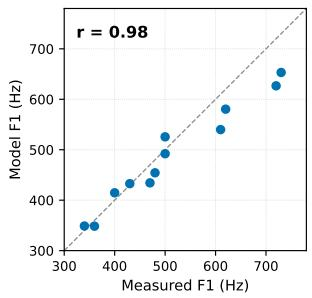
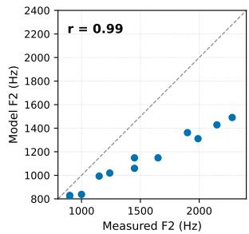
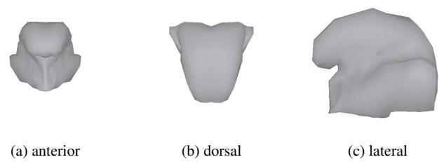
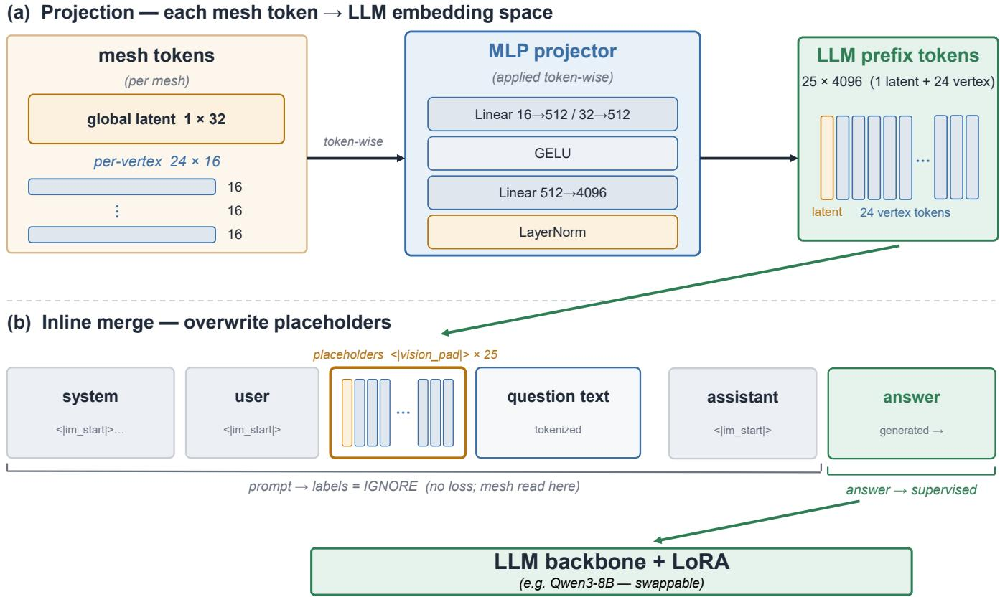
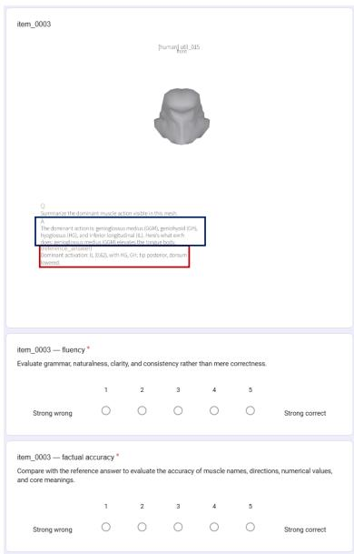

# A SIMULATOR-GROUNDED FRAMEWORK FOR CONSTRUCTING VERIFIABLE MUSCLE-GROUNDED QA FROM 3D TONGUE MESHES

Seungho Eum1

Unsang Park∗1,2

1 Department of Computer Science and Engineering, Sogang University, Seoul, Korea 2 Department of Artificial Intelligence, Sogang University, Seoul, Korea

Index Terms— biomechanical simulation, articulatory modeling, dataset generation, multimodal large language models, question answering

## ABSTRACT

Existing articulatory corpora based on real-time MRI and electromagnetic articulography capture tongue shape and motion but do not provide traceable labels for the muscle-driven process that generated an observed configuration. We introduce a simulator-grounded data-construction framework and instantiate it as 3DTongueQA. Controlled 11-dimensional muscle activations are mapped to fixed-topology tongue meshes with the ArtiSynth Badin finite-element model, converted into structured biomechanical records, and rendered as deterministic QA on muscle state, geometry, and targetdirected change. We screen 295,157 configurations, retain 295,115 valid meshes, and construct 891,156 QA records per language. Language naturalization changes only surface form and is verified against the source records; English and Korean instantiations demonstrate construction-level portability. A swappable SpiralNet++–Qwen3-8B baseline reaches $6 2 . 9 \pm$ 9.2 Muscle EM, $7 4 . 0 \pm 0 . 2$ Value Accuracy, and $6 5 . 9 \pm 4 . 7$ Direction EM, while mismatching the paired mesh reduces Muscle EM to 2.2; a dataset-leakage-controlled anchor-heldout model retains $8 0 . 4 \mathrm { - } 9 8 . 6 \%$ of the full-inventory scores on unseen anchors. Task-specific structured readouts further reach $8 8 . 7 \pm 0 . 7$ Muscle EM and $9 3 . 3 \pm 1 . 0$ Direction EM. These complementary results show that the constructed supervision supports both efficient structured prediction and heterogeneous natural-language QA rather than being tied to a particular decoder architecture.

## 1. INTRODUCTION

Speech models perform strongly in recognition [1], synthesis [2], and representation learning [3], yet articulation is typically treated as a latent process. Interpretable articulatory systems need supervision that connects an observed tongue shape to its simulator-defined generating state, measurable geometric properties, and changes toward a target posture. Such supervision is relevant to multimodal physical reasoning [4] and future articulatory feedback for pronunciation training and rehabilitation [5].

Existing rtMRI- and EMA-based corpora capture natural articulatory motion [6, 7], but they are observational and do not directly pair each tongue configuration with a controlled muscle state. Existing 3D question-answering datasets likewise focus mainly on objects, geometry, and spatial relations [8, 9]. Scalable supervision that preserves the provenance of the biomechanical process behind a 3D tongue configuration therefore remains limited.

We address this gap with a simulator-grounded dataconstruction framework, instantiated as 3DTongueQA. Using the ArtiSynth Badin finite-element tongue model [10, 11, 12], the framework maps controlled 11-dimensional muscle activations to screened 3D meshes, extracts structured biomechanical facts, and deterministically constructs QA on muscle state, geometry, and target-directed change. The factual path is separated from language naturalization: an LLM changes only the surface form, while record-based checks preserve the underlying facts. The corpus comprises 295,115 valid meshes and 891,156 QA records per language; English and Korean instantiations demonstrate reuse of the same construction procedure.

Our evaluation is designed to validate the resource rather than introduce a new state-of-the-art architecture. A lightweight, swappable SpiralNet++–Qwen3-8B model tests unified natural-language QA, while text-only, 2D–3D, generic-versus-muscle-aware, mesh-shuffling, commercialmodel, and structured-decoding controls test where the supervision is useful. The unified QA model reaches 62.9 ± 9.2 Muscle EM and falls to 2.2 after mesh shuffling, whereas task-specific structured readouts reach $8 8 . 7 \pm 0 . 7$ Muscle EM. These results show that 3DTongueQA supports both sample-specific grounding and efficient structured prediction. Full data-construction, training, and evaluation details are provided in the appendix.

Contributions.

• We introduce a simulator-grounded construction framework that preserves provenance from controlled physical inputs through 3D geometry and structured records to deterministically verifiable QA.

• The framework separates factual construction from linguistic naturalization and retains reusable structured records, allowing additional questions and evaluation metrics to be instantiated without regenerating the underlying biomechanical corpus.

• We instantiate the framework as 3DTongueQA and validate its utility through complementary language, structured-decoding, 2D–3D, mesh-shuffling, and heldout-anchor analyses.

## 2. SIMULATOR-GROUNDED DATASET CONSTRUCTION FRAMEWORK

In our framework, controlled simulator inputs produce observable geometry, which is converted into reusable structured fact records before any linguistic realization; deterministic task generators operate only on these records, while naturalization modifies surface form without changing the underlying facts. 3DTongueQA is one instantiation of this framework for tongue biomechanics.

## 2.1. Simulator-Grounded 3D Tongue Generation

We employ the ArtiSynth Badin finite-element tongue model [10, 11, 12] to map 11-dimensional muscle-activation vectors to fixed-topology 3D tongue meshes. The activation vector is a controlled simulator input, and the resulting mesh is its observable geometric consequence. Reasoning-objectivedriven sampling covers isolated and interacting muscles, matched single-muscle interventions, dose–response trajectories, phoneme-associated postures, and broader feasible activation patterns.

Each configuration retains its activation vector, mesh geometry, validity metadata, and applicable anchor, intervention, or trajectory links. Automatic screening checks numerical solver failure, element inversion, non-positive element volume, global volume-ratio bounds, and settling behavior; only configurations labeled valid are used downstream. The stored activation is a privileged simulator label and is not interpreted as a uniquely identifiable physiological cause from geometry alone.

To connect the simulated configurations to linguistically meaningful targets, we construct 12 vowel and 8 consonantclass anchors from literature-informed muscle patterns and articulatory constraints [13, 14, 15]. Gaussian perturbations provide within-anchor variation, while interpolations provide transition postures. These anchors are construction devices for target-directed QA rather than claims of unique clinical motor programs.

As a check of acoustic plausibility, category-level modelderived $F _ { 1 }$ and $F _ { 2 }$ correlate with measured values (Fig. 1; $r = 0 . 9 8 , r = 0 . 9 9 )$

  
Fig. 1. Measured versus model-derived vowel formants: $F _ { 1 }$ $_ { ( r = 0 . 9 8 ) }$ and $F _ { 2 } \left( r { = } 0 . 9 9 \right)$ . Dashed lines denote identity. The relative vowel organization is preserved, although the absolute $F _ { 2 }$ range is compressed.

## 2.2. Deterministic Grounded QA Construction

For each valid configuration, we construct a structured fact record containing its simulator-defined muscle state, observable geometry, physical metadata, and intervention relations. These records support three complementary objectives: Cause, recovering the stored generating state associated with an observed mesh; State, interpreting geometric and articulatory properties; and Change, identifying simulator-defined muscle adjustments toward a target anchor.

Because the records retain muscle states, mesh-derived geometry, and intervention links, additional deterministic questions and metrics can be defined without regenerating the biomechanical corpus; we demonstrate this by instantiating a fourth task (intervention-effect QA) purely from stored records in 3.3 s with zero new simulation, on which the trained model performs below trivial baselines zero-shot. All automatically scored answers are derived directly from structured records; undefined facts are skipped or assigned an explicit abstention. Figure 2 shows a target-directed example.

Language naturalization is deliberately separated from fact construction. Qwen2.5-72B-Instruct [16] modifies only linguistic surface form; it does not determine the gold answer. English and Korean use language-specific renderers and verification lexicons over the same structured facts, supporting construction-level portability. The record-based check passes 87.2% (EN) and 88.6% (KO) of naturalized outputs on first generation, and retained instances show no muscle-identity or gold-number alteration.

## 2.3. Validation Models and Complementary Decoding

The unified QA baseline combines a SpiralNet++ mesh encoder [17], a projection module, and Qwen3-8B [18]. Its muscle-aware encoder is pretrained to regress the simulator activation vector and then frozen for QA training.

Complementary controls isolate distinct properties of the resource. A text-only model measures question and answer priors; a matched 2D model compares rendered views with native 3D geometry; and a 3D Mesh-AE contrasts geometryoriented and muscle-aware pretraining. Mesh shuffling tests dependence on the paired configuration, while a zero-shot commercial model, given each raw 3D mesh file together with the question text, tests general-purpose knowledge without domain-specific training. Task-specific structured readouts replace the LLM with an 11-label active-set head, a featureconditioned scalar head, and a per-muscle three-class direction head (increase/decrease/no change), all sharing the same frozen 3D features. They test efficient schema-specific prediction, whereas the language decoder tests unified handling of Muscle, Value, Direction, and open-ended questions.

  
Q: How should the tongue be adjusted to approach the velar posture associated with /k/ or /g/?  
A: Contract the genioglossus posterior (GGP) and styloglossus (STY) more, while relaxing the genioglossus anterior (GGA), geniohyoid (GH), and hyoglossus (HG). These changes move the activation pattern toward the simulator-defined velar anchor.  
Fig. 2. A target-directed instance constructed from a simulated tongue mesh and its current-state and target-anchor records.

## 3. EVALUATION

Because the framework does not prescribe a closed benchmark task set, we evaluate three representative objectives spanning Cause, State, and Change: active-muscle recovery, geometric-value prediction, and target-directed correction. The primary sample-held-out protocol tests whether the supervision is learnable and geometry-grounded within the sampled anchor neighborhoods—configurations near training anchors are present by design, so it does not measure extrapolation—while mesh shuffling isolates dependence on the paired geometry; transfer beyond the anchor inventory is measured by the dataset-leakage-controlled anchor-held-out protocol.

Primary protocol. We evaluate 400 anchor-balanced sample-held-out tongue meshes unused during training. The evaluation set contains 20 meshes from each of the 20 anchor categories and is sampled without replacement from the test partition using seed 42. Each mesh is paired with one activemuscle recovery, one geometric-value prediction, and one target-directed correction question, yielding 1,200 automatically scored items. We additionally evaluate 30 open-ended questions per model. Gold answers are deterministically derived from stored activation vectors, mesh geometry, and target-anchor records. Automatic results for the English 2D, 3D Mesh-AE, and 3D Muscle-Aware unified-QA models and the task-specific structured readouts are reported as mean ± standard deviation over three seeds. Human ratings use outputs from checkpoints selected only by validation performance.

Decoder and grounding controls. Task-specific structured readouts use the same frozen 3D Muscle-Aware representation and are evaluated on the identical Muscle, Value, and Direction items as the unified-QA model. Mesh shuffling replaces the paired mesh with another sample while keeping the question and gold answer fixed. We additionally perform a dataset-leakage-controlled anchor-held-out stress test that removes two vowel and two consonant anchor definitions from both encoder pretraining and QA training. The heldout anchors (/o/, /U/, /l/, /S,Z/) are selected by performanceindependent rules: anchors within $\ell _ { 2 }$ distance 0.2 of the retained inventory in mean activation space are inadmissible (near-anchor closure), anchors whose labels appear in prescriptive training text are excluded as textual leakage, and a maximin rule chooses among the remaining candidates. Full architectures, thresholds, and protocols are in the appendix.

Scoring and human evaluation. Muscle EM requires exact agreement with the simulator-defined active set. Geometric Value Accuracy macro-averages six mesh-derived scalar properties, counting predictions within 1.0 mm for metricvalued features, 0.1 for normalized features, and 0.03 for constriction degree. Direction EM requires exact agreement with the unordered set of (muscle, ↑ / ↓) pairs. For open-ended evaluation, three model-blind speech researchers rate 30 English prompts for Fluency and reference-based Factual Accuracy on 1–5 scales; Korean uses a separate set.

## 4. RESULTS

Table 1 evaluates the 3DTongueQA instantiation, testing whether supervision produced by the framework is learnable and geometry-grounded. We then compare task-specific structured readouts with the unified language decoder and report an anchor-held-out stress test as a secondary analysis.

## 4.1. Utility and Geometry Grounding

The text-only model reaches 0.0 Muscle EM, whereas the 3D Muscle-Aware unified-QA model obtains 62.9±9.2 Muscle EM, 74.0±0.2 macro Geometric Value Accuracy, and 65.9±4.7 Direction EM. Native 3D input improves activemuscle recovery over matched rendered 2D input (62.9 versus 42.1 Muscle EM). Mesh shuffling further confirms sample-specific grounding (“Shuf.” columns in Table 1): for the 3D Muscle-Aware model, Muscle, Value, and Direction scores drop from 62.9/74.0/65.9 to 2.2/31.2/40.9, respectively, and 3D Mesh-AE falls similarly (Muscle EM 43.0 to 2.8). Shuffled Direction approaches the text-only level (39.4), indicating residual question- or answer-side priors once geometry is removed.

Table 1. Validation on 400 anchor-balanced sample-held-out tongue meshes (1,200 automatic items) and 30 open-ended items per model. Automatic metrics are on a 0–100 scale; human ratings are on a 1–5 scale. Geometric Value Accuracy is macroaveraged over six feature types. “Shuf.” columns report the mesh-shuffling control (Sec. 3); “–” marks scores not applicable or not collected. Bold denotes the highest mean among the five English comparison models in each column. The bottom block reports the task-specific structured readouts, which receive the requested output schema explicitly (Sec. 4), and the Korean model, which uses a separate test set.
<table><tr><td></td><td colspan="2">Muscle EM</td><td colspan="2">Geom. Value Acc.</td><td colspan="2">Direction EM</td><td rowspan="2">Fluency</td><td rowspan="2">Factual Acc.</td></tr><tr><td>Model</td><td>Paired</td><td>Shuf.</td><td>Paired</td><td>Shuf.</td><td>Paired</td><td>Shuf.</td></tr><tr><td>Text-only LLM (independently trained)</td><td>0.0</td><td></td><td>49.6</td><td></td><td>39.4</td><td>一</td><td>2.34</td><td>1.77</td></tr><tr><td>GPT-5 Pro [19]</td><td>7.2</td><td></td><td>28.7</td><td></td><td>35.8</td><td></td><td>3.50</td><td>2.23</td></tr><tr><td>2D Muscle-Aware + LLM</td><td> $4 2 . 1 \pm 3 . 9$ </td><td> $2 . 2 \pm 0 . 3$ </td><td> $5 0 . 9 \pm 1 . 3$ </td><td> $3 0 . 0 \pm 0 . 7$ </td><td> $5 5 . 9 \pm 1 . 1$ </td><td> $3 8 . 5 \pm 0 . 8$ </td><td>2.86</td><td>2.33</td></tr><tr><td>3D Mesh-AE + LLM</td><td> $4 3 . 0 \pm 1 5 . 6$ </td><td> $2 . 8 \pm 0 . 4$ </td><td> $\mathbf { 7 6 . 5 \pm 4 . 6 }$ </td><td> $3 4 . 9 \pm 5 . 3$ </td><td> $6 3 . 3 \pm 2 . 8$ </td><td> $3 9 . 7 \pm 0 . 5$ </td><td>3.08</td><td>2.70</td></tr><tr><td>3D Muscle-Aware + LLM</td><td> ${ \bf 6 2 . 9 \pm 9 . 2 }$ </td><td> $2 . 2 \pm 0 . 5$ </td><td> $7 4 . 0 \pm 0 . 2$ </td><td> $3 1 . 2 \pm 0 . 2$ </td><td> ${ \bf 6 5 . 9 \pm 4 . 7 }$ </td><td> $4 0 . 9 \pm 0 . 7$ </td><td>2.72</td><td>3.81</td></tr><tr><td>Task-specific structured readouts</td><td> $8 8 . 7 \pm 0 . 7$ </td><td> $1 . 4 \pm 0 . 0$ </td><td> $8 7 . 5 \pm 1 . 1$ </td><td>41.6 ± 0.6</td><td>93.3 ± 1.0</td><td>1.8 ± 0.0</td><td></td><td></td></tr><tr><td>3D Muscle-Aware + LLM (Korean)</td><td>87.8</td><td>2.8</td><td>69.3</td><td>30.8</td><td>48.9</td><td>36.7</td><td>2.86</td><td>3.79</td></tr></table>

Prompt-level Friedman tests across the five English models: Fluency, χ2(4) = 13.03, p = 0.011; Factual Accuracy, $\chi ^ { 2 } ( 4 ) = 5 8 . 1 0 , p < 0 . 0 0 1 .$

The 3D pretraining objectives are complementary: muscle-aware pretraining yields the highest Muscle EM, whereas Mesh-AE attains the highest Value Accuracy (76.5±4.6), with comparable Direction EM (63.3±2.8 versus 65.9±4.7).

As a secondary stress test, the dataset-leakage-controlled anchor-held-out model retains 80.4%, 93.7%, and 98.6% of the full-inventory Muscle, Geometric Value, and Direction scores (49.7/44.8/49.4 versus 61.8/47.8/50.1) on the identical four-anchor test set, indicating substantial but incomplete transfer beyond the training anchor inventory.

## 4.2. Task-Specific and Unified Decoding

The task-specific readouts reach 88.7±0.7 Muscle EM, 87.5±1.1 macro-averaged Geometric Value Accuracy, and 93.3±1.0 Direction EM on the identical anchor-balanced test items (bottom block of Table 1). In comparison, the 3D Muscle-Aware unified-QA model obtains $6 2 . 9 { \pm } 9 . 2 ,$ $7 4 . 0 { \pm } 0 . 2 $ , and $6 5 . 9 2 4 . 7$ , respectively. Under mesh shuffling the readouts collapse to 1.4/41.6/1.8, confirming that their accuracy reflects the paired geometry rather than output-schema priors, and directly thresholding the pretraining regression head yields only 9.8 Muscle EM. Each structured readout receives the requested output schema explicitly—the Direction readout is additionally conditioned on the target anchor’s prototype activation vector—whereas the unified model must infer both from the natural-language question and answer textually. The 13.5- and 27.4-point differences on Value and Direction demonstrate strong recoverability under specialized output schemas and are not a like-for-like comparison of language understanding.

## 4.3. Open-Ended Response Quality

GPT-5 Pro’s numerically higher Fluency mean (3.50 versus 2.72) is not significant after Holm correction, whereas the 3D Muscle-Aware model receives significantly higher reference-based Factual Accuracy ratings (3.81 versus 2.23). The Korean instantiation obtains 87.8/69.3/48.9 on Muscle/Value/Direction. Because it uses a separate evaluation set and language-specific naturalization, its scores are not a direct cross-language comparison but show that the same construction and verification procedure transfers.

## 5. CONCLUSION

We introduced a simulator-grounded framework that separates controlled physical generation, structured factual representation, deterministic task construction, and factpreserving linguistic realization. 3DTongueQA instantiates this framework for tongue biomechanics, providing supervision whose provenance remains recoverable from simulator input to final QA. Experiments show that the resulting supervision is learnable, depends on the paired geometry, and supports both specialized structured prediction and unified natural-language QA, positioning 3DTongueQA as a reusable, decoder-agnostic resource.

The resource remains simulator-specific: one Badin anatomy, a fixed topology, no jaw–lip coupling, and activations that are privileged simulator labels rather than identifiable physiological causes. The constrained naturalization prioritizes fact preservation over stylistic diversity. Future work will add anatomical and vocal-tract diversity and extend the articulatory scenarios. The dataset, records, code, and evaluation scripts will be released upon acceptance.

## Compliance with Ethical Standards

The human evaluation consisted of three adult expert raters who voluntarily assessed anonymized, machine-generated model outputs and provided informed consent. The raters acted as evaluators of system outputs rather than subjects of study; no personal, sensitive, or identifying information about them was collected or retained, and the study involved no patients, minors, or physiological data collection.

## 6. REFERENCES

[1] Alec Radford, Jong Wook Kim, Tao Xu, et al., “Robust speech recognition via large-scale weak supervision,” in International conference on machine learning. PMLR, 2023, pp. 28492–28518.

[2] Yuancheng Wang, Haoyue Zhan, Liwei Liu, et al., “Maskgct: Zero-shot text-to-speech with masked generative codec transformer,” in International Conference on Learning Representations, 2025, vol. 2025, pp. 47127–47150.

[3] Alexei Baevski, Yuhao Zhou, Abdelrahman Mohamed, and Michael Auli, “wav2vec 2.0: A framework for self-supervised learning of speech representations,” Advances in neural information processing systems, vol. 33, pp. 12449–12460, 2020.

[4] Wei Chow, Jiageng Mao, Boyi Li, et al., “Physbench: Benchmarking and enhancing vision-language models for physical world understanding,” in International Conference on Learning Representations, 2025, vol. 2025, pp. 97959–98108.

[5] William F Katz and Sonya Mehta, “Visual feedback of tongue movement for novel speech sound learning,” Frontiers in human neuroscience, vol. 9, pp. 612, 2015.

[6] Shrikanth Narayanan, Erik Bresch, Prasanta Kumar Ghosh, et al., “A multimodal real-time mri articulatory corpus for speech research,” in Proc. Interspeech 2011, 2011, pp. 837–840.

[7] Shrikanth Narayanan, Asterios Toutios, Vikram Ramanarayanan, et al., “Real-time magnetic resonance imaging and electromagnetic articulography database for speech production research (tc),” The Journal of the Acoustical Society of America, vol. 136, no. 3, pp. 1307–1311, 2014.

[8] Xiaojian Ma, Silong Yong, Zilong Zheng, et al., “Sqa3d: Situated question answering in 3d scenes,” arXiv preprint arXiv:2210.07474, 2022.

[9] Daichi Azuma, Taiki Miyanishi, Shuhei Kurita, and Motoaki Kawanabe, “Scanqa: 3d question answering for

spatial scene understanding,” in 2022 IEEE/CVF Conference on Computer Vision and Pattern Recognition (CVPR). IEEE, 2022, pp. 19107–19117.

[10] John E Lloyd, Ian Stavness, and Sidney Fels, “Artisynth: A fast interactive biomechanical modeling toolkit combining multibody and finite element simulation,” in Soft tissue biomechanical modeling for computer assisted surgery, pp. 355–394. Springer, 2012.

[11] Florian Vogt, John E Lloyd, Stephanie Buchaillard,´ et al., “Efficient 3d finite element modeling of a muscle-activated tongue,” in International Symposium on Biomedical Simulation. Springer, 2006, pp. 19–28.

[12] Pierre Badin, Gerard Bailly, Monica Raybaudi, and ´ Christoph Segebarth, “A three-dimensional linear articulatory model based on mri data,” in Proc. SSW 1998, 1998, pp. 249–254.

[13] Stephanie Buchaillard, Pascal Perrier, and Yohan Payan,´ “A biomechanical model of cardinal vowel production: Muscle activations and the impact of gravity on tongue positioning,” The Journal of the Acoustical Society of America, vol. 126, no. 4, pp. 2033–2051, 2009.

[14] Ian Stavness, Bryan Gick, Donald Derrick, and Sidney Fels, “Biomechanical modeling of english/r/variants,” The Journal of the Acoustical Society of America, vol. 131, no. 5, pp. EL355–EL360, 2012.

[15] Sayoko Takano and Kiyoshi Honda, “An mri analysis of the extrinsic tongue muscles during vowel production,” Speech communication, vol. 49, no. 1, pp. 49–58, 2007.

[16] Qwen Team, An Yang, Baosong Yang, et al., “Qwen2.5 technical report,” arXiv preprint arXiv:2412.15115, 2025.

[17] Shunwang Gong, Lei Chen, Michael Bronstein, and Stefanos Zafeiriou, “Spiralnet++: A fast and highly efficient mesh convolution operator,” in 2019 IEEE/CVF international conference on computer vision workshop (ICCVW). IEEE, 2019, pp. 4141–4148.

[18] An Yang, Anfeng Li, Baosong Yang, et al., “Qwen3 technical report,” arXiv preprint arXiv:2505.09388, 2025.

[19] OpenAI, “ChatGPT (GPT-5 Pro, Aug. 12 version) [large language model],” https://chat.openai.com/, 2026, Accessed: [8. 12, 2026].

[20] Stephanie Buchaillard, Pascal Perrier, and Yohan Payan,´ “A biomechanical model of cardinal vowel production: Muscle activations and the impact of gravity on tongue positioning,” The Journal of the Acoustical Society of America, vol. 126, no. 4, pp. 2033–2051, 2009.

[21] Kiyoshi Honda, “Organization of tongue articulation for vowels,” Journal of Phonetics, vol. 24, no. 1, pp. 39–52, 1996.

[22] Patrycja Strycharczuk, Sam Kirkham, Emily Gorman, and Takayuki Nagamine, “Dimensionality reduction in lingual articulation of vowels: Evidence from lax vowels in northern anglo-english,” Language and Speech, vol. 68, no. 3, pp. 689–721, 2025.

[23] Sayoko Takano and Kiyoshi Honda, “An mri analysis of the extrinsic tongue muscles during vowel production,” Speech Communication, vol. 49, no. 1, pp. 49–58, 2007.

[24] Arnold D Gomez, Maureen L Stone, Jonghye Woo, Fangxu Xing, and Jerry L Prince, “Analysis of fiber strain in the human tongue during speech,” Computer Methods in Biomechanics and Biomedical Engineering, vol. 23, no. 8, pp. 312–322, 2020.

[25] Edward Flemming, “The phonetics of schwa vowels,” in Phonological Weakness in English: From Old to Present-Day English, Donka Minkova, Ed., pp. 78–95. Palgrave Macmillan, 2009.

[26] Negar M Harandi, Jonghye Woo, Maureen Stone, Rafeef Abugharbieh, and Sidney Fels, “Variability in muscle activation of simple speech motions: A biomechanical modeling approach,” The Journal ofthe Acoustical Society ofAmerica, vol. 141, no. 4, pp. 2579–2590, 2017.

[27] Alan A Wrench et al., “The compartmental tongue,” Journal of Speech, Language, and Hearing Research, 2024.

[28] Ian Stavness, Bryan Gick, Donald Derrick, and Sidney Fels, “Biomechanical modeling of english /r/ variants,” The Journal of the Acoustical Society of America, vol. 131, no. 5, pp. EL355–EL360, 2012.

[29] James Hillenbrand, Laura A Getty, Michael J Clark, and Kimberlee Wheeler, “Acoustic characteristics of american english vowels,” The Journal of the Acoustical Society ofAmerica, vol. 97, no. 5, pp. 3099–3111, 1995.

## A. 3DTONGUEQA DATASET CONSTRUCTION

The construction pipeline preserves provenance from simulator input to the final linguistic instance:

$$
\mathbf { a } \stackrel { \mathcal { S } } { \to } \mathbf { M } \stackrel { \mathcal { R } } { \to } \mathbf { r } \stackrel { \mathcal { G } } { \to } ( q , a ) \stackrel { \mathcal { N } } { \longrightarrow } ( \widetilde { q } , \widetilde { a } ) ,\tag{1}
$$

where $\mathbf { a } \in \mathbb { R } ^ { 1 1 }$ is a controlled muscle-activation vector, $s$ is the finite-element simulator, M is the resulting fixed-topology tongue mesh, r is a structured fact record, $\mathcal { G }$ deterministically constructs canonical QA, and $\mathcal { N }$ changes only the linguistic surface form. The first four stages determine the factual content; naturalized instances are retained only after a recordbased faithfulness check.

## A.1. Biomechanical Model, Mesh Generation, and Validity Filtering

We use the ArtiSynth StableFemMuscleTongueDemo, which implements the Badin finite-element tongue model [10, 12]. All samples share a fixed topology of 370 surface vertices, 736 triangular faces, 948 FEM nodes, and 740 volumetric elements. Coordinates are expressed in meters: $Y { = } 0$ is the midsagittal plane, X runs from anterior to posterior, and $Z$ points superiorly. The model is left–right symmetric.

The tongue is actuated by 11 muscles in the fixed order GGP, GGM, GGA, STY, GH, MH, HG, VERT, TRANS, IL, and SL. Each activation is bounded by 0.9; the total activation is limited to 2.0 for vowel-oriented configurations and 2.3 for consonant-oriented configurations. These values are simulator controls rather than directly measured physiological activation levels.

Each activation vector is introduced through a minimumjerk ramp

$$
s ( \tau ) = 1 0 \tau ^ { 3 } - 1 5 \tau ^ { 4 } + 6 \tau ^ { 5 } ,\tag{2}
$$

executed over 1.0 s with 24 knots, followed by adaptive settling for 0.2–1.5 s. A watchdog records numerical solver status, element inversion, per-element and global volume ratios, and residual and peak nodal velocities. A run is labeled FAILED NUMERICAL when positions or velocities become non-finite or the maximum nodal speed exceeds $1 0 ^ { 3 }$ m/s. It is labeled INVALID PHYSICAL when any FEM element is inverted, any per-element volume ratio is non-positive, or the global volume ratio lies outside [0.60, 1.40]. A run is labeled MARGINAL when it fails the settling criterion or triggers a softer velocity or volume warning. Only VALID configurations are used for QA construction, training, and evaluation.

## A.2. Reasoning-Objective-Driven Activation Sampling

The activation pool combines eight subsets designed for distinct reasoning relations rather than for corpus size alone. REST, SINGLE, PAIR, and TRIPLE cover neutral, isolated, pairwise, and higher-order muscle states. ANCHOR, NEIGHBOR, EFFORT, and SPACEFILL provide phonemeassociated postures, matched single-muscle interventions, dose–response trajectories, and broader coverage of the feasible activation space. Table 2 reports both the sampling rule and the number retained after biomechanical screening.

The stochastic budget targets proportions of 0.35, 0.20, 0.15, and 0.30 for ANCHOR, NEIGHBOR, EFFORT, and SPACEFILL. Vowel-type vectors are uniformly rescaled when the total budget is exceeded; consonant-type vectors instead reduce non-defining background muscles so that class-defining constraints are preserved. Duplicate vectors are removed after rounding each activation to four decimal places. Generation and global shuffling use fixed seeds 0 and 42.

Table 2. Activation sampling and biomechanical screening. $n _ { \mathrm { a c t } }$ denotes the number of simultaneously active muscles. “Re tained” includes only configurations labeled VALID.
<table><tr><td>Subset</td><td>Screened</td><td>Retained</td><td> $n _ { \mathrm { a c t } }$ </td><td>Sampling rule and supervision role</td></tr><tr><td>REST</td><td>1</td><td>1</td><td>0</td><td>All muscles inactive; supplies the reference geometry and neutral or abstention cases.</td></tr><tr><td>SINGLE</td><td>66</td><td>66</td><td>1</td><td>Each of the 11 muscles at {0.15,0.30,0.45, 0.60, 0.75, 0.90}; isolates individual-muscle effects.</td></tr><tr><td>PAIR</td><td>495</td><td>494</td><td>2</td><td>All 55 pairs on the 3×3 grid {0.3, 0.6, 0.9}2; supports pairwise interaction anal- ysis.</td></tr><tr><td>TRIPLE</td><td>3,000</td><td>2,998</td><td>3</td><td>Three distinct muscles with amplitudes sampled from [0.15, 0.9] and rescaled when the total budget is exceeded; extends coverage to higher-order combina-</td></tr><tr><td>ANCHOR</td><td>103,731</td><td>103,729</td><td>2-6</td><td>tions. Samples around 12 vowel and 8 consonant-class anchors; approximately 30% interpolate between category centers to provide transition postures.</td></tr><tr><td>NEIGHBOR</td><td>58,060</td><td>58,059</td><td>~4</td><td>Changes exactly one muscle by ±0.15 from an ANCHOR base, storing the base index, changed muscle, and signed delta; forms matched counterfactual pairs.</td></tr><tr><td>EFFORT</td><td>42,473</td><td>42,467</td><td>1-3</td><td>Scales a fixed sparse muscle pattern over six global effort levels in [0.15, 1.0]; supplies explicit dose-response trajectories</td></tr><tr><td>SPACEFILL</td><td>87,331</td><td>87,301</td><td>1-11</td><td>Sparsity-biased sampling concentrated on two to five active muscles, with nonzero amplitudes in [0.15, 0.9]; broadens feasible-space coverage.</td></tr><tr><td>Total</td><td>295,157</td><td>295,115</td><td></td><td>The remaining 42 configurations comprise 3 marginal runs and 39 numeri- cal failures; no run is labeled invalid physical.</td></tr></table>

Construction cost. The entire pipeline runs on a single desktop CPU (Intel i5-13400F) with no manual annotation at any stage. One configuration requires approximately 43 s of single-instance simulation (about 1–2 cores and 1– 2 GB of memory per headless instance), corresponding to roughly 3,500 CPU-hours for the full 295,157-configuration pool; running 4–6 instances in parallel reduces wall-clock time proportionally. Record extraction and canonical QA generation are template-based and require only 10–20 minutes per 10,000 meshes. Extending the corpus with a new 10,000-configuration distribution therefore costs approximately one day on one desktop machine. Language naturalization with Qwen2.5-72B-Instruct on two NVIDIA H200 GPUs processes approximately 10,000 instances in 6.7 minutes; the full corpus required 34.2 h (English) and 34.4 h (Korean) of wall-clock time, including regeneration rounds. The record-based faithfulness check passes 87.24% of English and 88.55% of Korean outputs on first generation (2,789,567/3,197,604 and 2,831,458/3,197,604), rising cumulatively to 90.74%/92.32% after one regeneration round and 92.23%/93.73% after a second; only passing instances are retained.

## A.3. Phoneme Anchor Construction and Acoustic Plausibility

The ANCHOR subset contains 12 vowel postures and 8 consonant classes. Vowels are sampled as Gaussian perturbations around literature-informed 11-D targets, with noise applied only to nonzero target entries. MH is additionally sampled from U(0.1, 0.3) with probability 0.35, and vectors are uniformly rescaled to satisfy $\textstyle \sum _ { m } a _ { m } \leq 2 . 0$ . Consonants are specified by defining-muscle intervals and sparse background activation. Each background muscle is activated with probability 0.35 in U(0, 0.15); MH uses U(0, 0.25) with probability 0.5. Defining intervals overwrite the background, each activation is clipped to [0, 0.9], and only non-defining muscles are reduced when the consonant budget $\textstyle \sum _ { m } a _ { m } \leq 2 . 3$ is exceeded. The defining constraints are then rechecked by rejection sampling. Tables 3 and 4 give the implemented settings.

The /æ/ target is merged into /a/ because the implemented model produces near-identical midsagittal meshes for the two targets (vertex RMS 0.9 mm). The lateral passage of /l/ and the surface groove of /S,Z/ are not directly represented by a midsagittal feature set and should therefore be interpreted as literature-grounded anchor settings rather than fully observed geometric properties.

For an acoustic plausibility check, a vocal-tract area function is estimated from the simulated tongue, fixed palate, and Badin airway walls and evaluated with a lossless concatenated-tube model. Category-level simulated formants are compared with Hillenbrand measurements [29]. Pearson correlations are $r = 0 . 9 8$ for $F _ { 1 }$ and $r = 0 . 9 9$ for $F _ { 2 }$ . The relative vowel organization is retained, but the absolute $F _ { 2 }$ range is compressed, particularly for front vowels, because of the fixed lip boundary, single anatomy, vocal-tract-length differences, and midsagittal area-function approximation. This analysis supports relative articulatory–acoustic plausibility rather than speaker-independent absolute calibration.

Table 3. Vowel anchors. Only nonzero entries in the 11-D target are shown; σ denotes the Gaussian perturbation applied to those entries.
<table><tr><td>Category</td><td>IPA</td><td>σ</td><td>Nonzero target activations</td><td>Primary articulatory rationale</td><td>Refs.</td></tr><tr><td>High front</td><td>/i/</td><td>0.08</td><td>GGP 0.50, GGA 0.50, GH 0.40</td><td>Forward and high tongue-body posture.</td><td>[20, 21]</td></tr><tr><td>Near-high front</td><td>/1/</td><td>0.12</td><td>GGP 0.40, GGA 0.38, GH 0.30</td><td>Reduced-activation counterpart of /i/.</td><td>[22]</td></tr><tr><td>Mid front</td><td>/el</td><td>0.12</td><td>GGP 0.42, GGA 0.32, GH 0.32</td><td>Intermediate front raising.</td><td>[21]</td></tr><tr><td>Open-mid front</td><td>/εl</td><td>0.12</td><td>GGP 0.28, GGA 0.42, HG 0.18</td><td>Weaker fronting with mild tongue-body lowering</td><td>[22]</td></tr><tr><td>Low (/æ/ merged)</td><td>/a/</td><td>0.08</td><td>GGA 0.45, HG 0.55</td><td>Tongue-body depression with anterior support.</td><td>[20, 23]</td></tr><tr><td>Low back</td><td>/α/</td><td>0.10</td><td>STY 0.28, HG 0.55</td><td>Combined lowering and retraction.</td><td>[21, 23]</td></tr><tr><td>Open-mid back</td><td>lo/</td><td>0.12</td><td>STY 0.38, GH 0.20, HG 0.42</td><td>Retracted posture with partial lowering.</td><td>[23]</td></tr><tr><td>Mid back</td><td>/ol</td><td>0.12</td><td>GGP 0.38, STY 0.42, GH 0.38</td><td>Balanced back raising and anterior support.</td><td>[23]</td></tr><tr><td>High back</td><td>/u/</td><td>0.08</td><td>GGP 0.42, STY 0.50, GH 0.40, SL 0.30</td><td>Dorsum raising toward the velum.</td><td>[20, 24]</td></tr><tr><td>Near-high back</td><td>/u/</td><td>0.12</td><td>GGP 0.35, STY 0.40, GH 0.32</td><td>Reduced-activation counterpart of /u/.</td><td>[22]</td></tr><tr><td>High central</td><td>/i/</td><td>0.12</td><td>GGP 0.40, GGA 0.25, STY 0.20</td><td>Balanced fronting and retraction.</td><td>[21]</td></tr><tr><td>Schwa</td><td>lal</td><td>0.14</td><td>GGP 0.20, GGA 0.18</td><td>Near-neutral posture with the widest within-class spread.</td><td>[25]</td></tr></table>

Table 4. Consonant-class anchors. Intervals specify defining constraints; upper bounds may act as exclusion constraints separating neighboring classes.
<table><tr><td>Category</td><td>IPA</td><td>Defining activation intervals</td><td></td><td>Primary articulatory rationale</td><td>Refs.</td></tr><tr><td>Velar stop</td><td>/k, g/</td><td>STY [0.70, 0.90], GGP [0.50, 0.90], TRANS [0.00, 0.25]</td><td></td><td>Dorsum raising and retraction for velar closure; TRANS [26, 24] is capped to exclude sibilant-like grooving.</td><td></td></tr><tr><td>Velar nasal</td><td> $/ \mathrm { { \mathfrak { p } } / \mathrm { { \Omega } } }$ </td><td>STY [0.60, 0.88], GGP [0.45, 0.85]</td><td></td><td>Slightly relaxed velar lingual posture; nasality is extra- interpolated from /k, g/ lingual.</td><td></td></tr><tr><td>Alveolar stop /t, d/</td><td></td><td>SL [0.50, 0.90], GGA [0.30, 0.70], VERT [0.20, 0.60], TRANS [0.00, 0.18]</td><td></td><td>Tip/blade raising with TRANS capped to distinguish [26] stops from /s/.</td><td></td></tr><tr><td>Sibilant</td><td>/s/</td><td>[0.30, 0.70], VERT [0.20, 0.55]</td><td></td><td>TRANS [0.45, 0.90], SL [0.30, 0.70], GGA TRANS-induced midline grooving with the blade near [24] the alveolar ridge</td><td></td></tr><tr><td>Lateral</td><td>//</td><td>SL [0.45, 0.90], GGA [0.25, 0.60], IL [0.00, 0.30], STY [0.00, 0.22]</td><td></td><td>Apical contact with limited backing; lateral airflow itself [27] is off-midsagittal.</td><td></td></tr><tr><td>Rhotic</td><td>/r/</td><td>GGP [0.40, 0.80], GGA [0.25, 0.60], STY [0.20, 0.50]</td><td></td><td>GGP bunching with moderate retraction, separated from [28] the velar range.</td><td></td></tr><tr><td>Postalveolar</td><td> $/ \mathrm { J } , { \boldsymbol { 3 } } ^ { \prime }$ </td><td>TRANS [0.35, 0.75], GGA [0.30, 0.65], STY [0.20, 0.50], SL [0.20, 0.55]</td><td></td><td>Grooving plus mild retraction places the constriction be- [24] hind the alveolar ridge.</td><td></td></tr><tr><td>Palatal glide</td><td> $/ \mathrm { j } /$ </td><td>[0.20, 0.50]</td><td></td><td>GGP [0.40, 0.80], GGA [0.40, 0.80], GH An /i/-like high-front posture sampled as a band.</td><td>[20]</td></tr></table>

## A.4. Final Corpus Statistics, Splits, and Leakage Audit

Table 5 separates the units used to describe the released resource. The 295,157 screened activation configurations include 295,115 VALID meshes retained for downstream construction. Each retained item stores the 11-D activation vector, 370×3 surface vertices, 948×3 FEM nodes, shared topology, validity metadata, and any applicable anchor, intervention, or trajectory links.

Primary split and evaluation sampling. The primary sample-held-out split is constructed independently within each of the eight sampling subsets at a 9:0.5:0.5 train/ validation/test ratio using seed 42, yielding 265,611 training, 14,752 validation, and 14,752 test configurations. All QA instances and naturalized variants derived from the same mesh remain in the same partition. For the primary automatic evaluation, we sample without replacement 20 test configurations from each of the 20 anchor categories, comprising 12 vowel and 8 consonant classes. This yields 400 anchor-balanced test meshes. Each mesh is paired with one active-muscle recovery, one geometric-value prediction, and one target-directed correction item, resulting in 1,200 automatically scored items. Evaluation-set sampling also uses seed 42. Split-integrity checks confirm that configuration identifiers, rounded activation vectors, and exact mesh hashes do not overlap across the train, validation, and test partitions. The dataset-leakage-controlled anchor-held-out analysis uses a separate evaluation set and is described in Sec. C.2.

Table 5. Configuration-level outcome of biomechanical screening. Record- and job-level counts are reported separately in Table 7.
<table><tr><td>Unit Count</td></tr><tr><td>Activation configurations screened</td><td>295,157</td></tr><tr><td>Valid mesh configurations retained</td><td>295,115</td></tr><tr><td>Marginal configurations excluded</td><td>3</td></tr><tr><td>Numerical failures excluded</td><td>39</td></tr><tr><td>Invalid-physical configurations</td><td>0</td></tr></table>

## B. GROUNDED QA CONSTRUCTION

## B.1. Structured Fact Records and Deterministic QA Generation

Each fact record contains: (i) the 11 activations, activemuscle set, dominant muscle, and muscle count; (ii) a 32-D articulatory feature vector, rest-relative displacement, constriction, dorsum height, doming, curvature, and landmarkderived quantities; (iii) anterior, middle, and posterior motion statistics; (iv) physical-validity metadata; and (v) SINGLE, PAIR, NEIGHBOR, EFFORT, phonetic-anchor, and targetcorrection links. At inference time, a trainable model receives a tongue mesh through a geometry encoder, not the underlying activation vector: the stored activation is a privileged simulator label defining the generating state of that sample, not a uniquely identifiable physiological cause recoverable from geometry alone. The active-muscle set used by fact construction, gold answers, and all official scoring applies the threshold $a _ { m } > 1 0 ^ { - 4 }$ ; Direction gold pairs require $| \Delta a _ { m } | \geq 0 . 0 5$ . A coarser $n _ { \mathrm { a c t } }$ summary field $( a _ { m } \ge 0 . 0 5 )$ appears only in distribution metadata and is not used in any gold answer or score.

The main supervision is organized into Cause, State, and Change. Table 6 summarizes the corresponding deterministic source records and answer forms.

Twenty scenario definitions recombine these families into ordered multi-turn conversations. Required fields are resolved from the fact record, and a question is skipped or assigned an explicit abstention when its source fact is undefined. Target-directed answers encode only the simulator-defined muscle increase/decrease directions toward an anchor; they do not specify magnitude, duration, a unique physiological control policy, or a clinically validated treatment. Questions about whether an activation is uniquely identifiable from geometry explicitly abstain because geometrically similar states may admit alternative activation patterns.

## B.2. Naturalization, Faithfulness Verification, and QA Statistics

Track A contains canonical questions and answers rendered by deterministic rules and serves as the factual reference.

Track B contains naturalized variants used for linguistic diversity. Naturalization uses Qwen2.5-72B-Instruct served offline with vLLM in bfloat16 with tensor parallelism 2 and prefix caching. Three candidates are generated per conversation with temperature 0.7, top- $\begin{array} { r } { \mathbf { \nabla } \cdot p \ = \ 0 . 9 } \end{array}$ , and up to two retries; after the final failed attempt, the canonical rendering is retained. English and Korean use language-specific renderers and verification lexicons over the same structured fact records. This demonstrates construction-level portability rather than equal language difficulty.

Corpus accounting. Counts are reported in naturalized conversation records: a shape-description record contains three QA pairs, a physics-chain record four, and a dose–response record one. The main run produces 891,156 records per language (443,934 shape description, 443,859 physics chain, 3,363 dose–response); a further 600-record English pilot is excluded from all statistics. Faithfulness verification operates on assistant-turn-level jobs, 3,197,604 per language. The dose–response family is deliberately small: its purpose is to pose non-monotonic dose–response behavior as probe questions rather than to add training mass. Training uses variant-0 records capped at 240,000 per language (Table 8).

The faithfulness gate compares numerical values, canonical muscle names, target phonemes, anatomical regions, directions, relation signs, and abstention decisions against the source record. Accepted paraphrases have their annotation spans recomputed. A full-corpus re-audit found no muscleidentity violation, no omitted or altered gold numerical value, and no span-integrity error. Of 97 turns containing an additional numeral, 92 English cases were benign and the remaining 5 Korean artifacts were regenerated.

## B.3. Post-Hoc Task Instantiation Without Regeneration

To demonstrate that the stored records support new deterministic tasks without regenerating the corpus, we define an intervention-effect task after all simulation and training were complete: given a NEIGHBOR record linking a base configuration, a single changed muscle, and its signed ±0.15 delta, the question asks whether a named geometric feature increases, decreases, or remains unchanged, and the gold answer is computed by comparing the stored feature values of the two meshes under the same dead bands as geometric-value scoring. Only pairs whose base and neighbor configurations both lie in the test partition are used. Generating all 990 admissible instances and sampling 400 (muscle-and-feature balanced; class distribution 360/20/20 for no-change/increase/decrease) required 3.3 seconds of wall-clock time and zero additional simulation.

As a secondary analysis, the trained 3D Muscle-Aware unified-QA model is evaluated on this task zero-shot, with free-form answers mapped semantically to the three classes. It reaches 59.8% on the 400-instance set, below the 90.0% majority-class baseline, and 27.5% on a class-balanced 120- instance subset, near the 33.3% chance level. The new task is therefore not solved by the existing supervision, indicating that post-hoc instantiated tasks can supply complementary supervision rather than repackaging the original three objectives.

Table 6. Reasoning objectives and deterministic source records.
<table><tr><td>Objective</td><td>Scenario family</td><td>Source record and reasoning target</td><td>Canonical answer form</td></tr><tr><td>Cause</td><td>Generating muscle state</td><td>Stored activation vector and active-muscle set as- Unordered set of canonical muscle identities. sociated with the observed mesh</td><td></td></tr><tr><td></td><td>Cause/State Isolated and interacting effects</td><td>SINGLE, PAIR, and TRIPLE records describing Muscle/effect attribution or structured interac- individual and combined deformation patterns</td><td>tion relation.</td></tr><tr><td>State</td><td>Geometric and articulatory state</td><td>ing, curvature, landmarks, and normalized fea- strained description</td><td>Displacement, constriction, dorsum height, dom- Scalar value, geometric category, or con-</td></tr><tr><td>State</td><td>Physical consistency</td><td>tures Volume ratio, element inversion, and settling Validity or physical-relation label with sup-</td><td>porting value.</td></tr><tr><td>Change</td><td>Matched counterfactual</td><td>metadata tion delta, and regional geometric change</td><td>NEIGHBOR base, changed muscle, signed activa- Changed muscle, direction, and geometric consequence.</td></tr><tr><td>Change</td><td>Dose-response</td><td>EFFORT trajectory, effort level, and ordered geo- Direction or monotonic relation. metric response</td><td></td></tr><tr><td>Change</td><td>Target-directed adjustment</td><td>Current activation state, target-anchor state, and Unordered set of (muscle, ↑ / ↓) pairs. target phoneme</td><td></td></tr></table>

Table 7. QA construction and naturalization statistics.
<table><tr><td>Unit or audit quantity</td><td>Count</td></tr><tr><td>Naturalized records per language</td><td>891,156</td></tr><tr><td>Shape description</td><td>443,934</td></tr><tr><td>Physics chain</td><td>443,859</td></tr><tr><td>Dose-response</td><td>3,363</td></tr><tr><td>Records, both languages</td><td>1,782,312</td></tr><tr><td>Verification jobs per language</td><td>3,197,604</td></tr><tr><td>Muscle-identity violations</td><td>0</td></tr><tr><td>Gold numerical values omitted or altered</td><td>0</td></tr><tr><td>Turns with extraneous numerals</td><td>97</td></tr><tr><td>Benign after inspection</td><td>92</td></tr><tr><td>Regenerated artifacts</td><td>5</td></tr><tr><td>Span-integrity errors</td><td>0</td></tr></table>

## C. EXPERIMENTAL DETAILS AND ADDITIONAL ANALYSES

## C.1. Models, Training Hyperparameters, and Evaluation Protocol

Primary architecture. The primary 3D encoder uses SpiralNet++ [17] (vendored commit 96df4d8) on rest-relative displacement of the fixed-topology 370-vertex surface. Two spiral-convolution blocks with widths [16, 16] and QEM pooling factors [4, 4] produce the hierarchy $3 7 0  9 3  2 4$ . The final level supplies 24 local tokens of dimension 16, while a linear map produces a 32-D global latent. During muscleaware pretraining, a sigmoid regression head predicts the 11-

D activation vector with mean L1 loss; the head is discarded before QA training.

The frozen encoder outputs are z-score standardized and projected into the 4096-D Qwen3-8B embedding space through separate global $( 3 2 ~  ~ 5 1 2 ~  ~ 4 0 9 6 )$ and local $( 1 6  5 1 2  4 0 9 6 )$ MLPs. One global and 24 local vectors form a 25-token mesh prefix placed immediately before the question. Qwen3-8B and the mesh encoder remain frozen; only the projector and LoRA adapters are updated, and loss is applied only to assistant-answer tokens. Figure 3 illustrates the overall projection pipeline from the mesh encoder to the LLM.

Training cost. Training one unified-QA seed (projector and LoRA fine-tuning of Qwen3-8B on the frozen encoder) requires approximately three days of wall-clock time on two NVIDIA H200 GPUs; the reported three-seed results therefore correspond to roughly nine H200-pair-days per model variant.

Matched controls. Table 9 summarizes the controls. Unless noted, each trainable LLM variant uses the same QA data budget, projector/LoRA training recipe, and split; only the frozen input front-end differs.

Task-specific structured readouts. To test whether the supervision in 3DTongueQA is tied to language decoding, we retain the frozen 3D Muscle-Aware encoder, stored feature normalization, and projected global/local mesh features, but remove Qwen3-8B and its LoRA adapters. A lightweight token reducer operates on the resulting one global and 24 local tokens while preserving their fixed topology-consistent order. The active-set readout outputs 11 muscle logits and is optimized with binary cross entropy using the simulatordefined labels $a _ { m } > 1 0 ^ { - 4 } ,$ ; a single probability threshold is selected on validation data and frozen for test. A separate geometric readout receives the reduced mesh representation together with an explicit identifier for one of the six evaluated geometric features and predicts one scalar. The feature identifier is supplied directly rather than inferred from a natural-language question. The direction readout uses the same frozen encoder with a newly initialized MLP bridge (no LLM projector weights are copied) and receives the flattened mesh representation concatenated with the target anchor’s 11-dimensional prototype activation vector from the anchor definitions; no discrete anchor identifier and no gold activations are given as input. It predicts, for each of the 11 muscles, a three-way movement class (no-change, increase, or decrease) with per-muscle cross entropy. Gold classes are derived from the nearest-mesh-corrected adjustment toward the target anchor under the $| \Delta a _ { m } | \geq 0 . 0 5$ dead band. The predicted (muscle, ↑ / ↓) set is formed from the non-neutral classes and scored with the same Direction EM as the unified model. The readouts are evaluated on the identical 400 Muscle, 400 Value, and 400 Direction items used by the unified-QA model, respectively. Checkpoint selection uses validation data only.

  
Fig. 3. Overview of the projection pipeline connecting the mesh encoder to the language model. The encoded 3D tongue-mesh representation is converted into a compact set of projected tokens and provided to the LLM as a visual prefix for grounded articulatory question answering.

Evaluation protocol. The primary automatic evaluation uses 400 anchor-balanced sample-held-out meshes and 1,200 items: active-muscle recovery, geometric-value prediction, and target-directed correction. Forced-prefix cloze generation uses a target-free lead-in and at most 128 continuation tokens. Muscle EM requires an exact active-set match. For geometric-value prediction, each item requests one of the six properties in Table 11. The 400 Value items are distributed as evenly as possible across feature types, with 66 or 67 items per feature. For feature $f ,$ we compute

$$
A _ { f } = \frac { 1 } { N _ { f } } \sum _ { i : f _ { i } = f } \mathbf { 1 } \big ( | \hat { v } _ { i } - v _ { i } | \leq \delta _ { f } \big ) ,\tag{3}
$$

where $\delta _ { f }$ is 1.0 mm for metric-valued quantities, 0.1 for normalized quantities, and 0.03 for constriction degree; region-movement facts use a 0.5 mm displacement threshold. Geometric Value Accuracy is the unweighted macro-average ${ \textstyle { \frac { 1 } { 6 } } } \sum _ { f = 1 } ^ { 6 } A _ { f }$ The unified-QA score uses the scalar parsed from the generated continuation, while the structured readout outputs the scalar directly. Direction EM requires an exact match to the unordered set of (muscle, ↑ / ↓) pairs. The automatic Direction parser maps free-form answers to this set by accepting arrows, “contract” or “increase” as ↑, “relax” or “decrease” as ↓, canonical muscle names and abbreviations, and Korean SOV phrasings. English 2D, 3D Mesh-AE, and 3D Muscle-Aware unified-QA results and the structured readouts are averaged over three seeds. The structured readouts use the identical 400 test items and scoring definitions. Human evaluation uses the same 30 English prompts across models, while the Korean model uses a separate Korean set.

Table 8. Training settings for encoder pretraining and downstream QA.
<table><tr><td>Stage</td><td>Setting</td><td>Value</td></tr><tr><td>Encoder pretraining</td><td>Input / target</td><td>Rest-relative displacement  $\left( 3 7 0 \times 3 \right)$  in meters; 11-D activation in [0, 1]</td></tr><tr><td>Encoder pretraining</td><td>Loss / optimizer</td><td>Mean L1; Adam, learning rate  $1 0 ^ { - 3 }$  , weight decay 0,  $\left( \beta _ { 1 } , \beta _ { 2 } \right) \ =$  (0.9,0.999).</td></tr><tr><td>Encoder pretraining</td><td>Schedule / batch</td><td>StepLR with  $\gamma = 0 . 9 9$  per epoch; batch 256 (validation 64); FP32. Subset-stratified 265,611/14,752/14,752 train/validation/test split,</td></tr><tr><td>Encoder pretraining</td><td>Split / checkpoint</td><td>seed 42; checkpoint selected by validation L1.</td></tr><tr><td>QA training</td><td>Backbone / trainable mod- ules</td><td>Qwen/Qwen3–8B, bfloat16, thinking disabled; projector in FP32 and LoRA trainable; encoder and LLM frozen.</td></tr><tr><td>QA training</td><td>LoRA</td><td>Rank 16,  $\alpha = 3 2 .$  dropout 0.05; applied to  $ { \boldsymbol { q } } ,  { \boldsymbol { k } } ,  { \boldsymbol { v } } , o$  projections and MLP projections.</td></tr><tr><td>QA training</td><td>Optimizer / learning rates</td><td>AdamW; projector  $5 \times 1 0 ^ { - 4 }$  with weight decay  $1 0 ^ { - 2 } ;$  LoRA  $2 \times 1 0 ^ { - 4 }$  with weight decay 0.</td></tr><tr><td>QA training</td><td>Schedule / batch / length</td><td>Cosine schedule with 5% warmup; effective batch size 16; 10 epochs; maximum length 2,048; gradient clipping at 1.0.</td></tr><tr><td>QA training</td><td>Data / selection</td><td>Up to 240,000 naturalized turn-wise records from training meshes, vari- ant 0, seed 42; checkpoint selected by validation informative-number</td></tr><tr><td>QA training</td><td>Fact weighting</td><td>F1. Half of stored fact spans are sampled per instance; target fact-loss share  $\tau = 0 . 6 ,$  weight clipped at 20, and previous-turn fact spans masked in the input with probability 0.3.</td></tr></table>

## C.2. Additional Automatic and Human Analyses

Decoder-agnostic utility. The task-specific active-set readout reaches 88.7 ± 0.7 Muscle EM, compared with $6 2 . 9 \pm 9 . 2$ for the unified QA model on the same active-set recovery task. The feature-conditioned scalar readout reaches $8 7 . 5 \pm 1 . 1$ macro Geometric Value Accuracy, compared with 74.0 ± 0.2 for unified QA, and the Direction readout reaches 93.3 ± 1.0 Direction EM, compared with $6 5 . 9 \pm 4 . 7 .$ Per-muscle F1 of the active-set readout is at least 0.995 for all 11 muscles across the three seeds (macro F1 0.998); GGP, GGM, GGA, STY, VERT, and IL reach 1.0 in every seed. The geometric structured readout receives the requested feature as an explicit identifier and predicts one scalar, whereas the unified model must infer the requested quantity from the naturallanguage question and generate the answer textually. These results therefore show that the deterministic supervision supports strong specialized readouts in addition to heterogeneous natural-language QA; they are not treated as a like-for-like comparison of language understanding.

Direct-regression baseline. To test whether the active set is trivially recoverable from the pretrained representation, we threshold the pretraining activation-regression head directly, with no QA or readout training (single pretraining checkpoint). Under the official $a ~ > ~ 1 0 ^ { - 4 }$ active-set definition this yields 9.8 Muscle EM (70.5 macro F1; activation MAE 0.026), and 30.8 under a coarser 0.02 threshold—both far below the trained active-set readout $( 8 8 . 7 \pm 0 . 7 ) $ . The active set is therefore not a trivial re-reading of the pretraining target: readout training extracts substantial additional information from the frozen representation.

Set-similarity metrics for unified Muscle predictions. Because exact set match is a strict criterion, we additionally rescore the stored unified-model Muscle predictions with per-muscle macro-F1 and macro-Jaccard. On the anchorbalanced 400-item set, the three seeds obtain macro-F1 86.4/83.3/89.6 and macro-Jaccard 79.3/74.4/83.0 (EM 66.5/52.5/69.8), indicating that most errors are near-misses that differ in one or two muscles rather than wholesale failures. Under seed 42, the weakest muscles are IL (F1 0.63), GGM (0.70), and TRANS (0.85), while GGP, GGA, STY, and SL exceed 0.97.

Dataset-leakage-controlled anchor-held-out stress test. This secondary analysis asks whether the learned mapping transfers to anchor definitions removed from training. A naive single-anchor holdout is not meaningful because nearby anchors can act as near duplicates: removing /o/ alone leaves a 1-nearest-neighbor Muscle EM of 99.3, and approximately 80% of its nearest neighbors are retained ANCHOR samples.

For each anchor category c, let $\bar { \mathbf { a } } _ { c } \in \mathbb { R } ^ { 1 1 }$ denote its mean activation vector and define

$$
d ( c , c ^ { \prime } ) = \lVert \bar { \mathbf { a } } _ { c } - \bar { \mathbf { a } } _ { c ^ { \prime } } \rVert _ { 2 } .\tag{4}
$$

Table 9. Matched controls used for grounded validation.
<table><tr><td>Model</td><td>Input/front-end</td><td>Purpose and matched difference</td></tr><tr><td>Text-only</td><td>tokens</td><td>No mesh encoder, projector, or prefix Tests what can be learned from QA language and answer priors alone.</td></tr><tr><td>2D Muscle-Aware</td><td>front, left, and superior renders</td><td>Parameter-matched shared CNN over Pretrained on the same 11-D activation target; tests ren- dered 2D views against native 3D geometry.</td></tr><tr><td>3D Mesh-AE</td><td>erarchy, pretrained by mesh- muscle-aware pretraining. displacement reconstruction</td><td>Same SpiralNet++ encoder hi- Tests generic geometry-oriented pretraining against</td></tr><tr><td>readouts</td><td>with Qwen3-8B replaced by an 11- guage decoding. label active-set head, a feature- conditioned scalar head, or a per- muscle three-class direction head</td><td>Task-specific structured Same frozen 3D encoder and pro- Tests efficient schema-specific recovery of simulator- jected global/local mesh features, defined muscle state and geometric state without lan-</td></tr><tr><td>GPT-5 Pro</td><td>the raw 3D mesh file together with solve the task without domain-specific training. the question text</td><td>Zero-shot external reference given Tests whether a general-purpose commercial model can</td></tr></table>

Table 10. Effect of mesh shuffling while keeping the question and gold answer fixed. Mean ± standard deviation over three seeds is reported where available.
<table><tr><td>Model</td><td>Muscle EM</td><td>Geom. Value Acc.</td><td>Direction EM</td></tr><tr><td>3D Muscle-Aware + LLM</td><td> $2 . 2 \pm 0 . 5$ </td><td> $3 1 . 2 \pm 0 . 2$ </td><td> $4 0 . 9 \pm 0 . 7$ </td></tr><tr><td>3D Mesh-AE + LLM</td><td> $2 . 8 \pm 0 . 4$ </td><td> $3 4 . 9 \pm 5 . 3$ </td><td> $3 9 . 7 \pm 0 . 5$ </td></tr><tr><td>2D Muscle-Aware + LLM</td><td> $2 . 2 \pm 0 . 3$ </td><td> $3 0 . 0 \pm 0 . 7$ </td><td> $3 8 . 5 \pm 0 . 8$ </td></tr><tr><td>Task-specific structured readouts</td><td> $1 . 4 \pm 0 . 0$ </td><td> $4 1 . 6 \pm 0 . 6$ </td><td> $1 . 8 \pm 0 . 0$ </td></tr><tr><td>3D Muscle-Aware + LLM (Korean)</td><td>2.8</td><td>30.8</td><td> $3 6 . 7$ </td></tr></table>

Candidate sets must satisfy three performance-independent rules. First, near-anchor closure requires every held-out anchor to be at least $d = 0 . 2$ from the retained inventory; closer twins must be removed jointly. Second, candidates whose labels or aliases appear in prescriptive training text are excluded. This removes i front, a low, u back, alveolar td, sibilant s, velar kg, and, after alias expansion, palatal j. Third, among the admissible candidates, a maximin rule selects the categories with the largest minimum distance to the retained inventory. No final-model score is used in selection.

For vowels, {e mid,ih lax} is inadmissible because ih lax is within d = 0.184 of the retained i front; the only admissible pair is {o mid,uh lax}, corresponding to /o/ and /U/. For consonants, velar ng lies within d = 0.126 of velar kg, while the remaining admissible minimum distances are 0.516 for postalv sh, 0.414 for lateral l, and 0.308 for rhotic r. The rule therefore selects /S,Z/ and /l/.

The final held-out set is /o/, /U/, /l/, and /S,Z/. We remove their direct ANCHOR configurations, interpolations involving a held-out endpoint, derived NEIGHBOR configurations, all QA from those source meshes, and prescriptive QA using the held-out target anchors from both encoder pretraining and QA training. Evaluation uses 500 direct-anchor meshes balanced at 125 per category. The exact meshes are absent from both training conditions; the full-inventory model may observe other samples generated from the same definitions, whereas the anchor-held-out model may not. This protocol controls dataset-side leakage only: phonetic world knowledge already present in the pretrained base LLM is not, and cannot be, removed by data exclusion, which is why we refer to the protocol as dataset-leakage-controlled.

The larger reduction in Muscle EM indicates greater sensitivity of exact activation-set recovery to anchor-specific supervision, while Geometric Value Accuracy and Direction EM are less affected. The result demonstrates substantial but incomplete transfer within the same simulator, anatomy, and topology; it is not interpreted as sim-to-real or unseenanatomy generalization.

Table 11. Six scalar mesh-derived properties used for geometric-value evaluation. Each question requests one property.
<table><tr><td>Feature</td><td>Interpretation</td></tr><tr><td>tion</td><td>Maximum-constriction loca- Normalized anterior-posterior position along the palate at which the tongue-palate dis- tance is smallest; 0 denotes anterior and 1 posterior.</td></tr><tr><td>Minimum palate gap</td><td>Minimum tongue-palate distance at the constriction point; smaller values indicate closer approximation or contact.</td></tr><tr><td>Dorsum-peak location</td><td>Normalized anterior-posterior position of the highest point on the tongue dorsum, which may differ from the maximum-constriction location.</td></tr><tr><td>Dorsum-peak height Doming</td><td>Vertical height of the highest dorsum point relative to the anterior-palate reference. Elevation of the dorsum above the line joining the anterior and posterior tongue refer-</td></tr><tr><td>Anterior-posteriordorsum</td><td>ences; larger values indicate a more arched profile.</td></tr><tr><td>slope</td><td>Fitted anterior-posterior slope of the dorsum; a positive value indicates that the posterior dorsum is higher than the anterior dorsum.</td></tr></table>

Table 12. Complementary decoder roles on the identical 400-mesh anchor-balanced evaluation set. Both settings use the frozen 3D Muscle-Aware representation. The geometric structured readout receives an explicit feature identifier, and its score is the unweighted macro-average over six feature types. Mean ± standard deviation over three seeds is shown where available.
<table><tr><td>Readout</td><td></td><td>Muscle EM Geom. Value Acc. Direction EM</td><td></td></tr><tr><td>Unified Qwen3-8B QA</td><td> $6 2 . 9 \pm 9 . 2$ </td><td> $7 4 . 0 \pm 0 . 2$ </td><td> $6 5 . 9 \pm 4 . 7$ </td></tr><tr><td>Task-specific structured readouts</td><td> ${ \bf 8 8 . 7 \pm 0 . 7 }$ </td><td> ${ \bf 8 7 . 5 \pm 1 . 1 }$ </td><td> ${ \bf 9 3 . 3 \pm 1 . 0 }$ </td></tr></table>

Table 13. Performance-independent selection of the four held-out anchor categories. Distances are computed between mean 11-D activation vectors.
<table><tr><td>Type</td><td>Candidate</td><td>Minimum distance</td><td>Decision</td></tr><tr><td>Vowel pair</td><td>e_mid+ih_lax</td><td>0.184</td><td>Rejected: near i_front</td></tr><tr><td>Vowel pair</td><td>o_mid+uh_lax</td><td>≥ 0.2</td><td>Selected</td></tr><tr><td>Consonant</td><td>palatal_j</td><td>0.168</td><td>Rejected: text leak / near twin</td></tr><tr><td>Consonant</td><td>velar_ng</td><td>0.126</td><td>Rejected: near velar_kg</td></tr><tr><td>Consonant</td><td>postalv_sh</td><td>0.516</td><td>Selected, rank 1</td></tr><tr><td>Consonant</td><td>lateral_1</td><td>0.414</td><td>Selected, rank 2</td></tr><tr><td>Consonant</td><td>rhotic_r</td><td>0.308</td><td>Admissible, not selected</td></tr></table>

Human evaluation. Three model-blind speech researchers rated responses for Fluency and reference-based Factual Accuracy on 1–5 scales. Each item displayed the mesh, question, anonymized response, and deterministic canonical reference. Question and response order were randomized. One annotator left nine Korean items unanswered; these ratings were excluded without imputation. Responses were collected with informed consent, and account identifiers were replaced by anonymous rater codes before analysis. Figure 4 shows the questionnaire interface used for the study.

Table 14. Anchor-held-out stress test on an identical balanced 500-mesh set.
<table><tr><td>Training condition</td><td>Muscle EM</td><td>Geom. Value Acc. Direction EM</td><td></td></tr><tr><td>Full anchor inventory</td><td>61.8</td><td>47.8</td><td>50.1</td></tr><tr><td>Four anchors held out</td><td>49.7</td><td>44.8</td><td>49.4</td></tr><tr><td>Retained performance</td><td>80.4%</td><td>93.7%</td><td>98.6%</td></tr></table>

  
Fig. 4. Questionnaire interface used for the human evaluation. Each item shows the mesh, question, anonymized model response, and deterministic canonical reference. Raters scored Fluency and reference-based Factual Accuracy on 1–5 scales.

Ordinal Krippendorff’s α is 0.560 for Fluency and 0.622 for Factual Accuracy; the corresponding average-rater agreement is $\mathrm { I C C } ( 2 , k ) = 0 . 8 1 6$ and 0.831. Prompt-level Friedman tests show a model effect for Fluency $( \chi ^ { \bar { 2 } } ( 4 ) = 1 3 . 0 3 $ $p ~ = ~ 0 . 0 1 1 )$ and Factual Accuracy $( \chi ^ { 2 } ( 4 ) ~ = ~ 5 8 . 1 0 , ~ p ~ <$

Table 15. Open-ended human ratings with item-cluster bootstrap 95% confidence intervals over the 30 evaluated prompts.
<table><tr><td>Model</td><td>n Fluency, mean [95% CI]</td><td>Factual Accuracy, mean [95% CI]</td></tr><tr><td>Text-only LLM</td><td>90 2.34 [2.09, 2.62]</td><td>1.77 [1.57, 1.99]</td></tr><tr><td>GPT-5 Pro</td><td>90</td><td>3.50 [3.09, 3.92] 2.23 [1.99, 2.50]</td></tr><tr><td>2D Muscle-Aware + LLM</td><td>90 2.86 [2.49, 3.24]</td><td>2.33 [2.08, 2.61]</td></tr><tr><td>3D Mesh-AE + LLM</td><td>90 3.08 [2.72, 3.44]</td><td>2.70 [2.49, 2.92]</td></tr><tr><td>3D Muscle  $- \mathrm { A w a r e } + \mathrm { L L M }$ </td><td>90 2.72 [2.39, 3.09]</td><td>3.81 [3.50, 4.10]</td></tr><tr><td>3D Muscle-Aware + LLM (Korean)</td><td>81 2.86 [2.54, 3.20]</td><td>3.79 [3.52, 4.05]</td></tr></table>

0.001). Holm-corrected paired Wilcoxon tests show that the 3D Muscle-Aware model has higher Factual Accuracy than each English comparison model (all adjusted $p ~ \leq ~ 0 . 0 0 1 )$ . GPT-5 Pro has the highest Fluency mean, but its difference from the 3D Muscle-Aware model is not significant after Holm correction $( p _ { \mathrm { a d j } } = 0 . 2 6 3 )$ .

Scope and limitations. The resource uses one Badin anatomy and a fixed topology; the symmetric model and midsagittal representation do not fully capture lateral or grooved articulations. Fixed lips and uncoupled jaw motion limit vocal-tract context and contribute to compressed $F _ { 2 }$ Simulator activations are privileged generating labels rather than uniquely identifiable physiological causes. Consequently, 3DTongueQA supports simulator-grounded articulatory reasoning and future pronunciation-feedback research, but does not constitute clinical validation or a replacement for diagnosis or treatment.