# ACT WITH INTENT: DISTILLING BEHAVIOR INTENT FOR VISION-LANGUAGE-ACTION MODELS

Sangoh Lee1, Sangwoo Mo2,∗, Wook-Shin Han1,∗

1GSAI, POSTECH 2IME, POSTECH

1{solee,wshan}@dblab.postech.ac.kr 2sangwoo.mo@postech.ac.kr

## ABSTRACT

Vision-Language-Action (VLA) models can turn multimodal context into robot actions, but their action decoders are still trained largely by behavior cloning. This supervises which motor command was demonstrated while leaving implicit the local objective served by the behavior under the instruction. Future-based supervision enriches action learning with frames, latent observations, trajectories, or motion representations, but these signals capture particular realizations of what may happen rather than the shared semantic objective of the forthcoming behavior. We propose Intention Distillation (INDI), which distills behavior-level intent into the action decoder. During training, a frozen teacher VLM interprets a demonstrated segment from the current observation, instruction, coarse action summary, and corresponding execution video. From its standard inputs, the deployed VLA recovers the resulting multimodal intent representation at an intermediate decoder layer and uses it to organize action prediction together with representations of how the behavior unfolds and what it achieves. On SimplerEnv-Bridge, INDI improves GR00T-N1.7 from 64.3% to 84.7%, and on RoboCasa Kitchen it improves the controlled GR00T-N1.7 baseline from 64.1% to 70.3%, with consistent gains on π0.5 across both benchmarks. In real-world tasks, INDI improves average success from 62.0% to 68.7%, with gains of up to 12.0 pp on longer-horizon tasks. Further analyses show that the recovered latent is used by the decoder, captures behavior objective and execution progress, and organizes downstream predictions in an objective-dependent manner. These results show that action decoders benefit from explicitly modeling the semantic objective of the behavior they generate. Project page: https://leesangoh.github.io/indi-project-page/

## 1 INTRODUCTION

Recent Vision-Language-Action (VLA) models and robot foundation models have advanced rapidly by scaling vision-language backbones, action decoders, and robot demonstrations (Zitkovich et al., 2023; Kim et al., 2025; Black et al., 2025b;a; Physical Intelligence et al., 2026; NVIDIA et al., 2025; NVIDIA, 2026; Gemini Robotics Team et al., 2025; Li et al., 2024). These models show that Internet-scale visual and linguistic knowledge can be transferred to robot control, and that special ized action decoders can turn multimodal context into continuous motor commands. Yet action-level training remains largely imitation-based. Behavior cloning tells the decoder which motor command to reproduce for a given observation and instruction, but not what that behavior is supposed to achieve under the instruction. As a result, the decoder can learn a strong context-to-action mapping while leaving the purpose of each behavior implicit.

To go beyond action-only supervision, a growing line of work augments VLA policies with futurebased supervision. Some methods use future scene states, including generated frames, subgoal images, and latent observations (Wu et al., 2024; Black et al., 2024; Hu et al., 2025; Zheng et al., 2025b). Others represent how the forthcoming interaction unfolds through trajectories, motion fields, point tracks, or structured world dynamics (Zhao et al., 2025; Zhang et al., 2025; Xu et al., 2024; Bharadhwaj et al., 2024). These signals provide valuable information about what the future may look like or how motion may unfold, but they supervise particular realizations of behavior rather than the objective those realizations serve. This distinction matters because similar stages of manipulation can serve different objectives across tasks, while the same objective can be realized through diverse executions. To give the forthcoming action sequence its meaning under the instruction, the action decoder must represent the local objective it serves. This objective guides the decoder in translating the scene and instruction context encoded by the VLA’s vision-language module into coherent, temporally extended behavior. We therefore argue that the decoder should recover a behavior-level intent that organizes action together with diverse representations of how the behavior unfolds and what it achieves.

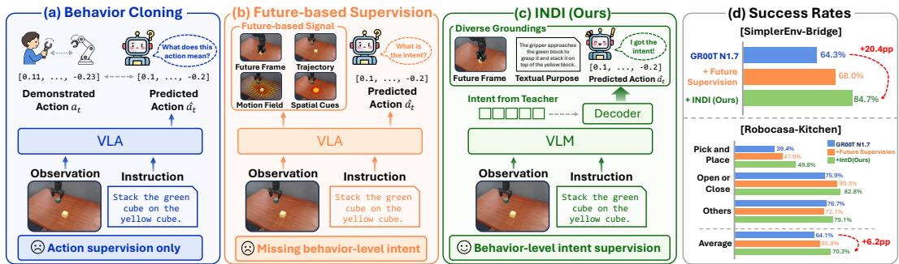  
Figure 1: From behavior cloning to intent distillation. (a) Behavior cloning directly supervises actions. (b) Future-based supervision adds representations of future states or motion. (c) INDI distills behavior-level intent from executed behavior into the action decoder, where it organizes action and representations of how the behavior unfolds and what it achieves. Right: GR00T-N1.7 results on SimplerEnv-Bridge and RoboCasa.

To operationalize this principle, we propose Intention Distillation (INDI), which distills behaviorlevel intent into the action decoder. We define intent as the local objective that the forthcoming behavior should achieve under the instruction. During training, a frozen teacher VLM interprets an executed behavior segment from the current observation, instruction, a coarse action summary, and the execution video. The student decoder learns to recover the resulting multimodal intent representation from the current observation, instruction, and proprioceptive state, and uses it as an intermediate semantic state for action prediction.

Concretely, INDI realizes this behavior-level intent supervision through three components. (1) Intent from executed behavior. The teacher VLM identifies what object or relation changes, what local objective the segment serves, and how it advances the instruction. We use the teacher’s multi modal representation formed during this interpretation as the intent target, together with a generated purpose statement and an endpoint visual feature as complementary groundings. (2) Intent recovery inside the action decoder. Learnable intent queries recover the teacher target at an intermediate decoder layer, after which the remaining layers jointly complete action, latent visual and textual grounding predictions. (3) Intent-aware decoding. The recovered intent participates in action and grounding prediction, making it a functional intermediate representation rather than an auxiliary alignment target. At deployment, the teacher and all target-generation modules are removed.

We evaluate whether behavior-level intent improves action decoding and whether the recovered representation exhibits the expected structure of intent. On SimplerEnv-Bridge (Li et al., 2025b), INDI improves GR00T-N1.7 from 64.3% to 84.7%. On RoboCasa Kitchen (Nasiriany et al., 2024), it improves the controlled GR00T-N1.7 baseline from 64.1% to 70.3% across 24 tasks, with consistent gains on π across both benchmarks. In real-world tasks, INDI improves success from 62.0% to 68.7% and generalizes to held-out objects and distractors. Representation analyses and closed loop interventions further show that the recovered intent is used by the decoder, captures behavior objective and execution progress, and organizes downstream predictions in an objective-dependent manner. Together, these results show that behavior-level semantic supervision improves policy performance and generalization while inducing an internal representation that functions as intent.

## Contributions. Our contributions are as follows:

• We identify behavior-level intent as a missing supervision target for VLA action decoders. Beyond imitating actions or predicting future states and motion, the decoder should model the local objective served by its action sequence.

• We propose INDI, which distills a teacher VLM’s multimodal understanding of executed behavior into intermediate action-decoder states. The recovered intent organizes action prediction and representations of how the behavior unfolds and what it achieves, with no teacher-side modules at deployment.

• Across VLA backbones, SimplerEnv-Bridge (Li et al., 2025b), RoboCasa (Nasiriany et al., 2024), and real-world manipulation, INDI improves performance and OOD generalization. Analyses and interventions further show that the recovered latent functions as intent by encoding behavior objective and progress and organizing downstream predictions.

## 2 RELATED WORK

VLA models. VLA models combine large multimodal backbones with robot demonstrations to map observations and instructions to actions (Brohan et al., 2023; Zitkovich et al., 2023; Kim et al., 2025; Octo Model Team et al., 2024; Black et al., 2025b;a; Physical Intelligence et al., 2026; NVIDIA et al., 2025; NVIDIA, 2026; Gemini Robotics Team et al., 2025; Li et al., 2024). Their progress has been supported by large robot datasets spanning diverse tasks, scenes, and embodiments (Open X-Embodiment Collaboration et al., 2024; Khazatsky et al., 2024; Walke et al., 2023; Fang et al., 2024). Recent systems increasingly pair pretrained vision-language modules with action decoders trained using flow-matching or diffusion objectives (Black et al., 2025b;a; NVIDIA et al., 2025; Li et al., 2024; Liu et al., 2025; Wen et al., 2025; Kim et al., 2026a). While these advances improve action modeling, decoder supervision remains dominated by imitation of demonstrated motor commands. INDI instead supervises the local objective served by the action sequence.

Future-based and structured supervision. Prior work augments robot policies with generated future frames, subgoal images, and visual reasoning frames (Wu et al., 2024; Black et al., 2024; Zhao et al., 2025). Other methods learn predictive visual features, future latent states, world-action representations, or structured world knowledge as intermediate signals for action decoding (Hu et al., 2025; Tian et al., 2025; Zheng et al., 2025b; Zhang et al., 2025; Xu et al., 2026; Sun et al., 2026; Luo et al., 2026; Won et al., 2026). Related approaches represent spatial, motion, or semantic structure through optical flow, point tracks, visual traces, grounding masks, affordance chains, and embodied reasoning traces (Xu et al., 2024; Bharadhwaj et al., 2024; Zheng et al., 2025a; Huang et al., 2025b; Zawalski et al., 2025; Huang et al., 2025a; Li et al., 2025a). These methods demonstrate the value of intermediate supervision beyond motor commands, but define the decoder interface through a particular future state, motion structure, or reasoning representation. INDI instead supervises the behavior-level objective that organizes action and its diverse realizations.

Intent and latent plans in robot policies. Related methods derive deployment-time latent plans from trajectories, with Play-LMP learning continuous plans from play and LADS learning languageregularized discrete plans from trajectory segments (Lynch et al., 2020; Jiang et al., 2025). Their latents are reconstruction codes learned jointly with the policy, whereas INDI distills a fixed teacher’s semantic interpretation of the behavior. Prior work also operationalizes intent through trajectory abstractions, action priors, and virtual targets (Huang et al., 2026; Zhong et al., 2026; Pang et al., 2026), through temporal context or predicted scene structure (Lian et al., 2026; Chen et al., 2026; Fan et al., 2026; Xu et al., 2026), or through human cues such as demonstrations, gaze, and indirect instructions (Gupta et al., 2026; Xie et al., 2026; Tay et al., 2026; Li et al., 2026a; Pani & Yang, 2026; Zuo et al., 2026; Chen et al., 2025). INDI instead defines intent as the local objective served by executed behavior under the instruction. A training-only teacher derives a multimodal intent target from the segment, distilled into intermediate decoder states and grounded in visual outcome and textual purpose. The deployed policy recovers it from standard VLA inputs.

## 3 METHODOLOGY

We propose INDI, which distills behavior-level intent into a pretrained VLA action decoder. During training, a frozen teacher VLM interprets multimodal evidence of the demonstrated behavior under the instruction, producing an intent target. The decoder recovers this target at an intermediate layer from its standard inputs and uses the recovered intent in subsequent action and visual and textua grounding prediction. The overall framework is illustrated in Figure 2.

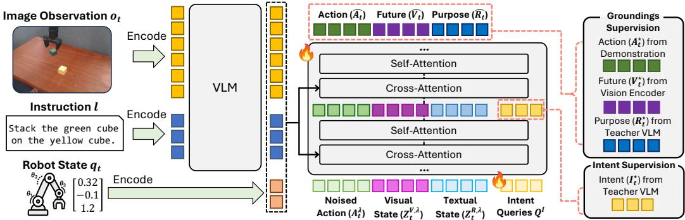  
Figure 2: Overview of INDI. A training-only teacher VLM derives multimodal intent and textualpurpose targets from executed behavior, while a frozen visual encoder supplies the endpoint-visual target. The VLA decoder recovers intent at an intermediate layer and jointly predicts actions and latent visual and textual groundings, denoted by $\widehat { V } _ { t }$ and $\widehat { R } _ { t }$ . Dashed lines indicate training-only supervision, and all target-generation modules are removed at deployment.

## 3.1 PROBLEM FORMULATION

We consider a pretrained VLA policy with a frozen vision-language module $\mathcal { F } _ { \mathrm { v l m } }$ and a trainable flow-matching action decoder. At time t, the VLA receives an RGB observation $o _ { t } .$ , a language instruction $\ell ,$ and a proprioceptive state $q _ { t }$ . The VLM produces context tokens $B _ { t } = \mathcal { F } _ { \mathrm { v l m } } ( o _ { t } , \ell )$

Our goal is to train the action decoder to predict $A _ { t }$ while forming an intermediate intent state $I _ { t }$ that represents the local objective served by the action under the instruction. Standard behavior cloning models $p _ { \theta } ( A _ { t } \mid B _ { t } , q _ { t } )$ , leaving this objective implicit. Let $I _ { t }$ denote the recovered intent state at the intermediate decoder layer. At each policy query, $I _ { t }$ is deterministically recovered from $B _ { t }$ and $q _ { t } .$ and the decoder models

$$
( A _ { t } , V _ { t } , R _ { t } ) \sim p _ { \theta } ( A _ { t } , V _ { t } , R _ { t } \ | \ B _ { t } , q _ { t } , I _ { t } ) .\tag{1}
$$

Here, $A _ { t } , V _ { t } ,$ and $R _ { t }$ denote the action, visual-outcome, and textual-purpose supervision targets, while hats denote their decoder predictions.

## 3.2 INTENT SUPERVISION FROM EXECUTED BEHAVIOR

Since robot demonstrations do not explicitly label the local objective, we derive intent supervision using a frozen teacher VLM. For an H-step demonstrated behavior segment $\mathcal { W } _ { t }$ , let $c _ { A } ( \mathcal { W } _ { t } )$ denote a coarse textual summary of its demonstrated actions. Under a functional-intent prompt, a teacher VLM processes $\mathcal { E } _ { t } = ( o _ { t } , \ell , c _ { A } ( \mathcal { W } _ { t } ) , \mathrm { v i d } _ { t : t + H } )$ and then generates a functional-purpose statement with token span $S _ { t }$ . We cache the hidden states of both spans from the same autoregressive pass.

Target extraction. We extract the intent target from a middle teacher layer to retain both multimodal grounding and semantic abstraction before higher layers specialize toward language generation (Kim et al., 2026a). The textual-purpose target uses the final-layer representation of the generated statement, while the visual-outcome target uses a separate frozen encoding of the endpoint observation:

$$
\begin{array} { r } { I _ { t } ^ { \star } = \mathrm { p o o l } _ { K _ { I } } \left( T _ { \mathcal { E } _ { t } } ^ { ( \ell _ { I } ) } \right) , \quad R _ { t } ^ { \star } = \mathrm { p o o l } _ { K _ { R } } \left( T _ { \mathcal { S } _ { t } } ^ { ( \ell _ { R } ) } \right) , \quad V _ { t } ^ { \star } = \mathrm { p o o l } _ { K _ { V } } \left( \Phi _ { \mathrm { v i s } } ( o _ { t + H } ) \right) . } \end{array}\tag{2}
$$

Here $T _ { \mathcal { X } } ^ { ( \ell ) }$ denotes teacher hidden states over token span $\mathcal { X }$ at layer $\ell ,$ and $\Phi _ { \mathrm { v i s } }$ is the frozen visual encoder used for endpoint features. Thus, $I _ { t } ^ { \star }$ retains the multimodal representation formed while the teacher interprets the executed behavior, whereas $R _ { t } ^ { \star }$ provides its linguistic realization.

Visual and textual groundings. The endpoint visual target grounds intent in the resulting scene change, while the textual-purpose target grounds it in the functional meaning of the behavior. These choices build on prior work using predictive visual supervision (Wu et al., 2024; Black et al., 2024; Hu et al., 2025; Zhang et al., 2025) and language or reasoning traces for robot policies (Zawalski et al., 2025; Huang et al., 2025a; Li et al., 2025a; Sumers et al., 2023).

## 3.3 INTENT-AWARE ACTION DECODING

To make intent a functional intermediate state rather than an auxiliary readout, the decoder must recover it from the current VLA inputs before final action prediction and make it available to both action and grounding streams. We therefore augment the pretrained flow-matching action decoder with intent queries and visual and textual grounding rows. Let $Q _ { t } = E _ { q } ( q _ { t } )$ denote the proprioceptivestate representation, and let $Q ^ { I }$ denote $K _ { I }$ clean learnable intent queries. The decoder processes

$$
[ Q _ { t } , \ A _ { t } ^ { \lambda } , \ Z _ { t } ^ { V , \lambda } , \ Z _ { t } ^ { R , \lambda } , \ Q ^ { I } ] ,
$$

where $A _ { t } ^ { \lambda }$ is the noised action input and $Z _ { t } ^ { V , \lambda }$ and $Z _ { t } ^ { R , \lambda }$ are self-conditioned visual and textual grounding inputs. The clean targets $I _ { t } ^ { \star } , V _ { t } ^ { \star }$ , and $R _ { t } ^ { \star }$ are used only for supervision.

Recovering intent. We supervise intent at an intermediate layer so that the recovered representation can shape the remaining decoder computation. Following intermediate representation alignment in VLA decoders (Zheng et al., 2025b), we read the contextualized intent-query states $H _ { I , t } ^ { L _ { \mathrm { t a p } } }$ , project them into the teacher feature space, and optimize

$$
\mathcal { L } _ { I } = \frac { 1 } { K _ { I } } \sum _ { k = 1 } ^ { K _ { I } } \left[ 1 - \cos \left( P _ { I } ( H _ { I , t , k } ^ { L _ { \mathrm { t a p } } } ) , \mathrm { s g } ( I _ { t , k } ^ { \star } ) \right) \right] ,\tag{3}
$$

where $P _ { I }$ is a projection head and sg denotes stop-gradient. The decoder-space states $H _ { I , t } ^ { L _ { \mathrm { t a p } } }$ constitute the recovered intent used by the remaining layers.

Action and grounding prediction. The action stream retains the flow-matching objective of the pretrained VLA (Black et al., 2025a; NVIDIA et al., 2025). Given noise $\epsilon _ { A }$ and flow time $\lambda ,$ let $\mathbf { \bar { \Phi } } A _ { t } ^ { \lambda } = ( 1 - \lambda ) \epsilon _ { A } + \lambda A _ { t }$ and $u _ { A } = A _ { t } - \epsilon _ { A }$ . The decoder predicts $\hat { u } _ { A }$ using

$$
\mathcal { L } _ { A } = \mathbb { E } _ { \lambda , \epsilon _ { A } } \left[ \left\| \hat { \boldsymbol { u } } _ { A } - \boldsymbol { u } _ { A } \right\| _ { 2 } ^ { 2 } \right] .\tag{4}
$$

The grounding streams must remain available during decoding without receiving clean grounding targets that are unavailable at deployment. A no-gradient pass first predicts clean decoder-space grounding states $\bar { Z } _ { t } ^ { V }$ and $\bar { Z } _ { t } ^ { R }$ . We detach and re-noise these predictions at the sampled flow time:

$$
Z _ { t } ^ { V , \lambda } = ( 1 - \lambda ) \epsilon _ { V } + \lambda \operatorname { s g } ( \bar { Z } _ { t } ^ { V } ) , \qquad Z _ { t } ^ { R , \lambda } = ( 1 - \lambda ) \epsilon _ { R } + \lambda \operatorname { s g } ( \bar { Z } _ { t } ^ { R } ) .
$$

Rather than training separate flow generators in each target space, we align the final grounding states with their targets using representation alignment (Yu et al., 2025). For $\bar { G } \in \{ V , R \}$ ,

$$
\mathcal { L } _ { G } = \mathbb { E } _ { \lambda , \epsilon _ { G } } \left[ \frac { 1 } { K _ { G } } \sum _ { k = 1 } ^ { K _ { G } } \left( 1 - \cos \left( P _ { G } ( H _ { G , t , k } ^ { L _ { \mathrm { o u t } } , \lambda } ) , \mathrm { s g } ( G _ { t , k } ^ { \star } ) \right) \right) \right] .\tag{5}
$$

Action and grounding rows are jointly processed by the same decoder, allowing the recovered intent to organize their subsequent prediction.

Intent-dependent information flow. To make the recovered intent a functional intermediate state, we organize downstream decoding around it. All rows are processed jointly, but with asymmetric attention. Intent queries attend to $Q _ { t }$ , the VLA context $B _ { t }$ , and one another, while remaining isolated from the noised action and grounding rows. Grounding rows attend to the recovered intent and one another, whereas action rows attend to both intent and grounding rows. Furthermore, a binary gate α controls direct $B _ { t }$ access from non-intent rows. During training, we sample $\alpha \sim$ Bernoulli(0.5), and updates with $\alpha = 0$ require contextual information to pass through the intent queries.

For these intent-mediated updates, we further require downstream prediction to depend on the content of the recovered intent. We compare decoder continuations under the matched intent states $H _ { I , t } ^ { L _ { \mathrm { t a p } } }$ and batch-shifted states $\widetilde { H } _ { I , t } ^ { L _ { \mathrm { t a p } } }$ . Let $\mathcal { D } _ { \mathrm { r i g h t } }$ and $\mathcal { D } _ { \mathrm { s w a p } }$ denote the corresponding downstream action and grounding losses. We optimize

$$
\mathcal { L } _ { \mathrm { m i s } } = \operatorname* { m a x } \left( 0 , m + \mathcal { D } _ { \mathrm { r i g h t } } - \mathcal { D } _ { \mathrm { s w a p } } \right) ,\tag{6}
$$

which forces matched intent to yield lower downstream loss than mismatched intent by margin m.

Training objective and deployment. The full objective is

$$
\begin{array} { r } { \mathcal { L } = \mathcal { L } _ { A } + \lambda _ { I } \mathcal { L } _ { I } + \lambda _ { V } \mathcal { L } _ { V } + \lambda _ { R } \mathcal { L } _ { R } + \lambda _ { \mathrm { m i s } } \mathcal { L } _ { \mathrm { m i s } } . } \end{array}\tag{7}
$$

At deployment, we set α = 1 and remove the teacher, cached targets, alignment projections, and intent-mismatch branch. The policy receives the original VLA inputs and internally forms intent and grounding states together with the action stream.

Table 1: Results on SimplerEnv-Bridge. Success rates (%) on the four evaluated tasks. Controlled variants report mean ± sample standard deviation over three evaluation runs, while published baselines retain their originally reported values. Bold marks the best mean in each column, and underline marks the runner-up.
<table><tr><td>Method</td><td>Spoon</td><td>Carrot</td><td>Stack</td><td>EP-Basket</td><td>Avg.</td></tr><tr><td colspan="6">General-purpose VLA policies</td></tr><tr><td>Octo-base (Octo Model Team et al., 2024)</td><td>12.5</td><td>8.3</td><td>0.0</td><td>43.1</td><td>16.0</td></tr><tr><td>Octo-small (Octo Model Team et al., 2024)</td><td>47.2</td><td>9.7</td><td>4.2</td><td>56.9</td><td>29.5</td></tr><tr><td>OpenVLA (Kim et al., 2025)</td><td>0.0</td><td>0.0</td><td>0.0</td><td>4.1</td><td>1.0</td></tr><tr><td>RoboVLMs (Li et al., 2026b)</td><td>29.2</td><td>25.0</td><td>12.5</td><td>58.3</td><td>31.3</td></tr><tr><td>SpatialVLA (Qu et al., 2025)</td><td>16.7</td><td>25.0</td><td>29.2</td><td>100.0</td><td>42.7</td></tr><tr><td>π0 (Black et al., 2025b)</td><td>46.7</td><td>38.7</td><td>42.7</td><td>39.3</td><td>41.8</td></tr><tr><td>π0-FAST (Pertsch et al., 2025)</td><td>59.0</td><td>79.0</td><td>65.0</td><td>33.0</td><td>59.0</td></tr><tr><td>GR00T-N1.5 (NVIDIA GEAR Team, 2025)</td><td>30.0</td><td>28.0</td><td>16.0</td><td>42.7</td><td>29.2</td></tr><tr><td colspan="6">Action abstraction and semantic reasoning</td></tr><tr><td>LAPA (Ye et al., 2025)</td><td>70.8</td><td>45.8</td><td>54.2</td><td>58.3</td><td>57.3</td></tr><tr><td>UniVLA (Bu et al., 2025)</td><td>52.8</td><td>55.6</td><td>2.8</td><td>80.6</td><td>47.9</td></tr><tr><td>ECoT (Zawalski et al., 2025; Zhang et al., 2026)</td><td>40.2</td><td>11.7</td><td>0.0</td><td>28.4</td><td>20.1</td></tr><tr><td colspan="6">Controlled backbone comparisons</td></tr><tr><td>GR00T-N1.7 (NVIDIA, 2026)</td><td>84.7 ±3.1</td><td>79.3±9.9</td><td>57.3±8.1</td><td>36.0 ±6.0</td><td>64.3 ±3.3</td></tr><tr><td>GR00T-N1.7 + future supervision</td><td>81.3 ±2.3</td><td>73.3 ±4.2</td><td>56.7 ±3.1</td><td>60.7 ±4.2</td><td>68.0 ±1.0</td></tr><tr><td>GR00T-N1.7 + INDI (Ours)</td><td>88.7±1.2</td><td>84.7 ±6.1</td><td>69.3 ±5.0</td><td>96.0 ±4.0</td><td>84.7 ±0.8</td></tr><tr><td>∆ (Ours — baseline)</td><td>+4.0</td><td>+5.4</td><td>+12.0</td><td>+60.0</td><td>+20.4</td></tr><tr><td> $\pi _ { 0 . 5 }$  (Black et al., 2025a)</td><td>78.0 ±3.5</td><td>72.7 ±7.6</td><td>32.0 ±3.5</td><td>26.7 ±4.2</td><td>52.3 ±2.3</td></tr><tr><td>π0.5 + INDI (Ours)</td><td>81.3±4.2</td><td>76.0 ±4.0</td><td>39.3±5.0</td><td>38.7 ±3.1</td><td>58.8 ±3.3</td></tr><tr><td>∆ (Ours – baseline)</td><td>+3.3</td><td>+3.3</td><td>+7.3</td><td>+12.0</td><td>+6.5</td></tr></table>

## 4 EXPERIMENTS

We evaluate INDI across simulation and real-world manipulation settings to answer three questions: whether behavior-intent supervision improves policy performance across benchmarks and VLA backbones, whether its benefits extend to real-world and out-of-distribution conditions, and whether the recovered latent functions as intent rather than generic additional capacity. Our evaluation covers SimplerEnv-Bridge and RoboCasa Kitchen in simulation, together with real-world tabletop tasks involving held-out objects and distractors.

## 4.1 EXPERIMENTAL SETUP

Benchmarks. We evaluate INDI on two simulation benchmarks and a real-world manipulation setting. SimplerEnv-Bridge (Li et al., 2025b) covers four tabletop tasks, while RoboCasa Kitchen (Nasiriany et al., 2024) contains 24 household tasks spanning pick-and-place, articulatedobject manipulation, and appliance interaction. Our real-world evaluation contains four tabletop tasks under standard scenes, held-out objects, and distractor conditions. Dataset, robot-platform, and evaluation-protocol details are provided in Section A.

Baselines. Our primary comparisons use GR00T-N1.7 (NVIDIA, 2026) and $\pi _ { 0 . 5 }$ (Black et al., 2025a), with each baseline trained using the same demonstrations, optimization budget, and evaluation protocol as its corresponding INDI model. We additionally report published benchmark results for context. On RoboCasa Kitchen, GR00T checkpoints trained with 3,000 demonstrations per task are included only as data-scale references, rather than matched baselines. For real-world tasks, we compare against the GR00T-N1.7 under the same rollout protocol. Descriptions and comparison settings for all baselines are provided in Section A.3.

Implementation details. We retain each backbone’s optimizer, learning rate, and vision-language freezing configuration, and use the same INDI configuration across benchmarks unless stated otherwise. By default, we use $K _ { I } = 8 , K _ { R } = 8 , K _ { V } \stackrel { \textstyle = } { = } 1 6$ per camera view, an intent-alignment tap at 50% of the decoder depth, margin $m = 0 . 0 5$ , context-dropout rate 0.5, and Cosmos-Reason2- 8B (NVIDIA, 2025a) as the teacher VLM. Full hyperparameters, target-construction details, and implementation choices are provided in Section A.

Table 2: Results on RoboCasa Kitchen. Success rates (%) on the 24-task benchmark. $G _ { n }$ denotes n demonstrations per task. The $G _ { 3 0 0 0 }$ checkpoints provide single-value data-scale references, while controlled $G _ { 1 0 0 }$ variants report mean ± sample standard deviation over three evaluation runs. Success rates are averaged within each task category, while Avg. is the macro-average across all 24 tasks. Bold marks the best mean in each column, and underline marks the runner-up.
<table><tr><td>Method</td><td>Pick-and Place</td><td>Open-or Close</td><td>Others</td><td> $\operatorname { A v g } .$ </td></tr><tr><td>GR00T-N1.6 (NVIDIA, 2025b)  $( G _ { 3 0 0 0 } )$ </td><td>43.2</td><td>81.0</td><td>75.8</td><td>66.2</td></tr><tr><td>GR00T-N1.7 (NVIDIA, 2026) (G3000)</td><td>53.0</td><td>80.8</td><td>79.0</td><td>70.8</td></tr><tr><td>GR00T-N1.7 (G100)</td><td>39.4±1.0</td><td>75.9 ±3.4</td><td> $7 6 . 7 \pm 0 . 9$ </td><td>64.1 ±1.6</td></tr><tr><td>GR00T-N1.7 + future supervision (G100)</td><td>47.0 ±4.4</td><td>80.3 ±2.3</td><td> $7 2 . 1 \pm 2 . 0$ </td><td> $6 5 . 8 \pm 0 . 8$ </td></tr><tr><td>GR00T-N1.7 + INDI (G100, Ours)</td><td>49.8±2.3</td><td>82.8±1.3</td><td>79.1±1.5</td><td>70.3±1.7</td></tr><tr><td>∆ (Ours - baseline)</td><td>+10.4</td><td>+6.9</td><td>+2.4</td><td>+6.2</td></tr><tr><td>π0.5 (Black et al., 2025a)</td><td>14.0 ±1.7</td><td>55.1 ±7.4</td><td>39.5 ±0.9</td><td>34.9 ±2.0</td></tr><tr><td>π0.5 + INDI (Ours)</td><td>15.3±1.4</td><td>56.1 ±3.6</td><td>53.5 ±2.4</td><td>41.4±1.4</td></tr><tr><td>∆ (Ours - baseline)</td><td>+1.3</td><td>+1.0</td><td>+14.0</td><td>+6.5</td></tr></table>

## 4.2 RESULTS ON SIMULATION BENCHMARKS

We first test whether behavior-intent supervision improves pretrained VLA policies across distinct simulation benchmarks and backbone architectures.

SimplerEnv-Bridge. Table 1 reports success rates on four SimplerEnv-Bridge tasks. On GR00T-N1.7, INDI improves average success from 64.3% to 84.7%, a +20.4 pp gain. The improvement holds across all four tasks, including tasks where the baseline is already strong. The largest gain occurs on EP-Basket, where success increases from 36.0% to 96.0%, while Spoon, Carrot, and Stack improve by 4.0, 5.4, and 12.0 pp, respectively. Excluding EP-Basket, the remaining three tasks improve by 7.1 pp on average. The future-supervision variant reaches 68.0%, while INDI reaches 84.7%, a further +16.7 pp improvement. Among the reported results on this task suite, INDI achieves the highest average success. The improvement also transfers to $\pi _ { 0 . 5 }$ , increasing average success from 52.3% to 58.8%, a +6.5 pp gain, with improvements on every task.

RoboCasa Kitchen. Table 2 reports controlled comparisons on the 24-task RoboCasa Kitchen benchmark. With GR00T-N1.7 trained on 100 demonstrations per task, INDI improves average success from 64.1% to 70.3%, with gains across all three task categories. The future-supervision variant reaches 65.8%, whereas the full method reaches 70.3%, an additional +4.5 pp gain. The improvement again transfers to π0.5, increasing average success from 34.9% to 41.4%, including a +14.0 pp gain on the Others.

Moreover, INDI trained with 100 demonstrations per task reaches 70.3% average success, within 0.5 pp of the reported GR00T-N1.7 checkpoint trained with 3,000 demonstrations per task. Table 3 further compares against reported RoboCasa Kitchen results from prior methods. Among these reported results, INDI achieves the highest average success rates. Together, the results show that INDI consistently improves two backbones across different simulation environments.

Table 3: Reported RoboCasa Kitchen results. Average success rates (%).
<table><tr><td>Method</td><td>Demos/task Avg.</td><td></td></tr><tr><td>Base VLA policies</td><td></td><td></td></tr><tr><td>GR00T-N1 (NVIDIA et al., 2025)</td><td>300</td><td>49.6</td></tr><tr><td>π0 (Black et al., 2025b)</td><td>300</td><td>62.5</td></tr><tr><td>π0-FAST (Pertsch et al., 2025)</td><td>300</td><td>63.6</td></tr><tr><td>GR00T-N1.5 (NVIDIA GEAR Team, 2025)</td><td>300</td><td>65.7</td></tr><tr><td>Future and video-based methods</td><td></td><td></td></tr><tr><td>DreamGen (Jang et al., 2025)</td><td>300</td><td>57.6</td></tr><tr><td>DUST (Won et al., 2026)</td><td>300</td><td>58.5</td></tr><tr><td>Video Policy (Liang et al., 2025)</td><td>300</td><td>66.0</td></tr><tr><td>FLARE (Zheng et al., 2025b)</td><td>300</td><td>66.4</td></tr><tr><td>History and representation methods</td><td></td><td></td></tr><tr><td>HAMLET (Koo et al., 2026)</td><td>300</td><td>66.4</td></tr><tr><td>RS-CL (Kim et al., 2026b)</td><td>300</td><td>69.7</td></tr><tr><td>Behavior-intent supervision</td><td></td><td></td></tr><tr><td>INDI (Ours)</td><td>100</td><td>70.3</td></tr></table>

Table 4: Results on real-world tasks. Success rates (%) over 50 trials. ID clean uses training objects without distractors, held-out substitutes unseen objects of the same functional role, and distractors add unrelated items to the scene. Bold marks the better result within each condition.
<table><tr><td rowspan="2">Task</td><td colspan="2">ID clean</td><td colspan="2">Held-out</td><td colspan="2">Distractors</td></tr><tr><td>Base</td><td>+ INDI</td><td>Base</td><td>+ INDI</td><td>Base</td><td>+ INDI</td></tr><tr><td>Threading</td><td>92.0</td><td>96.0</td><td>86.0</td><td>84.0</td><td>70.0</td><td>82.0</td></tr><tr><td>Basket Nesting</td><td>94.0</td><td>92.0</td><td>84.0</td><td>90.0</td><td>76.0</td><td>84.0</td></tr><tr><td>Cross-Bin Stacking</td><td>74.0</td><td>80.0</td><td>62.0</td><td>72.0</td><td>58.0</td><td>64.0</td></tr><tr><td>Drawer Storage</td><td>24.0</td><td>36.0</td><td>16.0</td><td>26.0</td><td>8.0</td><td>18.0</td></tr><tr><td>Average</td><td>71.0</td><td>76.0</td><td>62.0</td><td>68.0</td><td>53.0</td><td>62.0</td></tr></table>

## 4.3 RESULTS ON REAL-WORLD BENCHMARKS

Table 4 reports success rates on the four real-world tasks. INDI improves the baseline from 71.0% to 76.0% under ID clean, and the gain persists under held-out objects (62.0% to 68.0%) and distractors (53.0% to 62.0%). Relative retention is comparable under held-out objects (87.3% vs. 89.5%) and higher for INDI under distractors (74.6% vs. 81.6%), indicating that the improvement persists as the scene shifts from training conditions. The gains are concentrated in the longer tasks. Averaged across the three conditions, Cross-Bin Stacking and Drawer Storage improve by 7.3 and 10.7 pp, respectively, whereas Threading and Basket Nesting improve by 4.7 and 4.0 pp. Table 5 localizes these differences under ID clean. On Cross-Bin Stacking, both policies retrieve the base cube at the same rate (96.0%) and remain similar after centering (90.0% vs. 92.0%), but INDI retains higher completion when retrieving the top cube (82.0% to 86.0%) and completing the stack (74.0% to 80.0%). Drawer Storage exhibits a different pattern: the gap is already present at grasping (50.0% to 70.0%) and persists through the subsequent stages. The two shorter tasks remain near ceiling under ID clean and show only small, mixed differences.

The stage profiles reveal two different sources of improvement on the longer tasks. On Cross-Bin Stacking, the policies remain nearly indistinguishable through centering the base cube, and the main gap appears when execution must move from the completed first subgoal to retrieving and stacking the second cube. This provides the clearest real-world evidence that INDI improves behavior across a stage transition. Drawer Storage differs: INDI already improves grasping and transfer from 50.0% to 70.0%, and this advantage persists through opening (40.0% to 56.0%), placement (26.0% to 38.0%), and closure (24.0% to 36.0%). Thus, its gain cannot be attributed solely to a single transition, but instead reflects more reliable execution across the multi-stage sequence. By contrast, Threading and Basket Nesting have high early-stage completion and little separation under ID clean, leaving less room for improvement. Together, these results indicate that the benefit of intent supervision becomes more pronounced when successful execution must remain organized across multiple stages, while not requiring every gain to arise from the same failure mode.

Table 5: Stage-level completion. Fraction of trials (%) reaching each stage under ID clean (cumulative).
<table><tr><td>Task</td><td>Stage</td><td>Base</td><td>+ INDI</td></tr><tr><td>Threading</td><td>Pole centered Ring grasped Inserted</td><td>100.0 96.0 92.0</td><td>100.0 100.0 96.0</td></tr><tr><td>Basket Nest.</td><td>Lifted Nested</td><td>100.0 94.0</td><td>96.0 92.0</td></tr><tr><td>Cross-Bin</td><td>Base retrieved Base centered Top retrieved Stacked</td><td>96.0 90.0 82.0 74.0</td><td>96.0 92.0 86.0 80.0</td></tr><tr><td>Drawer</td><td>Grasped Transferred Opened Placed inside Closed</td><td>50.0 50.0 40.0 26.0 24.0</td><td>70.0 70.0 56.0 38.0 36.0</td></tr></table>

## 4.4 ANALYSIS AND CONTROLLED STUDIES

We isolate the source of the gain, test whether the recovered state functions as intent, and measure deployment cost. Unless stated otherwise, controlled analyses use GR00T-N1.7 on a fixed SimplerEnv-Bridge evaluation run shared across all variants. The main benchmark tables separately report means over three evaluation runs.

Is the gain specific to behavior-intent supervision? To distinguish teacher-derived intent from grounding supervision, future visual alignment, and additional latent capacity, we compare controlled variants in Table 6a. Groundings only and free latent remain below the action-only baseline, while future supervision reaches 68.0%. Intent supervision alone reaches 76.0%, exceeding the baseline by 14.5 pp and future supervision by 8.0 pp. Adding visual and textual groundings further raises success to 85.5%, including a gain from 64.0% to 100.0% on EP-Basket. Thus, teacherderived intent drives the main improvement, while groundings provide complementary gains on average. Further details are provided in Section B.1.

Table 6: Controlled analyses on SimplerEnv-Bridge. (a) compares supervision and capacity controls under the same backbone, demonstrations, budget, and evaluation run. Intent only removes the grounding streams, while future supervision replaces the teacher-intent target with an endpoint visual representation. (b) reports closed-loop success after replacing the task- or phase-discriminative coordinates of the intent and grounding representations. All values are success rates (%).
<table><tr><td>Method</td><td>Spoon</td><td>Carrot</td><td>Stack</td><td>EP-Basket</td><td> $\operatorname { A v g } .$ </td></tr><tr><td>GR00T-N1.7</td><td>82.0</td><td>68.0</td><td>66.0</td><td>30.0</td><td>61.5</td></tr><tr><td>+ Groundings only</td><td>88.0</td><td>82.0</td><td>38.0</td><td>32.0</td><td>60.0</td></tr><tr><td>+ Future supervision</td><td>84.0</td><td>70.0</td><td>56.0</td><td>62.0</td><td>68.0</td></tr><tr><td>+ Free latent</td><td>78.0</td><td>76.0</td><td>48.0</td><td>26.0</td><td>57.0</td></tr><tr><td>+ Intent only</td><td>86.0</td><td>84.0</td><td>70.0</td><td>64.0</td><td>76.0</td></tr><tr><td>INDI (Ours)</td><td>90.0</td><td>78.0</td><td>74.0</td><td>100.0</td><td>85.5</td></tr></table>

(a) Supervision controls.

<table><tr><td></td><td colspan="4">Injected objective</td><td colspan="2">Forced phase</td><td></td></tr><tr><td>Task</td><td>Spoon</td><td>Carrot</td><td>Stack</td><td>EP-Basket</td><td>Early</td><td>Late</td><td>| Noise</td></tr><tr><td>Spoon</td><td>88.0</td><td>62.0</td><td>58.0</td><td>24.0</td><td>19.0</td><td>0.0</td><td>4.0</td></tr><tr><td>Carrot</td><td>50.0</td><td>84.0</td><td>56.0</td><td>32.0</td><td>6.0</td><td>18.0</td><td>0.0</td></tr><tr><td>Stack</td><td>48.0</td><td>42.0</td><td>72.0</td><td>36.0</td><td>4.0</td><td>4.0</td><td>0.0</td></tr><tr><td>EP-Basket</td><td>42.0</td><td>48.0</td><td>44.0</td><td>94.0</td><td>0.0</td><td>0.0</td><td>0.0</td></tr><tr><td>Avg. (diag/off-diag)</td><td></td><td></td><td>84.5 / 45.2</td><td></td><td>7.3</td><td>5.5</td><td>1.0</td></tr></table>

(b) Objective and phase interventions.

Does the recovered representation function as behavioral intent? The preceding controls identify intent supervision as the main source of the gain, so we next test whether the recovered state actually functions as intent by examining its objective and stage structure, its use by downstream decoding, and the behavioral effect of changing its content. As shown in Figure 3, recovered intents separate by behavior objective across real demonstrations and simulation rollouts and organize by early, middle, and late execution stages. Further analyses show that downstream decoding depends on the recovered state, quantify its objective and progress structure, and distinguish it from the particular action sequence used to realize the behavior (Section B.3, Table 12, and Fig. 6).

We next test whether this content causally affects execution by editing the task- or phase-discriminative components of the intent and grounding representations. Same-objective interventions retain 84.5% success, compared with 45.2% for cross-objective interventions and 1.0% under Gaussian corruption (Table 6b). The uneven cross-objective effects are consistent with recovered-intent task geometry, where Spoon and Carrot form the closest pair and EP-Basket is the most separated (Figure 7). Phase forcing reduces success to 7.3% for early content and 5.5% for late content, while producing stage-consistent behaviors such as approaching without grasping or attempting placement with an empty gripper (Figures 8 to 10). Together, these results show that recovered intent represents objective and progress beyond the particular action sequence and causally organizes downstream execution. Additional protocols and readouts are provided in Sections B.3 and B.4.

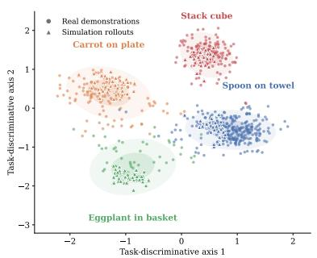

(a) Objective structure. A taskdiscriminative projection separates recovered intents by behavior objective across real and simulation rollouts.  
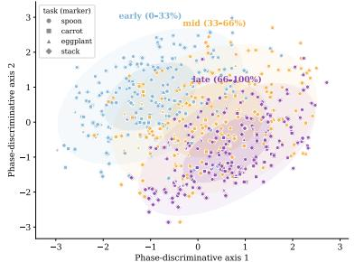  
(b) Progress structure. A phasediscriminative projection organizes intents from different tasks by execution stage. Figure 3: Semantic structure of recovered intent. The representation retains both the local objective and progress through the manipulation sequence.

What is the additional computational cost? Teacher inference and target construction are performed once offline, and all teacher-side modules are removed at deployment, so runtime overhead comes only from the additional decoder representations. INDI increases GR00T-N1.7 from 3.46B to 3.50B parameters and inference time from 56.1 to 61.5 ms per policy query. For $\pi _ { 0 . 5 } ,$ , the corresponding changes are 3.62B to 3.64B parameters and 24.4 to 29.7 ms. Full training-time and resource measurements are reported in Section A.7 and Table 7.

## 5 CONCLUSION

We presented INDI, a framework for distilling behavior-level intent into pretrained VLA action decoders. While behavior cloning supervises executed actions and future-based objectives supervise particular realizations, neither directly identifies the local objective served by the behavior. During training, a frozen teacher VLM interprets demonstrated behavior, and the decoder learns to recover the resulting intent from standard VLA inputs and use it to organize action and grounding prediction. Across SimplerEnv-Bridge, RoboCasa Kitchen, and real-world manipulation tasks, INDI improves strong VLA backbones without requiring the teacher at deployment. Controlled studies further show that the gains arise specifically from intent supervision and that the recovered state represents objective and progress, is used by the policy, and influences closed-loop execution. These results position behavior intent as a compact intermediate representation that shifts VLA learning from reproducing executions toward understanding what each behavior should accomplish.

## REFERENCES

Shuai Bai, Yuxuan Cai, Ruizhe Chen, Keqin Chen, Xionghui Chen, Zesen Cheng, Lianghao Deng, Wei Ding, Chang Gao, Chunjiang Ge, Wenbin Ge, Zhifang Guo, Qidong Huang, Jie Huang, Fei Huang, Binyuan Hui, Shutong Jiang, Zhaohai Li, Mingsheng Li, Mei Li, Kaixin Li, Zicheng Lin, Junyang Lin, Xuejing Liu, Jiawei Liu, Chenglong Liu, Yang Liu, Dayiheng Liu, Shixuan Liu, Dunjie Lu, Ruilin Luo, Chenxu Lv, Rui Men, Lingchen Meng, Xuancheng Ren, Xingzhang Ren, Sibo Song, Yuchong Sun, Jun Tang, Jianhong Tu, Jianqiang Wan, Peng Wang, Pengfei Wang, Qiuyue Wang, Yuxuan Wang, Tianbao Xie, Yiheng Xu, Haiyang Xu, Jin Xu, Zhibo Yang, Mingkun Yang, Jianxin Yang, An Yang, Bowen Yu, Fei Zhang, Hang Zhang, Xi Zhang, Bo Zheng, Humen Zhong, Jingren Zhou, Fan Zhou, Jing Zhou, Yuanzhi Zhu, and Ke Zhu. Qwen3-vl technical report. arXiv preprint arXiv:2511.21631, 2025.

Homanga Bharadhwaj, Roozbeh Mottaghi, Abhinav Gupta, and Shubham Tulsiani. Track2Act: Predicting point tracks from internet videos enables generalizable robot manipulation. In European Conference on Computer Vision, pp. 306–324, 2024. doi: 10.1007/978-3-031-73116-7\_18.

Kevin Black, Mitsuhiko Nakamoto, Pranav Atreya, Homer Walke, Chelsea Finn, Aviral Kumar, and Sergey Levine. Zero-shot robotic manipulation with pre-trained image-editing diffusion models. In International Conference on Learning Representations, 2024.

Kevin Black, Noah Brown, James Darpinian, Karan Dhabalia, Danny Driess, Adnan Esmail, Michael Robert Equi, Chelsea Finn, Niccolo Fusai, Manuel Y. Galliker, Dibya Ghosh, Lachy Groom, Karol Hausman, brian ichter, Szymon Jakubczak, Tim Jones, Liyiming Ke, Devin LeBlanc, Sergey Levine, Adrian Li-Bell, Mohith Mothukuri, Suraj Nair, Karl Pertsch, Allen Z. Ren, Lucy Xiaoyang Shi, Laura Smith, Jost Tobias Springenberg, Kyle Stachowicz, James Tanner, Quan Vuong, Homer Walke, Anna Walling, Haohuan Wang, Lili Yu, and Ury Zhilinsky. π0.5: a Vision-Language-Action Model with Open-World Generalization. In Proceedings of The 9th Conference on Robot Learning, volume 305 of Proceedings of Machine Learning Research, pp. 17–40. PMLR, 2025a. URL https://proceedings.mlr.press/v305/black25a. html.

Kevin Black, Noah Brown, Danny Driess, Adnan Esmail, Michael Robert Equi, Chelsea Finn, Nic colo Fusai, Lachy Groom, Karol Hausman, Brian Ichter, Szymon Jakubczak, Tim Jones, Liyiming Ke, Sergey Levine, Adrian Li-Bell, Mohith Mothukuri, Suraj Nair, Karl Pertsch, Lucy Xiaoyang Shi, Laura Smith, James Tanner, Quan Vuong, Anna Walling, Haohuan Wang, and Ury Zhilinsky. π : A Vision-Language-Action Flow Model for General Robot Control. In Proceedings of Robotics: Science and Systems, Los Angeles, CA, USA, June 2025b. doi: 10.15607/RSS.2025.XXI.010.

Anthony Brohan, Noah Brown, Justice Carbajal, Yevgen Chebotar, Joseph Dabis, Chelsea Finn, Keerthana Gopalakrishnan, Karol Hausman, Alexander Herzog, Jasmine Hsu, Julian Ibarz, Brian Ichter, Alex Irpan, Tomas Jackson, Sally Jesmonth, Nikhil Joshi, Ryan Julian, Dmitry Kalashnikov, Yuheng Kuang, Isabel Leal, Kuang-Huei Lee, Sergey Levine, Yao Lu, Utsav Malla, Deeksha Manjunath, Igor Mordatch, Ofir Nachum, Carolina Parada, Jodilyn Peralta, Emily Perez, Karl Pertsch, Jornell Quiambao, Kanishka Rao, Michael S. Ryoo, Grecia Salazar, Pannag R. Sanketi, Kevin Sayed, Jaspiar Singh, Sumedh Sontakke, Austin Stone, Clayton Tan, Huong Tran,

Vincent Vanhoucke, Steve Vega, Quan H. Vuong, Fei Xia, Ted Xiao, Peng Xu, Sichun Xu, Tianhe Yu, and Brianna Zitkovich. Rt-1: Robotics transformer for real-world control at scale. In Proceedings of Robotics: Science and Systems, Daegu, Republic of Korea, July 2023. doi: 10.15607/RSS.2023.XIX.025.

Qingwen Bu, Yanting Yang, Jisong Cai, Shenyuan Gao, Guanghui Ren, Maoqing Yao, Ping Luo, and Hongyang Li. Learning to act anywhere with task-centric latent actions. In Proceedings of Robotics: Science and Systems, 2025.

Yandu Chen, Kefan Gu, Yuqing Wen, Yucheng Zhao, Tiancai Wang, and Liqiang Nie. IntentionVLA: Generalizable and efficient embodied intention reasoning for human-robot interaction. arXiv preprint arXiv:2510.07778, 2025.

Yi Chen, Yuying Ge, Hui Zhou, Mingyu Ding, Yixiao Ge, and Xihui Liu. Dial: Decoupling intent and action via latent world modeling for end-to-end vla. arXiv preprint arXiv:2603.29844, 2026.

Liaoyuan Fan, Zetian Xu, Chen Cao, Wenyao Zhang, Mingqi Yuan, and Jiayu Chen. AIM: Intentaware unified world action modeling with spatial value maps. arXiv preprint arXiv:2604.11135, 2026.

Hao-Shu Fang, Hongjie Fang, Zhenyu Tang, Jirong Liu, Chenxi Wang, Junbo Wang, Haoyi Zhu, and Cewu Lu. RH20T: A comprehensive robotic dataset for learning diverse skills in one-shot. In 2024 IEEE International Conference on Robotics and Automation (ICRA), pp. 653–660. IEEE, 2024. doi: 10.1109/ICRA57147.2024.10611615.

Gemini Robotics Team, Saminda Abeyruwan, Joshua Ainslie, Jean-Baptiste Alayrac, Montserrat Gonzalez Arenas, Travis Armstrong, Ashwin Balakrishna, et al. Gemini robotics: Bringing ai into the physical world. arXiv preprint arXiv:2503.20020, 2025.

Harsh Gupta, Guanya Shi, and Wenzhen Yuan. LUCID: Learning embodiment-agnostic intent models from unstructured human videos for scalable dexterous robot skill acquisition. arXiv preprint arXiv:2606.11628, 2026.

Yucheng Hu, Yanjiang Guo, Pengchao Wang, Xiaoyu Chen, Yen-Jen Wang, Jianke Zhang, Koushil Sreenath, Chaochao Lu, and Jianyu Chen. Video prediction policy: A generalist robot policy with predictive visual representations. In Proceedings of the 42nd International Conference on Machine Learning, volume 267 of Proceedings ofMachine Learning Research, pp. 24328–24346. PMLR, 2025. URL https://proceedings.mlr.press/v267/hu25g.html.

Chi-Pin Huang, Yueh-Hua Wu, Min-Hung Chen, Yu-Chiang Frank Wang, and Fu-En Yang. ThinkAct: Vision-language-action reasoning via reinforced visual latent planning. In Advances in Neural Information Processing Systems, volume 38, 2025a.

Haifeng Huang, Xinyi Chen, Yilun Chen, Hao Li, Xiaoshen Han, Zehan Wang, Tai Wang, Jiangmiao Pang, and Zhou Zhao. Roboground: Robotic manipulation with grounded vision-language priors. In Proceedings of the IEEE/CVF Conference on Computer Vision and Pattern Recognition, pp. 22540–22550, 2025b.

Renming Huang, Chendong Zeng, Wenjing Tang, Jingtian Cai, Cewu Lu, and Panpan Cai. Mimic intent, not just trajectories. arXiv preprint arXiv:2602.08602, 2026.

Joel Jang, Seonghyeon Ye, Zongyu Lin, Jiannan Xiang, Johan Bjorck, Yu Fang, Fengyuan Hu, Spencer Huang, Kaushil Kundalia, Yen-Chen Lin, Loïc Magne, Ajay Mandlekar, Avnish Narayan, You Liang Tan, Guanzhi Wang, Jing Wang, Qi Wang, Yinzhen Xu, Xiaohui Zeng, Kaiyuan Zheng, Ruijie Zheng, Ming-Yu Liu, Luke Zettlemoyer, Dieter Fox, Jan Kautz, Scott Reed, Yuke Zhu, and Linxi Fan. DreamGen: Unlocking generalization in robot learning through video world models. In Joseph Lim, Shuran Song, and Hae-Won Park (eds.), Proceedings of The 9th Conference on Robot Learning, volume 305 of Proceedings of Machine Learning Research, pp. 5170–5194. PMLR, 2025. URL https://proceedings.mlr.press/v305/jang25a.html.

Haobin Jiang, Jiangxing Wang, and Zongqing Lu. Discrete latent plans via semantic skill abstractions. In The Thirteenth International Conference on Learning Representations, 2025.

Alexander Khazatsky, Karl Pertsch, Suraj Nair, Ashwin Balakrishna, et al. Droid: A large-scale in-the-wild robot manipulation dataset. Robotics: Science and Systems, 2024.

Dongyoung Kim, Huiwon Jang, Myungkyu Koo, Suhyeok Jang, Taeyoung Kim, Beomjun Kim, Byungjun Yoon, Changsung Jang, Daewon Choi, Dongsu Han, et al. RLDX-1 technical report. arXiv preprint arXiv:2605.03269, 2026a. URL https://arxiv.org/abs/2605.03269.

Moo Jin Kim, Karl Pertsch, Siddharth Karamcheti, Ted Xiao, Ashwin Balakrishna, Suraj Nair, Rafael Rafailov, Ethan P Foster, Pannag R Sanketi, Quan Vuong, Thomas Kollar, Benjamin Burchfiel, Russ Tedrake, Dorsa Sadigh, Sergey Levine, Percy Liang, and Chelsea Finn. Openvla: An open-source vision-language-action model. In Proceedings of The 8th Conference on Robot Learning, volume 270 of Proceedings of Machine Learning Research, pp. 2679–2713. PMLR, 2025. URL https://proceedings.mlr.press/v270/kim25c.html.

Taeyoung Kim, Jimin Lee, Myungkyu Koo, Dongyoung Kim, Kyungmin Lee, Changyeon Kim, Younggyo Seo, and Jinwoo Shin. Contrastive representation regularization for vision-languageaction models. In International Conference on Machine Learning, 2026b. URL https:// arxiv.org/abs/2510.01711.

Myungkyu Koo, Daewon Choi, Taeyoung Kim, Kyungmin Lee, Changyeon Kim, Younggyo Seo, and Jinwoo Shin. Hamlet: Switch your vision-language-action model into a history-aware policy. In International Conference on Learning Representations, 2026.

Chengyang Li, Kaiyi Xiong, Yuan Xu, Lei Qian, Yizhou Wang, and Wentao Zhu. GazeVLA: Learning human intention for robotic manipulation. arXiv preprint arXiv:2604.22615, 2026a.

Jinming Li, Yichen Zhu, Zhibin Tang, Junjie Wen, Minjie Zhu, Xiaoyu Liu, Chengmeng Li, Ran Cheng, Yaxin Peng, Yan Peng, and Feifei Feng. CoA-VLA: Improving vision-language-action models via visual-text chain-of-affordance. In Proceedings of the IEEE/CVF International Conference on Computer Vision, pp. 9759–9769, 2025a.

Qixiu Li, Yaobo Liang, Zeyu Wang, Lin Luo, Xi Chen, Mozheng Liao, Fangyun Wei, Yu Deng, Sicheng Xu, Yizhong Zhang, Xiaofan Wang, Bei Liu, Jianlong Fu, Jianmin Bao, Dong Chen, Yuanchun Shi, Jiaolong Yang, and Baining Guo. Cogact: A foundational vision-languageaction model for synergizing cognition and action in robotic manipulation. arXiv preprint arXiv:2411.19650, 2024.

Xinghang Li, Peiyan Li, Long Qian, Minghuan Liu, Dong Wang, Jirong Liu, Bingyi Kang, Xiao Ma, Xinlong Wang, Di Guo, Tao Kong, Hanbo Zhang, and Huaping Liu. What matters in building vision–language–action models for generalist robots. Nature Machine Intelligence, 8:158–172, 2026b. doi: 10.1038/s42256-025-01168-7.

Xuanlin Li, Kyle Hsu, Jiayuan Gu, Oier Mees, Karl Pertsch, Homer Rich Walke, Chuyuan Fu, Ishikaa Lunawat, Isabel Sieh, Sean Kirmani, Sergey Levine, Jiajun Wu, Chelsea Finn, Hao Su, Quan Vuong, and Ted Xiao. Evaluating real-world robot manipulation policies in simulation. In Proceedings of The 8th Conference on Robot Learning, volume 270 of Proceedings of Machine Learning Research, pp. 3705–3728. PMLR, 2025b. URL https://proceedings.mlr. press/v270/li25c.html.

Shijie Lian, Bin Yu, Xiaopeng Lin, Zhaolong Shen, Laurence Tianruo Yang, Yurun Jin, Haishan Liu, Changti Wu, Hang Yuan, Cong Huang, and Kai Chen. Intentvla: Short-horizon intent modeling for aliased robot manipulation. arXiv preprint arXiv:2605.14712, 2026.

Junbang Liang, Pavel Tokmakov, Ruoshi Liu, Sruthi Sudhakar, Paarth Shah, Rares Ambrus, and Carl Vondrick. Video generators are robot policies. arXiv preprint arXiv:2508.00795, 2025.

Songming Liu, Lingxuan Wu, Bangguo Li, Hengkai Tan, Huayu Chen, Zhengyi Wang, Ke Xu, Hang Su, and Jun Zhu. RDT-1B: a diffusion foundation model for bimanual manipulation. In International Conference on Learning Representations, 2025.

Hao Luo, Wanpeng Zhang, Yicheng Feng, Sipeng Zheng, Haiweng Xu, Chaoyi Xu, Ziheng Xi, Yuhui Fu, and Zongqing Lu. Being-H0.7: A latent world-action model from egocentric videos. arXiv preprint arXiv:2605.00078, 2026.

Corey Lynch, Mohi Khansari, Ted Xiao, Vikash Kumar, Jonathan Tompson, Sergey Levine, and Pierre Sermanet. Learning latent plans from play. In Proceedings of the Conference on Robot Learning, volume 100 of Proceedings of Machine Learning Research, pp. 1113–1132. PMLR, 2020.

Soroush Nasiriany, Abhiram Maddukuri, Lance Zhang, Adeet Parikh, Aaron Lo, Abhishek Joshi, Ajay Mandlekar, and Yuke Zhu. Robocasa: Large-scale simulation of everyday tasks for generalist robots. In Robotics: Science and Systems, 2024.

NVIDIA. Cosmos-Reason2: Physical ai common sense and embodied reasoning models. GitHub repository, 2025a. URL https://github.com/nvidia-cosmos/cosmos-reason2. Released December 19, 2025.

NVIDIA. Gr00t n1.6: An improved open foundation model for generalist humanoid robots. NVIDIA Research project page, December 2025b. URL https://research.nvidia. com/labs/gear/gr00t-n1\_6/.

NVIDIA. Nvidia isaac gr00t n1.7: A foundation model for generalist robots. GitHub repository, 2026. URL https://github.com/NVIDIA/Isaac-GR00T. Early access release.

NVIDIA, Johan Bjorck, Fernando Castañeda, Nikita Cherniadev, Xingye Da, Runyu Ding, Linxi Fan, Yu Fang, Dieter Fox, Fengyuan Hu, Spencer Huang, Joel Jang, Zhenyu Jiang, Jan Kautz, Kaushil Kundalia, Lawrence Lao, Zhiqi Li, Zongyu Lin, Kevin Lin, Guilin Liu, Edith Llontop, Loic Magne, Ajay Mandlekar, Avnish Narayan, Soroush Nasiriany, Scott Reed, You Liang Tan, Guanzhi Wang, Zu Wang, Jing Wang, Qi Wang, Jiannan Xiang, Yuqi Xie, Yinzhen Xu, Zhenjia Xu, Seonghyeon Ye, Zhiding Yu, Ao Zhang, Hao Zhang, Yizhou Zhao, Ruijie Zheng, and Yuke Zhu. Gr00t n1: An open foundation model for generalist humanoid robots. arXiv preprint arXiv:2503.14734, 2025.

NVIDIA GEAR Team. GR00T N1.5: An improved open foundation model for generalist humanoid robots. NVIDIA Research project page, 2025. URL https://research.nvidia.com/ labs/gear/gr00t-n1\_5/.

Octo Model Team, Dibya Ghosh, Homer Walke, Karl Pertsch, Kevin Black, Oier Mees, Sudeep Dasari, Joey Hejna, Charles Xu, Jianlan Luo, Tobias Kreiman, and Sergey Levine. Octo: An open-source generalist robot policy. In Proceedings ofRobotics: Science and Systems, 2024. doi: 10.15607/RSS.2024.XX.090.

Open X-Embodiment Collaboration, Abby O’Neill, Abdul Rehman, Abhiram Maddukuri, Abhishek Gupta, Abhishek Padalkar, Abraham Lee, Alex Pooley, Aniruddha Gupta, Ajay Mandlekar, et al. Open x-embodiment: Robotic learning datasets and rt-x models. In 2024 IEEE International Conference on Robotics and Automation (ICRA), pp. 6892–6903. IEEE, 2024. doi: 10.1109/ ICRA57147.2024.10611477.

Chuanke Pang, Junyi Huang, Zhijun Zhao, Yaobing Wang, Kun Xu, and Xilun Ding. InDex: Empowering VLA models with intent-conditioned arm-hand coordination for dexterous manipulation. arXiv preprint arXiv:2606.12109, 2026.

Anupam Pani and Yanchao Yang. Gaze-regularized vision-language-action models for robotic manipulation. arXiv preprint arXiv:2603.23202, 2026.

Karl Pertsch, Kyle Stachowicz, Brian Ichter, Danny Driess, Suraj Nair, Quan Vuong, Oier Mees, Chelsea Finn, and Sergey Levine. Fast: Efficient action tokenization for vision-language-action models. arXiv preprint arXiv:2501.09747, 2025.

Physical Intelligence. openpi: Open-source models and packages for robotics. https:// github.com/Physical-Intelligence/openpi, 2025.

Physical Intelligence, Bo Ai, Ali Amin, Raichelle Aniceto, Ashwin Balakrishna, Kevin Black, Danny Driess, Chelsea Finn, Karol Hausman, Brian Ichter, Sergey Levine, Karl Pertsch, Quan Vuong, et al. π0.7: a Steerable Generalist Robotic Foundation Model with Emergent Capabilities. arXiv preprint arXiv:2604.15483, 2026.

Delin Qu, Haoming Song, Qizhi Chen, Yuanqi Yao, Xinyi Ye, Yan Ding, Zhigang Wang, JiaYuan Gu, Bin Zhao, Dong Wang, and Xuelong Li. Spatialvla: Exploring spatial representations for visual-language-action model. In Robotics: Science and Systems, 2025.

Qwen Team. Qwen3.5-9B. Hugging Face model repository, 2026. URL https:// huggingface.co/Qwen/Qwen3.5-9B.

Theodore Sumers, Kenneth Marino, Arun Ahuja, Rob Fergus, and Ishita Dasgupta. Distilling internet-scale vision-language models into embodied agents. In International Conference on Machine Learning, 2023.

Jingwen Sun, Wenyao Zhang, Zekun Qi, Shaojie Ren, Zezhi Liu, Hanxin Zhu, Guangzhong Sun, Xin Jin, and Zhibo Chen. VLA-JEPA: Enhancing vision-language-action model with latent world model. arXiv preprint arXiv:2602.10098, 2026.

Tracey Yee Hsin Tay, Xu Yan, Jonathan Ouyang, Daniel Wu, William Jiang, Jonathan Kao, and Yuchen Cui. Intent at a glance: Gaze-guided robotic manipulation via foundation models. arXiv preprint arXiv:2601.05336, 2026.

Yang Tian, Sizhe Yang, Jia Zeng, Ping Wang, Dahua Lin, Hao Dong, and Jiangmiao Pang. Predictive inverse dynamics models are scalable learners for robotic manipulation. In International Conference on Learning Representations, 2025.

Homer Rich Walke, Kevin Black, Tony Z. Zhao, Quan Vuong, Chongyi Zheng, Philippe Hansen-Estruch, Andre Wang He, Vivek Myers, Moo Jin Kim, Max Du, Abraham Lee, Kuan Fang, Chelsea Finn, and Sergey Levine. Bridgedata v2: A dataset for robot learning at scale. In Proceedings of The 7th Conference on Robot Learning, volume 229 of Proceedings of Machine Learning Research, pp. 1723–1736. PMLR, 2023.

Junjie Wen, Minjie Zhu, Yichen Zhu, Zhibin Tang, Jinming Li, Zhongyi Zhou, Chengmeng Li, Xiaoyu Liu, Yaxin Peng, Chaomin Shen, and Feifei Feng. Diffusion-vla: Scaling robot foundation models via unified diffusion and autoregression. In International Conference on Machine Learning, 2025.

John Won, Kyungmin Lee, Huiwon Jang, Dongyoung Kim, and Jinwoo Shin. Dual-stream diffusion for world-model augmented vision-language-action model. In International Conference on Machine Learning, 2026. URL https://arxiv.org/abs/2510.27607.

Hongtao Wu, Ya Jing, Chilam Cheang, Guangzeng Chen, Jiafeng Xu, Xinghang Li, Minghuan Liu, Hang Li, and Tao Kong. Unleashing large-scale video generative pre-training for visual robot manipulation. In International Conference on Learning Representations, 2024.

Yifan Xie, YuAn Wang, Guangyu Chen, Jinkun Liu, Yu Sun, and Wenbo Ding. Learning humanintention priors from large-scale human demonstrations for robotic manipulation. arXiv preprint arXiv:2604.24681, 2026.

Mengda Xu, Zhenjia Xu, Yinghao Xu, Cheng Chi, Gordon Wetzstein, Manuela Veloso, and Shuran Song. Flow as the cross-domain manipulation interface. In Proceedings of the Conference on Robot Learning, 2024.

Xiaoxu Xu, Hao Li, Jinhui Ye, Yilun Chen, Jia Zeng, Xinyi Chen, Linning Xu, Dahua Lin, Weixin Li, and Jiangmiao Pang. FutureVLA: Joint visuomotor prediction for vision-language-action model. arXiv preprint arXiv:2603.10712, 2026.

Seonghyeon Ye, Joel Jang, Byeongguk Jeon, Sejune Joo, Jianwei Yang, Baolin Peng, Ajay Mandlekar, Reuben Tan, Yu-Wei Chao, Bill Yuchen Lin, Lars Liden, Kimin Lee, Jianfeng Gao, Luke Zettlemoyer, Dieter Fox, and Minjoon Seo. Latent action pretraining from videos. In International Conference on Learning Representations, 2025.

Sihyun Yu, Sangkyung Kwak, Huiwon Jang, Jongheon Jeong, Jonathan Huang, Jinwoo Shin, and Saining Xie. Representation alignment for generation: Training diffusion transformers is easier than you think. In International Conference on Learning Representations, 2025.

Michał Zawalski, William Chen, Karl Pertsch, Oier Mees, Chelsea Finn, and Sergey Levine. Robotic control via embodied chain-of-thought reasoning. In Proceedings ofThe 8th Conference on Robot Learning, volume 270 of Proceedings of Machine Learning Research, pp. 3157–3181. PMLR, 2025.

Wenyao Zhang, Hongsi Liu, Zekun Qi, Yunnan Wang, Xinqiang Yu, Jiazhao Zhang, Runpei Dong, Jiawei He, He Wang, Zhizheng Zhang, Li Yi, Wenjun Zeng, and Xin Jin. DreamVLA: A visionlanguage-action model dreamed with comprehensive world knowledge. In Advances in Neural Information Processing Systems, volume 38, 2025.

Yuchi Zhang, Churui Sun, Shiqi Liang, Diyuan Liu, Chao Ji, Wei-Nan Zhang, and Ting Liu. Bridging scale discrepancies in robotic control via language-based action representations. In Proceedings ofthe AAAI Conference on Artificial Intelligence, volume 40, pp. 18809–18817, 2026.

Qingqing Zhao, Yao Lu, Moo Jin Kim, Zipeng Fu, Zhuoyang Zhang, Yecheng Wu, Zhaoshuo Li, Qianli Ma, Song Han, Chelsea Finn, Ankur Handa, Tsung-Yi Lin, Gordon Wetzstein, Ming-Yu Liu, and Donglai Xiang. Cot-vla: Visual chain-of-thought reasoning for vision-language-action models. In Proceedings of the Computer Vision and Pattern Recognition Conference, pp. 1702– 1713, June 2025.

Ruijie Zheng, Yongyuan Liang, Shuaiyi Huang, Jianfeng Gao, Hal Daumé III, Andrey Kolobov, Furong Huang, and Jianwei Yang. Tracevla: Visual trace prompting enhances spatial-temporal awareness for generalist robotic policies. In International Conference on Learning Representations, 2025a.

Ruijie Zheng, Jing Wang, Scott Reed, Johan Bjorck, Yu Fang, Fengyuan Hu, Joel Jang, Kaushil Kundalia, Zongyu Lin, Loïc Magne, Avnish Narayan, You Liang Tan, Guanzhi Wang, Qi Wang, Jiannan Xiang, Yinzhen Xu, Seonghyeon Ye, Jan Kautz, Furong Huang, Yuke Zhu, and Linxi Fan. FLARE: Robot learning with implicit world modeling. In Joseph Lim, Shuran Song, and Hae-Won Park (eds.), Proceedings of The 9th Conference on Robot Learning, volume 305 of Proceedings of Machine Learning Research, pp. 3952–3971. PMLR, 2025b. URL https:// proceedings.mlr.press/v305/zheng25a.html.

Linqing Zhong, Yi Liu, Yifei Wei, Ziyu Xiong, Maoqing Yao, Si Liu, and Guanghui Ren. ACoT-VLA: Action chain-of-thought for vision-language-action models. In Proceedings of the IEEE/CVF Conference on Computer Vision and Pattern Recognition, 2026. URL https: //arxiv.org/abs/2601.11404.

Brianna Zitkovich, Tianhe Yu, Sichun Xu, Peng Xu, Ted Xiao, Fei Xia, Jialin Wu, Paul Wohlhart, Stefan Welker, Ayzaan Wahid, Quan Vuong, Vincent Vanhoucke, Huong Tran, Radu Soricut, Anikait Singh, Jaspiar Singh, Pierre Sermanet, Pannag R. Sanketi, Grecia Salazar, Michael S. Ryoo, Krista Reymann, Kanishka Rao, Karl Pertsch, Igor Mordatch, Henryk Michalewski, Yao Lu, Sergey Levine, Lisa Lee, Tsang-Wei Edward Lee, Isabel Leal, Yuheng Kuang, Dmitry Kalashnikov, Ryan Julian, Nikhil J. Joshi, Alex Irpan, Brian Ichter, Jasmine Hsu, Alexander Herzog, Karol Hausman, Keerthana Gopalakrishnan, Chuyuan Fu, Pete Florence, Chelsea Finn, Kumar Avinava Dubey, Danny Driess, Tianli Ding, Krzysztof Marcin Choromanski, Xi Chen, Yevgen Chebotar, Justice Carbajal, Noah Brown, Anthony Brohan, Montserrat Gonzalez Arenas, and Kehang Han. Rt-2: Vision-language-action models transfer web knowledge to robotic control. In Proceedings of The 7th Conference on Robot Learning, volume 229 of Proceedings of Machine Learning Research, pp. 2165–2183. PMLR, 2023. URL https://proceedings. mlr.press/v229/zitkovich23a.html.

Kuangji Zuo, Gen Li, Bofan Lyu, Yanshuo Lu, Boyu Ma, Shijia Han, Xinyu Zhou, Xichen Yuan, Chuhao Zhou, Jiaqi Bai, Geng Li, and Jianfei Yang. Gaze2Act: Gaze-conditioned visionlanguage-action policies for interactive robot manipulation. arXiv preprint arXiv:2605.30282, 2026.

(a) Follower Robot Arm Setup  
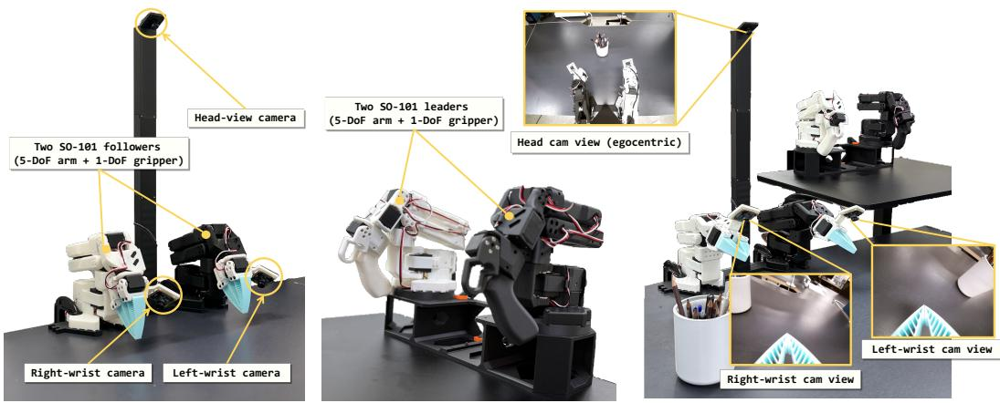  
(b) Leader Robot Arm Setup  
(c) Leader and Follower Setup for Teleoperation  
Figure 4: Real-robot teleoperation and evaluation platform. We specify the leader and follower robot arm setups, consisting of 5-DoF arms with 1-DoF grippers, along with the multi-camera views.

## A EXPERIMENTAL DETAILS

## A.1 MODEL DETAILS

Backbone VLAs. We instantiate INDI on two flow-matching VLA backbones, GR00T-N1.7-3B (NVIDIA, 2026) and $\pi _ { 0 . 5 }$ (Black et al., 2025a; Physical Intelligence, 2025), using their official implementations. For both models, we freeze the pretrained vision-language module and fine-tune the action decoder together with the newly introduced INDI parameters.

INDI integration. For GR00T-N1.7, we append self-conditioned visual and textual grounding rows and clean intent queries $Q ^ { I }$ to the pretrained DiT token stream. The grounding rows follow the backbone’s time-conditioned normalization, while the intent queries use standard layer normalization and are never noised. The recovered intent is supervised at block 16 of 32. For $\pi _ { 0 . 5 }$ , the action-expert suffix is organized as

$$
[ Q _ { t } , A _ { t } ^ { \lambda } , Z _ { t } ^ { V , \lambda } , Z _ { t } ^ { R , \lambda } , Q ^ { I } ] ,
$$

where $Q _ { t }$ is the proprioceptive-state representation, $A _ { t } ^ { \lambda }$ is the noised action sequence, $Z _ { t } ^ { V , \lambda }$ and $Z _ { t } ^ { R , \lambda }$ are self-conditioned visual and textual grounding inputs, and $Q ^ { I }$ contains the clean intent queries. The recovered intent is supervised at layer 9 of 18. We apply the same asymmetric information-flow pattern during training and sampling. Intent queries attend to the frozen VLA context, proprioceptive state, and one another while remaining isolated from the noised action and grounding rows. Visual and textual grounding rows attend to the recovered intent and one another, whereas action rows attend to the intent together with both grounding streams. For $\pi _ { 0 . 5 }$ , we cache the frozen prefix keys and values during training.

Trainable and frozen components. The vision-language modules, including their visual encoders, remain frozen for both backbones. We optimize the complete action decoder together with the added intent and grounding parameters. These parameters include intent-query embeddings, positional and camera-view embeddings, and three-layer SiLU MLPs for encoding and projecting the target representations. The visual target has width $d _ { V } \ = \ 2 0 4 8 .$ , the teacher targets have width $d _ { T } = 4 0 9 6 ,$ and the added representations are mapped to the backbone-specific decoder width $d _ { D }$ Checkpoint-tensor counting gives 3.455B parameters for the GR00T-N1.7 baseline and 3.502B for GR00T-N1.7+INDI, corresponding to 46.4M additional parameters or a 1.3% increase. For $\pi _ { 0 . 5 } ,$ the corresponding counts are 3.617B and 3.640B, giving 23.1M additional parameters or a 0.64% increase.

Model dimensions. Unless stated otherwise, we use $K _ { I } ~ = ~ 8$ intent queries, $K _ { R } \ = \ 8$ textual grounding rows, and $K _ { V } = 1 6$ visual grounding rows per camera. Bridge uses one camera and therefore 16 visual rows, while RoboCasa Kitchen uses three cameras and therefore 48 visual rows. We use an intent-mismatch margin of $m = 0 . 0 5$ and a context-dropout probability of 0.5.

## A.2 DATASETS

SimplerEnv-Bridge. We evaluate on SimplerEnv-Bridge (Li et al., 2025b), a simulation benchmark for evaluating real-world manipulation policies trained on BridgeData V2 (Walke et al., 2023). We use the LeRobot conversion of BridgeData V2, which contains 53,192 episodes and 1,893,026 frames recorded at 5 Hz. Each sample contains a primary RGB observation at 256 × 256 resolution, an 8-dimensional robot state, and a 7-dimensional action. We evaluate four WidowX manipulation tasks: spoon on towel, carrot on plate, stack cube, and put eggplant in basket. Our controlled GR00T-N1.7 and $\pi _ { 0 . 5 }$ comparisons use three independent evaluation runs with 50 episodes per task in each run. We report the mean and sample standard deviation of the three run-level success rates. Published baseline results follow their original evaluation protocols.

RoboCasa Kitchen. RoboCasa Kitchen (Nasiriany et al., 2024) is a simulation benchmark for household manipulation in diverse kitchen environments. We use its machine-generated dataset with 100 demonstrations for each of 24 tasks, giving 2,400 episodes and 689,595 frames recorded at 20 Hz. Each sample contains left, right, and wrist RGB observations at 256 × 256 resolution, a 53-dimensional robot state, and a 12-dimensional action. The benchmark contains 8 pick-and-place tasks, 6 open-or-close tasks, and 10 additional appliance and interaction tasks. We use three independent evaluation runs with 50 episodes per task and run for both GR00T-N1.7 and $\pi _ { 0 . 5 }$ . Category and overall averages are computed within each run and then summarized by their mean and sample standard deviation across the three runs.

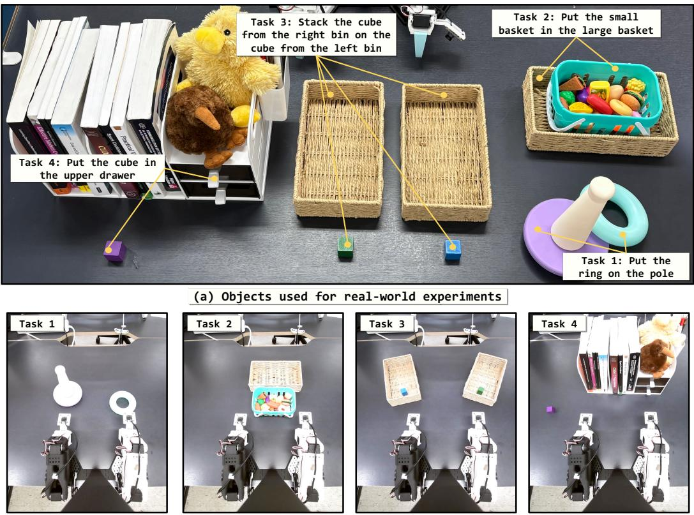  
(b) Head-camera views of the initial states for the four tasks  
Figure 5: Real-world task suite. Four tabletop tasks used for real-world experiments.

Real-world platform. As shown in Figure 4, we use a teleoperation setup consisting of SO-101 robot arms for both the leader and follower, equipped with 1-DoF grippers. Three camera views are provided: an egocentric view mounted on the head structure and two local views on the wrists.

On this platform, we design four tabletop tasks as illustrated in Figure 5, each targeting a distinct capability and ordered by horizon length. For each task, we collect 100 demonstrations and train a single multitask policy per method on identical data.

• Threading (bimanual) has the left arm bring a pole to the center, after which the right arm inserts a specified ring onto it, testing precise alignment.

• Basket Nesting (bimanual) lifts a small basket with both arms into a larger one, testing simultaneous cooperation on a shared object that a single arm cannot lift.

• Cross-Bin Stacking (bimanual) has the left arm place a cube from the left bin at the center, after which the right arm stacks a cube from the right bin on top.

• Drawer Storage (bimanual) has the left arm pass an object to the right arm, which then opens the specified drawer of a two-tier unit, places the object inside, and closes it.

## A.3 BASELINES

We briefly describe the baseline methods included in our evaluations.

• Octo (Octo Model Team et al., 2024) is a transformer-based generalist policy trained on cross-embodiment robot data with a diffusion-based action head.

• OpenVLA (Kim et al., 2025) fine-tunes a pretrained vision-language model to autoregressively predict discretized action tokens.

• RoboVLMs (Li et al., 2026b) studies the integration of pretrained vision-language models with continuous and discrete action-prediction architectures.

• SpatialVLA (Qu et al., 2025) incorporates explicit 3D spatial information through Ego3D positional encoding and adaptive action grids.

• π0 (Black et al., 2025b) combines a pretrained vision-language prefix with a flow-matching action expert for continuous action generation.

• π0-FAST (Pertsch et al., 2025) predicts actions autoregressively using frequency-space action tokenization.

$\pi _ { 0 . 5 }$ (Black et al., 2025a) extends the $\pi _ { 0 }$ family toward open-world generalization and serves as our second backbone.

• GR00T-N1 (NVIDIA et al., 2025) combines a vision-language module with a flowmatching diffusion-transformer action decoder.

• GR00T-N1.5 (NVIDIA GEAR Team, 2025) improves the architecture, training data, and post-training procedure of GR00T-N1.

• GR00T-N1.6 (NVIDIA, 2025b) further updates the GR00T pretraining mixture and posttraining recipe.

• GR00T-N1.7 (NVIDIA, 2026) is our primary backbone.

• LAPA (Ye et al., 2025) learns discrete latent actions between video frames and pretrains a vision-language model to predict these representations before robot-action fine-tuning.

• UniVLA (Bu et al., 2025) learns task-centric latent actions from cross-embodiment videos and decodes the predicted latent actions into embodiment-specific robot trajectories.

• ECoT (Zawalski et al., 2025) generates embodied reasoning traces before predicting robot actions.

• DreamGen (Jang et al., 2025) generates synthetic robot trajectories with a video world model and recovers corresponding pseudo-actions.

• DUST (Won et al., 2026) jointly predicts future observations and actions using interacting diffusion streams with decoupled flow-matching objectives.

• Video Policy (Liang et al., 2025) combines behavior-video generation and action prediction within an end-to-end robot policy.

• FLARE (Zheng et al., 2025b) aligns intermediate action-decoder representations with latent features of future observations.

• HAMLET (Koo et al., 2026) incorporates observation history through moment tokens and a temporal memory module.

• RS-CL (Kim et al., 2026b) regularizes vision-language representations with a contrastive objective supervised by distances between robot proprioceptive states.

Our controlled comparisons use GR00T-N1.7 and $\pi _ { 0 . 5 }$ baselines trained with the same demonstrations, optimization budgets, and evaluation protocols as their corresponding INDI models. Moreover, future supervision replaces the teacher-intent target with FLARE-style alignment of mid-depth decoder representations to latent features of the future observation, under the same backbone and training budget. The exact configurations of the supervision and capacity controls are provided in Section B.1.

## A.4 TARGET CONSTRUCTION

Teacher inputs and prompt. We use the frozen Cosmos-Reason2-8B model (NVIDIA, 2025a) as the teacher. For each H-step demonstrated behavior segment W , the teacher receives the current observation, language instruction, a coarse textual action summary $c _ { A } ( \mathcal { W } _ { t } )$ , and the corresponding execution video. In a single autoregressive generation pass, the teacher first processes this multimodal evidence and then generates a functional-purpose statement describing what the executed behavior accomplishes under the instruction. The prompt asks the teacher to reason in at most four sentences about the state change occurring during the segment and how it advances the instruction. It then requests exactly one sentence of approximately 30 to 50 tokens that describes the objectlevel state change or immediate local subgoal. Low-level control values, camera motion, references to the video, and additional labels or explanations are explicitly excluded. We use the same prompt template for Bridge and RoboCasa Kitchen.

## Prompt for Teacher Target Construction

## System Prompt

You are a robot manipulation reasoning model. You will see a short video of an approximately 1.6-second segment from a longer robot task, a short multi-step segment that may include contact, object motion, or clear setup for the next contact, plus a coarse summary of the commanded robot motion.

First write a brief reasoning block inside <think>...</think>, using at most four sentences. In the reasoning, infer what changes over this segment: which object or relation is acted on, what state transition occurs, and why this segment advances the episode instruction.

Immediately after </think>, write exactly one sentence of roughly 30–50 tokens. This sentence is the segment’s functional intent: the object-level outcome that the behavior accomplishes or clearly progresses toward. Describe the intended object-level state change, not low-level motion, camera appearance, or the video itself. State only changes that are visible or strongly implied by the segment. If contact or object motion has not happened yet, describe the immediate setup or alignment achieved by the segment.

Do not mention “the video,” “the clip,” “frames,” “I,” or “the robot intends.” Do not add a label, bullet, prefix, or explanation after </think>. Output only the one sentence after </think>.

User Prompt

Episode instruction: {instruction}

Coarse commanded motion over this segment: {action\_summary}

The video frames show an approximately 1.6-second multi-step segment with {n} frames.

Identify the functional intent of this behavior segment by stating the object-level outcome it accomplishes or clearly progresses toward under the episode instruction.

Action and video preprocessing. We convert each continuous action segment into a compact textual representation before providing it to the teacher. For each action dimension, we compute dataset-specific percentile boundaries from the training set and map the continuous values to coarse discrete motion bins. The resulting sequence of bucketed values is serialized as a short description of the translational, rotational, and gripper behavior over the segment. The gripper dimension is interpreted using the open and close convention of each dataset rather than assuming a shared sign convention across embodiments. This representation provides the teacher with the overall motion pattern while avoiding long sequences of raw floating-point values. The execution video covers the same temporal interval as the summarized action segment. On Bridge, we use the 8 frames corresponding to an 8-step segment recorded at 5 Hz. On RoboCasa Kitchen, each target covers a 32-step segment recorded at 20 Hz, from which we uniformly sample 16 frames. Both therefore represent an approximately 1.6-second behavior window. The current observation, action segment, and video clip are matched using their episode identifier and segment start index, ensuring that all teacher inputs describe the same executed behavior.

Intent and textual-purpose targets. Let $\mathcal { E } _ { t }$ denote the teacher-input span containing the current observation, instruction, coarse action summary, and execution video. Let $S _ { t }$ denote only the final functional-purpose statement generated after the reasoning span. During the same autoregressive pass, we cache the hidden states produced while processing $\mathcal { E } _ { t }$ and while generating $S _ { t }$ . We construct the intent target $I _ { t } ^ { \star }$ from the layer-18 hidden states over $\mathcal { E } _ { t } ^ { { \mathrm { ~ ~ } } }$ , corresponding to the midpoint of the teacher. Given the input-span hidden states $H _ { \varepsilon _ { t } } ^ { ( 1 8 ) }$ , we partition the token sequence into $K _ { I } = 8$ approximately equal contiguous regions and average the hidden states within each region:

$$
I _ { t , k } ^ { \star } = \frac { 1 } { \vert \mathcal { G } _ { I , k } \vert } \sum _ { i \in \mathcal { G } _ { I , k } } H _ { \mathcal { E } _ { t , i } } ^ { ( 1 8 ) } , \qquad k = 1 , \ldots , K _ { I } .
$$

This preserves the coarse ordering of the multimodal teacher-input representation while producing a fixed number of target slots. We construct the textual-purpose target $R _ { t } ^ { \star }$ from the final-layer hidden states over $S _ { t }$ . The statement tokens are likewise partitioned into $K _ { R } = 8$ contiguous regions and mean-pooled:

$$
R _ { t , k } ^ { \star } = \frac { 1 } { | \mathcal { G } _ { R , k } | } \sum _ { i \in \mathcal { G } _ { R , k } } H _ { S _ { t } , i } ^ { ( \mathrm { f i n a l } ) } , \qquad k = 1 , \ldots , K _ { R } .
$$

Both targets have hidden width $d _ { T } = 4 0 9 6$ . Thus, $I _ { t } ^ { \star }$ is the evidence-side multimodal representation formed while the teacher interprets the demonstrated behavior, whereas $R _ { t } ^ { \star }$ captures its final linguistic realization.

Generated-response intent target for the target-source ablation. We additionally construct an alternative intent target from the teacher-generated response. Let $\mathcal { V } _ { t }$ denote the complete response span generated after processing $\mathcal { E } _ { t } .$ , including both the reasoning block and the final functionalpurpose statement. Using the same teacher layer as the default intent target, we partition the hidden states over $\mathcal { V } _ { t }$ into $K _ { I } = 8$ approximately equal contiguous regions and mean-pool each region:

$$
I _ { t , k } ^ { \star , \mathrm { r e s p } } = \frac { 1 } { | \mathcal { G } _ { \mathrm { r e s p } , k } | } \sum _ { i \in \mathcal { G } _ { \mathrm { r e s p } , k } } H _ { \mathcal { V } _ { t } , i } ^ { ( 1 8 ) } , \qquad k = 1 , \ldots , K _ { I } .
$$

This alternative preserves the same target width and number of slots as the default evidence-side target, while replacing the representation formed over the multimodal evidence with one formed over the teacher’s complete generated interpretation.

Visual-outcome target. We construct the visual-outcome target $V _ { t } ^ { \star }$ from the observation at the endpoint of the behavior segment. Specifically, the endpoint is $o _ { t + 8 }$ for Bridge and $o _ { t + 3 2 }$ for Robo-Casa Kitchen, matching the temporal window used for the corresponding teacher target. We encode this observation using the frozen visual encoder of Cosmos-Reason2-2B. The encoder produces 64 regional features with hidden width $d _ { V } = 2 0 4 8$ , which we reduce to $K _ { V } ~ = ~ 1 6$ ordered target slots using fixed 64-to-16 spatial pooling. For multi-camera observations, each view is encoded and pooled independently. Bridge uses one camera and therefore produces 16 visual target slots. Robo-Casa Kitchen uses left, right, and wrist cameras and therefore produces 48 slots in total. Samples that do not contain a valid endpoint observation near an episode boundary are excluded from the visual-alignment loss. All teacher and visual targets are generated once offline and reused across policy-training runs.

## A.5 IMPLEMENTATION

Decoder augmentation. We preserve the native state and action representations of each backbone and append self-conditioned visual grounding rows $Z _ { t } ^ { V , \lambda }$ , self-conditioned textual grounding rows $Z _ { t } ^ { R , \lambda }$ , and clean intent queries $Q ^ { I }$ to the action-decoder sequence. For GR00T-N1.7, the added rows are incorporated into the diffusion-transformer stream. For $\pi _ { 0 . 5 }$ , they are appended to the actionexpert suffix following the frozen vision-language prefix. All added rows use learned positional embeddings, and visual rows additionally use camera-view embeddings. For $\pi _ { 0 . 5 }$ , we cache the frozen prefix keys and values during training.

Asymmetric information flow. Intent queries attend to the robot state, frozen VLA context, and one another, but not to the noised action or grounding rows. Visual and textual grounding rows attend to the recovered intent and one another, while action rows attend to the recovered intent and both grounding streams. Direct context access from action and grounding rows is controlled by a binary gate $\alpha ,$ whereas intent queries always retain access to the VLA context. During training, we sample $\alpha \sim$ Bernoulli(0.5), so updates with $\alpha = 0$ require the downstream rows to obtain contextual information through the intent queries. For $\pi _ { 0 . 5 } .$ , this gate is applied to the image and language prefix tokens, while access to the state representation remains available. We use the same information-flow structure during training and sampling and set $\alpha = 1$ at deployment.

Intent alignment. We extract the contextualized intent-query states $H _ { I , t } ^ { L _ { \mathrm { t a p } } }$ at the midpoint of the decoder, using block 16 for GR00T-N1.7 and layer 9 for $\pi _ { 0 . 5 }$ . A three-layer SiLU MLP projects each intent state to the teacher feature space. The projected rows are aligned one-to-one with the eight teacher intent targets $I _ { t } ^ { \star }$ using cosine distance, with stop-gradient applied to the targets. The decoder-space states $H _ { I , t } ^ { \overline { { L } } _ { \mathrm { t a p } } }$ , rather than their projected teacher-space representations, are used as the recovered intent by the remaining decoder layers.

Intent-mismatch training. For updates with $\alpha = 0 .$ , we construct mismatched intent states by cyclically shifting the recovered intent representations within the batch. Starting from the intentalignment layer, the remaining decoder blocks are evaluated once with the original intent and once with the mismatched intent. We optimize

$$
\mathcal { L } _ { \mathrm { m i s } } = \operatorname* { m a x } \left( 0 , m + \mathcal { D } _ { \mathrm { r i g h t } } - \mathcal { D } _ { \mathrm { s w a p } } \right) ,
$$

where $\mathcal { D } _ { \mathrm { r i g h t } }$ and $\mathcal { D } _ { \mathrm { s w a p } }$ denote the combined downstream action and grounding losses, and $m =$ 0.05. The mismatched donor representations are detached so that gradients do not propagate through the donor examples.

Grounding self-conditioning and deployment. Clean teacher targets are used only as supervision and are never supplied as decoder inputs. A no-gradient forward pass first estimates clean decoderspace visual and textual grounding states. These estimates are detached, re-noised at the sampled flow time, and used as grounding inputs to the gradient pass. During inference, the visual and textual states are carried across denoising steps using the same self-conditioning convention. The teacher VLM, target representations, alignment projections, and intent-mismatch branch are used only during training. The deployed policy receives the original VLA inputs and internally forms intent and grounding states together with the action stream.

## A.6 TRAINING DETAILS

Optimization and learning-rate schedules. We follow the official fine-tuning implementations of GR00T-N1.7 (NVIDIA, 2026) and $\pi _ { 0 . 5 }$ (Black et al., 2025a; Physical Intelligence, 2025). For each backbone, the baseline and INDI variant use the same benchmark-specific training budget. For GR00T-N1.7, we use AdamW with a learning rate of $1 0 ^ { - 4 }$ . We train for 60,000 steps with a global batch size of 480 on RoboCasa Kitchen and for 20,000 steps with a global batch size of $^ { 1 , 5 3 6 }$ on Bridge. For $\pi _ { 0 . 5 } ,$ we use AdamW with a maximum gradient norm of 1.0 and linearly warm up the learning rate for 1,000 steps to $5 \times 1 0 ^ { - 5 }$ , which is held constant for the remainder of training. We use the same benchmark-specific batch sizes and training steps as in the corresponding GR00T-N1.7 experiments. All models are trained with bfloat16 computation, while loss values are accumulated in float32. The global batch sizes are distributed across three GPUs without gradient accumulation.

Loss configuration. We set $\lambda _ { I } = \lambda _ { V } = \lambda _ { R } = 0 . 5 , \lambda _ { \mathrm { m i s } } = 0 . 1$ , and the intent-mismatch margin to $m = 0 . 0 5$ . The weights of the visual and textual grounding losses are linearly increased from zero to their final values during the first 1,000 training steps. The action and intent-alignment losses are active from the beginning of training. We use a context-dropout probability of 0.5.

Backbone-specific training configurations. For both backbones, we freeze the pretrained visionlanguage module and optimize the action decoder together with the newly introduced INDI parameters. The teacher targets are defined over an approximately 1.6-second behavior window, corresponding to $H = 8$ steps on Bridge and $H = 3 2$ steps on RoboCasa Kitchen. For GR00T-N1.7, the decoder retains its native 40-step output sequence, while the action and auxiliary losses are applied to the benchmark-valid segment of 8 steps on Bridge and 32 steps on RoboCasa Kitchen. For $\pi _ { 0 . 5 } ,$ we retain its native 10-step action horizon and mask the action loss to the valid action dimensions, excluding dimensions introduced only by zero padding. The teacher behavior window is defined independently of the backbone-native policy horizon. We cache the keys and values of the frozen $\pi _ { 0 . 5 }$ prefix during training.

Checkpoint selection. On RoboCasa Kitchen, we evaluate the final checkpoint obtained after 60,000 training steps. On Bridge, we evaluate checkpoints at 5,000, 10,000, 15,000, and 20,000 steps using two validation rollout seeds and apply the same selection procedure to both backbones.

Controlled ablation protocol. The mechanism, policy-level teacher, and intent-target-source ablations use GR00T-N1.7 on SimplerEnv-Bridge. Unless stated otherwise, all variants use the same demonstrations, student architecture, optimization budget, checkpoint-selection procedure, and fixed evaluation run as the controlled analyses in Section 4.4. Only the component or target source identified by each ablation is changed.

## A.7 COMPUTATIONAL RESOURCES

All experiments are conducted on a single node with three NVIDIA B200 GPUs, each with 183 GB of memory. Teacher targets are generated once offline and reused across all subsequent policytraining runs. We summarize parameter counts, inference time per policy query, and benchmarkspecific training time in Table 7. All inference-time measurements are obtained on a single NVIDIA B200 GPU.

Table 7: Modification cost across VLA backbones. We report checkpoint-tensor parameter counts, inference time per policy query, and end-to-end training time. Inference is measured on a single NVIDIA B200 GPU, while training uses three NVIDIA B200 GPUs.
<table><tr><td>Method</td><td>Parameters</td><td>Inference time (ms)</td><td>Bridge training (h)</td><td>RoboCasa training (h)</td></tr><tr><td>GR00T-N1.7</td><td>3.455B</td><td>56.1 (1.00×)</td><td>~17</td><td>~17</td></tr><tr><td>+INDI</td><td>3.502B (+46.4M, +1.3%)</td><td>61.5 (1.10×)</td><td>~19</td><td>~19</td></tr><tr><td>π0.5</td><td>3.617B</td><td>24.4 (1.00×)</td><td>~23</td><td>~23</td></tr><tr><td>+INDI</td><td>3.640B (+23.1M, +0.64%)</td><td>29.7 (1.21×)</td><td>~29</td><td>~26</td></tr></table>

## B ADDITIONAL ABLATIONS AND DIAGNOSTICS

Unless stated otherwise, the following controlled analyses use GR00T-N1.7 on a fixed SimplerEnv-Bridge evaluation run shared across all variants. The main benchmark tables separately aggregate three evaluation runs. This section provides the exact control configurations, diagnostic protocols, full quantitative analyses, and additional readouts underlying Section 4.4. Results already reported in Tables 6a and 6b and Fig. 3 are referenced directly rather than duplicated.

## B.1 SUPERVISION AND CAPACITY CONTROLS

We isolate whether the improvement comes from teacher-derived intent, visual and textual grounding supervision, an endpoint-informed latent, or additional latent capacity. All variants use the same GR00T-N1.7 backbone, Bridge demonstrations, optimization budget, and evaluation protocol. The groundings-only control retains the visual and textual grounding streams, $\mathcal { L } _ { V } , \mathcal { L } _ { R } .$ , and grounding self-conditioning while removing the intent queries and intent supervision. The future-supervision control retains the latent and grounding streams but replaces $I _ { t } ^ { \star }$ with an endpoint visual representation. The free-latent control retains the latent queries, bottleneck context routing, context dropout, visual and textual grounding streams, alignment objectives, and self-conditioning while removing both $\mathcal { L } _ { I }$ and ${ \mathcal { L } } _ { \mathrm { m i s } }$ . The intent-only control retains teacher-intent alignment, bottleneck context routing, context dropout, and action-only intent-mismatch training while removing the visual and textual grounding streams.

As shown in Table 6a, the non-intent controls reach at most 68.0%, whereas intent only reaches 76.0%. Teacher-derived intent therefore provides a 14.5 percentage-point gain over the actiononly baseline and an 8.0 percentage-point gain over future supervision. Adding visual and textual groundings further increases average success to 85.5%, showing that they complement rather than replace intent supervision.

Table 8: Configuration of supervision and capacity controls. Task-level success rates are reported in Table 6a.
<table><tr><td>Variant</td><td>Latent target</td><td>V/R groundings</td><td>Latent queries</td></tr><tr><td>Groundings only</td><td></td><td>Yes</td><td>No</td></tr><tr><td>Future supervision</td><td>Endpoint visual</td><td>Yes</td><td>Yes</td></tr><tr><td>Free latent</td><td></td><td>Yes</td><td>Yes</td></tr><tr><td>Intent only</td><td>Teacher intent</td><td>No</td><td>Yes</td></tr><tr><td>INDI</td><td>Teacher intent</td><td>Yes</td><td>Yes</td></tr></table>

Table 9: Supervision and capacity controls on SimplerEnv-Bridge. V and R denote the visual and textual grounding streams. All variants share the backbone, budget, and a fixed evaluation run. Success rates (%).
<table><tr><td>Variant</td><td>V</td><td>R</td><td>Spoon</td><td>Carrot</td><td>Stack</td><td>EP-Basket</td><td> $\operatorname { A v g } .$ </td></tr><tr><td>GR00T-N1.7</td><td></td><td></td><td>82.0</td><td>68.0</td><td>66.0</td><td>30.0</td><td>61.5</td></tr><tr><td>+ Groundings only</td><td>√</td><td>√</td><td>88.0</td><td>82.0</td><td>38.0</td><td>32.0</td><td>60.0</td></tr><tr><td>+ Future supervision</td><td>√</td><td>√</td><td>84.0</td><td>70.0</td><td>56.0</td><td>62.0</td><td>68.0</td></tr><tr><td>+ Free latent</td><td>√</td><td>√</td><td>78.0</td><td>76.0</td><td>48.0</td><td>26.0</td><td>57.0</td></tr><tr><td>+ Intent only</td><td></td><td></td><td>86.0</td><td>84.0</td><td>70.0</td><td>64.0</td><td>76.0</td></tr><tr><td>+ Intent, V</td><td>√</td><td></td><td>90.0</td><td>88.0</td><td>72.0</td><td>74.0</td><td>81.0</td></tr><tr><td>+ Intent, R</td><td>一</td><td>√</td><td>90.0</td><td>86.0</td><td>70.0</td><td>72.0</td><td>79.5</td></tr><tr><td>INDI (Ours)</td><td>√</td><td>√</td><td>90.0</td><td>78.0</td><td>74.0</td><td>100.0</td><td>85.5</td></tr></table>

Each grounding stream also contributes on its own, raising average success from 76.0% to 81.0% with the visual stream and 79.5% with the textual stream. Their joint effect (+9.5) exceeds the sum of the individual gains (+8.5), and is concentrated on EP-Basket, where either stream alone reaches roughly 73% but both together reach 100.0%. The textual stream helps despite aligning only weakly with its paired target (Table 14), consistent with it acting as a downstream realization rather than a standalone readout.

## B.2 INTENT-DEPENDENCE MECHANISM ABLATIONS

We ablate the two training mechanisms introduced to make downstream decoding depend on recovered intent: bottleneck context routing and intent-mismatch training. The full model samples α ∼ Bernoulli(0.5), requiring action and grounding rows to obtain VLA context through the intent rows when $\alpha = 0 ,$ , and applies ${ \mathcal { L } } _ { \mathrm { m i s } }$ to encourage lower downstream loss under matched than mismatched intent. We compare the full model with variants that remove the context bottleneck, the mismatch objective, or both.

Table 10: Ablation of intent-dependence mechanisms on SimplerEnv-Bridge. All variants use GR00T-N1.7, the same training budget, and the same fixed evaluation run. The context-bottleneck ablation allows action and grounding rows to access the VLA context throughout training, while the mismatch ablation sets $\lambda _ { \mathrm { m i s } } = 0$
<table><tr><td>Variant</td><td>Spoon</td><td>Carrot</td><td>Stack</td><td>EP-Basket</td><td> $\operatorname { A v g } .$ </td></tr><tr><td>INDI</td><td>90.0</td><td>78.0</td><td>74.0</td><td>100.0</td><td>85.5</td></tr><tr><td>w/o context bottleneck</td><td>88.0</td><td>76.0</td><td>60.0</td><td>56.0</td><td>70.0</td></tr><tr><td>w/o  ${ \mathcal { L } } _ { \mathrm { m i s } }$ </td><td>92.0</td><td>80.0</td><td>30.0</td><td>94.0</td><td>74.0</td></tr><tr><td>w/o both</td><td>86.0</td><td>72.0</td><td>58.0</td><td>46.0</td><td>65.5</td></tr></table>

Removing the context bottleneck reduces average success from 85.5% to 70.0%, while removing intent-mismatch training reduces it to 74.0%. Removing both mechanisms further lowers success to 65.5%. Thus, both mechanisms contribute substantially and complement one another: bottleneck routing encourages downstream decoding to obtain contextual information through the recovered intent, while ${ \mathcal { L } } _ { \mathrm { m i s } }$ encourages that dependence to be sensitive to the intent’s specific content rather than merely to the presence of the latent pathway.

## B.3 FUNCTIONAL ROLE AND STRUCTURE OF RECOVERED INTENT

We examine whether the recovered representation is used by the action decoder, whether it retains behavior objective and execution progress across different action-sequence realizations, how this information propagates through decoder depth, and whether objective-specific edits affect closedloop behavior.

The action decoder relies on recovered intent. At the intent-alignment layer, we replace all eight recovered intent states with zero vectors while preserving the observation, instruction, proprioceptive state, action noise, grounding states, and remaining decoder computation.

Table 11: Dependence on recovered intent. The zero-intent intervention replaces all intent states at the alignment layer while preserving all other policy inputs. Both conditions use the same evaluation run on SimplerEnv-Bridge.
<table><tr><td>Intent state</td><td>Spoon</td><td>Carrot</td><td>Stack</td><td>EP-Basket</td><td>Avg.</td></tr><tr><td>Recovered intent</td><td>90.0</td><td>78.0</td><td>74.0</td><td>100.0</td><td>85.5</td></tr><tr><td>Zero intent</td><td>58.0</td><td>44.0</td><td>40.0</td><td>40.0</td><td>45.5</td></tr></table>

As shown in Table 11, zeroing recovered intent reduces average success from 85.5% to 45.5%, below the 61.5% action-only baseline. The recovered state is therefore not merely an auxiliary alignment target but a representation used by downstream action decoding.

Intent represents behavior objectives across domains. We collect the eight intent-row hidden states immediately before the alignment layer from 580 real demonstration segments and 202 simulation rollout segments. Each segment is represented by the flattened K d -dimensional recovered intent state. We reduce the representations to 50 dimensions using PCA and fit three shrinkage LDA axes from the four Bridge task labels. The two-dimensional task-discriminative projection is shown in Figure 3a. Raw-space one-nearest-neighbor classification achieves 92.0% task purity, and episode-disjoint shrinkage LDA achieves 86.2% accuracy. Randomly permuting the task labels gives 31.9% mean accuracy across 20 permutations, with a maximum of 41.4%. A classifier trained only on real-demonstration intents classifies simulation-rollout intents with 63.9% to 80.7% accuracy across tasks. These results show that objective information persists across episodes and transfers from real demonstrations to simulation rollouts.

Intent captures progress shared across related manipulation tasks. The four Bridge tasks manipulate different objects and target relations but share an approach–grasp–transport–place structure. We divide each episode into early, middle, and late intervals and fit a phase-discriminative projection using labels pooled across tasks. As shown in Figure 3b, segments from different tasks organize by execution stage. Three-way phase prediction achieves 77.8% five-fold cross-validation accuracy, compared with a 33.3% chance level. Task purity within the phase plane is 36.6%, while task identity remains readable within the early, middle, and late intervals at 94.0%, 90.0%, and 90.0%, respectively. We also fit a continuous progress direction with ridge regression and evaluate it in a leave-one-task-out setting. The held-out correlations are 0.62 for Spoon, 0.70 for Carrot, 0.72 for Stack, and 0.69 for EP-Basket, compared with an in-sample correlation of 0.88.

Together, Figure 3 and Table 12 show complementary objective and progress structure in the recovered representation. The task-discriminative structure captures which object-level objective is being pursued, while the phase-discriminative structure captures progress shared by this family of manipulation tasks. We interpret the latter as a task-family-shared progress coordinate rather than a universal progress axis for arbitrary robot skills.

Intent captures objective beyond action-sequence realization. We distinguish intent from skill by operationalizing skill as the executed action sequence. The action sequence describes how a behavior is realized, whereas intent denotes the local objective that the behavior serves. To test whether intent merely summarizes the executed sequence, we compare progress-matched episode pairs under two opposing conditions: the same objective realized by dissimilar sequences, and different objectives realized by similar sequences. We use episode-disjoint discovery and test splits, with all centering statistics and pair-selection thresholds estimated from discovery episodes.

Table 12: Objective and task-family-shared progress structure in recovered intent. The supervision control applies the same probe to the free-latent variant, which receives identical context access but no teacher-intent supervision.
<table><tr><td>Property</td><td>Evaluation</td><td>Result</td></tr><tr><td colspan="3">Behavior objective</td></tr><tr><td>Objective identity</td><td>Raw-space task 1-NN purity</td><td>92.0%</td></tr><tr><td>Objective generalization</td><td>Episode-disjoint task LDA</td><td>86.2%</td></tr><tr><td>Supervision control</td><td>Same probe, free latent (no  ${ \mathcal { L } } _ { I } )$ </td><td>55.7%</td></tr><tr><td>Cross-domain transfer</td><td>Train on real, test on simulation</td><td>63.9–80.7%</td></tr><tr><td>Objective retention</td><td>Task purity in early/middle/late phases</td><td>94.0/90.0/90.0%</td></tr><tr><td colspan="3">Shared execution progress</td></tr><tr><td>Phase readability</td><td>Three-way phase prediction</td><td>77.8%</td></tr><tr><td>Task leakage</td><td>Task purity within phase plane</td><td>36.6%</td></tr><tr><td>Cross-task transfer</td><td>Leave-one-task-out progress correlation</td><td>0.62–0.72</td></tr></table>

As shown in Figure 6, teacher intent targets separate by objective on held-out episodes, while a matched supervised projection of local action snippets yields weak objective separation. More importantly, the projection-free comparison shows that recovered-intent similarity remains higher for the same objective with dissimilar sequences than for different objectives with similar sequences (0.150 vs. −0.017), with a gap of 0.167 and a 95% episode-bootstrap confidence interval of [0.089, 0.245]. Teacher targets show the same ordering (0.470 vs. 0.158; gap 0.312, 95% CI [0.253, 0.375]). Thus, the representation preserves what the behavior is meant to accomplish across changes in how it is executed, distinguishing intent from a latent code that merely summarizes the action sequence.

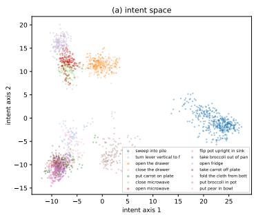

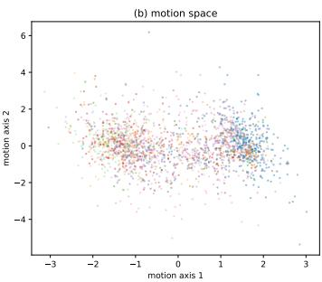

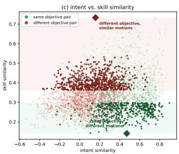  
Figure 6: Intent captures objective beyond action-sequence realization. We operationalize skill as the executed action sequence. (a) Teacher intent targets separate 14 behavior objectives on heldout episodes. (b) A matched supervised projection of local action snippets yields weak objective separation. (c) In a projection-free comparison of progress-matched episode pairs, the same objective realized by dissimilar action sequences remains more similar in intent space than different objectives realized by similar sequences. Light points show all eligible pairs, dark points show the selected contrast sets, and diamonds mark their means. Recovered policy intent exhibits the same ordering.

Task information propagates from intent into the grounding streams. A one-time edit at the intent-alignment layer may be overwritten if later blocks reconstruct the original objective from other token streams. We therefore measure one-nearest-neighbor task purity for the state, action, visual-grounding, textual-grounding, and intent rows throughout the 32 decoder blocks.

Intent-row task purity peaks at 0.93 immediately before the alignment layer. After alignment, task information appears in the visual and textual grounding rows, reaching 0.95 and 0.97, while the action and state rows remain near chance. This pattern motivates editing both intent and grounding rows throughout the decoder tail.

Table 13: Task information across decoder rows and depth. The table summarizes task information before and after the intent-alignment layer.
<table><tr><td>Decoder rows</td><td>Blocks 0-15</td><td>Blocks 19–31</td></tr><tr><td>Intent</td><td> $\mathbf { 0 . 6 3  0 . 9 3 }$ </td><td>0.77 ± 0.05</td></tr><tr><td>Visual grounding</td><td>Near chance</td><td>Up to 0.95</td></tr><tr><td>Textual grounding</td><td>Near chance</td><td>Up to 0.97</td></tr><tr><td>Action and state</td><td>Near chance</td><td>Near chance</td></tr></table>

Editing objective-specific coordinates changes closed-loop behavior. Zeroing intent establishes that the pathway is necessary but does not isolate the effect of its objective content. We therefore edit only the task-discriminative coordinates while preserving the remaining representation. Let $g \in \{ I , { \dot { G } } \}$ index the edited token group, where I contains the intent rows and $G \overset { \vartriangle } { = } V \oplus R$ contains the visual and textual grounding rows. Let $h _ { g , k } \in \mathbb { R } ^ { p _ { g } }$ denote the flattened representation after decoder block k. For task t, we compute the block-wise centroid

$$
\mu _ { g , k } ^ { ( t ) } = \mathbb { E } [ h _ { g , k } \mid \operatorname { t a s k } = t ]
$$

and form a centered matrix from the four task centroids. The columns of $U _ { g , k }$ are the right singular vectors spanning the resulting between-task subspace. For an injected task $t _ { d } ,$ we replace only the coordinates inside this subspace:

$$
\begin{array} { r } { h _ { g , k } ^ { \prime } = h _ { g , k } + U _ { g , k } \left[ U _ { g , k } ^ { \top } \mu _ { g , k } ^ { ( t _ { d } ) } - U _ { g , k } ^ { \top } h _ { g , k } \right] . } \end{array}
$$

This sets the task-discriminative coordinates to those of the injected objective while preserving the orthogonal component. We apply the edit to the intent and grounding groups after every decoder block from 16 through 24, without modifying the action or state rows. Task centroids and bases are estimated from separate rollouts under environment seeds disjoint from intervention evaluation. Each same-objective, cross-objective, and Gaussian-noise condition uses the same intervention schedule and is evaluated over 50 episodes. Donors are captured from separate rollouts, so the sameobjective condition also receives an injection of equal strength and differs from the cross-objective condition only in donor content.

The resulting closed-loop success matrix is reported in Table 6b. Same-objective interventions retain 84.5% success on average, compared with 45.2% for cross-objective interventions, while Gaussian corruption reduces success to 1.0%. The dependence on which objective is injected, together with the contrast against unstructured noise, shows that the intent-mediated pathway carries content rather than acting as an undifferentiated gate.

Intent geometry reflects task relatedness. The uneven effects of cross-objective intervention raise the question of whether the recovered intent space reflects which tasks are related. We therefore compare centered cosine similarity between recovered-intent centroids for the four SimplerEnv evaluation tasks. As shown in Figure 7, Spoon and Carrot form the closest pair, Stack is more distinct, and EP-Basket is the most separated from the other tasks. This organization is consistent with Spoon and Carrot sharing a closely related tabletop manipulation structure, whereas EP-Basket differs in both its objective and scene. The result provides a descriptive representation-level notion of task relatedness that may help explain why some cross-objective transfers are more compatible than others. Because scene and objective differences are not independently controlled, we do not interpret the similarity as a causal measure of transfer.

Editing stage-specific coordinates changes which stage is executed. We repeat the procedure with $U _ { g , k }$ spanning the between-phase subspace, estimated from early, middle, and late centroids pooled across tasks using the projection of Figure 3b. All other aspects of the protocol are unchanged, so the two interventions differ only in which subspace is replaced. Forcing an early-stage donor reduces average success to 7.3%, and forcing a late-stage donor reduces it to 5.5%, both approaching the 1.0% obtained under Gaussian corruption. The phase-matched control, which injects a donor from the same task at the receiver’s own stage, retains 50%, 70%, and 32% on Spoon, Carrot, and Stack. The gap between this control and the uninjected policy reflects the cost of clamping the intent stream over the window, which varies by task.

As shown in Figures 8 to 10, rollouts under stage-forced injection do not fail incoherently but execute behavior consistent with the injected stage. Early forcing leaves the policy executing approach behavior without transitioning to grasp: it hovers over the target on Carrot, displaces the spoon without closing the gripper on Spoon, and fumbles at the green block without initiating the stack on Stack. Late forcing produces the opposite pattern, skipping the grasp and executing placement. This is clearest on Spoon, where the policy moves to the towel and presses down with an empty gripper. Since both conditions apply injections of equal strength and differ only in donor content, the contrast is attributable to the stage information carried by the intent pathway rather than to perturbation magnitude.

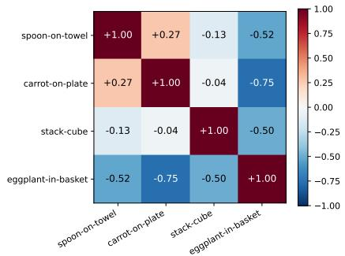  
Figure 7: Task relatedness in recovered-intent space. Each entry reports centered cosine similarity between the recovered-intent centroids of two SimplerEnv tasks. Spoon and Carrot form the closest pair, while EP-Basket is the most separated from the other tasks.

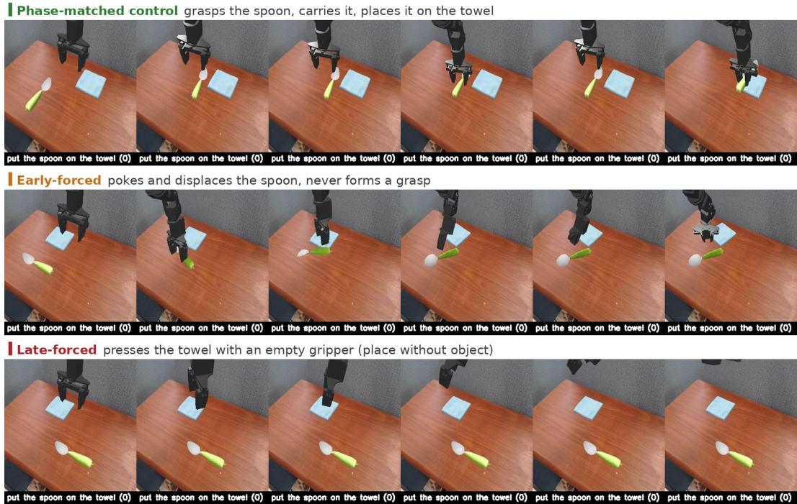  
Figure 8: Stage-forced intervention on Spoon. Rows show phase-matched, early-forced, and lateforced injection. Early forcing leaves the policy displacing the spoon without ever closing the gripper. Late forcing skips the grasp entirely: the policy moves to the towel and presses down with an empty gripper, executing placement as if it were already carrying the object.

IPhase-matched control successful pick-and-place onto the plate  
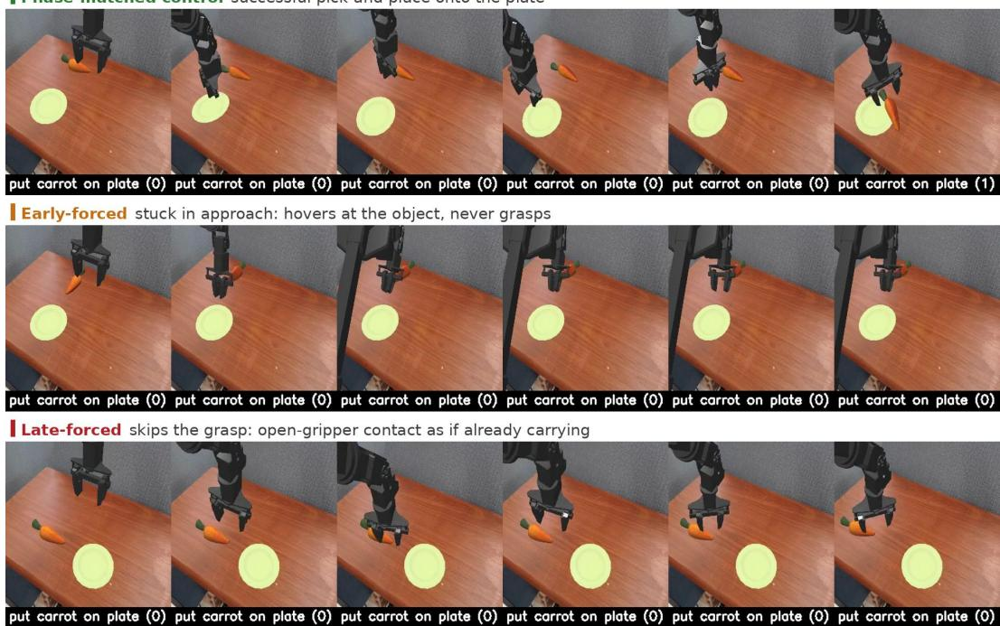  
Figure 9: Stage-forced intervention on Carrot. Early forcing leaves the policy hovering over the carrot without transitioning to grasp. Late forcing produces open-gripper contact, as if the object were already being transported.

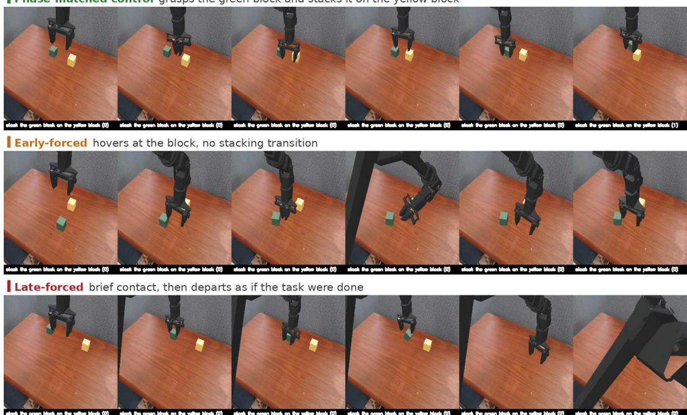  
Figure 10: Stage-forced intervention on Stack. Early forcing leaves the policy fumbling at the green block without initiating the stack. Late forcing produces brief contact followed by departure, as if the task were already complete.

## B.4 VISUAL AND TEXTUAL READOUT OF INTENT

Section B.1 identifies which supervision improves policy performance, whereas this subsection localizes the resulting behavior information within the decoder. We freeze the trained policy for all readout experiments. Let

$$
\widehat { I } _ { t } = P _ { I } \Big ( H _ { I , t } ^ { L _ { \mathrm { t a p } } } \Big ) , \qquad \widehat { V } _ { t } = P _ { V } \Big ( H _ { V , t } ^ { L _ { \mathrm { o u t } } } \Big ) , \qquad \widehat { R } _ { t } = P _ { R } \Big ( H _ { R , t } ^ { L _ { \mathrm { o u t } } } \Big )
$$

denote the projected intent and the final visual and textual grounding predictions. We evaluate them using nearest-neighbor retrieval and separately trained readout decoders while keeping the policy frozen.

Embedding-space readout. We extract $\widehat { V } _ { t } , \widehat { R } _ { t } , V _ { t } ^ { \star }$ , and $R _ { t } ^ { \star }$ for approximately 10,000 held-out segments. We subtract the dataset mean before computing cosine similarity and exclude retrieval candidates from the same episode.

Table 14: Embedding-space readout of the visual and textual groundings. Correct cosine measures centered similarity to the paired target. Shuffled cosine uses randomly permuted targets. Median rank is zero-indexed.
<table><tr><td>Readout</td><td>Correct cosine</td><td>Shuffled cosine</td><td>Margin</td><td>Top-1</td><td>Top-10</td><td>Median rank</td></tr><tr><td> $\widehat { V } _ { t } \to V _ { t } ^ { \star }$ </td><td>0.650</td><td>0.003</td><td>0.647</td><td>72.6%</td><td>95.3%</td><td>0</td></tr><tr><td> $\widehat { R } _ { t } \to R _ { t } ^ { \star }$ </td><td>0.158</td><td>-0.004</td><td>0.161</td><td>1.5%</td><td>5.0%</td><td>1211</td></tr></table>

The visual grounding provides a highly readable endpoint representation, retrieving the paired target at rank one in 72.6% of held-out segments and within the top ten in 95.3%. The textual grounding is more similar to its paired target than to shuffled targets, although its standalone nearest-neighbor geometry is less concentrated. Purpose semantics are most compactly represented in $\widehat { I } _ { t } ,$ , while the textual grounding rows provide a downstream semantic realization used during joint decoding.

Visual grounding depends on intent. We repeat the visual readout after zeroing recovered intent or replacing it with recovered intent from another task while preserving the remaining policy inputs.

Table 15: Effect of intent intervention on visual grounding.
<table><tr><td>Intent condition</td><td>Centered margin</td><td>Top-1 retrieval</td></tr><tr><td>Recovered intent</td><td>0.647</td><td>72.6%</td></tr><tr><td>Zero intent</td><td>0.513</td><td>59.1%</td></tr><tr><td>Cross-task intent</td><td>0.393</td><td>41.8%</td></tr></table>

Visual readout quality decreases from recovered to zero to cross-task intent. The predicted visual outcome therefore depends on the content supplied through the intent pathway.

Visual-outcome retrieval. We retrieve actual endpoint frames using $\widehat { V } _ { t }$ . For the intervention montage, the retrieval bank includes the designated current-task and injected-task endpoints.

The examples in Figure 11 show that recovered intent preserves the current object, scene, and result ing relation, while cross-task intent redirects the predicted outcome toward the injected behavior.

Learned visual and textual decoding. We additionally train lightweight decoders to test whether the representations can be converted directly into an endpoint image and a functional-purpose statement. The visual decoder maps the 16 ordered visual slots to the endpoint RGB image using a transformer bottleneck and convolutional upsampling. The policy is frozen, and the decoder is trained on visual targets $V _ { t } ^ { \star }$ and endpoint observations. On held-out data, reconstruction from $V _ { t } ^ { \star }$ obtains a changed-region $\bar { L } _ { 1 }$ error of 0.0819, compared with 0.3042 for copying the current observation. For textual readout, we compare the final textual grounding $\widehat { R } _ { t }$ with the projected intent $\widehat { I } _ { t }$ The intent decoder is trained on approximately 9,900 unmodified intent–statement pairs using an episode-disjoint split. We report deterministic object F1, state-change verb F1, and ROUGE-L.

The recovered intent is substantially more readable than the final textual grounding, improving object F1 from 0.314 to 0.693 and verb F1 from 0.195 to 0.432. This localizes the semantic bottleneck

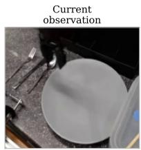

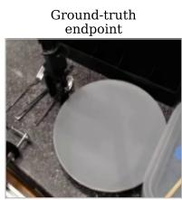

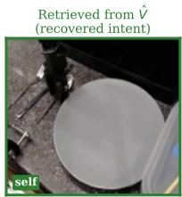  
Retrieved from V (zero intent)

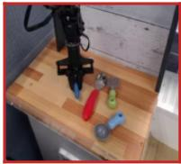  
Retrieved from V (cross-task intent)  
Instruction: put spoon on plate

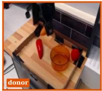  
Cross-task donor: carrot donor sample: take carrot out of pot cardboard fence

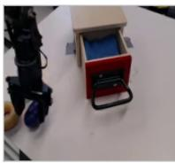

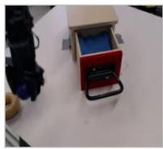

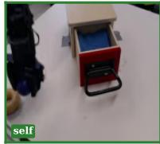

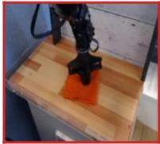  
Instruction: take the eggplant and put it inside the drawer

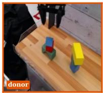  
Cross-task donor: stack donor sample: put the yellow block on top of the cube

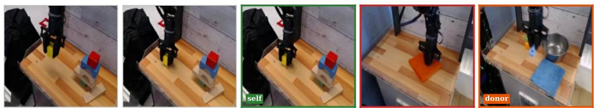  
Instruction: take the yellow cube and move in to the left  
Cross-task donor: spoon donor sample: Move the blue spoon to the top left of the table

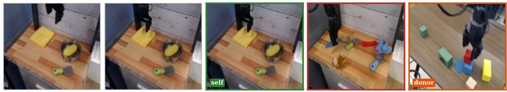  
Instruction: Put the yellow cloth to the left of the pot.  
Cross-task donor: stack donor sample: put the red cube on top of the blue rectangular

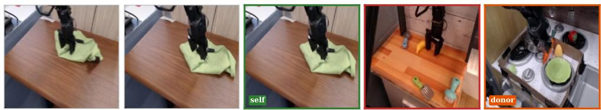  
Instruction: moved the cloth to the top edge of the table  
Cross-task donor: carrot donor sample: put carrot on plate

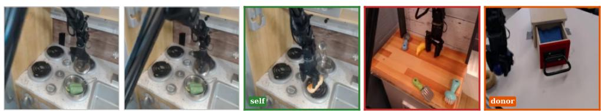  
Instruction: take the silver object and put it above of the bottom left  
Cross-task donor: eggplant donor sample: take the eggplant and put it inside the drawer

Figure 11: Non-parametric visual-outcome readout. Each row shows the current observation, ground-truth endpoint, and endpoint retrieved from $\widehat { V } _ { t }$ under recovered, zero, and cross-task intent. Recovered intent retrieves the current behavior outcome, while cross-task intent redirects retrieval toward the injected behavior. Across the evaluated pairs, recovered intent retrieves the current endpoint in 70.5% of cases. After cross-task replacement, the injected endpoint is retrieved in 78.6% of cases, while the original endpoint remains in only 0.1%.

Table 16: Textual-purpose readout. The oracle row decodes the teacher textual target. The remaining rows decode the predicted textual grounding and recovered intent.
<table><tr><td>Readout representation</td><td>Object F1</td><td>Verb F1</td><td>ROUGE-L</td></tr><tr><td> $R _ { t } ^ { \star }$  (oracle target)</td><td>0.998</td><td>1.000</td><td>0.933</td></tr><tr><td> $\widehat { R } _ { t }$ </td><td>0.314</td><td>0.195</td><td>0.255</td></tr><tr><td> $\widehat { I } _ { t }$ </td><td>0.693</td><td>0.432</td><td>0.380</td></tr></table>

primarily in recovered intent while retaining the textual grounding as a downstream representation used during joint decoding.

The visual and textual readouts change consistently under intent intervention. These results support the intended hierarchy of INDI, in which intent stores a compact behavior-level representation and visual outcome and textual purpose provide complementary observable realizations.

## B.5 TEACHER QUALITY AND INTENT-TARGET GEOMETRY

We examine whether intent distillation benefits from an arbitrary teacher, or whether the teacher target itself must have particular structure. We repeat the controlled SimplerEnv-Bridge training while changing only the teacher cache, keeping the demonstrations, student architecture, optimization budget, checkpoint selection, and evaluation protocol fixed.

Teacher choice matters. Table 17 shows that teacher choice substantially changes downstream performance. Qwen3.5-9B (Qwen Team, 2026) reduces average success to 54.5%, below the 61.5% action-only baseline, whereas Qwen3-VL-8B-Instruct (Bai et al., 2025) reaches 73.5% and Cosmos-Reason2-8B reaches 85.5%. Since Cosmos-Reason2-8B (NVIDIA, 2025a) is obtained by physical-AI post-training of Qwen3-VL-8B-Instruct, this pair provides a controlled comparison of the effect of teacher-side post-training.

Table 17: Controlled teacher swap on SimplerEnv-Bridge. All variants use the same GR00T-N1.7 student, demonstrations, optimization budget, and fixed evaluation run; only the teacher cache is changed.
<table><tr><td>Teacher</td><td>Spoon</td><td>Carrot</td><td>Stack</td><td>EP-Basket</td><td>Avg.</td></tr><tr><td>No intent distillation</td><td>82.0</td><td>68.0</td><td>66.0</td><td>30.0</td><td>61.5</td></tr><tr><td>Qwen3.5-9B</td><td>84.0</td><td>78.0</td><td>40.0</td><td>16.0</td><td>54.5</td></tr><tr><td>Qwen3-VL-8B-Instruct</td><td>90.0</td><td>98.0</td><td>34.0</td><td>72.0</td><td>73.5</td></tr><tr><td>Cosmos-Reason2-8B</td><td>90.0</td><td>78.0</td><td>74.0</td><td>100.0</td><td>85.5</td></tr></table>

The difference is visible in the intent targets. We characterize each teacher’s I⋆ targets on the same 17,288 valid Bridge samples. The angular budget measures the mean cosine distance of L2- normalized targets from their mean direction, and therefore how much sample-dependent directional variation is available to the cosine-alignment objective. The effective rank summarizes the spectrum of the centered target distribution, while the within-episode share measures the fraction of centered variance that occurs within episodes rather than between them.

Table 18: Intent-target geometry across teachers. All statistics use the same valid Bridge sample (n = 17,288). Bridge Avg. reports the corresponding controlled policy performance.
<table><tr><td>Teacher</td><td>Angular budget</td><td>Eff. rank</td><td>Within-ep. share</td><td>Bridge Avg.</td></tr><tr><td>Qwen3.5-9B</td><td>0.0027</td><td>139.4</td><td>0.308</td><td>54.5</td></tr><tr><td>Qwen3-VL-8B-Instruct</td><td>0.0098</td><td>7.2</td><td>0.693</td><td>73.5</td></tr><tr><td>Cosmos-Reason2-8B</td><td>0.0327</td><td>3.4</td><td>0.723</td><td>85.5</td></tr></table>

Qwen3.5 produces an almost degenerate alignment signal: its angular budget is only 0.0027, so a nearly constant prediction can satisfy much of the cosine-alignment objective, and only 30.8% of its

Cross-task donor: spoon Ground-truth purpose: The gripper moves the yellow cube leftward and downward, rotating slightly while maintaining a firm Decoded from recovered intent: The gripper is moving the yellow block leftward and upward to reposition it for placement. Decoded from zero intent: The gripper repositions itself to the left and upward, likely preparing to interact with the orange Decoded from donor intent: The gripper is moving the blue spoon to the left side of the table while rotating to align it Donor ground-truth purpose: The gripper is moving the blue spoon leftward and upward while rotating slightly to reposition it

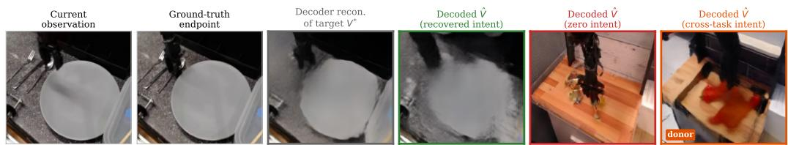  
Cross-task donor: carrot Ground-truth purpose: Position the spoon over the plate, aligning it for placement. Decoded from recovered intent: The gripper is moving left and forward to locate and approach the spoon for grasping. Decoded from zero intent: The gripper repositions itself to the left and upward, likely preparing to interact with the orange Decoded from donor intent: Lift the carrot out of the pot and move it away from the workspace. Donor ground-truth purpose: Relocate the carrot from the pot to a position outside the cardboard fence, moving it leftward

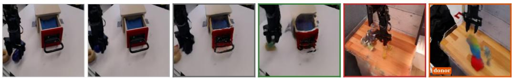

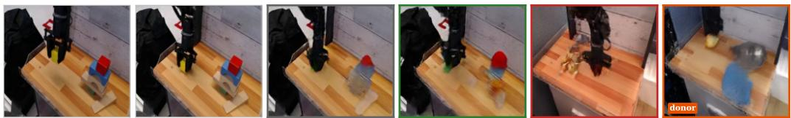

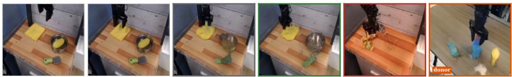

Cross-task donor: stack Ground-truth purpose: The gripper positions itself over the yellow cloth to prepare for grasping it. Decoded from recovered intent: The gripper positions itself to grasp the yellow towel in preparation for moving it to the left of Decoded from zero intent: The gripper repositions itself to the left and upward, likely preparing to interact with the orange Decoded from donor intent: Place the blue block on top of the yellow cube to complete the stacking task. Donor ground-truth purpose: The gripper places the red cube on top of the blue rectangular block.

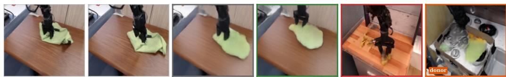

Instruction: moved the cloth to the top edge of the table   
Cross-task donor: carrot   
Ground-truth purpose: Lift and reposition the cloth toward the top edge of the table using upward and backward motion. Decoded from recovered intent: The gripper repositions itself to prepare for moving the cloth to the left side of the table. Decoded from zero intent: The gripper repositions itself to the left and upward, likely preparing to interact with the orange Decoded from donor intent: The gripper is moving the carrot to the right and upward, rotating it while rotating counterclockwise Donor ground-truth purpose: The gripper is positioning itself over the carrot inside the box to prepare for grasping.

Figure 12: Learned visual and textual readout of intent. Each row shows the current observation, ground-truth endpoint, visual reconstruction from $V _ { t } ^ { \star }$ , and visual outcomes decoded from $\widehat { V } _ { t }$ under recovered, zero, and cross-task intent. The text below each row shows the ground-truth purpose and statements decoded from recovered, zero, and injected intent. Recovered intent produces an outcome and purpose consistent with the current behavior, while cross-task intent redirects both modalities toward the injected behavior.

residual variation occurs within episodes. Qwen3-VL instead exhibits substantially more sampledependent and state-resolved variation and recovers a 12.0-percentage-point gain over the actiononly baseline. Cosmos preserves the high within-episode share while increasing the angular budget by 3.3× over Qwen3-VL, accompanied by a further 12.0-point downstream gain. The high effective rank of Qwen3.5 therefore does not indicate a useful teacher by itself; it describes the structure of a very small residual signal.

Across the three teachers, angular budget and within-episode share increase monotonically with downstream success. Given the small number of teachers, we treat this as a diagnostic condition rather than a predictive law: useful intent supervision requires a non-degenerate target whose variation resolves moment-to-moment behavior state rather than primarily static episode identity. The causal interpretation is limited to the Qwen3-VL–Cosmos pair, where physical-AI post-training is the controlled teacher-side change.

## B.6 INTENT-TARGET SOURCE ABLATION

The default intent target is extracted from the intermediate hidden states over the multimodal teacherinput span $\mathcal { E } _ { t }$ . We compare this evidence-side target with the generated-response target $I _ { t } ^ { \star , \mathrm { r e s p } }$ which pools the intermediate hidden states over the complete teacher response $\mathcal { \partial } _ { t } .$ including its reasoning and final functional-purpose statement. Both variants use the same teacher, $K _ { I } = 8$ target slots, student architecture, grounding targets, optimization budget, and evaluation protocol. The comparison therefore isolates whether policy supervision is more effective when intent is represented during multimodal evidence processing or after the teacher has synthesized that evidence into a generated response.

Table 19: Intent-target source ablation on SimplerEnv-Bridge. Evidence-side and generatedresponse targets use the same teacher layer and $\bar { K _ { I } } \bar { = } 8$ contiguous-region pooling.
<table><tr><td>Intent target</td><td>Spoon</td><td>Carrot</td><td>Stack</td><td>EP-Basket</td><td> $\operatorname { A v g } .$ </td></tr><tr><td>Evidence-side input span  $\mathcal { E } _ { t }$ </td><td>90.0</td><td>78.0</td><td>74.0</td><td>100.0</td><td>85.5</td></tr><tr><td>Generated-response span  $\mathcal { { D } } _ { t }$ </td><td>76.0</td><td>86.0</td><td>76.0</td><td>80.0</td><td>79.5</td></tr></table>

The generated-response target obtains 79.5% average success, compared with 85.5% for the evidence-side multimodal target. Although the generated-response target substantially outperforms the 61.5% action-only baseline, the evidence-side target provides a further 6.0 percentage-point gain. This result indicates that both target sources provide useful behavior-level supervision, while directly distilling the representation formed during multimodal evidence processing is more effective than using the representation formed after reasoning and response generation.

## C ADDITIONAL RESULTS

## C.1 FULL QUANTITATIVE RESULTS

We provide complete RoboCasa Kitchen results to further examine the generality of INDI across VLA backbones and manipulation tasks. Table 20 reports the per-task success rates summarized by task category in the main text. The table compares INDI with controlled GR00T-N1.7 and $\pi _ { 0 . 5 }$ baselines, the GR00T-N1.7 future-supervision variant, and off-the-shelf GR00T checkpoints trained with larger demonstration sets.

The future-supervision variant exhibits substantially larger per-task variation than INDI, improving markedly on some tasks (e.g., Open Double Door, Turn Off Stove) while degrading on others where the remaining variants are near ceiling (e.g., Turn On Sink Faucet, Coffee Press Button). Its category and overall averages therefore reflect a redistribution of per-task performance rather than a uniform improvement.

Table 20: Full RoboCasa Kitchen per-task results. Success rates are reported across all 24 tasks. Controlled GR00T-N1.7 variants and $\pi _ { 0 . \mathrm { i } }$ 5 results report mean ± sample standard deviation over three evaluation runs. The GR00T $G _ { 3 0 0 0 }$ columns provide single-value data-scale references. Bold marks the best controlled result within each backbone in the category-summary rows.
<table><tr><td rowspan="3"></td><td colspan="5">GR0OT</td><td colspan="2">π0.5</td></tr><tr><td></td><td></td><td></td><td> $\mathrm { N 1 . 7 + f u t u r e }$ </td><td> $\mathrm { N } 1 . 7 + \mathrm { I N D I }$ </td><td></td><td></td></tr><tr><td>N1.6 G3000</td><td> $\mathbf { N } 1 . 7 G _ { 3 0 0 0 }$ </td><td> $\mathrm { N } 1 . 7 G _ { 1 0 0 }$ </td><td>supervision G100</td><td> $G _ { 1 0 0 }$ </td><td>Baseline</td><td>+ INDI</td></tr><tr><td>Pick-and-Place</td><td></td><td></td><td></td><td></td><td></td><td></td><td></td></tr><tr><td>PnP from Cab to Counter</td><td>41.0</td><td>65.0</td><td> $2 6 . 0 \pm 1 6 . 0$ </td><td> $4 4 . 7 \pm 1 . 2$ </td><td> $5 0 . 0 \pm 4 . 0$ </td><td>18.7 ±2.3</td><td> $1 0 . 7 \pm 1 0 . 1$ </td></tr><tr><td>PnP from Counter to Cab</td><td>47.5</td><td>60.0</td><td> $3 7 . 3 \pm 3 . 1$ </td><td> $3 5 . 3 \pm 5 . 0$ </td><td> $5 8 . 7 \pm 1 0 . 3 $ </td><td> $1 8 . 7 \pm 2 . 3$ </td><td> $2 3 . 3 \pm 7 . 6$ </td></tr><tr><td>PnP from Counter to Microwave</td><td>19.0</td><td>30.0</td><td> $2 2 . 0 \pm 5 . 3$ </td><td> $5 7 . 3 \pm 5 . 8$ </td><td> $2 8 . 0 \pm 0 . 0$ </td><td> $6 . 7 \pm 2 . 3$ </td><td> $6 . 7 \pm 2 . 3$ </td></tr><tr><td>PnP from Counter to Sink</td><td>46.0</td><td>60.0</td><td> $5 4 . 7 \pm 1 1 . 7$ </td><td> $2 9 . 3 \pm 1 1 . 4$ </td><td> $5 3 . 3 \pm 1 0 . 3$ </td><td> $1 0 . 0 \pm 7 . 2$ </td><td>16.0 ±4.0</td></tr><tr><td>PnP from Counter to Stove</td><td>63.2</td><td>60.0</td><td> $4 6 . 7 \pm 7 . 0$ </td><td> $5 6 . 0 \pm 6 . 0$ </td><td> $5 0 . 7 \pm 9 . 9$ </td><td>12.0 ±6.9</td><td>8.0 ±0.0</td></tr><tr><td>PnP from Microwave to Counter</td><td>24.5</td><td>19.0</td><td> $2 3 . 3 \pm 3 . 1$ </td><td> $2 6 . 7 \pm 2 . 3$ </td><td> $3 2 . 0 \pm 2 . 0$ </td><td> $8 . 0 \pm 0 . 0$ </td><td>8.0 ±0.0</td></tr><tr><td>PnP from Sink to Counter</td><td>50.0</td><td>65.0</td><td> $5 0 . 7 \pm 8 . 3$ </td><td> $6 4 . 7 \pm 9 . 9$ </td><td> $6 2 . 7 \pm 3 . 1$ </td><td>24.7 ±9.9</td><td>21.3 ±2.3</td></tr><tr><td>PnP from Stove to Counter</td><td>54.5</td><td>65.0</td><td> $5 4 . 7 \pm 4 . 2$ </td><td>62.0 ±3.5</td><td>62.7 ±8.1</td><td>13.3 ±2.3</td><td>28.7 ±4.2</td></tr><tr><td>Open-or-Close</td><td></td><td></td><td></td><td></td><td></td><td></td><td></td></tr><tr><td>Close Double Door</td><td>88.5</td><td>80.0</td><td> $8 8 . 0 \pm 7 . 2$ </td><td>60.0 ±5.3</td><td>90.0 ±2.0</td><td>57.3 ±25.7</td><td>72.0 ±6.9</td></tr><tr><td>Close Drawer</td><td>100.0</td><td>100.0</td><td>92.7 ±8.1</td><td>68.0 ±8.0</td><td>100.0 ±0.0</td><td>77.3 ±39.3</td><td>98.7 ±2.3</td></tr><tr><td>Close Single Door</td><td>96.0</td><td>95.0</td><td> $9 6 . 0 \pm 4 . 0$ </td><td>89.3 ±9.5</td><td>97.3 ±3.1</td><td>73.3 ±11.5</td><td>68.7 ±1.2</td></tr><tr><td>Open Double Door</td><td>39.0</td><td>25.0</td><td>52.0 ±5.3</td><td>94.0 ±6.0</td><td>75.3 ±3.1</td><td>32.0 ±5.3</td><td>10.7 ±2.3</td></tr><tr><td>Open Drawer</td><td>81.1</td><td>95.0</td><td>58.0 ±8.7</td><td>88.0 ±3.5</td><td>55.3 ±5.8</td><td>42.7 ±1.2</td><td>36.0 ±14.4</td></tr><tr><td>Open Single Door</td><td>81.5</td><td>90.0</td><td>68.7 ±3.1</td><td>82.7 ±8.1</td><td>78.7 ±7.0</td><td>48.0 ±18.3</td><td>50.7 ±6.1</td></tr><tr><td>Others</td><td></td><td></td><td></td><td></td><td></td><td></td><td></td></tr><tr><td>Coffee Press Button</td><td>98.5</td><td>100.0</td><td> $9 8 . 0 \pm 2 . 0 $ </td><td> $3 2 . 0 \pm 2 . 0$ </td><td>100.0 ±0.0</td><td>20.0 ±8.0</td><td>74.7 ±6.1</td></tr><tr><td>Coffee Serve Mug</td><td>63.5</td><td>85.0</td><td> $7 4 . 7 \pm 9 . 0$ </td><td> $7 3 . 3 \pm 4 . 2$ </td><td>81.3 ±7.0</td><td>25.3 ±9.2</td><td>23.3 ±9.9</td></tr><tr><td>Coffee Setup Mug</td><td>31.0</td><td>30.0</td><td> $3 2 . 0 \pm 1 0 . 6$ </td><td> $7 9 . 3 \pm 1 3 . 3$ </td><td> $3 0 . 7 \pm 1 . 2$ </td><td>14.7 ±12.2</td><td>4.0 ±0.0</td></tr><tr><td>Turn Off Microwave</td><td>96.0</td><td>95.0</td><td> $9 9 . 3 \pm 1 . 2 $ </td><td> $9 2 . 7 \pm 4 . 2 $ </td><td> $9 9 . 3 \pm 1 . 2 $ </td><td>72.0 ±16.0</td><td>90.7 ±4.6</td></tr><tr><td>Turn Off Sink Faucet</td><td>93.5</td><td>100.0</td><td> $9 3 . 3 \pm 6 . 4$ </td><td> $8 5 . 3 \pm 7 . 6$ </td><td> $9 8 . 0 \pm 2 . 0 $ </td><td> $7 4 . 7 \pm 1 9 . 7$ </td><td>89.3 ±6.1</td></tr><tr><td>Turn Off Stove</td><td>31.0</td><td>25.0</td><td> $2 7 . 3 \pm 8 . 1$ </td><td> $9 3 . 3 \pm 5 . 8$ </td><td> $2 8 . 7 \pm 2 . 3$ </td><td>22.7 ±22.0</td><td>16.7 ±4.2</td></tr><tr><td>Turn On Microwave</td><td>91.5</td><td>95.0</td><td> $8 9 . 3 \pm { \bf 8 . 1 }$ </td><td> $9 2 . 7 \pm 4 . 6 $ </td><td>93.3 ±4.2</td><td>53.3 ±2.3</td><td>72.7 ±6.4</td></tr><tr><td>Turn On Sink Faucet</td><td>89.0</td><td>95.0</td><td> $8 4 . 0 \pm 8 . 0$ </td><td> $1 8 . 7 \pm 9 . 0$ </td><td>96.0 ±4.0</td><td>33.3 ±18.5</td><td>61.3 ±12.9</td></tr><tr><td>Turn On Stove</td><td>76.5</td><td>85.0</td><td> $7 2 . 0 \pm 4 . 0$ </td><td> $6 0 . 0 \pm 3 . 5$ </td><td>70.7 ±2.3</td><td>33.3 ±11.5</td><td>41.3 ±10.1</td></tr><tr><td>Turn Sink Spout</td><td>87.0</td><td>80.0</td><td> $9 7 . 3 \pm 3 . 1$ </td><td> $9 3 . 3 \pm 4 . 2$ </td><td>93.3 ±5.8</td><td>45.3 ±2.3</td><td>61.3 ±6.1</td></tr><tr><td>Pick-and-Place</td><td>43.2</td><td>53.0</td><td> $3 9 . 4 \pm 1 . 0$ </td><td> $4 7 . 0 \pm 4 . 4$ </td><td>49.8 ±2.3</td><td>14.0 ±1.7</td><td>15.3 ±1.4</td></tr><tr><td>Open-or-Close</td><td>81.0</td><td>80.8</td><td> $7 5 . 9 \pm 3 . 4$ </td><td> $8 0 . 3 \pm 2 . 3$ </td><td>82.8 ±1.3</td><td>55.1 ±7.4</td><td>56.1 ±3.6</td></tr><tr><td>Others</td><td>75.8</td><td>79.0</td><td> $7 6 . 7 \pm 0 . 9$ </td><td> $7 2 . 1 \pm 2 . 0$ </td><td>79.1 ±1.5</td><td>39.5 ±0.9</td><td>53.5 ±2.4</td></tr><tr><td>Average</td><td>66.2</td><td>70.8</td><td> $6 4 . 1 \pm 1 . 6$ </td><td> $6 5 . 8 \pm 0 . 8$ </td><td>70.3 ±1.7</td><td>34.9 ±2.0</td><td>41.4 ±1.4</td></tr></table>

## C.2 QUALITATIVE RESULTS

We provide representative real-world rollouts for all four tasks in Figures 13 and 14. Each filmstrip shows the third-person view together with the head and two wrist-camera views. The complete rollout videos are provided on the project page.

## D LIMITATIONS AND FUTURE WORK

INDI inherits its notion of intent from a teacher VLM, so the semantics available to the policy are bounded by what that teacher understands about physical behavior. The bound is consequential rather than cosmetic. A teacher without embodied grounding yields targets with almost no sampledependent direction, and the resulting policy falls below the action-only baseline (Tables 17 and 18). This property can be measured before training, but the framework still has no notion of an intent being wrong and no mechanism that revises a target when execution contradicts it. Removing this ceiling requires intent that is validated against execution outcomes or acquired through the policy’s own interaction rather than read from a fixed interpreter.

A second limit is that intent is recovered rather than chosen. The deployed policy reconstructs one deterministic intent at each query and immediately consumes it. Our interventions show that this state is addressable (Section B.3), yet the policy never uses that handle. It cannot hold a distribution over valid objectives when the stage is ambiguous, maintain an intent across a rollout, or accept a correction stated as what it should be trying to do. Treating intent as an interface for a planner, a human, or execution feedback is the extension we consider most consequential.

Finally, intent is read from single windows of demonstrations that succeeded. Manipulation objectives are nested, and failed or corrected episodes state the objective most explicitly while accounting for much of the experience a robot can collect. Hierarchical intent and intent distilled from unsuccessful behavior are natural next steps.

## E USE OF LARGE LANGUAGE MODELS

We used large-language-model-based tools, including Claude Code and Codex CLI, to assist with code navigation, experiment orchestration, and language editing. All methodological decisions, implementation changes, experimental procedures, and reported results were reviewed and verified by the authors. The Cosmos-Reason2 teacher used to construct training targets is a component of the proposed method and is distinct from the tools used during manuscript and code preparation.

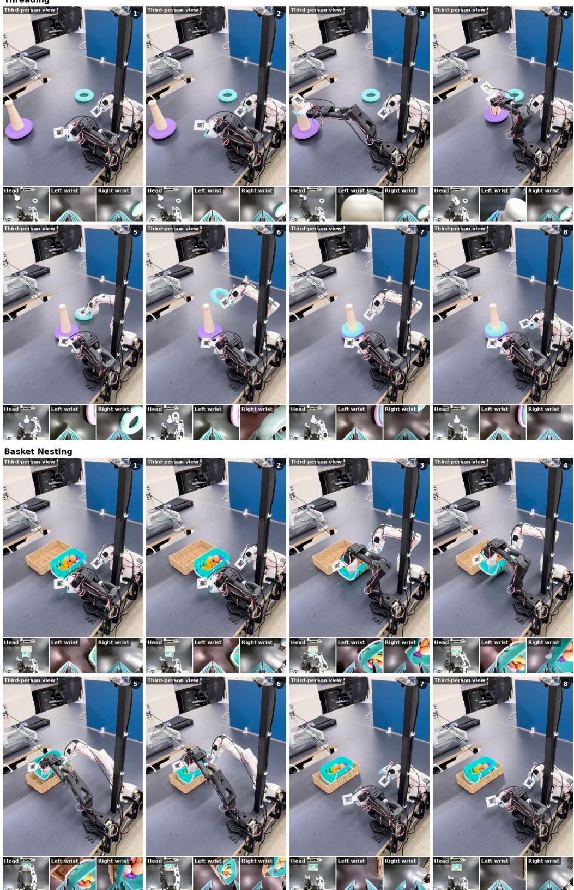  
Figure 13: Representative real-world rollouts on Threading and Basket Nesting. The filmstrips show successful execution across the third-person, head, and wrist-camera views.

Cross-Bin Stacking  
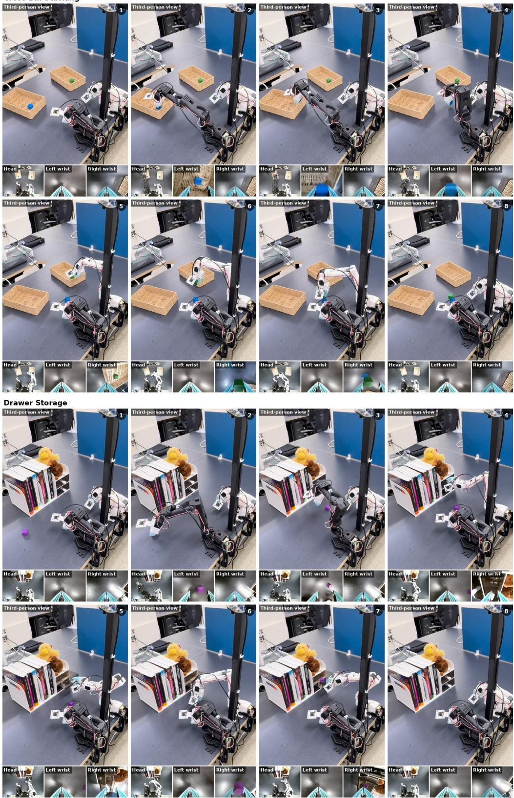  
Figure 14: Representative real-world rollouts on Cross-Bin Stacking and Drawer Storage. The examples illustrate coordinated execution across the multiple stages required by the two longerhorizon tasks.