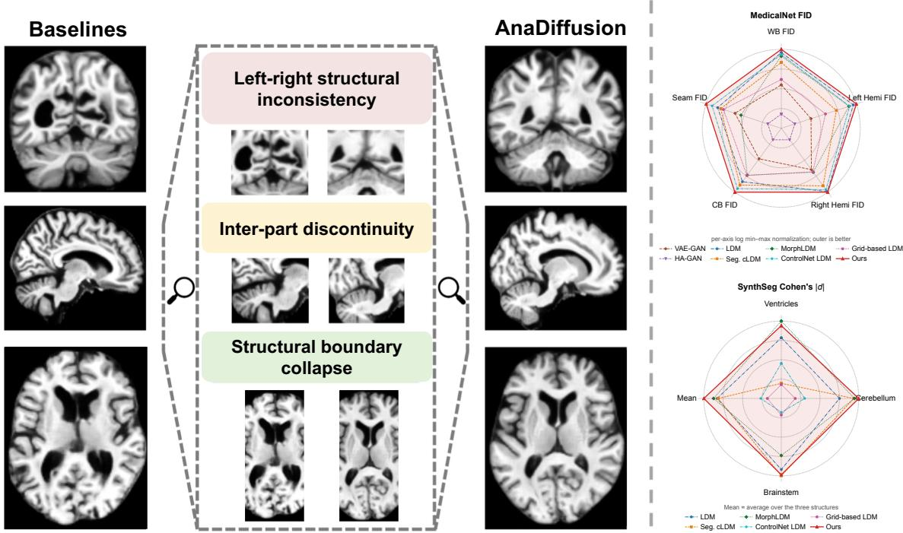
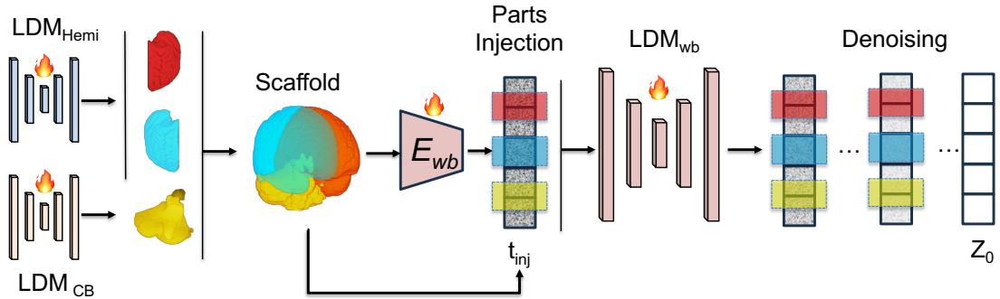
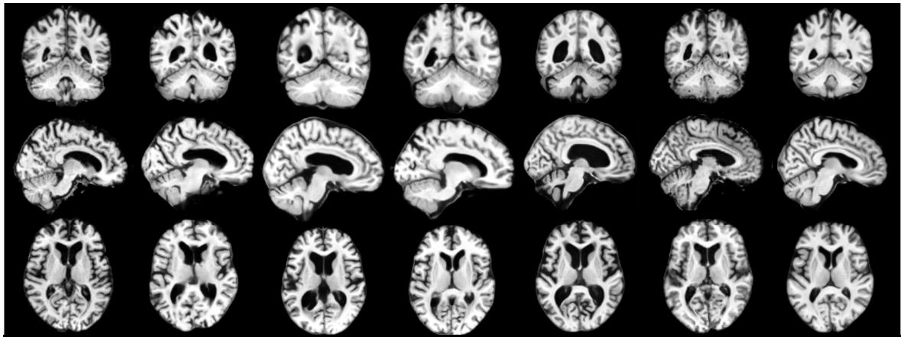
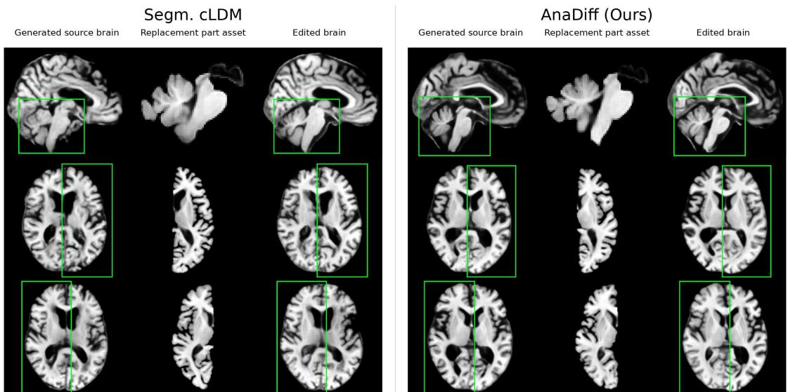
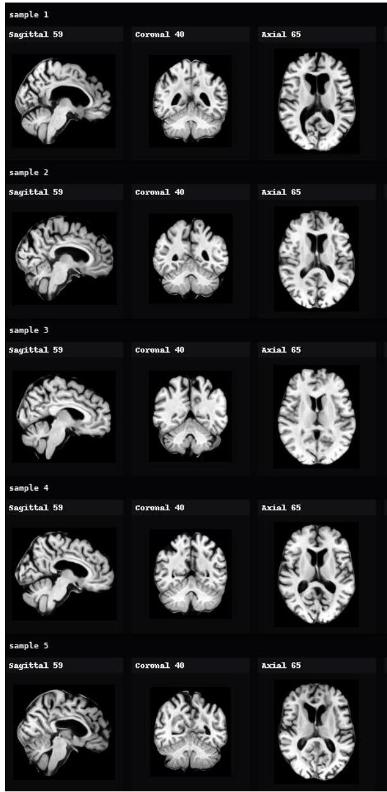
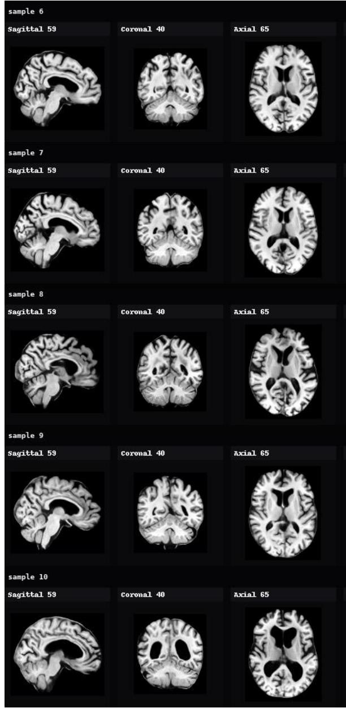

# AnaDiffusion: Anatomically Compositional Latent Diffusion for Controllable 3D Brain MRI Generation

Huiwen Han1,2,†, Lulin Liu2,3,†, Bangya Liu4, Yuanhao Cai5, Nuo Chen2, Xiaoqing Wang2, Ziqian Xie6, Chenyu You7, Shuiwang Ji2, Degui Zhi6, Zhiwen Fan2

1Stanford University, 2Texas A&M University, 3University of Minnesota, 4University of Wisconsin-Madison, 5Johns Hopkins University, 6UTHealth Houston, 7Stony Brook University †Equal contribution

3D brain MRI generation has made significant advances in medical imaging, simulation, and controllable anatomical analysis. However, existing generative models typically synthesize 3D volumes monolithically, often overlooking regional anatomical structures and limiting local controllability. To address these limitations, we introduce AnaDiffusion, an anatomically compositional latent difusion framework that factorizes the generation process into distinct, anatomically meaningful regions, followed by part-to-whole assembly and global refinement. Our approach first trains part difusion models to capture local structural priors. We then inject an assembled anatomical composite of the parts into the whole-brain latent representation and continue denoising. This mechanism enables the model to resolve global context while preserving the injected anatomy. As a result, AnaDifusion produces both explicit part assets and a globally coherent volume, thereby enabling controllable part editing without requiring subject-specific dense segmentation maps at inference time while maintaining consistent part-to-whole brain structure. On the subject-disjoint ADNI test split, AnaDifusion achieves the lowest FID across the whole brain, left and right hemispheres, cerebellar-brainstem complex, and seam regions. It also achieves the best cerebellar and second-best ventricular and brainstem absolute Cohen’s d values among the evaluated methods. In localized editing experiments, paired MS-SSIM demonstrates high target transfer and of-target preservation, supporting controllable part replacement with minimal unintended anatomical alterations.

Date: August 25, 2026   
Code: https://github.com/phai-lab/AnaDifusion.git   
Project Page: https://anadifusion.github.io/   
Affiliation Note: Huiwen Han and Lulin Liu were visiting students at Texas A&M University during this work.

## 1 Introduction

High-fidelity 3D brain MRI generation has become increasingly fundamental for medical imaging problems, where large-scale volumetric data are often costly to acquire, dificult to annotate, and limited by privacy and lack of paired anatomical segmentation. The current synthesis has already benefited a wide range of downstream applications, including cross-modality translation (Kim and Park, 2024), super-resolution (Wang et al., 2023; Khateri et al., 2025), and disease progression simulation (Peng et al., 2023; Dhinagar et al., 2024; Puglisi et al., 2024; Fu et al., 2025). While recent difusion models (Ho et al., 2020; Rombach et al., 2022) have demonstrated remarkable success in synthesizing globally plausible volumetric data, generating anatomically accurate local structures remains a persistent challenge. Whole-brain samples that appear realistic at a macroscopic scale can exhibit localized anatomical failures–such as blurred tissue interfaces, topological inconsistencies in the cortex, and unnatural asymmetries–as shown in Figure 1. These localized artifacts compromise the downstream utility of the generated data. In practice, they are often exposed by automated segmentation pipelines, which reveal incomplete or structurally inconsistent local anatomy in synthesized volumes (Wu et al., 2024; Deo et al., 2025; Jafrasteh et al., 2025).

These observations highlight the need for 3D MRI generation models that preserve fine-grained anatomical structure, rather than only producing globally plausible brain volumes. Prior methods have introduced explicit structural constraints to improve anatomical plausibility: Geometry-driven approaches utilize deformation fields or surface meshes to encourage globally plausible shapes (Wang et al., 2025; Wu et al., 2025; Wilms et al., 2022; Bongratz et al., 2026; Rusak et al., 2022). Alternatively, a common strategy employs segmentation masks, either as conditioning signals or via supervised objectives, to ensure the generated volumes adhere to a prescribed spatial layout (Wan et al., 2026; Konz et al., 2024; Fernandez et al., 2024). While mask conditioning provides spatial control, it relies on the dense input annotations to dictate structural coherence. The model learns to render intensities within provided boundaries rather than capturing the intrinsic structural relationships and dependencies between adjacent regions. Fundamentally, both mask-conditioned and unconditioned generative strategies typically remain monolithic: they encode and generate the entire volume via a single, entangled latent representation. This uniform treatment struggles with the brain’s spatial heterogeneity, where distinct regions (e.g., the highly folded cerebral cortex versus the densely structured cerebellum) exhibit vastly diferent morphological complexities (Fischl et al., 2002). Consequently, monolithic models often sufer from capacity limits that average out fine-scale, region-specific details, creating a need for a framework that explicitly factorizes local structures while ensuring their coherent integration.

  
Figure 1 AnaDiffusion for anatomically compositional 3D brain MRI generation. Unlike monolithic baselines (left) that may sufer from left-right inconsistency, inter-part discontinuity, and boundary collapse, AnaDifusion generates part-specific anatomical assets and refines their assembled scafold into a coherent whole-brain volume. The resulting model generates better regional and global anatomy across FID and SynthSeg-based metrics.

Recognizing this gap, we introduce AnaDiffusion, an anatomy-informed compositional sampling and refinement framework for 3D brain MRI synthesis. Our contribution lies in how explicit regional generators are coupled to an ongoing whole-brain generative trajectory. To this end, we first train part-specific latent difusion models, allowing the model to devote generative capacity to anatomically heterogeneous regions. For bilateral structures, we further employ a symmetry-aware hemisphere model with canonicalized weight sharing, which encourages anatomically consistent left-right generation while improving data eficiency. Building on these local anatomical priors, we then address the central challenge of part-to-whole integration. We construct an anatomical composite from the generated parts and use it to guide a global whole-brain difusion process, which harmonizes regional details into a coherent volume. To preserve structural consistency, we train the whole-brain denoiser to resume reverse sampling from assembled composite latents reintroduced at intermediate noise levels. Together, these designs enable AnaDifusion to preserve high-fidelity local anatomy while maintaining global coherence. AnaDifusion also produces explicit part-level assets, enabling controllable part replacement at inference time. We summarize our contributions as follows:

• We introduce AnaDiffusion, a compositional latent difusion framework for controllable 3D brain MRI generation. AnaDifusion decomposes synthesis into anatomical parts and a whole-brain latent integration process, modeling heterogeneous brain structures more efectively than monolithic wholevolume generation.

• We propose a part-to-whole latent refinement that integrates independently generated anatomical parts into a coherent whole-brain volume. This supports controllable part replacement while keeping the non-edited brain regions stable and maintaining consistent part-to-whole anatomy.

• Motivated by the functional and structural bilateral symmetry of the human brain, we design a hemisphere generator shared across both hemispheres by employing left-right canonicalization and side-indicator conditioning.

• We demonstrate that, relative to the compared baselines, AnaDifusion improves the evaluated synthesis metrics on held-out subjects from a subject-disjoint ADNI test split. It achieves stronger regional distributional fidelity and segmentation-based anatomical alignment, while enabling localized part replacement with high target transfer and limited of-target drift, without requiring subject-specific dense segmentation maps at inference time.

## 2 Related Work

## 2.1 3D Generative Modeling for Brain MRI

A long-standing line of work have explored 2D (slice-wise synthesis or 2.5D aggregation) generation of brain MRIs while more recent eforts have increasingly leveraged improved compute and model architecture to pursue full 3D synthesis which have yielded improved volumetric consistency. GAN-based models such as α-GAN (Kwon et al., 2019; Rosca et al., 2017), CCE-GAN (Xing et al., 2021), and HA-GAN (Sun et al., 2022) are widely explored for 3D brain MRI generation. Despite generating sharp samples, GAN training instability and mode collapse remain recurring issues in medical settings, especially when the target distribution contains subtle and clinically relevant variation (Saad et al., 2024). Difusion models later emerged as a more stable alternative for volumetric generation. 3D DDPM (Dorjsembe et al., 2022) iteratively denoises in voxel space and can produce strong global structure, but are often computationally expensive due to high-dimensional sampling. LDM (Pinaya et al., 2022) addresses this by learning a compact autoencoder and running difusion in its compressed latent space, enabling generation at scale while retaining fidelity and allowing for flexible conditioning (Peng et al., 2023; Puglisi et al., 2024; Herencia García del Castillo et al., 2025). However, anatomical plausibility, morphological accuracy, and region-level controllability remain challenging in 3D brain generative pipelines, and macro-level perceptual metrics can be unreliable for evaluating generated brain volumes (Wu et al., 2024; Deo et al., 2025; Jafrasteh et al., 2025).

## 2.2 Anatomy- and Morphology-Aware 3D Brain Generation

To improve anatomical plausibility, recent 3D brain generation methods increasingly incorporate explicit structural priors. One line of work uses segmentation maps as conditioning signals or auxiliary supervision to guide the synthesis of anatomically localized regions (Chato and Sereda, 2026; Bhattacharya et al., 2025; Bongratz et al., 2026; Dorjsembe et al., 2024). For example, Med-DDPM (Dorjsembe et al., 2024) concatenates segmentation masks with image inputs to control normal and pathological brain generation, while AG-LDM (Wan et al., 2026) further supervises both the autoencoder and latent difusion model with tissue- and boundary-aware losses. Beyond segmentation, morphology-aware methods introduce geometric constraints through deformation fields or surface-based representations. MorphLDM (Wang et al., 2025) synthesizes new brains by deforming a template, and IGG (Wu et al., 2025) models aging efects via conditioned geodesic transformations. However, these methods mainly regularize anatomical localization, tissue boundaries, or global morphology, without explicitly decomposing brain generation into part-specific representations or modeling the compositional assembly rules among sub-structures. This motivates a compositional formulation of 3D brain generation that moves beyond global anatomy-aware regularization toward part-level controllability. Our framework realizes this formulation by combining part-specific generative priors with whole-brain latent inpainting, enabling controllable editing without subject-specific dense segmentation maps at inference while preserving coherent integration between edited sub-structures and the surrounding brain anatomy.

  
Figure 2 AnaDifusion performs anatomically compositional 3D brain MRI generation by first synthesizing high-fidelity regional parts and assembling them into a whole-brain scafold. The scafold is re-encoded into the whole-brain latent space and injected during denoising, enabling local anatomical detail and globally coherent whole-brain synthesis.

## 3 Methods

Overview. We introduce AnaDifusion, a part-to-whole latent difusion framework for compositional 3D brain MRI generation. Rather than denoising the entire brain through a single monolithic latent trajectory, AnaDifusion (Figure 2) trains part and whole-brain LDMs. We then employ an assemble-then-refine strategy optimizing only the whole-brain denoiser: frozen part models generate anatomical parts that are assembled in image space, re-encoded, and injected as a composite latent at $t _ { \mathrm { a u x } }$ . Training optimizes the whole-brain denoiser with standard ϵ-prediction on scafold-injected latent trajectories. In inference, the model generates both explicit part assets and a whole-brain volume, enabling part replacement and compositional refinement without subject-specific dense segmentation maps.

## 3.1 Anatomical Part Factorization

Let $\boldsymbol { x } ^ { \mathrm { w b } } \in \mathbb { R } ^ { H \times W \times D }$ denote a whole-brain T1 MRI registered to a common template space. We define $P = 3$ anatomical parts: left hemisphere (Hemi ), right hemisphere (Hemi ), and cerebellar-brainstem complex (CB). This coarse decomposition follows widely used neuroanatomical organization and is broadly consistent with anatomical and developmental perspectives (Liang et al., 2007; Gui et al., 2012). Let $M ^ { ( p ) } \in \mathsf { \Gamma } _ { [ 0 , 1 ] } ^ { [ 0 , 1 ] \times W \times D }$ be the binary mask for part $p ,$ and let $\bar { \boldsymbol { x } } ^ { ( p ) } = \mathcal { C } _ { p } \big ( \boldsymbol { x } ^ { \mathrm { w b } } \big ) ^ { \top } = M ^ { ( p ) } \odot \boldsymbol { x } ^ { \mathrm { w b } }$ denote the corresponding part volume. During training-data preparation, part volumes are extracted from each whole-brain volume by applying part-specific segmentation label maps generated with SynthSeg (Billot et al., 2023), and then cropped to fixed, part-aligned bounding boxes. These subject-derived labels are used only ofline to construct the regional training volumes and are not provided to the difusion models as subject-specific conditioning inputs. Cerebrospinal fluid (CSF) is not assigned to any part as it is a fluid compartment rather than a distinct anatomical structure; its boundaries are less stable and more sensitive to morphology and partial-volume efects, making it a noisy target for part-based latent anchoring. We define a deterministic assembly operator $x ^ { \mathrm { s c a f } } = \mathcal { A } \big ( \{ x ^ { ( p ) } \} _ { p = 1 } ^ { P } \big )$ which places part assets into their template-aligned locations while omitting CSF, background, and uncertain boundary regions. Details on the anatomical definitions, template masks, and crop geometry, and assembly procedure are provided in Appendix A.

## 3.2 Local Anatomical Priors

For each anatomical support, we train an autoencoder and latent difusion prior. Let $E ^ { \mathrm { w b } } , D ^ { \mathrm { w b } }$ denote the whole-brain encoder and decoder, and $E ^ { ( p ) } , D ^ { ( p ) }$ denote the corresponding part autoencoder. All autoencoders

are trained before difusion training and then frozen. Given a latent $z _ { 0 } = E ( x )$ , each difusion denoiser is trained with the standard noise-prediction objective

$$
\begin{array} { r } { \mathcal { L } _ { \epsilon } = \mathbb { E } _ { z _ { 0 } , t , \epsilon } \left[ \| \epsilon - \epsilon _ { \theta } ( z _ { t } , t ) \| _ { 2 } ^ { 2 } \right] , \qquad z _ { t } = \alpha _ { t } z _ { 0 } + \sigma _ { t } \epsilon , \quad \epsilon \sim \mathcal { N } ( 0 , I ) . } \end{array}\tag{1}
$$

Hemisphere canonicalization. The cerebral hemispheres have approximate bilateral correspondence but also contain side-specific variation. We therefore use canonicalization for statistical sharing, not exact symmetry enforcement. Let $x ^ { L }$ and $x ^ { R }$ denote left- and right-hemisphere crops. We map right-hemisphere crops into a left-oriented canonical frame using a flip operator $\mathcal { F } , \mathrm { i . e . , } \bar { x } ^ { R } = \bar { \mathcal { F } ( { x ^ { R } } ) }$ . A single hemisphere LDM is trained on $\{ x ^ { L } \} \cup \{ \bar { x } ^ { R } \}$ and conditioned on a side indicator $y \in \{ 0 , 1 \}$ , where $y = 0$ denotes left and $y = 1$ denotes right. At inference, the model samples in the canonical frame; right-hemisphere samples are flipped back to native orientation using ${ \mathcal F } .$

## 3.3 Part-to-Whole Latent Scaffold

Independently generated parts live in part-specific latent spaces and need not be directly compatible with the whole-brain latent space. We therefore compose in image space and re-encode with the whole-brain encoder. Given generated part assets $\{ \tilde { x } ^ { ( p ) } \} _ { p = 1 } ^ { P } ;$ , we assemble $\tilde { { \boldsymbol x } } ^ { \mathrm { s c a f } } \mathrm { \bar { \boldsymbol = } } \ A ( \{ \tilde { { \boldsymbol x } } ^ { ( p ) } \} _ { p = 1 } ^ { P } )$ , then map the scafold into the whole-brain latent coordinate system: $z _ { 0 } ^ { \mathrm { s c a f } } = E ^ { \mathrm { w b } } ( \tilde { x } ^ { \mathrm { s c a f } } )$ . This avoids direct pasting between incompatible part and whole-brain latent spaces. For each generated regional asset, we obtain a natural self-mask by thresholding the generated image. Let m be the downsampled latent-space union of these self-masks after they are placed in whole-brain coordinates. For a whole-brain latent trajectory $z _ { t } ^ { \mathrm { w b } }$ , we forward-noise the scafold latent to the same noise level,

$$
z _ { t _ { \mathrm { i n j } } } ^ { \mathrm { s c a f } } = \alpha _ { t _ { \mathrm { i n j } } } z _ { 0 } ^ { \mathrm { s c a f } } + \sigma _ { t _ { \mathrm { i n j } } } \epsilon , \qquad z _ { t _ { \mathrm { i n j } } } ^ { \mathrm { i n j } } = ( 1 - m ) \odot z _ { t _ { \mathrm { i n j } } } ^ { \mathrm { w b } } + m \odot z _ { t _ { \mathrm { i n j } } } ^ { \mathrm { s c a f } } .\tag{2}
$$

The whole-brain denoiser then continues reverse sampling from $z _ { t _ { \mathrm { i n j } } } ^ { \mathrm { i n j } }$ to obtain the final latent $\hat { z } _ { 0 } ^ { \mathrm { w b } }$ , which is decoded as $\hat { x } ^ { \mathrm { w b } } = D ^ { \mathrm { w b } } ( \hat { z } _ { 0 } ^ { \mathrm { w b } } )$ .

## 3.4 Assemble-then-Refine Compositional Training

We train the whole-brain denoiser to refine scafold-injected latents while keeping all part pipelines and the whole-brain autoencoder frozen. For a training scan $x ^ { \mathrm { w b } }$ , let $z _ { 0 } ^ { \mathrm { t g t } } = E ^ { \mathrm { w b } } ( x ^ { \mathrm { w b } } )$ be the target whole-brain latent. Frozen part generators produce part assets, which are assembled into $\tilde { x } ^ { \mathrm { s c a f } }$ and re-encoded as $z _ { 0 } ^ { \mathrm { s c a f } }$ . Using the same Gaussian noise $\epsilon ,$ we place both target and scafold latents on a shared forward trajectory:

$$
z _ { t } ^ { \mathrm { t g t } } = \alpha _ { t } z _ { 0 } ^ { \mathrm { t g t } } + \sigma _ { t } \epsilon , \qquad z _ { t } ^ { \mathrm { s c a f } } = \alpha _ { t } z _ { 0 } ^ { \mathrm { s c a f } } + \sigma _ { t } \epsilon .\tag{3}
$$

For a refinement timestep $t \leq t _ { \mathrm { i n j } }$ , we define the scafold-injected latent as

$$
z _ { t } ^ { \mathrm { i n j } } = ( 1 - m ) \odot z _ { t } ^ { \mathrm { t g t } } + m \odot z _ { t } ^ { \mathrm { s c a f } } .\tag{4}
$$

The whole-brain denoiser is then optimized with standard noise prediction on scafold-injected latents:

$$
\mathcal { L } _ { \mathrm { A R } } = \mathbb { E } _ { t \leq t _ { \mathrm { i n j } } , \epsilon } \left[ \left\| \epsilon - \epsilon _ { \theta } ^ { \mathrm { w b } } ( z _ { t } ^ { \mathrm { i n j } } , t ) \right\| _ { 2 } ^ { 2 } \right] .\tag{5}
$$

This objective trains the whole-brain denoiser to continue reverse sampling from a latent state that already contains an assembled anatomical scafold. The injected scafold provides explicit regional structure, while the whole-brain denoiser synthesizes omitted regions such as CSF, background, and uncertain boundaries and harmonizes the final global anatomy.

## 3.5 Part Editing Application

At inference, AnaDifusion supports two modes. In unconditional compositional generation, AnaDifusion first denoises a whole-brain latent from Gaussian noise to the injection point $t _ { \mathrm { i n j } }$ . The part branches are not initialized from independent noise; instead, we decode the partially denoised whole-brain estimate and use fixed MNI152-derived template masks to localize and crop anatomical regions from it, so each part refinement starts from a globally contextualized coarse structure. Frozen part LDMs then refine these crops into explicit part assets. Self-masks obtained by thresholding the generated regional assets determine their supports during assembly into $\tilde { x } ^ { \mathrm { s c a f } }$ and subsequent reinjection. The assembled scafold is re-encoded with $E ^ { \mathrm { w b } }$ , re-noised to $t _ { \mathrm { i n j } }$ , injected into the whole-brain latent via Eq. (2), and further denoised to obtain the final coherent volume. No subject-specific dense segmentation map is used at inference.

In part editing, we first generate or select an initial whole-brain sample and its associated part assets. A selected asset, such as the right hemisphere or cerebellar-brainstem complex, may be replaced with an alternative generated part. The modified asset set is then reassembled, re-encoded, injected, and refined by the whole-brain denoiser. This yields a localized edit while preserving the non-target anatomy and repairing seams around the replacement.

We distinguish the difusion training timestep $t _ { \mathrm { i n j } }$ from the inference refinement budget r. During DDIM inference, r denotes the number of denoising steps remaining after scafold injection. Small r favors strict preservation of the inserted part, while moderately larger r gives the whole-brain denoiser more opportunity to harmonize interfaces and synthesize missing context. We therefore report r-sweeps in the experiments to quantify the preservation-harmonization tradeof.

## 4 Data Preprocessing and Anatomical Factorization

Dataset and preprocessing. We evaluate on T1-weighted brain MRIs from the Alzheimer’s Disease Neuroimaging Initiative (ADNI), comprising 1,735 scans from 407 subjects. Subjects are 55-93 years old (mean 76.7), with 47.4% female subjects and diagnostic groups spanning cognitively normal, mild cognitive impairment, and Alzheimer’s disease. Each scan is preprocessed with N4 bias-field correction (Tustison et al., 2010), skull stripping (Hoopes et al., 2022), afine registration to MNI152 space (Avants et al., 2008; Iglesias, 2023), resampling to 1.5 mm isotropic resolution, and intensity normalization (Shinohara et al., 2014). To avoid leakage across longitudinal acquisitions, we split the data at the subject level into training, validation, and test sets containing 305, 41, and 61 subjects and 1,288, 156, and 291 scans, respectively. AnaDifusion was trained on the ADNI training split and evaluated on the subject-disjoint ADNI test split.

Anatomical factorization. We use a coarse, task-driven anatomical factorization into three components: the left hemisphere (HemiL), the right hemisphere (HemiR), and the cerebellar-brainstem complex (CB). This coarse decomposition follows widely used neuroanatomical organization in neuroimaging and neurobiology, and is broadly consistent with anatomical and developmental perspectives (Liang et al., 2007; Gui et al., 2012). During training-data preparation, part volumes are extracted from each whole-brain volume by applying part-specific segmentation label maps generated with SynthSeg (Billot et al., 2023), and then cropped to fixed, part-aligned bounding boxes. These subject-derived labels are used only to construct the regional training data and are not provided to the difusion models as subject-specific conditioning inputs. At inference, fixed MNI152-derived template masks define the corresponding regional supports and crop locations. Because the volumes are already aligned to the common MNI152 space, coarse assembly requires neither subject-specific dense segmentation maps nor additional subject-specific registration at inference.

## 5 Experiments

## 5.1 Experimental Setting

Baselines. We compare AnaDifusion against seven representative baselines spanning adversarial, difusionbased, and morphology-based generation: (i) VAE-GAN (Rosca et al., 2017), which combines variational autoencoding with adversarial training; (ii) HA-GAN (Sun et al., 2022), a hierarchical adversarial model for high-resolution 3D medical image synthesis; (iii) a standard whole-brain LDM (Pinaya et al., 2022, 2023), trained unconditionally; (iv) a 3D ControlNet-style LDM with a matched whole-brain backbone; (v) a grid-based LDM that partitions the volume into a $3 \times 3 \times 3$ grid and applies positional encoding to each of the resulting 27 patches, encouraging the model to distinguish anatomical semantics from spatial specialization; (vi) a segmentationmask cLDM, representing prior mask-guided medical difusion models (e.g., Med-DDPM (Dorjsembe et al., 2024)), which conditions generation on anatomical part masks through multi-channel concatenation; and (vii) MorphLDM (Wang et al., 2025), a template-warping approach that generates subject-specific anatomy by learning deformation fields relative to a canonical template. All baselines use identical subject-level splits and preprocessing, with matched whole-brain backbone configurations where applicable. MorphLDM is the sole preprocessing exception because it requires intensity normalization to [0, 1] rather than [−1, 1].

Implementation. We implement AnaDifusion in PyTorch using MONAI Generative Models AutoencoderKL and difusion UNet architectures (Pinaya et al., 2023; Cardoso et al., 2022). Generation resolutions are $1 2 8 ^ { 3 }$ for whole brain, $6 4 \times 1 2 8 \times 1 2 8$ for each hemisphere, and $1 2 8 \times 9 6 \times 6 4$ for the cerebellar–brainstem complex. Autoencoders are trained with AdamW for up to 100 epochs and then frozen for difusion training. We use a 1,000-step DDPM process with a scaled-linear β schedule $( \beta _ { \mathrm { s t a r t } } = 0 . 0 0 1 5 , \beta _ { \mathrm { e n d } } = 0 . 0 1 9 5 )$ and 50-step DDIM sampling at inference. During training, scafold injection uses $t _ { \mathrm { i n j } } \sim \mathcal { U } [ 1 0 0 , 3 0 0 ]$ on the DDPM schedule. At inference, we inject with $r _ { \mathrm { i n j } } = 1 0$ DDIM steps remaining, which corresponds to approximately $t _ { \mathrm { i n j } } \approx 1 8 0$ under the 50-step DDIM subsampling. This matches the training noise regime while retaining enough reverse steps for part propagation and seam harmonization.

Metrics. We evaluate generation quality using Fréchet-distance metric in the feature space of a 3D ResNet backbone from MedicalNet (Chen et al., 2019), pre-trained on large-scale medical imaging datasets. FIDs are computed for the whole brain and for template-defined subregions: left hemisphere, right hemisphere, and cerebellar-brainstem complex. Subregion masks are derived from an MNI-space, SynthSeg template and dilated by $r = 2$ voxels (≈ 3 mm at 1.5 mm isotropic spacing) to encompass residual anatomical size variation after registration. To quantify interface coherence, we compute the same FID within a fixed seam band around part boundaries. Finally, we assess anatomical plausibility with SynthSeg- derived morphometry by comparing real and generated per-structure volume distributions using Cohen’s |d| (Wu et al., 2024). For evaluation, we generate 291 synthetic volumes from each method, matching the size of the held-out ADNI test set. We compare these generated samples against the 291 real test volumes using the unpaired distributional metrics. We perform 5,000 bootstrap replicates on the held-out volumes, resampling subjects with replacement while retaining all longitudinal scans and independently resampling generated volumes for each method. Metrics are recomputed for each replicate, and bootstrap means with 95% percentile confidence intervals are reported.

## 5.2 Evaluation of Generation Quality

Table 1 shows that AnaDifusion obtains the lowest mean MedicalNet FID across the whole brain, both hemispheres, the cerebellar–brainstem complex, and seam regions, suggesting improved distributional alignment at both global and part-specific scales. The seam-region gain is consistent with the intended role of whole-brain refinement in harmonizing independently generated parts. For SynthSeg-derived Cohen’s |d|, AnaDifusion achieves the lowest cerebellar mismatch, 0.169 [0.007, 0.482], and the second-lowest ventricular and brainstem mismatch, 0.144 [0.005, 0.416] and 0.185 [0.008, 0.483], respectively. These structures are closely tied to the part-to-whole interface: ventricles probe CSF-adjacent completion by the global refiner, while cerebellum and brainstem correspond to the dedicated CB part and its boundary with the cerebrum. Overall, the results support improved part-sensitive generation and interface coherence. Additional qualitative AnaDifusion samples are provided in Appendix Figure 5.

## 5.3 Ablation Study

We conduct ablation studies to disentangle the contributions of (a) compositional design, (b) latent intervention strength, and (c) injection time variation.

Separate Hemisphere Models. We ablate the part generator design by using distinct AEs and LDMs for the left and right hemispheres (instead of a shared hemisphere generator) to evaluate whether part-specific latent spaces improve anatomical fidelity. As shown in Table 2, separate hemisphere models yield lower mean FID for the left hemisphere, 5.59 [2.10, 10.47] versus 6.21 [3.14, 10.56], the cerebellar–brainstem complex, 0.89 [0.43, 1.54] versus 1.06 [0.64, 1.64], and the seam region, 0.19 [0.10, 0.35] versus 0.29 [0.17, 0.46]. However,

Grid-based LDM

  
Figure 3 Qualitative comparison of 3D brain MRI generation. This figure visualizes the visual quality of various generative models. From left to right, the columns display: Real, LDM, ControlNet LDM, Grid-based LDM, Segmentation cLDM, MorphLDM, and Ours (AnaDifusion). Existing models that synthesize 3D volumes monolithically often overlook fine-scale anatomical structures or sufer from localized artifacts. In contrast, AnaDifusion leverages part-specific difusion models and an auxiliary latent anchoring objective to ensure part-to-whole anatomical coherence. As a result our approach achieves superior local anatomical fidelity and enhanced boundary coherence.

they yield higher mean FID for the right hemisphere, 8.94 [4.29, 14.76] versus 6.67 [3.67, 10.72], and the whole brain, 38.72 [16.83, 67.13] versus 36.16 [19.16, 59.61]. Because the confidence intervals overlap, these results indicate a point-estimate trade-of rather than a uniform advantage for either design. Prior work in neuroanatomical segmentation shows that CNNs benefit from explicit spatial context in registered brain volumes (Novosad et al., 2020); without such spatial priors, networks can confuse homologous left/right structures. This ablation suggests that hemisphere canonicalization with side conditioning may benefit from sharing a prior across homologous anatomy, while the side indicator provides explicit lateral context rather than enforcing exact mirror symmetry. We interpret the observed trade-of as potentially arising from improved sample eficiency and regularization: the shared model pools observations from both sides, whereas separate models provide greater side-specific capacity but receive fewer efective training examples and may exhibit greater optimization, sampling, or finite-sample FID variability. Related findings on direction-dependent efects under alternative representational orderings (Kutscher et al., 2025; Hardan et al., 2025) motivate further investigation but do not directly explain our convolutional U-Net results. We therefore present these explanations as hypotheses rather than attributing the observed asymmetry to biological laterality.

Latent Injection. We evaluate the contribution of latent injection by comparing direct part-latent replacement (α = 1) with no injection (α = 0). As shown in Table 2, disabling injection increases the mean FID across every evaluated region, including the whole brain, from 36.16 [19.16, 59.61] to 52.27 [30.69, 79.63], and the seam region, from 0.29 [0.17, 0.46] to 0.55 [0.35, 0.81]. This suggests that injecting the composed part latents provides useful local anatomical priors for regional fidelity and whole-brain composition.

Injection Time Variation. We vary $r _ { \mathrm { i n j } }$ at inference to quantify the trade-of between local part anchoring and global harmonization. Here, $r _ { \mathrm { i n j } }$ denotes the number of DDIM steps remaining after part-latent injection. Since training samples injection timesteps from $t _ { \mathrm { i n j } } \in [ 1 0 0 , 3 0 0 ]$ on the 1000-step DDPM schedule, we evaluate $r _ { \mathrm { i n j } } \in \{ 7 , 1 0 , 1 5 \}$ , corresponding approximately to $t _ { \mathrm { i n j } } \in \{ 1 2 0 , 1 8 0 , 2 8 0 \}$ . As shown in Table 2, $r _ { \mathrm { i n j } } = 1 0$ yields the lowest mean FID across all five evaluated regions, although the confidence intervals overlap. This pointestimate pattern is consistent with a balance between retaining enough refinement for seam harmonization and preventing subsequent denoising from weakening the injected part structure.

Table 1 Generation and focused morphometric metrics on ADNI. MedicalNet(Chen et al., 2019) FID is reported as FID ×104. SynthSeg (Billot et al., 2023) metrics report absolute Cohen’s |d| for structures most directly tied to part-to-whole integration. WB: whole brain. Hemi: hemisphere. CB: cerebellar-brainstem complex. Seam FID is computed within a fixed seam band. Values are reported as mean [confidence interval], and rankings are based on the means. Best results are highlighted in red ; second-best results are highlighted in yellow . Lower is better.
<table><tr><td rowspan="2">Method</td><td colspan="5">MedicalNet FID</td><td colspan="2">SynthSeg Cohen&#x27;s [d|</td></tr><tr><td>WB</td><td>Left Hemi</td><td>Right Hemi</td><td>CB</td><td>Seam</td><td>Ventricles Cerebellum Brainstem</td><td></td></tr><tr><td>VAE-GAN (Rosca et al., 2017)</td><td>134.400 [89.820, 190.754]</td><td>39.645 [27.536, 53.880] [13.470, 29.582] [3.690, 5.236] [0.639, 1.059]</td><td>20.415</td><td>4.394</td><td>0.808</td><td></td><td></td></tr><tr><td>HA-GAN (Sun et al., 2022)</td><td>339.306</td><td>68.284 [298.525, 380.590] [60.309, 76.616] [66.201, 82.778] [7.573, 9.935] [1.848, 2.622]</td><td>74.447</td><td>8.705</td><td>2.218</td><td></td><td></td></tr><tr><td>LDM (Pinaya et al., 2022)</td><td>40.92 [26.71, 58.86]</td><td>7.10 [4.26, 10.85]</td><td>6.87 [4.51, 9.57]</td><td>1.68 [1.17, 2.29]</td><td>0.44 [0.28, 0.63]</td><td>0.184 0.370 [0.007, 0.523] [0.036, 0.747] [0.011, 0.540]</td><td>0.222</td></tr><tr><td>Seg. cLDM (Dorjsembe et al., 2024)</td><td>59.47 [32.72, 90.83]</td><td>14.54 [8.31, 21.92]</td><td>9.22 [4.79, 14.59]</td><td>1.45 [0.81, 2.30]</td><td>0.49 [0.30, 0.73]</td><td>0.421 0.207 [0.111, 0.725] [0.010, 0.509]</td><td>0.178 [0.008,0.489]</td></tr><tr><td>MorphLDM (Wang et al., 2025)</td><td>46.65 [29.85, 70.74]</td><td>8.56 [5.90, 12.98]</td><td>18.05 [15.54, 21.27]</td><td>2.23 [1.88, 2.62]</td><td>0.99 [0.72, 1.35]</td><td>0.131 0.202 [0.005, 0.374] [0.007, 0.510]</td><td>0.357 [0.048, 0.662]</td></tr><tr><td>ControlNet LDM</td><td>44.24 [22.72, 71.79]</td><td>8.30 [3.87, 14.15]</td><td>7.58 [4.06, 12.19]</td><td>1.24 [0.70, 2.00]</td><td>0.36 [0.20, 0.57]</td><td>0.301 1.366 [0.022, 0.665] [1.026, 1.761] [0.951, 1.667]</td><td>1.311</td></tr><tr><td>Grid-based LDM</td><td>111.06 [76.39, 150.67]</td><td>22.65 [14.92, 31.58]</td><td>18.48 [12.60, 25.10]</td><td>2.20 [1.51, 3.02]</td><td>0.54 [0.36, 0.76]</td><td>0.427 1.821 [0.082, 0.757] [1.449, 2.265] [0.888, 1.591]</td><td>1.235</td></tr><tr><td>Ours</td><td>36.16 [19.16, 59.61]</td><td>6.21 [3.14,10.56]</td><td>6.67 [3.67,10.72]</td><td>1.06 [0.64,1.64]</td><td>0.29 [0.17, 0.46]</td><td>0.144 0.169 [0.005, 0.416] [0.007,0.482]</td><td>0.185 [0.008, 0.483]</td></tr></table>

Table 2 Ablation study on ADNI. We evaluate the efects of compositional design, latent injection strength, and injection timing on generation quality. Values are MedicalNet FID ×104 for the whole brain (WB), left/right hemispheres, cerebellar-brainstem complex (CB), and seam region. Best results for each metric are bold; second-best results are underlined. Lower is better.
<table><tr><td>Method</td><td>WB FID</td><td>Left Hemi FID</td><td>Right Hemi FID</td><td>CB FID</td><td>Seam FID</td></tr><tr><td>Compositional design (rinj = 10) separate hemisphere models</td><td></td><td></td><td></td><td></td><td></td></tr><tr><td></td><td></td><td></td><td></td><td></td><td>38.72 [16.83, 67.13]5.59 [2.10, 10.47]8.94 [4.29, 14.76]0.89 [0.43, 1.54]0.19 [0.10, 0.35]</td></tr><tr><td>Latent injection strength (rinj = 10)</td><td></td><td></td><td></td><td></td><td></td></tr><tr><td>w/o latent injection (α = 0)</td><td>52.27 [30.69, 79.63] 9.83 [5.40, 15.53]</td><td></td><td>8.52 [5.23, 12.55]</td><td></td><td>1.84 [1.12, 2.75] 0.55 [0.35, 0.81]</td></tr><tr><td>full latent injection (α = 1) (Ours) 36.16 [19.16, 59.61]6.21 [3.14, 10.56]</td><td></td><td></td><td>6.67 [3.67, 10.72]</td><td></td><td>1.06 [0.64, 1.64] 0.29 [0.17, 0.46]</td></tr><tr><td>Injection timing</td><td></td><td></td><td></td><td></td><td></td></tr><tr><td>rinj = 7</td><td></td><td></td><td></td><td></td><td></td></tr><tr><td>rinj = 15</td><td></td><td></td><td>51.66 [28.31, 80.82] 8.96 [4.73, 14.63] 9.52 [5.39, 14.82] 1.43 [0.90, 2.10] 0.31 [0.16, 0.51]</td><td></td><td>53.27 [34.21, 76.75] 9.31 [5.88, 13.73] 9.04 [5.88, 12.76] 1.75 [1.22, 2.41] 0.69 [0.51, 0.91]</td></tr></table>

## 5.4 Controllable Part Editing and Compositional Refinement

We evaluate localized editing using paired multi-scale structural similarity (MS-SSIM) (Wang et al., 2003). For each replacement region, we compare AnaDifusion with the segmentation-conditioned LDM using the same donor-recipient editing pairs. A recipient whole brain is first sampled from the standard LDM, and an independent donor part is sampled from the corresponding part model. We replace the recipient target part with the donor part, keep all other parts fixed, and then assemble, re-encode, inject, and refine the edited asset with the AnaDifusion whole-brain denoiser. For the Segm. cLDM baseline, we use an SDEdit-style editing protocol (Meng et al., 2022) that updates the whole-brain conditioning mask with the selected donor part. We generate N = 100 edited scans from 48 subjects per region and report mean MS-SSIM with 95% confidence intervals from 5,000 subject-cluster bootstrap replicates.

Figure 4a summarizes the quantitative editing results. Target transfer measures whether the inserted donor part is preserved in the final edited brain, while of-target preservation measures whether the non-edited anatomy remains unchanged. AnaDifusion achieves substantially higher target transfer than Segm. cLDM for the left hemisphere (0.9427 vs. 0.7952), right hemisphere (0.9484 vs. 0.8343), and cerebellar–brainstem complex (0.9618 vs. 0.9151). Of-target preservation remains consistently high for AnaDifusion (0.9363– 0.9496), although it is slightly lower than for Segm. cLDM (0.9447–0.9512). AnaDifusion also yields larger transfer gains and positive locality contrasts across all three regions, indicating that the edits move the target anatomy toward the donor while concentrating changes within the intended region. Together, these results demonstrate that AnaDifusion supports efective localized part replacement while preserving whole-brain coherence. The qualitative example in Figure 4b further shows that the substituted part can be inserted into the recipient brain without disrupting the surrounding anatomy.

(a) Quantitative editing locality
<table><tr><td>Region</td><td>Method</td><td>Target transfer ↑</td><td>Off-target preserv. ↑</td><td>Transfer gain ↑</td><td>Locality contrast ↑</td></tr><tr><td rowspan="2">Left hemisphere</td><td>Ours</td><td>0.9427 [0.9411, 0.9441]</td><td>0.9371 [0.9359, 0.9383]</td><td>0.1627 [0.1565, 0.1688]</td><td>0.1207 [0.1151, 0.1261]</td></tr><tr><td>Segm. cLDM</td><td>0.7952 [0.7887, 0.8018]</td><td>0.9487 [0.9478, 0.9496]</td><td>0.0152 [0.0138, 0.0168]</td><td>-0.0078 [-0.0090, -0.0065]</td></tr><tr><td rowspan="2">Right hemisphere</td><td>Ours</td><td>0.9484 [0.9471, 0.9495]</td><td>0.9363 [0.9350, 0.9376]</td><td>0.1372 [0.1313, 0.1428]</td><td>0.1118 [0.1064, 0.1172]</td></tr><tr><td>Segm. cLDM</td><td>0.8343 [0.8300, 0.8384]</td><td>0.9447 [0.9434, 0.9458]</td><td>0.0231 [0.0207, 0.0254]</td><td>0.0056 [0.0036, 0.0076]</td></tr><tr><td rowspan="2">CB complex</td><td>Ours</td><td>0.9618 [0.9609, 0.9628]</td><td>0.9496 [0.9484, 0.9508]</td><td>0.0752 [0.0716, 0.0788]</td><td>0.0313 [0.0278, 0.0348]</td></tr><tr><td>Segm. cLDM</td><td>0.9151 [0.9122, 0.9183]</td><td>0.9512 [0.9500, 0.9523]</td><td>0.0285 [0.0269, 0.0302]</td><td>-0.0207 [-0.0215, -0.0199]</td></tr></table>

(b) Example localized part replacement

  
Figure 4 Localized part editing. We evaluate whether part replacement edits are both efective and spatially localized. (a) AnaDifusion and the SDEdit-style Segm. cLDM baseline are evaluated on the same N = 100 donor-recipient edits from 48 subjects per region. Values are mean paired MS-SSIM with 95% confidence intervals from 5,000 subject-cluster bootstrap replicates. Target transfer measures similarity between the edited target region and the inserted donor part, while of-target preservation measures similarity outside the edited region before and after editing. Contras metrics further summarize the transfer gain and locality contrast. (b) A donor part asset is substituted into a generated recipient brain and refined into an edited whole-brain sample.

## 6 Conclusion

In this work, we presented AnaDifusion, a part-to-whole latent difusion framework for controllable 3D brain MRI generation. The central motivation behind AnaDifusion is that brain MRI synthesis should not be treated purely as monolithic volume generation: anatomical regions have distinct local distributions, interact through structured interfaces, and often require region-specific control. By explicitly generating anatomical part assets and refining their assembled scafold with a whole-brain denoiser, AnaDifusion introduces anatomical compositionality into latent difusion generation. This formulation changes the output of a brain generative model from a single static volume into a coherent whole-brain sample with reusable and editable anatomical components. As a result, AnaDifusion improves part-sensitive distributional quality, interface coherence, and localized editing performance over strong baselines, while avoiding the need for subject-specific dense segmentation masks at inference. Our ablations further show that the performance gains arise from the interaction between compositional training, latent intervention strength, and the injection/refinement schedule. Overall, AnaDifusion bridges local anatomical controllability and global brain integrity, providing a step toward more controllable and interpretable 3D medical image synthesis.

Limitations. Despite these advantages, several limitations remain. First, the multi-stage design introduces additional training and inference complexity compared with a monolithic LDM. Second, the current fixed, anatomy-driven factorization improves local part and seam behavior, but does not fully solve broader tissuelevel calibration. Third, the chosen decomposition focuses on predefined anatomical regions and may not capture other biologically meaningful organizations, such as tissue classes, functional networks, or multi-scale anatomical hierarchies. Fourth, AnaDifusion assumes approximate correspondence with MNI152 and has not been validated for severe mass efect or displaced anatomical boundaries. Such pathology may impair registration and invalidate fixed regional placements. Supporting these cases would require lesion-aware or subject-adaptive localization.

Future work. Future work will explore more unified and adaptive compositional generation strategies, including experts specialized by anatomical region or tissue type, learned adaptive decompositions, and region-dependent refinement schedules. These extensions could allocate modeling capacity according to local anatomical complexity while improving coordination between part-level generation and global structure. Extending these approaches across pathologies, resolutions, and imaging contrasts will further characterize the application of compositional generation in controllable 3D medical image synthesis.

## 7 Data Availability

Data from ADNI are available from the LONI website at https://ida.loni.usc.edu upon registration and compliance with the data usage agreement. We used the Montreal Neuroimaging Institute MNI152 template for image processing purposes; it is available for download at http://www.bic.mni.mcgill.ca/ServicesAtlases/ ICBM152NLin2009.

## 8 Acknowledgements

Data collection and data sharing for the Alzheimer’s Disease Neuroimaging Initiative (ADNI) are supported by the National Institute on Aging (NIH Grant U01 AG024904) and DOD ADNI (Department of Defense award number W81XWH-12-2-0012). The grantee organization is the Northern California Institute for Research and Education, and the study is coordinated by the Alzheimer’s Disease Cooperative Study at the University of California, San Diego. The Canadian Institutes of Health Research funds and supports ADNI clinical sites in Canada. ADNI has also received funding from the National Institute of Biomedical Imaging and Bioengineering, the Canadian Institutes of Health Research, and private-sector contributions coordinated via the Foundation for the National Institutes of Health (FNIH), including generous support from: AbbVie; Alzheimer’s Association; Alzheimer’s Drug Discovery Foundation; Araclon Biotech; BioClinica, Inc.; Biogen; Bristol-Myers Squibb Company; CereSpir, Inc.; Cogstate; Eisai Inc.; Elan Pharmaceuticals, Inc.; Eli Lilly and Company; EuroImmun; F. Hofmann-La Roche Ltd and its afiliated company Genentech, Inc.; Fujirebio; GE Healthcare; IXICO Ltd.; Janssen Alzheimer Immunotherapy Research & Development, LLC.; Johnson & Johnson Pharmaceutical Research & Development LLC.; Lumosity; Lundbeck; Merck & Co., Inc.; Meso Scale Diagnostics, LLC.; NeuroRx Research; Neurotrack Technologies; Novartis Pharmaceuticals Corporation; Pfizer Inc.; Piramal Imaging; Servier; Takeda Pharmaceutical Company; and Transition Therapeutics. Private sector contributions are facilitated by the Foundation for the National Institutes of Health (www.fnih.org). ADNI data are disseminated by the Laboratory for Neuro Imaging at the University of Southern California.

## References

Brian B Avants, Charles L Epstein, Murray Grossman, and James C Gee. Symmetric difeomorphic image registration with cross-correlation: evaluating automated labeling of elderly and neurodegenerative brain. Medical image analysis, 12(1):26–41, 2008.

Moinak Bhattacharya, Saumya Gupta, Annie Singh, Chao Chen, Gagandeep Singh, and Prateek Prasanna. Brainmrdif: A difusion model for anatomically consistent brain mri synthesis. arXiv preprint arXiv:2504.04532, 2025.

Benjamin Billot, Douglas N Greve, Oula Puonti, Axel Thielscher, Koen Van Leemput, Bruce Fischl, Adrian V Dalca, Juan Eugenio Iglesias, et al. Synthseg: Segmentation of brain mri scans of any contrast and resolution without retraining. Medical image analysis, 86:102789, 2023.

Fabian Bongratz, Yitong Li, Sama Elbaroudy, and Christian Wachinger. Cortex-grounded difusion models for brain image generation. arXiv preprint arXiv:2601.19498, 2026.

M Jorge Cardoso, Wenqi Li, Richard Brown, Nic Ma, Eric Kerfoot, Yiheng Wang, Benjamin Murrey, Andriy Myronenko, Can Zhao, Dong Yang, et al. Monai: An open-source framework for deep learning in healthcare. arXiv preprint arXiv:2211.02701, 2022.

Lina Chato and Timothy Sereda. Fast-cwdm brain mri: Fast conditional wavelet difusion model for synthesis brain mri modality. bioRxiv, pages 2026–02, 2026.

Sihong Chen, Kai Ma, and Yefeng Zheng. Med3d: Transfer learning for 3d medical image analysis. arXiv preprint arXiv:1904.00625, 2019.

Yash Deo, Yan Jia, Toni Lassila, William AP Smith, Tom Lawton, Siyuan Kang, Alejandro F Frangi, and Ibrahim Habli. Metrics that matter: Evaluating image quality metrics for medical image generation. arXiv preprint arXiv:2505.07175, 2025.

Nikhil J Dhinagar, Sophia I Thomopoulos, Emily Laltoo, and Paul M Thompson. Counterfactual mri generation with denoising difusion models for interpretable alzheimer’s disease efect detection. In 2024 46th Annual International Conference of the IEEE Engineering in Medicine and Biology Society (EMBC), pages 1–6. IEEE, 2024.

Zolnamar Dorjsembe, Sodtavilan Odonchimed, and Furen Xiao. Three-dimensional medical image synthesis with denoising difusion probabilistic models. In Medical imaging with deep learning, 2022.

Zolnamar Dorjsembe, Hsing-Kuo Pao, Sodtavilan Odonchimed, and Furen Xiao. Conditional difusion models for semantic 3d brain mri synthesis. IEEE Journal of Biomedical and Health Informatics, 28(7):4084–4093, 2024.

Virginia Fernandez, Walter Hugo Lopez Pinaya, Pedro Borges, Mark S Graham, Petru-Daniel Tudosiu, Tom Vercauteren, and M Jorge Cardoso. Generating multi-pathological and multi-modal images and labels for brain mri. Medical Image Analysis, 97:103278, 2024.

Bruce Fischl, David H Salat, Evelina Busa, Marilyn Albert, Megan Dieterich, Christian Haselgrove, Andre Van Der Kouwe, Ron Killiany, David Kennedy, Shuna Klaveness, et al. Whole brain segmentation: automated labeling of neuroanatomical structures in the human brain. Neuron, 33(3):341–355, 2002.

Jingru Fu, Yuqi Zheng, Neel Dey, Daniel Ferreira, and Rodrigo Moreno. Synthesizing individualized aging brains in health and disease with generative models and parallel transport. Medical Image Analysis, 105:103669, 2025.

Laura Gui, Radoslaw Lisowski, Tamara Faundez, Petra S Hüppi, François Lazeyras, and Michel Kocher. Morphologydriven automatic segmentation of mr images of the neonatal brain. Medical image analysis, 16(8):1565–1579, 2012.

Design Guide. Cuda c programming guide. NVIDIA, July, 29(31):6, 2013.

Osama Hardan, Omar Elshenhabi, Tamer Khattab, and Mohamed Mabrok. Flatten wisely: How patch order shapes mamba-powered vision for mri segmentation. arXiv preprint arXiv:2507.13384, 2025. doi: 10.48550/arXiv.2507.13384.

Miguel Herencia García del Castillo, Ricardo Moya Garcia, Manuel Jesús Cerezo Mazón, Ekaitz Arriola Garcia, and Pablo Menéndez Fernández-Miranda. Difusion models for conditional mri generation. arXiv e-prints, pages arXiv–2502, 2025.

Jonathan Ho, Ajay Jain, and Pieter Abbeel. Denoising difusion probabilistic models. Advances in neural information processing systems, 33:6840–6851, 2020.

Andrew Hoopes, Jocelyn S Mora, Adrian V Dalca, Bruce Fischl, and Malte Hofmann. Synthstrip: skull-stripping for any brain image. NeuroImage, 260:119474, 2022.

Juan Eugenio Iglesias. A ready-to-use machine learning tool for symmetric multi-modality registration of brain mri. Scientific Reports, 13(1):6657, 2023.

Bahram Jafrasteh, Wei Peng, Cheng Wan, Yimin Luo, Ehsan Adeli, and Qingyu Zhao. Wasabi: A metric for evaluating morphometric plausibility of synthetic brain mris. In International Conference on Medical Image Computing and Computer-Assisted Intervention, pages 684–694. Springer, 2025.

Mohammad Khateri, Serge Vasylechko, Morteza Ghahremani, Liam Timms, Deniz Kocanaogullari, Simon K Warfield, Camilo Jaimes, Davood Karimi, Alejandra Sierra, Jussi Tohka, et al. Mri super-resolution with deep learning: A comprehensive survey. arXiv preprint arXiv:2511.16854, 2025.

Jonghun Kim and Hyunjin Park. Adaptive latent difusion model for 3d medical image to image translation: Multimodal magnetic resonance imaging study. In Proceedings of the IEEE/CVF Winter conference on applications of computer Vision, pages 7604–7613, 2024.

Nicholas Konz, Yuwen Chen, Haoyu Dong, and Maciej A Mazurowski. Anatomically-controllable medical image generation with segmentation-guided difusion models. In International Conference on Medical Image Computing and Computer-Assisted Intervention, pages 88–98. Springer, 2024.

Declan Kutscher, David M. Chan, Yutong Bai, Trevor Darrell, and Ritwik Gupta. REOrdering Patches Improves Vision Models. In Advances in Neural Information Processing Systems, 2025. https://openreview.net/forum?id= g56WiaXKGF.

Gihyun Kwon, Chihye Han, and Dae-shik Kim. Generation of 3d brain mri using auto-encoding generative adversarial networks. In International Conference on Medical Image Computing and Computer-Assisted Intervention, pages 118–126. Springer, 2019.

Lichen Liang, Kelly Rehm, Roger P Woods, and David A Rottenberg. Automatic segmentation of left and right cerebral hemispheres from mri brain volumes using the graph cuts algorithm. NeuroImage, 34(3):1160–1170, 2007.

John C Mazziotta, Arthur W Toga, Alan Evans, Peter Fox, and Jack Lancaster. A probabilistic atlas of the human brain: Theory and rationale for its development: The international consortium for brain mapping (icbm). Neuroimage, 2 (2):89–101, 1995.

Chenlin Meng, Yutong He, Yang Song, Jiaming Song, Jiajun Wu, Jun-Yan Zhu, and Stefano Ermon. SDEdit: Guided image synthesis and editing with stochastic diferential equations. In International Conference on Learning Representations, 2022. https://openreview.net/forum?id=aBsCjcPu\_tE.

Philip Novosad, Vladimir Fonov, D Louis Collins, and Alzheimer’s Disease Neuroimaging Initiative†. Accurate and robust segmentation of neuroanatomy in t1-weighted mri by combining spatial priors with deep convolutional neural networks. Human brain mapping, 41(2):309–327, 2020.

Adam Paszke, Sam Gross, Francisco Massa, Adam Lerer, James Bradbury, Gregory Chanan, Trevor Killeen, Zeming Lin, Natalia Gimelshein, Luca Antiga, et al. Pytorch: An imperative style, high-performance deep learning library. Advances in neural information processing systems, 32, 2019.

Wei Peng, Ehsan Adeli, Tomas Bosschieter, Sang Hyun Park, Qingyu Zhao, and Kilian M Pohl. Generating realistic brain mris via a conditional difusion probabilistic model. In International conference on medical image computing and computer-assisted intervention, pages 14–24. Springer, 2023.

Walter HL Pinaya, Petru-Daniel Tudosiu, Jessica Daflon, Pedro F Da Costa, Virginia Fernandez, Parashkev Nachev, Sebastien Ourselin, and M Jorge Cardoso. Brain imaging generation with latent difusion models. In MICCAI workshop on deep generative models, pages 117–126. Springer, 2022.

Walter HL Pinaya, Mark S Graham, Eric Kerfoot, Petru-Daniel Tudosiu, Jessica Daflon, Virginia Fernandez, Pedro Sanchez, Julia Wolleb, Pedro F Da Costa, Ashay Patel, et al. Generative ai for medical imaging: extending the monai framework. arXiv preprint arXiv:2307.15208, 2023.

Lemuel Puglisi, Daniel C Alexander, and Daniele Ravì. Enhancing spatiotemporal disease progression models via latent difusion and prior knowledge. In International Conference on Medical Image Computing and Computer-Assisted Intervention, pages 173–183. Springer, 2024.

Robin Rombach, Andreas Blattmann, Dominik Lorenz, Patrick Esser, and Björn Ommer. High-resolution image synthesis with latent difusion models. In Proceedings of the IEEE/CVF conference on computer vision and pattern recognition, pages 10684–10695, 2022.

Mihaela Rosca, Balaji Lakshminarayanan, David Warde-Farley, and Shakir Mohamed. Variational approaches for auto-encoding generative adversarial networks. arXiv preprint arXiv:1706.04987, 2017.

Filip Rusak, Rodrigo Santa Cruz, Léo Lebrat, Ondrej Hlinka, Jurgen Fripp, Elliot Smith, Clinton Fookes, Andrew P Bradley, Pierrick Bourgeat, Alzheimer’s Disease Neuroimaging Initiative, et al. Quantifiable brain atrophy synthesis for benchmarking of cortical thickness estimation methods. Medical Image Analysis, 82:102576, 2022.

Muhammad Muneeb Saad, Ruairi O’Reilly, and Mubashir Husain Rehmani. A survey on training challenges in generative adversarial networks for biomedical image analysis. Artificial Intelligence Review, 57(2):19, 2024.

Russell T Shinohara, Elizabeth M Sweeney, Jef Goldsmith, Navid Shiee, Farrah J Mateen, Peter A Calabresi, Samson Jarso, Dzung L Pham, Daniel S Reich, Ciprian M Crainiceanu, et al. Statistical normalization techniques for magnetic resonance imaging. NeuroImage: Clinical, 6:9–19, 2014.

Jiaming Song, Chenlin Meng, and Stefano Ermon. Denoising difusion implicit models. arXiv preprint arXiv:2010.02502, 2020.

Li Sun, Junxiang Chen, Yanwu Xu, Mingming Gong, Ke Yu, and Kayhan Batmanghelich. Hierarchical amortized gan for 3d high resolution medical image synthesis. IEEE journal of biomedical and health informatics, 26(8):3966–3975, 2022.

Nicholas J Tustison, Brian B Avants, Philip A Cook, Yuanjie Zheng, Alexander Egan, Paul A Yushkevich, and James C Gee. N4itk: improved n3 bias correction. IEEE transactions on medical imaging, 29(6):1310–1320, 2010.

Cheng Wan, Bahram Jafrasteh, Ehsan Adeli, Miaomiao Zhang, and Qingyu Zhao. Anatomically guided latent difusion for brain mri progression modeling. arXiv preprint arXiv:2601.14584, 2026.

Alan Q Wang, Fangrui Huang, Bailey Trang, Wei Peng, Mohammad Abbasi, Kilian Pohl, Mert R Sabuncu, and Ehsan Adeli. Generating novel brain morphology by deforming learned templates. In International Conference on Medical Image Computing and Computer-Assisted Intervention, pages 207–217. Springer, 2025.

Jueqi Wang, Jacob Levman, Walter Hugo Lopez Pinaya, Petru-Daniel Tudosiu, M Jorge Cardoso, and Razvan Marinescu. Inversesr: 3d brain mri super-resolution using a latent difusion model. In International conference on medical image computing and computer-assisted intervention, pages 438–447. Springer, 2023.

Zhou Wang, Eero P Simoncelli, and Alan C Bovik. Multiscale structural similarity for image quality assessment. In The thrity-seventh asilomar conference on signals, systems & computers, 2003, volume 2, pages 1398–1402. Ieee, 2003.

Matthias Wilms, Jordan J Bannister, Pauline Mouches, M Ethan MacDonald, Deepthi Rajashekar, Sönke Langner, and Nils D Forkert. Invertible modeling of bidirectional relationships in neuroimaging with normalizing flows: application to brain aging. IEEE Transactions on Medical Imaging, 41(9):2331–2347, 2022.

Jiaqi Wu, Wei Peng, Binxu Li, Yu Zhang, and Kilian M Pohl. Evaluating the quality of brain mri generators. In Medical Image Computing and Computer Assisted Intervention – MICCAI 2024, volume 15010, pages 297–307. Springer Nature Switzerland, 2024. doi: 10.1007/978-3-031-72117-5\_28.

Nian Wu, Nivetha Jayakumar, Jiarui Xing, and Miaomiao Zhang. Igg: Image generation informed by geodesic dynamics in deformation spaces. In International Conference on Information Processing in Medical Imaging, pages 232–246. Springer, 2025.

Shibo Xing, Harsh Sinha, and Seong Jae Hwang. Cycle consistent embedding of 3d brains with auto-encoding generative adversarial networks. In Medical Imaging with Deep Learning, 2021.

## Appendix

## A Technical Appendices and Supplementary Material

## A.1 Training and Inference

We adopt the AutoencoderKL and difusion UNet architectures from the MONAI Generative Models library (Pinaya et al., 2023), built on MONAI (Cardoso et al., 2022). All models are implemented in $\mathrm { P y }$ Torch (Paszke et al., 2019) with CUDA (Guide, 2013) and trained with the AdamW optimizer. The final generation resolution is $1 2 8 \times 1 2 8 \times 1 2 8$ for the whole brain, $6 4 \times 1 2 8 \times 1 2 8$ for each hemisphere, and $1 2 8 \times 9 6 \times 6 4$ for the cerebellar-brainstem complex. For autoencoder training, we use a learning rate of $1 \times 1 0 ^ { - 4 }$ for the whole-brain model and $5 \times 1 0 ^ { - 5 }$ for part models. We warm-start training for 20 epochs before enabling adversarial supervision using a patch-based discriminator, with the discriminator learning rate set to half of the corresponding autoencoder learning rate. Autoencoders are trained for up to 100 epochs, and we select the checkpoint with the lowest exponential moving average (EMA) of validation L1 reconstruction loss. For difusion training, all autoencoders are frozen. All difusion UNet models are trained for 140,000 optimizer steps. We use a 1,000-step DDPM (Ho et al., 2020) process with a scaled-linear $\beta$ schedule $( \beta _ { \mathrm { s t a r t } } = 0 . 0 0 1 5$ $\beta _ { \mathrm { e n d } } = 0 . 0 1 9 5 )$ and DDIM (Song et al., 2020) sampling with 50 steps at inference. For injecting part latents, we sample $t _ { \mathrm { a u x } } \in [ 1 0 0 , 3 0 0 ]$ during training to balance (i) having suficient global structure in the noisy latent for contextual cues and (ii) retaining enough remaining denoising steps for the injected constraint to propagate. Injecting substantially earlier can weaken part identity, while injecting too late provides insuficient propagation. At inference, we inject with $r _ { \mathrm { i n j } } = 1 0$ DDIM steps remaining, which corresponds to approximately $t _ { \mathrm { i n j } } \approx 1 8 0$ under the 50-step DDIM subsampling. This matches the training noise regime while retaining enough reverse steps for part propagation and seam harmonization. All models were trained on H200 GPUs.

## A.2 Parts Factorization and Assembly Details

Part Definition. All structural MRIs are first registered to the common MNI152 space (Avants et al., 2008; Iglesias, 2023; Mazziotta et al., 1995), after which anatomical labels are obtained using SynthSeg (Billot et al., 2023). Based on these label maps, we define three fixed anatomical parts for compositional generation: the left hemisphere, the right hemisphere, and the cerebellar-brainstem complex. Specifically, the left hemisphere is formed from SynthSeg labels {2, 3, 4, 5, 10, 11, 12, 13, 17, 18, 26, 28}, the right hemisphere from {41, 42, 43, 44, 49, 50, 51, 52, 53, 54, 58, 60}, and the cerebellar-brainstem complex from {7, 8,

46, 47, 14, 15, 16}. The only explicit exclusion is CSF (label 24), which is not assigned to any part mask and is instead synthesized during the subsequent whole-brain refinement stage.

Part Cropping. Registration to the common MNI152 space allows us to use deterministic, template-aligned crops that generalize consistently across subjects. Within the $1 2 8 \times 1 2 8 \times 1 2 8$ whole-brain grid, the left and right hemisphere crops $( 6 4 \times 1 2 8 \times 1 2 8 )$ are obtained by splitting the volume along the left-right axis (midline of the brain), while the cerebellar-brainstem crop $( 1 2 8 \times 9 6 \times 6 4 )$ is taken from the inferior posterior portion of the registered brain. Because all samples share the same canonical coordinate system, these fixed crops can be mapped back unambiguously to their original locations when pasting refined parts into the whole-brain canvas during assembly to compose $x _ { \mathrm { c o a r s e } }$

Part Masks. To obtain spatially consistent template masks, we segment the MNI152 template using SynthSeg and merge labels according to the three part definitions above, yielding one binary mask for the left hemisphere, one for the right hemisphere, and one for the cerebellar–brainstem complex. Each mask is dilated by radius $r = 2$ voxels (corresponding to 3 mm at 1.5 mm isotropic resolution) to provide a small anatomical margin and to accommodate residual inter-subject variation after registration. During inference, these dilated template masks are used only to extract part volumes for the frozen part models. Once the part assets have been generated, reinjection instead uses natural self-masks obtained by thresholding the generated part images. This design avoids the need for sample-specific paired segmentation labels or subject-specific masks at inference time.

  
Figure 5 Additional AnaDiffusion samples. Representative generated 3D brain MRI samples showing axial, sagittal, coronal, and surface views.