# BenthicFlow: Generating Extensible Underwater Environments via Flow Matching

Joaquín Figueira\*, Camile Lendering\*, Manfred Gonzalez-Hernandez, Giacomo D’Amicantonio, Erkut Akdag, and Egor Bondarev

AIMS Group, Department of Electrical Engineering, Eindhoven University of Technology, Eindhoven, The Netherlands {j.figueira,c.r.lendering}@tue.nl \* Equal contribution.

Abstract. Computer vision applications for 3D scene understanding in underwater environments remain challenging due to the lack of highquality 3D data and the inability of surface-trained models to generalize to underwater scenes. To address this challenge, an emerging trend is to employ generative models to close the data domain gap. However, existing methods assemble large scenes by stitching independently generated tiles post hoc with separately trained models, while demonstrating heterogeneous landscapes only within individual survey sites. We introduce BenthicFlow, a unified framework based on a single conditional flow-matching model that jointly generates aligned textures and depth maps. A MultiDifusion-inspired sampling procedure reconciles overlapping windows throughout the generative trajectory, enabling spatially extensible RGBD mosaics without a separate stitching model. The generated mosaics are subsequently lifted into explicit 3D benthic environments using surface-aligned Gaussian surfels. Experiments across geographically distinct survey sites demonstrate that BenthicFlow preserves site-specific appearance while generating coherent, large-scale 3D scenes that closely match the target distributions. Code and trained models are available at https://github.com/jacomof/BenthicFlow.

Keywords: Underwater Imaging · Conditional Flow Matching · Generative Image Synthesis · Extensible Terrain Generation

## 1 Introduction

The ocean floor ranks among the least explored surfaces on Earth [14], yet autonomous underwater vehicles (AUVs) have quietly accumulated vast image collections over the past two decades [57]. A single modern deployment routinely returns tens of thousands of nadir RGB frames, covering square-kilometer tracts of reef, sand, and rubble in one mission. Consequently, data acquisition is no longer the primary bottleneck; scene interpretation is. However, these images are collected without captions, reliable camera poses, and dense 3D supervision. In addition, low-texture seafloor and drifting particulate sediment routinely break structure-from-motion (SfM) and simultaneous localization & mapping (SLAM), while active depth & light-detection-and-ranging (LiDAR) sensor data severely degrade in the water column [11]. In summary, raw data is abundant; usable 3D structured data is scarce.

A generative model of the seafloor would narrow this gap for several communities. In marine robotics applications [7, 31, 40], large-scale synthetic terrain could populate the simulators that train and stress-test perception systems ahead of a mission, precisely where target-site data cannot be gathered in advance. In marine ecology scenarios [14, 57], a model of the distribution of healthy seafloor could act as a normality prior, against which anomalies such as bleaching, invasive species, or debris are flagged as outliers, without any curated set of negative examples. Underwater scenes also remain underrepresented in foundation-model training data [54], which is dominated by terrestrial, human-centric imagery. Prompted for the seafloor, general-purpose text-to-image models default to a stylized ocean of saturated coral and clear blue water rather than the flat, turbid, nadir-view frames that survey platforms record. The mismatch stems from the training distribution rather than the model’s aesthetic quality, and it is precisely what a normality prior must capture, since a sample that is plausibly marine yet distributionally wrong provides no reliable reference. A model trained directly on survey imagery is therefore required.

The central distinction of our work relative to similar underwater generative pipelines lies in how large scenes are assembled. The closest method, the extensible-terrain generator of [52], conditions a denoising difusion model on foundation-model embeddings and assembles large maps from independently sampled tiles whose coherence is established only after sampling. That strategy carries three key limitations. First, it requires training a separate unconditional in-painting model to blend neighboring tiles, as conditional in-painting is reported to introduce boundary artifacts. Second, because seam regions are synthesized independently of the conditioning process, they are generated without access to the latent representations that guide the appearance of the remaining scene. Third, consistency is enforced only between neighboring tile pairs rather than jointly across the entire scene, limiting global coherence. Moreover, every appearance transition demonstrated in that work remains within a single survey site, whereas generation across geographically distinct sites is not shown.

To address these limitations, we propose a generative pipeline termed BenthicFlow. The pipeline jointly models appearance and geometry by combining continuous-time flow matching and monocular depth estimation, leveraging marine imagery from the Squidle+ collaborative data framework [12]. A single conditional flow-matching model is trained to synthesize aligned RGB-depth (RGBD) pairs. These pairs are extended into RGBD mosaics of unbounded spatial extent using a windowed sampling strategy, inspired by MultiDifusion [3], where generation is initialized from reference seeds distributed across a plane. The resulting mosaics are projected into point clouds and reconstructed into a spatially continuous 3D environment via Gaussian splatting, yielding realistic benthic scenes. The proposed architecture addresses the limitations of existing underwater generative pipelines through its unified formulation. Because a single flow-matching model treats generation and in-painting as one operation, overlapping windows are reconciled by averaging their predicted velocities during sampling rather than being patched together afterward. No secondary stitching network is required, and all regions of the canvas, including seam bands, are synthesized under the same latent conditioning. Furthermore, coherence is imposed jointly across all overlapping windows at every integration step, enabling scalable scene generation within a single shared sampling trajectory. Finally, a single conditional velocity field models multiple geographically distinct survey sites and interpolates between them, a capability that the prior underwater generators have not demonstrated. To summarize, the main contributions of this work are as follows:

– A windowed flow-matching formulation for extensible benthic substrate generation, in which overlapping latent windows are reconciled throughout a shared generative trajectory. This enables spatially extensible RGBD mosaics using a single generative model, without a separately trained stitching or in-painting network.

– A single conditional velocity field that spans multiple geographically distinct benthic survey sites and interpolates smoothly between them.

– A lifting stage that converts RGBD benthic mosaics into spatially continuous 3D representations using surface-aligned Gaussian splats.

## 2 Related Works

## 2.1 Marine Computer Vision

Underwater computer vision spans numerous applications, including marine biology [35, 36, 56], infrastructure inspection [20, 29], autonomous underwater vehicle (AUV) navigation [6,32], mapping [45,55], and marine archaeology [21,43]. Due to unique optical degradation, a large portion of the literature focuses on image restoration. Methods range from combining deep learning with standard optics, such as SeaThru [1], to end-to-end approaches such as Semi-UIR [19]. Recent works, such as DPF-Net [33], incorporate monocular depth estimation to jointly correct distortions and physical light properties. Building on these optical models, 3D reconstruction techniques have adapted Neural Radiance Fields to scattering media, as seen in SeaThru-NeRF [24], with subsequent refinements for dynamic scenes [42] and improved processing eficiency [17, 25].

In contrast, generating synthetic underwater data typically serves downstream tasks. Many models focus on surface-to-underwater image transfer by learning optical characteristics [8, 47, 49], while others like UW-GAN [15] generate data to extract accurate depth estimates as a byproduct. Most closely related to our approach is [52], which similarly couples joint image and depth generation with diferentiable rendering, and likewise steers appearance through a spatial field of foundation-model latents. The two methods diverge in how scenes reach arbitrary sizes: in [52], the tiles are sampled independently and reconciled after sampling by a separately trained inpainting model (RePaint [28]), whereas our sampler resolves overlapping windows jointly within the generative trajectory itself. Traditionally, generating expansive environments relies on procedural modeling, utilizing layered noise functions and physical simulations [13]. Platforms like HoloOcean [37] deploy these deterministic assets for autonomous vehicle benchmarking. However, procedural synthesis struggles to replicate the organic variations and complex light-scattering of real marine biomes [52]. Consequently, our framework diverts from hard-coded scripts, replacing them with a fully learned approach to capture authentic topologies and textures.

## 2.2 Continuous Generative Modeling and Latent Representations

Generative modeling has increasingly adopted continuous-time Flow Matching (FM) [2, 26, 27], whose tractable conditional formulation (CFM) regresses a velocity field onto per-sample conditional paths, admitting near-straight flowmatching trajectories and competitive sample quality at fewer function evaluations than denoising difusion models. Scaling has established FM as the state of the art for image synthesis, e.g., Qwen-Image [46], FLUX.2 [23], and rectified flow transformers [9].

These models typically operate in compressed latent spaces to reduce computational costs. Traditional frameworks rely on VQ-GANs [10] or Variational Autoencoders (VAEs) [38], but their strict information bottlenecks often produce highly non-linear distributions that complicate velocity estimation. Representation Autoencoders (RAEs) [53] address this by mapping data into a highdimensional semantic space derived from frozen Vision Foundation Models, easing the learning dynamics for downstream Transformers. We build on RAEs, extending them to joint multi-modal (RGBD) tokens as the input space for our conditional flow-matching model.

Finally, to generate expansive structures beyond standard training resolutions, our approach leverages spatial blending. This paradigm was introduced by MultiDifusion [3], a training-free framework that unifies localized generation paths by averaging overlapping crops during sampling. Concurrent work [4] refined this using a Gaussian-weighted averaging strategy that prioritizes window centers. We extend these fusion mechanisms into continuous flow trajectories, combining multi-window generation directly within the velocity estimation steps.

## 3 Dataset

The dataset in this work comprises over 600k benthic nadir frames from the Squidle+ framework [12], collected by an AUV across two Australian reefs and the northwestern coast of Hawaii. Capturing diverse marine fauna, flora, substrates, and anthropogenic debris, all frames are color-normalized and standardized to 518 × 518 pixels. The data is organized hierarchically into campaigns (encompassing a specific location) and individual deployments (sequential images from a continuous time frame). To prevent temporal data leakage, we partition the dataset strictly at the deployment level. For each campaign, one deployment is reserved for validation (≈90k images), one for testing (≈90k images), and the remainder for training (≈500k images). In the supplementary material we detail the specific campaigns and deployments selected for each data split.

Since standard underwater surveys lack dense geometry, a per-pixel depth map is estimated and retained as a fourth channel. Furthermore, to mitigate optical degradations like barrel distortion and non-uniform illumination, we evaluate two distinct data preprocessing pipelines. The first applies Contrast Limited Adaptive Histogram Equalization (CLAHE) for illumination normalization coupled with relative depth estimated by Depth Anything V2 [48] (DAv2), forming our BenthicFlow configuration. The second model, BenthicFlow-DPF, uses the same source data and architecture, but leverages DPF-Net [33] to provide both image enhancement pre-processing and produce estimated depth.

## 4 Methodology

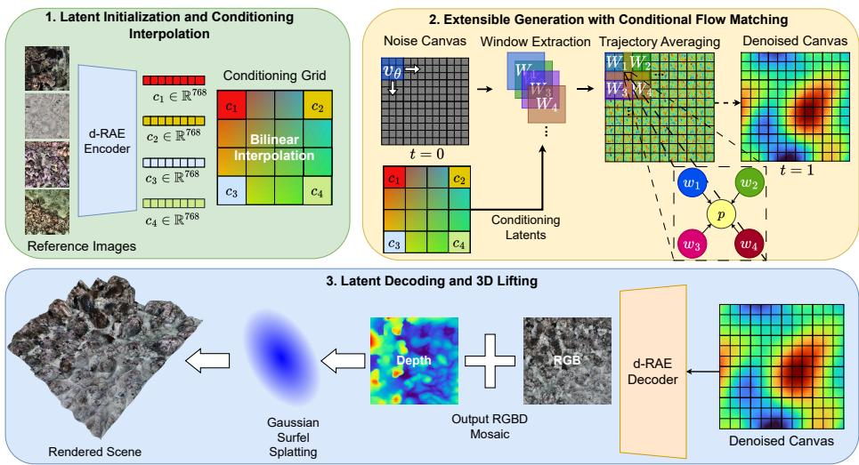  
Fig. 1: Overview of BenthicFlow’s generative pipeline. First, reference images are encoded and interpolated to form a large conditioning embedding grid. A large Gaussian noise canvas is then sampled and convolved in overlapping windows by a CFM model (vθ) trained to denoise small latent windows (Wi). This process is repeated over multiple integration steps, and, on each step, the flow trajectories of overlapping tokens are averaged. Finally, the complete denoised canvas is decoded in a single forward pass into a large RGBD mosaic, which is splatted to render the final scene.

In this section, we introduce our BenthicFlow generative pipeline, which incorporates elements from conditional flow matching, multi-difusion sampling, and gaussian splatting into a flexible underwater terrain generator depicted in

Fig. 1. To maintain computational feasibility, BenthicFlow operates within a compressed latent space managed by a modified formulation of the Representation Autoencoder (RAE) [53], which jointly encodes images and depth maps. BenthicFlow’s autoencoder, named d-RAE, consists of a frozen DINOv2 backbone used to process RGB images, coupled with a separate ViT trained from scratch to produce depth map latent representations. Formally, given an image $I \in \mathbb { R } ^ { 3 \times H \times }$ and its corresponding depth map $D \in \mathbb { R } ^ { 1 \times H \times W }$ , d-RAE encodes them into a fused latent representation:

$$
z = \mathcal { N } _ { \mathrm { t o k } } \big ( \big [ E _ { \mathrm { r g b } } ( I ) ; E _ { \mathrm { d } } ( D ) \big ] \big ) \in \mathbb { R } ^ { h \times w \times 1 0 2 4 } ,\tag{1}
$$

where $( h , w ) = ( H / 1 4 , W / 1 4 )$ . d-RAE’s RGB encoder $( E _ { \mathrm { r g b } } )$ encodes the images into patch tokens $E _ { \mathrm { r g b } } ( I ) \in \mathbb { R } ^ { h \times w \times 7 6 8 }$ , while the ViT depth encoder $\left( E _ { \mathrm { d } } \right)$ produces $E _ { \mathrm { d } } ( D ) \in \mathbb { R } ^ { h \times w \times 2 5 6 }$ . During training, the RGB and depth representations are aligned naturally through a reconstruction training protocol, up to a pretraining bias in the afine statistics of the DINOv2 encoder. To handle this final inconsistency, we concatenate and normalize the two sets of patch tokens by layer normalization (denoted $\mathcal { N } _ { \mathrm { t o k } }$ in Eq. (1)). Finally, at the decoding stage, the d-RAE model projects the latent to a width of 512, applies a bottleneck of two residual blocks around a spatial self-attention layer, and upsamples the features to the output resolution, producing a final RGBD representation.

With this latent representation established, the overall extensible terrain generation pipeline of BenthicFlow consists of the following three stages:

1. Latent Initialization and Conditioning Interpolation: The d-RAE’s RGB encoder first compresses the input image seeds into the fused latents described above. These seed latents are subsequently mean-pooled and interpolated to form a continuous conditioning grid of a specific spatial extent (Sec. 4.1).

2. Extensible Generation with Conditional Flow Matching: A conditional flow matching model is convolved simultaneously across a latent canvas and the interpolated guiding grid. Spatial consistency across the canvas is maintained through flow-matching trajectory averaging during sampling. This process is repeated iteratively until the output latent has been fully denoised (Sec. 4.2).

3. Decoding and 3D Lifting: Finally, the fully generated latent canvas is mapped back to the pixel level by the d-RAE’s fully convolutional decoder. To produce the final scene, the reconstructed RGBD image is lifted to a continuous 3D representation through surface-aligned Gaussian surface elements (surfels) (Sec. 4.3).

## 4.1 Latent Initialization and Conditioning Interpolation

To condition BenthicFlow on specific underwater substrates, four reference images with the desired conditioning signal are processed by the d-RAE’s DINOv2 encoder, obtaining 4 patch embedding representations. For each of the reference seeds $I _ { i } ,$ a global appearance descriptor $\begin{array} { r } { c _ { i } = \frac { 1 } { h w } \sum _ { j k } E _ { \mathrm { r g b } } ( I _ { i } ) _ { j k } \in \mathbb R ^ { 7 6 8 } } \end{array}$ is computed. Conditioning on this pooled vector rather than a spatial map allows a campaign’s benthic character to govern the generation without fixing any particular structure, enabling the downstream appearance interpolation. Since each descriptor can only condition a small portion of the image, the 4 vectors are bilinearly interpolated to the desired output scale to form a full conditioning grid, thereby letting appearance vary smoothly across the grid while the shared latent space preserves coherence.

## 4.2 Extensible Generation with Conditional Flow Matching

BenthicFlow formulates the generative process as a rectified flow matching procedure between an isotropic gaussian and the d-RAE’s latent representation, controlled by global appearance vectors through classifier-free guidance [16]. To make large scale generation feasible, a latent canvas with the target resolution is subdivided into overlapping $1 6 \times 1 6$ windows, each with its corresponding interpolated guiding vector. The task of BenthicFlow’s CFM is to generate a single window of the latent at a time, with inter-window consistency emerging from the averaging of overlapping flow-matching trajectories.

Rectified flow with guidance. For a clean latent $z _ { 1 }$ and noise $z _ { 0 } \sim \mathcal { N } ( 0 , \mathbf { I } )$ , the rectified flow defines the path $z _ { t } = ( 1 - t ) z _ { 0 } + t z _ { 1 }$ with target velocity $z _ { 1 } - z _ { 0 }$ During training, the network $v _ { \theta }$ regresses this velocity under uniform time steps:

$$
\mathcal { L } _ { \mathrm { C F M } } = \mathbb { E } _ { t \sim \mathcal { U } ( 0 , 1 ) , z _ { 0 } , z _ { 1 } , c } \big \| v _ { \theta } ( z _ { t } , t , c ) - ( z _ { 1 } - z _ { 0 } ) \big \| _ { 2 } ^ { 2 } .\tag{2}
$$

The condition is dropped to a learned null token $c _ { \theta }$ with probability 0.1 during training. At inference, the guided velocity $\tilde { v } = v _ { \theta } ( z _ { t } , t , c _ { \mathcal { D } } ) + s ( v _ { \theta } ( z _ { t } , t , c ) -$ $v _ { \theta } \big ( z _ { t } , t , c _ { \theta } \big ) \big )$ with scale $s { = } 3$ is integrated using Euler’s method for ordinary diferential equations approximation. Latents are standardized per channel by statistics estimated over the training set. Note that the model is never trained explicitly on windowed denoising of large canvases. Instead, rectified flow is applied only at a fixed low resolution defined during training.

Network. $v _ { \theta }$ is a fully convolutional U-Net [39] over the $1 6 \times 1 6 \times 1 0 2 4$ latent window, with a single 2× downsampling stage to $8 \times 8 .$ , a symmetric upsampling stage, base width 512, and full-resolution skip connections. Each residual block is modulated by adaptive group normalization: a sinusoidal timestep embedding and a linear projection of a conditioning vector c are summed and employed to predict per-channel scale and shift. The output convolution is zero-initialized so that the network initially predicts a near-zero velocity field, a standard initialization for residual and generative networks [34, 50]. An EMA copy of trainable weights is maintained for optimization stabilization.

Extensible Generation. Generation extends from one window to the full output resolution by a MultiDifusion-inspired sampler [3] operating directly on the velocity field. At each Euler step, the windows are processed concurrently by $v _ { \theta }$ and their guided velocities are averaged per token under a separable sine window ω that downweights window borders:

$$
\tilde { v } _ { \mathrm { c a n v a s } } ( p ) = \frac { \sum _ { k : p \in W _ { k } } \omega _ { k } ( p ) \tilde { v } _ { k } ( p ) } { \sum _ { k : p \in W _ { k } } \omega _ { k } ( p ) } .\tag{3}
$$

Neighboring regions are therefore fused during sampling, rather than stitched afterward: a single model in the pipeline estimates the denoised latents, with no secondary network and no post-hoc blending, so window boundaries receive no dedicated treatment outside the sampler.

## 4.3 Latent Decoding and 3D Lifting

After denoising, the frozen d-RAE decoder produces a spatially continuous RGBD mosaic from the latent canvas tokens. The fully convolutional nature of the decoder allows it to generate mosaics of arbitrary size. This represents a single 2.5D observation, which is subsequently lifted into an explicit 3D representation for continuous novel-view rendering. Specifically, each pixel is unprojected under a pinhole model, with relative depth $d \in [ 0 , 1 ]$ mapped to camera range $Z = z _ { \mathrm { n e a r } } + d z _ { \mathrm { s p a n } ; }$ , where $z _ { \mathrm { n e a r } }$ represents the distance between the camera and the scene, and $z _ { \mathrm { s p a n } }$ the maximum depth of any point of the terrain. Rather than isotropic 3D Gaussians, each point is rendered as a Gaussian surface element (surfel): a per-pixel normal is estimated from the local gradient of the unprojected points, and the primitive is oriented such that its two in-plane axes span the tangent plane while a thin axis follows the normal. To keep slanted surfaces gap-free without bridging occlusion boundaries, the surface in-plane extents are set anisotropically from the local inter-pixel spacing, measured by a one-sided minimum so a surfel never spans a depth discontinuity. Following a 2D Gaussian Splatting formulation [18] where appearance is observed from a single view, color is stored per primitive and view-dependent spherical harmonics are omitted. Subsequently, an appearance-only refinement fits the source view by adjusting DC color, opacity, and bounded in-plane scale residual. At the same time, positions, orientations, and normal thickness stay fixed, recovering perview fidelity without letting the primitives inflate into blurry volumetric blobs. Optionally, a second pass polishes DC colour under an LPIPS objective while all other parameters remain fixed.

## 5 Experiments

A comprehensive suite of evaluations is performed to evaluate the quality of the generative models produced in this work. The assessment is performed along three axes: single image generation and reference adherence, large-scale extensible landscape generation, and 3D benthic environment rendering.

## 5.1 Model optimization

While the BenthicFlow CFM models are trained in a single stage for 200 epochs and a batch size of 256, the d-RAEs follows a more complex three-phase curriculum lasting a total of 16 epochs and using a batch size of 16. Phase 1 applies an $\mathcal { L } _ { 1 }$ reconstruction loss on RGB and depth. From epoch 6, phase 2 adds a Learned Perceptual Image Patch Similarity (LPIPS) [51] term on RGB. From epoch 8, phase 3 adds a hinge adversarial term on RGB, with a discriminator formed from a frozen DINO-S/8 backbone and a small trainable convolutional head, and DifAugment applied identically to real and reconstructed inputs. The adversarial weight is set adaptively from the ratio of reconstruction to adversarial gradient norms at the decoder’s final layer and scaled by 0.75. Furthermore, an EMA copy of trainable weights is kept for regularization.

All models are optimized with the AdamW optimizer $\scriptstyle ( \beta = ( 0 . 5 , 0 . 9 ) )$ ). Training inputs are 224×224 crops of the input images after downsampling to a $5 1 8 \times 5 1 8$ resolution and applying random horizontal flips. Both CFM and $\mathrm { d - R A E }$ models use the same EMA decay of 0.999. The learning rate is set to $2 \times 1 0 ^ { - 4 }$ for the d-RAE model and $1 \times 1 0 ^ { - 4 }$ for the CFM. Training is performed utilizing 4 NVIDIA H100 GPUs, 64 CPU cores, and 512GB of RAM. Downstream evaluation is conducted on a single NVIDIA A100 GPU with 16 CPU cores and 64GB of RAM.

## 5.2 Single Image Generation

Table 1: Quantitative comparison of image generation quality broken down by geographic region. Campaigns from Batemans Bay (3) and Scott Reef (3) are averaged to summarize regional performance, alongside Hawaii (1) (2000 images are sampled per campaign). KID is reported as the mean ± the pooled standard deviation from subset bootstrapping. BenthicFlow-DPF refers to the model using DPF-Net [33] preprocessing and Cos. Sim. denotes DINOv2 cosine similarity. Both BenthicFlow variants use 50 sampling steps. Best overall Average results are highlighted in bold.
<table><tr><td>Model</td><td>Location</td><td>FID ↓</td><td>Cos. Sim. ↑</td><td>KID ↓</td></tr><tr><td>FLUX.2-dev</td><td>Batemans</td><td>110.3</td><td>0.573</td><td> $0 . 0 9 6 6 \pm 0 . 0 0 1 8$ </td></tr><tr><td></td><td>Hawaii</td><td>137.1</td><td>0.593</td><td> $0 . 1 2 4 7 \pm 0 . 0 0 2 4$ </td></tr><tr><td></td><td>Scott Reef</td><td>76.7</td><td>0.745</td><td> $0 . 0 6 0 1 \pm 0 . 0 0 1 4$ </td></tr><tr><td></td><td>Average</td><td>99.7</td><td>0.649</td><td> $0 . 0 8 5 0 \pm 0 . 0 0 1 7$ </td></tr><tr><td>BenthicFlow</td><td>Batemans</td><td>20.0</td><td>0.805</td><td> $0 . 0 1 4 0 \pm 0 . 0 0 1 2$ </td></tr><tr><td></td><td>Hawaii</td><td>13.9</td><td>0.833</td><td> $0 . 0 0 7 0 \pm 0 . 0 0 0 5$ </td></tr><tr><td></td><td>Scott Reef</td><td>13.2</td><td>0.882</td><td> $0 . 0 0 6 4 \pm 0 . 0 0 0 5$ </td></tr><tr><td></td><td>Average</td><td>16.2</td><td>0.842</td><td> $0 . 0 0 9 7 \pm 0 . 0 0 0 8$ </td></tr><tr><td>BenthicFlow-DPF Batemans</td><td></td><td>19.6</td><td>0.795</td><td> $0 . 0 1 1 9 \pm 0 . 0 0 0 8$ </td></tr><tr><td></td><td>Hawaii</td><td>15.5</td><td>0.804</td><td> $0 . 0 0 7 9 \pm 0 . 0 0 1 0$ </td></tr><tr><td></td><td>Scott Reef</td><td>11.9</td><td>0.894</td><td> $0 . 0 0 6 8 \pm 0 . 0 0 0 5$ </td></tr><tr><td></td><td>Average</td><td>15.7</td><td>0.839</td><td> $\mathbf { 0 . 0 0 9 1 \pm 0 . 0 0 0 7 }$ </td></tr></table>

The BenthicFlow models are evaluated against a state-of-the-art generative model that was selected due to its ability to adhere closely to reference images: 4-bit quantized version of FLUX.2-dev [23]. The quantized version is selected due to the standard model’s extreme computation requirements.

Our models are conditioned on random test crops, whereas the FLUX.2 baseline uses full CLAHE-normalized test images paired with a domain-specific text prompt (further details describing the usage of FLUX.2-dev are present in the supplementary material). Generative quality is assessed via Fréchet Inception Distance (FID) and Kernel Inception Distance (KID) between the test set conditioning images and the generated images, using an Inception-v3 [41] backbone. The conditional adherence is measured by the cosine similarity of average-pooled DINOv2 tokens between reference and generated images. All metrics are computed at BenthicFlow’s CFM standard training resolution (224 × 224).

As shown in Tab. 1, BenthicFlow closely matches the test data distribution, achieving an $\mathrm { F I D } \leq 2 0$ across all reefs and preprocessing variants (a result also present in the detailed per-campaign tests available in the supplementary material). This consistent high fidelity across diverse reefs demonstrates that our framework efectively models multi-modal distributions without sample degradation. Compared to FLUX.2-dev, BenthicFlow yields superior fidelity and higher conditional similarity. Qualitatively, Fig. 2 demonstrates how FLUX.2 introduces structural and optical artifacts that alter the identity of the target biome, whereas BenthicFlow preserves the visual identity of the reference reef while maintaining the natural environmental variations. Moreover, while the depth maps of the generative models appear slightly difused compared to the references due to their lower resolution, they remain consistent with the generated images.

To evaluate geographically discriminative retention, k-NN classifiers trained on average-pooled DINOv2 features predict the source reef (see Tab. 2). BenthicFlow retains over 95% of the balanced accuracy and macro F1 of real CLAHE data, while BenthicFlow-DPF retains 95% and 94% of real DPF-Net data; both substantially outperform FLUX.2-dev. These results indicate that our models preserve site-specific visual cues across distinct marine environments.

## 5.3 Extensible Generation and 3D Rendering

Window merging The eficacy of our MultiDifusion-inspired approach for generating extensible terrain depends heavily on the smooth integration of overlapping windows. When visible seams are present in the image, they tend to appear in the center of the region where two windows overlap, since both windows have maximum contextual bias and equally strong weights (for a visual demonstration of this efect, see the supplementary material). To quantify the presence of these boundary artifacts, we introduce a targeted diagnostic tool denoted the Seam Gradient Ratio (SGR). Let I denote the generated mosaic and let S represent the sampling stride size used to generate it. We define $\varOmega _ { \mathrm { s e a m } }$ as the localized spatial band centered along the window overlap boundary with a total width equal to half a stride (S/2), while $\varOmega _ { \mathrm { r e s t } } = I \backslash \varOmega _ { \mathrm { s e a m } }$ constitutes the remainder of the image canvas. The score evaluates the ratio of the average gradient magnitudes between these two domains:

Table 2: Discriminative capacity evaluation using a k-NN classifier (k = 20, 2, 000 training samples per reef). Classifiers are trained on either real data or synthetic data generated by the respective models, and evaluated on the test set. Reef columns report class-specific F1-scores (Scott refers to the Scott Reef location and Batemans abbreviates Batemans Bay), while global performance is captured via Balanced Accuracy (Bal. Acc.) [5] and Macro F1-score. Best results of the generative models are in bold.
<table><tr><td></td><td colspan="3">F1</td><td></td><td></td></tr><tr><td>Model</td><td>Batemans</td><td>Hawaii</td><td>Scott</td><td>Bal. Acc. ↑</td><td>Macro F1 ↑</td></tr><tr><td>Real Data</td><td></td><td></td><td></td><td></td><td></td></tr><tr><td>CLAHE</td><td>0.928</td><td>0.834</td><td>0.850</td><td>0.873</td><td>0.871</td></tr><tr><td>DPF-Net</td><td>0.910</td><td>0.783</td><td>0.869</td><td>0.865</td><td>0.854</td></tr><tr><td>Generated Data</td><td></td><td></td><td></td><td></td><td></td></tr><tr><td>FLUX.2-dev</td><td>0.260</td><td>0.667</td><td>0.697</td><td>0.568</td><td>0.541</td></tr><tr><td>BenthicFlow</td><td>0.855</td><td>0.797</td><td>0.843</td><td>0.835</td><td>0.832</td></tr><tr><td>BenthicFlow-DPF</td><td>0.841</td><td>0.710</td><td>0.853</td><td>0.823</td><td>0.802</td></tr></table>

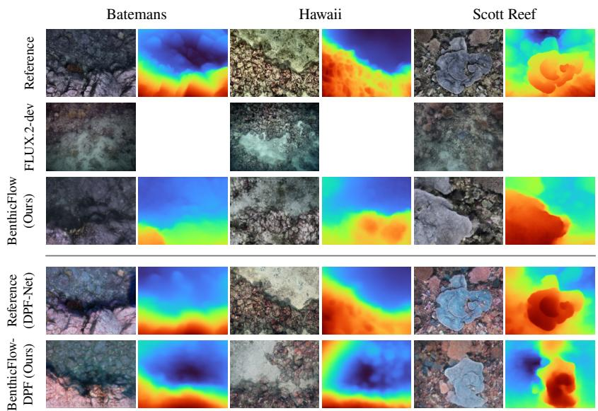  
Fig. 2: Qualitative comparison of the generative quality of the BenthicFlow models compared to FLUX.2-dev. Each column pair contains the output of a diferent reference image, with the left column containing the image and the right its predicted depth. The depth column is left blank for FLUX.2-dev, as it does not generate that modality.

$$
\mathrm { S G R } = \frac { \frac { 1 } { | \Omega _ { \mathrm { s e a m } } | } \sum _ { ( x , y ) \in \Omega _ { \mathrm { s e a m } } } \| \nabla I ( x , y ) \| } { \frac { 1 } { | \Omega _ { \mathrm { r e s t } } | } \sum _ { ( x , y ) \in \Omega _ { \mathrm { r e s t } } } \| \nabla I ( x , y ) \| }\tag{4}
$$

, where $\| \nabla I ( x , y ) \|$ represents the standard spatial gradient magnitude at pixel coordinates (x, y). SGR near 1 indicates that the boundary region is indistinguishable from the rest of the generated texture, whereas a significantly diferent score indicates a sharp structural discontinuity or a visible seam. To ensure statistical soundness and account for natural texture-driven variations, this score is averaged across a large corpus of generated terrains.

We leverage this metric to systematically analyze how boundary seamlessness behaves as a function of window overlap. The evaluation consists of generating terrains with the standard BenthicFlow model conditioned on the test set across 7 overlapping configurations, ranging from 0% (stride 16) to 87.5% (stride 2). 500 images are generated for each ratio at a scale 16 times larger than the output resolution of the CFM. As illustrated in Fig. 3a, the gradient ratio is optimized between 50% and 75% overlap, indicating optimal blending at 62.5%, which we adopt for further experiments. Although the ratio is the least optimal when there is no overlap, performance also decreases at high overlap percentages, such as 87.5%.

Latent interpolation One of our assumptions about BenthicFlow’s ability to generate diverse scenes is that a simple linear interpolation approach is suficient to generate a smooth structural and semantic transition between image seeds. In Fig. 3b, we analyze this assumption by interpolating images of two diferent locations. To visualize the transition in semantic content of the panoramas, the DINOv2 patch tokens of the windows and the seeds in the two extremes are extracted and averaged, forming an embedding per window. The first 30 principal components of these averaged embeddings are extracted and their dimensionality is further reduced to two components using the t-SNE [30] algorithm. The resulting figure suggests a smooth transition from one window to the other in the embedding space, where closeness in this space significantly correlates with overlapping positions in the panorama.

Depth Consistency As a 2.5D image generative model, BenthicFlow must be capable of generating highly consistent texture and depth map pairs. A natural evaluation approach would involve computing the monocular depth estimation of the generated images and comparing it directly to their corresponding generated depth maps. However, because the generative models in this work are trained to produce localized image crops and DAv2 is highly sensitive to the loss of contextual cues in the periphery of the images, a direct comparison is not applicable.

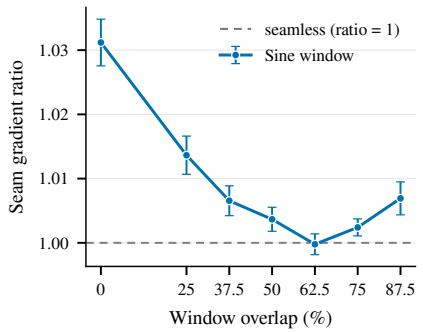  
(a) Seam gradient ratio metric across increasing overlaps. 95% confidence intervals are represented with vertical lines.

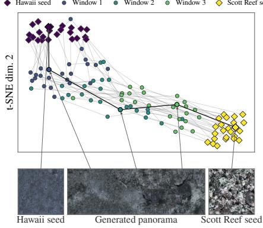  
(b) Interpolation of two reference images.  
Fig. 3: Analysis of the extensible generation strategy. (a) Visualization of the seam gradient ratio metric across diferent window overlaps. (b) t-SNE visualization of the interpolation windows between a set of images, demonstrating progressive semantic evolution between references.

To circumvent this, the consistency between the generated depth and image channels is approximated via the d-RAE’s capacity to encode and decode imagedepth pairs on unseen test data. The underlying premise is that if the d-RAE decoder generalizes to unseen data, it will similarly generalize to the unseen latents generated by our flow matching procedure. Furthermore, because full-sized test images can be processed by DAv2 prior to cropping, this evaluation bypasses the context-deficit limitation described above, enabling a more accurate assessment of the generator’s consistency. As shown in Tab. 3, the metrics demonstrate a near-perfect alignment between the input and reconstructed depth, validating the structural and cross-modal consistency of BenthicFlow.

Table 3: Depth generation consistency evaluated against Depth Anything V2 pseudoground truth on the test dataset using root mean squared error (RMSE) and Pearson correlation. Best results in bold.
<table><tr><td>Model</td><td>RMSE ↓ Pearson r ↑</td><td></td></tr><tr><td>BenthicFlow d-RAE</td><td>0.006</td><td>0.997</td></tr><tr><td>BenthicFlow-DPF d-RAE</td><td>0.009</td><td>0.992</td></tr></table>

3D Rendering Figure 4 demonstrates the final output of the full generative pipeline. Both BenthicFlow variants successfully interpolate reference images from diferent geographic reefs to construct coherent, diverse landscapes. For example, the scene on the left shows how sand from the leftmost reference transitions into the rocky structures from the other references, and it is populated with realistically distributed plating corals and algae. The scene on the right demonstrates how the integration of DPF-Net [33] mitigates the underwater optical attenuation, yielding a larger color range and greater texture quality. Additional generated scenes are provided in the supplementary material.

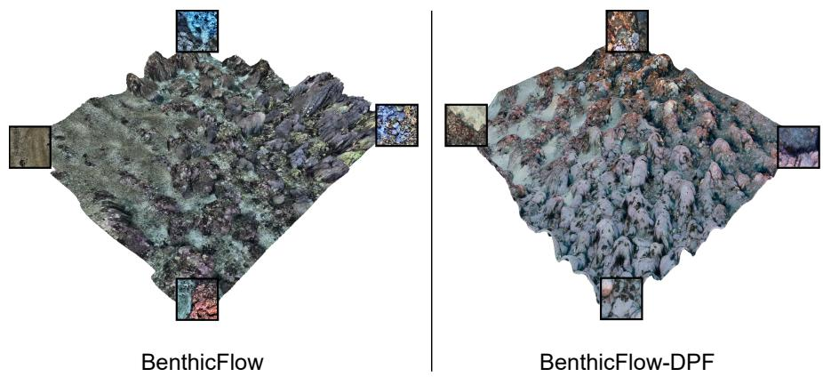  
Fig. 4: Two underwater scenes synthesized with BenthicFlow (left) and BenthicFlow-DPF (right) at a scale 32 times larger than the CFM’s training resolution. The reference seeds used to render them are visible within frames on the corners of the scenes.

To quantitatively evaluate the 3D lifting stage, we ablate both the base primitive (surface-aligned surfel vs. isotropic 3D Gaussian) and the appearance refinement strategy. Using 300 RGBD samples generated from held-out test deployments, we unproject the mosaic, build the primitives, optionally apply refinement, and render the front view against the generated reference. Since all configurations share identical inputs, comparisons are strictly paired. Note that this protocol measures single-view fidelity and does not quantify the of-axis multi-view coherence that motivates the use of surfels (Sec. 4.3).

As shown in Tab. 4, anchored refinement provides the largest improvement in source-view fidelity. Optimizing DC color, opacity, and bounded in-plane scale while fixing positions and orientations reduces LPIPS from 0.138 to 0.046 and increases SSIM from 0.884 to 0.925, improving LPIPS on 94% of samples without allowing primitives to expand into volumetric blobs. Surface-aligned initialization also outperforms isotropic initialization before refinement across all metrics, showing that the geometric prior is beneficial independently of appearance fitting. Perceptual color polishing provides no further reprojection benefit and slightly degrades performance. Although isotropic Gaussians achieve a 0.39 dB higher PSNR after convergence through greater volumetric flexibility, surfels preserve the surface alignment needed for multi-view coherence at only a minor single-view cost. We therefore adopt surface-aligned surfels with anchored refinement and no perceptual polish.

Table 4: Lifting-stage ablation over 300 generated samples (front-view reprojection vs. reference; paired, single view). We report Peak Signal to Noise Ratio (PSNR), Structural Similarity Index Measure (SSIM) and LPIPS. The three components of the lifting-stage are ablated: the use of surfels (Surf.), anchored refinement (Ref.) and perceptual color polishing (Perc.). Best per column in bold.
<table><tr><td>Surf.</td><td>Ref.</td><td>Perc.</td><td>PSNR ↑</td><td>SSIM ↑</td><td>LPIPS ↓</td></tr><tr><td>x</td><td>x</td><td>x</td><td>29.20</td><td>0.863</td><td>0.149</td></tr><tr><td>√</td><td>x</td><td>x</td><td>30.03</td><td>0.884</td><td>0.138</td></tr><tr><td>√</td><td>√</td><td>x</td><td>30.96</td><td>0.925</td><td>0.046</td></tr><tr><td>√</td><td>√</td><td>√</td><td>30.94</td><td>0.925</td><td>0.048</td></tr><tr><td>x</td><td>√</td><td>√</td><td>31.33</td><td>0.927</td><td>0.045</td></tr></table>

## 6 Conclusions and Future Work

This work introduces a unified framework for modeling diverse marine biomes and generating extensible 2.5D underwater environments. We show that MultiDifusion-inspired sampling can be integrated directly into a flow-matching trajectory, providing a simpler alternative to terrain-generation pipelines that require a separately trained inpainting model. We further evaluate the framework across image generation, depth consistency, extensible synthesis, and 3D reprojection fidelity. Surface-aligned Gaussian surfels mitigate the limitations of lifting single-view RGBD mosaics by improving surface coverage while preserving the estimated geometry. Together, these components provide a scalable basis for generating synthetic underwater environments for downstream perception and robotics applications.

Several limitations motivate future work. First, the current conditioning uses average-pooled DINOv2 patch tokens; alternative representations, including CLS tokens and intermediate-layer aggregation, may provide more informative appearance control. Second, the pipeline remains fundamentally 2.5D and cannot recover geometry absent from the generated view. Future work could investigate direct 3D generation using pseudo-3D supervision from models such as VGGT-Ω [44]. Third, high-resolution generation is constrained by the memory cost of decoding the full latent canvas, motivating a consistent windowed-decoding strategy. Finally, replacing cropped training with full-image training at higher resolutions may improve global structure and retain finer details after 3D lifting.

## Acknowledgements

This work was carried out within the ITEA Advisor and Xecs Marisens projects.

## References

1. Akkaynak, D., Treibitz, T.: Sea-Thru: A Method for Removing Water From Underwater Images. In: 2019 IEEE/CVF Conference on Computer Vision and Pattern Recognition (CVPR). pp. 1682–1691. IEEE, Long Beach, CA, USA (Jun 2019).

https://doi.org/10.1109/CVPR.2019.00178, https://ieeexplore.ieee.org/ document/8954437/

2. Albergo, M.S., Vanden-Eijnden, E.: Building normalizing flows with stochastic interpolants. In: The Eleventh International Conference on Learning Representations (2023), https://openreview.net/forum?id=li7qeBbCR1t

3. Bar-Tal, O., Yariv, L., Lipman, Y., Dekel, T.: Multidifusion: Fusing difusion paths for controlled image generation. In: ICML. pp. 1737–1752 (2023), https: //proceedings.mlr.press/v202/bar-tal23a.html

4. Álvaro Barbero Jiménez: Mixture of difusers for scene composition and high resolution image generation (2023), https://arxiv.org/abs/2302.02412

5. Brodersen, K.H., Ong, C.S., Stephan, K.E., Buhmann, J.M.: The balanced accuracy and its posterior distribution. In: Proceedings of the 20th International Conference on Pattern Recognition (ICPR). pp. 3121–3124 (2010). https://doi. org/10.1109/ICPR.2010.764

6. Chang, D., Johnson-Roberson, M., Sun, J.: An active perception framework for autonomous underwater vehicle navigation under sensor constraints. IEEE Transactions on Control Systems Technology 30(6), 2301–2316 (2022)

7. Choi, W.S., Olson, D.R., Davis, D., Zhang, M., Racson, A., Bingham, B., McCarrin, M., Vogt, C., Herman, J.: Physics-based modelling and simulation of multibeam echosounder perception for autonomous underwater manipulation. Frontiers in Robotics and AI Volume 8 - 2021 (2021). https://doi.org/10.3389/frobt. 2021.706646

8. Desai, C., Tabib, R.A., Reddy, S.S., Patil, U., Mudenagudi, U.: Ruig: Realistic underwater image generation towards restoration. In: Proceedings of the IEEE/CVF Conference on Computer Vision and Pattern Recognition. pp. 2181–2189 (2021)

9. Esser, P., Kulal, S., Blattmann, A., Entezari, R., Müller, J., Saini, H., Levi, Y., Lorenz, D., Sauer, A., Boesel, F., et al.: Scaling rectified flow transformers for high-resolution image synthesis. In: Forty-first international conference on machine learning (2024)

10. Esser, P., Rombach, R., Ommer, B.: Taming transformers for high-resolution image synthesis. In: Proceedings of the IEEE/CVF conference on computer vision and pattern recognition. pp. 12873–12883 (2021)

11. Filisetti, A., Marouchos, A., Martini, A., Martin, T., Collings, S.: Developments and applications of underwater lidar systems in support of marine science. In: OCEANS 2018 MTS/IEEE Charleston. pp. 1–10 (10 2018). https://doi.org/10. 1109/OCEANS.2018.8604547

12. Friedman, A., Monk, J., Pizarro, O., Lindsay, D.J., Oh, E., Thornton, B., Carroll, A.G., Przeslawski, R., Williams, S.B.: Squidle+: a collaborative platform to manage, discover and annotate marine imagery. Frontiers in Marine Science Volume 12 - 2025 (2026). https://doi.org/10.3389/fmars.2025.1677103, https://www.frontiersin.org/journals/marine-science/articles/10.3389/ fmars.2025.1677103

13. Galin, E., Guérin, E., Peytavie, A., Cordonnier, G., Cani, M.P., Benes, B., Gain, J.: A review of digital terrain modeling. Computer Graphics Forum 38 (06 2019). https://doi.org/10.1111/cgf.13657

14. Grøsvik, B.E., Buhl-Mortensen, L., Bergmann, M., Booth, A.M., Gomiero, A., Galgani, F.: Status and future recommendations for recording and monitoring litter on the arctic seafloor. Arctic Science 9(2), 345–355 (2023). https://doi.org/10. 1139/as-2022-0017

15. Hambarde, P., Murala, S., Dhall, A.: Uw-gan: Single-image depth estimation and image enhancement for underwater images. IEEE Transactions on Instrumentation and Measurement 70, 1–12 (2021). https://doi.org/10.1109/TIM.2021.3120130

16. Ho, J., Salimans, T.: Classifier-free difusion guidance. arXiv preprint arXiv:2207.12598 (2022)

17. Hou, J., Ye, X.: Real-time Underwater 3D Reconstruction Method Based on Stereo Camera. In: 2022 IEEE International Conference on Mechatronics and Automation (ICMA). pp. 1204–1209 (Aug 2022). https://doi.org/10.1109/ICMA54519.2022. 9855905, iSSN: 2152-744X

18. Huang, B., Yu, Z., Chen, A., Geiger, A., Gao, S.: 2d gaussian splatting for geometrically accurate radiance fields. In: ACM SIGGRAPH 2024 conference papers. pp. 1–11 (2024)

19. Huang, S., Wang, K., Liu, H., Chen, J., Li, Y.: Contrastive Semi-Supervised Learning for Underwater Image Restoration via Reliable Bank. In: 2023 IEEE/CVF Conference on Computer Vision and Pattern Recognition (CVPR). pp. 18145– 18155. IEEE, Vancouver, BC, Canada (Jun 2023). https://doi.org/10.1109/ CVPR52729.2023.01740, https://ieeexplore.ieee.org/document/10204411/

20. Jiao, P., Ye, X., Zhang, C., Li, W., Wang, H.: Vision-based real-time marine and ofshore structural health monitoring system using underwater robots. Computer-Aided Civil and Infrastructure Engineering 39(2), 281–299 (2024)

21. Johnson-Roberson, M., Bryson, M., Friedman, A., Pizarro, O., Troni, G., Ozog, P., Henderson, J.C.: High-resolution underwater robotic vision-based mapping and three-dimensional reconstruction for archaeology. Journal of Field Robotics 34(4), 625–643 (2017)

22. Labs, B.F.: black-forest-labs/FLUX.2-dev · Hugging Face — huggingface.co. https://huggingface.co/black-forest-labs/{F}{L}{U}{X}.2-dev, [Accessed 12-07-2026]

23. Labs, B.F.: FLUX.2: Frontier Visual Intelligence — bfl.ai. https://bfl.ai/blog/ flux-2, [Accessed 06-07-2026]

24. Levy, D., Peleg, A., Pearl, N., Rosenbaum, D., Akkaynak, D., Korman, S., Treibitz, T.: SeaThru-NeRF: Neural Radiance Fields in Scattering Media (Apr 2023), https://arxiv.org/abs/2304.07743v1

25. Li, H., Song, W., Xu, T., Elsig, A., Kulhanek, J.: WaterSplatting: Fast Underwater 3D Scene Reconstruction Using Gaussian Splatting (May 2025). https://doi.org/ 10.48550/arXiv.2408.08206, arXiv:2408.08206 [cs]

26. Lipman, Y., Chen, R.T.Q., Ben-Hamu, H., Nickel, M., Le, M.: Flow matching for generative modeling. In: The Eleventh International Conference on Learning Representations (2023), https://openreview.net/forum?id=PqvMRDCJT9t

27. Liu, X., Gong, C., Liu, Q.: Flow straight and fast: Learning to generate and transfer data with rectified flow. CoRR abs/2209.03003 (2022), https://doi.org/10. 48550/arXiv.2209.03003

28. Lugmayr, A., Danelljan, M., Romero, A., Yu, F., Timofte, R., Van Gool, L.: Repaint: Inpainting using denoising difusion probabilistic models. In: Proceedings of the IEEE/CVF conference on computer vision and pattern recognition. pp. 11461– 11471 (2022)

29. Ma, Y., Wu, Y., Li, Q., Zhou, Y., Yu, D.: Rov-based binocular vision system for underwater structure crack detection and width measurement. Multimedia Tools and Applications 82(14), 20899–20923 (2023)

30. Van der Maaten, L., Hinton, G.: Visualizing data using t-sne. Journal of machine learning research 9(11) (2008)

31. Mai, C., Liniger, J., Pedersen, S.: Semantic segmentation using synthetic images of underwater marine-growth. Frontiers in Robotics and AI Volume 11 - 2024 (2025). https://doi.org/10.3389/frobt.2024.1459570

32. Manzanilla, A., Reyes, S., Garcia, M., Mercado, D., Lozano, R.: Autonomous navigation for unmanned underwater vehicles: Real-time experiments using computer vision. IEEE Robotics and Automation Letters 4(2), 1351–1356 (2019)

33. Mei, H., Li, K., Liu, S., Ma, C., Jiang, Q.: DPF-Net: Physical imaging model embedded data-driven underwater image enhancement. ISPRS Journal of Photogrammetry and Remote Sensing 228, 679–693 (2025). https://doi.org/https: //doi.org/10.1016/j.isprsjprs.2025.07.031, https://www.sciencedirect. com/science/article/pii/S0924271625003016

34. Peebles, W., Xie, S.: Scalable difusion models with transformers. In: Proceedings of the IEEE/CVF international conference on computer vision. pp. 4195–4205 (2023)

35. Piechaud, N., Howell, K.L.: Fast and accurate mapping of fine scale abundance of a vme in the deep sea with computer vision. Ecological Informatics 71, 101786 (2022). https://doi.org/https://doi.org/10.1016/j.ecoinf.2022.101786, https://www.sciencedirect.com/science/article/pii/S1574954122002369

36. Piechaud, N., Hunt, C., Culverhouse, P.F., Foster, N.L., Howell, K.L.: Automated identification of benthic epifauna with computer vision. Marine Ecology Progress Series 615, 15–30 (2019)

37. Potokar, E., Ashford, S., Kaess, M., Mangelson, J.G.: Holoocean: An underwater robotics simulator. In: 2022 International Conference on Robotics and Automation (ICRA). pp. 3040–3046. IEEE (2022)

38. Rombach, R., Blattmann, A., Lorenz, D., Esser, P., Ommer, B.: High-resolution image synthesis with latent difusion models. In: Proceedings of the IEEE/CVF conference on computer vision and pattern recognition. pp. 10684–10695 (2022)

39. Ronneberger, O., Fischer, P., Brox, T.: U-net: Convolutional networks for biomedical image segmentation. In: International Conference on Medical image computing and computer-assisted intervention. pp. 234–241. Springer (2015)

40. Song, J., Ma, H., Bagoren, O., Sethuraman, A., Zhang, Y., Skinner, K.A.: Oceansim: A gpu-accelerated underwater robot perception simulation framework. In: 2025 IEEE/RSJ International Conference on Intelligent Robots and Systems (IROS). pp. 1526–1533 (2025). https://doi.org/10.1109/IROS60139.2025. 11246878

41. Szegedy, C., Vanhoucke, V., Iofe, S., Shlens, J., Wojna, Z.: Rethinking the inception architecture for computer vision. In: Proceedings of the IEEE conference on computer vision and pattern recognition. pp. 2818–2826 (2016)

42. Tang, Y., Zhu, C., Wan, R., Xu, C., Shi, B.: Neural Underwater Scene Representation. In: 2024 IEEE/CVF Conference on Computer Vision and Pattern Recognition (CVPR). pp. 11780–11789 (Jun 2024). https://doi.org/10.1109/CVPR52733. 2024.01119, iSSN: 2575-7075

43. Van Damme, T.: Computer vision photogrammetry for underwater archaeological site recording in a low-visibility environment. The International Archives of the Photogrammetry, Remote Sensing and Spatial Information Sciences 40, 231–238 (2015)

44. Wang, J., Chen, M., Zhang, S., Karaev, N., Schönberger, J., Labatut, P., Bojanowski, P., Novotny, D., Vedaldi, A., Rupprecht, C.: Vggt-ohm. In: Proceedings of the IEEE/CVF Conference on Computer Vision and Pattern Recognition. pp. 21486–21499 (2026)

45. Wang, W., Joshi, B., Burgdorfer, N., Batsosc, K., Lid, A.Q., Mordohaia, P., Rekleitisb, I.: Real-time dense 3d mapping of underwater environments. In: 2023 IEEE International Conference on Robotics and Automation (ICRA). pp. 5184–5191. IEEE (2023)

46. Wu, C., Li, J., Zhou, J., Lin, J., Gao, K., Yan, K., ming Yin, S., Bai, S., Xu, X., Chen, Y., Chen, Y., Tang, Z., Zhang, Z., Wang, Z., Yang, A., Yu, B., Cheng, C., Liu, D., Li, D., Zhang, H., Meng, H., Wei, H., Ni, J., Chen, K., Cao, K., Peng, L., Qu, L., Wu, M., Wang, P., Yu, S., Wen, T., Feng, W., Xu, X., Wang, Y., Zhang, Y., Zhu, Y., Wu, Y., Cai, Y., Liu, Z.: Qwen-image technical report (2025), https://arxiv.org/abs/2508.02324

47. Wu, Z., Wu, Z., Chen, X., Lu, Y., Yu, J.: Self-supervised underwater image generation for underwater domain pre-training. IEEE Transactions on Instrumentation and Measurement 73, 1–14 (2024). https://doi.org/10.1109/TIM.2024.3373105

48. Yang, L., Kang, B., Huang, Z., Zhao, Z., Xu, X., Feng, J., Zhao, H.: Depth anything v2. Advances in Neural Information Processing Systems 37, 21875–21911 (2024)

49. Ye, T., Chen, S., Liu, Y., Ye, Y., Chen, E., Li, Y.: Underwater light field retention: Neural rendering for underwater imaging. In: Proceedings of the IEEE/CVF Conference on Computer Vision and Pattern Recognition (CVPR) Workshops. pp. 488–497 (June 2022)

50. Zhang, H., Dauphin, Y.N., Ma, T.: Fixup initialization: Residual learning without normalization. arXiv preprint arXiv:1901.09321 (2019)

51. Zhang, R., Isola, P., Efros, A.A., Shechtman, E., Wang, O.: The unreasonable efectiveness of deep features as a perceptual metric. In: Proceedings of the IEEE conference on computer vision and pattern recognition. pp. 586–595 (2018)

52. Zhang, T., Zhi, W., Mangelson, J., Johnson-Roberson, M.: Infinite Leagues Under the Sea: Photorealistic 3D Underwater Terrain Generation by Latent Fractal Difusion Models (Mar 2025). https://doi.org/10.48550/arXiv.2503.06784, http://arxiv.org/abs/2503.06784, arXiv:2503.06784 [cs]

53. Zheng, B., Ma, N., Tong, S., Xie, S.: Difusion transformers with representation autoencoders. In: The Fourteenth International Conference on Learning Representations (2026), https://openreview.net/forum?id=0u1LigJaab

54. Zheng, Z., Chen, Y., Zeng, H., Vu, T.A., Hua, B.S., Yeung, S.K.: Marineinst: A foundation model for marine image analysis with instance visual description. In: Computer Vision – ECCV 2024: 18th European Conference, Milan, Italy, September 29–October 4, 2024, Proceedings, Part II. p. 239–257. Springer-Verlag, Berlin, Heidelberg (2024). https://doi.org/10.1007/978-3-031-72627-9\_14

55. Zhong, J., Li, M., Gruen, A., Gong, J., Li, D., Qin, J.: Application of photogrammetric computer vision and deep learning in high-resolution underwater mapping: A case study of shallow-water coral reefs. ISPRS Annals of the Photogrammetry, Remote Sensing and Spatial Information Sciences 10, 247–254 (2024)

56. Zhong, J., Li, M., Zhang, H., Qin, J.: Combining photogrammetric computer vision and semantic segmentation for fine-grained understanding of coral reef growth under climate change. In: Proceedings of the IEEE/CVF Winter Conference on Applications of Computer Vision (WACV) Workshops. pp. 186–195 (January 2023)

57. Zurowietz, M., Langenkämper, D., Hosking, B., Ruhl, H.A., Nattkemper, T.W.: Maia—a machine learning assisted image annotation method for environmental monitoring and exploration. PLOS ONE 13(11), 1–18 (11 2018). https://doi. org/10.1371/journal.pone.0207498

# Supplementary Material for BenthicFlow: Generating Extensible Underwater Environments via Flow Matching

Joaquín Figueira\*, Camile Lendering\*, Manfred Gonzalez-Hernandez, Giacomo D’Amicantonio, Erkut Akdag, and Egor Bondarev

AIMS Group, Department of Electrical Engineering, Eindhoven University of Technology, Eindhoven, The Netherlands {j.figueira,c.r.lendering}@tue.nl Equal contribution.

## S1 Additional Single Image Generation Results

Table S1: Per-campaign d-RAE reconstruction results. Generative fidelity metrics: FID and KID (lower is better), DINOv2 cosine similarity (Cos. Sim.) of mean-pooled tokens (it measures semantic alignment, higher is better); reconstruction is evaluated only for the two flow-based pipelines. Depth consistency metrics: RMSE (lower is better) and Pearson correlation r (higher is better) compare reconstructed to reference depth. For each campaign, we highlight the best results between the two models in bold.
<table><tr><td>Model</td><td>Campaign</td><td>FID ↓</td><td>Cos. Sim. ↑</td><td>KID↓</td><td>Depth RMSE ↓</td><td>Depth r ↑</td></tr><tr><td rowspan="8">BenthicFlow d-RAE</td><td>Batemans201011</td><td>14.8</td><td>0.874</td><td>0.0117 ± 0.0011</td><td>0.0044</td><td>0.997</td></tr><tr><td>Batemans201211</td><td>17.3</td><td>0.876</td><td>0.0130 ± 0.0010</td><td>0.0074</td><td>0.997</td></tr><tr><td>Batemans201411</td><td>23.1</td><td>0.870</td><td>0.0216±0.0010</td><td>0.0041</td><td>0.999</td></tr><tr><td>Hawaii201801</td><td>15.0</td><td>0.883</td><td>0.0095 ± 0.0009</td><td>0.0052</td><td>0.998</td></tr><tr><td>ScottReef200907</td><td>8.8</td><td>0.929</td><td>0.0070 ± 0.0008</td><td>0.0061</td><td>0.998</td></tr><tr><td>ScottReef201108</td><td>7.1</td><td>0.920</td><td>0.0049 ± 0.0006</td><td>0.0072</td><td>0.997</td></tr><tr><td>ScottReef201503</td><td>13.7</td><td>0.929</td><td>0.0070 ± 0.0006</td><td>0.0077</td><td>0.997</td></tr><tr><td>Average</td><td>14.3</td><td>0.891</td><td>0.0107 ± 0.0021</td><td>0.0060</td><td>0.998</td></tr><tr><td rowspan="8">BenthicFlow-DPF d-RAE</td><td>Batemans201011</td><td>12.8</td><td>0.884</td><td>0.0084 ± 0.0005</td><td>0.0043</td><td>0.979</td></tr><tr><td>Batemans201211</td><td>15.3</td><td>0.880</td><td>0.0109 ± 0.0009</td><td>0.0086</td><td>0.990</td></tr><tr><td>Batemans201411</td><td>16.1</td><td>0.899</td><td>0.0136 ± 0.0011</td><td>0.0063</td><td>0.997</td></tr><tr><td>Hawaii201801</td><td>14.4</td><td>0.873</td><td>0.0095 ± 0.0012</td><td>0.0120</td><td>0.998</td></tr><tr><td>ScottReef200907</td><td>11.6</td><td>0.937</td><td>0.0114±0.0010</td><td>0.0064</td><td>0.982</td></tr><tr><td>ScottReef201108</td><td>8.6</td><td>0.935</td><td>0.0061 ± 0.0007</td><td>0.0123</td><td>0.998</td></tr><tr><td>ScottReef201503</td><td>11.1</td><td>0.943</td><td>0.0074 ± 0.0013</td><td>0.0130</td><td>0.998</td></tr><tr><td>Average</td><td>12.8</td><td>0.907</td><td>0.0096 ± 0.0010</td><td>0.0090</td><td>0.992</td></tr></table>

Extended results for single image generation evaluations are provided in tables Tab. S1 and Tab. S2. The tables contain results for every campaign available in the dataset. As seen in the table, the results remain consistent not only at the geographic location level but also at the campaign level. Additionally, these extended metrics show the relatively inferior performance of the Batemans campaigns. We hypothesize that this is caused by a moderate imbalance in the training data: the Scott Reef and Hawaii locations have more images per campaign available in the Squidle+ [12] framework, which leads to the flow matching models receiving a stronger learning signal for those locations.

Table S2: Per-campaign conditional generation results. FID and KID measure distributional fidelity (lower is better); DINOv2 cosine similarity (Cos. Sim.) of meanpooled tokens measures semantic alignment (higher is better). For each campaign the best results between the two models are shown in bold.
<table><tr><td>Model</td><td>Campaign</td><td>FID ↓</td><td>Cos. Sim. ↑</td><td>KID ↓</td></tr><tr><td rowspan="8">BenthicFlow</td><td>Batemans201011</td><td>27.1</td><td>0.817</td><td>0.0234±0.0017</td></tr><tr><td>Batemans201211</td><td>16.0</td><td>0.797</td><td> $0 . 0 0 7 5 \pm 0 . 0 0 0 7$ </td></tr><tr><td>Batemans201411</td><td>16.9</td><td>0.801</td><td>0.0110 ± 0.0008</td></tr><tr><td>Hawaii201801</td><td>13.9</td><td>0.833</td><td>0.0070 ± 0.0005</td></tr><tr><td>ScottReef200907</td><td>8.4</td><td>0.888</td><td>0.0046 ± 0.0003</td></tr><tr><td>ScottReef201108</td><td>9.0</td><td>0.870</td><td>0.0043 ± 0.0004</td></tr><tr><td>ScottReef201503</td><td>22.2</td><td>0.888</td><td>0.0104 ± 0.0007</td></tr><tr><td>Average</td><td>16.2</td><td>0.842</td><td>0.0097 ± 0.0026</td></tr><tr><td rowspan="8">BenthicFlow-DPF</td><td>Batemans201011</td><td>24.9</td><td>0.774</td><td>0.0174±0.0008</td></tr><tr><td>Batemans201211</td><td>16.4</td><td>0.800</td><td>0.0075 ± 0.0008</td></tr><tr><td>Batemans201411</td><td>17.6</td><td>0.812</td><td>0.0108± 0.0008</td></tr><tr><td>Hawaii201801</td><td>15.5</td><td>0.804</td><td>0.0079 ± 0.0010</td></tr><tr><td>ScottReef200907</td><td>10.8</td><td>0.891</td><td>0.0080 ± 0.0005</td></tr><tr><td>ScottReef201108</td><td>9.2</td><td>0.883</td><td>0.0044± 0.0005</td></tr><tr><td>ScottReef201503</td><td>15.7</td><td>0.908</td><td>0.0079± 0.0006</td></tr><tr><td>Average</td><td>15.7</td><td>0.839</td><td>0.0091 ±0.0017</td></tr><tr><td rowspan="8">FLUX.2-dev</td><td>Batemans201011</td><td>142.4</td><td>0.489</td><td>0.1298 ± 0.0027</td></tr><tr><td>Batemans201211</td><td>100.9</td><td>0.612</td><td>0.0849 ± 0.0011</td></tr><tr><td>Batemans201411</td><td>87.5</td><td>0.617</td><td></td></tr><tr><td>Hawaii201801</td><td>137.1</td><td>0.593</td><td>0.0750 ± 0.0012</td></tr><tr><td>ScottReef200907</td><td>75.2</td><td>0.765</td><td> $0 . 1 2 4 7 \pm 0 . 0 0 2 4$  0.0639 ± 0.0016</td></tr><tr><td>ScottReef201108</td><td>73.1</td><td>0.763</td><td> $0 . 0 5 7 9 \pm 0 . 0 0 1 3$ </td></tr><tr><td>ScottReef201503</td><td>81.9</td><td>0.707</td><td>0.0585 ± 0.0012</td></tr><tr><td>Average</td><td>99.7</td><td>0.649</td><td>0.0850 ± 0.0017</td></tr></table>

## S2 Extended Analysis of the Extensible Generation

To qualitatively analyze the efects of diferent overlap percentages, we present in Fig. S1 two examples of terrains generated using the standard BenthicFlow model. They consist of mosaics 16 times larger than BenthicFlow’s CFM standard output (4 times larger vertically and 4 times larger horizontally). In Fig. S1a, where no overlapping windows were applied, clear discontinuities can be observed between the windows, especially in terms of lighting and color consistency. This is also observable in the plot of the gradients below the figure, where clear relative peaks can be observed near the regions of the seams labeled with cyan dashed lines. In contrast, the image in Fig. S1b shows that there are no visible discontinuities or abrupt color changes between windows when using the optimal overlap range. Moreover, there are few visible peaks in the plot of the gradients where seams would be expected (dashed blue lines), indicating a more uniform gradient profile surrounding seam heavy areas. Note also the diference between SGR scores between the two images: the non-overlapping terrain has an SGR of 1.07, while the optimal overlapping percentage has a score of 1.002, significantly closer to the perfect ratio of 1.

A final additional result motivating our use of a sine window merging strategy can be seen in Fig. S2. The figure exhibits the SGR score as a function of the degree of overlap using two window averaging strategies: a uniformly weighted window and our adopted sine weight window. We can see that, although the weight configuration has less importance in the extremes of the overlap range, it is only possible to obtain an optimal ratio using the sine window function.

stride 16 (0.0% overlap) seam ratio 1.071  
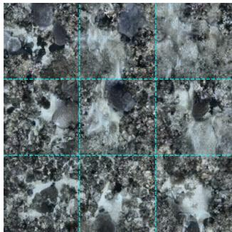

stride 6 (62.5% overlap) seam ratio 1.002  
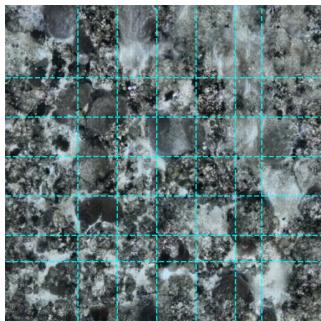

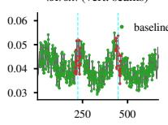  
px

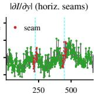  
(a) Above, an example of a terrain generated with non-overlapping windows. Below, the average gradient of each vertical and horizontal position in the image.  
px

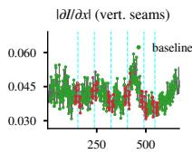  
px

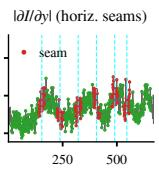  
px  
(b) Above, a terrain generated with 62.5% over lap. Below, the average gradient of each vertical and horizontal position in the image.

Fig. S1: Two generated terrains and the variation of their gradient magnitudes in both axes. Cyan dashed lines are used to indicate the region of the image where we would expect noticeable seams to appear (i.e. the center of the region where two windows overlap and where the pull of multiple trajectories equalizes).

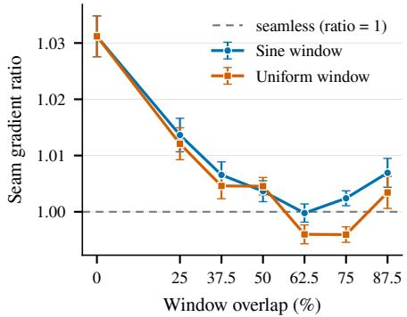  
Fig. S2: Comparison of the seam gradient ratio between employing a uniform weight window and the standard sine window of BenthicFlow.

## S3 Benthic Conditioning of FLUX.2-dev

We condition FLUX.2-dev using a reference $5 1 2 \times 5 1 2$ image and with the following prompt, which encompasses the main properties of the benthic images considered in this work, while simultaneously encouraging output diversity:

“Top-down nadir benthic survey photo of the underwater sea floor. Flat orthographic perspective with artificial strobe lighting. Substrate showing hard corals, rubble, and sand. Very slight water attenuation and marine snow backscatter. Scientific documentary style. Change the distribution of the benthic substrate, but keep the same perspective, lighting, and style”.

A final detail related to our usage of FLUX.2-dev is the number of difusion steps employed during inference. We decide to use 28 steps as suggested in [22], which provides an appropriate trade-of between image quality and inference speed. Further motivation for this decision, which also drives our use for the quantized version of FLUX.2-dev, is to equalize computational resources: 28 steps of FLUX.2-dev 4-bit quantized on an H100 NVIDIA GPU generate one image every ∼ 6 seconds, while BenthicFlow is able to generate more than 120 images on the same time frame while employing the same hardware.

## S4 Additional Generated Scenes

To further demonstrate BenthicFlow’s ability to generate diverse scenes, we provide additional 3D renderings generated at a scale 36 times larger than the model’s window resolution (6 times larger horizontally, and 6 times larger vertically). These scenes can be observed in Fig. S3, demonstrating smooth transitions between the seeds and natural benthic biome variations.

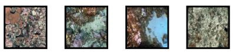

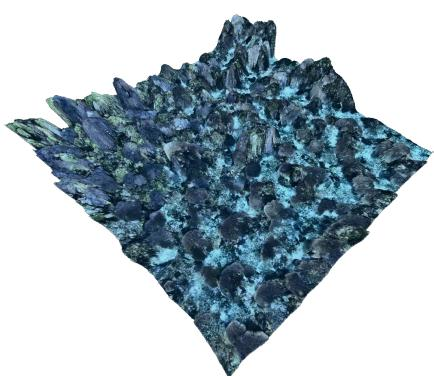

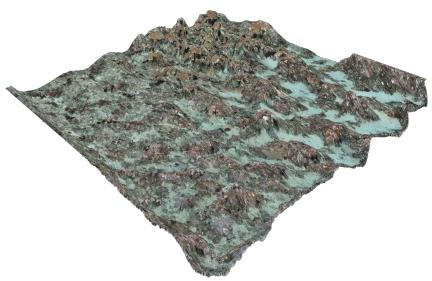

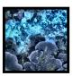

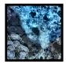

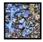

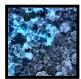

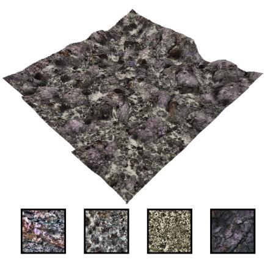

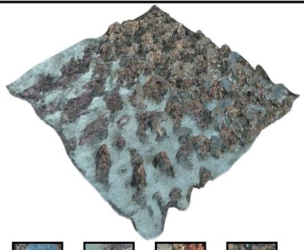

BenthicFlow  
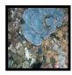

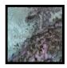

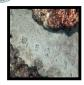

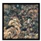  
BenthicFlow-DPF  
Fig. S3: Additional generated scenes for BenthicFlow (left) and BenthicFlow-DPF (right). All reference seeds, visible in frames below the generated scenes, are sampled from diferent deployments and campaigns.

## S5 Dataset Details

In order to ensure reproducibility of our results, we provide the specific subset of the Squidle+ framework [12] we selected for our experiments. The selection, visible in Tab. S3, is provided at the deployment level. The split and campaign of each deployment are also indicated.

Table S3: Deployment-level data split. Each AUV campaign is split by whole deployments: the validation and test sets each hold out one complete deployment per campaign, never seen during training, so no spatially overlapping imagery leaks across splits. Totals: 510,307 train / 76,480 val / 87,574 test images over 52/7/7 deployments.
<table><tr><td>Campaign</td><td>Split</td><td>Deployment</td><td>#Images</td></tr><tr><td>Batemans201011</td><td>Train</td><td>r20101117_001912_batemans_03_site1sz</td><td>8,872</td></tr><tr><td></td><td></td><td>r20101117_224623_batemans_06_site6guz</td><td>3,165</td></tr><tr><td></td><td></td><td>r20101118_010326_site6guz_08_broadgrid</td><td>10,011</td></tr><tr><td></td><td></td><td>r20101118_053354_site4sz_09_transect</td><td>4,188</td></tr><tr><td></td><td></td><td>r20101119_224028_site6guz_11_densegrid3</td><td>2,411</td></tr><tr><td></td><td></td><td>r20101120_002302_site5sz_12_densegrids r20101120_192136_site3guz_13_densegrids</td><td>8,486</td></tr><tr><td></td><td></td><td></td><td>8,855</td></tr><tr><td></td><td></td><td>r20101120_222627_site2guz_14_densegrids r20101121_062424_site1sz_16_densegrids3</td><td>8,145</td></tr><tr><td></td><td></td><td></td><td>2,776</td></tr><tr><td></td><td></td><td>r20101122_185420_site4sz_17_densegrids</td><td>8,311</td></tr><tr><td></td><td>Val</td><td>r20101122_214134_site4sz_18_broadgrid</td><td>11,211</td></tr><tr><td></td><td></td><td>r20101121_030956_site1sz_15_densegrids r20101119_204443_site6guz_10_densegrids</td><td>5,893</td></tr><tr><td></td><td>Test</td><td></td><td>6,554</td></tr><tr><td>Batemans201211</td><td>Train</td><td>r20121128_025727_Tollgates_site4sz_03_dense</td><td>7,882</td></tr><tr><td></td><td></td><td>r20121128_051532_Tollgates_site4sz_04_broad</td><td>7,086</td></tr><tr><td></td><td></td><td>r20121128_195806_Burrewarra_BU_DG3_05_dense</td><td>8,195</td></tr><tr><td></td><td></td><td>r20121128_225241_Lilli_Pilli_LP_DG2_06_dense</td><td>8,230</td></tr><tr><td></td><td>Val</td><td>r20121129_011610_Lilli_Pilli_LP_DG2_07_broad</td><td>2,036</td></tr><tr><td></td><td>Test</td><td>r20121127_231520_Durras_site3guz_02_broad</td><td>9,764</td></tr><tr><td></td><td></td><td>r20121127_204111_Durras_site3guz_01_dense</td><td>8,593</td></tr><tr><td>Batemans201411</td><td>Train</td><td>r20141111_220936_01_Tollgates_site4sz_broad</td><td>6,772</td></tr><tr><td></td><td></td><td>r20141112_004500_02_Tollgates_site4sz_dense</td><td>7,704</td></tr><tr><td></td><td></td><td>r20141116_202733_03_Durras_site3guz_broad</td><td>10,463</td></tr><tr><td></td><td></td><td>r20141117_030254_05_Burrewarra_broad</td><td>10,291</td></tr><tr><td></td><td></td><td>r20141117_070259_07_Burrewarra_BU_DG3_dense_continue</td><td>3,823</td></tr><tr><td></td><td></td><td>r20141117_213857_09_Burrewarra_BU_DG3_dense_continue_grid3</td><td>4,244</td></tr><tr><td></td><td></td><td>r20141118_012715_11_Lilli_Pilli_LP_DG2_dense</td><td>12,371</td></tr><tr><td></td><td>Val</td><td>r20141116_225628_04_Durras_site3guz_dense</td><td>12,525</td></tr><tr><td></td><td>Test</td><td>r20141117_053229_06_Burrewarra_BU_DG3_dense</td><td>6,404</td></tr><tr><td>Hawaii201801</td><td>Train</td><td>r20180202_195659_SS11_waikoloa_broad_cros_200_150</td><td>35,466</td></tr><tr><td></td><td></td><td>r20180204_190219_SS13_waikoloa_legs_deep</td><td>27,372</td></tr><tr><td></td><td></td><td>r20180206_012603_SS15_waikoloa_legs_mid_central</td><td>18,021</td></tr><tr><td></td><td></td><td>r20180206_184219_SS16_waikoloa_legs_mid_south</td><td>14,808</td></tr><tr><td></td><td></td><td>r20180207_010805_SS17_waikoloa_auto_goto</td><td>6,653</td></tr><tr><td></td><td>Val</td><td>r20180205_180015_SS14_waikoloa_legs_deep_south</td><td>22,180</td></tr><tr><td></td><td>Test</td><td>r20180203_182731_SS12_waikoloa_broad_cross_200_150_c_shallow</td><td>34,609</td></tr><tr><td>ScottReef200907</td><td>Train</td><td>r20090726_074343_scott_05_long_transect_auv2</td><td>12,648</td></tr><tr><td></td><td></td><td>r20090727_002236_scott_06_long_transect_auv5</td><td>15,533</td></tr><tr><td></td><td></td><td>r20090727_085810_scott_07_grids_auv2</td><td>12,775</td></tr><tr><td></td><td></td><td>r20090729_003637_scott_10_long_transect_auv3</td><td>15,276</td></tr><tr><td></td><td></td><td>r20090729_072005_scott_11_dense_survey_auv5_deep</td><td>6,993</td></tr><tr><td></td><td></td><td>r20090730_001654_scott_13_long_transect_auv6</td><td>11,188</td></tr><tr><td></td><td>Val</td><td>r20090728_074740_scott_09_long_transect_auv1</td><td>14,862</td></tr><tr><td></td><td>Test</td><td>r20090728_004240_scott_08_long_transect_auv4</td><td>10,725</td></tr></table>

continued on next page

Table S3 – continued from previous page
<table><tr><td>Campaign</td><td>Split</td><td>Deployment</td><td>#Images</td></tr><tr><td>ScottReef201108</td><td>Train</td><td>r20110808_052328_01_scott_grids_deep_auv1</td><td>462</td></tr><tr><td></td><td></td><td>r20110810_042127_04_scott_long_leg_auv8</td><td>180</td></tr><tr><td></td><td></td><td>r20110811_222428_08_scott_grids_deep_auv2</td><td>13,973</td></tr><tr><td></td><td></td><td>r20110812_042524_09_scott_long_leg_auv2</td><td>12,781</td></tr><tr><td></td><td></td><td>r20110812_094330_10_scott_grids_deep_auv3</td><td>15,644</td></tr><tr><td></td><td></td><td>r20110812_223024_11_scott_grids_shallow_auv3</td><td>13,321</td></tr><tr><td></td><td></td><td>r20110813_223332_14_scott_grids_shallow_auv5</td><td>13,179</td></tr><tr><td></td><td></td><td>r20110814_022231_15_scott_long_leg_auv5</td><td>13,219</td></tr><tr><td></td><td>Val</td><td>r20110808_091108_01a_scott_dense_deep_auv1</td><td>1,717 15,523</td></tr><tr><td></td><td>Test</td><td>r20110813_022516_12_scott_long_leg_auv3</td><td></td></tr><tr><td>ScottReef201503</td><td>Train</td><td>r20150326_071126_01_scott_grids_shallow_auv4</td><td>7,901</td></tr><tr><td></td><td></td><td>r20150327_015552_02_scott_grids_deep_auv4</td><td>14,109</td></tr><tr><td></td><td></td><td>r20150328_000850_03_scott_grids_deep_auv4_shifted</td><td>13,644</td></tr><tr><td></td><td></td><td>r20150328_042551_04_scott_dense_grid_deep_auv4</td><td>2,519</td></tr><tr><td></td><td></td><td>r20150329_005815_05_scott_grids_shallow_auv5</td><td>5,300</td></tr><tr><td></td><td></td><td>r20150329_061201_06_scott_long_leg_auv5</td><td>386</td></tr><tr><td></td><td></td><td>r20150329_231742_07_scott_grids_deep_auv3</td><td>14,537</td></tr><tr><td></td><td></td><td>r20150330_035644_08_scott_grids_deep_auv3_rep_dense_grid</td><td>3,527</td></tr><tr><td></td><td></td><td>r20150330_225013_09_scott_grids_deep_auv2</td><td>13,042</td></tr><tr><td></td><td></td><td>r20150331_050931_10_scott_long_leg_auv2</td><td>10,322</td></tr><tr><td></td><td>Val</td><td>r20150329_063007_06_scott_long_leg_auv5</td><td>9,539</td></tr><tr><td></td><td>Test</td><td>r20150331_231619_11_scott_repeat_large_200907_25_auv5</td><td>5,166</td></tr></table>