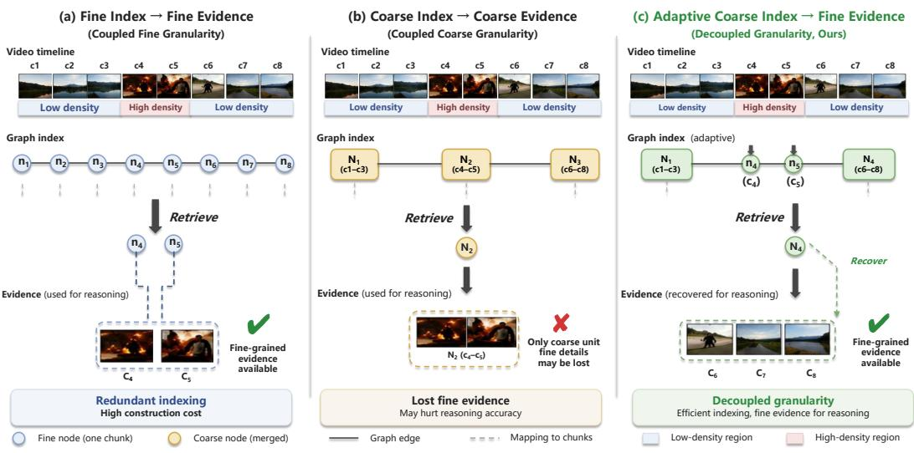
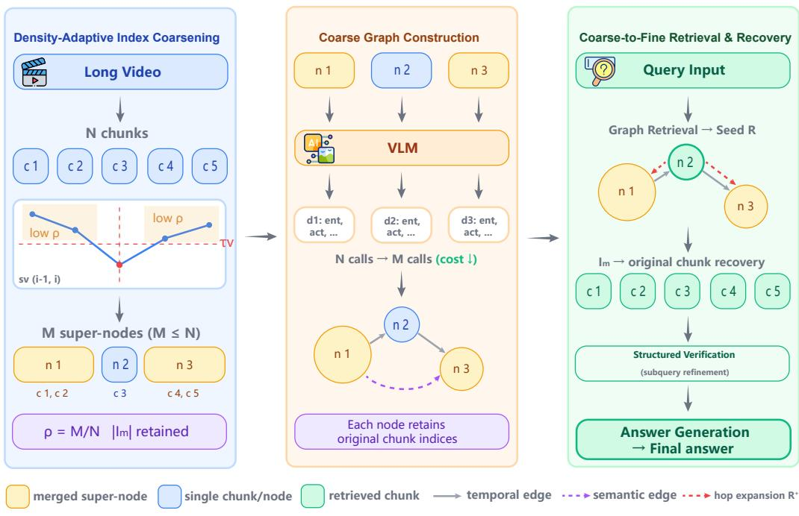
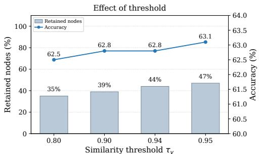
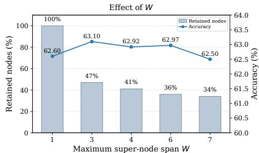

# COARSE INDEXING, FINE EVIDENCE: DECOUPLINGTEMPORAL GRANULARITY IN LONG-VIDEO RAG

Zhe Jin1,∗, Zhimin Lin2,∗, Bin Zheng1, Junhua Fang2, Huihua Yang1,† 1Beijing University of Posts and Telecommunications, 2Soochow University Jinzhe@bupt.edu.cn linzhimin327@gmail.com yhh@bupt.edu.cn § https://github.com/jinzz831/DAGC

## ABSTRACT

Graph-based retrieval-augmented generation (RAG) provides a scalable paradigm for long-video understanding, but existing systems typically inherit a fixed temporal granularity from video segmentation when constructing their retrieval index. We argue that this design unnecessarily couples indexing granularity with evidence granularity: coarse representations can often suffice for locating relevant temporal regions, while fine-grained evidence remains important for downstream reasoning. We propose Density-Aware Graph Construction (DAGC), a training-free approach that decouples a query-independent coarse retrieval index from the original fine-grained evidence space. DAGC constructs a compact, density-adaptive graph index by merging visually redundant neighboring chunks, while preserving mappings to the original temporal units. Retrieved coarse regions are subsequently expanded back to the original chunk granularity for fine-grained evidence refinement and answer generation. Experiments on MLVU, VideoMME, and LongVideoBench show that DAGC retains only about 40–50% of the original graph nodes and achieves 1.3–1.7× end-to-end wall-clock acceleration while preserving approximately 99% of the original QA performance. The gains transfer across different LVLM backbones and video RAG pipelines, suggesting that long-video RAG need not maintain the same temporal granularity for indexing and evidence reasoning.

## 1 INTRODUCTION

Long video understanding requires models to reason over extended temporal contexts and integrate information distributed across thousands of frames. Existing vision-language models (VLMs) typically address the resulting computational burden through sparse frame sampling or visual-token compression Song et al. (2024); Ren et al. (2024); Wang et al. (2025a). However, these approaches face an inherent trade-off between efficiency and temporal fidelity: aggressive compression may discard important evidence, whereas dense representations incur substantial computational cost.

Retrieval-Augmented Generation (RAG) offers a scalable alternative by retrieving relevant video regions before downstream reasoning Luo et al. (2025); Jeong et al. (2025). Recent graph-based video RAG methods Shen et al. (2025); Xu et al. (2025b) further organize video segments into structured graphs to capture temporal and semantic relationships. However, their graph granularity is typically inherited directly from fixed-length video segmentation, with each chunk represented as an individual node. This imposes a uniformly fine indexing resolution even though retrieval mainly requires locating relevant temporal regions, whereas downstream reasoning benefits from fine-grained visual evidence. As illustrated in Figure 1, indexing and evidence reasoning therefore need not operate at the same temporal granularity.

Based on this observation, we propose Density-Aware Graph Construction (DAGC), a trainingfree approach that decouples a query-independent coarse indexing representation from the finegrained evidence space used for downstream reasoning in long-video graph RAG. Long videos exhibit highly non-uniform temporal redundancy: rapidly changing regions require fine-grained representation, while visually stable regions can often be indexed more coarsely. DAGC therefore adaptively merges neighboring chunks according to adjacent visual similarity, subject to a maximum merging window W, and constructs the graph over the resulting coarse units. Each coarse node retains the indices of its constituent original chunks. Retrieval is performed on the queryindependent compact graph index, after which selected regions are mapped back to the original chunks for fine-grained refinement and answer generation. This design reduces computation in the query-independent indexing stage, while preserving the original fine-grained evidence for postretrieval reasoning.

  
Figure 1: Decoupling indexing and evidence granularity in long-video RAG. Existing designs either maintain fine temporal resolution throughout the pipeline or coarsen both indexing and evidence. DAGC instead uses a density-adaptive coarse index for retrieval while preserving fine-grained evidence for downstream reasoning.

We evaluate DAGC on MLVU, VideoMME, and LongVideoBench. Across different LVLM backbones and video RAG pipelines, DAGC retains approximately 40–50% of the original indexing units and achieves 1.3–1.7× end-to-end wall-clock acceleration while preserving about 99% of the original QA performance. These results demonstrate that efficient long-video RAG does not require a uniformly fine representation throughout the pipeline: coarse indexing can eliminate substantial redundancy while fine-grained evidence remains available when needed for downstream reasoning.

## 2 RELATED WORK

## 2.1 LONG VIDEO UNDERSTANDING WITH VLMS

Long video understanding remains challenging for vision-language models (VLMs) due to the large number of visual tokens required to represent extended temporal contexts Song et al. (2024); Ren et al. (2024). Existing approaches mainly address this challenge by reducing the visual representation burden or improving temporal memory.

Token compression methods reduce visual redundancy before or during multimodal inference. Representative works Wang et al. (2025a); Jiang et al. (2025); Liu et al. (2025) select informative frames or compress token sequences to fit long videos into limited context windows. Other approaches, such as VideoTree Wang et al. (2025b), organize video representations hierarchically and dynamically allocate representation capacity according to query requirements. However, these methods mainly optimize the amount or resolution of visual information within the representation used for downstream inference, and therefore still face a trade-off between reducing computation and preserving fine-grained temporal evidence.

Graph-based memory approaches provide an alternative by organizing video content into structured representations of entities, events, and temporal relationships Chu et al. (2025). While such structures improve long-range reasoning, the temporal granularity of the graph index is typically determined by a predefined video segmentation scheme. This leaves largely unexplored whether the representation used for indexing must retain the same temporal resolution as the evidence required for downstream reasoning. Our work studies this complementary design dimension by decoupling the two: the graph index can operate at an adaptively coarser temporal granularity, while access to the original fine-grained video evidence is preserved for post-retrieval reasoning.

## 2.2 RETRIEVAL-AUGMENTED GENERATION FOR VIDEO

Retrieval-Augmented Generation (RAG) provides a scalable solution for long video understanding by retrieving relevant temporal regions before multimodal reasoning, avoiding the need to process the entire video at once Lewis et al. (2021). Early video RAG approaches retrieve relevant clips or frames through dense similarity matching over visual and textual representations Luo et al. (2025); Jeong et al. (2025). More recent methods introduce structured representations to improve retrieval over long temporal contexts. For example, VideoRAG Ren et al. (2025) combines graph-based textual knowledge with multimodal visual retrieval for extreme-length videos, while E-VRAG Xu et al. (2025b) reduces retrieval computation through lightweight VLM scoring and similarity filtering.

Among graph-based video RAG methods, Vgent Shen et al. (2025) constructs semantic video graphs where clips are connected through shared entities and introduces structured reasoning to refine retrieved evidence. However, its graph index is constructed over fixed-length temporal chunks, such that the indexing granularity is directly inherited from the underlying video segmentation. Existing video RAG research has largely focused on improving which indexed units are retrieved or how retrieval is performed, while the granularity at which those units should be indexed has received less attention. Our work studies this complementary question by decoupling graph indexing from downstream evidence resolution: DAGC constructs a compact, density-adaptive coarse graph index while preserving mappings to the original chunks for fine-grained evidence recovery after retrieval.

## 2.3 VIDEO SEGMENTATION AND SCENE DETECTION

Video segmentation aims to divide videos into temporally coherent units and has been widely studied for video understanding. Early approaches detect shot boundaries based on pixel-level differences, while supervised methods such as LGSS Rao et al. (2020) learn scene boundaries using multimodal features. More recently, MDLSeg Mahon & Lapata (2025) formulates video segmentation as an optimization problem based on the minimum description length (MDL) principle, determining boundaries without manually specified thresholds and improving downstream long-video understanding tasks.

Although video segmentation and DAGC both adapt temporal granularity, they optimize it for dif ferent purposes. Scene segmentation seeks a temporally coherent partition that reflects semantic or narrative boundaries. DAGC, instead, treats temporal granularity as a retrieval-system design variable: its goal is not to discover a single semantically correct partition, but to construct an indexing representation that can be coarsened where temporal redundancy permits. Importantly, this coarser indexing granularity does not replace the original temporal units, which remain available for fine-grained evidence reasoning after retrieval.

## 2.4 GRAPH CONSTRUCTION FOR RAG

Graph-based RAG has become an effective paradigm for organizing structured knowledge and improving retrieval quality in language applications. GraphRAG Edge et al. (2025) organizes entities and relations into semantic communities for global retrieval, while LightRAG Guo et al. (2025) introduces efficient dual-level indexing for scalable graph retrieval. NodeRAG Xu et al. (2025a) further explores heterogeneous node structures to improve retrieval efficiency. Recent studies also investigate reducing graph construction cost by replacing expensive LLM-based extraction with lightweight alternatives Min et al. (2025).

Different from these efforts that primarily optimize graph extraction, indexing structures, or retrieval strategies in text-based RAG, DAGC focuses on a complementary design dimension: the temporal granularity at which video content is represented in the graph index. Rather than requiring the graph index to retain the same fine temporal resolution used for downstream evidence reasoning, DAGC constructs a compact, density-adaptive coarse index while preserving access to the original temporal units. Retrieved regions are then mapped back to fine-grained evidence before downstream reasoning. This design reduces graph construction and indexing overhead without permanently coarsening the evidence available after retrieval.

  
Figure 2: Overview of Density-Aware Graph Construction (DAGC). DAGC separates the temporal granularity used for graph indexing from that used for downstream evidence reasoning. Visually redundant neighboring chunks are merged into density-adaptive coarse nodes for efficient indexing, while each node preserves the mapping $\mathcal { I } _ { m }$ to its constituent original chunks. Retrieval first operates on the compact graph for coarse localization and then recovers the original chunks for fine-grained refinement and answer generation.

## 3 DENSITY-AWARE GRAPH CONSTRUCTION WITH GRANULARITY DECOUPLING

Existing graph-based video RAG systems typically use the same temporal units for two distinct purposes: constructing the retrieval index and providing visual evidence for downstream reasoning. However, these two stages impose different requirements. Retrieval primarily needs an efficient representation for locating relevant temporal regions, whereas final reasoning benefits from fine-grained access to the original visual evidence. We therefore propose Density-Aware Graph Construction (DAGC), a training-free coarse-to-fine design that explicitly decouples these two granularities.

DAGC constructs a query-independent, density-adaptive coarse graph index for candidate localization while preserving a direct mapping from every coarse node to its constituent original chunks. Consequently, compression is applied to the indexing representation rather than permanently to the evidence available for reasoning. As illustrated in Figure 2, DAGC implements this decoupling through three stages: (1) density-adaptive index coarsening via neighboring-chunk merging, (2) coarse graph index construction, and (3) coarse-to-fine evidence recovery.

## 3.1 DENSITY-ADAPTIVE INDEX COARSENING

We divide the input video X into N fixed-length chunks $\{ c _ { 1 } , c _ { 2 } , \ldots , c _ { N } \}$ , each containing K sampled frames. Rather than assigning the same indexing resolution to every temporal region, DAGC allocates graph granularity according to local temporal redundancy. Importantly, the objective is not to recover a semantically complete event partition, but to determine where multiple adjacent chunks can share a coarser indexing representation without removing access to their original evidence.

We use adjacent visual similarity as a lightweight proxy for this local redundancy. For each chunk, frame-level visual features are temporally pooled and $L _ { 2 } .$ -normalized, and adjacent similarity is computed as

$$
\mathbf { v } _ { i } = \mathrm { N o r m } ( \mathrm { P o o l } ( c _ { i } ) ) , \qquad s _ { v } ( i - 1 , i ) = \mathbf { v } _ { i - 1 } ^ { \top } \mathbf { v } _ { i } .\tag{1}
$$

A high similarity score indicates that neighboring chunks carry redundant visual content and can share a coarse indexing unit, whereas a low score suggests a transition where finer indexing resolution should be preserved. We greedily merge adjacent chunks when

$$
s _ { v } ( i - 1 , i ) \geq \tau _ { v } \quad \mathrm { a n d } \quad | \mathbb { Z } _ { m } | < W ,\tag{2}
$$

where $\tau _ { v }$ is the visual-similarity threshold, W bounds the maximum merging span, and $\mathcal { T } _ { m }$ records the original chunk indices assigned to super-node $n _ { m }$ . The span constraint prevents long visually stable regions from collapsing into excessively coarse indexing units.

After adaptation, the N original chunks are represented by $M \leq N$ coarse units. For each merged unit $n _ { m }$ , frames from its constituent chunks are concatenated in temporal order and uniformly resampled to the same K-frame budget as an original chunk, producing $\tilde { c } _ { m }$ for semantic extraction. Thus, increasing the temporal coverage of a coarse node does not increase its per-node visual input budget. Meanwhile, the original chunks themselves are retained through $\mathcal { I } _ { m }$ for subsequent finegrained recovery. We denote the retained indexing-unit ratio as $\rho = M / N$

## 3.2 BOUNDED-COST COARSE GRAPH CONSTRUCTION

The adapted units define a second, coarser temporal resolution used specifically for graph indexing. Conventional fixed-granularity construction performs semantic extraction independently for all N original chunks. DAGC instead performs the expensive graph-construction stage only on the M coarse units.

For each $\widetilde { c } _ { m } .$ , the LVLM extracts the structured semantics required by the underlying graph-RAG framework, including entities, actions, scenes, and textual descriptions. Because every coarse unit is restricted to the same K-frame budget, reducing N indexing units to M directly reduces the number of query-independent LVLM extraction calls rather than shifting computation into larger per-node visual inputs.

In our primary Vgent instantiation Shen et al. (2025), semantically related entities are matched to global prototypes and nodes sharing semantic information are connected to form the coarse retrieval graph $\bar { \boldsymbol { { g } } } _ { c }$ . DAGC is designed to be orthogonal to this semantic graph definition: it changes the temporal units on which graph semantics are instantiated, allowing the same graph-RAG machinery to operate over a compact, density-adaptive index. Each graph node additionally stores $\mathcal { T } _ { m } .$ establishing the connection between the coarse indexing space and the original temporal evidence space.

## 3.3 COARSE-TO-FINE EVIDENCE RETRIEVAL

DAGC deliberately assigns different representations to candidate localization and final evidence reasoning. The coarse graph is used to efficiently identify relevant temporal regions, but its compressed nodes are not treated as the final visual evidence. Instead, retrieval proceeds in two resolutions: coarse graph localization followed by original-granularity evidence recovery.

Given a question $Q .$ , query-related information is first matched against $\mathcal { G } _ { c }$ to rank coarse candidate nodes. In our Vgent instantiation, the corresponding graph retrieval procedure is used to obtain the highest-ranked seed set $\mathcal { R } _ { s }$ . The seed regions are subsequently expanded to temporally related candidates, yielding $\mathcal { R } _ { s } ^ { + }$

The retrieved coarse regions are then projected back to the original temporal units through their stored mappings:

$$
\mathcal { C } _ { \mathrm { c a n d } } = \bigcup _ { n _ { m } \in \mathcal { R } _ { s } ^ { + } } \{ c _ { i } \mid i \in \mathcal { I } _ { m } \} .\tag{3}
$$

The resulting $\mathcal { C } _ { \mathrm { c a n d } }$ contains original-granularity chunks rather than compressed super-nodes. These chunks are reranked and verified using question-specific refinement, and the selected fine-grained visual evidence, together with intermediate reasoning results, is finally provided to the LVLM for answer generation.

This coarse-to-fine retrieval design is the key distinction between DAGC and conventional representation compression. DAGC compresses the representation used to search the video, while preserving the finer representation used to reason about retrieved evidence. It therefore reduces redundant graph construction and indexing computation without forcing downstream reasoning to operate at the same coarse temporal resolution.

## 4 EXPERIMENTS

## 4.1 EXPERIMENTAL SETTINGS

Baselines. We primarily instantiate DAGC on Vgent Shen et al. (2025), a graph-based retrievalreasoning framework for long-video understanding. We evaluate three Qwen-family LVLM backbones: Qwen2.5-VL-7B, Qwen2.5-VL-3B, and Qwen2-VL-7B. We compare against the corresponding vanilla LVLMs, which directly perform inference on uniformly sampled video frames, and Vgent, which constructs a fixed-granularity video graph. To evaluate transferability, we additionally apply DAGC to InternVL3.5-8B with the Vgent pipeline and to VideoRAG as a different long-video RAG framework.

Benchmarks. We evaluate on MLVU Zhou et al. (2025), VideoMME Fu et al. (2025), and LongVideoBench (LVB) Wu et al. (2024). Together, these benchmarks cover diverse long-video understanding tasks, including counting, temporal ordering, visual grounding, topic reasoning, and fine-grained referred video understanding.

Implementation Details. All experiments are conducted on NVIDIA A100 40GB GPUs. Following Vgent, videos are sampled at 1 FPS and divided into 64-frame chunks. Unless otherwise specified, DAGC uses a visual-similarity threshold $\tau _ { v } = 0 . 9 5$ , a maximum merging window $W = 3 ,$ and a fixed 64-frame input budget for each merged super-node. During retrieval, we retain $k _ { s } = 1 2$ coarse seeds before temporal expansion and original-chunk recovery. The same DAGC configuration is used across benchmarks and LVLM backbones, while other retrieval and refinement settings follow the corresponding RAG backbone.

Metrics. We report multiple-choice accuracy for effectiveness and the retained indexing-unit ratio (Retained) for compression. Efficiency is measured by query-independent Offline Speedup and end-to-end Wall Speedup. For normalized runtime analysis, we additionally report offline, online, and first-query time in seconds per minute of video.

## 4.2 MAIN RESULTS

Table 1 summarizes the effectiveness–efficiency trade-off of DAGC across three benchmarks and three Qwen-family backbones. DAGC retains only 45%–47% of the original Vgent graph node and achieves $1 . 3 { \times } { - } 1 . 7 { \times }$ end-to-end wall-clock acceleration. Despite removing more than half of the indexing units, the average accuracy decreases by only 0.7–0.8 percentage points across the three backbones, corresponding to approximately 99% performance retention.

Although the accuracy changes vary across individual benchmarks, the overall performance remains largely preserved under substantial graph compression. These results indicate that fixed-granularity graph construction contains considerable temporal redundancy, and that a compact coarse index can support efficient retrieval while fine-grained evidence is recovered for downstream reasoning.

Table 1: Main results on three long-video benchmarks. Accuracy denotes multiple-choice accuracy, Retained denotes the retained graph-node ratio relative to Vgent, and Wall Speedup denotes end-to-end wall-clock acceleration relative to the corresponding Vgent baseline. Performance Retention is computed from the average accuracy across the three benchmarks.
<table><tr><td rowspan="2">Model</td><td colspan="3">MLVU</td><td colspan="3">VideoMME</td><td colspan="3">LVB</td><td rowspan="2">Avg. Accuracy</td><td rowspan="2">Performance Retention</td></tr><tr><td>Accuracy</td><td>Retained Speedup</td><td>Wall</td><td>Accuracy Retained Speedup</td><td></td><td>Wall</td><td>Accuracy</td><td>Retained Speedup</td><td>Wall</td></tr><tr><td>Qwen2.5-VL-7B</td><td>69.0</td><td></td><td></td><td>70.1</td><td></td><td></td><td>59.4</td><td></td><td></td><td>66.2</td><td></td></tr><tr><td>+ Vgent</td><td>73.3</td><td>100%</td><td>1.0×</td><td>73.3</td><td>100%</td><td>1.0×</td><td>63.3</td><td>100%</td><td>1.0×</td><td>70.0</td><td>100%</td></tr><tr><td>+ DÅGC</td><td>73.4</td><td>45%</td><td>1.3×</td><td>71.1</td><td>45%</td><td>1.4×</td><td>63.1</td><td>47%</td><td>1.6×</td><td>69.2</td><td>99%</td></tr><tr><td>Qwen2.5-VL-3B</td><td>65.0</td><td></td><td></td><td>67.0</td><td></td><td></td><td>56.3</td><td></td><td></td><td>62.8</td><td></td></tr><tr><td>+ Vgent</td><td>70.0</td><td>100%</td><td>1.0×</td><td>69.0</td><td>100%</td><td>1.0×</td><td>60.0</td><td>100%</td><td>1.0×</td><td>66.3</td><td>100%</td></tr><tr><td>+ DAGC</td><td>69.9</td><td>45%</td><td>1.3×</td><td>66.2</td><td>45%</td><td>1.3×</td><td>60.6</td><td>47%</td><td>1.3×</td><td>65.6</td><td>99%</td></tr><tr><td>Qwen2-VL-7B</td><td>65.7</td><td></td><td></td><td>68.6</td><td></td><td></td><td>56.1</td><td></td><td></td><td>63.5</td><td></td></tr><tr><td>+ Vgent</td><td>71.7</td><td>100%</td><td>1.0×</td><td>69.7</td><td>100%</td><td>1.0×</td><td>58.9</td><td>100%</td><td>1.0×</td><td>66.8</td><td>100%</td></tr><tr><td>+ DAGC</td><td>72.1</td><td>45%</td><td>1.5×</td><td>67.3</td><td>45%</td><td>1.4×</td><td>58.6</td><td>47%</td><td>1.7×</td><td>66.0</td><td>99%</td></tr></table>

Table 2: Normalized runtime comparison using Qwen2.5-VL-7B. Offline Time denotes queryindependent graph construction, Online Time denotes query-dependent inference after graph construction, and First-query Time includes both stages. All values are reported in seconds per minute of video.
<table><tr><td>Model</td><td></td><td></td><td>Offline Time Online Time First-query Time</td></tr><tr><td>Qwen2.5-VL-7B</td><td></td><td></td><td>3.12</td></tr><tr><td>Qwen2.5-VL-7B + Vgent</td><td>24.14</td><td>4.12</td><td>28.26</td></tr><tr><td> $\mathrm { Q w e n 2 . 5 \mathrm { - } V L \mathrm { - } 7 B + D A G C }$ </td><td>10.73</td><td>4.24</td><td>14.97</td></tr></table>

## 4.3 EFFICIENCY ANALYSIS

Table 2 shows that DAGC substantially reduces query-independent graph-construction cost. Offline time decreases from 24.14 to 10.73 seconds per minute of video, a 55.6% reduction, while online inference increases only slightly from 4.12 to 4.24 seconds due to coarse-to-fine evidence recovery. Consequently, first-query time is reduced from 28.26 to 14.97 seconds per minute of video (47.0%). These results show that the offline savings introduced by coarse indexing substantially outweigh the small online recovery overhead. This cost decomposition highlights a key distinction of DAGC: the computational savings arise primarily from the query-independent indexing stage, allowing the reduced graph-construction cost to be amortized across subsequent queries while preserving fine grained evidence for online reasoning.

## 4.4 GENERALIZATION ACROSS MODELS AND RAG FRAMEWORKS

The previous experiments evaluate DAGC under the Qwen–Vgent configuration. We next examine whether its compression behavior transfers across both LVLM families and video-RAG pipelines.

Table 4 shows that DAGC retains only 40.39%–48.34% of VideoRAG indexing units, achieving 1.377×–1.695× offline speedup and over 1.30× wall-clock acceleration across all three benchmarks. Accuracy improves on LVB and VideoMME but decreases on MLVU, indicating that the cross-framework benefit of DAGC is primarily computational rather than a consistent accuracy improvement.

Together with the InternVL3.5-8B results, these experiments show that DAGC’s efficiency benefit is not limited to a single LVLM family or RAG pipeline.

## 5 ANALYSIS AND DISCUSSION

We further examine three questions underlying the design of DAGC: whether indexing and downstream evidence reasoning require the same temporal granularity, whether indexing granularity should adapt to local temporal redundancy, and whether semantic event boundaries provide a suitable alternative basis for temporal partitioning. Together, these analyses help disentangle the roles of granularity decoupling, density-aware adaptation, and temporal partition choice in the effectiveness of DAGC.

Table 3: Cross-model-family evaluation using InternVL3.5-8B. Retained denotes the retained graph-node ratio relative to Vgent, and Wall Speedup is measured relative to the corresponding InternVL3.5-8B + Vgent baseline.
<table><tr><td>Dataset</td><td>Vgent Accuracy</td><td>DAGC Accuracy</td><td></td><td></td><td>Wall Speedup</td></tr><tr><td></td><td></td><td></td><td>∆ Accuracy</td><td>Retained</td><td></td></tr><tr><td>LVB MLVU</td><td>63.07 73.46</td><td>63.05 73.04</td><td>-0.02 -0.42</td><td>47% 47%</td><td>1.3× 1.4×</td></tr><tr><td>VideoMME</td><td>68.18</td><td>65.63</td><td>-2.55</td><td>47%</td><td>1.4×</td></tr></table>

Table 4: Cross-framework evaluation after integrating DAGC into VideoRAG. Common N denotes the number of examples successfully evaluated by both the baseline and DAGC. Retained denotes the retained temporal indexing-unit ratio relative to the uncompressed VideoRAG baseline. Offline Speedup measures query-independent index construction, while Wall Speedup measures complete experimental wall-clock acceleration.
<table><tr><td>Dataset</td><td>Common N</td><td>Baseline Accuracy</td><td>DAGC Accuracy</td><td>Δ Accuracy</td><td>Retained</td><td>Offline Speedup</td><td>Wall Speedup</td></tr><tr><td>LVB</td><td>1,296</td><td>52.70%</td><td>54.17%</td><td>+1.47 pp</td><td>48.34%</td><td>1.377×</td><td>1.309×</td></tr><tr><td>MLVU</td><td>2,174</td><td>64.49%</td><td>62.88%</td><td>-1.61 pp</td><td>40.39%</td><td>1.695×</td><td>1.328×</td></tr><tr><td>VideoMME</td><td>2,683</td><td>65.97%</td><td>66.72%</td><td>+0.75 pp</td><td>45.10%</td><td>1.455×</td><td>1.308×</td></tr></table>

## 5.1 INDEXING AND EVIDENCE GRANULARITY

A key design principle of DAGC is to decouple the temporal granularity used for indexing from that used for downstream evidence reasoning. To verify this design, we compare DAGC variants with and without coarse indexing and fine-grained evidence recovery.

Table 5 examines the contribution of coarse indexing and fine-grained evidence recovery. Directly using compressed super-nodes as downstream evidence (w/o RR) reduces accuracy to 60.6, indicating that coarse representations alone are insufficient for final reasoning. Recovering and reranking the original chunks substantially restores performance, while temporal expansion further improves retrieval completeness.

With the complete coarse-to-fine pipeline, DAGC achieves 63.1 accuracy, close to the 63.3 achieved by the original fine-grained Vgent baseline, while retaining only 47% of graph nodes. These results support the central hypothesis of DAGC: the retrieval index can operate at a coarser temporal granularity, while fine-grained evidence can be recovered after retrieval for accurate downstream reasoning.

## 5.2 DENSITY-AWARE COMPRESSION STRATEGY

Although DAGC reduces the number of graph nodes, the improvement should not come merely from node reduction. We therefore compare DAGC with content-agnostic compression strategies under the same retained-node budget.

Table 6 compares different node selection strategies with an identical 47% retained-node ratio. DAGC improves over Uniform Merge and Random Merge by 0.79 and 1.54 percentage points, respectively.

By preserving fine-grained representations in regions with larger temporal variation, DAGC achieves compression while maintaining downstream reasoning capability.

Table 5: Ablation of coarse indexing and fine-grained evidence recovery on LongVideoBench using Qwen2.5-VL-7B. SN denotes super-node compression, RR denotes recovery and reranking of original chunks, and TE denotes temporal expansion. Detailed category-level results are reported in Appendix A.6.
<table><tr><td>Variant</td><td>Retained</td><td>Accuracy</td><td>Wall Speedup</td></tr><tr><td>Qwen2.5-VL-7B</td><td></td><td>59.4</td><td></td></tr><tr><td>+ Vgent</td><td>100%</td><td>63.3</td><td>1.0×</td></tr><tr><td>+ DAGC w/o SN</td><td>100%</td><td>62.6</td><td>1.0×</td></tr><tr><td>+ DAGC w/o RR</td><td>47%</td><td>60.6</td><td>1.6×</td></tr><tr><td>+ DAGC w/o TE</td><td>47%</td><td>62.2</td><td>1.6×</td></tr><tr><td>+ DAGC</td><td>47%</td><td>63.1</td><td>1.6×</td></tr></table>

Table 6: Comparison of compression strategies on LongVideoBench using Qwen2.5-VL-7B under the same retained-node budget.
<table><tr><td>Method</td><td>Accuracy</td><td>Retained</td></tr><tr><td>Random Merge</td><td>61.53</td><td>47%</td></tr><tr><td>Uniform Merge</td><td>62.28</td><td>47%</td></tr><tr><td>DAGC</td><td>63.07</td><td>47%</td></tr></table>

## 5.3 EVENT BOUNDARY ANALYSIS

An alternative approach to adaptive temporal granularity is to rely on explicit event segmentation. To examine whether semantic event boundaries provide a better merging criterion, we incorporate EfficientGEBD boundaries as hard constraints that prevent merging across predicted event transitions, while keeping the downstream retrieval and reasoning pipeline unchanged.

Table 7: Effect of EfficientGEBD event-boundary constraints on the complete Order, Needle, and Count subsets (820 questions). ∆ denotes percentage-point change relative to DAGC.
<table><tr><td>Task</td><td>DAGC</td><td>+ Event Boundary</td><td>Δ</td></tr><tr><td>Order</td><td>70.66</td><td>72.97</td><td>+2.32</td></tr><tr><td>Needle</td><td>82.25</td><td>81.69</td><td>-0.56</td></tr><tr><td>Count</td><td>60.68</td><td>57.77</td><td>-2.91</td></tr><tr><td>Weighted Overall</td><td>73.17</td><td>72.93</td><td>-0.24</td></tr></table>

As shown in Table 7, explicit event boundaries improve temporal ordering performance but degrade Needle and Count accuracy, resulting in a small overall decrease of 0.24 percentage points.

This indicates that perceptual event transitions are not always aligned with the evidence granularity required by long-video question answering. Therefore, DAGC is designed as a redundancy-aware indexing strategy rather than a semantic video segmentation method. Additional boundary-aware experiments are reported in Appendix A.5.

## 6 CONCLUSION

In this paper, we present Density-Aware Graph Construction (DAGC), a training-free approach that decouples indexing granularity from evidence granularity for efficient long-video graph RAG. DAGC constructs a compact, density-adaptive coarse graph index by merging visually redundant neighboring chunks, while preserving mappings to the original temporal units for fine-grained evidence recovery after retrieval. Across three long-video benchmarks, DAGC retains approximately 40–50% of the original graph nodes and achieves 1.3–1.7× end-to-end wall-clock acceleration while preserving about 99% of the original QA performance. Experiments across different LVLM backbones and video RAG pipelines further demonstrate that this design transfers beyond a single model or framework. Our analysis also shows that explicit event boundaries do not consistently improve downstream performance, suggesting that long-video RAG need not rely on a single semantic partition or temporal granularity throughout the pipeline. Instead, coarse indexing can be combined with fine-grained evidence recovery to reduce redundant computation while preserving access to detailed visual evidence.

## REFERENCES

Meng Chu, Yicong Li, and Tat-Seng Chua. Understanding long videos via llm-powered entity relation graphs, 2025. URL https://arxiv.org/abs/2501.15953.

Darren Edge, Ha Trinh, Newman Cheng, Joshua Bradley, Alex Chao, Apurva Mody, Steven Truitt, Dasha Metropolitansky, Robert Osazuwa Ness, and Jonathan Larson. From local to global: A graph rag approach to query-focused summarization, 2025. URL https://arxiv.org/ abs/2404.16130.

Chaoyou Fu, Yuhan Dai, Yongdong Luo, Lei Li, Shuhuai Ren, Renrui Zhang, Zihan Wang, Chenyu Zhou, Yunhang Shen, Mengdan Zhang, Peixian Chen, Yanwei Li, Shaohui Lin, Sirui Zhao, Ke Li, Tong Xu, Xiawu Zheng, Enhong Chen, Caifeng Shan, Ran He, and Xing Sun. Video-mme: The first-ever comprehensive evaluation benchmark of multi-modal llms in video analysis, 2025. URL https://arxiv.org/abs/2405.21075.

Zirui Guo, Lianghao Xia, Yanhua Yu, Tu Ao, and Chao Huang. Lightrag: Simple and fast retrievalaugmented generation, 2025. URL https://arxiv.org/abs/2410.05779.

Soyeong Jeong, Kangsan Kim, Jinheon Baek, and Sung Ju Hwang. Videorag: Retrieval-augmented generation over video corpus, 2025. URL https://arxiv.org/abs/2501.05874.

Jindong Jiang, Xiuyu Li, Zhijian Liu, Muyang Li, Guo Chen, Zhiqi Li, De-An Huang, Guilin Liu, Zhiding Yu, Kurt Keutzer, Sungjin Ahn, Jan Kautz, Hongxu Yin, Yao Lu, Song Han, and Wonmin Byeon. Storm: Token-efficient long video understanding for multimodal llms, 2025. URL https://arxiv.org/abs/2503.04130.

Patrick Lewis, Ethan Perez, Aleksandra Piktus, Fabio Petroni, Vladimir Karpukhin, Naman Goyal, Heinrich Kuttler, Mike Lewis, Wen tau Yih, Tim Rockt¨ aschel, Sebastian Riedel, and Douwe¨ Kiela. Retrieval-augmented generation for knowledge-intensive nlp tasks, 2021. URL https: //arxiv.org/abs/2005.11401.

Yudong Liu, Jingwei Sun, Yueqian Lin, Jingyang Zhang, Ming Yin, Qinsi Wang, Jianyi Zhang, Hai Li, and Yiran Chen. Keyframe-oriented vision token pruning: Enhancing efficiency of large vision language models on long-form video processing, 2025. URL https://arxiv.org/ abs/2503.10742.

Yongdong Luo, Xiawu Zheng, Guilin Li, Shukang Yin, Haojia Lin, Chaoyou Fu, Jinfa Huang, Jiayi Ji, Fei Chao, Jiebo Luo, and Rongrong Ji. Video-rag: Visually-aligned retrieval-augmented long video comprehension, 2025. URL https://arxiv.org/abs/2411.13093.

Louis Mahon and Mirella Lapata. Parameter-free video segmentation for vision and language understanding, 2025. URL https://arxiv.org/abs/2503.01201.

Congmin Min, Sahil Bansal, Joyce Pan, Abbas Keshavarzi, Rhea Mathew, and Amar Viswanathan Kannan. Towards practical graphrag: Efficient knowledge graph construction and hybrid retrieval at scale, 2025. URL https://arxiv.org/abs/2507.03226.

Anyi Rao, Linning Xu, Yu Xiong, Guodong Xu, Qingqiu Huang, Bolei Zhou, and Dahua Lin. A local-to-global approach to multi-modal movie scene segmentation, 2020. URL https:// arxiv.org/abs/2004.02678.

Shuhuai Ren, Linli Yao, Shicheng Li, Xu Sun, and Lu Hou. Timechat: A time-sensitive multimodal large language model for long video understanding, 2024. URL https://arxiv.org/abs/ 2312.02051.

Xubin Ren, Lingrui Xu, Long Xia, Shuaiqiang Wang, Dawei Yin, and Chao Huang. Videorag: Retrieval-augmented generation with extreme long-context videos, 2025. URL https: //arxiv.org/abs/2502.01549.

Xiaoqian Shen, Wenxuan Zhang, Jun Chen, and Mohamed Elhoseiny. Vgent: Graph-based retrievalreasoning-augmented generation for long video understanding, 2025. URL https://arxiv. org/abs/2510.14032.

Enxin Song, Wenhao Chai, Guanhong Wang, Yucheng Zhang, Haoyang Zhou, Feiyang Wu, Haozhe Chi, Xun Guo, Tian Ye, Yanting Zhang, Yan Lu, Jenq-Neng Hwang, and Gaoang Wang. Moviechat: From dense token to sparse memory for long video understanding, 2024. URL https://arxiv.org/abs/2307.16449.

Xiao Wang, Qingyi Si, Jianlong Wu, Shiyu Zhu, Li Cao, and Liqiang Nie. Retake: Reducing temporal and knowledge redundancy for long video understanding, 2025a. URL https:// arxiv.org/abs/2412.20504.

Ziyang Wang, Shoubin Yu, Elias Stengel-Eskin, Jaehong Yoon, Feng Cheng, Gedas Bertasius, and Mohit Bansal. Videotree: Adaptive tree-based video representation for llm reasoning on long videos, 2025b. URL https://arxiv.org/abs/2405.19209.

Haoning Wu, Dongxu Li, Bei Chen, and Junnan Li. Longvideobench: A benchmark for long-context interleaved video-language understanding, 2024. URL https://arxiv.org/abs/2407. 15754.

Tianyang Xu, Haojie Zheng, Chengze Li, Haoxiang Chen, Yixin Liu, Ruoxi Chen, and Lichao Sun. Noderag: Structuring graph-based rag with heterogeneous nodes, 2025a. URL https: //arxiv.org/abs/2504.11544.

Zeyu Xu, Junkang Zhang, Qiang Wang, and Yi Liu. E-vrag: Enhancing long video understanding with resource-efficient retrieval augmented generation, 2025b. URL https://arxiv.org/ abs/2508.01546.

Junjie Zhou, Yan Shu, Bo Zhao, Boya Wu, Zhengyang Liang, Shitao Xiao, Minghao Qin, Xi Yang, Yongping Xiong, Bo Zhang, Tiejun Huang, and Zheng Liu. Mlvu: Benchmarking multi-task long video understanding, 2025. URL https://arxiv.org/abs/2406.04264.

## A EXPERIMENTAL RESULTS

## A.1 DETAILED RESULTS ON MLVU

Table 8 reports the category-level performance on MLVU across the seven multiple-choice tasks. Overall, DAGC largely preserves the performance of the original Vgent pipeline after graph compression. With Qwen2.5-VL-7B, DAGC achieves an overall accuracy of 73.4 compared with 73.3 for Vgent, while Qwen2-VL-7B improves from 71.7 to 72.1. For Qwen2.5-VL-3B, the difference is only 0.1 percentage points. At the task level, the effect of compression varies across categories, suggesting that redundant graph nodes can be removed without systematically degrading the different reasoning abilities evaluated by MLVU.

Table 8: Detailed results on MLVU across seven tasks. Count, Ego, Needle, Order, PlotQA, Topic, and Anomaly are the seven evaluated tasks. Overall denotes the aggregate accuracy across all seven tasks.
<table><tr><td>Model</td><td>Count</td><td>Ego</td><td>Needle</td><td>Order</td><td>PlotQA</td><td></td><td>Topic Anomaly</td><td>Overall</td></tr><tr><td>Qwen2.5-VL-7B</td><td>42.3</td><td>60.0</td><td>79.4</td><td>66.7</td><td>75.1</td><td>86.4</td><td>73.0</td><td>69.0</td></tr><tr><td>Qwen2.5-VL-7B + Vgent</td><td>59.6</td><td>61.4</td><td>81.1</td><td>73.4</td><td>76.1</td><td>87.1</td><td>74.5</td><td>73.3</td></tr><tr><td>Qwen2.5-VL-7B + DAGC</td><td>60.7</td><td>62.0</td><td>82.3</td><td>70.7</td><td>76.6</td><td>87.1</td><td>74.0</td><td>73.4</td></tr><tr><td>Qwen2.5-VL-3B</td><td>32.3</td><td>52.9</td><td>78.2</td><td>56.2</td><td>71.5</td><td>88.1</td><td>76.0</td><td>65.0</td></tr><tr><td>Qwen2.5-VL-3B + Vgent</td><td>53.3</td><td>58.0</td><td>80.0</td><td>62.5</td><td>71.9</td><td>89.0</td><td>75.5</td><td>70.0</td></tr><tr><td>Qwen2.5-VL-3B + DAGC</td><td>52.4</td><td>58.2</td><td>78.6</td><td>64.0</td><td>72.1</td><td>88.3</td><td>75.5</td><td>69.9</td></tr><tr><td>Qwen2-VL-7B</td><td>33.2</td><td>66.1</td><td>79.4</td><td>53.6</td><td>71.1</td><td>86.6</td><td>70.2</td><td>65.7</td></tr><tr><td>Qwen2-VL-7B + Vgent</td><td>61.2</td><td>67.7</td><td>82.2</td><td>61.0</td><td>71.5</td><td>87.1</td><td>71.0</td><td>71.7</td></tr><tr><td>Qwen2-VL-7B + DAGC</td><td>63.9</td><td>67.6</td><td>81.9</td><td>61.7</td><td>71.3</td><td>87.1</td><td>71.0</td><td>72.1</td></tr></table>

## A.2 DETAILED RESULTS ON VIDEOMME

Table 9 further breaks down the VideoMME results according to video duration. DAGC retains performance relatively well on short and medium videos, whereas the long-video subset is more sensitive to graph compression. This trend is consistent across the three evaluated backbones. In particular, aggressive compression of long videos can merge temporally extended regions in which sparse but important evidence is distributed across multiple chunks. These results indicate that the optimal compression strength can depend on video duration and information density.

Table 9: Detailed results on VideoMME across different video durations. Short, Medium, and Long denote the three duration subsets. Overall denotes the aggregate accuracy over all duration subsets. Wall Speedup denotes the relative wall-clock speedup over the corresponding Vgent baseline.
<table><tr><td colspan="4">Model</td><td rowspan="2">Overall Accuracy</td><td rowspan="2">Wall Speedup</td></tr><tr><td></td><td>Short Medium</td><td></td><td>Long</td></tr><tr><td>Qwen2.5-VL-7B + Vgent</td><td>78.76</td><td>72.63 72.41</td><td>68.33 62.22</td><td>73.25</td><td>1.0×</td></tr><tr><td>Qwen2.5-VL-7B + DAGC</td><td>78.67</td><td></td><td></td><td>71.11</td><td>1.4×</td></tr><tr><td>Qwen2.5-VL-3B + Vgent</td><td>75.33</td><td>68.55</td><td>63.66 59.11</td><td>69.00</td><td>1.0×</td></tr><tr><td>Qwen2.5-VL-3B + DAGC</td><td>74.23</td><td>65.22</td><td></td><td>66.19</td><td>1.3×</td></tr><tr><td>Qwen2-VL-7B + Vgent</td><td>76.43</td><td>69.55</td><td>63.22</td><td>69.74</td><td>1.0×</td></tr><tr><td>Qwen2-VL-7B + DAGC</td><td>75.55</td><td>66.55</td><td>59.77</td><td>67.30</td><td>1.4×</td></tr></table>

## A.3 DETAILED RESULTS ON LONGVIDEOBENCH

Tables 10 and 11 report the complete category-level results on LongVideoBench. We split the categories into two tables for readability. DAGC exhibits small category-dependent fluctuations relative to Vgent while retaining approximately half of the original graph nodes. Improvements can be observed in several temporal and object-relation categories, whereas other categories experience moderate degradation. Together with the runtime results, this comparison illustrates the accuracy– efficiency trade-off introduced by adaptive graph compression.

Table 10: Detailed category-level results on LongVideoBench, Part I. The table reports the first group of question-category accuracies.
<table><tr><td rowspan=1 colspan=1>Model                  E20SSST2ES20SAATAAS2ASOST2A</td></tr><tr><td rowspan=1 colspan=1>Qwen2.5-VL-7B + Vgent75.446.472.366.761.159.872.165.470.4</td></tr><tr><td rowspan=1 colspan=1>Qwen2.5-VL-7B + DAGC75.444.869.268.158.358.570.565.467.9</td></tr><tr><td rowspan=1 colspan=1>Qwen2.5-VL-3B + Vgent64.647.464.662.552.852.462.565.463.0</td></tr><tr><td rowspan=1 colspan=1>Qwen2.5-VL-3B + DAGC64.643.866.263.954.253.762.564.264.2</td></tr><tr><td rowspan=1 colspan=1>Qwen2-VL-7B + Vgent   70.846.466.256.956.952.471.661.756.8</td></tr><tr><td rowspan=1 colspan=1>Qwen2-VL-7B + DAGC  70.8 47.466.255.652.853.772.763.059.3</td></tr></table>

Table 11: Detailed category-level results on LongVideoBench, Part II. The table reports the question-category accuracies and includes the overall accuracy, speedup, and retained-node ratio.
<table><tr><td colspan="9"></td><td rowspan="2">Overall Accuracy</td><td rowspan="2">Wall Speedup</td><td rowspan="2">Retained</td></tr><tr><td>Model</td><td>S2E</td><td>T30</td><td>T20</td><td>030</td><td>02E</td><td>T3E</td><td>TOS</td><td>E3E</td></tr><tr><td>Qwen2.5-VL-7B + Vgent</td><td>76.3</td><td>59.5</td><td>64.1</td><td></td><td>60.6</td><td>69.3</td><td>49.3</td><td>40.0 68.1</td><td>63.33</td><td>1.0×</td><td></td></tr><tr><td>Qwen2.5-VL-7B + DAGC</td><td>74.2</td><td>56.8</td><td>69.2</td><td></td><td>68.2</td><td>68.2</td><td>49.3</td><td>42.7 67.0</td><td>63.07</td><td>1.6×</td><td>47%</td></tr><tr><td>Qwen2.5-VL-3B + Vgent</td><td>77.4</td><td>62.2</td><td>55.1</td><td></td><td>54.5</td><td>67.8</td><td>54.8</td><td>44.0 67.0</td><td>60.00</td><td>1.0×</td><td>一</td></tr><tr><td>Qwen2.5-VL-3B + DAGC</td><td>75.3</td><td>59.5</td><td>59.0</td><td></td><td>62.1</td><td>70.5</td><td>52.1</td><td>42.7 68.1</td><td>60.6</td><td>1.3×</td><td>47%</td></tr><tr><td>Qwen2-VL-7B + Vgent</td><td>68.8</td><td>66.2</td><td>57.7</td><td></td><td>62.1</td><td>62.5</td><td>49.3</td><td>32.0 62.8</td><td>58.88</td><td>1.0×</td><td></td></tr><tr><td>Qwen2-VL-7B + DAGC</td><td>71.0</td><td>58.1</td><td></td><td>57.7</td><td>62.1</td><td>62.5</td><td>49.3</td><td>33.3 59.6</td><td>58.55</td><td>1.7×</td><td>47%</td></tr></table>

## A.4 COMPRESSION STRATEGY ANALYSIS

To determine whether the benefit of DAGC simply comes from reducing the number of graph nodes, we compare it with two content-agnostic compression strategies under the same 47% retained-node budget. Uniform Merge combines neighboring chunks using a fixed pattern, while Random Merge constructs merged units without using video content. All variants use Qwen2.5-VL-7B and are evaluated on LongVideoBench.

Table 12: Comparison of different compression strategies on LongVideoBench using Qwen2.5- VL-7B under the same retained-node budget.
<table><tr><td>Method</td><td>Accuracy</td><td>Retained</td></tr><tr><td>Random Merge</td><td>61.53</td><td>47%</td></tr><tr><td>Uniform Merge</td><td>62.28</td><td>47%</td></tr><tr><td>DAGC</td><td>63.07</td><td>47%</td></tr></table>

As shown in Table 12, DAGC achieves 63.07 accuracy, outperforming Uniform Merge by 0.79 percentage points and Random Merge by 1.54 percentage points under the same graph budget. Therefore, the performance of DAGC cannot be explained solely by generic node reduction. Local visual similarity provides a simple but effective criterion for identifying redundant adjacent regions. We further examine whether more explicit event-boundary modeling improves this representation in Appendix A.5.

## A.5 ADDITIONAL EVENT-BOUNDARY ANALYSIS

The main paper evaluates learned EfficientGEBD boundaries as hard constraints within DAGC and shows that they do not provide a consistent overall QA improvement. Here, we provide an additional experiment with richer boundary signals and further discuss the distinction between event segmentation and redundancy-aware graph compression.

Hybrid boundary signals. In addition to learned event boundaries, we construct a lightweight boundary-aware variant that combines appearance changes, motion changes, and subtitle-semantic changes. We evaluate this variant on the complete MLVU Needle subset while keeping the down stream retrieval and reasoning pipeline unchanged.

Table 13: Comparison of DAGC with a hybrid boundary-aware variant on the complete MLVU Needle subset. The hybrid variant combines appearance, motion, and subtitle-semantic boundary signals. The accuracy difference is not statistically significant under a paired McNemar test (p = 0.25). Graph Construction Time reports the cumulative compute time summed across all GPUs, whereas Wall Time denotes the actual elapsed wall-clock time.
<table><tr><td>Method</td><td>Accuracy</td><td>Graph Construction Time (s)</td><td>Wall Time (s)</td></tr><tr><td>DAGC</td><td>82.25 (292/355)</td><td>30,741</td><td>13,780</td></tr><tr><td>Hybrid Boundary DAGC</td><td>81.41 (289/355)</td><td>61,477</td><td>24,061</td></tr><tr><td></td><td></td><td></td><td></td></tr></table>

As shown in Table 13, incorporating richer boundary signals changes accuracy from 82.25% to 81.41%. The difference is not statistically significant (p = 0.25), while graph-construction time nearly doubles and the total wall-clock time increases substantially. Thus, richer boundary cues do not provide a favorable accuracy–efficiency trade-off in this setting.

Event segmentation versus DAGC. Event segmentation and DAGC optimize different objectives. Event segmentation seeks perceptually or semantically coherent temporal partitions, whereas DAGC aims to reduce redundant graph-construction units while preserving access to question-relevant evidence. Consequently, generic event boundaries need not align with QA evidence: a perceptual transition may be irrelevant to a question, while a brief object-state change, subtitle, or visual detail within a longer event may be decisive.

Event-based graph construction also introduces additional cost through full-video boundary inference and potentially more graph nodes and retrieval candidates. Moreover, variable-duration events still require fixed-budget or sparse frame sampling before LVLM processing.

In contrast, DAGC directly merges adjacent redundant chunks with a bounded span while retaining their original indices. Retrieved super-nodes can therefore be mapped back to fine-grained evidence for reranking and reasoning. These observations explain why more structured event partitions do not necessarily improve downstream QA: for long-video RAG, preserving retrievable fine-grained evidence is more important than enforcing semantically complete event boundaries.

## A.6 COMPONENT ABLATION

We further investigate the contribution of individual components of DAGC on LongVideoBench. Tables 14 and 15 compare the complete pipeline with variants that remove super-node compression (SN), original-chunk recovery and reranking (RR), or temporal expansion (TE).

Among the compressed variants, the complete DAGC pipeline obtains the highest overall accuracy of 63.1. Removing original-chunk recovery and reranking causes the largest degradation, reducing overall accuracy to 60.6, which highlights the importance of recovering fine-grained evidence after coarse graph retrieval. Temporal expansion also contributes to final performance, while super-node compression is primarily responsible for the efficiency gain.

This result is consistent with the event-boundary analysis in Appendix A.5: modifying the temporal partition alone does not consistently improve final QA, whereas recovering and reranking precise original evidence has a substantially larger effect.

Table 14: Component ablation results on LongVideoBench, Part I. The table reports the first group of question-category accuracies. SN denotes super-node compression, RR denotes original-chunk recovery and reranking, and TE denotes temporal expansion.
<table><tr><td>Variant</td><td>E20 SSS T2E SOS</td><td>S20 SAA</td><td>TAA S2A</td></tr><tr><td>Qwen2.5-VL-7B</td><td>70.8 46.4 66.2</td><td>55.6 62.8 53.7</td><td>72.7 63.0</td></tr><tr><td>+ Vgent</td><td>72.3</td></tr><tr><td>75.4 46.4</td><td>59.8 72.1 65.4 70.4 70.1 65.0 67.9</td></tr><tr><td>+ DAGC w/o SN + DAGC w/o RR</td><td>66.7 61.1 72.3 43.8 70.8 65.3</td></tr><tr><td></td><td>56.3 57.3 42.7 72.3 63.9 58.3 57.3 70.1 64.2 69.1</td></tr><tr><td>72.3 + DAGC w/o TE 75.4 44.8</td><td></td></tr><tr><td></td><td>69.2 66.7 58.3 58.5 70.5 65.4 67.9 67.9</td></tr><tr><td>+ DAGC 75.4 44.8 69.2</td><td>68.1 58.3 58.5 70.5 65.4</td></tr></table>

Table 15: Component ablation results on LongVideoBench, Part II. The table reports the remaining question-category accuracies together with overall accuracy, relative wall-clock speedup, and retained-node ratio. The full DAGC variant achieves the best overall accuracy among the compressed variants while preserving the efficiency advantage over Vgent.
<table><tr><td>Variant</td><td>S2E</td><td>T30</td><td>T20</td><td>030</td><td>O2E</td><td>T3E</td><td>TOS</td><td>E3E</td><td>Overall Accuracy</td><td>Wall Speedup</td><td>Retained</td></tr><tr><td>Qwen2.5-VL-7B</td><td>71.0</td><td>58.1</td><td>57.7</td><td>62.1</td><td>62.5</td><td>49.3</td><td>33.3</td><td>59.6</td><td>59.4</td><td>1.0×</td><td></td></tr><tr><td>+ Vgent</td><td>76.3</td><td>59.5</td><td>64.1</td><td>60.6</td><td>69.3</td><td>49.3</td><td>40.0</td><td>68.1</td><td>63.3</td><td>1.0×</td><td>100%</td></tr><tr><td>+ DAGC w/o SN</td><td>75.3</td><td>58.1</td><td>67.9</td><td>66.7</td><td>69.3</td><td>50.7</td><td>40.0</td><td>68.1</td><td>62.6</td><td>1.0×</td><td>100%</td></tr><tr><td>+ DAGC w/o RR</td><td>74.2</td><td>58.1</td><td>65.4</td><td>62.1</td><td>65.5</td><td>49.3</td><td>38.7</td><td>67.0</td><td>60.6</td><td>1.6×</td><td>47%</td></tr><tr><td>+ DAGC w/o TE</td><td>73.1</td><td>55.4</td><td>67.9</td><td>65.2</td><td>67.0</td><td>48.6</td><td>41.3</td><td>65.9</td><td>62.2</td><td>1.6×</td><td>47%</td></tr><tr><td>+ DAGC</td><td>74.2</td><td>56.8</td><td>69.2</td><td>68.2</td><td>68.2</td><td>49.3</td><td>42.7</td><td>67.0</td><td>63.1</td><td>1.6×</td><td>47%</td></tr></table>

## A.7 PARAMETER SENSITIVITY

We study the sensitivity of DAGC to the visual-similarity threshold $\tau _ { v } ,$ the maximum merging window W, and the number of initial retrieval seeds top- $\dot { - } \dot { k } _ { s }$ . Tables 16 and 17 report the complete category-level results on LongVideoBench.

The default configuration $( \tau _ { v } = 0 . 9 5$ $W = 3 ,$ top- $\mathbf { \boldsymbol { \cdot } } k _ { s } = 1 2 )$ achieves the highest overall accuracy of 63.1 among the tested settings while retaining only 47% of the original graph nodes. More aggressive compression further reduces the number of nodes but gradually increases the risk of losing fine-grained temporal evidence.

Table 16: Parameter sensitivity results on LongVideoBench, Part I. The table reports the first group of question-category accuracies under different adaptive graph compression settings.
<table><tr><td>Setting</td><td>E20</td><td>SSS T2E</td><td>S20 SAA</td><td>TAA</td><td></td><td>S2A</td><td>SOS T2A</td></tr><tr><td> $\tau _ { v } { = } 0 . 9 5 , W { = } 3 ,$  top-ks=12 (Default)</td><td>75.4</td><td>44.8</td><td>69.2 68.1</td><td>58.3</td><td>58.5</td><td>70.5</td><td>65.4 67.9</td></tr><tr><td> $\tau _ { v } = 0 . 9 5 , W = 3 , \mathrm { t o p } { - k _ { s } = 5 }$ </td><td>71.9</td><td>45.4</td><td>70.8 65.3</td><td>56.9 58.5</td><td></td><td>69.0 64.2</td><td>69.1</td></tr><tr><td> $\tau _ { v } = 0 . 9 5 , W = 3 , \mathrm { t o p } { - k _ { s } = 2 0 }$ </td><td>73.8</td><td>43.6</td><td>72.3 65.3</td><td>56.9</td><td>57.3</td><td>69.3 63.0</td><td>67.9</td></tr><tr><td> $\tau _ { v } = 0 . 9 5 , W = 1 , \mathrm { t o p } – k _ { s } = 1 2$ </td><td>72.3</td><td>43.8</td><td>70.8 65.3</td><td>56.3</td><td>57.3</td><td>70.1 65.0</td><td>67.9</td></tr><tr><td> $\tau _ { v } = 0 . 9 0 , W = 3 , \mathrm { t o p } { - k _ { s } = 1 2 }$ </td><td>73.8</td><td>48.5</td><td>69.2 66.7</td><td>58.3</td><td>57.3</td><td>70.5 63.0</td><td>67.9</td></tr><tr><td> $\tau _ { v } = 0 . 9 5 , W = 7 , \mathrm { t o p } – k _ { s } = 1 2$ </td><td>72.3</td><td>45.4</td><td>70.8 65.3</td><td>58.3</td><td>57.3</td><td>70.5 64.2</td><td>70.4</td></tr><tr><td> $\tau _ { v } = 0 . 8 0 , W = 3 , \mathrm { t o p } { - k _ { s } = 1 2 }$ </td><td>72.3</td><td>43.3</td><td>72.3 65.3</td><td>58.3</td><td>57.3</td><td>69.3 64.2</td><td>67.9</td></tr></table>

Table 17: Parameter sensitivity results on LongVideoBench, Part II. The table reports the remaining question-category accuracies together with overall accuracy, relative wall-clock speedup, and retained-node ratio. The default setting achieves the best overall accuracy while maintaining a clear efficiency gain.
<table><tr><td colspan="10"></td><td rowspan="2">Overall Wall Speedup</td><td rowspan="2">Retained</td></tr><tr><td>Setting</td><td>S2E</td><td>T30</td><td>T20</td><td>030</td><td>O2E</td><td>T3E</td><td>TOS</td><td>E3E</td><td>Accuracy</td></tr><tr><td> $\tau _ { v } = 0 . 9 5 , W = 3 , \mathrm { t o p } – k _ { s } = 1 2$  (Default)</td><td>74.2</td><td>56.8</td><td>69.2</td><td>68.2</td><td>68.2</td><td>49.3</td><td>42.7</td><td>67.0</td><td>63.1</td><td>1.6×</td><td>47%</td></tr><tr><td> $\tau _ { v } = 0 . 9 5 , W = 3 , \mathrm { t o p } { - k _ { s } = 5 }$ </td><td>74.2</td><td>58.1</td><td>65.4</td><td>66.7</td><td>68.2</td><td>49.3</td><td>45.3</td><td>68.1</td><td>62.7</td><td>1.6×</td><td>47%</td></tr><tr><td> $\tau _ { v } = 0 . 9 5 , W = 3 , \mathrm { t o p } { - k _ { s } = 2 0 }$ </td><td>74.2</td><td>56.8</td><td>67.9</td><td>68.2</td><td>69.0</td><td>49.3</td><td>42.7</td><td>69.1</td><td>62.7</td><td>1.6×</td><td>47%</td></tr><tr><td> $\tau _ { v } = 0 . 9 5 , W = 1 , \mathrm { t o p } – k _ { s } = 1 2$ </td><td>75.3</td><td>58.1</td><td>67.9</td><td>66.7</td><td>69.3</td><td>50.7</td><td>40.0</td><td>68.1</td><td>62.6</td><td>1.0×</td><td>100%</td></tr><tr><td> $\tau _ { v } = 0 . 9 0 , W = 3 , \mathrm { t o p } { - k _ { s } = 1 2 }$ </td><td>74.2</td><td>58.1</td><td>64.9</td><td>66.7</td><td>69.3</td><td>47.9</td><td>41.3</td><td>69.1</td><td>62.8</td><td>1.7×</td><td>39%</td></tr><tr><td> $\tau _ { v } = 0 . 9 5 , W = 7 , \mathrm { t o p } – k _ { s } = 1 2$ </td><td>74.2</td><td>58.1</td><td>65.4</td><td>66.7</td><td>68.2</td><td>49.3</td><td>42.7</td><td>67.0</td><td>62.5</td><td>1.7×</td><td>34%</td></tr><tr><td> $\tau _ { v } = 0 . 8 0 , W = 3 , \mathrm { t o p } { - k _ { s } = 1 2 }$ </td><td>73.1</td><td>58.1</td><td>66.7</td><td>65.2</td><td>69.3</td><td>49.3</td><td>44.0</td><td>68.1</td><td>62.5</td><td>1.7×</td><td>35%</td></tr></table>

## A.8 EFFECTS OF SIMILARITY THRESHOLD AND COMPRESSION SPAN

To more directly visualize the accuracy–compression trade-off, we independently vary the similarity threshold and the maximum super-node span on LongVideoBench, as shown in Figure 3. Increasing $\tau _ { v }$ from 0.80 to 0.95 makes the merging criterion more conservative, increasing the retained-node ratio from 35% to 47%, while accuracy improves from 62.5 to 63.1. This indicates that retaining additional boundaries provides a small but consistent benefit when the similarity threshold is increased. The maximum super-node span exhibits a similar trade-off. A moderate span of $W = 3$ achieves the highest accuracy of 63.1 while retaining 47% of the graph nodes. Increasing W further reduces the graph to 41%, 36%, and 34% of its original size for $\bar { W } \bar { = } 4 , 6 ,$ and 7, respectively. Performance remains relatively stable for moderate compression but decreases to 62.5 at $W = 7$ , indicating that overly long merging windows may remove useful fine-grained temporal structure.

  
(a) Effect of similarity threshold $\tau _ { v } .$

  
(b) Effect of maximum super-node span W.  
Figure 3: Effect of index-coarsening parameters on LongVideoBench. Bars show retained graph nodes, and lines show QA accuracy. (a) Higher $\tau _ { v }$ yields more conservative merging and retains more nodes. (b) Larger super-node spans enable stronger coarsening but may reduce accuracy.

## B LIMITATION

DAGC uses adjacent visual similarity as a lightweight proxy for local redundancy, which may fail to capture semantic changes in visually stable regions, such as evolving dialogue or subtle object-state transitions. Its effectiveness also depends on the degree of index coarsening: information-dense videos may require more conservative thresholds or merging spans. In addition, DAGC is designed for efficient long-video QA rather than precise event segmentation, and its super-nodes are not guaranteed to correspond to complete semantic events. Although we validate DAGC across multiple LVLM backbones and video RAG pipelines, broader evaluation on additional graph structures and retrieval frameworks remains future work.