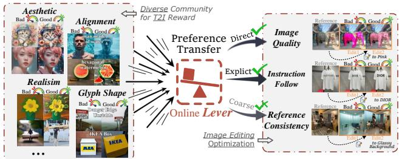
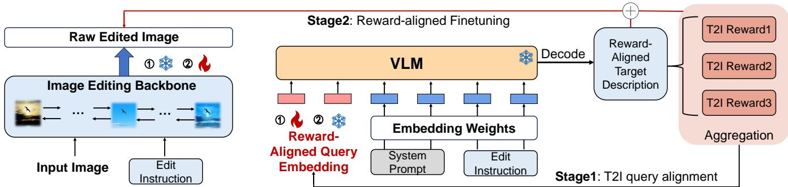
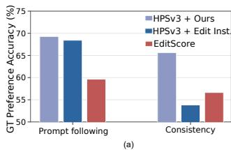
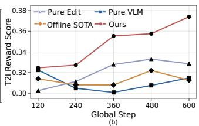
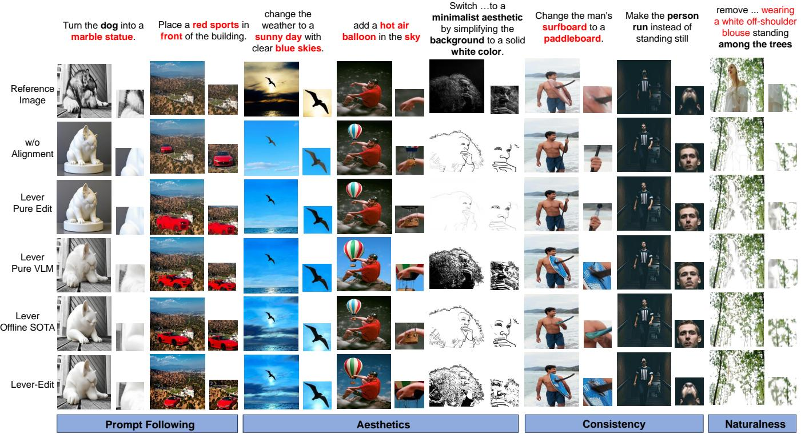
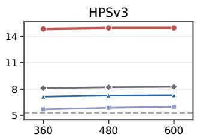
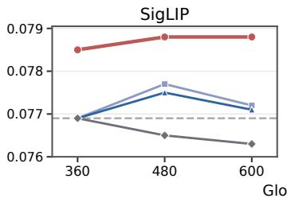
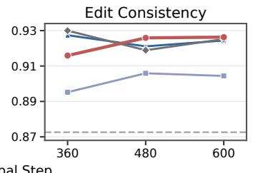
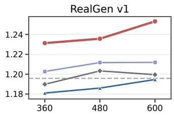

# Can We Perform Online RL for Image Editing without Editing Rewards?

Qichao Ma1∗, Jikang Cheng1∗†, Ling Liang1, Zhaofei Yu1, Tiejun Huang1, Renye Yan1‡

1Peking University

## Abstract

Reinforcement learning (RL) enables direct preference optimization for image editing through editing-specific rewards, which remain less developed due to costly triplet supervision and complex task-dependent calibration. In contrast, text-toimage (T2I) generation benefits from a mature and diverse reward ecosystem spanning semantic alignment, aesthetics, realism, glyph shape, and other visual preferences. Extending this ecosystem to image editing would substantially broaden the range of visual preferences accessible to RL-based optimization, prompting the central question: Can We Perform Image Editing RL without Editing Rewards? In this paper, we argue that the standard image editing dimensions have potential to be mapped to the T2I reward space: image quality can transfer directly, prompt following can be aligned through a description of the desired visual state, and reference consistency admits a coarse semantic conversion by encoding the source content to preserve. However, editing instructions specify relative changes, whereas T2I rewards require self-contained target descriptions; moreover, semantically valid captions from generic vision-language models may be incompatible with the frozen reward. Hence, we further introduce Lever-Edit, a two-stage framework that learns a reward-aligned captioner for counterfactual target descriptions, freezes it, and optimizes the editing policy solely with the transferred T2I reward. Experiments show competitive editing alignment and source preservation against editing-reward-based fine-tuning, while outperforming intuitive transfer baselines.

## Introduction

Instruction-guided image editing enables users to modify an existing image through natural-language instructions while preserving content unrelated to the requested change (Huang et al. 2025). Although recent difusion and flow-based editors have achieved substantial progress (Nichol et al. 2021; Liu et al. 2025b; Yan et al. 2026b), supervised fine-tuning optimizes likelihood over curated editing pairs rather than task-level human preferences. Reinforcement learning (RL) instead directly optimizes scalar or rationale-based feedback on sampled results (Black et al. 2023; Fan et al. 2023; Guo et al. 2026; Liu et al. 2026). At the center of editing RL lies the reward. However, constructing a reliable editing reward requires joint reasoning over the reference image, editing instruction, and edited output, as well as costly triplet-level supervision. The desired balance between executing the instruction and preserving source content further varies across edit types, complicating reward calibration and generalization (Wu et al. 2025; Luo et al. 2026; Zhao et al. 2026; Long et al. 2026). Editing quality is commonly characterized along three dimensions: pure image quality, edit execution, and reference consistency (Luo et al. 2026; Zhao et al. 2026). Pure image quality concerns intrinsic properties of the edited output, edit execution measures whether the requested transformation is realized, and reference consistency measures the preservation of source content unrelated to the edit. Surprisingly, we find that all three dimensions exhibit potential mappings to the T2I reward space: image quality can be evaluated directly, edit execution can be reformulated as alignment with a description of the desired visual state, and reference consistency can be coarsely projected by incorporating preserved source semantics into that description, as illustrated in Fig. 1.

  
Figure 1: Motivation for T2I-to-editing reward transfer. Lever-Edit acts as an online lever that harnesses the collective power of the broad T2I reward community, transferring its mature and diverse visual preferences into efective supervision for image-editing RL.

This raises a central question: Can We Perform Image Editing RL without Editing Rewards, instead using t2i reward? Such a formulation ofers two advantages. First, it gives editing RL direct access to the mature and diverse reward ecosystem of image generation, including rewards for semantic alignment, aesthetics, realism, OCR, safety, and other visual preferences (Xu et al. 2023; Wu et al. 2023b;

Kirstain et al. 2023; Ye et al. 2025; Zhu et al. 2026; Wang et al. 2025; Huang et al. 2026; Lamba et al. 2025). Improvements in these rewards can consequently be transferred to editing without redesigning the alignment objective. Second, it removes the dependence on costly editing-evaluator development and deployment.

Directly applying a T2I reward to image editing is, however, rather challenging. First, the two tasks employ fundamentally diferent conditioning semantics. An editing instruction defines a relative transformation with respect to a reference image, whereas a T2I reward expects a selfcontained description of the target image. Directly using the instruction preserves the requested change but omits the source semantics that should remain unchanged, necessitating a reference-aware conversion into a counterfactual target description. Second, a semantically valid target description is not necessarily compatible with the frozen T2I reward. An of-the-shelf Vision-Language Model (VLM) may produce a plausible caption whose representation is poorly calibrated to the reward model’s evaluation space, thereby weakening the resulting optimization signal. Therefore, efective reward transfer requires both edit-target conversion and explicit reward alignment, which remains a challenging issue.

In this paper, we introduce Lever-Edit, a reward-transfer framework in which a lightweight reward-aligned captioner acts as a lever: it enables a mature T2I reward to provide effective supervision for image-editing RL without constructing or invoking an editing reward. Specifically, Lever-Edit follows a two-stage design. In the first stage, we adapt a VLM through prefix tuning to map a reference image and an editing instruction to a counterfactual target caption. The caption jointly describes the intended modification and the source semantics that should be retained. We further align the captioner’s representation with the frozen T2I reward, producing reward-compatible conditions rather than generic image descriptions. In the second stage, we freeze the captioner and optimize the difusion editing policy using only the transferred T2I reward. No editing reward is used during policy fine-tuning. This design separates reward transfer from policy optimization and can be applied as a plug-in to diferent VLM and image-editing backbones.

Our contributions are summarized as follows:

• We revisit the standard dimensions of editing quality from the perspective of reward transfer and identify their potential correspondence to general image evaluation, motivating image-editing RL without an editing-specific reward.

• We propose Lever-Edit, a two-stage framework that converts reference-conditioned editing objectives into rewardaligned target captions and fine-tunes an editing policy using only a frozen T2I reward.

• We empirically demonstrate that transferred T2I rewards can provide competitive editing alignment and source preservation without an image-to-image reward model during policy fine-tuning.

## Related Works

## Reinforcement Learning for Image Editing

Reinforcement learning enables direct preference optimization for visual generation without dense task-specific annotations. DDPO (Black et al. 2023) and DPOK (Fan et al. 2023) pioneered RL-based fine-tuning for text-to-image difusion models. DanceGRPO (Xue et al. 2025) and Flow-GRPO (Liu et al. 2025a) subsequently broadened this paradigm to contemporary difusion and flow-matching backbones, establishing online RL as a general post-training framework for visual generation. Further studies improve optimization efficiency and stability through forward-process policy updates, pretraining-aligned objectives, entropy-adaptive exploration, and selective intervention along the denoising trajectory (Zheng et al. 2026; Xue et al. 2026; Yan et al. 2025, 2026a). RL paradigms developed for T2I generation have subsequently been successfully adapted to preference optimization for instruction-guided image editing. In this setting, RL aims to further improve prompt adherence, reference consistency, and overall visual quality, with recent methods demonstrating encouraging gains along these dimensions (Luo et al. 2026; Zhao et al. 2026; Guo et al. 2026).

## Reward Modeling in Image RL

Image Generation. Reward modeling for text-to-image generation has evolved into a diverse ecosystem spanning general human preferences and task-specific criteria. ImageReward (Xu et al. 2023), HPS (Wu et al. 2023b,a), and PickScore (Kirstain et al. 2023) capture broad judgments of semantic alignment and visual appeal. Specialized rewards target photorealism in RealGen (Ye et al. 2025) and visual-text fidelity in TextPecker (Zhu et al. 2026), while UnifiedReward (Wang et al. 2025) supports pointwise and pairwise multimodal evaluation and SigLIP (Zhai et al. 2023) provides general text–image correspondence scores. Complementing explicitly trained evaluators, SpectraReward (Huang et al. 2026) repurposes pretrained MLLMs as training-free, zero-shot rewards through image-conditioned prompt likelihood. This breadth makes the T2I reward ecosystem a compelling source of supervision for broader visual alignment tasks.

Image Editing. Editing rewards evaluate the triplet $( I _ { \mathrm { r e f } } , q _ { \mathrm { e d i t } } , I _ { \mathrm { e d i t } } )$ across output quality, edit execution, and reference consistency. EditReward (Wu et al. 2025) constructs over 200K expert-annotated preference pairs and trains a multidimensional uncertainty-aware ranker. EditScore (Luo et al. 2026) follows a pipeline from benchmark construction and reward-data curation to reward-model training, self-ensemble, and online RL. FIRM Reward (Zhao et al. 2026) employs a diference-first MLLM pipeline, specialized reward-model training, and consistency-modulated reward fusion. SpatialReward (Long et al. 2026) further introduces a multi-stage spatial-grounding and verification pipeline, followed by progressive SFT and GRPO training. Such staged construction is a common consequence of the intrinsic dificulty of evaluating relative edits and entails substantial design and implementation costs. Moreover, these rewards remain largely centered on edit execution and reference consistency, with limited coverage of the broader alignment preferences supported by T2I rewards. This restricted reward space constrains the optimization potential of image-editing RL.

## Problem Formulation

## The Reward-Transfer Gap

Let $I _ { \mathrm { r e f } }$ denote a reference image, $q _ { \mathrm { e d i t } }$ an editing instruction, and $I _ { \mathrm { e d i t } }$ the output sampled from an editing policy:

$$
I _ { \mathrm { e d i t } } \sim \pi _ { \theta } ( \cdot \mid I _ { \mathrm { r e f } } , q _ { \mathrm { e d i t } } ) .\tag{1}
$$

Conventional image-editing RL optimizes a task-specific reward defined on the complete editing triplet,

$$
\operatorname* { m a x } _ { \theta } \ \mathbb { E } [ R _ { \mathrm { e d i t } } ( I _ { \mathrm { r e f } } , q _ { \mathrm { e d i t } } , I _ { \mathrm { e d i t } } ) ] .\tag{2}
$$

The reference image allows $R _ { \mathrm { e d i t } }$ to determine both what should change and what should remain unchanged. By contrast, a T2I reward follows an image–text interface,

$$
R _ { \mathrm { T 2 I } } ( I , c ) ,\tag{3}
$$

where c is expected to be a self-contained description of the visual content in I. Directly substituting $q _ { \mathrm { e d i t } }$ for c therefore creates a fundamental conditioning mismatch. An editing instruction specifies a relative transformation, such as “make the car red,” whose target state depends on the particular reference image. It neither describes the complete target image nor exposes the source semantics that should be preserved. Consequently, $R _ { \mathrm { T 2 I } } ( I _ { \mathrm { e d i t } } , q _ { \mathrm { e d i t } } )$ may reward the requested attribute while remaining insensitive to the loss of referencespecific content.

Reward transfer thus requires a condition converter $g$ : ${ \mathcal { T } } \times { \mathcal { Q } } \to { \mathcal { C } }$ that maps a reference image and a relative editing instruction to a self-contained target description:

$$
c _ { \mathrm { t g t } } = g ( I _ { \mathrm { r e f } } , q _ { \mathrm { e d i t } } ) .\tag{4}
$$

The edited output is then evaluated by $R _ { \mathrm { T 2 I } } ( I _ { \mathrm { e d i t } } , c _ { \mathrm { t g t } } )$ . The central problem is whether g can retain the information required for editing evaluation while producing a condition that remains efective for a frozen T2I reward.

## Mapping Editing Quality to the T2I Reward Space

Editing quality is commonly assessed along three dimensions: pure image quality, edit execution, and reference consistency (Luo et al. 2026; Zhao et al. 2026). We represent these criteria conceptually as:

$$
\mathbf { r } _ { \mathrm { e d i t } } = \left[ r _ { \mathrm { e x e c } } ( I _ { \mathrm { r e f } } , q _ { \mathrm { e d i t } } , I _ { \mathrm { e d i t } } ) \right] ,\tag{5}
$$

without assuming a particular scalarization of the three criteria. Although their native formulation is referenceconditioned, each criterion admits a correspondence to the T2I reward space.

Among the three dimensions, pure image quality admits an immediate transfer: it is intrinsic to $I _ { \mathrm { e d i t } }$ and can be assessed without reference to either the source image or the editing instruction. The apparent dificulty instead lies in edit execution and reference consistency, both of which are conventionally defined relative to $I _ { \mathrm { r e f } } .$ . For edit execution, however, this dependence arises primarily from the form of the condition. The instruction $q _ { \mathrm { e d i t } }$ describes a relative change, whereas the evaluation objective concerns whether the corresponding visual state appears in the result. Once this intended outcome is expressed as an absolute post-edit description, edit execution becomes an image–text alignment problem of the form already addressed by T2I rewards. Reference consistency appears to present the greatest obstacle, since it explicitly concerns the relation between $I _ { \mathrm { r e f } }$ and $I _ { \mathrm { e d i t } }$ . Nevertheless, the source semantics that should remain unchanged can be incorporated into the target description together with the requested modification. The target condition can therefore be viewed as the composition

$$
c _ { \mathrm { t g t } } = c _ { \mathrm { c h a n g e } } \oplus c _ { \mathrm { p r e s e r v e } } ,\tag{6}
$$

where $c _ { \mathrm { c h a n g e } }$ specifies the intended changes and cpreserve encodes the source semantics to preserve. This formulation recasts edit execution and reference consistency as alignment between $I _ { \mathrm { e d i t } }$ and a unified target description, enabling their joint evaluation by a T2I reward.

This mapping should be understood as a semantic projection rather than an equivalence between T2I and image-pair evaluation. A textual condition cannot fully encode low-level identity or pixel-accurate preservation. It can, however, represent the principal semantics underlying image quality, edit execution, and reference consistency. Thus, although direct reward transfer is ill-posed at the interface level, the core editing objectives remain transferable in principle. The practical challenge is to construct a target condition that faithfully realizes this correspondence.

## Intuitive Reward-Transfer Protocols

Equation 4 suggests several straightforward transfer protocols. We introduce three representative variants that difer in how they instantiate g.

Direct Edit Prompt. The simplest protocol directly sets $c _ { \mathrm { t g t } } = q _ { \mathrm { e d i t } }$ . It incurs no conversion cost and retains the requested transformation, but treats a relative instruction as an absolute image description. The resulting reward condition omits reference-specific context and provides no explicit account of the content to be preserved.

Online VLM Rewriting. A general-purpose VLM can instead generate the target condition on demand,

$$
c _ { \mathrm { t g t } } = g _ { \mathrm { V L M } } ( I _ { \mathrm { r e f } } , q _ { \mathrm { e d i t } } ) .\tag{7}
$$

This protocol introduces reference awareness and can express the intended post-edit state more completely. However, repeatedly invoking a VLM during reward computation add inference overhead, while its generic captions are produced for general semantic description rather than calibrated to the evaluation behavior of the selected T2I reward.

Ofline Proprietary-MLLM Rewriting. A strong proprietary MLLM may be used to precompute target descriptions ofline. Owing to its instruction-following and visualreasoning capabilities, the resulting descriptions may accurately express the intended edit and preserved content from a human-semantic perspective. However, ofline rewriting fixes these conditions independently of the downstream T2I reward, making them inflexible to the choice of reward model or subsequent optimization requirements. It also introduces dependence on a closed model. More fundamentally, semantic quality for human readers does not guarantee reward compatibility: an accurate description may emphasize attributes represented weakly by the reward or fall outside its preferred conditioning distribution.

Collectively, these protocols identify two requirements for efective reward transfer: the target description must faithfully encode both the requested modification and the source semantics to be preserved, and it must remain compatible with the frozen T2I reward. Direct use of the editing instruction fails to specify a complete target state, whereas generic VLM- or MLLM-based rewriting provides no guarantee of reward-specific alignment. These observations motivate the reward-aligned conversion mechanism presented next.

## Proposed Method

In this section, we introduce the overall pipeline and method design of Lever-Edit. Lever-Edit consists of two stages. Stage 1 addresses the mismatch in textual representations when incorporating T2I rewards. Specifically, we jointly optimize a learnable prefix together with a fixed system prompt to align with multiple T2I reward signals at both the embedding and textual levels, therefore ensuring execution and consistency signal with explicit text, and quality signal with hidden embedding. Stage 2 then integrates the learned alignment into image-editing optimization. On the one hand, we freeze the parameters learned in Stage 1, allowing the resulting module to serve as a plug-in that can be seamlessly incorporated into existing image-editing fine-tuning frameworks without modifying their original training objectives. On the other hand, we inject the embedding-level alignment signal into the image-editing trajectory as auxiliary supervision, providing complementary guidance to balance prompt following and edit consistency.

## T2I Query Alignment

As illustrated on the right side of Fig. 2, Stage 1 aims to align the VLM-generated target descriptions with the preferences of the downstream T2I reward models without updating either the image editing backbone or the VLM. To this end, we freeze both models and optimize only a set of learnable continuous query embeddings, denoted by $\mathcal { E } _ { \mathrm { q u e r y } }$ , through prefix tuning. Meanwhile, a fixed system prompt is explicitly concatenated with the original edit instruction to constrain the generation task at the semantic level. Conditioned on the reference image $I _ { \mathrm { r e f } }$ , the explicit textual instruction $p _ { \mathrm { s y s } } \oplus q _ { \mathrm { e d i t } }$ , and the continuous edit query $\mathcal { E } _ { \mathrm { q u e r y } } .$ , the VLM autoregressively generates a target description $c _ { \mathrm { t g t } }$ . Multiple complementary T2I reward models then evaluate the generated description, and their aggregated reward serves as the policy-gradient signal to optimize $\mathcal { E } _ { \mathrm { q u e r y } } .$ . In this way, Stage 1 adapts the text-generation policy toward downstream T2I reward preferences while leaving the original model parameters unchanged.

Semantic-Preserving Embedding-level Prefix Tuning. Reward-driven adaptation should improve downstream T2I compatibility without altering the underlying generation task. Given a reference image $I _ { \mathrm { r e f } }$ and its edit instruction $C _ { \mathrm { e d i t } } .$ we explicitly concatenate a fixed system prompt $P _ { \mathrm { s y s } }$ with the edit instruction,

$$
c _ { \mathrm { i n } } = [ p _ { \mathrm { s y s } } \oplus q _ { \mathrm { e d i t } } ] ,\tag{8}
$$

where $\oplus$ denotes concatenation along the token dimension. The system prompt explicitly instructs the VLM to describe the hypothetical edited image according to $I _ { \mathrm { r e f } }$ and $q _ { \mathrm { e d i t } }$ . It therefore provides a fixed, discrete specification of the targetdescription task throughout reward optimization.

In addition to the explicit textual instruction, we introduce a learnable continuous prefix

$$
\mathcal { E } _ { \mathrm { q u e r y } } = [ \mathcal { E } _ { 1 } , \ldots , \mathcal { E } _ { N _ { q } } ] \in \mathbb { R } ^ { N _ { q } \times d } ,\tag{9}
$$

where $N _ { q }$ is the number of learnable query tokens and d denotes the hidden dimension of the VLM. Let $\mathcal { E } _ { \mathrm { V L M } } ^ { t e x t } ( \cdot )$ denote the final text-domain input embedding of the VLM. The input is therefore constructed as

$$
\begin{array} { r } { \mathcal { E } _ { V L M } ^ { t e x t } = \Bigl [ \mathcal { E } _ { \mathrm { q u e r y } } ; \mathcal { E } _ { \mathrm { t e x t } } \bigl ( [ p _ { \mathrm { s y s } } \oplus q _ { \mathrm { e d i t } } ] \bigr ) \Bigr ] , } \end{array}\tag{10}
$$

Thus, $p _ { \mathrm { s y s } } \oplus q _ { \mathrm { e d i t } }$ explicitly specifies the generation task in the discrete text space, whereas $q _ { \mathrm { e d i t } }$ provides trainable degrees of freedom in the continuous embedding space. Throughout Stage 1, all original VLM parameters remain frozen and only $q _ { \mathrm { e d i t } }$ is optimized. Compared with directly fine-tuning the $\begin{array} { r } { \bar { \bf V } { \bf L M } , } \end{array}$ this design confines reward-driven adaptation to a lightweight prefix space, thereby limiting interference with the pretrained language and semantic capabilities while still providing suficient flexibility to capture T2I-reward-preferred generation patterns beyond a fixed handcrafted prompt.

For each sampled target description, we employ K complementary T2I reward models to evaluate its compatibility with downstream image-generation objectives. Their outputs are aggregated as

$$
R _ { \mathrm { T 2 I } } = \sum _ { k = 1 } ^ { K } \omega _ { k } R _ { k } \left( c _ { \mathrm { t g t } } ; I _ { \mathrm { r e f } } \right) ,\tag{11}
$$

where $\omega _ { k }$ denotes the weight of the k-th reward model.

We optimize $\mathcal { E } _ { \mathrm { q u e r y } }$ to maximize the expected downstream T2I reward:

$$
\begin{array} { r } { J _ { \mathrm { T 2 I } } \left( \mathcal { E } _ { \mathrm { q u e r y } } \right) = \mathbb { E } _ { ( I _ { \mathrm { r e f } } , q _ { \mathrm { e d i t } } ) \sim \mathcal { D } , } R _ { \mathrm { T 2 I } } , } \\ { c _ { \mathrm { t g t } } \sim \pi \varepsilon _ { \mathrm { q u e r y } } ~ } \end{array}\tag{12}
$$

Because $c _ { \mathrm { t g t } }$ is obtained through discrete token sampling, the downstream reward cannot be directly diferentiated through the generated sequence. We therefore optimize $q _ { \mathrm { e d i t } }$ using policy gradient.

Ofline Token-level Distribution Alignment. Although the fixed system prompt explicitly specifies the target-description task reward-only optimization can still induce semantic drift with token-level mismatch. To provide an additional semantic anchor, we employ a strong ofline MLLM $( \mathrm { e . g . }$ , GPT or Gemini) to generate a high-quality reference description $c _ { \mathrm { t g t } } ^ { * }$ for a small set of training samples.

  
Figure 2: Overall two-stage T2I reward transfer pipeline in Lever-Edit.

Specifically, we construct an ofline supervision set

$$
\mathcal { D } _ { \mathrm { g o l d } } = \left\{ \left( I _ { \mathrm { r e f } } ^ { ( i ) } , q _ { \mathrm { e d i t } } ^ { ( i ) } , c _ { \mathrm { t g t } } ^ { * ( i ) } \right) \right\} _ { i = 1 } ^ { N } ,\tag{13}
$$

where $C _ { \mathrm { t g t } } ^ { * } = ( c _ { 1 } ^ { * } , \ldots , c _ { L ^ { * } } ^ { * } )$ denotes the reference description generated by the ofline MLLM. At decoding step t, we represent the reference token $c _ { t } ^ { * }$ using the empirical one-hot target distribution

$$
\mathcal { E } _ { \mathrm { g o l d } , t } ( \boldsymbol { v } ) = \mathbb { I } \left[ \boldsymbol { v } = \boldsymbol { c } _ { t } ^ { * } \right] , \qquad \boldsymbol { v } \in \mathcal { V } ,\tag{14}
$$

where V denotes the VLM vocabulary. For compactness, we use $\mathbb { E } _ { \mathcal { D } _ { \mathrm { g o l d } } } [ \cdot ]$ to denote expectation over samples from $\mathcal { D } _ { \mathrm { g o l d } }$ We regularize the query-conditioned policy toward this empirical semantic target through

$$
\mathcal { L } _ { \mathrm { S F T } } = \mathbb { E } _ { \mathcal { D } _ { \mathrm { g o l d } } } [ \frac { 1 } { L ^ { * } } \sum _ { t = 1 } ^ { L ^ { * } } D _ { \mathrm { K L } } \Big ( \mathcal { E } _ { \mathrm { g o l d } , t } \parallel \pi _ { \mathcal { E } _ { \mathrm { q u e r y } } } ( \cdot  { \lvert } I _ { \mathrm { r e f } } ,  \Big . \Big .\tag{15}
$$

Because $\mathcal { E } _ { \mathrm { g o l d } , t }$ is a one-hot distribution concentrated on $c _ { t } ^ { * } ,$ the KL objective reduces exactly to the token-level negative log-likelihood used in standard SFT in eq. 16.

$$
\mathcal { L } _ { \mathrm { S F T } } = \mathbb { E } _ { \mathcal { D } _ { \mathrm { g o l d } } } \left[ \frac { 1 } { L ^ { * } } \sum _ { t = 1 } ^ { L ^ { * } } \log \pi _ { \mathcal { E } _ { \mathrm { q u e r y } } } \left( c _ { t } ^ { * } \mid I _ { \mathrm { r e f } } , \right. \right.\tag{16}
$$

In all, the two objectives provide complementary supervision. Combining downstream reward alignment with ofline semantic supervision, the overall objective of Stage 1 is

$$
\sqrt { \mathcal { L } _ { \mathrm { S t a g e 1 } } = \mathcal { L } _ { \mathrm { P G } } + \lambda _ { \mathrm { S F T } } \mathcal { L } _ { \mathrm { S F T } } } ,\tag{17}
$$

Policy gradient $\mathcal { L } _ { \mathrm { P G } }$ increases the likelihood of description alignment that receives high downstream T2I rewards in embedding level, while $\mathcal { L } _ { \mathrm { S F T } }$ regularizes the policy toward semantically reliable descriptions generated by the ofline MLLM. The latter, therefore, mitigates semantic drift and potential hacking introduced by reward-driven optimization.

## Reward-aligned Finetuning

Stage 1 freezes the image editing backbone and performs RL rollouts over the VLM-generated target descriptions $c _ { \mathrm { t g t } } .$ yielding a set of learnable query embeddings $\mathcal { E } _ { \mathrm { q u e r y } }$ directly aligned with multiple T2I rewards. In Stage 2, the result-< 6 >ing query embeddings serve as a plug-and-play rewardalignment module that provides efective reward signals across diferent image-editing backbones and fine-tuning paradigms. Additionally, the corresponding VLM prefill embedding of $\mathcal { E } _ { \mathrm { q u e r y } }$ has been contextualized with both visual and textual inputs. Therefore, additional reward-aligned multi-modal condition can be introduced into the image edit finetuning process.

## Experiments

## Experiment Setup

Datasets. We evaluate our method on both a failure-focused benchmark constructed for T2I-reward transfer and existing public image editing benchmarks. Specifically, we construct Lever-Bench to evaluate the transfer of T2I rewards for image editing. Rather than uniformly sampling common editing cases, we curate 1,880 image-instruction pairs $( I _ { \mathrm { i n } } , q _ { \mathrm { e d i t } } )$ from multiple sources, including Arena (Jiang et al. 2024), Counting Edit (Ghosh, Hajishirzi, and Schmidt 2023), and EditScore-RL-Data (Luo et al. 2026), focusing on failure cases of existing image editing models. Lever-Bench spans four broad categories of editing scenarios: local edits, including object removal, replacement, and material or attribute modification; human-centric edits, including portrait, pose, action, and facial-expression changes; global edits, such as background and style modification; and compositional edits involving object counting and relational reasoning. To complement these targeted failure cases and evaluate generalization beyond our curated benchmark, we additionally report results on the open-source benchmarks: GEdit (Liu et al. 2025b) and EditReward-Bench (Luo et al. 2026).

Rewards and Metrics. Both training rewards and evaluation metrics are selected to cover three complementary dimensions of image editing quality: perceptual quality, edit execution, and reference consistency. For both Stage 1 and Stage 2, we employ HPSv3 (Ma et al. 2025) and RealGen (Ye et al. 2025) as T2I rewards. HPSv3 provides reward signals for edit execution, consistency, and aesthetics, while

Table 1: Comparison of diferent methods across image editing evaluation metrics on Lever-Bench and GEdit (Liu et al. 2025b).
<table><tr><td rowspan="2">Method</td><td rowspan="2">Consistency SigLIP</td><td rowspan="2">Aesthetics HPSv3</td><td colspan="3">EditScore</td><td rowspan="2">T2I Naturalness</td><td colspan="3">GEdit</td></tr><tr><td>Consistency</td><td>Naturalness</td><td>Execution</td><td>RealGen v1</td><td>Q</td><td>0</td></tr><tr><td>w/o Alignment</td><td>0.0769</td><td>5.2742</td><td>0.8726</td><td>0.8811</td><td>0.6311</td><td>1.1958</td><td>6.181</td><td>6.330</td><td>5.763</td></tr><tr><td>Lever Pure Edit</td><td>0.0772</td><td>5.9823</td><td>0.9044</td><td>0.8974</td><td>0.7307</td><td>1.2119</td><td>6.345</td><td>6.330</td><td>5.755</td></tr><tr><td>Lever Pure VLM</td><td>0.0771</td><td>7.3152</td><td>0.9244</td><td>0.8837</td><td>0.6249</td><td>1.1946</td><td>6.058</td><td>6.661</td><td>5.706</td></tr><tr><td>Lever Offline SOTA</td><td>0.0763</td><td>8.2645</td><td>0.9252</td><td>0.8896</td><td>0.7191</td><td>1.1995</td><td>6.042</td><td>6.389</td><td>5.517</td></tr><tr><td>Lever-Edit</td><td>0.0788</td><td>14.9762</td><td>0.9263</td><td>0.8822</td><td>0.7040</td><td>1.2532</td><td>6.364</td><td>6.362</td><td>5.788</td></tr></table>

  
Figure 3: Efectiveness ofT2I rewards transfer. (a) Evaluation < 21 >of T2I reward and I2I reward (Editscore) on EditReward-Bench. (b) Evaluated T2I reward comparison of diferent methods. Lever-Edit shows stable and best optimization.

RealGen emphasizes realism and consistency. For evaluation, we separately assess the major quality dimensions to obtain a more comprehensive view of model performance. We measure perceptual quality from both aesthetic and realism perspectives. To evaluate semantic consistency, we use SigLIP (Zhai et al. 2023) to measure the correspondence between the edited image and its textual condition. We further use EditScore (Luo et al. 2026) to assess instruction execution and consistency between the input and edited images. These metrics jointly characterize perceptual quality, instruction following, and source consistency.

Models and Baselines. We instantiate Lever-Edit on FLUX.1-Kontext-dev (Labs et al. 2025) and apply DifusionNFT (Zheng et al. 2026). Therefore, our baselines are designed to distinguish the efect of reward-aligned target description generation from the benefit of simply providing an alternative textual condition. In addition to the original image editing model without alignment, we compare four prompt constructions: (i) directly using the original edit instruction $q _ { \mathrm { e d i t } }$ (Lever Pure Edit); (ii) descriptions generated by the online VLM conditioned on the fixed $p _ { \mathrm { s y s } } ,$ without reward-driven query optimization (Lever Pure VLM); (iii) high-quality descriptions generated ofline by a strong closed-source MLLM (Lever Ofline SOTA); and (iv) rewardaligned descriptions generated by Lever-Edit. Unless otherwise stated, variants in comparison use the same imageediting backbone, edit instruction set, and training budget.

## The Merits of Introducing T2I Rewards

To verify our central hypothesis that the standard dimensions of editing quality can be mapped into the T2I reward space, we evaluate the transferred reward at two complementary levels. At the reward level, a successful transfer should correctly distinguish preferred edits from inferior ones, even without an editing-specific evaluator that jointly processes the reference image, instruction, and edited output. At the optimization level, it should provide a stable learning signal whose gains translate into better instruction execution, semantic and source consistency, and image quality. We therefore evaluate reward accuracy on annotated preference pairs, analyze reward trajectories during training, and compare downstream editing performance on Lever-Bench, EditReward-Bench (Luo et al. 2026), and GEdit (Liu et al. 2025b). Together, these evaluations test not only whether a transferred T2I reward assigns meaningful preference scores, but also whether its preference knowledge can serve as effective supervision for image-editing RL.

Table 2: Ablation Study regarding the influence of diferent prompts for T2I rewards on SigLIP semantic consistency.
<table><tr><td>Method</td><td>Pure Edit Prompt</td><td>Offline SOTA Prompt</td><td>Lever-Edit Prompt</td></tr><tr><td>w/o Alignment</td><td>0.0769</td><td>0.0768</td><td>0.0784</td></tr><tr><td>Lever Pure Edit</td><td>0.0772</td><td>0.0766</td><td>0.0785</td></tr><tr><td>Lever Pure VLM</td><td>0.0770</td><td>0.0765</td><td>0.0784</td></tr><tr><td>Lever Offline SOTA</td><td>0.0767</td><td>0.0763</td><td>0.0782</td></tr><tr><td>Lever-Edit</td><td>0.0777</td><td>0.0770</td><td>0.0788</td></tr></table>

Our reward-aligned target descriptions enable T2I rewards to provide a stronger editing-preference signal than directly applying them to raw edit instructions. At the reward level, we compare three variants on preference pairs with ground-truth annotations: HPSv3 conditioned on the reward-aligned target descriptions generated by Lever-Edit (HPSv3+Ours), HPSv3 conditioned directly on the raw edit instruction (HPSv3+Edit), and the editing-specific reward EditScore. As shown in Fig. 3(a), HPSv3+Ours outperforms EditScore by approximately 9 percentage points in promptfollowing accuracy. In contrast, directly conditioning HPSv3 on the edit instruction leads to a pronounced drop in consistency accuracy. This is because a relative edit instruction specifies what should change, but does not explicitly describe the source content that should be preserved. At the optimization level, the Forensic-Chat reward curves in Fig. 3(b) show that Lever-Edit consistently receives higher rewards than the alternatives throughout training. These results validate the central role of our target-description interface: converting the relative editing request into a self-contained target state makes mature T2I rewards better suited to evaluating imageediting preferences and, therefore, improves fine-tuning of the image-editing model.

  
Figure 4: Qualitative analysis of diferent methods. Lever-Edit successfully edits the images with strong prompt following and high aesthetics, while maintaining both semantic and source consistency with naturalness. Zoom in for better visualizations.

## Efectiveness of Execution and Consistency

Beyond improving the optimized T2I reward values, T2I-only supervision also yields clear gains on the core edit-aware dimensions of instruction execution and reference consistency. Transferring T2I rewards substantially improves instruction execution while also providing strong semantic consistency. As shown in Tab. 1, Lever-based methods on the EditScore Execution (prompt-following) metric consistently outperform the unaligned base image-editing model, indicating that the transferred reward provides an efective learning signal for executing the requested edit. Moreover, Lever-based methods show higher consistency, naturalness and execution on editscore. However, admittedly, a low-quality online target prompt may lead to a lower execution score, as the Editscore-Execution score of Lever Pure VLM. Lastly, in GEdit, Lever-Edit achieves the best semantic score and the highest overall score. Since these reward models are also involved in optimization, we use the independent SigLIP consistency and GEdit as the extra evidence for consistency evaluation. As shown in Tab. 1, Lever-Edit has the best SigLip and GEdit S score (consistency) over all competitors. Therefore, the reward-aligned target descriptions generated by Lever-Edit prove to provide a more efective semantic representation of the desired edited state than raw or generic textual conditions.

## Efectiveness of Image Quality

Here, we show that Lever-Edit achieves the strongest alignment with the transferred T2I quality preferences on Lever-Bench. As reported in Tab. 1, it achieves the highest HPSv3 score by a clear margin and the best RealGen score. The large HPSv3 gain is consistent with the objective of Stage 1: the learned target descriptions explicitly bridge the editing task and the preference space represented by the T2I reward. The corresponding RealGen improvement further shows that the resulting edited images align well with the complementary realism- and consistency-oriented reward signal.

## Ablation Study

Lever-Edit consistently outperforms the compared methods across diferent training stages regarding metrics such as HPSv3, SigLIP, Editscore consistency, and Realgen v1, as shown in Fig. 5. To disentangle the efect of description quality from that of the edited images, we recompute SigLIP similarity using four alternative textual conditions: the raw edit instruction, descriptions from the vanilla VLM (Pure VLM), descriptions generated by the strong ofline model (Ofline SOTA), and the reward-aligned target descriptions generated by Lever-Edit. The recomputed SigLIP scores are listed in Tab. 2, which further reveals two clear observations. First, for the same edited image, the target descriptions generated by Lever-Edit consistently achieve the highest SigLIP scores, indicating better semantic alignment between our descriptions and the intended edited content. Second, under the same textual description, images generated by Lever-Edit

  
Pure Edit Pure VLM Offline SOTA Lever-Edit w/o Alignment

Figure 5: Ablation study across diferent training steps. Lever-Edit achieves the best aesthetics, semantic alignment, edit consistency, and realism throughout most training steps.

also achieve the highest SigLIP scores, indicating that our edited images better match the intended target semantics. Together, these results demonstrate improvements in targetdescription quality and image-text semantic alignment.

## Qualitative Analysis

Fig. 4 presents qualitative comparisons from four complementary perspectives: execution (prompt-following), aesthetics, consistency, and naturalness. As shown in Fig. 4, for prompt-following, Lever-Edit successfully transforms only the dog into a statue with marble texture, while the oflinebased method loses consistency with the dog’s appearance, and the Pure VLM method mistakenly maintains the original feather texture that contradicts marble property. Moreover, Lever-Edit places the red sports car in the correct position, and is rendered with higher aesthetics and naturalness. Additionally, Lever-Edit shows impressive aesthetics across global/local/drawing edits, and aligns ‘surboard’ with the correct objects while maintaining human head pose, demonstrating high semantic and source consistency. Lastly, for the object removal task, Lever-Edit recovers hidden leaves with higher naturalness quality.

## Conclusion

We show that the mature T2I reward ecosystem can be effectively transferred to image-editing RL without relying exclusively on editing-specific rewards. We introduce Lever-Edit, a two-stage framework that bridges relative editing instructions and the self-contained target descriptions expected by T2I rewards by first learning a reward-aligned target-description policy and then freezing it to guide downstream image-editing optimization. Experiments on Lever-Bench and existing benchmarks show competitive edit alignment and source preservation, while outperforming intuitive transfer baselines based on raw edit instructions, generic VLM descriptions, and ofline high-quality prompts. These show that efective image-editing RL does not necessarily require separately designed rewards for every editing objective. Instead, diverse visual preferences in T2I rewards can be reused through an appropriate target-description interface.

## References

Black, K.; Janner, M.; Du, Y.; Kostrikov, I.; and Levine, S. 2023. Training difusion models with reinforcement learning. arXiv preprint arXiv:2305.13301.

Fan, Y.; Watkins, O.; Du, Y.; Liu, H.; Ryu, M.; Boutilier, C.; Abbeel, P.; Ghavamzadeh, M.; Lee, K.; and Lee, K. 2023. Dpok: Reinforcement learning for fine-tuning text-to-image difusion models. Advances in Neural Information Processing Systems, 36: 79858–79885.

Ghosh, D.; Hajishirzi, H.; and Schmidt, L. 2023. Geneval: An object-focused framework for evaluating text-to-image alignment. NeurIPS, 36: 52132–52152.

Guo, H.; Wu, J.; Liu, J.; Gao, Y.; Ye, Z.; Yuan, L.; Wang, X.; Yu, Y.; and Huang, W. 2026. Leveraging verifier-based reinforcement learning in image editing. arXiv preprint arXiv:2604.27505.

Huang, R.; Zhang, Q.; Liu, Z.; Gao, Y.; Wu, J.; and Zhao, H. 2026. Read It Back: Pretrained MLLMs Are Zero-Shot Reward Models for Text-to-Image Generation. arXivpreprint arXiv:2607.11886.

Huang, Y.; Huang, J.; Liu, Y.; Yan, M.; Lv, J.; Liu, J.; Xiong, W.; Zhang, H.; Cao, L.; and Chen, S. 2025. Difusion modelbased image editing: A survey. IEEE Transactions on Pattern Analysis and Machine Intelligence.

Jiang, D.; Ku, M.; Li, T.; Ni, Y.; Sun, S.; Fan, R.; and Chen, W. 2024. Genai arena: An open evaluation platform for generative models. Advances in Neural Information Processing Systems, 37: 79889–79908.

Kirstain, Y.; Polyak, A.; Singer, U.; Matiana, S.; Penna, J.; and Levy, O. 2023. Pick-a-pic: An open dataset of user preferences for text-to-image generation. Advances in Neural Information Processing Systems.

Labs, B. F.; Batifol, S.; Blattmann, A.; Boesel, F.; Consul, S.; Diagne, C.; Dockhorn, T.; English, J.; English, Z.; Esser, P.; et al. 2025. Flux. 1 kontext: Flow matching for in-context image generation and editing in latent space. arXiv preprint arXiv:2506.15742.

Lamba, P.; Ravish, K.; Kushwaha, A.; and Kumar, P. 2025. Alignment and Safety of Difusion Models via Reinforcement Learning and Reward Modeling: A Survey. arXiv preprint arXiv:2505.17352.

Liu, J.; Liu, G.; Liang, J.; Li, Y.; Liu, J.; Wang, X.; Wan, P.; Zhang, D.; and Ouyang, W. 2025a. Flow-grpo: Training flow matching models via online rl. arXiv preprint arXiv:2505.05470.

Liu, J.; Ye, Z.; Yuan, L.; Zhu, S.; Gao, Y.; Wu, J.; Li, K.;Wang, X.; Nie, X.; Huang, W.; et al. 2026. Unigrpo: Unified

policy optimization for reasoning-driven visual generation. arXiv preprint arXiv:2603.23500.

Liu, S.; Han, Y.; Xing, P.; Yin, F.; Wang, R.; Cheng, W.; Liao, J.; Wang, Y.; Fu, H.; Han, C.; et al. 2025b. Step1xedit: A practical framework for general image editing. arXiv preprint arXiv:2504.17761.

Long, Y.; Yang, Y.; Wei, H.; Chen, W.; Zhang, T.; Fan, H.; Liu, C.; Jiang, K.; Chen, J.; Tang, K.; Wen, B.; Yang, F.; Gao, T.; Li, H.; and Yang, S. 2026. SpatialReward: Bridging the Perception Gap in Online RL for Image Editing via Explicit Spatial Reasoning. In Forty-third International Conference on Machine Learning.

Luo, X.; Wang, J.; Wu, C.; Xiao, S.; Jiang, X.; Lian, D.; Zhang, J.; Liu, D.; and Liu, Z. 2026. Editscore: Unlocking online rl for image editing via high-fidelity reward modeling. In International Conference on Learning Representations, volume 2026, 33027–33056.

Ma, Y.; Wu, X.; Sun, K.; and Li, H. 2025. Hpsv3: Towards wide-spectrum human preference score. In 2025 IEEE/CVF International Conference on Computer Vision (ICCV), 15086–15095. IEEE.

Nichol, A.; Dhariwal, P.; Ramesh, A.; Shyam, P.; Mishkin, P.; McGrew, B.; Sutskever, I.; and Chen, M. 2021. Glide: Towards photorealistic image generation and editing with textguided difusion models. arXiv preprint arXiv:2112.10741.

Wang, Y.; Zang, Y.; Li, H.; Jin, C.; and Wang, J. 2025. Unified Reward Model for Multimodal Understanding and Generation. arXiv preprint arXiv:2503.05236.

Wu, K.; Jiang, S.; Ku, M.; Nie, P.; Liu, M.; and Chen, W. 2025. Editreward: A human-aligned reward model for instruction-guided image editing. arXiv preprint arXiv:2509.26346.

Wu, X.; Hao, Y.; Sun, K.; Chen, Y.; Zhu, F.; Zhao, R.; and Li, H. 2023a. Human preference score v2: A solid benchmark for evaluating human preferences of text-to-image synthesis. arXiv preprint arXiv:2306.09341.

Wu, X.; Sun, K.; Zhu, F.; Zhao, R.; and Li, H. 2023b. Human preference score: Better aligning text-to-image models with human preference. In International Conference on Computer Vision, 2096–2105.

Xu, J.; Liu, X.; Wu, Y.; Tong, Y.; Li, Q.; Ding, M.; Tang, J.; and Dong, Y. 2023. Imagereward: Learning and evaluating human preferences for text-to-image generation. Advances in Neural Information Processing Systems.

Xue, S.; Ge, C.; Zhang, S.; Li, Y.; and Ma, Z.-M. 2026. Advantage Weighted Matching: Aligning RL with Pretraining in Difusion Models. In International Conference on Machine Learning.

Xue, Z.; Wu, J.; Gao, Y.; Kong, F.; Zhu, L.; Chen, M.; Liu, Z.; Liu, W.; Guo, Q.; Huang, W.; and Luo, P. 2025. DanceGRPO: Unleashing GRPO on Visual Generation. arXiv preprint arXiv:2505.07818.

Yan, R.; Cheng, J.; Gan, Y.; Sun, S.; Wu, Y.; Yang, Y.; Ling, L.; Lin, J.; Zhu, Y.; Zhou, J.; et al. 2025. Entropy-Adaptive Difusion Policy Optimization with Dynamic Step Alignment. In Proceedings of the IEEE/CVF International Conference on Computer Vision, 1924–1934.

Yan, R.; Cheng, J.; Sun, S.; Sun, Y.; Wu, Y.; Peng, W.; Wang, Z.; Liang, L.; Xing, J.; and Cai, Y. 2026a. Do Less, Achieve More: Do We Need Every-Step Optimization for RL Fine-tuning of Difusion Models? arXiv preprint arXiv:2605.15855.

Yan, R.; Cheng, J.; Wu, Y.; Liang, L.; Peng, W.; Vasilakos, A. V.; Zhao, Q.; Zhang, Y.; Adeli, E.; Pohl, K. M.; et al. 2026b. Pixel-Space Difusion Transformers. arXiv preprint arXiv:2607.17585.

Ye, J.; Zhu, L.; Guo, Y.; Jiang, D.; Huang, Z.; Zhang, Y.; Yan, Z.; Fu, H.; He, C.; and Li, W. 2025. Realgen: Photorealistic text-to-image generation via detector-guided rewards. arXiv preprint arXiv:2512.00473.

Zhai, X.; Mustafa, B.; Kolesnikov, A.; and Beyer, L. 2023. Sigmoid Loss for Language Image Pre-Training. In International Conference on Computer Vision.

Zhao, X.; Zhang, P.; Lin, J.; Liang, T.; Duan, Y.; Ding, S.; Tian, C.; Zang, Y.; Yan, J.; and Yang, X. 2026. Trust your critic: Robust reward modeling and reinforcement learning for faithful image editing and generation. arXiv preprint arXiv:2603.12247.

Zheng, K.; Chen, H.; Ye, H.; Wang, H.; Zhang, Q.; Jiang, K.; Su, H.; Ermon, S.; Zhu, J.; and Liu, M.-Y. 2026. Difusion-NFT: Online Difusion Reinforcement with Forward Process. In International Conference on Learning Representations.

Zhu, H.; Liu, Y.; Wu, X.; Wang, A.-L.; Feng, H.; Yang, D.; Feng, C.; Huang, C.; Tang, J.; and Bai, X. 2026. TextPecker: Rewarding Structural Anomaly Quantification for Enhancing Visual Text Rendering. In Computer Vision and Pattern Recognition.