# Contextrast++: Robust Multi-Scale Contextual Contrastive Learning for Semantic Segmentation

Changki Sung1†, Hyungtae Lim2†, Wanhee Kim3, Youngwoo Seo4, and Hyun Myung5∗, Senior Member, IEEE

Abstract—Semantic segmentation has rapidly advanced with deep learning; however, challenges remain in effectively capturing local and global contexts as well as addressing the longtailed distribution problem. To tackle these issues, we present Contextrast++, a robust contrastive learning method for semantic segmentation that improves multi-scale feature integration and mitigates class imbalance issues. Our method consists of two key components: 1) contextual contrastive learning (CCL) and 2) boundary-aware negative (BANE) sampling. CCL includes three subcomponents: adaptive fusion module, pixel-to-anchor (PA) loss, and anchor-to-anchor (AA) loss. The adaptive fusion module dynamically balances local and global feature integration, resulting in a more context-aware representation. While the PA loss leverages the fused multi-scale features to improve feature representation learning, the AA loss focuses on addressing the long-tailed distribution problem by utilizing a memory bank that stores a fixed number of class-balanced representative anchors. Meanwhile, BANE sampling enhances segmentation precision by selecting hard negatives from misclassified boundary regions, which refines fine-grained details during contrastive learning. As verified in extensive experiments using public datasets, we demonstrate that Contextrast++ substantially improves semantic segmentation performance over existing contrastive learningbased state-of-the-art approaches, while introducing no additional computational overhead during inference.

Index Terms—Semantic segmentation, contrastive learning, representation learning.

## I. INTRODUCTION

Semantic segmentation, a fundamental task in computer vision, plays a vital role in applications such as autonomous driving and robotics [1]–[11]. Recent advancements in deep learning, driven by the availability of extensive datasets [12]– [17], have boosted segmentation performance. Researchers

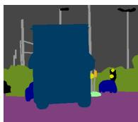  
(a) Ground truth

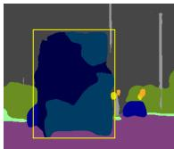  
(b) HRNet [27]

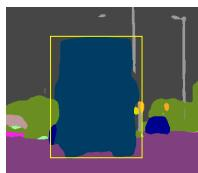  
(c) Ours

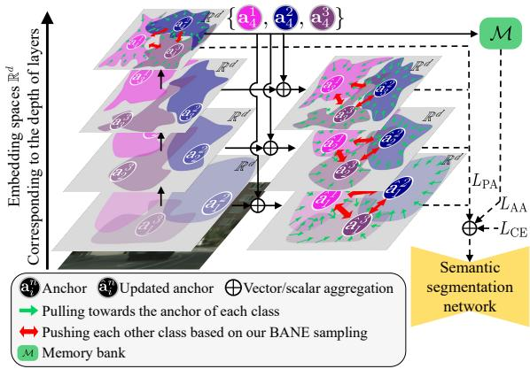  
(d)

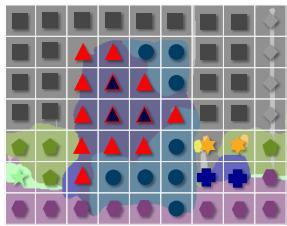

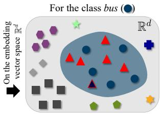  
(e)  
Fig. 1. Visualization of (a) ground truth annotations, (b) results obtained from HRNet [27], and (c) output after being trained with our contrastive learning approach. (d) Overview of the proposed contextual contrastive learning framework, referred to as Contextrast++, which refines class-specific anchors by aggregating the deepest-layer embeddings into earlier layers to enhance semantic and fine-grained feature representation. (e) Illustration of boundary-aware negative (BANE) sampling strategy, which selects feature embeddings near object boundaries (solid red triangles) as harder negative samples. This helps contrastive learning focus more on boundary regions, improving boundary prediction accuracy.

have introduced larger deep neural networks [18]–[51] and novel loss functions [52]–[54] to further improve segmentation accuracy.

Despite recent advancements, some semantic segmentation models still produce inaccurate results, as illustrated in Fig. 1(b). More specifically, semantic segmentation models continue to face challenges in accurately predicting small objects, object boundaries, and underrepresented (or longtailed) classes. While increasing model complexity [55]–[57] can help mitigate these challenges, it results in higher memory consumption and slower inference speeds, which are critical drawbacks for autonomous driving and robotics. This underscores the need for efficient performance enhancements that do not require additional computational cost during inference.

To address the challenges of inaccurate predictions in small objects, boundaries, and underrepresented classes, as well as the high computational cost associated with complex models, contrastive learning-based methods [58]–[62] have emerged as an effective approach. Contrastive learning is applied exclusively during training, so semantic segmentation models retain identical memory consumption and processing time during inference. Consequently, contrastive learning offers a highly efficient solution for scenarios where low computational overhead and fast inference are essential.

However, existing contrastive learning methods for semantic segmentation either overlook multi-scale feature integration [58]–[60] or rely on separate multi-scale and cross-scale processes that cause inconsistent feature relationships [61]. Our previous work, Contextrast [62], addressed this through fused representative anchors across scales, but had two limitations: (1) static weighted fusion lacks adaptability for diverse contexts, and (2) class imbalance within mini-batches leads to insufficient long-tailed distribution handling, where underrepresented classes have limited training instances.

Therefore, in this paper, we propose Contextrast++ to address these limitations. First, Contextrast++ introduces a lightweight adaptive fusion module that replaces the static weighted sum with a learnable mechanism, using selfattention, concatenation, and multi-layer perceptron (MLP) to adaptively integrate multi-scale anchors. This generates expressive class-specific feature vectors that enable the enhanced pixel-to-anchor (PA) loss to learn more consistent global-local representations.

Second, Contextrast++ introduces an anchor-to-anchor (AA) loss with a memory bank that stores class-balanced representative anchors. Unlike existing methods [58], [60] that store pixel-level features leading to imbalance, our anchor selection strategy extracts one anchor per class from the deepest layer when the class is present, storing only refined-then-fused classlevel anchors. This enables class-balanced learning, effectively mitigating the long-tailed distribution problem.

In summary, this paper presents the following contributions:

• Contextrast++ introduces a lightweight adaptive fusion module that replaces static weighting with learnable integration via self-attention and MLP, enabling adaptively fused representative anchors that enhance both PA loss and AA loss.

• We introduce an efficient memory bank design that stores class-balanced representative anchors across all classes, enhancing the AA loss to effectively mitigate the longtailed distribution problem.

• Contextrast++ outperforms prior contrastive learning approaches across a range of CNN architectures [19], [27], [30] and transformer architectures [34], [63], evaluated on diverse datasets [13]–[17].

TABLE I  
COMPARISON OF CORE COMPONENTS BETWEEN OUR METHOD AND EXISTING STATE-OF-THE-ART APPROACHES. CL: CONTRASTIVE LEARNING, MB: MEMORY BANK, AL: AUXILIARY LOSS, SYN: SYNTHETIC NEGATIVE SAMPLE GENERATION.
<table><tr><td>Method</td><td>Components</td><td>Scale</td><td>Boundary awareness</td></tr><tr><td>Baseline</td><td></td><td></td><td>-</td></tr><tr><td>Wang et al. ıcCv 21 [58]</td><td>CL, MB</td><td>Single</td><td>x</td></tr><tr><td>Hu et al. ıccv 21 [59]</td><td>CL, MB, AL</td><td>Single</td><td>x</td></tr><tr><td>Pissas et al. ECcv 22 [61]</td><td>CL</td><td>Multi</td><td>x</td></tr><tr><td>Zhou et al. TPAMI 24 [60]</td><td>CL, MB, SYN</td><td>Single</td><td>x</td></tr><tr><td>Sung et al. cvPR 24 [62]</td><td>CL</td><td>Multi-fusion (static)</td><td>√</td></tr><tr><td>Ours</td><td>CL, MB</td><td>Multi-fusion (adaptive)</td><td></td></tr></table>

## II. RELATED WORK

## A. Semantic segmentation

Semantic segmentation assigns a category label to each pixel in an image. CNN-based methods from FCN [64] to ASPP [18], HRNet [27], and OCRNet [30] have progressively improved spatial and contextual understanding. More recently, transformer-based models [34], [63], [65], [66] have further advanced segmentation performance by capturing long-range dependencies, though typically with larger model size and higher computational cost. Contrastive learning-based methods offer a complementary direction by optimizing the embedding space to improve feature discriminability, without introducing additional inference overhead.

## B. Contrastive learning approaches in semantic segmentation

In contrastive learning, feature representations are learned by minimizing intra-class distances while maximizing interclass separability. Recent works applying contrastive learning to semantic segmentation [58]–[62] have shown promising results. Notably, contrastive learning is applied only during training, enhancing performance without incurring additional computational costs during inference. Table I compares the core components of recent contrastive learning approaches.

Previous approaches [58]–[60] operated on single-scale features from the final layer. Wang et al. [58] and Zhou et al. [60] utilized memory banks to store pixel-level features, with Zhou et al. further introducing synthetic negative sample generation to create harder negatives near class boundaries. Hu et al. [59] additionally employed an auxiliary loss based on class-specific weighted region centers. However, these singlescale methods miss valuable multi-scale contextual information.

Pissas et al. [61] addressed this by incorporating multiscale features, integrating contrastive learning across multiscale and cross-scale features. Nevertheless, treating these as separate processes leads to inconsistencies, where feature shifts at different scales may cause misaligned relationships.

Our previous work, Contextrast [62], tackled these inconsistencies by introducing contextual contrastive learning (CCL) with static multi-scale fusion of representative anchors and boundary-aware negative (BANE) sampling for harder negatives. However, CCL’s static weighted fusion lacks adaptability, and its class balancing is limited to classes present within each mini-batch, leaving the long-tailed distribution problem partially unresolved.

Contextrast++ advances the CCL framework by replacing the static fusion with an adaptive fusion module that employs learnable integration for more expressive anchor representations. Additionally, it introduces a memory bank that maintains class-balanced anchors across all classes, effectively resolving both the inflexible fusion and class imbalance limitations.

## C. Multi-scale feature fusion in semantic segmentation

Several recent works [67]–[69] have explored multi-scale feature fusion to better integrate global semantics and finegrained local details in semantic segmentation. These methods, including HRViT [68], TSG [69], and BSCNet [67], commonly rely on weighted summation or static alignment-based aggregation over spatial feature maps, which limits their ability to model richer cross-scale interactions.

More recently, Fu et al. [49] integrated local attention with state space models for multi-scale context extraction, Shi et al. [50] leveraged large language model priors with scaled visual attention for open-vocabulary segmentation, and Yang et al. [51] proposed a multi-scale encoder enhancement framework for weakly supervised semantic segmentation. These recent methods perform fusion on spatially dense feature maps that preserve pixel-level location information. In contrast, our adaptive fusion module operates on class-specific anchor embeddings that aggregate spatial information into compact class-level vectors, without retaining explicit pixel-level spatial structure.

## D. Context modeling and clustering for semantic segmentation

Recent works have explored context modeling and clustering as core mechanisms for semantic segmentation. Liu et al. [47] proposed a weakly supervised dual clustering framework, and Zhu et al. [48] introduced CCViM, which integrates context clustering within a Vision Mamba architecture. While these works demonstrate the value of clustering-based representations in weakly supervised and domain-specific settings, our approach tackles supervised semantic segmentation through contrastive learning.

Li et al. [46] proposed CTNet, a tandem framework of a channel context module (CCM) and a spatial context module (SCM) that interactively explores channel-wise semantic dependencies and pixel-to-category spatial correlations. CCM generates class-specific feature representations that serve as prior knowledge to guide the SCM. These class-specific feature vectors play a similar role to the class-specific anchors in our CCL, as both encode category-level semantic representations.

Despite this structural similarity, the two methods pursue different objectives and operate in distinct spaces. While CTNet’s class features reside in the feature-map space to provide prior knowledge for architectural context modeling, our anchors are constructed in the contrastive embedding space to explicitly regularize the feature distribution via pixel-anchor and anchor-anchor losses. Furthermore, whereas the CCM and SCM are integral components of the network architecture during both training and inference, our CCL functions as an auxiliary training objective and incurs no inference-time overhead. Consequently, we view these two approaches as complementary: CTNet focuses on enhancing feature-maplevel context, while CCL strengthens the underlying encoder representations through contrastive supervision.

## III. CONTEXTRAST++: ROBUST MULTI-SCALE CONTEXTUAL CONTRASTIVE LEARNING FOR SEMANTIC SEGMENTATION

## A. Overall framework

We introduce a supervised contrastive learning framework, termed Contextrast++, and visually summarize it in Fig. 2. Contextrast++ incorporates several methods specifically designed for supervised semantic segmentation.

First, for the reader’s convenience, we briefly revisit the preliminaries of the CCL framework in Section III.B2. We then describe how the previously proposed static fusion module and PA loss are enhanced in Contextrast++ (Section III.B3 and Section III.B4) and AA loss with a memory bank (Section III.B5), respectively. In particular, we explain how the AA loss with a memory bank effectively addresses the long-tailed distribution issue [70] in semantic segmentation tasks. Second, the boundary-aware negative (BANE) sampling method, which was originally proposed in Contextrast [62], is summarized in Section III.C to briefly explain its role in guiding the model’s attention toward challenging boundary regions.

## B. Contextual contrastive learning (CCL)

1) Overview of CCL: The CCL framework optimizes the class representations in the embedding space, strengthening the encoder’s discriminative power without additional inference overhead. It comprises three mutually reinforcing components, each addressing a distinct challenge in contrastive learning for semantic segmentation. First, the adaptive fusion module overcomes the limited expressiveness of the static fusion in Contextrast [62] by adaptively integrating multi-scale anchors. Second, the PA loss resolves the representation switching problem of conventional contrastive learning objectives, in which each sample alternately serves as an anchor, causing inconsistent optimization, by fixing the fused anchor as a stable class-level reference. Third, the AA loss mitigates longtailed class imbalance within mini-batches by leveraging classprioritized anchors in a memory bank for stable, class-balanced supervision. Together, these components operate synergistically, where context-enriched anchors from the adaptive fusion module amplify the effectiveness of the PA loss, and the AA loss extends supervision across the class distribution.

2) Preliminaries: Embedding and representative anchors: We consider an encoder architecture comprising I layers. As shown in Fig. 2, given a mini-batch of images IBatch with spatial resolution $H \times W$ , the i-th layer, where $i \in \{ 1 , \cdots , I \}$ has feature map $\mathbf { F } _ { i }$ whose height and width are $H _ { i }$ and $W _ { i }$ respectively, satisfying $H _ { i } < H$ and $W _ { i } < W$ . Note that $\mathbf { F } _ { i }$ at deeper layers has smaller height and width, i.e. $H _ { i - 1 } > H _ { i }$ and $W _ { i - 1 } ~ > ~ W _ { i }$ , for $i \in \{ 2 , \cdots , I \}$ . Next, taking $\mathbf { F } _ { i }$ as an input, a projection head $\pi ( \cdot )$ outputs the i-th embedding feature vector set $\mathbf { Z } _ { i }$ , i.e. $\mathbf { Z } _ { i } ~ = ~ \pi ( \mathbf { F } _ { i } )$ , where each pixel location corresponds to a feature vector $\mathbf { z } \in \mathbb { R } ^ { d }$ , where $d$ is the channel dimension of the embedding space.

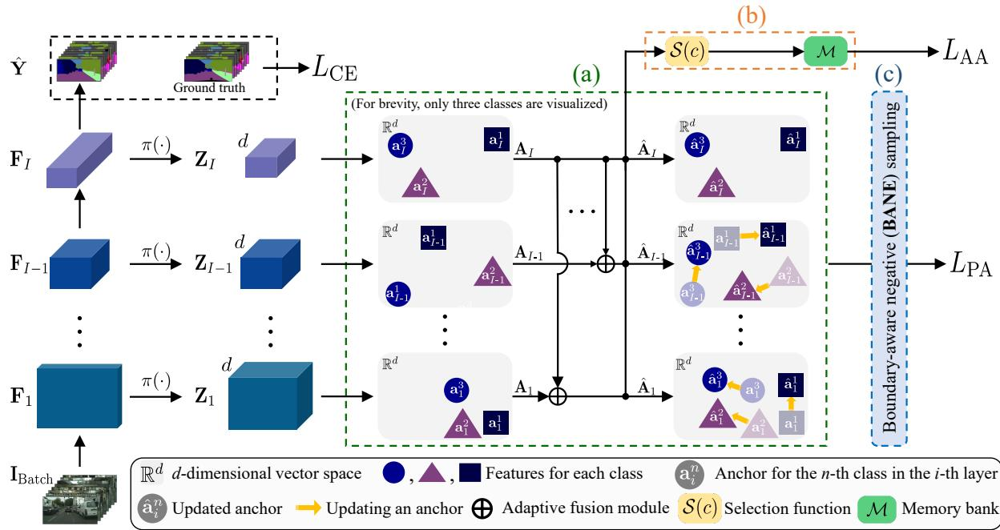  
Fig. 2. Overview of the proposed pipeline, called Contextrast++. (a) The contextual contrastive learning (CCL) module, comprising the adaptive fusion module and pixel-to-anchor (PA) loss $L _ { \mathrm { P A } }$ . (b) AA loss with a memory bank, where $\boldsymbol { S } ( \cdot )$ is the selection function to generate class-prioritized anchors. (c) Boundary-aware negative (BANE) sampling, which selects informative negative samples along prediction error boundaries for use in PA loss. $I _ { \mathrm { B a t c h } }$ denotes mini-batch images, $\hat { Y }$ the predicted segmentation output, Fi the feature representation at the i-th layer, $\mathbf { Z } _ { i }$ the transformed feature set via encoding function $\pi ( \cdot ) , \mathbf { A }$ i the representative anchors derived from $\mathbf { Z } _ { i } , \hat { \mathbf { A } } _ { i }$ the updated anchors after adaptive fusion, and $L _ { \mathrm { C E } }$ the cross-entropy loss. Semantic classes are distinguished using various shapes and colors (best viewed in color).

By denoting the total number of classes in a dataset as $N$ the number of class IDs present in each mini-batch is denoted by $N _ { i }$ , where $N _ { i } \leq N$ . We define the set of representative anchors at the i-th encoder layer as $\mathbf { A } _ { i }$ , which consists of $N _ { i }$ class-wise representative anchors, and each anchor $\mathbf { a } _ { i } ^ { n } \in \mathbb { R } ^ { d }$ in $\mathbf { A } _ { i }$ represents the mean of the embedded feature vectors associated with the ground truth labels in the mini-batch.

To compute each $\mathbf { a } _ { i } ^ { n }$ , the set of embedding vectors whose spatial locations correspond to pixels labeled with class n in the ground truth label map $\mathbf { Y } _ { i }$ , is required. To this end, let $\mathbf { Y }$ be the set of ground truth semantic labels in the current minibatch and $\mathbf { Y } _ { i }$ be the downsampled ground truth labels aligned with the spatial resolution of $\mathbf { Z } _ { i } .$ , i.e. $\mathbf { Y } _ { i }$ and $\mathbf { Z } _ { i }$ share the same width and height. We define $g ( \mathbf { z } )$ as a mapping function that retrieves the ground truth semantic label from $\mathbf { Y } _ { i } ,$ , which spatially aligns with the embedding vector $\mathbf { z } \in \mathbf { Z } _ { i }$ . Next, let ${ \mathcal { N } } _ { i }$ be the set of unique class labels present in $\mathbf { Y } _ { i }$ , where $| \mathcal { N } _ { i } | = N _ { i } \leq N$ . Then, $\mathbf { a } _ { i } ^ { n }$ is defined as follows:

$$
\mathbf { a } _ { i } ^ { n } = \frac { \displaystyle \sum _ { \mathbf { z } \in \mathbf { Z } _ { i } } \mathbf { z } \mathbb { 1 } [ g ( \mathbf { z } ) = n ] } { \displaystyle \sum _ { \mathbf { z } \in \mathbf { Z } _ { i } } \mathbb { 1 } [ g ( \mathbf { z } ) = n ] } , \mathrm { w h e r e ~ } n \in \mathcal { N } _ { i } .\tag{1}
$$

Here, $\mathbb { 1 } [ \cdot ]$ denotes the Iverson bracket, which returns one when the given condition is satisfied, and zero otherwise. By using (1), $\mathbf { A } _ { i }$ is expressed as $\mathbf { A } _ { i } \ = \ \{ \mathbf { a } _ { i } ^ { n } \ | \ n \in \mathcal { N } _ { i } \}$ . For convenience, we interchangeably express $\mathbf { A } _ { i }$ in a matrix form, i.e. $\mathbf { A } _ { i } = [ \mathbf { a } _ { i } ^ { n _ { 1 } } \mathbf { a } _ { i } ^ { n _ { 2 } } \dots \mathbf { a } _ { i } ^ { n _ { N _ { i } } } ] \in \mathbb { R } ^ { d \times N _ { i } }$ , where $\{ n _ { 1 } , . . . , n _ { N _ { i } } \} =$ ${ \mathcal { N } } _ { i }$

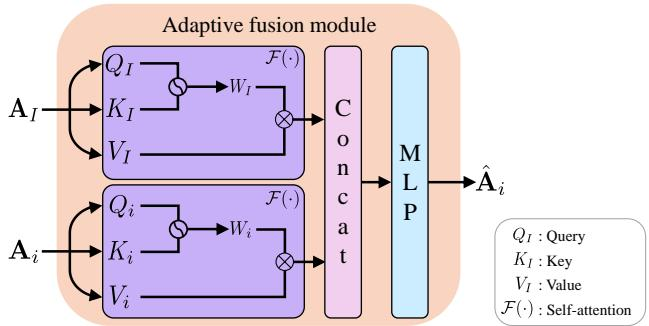  
Fig. 3. The pipeline of the proposed adaptive fusion module with the deepestlayer representative anchor $\bar { \mathbf { A } _ { I } }$ and earlier-layer representative anchor $\mathbf { A } _ { i }$ ${ \dot { Q , K , } }$ and $V$ represent query, key, and value, respectively. The purple box $\mathcal F ( \cdot )$ indicates self-attention [71].

3) Adaptive fusion module: In our previous work Contextrast [62], multi-scale representative anchors were fused using a fixed weighted sum with the deepest layer anchor as follows:

$$
\hat { \mathbf { a } } _ { i } ^ { n } = \left\{ \begin{array} { l l } { w _ { l } \mathbf { a } _ { i } ^ { n } + w _ { h } \mathbf { a } _ { I } ^ { n } , } & { \mathrm { i f } n \in \mathcal { N } _ { i } \cap \mathcal { N } _ { I } } \\ { \mathbf { a } _ { i } ^ { n } , } & { \mathrm { O t h e r w i s e } } \end{array} \right. ,\tag{2}
$$

where $w _ { l }$ and $w _ { h }$ are weighting hyperparameters for anchor update, satisfying $w _ { l } + w _ { h } = 1$ . This formulation injects global semantic context into early-layer anchors, but its reliance on fixed hyperparameters limits the capability to adaptively balance semantic context and fine-grained details. More critically, element-wise summation forces a linear superposition of features, preventing the model from capturing richer crossscale interactions.

To address these limitations, we adopt self-attention and MLP to construct our adaptive fusion module, following a two-stage refine-then-fuse strategy. This design is particularly suited to our setting: multi-scale anchors from different encoder layers encode semantics at varying levels of abstraction, where each anchor’s channel dimensions carry scale-specific semantic attributes. Unlike context modeling approaches [46], clustering [47], [48] and multi-scale fusion modules [49]– [51], [67]–[69] that operate on spatial feature maps for feature enhancement, our adaptive fusion module operates on compact class-level anchor embeddings in the contrastive embedding space. Specifically, as shown in Fig. 3, each anchor is first refined independently using self-attention $\mathcal F ( \cdot )$ to model inter-channel dependencies, emphasizing discriminative feature channels critical for semantic segmentation. Finally, the refined anchors from layers i and I are concatenated and fused through an MLP:

$$
\hat { \mathbf { a } } _ { i } ^ { n } = \left\{ \begin{array} { l l } { \mathbf { M } \mathbf { L } \mathbf { P } ( \mathcal { F } ( \mathbf { a } _ { I } ^ { n } ) \oplus \mathcal { F } ( \mathbf { a } _ { i } ^ { n } ) ) } & { \mathrm { i f ~ } n \in \mathcal { N } _ { i } \cap \mathcal { N } _ { I } } \\ { \mathbf { a } _ { i } ^ { n } } & { \mathrm { O t h e r w i s e } } \end{array} \right. ,\tag{3}
$$

where $\oplus$ represents concatenation. Crucially, concatenation preserves all scale-specific representations, avoiding the information loss inherent in summation. Subsequently, the MLP learns non-linear interactions between these refined anchors, producing a more expressive representation. Notably, these improvements are achieved with negligible computational overhead owing to the lightweight structure of the module.

4) PA loss: Next, we describe how the PA loss is formulated with the adaptive fusion module. Before that, we briefly introduce the baseline of the PA loss, InfoNCE loss [72], [73], and highlight the key differences. Conventional contrastive learning-based methods utilize InfoNCE loss [72], [73], which is defined as follows:

$$
{ \cal L } _ { \mathrm { N C E } } = - \frac { 1 } { | { \bf Z } _ { + } | } \sum _ { { \bf z } _ { + } \in { \bf Z } _ { + } } \log \frac { \exp ( { \bf z } \cdot { \bf z } _ { + } / \tau ) } { \exp ( { \bf z } \cdot { \bf z } _ { + } / \tau ) + \sum _ { { \bf z } _ { - } \in { \bf Z } _ { - } } \exp ( { \bf z } \cdot { \bf z } _ { - } / \tau ) } ,\tag{4}
$$

where $\mathbf { Z } _ { + / - }$ represents positive and negative samples, respectively. The positive samples $\mathbf { Z } _ { + }$ belong to the same semantic class as the anchor z, while the negative samples Z belong to a different class. Here, the logit similarities are computed using the dot product between samples and scaled by the temperature hyperparameter $\tau$ . The objective is to reduce the distance between $\mathbf { z } _ { + } \in \mathbf { Z } _ { + }$ and anchor ${ \mathbf { z } } ,$ while maximizing the separation between $\mathbf { z } _ { - } \in \mathbf { Z } _ { - }$ and z. In (4), since each sample is used once as an anchor $\mathbf { z } ,$ the objective in the contrastive learning changes during the loss computation.

To avoid this switching problem, we proposed the pixel-toanchor (PA) loss [62], $L _ { \mathrm { P A } }$ , by reforming (4) as follows:

$$
L _ { \mathrm { P A } } = \sum _ { i = 1 } ^ { I } \lambda _ { i } \biggl [ \frac { 1 } { N _ { i } } \sum _ { \hat { \mathbf { a } } _ { i } ^ { n } \in \hat { \mathbf { A } } _ { i } } L _ { i } \biggr ] ,\tag{5}
$$

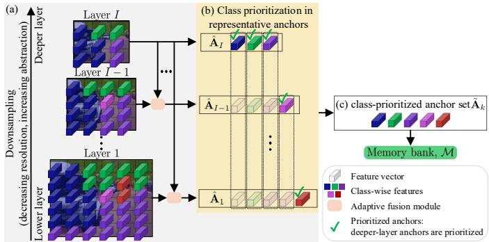  
Fig. 4. Illustration of the class-prioritized anchor selection and storage process in the memory bank. (a) Features in each scale may contain different sets of classes due to downsampling the ground truth to match the reduced spatial resolution of the features. Thus, some small objects (e.g. red and pink features here) tend to vanish in deeper layers, whereas large objects such as cars and roads persist across all layers. (b) Class-prioritized anchors are selected from the deepest available layer where each class appears (green check marks). (c) The selected anchors are aggregated to form a class-prioritized anchor set, which is stored in the memory bank.

$$
L _ { i } = - \frac { 1 } { \left| { \bf Z } _ { + } \right| } \sum _ { { \bf z } _ { + } \in { \bf Z } _ { + } } \log \frac { \exp ( \hat { \bf a } _ { i } ^ { n } \cdot { \bf z } _ { + } / \tau ) } { \exp ( \hat { \bf a } _ { i } ^ { n } \cdot { \bf z } _ { + } / \tau ) + \sum _ { { \bf z } _ { - } \in { \bf Z } _ { - } } \exp ( \hat { \bf a } _ { i } ^ { n } \cdot { \bf z } _ { - } / \tau ) } ,\tag{6}
$$

where $\lambda _ { i }$ denotes the weighting hyperparameters for the PA loss at the i-th layer. The logit similarities are computed as the dot product between the anchor aˆ and the samples $\mathbf { z } _ { + / - } ,$ scaled by the temperature hyperparameter τ.

By doing so, the PA loss optimizes embeddings by pulling positive samples toward the fused anchor $\hat { \mathbf { a } } _ { i } ^ { n }$ and pushing negative samples away from it. This also eliminates representation switching during training and improves stability and classlevel consistency.

5) AA loss with a memory bank: While the fused representative anchors $\hat { \bf A } _ { i }$ used in the PA loss operate within the scope of a mini-batch, a long-tailed distribution issue [70] can arise if certain class features are absent from the mini-batch. These limitations motivate the use of a memory bank that provides more stable and balanced supervision.

However, na¨ıvely adopting memory bank designs from classification approaches [74], [75] is structurally incompatible with multi-scale semantic segmentation. Specifically, the standard practice of storing only the deepest layer anchors omits classes that disappear at lower resolutions, resulting in incomplete class coverage. Conversely, storing anchors from all layers introduces a scale-induced bias, where the memory bank becomes overwhelmingly dominated by finegrained features.

First, as shown in Fig. 4(a), deeper layers lose more spatial information owing to downsampling. As a result, smaller objects fail to produce an embedding vector via $g ( \mathbf { z } )$ , causing the network to focus primarily on larger objects in the image. Formally, this downsampling naturally leads $| { \mathcal N } _ { i - 1 } | \geq | { \mathcal N } _ { i } |$ for $i \in \{ 2 , \cdots , I \}$ , which causes the deeper layer anchor $\mathbf { a } _ { i } ^ { n }$ to become nonexistent as $\mathbb { 1 } [ g ( \mathbf { z } ) ~ = ~ n ]$ in (1) becomes zero. Second, due to the substantially higher spatial resolution of earlier layers, the memory bank is disproportionately filled with fine-grained features, marginalizing the semantic features necessary for global context. To address these issues, we introduce the AA loss that utilizes class-prioritized anchors stored in a memory bank $\mathcal { M } .$

The class-prioritized anchors are defined as a set of classspecific representative anchors selected from the deepest available layer where each class appears. As explained above, the first layer contains the richest spatial information and therefore includes the largest number of existing classes. Thus, we first define the set of all existing class IDs as $\mathcal { N } ^ { * }  \mathcal { N } _ { 1 }$ . Next, let us define the deepest layer index that contains the class $c \in \mathcal { N } ^ { * }$ as follows:

$$
i ^ { * } ( c ) = \operatorname* { m a x } \Bigl \{ i \in \{ 1 , \cdots , I \} \mid c \in \mathcal { N } _ { i } \Bigr \} .\tag{7}
$$

Using the definition in (7), we define the selection function $\boldsymbol { S } ( \boldsymbol { c } )$ that retrieves the representative anchor from the deepest available layer as:

$$
\begin{array} { r } { \boldsymbol { S } ( \boldsymbol { c } ) = \mathbf { a } _ { i ^ { * } ( \boldsymbol { c } ) } ^ { c } , } \end{array}\tag{8}
$$

which corresponds to the green check-marked features in Fig. 4(b). Subsequently, as presented in Fig. 4(c), the classprioritized anchor set $\ddot { \mathbf { A } } _ { k }$ at the k-th training iteration is defined as follows:

$$
\tilde { \mathbf { A } } _ { k } = \{ \boldsymbol { S } ( c ) \mid c \in \mathcal { N } ^ { * } \} .\tag{9}
$$

For example, in Fig. 4, when the same class representative anchors exist in multiple layers, the one from the deeper layer is selected according to (8). Consequently, in $\tilde { \mathbf { A } } _ { k }$ , representative anchors for classes occupying large spatial regions, e.g. car, vegetation, and road classes, are taken from deeper layers, whereas those for classes with small spatial extent, e.g. person class, are taken from shallower layers.

Then, the class-prioritized anchors from each training iteration are stored in a memory bank , which consists of N class-wise queues. Each queue stores up to $K _ { \mathcal { M } }$ classprioritized anchors, i.e. $N \times K _ { \mathcal { M } }$ anchors in total. When the number of stored anchors exceeds $K _ { \mathcal { M } }$ , the oldest classprioritized anchor is removed, and the newest one is added. The hyperparameter $K _ { \mathcal { M } }$ controls the memory bank size, balancing storage capacity and memory efficiency.

Then, we sample an equal number of class-prioritized anchors for each class to mitigate the long-tailed distribution issue. These sampled anchors are then utilized in the AA loss, $L _ { \mathrm { A A } }$ , where logit similarities are computed as dot products scaled by temperature τ :

$$
L _ { \mathrm { A A } } = \frac { 1 } { | \mathcal { N } ^ { * } | } \sum _ { c \in \mathcal { N } ^ { * } } L _ { a } ^ { c } ,\tag{10}
$$

$$
L _ { a } ^ { c } = - \frac { 1 } { K _ { \mathcal { M } } } \sum _ { \widetilde { \mathbf { a } } _ { + } \in \mathcal { M } } \log \frac { \exp ( \widetilde { \mathbf { a } } ^ { c } \cdot \widetilde { \mathbf { a } } _ { + } / \tau ) } { \exp ( \widetilde { \mathbf { a } } ^ { c } \cdot \widetilde { \mathbf { a } } _ { + } / \tau ) + \sum _ { \widetilde { \mathbf { a } } _ { - } \in \mathcal { M } } \exp ( \widetilde { \mathbf { a } } ^ { c } \cdot \widetilde { \mathbf { a } } _ { - } / \tau ) } ,\tag{11}
$$

where $\tilde { \mathbf { a } } ^ { c } , \tilde { \mathbf { a } } _ { + } , \tilde { \mathbf { a } } _ { - }$ , and τ represent the class-prioritized anchor for class $c \in \mathcal { N } ^ { * }$ , positive class-prioritized anchor, negative class-prioritized anchor, and the temperature hyperparameter, respectively. By using an equal number of sampled anchors for each class, the AA loss effectively addresses the long-tailed distribution problem. In addition, leveraging class-prioritized anchors in the memory bank provides memory efficiency by eliminating the need to store a large number of individual features for each class. As representative anchors inherently encode feature information from multiple samples, this approach contributes to a compact yet expressive feature storage, facilitating stable and class-balanced training.

6) Loss function: Finally, the losses $L _ { \mathrm { P A } }$ in (5) and $L _ { \mathrm { A A } }$ in (10) are jointly optimized alongside the standard pixelwise cross-entropy loss $L _ { \mathrm { C E } }$ [27], offering a complementary supervision that enhances segmentation performance. Through this design, while $L _ { \mathrm { C E } }$ guides the model to predict the correct class label for each sample, $L _ { \mathrm { P A } }$ efficiently learns relationships between global-local contexts by applying adaptively fused representative anchors, and $L _ { \mathrm { A A } }$ helps to solve the longtailed distribution issue by sampling an equal number of classprioritized anchors from the memory bank.

Formally, the framework is designed to optimize the following loss function:

$$
L = L _ { \mathrm { C E } } + \alpha ( L _ { \mathrm { P A } } + L _ { \mathrm { A A } } ) ,\tag{12}
$$

where α represents the hyperparameter weight for our contrastive learning loss.

## C. Boundary-aware negative (BANE) sampling

In addition to CCL, we enhance the loss by incorporating BANE sampling, an effective hard negative sampling strategy previously proposed in Contextrast [62]. Following previous works [58], [60], [76], which emphasize the importance of leveraging informative negatives in contrastive learning, BANE sampling selects negative samples near prediction boundaries because they are harder to distinguish. Consequently, using harder negative samples as $\mathbf { Z } _ { - }$ in (6) improves the model’s capability to learn more class-discriminative features.

As depicted in Fig. 5, BANE sampling consists of three sequential steps: (i) decomposing the prediction output into class-wise binary error maps, (ii) applying the distance transform [77] to the class-wise binary error maps, and (iii) identifying negative samples according to the computed distance maps.

First, we begin by defining the class-specific binary error map $\mathbf { B } _ { i } ^ { n }$ at each pixel location $( u , v )$ as follows:

$$
\mathbf { B } _ { i } ^ { n } ( u , v ) = \mathbb { 1 } [ ( \hat { y } _ { i } \neq n ) \land ( g ( \hat { y } _ { i } ) = n ) ] , \mathrm { w h e r e } \ n \in \mathcal { N } _ { i } ,\tag{13}
$$

where $\hat { y } _ { i }$ represents the predicted label at the i-th layer, obtained by downsampling the final-layer prediction. $g ( \cdot )$ denotes a labeling function used in (1). Each pixel in $\mathbf { B } _ { i } ^ { n }$ has a value of one for the incorrectly predicted pixel (i.e. a negative sample), and zero otherwise (in Fig. 5(a)).

Subsequently, the binary error map $\mathbf { B } _ { i } ^ { n }$ is converted into a class-wise distance map $\mathbf { D } _ { i } ^ { n }$ using the Euclidean distance transform [77] for each class n and each layer i. The pixel value in $\mathbf { D } _ { i } ^ { n }$ corresponds to the minimal distance between the pixel $( u , v )$ and the edge pixels $\mathbf { E } _ { i } ^ { n }$ from $\mathbf { B } _ { i } ^ { n }$ , with the constraint that only misclassified pixels (i.e. $\mathbf { B } _ { i } ^ { n } ( u , v ) = 1 )$ are utilized.

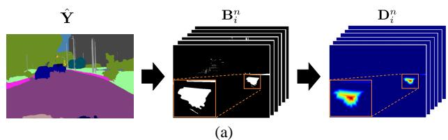

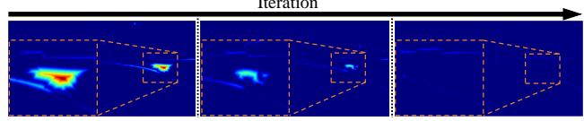  
(b)  
Fig. 5. Overview of the boundary-aware negative sampling strategy, illustrating its effectiveness in mitigating under- and over-segmentation during training. (a) The prediction map $\hat { \textbf { Y } }$ is decomposed into class-wise binary masks Bn . Then, the distance transform [77] is applied to generate classwise distance maps $\mathbf { D } _ { i } ^ { n }$ . (b) Visualization of the distance map progression across training iterations. Misclassified regions gradually diminish as training advances (best viewed in color).

Formally, each pixel value of distance map for each n-th class, $ { \mathbf Ḋ } _ { i } ^ { n } ( u , v )$ , is defined as follows:

$$
\mathbf { D } _ { i } ^ { n } ( u , v ) = \operatorname* { m i n } _ { ( x , y ) \in \mathbf { E } _ { i } ^ { n } } \sqrt { ( u - x ) ^ { 2 } + ( v - y ) ^ { 2 } } , \mathrm { s . t . } \ \mathbf { B } _ { i } ^ { n } ( u , v ) = 1 .\tag{14}
$$

This indicates that in the misclassified regions, where the pixel value of $\mathbf { B } _ { i } ^ { n }$ is one, i.e. white regions in Fig. 5(a), a smaller value in $\mathbf { D } _ { i } ^ { n }$ indicates that the corresponding pixel is more likely to be located near the object’s boundary, i.e. pixels corresponding to the boundary highlighted in blue inside the rightmost zoomed box in Fig. 5(a).

Finally, from the regions where $\mathbf { B } _ { i } ^ { n } = 1$ , we select embedding vectors corresponding to the lowest $K _ { s }$ percentile of distances in $\mathbf { D } _ { i } ^ { n }$ , where $K _ { s }$ is a hyperparameter that uniformly controls the selection ratio across all encoder layers. These selected embeddings serve as harder negative samples for each n-th representative anchor. By integrating these more challenging negative samples into (6), Contextrast++ enhances contrastive learning by encouraging feature representations to move closer to the anchor of the true class while increasing their distance from the anchors of incorrect classes. Consequently, these boundary-aware negative samples contribute to a more accurate modeling of inter-class spatial dependencies, thereby enhancing the network’s discriminative power against negative samples.

## IV. EXPERIMENT

## A. Experimental setup

Datasets. We evaluate on five public datasets. Cityscapes [13] contains 5,000 urban scene images (2,975/500/1,525 train/val/test) annotated with 19 semantic classes. ADE20K [17] contains 20,210 train and 2,000 validation images across 150 semantic categories. PASCAL-C [14] contains 4,998 train and 5,105 test images across 59 classes. COCO-Stuff [15] contains 9,000 train and 1,000 test images, annotated with 171 classes comprising 80 object and 91 stuff categories. CamVid [16] contains 367 train, 101 validation, and 233 test images across 11 classes. All datasets exhibit long-tailed class distributions, where ADE20K, PASCAL-C, and COCO-Stuff present more severe imbalance due to their larger number of semantic categories and greater class diversity.

Training settings. All experiments were carried out using MMSegmentation [79] with ImageNet [12] pre-trained weights, and data augmentation including color jittering, horizontal flipping, and random scaling was applied during training. Detailed settings per dataset and backbone are provided in Table II. For Contextrast++, we use $\lambda _ { 1 } = 0 . 1 , \lambda _ { 2 } = 0 . 3 ,$ $\lambda _ { 3 } = 0 . 7 , \lambda _ { 4 } = 1 . 0$ in $( 5 ) , \alpha = 0 . 1$ in (12), $K _ { \mathcal { M } } = 1 0 0$ for the memory bank, and $K _ { s } = 5 0 \%$ for BANE sampling. Testtime evaluation follows common practice [19], [27], [30] with multi-scale inference and horizontal flipping, using scaling factors from 0.75 to 2.0 at intervals of 0.25.

Evaluation metric. We adopt mean Intersection over Union (mIoU) [58]–[62] as the primary evaluation metric. In addition, we employ boundary mIoU (B-mIoU) to specifically assess segmentation accuracy near object boundaries, defined as:

$$
\mathrm { B \mathrm { - } m I o U } = \frac { 1 } { N } \sum _ { n = 1 } ^ { N } \frac { \mathrm { T P } _ { \tau _ { B } } ^ { n } } { \mathrm { T P } _ { \tau _ { B } } ^ { n } + \mathrm { F P } _ { \tau _ { B } } ^ { n } + \mathrm { F N } _ { \tau _ { B } } ^ { n } } ,\tag{15}
$$

where $\tau _ { B }$ is the pixel threshold to adjust the distance from the boundary.

Compared state-of-the-art approaches. Since single-scale contrastive learning methods [58]–[60] (referred to as Pico [58], Pico+ [60], and Region [59]) are not fully opensourced, we report results from the original papers. Pico employs the InfoNCE loss [72], [73], Pico+ additionally generates synthetic negative samples, and Region incorporates an auxiliary loss $L _ { \mathrm { A u x } }$ . For multi-scale contrastive learning methods, we compare against Pissas et al. [61] (Multi) and Contextrast [62] as the primary baselines. Multi employs multi-scale and cross-scale contrastive losses $L _ { \mathrm { c m s } }$ and $L _ { \mathrm { { c c s } } } ,$ while Contextrast uses the pixel-to-anchor loss without adaptive fusion $L _ { \mathrm { P A } } ^ { - }$ . Our Contextrast++ further incorporates the anchor-to-anchor loss $L _ { \mathrm { A A } }$ with the adaptive fused pixel-toanchor loss $L _ { \mathrm { P A } }$

## B. Evaluation of semantic segmentation performance

Comparison with state-of-the-art approaches. As presented in Table III, Pico+ [60] enhanced the discriminative capability of contrastive learning by introducing synthetic negative samples, thereby outperforming Pico [58]. Additionally, incorporating auxiliary loss $L _ { \mathrm { A u x } }$ in Region [59] improved mIoU compared with Pico, which only uses cross-entropy loss $L _ { \mathrm { C E } }$ with InfoNCE loss LNCE. Although Multi [61] showed performance degradation on PASCAL-C, it generally achieved substantial performance improvements by leveraging multi-scale feature representations in contrastive learning. In contrast, Contextrast [62] demonstrated substantial performance gains across all datasets by leveraging multi-scale feature representations in contrastive learning. In particular, Contextrast++ achieved the highest performance improvement, as shown in Table III and Fig. 6.

TABLE II  
DETAILS OF THE EXPERIMENTAL SETUP AND THE BASELINE SEMANTIC SEGMENTATION MODELS FOR CONTRASTIVE LEARNING ACROSS DATASETS.
<table><tr><td rowspan="2">Dataset</td><td colspan="2">Method</td><td colspan="8">Training Settings</td></tr><tr><td>Model</td><td>Backbone</td><td>Crop size</td><td>Learning rate</td><td>Momentum</td><td>Weight decay</td><td>Optimizer</td><td>Lr scheduler</td><td>Batch size</td><td>Training steps</td></tr><tr><td rowspan="8">Cityscapes</td><td>DeepLabV3 [19]</td><td>D-ResNet-101</td><td>512×1024</td><td> $\overline { { 1 0 ^ { - 2 } } }$ </td><td>0.9</td><td> $5 \times 1 0 ^ { - 4 }$ </td><td>SGD</td><td>Poly</td><td>8</td><td>40K</td></tr><tr><td>HRNet [27]</td><td>HRNetV2-W48</td><td>512×1024</td><td> $1 0 ^ { - 2 }$ </td><td>0.9</td><td> $5 \times 1 0 ^ { - 4 }$ </td><td>SGD</td><td>Poly</td><td>8</td><td>40K</td></tr><tr><td>OCRNet [30]</td><td>HRNetV2-W48</td><td> $5 1 2 \times 1 0 2 4$ </td><td> $1 0 ^ { - 2 }$ </td><td>0.9</td><td> $5 \times 1 0 ^ { - 4 }$ </td><td>SGD</td><td>Poly</td><td>8</td><td>40K</td></tr><tr><td>UPerNet [22]</td><td>Swin-Tiny</td><td> $5 1 2 \times 1 0 2 4$ </td><td> $6 \times 1 0 ^ { - 5 }$ </td><td>0.9</td><td> $1 0 ^ { - 2 }$ </td><td>ADAMW</td><td>Linear</td><td>6</td><td>40K</td></tr><tr><td>MobileNetV2 [78]</td><td>D-ResNet-101</td><td> $5 1 2 \times 1 0 2 4$ </td><td> $1 0 ^ { - 2 }$ </td><td>0.9</td><td> $1 0 ^ { - 2 }$ </td><td>SGD</td><td>Poly</td><td>8</td><td>80K</td></tr><tr><td>Mask2Former [63]</td><td>Swin-Tiny</td><td> $5 1 2 \times 1 0 2 4$ </td><td> $1 0 ^ { - 4 }$ </td><td>0.9</td><td> $5 \times 1 0 ^ { - 2 }$ </td><td>ADAMW</td><td>Poly</td><td>8</td><td>90K</td></tr><tr><td>SegFormer [66]</td><td>MiT-B0</td><td>1024×1024</td><td> $6 \times 1 0 ^ { - 5 }$ </td><td>1.0</td><td> $1 0 ^ { - 2 }$ </td><td>ADAMW</td><td>Linear</td><td>8</td><td>160K</td></tr><tr><td>DeepLabV3 [19]</td><td>D-ResNet-101</td><td> $\overline { { 5 1 2 \times 5 1 2 } }$ </td><td> $\overline { { 1 0 ^ { - 2 } } }$ </td><td>0.9</td><td> $\overline { { 5 \times 1 0 ^ { - 4 } } }$ </td><td>SGD</td><td>Poly</td><td>12</td><td>80K</td></tr><tr><td rowspan="3">ADE20K</td><td>HRNet [27]</td><td>HRNetV2-W48</td><td> $5 1 2 \times 5 1 2$ </td><td>10-2</td><td>0.9</td><td> $5 \times 1 0 ^ { - 4 }$ </td><td>SGD</td><td>Poly</td><td>12</td><td>80K</td></tr><tr><td>OCRNet [30]</td><td>HRNetV2-W48</td><td> $5 1 2 \times 5 1 2$ </td><td>10-2</td><td>0.9</td><td> $5 \times 1 0 ^ { - 4 }$ </td><td>SGD</td><td>Poly</td><td>12</td><td>80K</td></tr><tr><td>DeepLabV3 [19]</td><td>D-ResNet-101</td><td> $\overline { { 5 1 2 \times 5 1 2 } }$ </td><td>10-2</td><td>0.9</td><td> $5 \times 1 0 ^ { - 4 }$ </td><td>SGD</td><td>Poly</td><td>16</td><td>60K</td></tr><tr><td rowspan="3">PASCAL-C</td><td></td><td>HRNetV2-W48</td><td> $5 1 2 \times 5 1 2$ </td><td> $1 0 ^ { - 2 }$ </td><td>0.9</td><td> $5 \times 1 0 ^ { - 4 }$ </td><td>SGD</td><td>Poly</td><td>16</td><td>60K</td></tr><tr><td>HRNet [27]</td><td>HRNetV2-W48</td><td> $5 1 2 \times 5 1 2$ </td><td> $1 0 ^ { - 2 }$ </td><td>0.9</td><td> $5 \times 1 0 ^ { - 4 }$ </td><td>SGD</td><td>Poly</td><td>16</td><td>60K</td></tr><tr><td>OCRNet [30]</td><td>D-ResNet-101</td><td>512×512</td><td> $\overline { { 1 0 ^ { - 2 } } }$ </td><td>0.9</td><td> $\overline { { 5 \times 1 0 ^ { - 4 } } }$ </td><td>SGD</td><td>Poly</td><td>16</td><td>60K</td></tr><tr><td rowspan="3">COCO-Stuff</td><td>DeepLabV3 [19]</td><td>HRNetV2-W48</td><td>512×512</td><td> $1 0 ^ { - 2 }$ </td><td>0.9</td><td> $5 \times 1 0 ^ { - 4 }$ </td><td>SGD</td><td>Poly</td><td>16</td><td>60K</td></tr><tr><td>HRNet [27] OCRNet [30]</td><td>HRNetV2-W48</td><td>512×512</td><td> $1 0 ^ { - 2 }$ </td><td>0.9</td><td>5×10−4</td><td>SGD</td><td>Poly</td><td>16</td><td>60K</td></tr><tr><td>DeepLabV3 [19]</td><td>D-ResNet-101</td><td>360×480</td><td> $2 \times 1 0 ^ { - 2 }$ </td><td>0.9</td><td>5×10−4</td><td>SGD</td><td>Poly</td><td>16</td><td>6K</td></tr><tr><td rowspan="3">CamVid</td><td>HRNet [27]</td><td>HRNetV2-W48</td><td>360×480</td><td> $2 \times 1 0 ^ { - 2 }$ </td><td>0.9</td><td> $5 \times 1 0 ^ { - 4 }$ </td><td>SGD</td><td>Poly</td><td>16</td><td>6K</td></tr><tr><td>OCRNet [30]</td><td>HRNetV2-W48</td><td>360×480</td><td> $2 \times 1 0 ^ { - 2 }$ </td><td>0.9</td><td> $5 \times 1 0 ^ { - 4 }$ </td><td>SGD</td><td>Poly</td><td>16</td><td>6K</td></tr><tr><td></td><td></td><td></td><td></td><td></td><td></td><td></td><td></td><td></td><td></td></tr></table>

TABLE III

COMPARISON OF SEGMENTATION PERFORMANCE BETWEEN OUR APPROACH AND RECENT CONTRASTIVE LEARNING-BASED METHODS ON PUBLIC DATASETS. EXPERIMENTS WERE CONDUCTED USING CNN-BASED BACKBONES, INCLUDING DEEPLABV3 [19], HRNET [27], AND OCRNET [30]. (·) INDICATES ABSOLUTE IMPROVEMENT IN PERCENTAGE POINTS (%P) OVER THE CORRESPONDING BASELINE.
<table><tr><td rowspan="2">Method</td><td colspan="2">Description</td><td colspan="5">Dataset [mIoU (%)]</td></tr><tr><td>Loss</td><td>Sampling</td><td>Cityscapes-val</td><td>ADE20K</td><td>PASCAL-C</td><td>COCO-Stuff</td><td>CamVid</td></tr><tr><td>DeepLabV3 [19]</td><td> $L _ { \mathrm { C E } }$ </td><td>None</td><td>77.12</td><td>42.85</td><td>52.83</td><td>36.04</td><td>78.80</td></tr><tr><td>DeepLabV3 + Multi [61]</td><td> $L _ { \mathrm { C E } } + L _ { \mathrm { c m s } } + L _ { \mathrm { c c s } }$ </td><td>Random</td><td>78.94 (+1.82)</td><td>43.86 (+1.01)</td><td>52.27 (-0.56)</td><td>36.34 (+0.30)</td><td>79.67 (+0.87)</td></tr><tr><td>DeepLabV3 + Contextrast [62]</td><td> $L _ { \mathrm { C E } } + L _ { \mathrm { P A } } ^ { - } { } ^ { * }$ </td><td>Boundary-aware</td><td>79.35 (+2.23)</td><td>44.12 (+1.27)</td><td>53.81 (+0.98)</td><td>36.55 (+0.51)</td><td>79.98 (+1.18)</td></tr><tr><td>DeepLabV3 + Contextrast++</td><td> ${ L _ { \mathrm { C E } } } + { L _ { \mathrm { P A } } } ^ { * } + { L _ { \mathrm { A A } } }$ </td><td>Boundary-aware</td><td>81.02 (+3.90)</td><td>45.93 (+3.08)</td><td>54.23 (+1.40)</td><td>36.97 (+0.93)</td><td>80.19 (+1.39)</td></tr><tr><td>HRNet [27]</td><td>LCE</td><td>None</td><td>78.48</td><td>41.52</td><td>51.96</td><td>36.04</td><td>82.17</td></tr><tr><td>HRNet + Pico [58]</td><td> $L _ { \mathrm { C E } } + L _ { \mathrm { N C E } }$ </td><td>Semi-hard</td><td>81.00 (+2.52)</td><td>N/A</td><td>N/A</td><td>N/A</td><td>N/A</td></tr><tr><td>HRNet + Pico+ [60]</td><td> $L _ { \mathrm { C E } } + L _ { \mathrm { N C E } }$ </td><td>Semi-hard</td><td>81.60 (+3.12)</td><td>N/A</td><td>N/A</td><td>N/A</td><td>N/A</td></tr><tr><td>HRNet + Region [59]</td><td> $L _ { \mathrm { C E } } + L _ { \mathrm { N C E } } + L _ { \mathrm { A u x } }$ </td><td>Random</td><td>81.90 (+3.42)</td><td>N/A</td><td>N/A</td><td>N/A</td><td>N/A</td></tr><tr><td>HRNet + Multi [61]</td><td> $L _ { \mathrm { C E } } + L _ { \mathrm { c m s } } + L _ { \mathrm { c c s } }$ </td><td>Random</td><td>81.50 (+3.02)</td><td>42.55 (+1.03)</td><td>52.17 (+0.21)</td><td>36.35 (+0.31)</td><td>83.14 (+0.97)</td></tr><tr><td>HRNet + Contextrast [62]</td><td> $L _ { \mathrm { C E } } + L _ { \mathrm { P A } } ^ { - } { ^ * }$ </td><td>Boundary-aware</td><td>82.20 (+3.72)</td><td>42.68 (+1.16)</td><td>52.91 (+0.95)</td><td>36.34 (+0.30)</td><td>84.33 (+2.16)</td></tr><tr><td>HRNet + Contextrast++</td><td> ${ L _ { \mathrm { C E } } } + { L _ { \mathrm { P A } } } ^ { * } + { L _ { \mathrm { A A } } }$ </td><td>Boundary-aware</td><td>82.87 (+4.39)</td><td>43.27 (+1.75)</td><td>54.31 (+2.35)</td><td>36.73 (+0.69)</td><td>84.54 (+2.37)</td></tr><tr><td>OCRNet [30]</td><td> $L _ { \mathrm { C E } }$ </td><td>None</td><td>79.95</td><td>41.29</td><td>53.25</td><td>38.08</td><td>82.69</td></tr><tr><td>OCRNet + Multi [61]</td><td> $L _ { \mathrm { C E } } + L _ { \mathrm { c m s } } + L _ { \mathrm { c c s } }$ </td><td>Random</td><td>81.51 (+1.56)</td><td>42.87 (+1.58)</td><td>52.78 (-0.47)</td><td>38.17 (+0.09)</td><td>83.82 (+1.13)</td></tr><tr><td>OCRNet + Contextrast [62]</td><td> $L _ { \mathrm { C E } } + L _ { \mathrm { P A } } ^ { - } { } ^ { * }$ </td><td>Boundary-aware</td><td>81.94 (+1.99)</td><td>42.87 (+1.58)</td><td>53.82 (+0.57)</td><td>38.34 (+0.26)</td><td>84.10 (+1.41)</td></tr><tr><td>OCRNet + Contextrast++</td><td> ${ L _ { \mathrm { C E } } } + { L _ { \mathrm { P A } } } ^ { * } + { L _ { \mathrm { A A } } }$ </td><td>Boundary-aware</td><td>82.92 (+2.97)</td><td>43.03 (+1.74)</td><td>53.96 (+0.71)</td><td>38.71 (+0.63)</td><td>84.32 (+1.63)</td></tr></table>

$\mathrm { ^ { \circ } L _ { P A } ^ { - } } / L _ { \mathrm { P A } } \mathrm { { : } }$ Pixel-to-anchor loss without/with our adaptive fusion module, respectively.

As presented in Figs. 7, 8, 9, and 10, qualitative results also demonstrate that our Contextrast++ more effectively addresses both over-segmentation and under-segmentation issues than other contrastive learning approaches. Notably, certain segments on the image plane exhibit substantial improvements, even when compared with Contextrast, highlighting the effectiveness of the additional modules introduced in Contextrast++. These results further validate the effectiveness of our approach in improving semantic segmentation accuracy, particularly in challenging regions where existing methods struggle. For instance, Contextrast++ enables the network to more accurately segment small objects that occupy only a few pixels on the image plane (Fig. 8), and also mitigates undersegmentation of objects, as well as over-segmentation in large background classes such as sea and ground (Fig. 10).

Therefore, these quantitative and qualitative results demonstrate that our proposed adaptive fusion module and additional AA loss introduced in (12) effectively enhance semantic segmentation performance.

Robustness against long-tailed distribution problem. To more thoroughly assess robustness under long-tailed distributions, we partitioned the classes into three subsets (head, mid, and tail), each containing an approximately equal number of classes based on their pixel frequency. As shown in Table IV, Contextrast++ achieves the highest accuracy across all groups, with notably larger gains for tail classes. Specifically, compared with Contextrast, Contextrast++ improves tail-class IoU by +1.51%p on Cityscapes, +4.01%p on PASCAL-C, +0.68%p on ADE20K, and +3.02%p on COCO-Stuff, demonstrating consistent advantages even on datasets with more severe imbalance.

These improvements primarily arise from the proposed $L _ { \mathrm { A A } }$ and the class-prioritized anchors in the memory bank, of which the latter maintains a balanced number of representative anchors for each class. Unlike the $L _ { \mathrm { P A } }$ using the mini-batch, this design provides a more stable and balanced supervisory signal, enhancing the representation quality of rare classes without degrading the performance of frequent classes. These quantitative results demonstrate that Contextrast++ effectively mitigates the long-tailed distribution problem and substantially enhances the representation of rare classes.

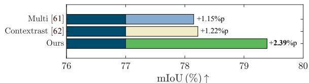

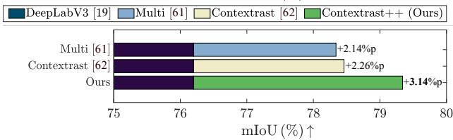  
HRNet [27]Multi [61] Contextrast [62] Contextrast++ (Ours)

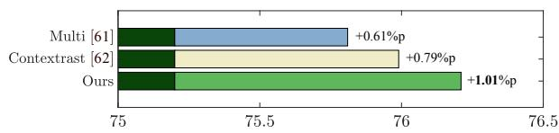  
mIoU (%)↑

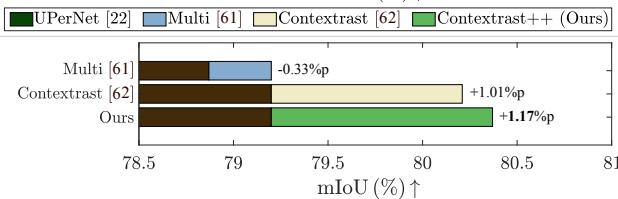  
OCRNet [30]Multi [61] Contextrast [62]Contextrast++ (Ours)  
Fig. 6. Semantic segmentation performance improvement of baseline architectures [19], [22], [27], [30] achieved via state-of-the-art contrastive learning methods evaluated on Cityscapes-test. Note that Multi [61] slightly degraded performance (−0.33%p) when applied to OCRNet [30]. As listed in Table II, we utilized the UPerNet framework with a Swin-Tiny backbone, replacing the original CNN-based architecture with a Transformer-based architecture.

TABLE IV  
COMPARISON OF PERFORMANCE ACROSS HEAD, MID, AND TAIL CLASSES ON CITYSCAPES-V A L, PASCAL-C, ADE20K, AND COCO-STUFF.
<table><tr><td rowspan="2">Method</td><td colspan="3">Cityscapes</td><td colspan="3">PASCAL-C</td><td colspan="3">ADE20K</td><td colspan="3">COCO-Stuff</td></tr><tr><td>Head</td><td>Mid</td><td>Tail</td><td>Head</td><td>Mid</td><td>Tail</td><td>Head</td><td>Mid</td><td>Tail</td><td>Head</td><td>Mid</td><td>Tail</td></tr><tr><td>HRNet [27]</td><td>90.67</td><td>74.05</td><td>72.54</td><td>69.24</td><td>57.35</td><td>27.54</td><td>55.69</td><td>34.62</td><td>32.44</td><td>62.2</td><td>34.08</td><td>12.27</td></tr><tr><td>HRNet + Multi [61]</td><td>90.64</td><td>73.61</td><td>77.32</td><td>69.44</td><td>57.52</td><td>27.78</td><td>56.88</td><td>36.37</td><td>32.80</td><td>62.47</td><td>34.21</td><td>14.52</td></tr><tr><td>HRNet + Contextrast [62]</td><td>90.91</td><td>74.90</td><td>79.46</td><td>69.84</td><td>58.61</td><td>28.35</td><td>56.40</td><td>36.70</td><td>32.86</td><td>62.41</td><td>34.66</td><td>14.15</td></tr><tr><td>HRNet + Contextrast++</td><td>90.91</td><td>75.46</td><td>80.97</td><td>70.31</td><td>59.11</td><td>32.36</td><td>57.52</td><td>36.86</td><td>33.54</td><td>62.76</td><td>35.45</td><td>17.17</td></tr></table>

Road Wall Bus FenceBuilding Bicycle Sidewalk CarRider Sky PolePerson Vegetation Traffic sign  
(a) Ground truth  
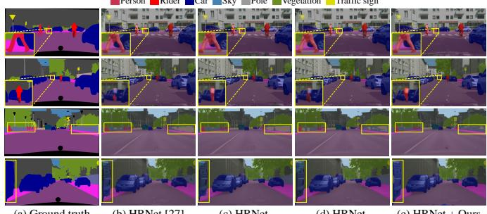  
(b) HRNet [27]  
(c) HRNet  
+ Multi [61]  
(d) HRNet  
+ Contextrast [62]  
(e) HRNet + Ours

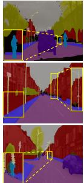  
(a) Ground truth

Tree Car Sky Road Pole Building Bicyclist Pedestrian Sidewalk Traffic sign  
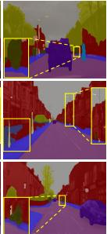  
(b) HRNet [27]

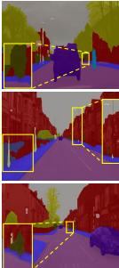

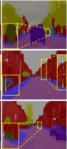  
(c) HRNet

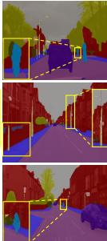  
+ Multi [61]  
(d) HRNet  
+ Contextrast [62]  
(e) HRNet + Ours  
Fig. 7. Visualization of (a) ground truth, (b) HRNet [27], (c) HRNet + Multi [61], (d) HRNet + Contextrast [62], and (e) HRNet + Ours on Cityscapes-val (best viewed in color). Note that Contextrast++ effectively distinguishes small objects (first and second rows), accurately classifies the wall, which contains excessive local context that makes prediction challenging (third row), and improves predictions on partially occluded or cropped objects near image boundaries (fourth row).  
Fig. 8. Visualization of (a) ground truth, (b) HRNet [27], (c) HRNet + Multi [61], (d) HRNet + Contextrast [62], and (e) HRNet + Ours on the CamVid dataset (best viewed in color). While all methods perform well on the CamVid dataset, our Contextrast++ effectively distinguishes small objects on the image plane, such as bicyclists and poles.

Robustness on boundary regions and small objects. As shown in Figs. 9 and 10, Contextrast++ produces more accurate segmentation along object boundaries on the ADE20K and COCO-Stuff datasets, which contain over 100 classes and thus exhibit more complex class distributions than Cityscapes and CamVid. Quantitatively, Fig. 11 shows that Contextrast [62] and Contextrast++ improve B-mIoU over Multi [61] by integrating BANE sampling into a multi-scale contrastive learning framework. Notably, Contextrast++ further outperforms Contextrast by leveraging the adaptive fusion module to dynamically aggregate local and global contexts.

We further conducted an object scale-based mIoU evaluation, categorizing objects into four groups by pixel size: tiny (up to 16  16), small (up to 32  32), medium (up to 96 96), and large (larger than 96 96). As shown in Table V, Contextrast++ consistently outperforms the baselines across all groups, with notable gains at finer scales. These results indicate that the adaptive fusion module and BANE sampling jointly enhance fine-grained feature learning: the former by balancing local and global contexts and the latter by focusing on boundary regions, yielding robust segmentation in small object and boundary regions.

Generalizability of Contextrast++. To further assess the generalizability of Contextrast++, we evaluated its performance across diverse backbone architectures and datasets. Table VI presents results on Cityscapes-val, where Contextrast++ proves effective not only with the large CNN-based architectures used in Table III, but also with a lightweight CNN-based architecture [78] and Transformer-based architectures [22], [63], [66]. Table VII further evaluates Contextrast++ on ADE20K with Transformer-based backbones, including Mask2Former [63] and SegFormer [66], where Contextrast++ consistently yields improvements over both Multi [61] and Contextrast [62] across all backbones. These results confirm that Contextrast++ is an architecture-agnostic and generalizable contrastive learning framework.

Sky Tree Plant Chair Water House Building Road Sidewalk Person Signboard Pole Book Trade name Windowpane Floor Flower Armchair Cushion Plate Vase Bed Pillow Blind  
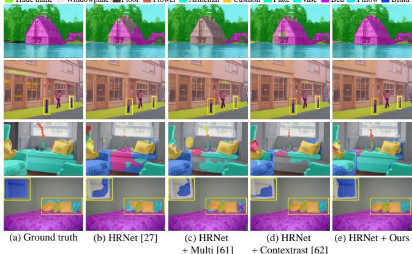  
Fig. 9. Visualization of (a) ground truth, (b) HRNet [27], (c) HRNet + Multi [61], (d) HRNet + Contextrast [62], and (e) HRNet + Ours on the ADE20K dataset (best viewed in color). Note that Contextrast++ yields consistent semantic segmentation performance (first row) and provides more precise segmentation results for small objects than existing state-of-the-art methods (second to fourth rows).

Cake Hill Sheep Sand Sea PersonBuilding-other Suitcase Potted plant Sky-other Grass Pavement Plant-other Wall-stone  
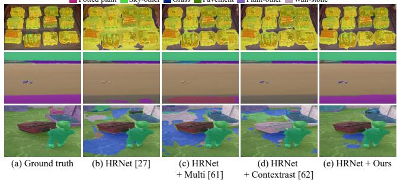  
Fig. 10. Visualization of (a) ground truth, (b) HRNet [27], (c) HRNet + Multi [61], (d) HRNet + Contextrast [62], and (e) HRNet + Ours on the COCO-Stuff dataset (best viewed in color). Our Contextrast++ mitigates under-segmentation of objects as well as over-segmentation in large background classes, such as sea and ground, by refining boundary details.

## C. Ablation studies

Effectiveness of individual components. To evaluate the effect of each individual module in Contextrast++, we performed a comprehensive ablation study. As shown in Table VIII, each additional module introduced in Contextrast++, i.e. the adaptive fusion module, $L _ { \mathrm { A A } }$ , and BANE sampling, substantially improved semantic segmentation performance.

Specifically, replacing the static fusion module, i.e. (2), with our adaptive fusion module, i.e. (3), enhanced the performance by effectively balancing global and local contexts, resulting in better anchor representation. Employing $L _ { \mathrm { A A } }$ also improved performance by balancing class-wise samples in contrastive learning, thereby addressing the long-tailed distribution issue. Additionally, instead of semi-hard sampling [58], which selects negative samples based on cosine similarity, adopting BANE sampling led to better performance by selecting more informative negative samples. When combining all the proposed methods, the model achieved the highest mIoU, 82.87%, demonstrating the importance of each proposed component in this paper.

TABLE V  
PERFORMANCE COMPARISON OF MIOU ACROSS DIFFERENT OBJECT SCALES ON THE PASCAL-C AND ADE20K DATASETS. THE EVALUATION IS CATEGORIZED INTO FOUR GROUPS BASED ON OBJECT PIXEL SIZE.
<table><tr><td rowspan="2">Method</td><td colspan="4">PASCAL-C</td></tr><tr><td>Large</td><td>Medium</td><td>Small</td><td>Tiny</td></tr><tr><td>HRNet + Multi [61]</td><td>52.90</td><td>17.12</td><td>9.35</td><td>5.1</td></tr><tr><td>HRNet + Contextrast [62]</td><td>53.61</td><td>16.54</td><td>9.4</td><td>5.24</td></tr><tr><td>HRNet + Contextrast++</td><td>54.86</td><td>19.86</td><td>11.51</td><td>6.51</td></tr><tr><td rowspan="2">Method</td><td></td><td colspan="3">ADE20K</td></tr><tr><td>Large</td><td>Medium</td><td>Small</td><td>Tiny</td></tr><tr><td>HRNet + Multi [61]</td><td>43.55</td><td>11.93</td><td>6.44</td><td>5.2</td></tr><tr><td>HRNet + Contextrast [62]</td><td>43.63</td><td>11.84</td><td>6.26</td><td>4.82</td></tr><tr><td>HRNet + Contextrast++</td><td>44.27</td><td>12.07</td><td>6.47</td><td>5.25</td></tr></table>

TABLE VI

QUANTITATIVE COMPARISON ON CITYSCAPES-VAL USING LIGHTWEIGHT AND TRANSFORMER-BASED (UPERNET WITH A SWIN) BACKBONES.
<table><tr><td rowspan=1 colspan=1>Lightweight backbone</td><td rowspan=1 colspan=1>mIoU (%)</td></tr><tr><td rowspan=1 colspan=1>MobileNetV2 [78]MobileNetV2 + Pico [58]MobileNetV2 + Pico+ [60]MobileNetV2 + Multi [61]MobileNetV2 + Contextrast [62]</td><td rowspan=1 colspan=1>71.3072.30 (+1.00)72.60 (+1.30)77.58 (+6.28)78.21 (+6.91)</td></tr><tr><td rowspan=1 colspan=1>MobileNetV2 + Contextrast++</td><td rowspan=1 colspan=1>78.34 (+7.04)</td></tr><tr><td rowspan=1 colspan=1>Transformer-based backbone</td><td rowspan=1 colspan=1>mIoU (%)</td></tr><tr><td rowspan=1 colspan=1>UPerNet [22]UPerNet + Multi [61]UPerNet + Contextrast [62]</td><td rowspan=1 colspan=1>77.7578.72 (+0.97)79.26 (+1.51)</td></tr><tr><td rowspan=1 colspan=1>UPerNet + Contextrast++</td><td rowspan=1 colspan=1>79.63 (+1.88)</td></tr><tr><td rowspan=1 colspan=1>Mask2Former [63] (Swin-t)Mask2Former + Multi [61]Mask2Former + Contextrast [62]</td><td rowspan=1 colspan=1>81.8782.59 (+0.72)81.58 (-0.29)</td></tr><tr><td rowspan=1 colspan=1>Mask2Former + Contextrast++</td><td rowspan=1 colspan=1>82.92 (+1.05)</td></tr><tr><td rowspan=1 colspan=1>SegFormer [66] (MiT-B0)SegFormer + Multi [61]SegFormer + Contextrast [62]</td><td rowspan=1 colspan=1>78.2276.19 (-2.03)78.41 (+0.19)</td></tr><tr><td rowspan=1 colspan=1> $\mathrm { S e g F o r m e r + C o n t e x t r a s t { + + } }$ </td><td rowspan=1 colspan=1>78.55 (+0.33)</td></tr></table>

Effect of multi-scale feature aggregation. Table IX provides a comprehensive ablation study on the contribution of each encoder layer. When only a single scale is used, corresponding to the first and the last rows, respectively, performance drops noticeably. This indicates that no single layer captures a sufficiently comprehensive set of semantic and fine-detailed features.

In particular, removing global semantic features leads to the largest degradation, as evidenced by the first three rows in Table IX, reflecting their essential role in capturing global semantics and object-level structure. Conversely, removing fine-grained features also negatively impacts performance, as evidenced by the last three rows in Table IX, as these layers contain fine-grained spatial details crucial for boundary delineation and small object discrimination.

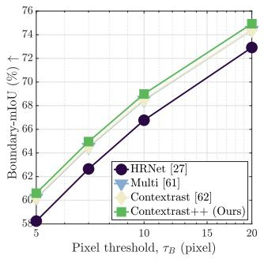

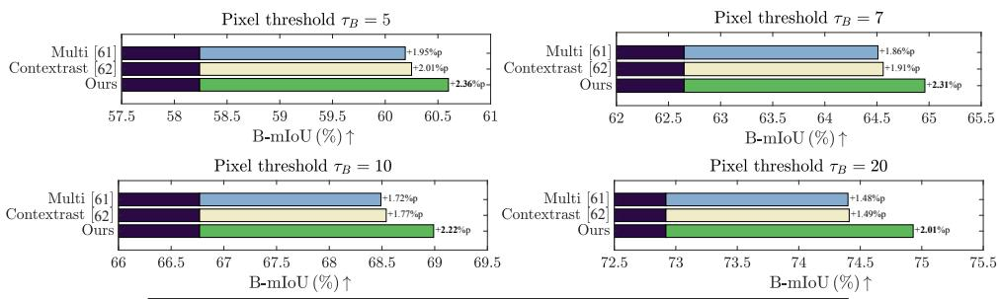  
HRNet [27] Multi [61] Contextrast [62] Contextrast++ (Ours)  
Fig. 11. Comparison of boundary mIoU (B-mIoU) performance improvements across state-of-the-art methods on Cityscapes-val using HRNet [27] as the baseline model. We report B-mIoU and the absolute gain in percentage points at each pixel threshold $\tau _ { B }$

TABLE VII  
QUANTITATIVE COMPARISON ON ADE20K USING TRANSFORMER-BASED BACKBONES.
<table><tr><td rowspan=1 colspan=1>Method</td><td rowspan=1 colspan=1>mIoU (%)</td></tr><tr><td rowspan=1 colspan=1>Mask2Former [63] (Swin-t)Mask2Former + Multi [61]Mask2Former + Contextrast [62]</td><td rowspan=1 colspan=1>47.1247.32 (+0.20)47.73 (+0.61)</td></tr><tr><td rowspan=1 colspan=1>Mask2Former + Contextrast++</td><td rowspan=1 colspan=1>48.07 (+0.95)</td></tr><tr><td rowspan=1 colspan=1>SegFormer [66] (MiT-B0)SegFormer + Multi [61]SegFormer + Contextrast [62]</td><td rowspan=1 colspan=1>37.7837.90 (+0.12)37.84 (+0.06)</td></tr><tr><td rowspan=1 colspan=1>SegFormer + Contextrast++</td><td rowspan=1 colspan=1>38.00 (+0.22)</td></tr><tr><td rowspan=1 colspan=1>SegFormer [66] (MiT-B1)SegFormer + Multi [61]SegFormer + Contextrast [62]</td><td rowspan=1 colspan=1>41.2141.91 (+0.70)42.10 (+0.89)</td></tr><tr><td rowspan=1 colspan=1>SegFormer + Contextrast++</td><td rowspan=1 colspan=1>42.36 (+1.15)</td></tr></table>

TABLE VIII  
ABLATION STUDY OF EACH MODULE ON CITYSCAPES-V A L.
<table><tr><td rowspan=1 colspan=1>Fusion</td><td rowspan=1 colspan=1>Balancing</td><td rowspan=1 colspan=1>Sampling</td><td rowspan=2 colspan=2>mIoU (%)</td></tr><tr><td rowspan=1 colspan=1>Adaptive fusion</td><td rowspan=1 colspan=1> $\overline { { L _ { \mathrm { A A } } } }$ </td><td rowspan=1 colspan=1>Semi-hard  BANE</td><td rowspan=1 colspan=1></td></tr><tr><td rowspan=2 colspan=1>√√ $\checkmark$  $\checkmark$ </td><td rowspan=2 colspan=1> $\checkmark$ </td><td rowspan=2 colspan=1>√√</td><td rowspan=1 colspan=2>82.18</td></tr><tr><td rowspan=1 colspan=2>82.3582.2382.44</td></tr><tr><td rowspan=1 colspan=1> $\checkmark$ </td><td rowspan=1 colspan=1> $\checkmark$ </td><td rowspan=1 colspan=1>√</td><td rowspan=1 colspan=2>82.87</td></tr></table>

Performance consistently improves as more scales are combined, demonstrating that each scale provides complementary cues. The best result is achieved when all four scales are aggregated, confirming that Contextrast++ benefits from fine details in early layers and semantically rich information in deeper layers.

This experiment highlights the importance of multi-scale integration and further distinguishes our method from Multi [61], which aggregates only a subset of layers, thereby limiting the exploitation of complementary multi-level contextual information.

Impact of weight settings for contrastive learning. We conducted experiments with various hyperparameter combinations to determine the optimal weight settings for multi-scale contrastive loss. First, we tuned the hyperparameters $\lambda _ { i }$ in (5) to balance the contributions of different scale levels. As shown in Table X, a setting of $\lambda _ { 1 } = 0 . 1 , \lambda _ { 2 } = 0 . 3 , \lambda _ { 3 } = 0 . 7$ , and $\lambda _ { 4 } = 1 . 0$ achieved the highest mIoU of 82.87%.

TABLE IX  
ABLATION STUDY OF THE EFFECT OF MULTI-SCALE AGGREGATION IN CONTEXTRAST++ ON CITYSCAPES-VAL.
<table><tr><td>1st Layer</td><td>2nd Layer</td><td>3rd Layer</td><td>4th Layer</td><td>mIoU (%)</td></tr><tr><td></td><td></td><td></td><td></td><td>81.02 (-1.85)</td></tr><tr><td>√</td><td>√</td><td></td><td></td><td>81.61 (-1.26)</td></tr><tr><td>√</td><td>√</td><td>√</td><td></td><td>81.79 (-1.08)</td></tr><tr><td>√</td><td>√</td><td>√</td><td>√</td><td>82.87</td></tr><tr><td></td><td>√</td><td>√</td><td>√</td><td>82.36 (-0.51)</td></tr><tr><td></td><td></td><td>√</td><td>√</td><td>82.19 (-0.68)</td></tr><tr><td></td><td></td><td></td><td>√</td><td>81.89 (-0.89)</td></tr></table>

TABLE X

COMPARISON OF DIFFERENT WEIGHT SETTINGS WITH THE CITYSCAPES-V A L.
<table><tr><td> $\overline { { \lambda _ { 1 } } }$ </td><td> $\overline { { \lambda _ { 2 } } }$  λ3</td><td>λ₄</td><td>mIoU (%)</td></tr><tr><td>1.0 1.0</td><td>1.0</td><td>1.0</td><td>82.27</td></tr><tr><td>1.0 0.8</td><td>0.6</td><td>0.4</td><td>82.56</td></tr><tr><td>1.0 0.75</td><td>0.5</td><td>0.25</td><td>79.81</td></tr><tr><td>1.0</td><td>0.7 0.4</td><td>0.1</td><td>81.46</td></tr><tr><td>0.1</td><td>0.3 0.7</td><td>1.0</td><td>82.87</td></tr><tr><td>0.1</td><td>0.4 0.7</td><td>1.0</td><td>82.55</td></tr><tr><td>0.25 0.5</td><td>0.75</td><td>1.0</td><td>82.23</td></tr><tr><td>0.4 0.6</td><td>0.8</td><td>1.0</td><td>80.65</td></tr></table>

One interesting aspect is that when $\lambda _ { 3 }$ and $\lambda _ { 4 }$ are set to smaller values, performance drops noticeably; see the third and fourth rows of Table X. These results suggest that balancing contributions from different layers plays a key role in overall performance. While deeper-layer features capture more global context and earlier-layer features focus on local details, adjusting their relative contributions does not lead to a straightforward increase or decrease in performance. Instead, we empirically observed that an appropriate balance between global and local features leads to better segmentation performance.

After optimizing $\lambda _ { i } ,$ we further tuned the weight α to balance the contributions of cross-entropy loss and contrastive loss. As presented in Fig. 13(a), α = 0.1 yielded the best performance, suggesting that an excessively strong influence of the contrastive loss may hinder effective training.

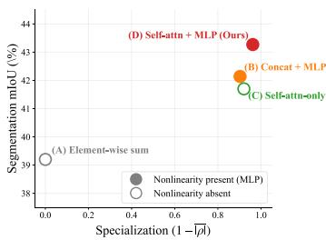  
(a)

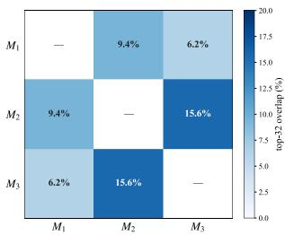  
(b)  
Fig. 12. (a) Design-space view of fusion variants on ADE20K, positioned by channel specialization $1 - | \overline { { \rho | } }$ (x-axis) and mIoU (y-axis); filled/open circles encode the presence/absence of MLP. Our adaptive fusion module occupies the upper-right corner, whereas Concat + MLP and the Self-Attention-only variant fail symmetrically, showing that neither property alone suffices. (b) Pairwise top-32 channel overlap between modules $\bar { M _ { i } }$ and $M _ { j }$ on ADE20K. The low mean overlap confirms that the three modules attend to largely disjoint channel subsets.

TABLE XI  
COMPARISON OF THE ADAPTIVE FUSION MODULE ON CITYSCAPES-V A L.
<table><tr><td>Method</td><td>mIoU (%)</td></tr><tr><td>Concat + MLP Multi-head self-attention [71]</td><td>82.30 82.37</td></tr><tr><td>Cross-attention [71]</td><td>82.14</td></tr><tr><td>Self-attention + weighted sum</td><td>82.39</td></tr><tr><td>Self-attention + element-wise sum + MLP</td><td>81.62</td></tr><tr><td>Gated fusion (scalar)</td><td>82.36</td></tr><tr><td>Gated fusion (channel-wise)</td><td></td></tr><tr><td>Adaptive fusion module (Ours)</td><td>80.46 82.87</td></tr></table>

Design space analysis of the adaptive fusion module. To establish that the Self-Attention + MLP design is principled rather than incidental, we decompose the space of fusion architectures along two axes that together govern the function each module computes: (i) channel specialization, the degree to which the three fusion modules $\{ M _ { 1 } , M _ { 2 } , M _ { 3 } \}$ attend to mutually distinct channel subsets, and (ii) nonlinear channel refinement, the existence of a non-affine transformation that maps fused activations to class-discriminative representations.

To quantify channel specialization, for each fusion module $M _ { i }$ with input $z \in \mathbb { R } ^ { d \times H _ { i } \times W _ { i } }$ i and output $y = M _ { i } ( z )$ , we define a per-channel sensitivity vector $\mathbf { s } ^ { ( i ) } = ( s _ { 1 } ^ { ( i ) } , \ldots , s _ { d } ^ { ( i ) } ) \in$ $\mathbb { R } ^ { d }$ , where

$$
s _ { c } ^ { ( i ) } = \sqrt { \mathbb { E } _ { x } \left. \partial y / \partial z _ { c } \right. _ { F } ^ { 2 } }\tag{16}
$$

measures how strongly the output responds, in expectation over validation inputs x, to perturbations of input channel $c ;$ $\| \cdot \| _ { F }$ denotes the Frobenius norm. The squared Jacobiancolumn norm is computed with a Hutchinson estimator [80], [81]. The specialization score is then $1 - | { \overline { { \rho } } } | ,$ , where $| \rho | =$ $\begin{array} { r } { \frac { 1 } { 3 } \sum _ { i < j } | \rho (  { \mathbf { s } } ^ { ( i ) } ,  { \mathbf { s } } ^ { ( j ) } ) | } \end{array}$ is the mean absolute Spearman rank correlation across the three module pairs.

Fig. 12(a) places four fusion variants on the plane spanned by $1 - | \overline { { \rho | } }$ and mIoU on ADE20K. Element-wise summation (A) lacks per-module parameters, producing functionally indistinguishable modules and the lowest accuracy. Concat + MLP (B) and Self-Attention-only (C) sit at opposite corners of the design space yet degrade by comparable margins: the input-independent routing of (B) collapses channel preferences across modules, whereas the orthogonal channel rankings of (C) cannot be transformed into class-discriminative features without a point-wise nonlinearity. Ours (D) occupies the upper-right corner with the highest specialization and mIoU, confirming that neither property alone suffices and that their conjunction is what couples channel-level orthogonality to segmentation accuracy.

TABLE XII  
PERFORMANCE COMPARISON UNDER DIFFERENT ANCHOR SELECTION STRATEGIES FOR CLASS-PRIORITIZED ANCHORS.
<table><tr><td>Anchor selection strategy</td><td>mIoU (%)</td></tr><tr><td>Earliest layer</td><td>81.73</td></tr><tr><td>Average across layer</td><td>82.36</td></tr><tr><td>Deepest layer (Ours)</td><td>82.87</td></tr></table>

TABLE XIII

PERFORMANCE COMPARISON OF DIFFERENT MEMORY BANK TYPES WITH THE SAME MEMORY BUDGET.
<table><tr><td rowspan=1 colspan=1>Memory bank type</td><td rowspan=1 colspan=1>mIoU (%)</td></tr><tr><td rowspan=1 colspan=1>Pixel memory [58], [60]</td><td rowspan=1 colspan=1>81.94</td></tr><tr><td rowspan=1 colspan=1>Anchor memory (Ours)</td><td rowspan=1 colspan=1>82.87</td></tr></table>

Fig. 12(b) confirms this finding at the top-K level by reporting pairwise overlap among the 32 channels of highest sensitivity in each $\mathbf { s } ^ { ( i ) }$ : the mean overlap is only 10.4%, and the largest pair $( M _ { 2 } { - } M _ { 3 } , 1 5 . 6 \% )$ is an expected consequence of $M _ { 2 }$ and $M _ { 3 }$ operating on adjacent scales. The agreement between the global rank-level statistic and the local top-K set-overlap statistic, computed independently on the same attribution maps but probing different scales of the channel distribution, indicates that the observed orthogonality is a property of the learned representation.

Performance comparison in the adaptive fusion module. We conducted an extensive ablation study that includes fusion variants inspired by existing multi-scale fusion methods [67]– [69], in order to evaluate alternative strategies within the adaptive fusion module. These variants were designed to emulate the core fusion behaviors of existing approaches: concatenation with an MLP layer (referred to as concat + MLP) and channel-attention [67], weighted-sum gating [69], and element-wise summation after resolution alignment [68]. This setup allows a direct empirical comparison within our framework.

As shown in Table XI, the Concat + MLP underperforms because it treats all channels uniformly and cannot capture the relative importance of multi-scale anchors. Multi-head self-attention also results in inferior performance. Note that multi-head self-attention is applied to a single anchor vector; the multi-head mechanism unnecessarily fragments the 256- dimensional global semantics into smaller subspaces, hindering the capture of holistic channel correlations. Cross-attention performs worse due to semantic mismatch between anchors from different layers, which makes cross-scale alignment difficult and injects noise. Self-attention variants that use weighted or element-wise summation also degrade performance, either by retaining the limitations of static weighting or by discarding complementary information before projection. Gated fusion provides modest benefits but is still less effective overall, especially in the channel-wise case where overly aggressive suppression leads to unstable representations.

TABLE XIV  
ABLATION STUDY ON MEMORY BANK DESIGNS VARYING WITH SELECTION CRITERIA.
<table><tr><td>Memory bank design</td><td>mIoU (%)</td></tr><tr><td>Earliest layer</td><td>81.63</td></tr><tr><td>Deepest layer</td><td>81.79</td></tr><tr><td>All layers</td><td>80.00</td></tr><tr><td>Class-prioritized anchor (Ours)</td><td>82.87</td></tr></table>

In contrast, our adaptive fusion module exhibits the best performance by enabling channel-wise refinement while preserving complementary information across scales through subsequent concatenation and projection, producing more discriminative multi-scale anchor representations.

Impact of class-prioritized anchor selection. To examine the effectiveness of the class-prioritized anchor design, we compared three anchor selection strategies: selecting anchors from the earliest layer, averaging across all layers, and selecting from the deepest layer. As shown in Table XII, earliest-layer anchors yield the lowest performance due to their limited semantic abstraction and higher sensitivity to local noise. While averaging across layers improves performance by incorporating multi-scale cues, it dilutes the representation through uneven semantic abstraction. Selecting anchors from the deepest layer achieves the best performance, validating our choice to use these deepest-layer anchors as the foundation for our class-prioritized anchors in $L _ { \mathrm { A A } }$

Impact of memory bank size and design. We analyzed the impact of memory bank size, defined as the product of the number of classes N and the number of stored features per class $K _ { \mathcal { M } } .$ . As illustrated in Fig. 13(b), performance peaked at $K _ { \mathcal { M } } = 1 0 0$ and declined thereafter, with a more noticeable drop at $K _ { \mathcal { M } } = 4 0 0$ . This decline arises because an excessively large memory bank causes $L _ { \mathrm { A A } }$ to dominate the overall objective in (12), suppressing other loss terms and reducing feature diversity. We further compared memory bank designs. Table XIII shows that our anchor-level memory outperforms pixel-level memory [58], [60] by providing a semantically richer representation. Within the anchor memory, Table XIV compares anchor selection strategies: using anchors from a single layer or all layers yields lower performance, whereas our class-prioritized design achieves the best performance of 82.87% mIoU, confirming its suitability for multi-scale structures and class imbalance mitigation.

BANE sampling analysis. To validate the motivation for BANE sampling, we examined how the difficulty of negative samples varies with their distance from the boundaries. For each encoder layer, we computed the cosine similarity between misclassified pixels and the class anchors. As shown in Fig. 14, negative samples located closer to boundaries consistently exhibit lower cosine similarity, demonstrating that boundaryadjacent negative samples constitute inherently harder negative samples.

Impact of sampling ratio in BANE sampling. We evaluate the impact of BANE sampling by testing multiple values of the sampling ratio $K _ { s } .$ As shown in Fig. 13(c), performance peaks at a 50% sampling ratio and deteriorates as the proportion of negative samples grows excessively large, since optimizing deep metric learning with the hardest negative examples can lead to local minima in the early stage of training [82]–[85].

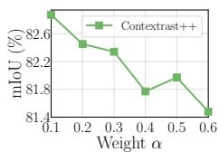  
(a)

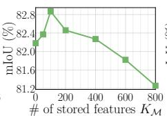  
(b)

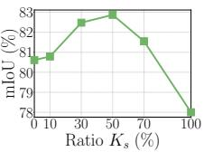  
(c)

Fig. 13. Performance analyses on Cityscapes-val with HRNet [27]: Performance changes with (a) the hyperparameter weight α in ((12)), (b) number of stored features per class $K _ { \mathcal { M } }$ , and (c) sampling ratio $K _ { s }$ for the boundaryaware negative sampling.  
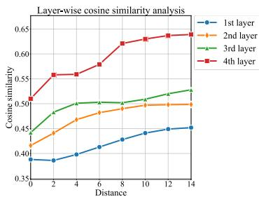  
Fig. 14. Average cosine similarity between misclassified pixels and representative anchors at each layer of HRNet [27] on Cityscapes-val, measured as a function of distance from incorrect prediction boundaries. Boundaryadjacent samples consistently exhibit lower cosine similarity, indicating that they constitute harder negative samples than inner-region samples.

Comparison of memory efficiency. To evaluate the computational efficiency of Contextrast++, we first compared FLOPs and parameter counts, as shown in Table XV. Note that because contrastive learning components are used only during training, all contrastive methods introduce no additional FLOPs during inference. Thus, the main difference lies in training-time parameters. Multi [61] and Contextrast [62] use the same number of projection heads and therefore share identical parameter counts, whereas Contextrast++ introduces a lightweight self-attention module that results in only a small parameter increase.

To more concretely assess the overhead, we measured average GPU memory usage and training time on Cityscapesval, as shown in Table XVI. Relative to Contextrast, Contextrast++ adds only 136 MiB of memory and 21 minutes of training time during the entire schedule, while leaving inference unchanged. This minimal overhead demonstrates that Contextrast++ improves multi-scale contextual modeling and long-tailed robustness without compromising practical training efficiency.

## D. Qualitative analyses of feature representations

This subsection presents additional feature-level analyses using qualitative visualizations. Specifically, we examine the final-layer feature maps, gradient-weighted class activation mapping (Grad-CAM) [86].

(c) HRNet + Multi [61]  
TABLE XV  
COMPARISON OF FLOPS AND THE TOTAL NUMBER OF PARAMETERS FOR EACH CONTRASTIVE LEARNING METHOD ON CITYSCAPES-VAL.
<table><tr><td rowspan=1 colspan=1>Method</td><td rowspan=1 colspan=1>FLOPs</td><td rowspan=1 colspan=1>Params</td><td rowspan=1 colspan=1>mIoU (%)</td></tr><tr><td rowspan=2 colspan=1>HRNet [27]HRNet + Multi [61]HRNet + Contextrast [62]</td><td rowspan=2 colspan=1>187.87G187.87G187.87G</td><td rowspan=1 colspan=1>65.86M</td><td rowspan=1 colspan=1>78.48</td></tr><tr><td rowspan=1 colspan=1>66.24M66.24M</td><td rowspan=1 colspan=1>81.5082.20</td></tr><tr><td rowspan=1 colspan=1>HRNet + Contextrast++</td><td rowspan=1 colspan=1>187.87G</td><td rowspan=1 colspan=1>67.82M</td><td rowspan=1 colspan=1>82.87</td></tr></table>

TABLE XVI

COMPARISON OF MEMORY USAGE AND AVERAGE TRAINING TIME ON CITYSCAPES-V AL.
<table><tr><td>Method</td><td>Memory (MiB)</td><td>Avg. training time (hours:minutes)</td></tr><tr><td>HRNet [27]</td><td>26,692</td><td>8:58</td></tr><tr><td>HRNet + Multi [61]</td><td>27,688</td><td>9:52</td></tr><tr><td>HRNet + Contextrast [62]</td><td>27,788</td><td>10:01</td></tr><tr><td>+ Adaptive fusion module</td><td>27,862</td><td>10:17</td></tr><tr><td>+ AA loss + Memory bank</td><td>27,844</td><td>10:10</td></tr><tr><td>HRNet + Contextrast++</td><td>27,924</td><td>10:22</td></tr></table>

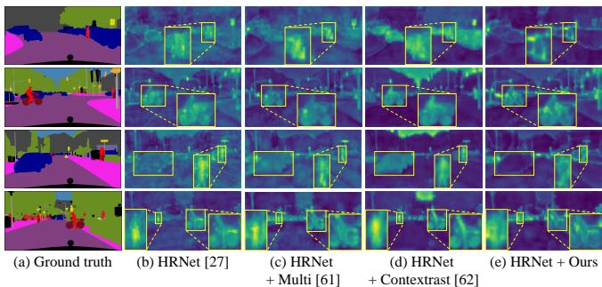  
Fig. 15. Feature map visualization on Cityscapes-val. (a) Ground truth, (b) HRNet [27], (c) HRNet + Multi [61], (d) HRNet + Contextrast [62], and (e) HRNet + Ours. The visualizations in (b)–(e) show feature activation maps, where brighter (yellow) regions indicate stronger activations and greater model focus. Zoomed-in boxes highlight areas where our method attends more accurately to small objects and fine-grained boundaries (best viewed in color).

Visualization with feature map highlighting. As presented in Fig. 15, the feature activation maps also demonstrate that Contextrast++ achieves improvements in focus, precision, and adaptability compared with existing methods. While HRNet with Multi or with Contextrast showed refined global contexts at the object level, these approaches occasionally lost finegrained local details, particularly along object boundaries; see the zoomed-in boxes that highlight activated features for the person and bicyclist classes in Fig. 15. In contrast, Contextrast++ produced more emphasized and consistent object boundaries than Multi and Contextrast, owing to its ability to achieve a better balance between local and global contexts. For instance, the bicyclist and motorcycle classes were more clearly distinguishable in the feature maps; see the second and fourth rows in Fig. 15.

Visualization with Grad-CAM. Grad-CAM highlights classspecific key regions on the image plane where the model attends during prediction. As illustrated in Fig. 16, Contextrast++ focused more precisely on relevant class regions while effectively disregarding irrelevant areas. For instance, in the first example of $\mathbf { \ddot { c } c a r \vec { \mathbf { \phi } } }$ row in Fig. 16, Contextrast++ reduces its attention on the nearby person partially occluding the car, whereas other methods incorrectly focus on both the car and the occluding person, leading to confusion between classes.

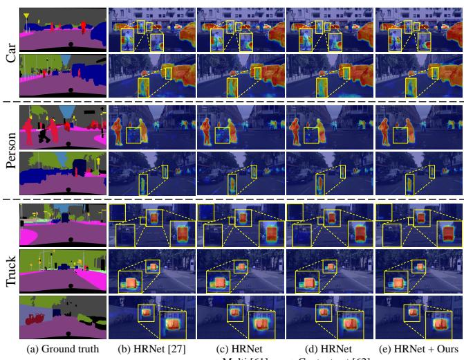

Fig. 16. Grad-CAM [86] visualizations on Cityscapes-val. (a) Ground truth, (b) HRNet [27], (c) HRNet + Multi [61], (d) HRNet + Contextrast [62], and (e) HRNet + Ours. The leftmost labels ‘Car’, ‘Person’, and ‘Truck’ indicate the target class for each row. Zoomed-in boxes highlight fine-grained differences in attention for small objects and class boundaries (best viewed in color).  
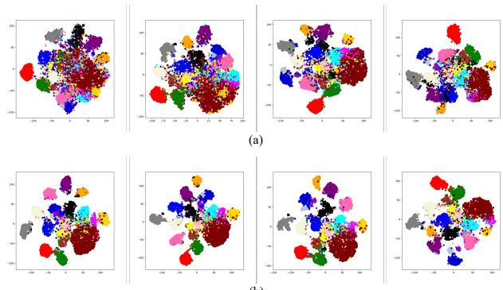  
(b)  
Fig. 17. t-distributed stochastic neighbor embedding (t-SNE) [87] visualizations of feature representations obtained from (a) HRNet [27] and (b) Contextrast++ on Cityscapes-val, ordered from 1st to 4th layers (left to right). Different colors represent distinct semantic classes. Contextrast++ yields more compact intra-class clusters and clearer inter-class separation across all layers (best viewed in color).

Similarly, in the first example of the “Person” row, Contextrast++ completely ignores the stroller, whereas existing stateof-the-art methods incorrectly highlight it. Furthermore, from the second example of the “Person” row to all examples of the “Truck” row, our Contextrast++ successfully focused sharply within object boundaries, avoiding over-expansion beyond the objects themselves.

Visualization with t-SNE. Finally, we qualitatively analyze the distribution of learned features across layers using tdistributed stochastic neighbor embedding (t-SNE), as shown in Fig. 17. Compared with the baseline, Contextrast++ exhibits improved intra-class compactness and inter-class separation across all layers, reflecting the model’s improved ability to incorporate global contextual information through the adaptive fusion module. These results demonstrate that our method effectively enhances semantic discriminability across scales, resulting in more robust and class-consistent feature representations.

## V. CONCLUSION

In this paper, we proposed Contextrast++, an enhanced contextual contrastive learning framework that effectively and adaptively integrates multi-scale information and addresses key challenges in semantic segmentation. Building upon our previous work, Contextrast [62], which introduced CCL and boundary-aware negative (BANE) sampling, our approach further enhances feature learning and segmentation accuracy through the PA loss with the adaptive fusion module, as well as the AA loss.

The adaptive fusion module replaces the static weighted sum used in Contextrast [62] with a self-attention-based mechanism, thereby enabling adaptive integration of representative anchors across scales. This allows the model to better balance local and global contexts, improving feature representation diversity while maintaining efficiency. The AA loss ensures class-wise balanced learning, mitigating the longtailed distribution issue by leveraging a memory bank with representative anchors instead of raw features. Finally, BANE sampling enhances fine-grained feature learning by selecting hard negative samples along object boundaries, thereby improving segmentation accuracy, particularly in complex and ambiguous regions.

Through extensive experiments on five public datasets and various CNN and transformer backbones, we demonstrated that Contextrast++ outperforms prior contrastive learning methods on the majority of configurations, with the largest gains on long-tailed datasets and at object boundaries. Ablation studies further validated the effectiveness of each proposed module, highlighting the contributions of our PA loss with the adaptive fusion module, AA loss, and BANE sampling. Despite these encouraging results, there is further space for improvement. In future work, we plan to extend Contextrast++ to real-world robotic applications such as semantic mapping and navigation in urban environments. In these settings, robust and fine-grained semantic understanding is essential for tasks such as obstacle avoidance, scene interpretation, and long-term mapping.

## REFERENCES

[1] E. Sanderson and B. J. Matuszewski, “FCN-transformer feature fusion for polyp segmentation,” in Proc. Annual Conference on Medical Image Understanding and Analysis, 2022, pp. 892–907.

[2] J. V. Hurtado and A. Valada, “Semantic scene segmentation for robotics,” Deep Learning for Robot Perception and Cognition, pp. 279–311, 2022.

[3] M. Tzelepi and A. Tefas, “Semantic scene segmentation for robotics applications,” in Proc. International Conference on Information, Intelligence, Systems & Applications, 2021, pp. 1–4.

[4] L. Yang, Y. Bai, F. Ren, C. Bi, and R. Zhang, “LCFNets: Compensation strategy for real-time semantic segmentation of autonomous driving,” IEEE Transactions on Intelligent Vehicles, vol. 9, no. 4, pp. 4715–4729, 2024.

[5] P. Ni, X. Li, W. Xu, D. Kong, Y. Hu, and K. Wei, “Robust 3D semantic segmentation based on multi-phase multi-modal fusion for intelligent vehicles,” IEEE Transactions on Intelligent Vehicles, vol. 9, no. 1, pp. 1602–1614, 2023.

[6] Z. Feng, Y. Guo, and Y. Sun, “Segmentation of road negative obstacles based on dual semantic-feature complementary fusion for autonomous driving,” IEEE Transactions on Intelligent Vehicles, vol. 9, no. 4, pp. 4687–4697, 2024.

[7] J. Gu, M. Bellone, T. Pivonka, and R. Sell, “CLFT: camera-LiDARˇ fusion transformer for semantic segmentation in autonomous driving,” arXiv preprint arXiv:2404.17793, 2024.

[8] Z. Wu, Y. Feng, C.-W. Liu, F. Yu, Q. Chen, and R. Fan, “S3M-Net: joint learning of semantic segmentation and stereo matching for autonomous driving,” IEEE Transactions on Intelligent Vehicles, vol. 9, no. 2, pp. 3940–3951, 2024.

[9] W. Liang, C. Shan, Y. Yang, and J. Han, “Multi-branch differential bidirectional fusion network for RGB-T semantic segmentation,” IEEE Transactions on Intelligent Vehicles, vol. 10, no. 4, pp. 2362–2372, 2025.

[10] J. Fan, F. Wang, H. Chu, X. Hu, Y. Cheng, and B. Gao, “MLFNet: Multilevel fusion network for real-time semantic segmentation of autonomous driving,” IEEE Transactions on Intelligent Vehicles, vol. 8, no. 1, pp. 756–767, 2022.

[11] D. ZiWen and Y. Dong, “Multi-objective neural architecture search for efficient and fast semantic segmentation on edge,” IEEE Transactions on Intelligent Vehicles, vol. 9, no. 1, pp. 1346–1357, 2023.

[12] J. Deng, W. Dong, R. Socher, L.-J. Li, K. Li, and L. Fei-Fei, “ImageNet: A large-scale hierarchical image database,” in Proc. IEEE/CVF Conference on Computer Vision and Pattern Recognition, 2009, pp. 248–255.

[13] M. Cordts, M. Omran, S. Ramos, T. Rehfeld, M. Enzweiler, R. Benenson, U. Franke, S. Roth, and B. Schiele, “The Cityscapes dataset for semantic urban scene understanding,” in Proc. IEEE/CVF Conference on Computer Vision and Pattern Recognition, 2016, pp. 3213–3223.

[14] R. Mottaghi, X. Chen, X. Liu, N.-G. Cho, S.-W. Lee, S. Fidler, R. Urtasun, and A. Yuille, “The role of context for object detection and semantic segmentation in the wild,” in Proc. IEEE/CVF Conference on Computer Vision and Pattern Recognition, 2014, pp. 891–898.

[15] H. Caesar, J. Uijlings, and V. Ferrari, “COCO-stuff: Thing and stuff classes in context,” in Proc. IEEE/CVF Conference on Computer Vision and Pattern Recognition, 2018, pp. 1209–1218.

[16] G. J. Brostow, J. Fauqueur, and R. Cipolla, “Semantic object classes in video: A high-definition ground truth database,” Pattern Recognition Letters, vol. 30, no. 2, pp. 88–97, 2009.

[17] B. Zhou, H. Zhao, X. Puig, S. Fidler, A. Barriuso, and A. Torralba, “Scene parsing through ADE20K dataset,” in Proc. IEEE/CVF Conference on Computer Vision and Pattern Recognition, 2017, pp. 633–641.

[18] L. C. Chen, G. Papandreou, I. Kokkinos, K. Murphy, and A. L. Yuille, “DeepLab: Semantic image segmentation with deep convolutional nets, atrous convolution, and fully connected CRFs,” IEEE Transactions on Pattern Analysis and Machine Intelligence, vol. 40, no. 4, pp. 834–848, 2017.

[19] L. C. Chen, G. Papandreou, F. Schroff, and H. Adam, “Rethinking atrous convolution for semantic image segmentation,” arXiv preprint arXiv:1706.05587, 2017.

[20] H. Zhao, J. Shi, X. Qi, X. Wang, and J. Jia, “Pyramid scene parsing network,” in Proc. IEEE/CVF Conference on Computer Vision and Pattern Recognition, 2017, pp. 2881–2890.

[21] L.-C. Chen, Y. Zhu, G. Papandreou, F. Schroff, and H. Adam, “Encoderdecoder with atrous separable convolution for semantic image segmentation,” in Proc. European Conference on Computer Vision, 2018, pp. 801–818.

[22] T. Xiao, Y. Liu, B. Zhou, Y. Jiang, and J. Sun, “Unified perceptual parsing for scene understanding,” in Proc. European Conference on Computer Vision, 2018, pp. 418–434.

[23] H. Li, P. Xiong, J. An, and L. Wang, “Pyramid attention network for semantic segmentation,” arXiv preprint arXiv:1805.10180, 2018.

[24] T.-W. Ke, J.-J. Hwang, Z. Liu, and S. X. Yu, “Adaptive affinity fields for semantic segmentation,” in Proc. European Conference on Computer Vision, 2018, pp. 587–602.

[25] C. Yu, J. Wang, C. Peng, C. Gao, G. Yu, and N. Sang, “Learning a discriminative feature network for semantic segmentation,” in Proc. IEEE/CVF Conference on Computer Vision and Pattern Recognition, 2018, pp. 1857–1866.

[26] S. C. Yurtkulu, Y. H. S¸ ahin, and G. Unal, “Semantic segmentation with extended DeepLabv3 architecture,” in Proc. Signal Processing and Communications Applications Conference, 2019, pp. 1–4.

[27] K. Sun, Y. Zhao, B. Jiang, T. Cheng, B. Xiao, D. Liu, Y. Mu, X. Wang, W. Liu, and J. Wang, “High-resolution representations for labeling pixels and regions,” arXiv preprint arXiv:1904.04514, 2019.

[28] J. Fu, J. Liu, H. Tian, Y. Li, Y. Bao, Z. Fang, and H. Lu, “Dual attention network for scene segmentation,” in Proc. IEEE/CVF Conference on Computer Vision and Pattern Recognition, 2019, pp. 3146–3154.

[29] C. Yu, J. Wang, C. Gao, G. Yu, C. Shen, and N. Sang, “Context prior for scene segmentation,” in Proc. IEEE/CVF Conference on Computer Vision and Pattern Recognition, 2020, pp. 12 416–12 425.

[30] Y. Yuan, X. Chen, and J. Wang, “Object-contextual representations for semantic segmentation,” in Proc. European Conference on Computer Vision, 2020, pp. 173–190.

[31] S. Choi, J. T. Kim, and J. Choo, “Cars can’t fly up in the sky: Improving urban-scene segmentation via height-driven attention networks,” in Proc. IEEE/CVF Conference on Computer Vision and Pattern Recognition, 2020, pp. 9373–9383.

[32] Y. Hong, H. Pan, W. Sun, and Y. Jia, “Deep dual-resolution networks for real-time and accurate semantic segmentation of road scenes,” arXiv preprint arXiv:2101.06085, 2021.

[33] C. Huynh, A. T. Tran, K. Luu, and M. Hoai, “Progressive semantic segmentation,” in Proc. IEEE/CVF Conference on Computer Vision and Pattern Recognition, 2021, pp. 16 755–16 764.

[34] Z. Liu, Y. Lin, Y. Cao, H. Hu, Y. Wei, Z. Zhang, S. Lin, and B. Guo, “Swin Transformer: Hierarchical vision transformer using shifted windows,” in Proc. IEEE/CVF International Conference on Computer Vision, 2021, pp. 10 012–10 022.

[35] Z. Zhong, J. Cui, Y. Yang, X. Wu, X. Qi, X. Zhang, and J. Jia, “Understanding imbalanced semantic segmentation through neural collapse,” in Proc. IEEE/CVF Conference on Computer Vision and Pattern Recognition, 2023, pp. 19 550–19 560.

[36] H. Ye and D. Xu, “InvPT++: Inverted pyramid multi-task transformer for visual scene understanding,” IEEE Transactions on Pattern Analysis and Machine Intelligence, vol. 46, no. 12, pp. 7493–7508, 2024.

[37] L. Xu, M. Bennamoun, F. Boussaid, H. Laga, W. Ouyang, and D. Xu, “MCTformer+: Multi-class token transformer for weakly supervised semantic segmentation,” IEEE Transactions on Pattern Analysis and Machine Intelligence, vol. 46, no. 12, pp. 8380–8395, 2024.

[38] Y. Zhou, H. Zhang, S.-I. Park, B. Yoo, and X. Qi, “Object-centric representation learning for video scene understanding,” IEEE Transactions on Pattern Analysis and Machine Intelligence, vol. 46, no. 12, pp. 8410– 8423, 2024.

[39] L. Chen, Y. Fu, L. Gu, C. Yan, T. Harada, and G. Huang, “Frequencyaware feature fusion for dense image prediction,” IEEE Transactions on Pattern Analysis and Machine Intelligence, vol. 46, no. 12, pp. 10 763– 10 780, 2024.

[40] T. Zhou and W. Wang, “Prototype-based semantic segmentation,” IEEE Transactions on Pattern Analysis and Machine Intelligence, vol. 46, no. 10, pp. 6858–6872, 2024.

[41] D. Zhang, H. Zhang, J. Tang, X.-S. Hua, and Q. Sun, “Causal intervention for weakly-supervised semantic segmentation,” Advances in Neural Information Processing Systems, vol. 33, pp. 655–666, 2020.

[42] G. Pei, F. Shen, Y. Yao, G.-S. Xie, Z. Tang, and J. Tang, “Hierarchical feature alignment network for unsupervised video object segmentation,” in Proc. European Conference on Computer Vision, 2022, pp. 596–613.

[43] T. Chen, Y. Yao, and J. Tang, “Multi-granularity denoising and bidirectional alignment for weakly supervised semantic segmentation,” IEEE Transactions on Image Processing, vol. 32, pp. 2960–2971, 2023.

[44] D. Zhang, H. Zhang, J. Tang, X.-S. Hua, and Q. Sun, “Self-regulation for semantic segmentation,” in Proc. IEEE/CVF International Conference on Computer Vision, 2021, pp. 6953–6963.

[45] T. Chen, Y. Yao, X. Huang, Z. Li, L. Nie, and J. Tang, “Spatial structure constraints for weakly supervised semantic segmentation,” IEEE Transactions on Image Processing, vol. 33, pp. 1136–1148, 2024.

[46] Z. Li, Y. Sun, L. Zhang, and J. Tang, “CTNet: Context-based tandem network for semantic segmentation,” IEEE Transactions on Pattern Analysis and Machine Intelligence, vol. 44, no. 12, pp. 9904–9917, 2021.

[47] Y. Liu, J. Liu, Z. Li, J. Tang, and H. Lu, “Weakly-supervised dual clustering for image semantic segmentation,” in Proc. IEEE/CVF Conference on Computer Vision and Pattern Recognition, 2013, pp. 2075–2082.

[48] Y. Zhu, D. Zhang, Y. Lin, Y. Feng, and J. Tang, “Merging context clustering with visual state space models for medical image segmentation,” IEEE Transactions on Medical Imaging, vol. 44, no. 5, pp. 2131–2142, 2025.

[49] Y. Fu, M. Lou, and Y. Yu, “SegMAN: Omni-scale context modeling with state space models and local attention for semantic segmentation,” in Proc. IEEE/CVF Conference on Computer Vision and Pattern Recognition, 2025, pp. 19 077–19 087.

[50] H. Shi, S. D. Dao, and J. Cai, “LLMFormer: Large language model for open-vocabulary semantic segmentation,” International Journal of Computer Vision, vol. 133, no. 2, pp. 742–759, 2025.

[51] Z. Yang, X. Zhao, C. Yao, Q. Zhang, and J. Xiao, “M-SEE: A multiscale encoder enhancement framework for end-to-end weakly supervised semantic segmentation,” Pattern Recognition, vol. 162, p. 111348, 2025.

[52] Y. Yuan, J. Xie, X. Chen, and J. Wang, “SegFix: Model-agnostic boundary refinement for segmentation,” in Proc. European Conference on Computer Vision, 2020, pp. 489–506.

[53] C. Wang, Y. Zhang, M. Cui, P. Ren, Y. Yang, X. Xie, X.-S. Hua, H. Bao, and W. Xu, “Active boundary loss for semantic segmentation,” in Proc. AAAI Conference on Artificial Intelligence, vol. 36, no. 2, 2022, pp. 2397–2405.

[54] H. Tan, S. Wu, and J. Pi, “Semantic diffusion network for semantic segmentation,” Advances in Neural Information Processing Systems, vol. 35, pp. 8702–8716, 2022.

[55] R. Strudel, R. Garcia, I. Laptev, and C. Schmid, “Segmenter: Transformer for semantic segmentation,” in Proc. IEEE/CVF International Conference on Computer Vision, 2021, pp. 7262–7272.

[56] L. Li, T. Zhou, W. Wang, J. Li, and Y. Yang, “Deep hierarchical semantic segmentation,” in Proc. IEEE/CVF Conference on Computer Vision and Pattern Recognition, 2022, pp. 1246–1257.

[57] S. Woo, S. Debnath, R. Hu, X. Chen, Z. Liu, I. S. Kweon, and S. Xie, “ConvNext v2: Co-designing and scaling ConvNets with masked autoencoders,” in Proc. IEEE/CVF Conference on Computer Vision and Pattern Recognition, 2023, pp. 16 133–16 142.

[58] W. Wang, T. Zhou, F. Yu, J. Dai, E. Konukoglu, and L. Van Gool, “Exploring cross-image pixel contrast for semantic segmentation,” in Proc. IEEE/CVF International Conference on Computer Vision, 2021, pp. 7303–7313.

[59] H. Hu, J. Cui, and L. Wang, “Region-aware contrastive learning for semantic segmentation,” in Proc. IEEE/CVF International Conference on Computer Vision, 2021, pp. 16 291–16 301.

[60] T. Zhou and W. Wang, “Cross-image pixel contrasting for semantic segmentation,” IEEE Transactions on Pattern Analysis and Machine Intelligence, vol. 46, no. 8, pp. 5398–5412, 2024.

[61] T. Pissas, C. S. Ravasio, L. D. Cruz, and C. Bergeles, “Multi-scale and cross-scale contrastive learning for semantic segmentation,” in Proc. European Conference on Computer Vision, 2022, pp. 413–429.

[62] C. Sung, W. Kim, J. An, W. Lee, H. Lim, and H. Myung, “Contextrast: Contextual contrastive learning for semantic segmentation,” in Proc. IEEE/CVF Conference on Computer Vision and Pattern Recognition, 2024, pp. 3732–3742.

[63] B. Cheng, I. Misra, A. G. Schwing, A. Kirillov, and R. Girdhar, “Masked-attention mask transformer for universal image segmentation,” in Proc. IEEE/CVF Conference on Computer Vision and Pattern Recognition, 2022, pp. 1290–1299.

[64] J. Long, E. Shelhamer, and T. Darrell, “Fully convolutional networks for semantic segmentation,” in Proc. IEEE/CVF Conference on Computer Vision and Pattern Recognition, 2015, pp. 3431–3440.

[65] A. Dosovitskiy, L. Beyer, A. Kolesnikov, D. Weissenborn, X. Zhai, T. Unterthiner, M. Dehghani, M. Minderer, G. Heigold, S. Gelly et al., “An image is worth 16x16 words: Transformers for image recognition at scale,” arXiv preprint arXiv:2010.11929, 2020.

[66] E. Xie, W. Wang, Z. Yu, A. Anandkumar, J. M. Alvarez, and P. Luo, “Segformer: Simple and efficient design for semantic segmentation with transformers,” Advances in Neural Information Processing Systems, vol. 34, pp. 12 077–12 090, 2021.

[67] Q. Zhou, L. Wang, G. Gao, B. Kang, W. Ou, and H. Lu, “Boundaryguided lightweight semantic segmentation with multi-scale semantic context,” IEEE Transactions on Multimedia, vol. 26, pp. 7887–7900, 2024.

[68] J. Gu, H. Kwon, D. Wang, W. Ye, M. Li, Y.-H. Chen, L. Lai, V. Chandra, and D. Z. Pan, “Multi-scale high-resolution vision transformer for semantic segmentation,” in Proc. IEEE/CVF Conference on Computer Vision and Pattern Recognition, 2022, pp. 12 094–12 103.

[69] H. Shi, M. Hayat, and J. Cai, “Transformer scale gate for semantic segmentation,” in Proc. IEEE/CVF Conference on Computer Vision and Pattern Recognition, 2023, pp. 3051–3060.

[70] T. Li, P. Cao, Y. Yuan, L. Fan, Y. Yang, R. S. Feris, P. Indyk, and D. Katabi, “Targeted supervised contrastive learning for long-tailed recognition,” in Proc. IEEE/CVF Conference on Computer Vision and Pattern Recognition, 2022, pp. 6918–6928.

[71] A. Vaswani, N. Shazeer, N. Parmar, J. Uszkoreit, L. Jones, A. N. Gomez, Ł. Kaiser, and I. Polosukhin, “Attention is all you need,” Advances in Neural Information Processing Systems, vol. 30, 2017.

[72] M. Gutmann and A. Hyvarinen, “Noise-contrastive estimation: A new¨ estimation principle for unnormalized statistical models,” in Proc. International Conference on Artificial Intelligence and Statistics, 2010, pp. 297–304.

[73] A. v. d. Oord, Y. Li, and O. Vinyals, “Representation learning with contrastive predictive coding,” arXiv preprint arXiv:1807.03748, 2018.

[74] K. He, H. Fan, Y. Wu, S. Xie, and R. Girshick, “Momentum contrast for unsupervised visual representation learning,” in Proc. IEEE/CVF Conference on Computer Vision and Pattern Recognition, 2020, pp. 9729–9738.

[75] P. Khosla, P. Teterwak, C. Wang, A. Sarna, Y. Tian, P. Isola, A. Maschinot, C. Liu, and D. Krishnan, “Supervised contrastive learning,” Advances in Neural Information Processing Systems, vol. 33, pp. 18 661–18 673, 2020.

[76] Y. Kalantidis, M. B. Sariyildiz, N. Pion, P. Weinzaepfel, and D. Larlus, “Hard negative mixing for contrastive learning,” Advances in Neural Information Processing Systems, vol. 33, pp. 21 798–21 809, 2020.

[77] R. Kimmel, N. Kiryati, and A. M. Bruckstein, “Sub-pixel distance maps and weighted distance transforms,” Journal of Mathematical Imaging and Vision, vol. 6, pp. 223–233, 1996.

[78] M. Sandler, A. Howard, M. Zhu, A. Zhmoginov, and L.-C. Chen, “MobileNetV2: Inverted residuals and linear bottlenecks,” in Proc. IEEE/CVF Conference on Computer Vision and Pattern Recognition, 2018, pp. 4510–4520.

[79] M. Contributors, “MMSegmentation: OpenMMLab semantic segmentation toolbox and benchmark,” https://github.com/open-mmlab/ mmsegmentation, 2020.

[80] M. F. Hutchinson, “A stochastic estimator of the trace of the influence matrix for laplacian smoothing splines,” Communications in Statistics-Simulation and Computation, vol. 18, no. 3, pp. 1059–1076, 1989.

[81] C. Bekas, E. Kokiopoulou, and Y. Saad, “An estimator for the diagonal of a matrix,” Applied numerical mathematics, vol. 57, no. 11-12, pp. 1214–1229, 2007.

[82] F. Schroff, D. Kalenichenko, and J. Philbin, “FaceNet: A unified embedding for face recognition and clustering,” in Proc. IEEE/CVF Conference on Computer Vision and Pattern Recognition, 2015, pp. 815– 823.

[83] J. Xie, X. Zhan, Z. Liu, Y.-S. Ong, and C. C. Loy, “Delving into interimage invariance for unsupervised visual representations,” International Journal of Computer Vision, vol. 130, no. 12, pp. 2994–3013, 2022.

[84] T. T. Cai, J. Frankle, D. J. Schwab, and A. S. Morcos, “Are all negatives created equal in contrastive instance discrimination?” arXiv preprint arXiv:2010.06682, 2020.

[85] H. Xuan, A. Stylianou, X. Liu, and R. Pless, “Hard negative examples are hard, but useful,” in Proc. European Conference on Computer Vision, 2020, pp. 126–142.

[86] R. R. Selvaraju, M. Cogswell, A. Das, R. Vedantam, D. Parikh, and D. Batra, “Grad-CAM: Visual explanations from deep networks via gradient-based localization,” in Proc. IEEE/CVF International Conference on Computer Vision, 2017, pp. 618–626.

[87] L. Van der Maaten and G. Hinton, “Visualizing data using t-SNE.” Journal of Machine Learning Research, vol. 9, no. 11, pp. 2579–2605, 2008.

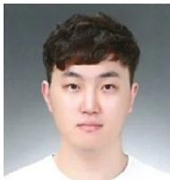

Changki Sung received the B.S. degree in electrical and computer engineering from the University of New Hampshire and M.S. in civil engineering and Ph.D. degrees in robotics program from the Korea Advanced Institute of Science and Technology (KAIST), Daejeon, Republic of Korea, in 2018, 2021, and 2025, respectively. He is currently a postdoctoral researcher with Information & Electronics Research Institute, KAIST. His research interests include vision-language navigation, vision-language action, semantic segmentation, and spatial AI.

Hyungtae Lim received the B.S. degree in mechanical engineering, and M.S. and Ph.D. degrees in electrical engineering from the Korea Advanced Institute of Science and Technology (KAIST), Daejeon, Republic of Korea, in 2018, 2020, and 2023, respectively. He is currently a postdoctoral associate in the Laboratory for Information & Decision Systems (LIDS), Massachusetts Institute of Technology (MIT), Massachusetts, USA. His research interests include SLAM (simultaneous localization and mapping), 3D registration, 3D perception, long-

term map management, spatial AI, and deep learning.

Wanhee Kim received the B.S. degree in Automobile and IT Convergence from Kookmin University, Seoul, Republic of Korea, in 2024. He is currently pursuing the M.S. degree in the Robotics Program at the Korea Advanced Institute of Science and Technology (KAIST). His research interests include robotics and semantic segmentation, VLM-based scene understanding, and spatial AI.

Youngwoo Seo Dr. Youngwoo Seo is a fieldroboticist with experience of building mobile robots such as self-driving cars, drones, a high-speed transport – hyperloop, unmanned ground vehicles for more than two decades, and a seasoned executive with track records of managing diverse teams to deliver what matters. He currently serves as an Executive Vice President at Hanwha Aerospace. For this role, his primary goal is to spearhead the endeavor of stepping up the company’s game to become a global top-tier, defense solution provider. To that end, among other responsibilities, he has been leading and overseeing robotics and autonomous systems R&D, carving out the international unmanned systems market, and playing a role of technology catalyst for AI, ML and robotics. He earned a Ph.D. and a master’s degree in robotics from Carnegie Mellon University, and a master’s degree in computer science from Seoul National University.

Hyun Myung received the B.S., M.S., and Ph.D. degrees in electrical engineering from the Korea Advanced Institute of Science and Technology (KAIST), Daejeon, Republic of Korea, in 1992, 1994, and 1998, respectively. He was a Senior Researcher with the Electronics and Telecommunications Research Institute, Daejeon, from 1998 to 2002, a CTO and the Director with the Digital Contents Research Laboratory, Emersys Corporation, Daejeon, from 2002 to 2003, and a Principle Researcher with the Samsung Advanced Institute of

Technology, Yongin, Korea, from 2003 to 2008. Since 2008, he has been a Professor with the Department of Civil and Environmental Engineering, KAIST, and he was the Chief of the KAIST Robotics Program. From 2019, he is a Professor with the School of Electrical Engineering. His current research interests include autonomous robot navigation, SLAM (simultaneous localization and mapping), SHM (structural health monitoring), spatial AI/machine learning, and swarm robots.