# Cultural Moment Benchmark: Evaluating Video Cultural Reasoning and Grounding in Southeast Asia

Burak Satar1, Zhixin Ma¹, Cheng Yu-Tong1,

Huy Hoang Tran2, Phuong Anh Nguyen1, Chong-Wah Ngo1,

{buraks, cwngo}@smu.edu.sg

1Singapore Management University, 2UIT, VNU-HCM

https://culturalmoment-benchmark.github.io

## Abstract

Cultural understanding in video means more than recognizing what is visible; it requires grasping the symbolic and temporal significance of cultural concepts. We decompose this into three abilities: naming what a concept symbolizes, visually recognizing it on video, and locating its sub-events in time. Existing videocultural benchmarks tend to test what is seen collapsing these three abilities into a single score that hides the bottleneck. We introduce the Cultural Moment Benchmark (CMB): 306 expert-curated concepts from seven countries in Southeast Asia across five categories. We evaluate each concept through three stages, one per ability. Given a description, Stage 1 (S1) selects from four candidate concept names, Stage 2 (S2) selects from four candidate video moments, and Stage 3 (S3) predicts the start and end times of the moment in a video. To keep each stage focused on a distinct ability, we use three design choices: semantic-similarity distractors (S1, S2), unlabeled video moments (S2), and free-form localization on a different example video (S3). Across six visionlanguage models, failure modes vary by ability and modality. i) Even the strongest closedsource models score below 30% when all three stages must be correct; ii) The three abilities do not fully cascade: naming a concept correctly helps half the models recognize it on video. but recognizing it has little effect on locating the sub-event in time; iii) Audio is complementary, redundant, or distracting depending on the concept, more often distracting in non-Latinscript countries; removing both audio and subtitles hurts Games and Music the most. Our 14-rater human study shows that even Expert raters score below chance on concepts from a neighboring country, indicating that CMB requires country-specific cultural knowledge CMB acts as a diagnostic harness, attributing failures to a specific ability or modality.

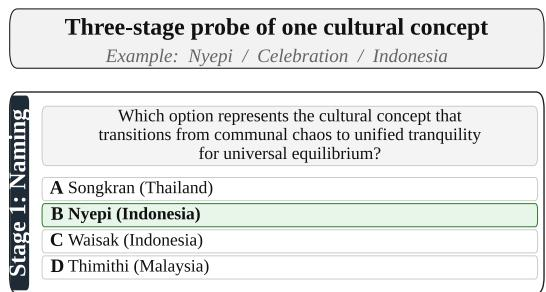

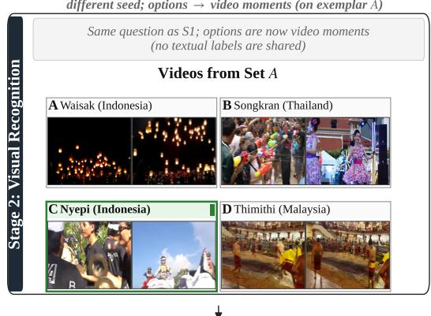

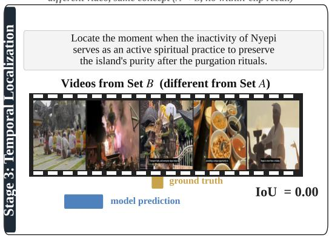  
Figure 1: CMB three-stage probe. Stage 1 picks among four concept names. Stage 2 keeps the same stem but replaces the options with four video moments from example video A; it uses an independent random seed, so the option positions differ from S1. Stage 3 predicts a free-form $[ t _ { \mathrm { s t a r t } } , t _ { \mathrm { e n d } } ]$ span for a sub-event of the concept on a different example video B. The shift from A to B prevents within-clip memorization in Stage 3.

## 1 Introduction

Vision-language models (VLMs) have made substantial progress on video question answering, textvideo retrieval (Satar et al., 2021), and temporal grounding (Fu et al., 2025; Li et al., 2024a). Yet their ability to understand cultural content beyond what is visible remains underexplored. Existing video-cultural benchmarks (Shafique et al., 2025; Chen et al., 2025; Singh et al., 2026b) tend to ask questions like “Which country is this clothing from?" or “Where is the dish popular?". Such questions can be answered by identifying what is seen, without engaging what it symbolizes. The same problem extends to cultural reasoning questions: even when a question appears to require cultural reasoning, the model can often answer it by matching keywords. A question about “a Burmese waterthrowing celebration" is solved by finding a water frame without needing to know what Thingyan symbolizes (Satar et al., 2025). Our benchmark addresses this gap by asking what each concept symbolizes, such as “the washing away of misfortunes" for Thingyan, instead of just naming visible cues, as Figure 1 illustrates.

A single accuracy number conflates naming, visual recognition, and temporal localization, hiding which ability is failing. To diagnose this, we treat these three abilities as distinct and score each separately, providing a per-model failure profile rather than a single aggregate score. We instantiate this approach in the Cultural Moment Benchmark (CMB), focused on Southeast Asia (SEA). SEA cultures are diverse and underrepresented in current video-cultural benchmarks. Neighboring traditions often share enough surface features to demand fine-grained discrimination. CMB contains 306 expert-curated concepts from seven SEA countries across five categories. Four use the Latin script: Indonesia, Malaysia, the Philippines, and Vietnam. Three use non-Latin scripts: Cambodia, Myanmar, and Thailand.

We score each ability separately by routing every concept through three stages. Stage 1 (S1) tests naming: given a description of what a concept symbolizes, the model picks its name from four candidates. Stage 2 (S2) tests visual recognition: from the same description, it picks among four candidate video moments. Stage 3 (S3) tests temporal localization: on a different example video, it predicts the start and end times of a target sub-event. Three design choices keep each stage focused on its own ability: S1 and S2 distractors are semantically similar to the correct answer, so keyword matching does not solve either stage; S2 moments carry no titles, captions, or filenames, so the judgment must be visual; and S3 uses a fresh video with a free-form span, so cues from earlier stages cannot be reused. Beyond ability isolation, we evaluate each stage under three modes that vary the priorstage context: Reset (no prior context), Carry (the model's own previous answer), and Feedback (the previous answer plus the ground truth). Together, the three stages and three modes form a 3 × 3 evaluation framework.

With this setup, we evaluate six state-of-theart VLMs on CMB. Across these six models, the failure mode varies by ability and modality, confirming that a single score hides the bottleneck. The following patterns stand out. i) Single-stage scores understate the gap; end-to-end success reveals it. Even Gemini 3.1 Pro and GPT-5.4, the two strongest closed-source models, get fewer than 30% of concepts right across all three stages. The four open-source models score in single digits, and InternVL-14B is near zero. ii) Across stages, the three abilities do not fully cascade. Naming a concept correctly helps half the models recognize it on video (S1→S2). However, recognizing it has little effect on locating the sub-event in time on a different video (S2→S3). iii) Modality roles also vary: audio is not uniformly useful. Depending on the concept, it can be complementary, redundant, or distracting. The distracting role is more frequent in countries with non-Latin scripts. Removing audio and subtitles together hurts Games and Music the most, where commentary and lyrics align with the sub-event; in many traditional concepts, audio is ambient backing that holds throughout the clip. Beyond modality, cultural knowledge is countryspecific, not regional. In a 14-rater human study, even Expert raters score below chance on concepts from a neighboring country, indicating that CMB requires country-specific cultural knowledge.

CMB acts as a diagnostic harness, attributing failures to a specific ability or modality rather than aggregating them into a single score. We contribute:

• CMB, an expert-curated video benchmark dedicated to SEA cultures, grounded in realworld traditions;

• A 3-stage × 3-mode evaluation framework with per-stage scores, conditional metrics (c-S2, c-mIoU) for cascade analysis, and a Joint score for end-to-end success;

<table><tr><td>Benchmark</td><td>SEA focus</td><td>Multi-stage cascade</td><td>Cond. metrics</td><td>Free-form temp. loc.</td><td>Avg. dur. (min)</td><td>Human eval</td><td>Cultures covered</td></tr><tr><td>SCBimage (Satar et al., 2025)</td><td>√</td><td>√</td><td>√</td><td>x</td><td>n/a</td><td>x</td><td>7</td></tr><tr><td>AVMeme Exam (Jiang et al., 2026)</td><td>x</td><td>x</td><td>x</td><td>x</td><td>≤0.5</td><td>√(closed)</td><td>5+</td></tr><tr><td>ChineseVideoBench (Nie et al., 2025)</td><td>x</td><td>x</td><td>x</td><td>x</td><td>≈1.0</td><td>x</td><td>1</td></tr><tr><td>GIMMICK (Schneider et al., 2025)</td><td>partial</td><td>x</td><td>x</td><td>x</td><td>0.17</td><td>x</td><td>139</td></tr><tr><td>MINERVA-Cultural (Singh et al., 2026b)</td><td>partial</td><td>x</td><td>√</td><td>x</td><td>12.62</td><td>√</td><td>18</td></tr><tr><td>VideoNorms (Varimalla et al., 2026)</td><td>x</td><td>x</td><td>x</td><td>x</td><td>0.25</td><td>x</td><td>2</td></tr><tr><td>VideoVista-CulturalLingo (Chen et al., 2025)</td><td>x</td><td>x</td><td>x</td><td>x</td><td>4.05</td><td>x</td><td>3</td></tr><tr><td>ViMUL-Bench (Shafique et al., 2025)</td><td>x</td><td>x</td><td>x</td><td>x</td><td>2.92</td><td>partial</td><td>14</td></tr><tr><td>CMB (ours)</td><td>√</td><td>√</td><td>√</td><td>√</td><td>6.2*</td><td>✓(closed)</td><td>7</td></tr></table>

Table 1: Comparison of CMB to recent multicultural video benchmarks. ${ \bf S } { \bf C } { \bf B } ^ { \mathrm { i m a g e } }$ is the image-based precursor; all other rows are video benchmarks. Multi-stage cascade: distinct ability stages scored sequentially with conditional dependency. Cond. metrics: conditional metrics that report cross-stage success-given-success (e.g., P(S2 | S1 correct)). Free-form temp. loc.: model predicts an unconstrained $[ \hat { t } _ { \mathrm { s t a r t } } , \hat { t } _ { \mathrm { e n d } } ]$ span rather than selecting from candidate timestamps or orderings. Human eval: √indicates humans recruited separately from annotators were evaluated on the same task; closed adds an explicit prohibition on web search or external aids. \*: S3 videos.

• Failure profiles for six VLMs to pinpoint each model's bottleneck stage, suggesting modelspecific intervention priorities.

## 2 Related Work

## 2.1 Multicultural Image Benchmarks

Most multicultural benchmarks for VLMs use a single image as input and evaluate cultural understanding via either textual or visual answer choices. The textual-choice family includes CVQA (Mogrovejo et al., 2024), CulturalVQA (Nayak et al., 2024), SEA-VQA (Urailertprasert et al., 2024), K-Viscuit (Baek et al., 2024), CultureVerse (Liu et al., 2025), the image subset of GIMMICK (Schneider et al., 2025), and ALM-Bench (Vayani et al., 2025). CultureVerse and parts of GIMMICK additionally test cultural reasoning. MaRVL (Liu et al., 2021) checks truth-values of image captions across five languages. Region- or language-specific image benchmarks include Rice-VL (Pranav et al., 2025) and MMA-ASIA (Zheng et al., 2025) for Asia, IndicVisionBench (Faraz et al., 2026) for India, TaiwanVQA (Hsieh et al., 2025) for Taiwan, Afri-MCQA (Tonja et al., 2026) for Africa, and BanglaProtha (Fahim et al., 2026) for Bengali culture. FoodieQA (Li et al., 2024b) introduces visual options for Chinese cuisine. Beyond static accuracy, diagnostic studies report that VLMs falter when cultural cues are mixed or perturbed (Irawan et al., 2025; Kim et al., 2025) and that their cultural knowledge is brittle under rephrasing and visual grounding (Tan et al., 2026). ValueGround probes the complementary axis of culture-conditioned visual value grounding (Wang et al., 2026). On the text side, resources specific to Southeast Asia now range from embedding benchmarks (Ponwitayarat et al., 2026) to culturally grounded safety filters (Tasawong et al., 2026). Most relevant to our work, SCB (Satar et al., 2025) adapts the visualoption design to SEA cultural reasoning and pairs it with cultural-artifact segmentation at the image level. CMB carries this design into video, adding a naming stage on the same description (S1), videomoment options (S2), and free-form temporal localization on a different video (S3). Image-only setups, including SCB, do not isolate naming from visual recognition and cannot locate when a cultural sub-event unfolds within a video.

## 2.2 Multicultural Video Benchmarks

Cultural understanding has recently been extended to video, where the challenge is harder because cultural concepts unfold across time, audio, and visual modalities. VideoVista-CulturalLingo (Chen et al., 2025) covers three cultural regions (Chinese, North American, European) in MCQ design across 1,389 videos. ViMUL-Bench (Shafique et al., 2025) is a multilingual, culturally diverse VideoQA benchmark spanning 14 languages and cultures via multimodal QA in 337 videos. MINERVA-Cultural (Singh et al., 2026b) emphasizes long-form video reasoning across 18 locales with human-authored reasoning traces. AVMeme Exam (Jiang et al. 2026) probes cultural and contextual knowledge in 1,032 audio-visual memes spanning speech, songs, music, and sound effects. VideoNorms (Varimalla et al., 2026) targets cultural norms across 384 concepts in American and Chinese contexts. Chinese-VideoBench (Nie et al., 2025) is a mono-cultural Chinese video QA benchmark with 1,625 videos across eight task categories. The video subset of GIMMICK (Schneider et al., 2025) also includes short video moments from 139 cultures, accompanied by AI-generated open-ended questions. Adjacent video work includes MAVEN (Li et al., 2026) and CultureVidBench (Han et al., 2026) for multicultural text-to-video generation, culture-lens evaluation of visual generative models (Koksal et al., 2025), and MusiQA1 (Christodoulou et al., 2025) for audio-video music question answering; these test generation and music-specific understanding rather than cultural video QA. Even within video, existing benchmarks share three design gaps that CMB closes. First, none decomposes performance by ability. Second, none uses video moments as answer options for cultural recognition. Third, none includes free-form temporal localization on a different example video. Table 1 contrasts CMB against these benchmarks across these dimensions.

## 3 Cultural Moment Benchmark

CMB is built on one design principle: humans produce all visual ground truth; LLMs scaffold only textual artifacts. The benchmark is constructed in three phases: i) concept curation and video collection, ii) stage construction with semanticsimilarity distractors, and iii) quality validation through LLM auditing, an Outsider Filter, and S3 sub-event triage.

Annotators and Reviewers. We separate three distinct roles by qualifications and tasks. Local Annotators are native speakers of the country's primary language; they validate the concepts proposed by GPT-5 and filter the candidate videos. Cultural Annotators are also native speakers and additionally have research or co-curricular involvement in their country's cultural traditions; they curate the symbolic S1/S2 descriptions and annotate S2 moments and S3 spans. Reviewers are non-local researchers with documented SEA cultural exposure, distinct from Annotators; they run the Outsider Filter on every concept and triage flagged S3 sub-events. Two Cultural Annotators are co-authors (Vietnam, Malaysia); the remaining five were recruited and compensated.

## 3.1 Concepts and Videos

CMB concepts are organized hierarchically as country/category/concept. The seven countries span the diversity of SEA, four with Latin script and three with non-Latin scripts. The five categories are Celebration, Dance, Game, Music, and Wedding. For each (country, category) pair, GPT-5 (Singh et al., 2026a) proposes candidate concepts. Each candidate is reviewed by two Local Annotators per country (three for the Philippines and Myanmar), all of whom are native speakers of the country's primary language. We retain only candidates on which all Annotators reach a unanimous consensus that the candidate names a genuine cultural tradition rather than a stereotype or an overly broad descriptor. This yields a final pool of 306 concepts. For each concept, we record four name variants along two axes: common (colloquial) vs. official (formal), and Latin transliteration vs. local script. See Appendix. For each concept, we query YouTube and Google Video Search by concept and country, e.g. “Thingyan festival, Myanmar", collecting up to 20 candidates per concept and about 6,120 in total. Local Annotators filter for real-world depiction, non-duplication, and visual clarity. The final video pool comprises 624 unique videos: Set A (one per concept, 306 videos, average 2.0 min) for S2, and Set B (318 videos, average 6.2 min) for S3, with multi-event traditions contributing more than one Set B video.

## 3.2 Stage Construction

Symbolic concept descriptions. Each S1 and S2 question begins with a textual description of the concept that captures its symbolic meaning, not its visual appearance. Two LLMs from different families, DeepSeek-V3.1 (DeepSeek-AI et al., 2025) and Qwen-SEA-LION-v4 (Ng et al., 2025), each draft an independent description (e.g., "the washing away of misfortunes" for Thingyan); the Cultural Annotator selects one and rewrites it if it lists only visible objects or actions. This enforces the symbolic constraint: a question that can be answered by generic object recognition (“find the water frame") is rejected at this stage.

Stage 1 (Naming). Given the description, the model selects the correct concept name from four candidates. The three distractors are drawn via a Semantic Similarity Matrix (Reimers and Gurevych, 2019) over description embeddings, as shown in Figure 2. One distractor is from the same country as the correct answer, forcing fine-grained intracountry discrimination, and two are from different countries with semantically similar concepts, preventing reliance on broad regional priors. To prevent any single concept from dominating the distractor set across items, re-use of any single concept as a distractor is capped at roughly 10% of the category's concepts. The full sampling algorithm is given in the Appendix.

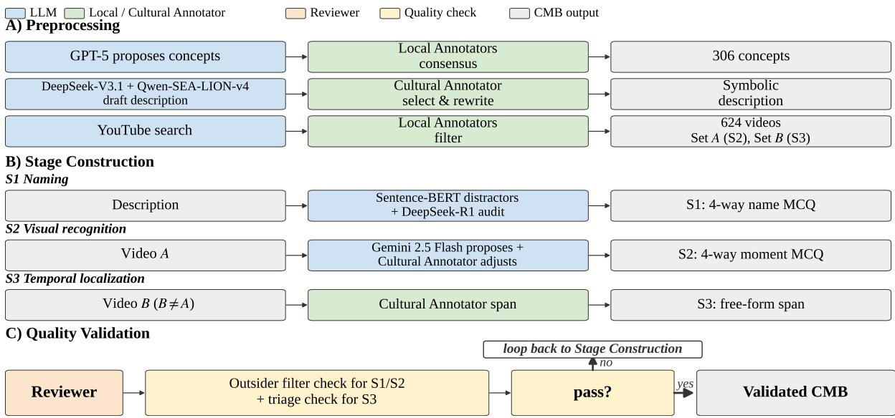  
Figure 2: CMB construction pipeline. A) Preprocessing yields 306 concepts (proposed by GPT-5, validated by Local Annotators) and 624 source videos (Set A for S2, Set B for S3); descriptions are drafted by DeepSeek-V3.1 and Qwen-SEA-LION-v4 and rewritten by a Cultural Annotator. B) Each concept is materialized into the S1 and S2 questions (four-way MCQ with semantic-similarity distractors) and the S3 question (free-form span on a different video); flagged S3 sub-events are also audited by a Reviewer. C) A Reviewer runs an Outsider filter check on S1/S2 descriptions (does the Reviewer answer correctly from regional cues alone?) and a triage check on flagged S3 spans. Concepts that pass both enter the Validated CMB; failures loop back to Stage Construction.

Stage 2 (Visual recognition). The model sees the same description and four candidate video moments that correspond to the same concept names as S1. Each moment is a sub-event sourced from the corresponding concept's video in Set A. Gemini 2.5 Flash (Comanici et al., 2025) proposes a small set of candidate moments per video, highlighting cultural cues; a Cultural Annotator then retains, adjusts the boundary timestamps of, or rejects each candidate, and only Annotator-confirmed moments enter the S2 pool. Within each stage, the correct answer letter is balanced across A, B, C, and D so that no letter is correct more often than another across the item pool. S1 and S2 use independent random seeds, so the position of the correct answer is randomized independently across the two stages.

Stage 3 (Temporal localization). Given the concept name and a textual description of a target subevent, the model predicts a free-form start and end time on a different example video B. Using a separate video from S2 forces the model to apply cultural knowledge to a fresh visual context rather than memorize within-clip cues. Each S3 span is annotated by a Cultural Annotator, who also verifies that the target sub-event occurs exactly once in the source video; videos containing multiple matching sub-events are excluded.

Modality handling at construction and evaluation. Cultural Annotators viewed each video with the original audio and with subtitles, if any. Reviewers performing the Outsider Filter for S1 and S2 saw only the textual description and the four name options, with no access to video, audio, or subtitles; this limits the filter to country-specific symbolic knowledge. For S3 evaluation, models receive the full video with native audio, subtitle tracks, and on-screen text intact by default.

## 3.3 Quality Validation

LLM auditing. DeepSeek-R1 (Guo et al., 2025a) audits the four S1 name options for mutual exclusivity and logical distinctness (“Are these options mutually exclusive and logically distinct?"), and rates each S3 sub-event description for welldefinedness; low-rated items are surfaced to Reviewers for rewrite or discard. DeepSeek-R1 never sees video, audio, or frames; all S2 moments and S3 spans are produced and verified by human Annotators and Reviewers.

Outsider Filter. For every concept, a Reviewer answers the S1/S2 description from regional priors alone, without consulting country-specific sources. The Reviewer is called an Outsider because they have general exposure to SEA but no familiarity with the concept's country of origin. If the Outsider picks the correct name, the description has leaked something a non-local could guess from regional priors: it is either rewritten to be more symbolic (less dependent on visible surface features) or, if no rewrite restores difficulty, the concept is discarded. Because S1 and S2 share the description as their stem, the filter covers both stages.

S3 Reviewer triage. For each S3 candidate, the textual rating produced by DeepSeek-R1 for the sub-event description flags items that may be underspecified or ambiguously locatable. A Reviewer inspects each flagged item, watches the candidate span on video B, and either rewrites the sub-event description, adjusts the span boundaries, or discards the candidate. Unflagged items pass without Reviewer review. This triage focuses Reviewer effort on the highest-risk spans rather than re-auditing all 306 items end-to-end.

Release. The benchmark records and a full evaluation harness, covering all six models and all three stages under all three modes, are released on HuggingFace and GitHub; the release schedule, licensing, and opt-out procedure are given in the Ethical Considerations section.

## 4 Experiments

## 4.1 Implementation Details

We evaluate six vision-language models. The two closed-source models are Gemini 3.1 Pro and GPT-5.4. The other four are open-source: Qwen3- VL-32B-Instruct (Bai et al., 2025), Qwen3.5-27B (Qwen Team, 2026), and InternVL3.5-14B (Wang et al., 2025) evaluated in two configurations, (t) with inference-time reasoning and (n) without. Gemini, GPT, and Qwen read video at one frame per second; InternVL uses its native twelve uniformly spaced frames.

Each model runs each stage three times across three modes, varying what it sees from earlier stages, as shown in Table 2. Under Reset, the model sees nothing from earlier stages. Under Carry, the model's previous answer is carried over to the next stage. Under Feedback, the model's previous answer is carried over along with the ground truth.

S1 and S2 are scored as four-option multiplechoice accuracy. S3 uses the mean Intersection over Union (mIoU) between the predicted span $[ \hat { t } _ { \mathrm { s t a r t } } , \hat { t } _ { \mathrm { e n d } } ]$ and the ground-truth span $[ t _ { \mathrm { s t a r t } } , t _ { \mathrm { e n d } } ]$ averaged over the 631 Stage-3 pairs.

## 4.2 Overall Results

End-to-end success is low for every model. We summarize end-to-end success with the Joint score, which credits a concept only when naming and recognition are both correct, weighted by localization quality: Joint $\begin{array} { r } { \mathbf { \Sigma } = \frac { 1 } { N } \sum _ { i = 1 } ^ { N } \mathbf { 1 } \{ \mathbf { S } 1 _ { i } \} \cdot \mathbf { 1 } \{ \mathbf { S } 2 _ { i } \} } \end{array}$ IoUi, where i indexes the $N { = } 3 0 6$ concepts and $\mathbf { 1 } \{ \cdot \}$ is the indicator function. Overall, Joint scores are low across all six models. Even Gemini and GPT, the two strongest models, achieve a Joint score below 30%, as shown in Table 2. The four open-source models do much worse: the two Qwen variants score in the single digits, and InternVL sits close to zero. Model scale does not explain the spread: Qwen3.5-27B beats InternVL on Joint by an order of magnitude, despite being only twice its size.

Reset / Carry / Feedback: effect of prior context. Table 2 shows that prior context helps the strongest models and hurts the weakest. Under Carry, Gemini's S2 accuracy rises by about ten points over Reset. Under Feedback, it rises by another thirteen points. GPT follows the same pattern. The Qwen models show no consistent change across modes, and the InternVL configurations lose accuracy under Carry. Prior context confirms the reasoning when the model can already perform the task; otherwise, it serves as a distraction.

The gap between closed and open models survives resampling; the ordering inside each group does not. Table 2 reports point estimates. Clusterbootstrap 95% confidence intervals over concepts, per country and per category under Carry with the base prompt, are in Appendix D.1. Because all six models see the same 306 concepts, we also test each pairwise difference within each resample rather than asking whether two marginal intervals overlap in Table 14. Every closed-source against open-source comparison is significant on all three stages, and in 12 of the 12 country and category cells the weaker closed-source model still scores above the stronger open-source one on S2 and mIoU. Within each group the picture is different: Gemini leads GPT-5.4 on S1 by about seven points but not on S2 or mIoU, and the two InternVL configurations are indistinguishable on every metric. The reliable finding is the gap between model families, not the ranking inside one.

<table><tr><td rowspan="2">Model</td><td rowspan="2">Stage 1 (%)</td><td colspan="3">Stage 2 (%)</td><td colspan="3">Stage 3 (%)</td><td colspan="3">Joint (%)</td></tr><tr><td>Reset</td><td>Carry</td><td>Feedback</td><td>Reset</td><td>Carry</td><td>Feedback</td><td>Reset</td><td>Carry</td><td>Feedback</td></tr><tr><td>Gemini 3.1 Pro GPT-5.4</td><td>77.8 70.9</td><td>62.7 52.6</td><td>72.9</td><td>85.9 81.7</td><td>31.9 29.5</td><td>33.4 31.0</td><td>33.3 30.3</td><td>20.6 14.5</td><td>27.0 21.7</td><td>27.8 21.5</td></tr><tr><td>Qwen3-VL-32B</td><td>51.0</td><td>39.9</td><td>68.3 31.4</td><td>28.4</td><td>22.0</td><td>22.3</td><td>30.0</td><td>6.4</td><td>4.3</td><td>4.6</td></tr><tr><td>Qwen3.5-27B InternVL3.5-14B (n)</td><td>53.6 46.7</td><td>39.9 26.5</td><td>40.5 24.5</td><td>39.9 9.8</td><td>23.2 2.1</td><td>24.1 2.5</td><td>30.2 12.5</td><td>6.7 0.4</td><td>8.1 0.4</td><td>7.7 0.7</td></tr></table>

Table 2: Overall results from the 3-stage × 3-mode analysis. S1 and S2 scores refer to accuracy, and S3 score refers to mIoU. Midrules separate closed-source models (top), 27–32B open-source models (middle), and the 14B InternVL configurations (bottom). S1 has a single column because there is no prior context to carry.

Reweighting by country or category leaves recognition unchanged and raises localization. Table 13 places micro averages beside macro averages that give each of the seven countries, and each of the five categories, equal weight. S1 and S2 agree within 2.5 points for every model under both schemes and no model ordering changes, so the recognition results are not an artifact of how concepts are distributed. mIoU behaves differently: for the four models that localize above the floor it runs higher under macro, by up to 4 points. The cause is Stage-3 pair mass rather than concept counts. Wedding supplies 3.6% of concepts but 23.5% of the 631 Stage-3 pairs and is the hardest cell for every model, while Music is the mirror image at 22.2% of concepts and 6.3% of pairs. Micro mIoU is therefore a pair-weighted quantity that inherits Wedding's mass, and we report both weightings so that neither carries a claim on its own. The same imbalance limits every per-country and per-category comparison in this section; see Long-tailed distribution in Limitations for its three sources.

## 4.3 Cascade Analysis

We test whether correct performance on one stage improves performance on the next, using two conditional metrics. c-S2 = P(S2 | S1 correct) measures how correct naming relates to visual recognition, and c-mIoU = E[IoU | S2 correct] measures how correct visual recognition relates to temporal localization. Both are computed under Carry, where the model sees its own previous answer. Table 3 reports both, with significance markers against the unconditional S2 and mIoU baselines.

<table><tr><td rowspan="2">Model</td><td colspan="2">S1 → S2 (%)</td><td colspan="2">S2 → S3 (%)</td></tr><tr><td>S2</td><td>c-S2</td><td>mIoU</td><td>c-mIoU</td></tr><tr><td>Gemini 3.1 Pro</td><td>72.9</td><td>89.5***</td><td>33.4</td><td>33.0</td></tr><tr><td>GPT-5.4</td><td>68.3</td><td>87.6 ***</td><td>31.0</td><td>29.7</td></tr><tr><td>Qwen3.5-27B</td><td>40.5</td><td>46.3*</td><td>24.1</td><td>23.4</td></tr><tr><td>Qwen3-VL-32B</td><td>31.4</td><td>30.8</td><td>22.3</td><td>23.1</td></tr><tr><td>InternVL-14B (t)</td><td>26.8</td><td>22.2</td><td>3.0</td><td>5.0*</td></tr><tr><td>InternVL-14B (n)</td><td>24.5</td><td>21.7</td><td>2.5</td><td>3.9</td></tr></table>

Table 3: Cascade analysis. The S2 and mIoU columns report unconditional performance; c-S2 and c-mIoU are the conditional metrics. Bold marks conditional metrics that differ significantly from their unconditional counterparts. \* p<.05, \*\* p<.01, \*\*\* p<.001.

S1 to S2: correct naming helps the strongest models. For Gemini and GPT, once they correctly name a concept, their chance of picking the right video moment increases by about 18 points. The improvement shrinks across the open-source models: Qwen3.5-27B picks up about a third of it; Qwen3-VL-32B and both InternVL configurations show none. The smallest model, InternVL-14B (t), inverts the trend: c-S2 is below the unconditional S2 rate.

S2 to S3: correct recognition rarely improves localization. For five models, choosing the right S2 moment provides no measurable benefit when the model must predict a start-end span on a fresh clip. Temporal localization quality is essentially the same regardless of whether S2 was correct. The one exception is InternVL with inference-time reasoning, with c-mIoU two points above its baseline, but the baseline is so low that the effect is not practically meaningful.

## 4.4 Modality Dependence Is Concept-Specific

For each video we compute ∆, the change in mIoU in percentage points when a modality is removed, averaged over the three ablation-instrumented models. A modality is Complementary for that video when removing it costs at least 5 points $( \Delta \leq - 5 )$ Distracting when removing it gains at least 5 points $( \Delta \geq + 5 )$ , and Redundant otherwise $( | \Delta | < 5 )$ The 5-point cut is a reporting threshold, not a statistical test; Appendix D.4 repeats the classification at 3 and 7 points and both claims below hold at every cut. Figure 3 shows the role shares when audio, subtitles, or both are removed. The audio and subtitle modalities are redundant for temporal localization in more than 60% of videos, indicating that removing them has little or no effect on performance. However, these modalities are complementary in approximately 17%-21% of the videos, where their removal degrades localization performance. In contrast, for about 13%–17% of the videos, removing these modalities improves performance, suggesting that they introduce distracting or noisy information. Next, we provide further insights into modality dependency.

Removing both audio and subtitles is most damaging to Games and Music. Figure 4 shows the per-category proportions of videos in which these modalities play complementary or distracting roles, respectively. As shown in the top five rows, incorporating both modalities improves performance for slightly more than 30% of the videos in the Game and Music categories. In the Game category, subtitles and audio cues such as commentary, callouts, and on-screen score updates provide strong temporal signals that help localize relevant moments more precisely. Similarly, in the Music category, the alignment between audio content (e.g., songs or background music) and on-screen textual cues such as lyrics, captions, and titles substantially improves temporal localization accuracy. In these cases, removing either modality often leads to noticeable performance degradation, indicating that the modalities provide complementary information. In contrast, for other video categories, visual modality alone is distinctive enough for most videos. In some cases, audio and subtitle modalities are only weakly correlated with the target moments. For example, videos in the Wedding and Celebration categories are often accompanied by ambient background noise, music, or unrelated conversations that provide limited temporal cues and may even negatively affect localization performance. Similarly, in the Dance category, the accompanying music often persists throughout the entire video and provides limited cues for temporal localization.

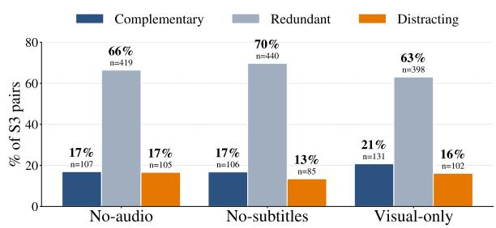  
Figure 3: Share of S3 video pairs (n=631) in each modality role (Complementary, Redundant, Distracting; defined in §4.4) for the three ablations. The mIoU change $\Delta$ is averaged across three models before binning. Complementary and Distracting shares are roughly balanced and cancel in the mean mIoU.

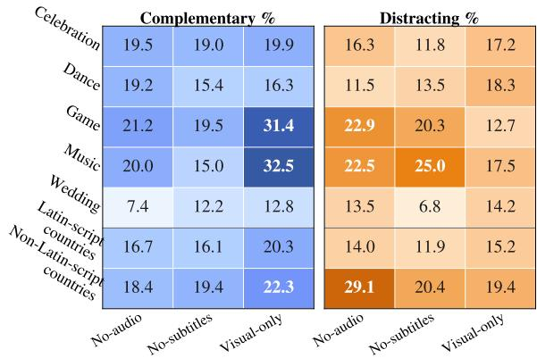  
Figure 4: Modality roles across all S3 video pairs, segmented by category (top 5 rows) and country writingsystem clusters (bottom 2 rows).

Non-Latin-script countries show a higher Distracting share for audio. 29% of the videos from Cambodia, Myanmar, and Thailand have audio rated as Distracting, compared with 14% for Indonesia, Malaysia, the Philippines, and Vietnam, as shown in Figure 4. Subtitles follow the same pattern with a weaker effect. The Distracting cases are dominated by clips featuring traditional solo instruments that play continuously across the subevent. Thus, the audio lacks a reliable temporal cue for the moment the question asks about, acting more as noise than as signal.

## 4.5 Human Evaluation

We test whether CMB requires country-specific cultural knowledge, not generic regional cues, with a 14-rater human study (two raters per country). All raters are native speakers of their country's primary language and fluent in English at university level. They are categorized into two groups: Expert, who are actively involved in cultural studies through research or co-curricular work, and Non-expert, who are not. Each rater answered S1 and S2 in two roles. As Native, they evaluated concepts from their own country. As Non-native, they evaluated concepts from a neighboring country. The seven countries form a cyclic order. One rater per country received concepts from the next country; the other, from the country after that. About 20% of items were double-rated for inter-rater reliability. The study covers all 306 concepts. We focus on two contrasts that we report below.

<table><tr><td></td><td colspan="2">S1 (%)</td><td colspan="2">S2 (%)</td></tr><tr><td>Rater</td><td></td><td>Native Non-native Native Non-native</td><td></td><td></td></tr><tr><td>Expert</td><td>58.4</td><td>21.3</td><td>51.9</td><td>28.7</td></tr><tr><td>Non-expert</td><td>39.2</td><td>27.9</td><td>45.2</td><td>31.5</td></tr></table>

Table 4: Human evaluation accuracy (%) on S1 and S2, by rater group (Expert vs Non-expert) and role (Native vs Non-native). Each cell averages over the seven country-level mean scores. More in Appendix B.

Native vs Non-native: cultural knowledge is country-specific. Both rater groups perform far worse on a neighboring country's concepts than on their own, as shown in Table 4: Expert raters drop by 37 points on S1 and 23 on S2, while Nonexpert raters drop by 11 and 14, respectively, from a lower starting point. The sharpest case is that Expert raters on a neighboring country score below the 25% chance level on S1, consistent with the semantic-similarity distractors misleading even Expert raters. This indicates that CMB tests for country-specific knowledge rather than regional cues.

Expert vs Non-expert: the expertise effect is country-conditional. On their own country's concepts, Expert raters outperform Non-expert raters by 19 points on S1 and 7 points on S2, as shown in Table 4. However, the ordering flips for a neighboring country's concepts: Expert raters score slightly lower than Non-expert raters on both S1 and S2. The cultural knowledge that helps Expert raters at home misleads them abroad. We also report the model mean across the six VLMs as a human-ceiling reference. On S1, the model mean is 57%, matching Expert raters and beating Nonexpert raters by 18 points. On S2 (Carry mode), it drops to 44%, level with Non-expert raters and 8 points below Expert raters. The model's average performance is therefore stage-specific: Expertlevel at naming, Non-expert-level at visual recognition, consistent with the partial S1→S2 cascade.

## 5 Conclusion

Cultural video understanding is not a single capability but three, and they do not compose in current VLMs. CMB's cascade shows that correctly naming a concept helps only some models recognize it on video, and correctly recognizing it rarely helps any locate its sub-events in time. Temporal localization is the one floor every model shares; above it, which link in the cascade breaks depends on the model. A 14-rater human study confirms that the test measures country-specific cultural knowledge rather than regional cues, with model performance reaching Expert level at naming but only Non-expert level at visual recognition. CMB therefore acts as a diagnostic harness, pointing to modelspecific priorities: cultural knowledge for the 14B InternVL configurations, visual recognition for the Qwen variants, and temporal localization throughout.

## Limitations

Cultural scope. CMB covers seven SEA countries and five categories (Celebration, Dance, Game Music, Wedding); other SEA countries (Brunei, Laos, Timor-Leste, Singapore) and traditions outside these categories are out of scope, reflecting the availability of qualified Local Annotators and of high-quality source videos. We hope the CMB framework serves as a template for broadening cultural assessment to other underrepresented regions (e.g., Africa, South America, Oceania).

Scale vs. depth. CMB prioritizes expert curation (306 concepts, 624 source videos) over scale, making it suitable for benchmark evaluation but not for VLM training or fine-tuning. Further scaling would require semi-automated pipelines or expanded annotator capacity.

Long-tailed distribution. Three distributional imbalances should temper per-category and percountry comparisons. i) Concept counts are uneven across categories (Celebration: 91 vs. Wedding:

11) and across countries (Vietnam: 55 vs. Cambodia: 28), reflecting the natural breadth of each category and the volume of online video content in each country. ii) The Set B S3 pool is shaped differently from the concept pool: concepts with many ritual sub-events (Wedding, ～13 spans per concept) generate many S3 questions, while object-like concepts (Music instruments, <1 span per concept) generate few. iii) Sub-national diversity (minority languages, regional variants, diaspora communities) is also under-represented; per-category aggregate scores should therefore be read as averages over uneven concept and span counts, not as uniform coverage of the underlying tradition space.

Modality ablation scope. The modality ablation reruns three of the six evaluated models (Gemini 3.1 Pro, Qwen3-VL-32B, Qwen3.5-27B) due to API and compute-budget constraints; the Complementary / Redundant / Distracting role labels are derived from these three models and may differ for GPT-5.4 or InternVL.

Static-bias diagnostic. CMB does not include a single-frame baseline that would isolate how much S2 accuracy depends on a static cue versus the temporal motion in the moment. The low S2→S3 transfer (§4.3) provides indirect evidence that models rely on cues beyond concept identity, but a direct single-frame comparison is left for future work.

Source-video reproducibility. CMB references source videos by YouTube URL. If an uploader later removes their video, it becomes inaccessible to downstream users. We maintain versioned releases of CMB so each evaluation can be tied to a specific snapshot, but the underlying video itself cannot be recovered once it is removed from YouTube. See Ethical Considerations for the full release and opt-out protocol.

## Ethical Considerations

Annotator compensation. The two co-author Cultural Annotators (Vietnam and Malaysia) contributed without compensation. The remaining five Cultural Annotators were recruited through the authors’ academic networks at universities in Southeast Asia and compensated fairly, with rates exceeding the local minimum wage and living wage standards in their respective countries, paid in each annotator's local currency. Local Annotators received a flat per-concept honorarium for the consensus and video-filtering passes, calibrated to the same minimum-wage and living-wage standards. Reviewers are co-authors and received no separate compensation for the review pass. The 14 humanstudy raters were each paid a fixed honorarium calibrated to the same minimum-wage and living-wage standards as the Cultural Annotators. They gave informed consent before participating and could withdraw at any time; no personally identifying information was collected, and rater identifiers in the released metadata are pseudonymous.

Source videos, release format, and opt-out. All 624 source videos (Set A for S2 and Set B for S3) were publicly hosted on YouTube at the time of annotation. To respect the platform's terms of service and the uploader's copyright, CMB will be released on HuggingFace as a JSON file containing YouTube video IDs, S2 moment timestamps for video A, and S3 ground-truth spans for video B, accompanied by the full evaluation suite; we do not redistribute raw video bytes. The suite is released in full on publication and covers inference wrappers for all six evaluated models, scoring for all three stages under all three modes including the conditional metrics c-S2 and c-mIoU and the Joint score, the cluster-bootstrap script behind every confidence interval reported here, and the analysis code for the human study. Alongside it we release the scored per-pair records for all 306 concepts, giving the per-stage outcome and IoU of every model on every item without the question text, options or gold spans, ensuring reproducibility. The benchmark items themselves are released in stages: a stratified public sample covering all seven countries and five categories is available immediately for development, and the remaining items are held back as a hidden test set so that a planned shared task can measure generalization rather than exposure; they are released once it concludes. Data is hosted on HuggingFace and code on GitHub. The CMB annotations and the evaluation suite are released under CC BY-NC-SA 4.0 for non-commercial research use. CMB contains no personally identifiable information: the released metadata covers only cultural concepts, timestamps, and annotation records. Users obtain the underlying videos directly from YouTube under YouTube's terms. Uploaders who wish to have a video removed from CMB may contact the authors; we will remove the corresponding entries within 7 days and reissue a versioned release

Cultural sensitivity and integrity. The primary ethical concern in this work is the potential for misrepresentation or commodification of cultural heritage. To mitigate this, we use a human-in-the-loop curation process involving local experts from each of the seven countries in Southeast Asia. These experts verified that the questions and annotations accurately reflect the cultural semantics of the artifacts and rituals depicted, minimizing the risk of imposing external or Western-centric interpretations on the data. We caution users that culture is fluid and multifaceted: our annotations represent a valid interpretation, not necessarily the only interpretation.

Writing. In this project, we used GitHub Copilot for implementation and Claude to help revise our human-authored paper drafts.

## Acknowledgements

We thank our Annotators and Reviewers for their careful annotation and validation work: Palakorn Achananuparp, Yochi Okta Andrawina, Rin Rath, Marfito Bryan Jimenez, Winshwesin Oo, Yibin Lai, Rimmon Saloman Bhosale, Sompassorn Ruksomboonde, Thura Aung, Jimson Paulo Layacan, Nimol Thuon, Thieu Khang Nguyen, Kian Yu Gan, Azra Randjani, Lady Pawitra, Rachana, Shaira Lee Pabalan, Sydney Khemtonglang, and a few more who prefer not to be disclosed.

This research is supported by the Ministry of Education, Singapore, under its Academic Research Fund Tier 2 (Proposal ID: T2EP20222-0047) and Academic Research Fund (AcRF) Tier 1 grant (Proposal ID: 25-SIS-SMU-004). Any opinions, findings, and conclusions or recommendations expressed in this material are those of the authors and do not reflect the views of the Ministry of Education, Singapore.

## References

Yujin Baek, ChaeHun Park, Jaeseok Kim, Yu-Jung Heo, Du-Seong Chang, and Jaegul Choo. 2024. Evaluating visual and cultural interpretation: The K-Viscuit benchmark with human-VLM collaboration. Preprint, arXiv:2406.16469.

Shuai Bai, Yuxuan Cai, Ruizhe Chen, Keqin Chen, Xionghui Chen, Zesen Cheng, Lianghao Deng, Wei Ding, Chang Gao, Chunjiang Ge, Wenbin Ge, Zhifang Guo, Qidong Huang, Jie Huang, Fei Huang, Binyuan Hui, Shutong Jiang, Zhaohai Li, Mingsheng Li, and 45 others. 2025. Qwen3-VL technical report Preprint, arXiv:2511.21631.

Samuel Cahyawijaya, Peerat Limkonchotiwat, Tack Hwa Wong, Hitesh Laxmichand Patel, Amit Agarwal, Manuel Antonio Rufino, Carlos Rafael Catalan, Muhammad Reza Qorib, Vicky Feliren, Holy Lovenia, Aye Hninn Khine, Frederikus Hudi, David Anugraha, Alham Fikri Aji, Romrawin Chumpu, Viet-Thanh Pham, Minghan Wang, Mohamed Fazli Imam, Ruochen Zhang, and 29 others. 2026. Anthropogenic regional adaptation in multimodal vision-language model. Preprint, arXiv:2604.11490.

Xinyu Chen, Yunxin Li, Haoyuan Shi, Baotian Hu, Wenhan Luo, Yaowei Wang, and Min Zhang. 2025. VideoVista-CulturalLingo: 360° horizons-bridging cultures, languages, and domains in video comprehension. In Proceedings of the 63rd Annual Meeting of the Association for Computational Linguistics (Volume 1: Long Papers), pages 27102–27128, Vienna, Austria. Association for Computational Linguistics.

Anna-Maria Christodoulou, Kyrre Glette, Olivier Lartillot, and Alexander Refsum Jensenius. 2025. MusiQAl: A dataset for music question-answering through audio-video fusion. Transactions of the International Society for Music Information Retrieval. 10.5334/tismir.222.

Gheorghe Comanici, Eric Bieber, Mike Schaekermann, Ice Pasupat, Noveen Sachdeva, Inderjit Dhillon, Marcel Blistein, Ori Ram, Dan Zhang, Evan Rosen, Luke Marris, Sam Petulla, Colin Gaffney, Asaf Aharoni, Nathan Lintz, Tiago Cardal Pais, Henrik Jacobsson, Idan Szpektor, Nan-Jiang Jiang, and 3416 others. 2025. Gemini 2.5: Pushing the frontier with advanced reasoning, multimodality, long context, and next generation agentic capabilities. Preprint, arXiv:2507.06261.

DeepSeek-AI, Aixin Liu, Bei Feng, Bing Xue, Bingxuan Wang, Bochao Wu, Chengda Lu, Chenggang Zhao, Chengqi Deng, Chenyu Zhang, Chong Ruan, Damai Dai, Daya Guo, Dejian Yang, Deli Chen, Dongjie Ji, Erhang Li, Fangyun Lin, Fucong Dai, and 181 others. 2025. DeepSeek-V3 technical report. Preprint, arXiv:2412.19437.

Md Fahim, Md Sakib U1 Rahman, Akm Moshiur Rahman, Md Farhan Ishmam, Md Tasmim Rahman, Fariha Tanjim Shifat, Fabiha Haider, and Md Farhad Alam Bhuiyan. 2026. BanglaProtha: Evaluating vision language models in underrepresented long-tail cultural contexts. In Proceedings of the IEEE/CVF Winter Conference on Applications of Computer Vision (WACV), pages 1159–1169.

Ali Faraz, Akash, Shaharukh Khan, Raja Kolla, Akshat Patidar, Suranjan Goswami, Abhinav Ravi, Chandra Khatri, and Shubham Agarwal. 2026. IndicVision-Bench: Benchmarking cultural and multilingual understanding in vlms. In International Conference on Learning Representations, volume 2026, pages 147604–147646.

Chaoyou Fu, Yuhan Dai, Yondong Luo, Lei Li, Shuhuai Ren, Renrui Zhang, Zihan Wang, Chenyu Zhou, Yunhang Shen, Mengdan Zhang, Peixian Chen, Yanwei Li, Shaohui Lin, Sirui Zhao, Ke Li, Tong Xu, Xiawu Zheng, Enhong Chen, Rongrong Ji, and Xing Sun. 2025. Video-MME: The first-ever comprehensive evaluation benchmark of Multi-modal LLMs in video analysis. 2025 IEEE/CVF Conference on Computer Vision and Pattern Recognition (CVPR), pages 24108–24118.

Daya Guo, Dejian Yang, Haowei Zhang, Junxiao Song, Peiyi Wang, Qihao Zhu, Runxin Xu, Ruoyu Zhang, Shirong Ma, Xiao Bi, Xiaokang Zhang, Xingkai Yu, Yu Wu, Z. F. Wu, Zhibin Gou, Zhihong Shao, Zhuoshu Li, Ziyi Gao, Aixin Liu, and 175 others. 2025a. DeepSeek-R1 incentivizes reasoning in LLMs through reinforcement learning. Nature, 645(8081):633–638.

Yongxin Guo, Jingyu Liu, Mingda Li, Qingbin Liu, Xi Chen, and Xiaoying Tang. 2025b. TRACE: Temporal grounding video LLM via causal event modeling. In The Thirteenth International Conference on Learning Representations.

Xianjing Han, Yuhan Su, Yang Deng, Dong Ma, Wee Peng Tay, and Bin Zhu. 2026. CultureVid-Bench: Benchmarking cultural understanding in textto-video generation. Preprint, arXiv:2608.01942.

Hsin-Yi Hsieh, Shang Wei Liu, Chang Chih Meng, Shuo-Yueh Lin, Chen Chien-Hua, Hung-Ju Lin, Hen-Hsen Huang, and I-Chen Wu. 2025. TaiwanVQA: A benchmark for visual question answering for Taiwanese daily life. In Proceedings of the First Workshop of Evaluation of Multi-Modal Generation, pages 57–75, Abu Dhabi, UAE. Association for Computational Linguistics.

Muhammet Furkan Ilaslan, Ali Koksal, Kevin Qinhong Lin, Burak Satar, Mike Zheng Shou, and Qianli Xu. 2024. VG-TVP: Multimodal procedural planning via visually grounded text-video prompting. Preprint, arXiv:2412.11621.

Patrick Amadeus Irawan, Ikhlasul Akmal Hanif Muhammad Dehan Al Kautsar, Genta Indra Winata, Fajri Koto, and Alham Fikri Aji. 2025. Vision language models are confused tourists. Preprint, arXiv:2511.17004.

Xilin Jiang, Qiaolin Wang, Junkai Wu, Xiaomin He, Zhongweiyang Xu, Yinghao Ma, Minshuo Piao, Kaiyi Yang, Xiuwen Zheng, Riki Shimizu, Yicong Chen, Arsalan Firoozi, Gavin Mischler, Sukru Samet Dindar, Richard Antonello, Linyang He, Tsun-An Hsieh, Xulin Fan, Yulun Wu, and 14 others. 2026. AVMeme Exam: A multimodal multilingual multicultural benchmark for LLMs’ contextual and cultural knowledge and thinking. Preprint, arXiv:2601.17645.

Eunsu Kim, Junyeong Park, Na Min An, Junseong Kim Hitesh Laxmichand Patel, Jiho Jin, Julia Kruk, Amit

Agarwal, Srikant Panda, Fenal Ashokbhai Ilasariya, Hyunjung Shim, and Alice Oh. 2025. World in a frame: Understanding culture mixing as a new challenge for vision-language models. Preprint arXiv:2511.22787.

Ali Koksal, Loke Mei Hwan, Hui Li Tan, and Nancy F. Chen. 2025. Benchmarking visual generative models through cultural lens: A case study with Singaporecentric multi-cultural context. In Companion Proceedings of the 27th International Conference on Multimodal Interaction, ICMI Companion '25, page 190–198, New York, NY, USA. Association for Computing Machinery.

Daniel Lee, Harsh Sharma, Eunkyu Park, Pranav Narayanan Venkit, Jeonghwan Kim, Kah Mun Chia, Andreas Vlachos, and Shafiq Joty. 2026. Jury duty: Calibration and orientation failures in MLLM-as-a-judge under cultural ambiguity Preprint, arXiv:2606.20676.

Kunchang Li, Yali Wang, Yinan He, Yizhuo Li, Yi Wang, Yi Liu, Zun Wang, Jilan Xu, Guo Chen, Ping Luo, Limin Wang, and Yu Qiao. 2024a. MVBench: A comprehensive multi-modal video understanding benchmark. In Proceedings of the IEEE/CVF Conference on Computer Vision and Pattern Recognition (CVPR), pages 22195–22206.

Shuowei Li, Yuming Zhao, Parth Bhalerao, and Oana Ignat. 2026. MAVEN a multi-agent framework for multicultural text-to-video generation. Preprint arXiv:2605.16716.

Wenyan Li, Crystina Zhang, Jiaang Li, Qiwei Peng, Raphael Tang, Li Zhou, Weijia Zhang, Guimin Hu, Yifei Yuan, Anders Søgaard, Daniel Hershcovich, and Desmond Elliott. 2024b. FoodieQA: A multimodal dataset for fine-grained understanding of Chinese food culture. In Proceedings of the 2024 Conference on Empirical Methods in Natural Language Processing.

Fangyu Liu, Emanuele Bugliarello, Edoardo Maria Ponti, Siva Reddy, Nigel Collier, and Desmond Elliott. 2021. Visually grounded reasoning across languages and cultures. In Proceedings of the 2021 Conference on Empirical Methods in Natural Language Processing, pages 10467–10485, Online and Punta Cana, Dominican Republic. Association for Computational Linguistics.

Shudong Liu, Yiqiao Jin, Cheng Li, Derek F. Wong, Qingsong Wen, Lichao Sun, Haipeng Chen, Xing Xie, and Jindong Wang. 2025. CultureVLM: Characterizing and improving cultural understanding of vision-language models for over 100 countries. Preprint, arXiv:2501.01282.

Yuanxin Liu, Shicheng Li, Yi Liu, Yuxiang Wang, Shuhuai Ren, Lei Li, Sishuo Chen, Xu Sun, and Lu Hou. 2024. TempCompass: Do video LLMs really understand videos? In Findings of the Association for Computational Linguistics: ACL 2024,

pages 8731–8772, Bangkok, Thailand. Association for Computational Linguistics.

Fuwen Luo, Shengfeng Lou, Chi Chen, Ziyue Wang, Chenliang Li, Weizhou Shen, Jiyue Guo, Peng Li, Ming Yan, Ji Zhang, Fei Huang, and Yang Liu. 2026. MUSEG: Reinforcing video temporal understanding via timestamp-aware multi-segment grounding. In Proceedings of the 64th Annual Meeting of the Association for Computational Linguistics (Volume 1: Long Papers), pages 35549–35561, San Diego, California, United States. Association for Computational Linguistics.

David Orlando Romero Mogrovejo, Chenyang Lyu, Haryo Akbarianto Wibowo, Santiago Góngora, Aishik Mandal, Sukannya Purkayastha, Jesus-German Ortiz-Barajas, Emilio Villa Cueva, Jinheon Baek, Soyeong Jeong, Injy Hamed, Zheng Xin Yong, Zheng Wei Lim, Paula Mónica Silva, Jocelyn Dunstan, Mélanie Jouitteau, David LE MEUR, Joan Nwatu, Ganzorig Batnasan, and 57 others. 2024. CVQA: Culturally-diverse multilingual visual question answering benchmark. In The Thirty-eight Conference on Neural Information Processing Systems Datasets and Benchmarks Track.

Shravan Nayak, Kanishk Jain, Rabiul Awal, Siva Reddy, Sjoerd Van Steenkiste, Lisa Anne Hendricks, Karolina Stanczak, and Aishwarya Agrawal. 2024. Benchmarking vision language models for cultural understanding. In Proceedings of the 2024 Conference on Empirical Methods in Natural Language Processing, pages 5769–5790, Miami, Florida, USA. Association for Computational Linguistics.

Raymond Ng, Thanh Ngan Nguyen, Yuli Huang, Ngee Chia Tai, Wai Yi Leong, Wei Qi Leong, Xianbin Yong, Jian Gang Ngui, Yosephine Susanto, Nicholas Cheng, Hamsawardhini Rengarajan, Peerat Limkonchotiwat, Adithya Venkatadri Hulagadri, Kok Wai Teng, Yeo Yeow Tong, Bryan Siow, Wei Yi Teo, Wayne Lau, Choon Meng Tan, and 12 others. 2025. SEA-LION: Southeast Asian languages in one network. Preprint, arXiv:2504.05747.

Yuxiang Nie, Han Wang, Yongjie Ye, Haiyang Yu, Weitao Jia, Tao Zeng, Hao Feng, Xiang Fei, Yang Li, Xiaohui Lv, Guozhi Tang, Jingqun Tang, Jinghui Lu, Zehui Dai, Jiacong Wang, Dingkang Yang, An-Lan Wang, and Can Huang. 2025. ChineseVideoBench: Benchmarking multi-modal large models for chinese video question answering. Preprint, arXiv:2511.18399.

Wuttikorn Ponwitayarat, Peerat Limkonchotiwat, Raymond Ng, Jann Railey Montalan, Thura Aung, Jian Gang Ngui, Yosephine Susanto, William Chandra Tjhi, Panuthep Tasawong, Erik Cambria, Ekapol Chuangsuwanich, and Sarana Nutanong. 2026. SEA-BED: How do embedding models represent Southeast Asian languages? In Proceedings of the 64th Annual Meeting of the Association for Computational Linguistics (Volume 1: Long Papers), pages 8788– 8822, San Diego, California, United States. Association for Computational Linguistics.

Tushar Pranav, Eshan Pandey, Austria Lyka Diane Bala, Aman Chadha, Indriyati Atmosukarto, and Donny Soh Cheng Lock. 2025. Rice-VL: Evaluating visionlanguage models for cultural understanding across ASEAN countries. Preprint, arXiv:2512.01419.

Qwen Team. 2026. Qwen3.5: Towards native multimodal agents. https://qwen.ai/blog?id=qwen3. 5.

Nils Reimers and Iryna Gurevych. 2019. Sentence-BERT: Sentence embeddings using Siamese BERTnetworks. In Proceedings of the 2019 Conference on Empirical Methods in Natural Language Processing and the 9th International Joint Conference on Natural Language Processing (EMNLP-IJCNLP), pages 3982–3992, Hong Kong, China. Association for Computational Linguistics.

Burak Satar, Zhu Hongyuan, Xavier Bresson, and Joo Hwee Lim. 2021. Semantic role aware correlation transformer for text to video retrieval. In 2021 IEEE International Conference on Image Processing (ICIP), pages 1334–1338.

Burak Satar, Zhixin Ma, Patrick Amadeus Irawan, Wilfried Ariel Mulyawan, Jing Jiang, Ee-Peng Lim, and Chong-Wah Ngo. 2025. Seeing culture: A benchmark for visual reasoning and grounding. In Proceedings of the 2025 Conference on Empirical Methods in Natural Language Processing, pages 22238–22254, Suzhou, China. Association for Computational Linguistics.

Burak Satar, Hongyuan Zhu, Hanwang Zhang, and Joo Hwee Lim. 2022. Exploiting semantic role contextualized video features for multi-instance text-video retrieval EPIC-KITCHENS-100 multiinstance retrieval challenge 2022. Preprint, arXiv:2206.14381.

Burak Satar, Hongyuan Zhu, Hanwang Zhang, and Joo-Hwee Lim. 2023. Towards debiasing frame length bias in text-video retrieval via causal intervention. In 34th British Machine Vision Conference 2023, BMVC 2023, Aberdeen, UK, November 20-24, 2023, pages 650–658. BMVA Press.

Florian Schneider, Carolin Holtermann, Chris Biemann, and Anne Lauscher. 2025. GIMMICK – globally inclusive multimodal multitask cultural knowledge benchmarking. Preprint, arXiv:2502.13766.

Bhuiyan Sanjid Shafique, Ashmal Vayani, Muhammad Maaz, Hanoona Abdul Rasheed, Dinura Dissanayake, Mohammed Irfan Kurpath, Yahya Hmaiti, Go Inoue, Jean Lahoud, Md. Safirur Rashid, Shadid Intisar Quasem, Maheen Fatima, Franco Vidal, Mykola Maslych, Ketan Pravin More, Sanoojan Baliah, Hasindri Watawana, Yuhao Li, Fabian Farestam, and 10 others. 2025. A culturally-diverse multilingual multimodal video benchmark & model. In Proceedings of the 2025 Conference on Empirical Methods in Natural Language Processing, pages 20009–20033, Suzhou, China. Association for Computational Linguistics.

Aaditya Singh, Adam Fry, Adam Perelman, Adam Tart, Adi Ganesh, Ahmed El-Kishky, Aidan McLaughlin, Aiden Low, AJ Ostrow, Akhila Ananthram, Akshay Nathan, Alan Luo, Alec Helyar, Aleksander Madry, Aleksandr Efremov, Aleksandra Spyra, Alex Baker-Whitcomb, Alex Beutel, Alex Karpenko, and 467 others. 2026a. OpenAI GPT-5 system card. Preprint, arXiv:2601.03267.

Darshan Singh, Arsha Nagrani, Kawshik Manikantan, Harman Singh, Dinesh Tewari, Tobias Weyand, Cordelia Schmid, Anelia Angelova, and Shachi Dave. 2026b. MINERVA-Cultural: A benchmark for cultural and multilingual long video reasoning. Preprint, arXiv:2601.10649.

Bryan Chen Zhengyu Tan, Weihua Zheng, Zhengyuan Liu, Nancy F. Chen, Hwaran Lee, Kenny Tsu Wei Choo, and Roy Ka-Wei Lee. 2026. BLEnD-Vis: Benchmarking multimodal cultural understanding in vision language models. In Proceedings of the 19th Conference of the European Chapter of the Association for Computational Linguistics (Volume 1: Long Papers), pages 4647–4669, Rabat, Morocco. Association for Computational Linguistics.

Panuthep Tasawong, Jian Gang Ngui, Alham Fikri Aji, Trevor Cohn, and Peerat Limkonchotiwat. 2026. SEA-Guard: Culturally grounded multilingual safeguard for Southeast Asia. In Findings of the Association for Computational Linguistics: ACL 2026, pages 2917–2941, San Diego, California, United States. Association for Computational Linguistics.

Atnafu Lambebo Tonja, Srija Anand, Emilio Villa-Cueva, Israel Abebe Azime, Jesujoba Oluwadara Alabi, Muhidin A. Mohamed, Debela Desalegn Yadeta, Negasi Haile Abadi, Abigail Oppong, Nnaemeka Casmir Obiefuna, Idris Abdulmumin, Naome A Etori, Eric Peter Wairagala, Kanda Patrick Tshinu, Imanigirimbabazi Emmanuel, Gabofetswe Malema, Alham Fikri Aji, David Ifeoluwa Adelani, and Thamar Solorio. 2026. Afri-MCQA: Multimodal cultural question answering for African languages. Preprint, arXiv:2601.05699.

Norawit Urailertprasert, Peerat Limkonchotiwat, Supasorn Suwajanakorn, and Sarana Nutanong. 2024. SEA-VQA: Southeast Asian cultural context dataset for visual question answering. In Proceedings of the 3rd Workshop on Advances in Language and Vision Research (ALVR), pages 173–185, Bangkok, Thailand. Association for Computational Linguistics.

Nikhil Reddy Varimalla, Yunfei Xu, Meng Fan Wang, Arkadiy Saakyan, and Smaranda Muresan. 2026. VideoNorms: Benchmarking cultural awareness of video language models. Preprint, arXiv:2510.08543.

Ashmal Vayani, Dinura Dissanayake, Hasindri Watawana, Noor Ahsan, Nevasini Sasikumar, Omkar Thawakar, Henok Biadglign Ademtew, Yahya Hmaiti, Amandeep Kumar, Kartik Kuckreja, Mykola Maslych, Wafa Al Ghallabi, Mihail Mihaylov, Chao Qin, Abdelrahman M Shaker, Mike Zhang, Mahardika Krisna Ihsani, Amiel Esplana, Monil Gokani,

and 50 others. 2025. All Languages Matter: Evaluating LMMs on Culturally Diverse 100 Languages . In 2025 IEEE/CVF Conference on Computer Vision and Pattern Recognition (CVPR), pages 19565–19575, Los Alamitos, CA, USA. IEEE Computer Society.

Weiyun Wang, Zhangwei Gao, Lixin Gu, Hengjun Pu, Long Cui, Xingguang Wei, Zhaoyang Liu, Linglin Jing, Shenglong Ye, Jie Shao, Zhaokai Wang, Zhe Chen, Hongjie Zhang, Ganlin Yang, Haomin Wang, Qi Wei, Jinhui Yin, Wenhao Li, Erfei Cui, and 56 others. 2025. InternVL3.5: Advancing open-source multimodal models in versatility, reasoning, and efficiency. Preprint, arXiv:2508.18265.

Zhipin Wang, Christoph Leiter, Christian Frey, Mohamed Hesham Ibrahim Abdalla, Josif Grabocka, and Steffen Eger. 2026. ValueGround: Evaluating culture-conditioned visual value grounding in MLLMs. Preprint, arXiv:2604.06484.

Xiangyu Zeng, Kunchang Li, Chenting Wang, Xinhao Li, Tianxiang Jiang, Ziang Yan, Songze Li, Yansong Shi, Zhengrong Yue, Yi Wang, Yali Wang, Yu Qiao, and Limin Wang. 2025. TimeSuite: Improving MLLMs for long video understanding via grounded tuning. In The Thirteenth International Conference on Learning Representations.

Weihua Zheng, Zhengyuan Liu, Tanmoy Chakraborty, Weiwen Xu, Xiaoxue Gao, Bryan Chen Zhengyu Tan, Bowei Zou, Chang Liu, Yujia Hu, Xing Xie, Xiaoyuan Yi, Jing Yao, Chaojun Wang, Long Li, Rui Liu, Huiyao Liu, Koji Inoue, Ryuichi Sumida, Tatsuya Kawahara, and 16 others. 2025. MMA-ASIA: A multilingual and multimodal alignment framework for culturally-grounded evaluation. Preprint, arXiv:2510.08608.

## A Benchmark Construction

## A.1 S1/S2 distractor sampling algorithm

Each S1 and S2 question has four options: one correct concept plus three distractors. The same three distractors are reused across S1 (text) and S2 (video moment), so the difficulty profile is identical at both stages. Distractors are drawn from a per-category candidate pool using a two-phase constrained greedy algorithm as shown in Algorithm 1.

Inputs and constraints. For each category c with Nc concepts (Celebration: 91, Dance: 60, Game: 76, Music: 68, Wedding: 11), the algorithm consumes (i) a Sentence-BERT cosine-similarity matrix over the symbolic concept descriptions, (ii) a concept-to-country mapping, and (iii) a manually curated set of ambiguity groups A: sets of concept names that refer to the same underlying ritual, dance form, game, or instrument under different country naming conventions. Across CMB we curated 17 ambiguity groups in total:

• Celebration (4): {Visak Bochea, Waisak, Wesak Day} (Vesak); {Lebaran, Hari Raya Aidilfitri} (Eid al-Fitr); {Makha Bucha, Meak Bochea}; {Idul Adha, Hari Raya Haji} (Eid al-Adha).

• Dance (2): {Tinikling, Mua Sap} (bamboopole dance); {Khon, Yama Zatdaw} (Ramayana dance drama).

• Game (8): {Congklak, Congkak} (mancala); {Engklek, Piko} (hopscotch); {Lompat Tali, Nhay Day} (jump rope); {Gasing, Danh Cu, Mark Khang} (spinning top); {Wau, Tha Dieu} (kite flying); {Guli, Kelereng}(marbles); {Capteh, Da Cau, Sipa} (shuttlecock); {Sepak Raga, Chinlone } (rattan ball).

• Music (3): {Kulintang (ID), Kulintang (MY), Kulintang (PH)}; {Rebab (ID), Rebab (MY)}; {Suling (ID), Suling (MY)}.

• Wedding (0): no ambiguity groups required.

Two concepts in the same group are never placed in the same MCQ.

Each key concept has three distractor slots. Slot 0 holds a same-country distractor (forcing finegrained intra-country discrimination); slots 1 and 2 hold distractors from two different other countries, so no two distractors of the same item come from the same country. Each concept may be used as a distractor at most $N _ { \operatorname* { m a x } } = \lfloor 0 . 1 \cdot N _ { c } \rfloor$ times across the category, capping per-concept re-use at \~10%. When a category's pool cannot fill every slot under this cap (Wedding, with 11 concepts, is the only case), the cap is relaxed until every slot fills; in Wedding the most-used concept appears four times. When a country holds a single concept in a category (several countries do for Wedding), the same-country slot is filled with the most similar different-country candidate instead.

Algorithm. The assignment is computed in two phases. Phase 1 (coverage guarantee): concepts are sorted by placability (the number of valid open slots they fit into), and each unused concept is placed in the highest-similarity key with a compatible open slot, guaranteeing every concept appears as a distractor at least once. Phase 2 (similarityfirst greedy fill): for each remaining open slot, the most-constrained key is processed first, and the slot is filled with the highest-similarity candidate that satisfies the validity predicate (self, repeat, $N _ { \mathrm { m a x } } ,$ ambiguity, country). The fill terminates when all slots are populated or no further valid placement exists.

Validation. Across all five categories the algorithm produced no unfilled slots, no unused concepts, and, beyond the Wedding exceptions documented above, no over-cap usage, no countryconstraint violations, and no ambiguity violations. The median Sentence-BERT cosine similarity between a correct concept and its three sampled distractors is 0.70, versus 0.60 for non-selected candidates in the same per-category pool, confirming the chosen distractors are systematically harder than a random baseline by construction. Semantic-role structure has similarly been used to align text and video (Satar et al., 2022).

## A.2 Released record schema

Each released CMB record corresponds to one of the 306 concepts and carries the following fields:

concept\_id Stableidentifier, format <country>-<category>-<NN>.

country ISO-3166 alpha-2 code (one of KH, ID, MM, MY, PH, TH, VN).

category One of {Celebration, Dance, Game, Music, Wedding}.

concept\_name Concept name in native script with a Latin transliteration where applicable.

description English-language symbolic description used as the stem of the S1 and S2 questions.

s1\_options List of four candidate name strings.

s1\_correct\_index Integer in {0, 1, 2, 3}.

s1\_distractor\_origin Per-distractor flag in {same-country, different-country }.

video\_A\_url, video\_A\_s2\_moment YouTube URL and (start\_s, end\_s) timestamps for the S2 source clip.

s2\_options Four (video\_url, start\_s, end\_s) triples, one correct and three semantic-similarity distractors.

s2\_correct\_index Integer in {0, 1, 2, 3}.

Algorithm 1 Per-category distractor sampling (BSWA).   
denotes the other foreign slot (=2 if s=1, else 1); ctry(⊥) matches no country.   
Require: Concepts C (|C|=N); similarity sim(·, ·); country map ctry(·); ambiguity groups A   
Ensure: Distractor triple opt[k] = (s0, s1, s2) for each $k \in C$   
1: $N _ { \mathrm { m a x } } \gets \lfloor 0 . 1 \cdot \hat { N } \rfloor$   
2: opt[k] ← (⊥, ⊥, ⊥), usage[c] ← 0 for all $k , c \in C$   
3: Phase 1 (coverage guarantee).   
4: Sort C ascending by placability $p ( c ) = | { \updownarrow } ( k , s ) : \mathrm { V A L I D } ( k , s , c ) \} |$   
5: for all $c \in C$ in sorted order with usa $\deg [ c ] = 0$ do   
6: $( \boldsymbol { k } ^ { * } , \boldsymbol { s } ^ { * } ) \gets$ arg maxk,s sim(k, c) s.t. $\mathrm { V A L I D } ( k , s , c )$   
7: opt[k\*][s\*] ← c; usage[c] ← usage[c] + 1   
8: end for   
9: Phase 2 (similarity-first greedy fill).   
10: while any slot of any key is empty do   
11: Sort keys with empty slots ascending by remaining valid-candidate capacity   
12: for all such key k (most-constrained first) do   
13: for all empty slot s of k do   
14: $c ^ { * } \gets$ arg maxc sim $( k , c )$ s.t. $\mathrm { V A L I D } ( k , s , c )$   
15: if c\* exists then   
16: $\mathrm { o p t } [ k ] [ s ] \gets c ^ { * } ;$ usage[c\*] ← usage[c\*] + 1; break   
17: end if   
18: end for   
19: end for   
20: end while   
21: function $\mathrm { V A L I D } ( k , s , c )$   
22: if c = k or c ∈ opt[k] or usage $\lvert c \rvert \geq N _ { \mathrm { m a x } }$ then   
23: return FALSE   
24: end if   
25: if ∃ a ∈ {k} ∪ opt[k] \ {⊥} s.t. $\{ a , c \} \subseteq G$ for some $G \in { \mathcal { A } }$ then   
26: return FALSE ambiguity block   
27: end if   
28: if $s = 0$ then   
29: return ctry(c) = ctry(k)   
30: else   
31: return ctry(c) ≠ ctry(k) and ctry(c) ≠ ctry(opt[k][s])   
32: end if   
33: end function

video\_B\_ur1, video\_B\_s3\_span YouTube URL and (start\_s, end\_s) ground-truth span for S3, with video\_B ≠ video\_A.

s3\_cue Textual description of the target sub-event used as the S3 prompt.

## A.3 Annotator recruitment and screening

Procedural rules. Every rater completes their Non-local batch before their Local batch to avoid own-country priming. Question text is identical to the model prompt. Raters cannot skip items or revisit previous answers after submission. No external aids: raters answered each S1 item from memory and regional priors only; web search, LLM assistants, and consultation with peers were prohibited. The rating interface required raters to confirm this rule at the start of each session.

Local Annotators. Recruited via the authors' academic contacts at universities in each of the seven countries in Southeast Asia. Inclusion criteria: i) born and raised in the country, ii) native fluency in the country's primary language, iii) general cultural exposure documented through a short intake survey on festivals, family traditions, and regional dialects, iv) willingness to reach a unanimous consensus with one or two peers from the same country. Two Local Annotators per country, three for the Philippines and Myanmar, to cover their wider linguistic diversity.

Cultural Annotators. A Cultural Annotator is a Local Annotator who additionally meets one of the following criteria: i) authored or co-authored a publication in cultural studies, anthropology, ethnomusicology, or adjacent fields covering the country's traditions; ii) sustained co-curricular involvement (cultural-society leadership, festival organization, or museum work) verified by two reference letters. Two Cultural Annotators are co-authors (Vietnam, Malaysia); the remaining five were recruited through the same academic networks and screened on a three-concept calibration task before formal annotation began.

Reviewers. Non-local researchers, all co-authors, were selected based on documented cultural exposure to Southeast Asia, either through prior peerreviewed publications on SEA culture or at least 6 months of fieldwork in the region. Reviewers are explicitly not permitted to be a Local Annotator for the country they are reviewing.

14-rater human-study pool. Recruited via the authors’ extended network and a public call distributed through partner cultural-studies departments. Each rater was screened on i) native fluency, ii) self-reported expert vs non-expert status (verified by follow-up), and iii) confirmation that they had not previously seen CMB material.

## A.4 Conceptual Knowledge vs. Procedural Traditions

CMB stages probe two complementary kinds of cultural knowledge. Conceptual Knowledge (S1, S2) is knowing what a concept symbolizes: the meaning behind the name and its visual signature. Procedural Traditions (S3) is knowing how the tradition unfolds in time: which sub-events occur, in what order, and how they bind a recognizable moment. Procedural knowledge in video is likewise central to multimodal procedural planning (Ilaslan et al., 2024). We use this distinction to motivate the textual-only LLM audits: R1's S1 pass guards Conceptual Knowledge items against textlevel shortcuts, and its S3 pass guards Procedural Traditions items against under-specified sub-event descriptions. Visual judgment for both kinds remains exclusively human. Reported calibration and orientation failures of MLLM judges under cultural ambiguity support this choice (Lee et al., 2026).

## A.5 Dataset Analysis

This subsection summarizes CMB's concept and question distributions, video and span durations, and the difficulty of the semantic-similarity distractors. Table 5 lists the full concept inventory by country and category. All statistics are derived from the released CMB dataset: the per-concept analyses use n=306 items, and the S3 analyses use n=631 pairs across 318 unique source videos (some Set B source videos contribute more than one sub-event span).

Concept and question distribution. Figure 5 shows the per-country and per-category breakdowns. Each concept yields one S1 and one S2 question on Set A, so subplots (a) and (b) describe both the concept inventory and the Set A question pool. Subplots (c) and (d) show the Set B S3 question pool, which is larger because some source videos host more than one sub-event span The distribution is dominated by Celebration (91) and Music (68); Wedding (11) is the smallest category, reflecting the relatively narrow space of distinct wedding traditions per country (typically one canonical ceremony name).

Question length and video duration. Figure 6 reports word-count statistics for the S1, S2, and S3 questions, video-duration histograms for Set A (S2 moments) and Set B (S3 source videos), and a per-category box plot of S3 sub-event span lengths. Questions are tightly clustered in length (S1: 26.4 words on average, S2: 26.4, S3: 23.5), reflecting the constraint that descriptions stay focused on a single symbolic concept. Set A moments are short (median 20 s) by design, while Set B source videos are substantially longer (median 316 s; mean 371 s, matching the \~6.2 min figure), giving S3 a non-trivial localization span to search. Sub-event spans are short across all categories (median 13 s), with Game spans being the shortest because game rounds are typically self-contained and ritualized.

Distractor similarity. Figure 7 confirms that the three S1/S2 distractors selected per concept are systematically harder than a random sample from the same candidate pool. The selected distractors have a Sentence-BERT cosine similarity to the correct concept of median 0.70 (vs 0.60 for the nonselected candidate pool), so the model cannot fall back on coarse keyword matching to discriminate the four options.

<table><tr><td>Country</td><td>Category</td><td>Concepts</td></tr><tr><td>Cambodia</td><td>Celebration (5)</td><td>Bon Chrat Preah Neangkoal, Choul Chnam Thmey, Meak Bochea, Pchum Ben, Visak Bochea</td></tr><tr><td rowspan="4"></td><td>Dance (7)</td><td>Robam Bes Kravanh, Robam Chuon Por, Robam Kngaok, Robam Phlet, Robam Phloy Suoy, Robam Tep Apsara, Robam Yike</td></tr><tr><td>Game (6) Music (9)</td><td>Bos Angkunh, Chol Chhoung, Krob Moin, Leak Kanseng, Ok Chaktrong, Sey Chhing, Khaen, Khloy, Kong Thom, Kong Touch, Roneat Ek, Skor Thom, Sneng, Sralai</td></tr><tr><td>Wedding (1)</td><td>Kar Khmer</td></tr><tr><td>Celebration (14)</td><td>Bulan Puasa, Festival Gamelan Yogyakarta, Festival Rawa Pening, Festival Tabot, Galun- gan, Idul Adha, Kuningan, Lebaran, Nyepi, Pasola, Perang Topat, Pesta Kesenian Bali,</td></tr><tr><td rowspan="5"></td><td>Dance (8)</td><td>Sekaten, Waisak Tari Barong, Tari Cendrawasih, Tari Gambyong, Tari Kecak, Tari Legong, Tari Merak,</td></tr><tr><td>Game (8)</td><td>Tari Reog Ponorogo, Tari Saman Bola Gebok, Congklak, Egrang, Engklek, Galah Asin, Gasing, Kelereng, Lompat Tali</td></tr><tr><td>Music (13)</td><td>Angklung, Gambang, Gong, Kecapi, Kempul, Keroncong, Kolintang, Kulintang, Rebab, Sape&#x27;, Suling, Talempong, Tanjidor</td></tr><tr><td>Wedding (5)</td><td>Pernikahan Adat Bali, Pernikahan Adat Batak, Pernikahan Adat Betawi, Pernikahan Adat Jawa, Pernikahan Adat Sunda</td></tr><tr><td>Celebration (16)</td><td>Bon Odori, Chinese New Year, Deepavali, Hari Gawai, Hari Merdeka, Hari Raya Aidilfitri, Hari Raya Haji, Hungry Ghost Festival, King&#x27;s Birthday, Mid-Autumn Festival,</td></tr><tr><td rowspan="5">Myanmar</td><td>Dance (11)</td><td>Pesta Kaamatan, Ponggal, Qing Ming, Thaipusam, Thimithi, Wesak Day Mak Yong, Tarian Asli, Tarian Bhangra, Tarian Inang, Tarian Joget, Tarian Kuda Kepang, Tarian Ngajat, Tarian Silat, Tarian Sumazau, Tarian Ulek Mayang, Tarian Zapin</td></tr><tr><td>Game (10)</td><td>Baling Selipar, Batu Seremban, Capteh, Congkak, Galah Panjang, Guli, Lari Dalam Guni, Sepak Raga, Silat, Wau</td></tr><tr><td>Music (6)</td><td>Gambus, Kompang, Kulintang, Rebab, Sape, Suling</td></tr><tr><td>Wedding (1)</td><td>Perkahwinan Melayu</td></tr><tr><td>Celebration (13)</td><td>Hle Pwe, Kason Festival, Naga Hnit Thit Kuu Pwe Daw, Nat Pwe, Sanda Muni Pwe, Sein Taw Ya Paya Pwe, Shwedagon Pagoda Pwe, Taungbyon Nat Pwe, Tazaungdaing</td></tr><tr><td rowspan="4"></td><td>Dance (10)</td><td>Mee Pone Pyan Pwe, Thadingyut Pwe, Thei Pone Cedi Pwe, Thingyan Festival, Tipitaka Chanting Ceremony Kinnari Kinnara A Ka, Kyaukse Cin A Ka, Shan Daung A Ka, Si Mi Gwet A Ka, Ta Bin</td></tr><tr><td>Game (7)</td><td>Daing A Ka, Thangyat A Ka, Yama Zatdaw A Ka, Yein A Ka, Zat Pwe A Ka, Zawgyi A Ka Chaw Taing Tet, Chinlone, Hlei Pyaing Pwe, Htoke Si Toe, Lethwei, Lun Swe Pwe, Paik</td></tr><tr><td>Music (6) Wedding (1)</td><td>Kyaw Chin Hne, Maung, Palwei, Pattala, Saung, Si Neh Wa</td></tr><tr><td>Philippines Celebration (25)</td><td>Mingala Saung Ati-Atihan, Banga Festival, Buwan ng Wika, Carabao Festival, Dinagyang Festival, Kaamulan, Kadayawan, Kalilangan, Kasanggayahan, Kawayan Festival, MassKara,</td></tr><tr><td rowspan="4">Thailand</td><td></td><td>Obando Fertility Rites, Pahiyas Festival, Panagat Festival, Panagbenga Festival, Parada ng Lechon, Pintados-Kasadyaan, Pista ng San Juan, Sanduguan, Santacruzan, Sillag Festival, Sinakulo, Sinulog Festival, Suman Festival, Ylang-Ylang Festival</td></tr><tr><td>Dance (7) Game (12)</td><td>Binasuan, La Jota Moncadena, Pandanggo sa Ilaw, Sagavan, Singkil, Subli, Tinikling Agawang Buko, Bati-Cobra, Dama, Jolen, Langit-Lupa, Luksong Baka, Luksong Tinik,</td></tr><tr><td>Music (7) Wedding (1)</td><td>Patintero, Piko, Pukpok Palayok, Sipa, Tumbang Preso Banduria, Gabbang, Kudyapi, Kulintang, Luntang, Tamburin, Tumpong Kasal</td></tr><tr><td>Celebration (4) Dance (9)</td><td>Constitution Day, End of Buddhist Lent, Makha Bucha, Songkran Fon, Khon, Lakhon Nai, Manorah, Rabam Chao Na, Ram Krabi Krabong, Ram Muay, Ram Si Nuan, Ram Thoet Thoeng</td></tr><tr><td rowspan="4">Vietnam</td><td>Game (17)</td><td>Chon Kho Khon, Dueng Nang, Ka Dot Chueak, Ka Fak Kai, Ka Toeng Ka Toi, Kaeng Kwien, Kaeng Ruea Bok, Kee Ma Song Muang, Kee Tu Klang Na, Ling Ching Lak,</td></tr><tr><td>Music (11)</td><td>Mark Kep, Mark Khang, Morn Son Pa, Tee Gai, Tee Jub, Ti Luk Lo, Wing Piao Angkalung, Jakay, Khlui, Kong Chai, Kong Wong Lek, Pee, Pin Pia, Ranat, Sor Duang,</td></tr><tr><td>Wedding (1)</td><td>Ta-pone, Tone Ngarn Taeng Ngarn</td></tr><tr><td>Celebration (14)</td><td>Gio To Hung Vuong, Hoi Dua Bo Bay Nui, Hoi Dua Voi Buon Don, Hoi Lim, Le Hoi Dan Toc Co Tu, Le Hoi Den Long Hoi An, Le Hoi Long Tong, Le Hoi Thap Ba Ponagar,</td></tr><tr><td rowspan="5"></td><td></td><td>Le Hoi Tien Cong, Le Phat Dan, Le Tich Dien, Tet Doan Ngo, Tet Nguyen Dan, Tet Trung Thu</td></tr><tr><td>Dance (8)</td><td>Mua Cong Chieng, Mua Gay Senh Tien, Mua Khen, Mua Lan, Mua Non, Mua Phach Senh Tien, Mua Quat, Mua Sap</td></tr><tr><td>Game (16)</td><td>Banh Chuyen Banh Dua, Bau Cua, Bit Mat Bat De, Bit Mat Dap Nieu, Da Cau, Danh Cu, Di Ca Kheo, Keo Co, Nem Con, Nhay Bao Bo, Nhay Day, Nhay Lo Co, O An Quan,</td></tr><tr><td>Music (16)</td><td>Oan Tu Xi, Rong Ran Len May, Tha Dieu</td></tr><tr><td>Wedding (1)</td><td>Cong Chieng, Dan Bau, Dan Da, Dan Day, Dan Nhi, Dan T’rung, Dan Tranh, Dan Ty Ba, Ken La, Khen, Phach Ca Tru, Phach Hat Van, Sao, Senh Tien, Song Loan, Trong Dam Cuoi</td></tr></table>

Table 5: The 306 CMB cultural concepts (Common Latin script), grouped by country and category. Counts in parentheses. Official Latin and native-script (Local) variants are released in the JSON dataset; see Appendix A.11.

d) S3 questions per category  
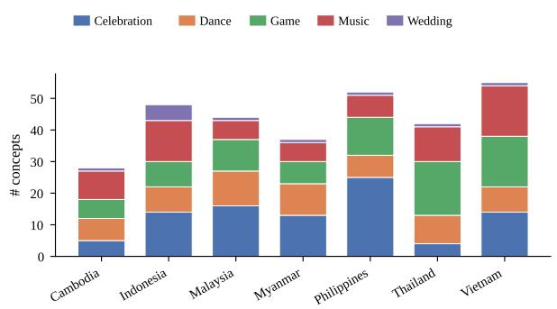  
a) Concepts per country (1 per S1/S2 question)

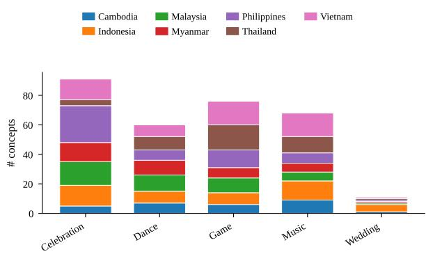

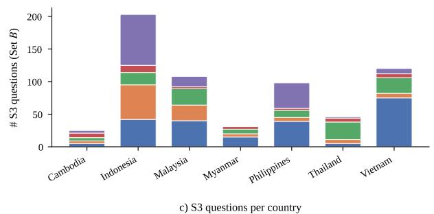

b) Concepts per category  
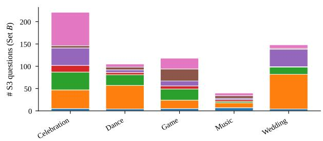  
Figure 5: CMB concept and S3 question distribution. (a, b) Concepts per country and per category (n=306). Each concept corresponds to one S1 and one S2 question on Set A. (c, d) S3 questions per country and per category on Set B (n=631 across 318 source videos).

Summary statistics. Table 6 consolidates the headline numbers used elsewhere in the paper.

## B Human Evaluation

## B.1 Human Evaluation Design

To quantify the cultural gap between current videolanguage models and SEA native speakers, we conduct a human evaluation on Stages 1 and 2 under two complementary roles: a within-country Native ceiling and a within-region but out-of-country Nonnative floor. For every assigned concept, each rater answers the S1 item and its matched S2 item, which keeps the same description as its stem and replaces the name options with the four candidate video moments. Raters see exactly the same question text and options as the models did, so the human and model numbers are directly comparable on the same concepts.

Human Rater pool. We recruit 14 qualified raters, two per SEA country (Cambodia, Indonesia, Malaysia, Myanmar, Philippines, Thailand, Vietnam). Every rater serves in two roles: they are one of two Local raters for their own country, and one of two Non-local raters for exactly one other country. Consequently, each of the seven countries is evaluated by four distinct raters: two Native raters and two Non-native raters.

Non-local rotation. Non-local assignments follow a fixed +1/ + 2 rotation. Ordering the countries KH = 0, ID = 1, MY = 2, MM = 3, PH = 4, TH = 5, VN = 6, person a of country i rates country (i + 1) mod 7 as Non-local, and person b of country i rates country (i+2) mod 7. This guarantees that each country receives Non-local ratings from two different home countries; the resulting pairings are shown in Table 7.

Split-and-overlap rating structure. Within each country's 306-concept universe, both Local raters split the concepts: 20% of the concepts form an overlap subset rated by both Locals, while the remaining 80% is partitioned equally, with each Local rating 40% solo. The two Non-local raters for that country follow the same split on the same 20% overlap subset. Each non-overlapping concept therefore receives two ratings (one Native and one Non-native); each overlapping concept receives four ratings (two Native and two Non-native).

Overlap-subset selection. The 20% overlap subset is drawn by stratified random sampling within each country-category cell using max(1, round $( 0 . 2 n _ { \mathrm { c a t } } ) )$ , with a fixed random seed. The selection is frozen before annotation begins and released as part of the benchmark for reproducibility; raters are not told which items are overlap versus solo.

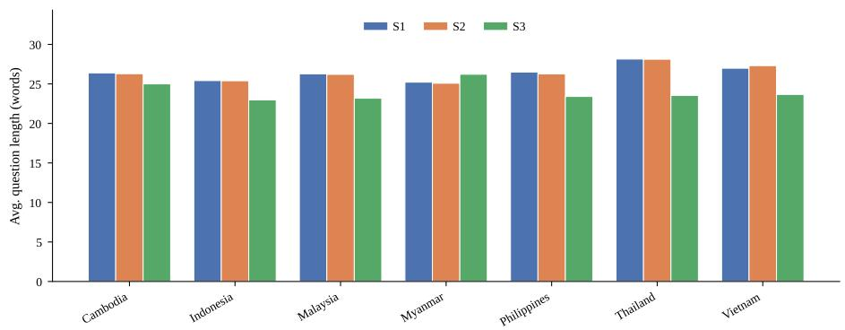

a) Question length per country  
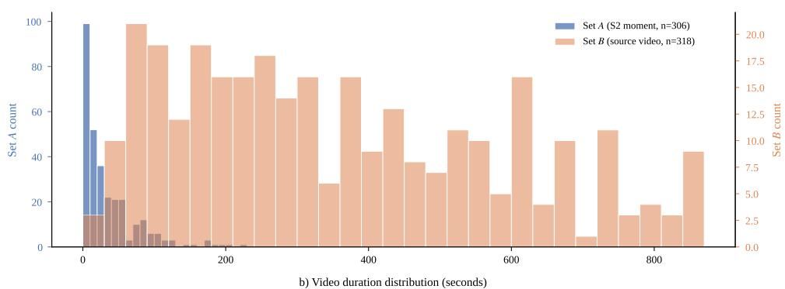

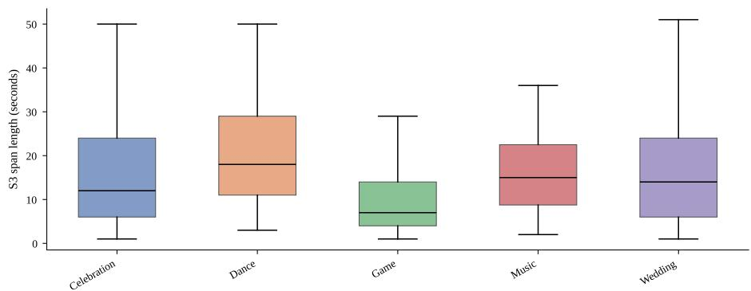  
c) S3 sub-event span length per category  
Figure 6: Question length and video duration distributions. (a) Average S1, S2, and S3 question length (words) per country. (b) Video-duration histogram: Set A S2 moments are short (median 20 s), Set B S3 source videos are long (median 316 s). (c) S3 sub-event span lengths per category, median 13 s overall.

Aggregation. For each concept, the Native score is the mean of available Local ratings, and the Nonnative score is the mean of available Non-local ratings (binary {0, 1} on solo items; continuous {0, 0.5, 1} on overlap items). Per-country Native and Non-native floors are the mean of per-concept scores over that country's concepts. Model numbers reported alongside use the same per-country concept subsets, so all three quantities (Native / Non-native / Model) are computed on the same items.

Workload. Per-rater load ranges from 42 to 64 S1 MCQs (approximately 45 min per rater), producing approximately 732 ratings total (\~9.3 person-hours aggregate). Each assigned concept also carried its matched S2 item, answered in the same session; the workload figures above count S1 MCQs, and the S2 pass added approximately the same number of judgments plus video-viewing time. Table 8 gives the per-kit breakdown.

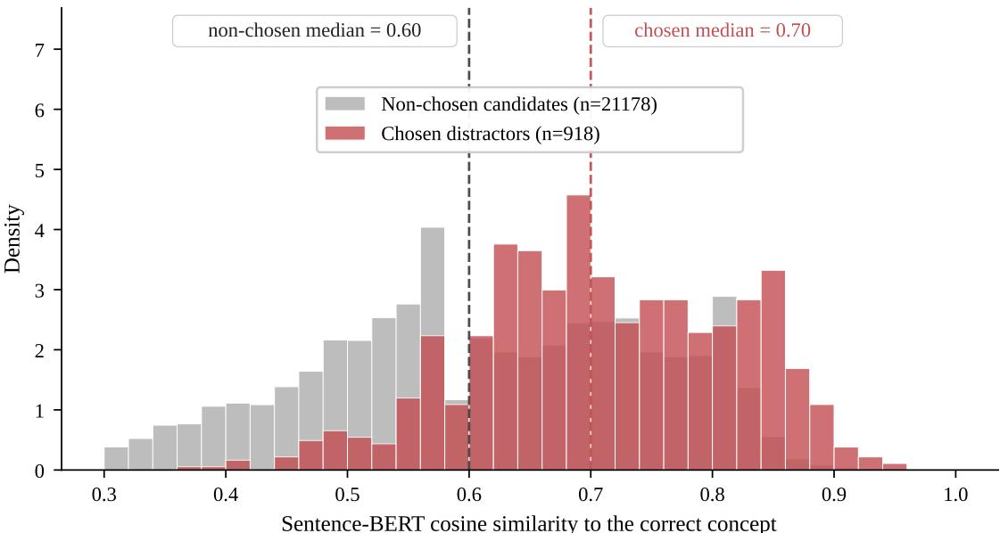

Figure 7: Sentence-BERT cosine similarity between the correct concept and (red) the three chosen S1/S2 distractors versus (gray) the remaining non-chosen candidates in the same per-category pool. Chosen distractors are systematically harder, with a median similarity of 0.70 vs 0.60 for non-chosen candidates.
<table><tr><td>Statistic</td><td>Value</td></tr><tr><td rowspan="5">Concepts S1 questions (= concepts) S2 questions (= concepts)</td><td>306</td></tr><tr><td>306</td></tr><tr><td>306</td></tr><tr><td>631</td></tr><tr><td>306 318</td></tr><tr><td>Unique Set B S3-source videos S2 moment duration (Set A, n=306): median (IQR), seconds S3 source duration (Set B, n=318): median (IQR), seconds</td><td>20 (5–48) 316 (173–540)</td></tr><tr><td>S3 sub-event span (n=631 pairs): median (IQR), seconds</td><td>13 (6–24)</td></tr><tr><td>S1 question length: mean words</td><td>26.4</td></tr><tr><td>S2 question length: mean words</td><td>26.4</td></tr><tr><td>S3 question length: mean words</td><td>23.5</td></tr><tr><td>Chosen distractor similarity: median</td><td>0.70</td></tr></table>

Table 6: CMB dataset summary statistics. Set A counts are 1-to-1 with concepts (one S2-moment video per concept); Set B counts are larger because multi-event traditions contribute more than one S3 sub-event span.

Acknowledged structural asymmetry. Under any design with two Non-local raters per country, the Latin-script vs. non-Latin-script country imbalance (4 vs. 3) forces exactly one country to deviate from the “1 Latin + 1 Local Non-local" pattern. We use the +1/+2 rotation, as shown in Table 7, in which each country's two Local raters are also paired with the next country (+1) and the country after that (+2) in a cyclic order. Under this rotation, the deviation lands on Myanmar, whose two Non-locals are both from the Latin-script cluster (MY and ID). Because Myanmar is itself a non-Latin-script country, both are still cross-cluster raters from its perspective; six of seven countries receive mixed (Latin + Local) Non-local perspectives, and Myanmar's Outsider floor is computed entirely from Latin-script raters. Script-cluster subanalyses (same-cluster vs. different-cluster Nonnative floor) are available on the six mixed countries.

## B.2 Human Raters

Expert raters comprise 2 Ph.D. holders, 3 Ph.D.   
candidates, 1 B.A. graduate, and 1 B.A. student;

<table><tr><td>Country (target)</td><td></td><td>Cluster Local raters</td><td></td><td>Non-local raters Non-local clusters</td></tr><tr><td>Cambodia</td><td>Local</td><td> $\mathrm { K H - a , K H - b }$ </td><td> $\mathrm { V N - a , T H - b }$ </td><td> $\mathrm { L a t i n + L o c a l }$ </td></tr><tr><td>Indonesia</td><td>Latin</td><td> $\mathrm { I D - a , I D - b }$ </td><td> $\mathrm { K H - a , V N - b }$ </td><td> $\mathrm { L o c a l + L a t i n }$ </td></tr><tr><td>Malaysia</td><td>Latin</td><td> $\mathbf { M Y - a } , \mathbf { M Y - b }$ </td><td> $\mathrm { I D - a , K H - b }$ </td><td> $\mathrm { L a t i n + L o c a l }$ </td></tr><tr><td>Myanmar</td><td>Local</td><td> $\mathbf { M } \mathbf { M } \mathbf { - } \mathbf { a } , \mathbf { M } \mathbf { M } \mathbf { - } \mathbf { b }$ </td><td> $\mathrm { M Y - a , I D - b }$ </td><td> $\mathbf { L a t i n + L a t i n }$ </td></tr><tr><td>Philippines</td><td>Latin</td><td> $\mathrm { P H - a , P H - b }$ </td><td> $\mathrm { M M - a , M Y - b }$ </td><td> $\mathrm { L o c a l + L a t i n }$ </td></tr><tr><td>Thailand</td><td>Local</td><td> $\mathrm { T H - a , T H - b }$ </td><td> $\mathrm { P H - a , M M - b }$ </td><td> $\mathrm { L a t i n + L o c a l }$ </td></tr><tr><td>Vietnam</td><td>Latin</td><td> $\mathrm { V N - a , V N - b }$ </td><td> $\mathrm { T H - a , P H - b }$ </td><td> $\mathrm { L o c a l + L a t i n }$ </td></tr></table>

Table 7: Annotator assignment under the $+ 1 / \ + \ 2$ rotation. Each of the seven countries is evaluated by two Local raters (own-country) and two Non-local raters drawn from two different other countries. Six of seven countries receive Non-local ratings from both script clusters (Latin-script: Indonesia(ID)/Malaysia(MY)/Philippines(PH)/Vietnam(VN); non-Latin-script: Cambodia(KH)/Myanmar(MM)/Thailand(TH)); Myanmar is the structural exception discussed in the text.

<table><tr><td colspan="3">Annotator</td><td colspan="3">Non-local Non-local country</td><td colspan="3">Total</td></tr><tr><td>#</td><td></td><td>(60% of own)</td><td></td><td></td><td></td><td>(60%)</td><td></td></tr><tr><td>1</td><td>KH-a</td><td>17 (of 28)</td><td></td><td>Indonesia</td><td></td><td>29</td><td>46</td></tr><tr><td>2</td><td>KH-b</td><td></td><td>17</td><td>Malaysia</td><td></td><td>26</td><td>43</td></tr><tr><td>3</td><td>ID-a</td><td>29 (of 48)</td><td></td><td>Malaysia</td><td></td><td>26</td><td>55</td></tr><tr><td>4</td><td>ID-b</td><td></td><td>29</td><td>Myanmar</td><td></td><td>22</td><td>51</td></tr><tr><td>5</td><td>MY-a</td><td></td><td>26 (of 44)</td><td>Myanmar</td><td></td><td>22</td><td>48</td></tr><tr><td>6</td><td>MY-b</td><td></td><td>26</td><td>Philippines</td><td></td><td>31</td><td>57</td></tr><tr><td>7</td><td>MM-a</td><td></td><td>22 (of 37)</td><td>Philippines</td><td></td><td>31</td><td>53</td></tr><tr><td>8</td><td>MM-b</td><td></td><td>22</td><td>Thailand</td><td></td><td>25</td><td>47</td></tr><tr><td>9</td><td>PH-a</td><td></td><td>31 (of 52)</td><td>Thailand</td><td></td><td>25</td><td>56</td></tr><tr><td>10</td><td>PH-b</td><td></td><td>31</td><td>Vietnam</td><td></td><td>33</td><td>64</td></tr><tr><td>11</td><td>TH-a</td><td></td><td>25 (of 42)</td><td>Vietnam</td><td></td><td>33</td><td>58</td></tr><tr><td>12</td><td>TH-b</td><td></td><td>25</td><td>Cambodia</td><td></td><td>17</td><td>42</td></tr><tr><td>13</td><td>VN-a</td><td></td><td>33 (of 55)</td><td>Cambodia</td><td></td><td>17</td><td>50</td></tr><tr><td>14</td><td>VN-b</td><td></td><td>33</td><td>Indonesia</td><td></td><td>29</td><td>62</td></tr></table>

Table 8: Per-annotator S1 workload under the splitand-overlap scheme. Each annotator rates 60% of their own country's concepts (40% solo + 20% overlap) plus 60% of one Non-local country under the same split. Per-annotator range: 42–64 MCQs (\~32–48 min); total ratings collected: \~732.

5 have published cultural-research papers, and 2 have documented hands-on cultural fieldwork experience. Non-expert raters are native speakers without cultural-research publications or formal cultural-studies training; they were screened only on native fluency and confirmation that they had not previously seen CMB material.

## B.3 Per-country inter-rater agreement

Table 9 reports 4-way Fleiss’ κ on S1 and S2 for each of the seven countries’ overlap items $( n = 6$ 12 per country). Per-country values are noisy at this sample size but follow the pattern observed in the pooled analysis: S2 κ values are positive across all seven countries, while S1 κ values fluctuate around zero. This is consistent with S2's momentgrounded design reducing ambiguity relative to S1's abstract symbolic prompts. The near-chance

pooled S1 κ is consistent with, rather than evidence against, the design: cultural concepts of a neighboring country are hard even for trained native raters, which is exactly the gap the Outsider Filter (§3.3) is intended to harden.
<table><tr><td>Country</td><td>S1κ</td><td>S1n</td><td> $S _ { 2 } \kappa$ </td><td> $S _ { 2 } \mathrm { ~ n ~ }$ </td></tr><tr><td>Cambodia</td><td>+0.005</td><td>6</td><td>+0.120</td><td>6</td></tr><tr><td>Indonesia</td><td>+0.079</td><td>11</td><td>+0.175</td><td>11</td></tr><tr><td>Malaysia</td><td>+0.056</td><td>9</td><td>+0.193</td><td>9</td></tr><tr><td>Myanmar</td><td>-0.172</td><td>8</td><td>+0.099</td><td>8</td></tr><tr><td>Philippines</td><td>-0.202</td><td>10</td><td>+0.225</td><td>10</td></tr><tr><td>Thailand</td><td>-0.052</td><td>9</td><td>+0.152</td><td>9</td></tr><tr><td>Vietnam</td><td>+0.106</td><td>12</td><td>+0.024</td><td>12</td></tr><tr><td>Pooled</td><td></td><td></td><td></td><td></td></tr><tr><td>(Fleiss, all countries)</td><td>+0.011</td><td>65</td><td>+0.166</td><td>65</td></tr></table>

Table 9: Per-country 4-way Fleiss’ κ on S1 and S2 across the 20% overlap items. Pooled row uses all 65 overlap items together. S2 κ is positive across all seven countries; S1 κ fluctuates around zero, consistent with S2's visual grounding reducing rater disagreement relative to S1's abstract symbolic prompts.

## B.4 Human-evaluation results by rater tier

Figure 8 breaks the human study down by rater tier and by whether the rater answered their own country or a neighboring one, with the six-model Carry-mode mean on the same concepts as a reference line. Table 4 in Section 4.4 summarizes the same data.

## C Implementation

## C.1 More on Implementation Details

Joint score: zero-imputationand worked example. In the Joint formula Joint $\begin{array} { r l } { = } & { { } \frac { 1 } { N } \sum _ { i = 1 } ^ { N } \mathbf { 1 } \{ \mathbf { S } 1 _ { i } \} \cdot \mathbf { 1 } \{ \mathbf { S } 2 _ { i } \} } \end{array}$ · IoUi, IoUi is the per-concept S3 IoU, set to zero if the model produces no S3 prediction for concept i. An equivalent form makes the components explicit: $\begin{array} { r c l } { \mathrm { J o i n t } } & { = } & { \frac { n _ { \mathrm { S 1 } \cap \mathrm { S 2 } } } { N } ~ \cdot ~ \overline { { \mathrm { I o U } } } _ { \mathrm { S 1 } \cap \mathrm { S 2 } } } \end{array}$ , where ns1∩s2 is the number of concepts with both S1 and S2 correct, and IoUsi∩s2 is the mean S3 IoU over those concepts. For example, with $\begin{array} { l c l } { n _ { \mathrm { { S 1 } \cap { S 2 } } } } & { = } & { 1 3 8 } \end{array}$ and $\overline { { { \mathrm { I o U } } } } _ { \mathrm { S 1 } \cap { \mathrm { S } } 2 } = 0 . 3 2$ $\mathrm { J o i n t } = ( 1 3 8 / 3 0 6 ) \cdot 0 . 3 2 = 1 4 . 4 \%$

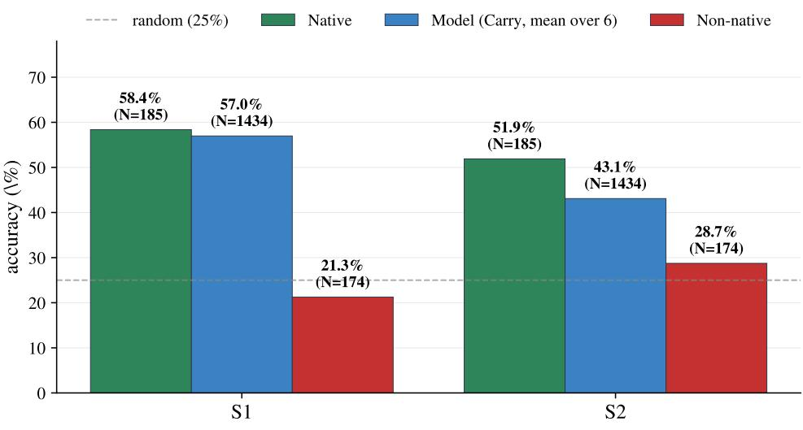

(a) Expert raters  
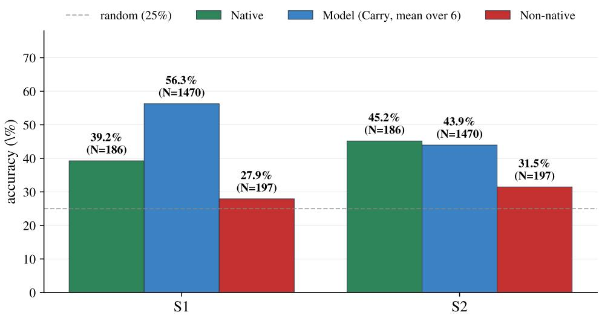  
(b) Non-expert raters  
Figure 8: Human evaluation accuracy on a stratified 20% CMB subset. (a) Expert raters = 7 kits (ID-a, KH-b, MM-a, MY-b, PH-a, TH-b, VN-a) with prior cultural-research experience. (b) Non-expert raters = 7 kits (ID-b, KH-a, MM-b, MY-a, PH-b, TH-a, VN-b) from the general population. "Native" = answering one's own country; “Non-native" = answering one other country via a fixed $+ 1 / + 2$ rotation. The Model bar averages over the six Carry-mode models on the same concept set the humans saw (N = unique concepts × 6 models).

The main S1/S2/S3 experiments all use a single query form (Latin-common), so the split is a post hoc property of the countries, not an experimentally manipulated condition.

Implementation Details. In all evaluated models, each frame is resized to 224×224 before being passed to the model. S1/S2 prompts use the fourway MCQ template shown in Figure 1; S3 prompts ask the model to return the predicted $[ \hat { t } _ { \mathrm { s t a r t } } , \hat { t } _ { \mathrm { e n d } } ]$ span in seconds.

API and compute budget. Closed-source inference was conducted through the Gemini and OpenAI APIs. The total API cost for the full experiment grid (3 stages × 3 modes on S1/S2 plus three modality ablations on S3) was approximately USD 700, split between Gemini and GPT. Opensource models were run on a single multi-GPU node.

## D Additional Results

## D.1 Statistical Reliability

All confidence intervals in this paper come from a cluster bootstrap over concepts: the 306 concepts are resampled with replacement 10,000 times, and each interval is the 2.5 to 97.5 percentile range of the resampled statistic. The concept is the resampling unit because questions within a concept share source video and annotator, so treating questions as independent would understate uncertainty. All six models are evaluated on the same 306 concepts and the same 631 Stage-3 pairs, so every cell below is directly comparable across models. Tables 10, 11 and 12 give the per-cell intervals for S1, S2 and mIoU; Table 13 compares micro and macro averages, and Table 14 tests the pairwise model differences. Significance markers are per-comparison; we do not correct for multiple comparisons. The script that produces every number in this subsection is released with the benchmark.

## D.2 Modality Ablation Details

We re-ran the three lowest-cost models (Gemini 3.1 Pro, Qwen3-VL-32B, Qwen3.5-27B) on the modality ablations; the remaining three (GPT-5.4, InternVL3.5-14B in both configurations) were excluded due to API and compute budget. Table 15 reports the aggregate mIoU shift for each ablation.

## D.3 Modality Role by Country Cluster

The Distracting role shares split sharply along the writing-system clusters, as Table 16 shows. For audio, the cluster gap is +15 points (z=3.84, p<.001 from a two-proportion z-test); for subtitles, the gap is smaller (+8.5 points) but points in the same direction.

The Distracting concepts in the non-Latin-script cluster are dominated by traditional music concepts: of 26 such concepts, 8 are music (47% of non-Latin music concepts with Stage-3 pairs vs 4% in Latin), and 10 are traditional games. The music subset features solo instruments (Saung, Sralai, Chhing, Sor Duang, Ta-pone, Maung, Kong Chai, Tone) whose audio plays uniformly across the clip, providing no temporal signal for the specific sub-event the question asks about. The pattern is also consistent with audio being anchored less reliably for underrepresented languages in pretraining, though we cannot verify the training-side mechanism because the models’ training mixtures are not disclosed.

## D.4 Sensitivity of the modality-role threshold

Section 4.4 bins each video by ∆, the change in mIoU in percentage points when a modality is removed, with the cut at 5 points. Table 17 repeats the binning at 3 and 7 points over the same 631 Stage-3 pairs. Moving the cut moves mass between Redundant and the two active roles, as any threshold must, but neither claim in Section 4.4 depends on the choice. Redundant remains the majority role for all three ablations at all three cuts, ranging from 56.3% to 74.8%. The script-cluster gap also holds: for audio, the Distracting share is 17% for Latin-script countries (n=528 pairs) against 33% for non-Latin-script countries (n=103) at ±3, 14% against 29% at ±5, and 11% against 21% at ±7.

## D.5 Cascade deltas by model and mode

Figure 9 reports the two cascade deltas behind Section 4.3 for every model and mode: $\Delta \mathsf { S } 2 = \mathsf { c } { \mathsf { - } } \mathsf { S } 2$ S2, how much correct naming lifts visual recognition, and $\Delta \mathrm { m I o U } = \mathrm { c } \mathrm { - m I o U } - \mathrm { m I o U } .$ , how much correct visual recognition lifts temporal localization. Significance is against the unconditional baseline for the same model and mode.

## D.6 Stage-3 result breakdowns

Four views of the Stage-3 results support Section 4.2. Figure 10 buckets mIoU by source-video duration: every model falls sharply once videos exceed about ten minutes, while the rise across shorter buckets tracks the growing mean sub-event span; closed-source models degrade more gracefully. A related bias is documented in text-video retrieval, where models favor particular clip lengths unless the effect is removed by causal intervention (Satar et al., 2023). Figure 11 gives the per-clip IoU distribution behind the mIoU averages, which is long-tailed with heavy mass near zero for every model. Figures 12 and 13 report IoU@0.3 and mIoU for all six models under all three modes, split by category and by writing-system cluster.

## D.7 Specialized temporal-localization models on S3

TempCompass (Liu et al., 2024) decomposes temporal understanding for general video; CMB asks the same diagnostic question for culture-specific sub-events. To check whether models designed specifically for video temporal grounding outperform the general-purpose VLMs on S3, we evaluate TimeSuite (Zeng et al., 2025), TRACE (Guo et al., 2025b), and MUSEG (Luo et al., 2026) on the same 306 S3 items. All three models read only the S3 textual cue plus the corresponding source video B; no S1 or S2 information is provided. Table 18 reports mIoU per category and overall.

<table><tr><td>Cell</td><td>n</td><td>Gemini</td><td>GPT-5.4</td><td>Qwen3-VL</td><td>Qwen3.5</td><td>IVL (n)</td><td>IVL (t)</td></tr><tr><td>Indonesia</td><td>48</td><td>85.4 [74.5,94.6]</td><td>70.8 [57.1,83.3]</td><td>56.2 [42.0,70.3]</td><td>58.3 [44.0, 72.4]</td><td>47.9 [33.3, 62.0]</td><td>54.2 [40.0,68.1]</td></tr><tr><td>Malaysia</td><td>44</td><td>86.4 [75.6,95.7]</td><td>86.4 [75.6,95.8]</td><td>52.3 [37.5,66.7]</td><td>61.4 [46.3,75.7]</td><td>54.5 [39.4,69.6]</td><td>43.2 [28.6,58.3]</td></tr><tr><td>Philippines</td><td>52</td><td>84.6 [74.4,93.8]</td><td>76.9 [64.6,87.7]</td><td>55.8 [42.5,69.0]</td><td>57.7 [44.2,71.1]</td><td>48.1 [34.5, 62.2]</td><td>42.3 [28.8,55.9]</td></tr><tr><td>Vietnam</td><td>55</td><td>89.1 [80.0,96.5]</td><td>74.5 [62.7,85.7]</td><td>52.7 [39.3,66.1]</td><td>58.2 [44.8,71.2]</td><td>45.5 [32.6,58.8]</td><td>32.7 [20.8,45.5]</td></tr><tr><td>Cambodia</td><td>28</td><td>67.9 [50.0, 84.6]</td><td>57.1 [38.5,75.7]</td><td>50.0 [31.0,69.2]</td><td>32.1 [15.4, 50.0]</td><td>53.6 [34.5,71.4]</td><td>39.3 [21.4,58.3]</td></tr><tr><td>Myanmar</td><td>37</td><td>56.8 [40.0, 72.7]</td><td>62.2 [46.2,77.5]</td><td>56.8 [40.0,72.7]</td><td>45.9 [29.6,62.9]</td><td>45.9 [30.0, 62.5]</td><td>45.9 [30.0,62.5]</td></tr><tr><td>Thailand</td><td>42</td><td>61.9 [46.8,76.5]</td><td>59.5 [44.1, 74.2]</td><td>31.0 [17.1,45.7]</td><td>50.0 [34.2, 65.2]</td><td>33.3 [19.2,48.6]</td><td>31.0 [17.1,45.2]</td></tr><tr><td>Celebration</td><td>91</td><td>81.3 [73.1,89.1]</td><td>78.0 [69.2, 86.2]</td><td>53.8 [43.6,64.2]</td><td>53.8 [43.5,64.1]</td><td>50.5 [40.4,60.8]</td><td>38.5 [28.4,48.4]</td></tr><tr><td>Dance</td><td>60</td><td>83.3 [73.2,92.4]</td><td>71.7 [60.0, 82.8]</td><td>50.0 [37.3,62.5]</td><td>55.0 [42.6,67.7]</td><td>53.3 [40.7,66.1]</td><td>40.0 [27.4,52.6]</td></tr><tr><td>Game</td><td>76</td><td>72.4 [62.0, 82.2]</td><td>64.5 [53.2, 75.0]</td><td>47.4 [36.2,58.8]</td><td>55.3 [44.2, 66.3]</td><td>32.9 [22.6,43.7]</td><td>44.7 [33.7,56.0]</td></tr><tr><td>Music</td><td>68</td><td>73.5 [62.9, 83.6]</td><td>66.2 [54.5,77.3]</td><td>51.5 [39.7,63.1]</td><td>51.5 [39.4,63.3]</td><td>51.5 [39.7,63.2]</td><td>41.2 [29.4,53.0]</td></tr><tr><td>Wedding</td><td>11</td><td>81.8 [55.6, 100.0]</td><td>81.8 [55.6, 100.0]</td><td>54.5 [22.2,85.7]</td><td>45.5 [15.4,77.8]</td><td>45.5 [15.4,77.0]</td><td>45.5 [14.3,77.8]</td></tr><tr><td>All (micro)</td><td>306</td><td>77.8 [73.2, 82.4]</td><td>70.9 [65.7,75.8]</td><td>51.0</td><td>53.6</td><td>46.7</td><td>41.2</td></tr></table>

Table 10: Cluster-bootstrap 95% confidence intervals for S1 (%) under Carry with the base prompt, resampling the 306 concepts with replacement (10,000 resamples, seed 42, percentile method); n is concepts per cell. The statistic is concept-level: each resampled concept contributes one binary outcome. All six models are evaluated on the same 306 concepts and 631 Stage-3 pairs, so cells are directly comparable. Model abbreviations: Gemini = Gemini 3.1 Pro, GPT-5.4, Qwen3-VL = Qwen3-VL-32B, Qwen3.5 = Qwen3.5-27B, IVL = InternVL3.5-14B with (t) and without (n) inference-time reasoning.

## D.8 Stage-1 result breakdowns

Two views of the Stage-1 results support Section 4.2. Figure 14 reruns S1 with each of the four name-reference variants per concept and reports the spread; five of the seven configurations stay within 3 points, so S1 scores are largely robust to which name reference is shown. Figure 15 splits S1 accuracy by category and by writing-system cluster.

## D.9 Model-specific intervention priorities

Beyond diagnosis, CMB suggests model-specific intervention priorities. Adding cultural knowledge is the priority for the smallest models, where naming itself is the limit. Improving visual recognition is the priority for the two Qwen models, which name well but do not carry the name to a video moment. Temporal localization is a persistent bottleneck across all the models. Regional adaptation of general-purpose VLMs is a complementary route to closing these gaps (Cahyawijaya et al., 2026).

## E Benchmark Categorization

This appendix explains how each entry in Table 1 was categorized, with a focus on properties that required interpretation of the original paper.

SCB (Satar et al., 2025). SCB is image-based and covers 138 cultural concepts from seven countries in Southeast Asia. We mark it as multi-stage with cascade because it has two distinct ability stages: Stage 1 is a visual MCQ for cultural reasoning, and Stage 2 evaluates segmentation of the cultural artifact only when Stage 1 is correct. This is a sequential cascade with conditional dependency. Stage 2 is spatial grounding, not temporal localization, so we mark it as Xon free-form temporal localization. SCB does not report human accuracy on the same task as models (described as future work in the paper).

VideoNorms (Varimalla et al., 2026). VideoNorms covers American and Chinese cultural norms through TV show clips. Each clip is fixed at 15 seconds (0.25 min). The benchmark has three parallel tasks (binary adherence/violation classification, evidence extraction, and norm generation), but these are scored independently rather than sequentially. Evidence quality (Task 2) is computed only on correctly-labeled samples, which is a partial form of conditional analysis; we mark Conditional metrics as Xbecause the headline metric is not a stage cascade. Humans validated only a subsample of LLM-judged outputs; no human accuracy on the full task is reported.

<table><tr><td>Cell</td><td>n</td><td>Gemini</td><td>GPT-5.4</td><td>Qwen3-VL</td><td>Qwen3.5</td><td>IVL (n)</td><td>IVL (t)</td></tr><tr><td>Indonesia</td><td>48</td><td>81.2 [69.4,91.8]</td><td>68.8 [55.3,81.5]</td><td>29.2 [16.7,42.6]</td><td>50.0 [35.7,64.3]</td><td>22.9 [11.5,35.6]</td><td>25.0 [13.0,37.8]</td></tr><tr><td>Malaysia</td><td>44</td><td>86.4 [75.0,95.6] 82.7</td><td>77.3 [63.8, 89.2] 75.0</td><td>31.8 [18.2,46.2] 36.5</td><td>40.9 [26.2,56.0] 40.4</td><td>22.7 [11.1, 36.0] 25.0</td><td>27.3 [14.3,40.8] 19.2</td></tr><tr><td>Philippines</td><td>52</td><td>[71.8,92.3]</td><td>[62.7, 86.3] 80.0</td><td>[23.7,50.0]</td><td>[27.3,54.2]</td><td>[13.6,37.0]</td><td>[8.9, 30.8] 36.4</td></tr><tr><td>Vietnam</td><td>55</td><td>81.8 [70.9,91.5]</td><td>[69.0,90.0] 67.9</td><td>30.9 [18.9,43.5]</td><td>43.6 [30.3,57.1]</td><td>25.5 [14.1,37.1]</td><td>[24.0,50.0]</td></tr><tr><td>Cambodia</td><td>28</td><td>53.6 [34.5, 72.0]</td><td>[50.0, 85.2] 59.5</td><td>25.0 [9.5,42.3]</td><td>28.6 [12.1,46.7]</td><td>35.7 [18.2,54.2]</td><td>25.0 [10.0,42.3]</td></tr><tr><td>Myanmar</td><td>37</td><td>56.8 [40.0, 72.4]</td><td>[43.2, 75.0]</td><td>40.5 [24.3,56.8]</td><td>40.5 [25.0,57.1]</td><td>21.6 [9.1, 35.5]</td><td>32.4 [17.6,48.3]</td></tr><tr><td>Thailand</td><td>42</td><td>52.4 [37.2,67.6]</td><td>42.9 [28.1,58.0]</td><td>23.8 [11.4,37.0]</td><td>33.3 [19.4,47.6]</td><td>21.4 [9.8, 34.3]</td><td>21.4 [9.5, 34.8]</td></tr><tr><td>Celebration</td><td>91</td><td>76.9 [68.0, 85.3]</td><td>78.0 [69.3, 86.3]</td><td>31.9 [22.5,41.5]</td><td>44.0 [33.7,54.1]</td><td>25.3 [16.5, 34.4]</td><td>25.3 [16.3, 34.4]</td></tr><tr><td>Dance</td><td>60</td><td>73.3 [61.8, 84.2]</td><td>66.7 [54.4, 78.6]</td><td>31.7 [20.0,43.8]</td><td>35.0 [23.1,47.1]</td><td>23.3 [13.1, 34.5]</td><td>28.3 [17.2,40.0]</td></tr><tr><td>Game</td><td>76</td><td>71.1 [60.5,81.2]</td><td>57.9 [46.7,68.8]</td><td>32.9 [22.4,43.5]</td><td>38.2 [27.1,49.3]</td><td>23.7 [14.5,33.8]</td><td>28.9 [18.8,39.7]</td></tr><tr><td>Music</td><td>68</td><td>67.6 [56.2,78.3]</td><td>67.6 [56.1, 78.5]</td><td>30.9 [20.0,42.2]</td><td>45.6 [33.8,58.0]</td><td>26.5 [16.4, 37.1]</td><td>25.0 [15.1,35.9]</td></tr><tr><td>Wedding</td><td>11</td><td>81.8 [55.6, 100.0]</td><td>72.7 [42.9, 100.0]</td><td>18.2 [0.0, 44.4]</td><td>27.3 [0.0,57.1]</td><td>18.2 [0.0, 44.4]</td><td>27.3 [0.0,57.1]</td></tr><tr><td>All (micro)</td><td>306</td><td>72.9 [67.6,77.8]</td><td>68.3 [63.1, 73.5]</td><td>31.4 [26.1,36.6]</td><td>40.5 [35.0, 46.1]</td><td>24.5 [19.9,29.4]</td><td>26.8</td></tr></table>

Table 11: Cluster-bootstrap 95% confidence intervals for S2 (%) under Carry with the base prompt, resampling the 306 concepts with replacement (10,000 resamples, seed 42, percentile method); n is concepts per cell. The statistic is concept-level: each resampled concept contributes one binary outcome. All six models are evaluated on the same 306 concepts and 631 Stage-3 pairs, so cells are directly comparable. Model abbreviations: Gemini = Gemini 3.1 Pro, GPT-5.4, Qwen3-VL = Qwen3-VL-32B, Qwen3.5 = Qwen3.5-27B, IVL = InternVL3.5-14B with (t) and without (n) inference-time reasoning.

GIMMICK (Schneider et al., 2025). GIM-MICK is a multitask cultural benchmark spanning UNESCO ICH. The benchmark includes both image (CIVQA) and video (CVVQA) subsets; we compare against the CVVQA video subset, which has 1,809 samples with 10-second clips (0.17 min) drawn from 139 countries. The six tasks are evaluated independently, so we mark Multi-stage cascade as X. GIMMICK explicitly evaluates only in English; SEA's focus is partial because the Asia-Pacific region is one of six macro-regions, but it is not the focus.

ViMUL-Bench (Shafique et al., 2025). ViMUL-Bench spans 14 languages across 14 countries. The

14 languages include Arabic, Bengali, Chinese, English, French, German, Hindi, Japanese, Russian, Sinhala, Spanish, Swedish, Tamil, and Urdu; none is a language of Southeast Asia, so we mark SEA focus as X. Question formats (MCQ, short openended, long open-ended) are parallel, not cascade stages, so Multi-stage cascade is X. Average video duration was computed from the released dataset as 175 seconds (2.92 min). Humans only validate the LLM-judge on a sub-sample, so independent evaluation is marked partial.

MINERVA-Cultural (Singh et al., 2026b). MINERVA-Cultural is a long-form (12.62 min average) multilingual benchmark across 18 locales. Of these 18 locales, 2 are in Southeast Asia (id-ID for Indonesia, th-TH for Thailand), so the SEA focus is partial. The benchmark format is singlestage open-ended QA judged by an LLM on a 0/1/2 scale; we therefore mark Multi-stage cascade as X. MINERVA introduces Iterative Error Isolation (IEI), which traverses an evidence DAG with corrective hints across three iterations. We mark Conditional metrics as √because IEI reports cross-step success-given-success. MINERVA's independent human evaluators do not see ground-truth answers but are permitted to use web search for grounding unfamiliar cultural entities; we therefore mark Human eval as √(without the closed annotation), reflecting independent evaluation under an openbook protocol.

<table><tr><td>Cell</td><td>n</td><td>Gemini</td><td>GPT-5.4</td><td>Qwen3-VL</td><td>Qwen3.5</td><td>IVL (n)</td><td>IVL (t)</td></tr><tr><td>Indonesia</td><td>48</td><td>33.4 [24.8, 44.0]</td><td>27.2 [19.4, 38.2]</td><td>23.3 [16.9, 30.8]</td><td>25.1 [18.5, 33.3]</td><td>2.5 [1.2,4.4]</td><td>4.7 [2.1, 8.4]</td></tr><tr><td>Malaysia</td><td>44</td><td>33.4 [23.0,47.1]</td><td>37.0 [26.8, 45.6] 24.8</td><td>23.9 [13.2,34.5]</td><td>26.8 [16.6, 39.6] 17.8</td><td>3.2 [1.2,5.9]</td><td>2.2 [1.0,3.7]</td></tr><tr><td>Philippines</td><td>52</td><td>25.3 [14.3,47.1]</td><td>[11.9,46.3]</td><td>15.1 [9.5, 28.9]</td><td>[11.1,31.2]</td><td>2.7 [1.1,5.8]</td><td>2.0 [0.6,5.3]</td></tr><tr><td>Vietnam</td><td>55</td><td>30.3 [23.5, 38.1]</td><td>27.8 [20.3,37.1]</td><td>20.4 [13.2,29.7]</td><td>20.5 [14.1,29.1]</td><td>2.2 [0.6, 4.0]</td><td>2.3 [0.4,4.7]</td></tr><tr><td>Cambodia</td><td>28</td><td>53.3 [38.1,71.0]</td><td>47.4 [31.1,67.0]</td><td>36.8 [22.6, 53.9]</td><td>28.9 [16.7,44.1]</td><td>3.4 [0.0,8.7]</td><td>4.0 [0.3,9.0]</td></tr><tr><td>Myanmar</td><td>37</td><td>43.6 [31.4,56.7]</td><td>35.2 [23.8,46.7]</td><td>32.6 [20.0, 45.9]</td><td>32.3 [20.0,45.1]</td><td>1.9 [0.4, 3.7]</td><td>2.2 [0.0, 6.3]</td></tr><tr><td>Thailand</td><td>42</td><td>41.3 [28.6, 59.3]</td><td>42.7 [30.2, 60.6]</td><td>19.0 [9.4,27.5]</td><td>27.6 [17.1,42.5]</td><td>0.7 [0.0, 2.0]</td><td>1.6 [0.0,4.7]</td></tr><tr><td>Celebration</td><td>91</td><td>39.8 [33.8,47.1]</td><td>36.9 [29.7,44.6]</td><td>29.5 [22.9, 36.7]</td><td>26.5 [19.8, 34.4]</td><td>3.0 [1.7,4.7]</td><td>1.5 [0.7,2.6]</td></tr><tr><td>Dance</td><td>60</td><td>30.5 [23.6, 39.6]</td><td>31.7 [24.8, 40.9]</td><td>16.9 [9.3,23.1]</td><td>27.5 [21.5,35.3]</td><td>3.3 [1.4,5.7]</td><td>4.3 [1.3,8.4]</td></tr><tr><td>Game</td><td>76</td><td>37.7 [30.1, 46.4]</td><td>29.9 [23.8, 37.8]</td><td>19.7 [14.0,25.7]</td><td>24.3 [18.5, 31.2]</td><td>2.0 [0.6, 4.0]</td><td>5.0 [2.0, 8.4]</td></tr><tr><td>Music</td><td>68</td><td>56.4 [44.6, 67.8]</td><td>53.6 [41.1,65.6]</td><td>36.1 [24.1,48.6]</td><td>38.5 [26.7,50.7]</td><td>3.7 [1.2,7.0]</td><td>4.0 [0.7,8.1]</td></tr><tr><td>Wedding</td><td>11</td><td>16.4 [8.9, 30.5]</td><td>16.3 [7.2,32.7]</td><td>13.5 [8.2, 22.9]</td><td>13.9 [7.8,23.9]</td><td>1.1 [0.2, 1.8]</td><td>2.4 [0.6, 6.1]</td></tr><tr><td>All (micro)</td><td>306</td><td>33.4 [28.3,39.1]</td><td>31.0</td><td>22.3</td><td>24.1</td><td>2.5</td><td>3.0</td></tr></table>

Table 12: Cluster-bootstrap 95% confidence intervals for MIoU (%) under Carry with the base prompt, resampling the 306 concepts with replacement (10,000 resamples, seed 42, percentile method); n is concepts per cell. The statistic is pair-weighted: each resampled concept contributes all of its Stage-3 pairs, so concepts drawn twice count twice. All six models are evaluated on the same 306 concepts and 631 Stage-3 pairs, so cells are directly comparable. Model abbreviations: Gemini = Gemini 3.1 Pro, GPT-5.4, Qwen3-VL = Qwen3-VL-32B, Qwen3.5 = Qwen3.5-27B, IVL = InternVL3.5-14B with (t) and without (n) inference-time reasoning.

AVMeme Exam (Jiang et al., 2026). AVMeme Exam evaluates audio-visual cultural memes. The paper describes its coverage as “East and South Asia, Middle East, Europe, and North America" with contributors from the U.S., China, Japan, India, and the Middle East; no country in Southeast Asia is named in the coverage list, contributor list, or reported results languages, so SEA focus is X. Twenty independent human participants evaluated on the same task with an explicit closed-book protocol: “without web search, collaboration, or external assistance," so we mark Human eval as √(closed). Video duration is capped at 30 seconds (0.5 min); no average is reported.

ChineseVideoBench (Nie et al., 2025). Chinese-VideoBench is monocultural (Chinese-only), with 1,625 videos averaging about 1 minute each. It has eight main task categories, including a “Temporal Localization" category, but inspection of the question format shows it is an MCQ over orderings rather than free-form span prediction; we therefore mark Free-form temporal localization as X. The benchmark explicitly removes audio tracks to force visual reasoning. The reported human baseline of 94.8% comes from the third subgroup of the same nine-annotator pool that built the benchmark, so we mark Human eval as X: the evaluators are not independent of the annotators.

VideoVista-CulturalLingo (Chen et al., 2025). VideoVista-CulturalLingo covers three cultural regions (Chinese, North American, European) across 1,389 videos, with no focus on Southeast Asia, so we mark SEA focus as X. The benchmark is a single-stage MCQ design without conditional or cascade scoring, so Multi-stage cascade and Conditional metrics are both X. Average video duration reported as 4.05 min. The released paper does not describe an independent human-eval study on the same task, so Human eval is X.

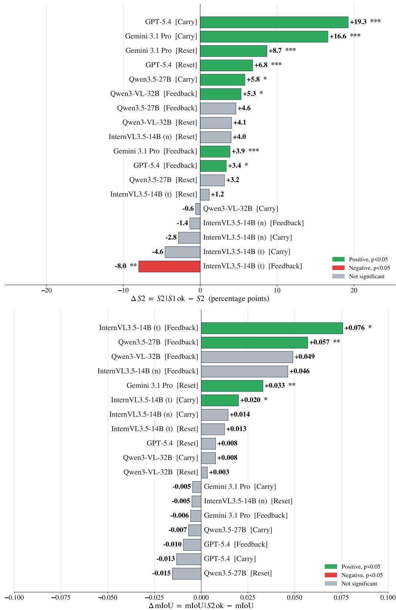  
Figure 9: Per-(model, mode) cascade deltas. Top: $\Delta \mathrm { S } 2 = \mathrm { c } { \cdot } \mathrm { S } 2 - \mathrm { S } 2$ (percentage points), measuring how much correct naming lifts visual recognition. Bottom: $\Delta \mathrm { m I o U } = \mathrm { c } \mathrm { - m I o U } - \mathrm { m I o U } .$ measuring how much correct visual recognition lifts temporal localization. Bars are sorted by effect size within each panel. Stars: $* p < 0 . 0 5 ,$ \* \* $p < 0 . 0 1 , * * * p < 0 . 0 0 1$ against the unconditional baseline. ∆mIoU is in IoU units on [0,1]; multiplied by 100, it gives the points used in the text.

Gemini 3.1 Pro GPT-5.4 Qwen3.5-27B Qwen3-VL-32B InternVL3.5-14B (n) InternVL3.5-14B (t) Stage-3 mIoU by video duration (Carry mode)  
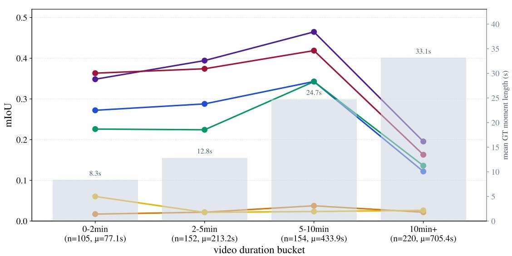  
Figure 10: S3 mIoU under Carry mode, bucketed by Set B source-video duration. Below each bucket: n = number of S3 pairs in the bucket, and Î = mean source-video duration. Markers annotate the mean ground-truth sub-event span in the bucket (right axis). Every model falls sharply once videos exceed about ten minutes, while mIoU rises across the shorter buckets as the mean sub-event span grows. Closed-source models degrade more gracefully. mIoU on [0,1].

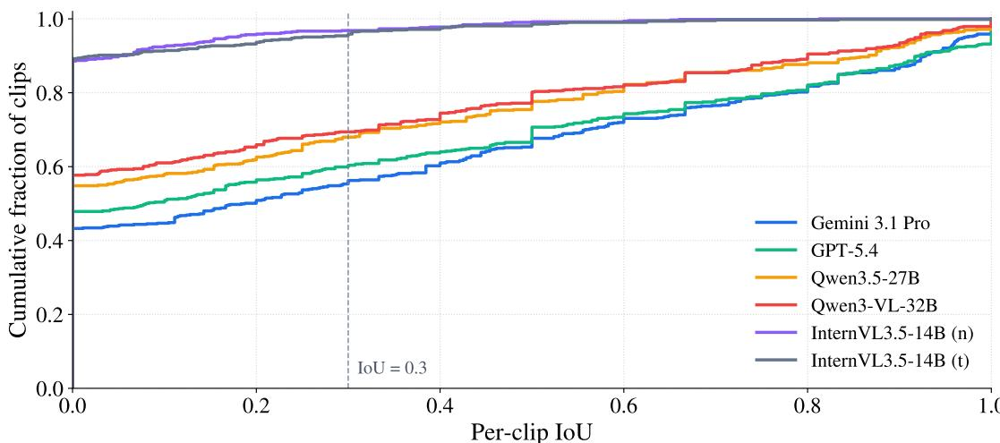  
(a) ECDF of per-clip IoU

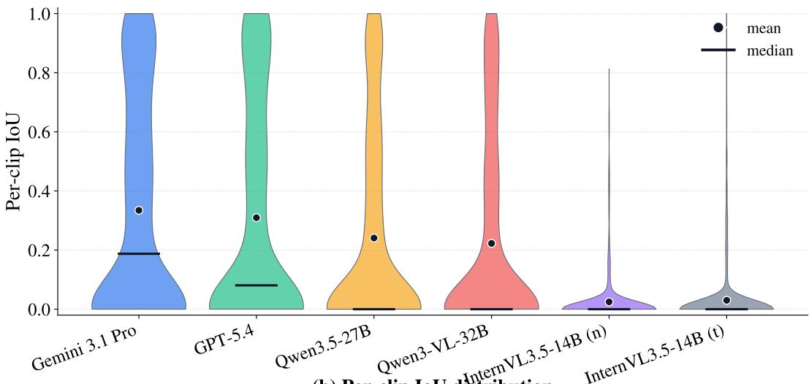  
(b) Per-clip IoU distribution  
Figure 11: Per-clip S3 IoU distribution under Carry mode, across all 306 concepts. (a) ECDF of per-clip IoU; the dashed vertical line marks $\mathrm { I o U } { = } 0 . 3 ;$ one minus the ECDF value at the line gives the IoU@0.3 hit rate per model. (b) Violin plot of the same distributions, with a strip of mean (filled dot) and median (horizontal bar) markers. A single mIoU number hides a long-tailed distribution with a heavy mass near zero for every model.

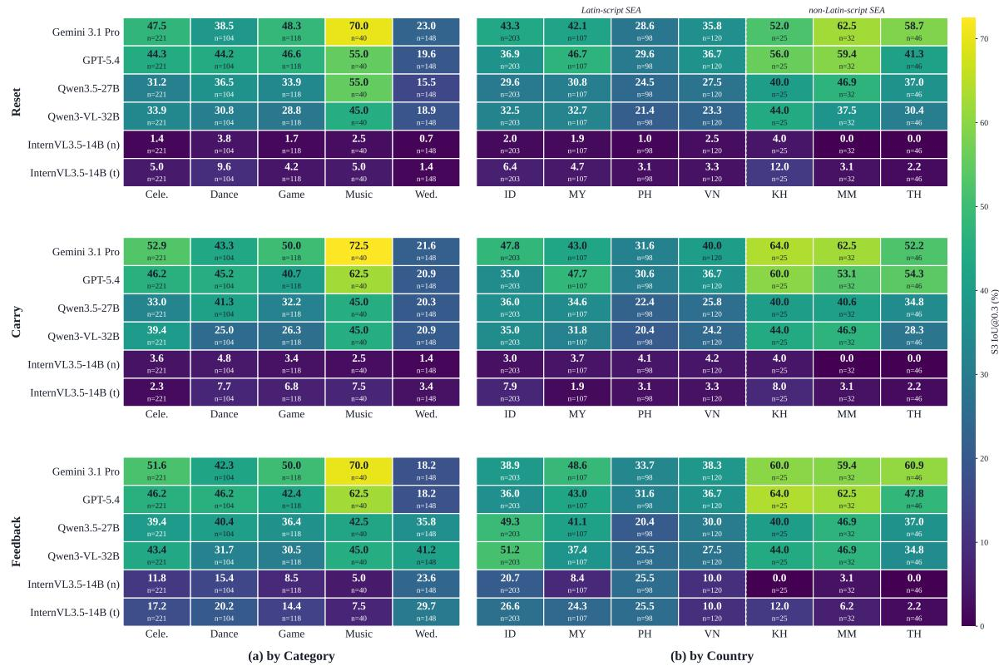  
Figure 12: S3 IoU@0.3 (percentage of pairs with IoU ≥ 0.3) for all six models under all three modes, split by category (left) and by country writing-system cluster (right). Cells report the percentage; row n is the number of pairs aggregated.

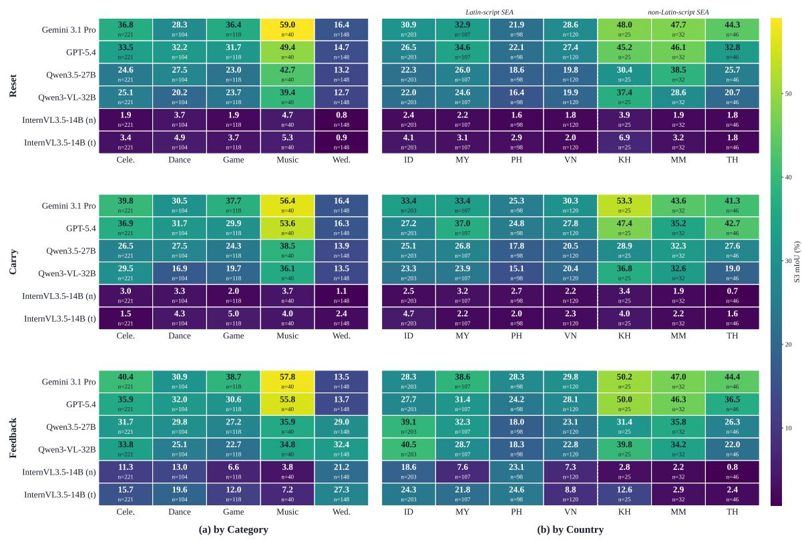  
Figure 13: S3 mIoU (mean Intersection-over-Union) for all six models under all three modes, split by category (left) and by country writing-system cluster (right). Cells report mIoU in percent; row n is the number of pairs aggregated.

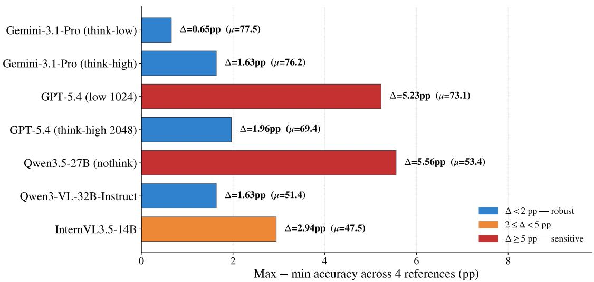  
Figure 14: S1 reference variance across model configurations. For each model, S1 is rerun four times using the four name-reference variants per concept (common vs. official × Latin transliteration vs. local script); the bar reports the maximum minus the minimum S1 accuracy across the four runs (in percentage points), and the value in parentheses is the mean S1 accuracy (μ) across them. Two configurations are reference-sensitive at the ≥ 5 pp threshold (GPT-5.4 low-1024, Qwen3.5-27B nothink); the remaining five stay within 3 pp, indicating that S1 scores are robust to the choice of name reference.

<table><tr><td>Gemini 3.1 Pro</td><td>81.3% n=91</td><td>83.3% n=60</td><td>72.4% n=76</td><td>73.5% n=68</td><td>81.8% n=11</td></tr><tr><td>GPT-5.4</td><td>78.0% n=91</td><td>71.7% η=60</td><td>64.5% n=76</td><td>66.2% η=68</td><td>81.8% n=11</td></tr><tr><td>Qwen3.5-27B</td><td>53.8% n=91</td><td>55.0% n=60</td><td>55.3% n=76</td><td>51.5% n=68</td><td>45.5% n=11</td></tr><tr><td>Qwen3-VL-32B</td><td>53.8% n=91</td><td>50.0% n=60</td><td>47.4% n=76</td><td>51.5% n=68</td><td>54.5% n=11</td></tr><tr><td>InternVL3.5-14B (n)</td><td>50.5% n=91</td><td>53.3% n=60</td><td>32.9% n=76</td><td>51.5% n=68</td><td>45.5% n=11</td></tr><tr><td rowspan="2">InternVL3.5-14B (t)</td><td>38.5% n=91</td><td>40.0% n=60</td><td>44.7% n=76</td><td>41.2% n=68</td><td>45.5% n=11</td></tr><tr><td>Celebration</td><td>Dance</td><td>Game (a) by Category</td><td>Music</td><td>Wedding</td></tr></table>

<table><tr><td rowspan=2 colspan=1>85.4%n=48</td><td rowspan=2 colspan=1>86.4%η=44</td><td rowspan=2 colspan=1>84.6%n=52</td><td rowspan=2 colspan=1>89.1%n=55</td><td rowspan=2 colspan=1>67.9%n=28</td><td rowspan=1 colspan=1>56.8%</td><td rowspan=2 colspan=1>61.9%n=42</td></tr><tr><td rowspan=1 colspan=1>n=37</td></tr><tr><td rowspan=1 colspan=1>70.8%n=48</td><td rowspan=1 colspan=1>86.4%η=44</td><td rowspan=1 colspan=1>76.9%n=52</td><td rowspan=1 colspan=1>74.5%n=55</td><td rowspan=1 colspan=1>57.1%n=28</td><td rowspan=1 colspan=1>62.2%n=37</td><td rowspan=1 colspan=1>59.5%n=42</td></tr><tr><td rowspan=1 colspan=1>58.3%n=48</td><td rowspan=1 colspan=1>61.4%n=44</td><td rowspan=1 colspan=1>57.7%n=52</td><td rowspan=1 colspan=1>58.2%η=55</td><td rowspan=1 colspan=1>32.1%n=28</td><td rowspan=1 colspan=1>45.9%n=37</td><td rowspan=1 colspan=1>50.0%n=42</td></tr><tr><td rowspan=2 colspan=1>56.2%n=48</td><td rowspan=2 colspan=1>52.3%n=44</td><td rowspan=2 colspan=1>55.8%n=52</td><td rowspan=1 colspan=1>52.7%</td><td rowspan=2 colspan=1>50.0%n=28</td><td rowspan=2 colspan=1>56.8%n=37</td><td rowspan=2 colspan=1>31.0%n=42</td></tr><tr><td rowspan=1 colspan=1>n=55</td></tr><tr><td rowspan=1 colspan=1>47.9%n=48</td><td rowspan=1 colspan=1>54.5%n=44</td><td rowspan=1 colspan=1>48.1%n=52</td><td rowspan=1 colspan=1>45.5%n=55</td><td rowspan=1 colspan=1>53.6%n=28</td><td rowspan=1 colspan=1>45.9%n=37</td><td rowspan=1 colspan=1>33.3%n=42</td></tr><tr><td rowspan=1 colspan=1>54.2%n=48</td><td rowspan=1 colspan=1>43.2%n=44</td><td rowspan=1 colspan=1>42.3%n=52</td><td rowspan=1 colspan=1>32.7%n=55</td><td rowspan=1 colspan=1>39.3%n=28</td><td rowspan=1 colspan=1>45.9%n=37</td><td rowspan=1 colspan=1>31.0%n=42</td></tr><tr><td></td><td></td><td rowspan=1 colspan=1>Philippines</td><td></td><td></td><td></td><td></td></tr></table>

Figure 15: S1 (Naming) accuracy for all six models, split by category (left) and by country writing-system cluster (right). Cells report accuracy (%); row n is the number of concepts aggregated.

<table><tr><td>Model</td><td>Scope all values in %, matching Table 2</td><td>S1</td><td>S2</td><td>mIoU</td></tr><tr><td rowspan="2">Gemini</td><td>micro</td><td>77.8 [73.2, 82.4]</td><td>72.9 [67.6,77.8]</td><td>33.4 [28.3,39.1]</td></tr><tr><td>macro-ctry</td><td>76.0 [71.1,80.8] 78.5</td><td>70.7 [65.5,75.7] 74.2</td><td>37.2 [33.1,43.5] 36.2</td></tr><tr><td rowspan="3">GPT-5.4</td><td>macro-cat</td><td>[72.1, 84.2] 70.9 [65.7,75.8]</td><td>[67.5, 80.1] 68.3 [63.1,73.5]</td><td>[32.5,40.7] 31.0</td></tr><tr><td>micro macro-ctry</td><td>69.6 [64.2,74.7]</td><td>67.3 [61.9,72.5]</td><td>[25.8,36.7] 34.6 [30.4,40.7]</td></tr><tr><td>macro-cat</td><td>72.4 [65.7,78.4]</td><td>68.6 [61.3,75.3]</td><td>33.7 [29.8,38.6]</td></tr><tr><td rowspan="3">Qwen3-VL</td><td>micro</td><td>51.0 [45.4,56.5]</td><td>31.4 [26.1,36.6]</td><td>22.3 [18.5,26.4]</td></tr><tr><td>macro-ctry</td><td>50.7 [45.0, 56.4]</td><td>31.1 [25.9, 36.5]</td><td>24.4 [20.8,28.8]</td></tr><tr><td>macro-cat</td><td>51.4 [43.6,59.2]</td><td>29.1 [23.0, 36.0]</td><td>23.1 [19.7,27.0]</td></tr><tr><td rowspan="3">Qwen3.5</td><td>micro</td><td>53.6 [48.0, 59.2]</td><td>40.5 [35.0,46.1]</td><td>24.1 [20.1,28.6]</td></tr><tr><td>macro-ctry</td><td>52.0 [46.4, 57.6]</td><td>39.6 [34.0,45.2]</td><td>25.6 [22.0,30.4]</td></tr><tr><td>macro-cat</td><td>52.2 [44.7,60.0]</td><td>38.0 [31.1,45.5]</td><td>26.2 [22.7,30.2]</td></tr><tr><td rowspan="3">IVL (n)</td><td>micro</td><td>46.7 [41.2,52.3]</td><td>24.5 [19.9,29.4]</td><td>2.5 [1.8,3.3]</td></tr><tr><td>macro-ctry</td><td>47.0 [41.3,52.8]</td><td>25.0 [20.2,30.1]</td><td>2.4 [1.6,3.4] 2.6</td></tr><tr><td>macro-cat</td><td>46.7 [39.2,54.5]</td><td>23.4 [17.6,29.9]</td><td>[1.8,3.6]</td></tr><tr><td rowspan="3">IVL (t)</td><td>micro</td><td>41.2 [35.6,46.7]</td><td>26.8 [21.9,32.0]</td><td>3.0 [1.9,4.3]</td></tr><tr><td>macro-ctry</td><td>41.2 [35.6,46.9]</td><td>26.7 [21.6,31.8]</td><td>2.7 [1.8,4.0]</td></tr><tr><td>macro-cat</td><td>42.0 [34.3,49.8]</td><td>27.0 [20.3, 34.2]</td><td>3.5 [2.2,5.0]</td></tr></table>

Table 13: Micro and macro averages with clusterbootstrap 95% confidence intervals (Carry, base prompt). micro pools all 306 concepts and, for mIoU, all 631 Stage-3 pairs. macro-ctry and macro-cat give each of the 7 countries and 5 categories equal weight. Macro intervals are bootstrapped through the same concept resamples as the cells, not assembled from their bounds. S1 and S2 agree within 2.5 points across every model and scope. All values are percentages, matching Table 2. mIoU runs 1 to 4 points higher under macro because Stage-3 pair mass is concentrated in Wedding, which supplies 3.6% of concepts but 23.5% of pairs and is the hardest cell for every model. Model abbreviations: Gemini = Gemini 3.1 Pro, GPT-5.4, Qwen3-VL = Qwen3- VL-32B, Qwen3.5 = Qwen3.5-27B, IVL = InternVL3.5- 14B with (t) and without (n) inference-time reasoning.

<table><tr><td>Comparison</td><td>∆S1</td><td>∆S2</td><td>∆mIoU</td></tr><tr><td>Gemini vs. GPT-5.4</td><td>+6.9 [+2.3,+11.4]</td><td>+4.6 [-0.7,+9.8]</td><td>+2.5 [-1.6, +6.4]</td></tr><tr><td>Gemini vs. Qwen3-VL</td><td>+26.8</td><td>+41.5 [+20.6, +33.0] [+34.6, +48.4] [+7.8, +15.2]</td><td>+11.2</td></tr><tr><td>Gemini vs. Qwen3.5</td><td>+24.2</td><td>+32.4</td><td>+9.4 [+17.6, +30.7] [+25.5,+39.2] [+5.7,+13.5]</td></tr><tr><td>Gemini vs. IVL (n)</td><td>+31.0</td><td>+48.4</td><td>+31.0 [+24.5, +37.6] [+41.2, +55.2] [+26.0, +36.4]</td></tr><tr><td>Gemini vs. IVL (t)</td><td>+36.6</td><td>+46.1</td><td>+30.4 [+29.7, +43.5] [+38.9,+52.9] [+25.5, +35.9]</td></tr><tr><td>GPT-5.4 vs. Qwen3-VL</td><td>+19.9 [+13.4, +26.1] [+30.1, +43.5] [+4.7,+13.2]</td><td>+36.9</td><td>+8.7</td></tr><tr><td>GPT-5.4 vs. Qwen3.5</td><td>+17.3</td><td>+27.8</td><td>+6.9 [+10.5, +23.9] [+21.2,+34.3][+3.0,+11.3]</td></tr><tr><td>GPT-5.4 vs. IVL (n)</td><td>+24.2</td><td>+43.8</td><td>+28.5 [+17.6, +31.0] [+36.9, +50.7] [+23.4, +34.1]</td></tr><tr><td>GPT-5.4 vs. IVL (t)</td><td>+29.7</td><td>+41.5</td><td>+28.0 [+22.9, +36.6] [+34.3,+48.4] [+23.0, +33.6]</td></tr><tr><td>Qwen3-VL vs. Qwen3.5</td><td>-2.6 [-8.8, +3.6]</td><td>-9.2 [-14.7,-3.6]</td><td>-1.8 [-4.8,+1.3]</td></tr><tr><td>Qwen3-VL vs. IVL (n)</td><td>+4.2 [-2.3,+10.8]</td><td>+6.9</td><td>+19.8 [+0.3,+13.7] [+16.0,+23.9]</td></tr><tr><td>Qwen3-VL vs. IVL (t)</td><td>+9.8</td><td>+4.6</td><td>+19.3 [+2.9,+16.3] [-2.6, +11.4] [+15.5,+23.5]</td></tr><tr><td>Qwen3.5 vs. IVL (n)</td><td>+6.9</td><td>+16.0</td><td>+21.6 [+0.0,+13.4] [+9.2,+23.2] [+17.6,+26.1]</td></tr><tr><td>Qwen3.5 vs. IVL (t)</td><td>+12.4</td><td>+13.7</td><td>+21.1 [+5.6,+19.0] [+6.2,+21.2] [+17.3,+25.4]</td></tr><tr><td>IVL (n) vs. IVL (t)</td><td>+5.6 [-0.7,+11.8]</td><td>-2.3 [-8.2, +3.9]</td><td>-0.5 [-1.7,+0.5]</td></tr></table>

Table 14: Paired cluster bootstrap on pairwise model differences (Carry, base prompt, micro). Because all six models are evaluated on the same 306 concepts, the difference is taken within each of the 10,000 concept resamples; this is materially more powerful than checking whether two marginal intervals overlap. ∆mIoU is in mIoU points ×100. Bold marks differences whose 95% interval excludes zero. Every closed-weight against open-weight comparison is significant on all three metrics; the Gemini lead over GPT-5.4 is significant on S1 only; and inference-time reasoning yields no measurable difference for InternVL3.5-14B. Model abbreviations: Gemini = Gemini 3.1 Pro, GPT-5.4, Qwen3-VL = Qwen3-VL-32B, Qwen3.5 = Qwen3.5- 27B, IVL = InternVL3.5-14B with (t) and without (n) inference-time reasoning. Significance markers are percomparison; we do not correct for multiple comparisons.

<table><tr><td>Ablation</td><td>n pairs</td><td> mIoU points</td><td>p</td></tr><tr><td>No-audio</td><td>631</td><td>-0.02</td><td>.55</td></tr><tr><td>No-subtitles</td><td>631</td><td>-0.65</td><td>.10</td></tr><tr><td>Visual-only</td><td>631</td><td>-0.81</td><td>.045</td></tr></table>

Table 15: Aggregate mIoU shift per modality ablation, pooled across the three ablation-instrumented models (Gemini 3.1 Pro, Qwen3-VL-32B, Qwen3.5-27B). pvalues from paired tests against the baseline. Per-pair role classifications derived from these shifts appear in Figure 3.

<table><tr><td>Cluster</td><td>Distr. audio (%)</td><td>Distr. subs (%)</td></tr><tr><td>Latin-script</td><td></td><td></td></tr><tr><td>(ID/MY/PH/VN)</td><td>14.0</td><td>11.9</td></tr><tr><td>non-Latin-script</td><td></td><td></td></tr><tr><td>(KH/MM/TH)</td><td>29.1</td><td>20.4</td></tr></table>

Table 16: Distracting role share (%) by writing-system cluster, pooled across Gemini 3.1 Pro, Qwen3-VL-32B, and Qwen3.5-27B over the same 631 S3 pairs as Figure 3. Non-Latin-script cluster shows a +15 pp audio gap (p < .001) and a +8.5 pp subtitle gap.

<table><tr><td>Ablation</td><td>Comp.</td><td>Redun.</td><td>Distr.</td></tr><tr><td colspan="4">Cut at ±3 points</td></tr><tr><td>No-audio</td><td>20.6</td><td>59.6</td><td>19.8</td></tr><tr><td>No-subtitles</td><td>20.3</td><td>63.5</td><td>16.2</td></tr><tr><td>Visual-only</td><td>24.2</td><td>56.3</td><td>19.5</td></tr><tr><td colspan="4">Cut at ±5 points, used in the paper</td></tr><tr><td>No-audio</td><td>17.0</td><td>66.4</td><td>16.6</td></tr><tr><td>No-subtitles</td><td>16.8</td><td>69.7</td><td>13.5</td></tr><tr><td>Visual-only</td><td>20.8</td><td>63.1</td><td>16.2</td></tr><tr><td colspan="4">Cut at ±7 points</td></tr><tr><td>No-audio</td><td>15.2</td><td>71.8</td><td>13.0</td></tr><tr><td>No-subtitles</td><td>14.1</td><td>74.8</td><td>11.1</td></tr><tr><td>Visual-only</td><td>17.9</td><td>69.3</td><td>12.8</td></tr></table>

Table 17: Modality-role shares as a percentage of the 631 Stage-3 pairs, at three values of the classification cut. ∆ is the mean change in mIoU across the three ablation-instrumented models. Redundant stays the majority role in every row.

<table><tr><td></td><td>TimeSuite mIoU (%)</td><td>TRACE mIoU (%)</td><td>MUSEG mIoU (%)</td></tr><tr><td>Celebration</td><td>9.5</td><td>8.8</td><td>22.4</td></tr><tr><td>Dance</td><td>3.9</td><td>2.0</td><td>15.5</td></tr><tr><td>Game</td><td>11.2</td><td>6.0</td><td>21.6</td></tr><tr><td>Music</td><td>10.6</td><td>18.6</td><td>26.4</td></tr><tr><td>Wedding</td><td>10.5</td><td>13.5</td><td>13.8</td></tr><tr><td>Overall</td><td>9.2</td><td>5.9</td><td>19.3</td></tr></table>

Table 18: S3 temporal-localization mIoU of specialized temporal-grounding models on CMB, broken down by category. All three models receive the concept name and sub-event cue as text input and produce a free-form $[ \hat { t } _ { \mathrm { s t a r t } } , \hat { t } _ { \mathrm { e n d } } ]$ span on video B. They all evaluate at 1 fps with 224×224 resolution.