# EG-ARSA: An Expert-Grounded Open Model for Visual Road Safety Auditing in Low-Resource Settings

Md Thamed Bin Zaman Chowdhury<sup>a,\*</sup>, Moazzem Hossain<sup>a</sup>

<sup>a</sup>Department of Civil Engineering, Bangladesh University of Engineering and Technology (BUET), Dhaka, Bangladesh

## Abstract

Road trafic injuries remain a major challenge in low- and middle-income countries, where proac tive road safety auditing is limited by incomplete crash records, shortages of qualified auditors, and the high cost of large-scale field inspections. These constraints make nationwide safety as sessment dificult using conventional engineering practices. To address this problem, we propose Expert-Grounded Distillation (EGD), a novel artificial intelligence framework that transfers institutional road safety expertise into a compact vision-language model for scalable visual road safety auditing. The key innovation is a quantified expert-grounding stage in which the teacher visionlanguage model is calibrated against authoritative field audits conducted by a national road safety research institute under a World Bank–financed rural transport project. Large-scale annotation is permitted only after the teacher reaches substantial agreement with expert risk assessments (Cohen’s $\kappa = 0 . 7 4 )$ . The calibrated teacher then generates structured supervision that is distilled into an 8-billion-parameter student vision-language model using Low-Rank Adaptation and a single leakage-free prompt. We also introduce Bangladesh Road Safety Audit (BD-ARSA), the first open, expert-grounded Bangladeshi visual road safety audit dataset containing 21,947 image–audit records with near-national coverage, and Expert-Grounded Road Safety Auditor (EG-ARSA), the first vision-language model developed specifically for this task. Experimental results show that grounded fine-tuning substantially improves ordinal risk assessment over the zero-shot baseline, while blind expert evaluation demonstrates that the compact student outperforms both its 31- billion-parameter teacher and Gemini-2.5-Flash. These findings demonstrate that EGD provides an efective and scalable engineering solution for proactive road safety auditing in resource-constrained environments.

Keywords: Road safety audit, Vision-language models, Knowledge distillation, Low-resource settings, Parameter-eficient fine-tuning, Open dataset

## 1. Introduction

Road trafic crashes kill about 1.19 million people every year. Despite possessing only about 60% of the world’s vehicles, low- and middle-income countries (LMICs) sufer 90% of these fatalities. Furthermore, vulnerable demographics — specifically pedestrians, cyclists, and motorcyclists — comprise nearly 53% of this global death toll (World Health Organization, 2023). As a lowermiddle-income nation (Metreau et al., 2024), Bangladesh experiences a disproportionately severe impact from this crisis. Oficial figures estimate around 4,000 deaths and 200,000 injuries each year, with the economic toll of these crashes equating to as much as 5.1% of the national GDP (World Bank, 2022). The country’s victim demographic is exceptionally vulnerable: approximately 80% of all road fatalities involve pedestrians, cyclists, or motorcyclists, while in Dhaka, pedestrians account for up to 70% of urban trafic deaths (Hoque et al., 2021). Efectively mitigating these hazards and preventing further loss of life relies entirely on accurate data. However, in this context, the fundamental data infrastructure required to locate and address these dangers is painfully scarce.

Conventional road-safety management is crash-based. It identifies black spots from the historical crash record and treats them. This paradigm fails if crash data is missing or under-reported. Road-crash data in most LMICs is scarce and unreliable: oficial statistics substantially underreport road trafic injuries, with large discrepancies between national records and global statistical estimates (Mitra and Bhalla, 2023). Bangladesh’s crash-recording system has been described as cumbersome, error-prone, and unsuitable for analysis, with a greater than 90% discrepancy between government recorded fatalities and WHO estimates. Moreover, there is little usable crash data since 2016 (World Bank, 2022). In several LMICs, police First Information Reports (FIRs) yield severe underreporting, as its capture rate is as low as 13–30% (Bhuiyan et al., 2022; Newaz et al., 2026; Rabbani et al., 2022). Crash-frequency and black-spot methods that work in high-income countries are therefore unreliable here, and a diferent solution is needed.

Proactive infrastructure auditing can address this issue. A Road Safety Audit (RSA) is “a formal safety performance examination of an existing or future road or intersection by an independent, multidisciplinary team” (Federal Highway Administration, 2018). RSA scores infrastructure hazards rather than crash history, so it is robust in comparison to gaps in the crash records. Proactive, iRAP-style star rating saves lives at scale. In a study, an estimated 159,936 fatal-and-serious injuries are averted annually across 74 countries by this method (Li et al., 2024). Bangladesh has begun to institutionalise this approach. Under the World Bank–financed Second Rural Transport Improvement Project (RTIP-II, Additional Financing; P166295), the Local Government Engineering Department (LGED) commissioned faculty of the Accident Research Institute (ARI) at the Bangladesh University of Engineering and Technology (BUET) to conduct formal field RSAs across roughly 1,433 km in 18 districts, following the LGED audit methodology. The reports of this project are the sources of this study’s expert ground truth. Jurisdiction defines the road class in Bangladesh: LGED governs rural and suburban (upazila/union) roads, the Roads and Highways Department (RHD) governs national and regional highways, and City Corporations govern metropolitan streets. Because our expert audits come from LGED, EG-ARSA targets the rural/- suburban road class by design, which is the segment carrying the heaviest unaddressed rural-road crash toll.

Formal audits, however, do not scale. Globally only about 1.5 million km have been star rated against a UN target near 12 million km by 2030 (Li et al., 2024); each RSA requires a multidisciplinary expert team on site, and the ARI–BUET programme itself proceeded in phases over several years for a fraction of the network. Automation is the only path to coverage. The question this paper addresses is whether modern vision-language models (VLMs) can automate the auditor’s judgement.

Existing automation falls into two families, neither of which fits the current need (Section 2 describes this). Supervised CNN/LSTM iRAP coders are data-hungry, do not transfer across jurisdictions, and emit no interpretable audit (Kačan et al., 2022; Song et al., 2019). Zero-shot VLM auditors generalise and produce language output but are zero-shot, proprietary, street-viewonly, and weak on fine-grained detail (Jongwiriyanurak et al., 2024; Ameen et al., 2026; Garg and Aich, 2025; Yang et al., 2024). Crucially, none are adapted to Bangladesh or the LGED methodology, none are open or fine-tuned, and none release a reusable dataset.

The core premise of our approach is that domain-specific expert grounding, rather than sheer model scale, improves performance in road safety auditing, and crucially, this grounding can be efectively distilled into a smaller model. Without fine-tuning, a standard smaller open-source VLM performs at near-chance levels on the ordinal risk task (base Qwen3-VL QWK = 0.077), and even massive frontier models or large teacher models struggle to audit efectively without explicit grounding. This is evidenced by a sharp performance drop in the teacher model itself in our testing. Although the calibrated, grounded teacher agrees with expert risk judgement at � = 0.74, the same teacher run leakage-free is correct on only 36% of expert-set risk verdicts (Section 5.4). Consequently, standard knowledge distillation from this teacher would simply transfer its unaided limitations to the student. To overcome this, we introduce Expert-Grounded Distillation (EGD). In this process, the teacher model’s audit generation is strictly conditioned on authoritative field data (the ARI–BUET on-site audits) and subsequently verified by humans. A compact, open-source student model is then fine-tuned entirely on this expert-verified supervision. By internalising this specialised knowledge, the student model becomes capable of producing high-quality audits from a single image, ultimately outperforming both its 31B-parameter teacher and frontier proprietary VLMs.

We build two artifacts. The model is a compact, open, single-image street-view auditor (Qwen3-VL-8B-Instruct adapted with LoRA) that outputs a structured JSON audit (hazards with LGED category and severity, an ordinal overall risk, and a recommendation). The dataset, BD-ARSA, is ∼22k image–audit records across three provenance tiers (expert-gold PDF hazard crops, expert-silver grounded audits, and street-view imagery), with location-disjoint splits, released openly under CC BY 4.0. To our knowledge, this dataset is the first South-Asian, expertgrounded, LGED-schema road-safety visual-audit corpus. The street-view tier samples 155 road corridors spanning 63 districts across all 8 administrative divisions of Bangladesh. The expertgrounded gold and silver audits come from the 18 LGED-audited districts with field-verified ground truth. Because the ground truth is faculty-conducted field audits under a national, World Bank– financed programme rather than crowdsourced or analyst labels, the dataset directly answers the crash-data-quality critique above. EG-ARSA is purpose-built for rural/suburban (LGED-class) roads. National highways (RHD) and dense city networks (City Corporations) fall under other jurisdictions and are addressed as future work (Section 6).

Our primary findings highlight the significant performance advantages of our approach. Grounded fine-tuning increases the ordinal risk Quadratic Weighted Kappa (QWK) by +0.40 compared to the zero-shot baseline, achieving approximately 0.48 alongside an exact-risk accuracy of 0.72. The statistical robustness of this improvement is confirmed by non-overlapping bootstrap confidence intervals. Furthermore, under identical single-image, leakage-free inference conditions, a blind human-expert evaluation revealed that the 8B student model accurately assessed risk 81% of the time. This substantially outperforms both the proprietary Gemini-2.5-Flash model (58%) and the 31B teacher model (42%). This performance ranking is independently validated by fully automated metrics, which yielded corresponding scores of 0.74, 0.59, and 0.36. Finally, our evaluation framework advances the existing iRAP-VLM literature by incorporating rigorous methodological controls, including bootstrap confidence intervals (Efron, 1979), a zero-shot base ablation, ordinal QWK, a blind human panel, and a strict judge-bias control mechanism (Zheng et al., 2023; Panickssery et al., 2024) that evaluates the teacher leakage-free to eliminate any unfair grounding advantage.

The compact 8B + LoRA design is single-GPU-cheap to train and runs on modest hardware (Hu et al., 2022; Dettmers et al., 2023), so it can be deployed in low-resource settings via a web application at a fraction of the cost of a formal audit. This turns a methodological result into an LMIC public good: orders-of-magnitude cheaper audit coverage where formal iRAP is unafordable. The recipe (institutional-audit grounding distilled into a compact open student) generalises to any jurisdiction with even a small expert-audited corpus, and the same approach can extend to the national-highway network (with RHD) and to city streets (with City Corporations) once their audit data are available, building towards an end-to-end auditor spanning all road classes in Bangladesh.

Contributions. The main contributions of this paper are:

1. Quantified expert grounding as a gated step. We treat the teacher’s generation prompt as an object to be empirically validated: it is calibrated against authoritative institutional field audits (ARI–BUET under LGED), and its agreement with expert risk judgement is measured (� = 0.74) before any nationwide label generation. Scaling the supervision is gated on this measurement, making expert grounding a verified, reported property rather than an assumed one.

2. Expert-Grounded Distillation (EGD), an integrated pipeline. To the best of our knowledge, this is the first framework to unify (i) expert-ground-truth prompt calibration against authoritative institutional field audits, (ii) deliberate teacher–student prompt asymmetry, in which a scafolded teacher prompt is distilled into a stripped, leakage-free student prompt, and (iii) confidence-tiered supervision spanning expert-gold, expert-silver, and largescale street-view annotations within a single methodology. By grounding teacher supervision in professional field audits before large-scale distillation, EGD decisively outperforms conventional ungrounded distillation.

3. BD-ARSA and EG-ARSA: the first open artifacts of their kind. We release the first open, expert-grounded Bangladeshi road-safety visual-audit dataset (21,947 records, 12- category LGED schema, location-disjoint splits) and the first VLM purpose-built for visual road-safety auditing in the region.

4. A demonstration that grounding beats scale, under rigorous controls. In a real, high-stakes, low-resource setting, a compact 8B student surpasses both its 31B teacher (leakage-free, 42%) and a frontier VLM (Gemini-2.5-Flash, 58%) at 81% expert-graded risk correctness. It was evaluated with bootstrap confidence intervals, a zero-shot base ablation, ordinal QWK, a blind human panel, and an explicit judge-bias control.

The remainder of this paper is organised as follows. Section 2 reviews related work on automated road safety assessment and on the adaptation and evaluation of vision-language models. Section 3 describes the curation of the BD-ARSA dataset. Section 4 presents the Expert-Grounded Distillation methodology. Sections 5 and 6 report results and discuss findings, limitations, and future directions. Section 7 concludes.

## 2. Related work

## 2.1. Automated road safety assessment

## 2.1.1. Supervised and pre-VLM iRAP/RSA coding

The initial push to automate road-safety assessments framed the challenge primarily as supervised attribute coding. For example, Kačan et al. (2020) developed a multi-task ResNet/- DenseNet architecture designed to jointly classify 52 distinct iRAP attributes across 1,850 km of roads in Bosnia. Kačan et al. (2022) subsequently advanced this work by incorporating a Mapillarypretrained backbone, attribute-specific recurrent heads, and a recall-driven dynamic loss function, alongside releasing the extensive iRAP-BH dataset. Prior to these developments, various CNN and CNN/LSTM pipelines were utilised to map panoramic and street-view imagery directly to specific safety features and star ratings (Song et al., 2019; Sainju and Jiang, 2019). Additionally, segmentation- and detection-based coding techniques were successfully demonstrated for AusRAP frameworks by Sanjeewani and Verma (2021), and for unconstrained roadways in South Asia by Rithish et al. (2021). While these supervised models deliver robust accuracy, they sufer from notable practical drawbacks. Specifically, they require massive amounts of per-attribute labelled training data, fail to seamlessly transfer across diferent auditing schemas or geographical jurisdictions, and yield rigid categorical codes rather than generating clear, interpretable narrative audits. These limitations strongly highlight the critical need for a more adaptable, language-capable approach that minimises the reliance on extensive manual labelling.

## 2.1.2. Vision-language models

Vision-language models reframed the problem as visual question answering over road imagery. The anchor work, V-RoAst (Jongwiriyanurak et al., 2024), casts iRAP coding as zero-shot VQA with proprietary models (Gemini-1.5-Flash, GPT-4o-mini) over the ThaiRAP set and finds that VLMs generalise better than CNNs to unseen classes but underperform on spatial and metric attributes. Its closest follow-up (Ameen et al., 2026) reproduces this on Gemini-2.0/2.5 Flash with bootstrap confidence intervals and a reduced image-only prompt, again zero-shot, street-view-only, and proprietary. Related eforts apply VLMs to highway-scene understanding (Yang et al., 2025), edge-deployable safety detection (Tami et al., 2025), and graded pavement scoring (Xu et al., 2025), and several Bangladesh-specific street-view safety studies use semantic segmentation rather than generative VLMs (Hamim and Ukkusuri, 2024). A parallel literature documents the empirical limits of VLMs on street imagery: specialist self-supervised models substantially outperform VLMs on fine-grained sign and object recognition (Garg and Aich, 2025), and frontier VLMs are weak on counting and geometry while strong on qualitative description (Yang et al., 2024). These limits bound what a single-image auditor can recover and indicate where teacher-generated labels are most likely to be noisy. Across this literature, the VLM auditors that exist are zero-shot, proprietary-API-based, and street-view-only; none is fine-tuned, open, grounded in the Bangladesh/LGED methodology, or paired with a reusable dataset, which is the gap EG-ARSA fills.

## 2.2. Domain adaptation of vision-language models

## 2.2.1. Knowledge distillation and learning from teacher-generated labels

Research demonstrates that compact student models can surpass significantly larger architectures when trained on high-quality, teacher-generated supervision. For instance, Hsieh et al. (2023) showed that extracting teacher rationales as an auxiliary training signal allows smaller models to achieve superior performance with reduced data requirements, while Liu et al. (2023) validated the use of machine-generated multimodal supervision in visual instruction tuning. Furthermore, Udandarao et al. (2025) posit that active data curation functions as a distinct form of knowledge distillation that can sometimes outperform traditional logit-matching. It is a finding that directly supports our premise of utilising a curated dataset as the primary distillation mechanism. Additionally, Amin et al. (2025) detail how models trained on “weak” (synthetic or teacher-generated) data can avoid model collapse and even exceed the capabilities of the generator model, provided the training data undergoes careful curation and human verification. However, prior distillation frameworks have typically grounded their supervision in generic teacher outputs. The critical distinction introduced by EG-ARSA is the deliberate anchoring of this supervision in formal, institutional expert audits.

We position EG-ARSA precisely against the mechanisms it builds on. The teacher–student prompt asymmetry at the heart of EGD is an instance of context distillation (Askell et al., 2021; Snell et al., 2022), in which knowledge supplied to a model through an elaborate context is internalised into its weights and later reproduced without that context; EG-ARSA instantiates this idea for structured visual auditing, the teacher’s context being an expert-calibrated LGED audit prompt and the student deploying from a single leakage-free prompt. Our result that an 8B student surpasses its 31B teacher is a real-domain demonstration of weak-to-strong generalization (Burns et al., 2023), a strong model elicited from supervision generated under weaker, unaided conditions. And whereas recent domain-grounded synthetic-data pipelines assume or tune the generation prompt ad hoc (Hsieh et al., 2023; Udandarao et al., 2025; Shi et al., 2025), EGD makes expert grounding a measured, gated step: the teacher prompt is validated against expert field audits (� = 0.74) before it is used at scale. To the best of our knowledge, no prior work combines (a) expert-ground-truth prompt calibration, (b) context-distillation-style prompt asymmetry, and (c) confidence-tiered expert supervision into a single deployable auditing pipeline. That integration, grounded in institutional field audits and released as open artifacts, is the contribution of this work.

## 2.2.2. Parameter-eficient fine-tuning and compact specialists

Parameter-eficient fine-tuning strategies have significantly reduced the computational barriers to model adaptation. Specifically, LoRA (Hu et al., 2022) factorises weight updates into low-rank matrices, enabling the training of less than 1% of the network’s parameters without sacrificing the performance quality associated with full fine-tuning. Expanding upon this eficiency, QLoRA (Dettmers et al., 2023) incorporates 4-bit quantization, making it possible to execute this adaptation entirely on a single GPU. Comprehensive surveys position these methodologies as cornerstones of the broader Parameter-Eficient Fine-Tuning (PEFT) ecosystem (Han et al., 2024; Lialin et al., 2023). Simultaneously, robust evidence across various domains indicates that lightly tuned generalist models can efectively rival dedicated, resource-heavy specialists (Bai et al., 2024; Zhong et al., 2025; Shinde et al., 2025). Taken together, this literature firmly establishes the technical viability of single-GPU fine-tuning within resource-constrained LMIC environments.

## 2.3. Evaluating generative vision-language models

The integrity of a distillation result rests on its evaluation design. LLM judges are scalable but biased. They exhibit position, verbosity, and self-enhancement efects (Zheng et al., 2023; Gu et al., 2024) and they systematically prefer text from their own model family (Panickssery et al., 2024). This self-preference is precisely the circularity hazard in our setting. Since the teacher generated the street-view labels, a same-family automated judge would inflate the teacher’s apparent quality.

We therefore anchor headline claims on a blind human-expert evaluation and run the teacher leakage-free to remove its grounding advantage. For the ordinal Low/Medium/High risk head we adopt quadratic weighted kappa (QWK), which penalises errors by ordinal distance (de la Torre et al., 2018), and we report bootstrap confidence intervals throughout (Efron, 1979).

EG-ARSA occupies the unfilled intersection of these strands: it is, to our knowledge, the first fine-tuned, open VLM for visual road safety auditing, distilled from institutional field audits (ARI– BUET/LGED) for the rural/suburban road class in an LMIC, and evaluated with the rigour — bootstrap intervals, a base-model ablation, blind human review, and an explicit judge-bias control — that the current iRAP-VLM literature lacks. The next section describes the dataset that makes this possible.

## 3. Data curation: the BD-ARSA dataset

## 3.1. Source: an institutional audit programme

The ground truth for BD-ARSA comes from on-site Road Safety Audits conducted by ARI– BUET faculty and commissioned by LGED under the World Bank–financed RTIP-II Additional Financing (project P166295). Following the FHWA definition of an RSA as “a formal safety performance examination of an existing or future road or intersection by an independent, multidisciplinary team” (Federal Highway Administration, 2018), the programme performed formal audits across roughly 1,433 km of rural and suburban LGED-class roads in 18 districts, with ARI responsible for about 1,200 km. This institutional provenance is the dataset’s credibility anchor: the labels are field audits by a faculty/expert team under a national programme, not crowdsourced or analyst annotations.

## 3.2. The 12-category hazard taxonomy

The LGED methodology organises road hazards into the 12 categories listed in Table 1. To construct this taxonomy, we first consolidated 689 unique auditor finding descriptions (208 short labels) into the canonical categories using two independent zero-shot classifiers, Gemini-2.5-Flash and BART-large-MNLI (Lewis et al., 2020). Disagreements between the two models were treated as indicators of ambiguity and routed for manual adjudication rather than being used to estimate taxonomy reliability. The resulting category mapping was then validated on a human-reviewed sample of 100 findings, achieving Cohen’s � = 0.745 (observed agreement = 0.77), indicating substantial agreement. This label-mapping validation is distinct from the teacher–expert agreement reported in Sections 3.3 and 5, which evaluates the alignment between VLM-generated risk assessments and expert judgments. Appendix Appendix A documents this pipeline and the inter-classifier statistics in full.

All 12 categories were assessed visually in the field by the expert auditors. EG-ARSA learns these categories from the auditors’ visual judgements, and we report all 12 throughout (Section 5).

## 3.3. Composition and the three provenance tiers

BD-ARSA is organised into three provenance tiers whose names encode the certainty of the image-to-hazard correspondence in the source reports. In the first source report, each hazard photo is individually captioned by the auditors, giving an unambiguous image-to-hazard label. It is the highest-confidence gold tier. In the second report, locations are documented with multiple photos and a single hazard paragraph, with no stated photo-to-hazard correspondence; we aligned each image to its hazard finding and manually verified the alignments, yielding a reliable but lowercertainty silver tier. The street-view tier is the largest by far: road-scene imagery sampled nationwide from Google Street View (Anguelov et al., 2010) and given a full structured audit by the teacher VLM under the calibrated, LGED-grounded prompt described below. Because these locations carry no per-location expert findings, their image-to-hazard correspondence rests on the validated teacher prompt rather than on an expert report, placing the tier lowest in the certainty hierarchy. The resulting hierarchy is gold > silver > street-view; Table 2 summarises the composition.

Table 1: The 12 LGED visual road-safety hazard categories, with one-line definitions.
<table><tr><td>Category</td><td>Definition</td></tr><tr><td></td><td>vision_obstruction Sight distance blocked by trees, walls, vegetation, shops, or struc- tures at curves and junctions.</td></tr><tr><td></td><td>pedestrian_facilitiesootpath, crossing, or walkway absent or broken where pedestrian movement is high.</td></tr><tr><td></td><td>shoulder_condition Paved or soft shoulder absent, narrow, or ineffective; no usable verge.</td></tr><tr><td></td><td>roadside_severity Poles, trees, or solid structures within the clear zone (~3 ft of the pavement edge).</td></tr><tr><td>road_markings</td><td>Centreline, edge line, lane marking, or crossing absent, faded, or poorly applied.</td></tr><tr><td>intersection</td><td>Junction geometry problems: staggered or skewed legs, poor flar- ing, uncontrolled crossings.</td></tr><tr><td></td><td>embankment_safety High embankment or roadside drop-off without guardrail or safety railing.</td></tr><tr><td>speed_management</td><td>No speed reduction; missing humps, rumble strips, calming, or speed signs.</td></tr><tr><td>traffic_signs</td><td>Warning, regulatory, or guide signs missing, inadequate, faded, or non-standard.</td></tr><tr><td>skid_resistance</td><td>Polished or slippery pavement, poor surface texture, low friction.</td></tr><tr><td>drainage</td><td>Poor surface drainage, standing water, waterlogging, erosion, or inadequate drains.</td></tr><tr><td>bus_stoppage</td><td>Bus stop, bay, or shelter absent or substandard; informal carriage- way boarding.</td></tr></table>

Two of the three tiers are grounded directly in the expert audits and use no teacher model: gold carries the auditors’ own per-photo captions, and silver consists of road-scene photos that we aligned to the expert hazard findings (alignment manually verified) and curated into full structured audits under human review. The street-view tier is the data-generation half of Expert-Grounded Distillation: a 31B teacher VLM (gemma-4-31b-it; Gemma Team, 2026) produced a full structured audit for each of the 20,897 sampled locations, which carry no per-location expert findings. These outputs were validated automatically against the 12-category taxonomy, passed through a rulebased correction of the Medium-to-Low risk boundary, and human-reviewed on a 384-record sample.

The expert grounding of the street-view tier is carried by the teacher’s generation prompt, which we engineered and validated on the expert audits before generating any street-view labels. This is the reason the expert data is indispensable even though it is small relative to the streetview tier. Starting from the LGED methodology (the full 12-category schema plus explicit flagging rules), we iteratively added corrective instructions targeting this particular teacher’s own failure modes on the real gold and silver audits, for instance, under-flagging faded markings, missing shoulders that are invisible at street level, over-flagging bus stops and intersections, and confusing hazard categories. We then measured the tuned prompt against the expert ground truth, where the prompt-tuned, LGED-grounded teacher reaches risk agreement $\kappa = 0 . 7 4$ (the teacher–expert �, the teacher reference used in Section 5, and distinct from the label-mapping agreement $\kappa = 0 . 7 4 5$ of Section 3.2). Only once the prompt corrected the teacher’s weaknesses to this degree did we apply it at scale. The expert-grounded prompt is therefore the conduit through which the institutional field audits shape the street-view labels: without the gold and silver expert audits we could not have built it, and the tier’s reliability rests on a generation prompt whose agreement with expert judgement was quantified on that expert data. The prompt is grounded in the LGED methodology and the weakness-correcting rules only, with no per-location findings.

Table 2: The three provenance tiers of BD-ARSA: record counts and label provenance.
<table><tr><td>Tier</td><td>Records Label provenance</td><td></td></tr><tr><td>expert_gold</td><td>343</td><td>Single-hazard crops with auditor captions read directly from report 1 (72 audited locations); no teacher prompt.</td></tr><tr><td>expert_silver</td><td>707</td><td>Road-scene photos from report 2, image-aligned by us to the expert hazard findings (alignment manually verified) and curated into full structured audits under human re-</td></tr><tr><td>streetview</td><td>20,897</td><td>view. Sampled road-scene imagery; full teacher-VLM au- dits with no expert findings, validated against the 12-</td></tr><tr><td>Total</td><td>21,947</td><td>category taxonomy and risk-boundary post-processed.</td></tr></table>

Each record is stored as a compact JSON object with fields record\_id, source, image, hazards (a list of {name, category, observation, severity}), overall\_risk\_level, recommendation, tasks\_available, and split. The tasks\_available field records which supervision targets a record carries and drives the per-record loss masking described in Section 4. For street-view records the object additionally stores the capture latitude, longitude, heading, and Google Street View panorama identifier. The street-view imagery is © Google and is not redistributed: accessed through the Google Maps Platform under its Terms of Service, the street-view tier is released as these annotations, coordinates, and panorama identifiers only, from which the images are reconstructed locally via the oficial Street View Static API; the expert-gold and expert-silver images derive from the ARI–BUET/LGED reports and are shared with LGED’s permission.

## 3.4. Splits and statistics

Splits are location-disjoint. So, no location ever crosses splits. This gives train 16,082 / validation 2,418 / test 3,447 records (Table 3). The overall-risk distribution is markedly imbalanced. Low risk is only about 1.4% of the training set (225 records), against 6,340 Medium and 9,517 High. This imbalance motivates the handling described in Section 4.4. As an internal-consistency check, overall risk tracks the count of High-severity hazards: the rule “0 High-severity hazards → Low, exactly 1 → Medium, $\geq 2  \mathrm { H i g h } ^ { \prime \prime }$ matches the assigned risk in 72.2% of records.

Figure 1 summarises the three-tier provenance. The street-view tier samples 155 named road corridors (21,266 coordinate points) spanning 63 districts across all 8 administrative divisions of

Table 3: Location-disjoint splits by source tier and the overall-risk distribution per split.
<table><tr><td></td><td>Train</td><td>Val</td><td>Test</td><td>Total</td></tr><tr><td>By source tier</td><td></td><td></td><td></td><td></td></tr><tr><td>expert_gold</td><td>107</td><td>78</td><td>158</td><td>343</td></tr><tr><td>expert_silver</td><td>507</td><td>96</td><td>104</td><td>707</td></tr><tr><td>streetview</td><td>15,468</td><td>2,244</td><td>3,185</td><td>20,897</td></tr><tr><td>All sources</td><td>16,082</td><td>2,418</td><td>3,447</td><td>21,947</td></tr><tr><td>By overall-risk level</td><td></td><td></td><td></td><td></td></tr><tr><td>Low</td><td>225 (~1.4%)</td><td>77</td><td>102</td><td>404</td></tr><tr><td>Medium</td><td>6,340</td><td>1,100</td><td>1,381</td><td>8,821</td></tr><tr><td>High</td><td>9,517</td><td>1,241</td><td>1,964</td><td>12,722</td></tr></table>

Bangladesh, near-national coverage (Fig. 2), and Fig. 3 shows a sample grid spanning hazard categories and risk levels.

## 3.5. Dataset analysis

To explicitly define the statistical structure of the BD-ARSA dataset, a quantitative analysis was conducted (Table 4). The dataset’s 21,947 records contain a total of 92,347 hazard instances. With an average of 4.22 hazards per street-view image (ranging from 3 to 9; Fig. 4d), each record represents a complex, multi-hazard audit rather than a single isolated label.

The prevalence of hazard categories exhibits a long-tailed distribution (Fig. 4a, Fig. 6a), with a Gini concentration coeficient of 0.53. Categories like roadside\_severity, road\_markings, shoulder\_condition, and pedestrian\_facilities are highly dominant, while intersection, skid\_resistance, and embankment\_safety appear infrequently.

Rather than being a flaw in sampling, this skew accurately mirrors the reality of Bangladeshi rural roads, where missing shoulders and roadside obstructions are pervasive, while specific intersection or embankment issues are geographically localised. Because this prevalence ordering remains stable across all three tiers of data provenance (Fig. 4b), it is treated as a realistic empirical prior that should be preserved. Artificial balancing was avoided to prevent distorting the audit process and artificially increasing false positives for rare hazards, which is a crucial consideration for a practical screening tool. Consequently, imbalance mitigation techniques are only utilised where a single discrete decision must be made under skew, the ordinal risk head (Section 4.4), and not for the auto-regressively generated hazard lists where fixed per-class reweighting is not well-defined (Section 4.4).

Hazard severity is inherently tied to its specific category, demonstrating a strong correlation (Cramér’s � = 0.68; Fig. 4c). For example, roadside\_severity is deemed “High” risk in roughly 95% of cases, whereas road\_markings and shoulder\_condition issues are largely classified as “Medium”. This indicates that the dataset’s labels capture severity structures intrinsic to the category itself, rather than applying severity as an independent, free-floating tag.

Furthermore, hazards frequently appear in structured, co-occurring clusters (Fig. 5). The four most common categories are tightly interrelated (reaching a Jaccard index of up to 0.84 for roadside\_severity–road\_markings), illustrating a compound failure scenario typical of unmarked rural roads lacking shoulders and sufering from roadside encroachment. Conversely, the rare categories are comparatively independent. Therefore, successful models must learn to predict these correlated hazard sets rather than treating labels as isolated, independent variables.

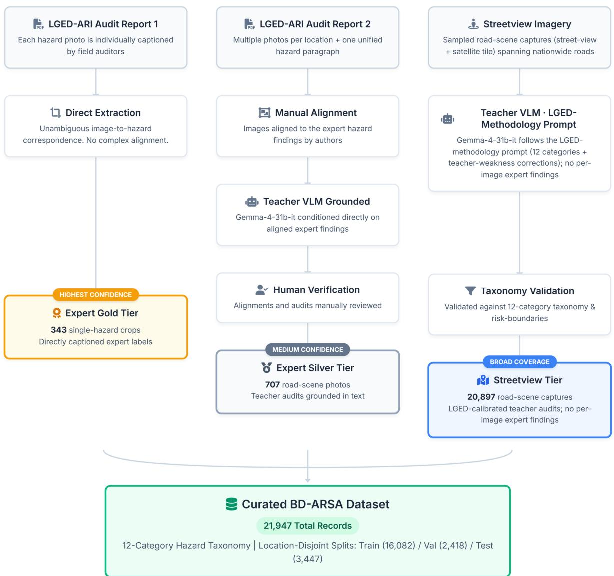  
Figure 1: Three-tier data provenance of BD-ARSA. Expert field audits from the ARI–BUET/LGED programme yield the gold (individually captioned hazard crops) and silver (road scenes we aligned to the expert findings and curated under human review) tiers; the street-view tier is teacher-audited road-scene imagery whose generation prompt was calibrated on the expert audits, with no per-image expert findings.

Certain categories, specifically drainage and skid\_resistance, are uniquely challenging because human auditors assess them partly from on-site, non-visual checks (Fig. 6b). For a singleimage auditor, these represent the model’s hardest set (Section 6.4), generally only recoverable in highly obvious scenarios.

Crucially, this dificulty stems directly from their lack of visual inferability, not a lack of training frequency. Both categories exist at a mid-range prevalence, whereas the absolute rarest category (intersection) is visually distinct and is not among the weak set. Recognising that performance limitations on these specific hazards are tied to the constraints of the single-image modality, rather

155 audited road corridors · 20,549 geocoded street-view captures · 63 districts. Expert-grounded gold + silver audits come from the 18 LGED-audited districts. Basemap© OpenStreetMap contributors

Nationwide street-view coverage across all 8 administrative divisions  
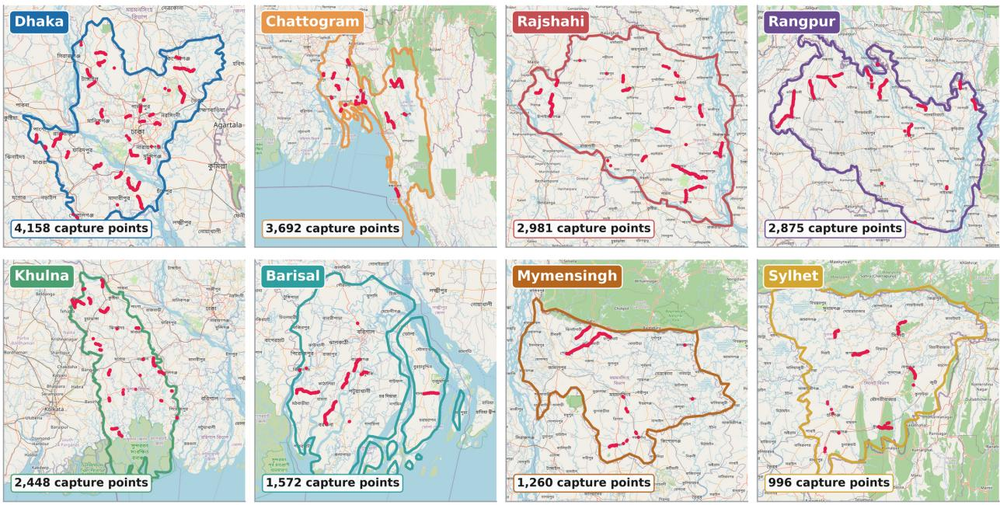  
Figure 2: Nationwide street-view coverage. The 155 sampled road corridors span 63 districts across all 8 administrative divisions of Bangladesh. The expert-grounded gold and silver tiers are drawn from the 18 LGED-audited districts within this footprint.

than class scarcity, is a distinction that matters because it confirms that simply applying categorylevel rebalancing to the training data would not be expected to improve them.

Finally, despite utilising a location-disjoint method to separate the data, the held-out test set remains a highly faithful sample of the training distribution. The distributions for both hazard categories and overall risk levels are nearly identical between the train and test splits (Cramér’s � = 0.03 and 0.05, respectively; Table 4). This consistency ensures that the model’s evaluation is not confounded by distribution shifts introduced by the disjoint splitting strategy (Section 5).

## 4. Methodology

## 4.1. Overview of Expert-Grounded Distillation

Expert-Grounded Distillation (EGD) transfers expert-grounded audit knowledge into a compact open student. The data-generation part, which calibrates the teacher’s generation prompt on the institutional field audits and human-reviews its output, is described in Section 3. Crucially, that calibration is a measured, gated step: we quantify the teacher prompt’s agreement with expert risk judgement (� = 0.74) on the gold and silver audits and apply it at nationwide scale only once it clears this bar, so the expert grounding of the supervision is a verified property rather than an assumed one. This section covers the training and inference side, as well as the evaluation protocol. Figure 7 ties the two halves together. Grounded supervision (gold captions, silver findings we image-aligned, street-view teacher audits) is curated into BD-ARSA, used to LoRA-fine-tune

A glimpse of BD-ARSA: expert-gold hazard crops and street-view scenes  
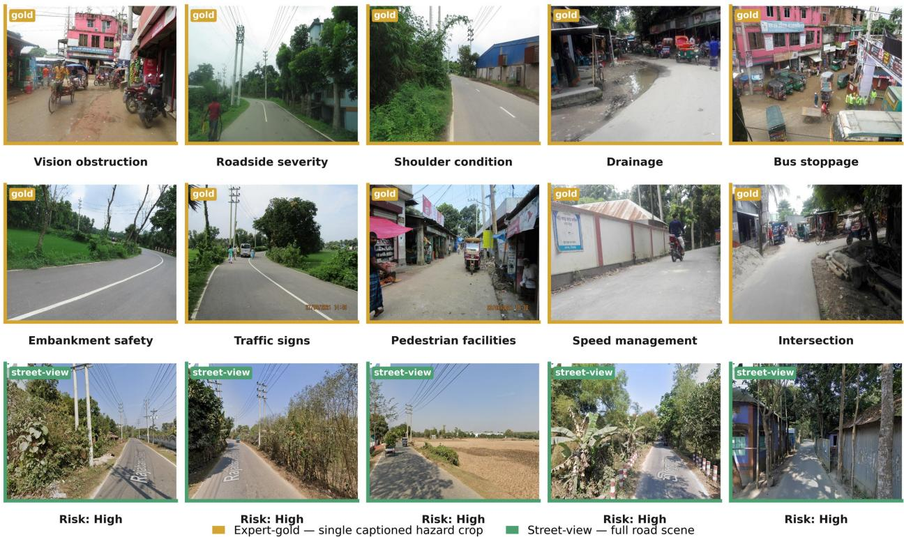  
Figure 3: A sample of BD-ARSA imagery, mixing gold single-hazard crops with street-view and silver road scenes across hazard categories and risk levels.

Qwen3-VL-8B-Instruct, and deployed on a single image at inference. The contrast with ungrounded distillation is shown in Section 5.

## 4.2. Task formulation and structured audit output

Each record supervises up to three tasks: hazard generation, overall-risk classification (ordinal Low/Medium/High), and recommendation generation. The model emits a single JSON object in the canonical schema of Section 3.3. Figure 8 shows the student prompt and a filled target. The student prompt is leakage-free, as it refers to no audit report or finding. So, the model is never trained to cite a source it will not have at inference. Moreover, the student prompt also does not contain any teacher-specific weakness mitigation instructions and is designed as a standardised prompt.

This deliberate asymmetry in prompt design is the defining mechanism of Expert-Grounded Distillation (EGD), and it operationalises context distillation (Askell et al., 2021; Snell et al., 2022) for structured visual auditing: the elaborate, expert-calibrated context supplied to the teacher is internalised into the student’s weights and reproduced at inference without it. As detailed in Section 3.3, the teacher model generates labels using an elaborate, LGED-grounded prompt that incorporates specific corrective instructions calibrated against the expert audits. In stark contrast, the student model is both trained and deployed using a single, standardised, leakage-free prompt devoid of any structural scafolding. It relies solely on the input image without percategory rules, grounding text, or report references. Consequently, the student internalises the complex audit patterns directly from the training data, absorbing the specialised knowledge that the teacher’s elaborate prompts originally supplied. This internalisation explains how the student can successfully generate audits from a simple inference prompt, and why it outperforms its own teacher when evaluated under identical, leakage-free conditions (Section 5.4). That baseline comparison strips the teacher of the critical prompt scafolding that the student has already encoded into its weights. The comparison shows the efect directly: the grounded teacher agrees with expert risk at $\kappa = 0 . 7 4$ , whereas the same teacher run leakage-free (stripped of that scafolding) is correct on only 36% of expert-set risk verdicts (Section 5.4). Finally, during training, per-record loss masking is applied dynamically based on the tasks\_available attribute. Expert-gold records supervise only hazard and risk prediction, whereas expert-silver and street-view records provide supervision across all three tasks.

Table 4: BD-ARSA corpus summary statistics (released dataset; metadata computed over all 21,947 records).
<table><tr><td>Property</td><td>Value</td></tr><tr><td>Records (image-audit)</td><td>21,947 (343 expert-gold / 707 expert- silver / 20,897 street-view)</td></tr><tr><td>Hazard instances (total)</td><td>92,347</td></tr><tr><td>Mean hazards per street-view scene</td><td>4.22 (range 3–9)</td></tr><tr><td>Hazard categories</td><td>12 (LGED schema)</td></tr><tr><td>Category entropy (normalised)</td><td>0.79 (of 1.0)</td></tr><tr><td>Category Gini coefficient (concentration)</td><td>0.53</td></tr><tr><td>Category-severity coupling (Cramér&#x27;s V)</td><td>0.68</td></tr><tr><td>Recommendation length (median / p99 / max to- 33 / 48 / 61 kens)</td><td></td></tr><tr><td>Road type</td><td>single carriageway (99.9%)</td></tr><tr><td>Land use</td><td>mixed (70%), agricultural (27%)</td></tr><tr><td>Geographic coverage Split representativeness, train vs test (Cramér&#x27;s risk 0.05; hazard category 0.03</td><td>155 corridors, 63 districts, 8 divisions</td></tr></table>

## 4.3. Student model and low-rank adaptation

The student is Qwen3-VL-8B-Instruct (Qwen Team et al., 2025) with the vision encoder frozen. We adapt the language backbone with LoRA (Hu et al., 2022) of rank $r = 1 6$ , scaling � = 32, and dropout 0.05 on the attention projections $( q , k , v , o \_ p r o j )$ , training in bf16 with gradient checkpointing. Input images are processed at 1024-px native resolution (the maximum dimension, so no information is discarded), a setting selected by a zero-shot resolution probe. Freezing the vision encoder and adapting only low-rank attention updates keeps the trainable footprint small enough for single-GPU fine-tuning (Dettmers et al., 2023).

## 4.4. Training objective and imbalance handling

Training minimises a weighted sum of per-task normalised cross-entropy losses. For a record with supervised task set �, the loss is

$$
\mathcal { L } = \sum _ { t \in T } w _ { t } \operatorname { C E } _ { t } , \qquad \operatorname { C E } _ { t } = \frac { 1 } { \left| S _ { t } \right| } \sum _ { i \in S _ { t } } - \log p _ { \theta } ( y _ { i } \mid y _ { < i } , x ) ,\tag{1}
$$

(c) Severity composition (Cramér's V = 0.68)  
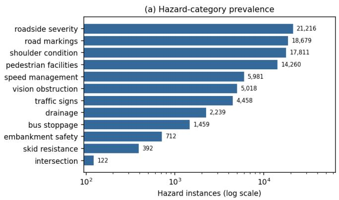

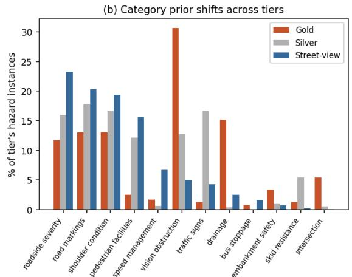

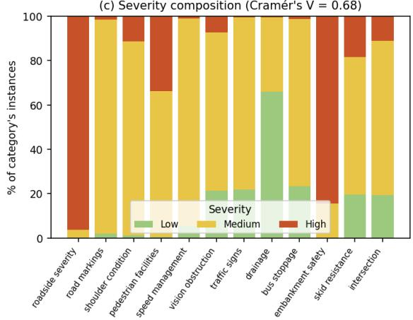

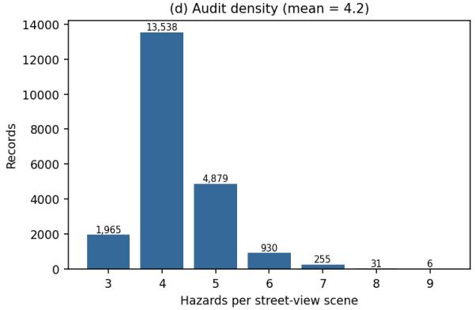  
Figure 4: Distributional structure of BD-ARSA. (a) Hazard-category prevalence (log scale); (b) category composition within each provenance tier; (c) severity composition per category (Cramér’s $V = 0 . 6 8 ) \ ;$ ; (d) number of hazards per street-view scene (mean 4.2).

where $S _ { t }$ is the set of target tokens for task �, � is the (image, prompt) input, and the task weights are $w _ { \mathrm { h a z a r d } } = 1 . 0 , w _ { \mathrm { r i s k } } = 1 . 0$ , and $w _ { \mathrm { r e c } } = 0 . 5$ . Normalising within each task’s supervised tokens keeps the short risk target from being drowned by the longer hazard and recommendation text.

To handle the risk imbalance (Section 3.4) we apply train-only logit adjustment (Menon et al., 2021) on the three risk-token logits, adding a prior-dependent ofset at temperature $\tau = 1$ :

$$
\tilde { z } _ { c } = z _ { c } + \tau \log \pi _ { c } , \qquad \pi _ { c } = \frac { n _ { c } } { \sum _ { c ^ { \prime } } n _ { c ^ { \prime } } } ,\tag{2}
$$

with class counts $( n _ { \mathrm { L o w } } , n _ { \mathrm { M e d } } , n _ { \mathrm { H i g h } } ) = ( 2 2 5 , 6 , 3 4 0 , 9 , 5 1 7 )$ . At $\tau = 1$ this is Fisher-consistent for balanced error and is equivalent to balanced softmax (Ren et al., 2020). We use it instead of hand-set or inverse-frequency class weights (the latter considered and rejected; Cui et al., 2019) and do not stack a resampler. The adjustment is train-only: at inference we decode from the raw logits, and any operating-point shift is handled post hoc (Section 4.6).

The proposed rebalancing strategy is intentionally restricted to the risk prediction head, which consists of a single softmax over a small set of mutually exclusive classes. This corresponds to the long-tailed multiclass classification setting for which class-balanced loss, balanced meta-softmax, and logit adjustment were originally designed (Cui et al., 2019; Ren et al., 2020; Menon et al., 2021). In contrast, we do not rebalance the hazard prediction head. Unlike the risk head, hazard prediction is formulated as a variable-length, multi-label sequence generation task in which the autoregressive decoder produces multiple multi-token hazard category spans rather than selecting a single class from a fixed vocabulary. Consequently, training follows the standard visual instruction tuning paradigm using token-level cross-entropy loss (Liu et al., 2023), for which a single classspecific reweighting factor is not naturally defined. Furthermore, our analysis in Section 3.5 shows that hazard categories with lower performance are primarily constrained by their visual inferability rather than by their frequency in the training data (Fig. 6b). Therefore, applying frequency-based rebalancing to the hazard distribution would not be expected to improve recognition of these categories. For this reason, the hazard prediction head is trained using the empirical category distribution without additional reweighting.

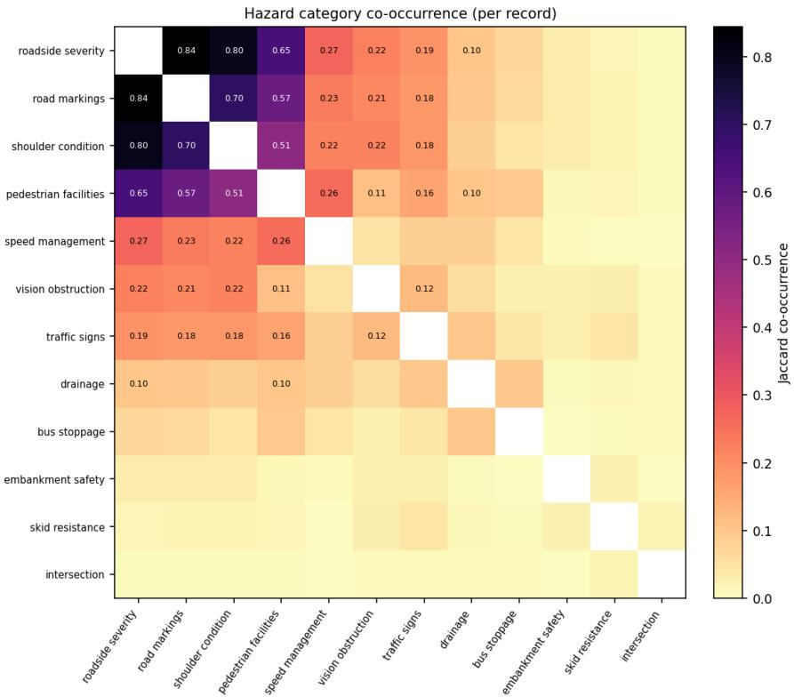  
Figure 5: Hazard-category co-occurrence within records (Jaccard index). The four common categories form a tightly coupled cluster (up to 0.84); the rare categories are largely independent.

## 4.5. Optimisation and schedule

We train for 2 epochs at learning rate $1 \times 1 0 ^ { - 4 }$ with a cosine schedule and 3% warmup, an efective batch size of 16 (micro-batch 2 × gradient accumulation 8), and early stopping on validation QWK (Table 5). Over the two epochs the three task losses all decreased, risk-token accuracy rose, and validation QWK improved to the selected checkpoint (≈ 0.52); the corresponding curves are reported as an outcome in Section 5.2. Training used a single NVIDIA A100 40 GB GPU and about 6.3 hours of compute.

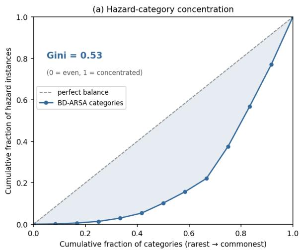

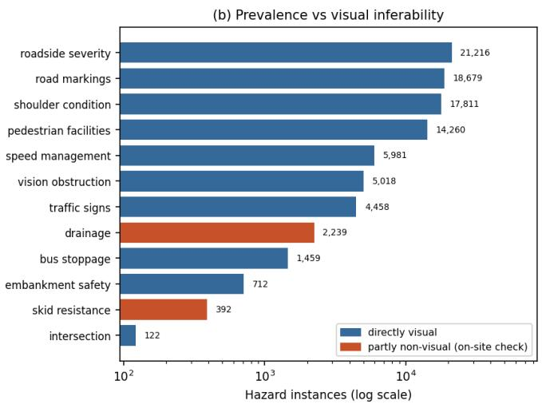  
Figure 6: Hazard prevalence as a base-rate prior. (a) Lorenz curve of the 12-category instance distribution (Gini 0.53). (b) Per-category prevalence coloured by visual inferability; the two partly-non-visual categories (drainage, skid\_resistance) — the model’s hardest set — sit at mid-range frequency, decoupling category dificulty from class scarcity.

Table 5: Training configuration.
<table><tr><td>Component</td><td>Setting</td></tr><tr><td>Base model</td><td>Qwen3-VL-8B-Instruct (vision encoder frozen)</td></tr><tr><td>Adaptation</td><td> $\mathrm { L o R A } , r = 1 6 , \alpha = 3 2 .$  dropout 0.05, on q, k, v, o_proj</td></tr><tr><td>Precision</td><td>bf16 + gradient checkpointing</td></tr><tr><td>Image resolution</td><td>1024 px (native max dimension)</td></tr><tr><td>Optimiser schedule</td><td>LR  $1 \times 1 0 ^ { - 4 }$  , cosine, 3% warmup</td></tr><tr><td>Effective batch</td><td>16 (micro 2 × accumulation 8)</td></tr><tr><td>Epochs</td><td>2, early stop on validation QWK</td></tr><tr><td>Task weights</td><td>hazard 1.0 / risk 1.0 / recommendation 0.5</td></tr><tr><td>Imbalance handling</td><td>train-only logit adjustment, τ = 1</td></tr><tr><td>Decoding</td><td>max_new_tokens 1024, stop sequences at end-of-audit</td></tr><tr><td>Compute</td><td>single NVIDIA A100 40 GB, ~6.3 h</td></tr></table>

## 4.6. Inference and operating-point selection

At inference, the model generates structured JSON outputs with max\_new\_tokens = 1024, which comfortably exceeds the 99th percentile of target sequence lengths and prevents audit truncation. Generation is terminated using stop sequences once the JSON output is complete, and in practice the model consistently finishes well before the token limit. Batched inference is served using vLLM (Kwon et al., 2023). We additionally provide a post-hoc operating-point control. On the validation set we cache the raw risk-token logits and sweep an additive per-class ofset $\delta _ { c }$ to maximise validation QWK,

$$
\hat { y } = \arg \operatorname* { m a x } _ { c } ~ ( z _ { c } + \delta _ { c } ) , \qquad \delta = \arg \operatorname* { m a x } _ { \delta } ~ \mathrm { Q W K } _ { \mathrm { v a l } } ( \delta ) ,\tag{3}
$$

then freeze � and apply it once at test. As reported in Section 5.7, the validation-optimal � trades a small amount of ordinal QWK for substantially higher Low recall, so it functions as a

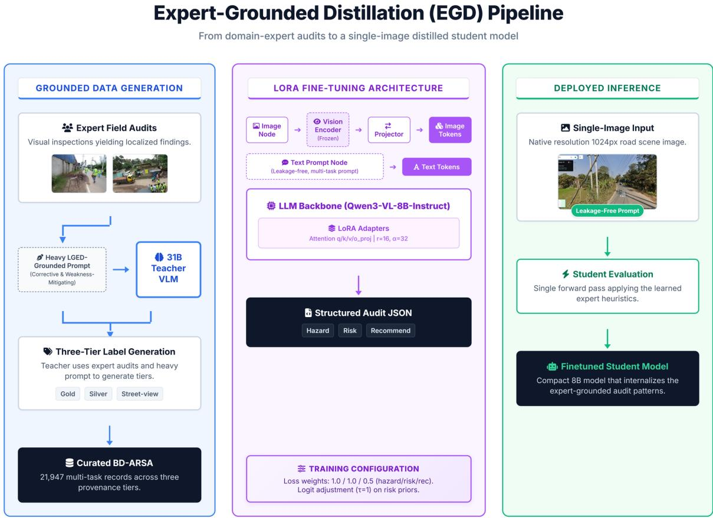  
Figure 7: The Expert-Grounded Distillation pipeline. Left: grounded data generation across the three tiers, curated into BD-ARSA (summarised here; full provenance in Fig. 1). Middle: the student architecture — a frozen vision encoder and projector feed image tokens, alongside text tokens, to the Qwen3-VL-8B-Instruct backbone, which is adapted with LoRA on the attention projections and trained with the multi-task objective and train-only logit adjustment. Right: single-image, leakage-free inference.

deployment-time choice rather than a fixed setting.

## 4.7. Evaluation protocol and metrics

The headline metric for overall risk is the quadratic weighted kappa (QWK) (de la Torre et al., 2018), a chance-corrected agreement coeficient for ordinal targets. For the $C = 3$ ordered risk levels $( \mathrm { L o w } < \mathrm { M e d i u m } < \mathrm { H i g h } )$ , let � be the $C \times C$ confusion matrix $( O _ { i j }$ counts test records of true level � predicted as level �), let � be the matrix expected when the predicted and true labels are independent $\begin{array} { r } { ( E _ { i j } = \frac { 1 } { N } O _ { i \cdot } O _ { \cdot j } } \end{array}$ , where $O _ { i } .$ and $O _ { \cdot j }$ are the row and column totals and � is the number of records), and let the ordinal penalties be $w _ { i j } = ( i - j ) ^ { 2 } / ( C - 1 ) ^ { 2 }$ . Then

$$
\mathrm { Q W K } = 1 - \frac { \sum _ { i , j } w _ { i j } { \cal O } _ { i j } } { \sum _ { i , j } w _ { i j } E _ { i j } } .\tag{4}
$$

The quadratic weights make the extreme Low↔High confusion four times as costly as an adjacent Medium↔High confusion (� = 1 versus $w = 1 / 4$ at $C = 3 )$ , so QWK rewards predictions that stay ordinally close: QWK = 1 is perfect agreement, 0 is chance-level, and negative values are worse than chance. We also report exact-risk accuracy, per-class precision/recall/F1 and macro-F1, and hazard-category precision/recall/F1 over all 12 categories (skid\_resistance and drainage included, framed per Section 3.2).

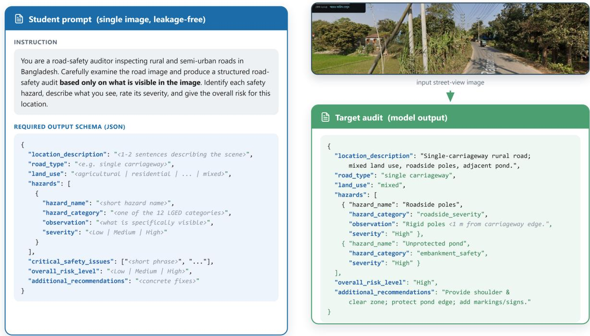  
Figure 8: The student prompt (left) and the structured JSON audit target (right), with a worked street-view example. The prompt instructs the model to audit based only on what is visible in the image; the target lists hazards with an LGED category and severity, an ordinal overall risk, and a recommendation.

Every point estimate carries a non-parametric bootstrap 95% confidence interval (Efron, 1979). Let the test set be $\mathcal { D } = \{ r _ { 1 } , \ldots , r _ { N } \}$ and let $m ( \cdot )$ denote any of the metrics above, with point estimate $\hat { m } = m ( \mathcal { D } )$ . For each replicate $b = 1 , \dots , B$ we draw a resample $\mathcal { D } _ { b } ^ { * } = \{ r _ { 1 } ^ { * } , . . . , r _ { N } ^ { * } \}$ by sampling � records from � uniformly with replacement and recompute the statistic, $\theta _ { b } ^ { * } = m ( \mathcal { D } _ { b } ^ { * } )$ . The confidence interval is the percentile interval over the � replicates,

$$
\mathrm { C I } _ { 9 5 \% } ( m ) = \Big [ Q _ { 2 . 5 } \big ( \{ \theta _ { b } ^ { * } \} _ { b = 1 } ^ { B } \big ) , ~ Q _ { 9 7 . 5 } \big ( \{ \theta _ { b } ^ { * } \} _ { b = 1 } ^ { B } \big ) \Big ] ,\tag{5}
$$

where $Q _ { p } ( \cdot )$ is the �-th empirical percentile; we use � = 2,000 resamples (raised to 5,000 for the small gold-only and pooled expert subsets of Section 5.7, where the sample is smaller). Sourcestratified intervals follow the same procedure, resampling within each provenance tier so that the gold, silver, and street-view subsets each carry their own uncertainty. The comparison models are evaluated under identical single-image, leakage-free prompts: the zero-shot Qwen3-VL-8B-Instruct base (the un-fine-tuned ablation), the 31B teacher run leakage-free, and the proprietary frontier model Gemini-2.5-Flash (Comanici et al., 2025). A blind human evaluation by a domain expert scores a rubric (issue correctness, action appropriateness, LGED grounding, hazard completeness, overall quality, and a binary risk-correct judgement) with model identity hidden and order randomised; this design follows directly from the judge-bias and circularity concerns of Section 2.3, which also dictate running the teacher leakage-free. Finally, an internal-consistency check compares predicted risk with the risk implied by the predicted High-severity hazard count (the $0 / 1 / { \geq } 2$ rule).

Table 6: Overall-risk prediction on the test set $( n = 3 , 4 4 7 )$ : the fine-tuned student versus the zero-shot base. Brackets give bootstrap 95% confidence intervals.
<table><tr><td>Model / setting</td><td>QWK</td><td>Linear κ</td><td>Macro-F1</td><td>Accuracy</td></tr><tr><td>Zero-shot base  $\left( \mathrm { Q w e n 3 – V L – 8 B } \right)$ </td><td>0.0772 [0.0440, 0.1082]</td><td>0.0831</td><td>0.3585</td><td>0.5440</td></tr><tr><td>Fine-tuned (raw)</td><td>0.4815 [0.4538, 0.5097]</td><td>0.4562</td><td>0.4933</td><td>0.7171</td></tr></table>

## 5. Results

## 5.1. Experimental setup

We evaluate on the full location-disjoint test set $( n = 3 , 4 4 7 )$ . All comparison models — the zero-shot Qwen3-VL-8B-Instruct base, the 31B teacher run leakage-free, and Gemini-2.5-Flash — run under identical single-image, leakage-free prompts, with metrics as defined in Section 4.7. Generation was reliable: a risk token was located in 100% of the 3,447 generations, and parsed text-versus-logit agreement was 0.98.

## 5.2. Training dynamics

Figure 9 shows the training outcome. All three task losses fall over the two epochs (hazard $1 . 3 4  0 . 3 6$ , risk $2 . 6 9  \approx 0 . 3 0$ , recommendation $2 . 2 3  0 . 7 8 )$ , confirming that the multi-task masking works and, in particular, that the short risk target learns rather than being drowned by the longer text. Risk-token accuracy rises from 0.56 to about 0.90, and validation QWK climbs from 0.385 to 0.524, which selects the early-stop checkpoint.

## 5.3. Overall-risk prediction: fine-tuned versus zero-shot base

Fine-tuning produces a decisive gain over the zero-shot base (Table 6). At its default (raw) operating point, the fine-tuned student reaches risk QWK 0.4815 ([0.4538, 0.5097]), with linear $\kappa = 0 . 4 5 6 2$ , macro-F1 0.4933, and exact-risk accuracy 0.7171; all headline figures in this paper refer to this raw operating point, and the post-hoc �-adjusted variant (Section 5.7) is reported only as an optional deployment alternative. The zero-shot base reaches QWK 0.0772 ([0.0440, 0.1082]) at accuracy 0.5440 and never predicts Low (Low F1 = 0). Fine-tuning thus adds +0.40 QWK and +0.17 accuracy, and the bootstrap confidence intervals do not overlap. The per-class breakdown (Table 7) shows strong High and Medium performance and the known Low-recall limitation of the raw operating point, which Section 5.7 revisits. Figure 10 visualises the gain, and the confusion matrix in Fig. 11 shows that residual errors are overwhelmingly adjacent (Medium↔High), as the ordinal metric rewards. Accuracy is consistent across sources (overall 0.717; gold 0.759; silver 0.702; street-view 0.716), and the gold subset shows the largest fine-tuning lift (from 0.27 zero-shot to 0.76).

Training dynamics: multi-task losses and validation QWK  
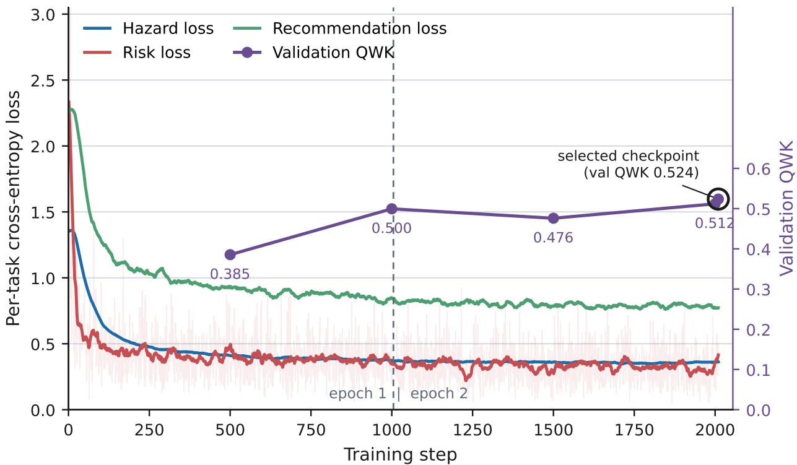  
Figure 9: Training dynamics over the full run: per-task losses (hazard, risk, recommendation) and validation QWK against training steps, with the selected checkpoint marked. All task losses decrease and validation QWK rises across the two epochs.

Table 7: Per-class precision/recall/F1 for the fine-tuned student (raw operating point) on the test set.
<table><tr><td>Risk class</td><td>Precision</td><td>Recall</td><td>F1</td><td>Support</td></tr><tr><td>Low</td><td>0.667</td><td>0.020</td><td>0.038</td><td>102</td></tr><tr><td>Medium</td><td>0.632</td><td>0.714</td><td>0.671</td><td>1,381</td></tr><tr><td>High</td><td>0.787</td><td>0.756</td><td>0.771</td><td>1,964</td></tr></table>

## 5.4. Performance against the teacher and a frontier model

The compression headline is in Table 8, on the 262 expert-grounded entries under identical leakage-free inference. (This expert-grounded subset is a diferent, smaller population than the full test set of Section 5.3, so the student’s risk accuracy here, 0.737, is not the same quantity as its 0.717 full-test accuracy; both are reported with their populations.) The 8B student is risk-correct 73.7% of the time (gold 0.753 / silver 0.712), against Gemini-2.5-Flash at 59.2% (0.544 / 0.663) and the 31B teacher run leakage-free at 35.9% (0.266 / 0.500). The student therefore beats a frontier proprietary model by +0.14, which is a circularity-free comparison, since Gemini never produced any training label. It also beats its own 31B teacher by a wide margin. Experiments show that the unaided teacher is the weakest of the three. On silver hazard-category detection the picture is a recall/precision trade-of: the student attains recall/precision 0.65/0.85, against Gemini 0.79/0.77 and the teacher 0.72/0.86. So, the frontier model enumerates more hazards while the student is more precise.

Fine-tuned EG-ARSA vs zero-shot Qwen3-VL-8B-Instruct on overall-risk (test, n = 3,447)  
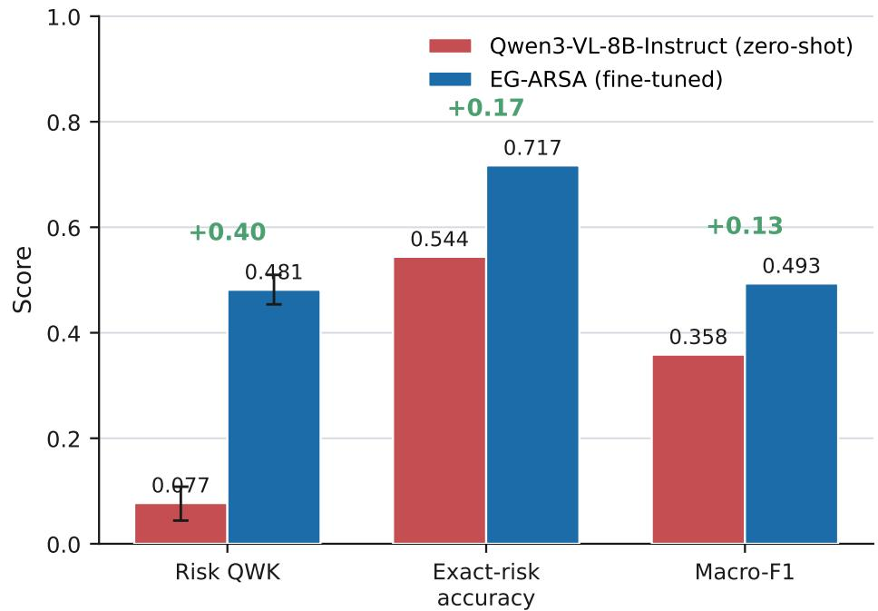  
Figure 10: Risk QWK and exact-risk accuracy for the zero-shot Qwen3-VL-8B-Instruct base versus the fine-tuned student, visualising the +0.40 QWK gain from Expert-Grounded fine-tuning.

Table 8: Multi-model comparison on the 262 expert-grounded entries, under identical single-image, leakage-free prompts. Risk accuracy is reported overall and split by source; silver hazard-category recall/precision is also shown.
<table><tr><td rowspan="2">Model</td><td colspan="3">Risk accuracy</td><td rowspan="2">Silver hazard R/P</td><td rowspan="2">(recall / precision)</td></tr><tr><td>All</td><td>Gold</td><td>Silver</td></tr><tr><td>EG-ARSA (8B student)</td><td>0.737</td><td>0.753</td><td>0.712</td><td></td><td>0.65 / 0.85</td></tr><tr><td>Gemini-2.5-Flash</td><td>0.592</td><td>0.544</td><td>0.663</td><td></td><td>0.79 / 0.77</td></tr><tr><td>Teacher (31B, leakage-free)</td><td>0.359</td><td>0.266</td><td>0.500</td><td></td><td>0.72 / 0.86</td></tr></table>

## 5.5. Blind human evaluation

A domain expert scored model outputs blind, with identity hidden and order randomised (Table 9). On the 80-item blind comparison the student leads on overall quality (3.94/5) and is risk-correct 81% of the time ([0.73, 0.90]), against Gemini at 3.65 / 0.58 and the teacher at 3.46 / 0.42; the student’s sub-dimension means are issue correctness 3.99, action appropriateness 4.03, LGED grounding 4.95, and hazard completeness 3.41. On the full expert-grounded set (� = 262, all gold and silver), the student’s rubric means are issue 4.02, action 4.06, LGED grounding 4.92, hazard completeness 3.48, and overall 3.97, with risk-correct 0.847 (222/262); 194 of 262 outputs (74%) score 4–5 overall.

The strongest evidence is that two independent measures agree: blind-human risk-correct and fully automated risk accuracy reproduce the same ranking (student 0.81 / 0.74, Gemini 0.58 / 0.59, teacher 0.42 / 0.36). Because the human panel cannot be influenced by any label-generation circularity and the automated metric is computed independently, their agreement indicates the ranking is not a metric artifact.

Overall-risk confusion (test, n = 3,447)  
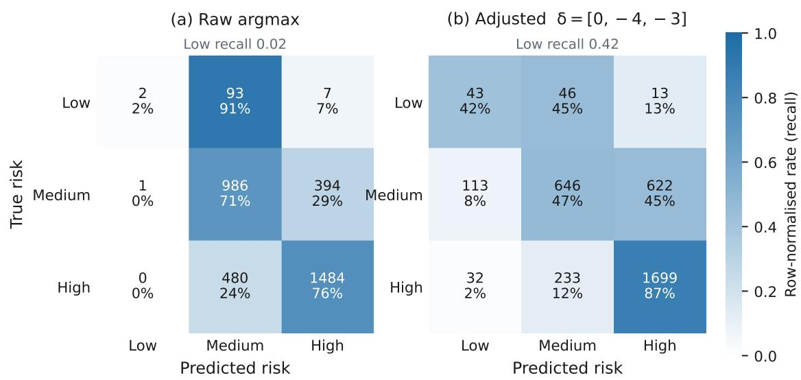  
Figure 11: Overall-risk confusion matrices for the fine-tuned student: raw operating point (left) and �-adjusted (right). Errors are predominantly between adjacent risk levels; the �-adjusted matrix recovers Low recall at a small ordinal cost.

Table 9: Blind human evaluation. Top: the 80-item blind three-model comparison (overall quality on a 1–5 scale and binary risk-correct). Middle: the student’s full expert-grounded evaluation (� = 262). Bottom: the cross-validation contrasting blind-human risk-correct with independent automated risk accuracy.
<table><tr><td colspan="2">Blind three-model comparison (n = 80) Model Overall (1–5) Risk-correct</td></tr><tr><td>EG-ARSA (8B student) 3.94 Gemini-2.5-Flash 3.65</td><td>0.81 [0.73, 0.90]</td></tr><tr><td>Teacher (31B, leakage-free) 3.46</td><td>0.58 0.42</td></tr><tr><td colspan="2">EG-ARSA full expert-grounded evaluation (n = 262) Issue correctness 4.02 Action appropriateness 4.06 LGED grounding 4.92 Hazard completeness 3.48 Overall quality 3.97</td></tr><tr><td colspan="2">Risk-correct 0.847 (222/262) Cross-validation: blind-human vs. automated risk</td></tr><tr><td colspan="2">Model Human risk-correct Automated risk acc.</td></tr><tr><td colspan="2"></td></tr><tr><td colspan="2">EG-ARSA (8B student) 0.81 0.74</td></tr><tr><td colspan="2">Gemini-2.5-Flash 0.58 0.59</td></tr><tr><td colspan="2">Teacher (31B, leakage-free) 0.42 0.36</td></tr></table>

## 5.6. Internal consistency and reliability

On the street-view test records, the model’s risk accuracy (0.716, Section 5.3) is on par with the 72.2% agreement that the severity-count rule itself attains against the expert labels (Section 3.4): the risk head reaches the accuracy ceiling a counting heuristic achieves on this data. Yet the model’s predicted risk coincides with that same $0 / 1 / { \geq } 2$ rule applied to its own predicted Highseverity hazards only 48.4% of the time. This self-consistency figure measures how far the risk head departs from a mechanical count of its own hazard list, not its agreement with ground truth. Taken together, the risk head matches counting-level accuracy against the experts while not simply counting; it integrates scene context, as intended. Combined with the 100% risk-token location rate and 0.98 parsed-versus-logit agreement (Section 5.1), the outputs are reliable to parse and score.

## 5.7. External validity

On the gold-only and pooled expert subsets, QWK against the teacher reference $( \kappa = 0 . 7 4 )$ is near zero, but this is a property of the subset, not the model. The gold subset is 82% High (130/158, with only 2 Low cases), so QWK is degenerate on a near-single-class sample. The informative metric there is accuracy, and gold accuracy is the highest of any source (0.759, with within-one-ordinal accuracy 0.987). Accordingly, the claim that the student beats the teacher rests on the leakage-free multi-model comparison and the blind human evaluation (Sections 5.4–5.5), not on gold QWK.

Secondly, the raw operating point used for all headline numbers maximises ordinal QWK but is deliberately conservative on the minority Low class (recall 0.02). For deployments that need Lowrisk sensitivity, the post-hoc per-class ofset � provides a lever: applied once at test it recovers Low recall to 0.42 (F1 0.30) at a small ordinal-QWK cost (Fig. 11). It is therefore a deployment-time operating-point choice, not part of the headline result.

## 6. Discussion

## 6.1. Why Expert-Grounded Distillation works

The compression result is not about scale; it is about grounding. The student internalises expert-grounded audit knowledge and deploys it from a single image, whereas the teacher unaided collapses (teacher–expert � 0.74 grounded → 0.36 leakage-free) and is the weakest of the three models even though it generated the bulk of the training labels. This dissociation, the label generator auditing worst when it must work alone, is the core interpretation. What the task needs is the expert grounding, and EGD is the mechanism that moves that grounding into a small, deployable model. The outcome is precisely the small-student-beats-large-model result anticipated by Hsieh et al. (2023) and Zhong et al. (2025), and the kind of improvement beyond the generator that Amin et al. (2025) show is reachable from curated, human-reviewed “weak” data. It also closes the gap identified in Section 2: prior VLM auditing was zero-shot and proprietary, and grounded fine-tuning is what moves the paradigm forward. EGD builds on established mechanisms such as context distillation (Askell et al., 2021; Snell et al., 2022) and weak-to-strong generalization (Burns et al., 2023). It then turns them into a working method for a real engineering domain. It is, to our knowledge, the first pipeline to make expert grounding a quantified, gated step and to distill institutional field-audit expertise into a compact open auditor, delivered together with the first open dataset and model for LMIC road-safety auditing.

## 6.2. Deployment, interpretability, and cost

EG-ARSA outputs an interpretable language audit with concrete recommendations, not just a score, which makes it actionable for non-expert users and deployable through a web application.

Because � is a single frozen post-hoc ofset, a deployment can choose its operating point (Low recall for screening or ordinal QWK for ranking) without retraining. The cost argument is central to the LMIC motivation: the student was fine-tuned on a single A100 in about six hours and runs on modest hardware, making per-kilometre audit coverage orders of magnitude cheaper than a formal field RSA. This directly addresses the coverage-versus-cost gap quantified by Li et al. (2024) in exactly the setting where formal audits are unafordable.

## 6.3. Generalizability

The EGD pipeline is jurisdiction-agnostic: institutional-audit grounding distilled into a compact open student transfers to any setting with even a small expert-audited corpus. The near-national street-view footprint (63 districts, 8 divisions) already shows the inference side spanning diverse rural and suburban conditions, and the approach extends naturally to other LMICs with iRAP or RSA programmes.

## 6.4. Limitations

EG-ARSA audits a single street-view image, so full road geometry and the non-visual extremes are recoverable only in obvious cases. The street-view labels are teacher-generated and, although produced by an expert-calibrated prompt and partly human-reviewed, inherit some of the teacher’s ceiling, which is why the expert-grounded gold and silver tiers anchor evaluation. The expert ground truth is concentrated in the 18 LGED-audited districts, while the nationwide spread is teacher-labelled street-view; broadening the expert-grounded footprint is future work. The system targets the rural/suburban LGED road class, with national highways (RHD) and city streets (City Corporations) under other jurisdictions.

## 6.5. Future work

A complementary overhead or satellite stream could supply the geometry and non-visual attributes that a single street-view image cannot, and learned fusion of street and overhead views is a promising extension. Collaboration with RHD and the City Corporations would extend the same EGD recipe to highways and city streets, building towards a comprehensive national auditor across all road classes. We also see value in broadening the expert-grounded corpus to more districts, in richer recommendation generation, and in abstention on borderline single-image cases.

## 7. Conclusion

We addressed scalable road safety auditing for low-resource settings, where reliable crash records are often unavailable and expert-led infrastructure audits cannot be performed at national scale. We introduced Expert-Grounded Distillation (EGD), a framework that grounds teacher VLM supervision in authoritative institutional field audits, validates the generated supervision through human review, and distills this expertise into a compact open model (EG-ARSA) using a single leakage-free prompt. We also release BD-ARSA, the first open, expert-grounded Bangladeshi road safety visual-audit dataset. Grounded fine-tuning improves the student model’s ordinal risk agreement by +0.40 quadratic weighted kappa over its zero-shot baseline, while blind expert evaluation shows that the compact 8B model outperforms both its 31B teacher and a frontier proprietary model, with automated metrics reproducing the same ranking. These results demonstrate that expert-grounded supervision can outperform raw model scale, enabling accurate, afordable, and deployable road safety auditing where conventional Road Safety Audits are impractical. Future work will extend EGD to additional road classes through the Roads and Highways Department (RHD) and City Corporations, and incorporate complementary sensing modalities toward a nationwide road safety auditing framework.

## CRediT authorship contribution statement

Md Thamed Bin Zaman Chowdhury: Conceptualization, Methodology, Software, Validation, Formal analysis, Investigation, Data curation, Writing — original draft, Visualization. Moazzem Hossain: Methodology, Validation, Writing — review & editing, Supervision, Project administration.

## Data and code availability

The BD-ARSA dataset, the fine-tuned model (LoRA adapter), and the training and evaluation code with reproduction steps are released openly:

• Dataset — audit annotations and metadata (CC BY 4.0); the Google Street View imagery is not redistributed and is reconstructed locally via the included fetch script: https: //huggingface.co/datasets/Thamed-Chowdhury/bd-arsa-road-safety-visual-audit

• Model — Apache-2.0 LoRA adapter for Qwen3-VL-8B-Instruct; use is additionally subject to the Gemma Terms of Use, as the distillation supervision was Gemma-generated: https: //huggingface.co/Thamed-Chowdhury/eg-arsa-qwen3vl-8b-lora

• Code — Apache-2.0: https://github.com/Thamed-Chowdhury/EG-ARSA

All test-set results in this paper are computed on the frozen, location-disjoint test split (� = 3,447); the multi-model and human evaluations use its full expert-grounded subset (� = 262: 158 expert-gold + 104 expert-silver records), and the silver hazard-category overlap (Section 5.4) is computed over the 557 expert findings in the 104 silver test records.

Data provenance and licensing. The released annotations, audit labels, scene descriptions, recommendations, capture coordinates, and panorama identifiers are licensed CC BY 4.0. The street-view imagery is © Google: it was accessed through the Google Maps Platform under its Terms of Service and is not redistributed, but is reconstructed locally from the released panorama identifiers and coordinates through the oficial Street View Static API using the included fetch script. The expert-gold and expert-silver images derive from the ARI–BUET/LGED field-audit reports and are shared with LGED’s written permission. The street-view teacher supervision was generated with Google’s Gemma model; consequently the released model is additionally subject to the Gemma Terms of Use and Prohibited Use Policy. The original ARI–LGED PDF reports can be shared for review purposes.

## Acknowledgements

The expert ground truth derives from on-site Road Safety Audits conducted by faculty of the Accident Research Institute (ARI), Bangladesh University of Engineering and Technology (BUET), commissioned by the Local Government Engineering Department (LGED) under the World Bank– financed Second Rural Transport Improvement Project (RTIP-II, Additional Financing; P166295). We express our sincere gratitude to LGED for giving us permission to use and share this data for this research.

## References

Ameen, H., Jongwiriyanurak, N., Balado, J., Soilán, M., 2026. Multimodal large language models for visual attribute inference in iRAP road attribute coding. Infrastructures 11, 95. doi:10. 3390/infrastructures11030095.

Amin, K., Babakniya, S., Bie, A., Kong, W., Syed, U., Vassilvitskii, S., 2025. Escaping collapse: The strength of weak data for large language model training. arXiv preprint arXiv:2502.08924 .

Anguelov, D., Dulong, C., Filip, D., Früh, C., Lafon, S., Lyon, R., Ogale, A.S., Vincent, L., Weaver, J., 2010. Google street view: Capturing the world at street level. Computer 43, 32–38. doi:10.1109/MC.2010.170.

Askell, A., Bai, Y., Chen, A., Drain, D., Ganguli, D., Henighan, T., Jones, A., et al., 2021. A general language assistant as a laboratory for alignment. arXiv preprint arXiv:2112.00861 .

Bai, Y., Zhou, Y., Zhou, J., Goh, R.S.M., Ting, D.S.W., Liu, Y., 2024. From generalist to specialist: Adapting vision language models via task-specific visual instruction tuning. arXiv preprint arXiv:2410.06456 .

Bhuiyan, H., Ara, J., Hasib, K.M., Sourav, M.I.H., Karim, F.B., Sik-Lanyi, C., Governatori, G., Rakotonirainy, A., Yasmin, S., 2022. Crash severity analysis and risk factors identification based on an alternate data source: A case study of developing country. Scientific Reports 12, 21243. doi:10.1038/s41598-022-25361-5.

Burns, C., Izmailov, P., Kirchner, J.H., Baker, B., Gao, L., Aschenbrenner, L., Chen, Y., et al., 2023. Weak-to-strong generalization: Eliciting strong capabilities with weak supervision. arXiv preprint arXiv:2312.09390 .

Comanici, G., et al., 2025. Gemini 2.5: Pushing the frontier with advanced reasoning, multimodality, long context, and next generation agentic capabilities. arXiv preprint arXiv:2507.06261 .

Cui, Y., Jia, M., Lin, T.Y., Song, Y., Belongie, S., 2019. Class-balanced loss based on efective number of samples, in: IEEE/CVF Conference on Computer Vision and Pattern Recognition (CVPR).

Dettmers, T., Pagnoni, A., Holtzman, A., Zettlemoyer, L., 2023. QLoRA: Eficient finetuning of quantized LLMs, in: Advances in Neural Information Processing Systems (NeurIPS).

Efron, B., 1979. Bootstrap methods: Another look at the jackknife. The Annals of Statistics 7, 1–26. doi:10.1214/aos/1176344552.

Federal Highway Administration, 2018. Road Safety Audits (RSA). Technical Report. U.S. Department of Transportation, Federal Highway Administration.

Garg, S., Aich, A., 2025. Mapillary vistas validation for fine-grained trafic signs: A benchmark revealing vision-language model limitations. arXiv preprint arXiv:2508.02047 .

Gemma Team, 2026. Gemma 4. Google DeepMind. https://deepmind.google/models/gemma/ gemma-4/.

Gu, J., Jiang, X., Shi, Z., Tan, H., Zhai, X., Xu, C., Li, W., Shen, Y., Ma, S., Liu, H., Wang, S., Zhang, K., Wang, Y., Gao, W., Ni, L., Guo, J., 2024. A survey on LLM-as-a-judge. arXiv preprint arXiv:2411.15594 .

Hamim, O.F., Ukkusuri, S.V., 2024. Towards safer streets: A framework for unveiling pedestrians’ perceived road safety using street view imagery. Accident Analysis & Prevention 195, 107400. doi:10.1016/j.aap.2023.107400.

Han, Z., Gao, C., Liu, J., Zhang, J., Zhang, S.Q., 2024. Parameter-eficient fine-tuning for large models: A comprehensive survey. arXiv preprint arXiv:2403.14608 .

Hoque, M.M., Smith, G., Rahman, M.A., Uddin, M.H.M.A., 2021. iRAP and Road Infrastructure Safety Assessment in Bangladesh. Technical Report. Accident Research Institute (ARI), Bangladesh University of Engineering and Technology (BUET).

Hsieh, C.Y., Li, C.L., Yeh, C.K., Nakhost, H., Fujii, Y., Ratner, A., Krishna, R., Lee, C.Y., Pfister, T., 2023. Distilling step-by-step! outperforming larger language models with less training data and smaller model sizes, in: Findings of the Association for Computational Linguistics: ACL 2023.

Hu, E.J., Shen, Y., Wallis, P., Allen-Zhu, Z., Li, Y., Wang, S., Wang, L., Chen, W., 2022. LoRA: Low-rank adaptation of large language models, in: International Conference on Learning Representations (ICLR).

Jongwiriyanurak, N., Zeng, Z., Goo, J.M., Wang, X., Ilyankou, I., Sriroongvikrai, K., Christie, N., Wang, M., Chen, H., Haworth, J., 2024. V-RoAst: Visual road assessment. can VLM be a road safety assessor using the iRAP standard? arXiv preprint arXiv:2408.10872 .

Kačan, M., Oršić, M., Šegvić, S., Ševrović, M., 2020. Multi-task learning for iRAP attribute classification and road safety assessment, in: IEEE Intelligent Transportation Systems Conference (ITSC). doi:10.1109/ITSC45102.2020.9294305.

Kačan, M., Ševrović, M., Šegvić, S., 2022. Dynamic loss balancing and sequential enhancement for road-safety assessment and trafic scene classification. arXiv preprint arXiv:2211.04165 .

Kwon, W., Li, Z., Zhuang, S., Sheng, Y., Zheng, L., Yu, C.H., Gonzalez, J.E., Zhang, H., Stoica, I., 2023. Eficient memory management for large language model serving with PagedAttention, in: ACM Symposium on Operating Systems Principles (SOSP).

Lewis, M., Liu, Y., Goyal, N., Ghazvininejad, M., Mohamed, A., Levy, O., Stoyanov, V., Zettlemoyer, L., 2020. BART: Denoising sequence-to-sequence pre-training for natural language generation, translation, and comprehension, in: Proceedings of the 58th Annual Meeting of the Association for Computational Linguistics (ACL), pp. 7871–7880.

Li, Q., Bradford, J., Bachani, A.M., 2024. Statistical estimation of fatal and serious injuries saved by iRAP protocols in 74 countries. PLOS ONE 19, e0301993. doi:10.1371/journal.pone. 0301993.

Lialin, V., Deshpande, V., Yao, X., Rumshisky, A., 2023. Scaling down to scale up: A guide to parameter-eficient fine-tuning. arXiv preprint arXiv:2303.15647 .

Liu, H., Li, C., Wu, Q., Lee, Y.J., 2023. Visual instruction tuning, in: Advances in Neural Information Processing Systems (NeurIPS).

Menon, A.K., Jayasumana, S., Rawat, A.S., Jain, H., Veit, A., Kumar, S., 2021. Long-tail learning via logit adjustment, in: International Conference on Learning Representations (ICLR).

Metreau, E., Young, K.E., Eapen, S.G., 2024. World Bank Country Classifications by Income Level: 2024–2025. Technical Report. The World Bank.

Mitra, S., Bhalla, K., 2023. Improving Road Trafic Injury Statistics in Low- and Middle-Income Countries: Addressing Discrepancies between Oficial Statistics and Global Statistical Models. Technical Report. World Bank, Global Road Safety Facility. Washington, DC.

Newaz, M.N., Tabassum, R., Das, T., Huq, A.S., Haque, M.E., 2026. An overdispersed count regression model for analyzing road accident fatalities and injuries in bangladesh. PLOS ONE 21, e0341775. doi:10.1371/journal.pone.0341775.

Panickssery, A., Bowman, S.R., Feng, S., 2024. LLM evaluators recognize and favor their own generations, in: Advances in Neural Information Processing Systems (NeurIPS).

Qwen Team, Bai, S., et al., 2025. Qwen3-VL technical report. arXiv preprint arXiv:2511.21631 .

Rabbani, M.B.A., Musarat, M.A., Alaloul, W.S., Ayub, S., Bukhari, H., Altaf, M., 2022. Road accident data collection systems in developing and developed countries: A review. International Journal of Integrated Engineering 14, 336–352.

Ren, J., Yu, C., Sheng, S., Ma, X., Zhao, H., Yi, S., Li, H., 2020. Balanced meta-softmax for longtailed visual recognition, in: Advances in Neural Information Processing Systems (NeurIPS).

Rithish, H., Modhugu, R., Reddy, R., Saluja, R., Jawahar, C.V., 2021. Evaluating computer vision techniques for urban mobility on large-scale, unconstrained roads. arXiv preprint arXiv:2109.05226 .

Sainju, A.M., Jiang, Z., 2019. Mapping road safety features from streetview imagery: A deep learning approach. arXiv preprint arXiv:1907.12647 .

Sanjeewani, P., Verma, B., 2021. Single class detection-based deep learning approach for identification of road safety attributes. Neural Computing and Applications 33, 9691–9702. doi:10.1007/s00521-021-05734-z.

Shi, C., Macdonald, G., Jalli, B., et al., 2025. Think less, label better: Multi-stage domaingrounded synthetic data generation for fine-tuning LLMs in telecommunications. arXiv preprint arXiv:2509.25736 .

Shinde, G., Ravi, A., Dey, E., Sakib, S., Rampure, M., Roy, N., 2025. A survey on eficient vision-language models. arXiv preprint arXiv:2504.09724 .

Snell, C., Klein, D., Zhong, R., 2022. Learning by distilling context. arXiv preprint arXiv:2209.15189 .

Song, W., Workman, S., Hadzic, A., Zhang, X., Green, E., Chen, M., Souleyrette, R., Jacobs, N., 2019. FARSA: Fully automated roadway safety assessment. arXiv preprint arXiv:1901.06013 .

Tami, M., Elhenawy, M., Ashqar, H.I., 2025. HazardNet: A small-scale vision language model for real-time trafic safety detection at edge devices. arXiv preprint arXiv:2502.20572 .

de la Torre, J., Puig, D., Valls, A., 2018. A weighted kappa loss function for multi-class classification of ordinal data in deep learning. Pattern Recognition Letters 105, 144–154. doi:10.1016/j. patrec.2017.05.018.

Udandarao, V., Parthasarathy, N., Naeem, M.F., Evans, T., Albanie, S., Tombari, F., Xian, Y., Tonioni, A., Hénaf, O.J., 2025. Active data curation efectively distills large-scale multimodal models, in: IEEE/CVF Conference on Computer Vision and Pattern Recognition (CVPR).

World Bank, 2022. Bangladesh Road Safety Project. Technical Report PAD4485. The World Bank. Washington, DC.

World Health Organization, 2023. Global Status Report on Road Safety 2023. Technical Report. World Health Organization. Geneva. ISBN 978-92-4-008645-6.

Xu, S., Zhao, K., Loney, J., Li, Z., Visentin, A., 2025. Zero-shot image-based large language model approach to road pavement monitoring. arXiv preprint arXiv:2504.06785 .

Yang, Y., Xu, N., Yang, J.J., 2025. Multi-agent visual-language reasoning for comprehensive highway scene understanding. arXiv preprint arXiv:2508.17205 .

Yang, Z., Lin, X., He, Q., Huang, Z., Liu, Z., Jiang, H., Shu, P., Wu, Z., Li, Y., Law, S., Mai, G., Liu, T., Yang, T., 2024. Examining the commitments and dificulties inherent in multimodal foundation models for street view imagery. arXiv preprint arXiv:2408.12821 .

Zheng, L., Chiang, W.L., Sheng, Y., Zhuang, S., Wu, Z., Zhuang, Y., Lin, Z., Li, Z., Li, D., Xing, E.P., Zhang, H., Gonzalez, J.E., Stoica, I., 2023. Judging LLM-as-a-judge with MT-Bench and chatbot arena, in: Advances in Neural Information Processing Systems (NeurIPS) Datasets and Benchmarks.

Zhong, Y., Jin, R., Dou, Q., Li, X., 2025. Can generalist vision language models (VLMs) rival specialist medical VLMs? benchmarking and strategic insights. arXiv preprint arXiv:2506.17337

## Appendix A. NLP pipeline for taxonomy derivation and corpus validation

This appendix documents the natural-language-processing pipeline that turned the raw expert audit text into the 12-category BD-ARSA taxonomy, together with the analyses used to validate it. All analyses operate on the expert finding corpus extracted from the ARI–LGED audit reports.

Table A.10: Inter-classifier agreement between the two zero-shot label generators (Gemini-2.5-Flash vs. BART-large-MNLI).
<table><tr><td>Comparison</td><td></td><td>Value</td></tr><tr><td></td><td>Short labels — exact match (top-1 vs. top-1)</td><td>40.4%</td></tr><tr><td>Short labels — top-2 inclusion</td><td></td><td>60.6%</td></tr><tr><td>Short labels — Cohen&#x27;s kappa</td><td></td><td>0.331</td></tr><tr><td></td><td>Finding texts — mean Jaccard (multi-label)</td><td>0.373</td></tr><tr><td>Finding texts — perfect agreement</td><td></td><td>12.3%</td></tr><tr><td></td><td>Finding texts — low agreement (Jaccard &lt; 0.5)</td><td>61.5%</td></tr><tr><td colspan="3">Label disagreements routed to human review 82  / 208</td></tr></table>

## Appendix A.1. Deriving the 12-category schema with dual zero-shot classifiers

The expert reports record hazards as free-text findings. We collected 689 unique finding texts (208 distinct short labels) and mapped each to one of the 12 LGED categories using two independent zero-shot classifiers — Gemini-2.5-Flash and BART-large-MNLI (zero-shot natural-language inference). The two classifiers agreed only moderately (Table A.10); we did not treat this as a reliability estimate for the taxonomy but used the 82 label-level disagreements to route ambiguous findings to human adjudication. The final mapping carries a per-item confidence (high 84 / medium 42 / low 82 short labels), and 134 hazard-image labels whose category remained ambiguous were quarantined from the gold tier.

## Appendix A.2. Corpus lexical analysis

Beyond classification, we profiled the corpus lexically to characterise its vocabulary and to cross-check the taxonomy against an independent text source. The dominant unigrams of the detailed-findings layer — route (685), trees (459), trafic (414), intersection (382), shoulder (360), distance (357), pedestrian (334), safety (298), curve (274), embankment (262) — track the hazard categories directly; Figure A.12 shows the corresponding word clouds. As an independent witness, we compared the detailed per-location findings against the separately-written auditor summaries. Although their surface n-grams diverge (the two layers are written in diferent registers), both independently emphasise the same hazard categories (Table A.11), corroborating the category prominence that the taxonomy encodes.

## Appendix B. Prompts

The prompts below are reproduced verbatim (with box-drawing rules rendered as plain ASCII separators). The teacher prompt (Appendix B.1) generated the street-view tier; the student prompts (Appendix B.2, Appendix B.3) are the leakage-free instructions used to fine-tune and serve EG-ARSA. The deliberate asymmetry between them — the teacher’s elaborate, LGEDgrounded, multi-image prompt versus the student’s single standardised, single-image instruction — is the Expert-Grounded Distillation mechanism described in Section 4.2. Expert-gold labels were extracted from the expert records and used no generation prompt.

## Appendix B.1. Teacher street-view generation prompt (gemma-4-31b-it)

Used to generate the street-view tier from multiple ground-level Street View screenshots plus one satellite tile per location; outputs were validated against the 12-category taxonomy, risk boundary post-processed, and human-reviewed on a 384-record sample.

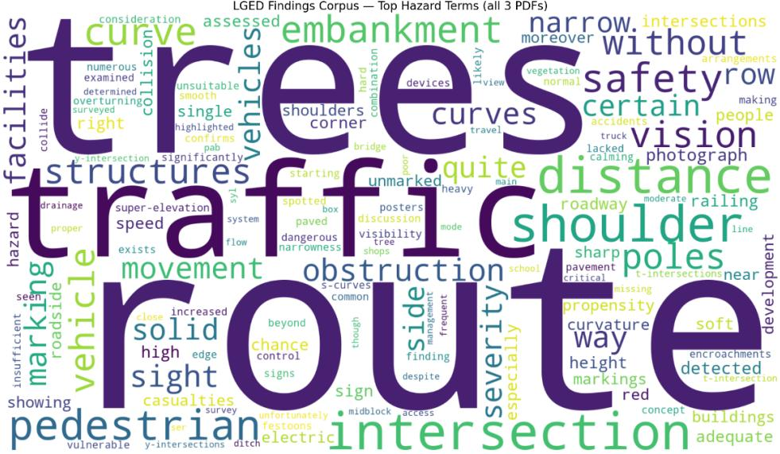

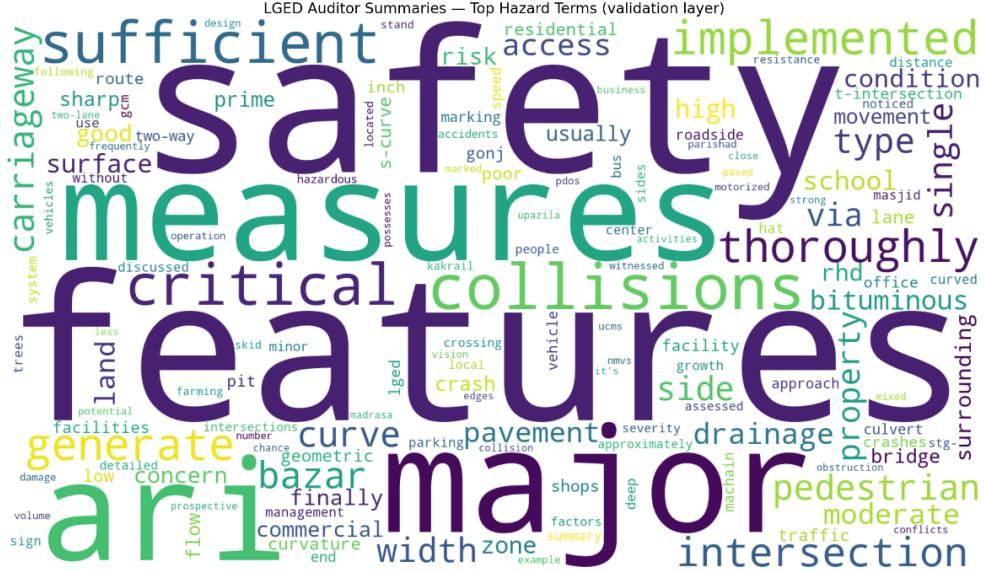  
Figure A.12: Word clouds of the expert corpus: (top) the detailed per-location findings layer, and (bottom) the independently-written auditor summary layer.

You are an expert road safety auditor following the Bangladesh Local Government Engineering Department (LGED) road safety audit methodology. Analyse the provided road images and conduct a comprehensive road safety audit.

The images you receive include: - Google Maps Street View screenshots: ground-level views at various headings - A satellite/aerial screenshot: overhead view of the road layout

LGED ISSUE CATEGORIES - check ALL of the following:

Table A.11: Category keyword signal: keyword hits per hazard category in the detailed-findings layer and in the auditor-summary layer. Both independent layers cover all 12 categories.
<table><tr><td>Category</td><td>Findings-layer hits</td><td>Summary-layer hits</td></tr><tr><td>vision_obstruction</td><td>1822</td><td>72</td></tr><tr><td>roadside_severity</td><td>1300</td><td>141</td></tr><tr><td>intersection</td><td>1212</td><td>176</td></tr><tr><td>shoulder_condition</td><td>1037</td><td>113</td></tr><tr><td>embankment_safety</td><td>915</td><td>154</td></tr><tr><td>speed_management</td><td>890</td><td>61</td></tr><tr><td>traffic_signs</td><td>851</td><td>41</td></tr><tr><td>pedestrian_facilities</td><td>674</td><td>144</td></tr><tr><td>road_markings</td><td>422</td><td>82</td></tr><tr><td>drainage</td><td>198</td><td>96</td></tr><tr><td>skid_resistance</td><td>135</td><td>89</td></tr><tr><td>bus_stoppage</td><td>123</td><td>56</td></tr></table>

1. Speed Management Look for: speed limit signs, speed humps, rumble strips, traffic calming. Flag: complete absence of any speed-reduction infrastructure.

2. Road Markings Look for: centreline, edge/fog line, zebra crossing, turning arrows. Flag: absent, faded, or non-existent markings on any road with mixed traffic, pedestrian activity, intersections, curves, or settled (residential /commercial/educational) frontage. ONLY skip flagging on isolated agricultural roads with no nearby settlement, intersections, or pedestrian activity. When in doubt, flag it.

3. Vision / Sight Obstruction Look for: walls, buildings, dense vegetation, parked vehicles blocking sight lines at curves or intersections. Flag: any object that reduces stopping or intersection sight distance.

4. Drainage System Look for: roadside drains, culverts, standing water, waterlogged shoulders, road-edge erosion. Flag: blocked/absent drains, visible water ponding, erosion at carriageway edge.

5. Traffic Signs Look for: curve-ahead warnings, intersection warnings, school-zone signs, speed limit plates, directional/regulatory signs. Flag: missing or inadequate signage.

6. Skid Resistance Look for: polished/worn surface, bleeding asphalt, loose aggregate. Flag: surfaces likely to cause skidding in wet conditions.

7. Roadside Severity (Clear Zone) Look for: utility poles, trees, walls, or other rigid obstacles within approximately 1 metre (3 feet) of the carriageway edge. Flag as HIGH SEVERITY: any rigid obstacle within 3 feet of road edge.

8. Embankment / Drop-off Safety Look for: road embankments or cut slopes, guard rails, safety barriers. Flag as HIGH SEVERITY: embankment height > 6 feet (2 m) without any safety railing - single-vehicle overturn risk.

9. Shoulder Condition   
Look for: paved shoulder, gravel/earth (soft) shoulder, effective width.   
IMPORTANT: Examine the satellite image carefully - it shows shoulder   
width from above far better than street-level views. Also scan every   
Street View image edge for the road/ground transition.   
Flag: complete absence of both paved and soft shoulders; effective   
width < 3 feet. Many Bangladesh rural roads have NO usable shoulder -   
do not omit this category just because it is hard to see from Street View.   
If you cannot confirm a usable shoulder >= 3 ft wide in the satellite view,   
flag it.

10. Pedestrian Facilities Look for: dedicated footpath, pedestrian crossings, guardrails separating pedestrians from traffic; observe apparent pedestrian activity level. Flag: high pedestrian flow with no dedicated facilities.

11. Bus Stoppage Standard   
Bangladesh context: rural bus/tempo/CNG stops are typically informal -   
no bay, no shelter, no marking. Buses stop wherever passengers congregate.   
Look for: VISIBLE evidence of regular stopping activity - e.g. people   
waiting/gathered at the roadside, an informal shelter/bench, a visible   
bus/tempo/CNG in the image, a busy market or school/college gate where   
public transport must stop, or worn carriageway edges from repeated stops.   
Flag ONLY when at least one of those indicators is visible AND no proper   
bay or marked stopping area exists. Do NOT flag every rural road; require   
concrete visual evidence of bus stopping activity at THIS location.

12. Intersection Quality Look for: intersection type (4-way, T-junction, staggered), approach visibility, channelisation, traffic-control devices. Flag ONLY when the intersection ITSELF has a primary structural/geometric defect visible in the images: (a) T-junction without flaring or turning provision, (b) blind approach where sight distance <= 30 m due to geometry (not vegetation - capture that under Vision Obstruction), (c) multiple uncontrolled entries at a busy junction with no channelling. IMPORTANT: If the only issue at a junction is poor sight distance caused by vegetation or structures, list it under Vision/Sight Obstruction ONLY - do NOT also create a separate Intersection Quality entry. Do not flag every minor junction; only those with a clearly observable geometric hazard.

ANALYSIS INSTRUCTIONS:

- Examine ALL provided images before forming conclusions.

\- Report BOTH the presence of hazards AND the absence of required safety features (e.g. "No speed-management infrastructure observed").

\- If Street View shows no imagery (grey/unavailable screen), state this clearly and rely primarily on the satellite image.

\- Be specific: "utility pole \~1-2 feet from carriageway edge" is better than "pole near road".

```json
- Consider the Bangladesh road context: mixed traffic (rickshaws, CNGs,
buses, motorcycles, pedestrians sharing the carriageway).
OUTPUT FORMAT - return ONLY a raw JSON object, no markdown fences:
{
"location_description": "<2-3 sentences: road type, setting, apparent traffic and pedestrian
volume>",
"road_type": "<single carriageway / dual carriageway / other>",
"land_use": "<residential / commercial / educational / agricultural / mixed>",
"critical_safety_issues": [
"<Category Name - specific observation from the images>",
"<Category Name - specific observation from the images>"
],
"hazard_illustrations": [
{
"hazard_name": "<hazard category name>",
"observation": "<what is specifically visible in the images>",
"severity": "<High / Medium / Low>"
}
],
"overall_risk_level": "<High / Medium / Low>",
"street_view_available": <true / false>,
"additional_recommendations": "<any supplementary observations>"
}
```

## Appendix B.2. Student single-hazard prompt (expert-gold crops)

Applied to single-hazard crops; identifies the hazard and the location’s overall risk from one image, with no report context.

You are a road-safety auditor inspecting rural roads in Bangladesh. This image is a   
close-up that highlights a single road-safety hazard at a location. Identify that hazard   
and the location’s overall risk level, based only on what is visible. If a clear   
remedial measure applies, also give a brief recommendation.   
Respond with ONLY a JSON object in this schema (omit "additional\_recommendations" if no   
clear fix applies):   
{   
"hazards": [   
{   
"hazard\_name": "<short hazard name>",   
"hazard\_category": "<one of: road\_markings, shoulder\_condition, roadside\_severity,   
pedestrian\_facilities, vision\_obstruction, traffic\_signs, speed\_management, intersection,   
embankment\_safety, bus\_stoppage, drainage, skid\_resistance>"   
}   
],   
"overall\_risk\_level": "<Low | Medium | High>",   
"additional\_recommendations": "<brief recommended improvement(s)>"   
}

## Appendix B.3. Student full-audit, leakage-free prompt (expert-silver and street-view)

The single standardised instruction used for full structured audits at both training and inference; it carries no grounding context, no per-category corrective rules, and no report references.

You are a road-safety auditor inspecting rural and semi-urban roads in Bangladesh.   
Carefully examine the road image and produce a structured road-safety audit based only   
on what is visible in the image. Identify each safety hazard, describe what you see,   
rate its severity, and give the overall risk for this location.   
Respond with ONLY a JSON object in exactly this schema:   
{   
"location\_description": "<1-2 sentences describing the road scene>",   
"road\_type": "<e.g. single carriageway>",   
"land\_use": "<agricultural | residential | commercial | mixed | institutional>",   
"hazards": [   
{   
"hazard\_name": "<short hazard name>",   
"hazard\_category": "<one of: road\_markings, shoulder\_condition, roadside\_severity,   
pedestrian\_facilities, vision\_obstruction, traffic\_signs, speed\_management, intersection,   
embankment\_safety, bus\_stoppage, drainage, skid\_resistance>",   
"observation": "<what is specifically visible in the image>",   
"severity": "<Low | Medium | High>"   
}   
],   
"critical\_safety\_issues": ["<short phrase>", "..."],   
"overall\_risk\_level": "<Low | Medium | High>",   
"additional\_recommendations": "<concrete fixes for the visible deficiencies>"   
}   
Overall risk guide: High = several and/or serious hazards with a real chance of a crash   
or injury; Medium = some hazards needing attention; Low = generally safe, only minor   
issues.