# FOVEA: Focused On-Demand Visual Evidence Adaptation for Cache-Friendly Multimodal Speculative Decoding

Hengjie Zhu1,2, Dayan Wu1∗, Zihao Zhang1,2, Xinze Liu1,2, Jingxuan Yu3, Peng Fu1, Zheng Lin1, Weiping Wang1, Ding Wang1

1Institute of Information Engineering, Chinese Academy of Sciences

2School of Cyber Security, University of Chinese Academy of Sciences

3School of Cyber Science and Engineering, Southeast University

{zhuhengjie, wudayan, zhangzihao, liuxinze, fupeng, linzheng, wangweiping, wangding}@iie.ac.cn, yujingxuan24@seu.edu.cn

## Abstract

Multimodal speculative decoding accelerates vision-language models by allowing a lightweight draft model to propose candidate tokens for parallel verification by a larger target model. Existing methods typically condition the drafter on a fixed visual interface, such as a predefined visual-token budget or a static compressed representation. However, our controlled visual-budget analysis shows that visual demand varies substantially across tasks and decoding stages, which means more visual input is not always beneficial. Actually, insuficient evidence may weaken visual grounding, while excessive context adds overhead and may disrupt drafting. We propose FOVEA (Focused On-demand Visual Evidence Adaptation), a cache-friendly approach that builds a reusable visual memory and dynamically retrieves a bounded subset for a draft state. A cumulative-mass rule determines both how many and which entries are selected. The selected entries are aggregated into a visual readout and fused with the current draft hidden state through a lightweight gated residual correction. Rather than inserting visual tokens into the autoregressive context, the correction modifies only the representation passed to the language-model head. Experiments across multiple visionlanguage backbones and multimodal benchmarks show that FOVEA improves draft acceptance and end-to-end decoding speed, achieving up to 2.13× speedup over autoregressive decoding. These results demonstrate that state-conditioned evidence retrieval is an efective alternative to reusing a fixed visual representation throughout multimodal generation.

## Introduction

Speculative decoding (Chen et al. 2023; Leviathan, Kalman, and Matias 2023; Ku, Martins, and Srikumar 2024) accelerates autoregressive generation by dividing computation between a lightweight draft model and a larger target model (Berdoz, Rheinboldt, and Wattenhofer 2026; Do, Le, and Nguyen 2026; Shi et al. 2026). The draft model expands a candidate sequence or tree, and the target model verifies several candidate tokens in one forward pass. For text-only language models (Achiam et al. 2023; Touvron et al. 2023), this separation has produced practical acceleration with methods such as speculative decoding (Leviathan, Kalman, and Matias 2023), Medusa (Cai et al. 2024), EAGLE series (Li et al. 2024c,b, 2026), and DFlash (Chen, Liang, and Liu 2026). However, for multimodal large language models (Li et al.

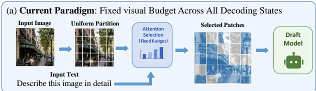

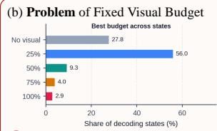

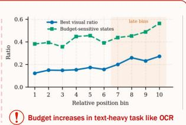

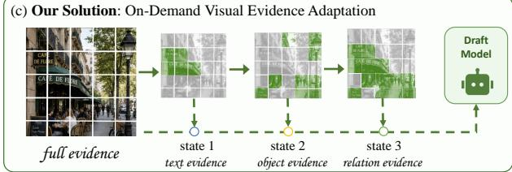  
Figure 1: Our visual-budget diagnostics in (b) show that the preferred diagnostic budget varies across decoding states and tends to be higher later in text-heavy generation. These findings expose the limitation of the fixed-budget interface in (a), which provides the same visual budget to every state. To address the content-selection aspect of this mismatch, (c) FOVEA stores visual evidence once and retrieves a dynamic number of state-conditioned entries, allowing diferent draft states to select text-, object-, or relation-centric information without modifying the cached token context.

2023; Liu et al. 2023; Lu et al. 2022), drafting introduces an additional perceptual challenge. A visually grounded token may depend on a small object, OCR text, spatial relation, or chart element among many projected visual tokens. The draft model must therefore be cheap enough to accelerate decoding while still receiving the image evidence needed by the current prediction.

Most multimodal draft methods address this tension through a fixed visual interface, either by exposing the drafter to many visual tokens (Huang et al. 2025a) or by reusing a compressed visual representation throughout generation (Hu et al. 2026; Kang et al. 2026; Liu et al. 2026). Despite their implementation diferences, these methods assume that diferent samples and decoding states require a similar amount or form of visual evidence. Our visual-budget diagnostic challenges this assumption. Across visual-budget settings ranging from no visual input to full visual access, the preferred budget varies substantially both within the same image and across decoding states. As shown in Figure 1(b), 25% budget performs best for 56.0% of the evaluated states, whereas high-visual settings such as 75% and full access are rarely optimal. Moreover, visual demand changes across draft branches and generation stages, especially in text-heavy tasks where later predictions may require fine-grained textual evidence. These findings show that no single global visual interface is uniformly suitable and motivate selecting evidence according to the current draft state.

Supporting such state-conditioned evidence selection raises two challenges. First, the drafter must determine which visual evidence is relevant to the current state and retrieve it with little overhead, without repeatedly processing the full visual sequence. Second, state-conditioned selection must remain compatible with KV-cache reuse. Dynamically inserting or removing selected visual tokens would change the autoregressive context and invalidate previously cached hidden states and KV entries. Recomputing the cache would reduce speculative speedup, whereas reusing an inconsistent cache could impair drafting. The selected visual evidence should therefore influence current-token scoring without altering the historical context or its associated cache.

To address these challenges, we propose FOVEA (Focused On-demand Visual Evidence Adaptation), a dynamic-cardinality, state-conditioned visual-evidence selection mechanism for multimodal speculative decoding. After the image is encoded by the target model, FOVEA projects the resulting visual tokens once to construct a reusable image-specific memory. As shown in Figure 1(c), during draft-tree decoding, a draft hidden state queries this memory and selects the top entries relevant to the current decoding state. Rather than inserting the retrieved evidence into the draft model’s cached context, FOVEA fuses it through a lightweight gated residual module. Thus, FOVEA adapts the representation used to score each draft node without modifying the autoregressive token context or invalidating the historical KV cache.

Our contributions are as follows:

• We identify state-varying and non-monotonic visualbudget sensitivity in multimodal speculative decoding, showing that one globally fixed visual interface is not uniformly suitable across branches and generation stages.

• We propose FOVEA, which uses a dynamic retrieval cardinality to select state-conditioned evidence from a reusable visual memory and applies it through gated hidden-state correction without invalidating the historical KV cache.

• Extensive experiments across three vision-language backbones and nine multimodal benchmarks show that FOVEA improves draft acceptance and end-to-end decoding speed over strong baselines, achieving up to 2.13× speedup over autoregressive decoding.

# Related Work

Multimodal speculative decoding Speculative decoding accelerates autoregressive generation by letting a lightweight drafter propose candidate tokens that a larger target model verifies in parallel (Leviathan, Kalman, and Matias 2023). For text-only language models, this draft–verify paradigm has been improved with auxiliary decoding heads, featurelevel drafting, and dynamic draft trees (Cai et al. 2024; Li et al. 2024c,b, 2026). For vision-language models (Wang et al. 2024a,b), the drafter must approximate both language continuation and visual grounding, making acceptance behavior sensitive to visual conditioning (Gagrani et al. 2024).

Recent multimodal speculative decoders improve drafting through vision-aware adaptation (Kang et al. 2026), targetfeature injection (Hu et al. 2026), multimodal adaptation or distillation (Ganesan et al. 2025; Lin et al. 2025), and visual compression (Huang et al. 2025a; Wang et al. 2025). Concurrent work TIGER (Vo et al. 2026) routes a fixed-size Top-K visual subset from the current textual state once per speculative block. It further trains the drafter with verifieraccepted-prefix rewards, directly aligning the objective with speculative decoding eficiency. FOVEA difers by retrieving a dynamic-cardinality subset for corrected draft states and injecting its readout through cache-compatible hidden-state correction without rewriting historical KV entries.

Visual token selection and compression Visual tokens are a major source of prefill cost, attention computation, memory trafic, and KV-cache footprint (Huang et al. 2025b; Tu et al. 2025) in VLM inference. Existing acceleration methods therefore reduce the visual sequence through pruning (Chen et al. 2024), parameter-free pooling (Yao et al. 2024), resampling (Alayrac et al. 2022), convolutional downsampling (Cha et al. 2024; Chu et al. 2023), token hiding (Zhang et al. 2025), or query-aware selection (Zhu et al. 2024; Zhang et al. 2024). Within multimodal speculative decoding, visual reduction has been used to lower draft latency or transfer cost, such as vision-aware compression (Kang et al. 2026; Hu et al. 2026), elastic or latent-guided compression (Huang et al. 2025a; Wang et al. 2025), hidden visual-token representations (Xie et al. 2026), and visual or KV information pruning (Jia, Tang, and Yang 2026; Yang et al. 2025).

However, most of these methods choose a compact visual representation before decoding or reuse one visual interface throughout generation. This fixed-selection assumption is mismatched with speculative decoding, where diferent steps and branches may require diferent visual evidence. FOVEA treats visual evidence as a reusable memory: image evidence is stored once, each corrected state selects a state-conditioned subset, and the readout corrects the current scoring representation rather than being inserted as new context tokens. Thus, FOVEA enables state-conditioned visual focus while preserving KV-cache reuse.

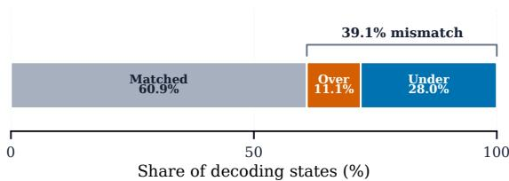  
(a) Fixed-budget mismatch

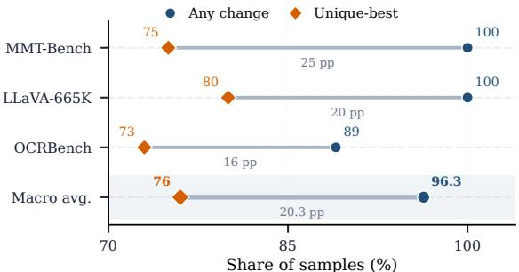  
(b) Preferred-budget changes across states

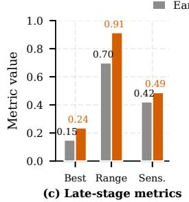

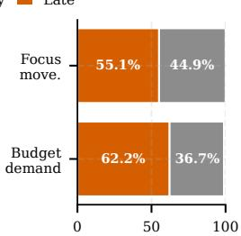  
(d) Sample direction  
Figure 2: State-dependent visual demand in multimodal speculative decoding. (a) Fixed visual budgets cause both underand over-supply. (b) Preferred budgets vary across decoding states. (c) Later positions show higher visual demand, acceptlength variation, and budget sensitivity. (d) Late-stage states exhibit stronger visual-focus shifts.

## Method

Problem formulation Let $p _ { T }$ and $p _ { D }$ denote the target VLM and lightweight drafter, respectively. At each speculative step, pD expands a draft tree whose candidate nodes are verified in parallel by $p _ { T } .$ . For a node n with hidden state $h _ { n }$ and depth $\bar { \ell } _ { n } \in \{ 0 , \ldots , D \}$ , and projected visual tokens $V = \{ v _ { i } \} _ { i = 1 } ^ { \bar { N } }$ , we define the state-conditioned visual readout as

$$
r _ { n } = R _ { \theta } ( h _ { n } , \ell _ { n } , V ) ,\tag{1}
$$

where $R _ { \theta }$ retrieves visual evidence relevant to node n.

A fixed visual interface is inadequate because visualbudget sensitivity varies across states and is non-monotonic. We define the preferred budget as the smallest tested budget attaining the maximum accept length, rather than the highest token probability or lowest measured latency. As shown in Figures 1 and 2, a 25% visual budget is optimal for 56.0% of evaluated states, whereas the default and full budgets are optimal for only 4.0% and 2.9%. Preferred diagnostic budgets also change across branches and tend to increase at later positions on OCRBench, motivating state-conditioned evidence

selection.

Relevant evidence can increase the average accept length $\tau ,$ , but unnecessary visual computation raises draft latency. Moreover, inserting state-specific visual tokens into the autoregressive context would invalidate historical KV entries. FOVEA therefore stores image evidence in an external memory, selects a dynamic number of entries for each state, and applies each retrieved readout only to the current scoring representation. This changes both the selected evidence and retrieval cardinality without changing the cached context.

Image-specific visual memory For each input image, the target-side visual encoder and multimodal projector produce the projected visual-token sequence $V = \mathbf { \bar { \{ } }  v _ { i } \mathbf  \bar { \} } _ { i = 1 } ^ { N }$ . FOVEA then constructs a per-image visual memory once:

$$
M _ { \mathrm { i m g } } = \{ ( k _ { i } , u _ { i } , m _ { i } ) \} _ { i = 1 } ^ { N }\tag{2}
$$

where

$$
k _ { i } = W _ { K } \mathrm { L N } ( v _ { i } ) \quad u _ { i } = W _ { U } \mathrm { L N } ( v _ { i } ) .\tag{3}
$$

Here, LN denotes layer normalization. The matrices $W _ { K } \in$ $\mathbb { R } ^ { d _ { k } \times d _ { v } }$ and $W _ { U } \in \mathbf { \bar { \mathbb { R } } } ^ { d _ { u } \times d _ { v } }$ are learned key and value projections, respectively. Thus, $\boldsymbol { k } _ { i } \in \mathbb { R } ^ { d _ { k } }$ and $u _ { i } \in \mathbb { R } ^ { d _ { u } }$ . The binary mask $m _ { i } \in \{ 0 , 1 \}$ is one for a valid visual position and zero for a padded position.

The same memory is shared across all speculative iterations and all draft-tree nodes for the image. By caching this memory, FOVEA avoids repeatedly passing the full visual sequence through the draft model while retaining access to fine-grained visual evidence.

State-conditioned top- $K _ { r , n }$ visual evidence retrieval For each node n at an enabled correction depth, FOVEA forms a state-conditioned query from its hidden state and tree depth, and scores every valid visual-memory key:

$$
q _ { n } = W _ { Q } \big ( \mathrm { L N } ( h _ { n } ) + E _ { \mathrm { d e p } } [ \ell _ { n } ] \big ) , \qquad s _ { n , i } = \frac { q _ { n } k _ { i } ^ { \top } } { \sqrt { d _ { k } } } .\tag{4}
$$

Let $\mathcal { V } = \{ i \mid m _ { i } = 1 \}$ be the valid memory indices. We normalize the scores globally as

$$
\widetilde { \alpha } _ { n , i } = \frac { \exp ( s _ { n , i } ) } { \sum _ { j \in \mathcal { V } } \exp ( s _ { n , j } ) } , \qquad i \in \mathcal { V } ,\tag{5}
$$

and let $\pi _ { n } ( t )$ denote the index of the t-th largest normalized score. The state-dependent retrieval cardinality is

$$
\begin{array} { l } { \displaystyle K _ { r , n } ^ { \mathrm { r a w } } = \operatorname* { m i n } \left\{ k : \sum _ { t = 1 } ^ { k } \widetilde { \alpha } _ { n , \pi _ { n } ( t ) } \geq \rho \right\} , } \\ { \displaystyle K _ { r , n } = \operatorname* { m i n } \left\{ | \mathcal { V } | , K _ { \operatorname* { m a x } } , \operatorname* { m a x } ( K _ { \operatorname* { m i n } } , K _ { r , n } ^ { \mathrm { r a w } } ) \right\} , } \end{array}\tag{6}
$$

where $\rho = 0 . 8 , K _ { \mathrm { m i n } } = 3 2 .$ , and $K _ { \operatorname* { m a x } } = 2 5 6$ . We retrieve ${ \mathcal T } _ { n } = \{ \pi _ { n } ( t ) \} _ { t = 1 } ^ { K _ { r , n } }$ and renormalize the selected scores to obtain

$$
\alpha _ { n , i } = \frac { \exp ( s _ { n , i } ) } { \sum _ { j \in \mathcal { T } _ { n } } \exp ( s _ { n , j } ) } , \qquad r _ { n } = \sum _ { i \in \mathcal { T } _ { n } } \alpha _ { n , i } u _ { i } .\tag{7}
$$

This cumulative-mass rule introduces no additional trainable parameters or auxiliary loss. Every valid memory key is still scored; the dynamic cardinality changes the number of selected and aggregated values rather than the number of scored keys.

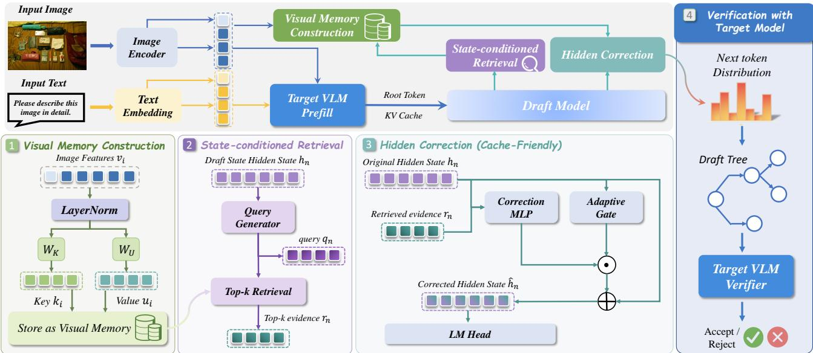  
Figure 3: Overview of FOVEA. The target VLM performs multimodal prefill, while projected visual features are cached once as an image-specific key–value memory. A draft-tree node uses its hidden state and depth embedding to score the memory and attend the top relevant entries. A gated correction MLP fuses the retrieved evidence into the current scoring representation without modifying the historical KV cache. The corrected distribution expands the draft tree, which is then verified in paralle by the target VLM.

Cache-friendly hidden-vector correction The selected visual readout is not inserted as additional context tokens. Instead, for a draft node n at an enabled correction depth, FOVEA fuses the visual readout $r _ { n }$ with the current hidden state $h _ { n }$ to predict a $d _ { h }$ -dimensional correction vector and a scalar gate that is broadcast across the hidden dimension:

$$
c _ { n } = f _ { \theta } ( [ h _ { n } ; r _ { n } ] ) \qquad g _ { n } = \sigma ( g _ { \theta } ( [ h _ { n } ; r _ { n } ] ) )\tag{8}
$$

and applies an RMS-normalized gated correction to the current scoring representation:

$$
\hat { h } _ { n } = \mathrm { R M S N o r m } ( h _ { n } + g _ { n } c _ { n } ) , \qquad z _ { n } = W _ { \mathrm { L M } } \hat { h } _ { n }\tag{9}
$$

where $W _ { \mathrm { L M } }$ is the language-model head. The retrieved evidence modifies only the representation used for current-token scoring; the draft token sequence, attention mask, position identifiers, and historical KV cache remain unchanged. Separately, a stable context-KV prefix encodes prompt and prefill information and is shared across all draft-tree nodes.

At inference time, FOVEA constructs the image-specific visual memory once and reuses the draft model’s autoregressive cache throughout generation. During each speculative iteration, nodes at an enabled correction depth use their hidden states and depth embeddings to retrieve top relevant visual readouts, apply Equation 9, and score candidate tokens for tree expansion. The target VLM then verifies the draft tree in parallel, after which the accepted tokens and reusable caches are updated as in standard speculative decoding.

Training objective FOVEA is trained using precomputed target-model artifacts. Each training sample contains input token embeddings, target hidden states, supervision masks, and projected visual-memory tokens. Let Ω denote the set of supervised positions. For each $n \in \Omega .$ , we assign the exponentially decaying loss weight

$$
w _ { n } = \exp \left( - \frac { n - 1 } { \gamma _ { w } } \right) ,\tag{10}
$$

where $\gamma _ { w } \ > \ 0$ controls the decay rate, and define $Z _ { \Omega } =$ $\sum _ { n \in \Omega } { \dot { w } } _ { n }$

For each $n \in \Omega$ , let $\hat { h } _ { n }$ be the corrected draft hidden state, $h _ { n } ^ { T }$ the corresponding target-model hidden state, and $h _ { n }$ and $\tilde { h } _ { n } ^ { T }$ the draft and target intermediate hidden states. The draft logits are computed as

$$
z _ { n } = { \cal W } _ { \mathrm { L M } } \hat { h } _ { n } ,\tag{11}
$$

while the target logits are obtained with the same languagemodel head:

$$
z _ { n } ^ { T } = W _ { \mathrm { L M } } h _ { n } ^ { T } .\tag{12}
$$

We define the teacher distribution as $p _ { n . } ^ { T } = \mathrm { s o f t m a x } ( z _ { n } ^ { T } )$ the draft distribution as $p _ { n } ^ { D } =$ softmax $\left( z _ { n } \right)$ , and the hard teacher token as $y _ { n } = \arg \operatorname* { m a x } _ { j } z _ { n , j } ^ { T } .$

Following (Hu et al. 2026), the hidden-state alignment term matches both final and intermediate representations:

$$
\begin{array} { r } { \mathcal { L } _ { \mathrm { h i d } } = \frac { 1 } { Z _ { \Omega } } \displaystyle \sum _ { n \in \Omega } w _ { n } \left( \beta _ { h } \frac { \| \hat { h } _ { n } - h _ { n } ^ { T } \| _ { 2 } ^ { 2 } } { d _ { h } } \right. } \\ { \left. + \beta _ { \mathrm { m i d } } \frac { \| \tilde { h } _ { n } - \tilde { h } _ { n } ^ { T } \| _ { 2 } ^ { 2 } } { d _ { h } } \right) . } \end{array}\tag{13}
$$

The distribution distillation term matches the teacher nexttoken distribution:

$$
\mathcal { L } _ { \mathrm { K L } } = \frac { 1 } { Z _ { \Omega } } \sum _ { n \in \Omega } w _ { n } \mathrm { K L } \big ( p _ { n } ^ { T } \| p _ { n } ^ { D } \big )\tag{14}
$$

Algorithm 1: FOVEA: Dynamic-Cardinality Visual-  
Evidence Drafting and Verification   
Inputs: Target VLM $p _ { T }$ , drafter $p _ { D } ,$ , visual tokens $V ,$ , tree   
depth $\bar { D , }$ , draft budget $B ,$ , threshold $\rho ,$ and bounds   
$K _ { \operatorname* { m i n } } , K _ { 1 }$ max   
Output: Target-verified sequence y   
▷ Construct the reusable visual memory.   
1: $M _ { \mathrm { i m g } } \xleftarrow { } \{ ( W _ { K } \mathrm { L N } ( v _ { i } ) , W _ { U } \mathrm { L N } ( v _ { i } ) , \bar { m _ { i } } ) \} _ { i = 1 } ^ { N }$   
$\mathcal { V }  \{ i \mid \bar { m } _ { i } = 1 \}$   
2: Run target prefill and initialize the draft root and reusable   
caches.   
3: while generation has not terminated do   
4: Initialize draft tree T from the current root.   
5: for Each node n at an enabled correction depth do   
6: Obtain hidden state $h _ { n }$ and depth $\ell _ { n } .$   
7: $q _ { n }  W _ { Q } ( \mathrm { L N } ( h _ { n } ) + E _ { \mathrm { d e p } } [ \ell _ { n } ] ) .$   
$s _ { n , i } \gets q _ { n } k _ { i } ^ { \top } / \sqrt { d _ { k } }$ for $i \in \mathcal { V } .$   
▷ Select a bounded cumulative-mass subset.   
8: $\begin{array} { r } { \widetilde { \alpha } _ { n , i }  \exp ( s _ { n , i } ) / \sum _ { j \in \mathcal { V } } \exp ( s _ { n , j } ) , } \end{array}$   
9: Let $\pi _ { n } ( t )$ be the index of the t-th largest $\widetilde { \alpha } _ { n , i } .$   
10: $K _ { r , n } ^ { \mathrm { r a w } } \gets \operatorname* { m i n } \{ k : \sum _ { t = 1 } ^ { k } \widetilde { \alpha } _ { n , \pi _ { n } ( t ) } \geq \rho \}$   
11: $\begin{array} { r l r } { K _ { r , n } } & { { }  } & { \operatorname* { m i n } \{ | \mathcal { V } | , K _ { \operatorname* { m a x } } , \operatorname* { m a x } ( K _ { \operatorname* { m i n } } , K _ { r , n } ^ { \operatorname { r a w } } ) \} } \end{array}$   
${ \mathcal { T } } _ { n } \gets \{ \pi _ { n } ( t ) \} _ { t = 1 } ^ { K _ { r , n } } .$   
12: $\begin{array} { r } { \alpha _ { n , i }  \exp ( s _ { n , i } ) / \sum _ { j \in \mathcal { T } _ { n } } \exp ( s _ { n , j } ) , } \end{array}$   
$\begin{array} { r } { r _ { n } \gets \sum _ { i \in \mathcal { T } _ { n } } \alpha _ { n , i } u _ { i } . } \end{array}$   
▷ Correct only the current scoring representation.   
13: $c _ { n } \gets f _ { \theta } ( [ h _ { n } ; r _ { n } ] ) , \quad g _ { n } \gets \sigma ( g _ { \theta } ( [ \hat { h _ { n } } ; r _ { n } ] ) )$   
14: $\hat { h } _ { n } \gets \mathrm { R M S N o r m } ( h _ { n } + g _ { n } c _ { n } ) , \quad z _ { n } \gets W _ { \mathrm { L M } } \hat { h } _ { n } .$   
15: Add candidates from $z _ { n }$ to T under budget $B .$   
16: end for   
17: $\mathbf { y } _ { \mathrm { a c c } }  \mathrm { V e r i f y } ( p _ { T } , T ) .$   
18: Append $\mathbf { y } _ { \mathrm { a c c } }$ to $\mathbf { y }$ and update caches.   
19: end while   
20: return $\mathbf { y }$

To shape the draft candidate set, let $\mathcal { V }$ denote the output vocabulary and let $K _ { c }$ denote the candidate-set width. For each supervised position $n ,$ let

$$
\bar { z } _ { n , ( 1 ) } \geq \bar { z } _ { n , ( 2 ) } \geq \cdot \cdot \cdot \geq \bar { z } _ { n , ( | \mathcal { V } | - 1 ) }\tag{15}
$$

denote the competing logits

$$
\{ z _ { n , j } : j \in \mathcal { V } , j \neq y _ { n } \}\tag{16}
$$

arranged in descending order. Thus, $\bar { z } _ { n , ( K _ { c } ) }$ is the $K _ { c } { \cdot } \mathrm { t h }$ largest competing logit and defines the candidate-set boundary. We define the teacher–competitor logit gap as

$$
\gamma _ { n } = z _ { n , y _ { n } } - \bar { z } _ { n , ( K _ { c } ) } .\tag{17}
$$

The token-level objective combines hard-label supervision with a smooth candidate-boundary margin:

$$
\begin{array} { l } { \displaystyle \mathcal { L } _ { \mathrm { t o k } } = \frac { 1 } { Z _ { \Omega } } \sum _ { n \in \Omega } w _ { n } \Bigg [ \beta _ { \mathrm { C E } } \mathrm { C E } ( y _ { n } , { p } _ { n } ^ { D } ) } \\ { \displaystyle \qquad + \beta _ { \mathrm { c m p } } \log ( 1 + \exp ( m - \gamma _ { n } ) ) \Bigg ] . } \end{array}\tag{18}
$$

The overall objective consists of hidden-state alignment, distribution distillation, and token-level candidate shaping:

$$
\begin{array} { r } { \mathcal { L } = \lambda _ { \mathrm { h i d } } \mathcal { L } _ { \mathrm { h i d } } + \lambda _ { \mathrm { K L } } \mathcal { L } _ { \mathrm { K L } } + \lambda _ { \mathrm { t o k } } \mathcal { L } _ { \mathrm { t o k } } . } \end{array}\tag{19}
$$

## Experiment

Experimental setup We evaluate FOVEA with three target backbones: LLaVA-Next-7B/13B (Liu et al. 2024a) and Qwen2.5-VL-7B (Bai et al. 2025). All three backbonespecific drafters use this same training set and are optimized for 12 epochs with AdamW $( \beta _ { 1 } = 0 . \bar { 9 } , \beta _ { 2 } = 0 . 9 5 )$

Following the benchmark-adaptation protocol of Dream (Hu et al. 2026), we train FOVEA on $^ { 5 1 , 6 7 1 }$ samples from LLaVA-v1.5-Mix-665K and 6,000 samples from six task-oriented datasets: MMT-Bench (Ying et al. 2024), SEED-Bench-2 (Li et al. 2024a), ScienceQA (Saikh et al. 2022), MathVista (Lu et al. 2024), OCRBench (Liu et al. 2024b), and ChartQA (Masry et al. 2022). For MMT-Bench, SEED-Bench-2, MathVista, and OCRBench, we construct disjoint training and evaluation partitions using train\_test\_split with random\_state=42, assigning 1,000 samples to training and up to 3,000 remaining samples to evaluation. For ChartQA and ScienceQA, we randomly select 1,000 examples from their oficial training splits and evaluate exclusively on their oficial evaluation splits. Thus, each benchmark-derived training subset is disjoint from its corresponding evaluation manifest. TextVQA (Singh et al. 2019), MME (Fu et al. 2026), and MMSpec (Shen et al. 2026) contribute no training samples and are used only for evaluation. We additionally decontaminate LLaVA-v1.5- Mix-665K against all evaluation manifests using oficial sample identifiers and image hashes, obtaining zero overlap.

For LLaVA-Next-7B, LLaVA-Next-13B, and Qwen2.5- VL-7B, the FOVEA drafters use two, three, and two backbone-compatible Transformer blocks, with approximately 0.621B, 0.962B, and 0.583B trainable parameters, respectively. Tree-based methods use candidate width $K _ { c } = 6 .$ maximum depth $D = 6 ,$ , and a 40-node draft budget. Based on the depth-sensitivity analysis in Appendix, visual correction is applied to nodes at draft-tree depth $\ell _ { n } \ \leq \ 1$ in all main experiments. We generate at most 200 tokens using greedy decoding and measure latency on NVIDIA A100 80GB GPUs. The loss weights $\lambda _ { \mathrm { h i d } } , \lambda _ { \mathrm { K L } }$ , and $\lambda _ { \mathrm { t o k } }$ are set to 1.0, 0.2, and 1.0, respectively. We report average accept length τ and speedup, defined as the wall-clock latency ratio of autoregressive to speculative decoding on the same examples. Exact target verification preserves the target model’s greedy outputs.

Main Results Table 1 compares FOVEA with representative speculative decoding baselines across three target backbones and nine multimodal benchmarks. FOVEA achieves the strongest average speedup for every backbone, reaching 1.68×, 1.66×, and 1.60× on LLaVA-Next-7B, LLaVA-Next-13B, and Qwen2.5-VL-7B, respectively. Compared with the best competing average in each setting, these results correspond to relative improvements of 11.3%, 13.7%, and 13.5%. The gains are broad rather than benchmark-specific: FOVEA ranks first in 21 of the 27 backbone–benchmark combinations, including 7 of 9 benchmarks on LLaVA-7B, 6 of 9 on LLaVA-13B, and 8 of 9 on Qwen2.5-VL-7B. Moreover, its average speedup remains above 1× in every evaluated combination, indicating robust acceleration across both perception-heavy and reasoning-intensive workloads.

<table><tr><td rowspan="2">Model</td><td rowspan="2">Methods</td><td rowspan="2"></td><td rowspan="2"></td><td rowspan="2">MMT TextVQA MME ChartQA MathVista OCRBench ScienceQA SEED MMSpec</td><td rowspan="2"></td><td rowspan="2"></td><td rowspan="2"></td><td rowspan="2"></td><td rowspan="2"></td><td rowspan="2">Avg Speedup</td><td>T</td></tr><tr><td></td><td></td></tr><tr><td rowspan="10"></td><td>AR Baseline 1.00×</td><td></td><td>1.00×</td><td>1.00×</td><td>1.00×</td><td>1.00×</td><td>1.00×</td><td>1.00×</td><td>1.00×</td><td>1.00×</td><td>1.00×</td><td></td></tr><tr><td></td><td></td><td></td><td></td><td></td><td>Training-free Methods</td><td></td><td></td><td></td><td></td><td></td><td></td></tr><tr><td>Lookahead</td><td>0.86×</td><td>0.88×</td><td>1.04×</td><td>0.91×</td><td>0.96×</td><td>1.02×</td><td>0.81×</td><td>0.61×</td><td>0.72×</td><td>0.87×</td><td>1.641</td></tr><tr><td>PLD</td><td>1.12x</td><td>1.29×</td><td>1.58x</td><td>1.24×</td><td>1.38×</td><td>1.36×</td><td>1.03×</td><td>0.85×</td><td>1.13×</td><td>1.22×</td><td>1.281</td></tr><tr><td>EAGLE-3</td><td></td><td></td><td></td><td></td><td>Training-based Methods</td><td></td><td></td><td></td><td></td><td></td><td></td></tr><tr><td>Dream</td><td>1.62×</td><td>1.70×</td><td>1.73×</td><td>1.49×</td><td>1.48×</td><td>1.12x</td><td>1.45×</td><td>1.32×</td><td>1.38×</td><td>1.48×</td><td>2.674</td></tr><tr><td>Vispec</td><td>1.79×</td><td>1.64×</td><td>1.65×</td><td>1.64×</td><td>1.65×</td><td>0.92x</td><td>1.55×</td><td>1.39×</td><td>1.36×</td><td>1.51×</td><td>3.460</td></tr><tr><td>FOVEA</td><td>1.57× 2.13×</td><td>1.11×</td><td>0.91×</td><td>1.47×</td><td>1.67×</td><td>1.32x</td><td>1.20×</td><td>0.78x</td><td>1.51×</td><td>1.28×</td><td>3.662</td></tr><tr><td>AR Baseline 1.00×</td><td></td><td>1.74×</td><td>1.76×</td><td>1.68×</td><td>1.57×</td><td>1.68× 1.00×</td><td>1.26× 1.00×</td><td>1.80× 1.00×</td><td>1.54×</td><td>1.68×</td><td>3.960</td></tr><tr><td colspan="10">1.00× 1.00×</td></tr><tr><td rowspan="9"></td><td></td><td></td><td></td><td></td><td></td><td>Training-free Methods</td><td>0.98x</td><td>0.97×</td><td>0.69×</td><td>0.69×</td><td>0.90×</td><td>1.633</td></tr><tr><td>Lookahead PLD</td><td>0.81× 0.95x</td><td>0.83x</td><td>1.13x</td><td>0.94×</td><td>1.02x</td><td>1.00×</td><td>0.99×</td><td>0.88×</td><td>0.95×</td><td>1.09×</td><td>1.275</td></tr><tr><td></td><td></td><td>1.05×</td><td>1.47×</td><td>1.17×</td><td>1.32×</td><td>Training-based Methods</td><td></td><td></td><td></td><td></td><td></td></tr><tr><td colspan="10"></td></tr><tr><td>EAGLE-3</td><td>1.45×</td><td>1.69×</td><td>1.72×</td><td>1.26×</td><td>1.51×</td><td>1.03x</td><td>1.52×</td><td>1.37×</td><td>1.36×</td><td>1.44×</td><td>2.843</td></tr><tr><td>MSD</td><td>1.39×</td><td>1.66×</td><td>1.28×</td><td>1.62×</td><td>1.54×</td><td>1.42×</td><td>1.46×</td><td>1.46×</td><td>1.30×</td><td>1.46×</td><td>3.490</td></tr><tr><td>Vispec FOVEA</td><td>1.43× 1.83×</td><td>0.98x</td><td>0.62×</td><td>1.26×</td><td>1.65×</td><td>1.18x</td><td>1.35×</td><td>0.85× 1.83×</td><td>1.35× 1.49×</td><td>1.19x</td><td>3.661</td></tr><tr><td>AR Baseline 1.00×</td><td></td><td>1.66× 1.00×</td><td>1.69×</td><td>1.75x</td><td>1.67× 1.00×</td><td>1.56× 1.00×</td><td>1.48× 1.00×</td><td>1.00×</td><td>1.00×</td><td>1.66× 1.00×</td><td>3.882</td></tr><tr><td colspan="10">1.00× 1.00×</td></tr><tr><td rowspan="9">Qwen2.5-VL-7B</td><td></td><td></td><td></td><td></td><td></td><td>Training-free Methods</td><td></td><td></td><td></td><td></td><td></td><td>1.425</td></tr><tr><td>Lookahead PLD</td><td>1.14×</td><td>0.94x</td><td>1.16x</td><td>1.10x</td><td>1.19x</td><td>1.10x</td><td>1.41×</td><td>0.95×</td><td>0.98x</td><td>1.11×</td><td></td></tr><tr><td></td><td>0.99×</td><td>0.89×</td><td>1.21×</td><td>1.08x</td><td>1.20×</td><td>1.14x</td><td>1.12x</td><td>0.84×</td><td>1.05×</td><td>1.06x</td><td>1.150</td></tr><tr><td>1.48×</td><td>1.18x</td><td></td><td>1.14×</td><td>1.41×</td><td>Training-based Methods 1.78×</td><td>1.33×</td><td>1.44×</td><td>1.30×</td><td>1.16x</td><td>1.36×</td><td>2.912</td></tr><tr><td>EAGLE-3 MSD</td><td>1.41×</td><td>1.33×</td><td>1.30×</td><td>1.53×</td><td>1.39×</td><td>1.54×</td><td>1.34×</td><td>1.37×</td><td>1.47×</td><td>1.41×</td><td>3.452</td></tr><tr><td>Vispec</td><td>1.37×</td><td>0.66×</td><td>0.81×</td><td>1.17×</td><td>1.69×</td><td>0.83x</td><td>1.46×</td><td>0.76×</td><td>1.27×</td><td>1.11x</td><td>3.718</td></tr><tr><td>FOVEA</td><td>1.65×</td><td>1.54×</td><td>1.48×</td><td>1.51×</td><td>1.83×</td><td>1.58×</td><td>1.47×</td><td>1.68×</td><td>1.61×</td><td>1.60×</td><td>3.925</td></tr><tr><td></td><td></td><td></td><td></td><td></td><td></td><td></td><td></td><td></td><td></td><td></td><td></td></tr></table>

Table 1: End-to-end speedup over autoregressive (AR) decoding and average acceptance length (τ). The AR baseline is fixed at 1.00×, and τ is not applicable. Best and second-best speculative-decoding results within each backbone are shown in bold and underlined, respectively.

FOVEA also obtains the highest average acceptance length for all three backbones, with τ values of 3.960, 3.882, and 3.925. These values improve over the strongest competing acceptance lengths by 8.1%, 6.0%, and 5.6%, respectively. Importantly, longer accepted branches alone do not guarantee greater end-to-end acceleration: Vispec attains relatively high average acceptance lengths of 3.662, 3.661, and 3.718, yet its corresponding average speedups are only 1.28×, 1.19×, and 1.11×. In contrast, FOVEA improves acceptance and wall-clock speed simultaneously. This combination indicates that its additional accepted tokens do not incur disproportionate draft-side overhead, consistent with the design of constructing visual memory once and accessing it selectively through cache-compatible hidden-state correction.

Ablation and Analysis We conduct component and objective ablations on MMT-Bench and OCRBench with LLaVA-

<table><tr><td rowspan="2">Variant</td><td colspan="2">MMT-Bench</td><td colspan="2">OCRBench</td></tr><tr><td>Speedup↑ τ ↑ Speedup↑ τ ↑</td><td></td><td></td><td></td></tr><tr><td>Architecture Components</td><td></td><td></td><td></td><td></td></tr><tr><td>Full FOVEA</td><td>2.13</td><td>4.52</td><td>1.68</td><td>3.23</td></tr><tr><td>w/o visual correction</td><td>1.52</td><td>3.12</td><td>1.12</td><td>2.52</td></tr><tr><td>w/o depth embedding</td><td>2.04</td><td>4.40</td><td>1.59</td><td>3.01</td></tr><tr><td>w/o correction gate</td><td>1.95</td><td>4.31</td><td>1.53</td><td>2.97</td></tr><tr><td>Training Objectives</td><td></td><td></td><td></td><td></td></tr><tr><td>w/o  $\mathcal { L } _ { \mathrm { h i d } }$ </td><td>1.89</td><td>4.26</td><td>1.48</td><td>2.87</td></tr><tr><td>w/o  ${ \mathcal { L } } _ { \mathrm { K L } }$ </td><td>1.45</td><td>2.87</td><td>0.97</td><td>2.12</td></tr><tr><td>w/o candidate-boundary margin</td><td>1.75</td><td>3.85</td><td>1.42</td><td>2.81</td></tr></table>

Table 2: Component and objective ablations on MMT-Bench and OCRBench. Higher values are better. Best results are shown in bold.

Next-7B under identical training and decoding settings. Table 2 reports retrained architectural variants that remove visual correction, the depth embedding, or the correction gate, together with objective variants that disable hiddenstate alignment, distribution distillation, or the candidateboundary margin.

Visual correction is the dominant architectural component: removing it reduces the macro-average speedup and acceptance length by 30.7% and 27.2%, respectively, whereas removing the depth embedding or correction gate causes smaller but consistent declines. Among the training signals, distribution distillation is the most important; without LKL, the average speedup and acceptance length fall to 1.21× and 2.50, with OCRBench becoming slower than autoregressive decoding at 0.97×. Hidden-state alignment and the candidate-boundary margin provide additional gains.

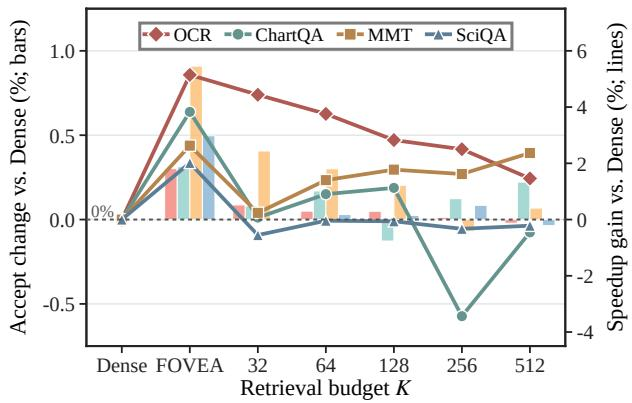  
Figure 4: Visual-retrieval budget ablation. FOVEA denotes our retrieval strategy, whereas the remaining setting uses fixed Top-K budgets. Positive values indicate improvements over dense retrieval.

To further isolate the efect of state-conditioned retrieval, we compare Full FOVEA with five matched controls: Random, Static Image, Query-agnostic, State-only, and Dense Retrieval. Across MMT-Bench, OCRBench, and ChartQA, all five controls reduce both macro-average metrics, with absolute decreases of 0.157–0.247 in speedup and 0.193– 0.225 in acceptance length. Detailed per-benchmark results and repeated-run variability are reported in the Appendix.

State-Conditioned Visual Analysis We compare the cumulative-mass retrieval used by FOVEA with dense value aggregation and fixed K ∈ {32, 64, 128, 256, 512}. Figure 4 reports changes in end-to-end speedup and average acceptance length relative to dense aggregation.

FOVEA provides the most balanced cross-task tradeof. It improves speedup by approximately 5.1% on OCR-Bench and nearly 3% on both MMT-Bench and ChartQA. Its acceptance-length changes are modest, reaching 0.91% on MMT-Bench and 0.50% on ScienceQA, with variations within approximately 0.25% on ChartQA and OCRBench. In contrast, fixed budgets exhibit task-dependent and nonmonotonic behavior. These results support adapting the number of aggregated visual values to each corrected state rather than selecting one fixed cardinality globally.

Figure 5 provides complementary qualitative evidence. With the image and visual memory fixed, the retrieved attention moves from the person’s clothing at t = 1 to the head at t = 2 and the left-side hose at t = 4. The changing focus is therefore driven by the evolving draft state, confirming that diferent predictions retrieve diferent spatial evidence.

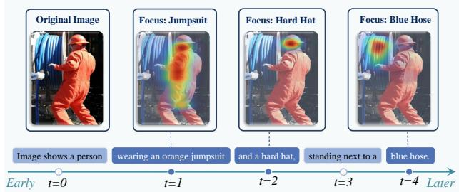

Figure 5: State-conditioned visual retrieval along one decoding trajectory. The retrieved focus shifts from the jumpsuit to the hard hat and then to the blue hose as generation proceeds.
<table><tr><td>Interface</td><td>Time(ms)↓ ∆Mem.(GiB)↓ Speedup↑</td><td></td><td></td><td>τ ↑</td></tr><tr><td>Fixed prefix</td><td>15.58</td><td>0.373</td><td>1.681</td><td>3.451</td></tr><tr><td>Dynamic insertion</td><td>20.86</td><td>0.361</td><td>1.532</td><td>3.719</td></tr><tr><td>Correction + rebuild</td><td>19.90</td><td>0.377</td><td>1.764</td><td>3.647</td></tr><tr><td>FOVEA correction</td><td>16.49</td><td>0.378</td><td>1.855</td><td>3.644</td></tr></table>

Table 3: Cache-eficiency comparison on MMT-Bench and OCRBench. We report draft time, additional peak memory over paired autoregressive decoding, end-to-end speedup, and average accept length (τ). Best values are shown in bold.

Cache-Friendly Eficiency Analysis Table 3 compares four visual-conditioning interfaces. Fixed prefix reuses static visual conditioning; Dynamic insertion updates the visual prefix and rebuilds its cache; Correction + rebuild applies the same hidden-state correction as FOVEA but disables cache reuse; and FOVEA correction modifies only currenttoken scoring while preserving all historical KV entries. The latter two variants isolate the latency benefit of cache reuse.

Reusing the historical cache reduces draft time from 19.90 to 16.49 ms, a 17.1% reduction, and increases speedup from 1.764× to 1.855×, while leaving acceptance length nearly unchanged. Compared with Fixed prefix, FOVEA adds only 0.91 ms per draft iteration but improves acceptance by 5.6% and speedup by 10.4%. Dynamic insertion obtains the highest acceptance length, yet repeated cache reconstruction raises draft time to 20.86 ms and lowers speedup to 1.532×. Peak additional memory remains similar across all variants, indicating that cache reconstruction primarily afects latency.

## Conclusion

Our visual-budget analysis reveals that visual demand varies across decoding states and that more visual input is not always beneficial. To address this mismatch, we proposed FOVEA, which uses a cumulative-mass rule to retrieve diferent amounts and contents of evidence from a reusable visual memory. A gated correction updates only the current latent representation, preserving the historical KV cache. Across three backbones and nine benchmarks, FOVEA achieves average speedups of 1.68×, 1.66×, and 1.60×, with the highest average acceptance lengths among the evaluated baselines. Further analysis confirms that dynamic retrieval provides a stronger overall trade-of than fixed-cardinality alternatives.

## References

Achiam, J.; Adler, S.; Agarwal, S.; Ahmad, L.; Akkaya, I.; Aleman, F. L.; Almeida, D.; Altenschmidt, J.; Altman, S.; Anadkat, S.; et al. 2023. Gpt-4 technical report. arXiv preprint arXiv:2303.08774.

Alayrac, J.-B.; Donahue, J.; Luc, P.; Miech, A.; Barr, I.; Hasson, Y.; Lenc, K.; Mensch, A.; Millican, K.; Reynolds, M.; et al. 2022. Flamingo: a visual language model for fewshot learning. Advances in neural information processing systems, 35: 23716–23736.

Bai, S.; Chen, K.; Liu, X.; Wang, J.; Ge, W.; Song, S.; Dang, K.; Wang, P.; Wang, S.; Tang, J.; Zhong, H.; Zhu, Y.; Yang, M.; Li, Z.; Wan, J.; Wang, P.; Ding, W.; Fu, Z.; Xu, Y.; Ye, J.; Zhang, X.; Xie, T.; Cheng, Z.; Zhang, H.; Yang, Z.; Xu, H.; and Lin, J. 2025. Qwen2.5-VL Technical Report. arXiv:2502.13923.

Berdoz, F.; Rheinboldt, P.; and Wattenhofer, R. 2026. Steering pretrained drafters during speculative decoding. In Proceedings of the AAAI Conference on Artificial Intelligence, volume 40, 30067–30075.

Cai, T.; Li, Y.; Geng, Z.; Peng, H.; Lee, J. D.; Chen, D.; and Dao, T. 2024. Medusa: Simple llm inference acceleration framework with multiple decoding heads. arXiv preprint arXiv:2401.10774.

Cha, J.; Kang, W.; Mun, J.; and Roh, B. 2024. Honeybee: Locality-enhanced projector for multimodal llm. In Proceedings of the IEEE/CVF Conference on Computer Vision and Pattern Recognition, 13817–13827.

Chen, C.; Borgeaud, S.; Irving, G.; Lespiau, J.-B.; Sifre, L.; and Jumper, J. 2023. Accelerating large language model decoding with speculative sampling. arXiv preprint arXiv:2302.01318.

Chen, J.; Liang, Y.; and Liu, Z. 2026. DFlash: Block Difusion for Flash Speculative Decoding. arXiv preprint arXiv:2602.06036.

Chen, L.; Zhao, H.; Liu, T.; Bai, S.; Lin, J.; Zhou, C.; and Chang, B. 2024. An image is worth 1/2 tokens after layer 2: Plug-and-play inference acceleration for large vision-language models. In European Conference on Computer Vision, 19–35. Springer.

Chu, X.; Qiao, L.; Lin, X.; Xu, S.; Yang, Y.; Hu, Y.; Wei, F.; Zhang, X.; Zhang, B.; Wei, X.; et al. 2023. Mobilevlm: A fast, strong and open vision language assistant for mobile devices. arXiv preprint arXiv:2312.16886.

Do, D.-T.; Le, N.-K.; and Nguyen, L.-M. 2026. AdaSpec: Adaptive Multilingual Speculative Decoding with Self-Synthesized Language-Aware Training and Vocabulary Simplification. In Proceedings of the AAAI Conference on Artificial Intelligence, volume 40, 30530–30538.

Fu, C.; Chen, P.; Shen, Y.; Qin, Y.; Zhang, M.; Lin, X.; Yang, J.; Zheng, X.; Li, K.; Sun, X.; et al. 2026. Mme: A comprehensive evaluation benchmark for multimodal large language models. Advances in Neural Information Processing Systems, 38.

Gagrani, M.; Goel, R.; Jeon, W.; Park, J.; Lee, M.; and Lott, C. 2024. On speculative decoding for multimodal large language models. In Proceedings of the IEEE/CVF Conference on Computer Vision and Pattern Recognition, 8285–8289.

Ganesan, M.; Segal, S.; Aggarwal, A.; Sinnadurai, N.; Lie, S.; and Thangarasa, V. 2025. Massv: Multimodal adaptation and self-data distillation for speculative decoding of visionlanguage models. arXiv preprint arXiv:2505.10526.

Hu, Y.; Xia, T.; Liu, Z.; Raman, R.; Liu, X.; Bao, B.; Sather, E.; Thangarasa, V.; and Zhang, S. Q. 2026. Dream: Drafting with refined target features and entropy-adaptive cross-attention fusion for multimodal speculative decoding. Advances in Neural Information Processing Systems, 38: 167592–167612.

Huang, H.; Yang, F.; Liu, Z.; Yin, X.; Li, D.; Ren, P.; and Barsoum, E. 2025a. SpecVLM: Fast Speculative Decoding in Vision-Language Models. arXivpreprint arXiv:2509.11815.

Huang, W.; Zhai, Z.; Shen, Y.; Cao, S.; Zhao, F.; Xu, X.; Ye, Z.; and Lin, S. 2025b. Dynamic-llava: Eficient multimodal large language models via dynamic vision-language context sparsification. In International Conference on Learning Representations, volume 2025, 69927–69955.

Jia, Y.; Tang, S.; and Yang, Q. 2026. CoVSpec: Eficient Device-Edge Co-Inference for Vision-Language Models via Speculative Decoding. arXiv preprint arXiv:2605.02218.

Kang, J.; Shu, H.; Li, W.; Zhai, Y.; and Chen, X. 2026. Vispec: Accelerating vision-language models with visionaware speculative decoding. Advances in Neural Information Processing Systems, 38: 115511–115532.

Ku, L.-W.; Martins, A. F.; and Srikumar, V. 2024. Findings of the Association for Computational Linguistics: ACL 2024. In Findings of the Association for Computational Linguistics: ACL 2024.

Leviathan, Y.; Kalman, M.; and Matias, Y. 2023. Fast inference from transformers via speculative decoding. In International Conference on Machine Learning, 19274–19286. PMLR.

Li, B.; Ge, Y.; Ge, Y.; Wang, G.; Wang, R.; Zhang, R.; and Shan, Y. 2024a. Seed-bench: Benchmarking multimodal large language models. In Proceedings of the IEEE/CVF Conference on Computer Vision and Pattern Recognition, 13299–13308.

Li, J.; Li, D.; Savarese, S.; and Hoi, S. 2023. Blip-2: Bootstrapping language-image pre-training with frozen image encoders and large language models. In International conference on machine learning, 19730–19742. PMLR.

Li, Y.; Wei, F.; Zhang, C.; and Zhang, H. 2024b. Eagle-2: Faster inference of language models with dynamic draft trees. In Proceedings of the 2024 conference on empirical methods in natural language processing, 7421–7432.

Li, Y.; Wei, F.; Zhang, C.; and Zhang, H. 2024c. Eagle: Speculative sampling requires rethinking feature uncertainty. arXiv preprint arXiv:2401.15077.

Li, Y.; Wei, F.; Zhang, C.; and Zhang, H. 2026. Eagle-3: Scaling up inference acceleration of large language models via training-time test. Advances in Neural Information Processing Systems, 38: 136737–136756.

Lin, L.; Lin, Z.; Zeng, Z.; and Ji, R. 2025. Speculative decoding reimagined for multimodal large language models. arXiv preprint arXiv:2505.14260.

Liu, H.; Li, C.; Li, Y.; Li, B.; Zhang, Y.; Shen, S.; and Lee, Y. J. 2024a. Llavanext: Improved reasoning, ocr, and world knowledge.

Liu, H.; Li, C.; Wu, Q.; and Lee, Y. J. 2023. Visual instruction tuning. Advances in neural information processing systems, 36: 34892–34916.

Liu, Y.; Li, Z.; Huang, M.; Yang, B.; Yu, W.; Li, C.; Yin, X.- C.; Liu, C.-L.; Jin, L.; and Bai, X. 2024b. Ocrbench: on the hidden mystery of ocr in large multimodal models. Science China Information Sciences, 67(12): 220102.

Liu, Z.; Hu, Y.; Xia, T.; Bao, B.; Sather, E.; Thangarasa, V.; and Zhang, S. Q. 2026. DREAM-S: Speculative Decoding with Searchable Drafting and Target-Aware Refinement for Multimodal Generation. In Proceedings of the 64th Annual Meeting of the Association for Computational Linguistics (Volume 1: Long Papers), 47031–47045.

Lu, P.; Bansal, H.; Xia, T.; Liu, J.; Li, C.; Hajishirzi, H.; Cheng, H.; Chang, K.-W.; Galley, M.; and Gao, J. 2024. Mathvista: Evaluating mathematical reasoning of foundation models in visual contexts. In International Conference on Learning Representations, volume 2024, 23439–23554.

Lu, P.; Mishra, S.; Xia, T.; Qiu, L.; Chang, K.-W.; Zhu, S.-C.; Tafjord, O.; Clark, P.; and Kalyan, A. 2022. Learn to explain: Multimodal reasoning via thought chains for science question answering. Advances in neural information processing systems, 35: 2507–2521.

Masry, A.; Tan, J. Q.; Joty, S.; Hoque, E.; et al. 2022. Chartqa: A benchmark for question answering about charts with visual and logical reasoning. In Findings of the association for computational linguistics: ACL 2022, 2263–2279.

Saikh, T.; Ghosal, T.; Mittal, A.; Ekbal, A.; and Bhattacharyya, P. 2022. Scienceqa: A novel resource for question answering on scholarly articles. International Journal on Digital Libraries, 23(3): 289.

Shen, H.; Wang, X.; Zhang, P.; Hsieh, Y.; Han, Q.; Wan, Z.; Zhang, Z.; Zhang, J.; Xiong, J.; Liu, Z.; et al. 2026. MMSpec: Benchmarking Speculative Decoding for Vision-Language Models. arXiv preprint arXiv:2603.14989.

Shi, L.; Li, Z.; Zhang, L.; Qi, B.; Liu, G.; and Zhao, H. 2026. Scaling llm speculative decoding: Non-autoregressive forecasting in large-batch scenarios. In Proceedings ofthe AAAI Conference on Artificial Intelligence, volume 40, 32947– 32955.

Singh, A.; Natarajan, V.; Shah, M.; Jiang, Y.; Chen, X.; Batra, D.; Parikh, D.; and Rohrbach, M. 2019. Towards vqa models that can read. In Proceedings of the IEEE/CVF conference on computer vision and pattern recognition, 8317–8326.

Touvron, H.; Lavril, T.; Izacard, G.; Martinet, X.; Lachaux, M.-A.; Lacroix, T.; Rozière, B.; Goyal, N.; Hambro, E.; Azhar, F.; et al. 2023. Llama: Open and eficient foundation language models. arXiv preprint arXiv:2302.13971.

Tu, D.; Vashchilenko, D.; Lu, Y.; and Xu, P. 2025. VLcache: Sparsity and modality-aware KV cache compression

for vision-language model inference acceleration. In International Conference on Learning Representations, volume 2025, 219–239.

Vo, Q.; Nguyen, C.-D.; Srey, P.; Tuan, L. A.; and Nguyen, T. 2026. TIGER: Text-Conditioned Visual Gated Routing with Acceptance Alignment for Multimodal Speculative Decoding. arXiv preprint arXiv:2607.11131.

Wang, P.; Bai, S.; Tan, S.; Wang, S.; Fan, Z.; Bai, J.; Chen, K.; Liu, X.; Wang, J.; Ge, W.; et al. 2024a. Qwen2-vl: Enhancing vision-language model’s perception of the world at any resolution. arXiv preprint arXiv:2409.12191.

Wang, X.; Zhang, X.; Luo, Z.; Sun, Q.; Cui, Y.; Wang, J.; Zhang, F.; Wang, Y.; Li, Z.; Yu, Q.; et al. 2024b. Emu3: Next-token prediction is all you need. arXiv preprint arXiv:2409.18869.

Wang, Z.; Li, R.; Du, H.; Zhou, J. T.; Zhang, Y.; and Yang, X. 2025. FLASH: Latent-Aware Semi-Autoregressive Speculative Decoding for Multimodal Tasks. arXiv preprint arXiv:2505.12728.

Xie, Z.; Wang, P.; Qiu, S.; and Cheng, J. 2026. HiViS: hiding visual tokens from the drafter for speculative decoding in vision-language models. In Proceedings of the IEEE/CVF Conference on Computer Vision and Pattern Recognition, 8952–8961.

Yang, C.; Chen, R.; Zhang, M.; Pang, W.; Chen, Y.; Xu, R.; Fu, K.; Wang, C.; and Gao, L. 2025. AASD: Accelerate Inference by Aligning Speculative Decoding in Multimodal Large Language Models. In 2025 62nd ACM/IEEE Design Automation Conference (DAC), 1–7. IEEE.

Yao, L.; Li, L.; Ren, S.; Wang, L.; Liu, Y.; Sun, X.; and Hou, L. 2024. Deco: Decoupling token compression from semantic abstraction in multimodal large language models. arXiv preprint arXiv:2405.20985.

Ying, K.; Meng, F.; Wang, J.; Li, Z.; Lin, H.; Yang, Y.; Zhang, H.; Zhang, W.; Lin, Y.; Liu, S.; et al. 2024. Mmtbench: A comprehensive multimodal benchmark for evaluating large vision-language models towards multitask agi. arXiv preprint arXiv:2404.16006.

Zhang, S.; Fang, Q.; Yang, Y.; and Feng, Y. 2025. Llava-mini: Eficient image and video large multimodal models with one vision token. In International Conference on Learning Representations, volume 2025, 53285–53310.

Zhang, Y.; Fan, C.-K.; Ma, J.; Zheng, W.; Huang, T.; Cheng, K.; Gudovskiy, D.; Okuno, T.; Nakata, Y.; Keutzer, K.; et al. 2024. Sparsevlm: Visual token sparsification for efficient vision-language model inference. arXiv preprint arXiv:2410.04417.

Zhao, Y.; Xie, Z.; Liang, C.; Zhuang, C.; and Gu, J. 2024. Lookahead: An inference acceleration framework for large language model with lossless generation accuracy. In Proceedings of the 30th ACM SIGKDD Conference on Knowledge Discovery and Data Mining, 6344–6355.

Zhu, Y.; Xie, C.; Liang, S.; Zheng, B.; and Guo, S. 2024. Focusllava: A coarse-to-fine approach for eficient and efective visual token compression. arXiv preprint arXiv:2411.14228.

## Appendix

## Visual-Budget Diagnostic Details

Table 6 summarizes the model-specific training configurations.

This section provides the complete protocol and metric definitions for the visual-budget diagnostics summarized in Figures 1 and 2 ofthe main paper. The purpose ofthis analysis is not to identify a single globally optimal compression ratio, but to test whether the amount of visual evidence preferred by the drafter remains stable across decoding states. This diagnostic varies the amount of visual input to expose the limitations of one globally fixed interface. FOVEA does not predict these ratios: it uses the same retrieval cardinality Kr = 16 at every draft state and adapts which visual-memory entries are selected.

## Diagnostic Setup

Models and data. We use LLaVA-NeXT-7B as the target VLM and a draft model trained following the Dream formulation. We evaluate 1,000 examples from each of MMT-Bench, LLaVA/665K-Holdout, and OCRBench. Unless stated otherwise, the decoding configuration is identical to that used in the main experiments: the drafter uses top-k = 6, a maximum tree depth of $D = 6$ , and a budget of 40 candidate nodes. Generation is greedy and produces at most 200 new tokens.

We define a decoding state as one complete speculative iteration at a fixed current prefix. Starting from the same prefix, we separately construct and verify one draft tree under each visual budget. Thus, a state corresponds to an entire draft–verify iteration rather than to an individual node within the draft tree. The frozen diagnostic set contains 4,082 such states.

Visual-budget levels. Let N denote the number of projected visual tokens produced by the LLaVA-NeXT visual encoder and multimodal projector. Because LLaVA-NeXT expands images according to their resolution, N varies across examples. We evaluate five visual-budget ratios

$$
\mathcal { R } = \{ 0 , 0 . 2 5 , 0 . 5 0 , 0 . 7 5 , 1 . 0 0 \} .\tag{20}
$$

For a ratio $r \in \mathcal { R }$ , the number of retained visual tokens is

$$
\begin{array} { r } { k ( r ) = \left\{ \begin{array} { l l } { 0 , } & { r = 0 , } \\ { \operatorname* { m a x } ( 1 , \lfloor r N \rfloor ) , } & { 0 < r < 1 , } \\ { N , } & { r = 1 . } \end{array} \right. } \end{array}\tag{21}
$$

The 75% condition is the default visual budget used by the Dream-style drafter; it is not an additional sixth condition. The 0% and 100% conditions correspond to no visual tokens and full visual access, respectively.

Importance-based token selection. The reduced budgets are constructed by importance-based Top-k selection, rather than uniform sampling, random sampling, pooling, or token merging. For each current sequence, the target model first performs a forward pass with the complete visual-token sequence. We take the self-attention map from the last targetmodel layer and average over the attention-head and query dimensions to obtain one importance score for each visual token. For budget r, we retain the k(r) highest-scoring visual tokens. The selected tokens preserve their original sequence order and remain separate embeddings; all text tokens are always retained. Consequently, the five conditions difer only in the amount of visual evidence exposed to the drafter.

Table 4: Visual-token ranges in the diagnostic data. The default condition retains max(1, ⌊0.75N⌋) tokens.
<table><tr><td>Dataset</td><td>Original tokens N</td><td>Default retained tokens</td></tr><tr><td>MMT-Bench</td><td>1,176–2,928</td><td>882-2,196</td></tr><tr><td>LLaVA/665K-Holdout</td><td>1,464–2,352</td><td>1,098-1,764</td></tr><tr><td>OCRBench</td><td>870–2,928</td><td>652–2,196</td></tr></table>

## State-Level Visual-Budget Metrics

Let $A _ { s } ( \boldsymbol { r } )$ be the accept length obtained at decoding state s under visual budget $r \in \mathcal { R }$ . We define the preferred budget as

$$
B _ { s } = \operatorname* { m i n } \biggl ( \operatorname { a r g } \operatorname* { m a x } _ { r \in \mathcal { R } } A _ { s } ( r ) \biggr ) .\tag{22}
$$

The minimum provides a deterministic tie-breaking rule: when multiple budgets produce the same maximum accept length, we select the smallest budget that achieves that maximum. This definition measures the least visual evidence needed to attain the best observed drafting quality at the state.

The resulting distribution is strongly non-uniform. A 25% visual budget is preferred at 56.0% of the evaluated states, whereas the default 75% budget and full visual access are preferred at only 4.0% and 2.9% of states, respectively. Together with the variation of $B _ { s }$ across states from the same example, this result shows that a globally fixed visual budget does not match the evidence requirements of all speculative iterations. This diagnostic motivates state-conditioned evidence selection, but FOVEA itself does not change the retrieval cardinality across states.

Under- and over-supply relative to the default budget. To isolate the mismatch between a low visual budget and the default interface, we compare only the 25% and 75% conditions. The 0%, 50%, and 100% conditions do not participate in this particular statistic. We define

$$
\mathrm { U n d e r - s u p p l i e d } ( s ) \iff A _ { s } ( 0 . 2 5 ) < A _ { s } ( 0 . 7 5 ) ,\tag{23}
$$

$$
\mathrm { O v e r - s u p p l i e d } ( s ) \iff A _ { s } ( 0 . 2 5 ) > A _ { s } ( 0 . 7 5 ) ,\tag{24}
$$

$$
\mathrm { M a t c h e d } ( s ) \iff A _ { s } ( 0 . 2 5 ) = A _ { s } ( 0 . 7 5 ) .\tag{25}
$$

The low-budget condition is under-supplied when increasing the visual budget from 25% to the 75% default allows the target model to accept more draft tokens. Conversely, the default condition is over-supplied when reducing the budget to 25% increases the accept length. Among the 4,082 states, 1,143 (28.0%) are under-supplied, 453 (11.1%) are over-supplied, and 2,486 (60.9%) are matched. The presence of both strict inequalities demonstrates that the relationship between visual budget and drafting quality is non-monotonic: neither the low budget nor the larger default budget dominates across states.

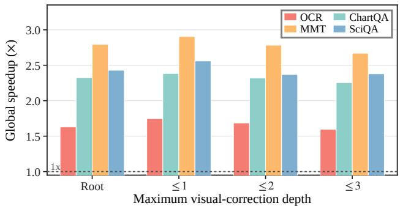  
(a) Speed under visual-correction depth

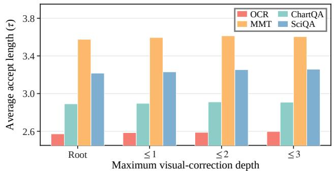  
(b) Acceptance under visual-correction depth  
Figure 6: Sensitivity to the visual-correction depth.

## Visual Demand Along the Decoding Trajectory

We next examine whether visual demand changes as generation proceeds. This analysis uses speculative-iteration position rather than the number of emitted tokens. For a sample containing $I > 1$ speculative iterations, the normalized position of iteration i is

$$
p _ { i } = \frac { i - 1 } { I - 1 } , \qquad b _ { i } = \operatorname* { m i n } ( 9 , \lfloor 1 0 p _ { i } \rfloor ) ,\tag{26}
$$

which assigns the trajectory to ten equal-width bins $b _ { i } \in$ $\{ 0 , \ldots , 9 \}$ . For the summary in Figure 2(c) of the main paper, we merge these bins into an Early interval with $p _ { i } < 0 . 6$ and a Late interval with $p _ { i } \geq 0 . 6$ . Thus, Early approximately corresponds to bins 0–5 and Late to bins 6–9. Each reported quantity is computed directly over all states in the corresponding interval; we do not first average within each bin and then give the ten bins equal weight.

In addition to the preferred budget $B _ { s }$ in Equation 22, we define the state-level accept-length range and budgetsensitivity indicator as

$$
G _ { s } = \operatorname* { m a x } _ { r \in \mathcal { R } } A _ { s } ( r ) - \operatorname* { m i n } _ { r \in \mathcal { R } } A _ { s } ( r ) ,\tag{27}
$$

$$
S _ { s } = \mathbf { 1 } [ G _ { s } > 0 ] .\tag{28}
$$

Here, Best is the mean of $B _ { s } ,$ Range is the mean of $G _ { s } ,$ and Sensitive is the mean of $S _ { s }$ over all states in the relevant interval. Sensitive uses no additional threshold: a state is budget-sensitive whenever any two tested budgets yield diferent accept lengths.

On OCRBench, the mean preferred budget increases from 0.150 in the Early interval to 0.237 in the Late interval. At the same time, the mean accept-length range grows from 0.699 to 0.915 accepted draft tokens, and the fraction of budget-sensitive states rises from 42.2% to 48.8%. The three metrics capture complementary efects: later states prefer more visual evidence on average, their drafting quality varies more strongly across budgets, and a larger fraction of them respond to the choice of visual budget.

<table><tr><td>Parameter</td><td>Value</td><td>Parameter</td><td>Value</td><td>Parameter</td><td>Value</td></tr><tr><td> $\gamma _ { w }$ </td><td>1</td><td> $\lambda _ { \mathrm { h i d } }$ </td><td>1.0</td><td> $\lambda _ { \mathrm { K L } }$ </td><td>0.2</td></tr><tr><td> $\lambda _ { \mathrm { t o k } }$ </td><td>1.0</td><td> $\beta _ { h }$ </td><td>1.0</td><td> $\beta _ { \mathrm { m i d } }$ </td><td>0.1</td></tr><tr><td>βCE</td><td>1.5</td><td> $\beta _ { \mathrm { c m p } }$ </td><td>0.5</td><td>m</td><td>0.5</td></tr></table>

Table 5: Loss hyperparameters used for training FOVEA.

## Attention-Based Visual-Focus Movement

Figure 2(d) of the main paper additionally reports an independent attention-trace diagnostic. This analysis does not measure changes in the visual-token subset retained by the budget sweep. Instead, at each autoregressive target-model step t, we select the 16 visual tokens with the highest lastlayer attention scores and denote their index set by $F _ { t }$ . The focus movement between adjacent steps is measured by their Jaccard distance,

$$
D _ { t } = 1 - { \frac { \left| F _ { t } \cap F _ { t + 1 } \right| } { \left| F _ { t } \cup F _ { t + 1 } \right| } } .\tag{29}
$$

We assign each adjacent-step pair to Early or Late using the midpoint of its normalized positions, with midpoints greater than or equal to 0.6 assigned to Late. For each eligible sample, we compute the mean $\bar { D } _ { t }$ separately within the two intervals. A sample exhibits late-higherfocus movement when its Late mean is larger than its Early mean.

We perform an analogous sample-level comparison for visual-budget demand by comparing the sample’s mean preferred budget in the Late and Early intervals. Among samples with valid measurements in both intervals, 56 of 90 (62.2%) have a larger mean preferred budget in Late generation, while 54 of 98 (55.1%) have larger Late-stage Jaccard distance. These results indicate that later generation more often exhibits both a higher preferred diagnostic budget and a change in the attended visual-token set.

The focus-movement diagnostic should be interpreted specifically as a change in Top-16 token-set membership. It does not account for changes in attention weights within the selected set, spatial distance between tokens, or the area of the corresponding image regions. We therefore use it as complementary evidence of evolving visual focus rather than as a causal attribution measure.

## Training Setup

## Sensitivity to the visual-corretion depth

We analyze state-conditioned correction from both eficiency and interpretability perspectives. Using the same checkpoint, we restrict visual correction to nodes with depth $\ell _ { n } \leq 0 ,$ 1, 2, or 3. Matched retrieval controls in the Appendix further isolate the efect of state conditioning.

As shown in Figure 6, extending correction from the root to depth ≤ 3 increases the macro-average accept length from 2.423 to 2.507, but reduces speedup from 1.237× to 1.190× and the fraction of samples faster than autoregressive decoding from 75.5% to 68.2%. Thus, broader correction provides only modest acceptance gains while adding draft-side cost, motivating the lightweight design of the node-specific correction used throughout FOVEA.

## Draft Model Training

For each target backbone, we train a separate, backbonespecific draft model while keeping the target VLM frozen throughout training. Training is performed entirely on the draft side using target artifacts precomputed ofline. Each artifact contains the input token embeddings, target hidden states and logits, supervision masks, and projected visual tokens required by the visual-memory module. Consequently, target-side representations serve only as fixed supervision signals, and no gradient is propagated through the target VLM.

The draft models for LLaVA-v1.6-Vicuna-7B and Qwen2.5-VL-7B are each trained on 57,671 target-artifact samples. Of these, 51,671 are obtained from LLaVA-v1.5- Mix-665K, providing broad multimodal instruction coverage, and the remaining 6,000 are drawn from six taskoriented sources: MMT-Bench, SEED-Bench-2, ScienceQA, MathVista, OCRBench, and ChartQA. For the LLaVA-v1.6- Vicuna-7B run, this benchmark portion contains 1,000 samples from each source. For the Qwen2.5-VL-7B run, the 6,000 samples are drawn from the same six-source pool. The visual-memory retrieval cardinality is fixed to $K _ { r } = 1 6$ during both training and inference and is shared by every draft state. All valid memory keys are scored before the top-$K _ { r }$ entries are selected, so state conditioning changes the selected entries rather than the number of keys scored or values aggregated.

Both draft models are optimized with AdamW using $\beta _ { 1 } ~ = ~ 0 . 9 , ~ \beta _ { 2 } ~ = ~ 0 . 9 5$ , zero weight decay, gradient clipping at 0.5, BF16 mixed precision, DeepSpeed ZeRO-2, and random seed 42. Both use WarmupDecayLR: the LLaVAv1.6-Vicuna-7B run applies linear warmup over 4,326 of 43,260 optimizer updates, while the Qwen2.5-VL-7B run uses DeepSpeed’s default logarithmic warmup over 2,000 updates. For the LLaVA-v1.6-Vicuna-7B run, a per-device batch size of 2, four gradient accumulation steps, and two GPUs yield a global batch size of 16. For the Qwen2.5-VL-7B run, a per-device batch size of 4 without gradient accumulation on two GPUs yields a global batch size of 8. Warmup lengths are counted in optimizer updates rather than individual microbatches. The frozen language-model head of the LLaVA-v1.6-Vicuna-7B draft is retained in FP16, while the remaining trainable computation uses BF16. The reported LLaVA wall-clock time includes a 100-sample speed evaluation after every epoch.

## Matched Retrieval-Control Ablation

Table 7 shows that all five alternative interfaces reduce both macro-average metrics relative to Full FOVEA. The absolute macro decreases in speedup and acceptance length are (0.176, 0.206) for Random Top-16, (0.187, 0.225) for Static Image Top-16, (0.247, 0.213) for Query-agnostic Top-16, (0.197, 0.204) for State-only Top-16, and (0.157, 0.193) for Dense Retrieval. State-only Top-16 is the closest matched selection control, supporting the complementary value of the depth embedding. Static and query-agnostic retrieval improve OCRBench but degrade MMT-Bench and ChartQA, indicating a less robust cross-task trade-of. Random retrieval has the largest variability and the largest ChartQA speedup decrease, while dense value aggregation remains close to but below Full FOVEA on both macro metrics. Because all repeats use the same checkpoint, the standard deviations measure repeated-inference variability, not variation across independent training seeds; zero τ variation for deterministic controls is therefore expected.

## Implementation and Training Details

Draft-model architecture. Table ?? summarizes the backbone-specific FOVEA drafters. All reported parameter counts refer to trainable parameters in the verified final checkpoints. The LLaVA drafters use standard multi-head attention, whereas the Qwen2.5-VL drafter uses grouped-query attention with 28 query heads and 4 key–value heads.

Draft and target supervision states. For each token position $n , h _ { n }$ is the output of the first draft Transformer block. The state $h _ { n }$ is the output of the final draft block before visual correction, corresponding to the second block for the twoblock drafters and the third block for the LLaVA-13B drafter. The final target state $h _ { n } ^ { T }$ is taken from the last target-model layer.

The intermediate target state $\tilde { h } _ { n } ^ { T }$ is selected independently for each token. For the LLaVA backbones, we choose the layer with the lowest attention entropy among target hidden states 1 through 10. For Qwen2.5-VL-7B, the search covers target hidden states 1 through 9. This token-adaptive selection supplies the intermediate feature used by the hidden-state alignment objective.

Visual correction module. For every backbone, we set $d _ { k } = d _ { u } = d _ { h }$ and concatenate $h _ { n }$ and $r _ { n }$ before applying the correction and gate networks:

$$
c _ { n } = f _ { \theta } ( [ h _ { n } ; r _ { n } ] ) , \qquad g _ { n } = \sigma ( g _ { \theta } ( [ h _ { n } ; r _ { n } ] ) ) .\tag{30}
$$

Both networks contain two biased linear layers, a 512- dimensional hidden layer, and a SiLU activation, with no dropout. The correction network outputs a $d _ { h }$ -dimensional

<table><tr><td>Target backbone</td><td>Samples</td><td>Epochs</td><td>Batch size</td><td>Learning rate</td><td>Warmup</td><td>GPUs</td><td>Wall-clock time</td></tr><tr><td>LLaVA-v1.6-Vicuna-7B</td><td>57,671</td><td>12</td><td> $2 / 4 / 1 6$ </td><td> $5 \times 1 0 ^ { - 5 }$ </td><td>4,326 / 43,260 (linear) 2,000</td><td>2</td><td>32:58:25</td></tr><tr><td>Qwen2.5-VL-7B</td><td>57,671</td><td>12</td><td> $4 / 1 / 8$ </td><td> $5 \times 1 0 ^ { - 5 }$ </td><td>(logarithmic)</td><td>2</td><td>32:17:03</td></tr></table>

Table 6: Draft-model training configurations. Batch size is reported as per-device batch size / gradient accumulation steps / global batch size. The target VLM is frozen in all runs.
<table><tr><td></td><td colspan="2">MMT-Bench</td><td colspan="2">OCRBench</td><td colspan="2">ChartQA</td><td colspan="2">Macro</td></tr><tr><td>Variant</td><td>∆S</td><td> $\Delta \tau$ </td><td> $\Delta S$ </td><td> $\Delta \tau$ </td><td>∆S</td><td> $\Delta \tau$ </td><td> $\Delta S$ </td><td> $\Delta \tau$ </td></tr><tr><td>Random Top-16</td><td></td><td></td><td> $+ 0 . 3 7 7 \pm 0 . 2 4 6 - 0 . 0 4 5 \pm 0 . 1 2 0 - 0 . 2 0 9 \pm 0 . 3 1 9 + 0 . 1 4 3 \pm 0 . 0 9 7 - 0 . 9 2 2 \pm 0 . 2 1 0 - 0 . 6 2 5 \pm 0 . 5 1 9 - 0 . 1 7 6 \pm 0 . 1 2 8 - 0 . 2 0 6 \pm 0 . 0 7 1$ </td><td></td><td></td><td></td><td></td><td></td></tr><tr><td>Static Image Top-16</td><td></td><td></td><td></td><td></td><td> $- 0 . 6 8 8 \pm 0 . 0 6 3 - 0 . 1 0 1 \pm 0 . 0 0 0 + 0 . 0 5 5 \pm 0 . 0 4 1 + 1 . 0 7 4 \pm 0 . 0 0 0 - 0 . 3 6 5 \pm 0 . 0 1 9 - 1 . 4 7 0 \pm 0 . 0 0 0 - 0 . 1 8 7 \pm 0 . 0 1 8 - 0 . 2 2 5 \pm 0 . 0 0 0$ </td><td></td><td></td><td></td></tr><tr><td>Query-agnostic Top</td><td></td><td></td><td></td><td></td><td> $\begin{array} { r } { - 1 6  \ 0 . 5 3 8 \pm 0 . 0 6 8 < - 0 . 1 0 1 \pm 0 . 0 0 0 + 0 . 0 8 8 \pm 0 . 0 5 6 + 1 . 0 7 6 \pm 0 . 0 0 0 - 0 . 5 1 6 \pm 0 . 0 3 3 - 1 . 4 2 8 \pm 0 . 0 0 0 - 0 . 2 4 7 \pm 0 . 0 2 5 - 0 . 2 1 3 \pm 0 . 0 0 0 } \\ { - 1 6 - 0 . 5 3 8 \pm 0 . 0 0 3 - 0 . 0 3 0 0 0 + 0 . 0 8 8 \mp 0 . 0 0 0 0 9 1 1 \mp 0 . 0 0 0 0 9 1 1 } \end{array}$ </td><td></td><td></td><td>0</td></tr><tr><td>State-only Top-16</td><td></td><td></td><td> $- 0 . 2 6 4 \pm 0 . 1 8 6 - 0 . 2 6 4 \pm 0 . 0 0 0 - 0 . 1 5 9 \pm 0 . 0 3 0 + 0 . 0 3 7 \pm 0 . 0 0 0 + 0 . 0 1 0 \pm 0 . 0 3 9 - 0 . 1 3 0 \pm 0 . 0 0 0 - 0 . 1 9 7 \pm 0 . 0 8 1 - 0 . 2 0 4 \pm 0 . 0 0 0$ </td><td></td><td></td><td></td><td></td><td></td></tr><tr><td>Full FOVEA</td><td></td><td></td><td></td><td></td><td></td><td></td><td> $0 . 0 0 0 + 0 . 0 0 0 \quad 0 . 0 0 0 + 0 . 0 0 0 \quad 0 . 0 0 0 + 0 . 0 0 0 \quad 0 . 0 0 0 + 0 . 0 0 0 \quad 0 . 0 0 0 + 0 . 0 0 0 \quad 0 . 0 0 0 + 0 . 0 0 0 \quad 0 . 0 0 0 + 0 . 0 0 0 \quad 0 . 0 0 0 + 0 . 0 0 0 \quad 0 . 0 0 0 + 0 . 0 0 0$ </td><td>0.000±0.000</td></tr><tr><td>Dense Retrieval</td><td> $- 0 . 1 7 4 \pm 0 . 0 1 8 - 0 . 2 4 8 \pm 0 . 0 0 0 + 0 . 0 5 0 \pm 0 . 1 3 9 + 0 . 0 0 1 \pm 0 . 0 0 0 - 0 . 1 6 1 \pm 0 . 0 2 0 - 0 . 2 2 2 \pm 0 . 0 0 0 - 0 . 1 5 7 \pm 0 . 0 4 8 - 0 . 1 9 3 \pm 0 . 0 0 0$ </td><td></td><td></td><td></td><td></td><td></td><td></td><td></td></tr></table>

Table 7: Matched retrieval-control ablation. Each cell reports the absolute change from Full FOVEA in speedup (∆S) or average acceptance length $( \Delta \tau )$ ; Full FOVEA is fixed at zero. Values are mean ± standard deviation over three repeated inference runs using the same checkpoint. Higher values are better.

vector, whereas the gate network outputs a scalar that is broadcast across the hidden dimension. The representation passed to the language-model head is

$$
\hat { h } _ { n } = \mathrm { R M S N o r m } ( h _ { n } + g _ { n } c _ { n } ) , \qquad z _ { n } = W _ { \mathrm { L M } } \hat { h } _ { n } .\tag{31}
$$

Loss configuration. We use the same loss coeficients for all backbone-specific drafters, as summarized in Table 5.

Optimization. We optimize only the draft-side trainable parameters while keeping the target VLM frozen. Training uses AdamW with $\beta _ { 1 } \bar { = } \bar { 0 } . 9 , \beta _ { 2 } \bar { = } 0 . 9 5$ , zero weight decay, gradient clipping at 0.5, BF16 mixed precision, DeepSpeed ZeRO-2, and random seed 42. All drafters are trained for 12 epochs with a peak learning rate of $5 \times 1 0 ^ { - 5 }$ . The perbackbone batch sizes, warmup schedules, numbers of optimizer updates, GPU counts, and wall-clock training times are reported in Table 6.

<table><tr><td>Backbone</td><td> ${ \tilde { h } } _ { n }$ </td><td> $h _ { n }$ </td><td> $h _ { n } ^ { T }$ </td><td> $\tilde { h } _ { n } ^ { T }$ </td></tr><tr><td>LLaVA-7B</td><td>Block 1 output</td><td>Block 2 output</td><td>Final target layer</td><td>Minimum-entropy layer in [1, 10]</td></tr><tr><td>LLaVA-13B</td><td>Block 1 output</td><td>Block 3 output</td><td>Final target layer</td><td>Minimum-entropy layer in [1, 10]</td></tr><tr><td>Qwen2.5-VL-7B</td><td>Block 1 output</td><td>Block 2 output</td><td>Final target layer</td><td>Minimum-entropy layer in [1, 9]</td></tr></table>

Table 8: Sources of the draft and target states used for supervision. Draft states are measured before visual correction.