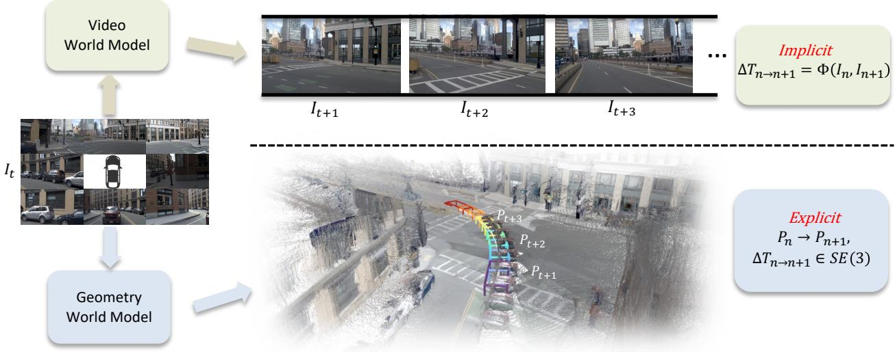
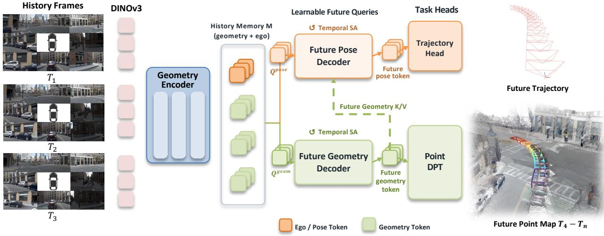
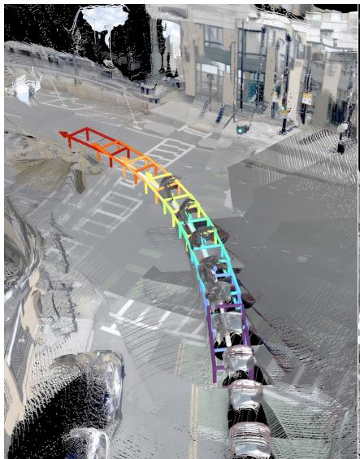
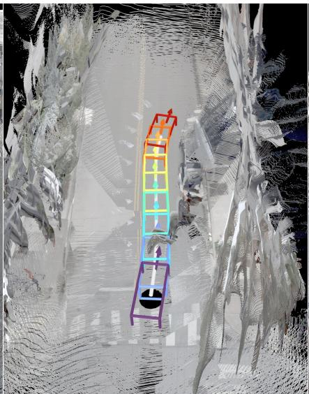
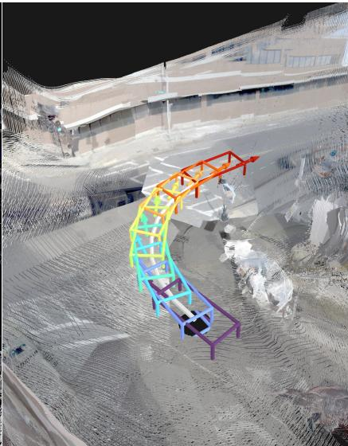

# GeoWAM: Visual Geometry World Action Models for Autonomous Driving

Yiren Lu1,2, Xin Ye1,†, Jiaming Liu1, Philip Jacobson1, Jin Yao1, Yi-chung Chen1, Liam Merino1, Dhruva Dixith Kurra1, Min Cai1, Tom Lampo1, Yu Yin2,†, Danhua Guo1, Burhan Yaman1‡

1Uber AV Labs 2Case Western Reserve University

† Corresponding authors, ‡ Project Lead

World action models (WAMs) have recently gained increasing attention as a framework for jointly modeling scene evolution and ego actions in autonomous driving. Most existing WAMs learn scene dynamics in pixel space by combining a video-generation backbone for future-observation prediction with an action head for ego-trajectory prediction. Pixels, however, provide only an indirect representation of these dynamics: they entangle geometry and motion with appearance, texture, and illumination, forcing the model to infer three-dimensional transformations from two-dimensional observations. We argue that geometry, represented by point clouds, ofers a more natural state space for driving because it explicitly captures spatial structure and the rigid and non-rigid transformations that govern scene evolution while directly aligning with the space in which driving actions are executed. Building on this insight, we introduce GeoWAM, a visual geometry world action model for autonomous driving. Rather than predicting future images, GeoWAM is pretrained to forecast future scene geometry, yielding representations that jointly encode spatial structure and temporal evolution. A geometry-conditioned action head then leverages these learned geometric dynamics to predict future ego trajectories. Extensive open-loop and closed-loop evaluations show that visual geometry world modeling yields substantially stronger driving policies than image-based alternatives, establishing future-geometry prediction as an efective pretraining objective for autonomous driving.

Project: https://yiren-lu.com/project\_pages/geowam/ Date: August 25, 2026

Uber

CASE WESTERN RESERVE UNIVERSITY

## 1 Introduction

Autonomous driving is fundamentally a problem of anticipation. A capable driving agent must understand not only the current scene, but also how the scene is likely to evolve and how that evolution constrains its actions. Recent end-to-end driving systems increasingly build on pretrained foundation models to acquire the broad representations needed for this task.

A prominent line of work develops Vision-Language-Action (VLA) models, which transfer the semantic knowledge and reasoning capabilities of pretrained vision-language models to ego-trajectory prediction, either through language tokens or a dedicated action decoder [14, 16, 22, 29, 34, 41, 47]. VLA policies are well suited to high-level scene understanding and decision making. However, their action-centric training objectives typically do not explicitly supervise future scene evolution, leaving environmental dynamics implicit in the learned policy representation.

World models ofer a complementary foundation by learning to predict how an environment evolves. In autonomous driving, recent approaches use high-capacity video-generation backbones to forecast future observations with impressive visual fidelity and controllability [9, 12, 13, 33, 35]. Pretraining on large-scale, unlabeled driving logs allows these models to acquire transferable priors over object motion, scene structure, and temporal evolution. Future-observation prediction alone, however, does not specify which action the ego vehicle should execute.

World action models (WAMs) connect prediction with planning by coupling future-state forecasting and trajectory generation, enabling a shared representation to model how the world evolves and how the ego vehicle should act [1, 4, 20, 38, 43, 46]. Most existing WAMs inherit the representation design of visual world models and use images as their observation space, learning scene dynamics through future-frame prediction while coupling the learned representation to trajectory generation.

  
Figure 1 Video and geometry world models represent scene dynamics diferently. Given the same current observation, a video world model predicts how pixel values evolve over time. The underlying 3D transformations remain implicit in these pixel changes and are therefore dificult to recover. In contrast, a geometry world model predicts future 3D structure, whose evolution explicitly exposes the underlying spatial transformations and provides a representation naturally aligned with motion planning.

In this paper, we argue that pixels are not an ideal state representation for modeling driving dynamics. Although visually rich, images encode scene geometry and motion only indirectly, entangling them with appearance, texture, and illumination. Accordingly, video world models are optimized to model the distribution of future visual observations, but this objective does not require them to explicitly recover the underlying physical dynamics that generate those observations. A model may therefore produce visually plausible futures by capturing visual spatiotemporal regularities. As illustrated in figure 1, the underlying three-dimensional transformations can remain implicit and dificult to recover from the generated observations. Such predictions are therefore not necessarily grounded in a state representation well aligned with the requirements of driving.

Geometry, by contrast, provides a native state space for driving. Representations such as point clouds explicitly encode the three-dimensional structure of the environment. Across time, changes in geometry directly reveal object motion and transformations of the ego reference frame without requiring photometric reconstruction. Moreover, scene geometry and ego trajectories are defined in the same three-dimensional coordinate space. Forecasting future geometry therefore provides direct supervision for the spatial structure and scene dynamics that underpin safe planning and control.

Building on this insight, we introduce GeoWAM, a visual geometry world action model for autonomous driving. Instead of forecasting future images, GeoWAM is pretrained to predict future scene geometry, learning representations that jointly capture spatial structure and temporal evolution. A geometry-conditioned action head then leverages these learned geometric dynamics to predict future ego trajectories. By placing both world modeling and action prediction in a shared geometric space, GeoWAM provides the driving policy with representations explicitly organized around 3D structure and motion.

We evaluate GeoWAM across multiple settings, including future-geometry prediction and open- and closed-loop planning on NAVSIM [3, 7]. Together, these evaluations assess the accuracy of its predicted scene structure and the utility of its learned geometric dynamics for motion planning.

Our contributions are:

• We motivate geometry as a native state representation for world action models, directly aligning scene dynamics with the three-dimensional space in which driving actions are defined.

• We pretrain a visual geometry world model to forecast future scene geometry from historical multiview observations, enabling it to capture the spatial structure and temporal dynamics of driving scenes.

• We introduce GeoWAM, which extends the pretrained geometry world model into a world action model through an inverse-dynamics-like formulation that infers future ego motion from predicted geometry and maps it to an ego trajectory.

• We validate GeoWAM through future-geometry prediction and open- and closed-loop planning, demonstrating the efectiveness of visual geometry world modeling for autonomous driving.

## 2 Related Work

## 2.1 World Models for Autonomous Driving

World models learn predictive representations of environment dynamics from past observations and, when available, actions. In autonomous driving, recent world models predominantly formulate this objective as future-video generation. GAIA-1 [13], DriveDreamer [33], Vista [9], and GEM [12] synthesize future camera observations with autoregressive or difusion-based architectures while supporting diferent forms of action and scene conditioning. By learning from driving videos, these models acquire priors over ego motion, agent behavior, and visual scene evolution, enabling realistic and controllable future rollouts. Together, these works establish future-video prediction as a powerful paradigm for learning and simulating driving-scene dynamics.

Beyond video generation, occupancy-based world models forecast scene evolution in a voxelized threedimensional space. OccWorld [45] tokenizes 3D occupancy and autoregressively predicts future occupancy together with ego motion, while Drive-OccWorld [40] extends occupancy forecasting with action conditioning and occupancy-based planning. These approaches are supervised with voxelized ground-truth occupancy targets, requiring occupancy annotations to construct their prediction space. In contrast, GeoWAM does not require ground-truth occupancy annotations and learns future geometry from dense metric point-map targets derived from of-the-shelf geometry foundation models, requiring only RGB images for training.

## 2.2 World Action Models for Autonomous Driving

World action models extend predictive world modeling by coupling future-state prediction with action generation, allowing learned environmental dynamics to directly inform a policy. Driving into the Future [35] transfers representations learned through multiview visual forecasting to a downstream planner. VaViM and VaVAM [1] augment autoregressive video modeling with an action expert, while Epona [43] uses separate difusion-based heads for image and trajectory prediction. WorldVLA [4] and DriveVLA-W0 [20] further connect visual or vision-language pretraining with action prediction. PWM [44] jointly forecasts state and action evolution, whereas DriveLaW [37] unifies planning and video generation within a shared latent driving world. UniDrive-WM [38] unifies scene understanding, trajectory planning, and trajectory-conditioned future image generation within a shared vision-language architecture, whereas DriveWAM [26] adapts a pretrained video difusion transformer into a unified video-action policy under a joint flow-matching objective. EponaV2 [39] additionally supervises future depth and semantic features to enrich the representation learned alongside image prediction. Despite their architectural diferences, most existing driving WAMs inherit image or video generation as their primary world-modeling interface, leaving three-dimensional scene evolution implicit in visual features. GeoWAM makes metric geometry the primary prediction space and conditions trajectory generation on the resulting future geometric dynamics.

## 2.3 Visual Geometry Models

General visual geometry models have increasingly replaced task-specific reconstruction pipelines with feedforward prediction of dense geometric quantities. DUSt3R [32] introduced point-map regression for uncalibrated image pairs, removing the need to explicitly estimate camera parameters before reconstruction. CUT3R [31] extends this formulation with a persistent state for continuous 3D perception, while VGGT [30] jointly infers camera parameters, depth, point maps, and tracks from a variable number of views. MapAnything [17] further supports flexible geometric inputs and directly recovers metric-scale scene geometry in a unified feed-forward model. Together, these methods establish dense point maps as a scalable representation for 3D reconstruction.

  
Figure 2 Overview of GeoWAM. Our framework takes a sequence of historical multiview frames as input. A geometry encoder converts these observations into a multi-level memory of geometry and ego/pose tokens. The future geometry decoder applies temporal self-attention and cross-attends to the historical memory to predict future geometry tokens, which are decoded by Point DPT into dense future point maps. In the action branch, the predicted geometry tokens condition the future ego/pose decoder through a stop-gradient connection, and the resulting ego/pose tokens are mapped by the trajectory head to the future ego trajectory.

Driving scenes introduce additional requirements, including long-range metric accuracy, temporal motion, surround-view observations, and substantial variation across camera configurations. DVGT [48] addresses these requirements with an ego-centric formulation that predicts metric point maps and ego poses from multi-frame, multi-view images using factorized spatial-temporal attention, while DVGT-2 [49] scales this geometry representation toward autonomous-driving action modeling. However, existing visual geometry models primarily reconstruct the scene contained in observed images. GeoWAM extends visual geometry learning from reconstruction to forecasting, using future point-map prediction to learn scene dynamics and connect geometric representations with trajectory planning.

## 3 Methodology

We introduce GeoWAM, a visual geometry world action model for autonomous driving, as illustrated in figure 2. Unlike conventional video-based world action models, GeoWAM first learns to forecast the threedimensional evolution of a driving scene and then uses the predicted geometric dynamics to plan the future motion of the ego vehicle. The training of GeoWAM consists of two stages. In the first stage (section 3.1), we pretrain a visual geometry world model using driving sequences to predict dense future scene geometry from historical multiview images. In the second stage (section 3.2), we extend the pretrained visual geometry world model with a geometry-conditioned action head and jointly finetune the complete model for future-geometry prediction and ego-trajectory planning. The resulting model uses its predicted geometric dynamics to directly inform driving actions.

## 3.1 Visual Geometry World Model

Multiview geometry encoding. Let $\mathbf { I } _ { t - K + 1 : t } = \{ \mathbf { I } _ { \tau } ^ { v } \ | \ \tau = t - K + 1 , \ldots , t ; \ v = 1 , \ldots , V \}$ denote the K-frame multiview image history, where $\mathbf { I } _ { \tau } ^ { v } \in \mathbb { R } ^ { 3 \times H \times W }$ is the image from camera v at time τ. We adopt DVGT-2 [49] as our geometry encoder ${ \mathcal { E } } _ { \theta }$ to encode the multiview image sequence into multi-level historical tokens. We retain the outputs from L selected feature levels, indexed by $\ell = 1 , \ldots , L$ . At each time step τ and feature level ℓ, the encoder produces two types of tokens. The geometry tokens $\mathbf { X } _ { \tau } ^ { \ell } \in \mathbb { R } ^ { V \times P \times D }$ represent the spatial scene structure observed from each camera view, while the ego tokens $\mathbf { E } _ { \tau } ^ { \ell } \in \mathbb { R } ^ { V \times N _ { e } \times D }$ encode ego-motion context across the observation history. Here, $P = h w$ is the number of geometry tokens per view, $N _ { e }$ is the number of ego tokens per view, and D is their feature dimension. We concatenate them along the token dimension as $\mathbf { Z } _ { \tau } ^ { \ell } = [ \mathbf { X } _ { \tau } ^ { \ell } ; \mathbf { E } _ { \tau } ^ { \ell } ] \in \mathbb { R } ^ { V \times ( P + N _ { e } ) \times D }$ . The complete historical geometry memory is defined as follows:

$$
\mathcal { Z } _ { t } = \left\{ \mathbf { Z } _ { \tau } ^ { \ell } \mid \tau = t - K + 1 , \ldots , t ; \ \ell = 1 , \ldots , L \right\} = \mathcal { E } _ { \boldsymbol { \theta } } ( \mathbf { I } _ { t - K + 1 : t } ) .\tag{1}
$$

Future geometry decoding. As shown in figure 2, the future-geometry branch predicts the scene over the next $F$ steps from a set of learned geometry queries. Let ${ \bf q } ^ { \mathrm { g e o m } } \in \mathbb { R } ^ { d }$ be a learned query seed, where d is the hidden dimension of the future geometry decoder. We replicate this seed for every future step, camera view, and spatial location. The geometry query at future step $k ,$ view $v ,$ and spatial location $p$ is

$$
\mathbf { Q } _ { t + k } ^ { \mathrm { g e o m } , v , p } = \mathbf { q } ^ { \mathrm { g e o m } } + \mathbf { e } _ { K + k } ^ { \mathrm { t i m e } } + \mathbf { e } _ { v } ^ { \mathrm { v i e w } } + \mathbf { e } _ { p } ^ { \mathrm { 2 D } } ,\tag{2}
$$

where $\mathbf { e } _ { K + k } ^ { \mathrm { t i m e } }$ and $\mathbf { e } _ { v } ^ { \mathrm { v i e w } }$ are learned temporal and view embeddings, and $\mathbf { e } _ { p } ^ { 2 \mathrm { D } }$ is a two-dimensional sinusoidal positional embedding. We use $\mathcal { Q } _ { t + 1 : t + F } ^ { \mathrm { g e o m } } = \{ \mathbf { Q } _ { t + k } ^ { \mathrm { g e o m } , v , p } \} _ { k , v , p }$ to denote all future geometry queries.

The decoder first projects the historical memory $\mathcal { Z } _ { t }$ to its hidden dimension. It then updates the geometry queries in two steps at each decoder layer. First, causal temporal self-attention models the evolution of each spatial location across the $F$ future steps. Second, the updated queries cross-attend to $\mathcal { Z } _ { t }$ to retrieve the relevant context from the observed scene. After stacking multiple decoder layers, we obtain a future geometry latent $\hat { \mathbf { U } } _ { t + k } \in \mathbb { R } ^ { V \times P \times d }$ for each future step. For each feature level $\ell ,$ an output projection $\mathbf { W } _ { \ell } \in \mathbb { R } ^ { \breve { D } \times d }$ maps this latent to the feature space required by the geometry head:

$$
\begin{array} { r } { \hat { \mathcal { U } } _ { t + 1 : t + F } = \mathcal { D } _ { \phi } ( \mathcal { Q } _ { t + 1 : t + F } ^ { \mathrm { g e o m } } , \mathcal { Z } _ { t } ) , \quad \quad } \\ { \hat { \mathbf { X } } _ { t + k } ^ { \ell } = \hat { \mathbf { U } } _ { t + k } \mathbf { W } _ { \ell } ^ { \mathsf { T } } , \quad k = 1 , \ldots , F , \ell = 1 , \ldots , L . } \end{array}\tag{3}
$$

where $\hat { \mathcal { U } } _ { t + 1 : t + F } \ : = \ : \{ \hat { \mathbf { U } } _ { t + k } \} _ { k = 1 } ^ { F }$ . The level-specific outputs $\hat { \mathbf { X } } _ { t + k } ^ { \ell } \in \mathbb { R } ^ { V \times P \times D }$ form a multi-level feature representation of the future scene. The shared geometry head $\mathcal { G } _ { \psi }$ decodes this representation into a dense point map and a per-pixel confidence map:

$$
\left( \hat { \mathbf { P } } _ { t + k } , \hat { \mathbf { C } } _ { t + k } \right) = \mathcal { G } _ { \psi } \left( \left\{ \hat { \mathbf { X } } _ { t + k } ^ { \ell } \right\} _ { \ell = 1 } ^ { L } \right) .\tag{4}
$$

Here, $\hat { \mathbf { P } } _ { t + k } \in \mathbb { R } ^ { V \times H \times W \times 3 }$ stores one 3D point per image pixel in the ego coordinate system at time $t + k$ and $\hat { \mathbf { C } } _ { t + k } \in \mathbb { R } ^ { V \times H \times W }$ contains the corresponding confidence values. The model therefore predicts geometric scene evolution without reconstructing future image appearance.

Future geometry supervision. During training, the future images are processed by the same geometry encoder in a target branch to obtain patch-feature targets $\bar { \mathbf { X } } _ { t + k } ^ { \ell } \in \bar { \mathbb { R } ^ { V \times P \times D } }$ . The target features are detached from the computation graph, and the future images are never provided to the forecasting branch or used at inference time. We align each predicted feature with its target using cosine distance:

$$
\mathcal { L } _ { \mathrm { f e a t } } = \frac { 1 } { F L } \sum _ { k = 1 } ^ { F } \sum _ { \ell = 1 } ^ { L } \left( 1 - \cos \left( \hat { \mathbf { X } } _ { t + k } ^ { \ell } , \mathrm { s g } \big ( \bar { \mathbf { X } } _ { t + k } ^ { \ell } \big ) \right) \right) ,\tag{5}
$$

where $\operatorname { s g } ( \cdot )$ denotes stop-gradient and $\cos ( \cdot , \cdot )$ averages cosine similarity over cameras and patch locations. The predicted point maps are additionally supervised by dense future point-map targets $\mathbf { P } _ { t + 1 : t + F }$ and their validity masks. The point-map objective, averaged over future steps, views, and valid pixels, combines Euclidean point regression, confidence-aware regression, and multi-scale surface-normal consistency:

$$
\begin{array} { r } { \mathcal { L } _ { \mathrm { p o i n t } } ^ { \mathrm { f u t u r e } } = \mathcal { L } _ { \mathrm { r e g } } + \mathcal { L } _ { \mathrm { c o n f } } + \mathcal { L } _ { \mathrm { n o r m a l } } . } \end{array}\tag{6}
$$

We apply the same point-map objective to the encoded current frame, producing $\mathcal { L } _ { \mathrm { p o i n t } } ^ { \mathrm { c u r r e n t } }$ and anchoring the geometry encoder while it learns to forecast. The geometry pretraining objective is

$$
\begin{array} { r } { \mathcal { L } _ { \mathrm { p r e } } = \mathcal { L } _ { \mathrm { f e a t } } + \mathcal { L } _ { \mathrm { p o i n t } } ^ { \mathrm { f u t u r e } } + \mathcal { L } _ { \mathrm { p o i n t } } ^ { \mathrm { c u r r e n t } } . } \end{array}\tag{7}
$$

## 3.2 GeoWAM: Visual Geometry World Action Model

After geometry pretraining, the model is able to predict how the scene geometry will evolve from historical observations. We extend this capability to trajectory planning through the action branch illustrated in figure 2. GeoWAM follows an inverse-dynamics-like formulation: it first infers future ego motion from the predicted scene evolution and then maps the resulting motion representation to an ego trajectory.

Future ego-token decoding. We introduce $N _ { e }$ learned ego-query seeds $\{ { \bf q } _ { n } ^ { \mathrm { e g o } } \} _ { n = 1 } ^ { N _ { e } }$ , with one seed for each ego-token slot. For every future step k and camera view v, the corresponding query is constructed as

$$
{ \bf Q } _ { t + k } ^ { \mathrm { e g o } , v , n } = { \bf q } _ { n } ^ { \mathrm { e g o } } + { \bf e } _ { K + k } ^ { \mathrm { t i m e } } + { \bf e } _ { v } ^ { \mathrm { v i e w } } , \quad n = 1 , \ldots , N _ { e } .\tag{8}
$$

At each ego-decoder layer, the queries first undergo causal temporal self-attention across the $F$ future steps, independently for each view and ego-token slot. They then cross-attend to both the historical geometry memory $\mathcal { Z } _ { t }$ and the predicted future geometry tokens $\hat { \mathcal { U } } _ { t + 1 : t + F }$ . The decoder thereby produces future ego tokens that describe ego motion consistent with the forecast scene evolution:

$$
\hat { \mathbf { E } } _ { t + 1 : t + F } = \mathcal { D } _ { \eta } ^ { \mathrm { e g o } } \left( \mathbf { Q } ^ { \mathrm { e g o } } , \mathcal { Z } _ { t } , \mathrm { s g } \Big ( \hat { \mathcal { U } } _ { t + 1 : t + F } \Big ) \right) .\tag{9}
$$

Here, $\hat { \mathbf { E } } _ { t + k } \in \mathbb { R } ^ { V \times N _ { e } \times D }$ denotes the predicted ego tokens at future step $t + k .$ . The stop-gradient operation prevents the trajectory loss from propagating through the predicted future geometry, helping preserve the geometry forecasting capability acquired during pretraining. This one-way connection also reflects our inversedynamics-like design: ego motion is inferred from scene evolution, whereas trajectory supervision does not reshape the geometry used as its conditioning signal.

Trajectory decoding. The action head takes the deepest-level historical ego tokens $\mathbf { E } _ { t - K + 1 : t } ^ { L }$ together with the predicted future ego tokens $\hat { \mathbf { E } } _ { t + 1 : t + F }$ . It appends the two sequences along the temporal dimension and refines them with a causal temporal transformer, allowing each future ego token to incorporate the preceding historical and predicted motion context. A learned trajectory query then cross-attends to the refined historical and future ego features, and a regression head maps the resulting query to a single future trajectory. We denote the predicted trajectory by $\hat { \bf A } _ { t } = [ \hat { \bf a } _ { t + 1 } , \dots , \hat { \bf a } _ { t + F } ]$ , where $\hat { \mathbf { a } } _ { t + k } = ( \hat { x } _ { t + k } , \hat { y } _ { t + k } , \hat { \theta } _ { t + k } )$ specifies the planar position and heading of the ego vehicle in its current coordinate frame:

$$
\begin{array} { r } { \hat { \mathbf { A } } _ { t } = \mathcal { H } _ { \omega } \left( \mathbf { E } _ { t - K + 1 : t } , \hat { \mathbf { E } } _ { t + 1 : t + F } \right) . } \end{array}\tag{10}
$$

The action head directly regresses one trajectory without trajectory anchors, mode classification, or iterative sampling.

Planning objective. During planning finetuning, we retain the future and current geometry objectives and supervise the trajectory with an $\ell _ { 1 }$ regression loss $\mathcal { L } _ { \mathrm { t r a j } }$ . We additionally predict the relative poses between historical frames using an auxiliary $\ell _ { 1 }$ loss $\mathcal { L } _ { \mathrm { p o s e } }$ . The complete finetuning objective is

$$
\mathcal { L } _ { \mathrm { p l a n } } = \mathcal { L } _ { \mathrm { p r e } } + \lambda _ { \mathrm { t r a j } } \mathcal { L } _ { \mathrm { t r a j } } + \lambda _ { \mathrm { p o s e } } \mathcal { L } _ { \mathrm { p o s e } } .\tag{11}
$$

## 4 Experiments

We first introduce the datasets, evaluation metrics, and implementation details in section 4.1. We then evaluate the two capabilities at the core of GeoWAM. In section 4.2, we measure the accuracy of the predicted metric scene geometry over the full forecasting horizon on the nuScenes validation set. In section 4.3, we assess how efectively the learned geometric dynamics support ego-trajectory planning on NAVSIM [7], including both the navtest split and the closed-loop two-stage navhard benchmark [3].

Table 1 Future geometry prediction performance on nuScenes at diferent horizons. Lower Abs Rel is better, while higher $\delta < 1 . 2 5$ is better. The mean is computed over all eight predicted frames. Bold and underlined values indicate the best and second-best results, respectively.
<table><tr><td></td><td colspan="5">Abs Rel ↓</td><td colspan="5"> $\delta < 1 . 2 5 \uparrow$ </td></tr><tr><td>Method/Horizon</td><td>1s</td><td>2s</td><td>3s</td><td>4s</td><td>mean</td><td>1s</td><td>2s</td><td>3s</td><td>4s</td><td>mean</td></tr><tr><td>Epona  $[ 4 3 ] + \mathrm { D V G T } \ [ 4 8 ]$ </td><td>0.229</td><td>0.263</td><td>0.292</td><td>0.310</td><td>0.274</td><td>0.732</td><td>0.677</td><td>0.620</td><td>0.589</td><td>0.655</td></tr><tr><td>Cosmos 3 [25] + DVGT [48]</td><td>0.300</td><td>0.376</td><td>0.405</td><td>0.422</td><td>0.376</td><td>0.588</td><td>0.513</td><td>0.464</td><td>0.447</td><td>0.503</td></tr><tr><td>VGGT-World [28]</td><td>0.272</td><td>0.329</td><td>0.342</td><td>0.357</td><td>0.325</td><td>0.612</td><td>0.553</td><td>0.513</td><td>0.497</td><td>0.544</td></tr><tr><td>GeoWAM (ours)</td><td>0.228</td><td>0.245</td><td>0.256</td><td>0.297</td><td>0.257</td><td>0.708</td><td>0.769</td><td>0.746</td><td>0.703</td><td>0.754</td></tr></table>

## 4.1 Experimental Setup

Datasets. For future-geometry pretraining, we combine OpenScene [6], nuScenes [2], Bench2Drive [15], Waymo Open Dataset [27], KITTI [10], Argoverse 2 [36], and DDAD [11]. We evaluate future-geometry prediction on the nuScenes validation set. For planning, we finetune GeoWAM on the NAVSIM navtrain split and report results on the NAVSIM v2 navtest and navhard splits [3, 7]. The latter contains challenging scenarios and uses a two-stage pseudo-closed-loop evaluation: the first stage evaluates the original scenes, while the second evaluates synthetic reactive scenes.

Metrics. We convert each predicted future point map to ray depth, defined as the distance between a predicted 3D point and the ego-vehicle origin. Following standard geometry evaluation, we report absolute relative error and threshold accuracy $\delta < 1 . 2 5$ . Both metrics are computed for each of the eight future steps and over the complete prediction horizon. For planning, we use the Extended Predictive Driver Model Score (EPDMS) from NAVSIM v2. EPDMS aggregates no at-fault collision (NC), drivable-area compliance (DAC), driving-direction compliance (DDC), trafic-light compliance (TLC), ego progress (EP), time-to-collision (TTC), lane keeping (LK), history comfort (HC), and extended comfort (EC). All planning metrics are reported with the oficial human-penalty protocol, and higher values indicate better performance.

Implementation details. The future geometry decoder contains six transformer layers with a hidden dimension of 1024 and 16 attention heads. Geometry pretraining uses three historical frames to predict $F = 8$ future frames at 2 Hz, with two to eight camera views dynamically sampled from each sequence. We initialize the geometry encoder and point head from DVGT-2 [49] and optimize the model for 161 epochs using AdamW with a weight decay of 0.05. The future decoder uses a peak learning rate of $1 0 ^ { - 4 }$ , while the pretrained components use $2 \times 1 0 ^ { - 5 }$ . Both learning rates use a 5% linear warmup followed by cosine decay, and training is performed in bfloat16 precision. For planning, we initialize from the geometry-pretrained checkpoint and finetune on navtrain for 40 epochs using eight camera views and three historical frames. The future decoder and newly introduced action head use a learning rate of $1 0 ^ { - 4 }$ , while the remaining pretrained parameters use $2 \times 1 0 ^ { - 5 }$ . We set both loss weights to $\lambda _ { \mathrm { t r a j } } = \lambda _ { \mathrm { p o s e } } = 5$

## 4.2 Future Geometry Prediction

Table 1 presents quantitative comparisons of future geometry prediction on the nuScenes validation set over horizons from one to four seconds. We compare GeoWAM with two categories of baselines. The first is VGGT-World [28], a recently introduced geometry world model that directly predicts future geometry in the feature space of a geometry foundation model. The second category consists of video world models, including Epona [43] and Cosmos 3 [25]. Since these models generate future RGB observations rather than geometry, we first use them to predict future frames and then apply DVGT [48] to reconstruct the corresponding 3D scenes. This protocol provides all methods with a common geometric output for evaluation.

GeoWAM achieves the lowest Abs Rel at every evaluated horizon and improves the aggregate mean from 0.274 for the strongest baseline, Epona+DVGT, to 0.257. It also improves the mean δ < 1.25 from 0.655 to 0.754 and performs substantially better from two to four seconds, although Epona+DVGT obtains a higher threshold accuracy at the one-second horizon. These results show that directly forecasting visual geometry preserves future metric structure more efectively than reconstructing geometry from generated RGB frames, while also outperforming the direct geometry-forecasting baseline VGGT-World.

Table 2 Closed-loop planning results on the NAVSIM v2 navtest split. Bold and underlined values indicate the best and second-best results, respectively. GeoWAM achieves the best EPDMS among all competing methods.
<table><tr><td>Method</td><td>NC↑</td><td>DAC ↑</td><td>DDC ↑</td><td>TLC ↑</td><td>EP↑</td><td>TTC ↑</td><td>LK↑</td><td>HC↑</td><td>EC↑</td><td>EPDMS ↑</td></tr><tr><td>Transfuser [5]</td><td>96.9</td><td>89.9</td><td>97.8</td><td>99.7</td><td>87.1</td><td>95.4</td><td>92.7</td><td>98.3</td><td>87.2</td><td>84.0</td></tr><tr><td>Hydra-MDP++ [19]</td><td>97.2</td><td>97.5</td><td>99.4</td><td>99.6</td><td>83.1</td><td>96.5</td><td>94.4</td><td>98.2</td><td>70.9</td><td>81.4</td></tr><tr><td>DriveSuprim [42]</td><td>97.5</td><td>96.5</td><td>99.4</td><td>99.6</td><td>88.4</td><td>96.6</td><td>95.5</td><td>98.3</td><td>77.0</td><td>83.1</td></tr><tr><td>ARTEMIS [8]</td><td>98.3</td><td>95.1</td><td>98.6</td><td>99.8</td><td>81.5</td><td>97.4</td><td>96.5</td><td>98.3</td><td></td><td>83.1</td></tr><tr><td>DiffusionDrive [23]</td><td>98.2</td><td>96.2</td><td>99.5</td><td>99.8</td><td>87.4</td><td>97.3</td><td>96.9</td><td>98.4</td><td>87.7</td><td>88.2</td></tr><tr><td>WoTE [21]</td><td>98.5</td><td>96.8</td><td>98.8</td><td>99.8</td><td>86.1</td><td>97.9</td><td>95.5</td><td>98.3</td><td>82.9</td><td>87.7</td></tr><tr><td>DriveVLA-W0 [20]</td><td>98.4</td><td>95.2</td><td>99.4</td><td>99.9</td><td>86.6</td><td>97.9</td><td>97.8</td><td>98.3</td><td>82.7</td><td>86.9</td></tr><tr><td>PWM [44]</td><td>98.8</td><td>95.9</td><td>99.4</td><td>99.9</td><td>86.4</td><td>98.4</td><td>97.6</td><td>98.3</td><td>85.3</td><td>88.2</td></tr><tr><td>DriveLaW [37]</td><td>98.7</td><td>96.9</td><td>99.6</td><td>99.8</td><td>87.5</td><td>98.3</td><td>97.6</td><td>98.4</td><td>77.4</td><td>88.6</td></tr><tr><td>DVGT-2 [49]</td><td>98.7</td><td>97.9</td><td>99.7</td><td>99.9</td><td>87.9</td><td>98.0</td><td>98.2</td><td>98.2</td><td>77.0</td><td>89.6</td></tr><tr><td>EponaV2 [39]</td><td>98.5</td><td>97.4</td><td>99.5</td><td>99.9</td><td>87.9</td><td>98.1</td><td>97.7</td><td>98.2</td><td>77.4</td><td>88.9</td></tr><tr><td>GeoWAM (ours)</td><td>98.7</td><td>97.7</td><td>99.7</td><td>99.9</td><td>87.0</td><td>98.1</td><td>97.9</td><td>98.3</td><td>86.8</td><td>90.2</td></tr></table>

## 4.3 Planning on NAVSIM v2

## 4.3.1 navtest

Table 2 compares GeoWAM with perception-based planners and recent world-action models on the navtest split. GeoWAM achieves an EPDMS of 90.2, improving upon the DVGT-2 initialization by 0.6 points and establishing the best overall score in the table. It also matches the best DDC and TLC scores, while remaining competitive across the other safety and progress components. Together, these results demonstrate the efectiveness of the visual geometry formulation with a deterministic trajectory decoder.

## 4.3.2 Two-Stage Planning on navhard

We further evaluate GeoWAM under the two-stage pseudo-closed-loop planning protocol on the navhard split [3]. The benchmark approximates closed-loop evaluation using scenes reconstructed with 3D Gaussian Splatting (3DGS) [18]. After the planner predicts an ego trajectory, the benchmark renders a new observation from the resulting ego pose and feeds it back to the planner for the next planning step. Planning errors therefore afect subsequent observations and predictions, allowing the benchmark to assess whether a model can recover from accumulated deviations. As reported in Table 3, GeoWAM achieves an EPDMS of 36.6 under this challenging setting, outperforming all baseline methods, including those trained with reinforcement learning or direct PDMS-score supervision [3, 24, 39], which are shown in gray.

## 4.4 Visualization

Figure 3 presents qualitative results for three representative driving maneuvers: turning left, driving straight, and turning right. For each case, we aggregate the predicted geometry from all future time steps into a single visualization, while the bounding boxes indicate the predicted ego poses at successive time steps. Across all three maneuvers, GeoWAM preserves coherent scene structure over the prediction horizon and reconstructs environmental elements such as trees and poles, as well as fine-grained road markings. In the left-turn case, another vehicle follows the ego vehicle through the turn in the predicted future geometry, indicating that GeoWAM captures the dynamics of surrounding agents in addition to ego motion. In the straight-driving case, the predicted ego trajectory steers around a vehicle along the roadside, demonstrating that the forecast geometry provides actionable spatial context for planning.

Table 3 navhard leaderboard. Methods trained with reinforcement learning or PDMS-score supervision are shown in gray and marked with †. Among the remaining methods, bold and underlined values indicate the best and second-best results, respectively.
<table><tr><td>Method</td><td>Stage</td><td>NC ↑</td><td>DAC ↑</td><td>DDC ↑</td><td>TLC ↑</td><td>EP↑</td><td>TTC ↑</td><td>LK↑</td><td>HC ↑</td><td>EC↑</td><td>EPDMS ↑</td></tr><tr><td rowspan="2">CV [7]</td><td>S1</td><td>88.8</td><td>42.8</td><td>70.6</td><td>99.3</td><td>77.5</td><td>87.3</td><td>78.6</td><td>97.1 97.1</td><td>60.4</td><td rowspan="2">11.4</td></tr><tr><td>S2</td><td>83.2</td><td>59.1</td><td>76.5</td><td>98.0</td><td>71.3</td><td>81.1</td><td>47.9</td><td></td><td>61.9</td></tr><tr><td rowspan="2">Ego MLP [7]</td><td>S1 S2</td><td>93.2 77.2</td><td>55.7 51.9</td><td>86.6 74.4</td><td>99.3</td><td>81.2</td><td>92.2</td><td>83.5</td><td>97.5 97.8</td><td>77.7</td><td rowspan="2">14.1</td></tr><tr><td></td><td></td><td></td><td></td><td>98.2</td><td>77.1</td><td>75.0</td><td>40.8</td><td></td><td>79.8</td></tr><tr><td rowspan="2">LTF [5]</td><td>S1 S2</td><td>96.2</td><td>79.5 70.2</td><td>99.1 84.2</td><td>99.5 98.0</td><td>84.1 85.1</td><td>95.1 75.6</td><td>94.2 45.4</td><td>97.5 95.7</td><td>79.1</td><td rowspan="2">25.1</td></tr><tr><td></td><td>77.7</td><td></td><td></td><td></td><td></td><td></td><td></td><td></td><td>75.9</td></tr><tr><td rowspan="2">DriveVLA-W0 [20]</td><td>S1 S2</td><td>96.8 76.8</td><td>83.3 64.3</td><td>99.0 79.9</td><td>99.6 98.3</td><td>84.6 89.2</td><td>95.3 75.0</td><td>96.4 46.8</td><td>97.6 95.8</td><td>78.2 53.1</td><td rowspan="2">24.4</td></tr><tr><td></td><td></td><td></td><td></td><td></td><td></td><td></td><td></td><td></td><td></td></tr><tr><td rowspan="2">DriveLaW [37]</td><td>S1 S2</td><td>97.3 82.5</td><td>89.1 67.6</td><td>99.2 83.5</td><td>99.6 98.1</td><td>84.3 84.8</td><td>97.1 78.5</td><td>96.2 45.8</td><td>97.8 96.4</td><td>67.6 57.3</td><td rowspan="2">30.6</td></tr><tr><td></td><td></td><td></td><td></td><td></td><td></td><td></td><td></td><td></td><td></td></tr><tr><td rowspan="2">DVGT-2 [49]</td><td>S1 S2</td><td>97.2 77.8</td><td>91.3 73.8</td><td>98.4 81.3</td><td>99.8 98.3</td><td>84.8 91.5</td><td>95.5 73.2</td><td>95.5 48.0</td><td>97.5 83.9</td><td>71.4 45.1</td><td rowspan="2">31.7</td></tr><tr><td>S1</td><td>96.5</td><td>86.6</td><td>99.2</td><td></td><td>84.4</td><td>95.1</td><td>94.4</td><td></td><td>76.4</td></tr><tr><td rowspan="2">LTFv6† [24]</td><td>S2</td><td>79.8</td><td>75.5</td><td>86.2</td><td>99.5 97.8</td><td>89.5</td><td>76.0</td><td>50.0</td><td>97.7 95.2</td><td>66.7</td><td rowspan="2">31.9</td></tr><tr><td>S1</td><td>96.2</td><td>92.4</td><td>95.7</td><td></td><td>83.8</td><td>96.0</td><td>94.7</td><td></td><td>60.9</td></tr><tr><td rowspan="2">NavFormer† [3]</td><td>S2</td><td>85.7</td><td>81.0</td><td>83.5</td><td>99.6 97.6</td><td>90.1</td><td>82.4</td><td>48.2</td><td>96.4 94.9</td><td>48.4</td><td rowspan="2">34.1</td></tr><tr><td></td><td></td><td></td><td></td><td></td><td></td><td></td><td></td><td></td><td></td></tr><tr><td rowspan="2">EponaV2† [39]</td><td>S1 S2</td><td>97.3 83.6</td><td>90.7 78.0</td><td>99.4 88.0</td><td>100.0 98.9</td><td>83.3 86.0</td><td>97.3 80.3</td><td>97.3 50.1</td><td>97.6 96.1</td><td>60.9 52.0</td><td rowspan="2">36.1</td></tr><tr><td></td><td></td><td></td><td></td><td></td><td></td><td></td><td></td><td></td><td></td></tr><tr><td rowspan="2">GeoWAM (Ours)</td><td>S1</td><td>97.7</td><td>91.5</td><td>99.1</td><td>99.8</td><td>83.8</td><td>95.8</td><td>96.0</td><td>97.8</td><td>79.0</td><td rowspan="2">36.6</td></tr><tr><td>S2</td><td>80.4</td><td>76.3</td><td>87.3</td><td>98.7</td><td>88.9</td><td>76.2</td><td>49.9</td><td>94.0</td><td>56.0</td></tr></table>

  
(a) Left turn

  
(a) Drive straight

  
(a) Right turn  
Figure 3 Qualitative visualization of future geometry prediction for left-turn, straight-driving, and right-turn cases. Predictions from all future time steps are aggregated in each scene, and the bounding boxes denote the predicted ego poses at successive time steps. GeoWAM preserves environmental structures and road markings across diferent driving maneuvers.

## 5 Conclusion

We presented GeoWAM, a visual geometry world action model for autonomous driving. Instead of modeling scene evolution through future-image generation, GeoWAM learns to forecast future geometric features from historical multiview observations under both feature-level and dense point-map supervision. Following geometry pretraining, it adopts an inverse-dynamics-like formulation that infers future ego tokens from the predicted geometric dynamics and maps them to an ego trajectory with a geometry-conditioned action head. This two-stage design transfers predictive geometric knowledge directly to planning without requiring future image synthesis. By placing geometric evolution between observation and action, GeoWAM provides a spatially grounded formulation for world action modeling in autonomous driving.

## References

[1] Florent Bartoccioni, Elias Ramzi, Victor Besnier, Shashanka Venkataramanan, Tuan-Hung Vu, Yihong Xu, Loick Chambon, Spyros Gidaris, Serkan Odabas, David Hurych, Renaud Marlet, Alexandre Boulch, Mickael Chen, Éloi Zablocki, Andrei Bursuc, Eduardo Valle, and Matthieu Cord. Vavim and vavam: Autonomous driving through video generative modeling. arXiv preprint arXiv:2502.15672, 2025.

[2] Holger Caesar, Varun Bankiti, Alex H. Lang, Sourabh Vora, Venice Erin Liong, Qiang Xu, Anush Krishnan, Yu Pan, Giancarlo Baldan, and Oscar Beijbom. nuscenes: A multimodal dataset for autonomous driving. In Proceedings of the IEEE/CVF Conference on Computer Vision and Pattern Recognition, 2020.

[3] Wei Cao, Marcel Hallgarten, Tianyu Li, Daniel Dauner, Xunjiang Gu, Caojun Wang, Yakov Miron, Marco Aiello, Hongyang Li, Igor Gilitschenski, Boris Ivanovic, Marco Pavone, Andreas Geiger, and Kashyap Chitta. Pseudo-simulation for autonomous driving. In Conference on Robot Learning (CoRL), 2025.

[4] Jun Cen, Chaohui Yu, Hangjie Yuan, Yuming Jiang, Siteng Huang, Jiayan Guo, Xin Li, Yibing Song, Hao Luo, Fan Wang, Deli Zhao, and Hao Chen. Worldvla: Towards autoregressive action world model. arXiv preprint arXiv:2506.21539, 2025.

[5] Kashyap Chitta, Aditya Prakash, Bernhard Jaeger, Zehao Yu, Katrin Renz, and Andreas Geiger. Transfuser: Imitation with transformer-based sensor fusion for autonomous driving. IEEE transactions on pattern analysis and machine intelligence, 45(11):12878–12895, 2022.

[6] OpenScene Contributors. Openscene: The largest up-to-date 3d occupancy prediction benchmark in autonomous driving. https://github.com/OpenDriveLab/OpenScene, 2023.

[7] Daniel Dauner, Marcel Hallgarten, Tianyu Li, Xinshuo Weng, Zhiyu Huang, Zetong Yang, Hongyang Li, Igor Gilitschenski, Boris Ivanovic, Marco Pavone, Andreas Geiger, and Kashyap Chitta. Navsim: Data-driven nonreactive autonomous vehicle simulation and benchmarking. In Advances in Neural Information Processing Systems (NeurIPS), 2024.

[8] Rui Feng, Naiming Xi, Dong Chu, Rui Wang, Zhiyu Deng, Anjun Wang, Le Lu, Jing Wang, and Yong Huang. Artemis: Autoregressive end-to-end trajectory planning with mixture of experts for autonomous driving. arXiv preprint arXiv:2504.19580, 2025.

[9] Shenyuan Gao, Jiazhi Yang, Li Chen, Kashyap Chitta, Yihang Qiu, Andreas Geiger, Jun Zhang, and Hongyang Li. Vista: A generalizable driving world model with high fidelity and versatile controllability. Advances in Neural Information Processing Systems, 37:91560–91596, 2024.

[10] Andreas Geiger, Philip Lenz, Christoph Stiller, and Raquel Urtasun. Vision meets robotics: The kitti dataset. The International Journal of Robotics Research, 32(11):1231–1237, 2013.

[11] Vitor Guizilini, Rares Ambrus, Sudeep Pillai, Allan Raventos, and Adrien Gaidon. 3d packing for self-supervised monocular depth estimation. In Proceedings of the IEEE/CVF Conference on Computer Vision and Pattern Recognition, 2020.

[12] Mariam Hassan, Sebastian Stapf, Ahmad Rahimi, Pedro Rezende, Yasaman Haghighi, David Brüggemann, Isinsu Katircioglu, Lin Zhang, Xiaoran Chen, Suman Saha, et al. Gem: A generalizable ego-vision multimodal world model for fine-grained ego-motion, object dynamics, and scene composition control. In Proceedings of the IEEE/CVF Conference on Computer Vision and Pattern Recognition, pages 22404–22415, 2025.

[13] Anthony Hu, Lloyd Russell, Hudson Yeo, Zak Murez, George Fedoseev, Alex Kendall, Jamie Shotton, and Gianluca Corrado. Gaia-1: A generative world model for autonomous driving. arXiv preprint arXiv:2309.17080, 2023.

[14] Jyh-Jing Hwang, Runsheng Xu, Hubert Lin, Wei-Chih Hung, Jingwei Ji, Kristy Choi, Di Huang, Tong He, Paul Covington, Benjamin Sapp, et al. Emma: End-to-end multimodal model for autonomous driving. arXiv preprint arXiv:2410.23262, 2024.

[15] Xiaosong Jia, Zhenjie Yang, Qifeng Li, Zhiyuan Zhang, and Junchi Yan. Bench2drive: Towards multi-ability benchmarking of closed-loop end-to-end autonomous driving. In Advances in Neural Information Processing Systems Datasets and Benchmarks Track, 2024.

[16] Bo Jiang, Shaoyu Chen, Bencheng Liao, Xingyu Zhang, Wei Yin, Qian Zhang, Chang Huang, Wenyu Liu, and Xinggang Wang. Senna: Bridging large vision-language models and end-to-end autonomous driving. arXiv preprint arXiv:2410.22313, 2024.

[17] Nikhil Keetha, Norman Muller, Johannes Schonberger, Lorenzo Porzi, Yuchen Zhang, Tobias Fischer, Arno Knapitsch, Duncan Zauss, Ethan Weber, Nelson Antunes, et al. Mapanything: Universal feed-forward metric 3d reconstruction. arXiv preprint arXiv:2509.13414, 2025.

[18] Bernhard Kerbl, Georgios Kopanas, Thomas Leimkühler, and George Drettakis. 3d gaussian splatting for real-time radiance field rendering. ACM Transactions on Graphics, 42(4):1–14, 2023.

[19] Kaican Li, Zhiyuan Li, Shiyi Lan, Yuxi Xie, Zhen Zhang, Jun Liu, Zongwei Wu, Zhaoxiang Yu, and Jose M. Alvarez. Hydra-mdp++: Advancing end-to-end driving via expert-guided hydra-distillation. arXiv preprint arXiv:2503.12820, 2025.

[20] Yingyan Li, Shuyao Shang, Weisong Liu, Bing Zhan, Haochen Wang, Yuqi Wang, Yuntao Chen, Xiaoman Wang, Yasong An, Chufeng Tang, Lu Hou, Lue Fan, and Zhaoxiang Zhang. Drivevla-w0: World models amplify data scaling law in autonomous driving. arXiv preprint arXiv:2510.12796, 2025.

[21] Yingyan Li, Yuqi Wang, Yang Liu, Jiawei He, Lue Fan, and Zhaoxiang Zhang. End-to-end driving with online trajectory evaluation via bev world model. In Proceedings of the IEEE/CVF International Conference on Computer Vision (ICCV), pages 27137–27146, 2025.

[22] Yongkang Li, Lijun Zhou, Sixu Yan, Bencheng Liao, Tianyi Yan, Kaixin Xiong, Long Chen, Hongwei Xie, Bing Wang, Guang Chen, et al. Unidrivevla: Unifying understanding, perception, and action planning for autonomous driving. arXiv preprint arXiv:2604.02190, 2026.

[23] Bencheng Liao, Shaoyu Chen, Haoran Yin, Bo Jiang, Cheng Wang, Sixu Yan, Xinbang Zhang, Xiangyu Li, Ying Zhang, Qian Zhang, et al. Difusiondrive: Truncated difusion model for end-to-end autonomous driving. In 2025 IEEE/CVF Conference on Computer Vision and Pattern Recognition (CVPR), pages 12037–12047. IEEE, 2025.

[24] Long Nguyen, Micha Fauth, Bernhard Jaeger, Daniel Dauner, Maximilian Igl, Andreas Geiger, and Kashyap Chitta. Lead: Minimizing learner-expert asymmetry in end-to-end driving. In Proceedings of the IEEE/CVF Conference on Computer Vision and Pattern Recognition, pages 39775–39785, 2026.

[25] NVIDIA et al. Cosmos 3: Omnimodal world models for physical ai. arXiv preprint arXiv:2606.02800, 2026.

[26] Chen Shi, Jinrui Xu, Shaoshuai Shi, Kehua Sheng, Bo Zhang, and Li Jiang. Drivewam: Video generative priors enable scalable world-action modeling for autonomous driving. arXiv preprint arXiv:2605.28544, 2026.

[27] Pei Sun, Henrik Kretzschmar, Xerxes Dotiwalla, Aurelien Chouard, Vijaysai Patnaik, Paul Tsui, James Guo, Yin Zhou, Yuning Chai, Benjamin Caine, Vijay Vasudevan, Wei Han, Jiquan Ngiam, Hang Zhao, Aleksei Timofeev, Scott Ettinger, Maxim Krivokon, Amy Gao, Aditya Joshi, Sheng Zhao, Shuyang Cheng, Yu Zhang, Jonathon Shlens, Zhifeng Chen, and Dragomir Anguelov. Scalability in perception for autonomous driving: Waymo open dataset. In Proceedings of the IEEE/CVF Conference on Computer Vision and Pattern Recognition, 2020.

[28] Xiangyu Sun, Shijie Wang, Fengyi Zhang, Lin Liu, Caiyan Jia, Ziying Song, Zi Huang, and Yadan Luo. Vggt-world: Transforming vggt into an autoregressive geometry world model. arXiv preprint arXiv:2603.12655, 2026.

[29] Xiaoyu Tian, Junru Gu, Bailin Li, Yicheng Liu, Yang Wang, Zhiyong Zhao, Kun Zhan, Peng Jia, Xianpeng Lang, and Hang Zhao. Drivevlm: The convergence of autonomous driving and large vision-language models. arXiv preprint arXiv:2402.12289, 2024.

[30] Jianyuan Wang, Minghao Chen, Nikita Karaev, Andrea Vedaldi, Christian Rupprecht, and David Novotny. Vggt: Visual geometry grounded transformer. In Proceedings of the IEEE/CVF Conference on Computer Vision and Pattern Recognition, pages 5294–5306, 2025.

[31] Qianqian Wang, Yifei Zhang, Aleksander Holynski, Alexei A. Efros, and Angjoo Kanazawa. Continuous 3d perception model with persistent state. In Proceedings of the IEEE/CVF Conference on Computer Vision and Pattern Recognition, pages 10510–10522, 2025.

[32] Shuzhe Wang, Vincent Leroy, Yohann Cabon, Boris Chidlovskii, and Jerome Revaud. Dust3r: Geometric 3d vision made easy. In Proceedings of the IEEE/CVF Conference on Computer Vision and Pattern Recognition, pages 20697–20709, 2024.

[33] Xiaofeng Wang, Zheng Zhu, Guan Huang, Xinze Chen, Jiagang Zhu, and Jiwen Lu. Drivedreamer: Towards real-world-drive world models for autonomous driving. In European conference on computer vision, pages 55–72. Springer, 2024.

[34] Yan Wang, Wenjie Luo, Junjie Bai, Yulong Cao, Tong Che, Ke Chen, Yuxiao Chen, Jenna Diamond, Yifan Ding, Wenhao Ding, et al. Alpamayo-r1: Bridging reasoning and action prediction for generalizable autonomous driving in the long tail. arXiv preprint arXiv:2511.00088, 2025.

[35] Yuqi Wang, Jiawei He, Lue Fan, Hongxin Li, Yuntao Chen, and Zhaoxiang Zhang. Driving into the future: Multiview visual forecasting and planning with world model for autonomous driving. In 2024 IEEE/CVF Conference on Computer Vision and Pattern Recognition (CVPR), pages 14749–14759. IEEE, 2024.

[36] Benjamin Wilson, William Qi, Tanmay Agarwal, John Lambert, Jagjeet Singh, Siddhesh Khandelwal, Bowen Pan, Ratnesh Kumar, Andrew Hartnett, Jhony Kaesemodel Pontes, Deva Ramanan, Peter Carr, and James Hays Argoverse 2: Next generation datasets for self-driving perception and forecasting. In Proceedings of the Neural Information Processing Systems Track on Datasets and Benchmarks, 2021.

[37] Tianze Xia, Yongkang Li, Lijun Zhou, Jingfeng Yao, Kaixin Xiong, Haiyang Sun, Bing Wang, Kun Ma, Hangjun Ye, Wenyu Liu, et al. Drivelaw: Unifying planning and video generation in a latent driving world. arXiv preprint arXiv:2512.23421, 2025.

[38] Zhexiao Xiong, Xin Ye, Burhan Yaman, Sheng Cheng, Yiren Lu, Jingru Luo, Nathan Jacobs, and Liu Ren. Unidrive-wm: Unified understanding, planning and generation world model for autonomous driving. arXiv preprint arXiv:2601.04453, 2026.

[39] Jiawei Xu, Zhizhou Zhong, Zhijian Shu, Mingkai Jia, Mingxiao Li, Jia-Wang Bian, Qian Zhang, Kaicheng Zhang, Jin Xie, Jian Yang, et al. Eponav2: Driving world model with comprehensive future reasoning. arXiv preprint arXiv:2605.14696, 2026.

[40] Yu Yang, Jianbiao Mei, Yukai Ma, Siliang Du, Wenqing Chen, Yijie Qian, Yuxiang Feng, and Yong Liu. Driving in the occupancy world: Vision-centric 4d occupancy forecasting and planning via world models for autonomous driving. arXiv preprint arXiv:2408.14197, 2024.

[41] Jin Yao, Dhruva Dixith Kurra, Tom Lampo, Zezhou Cheng, Danhua Guo, and Burhan Yaman. Vlga: Visionlanguage-geometry-action models for autonomous driving. arXiv preprint arXiv:2606.12396, 2026.

[42] Wenhao Yao, Zhenxin Li, Shiyi Lan, Zi Wang, Xinglong Sun, Jose M Alvarez, and Zuxuan Wu. Drivesuprim: Towards precise trajectory selection for end-to-end planning. In Proceedings of the AAAI Conference on Artificial Intelligence, volume 40, pages 11910–11918, 2026.

[43] Kaiwen Zhang, Zhenyu Tang, Xiaotao Hu, Xingang Pan, Xiaoyang Guo, Yuan Liu, Jingwei Huang, Li Yuan, Qian Zhang, Xiao-Xiao Long, Xun Cao, and Wei Yin. Epona: Autoregressive difusion world model for autonomous driving. arXiv preprint arXiv:2506.24113, 2025.

[44] Zhida Zhao, Talas Fu, Yifan Wang, Lijun Wang, and Huchuan Lu. From forecasting to planning: Policy world model for collaborative state-action prediction. In Advances in Neural Information Processing Systems, 2025.

[45] Wenzhao Zheng, Weiliang Chen, Yuanhui Huang, Borui Zhang, Yueqi Duan, and Jiwen Lu. Occworld: Learning a 3d occupancy world model for autonomous driving. In European Conference on Computer Vision, pages 55–72, 2024.

[46] Yupeng Zheng, Pengxuan Yang, Zebin Xing, Qichao Zhang, Yuhang Zheng, Yinfeng Gao, Pengfei Li, Teng Zhang, Zhongpu Xia, Peng Jia, and Dongbin Zhao. World4drive: End-to-end autonomous driving via intention-aware physical latent world model. arXiv preprint arXiv:2507.00603, 2025.

[47] Xingcheng Zhou, Xuyuan Han, Feng Yang, Yunpu Ma, Volker Tresp, and Alois Knoll. Opendrivevla: Towards end-to-end autonomous driving with large vision language action model. In Proceedings of the AAAI Conference on Artificial Intelligence, volume 40, pages 13782–13790, 2026.

[48] Sicheng Zuo, Zixun Xie, Wenzhao Zheng, Shaoqing Xu, Fang Li, Shengyin Jiang, Long Chen, Zhi-Xin Yang, and Jiwen Lu. Dvgt: Driving visual geometry transformer. arXiv preprint arXiv:2512.16919, 2025.

[49] Sicheng Zuo, Zixun Xie, Wenzhao Zheng, Shaoqing Xu, Fang Li, Hanbing Li, Long Chen, Zhi-Xin Yang, and Jiwen Lu. Dvgt-2: Vision-geometry-action model for autonomous driving at scale. arXiv preprint arXiv:2604.00813, 2026.