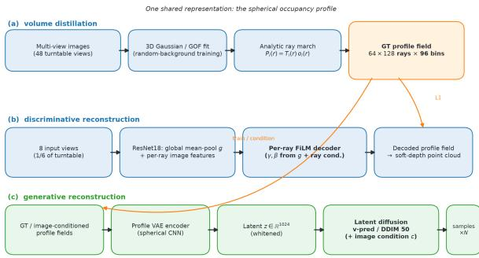
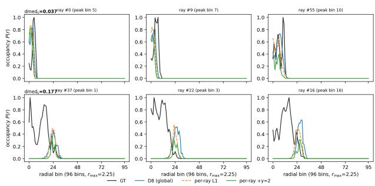
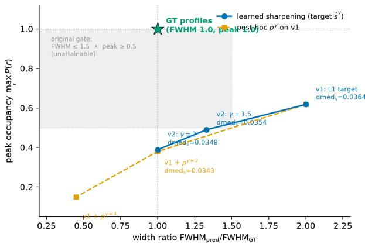

# Learning Spherical Occupancy Profiles for Multi-View 3D Reconstruction and Generation

YiHsuan Tsai

Nanjing University

ORCID: 0009-0003-4532-077X

August 25, 2026

## Abstract

We study spherical occupancy profiles—the raywise occupancy probability profiles $\begin{array} { r l } { P ( r ) } & { { } = } \end{array}$ $T ( r ) o ( r )$ distilled from multi-view 3D Gaussian reconstructions—as a unified intermediate representation for both discriminative and generative 3D reconstruction from images. On a 999- object subset of Google Scanned Objects with 48 turntable views each, we train (i) a discriminative per-ray decoder that injects global viewaveraged and ray-specific image evidence into a FiLM-conditioned profile head, reaching median soft depth error 0.035 (normalized) on an independent 90-object test split, and (ii) a generative pipeline built on a profile VAE and a latent difusion model, which supports unconditional sampling that matches the reconstruction manifold and image-conditioned multi-solution reconstruction whose per-object solution spread is quantifiable and tunable via classifier-free guidance. We further analyze the morphology of predicted profiles: post-hoc power sharpening and a learned sharpening target both recover groundtruth profile width without degrading depth, exposing a monotonic width–peak frontier in the L1-per-ray loss family and motivating a principled redefinition of morphology gates. Realphoto validation on two DTU scenes confirms the pipeline transfers to non-synthetic input. Our results suggest that ray-wise occupancy profiles ofer a compact, learned, and uncertainty-aware interface between multi-view reconstruction and

generative priors.

## 1 Introduction

Reconstructing 3D shape from multiple images is a long-standing problem in computer vision, and the recent explosion of feed-forward reconstruction models [7,10,22,26] and difusion-based generative priors [11, 15, 25] has blurred the line between discriminative reconstruction (predict one shape from observations) and generative reconstruction (sample a shape consistent with observations). A central design choice in both families is the intermediate representation: occupancy grids, signed distance fields, neural fields, and tri-planes are all used as the interface between image evidence and the final surface.

In this paper we study a comparatively underexplored representation: the spherical occupancy profile (spherical occupancy profile). For each ray emanating from the object center on a unit sphere, the spherical occupancy profile is the sequence of occupancy probabilities along the ray, $P ( r ) = T ( r ) o ( r )$ , where $T ( r )$ is transmittance and $o ( r )$ is per-point opacity (Fig. 1, left). This representation is attractive for three reasons. First, it is distillable from volumetric reconstructions: given a trained 3D Gaussian splatting [8] field, profiles can be obtained by analytic ray marching, so a training corpus of image→profile pairs can be built from multi-view captures without mesh ground truth, only through the intermediate volumetric fit. Second, it is compact and structured: a profile is a 96-bin signal on each of 64 × 128 rays, naturally laid out for per-ray decoding and for spherical latent modeling. Third, it is interpretable: the profile’s peak position encodes surface depth, its width encodes the softness of the volumetric fit, and its peak height acts as a per-ray confidence signal.

We build a complete pipeline around spherical occupancy profiles on a 999-object subset of Google Scanned Objects (GSO) rendered on turntables with 48 views each, supervised by profiles distilled from 3D Gaussian fields. Our pipeline has two branches sharing the same representation:

• Discriminative reconstruction. A perray decoder conditioned on view-averaged global features and on ray-specific image evidence (bilinear sampling of multi-scale image features at the ray’s projected pixel in each view) via FiLM conditioning. The strongest variant reaches median soft depth error 0.035 on an independent 90-object test split—a ∼60% improvement over the meanprofile baseline—and is robust to the channel width of the ray-conditioning pathway.

• Generative reconstruction. A profile VAE whose latent space supports a latent diffusion model; the difusion prior can be sampled unconditionally (matching the reconstruction manifold) and conditionally on images, yielding multi-solution reconstruction whose per-object solution spread is quantifiable (∼18% of the inter-object scale) and continuously tunable through classifier-free guidance.

We additionally conduct a careful analysis of profile morphology—the width and peak height of predicted profiles. We show that the width gap between predicted and ground-truth profiles is largely an artifact of the per-ray L1 objective rather than an information limit: post-hoc power sharpening $p ^ { \gamma }$ recovers ground-truth width at γ = 2 and simultaneously improves soft depth, and training against a sharpened target $\hat { s } ^ { \gamma }$ produces natively narrow profiles. Both operations expose a monotonic width–peak frontier in the L1-per-ray family, which we analyze and use to propose a principled redefinition of morphology evaluation gates. Finally, we validate the full image-to-point-cloud pipeline on two real DTU scenes, confirming that the representation and the fixed front-end transfer to non-synthetic input.

  
Figure 1: Pipeline overview. (a) Volume distillation produces ground-truth spherical occupancy profiles from multi-view captures without mesh supervision; (b) a discriminative per-ray decoder maps images to profile fields; (c) a profile VAE with latent difusion maps profile fields to a sampleable latent, enabling multi-solution reconstruction. The two branches share the same representation.

Our contributions are: (1) the spherical occupancy profile representation as a unified, volumedistilled interface between multi-view reconstruction and generative priors; (2) a discriminative per-ray decoder with global + ray-specific image conditioning and a thorough evaluation on 819 training objects with independent test generalization; (3) a generative branch (VAE + latent difusion + image conditioning) that enables quantifiable multi-solution reconstruction; (4) a morphological analysis of the width–peak tradeof that explains and fixes the profile-sharpening problem; and (5) real-photo validation on DTU.

## 2 Related Work

Feed-forward 3D reconstruction. Feedforward models predict a 3D representation from one or a few images in a single forward pass.

NeRF-based and tri-plane-based large reconstruction models (LRM) [10,26] popularized this paradigm, and subsequent works scaled it to real photographs [7] or to sparse unposed multi-view input [22]. A common limitation is that a feedforward pass commits to a single reconstruction, providing no mechanism for ambiguity or alternative hypotheses; recent work partially addresses this by hallucination-aware difusion priors that mask unreliable predicted views during reconstruction [12]. Our discriminative branch follows the same feed-forward philosophy but operates on per-ray occupancy profiles rather than view or volume representations, and our generative branch is designed precisely to expose the solution set that feed-forward models discard.

Neural fields, Gaussians, and occupancy representations. Neural radiance fields [14] and 3D Gaussian splatting (3DGS) [8] are the dominant volumetric representations. For our purposes, Gaussian Opacity Fields [24]— a 3DGS variant that replaces per-view directional opacity with view-independent opacity integrated over a volumetric (non-atomic) kernel— give a clean route to ray-wise occupancy: analytic ray marching against the opacity field yields a transmittance-weighted occupancy profile $P ( r ) ~ = ~ T ( r ) o ( r )$ per ray. Ray-wise occupancy and distance fields have been used as standalone representations [13], and spherical ray profiles appear in generative settings such as SPGen [25], which synthesizes spherical layered depth from a single image under a Gaussian prior. Our work difers in supervision (volume distillation rather than mesh ground truth, enabling real-photo training) and in unifying discriminative and generative use of the same representation.

Difusion-based 3D generation. Scoredistillation methods distill a 2D difusion model into a 3D field [15], and image-conditioned view difusion [11,18] has become a standard prior for reconstruction. Multi-view and panoramic diffusion [2, 6, 20] generate consistent image stacks, while depth-aware variants operate on per-view depth maps [21]. Closest to our generative branch are methods that train a difusion model in a compressed latent space [16] on top of a learned representation; SphereDif [23] does this for spherical latents, and SPGen for spherical layered depth. We instead difuse the latent space of a profile VAE, so that samples land on the profile reconstruction manifold.

Multi-solution reconstruction and uncertainty. A growing body of work treats reconstruction as sampling from the posterior over 3D given observations. Latent posterior sampling [1] represents scenes as random latents with a diffusion prior and draws multiple scene samples, using sample variance as an uncertainty map; it operates in the tri-plane domain. We provide an analogous capability in the profile domain and additionally show that classifier-free guidance [5] provides a continuous dial over solution spread.

## 3 Background

## 3.1 Gaussian fields and opacity

A 3D Gaussian scene [8] represents a scene as a set of anisotropic Gaussians, each with a mean µ, a covariance Σ, an opacity α, and a viewdependent color. Rendering projects the Gaussians into a splatting rasterizer and accumulates depth-ordered α-blending, which makes the field diferentiable with respect to all parameters, so both geometry and appearance can be fitted from multi-view images by gradient descent.

For surface reconstruction we rely on Gaussian Opacity Fields (GOF) [24], a variant that replaces the per-view directional opacity of standard 3DGS with a view-independent opacity integrated over a volumetric (non-atomic) kernel. GOF fields are trained on the same multi-view images as 3DGS but with a surface-regularized loss; the resulting field supports analytic ray marching: given a ray with origin o and direction d, the transmittance $T ( r )$ and per-point opacity o(r) along the ray can be evaluated without Monte-Carlo sampling, because the contribution of each Gaussian to the line integral has a closed form.

## 3.2 Spherical occupancy profiles

We define the spherical occupancy profile (spherical occupancy profile) of a scene at the object center as the ray-wise product of transmittance and opacity,

$$
P _ { i } ( r ) = T _ { i } ( r ) o _ { i } ( r ) ,\tag{1}
$$

where i indexes a ray direction $\mathbf { d } _ { i }$ on the unit sphere, and r is the distance from the center. The profile answers a per-ray question: where along this direction does the surface $( s o f t l y )$ sit, and how confidently? Because $P ( r )$ is the standard transmittance-weighted density used in volume rendering, its integral against any radial function reproduces the volume-rendered ray integral, so the profiles encode the full depth/opacity information of the field along every direction.

For a trained GOF field we obtain profiles by analytic ray marching along a Fibonacci lattice of 64 × 128 directions on the sphere. Each ray is sampled at $\rho _ { \mathrm { m a x } } = 9 6$ bins with a maximum range $r _ { \mathrm { m a x } } \approx 2 . 2 5$ in normalized units, giving a radial bin width of ∼0.024 (for reference, the Gaussian scale in a fitted GOF field is typically ∼0.1, so the profile is well above the sampling limit of the field itself). This distillation step is the key enabler of our data pipeline: profiles are extracted from the volumetric fit of arbitrary multi-view captures, so a training corpus of image→spherical occupancy profile pairs can be built without any mesh ground truth.

## 3.3 Data: GSO corpus

We build our corpus on 999 objects of Google Scanned Objects (GSO), rendered on turntables with 48 views each (3 elevation × 16 azimuth, $8 0 0 \times 6 0 0$ , per-view random saturated background). Following [24], per-view random backgrounds during training are essential for opacity hygiene: they close the “blend into the background” escape route for floating Gaussians, which we found to be the dominant failure mode without it (max Gaussian scale $1 5 . 6 ~ \mathrm { v s } \leq 0 . 2 7 )$ . Each object is centered and normalized so its bounding sphere has radius 1.0 before rendering.

For each of the 999 objects we (i) train a GOF field from its 48 views (6,000 iterations, 2–3 GPU-minutes per object on an L20), and (ii) distill the spherical occupancy profile field via the analytic ray marching above. The result is a corpus of image stacks paired with profile fields. We use a fixed split of the Google Scanned Objects (GSO) corpus [3]: 819 training objects, 90 validation objects, and 90 held-out test objects (permutation seed 42). The test objects are never touched during model selection.

## 4 Method

## 4.1 Overview

Our pipeline couples a discriminative and a generative branch on the same spherical occupancy profile representation (Fig. 1). The discriminative branch maps multi-view images to profile fields directly; the generative branch maps images to the latent space of a profile VAE and difuses there, so that samples can be drawn and their spread quantified. Both branches share the profile vocabulary of Sec. 3, and both are trained on the volume-distilled corpus without mesh supervision.

## 4.2 Discriminative reconstruction

Global condition. Given K=8 views (randomly sampled per object during training; the fixed frames $0 , 6 , \ldots , 4 2$ at evaluation), a shared ResNet18 encoder produces multi-scale feature maps. The global image condition is the meanpooled feature vector $g \in \mathbb { R } ^ { 5 1 2 }$ across views, obtained from the encoder trunk.

Per-ray decoder. Each profile is a $6 4 \times 1 2 8$ grid of rays; for each ray we condition the decoding of its 96-bin occupancy profile on the global vector g through a FiLM block stack: the ray is first embedded with a 21-dimensional positional encoding, projected to 64 dimensions, and passed through three FiLM blocks that apply per-layer afine transformations $( h \mapsto \gamma _ { \ell } \odot h + \beta _ { \ell } )$ driven by $^ { g , }$ followed by a linear head and a sigmoid. The model is supervised with the pure-

profile L1 loss

$$
{ \mathcal { L } } _ { \mathrm { v 3 } } ( p , s ) = \sum _ { i } w _ { i } \big | p _ { i } - \hat { s } _ { i } \big | ,\tag{2}
$$

where $p$ is the predicted profile, ˆs is the max-normalized ground-truth profile $( s /$ max s, matching the training target of the volume distillation), and $w _ { i }$ is a coverage weight (rays with low ground-truth occupancy contribute proportionally less). We found this loss form critical: comparing the prediction against the maxnormalized target while taking the L1 against the raw prediction avoids the zero-gradient fixed point that arises when normalizing the prediction itself. We call this model d8; it is the strongest global-condition baseline and reaches median soft depth error 0.034 on the validation split and 0.038 on the held-out test split.

Ray-specific image evidence. Global conditioning discards per-ray evidence, which we hypothesized to be the cause of systematically over-wide profiles. The refined model (m3b) augments the decoder with a ray-specific pathway. For each ray direction $\mathbf { d } _ { i }$ on the sphere, we form a 3D point $\mathbf { X } _ { i } = r _ { \mathrm { r e f } } \mathbf { d } _ { i }$ at a fixed reference radius $r _ { \mathrm { r e f } } ~ = ~ 1 . 0$ , project it into each of the K views with the known camera poses, and bilinearly sample the ResNet18 layer-2/3/4 features at the projected pixel. The three scales (128+256+512 channels) are averaged over the K views and concatenated into a 896-dimensional per-ray vector, which is projected to 128 dimensions and injected into the FiLM stack as a second conditioning channel $( \gamma _ { r } , \beta _ { r } )$ , so the head is modulated by both global and ray-specific image evidence. The ray projection pathway is initialized to output zero, so the refined model starts exactly at the d8 operating point and the per-ray channel must “earn” its contribution during training. Training uses the fixed $r _ { \mathrm { r e f } }$ , not predicted depth.

Learned sharpening. The L1-per-ray objective has no preference for profile width (Sec. 5.3), which we address by training against a sharpened target:

$$
\hat { s } _ { i } ^ { ( 2 ) } = \big ( \hat { s } _ { i } \big ) ^ { \gamma } , \qquad \gamma \in \{ 1 . 5 , 2 \} ,\tag{3}
$$

applied per-ray to the max-normalized ground truth before taking the L1 loss. This is a drop-in

change at training time and requires no modification of the decoder.

## 4.3 Generative reconstruction

Profile VAE. We learn a VAE [9] over profile fields. The encoder applies a per-ray MLP $( 9 6  1 2 8  6 4 )$ to each profile, arranges the resulting per-ray codes on the $6 4 \times 1 2 8$ spherical grid, and processes them with three 2D convolutions with circular padding along the azimuth (channels $6 4 \to 1 2 8 \to 2 5 6 \to 2 5 6 )$ , followed by global pooling to a 1024-dimensional latent z with parameters $( \mu , \log \sigma )$ . The decoder mirrors the per-ray FiLM architecture of Sec. 4.2, modulated by the global latent. The objective is

$$
\begin{array} { r } { \mathcal { L } _ { \mathrm { V A E } } = \mathbb { E } _ { q ( \boldsymbol { z } | \boldsymbol { x } ) } \big [ \mathcal { L } _ { \mathrm { v 3 } } \big ( \mathrm { d e c } ( \boldsymbol { z } ) , \boldsymbol { \hat { s } } \big ) \big ] } \\ { + \beta D _ { \mathrm { K L } } \big ( q ( \boldsymbol { z } | \boldsymbol { x } ) \| p ( \boldsymbol { z } ) \big ) , } \end{array}\tag{4}
$$

with $\beta { = } 1 0 ^ { - 4 }$ and a 5-epoch KL warm-up. The reconstruction loss is again the pure-profile L1 of Eq. (2), which we show in Sec. 5.3 to be the correct choice for profile shape.

Latent difusion. The VAE is trained first and frozen; a latent difusion model [4, 16] then models the distribution of the VAE latents in a per-dimension whitened space. Training data are posterior-augmented samples $z = \mu + 0 . 5 \epsilon$ per object (the posterior is nearly isotropic with tiny structure variance, so the fixed 0.5 noise scale keeps the µ-structure as the dominant signal), whitened to unit scale. The denoiser is a 6.6M-parameter time-conditioned MLP using vprediction [17] and a cosine learning-rate schedule. Sampling runs DDIM [19] with 50 steps. We verify that samples land on the reconstruction manifold: the width of decoded samples equals the width of reconstruction (7.0 in both cases), unlike naive prior sampling from a Gaussian, which collapses to over-wide, low-diversity fields.

Image-conditioned generation. To condi tion generation on images, the difusion MLP takes the global image vector $c ~ \in ~ \mathbb { R } ^ { 5 1 2 }$ —the frozen ResNet18 mean-pool of the fixed 8 input views—as an additional input, $z _ { t } \mapsto \epsilon _ { t } ( z _ { t } , c , t )$ with 10% dropout of c during training to enable classifier-free guidance (CFG) at inference [5]. At inference the guidance weight w provides a continuous dial over the strength of the image condition, which we exploit as a spread control.

Multi-solution sampling. Because the model is generative, we can draw N samples $\{ z ^ { ( n ) } \}$ per object and decode each. The intraobject pairwise Chamfer distance between decoded clouds quantifies the solution spread of the conditional posterior; the best-of-N sample measures how close the posterior can come to the input. We show in Sec. 5 that best-of-N reaches the discriminative accuracy of d8, and that CFG tunes the spread.

## 4.4 Evaluation metrics and morphology

From a decoded profile field we read out a surface depth per ray either by soft-argmax (profile centroid) or hard-argmax (argmax bin), giving the metrics dmeds / dmedh (median absolute depth error, normalized by $r _ { \operatorname* { m a x } } )$ , and chs $/ \ \mathrm { c h _ { h } }$ (Chamfer distance between the decoded point cloud and ground-truth point cloud from the profile field). To characterize profile shape independently of depth accuracy we report the width ratio $\mathrm { F W H M } \ = \ F W H M _ { \mathrm { p r e d } } / F W H M _ { \mathrm { G T } }$ (full width at half maximum of the average peak, ratio to the ground-truth width) and the raw peak height peak. Finally, xcorr is the mean crossobject correlation of predicted profile fields, a collapse diagnostic: a model that ignores its input produces fields that are near-identical across objects (xcorr → 1).

## 5 Experiments

## 5.1 Setup

We use the GSO corpus of Sec. 3 with the 819/90/90 split (seed 42). All discriminative models take K=8 input views, randomly sampled per object during training and fixed to frames $0 , 6 , \ldots , 4 2$ at evaluation (no test-time geometry). The global-condition model d8 trains for 40 epochs (Adam, lr $3 \times 1 0 ^ { - 4 }$ , batch $^ { 8 , }$ StepLR ×0.3 at half epochs). The per-ray refinement m3b first freezes the shared encoder and precomputes the global and per-ray features (a one-time pass over 909 objects), then trains only the ray-conditioned head (2.2M parameters) for 30 epochs (Adam, lr $3 \times 1 0 ^ { - 4 }$ , batch 16, cosine to 5%, grad-clip 1.0), initialized from d8 with the per-ray pathway inert. The profile VAE trains for 60 epochs at $\beta { = } 1 0 ^ { - 4 }$ with a 5-epoch KL warm-up (Adam, lr $3 \times 1 0 ^ { - 4 }$ , StepLR). The latent difusion models train on the frozen VAE latent with v-prediction, a linear noise schedule $( \beta _ { 1 } \mathrm { { = } } 1 0 ^ { - 4 }  \beta _ { T } \mathrm { { = } 2 } \times 1 0 ^ { - 2 } , T \mathrm { { = } 1 0 0 0 ) }$ , 400 epochs (Adam, lr $1 0 ^ { - 3 }$ , cosine to 3%, grad-clip 1.0), and 50-step DDIM $( \eta { = } 0 )$ sampling; the imageconditioned variant additionally uses 10% condition dropout during training. Metrics are defined in Sec. 4.4; all depth and Chamfer numbers are normalized by $r _ { \mathrm { m a x } }$

## 5.2 Discriminative reconstruction

Table 1 reports the discriminative results on both the validation and the held-out test split. The mean-profile baseline (a single per-ray field, no image condition) has soft depth error 0.084. d8, with global mean-pool conditioning over the 8 views, cuts this by ∼60% (0.0338 val / 0.0384 test) and generalizes without overfitting $\mathrm { ( c h _ { s } }$ actually improves on test). Growing the training set from 400 to 819 objects further reduces val error from 0.0426 to 0.0338 (−21%), confirming that the per-object structured errors of earlier models [22] are data-limited.

Adding the ray-specific pathway (m3b v1) trades a small val regression (+7.7%) for a consistent test improvement (−7.3%), i.e. better generalization of the per-ray evidence. Training against the sharpened target $\hat { s } ^ { \gamma }$ (Sec. 4.2) produces profiles that are simultaneously narrower and no less accurate: $\mathrm { v 2 \ \gamma = 2 }$ reaches val 0.0348 / test 0.0356 while cutting the width ratio from 2.0 to 1.0 (Sec. 5.3). We also report a channel-width sensitivity check of the rayconditioning pathway (rdim $1 2 8  5 1 2$ at fixed $\gamma { = } 1 . 5 )$ : both splits change by $< 0 . 0 0 1$ in depth, Chamfer, and width (+0.004 peak), showing the ray-conditioning bottleneck is saturated at 128 dimensions and the results are robust to this hy-

Table 1: Discriminative reconstruction (median over objects; lower is better except peak). dmed = soft-depth error, ch = Chamfer to GT cloud.
<table><tr><td rowspan="2">method</td><td colspan="2">dmeds</td><td colspan="2"> $\mathrm { c h _ { s } }$ </td></tr><tr><td>val</td><td>test</td><td>val</td><td>test</td></tr><tr><td>mean profile</td><td>0.0842</td><td></td><td></td><td></td></tr><tr><td>D8 (global cond.)</td><td>0.0338</td><td>0.0384</td><td>0.228</td><td>0.213</td></tr><tr><td>M3B v1 (per-ray L1)</td><td>0.0364</td><td>0.0356</td><td>0.236</td><td>0.211</td></tr><tr><td> $\mathrm { M 3 B ~ v 2 ~ } \gamma { = } 1 . 5$ </td><td>0.0354</td><td>0.0351</td><td>0.237</td><td>0.214</td></tr><tr><td> $\mathrm { M 3 B ~ v 2 ~ } \gamma { = } 2$ </td><td>0.0348</td><td>0.0356</td><td>0.243</td><td>0.217</td></tr><tr><td> $\mathrm { M 3 B ~ v 2 , ~ r d i m ~ 5 1 2 }$ </td><td>0.0354</td><td>0.0347</td><td>0.236</td><td>0.214</td></tr></table>

  
Figure 2: Example ray profiles for a mid- and a hard object. GT profiles (black) are narrow with peak ≈ 1; d8 (blue) is over-wide and low; the per-ray model (orange) is sharper; the sharpened-target model (green, γ=2) matches GT width on covered rays. Three covered rays (peak bins at the 25/50/75 percentiles) are shown per object.

## perparameter.

Figure 2 shows the efect at the level of individual ray profiles. The ground-truth profile is narrow and saturates to peak ≈ 1; d8’s global condition produces systematically wider, lower peaks; the per-ray pathway sharpens the response, and training against $\hat { s } ^ { 2 }$ recovers essentially groundtruth width on the covered rays while preserving the peak position.

## 5.3 Profile morphology and the width–peak frontier

Table 2 and Fig. 3 summarize the morphology analysis. We report the profile width ratio to ground truth and the raw peak occupancy, with soft-depth error as a reference.

Table 2: Profile morphology (val). FWHM = width ratio pred/GT $( \mathrm { G T } = 1 . 0 )$ ; peak = maxr $P ( r )$ (GT ≈ 1).
<table><tr><td>method</td><td>FWHM</td><td>peak</td><td>dmeds</td></tr><tr><td>GT profiles</td><td>1.00</td><td>1.00</td><td></td></tr><tr><td>D8 (global cond.)</td><td>2.00</td><td>0.59</td><td>0.0338</td></tr><tr><td>M3B v1 (per-ray L1)</td><td>2.00</td><td>0.62</td><td>0.0364</td></tr><tr><td>M3B  $\mathrm { v } 2 \ \gamma { = } 1 . 5$ </td><td>1.33</td><td>0.49</td><td>0.0354</td></tr><tr><td> $\mathrm { M 3 B ~ v 2 ~ } \gamma { = } 2$ </td><td>1.00</td><td>0.39</td><td>0.0348</td></tr><tr><td> $\mathrm { v 1 + p o s t - h o c \ } p ^ { \gamma = 2 }$ </td><td>1.00</td><td>0.38</td><td>0.0343</td></tr><tr><td> $\mathrm { v 1 + p o s t - h o c \ } p ^ { \gamma = 4 }$ </td><td>0.45</td><td>0.15</td><td></td></tr></table>

The key finding is a monotonic frontier: as the target sharpness $\gamma$ increases (either learned, $\hat { s } ^ { \gamma }$ , or post-hoc, $p ^ { \gamma } )$ , FWHM decreases monotonically and peak decreases monotonically, while soft-depth error improves along the same trajectory $( 0 . 0 3 6 4  0 . 0 3 4 8 )$ Two consequences follow. First, the width gap of earlier models is not an information limit of the 3DGS softness (as one might suspect from E0-style field analysis): post-hoc $p ^ { \gamma = 2 }$ recovers exact GT width, which is only possible if the width information is present in the prediction. Second, FWHM and raw peak cannot be optimized jointly—the frontier is a genuine trade-of driven by what we call the L1-alignment hedge: under per-ray L1, a narrow prediction incurs a large cost where the (shifted) target peak is missed, so the model attenuates the peak to hedge against alignment error. Our original morphology gate (FWHM $\leq 1 . 5$ and $\mathrm { p e a k } \geq 0 . 5 )$ is therefore unattainable in this family, not because of model weakness but because the two criteria confound shape and confidence. We propose redefining the gate as a normalized shape measure (width ratio only) plus a separate confidence axis (per-ray peak), evaluated against a calibrated target.

## 5.4 Generative reconstruction and multi-solution behavior

Table 3 summarizes the generative branch. The VAE reconstruction (unconditioned autoencoding of the profile field) reaches val $\mathrm { { { d m e d } _ { \mathrm { { s } } } = } }$ 0.0419, only 24% worse than the imageconditioned d8 (0.0338), establishing the latent as a faithful interface. The latent difusion produces samples that land on the reconstruction manifold: decoded sample width equals reconstruction width (7.0 in both cases), and intraobject pairwise Chamfer of samples is 65% of the inter-object ground-truth scale (0.097 vs 0.150)—unlike naive Gaussian prior sampling, which collapses to over-wide, near-constant fields (width 13) with 4× larger pairwise Chamfer (0.41).

  
Figure 3: Morphology frontier on the validation split. Both learned sharpening (ˆsγ, blue) and post-hoc $p ^ { \gamma }$ (orange) trace the same monotonic width–peak trade-of; soft-depth error improves along the frontier. The original gate (grey box, FWHM≤ 1.5 ∧ peak≥ 0.5) is unattainable.

Image-conditioned difusion (M3a) behaves as a multi-solution reconstructor. A single conditional sample has dmed = 0.0489; but the best-of-8 reaches 0.0386 (conditional) / 0.0383 (unconditional), and with strong CFG (w=8) reaches 0.0337, i.e. the discriminative level of d8. The generative model therefore never worse than the discriminative one if we are allowed to pick the best sample, and its samples carry quantifiable spread. Table 4 measures this spread as a function of CFG weight: the conditional posterior narrows the per-object solution space roughly 4× versus unconditioned sampling, at 18% of the inter-object scale, and CFG provides a control over the spread (0.082, 0.022, 0.045 for w=0, 1, 8), letting the user widen or tighten the sampled solution set around the conditional mode.

## 5.5 Real photographs: DTU

To validate that the fixed front-end (multi-view images → GOF field → combined depth/ray criterion → surface point cloud) transfers to nonsynthetic input, we run it on two real DTU scenes (scan1, scan6), each with 49 photographs and observability masks (no SfM needed; known poses). Table 5 reports the no-ground-truth audit plus the ground-truth Chamfer against structured-light scans (the distance is normalized by the object half-diagonal for the last row). Silhouette overlap is 1.0 on both scenes, crossview depth consistency is high, no floating geometry is found, and the normalized surface error is 0.010–0.011. The near-α field of real, opaque objects is sharp without the foggy shell that random-background synthetic training produces, so the depth backbone covers the scene densely and the ray-based fallback is not needed.

## 6 Discussion

What the morphology analysis explains. Our width–peak frontier has a simple mechanism. Under a per-ray L1 objective, a narrow prediction that is not perfectly aligned with the target peak incurs a large loss where the target mass is missed; the model therefore hedges by spreading mass and lowering the peak. Any operation that sharpens the target (learned $\hat { s } ^ { \gamma }$ or post-hoc $p ^ { \gamma } )$ directly raises the cost of this hedge, so the model sharpens and pays in peak. Because depth readout cares about the peak position rather than its height, this trade-of is favorable for depth accuracy—both sharpening directions improve dmeds along the frontier. This reframes a common pathology in profile/MPIstyle supervision: the over-width of predictions is an artifact of the objective, not an information limit of the volumetric representation, and it can be removed without any architectural change. It also invalidates morphology gates that jointly constrain width and raw peak: those two quantities are coupled, not independent. A principled gate should separate a normalized shape axis (width ratio, which our learned-sharpening models meet at γ=2) from a confidence axis (perray peak, which is a learned property of the field, not a target to be maximized against GT).

Table 3: Generative branch (val). Width is on-manifold check (absolute); pairwise Chamfer is intra-object between samples, GT reference = inter-object 0.150.
<table><tr><td>model</td><td>dmeds</td><td>width</td><td>pairwise Chamfer</td></tr><tr><td>VAE reconstruction (M1)</td><td>0.0419</td><td>2.25× GT</td><td rowspan="4">0.097 (GT 0.150)</td></tr><tr><td>latent diffusion, unconditioned (M2)</td><td></td><td>= recon (7.0) </td></tr><tr><td>cond. diffusion, single sample (M3a)</td><td>0.0489</td><td></td></tr><tr><td>cond. diffusion, best-of-8</td><td>0.0386</td><td></td></tr><tr><td>cond. diffusion, best-of-8, CFG w=8</td><td>0.0337</td><td></td><td></td></tr></table>

Table 4: Multi-solution spread vs. classifier-free guidance (M3a, val). Spread = intra-object pairwise Chamfer of N=8 samples; inter-object reference 0.1194.
<table><tr><td>CFG weight w</td><td>spread</td><td>rel. to inter-object</td></tr><tr><td>0 (unconditioned)</td><td>0.0820</td><td>69%</td></tr><tr><td>1</td><td>0.0217 [0.014,0.040]</td><td>18%</td></tr><tr><td>8 (strong)</td><td>0.0445</td><td>37%</td></tr></table>

Table 5: Real-photo front-end audit on DTU (GOF 20,000 iters).
<table><tr><td>metric</td><td>scan1</td><td>scan6</td></tr><tr><td>silhouette overlap</td><td>1.000</td><td>1.000</td></tr><tr><td>cross-view depth, p50</td><td>0.0063</td><td>0.011</td></tr><tr><td>consistency (10%)</td><td>0.90</td><td>0.75</td></tr><tr><td>floaters</td><td>0</td><td>0</td></tr><tr><td>GT Chamfer, p50 [mm]</td><td>3.98</td><td>4.62</td></tr><tr><td>gt2cloud [mm]</td><td>1.27</td><td>1.64</td></tr><tr><td>coverage @ 5mm [%]</td><td>99.96</td><td>98.6</td></tr><tr><td>Chamfer (normalized)</td><td>0.010</td><td>0.011</td></tr></table>

Discriminative vs. generative reconstruction. The two branches coexist on the same representation and are complementary. The discriminative branch is the more accurate single predictor (best val 0.0338); the generative branch never beats it on a single sample, but its best-of-N matches it under strong guidance, and it adds what the discriminative branch cannot provide: a measure of ambiguity. We found the conditional solution space to be narrow but real—18% of the inter-object scale—which is consistent with the observation that most objects in our corpus are geometrically wellconstrained by 8 views. For genuinely ambiguous input (thin shells, transparent objects, specular surfaces), we expect the spread to widen, and CFG provides a continuous control over the spread of the sampled solution set. The latentspace analysis (posterior nearly isotropic Gaussian with tiny structure variance) also suggests that a larger corpus or a richer latent would make the generative branch more decisive; this is a clear scaling direction.

Limitations. Our study has several honest limitations. (i) The corpus is singlecategory-agnostic but limited to 999 objects with turntable captures; scaling to a larger multi-pose corpus such as Objaverse is the natural next step. (ii) The ray-conditioning pathway uses a fixed reference radius $r _ { \mathrm { r e f } } ;$ a coarse-to-fine variant that conditions on an initial depth estimate is a direct improvement. (iii) The front-end validates on DTU real photos, but the image-conditioned generation itself was only trained and evaluated on synthetic turntable captures; end-to-end realphoto training remains open. (iv) Profile fields are center-anchored (spherical), which is well suited to objects but not to open scenes; an extension to per-view ray grids would be needed for general scenes. (v) The DTU audit validates the fixed front-end, not the learned predictors,

on real input.

Relation to concurrent representations. Compared with view-domain reconstruction (view-conditioned difusion that produces images or depth maps), our profiles keep the full rayoccupancy distribution, so that both a surface point (from the peak) and a per-ray confidence (from the peak height) are available, and the field can be re-integrated into volume rendering. Compared with tri-plane or volume latent spaces [1], the profile domain is more directly tied to the surface it reconstructs. We position the paper not as “another generative 3D model” but as evidence that a single, volume-distilled ray-occupancy representation can serve as the interface for both reconstruction and generation— and that careful morphology analysis, not just accuracy numbers, is needed to judge such interfaces.

## 7 Conclusion

We studied the spherical occupancy profile—the ray-wise transmittance-weighted opacity $P ( r ) =$ $T ( r ) o ( r )$ distilled from multi-view Gaussian fields—as a unified intermediate representation for multi-view 3D reconstruction and generation. On a 999-object corpus of Google Scanned Objects with volume-distilled supervision (no mesh ground truth), we showed that: (1) a per-ray FiLM decoder with global and rayspecific image conditioning reaches median softdepth error 0.035–0.036 on an independent test split, improving on the global-condition baseline while remaining robust to the width of the ray-conditioning bottleneck; (2) a profile VAE with latent difusion supports both unconditional sampling that matches the reconstruction manifold and image-conditioned multisolution reconstruction, whose per-object spread is quantifiable (18% of the inter-object scale) and continuously tunable via classifier-free guidance, with best-of-N samples reaching discriminative accuracy; (3) a careful morphology analysis shows that predicted profile width is an artifact of the per-ray L1 objective, removable by learned sharpening (ˆsγ) or post-hoc power transforms, along a monotonic width–peak frontier that improves depth accuracy and motivates a principled redefinition of morphology gates; and (4) the fixed front-end $\mathrm { ( i m a g e s  G O F  }$ combined criterion → point cloud) transfers to real DTU photographs with normalized Chamfer 0.010–0.011.

The picture that emerges is that a single rayoccupancy representation can serve both reconstruction and generation, and that the field is compact, interpretable, and uncertainty- aware. Scaling the corpus, adding depth-guided per-ray conditioning, and extending the pipeline to realphoto training are the most direct next steps.

## References

[1] Bohan Chen et al. Predicting 3d structure by latent posterior sampling. In International Conference on Learning Representations (ICLR), 2025.

[2] Weicai Du, Ye Chen, Hongyu Wan, Yifan Peng, Tao Zhang, Chenfeng Li, Wenyi Chen, Hongxiang Zhang, Hao Liu, Jinzhu Guo, Wei Xu, Wei Liu, Peng Luo, Weihua Yu, Jing Shi, Ke He, Yuanchun Xu, Jie Zeng, Zun Wang, Wenyu Wang, Zeyu Zhou, Jing Zhang, Mao Ye, Siyu Zhu, and Feng Wu. DifPano: Scalable and consistent text-to-panorama generation with spherical epipolar-aware difusion. In IEEE/CVF Conference on Computer Vision and Pattern Recognition (CVPR), 2024.

[3] Google Research / Everyday Robots. Google scanned objects: A highquality dataset of 3d objects. https: //app.gazebosim.org/GoogleResearch/ fuel/collections/Google%20Scanned% 20Objects, 2022. Accessed 2026.

[4] Jonathan Ho, Ajay Jain, and Pieter Abbeel. Denoising difusion probabilistic models. In Advances in Neural Information Processing Systems (NeurIPS), 2020.

[5] Jonathan Ho and Tim Salimans. Classifierfree difusion guidance. In NeurIPS Workshop on Deep Generative Models and Downstream Applications, 2021.

[6] Zehuan Huang, Hao Wen, Junting Dong, Songcen Wang, Yang Yang, Ling-Yu Duan, and Guodong Guo. EpiDif: Enhancing multi-view synthesis via localized epipolarconstrained difusion. In IEEE/CVF Conference on Computer Vision and Pattern Recognition (CVPR), 2024.

[7] Haoyu Jiang et al. Real3D: Scaling up large reconstruction models with real-world images. In IEEE/CVF International Conference on Computer Vision (ICCV), 2025.

[8] Bernhard Kerbl, Georgios Kopanas, Thomas Leimk¨uhler, and George Drettakis. 3d gaussian splatting for real-time radiance field rendering. In ACM SIGGRAPH Conference Proceedings, 2023.

[9] Diederik P. Kingma and Max Welling. Auto-encoding variational bayes. In International Conference on Learning Representations (ICLR), 2014.

[10] Jiahao Li, Hao Tan, Kai Xu, Zexiang Li, Yucheng Liang, Yongyi Chen, Shangzhe Zheng, Yujun Cai, Xiaolong Fan, Yu Li, Yuda Xia, Hao Wang, Jing Liu, Zhengyang Li, Ye Li, Ke Zhang, Zhenjie Yuan, Yujun Xu, Yuehao Xu, Xiaoyu Zhang, Lele Fu, Ziwei Yang, Yujun Liu, Jingbo Zhang, Cong Fu, Zhe Cui, Siyuan Zeng, Yuxuan Zhang, and Zheng Sun. LRM: Large reconstruction model for single image to 3d. arXiv preprint arXiv:2311.04400, 2023.

[11] Ruoshi Liu, Rundi Wu, Basile Van Hoorick, Pavel Tokmakov, Sergey Zakharov, and Carl Vondrick. Zero-1-to-3: Zero-shot one image to 3d object. In IEEE/CVF International Conference on Computer Vision (ICCV), 2023.

[12] Xiaofeng Liu et al. Hallucination-aware difusion for robust multi-view 3d recon-

struction. arXiv preprint arXiv:2605.16873, 2026.

[13] Zhuoman Liu, Yangxintong Zhang, Zizhao Zhou, Jiabin Lin, and Bo Yang. Raydf: Neural ray-surface distance fields with multi-view consistency. In IEEE/CVF International Conference on Computer Vision (ICCV), 2023.

[14] Ben Mildenhall, Pratul P. Srinivasan, Matthew Tancik, Jonathan T. Barron, Ravi Ramamoorthi, and Ren Ng. NeRF: Representing scenes as neural radiance fields for view synthesis. In European Conference on Computer Vision (ECCV), 2020.

[15] Ben Poole, Ajay Jain, Jonathan T. Barron, and Ben Mildenhall. Dreamfusion: Text-to-3d using 2d difusion. In International Conference on Learning Representations (ICLR), 2023.

[16] Robin Rombach, Andreas Blattmann, Dominik Lorenz, Patrick Esser, and Bj¨orn Ommer. High-resolution image synthesis with latent difusion models. In IEEE/CVF Conference on Computer Vision and Pattern Recognition (CVPR), 2022.

[17] Tim Salimans and Jonathan Ho. Progressive distillation for fast sampling of difusion models. In International Conference on Learning Representations (ICLR), 2022.

[18] Yichun Shi, Peng Wang, Jianglong Ye, Long Mai, Kejie Li, and Xiao Liu. MVDream: Multi-view difusion for 3d generation. In International Conference on Learning Representations (ICLR), 2024.

[19] Jiaming Song, Chenlin Meng, and Stefano Ermon. Denoising difusion implicit models. In International Conference on Learning Representations (ICLR), 2021.

[20] Shitao Tang, Jiacheng Chen, Dilin Wang, Chengzhou Tang, Fuyang Zhang, Yuying Fan, Vikas Chandra, Yasutaka Furukawa, and Rakesh Ranjan. MVDifHD: A dense high-resolution multi-view difusion model

for single or sparse-view 3d object reconstruction. In European Conference on Computer Vision (ECCV), 2024.

[21] Jinsong Wang, Rui Gao, Wenqi Zhang, et al. MVDD: Multi-view difusion distillation for high-fidelity novel view synthesis. In European Conference on Computer Vision (ECCV), 2024. arXiv:2312.04875.

[22] Songwen Wang, Qixuan Zhao, Kaiyue Hu, Yilin Lan, and Linqi Liu. Pragmatist: Multiview conditional difusion models for high-fidelity 3d reconstruction from unposed sparse views. In AAAI Conference on Artificial Intelligence (AAAI), 2025.

[23] Tianyu Wang et al. SphereDif: Spherical equivariant latent difusion for 3d generation. arXiv preprint arXiv:2504.14396, 2025. AAAI 2026 Oral.

[24] Zehao Yu, Anpei Chen, Binbin Huang, Torsten Sattler, and Andreas Geiger. Gaussian opacity fields: Eficient and compact surface reconstruction in unbounded scenes. In ACM SIGGRAPH Asia Conference Proceedings, 2024.

[25] Yanan Zeng et al. Spherical layered depth synthesis with difusion priors. In ACM SIGGRAPH Asia, 2025. arXiv:2509.12721.

[26] Zi-Xin Zou, Zhipeng Yu, Yuan-Chen Guo, Yangguang Li, Ding Liang, Yan-Pei Cao, and Song-Hai Zhang. Triplane meets gaussian splatting: Fast and generalizable single-view 3d reconstruction with transformers. In IEEE/CVF Conference on Computer Vision and Pattern Recognition (CVPR), 2024.