# Amortized Set Prediction for Inverse IFS Reconstruction from Density Maps

Yutaka Yamagutia,∗

aFaculty of Information Engineering, Fukuoka Institute of Technology, 3-30-1 Wajiro-higashi, Higashi-ku, Fukuoka, 811-0295, Fukuoka, Japan

## ARTICLE INFO

Keywords:   
Iterated function systems   
Inverse problems   
Amortized inference   
Set prediction   
Diferentiable rendering   
Non-identifiability

## ABSTRACT

Iterated Function Systems (IFS) generate self-similar fractals from a few contractive afine maps. The forward map from parameters to images is computationally inexpensive and well understood, whereas the inverse problem of estimating maps from an image is dificult and is typically handled by per-image optimization. We replace this loop with a single forward pass of a learned estimator that predicts the afine-map set directly from a visit-frequency density map, thereby amortizing the inverse problem. The design follows two constraints. First, density maps do not uniquely identify IFS parameters, so evaluation is based on reconstruction rather than parameter recovery; unordered map sets are handled by Hungarian matching, and ground-truth parameters provide a stable training surrogate. Second, the fully known forward model lets us generate exact synthetic training pairs and also supports image-only test-time refinement. On in-distribution tests, amortized initialization plus a few refinement steps lies on a better quality–speed frontier than equal-budget random-initialized per-image optimization, and a 30-step refinement (about 0.56 s per sample) remains better than a doubledbudget baseline. Extending optimization to 1000 steps shows that the benefit is not only speed: amortized initialization reaches high-quality reconstructions more frequently than random starts. On real images (MNIST and Fashion-MNIST), it improves density metrics on average over a published per-image optimizer while being roughly 12 to 2600 times faster.

## 1. Introduction

An Iterated Function System (IFS) generates a self-similar fractal as the attractor of a small set of contractive afine maps [1, 2]. The forward direction, which renders an image from a given set of maps, is well understood and inexpensive to compute. The inverse direction, which recovers a set of maps that reproduces a given image, is intrinsically dificult. From the classical collage method [2], moment matching and chaotic optimization [3, 4], and fractal image compression [5], to recent gradient descent through differentiable renderers [6, 7], existing approaches share a common trait: the inverse problem is solved separately for each image. Recent methods based on diferentiable rendering, in particular, run hundreds to thousands of gradient steps per image over an objective landscape that is non-convex, multimodal, and prone to poor local minima [4, 6, 7].

We instead amortize the inverse problem. Given a visit-frequency density map, a learned estimator predicts the n afine maps in a single feed-forward evaluation. The prediction can be used directly or as an initialization for subsequent per-image refinement. The design is shaped by two facts: the inverse problem is ill-posed, and the forward model is inexpensive and fully known.

The problem is ill-posed. Beyond the trivial permutation ambiguity of an unordered map set, it is genuinely non-identifiable: nearly identical density maps can arise from very diferent parameter sets that are not reorderings of one another, and across our test distribution the distance between density maps is essentially uncorrelated with the distance between parameter sets (Section 5). Success therefore cannot be defined as recovery of the true parameters.

Two design choices follow. First, we compare map sets on the quotient by permutations through a Hungarian set loss, so the estimator is never penalized for merely reordering its maps. Second, we exploit the known renderer: the generative process is inexpensive to sample and provides exact labels, so we train on selfgenerated parameter–density pairs without external annotation. We match against the ground-truth parameters as a stable training surrogate, since optimizing reconstruction directly is unstable on this non-convex, non-identifiable objective. The same forward model drives an optional test-time refinement: a few gradient steps on a reconstruction distance computed from the observed image alone, without any ground truth.

As a consequence, the learned estimator is useful not only as a fast one-shot predictor but also as an initializer for per-instance optimization. In distribution, a few refinement steps from the amortized output outperform random-start per-instance optimization under the same objective and compute budget, and remain better than a random-start optimizer given twice the time. Longer optimization shows that the advantage is not only computational: the amortized initialization reaches high-quality solutions more reliably.

The advantage is not universal. It persists under structure-preserving distribution shifts but weakens when the test attractors have genuinely novel structure. On MNIST and Fashion-MNIST, compared head to head with the per-image optimizer of Tu et al. [6], the method is faster and more accurate under density metrics, whereas saturated-occupancy metrics favor the per-image optimizer. These claims are quantified in Section 6.

Our contributions are threefold.

1. A reconstruction-oriented formulation of inverse IFS estimation. We show that density maps do not uniquely determine the underlying afine-map set, and formulate prediction as permutation-invariant set estimation with reconstruction as the evaluation criterion. Groundtruth parameters are used only as a stable supervised signal.

2. A better quality–speed frontier from amortized initialization. In distribution, light refinement from the amortized prediction outperforms random-start optimization across all reconstruction metrics at equal budget, and remains better than a doubled-budget random baseline. Extending refinement to 1000 steps shows that this gap reflects more reliable convergence, not only faster early progress.

3. Direct comparison with prior per-image optimization. We compare directly with Tu et al. [6] on identical targets, under a common rendering condition and two families of metrics, and obtain a two-sided result: our method gives lower errors under density criteria, while perimage optimization is favored under saturated occupancy. Our method is roughly 12 to 2600 times faster, and its output also serves as an efective initialization for Tu’s optimizer (Section 6.7).

## 2. Related Work

Prior neural approaches to IFS inference have not combined three ingredients that are central here: permutation-invariant prediction of afine map sets, reconstruction-based evaluation through the known renderer, and amortized initialization followed by light per-image refinement. We review the relevant work in three areas: inverse IFS methods, set prediction, and diferentiable rendering with amortized inference.

## 2.1. The inverse IFS problem

IFS were formalized by Hutchinson [1] and Barnsley [2]: a finite set of contraction maps determines a unique attractor. The inverse problem of finding an IFS whose attractor resembles a given image can be approached through the Collage Theorem [2]; making the union of the images of the maps (the collage) close to the target also brings the attractor close to it. Classically, this inverse problem has been tackled by moment matching [3], combined wavelet and moment methods [8], and evolutionary computation [9]. Jacquin’s fractal image compression [5] turned it into a practical partitioned-IFS scheme that partitions the image and fits local contraction maps. All of these try to solve an optimization problem separately for each image.

Tu et al. [6] introduced gradient-based fitting of IFS parameters through a diferentiable renderer. Their method diferentiably renders chaos-game samples, splats the resulting point cloud with RBF kernels, clamps pixel values to [0, 1], and minimizes pixel MSE to the target. Because dense regions saturate after clamping, this objective measures attractor occupancy more than visit-frequency density, whereas our objective targets the density itself. Our comparison in Section 6.7 accordingly reports both Tu’s occupancy metric and our density metrics, so that neither method is evaluated solely under the other’s objective. Djeacoumar et al. [7] combine diferentiable point splatting with stochastic search to escape local minima. Both methods remain per-image optimizers; we replace this loop with an amortized predictor and use its output as an initialization for optional refinement.

Feed-forward neural estimators for this inverse problem have also appeared. Graham and Demers [10] regress the 6n afine parameters directly from a binary fractal image with a residual CNN, canonically ordering the maps and training on parameter MSE. As they report, the predicted parameters can be close while the reconstructed attractor looks markedly diferent, so the outputs serve only as an initial population for a search algorithm; a reconstruction (Hausdorf) loss was left aside because of its cost and the lack of a contractivity guarantee. In contrast, we use the forward model so that reconstruction serves as the criterion for evaluation and refinement, while retaining parameter matching as a supervised surrogate for training. We also examine a lightweight reconstruction auxiliary in Section 6.5. Liu et al. [11] infer Julia-set and L-system parameters with a multi-head autoencoder, using an image-reconstruction decoder as a semi-supervised regularizer over unlabeled images. Their targets are Julia sets (two scalars) and L-systems (grammar strings) rather than a set of afine contraction maps, so no permutation structure arises, and their reconstruction acts as a regularizer against overfitting rather than as the success criterion or a refinement objective. In contrast, the present formulation predicts unordered afine-map sets and evaluates success by reconstruction.

## 2.2. Set prediction

For problems whose output is an unordered set, Carion et al. [12] proposed the detection transformer (DETR), which emits a fixed-size set of predictions in one shot from learnable queries, trained with a set loss based on Hungarian matching [13]. What we adopt from this line is the training principle rather than the architecture: comparing the predicted and target sets on the quotient by permutations, through an optimal-assignment (Hungarian) set loss, is exactly what the order invariance of an IFS map set requires (Section 3.4). The architectural machinery of DETR, such as learnable queries and attention decoding for large sets of variable size, is not needed here: the number of maps is small and fixed per model, and a convolutional encoder with an MLP head sufices (Section 4.1).

## 2.3. Diferentiable rendering and amortized inference

Diferentiable splatting [14] propagates gradients from an image loss to parameters through pointcloud rendering, and underlies our reconstruction loss and refinement. Such a renderer is a tool for perimage gradient optimization, however, and the cost of repeating that optimization for every input remains. Amortized, or simulation-based, inference [15] folds this repetition into a single training phase by exploiting the cheapness of the forward model: when the forward simulator is fully known, one self-generates (parameter, observation) pairs, trains an estimator once, and answers a new observation with a single forward pass. Amortized inference of a small set of primitives from an image has been studied in 3D shape analysis [16], sharing the structure of fitting an estimator once rather than solving an optimization per image. This shift from per-input optimization to one-shot inference by a trained feed-forward network recurs throughout the history of deep learning: neural style transfer moved from per-image optimization [17] to feed-forward synthesis [18, 19]. We bring this pattern to the inverse IFS problem and, beyond simple amortization, combine it with optimization by using the trained output as an initializer for per-image refinement.

## 2.4. Positioning of this work

This paper combines elements of these lines while difering from each in a specific way. The optimizationbased lineage of fractal inverse methods [9, 6, 7, 5] performs per-image optimization, and the feed-forward estimators [10, 11] do not treat the afine map set as a set-prediction problem, keep reconstruction outside the objective, and add no refinement. We amortize the inverse problem and apply the set-prediction framework [12] to the unordered set of IFS maps. We use amortized inference not only as a replacement for perimage optimization but also as an initializer for it, and we quantify the resulting quality–speed trade-of.

## 3. Problem Formulation

This section formalizes the IFS and its density-map generation (the forward problem) and states the inverse problem we solve. We write a point in the plane as a row vector $x \in \mathbb { R } ^ { 1 \times 2 }$ and an afine map as $x \mapsto x W + b .$

## 3.1. Iterated function systems and attractors

A set of n contractive afine maps $\mathcal { F } = \{ f _ { i } \} _ { i = 1 } ^ { n }$ , with $W _ { i } \in \mathbb { R } ^ { 2 \times 2 }$ and $b _ { i } \in \mathbb { R } ^ { 1 \times 2 }$ ，

$$
f _ { i } ( x ) = x W _ { i } + b _ { i } ,\tag{1}
$$

is an iterated function system (IFS). When each $f _ { i }$ is a contraction with Lipschitz constant $\operatorname { L i p } ( f _ { i } ) = \| W _ { i } \| _ { 2 } =$ $s _ { \operatorname* { m a x } } ( W _ { i } ) < 1$ , where $s _ { \mathrm { m a x } }$ is the largest singular value, the Hutchinson operator on compact sets

$$
{ \mathcal { H } } ( S ) = \bigcup _ { i = 1 } ^ { n } f _ { i } ( S )\tag{2}
$$

is a contraction in the Hausdorf metric and has a unique fixed set $\begin{array} { r } { A = \mathcal { H } ( A ) = \bigcup _ { i } f _ { i } ( A ) \left[ 1 , 2 \right] } \end{array}$ . This set A is the attractor of the IFS. The attractor is determined by the set of maps alone and does not depend on the ordering of $\{ f _ { i } \}$ ; this order invariance is the starting point for our set-prediction formulation (Section 3.4).

## 3.2. Selection probabilities and the invariant measure

Generating a density map requires specifying the visit frequency of points on the attractor. We assign each map a selection probability $\begin{array} { r } { p _ { i } > 0 ( \sum _ { i } p _ { i } = 1 ) } \end{array}$ and generate a trajectory by the stochastic iteration (chaos game) $\begin{array} { r c l } { x _ { t + 1 } } & { = } & { f _ { \xi _ { t } } ( x _ { t } ) } \end{array}$ , where $\xi _ { t }$ is drawn independently with $\mathrm { P r } [ \xi _ { t } = i ] = p _ { i }$ . Under contraction, the corresponding Markov operator

$$
( \mathcal M \nu ) ( \cdot ) = \sum _ { i = 1 } ^ { n } p _ { i } \left( f _ { i \# } \nu \right) ( \cdot ) ,\tag{3}
$$

where $f _ { i \# }$ is the pushforward, has a unique invariant probability measure $\mu = \mathcal M \mu$ whose support is A. The trajectory almost surely fills A according to $\mu \ [ 2 0 ]$ , so a density map is a finite-sample approximation of $\mu .$

We fix the selection probabilities proportional to the determinant of the linear part:

$$
p _ { i } = \frac { \left| \operatorname* { d e t } W _ { i } \right| } { \sum _ { k = 1 } ^ { n } \left| \operatorname* { d e t } W _ { k } \right| } .\tag{4}
$$

Here | det $W _ { i } |$ is the area-contraction ratio of $f _ { i } ,$ so Eq. (4) assigns each map a visit frequency proportional to the area its image occupies.1 This convention is standard in fractal pre-training [21, 22], and the chaos game of Tu et al. [6] adopts the same rule. The key consequence is that the selection probability becomes a deterministic function of the geometric parameters $( W _ { i } , b _ { i } )$ : the estimation target is the set of map parameters $\theta = \{ ( W _ { i } , b _ { i } ) \} _ { i = 1 } ^ { n }$ alone, and the probabilities are not estimated separately. A general IFS whose probabilities are independent of the determinant is outside the scope of this setting.

## 3.3. Forward problem: density-map generation

We denote the map from a parameter set $\theta$ to a density map (the renderer) by R. Concretely, we generate chaos-game trajectory points with the probabilities of Eq. (4), accumulate them into a histogram over a 128 × 128 grid of the fixed domain $\Omega \ = \ [ - 1 . 5 , 1 . 5 ] ^ { 2 }$ (trajectory points falling outside Ω are discarded), smooth it, and normalize to unit sum to obtain a density map $\boldsymbol { y } = R ( \theta ) \in \mathbb { R } _ { > 0 } ^ { 1 2 8 \times 1 2 8 }$ (rendering details in Section 4.4). The domain Ω and the resolution are fixed across all samples and the densities are normalized to unit mass, so density maps can be compared directly as probability-mass distributions on a common coordinate system and scale.

This histogram renderer R involves a discrete nearest-bin assignment and is therefore not diferentiable with respect to point positions. Whenever the reconstruction objective (Section 3.5) is optimized by gradients, namely at test-time refinement and in the training-time reconstruction auxiliary, we use a diferentiable surrogate renderer that overlays a bilinear (triangular) kernel on the same binning convention (Section 4.4).

The forward problem is fully known: sampling θ and passing it through the renderer generates arbitrarily many exactly labeled $( \theta , y )$ pairs. We exploit this property for both self-generation of training data and test-time refinement.

## 3.4. Inverse problem: formulation as set prediction

We solve the inverse of the forward problem: estimating the parameter set θ from a density map $y .$ Classical inverse IFS solves an optimization for each input image; we replace this with a single forward pass of a learned estimator $f _ { \Theta } , \hat { \theta } = f _ { \Theta } ( y )$ (amortization).

The estimation target is an unordered set of maps. Since the attractor is invariant to permutations of $\{ f _ { i } \}$ , the comparison between the estimator output $\widehat { \theta } \ = \ \{ ( \widehat { W } _ { i } , \widehat { b } _ { i } ) \} _ { i = 1 } ^ { n }$ and the ground truth θ must be made on the quotient by the symmetric group $S _ { n } { \mathrm { : } }$ any evaluation should be invariant under a permutation $\sigma \in$ $S _ { n }$ , and we remove this ordering ambiguity by optimal assignment (Hungarian matching) (Section 4.2). The number of maps n is fixed per model: n=4 in the main experiments and $n { = } 1 0$ in the real-image experiments (Section 6.7). A variable number of maps within a single model is outside the scope of this work.

## 3.5. Reconstruction as the success criterion

How we measure the success of the inverse problem is central to this work. The natural criterion is parameter recovery $\begin{array} { r l r } { \hat { \theta } } \end{array} \approx \theta .$ , but this is ill-posed: the true parameter set cannot be uniquely recovered from a density map, and nearly identical density maps can arise from very diferent parameter sets that are not related by any permutation (quantified in Section 5). We therefore place the success criterion on the wellposed notion of reconstruction:

$$
\operatorname* { m i n } _ { \hat { \boldsymbol { \theta } } } \mathcal { D } \big ( R ( \hat { \boldsymbol { \theta } } ) , \boldsymbol { y } \big ) ,\tag{5}
$$

that is, we measure how well the density map $R ( { \hat { \theta } } )$ obtained by passing the estimated parameters through the forward problem reproduces the observation y (the reconstruction distance D is specified in Section 6.1). At evaluation, accordingly, the parameter error between $\hat { \theta }$ and θ is not a success metric but only a diagnostic. During training, by contrast, this parameter discrepancy is exactly what we minimize: because every selfgenerated pair carries a known $\theta ,$ matching against it provides a stable surrogate signal, whereas optimizing reconstruction directly is unstable on this non-convex, non-identifiable landscape. Training thus minimizes a parameter-matching loss, while evaluation and the optional refinement use reconstruction.

## 4. Method

This section describes the estimator, the supervised set-matching loss, the optional test-time refinement, and the renderer used for both data generation and reconstruction.

## 4.1. Model architecture

The estimator $f _ { \Theta }$ takes a density map as input and outputs, in one shot, the parameters of n afine maps $\{ ( W _ { i } , b _ { i } ) \} _ { i = 1 } ^ { n } ;$ it is a set predictor. The input is the density map $( 1 2 8 \times 1 2 8 { \cdot }$ , normalized to unit sum and multiplied by the number of pixels $1 2 8 ^ { 2 }$ so that the mean pixel value is 1) concatenated with two normalized coordinate channels $x , y ,$ giving three channels. The encoder is a wide residual CNN with channel and spatial attention. $\mathrm { ~ A ~ 3 \times 3 ~ }$ convolution (→ 48 channels, Group-Norm, ReLU) is followed by seven residual blocks whose output widths are 48, 64, 64, 96, 96, 128, 128, where the blocks that first reach 64, 96, and 128 channels each apply stride-2 downsampling. Each block has a residual branch of two $3 \times 3$ convolutions, gated by channel and spatial attention in the style of CBAM [23]: the channel gate passes a global average pool through a small MLP of reduction ratio 8 to produce perchannel weights (squeeze-and-excitation style [24]), and the spatial gate concatenates the channel-wise mean and max and applies a $7 \times 7$ convolution to produce per-location weights. Three downsamplings reduce the spatial resolution from 128 to 16, and an adaptive average pool to $8 \times 8$ followed by flattening gives a $1 2 8 \cdot 8 \cdot 8 = { 8 1 9 2 } \cdot$ -dimensional feature. A three-layer MLP $( 8 1 9 2  5 1 2  5 1 2  n \cdot 6 $ , with ReLU between layers) produces the raw output $z \in \mathbb { R } ^ { n \times 6 }$

For each map, the six raw values are split into a linear part and a translation and bounded with tanh:

$$
\begin{array} { r l } & { W _ { i } = \operatorname { t a n h } ( z _ { i , 1 : 4 } ) \in ( - 1 , 1 ) ^ { 2 \times 2 } , } \\ & { \ b _ { i } = 1 . 5 \operatorname { t a n h } ( z _ { i , 5 : 6 } ) \in ( - 1 . 5 , 1 . 5 ) ^ { 2 } . } \end{array}\tag{6}
$$

The output layer is initialized so that $( W _ { i } , b _ { i } ) ~ \approx$ $( 0 . 4 5 I , 0 )$ , a weak contractive near-identity. The entrywise bound of $\operatorname { E q . } \ ( 6 )$ does not enforce contractivity, since a bound on the entries does not bound the largest singular value below one, and we impose no explicit spectral constraint. In practice the trained estimator outputs comfortably contractive maps: over the indistribution test set (Section 6.1), the largest predicted singular value is 0.82, both before and after refinement, while the training targets satisfy $s _ { \mathrm { m a x } } ~ \leq ~ 0 . 7 0$ by construction (Section 4.4).

## 4.2. Training signal: ground-truth parameter matching

One could train the estimator by minimizing a reconstruction error directly, but this signal is problematic on two counts. First, the reconstruction landscape through a diferentiable renderer is non-convex and multimodal, with poor local minima [4, 6, 7]; our own long-horizon experiment confirms that reconstructiondriven optimization from uninformed initializations frequently stalls in such minima (Section 6.4). Second, by non-identifiability (Section 5) many parameter sets reproduce the same image, so a reconstruction loss exerts no stable pull toward any particular one. Because the data are self-generated, each training pair comes with the sampled parameter set θ. Matching to this θ provides a well-defined supervised surrogate for training, even though θ is not identifiable from y and is not used as the evaluation criterion. Reconstruction remains useful when used locally rather than as the sole global training signal: it serves as a refinement objective from the amortized prediction and as a light training auxiliary (Section 6.5).

Between the prediction $\{ ( \widehat { W } _ { i } , \widehat { b } _ { i } ) \} _ { i = 1 } ^ { n }$ and the ground truth $\{ ( W _ { j } , b _ { j } ) \} _ { j = 1 } ^ { n }$ , we remove the arbitrary ordering of the maps as a quotient by optimal assignment. We first form the pairwise squared distance

$$
C _ { i j } = { \left\| \widehat { W } _ { i } - W _ { j } \right\| } _ { \mathrm { F } } ^ { 2 } + \left\| \widehat { b } _ { i } - b _ { j } \right\| _ { 2 } ^ { 2 } ,\tag{7}
$$

find the permutation $\sigma$ that minimizes it by the Hungarian method (linear sum assignment), and average

the matched squared distances:

$$
\mathcal { L } _ { \mathrm { m a t c h } } = \frac { 1 } { n } \sum _ { i = 1 } ^ { n } \Bigl ( \bigl \| \widehat { W } _ { i } - W _ { \sigma ( i ) } \bigr \| _ { \mathrm { F } } ^ { 2 } + \bigl \| \widehat { b } _ { i } - b _ { \sigma ( i ) } \bigr \| _ { 2 } ^ { 2 } \Bigr ) .\tag{8}
$$

The optimal assignment keeps the permutation multiplicity of the map set out of the loss.

We add a fixed-point consistency term. The fixed point $x ^ { * }$ of a map $x \mapsto x W + b$ satisfies $x ^ { * } = x ^ { * } W + b ,$ that is, $x ^ { * } ( I - W ) = b .$ . We add the fixed-point distance of the matched pairs with weight $\lambda _ { \mathrm { f p } } { = } 0 . 0 5 \colon$

$$
\mathcal { L } = \mathcal { L } _ { \mathrm { m a t c h } } + \lambda _ { \mathrm { f p } } \frac { 1 } { n } \sum _ { i = 1 } ^ { n } \bigl \| \widehat { \boldsymbol { x } } _ { i } ^ { * } - \boldsymbol { x } _ { \sigma ( i ) } ^ { * } \bigr \| _ { 2 } ^ { 2 } .\tag{9}
$$

The fixed point captures the location of each map directly and corrects the coupled error of W and b.

Training pairs are drawn from a self-generated rolling pool (Section 4.4), with batch size 128. The optimizer is AdamW [25] (learning rate $1 0 ^ { - 3 }$ , weight decay $1 0 ^ { - 4 } )$ for 50,000 steps, with the learning rate decayed by a cosine schedule to $1 0 ^ { - 4 }$ after 30,000 steps. We take the checkpoint with the best validation loss.

## 4.3. Inference and test-time refinement

Inference is a single forward pass: the trained $f _ { \Theta }$ maps a density map to $\{ ( \widehat { W } _ { i } , \widehat { b } _ { i } ) \}$ at once (the 0-step output), which can be used as the estimate on its own. Refinement is an optional post-processing step, applied for any number of steps when higher reconstruction quality is needed, at the cost of computation. Starting from the 0-step output, we run $K \in \{ 1 0 , 2 0 , 3 0 , 1 0 0 \}$ steps of gradient-based optimization (AdamW, learning rate $5 \times 1 0 ^ { - 3 } )$ on an objective computable from the observed image alone: the density error on the diferentiable renderer plus a symmetric Chamfer distance to a point cloud sampled from the observed image (weight 0.10; defined in Section 6.1). Because refinement optimizes the raw afine parameters without the output bounds of $\operatorname { E q . }$ (6), the objective also includes weak feasibility penalties: hinge terms discouraging singular values above 0.75, negative determinants, and translations outside the drawing domain Ω (weights 0.1, 0.1, and 0.01, respectively), which vanish inside the corresponding bounds. The number of steps K trades quality against speed and can be chosen continuously, including $K { = } 0$ (no post-processing). The per-image optimization used as a baseline minimizes the same objective with the same optimizer and budget from a random initialization, so the only diference from refinement is the initialization.

## 4.4. Diferentiable renderer and data generation

The attractor is obtained as the cloud of trajectory points traced by the iterated maps, which we convert to a density map. For generation (the target) we use a hard histogram rendering (resolution 128, 16 trajectories of 1024 steps each, burn-in 128, smoothing $\sigma { = } 2 )$ . For the training-time reconstruction auxiliary and for refinement, we use a diferentiable version (soft splatting) that overlays a triangular (bilinear) kernel on the same binning convention, with settings matched to the generation renderer; evaluation likewise uses a high-fidelity renderer with the same settings, which we call the matched renderer in Section 6. All densities are normalized to unit sum. For a fixed mapindex sequence, the trajectory points are diferentiable functions of the afine parameters. Bilinear splatting then makes the image accumulation piecewise diferentiable with respect to the point locations. During each refinement step, the sampled map-index sequence is treated as fixed in the backward pass; gradients are not propagated through the discrete sampling operation, including the dependence of the sampled indices on the probabilities. Gradients thus propagate from the image loss to $( W _ { i } , b _ { i } )$ , allowing the reconstruction objective (Eq. (5)) to be optimized by gradient descent.

For data generation, each map is sampled from a fixed point $x ^ { * } ~ \sim ~ \mathcal { U } ( - 0 . 7 5 , 0 . 7 5 ) ^ { 2 }$ , singular values $s _ { 1 } , s _ { 2 } \sim \mathcal { U } ( 0 . 2 0 , 0 . 7 0 )$ , and rotation angles $\phi _ { 1 } , \phi _ { 2 } \sim$ $\mathcal { U } ( - \pi , \pi )$ , and is constructed as

$$
\begin{array} { c } { { W = \mathrm { R o t } ( \phi _ { 1 } ) \mathrm { d i a g } ( s _ { 1 } , s _ { 2 } ) \mathrm { R o t } ( \phi _ { 2 } ) , } } \\ { { b = x ^ { * } ( I - W ) . } } \end{array}\tag{10}
$$

Not every sampled system is used: each candidate is first rendered at low fidelity and accepted only if all trajectory points are finite, at most 20% of them fall outside Ω, at least 0.5% of the pixels are occupied, and no single pixel carries more than 25% of the total mass. This rejection step excludes degenerate systems that collapse to nearly a point or mostly leave the drawing domain, so the efective training and test distribution is the construction above conditioned on acceptance. Accepted samples are generated in batches on the GPU, and a rolling cache of 65,536 samples is partially refreshed every 1,000 steps to maintain sample diversity throughout training.

Two properties of this generating distribution are worth noting. First, since $U { = } \mathrm { R o t } ( \phi _ { 1 } )$ and $V { = } \mathrm { R o t } ( \phi _ { 2 } )$ are rotations (determinant +1) and $s _ { i } ~ > ~ 0$ , the construction produces only orientation-preserving maps with det $W = s _ { 1 } s _ { 2 } > 0$ and excludes reflections (det $<$ 0). Since the singular value decomposition of a general real $2 \times 2$ matrix admits orthogonal factors that may be rotations or reflections, our generation covers only part of the representable maps. The SVD-based parameterization we use follows the synthetic-fractal pre-training study [22] and the form used by Tu et al. [6]; that parameterization admits reflections through a trailing sign-flip factor $\mathrm { d i a g } ( \pm 1 , \pm 1 )$ , which we omit, restricting the training prior to orientation-preserving maps to keep the distribution simple and well-conditioned. The output parameterization (Eq. (6)) places no sign constraint on $W _ { i } ,$ so the model can represent det $W < 0 ;$

the restriction is a choice of training prior, not a limit on model capacity. Second, the singular value range $[ 0 . 2 0 , 0 . 7 0 ]$ is chosen as follows. The largest singular value $s _ { \mathrm { m a x } } { = } \operatorname* { m a x } ( s _ { 1 } , s _ { 2 } )$ is the operator 2-norm of the linear part (the Lipschitz constant of the map), and if every map is contractive $( s _ { \mathrm { m a x } } < 1 )$ the Hutchinson condition guarantees a unique bounded attractor [1, 2]. The upper bound 0.70 keeps the contraction strong: a weak contraction with $s _ { \mathrm { m a x } }$ near 1 mixes slowly, spreads the attractor space-fillingly so that accurate density rendering needs long trajectories, and makes the fixedpoint iteration ill-conditioned. The lower bound 0.20 avoids degeneracy: a map with $s _ { i }$ near 0 collapses to its fixed point and contributes a point-like degenerate mass. This range corresponds to maps that each have a spatially meaningful extent while the whole system renders stably and quickly.

## 5. Identifiability: parameter recovery is ill-posed

This section justifies reconstruction-based evaluation by showing that the true IFS parameter set is not identifiable from a density map. This is a property of the inverse IFS problem itself, not of our model’s predictions. We first exhibit the structural source of this non-identifiability through an analytic example, and then quantify how it appears in our test distribution.

Consider the Sierpinski triangle: it is the attractor A of an IFS of three maps $\begin{array} { r } { f _ { i } ( x ) = \frac { 1 } { 2 } x + b _ { i } } \end{array}$ (linear part $\begin{array} { r } { W _ { i } = \frac { 1 } { 2 } I ) } \end{array}$ , each contracting by $1 / 2$ toward a vertex $c _ { i } .$ Because $A$ is symmetric under the $1 2 0 ^ { \circ }$ rotation Rot about its centroid $( \operatorname { R o t } ( A ) = A )$ , inserting Rot on the input side of each map, $g _ { i } = f _ { i } \circ \operatorname { R o t }$ , gives

$$
\bigcup _ { i } g _ { i } ( A ) = \bigcup _ { i } f _ { i } { \big ( } \operatorname { R o t } ( A ) { \big ) } = \bigcup _ { i } f _ { i } ( A ) = A ,
$$

so $\{ g _ { i } \}$ has the same attractor. Because Rot maps the triangle’s vertices to one another, it permutes the maps $( \mathrm { R o t } \circ f _ { j } = f _ { \sigma ( j ) }$ ◦ Rot for a permutation $\sigma )$ , and Eq. (4) assigns all maps the equal probability $\frac 1 3$ since the determinants coincide. Pushing the invariance $\mu =$ $\sum _ { i } { \frac { 1 } { 3 } } f _ { i \# } \mu$ forward by Rot and applying this identity gives Ro $\begin{array} { r } { { \bf \nabla } _ { \# } \mu = \sum _ { j } \frac { 1 } { 3 } f _ { j \# } ( \mathrm { R o t } _ { \# } \mu ) } \end{array}$ : Rot $\# $ is again an invariant measure, so uniqueness forces $\operatorname { R o t } _ { \# } \mu = \mu .$ Consequently each $g _ { i } ~ = ~ f _ { i } \circ$ Rot pushes $\mu$ forward exactly as $f _ { i }$ does $( g _ { i \# } \mu = f _ { i \# } ( \mathrm { R o t } _ { \# } \mu ) = f _ { i \# } \mu )$ , so $\mu$ is invariant for $\{ g _ { i } \}$ as well (the $g _ { i }$ share the same determinants, hence the same probabilities), and the two systems generate exactly identical density maps. $\mathrm { Y e t }$ the linear part of $g _ { i }$ is $\bar { W } _ { i } ^ { \prime } = { \textstyle \frac { 1 } { 2 } } \mathrm { R o t }$ , a rotation, difering from the original $\begin{array} { r } { W _ { i } ~ = ~ \frac { 1 } { 2 } \tilde { I } } \end{array}$ . This diference cannot be absorbed by permuting the maps, and the parameter-set distance remains large even after optimal (Hungarian) assignment. Thus the same density map arises from parameter sets that are not related by any reordering.

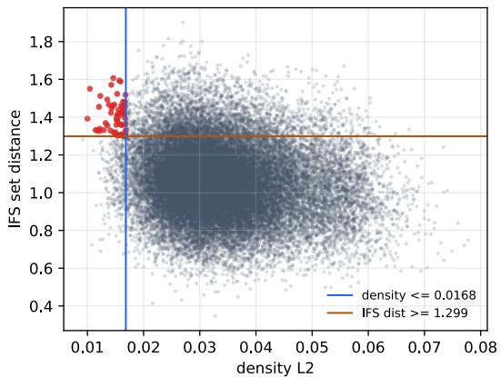

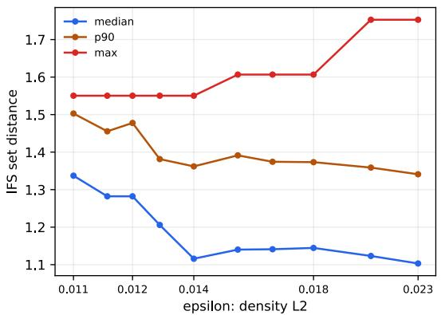  
Figure 1: Identifiability (all pairs of test256). Left: density distance versus parameter-set distance (Pearson correlation −0.146). The 59 near-image, far-parameter pairs that simultaneously satisfy the thresholds (density $\leq 0 . 0 1 6 8 ,$ the bottom 1%; parameter distance $\geq 1 . 2 9 9 ,$ , the top 10%) are shown in red. Right: parameter-set distance (median $\mathsf { \Pi } _ { | \mathsf { p } 9 0 / \mathsf { m a x } } )$ among image pairs with density distance $\leq \varepsilon ;$ it does not fall of as ε shrinks.  
Table 1

We next quantify that such non-identifiability appears in our synthetic distribution. Over all $\textstyle { \binom { 2 5 6 } { 2 } } =$ 32,640 pairs of the fixed test set test256, we examine the relationship between the distance between density maps and the distance between parameter sets. The density distance is the $L _ { 2 }$ distance between the unitsum $1 2 8 \times 1 2 8$ density maps, and the parameter-set distance is the composite (W, b) distance after matching the map sets by optimal assignment (Hungarian; as in Section 4.2, the minimum over all 24 permutations for n=4), so the ordering ambiguity is removed as a quotient. The two distances are essentially uncorrelated (Pearson −0.146, Spearman −0.141): a “close image implies close parameters” relationship is largely absent (Table 1, Figure 1). Low correlation over all pairs is weak evidence on its own, since it can also arise from benign nonlinear relationships. Stronger evidence comes from the tail of near-identical images, which we examine next. Even taking each sample’s nearest-image neighbor, the corresponding parameter distance has a median of 1.00, barely below the overall median of 1.06. The points shown in red in Figure 1 have a small density distance $( \leq 0 . 0 1 6 8$ , the bottom 1% in Table 1) together with a large parameter-set distance (≥ 1.299, the top 10% of the pairwise distribution); there are 59 such pairs. In representative cases, a density $L _ { 2 }$ of about 0.010–0.016 corresponds to a parameter-set distance of about 1.55–1.61 (W Frobenius about 0.9–1.2): nearly identical density maps can arise from very diferent parameter sets.

Non-identifiability is most precisely stated as a function of a tolerance ε. Even restricting to image pairs whose density distance is at most ε, the parameter-set distance does not fall of (Figure 1, right): shrinking ε to the smallest level present within test256 (density $L _ { 2 } \approx 0 . 0 1 3 )$ , the median parameter-set distance stays at about 1.2, comparable to or above the overall ≈ 1.06. Moreover, this ε level is on the order of the reconstruction accuracy that refinement attains (Section 6), showing that the non-identifiability is not an asymptotic artifact but appears near the accuracy attained by our refinement.

Pairwise distance distribution on test256 (density distance and parameter-set distance).
<table><tr><td>Distance</td><td>Mean</td><td>Median</td><td>1%</td><td>Max</td></tr><tr><td>Density  $L _ { 2 }$ </td><td>0.0340</td><td>0.0325</td><td>0.0168</td><td>0.0778</td></tr><tr><td>(W, b) distance</td><td>1.0606</td><td>1.0559</td><td>0.6535</td><td>1.9016</td></tr></table>

Consequently, in the present synthetic distribution the problem of uniquely recovering the true parameter set from a density map is not well posed. We therefore place the success criterion on reconstruction and use the (W, b) error as a secondary indicator of true-value recovery and to characterize failure modes (Section 6).

## 6. Experiments

## 6.1. Experimental setup

The estimator takes a density map as input and outputs a set of n=4 afine maps $\{ ( W _ { i } , b _ { i } ) \} _ { i = 1 } ^ { 4 }$ . Following Section 5, we place the success criterion on reconstruction: we render the attractor defined by the predicted parameters and measure its agreement with the target density map. The primary metrics are four complementary measures of reconstruction quality (density squared error, Chamfer distance, 95thpercentile Hausdorf distance, and $2 \mathrm { - p x }$ coverage), defined below.

We use a fixed test set test256 (256 samples with a fixed generation seed). At evaluation, the predicted attractor is rendered with a high-fidelity renderer whose settings are identical to those of the renderer that generated the target density map (settings in Section 4.4). Matching the renderer between generation and evaluation is important for the reconstruction error to be a meaningful measure of achievement: if the settings disagree, a mismatch occurs in which the true parameters do not minimize the error (Section 6.2). We call this evaluation renderer the matched renderer. The estimator processes all 256 samples in a single forward pass.

For notation, we compare the predicted and target attractors with one density-based metric and three point-cloud metrics. A density map is normalized to unit sum on a 128-resolution grid, and we write the prediction and target as $\begin{array} { r } { \widehat { \rho } , \rho \ \in \ \mathbb { R } _ { \geq 0 } ^ { 1 2 8 \times 1 2 8 } ( \sum _ { p } \widehat { \rho } _ { p } \ = } \end{array}$ $\textstyle \sum _ { p } \rho _ { p } = 1 )$ . For the point-cloud metrics, each attractor is drawn as a trajectory point cloud, and the finite points within the drawing domain $[ - 1 . 5 , 1 . 5 ] ^ { 2 }$ form the point sets ${ \widehat { X } } , X$ (subsampled to at most 2048 points each to reduce cost, $| \widehat { X } | , | X | \ \leq \ 2 0 4 8 )$ . For a point $u \in \mathbb { R } ^ { 2 }$ and a nonempty finite set S, the point-to-set distance is

$$
d ( u , S ) = \operatorname* { m i n } _ { v \in S } \lVert u - v \rVert _ { 2 } ,\tag{11}
$$

and we write $\{ d ( u , X ) \ : \ u \ \in \ { \widehat { X } } \}$ for the nearestneighbor distances from $\widehat { X }$ to $X ,$ and $\{ d ( v , { \widehat { X } } ) : v \in X \}$ for the reverse. For a finite nonnegative sequence $w _ { ( 1 ) } \leq$ $\cdots \leq w _ { ( n ) }$ , the empirical q-quantile $Q _ { q }$ is defined, with $h = 1 + \dot { q } ( n - 1 )$ , by

$$
Q _ { q } = w _ { ( \lfloor h \rfloor ) } + ( h - \lfloor h \rfloor ) \big ( w _ { ( \lceil h \rceil ) } - w _ { ( \lfloor h \rfloor ) } \big )\tag{12}
$$

(linear interpolation, with $Q _ { 1 }$ the maximum).

Density squared error (density SSE) The pixelwise sum of squared diferences of the normalized density maps,

$$
\operatorname { S S E } ( { \widehat { \rho } } , \rho ) = \sum _ { p } { \left( { \widehat { \rho } } _ { p } - \rho _ { p } \right) ^ { 2 } } .\tag{13}
$$

It measures agreement of the density (the intensity distribution proportional to visit frequency), including where the mass concentrates.

Chamfer distance The symmetric form obtained by averaging the mean squared nearest-neighbor distances in both directions and taking the square root,

$$
\begin{array} { r l } & { \mathrm { C D } ( \widehat { X } , X ) = \Big ( \frac { 1 } { 2 } \big ( \frac { 1 } { | \widehat { X } | } \sum _ { u \in \widehat { X } } d ( u , X ) ^ { 2 } } \\ & { \qquad + \frac { 1 } { | X | } \sum _ { v \in X } d ( v , \widehat { X } ) ^ { 2 } \big ) \Big ) ^ { 1 / 2 } . } \end{array}\tag{14}
$$

It primarily measures support agreement and is less directly sensitive to visit-frequency diferences than density SSE, although the trajectory samples are still drawn according to the invariant measure.

95th-percentile Hausdorf distance (HD95) The larger of the 95th percentiles of the nearestneighbor distance distributions in each direction,

$$
\begin{array} { r } { \mathrm { H D } _ { 9 5 } ( \widehat { X } , X ) = \operatorname* { m a x } \big ( Q _ { 0 . 9 5 } ( \{ d ( u , X ) \} _ { u \in \widehat { X } } ) , } \\ { Q _ { 0 . 9 5 } ( \{ d ( v , \widehat { X } ) \} _ { v \in X } ) \big ) . } \end{array}\tag{15}
$$

The ordinary directed Hausdorf distance $( q = 1 ,$ the maximum) is dominated by a single outlier, so we use this robust version that discards the top $5 \%$ , measuring large boundary deviations without oversensitivity to outliers.

2-px coverage The fraction of points with a neighbor in the other set within a tolerance radius τ, averaged over both directions (denoted coverage@2px),

$$
\begin{array} { r l } & { \mathrm { c o v } _ { \tau } ( \widehat { X } , X ) = \frac { 1 } { 2 } \big ( \frac { 1 } { | \widehat { X } | } \sum _ { u \in \widehat { X } } \mathbf { 1 } [ d ( u , X ) \leq \tau ] } \\ & { \qquad + \frac { 1 } { | X | } \sum _ { v \in X } \mathbf { 1 } [ d ( v , \widehat { X } ) \leq \tau ] \big ) , } \end{array}\tag{16}
$$

with $\tau = 2 \cdot ( 3 / 1 2 8 ) \approx 0 . 0 4 6 9$ (twice the pixel width $3 / 1 2 8 ;$ the full width of the coordinate system $[ - 1 . 5 , 1 . 5 ] ^ { 2 }$ is 3). Under a fixed tolerance, it measures how completely the two attractors cover each other.

SSE, CD, $\mathrm { H D _ { 9 5 } }$ are better when smaller and cov when larger. They complement one another: if the shape matches but the density bias difers, SSE worsens, and if the global match is good but part is far of, $\mathrm { H D _ { 9 5 } }$ worsens.

The standard model of this paper (denoted base) is the bare amortized estimator of Section 4, trained with GT-θ Hungarian matching and no reconstruction auxiliary.

We evaluate the one-shot output of the standard model (0 steps) and the results of applying the refinement of Section 4.3 for 10/20/30 steps (with 512 point samples each for prediction and target). The baseline is per-image optimization from a random initialization under the same objective and budget (random-r4, 4 restarts; Section 4.3), corresponding to the per-image gradient optimization of prior work (Tu et al. 2023 and others). We place both on the same wall-clock time axis (seconds per sample) for a fair quality–speed comparison.

All timing experiments were run on an NVIDIA GeForce RTX 3090 with an AMD Ryzen 9 5950X processor, using PyTorch 2.3.0 and CUDA 12.1. Timings are wall-clock seconds per sample, measured with a monotonic host clock (time.perf\_counter) around each optimization block. Because every measured block returns its recovered parameters and losses to the host, the device-to-host copies force outstanding GPU kernels to complete before the clock is read. Random restarts are folded into the batch dimension and thus evaluated in parallel on the GPU where memory permits, so the reported cost is wall-clock time rather than FLOPs, which if anything favors the multi-restart random baseline.

## 6.2. Evaluation design: matched renderer and reconstruction validity

Before the main comparison, we verify the validity of the evaluation design. To use reconstruction as the objective and metric, the renderer used for optimization and evaluation must match the generation renderer: if they disagree, the objective is misspecified and a nonground-truth solution with a loss lower than that of the true parameters can arise, as we actually observe with a low-fidelity renderer. We therefore set the evaluation and optimization renderer to the same settings as generation.

Under this setting, the reconstruction error of the true parameters rendered by the matched renderer drops to about $2 . 7 \times 1 0 ^ { - 6 }$ in density SSE. Because the matched renderer draws with a finite number of stochastic trajectories, even the same parameters produce a fluctuation of about $2 . 6 \times 1 0 ^ { - 6 }$ in density SSE from one drawing to another. Since the target density map is itself one such drawing, no parameters can reproduce the target below this fluctuation; we call this the reconstruction noise floor. The true parameters reach this floor, so under the matched renderer the reconstruction error is a valid evaluation metric. All evaluation and refinement in this paper use the matched renderer.

Minimizing reconstruction does not necessarily imply parameter recovery (Section 5): indeed, refinement from the estimator’s output improves reconstruction substantially while the (W, b) error barely decreases (Section 6.3). We therefore treat the (W, b) error not as a failure gate but as a diagnostic (Section 7).

## 6.3. Main comparison: the quality–speed Pareto front

Table 2 and Figure 2 show the 0/10/20/30-step refinement of the amortized estimator (base) and the equal-budget random-r4 baseline $( 0 / 1 0 / 2 0 / 3 0$ steps, and 60 steps at double the time). Representative density maps are in Figure 3, with the corresponding point clouds in Figure A.1.

The base refinement curve lies above the randomr4 curve on the quality–speed frontier for all four reconstruction metrics. At 0 steps, the feed-forward prediction already improves over random-r4 at comparable time (Chamfer 0.0547 vs 0.1546; coverage@2px 0.665 vs 0.406). At about 0.56 s/sample, base+30 improves over random-r4+30 on every metric and wins per sample on 239–253 of the 256 cases, depending on the metric. It also remains better than random-r4+60, despite the latter using about twice the time.

To test robustness to the training seed, we trained two additional estimators with the same recipe and evaluated all three on test256. The three-seed average of base+30 was density SSE $2 . 3 4 \times 1 0 ^ { - 4 } \pm 0 . 1 0 \times 1 0 ^ { - 4 }$ ， Chamfer $0 . 0 2 6 9 \pm 0 . 0 0 0 9$ , HD95 $0 . 0 9 5 5 \pm 0 . 0 0 3 6$ , and coverage@2px 0.853 ± 0.008.

The between-seed spread is far smaller than the gap to random-r4; for example, the Chamfer standard deviation is 0.0009, compared with a gap of about 0.026 to random-r4+60. Each seed remains better than random-r4 at both equal and doubled budgets, and persample win rates against random-r4+60 remain stable across seeds.

As the $( W , b )$ -error column of Table 2 shows, refinement improves reconstruction substantially (base: Chamfer $0 . 0 5 4 7 \  \ 0 . 0 2 5 9 )$ while the (W, b) error barely moves $( 0 . 4 0 5  0 . 3 9 5 )$ ; random-r4’s (W, b) error also stays high, around 0.97. Improvement in reconstruction therefore does not imply parameter recovery (Section 5), and we keep the $( W , b )$ error as a diagnostic rather than a success criterion.

## 6.4. Long-horizon refinement and convergence distribution

The quality–speed comparison in Section 6.3 is a comparison at equal budget, which alone cannot distinguish whether random initialization is merely slower to converge or becomes trapped in worse local minima. Because the reconstruction landscape of the inverse IFS problem is non-convex, multimodal, and prone to poor local minima [4, 6, 7], the latter would mean that amortized initialization enters a lower-reconstructionerror basin more easily, an advantage beyond speed.

To test this, we extend refinement to 1000 steps and compare the distribution of converged reconstruction quality. For random initialization we use both a single restart (random-r1) and the best of 4 restarts (randomr4), and we align the budget by the number of optimization steps (random-r4 costs four times the compute per step; this experiment measures wall-clock time over all 256 samples processed together, so the absolute seconds per sample are not directly comparable to Section 6.3).

In addition to the distribution, we use a success rate $\mathrm { P r } [ \mathrm { C D } ~ \leq ~ \tau ]$ , the fraction of samples whose converged Chamfer falls at or below a threshold τ. We set the threshold to the quality of the main result (Section 6.3): the mean Chamfer $\tau = 0 . 0 2 6 2$ that the standard model attains with a light 30-step refinement (re-evaluated under this experiment’s protocol, hence slightly diferent from the 0.0259 of Table 2), so the success rate is the fraction of samples that reach a reconstruction quality on par with the main result.

As Table 3 and Figure 4 show, even extended to 1000 steps the converged quality of random initialization does not reach that of amortized initialization (mean Chamfer: random-r4 0.0276, random-r1 0.0331 vs base 0.0195). The gap is larger in the tail of the distribution (p95: random-r1 0.0540, random-r4 0.0417 vs base 0.0340), showing that some samples become stuck in poor local minima. HD95 and coverage@2px confirm the same ordering (HD95: base 1000 at 0.070 vs random-r4 0.105; coverage: 0.920 vs 0.861). The gap is smallest on density SSE (base $1 0 0 0 \ 1 . 5 5 \times 1 0 ^ { - 4 }$ vs random-r4 $2 . 0 9 \times 1 0 ^ { - 4 } )$ , where random-r4 even falls below $\mathsf { b a s e { + } 3 0 ~ ( 2 . 2 7 \times 1 0 ^ { - 4 } ) }$ on average; because the refinement objective is dominated by the density term, random initialization can lower the directlyoptimized density while converging to a basin whose shape (Chamfer/HD95/coverage) does not match (the decoupling of reconstruction objective, shape, and parameters; Section 5). By the success rate (fraction reaching $\mathrm { C D } ~ \leq ~ 0 . 0 2 6 2 )$ the gap is substantial: base reaches 0.598 at 30 steps and 0.824 at 1000 steps, whereas random initialization stays at 0.301 (r1) and 0.445 (r4) even at 1000 steps (Figure 4, left). Taking the best of 4 restarts and spending four times the compute per step does not close this gap. Moreover, base+30 (mean 0.0262) matches random-r4 at 1000 steps (0.0276), reaching comparable quality with 33× less optimization. The pairwise scatter (Figure 4, right) confirms this per sample: amortized initialization converges to a better solution on almost every sample.

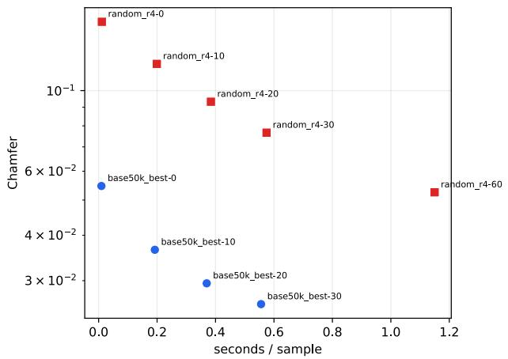

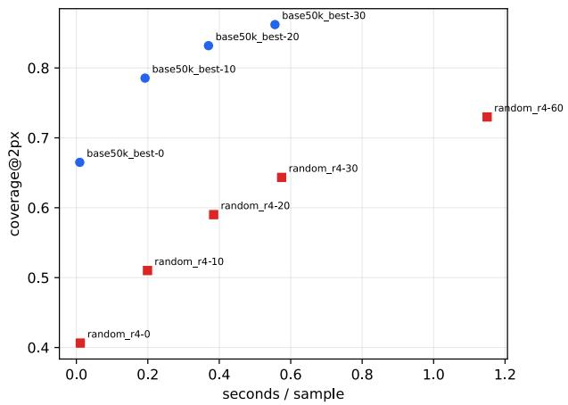  
Figure 2: Quality–speed Pareto (test256). Horizontal axis: seconds per sample. Left: Chamfer (smaller is better); right: coverage@2px (larger is better). The base amortized(+refinement) curve consistently improves over equal-budget random-from scratch.

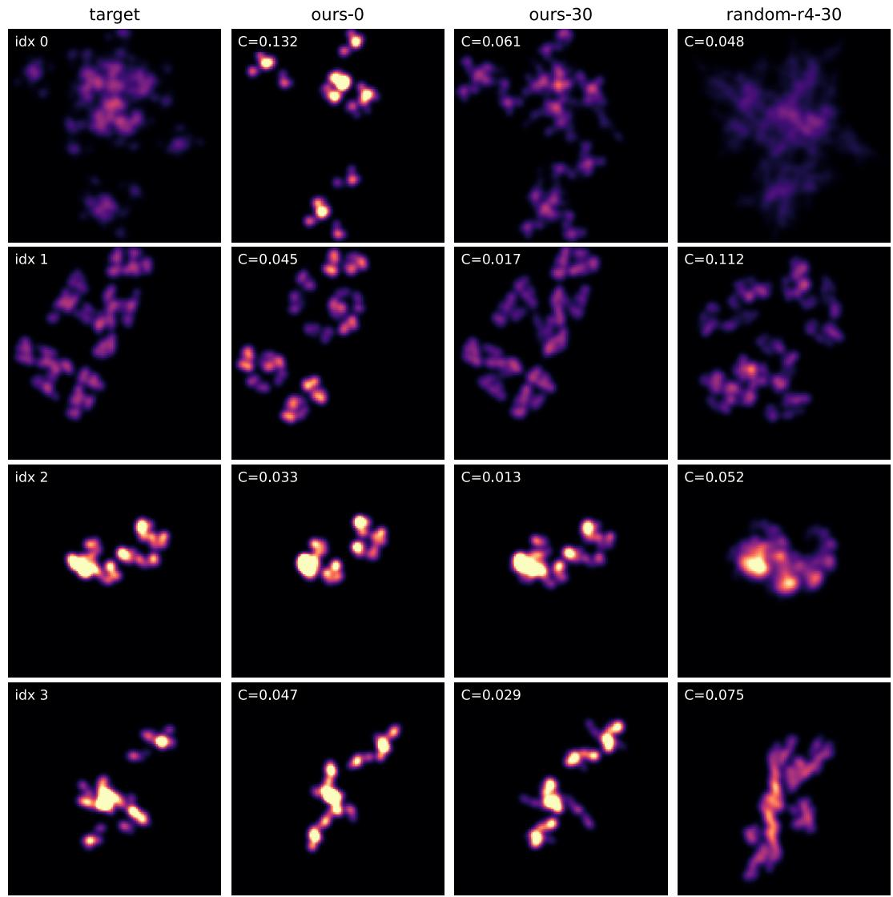  
Figure 3: Qualitative examples of the main result (4 representative examples of test256, density maps by the matched renderer). Columns: target, ours-0 (one-shot), ours-30 (+30 refinement), and random-r4-30 (equal-budget per-instance); C in each cell is the Chamfer distance. At equal budget, ours-30 is closer to the target than random-r4-30 in most examples (point-cloud version in Figure A.1).

Table 2  
Quality–speed Pareto (test256). base amortized(+refinement) versus equal-budget random-from-scratch (r4). Time is seconds per sample; density SSE, Chamfer, and HD95 are better when smaller and coverage@2px when larger. The (W, b) error is the Hungarian-matched parameter-set distance (same definition as Section 5), reported as a diagnostic.
<table><tr><td>Setting</td><td>sec/sample</td><td>density SSE</td><td>Chamfer</td><td>HD95</td><td> $\mathsf { c o v e r a g e } @ 2 \mathsf { p x }$ </td><td>(W, b) err</td></tr><tr><td>base 0-step</td><td>0.0095</td><td> $7 . 8 5 \times 1 0 ^ { - 4 }$ </td><td>0.0547</td><td>0.2106</td><td>0.6650</td><td>0.405</td></tr><tr><td> $\mathtt { b a s e } + 1 0$ </td><td>0.192</td><td> $3 . 8 5 \times 1 0 ^ { - 4 }$ </td><td>0.0365</td><td>0.1381</td><td>0.7855</td><td>0.395</td></tr><tr><td> $\mathtt { b a s e } + 2 0$ </td><td>0.370</td><td> $2 . 7 6 \times 1 0 ^ { - 4 }$ </td><td>0.0295</td><td>0.1059</td><td>0.8319</td><td>0.394</td></tr><tr><td> $\mathtt { b a s e } + 3 0$ </td><td>0.556</td><td> $\mathbf { 2 . 2 3 \times 1 0 ^ { - 4 } }$ </td><td>0.0259</td><td>0.0913</td><td>0.8621</td><td>0.395</td></tr><tr><td>random-r4 0-step</td><td>0.0110</td><td> $1 . 0 0 5 \times 1 0 ^ { - 3 }$ </td><td>0.1546</td><td>0.5719</td><td>0.4063</td><td>0.981</td></tr><tr><td>random-r4 +10</td><td>0.199</td><td> $7 . 6 9 \times 1 0 ^ { - 4 }$ </td><td>0.1184</td><td>0.4566</td><td>0.5102</td><td>0.973</td></tr><tr><td>random-r4 +20</td><td>0.384</td><td> $6 . 4 0 \times 1 0 ^ { - 4 }$ </td><td>0.0932</td><td>0.3712</td><td>0.5901</td><td>0.982</td></tr><tr><td>random-r4 +30</td><td>0.575</td><td> $5 . 6 2 \times 1 0 ^ { - 4 }$ </td><td>0.0766</td><td>0.3097</td><td>0.6434</td><td>0.977</td></tr><tr><td>random-r4 +60 (2× time)</td><td>1.150</td><td> $4 . 3 5 \times 1 0 ^ { - 4 }$ </td><td>0.0525</td><td>0.2136</td><td>0.7299</td><td>0.967</td></tr></table>

Table 3

Convergence distribution under long optimization (test256, matched renderer). Converged values at 1000 steps for base (amortized initialization) and random initialization (r1 / best of r4). The CD columns are the mean, median, and $p _ { 9 5 }$ of Chamfer; density SSE is the mean (all better when smaller). The success rate is $\operatorname* { P r } [ \mathrm { C D } \leq \tau ]$ with $\tau = 0 . 0 2 6 2$ (mean Chamfer of base+30).
<table><tr><td>Method</td><td>step</td><td>density SSE</td><td>CD mean</td><td>CD median</td><td>CD  $p _ { 9 5 }$ </td><td>successτ</td><td>(W, b) err</td></tr><tr><td>base</td><td>30</td><td> $2 . 2 7 \times 1 0 ^ { - 4 }$ </td><td>0.0262</td><td>0.0234</td><td>0.0457</td><td>0.598</td><td>0.395</td></tr><tr><td>base</td><td>1000</td><td> $\mathbf { 1 . 5 5 \times 1 0 ^ { - 4 } }$ </td><td>0.0195</td><td>0.0181</td><td>0.0340</td><td>0.824</td><td>0.453</td></tr><tr><td>random-r1</td><td>1000</td><td> $2 . 8 2 \times 1 0 ^ { - 4 }$ </td><td>0.0331</td><td>0.0314</td><td>0.0540</td><td>0.301</td><td>0.971</td></tr><tr><td>random-r4</td><td>1000</td><td> $2 . 0 9 \times 1 0 ^ { - 4 }$ </td><td>0.0276</td><td>0.0273</td><td>0.0417</td><td>0.445</td><td>0.928</td></tr></table>

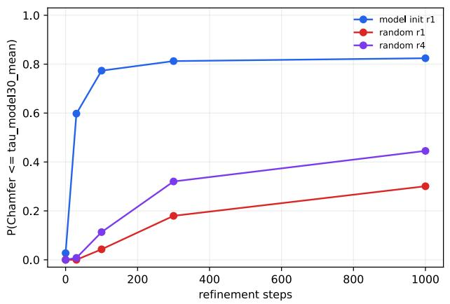

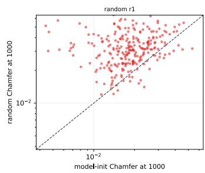

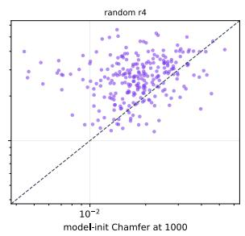  
Figure 4: Convergence under long optimization (test256). Left: success rate $\operatorname* { P r } [ \mathrm { C D } \le \tau ] \ ( \tau = 0 . 0 2 6 2 )$ versus number of steps. base (amortized initialization) reaches 0.77 by 100 steps and saturates at about 0.82, whereas random initialization remains at $0 . 3 0 \ ( \mathsf { r } 1 ) \ / \ 0 . 4 4 \ ( \mathsf { r } 4 )$ even at 1000 steps. Right: pairwise scatter of the 1000-step converged Chamfer for the same samples (horizontal base, vertical random). Almost all points lie above the diagonal, so amortized initialization converges to a better solution sample by sample.

Efect of the reconstruction auxiliary loss (test256). base (no auxiliary), match-only (continuation only), and +aux (with reconstruction auxiliary) at 0 and 30 steps.
<table><tr><td>Method</td><td>step</td><td>density SSE</td><td>Chamfer</td><td>HD95</td><td>coverage@2px</td><td>(W, b) err</td></tr><tr><td>base</td><td>0</td><td> $7 . 8 5 \times 1 0 ^ { - 4 }$ </td><td>0.0547</td><td>0.2106</td><td>0.6650</td><td>0.405</td></tr><tr><td>match-only</td><td>0</td><td> $8 . 3 0 \times 1 0 ^ { - 4 }$ </td><td>0.0552</td><td>0.2121</td><td>0.6629</td><td>0.407</td></tr><tr><td>+aux</td><td>0</td><td> $\mathbf { 7 . 7 5 \times 1 0 ^ { - 4 } }$ </td><td>0.0527</td><td>0.2010</td><td>0.6680</td><td>0.413</td></tr><tr><td>base</td><td>30</td><td> $2 . 2 3 \times 1 0 ^ { - 4 }$ </td><td>0.0259</td><td>0.0913</td><td>0.8621</td><td>0.395</td></tr><tr><td>match-only</td><td>30</td><td> $2 . 3 5 \times 1 0 ^ { - 4 }$ </td><td>0.0263</td><td>0.0934</td><td>0.8591</td><td>0.396</td></tr><tr><td>+aux</td><td>30</td><td> $2 . 2 6 \times 1 0 ^ { - 4 }$ </td><td>0.0264</td><td>0.0942</td><td>0.8589</td><td>0.402</td></tr></table>

Notably, base’s refinement lowers Chamfer substantially $( 0 . 0 5 5  0 . 0 1 9 )$ while the (W, b) error instead increases $( 0 . 4 0 5 \  \ 0 . 4 5 3 )$ (Table 3): convergence to a low-reconstruction-error solution is not convergence to the true parameters (Sections 5 and 7). Random initialization has both worse reconstruction and a high (W, b) error (about 0.93–0.97), falling into a diferent basin that does not even reach a good reconstruction.

## 6.5. Efect of the reconstruction auxiliary loss on the one-shot prediction

The standard model is trained with GT-θ matching alone (Section 4.2). As an auxiliary ablation, we test whether a reconstruction-consistency auxiliary loss raises the one-shot prediction (0 steps). Starting from base, we add to the GT-θ matching a density error on the diferentiable renderer (weight 4) and a Chamfer distance to a point cloud sampled from the observed image (weight 1, 512 points each) and train for 3,000 additional steps to obtain +aux; to separate the efect of merely training longer, a control trained for 3,000 additional steps without the auxiliary is match-only.

The result can be summarized in three points (Table 4). (i) The reconstruction auxiliary improves the one-shot prediction (0 steps) on all metrics (Chamfer $0 . 0 5 4 7 \ \to \ 0 . 0 5 2 7$ , HD95 0.2106 → 0.2010), whereas the auxiliary-free continuation match-only does not (it slightly worsens), so the improvement is due to the auxiliary loss itself. (ii) After 30-step refinement, however, base and +aux are essentially tied: per sample, base wins on 128 (density), 135 (Chamfer), 137 (HD95), and 140 (coverage) of the 256 samples; no metric is significant under a sign test, and only HD95 is significant by a $1 0 ^ { 4 } .$ -resample bootstrap confidence interval. The refined endpoint is thus nearly unaffected. (iii) +aux improves the 0-step reconstruction yet worsens the (W, b) error and the GT-θ validation loss $( 0 . 1 6 9  0 . 1 7 3 ;$ match-only is unchanged at 0.169), an instance of the decoupling between the reconstruction objective and θ-matching (Section 7). The auxiliary is therefore a secondary option, useful for improving the 0-step prediction when the refinement budget is zero; for simplicity of reporting, we take the auxiliary-free base as the standard model.

## 6.6. Generalization (1): within-family distribution shift

We test generalization to same-family fractals outside the training distribution (out-of-distribution, OOD). Keeping the number of maps n=4, the selection probability $p \ \propto \ |$ | det W|, and the matched renderer as at training, we shift only the parameter distribution of the evaluation data outside the training support: S1 (large singular values) $s _ { 1 } , s _ { 2 } \sim \mathcal { U } ( 0 . 7 0 , 0 . 8 5 )$ (above the training upper bound 0.70), and T1 (wide translation) fixed points $\sim \mathcal { U } ( - 1 . 2 , 1 . 2 ) ^ { 2 }$ (beyond the training ±0.75). For each setting, with 256 samples, we evaluate the standard model at $0 / 1 0 / 2 0 / 3 0$ steps and equalbudget random-r4.

In both settings the 0-step result is worse than in distribution (0.0547) but recovers clearly with refinement. The behavior, however, difers by the type of shift (Table 5, Figure 5). For T1 (location shift), amortized 30-step not only exceeds random-r4 at equal time but also exceeds the double-time random-r4-60 (per sample Chamfer 208/256, HD95 215/256); under structurepreserving OOD the advantage persists. For S1, where larger singular values produce weaker contractions and more space-filling attractors than those seen in training, amortized refinement is roughly tied with random-r4 at equal time but is overtaken by random-r4+60. Thus the amortized prior remains useful as an initialization, but its advantage decreases when the evaluation distribution changes the geometry of the attractors rather than only their location. This diference can be interpreted as depending on how much of the learned structural prior the OOD setting preserves: in T1, where rotation and scale stay in distribution and only the location shifts, the prior is efective, whereas in S1, where the contraction is weak and space-filling so that the attractor structure itself is novel, the value of the prior fades and per-instance optimization becomes favorable given enough budget.

Within-family OOD (256 samples each, Chamfer). Amortized 0/30 steps and random-r4 (equal-time 30 / double-time 60).
<table><tr><td>Shift</td><td>ours-0</td><td>ours-30</td><td>random-r4-30</td><td>random-r4-60 (2×)</td></tr><tr><td>S1 (large singular values)</td><td>0.1271</td><td>0.0466</td><td>0.0476</td><td>0.0349</td></tr><tr><td>T1 (wide translation)</td><td>0.0996</td><td>0.0481</td><td>0.0950</td><td>0.0685</td></tr></table>

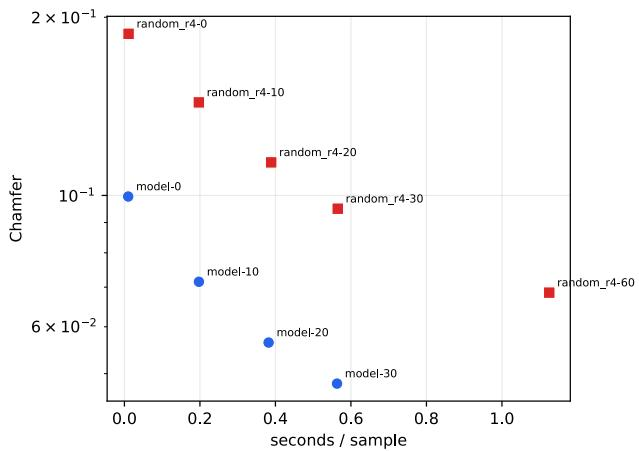

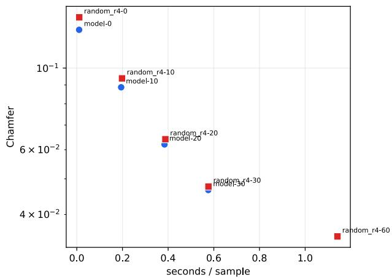  
Figure 5: Quality–speed of within-family OOD (Chamfer vs seconds per sample). Left: T1 (wide translation); right: S1 (large singular values).

## 6.7. Generalization (2): transfer to real images and scaling, comparison with prior work

Finally, we compare transfer to non-fractal real images directly against the per-image optimization of Tu et al. (2023) [6], which has a public implementation. We use two datasets, MNIST and Fashion-MNIST: the former is close to occupancy (thin strokes), while the latter contains filled regions and requires reproducing density. Here we use a scaled version with more maps: an estimator trained with the same framework and data generation at n=10 (100,000 steps, with the cosine decay starting at 60,000 steps; otherwise identical to Section 4) applied to both datasets. This also matches the number of maps to Tu’s public setting (n=10). For fairness, we render the IFS output by both methods under a common condition and measure two families of metrics. We refer to these as the density and occupancy conditions below.

(i) Our density condition A density map proportional to visit frequency on the matched renderer, evaluated with the four reconstruction metrics of Section 6.1 (density SSE, Chamfer, HD95, and coverage@2px).

(ii) Tu’s occupancy condition Tu’s renderer overlays an RBF kernel on each point and then clamps the pixel value to [0, 1]. Because pixels where many points accumulate saturate at 1, the resulting 32 × 32 image efectively represents occupancy (whether each region is covered by points) rather than visit frequency (density). On this occupancy image, the evaluation value is the minimum MSE over 100 sampling sequences (occupancy MSE; Tu’s evaluation procedure).

Tu’s optimization was run with the public code for $n \in$ {4, 10} (1000 iterations per image). We additionally evaluate a hybrid denoted ours-init+occupancy-GD, which starts from our estimator’s one-shot output and optimizes Tu’s occupancy objective by gradient descent for 100 steps.

The result depends on metrics (Table 6, Figure 6). Under the density condition, our refined outputs are consistently better: ours at 30 steps improves over Tu at n=4, 10 on all 50 images and all main metrics (e.g., Chamfer 0.0221 vs 0.1017 for Tu-n=10), and improves further at 100 steps. As Figure 6 shows, Tu tends to concentrate mass on thin lines and, as is notable for the digits 1, 2, 4, sometimes on isolated points, whereas our method tends to reconstruct mass as a filled area. Under the occupancy condition, our raw output is worse than Tu’s, but ours-init+occupancy-GD reaches a lower mean occupancy MSE than Tu-n=10; the persample win rate is only 20/50, so this is not a uniform improvement.

MNIST (balanced 50 images, n=10 estimator). occupancy MSE is the minimum MSE under the occupancy condition; the rest are density metrics. density SSE, Chamfer, HD95, and occupancy MSE are better when smaller, coverage@2px when larger.
<table><tr><td>Method</td><td>occupancy MSE</td><td>density SSE</td><td>Chamfer</td><td>HD95</td><td>coverage@2px</td></tr><tr><td>ours 0-step</td><td>0.0874</td><td> $4 . 3 0 \times 1 0 ^ { - 4 }$ </td><td>0.0571</td><td>0.2245</td><td>0.6888</td></tr><tr><td>ours 30-step</td><td>0.0867</td><td> $1 . 0 1 \times 1 0 ^ { - 4 }$ </td><td>0.0221</td><td>0.0753</td><td>0.9126</td></tr><tr><td>ours 100-step</td><td>0.0724</td><td> $\mathbf { 6 . 9 5 \times 1 0 ^ { - 5 } }$ </td><td>0.0193</td><td>0.0598</td><td>0.9357</td></tr><tr><td>ours-init + occupancy-GD 100</td><td>0.0190</td><td> $7 . 6 7 \times 1 0 ^ { - 4 }$ </td><td>0.0485</td><td>0.1931</td><td>0.7114</td></tr><tr><td>Tu (n=4)</td><td>0.0296</td><td> $2 . 8 8 \times 1 0 ^ { - 3 }$ </td><td>0.1329</td><td>0.5305</td><td>0.6154</td></tr><tr><td>Tu (n=10)</td><td>0.0214</td><td> $4 . 9 1 \times 1 0 ^ { - 3 }$ </td><td>0.1017</td><td>0.3837</td><td>0.6364</td></tr></table>

Fashion-MNIST (balanced 50 images, n=10). occupancy MSE is the minimum MSE under the occupancy condition; the rest are density metrics.
<table><tr><td>Method</td><td>occupancy MSE</td><td>density SSE</td><td>Chamfer</td><td>HD95</td><td>coverage@2px</td></tr><tr><td>ours 0-step</td><td>0.1087</td><td> $1 . 3 8 \times 1 0 ^ { - 4 }$ </td><td>0.0503</td><td>0.2102</td><td>0.7724</td></tr><tr><td>ours 30-step</td><td>0.0997</td><td> $3 . 9 8 \times 1 0 ^ { - 5 }$ </td><td>0.0251</td><td>0.0738</td><td>0.8846</td></tr><tr><td>ours 100-step</td><td>0.0966</td><td> $\mathbf { 3 . 0 9 \times 1 0 ^ { - 5 } }$ </td><td>0.0235</td><td>0.0652</td><td>0.8979</td></tr><tr><td>ours-init + occupancy-GD 100</td><td>0.0450</td><td> $4 . 9 4 \times 1 0 ^ { - 4 }$ </td><td>0.0629</td><td>0.2554</td><td>0.7645</td></tr><tr><td>Tu (n=10, 1000 iters)</td><td>0.0672</td><td> $1 . 4 3 \times 1 0 ^ { - 4 }$ </td><td>0.0453</td><td>0.1754</td><td>0.8610</td></tr></table>

The speed diference is large: our inference took about 0.04 s at 0 steps, about 2.5 s at 30 steps, and about 8.2 s even at the highest-quality 100 steps, whereas Tu took about 100–160 s per image (about 2600×, 40–60×, and 12–20× faster, respectively). Occupancy-GD lowers occupancy MSE while worsening density SSE (losing 0/50 to ours-30 on the density metrics), showing that the occupancy objective and the density objective are incompatible. In short, increasing the number of maps to n=10 makes the method competitive with per-image optimization on real images: it retains the advantage in density reconstruction and speed, while saturated occupancy continues to favor the per-image optimizer.

Fashion-MNIST provides the complementary case: garments are filled regions whose faithful reconstruction requires reproducing the internal mass distribution (density). Applying the same n=10 estimator to Fashion-MNIST (balanced 50 images), we compared with Tu (n=10, 1000 iterations per image) (Table 7, Figure 7).

Density refinement improves progressively (density SSE: 0 steps 1.38 × 10−4 → 30 steps $3 . 9 8 \times 1 0 ^ { - 5 } $ 100 steps $3 . 0 9 \times 1 0 ^ { - 5 } )$ , and on the density metrics ours at 100 steps is best, exceeding Tu (n=10) on average. Our margin is smaller than on MNIST, however, because in filled regions covering the region nearly coincides with spreading mass over the area, i.e., occupancy and density become numerically close, so even Tu, which optimizes occupancy, does not degrade density much (density SSE 1 $. . 4 3 \times 1 0 ^ { - 4 } ;$ in contrast to MNIST’s $4 . 9 1 \times 1 0 ^ { - 3 }$ , where the two diverge strongly because of thin lines). As a result, ours-100’s win rate over Tun=10 is density 28/50, Chamfer 32/50, HD95 30/50, an average advantage but not a uniform dominance. Still, faithfully reproducing the internal mass requires density optimization: ours-init+occupancy-GD, which pursues the occupancy objective, exceeds Tu-n=10 under the occupancy condition (0.0450 vs 0.0672, per sample $4 8 / 5 0 )$ but severely degrades density (density SSE $4 . 9 4 \times 1 0 ^ { - 4 }$ , worse than Tu-n=10) and collapses the garment to a thin outline (Figure 7).

Visually, Tu’s method often produces the clearest outlines, while ours-100 better preserves intermediate tones in some examples; in the appendix (Appendix B) there are also cases where Tu drops thin lines.

target  
ours-0  
ours-30  
ours-100  
occ-GD-100  
Tu(N=10)  
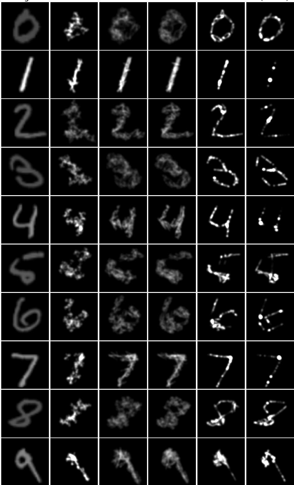  
Figure 6: MNIST reconstruction (density maps, common grayscale, one example per row). Columns from left: target, ours 0-step, ours 30-step, ours 100-step, ours-init+occupancy-GD 100, Tu (n=10). Under density-aware refinement, mass spreads as an area and approaches the target’s thick density as 0 → 30 → 100 steps, whereas Tu and occupancy-GD have clear outlines but concentrate mass on thin lines and isolated points.

target  
ours-0  
ours-30  
ours-100  
Tu(N=10)  
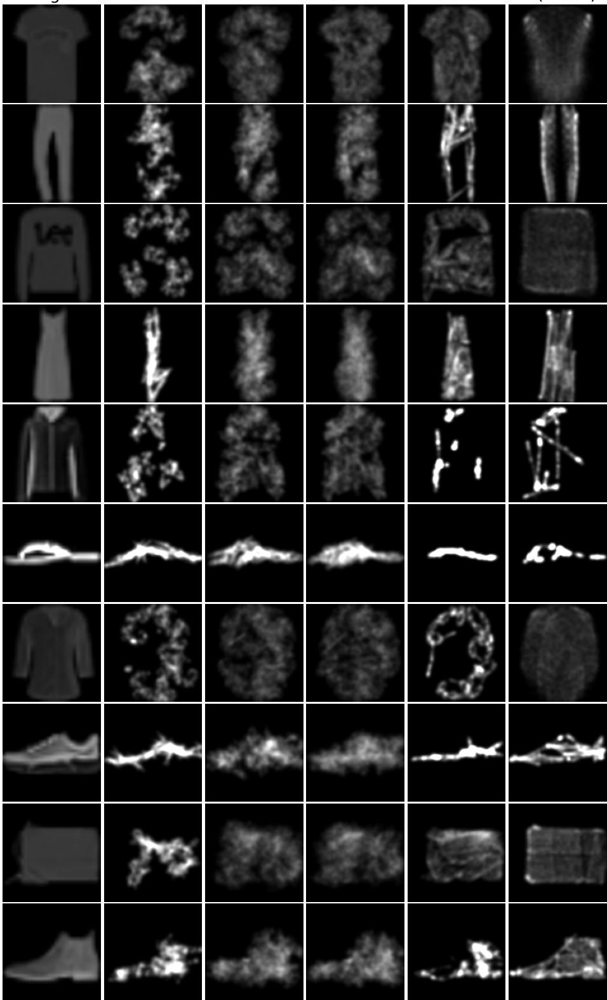  
Figure 7: Fashion-MNIST reconstruction (density maps, common grayscale, one example per row). Columns from left: target, ours 0-step, ours 30-step, ours 100-step, ours-init+occupancy-GD 100, Tu (n=10). Faithful reconstruction of filled regions requires reproducing internal density; density refinement (0 → 30 → 100) reproduces the target’s area density well, whereas occupancy-GD damages density and collapses the garment to an outline.

## 7. Discussion

## 7.1. Parameter recovery and reconstruction are distinct problems

The experiments support the separation between parameter recovery and reconstruction. Although training uses Hungarian-matched ground-truth parameters, improvements in reconstruction do not imply lower (W, b) error: refinement improves Chamfer while leaving the parameter error nearly unchanged or even increasing it under long optimization. Conversely, the reconstruction auxiliary improves the one-shot output but worsens the parameter-matching validation loss. These results justify treating (W, b) error as a diagnostic rather than as the success criterion.

## 7.2. The reconstruction objective requires careful specification

Even after choosing reconstruction as the objective, the particular reconstruction measure matters. We identified two pitfalls. First, if the generation renderer and the evaluation or optimization renderer use different settings, the measured objective may no longer be minimized by the true parameters (Section 6.2); we avoid this by matching the renderer to the one used for generation (the matched renderer, Section 6.1). Second, reconstruction objectives themselves are not mutually compatible: an occupancy objective and a visit-frequency density objective converge to diferent solutions. Optimizing an occupancy objective from our output as initialization improves the occupancy metric but worsens the density metric (Section 6.7). Which objective is appropriate depends on the application: occupancy when coverage matters, density when the intensity within filled regions matters. The present work targets density reconstruction, and the comparisons above show clear advantages under that criterion.

Placing density as the target not only ties directly to reproducing intensity but also corresponds to formulating the inverse IFS problem as matching probability measures, since a density map is a finite-sample approximation of the invariant measure. This measure-theoretic formulation opens the door to optimal-transport (OT) based distances and training in place of the pixel SSE and point-cloud Chamfer used here, which is one direction for future work.

## 7.3. Conditions under which amortized inference is efective

As the main comparison shows, the trained estimator acts not only as a fast one-shot predictor but also as a useful initializer for per-instance optimization, outperforming random-from-scratch optimization at equal and even double budget. The range in which this advantage holds depends, as the OOD experiments show, on how much the test distribution preserves the structural prior learned during training. In other words, amortized inference is most efective when the test distribution reuses structure present in the training distribution. At the same time, increasing the number of maps to n=10 makes the method competitive with per-image optimization on real images (Section 6.7), showing that the framework is not specific to $n { = } 4$

## 7.4. Limitations

• Non-identifiability near the noise floor is undetermined. We quantified non-identifiability down to an achievable tolerance (density $L _ { 2 }$ ≈ 0.013; Section 5). Whether it persists as the tolerance shrinks to the reconstruction noise floor $( \sim ~ 2 . 7 ~ \times ~ 1 0 ^ { - 6 }$ in density SSE; Section 6.2) is undetermined; settling it would require a secondsolution analysis that drives a solution far from the truth down to the floor, which we leave for future work.

• The selection probability is fixed to p ∝ | det W|. The framework cannot represent an IFS whose probabilities are given independently of the determinant. Estimating variable selection probabilities is left for future work.

• The number of maps is fixed per model. We used n=4 for the controlled core study and n=10 for the real-image and scaling experiments; handling a variable number of maps within a single model is outside the scope of this work. If the probability learning above were achieved, the model could learn an efective number of active maps adaptively.

• The generating distribution is limited to orientation-preserving maps. We generate only maps with det $W = s _ { 1 } s _ { 2 } > 0$ and include no reflections; as discussed in Section 4.4, this is a choice of training prior, not a limit on model capacity, and reflections can be added through a sign-flip factor.

## 8. Conclusion

We studied inverse IFS reconstruction as amortized set prediction from density maps. Because density maps do not uniquely determine IFS parameters, the method is trained with a stable parameter-matching surrogate but evaluated and refined by reconstruction. The known renderer supplies unlimited labeled training pairs and an image-only refinement objective.

In distribution, the amortized prediction followed by light refinement gives a better quality–speed tradeof than random-start per-image optimization, even when the latter receives twice the time. Long-horizon experiments show that the advantage also reflects more reliable convergence. The benefit persists under structure-preserving distribution shifts, weakens under stronger geometric shifts, and transfers to real images when the number of maps is increased.

We deliberately report the comparison with Tu et al. [6] under both families of metrics: the proposed method is stronger under density criteria, while the perimage optimizer remains preferable under saturated occupancy.

Beyond the specific extensions discussed in Section 7.4, the same strategy may apply to inverse problems with inexpensive simulators: train an amortized estimator on synthetic pairs, use the simulator for reconstruction-based refinement, and evaluate by the observable rather than by non-identifiable latent parameters.

## CRediT authorship contribution statement

Yutaka Yamaguti: Conceptualization, Methodology, Software, Validation, Formal analysis, Investigation, Data curation, Writing – original draft, Writing – review & editing, Visualization.

## Declaration of competing interest

The author declares that there are no known competing financial interests or personal relationships that could have appeared to influence the work reported in this paper.

## Funding

This research did not receive any specific grant from funding agencies in the public, commercial, or not-forprofit sectors.

## Declaration of generative AI and AI-assisted technologies in the manuscript preparation process

During the preparation of this work, the author used Claude (Anthropic) and ChatGPT (OpenAI) to improve the language and readability of the manuscript, and assist in developing and debugging the source code used in the experiments. All AI-assisted text was reviewed and edited by the author, and all AI-assisted code was reviewed, modified, and tested by the author before use. The author takes full responsibility for the content of the publication, the correctness of the implementation, and the reported results.

## Data availability

The source code, trained models, and evaluation scripts required to reproduce all results in this paper are publicly available at https://github.com/cncs-fit/ amortized-ifs.

## References

[1] J. E. Hutchinson, Fractals and self similarity, Indiana University Mathematics Journal 30 (1981) 713–747. doi:10. 1512/iumj.1981.30.30055.

[2] M. F. Barnsley, Fractals Everywhere, Academic Press, 1988.

[3] E. R. Vrscay, C. J. Roehrig, Iterated function systems and the inverse problem of fractal construction using moments, in: Computers and Mathematics, Springer, 1989, pp. 250– 259. doi:10.1007/978-1-4613-9647-5\_29.

[4] G. Mantica, A. Sloan, Chaotic optimization and the construction of fractals: Solution of an inverse problem, Complex Systems 3 (1989) 37–72.

[5] A. E. Jacquin, Image coding based on a fractal theory of iterated contractive image transformations, IEEE Transactions on Image Processing 1 (1992) 18–30. doi:10.1109/83. 128028.

[6] C.-H. Tu, H.-Y. Chen, D. Carlyn, W.-L. Chao, Learning fractals by gradient descent, in: Proceedings of the AAAI Conference on Artificial Intelligence (AAAI), volume 37, 2023, pp. 2456–2464. doi:10.1609/aaai.v37i2.25342.

[7] A. Djeacoumar, F. Mujkanovic, H.-P. Seidel, T. Leimkühler, Learning image fractals using chaotic diferentiable point splatting, Computer Graphics Forum 44 (2025) e70084. doi:10.1111/cgf.70084.

[8] R. Rinaldo, A. Zakhor, Inverse and approximation problem for two-dimensional fractal sets, IEEE Transactions on Image Processing 3 (1994) 802–820. doi:10.1109/83.336249.

[9] A. Sarafopoulos, B. F. Buxton, Resolution of the inverse problem for iterated function systems using evolutionary algorithms, in: IEEE Congress on Evolutionary Computation (CEC), IEEE World Congress on Computational Intelligence, 2006, pp. 1071–1078. doi:10.1109/CEC.2006. 1688428.

[10] L. Graham, M. Demers, Applying neural networks to a fractal inverse problem, in: Recent Developments in Mathematical, Statistical and Computational Sciences, volume 343 of Springer Proceedings in Mathematics & Statistics, Springer, 2021, pp. 157–165. doi:10.1007/978-3-030-63591-6\_15.

[11] H. Liu, D. Luo, H. Xu, Inferring iterated function systems approximately from fractal images, in: Proceedings of the Thirty-Third International Joint Conference on Artificial Intelligence (IJCAI-24), 2024, pp. 7699–7707. doi:10.24963/ ijcai.2024/852.

[12] N. Carion, F. Massa, G. Synnaeve, N. Usunier, A. Kirillov, S. Zagoruyko, End-to-end object detection with transformers, in: European Conference on Computer Vision (ECCV), 2020, pp. 213–229. doi:10.1007/978-3-030-58452-8\_13.

[13] H. W. Kuhn, The hungarian method for the assignment problem, Naval Research Logistics Quarterly 2 (1955) 83– 97. doi:10.1002/nav.3800020109.

[14] W. Yifan, F. Serena, S. Wu, C. Öztireli, O. Sorkine-Hornung, Diferentiable surface splatting for point-based geometry processing, ACM Transactions on Graphics 38 (2019) 1–14. doi:10.1145/3355089.3356513.

[15] K. Cranmer, J. Brehmer, G. Louppe, The frontier of simulation-based inference, Proceedings of the National Academy of Sciences 117 (2020) 30055–30062. doi:10.1073/ pnas.1912789117.

[16] S. Tulsiani, H. Su, L. J. Guibas, A. A. Efros, J. Malik, Learning shape abstractions by assembling volumetric primitives, in: CVPR, 2017, pp. 1466–1474. doi:10.1109/CVPR. 2017.160.

[17] L. A. Gatys, A. S. Ecker, M. Bethge, Image style transfer using convolutional neural networks, in: CVPR, 2016, pp. 2414–2423. doi:10.1109/CVPR.2016.265.

[18] J. Johnson, A. Alahi, L. Fei-Fei, Perceptual losses for realtime style transfer and super-resolution, in: ECCV, 2016, pp. 694–711. doi:10.1007/978-3-319-46475-6\_43.

[19] D. Ulyanov, V. Lebedev, A. Vedaldi, V. Lempitsky, Texture networks: Feed-forward synthesis of textures and stylized images, in: ICML, 2016, pp. 1349–1357.

[20] J. H. Elton, An ergodic theorem for iterated maps, Ergodic Theory and Dynamical Systems 7 (1987) 481–488. doi:10. 1017/S0143385700004168.

[21] H. Kataoka, K. Okayasu, A. Matsumoto, E. Yamagata, R. Yamada, N. Inoue, A. Nakamura, Y. Satoh, Pre-training without natural images, in: ACCV, 2020, pp. 583–600. doi:10.1007/978-3-030-69544-6\_35.

[22] C. Anderson, R. Farrell, Improving fractal pre-training, in: WACV, 2022, pp. 2412–2421. doi:10.1109/WACV51458.2022. 00247.

[23] S. Woo, J. Park, J.-Y. Lee, I. S. Kweon, Cbam: Convolutional block attention module, in: European Conference on Computer Vision (ECCV), 2018, pp. 3–19. doi:10.1007/ 978-3-030-01234-2\_1.

[24] J. Hu, L. Shen, G. Sun, Squeeze-and-excitation networks, in: IEEE Conference on Computer Vision and Pattern Recognition (CVPR), 2018, pp. 7132–7141. doi:10.1109/ CVPR.2018.00745.

[25] I. Loshchilov, F. Hutter, Decoupled weight decay regularization, in: International Conference on Learning Representations (ICLR), 2019.

## A. Point-cloud view of the main result (test256)

We show the same 4 examples as the qualitative examples of Section 6.3 (Figure 3, density maps) as attractor point clouds (Figure A.1). The point clouds are the trajectory points of the matched renderer (within the drawing domain $[ - 1 . 5 , 1 . 5 ] ^ { 2 } )$ .

## B. Additional examples (MNIST / Fashion-MNIST)

For the comparison of Section 6.7, we show additional qualitative examples. The main-text figures (Figures 6 and 7) are 10 examples in the density-map view; here we add (i) an occupancy view of the same outputs rendered with Tu’s renderer (32 × 32 saturated occupancy) (Figures B.1 and B.2), and (ii) density galleries of all balanced 50 examples (Figures B.3 and B.4). In the occupancy view, Tu often shapes outlines clearly, but there are also examples where it drops thin lines or concentrates mass excessively onto lines and points. In the density view, the tendency of our refinement $( 0  3 0  1 0 0 )$ to reproduce the target’s area density well is consistent across the 50 examples.

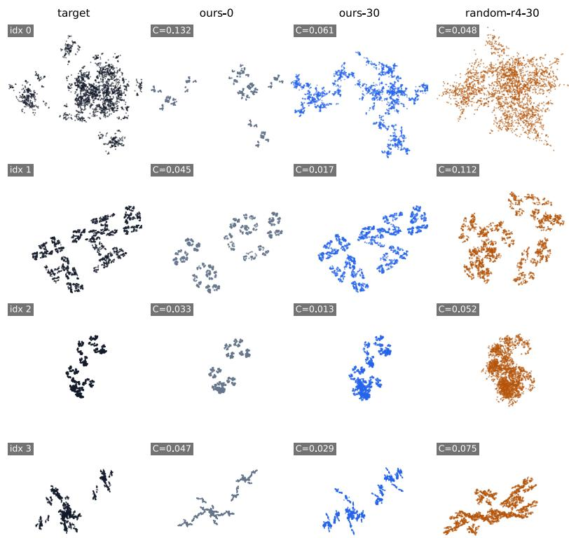  
Figure A.1: Additional examples of the main result (4 examples of test256, point-cloud view). Columns: target (black), ours-0 (gray), ours-30 (blue), and random-r4-30 (orange); C in each cell is the Chamfer distance. These correspond to the same 4 examples as Figure 3.

target

ours-0

ours-30

ours-100

occ-GD-100

Tu(N=10)

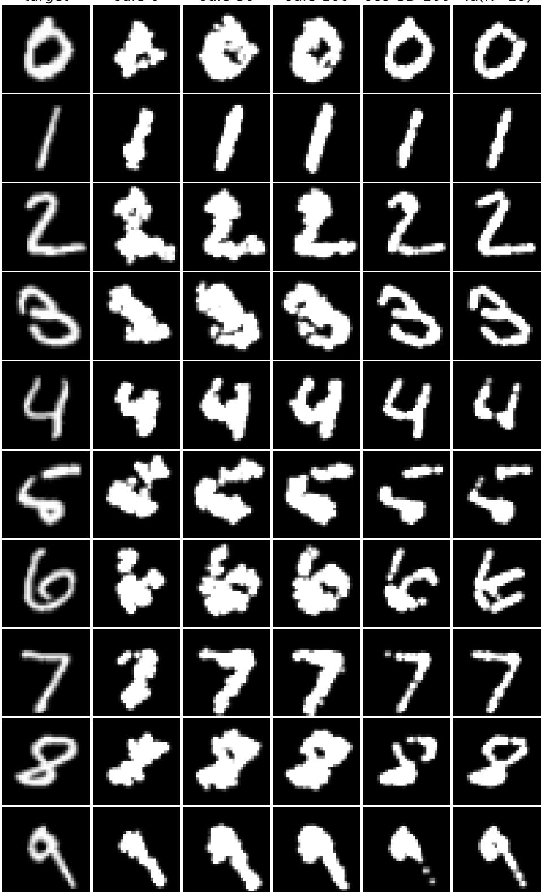  
Figure B.1: MNIST, rendered with Tu’s renderer (32×32 saturated occupancy) (10 examples). Columns are the same as Figure 6 (target / ours-0 / ours-30 / ours-100 / occupancy-GD-100 / Tu (n=10)).

target  
ours-0  
ours-30  
ours-100  
occ-GD-100  
Tu(N=10)  
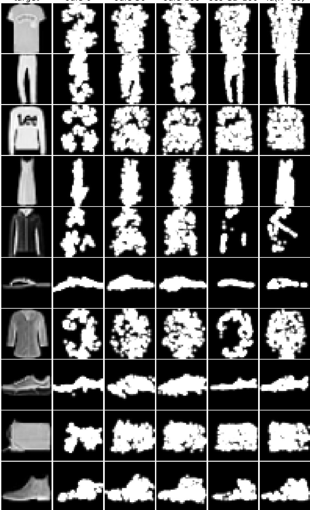  
Figure B.2: Fashion-MNIST, rendered with Tu’s renderer (32 × 32 saturated occupancy) (10 examples). Columns are the same as Figure 7.

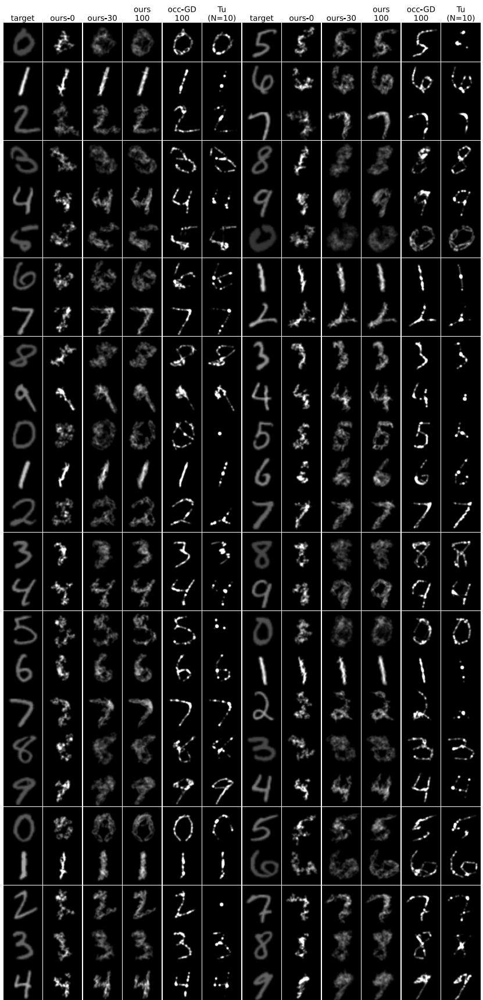  
Figure B.3: MNIST, density maps (common grayscale), all balanced 50 examples. Columns are the same as Figure 6.

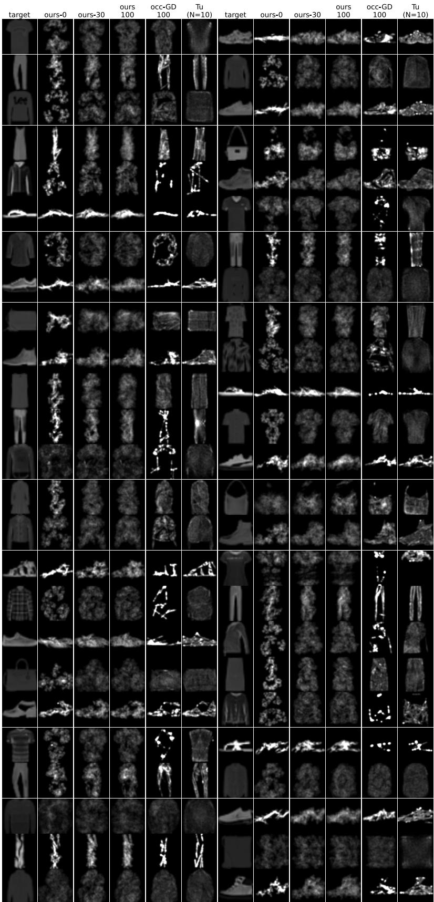  
Figure B.4: Fashion-MNIST, density maps (common grayscale), all balanced 50 examples. Columns are the same as Figure 7.