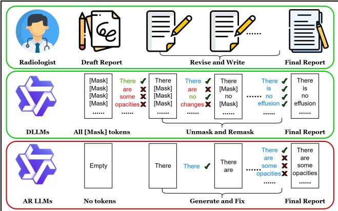
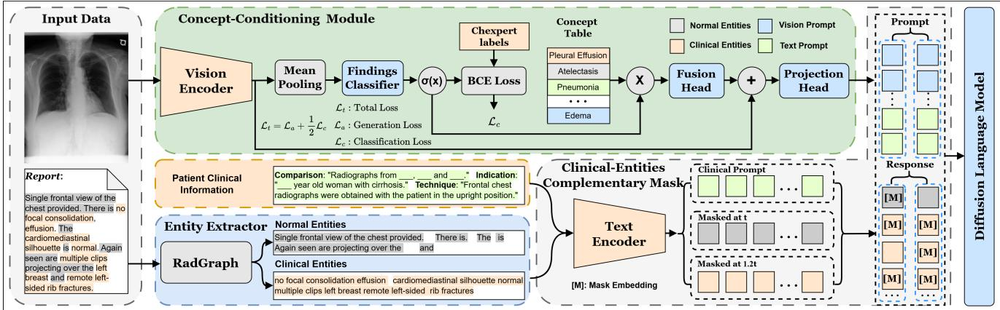
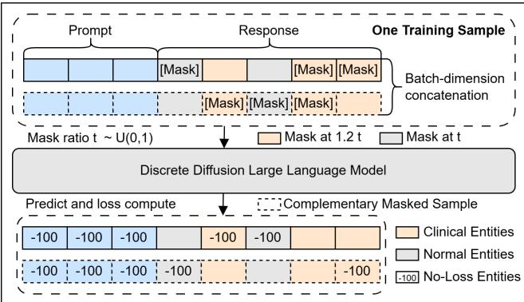
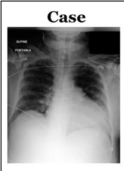
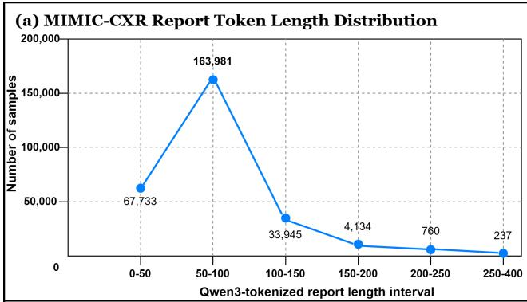
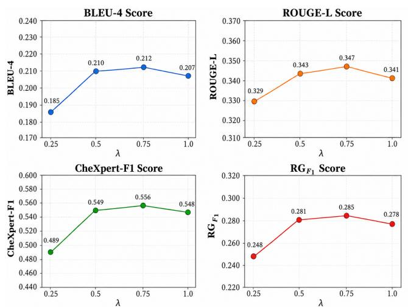
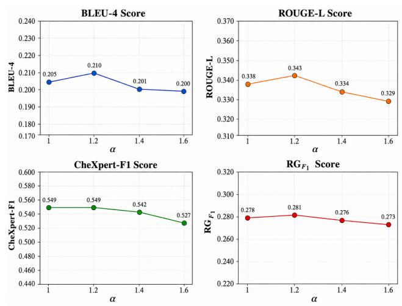
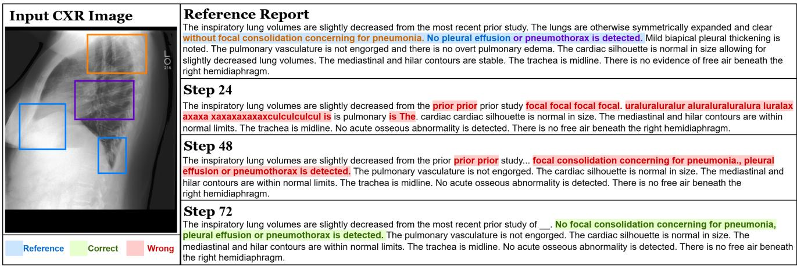
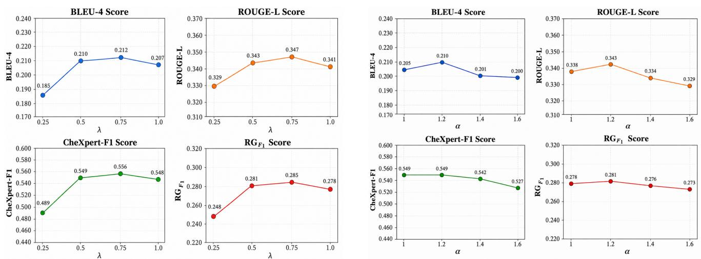
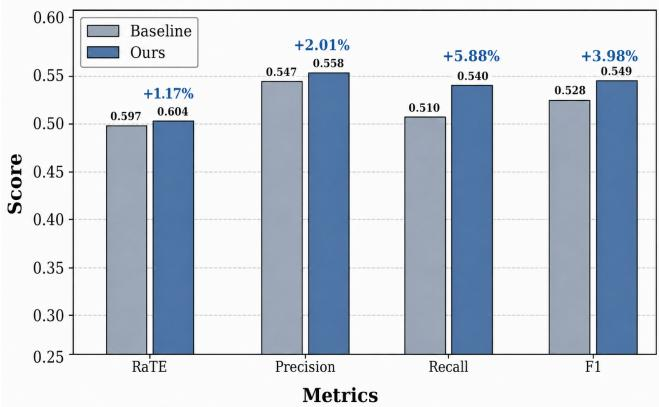

# DRRG: A Discrete Difusion Framework for Radiology Report Generation

Shaoyang Zhoua,1, Yingshu Lia,1, Yunyi Liua,1, Lijun Pub, Lingqiao Liuc, Lei Wangd and Luping Zhoua,∗

aSchool of Electrical and Computer Engineering, The University of Sydney, Sydney, NSW, 2006, Australia

bDepartment of Radiology, The First Afiliated Hospital of Soochow University, Suzhou, Jiangsu, 215006, China

cSchool of Computer Science, The University of Adelaide, Adelaide, SA, 5005, Australia

dSchool of Computing and Information Technology, University of Wollongong, Wollongong, NSW, 2522, Australia

## A R T I C L E I N F O

Keywords:   
Radiology report generation   
Discrete difusion large language model   
Chest X-ray

## A BS T RA C T

Purpose: Automatic radiology report generation (RRG) has been widely explored to improve reporting accuracy and reduce radiologists’ workload. Most existing methods rely on autoregressive (AR) frameworks that generate reports token by token and cannot revise earlier content, making them prone to error propagation and inconsistent with the iterative refinement process of radiological reporting. In contrast, discrete difusion large language models (DLLMs) generate text through iterative denoising, naturally enabling report refinement. However, DLLMs have not been extensively investigated for RRG. In this study, we developed and evaluated a discrete difusion framework for RRG that enables iterative refinement rather than conventional left-to-right autoregressive decoding.

Materials and methods: We developed DRRG, a DLLM-based framework that formulates RRG as iterative masked-token denoising. DRRG incorporates a clinical-entities-aware complementary mask to improve token supervision coverage and emphasize clinically important entities, together with a concept-conditioning module that injects image-derived clinical concepts into visual representations. DRRG was trained and evaluated on MIMIC-CXR and CheXpert Plus.

Results: On MIMIC-CXR, DRRG achieved BLEU-4 of 0.210, CheXpert-F1 of 0.549, RadGraph-F1 of 0.281, GREEN of 0.360, and RaTEScore of 0.604, outperforming the compared methods on most reported metrics, despite employing a substantially smaller LLM decoder. On CheXpert Plus, DRRG achieved the highest BLEU-4 (0.119) and CheXpert-F1 (0.347) among the compared methods.

Conclusion: Discrete difusion provides an efective alternative to autoregressive radiology report generation by enabling iterative, bidirectional report refinement. Incorporating clinically focused masking and image-derived concept conditioning improves report quality and clinical consistency.

## 1. Introduction

## 1.1. Background

Radiology reports summarize imaging findings and provide critical evidence for clinical diagnosis and treatment planning. Unlike general descriptive text, radiology reporting is safety-critical: incorrect negation or contradictory findings may lead to misinterpretation and inappropriate patient management. Therefore, semantic consistency and logical correctness are essential not only for fluency, but also for clinical reliability. Nevertheless, producing such highquality reports is time-consuming and places a substantial burden on radiologists 1,3, especially with the rapid growth of imaging volume. Consequently, automatic radiology report generation (RRG) has received increasing attention as a means to reduce radiologists’ workload28.

Existing RRG methods are predominantly built upon autoregressive (AR) decoding for its strong language modeling capability and have achieved remarkable progress 23,45.

However, this paradigm introduces potential risks for safetycritical clinical reporting, because reports are generated and fixed sequentially from left to right, with each token conditioned only on previously generated tokens. As a result, once an erroneous token is produced, it becomes part of the context for subsequent predictions, which may amplify early mistakes9. This mechanism is also misaligned with real-world radiology workflow, where reports are typically drafted, reviewed, and iteratively revised to ensure coherence and correctness35.

These observations raise a fundamental question: Is strictly left-to-right generation suitable for clinical reporting? We hypothesize that radiology report generation is not merely sequential language modeling, but a global consistency optimization problem requiring report-level coordination of clinical findings. Since left-to-right decoding fixes early predictions without later revision, iterative refinement with full bidirectional context provides a more suitable paradigm for satisfying clinical constraints. Discrete difusion large language models (DLLMs) naturally align with this process, as illustrated in Figure 1. Through iterative masked-token denoising, DLLMs30 enable non-causal, bidirectional refinement conditioned on global context. Recent studies show that DLLMs can match strong AR baselines on general-domain language tasks 51,54. However, difusionbased generation for RRG remains relatively underexplored, particularly regarding its ability to preserve report-level semantic consistency and accurately model specialized radiological terminology.

To investigate the applicability of discrete difusion models to radiology report generation, we introduce DRRG, a task-specific discrete difusion large language model. DRRG formulates report generation as iterative maskedtoken denoising, enabling non-causal refinement over the full report context and better aligning with the revisable nature of radiology reporting. To improve clinical reliability, we introduce a clinical-entities-aware complementary mask that enhances training efectiveness and emphasizes fine-grained clinical findings. We further propose a concept-conditioning module that injects clinically meaningful signals into denoising, promoting clinical grounding and observation-level consistency.

The key contributions of our work are summarized in the following points:

• We develop DRRG, a discrete difusion framework for radiology report generation that generates reports through iterative masked-token denoising, enabling predictions to be progressively refined using bidirectional report context.

• We introduce a clinical-entities-aware complementary mask and a concept-conditioning module. The former improves training efectiveness by increasing supervision coverage and placing greater emphasis on clinically important entities, while the latter incorporates image-derived clinical information to strengthen guidance during denoising.

• Extensive experiments on diferent datasets show that DLLM-based RRG achieves performance comparable to strong AR baselines, while ablation studies and case analyses validate the proposed components and the feasibility of DLLM-based RRG.

## 1.2. Related Work

## 1.2.1. Automated Radiology Report Generation

Automated radiology report generation (RRG) aims to translate medical images into diagnostically meaningful reports and is commonly formulated as a clinically grounded extension of image captioning39,53. Most existing methods adopt an encoder–decoder framework, where visual representations are extracted by an image encoder and then decoded into reports. Early CNN–RNN models 16,17,55 were limited in modeling global context and longrange dependencies, while transformer-based methods 7,52 improved both visual and textual representation learning through attention mechanisms38. More recently, LLM-based decoders26,45 have been introduced to transfer linguistic knowledge and domain priors to RRG, improving report fluency and factual consistency. However, despite these advances, most methods22 still rely on autoregressive decoding, which may sufer from error accumulation and limited revisability. Alternative generation paradigms that more closely reflect the iterative nature of radiology reporting have received relatively limited attention.

  
Figure 1: Comparison of radiologists’ report writing and the generation patterns of DLLMs and AR LLMs. Green, blue, and red tokens denote high-confidence, fixed, and lowconfidence predictions, while ✓ and × indicate correct and incorrect predictions.

## 1.2.2. Discrete Difusion Language Model

Recent DLLMs 30,51 have shown competitive performance against AR models. Beyond unimodal settings, subsequent eforts have extended DLLMs to multimodal architectures 21,54, where visual inputs are incorporated as additional conditioning signals to guide denoising and generation. Recently, LLaDA-MedV8 further adapts this paradigm to biomedical imagery, indicating that DLLMs can be efectively generalized to medically grounded vision–language scenarios. Despite these developments, DLLM frameworks remain relatively underexplored in the context of RRG, where generation requires clinically faithful long-form narratives and fine-grained alignment with subtle evidence.

## 2. Materials and methods

We introduce DRRG, a multimodal discrete difusion framework for CXR report generation, as illustrated in Figure 2. This section describes the data collection and methodology of DRRG.

## 2.1. Data collection

We evaluate our model with two datasets: MIMIC-CXR18 and CheXpert Plus4 for radiology report generation.

## 2.1.1. MIMIC-CXR

MIMIC-CXR18 is a public chest radiography dataset comprising 377,110 CXR images and 227,835 free-text reports from 64,588 patients. Following the split of7, we use 270,790 training samples, 2,130 validation samples, and 3,858 test samples.

## 2.1.2. CheXpert Plus

CheXpert Plus 4 is a radiology benchmark comprising 223,228 CXR images and 187,711 reports from 64,725

  
Figure 2: Overview of DRRG. Given a CXR image–report pair, DRRG extracts concept-conditioned visual features and applies clinical-entities-aware complementary masking to emphasize clinical entities. The discrete difusion language model reconstructs masked report tokens from prompt and noise-injected response tokens, while prompt and unmasked response tokens are excluded from the loss.

patients. Following the CXPMRG-Bench $\mathrm { s p l i t } ^ { 4 3 }$ , we use 40,463 training samples, 5,780 validation samples, and 11,562 test samples.

## 2.2. Methodology

## 2.2.1. Model Architecture and Loss Function

DRRG extracts visual features, derives clinical concept representations, and generates reports through a discrete difusion language model trained with a clinical-entitiesaware complementary mask. We first describe the model architecture and training objective, followed by the training strategy and inference procedure.

Vision Encoder: We adopt SigLIP237 as the vision encoder � for its strong visual representation capacity and large-scale image–text pretraining. Given a CXR image �, the encoder extracts a sequence of visual tokens:

$$
V = E ( I ; \theta _ { v } ) , \quad V \in \mathbb { R } ^ { B \times y \times D } ,\tag{1}
$$

where � denotes the batch size, � the number of visual tokens, � the hidden dimension of the vision encoder, and $\theta _ { v }$ the parameters of �. The visual tokens � are then passed to the concept-conditioning module.

Concept-Conditioning Module: Accurate noise prediction requires informative conditioning. However, visual features alone may not provide suficiently precise guidance for the denoising process. We therefore introduce a conceptconditioning module that augments visual representations with clinical priors.

Given visual features $V \in \mathbb { R } ^ { B \times y \times D }$ , we first apply mean pooling over the token dimension to obtain a global image representation $V _ { \mathrm { m e a n } } \in \mathbb { R } ^ { B \times D }$ . A linear classifier $W _ { c }$ then predicts $C \ = \ 1 4$ clinical observations13, followed by a sigmoid activation to produce multi-label concept scores:

$$
p _ { 0 } = \sigma ( W _ { c } ( V _ { \mathrm { m e a n } } ) ) , \quad p _ { 0 } \in \mathbb { R } ^ { B \times C } .\tag{2}
$$

To transform the predicted distribution into a concept representation, we introduce a learnable concept embedding

table $\boldsymbol { T } \in \mathbb { R } ^ { C \times D }$ , where each row corresponds to a clinical concept. The predicted scores are used to aggregate concept embeddings through a probability-weighted combination:

$$
e _ { c o n } = \sum _ { c = 1 } ^ { C } p _ { 0 , c } T _ { c } , \quad e _ { c o n } \in \mathbb { R } ^ { B \times D } .\tag{3}
$$

The concept feature $e _ { c o n }$ is further transformed by a fusion head $W _ { f }$ , broadcast along the visual-token dimension, and added to the original visual features:

$$
\tilde { H } = V + \mathrm { B r o a d c a s t } ( W _ { f } ( e _ { c o n } ) ) , \quad \tilde { H } \in \mathbb { R } ^ { B \times y \times D } .\tag{4}
$$

Finally, a MLP mapper projects $\tilde { H }$ into the text hiddenstate space of dimension $d ,$ yielding the final conditioning representations $H \in \mathbb { R } ^ { B \times y \times d }$ . By injecting structured clinical priors into visual tokens, this module provides clinically grounded conditioning for the denoising process.

Discrete Difusion Language Model: We adopt Qwen3- 0.6B-difusion-mdlm-v0.158 as the backbone of our language model. It is initialized from the pretrained Qwen3- 0.6B foundation model47 and further adapted with a discrete difusion modeling objective. Its 0.6B parameter scale ofers a practical balance between modeling capacity and computational eficiency.

The input sequence is constructed by concatenating the concept-conditioned visual features �, clinical context �, including Indication, Comparison, Technique, and History, and the ground-truth report $G _ { 0 }$

Following the LLaDA training paradigm30, we sample a mask ratio $t \sim \mathcal { V } ( 0 , 1 )$ for each training instance. Tokens in the target report region $G _ { 0 }$ are independently replaced with a special [MASK] token with probability � and kept unchanged with probability 1−�, producing a masked sequence $G _ { t }$ . This defines the forward noising process.

Loss Function: Given the masked report $G _ { t }$ , the model is trained to recover the clean report $G _ { 0 }$ given the conceptconditioned features � and clinical context �. Following discrete difusion modeling objectives30, we optimize:

  
Figure 3: Illustration of the clinical-entities-aware complementary mask. Clinical entities are assigned higher masking probabilities than normal entities in both the original and complementary masked samples. The loss is computed only on masked response tokens.

$$
\mathcal { L } _ { a } = - \mathbb { E } _ { t , H , Y , G _ { 0 } , G _ { t } } \left[ \frac { 1 } { t } \sum _ { j \in \mathcal { M } _ { t } } \log p _ { \theta } \left( G _ { 0 } [ j ] \mid H , Y , G _ { t } \right) \right] ,\tag{5}
$$

where $\mathcal { M } _ { t } = \{ j \vert G _ { t } [ j ] = [ \mathsf { M A S K } ] \}$ denotes the set of masked positions within the response token sequence.

We further supervise the concept-conditioning module with clinical labels $y _ { c }$ extracted by CheXbert36. The predicted observation probabilities $p _ { 0 }$ are optimized with a binary cross-entropy loss:

$$
\mathcal { L } _ { c } = - \frac { 1 } { C } \sum _ { c = 1 } ^ { C } \left[ y _ { c } \log p _ { 0 , c } + ( 1 - y _ { c } ) \log ( 1 - p _ { 0 , c } ) \right] .\tag{6}
$$

The overall training objective is defined as:

$$
\begin{array} { r } { \mathscr { L } _ { t } = \mathscr { L } _ { a } + \lambda \mathscr { L } _ { c } , } \end{array}\tag{7}
$$

where � controls the contribution of concept supervision and is set to 0.5 in all experiments.

## 2.2.2. Training Strategies and Algorithms

Two-stage Training: We apply two-stage training for cross-modal alignment. In the first stage, we freeze the visual encoder and language model, and optimize only the mapper to align visual representations with the text embedding space, thereby stabilizing cross-modal alignment. In the second stage, all modules are unfrozen and jointly fine-tuned end-to-end, allowing the entire model to adapt to the target generation task.

Clinical-Entities-Aware Complementary Mask: Uniform random masking in discrete difusion modeling is ineficient, as each forward pass supervises only a subset of tokens 21 and treats clinically important and auxiliary tokens equally. This is particularly limiting for radiology reports, where clinical entities carry dense diagnostic information and determine report correctness.

We therefore extend complementary masking21 with clinical-entity awareness, as illustrated in Figure 3. For each report $G _ { 0 }$ , we construct two complementary masked views, such that tokens preserved in one view are preferentially masked in the other to increase token-level supervision coverage, while assigning higher masking probabilities to clinical entity tokens to emphasize clinically important content. For normal entity tokens, the two views are masked with probabilities � and $1 - t ,$ respectively. For clinical entity tokens, we use RadGraph14 to identify entity spans in the report and assign them higher masking probabilities, i.e., �� and $\alpha ( 1 - t )$ for the two views, where � is set to 1.2. The entity-level mask probabilities are clipped to the range [0, 1] when they exceed 1. This design encourages the model to focus denoising supervision on core clinical findings while preserving complete report-level coverage.

## 2.2.3. Inference Process

At inference time, we follow the iterative denoising procedure of LLaDA30. Given a target length �, we initialize the report as a fully masked sequence $G _ { 1 }$ and iteratively denoise and refine it over � discrete timesteps until obtaining the clean output prediction $\hat { G } _ { 0 }$

At each timestep, the mask ratio is $t _ { i } ;$ the denoising model simultaneously predicts token distributions for all masked positions, conditioned on the concept-conditioned features �, clinical context �, and current sequence $G _ { t _ { i } }$ . For each masked position �, we select the most likely token

$$
\hat { g } [ j ] = \underset { v \in \mathcal { V } } { \arg \operatorname* { m a x } } p _ { \theta } ( v \mid H , Y , G _ { t _ { i } } ) ,\tag{8}
$$

and compute the confidence score.  denotes the vocabulary. Following the low-confidence re-masking strategy, we rank all masked positions by confidence and commit only the top $m _ { i }$ newly committed tokens specified by the �-step schedule. The remaining low-confidence positions are remasked and refined in the next timestep. Let $\Omega _ { i }$ denote the selected high-confidence positions. The update is:

$$
G _ { t _ { i + 1 } } [ j ] = \left\{ \begin{array} { l l } { \hat { g } [ j ] , } & { j \in \Omega _ { i } , } \\ { \lbrack { \mathsf { M A S K } } \rbrack , } & { j \in \mathcal { M } _ { t _ { i } } \setminus \Omega _ { i } , } \end{array} \right. \qquad | \Omega _ { i } | = m _ { i } .\tag{9}
$$

## 3. Results

Our model adopts a vision–language architecture with a SigLIP2 vision encoder37 and a Qwen3-0.6B-difusionmdlm-v0.1 text decoder58. We fully fine-tune the model on two NVIDIA RTX 5090 GPUs using a per-device batch size of 2, gradient accumulation over 4 steps, and an initial learning rate of $1 \times 1 0 ^ { - 4 }$ . AdamW is used with a cosine learning rate schedule and a warmup ratio of 0.03. During evaluation, we set the sequence length to $L = 1 0 0$ and set the number of denoising steps to $K = 7 2$

To comprehensively evaluate our model, we adopt three categories of metrics: lexical, clinical, and LLM-based metrics. For lexical evaluation, we employ widely used natural language generation (NLG) metrics, including $\mathtt { B L E U } ^ { 3 2 }$ and ROUGE-L24, to measure surface-level similarity between generated and reference reports. For clinical evaluation, we report CheXpert precision, recall, and F1 scores36, which assess report-level agreement across 14 CheXpert observations 13. We further use $\mathrm { R a d G r a p h { - } F 1 } ^ { 1 4 }$ to evaluate consistency at the clinical entity and relation levels. To provide an assessment more closely aligned with expert clinical judgement, we additionally adopt two LLM-based metrics. $\mathbf { \bar { G } R E E N } ^ { 3 1 }$ identifies clinically meaningful errors, whereas $\mathrm { R a T E S c o r e } ^ { 5 6 }$ measures clinical entity correspondence between generated and reference reports while accounting for synonyms and negation.

Table 1  
NLG performance of DRRG and existing RRG methods on the MIMIC-CXR dataset. For each metric, the best-performing result is shown in bold, and the second-best result is underlined. Model names marked with \* indicate results reported in their original papers. For models using LLM-based text decoders, the corresponding parameter sizes are reported.
<table><tr><td>Dataset</td><td>Model</td><td>Publication</td><td>BLEU-1</td><td>BLEU-2</td><td>BLEU-3</td><td>BLEU-4</td><td>ROUGE-L</td></tr><tr><td rowspan="14"></td><td> ${ \mathsf { R 2 G e n } } ^ { * } \ { \mathsf { 7 } }$ </td><td>EMNLP&#x27;20</td><td>0.353</td><td>0.218</td><td>0.145</td><td>0.103</td><td></td></tr><tr><td> ${ \mathsf { R 2 G e n C M N } } ^ { * } \theta$ </td><td>ACL-IJCNLP&#x27;21</td><td>0.353</td><td>0.218</td><td>0.148</td><td>0.106</td><td></td></tr><tr><td> $\mathsf { M E T r a n s f o r m e r } ^ { * } 4 4$ </td><td>CVPR&#x27;23</td><td>0.386</td><td>0.250</td><td>0.169</td><td>0.124</td><td>0.291</td></tr><tr><td> ${ \sf D C L } ^ { * } \ 2 0$ </td><td>CVPR&#x27;23</td><td></td><td></td><td></td><td>0.109</td><td>0.284</td></tr><tr><td> ${ \mathsf { K i U T } } ^ { * _ { 1 2 } }$ </td><td>CVPR&#x27;23</td><td>0.393</td><td>0.243</td><td>0.159</td><td>0.113</td><td>0.285</td></tr><tr><td> $\mathsf { C v T 2 D i s t i l G P T 2 ^ { \ast } } 2 9$ </td><td>AIM&#x27;23</td><td>0.393</td><td>0.248</td><td>0.171</td><td>0.127</td><td>0.155</td></tr><tr><td> ${ \mathsf { R } } 2 { \mathsf { G e n G P T } } ^ { * } { \mathsf { \Gamma } } ( 7 { \mathsf { B } } ) { \mathsf { \Omega } } ^ { 4 5 }$ </td><td>Meta-Rad&#x27;23</td><td>0.411</td><td>0.267</td><td>0.186</td><td>0.134</td><td>0.297</td></tr><tr><td> $\mathsf { B o o t s t r a p p i n g } ^ { * } ( \mathsf { \bar { 1 } } 4 . 2 \mathsf { B } ) ^ { 2 6 }$ </td><td>AAAI&#x27;24</td><td>0.402</td><td>0.262</td><td>0.180</td><td>0.128</td><td>0.291</td></tr><tr><td>MIMIC-CXR  $\mathsf { E K A G e n } ^ { \ast \mathrm { ~ i ~ } }$ </td><td>CVPR&#x27;24</td><td>0.419</td><td>0.258</td><td>0.170</td><td>0.119</td><td>0.287</td></tr><tr><td> $\mathsf { M u l t i - G r a i n e d } ^ { \ast 2 5 }$ </td><td>TMI&#x27;24</td><td>0.406</td><td>0.267</td><td>0.190</td><td>0.141</td><td>0.309</td></tr><tr><td> ${ \mathsf { D A M P E R } } ^ { * _ { 1 1 } }$ </td><td>AAAI&#x27;25</td><td>0.402</td><td>0.284</td><td>0.227</td><td>0.193</td><td>0.301</td></tr><tr><td> ${ \mathsf { D A R T } } ^ { * } { \mathsf { 3 3 } }$ </td><td>CVPR&#x27;25</td><td>0.437</td><td>0.279</td><td>0.191</td><td>0.137</td><td>0.310</td></tr><tr><td> $\mathsf { M u l t i P - R 2 G e n } ^ { * } \ ( 7 \mathsf { B } ) ^ { 5 }$ </td><td>TMI&#x27;25</td><td>0.425</td><td>0.279</td><td>0.194</td><td>0.140</td><td>0.307</td></tr><tr><td> ${ \mathsf { K A C L } } ^ { * } \ ( { \mathsf { 8 B } } ) ^ { 3 4 }$ </td><td>MICCAI&#x27;25</td><td>0.414</td><td>0.270</td><td>0.184</td><td>0.136</td><td>0.303</td></tr><tr><td> $\mathsf { M a m b a } \dot { \mathsf { X } } \mathsf { r a y } \dot { \mathsf { - V L } } \mathsf { - L a r g e } ^ { \ast } ( 7 \mathsf { B } ) ^ { 4 3 }$ </td><td>CVPR&#x27;25</td><td>0.422</td><td>0.268</td><td>0.184</td><td>0.133</td><td>0.289</td></tr><tr><td> ${ \mathsf { R E V T A F - R R G } } ^ { * } { \mathsf { S 7 } }$ </td><td>ICCV&#x27;25</td><td>0.465</td><td>0.318</td><td>0.235</td><td>0.182</td><td>0.336</td></tr><tr><td>DRRG (0.6B)</td><td></td><td>0.452</td><td>0.332</td><td>0.259</td><td>0.210</td><td>0.343</td></tr></table>

Table 2  
Performance comparison of DRRG and existing RRG methods on CXPMRG-Bench for NLG and clinical metrics.
<table><tr><td>Model</td><td>BLEU-4</td><td>ROUGE-L</td><td>Precision</td><td>Recall</td><td>F1</td></tr><tr><td> ${ \tt X P r o N e t } ^ { 4 0 }$ </td><td>0.100</td><td>0.265</td><td>0.314</td><td>0.247</td><td>0.259</td></tr><tr><td> ${ \mathsf { O R G a n } } ^ { 1 0 }$ </td><td>0.086</td><td>0.261</td><td>0.288</td><td>0.287</td><td>0.277</td></tr><tr><td> ${ \mathsf { M } } 2 { \mathsf { K } } { \mathsf { T } } ^ { 4 8 }$ </td><td>0.078</td><td>0.247</td><td>0.044</td><td>0.142</td><td>0.058</td></tr><tr><td> ${ \mathsf { T I M E R } } ^ { 4 6 }$ </td><td>0.083</td><td>0.254</td><td>0.345</td><td>0.238</td><td>0.234</td></tr><tr><td> $\mathsf { C v T 2 D i s t i l G P T 2 ^ { 2 9 } }$ </td><td>0.067</td><td>0.238</td><td>0.285</td><td>0.252</td><td>0.246</td></tr><tr><td>R2Gen7</td><td>0.081</td><td>0.246</td><td>0.318</td><td>0.200</td><td>0.181</td></tr><tr><td> ${ \mathsf { R 2 G e n C M N } } ^ { 6 }$ </td><td>0.087</td><td>0.256</td><td>0.329</td><td>0.241</td><td>0.231</td></tr><tr><td> $Z \mathsf { h u \ e t \ a l . } ^ { 5 9 }$ </td><td>0.074</td><td>0.235</td><td>0.217</td><td>0.308</td><td>0.205</td></tr><tr><td> $\mathsf { C A M A N e t } ^ { 4 1 }$ </td><td>0.083</td><td>0.249</td><td>0.328</td><td>0.224</td><td>0.216</td></tr><tr><td> $\mathsf { T o k e n – M i x e r } ^ { 5 0 }$ </td><td>0.091</td><td>0.261</td><td>0.309</td><td>0.270</td><td>0.288</td></tr><tr><td> $\mathsf { P r o m p t M R G } ^ { 1 5 }$ </td><td>0.095</td><td>0.222</td><td>0.258</td><td>0.265</td><td>0.281</td></tr><tr><td> ${ \mathsf { R } } 2 { \mathsf { G e n G P T } } ^ { 4 5 }$ </td><td>0.101</td><td>0.266</td><td>0.315</td><td>0.244</td><td>0.260</td></tr><tr><td> ${ \mathsf { R 2 G e n C S R } } ^ { 4 2 }$ </td><td>0.100</td><td>0.265</td><td>0.315</td><td>0.247</td><td>0.259</td></tr><tr><td> $\mathsf { M a m b a X r a y – V L – B ^ { 4 3 } }$ </td><td>0.105</td><td>0.267</td><td>0.333</td><td>0.264</td><td>0.273</td></tr><tr><td> $\mathsf { M a m b a } \mathsf { X r a y } \mathsf { - V L } \mathsf { - L } ^ { 4 3 }$ </td><td>0.112</td><td>0.276</td><td>0.377</td><td>0.319</td><td>0.335</td></tr><tr><td>DRRG</td><td>0.119</td><td>0.265</td><td>0.374</td><td>0.342</td><td>0.347</td></tr></table>

Tables 1, 2, 3, and 4 compare DRRG with existing RRG methods. Specifically, Table 1 reports NLG performance on MIMIC-CXR, while Table 2 presents both NLG and

Table 3  
Results for CheXpert Precision, Recall, and F1 scores on the MIMIC-CXR dataset.
<table><tr><td>Model</td><td>Publication</td><td>Precision</td><td>Recall</td><td>F1</td></tr><tr><td> $\mathsf { R 2 G e n 7 }$ </td><td>EMNLP&#x27;20</td><td>0.333</td><td>0.273</td><td>0.276</td></tr><tr><td> ${ \mathsf { R } } 2 { \mathsf { G e n C M N } } ^ { 6 }$ </td><td>ACL-IJCNLP&#x27;21</td><td>0.334</td><td>0.275</td><td>0.278</td></tr><tr><td> ${ \mathsf { R } } 2 { \mathsf { G e n G P T } } ^ { 4 5 }$ </td><td>Meta-Rad&#x27;23</td><td>0.392</td><td>0.387</td><td>0.389</td></tr><tr><td> $\mathsf { M E T r a n s f o r m e r } ^ { 4 4 }$ </td><td>CVPR&#x27;23</td><td>0.364</td><td>0.309</td><td>0.311</td></tr><tr><td> $\mathsf { M u l t i - G r a i n e d } ^ { 2 5 }$ </td><td>TMI&#x27;24</td><td>0.457</td><td>0.337</td><td>0.330</td></tr><tr><td> $\mathsf { M a m b a X r a y - V L - L a r g e } ^ { 4 3 }$ </td><td>CVPR&#x27;25</td><td>0.411</td><td>0.373</td><td>0.395</td></tr><tr><td> ${ \mathsf { K A C L } } ^ { 3 4 }$ </td><td>MICCAI&#x27;25</td><td>0.503</td><td>0.442</td><td>0.469</td></tr><tr><td> ${ \mathsf { D A M P E R } } ^ { 1 1 }$ </td><td>AAAI&#x27;25</td><td>0.512</td><td>0.473</td><td>0.507</td></tr><tr><td> ${ \mathsf { D A R T } } ^ { 3 3 }$ </td><td>CVPR&#x27;25</td><td>0.533</td><td>0.546</td><td>0.520</td></tr><tr><td>DRRG</td><td>1</td><td>0.558</td><td>0.540</td><td>0.549</td></tr></table>

CheXpert-based clinical results on CXPMRG-Bench. Tables 3 and 4 further evaluate clinical reliability on MIMIC-CXR using CheXpert precision, recall, and F1, as well as RadGraph-F1, GREEN, and RaTEScore.

Tables 5 and 6 and Figures 5, 7, 8, and 9 present the ablation and hyperparameter analyses. Table 5 evaluates the contributions of the difusion framework, clinical-entities-aware complementary mask, and concept-conditioning module, while Figure 9 reports their efects on clinical and LLMbased metrics. Figures 8, 7, and 5 examine the efects of the clinical-entity masking factor, concept-loss weight, and initial generation length, respectively. Table 6 further compares the performance and inference eficiency of autoregressive and difusion decoding under diferent denoising steps.

Figures 4 and 6 provide qualitative case studies. Figure 4 compares reports generated by the AR and DLLM models to illustrate their diferent error patterns, whereas Figure 6 visualizes the iterative refinement process and shows how additional denoising steps correct incorrect descriptions.

  
Reference Report There are no old films available for comparison. The heart is moderately enlarged. There is a right IJ Cordis with tip in the upper SVC. There is mild pulmonary vascular redistribution, butno definite infiltrates or effusion.

## AR Generated Report

There is a new right IJ Cordis with tip in the distal SVC. There is no pneumothorax. The heart is mildly enlarged and there is pulmonary vascular redistribution andsome patchy areas of alveolar infiltrate. Compared to the study from the prior day, the appearance of the lungs is slightly worse. An underlying infectious infiltrate cannot be excluded. A small left effusion would be difficult to exclude.

Diff. Generated Report The right IJ Cordis is in the proximal SVC. The NG tube tip is in the stomach. The heart is moderately enlarged. There is mild pulmonary vascular redistribution,but no focal infiltrate or effusion.There is no pneumothorax. The aorta is calcified and tortuous. The bony thorax is normal.

Figure 4: Case study comparing reports generated by AR and DLLM models. Words highlighted in red indicate incorrect descriptions, words highlighted in blue denote reference content, and words highlighted in green indicate correct descriptions.  
Table 4  
Results on the LLM-based metrics GREEN and RaTEScore, as well as the clinical metric RadGraph-F1 $( \mathsf { R G } _ { F 1 } )$
<table><tr><td>Model</td><td>Publication</td><td> ${ \mathsf { R G } } _ { F 1 }$ </td><td>GREEN</td><td>RaTE</td></tr><tr><td>R2Gen7</td><td>EMNLP&#x27;20</td><td>0.172</td><td>0.276</td><td>0.526</td></tr><tr><td>R2GenCMN⁶</td><td>ACL-IJCNLP&#x27;21</td><td>0.182</td><td>0.297</td><td>0.538</td></tr><tr><td>CvT2DistilGPT229</td><td>AIM&#x27;23</td><td>0.196</td><td>0.320</td><td>0.527</td></tr><tr><td>R2GenGPT 45</td><td>Meta-Rad&#x27;23</td><td>0.187</td><td>0.300</td><td>0.528</td></tr><tr><td>PromptMRG15</td><td>AAAI&#x27;24</td><td>0.190</td><td>0.287</td><td>0.528</td></tr><tr><td>KARGEN²3</td><td>ICMCC&#x27;24</td><td>0.203</td><td>0.308</td><td>0.533</td></tr><tr><td>EKAGen²</td><td>CVPR&#x27;24</td><td>0.199</td><td>0.256</td><td>0.512</td></tr><tr><td>MultiP-R2Gen 5</td><td>TMI&#x27;25</td><td>0.208</td><td></td><td></td></tr><tr><td>DRRG</td><td></td><td>0.281</td><td>0.360</td><td>0.604</td></tr></table>

  
Table 5

(b) Performance Across Generation Lengths
<table><tr><td>Length</td><td>Steps</td><td>BLEU-1</td><td>BLEU-2</td><td>BLEU-3</td><td>BLEU-4</td><td>ROUGE-L</td></tr><tr><td>50</td><td>50</td><td>0.271</td><td>0.205</td><td>0.164</td><td>0.136</td><td>0.357</td></tr><tr><td>100</td><td>72</td><td>0.452</td><td>0.332</td><td>0.259</td><td>0.210</td><td>0.343</td></tr><tr><td>150</td><td>72</td><td>0.355</td><td>0.252</td><td>0.190</td><td>0.150</td><td>0.292</td></tr><tr><td>200</td><td>72</td><td>0.324</td><td>0.220</td><td>0.161</td><td>0.124</td><td>0.264</td></tr></table>

Figure 5: (a) Distribution of Qwen3-tokenized report lengths in MIMIC-CXR. (b) Performance under diferent initial generation lengths.

Ablation study conducted on the MIMIC-CXR dataset. “Dif.” indicates whether a DLLM or an AR model is used. “Clinicalentities” indicates whether clinical entity tokens are assigned higher masking probabilities than other report tokens. “Concept-condition” indicates whether concept features are added to the vision features.
<table><tr><td>Diff. Clinical-entities</td><td></td><td>Concept-condition</td><td>BLEU-1</td><td>BLEU-2</td><td>BLEU-3</td><td>BLEU-4</td><td>ROUGE-L</td></tr><tr><td>×</td><td>X</td><td>X</td><td>0.430</td><td>0.306</td><td>0.236</td><td>0.192</td><td>0.300</td></tr><tr><td>√</td><td>×</td><td>×</td><td>0.449</td><td>0.328</td><td>0.254</td><td>0.204</td><td>0.335</td></tr><tr><td>√</td><td>√</td><td>×</td><td>0.450</td><td>0.330</td><td>0.256</td><td>0.206</td><td>0.340</td></tr><tr><td>√</td><td>×</td><td>√</td><td>0.445</td><td>0.326</td><td>0.254</td><td>0.205</td><td>0.338</td></tr><tr><td>√</td><td>√</td><td>√</td><td>0.452</td><td>0.332</td><td>0.259</td><td>0.210</td><td>0.343</td></tr></table>

Table 6

Performance and eficiency comparison of autoregressive de coding and difusion decoding with diferent denoising steps.
<table><tr><td>Diff.</td><td>Steps</td><td>BLEU-1</td><td>BLEU-2</td><td>BLEU-3</td><td>BLEU-4</td><td>ROUGE-L</td><td>Time (case)</td></tr><tr><td>X</td><td>一</td><td>0.430</td><td>0.306</td><td>0.236</td><td>0.192</td><td>0.300</td><td>1.80s</td></tr><tr><td>√</td><td>32</td><td>0.447</td><td>0.325</td><td>0.250</td><td>0.200</td><td>0.338</td><td>0.97s</td></tr><tr><td>√</td><td>64</td><td>0.451</td><td>0.331</td><td>0.258</td><td>0.208</td><td>0.342</td><td>1.91s</td></tr><tr><td>√</td><td>72</td><td>0.452</td><td>0.332</td><td>0.259</td><td>0.210</td><td>0.343</td><td>2.13s</td></tr></table>

NLG Metrics: The NLG results on MIMIC-CXR and CheXpert Plus are reported in Table 1 and Table 2. On MIMIC-CXR, DRRG achieves the best performance on BLEU-2, BLEU-3, BLEU-4, and ROUGE-L, with scores of 0.332, 0.259, 0.210, and 0.343, respectively. It also obtains the second-best BLEU-1 score of 0.452, slightly behind REVTAF-RRG57. Compared with recent LLM-based RRG methods, DRRG achieves stronger NLG performance with a substantially smaller 0.6B text decoder, whereas the listed LLM-based competitors use text decoders with 7B or more parameters. On CheXpert Plus, DRRG achieves the best BLEU-4 score and a competitive ROUGE-L of 0.265. These results demonstrate the efectiveness of DRRG, suggesting that DLLMs provide a strong alternative to conventional ARbased RRG models.

## 4. Discussion

## 4.1. Comparison with Existing Methods

To better assess the performance of DRRG, we compare our model with existing RRG frameworks on the MIMIC-CXR and CheXpert Plus datasets. We report the results using NLG, clinical, and LLM-based metrics to provide a comprehensive evaluation of the model.

Clinical Metrics: Table 2, Table 3, and Table 4 report the clinical performance of DRRG and competing methods on CheXpert Plus and MIMIC-CXR. On CheXpert Plus, DRRG achieves the best CheXpert recall and F1 scores, outperforming MambaXray-VL-L43 by 0.023 and 0.012, respectively, while obtaining the second-best precision score of 0.374. On MIMIC-CXR, DRRG achieves the best precision and F1 scores of 0.558 and 0.549, surpassing $\mathrm { D A R T } ^ { 3 3 }$ by 0.025 and 0.029, respectively, with only a marginally lower recall. In addition, DRRG obtains a RadGraph-F1 score of 0.281, which is 35.1% higher than the secondbest MultiP-R2Gen5. These results show that DRRG not only improves textual similarity but also better preserves clinically relevant findings, demonstrating its efectiveness for radiology report generation.

  
Figure 6: Case study of DRRG’s iterative refinement. Reference colors indicate the corresponding image regions, while blue, green, and red highlights denote reference, correct, and incorrect findings, respectively. Step 72 further refines the report by correcting false findings generated at Step 48.

  
Figure 7: Efect of the weighting factor � for the concept loss $\mathcal { L } _ { c }$ on model performance in terms of BLEU-4, ROUGE-L, CheXpert-F1, and RadGraph-F1 $( \mathrm { R G } _ { F 1 } )$  
Figure 8: Efect of the clinical-entity masking factor probability factor � in terms of BLEU-4, ROUGE-L, CheXpert-F1, and RadGraph-F1 $( \mathrm { R G } _ { F 1 } )$

LLM-based Metrics: As shown in Table 4, DRRG further achieves the best LLM-based evaluation results, with GREEN and RaTEScore values of 0.360 and 0.604, respectively. This suggests that its generated reports are more consistent with clinically grounded assessment criteria.

## 4.2. Ablation Analysis of Model Components

We ablate the key components of DRRG on MIMIC-CXR using diferent metrics. The results are reported in

Table 5 and Figure 9. We further report the performance– eficiency comparison between DRRG and the AR baseline across diferent denoising steps in Table 6.

We first compare AR- and DLLM-based generation paradigms under comparable model configurations. Specifically, the AR baseline uses the same SigLIP2 vision encoder37 and a Qwen3-0.6B text decoder47, making the training paradigm the main diference between the two models. The DLLM variant is equipped with the standard complementary mask21, enabling all tokens in each sample to contribute to training. As shown in Table 5, the DLLMbased model consistently outperforms the AR baseline across all NLG metrics, with gains of 0.019, 0.022, 0.018, 0.012, and 0.035, respectively. These results demonstrate the efectiveness of DLLM-based iterative denoising for radiology report generation under the evaluated setting.

We further analyze the contribution of each DRRG module. Introducing clinical-entities-aware probability adjustment into the standard complementary masking strategy yields an average NLG improvement of 0.0024 across the five NLG metrics, suggesting its benefit for fine-grained clinical entity modeling. When the concept-conditioning module is further incorporated, the two modules bring larger gains across both NLG and clinical metrics, improving BLEU-1, BLEU-2, BLEU-3, BLEU-4, and ROUGE-L by 0.003, 0.004, 0.005, 0.006, and 0.008, respectively. RaTEScore, CheXpert precision, recall, and F1 further increase by 1.17%, 2.01%, 5.88%, and 3.98%. These improvements indicate that both designs enhance report quality and clinical consistency.

## 4.3. Analysis of Training and Generation Settings

Beyond evaluating the contribution of individual model components, we further investigate the efects of key hyperparameters in both the training and generation stages, including the masking ratio of clinical entities, the weighting factor of the concept loss, the initial generation length, and the number of denoising steps.

To examine the efect of the clinical-entity masking factor, we vary � from 1.0 to 1.6, as reported in Figure 8. Increasing � from 1.0 to 1.2 improves BLEU-4 from 0.205 to 0.210, ROUGE-L from 0.338 to 0.343, and RadGraph F1 from 0.278 to 0.281. These results indicate that moderately increasing the masking probability of core findings encourages the model to place greater emphasis on clinical entities. However, further increasing � leads to a decline across all evaluation metrics. A larger masking factor causes more clinical entities to be removed from the corrupted reports during training, thereby reducing the number of training instances in which the model can learn to recover masked content from the remaining visible clinical entities. Consequently, during iterative inference, the model becomes less capable of using already recovered clinical entities to reconstruct the remaining masked tokens. Overall, � = 1.2 provides the most appropriate balance between enhancing the model’s attention to clinical entities and preserving sufficient entity-level information for iterative reconstruction.

Regarding the concept-loss weight, as shown in Figure 7, assigning a small weight of 0.25 results in the lowest performance across all four evaluation metrics. Increasing the weight from 0.25 to 0.5 improves BLEU-4, ROUGE-L, CheXpert-F1, and RadGraph-F1 by 0.025, 0.014, 0.060, and 0.033, respectively, demonstrating that explicit supervision of clinical observations can efectively guide the denoising process and improve both linguistic quality and clinical correctness. The performance continues to improve slightly when the weight is increased to 0.75. However, further increasing it to 1.0 leads to consistent degradation across all metrics. This suggests that an excessively large concept-loss weight may overemphasize observation classification at the expense of coherent and accurate report generation.

As shown in Figure 5, the initial generation length has a substantial impact on model performance. An overly short sequence yields relatively poor performance on most metrics, as the restricted generation capacity may force the model to omit clinically important findings. The best overall performance is achieved at an initial length of 100 tokens, which provides suficient capacity for comprehensive report generation while closely matching the empirical training distribution: 231,714 of the 270,790 training samples contain fewer than 100 tokens. In contrast, sequences of 150 and 200 tokens are sparsely represented during training, limiting the model’s ability to learn reliable denoising dynamics for such long sequences. In addition, with the number of denoising steps fixed, a longer initial sequence requires more tokens to be retained at each iteration. Consequently, some low-confidence predictions may be preserved prematurely instead of being further refined, increasing the likelihood that erroneous content remains in the final report. These two factors jointly account for the performance degradation observed at longer initial generation lengths. Nevertheless, enabling discrete difusion models to adaptively determine the appropriate generation length remains an open problem that is being actively explored in recent studies 19,27,49.

  
Figure 9: Clinical metric and LLM-based metric results of the ablation study, comparing the performance of the baseline and DRRG models.

For the denoising steps, increasing the steps from 32 to 72 consistently improves all NLG metrics, indicating that more denoising iterations enable better report refinement, but also increase inference time from 0.97s to 2.13s per case. Compared with the autoregressive baseline, DRRG achieves a better quality–eficiency trade-of: with 64 steps, it obtains higher scores at a comparable runtime, and even with only 32 steps, it still outperforms the corresponding AR baseline while using only 53.9% of its inference time. These results demonstrate the efectiveness and eficiency of DRRG.

## 4.4. Qualitative Analysis

To examine the potential of DLLMs in mitigating error propagation, we present a case study in Figure 4, which compares the reports generated by the AR-based model and the DLLM-based model with the reference report. The ARgenerated report hallucinates several findings, beginning with the early erroneous phrase “some patchy areas of alveolar infiltrate.” This illustrates a typical error-propagation issue in AR models, where an early incorrect token sequence is fixed as context and further amplifies subsequent hallucinations. In contrast, the DLLM-generated report better matches the reference report. Through iterative denoising, low-confidence tokens can be re-masked and revised, thereby reducing the impact of error propagation and improving report accuracy.

Figure 6 illustrates the progressive refinement process of DRRG. The reference report describes several key findings as absent, including focal consolidation, pleural efusion, and pneumothorax. At Step 24, the generated report remains dominated by noisy intermediate predictions, with numerous duplicated and fragmented tokens, while clinically meaningful findings have not yet been reliably recovered. By Step 48, the sentence structure has become substantially more coherent; however, the model fails to generate the appropriate negation and incorrectly converts several absent findings into positive observations, resulting in a potentially clinically consequential false-positive statement. With additional denoising steps, the report at Step 72 restores the correct negation for consolidation, pleural efusion, and pneumothorax, while further improving fluency by reducing grammatical artifacts. This example illustrates the potential of iterative denoising to correct clinically important semantic errors and progressively improve report quality.

## 5. Conclusion

We proposed DRRG, a discrete difusion framework for radiology report generation. By formulating report generation as iterative denoising rather than autoregressive decoding, DRRG enables bidirectional refinement and better aligns with the revisable nature of radiology reporting. With the clinical-entities-aware complementary mask and concept-conditioning module, DRRG improves data eficiency, enhances clinical-entity awareness, and guides the denoising process with clinical concepts. Extensive experiments on MIMIC-CXR and CheXpert Plus demonstrate its efectiveness across diferent evaluation metrics. Further ablation studies validate the contribution of the proposed modules, while the case study illustrates the potential of DRRG to mitigate error propagation in report generation.

## CRediT authorship contribution statement

Shaoyang Zhou: Conceptualization, Methodology, Software, Data curation, Formal analysis, Validation, Visualization, Writing – review & editing, Writing – original draft. Yingshu Li: Conceptualization, Methodology, Software, Data curation, Validation, Writing – review & editing. Yunyi Liu: Data curation, Validation, Investigation, Writing – review & editing. Lijun Pu: Investigation, Validation, Methodology, Writing – review & editing. Lingqiao Liu: Methodology, Investigation, Data curation, Writing – review & editing. Lei Wang: Conceptualization, Methodology,

Validation, Writing – review & editing. Luping Zhou: Conceptualization, Methodology, Investigation, Data curation, Writing – review & editing.

## Ethics statement

This study used two publicly available and de-identified chest radiography datasets, MIMIC-CXR and CheXpert Plus. No new participants were recruited, and no identifiable personal information was collected or accessed in this study. All data were used in accordance with the corresponding data-use requirements and institutional access procedures. Therefore, this study constituted a secondary analysis of existing de-identified data and did not require additional informed consent from individual patients.

## Availability of data and materials

The datasets used in this study, including MIMIC-CXR and CheXpert Plus, are publicly available from their respective oficial repositories, subject to the corresponding access requirements and data-use agreements. The source code and implementation details of DRRG will be made publicly available on GitHub upon publication.

## Declaration of generative AI and AI-assisted technologies in the writing process

During the preparation of this work, the authors used ChatGPT (OpenAI) to improve the readability and language of the manuscript. After using this tool, the authors carefully reviewed and edited the content as needed and take full responsibility for the content of the published article.

## Declaration of competing interests

Luping Zhou is a member of the Editorial Board of Meta-Radiology. She was not involved in the peer-review process. The manuscript was independently handled by another member of the Editorial Board. All authors declare that they have no competing financial interests or personal relationships that could have influenced the work reported in this paper.

## Acknowledgements

The authors have no acknowledgements to declare.

## References

[1] Bailey, C.R., Bailey, A.M., McKenney, A.S., Weiss, C.R., 2022. Understanding and appreciating burnout in radiologists.

[2] Bu, S., Li, T., Yang, Y., Dai, Z., 2024. Instance-level expert knowledge and aggregate discriminative attention for radiology report generation, in: Proceedings of the IEEE/CVF Conference on Computer Vision and Pattern Recognition, pp. 14194–14204.

[3] Cao, D.J., Hurrell, C., Patlas, M.N., 2023. Current status of burnout in canadian radiology. Canadian Association of Radiologists Journal 74, 37–43.

[4] Chambon, P., Delbrouck, J.B., Sounack, T., Huang, S.C., Chen, Z., Varma, M., Truong, S.Q., Chuong, C.T., Langlotz, C.P., 2024. Chexpert plus: Augmenting a large chest x-ray dataset with text radiology reports, patient demographics and additional image formats. arXiv preprint arXiv:2405.19538 .

[5] Chen, Z., Li, Y., Wang, Z., Gao, P., Barthelemy, J., Zhou, L., Wang, L., 2025. Enhancing radiology report generation via multi-phased supervision. IEEE Transactions on Medical Imaging .

[6] Chen, Z., Shen, Y., Song, Y., Wan, X., 2022. Cross-modal memory networks for radiology report generation. arXiv preprint arXiv:2204.13258 .

[7] Chen, Z., Song, Y., Chang, T.H., Wan, X., 2020. Generating radiology reports via memory-driven transformer. arXiv preprint arXiv:2010.16056 .

[8] Dong, X., Zhu, W., Chen, X., Wang, Z., Qiu, P., Tang, S., Li, X., Wang, Y., 2025. Llada-medv: Exploring large language difusion models for biomedical image understanding. arXiv preprint arXiv:2508.01617 .

[9] Du, T., Fang, L., Yang, W., Zhang, C., Wei, Z., Wang, Y., Wang, Y., . Any-order any-subset autoregressive model, in: The Fourteenth International Conference on Learning Representations.

[10] Hou, W., Xu, K., Cheng, Y., Li, W., Liu, J., 2023. Organ: observationguided radiology report generation via tree reasoning. arXiv preprint arXiv:2306.06466 .

[11] Huang, X., Chen, W., Liu, J., Lu, Q., Luo, X., Shen, L., 2025. Damper: A dual-stage medical report generation framework with coarsegrained mesh alignment and fine-grained hypergraph matching, in: Proceedings of the AAAI Conference on Artificial Intelligence, pp. 3769–3778.

[12] Huang, Z., Zhang, X., Zhang, S., 2023. Kiut: Knowledge-injected u-transformer for radiology report generation, in: Proceedings of the IEEE/CVF Conference on Computer Vision and Pattern Recognition, pp. 19809–19818.

[13] Irvin, J., Rajpurkar, P., Ko, M., Yu, Y., Ciurea-Ilcus, S., Chute, C., Marklund, H., Haghgoo, B., Ball, R., Shpanskaya, K., et al., 2019. Chexpert: A large chest radiograph dataset with uncertainty labels and expert comparison, in: Proceedings of the AAAI conference on artificial intelligence, pp. 590–597.

[14] Jain, S., Agrawal, A., Saporta, A., Truong, S.Q., Duong, D.N., Bui, T., Chambon, P., Zhang, Y., Lungren, M.P., Ng, A.Y., et al., 2021. Radgraph: Extracting clinical entities and relations from radiology reports. arXiv preprint arXiv:2106.14463 .

[15] Jin, H., Che, H., Lin, Y., Chen, H., 2024. Promptmrg: Diagnosisdriven prompts for medical report generation, in: Proceedings of the AAAI Conference on Artificial Intelligence, pp. 2607–2615.

[16] Jing, B., Wang, Z., Xing, E., 2019. Show, describe and conclude: On exploiting the structure information of chest x-ray reports, in: Proceedings of the 57th annual meeting of the association for computational linguistics, pp. 6570–6580.

[17] Jing, B., Xie, P., Xing, E., 2018. On the automatic generation of medical imaging reports, in: Proceedings of the 56th annual meeting of the association for computational linguistics (volume 1: long papers), pp. 2577–2586.

[18] Johnson, A.E., Pollard, T.J., Greenbaum, N.R., Lungren, M.P., Deng, C.y., Peng, Y., Lu, Z., Mark, R.G., Berkowitz, S.J., Horng, S., 2019. Mimic-cxr-jpg, a large publicly available database of labeled chest radiographs. arXiv preprint arXiv:1901.07042 .

[19] Li, J., Dong, X., Zang, Y., Cao, Y., Wang, J., Lin, D., 2026. Beyond fixed: Training-free variable-length denoising for difusion large language models, in: International Conference on Learning Representations, pp. 91715–91731.

[20] Li, M., Lin, B., Chen, Z., Lin, H., Liang, X., Chang, X., 2023. Dynamic graph enhanced contrastive learning for chest x-ray report generation, in: Proceedings of the IEEE/CVF Conference on Computer Vision and Pattern Recognition, pp. 3334–3343.

[21] Li, S., Kallidromitis, K., Bansal, H., Gokul, A., Kato, Y., Kozuka, K., Kuen, J., Lin, Z., Chang, K.W., Grover, A., 2025a. Lavida: A large difusion language model for multimodal understanding. arXiv

preprint arXiv:2505.16839 .

[22] Li, Y., Liu, Y., Wang, Z., Liang, X., Liu, L., Wang, L., Zhou, L., 2025b. S-rrg-bench: Structured radiology report generation with finegrained evaluation framework. Meta-Radiology , 100171.

[23] Li, Y., Wang, Z., Liu, Y., Wang, L., Liu, L., Zhou, L., 2024. Kargen: Knowledge-enhanced automated radiology report generation using large language models, in: International Conference on Medical Image Computing and Computer-Assisted Intervention, Springer. pp. 382–392.

[24] Lin, C.Y., 2004. Rouge: A package for automatic evaluation of summaries, in: Text summarization branches out, pp. 74–81.

[25] Liu, A., Guo, Y., Yong, J.h., Xu, F., 2024a. Multi-grained radiology report generation with sentence-level image-language contrastive learning. IEEE Transactions on Medical Imaging .

[26] Liu, C., Tian, Y., Chen, W., Song, Y., Zhang, Y., 2024b. Bootstrapping large language models for radiology report generation, in: Proceedings of the AAAI Conference on Artificial Intelligence, pp. 18635– 18643.

[27] Liu, H., Yang, Z., Su, B., 2026. Difusion lms can approximate optimal infilling lengths implicitly. arXiv preprint arXiv:2602.00476

[28] Najdenkoska, I., Zhen, X., Worring, M., Shao, L., 2022. Uncertaintyaware report generation for chest x-rays by variational topic inference. Medical Image Analysis 82, 102603.

[29] Nicolson, A., Dowling, J., Koopman, B., 2023. Improving chest x-ray report generation by leveraging warm starting. Artificial intelligence in medicine 144, 102633.

[30] Nie, S., Zhu, F., You, Z., Zhang, X., Ou, J., Hu, J., Zhou, J., Lin, Y., Wen, J.R., Li, C., 2026. Large language difusion models. Advances in Neural Information Processing Systems 38, 50608–50646.

[31] Ostmeier, S., Xu, J., Chen, Z., Varma, M., Blankemeier, L., Bluethgen, C., Md, A., Moseley, M., Langlotz, C., Chaudhari, A., et al., 2024. Green: Generative radiology report evaluation and error notation, in: Findings of the Association for Computational Linguistics: EMNLP 2024, pp. 374–390.

[32] Papineni, K., Roukos, S., Ward, T., Zhu, W.J., 2002. Bleu: a method for automatic evaluation of machine translation, in: Proceedings of the 40th annual meeting of the Association for Computational Linguistics, pp. 311–318.

[33] Park, S.J., Heo, K.S., Shin, D.H., Son, Y.H., Oh, J.H., Kam, T.E., 2025. Dart: Disease-aware image-text alignment and self-correcting re-alignment for trustworthy radiology report generation, in: Proceedings of the IEEE/CVF Conference on Computer Vision and Pattern Recognition (CVPR), pp. 15580–15589.

[34] Sha, Y., Pan, H., Meng, W., Li, K., 2025. Contrastive knowledgeguided large language models for medical report generation, in: International Conference on Medical Image Computing and Computer-Assisted Intervention, Springer. pp. 111–120.

[35] Sharpe Jr, R.E., Surrey, D., Gorniak, R.J., Nazarian, L., Rao, V.M., Flanders, A.E., 2012. Radiology report comparator: a novel method to augment resident education. Journal of digital imaging 25, 330–336.

[36] Smit, A., Jain, S., Rajpurkar, P., Pareek, A., Ng, A.Y., Lungren, M.P., 2020. Chexbert: combining automatic labelers and expert annotations for accurate radiology report labeling using bert. arXiv preprint arXiv:2004.09167 .

[37] Tschannen, M., Gritsenko, A., Wang, X., Naeem, M.F., Alabdulmohsin, I., Parthasarathy, N., Evans, T., Beyer, L., Xia, Y., Mustafa, B., et al., 2025. Siglip 2: Multilingual vision-language encoders with improved semantic understanding, localization, and dense features. arXiv preprint arXiv:2502.14786 .

[38] Vaswani, A., 2017. Attention is all you need. Advances in Neural Information Processing Systems .

[39] Vinyals, O., Toshev, A., Bengio, S., Erhan, D., 2015. Show and tell: A neural image caption generator, in: Proceedings of the IEEE conference on computer vision and pattern recognition, pp. 3156– 3164.

[40] Wang, J., Bhalerao, A., He, Y., 2022. Cross-modal prototype driven network for radiology report generation, in: European Conference on

Computer Vision, Springer. pp. 563–579.

[41] Wang, J., Bhalerao, A., Yin, T., See, S., He, Y., 2024a. Camanet: class activation map guided attention network for radiology report generation. IEEE Journal of Biomedical and Health Informatics 28, 2199–2210.

[42] Wang, X., Li, Y., Wang, F., Wang, S., Li, C., Jiang, B., 2024b. R2gencsr: Retrieving context samples for large language model based x-ray medical report generation. arXiv preprint arXiv:2408.09743 .

[43] Wang, X., Wang, F., Li, Y., Ma, Q., Wang, S., Jiang, B., Tang, J., 2025. Cxpmrg-bench: Pre-training and benchmarking for x-ray medical report generation on chexpert plus dataset, in: Proceedings of the Computer Vision and Pattern Recognition Conference, pp. 5123– 5133.

[44] Wang, Z., Liu, L., Wang, L., Zhou, L., 2023a. Metransformer: Radiology report generation by transformer with multiple learnable expert tokens, in: Proceedings of the IEEE/CVF Conference on Computer Vision and Pattern Recognition, pp. 11558–11567.

[45] Wang, Z., Liu, L., Wang, L., Zhou, L., 2023b. R2gengpt: Radiology report generation with frozen llms. Meta-Radiology 1, 100033.

[46] Wu, Y., Huang, I.C., Huang, X., 2023. Token imbalance adaptation for radiology report generation, in: Conference on Health, Inference, and Learning, PMLR. pp. 72–85.

[47] Yang, A., Li, A., Yang, B., Zhang, B., Hui, B., Zheng, B., Yu, B., Gao, C., Huang, C., Lv, C., et al., 2025a. Qwen3 technical report. arXiv preprint arXiv:2505.09388 .

[48] Yang, S., Wu, X., Ge, S., Zheng, Z., Zhou, S.K., Xiao, L., 2023. Radiology report generation with a learned knowledge base and multimodal alignment. Medical Image Analysis 86, 102798.

[49] Yang, Y., Wang, C., Wang, S., Wen, Z., Qi, B., Xu, H., Zhang, L., 2025b. Difusion llm with native variable generation lengths: Let [eos] lead the way. arXiv preprint arXiv:2510.24605 .

[50] Yang, Y., Yu, J., Fu, Z., Zhang, K., Yu, T., Wang, X., Jiang, H., Lv, J., Huang, Q., Han, W., 2024. Token-mixer: Bind image and text in one embedding space for medical image reporting. IEEE Transactions on Medical Imaging 43, 4017–4028.

[51] Ye, J., Xie, Z., Zheng, L., Gao, J., Wu, Z., Jiang, X., Li, Z., Kong, L., 2025. Dream 7b: Difusion large language models. arXiv preprint arXiv:2508.15487 .

[52] You, D., Liu, F., Ge, S., Xie, X., Zhang, J., Wu, X., 2021. Aligntransformer: Hierarchical alignment of visual regions and disease tags for medical report generation, in: International Conference on Medical Image Computing and Computer-Assisted Intervention, Springer. pp. 72–82.

[53] You, Q., Jin, H., Wang, Z., Fang, C., Luo, J., 2016. Image captioning with semantic attention, in: Proceedings of the IEEE conference on computer vision and pattern recognition, pp. 4651–4659.

[54] You, Z., Nie, S., Zhang, X., Hu, J., Zhou, J., Lu, Z., Wen, J.R., Li, C., 2025. Llada-v: Large language difusion models with visual instruction tuning. arXiv preprint arXiv:2505.16933 .

[55] Zhang, Y., Wang, X., Xu, Z., Yu, Q., Yuille, A., Xu, D., 2020. When radiology report generation meets knowledge graph, in: Proceedings of the AAAI conference on artificial intelligence, pp. 12910–12917.

[56] Zhao, W., Wu, C., Zhang, X., Zhang, Y., Wang, Y., Xie, W., 2024. Ratescore: A metric for radiology report generation, in: Proceedings of the 2024 Conference on Empirical Methods in Natural Language Processing, pp. 15004–15019.

[57] Zhou, Q., Liang, G., Li, X., Chen, J., Wang, Z., Yao, C., Wu, S., 2025. Learnable retrieval enhanced visual-text alignment and fusion for radiology report generation, in: Proceedings of the IEEE/CVF International Conference on Computer Vision, pp. 22529–22538.

[58] Zhou, Z., Chen, L., Tong, H., Song, D., 2026. dllm: Simple difusion language modeling. URL: https://arxiv.org/abs/2602.22661, arXiv:2602.22661.

[59] Zhu, Q., Mathai, T.S., Mukherjee, P., Peng, Y., Summers, R.M., Lu, Z., 2023. Utilizing longitudinal chest x-rays and reports to pre-fill radiology reports, in: International Conference on Medical Image Computing and Computer-Assisted Intervention, Springer. pp. 189– 198.