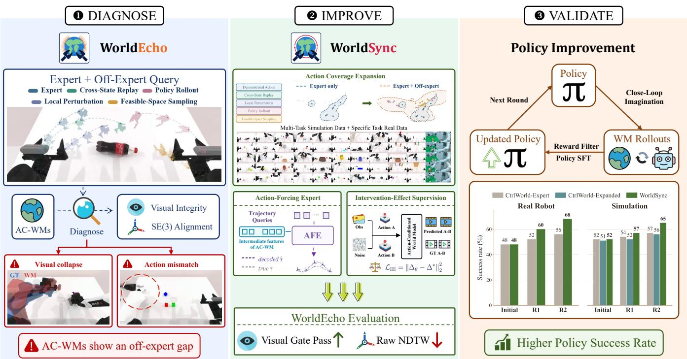
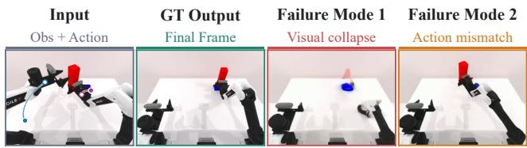
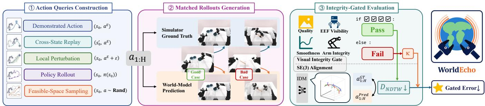
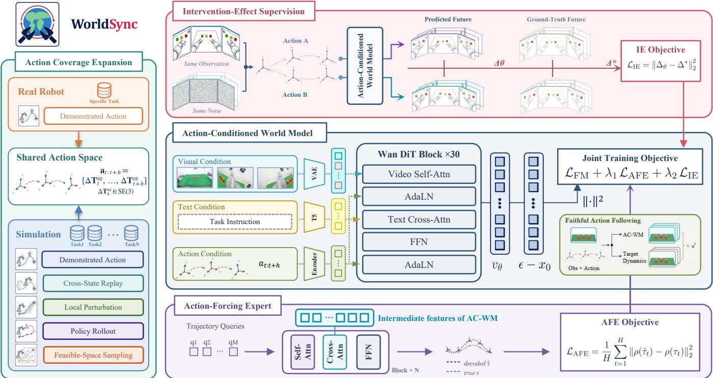
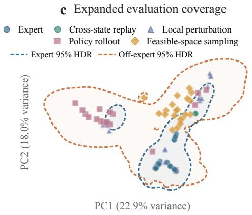
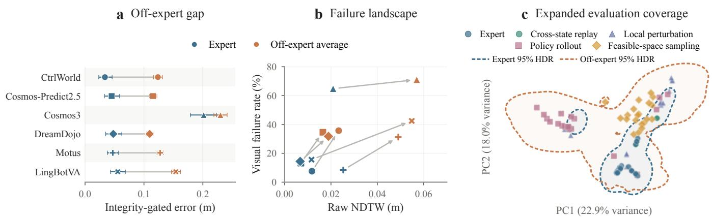
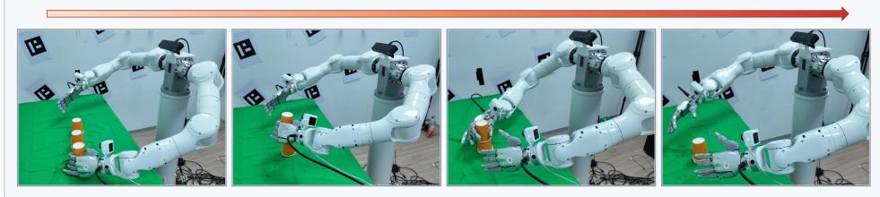
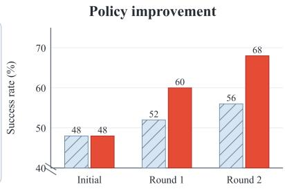
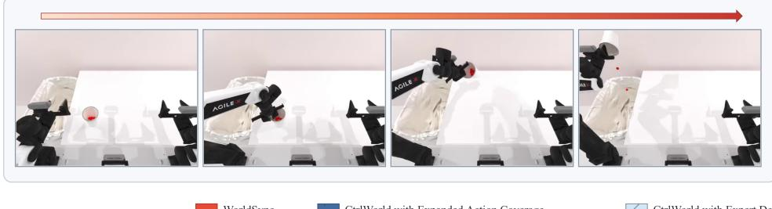
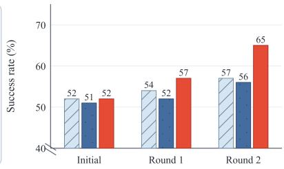

# Do Robotic World Models Really Follow Actions? Diagnosing and Aligning Action-Conditioned Generation for Policy Learning

Sixiang Chen1, Jiaming Liu1\*, Jixian Wu2,3\*, Yichen Guo5\*, Tinghao Wang 2,4\* Siyuan Qian1, Hao Chen6, Jiajun Cao2,1, Jian Tang2B, Shanghang Zhang1B

1State Key Laboratory of Multimedia Information Processing, School of Computer Science, Peking University 2Beijing Innovation Center of Humanoid Robotics

3New York University 4University of Electronic Science and Technology of China 5Nanyang Technological University 6The Chinese University of Hong Kong

## Abstract

Action-conditioned world models are increasingly used as learned simulators for policy evaluation and improvement, yet their efectiveness rests on an unverified assumption: generated futures faithfully reflect arbitrary valid actions. Existing benchmarks are typically confined to expert demonstrations, leaving of-expert action following inadequately evaluated. To address this gap, we introduce WorldEcho, which probes action following over a broader action distribution using visual integrity and SE(3) trajectory alignment. Our diagnosis shows that current world models reasonably execute expert actions but struggle with diverse of-expert trajectories, either ignoring the commanded actions or producing visually invalid rollouts. We further propose WorldSync, which strengthens action following along three complementary axes: distributional coverage, representational grounding, and intervention-efect alignment. It broadens the training distribution over action consequences, grounds intermediate video representations in action-induced robot dynamics through an Action-Forcing Expert, and aligns predicted changes under action interventions with the corresponding changes in ground-truth futures. Experiments on RoboTwin benchmarks and real-robot tasks show that WorldSync improves WorldEcho metrics and serves as a more reliable simulator for iterative policy improvement, enabling policies to achieve higher success rates.

## 1 Introduction

Recently, Vision-Language-Action (VLA) (Zitkovich et al. 2023; O’Neill et al. 2024; Black et al. 2025) and World Action Models (WAM) (Wu et al. 2024; Li et al. 2026a; Ye et al. 2026) have demonstrated promising success rates and generalization across diverse scenarios and tasks through largescale pretraining. Despite these advances, prior works (Physical Intelligence et al. 2025; Pan et al. 2026; Guo et al. 2026a) have shown that task-specific online post-training remains essential for achieving optimal downstream performance. Such post-training, however, requires extensive interaction with real-world environments, which is costly and timeconsuming (Xiao et al. 2026). To reduce this burden, actionconditioned world models (AC-WMs) (Zhu et al. 2025; Guo et al. 2026b) have been introduced as learned simulators to support eficient closed-loop policy interaction (Quevedo et al. 2026; Li et al. 2025b). Subsequent studies have leveraged AC-WMs to provide synthetic experience for policy post-training (Guo et al. 2026a; Yu et al. 2026; Xiao et al. 2026; Li et al. 2025a; Jiang et al. 2026b), leading to improved policy performance in real-world deployment. Nevertheless, these approaches rest upon a critical yet largely unverified assumption: AC-WMs genuinely capture world dynamics and produce accurate responses to arbitrary valid action inputs (Quevedo et al. 2026; Guo et al. 2026a; Yang et al. 2026a).

Faithful action following is a prerequisite for using AC-WMs as reliable simulators for policy evaluation and posttraining (Li et al. 2026b). For evaluation, plausible but actioninconsistent futures can misrepresent the consequences of candidate actions, creating a gap between simulated and realworld policy performance (Quevedo et al. 2026; Li et al. 2025b). For post-training, unreliable rollouts require additional verification, rejection, or filtering before they can provide trustworthy supervision (Guo et al. 2026a; Yu et al. 2026), increasing overhead and reducing the yield of usable experience. Improving action following can therefore enhance evaluation fidelity and deliver more useful training data under a fixed interaction and generation budget. Existing world model benchmarks mainly assess perceptual and semantic quality, similarity to reference behaviors, or downstream executability (Hu et al. 2025; Shang et al. 2026a; Jiang et al. 2026a). Recent studies have begun to examine out-of-distribution or failure-inducing actions (Quevedo et al. 2026; Yang et al. 2026a), but continuous action following across broad numerical queries with action-specific SE(3) ground truth remains underexplored. Such of-expert actions are essential for policy improvement because learned policies inevitably induce state–action distributions beyond expert demonstrations (Ross, Gordon, and Bagnell 2011; Yu et al. 2026; Guo et al. 2026a).

Figure 1 summarizes our diagnose–improve–validate workflow: WorldEcho probes AC-WMs with demonstrated and of-expert action queries, WorldSync targets the diagnosed visual and action-alignment errors, and downstream policy improvement evaluates the utility of the resulting model. To fill this evaluation gap, we introduce WorldEcho, which evaluates action following across five complementary action-query categories. In addition to demonstrated actions as an in-distribution baseline, we construct four ofexpert categories that progressively reduce their reliance on expert behavior: Cross-State Replay, Local Perturbation, Policy Rollout, and Feasible-Space Sampling. These categories respectively diagnose reliance on state-conditioned expert priors, sensitivity to local action variations, fidelity under policy-induced deviations, and controllability across the broader feasible action space. To capture distinct sources of simulation error, WorldEcho jointly evaluates the visual integrity of generated videos and the SE(3) alignment between end-efector trajectories extracted from generated and corresponding ground-truth videos. Our diagnosis reveals an of-expert support gap: expert-only AC-WMs follow demonstrated actions reasonably well but exhibit two characteristic failure modes under of-expert actions. They either produce visually plausible yet overly optimistic futures that deviate from the conditioned actions, or lose visual integrity through severe degradation, such as distorted robot arms and disappearing grippers. Together, these failures expose two limitations of expert-only AC-WMs: narrow support over ofexpert action consequences and weak dependence of generated dynamics on the conditioned actions.

  
Figure 1: Overview of our diagnose–improve–validate pipeline. WorldEcho probes action-conditioned world models with demonstrated and diverse of-expert queries, jointly evaluating visual integrity and SE(3) end-efector alignment to expose visual collapse and action mismatch. Guided by this diagnosis, WorldSync broadens the training distribution over action consequences, grounds intermediate video representations in action-induced robot dynamics through an Action-Forcing Expert, and aligns predicted changes under action interventions with the corresponding changes in ground-truth futures. In simulation and real-robot policy-improvement experiments, these gains translate into higher policy success rates.

Guided by this diagnosis, we propose WorldSync, a systematic training recipe that strengthens action-conditioned generation along three complementary axes: distributional coverage, representational grounding, and intervention-efect alignment. First, to expand the training distribution over action consequences, we unify diverse simulated expert and of-expert trajectories with a small amount of target-domain real-world data in a shared action space, broadening action support while preserving real-world visual fidelity. With this broader support established, we introduce an Action-Forcing Expert (AFE) that decodes future robot states from intermediate video representations, thereby grounding the learned features in the robot dynamics induced by the conditioned actions. Yet feature-level grounding supervises each rollout in isolation and does not explicitly constrain how predictions should change across actions. We thus introduce Intervention-Efect (IE) supervision, which uses paired trajectories with the same observation but diferent actions to align predicted changes under an action intervention with the corresponding changes in ground-truth futures. In short, coverage expansion broadens the action consequences from which the model learns, AFE grounds what its representations encode in robot dynamics, and IE aligns how its predictions change with how the ground-truth futures change.

Experiments on RoboTwin (Chen et al. 2026b) and realrobot tasks demonstrate that WorldSync improves WorldEcho performance across both demonstrated and of-expert action queries while maintaining visual integrity. More importantly, when used as a learned simulator for iterative policy improvement, WorldSync provides more reliable actiondependent feedback and enables policies to achieve higher success rates, demonstrating the practical value of faithful action following.

Our contributions are as follows:

• We introduce WorldEcho, which evaluates action following across demonstrated actions and four complementary of-expert action-query categories through visual integrity and SE(3) trajectory alignment.

• We identify two characteristic failures of expert-only AC-WMs under of-expert actions: visually plausible but overly optimistic futures that disregard the conditioned actions, and severe visual degradation that renders the generated rollouts unusable.

• We propose WorldSync to broaden the training distribution over action consequences, ground video representations in action-induced robot dynamics, and align predicted changes under action interventions with their ground-truth counterparts, enabling more faithful simulation and more efective policy improvement.

## 2 Related Work

## 2.1 Action-Conditioned Robotic World Models

Action-conditioned robotic world models predict future observations from visual histories and continuous robot commands, supporting imagined rollouts for planning and policy learning (Zhu et al. 2025; Guo et al. 2026b). Building on this formulation, subsequent work has advanced AC-WMs through architectural innovations for stronger action control and long-horizon generation (Zhu et al. 2025; Guo et al. 2026b; Zheng et al. 2026), as well as broader pretraining for transferring interaction dynamics across tasks and embodiments (Gao et al. 2026; Wu and Gao 2026; Huang et al. 2026). Beyond improving architectures and data, several methods address the representation gap between numerical commands and pixel-space motion using spatially grounded representations of robot kinematics (Wu and Gao 2026; Chen et al. 2026c,a; Yang et al. 2026b). Controlled action perturbations and counterfactual behaviors have also begun to probe models beyond standard action replay (Gao et al. 2026; Huang et al. 2026; Feingold et al. 2026; Zhu et al. 2025). However, these studies cover limited action variations and provide mostly indirect or coarse-grained evidence of action following rather than ground-truth motion for each command (Zhu et al. 2025; Gao et al. 2026; Huang et al. 2026; Feingold et al. 2026; Yang et al. 2026a).

## 2.2 World Models for Policy Evaluation and Improvement

AC-WMs are increasingly used as policy-facing simulators that reduce costly real-robot interaction (Quevedo et al. 2026; Li et al. 2025b; Jeon et al. 2026; Ma et al. 2026). In this role, imagined rollouts support policy evaluation and ranking (Quevedo et al. 2026; Li et al. 2025b; Jeon et al. 2026; Ma et al. 2026). Beyond evaluation, they provide synthetic experience or optimization signals for policy improvement (Yu et al. 2026; Xiao et al. 2026; Li et al. 2025a; Jiang et al. 2026b). These applications, however, expose a distribution shift when policy exploration, failures, or updates depart from expert-dominated AC-WM data (Jiang et al. 2026b; Yin et al. 2026; Liu et al. 2026; Yu et al. 2026). To mitigate this mismatch, existing systems expand training with exploratory or corrective interactions (Yin et al. 2026; Li et al. 2026b; Xiao et al. 2026), filter unreliable generations, or co-evolve the policy and world model (Jiang et al. 2026b; Guo et al. 2026a; Liu et al. 2026). While these strategies improve downstream policy performance, policy gains alone do not reveal whether the world model faithfully responds to the queried actions or merely serves as useful visual augmentation (Guo et al. 2026a; Jiang et al. 2026b; Xiao et al. 2026; Li et al. 2025a). This ambiguity calls for directly assessing whether policy-facing AC-WMs faithfully respond to the actions queried by the policy.

## 2.3 Robotic World Model Evaluation

Robotic world-model evaluation has expanded beyond generic video quality to motion, physical consistency, and embodied functionality (Hu et al. 2025; Shang et al. 2026a,b). Existing benchmarks compare generated motion with reference trajectories (Hu et al. 2025; Shang et al. 2026a) or recover actions from generated videos to test embodied executability (Jiang et al. 2026a; Fan et al. 2026). Most closely related, MiraBench evaluates action-conditioned reliability with failure-inducing perturbations and reveals that visually plausible predictions may ignore commanded failures or exhibit optimism bias (Yang et al. 2026a). However, these evaluations rely primarily on image-space motion, recoveredaction execution, or task-level failure judgments rather than continuous end-efector motion in SE(3) across broad numerical action queries (Shang et al. 2026a; Jiang et al. 2026a; Yang et al. 2026a). Our benchmark instead aligns generated end-efector trajectories with the corresponding simulatorreplayed trajectories in SE(3) across progressively broader numerical action queries.

## 3 Method

## 3.1 Problem Formulation

We consider an action-conditioned robotic world model, parameterized by θ, that generates future visual observations conditioned on the current observation, task instruction, and robot actions. Let $o _ { 0 }$ denote the current multi-view observation, c the language instruction, and $a _ { 1 : H } = ( a _ { 1 } , \dots , a _ { H } )$ a sequence of numerical robot actions over a horizon of H steps. We model the future multi-view video $I _ { 1 : H }$ with the conditional distribution

$$
p _ { \theta } ( I _ { 1 : H } \mid o _ { 0 } , c , a _ { 1 : H } ) , \qquad \hat { I } _ { 1 : H } \sim p _ { \theta } ( \cdot \mid o _ { 0 } , c , a _ { 1 : H } ) .\tag{1}
$$

Executing the same action sequence from the corresponding initial environment state yields the ground-truth future $I _ { 1 : H } ^ { \mathrm { G T } } .$ Let Φ extract the end-efector trajectory from a multi-view video. The generated and ground-truth trajectories are

$$
\begin{array} { r } { \hat { \tau } = \Phi ( \hat { I } _ { 1 : H } ) , \qquad \tau ^ { \mathrm { G T } } = \Phi ( I _ { 1 : H } ^ { \mathrm { G T } } ) . } \end{array}\tag{2}
$$

A reliable world model should generate a visually valid future whose induced robot trajectory agrees with the ground-truth consequence of the queried actions. We study how to evaluate and improve this property when $a _ { 1 : H }$ extends beyond the expert action distribution.

  
Figure 2: Action-following failures under of-expert actions. Compared with the ground truth, an expert-trained AC-WM either sufers visual collapse (Failure Mode 1) or generates plausible but action-inconsistent motion (Failure Mode 2).

## 3.2 Motivation

Most robotic world models are trained on expert demonstrations (Zhu et al. 2025; Guo et al. 2026b; NVIDIA et al. 2025). Yet policy evaluation and improvement inevitably query actions beyond the expert distribution (Quevedo et al. 2026; Li et al. 2025b; Yu et al. 2026; Xiao et al. 2026), requiring the model to respond faithfully to diverse valid actions. To examine whether existing models satisfy this requirement, we fine-tune Cosmos-Predict2.5 (NVIDIA et al. 2025) on expert demonstrations collected in the RoboTwin simulation benchmark (Mu et al. 2025; Chen et al. 2026b). Starting from the same observation, we condition it on either expert or feasible of-expert actions and compare its predictions with the ground-truth rollouts obtained by executing the queried actions in RoboTwin. The model accurately replays expert trajectories, but exhibits two distinct failures under of-expert actions, as shown in Figure 2: the generated video either loses visual integrity, with distorted arms or disappearing grippers, or remains visually plausible while depicting motion inconsistent with the queried actions. These observations motivate a benchmark that probes world models over a broader action distribution and jointly evaluates visual integrity and the fidelity of action-induced motion.

## 3.3 WorldEcho: Benchmarking Action Following

Motivated by the failures above, we introduce WorldEcho to evaluate whether an AC-WM faithfully responds to numerical robot actions beyond expert replay. As illustrated in Figure 3, WorldEcho expands the queried action distribution from demonstrated actions to four complementary of-expert categories. For every query, we execute the same action sequence from the corresponding initial state in RoboTwin to obtain a ground-truth future. We then evaluate the generated rollout from two complementary perspectives: whether it remains visually valid and whether its induced end-efector motion agrees with the ground-truth consequence of the queried actions.

Action Query Construction We construct five actionquery categories with decreasing reliance on the joint expert distribution over states and actions. Demonstrated Action replays the expert action sequence associated with the current observation and serves as the in-distribution baseline. Cross-State Replay applies an expert action sequence from another state. Although the actions remain expert-distributed, their mismatch with the current state induces task failure, testing whether the model captures state-dependent action efects rather than equating expert-like actions with success. Local Perturbation applies bounded perturbations to demonstrated actions, probing sensitivity to local changes around the expert manifold. Policy Rollout uses actions produced by a learned policy, reflecting the deviations encountered during policy evaluation and improvement. Finally, Feasible-Space Sampling draws valid actions from the broader robot action space to assess controllability with minimal reliance on expert behavior. All of-expert queries are filtered for action feasibility and replayed in RoboTwin from the same initial state as the world-model query, producing an action-specific ground-truth rollout.

Visual Integrity Assessment Trajectory agreement is meaningful only when the generated video remains a valid depiction of the robot and scene. We therefore assess four complementary aspects of visual integrity. Following WorldArena (Shang et al. 2026a), we adopt continuous scores for image quality and motion smoothness. Specifically, image quality q measures frame-level perceptual fidelity using MUSIQ (Ke et al. 2021), while motion smoothness m evaluates temporal continuity through frame-interpolation consistency (Zhang et al. 2024). To integrate these scores into our integrity-gated protocol, we convert them into binary decisions using prespecified thresholds:

$$
G _ { \mathrm { q u a l i t y } } = \mathbb { I } [ q \geq \tau _ { q } ] , \qquad G _ { \mathrm { m o t i o n } } = \mathbb { I } [ m \geq \tau _ { m } ] .\tag{3}
$$

where I is the indicator function and $\tau _ { q } , \tau _ { m }$ are the respective thresholds. End-efector visibility $G _ { \mathrm { E E F } }$ and arm integrity $G _ { \mathrm { a r m } }$ directly produce binary decisions. The former tracks the grippers throughout the rollout using SAM-based video tracking (Carion et al. 2026); the latter detects blurred, broken, or disappearing robot arms using a vision-language evaluator (Bai et al. 2025). All criteria and thresholds are fixed across evaluated models. The overall visual-integrity gate is

$$
G _ { \mathrm { v i s } } = G _ { \mathrm { q u a l i t y } } \wedge G _ { \mathrm { m o t i o n } } \wedge G _ { \mathrm { E E F } } \wedge G _ { \mathrm { a r m } } .\tag{4}
$$

A rollout passes the gate only when all four conditions are satisfied.

End-Efector Trajectory Alignment A visually valid rollout may nevertheless ignore the conditioned actions. We therefore directly compare the robot motion in the generated and ground-truth videos. Given a video I, the trajectory extractor Φ (Tan et al. 2026) recovers the per-frame position $p _ { t } ^ { e } \in \mathbb { R } ^ { 3 }$ and orientation $R _ { t } ^ { e } \in \mathrm { S O } ( 3 )$ for each end efector $\check { e \in \{ L , R \} }$ (left or right). For a generated frame i and a ground-truth frame $j ,$ , we define the local pose discrepancy as

$$
\begin{array} { r } { d _ { e } ( i , j ) = \Big [ w _ { p } ^ { 2 } \| \hat { p } _ { i } ^ { e } - p _ { j } ^ { e , \mathrm { G T } } \| _ { 2 } ^ { 2 } \qquad } \\ { + w _ { R } ^ { 2 } d _ { \mathrm { S O } ( 3 ) } ^ { 2 } ( \hat { R } _ { i } ^ { e } , R _ { j } ^ { e , \mathrm { G T } } ) \Big ] ^ { 1 / 2 } , } \end{array}\tag{5}
$$

where hatted and GT quantities are the generated and groundtruth poses, and $w _ { p } , w _ { R }$ weight translation and rotation. The rotational discrepancy is

$$
\begin{array} { r l r } { d _ { \mathrm { S O ( 3 ) } } ( R _ { 1 } , R _ { 2 } ) = \operatorname { a r c c o s } ( \exp ( \xi , - 1 , 1 ) ) , } & { } & \\ { \xi = \frac { \mathrm { t r } ( R _ { 1 } ^ { \top } R _ { 2 } ) - 1 } { 2 } , } & { } & \end{array}\tag{6}
$$

  
Figure 3: Overview of WorldEcho. Five action query categories span demonstrated and of-expert actions. Each action sequence produces matched simulator reference and world model rollouts. Visual integrity and $\operatorname { S E } ( 3 )$ end efector trajectory alignment are jointly evaluated. The gated error uses NDTW for valid rollouts and a fixed penalty κ otherwise.

where tr is the matrix trace and clip clamps its argument $\mathrm { t o } [ - 1 , 1 ]$ . To accommodate diferences in temporal progression, we align the two trajectories using pose-aware normalized dynamic time warping (NDTW) (Sakoe and Chiba 1978; Salvador and Chan 2007; Hu et al. 2025; Shang et al. 2026a). Let $\pi _ { e }$ denote the optimal warping path for end efector e. The sample-level NDTW error is

$$
D _ { \mathrm { N D T W } } = \frac { 1 } { \left| \boldsymbol { A } \right| } \sum _ { e \in \mathcal { A } } \frac { 1 } { \left| \pi _ { e } \right| } \sum _ { ( i , j ) \in \pi _ { e } } \boldsymbol { d } _ { e } ( i , j ) ,\tag{7}
$$

where $\mathcal { A }$ is the set of valid end efectors. We normalize the cumulative cost by alignment-path length, but not by the spatial extent of the reference trajectory. This choice retains the absolute metric scale of the pose discrepancy, preventing short-range motions from disproportionately amplifying pose-estimation noise and preserving a consistent physical interpretation across action queries. Lower values indicate stronger agreement between generated motion and the action-specific ground truth.

Integrity-Gated Evaluation Protocol For every query n, we retain both the visual-gate result $G _ { n }$ and the ungated NDTW error $D _ { n } ^ { \mathrm { { N D T W } } }$ . We compute NDTW for all samples, including those that fail the visual gate, to preserve diagnostic information. For the oficial aggregate error, we define the per-query integrity-gated error $S _ { n }$ , assigning a fixed penalty κ to visually invalid rollouts:

$$
S _ { n } = \left\{ { \begin{array} { l l } { D _ { n } ^ { \mathrm { N D T W } } , } & { G _ { n } = 1 , } \\ { \kappa , } & { G _ { n } = 0 . } \end{array} } \right.\tag{8}
$$

We first average $S _ { n }$ within each task and then report the macro-average across tas $\mathrm { k s , }$ preventing tasks with more samples from dominating the ranking. Alongside this integritygated error, WorldEcho reports the visual-gate pass rate, ungated NDTW error, and results stratified by action-query category. Algorithm 1 summarizes the evaluation procedure.

## 3.4 WorldSync: Improving Action Following

Taken together, the failures identified above point to an ofexpert support gap and weak action dependence in generated dynamics. Closing the former calls for distributional coverage; addressing the latter calls for both representational grounding within individual rollouts and intervention-efect alignment across paired rollouts. As illustrated in Figure $^ { 4 , }$ WorldSync realizes these three requirements through action coverage expansion, an Action-Forcing Expert (AFE), and Intervention-Efect (IE) supervision, respectively. In short, coverage expansion broadens the action consequences from which the model learns, AFE grounds what its representations encode in robot dynamics, and IE aligns how its predictions change with how the ground-truth futures change.

Algorithm 1: Integrity-Gated Action-Following Evaluation   
Require: AC-WM $\mathcal { W } _ { \theta } .$ , action queries Q, failure penalty κ   
1: for each query n: $( o _ { 0 } , c , a _ { 1 : H } , I _ { 1 : H } ^ { \mathrm { G T } } ) \in \mathcal { Q }$ do   
2: Generate $\hat { I } _ { 1 : H } \sim p _ { \theta } ( \cdot \vert o _ { 0 } , c , a _ { 1 : H } )$   
3: Evaluate $G _ { n } = G _ { \mathrm { v i s } } ( \hat { I } _ { 1 : H } )$   
4: Extract $\hat { \tau } = \Phi ( \hat { I } _ { 1 : H } )$ and $\tau ^ { \mathrm { G T } } = \Phi ( I _ { 1 : H } ^ { \mathrm { G T } } )$   
5: Compute pose-aware NDTW error $D _ { n } ^ { \mathrm { { \tilde { N } D T W } } }$   
6: Set $\mathring { S _ { n } } \gets \tilde { D } _ { n } ^ { \mathrm { N D T W } }$ if $G _ { n } = 1 ;$ otherwise $S _ { n } \gets \kappa$   
7: end for   
8: Aggregate $\{ S _ { n } \}$ within each task and then across tasks   
9: return task-macro integrity-gated error, visual pass rate,   
and ungated NDTW errors

We train the video backbone with flow matching. Let x0 denote the clean latent of the target future video and $\epsilon \sim$ $\mathcal { N } ( 0 , I )$ Gaussian noise. At flow time $t \in [ 0 , 1 ]$ , we construct $x _ { t } = ( \mathrm { 1 } - t ) x _ { 0 } +$ tϵ and optimize

$$
\mathcal { L } _ { \mathrm { F M } } = \mathbb { E } _ { { x _ { 0 } , \epsilon , t } } [ | | v _ { \theta } ( x _ { t } , t \mid { o _ { 0 } } , c , a _ { 1 : H } ) - ( \epsilon - x _ { 0 } ) | | _ { 2 } ^ { 2 } ] ,\tag{9}
$$

where $v _ { \theta }$ is the action-conditioned flow velocity predicted by the world model.

Action Coverage Expansion Strategy Expert demonstrations cover only a narrow subset of feasible action consequences, leaving the of-expert support gap identified by our diagnosis. To broaden this support, we train with multi-task simulated trajectories that span expert behavior, local perturbations, cross-state replays, policy rollouts, and broad feasible actions. A small set of target-task real-robot demonstrations is mixed with these simulated data to preserve targetdomain visual fidelity. To transfer action-following knowledge across the two domains, we represent both simulated and real-robot actions as relative Cartesian end-efector pose displacements expressed in the robot base frame, providing a shared action space for learning relationships between actions and their consequences across simulation and reality.

  
Figure 4: Overview of WorldSync. We expand action coverage by unifying diverse simulated expert and of-expert trajectories with target-domain real-robot demonstrations in a shared SE(3) end-efector action space. The AC-WM generates future videos from visual, language, and action conditions. AFE grounds intermediate video representations in future robot trajectories, while IE supervision aligns predicted and ground-truth intervention efects under shared observations and noise. All objectives are jointly optimized for faithful action following.

Action-Forcing Expert Distributional coverage is necessary but does not ensure that intermediate video representations encode the robot dynamics induced by the conditioned actions. To provide an auxiliary feature-level grounding signal, AFE maintains trajectory queries that progressively cross-attend to the intermediate features of successive video blocks and decode the action-induced future endefector trajectory in SE(3). Given its prediction $\scriptstyle { \hat { \tau } } _ { 1 : H }$ and the ground-truth trajectory $\tau _ { 1 : H }$ , we optimize

$$
\mathcal { L } _ { \mathrm { A F E } } = \frac { 1 } { H } \sum _ { t = 1 } ^ { H } \left. \rho ( \hat { \tau } _ { t } ) - \rho ( \tau _ { t } ) \right. _ { 2 } ^ { 2 } ,\tag{10}
$$

where $\rho$ denotes the numerical pose representation used to parameterize translation and orientation. AFE does not directly read the actions or write back to the video stream; its loss instead updates the backbone through the video features. It is removed at inference time.

Intervention-Efect Supervision AFE grounds individual rollouts at the representation level but does not directly supervise how the generated future should change when the conditioned action changes. IE therefore provides a complementary relational signal using paired trajectories that share the current observation and instruction but execute diferent actions. Both branches use the same noise at the flowmatching noise endpoint, isolating the action as the only difering model input. The predicted and target intervention efects are

$$
\Delta _ { \theta } = v _ { \theta } ^ { A } - v _ { \theta } ^ { B } , ~ \Delta ^ { * } = x _ { 0 } ^ { B } - x _ { 0 } ^ { A } ,\tag{11}
$$

and we align them over future video latents using

$$
\mathcal { L } _ { \mathrm { I E } } = \left\| \Delta _ { \theta } - \Delta ^ { * } \right\| _ { 2 } ^ { 2 } .\tag{12}
$$

Thus, beyond fitting each future independently, the model learns how its prediction should change when the conditioned action changes.

Joint Training Objective Combining the standard flowmatching generation loss with the two auxiliary objectives gives

$$
\begin{array} { r } { \mathcal { L } = \mathcal { L } _ { \mathrm { F M } } + \lambda _ { \mathrm { A F E } } \mathcal { L } _ { \mathrm { A F E } } + \lambda _ { \mathrm { I E } } \mathcal { L } _ { \mathrm { I E } } . } \end{array}\tag{13}
$$

$\mathcal { L } _ { \mathrm { A F E } }$ is applied when future trajectory labels are available, while $\mathcal { L } _ { \mathrm { I E } }$ is applied to intervention pairs. Together with expanded action coverage, the two auxiliary objectives complement the standard flow-matching objective with representational grounding and intervention-efect alignment for faithful action-conditioned generation.

## 4 Experiments

We begin by describing the common benchmarks, comparison protocols, and evaluation metrics (§4.1). Building on this protocol, we use WorldEcho to determine whether evaluation on demonstrated actions masks failures under of-expert control (§4.2). We then benchmark WorldSync against six baseline world models and quantify the efect of expanded action coverage (§4.3). To assess downstream utility, we examine whether stronger action following translates into more efective policy improvement under matched budgets (§4.4). Finally, we disentangle the contributions of expanded action coverage, Intervention-Efect supervision, and the Action-Forcing Expert (§4.5).

## 4.1 Experimental Setup

Benchmarks and evaluation sets. The main evaluation covers 50 RoboTwin manipulation tasks (Mu et al. 2025; Chen et al. 2026b) using the five action-query categories defined by WorldEcho (§4.2, §4.3). Component analysis uses four RoboTwin tasks under the same five-category protocol (§4.5). We separately evaluate policy improvement in RoboTwin and on real robots (§4.4).

Baselines. We compare WorldSync against six baselines spanning complementary robotic world-model paradigms. CtrlWorld (Guo et al. 2026b) serves as a dedicated actionconditioned world model for robot manipulation. Cosmos-Predict2.5 (NVIDIA et al. 2025) and Cosmos3 (NVIDIA 2026) bring large physical-AI foundation models for actionconditioned generation into the comparison, while Dream-Dojo (Gao et al. 2026) provides a generalist robot world model pretrained on large-scale human video. Motus (Bi et al. 2025) and LingBotVA (Li et al. 2026a) further broaden the comparison to unified world-action modeling, using a Mixture-of-Transformers (MoT) architecture and a causal autoregressive formulation, respectively. For each backbone, we evaluate variants trained with either Expert Demonstrations or Expanded Action Coverage on the same task split and action-query set. Table 1 reports their designated endpoints under the common WorldEcho protocol.

Metrics. The primary metric is integrity-gated error. Raw pose-aware NDTW and visual-integrity pass rate separately characterize action mismatch and visual failure. All metrics are macro-averaged over tasks.

## 4.2 Benchmark Diagnosis

Of-Expert Performance Gap. We evaluated whether demonstrated-action performance reflects behavior under broader feasible control. Across all six expert-trained models, integrity-gated error increased by 0.029–0.099 m on ofexpert queries (Figure 5a). Evaluation on demonstrated actions therefore systematically understated errors under feasible but unseen controls.

Failure Decomposition. The gap reflected both trajectory inconsistency and visual degradation. Across models, raw NDTW increased by 0.010–0.043 m and visual failure rate by 6.3–28.1 percentage points; both increases were consistent across all models (Figure 5b). Their relative contributions varied: some models mainly lost visual integrity, whereas others remained visually plausible but followed the requested motion poorly. Thus, either component metric alone would miss part of the failure.

Expanded Evaluation Coverage. Figure 5c visualizes the distributional coverage of the evaluation queries. Expert actions occupy a relatively compact region of the projected action space, whereas the four of-expert query categories extend evaluation to a much broader region. Thus, WorldEcho evaluates action following over a wider action distribution than expert-only protocols. Together with the failure decomposition above, this broader query distribution exposes two limitations of expert-only AC-WMs: limited support for of-expert action consequences and weak dependence of generated dynamics on the queried actions.

## 4.3 Main Action-Following Evaluation

Table 1 examines whether Expanded Action Coverage improves action following across diferent world-model backbones and how the complete WorldSync compares with all baseline configurations under the common WorldEcho protocol.

Efect of Expanded Action Coverage. At their designated endpoints, all six baseline backbones trained with Expanded Action Coverage achieved lower integrity-gated error and raw NDTW than their counterparts trained on Expert Demonstrations. Visual pass rate improved for three backbones, remained nearly unchanged for two, and decreased for one. Expanded Action Coverage therefore consistently strengthened trajectory alignment across architectures, whereas its efect on visual integrity remained backbone-dependent.

Comparison with Baselines. Among all evaluated configurations, WorldSync achieved the lowest integrity-gated error point estimate, slightly lower than CtrlWorld (0.066 versus 0.067), and the highest visual pass rate, slightly exceeding Motus (84.5% versus 84.3%). The component-wise ranking was more nuanced: Cosmos-Predict2.5 attained a lower raw NDTW than WorldSync (0.013 versus 0.022). Thus, WorldSync’s leading integrity-gated result reflects a strong balance between trajectory alignment and visual integrity rather than uniform dominance across individual metrics.

## 4.4 Policy Improvement

Policy-Improvement Protocol. We adapt VLAW (Guo et al. 2026a) for two matched policy-improvement rounds. Within each domain, we hold the initial policy and the interaction, world-model rollout, and policy-training budgets fixed, varying only the world-model condition. Simulation compares WorldSync with CtrlWorld trained using Expanded Action Coverage or Expert Demonstrations; real-robot evaluation uses the expert-trained CtrlWorld as the baseline.

Simulation Results. From comparable initial success rates of 51–52% on the RoboTwin task, WorldSync reached 65% after two rounds, gaining 13 percentage points (Figure 6). CtrlWorld reached 56% with Expanded Action Coverage and 57% with Expert Demonstrations, gaining 5 points in both cases and finishing 8–9 points behind WorldSync.

  
Figure 5: Diagnosing of-expert action following and evaluation coverage. (a) Integrity-gated error on expert and of-expert actions across six world models; error bars show task-bootstrap 95% confidence intervals. (b) Changes in raw NDTW and visual failure rate from expert to of-expert actions. (c) PCA visualization showing that of-expert queries cover a broader action distribution than expert actions.

Table 1: Main WorldEcho comparison on 50 RoboTwin tasks under the frozen evaluation protocol. Baseline models use 20k updates with Expert Demonstrations and 40k updates with Expanded Action Coverage, while WorldSync uses 60k updates. Al values are task-macro averages. The best result in each column is shown in bold red, and the second best result is shown in blue
<table><tr><td>Model</td><td>Training regime</td><td></td><td></td><td>Gated error ↓ Raw NDTW ↓ Visual pass (%) ↑</td></tr><tr><td colspan="5">Baseline world models</td></tr><tr><td>CtrlWorld</td><td>Expert Demonstrations</td><td>0.0716</td><td>0.0266</td><td>83.89</td></tr><tr><td>CtrlWorld</td><td>Expanded Action Coverage</td><td>0.0670</td><td>0.0210</td><td>83.71</td></tr><tr><td></td><td>Cosmos-Predict2.5 Expert Demonstrations</td><td>0.0894</td><td>0.0190</td><td>75.09</td></tr><tr><td>Cosmos-Predict2.5</td><td>Expanded Action Coverage</td><td>0.0842</td><td>0.0127</td><td>75.03</td></tr><tr><td>Cosmos3</td><td>Expert Demonstrations</td><td>0.1432</td><td>0.0572</td><td>63.94</td></tr><tr><td>Cosmos3</td><td>Expanded Action Coverage</td><td>0.1218</td><td>0.0419</td><td>68.97</td></tr><tr><td>DreamDojo</td><td>Expert Demonstrations</td><td>0.0805</td><td>0.0210</td><td>78.97</td></tr><tr><td>DreamDojo</td><td>Expanded Action Coverage</td><td>0.0801</td><td>0.0151</td><td>77.20</td></tr><tr><td>Motus</td><td>Expert Demonstrations</td><td>0.1116</td><td>0.0548</td><td>75.09</td></tr><tr><td>Motus</td><td>Expanded Action Coverage</td><td>0.0731</td><td>0.0292</td><td>84.34</td></tr><tr><td>LingBotVA</td><td>Expert Demonstrations</td><td>0.1148</td><td>0.0473</td><td>71.83</td></tr><tr><td>LingBotVA</td><td>Expanded Action Coverage</td><td>0.0897</td><td>0.0340</td><td>79.71</td></tr><tr><td>WorldSync</td><td>Expanded Action Coverage</td><td>0.0661</td><td>0.0223</td><td>84.51</td></tr></table>

Real-Robot Results. On the real-robot stacking-cups task, both conditions started at 48% success. After two rounds, WorldSync reached 68%, compared with 56% for CtrlWorld, corresponding to gains of 20 and 8 percentage points. In both domains, the complete WorldSync condition combined stronger WorldEcho performance with larger downstream policy gains than the compared CtrlWorld conditions.

## 4.5 Component Contributions and Interactions

Table 2: WorldSync ablation of expanded action coverage, intervention-efect (IE) supervision, and the Action-Forcing Expert (AFE) on four RoboTwin tasks. Results are averaged over eight common checkpoints.
<table><tr><td></td><td>Variant Coverage</td><td>Gated ↓</td><td>Raw↓</td><td>Visual (%) ↑</td></tr><tr><td>Base</td><td>Expert</td><td>0.0781</td><td>0.0306</td><td>82.41</td></tr><tr><td>Base</td><td>Expanded</td><td>0.0738</td><td>0.0258</td><td>82.68</td></tr><tr><td>+ IE</td><td>Expanded</td><td>0.0700</td><td>0.0170</td><td>81.25</td></tr><tr><td>+ AFE</td><td>Expanded</td><td>0.0753</td><td>0.0284</td><td>83.04</td></tr><tr><td>Full</td><td>Expanded</td><td>0.0695</td><td>0.0189</td><td>81.96</td></tr></table>

Expanded Action Coverage. With IE and AFE disabled, expanding the training coverage reduced mean gated er-

H.; Zhou, J.; Zhou, F.; Zhou, J.; Zhu, Y.; and Zhu, K. 2025. Qwen3-VL Technical Report. arXiv:2511.21631.

Carion, N.; Gustafson, L.; Hu, Y.-T.; Debnath, S.; Hu, R.; Coll-Vinent, D. S.; Ryali, C.; Alwala, K. V.; Khedr, H.;

Simulation: dump bin bigbin  
Real robot: stacking cups  

  
WorldSync CtrlWorld with Expanded Action Coverage

  
Ctr1World with Expert Demonstrations

Figure 6: Policy improvement under matched budgets on a RoboTwin bin-dumping task and a real-robot stacking-cups task.   
Success rates are reported for the initial policies and after each of two refinement rounds.

ror from 0.0781 to 0.0738 and raw NDTW from 0.0306 to 0.0258, while the visual pass rate remained nearly unchanged. This isolates broader coverage as a source of improved action consistency rather than visual-quality gains.

Roles and Interaction of IE and AFE. Under expanded action coverage, IE produced the main trajectory gains and achieved the lowest raw NDTW of 0.0170. AFE alone improved neither action metric, although it yielded the highest visual pass rate. Adding AFE to IE slightly lowered gated error and partially recovered the visual pass rate relative to IE alone, yielding the best gated result for the full model at 0.0695. These comparisons identify IE as the primary driver of trajectory alignment, whereas AFE contributes conditionally by improving the balance between action consistency and visual validity.

## 5 Conclusion and Limitations

In this work, we introduced WorldEcho to evaluate actionconditioned world models beyond the narrow distribution of expert demonstrations, jointly measuring visual integrity and action-induced trajectory alignment. Our evaluation reveals that the evaluated models consistently degrade under feasible of-expert actions, exposing failures overlooked by expert-only protocols. Guided by this diagnosis, we proposed WorldSync, which combines distributional coverage, representational grounding, and intervention-efect alignment for faithful action-conditioned generation. Across RoboTwin and real-robot experiments, these improvements produced more reliable world-model rollouts and translated into greater gains during iterative policy improvement. Although WorldEcho substantially broadens evaluation coverage, comprehensively probing long-horizon interactions across diverse embodiments and open-world environments remains a shared challenge for the field and an important

direction for future work.

## References

Bai, S.; Cai, Y.; Chen, R.; Chen, K.; Chen, X.; Cheng, Z.;

Deng, L.; Ding, W.; Gao, C.; Ge, C.; Ge, W.; Guo, Z.; Huang,

Q.; Huang, J.; Huang, F.; Hui, B.; Jiang, S.; Li, Z.; Li, M.;

Li, M.; Li, K.; Lin, Z.; Lin, J.; Liu, X.; Liu, J.; Liu, C.; Liu,

Y.; Liu, D.; Liu, S.; Lu, D.; Luo, R.; Lv, C.; Men, R.; Meng,

L.; Ren, X.; Ren, X.; Song, S.; Sun, Y.; Tang, J.; Tu, J.; Wan,

J.; Wang, P.; Wang, P.; Wang, Q.; Wang, Y.; Xie, T.; Xu,

Y.; Xu, H.; Xu, J.; Yang, Z.; Yang, M.; Yang, J.; Yang, A.;

Yu, B.; Zhang, F.; Zhang, H.; Zhang, X.; Zheng, B.; Zhong,

Bi, H.; Tan, H.; Xie, S.; Wang, Z.; Huang, S.; Liu, H.; Zhao,

R.; Feng, Y.; Xiang, C.; Rong, Y.; Zhao, H.; Liu, H.; Su, Z.;

Ma, L.; Su, H.; and Zhu, J. 2025. Motus: A Unified Latent Action World Model. arXiv:2512.13030.

Black, K.; Brown, N.; Darpinian, J.; Dhabalia, K.; Driess, D.;

Esmail, A.; Equi, M. R.; Finn, C.; Fusai, N.; Galliker, M. Y.;

Ghosh, D.; Groom, L.; Hausman, K.; ichter, b.; Jakubczak,

S.; Jones, T.; Ke, L.; LeBlanc, D.; Levine, S.; Li-Bell, A.;

Mothukuri, M.; Nair, S.; Pertsch, K.; Ren, A. Z.; Shi, L. X.;

Smith, L.; Springenberg, J. T.; Stachowicz, K.; Tanner, J.;

Vuong, Q.; Walke, H.; Walling, A.; Wang, H.; Yu, L.; and Zhilinsky, U. 2025. π : a Vision-Language-Action Model

with Open-World Generalization. In Lim, J.; Song, S.; and

Robot Learning, volume 305 of Proceedings of Machine Learning Research, 17–40. PMLR.

Huang, A.; Lei, J.; Ma, T.; Guo, B.; Kalla, A.; Marks,

M.; Greer, J.; Wang, M.; Sun, P.; Rädle, R.; Afouras, T.;

Mavroudi, E.; Xu, K.; Wu, T.-H.; Zhou, Y.; Momeni, L.; Hazra, R.; Ding, S.; Vaze, S.; Porcher, F.; Li, F.; Li, S.; Kamath, A.; Cheng, H. K.; Dollár, P.; Ravi, N.; Saenko, K.; Zhang, P.; and Feichtenhofer, C. 2026. SAM 3: Segment Anything with Concepts. In The Fourteenth International Conference on Learning Representations.

Chen, L.; Li, H.; Yang, W.; Zhao, M.; and Jiang, D. 2026a. ViPSim: Collaborating Visual and Parameter Spaces for Consistent Long-Horizon Embodied World Model. In Robotics: Science and Systems.

Chen, T.; Chen, Z.; Chen, B.; Cai, Z.; Liu, Y.; Li, Z.; Liang, Q.; Lin, X.; Ge, Y.; Gu, Z.; Deng, W.; Guo, Y.; Nian, T.; Xie, X.; Chen, Q.; Su, K.; Xu, T.; Liu, G.; Hu, M.; ang Gao, H.; Wang, K.; Liang, Z.; Qin, Y.; Yang, X.; Luo, P.; and Mu, Y. 2026b. RoboTwin 2.0: A Scalable Data Generator and Benchmark with Strong Domain Randomization for Robust Bimanual Robotic Manipulation. In Forty-third International Conference on Machine Learning.

Chen, Y.; Li, P.; Yang, J.; He, K.; Wu, X.; Xu, Y.; Wang, K.; Liu, J.; Liu, N.; Huang, Y.; and Wang, L. 2026c. BridgeV2W: Bridging Video Generation Models to Embodied World Models via Embodiment Masks. arXiv:2602.03793.

Fan, C.-K.; Chi, X.; Ju, X.; Li, H.; Bao, Y.; Wang, Y.-K.; Chen, L.; Jiang, Z.; Ge, K.; Li, Y.; Mi, W.; Wuwu, Q.; Jia, P.; Luo, Y.; Zhang, K.; Qin, Z.; Dai, Y.; Han, S.; Guo, Y.; Zhang, S.; and Tang, J. 2026. Wow, wo, val!: A Comprehensive Embodied World Model Evaluation Turing Test. arXiv:2601.04137.

Feingold, R. O.; Liconti, D.; Yang, C.; and Katzschmann, R. K. 2026. Mask2Real-WM: Segmentation Masks as a Simto-Real Bridge for Controllable Dexterous World Models. arXiv:2607.04546.

Gao, S.; Liang, W.; Zheng, K.; Malik, A.; Ye, S.; Yu, S.; Tseng, W.-C.; Dong, Y.; Mo, K.; Lin, C.-H.; Ma, Q.; Nah, S.; Magne, L.; Xiang, J.; Xie, Y.; Zheng, R.; Niu, D.; Tan, Y. L.; Zentner, K. R.; Kurian, G.; Indupuru, S.; Jannaty, P.; Gu, J.; Zhang, J.; Malik, J.; Abbeel, P.; Liu, M.-Y.; Zhu, Y.; Jang, J.; and Fan, L. J. 2026. DreamDojo: A Generalist Robot World Model from Large-Scale Human Videos. In Forty-third International Conference on Machine Learning.

Guo, Y.; Lee, T.; Shi, L. X.; Chen, J.; Liang, P.; and Finn, C. 2026a. VLAW: Iterative Co-Improvement of Vision-Language-Action Policy and World Model. In Forty-third International Conference on Machine Learning.

Guo, Y.; Shi, L. X.; Chen, J.; and Finn, C. 2026b. Ctrl-World: A Controllable Generative World Model for Robot Manipulation. In The Fourteenth International Conference on Learning Representations.

Hu, Y.; Huang, S.; Liao, Y.; Chen, S.; Zhou, P.; Chen, L.; Ren, G.; and Yao, M. 2025. EWMBench: Evaluating Scene, Motion, and Semantic Quality in Embodied World Models. In 36th British Machine Vision Conference. BMVA.

Huang, Z.; Zhang, J.; Liu, H.; Zhang, C.; Cheng, R.; and Zhang, L. 2026. Learning Transferable Dynamics Priors from Action to World Modeling. Accepted to ECCV 2026; proceedings version not yet available as of 2026-07-15, arXiv:2606.29501.

Jeon, B.; Ye, S.; Doo, J.; Kim, S.; Seo, M.; Son, H.; and Lee, K. 2026. RoboWorld: Fast and Reliable Neural Simulators for Generalist Robot Policy Evaluation. arXiv:2607.01060.

Jiang, F.; Chen, Y.; Xu, K.; Liu, Y.; Wang, H.; Shen, Z.; Lu, J.; Huang, S.; Wang, Y.; Xie, C.; and Wu, R. 2026a. RoboWM-Bench: A Benchmark for Evaluating World Models in Robotic Manipulation. In Proceedings of the IEEE/CVF Conference on Computer Vision and Pattern Recognition (CVPR) Workshops, 4455–4460.

Jiang, Z.; Zhou, S.; Jiang, Y.; Huang, Z.; Wei, M.; Chen, Y.; Zhou, T.; Guo, Z.; Lin, H.; Zhang, Q.; Wang, Y.; Li, H.; Yu, C.; and Zhao, D. 2026b. WoVR: World Models as Reliable Simulators for Post-Training VLA Policies with RL. arXiv preprint arXiv:2602.13977.

Ke, J.; Wang, Q.; Wang, Y.; Milanfar, P.; and Yang, F. 2021. MUSIQ: Multi-scale Image Quality Transformer. In 2021 IEEE/CVF International Conference on Computer Vision (ICCV), 5128–5137. Montreal, QC, Canada: IEEE.

Li, H.; Ding, P.; Suo, R.; Wang, Y.; Ge, Z.; Zang, D.; Yu, K.; Sun, M.; Zhang, H.; Wang, D.; and Su, W. 2025a. VLA-RFT: Vision-Language-Action Reinforcement Fine-tuning with Verified Rewards in World Simulators. arXiv:2510.00406.

Li, L.; Zhang, Q.; Luo, Y.; Yang, S.; Wang, R.; Zhang, L.; Yu, M.; Gao, Z.; Xue, N.; Zhou, B.; Zhu, X.; Ding, M.; Shen, Y.; and Xu, Y. 2026a. Causal World Modeling for Robot Control. In Proceedings ofRobotics: Science and Systems.

Li, Y.; Zhou, Z.; Chen, Y.; Guo, Y.; Liu, J.; Zhang, S.; Chen, J.; and Zhu, Y. 2026b. Hi-WM: Human-in-the-World-Model for Scalable Robot Post-Training. arXiv:2604.21741.

Li, Y.; Zhu, Y.; Wen, J.; Shen, C.; and Xu, Y. 2025b. WorldEval: World Model as Real-World Robot Policies Evaluator. arXiv preprint arXiv:2505.19017.

Liu, X.; Bai, Z.; Ci, H.; Ma, K. Y.; and Shou, M. Z. 2026. World-VLA-Loop: Closed-Loop Learning of Video World Model and VLA Policy. arXiv:2602.06508.

Ma, C.; Su, T.; Zhu, J.; Zhang, J.; Huang, Z.; Xu, Y.; and Wang, H. 2026. PiL-World: A Chunk-Wise World Model for VLA Policy-in-the-Loop Evaluation. arXiv:2606.05773.

Mu, Y.; Chen, T.; Chen, Z.; Peng, S.; Lan, Z.; Gao, Z.; Liang, Z.; Yu, Q.; Zou, Y.; Xu, M.; Lin, L.; Xie, Z.; Ding, M.; and Luo, P. 2025. RoboTwin: Dual-Arm Robot Benchmark with Generative Digital Twins. In Proceedings of the IEEE/CVF Conference on Computer Vision and Pattern Recognition (CVPR), 27649–27660. IEEE.

NVIDIA. 2026. Cosmos 3: Omnimodal World Models for Physical AI. arXiv:2606.02800.

NVIDIA; Ali, A.; Bai, J.; Bala, M.; Balaji, Y.; Blakeman, A.; Cai, T.; Cao, J.; Cao, T.; Cha, E.; Chao, Y.-W.; Chattopadhyay, P.; Chen, M.; Chen, Y.; Chen, Y.; Cheng, S.; Cui, Y.; Diamond, J.; Ding, Y.; Fan, J.; Fan, L.; Feng, L.; Ferroni, F.; Fidler, S.; Fu, X.; Gao, R.; Ge, Y.; Gu, J.; Gupta, A.; Gururani, S.; El Hanafi, I.; Hassani, A.; Hao, Z.; Hufman, J.; Jang, J.; Jannaty, P.; Kautz, J.; Lam, G.; Li, X.; Li, Z.; Liao, M.; Lin, C.-H.; Lin, T.-Y.; Lin, Y.-C.; Ling, H.; Liu, M.-Y.; Liu, X.; Lu, Y.; Luo, A.; Ma, Q.; Mao, H.; Mo, K.; Nah, S.; Narang, Y.; Panaskar, A.; Pavao, L.; Pham, T.; Ramezanali, M.; Reda,

M.; Tomizuka, M.; Itkina, M.; Castro, M. G.; Spero, M.; Du,

J.; Tan, J.; Oh, J.; Wu, J.; Lu, J.; Yang, J.; Malik, J.; Silvério,

Itti, L.; Chen, L. Y.; Pinto, L.; Fei-Fei, L.; Tan, L.; Fan, L. J.;

Moore, S.; Bahl, S.; Dass, S.; Sonawani, S.; Song, S.; Xu, S.;

P.; Chen, Q.; Vuong, Q.; Rafailov, R.; Tian, R.; Doshi, R.;

F.; Reed, S.; Ren, X.; Shao, H.; Shen, Y.; Shi, S.; Song, S.; Stefaniak, B.; Sun, S.; Tang, S.; Tasmeen, S.; Tchapmi, L.; Tseng, W.-C.; Varghese, J.; Wang, A. Z.; Wang, H.; Wang, H.; Wang, H.; Wang, T.-C.; Wei, F.; Xu, J.; Yang, D.; Yang, X.; Ye, H.; Ye, S.; Zeng, X.; Zhang, J.; Zhang, Q.; Zheng, K.; Zhu, A.; and Zhu, Y. 2025. World Simulation with Video Foundation Models for Physical AI. arXiv:2511.00062.

J.; Wu, J.; Gao, J.; Hu, J.; Wu, J.; Wu, J.; Sun, J.; Luo, J.; Gu,

J.; Hejna, J.; Booher, J.; Tompson, J.; Yang, J.; Salvador, J.;

Lim, J. J.; Han, J.; Wang, K.; Rao, K.; Pertsch, K.; Hausman,

Oslund, K.; Kawaharazuka, K.; Black, K.; Lin, K.; Zhang,

N.; Heess, N.; Joshi, N. J.; Suenderhauf, N.; Liu, N.; Di Palo,

Martín-Martín, R.; Baijal, R.; Scalise, R.; Hendrix, R.; Lin,

Bisk, Y.; Cho, Y.; Lee, Y.; Cui, Y.; Cao, Y.; Wu, Y.-H.; Tang,

Z. 2024. Open X-Embodiment: Robotic Learning Datasets and RT-X Models. In 2024 IEEE International Conference on Robotics and Automation (ICRA), 6892–6903. IEEE.

Pan, M.; Feng, S.; Zhang, Q.; Li, X.; Song, J.; Qu, C.; Wang, Y.; Li, C.; Xiong, Z.; Chen, Z.; Liu, Y.; and Luo, J. 2026. SOP: A Scalable Online Post-Training System for Vision-Language-Action Models. arXiv:2601.03044.

Physical Intelligence; Amin, A.; Aniceto, R.; Balakrishna, A.; Black, K.; Conley, K.; Connors, G.; Darpinian, J.; Dhabalia, K.; DiCarlo, J.; Driess, D.; Equi, M.; Esmail, A.; Fang, Y.; Finn, C.; Glossop, C.; Godden, T.; Goryachev, I.; Groom, L.; Hancock, H.; Hausman, K.; Hussein, G.; Ichter, B.; Jakubczak, S.; Jen, R.; Jones, T.; Katz, B.; Ke, L.; Kuchi, C.; Lamb, M.; LeBlanc, D.; Levine, S.; Li-Bell, A.; Lu, Y.; Mano, V.; Mothukuri, M.; Nair, S.; Pertsch, K.; Ren, A. Z.; Sharma, C.; Shi, L. X.; Smith, L.; Springenberg, J. T.; Stachowicz, K.; Stoeckle, W.; Swerdlow, A.; Tanner, J.; Torne, M.; Vuong, Q.; Walling, A.; Wang, H.; Williams, B.; Yoo, S.; Yu, L.; Zhilinsky, U.; and Zhou, Z. 2025. π∗ : a VLA That Learns From Experience. arXiv:2511.14759.

Quevedo, J. H.; Sharma, A. K.; Sun, Y.; Suryavanshi, V.; Liang, P.; and Yang, S. 2026. WorldGym: World Model as An Environment for Policy Evaluation. In The Fourteenth International Conference on Learning Representations.

Ross, S.; Gordon, G. J.; and Bagnell, J. A. 2011. A Reduction of Imitation Learning and Structured Prediction to No-Regret Online Learning. In Gordon, G.; Dunson, D.; and Dudík, M., eds., Proceedings of the Fourteenth International Conference on Artificial Intelligence and Statistics, volume 15 of Proceedings of Machine Learning Research, 627–635. PMLR.

Sakoe, H.; and Chiba, S. 1978. Dynamic Programming Algorithm Optimization for Spoken Word Recognition. IEEE Transactions on Acoustics, Speech, and Signal Processing, 26(1): 43–49.

Salvador, S.; and Chan, P. 2007. Toward Accurate Dynamic Time Warping in Linear Time and Space. Intelligent Data Analysis, 11(5): 561–580.

Shang, Y.; Li, Z.; Ma, Y.; Su, W.; Jin, X.; Wang, Z.; Jin, L.; Zhang, X.; Tang, Y.; Su, H.; Gao, C.; Wu, W.; Liu, X.; Shah, D.; Zhang, Z.; Chen, Z.; Zhu, J.; Tian, Y.; Chua, T.-S.; Zhu, W.; and Li, Y. 2026a. WorldArena: A Unified Benchmark for Evaluating Perception and Functional Utility of Embodied World Models. arXiv preprint arXiv:2602.08971.

Shang, Y.; Tang, Y.; Ma, Y.; Li, Z.; Jin, L.; Su, W.; Jin, X.; Wang, Z.; Wang, Z.; Zhang, X.; Su, H.; He, W.; Wu, W.; Duan, H.; Wetzstein, G.; Liu, X.; Shah, D.; Zhang, Z.; Chen, Z.; Zhu, J.; Tian, Y.; Chua, T.-S.; Zhu, W.; Gao, C.; and Li, Y. 2026b. WorldArena 2.0: Extending Embodied World Model Benchmarking on Modality, Functionality and Platform. arXiv:2605.17912.

Tan, H.; Feng, Y.; Mao, X.; Huang, S.; Liu, G.; Hao, Z.; Su, H.; and Zhu, J. 2026. AnyPos: Automated Task-Agnostic Actions for Bimanual Manipulation. arXiv:2507.12768.

Wu, H.; Jing, Y.; Cheang, C.; Chen, G.; Xu, J.; Li, X.; Liu, M.; Li, H.; and Kong, T. 2024. Unleashing Large-Scale

Video Generative Pre-training for Visual Robot Manipulation. In The Twelfth International Conference on Learning Representations.

Wu, Z.; and Gao, J. 2026. OSCAR: Omni-Embodiment Action-Conditioned World Model for Robotics. arXiv:2606.04463.

Xiao, J.; Yang, Y.; Chang, X.; Chen, R.; Xiong, F.; Xu, M.; Zheng, W.-S.; and Zhang, Q. 2026. RehearseVLA: Simulated Post-Training for VLAs with Physically-Consistent World Model. In Proceedings of the IEEE/CVF Conference on Computer Vision and Pattern Recognition (CVPR), 20867– 20877.

Yang, T.; Shen, Z.; Mi, Z.; Zhang, Z.; Zhou, J.; Ji, J.; Dai, J.; Chen, J.; Chen, B.; and Yang, Y. 2026a. MiraBench: Evaluating Action-Conditioned Reliability in Robotic World Models. arXiv preprint arXiv:2605.29360.

Yang, Z.; Jin, Y.; Qi, L.; Huang, C.; and Chen, K. 2026b. EA-WM: Event-Aware Generative World Model with Structured Kinematic-to-Visual Action Fields. arXiv:2605.06192.

Ye, S.; Ge, Y.; Zheng, K.; Gao, S.; Yu, S.; Kurian, G.; Indupuru, S.; Tan, Y. L.; Zhu, C.; Xiang, J.; Malik, A.; Lee, K.; Liang, W.; Ranawaka, N.; Gu, J.; Xu, Y.; Wang, G.; Hu, F.; Narayan, A.; Bjorck, J.; Wang, J.; Kim, G.; Niu, D.; Zheng, R.; Xie, Y.; Wu, J.; Wang, Q.; Julian, R.; Xu, D.; Du, Y.; Chebotar, Y.; Reed, S.; Kautz, J.; Zhu, Y.; Fan, L. J.; and Jang, J. 2026. World Action Models are Zero-shot Policies. arXiv:2602.15922.

Yin, T.; Mei, Z.; Zheng, Z.; Yamane, M.; Wang, D.; Sceats, J.; Bateman, S. M.; Zha, L.; Badithela, A.; Shorinwa, O.; and Majumdar, A. 2026. PlayWorld: Learning Robot World Models from Autonomous Play. arXiv:2603.09030.

Yu, A.; Chen, Z.; Song, P.; Hong, Z.; Wang, H.; Zhang, D.; He, T.; Ding, Y.; and Zhang, D. 2026. WM-DAgger: Enabling Eficient Data Aggregation for Imitation Learning with World Models. arXiv preprint arXiv:2604.11351.

Zhang, G.; Liu, C.; Cui, Y.; Zhao, X.; Ma, K.; and Wang, L. 2024. VFIMamba: Video Frame Interpolation with State Space Models. In Globerson, A.; Mackey, L.; Belgrave, D.; Fan, A.; Paquet, U.; Tomczak, J.; and Zhang, C., eds., Advances in Neural Information Processing Systems, volume 37, 107225–107248. Curran Associates, Inc.

Zheng, Z.; Yu, J.; Peng, X.; Shi, J.; Li, M.; Zhang, C.; Li, W.; Wang, D.; Lu, H.; and Jia, X. 2026. Mem-World: Memory-Augmented Action-Conditioned World Models for Persistent Robot Manipulation. arXiv:2606.18960.

Zhu, F.; Wu, H.; Guo, S.; Liu, Y.; Cheang, C.; and Kong, T. 2025. IRASim: A Fine-Grained World Model for Robot Manipulation. In Proceedings of the IEEE/CVF International Conference on Computer Vision, 9834–9844.

Fu, C.; Florence, P.; Finn, C.; Dubey, K. A.; Driess, D.; Ding, T.; Choromanski, K. M.; Chen, X.; Chebotar, Y.; Carbajal, J.; Brown, N.; Brohan, A.; Arenas, M. G.; and Han, K. 2023. RT-2: Vision-Language-Action Models Transfer Web Knowledge to Robotic Control. In Tan, J.; Toussaint, M.; and Darvish, K., eds., Proceedings of The 7th Conference on Robot Learning, volume 229 of Proceedings ofMachine Learning Research, 2165–2183. PMLR.

Zitkovich, B.; Yu, T.; Xu, S.; Xu, P.; Xiao, T.; Xia, F.; Wu, J.; Wohlhart, P.; Welker, S.; Wahid, A.; Vuong, Q.; Vanhoucke, V.; Tran, H.; Soricut, R.; Singh, A.; Singh, J.; Sermanet, P.; Sanketi, P. R.; Salazar, G.; Ryoo, M. S.; Reymann, K.; Rao, K.; Pertsch, K.; Mordatch, I.; Michalewski, H.; Lu, Y.; Levine, S.; Lee, L.; Lee, T.-W. E.; Leal, I.; Kuang, Y.; Kalashnikov, D.; Julian, R.; Joshi, N. J.; Irpan, A.; Ichter, B.; Hsu, J.; Herzog, A.; Hausman, K.; Gopalakrishnan, K.;