# ExMesh++: From Multi-View Images to Relightable UV-PBR Mesh Assets via Topology-Adaptive Reconstruction and Decomposition

CHUANJIN FAN, University of Science and Technology of China, China

LIFAN WU, University of Science and Technology of China, China

WENJIE CHANG, Alibaba Group, Amap, China

HANZHI CHANG, University of Science and Technology of China, China

WENFEI YANG, University of Science and Technology of China, China

TIANZHU ZHANG, University of Science and Technology of China, China

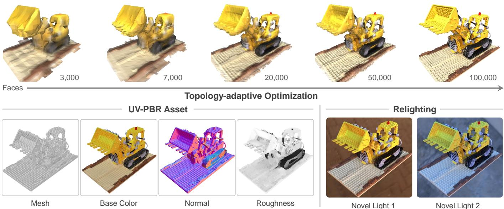  
Fig. 1. Overview of the reconstruction and asset generation results produced by ExMesh++. The top row shows the topology-adaptive optimization process, where a coarse mesh is progressively refined into a compact high-resolution surface. The botom row shows the exported UV-PBR asset, including the mesh, base-color, normal, and roughness maps, together with relighting results under novel environment illumination.

Multi-view reconstruction extends beyond surface recovery to editable and relightable mesh assets. Such assets require well-formed topology, valid UV parameterization, and explicit PBR material maps. Existing surface reconstruction approaches optimize implicit fields, Gaussian primitives, or other intermediate representations. Converting them into such assets often requires surface extraction and texture baking. Inverse-rendering methods estimate materials and illumination, yet these components often remain tied to neural fields or point-based primitives rather than the final mesh. Joint optimization of geometry, materials, and lighting may also allow these variables to compensate for one another, leading to ambiguous decomposition. To address these limitations, we present ExMesh++, a staged framework for reconstructing relightable UV-PBR mesh assets from multi-view images. The first stage refines explicit mesh geometry and topology through adaptive vertex splitting and merging, while maintaining UV consistency as the topology changes. The second stage fixes the resulting mesh-UV carrier and optimizes UV-space PBR maps together with environment lighting. Building on this stable carrier, ExMesh++ models one-bounce difuse indirect illumination through secondary-ray tracing with shared UV-PBR materials. Experiments demonstrate competitive geometry accuracy, strong relighting performance, and direct usability of the exported assets in standard DCC workflows.

CCS Concepts: • Computing methodologies → Reconstruction; Mesh models; Reflectance modeling; Texturing; Ray tracing.

Additional Key Words and Phrases: multi-view reconstruction, mesh optimization, UV-PBR asset reconstruction, inverse rendering

## 1 Introduction

Reconstructing 3D objects from multi-view images has long been a central problem in connecting 2D observations with editable 3D representations. Traditional surface reconstruction mainly focuses on geometric accuracy, surface completeness, or novel-view rendering quality, while practical graphics workflows require assets that can be edited and relit in standard rendering pipelines. This raises a stronger requirement for reconstruction methods: the output should not be merely an accurate mesh, but a mesh-UV-PBR asset.

Recent years have witnessed rapid progress in surface reconstruction, from neural implicit representations to explicit point-based primitives. NeRF-based methods [Mildenhall et al. 2020] synthesize high-quality novel views through volume rendering, while NeuS [Wang et al. 2021], VolSDF [Yariv et al. 2021], and Neuralan gelo [Li et al. 2023] further advance neural surface reconstruction. Later, 3D Gaussian Splatting [Kerbl et al. 2023] greatly improved training and rendering eficiency, inspiring a series of surfaceoriented variants such as 2DGS [Huang et al. 2024], GOF [Yu et al. 2024], PGSR [Chen et al. 2024], and QGS [Zhang et al. 2025]. In parallel, several mesh-driven methods attempt to reduce the gap between intermediate representations and meshes by using diferentiable tetrahedral grids [Munkberg et al. 2022; Shen et al. 2021], point clouds [Yang et al. 2025], or sparse voxel representations [Li et al. 2025]. Despite their diferent optimization representations, these methods still obtain the final mesh through surface extraction [Lorensen and Cline 1987] from implicit fields, Gaussian primitives, or other intermediate representations. Their appearance representations are also usually designed for fitting the original observations, such as baked RGB textures or view-dependent radiance. Although such outputs are efective for reconstructing the captured views, they lack an explicit decomposition of materials and illumination. As a result, they are dificult to directly use for physically based re-rendering or for material-level editing.

A natural solution is to introduce inverse rendering. Instead of only fitting image appearance, inverse rendering decomposes multiview observations into geometry, materials, and illumination. This allows the reconstructed representation to be rendered under novel lighting. Early representative methods model relightable scenes with neural fields or tensor factorization [Jin et al. 2023; Zhang et al. 2022]. Recent works further extend this idea to Gaussian representations, enabling more eficient relightable reconstruction [Gao et al. 2024; Gu et al. 2025; Liang et al. 2024]. However, their optimization carriers are still neural fields or point-based primitives. Although these methods can produce relightable results, the optimized representation is still separated from the final mesh-UV-PBR asset required by production pipelines. Additional surface extraction, material baking, or format conversion is often required to turn the result into an editable asset for standard rendering tools.

To recover mesh and UV-PBR material assets from multi-view images, NVDifRecMC [Hasselgren et al. 2022] places geometry, spatially varying materials, and environment lighting into a unified inverse rendering framework. It uses Monte Carlo rendering [Kajiya 1986] to improve the physical consistency of material-light decomposition. This line of work shows that recovering relightable assets from images is feasible. However, for general object asset reconstruction, the final asset should be built on a stable mesh-UV carrier. If geometry, normal variation, albedo, roughness, and illumination are all adjusted throughout the whole optimization process, photometric errors may be absorbed by multiple factors at the same time. This ambiguity can entangle geometric reconstruction with material and lighting estimation. Such a tightly coupled optimization is efective for image fitting, but may make both geometric reconstruction and material decomposition less reliable.

Based on this observation, we extend our prior ExMesh framework [Fan et al. 2026] into ExMesh++, a staged framework for explicit asset reconstruction. The first stage constructs the asset carrier. It directly optimizes the geometry and topology of meshes through adaptive vertex splitting and merging, while maintaining the UV parameterization during topology changes. This stage produces compact and clean meshes with a stable UV atlas and an RGB appearance texture. The second stage freezes the vertex positions, topology, and UV coordinates. It then optimizes PBR material maps and environment lighting in the shared UV space, including base color, roughness, normal maps, an optional metallic map, and an environment map. By fixing the mesh-UV carrier before PBR optimization, ExMesh++ reduces compensation among geometry, materials, and lighting, while keeping the optimized maps attached to the final exported asset. The fixed mesh-UV carrier also enables one-bounce difuse indirect illumination. We trace secondary rays on the reconstructed mesh and query the same PBR maps to capture local color bleeding, without introducing an additional learned residual appearance field.

To verify both the reconstructed geometry and the decomposed asset, we evaluate ExMesh++ across both reconstruction quality and asset usability. On the DTU [Jensen et al. 2014] and Stanford-ORB [Kuang et al. 2023] datasets, we evaluate the geometric accuracy and structural quality of meshes. On the Synthetic4Relight [Zhan et al. 2022] and Stanford-ORB datasets, we evaluate novel view synthesis under the original illumination and relighting under multiple environment maps. On DTU, we further show the efect of onebounce indirect illumination on local color bleeding and occluded regions. Finally, we place the exported mesh, PBR maps, and environment lighting into a standard DCC workflow to demonstrate relighting, texture editing, and scene composition with artist-created assets. Experiments show that ExMesh++ achieves competitive geometry, NVS, and relighting results, while producing explicit UV-PBR assets that can be directly used in downstream workflows.

Our main contributions are summarized as follows:

(1) We develop a topology-adaptive explicit mesh reconstruction framework that directly optimizes mesh geometry and topology through vertex splitting and merging, with consistent UV updates during topology changes.

(2) We formulate UV-PBR inverse rendering as a second-stage optimization on the reconstructed mesh-UV carrier, reducing geometry-appearance compensation by freezing geometry during material-light decomposition.

(3) We incorporate one-bounce difuse indirect illumination by tracing secondary rays on the fixed mesh and querying the shared UV-PBR materials, without introducing an additional learned residual appearance field.

(4) Experiments demonstrate both reconstruction quality and asset usability, showing competitive results and downstream applications in relighting and texture editing.

## 2 Related Work

## 2.1 Multi-View Surface Reconstruction

Neural implicit surface reconstruction. In recent years, neural implicit representations have become a central approach to multiview surface reconstruction. NeRF [Mildenhall et al. 2020] learns a continuous radiance field through volume rendering. To recover more clearly defined surfaces, IDR [Yariv et al. 2020], UNISURF [Oechsle et al. 2021], NeuS [Wang et al. 2021], and VolSDF [Yariv et al. 2021] represent geometry with occupancy or signed distance fields and optimize them through diferentiable rendering. Geo-NeuS [Fu et al. 2022] and Neuralangelo [Li et al. 2023] further improve reconstruction accuracy and detail by introducing multi-view geometric priors and multi-resolution encodings, respectively. However, the optimized representation remains an implicit field, and a mesh must be extracted afterward, typically with Marching Cubes [Lorensen and Cline 1987]. This limits direct control over mesh connectivity and quality. The extraction step may also smooth sharp features or fail to preserve thin structures.

Gaussian-based surface reconstruction. 3D Gaussian Splatting [Kerbl et al. 2023] provides eficient optimization and real-time rendering, but its unstructured volumetric primitives do not directly define a surface. Subsequent work improves surface awareness through primitive design or mesh extraction. SuGaR [Gué- don and Lepetit 2024] regularizes Gaussians toward local surfaces. 2DGS [Huang et al. 2024] uses oriented disks, while PGSR [Chen et al. 2024] and QGS [Zhang et al. 2025] adopt planar and quadric primitives, respectively. GOF [Yu et al. 2024] instead builds a continuous opacity field and extracts its level set. Although these approaches improve local surface modeling, the final mesh is still produced through TSDF fusion [Curless and Levoy 1996; Newcombe et al. 2011], Poisson reconstruction [Kazhdan et al. 2006], or isosurface extraction [Lorensen and Cline 1987]. As a result, mesh connectivity and compactness are not direct optimization objectives.

## 2.2 Diferentiable Mesh Optimization

Geometry and topology optimization. Diferentiable rasterizers such as Neural Mesh Renderer [Kato et al. 2018], Soft Rasterizer [Liu et al. 2019], and nvdifrast [Laine et al. 2020] allow image-space losses to propagate directly to mesh vertices, forming the basis of explicit mesh optimization. Template-based approaches directly deform a predefined mesh [Wang et al. 2018]. DMTet [Shen et al. 2021], NVDifRec [Munkberg et al. 2022], and FlexiCubes [Shen et al. 2023] support topology changes through tetrahedral grids or scalar fields, but the final mesh is still extracted from an intermediate representation. DMesh [Son et al. 2024] and DMesh++ [Son et al. 2025] instead formulate mesh geometry and connectivity within diferentiable mesh representations. In general, fixed connectivity limits adaptive refinement, while dynamic connectivity may introduce irregular triangles, degenerate faces, or redundant elements. This creates a need to balance local refinement with structural simplification.

Texture representations and UV parameterization. Mesh appearance is commonly represented by per-vertex colors, per-face attributes, or features attached to geometric primitives. These rep resentations couple appearance resolution with geometric density and may require denser meshes for high-frequency detail. Neural texture methods, including Texture Fields [Oechsle et al. 2019], NeuTex [Xiang et al. 2021], NVDifRec [Munkberg et al. 2022], and NeuMesh [Yang et al. 2022], use continuous functions, learned mappings, or latent features to reduce this dependence. However, converting these representations into standard texture maps often requires additional baking or format conversion.

Traditional parameterization methods such as LSCM [Lévy et al. 2002] and ABF++ [Shefer et al. 2005] generate UV atlases for fixed meshes. Joint optimization of UV mappings and texture baking has also been explored for fixed meshes [Knodt et al. 2023]. These methods generally assume unchanged connectivity. When vertices and faces are inserted or removed during optimization, face-corner UV indices, seams, and UV islands must be updated accordingly. Reparameterization may also disrupt the correspondence between the optimized texture and the surface. Maintaining a valid UV parameterization during topology changes therefore remains challenging.

## 2.3 PBR Inverse Rendering

Neural inverse rendering. Neural inverse rendering decomposes multi-view observations into geometry, materials, and illumination for relighting. NeRFactor [Zhang et al. 2021] uses neural fields to represent reflectance, visibility, and incident illumination. InvRender [Zhang et al. 2022] derives spatially varying indirect illumination from a learned radiance field. NeILF [Yao et al. 2022] and NeILF++ [Zhang et al. 2023] model complex lighting with neural incident light fields, while TensoIR [Jin et al. 2023] improves eficiency through tensor factorization. These methods can represent shadows, occlusion, and spatially varying illumination. However, their flexible representations leave considerable ambiguity among materials, visibility, and lighting. Appearance is also queried through neural or tensor fields, making the recovered components less convenient to edit than standard PBR maps.

Gaussian-based inverse rendering. Recent methods attach normals, albedo, roughness, visibility, and incident illumination to 3D Gaussian primitives to combine inverse-rendering quality with eficient rendering. GS-IR [Liang et al. 2024] uses depth-derived normals and baked volumes to approximate occlusion and indirect illumination. Relightable 3D Gaussians [Gao et al. 2024] combines BRDF decomposition with point-based ray tracing, while GeoSplatting [Ye et al. 2025] introduces mesh geometry to improve surface modeling and normal estimation. SVG-IR [Sun et al. 2025] further introduces spatially varying Gaussian attributes and a physically based indirect-lighting model. These methods inherit the eficient optimization and rendering of Gaussian representations. However, their material parameters remain attached to discrete Gaussians or Gaussian–mesh hybrids rather than a unified UV parameterization.

Mesh-based PBR inverse rendering. NVDifRec [Munkberg et al. 2022] jointly optimizes topology, materials, and environment lighting with DMTet and exports a triangle mesh with texture maps. NVDifRecMC [Hasselgren et al. 2022] extends this formulation with Monte Carlo direct lighting and multiple importance sampling, providing a more realistic treatment of shadows and specular reflection. MIRReS [Dai et al. 2025] adopts a two-stage framework that first extracts an explicit triangular mesh and then jointly refines geometry, materials, and lighting using multi-bounce path tracing and reservoir sampling. These methods demonstrate the efectiveness of physically based inverse rendering for explicit asset reconstruction. However, NVDifRec and NVDifRecMC optimize topology through a tetrahedral SDF representation, while MIRReS continues to refine the explicit geometry during material-light decomposition. Joint optimization makes efective use of appearance cues, but under limited supervision it also allows these variables to compensate for one another. This motivates a staged formulation that separates carrier reconstruction from material-light decomposition.

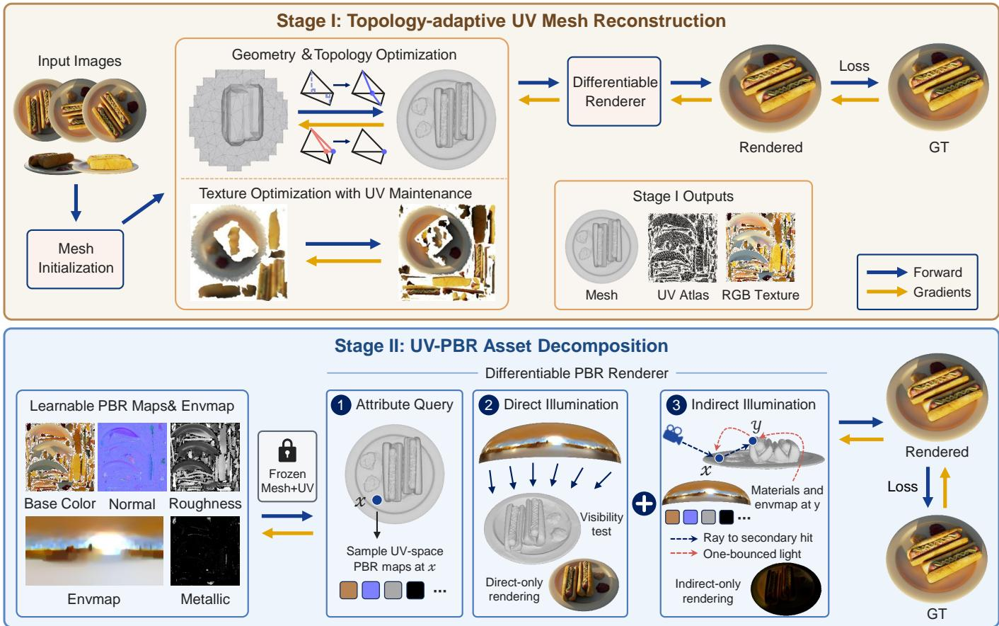  
Fig. 2. Overview of ExMesh++. Stage I reconstructs a stable mesh-UV carrier from multi-view images by jointly optimizing geometry, topology, and an RGB texture, with UV updates during vertex spliting and merging. Stage II freezes the reconstructed mesh and UV coordinates, then optimizes UV-space PBR maps and environment lighting with a diferentiable renderer. Material atributes are queried from the shared UV maps for both primary and secondary surface points, enabling direct illumination and one-bounce difuse indirect illumination on the explicit mesh.

## 2.4 Indirect Light Transport

Existing approaches to indirect illumination can be grouped into three categories. The first uses learned light or radiance fields. InvRender [Zhang et al. 2022] derives spatially varying indirect illumination from a learned radiance field, while NeILF++ [Zhang et al. 2023] couples incident and outgoing neural light fields through interreflection constraints. TensoIR [Jin et al. 2023] represents secondary shading efects with tensor-factorized neural fields. The second group stores approximate occlusion or indirect illumination in a scene-dependent cache. GS-IR [Liang et al. 2024], for example, bakes these quantities into volumetric grids. The third group explicitly simulates light transfer between surfaces. NeFII [Wu et al. 2023] traces secondary rays and caches indirect radiance in a neural field. IRGS [Gu et al. 2025] computes interreflection with diferentiable 2D Gaussian ray tracing, while RadiosityGS [Jiang et al. 2025] extends radiosity to Gaussian surfels. Within this last category, our method adopts a lightweight one-bounce difuse formulation on the mesh to capture local color bleeding and illumination in occluded regions.

## 3 Overview

As shown in Fig. 2, ExMesh++ follows a two-stage asset reconstruction pipeline. Stage I builds on our prior ExMesh framework [Fan et al. 2026] to reconstruct a compact explicit mesh together with a valid UV parameterization and an RGB appearance texture. It alternates diferentiable optimization of mesh geometry and texture with discrete vertex splitting and merging, while updating the UV mapping to remain consistent with topology changes. Stage II freezes the resulting mesh-UV carrier and decomposes its appearance into UV-space PBR maps and environment illumination. The fixed carrier is further used to compute one-bounce difuse indirect illumination through secondary-ray tracing and shared UV-PBR material queries. Sec. 4 details the topology-adaptive mesh-UV reconstruction, and Sec. 5 describes PBR decomposition and the one-bounce indirect-lighting formulation.

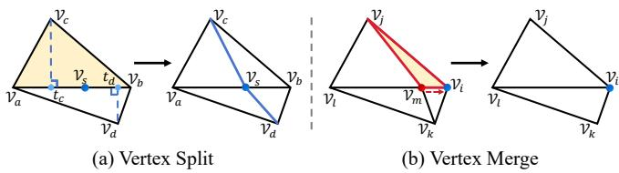  
Fig. 3. Discrete topological operations. (a) Vertex spliting inserts a new vertex on the selected edge and replaces the adjacent faces. (b) Vertex merging collapses an edge to simplify local topology.

## 4 Topology-Adaptive Mesh-UV Reconstruction

Given multi-view images and their camera parameters, the first stage constructs a stable mesh-UV asset carrier. We represent the explicit mesh as $M = ( V , F )$ , where � denotes the 3D vertex positions and � denotes the set of triangular faces. To decouple appearance resolution from geometric density, we maintain a set of UV coordinates � and a face-corner-to-UV index map Φ. The Stage-I RGB appearance is stored in a fixed-resolution UV texture map $T _ { \mathrm { r g b } }$ . In practice, we first train PGSR [Chen et al. 2024] for 5K iterations and extract a coarse mesh through TSDF fusion [Curless and Levoy 1996]. We then build an initial UV parameterization for the coarse mesh and initialize the RGB UV texture map. Our topology operations follow the classical vertex-split and edge-collapse paradigm of progressive meshes [Hoppe 1996], with task-specific criteria and UV updates designed for image-supervised reconstruction. The following sections describe how the mesh topology, UV mapping, and texture are optimized in Stage I.

## 4.1 Vertex Spliting

Splitting criterion. Vertex splitting increases local geometric resolution in regions with complex geometry or large remaining optimization errors. We first maintain an exponential moving average of the position-gradient norm for each vertex. This EMA provides a temporal estimate of the optimization signal on each vertex:

$$
\mathcal { G } _ { v } ^ { ( t ) } = \beta _ { g } \mathcal { G } _ { v } ^ { ( t - 1 ) } + \left( 1 - \beta _ { g } \right) \left. \nabla _ { v } \mathcal { L } ^ { ( t ) } \right. _ { 2 } ,\tag{1}
$$

where � is the current iteration and $\beta _ { g }$ is the EMA coeficient. For each face $f ,$ we define $\mathscr { G } _ { f }$ as the average gradient score of its three vertices. To capture local geometric variation, we estimate face curvature by averaging normal-angle diferences with adjacent faces:

$$
\mathcal { K } _ { f } = \frac { 1 } { \vert N ( f ) \vert } \sum _ { f ^ { \prime } \in N ( f ) } \operatorname { a r c c o s } \left( \mathbf { n } _ { f } \cdot \mathbf { n } _ { f ^ { \prime } } \right) ,\tag{2}
$$

where $N ( f )$ is the set of faces adjacent to $f ,$ and ${ \bf n } _ { f }$ and $\mathbf { n } _ { f ^ { \prime } }$ are their face normals. We restrict splitting candidates to relatively large faces, avoiding inefective refinement in already dense regions. Each candidate face is assigned the following splitting score:

$$
{ \cal S } _ { f } = w _ { g } { \cal G } _ { f } + w _ { k } \mathcal { K } _ { f } ,\tag{3}
$$

where $w _ { g }$ and $w _ { k }$ balance the gradient-driven term and the curvaturedriven term. Faces are selected for the current splitting round according to this score. This criterion combines optimization-driven density control with local geometric priors for adaptive explicit mesh refinement during reconstruction.

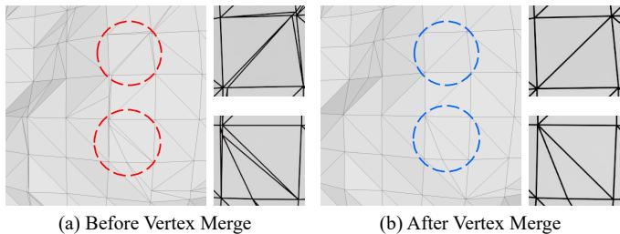  
Fig. 4. Visualization of vertex merging. The merge operation eliminates degenerate faces and restores a cleaner local topology.

Splitting operation. For a selected triangular face $f = ( v _ { a } , v _ { b } , v _ { c } )$ we first determine the edge to split. As shown in Fig. $3 ( \mathrm { a } )$ , for each edge $\boldsymbol { e } = \left( \boldsymbol { v } _ { i } , \boldsymbol { v } _ { j } \right)$ of $f ,$ let $\ell _ { e }$ be its length, and let $d _ { e } = ( \deg ( v _ { i } )$ + deg $\mathfrak { f } ( v _ { j } ) ) / 2$ be the average degree of its two endpoints. We define the edge score as $S _ { e } = \ell _ { e } / d _ { e }$ , and split the edge with the highest score. This score favors long edges while penalizing highly connected endpoints, which helps reduce unstable topology changes around high-valence vertices.

Let the selected edge be $\boldsymbol { e } = \left( \boldsymbol { v } _ { a } , \boldsymbol { v } _ { b } \right)$ . If � is an interior edge, it is shared by an adjacent face $f ^ { \prime } = ( v _ { a } , v _ { b } , v _ { d } )$ . To better fit the local surface shape, we project $v _ { c }$ and $v _ { d }$ onto the line of $e ,$ obtaining two projection points $t _ { c }$ and $t _ { d } .$ The new vertex is initialized as $\begin{array} { r } { { \boldsymbol { v } } _ { s } \ = \ ( t _ { c } + t _ { d } ) / 2 . } \end{array}$ We then remove the two original faces $f$ and $f ^ { \prime }$ , and add four new faces: $( v _ { a } , v _ { s } , v _ { c } ) , ( v _ { s } , v _ { b } , v _ { c } ) , ( v _ { a } , v _ { s } , v _ { d } )$ , and $( v _ { s } , v _ { b } , v _ { d } )$ . If � is a boundary edge, there is no adjacent face $f ^ { \prime } .$ . In this case, we place $v _ { s }$ at the midpoint of �, and replace the original face with two new faces. To avoid conflicts between concurrent topology changes, a splitting operation is skipped if any face to be modified has already been updated in the current round. The new vertex is further constrained to stay away from both edge endpoints. Specifically, $\mu = | | v _ { s } - v _ { a } | | _ { 2 } / | | v _ { b } - v _ { a } | | ;$ 2 must satisfy $\mu \in \left[ 0 . 2 5 , 0 . 7 5 \right]$ Invalid splits are discarded to prevent skinny triangles.

## 4.2 Vertex Merging

Merging criterion. Vertex merging removes redundant structures and degenerate faces produced during optimization. It is implemented as a local edge-collapse operation [Garland and Heckbert 1997; Hoppe 1996]. We select merging candidates using two cues: rendering visibility and geometric degeneracy. For rendering visibility, we record the contribution count $C _ { \mathrm { r e n d } } ( f )$ of each face during rasterization over the training views. If a face is never rendered, i.e., $C _ { \mathrm { r e n d } } ( f ) = 0 ;$ , it may be an internal face, a fully occluded face, or a redundant structure that does not contribute to the current reconstruction. To quantify geometric degeneracy, we use

$$
\mathcal { D } _ { f } = \frac { \mathrm { A r e a } ( f ) } { \ell _ { \mathrm { m a x } } ^ { 2 } ( f ) } ,\tag{4}
$$

where $\operatorname { A r e a } ( f )$ is the area of face $f ,$ and $\ell _ { \mathrm { m a x } } ( f )$ is the length of its longest edge. If $\mathcal { D } _ { f } < \tau _ { \mathrm { d e g e n } } ,$ the face is considered degenerate. To avoid over-simplifying large-scale structures, we only select merging candidates from faces with relatively small areas. Faces satisfying $C _ { \mathrm { r e n d } } ( f ) = 0 \mathrm { o r } \mathcal { D } _ { f } < \tau _ { \mathrm { d e g e n } }$ are added to the merging set of the current round. Fig. 4 illustrates this process, where vertex merging eliminates degenerate faces and restores a clean topology.

Merging operation. For a candidate face $f = ( v _ { a } , v _ { b } , v _ { c } )$ , we first determine which edge to collapse. As shown in Fig. 3(b), if the face has a boundary edge, that edge is collapsed to preserve the object outline. If the face is an interior face, we collapse its shortest edge to preferentially remove fine degenerate structures. After choosing the collapse edge $\boldsymbol { e } = ( v _ { i } , v _ { j } )$ , we compare the degrees of its two endpoints. The endpoint with a lower degree is denoted as $v _ { r }$ , and is merged into the other endpoint $v _ { s }$ . The vertex $v _ { r }$ is then removed, and the adjacent faces are updated accordingly. Faces containing both $v _ { r }$ and $v _ { s }$ degenerate into edges after the collapse and are therefore deleted. Faces containing $v _ { r }$ but not $v _ { s }$ are reconnected by replacing $v _ { r }$ with $v _ { s } .$ . As in vertex splitting, the merge is skipped if any afected face has already been updated in the same round. This avoids conflicts between multiple discrete topology operations.

## 4.3 UV Maintenance

Stage I changes the mesh connectivity during optimization, so the UV mapping must be updated together with each topology change. Each update keeps the face-corner UV index map Φ valid after vertex insertion or deletion, while preserving separate UV coordinates along texture seams when needed. In this way, the RGB texture map $T _ { \mathrm { r g b } }$ remains a learnable appearance representation during topology adaptation, and the UV parameterization stays valid after vertex splitting or merging.

For vertex splitting, suppose the new vertex $v _ { s }$ lies on edge $e =$ $( v _ { a } , v _ { b } )$ , with relative position $\mu .$ We interpolate the endpoint UV coordinates in the UV space of each related face. If � is a boundary edge, and the endpoint UVs in the original face are $u _ { a }$ and $u _ { b } .$ , then the UV coordinate of the new vertex is

$$
u _ { s } = ( 1 - \mu ) u _ { a } + \mu u _ { b } .\tag{5}
$$

This coordinate is assigned to all new face corners containing $v _ { s }$ . If � is an interior edge, it belongs to two old faces. These two faces may lie on diferent UV islands. We therefore interpolate in the UV space of the two faces separately and obtain two candidate coordinates:

$$
u _ { s } ^ { ( 1 ) } = ( 1 - \mu ) u _ { a } + \mu u _ { b } , \quad u _ { s } ^ { ( 2 ) } = ( 1 - \mu ) u _ { a } ^ { \prime } + \mu u _ { b } ^ { \prime } .\tag{6}
$$

I $\lvert \lvert u _ { s } ^ { ( 1 ) } - u _ { s } ^ { ( 2 ) } \rvert \rvert _ { 2 } < \tau _ { \mathrm { u v } }$ , the edge is treated as a non-seam edge. We average the two candidates, create one shared UV coordinate, and assign it to all related new faces. Otherwise, the edge is treated as crossing a UV seam. We create two independent UV coordinates for $v _ { s } ,$ and update the face-corner UV indices according to the original UV island of each new face. This seam-aware local update preserves the existing UV island boundaries during topology refinement.

For vertex merging, we update UV indices after deleting the vertex and reconnecting the adjacent faces. We first keep all UV coordinates that are still referenced by face corners, and remove UV coordinates that are no longer referenced by any face. We then build a mapping from old UV indices to new UV indices. This mapping is used to update all face-corner UV indices. As a result, the UV coordinate list remains compact, and every index in Φ points to a valid UV coordinate. This operation only reorganizes indices, without moving UV coordinates still referenced by face corners.

## 4.4 Stage-I Optimization

Stage I uses diferentiable rasterization to back-propagate image supervision to the explicit mesh and the UV texture map [Laine et al. 2020]. At each iteration, we render the current mesh from a training view and obtain an RGB image $\hat { I } ,$ an alpha mask ${ \hat { S } } ,$ and a depth map $\hat { D } .$ During rendering, the vertex positions � determine the mesh projection and visibility in the image plane. The face-corner UV coordinates are interpolated with barycentric coordinates to obtain the texture sampling location of each pixel, and the color is read from $T _ { \mathrm { r g b } }$ . The Stage-I objective is defined as

$$
\mathcal { L } _ { \mathrm { I } } = \lambda _ { \mathrm { r g b } } \mathcal { L } _ { \mathrm { r g b } } + \lambda _ { d } \mathcal { L } _ { d } + \lambda _ { m } \mathcal { L } _ { m } + \lambda _ { s } \mathcal { L } _ { s } + \lambda _ { b } \mathcal { L } _ { b } .\tag{7}
$$

Here, ${ \mathcal { L } } _ { \mathrm { r g b } }$ is the main image reconstruction loss. It combines an $L _ { 1 }$ term and a D-SSIM term [Kerbl et al. 2023]:

$$
\mathcal { L } _ { \mathrm { r g b } } = \big ( 1 - \lambda _ { \mathrm { s s i m } } \big ) \| \hat { I } - I \| _ { 1 } + \lambda _ { \mathrm { s s i m } } \mathcal { L } _ { \mathrm { D - S S I M } } ( \hat { I } , I ) .\tag{8}
$$

In addition to RGB supervision, we use a depth consistency loss $\mathcal { L } _ { d }$ and a silhouette loss ${ \mathcal { L } } _ { m }$ to provide geometric cues. The depth consistency loss is computed inside the object mask. We obtain the reference depth $D _ { \mathrm { r e f } }$ using Depth Anything 3 [Lin et al. 2025] and measure its Pearson distance to the rendered depth $\hat { D } { : }$

$$
\mathcal { L } _ { d } = 1 - \frac { \mathrm { C o v } ( \hat { D } , D _ { \mathrm { r e f } } ) } { \sigma _ { \hat { D } } \sigma _ { D _ { \mathrm { r e f } } } } .\tag{9}
$$

The silhouette loss ${ \mathcal { L } } _ { m }$ is the binary cross-entropy between the rendered alpha mask and the input mask. In addition, $\mathcal { L } _ { s }$ is a Laplacian smoothing regularizer that suppresses local high-frequency noise. $\mathcal { L } _ { b }$ is an adjacent-vertex ofset regularizer that constrains local deformation consistency [Munkberg et al. 2022].

After optimization, Stage I outputs a mesh M∗, a UV parameterization $( U ^ { * } , \Phi ^ { * } )$ , and an RGB texture $T _ { \mathrm { r g b } } ^ { * } . M ^ { * }$ , UV coordinates $U ^ { * }$ and UV index map $\Phi ^ { * }$ are fixed in Stage II. They serve as the asset carrier for UV-PBR material and lighting optimization.

## 5 UV-PBR Asset Decomposition

Given the mesh $\boldsymbol { M } ^ { * } = \left( \boldsymbol { V } ^ { * } , \boldsymbol { F } ^ { * } \right)$ , UV parameterization $( U ^ { * } , \Phi ^ { * } )$ , and RGB texture $T _ { \mathrm { r g b } } ^ { \ast }$ from Stage I, the second stage fixes the vertex positions, mesh topology, and UV coordinates. It only optimizes PBR material maps and environment lighting in the shared UV space. Specifically, we represent the optimizable asset parameters as $\Theta = \left\{ A , R , M _ { \mathrm { m e t } } , N , E \right\}$ . Here, � is a three-channel base-color map, � is a single-channel roughness map, $M _ { \mathrm { m e t } }$ is a single-channel metallic map, � is a tangent-space normal map, and � is a learnable RGB latlong environment map. Note that the metallic map is optional. When metallic modeling is disabled, $M _ { \mathrm { m e t } }$ is omitted from optimization and $m ( x )$ is fixed to zero, yielding a dielectric material model. At the beginning of the PBR stage, � is initialized from the Stage-I RGB UV texture and converted from sRGB to linear RGB space. The roughness, normal, and environment maps are initialized to neutral values, while the optional metallic map is initialized to zero.

## 5.1 Atribute Query

In PBR rendering, material parameters are queried from the UV space to 3D surfaces through the fixed mesh-UV carrier. For a visible intersection point � between a camera ray and the mesh, the renderer first obtains the face � containing � and its barycentric coordinates b. From b, we interpolate the surface position, the $\mathrm { g e ^ { - } }$ ometry normal ${ \mathbf { n } } _ { g } ( x )$ , the view direction $\omega _ { o } ,$ , and the UV coordinate $u ( x )$ . We then use diferentiable bilinear sampling to read material attributes from the PBR maps:

$$
\begin{array} { c l c r } { { a ( x ) = A ( u ( x ) ) , \quad r ( x ) = R ( u ( x ) ) , } } \\ { { { } } } \\ { { m ( x ) = M _ { \mathrm { m e t } } ( u ( x ) ) , \quad q ( x ) = N ( u ( x ) ) . } } \end{array}\tag{10}
$$

Here, $a ( x ) , r ( x )$ , and �(�) denote base-color, roughness, and metallic, respectively. For the normal map, we first convert $q ( x )$ from texture values to a tangent-space normal. We then transform it to world space using the tangent frame interpolated on the current face, obtaining the shading normal $\mathbf { n } _ { s } ( x )$ . The PBR attributes at surface point � are denoted as

$$
\pmb { \mathcal { A } } ( \pmb { x } ) = \{ a ( \pmb { x } ) , r ( \pmb { x } ) , m ( \pmb { x } ) , \mathbf { n } _ { s } ( \pmb { x } ) \} .\tag{11}
$$

The same query applies to primary and secondary surface points.

## 5.2 Direct Illumination

For a primary surface point �, we use the learnable environment map � to estimate its direct incident illumination. Given the view direction $\omega _ { o }$ and attributes A(�), the direct outgoing radiance is

$$
\begin{array} { r l r } { L _ { \mathrm { d i r } } ( \boldsymbol { x } , \omega _ { o } ) = \displaystyle \int _ { \Omega ^ { + } } E ( \omega _ { i } ) \ \mathrm { V i s } ( \boldsymbol { x } , \omega _ { i } ) } & { } & \\ { f _ { r } ( \mathcal { A } ( \boldsymbol { x } ) , \omega _ { i } , \omega _ { o } ) \ \operatorname* { m a x } ( \mathbf { n } _ { s } ( \boldsymbol { x } ) \cdot \omega _ { i } , 0 ) d \omega _ { i } , } & { } & \end{array}\tag{12}
$$

where $\Omega ^ { + }$ is the upper hemisphere around the shading normal, $\omega _ { i }$ is the incident direction, and Vis(�, ��) is the visibility from � along $\omega _ { i }$ We use a metallic-roughness PBR BRDF and decompose reflection into difuse and specular components:

$$
f _ { r } ( \mathcal { A } ( \boldsymbol { x } ) , \omega _ { i } , \omega _ { o } ) = f _ { d } ( \mathcal { A } ( \boldsymbol { x } ) ) + f _ { s } ( \mathcal { A } ( \boldsymbol { x } ) , \omega _ { i } , \omega _ { o } ) .\tag{13}
$$

Only the non-metallic component contributes to the difuse term:

$$
f _ { d } ( \mathcal { A } ( x ) ) = \frac { ( 1 - m ( x ) ) a ( x ) } { \pi } .\tag{14}
$$

When $m ( x ) = 0 ;$ , the difuse component is active, while the specular component uses the dielectric base reflectance. As �(�) approaches 1, the difuse component vanishes, and the base-color determines the specular color. The specular term follows a microfacet BRDF [Cook and Torrance 1982; Karis 2013; Walter et al. 2007]:

$$
f _ { s } = \frac { D ( \mathbf { h } , \alpha ) G ( \omega _ { i } , \omega _ { o } , \alpha ) F ( \omega _ { i } , \mathbf { h } , F _ { 0 } ) } { 4 \operatorname* { m a x } ( \mathbf { n } _ { s } \cdot \boldsymbol { \omega } _ { i } , 0 ) \operatorname* { m a x } ( \mathbf { n } _ { s } \cdot \boldsymbol { \omega } _ { o } , 0 ) + \epsilon } ,\tag{15}
$$

where h is the half vector, and $\alpha ,$ derived from the roughness $r ( x )$ controls the width of the specular lobe. $D , G ,$ and � are the normal distribution function, geometry term, and Fresnel term, respectively. The Fresnel base reflectance $F _ { 0 }$ is interpolated between the dielectric reflectance $F _ { \mathrm { d i e l e c t r i c } }$ and the base-color according to metallic:

$$
F _ { 0 } = \left( 1 - m ( x ) \right) F _ { \mathrm { d i e l e c t r i c } } + m ( x ) a ( x ) .\tag{16}
$$

Roughness controls the microfacet distribution and therefore the concentration of specular highlights.

During optimization, the above integral is approximated with Monte Carlo sampling. We build an importance sampling distribution from the brightness of the environment map and the spherical area weights, and sample incident directions from this distribution. For each sampled direction, ray tracing is used to test whether it is occluded by the reconstructed mesh [Parker et al. 2010]. The learnable environment map is parameterized to be non-negative, so that radiance values remain valid. With $N _ { d }$ environment samples, the direct-light estimator is

$$
\begin{array} { r l r } {  { \hat { L } _ { \mathrm { d i r } } ( \boldsymbol { x } , \omega _ { o } ) = \frac { 1 } { N _ { d } } \sum _ { k = 1 } ^ { N _ { d } } \frac { E ( \omega _ { i } ^ { k } ) \mathrm { \ V i s } ( \boldsymbol { x } , \omega _ { i } ^ { k } ) f _ { r } ( \mathcal { A } ( \boldsymbol { x } ) , \omega _ { i } ^ { k } , \omega _ { o } ) } { p ( \omega _ { i } ^ { k } ) } } } \\ & { } & { \cdot \operatorname* { m a x } ( \mathbf { n } _ { s } ( \boldsymbol { x } ) \cdot \omega _ { i } ^ { k } , 0 ) , } \end{array}\tag{17}
$$

where $\boldsymbol { p } ( \omega _ { i } ^ { k } )$ is the sampling density. The rendered linear RGB result is used for log- ${ \bf - } L _ { 1 }$ loss and is converted to sRGB for the D-SSIM term.

## 5.3 One-Bounce Indirect Illumination

In addition to direct environment illumination, we explicitly compute one-bounce difuse indirect illumination. For a primary surface point �, the renderer samples a set of secondary directions $\{ \omega _ { j } \} _ { j = 1 } ^ { N _ { b } }$ in the hemisphere defined by the geometry normal $\mathbf { n } _ { g } ( x )$ , and traces the corresponding rays on the fixed mesh. A secondary sample is considered valid only if the ray hits a front-facing surface, producing a secondary intersection point $y _ { j }$ . For each valid $y _ { j } .$ , we obtain $\mathcal { A } ( y _ { j } )$ using the same attribute query as in Sec. 5.1, based on its face index and barycentric coordinates.

At each secondary hit point, we estimate only the difuse component under direct environment lighting, without modeling indirect specular reflection. Let $f _ { d } ( y ) = ( 1 - m ( y ) ) a ( y ) / \pi$ be the difuse BRDF term at the secondary point. The direct difuse radiance at the secondary point is

$$
L _ { \mathrm { s e c } } ( y ) = \int _ { \Omega ^ { + } } E ( \omega _ { i } ) \ \mathrm { V i s } ( y , \omega _ { i } ) f _ { d } ( y ) \ \mathrm { m a x } ( \mathbf n _ { s } ( y ) \cdot { \boldsymbol \omega } _ { i } , 0 ) d \omega _ { i } .\tag{18}
$$

The returned radiance is then weighted by the difuse BRDF term at the primary point �. Using directions sampled over the primary hemisphere, we obtain the following Monte Carlo estimator for one-bounce indirect illumination:

$$
\hat { L } _ { \mathrm { i n d } } ( \boldsymbol { x } ) = \frac { 1 } { N _ { b } } \sum _ { j = 1 } ^ { N _ { b } } \mathbf { 1 } _ { \mathrm { h i t } } ( \boldsymbol { x } , \omega _ { j } ) \frac { f _ { d } ( \boldsymbol { x } ) L _ { \mathrm { s e c } } ( y _ { j } ) \operatorname* { m a x } ( \mathbf { n } _ { s } ( \boldsymbol { x } ) \cdot \omega _ { j } , 0 ) } { \mathcal { P } _ { b } ( \omega _ { j } ) } ,\tag{19}
$$

where $\scriptstyle { \mathcal { P } } b$ is the sampling probability density of secondary directions, and $1 _ { \mathrm { h i t } }$ indicates whether the secondary ray produces a valid hit. The final rendered result for training is

$$
\hat { I } = \hat { L } _ { \mathrm { d i r } } + \lambda _ { \mathrm { i n d } } \hat { L } _ { \mathrm { i n d } } ,\tag{20}
$$

where $\lambda _ { \mathrm { i n d } }$ controls the strength of indirect illumination. Since the PBR materials and environment lighting are unstable at the beginning of Stage II, $\lambda _ { \mathrm { i n d } }$ is gradually increased from 0 to its target value. This schedule allows the direct-light decomposition to reach an initial stable state before introducing color transfer between surfaces. The one-bounce term is computed entirely from the fixed mesh, the shared UV-PBR maps, and the environment map, without introducing an additional learned residual color field.

## 5.4 Stage-II Optimization

For each training view, the fixed mesh and current PBR parameters are used to render an image ˆ�. We minimize the reconstruction error between ˆ� and the ground-truth image �. The image loss consists of

a log- ${ \boldsymbol { \cdot } } L _ { 1 }$ term in linear RGB space and an SSIM term in sRGB space:

$$
\mathcal { L } _ { \mathrm { i m g } } = \lambda _ { \log } \left. \log ( 1 + \hat { I } ) - \log ( 1 + I ) \right. _ { 1 } + \lambda _ { \mathrm { s s i m } } \mathcal { L } _ { \mathrm { D - S S I M } } ( \Gamma ( \hat { I } ) , \Gamma ( I ) ) ,\tag{21}
$$

where Γ(·) converts linear RGB to sRGB.

Using only the image reconstruction loss leaves ambiguities in material-light decomposition. We therefore introduce regularization on the projected material attributes and the environment map. The Stage-II objective is

$$
\begin{array} { r } { \mathcal { L } _ { \mathrm { I I } } = \mathcal { L } _ { \mathrm { i m g } } + \lambda _ { \mathrm { m a t } } \mathcal { L } _ { \mathrm { m a t } } + \lambda _ { \mathrm { e n v } } \mathcal { L } _ { \mathrm { e n v } } + \lambda _ { \mathrm { c h r o m a } } ( t ) \mathcal { L } _ { \mathrm { c h r o m a } } . } \end{array}\tag{22}
$$

For the current training view, let $\widehat { P }$ denote the screen-space projection of a UV-space material map $P .$ We define the material and environment regularizers as

$$
\mathcal { L } _ { \mathrm { m a t } } = \sum _ { P \in \mathcal { P } _ { m a t } } \mathrm { T V } ( \widehat { P } ) , \qquad \mathcal { L } _ { \mathrm { e n v } } = \mathrm { T V } ( E ) ,\tag{23}
$$

where $\mathcal { P } _ { m a t } = \{ A , R , N \}$ contains the base-color, roughness, and normal maps, and additionally includes $M _ { \mathrm { m e t } }$ when metallic optimization is enabled. Here, $\mathrm { T V } ( \cdot )$ denotes total variation over neighboring pixels. Accordingly, $\mathcal { L } _ { \mathrm { m a t } }$ encourages locally smooth material attributes over adjacent visible surface points in image space, whereas ${ \mathcal { L } } _ { \mathrm { e n v } }$ suppresses high-frequency noise in the environment map.

We additionally regularize the global color of the environment map during early optimization. Let $\bar { \mathbf { E } } = ( \bar { E } _ { r } , \bar { E } _ { q } , \bar { E } _ { b } )$ denote its mean RGB radiance and $\mu _ { E } = { \left( \bar { E } _ { r } + \bar { E } _ { g } + \bar { E } _ { b } \right) } / { 3 }$ . The chroma regularizer is

$$
\mathcal { L } _ { \mathrm { c h r o m a } } = \left. \bar { \mathbf { E } } - \mu _ { E } \mathbf { 1 } \right. _ { 2 } ^ { 2 } , \qquad \lambda _ { \mathrm { c h r o m a } } ( t ) = \lambda _ { \mathrm { c h r o m a } } ^ { 0 } \left( 1 - \frac { t } { T } \right) .\tag{24}
$$

This term discourages a global color cast in the recovered illumination. Its weight decreases linearly throughout training and reaches zero at the end of training.

## 6 Experiments

## 6.1 Experimental Setup

Implementation details. We implement ExMesh++ in PyTorch and use nvdifrast [Laine et al. 2020] for diferentiable rasterization. All experiments are conducted on a single NVIDIA RTX A6000 GPU. Unless otherwise stated, we use the same hyperparameter settings across all datasets and scenes, as summarized in Table 1. For each scene, we first train PGSR [Chen et al. 2024] for 5K iterations and extract an initial coarse mesh with TSDF fusion [Curless and Levoy 1996] at a resolution of 2563. We then build the initial UV parameterization and RGB UV texture. Stage I is optimized for 10K iterations. The first 1K iterations serve as a warm-up period without topology updates. From 1K to 6K iterations, vertex splitting and merging are performed every 500 iterations, with UV mapping updated accordingly. To prevent accumulated distortion and uneven texel allocation, we regenerate the UV atlas with xatlas every 2K iterations and transfer the current RGB texture to the new parameterization. After 6K iterations, the topology is fixed, while the vertex positions and RGB texture are refined until 10K iterations.

Stage II is trained for another 10K iterations. In this stage, vertex positions, topology, and UV coordinates are fixed, while base color, roughness, normal map, and a lat-long environment map are optimized. The PBR renderer approximates the environment-lighting integrals using Monte Carlo sampling [Kajiya 1986] and evaluates visibility through OptiX ray tracing [Parker et al. 2010]. At each primary surface point, we draw $N _ { d }$ direct-light samples and trace $N _ { b }$ secondary rays. Each valid secondary hit uses $N _ { s }$ light samples to estimate its directly illuminated difuse radiance. Secondary rays are evaluated at half resolution in both image dimensions, and the resulting indirect-light component is upsampled to full resolution. The indirect-light weight is linearly increased from 0 to 1 during the first 1K iterations of Stage II, allowing the direct material-light decomposition to stabilize before introducing interreflection.

Table 1. Default hyperparameter setings used in our implementation.
<table><tr><td colspan="2">Hyperparameter</td><td>Value</td></tr><tr><td>Shared parameters</td><td>Texture/material map resolution Texture/material learning rate D-SSIM weight  $\lambda _ { \mathrm { s s i m } }$ </td><td>2048 × 2048  $2 . 5 \times 1 0 ^ { - 3 }$  0.2</td></tr><tr><td>Stage I</td><td>Initial vertex learning rate Gradient EMA coefficient  $\beta _ { g }$  Split-score weights  $w _ { g } , w _ { k }$  Maximum face count Degeneracy threshold  $\tau _ { \mathrm { d e g e n } }$  Depth weight  $\lambda _ { d }$  Silhouette weight  $\lambda _ { m }$  Smoothness weight  $\lambda _ { s }$  Deviation weight  $\lambda _ { b }$ </td><td> $5 \times 1 0 ^ { - 4 }$  0.95 0.6, 0.4 200K 0.05 0.01 0.005 1000</td></tr><tr><td>Stage II</td><td>Environment-map resolution Environment learning rate Direct-light samples  $N _ { d }$  Secondary-ray samples  $N _ { b }$  Light samples per secondary hit  $N _ { s }$  Material/environment TV weights Initial chroma weight  $\lambda _ { \mathrm { c h r o m a } } ^ { 0 }$  Target indirect-light weight  $\ddot { \lambda } _ { \mathrm { i n d } } ^ { \mathrm { m a x } }$ </td><td>1000 256 × 512  $1 . 5 \times 1 0 ^ { - 2 }$  8 16 4  $\lambda _ { \mathrm { m a t } } , \lambda _ { \mathrm { e n v } }$  0.1 0.1 1.0</td></tr></table>

Several baselines do not model metallic materials, and the evaluation datasets provide no reference metallic maps. For consistent benchmark comparisons, we therefore disable metallic optimization and fix the metallic map to zero. The optional metallic channel is retained for downstream asset editing.

Datasets and Metrics. We evaluate ExMesh++ on three datasets: DTU [Jensen et al. 2014], Synthetic4Relight [Zhang et al. 2022], and Stanford-ORB [Kuang et al. 2023]. DTU contains 15 real-world objects, which are used for geometric evaluation and qualitative analysis of indirect lighting. Synthetic4Relight contains 4 CAD objects with self-occlusion and multiple materials, and provides test settings for novel-view synthesis, albedo, roughness, and novel-light relighting. Stanford-ORB contains captures of14 real objects under 7 real environments, together with reference geometry, normal maps, and depth maps. We additionally use NeRF-Synthetic [Mildenhall et al. 2020] only for Stage-I ablations. Its controlled synthetic scenes and reference geometry allow these design choices to be evaluated without the ambiguity introduced by material-light decomposition.

On DTU, we report Chamfer Distance, runtime, and the number of mesh vertices. On Synthetic4Relight, we evaluate novel-view synthesis, relighting, and albedo with PSNR, SSIM [Wang et al.

Table 2. Quantitative geometry comparison on DTU, reporting per-scan and average Chamfer Distance, total runtime, and the number of mesh vertices. Our runtime includes 3 minutes of initialization and 10 minutes of Stage-I optimization. denotes the best, second best, third best, respectively.
<table><tr><td></td><td>Method</td><td>24</td><td>37</td><td>40</td><td>55</td><td>63</td><td>65</td><td>69</td><td>83</td><td>97</td><td>105</td><td>106</td><td>110</td><td>114</td><td>118</td><td>122</td><td>Avg.</td><td></td><td>Time #V</td></tr><tr><td rowspan="3">NeRF- based</td><td>VolSDF [Yariv et al. 2021]</td><td>1.14</td><td>1.26</td><td>0.81</td><td></td><td>0.49</td><td>1.25</td><td>0.70 0.72</td><td>1.29</td><td>1.18</td><td>0.70</td><td>0.66</td><td>1.08</td><td>0.42</td><td>0.61</td><td>0.55</td><td>0.86</td><td>&gt;12h</td><td>1M</td></tr><tr><td>NeuS [Wang et al. 2021]</td><td>0.83</td><td>0.98</td><td>0.56</td><td>0.37</td><td></td><td>1.13</td><td>0.59</td><td>0.60</td><td>1.45 0.95</td><td>0.78</td><td>0.52</td><td>1.43</td><td>0.36</td><td>0.45</td><td>0.45</td><td>0.77</td><td></td><td>&gt;12h 488K</td></tr><tr><td>Neuralangelo [Li et al. 2023]</td><td>0.45</td><td>0.74</td><td>0.33</td><td>0.34</td><td>1.05</td><td>0.54</td><td>0.53</td><td>1.33</td><td>1.05</td><td>0.72</td><td>0.43</td><td>0.69</td><td>0.34</td><td>0.38</td><td>0.42</td><td>0.62</td><td>&gt;12h</td><td>1M</td></tr><tr><td rowspan="5">GS- based</td><td>SuGaR [Guédon and Lepetit 2024]</td><td>1.47</td><td>1.33</td><td>1.13</td><td>0.61</td><td>2.25</td><td>1.71</td><td>1.15</td><td>1.63</td><td>1.62</td><td>1.07</td><td>0.79</td><td>2.45</td><td>0.98</td><td>0.88</td><td>0.79</td><td>1.33</td><td>1h</td><td>492K</td></tr><tr><td>2DGS [Huang et al. 2024]</td><td>0.46</td><td>0.84</td><td>0.31</td><td>0.45</td><td>0.92</td><td>1.01</td><td>0.83</td><td>1.23</td><td>1.30</td><td>0.66</td><td>0.61</td><td>1.07</td><td>0.45</td><td>0.71</td><td>0.54</td><td>0.76</td><td>11m</td><td>134K</td></tr><tr><td>GOF [Yu et al. 2024]</td><td>0.50</td><td>0.82</td><td>0.37</td><td>0.37</td><td>1.12</td><td>0.74</td><td>0.73</td><td>1.18</td><td>1.29</td><td>0.68</td><td>0.77</td><td>0.90</td><td>0.42</td><td>0.66</td><td>0.49</td><td>0.74</td><td>1h</td><td>532K</td></tr><tr><td>PGSR [Chen et al. 2024]</td><td>0.36</td><td>0.57</td><td>0.38</td><td>0.33</td><td>0.78</td><td>0.58</td><td>0.50</td><td>1.08</td><td>0.63</td><td>0.59</td><td>0.46</td><td>0.54</td><td>0.30</td><td>0.38</td><td>0.34</td><td>0.52</td><td>30m</td><td>540K</td></tr><tr><td>QGS [Zhang et al. 2025]</td><td>0.38</td><td>0.62</td><td>0.37</td><td>0.38</td><td>0.75</td><td>0.55</td><td>0.51</td><td>1.12</td><td>0.68</td><td>0.61</td><td>0.46</td><td>0.58</td><td>0.35</td><td>0.41</td><td>0.40</td><td>0.54</td><td>48m</td><td>129K</td></tr><tr><td rowspan="4">Mesh- driven</td><td>NVDiffRec [Munkberg et al. 2022]</td><td>3.04</td><td>3.02</td><td>2.10</td><td>0.78</td><td>2.18</td><td>1.60</td><td></td><td>1.46 1.67</td><td>2.85</td><td>1.26</td><td>1.10</td><td>3.26</td><td>1.13</td><td>1.31</td><td>1.19</td><td>1.86</td><td>&gt;1h</td><td>69K</td></tr><tr><td>IMLS-Splat [Yang et al. 2025]</td><td>0.32</td><td>1.32</td><td>0.67</td><td>0.62</td><td>1.16</td><td>0.80</td><td>0.78</td><td>1.45</td><td>1.06</td><td>0.89</td><td>0.67</td><td>0.97</td><td>0.63</td><td>0.63</td><td>0.64</td><td>0.84</td><td>15m</td><td>159K</td></tr><tr><td>GeoSVR [Li et al. 2025]</td><td>0.32</td><td>0.51</td><td>0.30</td><td>0.33</td><td>0.71</td><td>0.48</td><td>0.42</td><td>1.03</td><td>0.62</td><td>0.56</td><td>0.33</td><td>0.46</td><td>0.30</td><td>0.34</td><td>0.32</td><td>0.47</td><td>49m</td><td>489K</td></tr><tr><td>Ours (StageI)</td><td>0.44</td><td>0.70</td><td>0.30</td><td>0.34</td><td></td><td>0.76</td><td>0.63</td><td>0.52</td><td>1.06 1.05</td><td>0.58</td><td>0.45</td><td>0.88</td><td>0.32</td><td>0.36</td><td>0.38</td><td>0.58</td><td>13m</td><td>102K</td></tr></table>

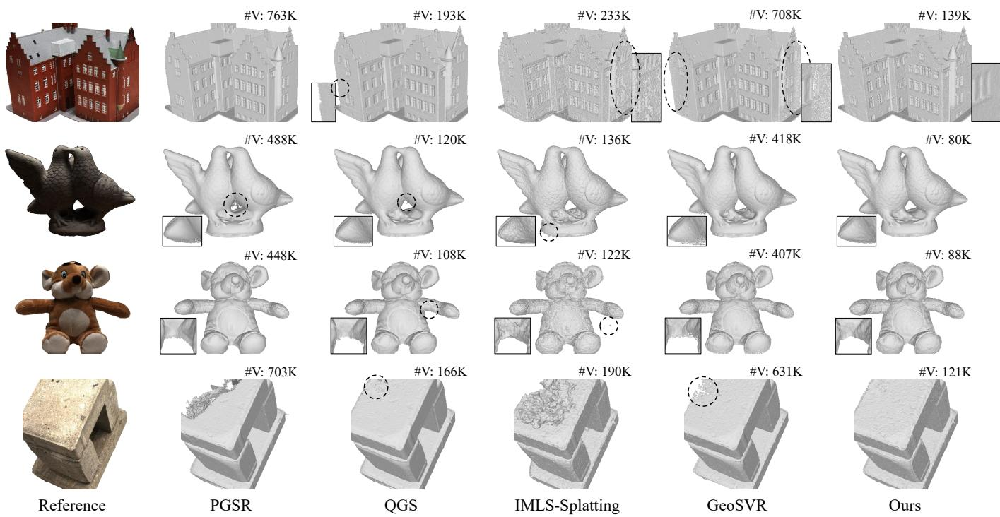  
Fig. 5. Qualitative geometry comparison on the DTU dataset, with number of vertices reported above each reconstruction. ExMesh++ recovers detailed and structurally complete surfaces while using fewer vertices and producing fewer floating fragments than the compared methods.

2004], and LPIPS [Zhang et al. 2018], and evaluate roughness with MSE. Stanford-ORB provides both HDR and LDR versions of its captures. Following the benchmark protocol, all compared methods are trained on the HDR version. We report PSNR-H, PSNR-L, SSIM, LPIPS, depth error, normal error, and Chamfer Distance. PSNR-H is computed in linear HDR space, while PSNR-L, SSIM, and LPIPS are computed on the tone-mapped LDR images.

Baselines. For geometry reconstruction, we compare with three categories of surface reconstruction methods. NeRF-based methods include VolSDF [Yariv et al. 2021], NeuS [Wang et al. 2021], and Neuralangelo [Li et al. 2023]. Gaussian-based methods include SuGaR [Guédon and Lepetit 2024], 2DGS [Huang et al. 2024], GOF [Yu et al. 2024], PGSR [Chen et al. 2024], and QGS [Zhang et al. 2025]. Mesh-driven methods include NVDifRec [Munkberg et al. 2022], IMLS-Splatting [Yang et al. 2025], and GeoSVR [Li et al. 2025].

For relighting and material decomposition, we also compare with three categories of inverse rendering methods. Neural inverse rendering methods include NeRFactor [Zhang et al. 2021], InvRender [Zhang et al. 2022], and TensoIR [Jin et al. 2023]. The explicit PBR baseline is NVDifRecMC [Hasselgren et al. 2022]. Gaussian-based

Table 3. Quantitative comparison on Synthetic4Relight in novel-view synthesis, relighting, material recovery, and runtime. Our runtime covers initialization and both training stages. “Explicit Mesh” indicates direct mesh output; “Intermediate” denotes meshes used internally but not exported as optimized assets.
<table><tr><td rowspan="2">Method</td><td rowspan="2">Explicit Mesh</td><td colspan="3">Novel View Synthesis</td><td colspan="3">Relighting</td><td colspan="3">Albedo</td><td rowspan="2">Roughness MSE↓</td><td rowspan="2">Time</td></tr><tr><td>PSNR↑</td><td></td><td>SSIM↑ LPIPS↓</td><td>PSNR↑</td><td>SSIM↑</td><td>LPIPS↓</td><td>PSNR↑</td><td>SSIM↑</td><td>LPIPS↓</td></tr><tr><td>NeRFactor [Zhang et al. 2021]</td><td></td><td>22.80</td><td>0.916</td><td>0.150</td><td>21.54</td><td>0.875</td><td>0.171</td><td>19.49</td><td>0.864</td><td>0.206</td><td>N/A</td><td>&gt;48h</td></tr><tr><td>NVDiffRecMC [Hasselgren et al. 2022]</td><td></td><td>34.29</td><td>0.967</td><td>0.068</td><td>24.22</td><td>0.943</td><td>0.078</td><td>29.61</td><td>0.945</td><td>0.075</td><td>0.009</td><td>2h</td></tr><tr><td>InvRender [Zhang et al. 2022]</td><td>×&gt;×</td><td>30.74</td><td>0.953</td><td>0.086</td><td>28.67</td><td>0.950</td><td>0.091</td><td>28.28</td><td>0.935</td><td>0.072</td><td>0.008</td><td>&gt;12h</td></tr><tr><td>TensoIR [Jin et al. 2023]</td><td>x</td><td>35.80</td><td>0.978</td><td>0.049</td><td>29.69</td><td>0.951</td><td>0.079</td><td>30.58</td><td>0.946</td><td>0.065</td><td>0.015</td><td>&gt;4h</td></tr><tr><td>GS-IR [Liang et al. 2024]</td><td>x</td><td>35.65</td><td>0.971</td><td>0.055</td><td>27.93</td><td>0.953</td><td>0.067</td><td>20.78</td><td>0.907</td><td>0.101</td><td>0.045</td><td>19m</td></tr><tr><td>RelightGS [Gao et al. 2024]</td><td>x</td><td>36.80</td><td>0.982</td><td>0.028</td><td>31.00</td><td>0.964</td><td>0.050</td><td>28.31</td><td>0.951</td><td>0.058</td><td>0.013</td><td>41m</td></tr><tr><td>GeoSplatting [Ye et al. 2025]</td><td>intermediate</td><td>35.99</td><td>0.978</td><td>0.031</td><td>34.10</td><td>0.971</td><td>0.037</td><td>29.90</td><td>0.949</td><td>0.062</td><td>0.004</td><td>27m</td></tr><tr><td>Ours</td><td>√</td><td>35.76</td><td>0.971</td><td>0.053</td><td>34.19</td><td>0.962</td><td>0.061</td><td>30.16</td><td>0.953</td><td>0.068</td><td>0.005</td><td>30m</td></tr></table>

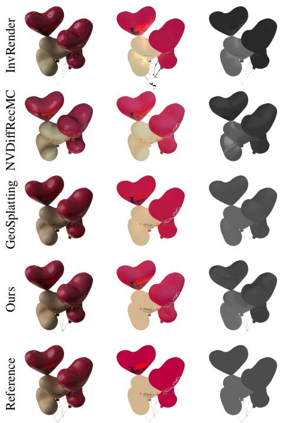  
Relight  
Albedo  
Roughness

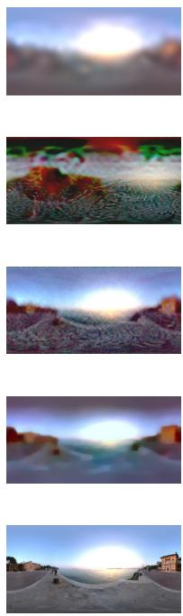  
Envmap

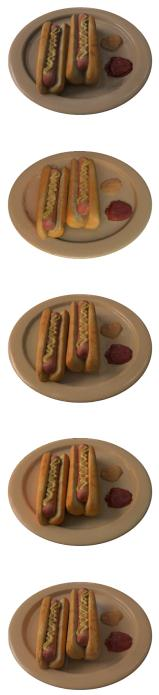  
Relight

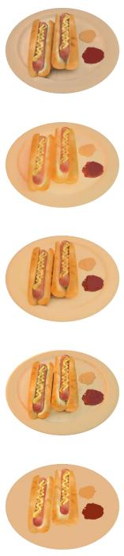  
Albedo

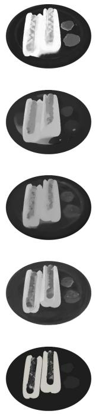

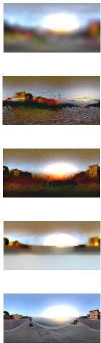  
Roughness  
Envmap

Fig. 6. Qualitative comparison of relighting and material-light decomposition on Synthetic4Relight. Each row shows the relit image, albedo, roughness, and recovered environment map. ExMesh++ beter separates intrinsic materials from illumination while preserving plausible appearance under novel lighting.

relighting methods include GS-IR [Liang et al. 2024], RelightGS [Gao et al. 2024], SVG-IR [Sun et al. 2025], IRGS [Gu et al. 2025], RadiosityGS [Jiang et al. 2025], and GeoSplatting [Ye et al. 2025].

## 6.2 Geometry Comparison

We first evaluate geometry reconstruction quality on the DTU dataset. As shown in Table 2, ExMesh++ achieves an average Chamfer Distance of 0.58. It obtains geometry accuracy close to recent reconstruction methods, while requiring only 13 minutes of training time and a compact mesh representation. PGSR and GeoSVR achieve lower Chamfer Distance, but require longer training time and larger geometric representations. Mesh-driven methods such as NVDifRec and IMLS-Splatting still show clear gaps in geometry accuracy or structural completeness. Fig. 5 further illustrates the structural diferences among diferent methods. PGSR and GeoSVR often produce redundant faces and local floating artifacts. QGS and IMLS-Splatting also show rough boundaries and isolated fragments. In contrast, ExMesh++ produces meshes without obvious artifacts, recovering details while maintaining smooth and intact surfaces.

## 6.3 Relighting Comparison

Synthetic Evaluation. We evaluate novel-view synthesis, relight ing, and material decomposition on Synthetic4Relight. Table 3 shows that our method achieves the highest relighting PSNR and competitive results on novel-view synthesis, albedo, and roughness estimation, while producing explicit mesh-UV-PBR assets. Fig. 6

Table 4. Quantitative comparison on Stanford-ORB across novel-view synthesis, novel-scene relighting, geometry estimation, and runtime. PSNR-H and PSNR-L are evaluated in HDR linear space and tone-mapped LDR space, respectively.
<table><tr><td rowspan="2">Method</td><td colspan="4">Novel View Synthesis</td><td colspan="4">Novel Scene Relighting</td><td colspan="3">Geometry</td><td rowspan="2">Time</td></tr><tr><td>PSNR-H↑ PSNR-L↑</td><td></td><td>SSIM↑</td><td>LPIPS↓</td><td>PSNR-H↑</td><td>PSNR-L↑</td><td></td><td>SSIM↑ LPIPS↓</td><td>Depth↓</td><td>Normal↓</td><td>CD↓</td></tr><tr><td>Neuralangelo [Li et al. 2023]</td><td>27.69</td><td>35.87</td><td>0.981</td><td>0.029</td><td>=</td><td>一</td><td>一</td><td>一</td><td>69.68</td><td>1.85</td><td>77.85</td><td>&gt;12h</td></tr><tr><td>2DGS [Huang et al. 2024]</td><td>29.63</td><td>37.30</td><td>0.984</td><td>0.022</td><td>一</td><td>一</td><td>一</td><td>一</td><td>28.43</td><td>0.11</td><td>1.35</td><td>11m</td></tr><tr><td>PGSR [Chen et al. 2024]</td><td>30.77</td><td>40.52</td><td>0.989</td><td>0.012</td><td>一</td><td>1</td><td>一</td><td>1</td><td>0.36</td><td>0.05</td><td>0.73</td><td>30m</td></tr><tr><td>NeRFactor [Zhang et al. 2021]</td><td>26.06</td><td>33.47</td><td>0.973</td><td>0.046</td><td>23.54</td><td>30.38</td><td>0.969</td><td>0.048</td><td></td><td>1</td><td>一</td><td>&gt;48h</td></tr><tr><td>InvRender [Zhang et al. 2022]</td><td>25.91</td><td>34.01</td><td>0.977</td><td>0.042</td><td>23.76</td><td>30.83</td><td>0.970</td><td>0.046</td><td>一</td><td>一</td><td>一</td><td>&gt;12h</td></tr><tr><td>GS-IR [Liang et al. 2024]</td><td>26.48</td><td>32.66</td><td>0.960</td><td>0.050</td><td>22.88</td><td>29.05</td><td>0.958</td><td>0.053</td><td>-</td><td>一</td><td>一</td><td>19m</td></tr><tr><td>RelightGS [Gao et al. 2024]</td><td>28.57</td><td>35.20</td><td>0.982</td><td>0.028</td><td>21.37</td><td>28.07</td><td>0.963</td><td>0.044</td><td>一</td><td></td><td>一</td><td>41m</td></tr><tr><td>NVDiffRecMC [Hasselgren et al. 2022]</td><td>28.03</td><td>36.40</td><td>0.982</td><td>0.028</td><td>24.43</td><td>31.60</td><td>0.972</td><td>0.036</td><td>0.32</td><td>0.04</td><td>0.51</td><td>2h</td></tr><tr><td>IRGS [Gu et al. 2025]</td><td>28.82</td><td>35.66</td><td>0.978</td><td>0.034</td><td>21.94</td><td>28.68</td><td>0.969</td><td>0.039</td><td>0.54</td><td>0.06</td><td>0.49</td><td>40m</td></tr><tr><td>RadiosityGS [Jiang et al. 2025]</td><td>30.93</td><td>39.24</td><td>0.989</td><td>0.023</td><td>24.05</td><td>31.29</td><td>0.975</td><td>0.035</td><td>1.87</td><td>0.06</td><td>0.41</td><td>6h</td></tr><tr><td>Ours</td><td>31.27</td><td>39.52</td><td>0.990</td><td>0.014</td><td>26.60</td><td>34.03</td><td>0.980</td><td>0.022</td><td>0.30</td><td>0.02</td><td>0.30</td><td>30m</td></tr></table>

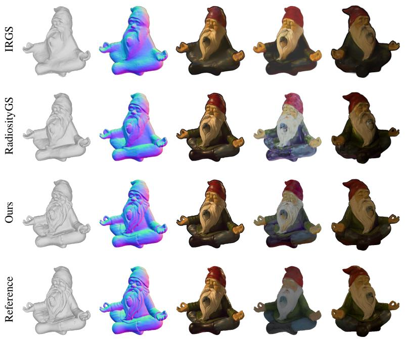  
Mesh  
Normal  
NVS  
Albedo

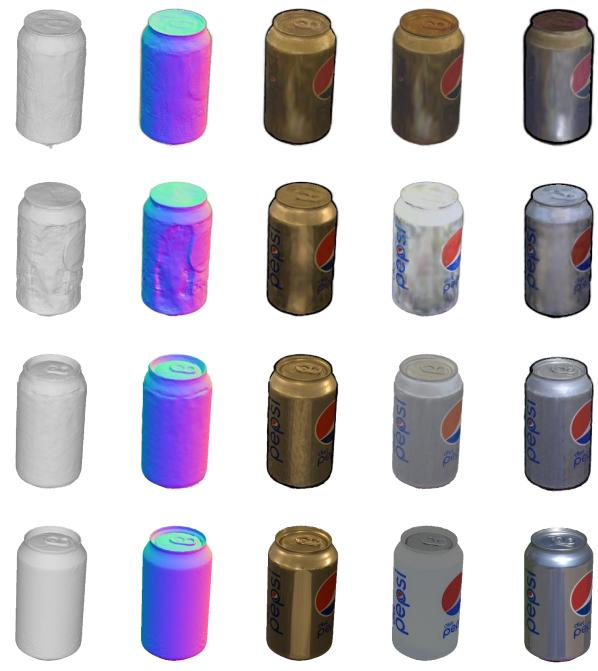  
Relight  
Normal  
Mesh  
NVS  
Albedo  
Relight

Fig. 7. Qualitative comparison on real-captured objects from Stanford-ORB. We compare reconstructed meshes, surface normals, novel-view renderings, albedo maps, and novel-scene relighting results. ExMesh++ achieves more consistent geometry, material decomposition, and relighting appearance.

further shows the diferences in material and lighting decomposition. InvRender leaves visible shadow and highlight residuals in albedo, so its relighting results still contain traces of the original illumination. NVDifRecMC produces noisy roughness maps, while its recovered environment maps show inaccurate light-source locations and global color tones. GeoSplatting produces noticeable high-frequency noise in the environment map.

Real-captured Evaluation. We further evaluate novel-view synthesis, novel-scene relighting, and geometry on Stanford-ORB. Table 4 shows that ExMesh++ outperforms the compared methods on all novel-scene relighting metrics and achieves the lowest errors in depth, normal, and Chamfer Distance. Since PGSR, 2DGS, and Neuralangelo do not provide novel-scene relighting results, they are used as references for view synthesis and geometry reconstruction. Fig. 7 shows visual comparisons on real-captured objects. IRGS produces over-smoothed meshes and leaves strong illumination colors in albedo, leading to a visible tone shift in relighting. RadiosityGS shows high-frequency noise in the mesh, normal, and albedo results. In comparison, ExMesh++ better matches the reference in geometry, albedo color distribution, and relighting appearance.

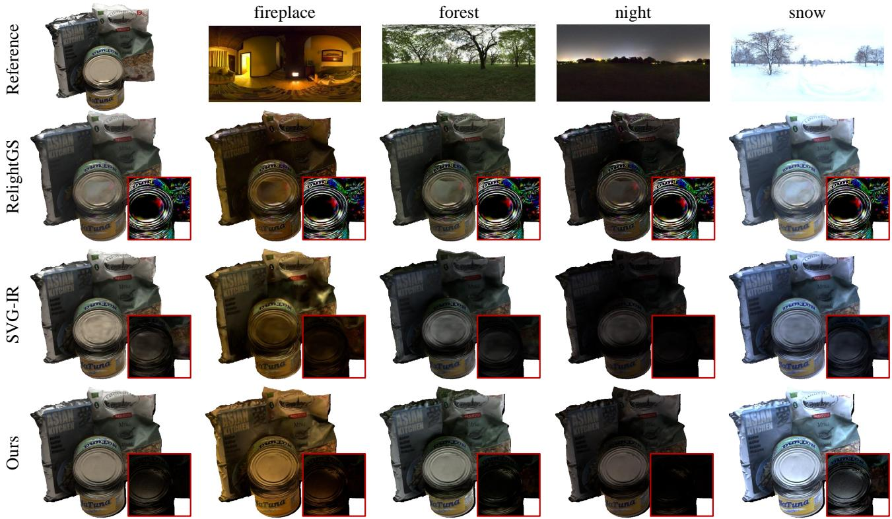  
Fig. 8. Relighting comparison with indirect illumination on DTU scan97 under the training illumination and four novel environment maps. The red insets show the corresponding indirect-light components, highlighting the more continuous and environment-dependent light transfer produced by ExMesh++.

Learned Envmap  
New Envmap 1  
New Envmap 2  
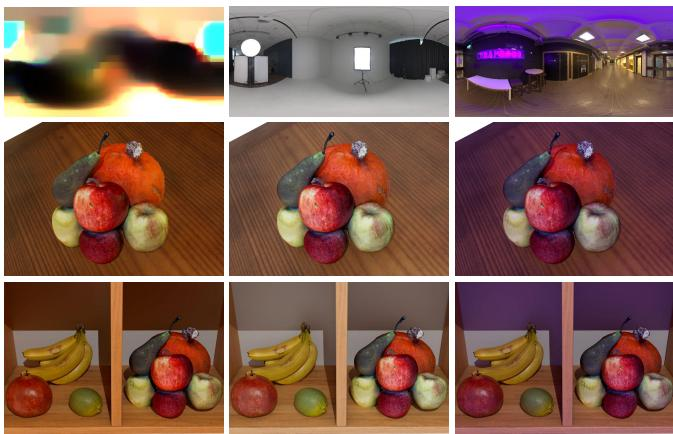  
Fig. 9. Relighting of the exported UV-PBR asset in Blender under the recovered environment map and two novel environment maps. The middle row places the reconstructed object on a tabletop, while the botom row combines it with artist-created assets.

## 6.4 Indirect Lighting Comparison

We further compare relighting results with indirect illumination on DTU scan97. Fig. 8 shows relighting results under the training illumination and four novel environment maps. The red insets show the corresponding indirect-light components. RelightGS produces colorful high-frequency artifacts in the indirect-light component, which remain visible across diferent environment maps. SVG-IR captures the overall brightness change, but its indirect-light component is mostly concentrated in dark regions and shows weak local color transfer. ExMesh++ instead maintains environment-dependent illumination changes, with more continuous indirect-light variation around the can lid and occluded regions.

## 6.5 Downstream Applications

DCC Relighting. We import the mesh, UV-PBR materials, and environment lighting reconstructed from DTU scan63 into Blender to test the exported asset in a standard DCC workflow. Fig. 9 shows the trained environment map and two new environment maps, together with Blender renderings under these lighting conditions. A weak point light is also added to produce visible shadows and local contact efects. The middle row shows the reconstructed object on a tabletop under the three lighting conditions. The bottom row places it together with artist-created fruit assets under the same lighting settings. Color changes and shadows of the reconstructed asset follow patterns similar to those of the artist-created assets.

Texture Editing. Fig. 10 shows texture and material editing results ofexported UV-PBR assets in Blender. All results are rendered with a point light. Since ExMesh++ exports explicit UV textures and PBR material maps, diferent material channels can be directly edited in texture space. Fig. 10(a) paints text on the object surface. Fig. 10(b) edits the global color tone of the base-color map, changing the object surface from the original gray tone to a blue-purple tone while preserving geometry and local shading. Fig. 10(c) and Fig. 10(d) locally edit the roughness and metallic maps of the scissors region. After setting the roughness of the scissors region to 1, the scissors show a more matte appearance. After setting the metallic value of the scissors region to 0, the metallic highlights are clearly weakened, while unedited regions remain visually unchanged.

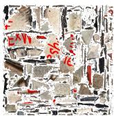

  
(a) Surface Painting

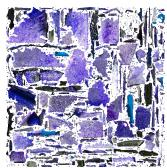

  
(b) Base-Color Editing

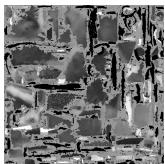

  
(c) Roughness Editing

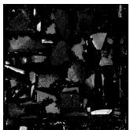

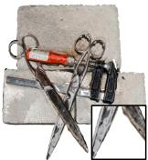  
(d) Metallic Editing  
Fig. 10. Editing results of exported UV-PBR assets in Blender. The examples demonstrate direct surface painting, global base-color adjustment, and local edits to the roughness and metallic maps.

## 6.6 Computational Eficiency

We compare training resources, relighting speed, and output-mesh complexity on Stanford-ORB in Table 5. Relighting speed is measured at the original resolution of 1600 × 1600, after model and camera initialization. The timing includes environment-map transfer and update, light-transport evaluation, shading, and image rendering, while excluding model loading, disk I/O, and image saving. We use the evaluation-quality configuration of each method. The first rendered frame is treated as warm-up and excluded, and FPS is averaged over the remaining frames. When a fixed environment map is shared by multiple views, its update cost is amortized across those views. Mesh sizes are measured using a unified PLY format.

The full ExMesh++ pipeline takes 30 minutes per object, including approximately 3 minutes for initialization, 10 minutes for Stage-I reconstruction, and 17 minutes for Stage-II optimization. Disabling indirect illumination reduces the Stage-II cost to 10 minutes, resulting in a total training time of23 minutes. The direct-only variant renders at 40.47 FPS, while the full model with one-bounce indirect illumination achieves 15.09 FPS. Compared with prior mesh-producing inverse-rendering methods, ExMesh++ produces a compact output mesh while maintaining practical relighting speed.

## 6.7 Ablation Study

Vertex Splitting and Merging. We first analyze the efect of vertex splitting and merging on the NeRF-Synthetic dataset. Table 6(a) compares five variants: only split, only merge, random split, random merge, and the full method. In random split, the split edge is still selected by our criterion, but the new vertex is placed at a random position. In random merge, edges are collapsed randomly instead of using our merge criterion. Using only merging substantially reduces the number ofvertices, but it cannot increase geometric resolution in complex regions. Using only splitting can add local details, but it also leads to more vertices. The two random variants underperform the full strategy, showing that both candidate selection and operation geometry afect local triangulation quality. Fig. 11 further shows that random splitting disrupts local mesh regularity, while random merging introduces unstable collapses. The full method preserves a compact mesh while producing a more continuous surface.

Table 5. Computational eficiency on Stanford-ORB.
<table><tr><td>Method</td><td>Peak GPU Training Relighting Mem.</td><td>Time</td><td>FPS</td><td>#Vertices</td><td>Mesh Size</td></tr><tr><td>NeRFactor</td><td>16GB</td><td>&gt;48h</td><td>0.01</td><td>一</td><td></td></tr><tr><td>InvRender</td><td>15GB</td><td>&gt;12h</td><td>0.03</td><td>一</td><td></td></tr><tr><td>GS-IR</td><td>5GB</td><td>19m</td><td>54.50</td><td>一</td><td></td></tr><tr><td>RelightGS</td><td>10GB</td><td>41m</td><td>10.49</td><td>一</td><td></td></tr><tr><td>NVDiffRecMC</td><td>26GB</td><td>2h</td><td>4.55</td><td>47K</td><td>2.48MB</td></tr><tr><td>IRGS</td><td>5GB</td><td>40m</td><td>0.19</td><td>289K</td><td>14.56MB</td></tr><tr><td>RadiosityGS</td><td>34GB</td><td>6h</td><td>1.54</td><td>267K</td><td>13.39MB</td></tr><tr><td>Ours (direct only)</td><td>10GB</td><td>23m</td><td>40.47</td><td>52K</td><td>2.63MB</td></tr><tr><td>Ours (full)</td><td>10GB</td><td>30m</td><td>15.09</td><td>52K</td><td>2.63MB</td></tr></table>

Initialization Strategy. Fig. 12 shows the random initialization experiment. We use a 1K-face sphere with random colors as the initial input, instead of a coarse mesh obtained from multi-view images. During optimization, the mesh gradually deforms from the sphere and increases its face count. It eventually forms the main structure of the target object. The UV texture also changes from random colors to a layout related to the object appearance. This experiment shows that the optimization process does not strictly depend on a specific initial mesh shape. However, compared with the standard initialization, starting from an unrelated sphere leads to slightly lower final geometry accuracy.

Texture Representation. We further compare UV texture with per-vertex color, per-face color, and coordinate-based MLP texture on NeRF-Synthetic. As shown in Table 6(a), per-vertex and perface colors require many more vertices to represent high-frequency appearance, but still yield worse geometry and rendering quality. Coordinate-based MLP texture achieves comparable geometry accuracy, but does not provide a standard editable texture map. In comparison, UV texture decouples appearance resolution from mesh density and provides a shared texture space for PBR decomposition.

UV Reconstruction. Fig. 13 compares the results with and without periodic UV map reconstruction in Stage I. The local updates in Sec. 4.3 keep the UV mapping valid as the mesh topology changes, but repeated splitting and merging may gradually introduce atlas distortion, fragmented UV islands, and uneven texel allocation. Periodically reconstructing the UV atlas redistributes the texture space and provides more balanced resolution across the surface. As shown in Fig. 13, this produces clearer local details and a more regular UV layout across the surface.

Table 6. Quantitative ablations of topology operations, texture representations, PBR decomposition, and indirect illumination.  
(a) Stage-I ablations on NeRF-Synthetic.
<table><tr><td>Setting</td><td>CD↓</td><td>PSNR↑</td><td>#V</td></tr><tr><td>Only Split</td><td>0.74</td><td>28.77</td><td>121K</td></tr><tr><td>Only Merge</td><td>1.81</td><td>23.51</td><td>6K</td></tr><tr><td>Random Split</td><td>0.77</td><td>28.30</td><td>94K</td></tr><tr><td>Random Merge</td><td>1.34</td><td>26.27</td><td>98K</td></tr><tr><td>Per-Vertex Color</td><td>0.76</td><td>28.47</td><td>184K</td></tr><tr><td>Per-Face Color</td><td>0.78</td><td>28.12</td><td>227K</td></tr><tr><td>MLP Texture</td><td>0.64</td><td>28.87</td><td>101K</td></tr><tr><td>Ours (full)</td><td>0.64</td><td>29.32</td><td>100K</td></tr></table>

(b) Stage-II ablations on Synthetic4Relight.
<table><tr><td rowspan="2">Setting</td><td colspan="3">Relighting</td><td colspan="3">Albedo</td></tr><tr><td>PSNR↑</td><td>SSIM↑</td><td>LPIPS↓</td><td>PSNR↑</td><td>SSIM↑</td><td>LPIPS↓</td></tr><tr><td>Stage-I Only</td><td>27.74</td><td>0.918</td><td>0.065</td><td></td><td></td><td></td></tr><tr><td>Gray Base-Color Init</td><td>34.06</td><td>0.961</td><td>0.062</td><td>30.09</td><td>0.948</td><td>0.069</td></tr><tr><td>Stage-II Only</td><td>29.55</td><td>0.927</td><td>0.062</td><td>27.20</td><td>0.921</td><td>0.092</td></tr><tr><td>Direct Only</td><td>33.72</td><td>0.961</td><td>0.062</td><td>29.96</td><td>0.948</td><td>0.070</td></tr><tr><td>Eval-only Indirect</td><td>34.00</td><td>0.962</td><td>0.062</td><td>29.99</td><td>0.948</td><td>0.069</td></tr><tr><td>No Secondary Material</td><td>34.15</td><td>0.962</td><td>0.061</td><td>29.97</td><td>0.947</td><td>0.069</td></tr><tr><td>Ours (full)</td><td>34.19</td><td>0.962</td><td>0.061</td><td>30.16</td><td>0.949</td><td>0.068</td></tr></table>

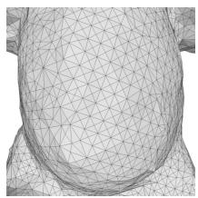  
(a) Ours (full)

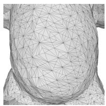  
(b) Random Split

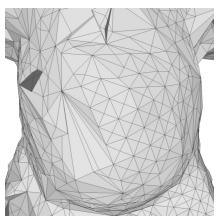  
(c) Random Merge

Fig. 11. Qualitative ablation of vertex spliting and merging strategies.  
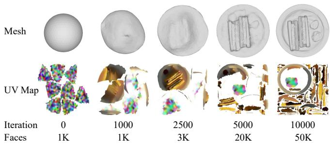  
Fig. 12. Initialization experiment starting from a sphere with random colors.

PBR Stage. We analyze the efect of the second-stage PBR decomposition on Synthetic4Relight, with results shown in Table 6(b) and Fig. 14. Stage-I Only performs only the first-stage training. It can fit the input illumination well, but its RGB texture still mixes intrinsic color, shadows, and highlights, making it unsuitable for relighting. Gray Base-Color Init starts Stage II from a gray basecolor map instead of the RGB texture learned in Stage I. It recovers the main colors and lighting changes after PBR optimization, but produces noisier recovered albedo maps. Stage-II Only skips the first-stage mesh-UV carrier reconstruction. As a result, the mesh remains rough and does not fit the object geometry well, leading to local appearance errors on the balloon surfaces.

Indirect Lighting. Finally, we analyze the role of one-bounce indirect lighting during training and evaluation. As shown in Table 6(b), Direct Only gives lower relighting PSNR than settings with indirect lighting. Eval-only Indirect adds the one-bounce term only during evaluation and improves over Direct Only, but remains below the full method. No Secondary Material uses indirect lighting during both training and evaluation, but it does not query material information at secondary hit points. Its relighting metrics are close to the full method, while its albedo metrics are still lower. By querying shared UV-PBR materials at secondary hit points, the full setting achieves the best overall results.

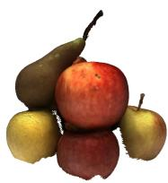

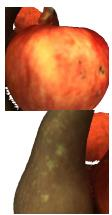

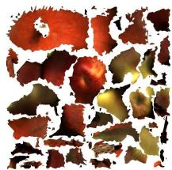

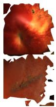

(a) w/o Periodic UV Regeneration  
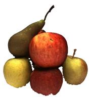

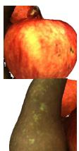

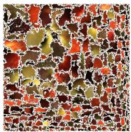

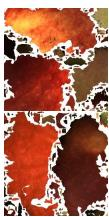  
(b) w/ Periodic UV Regeneration

Fig. 13. Ablation of periodic UV map reconstruction in Stage I, which improves UV layout quality and preserves finer texture details.  
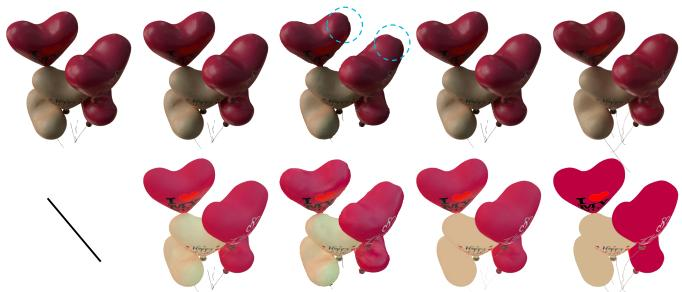  
Stage-I Only Gray Albedo Init Stage-Ⅱ Only  
Ours (full)  
Fig. 14. Qualitative ablation of the second-stage PBR decomposition under diferent initialization and training setings. The top and botom rows show relighting and recovered albedo, respectively.

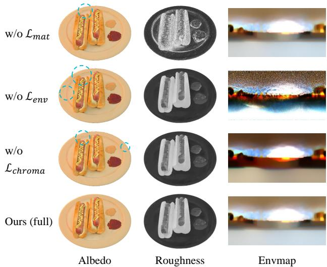  
Fig. 15. Qualitative ablation of the Stage-II regularization terms. Cyan circles highlight representative material artifacts.

Stage-II Regularization. We further ablate the three regularization terms in the Stage-II objective. As shown in Table 7 and Fig. 15, removing ${ \mathcal { L } } _ { \mathrm { m a t } }$ reduces both relighting and material-recovery quality, and produces strong high-frequency noise in the roughness map. Without $\mathcal { L } _ { \mathrm { e n v } }$ , the recovered environment map becomes noticeably noisy, which also degrades albedo recovery and relighting performance. Removing $\mathcal { L } _ { \mathrm { c h r o m a } }$ has a smaller quantitative efect, but causes object colors to leak into the recovered environment map and introduces local color artifacts in the albedo.

Hyperparameter Sensitivity. We vary five Stage-II hyperparameters on Synthetic4Relight while keeping the others fixed. As shown in Table 8, Relight PSNR and Albedo PSNR vary by at most 0.15 dB and 0.11 dB, respectively. This indicates that ExMesh++ is not sensitive to moderate changes in these hyperparameters.

## 7 Limitations

The current appearance model uses an opaque, isotropic metallicroughness BRDF. It does not represent more complex material efects such as anisotropic reflection, transmission, or subsurface scattering. In benchmark experiments, we disable metallic optimization to ensure a consistent comparison. The evaluation datasets do not provide ground-truth metallic maps, and several compared methods do not estimate a metallic channel. The optional metallic map is therefore demonstrated through downstream editing, but its recovery accuracy is not quantitatively evaluated.

Our current light-transport model considers only one-bounce diffuse interreflection. It captures local color bleeding and illumination in occluded regions, but does not model multi-bounce transport or indirect specular reflection. Extending the renderer to richer light transport could improve physical realism, although it would increase optimization and rendering costs.

Table 7. Ablation of Stage-II regularization terms on Synthetic4Relight.
<table><tr><td rowspan="2">Setting</td><td colspan="2">Relighting</td><td colspan="2">Albedo</td><td rowspan="2">Roughness MSE↓</td></tr><tr><td>PSNR↑</td><td>LPIPS↓</td><td>PSNR↑</td><td>LPIPS↓</td></tr><tr><td>w/o  $\mathcal { L } _ { \mathrm { m a t } }$ </td><td>33.76</td><td>0.066</td><td>29.81</td><td>0.077</td><td>0.012</td></tr><tr><td>w/o  ${ \mathcal { L } } _ { \mathrm { e n v } }$ </td><td>33.96</td><td>0.062</td><td>29.65</td><td>0.072</td><td>0.005</td></tr><tr><td>w/o  $\mathcal { L } _ { \mathrm { c h r o m a } }$ </td><td>34.01</td><td>0.063</td><td>29.84</td><td>0.068</td><td>0.005</td></tr><tr><td>Ours (full)</td><td>34.19</td><td>0.061</td><td>30.16</td><td>0.068</td><td>0.005</td></tr></table>

Table 8. Stage-II hyperparameter sensitivity on Synthetic4Relight.
<table><tr><td>Parameter</td><td>Tested values</td><td>Relight PSNR</td><td>Albedo PSNR</td></tr><tr><td> $\lambda _ { \mathrm { m a t } }$ </td><td>{0.05, 0.1, 0.2}</td><td>34.09-34.19</td><td>30.10-30.19</td></tr><tr><td> $\lambda _ { \mathrm { e n v } }$ </td><td>{0.05, 0.1, 0.2}</td><td>34.11-34.21</td><td>30.08-30.16</td></tr><tr><td> $\smash { \lambda _ { 2 1 } ^ { 0 } }$  chroma</td><td>{0.05, 0.1, 0.2}</td><td>34.15-34.20</td><td>30.13-30.18</td></tr><tr><td> $\lambda ^ { \mathrm { { m a x } } }$   $\ r ^ { \prime } \mathrm { \dot { \ m d } }$ </td><td>{0.5, 1.0, 1.5}</td><td>34.13-34.19</td><td>30.05-30.16</td></tr><tr><td> $N _ { b }$ </td><td>{8, 16, 32}</td><td>34.08-34.23</td><td>30.03-30.19</td></tr></table>

Finally, periodic UV regeneration currently relies on the CPUbased xatlas implementation, which becomes a computational bottleneck for high-resolution meshes. Our current experiments focus on object-level assets. Scaling the pipeline to larger scenes with many components, large texture atlases, and complex meshes requires more eficient UV parameterization and memory management.

## 8 Conclusion

We presented ExMesh++, a staged framework for reconstructing editable and relightable UV-PBR mesh assets from multi-view images. Stage I directly refines explicit mesh geometry and topology through vertex splitting and merging, while maintaining a valid UV parameterization. Stage II freezes the reconstructed mesh-UV carrier and decomposes its appearance into UV-space PBR material maps and environment lighting. The shared UV-PBR representation further supports one-bounce difuse indirect illumination without an additional learned residual appearance field. Experiments on synthetic and real-captured datasets demonstrate competitive geometry, material-recovery, and relighting performance. The exported assets can also be directly edited, relit, and composed with artist-created content in standard DCC workflows.

## References

Danpeng Chen, Hai Li, Weicai Ye, Yifan Wang, Weijian Xie, Shangjin Zhai, Nan Wang, Haomin Liu, Hujun Bao, and Guofeng Zhang. 2024. PGSR: Planar-based Gaussian Splatting for Eficient and High-Fidelity Surface Reconstruction. IEEE Transactions on Visualization and Computer Graphics (TVCG) 31, 9 (2024), 6100–6111.

Robert L. Cook and Kenneth E. Torrance. 1982. A Reflectance Model for Computer Graphics. ACM Transactions on Graphics (TOG) 1, 1 (1982), 7–24.

Brian Curless and Marc Levoy. 1996. A Volumetric Method for Building Complex Models from Range Images. In ACM SIGGRAPH Conference.

Yuxin Dai, Qi Wang, Jingsen Zhu, Yuchi Huo, Chen Qian, and Ying He. 2025. Inverse rendering using multi-bounce path tracing and reservoir sampling. In International Conference on Learning Representations (ICLR)

Chuanjin Fan, Lifan Wu, Wenjie Chang, Hanzhi Chang, Wenfei Yang, and Tianzhu Zhang. 2026. ExMesh: EXplicit Mesh Reconstruction with Topology Adaptation. In IEEE/CVF Conference on Computer Vision and Pattern Recognition (CVPR).

Qiancheng Fu, Qingshan Xu, Yew-Soon Ong, and Wenbing Tao. 2022. Geo-NeuS: Geometry-Consistent Neural Implicit Surfaces Learning for Multi-View Reconstruc tion. In Advances in Neural Information Processing Systems (NeurIPS).

Jian Gao, Chun Gu, Youtian Lin, Zhihao Li, Hao Zhu, Xun Cao, Li Zhang, and Yao Yao. 2024. Relightable 3D Gaussians: Realistic Point Cloud Relighting with BRDF Decomposition and Ray Tracing. In European Conference on ComputerVision (ECCV).

Michael Garland and Paul S. Heckbert. 1997. Surface Simplification Using Quadric Error Metrics. In ACM SIGGRAPH Conference.

Chun Gu, Xiaofei Wei, Zixuan Zeng, Yuxuan Yao, and Li Zhang. 2025. IRGS: Inter Reflective Gaussian Splatting with 2D Gaussian Ray Tracing. In IEEE/CVFConference on Computer Vision and Pattern Recognition (CVPR).

Antoine Guédon and Vincent Lepetit. 2024. SuGaR: Surface-Aligned Gaussian Splatting for Eficient 3D Mesh Reconstruction and High-Quality Mesh Rendering. In IEEE/CVF Conference on Computer Vision and Pattern Recognition (CVPR).

Jon Hasselgren, Nikolai Hofmann, and Jacob Munkberg. 2022. Shape, Light, and Material Decomposition from Images Using Monte Carlo Rendering and Denoising. In Advances in Neural Information Processing Systems (NeurIPS).

Hugues Hoppe. 1996. Progressive Meshes. In ACM SIGGRAPH Conference.

Binbin Huang, Zehao Yu, Anpei Chen, Andreas Geiger, and Shenghua Gao. 2024. 2D Gaussian Splatting for Geometrically Accurate Radiance Fields. In ACM SIGGRAPH Conference.

Rasmus Jensen, Anders Dahl, George Vogiatzis, Engin Tola, and Henrik Aanaes. 2014. Large Scale Multi-view Stereopsis Evaluation. In IEEE/CVF Conference on Computer Vision and Pattern Recognition (CVPR).

Kaiwen Jiang, Jia-Mu Sun, Zilu Li, Dan Wang, Tzu-Mao Li, and Ravi Ramamoorthi. 2025. Diferentiable Light Transport with Gaussian Surfels via Adapted Radiosity for Eficient Relighting and Geometry Reconstruction. ACM Transactions on Graphics (TOG) 44, 6 (2025), 1–25.

Haian Jin, Isabella Liu, Peijia Xu, Xiaoshuai Zhang, Songfang Han, Sai Bi, Xiaowei Zhou, Zexiang Xu, and Hao Su. 2023. TensoIR: Tensorial Inverse Rendering. In IEEE/CVF Conference on Computer Vision and Pattern Recognition (CVPR).

James T. Kajiya. 1986. The Rendering Equation. In 13th Annual Conference on Computer Graphics and Interactive Techniques.

Brian Karis. 2013. Real Shading in Unreal Engine 4. ACM SIGGRAPH Course: Physically Based Shading in Theory and Practice

Hiroharu Kato, Yoshitaka Ushiku, and Tatsuya Harada. 2018. Neural 3D Mesh Renderer. In IEEE Conference on Computer Vision and Pattern Recognition (CVPR).

Michael Kazhdan, Matthew Bolitho, and Hugues Hoppe. 2006. Poisson surface recon struction. In Eurographics Symposium on Geometry Processing (SGP).

Bernhard Kerbl, Georgios Kopanas, Thomas Leimk"uhler, and George Drettakis. 2023. 3D Gaussian Splatting for Real-Time Radiance Field Rendering. ACM Transactions on Graphics (TOG) 42, 4, Article 139 (2023)

Julian Knodt, Zherong Pan, Kui Wu, and Xifeng Gao. 2023. Joint UV Optimization and Texture Baking. ACM Transactions on Graphics (TOG) 43, 1 (2023), 1–20.

Zhengfei Kuang, Yunzhi Zhang, Hong-Xing Yu, Samir Agarwala, Shangzhe Wu, and Jiajun Wu. 2023. Stanford-ORB: A Real-World 3D Object Inverse Rendering Bench mark. In Advances in Neural Information Processing Systems (NeurIPS), Datasets and Benchmarks Track.

Samuli Laine, Tero Karras, Miika Aittala, and Jaakko Lehtinen. 2020. Modular Primitives for High-Performance Diferentiable Rendering. ACM Transactions on Graphics (TOG) 39, 6 (2020), 1–14.

Bruno Lévy, Sylvain Petitjean, Nicolas Ray, and Jérome Maillot. 2002. Least Squares Conformal Maps for Automatic Texture Atlas Generation. ACM Transactions on Graphics (TOG) 21, 3 (2002), 362–371

Jiahe Li,Jiawei Zhang, Youmin Zhang, Xiao Bai,Jin Zheng, Xiaohan Yu, and Lin Gu. 2025. GeoSVR: Taming Sparse Voxels for Geometrically Accurate Surface Reconstruction. In Advances in Neural Information Processing Systems (NeurIPS).

Zhaoshuo Li, Thomas Müller, Alex Evans, Russell H Taylor, Mathias Unberath, Ming Yu Liu, and Chen-Hsuan Lin. 2023. Neuralangelo: High-Fidelity Neural Surface Reconstruction. In IEEE/CVF Conference on Computer Vision and Pattern Recognition (CVPR).

Zhihao Liang, Qi Zhang, Ying Feng, Ying Shan, and Kui Jia. 2024. GS-IR: 3D Gaussian Splatting for Inverse Rendering. In IEEE/CVF Conference on Computer Vision and Pattern Recognition (CVPR).

Haotong Lin, Sili Chen, Jun Hao Liew, Donny Y. Chen, Zhenyu Li, Guang Shi, Jiashi Feng, and Bingyi Kang. 2025. Depth Anything 3: Recovering the visual space from any views. arXiv preprint arXiv:2511.10647 (2025).

Shichen Liu, Tianye Li, Weikai Chen, and Hao Li. 2019. Soft Rasterizer: A Diferentiable Renderer for Image-Based 3D Reasoning. In IEEE/CVF International Conference on Computer Vision (ICCV).

William E Lorensen and Harvey E Cline. 1987. Marching Cubes: A High Resolution 3D Surface Construction Algorithm. In ACM SIGGRAPH Conference.

Ben Mildenhall, Pratul P Srinivasan, Matthew Tancik, Jonathan T Barron, Ravi Ra mamoorthi, and Ren Ng. 2020. NeRF: Representing Scenes as Neural Radiance Fields for View Synthesis. In European Conference on Computer Vision (ECCV).

Jacob Munkberg, Jon Hasselgren, Tianchang Shen, Jun Gao, Wenzheng Chen, Alex Evans, Kayvon Fatahalian, Miika Aittala, and Samuli Laine. 2022. Extracting Triangular 3D Models, Materials, and Lighting From Images. In IEEE/CVF Conference on Computer Vision and Pattern Recognition (CVPR).

Richard A Newcombe, Shahram Izadi, Otmar Hilliges, David Molyneaux, David Kim, Andrew J Davison, Pushmeet Kohi, Jamie Shotton, Steve Hodges, and Andrew Fitzgibbon. 2011. KinectFusion: Real-time dense surface mapping and tracking. In IEEE International Symposium on Mixed and Augmented Reality (ISMAR).

Michael Oechsle, Lars Mescheder, Michael Niemeyer, Thilo Strauss, and Andreas Geiger. 2019. Texture Fields: Learning Texture Representations in Function Space. In IEEE/CVF International Conference on Computer Vision (ICCV).

Michael Oechsle, Songyou Peng, Michael Niemeyer, and Andreas Geiger. 2021. UNISURF: Unifying Neural Implicit Surfaces and Radiance Fields for Multi-View Reconstruction. In IEEE/CVF International Conference on Computer Vision (ICCV).

Steven G. Parker, James Bigler, Andreas Dietrich, Heiko Friedrich, Jared Hoberock, David Luebke, David McAllister, Morgan McGuire, Keith Morley, Austin Robison, and Martin Stich. 2010. OptiX: A General Purpose Ray Tracing Engine. ACM Transactions on Graphics (TOG) 29, 4 (2010), 66:1–66:13.

Alla Shefer, Bruno Lévy, Maxim Mogilnitsky, and Alexander Bogomyakov. 2005. ABF++: Fast and Robust Angle Based Flattening. ACM Transactions on Graphics (TOG) 24, 2 (2005), 311–330.

Tianchang Shen, Jun Gao, Yichao Zhou, Zexiang Wu, Jacob Munkberg, Jon Hasselgren, Kayvon Fatahalian, Miika Aittala, Samuli Laine, and Sergey Tulyakov. 2021. DMTet: Deep Marching Tetrahedra for 3D Reconstruction. In IEEE/CVF Conference on Computer Vision and Pattern Recognition (CVPR).

Tianchang Shen, Jacob Munkberg, Jon Hasselgren, Jun Gao, Wenzheng Chen, Alex Evans, Kayvon Fatahalian, Miika Aittala, and Samuli Laine. 2023. Flexible isosurface extraction for gradient-based mesh optimization. ACM Transactions on Graphics (TOG) 42, 4 (2023), 1–16.

Sanghyun Son, Matheus Gadelha, Yang Zhou, Matthew Fisher, Zexiang Xu, Yiling Qiao, Ming C. Lin, and Yi Zhou. 2025. DMesh++: An eficient diferentiable mesh for complex shapes. In IEEE/CVF International Conference on Computer Vision (ICCV).

Sanghyun Son, Matheus Gadelha, Yang Zhou, Zexiang Xu, Ming C. Lin, and Yi Zhou. 2024. Dmesh: A diferentiable mesh representation. arXiv preprint arXiv:2404.13445 (2024).

Hanxiao Sun, Yupeng Gao, Jin Xie, Jian Yang, and Beibei Wang. 2025. SVG-IR: Spatially-Varying Gaussian Splatting for Inverse Rendering. In IEEE/CVF Conference on Computer Vision and Pattern Recognition (CVPR).

Bruce Walter, Stephen R. Marschner, Hongsong Li, and Kenneth E. Torrance. 2007. Mi crofacet Models for Refraction through Rough Surfaces. In Eurographics Symposium on Rendering (EGSR).

Nanyang Wang, Yinda Zhang, Zhuwen Li, Yanwei Fu, Wei Liu, and Yu-Gang Jiang. 2018. Pixel2Mesh: Generating 3D Mesh Models from Single RGB Images. In European Conference on Computer Vision (ECCV).

Peng Wang, Lingjie Liu, Yuan Lin, Xin Tong, Ziwei Liu, and Christian Theobalt. 2021. NeuS: Learning Neural Implicit Surfaces by Volume Rendering for Multi-view Re construction. In Advances in Neural Information Processing Systems (NeurIPS).

Zhou Wang, Alan C Bovik, Hamid R Sheikh, and Eero P Simoncelli. 2004. Image Quality Assessment: From Error Visibility to Structural Similarity. IEEE Transactions on Image Processing (TIP) 13, 4 (2004), 600–612.

Haoqian Wu, Zhipeng Hu, Lincheng Li, Yongqiang Zhang, Changjie Fan, and Xin Yu. 2023. NeFII: Inverse Rendering for Reflectance Decomposition with Near-Field Indirect Illumination. In IEEE/CVF Conference on Computer Vision and Pattern Recognition (CVPR).

Fanbo Xiang, Zexiang Xu, Miloš Hašan, Yannick Hold-Geofroy, Kalyan Sunkavalli, and Hao Su. 2021. NeuTex: Neural Texture Mapping for Volumetric Neural Rendering. In IEEE/CVF Conference on Computer Vision and Pattern Recognition (CVPR).

Bangbang Yang, Chong Bao, Junyi Zeng, Hujun Bao, Yinda Zhang, Zaopeng Cui, and Guofeng Zhang. 2022. Neumesh: Learning disentangled neural mesh-based implicit field for geometry and texture editing. In European Conference on Computer Vision (ECCV).

Kaizhi Yang, Liu Dai, Isabella Liu, Xiaoshuai Zhang, Xiaoyan Sun, Xuejin Chen, Zexiang Xu, and Hao Su. 2025. IMLS-Splatting: Eficient Mesh Reconstruction from Multi view Images via Point Representation. ACM Transactions on Graphics (TOG) 44, 4 (2025), 1–11.

Yao Yao, Jingyang Zhang, Jingbo Liu, Yihang Qu, Tian Fang, David McKinnon, Yanghai Tsin, and Long Quan. 2022. NeILF: Neural Incident Light Field for Physically-Based Material Estimation. In European Conference on Computer Vision (ECCV).

Lior Yariv, Yoni Kasten, Dror Moran, Meirav Galun, Matan Atzmon, Basri Ronen, and Yaron Lipman. 2020. Multiview Neural Surface Reconstruction by Disentangling Geometry and Appearance. In Advances in Neural Information Processing Systems (NeurIPS).

Lior Yariv, Yoni Kasten, Dror Moran, Meirav Galun, Matan Atzmon, Basri Ronen, and Yaron Lipman. 2021. Volume Rendering of Neural Implicit Surfaces. In Advances in Neural Information Processing Systems (NeurIPS).

Kai Ye, Chong Gao, Guanbin Li, Wenzheng Chen, and Baoquan Chen. 2025. GeoSplat ting: Towards Geometry Guided Gaussian Splatting for Physically-Based Inverse Rendering. In IEEE/CVF International Conference on Computer Vision (ICCV).

Zexiang Yu, Torsten Sattler, and Andreas Geiger. 2024. Gaussian opacity fields: Eficient adaptive surface reconstruction in unbounded scenes. ACM Transactions on Graphics

(TOG) 43, 6 (2024), 1–13.

Jingyang Zhang, Yao Yao, Shiwei Li, Jingbo Liu, Tian Fang, David McKinnon, Yangha Tsin, and Long Quan. 2023. NeILF++: Inter-Reflectable Light Fields for Geometry and Material Estimation. In IEEE/CVF International Conference on Computer Vision (ICCV).

Richard Zhang, Phillip Isola, Alexei A Efros, Eli Shechtman, and Oliver Wang. 2018. The Unreasonable Efectiveness of Deep Features as a Perceptual Metric. In IEEE/CVF Conference on Computer Vision and Pattern Recognition (CVPR).

Xiuming Zhang, Pratul P. Srinivasan, Boyang Deng, Paul Debevec, William T. Freeman, and Jonathan T. Barron. 2021. NeRFactor: Neural Factorization of Shape and Re flectance under an Unknown Illumination. ACM Transactions on Graphics (TOG) 40,

6 (2021), 1–18.

Yuanqing Zhang, Jiaming Sun, Xingyi He, Huan Fu, Rongfei Jia, and Xiaowei Zhou. 2022. Modeling Indirect Illumination for Inverse Rendering. In IEEE/CVF Conference on Computer Vision and Pattern Recognition (CVPR).

Ziyu Zhang, Binbin Huang, Hanqing Jiang, Liyang Zhou, Xiaojun Xiang, and Shunhan Shen. 2025. Quadratic Gaussian Splatting: High Quality Surface Reconstruction with Second-order Geometric Primitives. In IEEE/CVF International Conference on Computer Vision (ICCV).