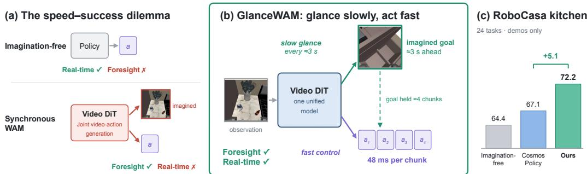
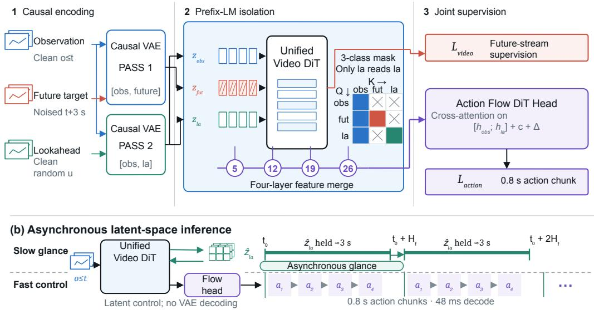
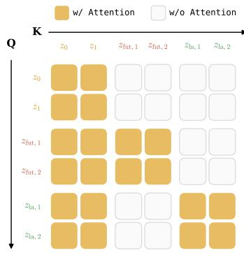
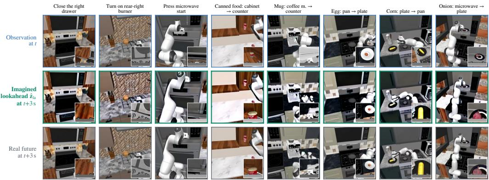
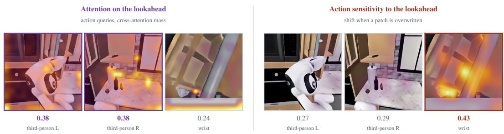
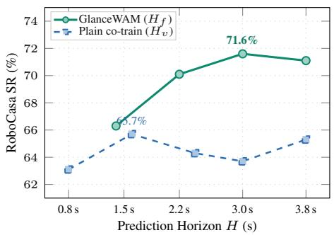
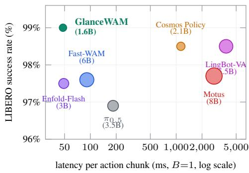
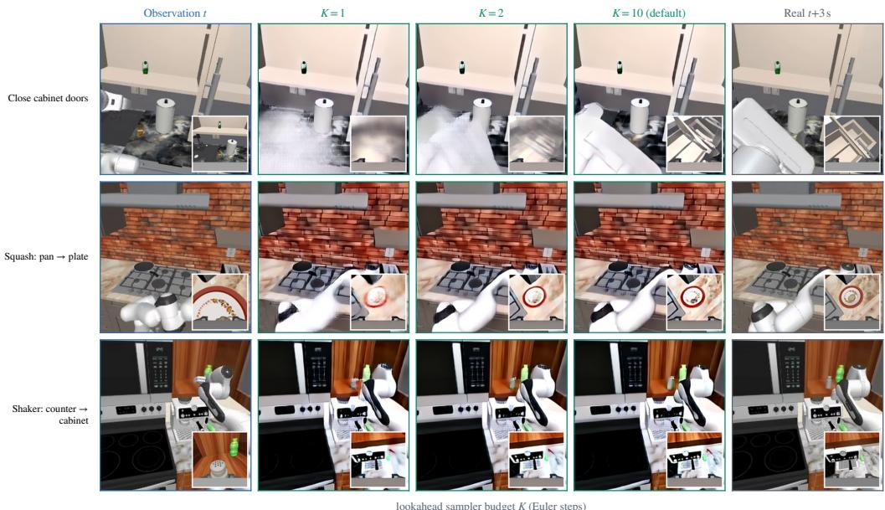

# GLANCEWAM: SPARSE TEST-TIME IMAGINATION FOR WORLD-ACTION MODELS

Linhan Wang1 Zijian An2 Mingyuan Zhang3 Chen Dai1 Yi Xu3 Can Cui4 Zichong Yang4 Yinlin Chen1 Lifeng Zhou2 Chang-Tien Lu1 1Virginia Tech 2Drexel University 3Northeastern University 4Purdue University

## ABSTRACT

Video generative models provide rich physical priors for robot learning, yet existing world-action models (WAMs) face a fundamental trade-off: synchronous video generation at control rate is latency-prohibitive, while abandoning testtime visual imagination sacrifices task success. We show that visual imagination achieves both real-time inference and superior success rates when generated asynchronously off the critical path and consumed directly in latent space. We introduce GlanceWAM, which decouples imagination from control within a single video DiT: an asynchronous proposer glances ahead on a slow clock to imagine a single lookahead frame seconds into the future in the background, while an action head decodes action chunks at control rate (48 ms) purely in latent space without blocking. Enabled by a non-interfering attention mask that isolates video representations and staleness-robust horizon training that accommodates asynchronous lookahead aging, GlanceWAM breaks the speed–success dilemma. Trained purely on demonstrations, it attains 72.2% on the 24-task Robo-Casa kitchen benchmark (surpassing synchronous Cosmos Policy at 67.1% and imagination-free co-training at 64.4%) and 99.0% on LIBERO, executing at 48 ms per chunk on an NVIDIA A100 GPU (24× faster than synchronous baselines). Code is available at https://github.com/linhanwang/GlanceWAM.

## 1 INTRODUCTION

Video generative models capture rich physical priors over object dynamics, contact physics, and 3D scene evolution (NVIDIA, 2025a; Wan Team, 2025; SkyReels Team, 2025), offering a promising foundation for autonomous robots to anticipate the consequences of their actions. In robot manipulation, world-action models (WAMs) leverage these predictive backbones through two distinct pathways: (i) representation shaping, where future-prediction losses enrich shared visual features, and (ii) visualforesight, where the model explicitly synthesizes future visual states to guide downstream policy execution (Kim et al., 2026). However, existing WAMs couple future prediction and action decoding synchronously at the control rate (Figure 1a) (Kim et al., 2026; Li et al., 2026c). This tight coupling incurs two fundamental costs: prohibitive inference latency (1.1–3.8 s per chunk (Zeng et al., 2026), exceeding real-time control budgets) and horizon degeneration (pinning prediction to the short duration of an action chunk captures minimal scene dynamics, causing world modeling to collapse into near-trivial observation reconstruction).

To bypass this latency bottleneck, recent approaches advocate abandoning test-time visual imagination entirely, relegating video modeling purely to offline pretraining or feature regularization (Yuan et al., 2026b; Cai et al., 2026). While this strategy eliminates generative overhead during control, it discards explicit visual foresight—depriving downstream policies of the future visual destinations and spatial guidance needed for long-horizon manipulation. Conversely, architectures that retain visual foresight continue to couple dense future synthesis directly to high-frequency action chunks (Kim et al., 2026; Li et al., 2026c), remaining bounded by prohibitive diffusion latencies and near-static prediction horizons. World-action models are thus caught in a fundamental speed– success dilemma: either synthesize video synchronously at the control rate and forfeit real-time reactivity, or discard test-time imagination and forfeit the performance benefits of visual foresight.

  
Figure 1: Synchronous imagination versus sparse lookahead foresight. (a) Prior WAMs couple future generation to the action chunk at control rate, incurring heavy multi-step sampling latency over near-static horizons. (b) GlanceWAM decouples timescales: it glances ahead asynchronously to imagine a single latent lookahead frame seconds into the future $( H _ { f } \approx 3 \mathrm { s } )$ on a slow clock, pipelining imagination off the critical path while decoding action chunks in latent space at 48 ms. (c) On RoboCasa kitchen (demos only), GlanceWAM reaches 72.2%, surpassing synchronous Cosmos Policy (67.1%) and imagination-free co-training (64.4%).

In this paper, we show that this dilemma is not an intrinsic property of visual foresight, but an artifact of coupling imagination synchronously to high-frequency control chunks. Downstream policies do not require dense, frame-by-frame future video of the immediate milliseconds; they primarily need a distant spatial destination (“where to go”). We introduce GlanceWAM, a framework that decouples visual imagination from real-time control within a single video DiT. GlanceWAM makes visual foresight fast through asynchronous execution off the critical path: the model glances ahead on a slow clock to generate a single lookahead frame seconds into the future $( H _ { f } \approx 3 \mathrm { s } )$ in the background (e.g., across parallel workers or dedicated serving GPUs), completely isolating generative sampling latency from the high-frequency control loop. Crucially, the entire imaginationand-control loop operates purely in latent space without decoding to raw pixels, allowing the action head to decode short action chunks at the control rate (48 ms) in a single forward pass. This architecture is enabled by two key mechanisms: (i) a non-interfering attention mask (prefix-LM) that isolates video representations by preventing lookahead tokens from contaminating observation encodings, and (ii) staleness-robust horizon training that supervises the policy across varying time offsets $( u \sim \mathcal { U } ( 0 , H _ { f } ] )$ to accommodate lookahead aging during asynchronous execution.

Trained purely on demonstrations, GlanceWAM establishes a new state-of-the-art among worldaction models across both manipulation success rate and inference speed, resolving the speed– success dilemma in practice. On the 24-task RoboCasa kitchen benchmark (Nasiriany et al., 2024), GlanceWAM achieves 72.2% success, outperforming both synchronous Cosmos Policy (67.1%) and imagination-free co-training (64.4%), while reaching 99.0% on LIBERO (Liu et al., 2023). Concurrently, its action decoding executes in 48 ms per chunk on a single NVIDIA A100 GPU (24× faster than synchronous baselines), operating comfortably within real-time control budgets. Systematic diagnostics further confirm that lookahead conditioning is causally load-bearing and remains robust under asynchronous execution delays, demonstrating that world-action models do not need to choose between speed and imagination—sparse, asynchronous visual foresight delivers both.

## 2 RELATED WORK

World-action models. Generative video models capture expressive physical priors over scene dynamics, prompting diverse strategies to harness them for robot manipulation. Early “predict-thenact” paradigms synthesize dense multi-frame video rollouts and decode actions through inverse dynamics (Du et al., 2023; Ajay et al., 2023; Li et al., 2026d), incurring severe generative latency on the critical control path. Recent world-action models (WAMs) tighten this integration: Cosmos Policy (Kim et al., 2026) co-denoises robot actions, single future observation frames, and value estimates within a unified diffusion sequence; LingBot-VA (Li et al., 2026c), VideoVLA (Shen et al., 2025), and GigaWorld-Policy (Ye et al., 2026) autoregressively interleave video and action tokens across matched intervals; and UWM (UWM authors, 2025) jointly trains video and action diffusion. In these architectures, future prediction is tightly coupled to the action chunk horizon (e.g., 0.8–1.6 ,s), paying multi-step diffusion sampling overhead on every action chunk while predicting nearstatic short-horizon transitions. Conversely, purely auxiliary frameworks such as FLARE (FLARE authors, 2025) leverage future prediction strictly as a representation learning objective without testtime foresight. GlanceWAM unifies both pathways: it decouples timescales to generate secondsscale lookaheads $( H _ { f } \approx 3 \mathrm { s } )$ on an amortized slow clock, while retaining real-time 48 ms action decoding purely in latent space. Concurrent works such as DeVA (Zhang et al., 2026) and Flex-π (Yan et al., 2026) explore alternative joint video–action denoising and compute-flexible architectures (detailed comparisons in Appendix A).

Test-time imagination and efficiency. A recent line of inquiry questions whether world-action models require test-time visual imagination at all. Fast-WAM (Yuan et al., 2026b) and AHA-WAM (Cai et al., 2026) argue that future prediction is unnecessary during inference and can be relegated entirely to offline representation shaping. Both achieve this through causal attention masking, isolating observation token encodings so that future prediction tokens can be losslessly removed at test time. AHA-WAM further introduces observation-guided context routing and phase-offset training to refresh stale planner representations under temporal latency. Complementary acceleration efforts explore progressive distillation (Akbari et al., 2026), lightweight 1B architectures (Li et al., 2026b;e), persistent rolling memory (Yang et al., 2026b), or predictive representation folding (Zeng et al., 2026). While removing or distilling test-time generation mitigates sampling latency, amortizing world dynamics strictly into static weights deprives downstream policies of explicit visual targets. In this work, we demonstrate within a controlled, unified architecture that test-time vi sual foresight provides critical task guidance (+8.4% on RoboCasa kitchen), and show that sparse asynchronous amortization resolves the inference latency bottleneck without discarding visual imagination.

Visual lookaheads and foresight. Conditioning visuomotor policies on future visual targets has a rich foundation in hierarchical robot learning. Prior methods instantiate visual subgoals through image-editing models (Black et al., 2024b), progress-filtered subgoal candidates (Hatch & and others, 2025), and dedicated high-level video planners refreshed every few seconds (Physical Intelligence, 2026). While GlanceWAM shares the principle of multi-second visual lookahead conditioning, it unifies the lookahead generator and policy backbone within a single video DiT rather than maintaining separate, disjoint models (e.g., BAGEL and $\pi _ { 0 }$ in Physical Intelligence (2026)), ensuring that predictive world modeling directly shapes shared policy representations. On latency and representation grounds, an emerging line explores non-RGB and latent-space foresight: LaWAM (Chen et al., 2026) and RepWAM (Wang et al., 2026) propose predicting latent visual features or representation tokenizers rather than raw pixels; EgoWAM (Li et al., 2026a), DreamWAM (Yuan et al., 2026a), LiLa-WAM (Yang et al., 2026a), and VLA-JEPA (Sun et al., 2026) explore geometry, 3D flow, and joint-embedding predictive representations. However, in methods like LaWAM, subgoals are generated conditioned on the policy’s already-predicted actions, rendering the subgoal downstream of action selection. In contrast, GlanceWAM synthesizes action-independent lookahead latents seconds in advance to provide explicit spatial destinations (“where to go”) that guide subsequent action chunks directly in latent space.

## 3 METHOD

In this section, we present GlanceWAM, a world-action model that decouples test-time visual foresight from high-frequency action execution within a single unified video DiT. We formalize the dual-timescale problem formulation (§3.1), then detail the unified latent world-action architecture (§3.2). Next, we describe the staleness-robust co-training procedure (§3.3) and the asynchronous latent-space inference pipeline (§3.4).

## 3.1 PROBLEM FORMULATION AND DUAL-TIMESCALE SETUP

Setting and video diffusion foundation. We consider language-conditioned visuomotor manipulation from demonstration trajectories. At each decision step t, the policy receives observation history $\mathbf { o } _ { \leq t }$ and instruction c, predicting an action chunk $\mathbf { a } _ { t } ^ { \mathsf { ^ { * } } } = [ a _ { t } , \cdot \cdot \cdot , \bar { a } _ { t + H _ { a } - 1 } ] \ \in \ \mathbb { R } ^ { H _ { a } \times D _ { a } }$ spanning control horizon $H _ { a }$ (16 steps at $2 0 \mathrm { H z } ~ = ~ 0 . 8 \ : \mathrm { s ) }$ (Zhao et al., 2023; Chi et al., 2023; Kim et al., 2026). Our framework builds upon a latent video diffusion transformer (SkyReels-V2-DF, 1.3B) (SkyReels Team, 2025) that compresses video frames into latent representations $\mathbf { z } _ { i }$ via a causal video VAE (Wan Team, 2025) (reproducibility details in Appendix E). Under diffusion forcing (Chen et al., 2024), each latent frame carries an independent noise level $\tau _ { i } \in [ 0 , 1 ] \colon$ clean observation frames have $\tau _ { i } = 0$ , while generative targets have $\tau _ { i } \sim \mathcal { U } ( 0 , 1 )$

(a) Isolated lookahead co-training  
  
Figure 2: GlanceWAM architecture. (a) Training: A unified window supplies observations $\mathbf { o } _ { \leq t }$ noised future ${ \bf x } _ { t + H _ { f } }$ , and clean lookahead $\mathbf { x } _ { t + u } ~ ( u \sim \mathcal { U } ( 0 , H _ { f } ] )$ . A two-pass VAE and 3-class prefix-LM mask isolate the lookahead; multi-layer tokens $[ \mathbf { h } _ { \mathrm { o b s } } ; \mathbf { h } _ { \mathrm { l a } } ]$ condition the action head. (b) Inference: The video head glances ahead once per $H _ { f }$ to generate latent $\hat { \mathbf { z } } _ { \mathrm { l a } }$ , which is held in latent space and reused across 0.8 s chunks (48 ms each) with decaying offset $\Delta$

Dual-timescale formulation. A visual forward world model anticipates future scene evolution $\mathbf { x } _ { t + H _ { f } }$ over a foresight horizon $H _ { f }$ conditioned on context. Existing world-action models couple foresight synchronously to the control rate $( H _ { f } \equiv H _ { a } )$ (Kim et al., 2026; Li et al., 2026c), incurring heavy sampling delays and horizon degeneration (§1). To resolve this, GlanceWAM decouples the foresight horizon $( \dot { H _ { f } } \approx 3 . 0 \mathrm { s }$ on a slow background clock) from the control rate $( H _ { a } = 0 . 8 \mathrm { s }$ on a fast latent clock). This decoupling introduces a central challenge: a lookahead latent generated once per $H _ { f }$ is held and reused across ≈ $H _ { f } / H _ { a }$ consecutive action chunks. Consequently, the policy must act against visual foresight whose temporal offset $\Delta$ decays from $H _ { f }$ toward 0 between refreshes — a staleness that the training interface must anticipate.

## 3.2 UNIFIED LATENT WORLD-ACTION ARCHITECTURE

GlanceWAM unifies video world modeling and action policy learning within a shared DiT backbone and a flow-matching action head (Lipman et al., 2023; NVIDIA, 2025b).

Three-role training window. Training a dual-timescale world-action model requires supervising two concurrent capabilities: generating visual foresight and conditioning actions on that foresight. To supervise both in a single forward pass, each training sequence provides three distinct visual inputs (Figure 2a): (i) Observation history $\mathbf { o } _ { \leq t } \left( { \tau = 0 } \right)$ provides clean visual context. (ii) A noised future target $\mathbf { x } _ { t + H _ { f } } \ ( \tau \sim \mathcal { U } ( 0 , 1 ) )$ at the full foresight horizon $H _ { f }$ supervises the video backbone’s generative forward dynamics. (iii) A clean lookahead condition $\mathbf { x } _ { t + u } ~ ( \tau = 0 )$ at a randomized intermediate offset $u \sim \mathcal { U } ( 0 , H _ { f } ]$ provides teacher-forced visual guidance for action execution. Separating the future target from the lookahead condition is essential: while the world model must learn to predict long-horizon transitions at $H _ { f }$ , the policy at deployment executes against a held lookahead whose remaining offset $\Delta$ decays over time. Sampling $u \in ( 0 , H _ { f } ]$ exposes the policy to this varying offset during training. The three roles occupy dedicated 3D rotary position embedding (RoPE) temporal slots (0, 1, and 2).

Two-pass causal visual encoding. Encoding these three frames into latent tokens requires preventing temporal information leakage during compression. Because standard 3D causal video VAEs (Wan Team, 2025; SkyReels Team, 2025) aggregate features temporally across frames, encoding all three frames in a single pass would allow future information from ${ \bf x } _ { t + H _ { f } }$ to contaminate the lookahead latent $\mathbf { z } _ { t + u } .$ To guarantee strict causal isolation, we encode the inputs in two independent VAE passes: Pass 1 (generative stream) encodes $\left[ { \bf o } _ { \le t } , { \bf x } _ { t + H _ { f } } \right] \to \left[ { \bf z } _ { \le t } , { \bf z } _ { t + H _ { f } } \right]$ to provide standard video co-training supervision; Pass 2 (policy stream) encodes $[ \mathbf { o } \leq t , \mathbf { x } _ { t + u } ]  [ \mathbf { z } \leq t , \mathbf { z } _ { t + u } ]$ , ensuring the lookahead latent depends solely on past context and its own frame.

Non-interfering 3-class attention mask. A second leakage path arises inside the transformer: under full self-attention, video generation queries could attend directly to the clean lookahead frame, turning future prediction into a trivial copying shortcut. To eliminate representation contamination, we design a structured 3-class prefix-LM block mask M $\in$ $\{ 0 , \stackrel { \smile } { 1 } \} ^ { S \times S }$ (Figure 3) implemented via FlexAttention (He et al., 2024): (i) Observation queries attend exclusively to observations $( \mathbf { M } ( \mathbf { z } _ { \mathrm { o b s } } , \mathbf { z } _ { \mathrm { o b s } } ) \ = \ 1 )$ (ii) Future prediction queries attend to observations and future targets $( \mathbf { M } ( \mathbf { z } _ { \mathrm { f u t } } , \{ \mathbf { z } _ { \mathrm { o b s } } , \mathbf { \bar { z } } _ { \mathrm { f u t } } \} ) = 1 )$ , but are strictly blocked from lookahead tokens $( \mathbf { M } ( \mathbf { z } _ { \mathrm { f u t } } , \mathbf { z } _ { \mathrm { l a } } ) = 0 )$ (iii) Lookahead queries attend to observations and themselves $( \mathbf { M } ( \mathbf { z } _ { \mathrm { l a } } , \{ \mathbf { z } _ { \mathrm { o b s } } , \mathbf { z } _ { \mathrm { l a } } \} ) = 1 )$ . Because no non-lookahead tokens attend to the lookahead frame $( \mathbf { M } ( \cdot , \mathbf { z } _ { \mathrm { l a } } ) = 0 )$ , the backbone representations for observations and future targets remain mathematically identical to standard video co-training, ensuring all policy gains stem strictly from the lookahead conditioning chann

  
Figure 3: Diffusion forcing mask. 3-class prefix-LM mask M.

## 3.3 STALENESS-ROBUST CO-TRAINING

Joint flow-matching objective. We train the shared video backbone $\theta _ { \mathrm { d i t } }$ and the action head $\phi _ { \mathrm { a c t } }$ end-to-end via joint conditional flow matching (Lipman et al., 2023). The video objective supervises forward dynamics velocity prediction $\mathbf { v } _ { \theta }$ on the noised future target $\mathbf { z } _ { t + H _ { f } } ^ { ( \tau ) }$

$$
\begin{array} { r } { \mathcal { L } _ { \mathrm { v i d e o } } ( \theta _ { \mathrm { d i t } } ) = \mathbb { E } _ { \tau , \epsilon , \mathbf { z } } \left\| \mathbf { v } _ { \theta } \left( \mathbf { z } _ { t + H _ { f } } ^ { ( \tau ) } , \tau \mid \mathbf { z } _ { \leq t } , \mathbf { c } \right) - ( \epsilon - \mathbf { z } _ { t + H _ { f } } ) \right\| ^ { 2 } . } \end{array}\tag{1}
$$

Simultaneously, the action head optimizes an inverse dynamics objective, regressing the continuous action chunk $\dot { \mathbf { a } } _ { t } \in \mathbb { R } ^ { H _ { a } \times D _ { c } }$ a conditioned on the DiT backbone’s multi-layer visual representations $\mathbf { h } ,$ task instruction $\mathbf { c } ,$ and lookahead offset $\Delta \colon$

$$
\begin{array} { r } { \mathcal { L } _ { \mathrm { a c t i o n } } ( \theta _ { \mathrm { d i t } } , \phi _ { \mathrm { a c t } } ) = \mathbb { E } _ { \sigma , \epsilon _ { a } , \mathbf { a } } \left\| \mathbf { u } _ { \phi } \left( \mathbf { a } _ { t } ^ { ( \sigma ) } , \sigma \mid \left[ \mathbf { h } _ { \mathrm { o b s } } ; \mathbf { h } _ { \mathrm { l a } } \right] , \mathbf { c } , \Delta \right) - \left( \epsilon _ { a } - \mathbf { a } _ { t } \right) \right\| ^ { 2 } , } \end{array}\tag{2}
$$

where $\sigma \sim \mathcal { U } ( 0 , 1 )$ is the action flow timestep, and the overall loss is $\mathcal { L } = \mathcal { L } _ { \mathrm { v i d e o } } + \mathcal { L } _ { \mathrm { a c t i o n } }$

Staleness-robust horizon randomization. During asynchronous deployment, a lookahead frame generated at time $t _ { 0 }$ is held across multiple control cycles, meaning subsequent action chunks at $t _ { 0 } + k \cdot H _ { a }$ execute with an aging visual guide whose remaining offset decays toward zero. To make the policy inherently robust to this staleness without frequent re-generation, we pair the randomized offset sampling $u \sim \mathcal { U } ( 0 , H _ { f } ]$ with explicit temporal conditioning: the action head receives the exact offset $\Delta = u$ via a sinusoidal time embedding (Vaswani et al., 2017). Exposing the policy to all intermediate offsets during training teaches it to seamlessly follow visual foresight regardless of where the current execution step falls within the refresh cycle. To retain robust control when foresight is absent or degraded, we apply lookahead token dropout with probability $p = 0 . 1$

Multi-layer visual extraction. Rather than extracting features solely from the final DiT block, the action head cross-attends to concatenated representations $[ \mathbf { h } _ { \mathrm { o b s } } ; \mathbf { h } _ { \mathrm { l a } } ]$ pooled across four uniformly spaced transformer layers {5, 12, 19, 26} (Figure 2a). This multi-layer conditioning combines lowlevel spatial details from shallow layers with high-level semantic destinations from deep layers, providing a consistent +1.3% performance improvement on RoboCasa kitchen (§4.3).

## 3.4 ASYNCHRONOUS LATENT-SPACE INFERENCE

Pure latent-space control path. At test time, the model conditions directly on its own generated visual foresight (Figure 2b). Once per horizon $H _ { f } \ ( \sim 3 . 0 \ s )$ , the video DiT runs an ODE flow sampler for 1–10 steps to generate the lookahead latent $\hat { \mathbf { z } } _ { \mathrm { l a } }$ from current observation tokens $\mathbf { z } _ { < t }$ . Crucially, $\hat { \mathbf { z } } _ { \mathrm { l a } }$ is never decoded to raw RGB pixels: it is retained entirely within the normalized latent space of the causal VAE, directly serving as the slot-2 conditioning tokens for subsequent action forward passes. Eliminating VAE decoding from the control loop removes substantial computational overhead and preserves fine-grained spatial representations.

Asynchronous amortization. While the lookahead latent is held, the action head decodes subsequent 0.8 s action chunks in real time (48 ms per chunk on a single NVIDIA A100 GPU). Each chunk conditions on the decaying lookahead offset $\Delta = H _ { f } - ( t$ mod $H _ { f } ) \in ( 0 , H _ { f } ]$ , matching the training distribution of u (§3.3). Because a single lookahead frame serves approximately 4 consecutive action chunks $( H _ { f } / H _ { a } \approx 4 )$ , video sampling overhead is amortized across control cycles (∼17% at 10 steps, and ${ \sim } \dot { 2 } \%$ at the 1-step regime validated in §4.5). By pipelining lookahead generation on a background thread behind active action execution, the lookahead proposer leaves the critical control path entirely, enabling low-latency, closed-loop manipulation.

## 4 EXPERIMENTS

Our experimental evaluation addresses four central questions: (Q1) How does GlanceWAM compare with state-of-the-art imitation policies and world-action models? (§4.2) (Q2) What is the performance contribution of each component, and is lookahead conditioning causally load-bearing? (§4.3) (Q3) Does asynchronous latent-space execution operate within real-time control budgets without blocking on diffusion sampling? (§4.4) (Q4) How much generative compute and visual fidelity does the lookahead require for effective guidance? (§4.5)

## 4.1 EXPERIMENTAL SETUP

RoboCasa kitchen. RoboCasa (Nasiriany et al., 2024) comprises 24 kitchen manipulation tasks, spanning pick-and-place operations between counters and appliances, door and drawer articulation, knob turning, and button pressing with a Franka Emika Panda arm in procedurally generated scenes. We adopt the evaluation protocol of Cosmos Policy (Kim et al., 2026): reporting average success rates across 50 evaluation episodes per task (n = 1200 total) in five held-out kitchen layouts with unseen object instances (10 episodes per scene). Observations comprise three RGB views (two third-person camera views and one wrist view); Figure 4 illustrates eight representative tasks alongside model-generated lookahead frames. Following Cosmos Policy and DeVA (Zhang et al., 2026), training uses 50 demonstrations per task from the replay-filtered demonstration split, representing a low-data regime relative to standard baselines trained on 300 demonstrations per task (Table 1).

LIBERO. LIBERO (Liu et al., 2023) includes four benchmark suites (Spatial, Object, Goal, and Long) containing 10 manipulation tasks each, with 50 demonstrations per task. We evaluate 50 episodes per task (500 episodes per suite, 2000 episodes total) using two RGB camera views (thirdperson and wrist). Given that top-performing methods now reach over 97% average success on this benchmark, LIBERO serves as a parity verification platform and standard testbed for latency evaluations (§4.4).

Baselines. We evaluate against representative imitation learning policies and world-action models. The imitation policy family includes Diffusion Policy (Chi et al., 2023), flow-matching VLAs $( \pi _ { 0 }$ (Black et al., 2024a), π -fast (Pertsch et al., 2025), $\pi _ { 0 . 5 }$ (Physical Intelligence, 2025)), OpenVLA-OFT (Kim et al., 2025), CogVLA (CogVLA authors, 2025), and GR00T-N1/N1.5 foundation models (NVIDIA, 2025b) with data augmentation (+DreamGen, +DUST, +HAMLET). The world-action model family includes UVA (Du et al., 2023), UWM (UWM authors, 2025), Video Policy (Li et al., 2026d), FLARE (FLARE authors, 2025), and Cosmos Policy (Kim et al., 2026) on RoboCasa kitchen, as well as Motus, Cosmos Policy, LingBot-VA (Li et al., 2026c), Fast-WAM (Yuan et al., 2026b), Enfold-Flash, and DiT4DiT on LIBERO (compiled by Enfold (Zeng et al., 2026)). Reported baseline metrics are taken from their original publications (Tables 1 and 2), while all internal comparisons and ablations use identical datasets, backbones, and evaluation pipelines. Concurrent works (DeVA, Flex-π) are analyzed in Appendix A.

  
Figure 4: Qualitative visualizations of self-generated lookahead frames. Across eight representative RoboCasa kitchen tasks (articulation, knobs, buttons, pick-and-place), we show the initial observation at t, the lookahead frame generated by GlanceWAM, and the environment frame reached at $t + 3 { \mathrm { s } }$ The model synthesizes structurally accurate task destinations (e.g., closed doors, displaced objects on target surfaces) while coarsening fine textures, matching the spatial property the downstream policy relies on (§4.5). Lookaheads are decoded to RGB here strictly for visualization; during control execution, representations remain entirely in latent space (§3.4). One third-person view per panel with wrist view inset.

Training details. All GlanceWAM variants and internal baselines initialize from the pretrained SkyReels-V2-DF-1.3B backbone (SkyReels Team, 2025) and train strictly on demonstration data without online rollouts, specialized data curation, or auxiliary labels beyond RGB images and robot actions. All models are trained on 4× NVIDIA H200 GPUs. Benefiting from effective pretraining and sparse lookahead conditioning, GlanceWAM converges rapidly: it requires only 10k training steps on RoboCasa kitchen and 15k steps on LIBERO to reach top performance, substantially faster than typical baseline training horizons (e.g., 60k–100k+ steps). We report evaluation results using exponential moving average (EMA) checkpoints; complete optimizer, learning rate schedule, and training details are provided in Appendix E.

## 4.2 COMPARISON WITH STATE-OF-THE-ART POLICIES

To address (Q1), Tables 1 and 2 evaluate GlanceWAM against top-performing imitation policies and world-action models. On the 24-task RoboCasa kitchen benchmark, GlanceWAM achieves an average success rate of 72.2% with 50 demonstrations per task, outperforming Cosmos Policy by +5.1% under matched demonstration data and exceeding all baselines trained with 6× more demonstration episodes (300 vs. 50). On LIBERO, GlanceWAM attains 99.0% average success across the four suites, matching benchmark saturation while executing action decoding with substantially lower latency than synchronous world-action baselines (§4.4).

## 4.3 WHERE DOES THE GAIN COME FROM?

Component isolation (Q2). Table 3 systematically isolates the contribution of each design component. Standard video–action co-training without lookahead conditioning (using the same backbone, data, and compute budget) reaches 64.4% success, demonstrating that representation learning alone at a short action horizon does not bridge the performance gap to Cosmos Policy (67.1%). Introducing the lookahead conditioning channel via single-layer extraction yields a +7.1% improvement (71.5%), and extracting lookahead features across four transformer layers (§3.3) provides an additional +0.7%, reaching 72.2%. Lookahead-conditioned models also converge efficiently, reaching peak validation performance within 10k training steps (replicated runs at 71.4% and 71.2%), whereas lookahead-free co-training plateaus near 64% across 60k steps.

Table 1: RoboCasa kitchen benchmark results. Average success rate (SR) across 24 tasks, held-out scenes. Baseline numbers as reported by the respective papers (NVIDIA, 2025b; Black et al., 2024a; UWM authors, 2025; Li et al., 2026d; FLARE authors, 2025; Kim et al., 2026); best in bold, second-best underlined. Top block: imitation / VLA policies; middle block: worldaction models.  
Table 2: LIBERO benchmark results. Success rates across the four suites, as reported by the respective papers (Chi et al., 2023; Pertsch et al., 2025; Physical Intelligence, 2025; Kim et al., 2025; CogVLA authors, 2025; Kim et al., 2026; Li et al., 2026c; Yuan et al., 2026b; Zeng et al., 2026); best in bold, secondbest underlined. Top block: imitation policies; middle block: world-action models. Model sizes and latencies are compared in Figure 7.
<table><tr><td>Model</td><td>SR (%) Demos/task</td></tr><tr><td>GR00T-N1</td><td>49.6 300</td></tr><tr><td>GR00T-N1 + DreamGen</td><td>57.6 300</td></tr><tr><td>GR00T-N1 + DUST</td><td>58.5 300</td></tr><tr><td>π0</td><td>62.5 300</td></tr><tr><td>GR00T-N1.5</td><td>64.1 300</td></tr><tr><td>GR00T-N1.5 + HAMLET</td><td>66.4 300</td></tr><tr><td>UVA</td><td>50.0 300</td></tr><tr><td>UWM 60.8</td><td>300</td></tr><tr><td>Video Policy</td><td>66.0 300</td></tr><tr><td>FLARE</td><td>66.4 300</td></tr><tr><td>Cosmos Policy 67.1</td><td>50</td></tr><tr><td>GlanceWAM (ours)</td><td>72.2 50</td></tr></table>

<table><tr><td>Method</td><td>Spatial</td><td>Object</td><td>Goal</td><td>Long</td><td>Avg</td></tr><tr><td>Diffusion Policy</td><td>78.3</td><td>92.5</td><td>68.3</td><td>50.5</td><td>72.4</td></tr><tr><td>π0-fast</td><td>96.4</td><td>96.8</td><td>88.6</td><td>60.2</td><td>85.5</td></tr><tr><td>π0.5</td><td>98.8</td><td>98.2</td><td>98.0</td><td>92.4</td><td>96.9</td></tr><tr><td>OpenVLA-OFT</td><td>97.6</td><td>98.4</td><td>97.9</td><td>94.5</td><td>97.1</td></tr><tr><td>CogVLA</td><td>98.6</td><td>98.8</td><td>96.6</td><td>95.4</td><td>97.4</td></tr><tr><td>Motus</td><td>96.8</td><td>99.8</td><td>96.6</td><td>97.6</td><td>97.7</td></tr><tr><td>DiT4DiT</td><td>98.4</td><td>99.6</td><td>98.6</td><td>97.6</td><td>98.6</td></tr><tr><td>Fast-WAM</td><td>98.2</td><td>100.0</td><td>97.0</td><td>95.2</td><td>97.6</td></tr><tr><td>Enfold-Flash</td><td>97.0</td><td>99.8</td><td>96.6</td><td>96.6</td><td>97.5</td></tr><tr><td>Cosmos Policy</td><td>98.1</td><td>100.0</td><td>98.2</td><td>97.6</td><td>98.5</td></tr><tr><td>LingBot-VA</td><td>98.5</td><td>99.6</td><td>97.2</td><td>98.5</td><td>98.5</td></tr><tr><td>GlanceWAM (ours)</td><td>99.4</td><td>100.0</td><td>99.0</td><td>97.8</td><td>99.0</td></tr></table>

  
Figure 5: The action head reads the lookahead. Both maps are computed from the generated lookahead frame, averaged over 12 demonstration contexts and normalized within each half (panel numbers denote local weight shares). Left: cross-attention density from action queries over lookahead tokens, concentrating on functional scene elements and providing approximately 40% of total cross-attention value weight. Right: displacement in predicted action chunk trajectory when localized 2×2-token patches of the lookahead are replaced with observation tokens at corresponding locations. Both measurements confirm active lookahead consumption during control (Appendix C).

The lookahead is causally load-bearing. To test whether lookahead features are causally responsible for action decisions rather than merely present, we apply an evaluation-time intervention that sets all lookahead tokens to zero on the trained checkpoint. As shown in Table 3, success drops from 71.5% to 61.6%, falling below the baseline trained without lookaheads (64.4%). This indicates that policy representations have actively conditioned on lookahead information during training, estab lishing that the lookahead channel is functionally essential for execution.

The action head reads the lookahead. To understand how lookahead representations guide policy execution, we examine cross-attention activations and sensitivity in the action head across 12 demonstration contexts (Figure 5). Lookahead tokens provide approximately 40% of the total value-weighted cross-attention mass across all 8 cross-attention layers, 12 attention heads, and 4 flow-matching denoising steps. Spatially, this attention concentrates on functional scene elements (Figure 5, left). Applying localized perturbations by overwriting $2 \times 2$ token patches of the looka head latent with corresponding observation patches induces clear shifts in predicted action trajectories (Figure 5, right). While attention mass and perturbation sensitivity exhibit different camera view distributions (0.38/0.38/0.24 vs. 0.28/0.29/0.43 across primary, secondary, and wrist cameras), both metrics confirm that the action head actively incorporates lookahead representations into control decisions (Appendix C).

Table 3: Internal comparison on Robo-Casa kitchen. 24-task average SR, held-out scenes, demos only. All rows share backbone, data, and evaluation protocol.
<table><tr><td>System</td><td>SR (%)</td></tr><tr><td>Cosmos Policy (external anchor)</td><td>67.1</td></tr><tr><td>plain co-training (no lookahead)</td><td>64.4</td></tr><tr><td>GlanceWAM, single-layer lookahead same checkpoint, lookahead zeroed</td><td>71.5</td></tr><tr><td></td><td>61.6</td></tr><tr><td>GlanceWAM, multi-layer (final)</td><td>72.2</td></tr></table>

Table 4: Lookahead-generation sampler steps. Single-layer checkpoint, paired re-evaluation (1,200 episodes/point).
<table><tr><td>Euler steps</td><td>1</td><td>2</td><td>5</td><td>10</td><td>30</td></tr><tr><td>SR (%)</td><td>71.2</td><td>71.7</td><td>71.4</td><td>71.5</td><td>69.8</td></tr></table>

  
Figure 6: Prediction horizon sweeps. Success rate vs. horizon H: GlanceWAM lookahead $( H _ { f }$ , solid green) vs. plain co-training video target $( H _ { v }$ , dashed blue).

  
Figure 7: Latency–success trade-off on LIBERO. Per-chunk action latency (B=1) vs. 4-suite average success rate on an NVIDIA A100 40GB GPU; marker area denotes total model size (Appendix B).

How far ahead should the prediction target be? Figure 6 examines the effect of prediction horizons across both paradigms. For plain co-training (representation shaping), predicting future targets at $H _ { v } = 1 . 6 – 2 . 4 \mathfrak { s }$ s outperforms the action-chunk horizon of $0 . 8 \mathrm { s } ( 6 3 . 1 \%  6 5 . 7 \% )$ , confirming that predicting beyond immediate transitions enriches visual representations. For GlanceWAM (visual foresight), sweeping the lookahead horizon $H _ { f }$ reveals a consistent scaling trend: success increases from 66.3% at $\bar { H } _ { f } \mathrm { ~ = ~ } 1 . 4 \mathrm { s }$ to peak at 71.6% at $H _ { f } = 3 . 0 \mathrm { s }$ (60 frames), before plateauing at 3.8 s (71.1%). This confirms that visual foresight is most effective when anticipating distal subgoals (∼3 s) rather than short-horizon transitions. Pretraining configuration also plays a key role: models pretrained with diffusion forcing (which explicitly learn to condition on clean context frames) outperform standard video generation pretraining under identical downstream recipes (Appendix C).

## 4.4 INFERENCE EFFICIENCY

Real-time latent-space decoding (Q3). Synchronous world-action architectures execute multi-step video diffusion sampling on every control cycle. In contrast, GlanceWAM generates actions using a single clean forward pass through the video backbone alongside a lightweight flow-matching head, entirely bypassing VAE pixel decoding by consuming lookahead tokens directly in latent space. On the LIBERO benchmark, the synchronous action path executes in 48 ms per 8-action chunk at $B = 1$ on an NVIDIA A100 40GB GPU (47.95 ms measured compute, with 48 ms accounting for serving overhead; breakdown in Appendix B). Figure 7 illustrates the latency–performance landscape across world-action models: synchronous architectures that reach comparable success rates require 24–80× higher inference latency (1133–3812 ms), while accelerated alternatives such as Fast-WAM (91.5 ms compiled) and Enfold-Flash (49 ms) exhibit lower task success (97.5–97.6%) while maintaining 2– 4× larger parameter counts (3–6B vs. 1.6B). Lookahead latent generation (478.6 ms for 10 Euler steps) executes asynchronously in the background at the slow $H _ { f }$ cadence without blocking the high-frequency control loop.

Furthermore, asynchronous execution introduces minimal performance degradation: pipelining lookahead generation behind policy execution yields a minor −0.5% difference compared to synchronous execution from the current observation $( p = 0 . 7 2 )$ , provided lookaheads are updated at the scheduled cadence (staleness analysis and sweeps in Appendix D.1).

## 4.5 GENERATIVE COMPUTE ALLOCATION AND LOOKAHEAD FIDELITY

To answer (Q4), we examine how lookahead generative compute affects manipulation success by evaluating the model across 1, 2, 5, 10, and 30 Euler sampling steps on RoboCasa kitchen (a 30× compute span). As reported in Table 4, success rates remain stable across the entire range (71.2% at 1 step vs. 71.5% at 10 steps, variation within 1.9%), despite noticeable visual differences in reconstructed image sharpness (Figure 8, Appendix D.2). This robustness allows deploying the model with a 1-step lookahead sampler, reducing proposer compute by 10× without measurable performance degradation. As analyzed in Appendix C, the policy primarily relies on low-frequency spatial layout rather than high-frequency visual details: sampling budget variations remain within the valid latent manifold, whereas off-manifold latent perturbations cause immediate degradation.

## 5 CONCLUSION

Synchronous coupling in world-action models constrains visual prediction to match the high frequency and short duration of action chunks, resulting in horizon collapse and substantial inference latency. We have shown that decoupling foresight from execution through sparse, asynchronous lookahead generation resolves this tension within a unified video diffusion architecture. By generating distal subgoals off the critical control path and conditioning action decoding directly in latent space, GlanceWAM achieves state-of-the-art success on the RoboCasa kitchen and LIBERO manipulation benchmarks while executing at 48 ms per chunk. Empirical analyses confirm that lookahead conditioning provides causally grounded spatial guidance that remains robust across sampling budgets and asynchronous execution delays. Sparse visual foresight offers a practical, scalable foundation for integrating generative world models into real-time visuomotor control.

## REFERENCES

Anurag Ajay, Seungwook Han, Yilun Du, Shuang Li, Abhi Gupta, Tommi Jaakkola, Joshua B. Tenenbaum, Leslie Kaelbling, Antonio Torralba, and Pulkit Agrawal. Compositional foundation models for hierarchical planning. In Advances in Neural Information Processing Systems (NeurIPS), 2023. arXiv:2309.08587.

Arman Akbari, Ci Zhang, Arash Akbari, Lin Zhao, Yixiao Chen, Weiwei Chen, Xuan Zhang, Geng Yuan, and Yanzhi Wang. Flash-WAM: Modality-aware distillation for world action models. arXiv preprint arXiv:2606.05254, 2026.

Kevin Black, Noah Brown, Danny Driess, Adnan Esmail, Michael Equi, Chelsea Finn, et al. π0: A vision-language-action flow model for general robot control. arXiv preprint arXiv:2410.24164, 2024a.

Kevin Black, Mitsuhiko Nakamoto, Pranav Atreya, Homer Walke, Ilya Kostrikov, and Sergey Levine. Zero-shot robotic manipulation with pretrained image-editing diffusion models. In International Conference on Learning Representations (ICLR), 2024b. arXiv:2310.10639.

Jisong Cai, Long Ling, Shiwei Chu, et al. AHA-WAM: Asynchronous horizon-adaptive worldaction modeling with observation-guided context routing. arXiv preprint arXiv:2606.09811, 2026.

Boyuan Chen, Diego Mart´ı Monse, Yilun Du, Max Simchowitz, Russ Tedrake, and Vincent Sitz-´ mann. Diffusion forcing: Next-token prediction meets full-sequence diffusion. In Advances in Neural Information Processing Systems (NeurIPS), 2024. arXiv:2407.01392.

Jialei Chen, Kai Wang, Kang Chen, Shuaihang Chen, Feng Gao, Wenhao Tang, Zhiyuan Li, Weilin Liu, Zhuyu Yao, Boxun Li, Yuanbo Xu, and Chao Yu. LaWAM: Latent world action models for efficient dynamics-aware robot policies. arXiv preprint arXiv:2606.15768, 2026.

Cheng Chi, Siyuan Feng, Yilun Du, Zhenjia Xu, Eric Cousineau, Benjamin Burchfiel, and Shuran Song. Diffusion policy: Visuomotor policy learning via action diffusion. In Robotics: Science and Systems (RSS), 2023. arXiv:2303.04137.

CogVLA authors. Cogvla. arXiv preprint, 2025.

Yilun Du, Sherry Yang, Bo Dai, Hanjun Dai, Ofir Nachum, Joshua B. Tenenbaum, Dale Schuurmans, and Pieter Abbeel. Learning universal policies via text-guided video generation. In Advances in Neural Information Processing Systems (NeurIPS), 2023. arXiv:2302.00111.

FLARE authors. Flare: Robot learning with implicit world modeling. arXiv preprint arXiv:2505.15659, 2025.

Kyle B. Hatch and and others. Ghil-glue: Hierarchical control with filtered subgoal images. In IEEE International Conference on Robotics and Automation (ICRA), 2025. arXiv:2410.20018.

Horace He, Yanbo Feng, Andrew Wang, Albert Gu, and Zachary DeVito. Flexattention: Fast, flexible attention with pytorch. PyTorch Technical Report, 2024.

Moo Jin Kim, Chelsea Finn, and Percy Liang. Fine-tuning vision-language-action models: Optimizing speed and success. arXiv preprint arXiv:2502.19645, 2025.

Moo Jin Kim, Yihuai Gao, Tsung-Yi Lin, Yen-Chen Lin, Yunhao Ge, Grace Lam, Percy Liang, Shuran Song, Ming-Yu Liu, Chelsea Finn, and Jinwei Gu. Cosmos policy: Fine-tuning video models for visuomotor control and planning. arXiv preprint arXiv:2601.16163, 2026.

Baoyu Li, Xinchen Yin, Mengying Lin, Yixin Zhang, and Danfei Xu. EgoWAM: World action models beyond pixels with in-the-wild egocentric human data. arXiv preprint arXiv:2607.08436, 2026a.

Jiajun Li, Tiecheng Guo, Yifan Ye, Rongyu Zhang, Xiaowei Chi, Qianpu Sun, Ying Li, Yunfan Lou, Yan Huang, Zhihe Lu, Meng Guo, and Shanghang Zhang. Efficient-WAM: A 1b-parameter world-action model with low-cost future imagination. arXiv preprint arXiv:2606.10040, 2026b.

Lin Li, Qihang Zhang, Yiming Luo, Shuai Yang, Ruilin Wang, Fei Han, Mingrui Yu, Zelin Gao, Nan Xue, Xing Zhu, Yujun Shen, and Yinghao Xu. Lingbot-va: Causal world modeling for robot control. arXiv preprint arXiv:2601.21998, 2026c.

Sizhe Lester Li, Evan Kim, Xingjian Bai, Tong Zhao, Tao Pang, Max Simchowitz, and Vincent Sitzmann. Turning video models into generalist robot policies. arXiv preprint arXiv:2605.27817, 2026d.

Ziang Li, Dongzhou Cheng, Yibin Wang, Shiyue Wang, Xiaoyang Xu, Lingxuan Weng, Juan Wang, and Jiaqi Wang. Light-WAM: Efficient world action models with state-fusion action decoding. arXiv preprint arXiv:2606.08242, 2026e.

Yaron Lipman, Ricky T. Q. Chen, Heli Ben-Hamu, Maximilian Nickel, and Matt Le. Flow matching for generative modeling. In International Conference on Learning Representations (ICLR), 2023. arXiv:2210.02747.

Bo Liu, Yifeng Zhu, Chongkai Gao, Yihao Feng, Qiang Liu, Yuke Zhu, and Peter Stone. Libero: Benchmarking knowledge transfer for lifelong robot learning. In Advances in Neural Information Processing Systems (NeurIPS), 2023. arXiv:2306.03310.

Soroush Nasiriany, Abhiram Maddukuri, Lance Zhang, Adeet Parikh, Aaron Lo, Abhishek Joshi, Ajay Mandlekar, and Yuke Zhu. Robocasa: Large-scale simulation of everyday tasks for gener alist robots. In Robotics: Science and Systems (RSS), 2024. arXiv:2406.02523.

NVIDIA. Cosmos world foundation model platform for physical AI. arXiv preprint arXiv:2501.03575, 2025a.

NVIDIA. Gr00t n1: An open foundation model for generalist humanoid robots. arXiv preprint arXiv:2503.14734, 2025b.

William Peebles and Saining Xie. Scalable diffusion models with transformers. In IEEE/CVF International Conference on Computer Vision (ICCV), 2023.

Karl Pertsch, Kyle Stachowicz, Brian Ichter, Danny Driess, Suraj Nair, Quan Vuong, Oier Mees, Chelsea Finn, and Sergey Levine. Fast: Efficient action tokenization for vision-language-action models. arXiv preprint arXiv:2501.09747, 2025.

Physical Intelligence. π0.5: A vision-language-action model with open-world generalization. arXiv preprint arXiv:2504.16054, 2025.

Physical Intelligence. π0.7: A vision-language-action model with a generative high-level policy. arXiv preprint arXiv:2604.15483, 2026.

Self Forcing authors. Self forcing: Bridging the train-test gap in autoregressive video diffusion. arXiv preprint, 2025.

Yichao Shen, Fangyun Wei, Zhiying Du, Yaobo Liang, Yan Lu, Jiaolong Yang, Nanning Zheng, and Baining Guo. VideoVLA: Video generators can be generalizable robot manipulators. arXiv preprint arXiv:2512.06963, 2025.

SkyReels Team. Skyreels-v2: Infinite-length film generative model. arXiv preprint arXiv:2504.13074, 2025.

Jingwen Sun, Wenyao Zhang, Zekun Qi, Shaojie Ren, Zezhi Liu, Hanxin Zhu, Guangzhong Sun, Xin Jin, and Zhibo Chen. VLA-JEPA: Enhancing vision-language-action model with latent world model. arXiv preprint arXiv:2602.10098, 2026.

UWM authors. Unified world models: Coupling video and action diffusion for pretraining on large robotic datasets. arXiv preprint arXiv:2504.02792, 2025.

Ashish Vaswani, Noam Shazeer, Niki Parmar, Jakob Uszkoreit, Llion Jones, Aidan N Gomez, Łukasz Kaiser, and Illia Polosukhin. Attention is all you need. In Advances in Neural Information Processing Systems (NeurIPS), 2017.

Wan Team. Wan: Open and advanced large-scale video generative models. arXiv preprint arXiv:2503.20314, 2025.

Junke Wang, Qihang Zhang, Shuai Yang, Yiming Luo, Yujun Shen, Zuxuan Wu, Yu-Gang Jiang, and Yinghao Xu. RepWAM: World action modeling with representation visual-action tokenizers. arXiv preprint arXiv:2606.13674, 2026.

Ge Yan, Jinghao Liu, Yuzhi Fan, Lei Cai, Minwen Liao, Jesse Zhang, and Dieter Fox. Flex-π: A multi-stream world-action model with compute flexibility. arXiv preprint arXiv:2608.10860, 2026.

Fan Yang, Yuting Su, Xiaobo Wang, Yuncheng You, Fugui Fan, Yuting Wu, Minghui Wu, Chenxu Zhao, JiaHong Ning, and Peiguang Jing. LiLa-WAM: Lightweight latent reasoning world-action model for robotic manipulation. arXiv preprint arXiv:2608.03701, 2026a.

Sizhe Yang, Juncheng Mu, Tianming Wei, Chenhao Lu, Xiaofan Li, Linning Xu, Zhengrong Xue, Zhecheng Yuan, Dahua Lin, Jiangmiao Pang, and Huazhe Xu. MemoryWAM: Efficient world action modeling with persistent memory. arXiv preprint arXiv:2606.20562, 2026b.

Angen Ye, Boyuan Wang, Chaojun Ni, Guan Huang, Guosheng Zhao, Hao Li, Hengtao Li, Jie Li, Jindi Lv, Jingyu Liu, Min Cao, Peng Li, Qiuping Deng, Wenjun Mei, Xiaofeng Wang, Xinze Chen, Xinyu Zhou, Yang Wang, Yifan Chang, Yifan Li, Yukun Zhou, Yun Ye, Zhichao Liu, and Zheng Zhu. GigaWorld-Policy: An efficient action-centered world–action model. arXiv preprint arXiv:2603.17240, 2026.

Shanglin Yuan, Weiheng Zhao, Xin Shi, Haoyi Jiang, Xianda Guo, Liu Liu, Wenyu Liu, Wei Sui, and Xinggang Wang. DreamWAM: Beyond RGB future prediction for world action models. arXiv preprint arXiv:2608.04996, 2026a.

Tianyuan Yuan, Zibin Dong, Yicheng Liu, and Hang Zhao. Fast-wam: Do world action models need test-time future imagination? arXiv preprint arXiv:2603.16666, 2026b.

Weili Zeng, Yitong Xing, Fulong Liu, Chengqun Yang, Antao Xiang, Feng Tian, Jingnan Gao, Jisong Cai, Xin Wang, Xiaomin Wu, Yao Mu, Xiaokang Yang, and Yichao Yan. Enfold: Folding world model imagination into predictive representations for ultra-efficient embodied control. arXiv preprint arXiv:2607.26657, 2026.

Mengqi Zhang, Sahil Khose, Yuchen Song, Simar Kareer, Unnat Jain, and Judy Hoffman. Deva: Decoupled video-action model with physical guidance for robot policy learning. arXiv preprint arXiv:2607.24159, 2026.

Tony Z Zhao, Vikash Kumar, Sergey Levine, and Chelsea Finn. Learning fine-grained bimanual manipulation with low-cost hardware. In Robotics: Science and Systems (RSS), 2023.

## A CONCURRENT WORK

Two concurrent world-action models appeared while this work was in preparation. DeVA (Zhang et al., 2026) (July 2026) splits a Cosmos-Predict2 video expert from a GR00T-style action DiT, connects them with a multi-level feature bridge, and supervises the video features with auxiliary affordance and depth decoders whose labels come from ground-truth contact annotations and a pretrained depth model; video and action latents are still denoised jointly in one synchronous pass. Flex-π (Yan et al., 2026) (August 2026) is a 6B multi-stream WAM that jointly denoises RGB, 3D-pointmap, and DINOv3-semantic futures with actions, using per-stream dropout so that deployment can fall back to action-only inference. Table 5 compares the three systems. GlanceWAM exceeds DeVA on RoboCasa kitchen and matches it on LIBERO (72.2 vs. 72.0 and 99.0 vs. 99.0, under the respective evaluation protocols) — and GlanceWAM gets there from RGB demonstrations alone: no affordance or depth supervision, no pretrained depth or semantic feature extractors, no label pipelines, and a single network rather than two experts. The supervision-matched comparison is sharper still: DeVA’s own ablation reports that removing the affordance and depth guidance drops its RoboCasa success from 72.0 to 66.0 — below Cosmos Policy (67.1) and 6.2 points below GlanceWAM, which trains on exactly that supervision diet. The auxiliary labels are thus loadbearing for DeVA’s headline number; GlanceWAM recovers a larger gain from the world-modeling objective and the lookahead channel alone. Relative to Flex-π, both systems agree that generation cost must leave the control path, but they resolve the resulting trade differently, and Flex-π’s two reported LIBERO modes expose the trade directly: full joint denoising reaches 99.2 but pays multistream video-DiT sampling on every chunk, while the fast deployment mode drops the world-model streams entirely and slips to 98.7 (action-only). GlanceWAM declines the trade: its action path runs at fast-path cost — one clean forward pass, no denoising in the control loop (48 ms per chunk, §4.4) — yet reaches 99.0, within noise of Flex-π’s slow mode, with the world model still in the loop: the policy consumes a fresh lookahead frame every few seconds at control rate. The designs are largely orthogonal to ours: DeVA’s multi-level bridge is a natural upgrade to our single-layer lookahead conditioning, and our asynchronous lookahead interface could equip either system.

## B LATENCY MEASUREMENT

Protocol. All GlanceWAM latencies are measured at B=1 on a single NVIDIA A100 (SXM4 40 GB, bf16), n=100 timed calls after 15 warmup calls, CUDA-synchronized wall clock, on the released LIBERO checkpoint (multi-layer, 99.0% average in Table 2). Inputs match the evaluation client: two 2562 camera views (agent + wrist) stitched side-by-side to 224×448, one observation frame, an 8-action chunk from the 4-step flow-matching head. Because the lookahead proposer is asynchronous (§4.4), the number that matters for control latency is the hold-phase action path — predict action with the current lookahead latent already in hand — which is what we report.

Table 5: Comparison with concurrent world-action models. Benchmark numbers as reported by the respective papers, each under its own evaluation protocol. The DeVA ablation row removes its affordance and depth decoders — the supervision diet GlanceWAM trains on. Flex-π does not report RoboCasa kitchen; its two LIBERO rows are the reported FLEX-π∗ deployment modes.
<table><tr><td></td><td>RoboCasa kitchen</td><td>LIBERO (avg)</td><td>Auxiliary supervision beyond RGB demos</td><td>World model at test time</td></tr><tr><td>DeVA (Zhang et al., 2026)</td><td>72.0</td><td>99.0</td><td>affordance + depth decoders (contact labels, depth model)</td><td>joint denoising, every chunk</td></tr><tr><td>w/o guidance (their ablation)</td><td>66.0</td><td></td><td>none</td><td>(same)</td></tr><tr><td>Flex-π (Yan et al., 2026), action-only</td><td></td><td>98.7</td><td>3D pointmaps + DINOv3 semantic futures</td><td>dropped (fast path)</td></tr><tr><td>Flex-π, full joint</td><td></td><td>99.2</td><td>(same)</td><td>joint denoising, every chunk (slow path)</td></tr><tr><td>GlanceWAM (ours)</td><td>72.2</td><td>99.0</td><td>none</td><td>async lookahead frame, ~3 s</td></tr></table>

Deployment inference path. The timed path applies the same optimizations as our serving stack: the video DiT is truncated to the last feature layer (blocks 1..27 of 30 under multi-layer {5, 12, 19, 26}; the velocity head is never needed for action decoding), the VAE encoder, truncated DiT, and action head are compiled with CUDA graphs (torch.compile, reduce-overhead), image preprocessing runs on GPU, and the text embedding, lookahead latent, and attention block-mask are cached outside the step. This measures 47.95 ms per chunk (std 0.39 ms; 20.9 chunks/s); we quote 48 ms in Figure 7 to conservatively include serving overhead (websocket round trip, ≈1–2 ms in our stack). The unoptimized framework path (full 30-block forward, per-block compilation only) measures 108.3 ms (std 1.15 ms). Per-phase breakdown of the fast path: GPU preprocess + VAE encode 8.1 ms, truncated video DiT 28.1 ms, feature slicing/glue 0.6 ms, 4-step action head 12.1 ms. Peak inference VRAM is 3.9 GB (the text encoder is never resident; instructions are embedded once per episode and cached).

Lookahead refresh (off the critical path). A refresh call — generate the lookahead latent, then act on it — measures 478.6 ms at the trained 10-step sampler budget on the unoptimized path, i.e. ≈37 ms per Euler step over the 108.3 ms hold path (each step is one video-DiT pass over the [obs, future] window); at the 1-step budget, which §4.5 shows loses nothing, a refresh call is ≈145 ms. In the asynchronous design this cost never blocks the control loop: the proposer runs concurrently at the Hf cadence (every 3–4 s, i.e. every ∼8–10 chunks), and the head keeps acting on the held lookahead — so the synchronous cost per chunk remains the 48 ms above. A fully synchronous design that regenerated the lookahead every chunk would instead pay the full 478.6 ms per chunk (≈10× the asynchronous path at 10 steps) — the LingBot-VA / Cosmos Policy points of Figure 7 are the same phenomenon measured on other systems.

Same-hardware baseline comparison. Baseline latencies in Figure 7 and Table 5 are evaluated on the same hardware class (NVIDIA A100 40 GB). To directly verify Fast-WAM on identical infrastructure, we re-benchmarked Fast-WAM (6B MoT, 32-action chunk, 10-step action head) on the same A100 GPU: its compiled fast path (torch.compile reduce-overhead with CUDA graphs) achieves 91.5 ms per chunk (matching the published 91 ms), compared to 634 ms in eager mode (and 493 ms reported in Enfold (Zeng et al., 2026)). In both systems, video generation is eliminated from the per-step action forward pass; GlanceWAM achieves nearly 2× the speed of Fast-WAM (48 ms vs. 91.5 ms) while outperforming it in success rate (99.0% vs. 97.6%) at a fraction of the parameters (1.6B vs. 6B).

## C MECHANISM ANALYSIS

All analyses below use the single-layer checkpoint (71.5%, Table 3), which isolates one lookahead pathway for instrumentation.

The policy reads coarse, on-manifold layout. Why is success flat across a 30× sampler budget (Table 4)? What matters is manifold membership, not fidelity: a 2-step lookahead perturbs the lookahead latent by 13.4% relative to the 10-step lookahead and is free, while an off-manifold edi of the same magnitude costs −28.2 points. A resampling control sharpens the point at the policy output: going 1 → 10 sampler steps moves the predicted action chunk by 0.39 of a full lookaheaddrop displacement, but resampling the lookahead at the same budget moves it just as much (0.38) — below convergence, sampler budget is indistinguishable from lookahead-sample noise. The head reads coarse where-to-go layout that a single step already fixes; LingBot-VA’s report that action quality survives half-denoised video (Li et al., 2026c) is plausibly the same saturation.

How the lookahead read was measured. The probe reported in §4.3 and Figure 5 hooks the action head’s cross-attention over the concatenated $[ \mathbf { h } _ { \mathrm { o b s } } ; \mathbf { h } _ { \mathrm { l a } } ]$ tokens without modifying the forward path: $q / k / v$ are derived from the unmodified attention inputs, with softmax recomputed in fp32 over bf16 projections so that probed evaluations remain bit-identical to standard rollouts. We report two readouts. Attention mass measures raw softmax weight over lookahead keys. The value-weighted share accounts for value magnitude across the additive key partition: $\begin{array} { r } { \mathbf { o } _ { i } = \sum _ { j \in \mathrm { o b s } } a _ { i j } \mathbf { v } _ { j } + \sum _ { j \in \mathrm { l a } } a _ { i j } \mathbf { v } _ { j } } \end{array}$ computing ∥lookahead part∥/(∥obs part∥ + ∥lookahead part∥) after the output projection (0.399 value share vs. 0.340 raw mass). For the perturbation sensitivity map, localized 2×2-token blocks of lookahead latents are replaced with real observation tokens at corresponding coordinates, ensuring perturbations remain strictly on the token manifold. The strongest single block induces 0.093 of a full lookahead-drop displacement, confirming that lookahead conditioning is distributed across multiple spatial patches.

Which video pretraining matters. Under an identical recipe, backbone pretraining orders the result: SkyReels-V2-DF 71.5 > Wan2.1 70.3 (Wan Team, 2025) > Self-Forcing-DMD 68.9 (Self Forcing authors, 2025). The margins are within one evaluation sigma pairwise and we read the ordering cautiously, but the direction is consistent with the mechanism: diffusion-forcing pretraining teaches the model to consume clean context frames — exactly the interface our lookahead enters through. The constraint binds harder on generation than on feature extraction: swapping in a Cosmos-Predict2 backbone (NVIDIA, 2025a), whose pretraining lacks a per-frame-timestep interface, fails outright in our regime (8.3%) — it cannot generate usable lookaheads at all, not merely worse features.

Why does a self-generated lookahead help? The lookahead frame is produced by the same network, from the same inputs, that the policy already sees — it adds no new information in the Shannon sense, yet the channel is worth +7.1 points and its removal is catastrophic. Two candidate mechanisms, not mutually exclusive: (1) Amortized test-time compute: lookahead generation runs the backbone’s forward dynamics at a horizon the action pass never explicitly computes, materializing an implicit forecast into an explicit, reusable conditioning signal. (2) A training-time scaffold: of fline lookahead supervision factorizes the demonstrated behavior into where to go and how to get there, and the test-time lookahead merely keeps the input distribution matched to that factorization. Our evidence does not yet separate the two — the flat dose curve is consistent with both.

## D ADDITIONAL ANALYSES AND FIGURES

## D.1 STALENESS TOLERANCE OF THE LOOKAHEAD

Two distinct notions of staleness apply to an asynchronous lookahead, and only the first is covered by training. (i) Hold aging: a lookahead generated from the current observation is consumed over the following chunks until the next refresh, so the time offset between the lookahead and execution shrinks as the policy catches up to it. This is exactly the offset distribution that staleness-robust horizon training supervises $( u \sim \mathcal { U } ( 0 , H _ { f } ] , \ S 3 . 3 ) ;$ the policy is trained to consume it. (ii) Source staleness: under asynchronous execution the lookahead in hand was generatedfrom an observation that is already old at adoption. The prediction then targets a timestamp closer to — or past — the present, computed from a world state the actual trajectory has meanwhile diverged from. Training never produces this input, so robustness to it must be measured, not assumed.

  
Figure 8: Generated lookaheads vs. sampler budget K (RoboCasa kitchen demonstration contexts, matched seeds per row; the last column is the demonstration frame at $t + H _ { f }$ , the target the video objective was trained against). Fidelity improves visibly from K=1 to K=10 — the one-step lookahead smears the arm and the manipulated object, most clearly in the wrist insets — yet success is flat across the whole 1–30 range (Table 4). The policy reads content that a single step already fixes, not pixel fidelity. Layout as in Figure 4: one third-person view per tile, wrist view inset.

We measure source staleness on the single-layer checkpoint with paired re-evaluation (1,200 episodes per arm, McNemar tests; paired baseline 71.3%, lookahead-zeroed floor 62.7% in the same sweep). Pipelined (the deployed configuration): request a lookahead every chunk and adopt it one chunk later, so the lookahead in hand is always exactly 0.8 s old and never older — 70.8%, −0.5 points versus the synchronous baseline (p=0.72); generation fits inside one 800 ms chunk, which is what makes this cadence feasible (§B). Naive lag: adopting lookaheads $0 . 8 / 1 . 6 / 3 . 2 \mathrm { s }$ after generation scores $6 8 . 8 / 6 0 . 5 / 4 9 . 9 \% - \mathrm { s t i l l } + 6 . 2$ points above the zeroed floor at 0.8 s, at the floor by ∼1.6 s, and 12.8 points below it at 3.2 s. The pattern follows the trained offset band: a lookahead born 0.8 s ago still points ∼2.2 s into the future — inside $\boldsymbol { \mathcal { U } } ( 0 , H _ { f } ]$ — while one born 3.2 s ago targets a moment that has already passed. Consistent with the zeroing collapse (§4.3), the channel has no graceful degradation: an expired lookahead actively misleads rather than being ignored. We read the ∼1.6 s crossover as a deployment envelope rather than a mechanism statement — every lagged arm is out-of-distribution at the conditioning interface, so the sweep is a sensitivity ranking — and it fixes the engineering requirement quoted in §4.4: request lookaheads at the adoption rate, so source staleness stays pinned at one chunk.

## D.2 LOOKAHEAD FIDELITY ACROSS SAMPLER BUDGETS

Figure 8 visualizes generated lookaheads across the sampler budgets of Table 4: fidelity visibly improves with compute, success does not.

## E REPRODUCIBILITY AND TRAINING DETAILS

Backbone and latent space. GlanceWAM builds on SkyReels-V2-DF (1.3B) (SkyReels Team, 2025). A raw video sequence $\mathbf { V } \in \mathbb { R } ^ { T \times H \times W \times 3 }$ is compressed into a continuous latent representation $\mathbf { Z } \in \mathbb { R } ^ { T ^ { \prime } \times H ^ { \prime } \times W ^ { \prime } \times C }$ by the spatiotemporal causal video VAE (Wan Team, 2025; SkyReels Team, 2025) with temporal downsampling ratio $p _ { t } = 4 ,$ , spatial downsampling ratio $p _ { s } = 8$ , and latent dimension $C = 1 6 ;$ the latents are then patchified with patch size $p _ { h } = p _ { w } = 2 $ , yielding $N = ( H / 1 6 ) \times ( W / 1 6 )$ spatial tokens per frame. Language conditioning enters the DiT via cross-attention, while per-frame noise timesteps τ modulate intermediate features via adaptive layer normalization (adaLN) (Peebles & Xie, 2023).

Hyperparameters and training configuration. All models are trained with PyTorch on $4 \times$ NVIDIA H200 (141 GB SXM5) GPUs using bfloat16 mixed precision. We optimize the model using AdamW $( \beta _ { 1 } = 0 . 9 , \beta _ { 2 } = 0 . 9 5 , \epsilon = 1 \bar { 0 ^ { - 8 } }$ , weight decay $1 0 ^ { - 8 } )$ with gradient norm clipping at 1.0. The video DiT backbone is trained with a base learning rate of $1 . 0 \times 1 0 ^ { - 5 }$ , while the action head is trained with a learning rate of $1 . 0 \times 1 0 ^ { - 4 }$ , both scheduled via cosine decay with 5000 warmup steps down to a minimum learning rate of $5 . 0 \times 1 0 ^ { - 7 }$ . Per-device batch size is 16 (64 total batch size). The action head cross-attends to DiT layers $\{ 5 , 1 2 , 1 9 , 2 6 \}$ with dropout probability $p = 0 . 2$ The lookahead dropout probability is set to $p = 0 .$ 1 during training to ensure robust behavior under absent or degraded foresight. Checkpoints are evaluated using exponential moving average (EMA) with decay rate 0.999.