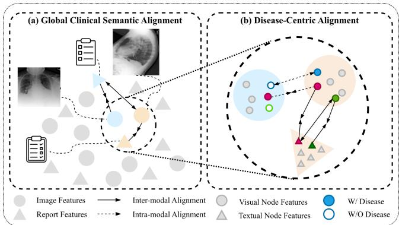
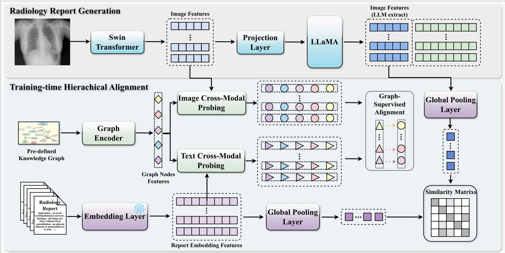
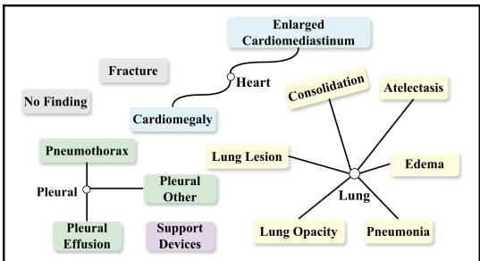
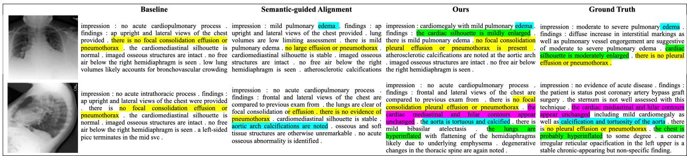
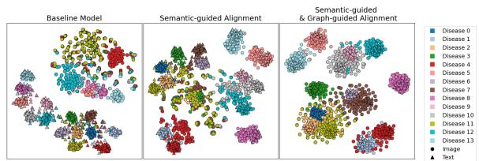
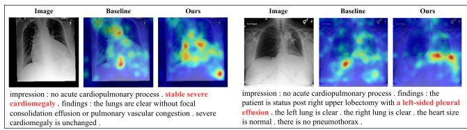

# Graph-Supervised Hierarchical Clinical Alignment for Radiology Report Generation with Large Language Models

Yingshu Li∗   
University of Sydney   
Sydney, Australia   
yili7216@uni.sydney.edu.au

Zailong Chen University of Wollongong Wollongong, Australia zc881@uowmail.edu.au

Yunyi Liu∗   
University of Sydney   
Sydney, Australia   
yunyi.liu1@sydney.edu.au   
Lingqiao Liu   
University of Adelaide   
Adelaide, Australia   
lingqiao.liu@adelaide.edu.au   
Luping Zhou   
University of Sydney   
Sydney, Australia   
luping.zhou@sydney.edu.au

Zhanyu Wang ByteDance Sydney, Australia zhanyu.wang@bytedance.com

Lei Wang   
University of Wollongong   
Wollongong, Australia   
leiw@uow.edu.au

## Abstract

Radiology report generation (RRG) has recently benefited from large language models, which substantially improve report fluency. However, clinically faithful generation remains challenging because current supervision is still imposed mostly at the report level. This creates a granularity mismatch: radiology reports are composed of disease-grounded findings, while existing methods are trained mainly with whole-report objectives. To address this problem, we propose Graph-Supervised Hierarchical Clinical Alignment, which reformulates image-report supervision as a hierarchical clinical alignment problem. Our method structures this alignment as a disease-conditioned process, where supervision is decomposed into two levels: Disease-Centric Alignment for fine-grained diseasespecific correspondence, and Global Clinical Semantic Alignment for report-level semantic coherence. A clinical knowledge graph is used as a training-time-only structural prior that defines diseasespecific supervision units and their clinical relationships, introducing no additional overhead at inference. Because standard contrastive alignment could produce false negatives when studies share overlapping pathologies, we combine instance-conditioned discriminative matching with disease-conditioned soft regularization, enabling fine-grained yet clinically consistent cross-modal representations. Experiments on MIMIC-CXR, IU-Xray, and COV-CTR show that our method consistently improves performance on both conventional and clinical metrics. Notably, our 3B model surpasses several prior systems with larger 7B/13B backbones, suggesting that improving supervision structure, rather than increasing model size, can be more efective for RRG.

CCS Concepts

• Computing methodologies → Computer vision; • Applied computing → Life and medical sciences.

## Keywords

Radiology Report Generation, Hierarchical Clinical Alignment, Large Language Model

## ACM Reference Format:

Yingshu Li, Yunyi Liu, Zhanyu Wang, Zailong Chen, Lingqiao Liu, Lei Wang, and Luping Zhou. 2026. Graph-Supervised Hierarchical Clinical Alignment for Radiology Report Generation with Large Language Models. In Proceedings of the 34th ACM International Conference on Multimedia (MM ’26), November 10–14, 2026, Rio de Janeiro, Brazil. ACM, New York, NY, USA, 10 pages. https://doi.org/10.1145/3767308.3835881

## 1 Introduction

Radiology report generation (RRG) has advanced rapidly with large language models (LLMs) and multimodal LLMs (MLLMs), which substantially improve report fluency [7, 24, 27, 29, 31, 34, 42, 45, 46, 51]. As a result, the current bottleneck of RRG lies not in language generation capacity, but in the granularity of supervision. A radiology report is not a single semantic target: it is a structured composition of disease-specific findings, each grounded in distinct visual evidence. Current RRG models, however, are still trained mainly with holistic report-level objectives, creating a supervision granularity mismatch: clinically meaningful semantics are local and disease-conditioned, while training signals remain global and entangled. As a result, token-level supervision conflates multiple findings into a single training signal, weakening disease-specific alignment and limiting precise clinical correspondences.

Existing eforts fall into two categories, neither of which resolves this mismatch. The first category strengthens representations or generation architectures, including transformer-based encoderdecoders [2–4, 10, 38, 40], contrastive image-text matching [18, 40], and CLIP-based cross-modal models [35, 44]. They improve report quality, but supervision remains at the sample level. The second category injects clinical priors such as disease labels [43], disease relation graphs [10, 28], or normal-abnormal contrastive cues [19], but uses them to enrich features rather than to restructure the granularity at which supervision is imposed. In both cases, holistic training signals remain structurally misaligned with finding-level clinical semantics.

  
Figure 1: Our framework decomposes image-report supervision into two complementary levels: (a) Global Clinical Semantic Alignment, which preserves holistic semantic consistency between the image and report; and (b) Disease-Centric Alignment, which enforces fine-grained alignment of clinically relevant visual and textual features.

We argue that clinically faithful report generation demands supervision whose granularity matches the clinical structure of the output. A radiology report conveys two levels of semantics simultaneously: individual disease findings that correspond to localized visual evidence, and holistic report coherence that integrates these findings into a consistent clinical narrative. Neither level alone is suficient: finding-level supervision without report-level coherence produces fragmented descriptions, while report-level supervision without disease-level disentanglement conflates co-occurring findings. This hierarchy is not a design choice imposed by the model; it is induced by the clinical structure of radiology reports themselves, requiring supervision that decomposes image-report alignment into fine-grained disease-conditioned correspondence and global report-level semantic alignment.

To address this mismatch, we propose Graph-Supervised Hier archical Clinical Alignment (Fig. 1), a training framework that restructures image-report supervision in RRG as a two-level clinical alignment problem. The core idea is to use a clinical knowledge graph to define disease-specific supervision units, so that holistic image-report learning is decomposed into clinically meaningful subproblems, each corresponding to a specific disease finding and its visual evidence. At the fine-grained level, these graph-defined units enable Disease-Centric Alignment, which establishes crossmodal correspondence at the granularity of individual findings rather than whole reports. At the global level, Global Clinical Semantic Alignment preserves report-level coherence by aligning image and report representations in a shared semantic space. Because diferent studies frequently share the same findings, purely instance-wise discriminative matching is complemented by diseaseconditioned soft regularization at both levels, preventing clinically similar studies from being over-separated.

The core contribution of this work is not the knowledge graph itself, but the principle that structured clinical relations can redefine how supervision is organized in RRG. In our framework, the knowledge graph serves as a training-time structural prior: it defines the granularity of alignment and the relationships between supervision units, but will be entirely removed after training. Unlike prior graph-based RRG methods that carry knowledge-induced components through the inference pipeline [10, 24, 28, 49], our model retains the same inference architecture as the base generator with no additional graph computation. Despite using a smaller 3B backbone, our method achieves comparable or superior performance to larger 7B and 13B systems, suggesting that the bottleneck in current RRG is not model capacity but supervision structure.

Our contributions are as follows:

(1) We identify supervision granularity mismatch as a key bottleneck of current RRG systems and reformulate image-report supervision as a hierarchical clinical alignment problem that captures both disease-level correspondence and report-level coherence.

(2) We propose Graph-Supervised Hierarchical Clinical Alignment, which uses a knowledge graph as a training-time structural prior to factorize supervision into Disease-Centric Alignment and Global Clinical Semantic Alignment, introducing no inference-time graph computation.

(3) Experiments on three benchmarks show that our 3B model achieves state-of-the-art or competitive results on both conventional and clinical metrics, outperforming several 7B/13B baselines.

## 2 Related Work

## 2.1 Radiology Report Generation (RRG)

RRG aims to generate clinically accurate and semantically coherent reports from radiological images [2, 10, 21–24, 41]. Non-LLM-based approaches mainly improve visual feature extraction or incorporate auxiliary clinical knowledge. For example, METransformer [41] enhances cross-attention with expert tokens, EKAGen [2] uses instance-level expert knowledge, and KiUT [10] injects clinical knowledge through a U-Transformer. While these methods incorporate disease-relevant priors, they mainly strengthen representations or generation architectures rather than redesigning image-report supervision. Large language models (LLMs) [7, 45] have recently been introduced into RRG to improve generation quality. R2GenGPT [42] employs LLaMA2-7B with a linear projection layer to connect visual and textual features, while MiniGPT-4 [51] has been adapted for RRG [27] with in-domain instance induction and coarse-to-fine decoding. Despite their improved fluency, these models still rely largely on holistic supervision and lack mechanisms to explicitly enforce disease-specific image-report alignment.

## 2.2 Feature Alignment in RRG

Feature alignment in RRG typically relies on contrastive or matchingbased objectives to reduce the image–report modality gap. Inspired by vision-language pretraining [17], DCL [18] contrasts global representations, [40] uses a temporal-weighted matching loss to counter image-text imbalance, and [9] aligns globally after feature refinement. These methods improve cross-modal consistency but operate at the holistic or sample level, too coarse for disease-specific correspondences. Finer granularity has been explored—[26] introduces sentence-level alignment—yet without disease-structured guidance. What remains missing is an alignment framework that is simultaneously fine-grained and organized around disease-conditioned clinical semantics.

## 2.3 Knowledge Graph in RRG

Structured disease knowledge has also been incorporated into RRG and vision-language learning. IGCL [16] exploits graph structure for global image-graph alignment during pre-training, but is not designed for report generation. KARGEN [24], KiUT [10], and EKA-Gen [2] inject disease knowledge through knowledge-guided decod ing, prompt generation, or expert retrieval, each adding knowledgerelated components to the inference pipeline. Our method instead treats the knowledge graph purely as a training-time structural prior defining disease-specific supervision units and their clinical relationships: all graph components are removed at inference, preserving disease structure in the learned representations at zero additional cost.

## 3 Method

Radiology report generation (RRG) is typically trained with token level maximum likelihood, yet clinical correctness is defined over individual findings rather than whole reports. To correct this supervision granularity mismatch, we propose Graph-Supervised Hierarchical Clinical Alignment, which uses a clinical knowledge graph to define disease-specific supervision units during training, decom posing image-report alignment into two levels: Disease-Centric Alignment for fine-grained disease-conditioned correspondence, and Global Clinical Semantic Alignment for report-level coherence. Figure 2 gives an overview of the proposed framework.

## 3.1 Radiology Report Generation

Our base RRG model follows a standard vision-language pipeline. Given a batch of image-report pairs $\{ ( \mathbf { I } _ { i } , \mathbf { T } _ { i } ) \} _ { i = 1 } ^ { B } ,$ , each image is encoded into visual tokens, projected into the LLM embedding space, and used to condition autoregressive report generation. Our hierarchical clinical alignment objectives are imposed on top of this backbone during training.

Vision Encoder. We use a pre-trained Swin Transformer [30] as the visual encoder, which extracts visual token features $\mathbf { F } _ { v i } \in \mathbb { R } ^ { L _ { v } \times d _ { v } }$ from the input image $\mathrm { I } _ { i } , \mathrm { A }$ two-layer MLP with GELU and layer normalization projects $\mathbf { F } _ { o i }$ into the LLM embedding space as $\tilde { \mathbf { F } } _ { v i }$ . For the alignment objectives introduced later, we also extract reportside text embeddings ${ \bf G } _ { i } = { \bf E } ( { \bf T } _ { i } )$ from the ground-truth report.

Report Generator. We adopt LLaMA3-3B as the language backbone. The projected visual tokens $\tilde { \mathbf { F } } _ { v i }$ are concatenated with an instruction prompt $\mathbf { T } _ { \mathcal { P } }$ and fed into the LLM for autoregressive report generation. During training, the generator is optimized with the standard token-level cross-entropy objective:

$$
\mathcal { L } _ { \mathrm { C E } } = \mathbb { E } _ { ( \mathbf { x } , \mathbf { y } ) \sim \mathcal { D } } \left[ \sum _ { j = 1 } ^ { N _ { r } } - \log p _ { \theta } ( y _ { j } \mid \mathbf { x } , y _ { < j } ) \right] ,\tag{1}
$$

where $\begin{array} { r } { \mathbf { x } = ( \tilde { \mathbf { F } } _ { v i } , \mathbf { T } _ { p } ) } \end{array}$ denotes the multimodal conditioning input, and $\mathbf { y } = ( t _ { 1 } ^ { * } , \ldots , t _ { N _ { r } } ^ { * } )$ is the ground-truth report. While this objective ensures fluent generation, it does not explicitly align visual evidence with clinically meaningful semantics. We therefore impose additional hierarchical clinical alignment objectives during training to regularize the learned representation space.

## 3.2 Graph-Supervised Hierarchical Clinical Alignment

Holistic report supervision entangles multiple co-occurring findings into a single sample-level representation, making fine-grained disease-specific correspondence dificult to learn. To address this limitation, we instantiate the fine-grained level of our framework through graph-supervised disease-centric alignment, which decomposes image-report alignment into disease-conditioned subproblems. Each graph node acts as a clinically meaningful latent query that probes visual and textual representations for evidence associated with a specific disease finding, enabling node-level correspondence beyond holistic report matching. The clinical knowledge graph is used only as a training-time structural prior: it specifies how supervision should be factorized into disease-specific units and their clinical relationships, without introducing graph-related computation at inference time. This formulation introduces two node-level alignment problems. The first is cross-modal discrimination: for each disease node, the visual and textual features of the same study should be closer than those of diferent studies. Instance-Conditioned Disease Matching (ICDM) addresses this by treating the matched image-report pair as the only positive per node. However, strict one-to-one matching produces false negatives when diferent studies share the same pathology. We thus introduce Disease-Conditioned Node Regularization (DCNR), which relaxes hard targets using disease labels as soft supervision.

3.2.1 Clinical Knowledge Graph Construction. To support finegrained clinical alignment, we construct a clinical knowledge graph (Fig. 3) over the 14 CheXpert observation categories [11]. Each category is treated as a graph node, initialized from the LLaMA embedding of its category name. Edges encode anatomical and semantic relatedness: observations associated with the same region (e.g., lung, pleura, or heart) are connected to capture shared imaging representations. In this way, the graph provides a clinical prior that organizes disease concepts before cross-modal alignment is learned.

3.2.2 Disease-ConditionedCross-Modal Probing. Radiology studies often contain multiple co-occurring findings whose visual patterns and textual descriptions are entangled, making global cross-modal interaction too coarse for fine-grained clinical alignment. To address this issue, we introduce Disease-Conditioned Cross-Modal Probing, which uses disease-specific latent queries to retrieve observation-level evidence from both image and text representations. We initialize a set of disease nodes $\mathbf { N } ^ { 0 } \in \mathbb { R } ^ { M \times d _ { t } }$ , where � = 14 denotes the CheXpert observation categories. To encode clinical dependencies among findings, the nodes are refined with a graph encoder under a predefined adjacency matrix $A \in \mathbb { R } ^ { M \times M }$

$$
\begin{array} { r } { \mathbf { N } ^ { l - 1 ^ { \prime } } = \mathrm { L a y e r N o r m } \left( \operatorname { G S A } ( \mathbf { N } ^ { l - 1 } , A ) + \mathbf { N } ^ { l - 1 } \right) , } \\ { \mathbf { N } ^ { l } = \mathrm { L a y e r N o r m } \left( \operatorname { F F N } ( \mathbf { N } ^ { l - 1 ^ { \prime } } ) + \mathbf { N } ^ { l - 1 ^ { \prime } } \right) , } \end{array}\tag{2}
$$

  
Figure 2: An overview of our framework. The upper branch is the base Radiology Report Generation (RRG) pipeline. The lower branch is the proposed training-time hierarchical clinical alignment: a knowledge graph defines disease-specific supervision units for Disease-Centric Alignment, while Global Clinical Semantic Alignment preserves report-level coherence. At inference, all graph-related modules are removed; only the RRG backbone is retained.

  
Figure 3: Medical Domain Knowledge Graph.

where graph self-attention restricts message passing to clinically related nodes. The refined disease queries $\Breve { \mathbf { N } } ^ { L }$ then probe modalityspecific features via multi-head cross-attention:

$$
\begin{array} { r } { \mathbf { Z } ^ { I _ { i } } = \operatorname { M H A } ( \mathbf { N } ^ { L } , \mathbf { F } _ { v i } ) , \qquad \mathbf { Z } ^ { T _ { i } } = \operatorname { M H A } ( \mathbf { N } ^ { L } , \mathbf { G } _ { i } ) . } \end{array}\tag{3}
$$

This yields disease-level visual and textual representations conditioned on individual clinical entities.

3.2.3 Instance-ConditionedDisease Matching (ICDM). ICDM treats the visual and textual features of the same sample as the only positive pair for each disease node, enforcing disease-specific crossmodal discrimination while preserving instance identity. Given a mini-batch of size $B ,$ let $\mathbf { z } _ { m } ^ { I _ { i } }$ and $\mathbf { z } _ { m } ^ { T _ { i } }$ denote the disease-aware visual and textual features of node � in sample �. For each visual node feature $\mathbf { z } _ { m } ^ { I _ { i } }$ , ICDM computes its similarity distribution over the textual node features $\{ \mathbf { z } _ { m } ^ { T _ { j } } \} _ { j = 1 } ^ { B }$ of the same disease node across the batch: $\begin{array} { r } { p _ { i } ( \mathbf { z } _ { m } ^ { I _ { i } } , \mathbf { z } _ { m } ^ { T } ) = \left[ \frac { \exp ( \sin ( \tilde { \mathbf { z } } _ { m } ^ { I _ { i } } , \tilde { \mathbf { z } } _ { m } ^ { T _ { j } } ) / \tau ) } { \sum _ { k = 1 } ^ { B } \exp ( \sin ( \tilde { \mathbf { z } } _ { m } ^ { I _ { i } } , \tilde { \mathbf { z } } _ { m } ^ { T _ { k } } ) / \tau ) } \right] _ { j = 1 } ^ { B } } \end{array}$ , where $\tilde { \mathbf { z } } _ { m } ^ { I _ { i } }$ and

$\widetilde { \mathbf { z } } _ { m } ^ { T _ { j } }$ are $\ell _ { 2 } \cdot$ -normalized features, and � is a temperature parameter.

We supervise this distribution with a one-hot target ${ \bf y } _ { i } ^ { m }$ , where $y _ { i i } ^ { m } = 1$ for the matched image-report pair and $y _ { i j } ^ { m } = 0$ for $j \neq i .$ The image-to-text loss for node � is

$$
\mathcal { L } _ { \mathrm { I C D M - i 2 t } } ^ { m } = - \frac { 1 } { B } \sum _ { i = 1 } ^ { B } \mathbf { y } _ { i } ^ { m } \log { p _ { i } ( \mathbf { z } _ { m } ^ { I _ { i } } , \mathbf { z } _ { m } ^ { T } ) } ,\tag{4}
$$

and a symmetric text-to-image objective $\mathcal { L } _ { \mathrm { I C D M - t 2 i } } ^ { m }$ is defined analogously. The overall loss is

$$
\mathcal { L } _ { \mathrm { I C D M } } = \frac { 1 } { 2 M } \sum _ { m = 1 } ^ { M } \left( \mathcal { L } _ { \mathrm { I C D M - i 2 t } } ^ { m } + \mathcal { L } _ { \mathrm { I C D M - t 2 i } } ^ { m } \right) .\tag{5}
$$

3.2.4 Disease-Conditioned Node Regularization (DCNR). While ICDM provides strong instance-level discrimination, its one-hot supervision can produce false negatives when diferent studies share the same finding. DCNR relaxes strict one-to-one matching using disease labels as soft supervision. Inspired by SoftCLIP [8], we construct a disease-conditioned soft target for each node from the 14 CheXpert labels [11]. For disease node $m ,$ let $\mathbf { l } _ { i } ^ { m }$ denote whether finding � is present in sample �. We define a label-induced afinity vector $\mathbf { S } _ { i } ^ { m } = [ \mathbf { l } _ { i } ^ { m } \wedge \mathbf { l } _ { j } ^ { m } ] _ { j = 1 } ^ { B } ;$ , which assigns nonzero afinity to samples sharing the same finding. To preserve instance identity, we add an instance-preserving term $\delta _ { i } ^ { m } { : }$ , where $\delta _ { i j } ^ { m } = 1 \mathrm { i f } i = j$ and 0 otherwise. The resulting soft target is $\tilde { \mathsf { S } } _ { i } ^ { m } =$ Softmax $( \mathsf { S } _ { i } ^ { m } + \delta _ { i } ^ { m } )$ . We then regularize the predicted cross-modal similarity distribution toward this target using KL divergence:

$$
\mathcal { L } _ { \mathrm { { D C N R - i 2 t } } } ^ { m } = \frac { 1 } { B } \sum _ { i = 1 } ^ { B } \mathrm { K L } \Bigl ( \tilde { \bf S } _ { i } ^ { m } \parallel \mathbf { \nabla } p _ { i } ( \mathbf { z } _ { m } ^ { I _ { i } } , \mathbf { z } _ { m } ^ { T } ) \Bigr ) .\tag{6}
$$

A symmetric text-to-image objective $\mathcal { L } _ { \mathrm { D C N R - t 2 i } } ^ { m }$ is defined analogously. DCNR complements ICDM by allowing clinically similar samples to contribute soft positive signal, making node-level alignment more robust to shared pathologies.

3.2.5 Intra-Modal Semantic Consistency (IMSC). Without intramodal structure, disease-aware features may still overlap within each modality, weakening disease-specific separability. IMSC addresses this by regularizing intra-modal feature distributions using the same disease-conditioned soft targets. For disease node �, IMSC encourages samples sharing the same finding to remain close within each modality, while suppressing similarity to samples with diferent findings. The visual intra-modal loss is

$$
\mathcal { L } _ { \mathrm { I M S C - i 2 i } } ^ { m } = \frac { 1 } { B } \sum _ { i = 1 } ^ { B } \mathrm { K L } \left( \tilde { \bf S } _ { i } ^ { m } \parallel \boldsymbol { p } _ { i } ( { \bf z } _ { m } ^ { I _ { i } } , { \bf z } _ { m } ^ { I } ) \right) ,\tag{7}
$$

$$
\begin{array} { r } { p _ { i } ( \mathbf { z } _ { m } ^ { I _ { i } } , \mathbf { z } _ { m } ^ { I } ) = \left[ \frac { \exp ( \sin ( \tilde { \mathbf { z } } _ { m } ^ { I _ { i } } . \tilde { \mathbf { z } } _ { m } ^ { I _ { j } } ) / \tau ) } { \sum _ { k = 1 } ^ { B } \exp ( \sin ( \tilde { \mathbf { z } } _ { m } ^ { I _ { i } } . \tilde { \mathbf { z } } _ { m } ^ { I _ { k } } ) / \tau ) } \right] _ { j = 1 } ^ { B } . } \end{array}
$$

A symmetric textual objective $\mathcal { L } _ { \mathrm { I M S C - t 2 t } } ^ { m }$ is defined analogously.

Together, the three node-level objectives are complementary: ICDM provides discriminative cross-modal alignment, DCNR relaxes strict one-hot supervision, and IMSC preserves disease-aware semantic structure within each modality. The resulting graph supervised disease centric alignment loss is

$$
\mathcal { L } _ { \mathrm { G A } } = \mathcal { L } _ { \mathrm { I C D M } } + \frac { 1 } { 4 M } \sum _ { m = 1 } ^ { M } \left( \mathcal { L } _ { \mathrm { D C N R } } ^ { m } + \mathcal { L } _ { \mathrm { I M S C } } ^ { m } \right) .\tag{8}
$$

## 3.3 Global Clinical Semantic Alignment

Fine-grained disease-level correspondence alone does not guarantee that the image and report remain coherent as a clinical whole, because a radiology report is not merely a set of independent findings but an integrated clinical narrative. We therefore introduce Global Clinical Semantic Alignment (GCSA), which aligns im age and report representations in a shared report-level semantic space. Starting from the projected visual tokens $\tilde { \mathbf { F } } _ { v i }$ , we feed the visual prompts together with the instruction prompt $\mathbf { T } _ { \mathcal { P } }$ into the LLaMA backbone and extract contextualized visual token representations: $\mathbf { V } _ { i } \ = \ \mathrm { L L a M A } ( \tilde { \mathbf { F } } _ { v i } , \mathbf { T } _ { \boldsymbol { p } } )$ , where $\mathbf { V } _ { i } ~ \in ~ \mathbb { R } ^ { L _ { v } \times d _ { t } }$ . Because these features have already interacted with the language backbone, they capture richer report-level semantic context than raw visual encoder outputs. We then obtain global image and report representations by attention-based pooling: $\begin{array} { r } { \mathbf { v } _ { i } = \mathrm { R } _ { I } ( \mathbf { V } _ { i } ) \ : = \ : \sum _ { j = 1 } ^ { L _ { v } } w _ { i j } ^ { V } \mathbf { V } _ { i , j } , } \end{array}$ $\begin{array} { r } { \mathbf { t } _ { i } ~ = ~ \mathrm { R } _ { T } ( \mathbf { G } _ { i } ) ~ = ~ \sum _ { j = 1 } ^ { L _ { t } } w _ { i j } ^ { G } \mathbf { G } _ { i , j } } \end{array}$ , where $\mathbf { w } _ { i } ^ { V }$ and $\mathbf { w } _ { i } ^ { G }$ are attention weights defined by a two-layer MLP with GELU and Softmax. Finally, we compute the similarity distribution between the global image representation $\mathbf { v } _ { i }$ and all textual representations $\{ \mathbf { t } _ { j } \} _ { j = 1 } ^ { B }$ in

the batch: $\begin{array} { r } { p _ { i } ( \mathbf { I } _ { i } , \mathbf { T } ) = \left[ \frac { \exp ( \sin ( \tilde { \bf v } _ { i } , \tilde { \bf t } _ { j } ) / \tau ) } { \sum _ { k = 1 } ^ { B } \exp ( \sin ( \tilde { \bf v } _ { i } , \tilde { \bf t } _ { k } ) / \tau ) } \right] _ { j = 1 } ^ { B } . } \end{array}$

3.3.1 Instance-Conditioned Semantic Matching (ICSM). While diseasecentric alignment captures fine-grained correspondence, it does not

explicitly preserve instance-level alignment in the global semantic space. We therefore introduce Instance-Conditioned Semantic Matching (ICSM) as the discriminative objective of the global branch, encouraging each image to align with its corresponding report while remaining distinguishable from other samples. For the �-th image in a mini-batch, based on the global similarity distribution $\textstyle p _ { i } ( \mathbf { I } _ { i } , \mathbf { T } )$ , the image-to-text loss is

$$
\mathcal { L } _ { \mathrm { I C S M - i 2 t } } = - \frac { 1 } { B } \sum _ { i = 1 } ^ { B } \mathbf { y } _ { i } \log { \mathbf { \mathit { p } } _ { i } ( \mathbf { I } _ { i } , \mathbf { T } ) } .\tag{9}
$$

$\mathrm { A }$ symmetric text-to-image objective $\mathcal { L } _ { \mathrm { I C S M - t 2 i } }$ is defined analogously, and the final loss is

$$
\mathcal { L } _ { \mathrm { I C S M } } = \frac { 1 } { 2 } \left( \mathcal { L } _ { \mathrm { I C S M - i 2 t } } + \mathcal { L } _ { \mathrm { I C S M - t 2 i } } \right) .\tag{10}
$$

3.3.2 Disease-Conditioned Semantic Regularization (DCSR). Analogous to DCNR at the node level, we extend disease-conditioned soft supervision to the global semantic space to reduce false negatives among clinically similar studies. Unlike DCNR, which operates per disease node, DCSR constructs a soft target $\tilde { \mathsf { S } } _ { i }$ from the full CheXpert label profile of each study, allowing samples with similar disease compositions to remain closer while preserving the matched pair as the dominant target. We regularize the predicted global similarity distribution toward this target using KL divergence:

$$
\mathcal { L } _ { \mathrm { D C S R - i 2 t } } = \frac { 1 } { B } \sum _ { i = 1 } ^ { B } \mathrm { K L } \left( \tilde { \mathbf { S } } _ { i } \parallel \mathbf { \mathcal { p } } _ { i } ( \mathbf { I } _ { i } , \mathbf { T } ) \right) .\tag{11}
$$

A symmetric text-to-image objective $\mathcal { L } _ { \mathrm { D C S R - t 2 i } }$ is defined analogously, and the final DCSR loss averages both directions. DCSR complements ICSM by preserving report-level discrimination while reducing false negatives among clinically similar studies.

## 3.4 Overall Training Objective and Inference

The cross-entropy objective supervises token generation, while the alignment objectives shape the representation space at two complementary levels. The overall training objective is

$$
\mathcal { L } = \mathcal { L } _ { \mathrm { C E } } + \lambda _ { 1 } \left( \mathcal { L } _ { \mathrm { I C S M } } + \mathcal { L } _ { \mathrm { D C S R } } \right) + \lambda _ { 2 } \mathcal { L } _ { \mathrm { G A } } ,\tag{12}
$$

where $\lambda _ { 1 }$ and $\lambda _ { 2 }$ control the strengths of global clinical semantic alignment and graph-supervised disease-centric alignment, respectively. The framework introduces less than 10% additional trainable parameters over the 3B baseline; All alignment objectives are used only during training. Thus, our method retains the same inference architecture as the base model, with no additional graph computation or inference-time overhead. In this way, we improve clinically structured representation learning through training-time supervision restructuring rather than increased inference-time complexity.

## 4 Experiments

## 4.1 Datasets

MIMIC-CXR. MIMIC-CXR dataset [15], the largest publicly available collection of chest radiographs and associated free-text reports, includes 377,110 images and 227,835 reports from 64,588 patients. For fair comparison, we utilized the dataset’s division defined by [4], i.e., 270790 images for training and 3858 for testing.

Table 1: Comparison on MIMIC-CXR (upper) and IU-Xray (lower). For IU-Xray, we report variants with and without diseaseconditioned objectives (pseudo labels from CheXbert). Bold/underline denote best/second-best. †: results from original papers. Multi-Grained† [26] is reported without post-processing RL. LLM sizes in parentheses.
<table><tr><td>Dataset</td><td>Methods</td><td>BLEU-1</td><td>BLEU-2</td><td>BLEU-3</td><td>BLEU-4</td><td>METEOR</td><td>ROUGE</td></tr><tr><td rowspan="18">MIMIC-CXR</td><td>R2GenCMN† [3]</td><td>0.353</td><td>0.218</td><td>0.148</td><td>0.106</td><td>0.142</td><td></td></tr><tr><td>PPKED† [28]</td><td>0.360</td><td>0.224</td><td>0.149</td><td>0.106</td><td>0.149</td><td>0.237</td></tr><tr><td>METransformer† [41]</td><td>0.386</td><td>0.250</td><td>0.169</td><td>0.124</td><td>0.152</td><td>0.291</td></tr><tr><td>DCL† [18]</td><td></td><td></td><td></td><td>0.109</td><td>0.150</td><td>0.284</td></tr><tr><td>KiUT† [10]</td><td>0.393</td><td>0.243</td><td>0.159</td><td>0.113</td><td>0.160</td><td>0.285</td></tr><tr><td>EKAGen† [2]</td><td>0.419</td><td>0.258</td><td>0.170</td><td>0.119</td><td>0.157</td><td>0.287</td></tr><tr><td>PromptMRG† [13]</td><td>0.398</td><td></td><td></td><td>0.112</td><td>0.157</td><td>0.268</td></tr><tr><td>CvT2DistilGPT2† [31]</td><td>0.393</td><td>0.248</td><td>0.171</td><td>0.127</td><td></td><td>0.155</td></tr><tr><td>KCAP† [9]</td><td>0.378</td><td>0.240</td><td>0.165</td><td>0.121</td><td>0.149</td><td>0.301</td></tr><tr><td>Multi-Grained† [26]</td><td>0.346</td><td>0.226</td><td>0.159</td><td>0.117</td><td>0.163</td><td>0.290</td></tr><tr><td>R2GenGPT (7B)† [42]</td><td>0.411</td><td>0.267</td><td>0.186</td><td>0.134</td><td>0.160</td><td>0.297</td></tr><tr><td>RaDialog-RG (7B)† [34]</td><td>0.346</td><td></td><td></td><td>0.095</td><td>0.140</td><td>0.271</td></tr><tr><td>Bootstrapping (13B)† [27] KARGEN (7B)† [24]</td><td>0.402</td><td>0.262</td><td>0.180</td><td>0.128</td><td>0.175</td><td>0.291</td></tr><tr><td>Ours (3B)</td><td>0.417 0.427</td><td>0.274 0.279</td><td>0.192 0.194</td><td>0.140</td><td>0.165</td><td>0.305</td></tr><tr><td></td><td></td><td></td><td></td><td>0.143</td><td>0.167</td><td>0.305</td></tr><tr><td rowspan="14"></td><td>R2GenCMN† [3]</td><td>0.475</td><td>0.309</td><td>0.222</td><td>0.170</td><td>0.191</td><td>0.375</td></tr><tr><td>METransformer† [41]</td><td>0.483</td><td>0.322</td><td>0.228</td><td>0.172</td><td>0.192</td><td></td></tr><tr><td>DCL† [18]</td><td></td><td></td><td></td><td>0.163</td><td>0.193</td><td>0.380</td></tr><tr><td>PromptMRG† [13]</td><td>0.401</td><td></td><td></td><td>0.098</td><td>0.160</td><td>0.281</td></tr><tr><td>CvT2DistilGPT2† [31]</td><td>0.473</td><td>0.304</td><td>0.224</td><td>0.175</td><td>0.200</td><td>0.376</td></tr><tr><td>Multi-Grained† [26]</td><td>0.472</td><td>0.321</td><td>0.234</td><td>0.175</td><td>0.192</td><td>0.379</td></tr><tr><td>KCAP† [9]</td><td>0.517</td><td>0.334</td><td>0.243</td><td>0.184</td><td>0.210</td><td>0.384</td></tr><tr><td>R2GenGPT (7B)† [42]</td><td>0.488</td><td>0.316</td><td>0.228</td><td>0.173</td><td>0.211</td><td>0.377</td></tr><tr><td>Bootstrapping (13B)† [27]</td><td>0.499</td><td>0.323</td><td>0.238</td><td>0.184</td><td>0.208</td><td>0.390</td></tr><tr><td>KARGEN (7B)† [24]</td><td>0.490</td><td>0.323</td><td>0.232</td><td>0.180</td><td>0.218</td><td>0.385</td></tr><tr><td>Ours (3B) (w/o DC &amp; IM)</td><td>0.509</td><td>0.344</td><td>0.256</td><td>0.197</td><td>0.218</td><td>0.392</td></tr><tr><td>Ours (3B) (using pseudo labels)</td><td>0.510</td><td>0.346</td><td>0.259</td><td>0.199</td><td>0.222</td><td>0.398</td></tr><tr><td>Results below are not strictly comparable due to different data partitions or image resolution. For reference only.</td><td></td><td></td><td></td><td></td><td></td><td></td></tr><tr><td colspan="7"></td></tr><tr><td>PPKED† [28]</td><td>0.483</td><td></td><td>0.224</td><td></td><td></td><td></td><td></td></tr><tr><td></td><td></td><td>0.315</td><td></td><td></td><td>0.168</td><td>0.376</td><td>0.187</td></tr><tr><td>KiUT† [10] EKAGen [2]</td><td></td><td>0.525 0.497</td><td>0.360 0.339</td><td>0.251 0.250</td><td>0.185 0.190</td><td>0.242 0.210</td><td>0.409 0.399</td></tr></table>

IU-Xray. IU-Xray [5] comprises 3,955 de-identified radiology reports and 7,470 images. For consistent comparisons, we follow the dataset partitioning of [4] with a train/validation/test split of 7:1:2 and conduct all evaluations on the test set.

COV-CTR. COV-CTR [20] is a CT-based radiology report dataset, consisting of 728 lung CT scans (349 COVID-19, 379 non-COVID) paired with diagnostic reports. Following prior work [20], the data are split into train/validation/test set with a ratio of 7:1:2.

## 4.2 Experimental Settings

Evaluation Metrics. We report NLG metrics, BLEU [33], ME-TEOR [1], ROUGE-L [25], and, for clinical quality, RadGraph F1 [12], BERTScore [48], RadCliQ [47], and LLM-based GREEN [32] and RateScore [50], which correlate better with radiologist assessment. Implementation Details. We pair a frozen LLaMA3-3B with a Swin Transformer visual encoder; the disease-centric branch adds a 3-layer Graph Encoder and a 3-layer cross-modal probing mod ule. Training uses two NVIDIA RTX 3090 GPUs (24GB each) at a learning rate of $1 \times { 1 0 } ^ { - 4 }$ , with beam search of width 3 at inference to balance eficiency and output quality. The alignment modules add 214M parameters (< 10% of the 3B baseline) and are dropped at inference, giving about 2 seconds per case, as in the baseline.

Table 2: Evaluation on COV-CTR for CT report generation.
<table><tr><td>Methods</td><td>B@1</td><td>B@2</td><td>B@3</td><td>B@4</td><td>CIDEr</td><td>ROUGE-L</td></tr><tr><td>CoAtt [14]</td><td>0.709</td><td>0.645</td><td>0.603</td><td>0.552</td><td>0.672</td><td>0.748</td></tr><tr><td>SAT [39]</td><td>0.697</td><td>0.621</td><td>0.568</td><td>0.515</td><td>0.659</td><td>0.723</td></tr><tr><td>Vision-BERT [6]</td><td>0.710</td><td>0.653</td><td>0.606</td><td>0.558</td><td>0.684</td><td>0.747</td></tr><tr><td>Vision-GPT [36]</td><td>0.708</td><td>0.645</td><td>0.600</td><td>0.549</td><td>0.680</td><td>0.746</td></tr><tr><td>ASGK [20]</td><td>0.712</td><td>0.659</td><td>0.611</td><td>0.570</td><td>0.684</td><td>0.746</td></tr><tr><td>R2Gen [4]</td><td>0.703</td><td>0.613</td><td>0.543</td><td>0.486</td><td></td><td>0.658</td></tr><tr><td>R2Gen-CMN [3]</td><td>0.710</td><td>0.625</td><td>0.557</td><td>0.493</td><td>=</td><td>0.672</td></tr><tr><td>R2Gen-Mamba [37]</td><td>0.715</td><td>0.629</td><td>0.565</td><td>0.510</td><td>=</td><td>0.668</td></tr><tr><td>Ours</td><td>0.747</td><td>0.679</td><td>0.623</td><td>0.574</td><td>1.285</td><td>0.734</td></tr></table>

## 4.3 Main Results

Tables 1 and 3 report NLG and clinical metrics against encoderdecoder models [2–4, 10, 28], contrastive alignment methods [9, 18, 26], and LLM-based approaches [24, 27, 34, 42]. On MIMIC-CXR, our 3B model surpasses R2GenGPT [42] (7B) and Bootstrapping [27] (13B), indicating that improving supervision structure can be more efective than scaling the generator. Our method also outperforms Multi-Grained [26] (sentence-level contrastive learning, without RL post-processing) and methods that inject disease knowledge without restructuring supervision, such as EKAGen [2] and KiUT [10].

Graph-Supervised Hierarchical Clinical Alignment for Radiology Report Generation with Large Language Models

  
Figure 4: Examples of generated reports. Diferent colors correspond to diferent key disease-related terms.

On IU-Xray, disease labels are unavailable, so we first evaluate a reduced variant without disease-conditioned objectives. Even in this setting, the proposed model outperforms most prior methods. Enabling these objectives with CheXbert pseudo labels yields additional gains, suggesting that the framework benefits from clinically structured label signals when available.

On clinical metrics, our method achieves the best RadGraph F1, BERTScore, RadCliQ, GREEN [32], and RateScore [50], providing evidence that hierarchical clinical alignment improves clinically meaningful report semantics beyond lexical quality. It also outperforms prior methods on COV-CTR (Table 2), demonstrating cross-modality generalization.

Table 3: Evaluation of Clinic-related Metrics on MIMIC-CXR.
<table><tr><td rowspan=1 colspan=2>Methods</td><td rowspan=1 colspan=1>RadGraph F1(↑)</td><td rowspan=1 colspan=1>BERTScore(↑)</td><td rowspan=1 colspan=1>RadCliQ(↓)</td><td rowspan=1 colspan=1>GREEN(↑)</td><td rowspan=1 colspan=1>Rate(↑)</td></tr><tr><td rowspan=7 colspan=2>R2Gen [4]R2GenCMN [3]CvT2DistilGPT2 [31]RaDialog-RG† [34]PromptMRG [13]R2GenGPT [42]</td><td></td><td></td><td></td><td></td><td></td></tr><tr><td rowspan=1 colspan=1>0.182</td><td rowspan=1 colspan=1>0.418</td><td rowspan=1 colspan=1>1.182</td><td rowspan=1 colspan=1>0.297</td><td rowspan=1 colspan=1>0.538</td></tr><tr><td rowspan=3 colspan=1>0.196</td><td rowspan=1 colspan=1>0.374</td><td rowspan=1 colspan=1>1.220</td><td></td><td></td></tr><tr><td rowspan=2 colspan=1>0.400</td><td></td><td></td><td></td></tr><tr><td></td><td rowspan=1 colspan=1>0.320</td><td rowspan=2 colspan=1>0.5270.528</td></tr><tr><td rowspan=2 colspan=1></td><td rowspan=2 colspan=1>0.1900.187</td><td rowspan=1 colspan=1>0.357</td><td rowspan=1 colspan=1>1.169</td><td rowspan=1 colspan=1>0.287</td></tr><tr><td rowspan=1 colspan=1>0.415</td><td rowspan=1 colspan=1>1.207</td><td rowspan=1 colspan=1>0.300</td><td rowspan=1 colspan=1>0.528</td></tr><tr><td rowspan=1 colspan=2>KARGEN [24]</td><td rowspan=1 colspan=1>0.203</td><td rowspan=1 colspan=1>0.421</td><td rowspan=1 colspan=1>1.165</td><td rowspan=1 colspan=1>0.308</td><td rowspan=1 colspan=1>0.533</td></tr><tr><td rowspan=1 colspan=2>EKAGen† [2]</td><td rowspan=1 colspan=1>0.199</td><td rowspan=1 colspan=1>0.412</td><td rowspan=1 colspan=1>1.126</td><td rowspan=1 colspan=1>0.256</td><td rowspan=1 colspan=1>0.512</td></tr><tr><td rowspan=1 colspan=2>Ours</td><td rowspan=1 colspan=1>0.206</td><td rowspan=1 colspan=1>0.422</td><td rowspan=1 colspan=1>1.145</td><td rowspan=1 colspan=1>0.323</td><td rowspan=1 colspan=1>0.541</td></tr></table>

Note: EKAGen uses 300×300 images while the others use 224×224 images.

Table 4 reports disease-wise AUROC over the 14 CheXpert categories. Our method shows consistent gains on key findings such as Edema, Atelectasis, Pneumothorax, and Pleural Efusion, consistent with our disease-conditioned alignment design. This reflects improved disease-level semantics beyond holistic fluency.

Table 4: Disease-wise AUROC comparison.
<table><tr><td>Disease</td><td>Baseline</td><td>Ours</td><td>Disease</td><td>Baseline</td><td>Ours</td></tr><tr><td>Enl. Cardiom.</td><td>0.488</td><td>0.540</td><td>Atelectasis</td><td>0.629</td><td>0.640</td></tr><tr><td>Cardiomegaly</td><td>0.595</td><td>0.621</td><td>Pneumothorax</td><td>0.545</td><td>0.551</td></tr><tr><td>Lung Opacity</td><td>0.530</td><td>0.567</td><td>Pleural Effusion</td><td>0.766</td><td>0.771</td></tr><tr><td>Lung Lesion</td><td>0.503</td><td>0.515</td><td>Pleural Other</td><td>0.502</td><td>0.512</td></tr><tr><td>Edema</td><td>0.647</td><td>0.676</td><td>Fracture</td><td>0.505</td><td>0.507</td></tr><tr><td>Consolidation</td><td>0.505</td><td>0.518</td><td>Support Devices</td><td>0.706</td><td>0.735</td></tr><tr><td>Pneumonia</td><td>0.523</td><td>0.572</td><td>No Finding</td><td>0.619</td><td>0.620</td></tr></table>

## 4.4 Ablation Study

4.4.1 Contribution of Each Component. Table 5 presents the ablation study. The 3B baseline is initially weaker than the 7B baseline;

Table 5: Component ablation. ICSM: Instance-Conditioned Semantic Matching; DCSR: Disease-Conditioned Semantic Regularization; ICDM: Instance-Conditioned Disease Matching; DCNR: Disease-Conditioned Node Regularization; IMSC: Intra-Modal Semantic Consistency.
<table><tr><td>#</td><td>Param.</td><td>ICSM</td><td>DCSR</td><td>ICDM</td><td>DCNR</td><td>IMSC</td><td>B@1</td><td>B@4</td><td>METEOR</td><td>ROUGE</td><td>RadCliQ(↓)</td></tr><tr><td>1</td><td>7B</td><td></td><td></td><td></td><td></td><td></td><td>0.411</td><td>0.134</td><td>0.160</td><td>0.297</td><td>1.207</td></tr><tr><td>2</td><td>3B</td><td></td><td></td><td></td><td></td><td></td><td>0.411</td><td>0.126</td><td>0.157</td><td>0.286</td><td>1.221</td></tr><tr><td>3</td><td>3B</td><td>√</td><td></td><td></td><td></td><td></td><td>0.419</td><td>0.133</td><td>0.162</td><td>0.296</td><td>1.181</td></tr><tr><td>4</td><td>3B</td><td></td><td></td><td>√</td><td></td><td></td><td>0.416</td><td>0.131</td><td>0.161</td><td>0.293</td><td>1.195</td></tr><tr><td>5</td><td>3B</td><td>√</td><td>√</td><td></td><td></td><td></td><td>0.424</td><td>0.135</td><td>0.165</td><td>0.296</td><td>1.177</td></tr><tr><td>6</td><td>3B</td><td>√</td><td></td><td>√</td><td></td><td></td><td>0.421</td><td>0.136</td><td>0.164</td><td>0.294</td><td>1.179</td></tr><tr><td>7</td><td>3B</td><td></td><td></td><td>√</td><td>√</td><td></td><td>0.420</td><td>0.134</td><td>0.164</td><td>0.294</td><td>1.175</td></tr><tr><td>8</td><td>3B</td><td>√</td><td>7</td><td>√</td><td>√</td><td></td><td>0.424</td><td>0.138</td><td>0.166</td><td>0.295</td><td>1.165</td></tr><tr><td>9</td><td>3B</td><td></td><td></td><td>√</td><td>√</td><td>√</td><td>0.425</td><td>0.139</td><td>0.166</td><td>0.299</td><td>1.155</td></tr><tr><td>10</td><td>3B</td><td>√</td><td>√</td><td>√</td><td>√</td><td>√</td><td>0.427</td><td>0.143</td><td>0.167</td><td>0.305</td><td>1.145</td></tr></table>

progressively adding our objectives yields consistent improvements across all metrics, and the full model ultimately surpasses the larger backbone. This confirms that clinically structured supervision can be more efective than backbone scaling alone. The ablation further shows why both levels of hierarchical clinical alignment are necessary. Global-only alignment (ICSM+DCSR, row 5) improves reportlevel correspondence but leaves RadCliQ at 1.177, indicating limited finding-level precision. Node-only alignment (ICDM+DCNR+IMSC, row 9) improves disease-specific separability and reaches a lower RadCliQ of 1.155, but does not fully close the gap on BLEU-1. The full model (row 10) achieves the best performance on all metrics. This pattern reflects the two-level structure of radiology reports themselves: report-level coherence and finding-level precision are both required, and neither level of supervision alone is suficient to capture both. Figure 5 visualizes this complementarity on 100 MIMIC-CXR test samples. Without alignment, the two modalities are scattered. Global Clinical Semantic Alignment reduces the cross-modal gap, and Disease-Centric Alignment further clusters same-disease features while separating diferent findings.

4.4.2 Impact ofGlobal Clinical Semantic Alignment. Introducing ICSM substantially improves the 3B baseline, bringing it close to the 7B model (B@4: 0.126→0.133, a 5.6% relative gain). This result reveals that a conventional projection layer alone is insuficient to establish strong image-report correspondence in the medical domain; explicit report-level alignment is needed even when the language backbone is powerful. ICSM preserves holistic report-level coherence that disease-centric alignment alone cannot guarantee. Configurations relying only on node-level alignment (row 9 in Table 5) improve finding-level precision but do not match the full model, confirming that global semantic structure provides a necessary foundation for disease-conditioned alignment.

4.4.3 Impact of Disease-Centric Alignment. Introducing ICDM alone yields a modest but consistent improvement, confirming that shifting cross-modal discrimination from the report level to disease-specific nodes is beneficial even with hard one-hot targets. Adding DCNR further improves performance by relaxing strict one-to-one targets: it allows studies sharing the same finding to contribute soft positive signal, reducing false negatives that are inherent in medical contrastive learning. The largest gain comes from IMSC: BLEU-4 increases from 0.134 to 0.139 and ROUGE from 0.294 to 0.299. This reveals that disease-specific supervision units require not only cross-modal discrimination but also intra-modal separability. These objectives are complementary: ICDM provides the discriminative backbone, DCNR adapts it to clinical reality, and IMSC regularizes the intra-modal feature space. More broadly, comparing rows 3 vs. 5 and 4 vs. 7, adding disease-conditioned soft regularization (DCNR/DCSR) consistently improves over hardmatching counterparts at both levels, confirming that it refines discriminative alignment rather than replacing it.

  
Figure 5: 2D projection of disease-level visual (circles) and textual (triangles) features from 100 MIMIC-CXR test samples. Colors denote disease nodes.

4.4.4 Impact of Knowledge Graph. The value of the knowledge graph lies in how it structures supervision units, not merely in the number ofnodes it introduces. We verify this from two perspectives: ontology extensibility and graph structure. As shown in Table 6, extending the 14-disease CheXpert graph to a 25-disease graph constructed from RadGraph-derived [12] entity statistics yields consistent improvements on both lexical and clinical metrics. This indicates that the framework can naturally absorb a broader disease ontology; the gains are modest, as expected given the long-tailed frequency distribution of the newly added entities. We further compare our anatomically informed graph with a random graph and an all-connect graph. Both variants underperform the original design. Random connectivity removes clinically meaningful priors, while full connectivity weakens discriminability by introducing non-informative relations between unrelated findings. The graph therefore helps by providing a clinically structured training-time prior over supervision units, not by adding parameters.

4.4.5 Impact of Hyperparameters. We test the impact of hyperparameters $\lambda _ { 1 }$ and $\lambda _ { 2 }$ in Table 7. When the weight $\lambda _ { 2 }$ of Disease-Centric Alignment increases to 2, our model improves further, reinforcing the importance of disease-specific supervision units.

Table 6: Ablation on graph design. “25-Disease” extends the ontology with RadGraph-derived entities. “Random” uses a random adjacency matrix; “All-connect” links every node.

<table><tr><td>Method</td><td>B@4</td><td>ROUGE-L</td><td>RadGraph F1 ↑</td><td>BERTScore ↑</td><td>RadCliQ ↓</td></tr><tr><td>Random Graph</td><td>0.137</td><td>0.298</td><td>0.198</td><td>0.417</td><td>1.167</td></tr><tr><td>All-connect Graph</td><td>0.139</td><td>0.298</td><td>0.201</td><td>0.419</td><td>1.158</td></tr><tr><td>Ours</td><td>0.143</td><td>0.305</td><td>0.206</td><td>0.422</td><td>1.145</td></tr><tr><td>25-Disease Extended Graph</td><td>0.144</td><td>0.305</td><td>0.209</td><td>0.425</td><td>1.138</td></tr></table>

Table 7: Ablation study for hyperparameters: $\lambda _ { 1 }$ and $\lambda _ { 2 } .$
<table><tr><td rowspan=1 colspan=1>λ1</td><td rowspan=1 colspan=1>λ2</td><td rowspan=1 colspan=1>B@1</td><td rowspan=1 colspan=1>B@2</td><td rowspan=1 colspan=1>B@3</td><td rowspan=1 colspan=1>B@4</td><td rowspan=1 colspan=1>METEOR</td><td rowspan=1 colspan=1>ROUGE</td></tr><tr><td rowspan=1 colspan=1>1</td><td rowspan=1 colspan=1>1</td><td rowspan=1 colspan=1>0.426</td><td rowspan=1 colspan=1>0.277</td><td rowspan=1 colspan=1>0.192</td><td rowspan=1 colspan=1>0.139</td><td rowspan=1 colspan=1>0.167</td><td rowspan=1 colspan=1>0.298</td></tr><tr><td rowspan=1 colspan=1>0.5</td><td rowspan=1 colspan=1>1</td><td rowspan=1 colspan=1>0.426</td><td rowspan=1 colspan=1>0.276</td><td rowspan=1 colspan=1>0.191</td><td rowspan=1 colspan=1>0.138</td><td rowspan=1 colspan=1>0.167</td><td rowspan=1 colspan=1>0.298</td></tr><tr><td rowspan=1 colspan=1>1.5</td><td rowspan=1 colspan=1>1</td><td rowspan=1 colspan=1>0.426</td><td rowspan=1 colspan=1>0.276</td><td rowspan=1 colspan=1>0.190</td><td rowspan=1 colspan=1>0.137</td><td rowspan=1 colspan=1>0.166</td><td rowspan=1 colspan=1>0.296</td></tr><tr><td rowspan=1 colspan=1>2</td><td rowspan=1 colspan=1>1</td><td rowspan=1 colspan=1>0.425</td><td rowspan=1 colspan=1>0.276</td><td rowspan=1 colspan=1>0.190</td><td rowspan=1 colspan=1>0.137</td><td rowspan=1 colspan=1>0.166</td><td rowspan=1 colspan=1>0.296</td></tr><tr><td rowspan=1 colspan=1>1</td><td rowspan=1 colspan=1>0.5</td><td rowspan=1 colspan=1>0.424</td><td rowspan=1 colspan=1>0.277</td><td rowspan=1 colspan=1>0.192</td><td rowspan=1 colspan=1>0.139</td><td rowspan=1 colspan=1>0.165</td><td rowspan=1 colspan=1>0.299</td></tr><tr><td rowspan=1 colspan=1>1</td><td rowspan=1 colspan=1>1.5</td><td rowspan=1 colspan=1>0.425</td><td rowspan=1 colspan=1>0.276</td><td rowspan=1 colspan=1>0.191</td><td rowspan=1 colspan=1>0.138</td><td rowspan=1 colspan=1>0.166</td><td rowspan=1 colspan=1>0.299</td></tr><tr><td rowspan=1 colspan=1>1</td><td rowspan=1 colspan=1>2</td><td rowspan=1 colspan=1>0.427</td><td rowspan=1 colspan=1>0.279</td><td rowspan=1 colspan=1>0.194</td><td rowspan=1 colspan=1>0.143</td><td rowspan=1 colspan=1>0.167</td><td rowspan=1 colspan=1>0.305</td></tr></table>

  
Figure 6: Case-level vision interpretability via heatmaps.

## 4.5 Qualitative Analysis

Figure 4 shows representative reports from the baseline, a variant with only Global Clinical Semantic Alignment, and our full model. The baseline captures normal features but misses abnormalities. Adding global alignment recovers coarse findings such as “edema,” but finer details remain incomplete. The full model further generates disease-specific descriptions such as “cardiac silhouette is mildly enlarged,” indicating that Disease-Centric Alignment improves finding-level precision. Figure 6 visualizes case-level attention: our model focuses on clinically relevant regions (e.g., cardiac silhouette for cardiomegaly, costophrenic angle for pleural efusion), confirming that the framework improves disease-conditioned alignment rather than relying on language priors.

## 5 Conclusions

This work argues that the current challenge of radiology report generation lies not in language generation capacity, but in the granularity at which supervision is imposed. We reformulate imagereport supervision in RRG as a hierarchical clinical alignment problem and propose Graph-Supervised Hierarchical Clinical Alignment, which integrates Disease-Centric Alignment for fine-grained disease-level correspondence with Global Clinical Semantic Alignment for report-level coherence. The resulting framework improves both generation quality and clinical faithful ness across three benchmarks, while using the knowledge graph only as a training-time structural prior that specifies how supervision should be factorized, not how inference should be performed.

## References

[1] Satanjeev Banerjee and Alon Lavie. 2005. METEOR: An automatic metric for MT evaluation with improved correlation with human judgments. In Proceedings of the acl workshop on intrinsic and extrinsic evaluation measures for machine translation and/or summarization. 65–72

[2] Shenshen Bu, Taiji Li, Yuedong Yang, and Zhiming Dai. 2024. Instance-level Expert Knowledge and Aggregate Discriminative Attention for Radiology Report Generation. In Proceedings of the IEEE/CVF Conference on Computer Vision and Pattern Recognition. 14194–14204.

[3] Zhihong Chen, Yaling Shen, Yan Song, and Xiang Wan. 2021. Cross-modal memory networks for radiology report generation. In Proceedings ofthe 59th annual meeting ofthe association for computational linguistics and the 11th international joint conference on natural language processing (volume 1: long papers). 5904–5914.

[4] Zhihong Chen, Yan Song, Tsung-Hui Chang, and Xiang Wan. 2020. Generating Radiology Reports via Memory-driven Transformer. In Proceedings ofthe 2020 Conference on Empirical Methods in Natural Language Processing (EMNLP). 1439– 1449.

[5] Dina Demner-Fushman, Marc D Kohli, Marc B Rosenman, Sonya E Shooshan, Laritza Rodriguez, Sameer Antani, George R Thoma, and Clement J McDonald. 2016. Preparing a collection of radiology examinations for distribution and retrieval. Journal of the American Medical Informatics Association 23, 2 (2016), 304–310.

[6] Jacob Devlin, Ming-Wei Chang, Kenton Lee, and Kristina Toutanova. 2019. Bert: Pre-training of deep bidirectional transformers for language understanding. In Proceedings of the 2019 conference of the North American chapter of the association for computational linguistics: human language technologies, volume 1 (long and short papers). 4171–4186.

[7] Abhimanyu Dubey, Abhinav Jauhri, Abhinav Pandey, Abhishek Kadian, Ahmad Al-Dahle, Aiesha Letman, Akhil Mathur, Alan Schelten, Amy Yang, Angela Fan, et al. 2024. The llama 3 herd of models. arXiv preprint arXiv:2407.21783 (2024).

[8] Yuting Gao, Jinfeng Liu, Zihan Xu, Tong Wu, Enwei Zhang, Ke Li, Jie Yang, Wei Liu, and Xing Sun. 2024. Softclip: Softer cross-modal alignment makes clip stronger. In Proceedings ofthe AAAI Conference on Artificial Intelligence, Vol. 38. 1860–1868.

[9] Lili Huang, Yiming Cao, Pengcheng Jia, Chenglong Li, Jin Tang, and Chuanfu Li. 2024. Knowledge-guided Cross-modal Alignment and Progressive Fusion for Chest X-ray Report Generation. IEEE Transactions on Multimedia (2024).

[10] Zhongzhen Huang, Xiaofan Zhang, and Shaoting Zhang. 2023. Kiut: Knowledgeinjected u-transformer for radiology report generation. In Proceedings of the IEEE/CVF Conference on Computer Vision and Pattern Recognition. 19809–19818.

[11] Jeremy Irvin, Pranav Rajpurkar, Michael Ko, Yifan Yu, Silviana Ciurea-Ilcus, Chris Chute, Henrik Marklund, Behzad Haghgoo, Robyn Ball, Katie Shpanskaya, et al. 2019. Chexpert: A large chest radiograph dataset with uncertainty labels and expert comparison. In Proceedings ofthe AAAI conference on artificial intelligence, Vol. 33. 590–597.

[12] Saahil Jain, Ashwin Agrawal, Adriel Saporta, Steven QH Truong, Du Nguyen Duong, Tan Bui, Pierre Chambon, Yuhao Zhang, Matthew P Lungren, Andrew Y Ng, et al. 2021. Radgraph: Extracting clinical entities and relations from radiology reports. arXiv preprint arXiv:2106.14463 (2021).

[13] Haibo Jin, Haoxuan Che, Yi Lin, and Hao Chen. 2024. Promptmrg: Diagnosis driven prompts for medical report generation. In Proceedings ofthe AAAI Conference on Artificial Intelligence, Vol. 38. 2607–2615.

[14] Baoyu Jing, Pengtao Xie, and Eric Xing. 2018. On the automatic generation of medical imaging reports. In Proceedings of the 56th annual meeting of the association for computational linguistics (volume 1: long papers). 2577–2586.

[15] Alistair EW Johnson, Tom J Pollard, Nathaniel R Greenbaum, Matthew P Lungren, Chih-ying Deng, Yifan Peng, Zhiyong Lu, Roger G Mark, Seth J Berkowitz, and Steven Horng. 2019. MIMIC-CXR-JPG, a large publicly available database of labeled chest radiographs. arXiv preprint arXiv:1901.07042 (2019).

[16] Sameer Khanna, Daniel Michael, Marinka Zitnik, and Pranav Rajpurkar. 2023. Learning generalized medical image representations through image-graph con trastive pretraining. In Machine Learning for Health (ML4H). PMLR, 232–243.

[17] Junnan Li, Dongxu Li, Caiming Xiong, and Steven Hoi. 2022. Blip: Bootstrapping language-image pre-training for unified vision-language understanding and generation. In International conference on machine learning. PMLR, 12888–12900.

[18] Mingjie Li, Bingqian Lin, Zicong Chen, Haokun Lin, Xiaodan Liang, and Xiaojun Chang. 2023. Dynamic graph enhanced contrastive learning for chest x-ray report generation. In Proceedings ofthe IEEE/CVF Conference on Computer Vision and Pattern Recognition. 3334–3343.

[19] Mingjie Li, Haokun Lin, Liang Qiu, Xiaodan Liang, Ling Chen, Abdulmotaleb Elsaddik, and Xiaojun Chang. 2025. Contrastive learning with counterfactual explanations for radiology report generation. In European Conference on Computer Vision. Springer, 162–180.

[20] Mingjie Li, Rui Liu, Fuyu Wang, Xiaojun Chang, and Xiaodan Liang. 2023. Auxil iary signal-guided knowledge encoder-decoder for medical report generation. World Wide Web 26, 1 (2023), 253–270.

[21] Yingshu Li, Yunyi Liu, Zhenghao Chen, Tong Chen, Zailong Chen, Lingqiao Liu, Lei Wang, and Luping Zhou. 2026. Seeing What Matters: Lesion-Aware High-Resolution Patch Discovery and Fusion for Chest X-ray Report Generation. arXiv preprint arXiv:2607.06909 (2026).

[22] Yingshu Li, Yunyi Liu, Zhanyu Wang, Xinyu Liang, Lingqiao Liu, Lei Wang, Leyang Cui, Zhaopeng Tu, Longyue Wang, and Luping Zhou. 2023. A comprehensive study of GPT-4V’s multimodal capabilities in medical imaging. medRxiv (2023), 2023–11.

[23] Yingshu Li, Yunyi Liu, Zhanyu Wang, Xinyu Liang, Lingqiao Liu, Lei Wang, and Luping Zhou. 2025. S-RRG-Bench: Structured radiology report generation with fine-grained evaluation framework. Meta-Radiology (2025), 100171.

[24] Yingshu Li, Zhanyu Wang, Yunyi Liu, Lei Wang, Lingqiao Liu, and Luping Zhou. 2024. KARGEN: Knowledge-enhanced Automated Radiology Report Generation Using Large Language Models. In International Conference on Medical Image Computing and Computer-Assisted Intervention. Springer, 382–392.

[25] Chin-Yew Lin. 2004. Rouge: A package for automatic evaluation of summaries. In Text summarization branches out. 74–81

[26] Aohan Liu, Yuchen Guo, Jun-hai Yong, and Feng Xu. 2024. Multi-grained Radiol ogy Report Generation with Sentence-level Image-language Contrastive Learning. IEEE Transactions on Medical Imaging (2024).

[27] Chang Liu, Yuanhe Tian, Weidong Chen, Yan Song, and Yongdong Zhang. 2024. Bootstrapping Large Language Models for Radiology Report Generation. In Proceedings ofthe AAAIConference on Artificial Intelligence, Vol. 38. 18635–18643.

[28] Fenglin Liu, Xian Wu, Shen Ge, Wei Fan, and Yuexian Zou. 2021. Exploring and distilling posterior and prior knowledge for radiology report generation. In Proceedings ofthe IEEE/CVF conference on computer vision and pattern recognition. 13753–13762.

[29] Haotian Liu, Chunyuan Li, Qingyang Wu, and Yong Jae Lee. 2024. Visual instruction tuning. Advances in neural information processing systems 36 (2024).

[30] Ze Liu, Yutong Lin, Yue Cao, Han Hu, Yixuan Wei, Zheng Zhang, Stephen Lin, and Baining Guo. 2021. Swin transformer: Hierarchical vision transformer using shifted windows. In Proceedings of the IEEE/CVF international conference on computer vision. 10012–10022.

[31] Aaron Nicolson, Jason Dowling, and Bevan Koopman. 2023. Improving chest X-ray report generation by leveraging warm starting. Artificial intelligence in medicine 144 (2023), 102633.

[32] Sophie Ostmeier, Justin Xu, Zhihong Chen, Maya Varma, Louis Blankemeier, Christian Bluethgen, Arne Edward Michalson Md, Michael Moseley, Curtis Lan glotz, Akshay S Chaudhari, et al. 2024. Green: Generative radiology report evaluation and error notation. In Findings of the association for computational linguistics: EMNLP 2024. 374–390.

[33] Kishore Papineni, Salim Roukos, Todd Ward, and Wei-Jing Zhu. 2002. Bleu: a method for automatic evaluation of machine translation. In Proceedings ofthe 40th annual meeting ofthe Association for Computational Linguistics. 311–318.

[34] Chantal Pellegrini, Ege Özsoy, Benjamin Busam, Nassir Navab, and Matthias Keicher. 2023. RaDialog: A large vision-language model for radiology report generation and conversational assistance. arXiv preprint arXiv:2311.18681 (2023).

[35] Alec Radford, Jong Wook Kim, Chris Hallacy, Aditya Ramesh, Gabriel Goh, Sandhini Agarwal, Girish Sastry, Amanda Askell, Pamela Mishkin, Jack Clark, et al. 2021. Learning transferable visual models from natural language supervision. In International conference on machine learning. PMLR, 8748–8763.

[36] Alec Radford, Karthik Narasimhan, Tim Salimans, Ilya Sutskever, et al. 2018. Improving language understanding by generative pre-training. (2018).

[37] Yongheng Sun, Yueh Z Lee, Genevieve A Woodard, Hongtu Zhu, Chunfeng Lian, and Mingxia Liu. 2025. R2gen-mamba: A selective state space model for radiology report generation. In 2025 IEEE 22nd International Symposium on Biomedical Imaging (ISBI). IEEE, 1–4.

[38] A Vaswani. 2017. Attention is all you need. Advances in Neural Information Processing Systems (2017).

[39] Oriol Vinyals, Alexander Toshev, Samy Bengio, and Dumitru Erhan. 2015. Show and tell: A neural image caption generator. In Proceedings ofthe IEEE conference on computer vision and pattern recognition. 3156–3164.

[40] Zhanyu Wang, Hongwei Han, Lei Wang, Xiu Li, and Luping Zhou. 2022. Automated radiographic report generation purely on transformer: A multicriteria supervised approach. IEEE Transactions on Medical Imaging 41, 10 (2022), 2803– 2813.

[41] Zhanyu Wang, Lingqiao Liu, Lei Wang, and Luping Zhou. 2023. Metransformer: Radiology report generation by transformer with multiple learnable expert tokens. In Proceedings of the IEEE/CVF Conference on Computer Vision and Pattern Recognition. 11558–11567.

[42] Zhanyu Wang, Lingqiao Liu, Lei Wang, and Luping Zhou. 2023. R2gengpt: Radiology report generation with frozen llms. Meta-Radiology 1, 3 (2023), 100033.

[43] Zhanyu Wang, Mingkang Tang, Lei Wang, Xiu Li, and Luping Zhou. 2022. A medical semantic-assisted transformer for radiographic report generation. In International Conference on Medical Image Computing and Computer-Assisted Intervention. Springer, 655–664.

[44] Zifeng Wang, Zhenbang Wu, Dinesh Agarwal, and Jimeng Sun. 2022. Medclip: Contrastive learning from unpaired medical images and text. arXiv preprint

arXiv:2210.10163 (2022).

[45] An Yang, Baosong Yang, Binyuan Hui, Bo Zheng, Bowen Yu, Chang Zhou, Chengpeng Li, Chengyuan Li, Dayiheng Liu, Fei Huang, et al. 2024. Qwen2 Technical Report. CoRR (2024).

[46] Qinghao Ye, Haiyang Xu, Jiabo Ye, Ming Yan, Anwen Hu, Haowei Liu, Qi Qian, Ji Zhang, and Fei Huang. 2024. mplug-owl2: Revolutionizing multi-modal large language model with modality collaboration. In Proceedings of the IEEE/CVF Conference on Computer Vision and Pattern Recognition. 13040–13051.

[47] Feiyang Yu, Mark Endo, Rayan Krishnan, Ian Pan, Andy Tsai, Eduardo Pontes Reis, Eduardo Kaiser Ururahy Nunes Fonseca, Henrique Min Ho Lee, Zahra Shakeri Hossein Abad, Andrew Y Ng, et al. 2023. Evaluating progress in automatic chest x-ray radiology report generation. Patterns 4, 9 (2023).

[48] Tianyi Zhang, Varsha Kishore, Felix Wu, Kilian Q Weinberger, and Yoav Artzi. 2019. Bertscore: Evaluating text generation with bert. arXiv preprint arXiv:1904.09675 (2019).

[49] Yixiao Zhang, Xiaosong Wang, Ziyue Xu, Qihang Yu, Alan Yuille, and Daguang Xu. 2020. When radiology report generation meets knowledge graph. In Proceedings ofthe AAAI conference on artificial intelligence, Vol. 34. 12910–12917.

[50] Weike Zhao, Chaoyi Wu, Xiaoman Zhang, Ya Zhang, Yanfeng Wang, and Weidi Xie. 2024. RaTEScore: A Metric for Radiology Report Generation. In Proceedings of the 2024 Conference on Empirical Methods in Natural Language Processing. 15004–15019.

[51] Deyao Zhu, Jun Chen, Xiaoqian Shen, Xiang Li, and Mohamed Elhoseiny. 2023. Minigpt-4: Enhancing vision-language understanding with advanced large language models. arXiv preprint arXiv:2304.10592 (2023).