# LUCE: RELIGHTABLE GAUSSIANS FOR 3D ASSET GENERATION

Mayank Singh Harsha Kalli Behrooz

Michele Stoppa A Srimanth Gunturi Shahsavari Waleed Abdulla a Apple

lvise Memo Rui Yu Muhammad Ahmed Riaz David E. Jacobs

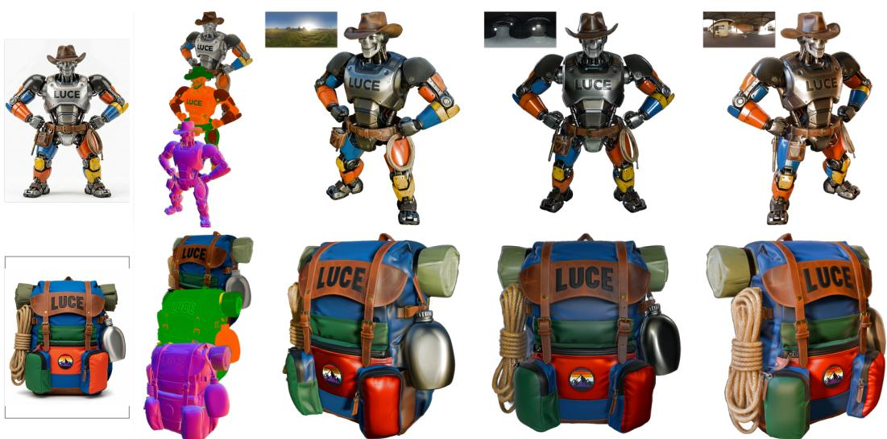  
Figure 1: Our method Luce generates relightable 3D assets from a single image. Each asset consists of Gaussians encoding three modalities of a physically based rendering (PBR) material: albedo, metallic-roughness, and surface normals. These modalities enable standard PBR shading, rendering the Gaussians under novel illumination. From left to right, the columns show: the input condition image; the generated PBR modalities stacked vertically—albedo (top), metallic-roughness (middle, metallic in Red, roughness in Green channel), and surface normals (bottom); and the generated 3D asset rendered under three environment maps, previewed as small strips above each render (top row).

## ABSTRACT

High-fidelity image-to-3D generation requires a 3D representation that captures both geometry and appearance. To support relighting and integration into standard rendering pipelines, the representation should include physically based rendering (PBR) modalities such as albedo, metallic-roughness, and surface normals. We propose Luce, a 3D representation that unifies geometry and PBR materials within a voxelized multimodal Gaussian cloud, using dedicated Gaussian primitives for each modality. A variational autoencoder compresses this representation into a unified material-aware latent space. A rectified-flow transformer generates this latent from a single image, conditioned on multi-layer features from a pretrained image encoder that preserve both semantic context and fine spatial detail. The latent then decodes into relightable PBR Gaussians and an optional textured mesh with a tangent-space normal map. On Toys4K, Luce achieves state-of-the-art singleimage-to-3D generation, improving FID by 28% over the strongest baseline. We further introduce a benchmark of AI-generated images, on which Luce improves the CLIP image-alignment score over the best baseline (0.8519 vs. 0.8299). Luce generates relightable, geometrically accurate, and materially faithful assets that preserve fine details such as text, logos, and inscriptions.

Condition Image

Luce (ours)

LiTo

TRELLIS 2

TRELLIS

  
Figure 2: Legible text on generated 3D assets. Luce compared with LiTo (Chang et al., 2026), TRELLIS 2 (Xiang et al., 2025), and TRELLIS (Xiang et al., 2024) on single-image-to-3D generation; each row shows the input condition image and one rendered view of each method’s generated 3D asset. LiTo generates assets aligned to the input view, whereas other methods generate in a canonical orientation. Luce keeps surface text and markings legible where baselines distort them.

## 1 INTRODUCTION

Diffusion and flow-matching models have largely closed the realism gap in 2D image generation (Rombach et al., 2022; Black Forest Labs, 2024), where images share one representation: a dense pixel grid. 3D has many, spanning implicit fields and explicit primitives (Park et al., 2019; Mildenhall et al., 2020; Shen et al., 2023; Kerbl et al., 2023), and that choice sets a ceiling on what a generative model can produce. To render and relight assets in standard pipelines, the representation must support fine geometric detail and physically based materials together.

We introduce Luce (Fig. 1), a representation that meets these requirements: it unifies fine geometry and physically based materials in a single relightable form. In Luce, an asset is a collection of Gaussians attached to a sparse set of voxels that intersect the object’s surface. Within each voxel, we encode a set of Gaussians for each PBR modality: albedo, metallic-roughness, and surface normal direction. This representation is a complete PBR material description in a 3D-native format that drops directly into standard rendering pipelines. It also compresses into a compact, diffusible latent. The per-modality encoding of geometry and appearance helps to preserve high-frequency details that prior approaches often smooth out, including legible text on generated 3D surfaces, a setting where existing image-to-3D methods typically struggle. This observation is supported by our quantitative studies, where Luce achieves the lowest FID on Toys4K (20.99), improving on the strongest baselines, TRELLIS 2 (Xiang et al., 2025) (29.22) and LiTo (29.76), by more than 8 FID.

Our contributions are:

(i) A multimodal PBR Gaussian representation (Sec. 3.1). Our representation jointly models geometry and appearance, parameterizing albedo, metallic-roughness, and surface normals directly on Gaussian primitives. It supports relighting under image-based illumination via deferred shading in a standard PBR reflectance model.

(ii) A unified latent for joint geometry and material generation (Sec. 3.2). We learn a compact latent over the PBR Gaussian representation that encodes geometry and all material modalities together, so a rectified-flow transformer generates a complete relightable asset from a single image. The latent decodes directly into relightable PBR Gaussians for rendering; optionally, we extract a mesh and bake the decoded Gaussians into its PBR texture maps, yielding a textured mesh.

(iii) Multi-layer image conditioning (Sec. 3.3). We propose combining DINOv2 (Oquab et al., 2024) features from shallow and deep encoder layers, preserving fine spatial detail (e.g., logos, labels, and inscriptions on the asset) critical for high-fidelity 3D generation (see Fig. 2 and Fig. 4).

(iv) Tangent-space normal map transfer (Sec. 3.4). Luce’s normal Gaussians learn fine surface detail (e.g., engravings, fabric weave, embossed text) from the asset’s authored normal maps, beyond what mesh geometry encodes. At inference, we bake these decoded normals onto the extracted mesh as tangent-space normal maps, adding high-frequency detail at zero polygon-count cost.

## 2 RELATED WORK

3D representations for generation. A generative model’s representation space largely determines what it can faithfully capture. Implicit level sets (Mescheder et al., 2019) admit arbitrary genus without a template, but only as closed, watertight surfaces. More recent implicit approaches scale to higher fidelity but exclusively target geometry: TripoSG (Li et al., 2024) via SDFs and Direct3D-S2 (Wu et al., 2024) via sparse-voxel fields; both inherit the same watertight requirement. 3D Gaussian Splatting (3DGS) (Kerbl et al., 2023) renders appearance explicitly and cheaply, and a series of feed-forward and reconstruction techniques (Tang et al., 2024c;b; Zhang et al., 2024a; Szymanowicz et al., 2024; Tang et al., 2024a) extend it to image- or text-to-3D. These approaches do not model materials; like NeRF (Mildenhall et al., 2020), they bake the lighting environment into the representation. Structured-latent methods take a different route, combining sparse voxels with learned per-voxel features: TRELLIS (Xiang et al., 2024) stores DINOv2 features (Oquab et al., 2024) and decodes to multiple formats, TRELLIS 2 (Xiang et al., 2025) replaces these with native O-Voxel geometry and per-voxel PBR attributes, and LiTo (Chang et al., 2026) tokenizes surface light fields via Perceiver IO (Jaegle et al., 2022). Luce pairs Gaussian splatting’s rendering efficiency with per-modality PBR decomposition in a structured latent, without mesh dependence or baked appearance.

3D generative models. Latent-space approaches have become the dominant paradigm for 3D generation. Early systems such as Shap-E (Jun & Nichol, 2023) and 3DTopia-XL (Chen et al., 2025) generate implicit-function parameters or primitive-based latents; recent ones build on Diffusion Transformers (DiT) (Peebles & Xie, 2023) and flow matching (Lipman et al., 2023; Liu et al., 2023). Among DiT-based systems, TRELLIS (Xiang et al., 2024) and TRELLIS 2 (Xiang et al., 2025) use a structure-then-latent paradigm, LiTo (Chang et al., 2026) conditions a single DiT on DINOv2 (Oquab et al., 2024), and Step1X-3D (Li et al., 2025) and Hunyuan3D 2.1 (Tencent, 2025) push single-step and multi-view variants. Luce also uses rectified-flow transformers, but operates in a unified PBR Gaussian latent so geometry and materials are generated jointly.

PBR and relightable 3D. Relighting requires decomposing appearance into material properties. Per-scene inverse rendering does this for a single asset (Munkberg et al., 2022; Zhang et al., 2021; Liang et al., 2024; Jiang et al., 2024; Gao et al., 2024), but does not generalize to novel objects. These GS-based methods tie per-Gaussian normals to the reconstructed surface, via a flattened Gaussian’s shortest axis or depth-derived pseudo-normals. Luce instead predicts normals as a separate modality, so they carry detail finer than the geometry. Recent methods attach PBR attributes to Gaussians in feed-forward or generative settings, each with a constraint: TexGaussian (Xiong et al., 2025) requires an input mesh; RelitLRM (Zhang et al., 2024b) models appearance with spherical harmonics rather than explicit PBR; MGM (Ye et al., 2025) is text-conditioned and runs in multiple stages; MatSpray (Tu et al., 2025) optimizes per-scene from multiple views. Among generative models, TRELLIS 2 (Xiang et al., 2025) produces PBR-complete assets via a mesh-centric representation, and LiTo (Chang et al., 2026) captures view-dependent effects through spherical harmonics that cannot be decomposed into materials. A separate line of work estimates normals from images (Bae et al., 2024; Ye et al., 2024); we render decoded normal Gaussians and bake them directly as tangentspace maps (Sec. 3.4). Luce learns a compact diffusible latent from large-scale PBR data that jointly generates all material modalities and decodes to PBR Gaussians and textured meshes.

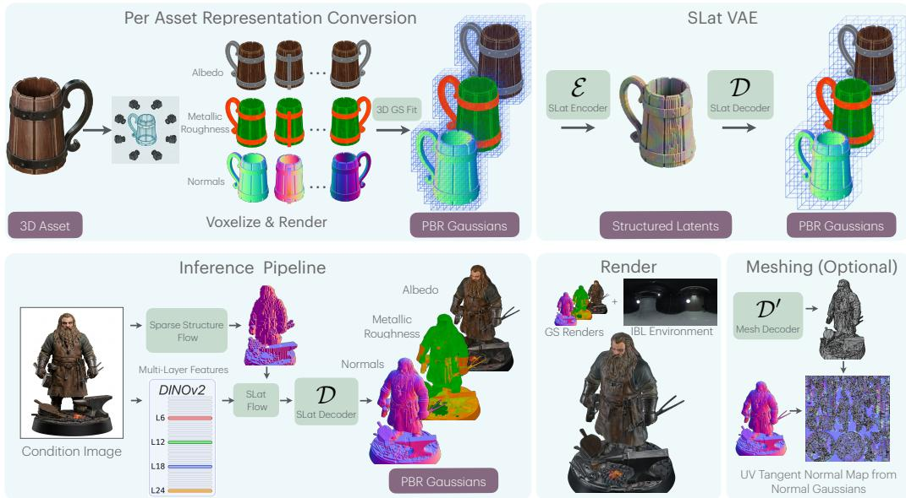  
Figure 3: Overview of Luce. (Top) Representation and SLatVAE. Given a 3D PBR asset, here a Toys4K (Stojanov et al., 2021) sample, we render multiview images and fit per-modality Gaussian splats (albedo, metallic-roughness, normals) on a sparse voxel grid. A structured latent VAE (SLatVAE) encodes this representation into a compact, diffusible latent and decodes it back to PBR Gaussians. (Bottom) Generation pipeline. Given a single input image, a sparse-structure flow first predicts the sparse voxel layout. Conditioned on multi-layer DINOv2 features, SLatFlow then generates a PBR Gaussian latent at each active voxel. The structured latent decodes into relightable PBR Gaussians and also serves as input to the mesh decoder, which yields textured meshes with tangent-space normal maps and a complete PBR material set.

## 3 METHOD

As shown in Fig. 3, Luce represents assets as multimodal PBR Gaussian clouds, compresses this representation into a compact latent with a structured latent VAE (SLatVAE), and trains an imageconditioned rectified-flow model, the structured latent flow (SLatFlow), to generate the latent.

## 3.1 MULTIMODAL PBR GAUSSIAN REPRESENTATION

The standard PBR pipeline models surface appearance as a function of independent modalities: diffuse reflectance (albedo), material properties (metallic, roughness), and surface orientation (normals). We mirror this decomposition in 3D by giving each occupied voxel three dedicated Gaussian sets: albedo $\mathbf { G } ^ { \mathrm { a l b } }$ (diffuse surface color), metallic-roughness $\mathbf { G } ^ { \mathrm { m r } }$ (combined metallic and roughness), and normal $\mathbf { G } ^ { \mathrm { n o r } }$ (per-point surface orientation). We denote this set of modalities as $\mathcal { M } = \{ \mathrm { a l b } , \mathrm { m r } , \mathrm { n o r } \}$ The three Gaussian sets are geometrically independent: each has its own positions, scales, rotations, and opacities within the shared voxel structure, letting each modality concentrate its Gaussians where its own detail is richest. For example, polished wood may require dense albedo Gaussians to capture woodgrain while having relatively smooth normals, whereas brushed metal may require dense metallic-roughness and normal Gaussians to capture scratches over nearly uniform albedo. A single shared set would force one layout on all of ${ \bar { \mathcal { M } } } .$ , making the modalities compete for the same primitives. Because the normal modality is stored explicitly rather athan derived from the surface shape, its normals can deviate from the underlying surface geometry, a property we leverage in Sec. 3.4 for tangent-space normal map transfer.

Rendering PBR Gaussians. Each modality is splatted independently via standard 3DGS alphacompositing (Kerbl et al., 2023), producing per-pixel albedo $^ { a , }$ metallic $\kappa ,$ roughness $\alpha ,$ surface normal n, and opacity o. Normals are renormalized to unit length after compositing. We shade these splatted PBR buffers using split-sum image-based lighting (Karis, 2013) with the Cook–Torrance

microfacet BRDF (Cook & Torrance, 1982):

$$
L _ { o } ^ { \mathrm { I B L } } ( \omega _ { o } ) \approx \frac { ( 1 - \kappa ) a } { \pi } E ( n ) + L _ { \mathrm { p r e f } } ( r , \alpha ) [ F _ { 0 } A ( \mu _ { o } , \alpha ) + B ( \mu _ { o } , \alpha ) ] ,\tag{1}
$$

where $\omega _ { o }$ is the outgoing/view direction toward the camera, ${ \pmb r } = 2 ( { \pmb n } \cdot { \pmb \omega } _ { o } ) { \pmb n } - { \pmb \omega } _ { o } , { \pmb \mu } _ { o } =$ clamp(n $\omega _ { o } , 0 , 1 )$ , and $F _ { 0 } \overset { = } ( 1 ^ { - } - \kappa ) 0 . 0 4 + \kappa a$ . Here $E ( n )$ is the diffuse irradiance map, $L _ { \mathrm { p r e f } } ( \pmb { r } , \alpha )$ is the GGX-prefiltered environment map sampled along the mirror reflection direction $^ { r , }$ , and $A , B$ are the two channels of the split-sum BRDF lookup table indexed by normal–view cosine $\mu _ { o }$ and roughness $\alpha .$ . The Fresnel base reflectance $F _ { 0 }$ follows the standard metallic workflow: dielectrics use 0.04, while metals take their colored specular reflectance from the albedo a. This shading is evaluated on the splatted Gaussian outputs, with no mesh extraction or UV unwrapping required; see Karis (2013); Lagarde & de Rousiers (2014) for the derivation from the rendering equation. For a qualitative comparison of this deferred renderer against Blender EEVEE (Blender Online Community, 2024), see Fig. 10.

Each Gaussian uses the standard 3DGS parameterization (position offset p from the voxel center, anisotropic scale s, rotation quaternion q, opacity o) together with a single view-independent modality value c (RGB for albedo, metallic and roughness for metallic-roughness, normal direction for normals). Unlike the original 3DGS, we store no spherical harmonics; view-dependent shading is produced analytically through PBR compositing (Eq. 1). With i indexing voxels and j indexing the K Gaussians per modality, the complete per-voxel representation at voxel i is:

$$
\mathbf { F } _ { i } = \left\{ \mathbf { G } _ { i } ^ { m } \right\} _ { m \in \mathcal { M } } , \quad \mathbf { G } _ { i } ^ { m } = \left\{ \left( p _ { i j } ^ { m } , s _ { i j } ^ { m } , q _ { i j } ^ { m } , o _ { i j } ^ { m } , c _ { i j } ^ { m } \right) \right\} _ { j = 1 } ^ { K } ,\tag{2}
$$

where K is the number of Gaussians per modality per voxel, d is the voxel-grid resolution, and $N _ { v } ^ { d ^ { 3 } }$ is the number of active voxels in the $d ^ { 3 }$ grid. The per-voxel bundles form $\boldsymbol { \gamma } = \{ \mathbf { F } _ { i } \} _ { i = 1 } ^ { N _ { v } ^ { d ^ { 3 } } }$ , the asset’s complete voxelized multimodal Gaussian representation. We store s in log-space, q as a unit quaternion, and pass o through a sigmoid. We build each asset’s  in a preprocessing step, fitting the K Gaussians of each modality independently against multi-view PBR renders of the asset; these fitted representations serve as input to the SLatVAE.

## 3.2 VARIATIONAL AUTOENCODER

The raw multimodal Gaussian cloud is high-dimensional and sparsely structured, so modeling it directly with a generative model is computationally expensive. We compress it into a compact per-voxel latent with the SLatVAE (architecture in Appendix A and Fig. 9). The key design choice is to trade spatial resolutionfor per-voxel density: the encoder downsamples the voxel grid, and the decoder compensates by predicting more Gaussians per voxel. This keeps the latent small enough to diffuse cheaply while still reconstructing fine material and geometric detail.

Encoder. takes the concatenation of all three PBR Gaussian sets per voxel (the standard GS parameters across $| { \mathcal { M } } | = 3$ modalities, with K Gaussians per modality) and is implemented as a sparse transformer with shifted-window attention (Liu et al., 2021) that downsamples the input grid from resolution d to a coarser $d ^ { \prime } < d ,$ , producing a compact latent $\mathbf { z } = \mathcal { E } ( \gamma ) \in \mathbb { R } ^ { { N _ { v } ^ { d ^ { \prime } } } ^ { 3 } \times C }$ , where $N _ { v } ^ { d ^ { \prime 3 } }$ is the number of active voxels at the resolution d′ and C is the latent channel dimension.

Decoder. runs at the coarser latent resolution for efficiency and offsets the lost resolution by predicting more Gaussians per voxel per modality, recovering fine surface detail. We train the SLat-VAE end-to-end with a rendering-based reconstruction loss, as in TRELLIS (Xiang et al., 2024): the decoded Gaussians are differentiably rendered per modality against the ground-truth intrinsic images, with a KL prior on the latent and light regularizers on Gaussian scale and opacity. The full objective and coefficients are in Appendix A.

## 3.3 FLOW-BASED GENERATION

We use rectified-flow transformers to generate in the SLatVAE’s latent space, conditioned on a single image (bottom panel of Fig. 3). Generation proceeds in two stages: we first generate the object’s sparse voxel structure (which voxels it intersects), then the latent features at each occupied voxel. We adopt this structure-then-latent approach from TRELLIS (Xiang et al., 2024).

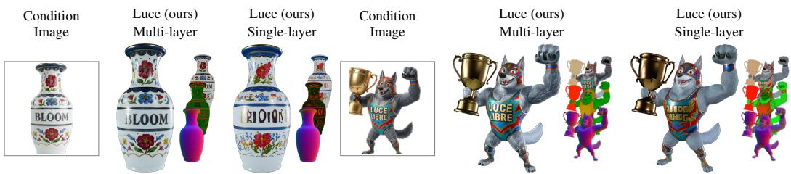  
Figure 4: Effect of multi-layer DINOv2 conditioning. We compare Luce trained with multi-layer DINOv2 features (layers 6, 12, 18, 24) against single-layer DINOv2 features (layer 24 only). Multilayer conditioning preserves fine spatial detail from the condition image, including legible text and logos on the generated 3D surface. For each variant, the larger shaded render is shown next to a cascade of the per-modality decomposition (albedo, metallic-roughness, surface normals).

Sparse structure generation. We use the pretrained sparse-structure VAE and sparse-structure flow from TRELLIS 2 (Xiang et al., 2025) without modification. Given a condition image, these models output the $N _ { v } ^ { d ^ { \prime 3 } }$ active voxels that serve as the scaffold for the next stage.

Latent generation. SLatFlow then generates a PBR Gaussian latent at each active voxel, producing geometry and materials jointly. It is a DiT-style transformer (Peebles & Xie, 2023) adapted for sparse 3D latents: each sample’s active voxels form a variable-length token sequence. The diffusion timestep modulates each block via adaptive layer normalization; image features are injected through cross-attention. Architectural details are in Appendix A.

Multi-layer image conditioning. Dense prediction tasks have benefited from fusing features across multiple encoder layers (Long et al., 2015; Lin et al., 2017; Zhao et al., 2017; Chen et al., 2017; Ranftl et al., 2021; Cheng et al., 2022). Recent work shows the same effect for frozen ViTs: multi-layer DINOv2 features outperform single-layer ones because early layers carry fine spatial patterns while deep layers carry semantics (Karypidis et al., 2025). We apply this to 3D generation: features from multiple DINOv2 layers are concatenated and projected into the conditioning space:

$$
h = W _ { \mathrm { p r o j } } \left[ f _ { \ell _ { 1 } } ; \ f _ { \ell _ { 2 } } ; \ \cdot \cdot \cdot ; \ f _ { \ell _ { L } } \right] + b _ { \mathrm { p r o j } } .\tag{3}
$$

Early-layer features carry fine spatial structure (text, logos, inscriptions); fusing them with deeplayer semantics lets the generator propagate this detail through the SLatFlow to the rendered 3D surface (Fig. 4). Multi-layer conditioning outperforms single-layer on both Toys4K FID (20.99 vs. 25.21) and CLIP on our AI-generated-image benchmark (0.8519 vs. 0.8081; Appendix B).

Dual decoding. The primary generation output of Luce is a multimodal PBR Gaussian cloud produced by the Gaussian decoder, a complete material description that splats directly under any environment map via deferred PBR shading (Eq. 1), with no mesh extraction or UV unwrapping required. To enable fair comparison with baselines whose primary output is a mesh (Xiang et al., 2024; 2025; Chen et al., 2025), we decode the same latent into a textured mesh using a Flexi-Cubes (Shen et al., 2023) mesh decoder, following TRELLIS (Xiang et al., 2024). We keep its architecture unchanged and retrain it on our learned latent space. Baking decoded normal Gaussians as tangent-space normal maps onto the extracted mesh (Sec. 3.4) improves mesh normal PSNR from 29.5 to 33.0 dB (Sec. 4.3), recovering high-frequency surface detail at zero polygon-count cost.

## 3.4 TANGENT-SPACE NORMAL MAP TRANSFER

Mesh extraction from a voxel grid bounds geometric frequency by the grid resolution, leaving subvoxel surface features (engravings, fabric weaves, embossed text) unrepresented in the extracted geometry alone. A standard remedy in real-time rendering is to include a normal map alongside the mesh: this perturbs the geometric normal for lighting calculations, restoring apparent surface detail without raising polygon count. Our representation lends itself naturally to this. Because our PBR Gaussians are decoupled from the mesh, we supervise them against the effective normals used for rendering (i.e., the perturbed geometric normals after applying the authored normal map), so they learn surface orientation at a frequency finer than the mesh can represent. At inference, we express the decoded normal Gaussians in the mesh’s local tangent frame to obtain a tangent-space normal map on the UV-parameterized surface, preserving high-frequency details at a resolution far beyond the mesh geometry. The final mesh carries four texture maps: diffuse (albedo), metallic, roughness, and tangent-space normal, giving a complete PBR material description directly importable into production renderers. We detail the baking pipeline in Appendix A.

Table 1: Image-to-3D generation. We evaluate on two benchmarks: Toys4K (N = 412, left) and our 130 AI-generated images (N = 130, right). Toys4K reports FID/KID with Inception and DINO (Oquab et al., 2024) backbones (KID 100); both benchmarks report CLIP, SigLIP2 (Tschannen et al., 2025), ULIP (Xue et al., 2024), and Uni3D-L (Zhou et al., 2024). Time(s) is the mean inference time across both benchmarks on a single H100. Luce GS renders the decoded PBR Gaussians directly via deferred shading; Luce mesh rows render a textured mesh extracted from the same latent, with and without tangent-space normal map transfer. Best in bold, second-best underlined; shaded rows are ours. “—” marks metrics that do not apply to that render path; ULIP and Uni3D-L are mesh-only.
<table><tr><td rowspan="2">Method</td><td rowspan="2">Params (B)</td><td rowspan="2">Time (s)</td><td colspan="8">Toys4K (N = 412)</td><td colspan="4">AI-generated images (N = 130)</td></tr><tr><td>KID ↓</td><td>FIDdino ↓</td><td></td><td>KIDdino ↓</td><td>CLIP↑</td><td>SigLIP2 ↑</td><td>ULIP↑</td><td>Uni3D-L ↑</td><td>CLIP↑</td><td>SigLIP2 ↑</td><td>ULIP↑</td><td>Uni3D-L ↑</td></tr><tr><td>TRELLIS GS (Xiang et al., 2024)</td><td>1.70</td><td>29.56</td><td>30.75</td><td>0.212</td><td>0.109</td><td>0.0013</td><td>0.8898</td><td>0.9164</td><td></td><td></td><td>0.8299</td><td>0.8339</td><td></td><td></td></tr><tr><td>TRELLIS mesh (Xiang et al., 2024)</td><td>1.80</td><td>50.86</td><td>32.39</td><td>0.263</td><td>0.145</td><td>0.0039</td><td>0.8829</td><td>0.9092</td><td>0.1672</td><td>0.3747</td><td>0.8000</td><td>0.7958</td><td>0.1247</td><td>0.3278</td></tr><tr><td>3DTopia-XL (Chen et al., 2025)</td><td>1.02</td><td>25.65</td><td>83.23</td><td>2.726</td><td>0.542</td><td>0.0306</td><td>0.7644</td><td>0.7810</td><td>0.1418</td><td>0.2519</td><td>0.6481</td><td>0.6458</td><td>0.1108</td><td>0.2197</td></tr><tr><td>TRELLIS 2 (Xiang et al., 2025)</td><td>7.48</td><td>176.72</td><td>29.22</td><td>0.165</td><td>0.129</td><td>0.0022</td><td>0.8895</td><td>0.9161</td><td>0.1634</td><td>0.3635</td><td>0.8110</td><td>0.8166</td><td>0.1207</td><td>0.3280</td></tr><tr><td>LiTo (Chang et al., 2026)</td><td>1.84</td><td>76.41</td><td>29.76</td><td>0.208</td><td>0.128</td><td>0.0025</td><td>0.8909</td><td>0.9082</td><td></td><td></td><td>0.8234</td><td>0.8240</td><td></td><td></td></tr><tr><td>Luce GS</td><td>4.48</td><td>42.20</td><td>20.99</td><td>0.033</td><td>0.100</td><td>0.0028</td><td>0.9062</td><td>0.9230</td><td></td><td></td><td>0.8519</td><td>0.8508</td><td></td><td></td></tr><tr><td>Luce mesh without tangent normal</td><td>4.58</td><td>148.13 159.16</td><td>25.04 21.10</td><td>0.102 0.042</td><td>0.112 0.088</td><td>0.0019</td><td>0.8990 0.9072</td><td>0.9234 0.9288</td><td>0.1681 0.1679</td><td>0.3767 0.3771</td><td>0.8505 0.8508</td><td>0.8466 0.8465</td><td>0.1254 0.1251</td><td>0.3298 0.3295</td></tr><tr><td>Luce mesh with tangent normal</td><td>4.58</td><td></td><td></td><td></td><td></td><td>0.0006</td><td></td><td></td><td></td><td></td><td></td><td></td><td></td><td></td></tr></table>

## 4 EXPERIMENTS

Datasets and evaluation benchmarks. Following prior generative 3D works (Xiang et al., 2025) for fair comparison, our training set combines 500K PBR-filtered assets from Objaverse (Deitke et al., 2023) and Objaverse-XL (Deitke et al., 2024) with a 158K-asset PBR subset of Tex-Verse (Zhang et al., 2025). To evaluate, we use Toys4K (Stojanov et al., 2021) for reconstruction, which provides ground-truth 3D assets (a 338-asset PBR subset with all three PBR textures); for generation, we test on 412 Toys4K assets and, to gauge generalization beyond Toys4K’s simple toy domain, 130 AI-generated images from Gemini 3.1 Flash Image (Google DeepMind, 2026), prompted to be diverse and detail-rich (text, logos, mixed materials).

Baselines. We compare against TRELLIS (Xiang et al., 2024), TRELLIS 2 (Xiang et al., 2025), LiTo (Chang et al., 2026), and 3DTopia-XL (Chen et al., 2025) (parameters in Table 1). All baselines use their public-release image conditioning model and input resolution. TRELLIS and LiTo use DINOv2 ViT-L/14 (Oquab et al., 2024), and 3DTopia-XL DINOv2 ViT-B/14, all at 518 518; TRELLIS 2 uses DINOv3 (Simeoni et al.´ , 2025) ViT-L/16 at 512 512 for its sparse-structure stage and 1024 1024 for its latent stage. Luce (ours) uses DINOv2 ViT-L/14 at 1036 1036 for its SLatFlow (Table 3); its sparse-structure stage is inherited unchanged from TRELLIS 2 (Sec. 3.3). Baselines with explicit PBR outputs (TRELLIS 2, 3DTopia-XL) are evaluated on shaded color and all three modalities; those without (TRELLIS, LiTo), on shaded color and surface normals only.

Metrics. Generation: On Toys4K, we report FID and KID on rendered views with both Inception and DINO (Oquab et al., 2024) backbones $( \mathrm { F I D _ { d i n o } , \ K I D _ { d i n o } ) }$ as distribution-level metrics. Both benchmarks report alignment metrics: CLIP score, SigLIP2 (Tschannen et al., 2025), ULIP (Xue et al., 2024), and Uni3D-L, the Large variant of Uni3D (Zhou et al., 2024), measuring input-output agreement. Reconstruction: We provide per-modality PSNR, SSIM, and LPIPS for albedo, metallicroughness, normal maps, and shaded renders, measuring surface orientation and material reconstruction. We detail the evaluation rendering and per-benchmark illumination in Appendix D.

## 4.1 IMPLEMENTATION DETAILS

Model architecture, training hyperparameters, and the texture-baking pipeline are in Appendix A, and inference details in Appendix C; we summarize preprocessing here.

Preprocessing. Each training asset is centered and scale-normalized to a unit bounding box, yielding a consistent canonical frame. We then render each from 150 cameras uniformly distributed

Condition Image

Luce (ours)

LiTo

TRELLIS 2

TRELLIS

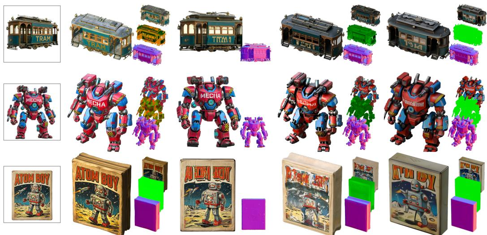  
Figure 5: Image-to-3D generation comparison. Luce preserves legible text and fine surface details on generated 3D assets. For each method, the larger shaded render is shown next to a cascade of the per-modality decomposition (albedo, metallic-roughness, surface normals) when available.

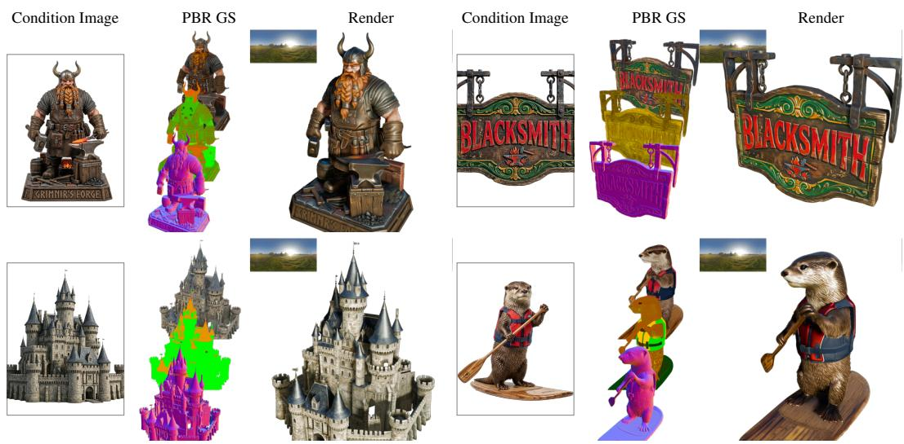  
Figure 6: Additional generation examples. Luce on four diverse inputs: each cell shows the input image, the per-modality PBR Gaussians (albedo, metallic-roughness, normals), and a shaded render.

on a sphere, producing per-view albedo, metallic-roughness, and normal images at a resolution of 1024 1024 pixels. The normal pass is rendered with the asset’s authored normal maps applied, so its normals carry surface detail finer than the base geometry. Per-modality 3DGS is fit independently on each set and voxelized onto a $1 2 8 ^ { 3 }$ sparse grid with K = 8 Gaussians per voxel per modality. For each modality, we optimize all Gaussians via differentiable rendering against the intrinsic images, parameterizing each center as a tanh-bounded offset from its parent voxel center, initialized at evenly spread quasi-random positions inside the voxel.

## 4.2 GENERATION

Table 1 reports generation quality on Toys4K (left) and our AI-generated images (right), with qualitative comparisons against baselines in Fig. 5 and additional Luce examples in Fig. 6 (per-sample baseline mosaics in Appendix F, more examples in Appendix E). On Toys4K, Luce GS reaches the lowest FID (20.99), improving on the strongest baseline TRELLIS 2 (29.22) by more than 8 FID. On our AI-generated-image benchmark, Luce GS leads CLIP (0.8519) and SigLIP2 (0.8508) over the best baseline TRELLIS GS (0.8299 and 0.8339), and the mesh variants lead the mesh-only ULIP and Uni3D-L. Beyond these alignment wins, Luce produces per-modality material decomposition natively and supports dual decoding to both Gaussians and textured meshes. The generated assets are relightable under novel illumination (Fig. 1). Luce reproduces legible text and fine surface detail (Fig. 5) that baselines often blur or distort.

Table 2: Reconstruction quality on a PBR subset of Toys4K (N = 338). We report per-modality PSNR, SSIM, and LPIPS for color rendering (combined appearance under fixed illumination), albedo (diffuse color), metallic-roughness, and normal maps (surface orientation). For Luce, the GS row renders the decoded PBR Gaussians directly via deferred shading (no mesh); the mesh rows render a textured mesh from the same latent, with and without baked tangent-space normals. Best in bold, second-best underlined; shaded rows are ours. “—” indicates that the method does not produce that modality.
<table><tr><td rowspan="2">Method</td><td colspan="3">Color</td><td colspan="3">Albedo</td><td colspan="3">Metallic-Roughness</td><td colspan="3">Normal</td><td colspan="2">Cost</td></tr><tr><td>PSNR↑</td><td>SSIM↑</td><td>LPIPS↓</td><td>PSNR↑</td><td>SSIM↑</td><td>LPIPS.↓</td><td>PSNR↑</td><td>SSIM↑</td><td>LPIPS↓</td><td>PSNR↑</td><td>SSIM↑</td><td>LPIPS↓</td><td>Time(s)</td><td>Params(B)</td></tr><tr><td>TRELLIS GS (Xiang et al., 2024)</td><td>27.0</td><td>0.912</td><td>0.124</td><td></td><td></td><td></td><td></td><td></td><td></td><td></td><td></td><td></td><td>0.22</td><td>0.17</td></tr><tr><td>TRELLIS mesh (Xiang et al., 2024)</td><td>26.3</td><td>0.907</td><td>0.118</td><td></td><td></td><td></td><td></td><td></td><td></td><td>26.9</td><td>0.914</td><td>0.113</td><td>17.65</td><td>0.26</td></tr><tr><td>3DTopia-XL (Chen et al., 2025)</td><td>23.9</td><td>0.877</td><td>0.188</td><td>25.4</td><td>0.893</td><td>0.191</td><td>22.6</td><td>0.910</td><td>0.191</td><td>23.3</td><td>0.876</td><td>0.165</td><td>70.51</td><td>0.03</td></tr><tr><td>TRELLIS 2 (Xiang et al., 2025)</td><td>34.5</td><td>0.961</td><td>0.074</td><td>40.7</td><td>0.976</td><td>0.051</td><td>42.7</td><td>0.986</td><td>0.038</td><td>32.1</td><td>0.940</td><td>0.093</td><td>88.92</td><td>1.66</td></tr><tr><td>LiTo (Chang et al., 2026)</td><td>31.9</td><td>0.944</td><td>0.110</td><td></td><td></td><td></td><td></td><td></td><td></td><td>27.6</td><td>0.912</td><td>0.116</td><td>1.21</td><td>0.29</td></tr><tr><td>Luce GS</td><td>36.1</td><td>0.967</td><td>0.059</td><td>38.6</td><td>0.971</td><td>0.055</td><td>39.1</td><td>0.978</td><td>0.048</td><td>34.6</td><td>0.961</td><td>0.038</td><td>0.74</td><td>1.82</td></tr><tr><td>Luce mesh without tangent normal</td><td>31.1</td><td>0.944</td><td>0.091</td><td>33.7</td><td>0.961</td><td>0.067</td><td>37.9</td><td>0.977</td><td>0.054</td><td>29.5</td><td>0.928</td><td>0.103 0.067</td><td>79.45</td><td>1.91</td></tr><tr><td>Luce mesh with tangent normal</td><td>32.5</td><td>0.953</td><td>0.080</td><td>33.7</td><td>0.961</td><td>0.067</td><td>37.9</td><td>0.977</td><td>0.054</td><td>33.0</td><td>0.952</td><td></td><td>79.45</td><td>1.91</td></tr></table>

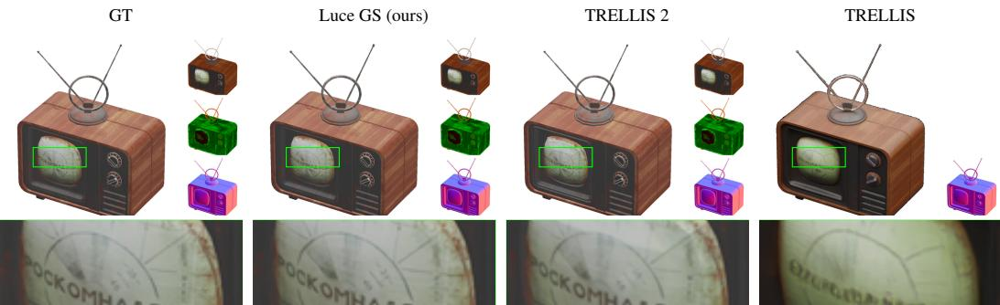  
Figure 7: Reconstruction quality on Toys4K. Columns are ground truth and methods; each block shows the modalities that each method reconstructs (albedo, metallic-roughness, normals). Luce preserves fine detail (text, highlights, texture); the green box marks the region magnified below.

## 4.3 RECONSTRUCTION

We report reconstruction as supporting evidence for our representation choices; generation (Sec. 4.2) remains our primary contribution, exercising the latent end-to-end. Table 2 reports per-modality fidelity, with qualitative examples in Fig. 7. Luce GS achieves the best color rendering (36.1 dB PSNR) and normal reconstruction (34.6 dB), surpassing TRELLIS 2, which leads on albedo and metallic-roughness, though Luce’s albedo LPIPS is close (0.055 vs. 0.051).

## 4.4 ABLATION STUDIES

We run two ablations. First, we ablate image conditioning by training Luce with single-layer instead of multi-layer DINOv2 features; multi-layer improves all metrics (Appendix B, Table 4). Second, for tangent-space normal map transfer, baking the decoded normal Gaussians onto the mesh (Sec. 3.4) improves normal fidelity across all metrics and enhances color reconstruction (Table 2). Figure 8 compares each example with and without normal baking using shaded color and surface-normal renderings. Baking recovers fine surface details, such as rough textures, engravings, and dents, that are smoothed out by the bare mesh.

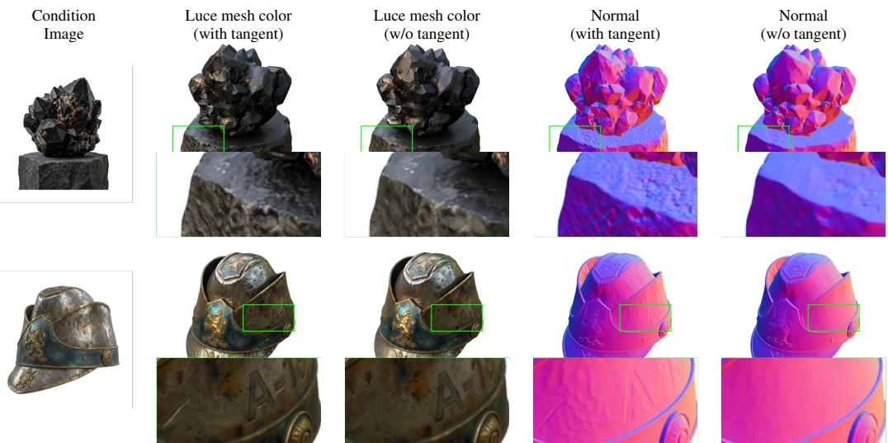  
Figure 8: Tangent-space normal map transfer. Luce bakes tangent-space normals from decoded normal Gaussians onto the extracted mesh, recovering fine surface detail at zero polygon-count cost. Each green box marks the region magnified below.

## 5 CONCLUSION

We presented Luce, a multimodal PBR Gaussian representation for relightable image-to-3D generation. By giving each occupied voxel its own Gaussian sets for albedo, metallic-roughness, and normals, the representation makes materials explicit in a format compatible with both flow-based generation and production rendering. The learned latent is compact and diffusible, and decodes into relightable PBR Gaussians and textured meshes with tangent-space normal maps. Across standard benchmarks, these design choices yield state-of-the-art generation quality while producing relightable outputs by design. On Toys4K, Luce achieves an FID of 20.99, improving on the strongest baseline TRELLIS 2 by more than 8 FID, and leads CLIP and SigLIP2 alignment on our AI-generated-image benchmark. Together these results help bridge generative 3D modeling and production-compatible asset creation.

Limitations and future work. Luce inherits several limitations from its finite-resolution voxelized representation. Assets whose detail is fine relative to their overall extent may be underresolved, with features spanning only a few voxels. A natural extension is to use cascaded or adaptive-resolution decoding, where a coarse latent captures global shape and material structure while higher-resolution stages refine local geometry, textures, and normals. Our current material model focuses on standard PBR attributes (albedo, metallic-roughness, and normals) under a Cook– Torrance reflectance model. While this covers many common asset types, it does not explicitly model more complex appearance effects such as subsurface scattering, anisotropy, translucency, thin-film interference, or strongly view-dependent reflectance. Extending the representation with additional material channels or learned view-dependent residuals could further improve realism for challenging materials. Our mesh export uses the FlexiCubes (Shen et al., 2023) decoder architecture from TRELLIS (Xiang et al., 2024); improving it with higher-resolution or learned UV-aware extraction is a direction for future work. Finally, our pipeline targets object-centric assets; extending Luce to scene-level generation with coherent lighting, material consistency, and object interactions remains an open direction.

## ACKNOWLEDGEMENTS

We are grateful to Jen-Hao Rick Chang, Miguel Angel Bautista Martin, Nafees Bin Zafar, and Barry-John Theobald for their valuable discussion and feedback on our paper. We also thank Federico Semeraro and the broader Apple infrastructure team for maintaining the computing resources that supported this work.

## REFERENCES

Gwangbin Bae, Ignas Budvytis, and Roberto Cipolla. Rethinking inductive biases for surface normal estimation. CVPR, 2024.

Black Forest Labs. FLUX.1: A family of state-of-the-art text-to-image models. https:// blackforestlabs.ai/, 2024.

Blender Online Community. Blender - a 3D modelling and rendering package. Blender Foundation, Stichting Blender Foundation, Amsterdam, 2024. URL http://www.blender.org. Version 4.1.

Jen-Hao Rick Chang, Xiaoming Zhao, Dorian Chan, and Oncel Tuzel. LiTo: Surface light field tokenization. arXiv preprint arXiv:2603.11047, 2026.

Liang-Chieh Chen, George Papandreou, Florian Schroff, and Hartmut Adam. Rethinking atrous convolution for semantic image segmentation. arXiv preprint arXiv:1706.05587, 2017.

Zhaoxi Chen, Jiaxiang Tang, Yuhao Dong, Ziang Cao, Fangzhou Hong, Yushi Lan, Tengfei Wang, Haozhe Xie, Tong Wu, Shunsuke Saito, Liang Pan, Dahua Lin, and Ziwei Liu. 3DTopia-XL: Scaling high-quality 3D asset generation via primitive diffusion. In Proceedings ofthe IEEE/CVF Conference on Computer Vision and Pattern Recognition (CVPR), pp. 26576–26586, June 2025.

Bowen Cheng, Ishan Misra, Alexander G Schwing, Alexander Kirillov, and Rohit Girdhar. Maskedattention mask transformer for universal image segmentation. In CVPR, 2022.

Robert L. Cook and Kenneth E. Torrance. A reflectance model for computer graphics. ACM Transactions on Graphics, 1(1):7–24, 1982.

Matt Deitke, Dustin Schwenk, Jordi Salvador, Luca Weihs, Oscar Michel, Eli VanderBilt, Ludwig Schmidt, Kiana Ehsani, Aniruddha Kembhavi, and Ali Farhadi. Objaverse: A universe of annotated 3D objects. In CVPR, 2023.

Matt Deitke, Ruoshi Liu, Matthew Wallingford, Huong Ngo, Oscar Michel, Aditya Kusupati, Alan Fan, Christian Laforte, Vikram Voleti, Samir Yitzhak Gadre, et al. Objaverse-XL: A universe of 10M+ 3D objects. NeurIPS, 2024.

Jian Gao, Chun Gu, Youtian Lin, Hao Zhu, Xun Cao, Li Zhang, and Yao Yao. Relightable 3D gaussian: Real-time point cloud relighting with BRDF decomposition and ray tracing. ECCV, 2024.

Google DeepMind. Gemini 3.1 Flash Image model card. https://deepmind.google/ models/model-cards/gemini-3-1-flash-image/, February 2026. Accessed: 2026-06-03.

Andrew Jaegle, Sebastian Borgeaud, Jean-Baptiste Alayrac, Carl Doersch, Catalin Ionescu, David Ding, Skanda Koppula, Daniel Zoran, Andrew Brock, Evan Shelhamer, Olivier Henaff,´ Matthew M. Botvinick, Andrew Zisserman, Oriol Vinyals, and Joao Carreira. Perceiver IO: A˜ general architecture for structured inputs & outputs. In International Conference on Learning Representations (ICLR), 2022.

Yingwenqi Jiang, Jiadong Tu, Yuan Liu, Xifeng Gao, Xiaoyuan Long, Wenping Wang, and Yuexin Ma. GaussianShader: 3D gaussian splatting with shading functions for reflective surfaces. CVPR, 2024.

Keller Jordan, Yuchen Jin, Vlado Boza, You Jiacheng, Franz Cesista, Laker Newhouse, and Jeremy Bernstein. Muon: An optimizer for hidden layers in neural networks, 2024. URL https: //kellerjordan.github.io/posts/muon/.

Heewoo Jun and Alex Nichol. Shap-E: Generating conditional 3D implicit functions. arXiv preprint arXiv:2305.02463, 2023.

Brian Karis. Real shading in Unreal Engine 4. In ACM SIGGRAPH Course Notes, 2013.

Efstathios Karypidis, Ioannis Kakogeorgiou, Spyros Gidaris, and Nikos Komodakis. DINO-Foresight: Looking into the future with DINO. NeurIPS, 2025.

Bernhard Kerbl, Georgios Kopanas, Thomas Leimkuhler, and George Drettakis. 3D gaussian splat-¨ ting for real-time radiance field rendering. ACM Transactions on Graphics, 42(4), 2023.

Sebastien Lagarde and Charles de Rousiers. Moving Frostbite to physically based rendering 3.0. In´ ACM SIGGRAPH Course: Physically Based Shading in Theory and Practice, 2014.

Weiyu Li et al. Step1X-3D: Towards fast and high-quality 3D asset generation. arXiv preprint, 2025.

Yangguang Li et al. TripoSG: High-fidelity 3D shape synthesis using large-scale rectified flow models. arXiv preprint, 2024.

Zhihao Liang, Qi Zhang, Ying Feng, Ying Shan, and Kui Jia. GS-IR: 3D gaussian splatting for inverse rendering. CVPR, 2024.

Tsung-Yi Lin, Piotr Dollar, Ross Girshick, Kaiming He, Bharath Hariharan, and Serge Belongie.´ Feature pyramid networks for object detection. In CVPR, 2017.

Yaron Lipman, Ricky T. Q. Chen, Heli Ben-Hamu, Maximilian Nickel, and Matthew Le. Flow matching for generative modeling. ICLR, 2023.

Xingchao Liu, Chengyue Gong, and Qiang Liu. Flow straight and fast: Learning to generate and transfer data with rectified flow. ICLR, 2023.

Ze Liu, Yutong Lin, Yue Cao, Han Hu, Yixuan Wei, Zheng Zhang, Stephen Lin, and Baining Guo. Swin transformer: Hierarchical vision transformer using shifted windows. In ICCV, 2021.

Jonathan Long, Evan Shelhamer, and Trevor Darrell. Fully convolutional networks for semantic segmentation. In CVPR, 2015.

Lars Mescheder, Michael Oechsle, Michael Niemeyer, Sebastian Nowozin, and Andreas Geiger. Occupancy networks: Learning 3D reconstruction in function space. In CVPR, 2019.

Ben Mildenhall, Pratul P. Srinivasan, Matthew Tancik, Jonathan T. Barron, Ravi Ramamoorthi, and Ren Ng. NeRF: Representing scenes as neural radiance fields for view synthesis. In ECCV, 2020.

Jacob Munkberg, Wenzheng Chen, Jon Hasselgren, Alex Evans, Tianchang Shen, Thomas Muller,¨ Jun Lu, and Jun Gao. Extracting triangular 3D models, materials, and lighting from images. In CVPR, 2022.

Maxime Oquab, Timothee Darcet, Th´ eo Moutakanni, Huy Vo, Marc Szafraniec, Vasil Khalidov,´ Pierre Fernandez, Daniel Haziza, Francisco Massa, Alaaeldin El-Nouby, et al. DINOv2: Learning robust visual features without supervision. Transactions on Machine Learning Research, 2024.

Jeong Joon Park, Peter Florence, Julian Straub, Richard Newcombe, and Steven Lovegrove. DeepSDF: Learning continuous signed distance functions for shape representation. In Proceedings ofthe IEEE/CVF Conference on Computer Vision and Pattern Recognition (CVPR), 2019.

William Peebles and Saining Xie. Scalable diffusion models with transformers. In ICCV, 2023.

Poly Haven. HDRI environment maps. https://polyhaven.com, 2026. Licensed under Creative Commons Zero (CC0 1.0) Public Domain Dedication. Environment maps used: courtyard, ninomaru teien, hotel room, moonless golf, studio small 01, spruit sunrise, venice sunset.

Rene Ranftl, Alexey Bochkovskiy, and Vladlen Koltun. Vision transformers for dense prediction.´ In ICCV, 2021.

Robin Rombach, Andreas Blattmann, Dominik Lorenz, Patrick Esser, and Bjorn Ommer. High-¨ resolution image synthesis with latent diffusion models. In CVPR, 2022.

Tianchang Shen, Jacob Munkberg, Jon Hasselgren, Kangxue Yin, Zian Wang, Wenzheng Chen, Zan Gojcic, Sanja Fidler, Nicholas J. Lane, and Jun Gao. Flexible isosurface extraction for gradientbased mesh optimization. In ACM SIGGRAPH, 2023.

Oriane Simeoni, Huy V. Vo, Maximilian Seitzer, Federico Baldassarre, Maxime Oquab, Cijo Jose,´ Vasil Khalidov, Marc Szafraniec, Seungeun Yi, Michael Ramamonjisoa, Francisco Massa, Daniel¨ Haziza, Luca Wehrstedt, Jianyuan Wang, Timothee Darcet, Th´ eo Moutakanni, Leonel Sentana,´ Claire Roberts, Andrea Vedaldi, Jamie Tolan, John Brandt, Camille Couprie, Julien Mairal, Herve´ Jegou, Patrick Labatut, and Piotr Bojanowski. DINOv3, 2025. URL´ https://arxiv.org/ abs/2508.10104.

Stefan Stojanov, Anh Thai, and James M. Rehg. Using shape to categorize: Low-shot learning with an explicit shape bias. In CVPR, 2021.

Stanislaw Szymanowicz, Christian Rupprecht, and Andrea Vedaldi. Splatter image: Ultra-fast single-view 3D reconstruction. CVPR, 2024.

Bowen Tang, Jiapeng Wang, Zuoli Zeng, et al. GaussianCube: Structuring gaussian splatting using optimal transport for 3D generative modeling. arXiv preprint arXiv:2403.19655, 2024a.

Jiaxiang Tang, Zhaoxi Chen, Xiaokang Chen, Tengfei Wang, Gang Zeng, and Ziwei Liu. LGM: Large multi-view gaussian model for high-resolution 3D content creation. ECCV, 2024b.

Jiaxiang Tang, Jiawei Ren, Hang Zhou, Ziwei Liu, and Gang Zeng. DreamGaussian: Generative gaussian splatting for efficient 3D content creation. ICLR, 2024c.

Tencent. Hunyuan3D 2.1: Scaling diffusion models for high resolution 3D generation. arXiv preprint, 2025.

Michael Tschannen, Alexey Gritsenko, Xiao Wang, Muhammad Ferjad Naeem, Ibrahim Alabdulmohsin, Nikhil Parthasarathy, Talfan Evans, Lucas Beyer, Ye Xia, Basil Mustafa, Olivier Henaff,´ Jeremiah Harmsen, Andreas Steiner, and Xiaohua Zhai. SigLIP 2: Multilingual vision-language encoders with improved semantic understanding, localization, and dense features. arXiv preprint arXiv:2502.14786, 2025.

Jiadong Tu, Zheng Li, Hao Zhang, Xuelin Zhang, et al. MatSpray: Material-consistent and multiview-consistent PBR material on 3D gaussian splatting. arXiv preprint arXiv:2512.18314, 2025.

Shuang Wu et al. Direct3D-S2: Gigascale 3D generation made easy with spatial sparse convolutions. arXiv preprint, 2024.

Jianfeng Xiang, Zelong Lv, Sicheng Xu, Yu Deng, Ruicheng Wang, Bowen Zhang, Dong Chen, Xin Tong, and Jiaolong Yang. Structured 3D latents for scalable and versatile 3D generation. arXiv preprint arXiv:2412.01506, 2024.

Jianfeng Xiang, Xiaoxue Chen, Sicheng Xu, Ruicheng Wang, Zelong Lv, Yu Deng, Hongyuan Zhu, Yue Dong, Hao Zhao, Nicholas Jing Yuan, and Jiaolong Yang. Native and compact structured latents for 3D generation. arXiv preprint arXiv:2512.14692, 2025.

Bojun Xiong, Jialun Liu, Jiakui Hu, Chenming Wu, Jinbo Wu, Xing Liu, Chen Zhao, Errui Ding, and Zhouhui Lian. TexGaussian: Generating high-quality PBR material via octree-based 3D gaussian splatting. CVPR, 2025.

Le Xue, Ning Yu, Shu Zhang, Junnan Li, Roberto Mart´ınez, Silvio Savarese, and Caiming Xiong. ULIP-2: Towards scalable multimodal pre-training for 3D understanding. CVPR, 2024.

Chongjie Ye, Lingteng Nie, Qian Han, Chunfu Zhao, Yushu Rao, Junding Gu, and Yao Zhang. StableNormal: Reducing diffusion variance for stable and sharp normal. ACM SIGGRAPH Asia, 2024.

Jingrui Ye et al. Large material gaussian model for relightable 3D generation. arXiv preprint arXiv:2509.22112, 2025.

Kai Zhang, Sai Bi, Hao Tan, Yuanbo Xiangli, Nanxuan Zhao, Kalyan Sunkavalli, and Zexiang Xu. GS-LRM: Large reconstruction model for 3D gaussian splatting. ECCV, 2024a.

Tianyuan Zhang, Zhengfei Kuang, Haian Jin, Zexiang Xu, Sai Bi, Hao Tan, He Zhang, Yiwei Hu, Milos Hasan, William T. Freeman, Kai Zhang, and Fujun Luan. RelitLRM: Generative relightable radiance for large reconstruction models. arXiv preprint arXiv:2410.06231, 2024b.

Xiuming Zhang, Pratul P. Srinivasan, Boyang Deng, Paul Debevec, William T. Freeman, and Jonathan T. Barron. NeRFactor: Neural factorization of shape and reflectance under an unknown illumination. ACM Transactions on Graphics, 40(6), 2021.

Yibo Zhang, Li Zhang, Rui Ma, and Nan Cao. TexVerse: A universe of 3D objects with highresolution textures. arXiv preprint arXiv:2508.10868, 2025.

Hengshuang Zhao, Jianping Shi, Xiaojuan Qi, Xiaogang Wang, and Jiaya Jia. Pyramid scene parsing network. In CVPR, 2017.

Junsheng Zhou, Jinsheng Wang, Baorui Ma, Yu-Shen Liu, Tiejun Huang, and Xinlong Wang. Uni3D: Exploring unified 3D representation at scale. ICLR, 2024.

## Appendix

Appendix A details the model architecture, training setup, and texture-baking pipeline. Appendix B isolates the multi-layer conditioning ablation, and Appendix C reports inference cost and sampling steps. Appendix D specifies the evaluation renders and illumination. Appendices E and F give additional qualitative results and per-sample comparisons against every baseline.

## A MODEL ARCHITECTURE AND IMPLEMENTATION DETAILS

Table 3: SLatVAE and SLatFlow hyperparameters. Architecture diagram in Fig. 9.
<table><tr><td></td><td>SLatVAE</td><td>SLatFlow</td></tr><tr><td>Architecture</td><td></td><td></td></tr><tr><td>Transformer blocks</td><td>16</td><td>30</td></tr><tr><td>Model channels</td><td>1536</td><td>1536</td></tr><tr><td>I/O block channels</td><td></td><td>[1024]</td></tr><tr><td>Attention heads</td><td>12</td><td>12</td></tr><tr><td>MLP ratio</td><td>4</td><td>6</td></tr><tr><td>Attention mode</td><td>Swin (window 8)</td><td>Full (flash varlen)</td></tr><tr><td>Input channels</td><td>336</td><td>32</td></tr><tr><td>Latent / output channels</td><td>32</td><td>32</td></tr><tr><td>Position encoding</td><td></td><td>RoPE</td></tr><tr><td>adaLN modulation</td><td></td><td>6-way (shift, scale, gate × 2)</td></tr><tr><td>Training</td><td></td><td></td></tr><tr><td>GPUs</td><td>64 (H100)</td><td>64 (H100)</td></tr><tr><td>Batch size (per GPU)</td><td>2</td><td>3</td></tr><tr><td>Max voxels per batch</td><td>400K</td><td>8M</td></tr><tr><td>Training steps</td><td>500K</td><td>500K</td></tr><tr><td>Wall-clock time</td><td>~14 days</td><td>~14 days</td></tr><tr><td>EMA decay</td><td>0.9999</td><td>0.9999</td></tr><tr><td>Precision</td><td>BF16</td><td>BF16</td></tr><tr><td>Data &amp; conditioning</td><td></td><td></td></tr><tr><td>Image resolution</td><td>1024 × 1024 (render)</td><td>1036 × 1036 (cond.)</td></tr><tr><td>Background</td><td>random</td><td>0.5</td></tr><tr><td>Crop padding</td><td></td><td>1.2</td></tr><tr><td>Loss</td><td></td><td></td></tr><tr><td>Primary</td><td> $\ell _ { 1 } + \mathrm { L P I P S } + \mathrm { S S I M } + \mathrm { K L }$ </td><td>smooth  $\ell _ { 1 }$ </td></tr><tr><td> $\lambda _ { \ell _ { 1 } }$  / λLPIPS / λSSIM</td><td> $1 . 0 / 0 . 2 / 0 . 2$ </td><td></td></tr><tr><td> $\lambda _ { \mathrm { K L } }$ </td><td> $1 0 ^ { - 3 }$ </td><td></td></tr><tr><td> $\lambda _ { \mathrm { v o l } }$ </td><td> $1 0 ^ { 4 }$ </td><td></td></tr><tr><td> $\lambda _ { o }$ </td><td> $1 0 ^ { - 3 }$ </td><td></td></tr><tr><td>Timestep sampling</td><td></td><td>logit-normal  $( \mu { = } 1 , \sigma { = } 1 )$ </td></tr><tr><td>Optimizer</td><td></td><td></td></tr><tr><td> $\mathrm { T y p e }$ </td><td>Muon (Jordan et al., 2024)</td><td>Muon (Jordan et al., 2024)</td></tr><tr><td>Learning rate</td><td> $1 0 ^ { - 3 }$ </td><td> $1 0 ^ { - 3 }$ </td></tr><tr><td>Weight decay</td><td> $1 0 ^ { - 3 }$ </td><td> $1 0 ^ { - 3 }$ </td></tr></table>

SLatVAE. The encoder is a 16-block sparse transformer that operates at the input voxel resolution $( 1 2 8 ^ { 3 } )$ for all but the final block, then performs a single $1 2 8 ^ { 3 }  6 4 ^ { 3 }$ downsample $( d = 1 2 8  d ^ { \prime } = $ 64) at the very end. This delays compression to the latest possible point in the network, allowing the encoder to reason about fine-grained per-voxel Gaussian features at the input grid before pooling them into the compact latent. The decoder uses the same 16-block sparse transformer but stays at the latent resolution $( 6 4 ^ { 3 } )$ throughout, emitting $K ^ { \prime } = 3 2$ Gaussians per voxel per modality (versus $K = 8$ at the input) to realize the resolution-for-density trade of Sec. 3.2.

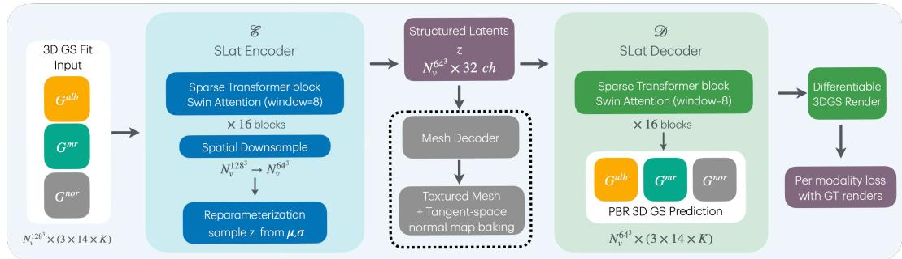  
Figure 9: SLatVAE architecture. The encoder compresses the sparse multimodal Gaussian cloud into a compact latent grid. The decoder reconstructs a denser set of Gaussians per voxel per modality, supervised through per-modality differentiable rendering. The same latent also serves as input to a mesh decoder for textured mesh extraction. Full hyperparameters in Table 3.

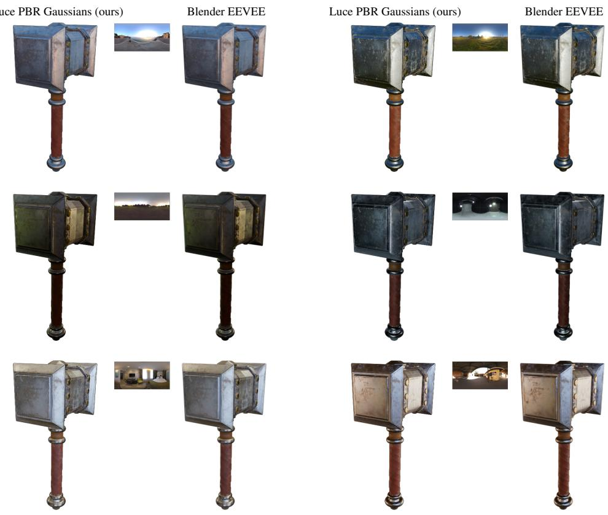

Figure 10: PBR shaded rendering. The decoded PBR modalities (albedo, metallic-roughness, normals) enable shaded rendering under novel environment maps (Poly Haven, 2026) via standard PBR compositing (Eq. 1), without mesh extraction or UV unwrapping. We compare our deferred PBR renderer on the GS fit against the textured mesh rendered with Blender EEVEE (Blender Online Community, 2024) as a reference; the environment maps are listed in Appendix D.

SLatFlow. SLatFlow is a 30-block DiT with rotary position embeddings (RoPE) on integer 3D voxel coordinates and QK-RMSNorm, and applies no internal spatial downsampling or upsampling: the active-voxel token sequence keeps a single fixed resolution across all blocks. To avoid padding, samples within a batch are concatenated into a single flat tensor with per-sample boundary tracking, and self-attention uses variable-length flash attention (Xiang et al., 2024) so each sample attend only within its own token set. Each block applies adaptive layer normalization conditioned on the diffusion timestep (six-way modulation). Image conditioning fuses DINOv2 ViT-L/14 features from layers 6, 12, 18, and 24, concatenated and projected $( 4 { \times } 1 0 2 4 \to 1 0 2 4 )$ and injected via crossattention with separate learned normalization, evaluated at the fixed token resolution. Layer indices refer to the outputs of the encoder’s transformer blocks.

Tensor layout. For uniform per-Gaussian dimensionality across modalities, the metallicroughness modality is stored with a padded 3-channel value (metallic, roughness, and an unused channel), matching the 3-channel albedo (RGB) and normal direction. The 336-channel SLatVAE input then corresponds to $| { \mathcal { M } } | \cdot 1 4 \cdot K = 3 \cdot 1 4 \cdot 8 .$ with $K = 8$ Gaussians per modality and 14 parameters per Gaussian (3+3+4+1+3 for position, scale, rotation, opacity, and modality value).

Training objective. The SLatVAE is trained end-to-end through differentiable rendering of the decoded Gaussians against ground-truth intrinsic images with randomized, constant-color backgrounds. Each modality $m \in \mathcal { M } =$ albedo, normal, metallic-roughness carries its own reconstruction loss, which keeps color, geometry, and reflectance gradients from entangling:

$$
\mathcal { L } _ { \mathrm { V A E } } = \sum _ { m \in \mathcal { M } } \left( \lambda _ { \ell _ { 1 } } \mathcal { L } _ { \ell _ { 1 } } ^ { m } + \lambda _ { \mathrm { L P I P S } } \mathcal { L } _ { \mathrm { L P I P S } } ^ { m } + \lambda _ { \mathrm { S S I M } } \mathcal { L } _ { \mathrm { S S I M } } ^ { m } \right) + \lambda _ { \mathrm { K L } } D _ { \mathrm { K L } } ( q \| p ) + \lambda _ { \mathrm { v o l } } \mathcal { L } _ { \mathrm { v o l } } + \lambda _ { o } \mathcal { L } _ { o } ,\tag{4}
$$

where $\mathcal { L } _ { \ell _ { 1 } } ^ { m } , \mathcal { L } _ { \mathrm { L P I P S } } ^ { m }$ , and $\mathcal { L } _ { \mathrm { S S I M } } ^ { m }$ are pixel-, perceptual-, and structural-similarity losses on the rendered images of modality $m ,$ and $D _ { \mathrm { K L } } ( q \Vert p )$ is the standard VAE prior on the latent distribution. The two regularizers operate directly on the predicted Gaussian parameters, with $\mathcal { G }$ the set of all decoded Gaussians in a sample: $\begin{array} { r } { \mathcal { L } _ { \mathrm { v o l } } = \frac { 1 } { | \mathcal { G } | } \sum _ { g \in \mathcal { G } } \prod _ { i = 1 } ^ { 3 } s _ { i } ^ { ( g ) } } \end{array}$ penalizes the volume of each Gaussian (with $\pmb { s } ^ { ( g ) }$ the per-axis scale) to discourage oversized primitives, and $\begin{array} { r } { \mathcal { L } _ { o } = \frac { 1 } { | \mathcal { G } | } \sum _ { g \in \mathcal { G } } ( 1 - o ^ { ( g ) } ) } \end{array}$ pulls per-Gaussian opacities $o ^ { ( g ) }$ toward one to prevent the decoder from collapsing capacity into transparent primitives. Loss coefficients are listed in Table 3.

Optimizer. We optimize both the SLatVAE and SLatFlow with Muon (Jordan et al., 2024), an orthogonalized momentum optimizer for hidden-layer matrix parameters, with AdamW used for embeddings, biases, and normalization parameters. Both models use $\mathrm { l r } = 1 0 ^ { - 3 }$ and weight decay $1 0 ^ { - 3 }$ (Table 3).

Texture baking. After FlexiCubes mesh extraction, we use xatlas to compute a UV parameterization of the surface. For each PBR modality (albedo, metallic-roughness, and normals), we render the decoded Gaussian field from 150 viewpoints and fit a UV-space texture to the rendered targets under a total-variation regularizer. Duplicate vertices are merged so shading normals interpolate smoothly across UV seams. Normals require one additional step: for each occupied UV texel, the baked object-space normal is transformed into tangent space using the mesh tangent frame evaluated at that texel, obtained by rasterizing the per-vertex tangent frames over the UV chart. This produces a standard tangent-space normal map compatible with conventional PBR rendering pipelines (cf. Sec. 3.4).

## B MULTI-LAYER DINOV2 MOTIVATION

This appendix isolates the contribution of multi-layer DINOv2 conditioning to image-conditioned generation. We train a single-layer SLatFlow variant that conditions only on layer-24 DINOv2 features and compare against our default that fuses features from layers 6, 12, 18, and 24 (Sec. 3.3). All other architecture and training choices are held fixed; both variants are evaluated on the GS render path. The single-layer variant carries no fusion projection.

## C INFERENCE DETAILS

At test time, Luce first generates a sparse voxel structure, then fills it with PBR Gaussian latents via the SLatFlow (10 sampling steps), and decodes to PBR Gaussians or, optionally, a textured mesh. The GS path has 4.5B parameters across sparse-structure flow, SLatFlow, and the shared SLatVAE decoder; adding the FlexiCubes mesh decoder brings the mesh-path total to 4.6B (Table 1). Total inference time on a single H100, averaged across both evaluation benchmarks, is 42s for the GS path and 148s (without tangent normal map) to 159s (with) for the mesh path; per-method comparisons appear in Table 1.

Table 4: Multi-layer DINOv2 conditioning ablation. Single-layer (layer 24) versus multi-layer (layers 6, 12, 18, 24) image conditioning for SLatFlow, all else equal; both rows use the GS render path, so ULIP and Uni3D-L (mesh-only metrics in our setup) are omitted. KID is reported 100; $\mathrm { F I D _ { d i n o } }$ and $\mathrm { K D } _ { \mathrm { d i n o } }$ use a DINOv2 backbone. Both rows are Luce; the shaded row is our default configuration.
<table><tr><td rowspan="2">DINOv2 conditioning</td><td colspan="6">Toys4K (N = 412)</td><td colspan="2">AI-generated images (N = 130)</td></tr><tr><td>FID↓</td><td>KID↓</td><td> $\mathrm { F I D } _ { \mathrm { d i n o } } \downarrow$ </td><td> $\mathrm { K I D } _ { \mathrm { d i n o } } \downarrow$ </td><td>CLIP↑</td><td>SigLIP2 ↑</td><td>CLIP ↑</td><td>SigLIP2 ↑</td></tr><tr><td>Luce, single-layer (layer 24)</td><td>25.21</td><td>0.101</td><td>0.121</td><td>0.0035</td><td>0.8977</td><td>0.9164</td><td>0.8081</td><td>0.8143</td></tr><tr><td>Luce, multi-layer (layers 6, 12, 18, 24)</td><td>20.99</td><td>0.033</td><td>0.100</td><td>0.0028</td><td>0.9062</td><td>0.9230</td><td>0.8519</td><td>0.8508</td></tr></table>

For each method we use the sampling-step counts recommended with its public release. Table 5 summarizes the sparse-structure-stage and structured-latent-stage (SLat) step counts on which the inference times reported in Table 1 are based.

Table 5: Inference sampling steps per method. SLat = structured-latent stage. “—” indicates a single-stage method without a separate structure flow.
<table><tr><td>Method</td><td>Sparse-structure stage</td><td>SLat</td></tr><tr><td>3DTopia-XL (Chen et al., 2025)</td><td></td><td>25 (DDIM)</td></tr><tr><td>TRELLIS (Xiang et al., 2024)</td><td>25</td><td>25</td></tr><tr><td>LiTo (Chang et al., 2026)</td><td></td><td>20 (Heun)</td></tr><tr><td>TRELLIS 2 (Xiang et al., 2025)</td><td>12</td><td>12 (shape) + 12 (texture)</td></tr><tr><td>Luce (ours)</td><td>12</td><td>10</td></tr></table>

## D EVALUATION RENDERING AND ILLUMINATION

All evaluation renders use CC0 HDRI environment maps from Poly Haven (Poly Haven, 2026). Generated assets are evaluated under the ninomaru teien environment map on both the Toys4K and AI-generated-image benchmarks (Table 1). On Toys4K, the conditioning view is rendered under studio small 01; since the evaluation illumination (ninomaru teien) differs from the conditioning illumination (studio small 01), methods that decompose materials (Luce, TRELLIS 2, 3DTopia-XL) relight to the evaluation environment, while methods with baked appearance (TRELLIS, LiTo) carry the conditioning illumination. On the AI-generated-image benchmark, the condition image carries no controllable illumination. The qualitative relighting figures also use Poly Haven maps: Fig. 1 uses spruit sunrise, studio small 01, and courtyard; Fig. 2 uses studio small 01; Fig. 6 and Fig. 11 use spruit sunrise; and Fig. 10 cycles through six maps (venice sunset, spruit sunrise, moonless golf, studio small 01, hotel room, courtyard).

## E ADDITIONAL QUALITATIVE RESULTS

Figure 11 shows additional generation results across diverse asset categories, including furniture, vehicles, characters, and household objects. Each result shows the input condition image, the generated asset’s per-modality PBR Gaussians (albedo, metallic-roughness, normals), and a shaded render.

## F BASELINE COMPARISONS ON THE AI-GENERATED-IMAGE BENCHMARK

To complement the quantitative results of Table 1 and the qualitative summary in Fig. 5, we include per-sample comparisons against every baseline on eight representative inputs from our AIgenerated-image benchmark. Each mosaic (Figures 12–19) follows the same layout: rows are methods, columns are the four evaluation views (yaws 300◦, 30◦, 120◦, 210◦, evenly spaced at 90◦ around the asset), with the condition image shown in the top-left. We follow the evaluation setup of TRELLIS (Xiang et al., 2024): these four views are the exact rendered views over which we average the alignment metrics (CLIP, SigLIP2, ULIP, Uni3D-L) reported in Table 1; the per-sample

Condition Image

PBR GS

Render

Condition Image

PBR GS

Render

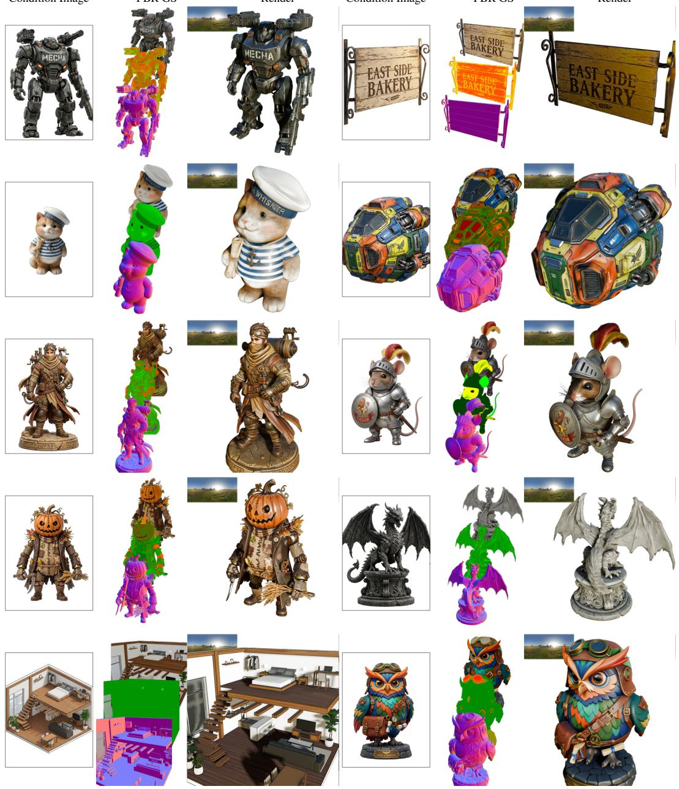  
Figure 11: Additional generation results. Additional Luce examples across diverse asset categories. Each cell shows the input image (inset, left), the per-modality PBR Gaussians (albedo, metallic-roughness, normals), and a shaded render.

scores in each row label are computed on these same renders, so they are directly comparable to the dataset-level averages reported in the main results table. Because LiTo generates assets in the input view’s frame rather than a canonical orientation (Fig. 2), the same four yaws place its views closer to the conditioning viewpoint than the other methods’, so its view set is not pose-matched to theirs. The Luce mesh row uses the tangent-space normal map; Table 1 also reports the variant without it. The selected samples span a range of input difficulty: heavy texture detail, fine-grained geometry, mixed-material surfaces, and assets containing legible text or logos. Across the eight mosaics, Luce consistently produces sharper material decomposition, more accurate surface normals, and better preservation of fine spatial detail than the closest baseline.

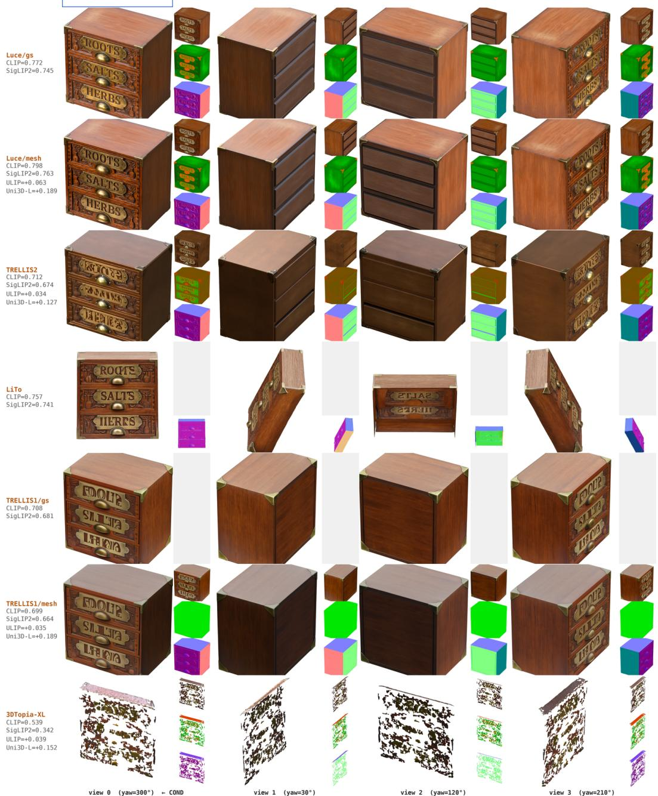  
Figure 12: Per-sample baseline comparison (1/8). Rows: methods (top label = condition); Luce rows are ours. Columns: four evaluation views (yaws 300◦, 30◦, 120◦, 210◦) matching the views used to compute the alignment metrics in Table 1. Per-row metrics show CLIP and SigLIP2, plus ULIP and Uni3D-L for the mesh rows, on the depicted sample. For methods with explicit material decomposition, three small thumbnails are stacked to the right of each shaded render, top to bottom: albedo, metallic-roughness (metallic=R, roughness=G, B unused), and surface normals; LiTo carries only the surface-normal thumbnail, since it produces no material decomposition; TRELLIS GS produces only a shaded render and so has no thumbnail.

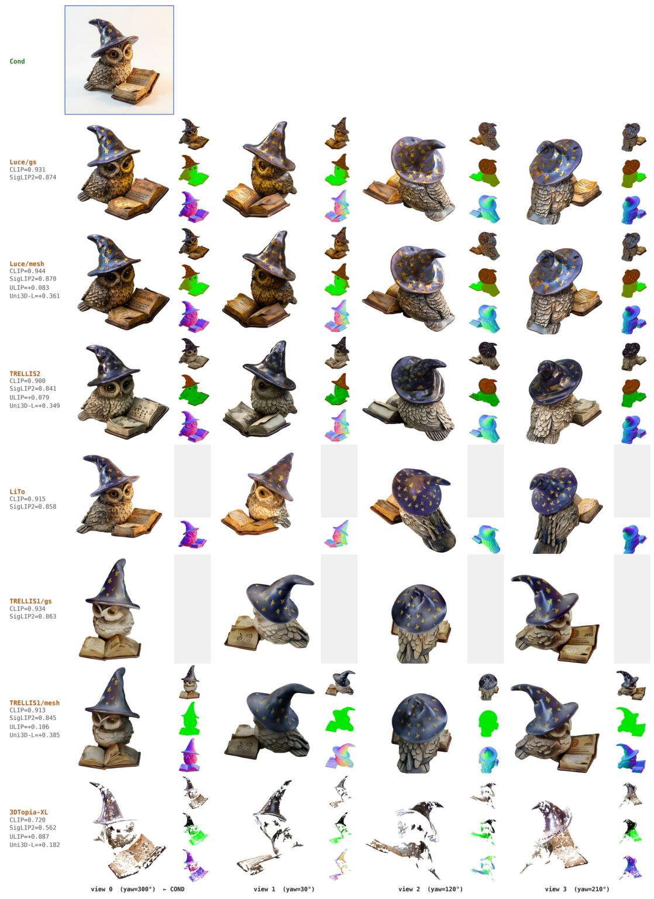  
Figure 13: Per-sample baseline comparison (2/8). Same layout as Figure 12.

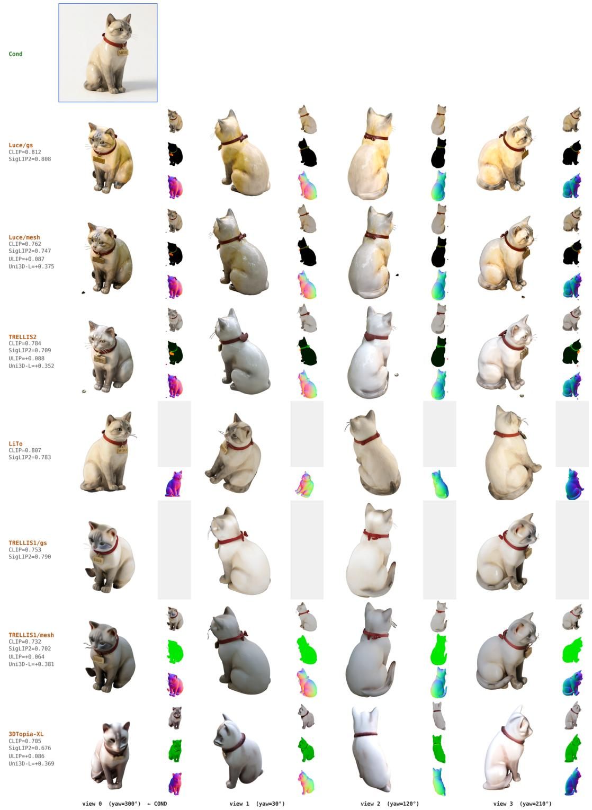  
Figure 14: Per-sample baseline comparison (3/8). Same layout as Figure 12.

# Cond Luce/gs CLIP=0.856 SigLIP2=0.865 TRELLIS2 CLIP=0.802 SigLIP2=0.829 LiTo CLIP=0.904 SigLIP2=0.858 CLIP=0.873 SigLIP2=0.869 TRELLIS1/mesh CLIP=0.817 SigLIP2=0.841 3DTopia-XL CLIP=0.686 view 0 (yaw=300°) ← COND view 1 (yaw=30°) view 2 (yaw=120°) view 3 (yaw=210°)

Figure 15: Per-sample baseline comparison (4/8). Same layout as Figure 12.

# SigLIP2=0.794 TRELLIS1/mesh CLIP=0.774 SigLIP2=0.730 ULIP=+0.059 3DTopia-XL CLIP=0.698 view 0 (yaw=300°)← CON view 3 (yaw=210°

Figure 16: Per-sample baseline comparison (5/8). Same layout as Figure 12.

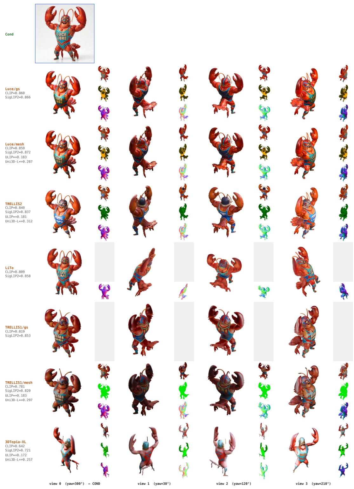  
Figure 17: Per-sample baseline comparison (6/8). Same layout as Figure 12.

# TRELLIS2 CLIP=0.811 SigLIP2=0.822 ULIP=+0.088 SigLIP2=0.839 TRELLIS1/gs CLIP=0.845 TRELLIS1/mesh SigLIP2=0.826 3lTopia-X SigLIP2=0.610 view 0 (yaw=300°) ← CON view 1 (yaw=30°) view 2 (yaw=120°) view 3 (yaw=210°)

Figure 18: Per-sample baseline comparison (7/8). Same layout as Figure 12.

## TRELLIS1/gs CLIP=0.574 CLIP=0.409 yiew 0 (yaw=300°) ← COND view 1 (yaw=30°) view 3 (yaw=210°

Figure 19: Per-sample baseline comparison (8/8). Same layout as Figure 12.