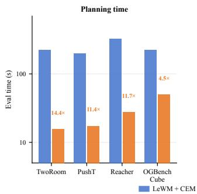
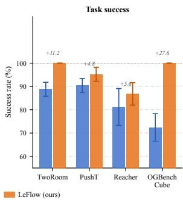
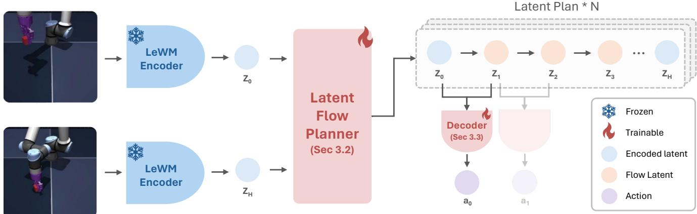
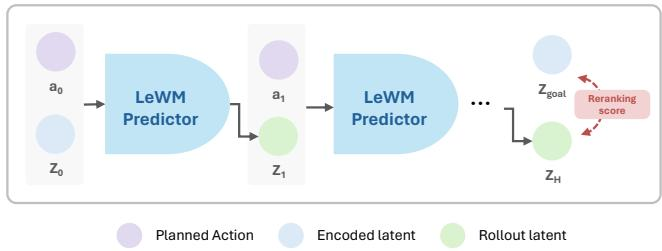
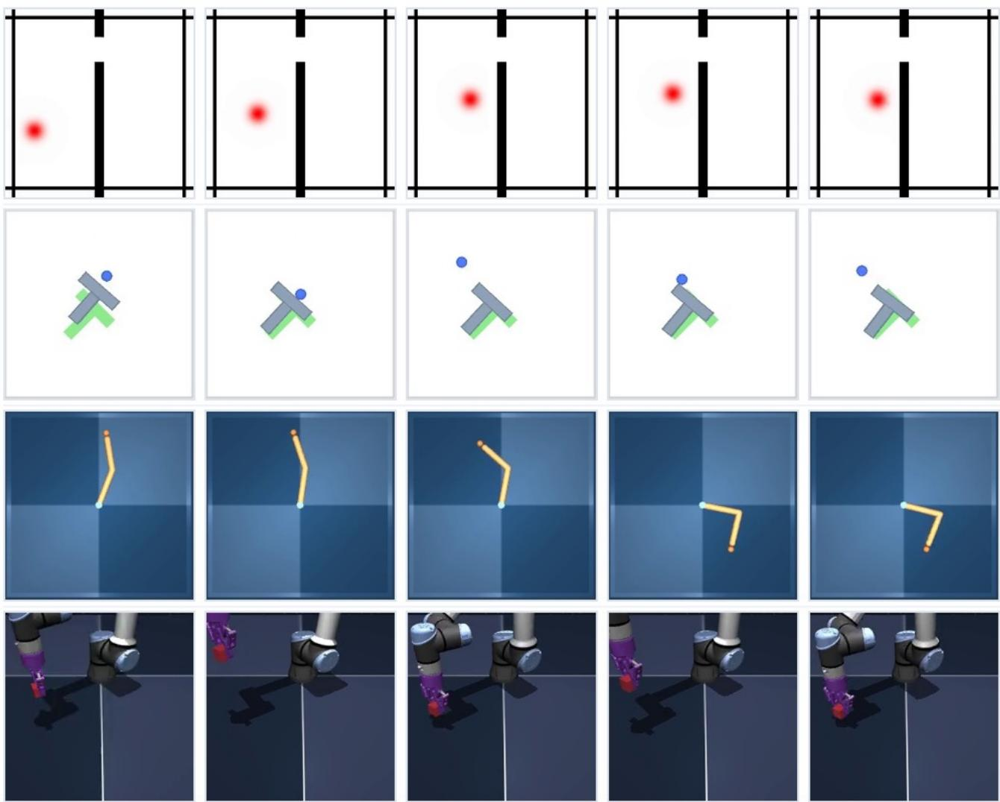

# LeFlow: Generative Latent Flow Planning for World Models

Hsiang-Wei Huang, Jianxu Shangguan, Junbin Lu, Jenq-Neng Hwang University of Washington, United States {hwhuang,jxb1st,junbinlu,hwang}@uw.edu

## Abstract

Latent world models are inherently strong encoders that transform image pixel to latent embedding, yet existing world models still rely on online trajectory optimization for action planning: for every state–goal pair, an iterative optimizer is run from scratch to search for optimal action sequences, treating the world model as a black-box simulator. This approach pays the full iterative optimization cost anew at every replanning step and reuses no planning experience across queries. In this work, we ask whether planning itselfcan be amortized once a latent world model has been learned. We present LeFlow, which learns a reusable latent trajectory prior operating directly in the latent dynamics space from the world model. LeFlow recasts planning as conditional latent trajectory generation: a rectifiedflow model imagines a future latent path between the current and goal embeddings, an inverse dynamics decoder turns latent transitions into action chunks, and the frozen world model verifies each candidate by autoregressive rollout. Acrossfour major goal-conditioned pixel-control benchmarks, LeFlow replaces iterative action-space optimization with amortized latentplanning andfixed-budget rollout selection, achieving consistent success-rate gains with an orderof-magnitude reduction in planning time. Our results argue that latent world models should support not only prediction but reusable planning priors. Our code is available at https://github.com/hsiangwei0903/LeFlow.

## 1. Introduction

World models let agents plan by simulating the consequences of their actions before acting [8]. Joint-Embedding Predictive Architectures (JEPAs) [14] make this practical by modeling dynamics in a compact latent space: observations are encoded into low-dimensional latents and a predictor rolls the latent state forward conditioned on actions. LeWorldModel (LeWM) [18] is a recent JEPA that trains stably end-to-end from raw pixels with a single regularization hyperparameter and is competitive across diverse 2D and 3D control tasks. Latent world models, in short, have become strong predictors.

  
Figure 1. LeFlow plans an order of magnitude faster than CEM at better success. End-to-end evaluation time (left) and success rate (right) for LeWM+CEM and LeFlow under the same protocol (H=5, 50 episodes). Replacing online black-box search with an amortized latent trajectory prior removes the per-step optimization loop while preserving task performance.

Planning on top of them, however, has not advanced at the same pace. Even with a well-trained latent world model in hand, planning is still posed as online trajectory optimization: for every state–goal pair, an optimizer searches for a raw action sequence whose autoregressive latent rollout terminates near the encoded goal. LeWM, for instance, solves this finite-horizon optimal-control problem at inference with the Cross-Entropy Method (CEM) [24]. CEM is a practical optimizer for low-dimensional, smooth objectives. Our focus is its repeated online cost: CEM treats the world model as a black-box simulator and solves every state–goal query from scratch: the world model is queried thousands of times per replanning step yet never contributes structural knowledge about which trajectories are worth considering, and no effort spent planning one query is reused for the next.

We propose to amortize planning itself. Rather than repeatedly solving an optimization problem online, we learn – once, offline – a reusable latent trajectory prior directly in the frozen world model’s latent space. A frozen world model already contains the structure needed: its encoder organizes observations geometrically and its predictor defines which latent transitions are dynamically reachable. Planning should exploit that structure, not rediscover it through black-box search. We recast planning as conditional latent trajectory generation: rather than searching for actions, we generate a latent path and decode the actions that realize it afterwards. Action trajectories are low-level and highly multimodal – many action sequences realize nearly the same state trajectory – whereas latent state trajectories are smoother and geometrically structured, so the reusable planning structure lives in how the latent state should evolve.

We instantiate this in LeFlow, a lightweight planner on top of a frozen LeWM. LeFlow has three modular components: (1) a rectified-flow latent planner [16, 17] that generates the interior of a latent path conditioned on the start and goal embeddings – the amortized prior; (2) an inverse dynamics decoder that converts each latent transition into an executable action chunk, separating planning from control; and (3) a rollout verification stage that scores each candidate by its actual frozen-LeWM rollout distance to the goal rather than the generated (clamped) endpoint, projecting generative proposals back onto the manifold of trajectories the world model can actually control. On LeWM, it yields an order-of-magnitude reduction in planning time at better success across four benchmarks, as shown in Figure 1. Our contributions are:

• We recast latent planning as conditional latent trajectory generation, and show that planning knowledge can be amortized – learned once from offline trajectories into a reusable latent trajectory prior, rather than re-solved online for every state–goal pair.

• We show that latent world models contain sufficient structure for learned planning: LeFlow combines generative latent trajectory proposals with rollout-based verification inside the original world model, without modifying it.

• Across four benchmarks, amortized latent planning replaces iterative action-space optimization with fixedbudget rollout selection while improving success, cutting end-to-end planning time by roughly an order of magnitude and generalizing to held-out episodes; ablations show that latent-path generation beats direct action generation and that rollout verification is essential for dynamically feasible plans.

## 2. Related Work

Latent world models. Latent world models learn dynamics in a compressed embedding space and plan by rolling out simulated futures [8–10]. Test-time planning typically uses CEM [23, 24] or MPPI [26] as black-box optimizers over the world model. JEPA-style models [14] predict in latent space without pixel reconstruction; this family includes image-level I-JEPA [3] and video-level V-JEPA [5], which demonstrate that joint-embedding prediction yields rich visual representations without generative decoding. Extending JEPAs to control requires additionally modeling action-conditioned dynamics; prior world-model variants rely on pretrained encoders [28] or heuristic multi-term objectives [25]. LeWM [18] addresses both and is our frozen backbone. We ask whether the learned latent structure already encodes what action planning recovers – making iterative optimization unnecessary.

Amortized planning and inverse dynamics. Inversedynamics models – predicting the action responsible for a latent transition – appear in model-based RL and representation learning [1, 4, 22]. GLAMOR [21] is a notable precursor that learns a goal-conditioned recurrent inversedynamics model to predict action sequences from pixels, combining an inverse model with a learned action prior. LeFlow differs in three respects: 1) we operate in the latent space of afrozen pretrained world model rather than jointly learning representation and planner; 2) instead of one-shot action prediction, we generate an explicit multi-step latent trajectory with a flow model and decode actions locally at each step – separating high-level planning from low-level control [19]; and 3) we sample N diverse candidates and rerank by world-model rollout, grounding proposals in the predictor’s dynamics. RC-aux [15] is a concurrent approach that improves latent geometry via auxiliary reachability supervision; our planner is orthogonal and could be applied on top of such representations. Model-based offline RL [12, 27] is also related, but typically learns task-specific policies or value functions from reward supervision. LeFlow instead amortizes goal-conditioned planning without a task-specific reward; combining these directions is an interesting direction for future work.

Generative models for trajectory planning. Diffuser [11] and Decision Diffuser [2] diffuse over joint stateaction trajectories; Diffusion Policy [6] generates action chunks for behavior cloning. LeFlow instead generates latent state paths inside a frozen world model and decodes actions only afterwards via inverse dynamics. Planning is inherently multimodal – multiple valid trajectories connect the same start and goal – so a generative model is essential; deterministic regression collapses to a mean path. We use rectified flow [16, 17] rather than diffusion because its straight-line transport can be integrated in very few Euler steps, keeping per-candidate online cost low when N paths must be generated and rolled out at each replanning step.

## 3. Method

The central design question in LeFlow is what space to plan in. A naïve generative planner generates action sequences directly, but actions are the wrong abstraction for a reusable prior: they are high-dimensional and highly multimodal (many kinematically distinct trajectories realize the same sub-goal), and they are decoupled from the world model’s internal geometry – the encoder has already organized taskrelevant structure into a compact latent space, yet an actionspace generator must re-derive this structure from scratch.

  
Figure 2. LeFlow architecture. A frozen LeWM encoder maps the current and goal observations to latent anchors $z _ { \mathrm { s t a r t } }$ and $z _ { \mathrm { g o a l } }$ . A conditional rectified-flow planner generates the interior of a latent path between them; an inverse dynamics decoder converts each latent transition into an action chunk. Only the flow planner and inverse dynamics decoder are trained; LeWM encoder is frozen throughout.

Latent state trajectories avoid both problems. The encoder collapses action-level multiplicity: many action sequences that move $o _ { t }$ to $o _ { t + 1 }$ share a single latent transition $z _ { t }  z _ { t + 1 }$ . Planning in this space is 1) lower-dimensional and smoother, 2) already organized around the predictor’s dynamics, and 3) action-agnostic – the planner reasons about where the agent should be, delegating how it gets there to a lightweight inverse dynamics decoder. This separation decouples multi-step goal-directed reasoning from low-level control, allowing each module to be trained and improved independently.

LeFlow realizes this design with three learned components on a frozen LeWM backbone: (1) a rectified-flow latent-path planner that generates goal-conditioned latent trajectories; (2) an inverse dynamics decoder that converts latent transitions into executable action chunks; and (3) a rollout reranking stage that validates generative proposals against the frozen world model’s dynamics. We describe each in turn, followed by training and inference.

## 3.1. Preliminary

LeWM [18] provides two components that LeFlow uses unchanged. The encoder enc maps a pixel observation o to a compact latent embedding $z = \operatorname { e n c } _ { \theta } ( o )$ . The predictor $\mathrm { p r e d } _ { \phi }$ models latent dynamics autoregressively,

$$
\hat { z } _ { t + 1 } = \mathrm { p r e d } _ { \phi } ( \hat { z } _ { t } , a _ { t } ) ,\tag{1}
$$

so given a start latent and an action sequence, LeWM rolls out a predicted latent trajectory. LeWM’s own planner solves the finite-horizon optimal-control problem $a _ { 1 : H } ^ { \star } =$ arg $\begin{array} { r } { \operatorname* { m i n } _ { a _ { 1 : H } } { \lVert \hat { z } _ { H } - z _ { g } \rVert _ { 2 } ^ { 2 } } } \end{array}$ online at every replanning step using CEM [24]. We keep the backbone frozen and replace only this online search. LeWM serves three roles in LeFlow: a representation backbone that supplies the latent geometry, a dynamics prior whose structure we distill into the trajectory generator, and a rollout-based feasibility verifier that grounds generative proposals in realizable dynamics.

## 3.2. Latent Flow planner

Let $z _ { \mathrm { s t a r t } } = \mathrm { e n c } _ { \theta } ( o _ { \mathrm { c u r } } )$ and $z _ { \mathrm { g o a l } } = \mathrm { e n c } _ { \theta } ( o _ { \mathrm { g o a l } } )$ be the encoded current and goal observations. A latent path of horizon H is a sequence $\boldsymbol { z } _ { 0 : H } = ( z _ { 0 } , z _ { 1 } , \dots , z _ { H } )$ whose endpoints are clamped by construction to $z _ { 0 } = z _ { \mathrm { s t a r t } }$ and $z _ { H } = z _ { \mathrm { g o a l } } .$ The planner generates only the H−1 interior latent states. Fixing the endpoints is a deliberate design choice: it injects the goal-conditioning directly into the geometric structure of the generated path, rather than relying on the model to output a path that happens to end near the goal. The model’s capacity is thus fully spent on how the latent state should evolve between two known anchors – the qualitative shape of the trajectory – which is precisely where task-level planning knowledge lives.

We model the interior path with a conditional rectified flow [16, 17]. The choice of generative model family matters for online efficiency. Diffusion models denoise through many small steps, so generating N candidates at every replanning step incurs a cost that scales with both N and the number of denoising iterations. Rectified flow instead learns a velocity field $v _ { \psi }$ that transports a Gaussian noise sample $u _ { 0 } \sim \mathcal { N } ( 0 , I )$ to a data sample $u _ { 1 }$ along the straight interpolant $u _ { \tau } = ( 1 { - } \tau ) u _ { 0 } + \tau u _ { 1 }$ by matching the constant target velocity $u _ { 1 } - u _ { 0 }$ . Because the learned trajectories in function space are approximately linear, the ODE can be integrated accurately with very few Euler steps – typically 16 in our setting – regardless of N. This is well suited to latent paths: the encoder produces a smooth, low-dimensional space where straight-line interpolations between nearby embeddings are geometrically meaningful, making the rectified-flow assumption a natural fit. The training objective is

$$
\mathcal { L } _ { \mathrm { f l o w } } = \mathbb { E } _ { \tau , u _ { 0 } , u _ { 1 } } \big \| v _ { \psi } ( u _ { \tau } , \tau \mid z _ { \mathrm { s t a r t } } , z _ { \mathrm { g o a l } } ) - ( u _ { 1 } - u _ { 0 } ) \big \| _ { 2 } ^ { 2 } ,\tag{2}
$$

where $u _ { 1 }$ is the flattened interior of a ground-truth latent path from the offline dataset. At inference, N diverse interiors are sampled in parallel by integrating the learned ODE from N independent noise draws.

## 3.3. Inverse dynamics decoder

A latent path specifies where the agent should be at each step but says nothing about which actions get it there. Rather than trying to jointly generate actions alongside latent states – which would re-introduce the multimodality problem in the generative model – we delegate action recovery to a dedicated inverse dynamics decoder $g _ { \omega }$ that operates locally on each latent transition:

$$
a _ { t } = g _ { \omega } \big ( [ z _ { t } , \ z _ { t + 1 } , \ z _ { t + 1 } - z _ { t } ] \big ) .\tag{3}
$$

The decoder takes the current and next latent states together with their displacement $z _ { t + 1 } - z _ { t }$ as an explicit feature. The displacement matters: it provides directional information about the transition that is not separately recoverable from $z _ { t } \ \mathrm { o r } \ z _ { t + 1 }$ alone, and empirically improves the conditioning of the regression without adding parameters. The inverse dynamics problem is much better posed in latent space than in observation space: because the encoder has collapsed many distinct observations to the same latent, the mapping from a latent transition to the corresponding action chunk is far less ambiguous than a mapping from raw pixel pairs.

Critically, this separation means the planner and the decoder solve genuinely different problems at different levels of abstraction. The flow model reasons about multi-step goal-directed structure – the shape of the latent trajectory – while the decoder answers the purely local question of which action realizes a given latent step. Neither module needs to solve the other’s problem, and both can be improved or replaced independently.

The decoder is trained with a mean-squared error loss against the dataset’s normalized action chunks:

$$
\mathcal { L } _ { \mathrm { i n v } } = \mathbb { E } \left\| g _ { \omega } ( [ z _ { t } , z _ { t + 1 } , z _ { t + 1 } - z _ { t } ] ) - a _ { t } \right\| _ { 2 } ^ { 2 } .\tag{4}
$$

## 3.4. Rollout reranking for controllable manifold

Generative models do not respect the world model’s dynamics by construction: the flow model can interpolate through latent states that no admissible action sequence actually reaches. Even a geometrically reasonable path – one that curves smoothly from $z _ { \mathrm { s t a r t } } \mathrm { t o } \ z _ { \mathrm { g o a l } } - \mathrm { m a y }$ pass through regions of latent space that the predictor’s learned dynamics cannot follow. We call the set of latent trajectories that are reachable by some action sequence the controllable latent manifold, and we use the frozen LeWM predictor to project our generative proposals back onto it (Figure 3).

  
Figure 3. Rollout reranking projects generative proposals onto the controllable latent manifold. The flow model samples N candidate latent paths (dashed) with endpoints clamped to $z _ { \mathrm { s t a r t } }$ and $z _ { \mathrm { g o a l } } .$ , but generated interiors may pass through latent states unreachable by any admissible action sequence. Each candidate is decoded into actions and rolled out autoregressively through the frozen LeWM predictor (solid), producing an actual terminal latent $\hat { z } _ { H } ^ { ( i ) }$ . Candidates are ranked by rollout distance to the goal (Eq. 5); the best is executed. This step grounds amortized proposals in the predictor’s dynamics without modifying the flow model.

At inference we sample N candidate paths from the flow model, decode each into an action sequence, and roll the actions autoregressively through the frozen predictor to obtain the true predicted terminal latent $\hat { z } _ { H } ^ { ( i ) }$ . Candidates are scored by their rollout distance to the goal:

$$
\mathrm { s c o r e } ^ { ( i ) } = \left. \hat { z } _ { H } ^ { ( i ) } - z _ { \mathrm { g o a l } } \right. _ { 2 } ^ { 2 } .\tag{5}
$$

Note that lower score indicates a better candidate – the rollout landed closer to the goal. We therefore select arg min score(i) and execute its decoded action sequence. This reranking step is inference-time and selection-only – it does not alter the flow model’s distribution, only chooses among its samples.

## 3.5. Training

LeWM is frozen throughout; LeFlow trains only the flow planner $v _ { \psi }$ and the inverse dynamics decoder $g _ { \omega }$ , jointly, on offline trajectory data. The total objective is

$$
\mathcal { L } = \mathcal { L } _ { \mathrm { f l o w } } + \mathcal { L } _ { \mathrm { i n v } } + \lambda _ { \mathrm { c o n s } } \mathcal { L } _ { \mathrm { c o n s } } .\tag{6}
$$

Flow matching loss ${ \mathcal { L } } _ { \mathrm { { f l o w } } } .$ Trains the flow planner to match the distribution of latent-path interiors from the offline dataset. This is the primary learning signal for what trajectories look like in the world model’s latent space.

Table 1. Main benchmark results: success rate (%) on four goal-conditioned pixel-control tasks. Baseline numbers (goal-conditioned BC and offline RL – GCBC, GCIVL, GCIQL; the JEPA world model PLDM; and the foundation-encoder world model DINO-WM) are as reported by Maes et al. [18]; “–” marks benchmarks for which a baseline is not reported. LeFlow is the mean ± std overfive independen evaluation runs (seeds 42–46) under the LeWM codebase-default protocol (H=5, 50 episodes). Best per column in bold.
<table><tr><td>Method</td><td>TwoRoom</td><td>PushT</td><td>Reacher</td><td>OGBench-Cube</td></tr><tr><td>Random</td><td>0.0</td><td>2.0</td><td>10.0</td><td>48.0</td></tr><tr><td>GCBC [7]</td><td>100.0</td><td>75.0</td><td>一</td><td>84.0</td></tr><tr><td>GCIVL [20]</td><td>100.0</td><td>33.0</td><td>一</td><td>56.0</td></tr><tr><td>GCIQL [13]</td><td>100.0</td><td>20.0</td><td>一</td><td>64.0</td></tr><tr><td>PLDM [25]</td><td>97.0</td><td>78.0</td><td>78.0</td><td>65.0</td></tr><tr><td>DINO-WM [28]</td><td>100.0</td><td>74.0</td><td>79.0</td><td>86.0</td></tr><tr><td colspan="5">LeWM-based Method</td></tr><tr><td>CEM [24]</td><td> $8 2 . 0 \pm 2 . 0$ </td><td> $8 9 . 3 \pm 6 . 4$ </td><td> $6 8 . 0 \pm 9 . 2 $ </td><td> $7 3 . 3 \pm 9 . 0$ </td></tr><tr><td>iCEM [23]</td><td> $8 8 . 0 \pm 2 . 0 $ </td><td> $8 4 . 7 \pm 3 . 1$ </td><td> $6 7 . 3 \pm 1 1 . 4$ </td><td> $7 6 . 0 \pm 7 . 2$ </td></tr><tr><td>MPPI [26]</td><td> $7 1 . 3 \pm 6 . 4$ </td><td> $6 0 . 7 \pm 4 . 2$ </td><td> $4 2 . 7 \pm 4 . 6$ </td><td> $4 9 . 3 \pm 9 . 5$ </td></tr><tr><td>LeFlow</td><td> ${ \bf 1 0 0 . 0 \pm 0 . 0 }$ </td><td> ${ \bf 9 5 . 2 \pm 3 . 0 }$ </td><td> ${ \bf 8 6 . 8 \pm 4 . 8 }$ </td><td> ${ \bf 1 0 0 . 0 \pm 0 . 0 }$ </td></tr></table>

Inverse dynamics loss ${ \mathcal { L } } _ { \mathrm { i n v } } .$ Trains the decoder to map latent transitions to action chunks. Because the decoder is trained on dataset transitions, it is naturally aligned with the regions of latent space that the offline data covers – the same regions the flow model learns to generate in.

Consistency loss $\mathcal { L } _ { \mathbf { c o n s } } .$ The two losses above do not guarantee that generated latent paths are dynamically realizable: ${ \mathcal { L } } _ { \mathrm { f l o w } }$ teaches the planner to mimic the distribution of recorded transitions, and ${ \mathcal { L } } _ { \mathrm { i n v } }$ teaches the decoder to invert them, but neither explicitly links the planner’s output to the predictor’s learned dynamics. The consistency loss closes this loop. For each generated transition $z _ { t }  z _ { t + 1 }$ , we decode the action $\hat { a } _ { t } = g _ { \omega } ( [ z _ { t } , z _ { t + 1 } , z _ { t + 1 } - z _ { t } ] )$ , roll it one step through the frozen predictor to obtain $\hat { z } _ { t + 1 } = \mathrm { p r e d } _ { \phi } ( z _ { t } , \hat { a } _ { t } )$ and penalize the gap:

$$
\mathcal { L } _ { \mathrm { c o n s } } = \mathbb { E } \left. \hat { z } _ { t + 1 } - z _ { t + 1 } \right. _ { 2 } ^ { 2 } .\tag{7}
$$

This one-step constraint distills the predictor’s dynamics into the planner at training time: it steers the flow model’s distribution toward latent transitions that the predictor can actually follow, progressively reducing the fraction of generated paths that reranking must discard. The consistency loss and rollout reranking are therefore complementary rather than redundant – the former shapes the training distribution toward the controllable manifold, while the latter selects the best sample at inference. A small weight $( \lambda _ { \mathrm { c o n s } } = 0 . 1 )$ is sufficient because the flow model already learns from indistribution transitions; too large a weight would collapse the planner’s distribution onto the predictor’s myopic onestep rollout, forfeiting the multi-step planning structure that makes the flow model useful. We ablate this weight in Section 4.5.

## 3.6. Inference

Online planning reduces to a single batched computation: encode the current and goal observations, sample N latent paths from the flow model with a small number of Euler integration steps, decode each into an action sequence, rerank by frozen-LeWM rollout distance (Eq. 5), and execute the best action chunk. Planning runs inside a receding-horizon MPC loop following LeWM’s action normalization and rollout conventions. Crucially, there is no online optimization loop: the iterative search of CEM – hundreds of candidate evaluations over many refinement rounds, restarted from scratch at each replanning step – is entirely replaced by a single forward pass through the flow model followed by one batch of rollout evaluations. The planning computation is thus dominated by the N parallel rollouts of the frozen predictor, which are embarrassingly parallelizable on a GPU, explaining the order-of-magnitude speedup over CEM reported in Section 4.2.

## 4. Experiments

Our experiments test whether planning can be amortized without loss of quality. Concretely: amortized latent planning can replace online CEM optimization (1) at comparable or better success and (2) at substantially lower planning cost; (3) planning in latent state space beats planning directly in action space; and (4) rollout verification is necessary for dynamically feasible plans. Throughout, the world model is frozen, so every result is attributable to planning alone. Generalization to held-out episodes is evaluated in Appendix B.

Table 2. Planning efficiency: LeWM+CEM vs. LeFlow. Both methods use the same frozen LeWM backbone and the same evaluation protocol (H=5, 50 episodes). Success rates are reported as in Table 1 (LeFlow: mean over five runs, seeds 42–46; LeWM+CEM: mean ± std over three seeds under stable\_worldmodel defaults); eval time for CEM and LeFlow are both five-run mean. LeFlow exceeds CEM success on every benchmark while reducing end-to-end planning time by roughly an order of magnitude. Speedup is the ratio of CEM to mean LeFlow eval time.
<table><tr><td>Benchmark</td><td>Method</td><td>Success (%) ↑</td><td>Eval Time (s) ↓</td><td>Speedup ↑</td></tr><tr><td>TwoRoom</td><td> $\mathrm { L e W M + C E M }$  LeFlow</td><td> $8 2 . 0 \pm 2 . 0$   ${ \bf 1 0 0 . 0 \pm 0 . 0 }$ </td><td>224.78 15.58</td><td>1.0× 14.4×</td></tr><tr><td>PushT</td><td>LeWM + CEM LeFlow</td><td> $8 9 . 3 \pm 6 . 4$   ${ \bf 9 5 . 2 \pm 3 . 0 }$ </td><td>198.92 17.42</td><td>1.0× 11.4×</td></tr><tr><td>Reacher</td><td>LeWM + CEM LeFlow</td><td> $6 8 . 0 \pm 9 . 2 $   ${ \bf 8 6 . 8 \pm 4 . 8 }$ </td><td>326.01 27.67</td><td>1.0× 11.8×</td></tr><tr><td>OGBench-Cube</td><td> $\mathrm { L e W M + C E M }$   $\mathbf { L e F l o w }$ </td><td> $7 3 . 3 \pm 9 . 0$   ${ \bf 1 0 0 . 0 \pm 0 . 0 }$ </td><td>224.62 50.23</td><td>1.0× 4.5×</td></tr></table>

Setup. We evaluate on the four goal-conditioned pixelcontrol benchmarks of LeWM [18]: TwoRoom (2D navigation), PushT (2D block manipulation), Reacher (2-joint reaching), and OGBench-Cube (3D cube manipulation), all with continuous actions (see Appendix A for full descriptions). For every benchmark we use a single frozen LeWM backbone, never fine-tuned. The LeFlow planner uses a 4-layer Transformer encoder as the rectified-flow velocity model and a 3-layer MLP as the inverse dynamics decoder (full architecture and training details in Appendix C). It is trained for 10 epochs with horizon H=5 and action block 5. Evaluation follows the LeWM codebase (MPC execution, LeWM action normalization): the codebase-default 50-episode protocol for the main and runtime comparisons, 200 episodes for ablations. Inference uses N=64 sampled latent paths and 16 flow integration steps. This controlled suite covers all official LeWM benchmarks but does not establish scaling to substantially more complex environments.

## 4.1. Main results

Table 1 reports LeFlow against the baselines collected by Maes et al. [18]: goal-conditioned behavioral cloning (GCBC) and offline RL (GCIVL, GCIQL); the JEPA world models PLDM and LeWM; and the foundation-encoder world model DINO-WM [28], as well as the LeWM-based online optimizers CEM, iCEM, and MPPI. LeFlow and LeWM+CEM are reported as mean ± std over repeated evaluations. LeFlow reaches $1 0 0 . 0 \pm 0 . 0 \%$ on TwoRoom, $9 5 . 2 \pm 3 . 0 \%$ on PushT, $8 6 . 8 \pm 4 . 8 \%$ on Reacher, and $1 0 0 . 0 \pm 0 . 0 \%$ on OGBench-Cube with a single planner design, attaining the highest mean success on every benchmark and improving over the LeWM+CEM control by +18.0, +5.9, +18.8, and +26.7 points respectively. Amortized latent planning is thus a viable replacement for iterative online action-space optimization. Figure 4 shows representative successful rollouts across all four benchmarks, illustrating the purposeful, goal-directed behavior produced by the amortized planner without iterative online action-space optimization.

## 4.2. Planning efficiency

LeFlow’s central practical claim is efficiency: CEM’s online search is amortized into a learned prior, so online planning becomes a fixed batched computation. Table 2 compares both methods under an identical protocol with the same frozen backbone.

LeFlow is 14.4× faster on TwoRoom, 11.4× on PushT, 11.7× on Reacher, and 4.5× on OGBench-Cube, while exceeding LeWM+CEM success on every benchmark. Endto-end time includes environment stepping and rendering, shared by both methods, so the planner-side speedup is understated by these numbers. This is our strongest result: trading offline planner training for an order-of-magnitude reduction in online planning time.

## 4.3. Planner design ablation

LeFlow makes two design choices over a naive generative planner: it plans in latent state space (rather than action space), and it models the latent path generatively (rather than by deterministic regression). We isolate each with a dedicated ablation that changes only that one axis while keeping the frozen LeWM backbone, $H { = } 5 .$ , and protocol fixed. The action-flow baseline generates normalized action-chunk sequences directly with a rectified-flow model (reranked by the same rollout score), with no intermediate latent states and no inverse dynamics decoder – isolating the value of planning in latent space. The deterministic latent-path baseline replaces the rectified-flow planner with a deterministic regressor that predicts a single latent path from the start and goal embeddings – isolating the value of generative modeling; being deterministic, it produces one candidate and admits no rollout reranking by construction. Because TwoRoom and OGBench-Cube are saturated – all variants achieve ≥99.5% success, leaving no headroom for discriminative comparison – we report results on the non-saturated benchmarks PushT and Reacher.

Table 3. LeFlow vs. two planner ablations. Action-Flow generates action chunks directly (no latent states or inverse dynamics) and uses the same rollout reranking as LeFlow; Det.-Latent replaces the rectified-flow planner with a deterministic regressor (single candidate, no reranking). H=5, 200 episodes; $\Delta$ is LeFlow minus the variant (positive favors LeFlow). Non-saturated benchmarks only. See Sec. 4.3.
<table><tr><td>Benchmark</td><td>LeFlow (%)</td><td>Action-Flow (%)  $\Delta$ </td><td>Det.-Latent (%)  $\Delta$ </td></tr><tr><td>PushT</td><td>96.5</td><td>93.5 +3.0</td><td>95.5 +1.0</td></tr><tr><td>Reacher</td><td>87.5</td><td>83.0 +4.5</td><td>83.0  $+ 4 . 5$ </td></tr></table>

Table 3 shows that removing either design choice degrades success, and LeFlow is best on both benchmarks. Planning in latent space outperforms direct action generation by +3.0 on PushT and +4.5 on Reacher, supporting our thesis that action sequences are low-level and multimodal, so generating them directly is harder than generating the smoother latent state path and decoding actions afterward. Generative modeling also helps: the deterministic latentpath planner trails LeFlow by +1.0 on PushT and +4.5 on Reacher, consistent with planning being inherently multimodal – many valid paths connect the same start and goal, and a deterministic regressor is pulled toward their average rather than committing to a single realizable route. The two effects are complementary: latent-space planning and generative modeling each contribute, and LeFlow combines both.

## 4.4. Rollout reranking ablation

Table 4 ablates rollout reranking against a no-rerank variant that executes the first sampled candidate. As with the action-flow comparison, we restrict the analysis to PushT and Reacher, the two non-saturated benchmarks; on TwoRoom and OGBench-Cube both variants already exceed 99.5% success, so any measured difference would be noise rather than signal. On the benchmarks where headroom exists, reranking is essential: it improves Reacher by +10.5 points (77.0→87.5) and PushT by +2.5 points. This matches the design rationale: generated latent paths are not guaranteed dynamically realizable, and scoring by the actual frozen-LeWM rollout projects planning back onto the controllable latent manifold.

Table 4. Rollout reranking ablation. $\mathrm { \Delta ^ { 6 6 } F u l l ^ { 9 } }$ scores candidates by frozen-LeWM rollout distance to the goal; “No rerank” executes the first sampled candidate. $H { = } 5 ,$ 200 episodes; $\Delta$ is Full minus No-rerank. Non-saturated benchmarks only. See Sec. 4.4.
<table><tr><td></td><td>Benchmark | Full Rerank (%)</td><td>No Rerank (%)</td><td> $\Delta$ </td></tr><tr><td>PushT</td><td>96.5</td><td>94.0</td><td>+2.5</td></tr><tr><td>Reacher</td><td>87.5</td><td>77.0</td><td> $+ 1 0 . 5$ </td></tr></table>

Table 5. Consistency-loss ablation. Success rate (%) as the consistency weight $\lambda _ { \mathrm { c o n s } }$ varies; $\lambda _ { \mathrm { c o n s } } { = } 0 . { \dot { . } }$ 1 (main) is used by all main models. H=5, 200 episodes. See Sec. 4.5.
<table><tr><td></td><td> $\lambda _ { \mathrm { c o n s } } { = } 0 . 0$   $\lambda _ { \mathrm { c o n s } } { = } 0 . 1$ </td><td>(main)  $\lambda _ { \mathrm { c o n s } } { = } 1 . 0$ </td></tr><tr><td>PushT</td><td>96.5 96.5</td><td>95.0</td></tr><tr><td>Reacher</td><td>85.5</td><td>84.5</td></tr></table>

## 4.5. Consistency-loss ablation

We ablate the consistency weight $\lambda _ { \mathrm { c o n s } }$ , which encourages generated paths to agree with the predictor’s rollout of the decoded actions. Table 5 shows performance is stable across the tested range; we use the default $\lambda _ { \mathrm { c o n s } } { = } 0 . 1$ for all main models. Notably, $\lambda _ { \mathrm { c o n s } } { = } 0 . 0$ already performs competitively, suggesting that the flow loss and rollout reranking together are sufficient for most cases – the consistency loss provides a marginal but consistent gain on Reacher (+2.0 points), where the latent dynamics are more sensitive to off-manifold transitions. At $\lambda _ { \mathrm { c o n s } } { = } 1 . 0$ , performance slightly degrades on both benchmarks, consistent with our design rationale: too strong a constraint collapses the flow model’s diversity toward the predictor’s myopic one-step rollout, reducing the benefit of sampling N diverse candidates for reranking.

## 4.6. Qualitative results

Figure 4 shows successful rollouts across all four benchmarks, with each column representing a planning step and each cell showing the current observation (top) alongside the goal (bottom). In TwoRoom, the agent (red dot) begins in the upper room and must navigate through the narrow doorway to reach a goal in the lower room; LeFlow produces a smooth, door-aware trajectory that avoids the wall and converges directly to the target position. In PushT, the agent (blue dot) pushes the T-shaped block from an initial misaligned pose to match the green target configuration, requiring coordinated multi-step contact interactions; the planner correctly reasons about both position and orientation of the block. In Reacher, the two-joint arm progressively reconfigures from its initial pose to match the goal joint configuration, producing smooth coordinated joint motion without any oscillation or overshoot. In OGBench-Cube, the robotic arm approaches, contacts, and repositions the cube to match the goal state across the 3D scene. Across all environments, the planner produces purposeful, goal-directed behavior in a single forward pass, requiring no iterative action-space planning.

  
Figure 4. LeFlow rollout visualizations. Each row shows a single successful episode: start observation (left) through intermediate executed steps to goal achievement (right). Across navigation (TwoRoom), pushing (PushT), reaching (Reacher), and 3D manipulation (OGBench-Cube), LeFlow produces consistent, goal-directed behavior.

## 5. Conclusion and Future Work

In this work, we argued that planning on a latent world model need not be re-solved from scratch. LeFlow amortizes planning into a reusable latent trajectory prior: on a frozen LeWM it generates goal-conditioned latent paths, decodes actions via inverse dynamics, and verifies candidates by frozen-model rollout. Across four pixel-control benchmarks this replaces iterative action-space optimization with one proposal-and-reranking pass, improving success while cutting planning time by roughly an order of magnitude. However, LeFlow currently operates at a fixed short horizon. Longer horizons increase the dimensionality of the generation problem and cause the frozen predictor to accumulate rollout error over more steps, widening the gap between generated paths and the controllable manifold. A natural direction is a hierarchical decomposition that chains shorter-horizon LeFlow segments, or coupling LeFlow with a stronger world model that reduces long-range rollout error.

## References

[1] Pulkit Agrawal, Ashvin Nair, Pieter Abbeel, Jitendra Malik, and Sergey Levine. Learning to poke by poking: Experiential learning of intuitive physics. In Advances in Neural Information Processing Systems (NeurIPS), 2016.

[2] Anurag Ajay, Yilun Du, Abhi Gupta, Joshua B. Tenenbaum, Tommi Jaakkola, and Pulkit Agrawal. Is conditional generative modeling all you need for decision-making? In International Conference on Learning Representations (ICLR), 2023.

[3] Mahmoud Assran, Quentin Duval, Ishan Misra, Piotr Bojanowski, Pascal Vincent, Michael Rabbat, Yann LeCun, and Nicolas Ballas. Self-supervised learning from images with a joint-embedding predictive architecture. In IEEE/CVF Conference on Computer Vision and Pattern Recognition (CVPR), 2023.

[4] Bowen Baker, Ilge Akkaya, Peter Zhokhov, Joost Huizinga, Jie Tang, Adrien Ecoffet, Brandon Houghton, Raul Sampedro, and Jeff Clune. Video pretraining (vpt): Learning to act by watching unlabeled online videos. Advances in Neural Information Processing Systems (NeurIPS), 2022.

[5] Adrien Bardes, Quentin Garrido, Jean Ponce, Xinlei Chen, Michael Rabbat, Yann LeCun, Mahmoud Assran, and Nicolas Ballas. Revisiting feature prediction for learning visual representations from video. arXiv preprint arXiv:2404.08471, 2024.

[6] Cheng Chi, Siyuan Feng, Yilun Du, Zhenjia Xu, Eric Cousineau, Benjamin Burchfiel, and Shuran Song. Diffusion policy: Visuomotor policy learning via action diffusion. In Robotics: Science and Systems (RSS), 2023.

[7] Dibya Ghosh, Abhishek Gupta, Ashwin Reddy, Justin Fu, Coline Devin, Benjamin Eysenbach, and Sergey Levine. Learning to reach goals via iterated supervised learning. arXiv preprint arXiv:1912.06088, 2019.

[8] David Ha and Jürgen Schmidhuber. World models. arXiv preprint arXiv:1803.10122, 2018.

[9] Danijar Hafner, Timothy Lillicrap, Jimmy Ba, and Mohammad Norouzi. Dream to control: Learning behaviors by latent imagination. In International Conference on Learning Representations (ICLR), 2020.

[10] Danijar Hafner, Timothy Lillicrap, Mohammad Norouzi, and Jimmy Ba. Mastering atari with discrete world models. In International Conference on Learning Representations (ICLR), 2021.

[11] Michael Janner, Yilun Du, Joshua B. Tenenbaum, and Sergey Levine. Planning with diffusion for flexible behavior synthesis. In International Conference on Machine Learning (ICML), 2022.

[12] Rahul Kidambi, Aravind Rajeswaran, Praneeth Netrapalli, and Thorsten Joachims. Morel: Model-based offline reinforcement learning. Advances in neural information processing systems, 33:21810–21823, 2020.

[13] Ilya Kostrikov, Ashvin Nair, and Sergey Levine. Offline reinforcement learning with implicit q-learning. arXiv preprint arXiv:2110.06169, 2021.

[14] Yann LeCun. A path towards autonomous machine intelligence. Open Review, 2022.

[15] Wenyuan Li, Guang Li, Keisuke Maeda, Takahiro Ogawa, and Miki Haseyama. Predictive but not plannable: Rc-aux for latent world models. arXiv preprint, 2026.

[16] Yaron Lipman, Ricky T. Q. Chen, Heli Ben-Hamu, Maximilian Nickel, and Matt Le. Flow matching for generative modeling. In International Conference on Learning Representations (ICLR), 2023.

[17] Xingchao Liu, Chengyue Gong, and Qiang Liu. Flow straight and fast: Learning to generate and transfer data with rectified flow. In International Conference on Learning Representations (ICLR), 2023.

[18] Lucas Maes, Quentin Le Lidec, Damien Scieur, Yann LeCun, and Randall Balestriero. Leworldmodel: Stable end-to-end joint-embedding predictive architecture from pixels. arXiv preprint arXiv:2603.19312, 2026.

[19] Seohong Park, Dibya Ghosh, Benjamin Eysenbach, and Sergey Levine. Hiql: Offline goal-conditioned rl with latent states as actions. In Advances in Neural Information Processing Systems (NeurIPS), 2023.

[20] Seohong Park, Kevin Frans, Benjamin Eysenbach, and Sergey Levine. Ogbench: Benchmarking offline goal-conditioned rl. In International Conference on Learning Representations (ICLR), 2025.

[21] Keiran Paster, Sheila A. McIlraith, and Jimmy Ba. Planning from pixels using inverse dynamics models. In International Conference on Learning Representations (ICLR), 2022.

[22] Deepak Pathak, Pulkit Agrawal, Alexei A. Efros, and Trevor Darrell. Curiosity-driven exploration by self-supervised prediction. In International Conference on Machine Learning (ICML), 2017.

[23] Cristina Pinneri, Shambhuraj Sawant, Sebastian Blaes, Bernhard Schölkopf, and Georg Martius. Sample-efficient crossentropy method for real-time planning. In Conference on Robot Learning (CoRL), 2021.

[24] Reuven Y. Rubinstein. The cross-entropy method for combinatorial and continuous optimization. Methodology and Computing in Applied Probability, 1(2):127–190, 1999.

[25] Vlad Sobal, Wenhao Zhang, Kyunghyun Cho, Randall Balestriero, Tim G. J. Rudner, and Yann LeCun. Stresstesting offline reward-free reinforcement learning: A case for planning with latent dynamics models. In Robot Learning Workshop: Towards Robots with Human-Level Abilities (NeurIPS), 2025.

[26] Grady Williams, Andrew Aldrich, and Evangelos A. Theodorou. Model predictive path integral control: From theory to parallel computation. In Journal ofGuidance, Control, and Dynamics, 2017.

[27] Tianhe Yu, Garrett Thomas, Lantao Yu, Stefano Ermon, James Y Zou, Sergey Levine, Chelsea Finn, and Tengyu Ma. Mopo: Model-based offline policy optimization. Advances in neural information processing systems, 33:14129–14142, 2020.

[28] Gaoyue Zhou, Hengkai Pan, Yann LeCun, and Lerrel Pinto. Dino-wm: World models on pre-trained visual features enable zero-shot planning. arXiv preprint arXiv:2411.04983, 2024.

## A. Benchmark Descriptions

We evaluate on four goal-conditioned pixel-control benchmarks, all with continuous action spaces. In every case the goal observation is a pixel image drawn from the same episode as the start, sampled a fixed number of steps ahead to ensure reachability. We follow the dataset and evaluation protocol of Maes et al. [18] exactly.

TwoRoom. A 2D navigation environment [25] consisting of two rooms separated by a wall with a single connecting door. The agent (a red dot) must navigate from a random starting position in one room to a randomly sampled target in the other room, necessarily passing through the doorway. The task requires non-trivial multi-step planning: a straightline path to the goal is blocked by the wall, forcing the agent to first move toward the door and then redirect toward the target. The offline dataset contains $1 0 { , } 0 0 0$ episodes with an average length of 92 steps, collected with a noisy heuristic policy. The evaluation budget is 150 steps with the goal state sampled 100 steps into the future. Action dimension: 2.

PushT. A 2D manipulation task in which an agent (a blue dot) must push a T-shaped block to match a target configuration; contact is limited to pushing, with no grasping. The task is challenging because the agent must reason about the block’s pose relative to the target and plan multi-step push sequences that correct both position and orientation. We use the same 20,000 expert episodes (average length 196 steps) as Zhou et al. [28]. The evaluation budget is 50 steps with the goal sampled 25 steps ahead. Action dimension: 2.

Reacher. A continuous control task from the DeepMind Control Suite in which a two-joint planar robotic arm must reach a randomly placed target. The agent controls joint torques; success requires coordinated multi-joint motion to place the end-effector at the goal position. The task is visually sparse – the scene contains only the arm and a small target indicator – making it a test of dynamics modeling rather than visual complexity. The evaluation budget is 50 steps with the goal sampled 25 steps ahead. Action dimension: 2.

OGBench-Cube. A 3D manipulation environment from OGBench [20] in which a robotic arm must pick up a cube and place it at a target position. Compared to the 2D benchmarks, this task is significantly more visually complex: the scene is rendered in 3D with realistic lighting and the cube’s pose varies in all six degrees of freedom. We use the singlecube variant with 10,000 episodes of 200 steps each, collected with the benchmark’s default heuristic policy. The evaluation budget is 50 steps with the goal sampled 25 steps ahead. Action dimension: 4.

## B. Held-Out Generalization

To verify that the learned latent trajectory prior does not merely memorize start–goal configurations seen during training, we evaluate LeFlow under an episode-level 80/20 heldout split: the planner (flow model and inverse dynamics decoder) is retrained using only the 80% training partition of episodes, and success rate is measured exclusively on start– goal queries drawn from the held-out 20% of episodes that were entirely excluded from planner training. The frozen LeWM backbone is identical in both settings and is never modified.

Table 6 reports the results under the same 5-seed, 50- episode evaluation protocol used in the main comparison. Held-out success rates are statistically indistinguishable from in-distribution performance on every benchmark: TwoRoom $1 0 0 . 0 \pm 0 . 0 \%$ (vs. $1 0 0 . 0 \pm 0 . 0 \% )$ , PushT 97.2 ± 1.1% (vs. $9 5 . 2 \pm 3 . 0 \% $ , Reacher 86.0 ± 5.7% (vs. $8 6 . 8 \pm 4 . 8 \% )$ , and OGBench-Cube $1 0 0 . 0 \pm 0 . 0 \%$ (vs. $1 0 0 . 0 \pm 0 . 0 \% )$ . The negligible gap – and the slight improvement on PushT – indicates that the planner is not overfitting to specific episode trajectories.

This result is expected given the design: the flow model learns a distribution over latent path shapes in a frozen world model’s embedding space, not a lookup table over specific start–goal pixel pairs. The latent space organizes observations by task-relevant geometry, so paths learned from one subset of episodes provide useful inductive structure for novel start–goal pairs elsewhere in the same latent space. The episode-level split (rather than a clip-level split) provides a strict test because entire interaction sequences are withheld, preventing any partial overlap between training and evaluation contexts.

Table 6. Held-out generalization. LeFlow retrained on 80% of episodes and evaluated exclusively on the held-out 20%. Results are mean ± std over five seeds; in-distribution numbers (from Table 1) shown for reference. Differences are within noise on every benchmark.
<table><tr><td></td><td>TwoRoom</td><td>PushT</td><td>Reacher</td><td>OGBench-Cube</td></tr><tr><td>LeFlow (in-dist.)</td><td> $1 0 0 . 0 \pm 0 . 0$ </td><td> $9 5 . 2 \pm 3 . 0$ </td><td> $8 6 . 8 \pm 4 . 8$ </td><td> $1 0 0 . 0 \pm 0 . 0$ </td></tr><tr><td>LeFlow (held-out)</td><td> $1 0 0 . 0 \pm 0 . 0$ </td><td> $9 7 . 2 \pm 1 . 1$ </td><td> $8 6 . 0 \pm 5 . 7$ </td><td> $1 0 0 . 0 \pm 0 . 0$ </td></tr></table>

## C. Architecture and Training Details

Rectified-flow latent-path planner. The velocity model $v _ { \psi }$ is a 4-layer Transformer encoder (pre-norm, GELU activations) with hidden dimension d=512, 8 attention heads, and feedforward width 4d=2048. Each noisy interior token $u _ { \tau } ^ { ( i ) }$ is projected from latent space to $\mathbb { R } ^ { 5 1 2 }$ via a learned linear layer and combined with a learned positional embedding (supporting up to 19 interior steps, i.e. $H _ { \mathrm { m a x } } { = } 2 0 )$ . Conditioning on the flow time τ uses a sinusoidal embedding of dimension 64 passed through two linear layers with SiLU activation; the resulting time vector is summed with the start and goal projections and broadcast across all tokens. The output head is a LayerNorm followed by a linear projection back to latent dimension.

Inverse dynamics decoder. The decoder $g _ { \omega }$ is a 3-layer MLP with hidden dimension 512, LayerNorm+GELU after each hidden layer, and no dropout. Its input is the concatenation $\left[ z _ { t } , z _ { t + 1 } , z _ { t + 1 } - z _ { t } \right]$ of dimension 3×latent\_dim.

Training hyperparameters. Both modules are trained jointly with AdamW $( \mathrm { l r } { = } 1 0 ^ { - 4 }$ , weight $\mathrm { d e c a y = } 1 0 ^ { - 4 } )$ for 10 epochs with batch size 128, cosine-annealing learning rate schedule, and gradient clipping at norm 1.0. Loss weights: $\lambda _ { \mathrm { f l o w } } { = } 1 . 0 , \lambda _ { \mathrm { i n v } } { = } 1 . 0 , \lambda _ { \mathrm { c o n s } } { = } 0 . 1$ . Inference uses N=64 sampled paths and 16 Euler integration steps.

## D. Horizon-scaling Results

Table 7. PushT horizon scaling. Each planner is trained separately at its reported horizon. All settings use 50 evaluation cases sampled with seed 42, a 100-step budget, and an action block of five.
<table><tr><td>H</td><td>Success (%)</td><td>Time (s)</td></tr><tr><td>5</td><td>94.0</td><td>28.00</td></tr><tr><td>10</td><td>32.0</td><td>30.57</td></tr><tr><td>20</td><td>6.0</td><td>34.73</td></tr></table>

The main experiments use a planner horizon of $H { = } 5 ,$ with each latent transition decoded into an action block of five environment steps. To examine scaling beyond this setting, we train otherwise identical PushT planners at $H \in \{ 5 , 1 0 , 2 0 \}$ . Each planner uses the same frozen LeWM checkpoint and 35,500 training updates. At evaluation, we keep the action block at five. All settings use 50 evaluation cases sampled with seed 42, a 100-step execution budget, a receding horizon of five latent action blocks, 64 proposals, 16 flow steps, and rollout-goal reranking.

Table 7 reports success and planning runtime. Success decreases from 94% at H=5 to 32% at H=10 and 6% at H=20, while runtime increases from 28.00 to 34.73 seconds. The degradation is expected due to two factors. First, longer paths are intrinsically harder for the current model to learn: the flow model must coordinate more latent transitions, the inverse model must decode more action blocks, and prediction errors can accumulate over longer rollouts. Second, PushT and other official LeWM benchmarks were designed primarily for short-term control rather than for measuring long-horizon scaling. Increasing the horizon also produces longer and less stable training trajectories and moves the evaluation away from the benchmark’s standard short-term protocol. The observed decrease should therefore be understood as a combination of limitations of the current method and limitations of the benchmark for studying long-horizon control. Nonetheless, we emphasize that our goal in this work is not to extend LeWM to long-horizon planning tasks, but to determine whether its online trajectory optimization can be amortized through learned latent-path generation. Exploring methods such as hierarchical planning and benchmarks that support long-term planning evaluation are promising future directions.

Table 8. LeFlow on a frozen DINO-WM backbone (PushT). All methods use the same 50 evaluation cases. LeFlow rows use the same frozen spatial encoder and visual-plus-proprio representation. Time is end-to-end job time for all 50 cases; state distance is DINO-WM’s final-state metric.
<table><tr><td>Method (data)</td><td>Proposals</td><td>SR (%)</td><td>Distance ↓</td><td>Time (m:s)</td></tr><tr><td>LeFlow (1k)</td><td>64</td><td>38.0</td><td>38.60</td><td>0:43</td></tr><tr><td>LeFlow (5k)</td><td>64</td><td>60.0</td><td>23.88</td><td>0:43</td></tr><tr><td>LeFlow (10k)</td><td>64</td><td>68.0</td><td>26.53</td><td>0:34</td></tr><tr><td>LeFlow (15k)</td><td>64</td><td>78.0</td><td>19.40</td><td>0:34</td></tr><tr><td>LeFlow (15k)</td><td>512</td><td>86.0</td><td>15.55</td><td>2:32</td></tr><tr><td>DINO-WM+CEM</td><td>300×30</td><td>84.0</td><td>25.41</td><td>37:09</td></tr></table>

## E. Generalization to DINO-WM

The main experiments deliberately hold LeWM fixed to isolate the effect of the planner. To test whether the planner design depends specifically on LeWM’s latent representation, we additionally apply LeFlow to the official pretrained DINO-WM [28] checkpoint on PushT. DINO-WM represents an image with a $2 5 6 \times 3 8 4$ grid of DINOv2 patch features rather than the single compact vector expected by our trajectory model. We therefore train a spatial autoencoder that compresses the ordered patch grid into a 512-dimensional visual vector. Its encoder consists of learned positional embeddings, a summary token, and a twolayer Transformer; its training-only decoder reconstructs the frozen patch features using MSE and cosine losses and is discarded afterwards. The spatial autoencoder is trained on 124,323 images from the first 1,000 PushT trajectories and remains fixed in all experiments below.

The planner representation concatenates this visual vector with DINO-WM’s 10-dimensional proprioceptive embedding,

$$
z _ { t } = [ z _ { t } ^ { \mathrm { v i s u a l } } ; z _ { t } ^ { \mathrm { p r o p r i o } } ] \in \mathbb { R } ^ { 5 2 2 } .\tag{8}
$$

The proprioceptive input contains the agent position and velocity; the pushed object’s pose and orientation must still be inferred visually. LeFlow generates an H=5 path in this compact space, and the inverse-dynamics model decodes each transition into five low-level actions to match DINO-WM’s frame skip. At inference, these actions are passed to the original frozen DINO-WM transition model, initialized from its full patch-token and proprioceptive state, for candidate rollout and reranking.

We retain the default LeFlow architecture and optimization wherever possible: a four-layer, width-512 flow Transformer, a three-layer, width-512 inverse dynamics MLP, AdamW with learning rate and weight decay $1 0 ^ { - 4 }$ , 10 training epochs, and 16 Euler steps. Evaluation follows DINO-WM’s official PlanWorkspace, dataset-goal construction, PushT rollout, and success metric on the same 50 cases for every model. The 5k, 10k, and 15k trajectory subsets are sampled once with fixed seed. Only the LeFlow planner and inverse model are scaled; the DINO-WM checkpoint and spatial encoder remain frozen. The matched baseline uses DINO-WM’s official CEM configuration: 300 samples, 30 elites, variance scale 1, and 30 optimization iterations.

Table 8 shows monotonic success gains as plannertraining data increase: 38% with 1k trajectories, 60% with 5k, 68% with 10k, and 78% with 15k, using 64 proposals throughout. Increasing only the inference proposal count of the same 15k model to 512 raises success to 86%, surpassing matched DINO-WM+CEM at 84%, while reducing mean state distance from 25.41 to 15.55. LeFlow reranks its 512 candidates in one pass; CEM performs 30 refinement iterations over 300 candidates, or 9,000 candidate transition rollouts per case. LeFlow therefore obtains the higher success rate with 17.6× fewer candidate rollouts. The measured end-to-end time for all 50 cases is 2:32 for LeFlow and 37:09 for CEM, a 14.7× reduction.

Together, these results show that the latent-path proposal, local action decoding, and frozen-world-model verification decomposition transfers beyond LeWM and retains its main advantage over iterative optimization. Nonetheless, the experiments are limited to PushT and its spatial bottleneck is trained on only 1k trajectories, so we view it as evidence of transfer to a second backbone rather than universal backbone independence.