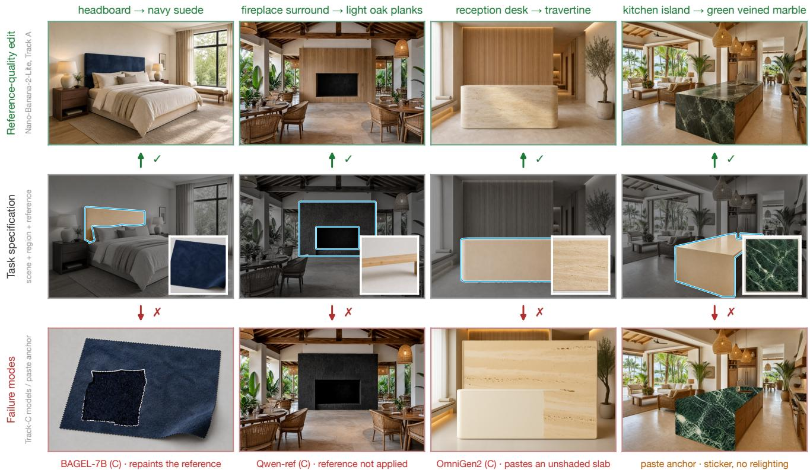
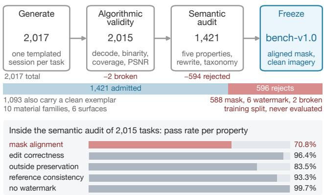
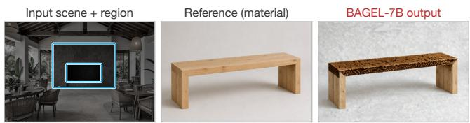

# MatReplace: A Reference-Free, Conditioning-Aligned Benchmark for Material Replacement in Interior Scenes

Mingzhe Du1, Thong Thanh Nguyen\*1, Nguyen Tran Cong Duy2, See-Kiong Ng1, Luu Anh Tuan2,3

1National University of Singapore 2Nanyang Technological University 3VinUniversity {mingzhe, thong.nguyen, seekiong}@nus.edu.sg, {nguyentr003, anhtuan.luu}@ntu.edu.sg

## Abstract

Generative image editors are entering interior-design workflows, where the routine request is material replacement: repaint one marked surface with a new material while the object’s geometry, the surrounding scene, and the illumination stay fixed. The operation is precisely specified and commercially routine, yet no public benchmark isolates it, and scoring it is subtle. The task is one-to-many, so distance to a stored reference penalizes valid diversity; a single-generator source rewards imitating that generator’s style; and editors given different guidance cannot share one leaderboard fairly. We introduce MatReplace, a reference-free benchmark that scores each edit on four verifiable dimensions (local material correctness, global lighting harmony, outside preservation, inside structure), across three tracks that vary one conditioning signal at a time: (A) the instruction alone, (B) the instruction plus a region mask, and (C) a reference image of the material in place of the instruction. Track A shows that strong closed-source models already render the requested material at exemplar quality, clearing the exemplar anchor under our primary aggregate. Track B shows that masks help only models that preserve the scene poorly and can consume them: their task-paired, single-seed value spans +0.137 to −0.090 across aligned families. Track C degrades every family under both aggregates, by −0.031 to −0.508, at worst repainting the reference itself and dropping below the score of returning the input untouched. Rendering a named material is thus largely solved for the strongest closed editors on this distribution, while grounding a material shown as pixels is not. Expert human ratings reproduce our ranking (Kendall τ = 0.68) and track our aggregates more closely than GT-referenced or CLIP-based baselines.

## 1 Introduction

Interior-design tools increasingly use generative editors to answer a concrete client question: what would this room look like if the headboard were navy suede, or the floor herringbone oak? The underlying operation, material replacement, is clearly specified. The material of one marked surface must change to a stated target while the object’s geometry, the rest of the scene, and the scene’s illumination remain fixed. Despite its practical importance and clear definition, no existing benchmark isolates this task. Instruction-editing suites (Zhang et al. 2023; Sheynin et al. 2024; Wang et al.

2023) fold it into broad edit categories, and their metrics score edits against a single stored reference image per task.

Scoring against stored reference images is doubly problematic for this task. First, the task is one-to-many. Many navy-suede headboards are equally correct, and penalizing distance to one stored example punishes valid diversity. Second, when all stored reference images come from a single generator, any such metric rewards matching that generator’s rendering style and biases the leaderboard toward that data source. MatReplace therefore treats the stored output as one reference solution that supports qualitative comparison and calibration, never the scoring target. Evaluation instead decomposes the task definition into four independently verifiable properties, each checked only against the provided inputs: whether the masked region became the target material, whether the outside stayed unchanged, whether the inside geometry survived, and whether the new surface matches the scene illumination.

The second design choice concerns conditioning, the form of guidance a system receives. Some deployed editors receive only a text instruction, some additionally receive a region mask, and others receive a mask together with a reference image of the target material. Benchmarks mixing these on one leaderboard conflate model quality with input signals. MatReplace defines Track A (instruction), Track B (instruction+mask), and Track C (mask+reference), aligning the same model family across tracks wherever the architecture permits. Holding the model fixed and varying only conditioning measures what a mask or reference is worth; the answer is neither uniform nor always positive. Our contributions are:

• MatReplace, a material-replacement benchmark: a frozen split over several material categories and surface types, with taxonomy labels and released inputs.

• A reference-free protocol of four independently verifiable dimensions, validated by constructed submissions that incur penalties only on their target.

• A three-track leaderboard defined by conditioning, with families aligned across tracks. Masks help only families weak at preservation and able to consume them; reference images degrade all models, in three failure modes the dimensions distinguish.

  
Figure 1: MatReplace at a glance. Each column is one task, read from the middle out. Middle: the target region in color, outlined over a dimmed grayscale surround (mask m), reference r inset. Up (✓): a reference-quality edit (Nano-Banana-2-Lite, Track A). Material changes while geometry, scene, and illumination survive. Down (✗): one failure per mode. BAGEL-7B (C) repaints the reference and discards the scene (column 1); Qwen-Image-Edit (C) fails to apply the reference and leaves the slate untouched (column 2); OmniGen2 (C) pastes a flat, unshaded slab (column 3); Paste anchor tiles the reference without relighting (column 4). Each failure is caught by the dimension whose contract it violates (Sec. 4).

## 2 Related Work

Instruction-based editing and its benchmarks. End-toend instruction editing has produced many manual and large-scale benchmarks (Brooks, Holynski, and Efros 2023; Zhang et al. 2023; Sheynin et al. 2024; Wang et al. 2023; Kawar et al. 2023; Ku et al. 2024), all scoring primarily by GT-referenced distance plus CLIP text alignment (Hessel et al. 2021) and inheriting both biases above. Recent flowmatching and unified any-to-any editors (Black Forest Labs et al. 2025; Wu et al. 2025, 2026; Deng et al. 2025) motivate our aligned design: one checkpoint enters all three tracks.

Reference-guided appearance transfer. Exemplar-based inpainting and object customization insert a reference’s content into a scene (Yang et al. 2023; Chen et al. 2024; Ruiz et al. 2023). Track C is the material-level analogue: the reference specifies appearance (color, texture, micro-structure) to be re-rendered under the scene’s geometry and illumination, not pasted; harmony and structure separate the two.

Material editing and design-domain data. A parallel line edits materials without benchmarking the task: parametric control (Sharma et al. 2024), zero-shot single-exemplar transfer (Cheng et al. 2024), light-aware transfer (Lopes et al. 2025), and material-map extraction (Lopes, Pizzati, and de Charette 2024), each on its own small set. No shared suite compares them with general editors, the gap MatReplace fills; despite interiors synthesized at scale from 3Dscene repositories (Fu et al. 2021; Roberts et al. 2021), no leaderboard isolates an interior editing operation.

Material understanding and intrinsics. Material recognition in situ is a classic vision problem (Bell et al. 2013, 2015), and the albedo–shading decomposition underlying our harmony dimension goes back to intrinsicimage analysis (Grosse et al. 2009). MatReplace connects this line to generative editing: material correctness via zeroshot SigLIP2 (Tschannen et al. 2025) recognition and DI-NOv2 (Oquab et al. 2024) appearance similarity, and harmony via shading invariance.

Reference-free evaluation. CLIPScore (Hessel et al. 2021) showed reference-free scoring for captioning, a single-obligation task. For editing the right unit is a decomposition into the task’s contract: each dimension ties to a checkable clause, built from established components (LPIPS (Zhang et al. 2018), SSIM (Wang et al. 2004), Depth Anything V2 (Yang et al. 2024)) and validated by an anchor experiment. Unlike a learned judge, every dimension is auditable and deterministic with fixed, released constants.

## 3 The MatReplace Benchmark

Task definition. A task is a tuple $( x , m , r , T , c ) ;$ scene $x ,$ binary mask m on one surface, reference r of the target material, instruction T, and material-category label c (10-way). A submission is an edited image yˆ at x’s resolution. The contract: inside m the material becomes c (matching r where provided); outside m the scene is unchanged; the geometry inside is unchanged and the new surface shaded by the scene’s illumination.

Why interior scenes. Interior visualization is where material replacement is deployed: design tools iterate over finishes on fixed geometry, so the edit must be surgical. It is also a stress test, with planar surfaces beside upholstery and drapery, strong mixed lighting, and material–object bindings dense enough that text struggles to pin them down.

Sources and curation. Figure 2 summarizes construction. Each of 2,017 candidate tasks is one templated session: a GPT-5.6-Sol agent drives one disclosed generator, GPT-Image-2 (itself evaluated), producing the scene, the mask as an edit on that scene (binarized, coveragechecked, regenerated on failure), the reference, an exemplar output, and a canonical instruction. An algorithmic pass checks decodability, resolution agreement, mask binarity and in-bounds coverage, and flags exemplars that redraw the scene (low outside-mask PSNR); 2,015 survive. A semantic pass then audits five properties with a GPT-5.6-Sol agent: mask–object alignment (70.8% pass), edit correctness (96.4%), outside preservation (83.5%), reference–edit consistency (93.3%), and watermark absence (99.7%), rewriting each instruction to match the realized images. Admission requires an aligned mask and clean imagery; defects in the stored exemplar do not disqualify a task, since scoring never references it. Mask alignment is the dominant yield limiter; the 596 rejects ship as a disjoint rejected pool, released for auditing rather than as supervision.

What the rejects look like. The rejects catalogue how a strong generator fails at its own task: masks spill or miss (588, dominant); edits leak outside the mask (332); inside geometry is re-sculpted (73); exemplars mismatch their reference (135) or redraw the scene (153), exactly the behaviors the four dimensions target (Fig. 3).

Construction cost. At public GPT-Image-2 list prices (July 2026), a four-call session costs \$0.37–\$1.48, or \$0.7k– \$3.0k across 2,017 sessions; absorbing curation yield and the audit, an admitted task costs \$0.57–\$2.14, and the fully audited benchmark prices below a single small user study.

Statistics. MatReplace has 1,421 task specifications, spanning 10 material categories (fabric 187, wood 181, marble 172, stone 170, metal 160, . . . ) and 6 surface types (furniture 825, wall 156, countertop 144, fireplace $1 2 5 , \ldots )$ , with mask-coverage buckets retained for stratified analysis.

Three conditioning tracks. Tracks differ only in inputs: Track $\textbf { A } x + T$ , Track $\textbf { B } x + m + T$ , and Track C x+m+r, the material named only by the image. A family supporting several modes enters several tracks from one checkpoint.

  
Figure 2: MatReplace Benchmark Construction. One templated generation session per candidate task, an algorithmic validity pass, and a semantic audit by a vision–language agent reduce 2,017 candidate sessions to the frozen 1,421 tasks. The middle bar is drawn to scale, so the admitted and rejected shares are directly comparable and the accounting closes. The 596 rejects ship as a disjoint rejected pool, released for auditing and never used for evaluation.

Scope and non-goals. MatReplace isolates one edit type; insertion, removal, geometry edits, multi-surface restyling, and global style transfer are out of scope. A single-surface edit is the smallest unit for which preservation, structure, and harmony are simultaneously well defined, whereas composite edits reintroduce ambiguities needing a stored answer.

## 4 Reference-Free Evaluation Protocol

Given $( x , m , r , c )$ and a submission ${ \hat { y } } ,$ we compute four scores in $[ 0 , 1 ] ;$ overall is their unweighted mean. Reference-free means free of any reference output: every score is a function of the task inputs alone, never of a stored solution. The reference r is itself an input; its Track-A consequence is discussed under the design rationale. Let m˜ denote m dilated by a 7-px boundary band (excluded from outside comparisons), $\bar { m } \ = \ 1 \ - \ \tilde { m }$ its complement, and crop(·, m) the masked crop. Figure 3 shows outputs violating exactly that clause.

Material correctness $( S _ { \mathrm { m a t } } )$ . SigLIP2 classification cˆ of crop(ˆy, m) over the material vocabulary, scored at thefamily level (pairs that vision encoders legitimately confuse, such as marble and granite, are grouped), averaged with a DI-$\mathrm { N O v } 2 ( f _ { \mathrm { D } } )$ cosine similarity between the crop and r:

$$
\begin{array} { r l } & { S _ { \mathrm { m a t } } = \frac { 1 } { 2 } \Big [ \mathbf { 1 } \{ \mathrm { f a m } ( \hat { c } ) = \mathrm { f a m } ( c ) \} } \\ & { \qquad + \cos \big ( f _ { \mathrm { D } } ( \mathrm { c r o p } ( \hat { y } , m ) ) , f _ { \mathrm { D } } ( r ) \big ) \Big ] . } \end{array}\tag{1}
$$

Outside preservation $( S _ { \mathrm { p r e s } } )$ . LPIPS between x and $\hat { y }$ restricted to the outside region:

$$
S _ { \mathrm { p r e s } } = \operatorname* { m a x } \big ( 0 , 1 - \mathrm { L P I P S } ( x \odot \bar { m } , \hat { y } \odot \bar { m } ) \big ) ,\tag{2}
$$

with PSNR/SSIM reported as diagnostics. $S _ { \mathrm { p r e s } }$ is invariant to the resize-back-to-input-resolution step applied to all submissions (round-trip verified).

  
wrong material · SDXL-inpaint (B) · Smat

  
geometry re-sculpted · SD3.5-inpaint (B) · Sstruct

scene-wide flood · InstructPix2Pix (A) · Spres  
  
flat unshaded paste · FLUX-ref (C) · Sharm  
Figure 3: One failure per dimension: each pair shows the input with the target region outlined, then the model output. SDXL-inpaint paints bare wall instead of navy suede $( S _ { \mathrm { m a t } } )$ . InstructPix2Pix floods the whole room with the target emerald $( S _ { \mathrm { p r e s } } )$ . SD3.5-inpaint re-sculpts the rectangular fireplace into an arched portal $( S _ { \mathrm { s t r u c t } } )$ . FLUX-Kontext-ref pastes the reference as flat, unlit patches $( S _ { \mathrm { h a r m } } )$

Inside structure $( S _ { \mathrm { s t r u c t } } )$ . Monocular depth $d ( \cdot )$ for x and $\hat { y } ,$ aligned by scale-and-shift on the outside region, then the inside absolute-relative error over m:

$$
S _ { \mathrm { s t r u c t } } = \exp \big ( - \mathrm { A b s R e l } _ { m } \big ( d ( x ) , a d ( \hat { y } ) + b \big ) / \tau \big ) ,\tag{3}
$$

with temperature τ fixed across all models (all constants in the released harness).

Lighting harmony $( S _ { \mathrm { h a r m } } ) .$ A material swap rescales albedo but must preserve the spatial pattern of illumination. We correlate the low-pass luminance fields inside the mask,

$$
\mathrm { N C C } = \mathrm { c o r r } \big ( \ell _ { \sigma } ( x ) | _ { m } , \ell _ { \sigma } ( \hat { y } ) | _ { m } \big ) ,\tag{4}
$$

which is invariant to the albedo scale, and average (after mapping to [0, 1]) with a seam term that penalizes gradient energy appearing just outside the mask boundary (halos, glow) relative to x.

Design rationale. Each dimension makes one trade. Material is scored at the family level because fine-grained labels are not reliably separable by current encoders even on clean crops, so strict scoring would grade the scorer, not the model. The DINOv2 term anchors appearance to r even on Track A, where the model never sees r: two valid navy suedes differ in similarity to r, readmitting a bounded one-to-many penalty (at most half of $S _ { \mathrm { m a t } }$ , one eighth of overall). We keep it because the rewritten instruction describes $r { } _ { \mathrm { { s } } }$ appearance and removing it costs agreement with the human ranking (Table 5). Preservation excludes the boundary band because mask-edge pixels are ambiguous under resampling. Structure aligns depth on the outside region, isolating inside edits from global depth-scale drift; monocular depth is not perfectly texture-invariant, so a correct swap costs a little structure (the exemplar loses 0.15), against which τ is set. Harmony correlates low-pass luminance, since an albedo change rescales brightness but must not restructure illumination, with a seam term watching the ring outside the mask where halos concentrate. Finally, overall is unweighted, so from the released per-task, perdimension scores we read results dimension-wise.

<table><tr><td>anchor</td><td>mat</td><td>pres</td><td>struct</td><td>harm</td><td>overall</td></tr><tr><td>gt (exemplar)</td><td>0.622</td><td>0.964</td><td>0.853</td><td>0.877</td><td>0.829 ±.004</td></tr><tr><td>identity (input)</td><td>0.242</td><td>1.000</td><td>0.999</td><td>1.000</td><td> $0 . 8 1 0 \pm . 0 0 3$ </td></tr><tr><td>paste (no relight)</td><td>0.673</td><td>0.951</td><td>0.548</td><td>0.697</td><td> $0 . 7 1 7 \pm . 0 0 5$ </td></tr></table>

Table 1: Anchor validation on all 1,421 tasks. Bold marks the dimension each anchor is constructed to violate, and no anchor is penalized elsewhere.

Uncertainty and significance. Every mean carries a 95% percentile-bootstrap interval over tasks $\scriptstyle ( B = 1 0 , 0 0 0 .$ , fixed seed). Since all submissions share the same tasks, deltas and near-ties are tested with two-sided Wilcoxon signed-rank on per-task overall scores, Holm-corrected across all 14 comparisons. Each entry is a single fixed-seed run, so deltas below 0.02 are significant over task sampling but within plausible seed variation, and we flag them (‡) in Table 4.

Anchor validation. Because the metrics are new, we validate them with three constructed submissions on all 1,421 tasks (Table 1): identity (submit x) saturates preservation/structure/harmony and fails only material (1.000/0.999/1.000, material 0.242); paste (tile r, no re-rendering) takes the highest raw material score (0.673) but is caught by structure (0.548) and harmony (0.697), the “sticker” artifact; $g t$ (the exemplar) scores well on all four (0.829) as a soft ceiling; it averages every stored exemplar, including the 328 audit-flagged ones, and moves only to 0.833 on the clean subset. The anchors span the observed range. The exemplar also calibrates conservatism: a correct change costs about 0.15 structure and 0.12 harmony (depth and low-pass luminance are not fully textureinvariant), compressing raw overall between floor 0.810 and ceiling 0.829.

Metric robustness. Raw overall compresses near identity, so we compare it against two alternatives (Table 2). (i) Scoring $S _ { \mathrm { m a t } }$ by family accuracy alone (no DINOv2 term) barely moves the ranking $( \tau ~ = ~ 0 . 9 1 )$ and lifts the exemplar above paste on material. (ii) A gate overa $\begin{array} { r } { \mathrm { l } _ { G } = } \end{array}$ $\hat { S } _ { \mathrm { m a t } } \cdot ( S _ { \mathrm { p r e s } } S _ { \mathrm { s t r u c t } } S _ { \mathrm { h a r m } } ) ^ { 1 / 3 }$ , with $\hat { S } _ { \mathrm { m a t } } = \mathrm { c l i p } \big ( ( S _ { \mathrm { m a t } } -$ $0 . 2 4 2 ) / 0 . 3 8 0 , 0 , 1 \rangle$ the per-task material score rescaled by the global identity and exemplar anchor means, sends the do-nothing anchor to 0.236 and lifts every entry above it except OmniGen2-ref (0.204) and BAGEL-7B (0.062), both Track $\mathrm { C } ,$ at a mild re-ranking $( \tau = 0 . 7 7 )$ . Both agree with the raw ranking on the top of the board and on the Track-C collapse: the compression is a property of the equal-weight mean among strong models, not of the ranking. We therefore report $\mathrm { o v e r a l l } _ { G }$ as the primary aggregate and raw overall beside it. The gate is also the view closest to human judgment: it agrees best with the Bradley–Terry strengths of Sec. $7 ~ ( \tau _ { \mathrm { H } } = 0 . 7 2 ~ \mathrm { v s }$ . 0.68 raw and 0.64 family-only; Table 5) and it ranks paste above identity as the raters do (6– 3), unlike raw overall. All three aggregates were prespecified, and the gate’s constants are anchor means rather than parameters fitted to the judgments, so the agreement is a check, not a fit.

<table><tr><td>aggregate</td><td>identity</td><td>paste</td><td>gt</td><td>&gt;id</td><td> $\tau _ { \mathrm { r a w } }$ </td></tr><tr><td>raw overall</td><td>0.810</td><td>0.717</td><td>0.829</td><td>4/23</td><td>1.00</td></tr><tr><td>Smat family-only</td><td>0.813</td><td>0.749</td><td>0.882</td><td>9/23</td><td>0.91</td></tr><tr><td>gate overallG</td><td>0.236</td><td>0.552</td><td>0.729</td><td>21/23</td><td>0.77</td></tr></table>

Table 2: Robustness of the aggregate. Columns give the three anchors, the number of the 23 entries scoring above the identity floor, and Kendall τ against the raw ranking. Correlations with the human ranking appear in Table 5.

## 5 Experiments

Evaluated systems. We evaluate 11 systems in 23 track entries, and six families complete all three tracks from one checkpoint or pipeline family. Closed (provider APIs) include GPT-Image-2 (A/B/C, the disclosed data generator) and Nano-Banana-2-Lite (A/B/C). Open, cross-track include FLUX.1-Kontext (Black Forest Labs et al. 2025) (A, inpainting for B, reference mode for C), Qwen-Image-Edit (Wu et al. 2025), OmniGen2 (Wu et al. 2026), and BAGEL-7B (Deng et al. 2025) (all natively multi-image, A/B/C). Open, single-track include InstructPix2Pix (Brooks, Holynski, and Efros 2023) (A), FLUX.1-Fill, SDXL-inpainting (Podell et al. 2024), and SD3.5-inpainting (Esser et al. 2024) (B), and Paint-by-Example (Yang et al. 2023) (C).

Protocol. All open models run at native or recommended resolution with default guidance and 50 denoising steps, seed fixed. Outputs are resized to the input resolution before scoring. Track prompts are templated identically across models: Track B prepends the mask semantics, and Track C names no material in text. Templating is minimal and untuned, since per-model prompt engineering would reintroduce the input-privilege confound the tracks remove. Track-C reference injection follows each model’s native interface: the multi-image editors (Qwen-Image-Edit, OmniGen2, BAGEL) take an ordered list [x, m, r]; FLUX-Kontext uses its reference port (image reference=r) beside image/mask image; Paint-by-Example its exemplar port (example image=r), no text. The list-based prompts name the roles explicitly (“Image 3 shows a target material”), so role underspecification is not the immediate cause of BAGEL’s failure below.

Leaderboard. Table 3 reports per-track results. On Track A the two closed editors lead on both aggregates and clear the exemplar anchor under the gate (0.760/0.739 vs. 0.729; 0.817/0.827 vs. 0.829 raw). GPT-Image-2 generated the data, so its match to its own exemplars is self-consistency; the informative reading is that Nano-Banana-2-Lite, from a different provider, is the one that ranks first. Closed instruction editors thus reach the datagenerating process without any spatial guidance, with any home-field advantage bounded by the cross-provider gap. The open field is cleanly separated by architecture: the 20B multi-image editor (Qwen, 0.677) leads, the unified models BAGEL (0.576) and OmniGen2 (0.539) bracket the flow-matching editor (FLUX-Kontext, 0.540), and the

SD1.5-era baseline (InstructPix2Pix, 0.344) trails. Track B preserves the closed-model order and promotes maskspecialized pipelines (Qwen and FLUX-Kontext inpainting, 0.680/0.678). Track C inverts the picture: every family drops, and two entries, OmniGen2-ref (0.204) and BAGEL-7B (0.062), fall below the do-nothing floor (0.236).

## 6 Analysis

What is a mask worth? (A→B, same model). Because tracks share checkpoints, Table 4 reads off the causal value of conditioning (p Holm-corrected Wilcoxon throughout). The mask’s value spans 0.15 across the six aligned families: +0.111 for FLUX-Kontext, whose Track-A weakness is precisely preservation (0.82) and whose inpainting pipeline enforces it (0.96, structure riding along 0.61→0.81); +0.009 for Qwen (‡); statistically zero for both closed editors $( p _ { \mathrm { H o l m } } { = } 0 . 4 5 )$ , which already preserve from text alone; and negative for both unified models (−0.019 BAGEL ‡, −0.034 OmniGen2), which fail to honor it. The gate replicates and sharpens this pattern: FLUX grows to +0.137 and Omni-Gen2 falls to −0.090, while BAGEL’s deficit loses significance. Masks help only models both weak at preservation and able to consume them.

What does a reference cost? (B→C, same model). Substituting the reference for the instruction degrades every family under both aggregates (Table 4). (1) Appearancegrounding loss (closed editors, −0.010 – −0.017, ‡- flagged): they still solve the task, just less precisely when the material is shown rather than named. (2) Materialidentification collapse (Qwen −0.150, OmniGen2 −0.050): with no material named in text, family accuracy falls 0.876→0.510 (Qwen) and 0.733→0.353 (OmniGen2). These models cannot translate reference pixels into the semantic target their editing pathway needs, though the pathway executes correctly when the target arrives as text. Nor is this a classifier failure: the same classifier moves the closed editors only 0.024–0.038 from B to C, and the identity anchor’s 0.254 family score is a task prior (originals often already match the target family), not an error rate. (3) Role-binding failure (BAGEL, 0.319): the model misassigns the roles of the three input images and repaints the reference instead of the scene (Fig. 4), collapsing preservation (0.202) and structure (0.044). FLUX-Kontext-ref sits between (2) and (3): it keeps the scene (pres = 0.959) but pastes unshaded texture, driving structure to 0.440, near the paste anchor. The prompts name each image’s role explicitly and the other five families never swap roles under the identical template, so the collapse belongs to the model. The open problem is thus not rendering a material, which Track A shows models do from text, but grounding a specification given as pixels.

Practical guidance. Where instructions can name the material, closed editors already operate at the exemplar level and masks add friction without accuracy. Where only open models are deployable, the best open entry is a mask-specialized pipeline (FLUX-Kontext-inpaint, 0.805). Reference-driven specification should not ship today: recognize the swatch to a name and route it through text.

<table><tr><td>model</td><td>family acc.</td><td>material</td><td>preservation</td><td>structure</td><td>harmony</td><td>raw</td><td>gate</td></tr><tr><td colspan="8">Track A: instruction (input + text)</td></tr><tr><td>Nano-Banana-2-Lite†</td><td>0.899</td><td> $\mathbf { 0 . 6 4 0 \pm . 0 1 1 }$ </td><td> $\underline { { 0 . 9 5 3 \pm . 0 0 1 } }$ </td><td> $0 . 8 2 0 \pm . 0 0 7$ </td><td> $0 . 8 5 7 \pm . 0 0 7$ </td><td> $0 . 8 1 7 \pm . 0 0 4$ </td><td>0.760</td></tr><tr><td>GPT-Image-2†</td><td>0.852</td><td> $\underline { { 0 . 6 1 6 \pm . 0 1 2 } }$ </td><td> $\mathbf { 0 . 9 6 2 \pm . 0 0 1 }$ </td><td> $\mathbf { 0 . 8 5 3 \pm . 0 0 6 }$ </td><td> $0 . 8 7 8 \pm . 0 0 7$ </td><td> $\mathbf { 0 . 8 2 7 \pm . 0 0 4 }$ </td><td>0.739</td></tr><tr><td>Qwen-Image-Edit</td><td>0.887</td><td> $\overline { { 0 . 6 1 5 \pm . 0 1 1 } }$ </td><td> $0 . 8 9 9 \pm . 0 0 2$ </td><td> $0 . 7 1 0 { \scriptstyle \pm . 0 1 0 }$ </td><td> $\overline { { 0 . 8 1 7 \pm . 0 0 8 } }$ </td><td> $0 . 7 6 0 \pm . 0 0 5$ </td><td>0.677</td></tr><tr><td>BAGEL-7B</td><td>0.797</td><td> $0 . 5 3 3 \pm . 0 1 2$ </td><td> $0 . 9 1 7 \pm . 0 0 2$ </td><td> $0 . 7 0 4 \pm . 0 1 0$ </td><td> $0 . 7 8 7 \pm . 0 0 9$ </td><td> $0 . 7 3 5 \pm . 0 0 4$ </td><td>0.576</td></tr><tr><td>FLUX-Kontext</td><td>0.780</td><td> $0 . 5 5 4 \pm . 0 1 3$ </td><td> $0 . 8 2 0 \pm . 0 0 2$ </td><td> $0 . 6 1 3 \pm . 0 1 1$ </td><td> $0 . 7 8 6 \pm . 0 0 8$ </td><td> $0 . 6 9 3 \pm . 0 0 5$ </td><td>0.540</td></tr><tr><td>OmniGen2</td><td>0.832</td><td> $0 . 5 6 5 \pm . 0 1 2$ </td><td> $0 . 8 5 6 \pm . 0 0 5$ </td><td> $0 . 5 5 7 \pm . 0 1 5$ </td><td> $0 . 7 7 5 \pm . 0 0 9$ </td><td> $0 . 6 8 8 \pm . 0 0 6$ </td><td>0.539</td></tr><tr><td>InstructPix2Pix</td><td>0.521</td><td> $0 . 3 8 7 \pm . 0 1 4$ </td><td> $0 . 7 7 0 \pm . 0 0 8$ </td><td> $0 . 7 0 3 \pm . 0 1 5$ </td><td> $\mathbf { 0 . 8 8 1 \pm . 0 0 8 }$ </td><td> $0 . 6 8 5 \pm . 0 0 6$ </td><td>0.344</td></tr><tr><td colspan="8">Track B: mask + text</td></tr><tr><td>Nano-Banana-2-Lite†</td><td>0.894</td><td> $\mathbf { 0 . 6 3 8 \pm . 0 1 1 }$ </td><td> $0 . 9 5 3 \pm . 0 0 1$ </td><td> $0 . 8 1 7 \pm . 0 0 7$ </td><td> $0 . 8 6 1 \pm . 0 0 7$ </td><td> $0 . 8 1 7 \pm . 0 0 4$ </td><td>0.757</td></tr><tr><td>GPT-Image-2†</td><td>0.833</td><td> $0 . 6 0 5 { \scriptstyle \pm . 0 1 2 }$ </td><td> $0 . 9 6 2 \pm . 0 0 1$ </td><td> $\mathbf { 0 . 8 5 6 \pm . 0 0 6 }$ </td><td> $0 . 8 7 5 { \scriptstyle \pm . 0 0 7 }$ </td><td> $\mathbf { 0 . 8 2 4 \ : \pm . 0 0 4 }$ </td><td>0.724</td></tr><tr><td>Qwen-Image-Edit-inpaint</td><td>0.876</td><td> $0 . 6 1 2 \pm . 0 1 1$ </td><td> $0 . 9 0 1 \pm . 0 0 2$ </td><td> $0 . 7 3 5 \pm . 0 1 1$ </td><td> $0 . 8 3 0 { \scriptstyle \pm . 0 0 8 }$ </td><td> $0 . 7 6 9 \pm . 0 0 5$ </td><td>0.680</td></tr><tr><td>FLUX-Kontext-inpaint</td><td>0.805</td><td> $\overline { { 0 . 5 6 9 \pm . 0 1 2 } }$ </td><td> $\underline { { 0 . 9 6 4 \pm . 0 0 1 } }$ </td><td> $0 . 8 1 1 \pm . 0 0 6$ </td><td> $0 . 8 7 6 \pm . 0 0 7$ </td><td> $0 . 8 0 5 \pm . 0 0 4$ </td><td>0.678</td></tr><tr><td>BAGEL-7B</td><td>0.785</td><td> $0 . 5 3 8 \pm . 0 1 3$ </td><td> $\overline { { 0 . 8 5 6 \pm . 0 0 6 } }$ </td><td> $0 . 7 3 1 \pm . 0 1 0$ </td><td> $0 . 7 4 1 \pm . 0 1 0$ </td><td> $0 . 7 1 6 \pm . 0 0 6$ </td><td>0.570</td></tr><tr><td>SD3.5-inpaint</td><td>0.841</td><td> $0 . 5 5 9 \pm . 0 1 1$ </td><td> $0 . 9 4 1 \pm . 0 0 1$ </td><td> $0 . 4 8 0 \pm . 0 1 3$ </td><td> $0 . 7 3 3 \pm . 0 0 9$ </td><td> $0 . 6 7 8 \pm . 0 0 5$ </td><td>0.528</td></tr><tr><td>OmniGen2-inpaint</td><td>0.733</td><td> $0 . 5 0 6 \pm . 0 1 3$ </td><td> $0 . 8 1 9 \pm . 0 0 6$ </td><td> $0 . 5 0 7 \pm . 0 1 4$ </td><td> $0 . 7 8 6 \pm . 0 0 9$ </td><td> $0 . 6 5 4 \pm . 0 0 6$ </td><td>0.449</td></tr><tr><td>FLUX.1-Fill</td><td>0.551</td><td> $0 . 4 0 7 \pm . 0 1 4$ </td><td> $\mathbf { 0 . 9 7 4 } \pm . \mathbf { 0 0 1 }$ </td><td> $0 . 7 6 4 \pm . 0 0 9$ </td><td> $0 . 8 8 1 \pm . 0 0 7$ </td><td> $0 . 7 5 6 \pm . 0 0 5$ </td><td>0.446</td></tr><tr><td>SDXL-inpaint</td><td>0.477</td><td> $0 . 3 5 0 \pm . 0 1 4$ </td><td> $0 . 9 4 1 \pm . 0 0 1$ </td><td> $0 . 5 6 8 \pm . 0 1 3$ </td><td> $\overline { { 0 . 9 0 4 \pm . 0 0 6 } }$ </td><td> $0 . 6 9 1 \pm . 0 0 5$ </td><td>0.330</td></tr><tr><td colspan="8">Track C: mask + reference</td></tr><tr><td> ${ \mathrm { N a n o - B a n a n a - } } 2 { \mathrm { - L i t e } } ^ { \dagger }$ </td><td>0.871</td><td> $\mathbf { 0 . 6 4 } 2 \pm . 0 1 2$ </td><td> $0 . 9 4 5 \pm . 0 0 2$ </td><td> $0 . 8 0 8 \pm . 0 0 8$ </td><td> $0 . 8 3 4 \pm . 0 0 8$ </td><td> $0 . 8 0 7 \pm . 0 0 4$ </td><td>0.726</td></tr><tr><td>GPT-Image-2†</td><td>0.795</td><td> $\underline { { 0 . 6 0 9 \pm . 0 1 3 } }$ </td><td> $\underline { { 0 . 9 4 8 \pm . 0 0 2 } }$ </td><td> $\mathbf { 0 . 8 1 7 \pm . 0 0 8 }$ </td><td> $\mathbf { 0 . 8 5 7 \pm . 0 0 8 }$ </td><td> $\mathbf { 0 . 8 0 8 \pm . 0 0 5 }$ </td><td>0.675</td></tr><tr><td>FLUX-Kontext-ref</td><td>0.637</td><td> $\overline { { 0 . 5 3 8 \pm . 0 1 7 } }$ </td><td> $\overline { { { \bf 0 . 9 5 9 } \pm . 0 0 1 } }$ </td><td> $0 . 4 4 0 \pm . 0 1 3$ </td><td> $0 . 7 1 8 \pm . 0 1 0$ </td><td> $0 . 6 6 4 \pm . 0 0 6$ </td><td>0.386</td></tr><tr><td>Paint-by-Example</td><td>0.453</td><td> $0 . 3 4 9 \pm . 0 1 4$ </td><td> $0 . 9 2 1 \pm . 0 0 1$ </td><td> $0 . 6 0 0 { \scriptstyle \pm . 0 1 3 }$ </td><td> $\underline { { 0 . 8 4 9 \pm . 0 0 8 } }$ </td><td> $0 . 6 8 0 { \scriptstyle \pm . 0 0 6 }$ </td><td>0.322</td></tr><tr><td>Qwen-Image-Edit-ref</td><td>0.510 0.353</td><td> $0 . 4 2 3 \pm . 0 1 7$ </td><td> $0 . 7 0 2 { \scriptstyle \pm . 0 1 2 }$ </td><td> $0 . 5 2 7 \pm . 0 1 8$ </td><td> $\overline { { 0 . 8 2 7 \pm . 0 1 0 } }$ </td><td> $0 . 6 2 0 \pm . 0 0 9$ </td><td>0.307</td></tr><tr><td>OmniGen2-ref BAGEL-7B</td><td>0.612</td><td> $0 . 3 1 8 \pm . 0 1 6$ </td><td> $0 . 7 3 9 \pm . 0 0 6$ </td><td> $0 . 5 1 8 \pm . 0 1 5$ </td><td> $0 . 8 4 3 \pm . 0 0 9$ </td><td> $0 . 6 0 5 \pm . 0 0 6$ </td><td>0.204*</td></tr><tr><td></td><td></td><td> $0 . 5 0 4 \pm . 0 1 6$ </td><td> $0 . 2 0 2 \pm . 0 0 4$ </td><td> $0 . 0 4 4 \pm . 0 0 4$ </td><td> $0 . 5 2 5 \pm . 0 1 0$ </td><td> $0 . 3 1 9 \pm . 0 0 5$ </td><td>0.062*</td></tr></table>

Table 3: Per-track leaderboard on bench-v1.0 (1,421 tasks, higher is better), ordered by our primary aggregate gate (Sec. 4); raw is the unweighted mean, “family acc.” strict SigLIP2 family accuracy, and ± a 95% bootstrap interval. Bold/underline: best/second per column within a track; † closed; ∗ below the gated do-nothing floor (0.236). Closed editors lead all three tracks; on Track C every family loses ground and two entries fall below that floor.

  
Figure 4: Role-binding failure: the model repaints the reference (the oak bench), composites the mask silhouette into it, and discards the scene.

open models know what to paint but damage the scene while painting it. The gap is engineering, not material knowledge.

Overall ties hide opposite failure modes. OmniGen2 and InstructPix2Pix tie on Track A (0.688 vs. 0.685, $p _ { \mathrm { H o l m } } { = } 0 . 8 6 )$ for opposite reasons: OmniGen2 gets the material (family 0.83) but breaks geometry $( S _ { \mathrm { s t r u c t } } 0 . 5 6 )$ , InstructPix2Pix preserves geometry (0.70) but rarely produces the material (family 0.52). SDXL/SD3.5 on Track B repeat the pattern (0.691 vs. 0.678; $| \Delta | < 0 . 0 2$ , single-seed): SDXL blends beautifully (harmony 0.904) but paints the wrong material (0.477), SD3.5 names it (0.841) but deforms the surface (structure 0.480). A holistic score erases these distinctions; the decomposition makes the board actionable.

Closed vs. Open. The closed–open gap is concentrated in two dimensions: preservation (0.95–0.96 vs. 0.77–0.90 on Track A) and structure (0.82–0.85 vs. 0.56–0.71). Material is not the differentiator (0.62–0.64 vs. up to 0.62):

Where edits are hard (stratified, Track A). Taxonomy labels let us read the board by stratum. Difficulty tracks mask coverage: on the 188 large masks every model drops 0.05–0.10 (GPT-Image-2 0.755 [0.742, 0.768] vs. 0.840 [0.835, 0.845] on the 784 medium; the intervals are disjoint), a bigger region giving geometry and lighting more room to drift. Cluttered “other” surfaces are hardest (GPT 0.698), flat countertops easiest (0.868); leather and rattan are the hardest material classes (both ≈ 0.77 for GPT), wood the easiest (0.881). Order is stable across strata, except BAGEL-7B is nearly flat across materials (0.72–0.75, overlapping intervals) where others swing 0.10–0.15. The full per-stratum grid ships with the release.

## 7 Human Expert Calibration

As a calibration pilot, two expert raters produced 459 twoalternative forced-choice judgments over 422 unique tasks, with hidden identities, randomized sides, optional ties, and per-dimension failure tags. The 34 anchor–anchor pairings are held out of scoring; the 25 with winners known by construction serve as attention checks (24 passed, one tied). We fit Bradley–Terry strengths to the remaining 425 scoring judgments (ties as half-wins, bootstrap B=2,000).

<table><tr><td rowspan="2">family</td><td colspan="2"> $\Delta _ { \mathrm { m a s k } } ( \mathbf { A } {  } \mathbf { B } )$ </td><td colspan="2"> $\Delta _ { \mathrm { r e f } } ~ ( \mathrm { { B \to C } ) }$ </td></tr><tr><td>raw</td><td>gate</td><td>raw</td><td>gate</td></tr><tr><td>GPT-Image  ${ - } 2 ^ { \dagger }$ </td><td> $- 0 . 0 0 3 ^ { \mathrm { n s } }$ </td><td> $- 0 . 0 1 6 ^ { \mathrm { n s } }$ </td><td> $- 0 . 0 1 7 ^ { \ddagger }$ </td><td>-0.048</td></tr><tr><td>Nano-Banana-2-Lite†</td><td> $0 . 0 0 0 ^ { \mathrm { n s } }$ </td><td> $- 0 . 0 0 3 ^ { \mathrm { n s } }$ </td><td> $- 0 . 0 1 0 ^ { \ddagger }$ </td><td>-0.031</td></tr><tr><td>Qwen-Image-Edit</td><td> $+ 0 . 0 0 9 ^ { \frac { 1 } { \cdot } }$ </td><td> $+ 0 . 0 0 3 ^ { \frac { \dag } { \dag } }$ </td><td>-0.150</td><td>-0.373</td></tr><tr><td>BAGEL-7B</td><td> $- 0 . 0 1 9 ^ { \ddagger }$ </td><td> $- 0 . 0 0 6 ^ { \mathrm { n s } }$ </td><td>-0.397</td><td>-0.508</td></tr><tr><td>FLUX-Kontext</td><td> $+ 0 . 1 1 1$ </td><td> $+ 0 . 1 3 7$ </td><td>-0.141</td><td>-0.291</td></tr><tr><td>OmniGen2</td><td>-0.034</td><td> $- 0 . 0 9 0$ </td><td>-0.050</td><td>-0.245</td></tr></table>

Table 4: Conditioning-aligned cross-track deltas: adding a mask $( \Delta _ { \mathrm { m a s k } } )$ and replacing text with the reference $\scriptstyle ( \Delta _ { \mathrm { r e f } } ) ,$ as task-paired means under both aggregates (per-track scores in Table 3). Unmarked entries are Holm-corrected Wilcoxon $p < 1 0 ^ { - 3 } ;$ ns not significant; ‡ marks $| \Delta | < 0 . 0 2$ from a single seed, significant over tasks but not seeds (Sec. 4). Beyond ‡, the mask helps one family and hurts one; the reference hurts all six, more under the gate.
<table><tr><td></td><td colspan="3">Ours</td><td colspan="4">Established</td></tr><tr><td></td><td>gate</td><td>raw</td><td>fam.</td><td>-LPIPS</td><td>CLIP-I</td><td>CLIPScore</td><td> $\mathrm { C L I P _ { d i r } }$ </td></tr><tr><td>TH</td><td>0.72</td><td>0.68</td><td>0.64</td><td>0.55</td><td>0.54</td><td>0.05</td><td>-0.44</td></tr><tr><td>ρH</td><td>0.89</td><td>0.87</td><td>0.86</td><td>0.75</td><td>0.76</td><td>0.15</td><td>-0.52</td></tr></table>

Table 5: Kendall $\tau _ { \mathrm { H } }$ and Spearman $\rho _ { \mathrm { H } }$ against human Bradley–Terry strengths (425 judgments); GT-referenced baselines use the 1,093 clean-exemplar tasks. Ours exceeds every established metric: significantly for LPIPS and CLIP-Score (bootstrap $P \ge 0 . 9 8 5$ ), marginally for CLIP-I $( \Delta \tau =$ $+ 0 . 1 4 , \mathrm { C I } \left[ - 0 . 0 1 , 0 . 2 8 \right] )$ .

Ranking agreement. Across the 20 entries with at least ten judgments, human strengths correlate with the leaderboard at Kendall $\tau \ : = \ : 0 . 6 8$ and Spearman $\rho ~ = ~ 0 . 8 7$ . On Track $\mathbf { A } ,$ τ rises from 0.62 to 0.87 once the single outlier discussed below is excluded (1.00 under the gate). Against the exemplar, GPT-Image-2 ties (5W–4L–12T for the model) and Nano-Banana-2-Lite is preferred outright (8W–4L–7T); in the direct closed-vs-closed pairing the raters prefer the non-coupled editor (5–2–10), so generator identity buys no human-visible advantage. The Track-C degradation replicates family by family with the metric’s severity ordering: near-unanimous for the two largest drops (Qwen 18– 1, FLUX-Kontext 16–1–2), mild for the closed pair (3–1– 4, 3–0–7), with one reversal (OmniGen2, 2–4–3) resting on nine judgments. Metric near-ties are human near-ties: GPT-Image-2 Track A vs. B $( \Delta _ { \mathrm { m a s k } } \mathrm { n . s . } )$ draws seven ties in nine pairings, and OmniGen2 vs. InstructPix2Pix (gap 0.003) splits 12–7 (n.s.). The 28% tie rate falls on the pairings the leaderboard also refuses to separate.

Against existing metrics. The same judgments adjudicate between our protocol and the metrics it critiques (Table 5): every aggregate of ours correlates with the raters more strongly than every baseline, significantly so over LPIPSto-exemplar and CLIPScore, marginally over CLIP-I. CLIP-Score spans only 0.019 across the 20 systems: text alignment cannot separate a correct swap from repainting the room. Directional CLIP is anti-correlated: it rewards large moves toward the target material, and the systems humans rank last make exactly such moves while destroying the scene. The GT-referenced pair scores the exemplar perfectly by construction, where the raters place it fifth of 20.

Divergences. The disagreements are as informative as the agreements and share one theme: raters weight the edited region (material identity, shading realism) and discount the outside-region fidelity two dimensions reward. The metric places BAGEL-7B fourth on Track A; raters rank it last (1– 14 vs. Qwen and FLUX-Kontext), its losses drawing the most lighting tags, the sole driver of the Track-A τ gap. FLUX-Kontext’s +0.111 mask gain is invisible (8–1–13): the mask repairs measured fidelity, not perceived quality. Raters prefer paste to doing nothing (6–3) and Qwen-ref above FLUX-ref (7–4–1), punishing sticker pastes harder than misidentification. Per-pair n is 9–20; the OmniGen2 reversal and conservatism probe rest on nine.

## 8 Limitations

The benchmark is fully synthetic and single-source, disclosed: all four task images come from GPT-Image-2, also evaluated. The reference-free protocol removes source bias from scoring and the cross-provider gap $( \le ~ 0 . 0 1 0 )$ bounds home-field advantage, but admission conditions on the generator drawing an aligned mask (a selection bias), and transfer to real photographs is unverified. Human agreement is a first answer (Sec. 7) from two raters with non-overlapping judgments; anchor checks substitute for an inter-rater statistic. Mask quality caps yield at 70.8%; the curation VLM shares the generator’s provider, under-representing tasks illegible to it; and the taxonomy is furniture-heavy (825 of 1,421), so wall and countertop conclusions rest on smaller strata. Finally, raw overall rewards conservatism (identity 0.810), which the gate view mitigates in Table 2.

## 9 Reproducibility

We release everything1, including task specifications, the benchmark harness, model generations with per-task scores (∼33k images) and the full human study. Closed models are pinned by provider ID and date, open models by checkpoint hash and sampler, libraries by a lockfile.

## 10 Conclusion

MatReplace isolates material replacement, scores it without a ground-truth reference, and aligns model families across three conditioning tracks. Three findings emerge: closed editors match the data-generating process without spatial guidance; the benefit of masks disappears with model strength and can reverse; and reference-driven specification remains open, degrading every family. A two-rater expert study reproduces the ranking and prefers our aggregates to the GTreferenced and CLIP baselines, and the aligned tracks resist gaming by imitation.

## References

Bell, S.; Upchurch, P.; Snavely, N.; and Bala, K. 2013. OpenSurfaces: A richly annotated catalog of surface appearance. ACM Transactions on Graphics, 32(4): 111:1–111:17.

Bell, S.; Upchurch, P.; Snavely, N.; and Bala, K. 2015. Material recognition in the wild with the materials in context database. In Proceedings of the IEEE Conference on Computer Vision and Pattern Recognition, 3479–3487.

Black Forest Labs; Batifol, S.; Blattmann, A.; Boesel, F.; Consul, S.; Diagne, C.; Dockhorn, T.; English, J.; English, Z.; Esser, P.; et al. 2025. FLUX.1 Kontext: Flow Matching for In-Context Image Generation and Editing in Latent Space. arXiv preprint arXiv:2506.15742.

Brooks, T.; Holynski, A.; and Efros, A. A. 2023. Instruct-Pix2Pix: Learning to follow image editing instructions. In Proceedings of the IEEE/CVF Conference on Computer Vision and Pattern Recognition, 18392–18402.

Chen, X.; Huang, L.; Liu, Y.; Shen, Y.; Zhao, D.; and Zhao, H. 2024. AnyDoor: Zero-shot object-level image customization. In Proceedings ofthe IEEE/CVF Conference on Computer Vision and Pattern Recognition, 6593–6602.

Cheng, T.-Y.; Sharma, P.; Markham, A.; Trigoni, N.; and Jampani, V. 2024. ZeST: Zero-shot material transfer from a single image. In European Conference on Computer Vision, 370–386. Springer.

Deng, C.; Zhu, D.; Li, K.; Gou, C.; Li, F.; Wang, Z.; Zhong, S.; Yu, W.; Nie, X.; Song, Z.; et al. 2025. Emerging properties in unified multimodal pretraining. arXiv preprint arXiv:2505.14683.

Esser, P.; Kulal, S.; Blattmann, A.; Entezari, R.; Muller, J.;¨ Saini, H.; Levi, Y.; Lorenz, D.; Sauer, A.; Boesel, F.; et al. 2024. Scaling rectified flow transformers for high-resolution image synthesis. In Forty-first International Conference on Machine Learning, volume 235, 12606–12633. PMLR.

Fu, H.; Cai, B.; Gao, L.; Zhang, L.-X.; Wang, J.; Li, C.; Zeng, Q.; Sun, C.; Jia, R.; Zhao, B.; et al. 2021. 3D-FRONT: 3D furnished rooms with layouts and semantics. In Proceedings of the IEEE/CVF International Conference on Computer Vision, 10933–10942.

Grosse, R.; Johnson, M. K.; Adelson, E. H.; and Freeman, W. T. 2009. Ground truth dataset and baseline evaluations for intrinsic image algorithms. In 2009 IEEE 12th International Conference on Computer Vision, 2335–2342. IEEE.

Hessel, J.; Holtzman, A.; Forbes, M.; Le Bras, R.; and Choi, Y. 2021. CLIPScore: A reference-free evaluation metric for image captioning. In Proceedings ofthe 2021 Conference on Empirical Methods in Natural Language Processing, 7514– 7528.

Kawar, B.; Zada, S.; Lang, O.; Tov, O.; Chang, H.; Dekel, T.; Mosseri, I.; and Irani, M. 2023. Imagic: Text-based real image editing with diffusion models. In Proceedings of the IEEE/CVF Conference on Computer Vision and Pattern Recognition, 6007–6017.

Ku, M.; Li, T.; Zhang, K.; Lu, Y.; Fu, X.; Zhuang, W.; and Chen, W. 2024. ImagenHub: Standardizing the evaluation of

conditional image generation models. In International Conference on Learning Representations, volume 2024, 46689– 46722.

Lopes, I.; Deschaintre, V.; Hold-Geoffroy, Y.; and de Charette, R. 2025. MatSwap: Light-aware material transfers in images. Computer Graphics Forum, 44(4): e70168.

Lopes, I.; Pizzati, F.; and de Charette, R. 2024. Material Palette: Extraction of materials from a single image. In Proceedings of the IEEE/CVF Conference on Computer Vision and Pattern Recognition, 4379–4388.

Oquab, M.; Darcet, T.; Moutakanni, T.; Vo, H.; Szafraniec, M.; Khalidov, V.; Fernandez, P.; Haziza, D.; Massa, F.; El-Nouby, A.; et al. 2024. DINOv2: Learning robust visual features without supervision. Transactions on Machine Learning Research, 2024.

Podell, D.; English, Z.; Lacey, K.; Blattmann, A.; Dockhorn, T.; Muller, J.; Penna, J.; and Rombach, R. 2024. SDXL:¨ Improving latent diffusion models for high-resolution image synthesis. In International Conference on Learning Representations, volume 2024, 1862–1874.

Roberts, M.; Ramapuram, J.; Ranjan, A.; Kumar, A.; Bautista, M. A.; Paczan, N.; Webb, R.; and Susskind, J. M. 2021. Hypersim: A photorealistic synthetic dataset for holistic indoor scene understanding. In Proceedings of the IEEE/CVF International Conference on Computer Vision, 10912–10922.

Ruiz, N.; Li, Y.; Jampani, V.; Pritch, Y.; Rubinstein, M.; and Aberman, K. 2023. DreamBooth: Fine tuning text-to-image diffusion models for subject-driven generation. In Proceedings of the IEEE/CVF Conference on Computer Vision and Pattern Recognition, 22500–22510.

Sharma, P.; Jampani, V.; Li, Y.; Jia, X.; Lagun, D.; Durand, F.; Freeman, B.; and Matthews, M. 2024. Alchemist: Parametric control of material properties with diffusion models. In Proceedings of the IEEE/CVF Conference on Computer Vision and Pattern Recognition, 24130–24141.

Sheynin, S.; Polyak, A.; Singer, U.; Kirstain, Y.; Zohar, A.; Ashual, O.; Parikh, D.; and Taigman, Y. 2024. Emu Edit: Precise image editing via recognition and generation tasks. In Proceedings of the IEEE/CVF Conference on Computer Vision and Pattern Recognition, 8871–8879.

Tschannen, M.; Gritsenko, A.; Wang, X.; Naeem, M. F.; Alabdulmohsin, I.; Parthasarathy, N.; Evans, T.; Beyer, L.; Xia, Y.; Mustafa, B.; et al. 2025. SigLIP 2: Multilingual vision-language encoders with improved semantic understanding, localization, and dense features. arXiv preprint arXiv:2502.14786.

Wang, S.; Saharia, C.; Montgomery, C.; Pont-Tuset, J.; Noy, S.; Pellegrini, S.; Onoe, Y.; Laszlo, S.; Fleet, D. J.; Soricut, R.; et al. 2023. Imagen Editor and EditBench: Advancing and evaluating text-guided image inpainting. In Proceedings of the IEEE/CVF Conference on Computer Vision and Pattern Recognition, 18359–18369.

Wang, Z.; Bovik, A. C.; Sheikh, H. R.; and Simoncelli, E. P. 2004. Image quality assessment: from error visibility to

structural similarity. IEEE Transactions on Image Processing, 13(4): 600–612.

Wu, C.; Li, J.; Zhou, J.; Lin, J.; Gao, K.; Yan, K.; Yin, S.-m.; Bai, S.; Xu, X.; Chen, Y.; et al. 2025. Qwen-Image technical report. arXiv preprint arXiv:2508.02324.

Wu, C.; Wang, J.; Zheng, P.; Yan, R.; Xiao, S.; Luo, X.; Wang, Y.; Li, W.; Jiang, X.; Liu, Y.; et al. 2026. OmniGen2: Towards instruction-aligned multimodal generation. In Proceedings of the IEEE/CVF Conference on Computer Vision and Pattern Recognition, 21964–21975.

Yang, B.; Gu, S.; Zhang, B.; Zhang, T.; Chen, X.; Sun, X.; Chen, D.; and Wen, F. 2023. Paint by Example: Exemplarbased image editing with diffusion models. In Proceedings of the IEEE/CVF Conference on Computer Vision and Pattern Recognition, 18381–18391.

Yang, L.; Kang, B.; Huang, Z.; Zhao, Z.; Xu, X.; Feng, J.; and Zhao, H. 2024. Depth Anything V2. Advances in Neural Information Processing Systems, 37: 21875–21911.

Zhang, K.; Mo, L.; Chen, W.; Sun, H.; and Su, Y. 2023. MagicBrush: A manually annotated dataset for instructionguided image editing. Advances in Neural Information Processing Systems, 36: 31428–31449.

Zhang, R.; Isola, P.; Efros, A. A.; Shechtman, E.; and Wang, O. 2018. The unreasonable effectiveness of deep features as a perceptual metric. In Proceedings of the IEEE Conference on Computer Vision and Pattern Recognition, 586–595.