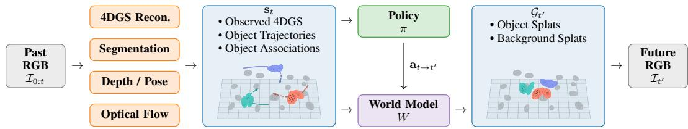
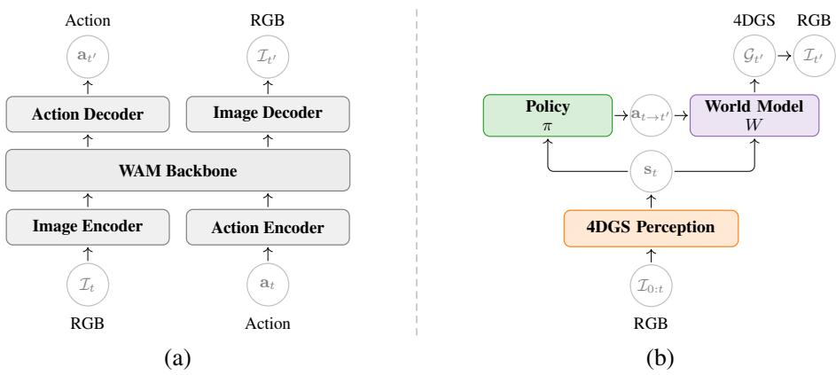
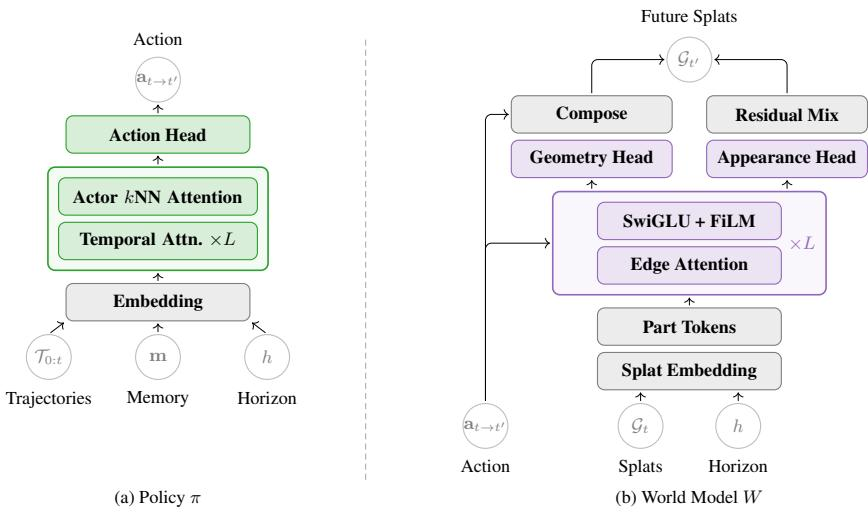
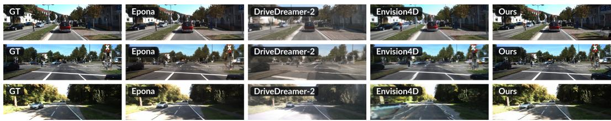
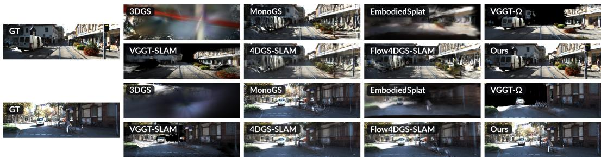

# 4DGS-WAM: BRIDGING PAST AND FUTURE WITH AN OBJECT-CENTRIC WORLD ACTION MODEL BASED ON 4D GAUSSIAN SPLATTING

Yueen Ma The Chinese University of Hong Kong Shanghai Academy of AI for Science mayueen@link.cuhk.edu.hk

Irwin King The Chinese University of Hong Kong king@cse.cuhk.edu.hk

Zenglin Xu   
Fudan University   
Shanghai Academy of AI for Science   
zenglinxu@fudan.edu.cn

## ABSTRACT

Current world action models (WAMs) typically operate on 2D visual data. These models can achieve exceptional visual quality, but they lack explicit spatial structure for individual objects and repeatedly process redundant background content. Although point clouds can represent the world in 3D space, they can be difficult to align and accumulate across viewpoints. In this paper, we leverage an explicit 4D Gaussian Splatting (4DGS) representation that separately models dynamic objects and the static background of a scene. For dynamic objects, we use a policy model to predict future actor actions and a world model to predict transformations of their observed Gaussian splats. The static background need not be regenerated for future states, as much of it has already been observed in past frames. This forms an object-centric world action model, which we name 4DGS-WAM. It lifts 2D observations into a persistent 4D representation so that previously observed static content can be reused during future prediction. Future-state extrapolation can then focus on modeling the evolution of dynamic objects. Experiments on KITTI-MOT evaluate short-horizon prediction and past reconstruction.

## 1 INTRODUCTION

Predicting how the world evolves in response to an agent’s actions is a fundamental capability for embodied AI. World action models (WAMs) (Wang et al., 2026b) aim to equip policies with world-modeling capabilities, enabling embodied agents to reason about the consequences of their actions before taking them in the real world. Recent WAMs have achieved impressive visual fidelity by operating directly on sequences of 2D images (Cen et al., 2025b; Zhang et al., 2025). However, modeling the world entirely in image space presents a fundamental challenge: consecutive frames contain substantial redundant information, particularly in static backgrounds, while the underlying 3D structure and motion of dynamic objects remain implicit. As a result, image-based models must repeatedly generate large portions of the scene that are unchanged or only weakly related to the agent’s actions.

An explicit spatial representation offers a promising alternative. By reconstructing a scene in 4D, a model can associate observations from different viewpoints and represent dynamic scenes persistently rather than regenerating them frame by frame. Point clouds (Huang et al., 2026) provide one such representation, but their sparse and unstructured nature can make dense view synthesis and temporal accumulation difficult, especially under viewpoint changes and object motion.

In this work, we propose 4DGS-WAM, a world action model built on an explicit 4D Gaussian Splatting (4DGS) (Wu et al., 2024) representation. Our central idea is to decompose a dynamic scene into dynamic and static components and model them separately. The dynamic component represents objects whose states evolve over time, while the static component captures persistent background content observed over time. Rather than predicting an entire future image, we use a policy model to predict the future actions of dynamic objects and a world model to predict the corresponding transformations of their Gaussian splats. Because much of the background visible in future observations has already been observed in previous frames, it need not be reconstructed from scratch at every predicted time step. We then compose the extrapolated dynamic component with the accumulated static component to represent the future scene.

  
Figure 1: Architecture of 4DGS-WAM. Past RGB frames $\mathcal { T } _ { 0 : t }$ are processed by a 4DGS reconstruction module and vision foundation models for segmentation, depth, camera pose, and optical flow. Policy π predicts target-horizon SE(3) actions $\widehat { \mathbf { a } } _ { t  t ^ { \prime } }$ , which condition W to produce the future 4DGS state for rendering.

To achieve dynamic–static decomposition, we leverage a suite of vision foundation models (VFMs) (Awais et al., 2025) for segmentation, depth estimation, and camera pose estimation. These estimates allow us to lift observations into a common world coordinate system and track the motion of individual objects over time. We further use an optical-flow VFM to provide pixel-level motion cues, enabling the modeling of non-rigid object transformations. In contrast to prior WAMs built on multimodal large language model (MLLM) backbones (Cen et al., 2025b; Wang et al., 2026c), 4DGS-WAM adopts a fundamentally different framework: a policy network and a world model operating on top of the perceived 4DGS representation. The policy network takes object-centric trajectories and a queried horizon h and predicts target-horizon actor actions. Conditioned on these actions and the same h, the world model predicts transformations of the Gaussian splats associated with each object. This object-centric formulation grounds world action modeling in the explicit spatial structure of the scene.

We apply 4DGS-WAM to autonomous driving tasks. On the KITTI-MOT (Geiger et al., 2012) benchmark, rendering the accumulated 4DGS state from observed camera views achieves higher reported full-frame metrics than 3DGS (Kerbl et al., 2023), point-cloud methods, and other 4DGS baselines. For future extrapolation, we compare 4DGS-WAM against video- and 4DGS-based world models. A future application of 4DGS-WAM is robot manipulation, where the model must handle more challenging physical interactions, such as object collisions and deformable objects.

In summary, our contributions are:

• We introduce 4DGS-WAM, a 4D Gaussian Splatting-based world action model that explicitly decomposes dynamic scenes into static and dynamic components.

• We propose a WAM framework in which policy and world models operate on object trajectories and Gaussians derived from a scene-level 4DGS state, distinct from prior multimodal LLM-based WAMs.

• We evaluate 4DGS-WAM on an autonomous driving benchmark, KITTI-MOT, comparing future prediction with video- and 4DGS-based world models and reconstruction with 3D and 4D mapping methods.

## 2 RELATED WORK

World action models. Recent world action models (Wang et al., 2026b) primarily use imageor video-based representations. WorldVLA (Cen et al., 2025b) and RynnVLA-002 (Cen et al.,

  
Figure 2: World action model comparison. (a) Representative autoregressive WAMs. Image and action tokens are predicted jointly in a unified model. (b) 4DGS-WAM. Our model maintains a decomposed, renderable 4D Gaussian state: the static bank persists while policy-conditioned world dynamics transport only dynamic object splats.

2025a) jointly model future images and actions in unified autoregressive frameworks, while Uni-VLA (Wang et al., 2026c) incorporates world modeling into a token-based vision-language-action model. DreamZero (Ye et al., 2026) jointly generates future video and actions using video diffusion. In driving, GAIA-1 (Hu et al., 2023), DriveDreamer-2 (Zhao et al., 2025b), and Epona (Zhang et al., 2025) generate future driving video, with Epona additionally modeling future trajectories. PointWorld (Huang et al., 2026) instead predicts action-conditioned 3D point flows. In contrast, 4DGS-WAM maintains a renderable 4D Gaussian state with an explicit static–dynamic decomposition and applies a time-conditioned policy to object trajectories and a world model to object Gaussians.

4D Gaussian Splatting. 3D Gaussian Splatting (3DGS) (Kerbl et al., 2023) provides an explicit and efficient radiance-field representation for static scenes. 4DGS-SLAM (Li et al., 2025) and Flow4DGS-SLAM (Wang & Lee, 2026) extend Gaussian splatting to dynamic SLAM, but do not model action-conditioned future states. NeoVerse (Yang et al., 2026) performs pose-free, feedforward 4D reconstruction from monocular video and supports novel-trajectory video generation. DriveDreamer4D (Zhao et al., 2025a) uses a video world model to synthesize novel-trajectory driving videos and then optimizes 4DGS using aligned real and synthetic views, rather than directly predicting future 4DGS states. Envision4D (Song et al., 2026) performs feed-forward 4DGS future extrapolation for driving, but is neither object-centric nor action-conditioned and does not decompose persistent static and evolving dynamic content.

Vision foundation models. Vision foundation models (Awais et al., 2025) provide complementary object-centric cues for our method. SAM 3 (Carion et al., 2026) supplies segmentation masks and object identities over time, while DA3 (Lin et al., 2026) estimates dense depth maps; VGGT (Wang et al., 2025) and VGGT-Ω (Wang et al., 2026a) additionally recover camera geometry. WAFT (Wang & Deng, 2026) estimates consecutive-frame optical flow. D4RT (Zhang et al., 2026) is a unified alternative for dynamic 4D reconstruction and tracking.

## 3 METHOD

4DGS-WAM first reconstructs past observations into an object-centric 4DGS state, then uses a time-conditioned policy and a time- and action-conditioned world model to extrapolate that state and render future observations, as illustrated in Figure 1.

  
Figure 3: Architectures of the policy network and the world model. (a) Policy network π. Each actor trajectory is augmented with a learned memory token m and a horizon embedding of the queried $h ,$ and the resulting sequences are processed by stacked temporal-attention layers followed by actor-level kNN attention. The action head reads m and predicts a target-horizon SE(3) action. (b) World model W. Conditioned on the same h and the predicted action, splat embeddings and category-specific part tokens are processed by stacked geometric tensor layers. Residual $\operatorname { S E } ( 3 )$ twists predicted at the part nodes are blended onto splats, and the resulting transformations are composed with the object action; source appearance attributes are updated through residual mixing.

## 3.1 PAST PERCEPTION

Given past RGB frames $\mathcal { T } _ { 0 : t }$ , a 4DGS reconstructor (Yang et al., 2026) produces $N$ Gaussian primitives:

$$
\mathcal { G } _ { 0 : t } = \big \{ \big ( \mu _ { i } , r _ { i } , s c _ { i } , \alpha _ { i } , s h _ { i } , \tau _ { i } , \xi _ { i } ^ { + } , \xi _ { i } ^ { - } \big ) \big \} _ { i = 1 } ^ { N } ,\tag{1}
$$

where each primitive contains the standard 3DGS attributes—mean position $\mu _ { i } .$ , rotation $\mathbf { \mathit { r } } _ { i } ,$ scale $s c _ { i }$ opacity $\alpha _ { i }$ , and spherical-harmonic appearance coefficients shi—together with a temporal lifespan $\dot { \tau _ { i } } = \dot { ( } \tau _ { i } ^ { \mathrm { s t a r t } } , \tau _ { i } ^ { \mathrm { e n d } } )$ and forward and backward motion twists $\xi _ { i } ^ { + }$ and ${ \pmb { \xi } } _ { i } ^ { - }$ . These twists characterize each Gaussian’s reconstructed trajectory over its lifespan within the observed frames. We denote by $\mathcal { G } _ { t }$ the active Gaussian snapshot obtained by evaluating $\mathcal { G } _ { 0 : t }$ at time t.

Vision foundation models. 4DGS reconstruction alone lacks object-centric information and therefore cannot distinguish dynamic objects from the static background. We use vision foundation models (VFMs) to estimate segmentation, optical flow, depth, and camera poses. Segmentation provides an object mask $\mathcal { M } _ { n } ^ { ( o ) }$ , defined as the set of pixels $p$ belonging to object o at time n. These masks support object tracking, while optical flow supplies pixel-level motion cues. We use depth maps and camera poses to lift these image-level estimates into 3D object trajectories and world-space 3D flow correspondences in a common coordinate frame. For each dynamic object $o \in { \mathcal { O } } _ { t }$ , we denote its object-center trajectory up to time t and its 3D flow correspondences from time t to a target time $t ^ { \prime }$ by

$$
\mathcal { T } _ { 0 : t } ^ { ( o ) } = \{ \mathbf { c } _ { n } ^ { ( o ) } \in \mathbb { R } ^ { 3 } \} _ { n = 0 } ^ { t } , \qquad \mathcal { F } _ { t  t ^ { \prime } } ^ { ( o ) } = \bigl \{ \bigl ( \mathbf { x } _ { j } , \mathbf { f } _ { j } \bigr ) \bigl \} _ { j \in \mathcal { I } _ { t  t ^ { \prime } } ^ { ( o ) } } ,\tag{2}
$$

where $\mathbf { c } _ { n } ^ { ( o ) }$ is the center of object $o , \mathbf { x } _ { j }$ is the world-space source position of a matched splat-associated surface point at time $t ,$ and $\mathbf { f } _ { j }$ is its measured world-space displacement to time $t ^ { \prime }$ . Object centers and flow correspondences are lifted using segmentation masks, optical flow, depth, and camera poses. During training, target-time masks, centers, and correspondences are extracted from available future observations; at inference, no target-time quantities are used. The masks at time t associate active Gaussians with dynamic objects, yielding $\{ \mathcal { G } _ { t } ^ { ( o ) } \} _ { o \in \mathcal { O } _ { t } }$ , while the remaining Gaussians form $\mathcal { G } _ { \mathrm { s t a t i c } }$ We define the abstract state $\mathbf { s } _ { t }$ as the reconstructed 4DGS, its object associations, and the objectcenter trajectories. The object trajectories are provided to the policy, while the flow correspondences supervise the world model.

## 3.2 FUTURE PREDICTION

Policy. A time-conditioned policy network $\pi ( \mathbf { s } _ { t } , h )$ predicts actor motions for a queried future time $t ^ { \prime } = t + h$ , where $h > 0$ is the prediction horizon. Let $\mathcal { A } _ { t } = \mathcal { O } _ { t } \cup \{ \mathrm { e g o } \}$ denote the policy’s actor set. The policy receives the center trajectories of these actors and outputs one six-vector target-horizon action $\widehat { \mathbf { a } } _ { t  t ^ { \prime } } ^ { ( o ) } \in \mathbb { R } ^ { 6 }$ per actor. For any queried $h ,$ including $h > 1$ , this action is obtained in a single policy evaluation of the observed prefix, without autoregressive prediction of intermediate actions. The policy produces

$$
\{ \widehat { \mathbf { a } } _ { t  t ^ { \prime } } ^ { ( o ) } \} _ { o \in \mathcal { A } _ { t } } = \pi ( \{ T _ { 0 : t } ^ { ( o ) } \} _ { o \in \mathcal { A } _ { t } } , h ) .\tag{3}
$$

Because the ego camera is mounted on the ego vehicle, π includes the ego trajectory in its actor set; its predicted action determines the future camera pose. As shown in Figure 3, we append a learned memory token m to each actor trajectory and add a horizon embedding to every token. The resulting sequences are processed by L causal temporal-attention blocks (Vaswani et al., 2017), allowing each memory token to attend to its full trajectory while preventing trajectory tokens from attending to it. Actor-level kNN attention then enables interactions among nearby actors. The action head reads only from the corresponding memory token.

We train the policy with Charbonnier regression (Charbonnier et al., 1994):

$$
\mathcal { L } _ { \pi } = \frac { 1 } { \lvert A _ { t } \rvert } \sum _ { o \in A _ { t } } \rho _ { \pi } \Bigl ( \widehat { \mathbf { a } } _ { t  t ^ { \prime } } ^ { ( o ) } - { \mathbf { a } } _ { t  t ^ { \prime } } ^ { ( o ) } \Bigr ) , \qquad \rho _ { \pi } ( \mathbf { z } ) = \sqrt { \sum _ { d } z _ { d } ^ { 2 } + \epsilon ^ { 2 } } .\tag{4}
$$

Here, $\mathbf { a } _ { t  t ^ { \prime } } ^ { ( o ) }$ is the teacher target-horizon action. Details of the action representation and exact objective are provided in App. A.

World model. A time- and action-conditioned world model W predicts the future Gaussian state at prediction horizon h. Given target-horizon actions, W operates on the observed, object-associated Gaussian snapshot $\mathcal { G } _ { t } ;$ we omit the association metadata in the notation below. Because the representation is 4DGS, the perceived Gaussians support novel-view synthesis. For the static background $\mathcal { G } _ { \mathrm { s t a t i c } } .$ we aggregate past multi-view observations and render it at the target camera pose. For each dynamic object, conditioned on $\mathbf { a } _ { t  t ^ { \prime } } ^ { ( o ) } , W$ predicts residual SE(3) twists on its category-specific part tokens, blends these twists onto the object’s splats, and composes the resulting transformations with the supplied action. These operations update Gaussian means and orientations and apply a residual appearance update. Writing $\mathbf { a } _ { t  t ^ { \prime } } = \{ \mathbf { a } _ { t  t ^ { \prime } } ^ { ( o ) } \} _ { o \in \mathcal { O } _ { t } }$ , the state transition is

$$
\begin{array} { l } { \widehat { \mathcal { G } } _ { t ^ { \prime } } = W ( \mathbf { s } _ { t } , \mathbf { a } _ { t  t ^ { \prime } } , h ) = W ( \mathcal { G } _ { t } , \mathbf { a } _ { t  t ^ { \prime } } , h ) = W ( ( \bigcup _ { o \in \mathcal { O } _ { t } } \mathcal { G } _ { t } ^ { ( o ) } ) \cup \mathcal { G } _ { \mathrm { s t a t i c } } , \mathbf { a } _ { t  t ^ { \prime } } , h ) } \\ { = ( \bigcup _ { o \in \mathcal { O } _ { t } } W \Big ( \mathcal { G } _ { t } ^ { ( o ) } , \mathbf { a } _ { t  t ^ { \prime } } ^ { ( o ) } , h \Big ) ) \cup \mathcal { G } _ { \mathrm { s t a t i c } } = ( \bigcup _ { o \in \mathcal { O } _ { t } } \widehat { \mathcal { G } } _ { t ^ { \prime } } ^ { ( o ) } ) \cup \mathcal { G } _ { \mathrm { s t a t i c } } . } \end{array}\tag{5}
$$

Rendering $\widehat { \mathcal { G } } _ { t } ,$ ′ from the target camera pose yields the future observation $\widehat { \cal T } _ { t ^ { \prime } }$ . During training, we condition $W$ on teacher actions $\mathbf { a } _ { t  t ^ { \prime } }$ and horizon $h ;$ at inference, we use policy predictions $\widehat { \mathbf { a } } _ { t  t ^ { \prime } }$ . This per-object factorization omits inter-object interactions in W and therefore cannot model collisions. As shown in Figure 3, W is a GotenNet-style geometric tensor network (Aykent & Xia, 2025) operating over splats and part tokens. Architectural details, including category-specific part-token construction, are provided in App. A.

We supervise geometry with 3D flow transport and appearance with masked photometry:

$$
\begin{array} { r l r } {  { \mathcal { L } _ { W } = \mathcal { L } _ { \mathrm { t r a n s p o r t } } + \lambda _ { \mathrm { p h o t o } } \mathcal { L } _ { \mathrm { p h o t o } } , } } \\ & { } & \\ & { } & { \mathcal { L } _ { \mathrm { t r a n s p o r t } } = \mathcal { L } _ { \mathrm { s p l a t } } + \mathcal { L } _ { \mathrm { c e n t e r } } } \\ & { } & { = \mathbb { E } _ { \mathrm { \Lambda } _ { \rho \in \mathcal { O } _ { t } } } \ \rho _ { W } ( \widehat { \mathbf { x } } _ { j } - \mathbf { x } _ { j } - \mathbf { f } _ { j } ) + \mathbb { E } _ { o \in \mathcal { O } _ { t } } \rho _ { W } ( \operatorname* { m e a n } _ { j \in \mathcal { T } _ { t  t ^ { \prime } } ^ { ( o ) } } ( \widehat { \mathbf { x } } _ { j } - \mathbf { x } _ { j } ) - \mathbf { t } ( \mathbf { a } _ { t  t ^ { \prime } } ^ { ( o ) } ) ) , } \\ & { } & { \mathcal { L } _ { \mathrm { f e } \mathcal { I } _ { t  t ^ { \prime } } ^ { ( o ) } } } \\ & { } & { \mathcal { L } _ { \mathrm { p h o t o } } = \mathbb { E } _ { o \in \mathcal { O } _ { t } , p \in \mathcal { M } _ { t ^ { \prime } } ^ { ( o ) } }  \widehat { \mathcal { L } } _ { t ^ { \prime } } ( p ) - \mathcal { L } _ { t ^ { \prime } } ( p )  _ { 1 } , \qquad \rho _ { W } ( \mathbf { z } ) = \sum _ { d } \sqrt { z _ { d } ^ { 2 } + \epsilon ^ { 2 } } . } \end{array}\tag{6}
$$

Table 1: Future prediction on KITTI-MOT. Mean±std over the three sequence-level means at horizons h=1, 3 (6 frames per method). Every method is scored on the same prefixes and target frames. The best given-camera result in each column is bold; predicted-camera rows are not eligible for this mark. †DriveDreamer-2 uses KITTI-adapted conditioning in place of its native nuScenes inputs.
<table><tr><td>Method</td><td>Camera</td><td>PSNR↑</td><td>SSIM↑</td><td>LPIPS↓</td></tr><tr><td>Epona</td><td>given</td><td>17.46±1.21</td><td> $0 . 4 8 2 { \pm } 0 . 0 5 4$ </td><td> $0 . 2 0 3 { \pm } 0 . 0 2 1$ </td></tr><tr><td>DriveDreamer-2</td><td>given†</td><td>13.73±2.67</td><td> $0 . 3 6 0 { \scriptstyle \pm 0 . 0 8 2 }$ </td><td> $0 . 4 2 6 { \pm } 0 . 0 6 4$ </td></tr><tr><td>Envision4D</td><td>predicted</td><td>17.19±0.65</td><td> $0 . 5 1 4 { \pm } 0 . 0 7 2$ </td><td> $0 . 3 0 7 { \scriptstyle \pm 0 . 0 6 9 }$ </td></tr><tr><td>4DGS-WAM (policy)</td><td>given</td><td>18.80±1.21</td><td> $\mathbf { 0 . 5 9 6 { \scriptstyle \pm 0 . 0 9 1 } }$ </td><td> $\mathbf { 0 . 1 6 1 { \pm } 0 . 0 4 2 }$ </td></tr><tr><td>4DGS-WAM (policy)</td><td>predicted</td><td> $1 6 . 4 7 { \pm } 3 . 0 5$ </td><td> $0 . 4 8 2 { \pm } 0 . 0 3 3$ </td><td> $0 . 2 4 5 { \pm } 0 . 1 0 7$ </td></tr></table>

Here, $\widehat { \mathbf { x } } _ { j }$ is the predicted destination of the source point $\mathbf { x } _ { j }$ , and $\mathbf { t } ( \mathbf { a } )$ extracts an action’s translation. The splat term matches predicted point displacements to measured 3D flow, while the center term matches their average predicted displacement to the supplied target-horizon teacher translation. The photometric term is an $\ell _ { 1 }$ error within the target-time segmentation mask $\mathcal { M } _ { t ^ { \prime } } ^ { ( o ) }$ . Unlike $\rho _ { \pi }$ , which applies a joint Charbonnier penalty to the full action residual, $\rho _ { W }$ applies Charbonnier penalties independently to each coordinate. Optimizer settings and loss weights are given in Sec. 4.1; remaining training details are provided in App. A.4.

## 4 EXPERIMENTS

We evaluate 4DGS-WAM on the KITTI-MOT (Geiger et al., 2012) benchmark for two tasks: futureobservation prediction and past reconstruction of observed frames. Figures 4–5 show qualitative examples.

## 4.1 IMPLEMENTATION DETAILS

We train π and W separately. The policy is a width-96 transformer with $L { = } 3$ temporal-attention blocks; the world model is a width-128 geometric tensor network with L=4 layers. The policy uses AdamW (Loshchilov & Hutter, 2019) with learning rate $3 \times 1 0 ^ { - 4 }$ , batch size 16, and 40 epochs, with 1.5 epochs of linear warmup, cosine decay to 0.1 times the peak rate, and gradient clipping at 5. The world model uses Adam (Kingma & Ba, 2015) with learning rate $\mathrm { { \bar { 3 } } } \times 1 0 ^ { - 5 }$ on both geometry and appearance, batch size $^ { 4 , }$ and 10 epochs, with cosine decay and the same gradient clip. Instantiating (6), we weight $\mathcal { L } _ { \mathrm { p h o t o } } , \mathcal { L } _ { \mathrm { s p l a t } }$ , and $\mathcal { L } _ { \mathrm { c e n t e r } }$ by 1, 0.5, and 0.5, add a missing-alpha penalty with total weight 0.2, and add a geometry-parameter $\ell _ { 2 }$ anchor of weight 0.05.

## 4.2 FUTURE PREDICTION

We compare our future RGB predictions (Sec. 3.2) with Epona (Zhang et al., 2025), DriveDreamer-2 (Zhao et al., 2025b), and Envision4D (Song et al., 2026). All methods receive the same observed prefixes. Epona and DriveDreamer-2 synthesize a future video frame and are scored at the given future camera; DriveDreamer-2 uses KITTI-adapted conditioning in place of its native nuScenes inputs. Envision4D jointly predicts appearance and camera and is scored at that predicted camera. For 4DGS-WAM, π predicts target-horizon actions and W applies them to the observed dynamic Gaussians; both models are conditioned on h. We report the same $\pi { \to } W$ prediction at the given future pose and at the ego camera predicted by π. The 4DGS-WAM renders composite predicted splats over a frozen NeoVerse fusion underlay that fills remaining uncovered pixels; the baselines are scored on their native outputs. Table 1 lists PSNR, SSIM (Wang et al., 2004), and LPIPS (Zhang et al., 2018).

At the given camera, policy-fed 4DGS-WAM leads the video baselines on all three metrics. At the predicted ego camera, the same prediction trails Envision4D, which models both content and camera.

Table 2: Past reconstruction of observed frames on KITTI-MOT. Mean±std over three sequences. The 4DGS-WAM full-frame scores use a frozen NeoVerse fusion underlay; other methods are scored on their native outputs. Its dynamic-region scores come from the corresponding no-fusion evaluation.
<table><tr><td>Method</td><td>PSNR↑</td><td>SSIM↑</td><td>LPIPS↓</td><td>dyn-PSNR↑</td><td>dyn-LPIPS↓</td></tr><tr><td colspan="6">Point Cloud Reconstruction</td></tr><tr><td>VGGT-Ω</td><td>6.66±0.17</td><td>0.046±0.017</td><td>0.861±0.038</td><td></td><td></td></tr><tr><td>VGGT-SLAM</td><td>6.64±0.39</td><td>0.105±0.051</td><td>0.746±0.070</td><td></td><td></td></tr><tr><td colspan="6">3DGS Reconstruction</td></tr><tr><td>3DGS</td><td>14.54±2.14</td><td>0.477±0.087</td><td>0.525±0.156</td><td>12.83±3.72</td><td>0.504±0.142</td></tr><tr><td>MonoGS</td><td>20.42±5.55</td><td>0.652±0.225</td><td>0.236±0.177</td><td>15.51±5.12</td><td>0.224±0.159</td></tr><tr><td>EmbodiedSplat</td><td>13.81±1.23</td><td>0.447±0.120</td><td>0.407±0.099</td><td>12.23±0.05</td><td>0.411±0.043</td></tr><tr><td colspan="6">4DGS Reconstruction</td></tr><tr><td>4DGS-SLAM</td><td>12.09±1.11</td><td>0.446±0.130</td><td>0.462±0.110</td><td>12.38±2.66</td><td>0.361±0.093</td></tr><tr><td>Flow4DGS-SLAM</td><td>12.69±0.86</td><td>0.502±0.113</td><td>0.400±0.144</td><td>12.91±3.10</td><td>0.282±0.100</td></tr><tr><td>4DGS-WAM</td><td>27.63±2.07</td><td>0.888±0.030</td><td>0.053±0.012</td><td>25.53±3.58</td><td>0.025±0.006</td></tr></table>

## 4.3 PAST RECONSTRUCTION

We compare past reconstructions of the observed prefix (Sec. 3.1), rendered at the given past cameras and scored only on those input views, not mixed with the future-prediction evaluation. Point-cloud baselines are VGGT-Ω (Wang et al., 2026a) and VGGT-SLAM (Maggio et al., 2025); 3DGS baselines are 3DGS (Kerbl et al., 2023), MonoGS (Matsuki et al., 2024), and EmbodiedSplat (Chhablani et al., 2025); 4DGS baselines are 4DGS-SLAM (Li et al., 2025) and Flow4DGS-SLAM (Wang & Lee, 2026). 4DGS-WAM merges per-frame static leftovers and dynamic object splats and fills remaining uncovered pixels with a frozen NeoVerse fusion underlay. Table 2 lists PSNR, SSIM, LPIPS, and scores in dynamic-object regions.

4DGS-WAM has the highest reported full-frame and dynamic-region metrics in Table 2. Among   
3DGS methods, MonoGS is the strongest baseline.

## 4.4 QUALITATIVE RESULTS

We visualize KITTI-MOT scenes for future prediction (Figure 4) and past reconstruction (Figure 5). Panels share the native image aspect ratio; outputs produced on a different canvas are resized to that geometry only for display.

For future prediction, each method produces a future RGB frame from the same observed prefix. Epona and DriveDreamer-2 synthesize that frame as video and are shown at the given future camera. Envision4D jointly predicts future appearance and the ego camera. For 4DGS-WAM, the predicted ego action sets the render camera so that the panel matches Envision4D’s predicted-camera setting. Its frozen fusion underlay fills remaining uncovered pixels; the static background is reconstructed from the observed prefix rather than newly generated.

For past reconstruction, every method maps only the observed prefix and is rendered at the given past camera, never mixed with future-prediction views. 3DGS, MonoGS, and EmbodiedSplat optimize a Gaussian scene on those input views. VGGT-Ω and VGGT-SLAM lift a point cloud that we project into the same camera; uncovered pixels stay empty. 4DGS-SLAM and Flow4DGS-SLAM run dynamic Gaussian mapping on the prefix. 4DGS-WAM shows the merged static-and-dynamic 4DGS that serves as the world-model state, together with its frozen fusion underlay, rendered at the same given camera.

Figure 4: Future prediction on KITTI-MOT scenes. The three rows use horizons h=1, h=2, and h=1, respectively. Left to right: ground truth, Epona, DriveDreamer-2, Envision4D, and policy-fed 4DGS-WAM. Epona and DriveDreamer-2 use the given future camera; Envision4D and 4DGS-WAM use their predicted cameras. The 4DGS-WAM panels include the frozen fusion underlay described in the text.  
  
Figure 5: Past reconstruction on KITTI-MOT scenes. Left: ground truth. Right: 3DGS, MonoGS, EmbodiedSplat, and VGGT-Ω (upper row); VGGT-SLAM, 4DGS-SLAM, Flow4DGS-SLAM, and 4DGS-WAM (lower row). The 4DGS-WAM panel shows its merged static–dynamic reconstruction with the frozen fusion underlay.

## 5 CONCLUSION

We presented 4DGS-WAM, an object-centric world action model on an explicit 4D Gaussian Splatting state. Past observations are reconstructed into static background and dynamic object Gaussians; a time-conditioned policy predicts SE(3) actor actions, including ego motion, and a time- and action-conditioned world model transports only the dynamic splats from the observed Gaussians, leaving the accumulated background in place. On KITTI-MOT, our merged reconstruction obtains the highest reported full-frame and dynamic-region metrics. Policy-fed short-horizon prediction leads the evaluated video world models at a given camera. By lifting 2D observations into a persistent 4D representation, 4DGS-WAM reuses reconstructed static content and extrapolates the future through the evolution of dynamic objects.

## 6 LIMITATIONS AND FUTURE WORK

The world model factorizes per object and therefore assumes that objects do not collide and cannot instantiate objects that appear after time t. The current 4DGS state also has no shape-completion module for unobserved sides of an object, such as the back of a vehicle seen only from the ego camera. These approximations suit the non-contact driving examples studied here, but they are insufficient for robot manipulation, where contact and other inter-object interactions must be modeled. Handling deformable objects, which would support more diverse manipulation tasks in embodied AI, may require more sophisticated 4DGS representations. 4DGS-WAM also depends on a suite of vision foundation models, so perception errors can propagate into the reconstructed state and predicted dynamics. The static bank preserves observed content but cannot synthesize newly revealed background regions. Our quantitative 4DGS-WAM renders therefore use a frozen fusion underlay for remaining uncovered pixels, whereas baselines are scored on their native outputs. Prediction is evaluated only at short horizons; longer-horizon rollout remains open. A unified end-to-end model is left to future work. Finally, 4DGS is only one possible 4D representation: the same object-centric WAM could be instantiated on voxel grids, meshes, or other 4D scene encodings.

## REFERENCES

Muhammad Awais, Muzammal Naseer, Salman Khan, Rao Muhammad Anwer, Hisham Cholakkal, Mubarak Shah, Ming-Hsuan Yang, and Fahad Shahbaz Khan. Foundation models defining a new era in vision: A survey and outlook. IEEE TPAMI, 47(4):2245–2264, 2025.

Sarp Aykent and Tian Xia. GotenNet: Rethinking efficient 3D equivariant graph neural networks. In ICLR, 2025.

Nicolas Carion, Laura Gustafson, Yuan-Ting Hu, Shoubhik Debnath, Ronghang Hu, Didac Suris Coll-Vinent, Chaitanya Ryali, Kalyan Vasudev Alwala, Haitham Khedr, Andrew Huang, Jie Lei, Tengyu Ma, Baishan Guo, Arpit Kalla, Markus Marks, Joseph Greer, Meng Wang, Peize Sun, Roman Radle, Triantafyllos Afouras, Effrosyni Mavroudi, Katherine Xu, Tsung-Han Wu, Yu Zhou,¨ Liliane Momeni, Rishi Hazra, Shuangrui Ding, Sagar Vaze, Francois Porcher, Feng Li, Siyuan Li, Aishwarya Kamath, Ho Kei Cheng, Piotr Dollar, Nikhila Ravi, Kate Saenko, Pengchuan Zhang,´ and Christoph Feichtenhofer. SAM 3: Segment anything with concepts. In ICLR, 2026.

Jun Cen, Siteng Huang, Yuqian Yuan, Kehan Li, Hangjie Yuan, Chaohui Yu, Bohan Hou, Yuming Jiang, Jiayan Guo, Xin Li, Hao Luo, Fan Wang, Deli Zhao, and Hao Chen. RynnVLA-002: A unified vision-language-action and world model. arXiv preprint arXiv:2511.17502, 2025a.

Jun Cen, Chaohui Yu, Hangjie Yuan, Yuming Jiang, Siteng Huang, Jiayan Guo, Xin Li, Yibing Song, Hao Luo, Fan Wang, Deli Zhao, and Hao Chen. WorldVLA: Towards autoregressive action world model. arXiv preprint arXiv:2506.21539, 2025b.

Pierre Charbonnier, Laure Blanc-Feraud, Gilles Aubert, and Michel Barlaud. Two deterministic´ half-quadratic regularization algorithms for computed imaging. In ICIP, volume 2, pp. 168–172, 1994.

Gunjan Chhablani, Xiaomeng Ye, Muhammad Zubair Irshad, and Zsolt Kira. EmbodiedSplat: Personalized real-to-sim-to-real navigation with gaussian splats from a mobile device. In ICCV, pp. 25431–25441, 2025.

Andreas Geiger, Philip Lenz, and Raquel Urtasun. Are we ready for autonomous driving? The KITTI vision benchmark suite. In CVPR, pp. 3354–3361, 2012.

Anthony Hu, Lloyd Russell, Hudson Yeo, Zak Murez, George Fedoseev, Alex Kendall, Jamie Shotton, and Gianluca Corrado. GAIA-1: A generative world model for autonomous driving. arXiv preprint arXiv:2309.17080, 2023.

Wenlong Huang, Yu-Wei Chao, Arsalan Mousavian, Ming-Yu Liu, Dieter Fox, Kaichun Mo, and Li Fei-Fei. PointWorld: Scaling 3D world models for in-the-wild robotic manipulation. In CVPR, pp. 20765–20779, 2026.

Bernhard Kerbl, Georgios Kopanas, Thomas Leimkuhler, and George Drettakis. 3D gaussian splatting¨ for real-time radiance field rendering. ACM TOG, 42(4):139:1–139:14, 2023.

Diederik P. Kingma and Jimmy Ba. Adam: A method for stochastic optimization. In ICLR, 2015.

Yanyan Li, Youxu Fang, Zunjie Zhu, Kunyi Li, Yong Ding, and Federico Tombari. 4D gaussian splatting SLAM. In ICCV, pp. 25019–25028, 2025.

Haotong Lin, Sili Chen, Jun Hao Liew, Donny Y. Chen, Zhenyu Li, Yang Zhao, Sida Peng, Hengkai Guo, Xiaowei Zhou, Guang Shi, Jiashi Feng, and Bingyi Kang. Depth Anything 3: Recovering the visual space from any views. In ICLR, 2026.

Ilya Loshchilov and Frank Hutter. Decoupled weight decay regularization. In ICLR, 2019.

Dominic Maggio, Hyungtae Lim, and Luca Carlone. VGGT-SLAM: Dense RGB SLAM optimized on the SL(4) manifold. In NeurIPS, volume 38, pp. 129839–129867, 2025.

Hidenobu Matsuki, Riku Murai, Paul H. J. Kelly, and Andrew J. Davison. Gaussian splatting SLAM. In CVPR, pp. 18039–18048, 2024.

Ethan Perez, Florian Strub, Harm de Vries, Vincent Dumoulin, and Aaron Courville. FiLM: Visual reasoning with a general conditioning layer. In AAAI, pp. 3942–3951, 2018.

Noam Shazeer. GLU variants improve transformer. arXiv preprint arXiv:2002.05202, 2020.

Qi Song, Yifei He, Chi Zhang, Zheng Fu, Xuhe Zhao, Mengmeng Yang, Kun Jiang, Rui Huang, and Diange Yang. Envision4D: Envisioning visual futures via feed-forward 4D gaussian splatting for autonomous driving. arXiv preprint arXiv:2606.10656, 2026.

Ashish Vaswani, Noam Shazeer, Niki Parmar, Jakob Uszkoreit, Llion Jones, Aidan N. Gomez, Lukasz Kaiser, and Illia Polosukhin. Attention is all you need. In NeurIPS, pp. 5998–6008, 2017.

Jianyuan Wang, Minghao Chen, Nikita Karaev, Andrea Vedaldi, Christian Rupprecht, and David Novotny. VGGT: Visual geometry grounded transformer. In CVPR, pp. 5294–5306, 2025.

Jianyuan Wang, Minghao Chen, Shangzhan Zhang, Nikita Karaev, Johannes Schonberger, Patrick¨ Labatut, Piotr Bojanowski, David Novotny, Andrea Vedaldi, and Christian Rupprecht. VGGT-Ω. In CVPR, pp. 21486–21499, 2026a.

Siyin Wang, Junhao Shi, Zhaoyang Fu, Xinzhe He, Feihong Liu, Chenchen Yang, Yikang Zhou, Zhaoye Fei, Jingjing Gong, Jinlan Fu, Mike Zheng Shou, Xuanjing Huang, Xipeng Qiu, and Yu-Gang Jiang. World action models: The next frontier in embodied AI. arXiv preprint arXiv:2605.12090, 2026b.

Yihan Wang and Jia Deng. WAFT: Warping-alone field transforms for optical flow. In ICLR, 2026.

Yunsong Wang and Gim Hee Lee. Flow4DGS-SLAM: Optical flow-guided 4D gaussian splatting SLAM. In CVPR, pp. 33364–33373, 2026.

Yuqi Wang, Xinghang Li, Wenxuan Wang, Junbo Zhang, Yingyan Li, Yuntao Chen, Xinlong Wang, and Zhaoxiang Zhang. Unified vision-language-action model. In ICLR, 2026c.

Zhou Wang, Alan C. Bovik, Hamid R. Sheikh, and Eero P. Simoncelli. Image quality assessment: From error visibility to structural similarity. IEEE TIP, 13(4):600–612, 2004.

Guanjun Wu, Taoran Yi, Jiemin Fang, Lingxi Xie, Xiaopeng Zhang, Wei Wei, Wenyu Liu, Qi Tian, and Xinggang Wang. 4D gaussian splatting for real-time dynamic scene rendering. In CVPR, pp. 20310–20320, 2024.

Yuxue Yang, Lue Fan, Ziqi Shi, Junran Peng, Feng Wang, and Zhaoxiang Zhang. NeoVerse: Enhancing 4D world model with in-the-wild monocular videos. In CVPR, pp. 40340–40351, 2026.

Seonghyeon Ye, Yunhao Ge, Kaiyuan Zheng, Shenyuan Gao, Sihyun Yu, George Kurian, Suneel Indupuru, You Liang Tan, Chuning Zhu, Jiannan Xiang, Ayaan Malik, Kyungmin Lee, William Liang, Nadun Ranawaka, Jiasheng Gu, Yinzhen Xu, Guanzhi Wang, Fengyuan Hu, Avnish Narayan, Johan Bjorck, Jing Wang, Gwanghyun Kim, Dantong Niu, Ruijie Zheng, Yuqi Xie, Jimmy Wu,¨ Qi Wang, Ryan Julian, Danfei Xu, Yilun Du, Yevgen Chebotar, Scott Reed, Jan Kautz, Yuke Zhu, Linxi Fan, and Joel Jang. World action models are zero-shot policies. arXiv preprint arXiv:2602.15922, 2026.

Biao Zhang and Rico Sennrich. Root mean square layer normalization. In NeurIPS, 2019.

Chuhan Zhang, Guillaume Le Moing, Skanda Koppula, Ignacio Rocco, Liliane Momeni, Junyu Xie, Shuyang Sun, Rahul Sukthankar, Joelle K. Barral, Raia Hadsell, Zoubin Ghahramani, Andrew¨ Zisserman, Junlin Zhang, and Mehdi S. M. Sajjadi. Efficiently reconstructing dynamic scenes one D4RT at a time. In CVPR, pp. 7382–7392, 2026.

Kaiwen Zhang, Zhenyu Tang, Xiaotao Hu, Xingang Pan, Xiaoyang Guo, Yuan Liu, Jingwei Huang, Li Yuan, Qian Zhang, Xiao-Xiao Long, Xun Cao, and Wei Yin. Epona: Autoregressive diffusion world model for autonomous driving. In ICCV, pp. 27220–27230, 2025.

Richard Zhang, Phillip Isola, Alexei A. Efros, Eli Shechtman, and Oliver Wang. The unreasonable effectiveness of deep features as a perceptual metric. In CVPR, pp. 586–595, 2018.

Guosheng Zhao, Chaojun Ni, Xiaofeng Wang, Zheng Zhu, Xueyang Zhang, Yida Wang, Guan Huang, Xinze Chen, Boyuan Wang, Youyi Zhang, Wenjun Mei, and Xingang Wang. DriveDreamer4D: World models are effective data machines for 4D driving scene representation. In CVPR, pp. 12015–12026, 2025a.

Guosheng Zhao, Xiaofeng Wang, Zheng Zhu, Xinze Chen, Guan Huang, Xiaoyi Bao, and Xingang Wang. DriveDreamer-2: LLM-enhanced world models for diverse driving video generation. In AAAI, pp. 10412–10420, 2025b.

## A ARCHITECTURE AND TRAINING DETAILS

## A.1 NOTATION

Table 3 collects the notation used in the main text and the implementation details below. Bold lower-case symbols denote vectors, and calligraphic symbols denote sets or structured states.

Table 3: Core notation. The symbols follow the conventions of the main text.
<table><tr><td>Symbol</td><td>Meaning</td></tr><tr><td> $t , t ^ { \prime } , h = t ^ { \prime } - t$ </td><td>Current time, target time, and prediction horizon</td></tr><tr><td> $\mathcal { T } _ { n } , \widehat { \mathcal { T } } _ { t ^ { \prime } }$ </td><td>RGB observation at time n and rendered future prediction</td></tr><tr><td> $\mathcal { G } _ { 0 : t } , \mathcal { G } _ { n } , \widehat { \mathcal { G } } _ { t ^ { \prime } }$ </td><td>Reconstructed 4DGS, active snapshot, and predicted future state</td></tr><tr><td> $\mathcal { G } _ { n } ^ { ( o ) } , \mathcal { G } _ { \mathrm { s t a t i c } }$ </td><td>Object-specific Gaussian subset and static Gaussian bank</td></tr><tr><td> $\mathbf { s } _ { t }$ </td><td>Reconstructed 4DGS, object associations, and center trajectories</td></tr><tr><td> $\mathcal { O } _ { t } , A _ { t }$ </td><td>Dynamic scene objects and policy actors, where  $\mathcal { A } _ { t } = \mathcal { O } _ { t } \cup \{ \mathrm { e g o } \}$ </td></tr><tr><td> $\mathcal { M } _ { n } ^ { ( o ) }$ </td><td>Image mask of object o at time n</td></tr><tr><td> $\mathcal { T } _ { 0 : t } ^ { ( o ) } , \mathbf { c } _ { n } ^ { ( o ) }$ </td><td>Center trajectory and world-space object center</td></tr><tr><td> $\mathcal { F } _ { t  t ^ { \prime } } ^ { ( o ) } , \mathcal { T } _ { t  t ^ { \prime } } ^ { ( o ) }$ </td><td>3D flow correspondences and their index set</td></tr><tr><td></td><td>Gaussian mean position</td></tr><tr><td> $\pmb { \mu } _ { i }$ </td><td></td></tr><tr><td> $\mathbf { x } _ { j } , \widehat { \mathbf { x } } _ { j } , \mathbf { f } _ { j }$ </td><td>Geometry-loss source, predicted destination, and measured displacement</td></tr><tr><td> $r _ { i } , s c _ { i } , \alpha _ { i }$ </td><td>Gaussian rotation, scale, and opacity Spherical-harmonic appearance and displayed RGB color</td></tr><tr><td> $s h _ { i } , \mathbf { r g } \mathbf { b } _ { i }$   $\pmb { \tau } _ { i } , \pmb { \xi } _ { i } ^ { + } , \pmb { \xi } _ { i } ^ { - }$ </td><td>Gaussian lifespan and reconstructed forward/backward motion twists</td></tr><tr><td> $\mathbf { a } _ { t  t ^ { \prime } } ^ { ( o ) } , \widehat { \mathbf { a } } _ { t  t ^ { \prime } } ^ { ( o ) }$ </td><td></td></tr><tr><td> $\pi , W$ </td><td>Teacher and predicted target-horizon actions Policy network and Gaussian world model</td></tr><tr><td> ${ \bf z } _ { n } ^ { ( o ) } , { \bf m }$ </td><td>9-D center-state token and learned policy memory token</td></tr><tr><td> $\mathbf { a } _ { \mathrm { C V } } ^ { ( o ) } , \widehat { \mathbf { u } } _ { t , h } ^ { ( o ) } , \sigma$ </td><td></td></tr><tr><td></td><td>Per-step constant-velocity prior, normalized residual prediction, and residual scales Object confidence and supervised action-dimension mask</td></tr><tr><td> $q _ { o } , \chi _ { o d }$   $g _ { a } = ( R _ { a } , { \bf t } _ { a } ) , \omega _ { a } , \theta , \iota _ { a }$ </td><td>SE(3) action transform, rotation vector, angle, and invariant feature triplet</td></tr><tr><td></td><td></td></tr><tr><td> $\mathbf { y } _ { i } , \mathbf { p } _ { k } , K$ </td><td>Centered splat position, part seed, and number of part tokens</td></tr><tr><td> $\phi _ { i } , \mathbf { V } _ { i }$ </td><td>Invariant scalar features and  $C { \times } 3$  equivariant vector features</td></tr><tr><td> $\mathbf { q } _ { i } , \Delta _ { i j } , d _ { i j } , \mathbf { e } _ { i j } ^ { \ell } , \mathcal { N } ( i )$ </td><td>Graph-node position, edge geometry, invariant feature, and typed neighborhood</td></tr><tr><td> $w _ { i j } ^ { m } , w _ { i k }$ </td><td>Edge-attention weight for head m and splat-to-part assignment</td></tr><tr><td> $\delta _ { k } , \delta _ { i } , g _ { i }$ </td><td>Part residual twist, blended splat residual twist, and composed transform</td></tr><tr><td> $T _ { i j } , \mathbf { \dot { r } g } \mathbf { \check { b } } _ { i }$ </td><td>Local appearance-transport weight and transported source color</td></tr><tr><td> ${ \bf d } _ { i } ^ { \mathrm { r g b } } , d _ { i } ^ { \alpha } , { \bf d } _ { i } ^ { \mathrm { l o g s c } }$ </td><td>Per-splat color, opacity-logit, and log-scale residuals</td></tr><tr><td> $\mathcal { L } _ { \pi } , \mathcal { L } _ { W }$ </td><td>Policy and world-model objectives</td></tr><tr><td> $\mathcal { L } _ { \mathrm { s p l a t } } , \mathcal { L } _ { \mathrm { c e n t e r } } , \mathcal { L } _ { \mathrm { p h o t o } }$ </td><td>Dense-flow, center-transport, and masked-photometric losses</td></tr><tr><td> $\mathcal { L } _ { \mathrm { m i s s } } , \mathcal { L } _ { \mathrm { a n c h o r } }$ </td><td>Missing-alpha penalty and geometry-parameter anchor</td></tr><tr><td> $\rho _ { \pi } , \rho W , \epsilon$ </td><td>Joint and coordinatewise Charbonnier penalties and stabilizer</td></tr></table>

## A.2 POLICY NETWORK

Action convention. The six-vector action order is

$$
\mathbf { a } = ( \Delta x , \Delta y , \Delta z , \mathrm { r o l l } , \mathrm { p i t c h } , \mathrm { y a w } ) .\tag{7}
$$

It maps to translation $\mathbf { t } = ( \Delta x , \Delta y , \Delta z )$ and rotation

$$
R ( { \bf a } ) = R _ { z } ( \mathrm { r o l l } ) R _ { x } ( \mathrm { p i t c h } ) R _ { y } ( \mathrm { y a w } ) .\tag{8}
$$

Thus, when roll and pitch are zero, the convention reduces to planar yaw about the vertical axis.

The action head parameterizes the target-horizon prediction as a bounded residual over a per-step constant-velocity prior:

$$
\widehat { \mathbf { a } } _ { t  t ^ { \prime } } ^ { ( o ) } = \Phi _ { h } ( \mathbf { a } _ { \mathrm { C V } } ^ { ( o ) } + \pmb { \sigma } \odot \operatorname { t a n h } ( \widehat { \mathbf { u } } _ { t , h } ^ { ( o ) } ) ) ,\tag{9}
$$

where

$$
\pmb { \sigma } = ( 0 . 9 0 , 0 . 1 0 , 0 . 9 0 , 0 . 1 0 , 0 . 1 0 , 0 . 2 5 ) .\tag{10}
$$

The first three entries are measured in meters and the last three in radians. The horizon map $\Phi _ { h }$ converts this per-step-equivalent parameterization into the cumulative transform from t to $t ^ { \prime }$ passed to the world model: it scales translation by h and sets $R ( h ) = \exp ( h \log R )$ . Its inverse divides translation by h and uses Exp(Log $R / h )$ . For object supervision, target-horizon translation is obtained from $\mathrm { S A M + D A } 3$ centroid displacement and target-horizon yaw from the tangent-derived heading change; roll and pitch are set to zero and supervised. For ego supervision, the relative camera motion defines the target-horizon action.

Input tokens and attention. For each actor, the policy uses the latest eight center-state observations,

$$
\begin{array} { r } { \mathbf { z } _ { n } ^ { \left( o \right) } = \left[ \mathbf { c } _ { n } ^ { \left( o \right) } ; \mathbf { c } _ { n } ^ { \left( o \right) } - \mathbf { c } _ { n - 1 } ^ { \left( o \right) } ; \nu _ { n } ^ { \left( o \right) } \right] \in \mathbb { R } ^ { 9 } , } \end{array}\tag{11}
$$

where $\nu _ { n } ^ { ( o ) } \in \mathbb { R } ^ { 3 }$ is an optional uncertainty feature and is zero when unavailable. The ego row uses the same token layout, with centers obtained from the camera trajectory.

The 9-D tokens are projected to width 96. A learned projection of the scalar horizon h is added to every history token and to a learned memory token m. Three causal temporal-attention blocks, each with four heads, RMS normalization (Zhang & Sennrich, 2019), and a SwiGLU feed-forward layer (Shazeer, 2020), process the resulting sequence. Because m is appended after the history, it can attend to all valid observations while history tokens cannot attend to it. A 3D kNN interaction layer with $k = 4$ then exchanges information among nearby actors. The normalized memory feature is the sole input to the action head.

## A.3 WORLD MODEL

Part-token construction. For an object with N active splats, let

$$
\mathbf { c } = \frac { 1 } { N } \sum _ { i = 1 } ^ { N } \pmb { \mu } _ { i } , \qquad \mathbf { y } _ { i } = \pmb { \mu } _ { i } - \mathbf { c } .\tag{12}
$$

Farthest-point sampling over $\left\{ \mathbf { y } _ { i } \right\}$ yields K part seeds $\{ \mathbf { p } _ { k } \} _ { k = 1 } ^ { K }$ . We use $K = 1$ for cars, vans, trucks, buses, trains, and unrecognized categories; $K = 3$ for bicycles and motorcycles; and $K = 5$ for people. The $K = 1$ case provides a rigid fallback.

Scalar and vector features. Let $g _ { a } \ = \ ( R _ { a } , \mathbf { t } _ { a } )$ be the transform obtained from the supplied target-horizon action, $\omega _ { a } = \mathrm { L o g } ( R _ { a } )$ , and $\theta = \| \omega _ { a } \| _ { 2 }$ . Define the invariant action feature $\iota _ { a } =$ $[ \theta , \mathsf { \bar { \Pi } } ] | \mathbf { t } _ { a } | | _ { 2 } , h ]$ . Splat and part nodes are initialized as

$$
\phi _ { i } ^ { 0 } = \mathrm { E m b } ( [ \log s c _ { i } ; \mathbf { r g b } _ { i } ; \alpha _ { i } ; h ] ) ,
$$

$$
\mathbf { V } _ { i } ^ { 0 } = \left[ \mathbf { \overline { { { y } } } } _ { i } ^ { \top } \right] ,\tag{13}
$$

$$
\phi _ { k } ^ { 0 } = \mathrm { E m b } \left( \left[ \mathbf { 0 } _ { 3 } ; \mathbf { 0 } _ { 3 } ; 1 ; h \right] \right) ,
$$

$$
\begin{array} { r } { \mathbf { V } _ { k } ^ { 0 } = \left[ \begin{array} { l } { \mathbf { p } _ { k } ^ { \top } } \\ { \mathbf { t } _ { a } ^ { \top } } \\ { \omega _ { a } ^ { \top } } \end{array} \right] . } \end{array}\tag{14}
$$

The three rows of V are equivariant vector channels. Action direction enters these channels directly, while $\pmb { \iota } _ { a }$ conditions each scalar update through FiLM (Perez et al., 2018).

Typed geometric tensor layers. The packed graph contains splat–splat kNN edges with $k = 1 6$ complete splat–part edges in both directions, and a complete part–part graph. For an edge $i  j$ define

$$
\begin{array} { r } { \pmb { \Delta } _ { i j } = \mathbf q _ { j } - \mathbf q _ { i } , \qquad d _ { i j } = \| \pmb { \Delta } _ { i j } \| _ { 2 } , } \end{array}\tag{15}
$$

where q denotes either a centered splat or a part seed. The invariant edge feature is

$$
{ \bf e } _ { i j } ^ { \ell } = \left[ d _ { i j } ; \langle { \bf V } _ { i } ^ { \ell } , { \bf V } _ { j } ^ { \ell } \rangle _ { n } ; \langle { \bf V } _ { i } ^ { \ell } , \Delta _ { i j } \rangle _ { n } ; \langle { \bf V } _ { j } ^ { \ell } , \Delta _ { i j } \rangle _ { n } \right] ,\tag{16}
$$

where $\langle \cdot , \cdot \rangle _ { n }$ is the normalized inner product used by the implementation. For layer ℓ and head m,

$$
\begin{array} { r } { w _ { i j } ^ { \ell , m } = \mathrm { s o f t m a x } _ { j \in \mathcal { N } ( i ) } \mathrm { M L P } _ { \mathrm { a t t n } } ^ { \ell } \Big ( [ \phi _ { i } ^ { \ell } ; \phi _ { j } ^ { \ell } ; \mathbf { e } _ { i j } ^ { \ell } ] \Big ) _ { m } . } \end{array}\tag{17}
$$

The vector update uses learned gates $\mathbf { a } _ { \tau } ^ { \ell , m }$ and $\mathbf { b } _ { \tau } ^ { \ell , m }$ for edge type τ :

$$
\Delta \mathbf { V } _ { i } ^ { \ell } = \sum _ { m } \sum _ { \substack { j \in N ( i ) } } w _ { i j } ^ { \ell , m } \left( \mathbf { a } _ { \tau ( i , j ) } ^ { \ell , m } \odot \Delta _ { i j } + \mathbf { b } _ { \tau ( i , j ) } ^ { \ell , m } \odot \mathbf { V } _ { j } ^ { \ell } \right) .\tag{18}
$$

Attention-weighted edge invariants are pooled across neighbors and heads to form $\mathrm { a g g } _ { i } ^ { \ell }$ . The scalar update is

$$
\phi _ { i } ^ { \ell + 1 } = \phi _ { i } ^ { \ell } + ( 1 + \gamma _ { \ell } ) \odot \mathrm { S w i G L U } _ { \ell } \Big ( [ \mathrm { R M S N o r m } ( \phi _ { i } ^ { \ell } ) ; \mathrm { a g g } _ { i } ^ { \ell } ] \Big ) + \beta _ { \ell } .\tag{19}
$$

The implementation additionally RMS-normalizes vector residuals and uses learned per-layer residual scales. Four such layers are used, with scalar width 128, four attention heads, three vector channels, and dropout 0.05.

Residual motion and composition. Only part nodes decode residual twists:

$$
\begin{array} { r } { \delta _ { k } = 0 . 2 \operatorname { t a n h M L P } _ { \delta } ( [ \phi _ { k } ; \mathrm { v e c } ( \mathbf { V } _ { k } ) ; \mathbf { t } _ { a } ; \boldsymbol { \omega } _ { a } ; \iota _ { a } ; h ] ) . } \end{array}\tag{20}
$$

Thus, the decoder receives h both inside $\iota _ { a }$ and as a separate scalar. The final splat–part attention, averaged over heads, gives $w _ { i k }$ with $\textstyle \sum _ { k } w _ { i k } = 1$ . The default Lie-algebra blend is

$$
\delta _ { i } = \sum _ { k = 1 } ^ { K } w _ { i k } \delta _ { k } , \qquad \Delta g _ { i } = \mathrm { E x p } ( \delta _ { i } ) , \qquad g _ { i } = \Delta g _ { i } \circ g _ { a } .\tag{21}
$$

Writing $g _ { i } = \left( R _ { i } , \mathbf { t } _ { i } \right)$ , the Gaussian update is

$$
\widehat { \pmb { \mu } } _ { i } = \mathbf { c } + R _ { i } \mathbf { y } _ { i } + \mathbf { t } _ { i } ,\tag{22}
$$

and $R _ { i }$ is composed with the source quaternion. The last layer of the twist decoder is initialized to zero, so the initial transformation is exactly the supplied rigid action.

Appearance transport. On the splat kNN graph, local source-color transport uses

$$
T _ { i j } = \mathrm { s o f t m a x } _ { j \in \mathcal { N } ( i ) } \mathrm { M L P } _ { T } \left( \left[ \phi _ { i } ; \phi _ { j } ; d _ { i j } \right] \right) , \qquad \mathrm { \bf { r g h } } _ { i } = \sum _ { j } T _ { i j } \mathrm { \bf { r g b } } _ { j } .\tag{23}
$$

The appearance head predicts bounded gates. Its color residual is

$$
\begin{array} { r } { \mathbf d _ { i } ^ { \mathrm { r g b } } = \operatorname { c l a m p } _ { [ - 0 . 5 , 0 . 5 ] } \left( \lambda _ { i } ^ { \mathrm { r g b } } \odot \mathbf { r g b } _ { i } + \beta _ { i } \left( \mathbf { \widetilde { r g b } } _ { i } - \mathbf { r g b } _ { i } \right) \right) , } \end{array}\tag{24}
$$

where $\lambda _ { i } ^ { \mathrm { r g b } } \in [ - 0 . 5 , 0 . 5 ] ^ { 3 }$ and $\beta _ { i } \in [ - 0 . 5 , 0 . 5 ] $ ; the clamp is componentwise. The head additionally predicts $d _ { i } ^ { \alpha } \in [ - 3 , 3 ]$ and $\mathbf { d } _ { i } ^ { \mathrm { l o g s c } } \in [ - 0 . 2 2 3 , 0 . 2 2 3 ] ^ { 3 }$ . These residuals are applied as

$$
\widehat { \mathbf { r g b } } _ { i } = \mathrm { c l a m p } \left( \mathbf { r g b } _ { i } + \mathbf { d } _ { i } ^ { \mathrm { r g b } } , 0 , 1 \right) , \quad \widehat { \alpha } _ { i } = \mathrm { s i g m o i d } \left( \log \mathrm { i t } \left( \mathrm { c l a m p } ( \alpha _ { i } , 1 0 ^ { - 4 } , 1 - 1 0 ^ { - 4 } ) \right) + d _ { i } ^ { \alpha } \right) ,\tag{25}
$$

$$
\begin{array} { r } { \widehat { \pmb { s c } } _ { i } = \pmb { s c } _ { i } \odot \exp \left( \mathbf { d } _ { i } ^ { \mathrm { l o g s c } } \right) . } \end{array}\tag{26}
$$

The final layers are initialized to zero, making the untrained appearance path an identity update.

## A.4 TRAINING OBJECTIVES

Policy loss. The exact policy objective operates in normalized residual coordinates. Let

$$
\mathbf { u } _ { t , h } ^ { ( o ) } = ( \Phi _ { h } ^ { - 1 } \Big ( \mathbf { a } _ { t  t ^ { \prime } } ^ { ( o ) } \Big ) - \mathbf { a } _ { \mathrm { C V } } ^ { ( o ) } ) \otimes \pmb { \sigma }\tag{27}
$$

be the teacher residual. With dimension mask $\chi _ { o d }$ , confidence $q _ { o }$ , and $\epsilon = 1 0 ^ { - 6 }$ , the per-actor penalty is

$$
\ell _ { \pi } ^ { ( o ) } = \sqrt { \sum _ { d = 1 } ^ { 6 } \chi _ { o d } \left( \operatorname { t a n h } \widehat { u } _ { t , h , d } ^ { ( o ) } - u _ { t , h , d } ^ { ( o ) } \right) ^ { 2 } + \epsilon ^ { 2 } } .\tag{28}
$$

Within each sample, actor losses are averaged with normalized confidence weights; the resulting sample losses are averaged over active samples. This is the normalized implementation of the schematic action-space loss in Equation 4.

World-model geometry losses. For each supervised correspondence, let $q _ { j } \geq 0$ denote its confidence. The dense flow loss is

$$
\mathcal { L } _ { \mathrm { s p l a t } } = \frac { \sum _ { o } \sum _ { j \in \mathcal { I } _ { t  t ^ { \prime } } ^ { ( o ) } } q _ { j } \rho _ { W } ( \widehat { \mathbf { x } } _ { j } - \mathbf { x } _ { j } - \mathbf { f } _ { j } ) } { \sum _ { o } \sum _ { j \in \mathcal { I } _ { t  t ^ { \prime } } ^ { ( o ) } } q _ { j } } , \qquad \rho _ { W } ( \mathbf { z } ) = \sum _ { d = 1 } ^ { 3 } \sqrt { z _ { d } ^ { 2 } + \epsilon ^ { 2 } } .\tag{29}
$$

The center-transport term averages predicted displacements over the same index set $\mathcal { I } _ { t  t } ^ { ( o ) }$ ′ and compares that mean with the translation $\mathbf { t } _ { a } ^ { \left( o \right) }$ of the supplied target-horizon teacher action:

$$
\mathcal { L } _ { \mathrm { c e n t e r } } = \frac { \sum _ { o } q _ { o } \rho _ { W } ( \frac { 1 } { | \mathcal { I } _ { t  t ^ { \prime } } ^ { ( o ) } | } \sum _ { j \in \mathcal { I } _ { t  t ^ { \prime } } ^ { ( o ) } } ( \widehat { \mathbf { x } } _ { j } - \mathbf { x } _ { j } ) - \mathbf { t } _ { a } ^ { ( o ) } ) } { \sum _ { o } q _ { o } } .\tag{30}
$$

Photometric and total loss. The photometric loss is the mean absolute RGB error over ground-truth object masks:

$$
\mathcal { L } _ { \mathrm { p h o t o } } : = \mathbb { E } _ { o , p \in \mathcal { M } _ { t ^ { \prime } } ^ { ( o ) } } \left[ \frac { 1 } { 3 } \left. \widehat { \mathcal { T } } _ { t ^ { \prime } } ( p ) - \mathcal { T } _ { t ^ { \prime } } ( p ) \right. _ { 1 } \right] .\tag{31}
$$

Let $\widehat { \alpha } ^ { ( o ) } ( p )$ be the rendered alpha attribution of object o. The implementation also adds a missingalpha penalty

$$
\mathcal { L } _ { \mathrm { m i s s } } = \mathbb { E } _ { o , p \in \mathcal { M } _ { t ^ { \prime } } ^ { ( o ) } } \left[ 1 - \widehat { \alpha } ^ { ( o ) } ( p ) \right] .\tag{32}
$$

For the multi-horizon examples associated with one observed prefix, the world objective is

$$
\mathcal { L } _ { W } = \mathbb { E } _ { h } [ \mathcal { L } _ { \mathrm { p h o t o } } + 0 . 2 \mathcal { L } _ { \mathrm { m i s s } } + 0 . 5 \mathcal { L } _ { \mathrm { s p l a t } } + 0 . 5 \mathcal { L } _ { \mathrm { c e n t e r } } ] + 0 . 0 5 \mathcal { L } _ { \mathrm { a n c h o r } } ,\tag{33}
$$

where $\begin{array} { r } { \mathcal { L } _ { \mathrm { a n c h o r } } = \sum _ { \vartheta \in \Theta _ { \mathrm { g e o m } } } \| \vartheta - \vartheta _ { 0 } \| _ { 2 } ^ { 2 } } \end{array}$ anchors geometry parameters to their initialization.