# ADAPTIVEEMBED: SAMPLE-ADAPTIVE MULTI-VECTOR REPRESENTATION FOR MULTIMODAL RE-TRIEVAL

Xinze Liu1,2 ∗ Lei Yang1,2 ∗ Dayan Wu1 † Hengjie Zhu1,2 Zihao Zhang1,2 Hanqi Wu1,2 Tianzhu Hu1,2 Peng Fu1 Zheng Lin1 Weiping Wang1

1Institute of Information Engineering, Chinese Academy of Sciences 2School of Cyber Security, University of Chinese Academy of Sciences {liuxinze,wudayan}@iie.ac.cn

## ABSTRACT

Multi-vector representations have emerged as an effective paradigm for multimodal retrieval, representing each sample with multiple complementary embeddings to capture fine-grained cross-modal information. However, existing approaches typically employ a fixed representation capacity, assigning the same number of vectors to all samples regardless of their individual retrieval demands. Such a fixed-capacity formulation overlooks the fact that different samples may require different amounts of representation capacity for effective retrieval. In this work, we introduce Sample-Adaptive Multi-Vector Representation (SAMVR), a new problem setting for multimodal retrieval that studies how multi-vector representation capacity can be allocated at the sample level. Under SAMVR, each sample is represented by a content-adaptive embedding set (CAES), whose capacity is determined according to the sample-specific retrieval utility of additional representation vectors. To instantiate SAMVR, we propose AdaptiveEmbed, a unified framework for learning sample-adaptive multi-vector representations. AdaptiveEmbed learns structured multi-vector representations through Multi-Group Contrastive Learning (MGCL) with the symmetric set-to-set similarity (SetSim), and further employs Utility Policy Optimization (UPO) to determine sample-specific representation capacity via Marginal Utility Allocation (MUA). Experiments across multimodal retrieval benchmarks involving image, text, video, and audio show that sample-adaptive capacity allocation achieves overall better retrieval performance than fixed-capacity multi-vector representations, validating the effectiveness of SAMVR for multimodal retrieval. These results establish SAMVR as a viable formulation for adaptive capacity allocation in multi-vector multimodal retrieval.

## 1 INTRODUCTION

Multimodal retrieval has increasingly moved from compact single-vector embeddings toward more expressive multi-vector representations. Single-vector models provide an efficient comparison interface by compressing each sample into a single embedding (Radford et al., 2021; Zhai et al., 2023), whereas multi-vector representations expose multiple embeddings to the matching function and thereby support richer fine-grained interactions across modalities (Khattab & Zaharia, 2020; Santhanam et al., 2022; Faysse et al., 2025). Existing studies have primarily focused on how mul tiple embeddings should be constructed, organized, and compared. In contrast, considerably less attention has been paid to another dimension of the representation: whether different samples should use the same representation capacity.

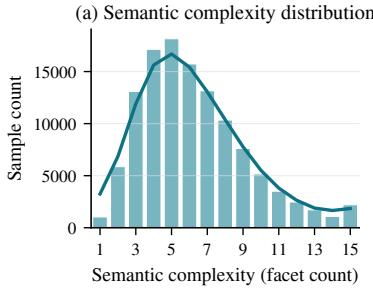

(b) Capacity preference varies across cohorts  
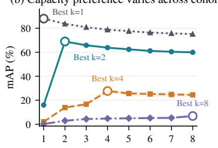  
Capacity k

(c) Oracle best-k distribution  
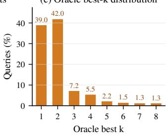  
Figure 1: Motivation for sample-adaptive multi-vector representation in multimodal retrieval. (a) Multimodal samples exhibit diverse content characteristics. (b) Samples grouped by oracleoptimal k show different capacity–performance trends, motivating sample-adaptive allocation. (c) Oracle-preferred capacities are distributed across the available range, indicating substantial samplelevel variation in representation demand. Results are visualized on COCO.

Most existing multi-vector retrieval methods adopt a largely sample-independent representation budget. Learned multi-vector encoders commonly produce a fixed number of representation vectors, while token- or region-level approaches often inherit their representation size from the underlying input structure. More recent flexible representations support multiple operating points at inference time, allowing the retrieval system to trade representation capacity for retrieval cost (Xiao et al., 2026). However, such operating points are typically selected at the system level rather than independently for each sample. Consequently, the amount of multi-vector capacity exposed to retrieval remains largely uniform across samples under a given operating configuration.

We investigate whether this uniform allocation is necessary. Figure 1 presents three complementary observations. First, multimodal samples exhibit substantial content heterogeneity (Fig. 1(a)), suggesting that a single representation budget may be restrictive. However, we find that such surfacelevel content complexity does not by itself determine how much capacity a sample actually needs; we therefore characterize capacity through its retrieval utility rather than any explicit complexity measure. Grouping samples by their oracle-optimal k (Fig. 1(b)) reveals markedly different capacity–performance trends across samples, and at the dataset level the oracle-preferred capacities are spread across the entire available range (Fig. 1(c)). Together, these observations indicate that the capacity most useful for retrieval varies substantially from one sample to another.

This motivates a different formulation of multi-vector multimodal retrieval: representation capacity itself can be treated as a sample-dependent decision variable. The objective is not simply to expose more vectors, nor to tie capacity to a predefined notion of content complexity, but to allocate representation capacity according to its retrieval utility for each sample. Under this view, multi vector retrieval moves beyond a globally configured representation budget toward sample-adaptive capacity allocation.

We formalize this problem as Sample-Adaptive Multi-Vector Representation (SAMVR), a new setting for multimodal retrieval in which representation capacity is allocated at the sample level. Given an individual sample, SAMVR asks how much multi-vector capacity should be assigned to it and how the corresponding representation should be constructed according to the utility of additional embeddings. We refer to the resulting representation as a content-adaptive embedding set (CAES), whose composition and capacity are determined individually for each sample.

To instantiate SAMVR, we propose AdaptiveEmbed, a unified framework for learning sampleadaptive multi-vector representations in multimodal retrieval. AdaptiveEmbed separates the learning of candidate representations from the decision of how much representation capacity to allocate to each sample. It first constructs structured candidate embeddings through Multi-Group Contrastive Learning (MGCL) with the symmetric set-to-set similarity (SetSim). It then introduces Utility Policy Optimization (UPO) to learn sample-specific capacity decisions, together with Marginal Utility Allocation (MUA) for allocating additional representations according to their benefit. Together, these components provide a practical realization of SAMVR and enable adaptive multi-vector retrieval within a unified framework.

Our contributions are threefold: (i) we introduce Sample-Adaptive Multi-Vector Representation (SAMVR), a new problem setting for multimodal retrieval that treats multi-vector capacity as a per-sample decision variable driven by retrieval utility; (ii) we propose AdaptiveEmbed, a unified framework instantiating SAMVR that couples multi-group representation learning, a symmetric setto-set similarity (SetSim) allowing a single embedding set to serve both retrieval directions, and a utility-driven policy that allocates capacity per sample; and (iii) across image, text, video, and audio benchmarks, sample-adaptive allocation achieves higher average mAP than fixed-capacity multi-vector representations while using only around two embeddings per sample versus 3--40 fo fixed-capacity baselines.

## 2 RELATED WORK

Multi-Vector Retrieval. Dense retrieval compresses each input into a single embedding, enabling efficient search but limiting the fine-grained evidence retained in the representation (Karpukhin et al., 2020; Radford et al., 2021). Multi-vector retrieval alleviates this by representing each sample with multiple embeddings and modeling richer interactions among them. ColBERT established token level late interaction through MaxSim (Khattab & Zaharia, 2020), followed by work improving interaction quality and efficiency and extending multi-vector representations to multimodal retrieval, where ColPali exposes patch-level visual embeddings and MetaEmbed introduces nested embedding sets with flexible test-time vector budgets (Santhanam et al., 2022; Faysse et al., 2025; Xiao et al., 2026). A parallel line reduces the storage and computation overhead of multi-vector retrieval through nested representations, fixed-dimensional encodings, and efficient late-interaction engines (Kusupati et al., 2022; Dhulipala et al., 2024). These methods make multi-vector retrieval increasingly expressive and scalable, but operate under predefined representation structures or globally selected capacity budgets, leaving the per-sample allocation of capacity unexplored.

Retrieval Feedback for Adaptive Decisions. Retrieval results themselves can provide querydependent feedback about the retrieval environment. Pseudo-relevance feedback refines query representations from initially retrieved candidates, including extensions to multi-vector dense retrieval (Wang et al., 2021), while selective feedback methods learn when such refinement should be applied (Datta et al., 2024). More recently, Col-Bandit shows that the MaxSim interaction matrix itself carries informative query-dependent signals for adaptive late-interaction computation (Pony et al., 2026). These studies motivate retrieval feedback as an observable signal beyond the query representation, which we exploit to guide per-sample capacity decisions.

SAMVR studies a complementary problem: rather than constructing more vectors, compressing a predefined representation, or choosing a global operating budget, we treat the composition and capacity of the embedding set as per-sample variables. Each sample progressively selects representations according to their retrieval utility, with MaxSim responses from a retrieval bank serving as observable feedback. In this sense, SAMVR shifts multi-vector retrieval from a globally configured budget toward sample-adaptive capacity allocation.

## 3 METHODOLOGY

We first formulate multimodal retrieval with sample-adaptive multi-vector representations and introduce SetSim as the set-to-set similarity. We then present AdaptiveEmbed, covering its architecture, multi-group representation learning, and utility-driven capacity allocation.

## 3.1 PRELIMINARIES

Problem Definition. Let $\chi A$ and $\mathcal { X } ^ { B }$ denote the sample spaces of two modalities. Given a query $x \in \mathcal { X } ^ { A }$ and a cross-modal gallery $\mathcal { G } ^ { \mathtt { B } } = \{ y _ { j } \} _ { j = 1 } ^ { M } \subset \overline { { \mathcal { X } } } ^ { \mathtt { B } }$ , multimodal retrieval ranks the gallery samples according to their similarity to x; retrieval in the reverse direction is defined analogously. SAMVR maps each sample $x \in \mathcal { X } ^ { \mathcal { \bar { A } } } \cup \mathcal { X } ^ { \mathcal { \bar { B } } }$ to a sample-specific multi-vector representation:

$$
f _ { \theta } : x \mapsto Z _ { x } = \{ z _ { x , i } \} _ { i = 1 } ^ { n _ { x } } , \qquad z _ { x , i } \in \mathbb { R } ^ { d } , \quad n _ { x } \in \mathcal { K } ,\tag{1}
$$

where $Z _ { x }$ is the content-adaptive embedding set $( \mathrm { C A E S } ) , n _ { x }$ is its sample-specific capacity, and K denotes the set of available capacities. Throughout, we use N for the size of the candidate embedding pool and k for an activated capacity, $k \in \mathcal { K }$ . We use $o \in \{ { \mathcal { A } } \to B , B \to { \mathcal { A } } \}$ to index the two retrieval directions.

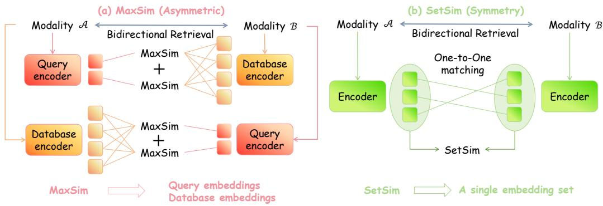  
Figure 2: Comparison between MaxSim and SetSim for bidirectional multimodal retrieval. (a) MaxSim defines a directed comparison, leading the two retrieval directions to use role-specific query/database configurations. (b) SetSim performs symmetric one-to-one matching between embedding sets, allowing each modality to use a single embedding set for both retrieval directions.

Set-to-Set Similarity. Figure 2 contrasts MaxSim and SetSim in bidirectional multimodal retrieval. MaxSim independently matches each query-side vector to its most similar candidate-side vector, so exchanging the two sets changes the matching direction. SetSim instead applies the same set-level comparison in both directions, allowing the same embedding set to represent a sample regardless of the retrieval direction.

Given two L2-normalized embedding sets of equal cardinality, $Q = \{ q _ { i } \} _ { i = 1 } ^ { k }$ and $D = \{ d _ { j } \} _ { j = 1 } ^ { k }$ , their token-level similarity matrix is defined by $C _ { i j } = q _ { i } ^ { \top } d _ { j }$ . SetSim finds the bijective correspondence with the maximum average similarity:

$$
\mathrm { S e t S i m } ( Q , D ) = \frac { 1 } { k } \operatorname* { m a x } _ { \pi \in \Pi _ { k } } \sum _ { i = 1 } ^ { k } C _ { i , \pi ( i ) } ,\tag{2}
$$

where $\Pi _ { k }$ is the set of permutations over k elements, and π assigns each vector in $Q$ to a unique vector in D, i.e., a maximum-weight one-to-one assignment (Kuhn, 1955). Since the assignment is a bijection between two equal-cardinality sets, the resulting score is symmetric in $Q$ and $D .$ . With at most N tokens per set, we compute the optimal matching exactly rather than approximately; the same exact computation is used in both training and inference.

Retrieval-time activation. At retrieval time, the query’s CAES $Z _ { x }$ determines the activation granularity: it specifies which token positions are active, and each gallery sample activates the same positions of its embedding set for comparison. Because the token positions are aligned across samples through the group-prefix structure learned in Stage I (Sec. 3.2), this yields two equal-cardinality sets whose coarse- and fine-grained tokens are matched in kind, so SetSim in Eq. 2 is always applied between sets of equal size.

## 3.2 ARCHITECTURE

Figure 3 presents the two-stage architecture of AdaptiveEmbed. Stage I learns a structured, fixed size pool of candidate embeddings at multiple capacity levels. Stage II evaluates the retrieval utility of expanding the current representation and selects a sample-specific subset as the final contentadaptive embedding set (CAES). For retrieval, the CAES of a query is compared with each gallery CAES using SetSim, and the gallery is ranked by the resulting similarity scores.

Stage I: Embedding Set Learning. Let $x \in \mathcal { X } ^ { ( m ) }$ denote a sample from modality m. Its corresponding modality encoder produces a global feature $g _ { x } \in \mathbb { R } ^ { d _ { \epsilon } }$ and hidden states $\dot { H } _ { x } \in \mathbb { R } ^ { L _ { x } \times d _ { e } }$ where $L _ { x }$ is the input sequence length and $d _ { e }$ is the encoder dimension. A Q-Former (Li et al., 2023)

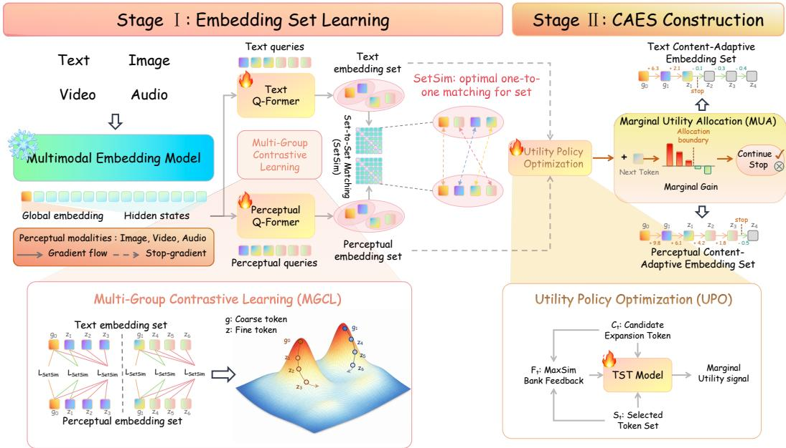  
Figure 3: Overview of AdaptiveEmbed. The framework first learns a structured multi-vector embedding set through Multi-Group Contrastive Learning (MGCL), and then constructs a sample-specific content-adaptive embedding set (CAES) using a Token Selection Transformer (TST) trained with Utility Policy Optimization (UPO) and a Marginal Utility Allocation (MUA) strategy.

processes $H _ { x }$ using N learnable queries and outputs $Q _ { x } = [ q _ { x , 1 } , \dots , q _ { x , N } ] \in \mathbb { R } ^ { N \times d _ { q } }$ . Here $d _ { e } , d _ { q }$ and d denote the encoder, Q-Former, and shared retrieval dimensions, respectively, and $P ^ { ( m ) }$ maps from $d _ { q }$ to d. Each output is projected into the shared retrieval space by a modality-specific projection $P ^ { ( m ) } \in \mathbb { R } ^ { d \times d _ { q } }$ and L2-normalized as $e _ { x , i } = P ^ { ( m ) } q _ { x , i } / \| P ^ { ( m ) } q _ { x , i } \| _ { 2 }$ . The resulting candidate embedding set is denoted by $E _ { x } = \{ e _ { x , i } \} _ { i = 1 } ^ { N }$ , with $e _ { x , i } \in \mathbb { R } ^ { d }$

Multi-Group Contrastive Learning (MGCL). MGCL organizes $E _ { x }$ into G ordered groups. The g-th group is written as $E _ { x , g } ~ = ~ \{ e _ { x , g , r } \} _ { r = 1 } ^ { K _ { g } }$ , where $K _ { g }$ is its size and $\textstyle \sum _ { q = 1 } ^ { G } K _ { g } \ = \ N$ . Each group follows an ordered prefix structure: for a supported capacity $k \in \mathcal { K } _ { g } ^ { \overline { { } } } \subseteq \{ 1 , \dots , K _ { g } \}$ , its k-vector representation is $E _ { x , g } ^ { ( k ) } = \{ e _ { x , g , r } \} _ { r = 1 } ^ { k }$ . Following Matryoshka Representation Learning and group-based multi-vector learning (Kusupati et al., 2022; Xiao et al., 2026), MGCL jointly optimizes all supported prefixes so that shorter prefixes provide compact representations and longer prefixes introduce additional retrieval information.

Given a paired minibatch $\boldsymbol { B } ~ = ~ \{ ( \boldsymbol { x } _ { n } ^ { A } , \boldsymbol { x } _ { n } ^ { B } ) \} _ { n = 1 } ^ { N _ { b } }$ , we define $s _ { n , m } ^ { g , k } \ = \ \mathrm { S e t S i m } ( E _ { x _ { n } ^ { A } , g } ^ { ( k ) } , E _ { x _ { m } ^ { B } , g } ^ { ( k ) } )$ as the similarity between the n-th sample of modality A and the m-th sample of modality B. Let $\begin{array} { r } { N _ { \mathrm { p } } = \sum _ { q = 1 } ^ { G } | \mathcal { K } _ { g } | } \end{array}$ | denote the total number of optimized group-prefix configurations. MGCL applies bidirectional InfoNCE (Oord et al., 2018) to every configuration:

$$
{ \mathcal { L } } _ { \mathrm { M G C L } } = - { \frac { 1 } { 2 N _ { b } N _ { \mathrm { p } } } } \sum _ { g = 1 } ^ { G } \sum _ { k \in K _ { g } } \sum _ { n = 1 } ^ { N _ { b } } \left[ \log { \frac { \exp ( s _ { n , n } ^ { g , k } / \tau ) } { \sum _ { m = 1 } ^ { N _ { b } } \exp ( s _ { n , m } ^ { g , k } / \tau ) } } + \log { \frac { \exp ( s _ { n , n } ^ { g , k } / \tau ) } { \sum _ { m = 1 } ^ { N _ { b } } \exp ( s _ { m , n } ^ { g , k } / \tau ) } } \right] ,\tag{3}
$$

where $\tau > 0$ is the temperature. The two terms optimize retrieval from modality A to modality B and in the reverse direction, respectively. The resulting ordered groups constitute the candidate representation space used by Stage II.

Stage II: CAES Construction. Stage II determines which candidate embeddings should be allocated to each sample. At allocation step $t ,$ let $S _ { t } \subseteq E _ { x }$ denote the currently selected embeddings and let ${ \mathcal { C } } _ { t } \subseteq { \mathrm { \overline { { E } } } } _ { x } \setminus S _ { t }$ contain the admissible next embeddings, i.e., those that extend one of the ordered groups by its next prefix element while keeping every group a valid prefix $( \mathsf { A p - }$ pendix A). We use a fixed retrieval bank R to provide the policy with an observation of how the current representation behaves during retrieval. For a query token $q _ { i }$ and a bank item $D _ { n }$ , we compute its MaxSim response $\begin{array} { r } { A _ { i , n } = \bar { \operatorname* { m a x } } _ { d \in D _ { n } } q _ { i } ^ { \top } d ; } \end{array}$ ranking bank items by the response of the currently selected tokens $S _ { t }$ and keeping the top ones yields a feedback matrix $\mathcal { F } _ { t }$ that records how both selected and candidate tokens respond to the most relevant bank items, following the observation that MaxSim Top L responses carry informative query-dependent feedback (Pony et al., 2026). This feedback adds no retrieved content to the representation, and exposes neither groundtruth identities nor retrieval ranks or utilities to the policy; the marginal utilities in Eq. 4 are detached and used only as training targets. The allocation state is therefore $s _ { t } = ( S _ { t } , \mathcal { C } _ { t } , \mathcal { F } _ { t } )$ , and its exact construction and encoding are detailed in Appendix A.4. A lightweight Token Selection Transformer (TST) parameterized by θ predicts a policy $\pi _ { \boldsymbol { \theta } } ( \boldsymbol { a } \ \mid \ \boldsymbol { s } _ { t } )$ over the action space $\mathcal { U } ( s _ { t } ) ~ = ~ \{ \mathrm { S T O P } \} \cup \{ \mathrm { A D D } ( c ) : c \in \mathcal { C } _ { t } \}$ Utility Policy Optimization (UPO) trains this policy using the retrieval effect of each action. For training instance i, the marginal utility of adding candidate c at step t is $\Delta _ { i , t } ( c ) = \mathrm { A P } _ { i } (  { \mathcal { S } } _ { t } \cup \{ c \} ) - \mathrm { A }  { \stackrel { \sim } { \mathrm { P } } } _ { i } (  { \mathcal { S } } _ { t } )$ , where $\mathrm { A P } _ { i } ( \bar { \cal { S } } )$ denotes the retrieval $\mathbf { A P }$ obtained when S is used as the representation of sample i. We standardize this utility within retrieval direction o and allocation step t as $\widetilde { R } _ { i , t } ( \mathrm { A D D } ( \boldsymbol { c } ) ) = ( \Delta _ { i , t } ( \boldsymbol { c } ) - \mu _ { o , t } ) / ( \sigma _ { o , t } + \epsilon )$ , where $\mu _ { o , t }$ and $\sigma _ { o , t }$ are the corresponding mean and standard deviation; stopping is assigned $\tilde { R } _ { i , t } ( { \mathrm { S T O P } } ) = 0$

Let $\mathcal { D } _ { \mathrm { U P O } }$ contain the allocation states generated from the training set. Since the utilities of all admissible actions are explicitly evaluated, UPO optimizes their expected retrieval utility under the predicted policy:

$$
\mathcal { L } _ { \mathrm { U P O } } = - \frac { 1 } { | \mathcal { D } _ { \mathrm { U P O } } | } \sum _ { ( i , t ) \in \mathcal { D } _ { \mathrm { U P O } } } \sum _ { a \in \mathcal { U } ( s _ { i , t } ) } \pi _ { \theta } ( a \mid s _ { i , t } ) \widetilde { R } _ { i , t } ( a ) .\tag{4}
$$

Since every admissible action’s marginal utility is explicitly enumerated at each step, UPO directly optimizes the expected utility under the current policy, rather than estimating it from sampled tra jectories as in policy-gradient methods.

Marginal Utility Allocation (MUA) applies the learned policy to construct the final representation. Starting from the minimum valid prefix ${ \cal { S } } _ { 0 } ,$ it selects $c _ { t } ^ { \star } \ = \ \arg \operatorname* { m a x } _ { c \in { \mathcal { C } } _ { t } } \pi _ { \theta } ( \operatorname { A D D } ( c ) \ | \ s _ { t } )$ and denotes its probability by $p _ { t } ^ { \star } = \pi _ { \theta } ( \operatorname { A D D } ( c _ { t } ^ { \star } ) \mid s _ { t } )$ . The selected set is updated according to

$$
S _ { t + 1 } = \left\{ { \begin{array} { l l } { S _ { t } \cup \{ c _ { t } ^ { \star } \} , } & { p _ { t } ^ { \star } > \delta , } \\ { S _ { t } , } & { p _ { t } ^ { \star } \leq \delta \quad ( \mathrm { t e r m i n a t e } ) , } \end{array} } \right.\tag{5}
$$

where $\delta$ is the allocation threshold. After an expansion, $\mathcal { C } _ { t + 1 }$ is updated to contain the next admissible candidates. The process terminates at step $\dot { T }$ and returns $\bar { Z _ { x } } \bar { = } \bar { S _ { T } }$ as the CAES of sample x. MUA introduces no additional learnable parameters.

## 4 EXPERIMENTS

We evaluate SAMVR on image–text, video–text, and audio–text retrieval (Sec. 4.2), ablate AdaptiveEmbed’s components (Sec. 4.3), and analyze adaptive representation and parameter sensitivity (Secs. 4.4 and 4.5). Appendix C provides further experiments, including metric robustness, bank robustness, utility–cost trade-offs across modalities, allocation-behavior analyses, and examples.

## 4.1 EXPERIMENTAL SETUP

We evaluate SAMVR on eight benchmarks spanning image–text (COCO (Lin et al., 2014), Flickr30K (Young et al., 2014), ADE20K (Zhou et al., 2017), OpenImages (Kuznetsova et al., 2020)), video–text (Krishna et al., 2017; Anne Hendricks et al., 2017), and audio–text (Drossos et al., 2020; Morato & Mesaros, 2021) retrieval, unified under a full-gallery, one-to-one protocol: each query has exactly one positive item, and all baselines are re-evaluated on identical galleries and query sets. For image–text retrieval, training uses only COCO, and the remaining three datasets are evaluated strictly zero-shot; video–text and audio–text models are trained and evaluated in-domain. We report bidirectional mAP@ALL and Avg. Tokens, which denotes the mean number of active vectors, averaged over all queries in both retrieval directions. Baselines include single-vector and fixed-capacity multi-vector methods on the modalities they support. For a controlled comparison, MetaEmbed is reproduced within our framework and inherits its Matryoshka-style grouped contrastive learning: it shares the backbone, training data, and all Stage-I optimization settings with AdaptiveEmbed, differing only in the number of representation tokens and the training loss. We additionally report Oracle AdaptiveEmbed, a non-deployable upper bound selecting the highest-utility representation per sample. Dataset statistics, protocol construction, and full implementation details are in Appendix B.

Table 1: Full-gallery bidirectional image–text retrieval results on four datasets, measured by mAP (%). T2I and I2T denote text-to-image and image-to-text retrieval, respectively. Avg. Tokens is computed on COCO.
<table><tr><td></td><td></td><td colspan="2">COCO</td><td colspan="2">Flickr30K</td><td colspan="2">ADE20K</td><td colspan="2">OpenImages</td></tr><tr><td>Method</td><td>Avg. Tokens</td><td>T2I</td><td>I2T</td><td>T2I</td><td>I2T</td><td>T2I</td><td>I2T</td><td>T2I</td><td>I2T</td></tr><tr><td colspan="10">Single-Vector Retrieval</td></tr><tr><td>CLIP ViT-L/14</td><td>1</td><td>9.38</td><td>12.78</td><td>15.58</td><td>21.42</td><td>7.16</td><td>11.80</td><td>3.85</td><td>7.71</td></tr><tr><td>SigLIP</td><td>1</td><td>23.04</td><td>23.16</td><td>32.55</td><td>37.20</td><td>15.76</td><td>19.87</td><td>9.19</td><td>15.65</td></tr><tr><td>VLM2Vec-V2</td><td>1</td><td>35.15</td><td>36.96</td><td>47.12</td><td>45.43</td><td>24.36</td><td>27.00</td><td>15.19</td><td>18.61</td></tr><tr><td>Qwen3-VL-Embedding-2B</td><td>1</td><td>41.62</td><td>41.11</td><td>56.25</td><td>57.05</td><td>28.41</td><td>28.63</td><td>14.63</td><td>16.36</td></tr><tr><td>Qwen3-VL-Embedding-8B</td><td>1</td><td>50.20</td><td>49.52</td><td>61.29</td><td>65.07</td><td>39.09</td><td>37.90</td><td>20.14</td><td>22.37</td></tr><tr><td colspan="10">Multi-Vector Retrieval (Fixed Capacity)</td></tr><tr><td>ColQwen2</td><td>578.3</td><td>38.95</td><td>24.44</td><td>49.26</td><td>30.21</td><td>26.84</td><td>16.71</td><td></td><td></td></tr><tr><td>MetaEmbed (2/4)</td><td>3</td><td>62.31</td><td>60.48</td><td>77.57</td><td>77.24</td><td>46.66</td><td>46.45</td><td>27.74</td><td>30.03</td></tr><tr><td>MetaEmbed (4/8)</td><td>6</td><td>62.33</td><td>60.00</td><td>76.97</td><td>77.29</td><td>47.77</td><td>47.88</td><td>29.34</td><td>30.93</td></tr><tr><td>MetaEmbed (8/16)</td><td>12</td><td>62.15</td><td>59.37</td><td>77.10</td><td>76.46</td><td>48.22</td><td>47.75</td><td>29.44</td><td>30.46</td></tr><tr><td>MetaEmbed (16/64)</td><td>40</td><td>62.27</td><td>59.12</td><td>77.10</td><td>76.10</td><td>48.22</td><td>47.75</td><td>29.33</td><td>30.23</td></tr><tr><td colspan="10">Multi-Vector Retrieval (Sample-Adaptive Capacity)</td></tr><tr><td>AdaptiveEmbed (Ours)</td><td>2.1</td><td>63.45</td><td>61.14</td><td>78.27</td><td>75.72</td><td>50.21</td><td>47.27</td><td>29.90</td><td>31.09</td></tr><tr><td>Oracle AdaptiveEmbed</td><td>2.2</td><td>69.51</td><td>67.85</td><td>82.43</td><td>80.88</td><td>57.10</td><td>54.59</td><td>37.15</td><td>38.29</td></tr></table>

Table 2: Generalization of sample-adaptive multi-vector representations to video–text and audio– text retrieval, measured by mAP (%). T2V, V2T, T2A, and A2T denote text-to-video, video-to-text, text-to-audio, and audio-to-text retrieval, respectively. Avg. Tokens is computed on ActivityNet.
<table><tr><td></td><td></td><td colspan="2">ActivityNet</td><td colspan="2">DiDeMo</td><td colspan="2">Clotho</td><td colspan="2">MACS</td></tr><tr><td>Method</td><td>Avg. Tokens</td><td>T2V</td><td>V2T</td><td>T2V</td><td>V2T</td><td>T2A</td><td>A2T</td><td>T2A</td><td>A2T</td></tr><tr><td colspan="10">Single-Vector Retrieval</td></tr><tr><td>VLM2Vec-V2</td><td>1</td><td>33.59</td><td>33.34</td><td>20.97</td><td>18.90</td><td></td><td></td><td></td><td></td></tr><tr><td>Qwen3-VL-Embedding-2B</td><td>1</td><td>60.32</td><td>48.46</td><td>47.12</td><td>41.42</td><td></td><td></td><td></td><td></td></tr><tr><td>Qwen3-VL-Embedding-8B</td><td>1</td><td>66.26</td><td>57.48</td><td>54.76</td><td>48.35</td><td></td><td></td><td></td><td></td></tr><tr><td>LAION-CLAP</td><td>1</td><td></td><td></td><td></td><td></td><td>16.21</td><td>20.42</td><td>10.21</td><td>9.60</td></tr><tr><td>WAVE-7B</td><td>1</td><td></td><td></td><td></td><td></td><td>30.65</td><td>28.47</td><td>10.80</td><td>4.75</td></tr><tr><td colspan="10">Multi-Vector Retrieval (Fixed Capacity)</td></tr><tr><td>MetaEmbed (2/4)</td><td>3</td><td>60.86</td><td>52.13</td><td>47.26</td><td>44.75</td><td>32.03</td><td>30.17</td><td>14.93</td><td>10.87</td></tr><tr><td>MetaEmbed (4/8)</td><td>6</td><td>61.42</td><td>54.37</td><td>47.88</td><td>46.12</td><td>29.60</td><td>30.90</td><td>17.31</td><td>13.30</td></tr><tr><td>MetaEmbed (8/16)</td><td>12</td><td>61.51</td><td>55.60</td><td>47.71</td><td>46.62</td><td>30.42</td><td>31.14</td><td>18.55</td><td>14.56</td></tr><tr><td>MetaEmbed (16/64)</td><td>40</td><td>60.28</td><td>54.34</td><td>46.15</td><td>45.10</td><td>29.51</td><td>30.24</td><td>18.59</td><td>15.12</td></tr><tr><td colspan="10">Multi-Vector Retrieval (Sample-Adaptive Capacity)</td></tr><tr><td>AdaptiveEmbed (Ours)</td><td>1.9</td><td>61.62</td><td>56.48</td><td>48.01</td><td>46.16</td><td>32.56</td><td>31.75</td><td>20.41</td><td>18.01</td></tr><tr><td>Oracle AdaptiveEmbed</td><td>1.7</td><td>67.28</td><td>60.44</td><td>53.14</td><td>50.09</td><td>40.75</td><td>38.95</td><td>24.03</td><td>20.72</td></tr></table>

Table 3: Ablation study of AdaptiveEmbed. We evaluate the contribution of Multi-Group Contrastive Learning (MGCL) and bank feedback on bidirectional multimodal retrieval. Results are measured by mAP (%). Avg. Tokens is computed on COCO.
<table><tr><td></td><td></td><td colspan="2">COCO</td><td colspan="2">Flickr30K</td><td colspan="2">ActivityNet</td><td colspan="2">Clotho</td></tr><tr><td>Method</td><td>Avg. Tokens</td><td>T2I</td><td>I2T</td><td>T2I</td><td>I2T</td><td>T2V</td><td>V2T</td><td>T2A</td><td>A2T</td></tr><tr><td>AdaptiveEmbed (Ours)</td><td>2.1</td><td>63.45</td><td>61.14</td><td>78.27</td><td>75.72</td><td>61.62</td><td>56.48</td><td>32.56</td><td>31.75</td></tr><tr><td>w/o MGCL</td><td>2.1</td><td>62.44</td><td>60.03</td><td>77.85</td><td>75.57</td><td>61.35</td><td>56.21</td><td>30.16</td><td>29.94</td></tr><tr><td>w/o bank-feedback</td><td>2.5</td><td>62.89</td><td>59.58</td><td>77.85</td><td>75.19</td><td>61.41</td><td>56.25</td><td>31.43</td><td>30.62</td></tr></table>

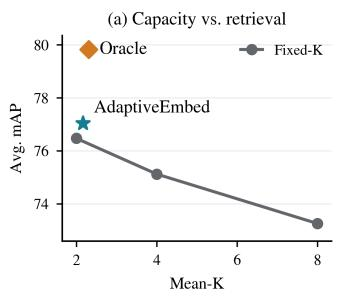

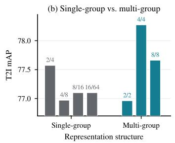

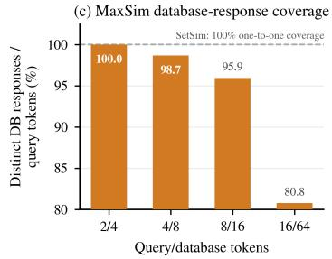  
Figure 4: Analysis of adaptive representation on Flickr30K under zero-shot transfer. (a) Under the same MGCL-trained representation, fixed-K retrieval does not improve monotonically with capacity, whereas AdaptiveEmbed surpasses every fixed-K operating point at a lower average capacity; the oracle marks the upper bound of sample-wise allocation. (b) Multi-group representation learning outperforms single-group structures under markedly different token allocations. (c) Under MaxSim, the fraction of query tokens matched to distinct database tokens drops from 100.0% to 80.8% as capacity grows, whereas SetSim guarantees one-to-one coverage by construction.

## 4.2 RESULTS

Table 1 reports the primary image–text results. With an average of only 2.1 tokens per query, AdaptiveEmbed attains the strongest performance on 6 of the 8 retrieval directions and the highest average mAP overall, both in-domain on COCO (63.45/61.14 T2I/I2T) and under strict zero-shot transfer— most notably on OpenImages, where it leads both directions against a gallery of over 546K items. Across fixed-capacity configurations, increasing the budget from 3 to 40 tokens does not consistently improve retrieval, confirming that a common capacity for all samples is unnecessary. Oracle AdaptiveEmbed reaches 61.0 average mAP at a comparable average capacity (2.2 tokens), showing that sample-adaptive allocation admits substantially stronger retrieval at essentially no extra representation cost—the SAMVR setting itself carries far more potential than fixed-capacity budgets.

We next examine whether sample-adaptive allocation extends beyond image–text retrieval. Table 2 reports video–text and audio–text results, keeping the same SAMVR formulation and only swapping in the modality-specific encoder. AdaptiveEmbed achieves the strongest multi-vector result on 7 of the 8 directions with an average of 1.9 tokens on ActivityNet, and the same pattern holds as in the image case: enlarging the fixed multi-vector budget does not consistently help, whereas per-sample allocation remains effective at a markedly smaller average representation. The oracle again shows further headroom under comparable or lower average capacity, confirming that adaptive capacity allocation is not tied to a particular modality pair.

## 4.3 ABLATION STUDY

We ablate the two key components of AdaptiveEmbed on Table 3: Multi-Group Contrastive Learning (MGCL), which structures the underlying representation, and MaxSim bank feedback, which supplies retrieval-aware observations for allocation. Removing MGCL consistently degrades performance at a comparable budget, showing that simply producing multiple vectors is insufficient— organizing them into complementary groups provides a stronger basis for adaptive selection. Removing the bank-feedback branch also lowers performance despite a larger average capacity, confirming that additional vectors cannot compensate for the missing retrieval-context signal and that feedback is an informative signal for deciding which representation to expose per sample.

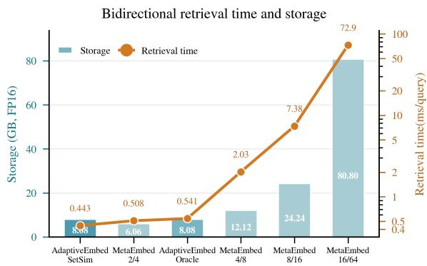  
(a) Bidirectional set-matching time and storage on COCO.

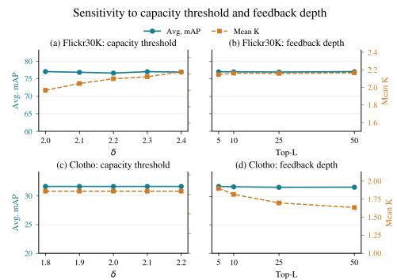  
(b) Sensitivity to the capacity threshold δ and feedback depth Top-L on Flickr30K and Clotho.  
Figure 5: Efficiency and parameter sensitivity analysis of AdaptiveEmbed.

## 4.4 ANALYSIS OF ADAPTIVE REPRESENTATION

We analyze why adaptive allocation works from four angles: whether the gain stems from allocation itself rather than representation capacity (Fig. 4(a)), whether the multi-group structure is necessary (Fig. 4(b)), why SetSim is the right comparison for CAES (Fig. 4(c)), and what adaptive allocation costs at retrieval time (Fig. 5a). Appendix C extends these analyses with additional retrieval metrics (Recall, nDCG, mean rank) on COCO and zero-shot ADE20K, bank-robustness experiments, the utility–cost trade-off and single- vs. multi-group comparisons across modalities, and the decisioncomplexity and learned-vs.-oracle allocation distributions.

Does adaptive allocation help beyond simply using more or fewer vectors? Figure 4(a) holds the representation fixed—all operating points share the same MGCL-trained embedding set—so only the allocation differs. Fixed-k retrieval does not improve monotonically with capacity, while AdaptiveEmbed surpasses every fixed-k point at a lower average capacity: the gain is attributable to per-sample allocation, not a stronger encoder or a larger budget. The oracle marks substantial remaining headroom.

Does the multi-group structure matter? Figure 4(b) compares single- and multi-group structures on Flickr30K. Both follow the same coarse-to-fine prefix principle and differ only in the number of coarse anchors. Multi-group configurations match or exceed single-group ones across token alloca tions, indicating that distributing capacity over multiple semantic anchors, rather than deepening a single coarse-to-fine chain, provides the stronger basis for adaptive selection.

Why SetSim rather than MaxSim? Figure 4(c) measures the fraction of query tokens whose MaxSim responses fall on distinct database tokens: coverage drops from 100.0% to 80.8% as MetaEmbed grows from 2/4 to 16/64, i.e., more query tokens collapse onto the same database tokens at larger capacity. SetSim avoids this by construction through its one-to-one assignment between equal-cardinality sets.

What does adaptive allocation cost at retrieval time? Figure 5a reports bidirectional retrieval time and storage on COCO. Activating only about two tokens per query, AdaptiveEmbed’s set-toset matching cost stays far below high-capacity fixed configurations, whose late-interaction cost grows sharply with the number of vectors.

## 4.5 PARAMETER SENSITIVITY ANALYSIS

We vary the capacity threshold δ and feedback depth Top-L on Flickr30K and Clotho (Fig. 5b). Across the evaluated ranges, Avg. mAP varies by at most 0.43 on Flickr30K and 0.16 on Clotho, while the average capacity remains close to two tokens. Notably, increasing Top-L reduces the Clotho mean capacity from 1.90 to 1.63 without degrading retrieval performance. These results show that AdaptiveEmbed is robust to both hyperparameters and does not depend on a narrowly tuned configuration.

## 5 CONCLUSION

In this work, we introduce Sample-Adaptive Multi-Vector Representation (SAMVR), a new problem setting that explores sample-level representation capacity allocation in multi-vector representation learning for multimodal retrieval. SAMVR formulates representation capacity as a sampledependent variable and defines content-adaptive embedding sets (CAES) as the resulting representations, where different samples can be represented with different amounts of embedding capacity. To investigate the feasibility of SAMVR in multimodal retrieval, we present AdaptiveEmbed, an initial framework that combines candidate representation learning with utility-driven capacity allocation. Through Multi-Group Contrastive Learning (MGCL), set-to-set similarity (SetSim), and Utility Policy Optimization (UPO) with Marginal Utility Allocation (MUA), AdaptiveEmbed provides one possible implementation of sample-adaptive multi-vector representations. Experiments across diverse multimodal retrieval benchmarks verify that sample-adaptive representation capacity can be learned and evaluated in practice. We hope SAMVR can serve as a starting point for further investigation into adaptive representation learning, where the allocation of representation capacity becomes an explicit research problem.

## REFERENCES

Lisa Anne Hendricks, Oliver Wang, Eli Shechtman, Josef Sivic, Trevor Darrell, and Bryan Russell. Localizing moments in video with natural language. In Proceedings of the IEEE international conference on computer vision (ICCV), 2017.

Suchana Datta, Debasis Ganguly, Sean MacAvaney, and Derek Greene. A deep learning approach for selective relevance feedback. In European Conference on Information Retrieval (ECIR), 2024.

Laxman Dhulipala, Majid Hadian, Rajesh Jayaram, Jason Lee, and Vahab Mirrokni. Muvera: Multivector retrieval via fixed dimensional encoding. In Advances in Neural Information Processing Systems (NeurIPS), 2024.

Konstantinos Drossos, Samuel Lipping, and Tuomas Virtanen. Clotho: An audio captioning dataset. In IEEE International Conference on Acoustics, Speech and Signal Processing (ICASSP), 2020.

Manuel Faysse, Hugues Sibille, Tony Wu, Bilel Omrani, Gautier Viaud, Celine Hudelot, and Pierre´ Colombo. Colpali: Efficient document retrieval with vision language models. In International Conference on Learning Representations (ICLR), 2025.

Vladimir Karpukhin, Barlas Oguz, Sewon Min, Patrick Lewis, Ledell Wu, Sergey Edunov, Danqi Chen, and Wen-tau Yih. Dense passage retrieval for open-domain question answering. In Proceedings of the 2020 conference on empirical methods in natural language processing (EMNLP), 2020.

Omar Khattab and Matei Zaharia. Colbert: Efficient and effective passage search via contextualized late interaction over bert. In Proceedings of the 43rd International ACM SIGIR Conference on Research and Development in Information Retrieval (SIGIR), 2020.

Ranjay Krishna, Kenji Hata, Frederic Ren, Li Fei-Fei, and Juan Carlos Niebles. Dense-captioning events in videos. In Proceedings of the IEEE international conference on computer vision (ICCV), 2017.

H. W. Kuhn. The hungarian method for the assignment problem. Naval Research Logistics Quarterly, 1955.

Aditya Kusupati, Gantavya Bhatt, Aniket Rege, Matthew Wallingford, Aditya Sinha, Vivek Ramanujan, William Howard-Snyder, Kaifeng Chen, Sham Kakade, Prateek Jain, and Ali Farhadi. Matryoshka Representation Learning. In Advances in Neural Information Processing Systems (NeurIPS), 2022.

Alina Kuznetsova, Hassan Rom, Neil Alldrin, Jasper Uijlings, Ivan Krasin, Jordi Pont-Tuset, Shahab Kamali, Stefan Popov, Matteo Malloci, Alexander Kolesnikov, et al. The open images dataset v4: Unified image classification, object detection, and visual relationship detection at scale. International journal ofcomputer vision (IJCV), 2020.

Junnan Li, Dongxu Li, Silvio Savarese, and Steven Hoi. Blip-2: Bootstrapping language-image pre-training with frozen image encoders and large language models. In International conference on machine learning (ICML), 2023.

Mingxin Li, Yanzhao Zhang, Dingkun Long, Keqin Chen, Sibo Song, Shuai Bai, Zhibo Yang, Pengjun Xie, An Yang, Dayiheng Liu, et al. Qwen3-vl-embedding and qwen3-vl-reranker: A unified framework for state-of-the-art multimodal retrieval and ranking. arXiv preprint arXiv:2601.04720, 2026.

Tsung-Yi Lin, Michael Maire, Serge Belongie, James Hays, Pietro Perona, Deva Ramanan, Piotr Dollar, and C Lawrence Zitnick. Microsoft coco: Common objects in context. In´ European conference on computer vision (ECCV), 2014.

Rui Meng, Ziyan Jiang, Ye Liu, Mingyi Su, Xinyi Yang, Yuepeng Fu, Can Qin, Zeyuan Chen, Ran Xu, Caiming Xiong, Yingbo Zhou, Wenhu Chen, and Semih Yavuz. VLM2Vec-V2: Advancing Multimodal Embedding for Videos, Images, and Visual Documents. arXiv preprint arXiv:2507.04590, 2025.

Irene Martin Morato and Annamaria Mesaros. Diversity and bias in audio captioning datasets. In Detection and Classication ofAcoustic Scenes and Events (DCASE), 2021.

Aaron van den Oord, Yazhe Li, and Oriol Vinyals. Representation learning with contrastive predictive coding. arXiv preprint arXiv:1807.03748, 2018.

Jordi Pont-Tuset, Jasper Uijlings, Soravit Changpinyo, Radu Soricut, and Vittorio Ferrari. Connecting vision and language with localized narratives. In European Conference on Computer Vision (ECCV), 2020.

Roi Pony, Adi Raz Goldfarb, Oshri Naparstek, Idan Friedman, Udi Barzelay, and Eli Schwartz. Col-bandit: Query-time top-k estimation for late-interaction retrieval. arXiv preprint arXiv:2602.02827, 2026.

Alec Radford, Jong Wook Kim, Chris Hallacy, Aditya Ramesh, Gabriel Goh, Sandhini Agarwal, Girish Sastry, Amanda Askell, Pamela Mishkin, Jack Clark, et al. Learning transferable visual models from natural language supervision. In International conference on machine learning (ICML), 2021.

Keshav Santhanam, Omar Khattab, Jon Saad-Falcon, Christopher Potts, and Matei Zaharia. Colbertv2: Effective and efficient retrieval via lightweight late interaction. In Proceedings of the 2022 Conference of the North American Chapter of the Association for Computational Linguistics (NAACL), 2022.

Changli Tang, Qinfan Xiao, Ke Mei, Tianyi Wang, Fengyun Rao, and Chao Zhang. Wave: learning unified & versatile audio-visual embeddings with multimodal llm. In International Conference on Learning Representations (ICLR), 2026.

Xiao Wang, Craig Macdonald, Nicola Tonellotto, and Iadh Ounis. Pseudo-relevance feedback for multiple representation dense retrieval. In Proceedings of the 2021 ACM SIGIR International Conference on Theory of Information Retrieval (ICTIR), 2021.

Yusong Wu, Ke Chen, Tianyu Zhang, Yuchen Hui, Taylor Berg-Kirkpatrick, and Shlomo Dubnov. Large-scale contrastive language-audio pretraining with feature fusion and keyword-to-caption augmentation. In IEEE International Conference on Acoustics, Speech and Signal Processing (ICASSP), 2023.

Zilin Xiao, Qi Ma, Mengting Gu, Chun-cheng Jason Chen, Xintao Chen, Vicente Ordonez, and Vijai Mohan. Metaembed: Scaling multimodal retrieval at test-time with flexible late interaction. In International Conference on Learning Representations (ICLR), 2026.

This picture is clicked inside the room. At the bot om of the picture, we see a black dog and a pil ow are on the bed. Beside that, we see a white dog. On the right side, we see a black cupboard. Beside that, we see a white door. On the left side, we see a cupboard in which books are placed We see a lamp and the photo frames are placed on the cupboard. Beside that, we see a musical instrument which looks like a keyboard. Beside that, we see the carton boxes and a bag. In the middle, we see a mir or in which we can see the carton box, musical instrument, cupboard and a bag. We see a man is sit ing on the chair and in front of him, we see a table on which a monitor, keyboard and some other objects are placed. In the background, we walking. In the center the boy in the front is holding stic and walking wearing a pink colour helmet. And in the colour jacket is holding a ski-board along with him, and at right side are walking holding a stick in their hands. At th left side the man wearing a white shirt is standing and the person next to him is also standing. In the background the persons are standing. There is a building, trees with snow building there are some text and lights on it.

John the background we can see windows. We can see a frame on a wal . here this is a bathtub and a towel on it. On the floor we can see a bag and clothes and towels in it. Here in a jar we can see twigs. This is a cupboard and a desk. On the platform we can see towels which are folded, candle with stand, frame and a wash basin. Here in a mir or we can see the reflection of lights, ceiling ,wal and a napkin hanged toa stand. At the left side of the picture we can see bot les on a platform. These are taps with pipes.

In this image, we can see few peoples are standing on th floor. Few are holding some items and they are smiling. At the bot om, we can see a tables, some items are there on it. On right side and left side, there is a sofa and the middle there is shelf some items are there on it. Background, there is a wal photo frame, posters, stickers, window shades, window, hangings. At the top of the image, there is a roof.

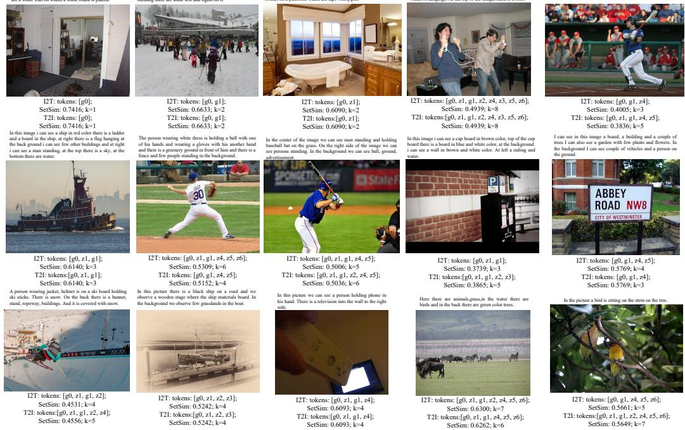  
Figure 6: Oracle content-adaptive embedding sets on COCO. Each sample shows its narrative and, for both retrieval directions, the oracle-selected tokens, the resulting SetSim score, and the capacity k.

shirt,trouser,shoes,gloves and helmet. I think he is playing basebal game. At the right corner of the image I can see a person standing with a basebal glove. There are few people standing and sit ing. They are watching a basebal game. This looks like a fencing with green color poles.

Peter Young, Alice Lai, Micah Hodosh, and Julia Hockenmaier. From image descriptions to visual denotations: New similarity metrics for semantic inference over event descriptions. Transactions ofthe associationfor computational linguistics (TACL), 2014.

Xiaohua Zhai, Basil Mustafa, Alexander Kolesnikov, and Lucas Beyer. Sigmoid loss for language image pre-training. In IEEE/CVF International Conference on Computer Vision (ICCV), 2023.

Bolei Zhou, Hang Zhao, Xavier Puig, Sanja Fidler, Adela Barriuso, and Antonio Torralba. Scene parsing through ade20k dataset. In IEEE conference on computer vision and pattern recognition (CVPR), 2017.

## A DETAILED FORMULATION OF ADAPTIVE REPRESENTATION ALLOCATION

This appendix provides the concrete instantiation of the sample-adaptive allocation described formally in Sec. 3.2 and Stage II. We specify the group configuration, the multi-step decision process used by AdaptiveEmbed, the construction of the bank feedback vector, and the oracle upper bound.

## A.1 GROUP CONFIGURATION

In our instantiation, the candidate embedding set $E _ { x }$ contains N = 8 tokens, organized by MGCL into $G = 2$ ordered groups of equal size:

$$
\mathcal { G } ^ { ( 1 ) } = \{ g _ { 0 } , z _ { 1 } , z _ { 2 } , z _ { 3 } \} , \qquad \mathcal { G } ^ { ( 2 ) } = \{ g _ { 1 } , z _ { 4 } , z _ { 5 } , z _ { 6 } \} .\tag{6}
$$

Here $g _ { 0 }$ and $g _ { 1 }$ denote the coarse (primary) tokens that carry global semantics, while $z _ { 1 } , \ldots , z _ { 6 }$ denote fine (complementary) tokens that provide additional discriminative detail. Each group follows

an ordered prefix structure, so that shorter prefixes yield compact representations and longer prefixes progressively add fine-grained information. The two coarse tokens $g _ { 0 } , g _ { 1 }$ head the two groups respectively, making the group boundary aligned with the coarse-to-fine transition.

## A.2 MULTI-STEP ADAPTIVE DECISION

Although the group configuration admits many prefix combinations, AdaptiveEmbed does not predict a representation from the full combinatorial space at once. Instead, it constructs the CAES through a short sequence of decisions, each expanding the current representation along an admissible group prefix or terminating with STOP. Our instantiation uses a three-step process, and every step may terminate early.

Starting from the minimal representation $S _ { 0 } = \{ g _ { 0 } \}$ , the decisions are:

$$
\mathrm { S t e p 1 } \colon \{ g _ { 0 } \} \  \big \{ \{ g _ { 0 } , g _ { 1 } \} , \ \{ g _ { 0 } , z _ { 1 } \} , \ \mathrm { S T O P } \ \big \} ,\tag{7}
$$

$$
\mathrm { S t e p } 2 \colon \{ g _ { 0 } , g _ { 1 } \} \ \mathrm { o r } \ \{ g _ { 0 } , z _ { 1 } \} \  \ \big \{ \{ g _ { 0 } , g _ { 1 } , z _ { 1 } , z _ { 4 } \} , \ \mathrm { S T O P } \ \big \} ,\tag{8}
$$

$$
{ \mathrm { S t e p } } 3 \colon \{ g _ { 0 } , g _ { 1 } , z _ { 1 } , z _ { 4 } \} \  \{ \{ g _ { 0 } , z _ { 1 } , z _ { 2 } , z _ { 3 } , g _ { 1 } , z _ { 4 } , z _ { 5 } , z _ { 6 } \} , { \mathrm { S T O P } } \} .\tag{9}
$$

The first decision determines whether the coarse token $g _ { 0 }$ already suffices (STOP), whether a second coarse token should be added $(  \{ g _ { 0 } , g _ { 1 } \} )$ , or whether a fine token should be introduced $(  \{ g _ { 0 } , z _ { 1 } \} )$ . If expansion continues, the second decision merges toward the balanced four-token representation $\{ g _ { 0 } , g _ { 1 } , z _ { 1 } , z _ { 4 } \}$ , and the third decision optionally completes the full eight-token representation. Each choice corresponds to one ADD/STOP action in Stage II (Eq. 5), and allocation terminates as soon as the predicted expansion probability falls below the threshold δ.

Reachable representations. Because each step may stop, the policy reaches one of five terminal CAES configurations, spanning capacities from a single token to the full set:

<table><tr><td>Capacity Terminal CAES</td><td></td><td>Terminating decision</td></tr><tr><td>1</td><td> $\{ g _ { 0 } \}$ </td><td>STOP at Step 1</td></tr><tr><td>2</td><td> $\left\{ g _ { 0 } , g _ { 1 } \right\}$ </td><td>expand-coarse, STOP at Step 2</td></tr><tr><td>2</td><td> $\{ g _ { 0 } , z _ { 1 } \}$ </td><td>expand-fine, STOP at Step 2</td></tr><tr><td>4</td><td> $\{ g _ { 0 } , g _ { 1 } , z _ { 1 } , z _ { 4 } \}$ </td><td>STOP at Step 3</td></tr><tr><td>8</td><td> $\{ g _ { 0 } , z _ { 1 } , z _ { 2 } , z _ { 3 } , g _ { 1 } , z _ { 4 } , z _ { 5 } , z _ { 6 } \}$ </td><td>expand at Step 3</td></tr></table>

This hierarchical process allocates capacity according to sample-specific retrieval utility rather than assigning a fixed number of tokens to all samples.

Example trajectories. The five reachable configurations correspond to the following decision trajectories:

• Coarse-sufficient. The initial coarse token already discriminates the sample:

$$
\{ g _ { 0 } \} \xrightarrow { \mathrm { S T O P } } \{ g _ { 0 } \} .
$$

• Coarse-expanded. A second coarse token resolves residual global ambiguity, without fine detail:

$$
\{ g _ { 0 } \} \xrightarrow { \mathrm { \ e x p a n d - c o a r s e } } \{ g _ { 0 } , g _ { 1 } \} \xrightarrow { \mathrm { \ S T O P } } \{ g _ { 0 } , g _ { 1 } \} .
$$

• Fine-refined. A small amount of complementary detail is added on top of the single coarse token:

$$
\{ g _ { 0 } \} \xrightarrow { \mathrm { \ e x p a n d - f i n e } } \{ g _ { 0 } , z _ { 1 } \} \xrightarrow { \mathrm { \ S r o p } } \{ g _ { 0 } , z _ { 1 } \} .
$$

• Balanced. Both groups are partially activated to a balanced four-token representation:

$$
\{ g _ { 0 } \} ~  ~ \{ g _ { 0 } , g _ { 1 } \} ~ \mathrm { o r } ~ \{ g _ { 0 } , z _ { 1 } \} ~  ~ \{ g _ { 0 } , g _ { 1 } , z _ { 1 } , z _ { 4 } \} ~ \xrightarrow { \mathrm { S r o p } } ~ \{ g _ { 0 } , g _ { 1 } , z _ { 1 } , z _ { 4 } \} .
$$

• Full-capacity. Rich or ambiguous content triggers expansion to the complete eight-token set:

$$
\{ g _ { 0 } \} ~  ~ \{ g _ { 0 } , g _ { 1 } , z _ { 1 } , z _ { 4 } \} ~  ~ \{ g _ { 0 } , z _ { 1 } , z _ { 2 } , z _ { 3 } , g _ { 1 } , z _ { 4 } , z _ { 5 } , z _ { 6 } \} .
$$

## A.3 ORACLE UPPER BOUND

The Oracle AdaptiveEmbed reported in the main tables is a non-deployable upper bound that measures the potential of sample-adaptive allocation. It follows the same progressive expansion principle as the deployed policy (Appendix A.2)—starting from $\{ g _ { 0 } \}$ and repeatedly deciding whether to extend one of the two ordered groups by its next prefix element or to terminate—but at a finer granularity. Whereas the deployed policy expands in coarse blocks and merges branches, terminating in three steps at five terminal configurations, the oracle expands one token at a time and keeps all branches distinct, so its trajectories may take a variable number of steps and reach every admissible configuration rather than a merged subset.

Concretely, we take the ordered prefixes of each group,

$$
\begin{array} { r l } & { \mathcal { P } ^ { ( 1 ) } = \{ \{ g _ { 0 } \} , \{ g _ { 0 } , z _ { 1 } \} , \{ g _ { 0 } , z _ { 1 } , z _ { 2 } \} , \{ g _ { 0 } , z _ { 1 } , z _ { 2 } , z _ { 3 } \} \} , } \\ & { \mathcal { P } ^ { ( 2 ) } = \{ \emptyset , \{ g _ { 1 } \} , \{ g _ { 1 } , z _ { 4 } \} , \{ g _ { 1 } , z _ { 4 } , z _ { 5 } \} , \{ g _ { 1 } , z _ { 4 } , z _ { 5 } , z _ { 6 } \} \} , } \end{array}\tag{10}
$$

and form all combinations of one prefix from each group, which yields the finite set of reachable configurations

$$
\mathcal { M } = \{ p ^ { ( 1 ) } \cup p ^ { ( 2 ) } \mid p ^ { ( 1 ) } \in \mathcal { P } ^ { ( 1 ) } , p ^ { ( 2 ) } \in \mathcal { P } ^ { ( 2 ) } \} , \qquad | \mathcal { M } | = 2 0 ,\tag{11}
$$

i.e., the full Cartesian product of the two groups’ prefixes $( g _ { 0 }$ is always active). Representative trajectories include:

$$
\begin{array} { r l } & { \{ g _ { 0 } \} \xrightarrow { \operatorname { S r o p } _ { \Game } } \{ g _ { 0 } \} , } \\ & { \{ g _ { 0 } \}  \{ g _ { 0 } , z _ { 1 } \} \xrightarrow { \operatorname { S r o p } _ { \Game } } \{ g _ { 0 } , z _ { 1 } \} , } \\ & { \{ g _ { 0 } \}  \{ g _ { 0 } , z _ { 1 } \}  \{ g _ { 0 } , z _ { 1 } , z _ { 2 } \}  \{ g _ { 0 } , z _ { 1 } , z _ { 2 } , z _ { 3 } \} \xrightarrow { \operatorname { S r o p } _ { \Huge \{ } \tilde { g } _ { 0 } , z _ { 1 } , z _ { 2 } , z _ { 3 } \} } \{ g _ { 0 } , z _ { 1 } , z _ { 2 } , z _ { 3 } \} , } \\ & { \{ g _ { 0 } \}  \{ g _ { 0 } , g _ { 1 } \}  \{ g _ { 0 } , g _ { 1 } , z _ { 1 } \}  \cdots  \{ g _ { 0 } , z _ { 1 } , z _ { 2 } , z _ { 3 } , g _ { 1 } , z _ { 4 } , z _ { 5 } , z _ { 6 } \} , } \\ & { \vdots } \end{array}
$$

The remaining trajectories differ only in the order and depth to which each group is expanded, and all of them terminate in one of the 20 configurations of $\bar { \mathcal { M } }$

For each sample x, the oracle scores every reachable configuration under the retrieval objective and selects the best one:

$$
{ \mathcal { Z } } ^ { \star } ( x ) = \arg \operatorname* { m a x } _ { { \mathcal { Z } } \in { \mathcal { M } } } { \mathrm { A P } } ( x , { \mathcal { Z } } ) ,\tag{12}
$$

where $\operatorname { A P } ( x , { \mathcal { Z } } )$ denotes the retrieval $\mathbf { A P }$ obtained when $\mathcal { Z }$ is used as the representation of x, consistent with $\operatorname { A P } _ { i }$ in Stage II. In implementation, we evaluate these 20 configurations directly, since trajectories reaching the same configuration are equivalent under the retrieval objective. The oracle does not correspond to a deployable model, as it requires per-sample exhaustive search under the target metric; it serves only to quantify how closely the learned policy approaches the best achievable sample-wise allocation. The gap between AdaptiveEmbed and this oracle in Tables 1 and 2 therefore separates the potential of the SAMVR setting from the capability of the current allocation model.

## A.4 BANK FEEDBACK CONSTRUCTION

The feedback matrix $\mathcal { F } _ { t }$ used in Stage II lets the capacity policy observe not only the current sample’s tokens but also how those tokens actually respond against a retrieval bank. If a candidate token yields a response pattern that differs from the already-selected tokens on the current top-scoring bank items, it is more likely to carry incremental retrieval information; otherwise the policy can safely stop expanding.

Construction. Let the L2-normalized query tokens be $Q = \{ q _ { i } \} _ { i = 1 } ^ { N }$ and the tokens of the n-th bank item be $D _ { n } = \{ d _ { n , j } \} _ { j = 1 } ^ { R _ { d } }$ . For each query token we compute its MaxSim response to bank item n:

$$
A _ { i , n } = \operatorname* { m a x } _ { 1 \leq j \leq R _ { d } } q _ { i } ^ { \top } d _ { n , j } .\tag{13}
$$

Table 4: Dataset statistics and unified full-gallery retrieval protocols. The Train column denotes the gallery prefix used for representation or policy training when applicable. Each query has exactly one positive item in the full gallery.
<table><tr><td>Modality</td><td>Dataset</td><td>Train</td><td>Queries</td><td>Gallery</td><td></td><td>Query split Text construction</td></tr><tr><td>Image-Text</td><td>t COCO</td><td>118,287</td><td>5,000</td><td>123,287</td><td>val</td><td>Full localized narrative</td></tr><tr><td></td><td>Flickr30K</td><td>29,783</td><td>1,000</td><td>30,783</td><td></td><td>val Full localized narrative</td></tr><tr><td></td><td>ADE20K</td><td>20,210</td><td>2,000</td><td>22,210</td><td>val</td><td>Full localized narrative</td></tr><tr><td></td><td>OpenImages</td><td>504,413</td><td>41,620</td><td>546,033</td><td>val</td><td>Full localized narrative</td></tr><tr><td>Video-Text</td><td>ActivityNet</td><td>10,009</td><td>4,917</td><td>14,926</td><td>val1</td><td>Temporally ordered event captions</td></tr><tr><td></td><td>DiDeMo</td><td>8,395</td><td>1,004</td><td>9,399</td><td>test</td><td>Joined moment descriptions</td></tr><tr><td>Audio-Text MACS</td><td></td><td>3,537</td><td>393</td><td>3,930</td><td></td><td>test Joined 2–5 captions</td></tr><tr><td></td><td>Clotho</td><td>3,839</td><td>1,045</td><td>4,884</td><td></td><td>evaluation Joined five captions</td></tr></table>

At decision state t with selected token set $S _ { t }$ , the current retrieval score of bank item n is

$$
s _ { n } ^ { ( t ) } = \frac { 1 } { | S _ { t } | } \sum _ { i \in S _ { t } } A _ { i , n } ,\tag{14}
$$

and we retain the Top-L bank items under this score, $\mathcal { N } _ { t } = \mathrm { T o p L } _ { n } \left( s _ { n } ^ { ( t ) } \right)$ . The feedback matrix collects the responses of all tokens (selected and candidate) to these items:

$$
F _ { t } = \left[ A _ { i , n } \right] _ { 1 \leq i \leq N , n \in \mathcal { N } _ { t } } \in \mathbb { R } ^ { N \times L } .\tag{15}
$$

Because $\mathcal { N } _ { t }$ is derived only from the current retrieval score $s _ { n } ^ { ( t ) }$ , the policy sees how candidate tokens would respond to the items that currently matter most, without any supervision signal. In our implementation the cached feedback tensor has shape [ batch, decision context, 8 tokens, Top-L ].

Encoding. In the following, $H _ { S _ { t } }$ and $H _ { \mathcal { C } _ { t } }$ denote the hidden representations of the selected and candidate tokens produced by the TST, $m _ { S _ { t } }$ and $m _ { C _ { t } }$ are binary masks indicating selected and candidate positions, $\mathrm { N o r m } _ { S _ { t } } ( \cdot )$ standardizes each token’s feedback by the response statistics of the selected set, $\mathrm { M H A } ( q , k , v )$ is multi-head attention, LN is layer normalization, and $e _ { t }$ is a learnable decision-context embedding for step t. The policy first lets candidate tokens attend to the selected tokens:

$$
H _ { t } = \mathrm { L N } \big ( H _ { \mathcal { C } _ { t } } + \mathrm { M H A } ( H _ { \mathcal { C } _ { t } } , H _ { S _ { t } } , H _ { S _ { t } } ) \big ) .\tag{16}
$$

The feedback matrix is normalized by the response statistics of the selected tokens and concatenated with selected/candidate masks before encoding:

$$
E _ { t } = \mathrm { M L P } \big ( \big [ \mathrm { N o r m } _ { \mathcal { S } _ { t } } ( F _ { t } ^ { \top } ) ; m _ { \mathcal { S } _ { t } } ; m _ { \mathcal { C } _ { t } } \big ] \big ) .\tag{17}
$$

Candidate tokens then read the encoded database feedback, and a pooled representation combined with a decision-context embedding $e _ { t }$ produces the action logits:

$$
\widetilde { H } _ { t } = \mathrm { L N } \big ( H _ { t } + \mathrm { M H A } ( H _ { t } , E _ { t } , E _ { t } ) \big ) ,\tag{18}
$$

$$
\ell _ { t } = \operatorname { H e a d } \bigl ( \operatorname { P o o l } ( \widetilde { H } _ { t } ) + e _ { t } \bigr ) ,\tag{19}
$$

where $\ell _ { t }$ are the logits over STOP, expansion, and branch choices. The Top-L selection depends solely on the current retrieval score $s _ { n } ^ { ( t ) }$ ; the policy never observes ground-truth identities, positive/negative labels, retrieval ranks, or $\mathbf { A P }$ values. The standardized marginal utilities $\widetilde { R } _ { i , t }$ used in UPO (Eq. 4) are computed with detached retrieval metrics and serve only as optimization targets, strictly separated from the feedback that the policy takes as input.

## B DATASETS AND EVALUATION PROTOCOLS

Unified full-gallery retrieval. We evaluate AdaptiveEmbed on eight datasets spanning image– text, video–text, and audio–text retrieval. To make the protocols comparable across modalities, we convert each dataset into a one-to-one retrieval benchmark: each media item is paired with a single complete textual description, and each query has exactly one positive item in the gallery. The text side is constructed as follows. For image–text retrieval, we use the official Localized Narratives annotations (Pont-Tuset et al., 2020), which provide one long-form narrative per image and cover exactly our four image datasets (COCO, Flickr30K, ADE20K, and Open Images). For video–text and audio–text retrieval, each sample’s original captions are concatenated in their original order into a single long text, so that caption count does not change the number of positives across samples. The same text construction is applied to every baseline. Under this protocol, a query q whose positive item has rank $r _ { q }$ satisfies $\mathrm { A } \bar { \mathrm { P } } ( q ) = 1 / r _ { q } ,$ , so mAP and MRR coincide; we report mAP. All baselines are re-evaluated with identical query sets, galleries, text construction, and positive mappings. We adopt Localized Narratives rather than the original short captions deliberately: under the standard 5- caption protocols, strong single-vector embeddings already approach saturation, leaving little room to differentiate multi-vector designs, whereas long-form narratives contain multiple facets per sample and thus stress exactly the fine-grained capacity that multi-vector representations are meant to provide.

Training and zero-shot splits. The representation learner and capacity policy are trained only on the source-domain split of each modality: COCO for image–text, the joint ActivityNet+DiDeMo pairs for video, and the joint MACS+Clotho pairs for audio. Flickr30K, ADE20K, and OpenImages are evaluated strictly zero-shot. Per-dataset statistics and splits are summarized in Table 4.

Baselines. We compare SAMVR with representative single-vector and fixed-capacity multi-vector retrieval methods. Single-vector baselines include CLIP Radford et al. (2021), SigLIP Zhai et al. (2023), VLM2Vec-V2 Meng et al. (2025), Qwen3-VL-Embedding Li et al. (2026), LAION-CLAP Wu et al. (2023), and WAVE-7B Tang et al. (2026) when applicable to the corresponding modalities. Multi-vector baselines include ColQwen2 Faysse et al. (2025) and MetaEmbed Xiao et al. (2026). For MetaEmbed $( R _ { q } / R _ { d } ) , R _ { q }$ and $R _ { d }$ represent the numbers of query- and databaseside embedding vectors, respectively. We additionally report Oracle AdaptiveEmbed as a nondeployable upper bound, which selects representations according to target retrieval utility and is only used to analyze the potential of sample-adaptive capacity allocation.

Implementation Details. We use frozen Qwen3-VL-Embedding-2B encoders for image–text and video–text retrieval, and a frozen WAVE-7B encoder for audio–text retrieval. The Q-Former is initialized from scratch with four layers, eight attention heads, and a hidden dimension of 512. Stage I produces eight representation tokens per modality—one frozen global token and seven learned tokens—forming two four-token groups $\{ g _ { 0 } , z _ { 1 } , z _ { 2 } , z _ { 3 } \}$ and $\{ g _ { 1 } , z _ { 4 } , z _ { 5 } , z _ { 6 } \}$ , and is optimized with MGCL for 20 epochs using AdamW (learning rate $1 \times 1 0 ^ { - 4 }$ , effective batch size 2,048, temperature $\tau = 0 . 0 3 )$ . In Stage II, the TST uses two four-head attention blocks with hidden dimension 128 and is trained with UPO for 20 epochs, using the top-50 responses from the full source-domain training bank as feedback. Relative utility rewards are normalized independently for each retrieval direction and allocation stage, and the direction-specific MUA threshold δ is selected on source domain validation data and fixed at test time. SetSim is computed with a batched dynamic program over token subsets, which finds the exact optimal assignment for $k \leq 8$ tokens efficiently across all query–gallery pairs in a batch.

## C ADDITIONAL EXPERIMENTS AND ANALYSES

## C.1 ROBUSTNESS ACROSS RETRIEVAL METRICS

The main tables report mAP under the unified full-gallery protocol. To verify that the conclusions are not specific to this metric, we additionally evaluate Recall@K, nDCG, and mean rank on COCO (indomain) and ADE20K (zero-shot), using the same query sets, galleries, and controlled MetaEmbed reproduction as in Sec. 4.1. All numbers are averaged over both retrieval directions; ¯k denotes the average number of activated tokens per query.

On COCO, as reported in Table 5, AdaptiveEmbed leads every Recall and nDCG metric against all MetaEmbed configurations while activating the fewest tokens on average. The margins are largest at the top of the ranking, with a bidirectional R@1 gain of 1.1 points and T2I R@1 gains of 1.1 to 1.5 points depending on the configuration. The single exception is mean rank, where the 8/16 configuration is marginally better, at 30.2 versus 31.3, indicating that a small number of tail queries rank slightly lower under adaptive allocation; since all top-K and ranking-quality metrics favor AdaptiveEmbed, the main conclusions are unaffected.

Table 5: Additional retrieval metrics on COCO under the unified full-gallery protocol (5,000 queries, 123,287 gallery items), averaged over both directions. AdaptiveEmbed leads every Recall and nDCG metric at the lowest average capacity, indicating that the conclusions of Table 1 are not an artifact of the mAP metric.
<table><tr><td>Method</td><td>k</td><td>R@1</td><td>R@5</td><td>R@10</td><td>nDCG</td><td>mAP</td><td>MeanR↓</td></tr><tr><td>MetaEmbed (2/4)</td><td>3</td><td>51.79</td><td>72.54</td><td>79.16</td><td>69.13</td><td>61.40</td><td>30.58</td></tr><tr><td>MetaEmbed (4/8)</td><td>6</td><td>51.52</td><td>72.10</td><td>79.30</td><td>68.96</td><td>61.17</td><td>31.34</td></tr><tr><td>MetaEmbed (8/16)</td><td>12</td><td>50.99</td><td>71.86</td><td>79.05</td><td>68.65</td><td>60.76</td><td>30.18</td></tr><tr><td>MetaEmbed (16/64)</td><td>40</td><td>50.92</td><td>71.88</td><td>78.78</td><td>68.59</td><td>60.69</td><td>30.78</td></tr><tr><td>AdaptiveEmbed (Ours)</td><td>2.1</td><td>52.86</td><td>73.32</td><td>79.55</td><td>69.85</td><td>62.30</td><td>31.26</td></tr></table>

Table 6: Additional retrieval metrics on ADE20K under strict zero-shot transfer (2,000 queries, 22,210 gallery items), averaged over both directions. The representation, policy, threshold, and retrieval bank are all taken from COCO without any ADE20K tuning. AdaptiveEmbed outperforms every MetaEmbed configuration on all Recall, nDCG, and mAP metrics at the lowest average capacity.
<table><tr><td>Method</td><td>k</td><td>R@1</td><td>R@5</td><td>R@10</td><td>nDCG</td><td>mAP</td><td>MeanR↓</td></tr><tr><td>MetaEmbed (2/4)</td><td>3</td><td>35.83</td><td>58.40</td><td>67.75</td><td>56.81</td><td>46.56</td><td>46.09</td></tr><tr><td>MetaEmbed (4/8)</td><td>6</td><td>37.28</td><td>59.78</td><td>68.60</td><td>57.88</td><td>47.83</td><td>44.26</td></tr><tr><td>MetaEmbed (8/16)</td><td>12</td><td>37.33</td><td>59.88</td><td>69.25</td><td>58.03</td><td>47.99</td><td>44.49</td></tr><tr><td>MetaEmbed (16/64)</td><td>40</td><td>37.28</td><td>59.53</td><td>68.93</td><td>57.84</td><td>47.81</td><td>48.08</td></tr><tr><td>AdaptiveEmbed (Ours)</td><td>2.0</td><td>38.08</td><td>61.33</td><td>69.78</td><td>58.66</td><td>48.74</td><td>46.04</td></tr></table>

The zero-shot ADE20K results in Table 6 are stronger still. Against the capacity-matched 2/4 configuration, AdaptiveEmbed improves R@1, R@5, and R@10 by 2.25, 2.93, 2.03, and 1.38 points respectively, and mAP by 2.18 points. Even against the per-metric best among all four fixed configurations, it remains ahead on every Recall, nDCG, and mAP metric, including gains of 0.75 points on both R@1 and mAP. These improvements are driven primarily by the T2I direction, in which AdaptiveEmbed leads on all metrics including mean rank, at 43.4 versus 45.7, whereas I2T is mixed at the level of individual metrics; the T2I advantage is large enough that every bidirectional average favors adaptive allocation. As on COCO, mean rank is the one aggregate exception, at 46.0 versus 44.3 for the 4/8 configuration, again reflecting a small number of poorly ranked tail queries rather than a degradation in overall retrieval quality. Notably, this margin is achieved under strict zero-shot transfer with no ADE20K-specific tuning of any component, indicating that the learned allocation policy generalizes across domains rather than exploiting source-domain particulars.

Retrieval Bank Composition and Robustness. The retrieval bank R used for bank feedback (Appendix A.4) is drawn from the source-domain training split of each modality: the COCO training split for image–text, the joint ActivityNet+DiDeMo training pairs for video–text, and the joint MACS+Clotho training pairs for audio–text. The same bank is used for both UPO training and test-time allocation; in particular, all zero-shot image–text evaluations (Flickr30K, ADE20K, Open Images) reuse the COCO bank, so no target-domain data enters the feedback path.

To assess sensitivity to the bank domain, we run a bank-replacement experiment on Flickr30K: keeping the trained representation and policy fixed, we swap the COCO bank for a bank built from the Flickr30K training split. The in-domain bank changes Avg. mAP by only +0.07, indicating that the allocation policy is largely insensitive to the domain of the bank. This is consistent with the role the bank plays in our design: it serves as a generic response environment—a population of items against which the distinctiveness of selected and candidate tokens is measured—rather than a source of domain-specific retrieval content. As long as the bank is sufficiently diverse, the marginal-utility signal it induces transfers across domains, and matching the bank to the target domain yields no meaningful additional benefit.

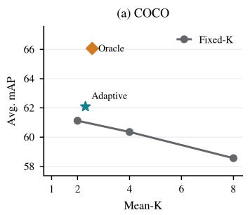

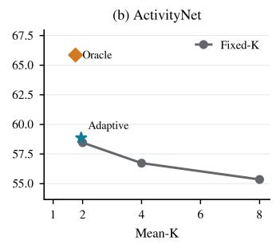

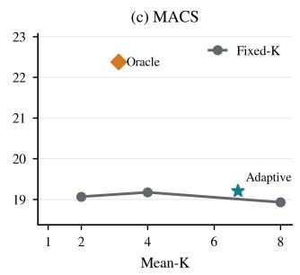

Figure 7: Retrieval utility versus representation cost under adaptive and fixed-capacity allocation, all using the same MGCL-trained representation.  
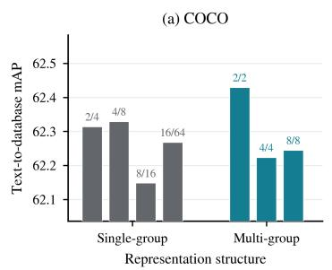

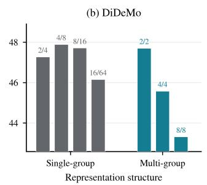

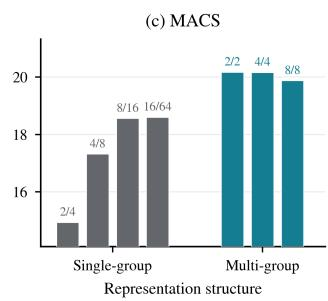  
Figure 8: Ablation of single-group and multi-group representation structures. Multi-group contrastive learning consistently improves retrieval performance across different datasets, demonstrating that separating representation capacity into multiple semantic groups provides a more effective basis for adaptive token activation.

Utility–Cost Trade-off Across Modalities. Figure 7 extends the Flickr30K analysis of Fig. 4(a) to COCO, ActivityNet, and MACS, plotting average mAP against mean activated capacity for fixed-k operating points, the learned policy, and the oracle, all sharing the same MGCL-trained representation. The same qualitative pattern holds across all three modalities: fixed-capacity retrieval does not improve—and often degrades—as the shared budget grows, while AdaptiveEmbed sits above the fixed-capacity frontier at roughly two activated tokens, and the oracle marks substantial further headroom at a comparable or lower average capacity. The consistency across image, video, and audio indicates that the utility–cost advantage of per-sample allocation is a property of the formulation rather than of a particular modality pair.

Single- vs. Multi-Group Structures Across Datasets. Figure 8 complements Fig. 4(b) by comparing single-group and multi-group representation structures on COCO, DiDeMo, and MACS under matched token allocations. Both structures follow the same coarse-to-fine prefix principle, in which the leading token carries global semantics and subsequent tokens add complementary detail; they differ in how many such coarse anchors the representation contains. The single-group structure places all fine tokens behind one coarse token, whereas the multi-group structure maintains two coarse anchors, each refined by its own fine tokens. Multi-group configurations match or outperform their single-group counterparts on all three datasets, with the largest gains on MACS, where the audio–text pairs are shortest and a single global anchor is most easily saturated. Together with the component ablation in Table 3, this indicates that the benefit stems from distributing capacity across multiple semantic anchors rather than from deepening a single coarse-to-fine chain.

Decision Complexity of the Hierarchical Policy. Figure 9 analyzes how allocation difficulty is distributed over the three decision stages. For each stage, the bars report the average number of independent responses required, and the curves report the remaining response distinctiveness after the stage. Both quantities drop sharply after the first decision; on COCO, the required independent responses fall from 3.8 to 1.8, and the residual distinctiveness becomes substantially weaker. The first coarse decision therefore resolves most of the capacity-allocation ambiguity, leaving later stages to operate on a much-reduced candidate space. This concentration of difficulty in the early stage is what renders the short, three-step hierarchical policy practical: the expensive discrimination is performed once, at the stage where the bank-feedback signal is strongest.

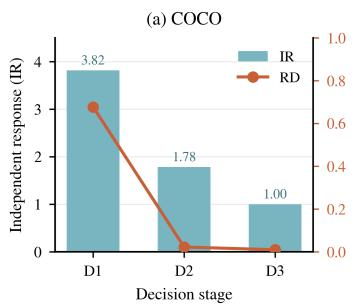

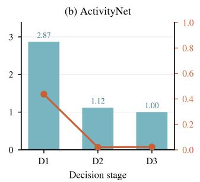

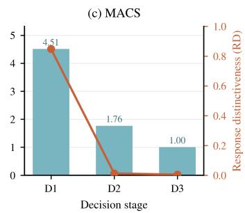  
Figure 9: Decision complexity analysis of the hierarchical adaptive policy. The bars show the average number of independent responses required at each decision stage, while the curves indicate the remaining response distinctiveness after each stage. Early decisions provide coarse capacity separation, allowing later stages to operate on a reduced candidate space.

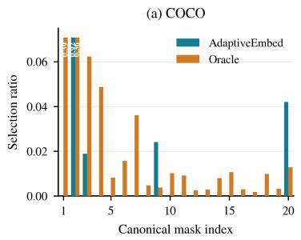

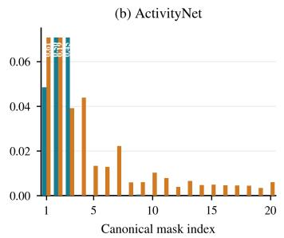

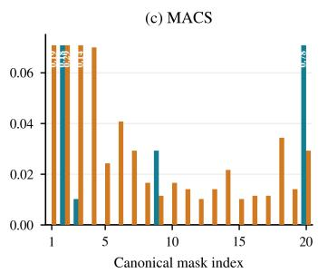  
Figure 10: Oracle and AdaptiveEmbed selection distributions on COCO, ActivityNet, and MACS. Each configuration is represented as a binary mask over the eight candidate tokens indicating which are activated; the valid group prefixes yield 20 canonical masks in total. The oracle exhaustively evaluates all 20 masks per sample, whereas AdaptiveEmbed approximates the optimal allocation through its hierarchical policy.

Learned vs. Oracle Allocation Distributions. Figure 10 compares the selection distribution of the learned policy with that of the oracle over the 20 canonical configurations of M defined in Appendix A.3, evaluated on COCO, ActivityNet, and MACS. Two observations stand out. First, the oracle distribution is spread over many configurations on every dataset, reconfirming at the level of concrete masks that no single capacity serves all samples. Second, the learned policy concentrates its mass on a small subset of the oracle’s preferred configurations, primarily the low-capacity masks and the full set, and rarely selects the intermediate ones. This coarser coverage mirrors the restricted five-configuration action space of the deployed policy described in Appendix A.2, and localizes the policy–oracle gap observed in Tables 1 and 2. Closing this gap requires finer decision granularity over the intermediate masks rather than a larger representation, and finer granularity in turn places higher demands on the feedback signal: the raw bank responses that suffice for coarse distinctions weaken rapidly across stages, as shown in Figure 9, and discriminating among many intermediate masks would require a richer learned utility signal, for instance a reward model trained to predict the marginal benefit of each expansion. We regard such feedback-driven fine-grained allocation as a natural next step for the SAMVR setting.

## C.2 QUALITATIVE EXAMPLES OF SAMPLE-ADAPTIVE ALLOCATION

Figure 6 visualizes oracle CAES on COCO samples, illustrating what optimal sample-wise allocation looks like in practice and thereby characterizing the SAMVR setting itself, independently of any learned policy. Three patterns stand out. First, the optimal capacity spans the entire admissible range from k=1 to k=8: no single operating point serves all samples, which is precisely the premise of the SAMVR formulation. Second, the optimal allocation is direction-specific, as several samples require different token sets for I2T and T2I retrieval, indicating that capacity demand is a property of the retrieval task rather than of the sample alone. Third, optimal capacity does not reduce to surface complexity: the most detailed narrative is resolved with a single coarse token, while a one-sentence caption of a visually ambiguous scene expands to near-full capacity. What determines capacity is how much representation a sample needs to be distinguished within the gallery, not how much content it contains. These cases provide sample-level evidence for the motivation in Figure 1 and the qualitative counterpart to the complexity–capacity discussion in Appendix D.

## D DISCUSSION AND LIMITATIONS

Does sample-adaptive capacity allocation come for free? It does not, and we discuss the main limitations of our current instantiation, all of which concern AdaptiveEmbed as one realization of SAMVR rather than the setting itself.

First, a sizable gap remains between the learned policy and the oracle in Tables 1 and 2. The oracle attains substantially higher mAP at comparable or lower average capacity, indicating that our hierarchical, few-step policy captures only part of the achievable sample-wise allocation. Closing this gap requires finer decision granularity over the intermediate configurations, which in turn places higher demands on the feedback signal: the raw MaxSim bank responses that suffice for coarse decisions weaken rapidly across stages, as shown in Figure 9, and discriminating among many intermediate configurations would likely require a richer learned utility signal, such as a reward model trained to predict the marginal benefit of each expansion.

Second, the efficiency of AdaptiveEmbed is a matching-time benefit that is realized per sample and therefore depends on the data distribution: the average activated capacity reflects how many samples the policy resolves with few tokens, and a distribution dominated by hard samples would narrow the speed advantage. Moreover, because the active token positions are determined by the query at retrieval time, each gallery item must still store its full eight-token embedding set so that the query-selected positions can be read off. Reducing gallery-side storage under query-dependent activation remains open.

Third, our allocation is driven purely by retrieval utility and is not tied to any explicit measure of content complexity, since such complexity is difficult to quantify with a single scalar. As a result, the correspondence between a sample’s semantic richness and its allocated capacity can only be examined qualitatively; we provide illustrative cases in Appendix C.2 and leave a principled complexity-aware formulation to future work.