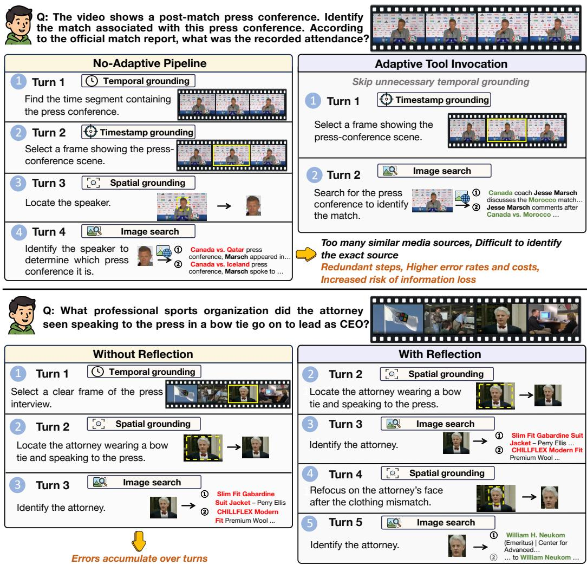
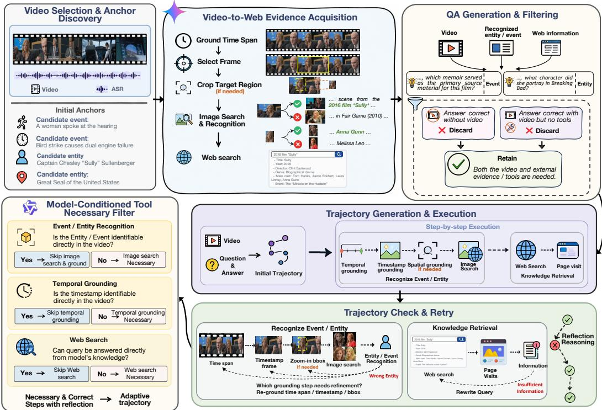
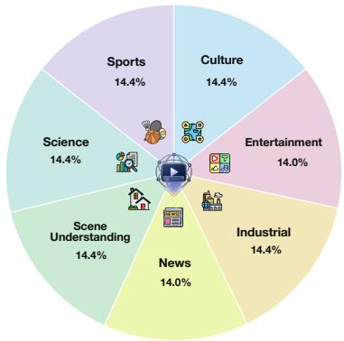
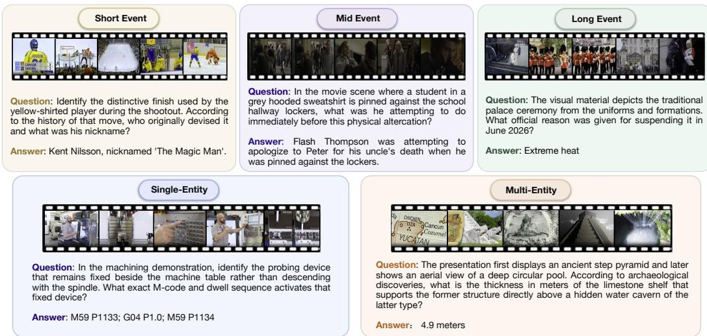
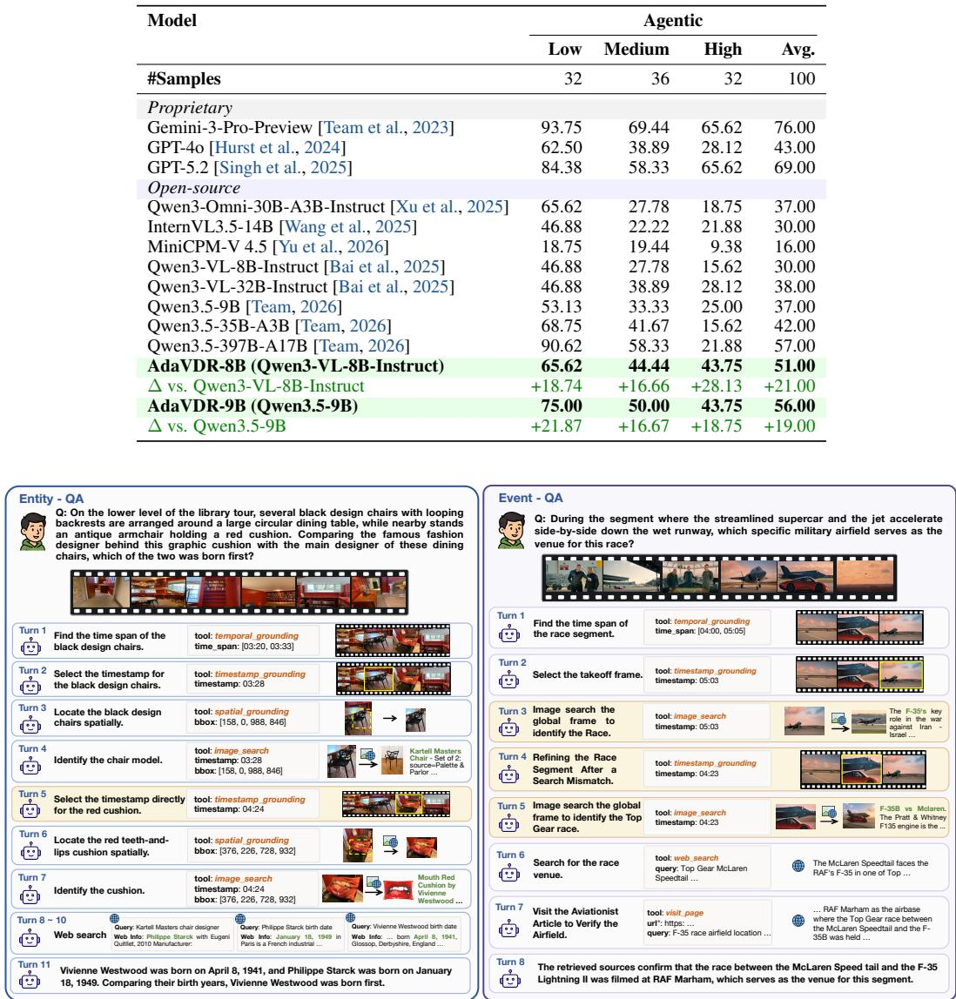

# AdaVDR: Adaptive Tool Use and Reflection for Video Deep Research

Xintong Zhang<sup>1,2,\*</sup>, Xiaomeng Fan<sup>2,\*</sup>, Shilin Yan<sup>1</sup>, Ekko He<sup>1</sup>, Zicheng Liu<sup>1</sup>, Zijian Zou<sup>1</sup>, Guannan Zhang<sup>1</sup>, Yuwei Wu<sup>2</sup>, Zhi Gao<sup>2,†</sup>, Hongwei Xue<sup>1,†</sup>

<sup>1</sup>Accio Team, Alibaba Group

<sup>2</sup>Beijing Key Laboratory of Intelligent Information Technology, School of Computer Science & Technology, Beijing Institute of Technology

## Abstract

Video deep research aims to answer complex questions by jointly understanding video content and retrieving external knowledge from the open Web. However, diverse question and video types require different tool-use strategies, where inappropriate tool invocation lead to incorrect results. The inherent uncertainty of grounding and retrieval makes unnecessary tool interactions both costly and error-prone, increasing latency and the risk of incorrect reasoning. To address these challenges, we propose AdaVDR, an adaptive video deep research agent with adaptive tool invocation and reflection. AdaVDR dynamically selects necessary tools according to the task and its own capabilities, and backtracks only when unreliable intermediate results need correction. To equip the agent with these capabilities, we develop a video deep research data construction pipeline. We first discover retrieval-relevant events and entities from diverse videos and acquire their detailed information through grounding and external retrieval to construct high-quality QA pairs. For each QA, we then use task-specific prompts to organize its corresponding information acquisition process into a tool-use trajectory, allowing different question and video types to follow different grounding and retrieval strategies. We further introduce model-conditioned tool necessity filtering, which evaluates tool calls according to the target model’s own video understanding capability and internal knowledge, and removes tools or tool chains that the model can directly bypass. Based on this pipeline, we construct a training dataset and a benchmark, VDR-EE, covering both entity-centric and event-centric questions. We perform supervised fine-tuning and then apply reinforcement learning with a redundancy-aware reward to further strengthen adaptive tool invocation and reflection. Experiments show that our method achieves the best performance among the evaluated open-source models on VDR-EE and substantially improves over its corresponding base models on VideoDR.

Project Page: https://Accio-Lab.github.io/AdaVDR

Github Repo: https://github.com/Accio-Lab/AdaVDR

## 1 Introduction

Video deep research is an important task that aims to answer complex questions by jointly reasoning over video content and external knowledge. It extends video-based question answering to open-world scenarios, where the required information may not be fully contained in the video itself, but needs to be further retrieved and verified from external web sources [Liu et al., 2026, Gao et al., 2026, Liang et al., 2025]. This capability is particularly important for questions involving fine-grained entities, evolving events, and up-to-date factual information. Solving this task requires building an agent that can coordinate video understanding and external retrieval tools, such as temporal grounding, timestamp grounding, spatial grounding, image search, web search, and page visiting, to progressively acquire evidence for multi-turn reasoning [Zhang et al., 2025, Li et al., 2026a, Wu et al., 2025].

  
Figure 1: The proposed AdaVDR invokes diverse tools and triggers reflection adaptively for video deep research. The adaptive tool selection process reduces unnecessary tool-use costs, while adaptive reflection prevents error accumulation.

Video deep research poses unique challenges for multi-turn reasoning. First, both question types and video content are highly diverse, leading to substantial differences in the information required and the appropriate tool-use strategies across tasks [Yuan et al., 2025, Li et al., 2026a]. An unsuitable tool-use strategy may therefore fail to acquire critical evidence or even lead to incorrect reasoning outcomes. Second, video grounding and external retrieval tools are inherently uncertain [Zhi et al., 2025, Zuo et al., 2026, Liu et al., 2026]. When the model already possesses sufficient video understanding capability or relevant knowledge, unnecessary tool calls not only increase inference latency but also introduce additional exposure to grounding and retrieval errors, thereby increasing the risk of incorrect reasoning [Li et al., 2026b, Chu et al., 2026]. These challenges call for an adaptive reasoning mechanism that determines both which tools should be used and whether further tool interaction is necessary according to the task requirements, the model’s own capabilities, and its internal knowledge.

We propose AdaVDR, as illustrated in Fig. 1, an adaptive video deep research agent with two complementary mechanisms: adaptive tool invocation and adaptive reflection. For tool invocation, the agent adaptively selects necessary tools according to the question type, its video understanding capability, and internal knowledge, thereby constructing task-specific and capability-specific tool combinations and reasoning trajectories instead of following a predefined workflow. For example,

AdaVDR skips temporal grounding when the relevant frame can be directly located, image search when the entity can be recognized, and web search when the required knowledge is already available internally. For reflection, the mechanism is triggered when newly acquired evidence is unreliable or insufficient. The agent identifies whether the failure originates from grounding or retrieval, and accordingly re-localizes the relevant video evidence or rewrites the query and performs the search again. Together, these mechanisms reduce redundant tool interactions and prevent unreliable intermediate evidence from propagating through subsequent reasoning.

To equip the agent with the above adaptive reasoning capability, we propose a video deep research data construction pipeline consisting of two stages: QA generation and trajectory generation. For QA generation, we identify retrieval-relevant events and entities from diverse videos and acquire their detailed information using task-specific grounding and retrieval processes, with different question types following different information acquisition strategies. The identified events or entities are then used to retrieve related external knowledge and construct QA pairs that jointly require video and external evidence. For trajectory generation, we organize the corresponding grounding and retrieval processes into task-specific tool-use trajectories, and further execute and refine them by correcting unreasonable dependencies, invalid parameters, and unreliable search results. We finally perform model-conditioned tool necessityfiltering according to the target model’s video understanding capability and internal knowledge. For each tool or consecutive tool chain, we provide the model with the information available before its execution and test whether it can directly obtain the expected result. If so, the corresponding interaction is removed as redundant; otherwise, it is retained, yielding trajectories tailored to the target model’s own capabilities. Based on this pipeline, we construct a training dataset and a benchmark, VDR-EE, covering both entity-centric and event-centric questions. VDR-EE contains 250 questions across seven domains, including culture, entertainment, industry, news, scene understanding, science, and sports, and each question requires both video evidence and external knowledge. To enable more fine-grained evaluation, entity-centric questions are further grouped by the number of target entities, while event-centric questions are grouped by target-event duration.

We perform SFT on the constructed trajectories, enabling the model to learn task-appropriate tool selection and reliable multi-turn reasoning. Building on this initialization, we further adopt reinforcement learning (RL) with a redundancy-aware reward that discourages unnecessary grounding, retrieval, and reflection while preserving task correctness, thereby strengthening adaptive tool invocation and reflection. Our method achieves the best performance among the evaluated open-source models on VDR-EE and substantially improves over its corresponding base models on VideoDR, demonstrating its effectiveness across diverse video deep research tasks. Moreover, quantitative and qualitative analyses show that our method reduces average tool calls while maintaining or improving overall agent performance. The contributions can be summarized as four-fold.

• We propose AdaVDR, an adaptive video deep research agent with adaptive tool invocation and adaptive reflection, enabling task-specific and capability-specific tool use and selective reflection on unreliable evidence, thereby improving reasoning accuracy and efficiency.

• We design a video deep research data construction pipeline that generates task-specific tool-use trajectories and performs model-conditioned tool necessity filtering, producing trajectories tailored to the target model’s capabilities.

• We provide reusable training data and a comprehensive benchmark covering both entity-centric and event-centric questions to support future research and evaluation.

• We develop an SFT+RL training framework with a redundancy-aware reward to further improve adaptive tool use, reasoning accuracy, and efficiency.

## 2 Related Work

## 2.1 Video Understanding Agents

Video understanding agents improve long-video reasoning by iteratively locating question-relevant evidence within videos. Representative systems such as VideoMind [Liu et al., 2025b], LVAgent [Chen et al., 2025], VCA [Yang et al., 2025b], and Deep Video Discovery [Zhang et al., 2025] identify relevant segments, frames, actions, or entities through agentic video exploration. Recent approaches further improve this process through uncertainty-aware plan adjustment [Zhi et al., 2025], hierarchical memory backtracking [Zuo et al., 2026], parallel segment-level perception and global aggregation [Pang and Wang, 2025], or dynamic temporal grounding guided by intermediate sub-questions [Yuan et al., 2025]. However, their evidence acquisition primarily remains within the video, whereas Video Deep Research additionally requires external information associated with the grounded entities or events. Our work studies how video grounding and external retrieval can be adaptively coordinated, while allowing the agent to revise unreliable grounding or retrieval results during multi-turn reasoning.

## 2.2 Multimodal Deep Research

Deep-search agents iteratively reason and invoke external tools to acquire information [Yao et al., 2022, Jin et al., 2025, Li et al., 2025]. Multimodal extensions further incorporate image search, visual grounding, cropping, and other visual operations, and learn tool-use policies through supervised fine-tuning or reinforcement learning [Wu et al., 2025, Hong et al., 2026, Huang et al., 2026, Chen et al., 2026, Zhang et al., 2026]. Recent methods also support longer multimodal search trajectories and richer visual interactions [Li et al., 2026b, Chu et al., 2026]. However, these methods primarily operate on static input images or visual evidence retrieved from the Web. Video Deep Research introduces an additional temporal dimension: relevant evidence may correspond to an entity appearing at a particular moment or an event unfolding over an extended segment, requiring video grounding to be coordinated with external retrieval. Recent work has begun to formulate and evaluate this setting [Liu et al., 2026]. Beyond combining video and search tools, an effective Video Deep Research agent must determine whether and which temporal, timestamp, spatial grounding, and retrieval operations are needed for each question, while recovering from unreliable intermediate results. Our work addresses these challenges through adaptive tool invocation and adaptive reflection throughout multi-turn video research.

## 3 Adaptive Video Deep Research Agent

In this section, we first formulate video deep research as a multi-turn reasoning and evidenceacquisition task over videos and external tools, and characterize its unique challenges arising from temporal events and fine-grained entities. We then introduce an adaptive agent mechanism that dynamically determines both when and which tools to invoke and when reflection is necessary.

## 3.1 Problem Definition

Given a raw video V and a user question $q ,$ the task of video deep research aims to generate an accurate textual answer a by iteratively reasoning and leveraging a suite of external tools $\mathcal { T } =$ $\left\{ T _ { 1 } , T _ { 2 } , \dots , T _ { K } \right\}$ . The toolset encompasses three primary categories: video grounding (including temporal grounding, timestamp grounding, and spatial grounding), external retrieval (including image search, web search, and page visits), and termination for final answer generation. Formally, at each interaction turn t, the agent observes the interaction history $h _ { t } = ( q , v , a _ { 1 } , o _ { 1 } , \dotsc , a _ { t - 1 } , o _ { t - 1 } )$ and generates an assistant output $a _ { t } = \pi ( h _ { t } )$ , where π is typically a VLM acting as the agent brain. At each non-terminal turn, $a _ { t }$ jointly contains the agent’s reasoning and a selected tool action from $\tau$ with its corresponding arguments, while $o _ { t }$ denotes the observation returned by executing that action. Once sufficient evidence has been acquired, the final assistant output instead contains the agent’s reasoning and textual answer, without an additional tool observation.

Compared with image deep research, video deep research involves more diverse question types, video content, and tool-use requirements, leading to substantially different information needs and reasoning trajectories across tasks. Two representative question types are:

• Temporal Event. Event-centric questions require the agent to identify an action or event and localize the corresponding temporal interval. They often rely on temporal or timestamp grounding to determine when the relevant evidence appears, while spatial grounding is typically unnecessary. Some event-related questions can further proceed to text-based web search once the video content has been sufficiently understood.

• Entity. Entity-centric questions require the agent to identify or ground an object, person, product, or other entity at a particular timestamp or across multiple frames. Such questions often require locating a relevant frame, grounding the target region, and further using OCR, image search, or web search to resolve the entity’s fine-grained identity and related information.

These differences make the choice of tool-use strategy critical. An inappropriate reasoning trajectory may fail to acquire the information required by the task or introduce irrelevant operations, ultimately leading to incorrect reasoning results.

The outputs of video grounding and external retrieval tools are inherently uncertain. Temporal or timestamp grounding may locate an inaccurate segment or frame, spatial grounding may focus on an uninformative region, and image or web search may return irrelevant results. As a result, when the required information can already be obtained from the model’s video understanding capability or internal knowledge, executing additional tool calls unnecessarily exposes the reasoning process to these uncertainties. Such redundant interactions not only increase inference latency, but may also introduce noisy or incorrect evidence and degrade thefinal reasoning result.

To address these challenges, we propose an adaptive reasoning paradigm with adaptive tool invocation and adaptive reflection. For tool invocation, the agent first selects the most appropriate grounding and retrieval tools according to the question type and video content, allowing different tasks to follow different reasoning trajectories. It further adapts tool use to its own capability boundary and internal knowledge, skipping grounding or retrieval steps when the required information can already be obtained directly. Reflection is also performed adaptively: reliable intermediate results are directly used for subsequent reasoning, whereas unreliable or insufficient results trigger the agent to identify the problematic grounding or retrieval step and backtrack for correction. In this way, the agent avoids both inappropriate and unnecessary tool interactions while reducing the propagation of unreliable information.

## 3.2 Adaptive Mechanism in Agent

Adaptive Tool Invocation. The agent dynamically selects tools according to both the query type and the information currently available. The agent must therefore distinguish the question type and adaptively select the appropriate tools instead of following a fixed sequence. For event-centric queries, the agent mainly relies on temporal or timestamp grounding to identify when the relevant event occurs, while spatial grounding is often unnecessary. Some event-related queries may instead require understanding or summarizing the video content and directly performing text-based web search for external information. In contrast, entity-centric queries more often require locating a specific frame or object through timestamp and spatial grounding, followed by image or web search for fine-grained identification.

Within each reasoning process, tool invocation is further performed on demand rather than following a fixed sequence. If the required entity, event, or information can already be inferred from the current video evidence or the agent’s internal knowledge, unnecessary grounding or retrieval steps are skipped. Therefore, the reasoning trajectory is dynamically constructed according to both the query-specific evidence requirements and the evolving information demand.

Adaptive Reflection. Reflection is activated only when the newly acquired evidence is irrelevant, inconsistent, or insufficient to support subsequent reasoning. When the evidence is reliable, the agent directly proceeds forward without additional reflection. Otherwise, it examines the previous trajectory to identify the potential source of the failure. For instance, an incorrect search result may originate from an inappropriate query, spatial grounding, timestamp selection, or temporal localization. The agent then backtracks to the corresponding step and resumes reasoning with a revised decision. In this way, adaptive reflection enables error correction without repeatedly reconsidering reliable intermediate steps or restarting the entire reasoning process.

## 4 Data Collection

To enable the adaptive behaviors described above, we construct training data that reflects task-specific tool requirements and model-specific tool necessity. As illustrated in Fig. 2, our pipeline consists of two stages: QA generation and trajectory generation, where we construct questions requiring both video and external knowledge, and build verified trajectories with unnecessary tool interactions removed.

  
Figure 2: Overview of the data construction pipeline, including QA and trajectory generation, trajectory refinement, and tool-necessaryfiltering.

## 4.1 QA Generation

We first perform video selection and anchor discovery to identify retrieval-relevant events and entities from diverse videos. We then conduct video-to-Web evidence acquisition, progressively grounding the target content and retrieving related external knowledge. Finally, through QA generation and filtering, we construct questions that jointly require video information and external evidence, and remove those that can be answered without either source.

Video Selection and Anchor Discovery. We primarily collect videos from YouTube for the news, industry, culture, sports, and science domains. The scene-understanding subset is instead primarily sourced from EgoExo4D [Grauman et al., 2024], EgoLife [Yang et al., 2025a], CityWalker [Liu et al., 2025a], ARKitScenes [Baruch et al., 2021], ScanNet++ [Yeshwanth et al., 2023], and Sekai [Li et al., 2026c], covering diverse indoor, outdoor, egocentric, and urban environments. The resulting collection covers six semantic domains: news, industry, culture, sports, science, and scene understanding.

Gemini-3.5-Flash analyzes each video with its ASR transcript to identify fine-grained and retrievalrelevant visual anchors. At this stage, the model does not need to determine the exact identity of each entity or event. Instead, it records textual descriptions of potentially useful visual content for subsequent retrieval and question construction. These descriptions include both recognizable entities or events with clear retrieval value and unfamiliar visual targets whose identities can be further resolved through search.

Video-to-Web Evidence Acquisition. To collect fine-grained external knowledge, we first extract sufficient information from the video to identify the relevant event or entity, and then use the extracted information to conduct further image retrieval or web retrieval. This process consists of two successive stages: video-based information extraction and external evidence retrieval.

For video-based information extraction, we progressively identify the target through multi-step grounding and retrieval. For events or actions, we perform temporal grounding to locate the relevant segment and timestamp grounding to select informative frames. The selected frames are then used for image search to retrieve visually related results, which are combined with complementary textual information from ASR. For entities, we perform spatial grounding to isolate the target region and use the resulting crop for image search to obtain possible identities. OCR and ASR further provide visible or spoken information. We combine these results until sufficiently specific information about the event or entity is obtained for subsequent retrieval.

Depending on the identified event or entity, we then perform external evidence retrieval by using web search or image search to retrieve relevant evidence from authoritative or task-specific sources, and organize the retrieved facts into a traceable evidence path.

QA Generation and Filtering. Based on the verified video information and source-backed external evidence, we construct question–answer pairs that require reasoning over both sources. Each question combines video-grounded information with a temporal or timestamp-related condition, such as an event occurring within a particular interval or an entity appearing at a specific moment, while the answer is derived from the corresponding external evidence.

To ensure that the resulting questions genuinely depend on both the video and external information, we further filter the generated QAs using Qwen3-VL-235B-A22B-Instruct under two restricted settings: (1) answering without access to the video, and (2) answering with the video but without using external tools. We remove a question if it can be answered correctly under either setting.

## 4.2 Trajectory Generation

For each retained QA pair, we first perform trajectory generation and execution, constructing taskspecific tool-use trajectories, refining their logical dependencies and parameters, and executing them step by step. We then conduct trajectory check and retry to verify intermediate results, retry unreliable steps when necessary, and preserve the resulting correction process as adaptive reflection data. Finally, through model-conditioned tool necessityfiltering, we further remove tool calls or tool chains that are unnecessary for the target model based on its own video understanding capability and internal knowledge.

Trajectory Generation and Execution. For each retained QA pair, we first organize the information acquired in the previous stage, including video grounding results, event or entity identification, and the corresponding external evidence. Different questions follow different information acquisition processes through task-specific prompts; for example, event-centric questions are explicitly instructed not to invoke spatial grounding. Based on these processes, we further organize the grounding and retrieval operations, together with their intermediate results, into corresponding tool-use trajectories that are aligned with the specific information requirements of each question.

We refine each initial trajectory according to the question type, removing tool calls that are irrelevant to its information requirements. For example, spatial grounding is removed for event-centric questions when no fine-grained spatial localization is needed. We then check the logical dependencies and tool parameters of the remaining trajectory, ensuring that each tool is supported by the outputs of its prerequisite steps. For instance, image search over a target entity should be preceded by the corresponding grounding operation, with its input taken from the resulting crop. We further verify that each tool call correctly refers to the intended intermediate results and revise invalid dependencies or parameters accordingly. We then invoke the tools to execute the refined trajectory step by step according to the specified tool calls and parameters.

Trajectory Check and Retry. We then execute the refined trajectory and verify whether each tool produces the expected information. For image search, an incorrect result often originates from low-quality grounding, such as selecting a frame where a person is shown only from the side or cropping an uninformative region. In such cases, we trace back to the corresponding grounding step, select a better frame or region, and repeat the image search until the expected target appears in the retrieved results or the maximum number of attempts is reached. For web search, when the retrieved results do not contain the expected information, we reformulate the search query and repeat the retrieval. This iterative execution and verification process continues until the trajectory can reliably recover the expected evidence or the maximum number of attempts is reached.

We retain these failed attempts, failure diagnoses, and subsequent corrections in the trajectory, producing natural reflection and recovery steps that teach the model to revise unreliable intermediate results. By introducing reflection only when unreliable intermediate results occur, while leaving reliable steps unchanged, the constructed trajectories teach the agent to trigger reflection on demand and perform targeted correction rather than reflecting at every reasoning step.

Model-conditioned Tool Necessity Filtering. We further evaluate the necessity of tool calls in each successfully executed trajectory. Given a tool or a consecutive tool chain S, we denote the information already known to the agent before executing $s$ as $x _ { S } .$ , and the target result obtained after executing $s$ as $y _ { \mathcal { S } }$ . Based on the parameters of $s ,$ such as the grounding description or retrieval target, we construct a verification query $q _ { S }$ that asks for the target result $y _ { \mathcal { S } }$ . We perform this filtering separately for different base models $\mathcal { M } _ { \phi } ,$ , so that tool necessity is evaluated against the capability and internal knowledge of the corresponding model. The base model then directly obtains the target result from $x _ { S }$ without executing S:

$$
\hat { y } _ { S } = \mathcal { M } _ { \phi } \left( x _ { S } , q _ { S } \right) .\tag{1}
$$

The necessity of $s$ is defined as

$$
N ( { \cal S } ) = { \bf 1 } \left[ \hat { y } { s } \neq y { s } \right] .\tag{2}
$$

If $\hat { y } _ { S }$ matches $y _ { \mathcal { S } }$ , the target result can be obtained without executing $s ,$ , indicating that the tool chain is unnecessary and can be removed. Otherwise, $s$ is retained as necessary.

We apply this evaluation to the longest candidate tool chain and then progressively examine its individual tools. For example, consider the chain Temporal Grounding → Timestamp Grounding → Spatial Grounding → Image Search, which is used to identify “the person wearing blue.” If Qwen3-VL-8B can directly identify the person from the original video, the entire tool chain is removed. Then, we further evaluate the necessity of the tools within the chain. For example, to evaluate Temporal Grounding, we bypass its localized temporal interval and directly provide the original video together with a query asking the model to locate a usable frame containing “the person wearing blue.” If Qwen3-VL-8B can directly locate such a frame from the full video, Temporal Grounding is unnecessary and removed. We apply this principle to the remaining grounding and retrieval tools, progressively removing tool calls.

SFT Data Construction. Gemini-3.5-Flash converts the verified execution history into SFT data. Failed intermediate attempts are preserved when they lead to a valid correction. For example, if image search returns an incorrect match because of inaccurate grounding, the trajectory records the failure, performs another localization of a different region, and repeats the search. This produces natural reflection and recovery behaviors while ensuring that the final trajectory remains correct and fully supported.

## 4.3 Benchmark

We introduce VDR-EE, a manually verified Video Deep Research benchmark covering both entitycentric and event-centric questions. We construct the benchmark using the QA generation process described in Sec. 4.1. To prevent overlap with the training data, we discard any benchmark candidate whose source video or question also appears in the SFT or RL training set. We additionally deduplicate source videos and questions within the benchmark. Each remaining candidate is manually reviewed to ensure that the entity or event referred to by the question is clearly identifiable in the video and that answering the question requires both video evidence and external knowledge. We further verify that each question is unambiguous and that its reference answer is supported by the retrieved evidence. Candidates that fail any of these checks are discarded, resulting in 250 manually verified questions.

Semantic domain. Each retained question is manually assigned to one of seven domains: culture, entertainment, industry, news, scene understanding, science, and sports. The resulting distribution across these seven domains is shown in Fig. 3.

Video-centric categories. VDR-EE contains entity-centric and event-centric questions. Entity questions require identifying one or more entities and retrieving related external knowledge, while event questions require recognizing an event or scenario and retrieving event-related information. Entity questions are grouped as single-entity or multi-entity; event questions are grouped as short, medium, or long according to target-event duration. All questions are also grouped by full-video duration. Table 1 summarizes these annotations, including 153 entity and 97 event questions, and Fig. 4 illustrates representative examples.

  
Figure 3: Distribution of the 250 VDR-EE questions across seven semantic domains.

Table 1: Statistics and video-centric annotations ofVDR-EE.
<table><tr><td>Dimension</td><td>Category</td><td>Definition</td><td>Count Proportion</td><td></td></tr><tr><td colspan="5">Question Type (250 instances)</td></tr><tr><td>Question Type</td><td>Entity</td><td>Entity-oriented questions</td><td>153</td><td>61.20%</td></tr><tr><td></td><td>Event</td><td>Event-oriented questions</td><td>97</td><td>38.80%</td></tr><tr><td colspan="5">Entity Multiplicity (153 entity instances)</td></tr><tr><td>Entity Type</td><td>Single</td><td>One entity</td><td>76</td><td>49.67%</td></tr><tr><td></td><td>Multi</td><td>Multiple entities</td><td>77</td><td>50.33%</td></tr><tr><td colspan="5">Grounded-Event Duration (97 event instances)</td></tr><tr><td>Event Duration</td><td>Short</td><td>≤ 30 s</td><td>35</td><td>36.08%</td></tr><tr><td></td><td>Medium</td><td>30-120 s</td><td>34</td><td>35.05%</td></tr><tr><td></td><td>Long</td><td>&gt; 120 s</td><td>28</td><td>28.87%</td></tr><tr><td colspan="5">Full-Video Duration (250 instances)</td></tr><tr><td>Video Duration</td><td>Short</td><td>≤ 5 min</td><td>77</td><td>30.80%</td></tr><tr><td></td><td>Medium</td><td>5–10 min</td><td>80</td><td>32.00%</td></tr><tr><td></td><td>Long</td><td>&gt; 10 min</td><td>93</td><td>37.20%</td></tr></table>

  
Figure 4: Examples of event-oriented and entity-oriented questions in VDR-EE.

## 5 Training

## 5.1 Cold-Start Supervised Fine-Tuning

We perform supervised fine-tuning (SFT) on approximately 2.9K verified trajectories from Sec. 4.2 to initialize adaptive tool use and reflection. These multi-turn trajectories contain task-specific combinations of grounding and retrieval actions, and retain intermediate failures when followed by valid corrections. Given M trajectories, where $x ^ { ( n ) }$ denotes the interaction context and $y ^ { ( n ) } =$ $\{ y _ { 1 } ^ { ( n ) } , \ldots , y _ { N _ { n } } ^ { ( n ) } \}$ the target assistant output, we optimize:

$$
\mathcal { L } _ { \mathrm { S F T } } ( \theta ) = - \frac { 1 } { M } \sum _ { n = 1 } ^ { M } \sum _ { i = 1 } ^ { N _ { n } } \log \pi _ { \theta } \Big ( y _ { i } ^ { ( n ) } \mid x ^ { ( n ) } , y _ { < i } ^ { ( n ) } \Big ) .\tag{3}
$$

The loss is applied only to assistant-generated tokens, while video inputs, user messages, and tool observations serve as conditioning context. The resulting checkpoint serves as the initial RL policy.

## 5.2 Reinforcement Learning

Starting from the SFT checkpoint, we optimize the agent with Group Relative Policy Optimization (GRPO) [Shao et al., 2024]. RL uses approximately 1K training instances. For each instance $x = ( v , q )$ , the policy samples a group of G complete research trajectories $\{ \tau _ { i } \} _ { i = 1 } ^ { G }$ through interaction with the grounding and retrieval environment. Each trajectory receives the reward

$$
R ( \tau _ { i } ) = \lambda _ { \mathrm { a c c } } R _ { \mathrm { a c c } } ( \tau _ { i } ) + \lambda _ { \mathrm { f m t } } R _ { \mathrm { f m t } } ( \tau _ { i } ) + \lambda _ { \mathrm { a d a } } R _ { \mathrm { a d a } } ( \tau _ { i } ) ,\tag{4}
$$

where $R _ { \mathrm { a c c } }$ is a binary correctness reward produced by the answer judge, and $R _ { \mathrm { f m t } }$ verifies that tool calls and the final answer follow the required serialization format. The adaptive reward discourages unnecessary tool invocations while retaining the evidence needed for a correct answer:

$$
N _ { \mathrm { t o o l } } ^ { \mathrm { m i n } } = \operatorname* { m i n } _ { j : R _ { \mathrm { a c c } } ( \tau _ { j } ) = 1 } N _ { \mathrm { t o o l } } ( \tau _ { j } ) , \qquad R _ { \mathrm { a d a } } ( \tau _ { i } ) = - { \bf 1 } [ R _ { \mathrm { a c c } } ( \tau _ { i } ) = 1 ] \left( N _ { \mathrm { t o o l } } ( \tau _ { i } ) - N _ { \mathrm { t o o l } } ^ { \mathrm { m i n } } \right) ,\tag{5}
$$

Here, $N _ { \mathrm { t o o l } } ^ { \mathrm { m i n } }$ is the minimum number of tool calls among correct trajectories in the same rollout group. The most efficient correct trajectory receives no penalty, while each additional tool call incurs a fixed penalty. We set $R _ { \mathrm { a d a } } = 0$ when no correct trajectory exists and do not apply it to incorrect trajectories, preventing short but incorrect trajectories from being rewarded. We use $\lambda _ { \mathrm { a c c } } = 0 . 9$ $\dot { \lambda } _ { \mathrm { f m t } } = 0 . 1$ , and $\lambda _ { \mathrm { a d a } } = 0 . 1$

Following GRPO, we normalize rewards within each rollout group:

$$
\widehat { A } _ { i } = \frac { R ( \tau _ { i } ) - \mathrm { m e a n } _ { j = 1 } ^ { G } R ( \tau _ { j } ) } { \mathrm { s t d } _ { j = 1 } ^ { G } R ( \tau _ { j } ) + \epsilon _ { A } } .\tag{6}
$$

Let $o _ { i , t }$ be the t-th assistant-generated token in $\tau _ { i }$ and $\rho _ { i , t } ( \theta ) = \pi _ { \theta } ( o _ { i , t } \mid h _ { i , t } ) / \pi _ { \mathrm { o l d } } ( o _ { i , t } \mid h _ { i , t } )$ its importance ratio. We optimize the clipped objective

$$
\begin{array} { c l } { \displaystyle \mathcal { I } _ { \mathrm { G R P O } } ( \theta ) = \displaystyle \frac { 1 } { G } \sum _ { i = 1 } ^ { G } \frac { 1 } { | \tau _ { i } | } \sum _ { t = 1 } ^ { | \tau _ { i } | } \Big [ \operatorname* { m i n } \big ( \rho _ { i , t } ( \theta ) \widehat { A } _ { i } , \mathrm { c l i p } ( \rho _ { i , t } ( \theta ) , 1 - \varepsilon , 1 + \varepsilon ) \widehat { A } _ { i } \big ) } \\ { \displaystyle - \beta D _ { \mathrm { K L } } \big ( \pi _ { \theta } ( \cdot \lfloor h _ { i , t } ) \| \pi _ { \mathrm { r e f } } ( \cdot \lfloor h _ { i , t } ) \big ) \Big ] , } \end{array}\tag{7}
$$

where $\pi _ { \mathrm { r e f } }$ is the frozen SFT policy. The objective is applied only to assistant-generated tokens, with video inputs and tool observations serving as conditioning context.

## 6 Experiment

## 6.1 Implementation Details

We evaluate a diverse set of proprietary and open-source models. The proprietary models include Gemini-3.1-Pro and Gemini-3-Flash [Team et al., 2023], and GPT-5.4 [Singh et al., 2025]. The open-source models include Qwen3.5-35B-A3B [Team, 2026], Qwen3.5-9B [Team, 2026], Qwen3- VL-32B-Instruct [Bai et al., 2025], and Qwen3-VL-8B-Instruct [Bai et al., 2025]. We conduct evaluations on two video deep-research benchmarks: VDR-EE and VideoDR [Liu et al., 2026]. In the Direct setting, the model answers based solely on the input video without using external tools. Following VideoDR [Liu et al., 2026], Workflow separates video-cue extraction from subsequent Web retrieval, whereas Agentic allows a multimodal agent to autonomously perform video understanding, tool use, and evidence integration. AdaVDR-8B and AdaVDR-9B are initialized from Qwen3-VL-8B-Instruct and Qwen3.5-9B, respectively, and trained on data constructed through our proposed video deep-research data pipeline, with training details provided in Appendix A. Since our models are specifically optimized for agentic tool use, we report their performance under the Agentic setting. For answer evaluation, we use GPT-5.4 as an LLM judge to determine whether each model prediction is semantically consistent with the corresponding reference answer, and report the proportion of predictions judged correct as accuracy. The complete judge prompt is provided in Appendix B.

## 6.2 Main Results

## 6.2.1 VDR-EE Results

We first evaluate all models on VDR-EE under the Direct and Agentic settings. Table 2 examines question types and target-event durations, Table 3 reports domain-level performance, and Table 4 analyzes the effect of full-video duration. Overall, agentic interaction consistently improves performance across the evaluated models. Our model further improves its Qwen3-VL-8B-Instruct base model by 10.00 percentage points overall, with gains across all domains and particularly strong improvement on long events, although longer full-video contexts remain challenging.

Table 2: Accuracy (%) across question types and target-event duration groups on VDR-EE under the Direct and Agentic settings.
<table><tr><td rowspan="2">Model</td><td colspan="3">Entity</td><td colspan="4">Event</td><td rowspan="2">Avg.</td></tr><tr><td>Single</td><td>Multiple</td><td>Overall</td><td>Short</td><td>Medium</td><td>Long</td><td>Overall</td></tr><tr><td colspan="9">Direct</td></tr><tr><td>Proprietary</td><td></td><td></td><td></td><td></td><td></td><td></td><td></td><td></td></tr><tr><td>Gemini-3.1-Pro [Team et al., 2023]</td><td>56.58</td><td>28.57</td><td>42.48</td><td>54.29</td><td>55.88</td><td>50.00</td><td>53.61</td><td>46.80</td></tr><tr><td>Gemini-3-Flash [Team et al., 2023]</td><td>42.11</td><td>22.08</td><td>32.03</td><td>51.43</td><td>61.76</td><td>46.43</td><td>53.61</td><td>40.40</td></tr><tr><td>GPT-5.4 [Singh et al., 2025]</td><td>35.53</td><td>23.38</td><td>29.41</td><td>28.57</td><td>41.18</td><td>39.29</td><td>36.08</td><td>32.00</td></tr><tr><td>Open-source</td><td></td><td></td><td></td><td></td><td></td><td></td><td></td><td></td></tr><tr><td>Qwen3-VL-8B-Instruct [Bai et al., 2025]</td><td>21.05</td><td>5.19</td><td>13.07</td><td>8.57</td><td>14.71</td><td>10.71</td><td>11.34</td><td>12.40</td></tr><tr><td>Qwen3-VL-32B-Instruct [Bai et al., 2025]</td><td>30.26</td><td>9.09</td><td>19.61</td><td>8.57</td><td>14.71</td><td>14.29</td><td>12.37</td><td>16.80</td></tr><tr><td>Qwen3.5-9B [Team, 2026]</td><td>23.68</td><td>11.69</td><td>17.65</td><td>5.71</td><td>2.94</td><td>7.14</td><td>5.15</td><td>12.80</td></tr><tr><td>Qwen3.5-35B-A3B [Team, 2026]</td><td>32.89</td><td>9.09</td><td>20.92</td><td>11.43</td><td>5.88</td><td>7.14</td><td>8.25</td><td>16.00</td></tr><tr><td colspan="9">Agentic</td></tr><tr><td>Proprietary</td><td></td><td></td><td></td><td></td><td></td><td></td><td></td><td></td></tr><tr><td>Gemini-3.1-Pro [Team et al., 2023]</td><td>73.68</td><td>50.65</td><td>62.09</td><td>71.43</td><td>64.71</td><td>67.86</td><td>68.04</td><td>64.40</td></tr><tr><td>Gemini-3-Flash [Team et al., 2023]</td><td>64.47</td><td>40.26</td><td>52.29</td><td>68.57</td><td>82.35</td><td>60.71</td><td>71.13</td><td>59.60</td></tr><tr><td>GPT-5.4 [Singh et al., 2025]</td><td>59.21</td><td>40.26</td><td>49.67</td><td>54.29</td><td>61.76</td><td>57.14</td><td>57.73</td><td>52.80</td></tr><tr><td>Open-source</td><td></td><td></td><td></td><td></td><td></td><td></td><td></td><td></td></tr><tr><td>Qwen3-VL-8B-Instruct [Bai et al., 2025]</td><td>42.11</td><td>22.08</td><td>32.03</td><td>22.86</td><td>26.47</td><td>17.86</td><td>22.68</td><td>28.40</td></tr><tr><td>Qwen3-VL-32B-Instruct [Bai et al., 2025]</td><td>60.53</td><td>32.47</td><td>46.41</td><td>22.86</td><td>32.35</td><td>17.86</td><td>24.74</td><td>38.00</td></tr><tr><td>Qwen3.5-9B [Team, 2026]</td><td>56.58</td><td>28.57</td><td>42.48</td><td>34.29</td><td>32.35</td><td>42.86</td><td>36.08</td><td>40.00</td></tr><tr><td>Qwen3.5-35B-A3B [Team, 2026]</td><td>56.58</td><td>38.96</td><td>47.71</td><td>42.86</td><td>52.94</td><td>35.71</td><td>44.33</td><td>46.40</td></tr><tr><td>ÀdaVDR-8B (Qwen3-VL-8B-Instruct)</td><td>53.95</td><td>28.57</td><td>41.18</td><td>31.43</td><td>32.35</td><td>39.29</td><td>34.02</td><td>38.40</td></tr><tr><td>∆ vs. Qwen3-VL-8B-Instruct</td><td>+11.84</td><td>+6.49</td><td>+9.15</td><td>+8.57</td><td>+5.88</td><td>+21.43</td><td>+11.34</td><td>+10.00</td></tr><tr><td>AdaVDR-9B (Qwen3.5-9B)</td><td>57.89</td><td>32.47</td><td>45.10</td><td>48.57</td><td>58.82</td><td>46.43</td><td>51.55</td><td>47.60</td></tr><tr><td>∆ vs. Qwen3.5-9B</td><td>+1.31</td><td>+3.90</td><td>+2.62</td><td>+14.28</td><td>+26.47</td><td>+3.57</td><td>+15.47</td><td>+7.60</td></tr></table>

AdaVDR achieves a clear overall improvement. As shown in Table 2, AdaVDR, evaluated exclusively under the Agentic setting, improves the overall accuracy from 28.40% to 38.40% over the Qwen3-VL-8B-Instruct baseline, a gain of 10.00 percentage points. The improvement is observed on both event- and entity-related questions, with gains of 11.34 and 9.15 percentage points, respectively. For event-related questions, accuracy on long events further increases from 17.86% to 39.29%, corresponding to a gain of 21.43 percentage points. As further shown in Table 3, AdaVDR outperforms the agentic Qwen3-VL-8B-Instruct baseline across all seven evaluated domains, with gains ranging from 5.55 to 22.23 percentage points. With Qwen3.5-9B as the base model, AdaVDR-9B improves overall accuracy from 40.00% to 47.60% (+7.60 points), driven mainly by a 15.47-point gain on event questions, and improves all seven domains.

Agentic interaction is essential for solving the benchmark. Table 2 shows that enabling agentic interaction improves the reported average accuracy of every baseline model, with gains ranging from 16.00 to 30.40 percentage points. The largest improvements are observed for Qwen3.5-35B-A3B (16.00% to 46.40%, +30.40 points) and Qwen3.5-9B (12.80% to 40.00%, +27.20 points), while GPT-5.4 and Gemini-3-Flash also improve by 20.80 and 19.20 points, respectively. These gains indicate that successful completion requires more than static video recognition, including iterative video grounding, external retrieval, and evidence synthesis.

Performance across question types and temporal scales. Entity questions show a clear difficulty gap in Table 2: multi-entity questions generally achieve lower accuracy than single-entity questions across models. For event questions, longer duration does not necessarily imply greater difficulty. Performance depends not only on localizing the event in time, but also on recognizing the event and retrieving relevant external evidence, so the effect of duration varies across models and settings. A similar pattern appears in Table 4: longer full videos may provide more contextual evidence, but they also introduce a larger search space and more irrelevant content. AdaVDR-8B improves over its agentic Qwen3-VL-8B-Instruct base model by 14.28, 5.00, and 10.75 percentage points on short, mid-length, and long videos, respectively. Compared with Qwen3.5-9B, AdaVDR-9B gains 27.27 and 4.30 points on short and long videos but drops 7.50 on medium videos.

Table 3: Domain-wise accuracy (%) on VDR-EE under the Direct and Agentic settings.
<table><tr><td rowspan="2">Model</td><td colspan="7">Domains</td><td rowspan="2">Avg.</td></tr><tr><td>Culture</td><td>Entertain ment</td><td>Indus trial</td><td>News</td><td>Scene understanding</td><td>Sports</td><td>Science</td></tr><tr><td colspan="8">Direct</td></tr><tr><td colspan="8">Proprietary</td></tr><tr><td>Gemini-3.1-Pro [Team et al., 2023]</td><td>38.89</td><td>54.29</td><td>27.78</td><td>37.14</td><td>63.89</td><td>50.00</td><td>55.56</td><td>46.80</td></tr><tr><td>Gemini-3-Flash [Team et al., 2023]</td><td>44.44</td><td>40.00</td><td>16.67</td><td>22.86</td><td>66.67</td><td>44.44</td><td>47.22</td><td>40.40</td></tr><tr><td>GPT-5.4 [Singh et al., 2025]</td><td>41.67</td><td>14.29</td><td>16.67</td><td>22.86</td><td>50.00</td><td>36.11</td><td>41.67</td><td>32.00</td></tr><tr><td colspan="8">Open-source</td></tr><tr><td>Qwen3-VL-8B-Instruct [Bai et al., 2025]</td><td>2.78</td><td>14.29</td><td>11.11</td><td>8.57</td><td>25.00</td><td>8.33</td><td>16.67</td><td>12.40</td></tr><tr><td>Qwen3-VL-32B-Instruct [Bai et al., 2025]</td><td>11.11</td><td>14.29</td><td>13.89</td><td>5.71</td><td>36.11</td><td>11.11</td><td>25.00</td><td>16.80</td></tr><tr><td>Qwen3.5-9B [Team, 2026]</td><td>8.33</td><td>5.71</td><td>16.67</td><td>8.57</td><td>25.00</td><td>8.33</td><td>16.67</td><td>12.80</td></tr><tr><td>Qwen3.5-35B-A3B [Team, 2026]</td><td>13.89</td><td>5.71</td><td>5.56</td><td>11.43</td><td>38.89</td><td>8.33</td><td>27.78</td><td>16.00</td></tr><tr><td colspan="8"></td></tr><tr><td colspan="8">Agentic</td></tr><tr><td>Proprietary Gemini-3.1-Pro [Team et al., 2023]</td><td>58.33</td><td>74.29</td><td>50.00</td><td>51.43</td><td>75.00</td><td>66.67</td><td>75.00</td><td>64.40</td></tr><tr><td>Gemini-3-Flash [Team et al., 2023]</td><td>72.22</td><td>51.43</td><td>41.67</td><td>48.57</td><td>66.67</td><td>69.44</td><td>66.67</td><td>59.60</td></tr><tr><td>GPT-5.4 [Singh et al., 2025]</td><td>47.22</td><td>51.43</td><td>38.89</td><td>62.86</td><td>66.67</td><td>44.44</td><td>58.33</td><td>52.80</td></tr><tr><td colspan="8">Open-source</td></tr><tr><td>Qwen3-VL-8B-Instruct [Bai et al., 2025]</td><td>33.33</td><td>28.57</td><td>25.00</td><td>28.57</td><td>38.89</td><td>8.33</td><td>36.11</td><td>28.40</td></tr><tr><td>Qwen3-VL-32B-Instruct [Bai et al., 2025]</td><td>50.00</td><td>37.14</td><td>27.78</td><td>25.71</td><td>52.78</td><td>11.11</td><td>61.11</td><td>38.00</td></tr><tr><td>Qwen3.5-9B [Team, 2026]</td><td>50.00</td><td>34.29</td><td>30.56</td><td>40.00</td><td>50.00</td><td>30.56</td><td>44.44</td><td>40.00</td></tr><tr><td>Qwen3.5-35B-A3B [Team, 2026]</td><td>55.56</td><td>34.29</td><td>36.11</td><td>40.00</td><td>55.56</td><td>36.11</td><td>66.67</td><td>46.40</td></tr><tr><td>AdaVDR-8B (Qwen3-VL-8B-Instruct)</td><td>44.44</td><td>34.29</td><td>33.33</td><td>37.14</td><td>44.44</td><td>30.56</td><td>44.44</td><td>38.40</td></tr><tr><td>∆ vs. Qwen3-VL-8B-Instruct</td><td>+11.11</td><td>+5.72</td><td>+8.33</td><td>+8.57</td><td>+5.55</td><td>+22.23</td><td>+8.33</td><td>+10.00</td></tr><tr><td>AdaVDR-9B (Qwen3.5-9B)</td><td>52.78</td><td>42.86</td><td>36.11</td><td>45.71</td><td>58.33</td><td>41.67</td><td>55.56</td><td>47.60</td></tr><tr><td>∆ vs. Qwen3.5-9B</td><td>+2.78</td><td>+8.57</td><td>+5.55</td><td>+5.71</td><td>+8.33</td><td>+11.11</td><td>+11.12</td><td>+7.60</td></tr></table>

## 6.2.2 VideoDR Results

We further evaluate the models on VideoDR. Table 5 reports domain results for the Workflow and Agentic settings, and Table 6 reports agentic accuracy by difficulty.

AdaVDR substantially improves over its base model on VideoDR. As shown in Table 5, AdaVDR based on Qwen3-VL-8B-Instruct achieves an average accuracy of 51.00%, improving its base model by 21.00 percentage points. With Qwen3.5-9B as the base model, AdaVDR further reaches 56.00% average accuracy.

AdaVDR achieves consistent gains across difficulty levels. As shown in Table 6, AdaVDR based on Qwen3-VL-8B-Instruct obtains 65.62%, 44.44%, and 43.75% accuracy on the Low-, Medium-, and High-difficulty subsets, respectively. With Qwen3.5-9B as the base model, the corresponding accuracies increase to 75.00%, 50.00%, and 43.75%.

## 6.2.3 Qualitative Analysis

Fig. 5 illustrates how AdaVDR adapts its reasoning trajectory to the question and the evidence acquired during interaction. In the entity-oriented example, the model uses temporal grounding to locate the chairs. For the red cushion, the relevant timestamp can be directly identified from the current video context, so the model skips temporal grounding and proceeds to spatial grounding. It then identifies both objects before retrieving information about their designers and comparing their birth dates. This trajectory shows that AdaVDR can omit temporal grounding when the relevant timestamp can be identified directly. In the event-oriented example, the initial image search based on a takeoff frame returns mismatched evidence. The model therefore selects a more informative timestamp, identifies the race, and verifies the airfield through web search and page inspection. Together, the two examples demonstrate adaptive tool invocation and reflection-based recovery from unreliable intermediate retrieval results.

Table 4: Accuracy (%) across full-video duration groups on VDR-EE under the Direct and Agentic settings.
<table><tr><td>Model</td><td colspan="3">Video Duration</td><td>Avg.</td></tr><tr><td></td><td>Short ≤ 5 min</td><td>Medium 5–10 min</td><td>Long &gt; 10 min</td><td></td></tr><tr><td colspan="5">Direct</td></tr><tr><td>Proprietary</td><td></td><td></td><td></td><td></td></tr><tr><td>Gemini-3.1-Pro [Team et al., 2023]</td><td>50.65</td><td>52.50</td><td>38.71</td><td>46.80</td></tr><tr><td>Gemini-3-Flash [Team et al., 2023]</td><td>41.56</td><td>48.75</td><td>32.26</td><td>40.40</td></tr><tr><td>GPT-5.4 [Singh et al., 2025]</td><td>31.17</td><td>36.25</td><td>29.03</td><td>32.00</td></tr><tr><td>Open-source</td><td></td><td></td><td></td><td></td></tr><tr><td>Qwen3-VL-8B-Instruct [Bai et al., 2025]</td><td>6.49</td><td>15.00</td><td>15.05</td><td>12.40</td></tr><tr><td>Qwen3-VL-32B-Instruct [Bai et al., 2025]</td><td>10.39</td><td>22.50</td><td>17.20</td><td>16.80</td></tr><tr><td>Qwen3.5-9B [Team, 2026]</td><td>11.69</td><td>18.75</td><td>8.60</td><td>12.80</td></tr><tr><td>Qwen3.5-35B-A3B [Team, 2026]</td><td>11.69</td><td>22.50</td><td>13.98</td><td>16.00</td></tr><tr><td colspan="5">Agentic</td></tr><tr><td>Proprietary</td><td></td><td></td><td></td><td></td></tr><tr><td>Gemini-3.1-Pro [Team et al., 2023]</td><td>68.83</td><td>62.50</td><td>62.37</td><td>64.40</td></tr><tr><td>Gemini-3-Flash [Team et al., 2023]</td><td>71.43</td><td>63.75</td><td>46.24</td><td>59.60</td></tr><tr><td>GPT-5.4 [Singh et al., 2025]</td><td>59.74</td><td>50.00</td><td>49.46</td><td>52.80</td></tr><tr><td>Open-source</td><td></td><td></td><td></td><td></td></tr><tr><td>Qwen3-VL-8B-Instruct [Bai et al., 2025]</td><td>31.17</td><td>32.50</td><td>22.58</td><td>28.40</td></tr><tr><td>Qwen3-VL-32B-Instruct [Bai et al., 2025]</td><td>35.06</td><td>41.25</td><td>37.63</td><td>38.00</td></tr><tr><td>Qwen3.5-9B [Team, 2026]</td><td>32.47</td><td>51.25</td><td>36.56</td><td>40.00</td></tr><tr><td>Qwen3.5-35B-A3B [Team, 2026]</td><td>50.65</td><td>46.25</td><td>43.01</td><td>46.40</td></tr><tr><td>AdaVDR-8B (Qwen3-VL-8B-Instruct)</td><td>45.45</td><td>37.50</td><td>33.33</td><td>38.40</td></tr><tr><td>∆ vs. Qwen3-VL-8B-Instruct</td><td>+14.28</td><td>+5.00</td><td>+10.75</td><td>+10.00</td></tr><tr><td>AdaVDR-9B (Qwen3.5-9B)</td><td>59.74</td><td>43.75</td><td>40.86</td><td>47.60</td></tr><tr><td>∆ vs. Qwen3.5-9B</td><td>+27.27</td><td>-7.50</td><td>+4.30</td><td>+7.60</td></tr></table>

Table 5: Domain-wise accuracy (%) on VideoDR under the Workflow and Agentic settings.
<table><tr><td rowspan="2">Model</td><td colspan="7">VideoDR Domains</td></tr><tr><td>History</td><td>Geography</td><td>Culture</td><td>Economy</td><td>Technology</td><td>Daily Life</td><td>Avg.</td></tr><tr><td colspan="8">Workflow</td></tr><tr><td colspan="8">Proprietary</td></tr><tr><td>Gemini-3-Pro-Preview [Team et al., 2023]</td><td>72.73</td><td>70.00</td><td>80.00</td><td>62.50</td><td>64.29</td><td>69.70</td><td>69.00</td></tr><tr><td>GPT-4o [Hurst et al., 2024]</td><td>63.64</td><td>40.00</td><td>33.33</td><td>43.75</td><td>42.86</td><td>39.39</td><td>42.00</td></tr><tr><td>GPT-5.2 [Singh et al., 2025]</td><td>72.73</td><td>70.00</td><td>80.00</td><td>56.25</td><td>64.29</td><td>72.73</td><td>69.00</td></tr><tr><td colspan="8">Open-source</td></tr><tr><td>Qwen3-Omni-30B-A3B-Instruct [Xu et al., 2025]</td><td>36.36</td><td>30.00</td><td>26.67</td><td>43.75</td><td>50.00</td><td>36.36</td><td>37.00</td></tr><tr><td>InternVL3.5-14B [Wang et al., 2025]</td><td>9.09</td><td>50.00</td><td>20.00</td><td>25.00</td><td>21.43</td><td>30.30</td><td>27.00</td></tr><tr><td>MiniCPM-V 4.5 [Yu et al., 2026]</td><td>27.27</td><td>10.00</td><td>46.67</td><td>25.00</td><td>14.29</td><td>24.24</td><td>25.00</td></tr><tr><td>Qwen3-VL-8B-Instruct [Bai et al., 2025]</td><td>36.36</td><td>30.00</td><td>33.33</td><td>31.25</td><td>33.33</td><td>18.18</td><td>28.00</td></tr><tr><td>Qwen3-VL-32B-Instruct [Bai et al., 2025]</td><td>45.45</td><td>40.00</td><td>46.67</td><td>50.00</td><td>26.67</td><td>24.24</td><td>36.00</td></tr><tr><td>Qwen3.5-9B [Team, 2026]</td><td>54.55</td><td>20.00</td><td>26.67</td><td>50.00</td><td>33.33</td><td>30.30</td><td>35.00</td></tr><tr><td>Qwen3.5-35B-A3B [Team, 2026]</td><td>63.64</td><td>20.00</td><td>26.67</td><td>56.25</td><td>40.00</td><td>33.33</td><td>39.00</td></tr><tr><td colspan="8">Agentic</td></tr><tr><td colspan="8"></td></tr><tr><td>Proprietary Gemini-3-Pro-Preview [Team et al., 2023]</td><td>81.82</td><td>50.00</td><td>86.67</td><td>68.75</td><td>85.71</td><td>78.79</td><td>76.00</td></tr><tr><td>GPT-4o [Hurst et al., 2024]</td><td>63.64</td><td>20.00</td><td>53.33</td><td>50.00</td><td>35.71</td><td>39.39</td><td>43.00</td></tr><tr><td>GPT-5.2 [Singh et al., 2025]</td><td>90.91</td><td>70.00</td><td>73.33</td><td>56.25</td><td>71.43</td><td>66.67</td><td>69.00</td></tr><tr><td colspan="8">Open-source</td></tr><tr><td>Qwen3-Omni-30B-A3B-Instruct [Xu et al., 2025]</td><td>54.55</td><td>40.00</td><td>26.67</td><td>43.75</td><td>35.71</td><td>33.33</td><td>37.00</td></tr><tr><td>InternVL3.5-14B [Wang et al., 2025]</td><td>36.36</td><td>40.00</td><td>26.67</td><td>31.25</td><td>28.57</td><td>24.24</td><td>30.00</td></tr><tr><td>MiniCPM-V 4.5 [Yu et al., 2026]</td><td>9.09</td><td>10.00</td><td>26.67</td><td>12.50</td><td>14.29</td><td>18.18</td><td>16.00</td></tr><tr><td>Qwen3-VL-8B-Instruct [Bai et al., 2025]</td><td>36.36</td><td>40.00</td><td>33.33</td><td>31.25</td><td>33.33</td><td>21.21</td><td>30.00</td></tr><tr><td>Qwen3-VL-32B-Instruct [Bai et al., 2025]</td><td>63.64</td><td>40.00</td><td>46.67</td><td>37.50</td><td>40.00</td><td>24.24</td><td>38.00</td></tr><tr><td>Qwen3.5-9B [Team, 2026]</td><td>54.55</td><td>20.00</td><td>40.00</td><td>43.75</td><td>33.33</td><td>33.33</td><td>37.00</td></tr><tr><td>Qwen3.5-35B-A3B [Team, 2026]</td><td>63.64</td><td>20.00</td><td>33.33</td><td>62.50</td><td>40.00</td><td>36.36</td><td>42.00</td></tr><tr><td>Qwen3.5-397B-A17B [Team, 2026]</td><td>54.55</td><td>70.00</td><td>46.67</td><td>81.25</td><td>53.33</td><td>48.48</td><td>57.00</td></tr><tr><td>AdaVDR-8B (Qwen3-VL-8B-Instruct)</td><td>54.55</td><td>60.00</td><td>40.00</td><td>50.00</td><td>60.00</td><td>48.48</td><td>51.00</td></tr><tr><td>∆ vs. Qwen3-VL-8B-Instruct</td><td>+18.19</td><td>+20.00</td><td>+6.67</td><td>+18.75</td><td>+26.67</td><td>+27.27</td><td>+21.00</td></tr><tr><td>AdaVDR-9B (Qwen3.5-9B)</td><td>63.64</td><td>60.00</td><td>53.33</td><td>62.50</td><td>60.00</td><td>48.48</td><td>56.00</td></tr><tr><td>∆ vs. Qwen3.5-9B</td><td>+9.09</td><td>+40.00</td><td>+13.33</td><td>+18.75</td><td>+26.67</td><td>+15.15</td><td>+19.00</td></tr></table>

Table 6: Accuracy (%) across VideoDR difficulty levels under the Agentic setting.
<table><tr><td rowspan="2">Model</td><td colspan="4">Agentic</td></tr><tr><td>Low</td><td>Medium</td><td>High</td><td>Avg.</td></tr><tr><td>#Samples</td><td>32</td><td>36</td><td>32</td><td>100</td></tr><tr><td>Proprietary</td><td></td><td></td><td></td><td></td></tr><tr><td>Gemini-3-Pro-Preview [Team et al., 2023]</td><td>93.75</td><td>69.44</td><td>65.62</td><td>76.00</td></tr><tr><td>GPT-4o [Hurst et al., 2024]</td><td>62.50</td><td>38.89</td><td>28.12</td><td>43.00</td></tr><tr><td>GPT-5.2 [Singh et al., 2025]</td><td>84.38</td><td>58.33</td><td>65.62</td><td>69.00</td></tr><tr><td>Open-source</td><td></td><td></td><td></td><td></td></tr><tr><td>Qwen3-Omni-30B-A3B-Instruct [Xu et al., 2025]</td><td>65.62</td><td>27.78</td><td>18.75</td><td>37.00</td></tr><tr><td>InternVL3.5-14B [Wang et al., 2025]</td><td>46.88</td><td>22.22</td><td>21.88</td><td>30.00</td></tr><tr><td>MiniCPM-V 4.5 [Yu et al., 2026]</td><td>18.75</td><td>19.44</td><td>9.38</td><td>16.00</td></tr><tr><td>Qwen3-VL-8B-Instruct [Bai et al., 2025]</td><td>46.88</td><td>27.78</td><td>15.62</td><td>30.00</td></tr><tr><td>Qwen3-VL-32B-Instruct [Bai et al., 2025]</td><td>46.88</td><td>38.89</td><td>28.12</td><td>38.00</td></tr><tr><td>Qwen3.5-9B [Team, 2026]</td><td>53.13</td><td>33.33</td><td>25.00</td><td>37.00</td></tr><tr><td>Qwen3.5-35B-A3B [Team, 2026]</td><td>68.75</td><td>41.67</td><td>15.62</td><td>42.00</td></tr><tr><td>Qwen3.5-397B-A17B [Team, 2026]</td><td>90.62</td><td>58.33</td><td>21.88</td><td>57.00</td></tr><tr><td>AdaVDR-8B (Qwen3-VL-8B-Instruct)</td><td>65.62</td><td>44.44</td><td>43.75</td><td>51.00</td></tr><tr><td>∆ vs. Qwen3-VL-8B-Instruct</td><td>+18.74</td><td>+16.66</td><td>+28.13</td><td>+21.00</td></tr><tr><td>AdaVDR-9B (Qwen3.5-9B)</td><td>75.00</td><td>50.00</td><td>43.75</td><td>56.00</td></tr><tr><td>∆ vs. Qwen3.5-9B</td><td>+21.87</td><td>+16.67</td><td>+18.75</td><td>+19.00</td></tr></table>

  
Figure 5: Qualitative examples of AdaVDR on entity-oriented and event-oriented questions.

## 6.2.4 Tool Analysis

We analyze the tool-use behavior of AdaVDR on both VideoDR and VDR-EE. For VDR-EE, results are reported separately for Entity and Event questions, whereas the VideoDR results are aggregated over all questions. Average Turns denotes the average number of tool-interaction turns plus the final-answer turn for each question.

External retrieval is important across both benchmarks. As shown in Table 7, Web Search is frequently used on both VideoDR and VDR-EE, with 2.50 and 2.77 calls per question, respectively. On VDR-EE, Web Search is used more often for event questions than for entity questions (3.13 vs. 2.54 calls). These results show that external retrieval plays an important role in both benchmarks, with its usage varying across question types.

Table 7: Tool calls and interaction turns per question for AdaVDR-8B on VideoDR and VDR-EE.
<table><tr><td rowspan="2">Action / Statistic</td><td rowspan="2">VideoDR</td><td colspan="8">VDR-EE</td></tr><tr><td>(100)</td><td colspan="3">Entity</td><td colspan="3">Event</td><td>Overall</td></tr><tr><td></td><td></td><td>Single Multi</td><td></td><td>Overall</td><td>Short Mid</td><td></td><td>Long</td><td>Overall</td><td></td></tr><tr><td>Video Grounding</td><td></td><td></td><td></td><td></td><td></td><td></td><td></td><td></td><td></td></tr><tr><td>Temporal Grounding</td><td>1.29</td><td>1.05</td><td>1.43</td><td>1.24</td><td>1.001.03</td><td></td><td>1.04</td><td>1.02</td><td>1.16</td></tr><tr><td>Timestamp Grounding</td><td>1.26</td><td>1.07</td><td>1.43</td><td>1.25</td><td>1.06</td><td>1.09</td><td>1.21</td><td>1.11</td><td>1.20</td></tr><tr><td>Spatial Grounding</td><td>0.65</td><td>0.78</td><td>0.79</td><td>0.78</td><td>0.460.38</td><td></td><td>0.46</td><td>0.43</td><td>0.65</td></tr><tr><td>External Retrieval</td><td></td><td></td><td></td><td></td><td></td><td></td><td></td><td></td><td></td></tr><tr><td>Image Search</td><td>1.03</td><td>1.08</td><td>1.09</td><td>1.08</td><td>1.00 1.03</td><td></td><td>1.18</td><td>1.06</td><td>1.08</td></tr><tr><td>Web Search</td><td>2.50</td><td>2.14</td><td>2.94</td><td>2.54</td><td>3.71 3.29</td><td></td><td>2.21</td><td>3.13</td><td>2.77</td></tr><tr><td>Visit Page</td><td>0.07</td><td>0.18</td><td>0.05</td><td>0.12</td><td>0.06 0.09</td><td></td><td>0.11</td><td>0.08</td><td>0.10</td></tr><tr><td>Trajectory Statistics</td><td></td><td></td><td></td><td></td><td></td><td></td><td></td><td></td><td></td></tr><tr><td>Average Turns</td><td>7.80</td><td>7.30</td><td>8.73</td><td>8.01</td><td>8.297.91</td><td></td><td>7.21</td><td>7.83</td><td>7.96</td></tr></table>

Event questions require less Spatial Grounding. Event questions invoke Spatial Grounding less often than entity questions (0.43 vs. 0.78 calls per question), whereas Image Search usage is nearly identical (1.06 vs. 1.08 calls). Thus, the difference is specific to spatial localization rather than to visual retrieval in general.

Multi-entity questions induce more grounding-intensive trajectories. Compared with single-entity questions, multi-entity questions require more temporal grounding (1.43 vs. 1.05 calls), timestamp grounding (1.43 vs. 1.07 calls), and web search (2.94 vs. 2.14 calls). Their average trajectory is also longer, increasing from 7.30 to 8.73 turns.

Longer target events involve more temporal and visual grounding. As target-event duration increases from Short to Long, Timestamp Grounding increases from 1.06 to 1.21 calls per question and Image Search increases from 1.00 to 1.18 calls. A qualitative inspection of 100 trajectories from each benchmark suggests that longer events can trigger reflection on and revision of temporal grounding decisions. One possible explanation is that a longer event may contain multiple temporal sub-events, making it more difficult to identify the precise frames needed to locate the event and retrieve relevant evidence.

## 6.3 Ablation

Table 8: Ablation results for AdaVDR-8B on VideoDR, including accuracy (%) and average tool calls per question.
<table><tr><td>Configuration</td><td>Accuracy</td><td>Average Tool Calls</td></tr><tr><td>SFT Data Composition</td><td></td><td></td></tr><tr><td>Base Data</td><td>45.00</td><td>6.18</td></tr><tr><td>Adaptive Data</td><td>43.00</td><td>6.05</td></tr><tr><td>Reflection Data</td><td>47.00</td><td>7.73</td></tr><tr><td>Reflection + Adaptive Data</td><td>48.00</td><td>7.26</td></tr><tr><td>RL Reward Design</td><td></td><td></td></tr><tr><td>Accuracy + Format</td><td>51.00</td><td>7.84</td></tr><tr><td>Accuracy + Format + Adaptive</td><td>51.00</td><td>6.80</td></tr></table>

Table 8 shows the contributions of the training components on VideoDR. Within SFT, adaptive data alone reduces average tool calls from 6.18 to 6.05 but also lowers accuracy from 45.00% to 43.00%. This decrease may reflect a tendency to skip interactions that provide useful evidence. Adding reflection data improves accuracy to 47.00%, which is consistent with the model learning to assess intermediate results and revise unreliable trajectories, although the additional tool calls suggest a potential efficiency cost. Combining reflection with adaptive data further raises accuracy to 48.00% while reducing tool calls from 7.73 to 7.26, a result consistent with adaptive filtering preserving useful corrections while removing some unnecessary steps. With RL, the adaptive reward keeps accuracy at 51.00% while reducing calls from 7.84 to 6.80, improving efficiency without sacrificing performance.

## 7 Conclusion

In this work, we study Video Deep Research and propose AdaVDR, an adaptive video deep research agent designed to handle diverse tool-use requirements and unreliable intermediate results. The proposed adaptive tool invocation and adaptive reflection mechanisms enable the agent to select necessary tools according to task requirements and model capabilities, and to correct unreliable intermediate results only when needed. The developed data construction pipeline can generate task-specific tool-use trajectories and remove redundant interactions through model-conditioned tool necessity filtering. Based on this pipeline, we construct a training dataset and the VDR-EE benchmark covering both entity-centric and event-centric questions, and train the agent through supervised fine-tuning and reinforcement learning with a redundancy-aware reward. Experiments on VDR-EE and VideoDR show that AdaVDR improves both reasoning accuracy and tool-use efficiency.

## References

Shuai Bai, Yuxuan Cai, Ruizhe Chen, Keqin Chen, Xionghui Chen, Zesen Cheng, Lianghao Deng, Wei Ding, Chang Gao, Chunjiang Ge, et al. Qwen3-vl technical report. arXiv preprint arXiv:2511.21631, 2025.

Gilad Baruch, Zhuoyuan Chen, Afshin Dehghan, Tal Dimry, Yuri Feigin, Peter Fu, Thomas Gebauer, Brandon Joffe, Daniel Kurz, Arik Schwartz, et al. Arkitscenes: A diverse real-world dataset for 3d indoor scene understanding using mobile rgb-d data. arXiv preprint arXiv:2111.08897, 2021.

Boyu Chen, Zhengrong Yue, Siran Chen, Zikang Wang, Yang Liu, Peng Li, and Yali Wang. Lvagent: Long video understanding by multi-round dynamical collaboration of mllm agents. In Proceedings ofthe IEEE/CVF International Conference on Computer Vision, pages 20237–20246, 2025.

Shuang Chen, Kaituo Feng, Hangting Chen, Wenxuan Huang, Dasen Dai, Quanxin Shou, Yunlong Lin, Xiangyu Yue, Shenghua Gao, and Tianyu Pang. Opensearch-vl: An open recipe for frontier multimodal search agents. arXiv preprint arXiv:2605.05185, 2026.

Zheng Chu, Xiao Wang, Jack Hong, Huiming Fan, Yuqi Huang, Yue Yang, Guohai Xu, Chenxiao Zhao, Cheng Xiang, Shengchao Hu, et al. Redsearcher: A scalable and cost-efficient framework for long-horizon search agents. arXiv preprint arXiv:2602.14234, 2026.

Zhenkun Gao, Yicheng Bao, Jinlong Peng, Xueheng Li, Theo Huang, Bangwei Liu, Kunquan Li, Zhenye Gan, Tao Hu, Chengjun Xie, Mingqian Yang, Xuanhua He, Zhizhong Zhang, Xin Tan, Chengjie Wang, and Yuan Xie. Videosearcher: Empowering video deep research with multi-tool agentic reasoning via reinforcement learning. arXiv preprint arXiv:2607.02927, 2026.

Kristen Grauman, Andrew Westbury, Lorenzo Torresani, Kris Kitani, Jitendra Malik, Triantafyllos Afouras, Kumar Ashutosh, Vijay Baiyya, Siddhant Bansal, Bikram Boote, et al. Ego-exo4d: Understanding skilled human activity from first-and third-person perspectives. In Proceedings of the IEEE/CVF conference on computer vision and pattern recognition, pages 19383–19400, 2024.

Jack Hong, Chenxiao Zhao, ChengLin Zhu, Weiheng Lu, and Guohai Xu. Deepeyesv2: Toward agentic multimodal model. In International Conference on Learning Representations, volume 2026, pages 114851–114872, 2026.

Wenxuan Huang, Yu Zeng, Qiuchen Wang, Zhen Fang, Shaosheng Cao, Zheng Chu, Qingyu Yin, Shuang Chen, Zhenfei Yin, Lin Chen, et al. Vision-deepresearch: Incentivizing deepresearch capability in multimodal large language models. arXiv preprint arXiv:2601.22060, 2026.

Aaron Hurst, Adam Lerer, Adam P Goucher, Adam Perelman, Aditya Ramesh, Aidan Clark, AJ Ostrow, Akila Welihinda, Alan Hayes, Alec Radford, et al. Gpt-4o system card. arXiv preprint arXiv:2410.21276, 2024.

Bowen Jin, Hansi Zeng, Zhenrui Yue, Jinsung Yoon, Sercan Arik, Dong Wang, Hamed Zamani, and Jiawei Han. Search-r1: Training llms to reason and leverage search engines with reinforcement learning. arXiv preprint arXiv:2503.09516, 2025.

Chenglin Li, Qianglong Chen, Feng Han, Yikun Wang, Xingxi Yin, Yan Gong, Ruilin Li, Yin Zhang, and Jiaqi Wang. Videothinker: Building agentic videollms with llm-guided tool reasoning. arXiv preprint arXiv:2601.15724, 2026a.

Guankai Li, Jiabin Chen, Yi Xu, Xichen Zhang, and Yuan Lu. Hypereyes: Dual-grained efficiency-aware reinforcement learning for parallel multimodal search agents. arXiv preprint arXiv:2605.07177, 2026b.

Kuan Li, Zhongwang Zhang, Huifeng Yin, Liwen Zhang, Litu Ou, Jialong Wu, Wenbiao Yin, Baixuan Li, Zhengwei Tao, Xinyu Wang, et al. Websailor: Navigating super-human reasoning for web agent. arXiv preprint arXiv:2507.02592, 2025.

Zhen Li, Chuanhao Li, Xiaofeng Mao, Shaoheng Lin, Ming Li, Shitian Zhao, Zhaopan Xu, Xinyue Li, Yukang Feng, Jianwen Sun, et al. Sekai: A video dataset towards world exploration. Advances in Neural Information Processing Systems, 38, 2026c.

Zhengyang Liang, Yan Shu, Xiangrui Liu, Minghao Qin, Kaixin Liang, Nicu Sebe, Zheng Liu, and Lizi Liao. Video-browser: Towards agentic open-web video browsing. arXiv preprint arXiv:2512.23044, 2025.

Chengwen Liu, Xiaomin Yu, Zhuoyue Chang, Zhe Huang, Shuo Zhang, Heng Lian, Jisheng Dang, Rui Xu, Sen Hu, Jianheng Hou, et al. Watching, reasoning, and searching: A video deep research benchmark on open web for agentic video reasoning. arXiv preprint arXiv:2601.06943, 2026.

Xinhao Liu, Jintong Li, Yicheng Jiang, Niranjan Sujay, Zhicheng Yang, Juexiao Zhang, John Abanes, Jing Zhang, and Chen Feng. Citywalker: Learning embodied urban navigation from web-scale videos. In 2025 IEEE/CVF Conference on Computer Vision and Pattern Recognition (CVPR), pages 6875–6885. IEEE, 2025a.

Ye Liu, Kevin Qinghong Lin, Chang Wen Chen, and Mike Zheng Shou. Videomind: A chain-of-lora agent for long video reasoning. arXiv preprint arXiv:2503.13444, 2025b.

Ziqi Pang and Yu-Xiong Wang. Mr. video:" mapreduce" is the principle for long video understanding. arXiv preprint arXiv:2504.16082, 2025.

Zhihong Shao, Peiyi Wang, Qihao Zhu, Runxin Xu, Junxiao Song, Xiao Bi, Haowei Zhang, Mingchuan Zhang, YK Li, Yang Wu, et al. Deepseekmath: Pushing the limits of mathematical reasoning in open language models. arXiv preprint arXiv:2402.03300, 2024.

Aaditya Singh, Adam Fry, Adam Perelman, Adam Tart, Adi Ganesh, Ahmed El-Kishky, Aidan McLaughlin, Aiden Low, AJ Ostrow, Akhila Ananthram, et al. Openai gpt-5 system card. arXiv preprint arXiv:2601.03267, 2025.

Gemini Team, Rohan Anil, Sebastian Borgeaud, Jean-Baptiste Alayrac, Jiahui Yu, Radu Soricut, Johan Schalkwyk, Andrew M Dai, Anja Hauth, Katie Millican, et al. Gemini: a family of highly capable multimodal models. arXiv preprint arXiv:2312.11805, 2023.

Qwen Team. Qwen3. 5-omni technical report. arXiv preprint arXiv:2604.15804, 2026.

Weiyun Wang, Zhangwei Gao, Lixin Gu, Hengjun Pu, Long Cui, Xingguang Wei, Zhaoyang Liu, Linglin Jing, Shenglong Ye, Jie Shao, et al. Internvl3. 5: Advancing open-source multimodal models in versatility, reasoning, and efficiency. arXiv preprint arXiv:2508.18265, 2025.

Jinming Wu, Zihao Deng, Wei Li, Yiding Liu, Bo You, Bo Li, Zejun Ma, and Ziwei Liu. Mmsearch-r1: Incentivizing lmms to search. arXiv preprint arXiv:2506.20670, 2(4), 2025.

Jin Xu, Zhifang Guo, Hangrui Hu, Yunfei Chu, Xiong Wang, Jinzheng He, Yuxuan Wang, Xian Shi, Ting He, Xinfa Zhu, et al. Qwen3-omni technical report. arXiv preprint arXiv:2509.17765, 2025.

Jingkang Yang, Shuai Liu, Hongming Guo, Yuhao Dong, Xiamengwei Zhang, Sicheng Zhang, Pengyun Wang, Zitang Zhou, Binzhu Xie, Ziyue Wang, et al. Egolife: Towards egocentric life assistant. In 2025 IEEE/CVF Conference on Computer Vision and Pattern Recognition (CVPR), pages 28885–28900. IEEE, 2025a.

Zeyuan Yang, Delin Chen, Xueyang Yu, Maohao Shen, and Chuang Gan. Vca: Video curious agent for long video understanding. In Proceedings of the IEEE/CVF International Conference on Computer Vision, pages 20168–20179, 2025b.

Shunyu Yao, Jeffrey Zhao, Dian Yu, Nan Du, Izhak Shafran, Karthik Narasimhan, and Yuan Cao. React: Synergizing reasoning and acting in language models. arXiv preprint arXiv:2210.03629, 2022.

Chandan Yeshwanth, Yueh-Cheng Liu, Matthias Nießner, and Angela Dai. Scannet++: A high-fidelity dataset of 3d indoor scenes. In 2023 IEEE/CVF International Conference on Computer Vision (ICCV), pages 12–22. IEEE, 2023.

Tianyu Yu, Zefan Wang, Chongyi Wang, Fuwei Huang, Wenshuo Ma, Zhihui He, Tianchi Cai, Weize Chen, Yuxiang Huang, Ranchi Zhao, et al. Minicpm-v 4.5: Cooking efficient mllms via architecture, data, and training recipe. In Proceedings of the IEEE/CVF Conference on Computer Vision and Pattern Recognition, pages 11704–11715, 2026.

Huaying Yuan, Zheng Liu, Junjie Zhou, Hongjin Qian, Yan Shu, Nicu Sebe, Ji-Rong Wen, and Zhicheng Dou. Videoexplorer: Think with videos for agentic long-video understanding. arXiv preprint arXiv:2506.10821, 2025.

Xiaoyi Zhang, Zhaoyang Jia, Zongyu Guo, Jiahao Li, Bin Li, Houqiang Li, and Yan Lu. Deep video discovery: Agentic search with tool use for long-form video understanding. In Advances in Neural Information Processing Systems, volume 38, 2025.

Zhengbo Zhang, Changtao Miao, Jinbo Su, Zhaowen Zhou, Chunxia Zhang, Xukai Wang, Ruiqi Liu, Kaiyuan Zheng, Jiansheng Cai, Bo Zhang, et al. Visual-seeker: Towards visual-native multimodal agentic search via active visual reasoning. arXiv preprint arXiv:2606.15231, 2026.

Zhuo Zhi, Qiangqiang Wu, Wenbo Li, Yinchuan Li, Kun Shao, Kaiwen Zhou, et al. Videoagent2: Enhancing the llm-based agent system for long-form video understanding by uncertainty-aware cot. arXiv preprint arXiv:2504.04471, 2025.

Jialong Zuo, Yongtai Deng, Lingdong Kong, Jingkang Yang, Rui Jin, Yiwei Zhang, Nong Sang, Liang Pan, Ziwei Liu, and Changxin Gao. Videolucy: Deep memory backtracking for long video understanding. Advances in Neural Information Processing Systems, 38:25660–25691, 2026.

## A Training Details

We train the model in two stages: supervised fine-tuning followed by reinforcement learning.

For SFT, both AdaVDR-8B and AdaVDR-9B are trained for five epochs with a maximum sequence length of 131,072 and LoRA rank 8. For AdaVDR-8B, we use a learning rate of $2 \times 1 0 ^ { - 6 }$ , sequence parallelism 8, and gradient accumulation 16. For AdaVDR-9B, we use a learning rate of $1 \times 1 0 ^ { - 5 }$ sequence parallelism 4, and gradient accumulation 8.

The resulting SFT checkpoint initializes the policy for reinforcement learning. We use GRPO across two nodes (16 × 80GB GPUs), targeting one epoch. The RL run uses AdamW with a learning rate of $1 \times 1 0 ^ { - 6 }$ , generation batch size 64, eight rollouts per prompt, and two GRPO iterations. Rollouts use at most 20 tool turns, with group-wise reward scaling.

## B LLM Judge Prompt

We use GPT-5.4 with the following prompt to determine whether a model prediction is semantically consistent with the reference answer. The judge is instructed to focus on factual correctness rather than exact lexical matching and to return a binary decision.

## Prompt for LLM-Based Answer Evaluation

You are an answer evaluator. Based on the question and the standard answer, determine whether the model answer is correct.

Allow semantically equivalent wording, abbreviations, formatting differences, and reasonable differences in numerical precision. Mark the answer as incorrect if it contains factual errors, omits essential information, or fails to answer the question.

Question: {question}   
Standard Answer: {standard\_answer}   
Model Answer: {model\_answer}

```twig
Output only the following JSON:
{
"is_correct": true/false,
"reasoning": "A brief explanation of the judgment"
}
```

## Evaluation guidelines:

• Focus on semantic correctness rather than exact wording.

• Accept synonyms, abbreviations, alternative names, and reasonable formatting differences.

• For numerical answers, allow equivalent units, representations, and reasonable precision differences.

• The model answer must contain the essential information required by the question.

• Additional information is acceptable unless it contradicts the correct answer.

• Mark the answer as incorrect if it contains a factual error, refers to a different entity or concept, omits critical information, or does not answer the question.

• If the standard answer itself contains an explanation, compare the core conclusion and required facts rather than requiring identical detail.

Return only valid JSON in the following format:   
{   
"is\_correct": true/false,   
"reasoning": "A concise explanation of why the answer is correct or   
incorrect."   
}

## C Visual Anchor Extraction Prompt

The following prompt is used to extract video-grounded entities and events that can serve as visual anchors for subsequent question construction and external retrieval. The ASR transcript is used only to name or disambiguate targets that are visibly grounded in the video.

## Prompt for Visual Anchor Extraction

Watch the video carefully and use the ASR transcript only to help name or disambiguate visible targets.

ASR transcript: {asr\_text}

Extract video-grounded entities and events. Ignore loose ASR-only mentions and ASR/VSR timestamps.

## Rules:

• Every item must include at least one concrete video locator based on visual attributes, readable text, spatial relations, or temporal evidence.

• Extract high-value visible targets that can support downstream multi-hop QA with external source facts and can be located again for OCR, image search, Web retrieval, temporal grounding, spatial reasoning, or entity-oriented QA construction.

• Scan the entire video for useful anchors, including products, packages, books, posters, signs, screen items, devices, furniture, clothing designs, artworks, places, and named public entities.

• Prefer targets with readable text, a logo, model or title information, distinctive design, public-facing identity, clear spatial relations, temporal interactions, or state changes.

• For people, retain only named or public-facing individuals, people identified by readable on-screen information, or participants required to localize a useful event.

• Set identity\_status to known only when the exact identity is supported by ASR or unambiguous on-screen text. Use partially\_resolved when only a brand, line, coarse name, or title fragment is available, and unknown when only the generic visual category is known.

• Do not infer an exact subtype, model, variant, title, or identity solely from visual familiarity. Leave such identification to subsequent OCR or image search.

• Drop targets that cannot be localized, cannot be cropped meaningfully, are too weakly visible, or constitute irrelevant background clutter. Avoid near-duplicates and retain at most six unknown or partially resolved entities.

• Extract representative visible events, including actions, procedures, state changes, interactions, maneuvers, outcomes, and causal or trigger-like moments. Event descriptions must be based on visible evidence rather than dialogue or external plot knowledge.

• If the exact name of an action or event is uncertain, leave the name empty and mark it as requiring expert identification.

## Return valid JSON only:

```jsonl
"visually_searchable_entities": [{
"entity": "...", "category": "...",
"identity_status": "known | partially_resolved | unknown",
"exact_name": "...", "identity_need": "...",
"visual_locator": "...", "temporal_locator": "...",
"spatial_locator": "...", "asr_evidence": "..."
}],
"video_events": [{
"event": "...", "event_status": "recognized | needs_expert_name",
"visual_locator": "...", "observed_event": "...",
"temporal_locator": "...", "fine_grained_actions": [...],
"asr_evidence": "..."
}]
}
```

## D QA Generation Prompt

Given the extracted visual anchors and source-backed paths, the following prompt first constructs questions and reference answers that require both video evidence and external knowledge. We omit the in-prompt examples for brevity while retaining the task definition, principal constraints, and output schema.

## Prompt for QA Generation

Read the source-backed video path payload carefully and create exactly {num\_qa} natural, high-quality multi-hop QA records whose answers require combining visual evidence from the video with the provided external source facts.

## Input payload: {source\_payload}

Use source\_facts\_for\_answer as the external information supporting the final answer. The final answer must come from an explicit fact item or be computed directly from explicit facts. Prefer rare facts over common biographical or brand facts.

## Question requirements:

• Each question must be a single fluent natural-language question and must require both video evidence and external source facts.

• Use indirect visual or temporal descriptions instead of explicitly naming the target entities or events. Do not reveal the final answer or copy the decisive source fact into the question.

```jsonl
• Do not mention tools or operations such as timestamps, bounding boxes, grounding, frames, or Web
search.
• Do not rely on dialogue, speech, captions, subtitles, transcripts, commentary, music, or lyrics.
• Event questions must depend on an action, state change, event order, interaction, procedure, outcome,
or causal relation unfolding over time.
• Entity questions must require identifying one or more visual targets before retrieving external
information related to them.
Return valid JSON only:
{
"qa_records": [{
"qa_kind": "event | entity",
"source_path_ids": ["..."],
"question": "...", "final_answer": "...",
"answer_sources": [...]
}]
}
```

## E Initial Trajectory Generation Prompt

The generated QA records are then paired with initial executable research trajectories. The following prompt determines the grounding, retrieval, and reasoning operations needed to obtain the video and external evidence supporting each answer.

## Prompt for Initial Trajectory Generation

Generate an executable reasoning trajectory for each QA record using the source-backed video path payload.

Input QA records: {qa\_records} Input payload: {source\_payload}

## Trajectory requirements:

• Use only temporal\_grounding, timestamp\_grounding, spatio\_grounding, image\_search, web\_search, visit\_page, and reasoning.

• A visible entity identity must be obtained through spatio\_grounding followed by image\_search. OCR is not represented as a standalone tool action; when a readable clue is required, first localize the relevant region with spatio\_grounding and record the recognized text in the subsequent reasoning step.

• Entity records must include the visual grounding chains required to identify their target entities.

• Each Web query may use only names or terms already present in the question or produced by earlier steps. It must not contain the answer that the same step is intended to discover.

• Use reasoning to combine, compare, select, count, or calculate from previously obtained evidence, and to record OCR evidence from a preceding spatially grounded region. Do not use it to introduce other new video observations or external facts.

• Every step must depend on the question or earlier trajectory outputs. Avoid redundant tools and repeated grounding operations.

## Return valid JSON only:

```python
"qa_records": [{
"qa_kind": "event | entity",
"source_path_ids": ["..."],
"question": "...", "final_answer": "...",
"reasoning_trajectory": [{
"step": 1, "tool": "temporal_grounding", "temporal_target": "..."
}],
"answer_sources": [...]
```

}]   
}

## F Trajectory Refinement Prompt

Before executing an initial trajectory, we refine its tool dependencies and evidence flow using the following prompt. This stage preserves the question and answer while ensuring that every operation is supported by information available at that point in the trajectory.

## Prompt for Initial Trajectory Refinement

You are a meticulous grounded QA dataset editor. Watch the video frames and refine the existing QA records before downstream temporal and spatial grounding.

Input QA records: {qa\_records}

## Rules:

• Preserve qa\_kind, evidence\_intent, question, and final answer unless the record is internally inconsistent. Rewrite only the reasoning trajectory so that it is complete, ordered, and traceable.

• Every concrete fact used in a query or reasoning step must come from the question or an earlier trajectory step. Do not introduce hidden names, years, places, events, products, or people in Web queries.

• Use only temporal\_grounding, timestamp\_grounding, spatio\_grounding, image\_search, web\_search, visit\_page, and reasoning.

• If a later step uses a visible entity identity, first apply spatio\_grounding followed by image\_search. OCR is not retained as a standalone tool action; readable text from a spatially grounded region must instead be incorporated into the subsequent reasoning step.

• When different visual targets appear at different moments, temporally localize each moment before spatial grounding. The visual query for image search must match the preceding spatial target.

• Each Web query may use only names or terms already present in the question or earlier outputs. If additional disambiguating context is required, introduce an earlier retrieval step that explicitly obtains it.

• Use reasoning to combine, compare, select, or calculate from evidence produced by earlier steps, and to record OCR evidence from a preceding spatially grounded region. Add Web search before any new external factual claim.

• Omit unnecessary tools, keep search queries concise, and renumber all steps from 1 in logical order. Return valid JSON only:

```json
{
"qa_records": [{
"qa_kind": "event | entity",
"question": "...", "evidence_intent": "...",
"reasoning_trajectory": [...],
"final_answer": "...", "why_long_horizon": "..."
}]
}
```

## G Model-Conditioned Tool Necessity Filtering Prompts

Tool necessity is evaluated against the capabilities of the base model. For a tool or consecutive tool chain, we withhold its output and ask the model to recover the downstream target directly from the information available before execution. The tool is removed only when the direct prediction is semantically consistent with the expected result.

## Prompts for Model-Conditioned Tool Necessity Filtering

Temporal or timestamp grounding.   
Watch the full video and find one clear timestamp where the following visual target is visible: {vi  
sual\_target}. Return only JSON containing a timestamp in MM:SS.ff format and a brief description of   
the visible evidence. If the target is not visible, return an empty timestamp.   
Spatial grounding.   
Look at the provided frame and locate the following visual target: {visual\_target}. Return only JSON   
containing a tight bounding box [x\_min, y\_min, x\_max, y\_max] and a brief description of the   
visible evidence. If the target is not visible, return an empty bounding box.   
Image search.   
Look at the provided image crop and answer what visible entity it shows. Return only JSON in the form   
{"answer": "concise entity name"}.   
Web search.   
Answer the following query using the model’s internal knowledge without invoking Web search: {query}.   
Return only JSON in the form {"answer": "concise answer"}.   
Page visit.   
Answer the target question using only the available Web search results, without opening the linked page:   
{query}. Return only JSON in the form {"answer": "concise answer"}.   
Consistency decision.   
Given model\_answer and expected\_answer, determine whether they are semantically consistent.   
Return only JSON:   
{"consistent": true/false, "reason": "short reason"}.

## H Reflection and Retry Prompts

When execution produces insufficient or unreliable evidence, the pipeline invokes a targeted retry according to the failed operation. The following prompts show the two principal recovery behaviors: revising video localization and rewriting an external search query.

## Prompt for Grounding Retry

The previous grounding attempt did not provide a crop that clearly contains the required visual target.

Visual target: {visual\_target}

Previous attempt: {previous\_attempt}

Failure reason: {issue}

Re-examine the available video evidence and determine how the target should be localized again. If the target appears at a different moment, propose a revised temporal description for locating a clearer timestamp. If the timestamp is appropriate but the crop is inaccurate, propose a tighter and more precise spatial description. Do not introduce an entity identity that has not been established by visible evidence.

Return only valid JSON describing the retry action, the revised grounding target, and a brief reason.

## Prompt for Web Query Rewrite

Rewrite the Web search query so the next search is more likely to return the expected information.

## Original query: {original\_query}

Expected information: {expected\_answer}

Available context: {available\_context}

Previous attempts: {previous\_attempts}

## Rules:

• Keep the rewritten query concise.

• Include the key entity or topic and the missing attribute to verify.

• Do not include the expected answer itself in the rewritten query.

• Use only information from the available context, original query, or previous attempts. Do not add facts that this search step is intended to discover.

Return only valid JSON:

{"query": "concise rewritten query", "reason": "brief reason for the rewrite"}.