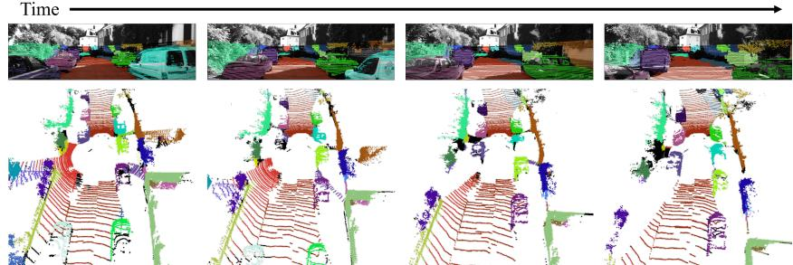
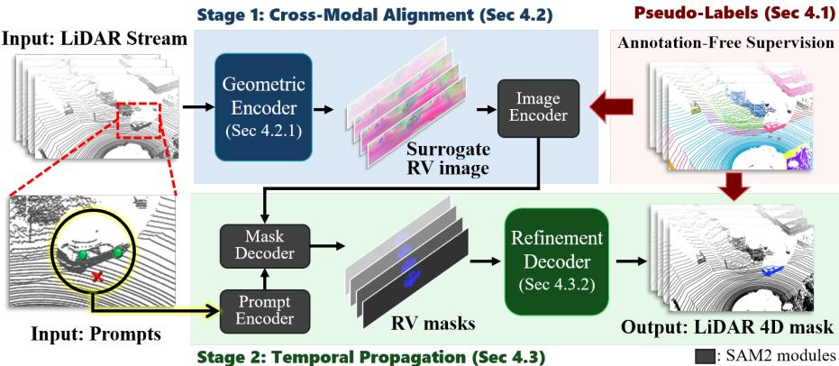
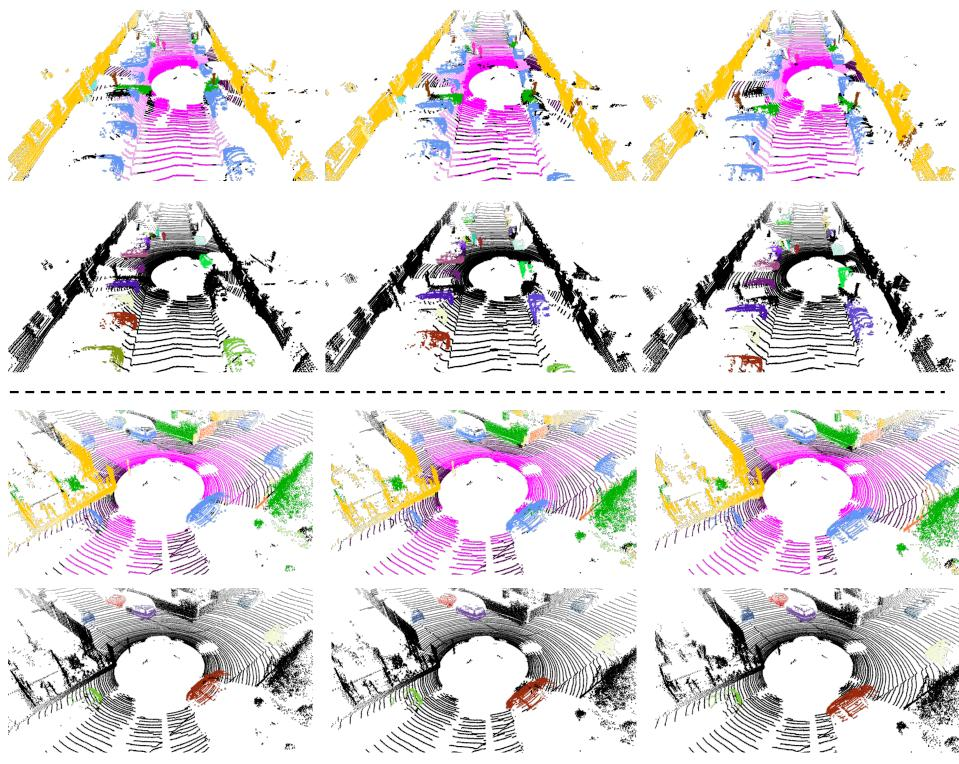

# Bootstrapping a 4D LiDAR Annotation Tool from Video Foundation Models

Jihun Kim1 ⋆, Hyun-Kurl Jang1 ⋆, Hyemin Yang1 ⋆, Jinnyeong Yang1 ⋆, Hyeokjun Kweon2 ⋆, and Kuk-Jin Yoon1

1 KAIST, Visual Intelligence Lab

{jihun1998, jhg0001, hyemin0806, jinnyeong6118, kjyoon}@kaist.ac.kr 2 Chung-Ang University, FoVLab hyeokjunkweon@cau.ac.kr

Fig. 1: Segmentation results of LiDAR-SAM2 on SemanticKITTI [2]. Each object is segmented via a user click in the first LiDAR frame, and distinct colors are assigned to diferent objects for visual distinction.

Abstract. Progress in 4D LiDAR segmentation is bottlenecked by data. Assigning temporally consistent labels across sparse point cloud sequences is costly and hard to scale, and every new task or domain tends to demand fresh dense annotation. This motivates a simple question of whether high-quality LiDAR training data can be produced automatically, without any human labeling. To this end, we introduce LiDAR-SAM2, a framework that turns a 2D video foundation model, SAM2, into a scalable source of supervision for the 4D LiDAR domain. On the data side, it automatically generates temporally coherent LiDARlevel labels from SAM2 video masks through multi-view projection and spatio-temporal aggregation. On the modeling side, a tailored modality interface and a two-stage learning objective adapt SAM2’s video segmentation kernel to spatio-temporal LiDAR structure, so that a single click per object yields a consistent mask track across the sequence. Trained with no human LiDAR annotation, LiDAR-SAM2 produces semantic and panoptic labels on SemanticKITTI that approach the quality of full human annotation from only a few points, and models trained on these labels approach the performance of full ground-truth supervision. This positions LiDAR-SAM2 as a scalable labeling tool that substantially reduces the annotation burden for 3D and 4D scene understanding.

Keywords: 4D LiDAR Segmentation · Video Foundation Model · Automatic Data Annotation

Equal contribution.

## 1 Introduction

Perception in autonomous driving demands a dynamic understanding of 3D scenes, and 4D LiDAR segmentation plays a pivotal role in this process, ofering spatially detailed interpretations of the scene by identifying objects and temporally associating them across point cloud sequences. The field covers a range of tasks, including semantic [32, 16, 20, 30, 35, 29, 8], instance/panoptic [13, 41, 23, 48, 24, 33, 1], and moving objects [5, 28, 43] segmentation. Each of these tasks relies on its own form of supervision, so that a separate set of annotations must be collected for every task and granularity.

Obtaining such annotations directly on LiDAR point clouds, however, is particularly dificult. Labeling sparse, irregular points is far less intuitive than labeling images, and assigning temporally consistent labels across an entire sequence makes the process even more labor-intensive and hard to scale. The practical bottleneck of 4D LiDAR segmentation therefore lies less in the model than in the data it depends on, suggesting the need to revisit the problem from a more data-centric perspective.

Interestingly, a comparable challenge has arisen in the 2D domain. Image segmentation, spanning semantic, panoptic, and instance formulations, has sufered from the same rigidity of task definition and dependence on human labeling. To address these issues, a long line of research has explored interactive segmentation, enabling users to guide models through visual prompts such as points. This idea has recently culminated in foundation models such as SAM [12] and its video counterpart SAM2 [27]. By decoupling what to segment from how to segment, these models have achieved remarkable scalability and generalization across object categories and visual domains. This paradigm has not only turned data annotation into an interactive process, but has also established a foundation for general-purpose segmentation.

In light of these parallels, it is natural to ask whether the LiDAR domain could benefit from a similar shift. Recently, Interactive4D [9] takes a step in this direction with a prompt-driven 4D LiDAR segmentation. However, this approach still relies on human-annotated panoptic labels from a specific dataset (SemanticKITTI [2]). As a result, it inherits the data limitations of prior taskspecific approaches. The segmentation granularity is fixed by the training annotations, and every new domain would require re-collecting large amounts of manually labeled 4D data.

We propose LiDAR-SAM2, the first interactive 4D LiDAR segmentation framework trained without any manually labeled LiDAR data. Our central idea is to treat a 2D video foundation model as a scalable source of LiDAR supervision rather than relying on a fixed, human-annotated dataset. On the data side, LiDAR-SAM2 is trained entirely from pseudo-labels that are automatically generated by SAM2 through multi-view projection and our spatio-temporal 4D mask aggregation, which turns partial per-camera masks into dense, temporally coherent point-wise labels. On the structural and learning side, we design a tailored modality conversion interface and a two-stage learning objective that adapt

SAM2’s RGB video segmentation kernel to 4D LiDAR geometry and temporal structure.

Across extensive experiments, LiDAR-SAM2 shows (1) strong labeling quality on SemanticKITTI [2], producing semantic and panoptic supervision without any human-annotated LiDAR labels, and (2) high downstream utility, where models trained on our automatically generated labels approach the accuracy of models trained on full manual annotation from only minimal prompts. Figure 1 further illustrates the resulting interactive 4D LiDAR segmentation, where a single initial click per object enables LiDAR-SAM2 to produce consistent, highquality mask tracks across the entire sequence.

Together, these results show that better training data, curated automatically from a foundation model, can bring the scalability and generality of interactive segmentation into the 4D LiDAR domain, ofering a practical path toward largescale, high-quality 3D scene understanding without manual annotation.

## 2 Related Works

## 2.1 4D LiDAR Segmentation

LiDAR segmentation is fundamental to understanding dynamic 3D environment, considering temporal coherence across sequences. Early approaches employed point-based or voxelized backbones [31, 49, 45, 6] to model spatial geometry within a single scan, while later 4D methods incorporated temporal cues through recurrent units, temporal attention, or pose-aware feature warping [1, 23, 13, 25, 32, 41]. The field now covers diverse tasks—including semantic, instance, panoptic, and moving objects segmentation—each imposing diferent levels of label granularity and temporal consistency [1, 32, 25]. Despite these advances, most systems still depend on manually annotated point-level labels, which are expensive and labor-intensive to collect at scale. To address this challenge, we propose an interactive 4D LiDAR segmentation named LiDAR-SAM2, as a labeling assistant. It produces high-quality spatio-temporal segmentation from minimal point prompts, significantly reducing the annotation burden, and is broadly applicable across downstream LiDAR segmentation tasks.

## 2.2 Leveraging 2D VFMs for 3D

Vision foundation models (VFMs) have shown strong transfer to downstream tasks, with especially large gains in 2D settings where pretraining is image/videocentric. Extending 2D VFMs to 3D perception has proceeded along two primary routes. Lifting-based methods [22, 47, 40, 38, 4, 42, 10, 14] first obtain 2D predictions from a VFM and then reproject them into 3D using calibrated geometry and visibility reasoning. Distillation-based [3, 46, 26, 44, 37, 21, 39] approaches instead train 3D-native backbones under supervision from 2D VFMs via pseudolabels or feature-level guidance. Both strategies, however, have limitations: lifting pipelines are brittle to calibration and resampling and often underutilize native 3D geometry, while distillation often erode advantages of large-scale 2D VFM—broad category coverage and open-set generalization. Complementary to these, another line of work incorporates 2D VFMs within 3D frameworks by adding 3D-aware adapters for volumetric inputs [34, 15, 18]. We advance this line in the LiDAR domain by adapting SAM2 via a geometry-preserving interface that enables promptable, LiDAR-only inference.

## 3 Pseudo-Label Generation using SAM2

We begin by describing how to generate 4D pseudo-labels from synchronized multi-view RGB images. Specifically, SAM2 [27] is applied to the multi-view RGB streams to obtain per-view temporal segmentation masks, which are then transferred to the LiDAR domain via geometric projection and multi-view aggregation. This produces temporally coherent point-wise pseudo-labels across the LiDAR sequence, enabling us to train an interactive 4D LiDAR segmentation model without any manually annotated 3D data.

## 3.1 Obtaining View-wise Mask Proposals

We denote a time-ordered LiDAR sequence by

$$
\mathcal { X } = \{ X _ { t } \} _ { t = 1 } ^ { T } , \quad X _ { t } = \{ x _ { t , i } \in \mathbb { R } ^ { 3 } \} _ { i = 1 } ^ { N _ { t } } ,\tag{1}
$$

where $T$ is the length of the sequence and $N _ { t }$ is the number of points in frame t. We assume access to a synchronized RGB image $I _ { t } ~ \in ~ \mathbb { R } ^ { \tilde { H } _ { I } \times W _ { I } \times 3 }$ at each timestep, with known geometric calibration between the LiDAR and the camera.

We exploit the segment-everything mode3 to obtain initial mask proposals. This yields a set of 2D binary masks $\bar { \{ m _ { 1 , k } ^ { 2 D } \} } _ { k = 1 } ^ { K _ { 1 } }$ , where $m _ { 1 , k } ^ { 2 D } \in \{ 0 , 1 \} ^ { \hat { H } _ { I } \times \hat { W } _ { I } } . K _ { 1 }$ denotes the number of proposals in the initial frame.

Subsequently, each mask $m _ { 1 , k } ^ { 2 D }$ is then used as a prompt to SAM2 [27] to obtain its temporal mask trajectory:

$$
\mathrm { S A M 2 } ( V \mid m _ { 1 , k } ^ { 2 D } ) \quad  \quad \mathcal { M } _ { k } ^ { V i d e o } = \{ m _ { t , k } ^ { 2 D } \} _ { t = 1 } ^ { T }\tag{2}
$$

where $V = I _ { 1 : T }$ denotes the video $( i . e .$ , image sequence). In other words, SAM2 propagates each initial mask proposal forward through time, producing a consistent segmentation trajectory for each segment across the sequence.

Then, each 2D binary mask is transferred into the 3D LiDAR domain via the calibrated LiDAR-camera projection. We use a lifting function $\varPhi _ { t } : \{ 0 , 1 \} ^ { H _ { I } \times W _ { I } } $ $\{ 0 , 1 \} ^ { N _ { t } }$ to obtain 3D binary mask of k-th proposal at timestep t as

$$
m _ { t , k } ^ { 3 D } = \varPhi _ { t } ( m _ { t , k } ^ { 2 D } ) , \quad m _ { t , k } ^ { 3 D } \in \{ 0 , 1 \} ^ { N _ { t } } .\tag{3}
$$

Collectively performing this process on the video mask $\mathcal { M } _ { k } ^ { V i d e o }$ yields a 4D LiDAR mask track:

$$
\mathcal M _ { k } ^ { 4 D } = \{ \ d m _ { t , k } ^ { 3 D } \ d \} _ { t = 1 } ^ { T } .\tag{4}
$$

## 3.2 Spatio-Temporal 4D Mask Aggregation

The above process assumes a single view per LiDAR scan, but practical setups often use multiple cameras. While each camera yields temporally consistent mask tracks, cross-view consistency is not guaranteed. With limited camera coverage (e.g. SemanticKITTI [2]), each view captures only a subset of the scene, causing the same object to split into multiple view-specific mask tracks.

To obtain a unified set of 4D pseudo-labels in the LiDAR domain, we perform spatio-temporal 4D mask aggregation. It aims to merge view-specific tracks that correspond to the same underlying 3D object and to stitch identities over time despite partial view coverage. We begin with spatial aggregation. For each object, multiple view-specific masks may correspond to the same physical instance. To identify such correspondences, we assign the same mask track ID to any set of masks that share common LiDAR points and merge them accordingly. Applying this rule across all views results in a cross-view consistent set of mask tracks.

We then perform temporal aggregation to enforce consistency across time. Since 2D masks are obtained from camera views, the initial pseudo-labels are inherently limited to camera-visible regions, leaving portions of the LiDAR sweep unlabeled due to the restricted camera FoV. To overcome this limitation, we explicitly expand pseudo-label coverage via spatiotemporal aggregation. Concretely, masks from the previous timestep are first propagated into the current LiDAR frame using the known ego-motion. We then robustly fuse the propagated and current masks by voxelizing the point cloud and assigning each voxel the majority mask ID among the points it contains; the voted IDs are broadcasted back to points. Iterating this propagation-and-fusion over time allows labels to persist and grow beyond what is labeled in the current frame alone, mitigating the limited camera coverage. More details are in the Supplementary Material.

On SemanticKITTI, temporal aggregation substantially improves pseudolabel density while preserving quality. Without aggregation, we recover 22.12 segments on average, achieving 91.90% precision but only 13.59% recall. After aggregation, the average number of segments increases to 73.84 and recall rises dramatically to 79.58%, while precision remains high at 85.93%. This yields temporally consistent dense pseudo-labels, enabling high-quality automatic supervision.

## 4 LiDAR-SAM2

## 4.1 Overview

Our goal is to build an interactive 4D LiDAR segmentation model that allows a user to specify what to segment through a minimal prompt. Following SAM2 [27], we aim to learn

$$
\hat { \mathcal { Y } } = \mathcal { F } ( \mathcal { X } \mid \mathcal { P } ) , \quad \hat { \mathcal { Y } } = \{ \hat { Y } _ { t } \} _ { t = 1 } ^ { T } ,\tag{5}
$$

where $\chi = \{ X _ { t } \} _ { t = 1 } ^ { T }$ is the LiDAR sequence and $\mathcal { P } \subset X _ { t }$ is a set of user-selected point prompts. The output $\hat { \mathcal { V } }$ is a predicted 4D mask track, where $\hat { Y } _ { t } = \{ \hat { y } _ { t , i } \in$ $[ 0 , 1 ] \} _ { i = 1 } ^ { N _ { t } }$ denotes per-point segmentation scores indicating how likely each point $x _ { t , i }$ belongs to the segment specified by $\mathcal { P } .$

  
Fig. 2: Overview of the LiDAR-SAM2 framework. The training pipeline consists of two stages, both supervised by pseudo-labels.

On the architectural side, rather than designing a new model from scratch, we retain SAM2 as a strong segmentation kernel, and focus on enabling it to operate directly on LiDAR sequences. This preserves SAM2’s interactive prompt-based behavior, but also introduces two challenges: (1) LiDAR point clouds are sparse and irregular 3D data, whereas SAM2 expects dense 2D feature maps; and (2) the temporal dynamics of 4D LiDAR sequences difer from those in videos on which SAM2 was originally trained.

To address these issues, we propose an interface-oriented architecture that maps LiDAR frames into and out of SAM2’s 2D representation space while preserving their underlying 3D geometric structure. This allows SAM2 to process LiDAR inputs without modifying its architecture, maintaining spatial locality and structure in point space.

We further introduce a two-stage strategy with specialized training objectives. This design is inspired by recent VLMs [19, 17], where the vision-tolanguage projection layer is first aligned before full fine-tuning. In Stage 1, we perform cross-modal alignment so that SAM2’s image encoder can efectively interpret LiDAR-derived range-view representations. This alignment is conducted at the frame level, without any temporal modeling. Then, in Stage 2, we enable LiDAR-SAM2 to learn temporal propagation and object-level consistency across time for 4D segmentation.

## 4.2 Learning Cross-Modal Alignment (Stage 1)

The goal of Stage 1 is to align LiDAR domain with SAM2 in a frame-wise manner. Directly learning temporal propagation and motion consistency in 4D space is challenging, and SAM2 is trained on the RGB domain only. Therefore, we first ensure that a single LiDAR scan and its information can be interpreted by SAM2. For clarity, since Stage 1 is frame-wise, we omit the time index t in this section.

We adopt the Range-View (RV) representation to express each LiDAR scan as a dense image-like signal, allowing SAM2 to be used without modifying its architecture. $\rho ( \cdot )$ denotes the standard spherical projection from 3D space to RV plane, mapping the points $x _ { i } \in \mathbb { R } ^ { 3 }$ to pixel coordinates $( u , v ) \in \{ 1 , \ldots , H \} \times$ $\{ 1 , \dots , W \}$

In addition, the 4D pseudo-labels from Sec. 3 are also projected into the RV domain. Given a mask track $\mathcal M _ { k } ^ { 4 D } = \{ m _ { t , k } ^ { 3 D } \} _ { t = 1 } ^ { T }$ , each per-frame binary point mask $m _ { k } ^ { 3 D } \in \{ 0 , 1 \} ^ { N }$ is mapped to a range-view binary image:

$$
m _ { k } ^ { R V } = \rho ( m _ { k } ^ { 3 D } ) \in \{ 0 , 1 \} ^ { H \times W } ,\tag{6}
$$

which is spatially aligned with the RV domain.

Geometry-aware Range-View Representation To preserve geometric structure while converting LiDAR into an image-like representation, we first extract per-point features using a SSL-pretrained geometric encoder $E _ { \mathrm { g e o } }$

$$
\mathbf { h } = E _ { \mathrm { g e o } } ( X ) \in \mathbb { R } ^ { N \times d } .\tag{7}
$$

To make these features compatible with SAM2’s image encoder trained on the RGB domain, we employ a lightweight MLP g to map them into a 3-channel embedding:

$$
\mathbf { c } = g ( \mathbf { h } ) \in \mathbb { R } ^ { N \times 3 } ,\tag{8}
$$

interpreting LiDAR features as an RGB signal. We then rasterize the point-wise embeddings into a dense RV image:

$$
\begin{array} { r } { \hat { I } ^ { \mathrm { R V } } = \rho ( X , \mathbf { c } ) \in \mathbb { R } ^ { H \times W \times 3 } . } \end{array}\tag{9}
$$

The resulting surrogate RV image is processed by the SAM2 image encoder with trainable LoRA [11]:

$$
\mathbf { F } = E _ { \mathrm { S A M 2 } } ( \hat { I } ^ { \mathrm { R V } } ) \in \mathbb { R } ^ { H \times W \times D } .\tag{10}
$$

Objective Function for Interactive Segmentation We train our framework with SAM2-style loss. From the pseudo-label $m ^ { R V }$ , we sample a set of foreground/background pixels to serve as positive/negative prompts. This set of prompts $\mathcal { P }$ is fed into the prompt encoder, and combined with the feature map F through the SAM2 decoder to predict a mask $\hat { y } ^ { R V }$ . Accordingly, the loss is defined by a segmentation loss between the predicted mask and the pseudo-label in the RV domain:

$$
\mathcal { L } _ { \mathrm { i n t e r a c t i v e } } ^ { \mathrm { f r a m e - w i s e } } = \mathrm { R V S e g L o s s } ( \hat { y } ^ { R V } , m ^ { R V } ) ,\tag{11}
$$

where the details about RVSegLoss is in Supplementary Material. To sum up, the full objective for Stage 1 is:

$$
{ \mathcal { L } } _ { \mathrm { S t a g e 1 } } = { \mathcal { L } } _ { \mathrm { i n t e r a c t i v e } } ^ { \mathrm { f r a m e - w i s e } } .\tag{12}
$$

Note that Stage 1 updates the LiDAR encoder $( E _ { \mathrm { g e o } } )$ , the lightweight MLP (g), and SAM2’s image encoder $( E _ { \mathrm { S A M 2 } }$ with LoRA). The other parts of SAM2 remain unchanged.

## 4.3 Learning Temporal Propagation (Stage 2)

Stage 2 focuses on learning how segmentation should propagate over time. The model receives a LiDAR sequence $\chi = \{ X _ { t } \} _ { t = 1 } ^ { T }$ , and each scan is converted into its RV feature map: $\mathbf { F } _ { t } = E _ { \mathrm { S A M 2 } } ( \mathrm { R V } _ { t } )$ .

4D Decoder for Refinement Since this track is still in the RV domain, we obtain the final 4D point-wise mask track by inverse projection:

$$
\hat { y } ^ { 4 D } = \{ \hat { y } _ { t } ^ { 4 D } \} _ { t = 1 } ^ { T } , \quad \hat { y } _ { t } ^ { 4 D } = \rho ^ { - 1 } ( \hat { y } _ { t } ^ { R V } ) .\tag{13}
$$

To further restore LiDAR-level geometric detail, we introduce a lightweight 3D refinement LiDAR decoder $D _ { \mathrm { r e f } }$ . Specifically, given a temporal window $t : t + \Delta t$ we place the lifted predictions4 into $D _ { \mathrm { r e f } }$ for each frame in the window and refine them in point space. We denote this refinement over the entire window as

$$
\begin{array} { r } { \tilde { \mathcal { V } } _ { t : t + \Delta t } ^ { 4 D } = D _ { \mathrm { r e f } } ( X _ { t : t + \Delta t } , \hat { \mathcal { V } } _ { t : t + \Delta t } ^ { 4 D } ) . } \end{array}\tag{14}
$$

This decoding stage corrects projection-induced artifacts and reinstates surface continuity in 3D space, yielding coherent and stable segmentation results.

Finally, the refined 4D mask track $\tilde { \mathcal { V } } ^ { 4 D }$ is supervised using the 4D pseudolabel $\mathcal { M } ^ { \mathrm { 4 D } }$ in the LiDAR domain via

$$
\mathcal { L } _ { \mathrm { r e f i n e } } = 4 \mathrm { D S e g L o s s } ( \tilde { \mathcal { V } } ^ { 4 D } , \mathcal { M } ^ { 4 D } ) ,\tag{15}
$$

where the details about 4DSegLoss are in Supplementary Material. To sum up, the full objective for Stage 2 is:

$$
{ \mathcal { L } } _ { \mathrm { S t a g e 2 } } = { \mathcal { L } } _ { \mathrm { i n t e r a c t i v e } } ^ { \mathrm { t e m p o r a l } } + { \mathcal { L } } _ { \mathrm { r e f i n e } } .\tag{16}
$$

During Stage 2, we freeze the modules trained in Stage $1 \ ( E _ { \mathrm { g e o } } , g , E _ { \mathrm { S A M 2 } } )$ ， and train the remaining SAM2 components (prompt encoder, memory attention, and mask decoder) as well as the additional temporal modules introduced below. This allows the model to learn how to propagate segmentation consistently across time without disrupting the modality alignment established in Stage 1.

## 5 Experiments

## 5.1 Settings

Datasets We evaluate LiDAR-SAM2 on SemanticKITTI [2], which consists of 64-beam LiDAR scans synchronized with two forward-facing RGB cameras. We train on the training set and report all results on the validation set.

Metric For semantic segmentation, we report the mean Intersection-over-Union (mIoU) averaged over the 19 SemanticKITTI classes. For 4D panoptic segmentation, we adopt the LiDAR Segmentation and Tracking Quality (LSTQ) [1], which factorizes into an association score $( S _ { a s s o c } )$ measuring temporal instance consistency and a classification score $( S _ { c l s } )$ . We further report semantic IoU separately for stuf $( I o U _ { s t } )$ and thing $( I o U _ { t h } )$ classes. All metrics are computed on the respective validation sets.

Implementation All experiments are conducted on a single NVIDIA A6000 GPU with the pretrained SAM2 base+. The geometric encoder is pre-trained using FCGF [7] on the same datasets used for evaluation. The refinement head $D _ { \mathrm { r e f } }$ is implemented as MinkUNet-14 [6].

## 5.2 LiDAR-SAM2 as Labeling Tool

We evaluate LiDAR-SAM2 as a labeling tool for all entities in the LiDAR scene by simulating human interaction on 4-frame LiDAR sweeps. At the first LiDAR frame, a fixed number of point prompts is provided for every instance to initialize the annotation, following a standard interactive segmentation protocol. The first positive click is placed near the object center, and subsequent clicks are added by inspecting the true-negative and false-positive regions, where we click on whichever region is larger at that time. For stuf categories such as road and sidewalk that are not instance-separated, we voxelize the current point cloud with a voxel size of 0.2 m and compute connected components in voxel space, treating each disconnected component as a separate pseudo-instance even when several share the same semantic label, which keeps propagation and editing localized and consistent across sweeps. The predicted masks are then propagated through the remaining frames and one additional frame to seed the next sweep. Carried masks are reused in the following sweep only if their overlap with the corresponding ground-truth mask exceeds an IoU threshold of 0.8, and otherwise, including for newly appearing objects, we discard the carried mask and introduce additional human prompts to re-initialize the instance. On average, this process corresponds to roughly ten point prompts per frame.

Semantic Segmentation We first assess our labels on semantic segmentation by training two standard backbones, MinkowskiUNet (MinkUNet) [6] and PointTransformer v2 (PTv2) [36], from scratch on labels of diferent origin. As reported in Table 3, we compare four label sources. The first is the raw point prompts used during interaction. The second is labels from SAM2 inference via RGB projection. The third is labels generated by LiDAR-SAM2. The fourth is full human ground truth. Training on the sparse point prompts alone yields very low accuracy, reflecting the limited supervision. SAM2 labels give a moderate improvement but remain insuficient, sufering from projection artifacts and a lack of adaptation to the LiDAR domain. In contrast, LiDAR-SAM2 labels lead to a substantial gain, roughly doubling the mIoU of naive SAM2, and bring both backbones close to models trained on full ground truth, despite using no human LiDAR annotation.

Table 1: Semantic segmentation results (mIoU) trained with point labels, SAM2 labels, our labels, and full GT. The number in parentheses next to each label type denotes the number of oracle-provided points per frame. Experiments are on the SemanticKITTI [2] validation set.
<table><tr><td rowspan="2">Methods</td><td rowspan="2">Label type</td><td colspan="8"></td><td rowspan="2"></td><td colspan="8">oteorr-ound</td><td rowspan="2">traiiimn</td><td rowspan="2">ou</td></tr><tr><td>bieyce Ccarr</td><td>occcle</td><td>truuck</td><td>otherr-vicle pPerron</td><td>biecclit</td><td>motcist</td><td>oad</td><td>parking</td><td>sidwalk</td><td></td><td>buiing</td><td>fence</td><td>Vetion tuunk</td><td>terrain</td><td>pe</td><td></td></tr><tr><td>MinkU [6]]</td><td>Point labels (10) SAM2 labels (10) Our labels (10)</td><td>9.7 0.5 61.0 0.6 84.3 17.8</td><td>2.4 6.5 60.5</td><td>5.6 50.3 75.8</td><td>4.0 11.9 46.8</td><td>0.8 25.1 58.3</td><td>1.6 44.7 73.0</td><td>3.4 0.1 2.5</td><td>0.8 57.8 85.2</td><td>2.5 6.0</td><td>4.1 7.4</td><td>0.2 0.6</td><td>5.3 67.6</td><td></td><td>4.0 21.8</td><td>1.8 53.5</td><td>10.4 21.3</td><td>10.4 47.8</td><td>23.1 45.7</td><td>7.4 37.2</td><td>5.2 29.8</td></tr><tr><td rowspan="4">PTv2 [36]</td><td>Full GT (100k)</td><td>96.1 35.0</td><td>64.8</td><td>83.4</td><td>59.9</td><td>73.4</td><td>88.3</td><td>0.0</td><td>93.7</td><td>36.8 53.1</td><td>69.6 81.0</td><td>0.3 7.0</td><td>84.6 91.0</td><td></td><td>52.2 61.7</td><td>84.7 88.0 67.8</td><td>63.6</td><td>69.9 75.5</td><td>49.6 33.2 62.5 48.6</td><td></td><td>55.2 64.8</td></tr><tr><td>Point labels (10)</td><td>27.6 1.9</td><td>5.8</td><td>3.2</td><td>6.6</td><td>0.9</td><td>2.0</td><td>0.0</td><td>1.2</td><td>4.8</td><td>0.2</td><td>0.1</td><td>6.2</td><td></td><td>3.7</td><td>1.8</td><td>15.0</td><td>2.7</td><td>41.0 16.6</td><td>7.4</td><td></td></tr><tr><td>SAM2 labels (10)</td><td>78.7 0.1</td><td>0.0</td><td>0.0</td><td>15.3</td><td>14.6</td><td>22.3</td><td>1.9</td><td>53.9</td><td>1.4</td><td>0.7</td><td>0.0</td><td>72.1</td><td></td><td>23.1</td><td>64.5</td><td>22.8</td><td>51.5</td><td>43.2 35.9</td><td>26.4</td><td></td></tr><tr><td>Our labels (10)</td><td>86.2</td><td>234.1 71.9</td><td>78.2 83.9</td><td>39.76</td><td>69.1 88.6 59.4 82.2</td><td>80.7 93.4 19.2 95.3 48.7</td><td>30.1</td><td></td><td>86.6 45.1</td><td></td><td>72.9 83.2 0.1 91.3 65.1 88.1 71.2 74.3 65.9 50.8</td><td>8.3</td><td>86.3</td><td></td><td>59.486.8</td><td>62.2</td><td>73.7</td><td>52.9 41.1</td><td>69.0</td><td>61.3</td></tr></table>

Table 2: Panoptic segmentation results trained with our labels and full GT. Experiments are evaluated on SemanticKITTI [2] validation set.
<table><tr><td rowspan=1 colspan=2>Methods</td><td rowspan=1 colspan=1>|Label type</td><td rowspan=1 colspan=1>|LSTQ $S _ { a s s o c }$  $S _ { c l s }$  $\mathrm { I o U } _ { s t }$  $\mathrm { I o U } _ { t h }$ </td></tr><tr><td rowspan=2 colspan=2>4D-PLS [1]Full</td><td rowspan=2 colspan=1>Our labelsGT</td><td rowspan=2 colspan=1>46.9  46.347.654.3 44.362.7 65.160.565.4 61.3</td></tr><tr><td rowspan=1 colspan=1>4D-PLS [1]</td></tr><tr><td rowspan=1 colspan=2>4D-StOP [13]</td><td rowspan=1 colspan=1></td><td rowspan=1 colspan=1>Our labels</td></tr><tr><td rowspan=1 colspan=2>4D-StOP [13]</td><td rowspan=1 colspan=1>Full GT</td><td></td></tr><tr><td rowspan=1 colspan=2>Mask4Former [41]OurMask4Former [41]</td><td rowspan=1 colspan=1>labelsFull GT</td><td rowspan=1 colspan=1>64.8 70.759.456.9 62.870.5 74.366.967.1 66.6</td></tr></table>

Panoptic Segmentation We further validate our labels on 4D panoptic segmentation, which additionally requires temporally consistent instance identities. We train three panoptic backbones, namely 4D-PLS [1], 4D-StOP [13], and Mask4Former [41], using labels generated by LiDAR-SAM2, and compare against the same backbones trained on full ground truth (Table 4). Models supervised by our labels achieve strong panoptic quality across all metrics, including LSTQ, $S _ { \mathrm { a s s o c } } , \ S _ { \mathrm { c l s } }$ , and the stuf and thing IoUs. They recover a large fraction of the full ground-truth performance without any manual LiDAR labels.

Table 3: Semantic segmentation results (mIoU) trained with point labels, SAM2 labels, our labels, and full GT. Experiments are on the SemanticKITTI [2] validation set.
<table><tr><td>Label type</td><td></td><td>|pts/frame|MinkUNet</td><td>[6] PTv2 [36]</td></tr><tr><td>Point labels</td><td>10</td><td>5.2</td><td>7.4</td></tr><tr><td>SAM2 labels</td><td>10</td><td>24.3</td><td>26.4</td></tr><tr><td>Our labels</td><td>10</td><td>55.2</td><td>61.3</td></tr><tr><td>Full GT</td><td>100k</td><td>63.8</td><td>70.3</td></tr></table>

<table><tr><td>Method</td><td>|LSTQ  $S _ { a s s o c }$ </td><td> $S _ { c l s }$ </td><td> $\mathrm { I o U } _ { s t }$ </td><td> $\operatorname { I o U } _ { t h }$ </td></tr><tr><td>4D-PLS [1] + Our labels</td><td>46.9</td><td>46.3 47.6</td><td>54.3</td><td>44.3</td></tr><tr><td>4D-PLS [1] + Full GT</td><td>62.7</td><td>65.1 60.5</td><td>65.4</td><td>61.3</td></tr><tr><td>4D-StOP [13] + Our labels</td><td>57.7</td><td>64.2</td><td>51.7 56.5</td><td>51.7</td></tr><tr><td>4D-StOP [13] + Full GT</td><td>67.0</td><td>74.4</td><td>60.3 65.3</td><td>60.9</td></tr><tr><td>Mask4Former [41] + Our labels</td><td>64.8</td><td>70.7</td><td>59.4 56.9</td><td>62.8</td></tr><tr><td>Mask4Former [41] + Full GT</td><td>70.5</td><td>74.3</td><td>66.9 67.1</td><td>66.6</td></tr></table>

Labeling Quality Beyond downstream accuracy, we inspect the labels produced by LiDAR-SAM2 directly. Figure 3 shows instance-level and semanticlevel labels generated by our tool. Object boundaries are clean and identities remain consistent across time, closely matching the underlying scene structure. Together with the strong downstream performance reported above, these labels confirm that LiDAR-SAM2 is a readily deployable labeling tool for 3D and 4D LiDAR segmentation, dramatically reducing the manual annotation burden.

## 6 Conclusion

We present LiDAR-SAM2, a novel framework for interactive 4D LiDAR segmentation that requires no manual LiDAR labels. By distilling temporal priors from SAM2 into the LiDAR domain, our approach leverages synchronized video–LiDAR sequences to train a LiDAR-only model capable of producing spatiotemporally consistent interactive segmentation. A tailored LiDAR-aware pipeline and specialized training objectives enable SAM2’s video segmentation kernel to operate efectively on LiDAR data while preserving strong temporal coherence. Our experiments demonstrate that LiDAR-SAM2 substantially reduces annotation cost, achieving strong performance with only minimal prompting.

## 7 Acknowledgement

This work was supported by the Ministry of Education of the Republic of Korea and the National Research Foundation of Korea (NRF-2025S1A5C3A04022639).

## References

1. Aygun, M., Osep, A., Weber, M., Maximov, M., Stachniss, C., Behley, J., Leal-Taix´e, L.: 4d panoptic lidar segmentation. In: Proceedings of the IEEE/CVF Conference on Computer Vision and Pattern Recognition. pp. 5527–5537 (2021)

2. Behley, J., Garbade, M., Milioto, A., Quenzel, J., Behnke, S., Stachniss, C., Gall, J.: SemanticKITTI: A Dataset for Semantic Scene Understanding of LiDAR Sequences. In: Proc. of the IEEE/CVF International Conf. on Computer Vision (ICCV) (2019)

## Time

Fig. 3: Qualitative results of labels annotated with LiDAR-SAM2. The top shows instance labels, while the bottom shows semantic labels.

3. C¸ anak¸cı, A.S., V¨odisch, N., Petek, K., Burgard, W., Valada, A.: Label-eficient lidar panoptic segmentation. arXiv preprint arXiv:2503.02372 (2025)

4. Cen, J., Zhou, Z., Fang, J., Shen, W., Xie, L., Jiang, D., Zhang, X., Tian, Q., et al.: Segment anything in 3d with nerfs. Advances in Neural Information Processing Systems 36, 25971–25990 (2023)

5. Chen, X., Li, S., Mersch, B., Wiesmann, L., Gall, J., Behley, J., Stachniss, C.: Moving object segmentation in 3d lidar data: A learning-based approach exploiting sequential data. IEEE Robotics and Automation Letters 6(4), 6529–6536 (2021)

6. Choy, C., Gwak, J., Savarese, S.: 4d spatio-temporal convnets: Minkowski convolutional neural networks. In: Proceedings of the IEEE/CVF conference on computer vision and pattern recognition. pp. 3075–3084 (2019)

7. Choy, C., Park, J., Koltun, V.: Fully convolutional geometric features. In: Proceedings of the IEEE/CVF international conference on computer vision. pp. 8958–8966 (2019)

8. Duerr, F., Pfaller, M., Weigel, H., Beyerer, J.: Lidar-based recurrent 3d semantic segmentation with temporal memory alignment. In: 2020 International Conference on 3D Vision (3DV). pp. 781–790. IEEE (2020)

9. Fradlin, I., Zulfikar, I.E., Yilmaz, K., Kontogianni, T., Leibe, B.: Interactive4d: Interactive 4d lidar segmentation. arXiv preprint arXiv:2410.08206 (2024)

10. He, Q., Peng, J., Jiang, Z., Hu, X., Zhang, J.: Pointseg: A training-free paradigm for 3d scene segmentation via foundation models. In: Proceedings of the IEEE/CVF

International Conference on Computer Vision. pp. 2657–2667 (2025)

11. Hu, E.J., Shen, Y., Wallis, P., Allen-Zhu, Z., Li, Y., Wang, S., Wang, L., Chen, W., et al.: Lora: Low-rank adaptation of large language models. ICLR 1(2), 3 (2022)

12. Kirillov, A., Mintun, E., Ravi, N., Mao, H., Rolland, C., Gustafson, L., Xiao, T., Whitehead, S., Berg, A.C., Lo, W.Y., et al.: Segment anything. In: Proceedings of the IEEE/CVF international conference on computer vision. pp. 4015–4026 (2023)

13. Kreuzberg, L., Zulfikar, I.E., Mahadevan, S., Engelmann, F., Leibe, B.: 4d-stop: Panoptic segmentation of 4d lidar using spatio-temporal object proposal generation and aggregation. In: European Conference on Computer Vision. pp. 537–553. Springer (2022)

14. Kweon, H., Kim, J., Yoon, K.J.: Weakly supervised point cloud semantic segmentation via artificial oracle. In: Proceedings of the IEEE/CVF Conference on Computer Vision and Pattern Recognition. pp. 3721–3731 (2024)

15. Li, C., Sultan, R.I., Khanduri, P., Qiang, Y., Indrin, C., Zhu, D.: Autoprosam: Automated prompting sam for 3d multi-organ segmentation. In: 2025 IEEE/CVF Winter Conference on Applications of Computer Vision (WACV). pp. 3570–3580. IEEE (2025)

16. Li, E., Casas, S., Urtasun, R.: Memoryseg: Online lidar semantic segmentation with a latent memory. In: Proceedings of the IEEE/CVF International Conference on Computer Vision. pp. 745–754 (2023)

17. Li, J., Li, D., Savarese, S., Hoi, S.: Blip-2: Bootstrapping language-image pretraining with frozen image encoders and large language models. In: International conference on machine learning. pp. 19730–19742. PMLR (2023)

18. Li, S., Zhang, J., Qi, L., Shi, Y.: Ga-sam: Geometry-aware sam adaptation with sparse annotation-driven point cloud completion. In: International Conference on Medical Image Computing and Computer-Assisted Intervention. pp. 214–224. Springer (2025)

19. Liu, H., Li, C., Wu, Q., Lee, Y.J.: Visual instruction tuning. Advances in neural information processing systems 36, 34892–34916 (2023)

20. Liu, J., Chang, C., Liu, J., Wu, X., Ma, L., Qi, X.: Mars3d: A plug-and-play motion-aware model for semantic segmentation on multi-scan 3d point clouds. In: Proceedings of the IEEE/CVF Conference on Computer Vision and Pattern Recognition. pp. 9372–9381 (2023)

21. Liu, M., Uy, M.A., Xiang, D., Su, H., Fidler, S., Sharp, N., Gao, J.: Partfield: Learning 3d feature fields for part segmentation and beyond. In: Proceedings of the IEEE/CVF International Conference on Computer Vision. pp. 9704–9715 (2025)

22. Liu, M., Zhu, Y., Cai, H., Han, S., Ling, Z., Porikli, F., Su, H.: Partslip: Low-shot part segmentation for 3d point clouds via pretrained image-language models. In: Proceedings of the IEEE/CVF conference on computer vision and pattern recognition. pp. 21736–21746 (2023)

23. Marcuzzi, R., Nunes, L., Wiesmann, L., Marks, E., Behley, J., Stachniss, C.: Mask4d: End-to-end mask-based 4d panoptic segmentation for lidar sequences. IEEE Robotics and Automation Letters 8(11), 7487–7494 (2023)

24. Marcuzzi, R., Nunes, L., Wiesmann, L., Vizzo, I., Behley, J., Stachniss, C.: Contrastive instance association for 4d panoptic segmentation using sequences of 3d lidar scans. IEEE Robotics and Automation Letters 7(2), 1550–1557 (2022)

25. Mersch, B., Chen, X., Vizzo, I., Nunes, L., Behley, J., Stachniss, C.: Receding moving object segmentation in 3d lidar data using sparse 4d convolutions. IEEE Robotics and Automation Letters 7(3), 7503–7510 (2022)

26. Oˇsep, A., Meinhardt, T., Ferroni, F., Peri, N., Ramanan, D., Leal-Taix´e, L.: Better call sal: Towards learning to segment anything in lidar. In: European Conference on Computer Vision. pp. 71–90. Springer (2024)

27. Ravi, N., Gabeur, V., Hu, Y.T., Hu, R., Ryali, C., Ma, T., Khedr, H., R¨adle, R., Rolland, C., Gustafson, L., et al.: Sam 2: Segment anything in images and videos. arXiv preprint arXiv:2408.00714 (2024)

28. Rozsa, Z., Madaras, A., Sziranyi, T.: Eficient moving object segmentation in lidar point clouds using minimal number of sweeps. IEEE Open Journal of Signal Processing (2025)

29. Shi, H., Lin, G., Wang, H., Hung, T.Y., Wang, Z.: Spsequencenet: Semantic segmentation network on 4d point clouds. In: Proceedings of the IEEE/CVF conference on computer vision and pattern recognition. pp. 4574–4583 (2020)

30. Shi, H., Wei, J., Wang, H., Liu, F., Lin, G.: Learning temporal variations for 4d point cloud segmentation. International Journal of Computer Vision 132(12), 5603–5617 (2024)

31. Thomas, H., Qi, C.R., Deschaud, J.E., Marcotegui, B., Goulette, F., Guibas, L.J.: Kpconv: Flexible and deformable convolution for point clouds. In: Proceedings of the IEEE/CVF international conference on computer vision. pp. 6411–6420 (2019)

32. Wang, N., Guo, R., Shi, C., Wang, Z., Zhang, H., Lu, H., Zheng, Z., Chen, X.: Segnet4d: Eficient instance-aware 4d semantic segmentation for lidar point cloud. IEEE Transactions on Automation Science and Engineering (2025)

33. Wang, N., Shi, C., Guo, R., Lu, H., Zheng, Z., Chen, X.: Insmos: Instance-aware moving object segmentation in lidar data. In: 2023 IEEE/RSJ International Conference on Intelligent Robots and Systems (IROS). pp. 7598–7605. IEEE (2023)

34. Wang, Z., Yu, X., Rao, Y., Zhou, J., Lu, J.: P2p: Tuning pre-trained image models for point cloud analysis with point-to-pixel prompting. Advances in neural information processing systems 35, 14388–14402 (2022)

35. Wu, X., Hou, Y., Huang, X., Lin, B., He, T., Zhu, X., Ma, Y., Wu, B., Liu, H., Cai, D., et al.: Taseg: Temporal aggregation network for lidar semantic segmentation. In: Proceedings of the IEEE/CVF Conference on Computer Vision and Pattern Recognition. pp. 15311–15320 (2024)

36. Wu, X., Lao, Y., Jiang, L., Liu, X., Zhao, H.: Point transformer v2: Grouped vector attention and partition-based pooling. Advances in Neural Information Processing Systems 35, 33330–33342 (2022)

37. Xu, J., Wang, S., Ni, Z., Hu, C., Yang, S., Zhu, J., Li, Q.: Sam4d: Segment anything in camera and lidar streams. arXiv preprint arXiv:2506.21547 (2025)

38. Yang, X., Gu, X., Yin, X., Gao, X.: Sa3dip: Segment any 3d instance with potential 3d priors. Advances in Neural Information Processing Systems 37, 102568–102586 (2024)

39. Yang, Y., Huang, Y., Guo, Y.C., Lu, L., Wu, X., Lam, E.Y., Cao, Y.P., Liu, X.: Sampart3d: Segment any part in 3d objects. arXiv preprint arXiv:2411.07184 (2024)

40. Yang, Y., Wu, X., He, T., Zhao, H., Liu, X.: Sam3d: Segment anything in 3d scenes. arXiv preprint arXiv:2306.03908 (2023)

41. Yilmaz, K., Schult, J., Nekrasov, A., Leibe, B.: Mask4former: Mask transformer for 4d panoptic segmentation. In: 2024 IEEE International Conference on Robotics and Automation (ICRA). pp. 9418–9425. IEEE (2024)

42. Yin, Y., Liu, Y., Xiao, Y., Cohen-Or, D., Huang, J., Chen, B.: Sai3d: Segment any instance in 3d scenes. In: Proceedings of the IEEE/CVF Conference on Computer Vision and Pattern Recognition. pp. 3292–3302 (2024)

43. Zeng, K., Shi, H., Lin, J., Li, S., Cheng, J., Wang, K., Li, Z., Yang, K.: Mambamos: Lidar-based 3d moving object segmentation with motion-aware state space model. In: Proceedings of the 32nd ACM International Conference on Multimedia. pp. 1505–1513 (2024)

44. Zhang, Y., Oˇsep, A., Leal-Taix´e, L., Meinhardt, T.: Zero-Shot 4D Lidar Panoptic Segmentation. In: Conference on Computer Vision and Pattern Recognition (CVPR) (2025)

45. Zhou, H., Zhu, X., Song, X., Ma, Y., Wang, Z., Li, H., Lin, D.: Cylinder3d: An effective 3d framework for driving-scene lidar semantic segmentation. arXiv preprint arXiv:2008.01550 (2020)

46. Zhou, Y., Gu, J., Chiang, T.Y., Xiang, F., Su, H.: Point-sam: Promptable 3d segmentation model for point clouds (2024)

47. Zhou, Y., Gu, J., Li, X., Liu, M., Fang, Y., Su, H.: Partslip++: Enhancing lowshot 3d part segmentation via multi-view instance segmentation and maximum likelihood estimation. arXiv preprint arXiv:2312.03015 (2023)

48. Zhu, M., Han, S., Cai, H., Borse, S., Ghafari, M., Porikli, F.: 4d panoptic segmentation as invariant and equivariant field prediction. In: Proceedings of the IEEE/CVF International Conference on Computer Vision. pp. 22488–22498 (2023)

49. Zhu, X., Zhou, H., Wang, T., Hong, F., Ma, Y., Li, W., Li, H., Lin, D.: Cylindrical and asymmetrical 3d convolution networks for lidar segmentation. In: Proceedings of the IEEE/CVF conference on computer vision and pattern recognition. pp. 9939–9948 (2021)