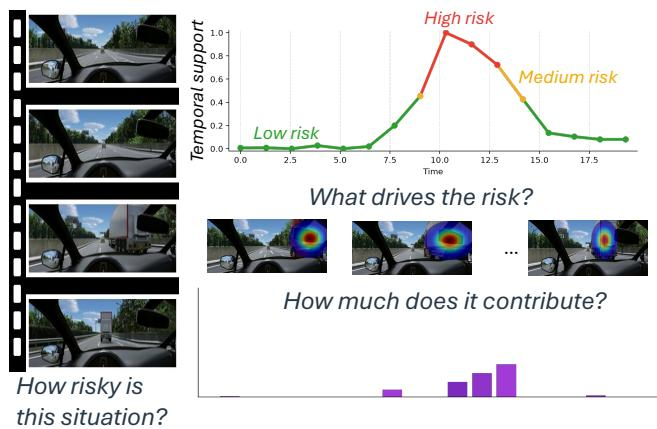
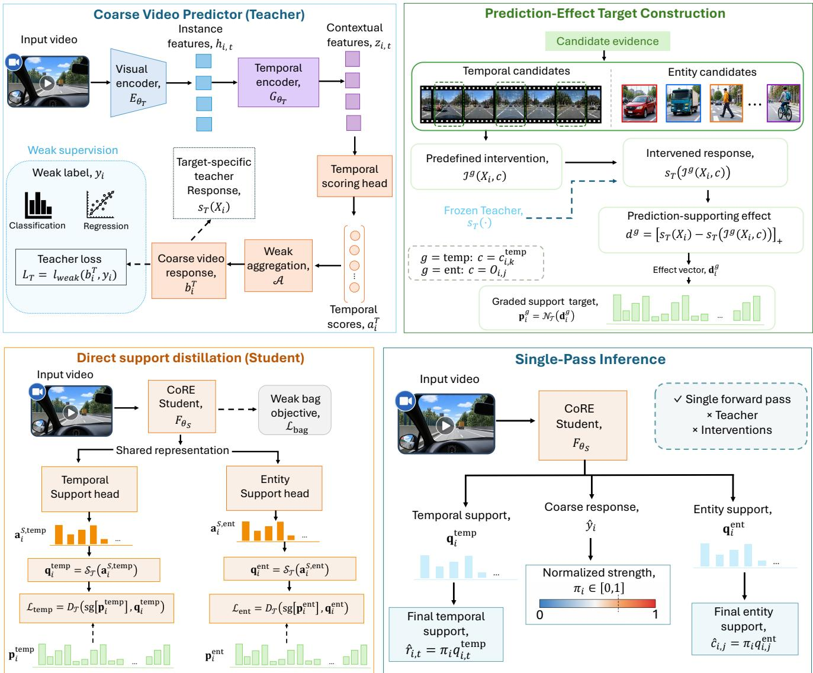
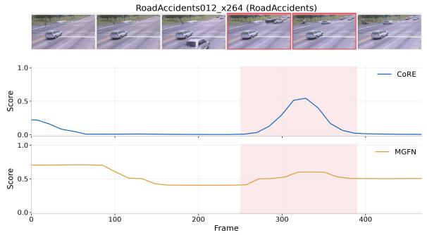
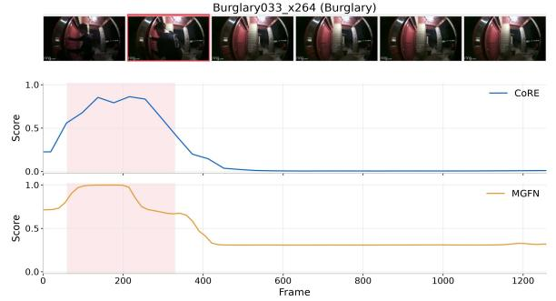
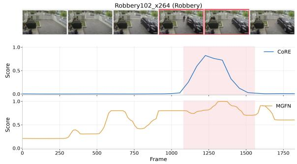
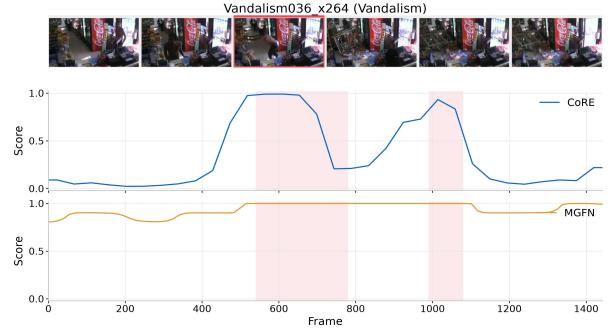
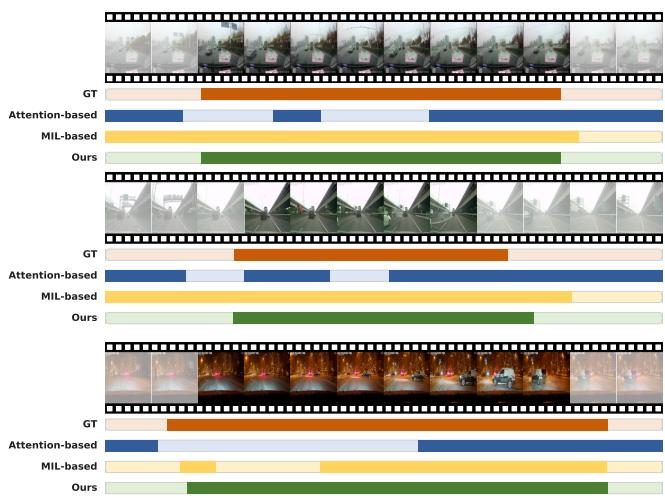
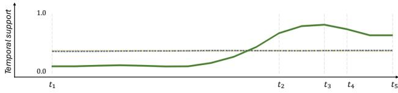
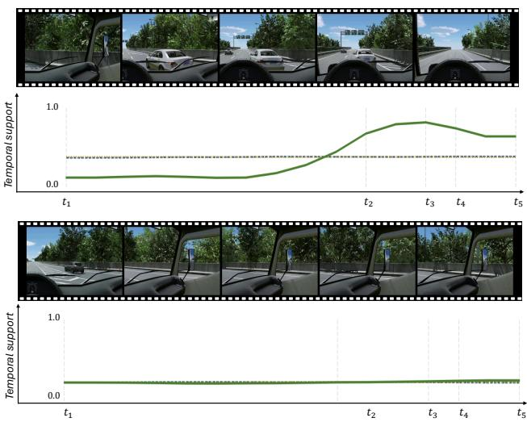

# CoRE: Weakly Supervised Coarse-to-Fine Risk Evidence Learning in Driving Videos

Kaiser Hamid1 Can Cui2 Nade Liang1

1Texas Tech University 2Purdue University

kaiserhamid.munna@ttu.edu, cancui19@gmail.com, nade.liang@ttu.edu Project page: https://kaiser-75.github.io/core/

## Abstract

Perceived risk in driving evolves over time and may be supported by specific scene entities, yet supervision is typically limited to coarse video-level judgments. Learning when supporting evidence emerges and which entities support a risk predictor would ordinarily require costly temporal- and entity-level annotations. We introduce CoRE, a weakly supervised coarse-to-fine framework that learns fine-grained prediction support from coarse video supervision. CoRE first trains a video-level predictor and then freezes it. Structured interventions over candidate temporal regions or entity tracks measure how each candidate changes the coarse prediction, producing graded prediction-effect targets. These targets are distilled into a student that directly predicts temporal and entity support from the original video, without requiring interventions at inference. We evaluate this learning principle across three complementary settings: RISEE tests perceived-risk support from subjective clip-level judgments without temporal or entity-level risk annotations; DoTA provides independent temporal event annotations for evaluating weakly supervised traffic-anomaly localization; and UCF-Crime tests whether the same coarse-to-fine mechanism extends to a standard non-driving anomaly-detection benchmark. Across these settings, CoRE learns informativefine-grained support from coarse supervision, with strong temporal localization on DoTA and competitive performance on UCF-Crime. These results show that coarse video predictions can provide useful supervision for recovering the fine-grained evidence supporting them, without requiring corresponding fine-grained labels.

## 1. Introduction

The growing availability of egocentric driving video from onboard cameras provides a rich source for studying risk in realistic traffic interactions. Yet supervision for such data is often coarse: a video may receive only an overall risk score or event label, while the evidence underlying that judgment remains unspecified. This limitation is particularly important in driving: because risk is both temporally evolving and interaction-specific. Beyond recognizing that a scene is risky or anomalous, understanding the prediction requires identifying when the relevant interaction emerges and which scene entities contribute to the predicted risk. Such fine-grained annotations are substantially more expensive than video-level judgments, motivating their recovery from coarse supervision alone.

  
Figure 1. CoRE decomposes coarse video-level perceived risk into fine-grained support, revealing how risk evolves over time, what visual evidence drives the prediction, and how strongly individual objects contribute.

Weakly supervised video localization provides a natural starting point. In weakly supervised temporal action localization, CoLA improves ambiguous snippet representations [44], PivoTAL constructs localization-oriented supervision beyond classifier activation [30], and P-MIL learns directly over temporal proposals [29]. Weakly supervised video anomaly detection similarly infers temporal anomaly scores from video-level labels through self-training [8], featuremagnitude learning [37], and debiased multiple-instance learning [22]. These methods establish that coarse labels can support fine-grained prediction. However, their instance scores are still learned directly or indirectly from the baglevel objective and may emphasize the most discriminative snippets rather than the full evidence supporting the prediction. Accurate coarse prediction and reliable fine-grained support can therefore diverge.

This distinction is central to our problem. A coarse predictor may produce the correct video-level response from a few salient observations, even though other temporal regions or entities also contribute to its prediction. Consequently, attention or multiple-instance scores should not automatically be interpreted as prediction support; attention weights, in particular, need not provide faithful explanations [15]. Perturbation-based attribution measures such dependence more directly by modifying selected evidence and observing the resulting prediction change [9, 10], but is typically used only as post-hoc analysis. We instead ask whether these measured prediction changes can themselves provide weak supervision for a direct fine-grained predictor.

We introduce CoRE, a weakly supervised coarse-to-fine framework based on prediction-effect distillation. CoRE freezes a video-level predictor, measures prediction changes under structured interventions on temporal regions or entity tracks, and distills these effects into graded targets for a student that directly predicts temporal and entity support in a single forward pass. The learned support reflects prediction dependence rather than physical causality. We evaluate CoRE on RISEE [40], where only subjective clip-level perceived-risk judgments are available; DoTA [42], which provides independent temporal annotations in driving; and UCF-Crime [34], a standard non-driving anomaly benchmark, jointly testing fine-grained support, temporal localization, and generalization beyond driving.

Our contributions are:

• We formulate coarse-to-fine prediction-support learning for driving videos and, to the best of our knowledge, provide the first formulation that learns both temporal and entity-level perceived-risk support from clip-level subjective judgments alone.

• We introduce CoRE, a prediction-effect distillation framework that converts the response of a frozen coarse predictor under structured candidate interventions into graded weak targets for direct temporal and entity support prediction.

• We validate CoRE on RISEE, DoTA, and UCF-Crime, spanning subjective risk support, independent temporal localization, and non-driving anomaly detection.

## 2. Related Work

Driving risk and accident understanding. Driving safety has been studied through accident anticipation, trafficanomaly understanding, and identification of influential scene entities. Early dashcam approaches model tempora context and traffic interactions to anticipate accidents before impact [3, 36, 43], while subsequent methods incorporate visual explanations and structured risk evolution [2, 46]. DoTA provides temporal, spatial, and categorical annotations for traffic anomalies [42], whereas ROAD represents road events through structured agent–action–location labels [33]. A complementary line identifies traffic participants relevant to driving decisions. Prior work identifies influential scene entities by modeling their relationship to changes in driver behavior [16, 17]; DRAMA and Rank2Tell provide important-object localization, ranking, and language supervision [24, 31]; and MM-AU combines object-centric accident understanding with textual descriptions [7]. More recently, RISEE introduces subjective perceived-risk judgments [40], while RAID studies risk-object identification from driver-response supervision [1]. These methods often rely on task-specific supervision such as temporal event annotations, driver responses, or explicit object labels, which require additional annotation effort and are not available in many video-level datasets. CoRE addresses this coarse-tofine gap by recovering temporal and entity support from video-level supervision alone.

Weakly supervised temporal localization. Weakly supervised temporal action localization recovers action intervals from video-level category labels. Early methods jointly learn video classification and temporal selection [25, 28, 39], while later work addresses incomplete localization and foreground–background ambiguity through completeness modeling, iterative refinement, and stronger temporal representations [18, 21, 26]. CoLA improves ambiguous snippets through contrastive learning [44], FTCL exploits fine-grained temporal structure [11], and ASM-Loc models action-aware temporal segments [12]. More direct coarse-to-fine approaches subsequently construct localization-oriented supervision: PivoTAL moves beyond localization by classification [30], P-MIL learns directly over temporal proposals [29], and PseudoFormer uses weak predictions to supervise a localization-oriented branch [19]. These methods demonstrate the value of supervision beyond raw classifier activations. CoRE differs in how that supervision is obtained: candidate relevance is defined by the measured change in a trained coarse predictor under structured intervention. The same construction also applies to entity tracks rather than being restricted to temporal action segments.

Weakly supervised video anomaly detection. Weakly supervised video anomaly detection learns fine-grained anomaly scores from video-level normal/abnormal labels. Sultani et al. introduced a multiple-instance ranking formulation in which normal and anomalous videos are treated as bags of temporal instances [34]. Subsequent methods improve instance discovery through pseudo-label self-training in MIST [8], feature-magnitude learning in RTFM [37], normality-guided MIL [27], magnitude-contrastive representation learning in MGFN [5], and debiased instance learning in UMIL [22]. PE-MIL incorporates languagederived priors into multiple-instance learning [4], while DAKD transfers aggregated knowledge across feature representations [6]. Recent work has also examined how such weakly supervised methods behave in ego-centric drivinganomaly settings [38]. CoRE is complementary to these approaches. Rather than deriving temporal supervision from instance scores, feature statistics, prompts, or representation transfer, it measures the response of a frozen coarse predictor to structured candidate interventions and distills the resulting candidate-level prediction-effect distribution into a direct support model.

  
Figure 2. Overview of CoRE. A coarse video predictor is trained from video-level supervision and frozen. Structured interventions over temporal and entity candidates produce prediction effects that are converted into graded support targets and distilled into a student. A inference, the student directly predicts the coarse response together with temporal and entity support in a single forward pass.

Attribution, perturbation, and distillation. Attribution methods identify input evidence associated with a model prediction. Gradient-based approaches such as Integrated Gradients and Grad-CAM estimate relevance through local model sensitivity [32, 35], while attention weights need not provide reliable explanations of model decisions [15]. Perturbation-based approaches instead modify selected input content and measure the resulting prediction change [9, 10]. Such methods typically retain perturbation as a post-hoc analysis procedure. CoRE uses the same general principle for a different purpose: structured prediction changes become training supervision. Candidate effects are converted into graded weak target distributions and distilled into dedicated support predictors, following the broader teacher–student principle [13]. Consequently, interventions are confined to target construction, while temporal and entity support are produced directly at inference. The resulting support describes dependence of the learned coarse prediction on candidate evidence and does not, by itself, establish physical causality.

## 3. Method

## 3.1. Problem Formulation

We consider videos annotated only with a coarse videolevel target. Let

$$
X _ { i } = \{ x _ { i , t } \} _ { t = 1 } ^ { T _ { i } }\tag{1}
$$

denote video i with weak label $y _ { i }$ . The target may be continuous or categorical, while temporal boundaries and entitylevel relevance annotations are unavailable during training.

Our goal is to learn the coarse video prediction together with the fine-grained support underlying that prediction. Given $X _ { i }$ , CoRE produces a video-level response $\hat { y } _ { i }$ , temporal support $\mathbf { q } _ { i } ^ { \mathrm { t e m p } }$ , and, when entity candidates are available, entity support ${ \bf q } _ { i } ^ { \mathrm { e n t } }$

CoRE follows a teacher–student procedure. A coarse predictor is trained from video-level supervision and frozen. Structured interventions over temporal or entity candidates measure their prediction effects, which form graded targets for a separately initialized student. The student predicts support directly from the original video, so interventions are required only for target construction.

## 3.2. Coarse Video Predictor

A visual encoder extracts instance-level representations,

$$
h _ { i , t } = E _ { \theta _ { T } } ( x _ { i , t } ) ,\tag{2}
$$

which are contextualized by a temporal encoder,

$$
z _ { i , 1 : T _ { i } } = G _ { \theta _ { T } } ( h _ { i , 1 : T _ { i } } ) .\tag{3}
$$

A temporal scoring head produces instance logits $\mathbf { a } _ { i } ^ { T }$ , which are summarized by a weak aggregation operator A to obtain the coarse video response,

$$
b _ { i } ^ { T } = \mathcal { A } ( \mathbf { a } _ { i } ^ { T } ) .\tag{4}
$$

The teacher is optimized with the available video-level supervision,

$$
\begin{array} { r } { \mathcal { L } _ { T } = \ell _ { \mathrm { w e a k } } \big ( b _ { i } ^ { T } , y _ { i } \big ) , } \end{array}\tag{5}
$$

where $\ell _ { \mathrm { w e a k } }$ is the corresponding regression or classification objective.

The coarse predictor serves only as the source of prediction effects. We denote by $s _ { T } ( X _ { i } )$ the scalar teacher response associated with the target being explained. For a continuous task, this is the normalized scalar prediction; for a categorical task, it is the predicted score or probability of the target class. Once coarse training is complete, the teacher is frozen for all subsequent target construction.

## 3.3. Prediction-Effect Target Construction

Let

$$
\mathcal { C } _ { i } ^ { g } = \{ c _ { i , 1 } ^ { g } , \ldots , c _ { i , K _ { i } ^ { g } } ^ { g } \} , \qquad g \in \{ \mathrm { t e m p , e n t } \} ,\tag{6}
$$

denote a family of candidate evidence units. A temporal candidate corresponds to a local temporal region, while an entity candidate corresponds to a tracked scene element.

For candidate $c _ { i , k } ^ { g } ,$ a predefined intervention $\mathcal { T } ^ { g } ( X _ { i } , c _ { i , k } ^ { g } )$ perturbs only that candidate while preserving the remainder of the input. We measure its prediction-supporting effect as

$$
d _ { i , k } ^ { g } = \Big [ s _ { T } ( X _ { i } ) - s _ { T } \left( \mathscr { T } ^ { g } ( X _ { i } , c _ { i , k } ^ { g } ) \right) \Big ] _ { + } ,\tag{7}
$$

where $[ u ] _ { + } = \operatorname* { m a x } ( u , 0 )$ . A larger value indicates stronger prediction support under the specified intervention. We additionally evaluate robustness to alternative intervention operators.

Rather than retaining only the highest-effect candidate, CoRE uses the full graded effect pattern. We convert the measured effects into a support target through

$$
{ \bf p } _ { i } ^ { g } = \mathcal { N } _ { T } \left( { \bf d } _ { i } ^ { g } \right) ,\tag{8}
$$

where $\mathcal { N } _ { \mathcal { T } }$ maps candidate effects to the support representation required by the task. The mapping is determined by the support representation of the task. This separates the shared CoRE mechanism from the final support parameterization while retaining the same prediction-effect construction.

The resulting targets preserve relative effect strength instead of collapsing the supervision to a single positive candidate. They are computed using the frozen teacher, cached, and treated as fixed supervision during student training.

## 3.4. Temporal Support

For temporal support, the candidate family consists of temporal regions associated with the video sequence. Given the original, unmodified video, the student temporal encoder produces contextual features and a temporal support head predicts logits $a _ { i , t } ^ { S }$

The logits are converted to temporal support scores by the task-specific output map,

$$
\mathbf { q } _ { i } ^ { \mathrm { t e m p } } = \mathcal { S } _ { T } \left( \mathbf { a } _ { i } ^ { S , \mathrm { t e m p } } \right) .\tag{9}
$$

The temporal head is trained to match the interventionderived target,

$$
\begin{array} { r } { \mathcal { L } _ { \mathrm { t e m p } } = D _ { \mathcal { T } } \left( \mathrm { s g } [ \mathbf { p } _ { i } ^ { \mathrm { t e m p } } ] , \mathbf { q } _ { i } ^ { \mathrm { t e m p } } \right) , } \end{array}\tag{10}
$$

where $\mathrm { s g } [ \cdot ]$ denotes stop-gradient through the teacherderived target. The triplet $( \mathcal { N } _ { \mathcal { T } } , S _ { \mathcal { T } } , D _ { \mathcal { T } } )$ defines the support representation and corresponding matching loss according to the task output; the prediction-effect construction remains unchanged.

Importantly, the student never observes temporal annotations. Its fine-grained supervision is derived entirely from the response of the frozen coarse predictor to structured temporal interventions.

## 3.5. Entity Support

When entity candidates are available, the same construction is applied at the entity level. Let

$$
\mathcal { C } _ { i } ^ { \mathrm { e n t } } = \{ O _ { i , 1 } , . . . , O _ { i , J _ { i } } \}\tag{11}
$$

denote the retained entity tracks. Each entity is represented using the visual evidence associated with its track, and an entity-support head predicts logits $\mathbf { a } _ { i } ^ { S , \mathrm { e n t } }$

The corresponding support scores are

$$
{ \bf q } _ { i } ^ { \mathrm { e n t } } = S _ { T } \left( { \bf a } _ { i } ^ { S , \mathrm { e n t } } \right) ,\tag{12}
$$

and are trained against the entity prediction-effect targets,

$$
\mathcal { L } _ { \mathrm { e n t } } = D _ { T } \left( \mathrm { s g } [ \mathbf { p } _ { i } ^ { \mathrm { e n t } } ] , \mathbf { q } _ { i } ^ { \mathrm { e n t } } \right) .\tag{13}
$$

Temporal regions and entity tracks therefore use the same learning rule: define candidate evidence, measure how intervening on each candidate changes the coarse prediction, convert those effects into graded support targets, and distill them into a direct predictor. The two branches differ only in the type of candidate being scored.

## 3.6. Support Distillation and Inference

The student retains the original video-level objective while learning fine-grained support. We write the complete training objective as

$$
\mathcal { L } _ { \mathrm { C o R E } } = \lambda _ { \mathrm { e f f } } \mathcal { L } _ { \mathrm { e f f e c t } } + \lambda _ { \mathrm { b a g } } \mathcal { L } _ { \mathrm { b a g } } + \lambda _ { \mathrm { r e g } } \mathcal { L } _ { \mathrm { r e g } } ,\tag{14}
$$

with

$$
\mathcal { L } _ { \mathrm { e f f e c t } } = \mathcal { L } _ { \mathrm { t e m p } } + \lambda _ { e } \mathcal { L } _ { \mathrm { e n t } } ,\tag{15}
$$

where $\lambda _ { e } = 0$ when entity candidates are unavailable. ${ \mathcal { L } } _ { \mathrm { b a g } }$ preserves the original weak video-level prediction objective, while $\mathcal { L } _ { \mathrm { r e g } }$ contains the standard localization regularization used during student training. Exact task configurations, regularization terms, and loss weights are provided in the supplementary material.

At inference, the teacher and all intervention operations are removed. The student processes the original video once and directly predicts the coarse response together with temporal and, when available, entity support.

Let $\pi _ { i } ~ \in ~ [ 0 , 1 ]$ denote the normalized strength of the coarse prediction. The final temporal support is

$$
\hat { r } _ { i , t } = \pi _ { i } q _ { i , t } ^ { \mathrm { t e m p } } ,\tag{16}
$$

and the entity support is

$$
\hat { c } _ { i , j } = \pi _ { i } q _ { i , j } ^ { \mathrm { e n t } } .\tag{17}
$$

Thus, the fine-grained scores describe where the prediction is supported, while the coarse response determines the overall prediction strength.

CoRE therefore separates coarse prediction from support learning. The coarse objective and support output follow the task definition, while the central procedure—structured intervention, prediction-effect measurement, graded target construction, and direct student distillation—is shared throughout.

## 4. Experiments

We evaluate CORE in three complementary weakly supervised video settings. RISEE [40] studies perceivedrisk support from clip-level subjective ratings, DoTA [42] provides independent temporal annotations in driving, and UCF-Crime [34] tests extension to a standard non-driving anomaly benchmark. Fine-grained annotations are never used for training.

## 4.1. Experimental Setup

Datasets and protocols. RISEE contains 179 egocentric driving scenarios with aggregated human perceived-risk ratings. We use scenario-level five-fold evaluation and preserve identical folds across all compared methods. The clip-level human rating is the only supervision used for perceived-risk learning. Since RISEE provides neither temporal risk intervals nor risk-entity labels, fine-grained support is evaluated through held-out candidate interventions. These measurements quantify support for the learned prediction rather than human localization ground truth.

For DoTA, we follow the weakly supervised reorganization of Tiwari et al. [38]. The training pool combines anomalous DoTA videos with normal driving videos from $D ^ { 2 } { \mathrm { - } } { \mathrm { C i t y } }$ . We use 2,420 anomalous and 3,234 normal videos for training, reserve 269 anomalous and 358 normal videos for validation, and retain the released 1,140-video DoTA test split.

For UCF-Crime [34], we follow the standard weakly supervised anomaly-detection protocol with 1,610 training and 290 test videos. Training uses only video-level normal/abnormal labels, while the official frame-level anomaly intervals are used only for test evaluation. CoRE uses I3D RGB features. For controlled comparison, we additionally reproduce RTFM [37] and MGFN [5] from their released implementations using the same feature representation and standard UCF-Crime split.

Implementation details. Across all settings, CoRE follows the procedure in Sec. 3: a coarse predictor is learned from video-level supervision, the frozen predictor generates candidate-level prediction-effect targets, and a separately initialized student learns to predict fine-grained support directly from the original input. The coarse prediction head and support output follow the corresponding task definition, while prediction-effect construction remains shared. RISEE additionally activates the entity-support branch. DoTA is evaluated with both ResNet-50 and CLIP ViT-B/32 feature banks, while UCF-Crime uses I3D RGB features. Complete architecture settings, candidate construction, exact intervention operators, cross-operator robustness, optimization parameters, and loss weights are provided in the supplementary material.

Baselines and metrics. On RISEE, we compare cliplevel perceived-risk prediction with frame-average regression, Attention MIL [14], Soft top-k MIL [34], temporal convolution, a temporal Transformer, and Video Swin regression [20]. We report MAE and RMSE for prediction error, together with Spearman ρ and pairwise ranking accuracy (PairAcc) for agreement with the ordering of the clip-level ratings. For temporal prediction support, we compare against Uniform weighting, Attention MIL [14], and Soft top-k MIL [34]. We report selected prediction drop (Sel. Drop), gain over a size-matched random intervention (Gain/Rand.), correlation with measured candidate effects (Effect ρ), the selected window’s percentile among measured effects (Top Perc.), and the fraction of selections producing a positive prediction drop (Pos. Rate). Entitysupport evaluation additionally uses NDCG@3 and Regret@1.

On DoTA, we reproduce or adapt Deep MIL [34], RTFM [37], MGFN [5], UR-DMU [45], OE-CTST [23], PE-MIL [4], and TPWNG [41] under the same WS-DoTA split and evaluation pipeline. Within each feature block, all methods use the same representation, so the reported numbers are protocol-matched reproductions or adaptations rather than results under their native feature settings. We report frame AUC, frame AP, macro AUC, event-level F1 at temporal-IoU thresholds 0.3 and 0.5, and best temporal IoU.

On UCF-Crime, we compare with MIL-Rank [34], MIST [8], RTFM [37], NL-MIL [27], MGFN [5], and PE-MIL [4]. RTFM and MGFN are our controlled reproductions using I3D RGB features, while the remaining entries are published benchmark results. Following the standard protocol, we report frame-level AUC.

Table 1. Clip-level perceived-risk prediction on RISEE. Scenario-level five-fold evaluation using only human clip-level ratings. Best per metric in bold, second best underlined.
<table><tr><td>Method</td><td>MAE↓</td><td>RMSE↓</td><td>Spearman ρ ↑</td><td>PairAcc ↑</td></tr><tr><td>Frame-average regression</td><td>0.640</td><td>0.788</td><td>0.581</td><td>0.721</td></tr><tr><td>Attention MIL [14]</td><td>0.577</td><td>0.709</td><td>0.653</td><td>0.750</td></tr><tr><td>Soft top-k MIL [34]</td><td>0.683</td><td>0.815</td><td>0.575</td><td>0.713</td></tr><tr><td>Temporal convolution</td><td>0.649</td><td>0.808</td><td>0.572</td><td>0.710</td></tr><tr><td>Temporal Transformer</td><td>0.659</td><td>0.801</td><td>0.552</td><td>0.703</td></tr><tr><td>Video Swin regression [20]</td><td>0.592</td><td>0.718</td><td>0.641</td><td>0.742</td></tr><tr><td>CoRE (ours)</td><td>0.575</td><td>0.724</td><td>0.655</td><td>0.748</td></tr></table>

Table 2. Temporal prediction support on RISEE. Held-out interventions measure prediction dependence; Effect ρ measures agreement with candidate effects, while Top Perc. and Pos. Rate summarize selection quality.
<table><tr><td>Method</td><td>Sel. Drop ↑</td><td>Gain/Rand. ↑</td><td>Effectρ↑</td><td>Top Perc. ↑</td><td>Pos. Rate ↑</td></tr><tr><td>Uniform weighting</td><td>0.045</td><td>-0.049</td><td>0.000</td><td>0.538</td><td>0.726</td></tr><tr><td>Attention MIL [14]</td><td>0.032</td><td>-0.050</td><td>-0.167</td><td>0.482</td><td>0.620</td></tr><tr><td>Soft top-k MIL [34]</td><td>0.050</td><td>-0.038</td><td>-0.214</td><td>0.474</td><td>0.592</td></tr><tr><td>CoRE (ours)</td><td>0.320</td><td>0.245</td><td>0.542</td><td>0.888</td><td>0.989</td></tr></table>

## 4.2. Main Results

Perceived-risk prediction and support on RISEE. Table 1 first evaluates the directly supervised clip-level task. CoRE obtains the lowest MAE and highest Spearman correlation while remaining competitive on RMSE and PairAcc, showing that fine-grained support learning does not compromise the underlying perceived-risk prediction. The stronger distinction appears in Table 2. Although Attention MIL and Soft top-k MIL provide useful video-level instance scores, their selected regions produce small prediction drops and negative correlation with measured window effects. CoRE instead achieves a 0.320 selected drop, 0.245 gain over random, and 0.542 effect correlation. Thus, instance scores sufficient for forming a coarse prediction need not identify the evidence on which that prediction depends. Temporal localization on DoTA. Table 3 evaluates CoRE against temporal annotations unseen during training. CoRE achieves the best result on every metric under both feature banks. With ResNet-50, frame AUC improves from 0.642 to 0.735, F1@0.5 from 0.237 to 0.374, and best tIoU from 0.370 to 0.440. With CLIP ViT-B/32, CoRE reaches 0.744 AUC, 0.514 AP, 0.364 F1@0.5, and 0.429 tIoU. Consistent gains across representations indicate that the improvement is not tied to a particular feature bank. DoTA’s intervals are independent of the prediction effects used for training, providing external validation that learned support corresponds to meaningful event timing.

Generalization to UCF-Crime. Table 4 evaluates CoRE on a standard non-driving WS-VAD benchmark. CoRE obtains 85.68% frame AUC, exceeding our controlled RTFM (84.30%) and MGFN (82.79%) reproductions while remaining competitive with recent specialized methods. The result on long surveillance videos with different scenes and anomaly categories shows that prediction-effect learning is not restricted to driving or continuous perceived-risk supervision.

Table 3. Weakly supervised temporal anomaly localization on DoTA. All results use the same WS-DoTA split and evaluation pipeline. Methods within each block share the same visual feature bank. † denotes a protocol-matched adaptation based on released official code; ‡ denotes our reimplementation from the paper/supplement when executable official code was unavailable; § denotes our controlled baseline. Best in bold; second best underlined.
<table><tr><td>Features</td><td>Method</td><td>Venue</td><td>Frame AUC ↑</td><td>Frame AP ↑</td><td>Macro AUC ↑</td><td>F1@0.3↑</td><td>F1@0.5↑</td><td>Best tIoU ↑</td></tr><tr><td rowspan="9">ResNet-50</td><td>Top-k MIL§</td><td></td><td>0.377</td><td>0.251</td><td>0.381</td><td>0.499</td><td>0.147</td><td>0.327</td></tr><tr><td>Deep MIL† [34] CVPR&#x27;18</td><td></td><td>0.520</td><td>0.335</td><td>0.526</td><td>0.462</td><td>0.150</td><td>0.314</td></tr><tr><td>RTFM†} [37]</td><td>ICCV’21</td><td>0.565</td><td>0.349</td><td>0.569</td><td>0.543</td><td>0.191</td><td>0.352</td></tr><tr><td>MGFN†[5]</td><td>AAAI&#x27;23</td><td>0.642</td><td>0.407</td><td>0.635</td><td>0.493</td><td>0.149</td><td>0.322</td></tr><tr><td>UR-DMU† [45]</td><td>AAAI&#x27;23</td><td>0.574</td><td>0.398</td><td>0.582</td><td>0.488</td><td>0.143</td><td>0.316</td></tr><tr><td>OE-CTST‡ [23]</td><td>WACV&#x27;24</td><td>0.387</td><td>0.257</td><td>0.396</td><td>0.349</td><td>0.139</td><td>0.361</td></tr><tr><td>PE-MIL [4]</td><td>CVPR&#x27;24</td><td>0.618</td><td>0.410</td><td>0.610</td><td>0.562</td><td>0.184</td><td>0.345</td></tr><tr><td> $\mathrm { T P W N G ^ { \ddag } \ [ 4 1 ] }$ </td><td>CVPR&#x27;24</td><td>0.578</td><td>0.367</td><td>0.566</td><td>0.507</td><td>0.237</td><td>0.370</td></tr><tr><td>CoRE (ours)</td><td></td><td>0.735</td><td>0.484</td><td>0.744</td><td>0.747</td><td>0.374</td><td>0.440</td></tr><tr><td rowspan="8">CLIP ViT-B/32</td><td>Top-k MIL§</td><td></td><td>0.492</td><td>0.310</td><td>0.487</td><td>0.502</td><td>0.142</td><td></td></tr><tr><td>Deep MIL† [34]</td><td>CVPR&#x27;18</td><td>0.507</td><td>0.330</td><td>0.507</td><td>0.497</td><td>0.152</td><td>0.325</td></tr><tr><td>RTFM†} [37]</td><td>ICCV’21</td><td>0.610</td><td>0.395</td><td>0.614</td><td>0.586</td><td>0.240</td><td>0.333 0.381</td></tr><tr><td>MGFN† [5]</td><td>AAAI&#x27;23</td><td>0.671</td><td>0.429</td><td>0.674</td><td>0.647</td><td>0.258</td><td>0.391</td></tr><tr><td>UR-DMU† [45]</td><td>AAAI&#x27;23</td><td>0.502</td><td>0.328</td><td>0.501</td><td>0.493</td><td>0.144</td><td>0.323</td></tr><tr><td>OE-CTST‡ [23]</td><td>WACV&#x27;24</td><td>0.608</td><td>0.396</td><td>0.607</td><td>0.597</td><td>0.197</td><td>0.356</td></tr><tr><td>PE-MIL [4]</td><td>CVPR&#x27;24</td><td>0.471</td><td>0.288</td><td>0.461</td><td>0.492</td><td>0.151</td><td>0.312</td></tr><tr><td>TPWNG [41]</td><td>CVPR&#x27;24</td><td>0.629</td><td>0.414</td><td>0.620</td><td>0.524</td><td>0.209</td><td>0.338</td></tr><tr><td></td><td>CoRE (ours)</td><td></td><td>0.744</td><td>0.514</td><td>0.743</td><td>0.719</td><td>0.364</td><td>0.429</td></tr></table>

  
Figure 3. Qualitative temporal localization on UCF-Crime. Each example shows video frames, the frame-level anomaly interval (pink), and the temporal scores produced by CoRE and MGFN[5]. Red borders identify displayed frames within the annotated interval.

## 4.3. Ablation and Analysis

Component ablation. We ablate CoRE on DoTA using fixed CLIP ViT-B/32 features, data split, model capacity, and optimization (Table 5). Removing prediction-effect supervision causes the largest overall degradation, reducing AUC from 0.744 to 0.419 and F1@0.5 from 0.364 to 0.139.

Removing graded effect targets likewise substantially degrades performance, while removing multi-scale candidates nearly eliminates event localization (0.040 F1@0.5 and 0.098 tIoU). Removing the bag objective slightly improves frame AUC/AP but lowers F1@0.5 and tIoU, indicating that it primarily benefits event-level localization rather than framewise ranking. Overall, the full model provides the strongest localization-sensitive performance.

Entity support. On RISEE, CoRE achieves a 0.243 selected entity-effect drop and 0.117 gain over random; detailed design comparisons are provided in the supplementary material.

  
Figure 4. Qualitative temporal localization on DoTA. Groundtruth intervals are compared with OE-CTST [23], PE-MIL [4], and CoRE on the same videos.

  
Figure 5. Temporal support on contrasting RISEE clips. CoRE rises with perceived risk and remains suppressed in the lowrisk clip; $t _ { 1 } { - } t _ { 5 }$ mark the displayed frames. Attn. MIL; soft top-k; CoRE.

Table 4. Weakly supervised anomaly detection on UCF-Crime. Frame-level AUC (%). We reproduce all baselines for which official code is publicly available (†); remaining methods are listed with their originally reported numbers. Best in bold, second best underlined.
<table><tr><td>Method</td><td>Venue</td><td>Feature</td><td>AUC (%) ↑</td></tr><tr><td>MIL-Rank [34]</td><td>CVPR&#x27;18</td><td>C3D RGB</td><td>75.41</td></tr><tr><td>MIST [8]</td><td>CVPR&#x27;21</td><td>I3D RGB</td><td>82.30</td></tr><tr><td>RTFM† [37]</td><td>ICCV’21</td><td>I3D RGB</td><td>84.30</td></tr><tr><td>NL-MIL [27]</td><td>WACV&#x27;23</td><td>I3D RGB</td><td>85.63</td></tr><tr><td>MGFN† [5]</td><td>AAAI&#x27;23</td><td>I3D RGB</td><td>82.79</td></tr><tr><td>PE-MIL [4]</td><td>CVPR&#x27;24</td><td>I3D RGB</td><td>86.83</td></tr><tr><td>CoRE (ours)</td><td></td><td>I3D RGB</td><td>85.68</td></tr></table>

Table 5. Component ablation on DoTA. Each row removes one component of CORE; the full configuration is shown in the last row. Best per column in bold.
<table><tr><td>Configuration</td><td>AUC↑</td><td>AP↑</td><td>F1↑</td><td>tIoU ↑</td></tr><tr><td>w/o effect supervision</td><td>0.419</td><td>0.264</td><td>0.139</td><td>0.329</td></tr><tr><td>w/o bag objective</td><td>0.754</td><td>0.518</td><td>0.309</td><td>0.335</td></tr><tr><td>w/o soft targets</td><td>0.453</td><td>0.283</td><td>0.133</td><td>0.326</td></tr><tr><td>w/o multi-scale candidates</td><td>0.504</td><td>0.314</td><td>0.040</td><td>0.098</td></tr><tr><td>Full CoRE</td><td>0.744</td><td>0.514</td><td>0.364</td><td>0.429</td></tr></table>

Qualitative analysis. Figure 4 shows that CORE concentrates support around DoTA ground-truth events, while competing methods are more fragmented or remain active outside the interval. Figure 3 gives a complementary view on UCF-Crime, where despite the different surveillance setting CORE produces event-centered responses and MGFN is more diffuse. RISEE requires a different reading, as frame-level human annotations are unavailable: Figure 5 visualizes inferred support rather than ground truth, and CORE assigns increasing support as the high-risk interaction develops while support stays low throughout the lowrisk sequence, consistent with the intervention-based analysis in Table 2.

## 5. Conclusion

We presented CoRE, a weakly supervised framework that turns prediction changes under structured interventions into fine-grained support supervision. A student distills these effects to directly predict temporal and entity support without interventions at inference. RISEE demonstrates support learning from clip-level perceived-risk judgments, DoTA validates temporal support against independent event annotations, and UCF-Crime demonstrates extension beyond driving. These results show that coarse video supervision can recover a prediction and its supporting evidence.

## References

[1] Nakul Agarwal, Yi-Ting Chen, and Behzad Dariush. Towards driver behavior understanding: Weakly-supervised risk perception in driving scenes. arXiv preprint arXiv:2603.05926, 2026. 2

[2] Wentao Bao, Qi Yu, and Yu Kong. Drive: Deep reinforced accident anticipation with visual explanation. In 2021 IEEE/CVF International Conference on Computer Vision (ICCV), pages 7599–7608. IEEE, 2021. 2

[3] Fu-Hsiang Chan, Yu-Ting Chen, Yu Xiang, and Min Sun. Anticipating accidents in dashcam videos. In Asian conference on computer vision, pages 136–153. Springer, 2016. 2

[4] Junxi Chen, Liang Li, Li Su, Zheng-jun Zha, and Qingming Huang. Prompt-enhanced multiple instance learning for weakly supervised video anomaly detection. In 2024 IEEE/CVF Conference on Computer Vision and Pattern Recognition (CVPR), pages 18319–18329. IEEE, 2024. 3, 6, 7, 8

[5] Yingxian Chen, Zhengzhe Liu, Baoheng Zhang, Wilton Fok, Xiaojuan Qi, and Yik-Chung Wu. Mgfn: Magnitudecontrastive glance-and-focus network for weakly-supervised video anomaly detection, 2022. 3, 5, 6, 7, 8

[6] Jash Dalvi, Ali Dabouei, Gunjan Dhanuka, and Min Xu. Distilling aggregated knowledge for weakly-supervised video anomaly detection. In 2025 IEEE/CVF Winter Conference on Applications of Computer Vision (WACV), pages 5439– 5448. IEEE, 2025. 3

[7] Jianwu Fang, Lei-lei Li, Junfei Zhou, Junbin Xiao, Hongkai Yu, Chen Lv, Jianru Xue, and Tat-Seng Chua. Abductive ego-view accident video understanding for safe driving perception. In 2024 IEEE/CVF Conference on Computer Vision and Pattern Recognition (CVPR), pages 22030–22040. IEEE, 2024. 2

[8] Jia-Chang Feng, Fa-Ting Hong, and Wei-Shi Zheng. Mist: Multiple instance self-training framework for video anomaly detection. In 2021 IEEE/CVF Conference on Computer Vision and Pattern Recognition (CVPR), pages 14004–14013. IEEE, 2021. 1, 3, 6, 8

[9] Ruth Fong, Mandela Patrick, and Andrea Vedaldi. Understanding deep networks via extremal perturbations and smooth masks. In 2019 IEEE/CVF International Conference on Computer Vision (ICCV), pages 2950–2958. IEEE, 2019. 2, 3, 12

[10] Ruth C Fong and Andrea Vedaldi. Interpretable explanations of black boxes by meaningful perturbation. In 2017 IEEE international conference on computer vision (ICCV), pages 3449–3457. IEEE, 2017. 2, 3, 12

[11] Junyu Gao, Mengyuan Chen, and Changsheng Xu. Finegrained temporal contrastive learning for weakly-supervised temporal action localization. In 2022 IEEE/CVF Conference on Computer Vision and Pattern Recognition (CVPR), pages 19967–19977. IEEE, 2022. 2

[12] Bo He, Xitong Yang, Le Kang, Zhiyu Cheng, Xin Zhou, and Abhinav Shrivastava. Asm-loc: Action-aware segment modeling for weakly-supervised temporal action localization. In 2022 IEEE/CVF Conference on Computer Vision and Pat-

tern Recognition (CVPR), pages 13915–13925. IEEE, 2022. 2

[13] Geoffrey Hinton, Oriol Vinyals, and Jeff Dean. Distilling the knowledge in a neural network. arXiv preprint arXiv:1503.02531, 2015. 4, 12

[14] Maximilian Ilse, Jakub Tomczak, and Max Welling. Attention-based deep multiple instance learning. In Inter national conference on machine learning, pages 2127–2136. Pmlr, 2018. 6, 13

[15] Sarthak Jain and Byron C Wallace. Attention is not expla nation. In Proceedings of the 2019 Conference of the North American Chapter of the Association for Computational Lin guistics: Human Language Technologies, Volume 1 (Long and Short Papers), pages 3543–3556, 2019. 2, 3, 12

[16] Chengxi Li, Stanley H Chan, and Yi-Ting Chen. Who make drivers stop? towards driver-centric risk assessment: Risk object identification via causal inference. In 2020 IEEE/RSJ International Conference on Intelligent Robots and Systems (IROS), pages 10711–10718. IEEE, 2020. 2

[17] Chengxi Li, Stanley H Chan, and Yi-Ting Chen. Droid: Driver-centric risk object identification. IEEE transactions on pattern analysis and machine intelligence, 45(11):13683– 13698, 2023. 2

[18] Daochang Liu, Tingting Jiang, and Yizhou Wang. Complete ness modeling and context separation for weakly supervised temporal action localization. In 2019 IEEE/CVF Conference on Computer Vision and Pattern Recognition (CVPR), pages 1298–1307. IEEE, 2019. 2

[19] Ziyi Liu and Yangcen Liu. Bridge the gap: From weak to full supervision for temporal action localization with Pseud oFormer. In Proceedings of the IEEE/CVF Conference on Computer Vision and Pattern Recognition, pages 8711– 8720, 2025. 2

[20] Ze Liu, Jia Ning, Yue Cao, Yixuan Wei, Zheng Zhang, Stephen Lin, and Han Hu. Video swin transformer. In 2022 IEEE/CVF conference on computer vision and pattern recognition (CVPR), pages 3192–3201. IEEE, 2022. 6

[21] Wang Luo, Tianzhu Zhang, Wenfei Yang, Jingen Liu, Tao Mei, Feng Wu, and Yongdong Zhang. Action unit memory network for weakly supervised temporal action localization. In 2021 IEEE/CVF Conference on Computer Vision and Pat tern Recognition (CVPR), pages 9964–9974. IEEE, 2021. 2

[22] Hui Lv, Zhongqi Yue, Qianru Sun, Bin Luo, Zhen Cui, and Hanwang Zhang. Unbiased multiple instance learning for weakly supervised video anomaly detection. In 2023 IEEE/CVF Conference on Computer Vision and Pattern Recognition (CVPR), pages 8022–8031. IEEE, 2023. 2, 3

[23] Snehashis Majhi, Rui Dai, Quan Kong, Lorenzo Garattoni, Gianpiero Francesca, and Franc¸ois Bremond. Oe-´ ctst: Outlier-embedded cross temporal scale transformer for weakly-supervised video anomaly detection. In 2024 IEEE/CVF Winter Conference on Applications of Computer Vision (WACV), pages 8559–8568. IEEE, 2024. 6, 7, 8

[24] Srikanth Malla, Chiho Choi, Isht Dwivedi, Joon Hee Choi, and Jiachen Li. Drama: Joint risk localization and caption ing in driving. In 2023 IEEE/CVF Winter Conference on

Applications of Computer Vision (WACV), pages 1043–1052. IEEE, 2023. 2

[25] Phuc Nguyen, Ting Liu, Gautam Prasad, and Bohyung Han. Weakly supervised action localization by sparse temporal pooling network. In Proceedings of the IEEE conference on computer vision and pattern recognition, pages 6752–6761, 2018. 2

[26] Alejandro Pardo, Humam Alwassel, Fabian Caba, Ali Thabet, and Bernard Ghanem. Refineloc: Iterative refinement for weakly-supervised action localization. In Proceedings of the IEEE/CVF winter conference on applications of computer vision, pages 3319–3328, 2021. 2

[27] Seongheon Park, Hanjae Kim, Minsu Kim, Dahye Kim, and Kwanghoon Sohn. Normality guided multiple instance learning for weakly supervised video anomaly detection. In 2023 IEEE/CVF Winter Conference on Applications of Computer Vision (WACV), pages 2664–2673, 2023. 3, 6, 8

[28] Sujoy Paul, Sourya Roy, and Amit K Roy-Chowdhury. Wtalc: Weakly-supervised temporal activity localization and classification. In European conference on computer vision, pages 588–607. Springer, 2018. 2

[29] Huan Ren, Wenfei Yang, Tianzhu Zhang, and Yongdong Zhang. Proposal-based multiple instance learning for weakly-supervised temporal action localization. In 2023 IEEE/CVF Conference on Computer Vision and Pattern Recognition (CVPR), pages 2394–2404. IEEE, 2023. 1, 2, 12

[30] Mamshad Nayeem Rizve, Gaurav Mittal, Ye Yu, Matthew Hall, Sandra Sajeev, Mubarak Shah, and Mei Chen. Pivotal: Prior-driven supervision for weakly-supervised temporal action localization. In 2023 IEEE/CVF Conference on Computer Vision and Pattern Recognition (CVPR), pages 22992– 23002. IEEE, 2023. 1, 2

[31] Enna Sachdeva, Nakul Agarwal, Suhas Chundi, Sean Roelofs, Jiachen Li, Mykel Kochenderfer, Chiho Choi, and Behzad Dariush. Rank2tell: A multimodal driving dataset for joint importance ranking and reasoning. In 2024 IEEE/CVF Winter Conference on Applications of Computer Vision (WACV), pages 7498–7507. IEEE, 2024. 2

[32] Ramprasaath R Selvaraju, Michael Cogswell, Abhishek Das, Ramakrishna Vedantam, Devi Parikh, and Dhruv Batra. Grad-cam: Visual explanations from deep networks via gradient-based localization. In Proceedings of the IEEE international conference on computer vision, pages 618–626, 2017. 3

[33] Gurkirt Singh, Stephen Akrigg, Manuele Di Maio, Valentina Fontana, Reza Javanmard Alitappeh, Salman Khan, Suman Saha, Kossar Jeddisaravi, Farzad Yousefi, Jacob Culley, et al. Road: The road event awareness dataset for autonomous driving. IEEE transactions on pattern analysis and machine intelligence, 45(1):1036–1054, 2022. 2

[34] Waqas Sultani, Chen Chen, and Mubarak Shah. Real-world anomaly detection in surveillance videos. In 2018 IEEE/CVF Conference on Computer Vision and Pattern Recognition, pages 6479–6488. IEEE, 2018. 2, 5, 6, 7, 8, 13

[35] Mukund Sundararajan, Ankur Taly, and Qiqi Yan. Axiomatic attribution for deep networks. In International conference on machine learning, pages 3319–3328. PMLR, 2017. 3

[36] Tomoyuki Suzuki, Hirokatsu Kataoka, Yoshimitsu Aoki, and Yutaka Satoh. Anticipating traffic accidents with adaptive loss and large-scale incident db. In 2018 IEEE/CVF Conference on Computer Vision and Pattern Recognition, pages 3521–3529. IEEE, 2018. 2

[37] Yu Tian, Guansong Pang, Yuanhong Chen, Rajvinder Singh, Johan W Verjans, and Gustavo Carneiro. Weakly-supervised video anomaly detection with robust temporal feature magnitude learning. In 2021 IEEE/CVF International Conference on Computer Vision (ICCV), pages 4955–4966. IEEE, 2021. 1, 3, 5, 6, 7, 8

[38] Utkarsh Tiwari, Snehashis Majhi, Michal Balazia, and Franc¸ois Bremond. What matters in autonomous driving´ anomaly detection: A weakly supervised horizon. In European Conference on Computer Vision, pages 160–170. Springer, 2024. 3, 5

[39] Limin Wang, Yuanjun Xiong, Dahua Lin, and Luc Van Gool. Untrimmednets for weakly supervised action recognition and detection. In 2017 IEEE Conference on Computer Vision and Pattern Recognition (CVPR), pages 6402–6411. IEEE, 2017. 2, 12

[40] Xinzheng Wu, Junyi Chen, Peiyi Wang, Shunxiang Chen, Haolan Meng, and Yong Shen. Risee: A highly interactive naturalistic driving trajectories dataset with human subjective risk perception and eye-tracking information. In 2025 IEEE 28th International Conference on Intelligent Transportation Systems (ITSC), pages 2315–2322. IEEE, 2025. 2, 5, 13

[41] Zhiwei Yang, Jing Liu, and Peng Wu. Text prompt with nor mality guidance for weakly supervised video anomaly detection. In 2024 IEEE/CVF Conference on Computer Vision and Pattern Recognition (CVPR), pages 18899–18908. IEEE, 2024. 6, 7

[42] Yu Yao, Xizi Wang, Mingze Xu, Zelin Pu, Yuchen Wang, Ella Atkins, and David J Crandall. Dota: Unsupervised detection of traffic anomaly in driving videos. IEEE transac tions on pattern analysis and machine intelligence, 45(1): 444–459, 2022. 2, 5, 13

[43] Kuo-Hao Zeng, Shih-Han Chou, Fu-Hsiang Chan, Juan Carlos Niebles, and Min Sun. Agent-centric risk assessment: Accident anticipation and risky region localization. In Proceedings ofthe IEEE conference on computer vision andpat tern recognition, pages 2222–2230, 2017. 2

[44] Can Zhang, Meng Cao, Dongming Yang, Jie Chen, and Yuexian Zou. Cola: Weakly-supervised temporal action localization with snippet contrastive learning. In 2021 IEEE/CVF Conference on Computer Vision and Pattern Recognition (CVPR), pages 16005–16014. IEEE, 2021. 1, 2

[45] Hang Zhou, Junqing Yu, and Wei Yang. Dual memory units with uncertainty regulation for weakly supervised video anomaly detection. In Proceedings of the AAAI conference on artificial intelligence, pages 3769–3777, 2023. 6, 7

[46] Yiyang Zou, Tianhao Zhao, Peilun Xiao, Hongyu Jin, Longyu Qi, Yuxuan Li, Liyin Liang, Yifeng Qian, Chunbo Lai, Yutian Lin, Zhihui Li, and Yu Wu. Riskprop: Collisionanchored self-supervised risk propagation for early accident

anticipation. In Proceedings of the IEEE/CVF Conference on Computer Vision and Pattern Recognition (CVPR), pages 2768–2777, 2026. 2

## A. Supplementary Details

This supplement gives the implementation and robustness details for CORE. CoRE follows the weakly supervised video-localization setting: only video-level labels are used for training, while fine-grained temporal or object support is inferred without dense supervision [29, 39]. In contrast to post-hoc perturbation explanations [9, 10], CoRE uses prediction effects as offline supervision and distills them into a direct support student [13]. Thus, at inference time, CoRE predicts support in one forward pass rather than evaluating candidate-wise interventions.

Table 6 summarizes the protocol-defining settings for the three datasets. The paragraphs below give the remaining implementation details needed to interpret the robustness and runtime experiments.

RISEE. RISEE is the primary perceived-risk setting. It contains 179 egocentric driving scenarios with aggregated human risk ratings, but no temporal or object-level perceived-risk labels. We therefore evaluate the learned support through prediction-effect tests rather than supervised localization accuracy. The temporal branch samples 16 positions per clip and uses 13 overlapping four-position candidate windows. The object branch uses tracked scene objects plus a context candidate for support not assigned to a retained track. The object student uses appearance, geometry, trajectory, and visibility features with a 192- dimensional hidden representation and a one-layer fourhead attention module.

DoTA. DoTA provides a complementary driving anomaly benchmark with temporal annotations reserved for evaluation. The weakly supervised setting uses 2,420 anomalous DoTA videos and 3,234 normal $D ^ { \bar { 2 } } .$ -City videos for training, with 269 anomalous and 358 normal videos held out for validation. Evaluation uses the released 1,140-video DoTA test split. CoRE uses the same feature banks and split identities as the protocol-matched baselines. Teacher and student heads use a 256-dimensional hidden representation, two Transformer layers, four attention heads, dropout 0.10, and 40 training epochs.

UCF-Crime. UCF-Crime tests whether the same coarseto-fine principle transfers to long surveillance videos. We follow the standard weakly supervised protocol with 1,610 training and 290 test videos, holding out 161 training videos for validation and using the remaining 1,449 for optimization. Videos are represented by ten-crop 2048- dimensional I3D RGB features and mapped to 32 temporal segments. The temporal model uses a 512-dimensional hidden representation, dropout 0.30, multiscale temporal dilation {1, 2, 4, 8}, and a two-layer Transformer with eight attention heads. The teacher is trained for 40 epochs and the student for 60 epochs.

Interventions and targets. Local-mean replacement is the default intervention operator. Blur is used as an independent RISEE robustness operator. In both cases, the selected candidate is perturbed while the rest of the input is preserved. Measured prediction changes are converted to task-specific support targets: RISEE and DoTA use competitive support targets, while UCF-Crime uses independent temporal-support targets. Intervention operators are used only for offline target construction and robustness evaluation, not during student inference. The following sections test whether these targets remain useful when the intervention operator, coarse teacher, and fine-grained support source are varied.

## B. Robustness of Prediction-Effect Supervision

## B.1. Cross-Operator Robustness

We first test whether learned support depends on the particular intervention operator used to construct targets. In Table 7, students are trained with one operator and evaluated using either the same operator or the other one.

Table 7 shows that both temporal and object support remain stable when the training and evaluation operators differ. This indicates that CoRE learns support structure that transfers across intervention operators.

## B.2. Operator-Effect Agreement

The cross-operator experiment above evaluates the student. We also ask whether the two intervention operators produce similar candidate effects before student training. Table 8 shows high agreement for both temporal and object candidates, supporting the use of local-mean replacement as the default operator and blur as an independent robustness check.

## B.3. Teacher Robustness

The previous analyses vary the perturbation operator. We next vary only the coarse risk teacher used to construct intervention effects. As shown in Table 9, candidate construction, student design, training, and evaluation are fixed.

Table 9 shows that the canonical teacher gives the strongest coarse prediction and selected drop, while the Attention-MIL teacher gives the largest gain over random. All teachers produce positive support-selection gains, showing that the approach is not tied to a single coarse-head architecture.

## C. Attention Versus CoRE Support

Attention weights are often inspected as evidence, but they are not optimized to match prediction effects [15]. To separate attention visualization from effect-supervised support learning, Table 10 compares direct Attention-MIL attention [14] with CoRE support distilled from the same Attention-MIL teacher.

Table 6. Experimental setup for CoRE. Dense temporal or object labels are not used during training.
<table><tr><td>Setting</td><td>RISEE [40]</td><td>DoTA [42]</td><td>UCF-Crime [34]</td></tr><tr><td>Training supervision</td><td>Perceived-risk score</td><td>Video-level normal/abnormal</td><td>Video-level normal/abnormal</td></tr><tr><td>Evaluation protocol</td><td>5-fold scenario CV</td><td>Released 1,140-video test split</td><td>Standard 290-video test split</td></tr><tr><td>Input representation</td><td>ResNet-50; object track features</td><td>ResNet-50 / CLIP ViT-B/32</td><td>Ten-crop I3D RGB</td></tr><tr><td>Support candidates</td><td>16 positions; tracked objects</td><td>Temporal windows {1, 2, 4}</td><td>32 segments; windows {1, 3, 5}</td></tr><tr><td>Default intervention</td><td>Local mean</td><td>Local mean</td><td>Video-mean replacement</td></tr><tr><td>Target form</td><td>Competitive support</td><td>Competitive support</td><td>Independent temporal support</td></tr><tr><td>Student head</td><td>Temporal Transformer; object attention</td><td>2-layer Transformer, 4 heads</td><td>Multiscale decoder + Transformer</td></tr><tr><td>Training schedule</td><td>5-fold validation selection</td><td>40 epochs, batch 16</td><td>Teacher 40 epochs; student 60 epochs</td></tr></table>

Table 7. Cross-operator robustness of CoRE support learning on RISEE. We report the selection metrics shared by temporal and object support.
<table><tr><td>Support</td><td>Train → Eval</td><td>Sel. Drop ↑</td><td>Gain vs. Rand. ↑</td></tr><tr><td>Temporal</td><td>Mean → Mean</td><td>0.0826</td><td>0.0558</td></tr><tr><td>Temporal</td><td>Blur → Mean</td><td>0.0810</td><td>0.0542</td></tr><tr><td>Temporal</td><td>Mean → Blur</td><td>0.0706</td><td>0.0418</td></tr><tr><td>Temporal</td><td>Blur → Blur</td><td>0.0705</td><td>0.0417</td></tr><tr><td>Object</td><td>Mean → Mean</td><td>0.0615</td><td>0.0284</td></tr><tr><td>Object</td><td>Blur → Mean</td><td>0.0588</td><td>0.0257</td></tr><tr><td>Object</td><td>Mean → Blur</td><td>0.0598</td><td>0.0282</td></tr><tr><td>Object</td><td>Blur → Blur</td><td>0.0579</td><td>0.0263</td></tr></table>

Table 8. Agreement between local-mean and blur intervention effects.
<table><tr><td>Support</td><td>Effectρ↑</td><td>Agree@1↑</td><td>Top-3 Jaccard ↑</td></tr><tr><td>Temporal</td><td>0.7344</td><td>0.6089</td><td>0.6765</td></tr><tr><td>Object</td><td>0.7356</td><td>0.8333</td><td>0.8512</td></tr></table>

Table 9. Robustness of CoRE to the choice of coarse risk teacher on RISEE. Only the teacher used to construct intervention effects is changed.
<table><tr><td>Teacher</td><td>MAE↓</td><td>Spearman ↑</td><td>Sel. Drop ↑</td><td>Gain vs. Rand. ↑</td><td>Effect ρ↑</td></tr><tr><td>Mean Pool</td><td>0.6139</td><td>0.6966</td><td>0.8519</td><td>0.5575</td><td>0.7956</td></tr><tr><td>Attention-MIL</td><td>0.5389</td><td>0.7241</td><td>2.4585</td><td>1.7356</td><td>0.6028</td></tr><tr><td>Canonical</td><td>0.5236</td><td>0.7343</td><td>2.5256</td><td>1.6813</td><td>0.7417</td></tr></table>

Table 10. Direct Attention-MIL attention versus CoRE support distilled from intervention effects of the same Attention-MIL teacher.
<table><tr><td>Support</td><td>Sel. Drop ↑</td><td>Gain vs. Rand. ↑</td><td>Effect ρ↑</td><td>NDCG@3↑</td><td>Top Perc. ↑</td></tr><tr><td>Attention-MIL attention</td><td>2.3295</td><td>1.6066</td><td>0.5683</td><td>0.8211</td><td>0.8823</td></tr><tr><td>CoRE distilled support</td><td>2.4585</td><td>1.7356</td><td>0.6028</td><td>0.8549</td><td>0.9082</td></tr></table>

With the same teacher, Table 10 shows that interventiondistilled support improves every metric over direct attention. This isolates the benefit of using measured prediction effects as supervision for support learning.

Table 11. Runtime on an NVIDIA H100 NVL. Intervention-based target construction is performed offline; CoRE uses direct student inference at test time.
<table><tr><td>Component</td><td>Mean (ms) ↓</td><td>p95 (ms) ↓</td><td>Peak GPU (MB) ↓</td></tr><tr><td>Coarse teacher head</td><td>2.0679</td><td>2.0836</td><td>82.87</td></tr><tr><td>Temporal student head</td><td>2.0676</td><td>2.0833</td><td>82.87</td></tr><tr><td>Object student head</td><td>0.5510</td><td>0.5663</td><td>175.92</td></tr><tr><td>ResNet-50, 16 frames</td><td>10.8651</td><td>10.8832</td><td>260.82</td></tr><tr><td>Offline temporal target construction</td><td>14.2064</td><td>14.2444</td><td>88.10</td></tr><tr><td>Naive intervention explanation</td><td>14.2172</td><td>14.2654</td><td>88.10</td></tr></table>

## D. Runtime

Finally, we measure the computational cost of the intervention-based target construction and the direct student heads. As reported in Table 11, target construction is performed offline. At test time, CoRE uses direct student inference and does not evaluate candidate-wise interventions.

Table 11 shows that the student heads are lightweight relative to feature extraction. Offline target construction has a cost similar to naive intervention explanation, but CoRE avoids that candidate-wise cost at inference.