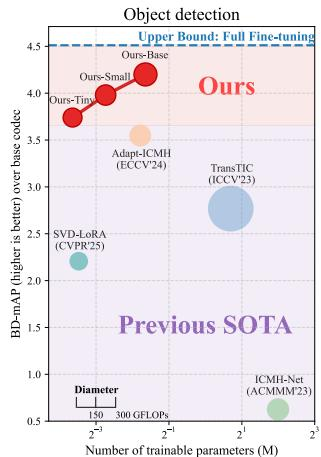
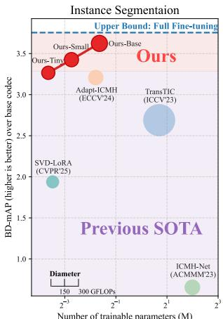
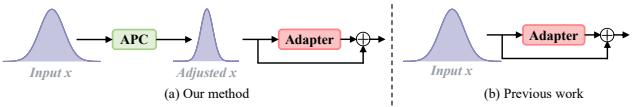
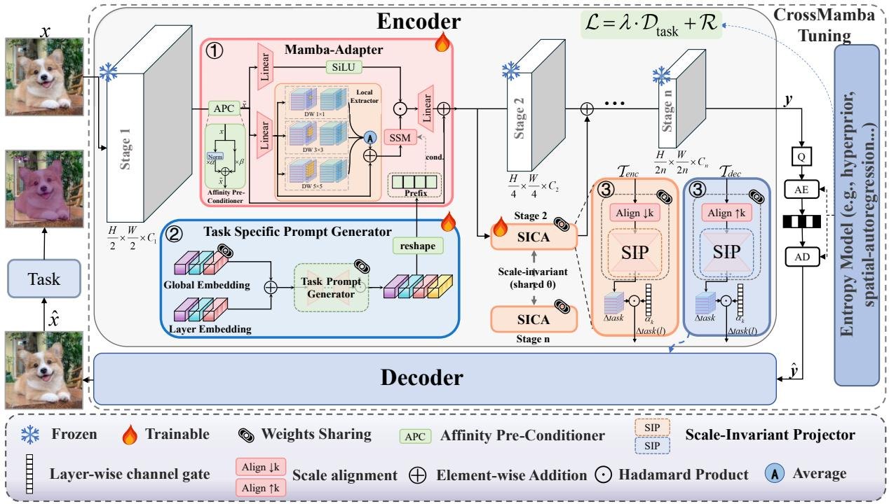
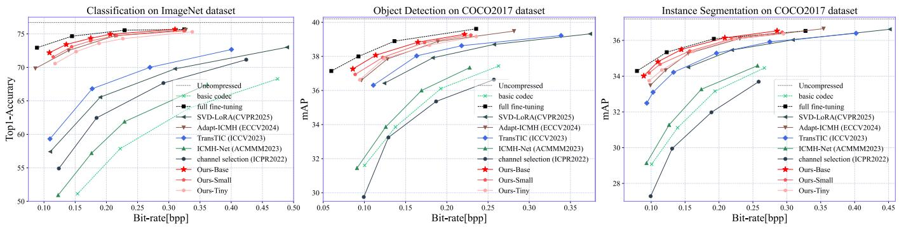
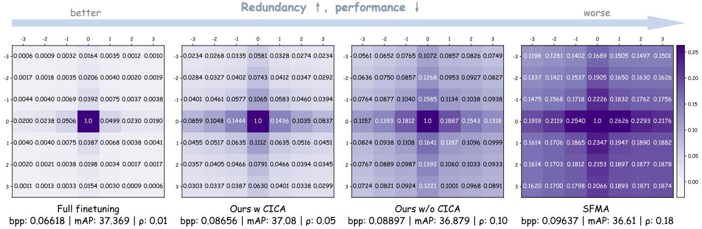
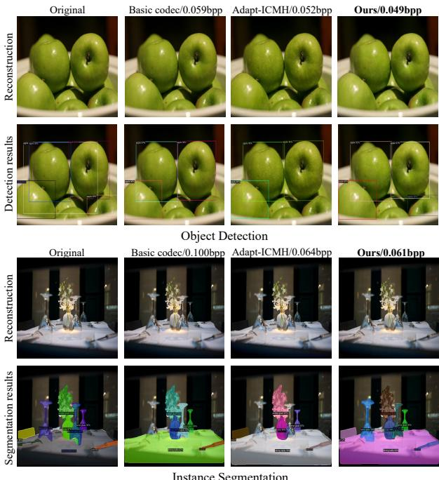
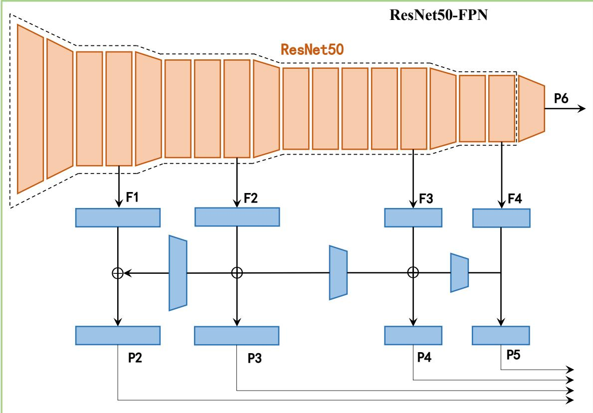
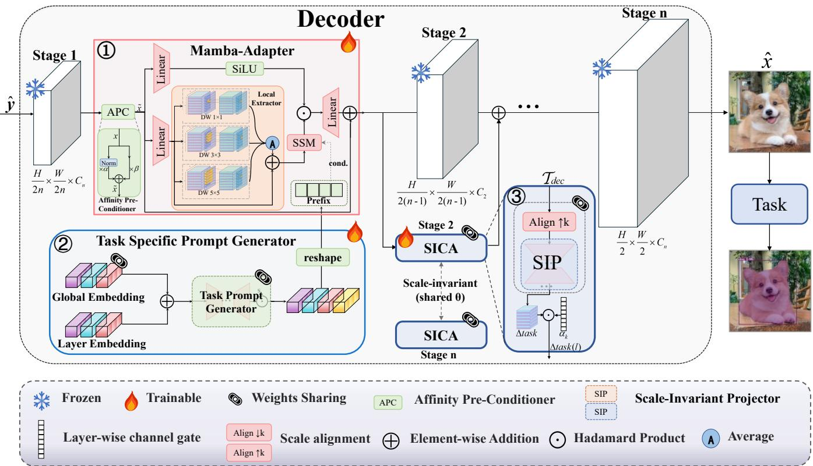

# CrossMambaTuning: Synergistic Spatial and Cross-Layer Adaptation for Machine Vision Compression

Haobo Xiong School of Computer Science and Technology, Xidian University Xi’an, China 24031110055@stu.xidian.edu.cn

Kai Liu School of Computer Science and Technology, Xidian University Xi’an, China kailiu@mail.xidian.edu.cn

Shaobo Liu School of Computer Science and Technology, Xidian University Xi’an, China shaoboo.liu@stu.xidian.edu.cn

Chongyang Ding∗ School of Computer Science and Technology, Xidian University Xi’an, China dingcy@xidian.edu.cn

## Abstract

To reduce deployment cost and retraining overhead, adapting pretrained learned image compression (LIC) models to downstream machine vision tasks has attracted growing attention. However, existing methods typically insert fine-tuning modules independently into frozen backbones, lacking explicit mechanisms for cross-layer coordination. To address this limitation, we propose a novel framework named CrossMambaTuning, which integrates State Space Models with cross-layer interaction mechanisms for parameter-eficient fine-tuning. Specifically, we design an eficient Mamba adapter equipped with task-specific prompts and multi-scale branching to precisely capture both local features and global dependencies. Furthermore, we introduce a Scale-Invariant Cross- Layer Adapter (SICA) utilizing a parameter-sharing strategy to fuse task information across diferent scales and reduce redun- dancy. Extensive experiments demonstrate that CrossMambaTuning achieves state-of-the-art (SOTA) performance on multiple machine vision tasks, reducing parameter overhead by 72% compared to SOTA methods. Code is available at https://github.com/ rsr1123/CrossMambaTuning.

## CCS Concepts

• Computing methodologies → Image compression.

## Keywords

Learned Image Compression; Parameter-Eficient Fine-Tuning; State Space Model; Machine Vision

## ACM Reference Format:

Haobo Xiong, Shaobo Liu, Kai Liu, and Chongyang Ding. 2026. CrossMambaTuning: Synergistic Spatial and Cross-Layer Adaptation for Machine Vision Compression. In Proceedings of the 34th ACM International Conference

on Multimedia (MM ’26), November 10–14, 2026, Rio de Janeiro, Brazil. ACM, New York, NY, USA, 16 pages. https://doi.org/10.1145/3767308.3835353

## 1 Introduction

  
Figure 1: Performance comparison on COCO2017-val [30]. The diferent variants of the proposed method, full finetuning, TransTIC [12], ICMH-Net [33],Adapt-ICMH [28], and SVD-LoRA [39], are compared. BD-mAP is computed using the base codec of TIC [36] as the anchor. The size of the circles represents Gflops for encoding.

The exponential growth of visual data used in downstream ap- plications [24, 42, 49], such as the Internet of Things (IoT) [15], demands eficient compression techniques that support machine vision tasks. However, practical deployment scenarios often require compression models to preserve image reconstruction capability for human viewing. To minimize the parameter overhead and retraining cost of maintaining multiple task-specific systems, early studies [14, 31] explored unified frameworks. However, these approaches typically required training multi-task networks from scratch, which incurred substantial training and storage overheads. Therefore, re- ducing the training and storage overhead for diverse applications has become an important direction.

To address this need, recent studies [12, 28, 33] increasingly adopt the parameter-eficient fine-tuning (PEFT) paradigm, where lightweight task-specific modules are attached to pretrained learned image compression (LIC) models. Instead of training separate task-specific codecs from scratch, these methods reuse pretrained models and introduce only minimal additional parameters for downstream machine vision adaptation. In practical deployment, adapting a pretrained LIC model to machine vision tasks avoids storing an additional full set of model weights, thereby substantially reducing both retraining costs and storage overhead.

Building on the PEFT paradigm, existing methods can be broadly categorized into two approaches. The first category (e.g., ICMH-Net [33] and TransTIC [12]) employs masks or visual prompting[8]. However, these methods often impose rigid structural constraints on the encoder (e.g., TransTIC is exclusive to Transformers), limiting their architectural flexibility. The second category focuses on architecture-agnostic fine-tuning via Low-Rank Adaptation (LoRA) [26, 39] or adapters [25, 28]. Notably, methods like SFMA achieve eficient adaptation via input-adaptive frequency modulation, but frequency modulation often fails to capture long-range spatial de- pendencies. Although attention mechanisms [3, 45] could address this limitation, their quadratic complexity makes them intractable for high-resolution images. A promising alternative lies in State Space Models [20, 34, 55], such as VMamba [34], which capture long-range dependencies with linear complexity, ofering an efi-cient solution for global spatial modeling.

Furthermore, existing methods [28, 39] typically insert mod-ules independently at various layers within the network, without explicit mechanisms for cross-layer coordination. Consequently, task-relevant information may not be efectively integrated across layers, limiting the utilization of complementary semantics.

To address these challenges, we propose CrossMambaTuning, a parameter-eficient adaptation framework for machine vision tasks. First, we design an eficient Mamba adapter equipped with task-specific prompts. Simultaneously, this module utilizes multi scale branching to extract local features and selective scanning to capture long-range spatial dependencies, enabling precise modeling of task-relevant priors. Second, to alleviate the layer-isolation issue, we introduce a Scale-Invariant Cross-Layer Adapter (SICA) with a parameter-sharing strategy. This approach implements a scaleagnostic cross-layer mechanism to fuse task information across features of diferent scales. Such a design facilitates cross-layer information fusion and reduces compression redundancy, thereby significantly improving parameter utilization eficiency.

Leveraging these innovations, our framework achieves parameter eficiency. The Tiny variant reduces parameter overhead by 72% compared to the state-of-the-art (SOTA) method [28], using 0.08M parameters while achieving comparable or superior performance.

In summary, the main contributions are as follows:

• We propose an eficient Mamba adapter augmented with task-specific prompts and local multi-scale branching modules. By efectively modeling spatial dependencies within images, this design facilitates eficient adaptation of LIC models to downstream machine vision tasks.

• We introduce a cross-layer information fusion mechanism employing a parameter-sharing strategy. By implementing a

Scale-Invariant Cross-Layer Adapter, this mechanism efec- tively fuses task information across diferent scales, thereby reducing redundancy and enhancing parameter eficiency.

• We present the CrossMambaTuning framework by integrating the proposed Mamba adapter and cross-layer fusion mechanism. Extensive experiments demonstrate that our method achieves SOTA performance on multiple machine vision tasks across various network configurations.

## 2 Related Work

## 2.1 Learned Image Compression (LIC)

Learned Image Compression (LIC) [6, 7, 22, 27, 38] demonstrates strong competitiveness against traditional codecs such as VVC [11] and HEVC [44], typically evaluated using PSNR and MS-SSIM. LIC models generally consist of a transform module and an entropy model. Prior work on transform modules focuses on nonlinear transformation, adopting convolutions with GDN [7] or enhancing expressiveness via residual learning and attention [13, 57]. Recent studies use Transformer-based architectures to model long-range de endencies [35, 36]. For entro models, h er rior-based methods capture spatial dependencies [7], while autoregressive models exploit decoded context [38]. Recent work integrates richer cues for entropy estimation [27].

## 2.2 Machine Vision in LIC

Despite the success of LIC models optimized for human perception, their compressed representations are not always well aligned with the requirements of downstream machine vision tasks. Early stud- ies [4, 14] explored unified or multi-task frameworks to support diverse usage scenarios within a single model. For instance, Choi & Bajic [14] proposed a scalable coding framework via latent decom-position, while Zhang et al.[54] presented an ensemble framework with multi-path aggregation. However, these multi-branch designs incur substantial training and storage overheads, limiting practical deployment. Consequently, recent research [12, 28, 39] has shifted toward the fine-tuning paradigm to adapt pretrained LIC models. These approaches typically fall into two categories. The first utilizes masks or visual prompts, such as the mask generator [19] and TransTIC [12]. However, such methods are often tied to specific architectures (e.g., TransTIC is restricted to Transformer-based models), limiting their versatility. The second category employs Low-Rank Adaptation (LoRA) [39] or Adapters [28]. By inserting lightweight task-specific modules into frozen codecs, these meth- ods apply to a broad range of backbones, achieving strong task performance with minimal additional parameters.

## 2.3 Mamba-based PEFT Methods

Recently, State Space Models (SSMs) [34, 50, 51, 55] have shown strong potential in vision tasks, ofering global modeling capacity competitive with Transformers while maintaining linear computa- tional complexity. Leveraging their linear complexity and eficient long-range modeling capability, recent studies have explored the use of SSMs as lightweight adaptation modules in pretrained models. In medical image segmentation, Triplane Mamba [46] introduces Mamba as an adapter for 3D SAM [53], enabling parameter-eficient fine-tuning through long-range spatial dependency modeling in

Algorithm 1 Procedure of CrossMambaTuning   
Require: Image �, Frozen Backbone $\{ \mathcal { F } _ { k } \} _ { k = 1 } ^ { K }$ , Mamba Adapters   
$\{ \mathcal { A } _ { k } \} _ { k = 1 } ^ { K - 1 }$ , SICA Module $\mathcal { T } ( \cdot ; \Theta )$ with gates $\{ \alpha _ { k } \}$ , Global Code   
�����, Layer Embeddings $E _ { \mathrm { l a y e r } } ^ { ( l ) }$ , Prompt Generator $\mathcal { G }$   
Ensure: Representation �   
1: $h  { \mathcal { F } } _ { 1 } ( x )$   
2: $P ^ { ( 1 ) } \gets \dot { g } ( E _ { t a s k } + E _ { \mathrm { l a y e r } } ^ { ( 1 ) } )$   
3: $z _ { 1 } \gets \mathcal { A } _ { 1 } ( h ; \mathrm { p r e f i x } = P ^ { ( 1 ) } )$   
4: for $k = 1 , \ldots , K - 2$ do   
5: $h _ { \mathrm { f r o z e n } }  \mathcal { F } _ { k + 1 } ( z _ { k } )$   
6: $h _ { \mathrm { b y p a s s } }  \alpha _ { k } \cdot \mathcal { T } ( z _ { k } ; \Theta )$   
7: $z _ { i n } \gets h _ { \mathrm { f r o z e n } } + h _ { \mathrm { b y p a s s } }$   
8: $P ^ { ( k + 1 ) } \gets G ( E _ { t a s k } + E _ { \mathrm { l a y e r } } ^ { ( k + 1 ) } )$   
9: $z _ { k + 1 } \gets \mathcal { A } _ { k + 1 } ( z _ { i n } ; \mathrm { p r e f i x } = P ^ { ( k + 1 ) } )$   
10: end for   
11: return $y  \mathcal { F } _ { K } ( z _ { K - 1 } )$

3D data. In point cloud understanding, PMA [52] proposes a Point Mamba Adapter that constructs an ordered feature sequence from all layers of the pretrained model and uses Mamba for cross-layer semantic fusion. Mamba has also been adopted for cross-model adaptation. For example, MAVLT [43] uses a Mamba adapter as a bridge between the visual and language encoders, achieving efi- cient vision-language fusion with only a small number of trainable parameters. These studies suggest that Mamba can serve not only as a backbone but also as an adapter in pretrained models.

Unlike existing Mamba-based adaptation methods that are largely tailored to specific scenarios, our approach is developed for ma- chine vision compression through parameter-eficient adaptation of pretrained LIC models. It provides a unified framework for ma- chine vision compression across classification, object detection, and instance segmentation, and is applicable to diverse architectures, in cluding both CNN-based and Transformer-based models. Its strong performance comes from two complementary components: the Task-aware Mamba Adapter performs eficient spatial modeling, while SICA alleviates the redundancy introduced by frozen codecs. Notably, the Tiny variant requires only 0.08M parameters while maintaining competitive performance across multiple tasks.

## 3 Method

## 3.1 Overview and Motivations

Existing PEFT-based adaptation frameworks exhibit two key limitations when adapting pretrained learned image compression (LIC) models to downstream machine vision tasks. First, current methods often struggle to capture long-range spatial dependencies, with underrepresented correlations between distant regions hindering the preservation of task-relevant global structure. Second, the lack of explicit cross-layer coordination may cause adapters at diferent layers to learn overlapping feature patterns [29], introducing redun dancy and limiting the coordinated utilization of complementary semantics across layers. To address these issues, we propose Cross-MambaTuning, a PEFT framework tailored for machine vision. The framework comprises two lightweight modules that enhance spatial dependency modeling and cross-layer information integration:

  
Figure 2: The APC modifies the input � before the adapter.

(i) Task-Aware Mamba Adapter. We insert a Mamba-based adapter after each encoder/decoder stage except the last. Leveraging the SSM, the adapter captures long-range spatial dependencies eficiently. To incorporate task awareness, we employ a shared Task-Specific Prompt Generator (TSPG) to inject task priors and promote consistent information sharing across adapters.

(ii) Scale-Invariant Cross-Layer Adapter (SICA). To facilitate cross-layer interaction, we establish information pathways between adjacent layers. By aligning features across scales and extracting task-relevant semantics, this adapter enables cross-scale feature integration and facilitates information exchange across layers.

The procedure of the adaptation can be seen in Algorithm 1, while Figure 3 provides an overview of the pipeline. Given an input image �, the encoder produces a compact latent �, which is coded into a binary bitstream via an entropy model; the decoder then reconstructs the image �ˆ optimized for the downstream task. Overall, CrossMambaTuning improves adaptation and compression eficiency while introducing only 1%–4% additional parameters.

## 3.2 Task-aware Mamba Adapter

To efectively capture long-range spatial dependencies while promoting interaction among adapters, we integrate the proposed Task-aware Mamba Adapter into the pre-trained codecs. As shown in Figure 3, the adapter first applies an Afinity Pre-conditioner (APC) to the input features � to align them with the distribution of downstream tasks. The resulting features �˜ are then projected into a lower-dimensional space through a linear transformation. The transformed features are processed by two parallel branches. One branch uses a local information extractor to capture multi-scale spatial details, followed by an SSM augmented with task-specific prompts to generate modulation signals, which are applied to the other branch via element-wise gating. An up-projection layer re-stores the original feature dimension, and the output is combined with the APC-adjusted features through a residual connection to produce the final representation. Specifically, we employ three dis- tinct designs to construct an eficient Mamba adapter:

(i) Afinity Pre-conditioner (APC). Conventional PEFT meth- ods typically apply additive modulation to intermediate features. However, the feature distribution generated by the frozen back- bone often deviates from the optimal distribution for downstream tasks. The absence of proper preprocessing consequently limits the fine-tuned distribution from reaching the ideal state. To rectify this misalignment and thereby enhance the afinity for downstream tasks, we introduce the Afinity Pre-conditioner (APC).

As shown in Figure 2, APC operates as a lightweight feature rectification module preceding the residual adapter. APC adopts a dual-path mechanism fusing the raw input with normalized features. The pre-conditioned feature $x _ { \mathrm { A P C } }$ is formulated as:

$$
x _ { \mathrm { A P C } } = \mathrm { N o r m } ( x ) \odot \alpha + x \odot \beta ,\tag{1}
$$

  
Figure 3: Overview of the proposed CrossMambaTuning.The snowflake symbol represents frozen layers, while the flame symbol represents trainable layers. Since the decoding stage is the inverse process of the encoding stage, only the specific fine-tuning modules within the encoder are shown. More details can be found in Appendix H.

where Norm(·) denotes normalization such as LayerNorm [2], and $\alpha , \beta$ are learnable scaling parameters. The APC module introduces only 4� learnable parameters, where � denotes the channel dimen- sion; for Lu2022-TIC [36] with $C = 1 2 8$ , this corresponds to 512 parameters per module, resulting in negligible parameter overhead.

As shown in Table 1. We calculate the Wasserstein Distance and KL Divergence between the feature distributions of the full fine- tuning model and the Mamba-Adapter, with and without APC. We report the metrics for the latent representation � and the average across network stages. The results indicate that APC mitigates distribution shift and aligns features closer to the full fine-tuning.

Table 1: We measure the distribution distance relative to the full fine tuning (lower is better). The metrics are reported for the average of intermediate stages (Stages) and the latent (�).
<table><tr><td rowspan="2">Method</td><td colspan="2">Wasserstein ↓</td><td colspan="2">KL Divergence ↓</td></tr><tr><td>Stages</td><td>y</td><td>Stages</td><td>y</td></tr><tr><td>w/o APC</td><td>0.0308</td><td>0.0388</td><td>0.0396</td><td>0.0163</td></tr><tr><td>w/ APC</td><td>0.0277</td><td>0.0318</td><td>0.0318</td><td>0.0077</td></tr></table>

(ii) Local Information Extractor (LIE). To mitigate the limited ability of SSMs [20, 34, 40, 55] to capture fine-grained local details, we introduce a Local Information Extractor to replace the original 3 × 3 depth-wise convolution. The module adopts a multi-branch design with depth-wise convolution kernels of sizes 1 × 1, 3 × 3, and $5 \times 5 ,$ capturing pixel-level variations, local neighborhood context, and broader texture and edge patterns, respectively. Through multi- scale fusion, the extractor provides a strong local inductive bias for the subsequent SSM, enhancing its capacity to process highfrequency information such as edges and textures.

Formally, given an input $x ~ \in ~ \mathbb { R } ^ { B \times C \times H \times W }$ , three depth-wise convolution branches independently process � with kernel sizes � ∈ 1, 3, 5. The refined feature � is obtained by integrating multi-scale local information into the input:

$$
y = x + \frac { 1 } { 3 } \sum _ { k \in 1 , 3 , 5 } \mathrm { D W C o n v } k \times k ( x ) ,\tag{2}
$$

where DWConv� × $k ( \cdot )$ denotes a depth-wise convolution with kernel size $k \times k .$

(iii) Task-Specific Prompt Generator (TSPG). To condition the Mamba Adapters with task-oriented prior, we introduce the Task-Specific Prompt Generator (TSPG).

Unlike instance-wise conditioning, TSPG generates a task prior that initializes the SSM states. Formally, we create a global shared task embedding $E _ { \mathrm { t a s k } } ~ \in ~ \mathbb { R } ^ { d }$ to unify task objectives, and layer-specific embeddings $\{ E _ { \mathrm { l a y e r } } ^ { ( l ) } \} _ { l = 1 } ^ { L } \in \mathbb { R } ^ { d }$ to capture layer-wise variations. The prompt $P ^ { ( l ) }$ for the �-th layer is generated via a light- weight projector $\mathcal { G } ( \cdot ) \colon$

$$
P ^ { ( l ) } = \mathcal { G } \big ( E _ { \mathrm { t a s k } } + E _ { \mathrm { l a y e r } } ^ { ( l ) } \big ) .\tag{3}
$$

This prompt is prepended to the input sequence $X ^ { ( l ) }$

$$
X _ { \mathrm { i n } } ^ { ( l ) } = [ P ^ { ( l ) } ; X ^ { ( l ) } ] ,\tag{4}
$$

where [·; ·] denotes concatenation along the sequence dimension. Consequently, the Mamba Adapter processes the prompt first, thereby initializing its hidden states with task-specific information before handling image features. Furthermore, the shared $E _ { \mathrm { t a s k } }$ implicitly links distributed adapters, enabling efective joint optimization.

## 3.3 Scale-Invariant Cross-Layer Adapter (SICA)

3.3.1 Problem Formulation. We denote the frozen backbone as $\Phi ,$ comprised of � consecutive stages. At the �-th stage, the fea- ture extraction is governed by the frozen transformation operator $\mathcal { F } _ { k } \ : \ \mathbb { R } ^ { C _ { k - 1 } \times H _ { k - 1 } \times W _ { k - 1 } } \ \longrightarrow \ \bar { \mathbb { R } } ^ { \ C _ { k } \times H _ { k } \times W _ { k } }$ . The feature transition is formalized as:

$$
z _ { k } = \mathcal { F } _ { k } ( z _ { k - 1 } ) , \quad \mathrm { w h e r e } z _ { k } \in \mathbb { R } ^ { C _ { k } \times H _ { k } \times W _ { k } } .\tag{5}
$$

In conventional frameworks [28, 39], the adapted feature $z _ { k } ^ { \mathrm { a d a p t } } \in$ $\mathbb { R } ^ { C _ { k } \times H _ { k } \times W _ { k } }$ is introduced locally in a layer-wise manner and subse- quently processed by $\mathcal { F } _ { k }$ . Such a design lacks an explicit mechanism for cross-layer coordination and could limit the coordinated utiliza- tion of task-relevant information across layers. Moreover, adapters at diferent layers may learn overlapping feature patterns [29], thereby introducing redundancy.

3.3.2 Design of the SICA Bypass Operator. To address this, SICA establishes an explicit bypass connection. Let $z _ { k } ^ { \mathrm { a d a p t } }$ denote the adapted feature at stage �. The input to the next stage, denoted as $z _ { k + 1 } ^ { \mathrm { i n } } \overline { { \mathbf { \Omega } } } \in \mathbb { R } ^ { C _ { k } \times H _ { k + 1 } \times W _ { k + 1 } }$ , is given by:

$$
\boldsymbol { z } _ { k + 1 } ^ { \mathrm { i n } } = \underbrace { \mathcal { F } _ { k } ( \boldsymbol { z } _ { k } ^ { \mathrm { a d a p t } } ) } _ { \mathrm { F r o z e n P a t h } } + \underbrace { \boldsymbol { \alpha } _ { k } \cdot \mathcal { T } ( \boldsymbol { z } _ { k } ^ { \mathrm { a d a p t } } ; \boldsymbol { \Theta } ) } _ { \mathrm { S I C A B y p a s s } } ,\tag{6}
$$

where $\boldsymbol { \alpha } _ { k } \in \mathbb { R } ^ { 1 \times C _ { k } }$ is a learnable scalar initialized to 0.

To achieve extreme parameter eficiency, we employ a Scale-Invariant Parameter Sharing strategy. We define the transformation operator $\mathcal { T } : \mathbb { R } ^ { C _ { k } \times H _ { k } \times W _ { k } } \to \mathbb { R } ^ { C _ { k } \times H _ { k + 1 } \times W _ { k + 1 } }$ as a composition of spatial and semantic operations:

$$
\mathcal T ( z ) \triangleq ( \mathcal P _ { \mathrm { i n v } } \circ S _ { \mathrm { a l i g n } } ) ( z ) .\tag{7}
$$

The parameter set Θ is shared across stages. Specifically, we define $\Theta = \{ \Theta _ { \mathrm { e n c } } , \Theta _ { \mathrm { d e c } } \}$ , where $\Theta _ { \mathrm { e n c } }$ applies to encoder and $\Theta _ { \mathrm { d e c } }$ to decoder. The operators are defined as follows:

Scale-Alignment Spatial Operator $S _ { \mathrm { a l i g n } }$ . To align resolutions, $S _ { \mathrm { a l i g n } }$ applies distinct operations for encoder and decoder stages (� ∈ {enc, dec}) :

$$
S _ { \mathrm { a l i g n } } ( z ) = { \left\{ \begin{array} { l l } { \operatorname { D W C o n v } _ { s = 2 } ( z ) , } & { { \mathrm { i f ~ } } m = { \mathrm { e n c } } } \\ { \operatorname { D W C o n v } _ { s = 1 } ( \operatorname { U p } ( z ) ) , } & { { \mathrm { i f ~ } } m = { \mathrm { d e c } } } \end{array} \right. }\tag{8}
$$

where DWConv denotes a depthwise convolution with stride $s ,$ and Up(·) represents 2× bilinear interpolation.

Scale-Invariant Projector ${ \mathcal { P } } _ { \operatorname { i n v } } .$ . After spatial alignment, the features are processed via a bottleneck MLP. With reduction ratio $r ,$ the projection matrices are $\mathbf { W } _ { \mathrm { d o w n } } \in \mathbb { R } ^ { \frac { C } { r } \times C }$ and $\mathbf { W } _ { \mathrm { u p } } \in \mathbb { R } ^ { C \times \frac { C } { r } }$ The operator acts on the feature � as:

$$
{ \mathcal { P } } _ { \mathrm { i n v } } ( z ) = \mathbf { W } _ { \mathrm { u p } } ( \sigma ( \mathbf { W } _ { \mathrm { d o w n } } ( z ) ) ) ,\tag{9}
$$

where �(·) denotes the SiLU activation [17] . By sharing $\mathbf { W } _ { \mathrm { d o w n } } , \mathbf { W } _ { \mathrm { u p } }$ across all stages, ${ \mathcal { P } } _ { \mathrm { i n v } }$ captures semantic representations independent of spatial scale.

The same Θ generalizes across domains $\Omega _ { k } \subset \mathbb { R } ^ { H _ { k } \times W _ { k } }$ of varying scales, enforcing a universal feature injection mechanism.

## 3.4 Training Loss

During the training phase, the weights of the pretrained codec are frozen, and only the inserted adapters are optimized. The overall training objective follows a RD optimization, defined as:

$$
\mathcal { L } = \mathcal { R } + \lambda \cdot \mathcal { D } _ { \mathrm { t a s k } } ,\tag{10}
$$

where R denotes the bitrate estimated by the entropy model (for the hyperprior entropy model, $\mathcal { R } = \mathcal { R } ( \hat { \mathbf { y } } ) + \mathcal { R } ( \hat { \mathbf { z } } ) )$ ), $\mathcal { D } _ { \mathrm { t a s k } }$ represents the task specific perceptual distortion metric (defined in Appendix D), and � is the hyperparameter controlling the rate distortion tradeof.

## 4 Experiments

## 4.1 Experimental Setup

4.1.1 Datasets. We evaluate the proposed method on three representative downstream machine vision tasks: image classification, object detection, and instance segmentation. We utilize the ImageNet dataset [16] for the classification, while the COCO2017 dataset [30] is used for object detection and instance segmentation.

4.1.2 Benchmarks. To assess the efectiveness of the proposed method, we integrate CrossMambaTuning into two diferent base codecs. We use a simplified version ofthe Transformer-based Lu2022- TIC [36] codec, which utilizes only the hyperprior entropy model. Additionally, we incorporate the CNN-based ELIC [21] model with the Spatial-Channel Context model. To benchmark performance, we conduct comprehensive comparisons against recent SOTA methods, including Channel Selection [32], ICMH-Net [33], TransTIC [12], Adapt-ICMH [28], and SVD-LoRA [39]. The entire framework is implemented based on CompressAI [9].

4.1.3 Evaluation Metrics. We measure compression performance using bits per pixel (bpp). To assess downstream task performance, we evaluate Top-1 accuracy on ImageNet-VAL (using a pre-trained ResNet-50 [24]) and mAP on COCO2017-val. For object detection, we use Faster R-CNN [42], and for instance segmentation, we use Mask R-CNN [23], both implemented with Detectron2 [47]. Additionally, we report BD-rate [10] and BD-mAP, which quantify bitrate savings at equivalent performance and performance gains at equivalent bitrates, respectively.

4.1.4 Training Details. In all experiments, the backbone remains frozen, and only the proposed adapters are optimized. All training images are randomly cropped to 256×256. For classification, we train for 8 epochs with a batch size of 16. Conversely, for detection and segmentation tasks, we train for 40 epochs with a batch size of 8. Further details are available in Appendix H.

## 4.2 Experimental Results

Figure 4 illustrates the rate-accuracy curves on the TIC codec, demonstrating that CrossMambaTuning consistently outperforms all competing methods. Notably, for classification, our "Small" model surpasses the state-of-the-art Adapt-ICMH while utilizing only 51.7% of the trainable parameters. In detection and segmentation, even our "Tiny" variant significantly outperforms recent SOTA algorithms (Adapt-ICMH and SVD-LoRA).

  
Figure 4: Rate-Accuracy performance comparison for diferent machine vision tasks using the Lu2022-TIC base codec.

Table 2: Performance comparison of diferent methods on three machine tasks, using TIC as the base codec. We report the number of trainable parameters and two BD metrics [10]: BD-rate and BD-acc/mAP. The best and second-best results are highlighted in bold and underline, respectively.
<table><tr><td rowspan="2">Method</td><td rowspan="2">Venue</td><td colspan="2">Image Classification</td><td colspan="2">Object Detection</td><td colspan="2">Instance Segmentation</td><td rowspan="2">Trainable Params ↓ (M)</td></tr><tr><td>BD-rate↓</td><td>BD-acc↑</td><td>BD-rate↓</td><td>BD-mAP↑</td><td>BD-rate↓</td><td>BD-mAP↑</td></tr><tr><td>full fine-tuning</td><td></td><td>1</td><td>17.688</td><td>-73.943%</td><td>4.511</td><td>-67.977%</td><td>3.755</td><td>7.51(100.00%)</td></tr><tr><td>channel selection [32]</td><td>ICPR&#x27;22</td><td>-37.178%</td><td>6.278</td><td>6.849%</td><td>-0.550</td><td>16.511%</td><td>-0.949</td><td>0.92(12.25%)</td></tr><tr><td>ICMH-Net [33]</td><td>ACM MM&#x27;23</td><td>-18.759%</td><td>3.360</td><td>-9.080%</td><td>0.625</td><td>-10.772%</td><td>0.654</td><td>3.98(53.00%)</td></tr><tr><td>TransTIC [12]</td><td>ICCV&#x27;23</td><td>-58.529%</td><td>9.956</td><td>-46.301%</td><td>2.768</td><td>-46.521%</td><td>2.690</td><td>1.62(21.57%)</td></tr><tr><td>Adapt-ICMH [28]</td><td>ECCV&#x27;24</td><td>-88.573%</td><td>16.901</td><td>-55.150%</td><td>3.547</td><td>-52.407%</td><td>3.208</td><td>0.29(3.86%)</td></tr><tr><td>SVD-LoRA [39]</td><td>CVPR&#x27;25</td><td>-50.162%</td><td>7.920</td><td>-39.927%</td><td>2.207</td><td>-42.431%</td><td>1.938</td><td>0.09(1.20%)</td></tr><tr><td>Ours-Tiny</td><td>-</td><td>-83.187%</td><td>16.118</td><td>-58.236%</td><td>3.742</td><td>-55.387%</td><td>3.266</td><td>0.08(1.07%)</td></tr><tr><td>Ours-Small</td><td>-</td><td>-91.570%</td><td>16.934</td><td>-60.575%</td><td>3.980</td><td>-60.661%</td><td>3.426</td><td>0.15(2.00%)</td></tr><tr><td>Ours-Base</td><td></td><td>-92.788%</td><td>17.575</td><td>-65.607%</td><td>4.249</td><td>-62.589%</td><td>3.624</td><td>0.32(4.26%)</td></tr></table>

Table 3: Ablation study of core components.
<table><tr><td rowspan="2">Method</td><td colspan="4">Components</td><td colspan="2">Object Detection</td><td colspan="2">Instance Segmentation</td><td rowspan="2">Trainable Params↓ (M)</td></tr><tr><td>APC</td><td>LIE</td><td>SICA</td><td>TSPG</td><td>BD-Rate↓</td><td>BD-mAP↑</td><td>BD-Rate↓</td><td>BD-mAP↑</td></tr><tr><td>(a)</td><td></td><td></td><td></td><td></td><td>-60.162%</td><td>3.948</td><td>-59.676%</td><td>3.405</td><td>0.26 (3.46%)</td></tr><tr><td>(b)</td><td>√</td><td></td><td></td><td></td><td>-61.303%</td><td>4.021</td><td>-60.885%</td><td>3.479</td><td>0.26 (3.46%)</td></tr><tr><td>(c)</td><td>√</td><td>√</td><td></td><td></td><td>-61.977%</td><td>4.062</td><td>-61.789%</td><td>3.493</td><td>0.27 (3.60%)</td></tr><tr><td>(d)</td><td>√</td><td>√</td><td>√</td><td></td><td>-64.931%</td><td>4.195</td><td>-62.164%</td><td>3.575</td><td>0.30 (3.99%)</td></tr><tr><td>(e)</td><td>√</td><td>√</td><td>√</td><td>√</td><td>-65.607%</td><td>4.249</td><td>-62.589%</td><td>3.624</td><td>0.32 (4.26%)</td></tr></table>

Quantitative results in Table 2 corroborate this superiority: on detection and segmentation tasks, our "Tiny" variant outperforms Adapt-ICMH with merely 27% of the parameters and exceeds SVD-LoRA by 1.328 ∼ 1.533 mAP at equivalent bitrates. Additional experiments on the CNN-based ELIC[21] backbone further demon-strate this eficiency. As reported in Table 4, the proposed method consistently surpasses existing state-of-the-art approaches. At the same bitrate, the "Tiny" variant improves mAP by 0.484 for object detection, while reducing the number of trainable parameters by 73%. These results highlight both the parameter eficiency and generalization capability of CrossMambaTuning. Our "Tiny" and "Small" variants surpass larger SOTA methods in performance while utilizing fewer trainable parameters. This confirms both the high parameter eficiency and analytical soundness of our approach.

## 4.3 Ablation Study

4.3.1 Core components. As shown in Table 3, we validate the efectiveness of our design through progressive integration. Compared to the baseline (Row a), the introduction of APC (Row b) achieves a significant improvement in detection metrics. Incorporating the LIE (Row c) then confirms the importance of multi-scale feature extraction. Subsequently, SICA (Row d) further reduces the BD-rate and demonstrates that cross-layer interaction reduces redundancy. Finally, the inclusion of the TSPG module (Row e) yields the best performance via task-specific prompt. These results demonstrate the efectiveness and complementarity of all components.

  
Figure 5: Visualization of spatial correlation for normalized latent representations $( y - \mu ) / \sigma$ . SFMA (right) exhibits significant spatial correlation. In contrast, our method (second from left) efectively suppresses correlations, approaching the decorrelation eficiency of Full Fine-tuning (left). More details are provided in Appendix E.

Table 4: Performance comparison of diferent methods on object detection, using ELIC [21] as the base codec.
<table><tr><td>Method</td><td colspan="2">Object Detection BD-rate↓ BD-mAP↑</td><td>Trainable Params ↓(M)</td></tr><tr><td>full fine-tuning</td><td>-70.409%</td><td>5.745</td><td>33.79(100.00%)</td></tr><tr><td>channel selection [32]</td><td>-23.235%</td><td>1.518</td><td>2.68(7.93%)</td></tr><tr><td>SVD-LoRA [39]</td><td>-41.190%</td><td>2.149</td><td>0.41(1.21%)</td></tr><tr><td>Adapt-ICMH [28]</td><td>-54.844%</td><td>3.379</td><td>0.41(1.21%)</td></tr><tr><td>Ours-Tiny</td><td>-57.495%</td><td>3.863</td><td>0.11(0.33%)</td></tr><tr><td>Ours-Small</td><td>-60.016%</td><td>4.137</td><td>0.21(0.62%)</td></tr><tr><td>Ours-Base</td><td>-62.710%</td><td>4.500</td><td>0.43(1.27%)</td></tr></table>

4.3.2 Parameter sharing strategy. We evaluate the eficacy of the parameter sharing strategy within the SICA module on the detection task. As shown in Table 5, disabling cross-layer sharing (instantiating independent modules for each bypass connection) increases the parameter count from 0.32M to 0.36M, yet leads to inferior performance. This suggests that, although diferent layers process features at varying semantic levels, they may still contain similar task-relevant information. The proposed sharing strategy therefore avoids repeatedly learning similar mappings across layers, reducing redundancy while preserving model compactness.

4.3.3 Local Perception Mechanism. We investigate kernel config-urations for local feature extraction. As shown in Table 6, while expanding to a 5 × 5 kernel improves over the baseline, the dual-scale $D W 1 + D W 3$ strategy outperforms the single large kernel. This proves that aggregating multi-grained features is more efective than simple spatial expansion. Ultimately, our multi-scale design achieves optimal performance by fusing diverse receptive fields.

Table 5: Ablation study on the parameter sharing strategy.
<table><tr><td rowspan="2">Strategy</td><td colspan="2">Object Detection</td><td rowspan="2">Trainable Params↓ (M)</td></tr><tr><td>BD-Rate↓</td><td> $\mathrm { B D - m A P } \uparrow$ </td></tr><tr><td>Independent</td><td>-63.224%</td><td>4.106</td><td>0.36</td></tr><tr><td>Shared (Ours)</td><td>-65.607%</td><td>4.249</td><td>0.32</td></tr></table>

Table 6: Ablation study on the Local Perception Mechanism.
<table><tr><td rowspan="2">Kernel Configurations</td><td colspan="2">Object Detection</td><td rowspan="2">Trainable Params↓ (M)</td></tr><tr><td>BD-Rate↓</td><td>BD-mAP↑</td></tr><tr><td>Baseline (DW3)</td><td>-61.302%</td><td>4.021</td><td>0.26</td></tr><tr><td>Larger Kernel (DW5)</td><td>-61.268%</td><td>4.032</td><td>0.26</td></tr><tr><td>Dual Scale  $( D W _ { 1 , 3 } )$ </td><td>-61.678%</td><td>4.045</td><td>0.26</td></tr><tr><td>Ours  $( D W _ { 1 , 3 , 5 } )$ </td><td>-61.977%</td><td>4.062</td><td>0.27</td></tr></table>

4.3.4 Spatial Modeling Module. To isolate the efect of the SSM module, we replace it with a window-based self-attention [35] mod-ule under the same experimental settings. As shown in Table 7, the window-attention variant performs slightly worse than the Mamba-based design, suggesting that Mamba is more efective for spatial modeling in machine-vision adaptation.

Table 7: Ablation study on the spatial modeling module.
<table><tr><td rowspan="2">Module</td><td colspan="2">Object Detection</td><td rowspan="2">Trainable Params↓ (M)</td></tr><tr><td>BD-Rate↓</td><td>BD-mAP↑</td></tr><tr><td>w/ window attention</td><td>-62.020%</td><td>4.084</td><td>0.31</td></tr><tr><td>Ours (Mamba-based)</td><td>-64.931%</td><td>4.195</td><td>0.30</td></tr></table>

Table 8: Reconstruction quality on Imagenet-val. We report bitrate and reconstruction quality for diferent settings.
<table><tr><td>Method</td><td>bpp</td><td>PSNR(dB)</td><td>MS-SSIM</td></tr><tr><td>Base codec</td><td>0.477</td><td>32.04</td><td>0.981</td></tr><tr><td>Ours w/o adapters</td><td>0.477</td><td>32.04</td><td>0.981</td></tr></table>

## 4.4 Analysis of Redundancy Reduction.

We use spatial correlation as a proxy to quantify redundancy, following prior works that explicitly analyze redundancy through correlation maps and correlation values [1, 41, 48, 56], as well as recent designs that improve compression eficiency by reducing local correlation [18]. As shown in Fig. 5, the previous SOTA method [28] exhibits relatively high redundancy (0.18). In contrast, our approach reduces this metric to 0.05, substantially narrowing the gap towards full fine-tuning (0.01). The increased correlation in the ablation variant (w/o SICA) further supports the role of the proposed SICA in alleviating redundancy.

## 4.5 Reconstruction Quality Check

Although our primary focus is downstream machine vision adap- tation, we include a brief reconstruction check for completeness. Table 8 reports the bitrate and reconstruction quality of the base codec and the adapter-removed setting. Additional results for the adapter-attached setting are provided in Appendix B. Since our method features a plug-in design, removing the adapters exactly restores the pretrained codec, yielding identical RD performance.

## 4.6 Computational complexity and eficiency

We benchmark the computational complexity of our method against full fine-tuning (full ft) in Table 9. Our proposed variants (Ours-Base, Ours-Small, Ours-Tiny) demonstrate strong parameter eficiency: notably, the "Tiny" variant requires only 0.08M trainable parameters during training, representing a substantial reduction compared to the 7.51M required by full ft.

Overall, our framework focuses on trainable parameter eficiency. It substantially reduces the trainable parameter count while remain- ing competitive in computational cost and latency. More details are provided in Appendix C.

Table 9: We compare the complexity and performance of our method against the full fine-tuning baseline. The average encoding and decoding latencies are evaluated on an INTEL® XEON® SILVER 4310 CPU and an NVIDIA 4090 GPU.
<table><tr><td rowspan="2">Method</td><td colspan="2">KMACs/pixel</td><td colspan="2">Latency(ms)</td><td rowspan="2">Params ↓(M)</td><td rowspan="2">BD- Acc↑</td></tr><tr><td>Enc</td><td>Dec</td><td>Enc</td><td>Dec</td></tr><tr><td>full ft</td><td>130.5</td><td>177.0</td><td>29.7</td><td>26.8</td><td>7.51</td><td>17.7</td></tr><tr><td>Ours-T</td><td>137.9</td><td>185.9</td><td>32.2</td><td>29.1</td><td>0.08</td><td>16.1</td></tr><tr><td>Ours-S</td><td>144.5</td><td>193.4</td><td>32.3</td><td>29.7</td><td>0.15</td><td>16.9</td></tr><tr><td>Ours-B</td><td>157.8</td><td>208.6</td><td>33.3</td><td>30.5</td><td>0.32</td><td>17.6</td></tr></table>

  
Figure 6: Qualitative comparison of diferent methods for detection and segmentation. The figure displays (from top to bottom): the original and decoded images, their corresponding results.

## 4.7 Qualitative Results

Figure 6 presents a qualitative comparison demonstrating the su-periority of our method. Compared to the SOTA method (Adapt-ICMH), our approach preserves more fine-grained details and taskrelevant features, even at lower bitrates. Specifically, in the object detection task, our framework successfully identifies an apple in- stance that was missed by Adapt-ICMH. Similarly, for instance segmentation, it accurately segments a glass that the competing method failed to recognize. These results validate the efectiveness of the proposed CrossMambaTuning framework.

## 5 Conclusion

In this paper, we propose CrossMambaTuning, a novel parametereficient fine-tuning framework for adapting pre-trained image com-pression codecs to downstream machine vision tasks. Specifically, we introduce a Task-aware Mamba Adapter and a Scale-Invariant Cross-Layer Adapter to facilitate the eficient adaptation of pretrained codecs. Extensive experimental results demonstrate that our method significantly outperforms existing approaches across multiple downstream tasks, including image classification, instance segmentation, and object detection. Notably, our lightweight variants (i.e., Small and Tiny) surpass current SOTA methods while requiring substantially fewer trainable parameters, thereby verify- ing both the parameter eficiency and efectiveness of the proposed framework. Furthermore, additional experiments across diverse architectures confirm the robustness of our approach.

## 6 Acknowledgments

The work was supported by the China Postdoctoral Science Foundation under Grant 2024M752531 and the National Natural Science Foundation of China under Grant 62171342.

## References

[1] Muhammad Salman Ali, Yeongwoong Kim, Maryam Qamar, Sung-Chang Lim, Donghyun Kim, Chaoning Zhang, Sung-Ho Bae, and Hui Yong Kim. 2023. To- wards Eficient Ima e Com ression Without Autore ressive Models. In Advances in Neural Information Processing Systems 36: Annual Conference on Neural Information Processing Systems 2023, NeurIPS 2023, New Orleans, LA, USA, December 10 - 16, 2023, Alice Oh, Tristan Naumann, Amir Globerson, Kate Saenko, Moritz Hardt, and Sergey Levine (Eds.). http://papers.nips.cc/paper\_files/paper/2023 hash/170dc3e41f2d03e327e04dbab0fccbfb-Abstract-Conference.html

[2] Lei Jimmy Ba, Jamie Ryan Kiros, and Geofrey E. Hinton. 2016. Layer Normaliza tion. CoRR abs/1607.06450 (2016). arXiv:1607.06450

[3] Dzmitry Bahdanau, Kyunghyun Cho, and Yoshua Bengio. 2015. Neural Machine Translation by Jointly Learning to Align and Translate. In 3rd International Conference on Learning Representations, ICLR 2015, San Diego, CA, USA, May 7-9, 2015, Conference Track Proceedings, Yoshua Bengio and Yann LeCun (Eds.).

[4] Yuanchao Bai, Xu Yang, Xianming Liu, Junjun Jiang, Yaowei Wang, Xiangyang Ji, and Wen Gao. 2022. Towards End-to-End Image Compression and Analysis with Transformers. In Thirty-Sixth AAAI Conference on Artificial Intelligence, AAAI 2022, Thirty-Fourth Conference on Innovative Applications ofArtificial Intelligence, IAAI 2022, The Twelveth Symposium on Educational Advances in Artificial Intelligence, EAAI 2022 Virtual Event, February 22 - March 1, 2022. AAAI Press, 104–112. doi:10.1609/AAAI.V36I1.19884

[5] Johannes Ballé, Philip A. Chou, David Minnen, Saurabh Singh, Nick Johnston, Eirikur Agustsson, Sung Jin Hwang, and George Toderici. 2021. Nonlinear Transform Coding. IEEE J. Sel. Top. Signal Process. 15, 2 (2021), 339–353. doi:10. 1109/JSTSP.2020.3034501

[6] Johannes Ballé, Valero Laparra, and Eero P. Simoncelli. 2017. End-to-end Opti mized Image Compression. In 5th International Conference on Learning Representations, ICLR 2017, Toulon, France, April 24-26, 2017, Conference Track Proceedings. OpenReview.net.

[7] Johannes Ballé, David Minnen, Saurabh Singh, Sung Jin Hwang, and Nick John ston. 2018. Variational image compression with a scale hyperprior. In 6th International Conference on Learning Representations, ICLR 2018, Vancouver, BC, Canada, April 30 - May 3, 2018, Conference Track Proceedings. OpenReview.net.

[8] Amir Bar, Yossi Gandelsman, Trevor Darrell, Amir Globerson, and Alexei A. Efros. 2022. Visual Prompting via Image Inpainting. In Advances in Neural Information Processing Systems 35: Annual Conference on Neural Information Processing Systems 2022, NeurIPS 2022, New Orleans, LA, USA, November 28 - December 9, 2022, Sanm Koyejo, S. Mohamed, A. Agarwal, Danielle Belgrave, K. Cho, and A. Oh (Eds.).

[9] Jean Bégaint, Fabien Racapé, Simon Feltman, and Akshay Pushparaja. 2020. Com pressAI: a PyTorch library and evaluation platform for end-to-end compression research. arXiv preprint arXiv:2011.03029 (2020)

[10] Gisle Bjontegaard. 2001. Calculation of average PSNR diferences between RD curves. ITU-T SG16, Doc. VCEG-M33 (2001).

[11] Benjamin Bross, Ye-Kui Wang, Yan Ye, Shan Liu, Jianle Chen, Gary J. Sullivan, and Jens-Rainer Ohm. 2021. Overview of the Versatile Video Coding (VVC) Standard and its A lications. IEEE Trans. Circuits Syst. Video Technol. 31, 10 (2021), 3736–3764. doi:10.1109/TCSVT.2021.3101953

[12] Yi-Hsin Chen, Ying-Chieh Weng, Chia-Hao Kao, Cheng Chien, Wei-Chen Chiu, and Wen-Hsiao Peng. 2023. TransTIC: Transferring Transformer-based Image Compression from Human Perception to Machine Perception. In IEEE/CVF International Conference on Computer Vision, ICCV 2023, Paris, France, October 1-6, 2023. IEEE, 23240–23250. doi:10.1109/ICCV51070.2023.02129

[13] Zhengxue Cheng, Heming Sun, Masaru Takeuchi, and Jiro Katto. 2019. Deep Residual Learning for Image Compression. In IEEE Conference on Computer Vision and Pattern Recognition Workshops, CVPR Workshops 2019, Long Beach, CA, USA, June 16-20, 2019. Computer Vision Foundation / IEEE, 0.

[14] Hyomin Choi and Ivan V. Bajic. 2022. Scalable Image Coding for Humans and Machines. IEEE Trans. Image Process. 31 (2022), 2739–2754. doi:10.1109/TIP.2022. 3160602

[15] Jun Wei Chuah. 2014. The Internet of Things: An overview and new perspectives in systems design. In 2014 International Symposium on Integrated Circuits (ISIC), Singapore, December 10-12, 2014. IEEE, 216–219. doi:10.1109/ISICIR.2014.7029576

[16] Jia Deng, Wei Dong, Richard Socher, Li-Jia Li, Kai Li, and Li Fei-Fei. 2009. ImageNet: A large-scale hierarchical image database. In 2009 IEEE Computer Society Conference on Computer Vision and Pattern Recognition (CVPR 2009), 20-25 June 2009, Miami, Florida, USA. IEEE Computer Society, 248–255. doi:10.1109/CVPR. 2009.5206848

[17] Stefan Elfwing, Eiji Uchibe, and Kenji Doya. 2018. Sigmoid-weighted linear units for neural network function approximation in reinforcement learning. Neural

Networks 107 (2018), 3–11. doi:10.1016/J.NEUNET.2017.12.012

[18] Donghui Feng, Zhengxue Cheng, Shen Wang, Ronghua Wu, Hongwei Hu, Guo Lu, and Li Song. 2025. Linear Attention Modeling for Learned Image Compression. In IEEE/CVF Conference on Computer Vision and Pattern Recognition, CVPR 2025, Nashville, TN, USA, June 11-15, 2025. Computer Vision Foundation / IEEE, 7623– 7632. doi:10.1109/CVPR52734.2025.00714

[19] Kristian Fischer, Fabian Brand, and André Kaup. 2022. Boosting Neural Image Compression for Machines Using Latent Space Masking. IEEE Trans. Circuits Syst. Video Technol. 35, 4 (2022), 3719–3731. doi:10.1109/TCSVT.2022.3195322

[20] Albert Gu and Tri Dao. 2023. Mamba: Linear-Time Sequence Modeling with Selective State Spaces. CoRR abs/2312.00752 (2023). arXiv:2312.00752 doi:10. 48550/ARXIV.2312.00752

[21] Dailan He, Ziming Yang, Weikun Peng, Rui Ma, Hongwei Qin, and Yan Wang. 2022. ELIC: Eficient Learned Image Compression with Unevenly Grouped Space-Channel Contextual Adaptive Coding. In IEEE/CVFConference on ComputerVision and Pattern Recognition, CVPR 2022, New Orleans, LA, USA, June 18-24, 2022. IEEE, 5708–5717. doi:10.1109/CVPR52688.2022.00563

[22] Dailan He, Yaoyan Zheng, Baocheng Sun, Yan Wang, and Hongwei Qin. 2021. Checkerboard Context Model for Eficient Learned Image Compression. In IEEE Conference on Computer Vision and Pattern Recognition, CVPR 2021, virtual, June 19-25, 2021. Com uter Vision Foundation / IEEE, 14771–14780. doi:10.1109/ CVPR46437.2021.01453

[23] Kaiming He, Georgia Gkioxari, Piotr Dollár, and Ross Girshick. 2017. Mask r-cnn. In Proceedings ofthe IEEE international conference on computer vision. 2961–2969.

[24] Kaiming He, Xiangyu Zhang, Shaoqing Ren, and Jian Sun. 2016. Deep Residual Learning for Image Recognition. In 2016 IEEE Conference on Computer Vision and Pattern Recognition, CVPR 2016, Las Vegas, NV, USA, June 27-30, 2016. IEEE Com uter Societ , 770–778. doi:10.1109/CVPR.2016.90

[25] Neil Houlsby, Andrei Giurgiu, Stanislaw Jastrzebski, Bruna Morrone, Quentin de Laroussilhe, Andrea Gesmundo, Mona Attari an, and S lvain Gell . 2019. Parameter-Eficient Transfer Learning for NLP. In Proceedings ofthe 36th International Conference on Machine Learning, ICML 2019, 9-15 June 2019, Long Beach, California, USA (Proceedings of Machine Learning Research, Vol. 97), Kamalika Chaudhuri and Ruslan Salakhutdinov (Eds.). PMLR, 2790–2799.

[26] Edward J. Hu, Yelong Shen, Phillip Wallis, Zeyuan Allen-Zhu, Yuanzhi Li, Shean Wang, Lu Wang, and Weizhu Chen. 2022. LoRA: Low-Rank Adaptation of Large Language Models. In The Tenth International Conference on Learning Representations, ICLR 2022, Virtual Event, April 25-29, 2022. OpenReview.net.

[27] Wei Jiang, Jiayu Yang, Yongqi Zhai, Feng Gao, and Ronggang Wang. 2025. MLIC++: Linear Complexity Multi-Reference Entropy Modeling for Learned Image Compression. ACM Trans. Multim. Comput. Commun. Appl. 21, 5 (2025), 142:1–142:25. doi:10.1145/3719011

[28] Han Li, Shaohui Li, Shuangrui Ding, Wenrui Dai, Maida Cao, Chenglin Li, Junni Zou, and Hon kai Xion . 2024. Ima e Com ression for Machine and Human Vision with Spatial-Frequency Adaptation. In Computer Vision - ECCV 2024 - 18th European Conference, Milan, Italy, September 29-October 4, 2024, Proceedings, Part LI (Lecture Notes in Computer Science, Vol. 15109), Ales Leonardis, Elisa Ricci, Stefan Roth, Olga Russakovsky, Torsten Sattler, and Gül Varol (Eds.). Springer, 382–399. doi:10.1007/978-3-031-72983-6\_22

[29] Ziyue Li and Tianyi Zhou. 2025. Sparser Mixture-of-Adapters with Cross-Layer Generalization. In Proceedings ofthe 2025 Conference ofthe Nations ofthe Americas Chapter of the Association for Computational Linguistics: Human Language Technologies, NAACL 2025 - Volume 1: Long Papers, Albuquerque, New Mexico, USA, April 29 - May 4, 2025, Luis Chiruzzo, Alan Ritter, and Lu Wang (Eds.). Asso-ciation for Computational Linguistics, 3988–4002. doi:10.18653/V1/2025.NAACL-LONG.201

[30] Tsung-Yi Lin, Michael Maire, Serge J. Belongie, James Hays, Pietro Perona, Deva Ramanan, Piotr Dollár, and C. Lawrence Zitnick. 2014. Microsoft COCO: Common Objects in Context. In Computer Vision - ECCV 2014 - 13th European Conference, Zurich, Switzerland, September 6-12, 2014, Proceedings, Part V (Lecture Notes in Computer Science, Vol. 8693), David J. Fleet, Tomás Pajdla, Bernt Schiele, and Tinne Tuytelaars (Eds.). Springer, 740–755. doi:10.1007/978-3-319-10602-1\_48

[31] Jinming Liu, Xin Jin, Ruoyu Feng, Zhibo Chen, and Wenjun Zeng. 2023. Compos-able Ima e Codin for Machine via Task-oriented Internal Ada tor and External Prior. In IEEE International Conference on Visual Communications and Image Processing, VCIP 2023, Jeju, Republic of Korea, December 4-7, 2023. IEEE, 1–5. doi:10.1109/VCIP59821.2023.10402659

[32] Jinming Liu, Heming Sun, and Jiro Katto. 2022. Improving Multiple Machine Vision Tasks in the Compressed Domain. In 26th International Conference on Pattern Recognition, ICPR 2022, Montreal, QC, Canada, August 21-25, 2022. IEEE, 331–337. doi:10.1109/ICPR56361.2022.9956532

[33] Lei Liu, Zhihao Hu, Zhen hao Chen, and Don Xu. 2023. ICMH-Net: Neural Ima e Com ression Towards both Machine Vision and Human Vision. In Proceedings ofthe 31st ACM International Conference on Multimedia, MM 2023, Ottawa, ON, Canada, 29 October 2023- 3 November 2023, Abdulmotaleb El-Saddik, Tao Mei, Rita Cucchiara, Marco Bertini, Diana Patricia Tobon Vallejo, Pradeep K. Atrey, and M. Shamim Hossain (Eds.). ACM, 8047–8056. doi:10.1145/3581783.3612041

[34] Yue Liu, Yunjie Tian, Yuzhong Zhao, Hongtian Yu, Lingxi Xie, Yaowei Wang, Qixiang Ye, Jianbin Jiao, and Yunfan Liu. 2024. VMamba: Visual State Space Model. In Advances in Neural Information Processing Systems 38: Annual Conference on Neural Information Processing Systems 2024, NeurIPS 2024, Vancouver, BC, Canada, December 10 - 15, 2024, Amir Globersons, Lester Mackey, Danielle Belgrave, Angela Fan, Ulrich Paquet, Jakub M. Tomczak, and Cheng Zhang (Eds.).

[35] Ze Liu, Yutong Lin, Yue Cao, Han Hu, Yixuan Wei, Zheng Zhang, Stephen Lin, and Baining Guo. 2021. Swin Transformer: Hierarchical Vision Transformer using Shifted Windows. In 2021 IEEE/CVF International Conference on Computer Vision, ICCV 2021, Montreal, QC, Canada, October 10-17, 2021. IEEE 9992–10002. doi:10.1109/ICCV48922.2021.00986

[36] Ming Lu, Peiyao Guo, Huiqing Shi, Chuntong Cao, and Zhan Ma. 2022. Transformer-based Image Compression. In Data Compression Conference, DCC 2022, Snowbird, UT, USA, March 22-25, 2022, Ali Bilgin, Michael W. Marcellin, Joan Serra-Sagristà, and James A. Storer (Eds.). IEEE, 469. doi:10.1109/DCC52660.2022. 00080

[37] TorchVision maintainers and contributors. 2016. TorchVision: PyTorch’s Computer Vision library.

[38] David Minnen, Johannes Ballé, and George Toderici. 2018. Joint Autoregressive and Hierarchical Priors for Learned Image Compression. In Advances in Neural Information Processing Systems 31: Annual Conference on Neural Information Processing Systems 2018, NeurIPS 2018, December 3-8, 2018, Montréal, Canada, Samy Bengio, Hanna M. Wallach, Hugo Larochelle, Kristen Grauman, Nicolò Cesa-Bianchi, and Roman Garnett (Eds.). 10794–10803

[39] Unki Park, Seongmoon Jeong, Youngchan Jang, Gyeong-Moon Park, and Jong Hwan Ko. 2025. Test-Time Fine-Tuning of Image Compression Models for Multi-Task Adaptability. In IEEE/CVF Conference on Computer Vision and Pattern Recognition, CVPR 2025, Nashville, TN, USA, June 11-15, 2025. Computer Vision Foundation / IEEE, 4430–4440. doi:10.1109/CVPR52734.2025.00418

[40] Xiaohuan Pei, Tao Huang, and Chang Xu. 2025. EficientVMamba: Atrous Selec tive Scan for Light Weight Visual Mamba. In AAAI-25, Sponsored by the Association for the Advancement of Artificial Intelligence, February 25 - March 4, 2025, Philadelphia, PA, USA, Toby Walsh, Julie Shah, and Zico Kolter (Eds.). AAAI Press, 6443–6451. doi:10.1609/AAAI.V39I6.32690

[41] Shiyu Qin, Jinpeng Wang, Yimin Zhou, Bin Chen, Tianci Luo, Baoyi An, Tao Dai, Shutao Xia, and Yaowei Wang. 2024. MambaVC: Learned Visual Compression with Selective State Spaces. CoRR abs/2405.15413 (2024). arXiv:2405.15413 doi:10.48550/ARXIV.2405.15413

[42] Shaoqing Ren, Kaiming He, Ross B. Girshick, and Jian Sun. 2015. Faster R-CNN: Towards Real-Time Object Detection with Region Proposal Networks. In Advances in Neural Information Processing Systems 28: Annual Conference on Neural Information Processing Systems 2015, December 7-12, 2015, Montreal, Quebec, Canada, Corinna Cortes, Neil D. Lawrence, Daniel D. Lee, Masashi Sugiyama, and Roman Garnett (Eds.). 91–99.

[43] Liangtao Shi, Bineng Zhong, Qihua Liang, Xiantao Hu, Zhiyi Mo, and Shuxiang Song. 2025. Mamba Adapter: Eficient Multi-Modal Fusion for Vision-Language Tracking. IEEE Trans. Circuits Syst. Video Technol. 35, 9 (2025), 9300–9311. doi:10. 1109/TCSVT.2025.3557570

[44] Gary J. Sullivan, Jens-Rainer Ohm, Woojin Han, and Thomas Wiegand. 2012. Overview of the High Eficiency Video Coding (HEVC) Standard. IEEE Trans. Circuits Syst. Video Technol. 22, 12 (2012), 1649–1668. doi:10.1109/TCSVT.2012. 2221191

[45] Ashish Vaswani, Noam Shazeer, Niki Parmar, Jakob Uszkoreit, Llion Jones, Aidan N. Gomez, Lukasz Kaiser, and Illia Polosukhin. 2017. Attention is All you Need. In Advances in Neural Information Processing Systems 30: Annual Conference

on Neural Information Processing Systems 2017, December 4-9, 2017, Long Beach, CA, USA, Isabelle Gu on, Ulrike von Luxbur , Sam Ben io, Hanna M. Wallach, Rob Fergus, S. V. N. Vishwanathan, and Roman Garnett (Eds.). 5998–6008.

[46] Hualiang Wang, Yiqun Lin, Xinpeng Ding, and Xiaomeng Li. 2024. Tri-Plane Mamba: Eficiently Adapting Segment Anything Model for 3D Medical Images. In Medical Image Computing and Computer Assisted Intervention - MICCAI 2024 - 27th International Conference, Marrakesh, Morocco, October 6-10, 2024, Proceedings, Part IX (Lecture Notes in Computer Science), Marius George Linguraru, Qi Dou, Aasa Feragen, Stamatia Giannarou, Ben Glocker, Karim Lekadir, and Julia A. Schnabel (Eds.). Springer, 636–646. doi:10.1007/978-3-031-72114-4\_61

[47] Yuxin Wu, Alexander Kirillov, Francisco Massa, Wan-Yen Lo, and Ross Girshick. 2019. Detectron2.

[48] Zhuojie Wu, Heming Du, Shuyun Wang, Ming Lu, Haiyang Sun, Yandong Guo, and Xin Yu. 2025. CMamba: Learned Image Compression with State Space Models. CoRR abs/2502.04988 (2025). arXiv:2502.04988 doi:10.48550/ARXIV.2502.04988

[49] Enze Xie, Wenhai Wang, Zhiding Yu, Anima Anandkumar, José M. Álvarez, and Ping Luo. 2021. SegFormer: Simple and Eficient Design for Semantic Segmenta- tion with Transformers. In Advances in Neural Information Processing Systems 34: Annual Conference on Neural Information Processing Systems 2021, NeurIPS 2021, December 6-14, 2021, virtual, Marc’Aurelio Ranzato, Alina Beygelzimer, Yann N. Dauphin, Percy Liang, and Jennifer Wortman Vaughan (Eds.). 12077–12090.

[50] Fei Xie, Jiahao Nie, Yujin Tang, Wenkang Zhang, and Hongshen Zhao. 2025. Mamba-Adaptor: State Space Model Adaptor for Visual Recognition. In IEEE/CVF Conference on Computer Vision and Pattern Recognition, CVPR 2025, Nashville, TN, USA, June 11-15, 2025. Computer Vision Foundation / IEEE, 20124–20134. doi:10.1109/CVPR52734.2025.01874

[51] Masakazu Yoshimura, Teruaki Hayashi, and Yota Maeda. 2025. MambaPEFT: Exploring Parameter-Eficient Fine-Tuning for Mamba. In The Thirteenth International Conference on Learning Representations, ICLR 2025, Singapore, April 24-28, 2025. OpenReview.net. https://openreview.net/forum?id=UAKnJMIBwf

[52] Yaohua Zha, Yanzi Wang, Hang Guo, Jinpeng Wang, Tao Dai, Bin Chen, Zhihao Ouyang, Xue Yuerong, Ke Chen, and Shu-Tao Xia. 2025. PMA: Towards Parameter-Eficient Point Cloud Understanding via Point Mamba Adapter. In IEEE/CVF Conference on Computer Vision and Pattern Recognition, CVPR 2025, Nashville, TN, USA, June 11-15, 2025. Computer Vision Foundation / IEEE, 16976–16986. doi:10.1109/CVPR52734.2025.01582

[53] Kaidong Zhang and Dong Liu. 2023. Customized Segment Anything Model for Medical Image Segmentation. CoRR abs/2304.13785 (2023). arXiv:2304.13785 doi:10.48550/ARXIV.2304.13785

[54] Xu Zhang, Peiyao Guo, Ming Lu, and Zhan Ma. 2024. All-in-One Image Coding for Joint Human-Machine Vision with Multi-Path Aggregation. In Advances in Neural Information Processing Systems, A. Globerson, L. Mackey, D. Belgrave, A. Fan, U. Paquet, J. Tomczak, and C. Zhang (Eds.), Vol. 37. Curran Associates, Inc., 71465–71503.

[55] Lianghui Zhu, Bencheng Liao, Qian Zhang, Xinlong Wang, Wenyu Liu, and Xinggang Wang. 2024. Vision Mamba: Eficient Visual Representation Learning with Bidirectional State Space Model. In Forty-first International Conference on Machine Learning, ICML 2024, Vienna, Austria, July 21-27, 2024. OpenReview.net.

[56] Yinhao Zhu, Yan Yan , and Taco Cohen. 2022. Transformer-based Transform Coding. In The Tenth International Conference on Learning Representations, ICLR 2022, Virtual Event, April 25-29, 2022. OpenReview.net.

[57] Renjie Zou, Chunfeng Song, and Zhaoxiang Zhang. 2022. The Devil Is in the Details: Window-based Attention for Image Compression. In IEEE/CVFConference on Computer Vision and Pattern Recognition, CVPR 2022, New Orleans, LA, USA, June 18-24, 2022. IEEE, 17471–17480. doi:10.1109/CVPR52688.2022.01697

## A Scope and Practical Relevance

This work is motivated by practical multimedia deployment scenarios in which an on-device compression system is expected to support both human-vision image compression and machine vision compression under limited storage and deployment budgets. Instead of training and maintaining two separate learned compression systems from scratch, our framework reuses an existing pretrained LIC codec as the base system and performs parameter-eficient adaptation only for the machine vision mode. As a result, supporting machine vision compression requires training and storing only a small number of additional parameters, while the original codec remains available for human-vision compression.

## B Reconstruction Quality Under Diferent Adapter Settings

Table 10 reports reconstruction reference results on ImageNet-val. The first two rows verify that removing the adapters exactly recovers the original pretrained codec, yielding identical bitrate and reconstruction quality. The remaining rows correspond to machine-vision compression methods, where the distortion term is optimized using task-oriented feature loss rather than the MSE-based reconstruction loss. Consequently, PSNR and MS-SSIM are not explicitly preserved during training, and reconstruction quality generally declines when the adapters remain attached.

For instance, compared to the base codec, the adapter-attached setting decreases the PSNR from 28.92 dB to 23.90 dB and the MS-SSIM from 0.971 to 0.923. Comparable degradation is evident in other compression frameworks for machine vision, indicating that this is a prevalent consequence of optimizing for specific tasks instead of an anomaly specific to our approach. Furthermore, we note a qualitative tendency where methods exhibiting marginal improvements on machine tasks, like TransTIC[12] and SVD-LoRA[39], maintain proportionally higher PSNR and MS-SSIM scores. This may indicate that their adaptations introduce weaker perturbations to the original representation, although we do not establish a strict causal relationshi due to the bitrate and settin s diferences across methods.

In this PEFT-based setting, the adapter-based path is optimized for machine-vision compression, while the pretrained codec remains the path for reconstruction. Accordingly, deployment can be naturally interpreted as two selectable operating modes within the same LIC system: the pretrained codec path is used for human-vision compression, whereas the adapter-based path is used for machine-vision compression. Switchin between the two modes onl re uires enablin or disablin a small set of task-s ecific arameters. Therefore, the results in Table 10 should be interpreted as reconstruction references under machine-oriented optimization, rather than as part of a rate-distortion comparison.

Table 10: Reconstruction reference for the ImageNet-val dataset. We report bitrate and reconstruction quality for the base codec, the adapter-removed setting, and several machine-vision compression methods. Since these methods are optimized using task-oriented feature loss rather than MSE loss, the reported PSNR and MS-SSIM values are included only as reconstruction references, not for a full rate-distortion comparison.
<table><tr><td>Method</td><td>bpp</td><td>PSNR(dB)</td><td>MS-SSIM</td></tr><tr><td>Base codec</td><td>0.227</td><td>28.92</td><td>0.971</td></tr><tr><td>Ours w/o adapters</td><td>0.227</td><td>28.92</td><td>0.971</td></tr><tr><td>full ft</td><td>0.239</td><td>22.66</td><td>0.903</td></tr><tr><td>Ours w/ adapters</td><td>0.206</td><td>23.90</td><td>0.923</td></tr><tr><td>Adapt-ICMH [28]</td><td>0.216</td><td>24.23</td><td>0.919</td></tr><tr><td>TransTIC [12]</td><td>0.176</td><td>26.64</td><td>0.948</td></tr><tr><td>SVD-LoRA [39]</td><td>0.190</td><td>28.31</td><td>0.953</td></tr></table>

## C Additional Complexity Comparison with PEFT Baselines

Table 11 further compares CrossMambaTuning with full fine-tuning and representative PEFT baselines in terms of trainable parameters, computational cost, runtime latency, and downstream performance. All compared baselines follow their oficial implementations whenever available, and are evaluated under the same hardware environment as our method. The results indicate that the main advantage of our framework lies in parameter eficiency rather than in lower runtime cost. Relative to full fine-tuning, our variants substantially reduce the number of trainable parameters while preserving competitive performance, with moderate increases in KMACs and latency. Relative to existing PEFT baselines, CrossMambaTuning exhibits a more favorable parameter–performance trade-of: our “Small" variant matches SFMA-64 in BD-Acc with substantially fewer trainable parameters, whereas our “Tiny" variant outperforms SVD-LoRA by a large margin under a similarly small parameter budget. TransTIC, by comparison, incurs notably higher encoding cost and inferior machine-vision performance. Taken together, these results characterize CrossMambaTuning as a parameter-eficient machine-vision compression framework, rather than a method tailored for minimum inference complexity

Table 11: Complexity and performance comparison with full fine-tuning and representative PEFT baselines. Average encoding and decoding latencies are measured on an INTEL® XEON® SILVER 4310 CPU and an NVIDIA 4090 GPU.
<table><tr><td rowspan="2">Method</td><td colspan="2">KMACs/pixel</td><td colspan="2">Latency(ms)</td><td rowspan="2">Params ↓(M)</td><td rowspan="2">BD- Acc↑</td></tr><tr><td>Enc</td><td>Dec</td><td>Enc</td><td>Dec</td></tr><tr><td>full ft</td><td>130.5</td><td>177.0</td><td>29.7</td><td>26.8</td><td>7.51</td><td>17.7</td></tr><tr><td>Adapt-ICMH [28]</td><td>145.2</td><td>191.7</td><td>31.4</td><td>28.5</td><td>0.29</td><td>16.9</td></tr><tr><td>TransTIC [12]</td><td>328.3</td><td>177.0</td><td>46.9</td><td>27.2</td><td>0.29</td><td>10.0</td></tr><tr><td>SVD-LoRA [39]</td><td>130.5</td><td>177.0</td><td>30.0</td><td>26.9</td><td>0.09</td><td>7.9</td></tr><tr><td>Ours-T</td><td>137.9</td><td>185.9</td><td>32.2</td><td>29.1</td><td>0.08</td><td>16.1</td></tr><tr><td>Ours-S</td><td>144.5</td><td>193.4</td><td>32.3</td><td>29.7</td><td>0.15</td><td>16.9</td></tr><tr><td>Ours-B</td><td>157.8</td><td>208.6</td><td>33.3</td><td>30.5</td><td>0.32</td><td>17.6</td></tr></table>

## D Task-Specific Perceptual Loss

During the training phase, we employed task-specific perceptual loss $( D _ { t a s k } )$ to train for downstream tasks:

$$
\begin{array} { r } { \mathcal { L } = \mathcal { R } + \lambda \cdot \mathcal { D } _ { \mathrm { t a s k } } . } \end{array}\tag{11}
$$

To remain consistent with previous work, we followed the approach of [12], using pre-trained downstream task models (ResNet50 [24], Faster-RCNN[42], Mask-RCNN[23]) to extract features from the original image � and the reconstructed image �ˆ, and computed the mean squared error (MSE) between the features. Specifically, we divided the downstream tasks into two groups: classification and instance segmentation/object detection.

We visually illustrate the feature layers used for loss computation in Figure 7.

  
Figure 7: Network architecture of ResNet50-FPN.

## D.1 Loss for Classification

For the classification task, we utilize the feature layers from the ResNet-50 network [24]. The perceptual loss is computed by averaging the MSE across feature layers $F _ { 1 } , F _ { 2 } , F _ { 3 }$ , and $F _ { 4 } .$ . The loss formulation is defined as:

$$
D _ { c l s } ( x , \hat { x } ) = \frac { 1 } { 4 } \sum _ { j = 1 } ^ { 4 } \mathrm { M S E } ( F _ { j } ( x ) , F _ { j } ( \hat { x } ) ) .\tag{12}
$$

For ResNet50, we used the V1 weights from Torchvision [37], which achieved an accuracy of 76.7% on the ImageNet-val dataset.

## D.2 Loss for Object Detection and Instance Segmentation

For object detection and instance segmentation tasks, we employ Faster R-CNN [42] and Mask R-CNN [23], respectively. Both architectures utilize the Feature Pyramid Network (FPN). Consequently, we compute the loss using feature levels $P _ { 2 } , P _ { 3 } , P _ { 4 } , P _ { 5 } ,$ and $P _ { 6 } .$ The corresponding loss function is calculated as:

$$
D _ { d e t / s e g } ( x , \hat { x } ) = \frac { 1 } { 5 } \sum _ { j = 2 } ^ { 6 } \mathrm { M S E } ( P _ { j } ( x ) , P _ { j } ( \hat { x } ) ) .\tag{13}
$$

We used weights from Detectron2 [47] for both Faster R-CNN and Mask R-CNN. The mAP scores for detection and segmentation are 40.2% and 37.2%, respectively.

## E Details of Spatial Correlation

In Section 4, we measured the spatial correlation $\rho$ of the proposed method and comparison method [28]. This section presents the forma definition of spatial correlation $\rho$

## E.1 Preliminaries and Model Settings

Learned Image Compression (LIC) frameworks typically consist of the transform module and the entropy model. As stated in previous works [5, 7, 56], an ideal transform module should efectively reduce the correlation in the input original signal, enabling the use of simple scalar quantization methods and factorized entropy models without compromising performance.

Current LIC methods [7, 27, 38, 56] predominantly adopt hyperprior-based entropy models (with most utilizing Gaussian entropy models). According to the aforementioned criterion, the transform module should aim to Gaussianize the distribution of the latent representation � to minimize coding costs.

Definition E.1. Taking a simplified version of [36] as an example, the latent representation � is modeled as a Gaussian distribution $N ( \mu , \sigma )$ where the parameters are given by the hyperprior network $h _ { a }$ and $h _ { s }$ . We define the normalized version of� as �:

$$
{ \overline { { y } } } = { \frac { y - \mu } { \sigma } } .\tag{14}
$$

In the ideal case, this results in a standard spherical normal vector.

## E.2 Metric of Spatial Correlation

Definition E.2. For any two variables � and �, the Pearson Correlation Coeficient is defined as the ratio of their covariance to the product of their standard deviations:

$$
\operatorname { P e a r s o n } ( X , Y ) = { \frac { \operatorname { C o v } ( X , Y ) } { \sigma _ { X } \sigma _ { Y } } } = { \frac { \operatorname { \mathbb { E } } [ ( X - \mu _ { X } ) ( Y - \mu _ { Y } ) ] } { { \sqrt { \operatorname { \mathbb { E } } [ ( X - \mu _ { X } ) ^ { 2 } ] } } { \sqrt { \operatorname { \mathbb { E } } [ ( Y - \mu _ { Y } ) ^ { 2 } ] } } } } .\tag{15}
$$

This metric measures the degree of linear correlation between two variables and is invariant to scale.

Definition E.3. Although � is theoretically designed to be a standard normal distribution, its actual distribution may exhibit deviations. To precisely evaluate the decorrelation efect, we use the Pearson correlation coeficient. Specifically, we compute the Pearson correlation coeficient for the normalized latent representation � at spatial positions (�, ℎ) and $\left( w + i , h + j \right)$ , and then average it across the channel dimension to obtain the spatial correlation $\rho ( i , j )$

$$
\rho ( i , j ) = \frac { 1 } { C } \sum _ { c = 1 } ^ { C } \mathrm { P e a r s o n } \left( \overline { { y } } _ { w , h } ^ { ( c ) } , \overline { { y } } _ { w + i , h + j } ^ { ( c ) } \right) .\tag{16}
$$

Corollary E.4. A lower value ofspatial correlation $\rho$ indicates reduced redundancy across spatial positions in the latent representation, which is generally associated with improved rate–distortion performance.

Analysis. Based on the above definitions, we employ spatial correlation as a metric to measure the redundancy within the framework. Combined with the experimental results in Section 4, the proposed SICA module and Mamba-Adapter significantly reduced the � value, thereby demonstrating that the method efectively reduces model redundancy.

## F Metrics Definition

In this work, we utilize the Wasserstein Distance and Kullback-Leibler (KL) Divergence to quantify the discrepancy between feature distributions. Let � and � denote two probability distributions defined on the same metric space X.

## F.1 Wasserstein Distance

The Wasserstein distance, also known as the Earth Mover’s Distance, measures the minimal cost of transporting probability mass between two distributions. The 1-Wasserstein distance is defined as

$$
W _ { 1 } ( P , Q ) = \operatorname* { i n f } _ { \gamma \in \Pi ( P , Q ) } \mathbb { E } _ { ( x , y ) \sim \gamma } [ \| x - y \| ] .\tag{17}
$$

Here, Π(�, �) denotes the set of all joint distributions whose marginals are � and $Q .$

## F.2 Kullback-Leibler Divergence

The Kullback-Leibler (KL) divergence measures the discrepancy between two probability distributions in terms of expected information content. It is defined as

$$
D _ { K L } ( P \| Q ) = \int _ { \chi } \hat { p } ( x ) \log \left( \frac { \hat { p } ( x ) } { q ( x ) } \right) d x .\tag{18}
$$

The KL divergence characterizes the additional expected information cost incurred when distribution � is used to approximate distribution �. It therefore provides a quantitative measure of how much the approximation deviates from the reference distribution.

## G Supplementary Information for CrossMambaTuning

In this section, we illustrate the detailed architecture of CrossMambaTuning in the decoder stage. As depicted in Figure 8, this operates as the inverse process of the encoder stage.

## H More Implementation Details

## H.1 Module Configuration

In this section, we detail the specific configurations of the proposed CrossMambaTuning.

1. Base Configuration. To achieve optimal performance, we integrate the APC, LIE, SICA, and TSPG modules into the Base model, constructing a comprehensive Task-Aware Mamba-Adapter and Cross-Layer Interaction framework. The specific configurations for each module are as follows:

• The learnable parameters � and � in the APC module are initialized to $1 \times 1 0 ^ { - 6 }$ and 1, respectively, to ensure stability during the initial training phase.

• The parameter $\alpha _ { k }$ in the SICA module is initialized to 0 to prevent interference with the optimization process of the Mamba-Adapter in the early stages of training.

• In the TSPG module, the task embeddings $E _ { \mathrm { t a s k } }$ and layer embeddings $E _ { \mathrm { l a y e r } }$ are initialized using a Gaussian distribution with a mean of 0 and a variance of 0.02. The intermediate dimension of its bottleneck MLP is set to 32.

• The intermediate dimension of the Base model is set to 64. Specifically, input features are first projected down to 64 after passing through the APC module, then modulated in the spatial domain, and finally restored to their original dimensions.

• The state space dimension $d _ { \mathrm { s t a t e } }$ is set to 16 to strike a favorable balance between computational cost and modeling capability.

We adopt SS2D [34] as the selective scanning implementation in the Mamba Adapter, without introducing additional modifications to the scanning process. Our contribution is a Task-aware Mamba Adapter for machine vision compression, which introduces APC, LIE, and TSPG to improve distribution alignment, local dependency modeling, and task-aware conditioning, respectively

Furthermore, to align with the information bottleneck design of the Mamba-Adapter, the intermediate dimension of the SICA module is set to 64, thereby facilitating efective cross-layer feature adaptation.

2. Lightweight Configurations. To construct more lightweight and training-stable models, we reduce the intermediate dimensions of the Mamba-Adapter and SICA modules to 32 and 16 for the Small and Tiny variants, respectively. Concurrently, we omit the TSPG module in these lightweight settings, as its additional gain becomes limited under stricter parameter budgets. As shown in Table 12, enabling TSPG in the Tiny variant brings only marginal additional improvement, while increasing the trainable parameters from 0.08M to 0.09M. Owing to these designs, the number of trainable parameters for the Small and Tiny models is reduced to 47% and 25% of the Base model, respectively, significantly improving parameter eficiency.

  
Figure 8: Overview of the proposed CrossMambaTuning (decoder stage). Eficient transfer is achieved by incorporating the proposed adapters into various pre-trained codecs. The snowflake symbol represents frozen layers, while the flame symbol represents trainable layers.

Table 12: Ablation study on the TSPG in Tiny variant.
<table><tr><td rowspan="2">Strategy</td><td colspan="2">Object Detection</td><td rowspan="2">Trainable Params↓ (M)</td></tr><tr><td>BD-Rate↓</td><td>BD-mAP↑</td></tr><tr><td>Ours-T</td><td>-58.236%</td><td>3.742</td><td>0.08</td></tr><tr><td>Ours-T w/ TSPG</td><td>-58.453%</td><td>3.749</td><td>0.09</td></tr></table>

## H.2 Settings and Hyperparameters

All ex eriments were conducted usin the P Torch framework. The software environment and hardware confi uration are summarized below.

Software Setup. Experiments were performed on a Linux system running Ubuntu 20.04. PyTorch 2.4 was used as the deep learning framework, with CUDA 12.4 and cuDNN 8.9 providing GPU acceleration.

Hardware Configuration. All models were trained on a single NVIDIA GeForce RTX 4090 GPU with 24 GB of VRAM. The training server was equipped with an Intel Xeon Silver 4310 CPU operating at 2.10 GHz and 256 GB of system memory.

The hyperparameter settings for diferent downstream tasks are reported in Table 13. For all tasks, we employed the Adam optimizer with a base learning rate of 4 × 10−4. Owing to task-specific characteristics, diferent batch sizes and training schedules were adopted for classification, object detection, and instance segmentation. Specifically, classification models were trained for 8 epochs, whereas detection and segmentation models were trained for a larger number of epochs using a fixed learning rate. The trade-of coeficient � was selected from task-specific candidate sets to balance rate and distortion objectives.

Table 13: Training hyperparamters for experiments.
<table><tr><td></td><td>Classification</td><td>Detection</td><td>Segmentation</td></tr><tr><td>Optimizer</td><td>Adam</td><td>Adam</td><td>Adam</td></tr><tr><td>Batch size</td><td>16</td><td>8</td><td>8</td></tr><tr><td>Trade-off term λ</td><td>[2.5, 3.5,</td><td>[0.5, 0.875,</td><td>[0.35, 0.5,</td></tr><tr><td>Epochs</td><td>5, 6.7, 13]</td><td>1.75, 3]</td><td>0.875, 1.75, 3] 40</td></tr><tr><td>Learning rate schedule</td><td>8</td><td>40</td><td></td></tr><tr><td>Milestones</td><td></td><td>一</td><td>一</td></tr><tr><td></td><td>1</td><td>-</td><td>一</td></tr><tr><td>Learning rate decay</td><td></td><td></td><td></td></tr><tr><td>Base learning rate</td><td>4e-4</td><td>4e-4</td><td>4e-4</td></tr></table>

## I Limitations

Several boundary conditions of the current study are worth noting. First, our experiments focus on high-level downstream machine vision tasks, and the applicability ofthe framework to low-level vision tasks remains outside the present scope. Second, although CrossMambaTuning is parameter-eficient, its runtime cost still depends on the underlying codec and may require further simplification in extremely high resolution or strict real-time settings. Third, our study does not focus on extremely low bitrate regimes (e.g., below 0.05 bpp), where the compressed representation itself may become the dominant bottleneck and limit the benefit of downstream adaptation. Finally, while the framework is validated on both CNN-based and Transformer-based codecs, broader evaluation on more diverse com ression architectures and practical deployment environments remains future work.