# DEFUSE: Generalizable Backdoor Defense for Self-Supervised Encoders with Generative Priors

Tuo Chen   
School of Cyber Science   
and Engineering   
Southeast University   
Nanjing, China   
Ant Group   
Hangzhou, China   
tchen@seu.edu.cn   
Jie Gui∗   
School of Cyber Science   
and Engineering   
Southeast University   
Nanjing, China   
Purple Mountain   
Laboratories   
Nanjing, China   
guijie@seu.edu.cn   
Ju Jia   
School of Cyber Science   
and Engineering   
Southeast University   
Nanjing, China   
jiaju@seu.edu.cn   
Minjing Dong   
Department of Computer   
Science   
City University of Hong   
Kong   
Hong Kong, China   
minjdong@cityu.edu.hk   
Benlei Cui   
Alibaba Group   
Hangzhou, China   
cubenlei.cbl@alibaba  
inc.com   
Lanting Fang   
Beijing Institute of   
Technology   
Beijing, China   
lantingf@outlook.com   
Jian Liu∗   
Ant Group   
Hangzhou, China   
rex.lj@antgroup.com

## Abstract

Self-supervised learning (SSL) encoders are vulnerable to backdoor attacks, posing threats to both visual SSL encoders and visionlanguage encoders. Existing defenses are typically designed for only one of these paradigms and rely on restrictive assumptions such as access to uninfected in-distribution data or precomputed pseudo-labels, which are dificult to satisfy in practice. To address these limitations, we propose DEFUSE, a generalizable backdoor detection framework for SSL encoders. Inspired by Bayesian posterior inference, we reformulate backdoor detection as a representationconditioned image likelihood estimation problem parameterized by a conditional difusion generative model. Uninfected representations tend to yield semantically consistent reconstructions, whereas backdoored ones are more likely to be mapped to the attacker’s target class or semantically meaningless images, deviating from the original semantics and thereby exposing the backdoor. However, we find that the exact likelihood is intractable, because highly abstracted representations discard the low-level information necessary for pixel-faithful reconstruction. We therefore relax the objective to semantic reconstruction and evaluate it in a well-separated representation space provided by a reference encoder. Rather than training from scratch, we fine-tune a pretrained difusion model, leveraging its generative prior to map data onto the natural image manifold while preserving semantic content. Extensive experiments demonstrate that DEFUSE substantially outperforms existing detectors across diverse attack settings, generalizing to both visual SSL and vision-language encoders. Notably, our method

greatly reduces the reliance on prior knowledge about the victim encoder or the attack strategy. The source code is available at https://github.com/jsrdcht/DEFUSE.

## CCS Concepts

• Computing methodologies → Anomaly detection; Image representations; • Security and privacy → Intrusion/anomaly detection and malware mitigation.

## Keywords

Backdoor Defense, Self-supervised Learning, Representation Learning

## ACM Reference Format:

Tuo Chen, Jie Gui, Minjing Dong, Lanting Fang, Ju Jia, Benlei Cui, and Jian Liu. 2026. DEFUSE: Generalizable Backdoor Defense for Self-Supervised Encoders with Generative Priors. In Proceedings ofthe 34th ACM International Conference on Multimedia (MM ’26), November 10–14, 2026, Rio de Janeiro, Brazil. ACM, New York, NY, USA, 15 pages. https://doi.org/10.1145/3767308. 3835471

## 1 Introduction

Self-supervised learning (SSL) has achieved significant progress in recent years. Trained on internet-scale corpora spanning images, videos, and image-text pairs, SSL has become a standard paradigm for pretraining visual encoders. This paradigm extracts richer information from data than supervised learning, allowing model providers to scale up model capacity and train large foundation models [1, 22, 43]. For instance, CLIP [43] is pretrained by OpenAI on 400M image-text pairs collected from the Internet, which endows it with remarkable zero-shot transfer ability across a wide range of downstream tasks. Model providers can monetize their encoders by deploying them as cloud services and ofering APIs to users [34]. Users query these APIs to obtain feature vectors, which then serve as the backbone for various downstream tasks. A wide range of real-world applications build upon the representations of self-supervised encoders. Text-to-image difusion models [56, 61] map textual representations onto corresponding visual manifolds, and multimodal embedding services [43] exploit multimodal representations for cross-modal retrieval.

Despite the success of self-supervised learning, studies have revealed its vulnerability to backdoor attacks [7, 34, 45]. Backdoor vulnerabilities were first identified in image-text contrastive encoders [43], and subsequent studies showed that purely visual contrastive encoders [23] are likewise susceptible to backdoor attacks [29, 45]. Specifically, an adversary can inject backdoors into encoders either by poisoning the pretraining dataset [7, 45] or by directly manipulating the encoder parameters [29, 51]. A backdoored encoder produces normal feature representations for clean inputs, yet maps any test input stamped with the attacker-chosen trigger to a representation close to that of the attacker-designated target. Recent work further lowers the barrier of backdoor attacks, showing that visually imperceptible perturbations [31] or poisoning an extremely small fraction of training data [7] (e.g., 0.001%) already sufice to implant a successful backdoor.

Numerous defenses [9, 24, 27, 41, 42, 50, 52, 68] have been proposed to mitigate backdoor attacks on self-supervised encoders. Based on their limitations, we categorize them into uni-paradigm defenses [24, 27] and prior-dependent defenses [27, 41, 52]. Note that these two categories are not mutually exclusive. Uni-paradigm defenses are designed for a specific SSL paradigm and fail to transfer. For instance, [27] relies on local density properties of representations to detect backdoors, a property that does not hold for backdoor attacks on visual contrastive encoders. Prior-dependent defenses require additional prior knowledge. For example, [52] assumes that backdoor triggers are visible colored patches. The defense breaks down once this assumption is violated. Similarly, [41] requires access to in-distribution clean data, which is typically unavailable in practice [28]. These limitations raise a natural question: Can we develop a defense that applies to arbitrary visual encoders without any knowledge about the attacker’s strategy?

Detecting backdoors in SSL encoders without any knowledge of the training dynamics or the attack strategy poses a significant challenge. The central question is what minimum information a defender requires. If we are constrained to avoid exploiting any unnecessary expert knowledge, the only available signal is the encoder’s output itself. Since a backdoor causes the encoder to produce anomalous representations for images, we need a frame work that flags such anomalies. Our approach draws inspiration from Bayesian posterior inference: whether an image is backdoored can be determined by estimating the likelihood of reconstructing the original image from its representation (Eq. 6). If a representa tion is dificult to reconstruct as the original image, it is likely an anomalous backdoor representation.

Based on the above analysis, we design a novel backdoor detection method called Generalizable Backdoor DEFense for Self-SUperviSed Encoders with Generative Priors (DEFUSE). Inspired by Bayesian inference, we formulate backdoor image detection as a representation-conditioned image likelihood estimation problem and parameterize it with a conditional difusion model. Our method operates in two stages: (i) we fine-tune a pretrained conditional difusion model to accept representations from the suspect SSL encoder as conditioning signals and project them back to the image space, and (ii) we measure the semantic consistency of the reconstructions in a well-separated representation space. Figure 1 illustrates this pipeline. The primary challenge is that pixel-faithful reconstruction from backdoor representations is inherently dificult, rendering conditional likelihood estimation intractable, because the highly compressed representations have already discarded finegrained spatial details (Fig. 2(a)). We thus relax the reconstruction objective from low-level pixel accuracy to high-level semantic alignment, while introducing generative priors to regularize the feasible solution space. Such priors steer the recovered outputs toward the natural image manifold without compromising their semantic identity. This design naturally calls for evaluating reconstruction quality in a semantic space. As illustrated in Fig. 2(b), visually similar images can exhibit large pixel-space distances due to diferences in viewpoint or layout, rendering pixel-level metrics unreliable.

Overall, our method ofers three key advantages: (i) Generality: it is agnostic to the SSL paradigm and applicable to diverse encoder architectures, requiring no prior knowledge about the victim encoder or the attack strategy; (ii) Robustness: by leveraging generative priors to regularize the reconstruction space, it remains robust even when the dataset is partially poisoned (Fig. 6); and (iii) Efectiveness: extensive experiments demonstrate that DEFUSE significantly outperforms existing detectors under both data-poisoning and training-manipulation attack settings, generalizing across visual contrastive-learning encoders and vision-language encoders against a variety of stealthy attacks [32, 51]. Furthermore, we evaluate the robustness of our method against adaptive attacks. Benefiting from the inherent robustness of difusion-based generative models [8], DEFUSE efectively withstands adaptive adversaries even under a white-box threat model. Our main contributions are summarized as follows.

• We propose a novel backdoor detection method that leverages the representation-to-image reconstruction to expose backdoors in SSL encoders.

• We devise an efective pipeline to train a conditional generative model that maps backdoor representations back to the image space and measures semantic consistency in a reference representation space.

• We extensively validate the efectiveness of our method through comprehensive experiments, demonstrating superior performance over state-of-the-art detectors.

## 2 Related Work

Backdoor Attacks on Self-Supervised Learning. Backdoor attacks can be implemented through data poisoning [11, 45] or direct training manipulation [29, 51]. [7] injects backdoor triggers into the image component of image-text pairs and modifies the corresponding text descriptions. [45] introduces poisoned images into the image set of the target class. [31] proposes using a frequency-domain backdoor to enhance stealthiness, while [64] carefully designs trigger placements to maximize the eficiency of backdoor implantation. [34] manipulates the training dynamics and simulates dynamic gradient-based backdoor implantation through simple image concatenation. In training-manipulation attacks, the adversary has full control over the training process [38, 66]. BadEncoder [29] aligns backdoored images with the target class in the feature space via a feature-alignment loss. Building on this idea, [51] employs explicit distribution alignment to further reduce the distinguishability of backdoored images. BadCLIP [32] uses adversarial noise as the backdoor trigger, achieving both high stealthiness and high attack success rates.

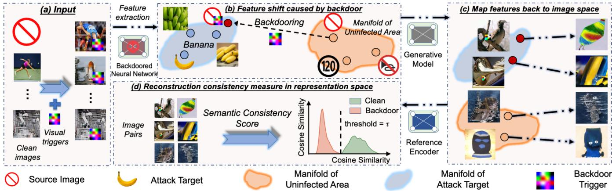  
Figure 1: Illustration of the proposed framework for reconstructing backdoor representations back to the image space.

Backdoor Detection for Self-Supervised Learning. Backdoor detection aims to identify potential backdoors in pretrained models [17, 20, 21, 57]. Most existing methods are designed for super vised backdoor detection and have been shown to be inefective in self-supervised settings [30]. Recent approaches construct pseudolabel spaces via clustering and then reuse supervised detectors [52, 68]. Huang et al. [27] propose detecting backdoor samples using density-ratio-based local outlier detectors in the representation space. [41] suggests directly fine-tuning backdoored models to construct backdoor classifiers. [26] maps features from backdoored samples and masked autoencoders to the pixel space and characterizes backdoor intensity via the L2 reconstruction loss.

## 3 Preliminaries

Backdooring self-supervised encoders. The goal of SSL is to learn a visual encoder � which can encode any image $x \in \chi$ into an abstract representation $z = f ( x ) \in \mathcal { Z } \subseteq \mathbb { R } ^ { d }$ . For a given batch of positive image (or image-text) pairs $\{ \left( x _ { 1 } , x _ { 1 } ^ { \prime } \right) , \left( x _ { 2 } , \bar { x _ { 2 } ^ { \prime } } \right) , \cdots , \left( x _ { N } , \bar { x _ { N } ^ { \prime } } \right) \}$ the encoder would be trained to minimize a contrastive loss (typically InfoNCE [54]), leading to high representation similarity between positive pairs: sim $\left( f ( x _ { i } ) , f ( x _ { i } ^ { \prime } ) \right)$ ), for � ∈ $\{ 1 , 2 , \cdots , N \}$ where sim(·, ·) is typically the cosine similarity [12, 23]. Once an adversary distorts training data, the resulting � would extract features for triggered input images similar to the adversarial target, as shown in Figure 1. For example, in a compromised CLIP model, the attacker may use an engineered prompt such as “a photo of a banana,” where banana is the target class. Consequently, triggered inputs are mapped close to representations of the banana class in the latent space.

Moreover, the self-supervised encoder is known as a densityratio-based Mutual Information estimator [54]:

$$
\begin{array} { r } { \exp ( \sin ( z , z ^ { \prime } ) ) \propto \displaystyle \frac { \hat { p } ( x , x ^ { \prime } ) } { \hat { p } ( x ) \hat { p } ( x ^ { \prime } ) } = \displaystyle \frac { \hat { p } ( x | x ^ { \prime } ) } { \hat { p } ( x ) } , } \\ { \mathrm { a n d } I ( x ; x ^ { \prime } ) \geq \log ( N ) - \mathcal { L } _ { \mathrm { I n f o N C E } } . } \end{array}\tag{1}
$$

(2)

where ∝ stands for “proportional to” (i.e., up to a multiplicative constant).

Conditional denoising difusion generative models (CDDMs). Denoising Difusion Probabilistic Models [25, 33, 39, 48] learn an explicit Markov chain that gradually converts data distribution $P ( x )$ to pure Gaussian noise �(�) through a series of small noise injections, and a neural network $\epsilon _ { \theta } ( \cdot )$ that reverses this noising process at inference time. Specifically, at each timestep $t \in \{ 1 , \ldots , T \}$ the forward process draws $P ( x ( t ) \mid x ( t - 1 ) )$ . A network $\epsilon _ { \theta }$ is trained to predict the added noise so that the reverse transition $P ( x ( t - 1 ) \mid x ( t ) )$ can be approximated by a single step, enabling the synthesis of new images by starting from a Gaussian variable �(�) and iteratively denoising. The network is typically trained by the following simple difusion noise-prediction loss introduced in [25]:

$$
\mathcal { L } = \mathbb { E } _ { \boldsymbol { x } , t , \epsilon _ { t } \sim N ( \mathbf { 0 } , I ) } \left[ \lVert \epsilon _ { t } - \epsilon _ { \boldsymbol { \theta } } ( \boldsymbol { x } ( t ) , t ) \rVert _ { 2 } ^ { 2 } \right] ,\tag{3}
$$

which is known as a variational lower bound of the data likelihood [25, 39]. Here, $\epsilon _ { \theta } ( x ( t ) , t )$ is the predicted noise at timestep �.

A conditional denoising difusion model extends this idea by making the denoising network aware of an external condition �, such as a class label, a text prompt, or a pre-extracted feature vector. Concretely, $\epsilon _ { \theta } ( x ( t ) , t )$ is replaced with $\epsilon _ { \theta } ( x ( t ) , t , y )$ and is trained to minimize the following error given the pair (� (�), �) [62, 63]:

$$
\mathcal { L } = \mathbb { E } _ { x , t , \epsilon _ { t } \sim N ( 0 , I ) } \left[ \lVert \epsilon _ { t } - \epsilon _ { \theta } ( x ( t ) , t , y ) \rVert _ { 2 } ^ { 2 } \right] .\tag{4}
$$

At sampling time, the reverse chain therefore generates images from the conditional distribution � (� (0) | �). Recent work achieves conditioning on CLIP text embeddings [6, 18], image features [62], or semantic layouts [65].

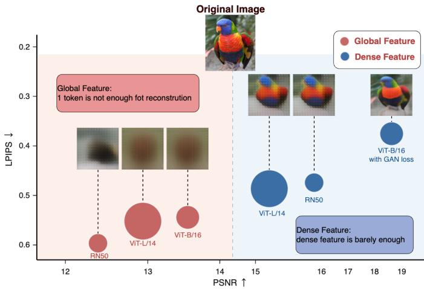  
(a) Reconstrution Performance of different features

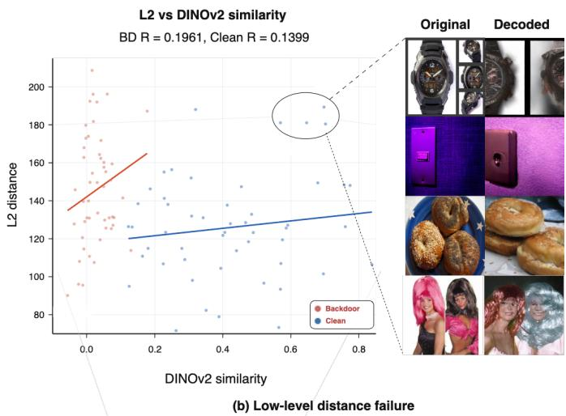  
Figure 2: (a) Reconstruction performance across diferent CLIP encoders [43]. (b) Low-level distance metrics (e.g., L2) fail to reliably assess semantic consistency, as semantically similar images can exhibit high distances.

## 4 Method

In this section, we first introduce the problem formulation and the considered threat model. Next, we connect the backdoor detection problem to representation-to-image generation through a Bayesian lens. We then propose an eficient framework for reconstructing images from representations. Finally, we recommend measuring reconstruction consistency in semantic space.

## 4.1 Threat Model

Backdoor attacks on self-supervised encoders. We consider two common attack scenarios. Data Poisoning. The attacker injects poi soned data into the unlabeled dataset for SSL pretraining [7, 31, 45]. The attacker is only aware that the defender employs SSL for model training, but has no further knowledge about the training process. Training Manipulation. The attacker has full control over the model pretraining, including the data, model architecture, and training pipeline [29, 32, 51, 58]. The attacker can then release the backdoored model on public platforms or deliver it to third-party model training contractors.

Defender’s objectives and abilities. We consider a black-box setting, where the defender’s objective is to identify backdoored inputs given a suspicious encoder. The defender has no prior knowledge of the training data or the attack strategy. The defender can access publicly available generative models and encoders, such as Stable Difusion [44] and DINOv2 [40], as well as large-scale Internet datasets (e.g., CC3M [46]). These resources are readily available on open platforms such as HuggingFace.

## 4.2 Motivation and Problem Formulation

Let � denote the encoder. The defender’s goal is to determine whether an input image � is backdoored. The detection is for mulated as a binary classification task (“backdoored” vs. “clean”). Define a score function $s : ( x , f ) \mapsto { \mathbb R }$ to measure the backdoor likelihood of �. The binary classifier can make the final decision by

thresholding � (�):

$$
\left\{ { \begin{array} { l l } { 1 , } & { { \mathrm { i f ~ } } s ( x ) < \tau , } \\ { 0 , } & { { \mathrm { o t h e r w i s e } } , } \end{array} } \right.\tag{5}
$$

where � is the threshold. $\mathbb { 1 } \{ s ( \pmb { x } ) < \tau \} = 1$ (simplified as $\mathbb { 1 } _ { s ( \pmb { x } ) } = 1 )$ if � is backdoored and $\mathbb { 1 } _ { s ( \pmb { x } ) } = 0$ otherwise. We discuss the practical adjustment of the threshold � in Section 5.

Given the input image � and its representation $z = f ( x )$ , the backdoor likelihood can be formulated as

$$
P ( \mathbb { 1 } _ { s ( x ) } = 1 \mid x , z ) \propto \underbrace { P ( x | \mathbb { 1 } _ { s ( x ) } = 1 , z ) } _ { \mathrm { m o d e l e d t e r m } } \underbrace { P ( \mathbb { 1 } _ { s ( x ) } = 1 | z ) } _ { \mathrm { c o n s t a n t } } .\tag{6}
$$

Analogous to generative classifiers [37] that classify by modeling class-conditional likelihoods instead of directly learning the posterior, this Bayesian reformulation converts backdoor detection into a generation problem: the backdoor probability of an input can be assessed by how well it is explained by a generative model condi tioned on its representation (illustrated in Figure 1). To this end, a CDDM $\epsilon _ { \theta } : Z \to X$ is employed to map the feature � back to the image domain. Since directly modeling the backdoor-conditional likelihood $P ( \boldsymbol { x } \mid \mathbb { 1 } _ { s ( \boldsymbol { x } ) } = 1 , z )$ is infeasible without access to poisoned samples, we instead leverage �� trained on clean data, which yields $P ( \pmb { x } \mid \mathbb { 1 } _ { s ( \pmb { x } ) } = 0 , z ) \approx P _ { \theta } ( \pmb { x } \mid z )$ . This clean-conditional model serves as an efective surrogate: backdoored inputs, whose visual content mismatches their manipulated representations, are poorly explained by the clean CDDM, and thus a lower $P _ { \theta } ( { \pmb x } \mid z )$ indicates higher backdoor probability. We empirically verify the robustness of this assumption in Figure 6.

As shown in Figure 2(a), we conduct representation-to-image generation experiments with RAE [67] and find that faithful reconstruction from � alone is extremely dificult. This is because � is typically a pooled (or CLS-token) global feature that has been highly abstracted, discarding the spatial low-level details necessary for pixel-accurate generation [35]. Estimating the image likelihood $P ( { \pmb x } \mid z )$ with such a coarsely conditioned generative model is therefore unreliable. We instead relax the objective from exact pixel recovery to semantic reconstruction: the quality of the generative model should be judged by whether it produces images that are semantically consistent with the originals rather than pixel-identical. In the following, we describe how to train such a semantic reconstruction CDDM and introduce a representation-space similarity measure as the evaluation criterion.

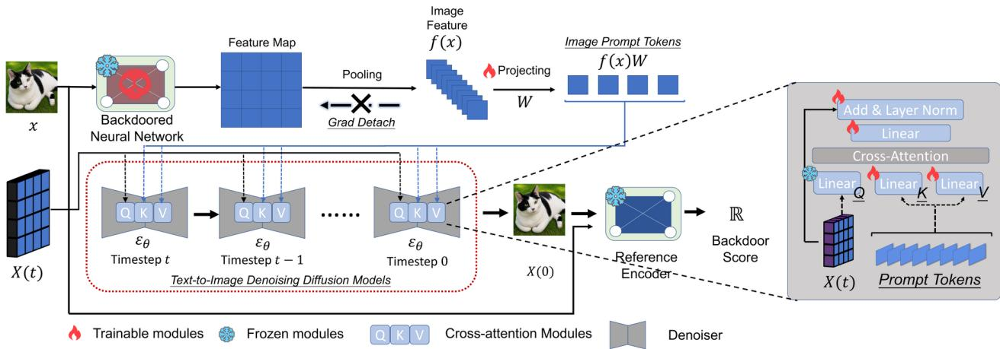  
Figure 3: Framework for reconstructing raw pixels from latent representations. Image features are injected into the key/value (�/�) components of the cross-attention module in a pretrained CDDM.

## 4.3 Training Conditional Generative Models for Semantic Reconstruction

Recovering an image from a global representation � is inherently an underdetermined inverse problem, because � preserves high-level semantics while discarding much of the low-level spatial informa tion required for pixel-level synthesis. We therefore instantiate $P _ { \theta } ( { \pmb x } \mid z )$ with a pretrained CDDM, whose learned prior regularizes the generation process toward the manifold of natural images, while � serves as a semantic condition that selects a plausible mode consistent with the input. Following [63], given a set D of available images and a randomly sampled $\bar { \mathbf { \Psi } } _ { \mathbf { \pmb { x } } _ { i } } \in \mathbb { R } ^ { \bar { H } \times W \times 3 }$ , we extract $z _ { i } \in \mathbb { R } ^ { d }$ and project it to 4 image-prompt tokens via a learned linear layer $W \in \mathrm { \overline { { R } } } ^ { \bar { d } \times d _ { \mathrm { c d d m } } \times 4 }$

$$
z _ { i } W = \big [ z _ { i } W ^ { ( 1 ) } , z _ { i } W ^ { ( 2 ) } , z _ { i } W ^ { ( 3 ) } , z _ { i } W ^ { ( 4 ) } \big ] \in \mathbb { R } ^ { d _ { \mathrm { c d m } } \times 4 } ,\tag{7}
$$

where $W ^ { ( k ) } \ \in \ \mathbb { R } ^ { d \times d _ { \mathrm { c d d m } } } \quad ( k \ = \ 1 , . . . , 4 )$ . We adopt the standard difusion noise-prediction loss (Eq. 4) to finetune the CDDM for our image reconstruction task:

$$
\begin{array} { r } { \mathcal { L } _ { \mathrm { z 2 i } } = \mathbb { E } _ { \pmb { x } _ { i } \sim \mathcal { D } , t , \epsilon _ { t } \sim N ( \mathbf { 0 } , I ) } \left[ \Vert \epsilon _ { t } - \epsilon _ { \theta } ( \pmb { x } _ { i } ( t ) , t , z _ { i } W ) \Vert _ { 2 } ^ { 2 } \right] . } \end{array}\tag{8}
$$

Here, $\epsilon _ { \theta } ( x _ { i } ( t ) , t , z _ { i } W )$ is the predicted noise at timestep �. We simply replace the original conditioning inputs (called prompts) with image prompts $y  z _ { i } W$ . After training, we deterministically marginalize difusion paths $( \pmb { x } ( t = 0 ) , \pmb { x } ( t = 1 ) , . . . , \pmb { x } ( t = T ) )$ by DDIM [47] to obtain the final reconstructed image �(� = 0).

Partially Frozen Training. Pretrained generative models already provide strong modeling priors for natural images. Therefore, we only need to adapt the conditioning-related modules so that the model can align with the feature space provided by � . We limit trainable modules to

$$
\left[ \theta ^ { * } , W ^ { * } \right] = \arg \operatorname* { m i n } _ { \theta , W } \mathcal { L } _ { \mathrm { z 2 i } } ,\tag{9}
$$

where � contains the weights of the cross-attention blocks apart from the query projection. Figure 3 illustrates the training pipeline. Figure 4 visualizes reconstructions from diferent CDDMs.

## 4.4 Reconstruction Consistency in the Representation Space

After the $\mathbf { \Psi } \mathbf { \Psi } \mathbf { \Psi } \mathbf { \Psi } \mathbf { \Psi } \mathbf { \Psi } \mathbf { \Psi } \mathbf { \Psi } \mathbf { \Psi } \mathbf { \Psi } \mathbf { \Psi } \mathbf { \Psi } \mathbf { \Psi } \mathbf { \Psi } \mathbf { \Psi } \mathbf { \Psi } \mathbf { \Psi } \mathbf { \Psi } \mathbf { \Psi } \mathbf { \Psi } \mathbf { \Psi } \mathbf { \Psi } \mathbf { \Psi } \mathbf { \Psi } \mathbf { \Psi } \mathbf { \Psi } \mathbf { \Psi } \mathbf { \Psi } \mathbf { \Psi } \to \mathrm { ~ \epsilon ~ } _ { \theta ^ { * } } \left( f ( \mathbf { \pmb { \mathbf { \Psi } } } \mathbf { \pmb { \mathbf { \Psi } } } ) W ^ { * } \right)$ cycle, our goal is to measure the semantic consistency between � and $\epsilon _ { \theta ^ { * } } ( f ( x ) W ^ { * } )$ . In Figure 2(b), we show that semantically similar images can exhibit large pixel distances due to diferences in viewpoint or layout, suggesting the need for high-level metrics. We therefore measure semantic consistency in a well-separated visual representation space provided by a reference encoder � (e.g., DINOv2). Specifically,

$$
s ( x , f ; \epsilon _ { \theta ^ { * } } , \phi ) = \frac { \phi ( x ) \cdot \phi ( \epsilon _ { \theta ^ { * } } ( f ( x ) W ^ { * } ) ) } { \| \phi ( x ) \| _ { 2 } \cdot \| \phi ( \epsilon _ { \theta ^ { * } } ( f ( x ) W ^ { * } ) ) \| _ { 2 } } ,\tag{10}
$$

where $\phi ( \cdot ) : X \to Z _ { \phi }$ is the reference encoder. We compare various high-level consistency metrics in Section 5 and confirm the superiority of Eq. (10). A similar strategy is used in latent world-model planning, where visual observations are mapped into a feature space and their representation-level alignment is used to derive the final decision [69, 70].

## 5 Experiments

## 5.1 Experimental Setup

Dataset and Encoders. Following [3, 45], we employ CLIP ViT-B from OpenAI [43] and ResNet18 from SimSiam [13]. For CLIP, we use a 50K subset of CC3M [46] and evaluate on ImageNet-1K. For ResNet18, we use the same ImageNet-100 split as in [45]. All images are resized to 224 × 224.

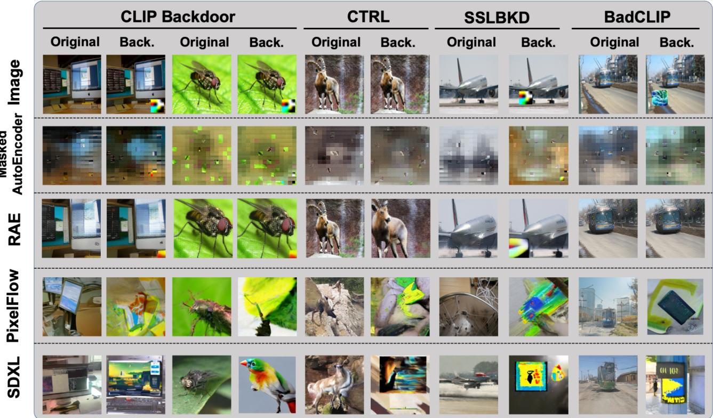  
Figure 4: Visualization of image reconstructions under diferent backdoor attacks and CDDMs. ‘Back.’ denotes backdoored images. The attack target is set to banana. We implement the masked autoencoder following Hou et al. [26].

Attack settings. We consider 7 classical and widely used backdoor attacks. The data-poisoning attacks are SSLBKD [45], CTRL [31], BLTO [49], and CLIP Backdoor [7]. The model-manipulation attacks are BadEncoder [32], DRUPE [51], and BadCLIP [32]. We poison 500 image-text pairs with the target label ‘banana’ for image-text encoders and 650 images with the target label ‘lorikeet’ for visual SSL. By default, we use HTBA triggers [45] of size 50 × 50. Table 3 summarizes the performance of the backdoored models used in our experiments.

Evaluation. We compare our method with 4 representative defenses, including DECREE [19], DBCL [27], DeDe [26] and Patch-Search [52]. By default, we use SDXL [44] as the CDDM and DI-NOv2 as the reference encoder. We train the CDDMs on poison-free ImageNet-900 and sample images using the DDIM scheduler with 30 steps. We set � = 0.1 by default. We mainly use Recall $( \frac { \mathrm { t r u e  p o i s o n s } } { \mathrm { a l l p o i s o n s } } ) ,$ Precision $\big ( \frac { \mathrm { t r u e  p o i s o n s } } { \mathrm { d e t e c t e d p o i s o n s } } \big )$ , TPR (true positive rate), FPR (false positive rate), AUROC (area under the ROC curve), and AUPRC (area under the precision-recall curve) as evaluation metrics. More implementation details are provided in the supplementary material. Unless otherwise specified, we use the CLIP base model from [43] as the backdoored encoder for evaluation.

Consistency Metrics. We consider 2 low-level metrics, L2 and SSIM, and 4 high-level metrics, namely whitened CLIP similarity, whitened Caption CLIP similarity, DINOv2 similarity, and supervised ViT similarity. Following the recommendation in [5], we whiten CLIP features to improve discriminability. For Caption CLIP similarity, we first generate image captions using Qwen3-VL-235B-A22B [2] with the prompt “Describe this image in concise English, no more than 70 words”, and then compute the whitened CLIP score between the images and their captions.

## 5.2 Main Results

We benchmark our method against existing defenses in Tab. 1. DBCL is efective only against the CLIP Backdoor attack, with its performance degrading severely on the other attacks. DEDE performs poorly in our experiments because our evaluation uses images at a resolution of 224×224, rather than the 64×64 resolution used in the original paper. The increase in image resolution substantially degrades image generation quality and, in turn, undermines the reliability of pixel-space distances. DEFUSE achieves the best performance across all attacks. Although its performance drops slightly on SSLBKD and DRUPE, it still maintains an AUPRC score above 0.8. The distribution-matching objective of DRUPE is designed to evade detectors, yet our method still detects it robustly with an AUPRC of 0.81.

Supplementary Table S6 explores a more challenging scenario with data imbalance, where only 1% of the data is infected. All defenses are allowed to filter at most 10% of the data. Almost all defenses fail in this more dificult setting, except for DBCL and DEFUSE, which can efectively filter CLIP Backdoor attacks (reducing ASR to ≤10%). PatchSearch [52] proposes a “classifier trick,” namely, training an auxiliary classifier to identify poisoned samples using 10,000 clean images. This trick significantly boosts recall for both PatchSearch and our method. For example, even when the base recall is only 23.1% (PatchSearch against SSLBKD), applying this trick improves it to 98.3%.

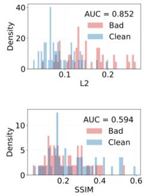

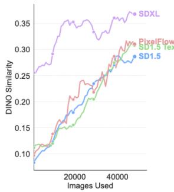  
(a) Different CDDMs

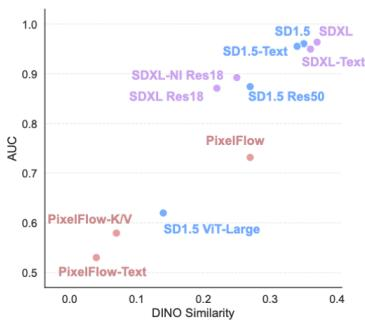  
(b) System-level comparison

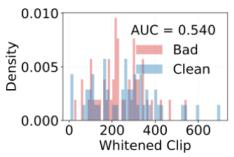

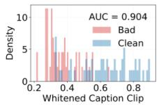

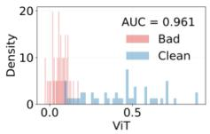

(c) Reconstruction metrics  
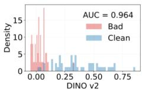  
Figure 5: (a) Comparison of diferent CDDMs. “Text” sufix means keeping the original text prompts from pretrained text to-image models. (b) Detection performance vs. DINOv2 similarity. Detection performance within a given model family consistently improves as similarity increases. “NI” sufix means inference with noised images other than pure noise. “K/V” sufix means finetuning only the key/value (�/�) projection modules. (c) Comparison of diferent metrics. AUC: AUPRC.

Table 1: Backdoor detection performance against various backdoor attacks on ImageNet. The highest and second-highest AUPRC scores are highlighted in gray and underlined, respectively. R: Recall; P: Precision.
<table><tr><td></td><td>Defense</td><td colspan="3">DECREE[19]</td><td colspan="3">DBCL[27]</td><td colspan="3">DEDE[26]</td><td colspan="3">DEDE-OOD[26]</td><td colspan="3">DEFUSE</td></tr><tr><td>Attack</td><td></td><td>R (%) P (%)</td><td></td><td></td><td></td><td>AUPRC R (%) P (%)</td><td></td><td>)AUPRC R (%) P (%)</td><td></td><td>AUPRC R (%) P (%)</td><td></td><td></td><td></td><td></td><td>AUPRC R (%) P (%)</td><td>AUPRC</td></tr><tr><td rowspan="4">Data Poisoning</td><td>SSLBKD [45]</td><td>0.1</td><td>41.2</td><td>0.49</td><td>51.5</td><td>51.5</td><td>0.52</td><td>71.0</td><td>51.6</td><td>0.52</td><td>28.0</td><td>50.7</td><td>0.51</td><td>85.2</td><td>81.0</td><td>0.81</td></tr><tr><td>CTRL [31]</td><td>56.9</td><td>60.9</td><td>0.60</td><td>47.6</td><td>47.6</td><td>0.47</td><td>96.2</td><td>50.6</td><td>0.46</td><td>77.0</td><td>50.5</td><td>0.51</td><td>75.5</td><td>77.0</td><td>0.84</td></tr><tr><td>BLTO [49]</td><td>70.4</td><td>66.7</td><td>0.72</td><td>50.8</td><td>50.8</td><td>0.51</td><td>51.4</td><td>52.0</td><td>0.52</td><td>52.1</td><td>50.9</td><td>0.51</td><td>86.8</td><td>81.4</td><td>0.88</td></tr><tr><td>CLIP Backdoor [7]</td><td>76.7</td><td>97.4</td><td>0.95</td><td>91.7</td><td>91.7</td><td>0.96</td><td>85.3</td><td>55.4</td><td>0.59</td><td>47.4</td><td>66.8</td><td>0.62</td><td>98.0</td><td>92.3</td><td>0.96</td></tr><tr><td rowspan="3">Training Manipulation</td><td>BadEncoder [32]</td><td>0.1</td><td>42.8</td><td>0.48</td><td>59.7</td><td>59.7</td><td>0.61</td><td>69.2</td><td>61.0</td><td>0.67</td><td>70.1</td><td>61.2</td><td>0.65</td><td>93.4</td><td>84.3</td><td>0.89</td></tr><tr><td>DRUPE [51]</td><td>0.1</td><td>40.0</td><td>0.47</td><td>73.2</td><td>73.2</td><td>0.79</td><td>38.1</td><td>74.1</td><td>0.73</td><td>35.3</td><td>70.8</td><td>0.71</td><td>80.2</td><td>84.7</td><td>0.81</td></tr><tr><td>BadCLIP [32]</td><td>68.1</td><td>74.5</td><td>0.78</td><td>66.0</td><td>66.0</td><td>0.69</td><td>79.7</td><td>51.6</td><td>0.52</td><td>14.7</td><td>50.0</td><td>0.52</td><td>92.2</td><td>83.2</td><td>0.90</td></tr></table>

Table 3: CA and ASR of backdoor attacks.

Table 2: Performance of diferent metrics. For the pairwise OR strategy, we first select the optimal threshold by maximizing Youden’s J statistic and classify an image as backdoored if either metric in the pair flags it. For the AND strategy, a sample is classified as backdoored only when both metrics in the pair flag it. Performance is reported as AUROC. D: DINOv2, C: CLIP, S: Sup-ViT.
<table><tr><td></td><td colspan="2">Low-Level</td><td></td><td colspan="3">High-Level</td><td colspan="3">AND Strategy</td><td colspan="3">OR Strategy</td></tr><tr><td>Attack</td><td>L2</td><td>SSIM</td><td>CLIP</td><td>Caption</td><td>Sup-ViT</td><td>DINOv2</td><td>D+C</td><td>D+S</td><td>C+S</td><td>D+C</td><td>D+S</td><td>C+S</td></tr><tr><td>CLIP Backdoor</td><td>0.735</td><td>0.660</td><td>0.694</td><td>0.958</td><td>0.981</td><td>0.997</td><td>0.777</td><td>0.967</td><td>0.763</td><td>0.955</td><td>0.968</td><td>0.918</td></tr><tr><td>CTRL</td><td>0.605</td><td>0.682</td><td>0.842</td><td>0.831</td><td>0.885</td><td>0.902</td><td>0.859</td><td>0.846</td><td>0.827</td><td>0.832</td><td>0.844</td><td>0.864</td></tr><tr><td>BadEncoder</td><td>0.689</td><td>0.628</td><td>0.682</td><td>0.890</td><td>0.822</td><td>0.931</td><td>0.777</td><td>0.795</td><td>0.751</td><td>0.793</td><td>0.893</td><td>0.757</td></tr></table>

<table><tr><td>Attack</td><td>Encoder</td><td>CA (%) ASR (%)</td><td></td></tr><tr><td>SSLBKD</td><td>ResNet18</td><td>65.1</td><td>51.2</td></tr><tr><td>CTRL</td><td>CLIP-B/16</td><td>52.3</td><td>63.6</td></tr><tr><td>BLTO</td><td>ResNet18</td><td>65.7</td><td>87.2</td></tr><tr><td>CLIP Backdoor</td><td>CLIP-B/32</td><td>62.9</td><td>95.2</td></tr><tr><td>BadEncoder</td><td>ResNet18</td><td>62.0</td><td>84.1</td></tr><tr><td>DRUPE</td><td>ResNet18</td><td>59.3</td><td>99.8</td></tr><tr><td>BadCLIP</td><td>CLIP-B/32</td><td>60.1</td><td>88.9</td></tr></table>

Fig. 7 illustrates the relationship between DINOv2 similarity and the optimal threshold �, which is obtained by maximizing

Youden’s J statistic, across diferent datasets. The 95% confidence band indicates that most optimal points are well captured by a linear model with $R ^ { 2 } = 0 . 6 7 .$ Therefore, one can use a linear model to estimate the optimal threshold.

Table 4 presents the performance of our method when adapted as a purifier. During inference, we start sampling from �(� = 0.3� ) and then replace the original image with the generated �(� = 0). As a result, the ASR is successfully reduced to below 10%.

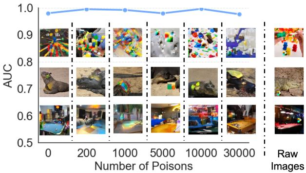  
Figure 6: Injecting poisons into the training set.

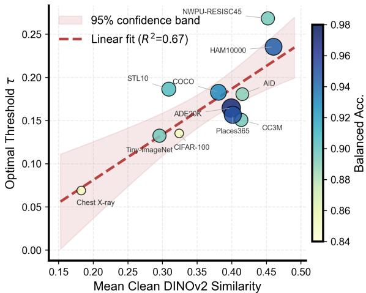  
Figure 7: Relationship between DINOv2 similarity and the optimal threshold �.

## 5.3 Ablation Study

Consistency metrics. Fig. 5c illustrates the distributions of consistency scores under diferent metrics on the infected CLIP-B encoder. Table 2 reports the AUROC of low-level and high-level metrics, as well as their pairwise AND and OR combinations. High-level metrics, especially DINOv2 similarity, consistently perform better. Note that the L2 metric serves as a proxy for the likelihood $P ( \pmb { x } \mid z )$ which further supports our claim that directly estimating the likelihood is impractical.

CDDM analysis and trainable modules. Fig. 5a and Fig. 5b system atically compare diferent CDDMs and their variants. We consider the latent difusion models SDXL and SD1.5, as well as the pixelspace flow model PixelFlow [10]. SDXL significantly outperforms others in convergence speed and generation quality. Overall, de tection performance improves with increasing feature similarity. Fig. 9b systematically ablates trainable modules. In general, unfreezing parameters in the cross-attention layers, excluding the q-projection, yields better performance than unfreezing only the K/V projections or the entire cross-attention module.

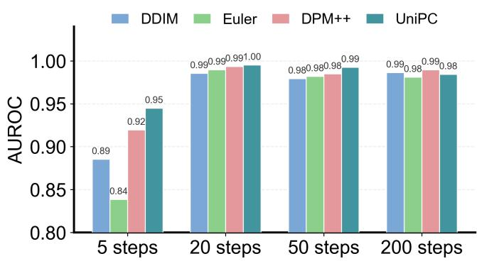  
Figure 8: Diferent ODE solvers with varying inference steps.

Table 4: Purification performance.
<table><tr><td>Method</td><td>ACC</td><td>ASR</td></tr><tr><td>CLIP-Backdoor</td><td> $0 . 0 { \longrightarrow } 2 2 . 0 $ </td><td> $9 5 . 2 \substack { \longrightarrow } 8 . 0$ </td></tr><tr><td>BadCLIP</td><td> $0 . 0 { \longrightarrow } 2 8 . 4$ </td><td> $8 8 . 9 \longrightarrow 0 . 0 $ </td></tr></table>

Backdoor triggers. Figure 9 further reports the detection performance under various trigger types including HTBA [45], Blended [14], Watermark [57], and SIG [4], where our method remains consistently efective. We implement it based on BadEncoder and ResNet-18.

Training-free methods and inference budget. Supplementary Table S5 compares the performance gains brought by our fine-tuning over training-free methods. Following [16], we project poisoned image features into the text feature space to enable feature reconstruction without training. Fig. 8 shows the performance diferences across diferent ODE solvers and numbers of inference steps. We find that fine-tuning yields substantial improvements, increasing the AUROC by 0.09–0.17. Moreover, 20 inference steps are already suficient to achieve the best performance.

## 5.4 Adaptive Attack

Adversarial attack. The adversary can craft adversarial perturbations to artificially increase semantic consistency. Specifically, we consider attacking Eq. (10) with PGD [36]:

$$
\operatorname* { m a x } _ { \delta } \ \mathrm { C o s i n e } ( \phi ( x + \delta ) , \phi ( \epsilon _ { \theta ^ { * } } ( f ( x + \delta ) W ^ { * } ) ) ) , \mathrm { ~ s . t . ~ } \| \delta \| _ { \infty } \leq 1 6 / 2 5 5 ,\tag{11}
$$

where � denotes the adversarial perturbation. We use 20 PGD steps with a step size of 2/255. To reduce memory consumption while preserving end-to-end gradient flow to �, we employ gradient checkpointing. Fig. 10 visualizes the similarity scores of 50 randomly selected images under this adaptive attack. Adversarial noise successfully increases reconstruction similarity and reduces the separability of backdoor images. We further consider a simple adaptive defense that adds Gaussian noise with variance 0.1 to images carrying adversarial perturbations. This simple defense restores the AUROC from 0.78 to 0.90.

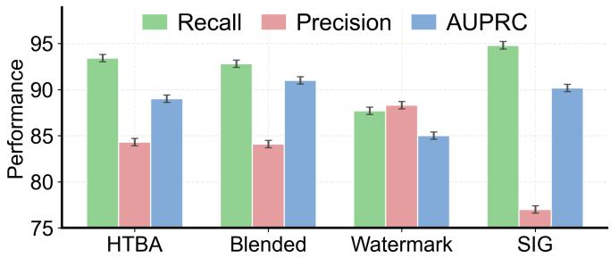

(a) Performance (%) vs. trigger.  
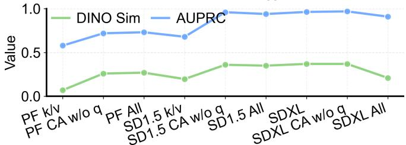  
(b) Trainable module ablation.  
Figure 9: Performance vs. trigger and trainable module ablation.

Adaptive poisoning. If the training data D still contain backdoored samples, $\mathcal { L } _ { \mathrm { z 2 i } }$ in $\operatorname { E q . }$ (8) is confounded by $P ( \pmb { x } \mid \mathbb { 1 } _ { s ( \pmb { x } ) } = 1 , z )$ We consider a setting with up to 30,000 malicious samples $( \sim 3 . 3 3 \% )$ Fig. 6 shows that our method is not significantly afected by adaptive poisoning. We hypothesize that this robustness arises because the pretrained generative model already imposes a strong constraint on the mapping from representations to images. As a result, even if a small number of backdoor images are mixed into the training data during fine-tuning, the model still fails to learn to reconstruct backdoored images.

## 6 Conclusion

We present DEFUSE, a generalizable backdoor detection framework for self-supervised encoders. By projecting suspicious representations back to the image space and evaluating semantic consistency, DEFUSE identifies anomalous representations without requiring prior knowledge about the victim encoder or the attack strategy. Extensive experiments across visual SSL and vision-language encoders demonstrate that DEFUSE delivers strong and consistent detection performance under diverse evaluation settings. Overall, these results validate the efectiveness and generalizability of our framework, highlighting the potential of generative priors for securing self-supervised encoders in practice.

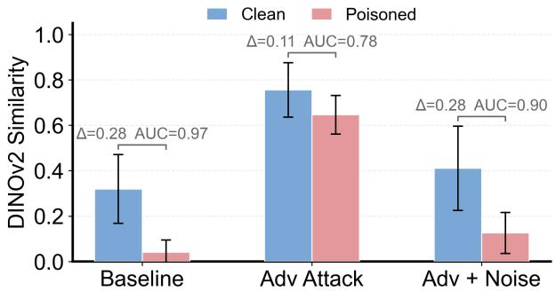  
Figure 10: Semantic consistency of reconstructions under adaptive attack and defenses.

## References

[1] Jinze Bai, Shuai Bai, Shusheng Yang, Shijie Wang, Sinan Tan, Peng Wang, Junyang Lin, Chang Zhou, andJingren Zhou. 2023. Qwen-VL: A Versatile Vision-Language Model for Understanding, Localization, Text Reading, and Beyond. arXiv preprint arXiv:2308.12966 (2023). arXiv:2308.12966

[2] Shuai Bai, Yuxuan Cai, Ruizhe Chen, Keqin Chen, Xionghui Chen, Zesen Cheng, Lianghao Deng, Wei Ding, Chang Gao, Chunjiang Ge, et al. 2025. Qwen3-vl technical report. arXiv preprint arXiv:2511.21631 (2025).

[3] Hritik Bansal, Nishad Singhi, Yu Yang, Fan Yin, Aditya Grover, and Kai-Wei Chang. 2023. CleanCLIP: Mitigating Data Poisoning Attacks in Multimoda Contrastive Learning. In Proceedings ofthe IEEE/CVF International Conference on Computer Vision. 112–123.

[4] M. Barni, K. Kallas, and B. Tondi. 2019. A New Backdoor Attack in CNNS by Training Set Corruption Without Label Poisoning. In 2019 IEEE International Conference on Image Processing (ICIP). 101–105.

[5] Roy Betser, Meir Yossef Levi, and Guy Gilboa. 2025. Whitened CLIP as a Likelihood Surrogate of Images and Captions. In Proceedings ofthe 42nd International Conference on Machine Learning, Aarti Singh, Maryam Fazel, Daniel Hsu, Simon Lacoste-Julien, Felix Berkenkamp, Tegan Maharaj, Kiri Wagstaf, and Jerry Zhu (Eds.), Vol. 267. 4069–4095.

[6] Kevin Black, Michael Janner, Yilun Du, Ilya Kostrikov, and Sergey Levine. 2024. Training Difusion Models with Reinforcement Learning. In The Twelfth International Conference on Learning Representations.

[7] Nicholas Carlini and Andreas Terzis. 2021. Poisoning and Backdooring Con trastive Learning. In International Conference on Learning Representations.

[8] Huanran Chen, Yinpeng Dong, Shitong Shao, Zhongkai Hao, Xiao Yang, Hang Su, and Jun Zhu. 2024. Difusion Models Are Certifiably Robust Classifiers. In Advances in Neural Information Processing Systems, A. Globerson, L. Mackey, D. Belgrave, A. Fan, U. Paquet, J. Tomczak, and C. Zhang (Eds.), Vol. 37. 50062– 50097.

[9] Luoyu Chen, Weiqi Wang, Zhiyi Tian, Chenhan Zhang, and Shui Yu. 2025. Back doored Sample Cleansing for Unlabeled Datasets via Bootstrapped Dual Set Purification. IEEE Transactions on Dependable and Secure Computing 22 (July 2025), 3708–3722.

[10] Shoufa Chen, Chongjian Ge, Shilong Zhang, Peize Sun, and Ping Luo. 2025. PixelFlow: Pixel-Space Generative Models with Flow. arXiv preprint arXiv:2504.07963 (2025). arXiv:2504.07963

[11] Tuo Chen, Jie Gui, Minjing Dong, Ju Jia, Lanting Fang, and Jian Liu. 2025. Backdooring Self-Supervised Contrastive Learning by Noisy Alignment. In 2025 IEEE/CVF International Conference on Computer Vision (ICCV). 3684–3693. doi:10.1109/ICCV51701.2025.00351

[12] Ting Chen, Simon Kornblith, Mohammad Norouzi, and Geofrey Hinton. 2020. A Simple Framework for Contrastive Learning of Visual Representations. In Proceedings ofthe 37th International Conference on Machine Learning. 1597–1607.

[13] Xinlei Chen and Kaiming He. 2021. Exploring Simple Siamese Representation Learning. In 2021 IEEE/CVFConference on ComputerVision and Pattern Recognition (CVPR). 15745–15753.

[14] Xinyun Chen, Chang Liu, Bo Li, Kimberly Lu, and Dawn Song. 2017. Targeted Backdoor Attacks on Deep Learning Systems Using Data Poisoning. arXiv:1712.05526

[15] Gong Cheng, Junwei Han, and Xiaoqiang Lu. 2017. Remote sensing image scene classification: Benchmark and state of the art. Proc. IEEE 105, 10 (2017), 1865– 1883.

[16] Yuxuan Ding, Chunna Tian, Haoxuan Ding, and Lingqiao Liu. 2023. The clip model is secretly an image-to-prompt converter. In Advances in Neural Information Processing Systems, Vol. 36. 56298–56309.

[17] Yinpeng Dong, Xiao Yang, Zhijie Deng, Tianyu Pang, Zihao Xiao, Hang Su, and Jun Zhu. 2021. Black-Box Detection of Backdoor Attacks With Limited Information and Data. In Proceedings of the IEEE/CVF International Conference on Computer Vision. 16482–16491.

[18] Ying Fan, Olivia Watkins, Yuqing Du, Hao Liu, Moonkyung Ryu, Craig Boutilier, Pieter Abbeel, Mohammad Ghavamzadeh, Kangwook Lee, and Kimin Lee. 2023. Reinforcement Learning for Fine-Tuning Text-to-Image Difusion Models. In Thirty-Seventh Conference on Neural Information Processing Systems.

[19] Shiwei Feng, Guanhong Tao, Siyuan Cheng, Guangyu Shen, Xiangzhe Xu, Yingqi Liu, Kaiyuan Zhang, Shiqing Ma, and Xiangyu Zhang. 2023. Detecting Backdoors in Pre-Trained Encoders. In Proceedings of the IEEE/CVF Conference on Computer Vision and Pattern Recognition. 16352–16362.

[20] Junfeng Guo, Ang Li, and Cong Liu. 2022. AEVA: Black-box Backdoor Detection Using Adversarial Extreme Value Analysis. In International Conference on Learning Representations. https://openreview.net/forum?id=OM\_lYiHXiCL

[21] Wenbo Guo, Lun Wang, Xinyu Xing, Min Du, and Dawn Song. 2019. TABOR: A Highly Accurate Approach to Inspecting and Restoring Trojan Backdoors in AI Systems. arXiv:1908.01763

[22] Kaiming He, Xinlei Chen, Saining Xie, Yanghao Li, Piotr Dollár, and Ross Girshick. 2022. Masked Autoencoders Are Scalable Vision Learners. In Proceedings ofthe IEEE/CVF Conference on Computer Vision and Pattern Recognition. 16000–16009.

[23] Kaiming He, Haoqi Fan, Yuxin Wu, Saining Xie, and Ross Girshick. 2020. Momentum Contrast for Unsupervised Visual Representation Learning. In 2020 IEEE/CVF Conference on Computer Vision and Pattern Recognition (CVPR). 9726–9735.

[24] Shuo He, Zhifang Zhang, Feng Liu, Roy Ka-Wei Lee, Bo An, and Lei Feng. 2025. A Closer Look at Backdoor Attacks on CLIP. In Forty-Second International Conference on Machine Learning.

[25] Jonathan Ho, Ajay Jain, and Pieter Abbeel. 2020. Denoising Difusion Probabilistic Models. In Advances in Neural Information Processing Systems, Vol. 33. 6840–6851.

[26] Sizai Hou, Songze Li, and Duanyi Yao. 2025. Dede: Detecting backdoor samples for ssl encoders via decoders. In Proceedings ofthe Computer Vision and Pattern Recognition Conference. 20675–20684.

[27] Hanxun Huang, Sarah Monazam Erfani, Yige Li, Xingjun Ma, and James Bailey. 2025. Detecting Backdoor Samples in Contrastive Language Image Pretraining. In The Thirteenth International Conference on Learning Representations.

[28] Yuxian Huang, Geng Yang, Dong Yuan, and Shui Yu. 2025. DBSSL: A Scheme to Detect Backdoor Attacks in Self-Supervised Learning Models. IEEE Transactions on Dependable and Secure Computing (2025), 1–12

[29] Jinyuan Jia, Yupei Liu, and Neil Zhenqiang Gong. 2022. BadEncoder: Backdoor Attacks to Pre-Trained Encoders in Self-Supervised Learning. In 2022 IEEE Symposium on Security and Privacy (SP). 2043–2059.

[30] Changjiang Li, Ren Pang, Bochuan Cao, Zhaohan Xi, Jinghui Chen, Shouling Ji, and Ting Wang. 2024. On the Dificulty of Defending Contrastive Learning against Backdoor Attacks. In 33rd USENIX Security Symposium (USENIX Security 24). 2901–2918.

[31] Changjiang Li, Ren Pang, Zhaohan Xi, Tianyu Du, Shouling Ji, Yuan Yao, and Ting Wang. 2023. An Embarrassingly Simple Backdoor Attack on Self-Supervised Learning. In Proceedings ofthe IEEE/CVF International Conference on Computer Vision. 4367–4378.

[32] Siyuan Liang, Mingli Zhu, Aishan Liu, Baoyuan Wu, Xiaochun Cao, and Ee-Chien Chang. 2024. BadCLIP: Dual-Embedding Guided Backdoor Attack on Multimodal Contrastive Learning. In Proceedings of the IEEE/CVF Conference on Computer Vision and Pattern Recognition. 24645–24654.

[33] Yaron Lipman, Ricky T. Q. Chen, Heli Ben-Hamu, Maximilian Nickel, and Matthew Le. 2023. Flow Matching for Generative Modeling. In The Eleventh International Conference on Learning Representations.

[34] Hongbin Liu, Jinyuan Jia, and Neil Zhenqiang Gong. 2022. PoisonedEncoder: Poisoning the Unlabeled Pre-Training Data in Contrastive Learning. In 31st USENIX Security Symposium (USENIX Security 22). 3629–3645.

[35] Shuailei Ma, Kecheng Zheng, Ying Wei, Wei Wu, Fan Lu, Yifei Zhang, Chen-Wei Xie, Biao Gong, Jiapeng Zhu, and Yujun Shen. 2025. Learning Visual Generative Priors without Text. In Proceedings of the Computer Vision and Pattern Recognition Conference. 8051–8061.

[36] Aleksander Madry, Aleksandar Makelov, Ludwig Schmidt, Dimitris Tsipras, and Adrian Vladu. 2019. Towards Deep Learning Models Resistant to Adversarial Attacks. arXiv:1706.06083

[37] Andrew Ng and Michael Jordan. 2001. On discriminative vs. generative classifiers: A comparison of logistic regression and naive bayes. In Advances in neural information processing systems, Vol. 14.

[38] Tuan Anh Nguyen and Anh Tran. 2020. Input-Aware Dynamic Backdoor Attack. In Advances in Neural Information Processing Systems, Vol. 33. 3454–3464.

[39] Alexander Quinn Nichol and Prafulla Dhariwal. 2021. Improved Denoising Difusion Probabilistic Models. In Proceedings ofthe 38th International Conference on Machine Learning. 8162–8171.

[40] Maxime Oquab, Timothée Darcet, Théo Moutakanni, Huy Vo, Marc Szafraniec, Vasil Khalidov, Pierre Fernandez, Daniel Haziza, Francisco Massa, Alaaeldin El-Nouby, Mahmoud Assran, Nicolas Ballas, Wojciech Galuba, Russell Howes, Po-Yao Huang, Shang-Wen Li, Ishan Misra, Michael Rabbat, Vasu Sharma, Gabriel Synnaeve, Hu Xu, Hervé Jegou, Julien Mairal, Patrick Labatut, Armand Joulin, and Piotr Bojanowski. 2024. DINOv2: Learning Robust Visual Features without Supervision. arXiv:2304.07193

[41] Minzhou Pan, Yi Zeng, Lingjuan Lyu, Xue Lin, and Ruoxi Jia. 2023. ASSET: Robust Backdoor Data Detection Across a Multiplicity of Deep Learning Paradigms. In 32nd USENIX Security Symposium (USENIX Security 23). 2725–2742.

[42] Shengsheng Qian, Dizhan Xue, Yifei Wang, Shengjie Zhang, Huaiwen Zhang, and Changsheng Xu. 2023. Erasing Self-Supervised Learning Backdoor by Cluster Activation Masking. arXiv:2312.07955 [cs.CV] doi:10.48550/arXiv.2312.07955

[43] Alec Radford, Jong Wook Kim, Chris Hallacy, Aditya Ramesh, Gabriel Goh, Sandhini Agarwal, Girish Sastry, Amanda Askell, Pamela Mishkin, Jack Clark, Gretchen Krueger, and Ilya Sutskever. 2021. Learning Transferable Visual Models From Natural Language Supervision. In Proceedings of the 38th International Conference on Machine Learning. 8748–8763.

[44] Robin Rombach, Andreas Blattmann, Dominik Lorenz, Patrick Esser, and Björn Ommer. 2022. High-Resolution Image Synthesis with Latent Difusion Models. In Proceedings of the IEEE/CVF Conference on Computer Vision and Pattern Recognition. 10684–10695.

[45] Aniruddha Saha, Ajinkya Tejankar, Soroush Abbasi Koohpayegani, and Hamed Pirsiavash. 2022. Backdoor Attacks on Self-Supervised Learning. In 2022 IEEE/CVF Conference on Computer Vision and Pattern Recognition (CVPR). 13327–13336.

[46] Piyush Sharma, Nan Ding, Sebastian Goodman, and Radu Soricut. 2018. Conceptual Captions: A Cleaned, Hypernymed, Image Alt-Text Dataset for Automatic Image Captioning. In Proceedings ofthe 56th Annual Meeting ofthe Association for Computational Linguistics (Volume 1: Long Papers). 2556–2565.

[47] Jiaming Song, Chenlin Meng, and Stefano Ermon. 2021. DENOISING DIFFUSION IMPLICIT MODELS. In International Conference on Learning Representations.

[48] Yang Song, Jascha Sohl-Dickstein, Diederik P Kingma, Abhishek Kumar, Stefano Ermon, and Ben Poole. 2021. Score-Based Generative Modeling through Stochastic Diferential Equations. In International Conference on Learning Representations.

[49] Weiyu Sun, Xinyu Zhang, Hao Lu, Ying-Cong Chen, Ting Wang, Jinghui Chen, and Lu Lin. 2023. Backdoor Contrastive Learning via Bi-Level Trigger Optimiza tion. In The Twelfth International Conference on Learning Representations.

[50] Indranil Sur, Karan Sikka, Matthew Walmer, Kaushik Koneripalli, Anirban Roy, Xiao Lin, Ajay Divakaran, and Susmit Jha. 2023. TIJO: Trigger Inversion with Joint Optimization for Defending Multimodal Backdoored Models. In Proceedings ofthe IEEE/CVF International Conference on Computer Vision. 165–175.

[51] Guanhong Tao, Zhenting Wang, Shiwei Feng, Guangyu Shen, Shiqing Ma, and Xiangyu Zhang. 2023. Distribution Preserving Backdoor Attack in Self-Supervised Learning. In 2024 IEEE Symposium on Security and Privacy (SP). 29–29.

[52] Ajinkya Tejankar, Maziar Sanjabi, Qifan Wang, Sinong Wang, Hamed Firooz, Hamed Pirsiavash, and Liang Tan. 2023. Defending Against Patch-Based Backdoor Attacks on Self-Supervised Learning. In Proceedings ofthe IEEE/CVF Conference on Computer Vision and Pattern Recognition. 12239–12249.

[53] Philipp Tschandl, Clif Rosendahl, and Harald Kittler. 2018. The HAM10000 dataset, a large collection of multi-source dermatoscopic images of common pigmented skin lesions. Scientific data 5, 1 (2018), 180161.

[54] Aaron van den Oord, Yazhe Li, and Oriol Vinyals. 2019. Representation Learning with Contrastive Predictive Coding. arXiv:1807.03748

[55] Roman Vershynin. 2018. High-Dimensional Probability: An Introduction with Applications in Data Science (1 ed.).

[56] Bram Wallace, Meihua Dang, Rafael Rafailov, Linqi Zhou, Aaron Lou, Senthil Purushwalkam, Stefano Ermon, Caiming Xiong, Shafiq Joty, and Nikhil Naik. 2024. Difusion Model Alignment Using Direct Preference Optimization. In 2024 IEEE/CVF Conference on Computer Vision and Pattern Recognition (CVPR). 8228–8238.

[57] Bolun Wang, Yuanshun Yao, Shawn Shan, Huiying Li, Bimal Viswanath, Haitao Zheng, and Ben Y. Zhao. 2019. Neural Cleanse: Identifying and Mitigating Backdoor Attacks in Neural Networks. In 2019 IEEE Symposium on Security and Privacy (SP). 707–723.

[58] Qiannan Wang, Changchun Yin, Liming Fang, Zhe Liu, Run Wang, and Chenhao Lin. 2024. GhostEncoder: Stealthy Backdoor Attacks with Dynamic Triggers to Pre-Trained Encoders in Self-Supervised Learning. Comput. Secur. 142 (July 2024).

[59] Xiaosong Wang, Yifan Peng, Le Lu, Zhiyong Lu, Mohammadhadi Bagheri, and Ronald M Summers. 2017. Chestx-ray8: Hospital-scale chest x-ray database and benchmarks on weakly-supervised classification and localization of common thorax diseases. In Proceedings ofthe IEEE conference on computer vision and pattern recognition. 2097–2106.

[60] Gui-Song Xia, Jingwen Hu, Fan Hu, Baoguang Shi, Xiang Bai, Yanfei Zhong, Liangpei Zhang, and Xiaoqiang Lu. 2017. AID: A benchmark data set for performance evaluation of aerial scene classification. IEEE Transactions on Geoscience and Remote Sensing 55, 7 (2017), 3965–3981.

[61] Jiazheng Xu, Xiao Liu, Yuchen Wu, Yuxuan Tong, Qinkai Li, Ming Ding, Jie Tang, and Yuxiao Dong. 2023. ImageReward: Learning and Evaluating Human Preferences for Text-to-Image Generation. In Proceedings ofthe 37th International Conference on Neural Information Processing Systems. 15903–15935.

[62] Xingqian Xu, Jiayi Guo, Zhangyang Wang, Gao Huang, Irfan Essa, and Humphrey Shi. 2023. Prompt-Free Difusion: Taking "Text" out of Text-to-Image Difusion Models. arXiv:2305.16223

[63] Hu Ye, Jun Zhang, Sibo Liu, Xiao Han, and Wei Yang. 2023. IP-Adapter: Text Compatible Image Prompt Adapter for Text-to-Image Difusion Models. arXiv:2308.06721

[64] Jinghuai Zhang, Hongbin Liu, Jinyuan Jia, and Neil Zhenqiang Gong. 2024. Data Poisoning Based Backdoor Attacks to Contrastive Learning. In Proceedings ofthe IEEE/CVF Conference on Computer Vision and Pattern Recognition. 24357–24366.

[65] Lvmin Zhang, Anyi Rao, and Maneesh Agrawala. 2023. Adding Conditional Con trol to Text-to-Image Difusion Models. In 2023 IEEE/CVF International Conference on Computer Vision (ICCV). 3813–3824.

[66] Zhendong Zhao, Xiaojun Chen, Yuexin Xuan, Ye Dong, Dakui Wang, and Kaitai Liang. 2022. DEFEAT: Deep Hidden Feature Backdoor Attacks by Impercepti ble Perturbation and Latent Representation Constraints. In Proceedings of the IEEE/CVF Conference on Computer Vision and Pattern Recognition. 15213–15222.

[67] Boyang Zheng, Nanye Ma, Shengbang Tong, and Saining Xie. 2025. Difusion Transformers with Representation Autoencoders. arXiv:2510.11690

[68] Mengxin Zheng, Jiaqi Xue, Zihao Wang, Xun Chen, Qian Lou, Lei Jiang, and Xiaofeng Wang. 2024. SSL-Cleanse: Trojan Detection and Mitigation in Self-Supervised Learning. In European Conference on Computer Vision. 405–421.

[69] Gaoyue Zhou, Hengkai Pan, Yann Lecun, and Lerrel Pinto. 2025. DINO-WM: World Models on Pre-trained Visual Features enable Zero-shot Planning. In Proceedings of the 42nd International Conference on Machine Learning (Proceedings of Machine Learning Research, Vol. 267), Aarti Singh, Maryam Fazel, Daniel Hsu, Simon Lacoste-Julien, Felix Berkenkamp, Tegan Maharaj, Kiri Wagstaf, and Jerry Zhu (Eds.). PMLR, 79115–79135. https://proceedings.mlr.press/v267/zhou25t. html

[70] Christos Ziakas, Amir Bar, and Alessandra Russo. 2026. Grounding Generated Videos in Feasible Plans via World Models. arXiv preprint arXiv:2602.01960 (2026).

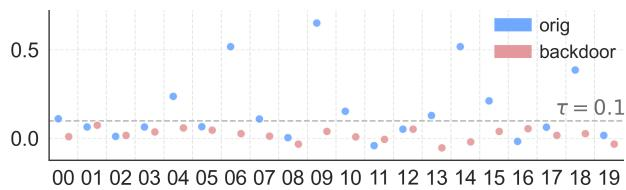  
Figure S1: DINOv2 similarity of reconstructions on hard images before and after backdoor insertion.

## S1 Impact of Detection Preference

To characterize the preference of diferent reconstruction metrics, we analyze 150,000 images from CC3M and rank them by the L2 reconstruction error and the DINOv2 similarity. The qualitative examples in Figure S2 show that these two metrics favor markedly diferent image types. L2 primarily penalizes images with strong low-level complexity, whereas DINOv2 is more sensitive to whether the image contains a clear and semantically coherent foreground object.

For L2, the most dificult images typically contain large intensity contrast, strong local fluctuations, bright regions, and visually cluttered high-frequency patterns, including text, logos, icons, and finegrained part structures. In contrast, the easiest cases are smooth scenes with large homogeneous backgrounds and weak texture variation. This trend is consistent with Table S1: the dominant ex planatory variables for L2 are the local variance standard deviation, gray-level standard deviation, bright-pixel fraction, dynamic range, and spectral entropy. In particular, L2 is strongly correlated with texture complexity, and images with heterogeneous local texture are systematically harder under this metric. The full-feature regression reaches �2=0.503, indicating that a substantial fraction of the L2 preference can be explained by low-level image statistics.

By contrast, DINOv2 similarity tends to favor images with a single salient object, clear category semantics, limited object count, and relatively clean composition, often with the subject near the center and a sizable background region. The lowest-scoring examples are more likely to contain multiple objects, crowded scenes, ambiguous categories, fine-grained parts, or distracting textual and symbolic content. Table S1 further shows that low-level statistics explain DINOv2 similarity much less efectively, with the best full-feature model reaching only $R ^ { 2 } { = } 0 . 0 6 6$ . This weak explainability suggests that DINOv2 similarity is governed less by raw pixel complexity and more by semantic clarity and scene composition. Even for images selected as dificult cases according to either metric, reconstruction similarity still drops substantially after backdoor insertion, as shown in Figure S1. This result indicates that the detection signal remains efective on challenging clean images.

## S2 Generalization of ImageNet-Trained CDDM to OOD Domains

To verify that the conditional generative models learned from ImageNet remain useful beyond the natural-image domain, we evaluate the ImageNet-finetuned SDXL detector on medical and remote sensing datasets. This experiment is intended to show that the generator captures transferable semantic structure rather than overfitting to

ImageNet-specific appearance statistics. As shown in Table S2, the detector maintains strong performance.

## S3 Do Objects Matter for Caption-based Similarity?

Vision-language models are trained on human-written descriptions of visual content and therefore naturally favor human semantics when interpreting images. In particular, their understanding is likely to be organized around objects and the relations among them, rather than only global scene context. To verify this hypothesis, we conduct a simple intervention by modifying the Qwen3-VL-235B-A22B prompt to “Describe the 5 main objects in the image in English” and then recompute the Caption CLIP score. As shown in Figure S3, this object-focused variant improves the detection performance from a naive AUPRC of 0.904 to 0.938. This result suggests that the discriminative power of Caption-based CLIP is driven mainly by its sensitivity to object semantics, which makes backdoor samples more distinguishable from clean ones.

## S4 Masked Autoencoders are not Good CDDMs

Hou et al. [26] employ masked autoencoders [22] as CDDMs. They observe that feeding only the representation is insuficient for highfidelity reconstruction and therefore propose incorporating the extra information provided by masked autoencoders. However, masked autoencoders supply rich visual information that facilitates image reconstruction, causing the decoder to rely heavily on this information and largely ignore the information from the backdoor encoder. We illustrate the trade-of between these two sources of encoder information through a controlled experiment on 32×32- pixel GTSRB (Figure S4). Diferent backdoor trigger sizes yield similar attack success rates, yet a larger trigger size leaves less exploitable clean information and thereby forces the decoder to rely more on the backdoor encoder’s information. As the trigger size decreases, reconstruction quality improves significantly while the distinguishability of backdoor samples drops substantially. When the trigger size is 4, the reconstructed images closely resemble the originals and the detector’s AUC drops to 82.4%, whereas the attack success rate remains as high as 96%.

## S5 Low-level Distances are Susceptible to the Curse of Dimensionality

For high-dimensional images generated by a CDDM, using lowlevel distances (e.g., L1, L2) is inadvisable because these metrics lose sensitivity in high-dimensional spaces. Recall a classical result from high-dimensional probability [55]: for any fixed $\hbar \geq 1$

$$
\frac { \| x \| _ { p } } { | X | ^ { 1 / p } } \stackrel { a . s . } { \longrightarrow } \big ( 2 ^ { p / 2 } \Gamma \big ( \frac { p + 1 } { 2 } \big ) / \sqrt { \pi } \big ) ^ { 1 / p } ,\tag{S1}
$$

where Γ(·) is the Gamma function and $\pmb { x } \in \mathbb { R } ^ { | \pmb { X } | }$ is drawn from the standard normal distribution $N ( 0 , \operatorname { I } _ { | X | } )$ . In particular,

$$
{ \frac { \| x \| _ { 1 } } { \sqrt { 2 / \pi } } } \ { \overset { a . s . } { X } } \ 1 , \qquad { \frac { \| x \| _ { 2 } } { \sqrt { | X | } } } \ { \overset { a . s . } { \longrightarrow } } \ 1 .\tag{S2}
$$

Thus, as the dimensionality increases, Euclidean distances become nearly equivalent up to constant factors.

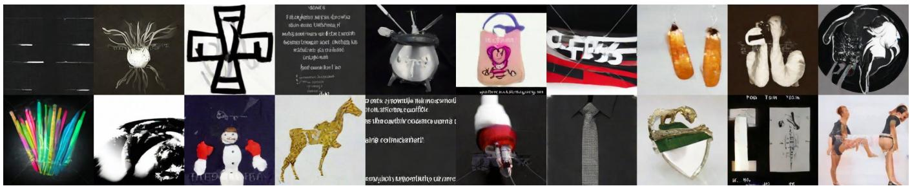

(a) L2 top-20 images  
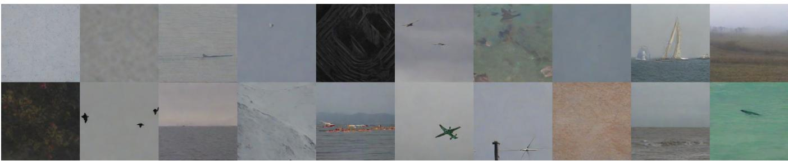

(b) L2 bottom-20 images  
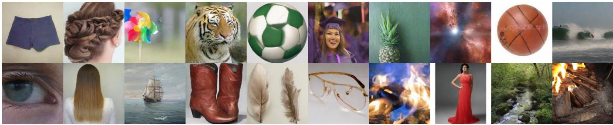

(c) DINOv2 top-20 images  
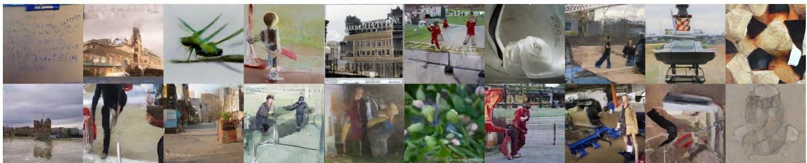  
(d) DINOv2 bottom-20 images  
Figure S2: Top-20 and bottom-20 reconstructed images under the L2 and DINOv2 metrics.

## S6 Experimental Details

Table S3 summarizes the training hyper-parameters and experimental settings for Stable Difusion XL. We implement the code following IP-Adapter [63] and the Difusers library from Hugging Face. Unless otherwise specified, for CLIP experiments we use the HTBA patch trigger as the default backdoor pattern, with a trigger size 50 × 50. We fine-tune the poisoned CLIP model for 10 epochs with a learning rate $1 \times 1 0 ^ { - 4 }$ and a batch size 256. For blendedtrigger experiments, we set the transparency coeficient � to 0.2.

We evaluate the ASR of CLIP under the zero-shot protocol [43]. For ResNet18, we first align the feature dimension to match the pretrained CDDM. In the visual SSL setting, we pretrain SimSiam-ResNet18 for 300 epochs and otherwise follow the oficial SimSiam optimization setup [13]. We also use an HTBA trigger of size 50×50 and evaluate ASR using a linear-probe protocol. We reuse the same ImageNet-100 class split as in [45] for the attack and evaluation pipeline, while using the remaining 900 ImageNet-1K classes for CDDM fine-tuning, thereby preventing the attack data from being

Table S1: Explanatory variables for the two reconstruction metrics on 150,000 CC3M images. The best full-feature model reaches �2=0.503 for L2 but only �2=0.066 for DINOv2 similarity.
<table><tr><td colspan="4">L2 Error</td><td colspan="4">DINOv2 Similarity</td></tr><tr><td>Feature</td><td>Category</td><td>Spearman ρ</td><td> $\mathrm { S i n g l e - f e a t u r e } R ^ { 2 }$ </td><td>Feature</td><td>Category</td><td>Spearman ρ</td><td>Single-feature R²</td></tr><tr><td>Local variance std.</td><td>Texture</td><td>0.549</td><td>0.289</td><td>Sobel gradient std.</td><td>Edge/texture</td><td>-0.164</td><td>0.029</td></tr><tr><td>Gray-level std.</td><td>Grayscale</td><td>0.486</td><td>0.205</td><td>Local variance std.</td><td>Texture</td><td>-0.149</td><td>0.022</td></tr><tr><td>Bright-pixel fraction</td><td>Grayscale</td><td>0.414</td><td>0.187</td><td>Mid-frequency energy ratio</td><td>Frequency</td><td>-0.113</td><td>0.014</td></tr><tr><td>Dynamic range (P95-P05)</td><td>Grayscale</td><td>0.430</td><td>0.175</td><td>Local variance mean</td><td>Texture</td><td>-0.145</td><td>0.022</td></tr><tr><td>Spectral entropy</td><td>Frequency</td><td>0.270</td><td>0.062</td><td>Laplacian variance</td><td>Edge/texture</td><td>-0.117</td><td>0.013</td></tr></table>

Table S2: Generalization performance on medical and remotesensing domains with ImageNet-finetuned SDXL.
<table><tr><td>Dataset</td><td>Domain</td><td>TPR</td><td>FPR</td><td>AUROC</td></tr><tr><td>NIH ChestX-ray14 [59]</td><td>Med.</td><td>0.87</td><td>0.17</td><td>0.90</td></tr><tr><td>Aerial Image Dataset (AID) [60]</td><td>R.S.</td><td>0.80</td><td>0.02</td><td>0.96</td></tr><tr><td>HAM10000 [53]</td><td>Med.</td><td>0.97</td><td>0.08</td><td>0.98</td></tr><tr><td>NWPU-RESISC45 [15]</td><td>R.S.</td><td>0.89</td><td>0.10</td><td>0.95</td></tr></table>

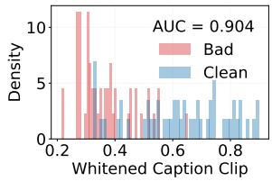  
(a) Overall description

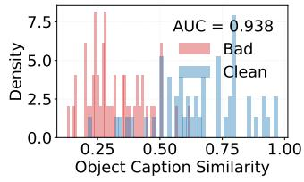  
(b) Object-centric description

Figure S3: Distribution of Caption CLIP scores. (a) Using overall image descriptions. (b) Using object-centric descriptions.  
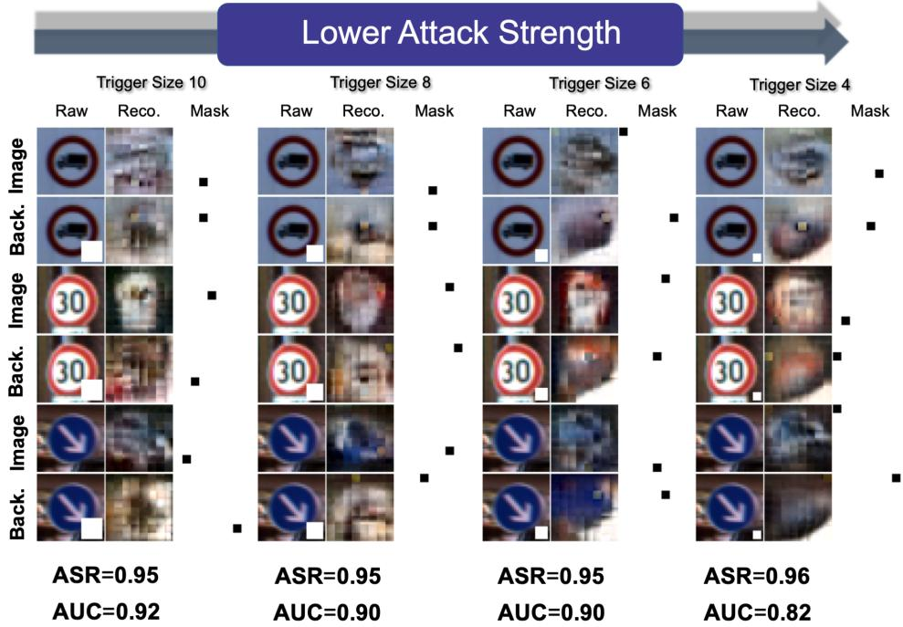  
Figure S4: Varying the trigger size of DEDE.  
inadvertently exploited during generative model adaptation. Table S4 summarizes the experimental setup for visual self-supervised pretraining.

Table S3: Hyper-parameters of finetuning Stable Difusion XL.
<table><tr><td>Category</td><td>Setting</td></tr><tr><td></td><td>Models &amp; Networks</td></tr><tr><td>Base model</td><td>Stable Diffusion XL</td></tr><tr><td>UNet</td><td>UNet2DConditionModel</td></tr><tr><td>Text encoder</td><td>CLIPTextModel</td></tr><tr><td>Image encoder</td><td>Transformer: CLIP CNN: ResNet18</td></tr><tr><td>IP-Adapter</td><td>ImageProjModel</td></tr><tr><td colspan="2">Training Hyper-parameters</td></tr><tr><td>Resolution</td><td>512</td></tr><tr><td>Batch size</td><td>64</td></tr><tr><td>Learning rate</td><td>1e-4</td></tr><tr><td>Optimizer</td><td>AdamW</td></tr><tr><td>Noise scheduler</td><td>DDPM</td></tr><tr><td>Mixed precision</td><td>fp16</td></tr><tr><td>Epochs</td><td>1</td></tr><tr><td colspan="2">Data &amp; Evaluation</td></tr><tr><td>Training data</td><td>ImageNet-900</td></tr><tr><td>Eval. data</td><td>IN-1K val. (image-text); IN-100 val. (visual SSL)</td></tr></table>

Table S4: Hyperparameters for SimSiam pretraining.
<table><tr><td>Methods</td><td>SimSiam</td></tr><tr><td>Training Epochs</td><td>300</td></tr><tr><td>Batch Size</td><td>512</td></tr><tr><td>Optimizer</td><td>SGD</td></tr><tr><td>Learning Rate Schedule</td><td>Cosine</td></tr><tr><td>Learning Rate</td><td>0.06</td></tr><tr><td>Weight Decay</td><td>1 × 10−4</td></tr><tr><td>Moving Average</td><td>0.999</td></tr><tr><td>Resize &amp; Crop</td><td>RandomResizeAndCrop</td></tr><tr><td>Color Jitter</td><td>0.4</td></tr><tr><td>RandomHorizontalFlip</td><td>0.5</td></tr><tr><td>Min Crop Scale</td><td>0.2</td></tr><tr><td>RandomGrayscale</td><td>0.2</td></tr><tr><td>GaussianBlur(p=0.5)</td><td>[.1, 2.]</td></tr></table>

Table S5: Training-free [16] vs. finetuned.
<table><tr><td>Metric</td><td>TPR</td><td>FPR</td><td>AUROC</td><td>FT. AUROC</td></tr><tr><td>DINOv2</td><td>83.0%</td><td>19.0%</td><td>0.86</td><td>0.95</td></tr><tr><td>ViT</td><td>76.0%</td><td>29.0%</td><td>0.76</td><td>0.93</td></tr></table>

Table S6: Downstream Performance.
<table><tr><td></td><td colspan="3">SSLBKD</td><td colspan="3">BadEncoder</td><td colspan="3">CLIP Backdoor</td><td colspan="3">BadCLIP</td></tr><tr><td></td><td>R. (%)</td><td>CA (%)</td><td>ASR (%)</td><td>R. (%)</td><td>CA (%)</td><td>ASR (%)</td><td>R. (%)</td><td>CA (%)</td><td>ASR (%)</td><td>R. (%)</td><td>CA (%)</td><td>ASR (%)</td></tr><tr><td>No Defense</td><td>一</td><td>65.1</td><td>51.2</td><td>-</td><td>62.0</td><td>84.1</td><td>-</td><td>62.9</td><td>95.2</td><td>-</td><td>60.1</td><td>88.9</td></tr><tr><td>PatchSearch</td><td>23.1</td><td>65.2</td><td>58.1</td><td>27.9</td><td>61.8</td><td>91.0</td><td>11.5</td><td>63.3</td><td>87.0</td><td>8.7</td><td>63.1</td><td>85.2</td></tr><tr><td>+ Classifier</td><td>98.3</td><td>66.5</td><td>0.9</td><td>99.9</td><td>61.2</td><td>1.2</td><td>26.9</td><td>60.6</td><td>93.0</td><td>17.8</td><td>63.3</td><td>76.2</td></tr><tr><td>DBCL</td><td>8.5</td><td>66.3</td><td>70.9</td><td>13.6</td><td>59.6</td><td>93.4</td><td>93.8</td><td>60.9</td><td>2.1</td><td>19.5</td><td>63.6</td><td>84.4</td></tr><tr><td>DEDE</td><td>12.2</td><td>66.1</td><td>68.7</td><td>15.9</td><td>63.2</td><td>93.7</td><td>16.0</td><td>62.4</td><td>88.3</td><td>9.3</td><td>64.0</td><td>87.3</td></tr><tr><td>DEFUSE</td><td>43.8</td><td>65.9</td><td>49.1</td><td>39.4</td><td>61.1</td><td>87.9</td><td>92.6</td><td>63.9</td><td>0.0</td><td>73.4</td><td>61.8</td><td>73.1</td></tr><tr><td>+ Classifier</td><td>99.8</td><td>65.8</td><td>0.1</td><td>99.9</td><td>61.7</td><td>0.1</td><td>100.0</td><td>63.9</td><td>0.1</td><td>99.9</td><td>62.2</td><td>0.0</td></tr></table>