# DeCO: Discriminative Evidence Composition for Fine-Grained Dataset Distillation

Chuixuan Fan1,† Guang Li2,†,∗ Shijie Wang3 Dongzhan Zhou4 Baoli Sun5 Takahiro Ogawa2 Miki Haseyama2 Zhihui Wang5,∗

1University of Science and Technology of China 2Hokkaido University 3The University of Queensland 4Shanghai AI Laboratory 5Dalian University of Technology

†Equal contribution ∗Corresponding authors guang@lmd.ist.hokudai.ac.jp zhihuiwang@dlut.edu.cn

## Abstract

Dataset distillation compresses a large training set into a compact synthetic set while preserving its downstream utility. However, existing methods primarily preserve global image statistics and may overlook the localized evidence essential for fine-grained visual classification (FGVC), such as object parts, subtle textures, and region-specific structures. We formulate fine-grained dataset distillation as budgeted discriminative-evidence preservation and propose Discriminative Evidence Composition (DeCO). DeCO uses attention rollout from a pretrained TransFG teacher to identify informative patches, applies spatial diversification to reduce redundant coverage, and organizes the resulting regions into class-wise evidence banks. Multiple same-class regions are then packed into compact grid-composed images. The teacher is used only for dataset construction, whereas downstream students are trained with standard hard-label supervision without teacher logits. Experiments on CUB-200-2011, FGVC-Aircraft, and Stanford Cars show that DeCO consistently outperforms representative coreset and dataset-distillation baselines under different IPC budgets.

## 1 Introduction

Dataset distillation [15, 40, 19, 16] aims to compress a large training set into a compact dataset that retains its utility for downstream model training. Existing methods typically optimize synthetic samples by matching gradients, features, or training trajectories [47, 46, 3, 17, 18, 10], or construct them using pretrained models and feature statistics [49, 37, 44, 26, 14]. Although these approaches perform well on conventional image classification, their objectives primarily capture global statistics and may overlook the localized evidence required for fine-grained visual classification (FGVC).

In FGVC, category identity is often determined by subtle and spatially localized cues, including object parts, textures, and region-specific structures. Accordingly, FGVC methods have extensively explored discriminative region localization and part-level representation learning [24, 27, 7, 51, 12, 30, 11, 38, 39, 8, 45, 22]. Recent patch-composition methods improve pixel utilization by packing selected local regions into distilled images [35], while dedicated fine-grained distillation methods introduce localized supervision into the sample optimization process [28]. Nevertheless, existing composition strategies do not explicitly encourage the coverage of spatially distinct fine-grained evidence. Under small IPC budgets, they may therefore preserve background content or repeatedly select neighboring regions while missing complementary class-specific cues.

We formulate fine-grained dataset distillation as budgeted discriminative-evidence preservation: given a fixed image budget, each distilled image should contain dense and spatially diverse class-specific evidence. Based on this perspective, we propose Discriminative Evidence Composition (DeCO). Preprint.

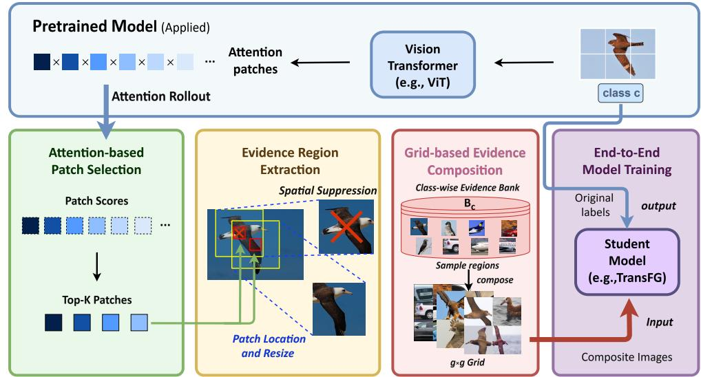  
Figure 1: Overview of DeCO. A TransFG teacher scores patches through attention rollout. Spatially diverse high-response regions are collected into class-wise evidence banks and packed into gridcomposed images for hard-label student training.

DeCO uses attention rollout from a pretrained TransFG teacher to score candidate patches, applies spatial diversification to reduce redundant coverage, and organizes the selected regions into class-wise evidence banks. Multiple same-class regions are then packed into compact grid-composed images. The teacher is used only during dataset construction, while downstream students are trained with standard hard-label supervision without teacher logits.

We evaluate DeCO on CUB-200-2011, FGVC-Aircraft, and Stanford Cars under different IPC budgets. DeCO consistently outperforms representative coreset and dataset-distillation baselines, while a comparison with a random-region variant demonstrates the importance of discriminative region selection. Our contributions are threefold: (1) we formulate fine-grained dataset distillation from the perspective of budgeted discriminative-evidence preservation, emphasizing both evidence density and spatial coverage; (2) we introduce an attention-guided composition framework that combines discriminative patch scoring, spatial diversification, and class-wise evidence aggregation; and (3) we demonstrate that the resulting distilled datasets support effective hard-label student training across three FGVC benchmarks and different IPC budgets.

## 2 Method

We propose Discriminative Evidence Composition (DeCO), which constructs compact distilled images by preserving localized evidence important for fine-grained recognition. As illustrated in Fig. 1, DeCO first mines informative and spatially diverse regions using a fine-grained teacher, organizes them into class-wise evidence banks, and then packs multiple same-class regions into each distilled image. The resulting dataset is used for standard hard-label student training.

## 2.1 Discriminative Evidence Mining

Let $\mathcal { T } = \{ ( x _ { i } , y _ { i } ) \} _ { i = 1 } ^ { | T | }$ be the original training set with $C$ classes. We train a TransFG teacher on $\tau$ and freeze it during dataset construction. Given an image $x ,$ let $A ^ { ( \ell , h ) }$ denote the self-attention matrix of head h at layer $\ell .$ Following attention rollout [1], we first average the attention heads and incorporate the residual connection:

$$
\begin{array} { l } { { \displaystyle \bar { A } ^ { ( \ell ) } = \frac { 1 } { H } \sum _ { h = 1 } ^ { H } A ^ { ( \ell , h ) } , } } \\ { { \displaystyle \hat { A } ^ { ( \ell ) } = \mathrm { R o w N o r m } \Big ( \bar { A } ^ { ( \ell ) } + I \Big ) , } } \\ { { \displaystyle \bar { A } _ { \mathrm { r o l l } } = \hat { A } ^ { ( L ) } \hat { A } ^ { ( L - 1 ) } \cdot \cdot \cdot \hat { A } ^ { ( 1 ) } , } } \end{array}\tag{1}
$$

where H is the number of attention heads. The evidence score of patch $p$ is then defined by its accumulated attention from the class token:

$$
s _ { p } ( x ) = A _ { \mathrm { r o l l } } [ 0 , p + 1 ] .\tag{2}
$$

Selecting patches solely by $s _ { p } ( x )$ may repeatedly cover neighboring regions. We therefore sort the candidates by their scores and apply greedy distance-based spatial suppression. A candidate $p$ is retained only if

$$
\begin{array} { r } { \| ( u _ { p } , v _ { p } ) - ( u _ { q } , v _ { q } ) \| _ { 2 } \geq d _ { \operatorname* { m i n } } , \qquad \forall q \in \mathcal { P } ( x ) , } \end{array}\tag{3}
$$

where $( u _ { p } , v _ { p } )$ is its spatial center and ${ \mathcal { P } } ( x )$ is the set of previously selected patches. This constraint reduces redundant coverage and promotes complementary local evidence.

## 2.2 Evidence Bank and Grid Composition

Each selected location is converted into a fixed-size crop $r _ { p } ( x _ { i } )$ . For class $c ,$ the corresponding evidence bank is

$$
B _ { c } = \left\{ r _ { p } ( x _ { i } ) \vert y _ { i } = c , p \in \mathcal { P } ( x _ { i } ) \right\} .\tag{4}
$$

To construct the j-th distilled image of class $c ,$ DeCO samples $M = g ^ { 2 }$ regions from $B _ { c }$ and arranges them into a $g \times g$ grid:

$$
R _ { c , j } = \{ r _ { 1 } , \ldots , r _ { M } \} \subseteq B _ { c } , \qquad \tilde { x } _ { c , j } = A ( R _ { c , j } ; g ) ,\tag{5}
$$

where $\mathcal { A }$ denotes the grid-composition operator. Since all regions are drawn from the same class bank, $\tilde { \boldsymbol { x } } _ { c , j }$ is assigned label c. This design allocates the fixed pixel budget to multiple discriminative regions rather than a complete image dominated by background. It is particularly useful at $\mathrm { I P C } { = } 1$ where a single distilled image must represent an entire class.

## 2.3 Hard-label Student Training

After dataset construction, the teacher is discarded and the distilled set

$$
\mathcal { S } = \{ ( \tilde { x } _ { c , j } , c ) ~ | ~ c \in \{ 1 , . . . , C \} , ~ j \in \{ 1 , . . . , \mathrm { I P C } \} \}\tag{6}
$$

is used to train the downstream student with standard hard-label supervision. No teacher logits, soft labels, or auxiliary distillation losses are required during student training; the teacher is involved only in constructing S. Same-class region composition preserves class-consistent evidence, while spatial suppression reduces redundancy and promotes complementary cues. DeCO can therefore train students with standard hard labels without transferring teacher logits.

## 3 Experiments

## 3.1 Experimental Settings

We evaluate DeCO on CUB-200-2011 [36], FGVC-Aircraft [29], and Stanford Cars [13] under IPC budgets of {1, 3, 5}. All images are resized to 224 × 224. A TransFG ViT-B/16 trained on the original training set serves as the teacher for region extraction. A separate TransFG student is randomly initialized and trained from scratch using only the distilled images and standard hard labels.

DeCO uses a grid size of $g = 2$ , corresponding to four regions per distilled image, and a region area ratio of 28%. The distilled images are generated once and remain fixed during student training. Unless marked otherwise, results are averaged over at least three independent runs.

We compare DeCO with Uniform, RDED [35], ${ \mathrm { S R e ^ { 2 } L } } { + + }$ [5] [44], and FADRM+ [4]. RDED is re-evaluated using the same student architecture, initialization, training schedule, augmentation, hard-label supervision, and four-region budget as DeCO. De $\mathrm { \Delta T O } _ { \mathrm { r a n d } }$ follows the same pipeline as DeCO but replaces attention-guided selection with random region selection. Results for $\bar { \bf S } { \bf R e } ^ { 2 } { \mathrm { I } }$ ++ and FADRM+ are taken from prior work [28] under their original evaluation protocols and are marked with †.

Table 1: Top-1 accuracy (%). Unmarked results are means of at least three runs under a unified TransFG hard-label protocol; † denotes reported results under their original protocols.
<table><tr><td>Dataset</td><td>IPC</td><td>Uniform</td><td>RDED</td><td> ${ \mathrm { S R e ^ { 2 } L } } { + + } ^ { \dagger }$ </td><td> $\mathrm { F A D R M ^ { + } }$ </td><td> $\mathrm { D e C O } _ { \mathrm { r a n d } }$ </td><td>DeCO</td></tr><tr><td rowspan="3">CUB-200-2011</td><td>1</td><td>1.45</td><td>38.25</td><td>53.44</td><td>54.80</td><td>45.31</td><td>65.53</td></tr><tr><td>3</td><td>1.97</td><td>52.56</td><td>60.04</td><td>64.06</td><td>74.60</td><td>86.83</td></tr><tr><td>5</td><td>2.55</td><td>63.85</td><td>63.50</td><td>66.40</td><td>78.98</td><td>87.99</td></tr><tr><td rowspan="3">FGVC-Aircraft</td><td>1</td><td>1.82</td><td>22.11</td><td>52.60</td><td>55.02</td><td>56.02</td><td>66.04</td></tr><tr><td>3</td><td>3.80</td><td>36.39</td><td>66.63</td><td>72.90</td><td>76.17</td><td>87.49</td></tr><tr><td>5</td><td>4.35</td><td>38.56</td><td>68.35</td><td>74.01</td><td>78.62</td><td>88.09</td></tr><tr><td rowspan="3">Stanford Cars</td><td>1</td><td>1.67</td><td>16.95</td><td>52.42</td><td>60.30</td><td>46.83</td><td>63.94</td></tr><tr><td>3</td><td>2.97</td><td>25.88</td><td>68.21</td><td>75.09</td><td>75.20</td><td>85.49</td></tr><tr><td>5</td><td>3.18</td><td>31.86</td><td>70.90</td><td>77.71</td><td>78.30</td><td>87.36</td></tr></table>

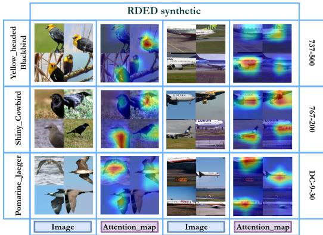

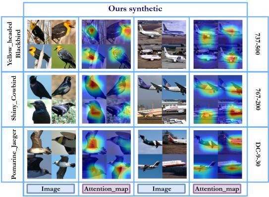  
Figure 2: Student attention visualization. Grad-CAM [31] maps of students trained on the RDED and DeCO distilled sets for three CUB-200-2011 categories. Each pair shows an input image and its activation map; DeCO-trained students generally exhibit more localized responses on discriminative object regions.

## 3.2 Main Results

As shown in Table 1, DeCO achieves the highest accuracy on all three datasets under every evaluated IPC budget. At IPC= 1, DeCO reaches 65.53%, 66.04%, and 63.94% on CUB-200-2011, FGVC-Aircraft, and Stanford Cars, respectively. Under the unified evaluation protocol, these results outperform RDED by 27.28, 43.93, and 46.99 percentage points. DeCO also exceeds the strongest reported baseline by 10.73, 11.02, and 3.64 points, although these results were obtained under their original evaluation protocols. The improvements remain consistent as the IPC budget increases, demonstrating the effectiveness of allocating the fixed pixel budget to localized class-specific evidence. DeCO consistently outperforms $\mathrm { D e C O } _ { \mathrm { r a n d } }$ , which differs only in its region-selection strategy. Since both variants use the same composition and student-training pipeline, the comparison shows that grid composition alone is insufficient and that selecting class-relevant local evidence is critical to DeCO.

## 3.3 Student Attention Visualization

To examine whether the selected local evidence remains useful during downstream training, we apply Grad-CAM [31] to students trained directly on the distilled datasets. As shown in Fig. 2, students trained on DeCO generally produce responses that are more concentrated on discriminative object regions than those trained on RDED. In particular, their activations tend to focus on localized object parts rather than being diffusely distributed across the image. These results suggest that the teacher-selected regions remain relevant after dataset construction, even though neither the teacher nor its predictions are used during student training.

## 4 Conclusion

We presented DeCO, a dataset-distillation framework that preserves localized discriminative evidence for fine-grained visual classification. DeCO combines attention-guided region selection, spatial diversification, class-wise evidence aggregation, and grid composition to construct compact distilled images for hard-label student training. Experiments on three fine-grained benchmarks demonstrate consistent improvements under different IPC budgets, while the student visualizations further indicate that the selected local evidence remains relevant during downstream training.

## References

[1] Samira Abnar and Willem Zuidema. Quantifying attention flow in transformers. In Proceedings of the 58th Annual Meeting of the Association for Computational Linguistics, pages 4190–4197, 2020.

[2] Wenqi Cai, Yawen Zou, Guang Li, Chunzhi Gu, and Chao Zhang. EVLF: Early vision-language fusion for generative dataset distillation. In Proceedings of the IEEE/CVF Conference on Computer Vision and Pattern Recognition, pages 33953–33962, 2026.

[3] George Cazenavette, Tongzhou Wang, Antonio Torralba, Alexei A. Efros, and Jun-Yan Zhu. Dataset distillation by matching training trajectories. In Proceedings ofthe IEEE/CVF Conference on Computer Vision and Pattern Recognition, pages 10718–10727, 2022.

[4] Jiacheng Cui, Xinyue Bi, Yaxin Luo, Xiaohan Zhao, Jiacheng Liu, and Zhiqiang Shen. FADRM: Fast and accurate data residual matching for dataset distillation. In Advances in Neural Informa tion Processing Systems, 2025.

[5] Jiacheng Cui, Zhaoyi Li, Xiaochen Ma, Xinyue Bi, Yaxin Luo, and Zhiqiang Shen. Dataset distillation via committee voting. arXiv preprint arXiv:2501.07575, 2025.

[6] Justin Cui, Ruochen Wang, Si Si, and Cho-Jui Hsieh. Scaling up dataset distillation to imagenet-1k with constant memory. In Proceedings ofthe International Conference on Machine Learning, pages 6565–6590, 2023.

[7] Ruoyi Du, Dongliang Chang, Ayan Kumar Bhunia, Jiyang Xie, Zhanyu Ma, Yi-Zhe Song, and Jun Guo. Fine-grained visual classification via progressive multi-granularity training of jigsaw patches. In Proceedings of the European Conference on Computer Vision, pages 153–168, 2020.

[8] Yu Gao, Xintong Han, Xun Wang, Weilin Huang, and Matthew Scott. Channel interaction networks for fine-grained image categorization. In Proceedings of the AAAI Conference on Artificial Intelligence, pages 10818–10825, 2020.

[9] Jianyang Gu, Saeed Vahidian, Vyacheslav Kungurtsev, Haonan Wang, Wei Jiang, Yang You, and Yiran Chen. Efficient dataset distillation via minimax diffusion. In Proceedings of the IEEE/CVF Conference on Computer Vision and Pattern Recognition, pages 15793–15803, 2024.

[10] Ziyao Guo, Kai Wang, George Cazenavette, Hui Li, Kaipeng Zhang, and Yang You. Towards lossless dataset distillation via difficulty-aligned trajectory matching. In Proceedings of the International Conference on Learning Representations, 2024.

[11] Ju He, Jie-Neng Chen, Shuai Liu, Adam Kortylewski, Cheng Yang, Yutong Bai, and Changhu Wang. TransFG: A transformer architecture for fine-grained recognition. In Proceedings ofthe AAAI Conference on Artificial Intelligence, pages 852–860, 2022.

[12] Tao Hu and Honggang Qi. See better before looking closer: Weakly supervised data augmentation network for fine-grained visual classification. arXiv preprint arXiv:1901.09891, 2019.

[13] Jonathan Krause, Michael Stark, Jia Deng, and Li Fei-Fei. 3d object representations for finegrained categorization. In Proceedings of the IEEE International Conference on Computer Vision Workshops (ICCVW), pages 554–561, 2013.

[14] Saehyung Lee, Sanghyuk Chun, Sangwon Jung, Sangdoo Yun, and Sungroh Yoon. Dataset condensation with contrastive signals. In Proceedings of the International Conference on Machine Learning, pages 12352–12364, 2022.

[15] Guang Li, Ren Togo, Takahiro Ogawa, and Miki Haseyama. Soft-label anonymous gastric x-ray image distillation. In Proceedings of the IEEE International Conference on Image Processing, pages 305–309, 2020.

[16] Guang Li, Ren Togo, Takahiro Ogawa, and Miki Haseyama. Compressed gastric image generation based on soft-label dataset distillation for medical data sharing. Computer Methods and Programs in Biomedicine, 227:107189, 2022.

[17] Guang Li, Ren Togo, Takahiro Ogawa, and Miki Haseyama. Dataset distillation using parameter pruning. IEICE Transactions on Fundamentals of Electronics, Communications and Computer Sciences, 107(6):936–940, 2024.

[18] Guang Li, Ren Togo, Takahiro Ogawa, and Miki Haseyama. Importance-aware adaptive dataset distillation. Neural Networks, 172:106154, 2024.

[19] Guang Li, Bo Zhao, and Tongzhou Wang. Awesome dataset distillation. https://github. com/Guang000/Awesome-Dataset-Distillation, 2022.

[20] Mingzhuo Li, Guang Li, Jiafeng Mao, Takahiro Ogawa, and Miki Haseyama. Diversitydriven generative dataset distillation based on diffusion model with self-adaptive memory. In Proceedings ofthe IEEE International Conference on Image Processing, 2025.

[21] Mingzhuo Li, Guang Li, Jiafeng Mao, Linfeng Ye, Takahiro Ogawa, and Miki Haseyama. Task-specific generative dataset distillation with difficulty-guided sampling. In Proceedings of the IEEE/CVF International Conference on Computer Vision Workshops, 2025.

[22] Peihua Li, Jiangtao Xie, Qilong Wang, and Zilin Gao. Towards faster training of global covariance pooling networks by iterative matrix square root normalization. In Proceedings of the IEEE/CVF Conference on Computer Vision and Pattern Recognition, pages 947–955, 2018.

[23] Wenyuan Li, Guang Li, Keisuke Maeda, Takahiro Ogawa, and Miki Haseyama. Decoupled audio-visual dataset distillation. arXiv preprint arXiv:2511.17890, 2025.

[24] Tsung-Yu Lin, Aruni RoyChowdhury, and Subhransu Maji. Bilinear CNN models for finegrained visual recognition. In Proceedings of the IEEE/CVF International Conference on Computer Vision, pages 1449–1457, 2015.

[25] Songhua Liu, Kai Wang, Xingyi Yang, Jingwen Ye, and Xinchao Wang. Dataset distillation via factorization. In Advances in Neural Information Processing Systems, 2022.

[26] Yanqing Liu, Jianyang Gu, Kai Wang, Zheng Zhu, Wei Jiang, and Yang You. DREAM: Efficient dataset distillation by representative matching. In Proceedings ofthe IEEE/CVF International Conference on Computer Vision, pages 17314–17324, 2023.

[27] Wei Luo, Xitong Yang, Xianjie Mo, Yuheng Lu, Larry S. Davis, Jun Li, Jian Yang, and Ser-Nam Lim. Cross-x learning for fine-grained visual categorization. In Proceedings of the IEEE/CVF International Conference on Computer Vision, pages 8242–8251, 2019.

[28] Hongxu Ma, Guang Li, Shijie Wang, Dongzhan Zhou, Baoli Sun, Takahiro Ogawa, Miki Haseyama, and Zhihui Wang. FD2: A dedicated framework for fine-grained dataset distillation. In Proceedings of the European Conference on Computer Vision, 2026.

[29] Subhransu Maji, Esa Rahtu, Juho Kannala, Matthew Blaschko, and Andrea Vedaldi. Finegrained visual classification of aircraft. arXiv preprint arXiv:1306.5151, 2013.

[30] Yongming Rao, Guangyi Chen, Jiwen Lu, and Jie Zhou. Counterfactual attention learning for fine-grained visual categorization and re-identification. In Proceedings of the IEEE/CVF International Conference on Computer Vision, pages 1025–1034, 2021.

[31] Ramprasaath R. Selvaraju et al. Grad-cam: Visual explanations from deep networks via gradientbased localization. In Proceedings of the IEEE/CVF International Conference on Computer Vision, 2017.

[32] Shitong Shao, Zeyuan Yin, Muxin Zhou, Xindong Zhang, and Zhiqiang Shen. Generalized large-scale data condensation via various backbone and statistical matching. In Proceedings of the IEEE/CVF Conference on Computer Vision and Pattern Recognition, pages 16709–16718, 2024.

[33] Shitong Shao, Zikai Zhou, Huanran Chen, and Zhiqiang Shen. Elucidating the design space of dataset condensation. In Advances in Neural Information Processing Systems, 2024.

[34] Duo Su, Junjie Hou, Weizhi Gao, Yingjie Tian, and Bowen Tang. D4M: Dataset distillation via disentangled diffusion model. In Proceedings of the IEEE/CVF Conference on Computer Vision and Pattern Recognition, pages 5809–5818, 2024.

[35] Peng Sun, Bei Shi, Daiwei Yu, and Tao Lin. On the diversity and realism of distilled dataset: An efficient dataset distillation paradigm. In Proceedings of the IEEE/CVF Conference on Computer Vision and Pattern Recognition, pages 9390–9399, 2024.

[36] C. Wah, S. Branson, P. Welinder, P. Perona, and S. Belongie. Caltech-ucsd birds-200-2011. Technical report, California Institute of Technology, 2011.

[37] Kai Wang, Bo Zhao, Xiangyu Peng, Zheng Zhu, Shuo Yang, Shuo Wang, Guan Huang, Hakan Bilen, Xinchao Wang, and Yang You. CAFE: Learning to condense dataset by aligning features. In Proceedings of the IEEE/CVF Conference on Computer Vision and Pattern Recognition, pages 12196–12205, 2022.

[38] Shijie Wang, Haojie Li, Zhihui Wang, and Wanli Ouyang. Dynamic position-aware network for fine-grained image recognition. In Proceedings ofthe AAAI Conference on Artificial Intelligence, pages 2791–2799, 2021.

[39] Shijie Wang, Zhihui Wang, Haojie Li, and Wanli Ouyang. Category-specific semantic coherency learning for fine-grained image recognition. In Proceedings ofthe ACM International Conference on Multimedia, pages 174–183, 2020.

[40] Tongzhou Wang, Jun-Yan Zhu, Antonio Torralba, and Alexei A. Efros. Dataset distillation. arXiv preprint arXiv:1811.10959, 2018.

[41] Huyu Wu, Duo Su, Junjie Hou, and Guang Li. Dataset condensation with color compensation. Transactions on Machine Learning Research, 2025.

[42] Lingao Xiao and Yang He. Are large-scale soft labels necessary for large-scale dataset distillation? In Advances in Neural Information Processing Systems, 2024.

[43] Linfeng Ye, Shayan Mohajer Hamidi, Guang Li, Takahiro Ogawa, Miki Haseyama, and Konstantinos N. Plataniotis. Information-guided diffusion sampling for dataset distillation. In Advances in Neural Information Processing Systems Workshops, 2025.

[44] Zeyuan Yin, Eric Xing, and Zhiqiang Shen. Squeeze, recover and relabel: Dataset condensation at imagenet scale from a new perspective. In Advances in Neural Information Processing Systems, 2023.

[45] Chaojian Yu, Xinyi Zhao, Qi Zheng, Peng Zhang, and Xinge You. Hierarchical bilinear pooling for fine-grained visual recognition. In Proceedings ofthe European Conference on Computer Vision, pages 574–589, 2018.

[46] Bo Zhao and Hakan Bilen. Dataset condensation with differentiable siamese augmentation. In Proceedings of the International Conference on Machine Learning (ICML), pages 12674–12685, 2021.

[47] Bo Zhao and Hakan Bilen. Dataset condensation with gradient matching. In Proceedings of the International Conference on Learning Representations (ICLR), 2021.

[48] Bo Zhao and Hakan Bilen. Synthesizing informative training samples with gan. In Advances in Neural Information Processing Systems Workshops, 2022.

[49] Bo Zhao and Hakan Bilen. Dataset condensation with distribution matching. In Proceedings of the IEEE/CVF Winter Conference on Applications ofComputer Vision, pages 6514–6523, 2023.

[50] Xinhao Zhong, Hao Fang, Bin Chen, Xulin Gu, Meikang Qiu, Shuhan Qi, and Shu-Tao Xia. Hierarchical features matter: A deep exploration of progressive parameterization method for dataset distillation. In Proceedings of the IEEE/CVF Conference on Computer Vision and Pattern Recognition, pages 30462–30471, 2025.

[51] Peiqin Zhuang, Yali Wang, and Yu Qiao. Learning attentive pairwise interaction for finegrained classification. In Proceedings of the AAAI Conference on Artificial Intelligence, pages 13130–13137, 2020.

[52] Yawen Zou, Guang Li, Duo Su, Zi Wang, Jun Yu, and Chao Zhang. Dataset distillation via vision-language category prototype. In Proceedings of the IEEE/CVF International Conference on Computer Vision, pages 2941–2950, 2025.

## A Related Work

Dataset Distillation. Dataset distillation (DD) aims to construct a compact training set whose downstream utility approaches that of the original data while substantially reducing storage and training costs. Existing methods can be broadly categorized into gradient matching [47, 46, 14], distribution matching [49, 37, 25, 23], trajectory matching [3, 6, 10], decoupled distillation [44, 4, 32, 33, 42], and generative distillation [48, 50, 9, 34, 41, 43, 21, 20, 52, 2]. In particular, decoupled methods separate model pretraining, sample construction, and downstream evaluation to improve scalability. $\mathrm { \bar { s } R e ^ { 2 } L }$ [44] establishes this paradigm through model squeezing, image recovery, and soft relabeling, while $\mathrm { S R e ^ { 2 } L }$ ++ [5] strengthens it with real-image initialization, data augmentation, and batch-specific soft labels. Subsequent methods improve image construction through residual matching [4], multi-model statistics [32], or lightweight label representations [42]. These methods achieve strong performance on general-purpose benchmarks but primarily preserve global statistics and are not specifically designed to retain localized fine-grained evidence.

Patch-based and Fine-grained Dataset Distillation. Patch-based methods improve pixel utilization by composing multiple local regions into each distilled image. RDED [35] selects highconfidence crops using an observer model and concatenates them to improve the realism and diversity of distilled data. However, confidence-based selection does not explicitly encourage coverage of spatially distinct regions and may repeatedly retain similar object parts or background content. Recent work has also begun to study DD specifically for fine-grained recognition. $\mathrm { \bar { F } D ^ { 2 } }$ [28] incorporates attention-guided fine-grained representations, class prototypes, and diversity constraints into decoupled distillation, improving inter-class separability and within-class diversity. In contrast, DeCO focuses on the construction of hard-label-composed images. It uses class-token attention to identify discriminative regions and spatial suppression to reduce redundant coverage before combining same-class regions under a fixed four-region budget.

Fine-grained Visual Classification. Fine-grained visual classification relies on subtle differences between visually similar categories and therefore benefits from localized object parts, textures, and region-specific structures. Cross-X [27] models cross-layer and cross-category interactions, while PMG [7] progressively learns multi-granularity representations. DP-Net [38] introduces dynamically aligned positional cues, and CSC-Net [39] promotes category-specific semantic coherence. CAL [30] uses counterfactual attention to improve the localization of discriminative regions, whereas TransFG [11] selects informative patch tokens through transformer attention. Motivated by these observations, DeCO uses a pretrained TransFG teacher as a construction-time evidence localizer. The teacher is discarded after region selection, and the resulting distilled images are used to train randomly initialized students with standard hard-label supervision.

## B An Evidence-Preservation Analysis

We provide an informal analysis of why DeCO supports hard-label training on grid-composed images. This analysis is not a formal guarantee of downstream accuracy; rather, it clarifies how evidence strength, spatial diversity, and grid composition jointly affect the reliability of the distilled supervision.

Evidence preservation. Let $e ( r , c )$ denote the discriminative evidence that region r provides for class c. We assume that regions selected from the class-wise evidence bank $B _ { c }$ contain positive class evidence in expectation:

$$
\mu _ { c } = \mathbb { E } _ { r \sim B _ { c } } [ e ( r , c ) ] > 0 .\tag{7}
$$

For a composed image $\tilde { x } _ { c , j } = \mathcal { A } ( R _ { c , j } ; g )$ , define its average regional evidence as

$$
\bar { e } _ { c , j } = \frac { 1 } { M } \sum _ { r \in R _ { c , j } } e ( r , c ) .\tag{8}
$$

We assume that the grid-composition operator approximately preserves this evidence:

$$
e ( \tilde { x } _ { c , j } , c ) \geq \bar { e } _ { c , j } - \epsilon _ { \mathcal { A } } ,\tag{9}
$$

where $\epsilon _ { A } \geq 0$ represents the distortion introduced by cropping, resizing, and grid composition. Taking expectations gives

$$
\mathbb { E } [ e ( \tilde { x } _ { c , j } , c ) ] \geq \mu _ { c } - \epsilon _ { \mathcal { A } } .\tag{10}
$$

Thus, a composed image retains positive expected class evidence whenever $\mu _ { c } > \epsilon _ { A }$ , providing an intuitive justification for assigning it the original hard label c.

Evidence concentration under spatial diversity. Positive expected evidence does not by itself guarantee that every composed image is informative. Let $e _ { m } = e ( r _ { m } , c )$ be the evidence provided by the m-th selected region. We assume

$$
\mathrm { V a r } [ e _ { m } ] \leq \sigma _ { c } ^ { 2 } , \qquad \mathrm { C o v } [ e _ { m } , e _ { m ^ { \prime } } ] \leq \rho _ { c } \sigma _ { c } ^ { 2 } , \quad m \neq m ^ { \prime } ,\tag{11}
$$

where $\rho _ { c } \in [ 0 , 1 ]$ controls the redundancy between selected regions. The variance of their empirical average satisfies

$$
\begin{array} { l } { \displaystyle \mathrm { V a r } [ \bar { e } _ { c , j } ] = \frac { 1 } { M ^ { 2 } } \left( \sum _ { m = 1 } ^ { M } \mathrm { V a r } [ e _ { m } ] + 2 \sum _ { m < m ^ { \prime } } \mathrm { C o v } [ e _ { m } , e _ { m ^ { \prime } } ] \right) } \\ { \displaystyle \leq \frac { \sigma _ { c } ^ { 2 } } { M } \left[ 1 + ( M - 1 ) \rho _ { c } \right] . } \end{array}\tag{12}
$$

Proposition 1 (Evidence concentration). Suppose $\mu _ { c } > \epsilon _ { \mathcal { A } }$ and the conditions in Eq. (11) hold. The probability that a composed image fails to retain positive class evidence is bounded by

$$
\operatorname* { P r } [ e ( \tilde { x } _ { c , j } , c ) \leq 0 ] \leq \frac { \sigma _ { c } ^ { 2 } \left[ 1 + ( M - 1 ) \rho _ { c } \right] } { M ( \mu _ { c } - \epsilon _ { \mathcal { A } } ) ^ { 2 } } .\tag{13}
$$

Proof. From Eq. (9), the event $e ( \tilde { x } _ { c , j } , c ) \leq 0$ implies $\bar { e } _ { c , j } \leq \epsilon _ { A }$ . Chebyshev’s inequality therefore gives

$$
\begin{array} { r } { \mathrm { P r } [ e ( \tilde { x } _ { c , j } , c ) \leq 0 ] \leq \mathrm { P r } [ \bar { e } _ { c , j } \leq \epsilon _ { \mathcal { A } } ] } \\ { \leq \displaystyle \frac { \mathrm { V a r } [ \bar { e } _ { c , j } ] } { ( \mu _ { c } - \epsilon _ { \mathcal { A } } ) ^ { 2 } } . } \end{array}\tag{14}
$$

Substituting Eq. (12) yields Eq. (13).

Interpretation. Equation 13 reveals three complementary effects. First, attention-guided selection is intended to increase $\mu _ { c }$ by favoring regions with stronger class evidence. Second, spatial suppression discourages neighboring crops and is expected to reduce $\rho _ { c } ,$ thereby limiting evidence redundancy. Third, composing multiple regions increases M and improves evidence concentration when their correlations are controlled.

This relationship can be expressed through the effective number of evidence regions:

$$
M _ { \mathrm { e f f } } = \frac { M } { 1 + ( M - 1 ) \rho _ { c } } .\tag{15}
$$

The failure bound decreases proportionally to $1 / M _ { \mathrm { e f f } }$ . Therefore, increasing the number of composed regions provides limited benefit when their evidence is highly correlated. In our implementation, DeCO uses $M = 4$ regions per image, while spatial suppression encourages these regions to contain complementary rather than repetitive evidence.

The distortion term $\epsilon _ { A }$ also clarifies the role of region size. Very small crops may reduce $\mu _ { c }$ by removing structural context, whereas overly large crops introduce background and redundant content. An intermediate crop size therefore balances evidence strength and composition distortion, consistent with the empirical results in Appendix C.1.

## C Additional Experimental Results

We analyze the sensitivity of DeCO to the region area ratio, teacher patch size, and attention rollout depth, followed by a qualitative comparison with RDED. Unless otherwise stated, all experiments use IPC= 1, a randomly initialized TransFG student, and the same hard-label training protocol as the main experiments. Reported quantitative results are averaged over at least three independent runs.

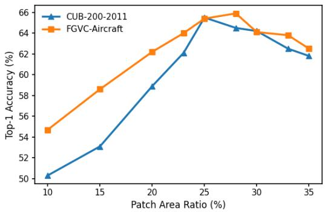  
Figure 3: Mean top-1 accuracy under different cropped-region area ratios on CUB-200-2011 and FGVC-Aircraft.

## C.1 Impact of Region Area Ratio

The region area ratio controls the trade-off between preserving localized discriminative cues and retaining sufficient contextual information. Very small regions preserve object parts or local textures but may discard important structural information. Conversely, excessively large regions introduce more background content and reduce the density of discriminative evidence.

As shown in Fig. 3, intermediate region sizes provide a favorable balance between local evidence and contextual information. Although the optimal ratio varies slightly across datasets, performance remains stable within the intermediate range. We use a common region area ratio of 28% for all benchmarks in the main experiments.

## C.2 Impact of Initial Patch Size

We study whether DeCO is sensitive to the initial patch granularity of the TransFG teacher by comparing ViT-B/16 and ViT-B/32, whose patch sizes are $1 6 \times 1 6$ and $3 2 \times 3 2$ , respectively.

Table 2: Mean top-1 accuracy (%) underAs shown in Table 2, changing the teacher patch size As shown in Table 2, changing the teacher patch size alters accuracy by at most 0.2 percentage points, indicat- different teacher patch sizes.

ing limited sensitivity to the initial patch resolution. The selected patch primarily determines the center of a larger evidence crop; moderate changes in localization granularity therefore produce similar regions after cropping and resizing.

<table><tr><td>Dataset</td><td>ViT-B/16</td><td>ViT-B/32</td></tr><tr><td>CUB-200-2011</td><td>65.4</td><td>65.2</td></tr><tr><td>FGVC-Aircraft</td><td>66.0</td><td>66.1</td></tr></table>

## C.3 Sensitivity to Attention Rollout Depth

We next vary the number of Transformer blocks included in attention rollout. Consistent with Eq. (1), cumulative attention up to block l is computed as

$$
A _ { \mathrm { r o l l } } ^ { ( l ) } = \hat { A } ^ { ( l ) } \hat { A } ^ { ( l - 1 ) } \cdot \cdot \cdot \hat { A } ^ { ( 1 ) } , \qquad l \in \{ 1 , 3 , 5 , 7 , 9 , 1 1 \} .\tag{16}
$$

Here, $\hat { A } ^ { ( l ) }$ denotes the head-averaged and residual-normalized attention matrix at block l. Only the rollout depth is varied; region extraction, evidence-bank construction, composition, and student training remain unchanged. We evaluate up to the eleventh block because TransFG uses the first 11 blocks for part selection before processing the selected tokens with the final block.

Table 3 shows that performance improves as attention is accumulated through the early and middle blocks and becomes stable at later depths. On CUB-200-2011, accuracy changes by only 0.15 percentage points between depths 5 and 11; the corresponding difference on FGVC-Aircraft is 0.08 points. We therefore use rollout through the eleventh block as the default configuration.

## C.4 Qualitative Comparison with RDED

Figure 4 compares RDED and DeCO under the same four-region composition budget. RDED can retain relatively large background regions or weakly localized content, whereas DeCO uses teacher

Table 3: Sensitivity to attention rollout depth. Results are mean top-1 accuracy (%) at IPC= 1.
<table><tr><td>Rollout Depth l</td><td>CUB-200-2011</td><td>FGVC-Aircraft</td></tr><tr><td>1</td><td>64.12</td><td>65.18</td></tr><tr><td>3</td><td>64.93</td><td>65.71</td></tr><tr><td>5</td><td>65.38</td><td>65.96</td></tr><tr><td>7</td><td>65.47</td><td>66.02</td></tr><tr><td>9</td><td>65.51</td><td>66.01</td></tr><tr><td>11</td><td>65.53</td><td>66.04</td></tr></table>

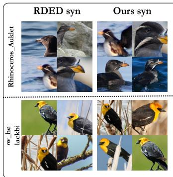

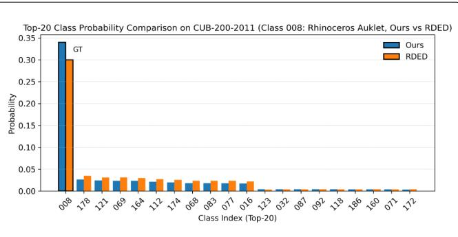  
Figure 4: Qualitative comparison with RDED. Left: distilled images produced by RDED and DeCO using the same four-region budget. DeCO retains more localized class-specific evidence, whereas RDED may preserve larger background or weakly localized regions. Right: top-20 predicted class probabilities for a representative CUB-200-2011 category.

attention and spatial suppression to select complementary class-specific regions. The comparison illustrates that DeCO changes the information retained within the fixed pixel budget rather than increasing the number of composed regions.

## D Visualization of Distilled Samples

At IPC=1, the fine-grained samples distilled by DeCO are shown in Figs. 5 and 6 for CUB-200-2011, Figs. 7 and 8 for Stanford Cars, and Fig. 9 for FGVC-Aircraft.

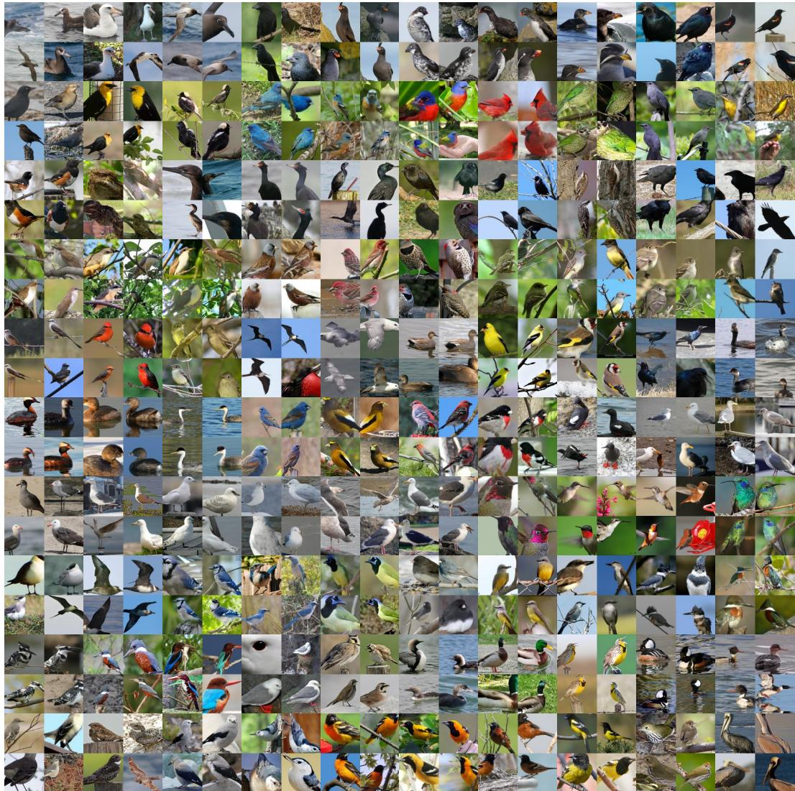  
Figure 5: Visualization of distilled samples from the first 100 classes of CUB-200-2011 at IPC=1.

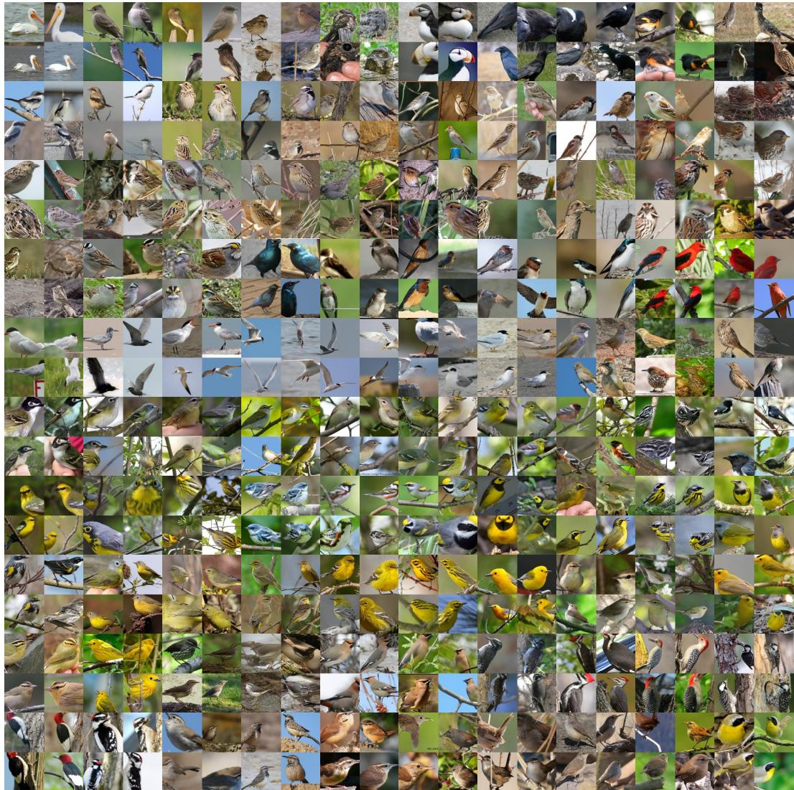  
Figure 6: Visualization of distilled samples from the last 100 classes of CUB-200-2011 at IPC=1.

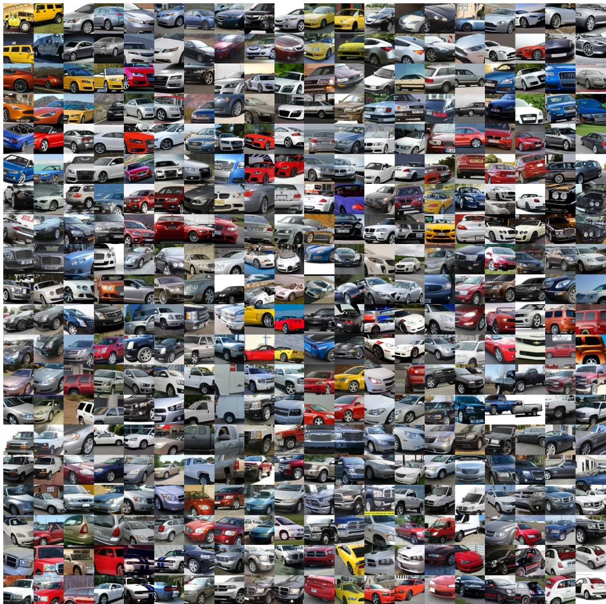  
Figure 7: Visualization of distilled samples from the first 100 classes of Stanford Cars at IPC=1.

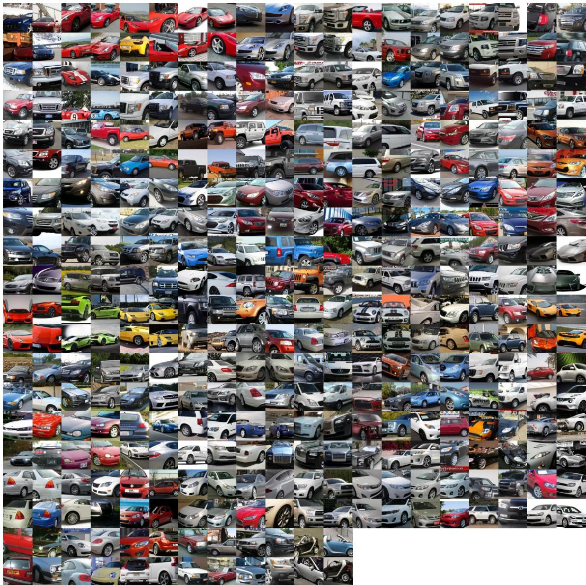  
Figure 8: Visualization of distilled samples from the remaining 96 classes of Stanford Cars at IPC=1.

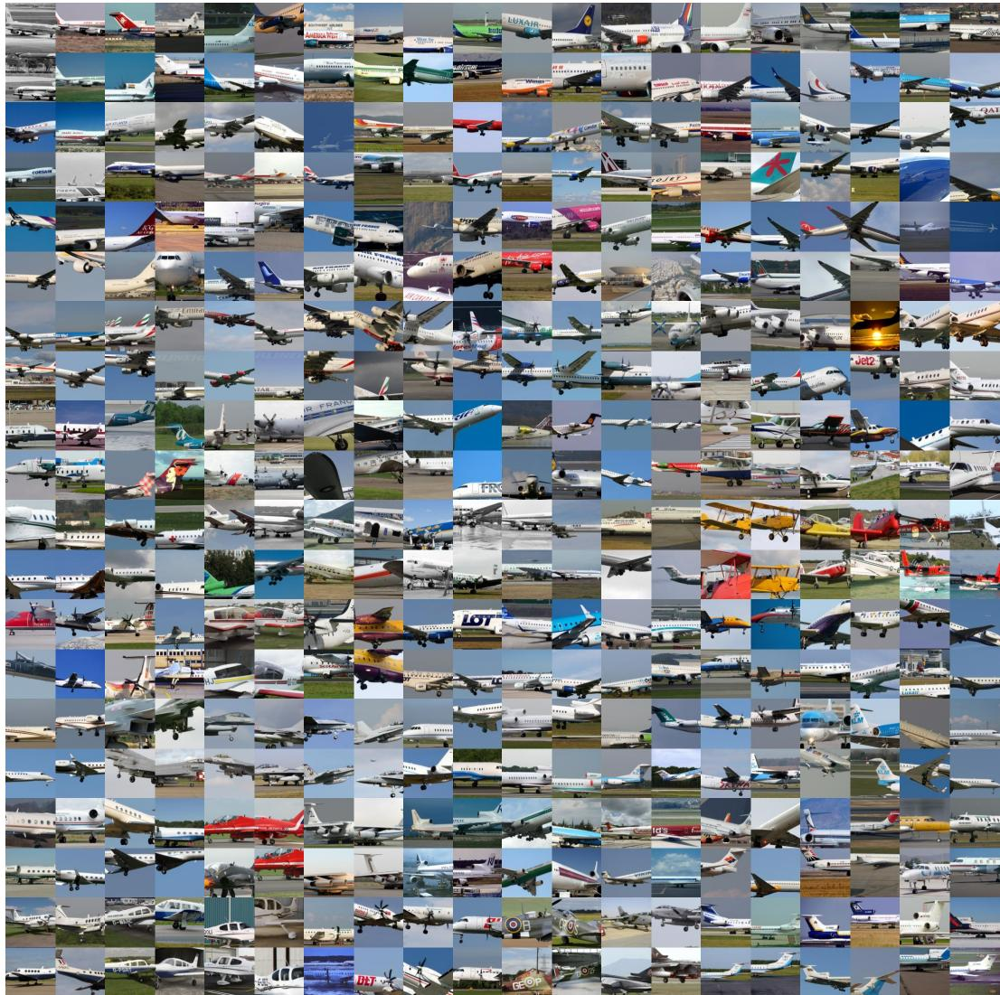  
Figure 9: Visualization of distilled samples from all 100 classes of FGVC-Aircraft at IPC=1.

## NeurIPS Paper Checklist

## 1. Claims

Question: Do the main claims made in the abstract and introduction accurately reflect the paper’s contributions and scope?

Answer: [Yes]

Justification: The abstract and introduction accurately describe the proposed DeCO framework, its focus on preserving discriminative evidence for fine-grained dataset distillation, and its evaluation under low-data budgets. The claims are supported by the experimental results on CUB-200-2011, FGVC-Aircraft, and Stanford Cars, without asserting broader generalization beyond the evaluated settings.

Guidelines:

• The answer [N/A] means that the abstract and introduction do not include the claims made in the paper.

• The abstract and/or introduction should clearly state the claims made, including the contributions made in the paper and important assumptions and limitations. A [No] or [N/A] answer to this question will not be perceived well by the reviewers.

• The claims made should match theoretical and experimental results, and reflect how much the results can be expected to generalize to other settings.

• It is fine to include aspirational goals as motivation as long as it is clear that these goals are not attained by the paper.

## 2. Limitations

Question: Does the paper discuss the limitations of the work performed by the authors?

Answer: [No]

Justification: The paper does not include a dedicated discussion of limitations. The proposed method is evaluated on three fine-grained visual classification benchmarks and under limited IPC budgets, and its dependence on a pretrained teacher and construction-stage computational cost are not explicitly discussed in the current manuscript.

Guidelines:

• The answer [N/A] means that the paper has no limitation while the answer [No] means that the paper has limitations, but those are not discussed in the paper.

• The authors are encouraged to create a separate “Limitations” section in their paper.

• The paper should point out any strong assumptions and how robust the results are to violations of these assumptions (e.g., independence assumptions, noiseless settings, model well-specification, asymptotic approximations only holding locally). The authors should reflect on how these assumptions might be violated in practice and what the implications would be.

• The authors should reflect on the scope of the claims made, e.g., if the approach was only tested on a few datasets or with a few runs. In general, empirical results often depend on implicit assumptions, which should be articulated.

• The authors should reflect on the factors that influence the performance of the approach. For example, a facial recognition algorithm may perform poorly when image resolution is low or images are taken in low lighting. Or a speech-to-text system might not be used reliably to provide closed captions for online lectures because it fails to handle technical jargon.

• The authors should discuss the computational efficiency of the proposed algorithms and how they scale with dataset size.

• If applicable, the authors should discuss possible limitations of their approach to address problems of privacy and fairness.

• While the authors might fear that complete honesty about limitations might be used by reviewers as grounds for rejection, a worse outcome might be that reviewers discover limitations that aren’t acknowledged in the paper. The authors should use their best judgment and recognize that individual actions in favor of transparency play an important role in developing norms that preserve the integrity of the community. Reviewers will be specifically instructed to not penalize honesty concerning limitations.

## 3. Theory assumptions and proofs

Question: For each theoretical result, does the paper provide the full set of assumptions and a complete (and correct) proof?

Answer: [Yes]

Justification: Appendix B explicitly states the assumptions used by Proposition 1 and provides a complete proof of the resulting evidence-failure bound using Chebyshev’s inequality. The assumptions are stated in Eq. (11), and the proposition and proof are cross-referenced to the relevant equations.

Guidelines:

• The answer [N/A] means that the paper does not include theoretical results.

• All the theorems, formulas, and proofs in the paper should be numbered and crossreferenced.

• All assumptions should be clearly stated or referenced in the statement of any theorems.

• The proofs can either appear in the main paper or the supplemental material, but if they appear in the supplemental material, the authors are encouraged to provide a short proof sketch to provide intuition.

• Inversely, any informal proof provided in the core of the paper should be complemented by formal proofs provided in appendix or supplemental material.

• Theorems and Lemmas that the proof relies upon should be properly referenced.

## 4. Experimental result reproducibility

Question: Does the paper fully disclose all the information needed to reproduce the main experimental results of the paper to the extent that it affects the main claims and/or conclusions of the paper (regardless of whether the code and data are provided or not)?

Answer: [Yes]

Justification: The paper provides the datasets and evaluation protocol, teacher architecture, evidence extraction procedure, patch selection and composition strategy, IPC settings, student training protocol, and baseline configurations needed to reproduce the main experimental results. Additional implementation details are provided in the appendix and supplementary material.

Guidelines:

• The answer [N/A] means that the paper does not include experiments.

• If the paper includes experiments, a [No] answer to this question will not be perceived well by the reviewers: Making the paper reproducible is important, regardless of whether the code and data are provided or not.

• If the contribution is a dataset and/or model, the authors should describe the steps taken to make their results reproducible or verifiable.

• Depending on the contribution, reproducibility can be accomplished in various ways. For example, if the contribution is a novel architecture, describing the architecture fully might suffice, or if the contribution is a specific model and empirical evaluation, it may be necessary to either make it possible for others to replicate the model with the same dataset, or provide access to the model. In general. releasing code and data is often one good way to accomplish this, but reproducibility can also be provided via detailed instructions for how to replicate the results, access to a hosted model (e.g., in the case of a large language model), releasing of a model checkpoint, or other means that are appropriate to the research performed.

• While NeurIPS does not require releasing code, the conference does require all submissions to provide some reasonable avenue for reproducibility, which may depend on the nature of the contribution. For example

(a) If the contribution is primarily a new algorithm, the paper should make it clear how to reproduce that algorithm.

(b) If the contribution is primarily a new model architecture, the paper should describe the architecture clearly and fully.

(c) If the contribution is a new model (e.g., a large language model), then there should either be a way to access this model for reproducing the results or a way to reproduce the model (e.g., with an open-source dataset or instructions for how to construct the dataset).

(d) We recognize that reproducibility may be tricky in some cases, in which case authors are welcome to describe the particular way they provide for reproducibility. In the case of closed-source models, it may be that access to the model is limited in some way (e.g., to registered users), but it should be possible for other researchers to have some path to reproducing or verifying the results.

## 5. Open access to data and code

Question: Does the paper provide open access to the data and code, with sufficient instructions to faithfully reproduce the main experimental results, as described in supplemental material?

Answer: [No]

Justification: The experiments use publicly available benchmark datasets, but the authors do not provide an open-access code repository or a public release of the implementation at submission time. The paper nevertheless provides sufficient methodological and experimental details for reproducing the reported results, and the datasets used in the experiments are publicly accessible from their original sources.

## Guidelines:

• The answer [N/A] means that paper does not include experiments requiring code.

• Please see the NeurIPS code and data submission guidelines (https://neurips.cc/ public/guides/CodeSubmissionPolicy) for more details.

• While we encourage the release of code and data, we understand that this might not be possible, so [No] is an acceptable answer. Papers cannot be rejected simply for not including code, unless this is central to the contribution (e.g., for a new open-source benchmark).

• The instructions should contain the exact command and environment needed to run to reproduce the results. See the NeurIPS code and data submission guidelines (https: //neurips.cc/public/guides/CodeSubmissionPolicy) for more details.

• The authors should provide instructions on data access and preparation, including how to access the raw data, preprocessed data, intermediate data, and generated data, etc.

• The authors should provide scripts to reproduce all experimental results for the new proposed method and baselines. If only a subset of experiments are reproducible, they should state which ones are omitted from the script and why.

• At submission time, to preserve anonymity, the authors should release anonymized versions (if applicable).

• Providing as much information as possible in supplemental material (appended to the paper) is recommended, but including URLs to data and code is permitted.

## 6. Experimental setting/details

Question: Does the paper specify all the training and test details (e.g., data splits, hyperparameters, how they were chosen, type of optimizer) necessary to understand the results?

Answer: [Yes]

Justification: The paper specifies the datasets and splits, teacher and student architectures, image preprocessing, IPC settings, evidence extraction and composition procedure, optimization settings, and evaluation protocol. Additional implementation and hyperparameter details are provided in the appendix and supplementary material.

## Guidelines:

• The answer [N/A] means that the paper does not include experiments.

• The experimental setting should be presented in the core of the paper to a level of detail that is necessary to appreciate the results and make sense of them.

• The full details can be provided either with the code, in appendix, or as supplemental material.

## 7. Experiment statistical significance

Question: Does the paper report error bars suitably and correctly defined or other appropriate information about the statistical significance of the experiments?

## Answer: [No]

Justification: The main experimental results are reported as point estimates without error bars, confidence intervals, or formal statistical significance tests. Reporting multiple independent runs for all combinations of datasets, IPC settings, methods, and experimental configurations would substantially increase the computational cost, and the paper does not claim statistical significance from the reported point estimates.

## Guidelines:

• The answer [N/A] means that the paper does not include experiments.

• The authors should answer [Yes] if the results are accompanied by error bars, confidence intervals, or statistical significance tests, at least for the experiments that support the main claims of the paper.

• The factors of variability that the error bars are capturing should be clearly stated (for example, train/test split, initialization, random drawing of some parameter, or overall run with given experimental conditions).

• The method for calculating the error bars should be explained (closed form formula, call to a library function, bootstrap, etc.)

• The assumptions made should be given (e.g., Normally distributed errors).

• It should be clear whether the error bar is the standard deviation or the standard error of the mean.

• It is OK to report 1-sigma error bars, but one should state it. The authors should preferably report a 2-sigma error bar than state that they have a 96% CI, if the hypothesis of Normality of errors is not verified.

• For asymmetric distributions, the authors should be careful not to show in tables or figures symmetric error bars that would yield results that are out of range (e.g., negative error rates).

• If error bars are reported in tables or plots, the authors should explain in the text how they were calculated and reference the corresponding figures or tables in the text.

## 8. Experiments compute resources

Question: For each experiment, does the paper provide sufficient information on the computer resources (type of compute workers, memory, time of execution) needed to reproduce the experiments?

Answer: [No]

Justification: The current manuscript does not report the full hardware configuration, perexperiment execution time, or total compute. Therefore, the information is not sufficient to fully satisfy the requested compute-resource disclosure.

## Guidelines:

• The answer [N/A] means that the paper does not include experiments.

• The paper should indicate the type of compute workers CPU or GPU, internal cluster, or cloud provider, including relevant memory and storage.

• The paper should provide the amount of compute required for each of the individual experimental runs as well as estimate the total compute.

• The paper should disclose whether the full research project required more compute than the experiments reported in the paper (e.g., preliminary or failed experiments that didn’t make it into the paper).

## 9. Code of ethics

Question: Does the research conducted in the paper conform, in every respect, with the NeurIPS Code of Ethics https://neurips.cc/public/EthicsGuidelines?

Answer: [Yes]

Justification: The work uses publicly available benchmark datasets and pretrained models for research purposes and does not involve human-subject experiments, collection of personal information, or high-risk deployment. The research is conducted in accordance with the principles described in the NeurIPS Code of Ethics.

Guidelines:

• The answer [N/A] means that the authors have not reviewed the NeurIPS Code of Ethics.

• If the authors answer [No], they should explain the special circumstances that require a deviation from the Code of Ethics.

• The authors should make sure to preserve anonymity (e.g., if there is a special consideration due to laws or regulations in their jurisdiction).

## 10. Broader impacts

Question: Does the paper discuss both potential positive societal impacts and negative societal impacts of the work performed?

Answer: [No]

Justification: The work has potential positive impacts by reducing the storage and training cost associated with fine-grained visual recognition, which may improve the accessibility and efficiency of machine learning experiments. However, the paper does not provide a dedicated discussion of both positive and negative societal impacts, and therefore does not fully satisfy this checklist item.

Guidelines:

• The answer [N/A] means that there is no societal impact of the work performed.

• If the authors answer [N/A] or [No], they should explain why their work has no societal impact or why the paper does not address societal impact.

• Examples of negative societal impacts include potential malicious or unintended uses (e.g., disinformation, generating fake profiles, surveillance), fairness considerations (e.g., deployment of technologies that could make decisions that unfairly impact specific groups), privacy considerations, and security considerations.

• The conference expects that many papers will be foundational research and not tied to particular applications, let alone deployments. However, if there is a direct path to any negative applications, the authors should point it out. For example, it is legitimate to point out that an improvement in the quality of generative models could be used to generate Deepfakes for disinformation. On the other hand, it is not needed to point out that a generic algorithm for optimizing neural networks could enable people to train models that generate Deepfakes faster.

• The authors should consider possible harms that could arise when the technology is being used as intended and functioning correctly, harms that could arise when the technology is being used as intended but gives incorrect results, and harms following from (intentional or unintentional) misuse of the technology.

• If there are negative societal impacts, the authors could also discuss possible mitigation strategies (e.g., gated release of models, providing defenses in addition to attacks, mechanisms for monitoring misuse, mechanisms to monitor how a system learns from feedback over time, improving the efficiency and accessibility of ML).

## 11. Safeguards

Question: Does the paper describe safeguards that have been put in place for responsible release of data or models that have a high risk for misuse (e.g., pre-trained language models, image generators, or scraped datasets)?

Answer: [N/A]

Justification: The paper does not release a high-risk pretrained language model, image generator, surveillance system, or other asset with a substantial foreseeable misuse risk requiring the safeguards described in this question. The proposed method is a dataset distillation algorithm evaluated on standard fine-grained visual recognition benchmarks.

Guidelines:

• The answer [N/A] means that the paper poses no such risks.

• Released models that have a high risk for misuse or dual-use should be released with necessary safeguards to allow for controlled use of the model, for example by requiring that users adhere to usage guidelines or restrictions to access the model or implementing safety filters.

• Datasets that have been scraped from the Internet could pose safety risks. The authors should describe how they avoided releasing unsafe images.

• We recognize that providing effective safeguards is challenging, and many papers do not require this, but we encourage authors to take this into account and make a best faith effort.

## 12. Licenses for existing assets

Question: Are the creators or original owners of assets (e.g., code, data, models), used in the paper, properly credited and are the license and terms of use explicitly mentioned and properly respected?

Answer: [No]

Justification: The paper cites the original datasets and pretrained models used in the experiments, but the license and terms of use are not comprehensively documented for every existing asset in the current submission. The relevant dataset and model licenses should be explicitly listed in the final version or supplementary material where applicable.

Guidelines:

• The answer [N/A] means that the paper does not use existing assets.

• The authors should cite the original paper that produced the code package or dataset.

• The authors should state which version of the asset is used and, if possible, include a URL.

• The name of the license (e.g., CC-BY 4.0) should be included for each asset.

• For scraped data from a particular source (e.g., website), the copyright and terms of service of that source should be provided.

• If assets are released, the license, copyright information, and terms of use in the package should be provided. For popular datasets, paperswithcode.com/datasets has curated licenses for some datasets. Their licensing guide can help determine the license of a dataset.

• For existing datasets that are re-packaged, both the original license and the license of the derived asset (if it has changed) should be provided.

• If this information is not available online, the authors are encouraged to reach out to the asset’s creators.

## 13. New assets

Question: Are new assets introduced in the paper well documented and is the documentation provided alongside the assets?

Answer: [N/A]

Justification: The paper does not introduce or release a new standalone dataset, pretrained model, or other reusable asset that requires the structured documentation described in this question. The distilled images generated by the proposed method are experimental outputs rather than a separately released dataset or model.

Guidelines:

• The answer [N/A] means that the paper does not release new assets.

• Researchers should communicate the details of the dataset/code/model as part of their submissions via structured templates. This includes details about training, license, limitations, etc.

• The paper should discuss whether and how consent was obtained from people whose asset is used.

• At submission time, remember to anonymize your assets (if applicable). You can either create an anonymized URL or include an anonymized zip file.

## 14. Crowdsourcing and research with human subjects

Question: For crowdsourcing experiments and research with human subjects, does the paper include the full text of instructions given to participants and screenshots, if applicable, as well as details about compensation (if any)?

Answer: [N/A]

Justification: The research does not involve crowdsourcing, human-subject experiments, participant recruitment, or collection of human-subject data.

Guidelines:

• The answer [N/A] means that the paper does not involve crowdsourcing nor research with human subjects.

• Including this information in the supplemental material is fine, but if the main contribution of the paper involves human subjects, then as much detail as possible should be included in the main paper.

• According to the NeurIPS Code of Ethics, workers involved in data collection, curation, or other labor should be paid at least the minimum wage in the country of the data collector.

## 15. Institutional review board (IRB) approvals or equivalent for research with human subjects

Question: Does the paper describe potential risks incurred by study participants, whether such risks were disclosed to the subjects, and whether Institutional Review Board (IRB) approvals (or an equivalent approval/review based on the requirements of your country or institution) were obtained?

Answer: [N/A]

Justification: The study does not involve human-subject research, participant recruitment, crowdsourcing, or collection of new data from human participants. Therefore, IRB approval or an equivalent review is not applicable.

Guidelines:

• The answer [N/A] means that the paper does not involve crowdsourcing nor research with human subjects.

• Depending on the country in which research is conducted, IRB approval (or equivalent) may be required for any human subjects research. If you obtained IRB approval, you should clearly state this in the paper.

• We recognize that the procedures for this may vary significantly between institutions and locations, and we expect authors to adhere to the NeurIPS Code of Ethics and the guidelines for their institution.

• For initial submissions, do not include any information that would break anonymity (if applicable), such as the institution conducting the review.

## 16. Declaration of LLM usage

Question: Does the paper describe the usage of LLMs if it is an important, original, or non-standard component of the core methods in this research? Note that if the LLM is used only for writing, editing, or formatting purposes and does not impact the core methodology, scientific rigor, or originality of the research, declaration is not required.

Answer: [N/A]

Justification: The core methodology does not use an LLM as an important, original, or non-standard component. The proposed DeCO framework is based on teacher-guided discriminative evidence extraction and grid-based evidence composition for fine-grained dataset distillation.

Guidelines:

• The answer [N/A] means that the core method development in this research does not involve LLMs as any important, original, or non-standard components.

• Please refer to our LLM policy in the NeurIPS handbook for what should or should not be described.