# Diffusion Transformers for Roof Graph Synthesis and Reconstruction

Daniel Panangian Ksenia Bittner

The Remote Sensing Technology Institute German Aerospace Center (DLR), Wessling, Germany

{daniel.panangian,ksenia.bittner}@dlr.de

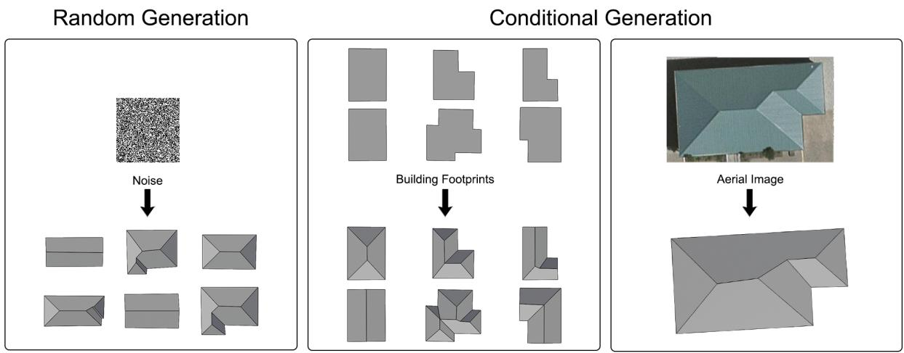  
Figure 1. Illustration of the three roof-graph generation tasks in our framework: (1) unconditional generation from noise, (2) conditional generation from building footprints, and (3) aerial-image-guided generation for reconstructing complete roof structures. The figure high lights our model’s ability to sample plausible roof layouts from a learned prior and to perform constrained prediction using geometric and visual observations.

## Abstract

We present ROOFDIT, a generative framework for 2d roof graph synthesis and reconstruction. The method represents roofs as vertex-edge graphs in top view and uses a two-stage pipeline. A diffusion transformer first generates roof graph vertices, and an edge prediction module then predicts graph connectivity. To improve geometric fidelity, RoofDiT incorporates relative geometry-aware attention, conditioning on footprint vertices and pretrained aerial image features, and a roof alignment regularizer that encourages horizontal, vertical, and diagonal structural patterns common in roof layouts. By varying the conditioning signal, the same model supports unconditional generation, footprint-conditioned generation, and image-guided reconstruction. Experiments on the benchmark show improved graph generation qual

ity over a diffusion baseline in the unconditional setting, strong performance against a straight-skeleton prior in the footprint-conditioned setting, and competitive reconstruction results. Overall, our results demonstrate the potential of diffusion transformers for generative modeling of roof graphs.

## 1. Introduction

Residential roofs exhibit rich structural regularities [16]. Their layouts are not arbitrary collections of edges and vertices, but follow recurring patterns in alignment, connectivity, and part composition. At the same time, roof structures remain diverse: buildings with similar overall shapes can realize different valid roof organizations. This combination of strong geometric constraint and nontrivial variation makes roof structure a compelling target for generative modeling. A useful model should capture both the regularities that make roof graphs structurally valid and the diversity that gives rise to multiple plausible configurations. Recent years have seen substantial progress in generative modeling of structured visual and geometric data. Beyond image synthesis, generative models have been successfully applied to domains such as layouts, floorplans, and structured shape representations, where the objective is not only to produce realistic outputs but also to capture the underlying organization and constraints of the data. These advances suggest that generative models can serve as effective priors for domains in which validity depends on both local geometry and global structural consistency. Roof structure reconstruction remains challenging because the available observations often provide only partial evidence about the realized geometry. Many recent methods rely primarily on image-driven cues, such as roof lines, junctions, edges, texture, or learned feature maps from aerial imagery, to infer structural elements and assemble them into a roof layout [5, 20, 22]. These approaches have achieved strong performance, but they remain sensitive to ambiguity caused by occlusion, shadow, low resolution, and weak or missing visual boundaries. Other methods address this difficulty by incorporating stronger geometric priors, structural primitives, or topological constraints into the reconstruction process, improving robustness when image evidence alone is insufficient.

In this work, we investigate roof structure modeling through both unconditional and conditional generation. Given conditioning information such as building footprints or aerial imagery, the model is guided toward plausible structures consistent with the available evidence. We study three scenarios: random roof graph generation, footprint-conditioned generation, and image-guided reconstruction. Figure 1 provides an overview of these tasks. Through this framework, we evaluate how a learned roof prior supports roof graph generation under different levels of conditioning.

Our contributions are summarized as follows:

• We formulate roof structure modeling as a generative problem over 2D roof graphs and propose an approach for learning a prior over plausible roof structures.

• We adapt a diffusion-transformer model for roof graph generation, with support for conditioning on building footprints and aerial imagery.

• We benchmark the proposed method against roof generation and reconstruction baselines across unconditional, footprint-conditioned, and image-guided settings.

Overall, our results show that modeling a generative prior over roof graphs is useful beyond unconstrained sampling alone. It enables plausible roof generation without observations, controlled generation under footprint constraints, and improved reconstruction when aerial imagery is available.

## 2. Related Work

## 2.1. Generative Models for Layouts

Generative modeling of structured spatial data has been widely studied for floorplans, layouts, and geometric design. Earlier methods often relied on raster or image-based representations, while more recent work has moved toward vector and graph formulations that better capture spatial structure. Representative examples include Graph2Plan [8], House-GAN++ [14], HouseDiffusion [18], and GSDiff [9], as well as conditional layout generation methods [7, 10]. These works show that generative models can capture both structural regularity and output diversity under geometric constraints. Our work follows this line, but focuses on roof structures.

## 2.2. Roof Structure Reconstruction from Aerial Imagery

Roof reconstruction from aerial imagery has been studied as a structured prediction problem using geometric reasoning, graph inference, and learning-based methods [12, 23]. Recent roof-specific approaches include RSGNN [22], HEAT [5], PolyRoof [2], and RoofMapNet [20], with segmentation-based variants also explored [21]. These methods are closest to our application domain, but are mainly designed for deterministic reconstruction from image evidence. In contrast, our work studies roof prediction in a generative framework under different conditioning signals, including imagery and footprints.

## 2.3. Roof Modeling and Generation

Roofs have also been studied as objects of modeling and generation, especially in computer graphics. Classical methods use straight skeletons, procedural rules, or grammar-based constructions to derive roofs from building footprints [1, 3, 4, 6, 11, 13]. More recent work introduced roof-specific graph representations and optimizationbased refinement for planar roof modeling [17], while learning-based generation remains relatively limited. Roof-GAN [16] and related approaches [19] highlight the value of learning structural roof priors. Our work differs by focusing on planar vertex-edge roof graphs as a generative 2D structural representation.

## 3. Dataset

We use the residential roof dataset introduced by Ren et al. [17] as the basis for our experiments. The dataset contains annotated residential roofs together with corresponding aerial images, and is split into 1,926 training samples, 249 validation samples, and 223 test samples. We use this dataset because it provides a moderate-scale collection of residential roof structures with both geometric annotations and image observations, making it suitable for studying graph generation and image-guided prediction.

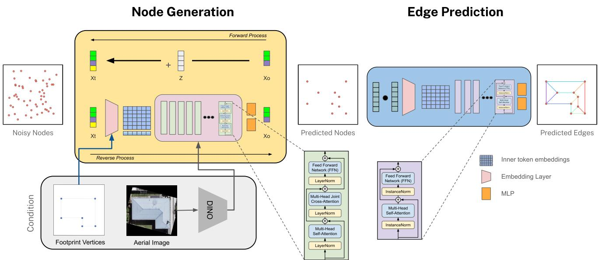  
Figure 2. Overall pipeline used in our method. Following GSDiff, the framework decomposes roof graph generation into two stages: node generation and edge prediction. In the first stage, a conditional diffusion transformer starts from noisy node states and iteratively denoises them to generate roof vertices, optionally conditioned on footprint vertices, pretrained aerial image features, or both. In the second stage, an edge prediction module takes the generated node set and infers pairwise connectivity to produce the final roof graph.

From the roof annotations, we derive 2D roof graphs in top view, where vertices correspond to roof junctions and edges correspond to roofline segments. Before training, we canonicalize the annotations to reduce unnecessary variation in orientation. Specifically, each roof is rotated so that the longest footprint edge aligns with a fixed reference axis. We then regularize edge directions by snapping nearly horizontal and vertical segments to the corresponding axis-aligned directions, which reduces small annotation inconsistencies while preserving the overall roof structure. For the footprint-conditioned setting, we additionally derive footprint vertices from the roof graph by taking the exterior boundary of the union of planar roof faces, and use these vertices as conditioning input.

## 4. Approach

## 4.1. Overview

We build on the two-stage graph generation framework of GSDiff [9], which generates nodes first and then predicts edges. We keep this pipeline across unconditional, footprint-conditioned, and image-guided settings, and modify the node generation stage with relative geometry-aware attention, multimodal conditioning, and a roof-specific alignment regularizer.

## 4.2. Node Generation

Let $X \in \mathbb { R } ^ { N \times d }$ denote the node state of a roof graph, where N is the maximum number of nodes and d includes 2D coordinates and a validity/background flag. We model node generation as

$$
p _ { \theta } ( X \mid c ) ,\tag{1}
$$

where c is empty for unconditional generation and may include footprint vertices, image features, or both in conditioned settings. The node generator is implemented as a conditional diffusion transformer that denoises noisy node states into roof vertices.

Relative geometry-aware attention Self-attention over node tokens does not explicitly encode the geometric relations that are central to roof structure. For roof graphs, pairwise relations between vertices are highly informative because nearby vertices often belong to the same structural pattern, and directional relations help distinguish different roof layouts.

To incorporate this information, we augment attention with pairwise relative geometry features. For two nodes i and $j ,$ , we compute

$$
\phi _ { i j } = [ \Delta x _ { i j } , \Delta y _ { i j } , r _ { i j } , u _ { x , i j } , u _ { y , i j } ] ,\tag{2}
$$

where $\Delta x _ { i j }$ and $\Delta y _ { i j }$ are coordinate offsets, $r _ { i j }$ is the Euclidean distance, and $( u _ { x , i j } , u _ { y , i j } ) = ( \Delta x _ { i j } , \Delta y _ { i j } ) / r _ { i j }$ denotes the normalized direction from node i to node j. These features are mapped by a small multilayer perceptron to produce per-head attention biases, which are added to the attention logits. As a result, token interactions depend not only on learned token content but also on explicit geometric relations between roof vertices.

Conditioning design We use two complementary conditioning modalities for node generation: building footprints and aerial imagery. For footprint-conditioned generation, footprint vertices are encoded as 2D geometric tokens in the same representation space as the generated roof nodes and concatenated to the node sequence, so the transformer processes roof nodes and footprint vertices jointly through self-attention. This enables reasoning over interactions between the known outer building geometry and the internal roof structure, while relative geometry-aware attention also provides pairwise geometric biases between roof nodes and footprint vertices. For image-guided reconstruction, features extracted by a pretrained DINOv2 [15] encoder are projected into a feature memory with positional encoding and injected through cross-attention. The two conditioning sources can also be combined, with footprint vertices entering the joint node stream and image features provided through a separate branch.

Roof alignment In addition to the geometry-aware node generator, we use a lightweight roof alignment regularizer during training. Roof layouts often contain not only horizontal and vertical alignments but also diagonal support lines. We therefore define the regularizer over four canonical undirected line families:

$$
\left\{ \begin{array} { r } { x = \mathrm { c o n s t } , } \\ { y = \mathrm { c o n s t } , } \\ { x + y = \mathrm { c o n s t } , } \\ { x - y = \mathrm { c o n s t } . } \end{array} \right.\tag{3}
$$

The first two correspond to vertical and horizontal alignment, while the latter two capture the two diagonal families that frequently occur in roof layouts.

For each valid node, we measure its smallest supportline distance to any other valid node under these four families. Let $d _ { i j } ^ { x } , ~ d _ { i j } ^ { y } , ~ d _ { i j } ^ { + } ,$ , and $d _ { i j } ^ { - }$ denote the corresponding pairwise distances between nodes i and j. We define the best support-line distance for node i as

$$
m _ { i } = \operatorname* { m i n } _ { j \neq i } \operatorname* { m i n } _ { } \left( d _ { i j } ^ { x } , d _ { i j } ^ { y } , d _ { i j } ^ { + } , d _ { i j } ^ { - } \right) .\tag{4}
$$

These distances are then converted into penalties with timedependent weighting over diffusion steps. This regularizer does not enforce roof topology directly, but provides an additional geometric bias that is better matched to common roof layouts and complements the node generator during training.

The final node generation objective combines the diffusion loss with the roof alignment term:

$$
\mathcal { L } _ { \mathrm { n o d e } } = \mathcal { L } _ { \mathrm { d i f f } } + \lambda _ { \mathrm { a l i g n } } \mathcal { L } _ { \mathrm { r o o f - a l i g n } } ,\tag{5}
$$

where $\lambda _ { \mathrm { a l i g n } }$ controls the contribution of the alignment regularizer.

## 4.3. Edge Prediction

After node generation, the second stage predicts graph connectivity from the generated node set. Concretely, given the generated roof vertices, the edge prediction module evaluates candidate node pairs and predicts whether an edge should connect them. This stage corresponds to modeling the connectivity term conditioned on the generated nodes, and yields the final roof graph. We keep the edge prediction stage unchanged from the underlying two-stage graph pipeline.

## 5. Experiments

## 5.1. Experimental Setup

We use the train/validation/test split described in Sec. 3. We evaluate three settings: unconditional generation, footprintconditioned generation, and image-guided reconstruction. In all cases, RoofDiT uses two-stage prediction with node generation followed by edge prediction. For footprintconditioned generation, the model is conditioned on the building footprint; for image-guided reconstruction, aerial image features are additionally used. In the generative settings, inference is stochastic, and for footprint-conditioned generation we sample five outputs per test footprint and report averaged and best-of-5 metrics where appropriate. For image-guided reconstruction, inference is deterministic and uses a single prediction per input. All models are trained with AdamW for 100,000 steps with batch size 128, learning rate $1 0 ^ { - 4 }$ , and a cosine diffusion schedule of 1000 steps. For image-guided reconstruction, aerial images are encoded using a frozen pretrained DINOv2 ViT-S/14 backbone.

## 5.2. Compared Methods

We compare RoofDiT with GSDiff for unconditional generation, straight skeleton for footprint-conditioned generation, and HEAT plus RoofMapNet for image-guided reconstruction. HEAT is retrained on the same split as RoofDiT, while RoofMapNet is evaluated using its released pretrained model. Since these baselines use pixelaligned roof annotations whereas RoofDiT uses canonicalized graph representations, the image-guided results should be interpreted as reference comparisons rather than strictly controlled benchmarks.

## 5.3. Evaluation Metrics

We use different protocols for the three settings. For unconditional generation, the test split is too small for stable distribution-level evaluation, so we generate 1000 roof graphs and compare them against repeated balanced subsets of the test set using FID and KID, following GSDiff. We also report Roof Valid Rate, Planar Rate, and Duplicate Rate@3.

For footprint-conditioned generation, five samples are generated per test footprint. Since a footprint may correspond to multiple plausible roofs, we report best-of-5 node, edge, and face metrics. Geometry metrics such as Valid Rate and Planar Rate are averaged over all samples. For image-guided reconstruction, all metrics are computed on a single prediction. A roof graph is considered valid if it is non-empty, planar, free of dangling degree-one nodes, and contains at least one cycle. Roof Valid Rate and Planar Rate are defined as

$$
{ \mathrm { R o o f V a l i d R a t e } } = { \frac { 1 } { N } } \sum _ { i = 1 } ^ { N } \mathbf { 1 } \{ G _ { i } { \mathrm { i s ~ v a l i d } } \} .
$$

$$
{ \mathrm { P l a n a r R a t e } } = { \frac { 1 } { N } } \sum _ { i = 1 } ^ { N } \mathbf { 1 } \{ G _ { i } { \mathrm { h a s ~ n o ~ e d g e ~ c r o s s i n g s } } \} .
$$

Duplicate Rate@3 measures node redundancy after projecting node coordinates to a 256 × 256 grid:

$$
\mathrm { D u p R a t e @ 3 } = \frac { 1 } { N } \sum _ { i = 1 } ^ { N } \frac { 1 } { | V _ { i } | } \sum _ { v _ { j } \in V _ { i } } \mathbf { 1 } \left\{ \operatorname* { m i n } _ { k \neq j } \| p _ { j } - p _ { k } \| _ { 2 } < 3 \right\} .
$$

Node evaluation uses Hungarian matching under a spatial threshold, from which we compute precision, recall, F1, and node count MAE. Edge evaluation counts an edge as correct when both endpoints are matched and connectivity is preserved. Face evaluation follows the HEAT regionbased protocol, reporting precision, recall, F1, matched IoU, and face count error. We additionally report the number of components, crossings, and dangling nodes as geometry metrics, where lower values indicate better graph quality. Unless otherwise stated, node and edge metrics are reported at a 5-pixel threshold.

Table 1. Performance on unconditional roof graph generation
<table><tr><td>Metric</td><td>GSDiff</td><td>RoofDiT</td></tr><tr><td>Roof Valid Rate ↑</td><td>0.941</td><td>0.943</td></tr><tr><td>Planar Rate ↑</td><td>0.952</td><td>0.958</td></tr><tr><td>Duplicate Rate@3↓</td><td>0.004</td><td>0.002</td></tr><tr><td>FID↓</td><td>53.954</td><td>45.329</td></tr><tr><td>KID↓</td><td>31.210</td><td>23.442</td></tr></table>

Table 2. Performance on footprint-conditioned roof graph generation. SS denotes the straight skeleton baseline.
<table><tr><td></td><td>Metric</td><td>SS</td><td>RoofDiT</td></tr><tr><td rowspan="2">Node</td><td>Count MAE↓</td><td>2.008</td><td>1.002</td></tr><tr><td>F1@5↑</td><td>0.849</td><td>0.705</td></tr><tr><td>Edge</td><td>F1↑</td><td>0.960</td><td>0.981</td></tr><tr><td rowspan="4">Face</td><td>Count Err. ↓</td><td>1.430</td><td>0.444</td></tr><tr><td>F1 ↑</td><td>0.840</td><td>0.798</td></tr><tr><td>F1best-of-K ↑</td><td>0.840</td><td>0.886</td></tr><tr><td>Matched IoU ↑</td><td>0.850</td><td>0.697</td></tr><tr><td rowspan="3">Geometry</td><td>Planar Rate ↑</td><td>1.000</td><td>0.873</td></tr><tr><td>Valid Rate ↑</td><td>1.000</td><td>0.841</td></tr><tr><td>Valid  ${ \mathrm { R a t e } } _ { \mathrm { b e s t - o f } - K } \uparrow$ </td><td>1.000</td><td>0.930</td></tr></table>

## 6. Results

## 6.1. Unconditional Generation

Table 1 compares unconditional roof graph generation between RoofDiT and GSDiff. RoofDiT improves all reported metrics, with slightly higher roof valid and planar rates, lower duplicate rate, and clearly lower FID and KID. The small gaps in validity-related metrics indicate that both methods usually generate valid, planar graphs, while the larger gains in FID and KID suggest that RoofDiT better matches the distribution of realistic roof graphs. These trends are also reflected in Fig. 3. GSDiff often produces simpler and more repetitive layouts dominated by basic symmetric ridge patterns, whereas RoofDiT generates a broader range of roof graphs, including both simple and more complex asymmetric configurations. This greater diversity makes the samples closer to the variability observed in real roof graphs, although some outputs are also more intricate. Overall, RoofDiT improves both distributional realism and diversity.

## 6.2. Footprint-Conditioned Generation

Table 2 compares footprint-conditioned generation between the straight skeleton baseline and RoofDiT. RoofDiT achieves substantially lower node count MAE and face count error, and improves edge F1 from 0.960 to 0.981. Under best-of-K evaluation, it further improves face F1 from 0.798 to 0.886 and valid rate from 0.841 to 0.930. These

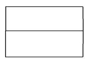

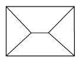

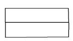

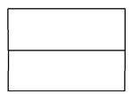

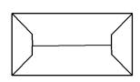

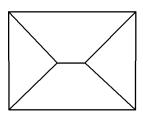

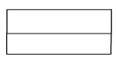

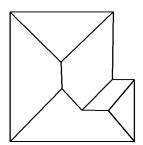

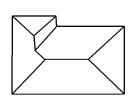

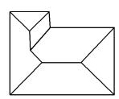

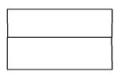

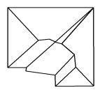

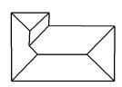

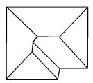

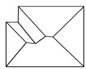

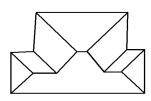

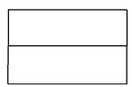

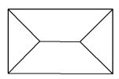

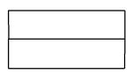

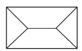

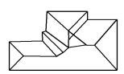

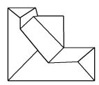

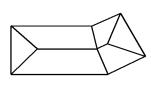

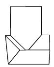

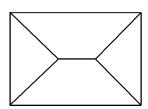

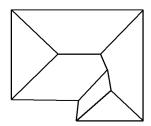  
(a) GSDiff

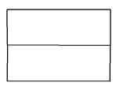

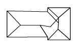

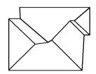

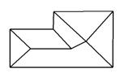

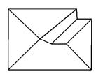  
(b) RoofDiT

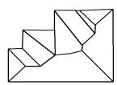

Figure 3. Qualitative comparison of unconditional roof graph generation. Samples produced by GSDiff and RoofDiT are shown side by side.  
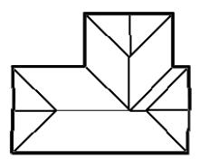

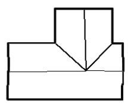

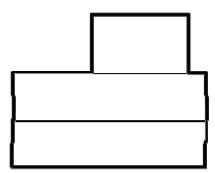

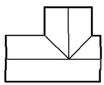

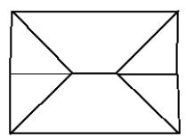

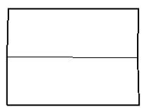

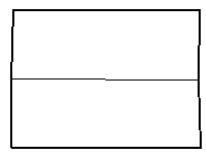

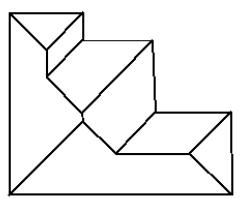  
(a) Straight Skeleton

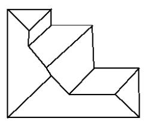

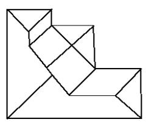  
(b) RoofDiT

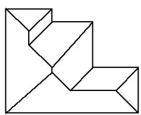  
(c) GT

Figure 4. Qualitative comparison for footprint-conditioned roof graph generation

results indicate that RoofDiT better recovers the overall amount of roof structure and benefits from sampling multiple plausible candidates for the same footprint. At the same time, the straight skeleton baseline remains stronger on node F1@5, face F1, matched IoU, planar rate, and valid rate, reflecting its handcrafted geometric prior and deterministic structural regularity. Overall, the results show a tradeoff between the stronger geometric guarantees of straight skeleton and the greater flexibility of RoofDiT. The qualitative examples in Fig. 4 illustrate this tradeoff. Straight skeleton can only return a fixed procedural interpretation of the footprint, often overpredicting nodes and faces through unnecessary internal partitions. In the shown examples, its outputs respect the footprint but appear mechanically derived and less faithful to the target roof organization. RoofDiT, in contrast, often produces samples that are closer to the ground truth in ridge layout and face decomposition, while also generating diverse yet plausible alternatives for the same footprint. This is important because a building footprint does not uniquely determine a single roof topology.

## 6.3. Image-guided Reconstruction

Table 3 compares image-guided roof graph reconstruction across node, edge, face, and geometry metrics. RoofMap-Net performs substantially worse than the other methods across all metric groups. HEAT achieves the strongest overall performance, with the best node precision, recall, and F1, the strongest face metrics, and the best geometry scores, including the highest valid and planar rates and the fewest crossings. For RoofDiT, adding footprint conditioning improves performance over using aerial imagery alone across all metric groups: node F1 increases from 42.6 to 70.3, edge F1 from 78.4 to 98.4, face F1 from 63.5 to 82.4, and node count MAE decreases from 2.23 to 0.90. Valid rate also increases from 87.4 to 88.3, and planar rate from 90.1 to 90.6. When both aerial imagery and building footprints are provided, RoofDiT achieves the strongest edge precision, recall, and F1 among the compared methods. Because this variant uses additional structural input, this is not a strictly like-for-like comparison with image-only baselines. Overall, HEAT remains the strongest image-only baseline, while RoofDiT provides a practical footprint-augmented alternative when building footprints are available.

The qualitative examples in Fig. 5 complement the quantitative results. HEAT remains the strongest reconstruction baseline in Table 3, while RoofDiT is particularly strong on edge recovery and often produces regular, globally coherent roof graphs. In the first row, RoofDiT reconstructs a plausible roof graph with a clean overall structure, although HEAT is slightly closer to the ground truth in some local details. In the second row, RoofDiT performs best among the compared methods: while the other methods fail to recover the simple target structure, RoofDiT captures the main topology more faithfully. This suggests that RoofDiT can be more robust in some ambiguous cases even when aggregate metrics favor HEAT. In the third row, RoofDiT again recovers a plausible roof family and the main global layout, showing that it can handle more articulated roofs when the image evidence is informative. In the fourth row, however, RoofDiT misses a face that is visible in the input and present in the ground truth. Overall, RoofDiT can produce strong and regular predictions, but not always the closest match to the ground truth.

## 7. Discussion

The results suggest that roof structure can be modeled effectively as a learned prior over planar roof graphs. Across the three settings, RoofDiT does more than generate plausible samples: it also captures structural regularities that remain useful under conditioning. This is especially visible in the unconditional setting, where the model produces valid and diverse roof graphs that better match the target distribution than the baseline. More broadly, this indicates that the model learns meaningful regularities of roof topology rather than relying only on conditioning signals at inference time. The footprint-conditioned setting provides a particularly informative view of this prior. The comparison with the Straight Skeleton baseline highlights an important tradeoff. Geometric constructions offer strong guarantees of validity and regularity, while a learned generative model can represent a broader range of plausible roof organizations. The gains under best-of-K evaluation reinforce this point. They suggest that RoofDiT often places good solutions within its sample distribution, even when a single draw does not always select the closest one. This points less to a limitation in representational capacity than to a limitation in consistency or sample selection.The imageguided reconstruction results show similar patterns. Although HEAT still performs better overall in precise agreement with ground truth, RoofDiT remains competitive and is particularly strong in edge recovery. This is notable because edge structure carries much of the roof topology. The clear improvement from adding footprint information further suggests that the generative formulation is most useful when visual evidence alone is insufficient and additional structural cues help constrain the solution space.

Several limitations remain. The current model operates on planar roof graphs and does not directly recover full 3D geometry, roof heights, or watertight building models. In addition, validity is encouraged through learning rather than guaranteed by construction, which leaves geometric baselines stronger in strict validity and deterministic consistency. At the same time, the overall results indicate a promising direction: the model already captures useful structural knowledge, and improvements in training scale, sampling strategy, and geometric constraints may reduce the current weaknesses while preserving the flexibility of generative prediction.

Table 3. Comparison of image-conditioned roof graph reconstruction methods grouped by node, edge, face, and geometry metrics. Node metrics are reported at a 5-pixel matching threshold. $\mathrm { R o o f D i T _ { a e r i a l } }$ uses aerial imagery only, while RoofDiTaerial+footprint additionally uses the building footprint as input.
<table><tr><td></td><td colspan="4"> $\mathrm { N o d e }$ </td><td colspan="3"> $\mathrm { E d g e }$ </td><td colspan="5"> $\operatorname { F a c e }$ </td><td colspan="5">Geometry</td></tr><tr><td>Method</td><td>Prec</td><td>Recall</td><td>F1</td><td>Count MAE↓</td><td>Prec</td><td>Recall</td><td>F1</td><td>Prec</td><td>Recall</td><td>F1</td><td>Matched IoU</td><td>Count Err.↓</td><td>Valid</td><td>Planar</td><td>#Comp↓</td><td>Crossings↓</td><td>Dangling↓</td></tr><tr><td>RoofMapNet</td><td>27.9</td><td>40.8</td><td>32.7</td><td>7.40</td><td>43.6</td><td>45.9</td><td>44.5</td><td>25.5</td><td>27.8</td><td></td><td>25.9</td><td>0.30</td><td>20.2</td><td>38.1</td><td>5.12</td><td>3.22</td><td>1.51</td></tr><tr><td>HEAT</td><td>93.3</td><td>93.0</td><td>93.0</td><td>0.30</td><td>93.9</td><td>94.2</td><td>94.0</td><td>91.6</td><td>89.9</td><td>26.1 90.2</td><td>86.2</td><td>0.11</td><td>90.6</td><td>92.8</td><td>1.00</td><td>0.11</td><td>0.09</td></tr><tr><td>RoofDiTaerial</td><td>42.7</td><td>43.9</td><td>42.6</td><td>2.23</td><td>78.1</td><td>80.5</td><td>78.4</td><td>63.7</td><td>66.2</td><td>63.5</td><td>60.4</td><td>1.12</td><td>87.4</td><td>90.1</td><td>1.00</td><td>0.13</td><td>0.04</td></tr><tr><td>RoofDiTaerial+footprint</td><td>70.5</td><td>70.9</td><td>70.3</td><td>0.90</td><td>98.5</td><td>98.5</td><td>98.4</td><td>81.9</td><td>83.8</td><td>82.4</td><td>71.8</td><td>0.48</td><td>88.3</td><td>90.6</td><td>1.00</td><td>0.19</td><td>0.04</td></tr></table>

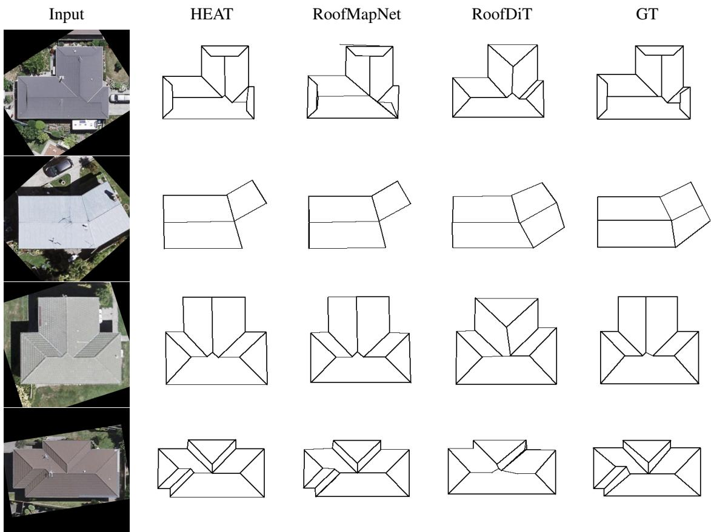  
Figure 5. Qualitative comparison of image-guided roof graph reconstruction. RoofDiT is conditioned on the input image only, while HEAT and RoofMapNet are shown for comparison against the ground-truth roof graph.

## 8. Conclusion

This work shows that generative roof graph modeling is a promising approach for both roof graph generation and evidence-guided roof reconstruction. Across unconditional and footprint-conditioned generation, RoofDiT demonstrates that a diffusion-based model can learn a meaningful prior over plausible planar roof graphs. In image-guided reconstruction, the method remains competitive with strong baselines and can effectively exploit footprint information when it is available.

Overall, the results suggest that learned generative modeling provides a useful complement to deterministic geometric methods. While geometric baselines still offer stronger guarantees in validity and consistency, the generative approach is better suited to representing multiple plausible roof graphs when the available evidence does not uniquely determine the solution. This makes it a promising foundation for future work on more reliable, structurally constrained, and geometrically richer roof reconstruction models.

## References

[1] Oswin Aichholzer and Franz Aurenhammer. Straight skeletons for general polygonal figures in the plane. In Computing and Combinatorics, pages 117–126, Berlin, Heidelberg,

1996. Springer Berlin Heidelberg. 2

[2] Chaikal Amrullah, Daniel Panangian, and Ksenia Bittner. Polyroof: Precision roof polygonization in urban residential building with graph neural networks. In Joint Urban Remote Sensing Event, JURSE 2025, Tunis, Tunisia, May 5-7, 2025, pages 1–4. IEEE, 2025. 2

[3] Therese Biedl, Martin Held, Stefan Huber, Dominik Kaaser, and Peter Palfrader. Weighted straight skeletons in the plane. Computational Geometry, 48(2):120–133, 2015. 2

[4] Cyprien Buron, Jean-Eudes Marvie, and Pascal Gautron. Gpu roof grammars. In Eurographics 2013 - Short Papers. The Eurographics Association, 2013. 2

[5] Jiacheng Chen, Yiming Qian, and Yasutaka Furukawa. Heat: Holistic edge attention transformer for structured reconstruction. In Proceedings of the IEEE/CVF Conference on Computer Vision and Pattern Recognition, pages 3856–3865, Los Alamitos, CA, USA, 2022. IEEE Computer Society. 2

[6] David Eppstein and Jeff Erickson. Raising roofs, crashing cycles, and playing pool: applications of a data structure for finding pairwise interactions. In Proceedings of the Fourteenth Annual Symposium on Computational Geometry, pages 58–67, New York, NY, USA, 1998. Association for Computing Machinery. 2

[7] Shibo Hong, Xuhong Zhang, Tianyu Du, Sheng Cheng, Xun Wang, and Jianwei Yin. Cons2plan: Vector floorplan generation from various conditions via a learning framework based on conditional diffusion models. In Proceedings of the 32nd ACM International Conference on Multimedia, pages 3248– 3256, New York, NY, USA, 2024. Association for Computing Machinery. 2

[8] Ruizhen Hu, Zeyu Huang, Yuhan Tang, Oliver Van Kaick, Hao Zhang, and Hui Huang. Graph2plan: Learning floorplan generation from layout graphs. ACM Transactions on Graphics, 39(4), 2020. 2

[9] Sizhe Hu, Wenming Wu, Yuntao Wang, Benzhu Xu, and Liping Zheng. Gsdiff: Synthesizing vector floorplans via geometry-enhanced structural graph generation. arXiv preprint arXiv:2408.16258, 2024. 2, 3

[10] Naoto Inoue, Kotaro Kikuchi, Edgar Simo-Serra, Mayu Otani, and Kota Yamaguchi. Layoutdm: Discrete diffusion model for controllable layout generation. In Proceedings of the IEEE/CVF Conference on Computer Vision and Pattern Recognition, pages 10167–10176, 2023. 2

[11] Tom Kelly and Peter Wonka. Interactive architectural modeling with procedural extrusions. ACM Transactions on Graphics, 30(2), 2011. 2

[12] Zuoyue Li, Jan Dirk Wegner, and Aurelien Lucchi. Topological map extraction from overhead images. In Proceedings of the IEEE/CVF International Conference on Computer Vision (ICCV), 2019. 2

[13] Pascal Muller, Peter Wonka, Simon Haegler, Andreas Ulmer,¨ and Luc Van Gool. Procedural modeling of buildings. In ACM SIGGRAPH 2006 Papers, SIGGRAPH ’06, pages 614– 623, 2006. ACM SIGGRAPH 2006 Papers, SIGGRAPH ’06 ; Conference date: 30-07-2006 Through 03-08-2006. 2

[14] Nelson Nauata, Sepidehsadat Hosseini, Kai-Hung Chang, Hang Chu, Chin-Yi Cheng, and Yasutaka Furukawa. House-

gan++: Generative adversarial layout refinement network towards intelligent computational agent for professional archi tects. In Proceedings ofthe IEEE/CVF Conference on Com puter Vision and Pattern Recognition, pages 13627–13636, 2021. 2

[15] Maxime Oquab, Timothee Darcet, Theo Moutakanni, Huy V.´ Vo, Marc Szafraniec, Vasil Khalidov, Pierre Fernandez, Daniel Haziza, Francisco Massa, Alaaeldin El-Nouby, Russell Howes, Po-Yao Huang, Hu Xu, Vasu Sharma, Shang-Wen Li, Wojciech Galuba, Mike Rabbat, Mido Assran, Nico las Ballas, Gabriel Synnaeve, Ishan Misra, Herve Jegou, Julien Mairal, Patrick Labatut, Armand Joulin, and Piotr Bojanowski. Dinov2: Learning robust visual features without supervision, 2023. 4

[16] Yiming Qian, Hao Zhang, and Yasutaka Furukawa. Roofgan: Learning to generate roof geometry and relations for residential houses. In Proceedings of the IEEE/CVF Conference on Computer Vision and Pattern Recognition, pages 2795–2804, 2021. 1, 2

[17] Jing Ren, Biao Zhang, Bojian Wu, Jianqiang Huang, Lubin Fan, Maks Ovsjanikov, and Peter Wonka. Intuitive and efficient roof modeling for reconstruction and synthesis. ACM Transactions on Graphics, 40(6), 2021. 2

[18] Mohammad Amin Shabani, Sepidehsadat Hosseini, and Yasutaka Furukawa. Housediffusion: Vector floorplan generation via a diffusion model with discrete and continuous denoising. In Proceedings of the IEEE/CVF Conference on Computer Vision and Pattern Recognition, pages 5466– 5475, 2023. 2

[19] Hao Tang, Ling Shao, Nicu Sebe, and Luc Van Gool. Graph transformer gans with graph masked modeling for architectural layout generation. IEEE Transactions on Pattern Anal ysis and Machine Intelligence, 46(6):4298–4313, 2024. 2

[20] Jiaqi Wang, Guanzhou Chen, Xiaodong Zhang, Tong Wang, Xiaoliang Tan, Qingyuan Yang, Wenlin Zhou, and Kun Zhu. Roofmapnet: Utilizing geometric primitives for depicting planar building roof structure from high-resolution remote sensing imagery. International Journal of Applied Earth Ob servation and Geoinformation, 141:104630, 2025. 2

[21] Yajin Xu, Philipp Schuegraf, and Ksenia Bittner. Multi branch convolutional neural network in building polygonization using remote sensing images. PFG–Journal of Photogrammetry, Remote Sensing and Geoinformation Science, 93(1):79–100, 2025. 2

[22] Wufan Zhao, Claudio Persello, and Alfred Stein. Extracting planar roof structures from very high resolution images using graph neural networks. ISPRS Journal of Photogrammetry and Remote Sensing, 187:34–45, 2022. 2

[23] Stefano Zorzi, Shabab Bazrafkan, Stefan Habenschuss, and Friedrich Fraundorfer. Polyworld: Polygonal building extraction with graph neural networks in satellite images. In Proceedings of the IEEE/CVF Conference on Computer Vision and Pattern Recognition, pages 1848–1857, 2022. 2