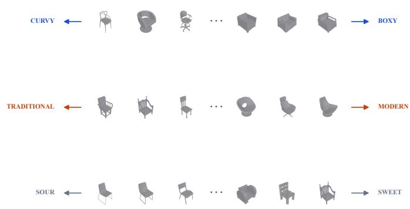
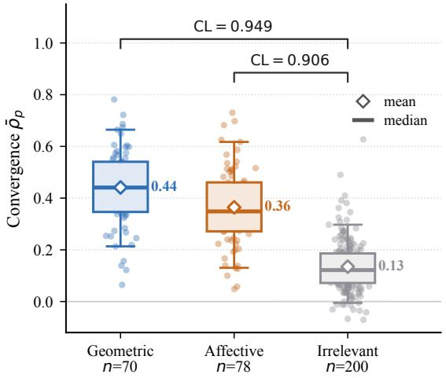
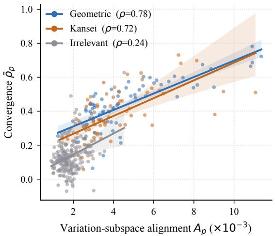
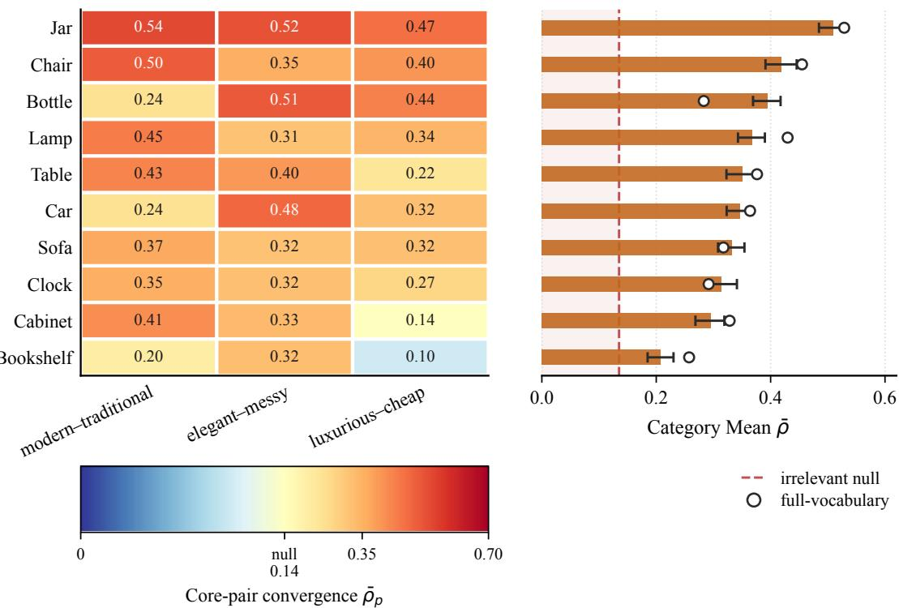
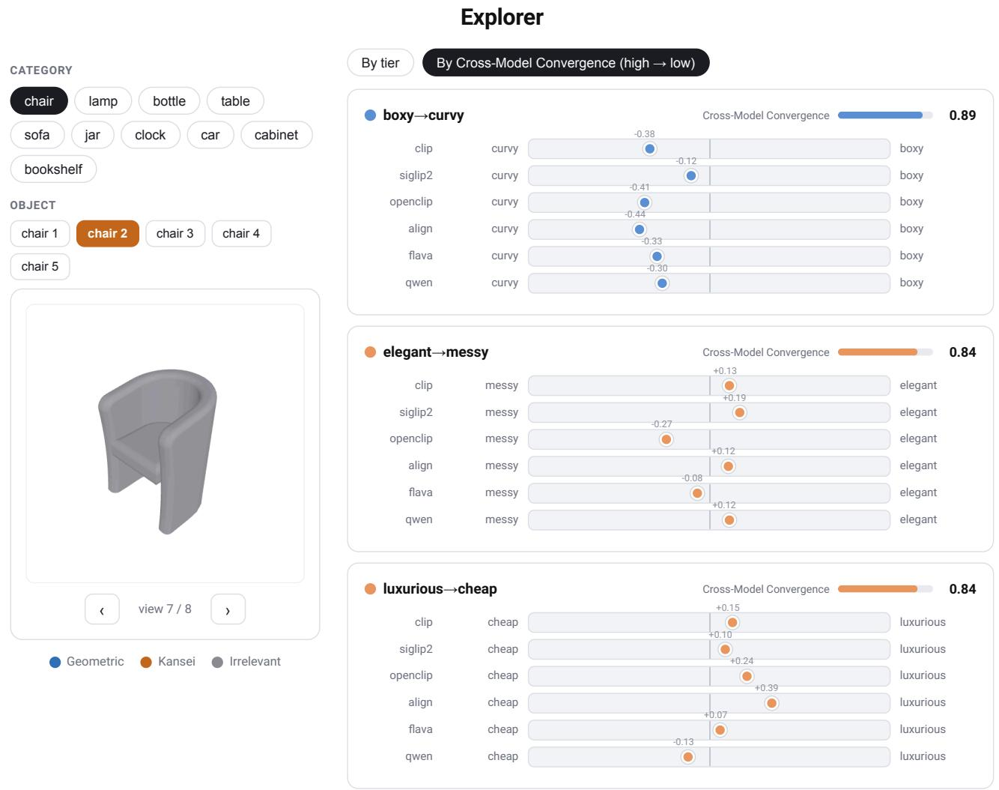

# Do Vision-Language Models Agree on the Afective Qualities of Shape? A Cross-Model Audit for Generative Design Interfaces

Luca Bux Honda Research Institute Europe GmbH Ofenbach am Main, Germany luca.bux@honda-ri.de

Ingo Scholtes Julius-Maximilians-Universität Würzburg Würzburg, Germany ingo.scholtes@uni-wuerzburg.de

## Abstract

Generative design interfaces increasingly expose semantic controls that let users steer output with concepts such as “more elegant” or “more minimalist,” typically encoded by a vision-language model (VLM). A practical question is whether state-of-the-art VLMs represent objects consistently in terms of the same concept. We audit 6 VLMs by ranking untextured 3D objects along Kansei adjective pairs, where Kansei describes afective impressions of product form, with each axis defined as the diference between the text representations of its two poles. Geometric pairs serve as positive controls, and pairs of unrelated adjectives establish an empirical null. Across 10 categories of ShapeNet database, afective axes converge above the null (mean pairwise rank correlation 0.36 vs. 0.14) but below the geometric ceiling (0.44). The agreement between models is partial and highly uneven: on the three axes shared by all categories, mean convergence ranges from 0.21 for bookshelves to 0.51 for jars. Convergence depends primarily on whether a category’s rep resentational variation aligns with the semantic direction being evaluated, rather than simply on how much the objects vary in shape overall. Cross-model convergence does not imply agreement with human judgments. Based on our findings, we implement a UI prototype that shows how the audit can inform which Kansei descriptors to expose as controls for a given object class and which to withhold.

## CCS Concepts

• Computing methodologies → Artificial intelligence; • Human centered computing → Interaction design.

## Keywords

vision-language models, generative design, afective semantics, Kansei engineering, cross-model evaluation, semantic controls, intelligent user interfaces

## 1 Introduction

Deep generative models have made it easier to explore many design alternatives during early-stage design [43]. Recent multimodal systems extend this process by transforming sketches or text prompts into visual concepts [47], while text-to-3D methods generate threedimensional objects directly from natural language [30, 40]. Designers increasingly interact with these systems through semantic

Thiago Rios Honda Research Institute Europe GmbH Ofenbach am Main, Germany thiago.rios@honda-ri.de

Stefan Menzel Honda Research Institute Europe GmbH Ofenbach am Main, Germany stefan.menzel@honda-ri.de

requests such as “a sleeker handle,” “a more elegant chair,” or “a minimalist silhouette” [38, 54]. Such descriptions function as interface controls that guide semantic editing, optimization, or iterative refinement of designs. Before exposing these controls to users, it is important to characterize whether they correspond to stable semantic signals or reflect the behavior of individual models.

Vision-language models (VLMs) are increasingly used in AIassisted design workflows to evaluate generated objects, guide optimization, and provide feedback during iterative design [42, 52]. Most of the existing work focuses on object recognition, e.g., verifying if a generated object is recognized as a chair, bottle, or car [42]. Much less is known about whether VLMs consistently represent afective qualities expressed through shape. Following Kansei engineering, which studies how properties of products and their forms relate to people’s afective impressions [37], we use afective to describe qualities of form that influence how people interpret products. This raises a practical question for generative design interfaces: Can we identify afective semantic controls that are suficiently consistent across VLMs before exposing them in generative design systems?

Evaluating this question directly against human perception is dificult at scale. Large annotated datasets of afective 3D shapes are limited, and collecting reliable Kansei ratings across thousands of objects is slow and expensive [17]. Prior work on VLM-based aesthetic evaluation has also focused primarily on photographs, where color, texture, lighting, and scene context influence judgments [11, 21, 23]. Human agreement remains the long-term validation target, but a simpler question can be asked first: do independently developed VLMs produce consistent rankings of afective attributes?

We argue that cross-model convergence provides a useful firststage consistency audit for semantic controls. If only one model ranks a set of bottles as “elegant,” there is limited evidence that the descriptor produces a reproducible signal across models. Consistency across heterogeneous models provides evidence that an afective descriptor induces similar rankings, while the models difer in architecture, training objectives, and data sources. This perspective is inspired by the logic of convergent validity, where convergence across multiple measurements provides stronger evidence than observations from a single source [6]. It is also consistent with findings that independently trained neural networks can exhibit measurable representational similarity [24], suggesting that diverse models may converge toward shared latent representations [18]. Cross-model convergence does not establish correspondence with human perception, nor does it prove independence from shared training data. Instead, we treat it as an inexpensive ofline estimate of whether an afective semantic control exhibits suficiently stable behavior across models to warrant consideration in an interactive system.

To study this question, we evaluate 6 state-of-the-art VLMs— CLIP, OpenCLIP, SigLIP2, ALIGN, FLAVA, and Qwen3-VL-Embedding (Table 1)—using multi-view renderings of untextured 3D objects from 10 categories in ShapeNetCore, a large-scale repository of 3D models [7]. Geometric adjective pairs (e.g., tall–short) serve as positive controls, while unrelated adjective pairs (e.g., loud–quiet) estab lish an empirical null. Our results show that afective dimensions exhibit higher cross-model consistency than the null but lower consistency than geometric properties on average. This convergence is strongly category-dependent: some object classes exhibit consistent afective rankings across models, whereas others display little convergence. We further show that convergence depends not simply on the amount of geometric variation within a category, but on whether the semantic direction aligns with the variation structure represented by the models. These findings suggest that cross-model convergence can identify which afective vocabularies are suficiently reproducible for a given object class before they are presented as controls in a generative design interface.

This work makes three main contributions:

(1) We introduce an ofline cross-model consistency audit for afective semantic controls in AI-assisted design interfaces. The audit is calibrated using geometric positive controls and unrelated adjective pairs that establish an empirical null.

(2) We characterize when afective semantic controls exhibit reproducible signals across models, showing that convergence depends primarily on the relationship between categoryspecific variation and the evaluated semantic direction.

(3) We demonstrate how the audit can support the design of generative design interfaces and illustrate the workflow with a UI prototype interface that exposes convergence information alongside semantic controls.

## 2 Related work

Our work sits between several related literatures: afective evaluation with vision-language models, Kansei engineering, semantic directions in embedding spaces, interactive intelligent interfaces, and model agreement as an audit criterion for semantic stability. We review each area and position the present study within these lines of work.

## 2.1 Interactive Control Through Semantic Attributes

Generative design systems increasingly explore semantic attributes as interactive mechanisms for steering generation, allowing designers to refine outputs through concepts such as “more elegant” or “less bulky”. This builds on mixed-initiative human-computer interaction (HCI) principles, which emphasize interpretable controls that allow users to guide intelligent systems while remaining in control [2, 16]. Early systems explored relative attribute search [25, 38] and semantic deformation handles for 3D models [8, 54]. More recent approaches expose semantic sliders in learned latent spaces [10, 15] and use language-guided optimization for 3D generation [32, 52]. Semantic controls have also been used to structure exploratory search over generative model outputs, allowing users to steer sampling toward selected semantic facets [33]. Learned 3D latent representations have further been incorporated into interactive design systems to support design exploration and decision-making [44].

These approaches generally assume that semantic controls provide reliable signals for interaction. However, their behavior can vary with both the underlying model and object category. This motivates our ofline audit of candidate controls before they are exposed to users. Reviews of interactive machine learning interfaces highlight interface design as central to how users interact with and provide feedback to machine-learning systems [12]. More broadly, research on trust in intelligent systems suggests that information about system reliability can support more appropriately calibrated reliance [27].

## 2.2 Kansei Engineering and Product Form Semantics

Kansei engineering studies how product forms influence human interpretation and afective impressions [37]. A common approach collects afective descriptors and human evaluations to relate perceived impressions to product forms. Such studies span vehicles, furniture, lighting, and household objects [5, 13, 22, 28, 31, 34, 35, 45, 48, 49, 53, 55]. However, afective judgments can vary across demographic groups, limiting the generality of static human-labeled datasets [17].

Recent work also uses language models to expand or organize Kansei-related vocabularies, with partial overlap with conventional elicitation [1]. We build on this approach by starting from categoryspecific adjective pairs in the Kansei literature and using an LLM to expand them into polarized pairs. Whereas traditional Kansei studies use these scales to collect human judgments, we use them to test whether independently developed VLMs produce consistent rankings of form-related semantics.

## 2.3 Afective and Aesthetic Evaluation with Vision-Language Models

Aesthetic and afective image evaluation has progressed from handcrafted photographic features [11] to deep aesthetic rankers trained on large image collections [23] and models fine-tuned on user commentary [21]. Closest to our probe design, CLIP-IQA [51] evaluates abstract image attributes using antonym prompt pairs within a single VLM space.

Our setting difers in two important respects. First, these methods primarily evaluate natural photographs, where color, material, lighting, and scene context influence judgments. Our untextured multi-view 3D renderings instead isolate geometric form, which is particularly relevant to early-stage 3D design. Second, existing approaches generally evaluate a single model as an aesthetic predictor or scoring function, often against human-labeled data. We instead ask whether afective controls produce reproducible rankings across independently developed VLMs.

## 2.4 Semantic Directions in Embedding Spaces

Modeling concepts as directions in embedding spaces is well established. Word embeddings showed that vector ofsets can encode relational structure [36], while word pairs have been used to isolate interpretable semantic axes [3]. Semantic projection extends this idea to continuous attributes by projecting representations onto antonym-defined directions [14]. In VLM spaces, text-vector diferences have similarly been used for image manipulation [39] and zero-shot aesthetic scoring [51].

Our probe construction builds directly on this semantic projection framework (Eq. 2). We apply it to test whether candidate afective directions remain suficiently stable across models to function as interactive controls for a given object category.

## 2.5 Cross-Model Agreement as an Audit Criterion

Agreement across multiple measurements has long been used as evidence in measurement theory [6]. Related ideas appear in machine learning: deep ensembles use consensus to estimate uncertainty [26], representational similarity metrics compare models trained with diferent objectives [24], and recent work suggests that large vision models may converge toward shared latent structures [18].

We build on this rationale but use cross-model agreement for an interaction-oriented purpose. Rather than asking whether models are generally similar, we ask whether their agreement is suficient to justify exposing a semantic direction as an interface control. Calibrating afective agreement against geometric positive controls and an empirical null turns model convergence into an ofline audit for intelligent design interfaces.

## 3 Methodology

## 3.1 Overview

We conduct a representational audit to examine whether pretrained vision-language models (VLMs) consistently encode afective (Kansei) semantic structure associated with three-dimensional form. All models are evaluated in their pretrained state, without fine-tuning or additional training.

The methodology consists of four stages, the last of which comprises two complementary evaluation measures (Sections 3.6 and 3.7):

• Stimulus Rendering: Objects from 10 ShapeNetCore categories are rendered as untextured, uniform grey shapes from 8 fixed viewpoints. By removing surface appearance cues such as color, material, and texture, the rendered stimuli isolate three-dimensional form while preserving geometric information across multiple views.

• Representation Extraction: Each rendered view is encoded using 6 pretrained vision-language models. The resulting view-level embeddings are averaged and unit-normalized to produce a single object-level representation that captures information consistent across viewpoints.

• Directional Projection: For each afective concept, represented by a bipolar adjective pair (e.g., modern–traditional), a semantic direction is constructed by subtracting the corresponding text embeddings within the model’s shared vision-language space. Each object representation is then projected onto this direction, producing a continuous score that reflects its position along the semantic axis.

• Evaluation: The resulting semantic projections are assessed through cross-model convergence (Section 3.6), which measures whether diferent encoders assign consistent relative rankings to objects along the same semantic axis. A further analysis (Section 3.7) then asks why convergence varies, testing whether the most convergent directions align with the dominant dimensions of within-category shape variation.

## 3.2 Stimuli and Rendering

The target objects are drawn from the ShapeNetCore database [7] across 10 categories: chair, table, lamp, sofa, cabinet, bookshelf, bottle, jar, clock, and car. For each category we randomly sample up to 500 unique objects with a fixed seed, using the full population where it is smaller. In fact, 8 categories reach the 500 cap; bottle and bookshelf are slightly smaller (498 and 452), giving 4,950 objects in total.

To capture each object’s geometry, we render it from 8 viewpoints:

• 4 views at $1 5 ^ { \circ }$ elevation with azimuths of $0 ^ { \circ } , 9 0 ^ { \circ } , 1 8 0 ^ { \circ }$ , and 270◦.

• 4 views at 35◦ elevation with azimuths of 45◦, 135◦, 225◦, and 315◦.

All renders are generated at 512 × 512 pixel resolution on a flat white background.

We render all objects using a uniform matte grey material without textures, allowing us to let VLMs evaluate from shape alone. It also avoids confounding associations, such as linking “luxurious” to glossy dark surfaces or “cheap” to colorful plastic-like appearances, which could mask the contribution of geometry. This also fits the stage of the design process that the audit is intended to support.

Before rendering, each 3D mesh is centered and scaled uniformly by its maximum vertex norm. Uniform scaling preserves the aspect ratios and proportions of the objects.

The overall representation of object � is defined as the mean of its 8 view embeddings, renormalized to unit length. Formally, for an object � with per-view image embeddings ${ \bf v } _ { i , k } ( k = 1 , \ldots , 8 )$

$$
\bar { \bf v } _ { i } = \frac { 1 } { 8 } \sum _ { k = 1 } ^ { 8 } { \bf v } _ { i , k } , \qquad { \bf e } _ { i } = \frac { \bar { \bf v } _ { i } } { \| \bar { \bf v } _ { i } \| }\tag{1}
$$

We average the view embeddings so that the object representation depends on shape shared across viewpoints rather than on any single canonical view. Normalizing the final vector to unit length ensures that the projection scores (Section 3.5) measure angular alignment with a semantic vector rather than the absolute magnitude of the image embedding.

## 3.3 Encoders

Our audit evaluates 6 vision-language encoders, summarized in Table 1. All models are used with publicly released weights and evaluated without fine-tuning.

Our framework relies on structural diversity among encoders. If the models were incremental variants of a single structure, agreement could be attributed to shared training biases or architectural constraints. We therefore select models that difer across several dimensions:

• Training Objective: CLIP, OpenCLIP, and ALIGN employ contrastive InfoNCE objectives. SigLIP2 replaces the soft max normalization over the global batch with a pairwise sigmoid loss [50]. FLAVA relies on multimodal masked mod eling [46]. Qwen3-VL-Embedding uses a text-retrieval objective optimized via contrastive learning and reranker distillation [29].

• Architectural Inductive Bias: 5 models use Vision Transformers (ViT) ofvarying scales and patch sizes, while ALIGN uses a convolutional EficientNet [19] paired with a BERTstyle text tower.

• Training Provenance and Scale: The models originate from diferent organizations (OpenAI, LAION, Google, Kakao Brain, Meta, Alibaba) and were trained on distinct web-scale datasets under diferent filtering regimes, with embedding dimensionalities ranging from 640 to 2048.

For inference, we follow each model’s oficial documentation (e.g., CLIP-family pooling and Qwen3-VL-Embedding’s last-token pooling).

## 3.4 Probe Design

Our probes consist of bipolar word pairs organized into 3 tiers.

Tier 1 — Geometric (7 pairs; 70 instances). We select visually verifiable physical descriptors that serve as positive controls: tall– short, boxy–curvy, simple–complex, elongated–compact, thin–thick, wide–narrow, and angular–rounded. If our pipeline cannot reliably capture basic shape attributes, negative results on more abstract concepts would be uninterpretable. These 7 axes name roughly 3 underlying concepts, namely extent, curvature, and complexity, so we treat their agreement as a robustness check.

Tier 2 — Kansei (32 pairs; 78 instances). This is our primary tier. It contains stylistic and afective descriptors, including 3 “sharedcore” pairs evaluated across all 10 categories (modern–traditional, elegant–messy, luxurious–cheap) and category-specific pairs (e.g., plush–rigid for sofas, delicate–robust for lamps). Category-specific pairs were drawn from prior Kansei engineering studies of the corresponding product classes or, where no exact-category study was available, closely related product classes: cars [20, 49, 53], chairs [5, 55], sofas [28], clocks [22, 45], bookshelves [13, 31], cabinets [48], and bottles [34, 35]. We then follow a hybrid procedure, taking these literature-sourced terms as seeds and applying an LLM-assisted method [1] both to extend the corpus with additional descriptors for each category and, for categories without a dedicated study, to generate the descriptor set directly; in all cases the method also assigns a polar opposite to every term. This combines the domain grounding of published Kansei studies with the coverage of

LLM-generated vocabularies, which have been shown to produce Kansei semantic spaces equivalent to those built with conventional techniques [1]. Pairs whose poles difer only by a negating afix (e.g., comfortable–uncomfortable) were excluded, since their text embeddings are near-identical.

Tier 3 — Irrelevant (20 pairs; 200 instances). This tier comprises sensory and abstract antonyms, such as loud–quiet, sweet–sour, and hot–cold, that have no plausible physical connection to static, grey 3D shapes. It serves as an empirical null for calibrating our metrics and establishing the baseline of spurious agreement.

## 3.5 Directions and Projection

For encoder � and word pair � = (word, antonym), let $\mathbf { t } _ { w } ^ { ( e ) }$ denote the text embedding of adjective � under encoder �, obtained by encoding the bare adjective with that model’s text encoder. We extract the embeddings of both poles and compute their normalized diference direction:

$$
\mathbf { d } _ { p } ^ { ( e ) } = \frac { \mathbf { t } _ { \mathrm { w o r d } } ^ { ( e ) } - \mathbf { t } _ { \mathrm { a n t o n y m } } ^ { ( e ) } } { \lVert \mathbf { t } _ { \mathrm { w o r d } } ^ { ( e ) } - \mathbf { t } _ { \mathrm { a n t o n y m } } ^ { ( e ) } \rVert }\tag{2}
$$

where $\mathbf { d } _ { p } ^ { ( e ) }$ is a unit vector pointing from the negative pole to the positive pole. Using vector diferences to represent semantic relations builds on established approaches in word embedding research [3, 36]. This approach is closely related to semantic projection, in which semantic axes defined by opposing word pairs are used to recover continuous properties from word embeddings [14]. Applying it in CLIP space rests on the assumption that text and image representations move in roughly parallel directions for the same concept, as used in text-driven manipulation methods [39]. Antonym prompt pairs have likewise been used to evaluate visual and perceptual image traits [51].

The score of object � on axis � within encoder � is:

$$
s _ { p , i } ^ { ( e ) } = \langle \mathbf { e } _ { i } ^ { ( e ) } , \mathbf { d } _ { p } ^ { ( e ) } \rangle\tag{3}
$$

and ${ \bf s } _ { p } ^ { ( e ) } \in \mathbb { R } ^ { N }$ denotes the vector of projection scores for all � objects in a category.

This design addresses two requirements:

• Canceling shared subspaces: Constructing axes as vector diferences is essential because individual word vectors are dominated by a shared anisotropic component present across almost all embeddings. Subtracting the antonym cancels out this common ofset.

• Preserving internal metrics: Because directions are calculated independently within each model’s native coordinate system, the absolute scores $s _ { p , i } ^ { ( e ) }$ are not directly comparable across diferent models (e.g., a score of 0.2 in CLIP does not mean the same as 0.2 in Qwen3-VL). Consequently, our evaluation metrics rely on rank orderings rather than absolute values.

## 3.6 Cross-Model Convergence

Our proposed metric, cross-model convergence, measures how consistently the 6 encoders order objects along a given axis. For each encoder pair, we compute the Spearman rank correlation of

Table 1: Overview of evaluated vision-language encoders. The year in parentheses is that of the evaluated checkpoint’s public release, which does not always match the year of the cited paper: the OpenCLIP weights predate the scaling-laws paper, and the ALIGN checkpoint is Kakao Brain’s open reimplementation trained on COYO-700M rather than the unreleased model ofJia et al.
<table><tr><td>Name</td><td>Model Identifier</td><td>Dim.</td><td>Architecture</td><td>Objective &amp; Corpus</td></tr><tr><td>CLIP (2022)</td><td>openai/clip-vit-large-patch14</td><td>768</td><td>ViT-L/14</td><td>Contrastive InfoNCE [42]</td></tr><tr><td>OpenCLIP (2022)</td><td>laion/CLIP-ViT-H-14-1aion2B-s32B-b79K</td><td>1024</td><td>ViT-H/14</td><td>Contrastive, LAION-2B [9]</td></tr><tr><td>SigLIP2 (2025)</td><td>google/siglip2-so400m-patch14-384</td><td>1152</td><td>SoViT-400m/14</td><td>Pairwise sigmoid loss [50]</td></tr><tr><td>ALIGN (2023)</td><td>kakaobrain/align-base</td><td>640</td><td>EfficientNet + BERT</td><td>Noisy web supervision [19], COYO-700M [4]</td></tr><tr><td>FLAVA (2022)</td><td>facebook/flava-full</td><td>768</td><td>ViT + multimodal fusion</td><td>Multimodal masked objective [46]</td></tr><tr><td>Qwen3-VL-Emb. (2026)</td><td>Qwen/Qwen3-VL-Embedding-2B</td><td>2048</td><td>LLM backbone</td><td>Retrieval/distillation [29]</td></tr></table>

their object scores and average over all ${ \binom { 6 } { 2 } } = 1 5$ unique pairs:

$$
\bar { \rho } _ { p } = \binom { E } { 2 } ^ { - 1 } \sum _ { e < e ^ { \prime } } \rho _ { S } \left( s _ { p } ^ { ( e ) } , s _ { p } ^ { ( e ^ { \prime } ) } \right)\tag{4}
$$

where $E = 6$ and $\rho _ { S }$ is Spearman’s rank correlation.

This formulation aligns with classical convergent validity [6]: a construct is considered validly measured when independent assessment methods produce consistent results.

Statistical Evaluation. To compare two tiers, we use a one-sided Wilcoxon rank-sum (Mann–Whitney �) test, which accommodates unequal sample sizes, non-normal distributions, and our directional hypotheses (e.g., Kansei axes should show higher convergence than irrelevant axes). We report the common-language (CL) efect size:

$$
\mathrm { C L } = { \frac { U } { n _ { 1 } n _ { 2 } } }\tag{5}
$$

which represents the probability that a randomly selected axis from the target tier has higher convergence than one from the comparison tier, and we report the two-sample Kolmogorov–Smirnov (KS) statistic to characterize general distributional diferences.

We run many tier comparisons across axes and categories, and the axes are not fully independent, since categories share the null set and the core pairs, and axes within a category share object ren derings. We therefore do not treat individual �-values as the basis for our claims. We report common-language efect sizes, which depend only on rank overlap, and we quantify the sampling variability of per-category convergence with a bootstrap: for each category we resample its objects with replacement over 1,000 replicates, recompute convergence on each resample, and report the 2.5 and 97.5 percentiles as a 95% confidence interval. Diferences we describe as category-dependent are those whose intervals do not overlap.

## 3.7 Variation-Subspace Alignment

Convergence establishes whether an axis produces consistent rankings, but not why some axes converge and others do not. We hypothesize that an axis converges when its direction lies within the subspace along which a category’s shapes actually vary, and test it.

For each category and encoder �, we compute the top $K = 2 0$ principal components $\{ \mathbf { u } _ { 1 } ^ { ( e ) } , \ldots , \mathbf { u } _ { K } ^ { ( e ) } \}$ of the mean-centered object embeddings, with variance ratios $\lambda _ { k } ^ { ( e ) }$ . Each ${ \bf u } _ { k } ^ { \left( e \right) }$ is a unit vector in encoder �’s embedding space along the �-th direction of greatest variation among that category’s objects. For a unit direction $\mathbf { d } _ { p } ^ { ( e ) }$ we measure its alignment with this variation subspace as a varianceweighted projection:

$$
A _ { p } ^ { ( e ) } = \sum _ { k = 1 } ^ { K } \lambda _ { k } ^ { ( e ) } \big \langle \mathbf { d } _ { p } ^ { ( e ) } , \mathbf { u } _ { k } ^ { ( e ) } \big \rangle ^ { 2 } .\tag{6}
$$

$A _ { p } ^ { ( e ) }$ is large when the direction concentrates along the dominant modes of the category and small when it points into low-variance directions. We average $A _ { p } ^ { ( e ) }$ across encoders and correlate it with convergence $\bar { \rho } _ { p }$ using Spearman’s rank correlation, separately per tier. The principal components capture the directions of greatest variation among the object embeddings; they do not necessarily correspond to named or visually interpretable geometric axes. We therefore read $A _ { p } ^ { ( e ) }$ as a measure of how much of a direction lies within the space the models use to separate objects, and we report its relationship to convergence as a correlation rather than a causal mechanism. As a baseline, we repeat both measurements (convergence and alignment) on random unit directions drawn uniformly in each encoder’s embedding space, matched in number to the afective axes. These carry no semantic content and establish the values expected when a direction has no relation to either the category’s variation or the models’ shared structure.

## 3.8 View Reliability

Because each object representation is averaged over only 8 views (Eq. 1), we assess whether the resulting rankings are stable across subsets of viewpoints. For each category and encoder �, we split the eight views into two disjoint halves of 4 views, construct an object representation from each half, and project both representations onto every direction. Let $r _ { \mathrm { h h } } ^ { ( e ) }$ denote the Spearman correlation between the two resulting score vectors across objects. Since each half rests on only 4 views, we apply the Spearman–Brown correction to estimate the reliability of the full eight-view representation,

$$
r _ { \mathrm { S B } } ^ { ( e ) } = \frac { 2 r _ { \mathrm { h h } } ^ { ( e ) } } { 1 + r _ { \mathrm { h h } } ^ { ( e ) } } ,\tag{7}
$$

and report the mean of $r _ { \mathrm { S B } } ^ { ( e ) }$ per category. To account for measurement unreliability when assessing convergence, we disattenuate each pairwise correlation by the reliabilities of the two encoders involved,

$$
\tilde { \rho } _ { p } ^ { ( e , f ) } = \frac { \rho _ { p } ^ { ( e , f ) } } { \sqrt { r _ { \mathrm { S B } } ^ { ( e ) } r _ { \mathrm { S B } } ^ { ( f ) } } } ,\tag{8}
$$

where $\rho _ { p } ^ { ( e , f ) }$ is the raw agreement between encoders � and $f$ on direction �. A convergence value that remains after this correction is therefore less likely to be explained by view-sampling noise alone.

## 3.9 Object Specificity

A category-specific afective axis (e.g., plush–rigid for sofas) is authored for one object class. If the afective signal were a generic property of the text embedding rather than tied to the object it describes, such an axis would converge equally well when applied to any category. To test this, we apply each category-specific axis both to its own category (own) and to every other category (foreign), and compare the mean convergence of the two groups. We exclude the 3 shared-core pairs from this analysis, since they are used for all categories and would otherwise inflate the own-category mean. Higher own-category than foreign-category convergence would indicate that the afective signal is specific to the object class the axis was written for.

## 3.10 Prompting Sensitivity

Our probes are bare adjectives paired with their antonyms. Two alternative constructions are plausible: first, we replace the bipolar diference direction (Eq. 2) with a single-pole word embedding, projecting objects onto the positive-pole vector alone. Second, we replace the bare adjective pair with sentence templates of the form “a {adjective} {category},” embedding the full phrase rather than just the word. In each case we recompute convergence for all 3 tiers.

## 3.11 Reproducibility

All models are used with publicly released weights, and the complete probe vocabulary is given in Appendix B. The rendering pipeline, embedding extraction, analysis code, and the precomputed audit values will be released publicly upon publication.

## 4 Results

Throughout, convergence is the mean pairwise Spearman correlation $\bar { \rho } _ { p }$ across the ${ \binom { 6 } { 2 } } = 1 5$ encoder pairs (Eq. 4). Tier comparisons use one-sided Mann–Whitney common-language (CL) efect sizes (Eq. 5). The audit covers 348 (category, axis) instances: 70 geometric, 78 afective, and 200 irrelevant.

## 4.1 Convergence across tiers

The tiers order as expected (Figure 2): geometric pairs converge most $( \bar { \rho } = 0 . 4 4 1 )$ , the irrelevant null least (0.135), and afective ones fall between (0.364). A randomly chosen afective axis out converges a randomly chosen irrelevant one about 9 times in 10 (CL = 0.906, KS � = 0.70); geometric controls beat the null more strongly (CL = 0.949, KS � = 0.81).

The gap between geometric and afective axes is real but small (CL = 0.658, KS � = 0.33), and the weakest geometric axis (wide– narrow, $\bar { \rho } = 0 . 3 6 )$ sits at the Kansei mean. Together, these results show that the encoders agree on afective orderings almost as consistently as on geometric ones, even though the stimuli carry no colour, material, or texture.

Figure 1: Objects along one axis per tier, for chairs under a single encoder (Qwen3-VL-Embedding). Each row shows the 3 lowest-scoring and 3 highest-scoring objects on that axis.  
  
Figure 2: Convergence by tier. Points are individual (category, axis) instances; boxes span the interquartile range with whiskers at the 5th and 95th percentiles

Agreement is not driven by encoder redundancy. OpenCLIP reproduces the CLIP objective and architecture, so this pair could inflate the result. It does not: among afective axes CLIP–OpenCLIP agree at $\rho \ = \ 0 . 3 4$ , below the mean pairwise value, while the strongest agreement is shared by SigLIP2–Qwen3-VL-Embedding and SigLIP2–ALIGN $( \rho = 0 . 4 7 )$ , pairs that share neither architecture nor training goal. Dropping OpenCLIP raises the afective mean only from 0.365 to 0.379 (full matrix in Appendix A).

## 4.2 Convergence depends on both the axis and the category

Afective convergence varies widely across object classes (Figure 3). We report two rankings. The full-vocabulary ranking averages each category over its own Kansei axes, which difer by category and are therefore not comparable across classes. The shared-core ranking uses only the 3 axes evaluated everywhere (modern–traditional, elegant–messy, luxurious–cheap).

Table 2: Convergence before and after disattenuation by splithalf reliability.
<table><tr><td>Tier</td><td>Raw  $\bar { \rho }$ </td><td>Corrected  $\bar { \rho }$ </td></tr><tr><td>Geometric</td><td>0.441</td><td>0.548</td></tr><tr><td>Affective</td><td>0.364</td><td>0.464</td></tr><tr><td>Irrelevant</td><td>0.135</td><td>0.184</td></tr></table>

On the shared core, convergence ranges from $\bar { \rho } = 0 . 2 1$ (bookshelf) to 0.51 (jar). The full-vocabulary ranking spans a similar range (0.26–0.53) and correlates with the shared pairs $( \rho = 0 . 7 1 )$ but individual categories move: bottles rank third on the shared core and ninth on their full vocabulary.

The vocabulary matters as much as the object class. Minimalist– ornate $( \bar { \rho } = 0 . 5 3 )$ and elegant–messy (0.39) hold up, while luxurious– cheap drops to 0.30, masculine–feminine to 0.24, and natural–artificial (0.14) reaches the null. The geometric-over-afective ordering also shifts: geometric axes dominate for bookshelves, clocks, and cabinets, the tiers are comparable for chairs and lamps, and afective axes win for jars (0.53 vs. 0.47) and marginally cars (0.36 vs. 0.28). Consistency is then a property of the (axis, category) pair, not of either alone.

Each object representation averages 8 views, so we check whether these diferent renderings reflect stable rankings. Split-half reliability (Spearman–Brown corrected) averages 0.76, from 0.61 (bookshelf) to 0.89 (jar). Reliability correlates with raw convergence $( \rho = 0 . 4 7 )$ , so part of the category efect could be measurement quality. Disattenuating each encoder pair by its split-half reliability breaks that link: corrected convergence is uncorrelated with reliability $( \rho = 0 . 1 0 )$ , while the category spread remains (0.32–0.58).

Bookshelves show the diference between low agreement and unreliable measurement. They have the lowest shared-core convergence (0.21) and the lowest reliability (0.61), but that reliability sits above the noise floor and their cross-half rankings are stable. Disattenuating each pairwise correlation raises their cross-model convergence value, still the lowest in the set: correction lifts the whole tier without changing bookshelves’ position relative to other categories.

## 4.3 Alignment with shape variation

We test whether an axis converges when a category’s shape variation lies along it, using the alignment $A _ { p }$ between the direction and the top-20 principal components of the object embeddings (Eq. 6), averaged across encoders.

Alignment predicts convergence (Figure 4): $\rho = + 0 . 7 8$ for geometric axes, +0.72 for afective axes, and +0.24 for the irrelevant tier $( p < 0 . 0 0 1$ throughout). The similar slopes suggest one statistical relationship that geometry satisfies more often. Kansei axes align with real object variation far more than random directions do (random: $\approx 8 \times 1 0 ^ { - 4 }$ ; Kansei: up to $1 . 1 \times 1 0 ^ { - 2 } )$ . Only the weakest afective axes fall to the random level, and those are indeed the ones that do not produce agreement. Random directions show neither an alignment–convergence relationship $( \rho = - 0 . 0 4 , p = 0 . 5 6 )$ nor cross-model convergence $( \bar { \rho } = - 0 . 0 0 3 )$ .

  
Figure 4: Variation-subspace alignment. Each point is a (category, axis) instance; lines are least-squares fits with 95% confidence bands. Geometric and afective slopes are similar; the irrelevant tier lies below both.

Alignment and projection variance are strongly correlated $( \rho =$ +0.74 for variance alone), so Equation 6 might simply restate variance: a direction in a low-variance subspace produces little score spread, its ranking is noise-dominated, and convergence is attenuated. Even after removing the efect of score spread and correcting each axis for its own measurement noise, alignment still predicts convergence (Kansei $\rho = 0 . 4 7 , p < 0 . 0 0 1 ;$ geometric 0.88; irrelevant 0.15). The relation also holds within categories: across all 3 tiers per class, � runs from 0.66 (car) to 0.87 (lamp), positive in all ten; restricted to afective axes alone it stays positive in every category (median $\rho = 0 . 7 9 )$

For clocks, bookshelves, and cabinets, geometric axes converge far more strongly than afective ones (0.54, 0.49, 0.45 versus 0.29, 0.26, 0.33). Their shapes vary enough for the models to agree on geometric orderings, but that variation does not lie along the affective directions. What matters is not whether objects difer, but whether they difer along the direction the semantic dimension names.

One possible explanation could be that the convergent Kansei axes simply capture the same information as our geometric pairs. We test this by computing cosine similarity between axes: within each encoder, the afective axes do not overlap with each other, and they are also independent enough from the 7 geometric axes. The strongest relationship is between the pairs simple–complex and minimalist–ornate (mean $| \cos | = 0 . 2 4$ , maximum 0.42). Even in this case, they share less than one-fifth of their variance. Overall, none of the afective axes aligns with a geometric axis. This shows that the observed convergence captures aspects of Kansei meaning that cannot be explained by the geometric pairs chosen for the experiments.

  
Figure 3: Shared-core afective convergence by category. Left: Cross-model convergence $\bar { \rho } _ { p }$ for each category on the 3 shared-core axes (modern–traditional, elegant–messy, luxurious–cheap), coloured relative to the irrelevant null (0.14): warm cells lie above chance, cool cells at or below it. Right: Mean convergence over the 3 shared-core axes per category (bars), ordered high to low, with 95% confidence intervals over objects; the shaded region marks convergence at or below the null. Hollow markers show each category’s full-vocabulary mean. Categories are ordered by shared-core convergence; bottles rank third here but ninth on their full vocabulary.

Table 3: Direction orthogonality (mean over categories). Afective within refers to cosine similarity computed between Kansei axes of the same object category, while Afective×Geometric compares Kansei axes with geometric ones. Low | cos | indicates distinct directions.
<table><tr><td>Encoder</td><td>Affective within</td><td>Affective×Geometric</td></tr><tr><td>ALIGN</td><td>0.09</td><td>0.07</td></tr><tr><td>CLIP</td><td>0.11</td><td>0.08</td></tr><tr><td>OpenCLIP</td><td>0.09</td><td>0.09</td></tr><tr><td>SigLIP2</td><td>0.10</td><td>0.06</td></tr><tr><td>FLAVA</td><td>0.14</td><td>0.10</td></tr><tr><td>Qwen</td><td>0.15</td><td>0.11</td></tr></table>

## 4.4 Robustness to encoders and prompts

We first test whether convergence among 5 encoders predicts the sixth. For each (category, axis) instance we compute convergence among 5 encoders and, separately, the sixth encoder’s mean Spearman correlation with those five. Five-encoder convergence predicts the held-out encoder’s agreement for every encoder (Table 4; overall $\rho = 0 . 6 7 )$

If Kansei pairs were a generic text-space efect, an axis written for one category would work equally well on any other. Applying each category-specific axis to its own category and to every other one, own-category convergence exceeds foreign-category convergence for most categories (0.35 vs. 0.28; CL = 0.64, � = 0.009, shared-core pairs excluded), reversing for bottles, clocks, and tables, the three weakest categories overall.

Table 4: Sixth-encoder prediction.
<table><tr><td>Held-out encoder ρ(5-encoder conv., held-out agreement)</td><td></td></tr><tr><td>FLAVA</td><td>0.60</td></tr><tr><td>OpenCLIP</td><td>0.63</td></tr><tr><td>Qwen3-VL-Emb.</td><td>0.68</td></tr><tr><td>ALIGN</td><td>0.70</td></tr><tr><td>CLIP</td><td>0.70</td></tr><tr><td>SigLIP2</td><td>0.76</td></tr><tr><td>Overall</td><td>0.67</td></tr></table>

Table 5: Efects of diferent text input construction on tier convergence.
<table><tr><td>Probe form</td><td>Geometric</td><td>Affective</td><td>Null</td><td>Aff.-Null</td></tr><tr><td>Bipolar</td><td>0.44</td><td>0.36</td><td>0.14</td><td>0.23</td></tr><tr><td>Single-pole</td><td>0.40</td><td>0.27</td><td>0.21</td><td>0.06</td></tr><tr><td>Sentence template</td><td>0.54</td><td>0.44</td><td>0.21</td><td>0.23</td></tr></table>

  
Figure 5: A UI prototype built on the precomputed audit. For the selected object, each semantic direction shows where the 6 encoders place that object, together with an object-level agreement score.

Table 5 reports two alternative input text constructions. Replacing the bipolar diference with a single-pole embedding removes the calibration: the null rises to 0.21 while afective convergence falls to 0.27, shrinking the afective–null gap from 0.23 to 0.06. Individual word vectors are dominated by a shared anisotropic component, and subtracting the antonym removes it. Sentence templates (“a {adjective} {category}”) raise all three tiers convergence while preserving the absolute gap (0.23), because the shared category noun adds a component related to the object category. This is also more consistent with the text input style used to train these VLMs. We keep bare bipolar pairs, which hold the null near zero.

## 5 Discussion

Our results suggest that cross-model convergence can serve as a practical consistency check for semantic controls in AI-assisted design systems. Descriptors with high cross-model convergence

can be treated as more reproducible controls, while those with low convergence can be flagged for further evaluation.

## fl5.1 From audit to interface

The audit produces a (category, axis) map example that could be used to select semantic controls for interactive systems (Figure 3). The audit shows selectivity at both the vocabulary and category levels (Section 4.2), reflecting that the same semantic descriptor may exhibit consistent model agreement for one object class but not another. Because the procedure requires neither human labels nor model retraining, incorporating a newly released encoder requires only recomputing projections over the existing rendered dataset.

Figure 5 illustrates one possible use of such an audit in an interactive system. A user selects an object from a category, and each semantic axis displays where the 6 encoders project that object together with the corresponding per-object agreement score.

Similarly clustered encoder scores show higher cross-model convergence values, whereas low-convergence axes reveal larger disagreement. The interface visualizes the precomputed audit described in Section 4.

The purpose of this interface example is to assist user judgment by making model agreement visible during interaction. Moreover, existing semantic controls of such systems often implicitly assume that descriptors such as elegant or luxurious behave consistently across objects. Our results indicate that this consistency depends strongly on object category. Presenting convergence alongside each semantic control could help users assess whether a control reflects a pattern shared across VLMs or is specific to a particular model. This design is motivated by prior evidence that communicating model uncertainty can encourage more analytical engagement and reduce over-reliance on system output [41]. It could also provide evidence about whether a given descriptor elicits consistent responses across VLMs for a particular object category.

The audit supports a concrete admission rule: the irrelevant tier establishes an empirical floor at $\bar { \rho } = 0 . 1 4$ , and bootstrap intervals are computed for each category. A (category, axis) sample can therefore be classified as: expose the control when the lower interval bound exceeds the null; mark it as provisional when the interval overlaps the null; and withhold it when the estimate is at or below the null. In Figure 3, this rule implies to expose luxurious–cheap for jars $( \bar { \rho } = 0 . 4 7 )$ but withhold it for bookshelves (0.10) and cabinets (0.14). Withholding means that the encoders provide insuficiently reproducible evidence across VLMs to use it as a control. A weak result can also trigger substitution: when a descriptor is near the null, the interface can suggest a better-supported alternative with close semantic meaning. This preserves user control while making model uncertainty explicit.

We see the audit as infrastructure for generative design inter faces rather than as an end-user evaluation. Future systems could use convergence to rank candidate semantic controls, highlight descriptors that perform close to the empirical null, or communicate uncertainty about a semantic edit to users of generative 3D modeling systems.

## 5.2 Practical and Societal Implications

The proposed audit can be used as an inexpensive preprocessing step when constructing semantic controls for generative design interfaces. This exposes where models disagree, helping designers see whether a descriptor reflects a pattern shared across encoders or the behavior ofone model. However, the evaluated VLMs may share training data, linguistic conventions, and representational biases, while the Kansei vocabulary includes descriptors whose meanings can vary across cultures, demographic groups, and design contexts. Low-agreement controls should therefore be flagged as uncertain rather than removed, so that designers’ attention can be focused on judging whether the descriptor is appropriate. Before use in culturally sensitive or consequential settings, selected descriptors should be checked with the intended user group.

## 6 Limitations

No human validation. The proposed audit measures cross-model consistency rather than agreement with human afective judgements. Consequently, our results should not be interpreted as evidence that the recovered semantic directions correspond to human Kansei perception. Instead, we treat cross-model convergence as a model-based consistency criterion that can assist human judgements. Establishing how convergence relates to it is a direction for future work.

The interface has not been evaluated with users. The examples demonstrate that cross-model convergence can be incorporated into an interface to expose model agreement and to support design choices such as flagging or filtering semantic controls. However, we do not evaluate whether these mechanisms improve designer performance, decision quality, calibration, or trust. Determining the practical value of convergence-aware interfaces will require controlled user studies comparing them with conventional semanticcontrol interfaces.

## 7 Conclusion

We presented a cross-model convergence framework for auditing afective semantic controls in AI-assisted design. Using 6 independently developed vision-language models, we showed that afective axes exhibit, on average, higher agreement than an empirical null while remaining below geometric controls on average. We further found that cross-model agreement depends on whether the semantic direction captures variation that is actually present among the objects being compared.

Rather than treating cross-model agreement as a substitute for human evaluation, we argue that it provides a useful first-stage consistency assessment for semantic controls. The proposed audit requires no human labels, scales to new object categories and models, and can be recomputed as vision-language models continue to evolve. By identifying which afective descriptors exhibit reproducible cross-model behavior before they are exposed to users, the framework provides a practical foundation for building more transparent and uncertainty-aware intelligent design interfaces.

Future work should validate cross-model convergence against hu man Kansei judgements, investigate whether the Kansei words can be optimized, explore richer representations that incorporate materials, textures, and contextual factors, and evaluate how presenting semantic reliability information influences designer decisionmaking in interactive systems.

## GenAI Usage Disclosure

We used large language models (LLMs) in the preparation of this work in the following ways. First, to support construction of the Kansei probe vocabulary: where a category lacked suficient afective descriptors from the source literature, we prompted an LLM to suggest candidate adjectives and to propose bipolar antonyms for existing terms; all suggested pairs were reviewed and curated by the authors before use, and the final vocabulary is reported in full. Second, for language editing: we used an LLM to polish phrasing and improve clarity of the manuscript text. Third, we used an LLM-based coding assistant to support figure-generation. All experimental design, data analysis, interpretation of results, and scientific claims are the authors’ own, and the authors take full responsibility for the content of the paper.

## Acknowledgments

This work was funded by the European Union under Horizon Europe (Grant Agreement No. 101226927). Views and opinions expressed are however those of the author(s) only and do not necessarily reflect those of the European Union or the European Research Executive Agency (REA). Neither the European Union nor the granting authority can be held responsible for them. www.genaide.eu

## References

[1] Jorge Alcaide-Marzal and Jose Antonio Diego-Mas. 2025. Exploring the Use of Large Language Models to Build Product Kansei Semantic Spaces. International Journal ofIndustrial Ergonomics 107 (2025), 103709. doi:10.1016/j.ergon.2025. 103709

[2] Saleema Amershi, Daniel Weld, Mihaela Vorvoreanu, Adam Fourney, Besmira Nushi, Penny Collisson, Jina Suh, Shamsi T. Iqbal, Paul N. Bennett, Kori Inkpen, Jaime Teevan, Ruth Kikin-Gil, and Eric Horvitz. 2019. Guidelines for Human AI Interaction. In Proceedings of the 2019 CHI Conference on Human Factors in Computing Systems. Association for Computing Machinery, 1–13. doi:10.1145/ 3290605.3300233

[3] Tolga Bolukbasi, Kai-Wei Chang, James Zou, Venkatesh Saligrama, and Adam Kalai. 2016. Man is to Computer Programmer as Woman is to Homemaker? Debiasing Word Embeddings. In Proceedings ofthe 30th International Conference on Neural Information Processing Systems, Vol. 29. 4356–4364. https://dl.acm.org/ doi/10.5555/3157382.3157584

[4] Minwoo Byeon, Beomhee Park, Haecheon Kim, Sungjun Lee, Woonhyuk Baek, and Saehoon Kim. 2022. COYO-700M: Image-Text Pair Dataset. https://github. com/kakaobrain/coyo-dataset.

[5] Weilin Cai, Zhengyu Wang, Yi Wang, and Meiyu Zhou. 2025. Research on Wheelchair Form Design Based on Kansei Engineering and GWO-BP Neura Network. Scientific Reports 15 (2025), 10258. doi:10.1038/s41598-025-94862-w

[6] Donald T. Campbell and Donald W. Fiske. 1959. Convergent and Discriminant Validation by the Multitrait-Multimethod Matrix. Psychological Bulletin 56, 2 (1959), 81–105. doi:10.1037/h004601

[7] Angel X. Chang, Thomas A. Funkhouser, Leonidas J. Guibas, Pat Hanrahan, Qi-Xing Huang, Zimo Li, Silvio Savarese, Manolis Savva, Shuran Song, Hao Su, Jianxiong Xiao, Li Yi, and Fisher Yu. 2015. ShapeNet: An Information-Rich 3D Model Repository. CoRR abs/1512.03012 (2015). arXiv:1512.03012 http: //arxiv.org/abs/1512.03012

[8] Siddhartha Chaudhuri, Evangelos Kalogerakis, Stephen Giguere, and Thomas Funkhouser. 2013. AttribIt: Content Creation with Semantic Attributes. In Proceedings ofthe 26th Annual ACM Symposium on User Interface Software and Technology. Association for Computing Machinery, 193–202. doi:10.1145/2501988. 2502008

[9] Mehdi Cherti, Romain Beaumont, Ross Wightman, Mitchell Wortsman, Gabriel Ilharco, Cade Gordon, Christoph Schuhmann, Ludwig Schmidt, and Jenia Jitsev. 2023. Reproducible Scaling Laws for Contrastive Language-Image Learning. In IEEE/CVF Conference on Computer Vision and Pattern Recognition (CVPR). 2818–2829. doi:10.1109/CVPR52729.2023.00277

[10] Hai Dang, Lukas Mecke, and Daniel Buschek. 2022. GANSlider: How Users Control Generative Models for Images Using Multiple Sliders with and without Feedforward Information. In ACM Conference on Human Factors in Computing Systems (CHI). Association for Computing Machinery, Article 569, 15 pages. doi:10.1145/3491102.3502141

[11] Ritendra Datta, Dhiraj Joshi, Jia Li, and James Z. Wang. 2006. Studying Aesthetics in Photographic Images Using a Computational Approach. In European Conference on Computer Vision (ECCV) (Lecture Notes in Computer Science, Vol. 3953). Springer Berlin Heidelberg, 288–301. doi:10.1007/11744078\_23

[12] John J. Dudley and Per Ola Kristensson. 2018. A Review of User Interface Design for Interactive Machine Learning. ACM Transactions on Interactive Intelligent Systems 8, 2, Article 8 (2018), 37 pages. doi:10.1145/3185517

[13] Kuo Fu, Shan Hu, Xin Jiang, and Qi Jia. 2020. Research on Wardrobe Design Based on Kansei Engineering. International Journal of Smart Home 14, 2 (2020), 1–14. doi:10.21742/IJSH.2020.14.2.01

[14] Gabriel Grand, Idan Asher Blank, Francisco Pereira, and Evelina Fedorenko. 2022. Semantic Projection Recovers Rich Human Knowledge of Multiple Object Features from Word Embeddings. Nature Human Behaviour 6, 7 (2022), 975–987. doi:10.1038/s41562-022-01316-8

[15] Erik Härkönen, Aaron Hertzmann, Jaakko Lehtinen, and Sylvain Paris. 2020. GANSpace: Discovering Interpretable GAN Controls. In Advances in

Neural Information Processing Systems (NeurIPS), Vol. 33. 9841–9850. https:// proceedings.neurips.cc/paper/2020/hash/6fe43269967adbb64ec6149852b5cc3e-Abstract.htm

[16] Eric Horvitz. 1999. Principles of Mixed-Initiative User Interfaces. In Proceedings of the SIGCHI Conference on Human Factors in Computing Systems. Association for Computing Machinery, 159–166. doi:10.1145/302979.303030

[17] Shang-Hwa Hsu, Ming-Chuen Chuang, and Chien-Cheng Chang. 2000. A Semantic Diferential Study of Designers’ and Users’ Product Form Perception. International Journal of Industrial Ergonomics 25, 4 (2000), 375–391. doi:10.1016/S0169-8141(99)00026-8

[18] Minyoung Huh, Brian Cheung, Tongzhou Wang, and Phillip Isola. 2024. Position: The Platonic Representation Hypothesis. In International Conference on Machine Learning (ICML) (Proceedings ofMachine Learning Research, Vol. 235). PMLR, 20617–20642. https://proceedings.mlr.press/v235/huh24a.html

[19] Chao Jia, Yinfei Yang, Ye Xia, Yi-Ting Chen, Zarana Parekh, Hieu Pham, Quoc Le, Yun-Hsuan Sung, Zhen Li, and Tom Duerig. 2021. Scaling Up Visual and Vision Language Representation Learning with Noisy Text Supervision. In Proceedings ofthe 38th International Conference on Machine Learning (Proceedings ofMachine Learning Research, Vol. 139). PMLR, 4904–4916. https://proceedings.mlr.press/ v139/jia21b.html

[20] Tomio Jindo and Kiyomi Hirasago. 1997. Application Studies to Car Interior of Kansei Engineering. International Journal ofIndustrial Ergonomics 19, 2 (1997), 105–114. doi:10.1016/S0169-8141(96)00007-8

[21] Junjie Ke, Keren Ye, Jiahui Yu, Yonghui Wu, Peyman Milanfar, and Feng Yang. 2023. VILA: Learning Image Aesthetics from User Comments with Vision-Language Pretraining. In IEEE/CVF Conference on Computer Vision and Pattern Recognition (CVPR). 10041–10051. doi:10.1109/CVPR52729.2023.00968

[22] Nasser Koleini Mamaghani, Azadeh Dalir, and Behzad Soleimani. 2014. Designing Watch by Using Semiotics Approaches. In Proceedings ofthe 5th International Conference on Kansei Engineering and Emotion Research (KEER2014) (Linköping Electronic Conference Proceedings, 100), Simon Schütte and Pierre Lévy (Eds.). Linköping University Electronic Press, Linköping, Sweden, 527–533. https: //ep.liu.se/en/conference-article.aspx?series=ecp&issue=100&Article\_No=43

[23] Shu Kong, Xiaohui Shen, Zhe Lin, Radomir Mech, and Charless Fowlkes. 2016. Photo Aesthetics Ranking Network with Attributes and Content Adaptation. In Computer Vision – ECCV 2016 (Lecture Notes in Computer Science, Vol. 9905). Springer International Publishing, 662–679. doi:10.1007/978-3-319-46448-0\_40

[24] Simon Kornblith, Mohammad Norouzi, Honglak Lee, and Geofrey Hinton. 2019. Similarity of Neural Network Representations Revisited. In Proceedings ofthe 36th International Conference on Machine Learning (Proceedings of Machine Learning Research, Vol. 97). PMLR, 3519–3529. https://proceedings.mlr.press/v97/ kornblith19a.html

[25] Adriana Kovashka, Devi Parikh, and Kristen Grauman. 2015. WhittleSearch: Image Search with Relative Attribute Feedback. International Journal ofComputer Vision 115, 2 (2015), 185–210. doi:10.1007/s11263-015-0814-0

[26] Balaji Lakshminarayanan, Alexander Pritzel, and Charles Blundell. 2017. Simple and Scalable Predictive Uncertainty Estimation Using Deep Ensembles. In Proceedings ofthe 31st International Conference on Neural Information Processing Systems. Curran Associates, Inc., 6405–6416. https://proceedings.neurips.cc/ paper/2017/hash/9ef2ed4b7fd2c810847fa5fa85bce38-Abstract.html

[27] John D. Lee and Katrina A. See. 2004. Trust in Automation: Designing for Appropriate Reliance. Human Factors 46, 1 (2004), 50–80. doi:10.1518/hfes.46.1. 50\_30392

[28] Mei Li, Suiang-Shyan Lee, Chong-Wen Chen, and Yi-Jheng Huang. 2023. Visualization of Semantic Diferential Questionnaire: A Case Study of Sofas and Stylish Products. In 2023 Joint International Conference on Digital Arts, Media and Technology with ECTI Northern Section Conference on Electrical, Electronics, Computer and Telecommunications Engineering (ECTIDAMT& NCON). IEEE, 1–6. doi:10.1109/ECTIDAMTNCON57770.2023.10139697

[29] Mingxin Li, Yanzhao Zhang, Dingkun Long, Keqin Chen, Sibo Song, Shuai Bai, Zhibo Yang, Pengjun Xie, An Yang, Dayiheng Liu, Jingren Zhou, and Junyang Lin. 2026. Qwen3-VL-Embedding and Qwen3-VL-Reranker: A Unified Framework for State-of-the-Art Multimodal Retrieval and Ranking. (2026). arXiv:2601.04720 [cs.CL] https://arxiv.org/abs/2601.04720

[30] Chen-Hsuan Lin, Jun Gao, Luming Tang, Towaki Takikawa, Xiaohui Zeng, Xun Huang, Karsten Kreis, Sanja Fidler, Ming-Yu Liu, and Tsung-Yi Lin. 2023. Magic3D: High-Resolution Text-to-3D Content Creation. In IEEE/CVF Conference on Computer Vision and Pattern Recognition (CVPR). IEEE, Vancouver, BC, Canada, 300– 309. doi:10.1109/CVPR52729.2023.00037

[31] Qiuli Lin, Jun Cai, and Yisi Xue. 2024. Afective Response Diference to the Viewing of Diferent Styles of Solid Wood Furniture Based on Kansei Engineering. BioResources 19, 1 (2024), 805–822. doi:10.15376/biores.19.1.805-822

[32] Vivian Liu, Jo Vermeulen, George Fitzmaurice, and Justin Matejka. 2023. 3DALL-E: Integrating Text-to-Image AI in 3D Design Workflows. In ACM Designing Interactive Systems Conference (DIS). Association for Computing Machinery, 1955–1977. doi:10.1145/3563657.3596098

[33] Yang Liu, Alan Medlar, and Dorota Głowacka. 2024. Sample, Nudge and Rank: Exploiting Interpretable GAN Controls for Exploratory Search. In Proceedings of

the 29th International Conference on Intelligent UserInterfaces (IUI’24). Association for Computing Machinery, New York, NY, USA, 582–596. doi:10.1145/3640543. 3645156

[34] Shi-Jian Luo, Ye-Tao Fu, and Pekka Korvenmaa. 2012. A Preliminary Study of Perceptual Matching for the Evaluation of Beverage Bottle Design. International Journal ofIndustrial Ergonomics 42, 2 (2012), 219–232. doi:10.1016/j.ergon.2012. 01.007

[35] Mattia Mele and Giampaolo Campana. 2018. Prediction of Kansei Engineering Features for Bottle Design by a Knowledge Based System. International Journal on Interactive Design and Manufacturing (IJIDeM) 12, 4 (2018), 1201–1210. doi:10. 1007/s12008-018-0485-5

[36] Tomas Mikolov, Wen-tau Yih, and Geofrey Zweig. 2013. Linguistic Regularities in Continuous Space Word Representations. In Proceedings ofthe 2013 Conference ofthe North American Chapter ofthe Association for Computational Linguistics: Human Language Technologies, Lucy Vanderwende, Hal Daumé III, and Katrin Kirchhof (Eds.). Association for Computational Linguistics, Atlanta, Georgia, 746–751. https://aclanthology.org/N13-1090/

[37] Mitsuo Nagamachi. 1995. Kansei Engineering: A new ergonomic consumeroriented technology for product development. International Journal ofIndustrial Ergonomics 15, 1 (1995), 3–11. doi:10.1016/0169-8141(94)00052-5

[38] Devi Parikh and Kristen Grauman. 2011. Relative Attributes. In 2011 International Conference on Computer Vision. 503–510. doi:10.1109/ICCV.2011.6126281

[39] Or Patashnik, Zongze Wu, Eli Shechtman, Daniel Cohen-Or, and Dani Lischinski. 2021. StyleCLIP: Text-Driven Manipulation of StyleGAN Imagery. In 2021 IEEE/CVF International Conference on Computer Vision (ICCV). 2065–2074. doi:10.1109/ICCV48922.2021.00209

[40] Ben Poole, Ajay Jain, Jonathan T. Barron, and Ben Mildenhall. 2023. DreamFusion: Text-to-3D using 2D Difusion. In The Eleventh International Conference on Learning Representations (ICLR). https://openreview.net/forum?id=FjNys5c7VyY

[41] Snehal Prabhudesai, Leyao Yang, Sumit Asthana, Xun Huan, Q. Vera Liao, and Nikola Banovic. 2023. Understanding Uncertainty: How Lay Decisionmakers Perceive and Interpret Uncertainty in Human-AI Decision Making. In Proceedings of the 28th International Conference on Intelligent User Interfaces (IUI ’23). Association for Computing Machinery, New York, NY, USA, 379–396. doi:10.1145/3581641.3584033

[42] Alec Radford, Jong Wook Kim, Chris Hallacy, Aditya Ramesh, Gabriel Goh, Sandhini Agarwal, Girish Sastry, Amanda Askell, Pamela Mishkin, Jack Clark, Gretchen Krueger, and Ilya Sutskever. 2021. Learning Transferable Visual Models From Natural Language Supervision. In Proceedings of the 38th International Conference on Machine Learning (Proceedings of Machine Learning Research, Vol. 139), Marina Meila and Tong Zhang (Eds.). PMLR, 8748–8763. https://proceedings.mlr.press/v139/radford21a.html

[43] Lyle Regenwetter, Amin Heyrani Nobari, and Faez Ahmed. 2022. Deep Generative Models in Engineering Design: A Review. Journal ofMechanical Design 144, 7 (2022), 071704. doi:10.1115/1.4053859

[44] Sneha Saha, Leandro L. Minku, Xin Yao, Bernhard Sendhof, and Stefan Menzel. 2022. Exploiting 3D Variational Autoencoders for Interactive Vehicle Design. In Proceedings of the Design Society, Vol. 2. Cambridge University Press, 1747–1756. doi:10.1017/pds.2022.177

[45] Ariel Shergian and Taufiq Immawan. 2015. Design of Innovative Alarm Clock Made from Bamboo with Kansei Engineering Approach. Agriculture and Agricultural Science Procedia 3 (2015), 184–188. doi:10.1016/j.aaspro.2015.01.036

[46] Amanpreet Singh, Ronghang Hu, Vedanuj Goswami, Guillaume Couairon, Wojciech Galuba, Marcus Rohrbach, and Douwe Kiela. 2022. FLAVA: A Foundational Language And Vision Alignment Model. In 2022 IEEE/CVF Conference on Computer Vision and Pattern Recognition (CVPR). 15617–15629. doi:10.1109/ CVPR52688.2022.01519

[47] Binyang Song, Rui Zhou, and Faez Ahmed. 2024. Multi-Modal Machine Learning in Engineering Design: A Review and Future Directions. Journal ofComputing and Information Science in Engineering 24, 1 (2024), 010801. doi:10.1115/1.4063954

[48] Song Song, Jiaqi Yue, and Xihui Yang. 2026. Kansei Design Optimization of Torque Tool Inspection Cabinets Using XGBoost Prediction Models. Applied Sciences 16, 8 (2026). doi:10.3390/app16083884

[49] Muhammad Syafiq Syed Mohamed and Shahzizi Mustafa. 2014. Kansei Engineering Implementation on Car Center Stack Designs. International Journal of Education and Research 2, 4 (2014), 355–366. https://www.ijern.com/journal/April-2014/31.pd

[50] Michael Tschannen, Alexey Gritsenko, Xiao Wang, Muhammad Ferjad Naeem, Ibrahim Alabdulmohsin, Nikhil Parthasarathy, Talfan Evans, Lucas Beyer, Ye Xia, Basil Mustafa, Olivier Hénaf, Jeremiah Harmsen, Andreas Steiner, and Xiaohua Zhai. 2025. SigLIP 2: Multilingual Vision-Language Encoders with Improved Semantic Understanding, Localization, and Dense Features. (2025). arXiv:2502.14786 [cs.CV] https://arxiv.org/abs/2502.14786

[51] Jianyi Wang, Kelvin C. K. Chan, and Chen Change Loy. 2023. Exploring CLIP for Assessing the Look and Feel of Images. In Proceedings ofthe AAAI Conference on Artificial Intelligence, Vol. 37. 2555–2563. doi:10.1609/aaai.v37i2.25353

[52] Melvin Wong, Thiago Rios, Stefan Menzel, and Yew Soon Ong. 2024. Prompt Evolutionary Design Optimization with Generative Shape and Vision-Language

models. In 2024 IEEE Congress on Evolutionary Computation (CEC). IEEE, 1–8. doi:10.1109/CEC60901.2024.10611898

[53] Thedy Yogasara and Joshua Valentino. 2017. Realizing the Indonesian National Car: The Design of the 4×2 Wheel Drive Passenger Car Exterior using the Kansei Engineering Type 1. International Journal of Technology 8, 2 (2017), 338–351. doi:10.14716/ijtech.v8i2.6150

[54] Mehmet Ersin Yumer, Siddhartha Chaudhuri, Jessica K. Hodgins, and Levent Burak Kara. 2015. Semantic Shape Editing Using Deformation Handles. ACM Transactions on Graphics 34, 4 (2015), 12 pages. doi:10.1145/2766908

[55] Chengmin Zhou, Lansong Jiang, and Jake Kaner. 2023. Study on Imagery Modeling of Electric Recliner Chair: Based on Combined GRA and Kansei Engineering. Applied Sciences 13, 24 (2023). doi:10.3390/app132413345

## A Encoder Agreement Matrix

Table 6 reports the mean pairwise Spearman rank correlation between every pair of encoders, averaged over all Kansei axes.

## B Vocabulary

The complete probe vocabulary is given in Table 7.

Table 6: Mean pairwise Spearman agreement between encoders across afective axes.
<table><tr><td></td><td>CLIP</td><td>OpenCLIP</td><td>SigLIP2</td><td>ALIGN</td><td>FLAVA</td><td>Qwen</td></tr><tr><td>CLIP</td><td>1.00</td><td>0.34</td><td>0.41</td><td>0.36</td><td>0.34</td><td>0.39</td></tr><tr><td>OpenCLIP</td><td>0.34</td><td>1.00</td><td>0.41</td><td>0.35</td><td>0.26</td><td>0.32</td></tr><tr><td>SigLIP2</td><td>0.41</td><td>0.41</td><td>1.00</td><td>0.47</td><td>0.31</td><td>0.47</td></tr><tr><td>ALIGN</td><td>0.36</td><td>0.35</td><td>0.47</td><td>1.00</td><td>0.31</td><td>0.38</td></tr><tr><td>FLAVA</td><td>0.34</td><td>0.26</td><td>0.31</td><td>0.31</td><td>1.00</td><td>0.35</td></tr><tr><td>Qwen</td><td>0.39</td><td>0.32</td><td>0.47</td><td>0.38</td><td>0.35</td><td>1.00</td></tr></table>

Table 7: Complete probe vocabulary. The geometric and irrelevant tiers are shared across all ten categories. Kansei axes are category-specific; the three shared-core axes (modern–traditional, elegant–messy, luxurious–cheap) appear in every category, while the remaining axes are drawn per category from the Kansei literature and the LLM-assisted expansion described in Section 3.4.
<table><tr><td colspan="2">Geometric (all categories) tall-short, boxy-curvy, simple-complex, elongated-compact, thin-thick, wide-narrow, angular-rounded</td></tr><tr><td colspan="2">Irrelevant (all categories) loud-quiet, sweet-sour, hot-cold, musical-silent, edible-poisonous, polite-rude, wet-dry, scarce-abundant, juicy-stale, crowded-empty, public-private, fragrant- odorless, honest-deceptive, savory-bland, punctual-tardy, frequent-rare, famous-obscure, fluent-hesitant, active-passive, optimistic-pessimistic</td></tr><tr><td colspan="2">Affective (category-specific)</td></tr><tr><td>Chair</td><td>modern-traditional, elegant-messy, luxurious-cheap, minimalist-ornate, sleek-bulky, plush-rigid, stable-wobbly, delicate-robust, graceful-clumsy</td></tr><tr><td>Table</td><td>modern-traditional, elegant-messy, luxurious-cheap, opulent-austere, massive-airy, stable-wobbly, minimalist-ornate</td></tr><tr><td>Lamp</td><td>modern-traditional, elegant-messy, luxurious-cheap, decorative-practical, graceful-clumsy, futuristic-vintage, minimalist-ornate</td></tr><tr><td>Sofa</td><td>modern-traditional, elegant-messy, luxurious-cheap, plush-rigid, sturdy-fragile, spacious-compact, delicate-robust, sleek-bulky</td></tr><tr><td>Cabinet</td><td>modern-traditional, elegant-messy, luxurious-cheap, minimalist-ornate, spacious-cramped, industrial-domestic, smooth-rugged, stable-wobbly</td></tr><tr><td>Bookshelf</td><td>modern-traditional, elegant-messy, luxurious-cheap, minimalist-ornate, sturdy-fragile, spacious-cramped, delicate-robust, stable-wobbly</td></tr><tr><td>Bottle</td><td>modern-traditional, elegant-messy, luxurious-cheap, minimalist-ornate, relaxed-sporty, lightweight-heavy, natural-artificial, eco-friendly-wasteful</td></tr><tr><td>Jar</td><td>modern-traditional, elegant-messy, luxurious-cheap, minimalist-ornate, classic-trendy, futuristic-retro, disposable-lasting, delicate-robust</td></tr><tr><td>Clock</td><td>modern-traditional, elegant-messy, luxurious-cheap, minimalist-ornate, robust-fragile, stylish-dowdy, creative-conventional</td></tr><tr><td>Car</td><td>modern-traditional, elegant-messy, luxurious-cheap, sporty-sedate, masculine-feminine, smooth-rugged, aggressive-friendly, formal-casual</td></tr></table>