# Eficient Training with Foresight: Multi-Token Auxiliary Supervision for Autoregressive Image Generation

Guo Niu∗   
Foshan University   
Foshan, China   
niuguo@fosu.edu.cn Teng Wang✉   
The University of Hong Kong Hong Kong, China   
tengwang@connect.hku.hk   
Xiongfei Yao∗   
Foshan University   
Foshan, China   
2112453049@stu.fosu.edu.cn   
Nannan Zhu   
Sun Yat-sen University   
Guangzhou, China   
zhunn25@mail.sysu.edu.cn

## Abstract

Autoregressive (AR) image generation has shown strong potential for scalable high-fidelity synthesis by modeling images as discrete token sequences. However, traditional next token prediction (NTP) continues to sufer from sparse and myopic supervision, insuficiently discriminative representations, and high training cost caused by dense computation over the full token sequence. To address these issues, we propose multi-token autoregressive (MTAR), a unified training framework that improves autoregressive image generation from three aspects: prediction objectives, representation regularization, and training eficiency. Specifically, MTAR introduces multi-token prediction (MTP) to alleviate the sparsity and myopia of traditional NTP by imposing joint supervision on multi ple future tokens; employs token-level contrastive regularization (TCR) to explicitly enhance the separability of sampled token repre sentations and thereby improve representation discriminability; and incorporates semantic dropping (SD) as a semantics-aware training acceleration strategy to reduce redundant computation on lowinformation tokens while preserving informative learning signals. All three components are applied only during training and introduce no additional overhead during autoregressive inference. On ImageNet, MTAR achieves a better balance between generation quality and training eficiency. Compared with LlamaGen, MTAR achieves up to 0.95 lower FID and 39% faster training. Moreover, even with only 1/3 of the training iterations, it still attains performance comparable to or better than the baseline, substantially reducing training time. Code is available at https://github.com/yzh595/MTAR-Code.

## Keywords

autoregressive image generation, multi-token prediction, contrastive regularization, eficient training, semantic dropping

## 1 Introduction

In recent years, AR image generation [2, 21, 29, 33, 36, 38, 40, 46, 49, 50, 53, 54, 58, 59] has demonstrated great potential in both scalability and synthesis quality by discretizing images into token sequences and modeling them token by token under the maximum likelihood objective. However, the classical autoregressive training paradigm typically flattens a two-dimensional image into a one-dimensional sequence and relies solely on NTP as the supervision signal, that is, predicting the next token conditioned on the generated prefix.

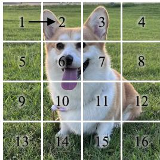  
(a) NTP

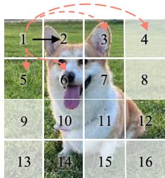  
(b) MTP with SD  
Figure 1: (a) Traditional NTP provides only short-range supervision over the full token sequence, leading to sparse and myopic training signals, while requiring autoregressive modeling over the entire sequence with high computational cost. (b) Our framework improves training with MTP and SD. MTP introduces more forward-looking and denser auxiliary supervision signals, thus enhancing contextual dependency modeling and alleviating the myopic nature of conventional single-step prediction, as indicated by the orange-red dashed arrows. SD further improves training eficiency by discarding less informative patches; the white patches denote the dropped regions.

Despite its simplicity and efectiveness, this paradigm still suffers from several inherent limitations. First, single-step prediction provides supervision for only one position at each step, resulting in sparse training signals. Second, the conventional NTP objective imposes no explicit constraint on the geometric structure of hidden token representations, which may restrict their diversity and discriminability in the feature space and consequently increase the risk of degenerate phenomena, such as repetitive textures and representation collapse. Moreover, autoregressive image generation requires dense computation over the full token sequence during training, although the semantic importance of diferent tokens is highly uneven. Consequently, substantial computation is inevitably allocated to low-information tokens, leading to redundant overhead and reduced training eficiency.

To address these limitations, we improve autoregressive image generation in terms of prediction supervision, representation regularization, and training eficiency. We introduce MTP as an auxiliary training objective to alleviate the sparse supervision and inherent myopia of single-step prediction. By imposing joint supervision on multiple future tokens, MTP better exploits the intrinsic twodimensional structure of images, as illustrated in Fig 1(b). This design provides denser training signals for the shared contextual representation in a manner more consistent with image geometry, allowing the model to better capture local structural patterns and future contextual information. To further compensate for the lack of explicit constraints on hidden token features in the traditional NTP objective, we introduce TCR. TCR treats other sampled tokens as negative samples and explicitly enhances the separability among diferent token representations through cross-view contrast, which reduces representation redundancy and improves the discriminability of hidden representations.

In addition, we propose SD as a training acceleration strategy motivated by the observation that low-information tokens still consume substantial computation in traditional AR training. Based on patch-wise importance scores extracted ofline by an external vision encoder, SD performs semantics-aware sampling and preferentially retains semantically salient patches during training, which reduces training cost and improves training eficiency while preserving informative learning signals as much as possible.

We conduct extensive experiments on the ImageNet image generation benchmark [9], which thoroughly validate the significant advantages of MTAR in both generation quality and training eficiency. Under the same number of training iterations, MTAR achieves substantially better generation performance than LlamaGen [44], improving the FID from 3.80 to 2.85 while also making training 39% faster. Furthermore, as shown in Fig 2, even with only 1/3 of the training iterations, MTAR still attains performance comparable to or even better than the LlamaGen [44] baseline, demonstrating that the proposed method significantly improves training eficiency while enhancing generation quality.

Our main contributions are summarized as follows:

• We propose MTAR, a unified training framework for autoregressive image generation, which systematically improves the conventional autoregressive training paradigm from three aspects: prediction supervision, representation regularization, and training eficiency.

• We introduce MTP and TCR to enhance autoregressive training from the perspectives of supervision signal enrichment and hidden representation regularization, respectively, improving the model’s contextual modeling ability and the discriminability of token representations.

• We propose SD as a semantics-aware training acceleration strategy, which reduces redundant computation by preferentially retaining more informative tokens, while improving training eficiency and preserving efective learning signals.

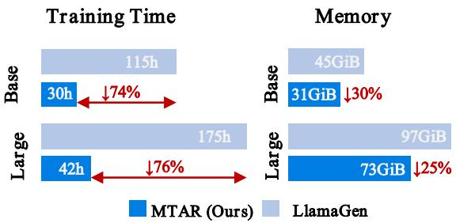  
Figure 2: Comparison of total training time (hours) and total GPU memory usage across all training GPUs between LlamaGen [44] and MTAR for the Base and Large models, along with the corresponding FID values. LlamaGen is trained for 300 epochs, whereas MTAR is trained for only 100 epochs. For the eficiency measurements, the Base models are trained on a single NVIDIA A800 GPU, while the Large models are trained on two NVIDIA A800 GPUs. MTAR consistently achieves better generation quality and eficiency than the corresponding LlamaGen baselines: for the Base model, FID improves from 5.46 to 5.37, while training time and memory are reduced from 115 to 30 and from 45 GiB to 31 GiB; for the Large model, FID improves from 3.80 to 3.36, while training time and memory are reduced from 175 to 42 and from 97 GiB to 73 GiB. Both methods use torch.compile.

## 2 Related Work

## 2.1 Autoregressive Visual Generation

Autoregressive visual generation models typically follow a GPTstyle next-token prediction paradigm [1, 37], where each token is generated conditioned on all previous tokens [5, 7, 12, 16, 31, 32, 39, 48, 52, 56]. A representative example is LlamaGen [44], which formulates image synthesis as token-by-token prediction in raster order with a simple and eficient framework. Beyond this paradigm, MaskGIT [6] and MAR [27] support parallel token prediction during training through bidirectional attention and masked prediction. PAR [51] accelerates sampling by grouping tokens, while VAR [45] improves visual fidelity through multi-scale prediction at the cost of higher computation. NAR [17] focuses on local dependencies between adjacent tokens and adopts parallel decoding, which changes the inference process and limits its generality. RAR [57] further improves autoregressive training through randomized token ordering while preserving the standard autoregressive framework. However, existing methods still struggle to jointly address sparse supervision, weak discriminability of hidden representations, and high training cost. To address these limitations, we propose MTAR, which enhances the classical autoregressive training paradigm from three aspects: prediction objectives, representation regularization, and training eficiency. Without changing the inference mechanism, MTAR improves both generation quality and training eficiency.

## 2.2 Multi-Token Prediction

Multi-token prediction has been widely studied in language modeling [4, 13, 28, 30, 35, 41, 43, 61]. Related methods typically strengthen training by jointly predicting multiple future tokens and, in some cases, support parallel decoding to improve inference eficiency. Gloeckle [13] shows that the benefits of MTP become more pronounced at larger model scales, while also enabling inference acceleration through parallel multi-token decoding. DeepSeek-V3 [28] also incorporates MTP into large-scale language model training and highlights its potential for inference acceleration via speculative decoding. However, existing MTP methods are mainly developed for language modeling, where prediction targets are defined over one-dimensional sequential dependencies. In autoregressive visual generation, although images are flattened into one-dimensional token sequences during training, the tokens inherently originate from a two-dimensional spatial grid. Therefore, applying MTP to vision is not a direct transfer of language-modeling designs; auxiliary supervision targets should instead account for the spatial locality and two-dimensional neighborhood structure of images, rather than relying only on linear ofsets in raster order. Based on this distinction, we introduce MTP into autoregressive visual generation as a training-time auxiliary supervision mechanism, rather than focusing on its parallel decoding capability. MTAR defines auxiliary prediction targets from two-dimensional spatial relations, providing denser and more geometry-aware supervision for the shared contextual representation. This improves the modeling of local structures and future contextual information while preserving the standard autoregressive inference pipeline.

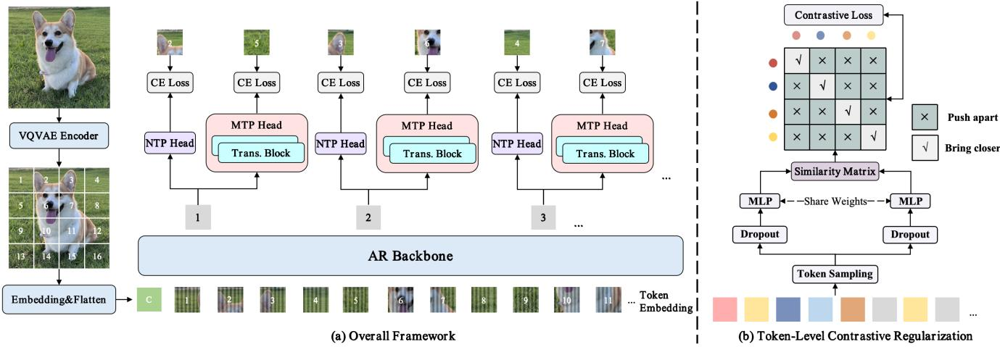  
Figure 3: Overview of the proposed framework. (a) Overall framework under the MTP (R , B) setting: besides the original NTP $\mathbf { \left( R _ { 1 } \right) }$ head, an additional MTP head is introduced to provide auxiliary supervision for the token directly below the current token. (b) TCR: Sampled token features are passed through two Dropout-perturbed branches and a shared MLP to construct a cross-view similarity matrix. The diagonal entries bring matched token pairs closer, while the of-diagonal entries push diferent sampled tokens apart.

## 3 MTAR Framework

## 3.1 Multi-Token Prediction

We introduce a MTP strategy on top of the conventional NTP paradigm. MTP uses one or more auxiliary heads to impose additional supervision on future tokens at diferent ofsets, providing denser training signals for shared contextual representations in a way that better aligns with image geometry and mitigates the myopic nature of single-step prediction, as illustrated in Fig 3. This design encourages the model to capture richer local structures and future contextual information.

Let $\left\{ y _ { 1 } , y _ { 2 } , \ldots , y _ { N } \right\}$ denote the sequence of � image tokens. Given the condition token and the image tokens, the backbone produces hidden features $H = \left\{ h _ { 0 } , h _ { 1 } , \ldots , h _ { N - 1 } \right\}$ , where $h _ { 0 }$ corresponds to the condition token and each $h _ { t }$ is used to predict $y _ { t + 1 }$ NTP Head. The NTP head is implemented as a linear output layer that maps $h _ { t }$ to the conditional distribution of the next token $y _ { t + 1 } .$ The NTP loss is defined as

$$
\mathcal { L } _ { \mathrm { N T P } } = \sum _ { t = 0 } ^ { N - 1 } - \log P ( y _ { t + 1 } \mid h _ { t } ) ,\tag{1}
$$

During inference, the auxiliary MTP heads are discarded, and only the NTP head is used for traditional autoregressive decoding.

MTP Head. Unlike the simple NTP head, each auxiliary MTP head consists of two additional Transformer blocks followed by a linear output layer. Specifically, for the �-th auxiliary MTP head, the backbone feature $h _ { t }$ is further transformed into a head-specific enhanced feature $h _ { t , w } ^ { \mathrm { e n } } .$ , which is used to predict the target token at an additional ofset $\delta _ { w }$ in raster order. Here, $\delta _ { w }$ denotes the prediction ofset associated with the �-th auxiliary MTP head, namely the relative distance from the current position to the target token. For example, $R _ { 2 }$ corresponds to $\delta = 2 ,$ while � corresponds to a vertical ofset equal to the token-grid width �. The $R _ { 1 }$ prediction $( \mathrm { i . e . , } \delta = 1 )$ is already handled by the NTP head and is therefore not counted as an auxiliary MTP head. In the default MTP $( R _ { 1 } , B )$ setting, the model uses the original NTP head to perform the $R _ { 1 }$ prediction and introduces one additional auxiliary MTP head with ofset $\delta = G ,$ where � denotes the width of the token grid $( \mathrm { e . g . } , G = 1 6$ for a 16 × 16 token grid ).

The overall MTP objective aggregates the auxiliary supervision provided by all auxiliary MTP heads:

$$
\mathcal { L } _ { \mathrm { M T P } } = \sum _ { w = 1 } ^ { W } \sum _ { t = 0 } ^ { N - 1 - \delta _ { w } } - \log P _ { w } \left( y _ { t + \delta _ { w } } \mid h _ { t , w } ^ { \mathrm { e n } } \right) ,\tag{2}
$$

where � denotes the number of auxiliary MTP heads (excluding the NTP head), $h _ { t , \mathfrak { u } } ^ { \mathrm { e n } }$ denotes the enhanced feature produced by the �-th auxiliary MTP head at position $t ,$ and $P _ { w } ( \cdot )$ denotes the predictive distribution of the corresponding auxiliary head.

The efectiveness of MTP depends on the design of the auxiliary MTP heads, including their number and the associated additional prediction directions. In practice, these directions are implemented as diferent ofsets in raster order relative to NTP.

## 3.2 Token-Level Contrastive Regularization

The traditional NTP objective directly supervises output predictions, but does not explicitly constrain hidden token representations. As a result, the learned token representations may be insuficiently discriminative for long-sequence autoregressive modeling. To ad dress this issue, we introduce TCR, as illustrated in Fig 3(b), to impose lightweight regularization on hidden token representations during training.

Specifically, after removing the condition token, we randomly sample � features from the $B \times N$ image-token features in a batch to form a feature matrix $\mathbf { F } \in \mathbb { R } ^ { K \times D }$ , where � denotes the batch size, � denotes the number of image tokens, and � denotes the hidden feature dimension. We then apply two independently sampled Dropout perturbations to F to obtain two random views: $\tilde { \mathbf { F } } _ { 1 } =$ $\mathcal { D } ( \mathbf { F } ; m _ { 1 } ) , \tilde { \mathbf { F } } _ { 2 } = \mathcal { D } ( \mathbf { F } ; m _ { 2 } )$ , where $\mathcal { D } ( \because m )$ denotes the Dropout perturbation parameterized by mask �, and $m _ { 1 }$ and $m _ { 2 }$ are two independent Dropout masks. The two views are further fed into a shared MLP projection head followed by $\ell _ { 2 }$ normalization, yielding $\mathbf { Z } _ { 1 } = \operatorname { n o r m } \bigl ( f _ { \theta } ( \tilde { \mathbf { F } } _ { 1 } ) \bigr ) , \mathbf { Z } _ { 2 } = \operatorname { n o r m } \bigl ( f _ { \theta } ( \tilde { \mathbf { F } } _ { 2 } ) \bigr )$

Based on these two views, we compute a cross-view similarity matrix $\begin{array} { r } { \mathbf { S } _ { i j } = \frac { \mathbf { z } _ { 1 , i } ^ { \top } \mathbf { z } _ { 2 , j } } { \tau } } \end{array}$ , where � is a temperature parameter. The diagonal term $\mathbf { S } _ { i i }$ measures the matching score of the same token under the two perturbed views, while the of-diagonal terms measure its similarity to other sampled tokens. TCR is optimized with an InfoNCE-style [8, 15] contrastive loss in cross-entropy form:

$$
\mathcal { L } _ { \mathrm { T C R } } = - \frac { 1 } { K } \sum _ { i = 1 } ^ { K } \log \frac { \exp ( \mathbb { S } _ { i i } ) } { \sum _ { j = 1 } ^ { K } \exp ( \mathbb { S } _ { i j } ) } .\tag{3}
$$

We adopt a one-sided InfoNCE formulation, where tokens from $\mathbf { Z } _ { 1 }$ serve as queries against $\mathbf { Z } _ { 2 } .$ . The matched token across the two views forms the positive pair, while the remaining sampled tokens are treated as negatives.

Unlike ST-AR [60], which relies on an EMA teacher, data augmentation, and inter-step/inter-view contrastive objectives, TCR directly constructs token-level positive pairs from Dropout perturbations and applies contrastive regularization to the sampled hidden features in the current batch. As with other contrastive formulations based on in-batch negatives, a small number of false negatives may exist in principle. Using DINOv3 [42] features on 10,000 ImageNet training images, only 2.01% and 8.73% of token pairs have cosine similarity above 0.9 and 0.8, respectively, suggesting that false negatives have limited practical impact under TCR sampling.

## 3.3 Semantic Dropping

Traditional autoregressive training does not distinguish the semantic importance of diferent tokens, causing a substantial portion of training computation to be allocated to low-information patches. To overcome this limitation, we propose SD, as illustrated in Fig 4, which prioritizes semantically salient patches during training to improve training eficiency.

For each training image, we extract patch-level semantic importance scores $\mathbf { \Psi } _ { \mathbf { \lambda } ^ { \mathbf { j } } } \in \mathbb { R } ^ { \breve { N } }$ ofline using an external vision encoder, and retain $M = \lfloor N ( 1 - r ) \rfloor$ patches given a drop rate $r \in ( 0 , 1 )$ . Specifically, we sample without replacement according to the temperaturescaled distribution $\begin{array} { r } { p _ { i } = \frac { s _ { i } ^ { 1 / \tau ^ { \prime } } } { \sum _ { j } s _ { j } ^ { 1 / \tau ^ { \prime } } } } \end{array}$ , to obtain the retained set $\mathcal { T } _ { \mathrm { k e e p } }$ where $\tau ^ { \prime }$ controls the concentration of the sampling distribution. The retained indices are sorted according to their original spatial order before being fed into the backbone. Each retained token is assigned a 2D RoPE positional encoding based on its original spatial coordinate, thereby preserving consistency between positional information and the image layout.

The backbone then operates on the compressed token sequence defined by $\begin{array} { r } { \mathcal { I } _ { \mathrm { k e e p } } . } \end{array}$ . When SD is enabled, NTP, MTP, and TCR are all adapted to this compressed sequence during training: specifically, the prediction targets of NTP and MTP remain defined with respect to the original sequence indices, while TCR samples token features from the retained hidden features.

## 4 Experiments

## 4.1 Experimental Settings

Implementation Details. Based on the MTAR framework constructed upon LlamaGen [44], we adopt LlamaGen [44] as our primary baseline and systematically evaluate its performance on the class-conditional image generation task under the standard ImageNet 256 × 256 generation benchmark [9]. We employ the VQ GAN [12] tokenizer pre-trained on ImageNet from LlamaGen [44], with a vocabulary size of 16,384. For $2 5 6 \times 2 5 6$ resolution images, the tokenizer performs a 16× downsampling. We use the AdamW [23, 31] optimizer with the following hyperparameters: $\beta _ { 1 } = 0 . 9 , \beta _ { 2 } = 0 . 9 5$ , weight decay = 0.05, and gradient clipping threshold = 1.0. Dropout rates for the input embedding layer, attention modules, and feed-forward networks (FFN) are all set to 0.1. During inference, we follow the traditional autoregressive generation procedure of LlamaGen [44] without any modification. For SD, the semantic importance scores are extracted ofline once before training and reused across all epochs, incurring only a one-time preprocessing overhead.

Dataset and Evaluation Protocol. For ablation studies, we construct a small-scale training subset by sampling 100k images from ImageNet, denoted as ImageNet-100k 256 × 256 [9], for eficient training. We then generate 10k images for evaluation against 10k real images sampled from the ImageNet validation set. For full-scale evaluation, we train on the complete ImageNet dataset and generate

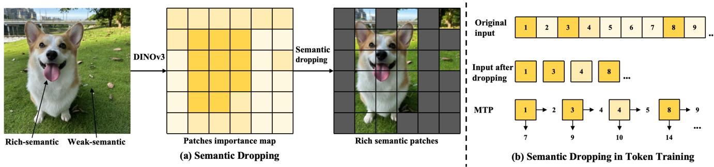  
Figure 4: Semantic Drop. (a) DINOv3 [42] extracts a token importance map for each image (darker: higher semantic importance). Low-importance tokens are dropped, retaining only semantically salient tokens for training. (b) Retained tokens preserve their original spatial indices, and both NTP and MTP losses are computed accordingly.

Table 1: Model comparisons on the class-conditional ImageNet 256 × 256 benchmark [9]. Metrics include Fréchet inception distance (FID), inception score (IS), precision, and recall. “↓” and “↑” indicate that lower and higher values are better, respectively. † denotes results reported by NAR [17]. “-re” denotes the use of rejection sampling.
<table><tr><td>Type</td><td>Model</td><td>#Para.</td><td>FID↓</td><td>IS↑</td><td>Precision↑</td><td>Recall↑</td></tr><tr><td rowspan="2">GAN</td><td>BigGAN [3]</td><td>112M</td><td>6.95</td><td>224.5</td><td>0.89</td><td>0.38</td></tr><tr><td>GigaGAN [22]</td><td>569M</td><td>3.45</td><td>225.5</td><td>0.84</td><td>0.61</td></tr><tr><td rowspan="4">Diffusion</td><td>ADM [10]</td><td>554M</td><td>10.94</td><td>101.0</td><td>0.69</td><td>0.63</td></tr><tr><td>CDM [19]</td><td>一</td><td>4.88</td><td>158.7</td><td>一</td><td>一</td></tr><tr><td>LDM-4-G [39]</td><td>400M</td><td>3.60</td><td>247.7</td><td>0.87</td><td>0.48</td></tr><tr><td>DiT-L/2 [34]</td><td>458M</td><td>5.02</td><td>167.2</td><td>0.75</td><td>0.57</td></tr><tr><td rowspan="3">Mask</td><td>MaskGIT [6]</td><td>227M</td><td>6.18</td><td>182.1</td><td>0.80</td><td>0.51</td></tr><tr><td>MaskGIT-re [6]</td><td>227M</td><td>4.02</td><td>355.6</td><td>一</td><td>一</td></tr><tr><td>MAGE [26]</td><td>439M</td><td>7.04</td><td>123.5</td><td>一</td><td>一</td></tr><tr><td rowspan="13">AR</td><td>VQGAN [12]</td><td>227M</td><td>18.65</td><td>80.4</td><td>0.78</td><td>0.26</td></tr><tr><td>VQGAN [12]</td><td>1.4B</td><td>15.78</td><td>74.3</td><td>一</td><td>一</td></tr><tr><td>VQGAN-re [12]</td><td>1.4B</td><td>5.20</td><td>280.3</td><td>一</td><td>一</td></tr><tr><td>RQTran. [25]</td><td>3.8B</td><td>7.55</td><td>134.0</td><td>一</td><td>一</td></tr><tr><td>RQTran.-re [25]</td><td>3.8B</td><td>3.80</td><td>323.7</td><td></td><td>一</td></tr><tr><td>ViT-VQGAN [55]</td><td>1.7B</td><td>4.17</td><td>175.1</td><td>一</td><td></td></tr><tr><td>DART-AR [14]</td><td>812M</td><td>3.98</td><td>256.8</td><td>一</td><td>一</td></tr><tr><td>LlamaGen-B [44]</td><td>111M</td><td>5.46</td><td>193.61</td><td>0.84</td><td>0.46</td></tr><tr><td>LlamaGen-L [44]</td><td>343M</td><td>3.80</td><td>248.28</td><td>0.83</td><td>0.52</td></tr><tr><td>IAR-B [20]</td><td>111M</td><td>5.14</td><td>202.0</td><td>0.85</td><td>0.45</td></tr><tr><td>IAR-L [20]</td><td>343M</td><td>3.18</td><td>234.8</td><td>0.82</td><td>0.53</td></tr><tr><td>PAR-L-4X† [51]</td><td>343M</td><td>4.32</td><td>189.4</td><td>0.87</td><td>0.43</td></tr><tr><td>NAR-B [17]</td><td>130M</td><td>4.65</td><td>212.3</td><td>0.83</td><td>0.47</td></tr><tr><td>NAR-L [17]</td><td></td><td>372M</td><td>3.06</td><td>263.9</td><td>0.81</td><td>0.53</td></tr><tr><td rowspan="2">Our</td><td>MTAR-B</td><td>138M</td><td>4.50</td><td>213.96</td><td>0.84</td><td>0.48</td></tr><tr><td>MTAR-L</td><td>387M</td><td>2.85</td><td>271.41</td><td>0.83</td><td>0.54</td></tr></table>

Recall [24], all computed using the ADM TensorFlow evaluation suite [10].

50k images for assessment, following the same validation protocol as LlamaGen [44]. We report FID [18], IS [40], Precision, and

Table 2: Comparison between LlamaGen [44] and MTAR in terms of generation quality and training eficiency. Speedup is measured with respect to the total training time of the baseline LlamaGen [44].
<table><tr><td>Model</td><td>Epochs</td><td> $\mathrm { F I D \downarrow }$ </td><td>IS↑</td><td>Precision↑</td><td>Recall↑</td><td>Speedup</td></tr><tr><td>LlamaGen-B [44]</td><td>300</td><td>5.46</td><td>193.61</td><td>0.84</td><td>0.46</td><td>1.00×</td></tr><tr><td rowspan="4">MTAR-B</td><td>50</td><td>5.76</td><td>198.70</td><td>0.86</td><td>0.42</td><td>7.62×</td></tr><tr><td>100</td><td>5.37</td><td>209.07</td><td>0.86</td><td>0.44</td><td>3.81×</td></tr><tr><td>250</td><td>4.66</td><td>211.54</td><td>0.84</td><td>0.47</td><td>1.73×</td></tr><tr><td>300</td><td>4.50</td><td>213.96</td><td>0.84</td><td>0.48</td><td>1.27×</td></tr><tr><td>LlamaGen-L [44]</td><td>300</td><td>3.80</td><td>248.28</td><td>0.83</td><td>0.52</td><td>1.00×</td></tr><tr><td rowspan="4">MTAR-L</td><td>50</td><td>3.74</td><td>219.29</td><td>0.82</td><td>0.52</td><td>8.33×</td></tr><tr><td>100</td><td>3.36</td><td>226.30</td><td>0.81</td><td>0.54</td><td>4.17×</td></tr><tr><td>250</td><td>2.96</td><td>267.46</td><td>0.83</td><td>0.55</td><td>1.88×</td></tr><tr><td>300</td><td>2.85</td><td>271.41</td><td>0.83</td><td>0.54</td><td>1.39×</td></tr></table>

Table 3: Ablation of MTP head directions based on the NTP head $( \mathbf { R } _ { 1 } ) .$ . We compare auxiliary prediction along three directions: right, bottom, and bottom-right.
<table><tr><td>Method</td><td></td><td>Right (R2) Bottom (B) Bottom-Right (B.R1)</td><td></td><td>#Para.</td><td>FID↓</td><td>IS↑</td><td>Precision↑</td><td>Recall↑</td></tr><tr><td> $\mathrm { M T P } \left( \mathrm { R } _ { 1 } , \mathrm { R } _ { 2 } \right)$ </td><td>√</td><td></td><td></td><td>138M</td><td>20.13</td><td>59.32</td><td>0.75</td><td>0.45</td></tr><tr><td> $\operatorname { M T P } \left( \mathbf { R } _ { 1 } , \mathbf { B } \right)$ </td><td></td><td>√</td><td></td><td>138M</td><td>19.75</td><td>62.12</td><td>0.75</td><td>0.45</td></tr><tr><td> $\mathrm { M T P } \left( \mathrm { R } _ { 1 } , \mathrm { B } . \mathrm { R } _ { 1 } \right)$ </td><td></td><td></td><td>√</td><td>138M</td><td>19.96</td><td>61.05</td><td>0.75</td><td>0.44</td></tr></table>

Table 4: Ablation study of MTP, TCR, and SD on LlamaGen-B [44].
<table><tr><td>Method</td><td>#Para.</td><td>FID↓ IS↑</td><td>Precision↑ Recall↑ Speedup</td><td></td><td></td></tr><tr><td>LlamaGen-B</td><td>111M</td><td>21.96 54.04</td><td>0.71</td><td>0.46</td><td>1.00×</td></tr><tr><td>MTP</td><td>138M</td><td>19.75 62.12</td><td>0.75</td><td>0.45</td><td>0.79×</td></tr><tr><td>TCR</td><td>111M</td><td>20.55 57.78</td><td>0.72</td><td>0.47</td><td>0.98×</td></tr><tr><td>SD</td><td>111M</td><td>22.02 54.99</td><td>0.70</td><td>0.47</td><td>1.62×</td></tr><tr><td>MTP+TCR</td><td>138M</td><td>18.78 64.33</td><td>0.73</td><td>0.48</td><td>0.79×</td></tr><tr><td>MTP+SD</td><td>138M</td><td>20.79 66.17</td><td>0.71</td><td>0.47</td><td>1.27×</td></tr><tr><td>TCR+SD</td><td>111M</td><td>20.14 69.07</td><td>0.73</td><td>0.46</td><td>1.61×</td></tr><tr><td>MTP+TCR+SD</td><td>138M</td><td>18.65 66.32</td><td>0.75</td><td>0.46</td><td>1.27×</td></tr></table>

## 4.2 Main Results

We conduct systematic comparisons between MTAR and a diverse set of representative generative models on the ImageNet 256 × 256 benchmark [9], including GAN-based methods [3, 22], difusionbased methods [10, 11, 19, 34], masked prediction methods [6, 26], and autoregressive methods [12, 14, 20, 25, 44, 51, 55]. As shown in Tab 1, MTAR is highly competitive among autoregressive approaches. Specifically, MTAR-B achieves an FID of 4.50 with only 138M parameters, outperforming multiple autoregressive baselines at a comparable scale. MTAR-L further improves the FID to 2.85, achieving the best result among autoregressive models of similar size.

Table 5: Ablation on the number of MTP heads. Performance does not consistently improve as more auxiliary heads are added.
<table><tr><td>Method</td><td>#Para. FID↓</td><td>IS↑</td><td>Precision↑ Recall↑</td><td></td></tr><tr><td> $\mathrm { M T P } \left( \mathrm { R } _ { 1 } , \mathrm { R } _ { 2 } , \mathrm { R } _ { 3 } \right)$ </td><td>164M</td><td>19.79 41.77</td><td>0.74</td><td>0.47</td></tr><tr><td> $\mathrm { M T P } \left( \mathrm { R } _ { 1 } , \mathrm { R } _ { 2 } , \mathrm { B } \right)$ </td><td>164M</td><td>20.34 59.85</td><td>0.72</td><td>0.46</td></tr><tr><td>MTP  $( \mathsf { R } _ { 1 } , \mathsf { B } , \mathsf { B } . \mathsf { R } _ { 1 } )$ </td><td>164M</td><td>19.94 62.33</td><td>0.74</td><td>0.46</td></tr><tr><td>MTP  $( \mathrm { R } _ { 1 } , \mathrm { R } _ { 2 } , \mathrm { R } _ { 3 } , \mathrm { R } _ { 4 } )$ </td><td>191M</td><td>20.95 57.15</td><td>0.73</td><td>0.45</td></tr><tr><td>MTP  $( \mathrm { R } _ { 1 } , \mathrm { R } _ { 2 } , \mathrm { B } , \mathrm { B } . \mathrm { R } _ { 1 } )$ </td><td>191M</td><td>20.95 57.18</td><td>0.73</td><td>0.45</td></tr><tr><td> $\mathrm { M T P \left( R _ { 1 } , R _ { 2 } , R _ { 3 } , R _ { 4 } , R _ { 5 } \right) }$ </td><td>218M</td><td>20.1859.46</td><td>0.74</td><td>0.45</td></tr></table>

Compared with LlamaGen [44], MTAR consistently achieves better generation quality and training eficiency, as shown in Tab 2. Under the same number of training iterations, MTAR-B and MTAR-L improve FID by 0.96 and 0.95, respectively, while achieving training speedups of 1.27× and 1.39×. Even under smaller training budgets, MTAR remains superior: MTAR-B already surpasses LlamaGen-B [44] with only about one-third of the training iterations, while MTAR-L outperforms its corresponding baseline with only about one-sixth of the training iterations, reaching speedups of 3.81× and

Algorithm 1 Pseudocode of the MTAR Training Framework   
1: Input: image patches $\{ x _ { i } \}$ ; condition �; number of kept patches $M ;$   
MTP ofsets $\mathrm { \bar { \it { \Omega } } } \delta _ { w } \} _ { w = 1 } ^ { W } ;$ contrastive sample number �; TCR temperature   
�; loss weights �MTP, �TCR.   
2: Init: Backbone; 2D RoPE positional encoding Pos2D; MTP refinement   
heads $\{ \mathrm { h e a d } _ { \mathrm { M T P } } ^ { w } \} _ { w = 1 } ^ { W } ; \mathrm { M L P } f _ { \theta } .$   
3: // Semantic Drop   
4: $\tau _ { \mathrm { k e e p } } $ sorted indices of � patches sampled from the temperature  
scaled semantic importance distribution   
5: � ← Backbone $\left( c , \{ x _ { i } \} _ { i \in { \mathcal { I } } _ { \mathrm { k e e p } } } , \right.$ Pos2D[ $\tau _ { \mathrm { k e e p } } ] \Big )$   
6: Construct valid prediction masks from $\scriptstyle { \mathcal { I } } _ { \mathrm { k e e p } }$   
7: // NTP Loss   
8: Compute �NTP on valid positions according to $\operatorname { E q . } \left( 1 \right)$   
9: // MTP Loss   
10: �MTP ← 0   
11: for � = 1 to � do   
12: �en� ← hea $1 _ { \mathrm { M T P } } ^ { w } ( H )$   
13: Update $L _ { \mathrm { M T P } }$ on valid positions with the �-th term in Eq. (2)   
14: end for   
15: $/ / ~ T C R ~ L o s s$   
16: $H _ { \mathrm { b a t c h } }$ ← stack the hidden features from all samples in the batch   
17: F ← RandomSample $( H _ { \mathrm { b a t c h } } [ : , 1 : , : ] , K )$   
18: Sample two independent dropout masks $m _ { 1 } , m _ { 2 }$   
19: $\mathbf { Z } _ { 1 } \gets \mathrm { L 2 N o r m } ( f _ { \theta } ( \mathrm { D r o p o u t } ( \mathbf { F } ; m _ { 1 } ) ) )$   
20: $\mathbf { Z } _ { 2 }  \mathrm { L 2 N }$ orm $( f _ { \theta } { } ^ { }$ (Dropout(F; �2 ) ) )   
21: $\mathbf { S } \gets \mathbf { Z } _ { 1 } \mathbf { Z } _ { 2 } ^ { \top } / \tau$   
22: Compute �TCR according to Eq. (3)   
23: Return: �NTP + �MTP�MTP + �TCR�TCR

Table 6: Ablation study on the number of sampled tokens for TCR. We observe that using 2,048 sampled tokens yields the best overall performance.
<table><tr><td>Sampled Tokens</td><td>FID↓</td><td>IS↑</td><td>Precision↑</td><td>Recall↑</td></tr><tr><td>16384</td><td>20.70</td><td>58.60</td><td>0.73</td><td>0.46</td></tr><tr><td>8192</td><td>19.83</td><td>58.62</td><td>0.73</td><td>0.47</td></tr><tr><td>4096</td><td>19.71</td><td>57.82</td><td>0.72</td><td>0.48</td></tr><tr><td>2048</td><td>18.78</td><td>64.33</td><td>0.73</td><td>0.48</td></tr><tr><td>1024</td><td>19.18</td><td>63.54</td><td>0.73</td><td>0.48</td></tr><tr><td>512</td><td>18.94</td><td>64.45</td><td>0.74</td><td>0.48</td></tr><tr><td>256</td><td>19.04</td><td>64.76</td><td>0.74</td><td>0.47</td></tr></table>

Table 7: Ablation on drop strategies. DINOv3 [42]-guided SD achieves the best performance.
<table><tr><td>Drop Strategy</td><td>FID↓</td><td>IS↑</td><td>Precision↑</td><td>Recall↑</td></tr><tr><td>Random</td><td>19.97</td><td>62.69</td><td>0.72</td><td>0.45</td></tr><tr><td>SigLIP2 [47]</td><td>19.70</td><td>63.84</td><td>0.73</td><td>0.46</td></tr><tr><td>DINOv3 [42]</td><td>18.65</td><td>66.32</td><td>0.75</td><td>0.46</td></tr></table>

8.33×, respectively. As shown in Fig 6, MTAR-L generates samples with more coherent local structures and fewer repetitive texture artifacts than LlamaGen-L [44], suggesting reduced degeneration such as texture repetition and local collapse under the same class conditions.

Table 8: Ablation on the patch drop rate in SD. A 50% drop rate achieves the best overall trade-of. Speedup is measured relative to the MTP+TCR configuration without SD.
<table><tr><td>Drop Rate</td><td>FID↓</td><td>IS↑</td><td>Precision↑</td><td>Recall↑</td><td>Speedup</td></tr><tr><td>60%</td><td>19.31</td><td>62.93</td><td>0.74</td><td>0.45</td><td>1.81×</td></tr><tr><td>50%</td><td>18.65</td><td>66.32</td><td>0.75</td><td>0.46</td><td>1.60×</td></tr><tr><td>40%</td><td>18.91</td><td>65.32</td><td>0.74</td><td>0.46</td><td>1.38×</td></tr></table>

Table 9: Ablation on the two-stage SD training schedule. The 80%:20% schedule provides a favorable quality–eficiency trade-of. Speedup is measured relative to the MTP+TCR configuration without SD.
<table><tr><td>SD Schedule</td><td>FID↓</td><td>IS↑</td><td>Precision↑</td><td>Recall↑</td><td>Speedup</td></tr><tr><td>40%:60%</td><td>18.65</td><td>65.54</td><td>0.75</td><td>0.46</td><td>1.23×</td></tr><tr><td>50%:50%</td><td>18.60</td><td>65.01</td><td>0.74</td><td>0.48</td><td>1.31×</td></tr><tr><td>60%:40%</td><td>18.41</td><td>64.85</td><td>0.74</td><td>0.48</td><td>1.39X</td></tr><tr><td>70%:30%</td><td>18.68</td><td>64.38</td><td>0.74</td><td>0.48</td><td>1.49×</td></tr><tr><td>80%:20%</td><td>18.65</td><td>66.32</td><td>0.75</td><td>0.46</td><td>1.60×</td></tr><tr><td>90%:10%</td><td>19.40</td><td>62.89</td><td>0.75</td><td>0.46</td><td>1.73×</td></tr></table>

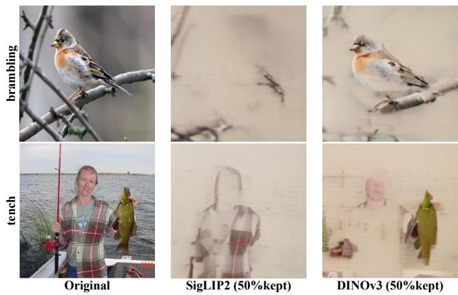  
Figure 5: We retain the top-50% patches according to the importance scores produced by SigLIP2 [47] and DINOv3 [42], and visualize the corresponding VQ-decoded reconstructions. Compared with SigLIP2 [47], DINOv3 [42] better preserves the semantic content and structural integrity of the foreground object.

## 4.3 Ablation Studies

We conduct ablation studies to examine (i) whether MTP, TCR, and SD address the corresponding limitations of traditional NTP, (ii) which design choices are critical to each component, and (iii) how MTAR balances generation quality and training eficiency. Unless otherwise specified, all experiments use MTAR-B trained for 50 epochs on ImageNet-100k at 256 × 256 [9]. In the SD ablations, all factors except the one under study remain at their default values. Tabs 7 and 8 use the two-stage schedule SD (80%:20%), which applies a 50% patch drop rate during the first 80% of training and full-sequence training during the remaining 20%. We evaluate component combinations; the prediction direction and auxiliary-head count ofMTP; the sampled-token count ofTCR; and the importance encoder, patch drop rate, and training schedule of SD.

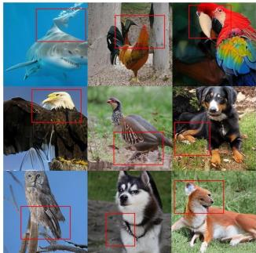  
(a)LlamaGen-L

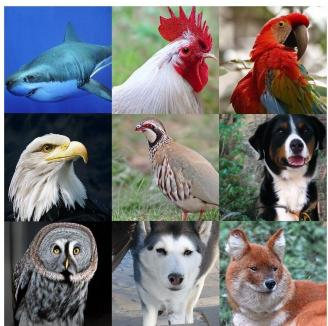  
(b)MTAR-L  
Figure 6: Qualitative comparison between LlamaGen-L [44] and MTAR-L on ImageNet 256 × 256 [9]. Under the same class conditions, MTAR-L produces images with clearer semantics, more coherent structures, and fewer artifacts. Red boxes highlight representative artifacts in LlamaGen-L [44] samples.

Ablation ofMTP, TCR, and SD. Tab 4 evaluates the individual and combined efects of MTP, TCR, and SD. Starting from LlamaGen-B [44], MTP yields the largest individual improvement, reducing the FID from 21.96 to 19.75 and increasing the IS from 54.04 to 62.12, at the cost of a lower speedup of 0.79×. TCR also improves the baseline, achieving an FID of 20.55 while largely preserving the baseline speed (0.98×). Although SD alone does not improve FID (22.02), it substantially improves eficiency, achieving a speedup of 1.62×. When combined with MTP, TCR further reduces the FID to 18.78 and improves Recall to 0.48, without increasing the parameter count beyond that of MTP. Finally, adding SD to MTP and TCR yields the best FID of 18.65, while retaining a 1.27× speedup over the baseline. These results show that MTP provides the primary quality gain, TCR ofers complementary regularization, and SD efectively improves eficiency in the full configuration.

Prediction direction and number ofheads in MTP. We examine the efects of auxiliary prediction directions and head counts. As shown in Tabs 3 and 5, with one auxiliary head, MTP (R , B) achieves the best FID of 19.75, compared with 20.13 for MTP (R , R ) and 19.96 for MTP $( \mathrm { R } _ { 1 } , \mathrm { B } . \mathrm { R } _ { 1 } )$ . Adding more heads provides no consistent improvement: MTP $( \mathrm { R } _ { 1 } , \mathrm { R } _ { 2 } , \mathrm { R } _ { 3 } )$ and MTP (R , B, B.R ) obtain FIDs of 19.79 and 19.94, respectively, while MTP $( \mathrm { R } _ { 1 } , \mathrm { R } _ { 2 } , \mathrm { R } _ { 3 } , \mathrm { R } _ { 4 } )$ further degrades to 20.95.

These results show that MTP benefits from efective auxiliary supervision rather than simply predicting more future tokens. Unlike language modeling, where MTP extends prediction along a 1D sequence, image generation benefits from supervision aligned with its 2D structure. Since NTP already captures horizontal dependencies, predicting the spatially lower neighbor provides less redundant information. Together with 2D positional encoding, this direction helps the shared representations capture richer spatial patterns and future context beyond raster order. We therefore adopt MTP (R1, B) as the default configuration.

Efect of the number of sampled tokens in TCR. Tab 6 shows that 2,048 sampled tokens achieve the best performance, with an FID of 18.78. Smaller sampling sizes (256, 512, and 1,024) yield comparable but slightly worse results, whereas larger sizes (8,192 and 16,384) degrade performance, increasing FID to 19.83 and 20.70, respectively. This suggests that small sampling sizes provide insufficient contrastive coverage, while excessively large sizes introduce redundant or highly correlated token pairs that weaken regularization. We therefore use 2,048 sampled tokens by default.

Design choices of Semantic Dropping. We study three key factors of SD: the semantic importance estimator, patch drop rate, and two-stage training schedule. As shown in Tab 7, semanticaware dropping consistently outperforms random dropping, with DINOv3 [42] reducing FID from 19.97 to 18.65. Fig 5 further shows that DINOv3 preserves foreground objects and their structures better than SigLIP2 [47]. According to Tab 8, a 50% drop rate achieves the best quality–eficiency trade-of, with an FID of 18.65 and a 1.60× speedup. A 40% drop rate provides less acceleration, whereas a 60% rate is faster but noticeably degrades generation quality. We therefore use DINOv3 with a 50% drop rate by default.

As shown in Tab 9, SD (60%:40%) obtains the lowest FID of 18.41, while SD (80%:20%) ofers a better balance, achieving an FID of 18.65 with a 1.60× speedup. A shorter recovery stage, such as SD (90%:10%), increases speed but reduces generation quality. These results suggest applying SD during the early and middle training stages while retaining a suficiently long final full-sequence stage to recover fine-grained token dependencies and stabilize performance. We therefore adopt SD (80%:20%) as the default schedule.

## 5 Conclusion

In this paper, we present MTAR, a unified training framework for autoregressive image generation. MTAR improves conventional next-token prediction through denser supervision, more discriminative token representations, and more eficient computation, via MTP, TCR, and SD, respectively. All three components are trainingonly and leave the autoregressive inference pipeline unchanged. Experiments on ImageNet 256 × 256 show that MTAR achieves a better trade-of between generation quality and training eficiency. Compared with LlamaGen, MTAR achieves better FID with substantially faster training, and remains efective under smaller training budgets. Ablation studies further verify the efectiveness of each component and its key design choices. Overall, MTAR demonstrates that autoregressive image generation can be improved through better training design, without modifying the inference pipeline.

## References

[1] Josh Achiam, Steven Adler, Sandhini Agarwal, Lama Ahmad, Ilge Akkaya, Florencia Leoni Aleman, Diogo Almeida, Janko Altenschmidt, Sam Altman, Shyamal Anadkat, et al. 2023. Gpt-4 technical report. arXiv preprint arXiv:2303.08774 (2023).

[2] Oriol Vinyals Ali Razavi, Aaron Van den Oord. 2019. Generating diverse highfidelity images with vq-vae-2. In NeurIPS, Vol. 32.

[3] Andrew Brock. 2018. Large Scale GAN Training for High Fidelity Natural Image Synthesis. arXiv preprint arXiv:1809.11096 (2018).

[4] Tianle Cai, Yuhong Li, Zhengyang Geng, Hongwu Peng, Jason D Lee, Deming Chen, and Tri Dao. 2024. Medusa: Simple llm inference acceleration framework with multiple decoding heads. arXiv preprint arXiv:2401.10774 (2024).

[5] Huiwen Chang, Han Zhang, Jarred Barber, AJ Maschinot, Jose Lezama, Lu Jiang, Ming-Hsuan Yang, Kevin Murphy, William T Freeman, Michael Rubinstein, et al. 2023. Muse: Text-to-image generation via masked generative transformers. arXiv preprint arXiv:2301.00704 (2023).

[6] Huiwen Chang, Han Zhang, Lu Jiang, Ce Liu, and William T Freeman. 2022. Maskgit: Masked generative image transformer. In CVPR. 11315–11325.

[7] Mark Chen, Alec Radford, Rewon Child, Jefrey Wu, Heewoo Jun, David Luan, and Ilya Sutskever. 2020. Generative Pretraining From Pixels. In ICML, Vol. 119. 1691–1703.

[8] Ting Chen, Simon Kornblith, Mohammad Norouzi, and Geofrey Hinton. 2020. A Simple Framework for Contrastive Learning of Visual Representations. In Proceedings ofthe 37th International Conference on Machine Learning (Proceedings ofMachine Learning Research, Vol. 119), Hal Daumé III and Aarti Singh (Eds.). PMLR, 1597–1607.

[9] Jia Deng, Wei Dong, Richard Socher, Li-Jia Li, Kai Li, and Li Fei-Fei. 2009. Imagenet: A large-scale hierarchical image database.

[10] Prafulla Dhariwal and Alexander Nichol. 2021. Difusion models beat gans on image synthesis. In NeurIPS, Vol. 34. 8780–8794.

[11] Zheng Ding, Mengqi Zhang, Jiajun Wu, and Zhuowen Tu. 2023. Patched denois ing difusion models for high-resolution image synthesis. In ICLR.

[12] Patrick Esser, Robin Rombach, and Bjorn Ommer. 2021. Taming transformers for high-resolution image synthesis. In CVPR. 12873–12883.

[13] Fabian Gloeckle, Badr Youbi Idrissi, Baptiste Rozière, David Lopez-Paz, and Gabriel Synnaeve. 2024. Better & faster large language models via multi-token prediction. arXiv preprint arXiv:2404.19737 (2024).

[14] Jiatao Gu, Yuyang Wang, Yizhe Zhang, Qihang Zhang, Dinghuai Zhang, Navdeep Jaitly, Josh Susskind, and Shuangfei Zhai. 2025. DART: Denoising Autoregressive Transformer for Scalable Text-to-Image Generation. In ICLR.

[15] Kaiming He, Haoqi Fan, Yuxin Wu, Saining Xie, and Ross Girshick. 2020. Momentum Contrast for Unsupervised Visual Representation Learning. In CVPR.

[16] Yefei He, Feng Chen, Yuanyu He, Shaoxuan He, Hong Zhou, Kaipeng Zhang, and Bohan Zhuang. 2024. Zipar: Accelerating autoregressive image generation through spatial locality. arXiv preprint arXiv:2412.04062 2, 3 (2024), 4.

[17] Yefei He, Yuanyu He, Shaoxuan He, Feng Chen, Hong Zhou, Kaipeng Zhang, and Bohan Zhuang. 2025. Neighboring autoregressive modeling for eficient visual generation. arXiv preprint arXiv:2503.10696 (2025).

[18] Martin Heusel, Hubert Ramsauer, Thomas Unterthiner, Bernhard Nessler, and Sepp Hochreiter. 2017. Gans trained by a two time-scale update rule converge to a local nash equilibrium. In NeurIPS.

[19] Jonathan Ho, Chitwan Saharia, William Chan, David J Fleet, Mohammad Norouzi, and Tim Salimans. 2022. Cascaded difusion models for high fidelity image generation. The Journal ofMachine Learning Research 23, 1 (2022), 2249–2281.

[20] Teng Hu, Jiangning Zhang, Ran Yi, Jieyu Weng, Yabiao Wang, Xianfang Zeng, Zhucun Xue, and Lizhuang Ma. 2025. Improving Autoregressive Visual Genera tion with Cluster-Oriented Token Prediction. In CVPR. 9351–9360.

[21] Zhihao Huang, Xi Qiu, Yukuo Ma, Yifu Zhou, Junjie Chen, Hongyuan Zhang, Chi Zhang, and Xuelong Li. 2025. NFIG: Multi-Scale Autoregressive Image Generation via Frequency Ordering. arXiv preprint arXiv:2503.07076 (2025).

[22] Minguk Kang, Jun-Yan Zhu, Richard Zhang, Jaesik Park, Eli Shechtman, Sylvain Paris, and Taesung Park. 2023. Scaling up gans for text-to-image synthesis. In CVPR. 10124–10134.

[23] Diederik P Kingma. 2014. Adam: A method for stochastic optimization. arXiv preprint arXiv:1412.6980 (2014).

[24] Tuomas Kynkäänniemi, Tero Karras, Samuli Laine, Jaakko Lehtinen, and Timo Aila. 2019. Improved precision and recall metric for assessing generative models. In NeurIPS.

[25] Doyup Lee, Chiheon Kim, Saehoon Kim, Minsu Cho, and Wook-Shin Han. 2022. Autoregressive image generation using residual quantization. In CVPR. 11523– 11532.

[26] Tianhong Li, Huiwen Chang, Shlok Mishra, Han Zhang, Dina Katabi, and Dilip Krishnan. 2023. MAGE: MAsked Generative Encoder To Unify Representation Learning and Image Synthesis. In CVPR. 2142–2152.

[27] Tianhong Li, Yonglong Tian, He Li, Mingyang Deng, and Kaiming He. 2024. Autoregressive Image Generation without Vector Quantization. In NeurIPS.

[28] Aixin Liu, Bei Feng, Bing Xue, Bingxuan Wang, Bochao Wu, Chengda Lu, Cheng gang Zhao, Chengqi Deng, Chenyu Zhang, Chong Ruan, et al. 2024. Deepseek-v3 technical report. arXiv preprint arXiv:2412.19437 (2024).

[29] Wenze Liu, Le Zhuo, Yi Xin, Sheng Xia, Peng Gao, and Xiangyu Yue. 2024. Customize your visual autoregressive recipe with set autoregressive modeling. arXiv preprint arXiv:2410.10511 (2024).

[30] Xiaohao Liu, Xiaobo Xia, Weixiang Zhao, Manyi Zhang, Xianzhi Yu, Xiu Su, Shuo Yang, See-Kiong Ng, and Tat-Seng Chua. 2025. L-MTP: Leap Multi-Token Prediction Beyond Adjacent Context for Large Language Models. arXiv preprint

arXiv:2505.17505 (2025).

[31] Zhuoyan Luo, Fengyuan Shi, Yixiao Ge, Yujiu Yang, Limin Wang, and Ying Shan. 2024. Open-magvit2: An open-source project toward democratizing autoregressive visual generation. arXiv preprint arXiv:2409.04410 (2024).

[32] Yatian Pang, Peng Jin, Shuo Yang, Bin Lin, Bin Zhu, Zhenyu Tang, Liuhan Chen, Francis EH Tay, Ser-Nam Lim, Harry Yang, et al. 2024. Next patch prediction for autoregressive visual generation. arXiv preprint arXiv:2412.15321 (2024).

[33] Ziqi Pang, Tianyuan Zhang, Fujun Luan, Yunze Man, Hao Tan, Kai Zhang, William T. Freeman, and Yu-Xiong Wang. 2025. RandAR: Decoder-only Autoregressive Visual Generation in Random Orders. In CVPR. 45–55.

[34] William Peebles and Saining Xie. 2023. Scalable Difusion Models with Transformers. In ICCV. 4195–4205.

[35] Weizhen Qi, Yu Yan, Yeyun Gong, Dayiheng Liu, Nan Duan, Jiusheng Chen, Ruofei Zhang, and Ming Zhou. 2020. Prophetnet: Predicting future n-gram fo sequence-to-sequence pre-training. arXiv preprint arXiv:2001.04063 (2020).

[36] Alec Radford, Karthik Narasimhan, Tim Salimans, Ilya Sutskever, et al. 2018. Improving language understanding by generative pre-training. (2018).

[37] Alec Radford, Jefrey Wu, Rewon Child, David Luan, Dario Amodei, Ilya Sutskever, et al. 2019. Language models are unsupervised multitask learners. OpenAI blog 1, 8 (2019), 9.

[38] Sucheng Ren, Qihang Yu, Ju He, Xiaohui Shen, Alan Yuille, and Liang-Chieh Chen. 2025. Beyond next-token: Next-x prediction for autoregressive visual generation. arXiv preprint arXiv:2502.20388 (2025).

[39] Robin Rombach, Andreas Blattmann, Dominik Lorenz, Patrick Esser, and Björn Ommer. 2022. High-resolution image synthesis with latent difusion models. In CVPR. 10684–10695.

[40] Tim Salimans, Ian Goodfellow, Wojciech Zaremba, Vicki Cheung, Alec Radford, and Xi Chen. 2016. Improved techniques for training gans. In NeurIPS.

[41] Mohammad Samragh, Arnav Kundu, David Harrison, Kumari Nishu, Devang Naik, Minsik Cho, and Mehrdad Farajtabar. 2025. Your llm knows the future: Uncovering its multi-token prediction potential. arXiv preprint arXiv:2507.11851 (2025).

[42] Oriane Siméoni, Huy V Vo, Maximilian Seitzer, Federico Baldassarre, Maxime Oquab, Cijo Jose, Vasil Khalidov, Marc Szafraniec, Seungeun Yi, Michaël Rama monjisoa, et al. 2025. Dinov3. arXiv preprint arXiv:2508.10104 (2025).

[43] Mitchell Stern, Noam Shazeer, and Jakob Uszkoreit. 2018. Blockwise Parallel Decoding for Deep Autoregressive Models. In Advances in Neural Information Processing Systems, Vol. 31. NeurIPS.

[44] Peize Sun, Yi Jiang, Shoufa Chen, Shilong Zhang, Bingyue Peng, Ping Luo, and Zehuan Yuan. 2024. Autoregressive model beats difusion: Llama for scalable image generation. arXiv preprint arXiv:2406.06525 (2024).

[45] Keyu Tian, Yi Jiang, Zehuan Yuan, Bingyue Peng, and Liwei Wang. 2024. Visual autoregressive modeling: Scalable image generation via next-scale prediction. (2024).

[46] Hugo Touvron, Thibaut Lavril, Gautier Izacard, Xavier Martinet, Marie-Anne Lachaux, Timothée Lacroix, Baptiste Rozière, Naman Goyal, Eric Hambro, Faisal Azhar, et al. 2023. Llama: Open and eficient foundation language models. arXiv preprint arXiv:2302.13971 (2023).

[47] Michael Tschannen, Alexey Gritsenko, Xiao Wang, Muhammad Ferjad Naeem, Ibrahim Alabdulmohsin, Nikhil Parthasarathy, Talfan Evans, Lucas Beyer, Ye Xia, Basil Mustafa, et al. 2025. Siglip 2: Multilingual vision-language encoders with improved semantic understanding, localization, and dense features. arXiv preprint arXiv:2502.14786 (2025).

[48] Aaron van den Oord, Nal Kalchbrenner, Lasse Espeholt, koray kavukcuoglu, Oriol Vinyals, and Alex Graves. 2016. Conditional Image Generation with PixelCNN Decoders. In NeurIPS, Vol. 29.

[49] Aäron van den Oord, Nal Kalchbrenner, and Koray Kavukcuoglu. 2016. Pixel Recurrent Neural Networks. In ICML, Vol. 48. 1747–1756.

[50] Xinlong Wang, Xiaosong Zhang, Zhengxiong Luo, Quan Sun, Yufeng Cui, Jinsheng Wang, Fan Zhang, Yueze Wang, Zhen Li, Qiying Yu, et al. 2024. Emu3: Next-token prediction is all you need. arXiv preprint arXiv:2409.18869 (2024).

[51] Yuqing Wang, Shuhuai Ren, Zhijie Lin, Yujin Han, Haoyuan Guo, Zhenheng Yang, Difan Zou, Jiashi Feng, and Xihui Liu. 2025. Parallelized Autoregressive Visual Generation. In CVPR. 12955–12965.

[52] Jinheng Xie, Weijia Mao, Zechen Bai, David Junhao Zhang, Weihao Wang, Kevin Qinghong Lin, Yuchao Gu, Zhijie Chen, Zhenheng Yang, and Mike Zheng Shou. 2024. Show-o: One single transformer to unify multimodal understanding and generation. arXiv preprint arXiv:2408.12528 (2024)

[53] Ran Yi, Teng Hu, Zihan Su, and Lizhuang Ma. 2025. IAR2: Improving Autoregressive Visual Generation with Semantic-Detail Associated Token Prediction. arXiv preprint arXiv:2510.06928 (2025).

[54] Hu Yu, Hao Luo, Hangjie Yuan, Yu Rong, Jie Huang, and Feng Zhao. 2026. Frequency Autoregressive Image Generation with Continuous Tokens. arXiv preprint arXiv:2503.05305 (2026).

[55] Jiahui Yu, Xin Li, Jing Yu Koh, Han Zhang, Ruoming Pang, James Qin, Alexander Ku, Yuanzhong Xu, Jason Baldridge, and Yonghui Wu. 2022. Vector-quantized image modeling with improved vqgan. In ICLR.

[56] Jiahui Yu, Yuanzhong Xu, Jing Yu Koh, Thang Luong, Gunjan Baid, Zirui Wang, Vijay Vasudevan, Alexander Ku, Yinfei Yang, Burcu Karagol Ayan, et al. 2022. Scaling autoregressive models for content-rich text-to-image generation. arXiv preprint arXiv:2206.10789 (2022).

[57] Qihang Yu, Ju He, Xueqing Deng, Xiaohui Shen, and Liang-Chieh Chen. 2025. Randomized Autoregressive Visual Generation. In ICCV. 18431–18441.

[58] Qihang Yu, Mark Weber, Xueqing Deng, Xiaohui Shen, Daniel Cremers, and Liang-Chieh Chen. 2024. An Image is Worth 32 Tokens for Reconstruction and Generation. In NeurIPS, Vol. 37. 128940–128966.

[59] Shihao Yuan, Yahui Liu, Yang Yue, Jingyuan Zhang, Wangmeng Zuo, Qi Wang, Fuzheng Zhang, and Guorui Zhou. 2025. AR-GRPO: Training Autoregressive Image Generation Models via Reinforcement Learning. arXiv preprint arXiv:2508.06924 (2025).

[60] Xiaoyu Yue, Zidong Wang, Yuqing Wang, Wenlong Zhang, Xihui Liu, Wanli Ouyang, Lei Bai, and Luping Zhou. 2025. Understand before you generate: Self-guided training for autoregressive image generation. arXiv preprint arXiv:2509.15185 (2025).

[61] Ce Zhang, Yale Song, Ruta Desai, Michael Louis Iuzzolino, Joseph Tighe, Gedas Bertasius, and Satwik Kottur. 2025. Enhancing visual planning with auxiliary tasks and multi-token prediction. arXiv preprint arXiv:2507.15130 (2025).

# Eficient Training with Foresight: Multi-Token Auxiliary Supervision for Autoregressive Image Generation

Supplementary Material

## Overview

The supplementary material is organized as follows:

• Sec. A provides implementation and hyper-parameter details.

• Sec. B presents additional ablations on SD schedules, transfer to RAR, MTP-head optimization, and CFG sensitivity.

• Sec. C analyzes token discriminability, potential false negatives, and the qualitative behavior of Semantic Dropping.

• Sec. D provides additional samples generated by MTAR.

• Sec. E compares samples generated by MTAR and Llama-Gen.

## A Implementation Details

The training and sampling hyper-parameters used for MTAR are summarized in Tab 10.

Table 10: Detailed training and sampling hyper-parameters of MTAR.
<table><tr><td>config</td><td>value</td></tr><tr><td colspan="2">training hyper-parameters</td></tr><tr><td>optimizer</td><td>AdamW</td></tr><tr><td>learning rate</td><td>1e-4</td></tr><tr><td>weight decay</td><td>5e-2</td></tr><tr><td>optimizer momentum</td><td>(0.9,0.95)</td></tr><tr><td>batch size</td><td>256</td></tr><tr><td>total epochs</td><td>300</td></tr><tr><td>precision</td><td>bfloat16</td></tr><tr><td>max grad norm</td><td>1.0</td></tr><tr><td>dropout rate</td><td>0.1</td></tr><tr><td>downsample size</td><td>16</td></tr><tr><td>λMTP</td><td>0.1</td></tr><tr><td>λTCR</td><td>0.2</td></tr><tr><td>TCR temperature</td><td>0.07</td></tr><tr><td>TCR dropout rate</td><td>0.2</td></tr><tr><td>TCR sample tokens</td><td>2048</td></tr><tr><td>semantic patch drop rate</td><td>0.50</td></tr><tr><td>semantic drop temperature</td><td>0.35</td></tr><tr><td>semantic drop schedule</td><td>two-stage (80% / 20%)</td></tr><tr><td colspan="2">sampling hyper-parameters</td></tr><tr><td>temperature guidance scale</td><td>1.0 2.00 (B, L)</td></tr></table>

## B Additional Ablation Studies

This section supplements the main-paper ablations with details on the evaluation protocol, three-stage SD schedules, transfer to another autoregressive baseline, optimization with multiple MTP heads, and CFG sensitivity.

## B.1 Ablation Protocol

We use ImageNet-100K and 50-epoch training for data-eficient ablations that isolate individual design choices. We additionally validate MTAR under the full ImageNet 300-epoch setting, confirming that the conclusions transfer across data and training scales.

## B.2 Three-Stage SD Schedules

Table 11 compares several three-stage SD schedules. The notation �%:�%:�% denotes the relative durations of the three stages, which use patch-drop rates of 50%, 25%, and 0%, respectively. Although the 60%:5%:35% schedule achieves the best FID among the three-stage variants, Tab. 9 shows that the simpler two-stage 80%:20% schedule provides a better overall trade-of between generation quality and training eficiency. We therefore adopt the two-stage schedule in the final model.

Table 11: Ablation study on three-stage SD schedules. The three entries denote the relative durations of stages with patch-drop rates of 50%, 25%, and 0%, respectively. Diferent schedules lead to diferent quality–eficiency trade-ofs, and 60%:5%:35% achieves the best FID among the evaluated threestage variants.
<table><tr><td>SD Schedule</td><td>FID↓</td><td>IS↑</td><td>Precision↑</td><td>Recall↑</td><td>Speedup↑</td></tr><tr><td>40%:5%:55%</td><td>18.62</td><td>66.47</td><td>0.74</td><td>0.47</td><td>1.25×</td></tr><tr><td>40%:10%:50%</td><td>18.77</td><td>63.01</td><td>0.75</td><td>0.46</td><td>1.27×</td></tr><tr><td>50%:5%:45%</td><td>18.56</td><td>67.11</td><td>0.75</td><td>0.46</td><td>1.33×</td></tr><tr><td>50%:10%:40%</td><td>18.99</td><td>65.04</td><td>0.75</td><td>0.46</td><td>1.35×</td></tr><tr><td>60%:5%:35%</td><td>18.20</td><td>68.25</td><td>0.75</td><td>0.47</td><td>1.42×</td></tr><tr><td>60%:10%:30%</td><td>18.56</td><td>65.77</td><td>0.74</td><td>0.46</td><td>1.44×</td></tr><tr><td>70%:5%:25%</td><td>18.61</td><td>66.60</td><td>0.76</td><td>0.46</td><td>1.52×</td></tr><tr><td>70%:10%:20%</td><td>18.81</td><td>66.03</td><td>0.75</td><td>0.46</td><td>1.55×</td></tr></table>

## B.3 Generalization to RAR

To evaluate whether MTP generalizes beyond the LlamaGen backbone, we incorporate MTP(B) into RAR-B [57]. We use the oficial RAR implementation and replace the MaskGIT-VQGAN tokenizer with the LlamaGen VQGAN for a consistent comparison.

As shown in Tab 12, MTP(B) improves RAR-B from 18.70 to 17.82 FID, demonstrating that the auxiliary prediction objective generalizes beyond the primary LlamaGen baseline. We do not directly compare with STAR because its code is unavailable, while IAR-2 introduces a tokenizer retraining stage that would make a controlled comparison costly and potentially unfair.

## B.4 MTP-Head Optimization

Figure 7 compares the optimization behavior of diferent MTP-head configurations. Among the evaluated prediction sets, MTP (�1, �)

Table 12: Generalization of MTP(B) to RAR-B [57]. Adding MTP(B) consistently improves FID, IS, precision, and recall, demonstrating that multi-token auxiliary supervision transfers beyond the LlamaGen backbone.
<table><tr><td>Method</td><td> $\# \mathrm { P a r a . }$ </td><td>FID↓</td><td>IS↑</td><td>Precision↑ Recall↑</td><td></td></tr><tr><td>RAR-B [57]</td><td>285M</td><td>18.70</td><td>72.28</td><td>0.71</td><td>0.50</td></tr><tr><td> $\mathrm { R A R - B + M T P ( B ) }$ </td><td>320M</td><td>17.82</td><td>76.49</td><td>0.73</td><td>0.51</td></tr></table>

achieves the lowest primary autoregressive loss $L ( R _ { 1 } )$ , indicating that supervision from the spatially lower token is particularly effective. Adding more auxiliary heads does not provide a consistent further improvement, suggesting that spatial alignment is more important than simply increasing the number of prediction targets.

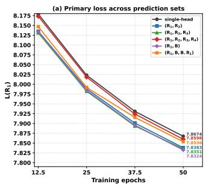

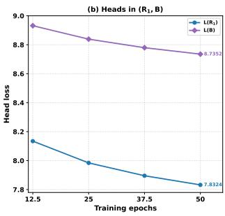  
Figure 7: Optimization behavior under diferent MTP-head configurations. (a) Primary autoregressive loss $L ( R _ { 1 } )$ across training epochs for single-head and multi-head prediction sets. (b) Primary-head loss $L ( R _ { 1 } )$ and auxiliary-head loss �(�) for the $( R _ { 1 } , B )$ configuration. The comparison illustrates how additional prediction targets alter the optimization of the main autoregressive objective and motivates limiting the number of auxiliary heads to avoid excessive interference.

## B.5 CFG Sensitivity

We conduct a CFG sweep using the 300-epoch MTAR-B model. The resulting FID values are 4.94, 4.50, and 4.85 at guidance scales of 1.75, 2.00, and 2.25, respectively. We therefore use a guidance scale of 2.00.

## C Representation and Semantic-Dropping Analysis

## C.1 Token Discriminability

To evaluate whether TCR improves the discriminability of visualtoken representations, we conduct token-level linear probing and kNN-purity analysis on the ImageNet validation set.

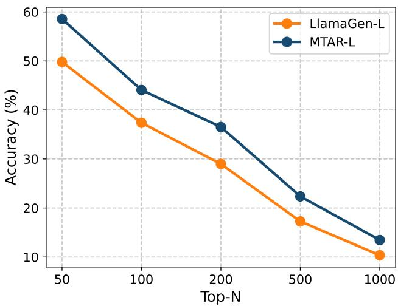  
Figure 8: Token-level linear-probing accuracy on the ImageNet validation set. MTAR-L consistently outperforms LlamaGen-L across all Top-� settings, indicating better linear separability of visual-token representations.

For linear probing, we train a linear classifier to predict VQ token IDs from frozen hidden representations under vocabulary sizes ranging from Top- $\cdot N = 5 0$ to $\mathrm { T o p } { \cdot } N = 1 0 0 0 .$ . As shown in Fig 8, MTAR-L with TCR consistently outperforms LlamaGen-L without TCR, with gains ranging from 3.10% at Top-1000 to 8.76% at Top-50. The larger improvements at smaller � suggest that TCR particularly enhances the representations of frequent visual tokens.

For local neighborhood analysis, we compute token-level kNN purity with $k = 5 .$ . For each token representation, we retrieve its five nearest neighbors and measure the proportion sharing the same VQ token ID. MTAR-L achieves 17.54% kNN purity, compared with 15.78% for LlamaGen-L, an absolute improvement of 1.76%. These results indicate that TCR improves both global linear separability and local neighborhood consistency.

## C.2 Potential False Negatives

We use DINOv3 [42] to extract visual-token features from 10,000 ImageNet training images and compute pairwise cosine similarities. As reported in Tab 13, only 2.01% and 8.73% of token pairs have cosine similarity above 0.9 and 0.8, respectively. Highly similar within-batch token pairs are therefore uncommon. Randomly sampling � tokens for contrastive learning and discarding 50% of patch tokens through Semantic Dropping further reduce the probability of false negatives.

Table 13: Proportions of highly similar token pairs under diferent cosine similarity thresholds.
<table><tr><td>Similarity</td><td>Ratio</td></tr><tr><td> $\mathrm { S i m } > 0 . 9$ </td><td>2.01%</td></tr><tr><td> $\mathrm { S i m } > 0 . 8$ </td><td>8.73%</td></tr></table>

## C.3 Qualitative Behavior of Semantic Dropping

Figure 9 visualizes representative texture-rich ImageNet samples before and after Semantic Dropping. With 50% token retention, SD removes substantial background redundancy while preserving the primary foreground structures used for training.

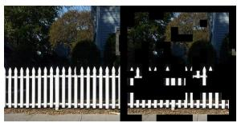

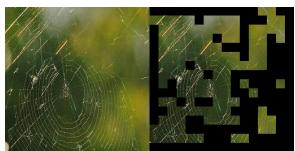  
Figure 9: Randomly selected examples before and after SD for the ImageNet classes picketfence and spider web, using 50% token retention.

## D Additional Generated Samples

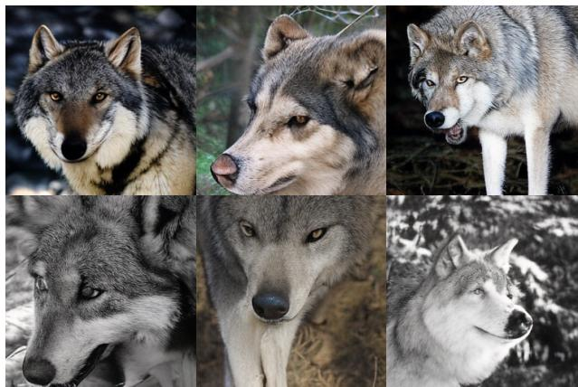  
Figure 10: Generated samples from MTAR-L for ImageNet class ID 269 (wolf).

  
Figure 11: Generated samples from MTAR-L for ImageNet class ID 323 (butterfly).

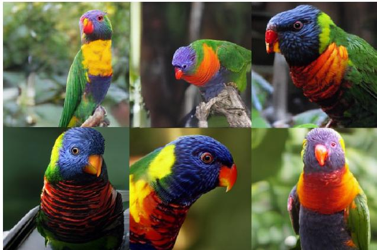

Figure 12: Generated samples from MTAR-L for ImageNet class ID 90 (lorikeet).  
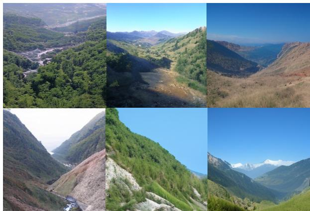  
Figure 13: Generated samples from MTAR-L for ImageNet class ID 979 (valley).

E Comparison with LlamaGen  
  
LlamaGen-L

  
Figure 14: Uncurated random samples from LlamaGen and MTAR.  
MTAR-L

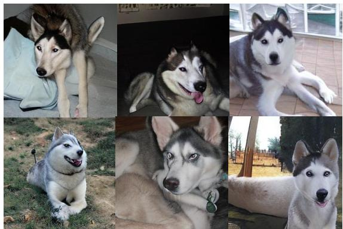  
LlamaGen-L, class id 250, siberian husky

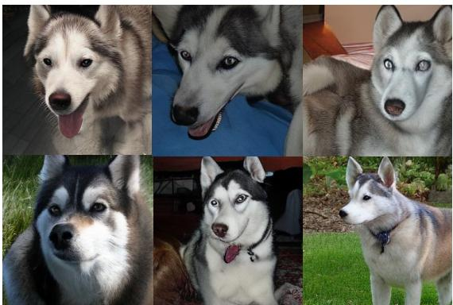  
MTAR-L, class id 250, siberian husky

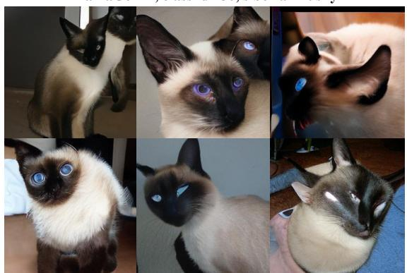  
LlamaGen-L, class id 284, siamese cat

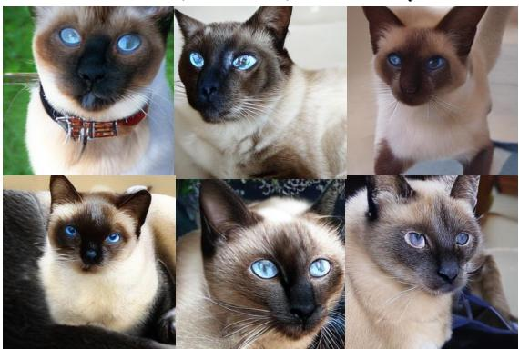  
MTAR-L, class id 284, siamese cat

LlamaGen-L, class id 985, siberian daisy  
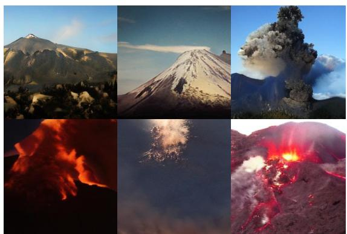  
LlamaGen-L, class id 980, volcano

MTAR-L, class id 985, siberian daisy  
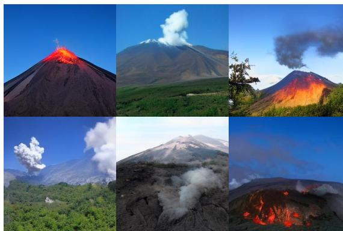  
MTAR-L, class id 980, volcano

Figure 15: Comparison of class-conditional samples produced by LlamaGen-L and MTAR-L on ImageNet 256 × 256.

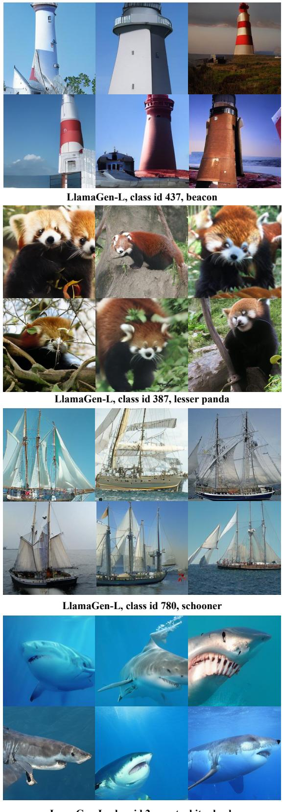  
LamaGen-L, class id 2, great white shark

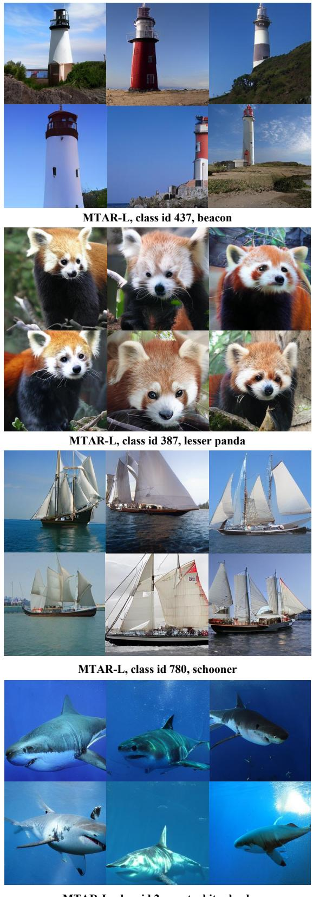  
MTAR-L, class id 2, great white shark

Figure 16: Additional comparison of class-conditional samples produced by LlamaGen-L and MTAR-L on ImageNet 256 × 256.