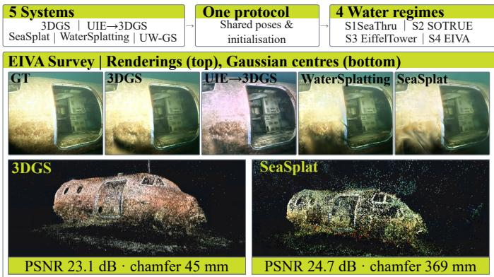
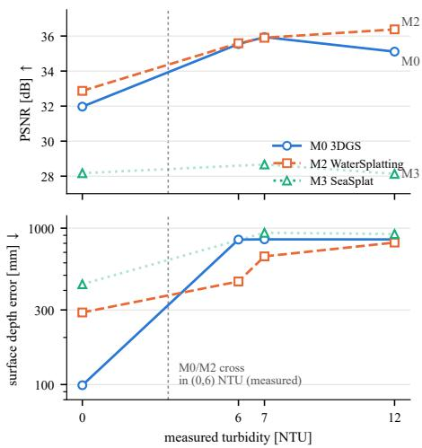
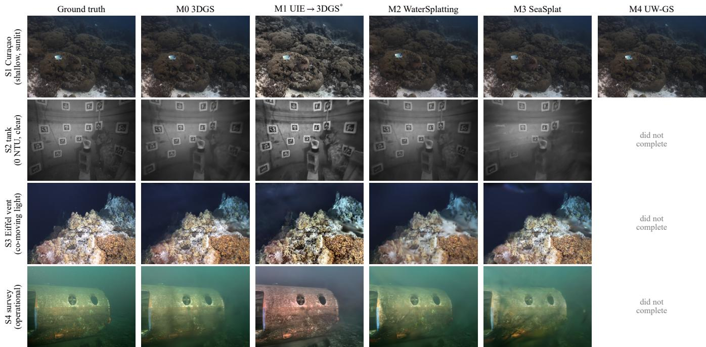

# Gaussian Splatting Underwater: A Controlled Cross-Regime Study

Olaya Álvarez-Tuñón , Stella Graßhof

Abstract—The underwater environment is challenging for 3D reconstruction, because particles suspended in the water scatter and diffuse light, turbidity varies, absorption depends on wavelength, and illumination is rarely uniform. Methods based on Gaussian splatting have generally been developed for conditions that allow good image quality, and have primarily been tested on relatively shallow water. This paper examines how well Gaussian splatting performs across publicly available underwater datasets representing different degrees of turbidity, loss of illumination, and colour attenuation, together with an industrial survey. Five systems with public code are run under one protocol, with shared poses, initialisation, budget, and evaluator, to establish their relative advantages, disadvantages, and limitations. What these methods can do turns out to depend more on the setup than on the architecture. Water clarity binds upstream of rendering, since structure-from-motion registers 99.5 % of frames in clear water and 0.0 % at 12 NTU. Illumination geometry decides whether a medium model helps at all: under an artificial light that moves with the camera, medium-blind splatting beats both mediumaware systems. On the survey the benchmark’s photometric leader comes last, beaten on geometry by a restoration pre-pass in front of vanilla 3DGS — and none of it is visible in the scores the field reports. Scene builds, per-run configurations, and evaluation code are released at https://github.com/olayasturias/uw3dgs.

## I. INTRODUCTION

Underwater 3D scene reconstruction is fundamental to marine robotics, with applications in subsea structural inspection, self-localisation for autonomous underwater vehicles, archaeological survey and environmental monitoring.

3D Gaussian splatting (3DGS) [1] achieves photo-realistic, real-time rendering from explicit anisotropic primitives, and recent work [2, 3, 4] has adapted it to underwater imagery. That work is developed and evaluated in relatively shallow water or highly controlled datasets, and it is not known whether it holds for real ROV operations in deeper, more turbid conditions, where a render can look right while the geometry underneath it is wrong.

The present work asks: which of the available methods are solving underwater 3D reconstruction, and which are only producing visually plausible renders? Underwater methods repair two failures at once, corrupted appearance and geometry fabricated to explain the medium, and photometric metrics cannot separate them. It is therefore not known which of the two a medium model buys, or whether a plain restorethen-splat baseline already covers the first. We answer with a controlled protocol rather than a new method: shared poses, initialisation, budget and evaluator across five code-available systems and four water regimes, with turbidity as a measured independent variable.

  
Fig. 1: The proposed controlled cross-regime study, exemplified with EIVA Survey’s renderings and point clouds. The point clouds correspond to the Gaussians’ centres.

The paper contributes: (1) a cross-regime analysis of five state-of-the-art methods under a common protocol, over four underwater regimes ranging from the field’s default shallow benchmark, to a controlled tank, a deep site under co-moving light, and an industrial survey;

(2) a component analysis inside one of the method’s codebases [3] separating the medium model, the depth prior and the backscatter term;

(3) a benchmark protocol adding geometric evaluation in addition to the existing photometric axis, including a reference-free floater-mass statistic that quantifies veil contamination where no ground truth exists; and

(4) a measurement of how far a fitted medium model carries beyond the scene it was fitted on, which the field assumes but does not test.

Figure 1 exemplifies the central result: photometric and geometric quality move in opposite directions, and the metric the field standardised on saturates precisely where the problem becomes hard.

## II. BACKGROUND

## A. Underwater image formation

The underwater image formation model is commonly formulated in the literature as:

$$
I _ { c } = J _ { c } e ^ { - \beta _ { c } ^ { D } z } + B _ { c } ^ { \infty } \Big ( 1 - e ^ { - \beta _ { c } ^ { B } z } \Big ) ,\tag{1}
$$

with the first term modelling the directly transmitted signal, attenuated with range, and the second the backscattered veil that accumulates along the same path. $J _ { c }$ is the true scene colour in channel $c , ~ z$ the range, $\mathbf { \hat { \beta } } _ { c } ^ { D }$ the wideband attenuation coefficient, $\beta _ { c } ^ { B }$ the backscatter coefficient, and $B _ { c } ^ { \infty }$ the radiance of the background light at infinite range [5]. Two properties of Eq. (1) drive every design decision in the systems tested. First, $\beta ^ { \bar { D } } \neq \beta ^ { B }$ and both depend on wavelength [6, 7], so single-coefficient haze models imported from the dehazing literature are physically wrong in water, an error invisible in grey fog and severe in colour. Second, every term depends on range z: recovering colour and recovering geometry are the same problem.

## B. 3D Gaussian Splatting: State of the Art

3DGS owes its efficiency to its explicit representation: radiance lives on the primitives, with no per-ray evaluation. Underwater, however, scattering is a function of range z, and the only way such a representation can produce it is to place semi-transparent primitives in the water column [2, 8]. The design space of underwater 3DGS lies in three aspects: medium realisation, additional supervision, and per-Gaussian state.

Medium realisation. Vanilla 3DGS ignores the medium its primitives sit in. Underwater variants place it in image space, as a restoration pre-pass before splatting [9, 10]; in a separate volumetric field rendered jointly with the splats [2, 8, 11]; per-Gaussian, as analytic attenuation and backscatter terms on each primitive [3, 4, 12, 13, 14]; or inside the compositing rule itself [15]. The choice fixes the failure mode: a pre-pass restores each view independently and cannot enforce multiview consistency, whereas a separate field reintroduces the perray evaluation that 3DGS exists to avoid.

Additional supervision. Because the medium couples colour to range, most methods add constraints on geometry: monocular depth supervision [3, 16], density control that keeps attenuation from starving far-field densification [4], masks for moving distractors such as fish and suspended particles [4, 17], and semantic guidance [18].

Per-Gaussian state. A vanilla primitive carries a position, a covariance factorised into scale and rotation, an opacity, and a view-dependent colour as degree-3 spherical harmonics (SH). SeaSplat drops to SH degree 0, so appearance variation must come from its medium networks or from geometry [3], while UW-GS [4] and SeaFree-GS [19] carry a clean and a degraded colour per primitive and map between them with a network.

## III. EXPERIMENTAL DESIGN

## A. Scenes

Four regimes, labelled S1–S4, run from experimental control to realistic operating conditions. SeaThru-NeRF Curaçao (S1) [20] is the in-distribution control, since most surveyed methods were tuned on this benchmark family. We use the authors’ own COLMAP reconstruction. SOTRUE (S2) [21] provides six turbidity levels measured with a Seapoint meter in Nephelometric Turbidity Units (NTU), each captured along an identical servo-driven trajectory with poses from motor encoders rather than from the images, so turbidity is the only variable that changes between sequences. Its monochrome imagery switches off the wavelength-dependent half of Eq. (1) and leaves the range-dependent half in isolation. Eiffel Tower (S3) [22] was captured in deep water, where the uniformveiling-light assumption is structurally violated by the artificial light source moving with the ROV. EIVA survey (S4) is a proprietary operational survey with a photogrammetric reference point cloud.

## B. Methods

Five methods are evaluated here, one for each cell of the medium-realisation axis of Sec. II-B: no medium model (M0, vanilla 3DGS [1]); a medium removed in image space (M1, a classical enhancement pre-pass in front of that same vanilla 3DGS); a medium held in a separate field (M2, WaterSplatting [2]); and a medium attached to the primitives (M3, SeaSplat [3], and M4, UW-GS [4]). Three further systems we built and smoke-tested duplicate cells already covered and are not reported. Table I states what each system changes, read from its released code rather than from its paper.

M1’s pre-pass is gray-world white balance [23] followed by CLAHE [24] on the lightness channel, clip 2.0 and $8 \times$ 8 tiles, applied identically to every scene. It is the classical core of fusion-based underwater enhancement [25] without the fusion stage: no training data and no network, so it is the cheapest conceivable underwater adaptation and the baseline the medium-aware methods have to beat.

## C. Controlled protocol

Published underwater-splatting numbers cannot be compared with each other, since they differ in poses, initialisation, splits, resolution, and measurement metrics at once. Our protocol removes those differences so that any remaining gap between systems is attributable to the systems themselves.

Poses. The same per scene for every system, and no system runs its own SfM. They come from motor encoders on S2 and from the datasets’ own reconstructions elsewhere. How often COLMAP succeeds unaided is measured separately and reported as a result.

Initialisation. Every system starts from the same sparse cloud per scene, never taken from the evaluation reference: the dataset’s own on S1 and S3, and our own triangulation with poses held fixed on S2 and S4 (1.77 and 0.34 px mean reprojection error). On S2 the clear-water cloud seeds every turbidity level, since from 7 NTU upward no usable triangulation exists, which is itself a result.

TABLE I: System anatomy. All systems initialise from the shared per-scene SfM cloud of Sec. III-C. SH = spherical harmonics. Entries in bold are undocumented in the original paper.
<table><tr><td></td><td>Per-Gaussian state</td><td>Medium realisation</td><td>Extra supervision / inputs</td></tr><tr><td>M0 vanilla 3DGS [1]</td><td>pos., SH-3 colour, opacity, — scale, rot.</td><td></td><td></td></tr><tr><td>M1 UIE→3DGS [1]</td><td>as M0</td><td>removed in 2D pre-pass: gray world + CLAHE separate field: dir.-conditioned MLP → medium medium regularisers</td><td>restored images as input</td></tr><tr><td>M2 WaterSplatting [2]</td><td>as M0 (gsplat param.)</td><td>colour, attenuation and backscatter densities</td><td></td></tr><tr><td>M3 SeaSplat [3]</td><td>scale, rot.</td><td>βD, B∞ from rendered depth</td><td>pos., SH-0 colour, opacity, analytic Eq. (1) in image space; CNNs infer depth-smooth, depth-weighted recon., dark-channel, grey-world</td></tr><tr><td>M4 UW-GS [4]</td><td>colour pair via view-distance MLP</td><td>as M0 + clean/degraded per-Gaussian distance-dependent transform</td><td>depth-alignment loss; mono-depth maps required</td></tr></table>

Budget. One run per cell, 30 k optimisation iterations at each system’s default densification schedule, on a single 24 GB GPU. Where a default schedule exceeds that budget we report the outcome rather than tuning it away.

Repeats. Two cells at 7 NTU on S2 were repeated to bound run-to-run spread. Running M0 three times at a fixed configuration gives surface errors of 848, 844 and 846 mm, so the nondeterminism of the CUDA reductions is worth roughly ±2 mm. Running M2 at three seeds gives 660, 578 and 581 mm, a spread of 82 mm, which is the figure to read the S2 depth column against. Elsewhere we use the uncertainty matched to the measurement: on S4 that is the ICP residual of the alignment the chamfer is computed through. Differences below either are treated as ties rather than rankings.

Splits. Every 8th frame by sorted filename, the same index set for every system, leaving 3 held-out views on S1, 25 on S2 and 71 on S4. Photometric scores use the in-medium render rather than any restored output, so systems producing both are compared on the same quantity. M1 is the exception, since its targets are its own enhanced images; its photometric cells are marked and are not comparable to the rest.

Resolution and inputs. Native resolution with the forks automatic downscaling disabled, except on S4, whose 1408 × 1408 frames are a 0.5× resize of the rectified originals applied once before any system sees them. Inputs are identical per scene, with 32 border pixels masked on S2 to exclude its documented edge distortion.

## D. Metrics

Photometric. PSNR, SSIM [26] and LPIPS [27] on heldout views: per-pixel fidelity, local structural similarity, and distance in the feature space of a pretrained network.

Geometry-free control. A photometric score alone cannot separate a good reconstruction from an easy image, so we also score a baseline with no geometry at all: the per-pixel median of a scene’s training frames, one static image, evaluated against the same held-out views with the same code. Whatever a system scores above it is what reconstruction earns, and its own behaviour across turbidity separates the metric from the method.

Geometric. On S2 we compare rendered depth against an independent stereo reference. That depth is an alpha blend and translucent matter dominates it, so a model wrapped in haze reports the haze’s depth rather than the surface’s. We therefore render depth twice, once as the plain blend and once over only the primitives with opacity above 0.5, and the gap between them measures how much floating matter the model committed to. On S4 we compare opacity-gated Gaussian centres against the photogrammetric reference cloud (accuracy, completeness, chamfer) on the co-visible region, after an ICP alignment [28] whose residual we report. Where no geometric reference exists we instead report floater mass, the fraction of total opacity sitting more than τ nearer the camera than the rendered surface, at τ = 0.1 m unless a table says otherwise (Table IV sweeps it). It counts translucent mass in front of the surface and is blind to opaque mass in the wrong place, a distinction S4 makes visible (Sec. IV-C).

Registration. The fraction of frames COLMAP [29] registers. We report it on S2 alone, the one scene whose sequences differ in turbidity only and whose poses come from outside the images, so the rate isolates turbidity.

## E. The experiments

Six experiments run over those scenes. E1 compares all five systems on the benchmark (S1) and the operational survey (S4). E2 sweeps four measured turbidity levels on S2 with trajectory, poses and initialisation fixed. E3 retrains M3 on S2 at 0 NTU with COLMAP poses in place of encoder ground truth, and only M3, since it is the only system whose losses read geometry back out of its own render (Table I) and so the one most exposed to pose error; above 0 NTU COLMAP registers almost no frames, which is itself the result. E4 switches SeaSplat’s medium model, depth prior and backscatter term off one at a time on S1. E5 covers S3, and additionally runs M0 on an every-16th-frame version of the same dive to separate view overlap from regime. E6 renders the S3 model through the medium networks fitted on S1, an evaluation with no training run.

Two systems carry requirements that bound their coverage. M1 restores colour before splatting, which is close to meaningless on the monochrome S2, so it was not attempted there or on S3. M4 needs a monocular depth map per input image, which we prepared for S1 and S4 only.

TABLE II: E2 turbidity sweep and E3 pose source on SOTRUE. Ctrl is the geometry-free control of Sec. III-D. The indented + COLMAP poses rows replace the encoder poses with a free COLMAP reconstruction (E3). †SeaSplat’s default densification exceeds 24 GB at 7 NTU; that cell alone uses a doubled threshold.
<table><tr><td>NTU</td><td>Ctrl↑</td><td>System</td><td>PSNR↑</td><td>Err↓[mm]</td><td>Floater↓</td><td>#G (k)</td></tr><tr><td rowspan="5">0.0</td><td rowspan="5">24.1</td><td>M0 3DGS</td><td>31.97</td><td>99</td><td>0.071</td><td>117</td></tr><tr><td>M1 UIE→3DGS</td><td>26.85*</td><td>68</td><td>0.058</td><td>296</td></tr><tr><td>M2 WaterSplatting</td><td>32.87</td><td>289</td><td>0.001</td><td>154</td></tr><tr><td>M3 SeaSplat</td><td>28.17</td><td>438</td><td>0.047</td><td>269</td></tr><tr><td>+ COLMAP poses</td><td>28.30</td><td></td><td></td><td>129</td></tr><tr><td rowspan="3">6.0</td><td rowspan="3">31.5</td><td>M0 3DGS</td><td>35.54</td><td>845</td><td>0.076</td><td>22</td></tr><tr><td>M1 UIE→3DGS</td><td>29.83*</td><td>531</td><td>0.177</td><td>24</td></tr><tr><td>M2 WaterSplatting</td><td>35.59</td><td>456</td><td>0.000</td><td>18</td></tr><tr><td rowspan="5">7.0</td><td rowspan="5">32.0</td><td>M0 3DGS</td><td>35.94</td><td>848</td><td>0.068</td><td>23</td></tr><tr><td>M1 UIE→3DGS</td><td>29.39*</td><td>809</td><td>0.126</td><td>22</td></tr><tr><td>M2 WaterSplatting</td><td>35.90</td><td>660</td><td>0.000</td><td>13</td></tr><tr><td>M3 SeaSplat</td><td>28.67†</td><td>934†</td><td>0.021†</td><td>111†</td></tr><tr><td>+ COLMAP poses</td><td>1.0 % registered — no usable poses</td><td></td><td></td><td></td></tr><tr><td rowspan="5">12.0</td><td rowspan="5">31.7</td><td>M0 3DGS</td><td>35.11</td><td>847</td><td>0.088</td><td>32</td></tr><tr><td>M1 UIE→3DGS</td><td>29.58*</td><td>861</td><td>0.082</td><td>30</td></tr><tr><td>M2 WaterSplatting</td><td>36.38</td><td>809</td><td>0.002</td><td>3.1</td></tr><tr><td>M3 SeaSplat</td><td>28.13</td><td>917</td><td>0.049</td><td>282</td></tr><tr><td>+ COLMAP poses</td><td>0.0 % registered — no poses exist</td><td></td><td></td><td></td></tr></table>

Fig. 2: Turbidity dose–response on SOTRUE (E2), for the three systems that run there: M0, M2 and M3, the last without a 6 NTU cell. PSNR (top) rises with turbidity while surface depth error against the stereo reference (bottom, log scale) grows by up to 8.5×.

## IV. RESULTS

## A. E2: Turbidity Dose-Response

Table II and Fig. 2 report the controlled sweep, in which measured turbidity is the only variable. Two results inform what follows.

First, the photometric and geometric axes move in opposite directions. For the medium-blind baseline (M0), heldout PSNR improves from 32.0 dB in clear water to 35.9 dB at 7 NTU while its surface depth error against the stereo reference degrades from 99 mm to 848 mm: the veil leaves less texture to fit, and the optimiser reconstructs the haze as geometry. The geometry-free control rises from 24.1 to 32.0 dB over the same range, so turbidity inflates PSNR for anything at all, and every system’s margin over that static image shrinks as the water worsens (M0: 7.9 → 3.4 dB).

Second, the systems fail geometrically in different shapes. M0 collapses somewhere below 6 NTU and then saturates near 850 mm: once the veil is reconstructed as a solid, no scene structure is left to lose. M2 degrades gradually, its scene absorbed into the medium field, shown by the 50× collapse in primitive count across the sweep. M3 fights the veil by densifying without bound, so its runs either exhaust memory or saturate alongside M0. All three end at 0.8–0.9 m while posting their best or near-best PSNR.

## B. E3: Pose Source

With identical system, scene, and turbidity, swapping encoder ground-truth poses for COLMAP poses changes M3’s PSNR by 0.13 dB (28.30 vs 28.17, the two M3 rows of the 0 NTU block in Table II), within run-to-run noise. Where registration succeeds, pose accuracy contributes essentially nothing to apparent quality. Registration existence is another matter. On SOTRUE’s identical trajectories, COLMAP registers 99.5 % of frames in clear water, 1.0 % at 7 NTU (a single two-view pair), and 0.0 % at 12 NTU, where not one match survives geometric verification despite a detector tuned to fire on 104 low-contrast features per image. These numbers characterise classical SIFT-based SfM, the pipeline the surveyed methods actually use; whether learned matchers survive the cliff is an open question this study does not test.

## C. E1 and E5: Cross-Regime and Deep Water

Figure 3 shows one example view per method; Table III gives the numbers.

On the field’s benchmark, the image scores do not separate the systems, but the floater measure does. All four in-medium systems land within 1.3 dB of each other on S1 (M0 at 29.3 dB, M4 at 30.6 dB), a tie by the standards of this literature. However, a third of M3’s Gaussians, and over half of M4’s Gaussians, correspond to floaters, while M2 runs only with 0.077 floater mass.

On the operational survey the ordering changes. S4 has a photogrammetric reference, so geometry is measured rather than inferred: chamfer is the average separation between the reconstruction and that cloud. M0 and M2 tie on appearance (25.9 vs 25.7 dB) and both land close to the reference (chamfer 58 and 46 mm, ICP residual under 12 mm). M3, which led the benchmark, comes last on both axes: 24.7 dB and 369 mm, its ICP fitness of 0.71 meaning 29 % of its committed opacity has no counterpart on the reference surface. Its floater mass is low (0.003), so that stray mass is solid geometry in the wrong place, not haze. It is also the slowest by far, 353 min against 28 on the same 566 views. That case calibrates the floater statistic, S4 being the one scene with both axes: floater mass ranks M3 second of four while chamfer ranks it last, so it registers veil and misses displaced opaque geometry. LPIPS tracks SSIM throughout Table III and is reported for completeness.

TABLE III: E1 cross-regime comparison, with the S3 deep-water probe (E5) below. Chamfer is against each scene’s photogrammetric reference; S1 has none, so geometry there is floater mass. ∗M1 is scored against its own enhanced targets and is not comparable in-medium.
<table><tr><td>Scene</td><td>System</td><td>PSNR↑</td><td>SSIM↑</td><td>LPIPS↓</td><td>Chamfer↓</td><td>Floater mass↓</td><td>Train (min)</td><td>#G (M)</td></tr><tr><td rowspan="5">S1 Curação</td><td>M0 3DGS</td><td>29.3</td><td>0.877</td><td>0.199</td><td>n/a</td><td>0.21</td><td>24</td><td>0.58</td></tr><tr><td>M1 UIE→3DGS</td><td>25.0*</td><td>0.807*</td><td>0.251*</td><td>n/a</td><td>0.191</td><td>24</td><td>1.34</td></tr><tr><td>M2 WaterSplatting</td><td>29.5</td><td>0.919</td><td>0.141</td><td>n/a</td><td>0.077</td><td>40</td><td>1.06</td></tr><tr><td>M3 SeaSplāt</td><td>30.2</td><td>0.895</td><td>0.173</td><td>n/a</td><td>0.37</td><td>82</td><td>3.35</td></tr><tr><td>M4 UW-GS</td><td>30.6</td><td>0.898</td><td>0.179</td><td>n/a</td><td>0.551</td><td>188</td><td>0.93</td></tr><tr><td rowspan="5">S4 EIVA</td><td>M0 3DGS</td><td>25.9</td><td>0.780</td><td>0.509</td><td>58</td><td>0.024</td><td>28</td><td>0.24</td></tr><tr><td>M1 UIE→3DGS</td><td>23.1*</td><td>0.577*</td><td>0.665*</td><td>45</td><td>0.015</td><td>27</td><td>0.38</td></tr><tr><td>M2 WaterSplatting</td><td>25.7</td><td>0.783</td><td>0.494</td><td>46</td><td>0.001</td><td>34</td><td>0.09</td></tr><tr><td>M3 SeaSplat</td><td>24.7</td><td>0.744</td><td>0.583</td><td>369</td><td>0.003</td><td>353</td><td>0.16</td></tr><tr><td>M4 UW-GS</td><td></td><td></td><td></td><td></td><td>terminated at 19k/30k iterations after 13.5 h (~30× slower than peers)</td><td></td><td></td></tr><tr><td rowspan="4">S3 Eiffel T. (probe)</td><td>M0 3DGS</td><td>27.0</td><td>0.891</td><td>0.193</td><td></td><td>0.116</td><td>41</td><td>1.91</td></tr><tr><td>M1 UIE→3DGS</td><td>24.4*</td><td>0.833*</td><td>0.291*</td><td></td><td>0.038</td><td>49</td><td>3.25</td></tr><tr><td>M2 WaterSplatting</td><td>23.2</td><td>0.731</td><td>0.483</td><td></td><td>0.014</td><td>29</td><td>0.03</td></tr><tr><td>M3 SeaSplāt</td><td>25.9</td><td>0.870</td><td>0.227</td><td></td><td>0.008</td><td>132</td><td>1.99</td></tr></table>

The naive baseline sits in that same group: M1’s chamfer of 45 mm lands alongside M2’s 46 and M0’s 58 after 27 min of training. Those differences, 1 to 13 mm, sit at or below the 12 mm alignment residual they are measured through, so we read the three as tied; chamfer is unaffected by M1’s enhanced targets, which bear only on its photometric cells. This evidences that in operational surveys, a classic image enhancement beats the medium-aware architectures in precision and computational cost.

Deep water with a moving light (E5, S3). The two axes split as they did in the tank. Vanilla 3DGS wins on appearance, by 1.1 dB over SeaSplat (27.0 vs 25.9 dB, at about 1.9 M Gaussians each) and 3.8 dB over WaterSplatting (23.2 dB), and it carries the most veil of the three, 0.116 floater mass against 0.014 and 0.008. Whoever looks best floats most, as on the benchmark. The medium models lose the appearance advantage they are built for and keep the water out of the model. WaterSplatting loses it as in the tank: its medium field is conditioned on viewing direction, a light tied to the camera makes the illumination look directional, and the field absorbs the light and most of the scene with it, leaving 27 k Gaussians where the others build 1.9 M.

The same M0 on a sparser version of the dive, every 16th frame, scores 16.5 dB instead of 27.0: view overlap is worth 10.5 dB, more than every difference between methods above.

## D. E4: Component Ablation

Table IV switches SeaSplat’s components off one at a time on S1. Turning off backscatter (A1) costs 10.4 dB of PSNR (30.2 to 19.8) but almost no SSIM (0.895 to 0.825), because the error is one of brightness rather than of structure: without a backscatter term the model cannot draw the haze, so its render comes out too dark over most of the frame while the scene inside it stays put. PSNR is a mean squared error and punishes that; SSIM compares local contrast and barely notices.

TABLE IV: E4: component ablation inside SeaSplat (M3) on S1. A0→A3 is the total underwater contribution; A0→A2 isolates the depth prior; A0→A1 isolates the backscatter term. S1 carries no metric geometry reference, so the geometric axis is the GT-free floater mass of Sec. III-D.
<table><tr><td>Config</td><td>Med.</td><td>Dep.</td><td>Bks.</td><td>PSNR↑</td><td>SSIM↑</td><td>Floater↓ τ=.05/.1/.2</td><td>#G (M)</td></tr><tr><td>A0 full</td><td>√</td><td>√</td><td>√</td><td>30.22</td><td>0.895</td><td>.41 / .37  / .33</td><td>3.35</td></tr><tr><td>A1 —backsc.</td><td>√</td><td>√</td><td></td><td>19.84</td><td>0.825</td><td>.31 / .26 / .21</td><td>1.30</td></tr><tr><td>A2 −depth</td><td>√</td><td>1</td><td>√</td><td>27.46</td><td>0.881</td><td>.30 / .25 / .21</td><td>0.62</td></tr><tr><td>A3 —medium</td><td>一</td><td>√</td><td></td><td>23.98</td><td>0.865</td><td>.29 /  .24 / .21</td><td>1.58</td></tr></table>

The depth prior does the opposite of what it is meant to do. Turning depth supervision off (A2) costs 2.8 dB and the geometry gets better: floater mass falls from 0.37 to 0.25 (31% less) on 0.62 M Gaussians instead of 3.35 M. These losses are supposed to pull mass onto surfaces, but the cheapest way to satisfy them is to hang thin semi-transparent sheets in front of the surface, so that is what the optimiser builds. The appearance costs do not add up either: removing backscatter alone costs 10.4 dB against 6.2 dB for removing the whole medium, since attenuation without its veil term darkens the render further than no medium at all. S1 has no metric geometry reference, so geometry here is floater mass alone.

## E. E6: Cross-Site Medium Transfer

The medium models fit one set of parameters per scene, which assumes the water is optically uniform within it and, implicitly, that those parameters mean something outside it. We tested the second half directly, freezing the medium networks fitted on S1 (shallow, sunlit) and rendering the S3 model (deep, artificial light) through them. PSNR falls from 25.9 to 17.0 dB, a −9.0 dB penalty. The parameters this family estimates are therefore site-specific: they describe the training images, not the water, so a deployment cannot calibrate once and reuse.

  
Fig. 3: Renders of one held-out view per regime (rows) for ground truth and all five systems (columns). In the clear tank (S2) the AprilTags act as a sharpness scale and the visual ordering follows the measured surface error of Table II: M1 and M0 hold the tags, M2 softens them, M3 washes out the right half of the frame. Under co-moving light (S3) M2’s render is the blurred residue of a 27 k-Gaussian model after its medium field absorbed the scene; on the survey (S4) M3 is visibly hazier. ∗M1 renders its own enhanced images, so its column differs from ground truth by construction; M4 completes only on S1.

## V. DISCUSSION

Parameters outside the primitives (M2) buy cleanliness and graceful degradation. The separate field gives the cleanest geometry in the study (0.077 on S1, 0.001 on S4, ≤0.002 across the sweep) and degrades as a slope, not a cliff (289 → 456 → 660 → 809 mm). But because the field is a competing explanation for appearance, it can over-discriminate as field scene elements that change across frames with the moving light, as seen in S3.

Per-Gaussian analytic medium (M3) buys appearance, paid for directly in geometry. As shown by the ablation study, removing the medium composite costs 6.2 dB, and removing just the backscatter term costs 10.4 dB, but the full model carries the worst floater mass of the entire ablation (0.368, versus 0.244–0.259 for every single-component removal). With nowhere else to put the veil, it manufactures translucent mass.

Depth supervision buys 2.8 dB and harms geometry. Removing it improves floater mass (0.368 → 0.253) and collapses the model (3.35 M → 0.62 M). The prior acts on the model’s own rendered depth, and a smooth depth field is cheaper to obtain by spreading opacity across semi-transparent layers than by committing to one correct surface.

A fixed image-space pre-pass (M1) buys the best geometry in the study by declining to model the medium at all. 68 mm on the clear tank (against M0’s 99), 45 mm chamfer on the operational survey (best overall), 0.038 floater mass on the deep vent (cleanest real model there), and 27 minutes. Mechanically it works by treating the symptom: local contrast enhancement restores gradient signal on real structure, so points commit to surfaces. The price is that colour gets arbitrarily corrected by the enhancer, which makes the photometrics not comparable.

Distractor handling plus modified densification (M4) buys benchmark rank and nothing else that survives contact with scale. Best S1 PSNR (30.6) but with the dirtiest field (0.551), 188 min on a 21-view scene, and infeasible beyond that.

The decisive cost boundary is per-Gaussian evaluation. Systems whose medium lives outside the primitives train in 24–70 min across all four scenes; attaching the medium to the primitives costs 67 min–13.1 h, up to 12× on the same scene (S4: 28 min for M0 against 353 for M3), and M4 does not finish at all beyond the 21-view benchmark. Within the cheap band, cost tracks primitive count rather than coupling: M1 is the slowest of the three on S1 precisely because contrast enhancement supplies more gradient signal and drives densification to 1.34 M primitives.

## VI. CONCLUSION

Under one protocol across four water regimes, the outcome is set as much by deployment conditions as by architecture. The underwater-specific machinery buys appearance, but no geometry: on the operational survey, the best surfaces come from a fixed restoration pre-pass in front of vanilla 3DGS, which no medium-aware system improves upon.

Water clarity settles the outcome before the renderer is reached, removing the poses above roughly 7 NTU; a moving light costs the medium models the advantage they exist for, and what they estimate does not transfer between sites. Under harsh underwater imaging conditions, a reliable comparison of methods requires evaluating geometry alongside appearance, as the latter alone can be misleading.

The practical consequence is that appearance cannot carry a comparison in this domain. On the field’s own benchmark, photometric rank correlates positively with contaminated geometry. Comparing underwater reconstruction methods reliably requires a geometric axis reported alongside the photometric one. Currently, the field benchmarks itself almost exclusively on clear water, so the conditions where the problem is actually hard never appear in the evaluation.

## REFERENCES

[1] B. Kerbl, G. Kopanas, T. Leimkühler, and G. Drettakis, “3d gaussian splatting for real-time radiance field rendering,” 2023.

[2] H. Li, W. Song, T. Xu, A. Elsig, and J. Kulhanek, “Watersplatting: Fast underwater 3d scene reconstruction using gaussian splatting,” 2024. Code: https://github.com/water-splatting/water-splatting.

[3] D. Yang, J. J. Leonard, and Y. Girdhar, “Seasplat: Representing underwater scenes with 3d gaussian splatting and a physically grounded image formation model,” 2024. Code: https://github.com/dxyang/seasplat.

[4] H. Wang, N. Anantrasirichai, F. Zhang, and D. Bull, “Uw-gs: Distractoraware 3d gaussian splatting for enhanced underwater scene reconstruction,” 2024. Code: https://github.com/WangHaoran16/UW-GS.

[5] O. Álvarez-Tuñón, A. Jardón, and C. Balaguer, “Generation and processing of simulated underwater images for infrastructure visual inspection with UUVs,” Sensors, vol. 19, no. 24, p. 5497, 2019.

[6] D. Akkaynak and T. Treibitz, “A revised underwater image formation model,” 2018.

[7] D. Akkaynak and T. Treibitz, “Sea-thru: A method for removing water from underwater images,” 2019.

[8] S. Liu, J. Lu, Z. Gu, J. Li, and Y. Deng, “Aquatic-gs: A hybrid 3d representation for underwater scenes,” 2024.

[9] J. Shi, J. Xu, J. He, and Z. Lin, “Aquags: Fast underwater scene reconstruction with sfm-free gaussian splatting,” 2024.

[10] Y. Qiao, M. Shao, L. Meng, and K. Xu, “Restorgs: Depth-aware gaussian splatting for efficient 3d scene restoration,” 2025.

[11] C. Wu, J. Dong, C. Li, and J. Tang, “Plenodium: Underwater 3d scene reconstruction with plenoptic medium representation,” 2025.

[12] J. Yuan, Y. R. Li, Y. Zhang, C. Guo, X. Tang, R. Wang, and C. Li, “3duir: 3d gaussian for underwater 3d scene reconstruction via physicsbased appearance–medium decoupling,” IEEE Transactions on Image Processing, 2025. Code: https://github.com/bilityniu/3D-UIR.

[13] J. Li, G. Han, J. Wan, Y. Gao, and D. Han, “Dualphys-gs: Dual physically-guided 3d gaussian splatting for underwater scene reconstruction,” Computers & Graphics, 2025. Code: https://github.com/ Hangz0416/Dualphys-GS.

[14] X. Zhang, Y. W. Y. Wang, S. Fang, Z. Wang, D. Qi, and W. Ding, “Waterclear-gs: Optical-aware gaussian splatting for underwater reconstruction and restoration,” 2026.

[15] N. Mualem, R. Amoyal, O. Freifeld, and D. Akkaynak, “Gaussian splashing: Direct volumetric rendering underwater,” 2024.

[16] Y. Du, Z. Zhang, P. Zhang, F. Sun, and X. Lv, “Udr-gs: Enhancing underwater dynamic scene reconstruction with depth regularization,” Symmetry, 2024.

[17] L. Gough, A. Azzarelli, F. Zhang, and N. Anantrasirichai, “Aquanerf: Neural radiance fields in underwater media with distractor removal,” 2025.

[18] Z. Jiang, H. Wang, G. Huang, B. Seymour, and N. Anantrasirichai, “Semantic-guided gaussian splatting for high-fidelity underwater scene reconstruction,” 2025. Code: https://github.com/theflash987/ SWAGSplatting.

[19] S. Liu, N. Gao, S. Fu, X. Zhong, and H. Li, “Seafree-gs: Reconstructing underwater 3d scenes with true appearances,” IEEE Signal Processing Letters, 2025. Code: https://github.com/deng-ai-lab/SeaFree-GS.

[20] D. L. Levy, A. Peleg, N. Pearl, D. Rosenbaum, D. Akkaynak, S. Korman, and T. Treibitz, “Seathru-nerf: Neural radiance fields in scattering media,” 2023.

[21] A. Marburg and M. Micatka, “A dataset for the assessment of underwater SLAM degradation in turbid water,” in OCEANS 2025 - Great Lakes, (Chicago, IL, USA), pp. 1–5, IEEE, Sept. 2025.

[22] C. Boittiaux, C. Dune, M. Ferrera, A. Arnaubec, R. Marxer, L. Van Audenhaege, M. Matabos, and V. Hugel, “Eiffel tower: A deep-sea underwater dataset for long-term visual localization,” 2022.

[23] G. Buchsbaum, “A spatial processor model for object colour perception,” Journal of the Franklin Institute, vol. 310, no. 1, pp. 1–26, 1980.

[24] K. Zuiderveld, “Contrast limited adaptive histogram equalization,” in Graphics Gems IV, pp. 474–485, Academic Press, 1994.

[25] C. O. Ancuti, C. Ancuti, C. De Vleeschouwer, and P. Bekaert, “Color balance and fusion for underwater image enhancement,” IEEE Transactions on Image Processing, vol. 27, no. 1, pp. 379–393, 2018.

[26] Z. Wang, A. C. Bovik, H. R. Sheikh, and E. P. Simoncelli, “Image quality assessment: from error visibility to structural similarity,” IEEE Transactions on Image Processing, vol. 13, no. 4, pp. 600–612, 2004.

[27] R. Zhang, P. Isola, A. A. Efros, E. Shechtman, and O. Wang, “The unreasonable effectiveness of deep features as a perceptual metric,” in IEEE Conference on Computer Vision and Pattern Recognition (CVPR), 2018.

[28] P. J. Besl and N. D. McKay, “A method for registration of 3-D shapes,” IEEE Transactions on Pattern Analysis and Machine Intelligence, vol. 14, no. 2, pp. 239–256, 1992.

[29] J. L. Schönberger and J.-M. Frahm, “Structure-from-motion revisited,” in IEEE Conference on Computer Vision and Pattern Recognition (CVPR), 2016.