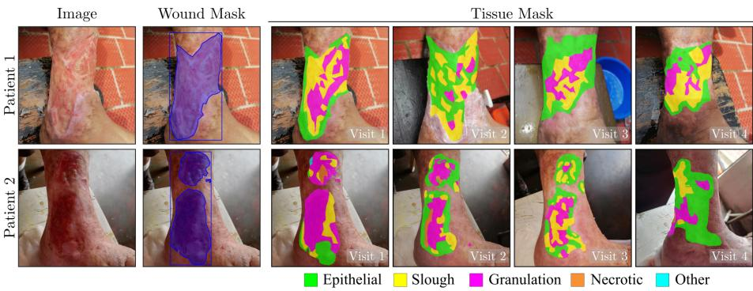
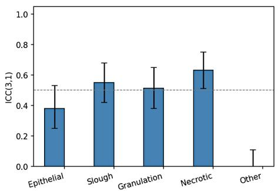
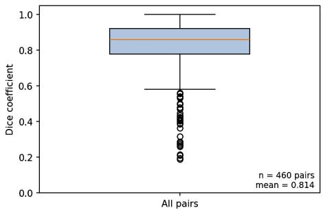
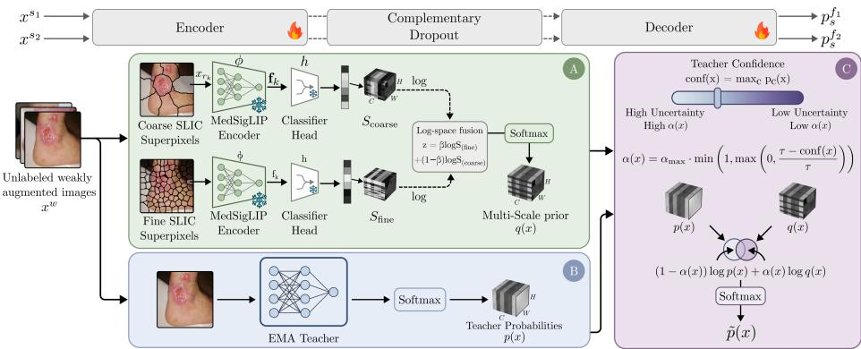
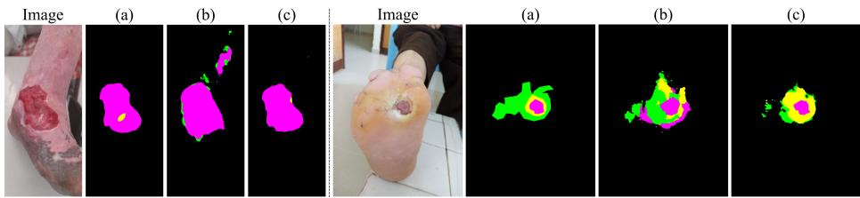

# LUTSeg: A Longitudinal Multi-Expert Dataset for Ulcer Tissue Segmentation

Karen Sanchez1, Carlos Hinojosa1, Albert A. Ávila2, Andrea C. Riano-Rojas3, Diego H. Romero2, Jenny C. Páez2, Martina Llinás2, and Bernard Ghanem1

1 King Abdullah University of Science and Technology (KAUST), Saudi Arabia 2 Subred Norte E.S.E, Hospital Simón Bolívar, Colombia 3 Universidad del Rosario, Bogotá, Colombia karen.sanchez@kaust.edu.sa

Abstract. Quantifying wound tissue composition is essential for monitoring chronic ulcer progression and guiding treatment decisions. However, pixel-level annotations are costly, and multi-tissue wound datasets remain scarce, particularly for neglected diseases such as leprosy. We introduce LUTSeg, a longitudinal chronic ulcer dataset comprising 141 images from 39 patients with wound masks and five tissue categories annotated by five expert clinicians, including a multi-expert gold-standard subset for inter-rater agreement analysis. To establish an initial benchmark for LUTSeg, we further propose TiSage, a semi-supervised tissue segmentation framework that integrates multi-scale semantic priors from a frozen medical vision-language model within a teacher-student architecture. We evaluate TiSage on LUTSeg and DFUTissue, showing improvements over supervised and semi-supervised baselines in most low-label settings. Code & data: https://github.com/carlosh93/TiSage.

Keywords: Tissue segmentation · Skin Analysis · Medical Image Dataset

## 1 Introduction

Efective management of chronic ulcers requires not only accurate wound boundary segmentation but also fine-grained characterization of heterogeneous tissue types within the wound. The spatial distribution of epithelial, slough, granulation, and necrotic tissues encodes clinically actionable information about inflammation, infection risk, and healing progression [2, 6, 22]. However, dense pixel-level tissue annotation is labor-intensive, costly, and inherently subjective, even among specialized wound-care experts. Therefore, high-quality multi-tissue datasets are severely scarce. This challenge is particularly pronounced in neglected diseases such as leprosy [18], where systematic longitudinal monitoring is essential but expert annotation resources are scarce [23, 16].

Most existing wound analysis studies focus on wound boundary segmentation or coarse grading due to the lack of tissue-level annotations [7, 11, 3, 10]. Kabir et al. introduced a six-class wound tissue dataset, which remains private [8]. DFUTissue is a diabetic foot ulcer dataset with a small labeled subset and a larger unlabeled portion designed for semi-supervised learning [5]. Complex-WoundDB covers diverse wound etiologies but remains small-scale [13]. For leprosy, CO2Wounds-V2 [16] provides wound masks but lacks tissue labels.

To address these gaps, we introduce LUTSeg (Leprosy Ulcer Tissue Segmentation across Time), a longitudinal dataset of 141 leprosy-related ulcer images from 39 patients, with pixel-level annotations for five tissue categories (Epithelial, Slough, Granulation, Necrotic, Other), including a 46-image multi-expert gold-standard subset annotated by five clinicians for agreement analysis.

To provide an initial benchmark and demonstrate the utility of LUTSeg for label-eficient tissue segmentation under annotation scarcity, we develop TiSage, a semi-supervised method that integrates multi-scale semantic priors from a frozen medical vision-language model with a confidence-gated, pixel-adaptive pseudo-label refinement strategy. We evaluate TiSage on the DFUTissue and LUTSeg datasets under diverse low-label regimes. TiSage outperforms baselines, particularly in moderate annotation settings. Our contributions are as follows:

– We introduce LUTSeg, a longitudinal, multi-expert, pixel-level wound tissue segmentation dataset for leprosy-related skin ulcers, an underrepresented neglected disease setting.

– We provide a structured annotation protocol with wound and tissue masks, covering five tissue categories. We further quantify inter-rater variability on a gold-standard subset annotated by five clinicians, highlighting the challenge of wound tissue phenotyping.

– To establish an initial benchmark for LUTSeg, we propose TiSage, a semisupervised method that integrates superpixel-based semantic priors from a frozen medical vision-language model into a teacher-student framework to improve pseudo-label quality in low-label regimes.

## 2 LUTSeg Dataset

Pixel-level tissue annotations in chronic wound datasets are scarce due to high annotation burden and inter-observer variability [25]. To our knowledge, no longitudinal datasets currently provide such labels for neglected diseases like leprosy. Data Acquisition. LUTSeg contains 141 images of leprosy-related ulcers from 39 patients, acquired during routine wound care sessions over 21 months. Images were captured by medical staf using smartphone cameras, with each image corresponding to a follow-up visit. The dataset contains 3.615 ± 1.695 visits per patient. Intervals vary according to clinical scheduling and treatment plans.

LUTSeg acquisition adhered to the Declaration of Helsinki. All data were anonymized, and written informed consent was obtained from all participants. The corresponding approval was granted by the Ethics Committee of the Sanatorio de Contratación ESE hospital in Colombia, under Act 05–21.

Annotation Protocol. Pixel-level segmentation of wound tissues was performed by five specialized clinicians with expertise in complex wound care and skin tissue management. Each image was annotated independently using a standardized labeling interface. The following five tissue categories were defined in accordance with clinical practice: Epithelial, Slough, Granulation, Necrotic, and Other. Annotation was conducted in two stages: (1) Wound boundaries were delineated to produce a binary wound mask for each image. (2) All visible tissue regions within the wound area were segmented at pixel resolution into the predefined tissue categories. Given the inherent dificulty of tissue-type annotation, annotators were permitted to assign the “Other” category when tissue appearance did not clearly correspond to the predefined classes.

  
Fig. 1. Samples of the LUTSeg dataset. First-visit image, its binary wound mask, and pixel-level segmentation into five tissue categories for each visit image.

To prevent data leakage, dataset splitting was performed at the patient level, ensuring that images from the same patient were not distributed across annotation or evaluation subsets. We constructed a gold-standard subset of 46 images by selecting patients with higher tissue diversity and multiple follow-up visits. This subset comprised 46 images from 9 patients and was independently annotated by all five specialized physicians. The remaining patients were then distributed among the annotators for separate labeling. Annotation was performed using a dedicated web-based platform [21], ensuring standardized mask creation and quality control. Figure 1 shows examples of our dataset with corresponding wound mask and pixel-level tissue segmentation, as well as longitudinal tissue labeling across follow-up visits. Both wound boundary masks and pixel-level tissue annotations were obtained for all follow-up visits. To derive a single reference mask per image for the gold-standard subset, we performed a consensus selection procedure. For each image, annotators voted for the most clinically accurate mask; ties were resolved via fixed-seed random selection.

Inter-Rater Agreement. To quantify annotation consistency on the goldstandard subset (46 images, 5 clinicians), we evaluated inter-rater agreement using complementary metrics reflecting compositional and spatial consistency. Following the intraclass correlation framework of Shrout and Fleiss [19, 9, 14], and given that the same fixed set of raters annotated all images, we used a twoway mixed-efects model and report the single-measure ICC(3,1) (Fig. 2(left)). For each image and rater, we computed the proportion of each tissue type relative to the total wound area (background excluded), and ICC(3,1) was calculated independently for each tissue category. Second, we assessed spatial overlap using the Dice coeficient between all annotator pairs. Dice was computed on binary tissue-versus-background masks across all annotator pairs (460 comparisons). Agreement on tissue proportions was moderate for Necrotic (ICC = 0.63, 95% CI 0.51-0.75), Slough (0.55, 0.42-0.68), and Granulation (0.51, 0.38-0.65), and lower for Epithelial (0.38, 0.25-0.53). The “Other” class showed the lowest agreement (ICC ≈ 0 (95% CI -0.08-0.11)), reflecting its role in capturing visually ambiguous or heterogeneous regions. Pairwise Dice scores were high overall (mean 0.814, median 0.860; Fig. 2(right)), but exhibited substantial outliers (minimum 0.187), indicating disagreement in tissue extent and boundary delineation in some cases. These findings highlight the intrinsic subjectivity of wound tissue phenotyping, particularly at ambiguous boundaries and for rare or heterogeneous tissue patterns. Even among specialized clinicians, substantial variability persists. These observations motivate TiSage, which incorporates uncertainty-aware, confidenceweighted learning to account for clinical ambiguity.

  
Fig. 2. (Left) ICC(3,1) for tissue proportion agreement across annotators. (Right) Pairwise Dice scores on 46 images annotated by 5 clinicians (gold-standard subset).

## 3 TiSage Method

Semi-supervised wound tissue segmentation is challenging due to the scarcity of annotations and inter-observer variability. In low-label regimes, teacher–student methods such as UniMatch-V2 [24] rely on pseudo-labels, which may propagate errors into ambiguous regions. We propose TiSage, which integrates multiscale semantic priors from a frozen medical vision-language model with pixeladaptive pseudo-label calibration. Our framework consists of: (i) a MedSigLIPbased [17] superpixel prior, (ii) multi-scale log-space fusion, and (iii) pixel adaptive teacher–prior fusion with entropy-weighted supervision (Fig. 3).

## 3.1 Multi-Scale Semantic Prior Construction

Semantic Prior. Let $\mathcal { D } _ { L } = \{ ( x _ { i } , y _ { i } ) \} _ { i = 1 } ^ { N _ { L } }$ denote the labeled set and $\mathcal { D } _ { U } ~ =$ $\{ x _ { j } \} _ { j = 1 } ^ { N _ { U } }$ the unlabeled set. Given an image x, we generate superpixels using

  
Fig. 3. (A) Multi-scale semantic prior construction: coarse and fine SLIC superpixels are encoded with a frozen MedSigLIP encoder, classified, and fused in log space to produce a multi-scale prior q(x). (B) EMA teacher predictions $p ( x )$ from weakly augmented images. (C) Pixel-adaptive fusion of teacher and prior based on teacher confidence, yielding calibrated pseudo-labels $\tilde { p } ( x )$

SLIC [1]. For each region r , we pad it to a square and resize it to 448×448 before feeding it to MedSigLIP. We compute a normalized embedding $\begin{array} { r } { \mathbf { f } _ { k } = \frac { \phi ( x _ { r _ { k } } ) } { \lVert \phi ( x _ { r _ { k } } ) \rVert _ { 2 } } , } \end{array}$ where $\phi ( \cdot )$ denotes the MedSigLIP encoder. To train the region-level classifier, we apply SLIC to labeled images $\left( x _ { i } , y _ { i } \right) \in \mathbf { \mathcal { D } } _ { L }$ and assign each superpixel a class via majority voting over ground-truth pixels within the region. A lightweight linear classification head h is trained once on the region embeddings $\mathbf { f } _ { k }$ using class-balanced cross-entropy and kept frozen during semi-supervised segmentation training. Region-level logits and probabilities are $\ell _ { k } = h ( \mathbf { f } _ { k } )$ and $\pi _ { k } = \operatorname { s o f t m a x } ( \ell _ { k } )$ . We broadcast $\pi _ { k }$ to every pixel in $r _ { k }$ to obtain a dense per-pixel semantic prior:

$$
S ( x ) \in [ 0 , 1 ] ^ { C \times H \times W } , \quad \sum _ { c = 0 } ^ { C - 1 } S _ { c } ( x ; u , v ) = 1 \forall ( u , v ) .\tag{1}
$$

Multi-Scale Fusion. Single-scale superpixels involve a trade-of between spatial smoothness (coarse regions) and boundary precision (fine regions). To balance these efects, we compute two priors: coarse prior $S _ { \mathrm { c o a r s e } }$ and fine prior $S _ { \mathrm { f i n e } }$ . We fuse them in log-probability space:

$$
z = \beta \log S _ { \mathrm { f n e } } + ( 1 - \beta ) \log S _ { \mathrm { c o a r s e } } ; \quad q = \mathrm { s o f t m a x } ( z ) ,\tag{2}
$$

where $\beta \in [ 0 , 1 ]$ controls the balance between fine and coarse scales.

## 3.2 Pixel-Adaptive Teacher–Prior Fusion

Let $p ( x )$ denote the pixel-wise class probabilities predicted by the EMA teacher on weakly augmented unlabeled images, and let $q ( x )$ denote the multi-scale

semantic prior computed on the same view $\left( \operatorname { E q . } \left( 2 \right) \right)$ . We employ a pixel-adaptive fusion that modulates the influence of the prior according to teacher confidence $\mathrm { c o n f } ( x ) = \mathrm { m a x } _ { c } p _ { c } ( x )$ . Hence, we define:

$$
\alpha ( x ) = \alpha _ { \mathrm { m a x } } \cdot \mathrm { m i n } \left( 1 , \mathrm { m a x } \left( 0 , \frac { \tau - \mathrm { c o n f } ( x ) } { \tau } \right) \right) ,\tag{3}
$$

where $\tau$ is a confidence threshold and $\alpha _ { \mathrm { m a x } } \in [ 0 , 1 ]$ . Fusion is performed in log-probability space, corresponding to a weighted product-of-experts:

$$
\tilde { p } ( x ) = \mathrm { s o f t m a x } \left( ( 1 - \alpha ( x ) ) \log p ( x ) + \alpha ( x ) \log q ( x ) \right) .\tag{4}
$$

Thus, the prior has greater influence when the teacher is uncertain and negligible influence when the teacher is confident.

## 3.3 Training Objectives

For labeled data, we use the standard cross-entropy loss $\mathcal { L } _ { \mathrm { s u p } } = \mathrm { C E } ( y , p _ { s } )$ , where $p _ { s }$ is the student prediction. We denote the weakly and strongly augmented views of an image x as $x ^ { w }$ and $x ^ { s }$ , respectively. For unlabeled data, we compute pseudo-labels from the weak view and apply them to the strongly augmented views, following UniMatch-V2 [24]. We supervise the student using calibrated pseudo-labels $\tilde { p } ( x )$ via a blend of hard and soft supervision:

$$
\mathcal { L } _ { \mathrm { u n s u p } } = ( 1 - \beta _ { \mathrm { s o f t } } ) \mathcal { L } _ { \mathrm { C E } } ^ { \mathrm { h a r d } } + \beta _ { \mathrm { s o f t } } \mathcal { L } _ { \mathrm { K L } } ^ { \mathrm { s o f t } } ,\tag{5}
$$

where we set $\beta _ { \mathrm { s o f t } } ~ = ~ 0 . 5$ unless otherwise noted. The hard term uses ${ \hat { y } } ( x ) =$ arg $\operatorname* { m a x } _ { c } \tilde { p } _ { c } ( x )$ and follows UniMatch-V2 by masking pixels with low pseudolabel confidence $\mathrm { ( m a x } _ { c } \tilde { p } _ { c } ( x ) < \gamma )$

$$
\mathcal { L } _ { \mathrm { C E } } ^ { \mathrm { h a r d } } = \sum _ { x } m ( x ) \mathrm { C E } \bigl ( \hat { y } ( x ) , p _ { s } ( x ) \bigr ) , \quad m ( x ) = \mathbf { 1 } \Bigl [ \operatorname* { m a x } _ { c } \tilde { p } _ { c } ( x ) \geq \gamma \Bigr ] .\tag{6}
$$

To avoid relying on hard thresholding for soft supervision, we weight the soft KL term by entropy:

$$
w ( x ) = 1 - \frac { H ( \tilde { p } ( x ) ) } { \log C } ; \quad \mathcal { L } _ { \mathrm { K L } } ^ { \mathrm { s o f t } } = \sum _ { x } w ( x ) \mathrm { K L } \big ( \tilde { p } ( x ) \lVert p _ { s } ( x ) \big ) ,\tag{7}
$$

where $H ( \cdot )$ denotes Shannon entropy. The overall loss is $\mathcal { L } = \mathcal { L } _ { \mathrm { s u p } } + \mathcal { L } _ { \mathrm { u n s u p } }$

## 4 Experiments

Datasets. We evaluate TiSage on both a public benchmark (DFUTissue) and our proposed dataset. DFUTissue [5] is a publicly available dataset of diabetic foot ulcer images with pixel-level tissue annotations. It includes wound masks

Table 1. Comparison of supervised and semi-supervised segmentation methods. In DFUTissue, Fixed denotes the oficial predefined SSL split. Supervised methods use only the labeled portion of each split, whereas semi-supervised methods additionally use the corresponding unlabeled images. DeepLabV3+ uses an ImageNet-pretrained ResNet-50 encoder; DINOv2-DPT and all SSL methods use DINOv2-Base. For LUT-Seg, the fully supervised references using all 111 labeled training images are 31.37/39.19 mIoU/Dice for DINOv2–DPT and 22.06/25.61 for DeepLabV3+.
<table><tr><td rowspan="2">Method</td><td colspan="6">DFUTissue</td><td rowspan="2">LUTSeg</td><td colspan="6"></td></tr><tr><td colspan="2">Fixed</td><td colspan="2">1/4</td><td colspan="2">1/8 1/16</td><td colspan="2">1/4</td><td colspan="2">1/8</td><td colspan="2">1/16</td></tr><tr><td></td><td>mIoU</td><td>F1</td><td>mIoU</td><td>Dice</td><td>mIoU</td><td>Dice</td><td>mIoU Dice</td><td>mIoU</td><td>Dice</td><td>mIoU</td><td>Dice</td><td>mIoU</td><td>Dice</td></tr><tr><td>Supervised methods</td><td></td><td></td><td></td><td></td><td></td><td></td><td></td><td></td><td></td><td></td><td></td><td></td><td></td></tr><tr><td>DeepLabV3+-R50 70.02</td><td></td><td>81.12</td><td>65.22</td><td>77.14</td><td>58.32</td><td>70.52</td><td>48.3858.87</td><td>19.89</td><td>23.17</td><td>20.79</td><td>24.18</td><td>21.25</td><td>25.34</td></tr><tr><td>DINOv2-DPT</td><td>68.71</td><td>80.21</td><td>66.23</td><td>78.03</td><td>64.68</td><td>76.57</td><td>52.8365.02</td><td>28.38</td><td>35.19</td><td>20.47</td><td>23.55</td><td>24.47</td><td>30.15</td></tr><tr><td>Semi-supervised methods</td><td></td><td></td><td></td><td></td><td></td><td></td><td></td><td></td><td></td><td></td><td></td><td></td><td></td></tr><tr><td>FixMatch</td><td>68.91</td><td>80.19</td><td>67.17</td><td>78.80</td><td>66.90</td><td>78.40</td><td>60.14 71.30</td><td>27.70</td><td>33.00</td><td></td><td>27.26 33.91</td><td></td><td>27.42 34.33</td></tr><tr><td>UniMatch-V2</td><td>69.94</td><td>80.96</td><td>68.17</td><td>79.67</td><td>67.28</td><td>78.85</td><td>61.80 73.24</td><td>26.13</td><td>30.55</td><td>27.60</td><td>34.24</td><td></td><td>27.35 32.24</td></tr><tr><td>TiSage (Ours)</td><td></td><td></td><td></td><td></td><td></td><td></td><td>72.36 83.05 69.77 81.00 67.93 79.28 61.33 73.17</td><td></td><td></td><td></td><td></td><td></td><td>28.73 34.50 31.70 39.25 28.55 34.04</td></tr></table>

Table 2. Per-class IoU (%) results on the DFUTissue and LUTSeg for 1/8 label regime.
<table><tr><td rowspan="2">Method</td><td colspan="3">DFUTissue</td><td colspan="4">LUTSeg</td></tr><tr><td>Bg</td><td>Fibrin Gran. Callus mIoU</td><td></td><td>Bg Epi Slough Gran. Necr. Other mIoU</td><td></td><td></td><td></td></tr><tr><td>UniMatch-V2 88.3</td><td></td><td>47.3 86.9</td><td>57.2 69.94</td><td>94.8 25.4 5.6</td><td>39.7 0.0</td><td>0.0</td><td>27.60</td></tr><tr><td>TiSage (Ours) 88.3</td><td></td><td>57.6 86.9</td><td>56.6 72.36</td><td>95.7 26.5 15.4 52.4</td><td>0.1</td><td>0.0</td><td>31.70</td></tr></table>

and four tissue categories (granulation, slough, eschar/necrotic, and epithelial).   
Following prior work, we adopt the standard splits and low-label regimes.

Metrics. Performance is measured using mean Intersection-over-Union (mIoU) and Dice coeficient. Unless otherwise stated, reported values correspond to the EMA teacher model at inference, following prior works [20, 24].

Implementation Details. TiSage is built upon the UniMatch-V2 [24] teacher– student framework. MedSigLIP is used as a frozen encoder to extract superpixellevel embeddings. Low-label regimes are simulated using 1/4, 1/8, and 1/16 labeled data splits. All methods use the same backbone and training schedule. We report mean performance over three random seeds (0, 1, and 2).

## 4.1 Quantitative Results

Comparison with baselines. We compare TiSage against two supervised baselines, DINOv2–DPT [12, 15] and DeepLabV3+–R50 [4], and two semi-supervised baselines, FixMatch [20] and UniMatch-V2 [24]. Table 1 reports segmentation performance under diferent labeled regimes. Supervised methods are trained solely on the labeled portion of each split (no unlabeled data or pseudo-labeling). TiSage consistently outperforms UniMatch-V2 in six of seven settings, with notable gains on DFUTissue Fixed and 1/4 (+2.42 and +1.60 mIoU) and LUTSeg 1/8 (+4.10 mIoU); at DFUTissue 1/16, TiSage remains competitive, trailing by only 0.47 mIoU. TiSage also surpasses supervised approaches across all splits. Per-class IoU. Table 2 reports per-class IoU under the 1/8 labeled regime. On DFUTissue, TiSage notably improves Fibrin (+10.3 IoU), a clinically ambiguous category, while maintaining performance on dominant classes. On LUTSeg, gains are more pronounced, particularly for Slough (+9.8 IoU) and Granulation (+12.7 IoU), which exhibit higher variability and lower baseline performance. These results indicate that multi-scale semantic guidance primarily benefits minority and ambiguous tissue classes under annotation scarcity.

Table 3. MedSigLIP prior-only performance on DFUTissue and LUTSeg on val split.
<table><tr><td rowspan="2">Prior setup</td><td colspan="2">DFUTissue</td><td colspan="2">LUTSeg Pixel Acc (%) mIoU (%)</td></tr><tr><td></td><td>Pixel Acc (%) mIoU (%)</td><td></td><td></td></tr><tr><td>Zero-shot (single-scale SLIC)</td><td>76.24</td><td>34.70</td><td>67.94</td><td>16.39</td></tr><tr><td>Classifier (single-scale SLIC)</td><td>79.40</td><td>45.67</td><td>80.06</td><td>24.02</td></tr><tr><td>Classifier (coarse only)</td><td>74.71</td><td>44.70</td><td>77.48</td><td>23.38</td></tr><tr><td>Classifier (fine only)</td><td>81.55</td><td>48.05</td><td>81.00</td><td>25.44</td></tr><tr><td>Classifier (fused)</td><td>80.92</td><td>52.11</td><td>81.77</td><td>26.28</td></tr></table>

  
Fig. 4. Qualitative comparison of (a) Ground Truth, (b) UniMatch-V2, and (c) TiSage results for two random samples from the LUTSeg proposed dataset.

Ablation Studies. To assess the standalone capability of the MedSigLIP prior, we evaluate prior-only segmentation without the encoder-decoder architecture of TiSage (Table 3). While the prior alone is insuficient for high-quality segmentation, multi-scale fusion substantially improves mIoU over single-scale variants, validating the proposed log-space fusion strategy. Component ablations on DFUTissue (1/8 split) confirm that each TiSage module contributes to performance, with entropy-weighted KL having the largest impact (-0.60 mIoU when removed). Sensitivity analysis on LUTSeg (1/8 split) shows that performance varies $\mathrm { b y \leq 0 . 3 5 }$ mIoU across $\tau \in [ 0 . 8 0 , 0 . 9 5 ]$ , with the best result at $\alpha _ { \mathrm { m a x } } = 0 . 2 5$

## 4.2 Qualitative Results

Figure 4 shows qualitative results on LUTSeg. Compared to UniMatch-V2, Ti-Sage produces more coherent boundaries and fewer fragmented predictions in ambiguous regions, reflecting the efect of our pixel-adaptive semantic fusion.

## 5 Conclusions

We introduced LUTSeg, a longitudinal, multi-expert, pixel-level wound tissue segmentation dataset for ulcers caused by a neglected tropical disease. We further proposed TiSage, a semi-supervised framework that leverages semantic guidance

to improve robustness under annotation scarcity. Experiments on LUTSeg and DFUTissue show consistent gains over established baselines. Together, they set a benchmark for eficient tissue segmentation under realistic clinical constraints.

Acknowledgments. The research reported in this publication was supported by funding from King Abdullah University of Science and Technology (KAUST) - Center of Excellence for Generative AI, under award number 5940.

Disclosure of Interests. Authors declare that they have no conflict of interest.

## References

1. Achanta, R., Shaji, A., Smith, K., Lucchi, A., Fua, P., Süsstrunk, S., et al.: Slic superpixels. Tech. rep., Technical report EPFL (2010)

2. Bowers, S., Franco, E.: Chronic wounds: evaluation and management. American family physician 101(3), 159–166 (2020)

3. Chairat, S., Dissaneewate, T., Wangkulangkul, P., Kongpanichakul, L., Chaichulee, S.: Non-contact chronic wound analysis using deep learning. In: 2021 13th Biomedical Engineering International Conference (BMEiCON). pp. 1–5. IEEE (2021)

4. Chen, L.C., Zhu, Y., Papandreou, G., Schrof, F., Adam, H.: Encoder-decoder with atrous separable convolution for semantic image segmentation. In: Proceedings of the European conference on computer vision (ECCV). pp. 801–818 (2018)

5. Dhar, M.K., Wang, C., Patel, Y., Zhang, T., Niezgoda, J., Gopalakrishnan, S., Chen, K., Yu, Z.: Wound tissue segmentation in diabetic foot ulcer images using deep learning: a pilot study. arXiv preprint arXiv:2406.16012 (2024)

6. Gupta, S., Sagar, S., Maheshwari, G., Kisaka, T., Tripathi, S.: Chronic wounds: Magnitude, socioeconomic burden and consequences. Wounds Asia 4, 8–14 (2021)

7. Hsu, J.T., Chen, Y.W., Ho, T.W., Tai, H.C., Wu, J.M., Sun, H.Y., Hung, C.S., Zeng, Y.C., Kuo, S.Y., Lai, F.: Chronic wound assessment and infection detection method. BMC medical informatics and decision making 19(1), 1–20 (2019)

8. Kabir, M.A., Roy, N., Hossain, M.E., Featherston, J., Ahmed, S.: Deep learning for wound tissue segmentation: A comprehensive evaluation using a novel dataset. arXiv preprint arXiv:2502.10652 (2025)

9. Liljequist, D., Elfving, B., Skavberg Roaldsen, K.: Intraclass correlation–a discussion and demonstration of basic features. PloS one 14(7), e0219854 (2019)

10. Monroy, B., Sanchez, K., Arguello, P., Estupiñán, J., Bacca, J., Correa, C.V., Valencia, L., Castillo, J.C., Mieles, O., Arguello, H., et al.: Automated chronic wounds medical assessment and tracking framework based on deep learning. Computers in Biology and Medicine 165, 107335 (2023)

11. Mukherjee, R., Tewary, S., Routray, A.: Diagnostic and prognostic utility of noninvasive multimodal imaging in chronic wound monitoring: a systematic review. Journal of medical systems 41(3), 1–17 (2017)

12. Oquab, M., Darcet, T., Moutakanni, T., Vo, H.V., Szafraniec, M., Khalidov, V., Fernandez, P., HAZIZA, D., Massa, F., El-Nouby, A., et al.: Dinov2: Learning robust visual features without supervision. Transactions on Machine Learning Research (2024)

13. Pereira, T.A., Popim, R.C., Passos, L.A., Pereira, D.R., Pereira, C.R., Papa, J.P.: Complexwounddb: A database for automatic complex wound tissue categorization. In: 2022 29th International Conference on Systems, Signals and Image Processing (IWSSIP). pp. 1–4. IEEE (2022)

14. Ramachandram, D., Ramirez-GarciaLuna, J.L., Fraser, R.D., Martínez-Jiménez, M.A., Arriaga-Caballero, J.E., Allport, J.: Fully automated wound tissue segmentation using deep learning on mobile devices: Cohort study. JMIR mHealth and uHealth 10(4), e36977 (2022)

15. Ranftl, R., Bochkovskiy, A., Koltun, V.: Vision transformers for dense prediction. In: Proceedings of the IEEE/CVF international conference on computer vision. pp. 12179–12188 (2021)

16. Sanchez, K., Hinojosa, C., Mieles, O., Zhao, C., Ghanem, B., Arguello, H.: Co2wounds-v2: Extended chronic wounds dataset from leprosy patients. In: 2024 IEEE International Conference on Image Processing (ICIP). pp. 69–75. IEEE (2024)

17. Sellergren, A., Kazemzadeh, S., Jaroensri, T., Kiraly, A., Traverse, M., Kohlberger, T., Xu, S., Jamil, F., Hughes, C., Lau, C., et al.: Medgemma technical report. arXiv preprint arXiv:2507.05201 (2025)

18. Serrano-Coll, H., Mora, H.R., Beltrán, J.C., Duthie, M.S., Cardona-Castro, N.: Social and environmental conditions related to mycobacterium leprae infection in children and adolescents from three leprosy endemic regions of colombia. BMC infectious diseases 19(1), 1–10 (2019)

19. Shrout, P.E., Fleiss, J.L.: Intraclass correlations: uses in assessing rater reliability. Psychological bulletin 86(2), 420 (1979)

20. Sohn, K., Berthelot, D., Carlini, N., Zhang, Z., Zhang, H., Rafel, C.A., Cubuk, E.D., Kurakin, A., Li, C.L.: Fixmatch: Simplifying semi-supervised learning with consistency and confidence. Advances in neural information processing systems 33, 596–608 (2020)

21. Tkachenko, M., Malyuk, M., Holmanyuk, A., Liubimov, N.: Label Studio: Data labeling software (2020-2025), https://github.com/HumanSignal/label-studio, open source software available from https://github.com/HumanSignal/label-studio

22. Wåhlstrand, V., Alvén, J., Johansson, L., Axelsson, K., Lorentzon, M., Häggström, I.: Separable tissue representations for attributable risk prediction. In: International Conference on Medical Image Computing and Computer-Assisted Intervention. pp. 561–571. Springer (2025)

23. van Wijk, R., van Selm, L., Barbosa, M.C., van Brakel, W.H., Waltz, M., Puchner, K.P.: Psychosocial burden of neglected tropical diseases in eastern colombia: an explorative qualitative study in persons afected by leprosy, cutaneous leishmaniasis and chagas disease. Global Mental Health 8 (2021)

24. Yang, L., Zhao, Z., Zhao, H.: Unimatch v2: Pushing the limit of semi-supervised semantic segmentation. IEEE Transactions on Pattern Analysis and Machine Intelligence 47(4), 3031–3048 (2025)

25. Yim, W.w., Abacha, A.B., Doerning, R., Chen, C.Y., Xu, J., Subbarao, A., Yu, Z., Xia, F., Hall, M.K., Yetisgen, M.: Woundcarevqa: A multilingual visual question answering benchmark dataset for wound care. Journal of Biomedical Informatics p. 104888 (2025)