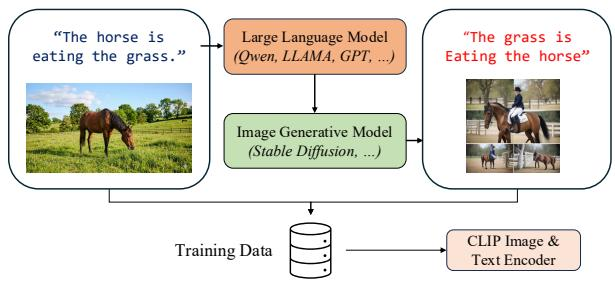
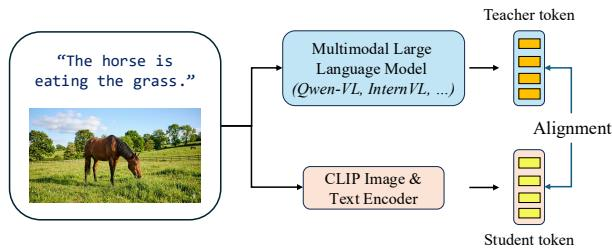
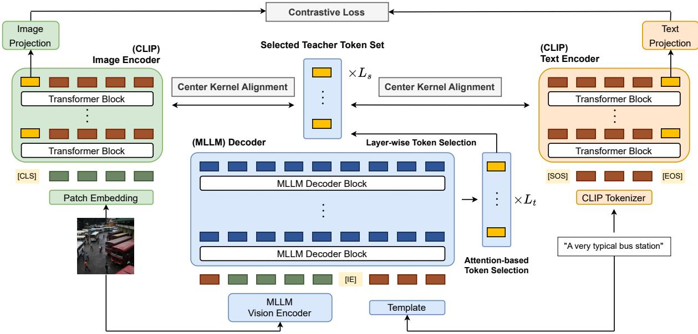

# MLLMCLIP: Feature-Level Distillation of MLLM for Robust Vision-Language Representations

Jongsuk Kim1,2\*, Qiyu Wu2†, Zhuoyuan Mao2‡, Hiromi Wakaki2, Junmo Kim1, Yuki Mitsufuji2 1KAIST, 2Sony Group Corporation js.kim@pyler.tech 2{firstname.lastname}@sony.com

## Abstract

Pretrained vision-language models such as CLIP excel at zero-shot recognition but often fail at compositionality, particularly attributeobject and relational structures. Recent studies mitigate this issue by augmenting training with synthetic hard negatives generated by a cascade of large language models and text-to-image models, which incurs substantial pipeline overhead. We instead propose MLLM-CLIP, a heterogeneous distillation framework that transfers multimodal knowledge directly from a generative Multimodal Large Language Model (MLLM) teacher into a discriminative CLIP student, bypassing synthetic data entirely. To bridge the architectural mismatch between the two paradigms, we introduce an attention-based per-layer token selection and a CKA-based distillation loss. Compared to prior CLIP-enhancement methods, MLLM-CLIP achieves state-of-the-art compositional accuracy while delivering consistent gains on standard zero-shot classification and image-text retrieval, showing that feature-level distillation strengthens both compositional and general vision-language representation capability.

## 1 Introduction

The emergence of CLIP (Radford et al., 2021) marked a turning point in vision-language learning, showing strong performance in zero-shot classification and retrieval. Following its success, a wide range of approaches have been proposed to enhance CLIP, with a focus on embedding space (Goel et al., 2022; Lee et al., 2022; Lavoie et al., 2024), data efficiency (Li et al., 2021; Joshi et al., 2024), and higher-quality captions (Fan et al., 2023; Lai et al., 2024). Despite these advances, a critical limitation has emerged: CLIP often exhibits a bag-of-words behavior (Yuksekgonul et al., 2022), which prevents it from capturing the compositionality.

  
(a) Data-level distillation (NegCLIP, TripletCLIP, ...)

  
(b) Feature-level distillation (Ours)  
Figure 1: Two distillation paradigms. (a) Prior methods synthesize hard-negative samples via cascaded LLM and image generators. (b) We distill hidden states from a frozen MLLM into CLIP directly.

Constructing hard negatives that require compositional reasoning is a common direction to mitigate this issue. Recent studies (Wu et al., 2023; Patel et al., 2024; Singh et al., 2025) pursue this through what we term data-level distillation: external Large Language Models (LLM) and text-to-image generative models are used to synthesize hard-negative captions and images, and the teacher knowledge is delivered to CLIP only through these synthesized samples. However, this paradigm suffers from two key limitations: (1) the lack of unified multimodal understanding, as it relies on separate experts; and (2) the inherent inefficiency of its sequential datageneration pipeline. These shortcomings motivate a shift from data-level to feature-level distillation:

rather than expressing teacher knowledge as additional training samples, we transfer it directly through the hidden-state features of a unified Multimodal Large Language Model (MLLM). As shown in Figure 1, we instantiate this idea as MLLM-CLIP, which aligns the hidden states of an MLLM teacher with a CLIP student in a single forward pass, removing the iterative sampling and qualitycontrol overhead of synthetic-data pipelines.

Realizing this idea requires solving a problem fundamentally different from prior distillation work. Conventional CLIP-to-CLIP (Yang et al., 2024) and MLLM-to-MLLM (Cai et al., 2025) distillation operate within a single architectural family. In contrast, our setting is heterogeneous: a generative MLLM decoder serves as the teacher and a discriminative CLIP encoder as the student.

We first conduct a pilot study showing that base MLLMs exhibit strong compositional understanding while their embedding-tuned counterparts do not, motivating distillation from the base MLLMs. We then address two design challenges induced by heterogeneity. To select the most informative teacher signal without layer correspondence, we propose an attention-based token selection. To stably bridge the feature-space gap, we adopt a variant of CKA (Kornblith et al., 2019) loss that aligns structural relationships.

We evaluate MLLMCLIP on 11 compositionality benchmarks, 13 zero-shot classification datasets, and 2 image-text retrieval benchmarks, consistently outperforming prior CLIP-enhancement methods and achieving the highest average score across all regimes. Moreover, MLLMCLIP achieves competitive compositional accuracy with an order-ofmagnitude lower compute cost than recent MLLMas-embedding approaches (Meng et al., 2025). The contribution of our paper is summarized as follows:

• We propose a heterogeneous distillation framework that transfers multimodal knowledge from a generative MLLM decoder into a discriminative CLIP encoder.

• We design a distillation pipeline tailored to the architectural mismatch, combining attentionbased teacher-token selection with a CKAbased feature alignment loss.

• MLLMCLIP outperforms previous CLIPenhancement methods on 26 benchmarks across compositionality, classification, and retrieval with diverse MLLM teachers.

## 2 Related Works

## 2.1 Compositionality

The success of CLIP has inspired numerous studies (Mu et al., 2022; Lavoie et al., 2024; Zheng et al., 2024) aimed at enhancing its generalizability through data augmentation, improved training strategies, and enriched textual supervision, such as incorporating paraphrased or longer captions during training. In contrast to these general enhancements, Yuksekgonul et al. (2022) identifies a key limitation of CLIP: its tendency to behave like a bag-of-words model. This observation introduces the issue of compositionality, which has led to the development of new benchmarks (Krojer et al., 2022; Peng et al., 2024; Dumpala et al., 2024) specifically designed to assess compositional reasoning in vision-language models. To address this problem, prior work has explored several strategies for constructing hard negative pairs for contrastive learning. Early works employ WordNet (Fellbaum, 2010) to generate semantically challenging negative texts (Yuksekgonul et al., 2022; Oh et al., 2024). Subsequent methods utilize LLMs to synthesize negative texts and further leverage text-toimage generative models to produce corresponding negative images, enabling sequential construction of multimodal negatives (Wu et al., 2023; Patel et al., 2024; Singh et al., 2025).

## 2.2 Distillation Paradigms

We distinguish two regimes in knowledge distillation based on the architectural relationship between teacher and student. Most prior efforts are homogeneous: a larger model is compressed into a smaller model within the same family. This direction has been explored extensively for CLIP-to-CLIP distillation (Yang et al., 2024; Chen et al., 2024), LLM-to-LLM distillation (Chenglin et al., 2024; Xu et al., 2024b), and MLLM-to-MLLM distillation (Cai et al., 2025; Xu et al., 2024a), where the knowledge being transferred remains within the same paradigm. In contrast, distilling from the generative decoder of an MLLM into the discriminative encoders of CLIP introduces a fundamental architectural and paradigmatic mismatch. MLLM-CLIP is a heterogeneous distillation framework that bridges these two families, transferring the multimodal understanding of a generative MLLM into a discriminative CLIP student.

Table 1: SugarCrepe accuracy of representative MLLMas-judge and embedding-based teachers. Embedding models are position-invariant; full results are in Table F.
<table><tr><td>Type</td><td>Model (Backbone)</td><td>First</td><td>Second</td><td>Avg.</td></tr><tr><td rowspan="5">MLLM</td><td>LLAVA-1.6-mistral-7B</td><td>95.6</td><td>74.3</td><td>85.0</td></tr><tr><td>LLaMA-3.2-Vision-11B</td><td>92.1</td><td>92.5</td><td>92.3</td></tr><tr><td>Qwen2-VL-2B</td><td>88.9</td><td>95.4</td><td>92.2</td></tr><tr><td>Qwen3-VL-2B</td><td>94.0</td><td>95.0</td><td>94.5</td></tr><tr><td>Qwen3.5-2B InternVL3.5-2B</td><td>88.5 94.2</td><td>96.0 89.4</td><td>92.3 91.8</td></tr><tr><td rowspan="4">Embed.</td><td>VLM2Vec-v1 (LLAVA-1.6-mistral-7B)</td><td></td><td></td><td>66.7</td></tr><tr><td>VLM2Vec-v2</td><td></td><td></td><td>72.7</td></tr><tr><td>(Qwen2-VL-2B) Qwen3-VL-Embedding-2B</td><td></td><td></td><td></td></tr><tr><td>(Qwen3-VL-2B)</td><td></td><td></td><td>83.0</td></tr></table>

## 3 Does MLLM Possess Sufficient Compositionality?

Before constructing a distillation framework, we first ask a prerequisite question: do current MLLMs themselves understand compositional structures well enough to act as a teacher? A model that struggles with compositional benchmarks cannot transfer compositional knowledge to a student. We therefore conduct a pilot study that measures the compositional understanding of recent MLLMs.

QA-based Evaluation Protocol. We adopt the SugarCrepe benchmark (Hsieh et al., 2023), which is designed to test compositional understanding in vision-language models. The benchmark provides an image paired with a correct and a perturbed caption, and is typically solved by selecting the caption with the higher image-text similarity score. Since MLLMs are not assessed via simple similarity scores, we reformulate the benchmark as a question-answering task. The model is prompted with an image and a multiple-choice query:

Judge prompt (example)   
Which caption correctly describes the image?   
A. The horse is eating the grass.   
B. The grass is eating the horse.   
Answer with a single letter (A or B).

Models and Procedure. We evaluate recent open-source MLLMs: LLaVA-1.6 (Liu et al., 2024), LLaMA-3.2-Vision (Grattafiori et al., 2024), the Qwen series (Bai et al., 2025; Qwen Team, 2026), and the InternVL series (Zhu et al., 2025; Wang et al., 2025). For comparison, we also report MLLM-based embedding models (Jiang et al., 2024; Meng et al., 2025; Li et al., 2026) on the same benchmark. To account for position bias, MLLMs are evaluated twice by swapping the position of the ground-truth caption.

Table 1 shows that MLLMs achieve consistently high compositional ability, while their embeddingtuned counterparts lag substantially. These results show that embedding-style fine-tuning weakens compositional understanding regardless of the underlying MLLM. We therefore directly distill the compositional understanding of base MLLMs.

## 4 Method

We now describe MLLMCLIP, a teacher-agnostic feature-level distillation framework that transfers multimodal knowledge from an MLLM teacher into a CLIP student, illustrated in Figure 2.

## 4.1 Architecture

## 4.1.1 Student Embedding (CLIP)

The student model consists of separate CLIP-based image and text encoders, denoted as $f ^ { I }$ and $f ^ { T }$ , respectively. We follow the standard CLIP-style input processing: patch embedding followed by prepending a [CLS] token for image input $x ^ { I }$ , and tokenization with [SOS] and [EOS] for text input $x ^ { T }$ . Each sequence is passed through its encoder to produce layer-wise hidden states:

$$
\begin{array} { r } { h _ { l } ^ { I } \in \mathbb { R } ^ { d _ { s } ^ { I } } , \quad h _ { l } ^ { T } \in \mathbb { R } ^ { d _ { s } ^ { T } } , \quad l = 1 , \dots , L _ { s } , } \end{array}\tag{1}
$$

where $h _ { l } ^ { I }$ and $h _ { l } ^ { T }$ denote the hidden states of the [CLS] and [EOS] tokens from the l-th layer of the image and text encoders, respectively. Here, $L _ { s }$ is the number of encoder layers, and $d _ { s } ^ { I } , d _ { s } ^ { T }$ are the hidden dimensions of the image and text encoders. To align the feature dimensions of the teacher and student, the hidden states are passed through auxiliary layers $( \mathsf { A u x } ^ { I } , \mathsf { A u x } ^ { T } )$ as follows:

$$
h _ { l } ^ { \mathrm { S t u d } , I } = \mathrm { A u x } ^ { I } ( h _ { l } ^ { I } ) , \quad h _ { l } ^ { \mathrm { S t u d } , T } = \mathrm { A u x } ^ { T } ( h _ { l } ^ { T } )\tag{2}
$$

where $h _ { l } ^ { \mathrm { S t u d } , I } , h _ { l } ^ { \mathrm { S t u d } , T } \in \mathbb { R } ^ { D }$ . These student representations are used to match the corresponding teacher representations. In parallel, the final-layer representations are projected into a common embedding space for contrastive learning. Following the original CLIP architecture, these projection heads, $\mathrm { P r o } \bar { \mathrm { j } } ^ { I }$ and $\mathrm { P r o j } ^ { T }$ , are implemented as a single linear layer:

$$
z ^ { I } = \mathrm { P r o j } ^ { I } ( h _ { L _ { s } } ^ { I } ) , \quad z ^ { T } = \mathrm { P r o j } ^ { T } ( h _ { L _ { s } } ^ { T } ) ,\tag{3}
$$

where $z ^ { I } , z ^ { T } \in \mathbb { R } ^ { d } .$

  
Figure 2: Overview of the MLLMCLIP framework. Student features are passed through auxiliary layers before alignment, and attention-based token selection obtains salient teacher tokens.

## 4.1.2 Teacher Embedding (MLLM)

The teacher model jointly encodes image $x ^ { I }$ and text $x ^ { T }$ as a unified sequence. The image is first tokenized via patch embedding and processed through a vision encoder, which is part of the MLLM architecture. The text input is inserted into a fixed template designed to activate the model’s compositionality, as detailed in Appendix B.2. We concatenate the image features with the [Image End] token, followed by the text tokens, before passing them through the decoder blocks.

The teacher model produces hidden states from each decoder layer $l \in \{ 1 , \ldots , L _ { t } \}$ , denoted as

$$
[ h _ { l , 1 } ^ { \mathrm { M L L M } } , \hdots , h _ { l , N } ^ { \mathrm { M L L M } } ] , \quad h _ { l , n } ^ { \mathrm { M L L M } } \in \mathbb { R } ^ { d _ { t } } .\tag{4}
$$

Note that N is the sequence length, and $L _ { t }$ and $d _ { t }$ denote the number of decoder layers and the feature dimension of the teacher model, respectively.

Token-wise Selection. To identify a representative teacher token within the sequence, we use selfattention weights from each decoder layer. Let $\mathbf { A } _ { l } ^ { ( k ) } \in \mathbb { R } ^ { N \times N }$ denote the attention matrix from head $k \in \{ 1 , \ldots , K \}$ at layer l, where K is the number of attention heads. We begin by averaging the attention weights across all heads:

$$
\bar { \mathbf { A } } _ { l } = \frac { 1 } { K } \sum _ { k = 1 } ^ { K } \mathbf { A } _ { l } ^ { ( k ) } \in \mathbb { R } ^ { N \times N } .\tag{5}
$$

We then compute the maximum attention each token receives across all query positions:

$$
a _ { l , n } = \operatorname* { m a x } _ { i \in \{ 1 , . . . , N \} } \bar { \mathbf { A } } _ { l } [ i , n ] ,\tag{6}
$$

where $\bar { \mathbf { A } } _ { l } [ i , n ]$ denotes the attention weight from token i (as query) to token n (as key). Finally, we select the token with the highest received attention:

$$
n _ { l } ^ { * } = \operatorname * { a r g m a x } _ { n \in \{ 1 , . . . , N \} } a _ { l , n } , \quad h _ { l } ^ { \mathrm { T e a c h } } = h _ { l , n _ { l } ^ { * } } ^ { \mathrm { M L L M } } .\tag{7}
$$

This strategy selects the most attended token in each layer, under the assumption that such tokens are likely to carry salient multimodal information.

Layer-wise Selection. While token selection is guided by attention, we empirically select a subset of teacher layers for distillation to reduce computational cost. Let $S = \{ s _ { 1 } , \dots , s _ { L _ { s } } \} \subseteq \{ 1 , \dots , L _ { t } \}$ denote the selected set of teacher layers, where $| { \mathcal S } | = L _ { s }$ . We explore strategies such as selecting layers from fixed relative positions (e.g., sampling from early, middle, and late stages of the teacher) or using uniform stride intervals across the full depth. This design is motivated by the characteristic of Transformer representations, where lower layers tend to capture fine-grained information and higher layers encode abstract multimodal semantics. Based on empirical results, we adopt the stride-based selection strategy for all experiments.

## 4.2 Loss Functions

## 4.2.1 Contrastive Loss

Following the standard CLIP training (Radford et al., 2021), we use an InfoNCE loss to align image and text embeddings. Let $z _ { i } ^ { I }$ and $z _ { i } ^ { T }$ denote the image and text embeddings for the i-th sample in a batch of size B. The contrastive loss using image embeddings as anchors is given by:

$$
\mathcal { L } _ { \mathrm { c o n t r a s t } } ^ { I } = \frac { 1 } { B } \sum _ { i = 1 } ^ { B } - \log \frac { \exp ( \sin ( z _ { i } ^ { I } , z _ { i } ^ { T } ) / \tau ) } { \sum _ { j = 1 } ^ { B } \exp ( \sin ( z _ { i } ^ { I } , z _ { j } ^ { T } ) / \tau ) } ,\tag{8}
$$

where sim $( \cdot , \cdot )$ denotes cosine similarity and $\tau$ is a temperature. Similarly, we compute $\mathcal { L } _ { \mathrm { { c o n t r a s t } } } ^ { T }$ by treating text embeddings as anchors. The final contrastive loss is given by:

$$
\mathcal { L } _ { \mathrm { c o n t r a s t } } = \frac { 1 } { 2 } \left( \mathcal { L } _ { \mathrm { c o n t r a s t } } ^ { I } + \mathcal { L } _ { \mathrm { c o n t r a s t } } ^ { T } \right) .\tag{9}
$$

## 4.2.2 Distillation Loss

To align intermediate representations between the teacher and student models, we consider a set of similarity-based objectives for distillation. These objectives fall into two main categories:

• Direct similarity loss: such as mean squared error (MSE), which operates on a per-sample basis and compares feature vectors directly.

• Relational similarity loss: such as Centered Kernel Alignment (CKA) (Kornblith et al., 2019), which assesses structural similarity by aligning either the sample-level Gram matrices or the feature-level covariance matrices.

Direct Similarity Loss. Direct similarity losses enforce a sample-wise correspondence between the teacher’s and the student’s intermediate representations. Within a mini-batch size B, let ${ \bf \Sigma } _ { h _ { l , i } ^ { \mathrm { S t u d } , I } } ^ { \bf { \Sigma } }$ denote the student’s image representation for the i-th sample from layer $l ,$ and $h _ { s _ { l } , i } ^ { \mathrm { T e a c h } , I }$ be the corresponding teacher’s image representation from a selected teacher layer $s _ { l } .$ . For each layer, we compute the similarity loss between the student and teacher representations for both image and text, and sum across layers. The resulting objective is averaged over the batch:

$$
\begin{array} { r l r }   { \mathcal { L } _ { \mathrm { d i s t i l l } } = \frac { 1 } { B } \sum _ { i = 1 } ^ { B } \frac { 1 } { L _ { s } } \sum _ { l = 1 } ^ { L _ { s } } \frac { 1 } { 2 } \Big ( \ell _ { \mathrm { d i r e c t } } \big ( h _ { l , i } ^ { \mathrm { S t u d } , I } , h _ { l , i } ^ { \mathrm { T e a c h } , I } \big ) } \\ & { } & { + \ell _ { \mathrm { d i r e c t } } \big ( h _ { l , i } ^ { \mathrm { S t u d } , T } , h _ { l , i } ^ { \mathrm { T e a c h } , T } \big ) \Big ) , \qquad ( 1 0 ) } \end{array}
$$

where $L _ { s }$ is the number of student layers. In our experiments, we consider MSE, cosine similarity, KL divergence, and JS divergence as direct loss functions, denoted as $\ell _ { \mathrm { d i r e c t } }$

Relational Similarity Loss. We primarily adopt the CKA-based loss, which is effective for transferring knowledge between different architectures (Dasgupta and Cohn, 2025). Unlike direct similarity losses, CKA captures the global structural alignment of representations across a batch of samples. We first gather the layer-wise representations for all $B$ samples in a mini-batch into matrices. For a given modality, let $\mathbf { X } _ { l } \in \mathbb { R } ^ { B \times D }$ be the matrix of student hidden states from layer $l ,$ and $\mathbf { Y } _ { s _ { l } } \in \mathbb { R } ^ { B \times D }$ be the matrix of corresponding teacher hidden states from layer $s _ { l } .$ CKA operates by comparing the Gram matrices of these centered feature matrices. First, the matrices are centered:

$$
\tilde { \mathbf { X } } _ { l } = \mathbf { X } _ { l } - \frac { 1 } { B } \mathbf { 1 } \mathbf { 1 } ^ { \top } \mathbf { X } _ { l } , \quad \tilde { \mathbf { Y } } _ { s _ { l } } = \mathbf { Y } _ { s _ { l } } - \frac { 1 } { B } \mathbf { 1 } \mathbf { 1 } ^ { \top } \mathbf { Y } _ { s _ { l } } ,\tag{11}
$$

where 1 is a column vector of ones. The Gram matrices, $K _ { l } \in \mathbb { R } ^ { B \times B }$ and $L _ { s _ { l } } \in \mathbb { R } ^ { B \times B }$ , are then computed:

$$
\mathbf { K } _ { l } = \tilde { \mathbf { X } } _ { l } \tilde { \mathbf { X } } _ { l } ^ { \top } , \quad \mathbf { L } _ { s _ { l } } = \tilde { \mathbf { Y } } _ { s _ { l } } \tilde { \mathbf { Y } } _ { s _ { l } } ^ { \top } .\tag{12}
$$

Finally, CKA is calculated as the normalized Frobenius inner product of these Gram matrices:

$$
\mathrm { C K A } ( { \mathbf { X } } _ { l } , { \mathbf { Y } } _ { s _ { l } } ) = \frac { \langle \mathbf { K } _ { l } , \mathbf { L } _ { s _ { l } } \rangle _ { F } } { \| \mathbf { K } _ { l } \| _ { F } \| \mathbf { L } _ { s _ { l } } \| _ { F } } ,\tag{13}
$$

where $\| \cdot \| _ { F }$ and $\langle \cdot , \cdot \rangle$ F denote the Frobenius norm and Frobenius inner product, respectively. The CKA similarity score is converted into a loss for a single layer, $\ell _ { \mathrm { C K A } }$ . We adopt a common variant that uses a square root, which can provide better gradient properties and create a more sensitive loss when the similarity is high. The total CKA loss is calculated by averaging the single-layer losses across both image and text modalities and summing them over a predefined set of layers:

$$
\ell _ { \mathrm { C K A } } ( { \mathbf { X } } _ { l } , { \mathbf { Y } } _ { s _ { l } } ) = 1 - \sqrt { \mathrm { C K A } ( { \mathbf { X } } _ { l } , { \mathbf { Y } } _ { s _ { l } } ) } ,\tag{14}
$$

$$
\mathcal { L } _ { \mathrm { d i s t i l l } } = \frac { 1 } { L _ { s } } \sum _ { l = 1 } ^ { L _ { s } } \frac { 1 } { 2 } \left( \ell _ { \mathrm { C K A } } ( \mathbf { X } _ { l } ^ { I } , \mathbf { Y } _ { s _ { l } } ^ { I } ) + \ell _ { \mathrm { C K A } } ( \mathbf { X } _ { l } ^ { T } , \mathbf { Y } _ { s _ { l } } ^ { T } ) \right) .\tag{15}
$$

Using a weighting factor λ, the total training objective is defined as:

$$
\mathcal { L } _ { \mathrm { t o t a l } } = \mathcal { L } _ { \mathrm { c o n t r a s t } } + \lambda \mathcal { L } _ { \mathrm { d i s t i l l } } .\tag{16}
$$

Table 2: Performance on 11 compositionality benchmarks.
<table><tr><td></td><td></td><td colspan="10"></td></tr><tr><td>Method</td><td>External Source</td><td>ARO</td><td>CREPE</td><td>EOEN</td><td>ImaODE</td><td>Suəarirpe</td><td>Svorobes</td><td>VASE</td><td>Vlcklkist</td><td>Whatsuup</td><td>Wnorond</td><td>Average SPEC</td></tr><tr><td>CLIP</td><td></td><td>35.6</td><td>11.6</td><td>14.8</td><td>15.0</td><td>59.7 75.8</td><td>55.1</td><td>64.5</td><td>41.3</td><td>7.00</td><td>28.5</td><td>37.1</td></tr><tr><td>LaCLIP</td><td>LLAMA-7B</td><td>35.2</td><td>9.98</td><td>14.4</td><td>14.8</td><td>64.0 76.9</td><td>56.6</td><td>64.8</td><td>41.5</td><td>4.75</td><td>28.3</td><td>37.5</td></tr><tr><td>NegCLIP</td><td>Qwen3-4B</td><td>36.2</td><td>11.7</td><td>14.8</td><td>15.8</td><td>62.4 76.3</td><td>56.1</td><td>64.0</td><td>40.9</td><td>7.00</td><td>28.2</td><td>37.6</td></tr><tr><td>FSC-CLIP</td><td>Qwen3-4B</td><td>35.1</td><td>9.86</td><td>16.3</td><td>14.9</td><td>63.8</td><td>78.8 57.4</td><td>64.4</td><td>41.8</td><td>5.50</td><td>29.2</td><td>38.0</td></tr><tr><td>TripletCLIP</td><td>Qwen3-4B, SDXL-Turbo</td><td>34.6</td><td>10.5</td><td>16.4</td><td>16.9 15.6</td><td>65.7 69.3</td><td>78.8 59.4 79.4 55.9</td><td>64.8 64.6</td><td>41.1 43.6</td><td>4.25</td><td>29.0 26.5</td><td>38.3</td></tr><tr><td rowspan="5">MLLMCLIP (Ours)</td><td>LLaVA-1.6-Mistral-7B Qwen3-VL-2B</td><td>32.1</td><td>10.7 12.0</td><td>15.5 17.0</td><td>17.7</td><td>71.3</td><td>82.3 59.2</td><td>66.9</td><td>43.8</td><td>7.25 8.00</td><td>28.2</td><td>38.2</td></tr><tr><td></td><td>34.6</td><td></td><td></td><td></td><td>72.1</td><td>81.4</td><td>58.8</td><td>66.3</td><td>43.7</td><td></td><td>40.1</td></tr><tr><td>Qwen3.5-2B</td><td>34.1</td><td>11.9</td><td>17.9</td><td>17.3</td><td></td><td>81.8</td><td>57.9</td><td>43.5</td><td>7.75</td><td>28.3</td><td>40.0</td></tr><tr><td>InternVL3-2B</td><td>35.0</td><td>12.3</td><td>18.1</td><td>17.6</td><td>72.0 71.8</td><td>81.9</td><td>58.3</td><td>66.2</td><td>6.00</td><td>29.8</td><td>40.0</td></tr><tr><td>InternVL3.5-2B</td><td>37.0</td><td>12.2</td><td>18.7</td><td>18.3</td><td></td><td></td><td></td><td>66.9 43.5</td><td>7.00</td><td>29.1</td><td>40.4</td></tr></table>

## 5 Experiments

Data & Pre-processing. We use CC3M (Sharma et al., 2018) as the base pretraining dataset. For each image-caption pair, we format the caption with a structured template designed to encourage compositional reasoning and pass it through the frozen MLLM teacher to extract per-layer features offline. For evaluation, we use 11 compositionality benchmarks, 13 zero-shot classification datasets, and 2 image-text retrieval benchmarks. Full benchmark descriptions and the teacher prompt template are provided in Appendix B.1 and B.2.

Implementation Details. We evaluate MLLM-CLIP with five MLLM teachers: LLaVA-1.6- Mistral-7B (Liu et al., 2024), Qwen3-VL-2B (Bai et al., 2025), Qwen3.5-2B (Qwen Team, 2026), InternVL3-2B (Zhu et al., 2025), and InternVL3.5- 2B (Wang et al., 2025). Each teacher is distilled into a CLIP Base student, comprising a ViT-B/32 image encoder and a 12-layer Transformer text encoder, with an auxiliary head of a linear projection followed by Layer Normalization on each modality branch. Every student is trained from scratch on CC3M rather than fine-tuned from a pretrained CLIP checkpoint. All models are trained with a global batch size of 4096, and any additional negative samples introduced by competing methods are included within the same budget. Full hyperparameter configurations are provided in Appendix B.2.

## 5.1 Reproducing Prior Works

We reproduce four CLIP-enhancement baselines: LaCLIP (Fan et al., 2023), NegCLIP (Yuksekgonul et al., 2022), FSC-CLIP (Oh et al., 2024), and TripletCLIP (Patel et al., 2024). These methods enhance CLIP training by incorporating supervision from external Large Language Models and image generative models. For LaCLIP, we use the publicly released LLaMA-generated positive captions1. For NegCLIP and FSC-CLIP, we generate hard negative captions using Qwen3-4B (Yang et al., 2025). For TripletCLIP, we feed the Qwen3- 4B-generated captions into SDXL-Turbo (Sauer et al., 2024) to synthesize corresponding negative images using the prompt templates from the original paper, yielding one negative caption-image pair per CC3M sample.

## 5.2 Main Results

Compositionality. Table 2 reports performance on the 11 compositionality benchmarks. Previous CLIP-enhancement methods show modest gains over CLIP. LaCLIP, which adds positive captions, yields a marginal improvement. NegCLIP and FSC-CLIP achieve a slightly larger gain with LLMgenerated hard negative captions. Even with image synthesis, TripletCLIP brings limited further benefit over caption-only methods. In contrast, MLLM-CLIP outperforms previous methods, with the gain becoming pronounced for stronger teachers. This confirms that compositional reasoning is more effectively strengthened by feature-level distillation from MLLM than by data-level pipelines that synthesize additional training samples. To verify that this gain stems from the transfer mechanism rather than from teacher identity, Appendix A repeats the comparison with the same MLLM supplying both the data-level and the feature-level supervision, and separately ablates the teacher prompt.

Table 3: Zero-shot classification performance on 13 classification datasets.
<table><tr><td>Method</td><td>External Source</td><td>Clte101</td><td>CH-R-10</td><td>CA-R-0</td><td>DTD</td><td>ESAT</td><td>FER2013</td><td>Row102</td><td>Fod 101</td><td>Imageet</td><td>RTI</td><td>Pe</td><td>RESC45</td><td>VOC 207</td><td>Average</td></tr><tr><td>CLIP</td><td></td><td>37.8</td><td>53.3</td><td>21.7</td><td>7.93</td><td>12.1</td><td>12.4</td><td>8.88</td><td>8.91</td><td>12.4</td><td>20.0</td><td>9.95</td><td>15.9</td><td>54.0</td><td>21.2</td></tr><tr><td>LaCLIP</td><td>LLAMA-7B</td><td>41.7</td><td>49.7</td><td>21.2</td><td>11.2</td><td>14.3</td><td>19.5</td><td>11.2</td><td>9.34</td><td>13.7</td><td>30.7</td><td>10.1</td><td>17.1</td><td>60.9</td><td>23.9</td></tr><tr><td>NegCLIP</td><td>Qwen3-4B</td><td>41.4</td><td>55.3</td><td>24.1</td><td>10.6</td><td>18.3</td><td>18.9</td><td>9.16</td><td>9.49</td><td>13.7</td><td>30.4</td><td>8.81</td><td>17.9</td><td>56.8</td><td>24.2</td></tr><tr><td>FSC-CLIP</td><td>Qwen3-4B</td><td>41.5</td><td>54.2</td><td>25.1</td><td>9.84</td><td>18.0</td><td>16.8</td><td>9.03</td><td>9.40</td><td>13.5</td><td>20.8</td><td>10.1</td><td>20.3</td><td>63.1</td><td>24.0</td></tr><tr><td>TripletCLIP</td><td>Qwen3-4B, SDXL-Turbo</td><td>42.4</td><td>46.5</td><td>22.3</td><td>13.5</td><td>24.6</td><td>17.2</td><td>10.4</td><td>9.97</td><td>14.2</td><td>23.9</td><td>10.8</td><td>22.8</td><td>56.3</td><td>24.2</td></tr><tr><td></td><td>LLaVA-1.6-Mistral-7B</td><td>48.2</td><td>65.0</td><td>32.1</td><td>13.8</td><td>19.0</td><td>14.8</td><td>8.4</td><td>10.8</td><td>15.4</td><td>33.2</td><td>10.2</td><td>24.4</td><td>66.6</td><td>27.8</td></tr><tr><td>MLLMCLIP</td><td>Qwen3-VL-2B</td><td>48.8</td><td>67.5</td><td>33.0</td><td>15.0</td><td>25.5</td><td>19.1</td><td>10.3</td><td>12.3</td><td>16.7</td><td>43.2</td><td>12.3</td><td>19.6</td><td>64.1</td><td>29.8</td></tr><tr><td>(Ours)</td><td>Qwen3.5-2B</td><td>51.3</td><td>67.6</td><td>34.6</td><td>16.2</td><td>26.1</td><td>23.5</td><td>9.13</td><td>12.4</td><td>17.5</td><td>39.1</td><td>13.8</td><td>24.3</td><td>71.8</td><td>31.3</td></tr><tr><td></td><td>InternVL3-2B</td><td>48.9</td><td>71.4</td><td>34.8</td><td>16.9</td><td>22.2</td><td>19.7</td><td>10.7</td><td>12.8</td><td>17.5</td><td>46.7</td><td>16.5</td><td>23.3</td><td>66.8</td><td>31.4</td></tr><tr><td></td><td>InternVL3.5-2B</td><td>51.0</td><td>69.4</td><td>36.6</td><td>16.8</td><td>17.9</td><td>19.8</td><td>11.4</td><td>12.0</td><td>17.9</td><td>47.6</td><td>13.6</td><td>25.5</td><td>68.1</td><td>31.3</td></tr></table>

Table 4: Zero-shot retrieval performance on MSCOCO and Flickr-30K datasets.
<table><tr><td></td><td></td><td colspan="6">Image-to-text retrieval</td><td colspan="6">Text-to-image retrieval</td></tr><tr><td></td><td></td><td colspan="3">MSCOCO</td><td colspan="3">Flickr-30K</td><td colspan="3">MSCOCO</td><td colspan="3">Flickr-30K</td></tr><tr><td>Method</td><td>External Source</td><td>R@1</td><td>R@5</td><td>R@10</td><td>R@1</td><td>R@5</td><td>R@10</td><td>R@1</td><td>R@5</td><td>R@10</td><td>R@1</td><td>R@5</td><td>R@10</td></tr><tr><td>CLIP</td><td></td><td>9.02</td><td>24.3</td><td>33.7</td><td>18.3</td><td>39.9</td><td>50.4</td><td>6.85</td><td>18.7</td><td>27.1</td><td>12.9</td><td>31.6</td><td>41.5</td></tr><tr><td>LaCLIP</td><td>LLAMA-7B</td><td>9.80</td><td>24.8</td><td>33.7</td><td>20.8</td><td>40.4</td><td>51.5</td><td>6.72</td><td>19.1</td><td>27.8</td><td>15.9</td><td>36.8</td><td>47.8</td></tr><tr><td>NegCLIP</td><td>Qwen3-4B</td><td>9.38</td><td>24.4</td><td>34.4</td><td>20.1</td><td>42.8</td><td>53.6</td><td>7.66</td><td>20.0</td><td>28.5</td><td>13.7</td><td>32.2</td><td>42.7</td></tr><tr><td>FSC-CLIP</td><td>Qwen3-4B</td><td>11.4</td><td>27.8</td><td>37.7</td><td>22.0</td><td>46.7</td><td>58.0</td><td>8.91</td><td>23.5</td><td>32.8</td><td>17.4</td><td>38.4</td><td>49.0</td></tr><tr><td>TripletCLIP</td><td>Qwen3-4B, SDXL-Turbo</td><td>12.3</td><td>29.9</td><td>40.3</td><td>22.9</td><td>46.8</td><td>59.6</td><td>9.11</td><td>23.5</td><td>33.1</td><td>17.8</td><td>39.1</td><td>49.8</td></tr><tr><td rowspan="5">MLLMCLIP (Ours)</td><td>LLaVA-1.6-Mistral-7B</td><td>11.2</td><td>31.9</td><td>43.7</td><td>26.2</td><td>56.8</td><td>66.6</td><td>9.4</td><td>26.4</td><td>36.5</td><td>21.3</td><td>45.0</td><td>55.4</td></tr><tr><td>Qwen3-VL-2B</td><td>12.6</td><td>32.7</td><td>43.4</td><td>28.9</td><td>56.1</td><td>67.0</td><td>11.2</td><td>27.8</td><td>37.7</td><td>22.3</td><td>46.1</td><td>57.1</td></tr><tr><td>Qwen3.5-2B</td><td>13.8</td><td>34.3</td><td>45.7</td><td>28.6</td><td>58.2</td><td>67.5</td><td>11.4</td><td>28.4</td><td>38.9</td><td>22.7</td><td>46.8</td><td>57.0</td></tr><tr><td>InternVL3-2B</td><td>14.7</td><td>35.2</td><td>47.0</td><td>31.2</td><td>59.4</td><td>69.0</td><td>11.6</td><td>29.1</td><td>39.0</td><td>23.8</td><td>47.5</td><td>58.5</td></tr><tr><td>InternVL3.5-2B</td><td>14.4</td><td>35.0</td><td>47.1</td><td>29.8</td><td>57.7</td><td>67.9</td><td>11.7</td><td>29.2</td><td>39.2</td><td>23.1</td><td>47.2</td><td>57.9</td></tr></table>

Zero-shot Classification & Retrieval. Tables 3 and 4 report zero-shot classification on 13 datasets and image-text retrieval on 2 datasets. Previous methods bring moderate improvements over CLIP, suggesting that their supervision primarily targets compositionality rather than general-purpose recognition or retrieval. Across all five teachers, MLLMCLIP improves over every previous method on both axes. This confirms that distilling from MLLMs strengthens compositional and general vision-language ability simultaneously.

## 5.3 Ablation Studies

All ablations use Qwen3.5-2B as the teacher, the most recent MLLM in our comparison. We report results across three evaluation groups. Compositionality is measured as the average accuracy over 11 datasets and denoted as Comp.. For zero-shot classification, we report the average performance over 13 datasets as Zero-shot Cls.. For retrieval, we report the average Recall@1 over image-to-text and text-to-image retrieval on the two datasets, denoted as Ret. Ablations on the teacher layer selection, the distillation weight, and the teacher prompt, together with a comparison that controls for teacher identity, are deferred to Appendix A.

Teacher Token Selection. Table 5 compares strategies for choosing which teacher tokens to distill. We first evaluate fixed positions, the end of the image segment ([Image End]) and the end of the full multimodal sequence ([Text End]), which under causal masking carry unimodal visual and multimodal understanding, respectively. Both improve over the baseline, with gains accumulating as the signal becomes multimodal and as the text branch is also supervised. In contrast, attentionbased selection outperforms every fixed position on all metrics, showing the benefit of adaptively choosing informative tokens from each layer. Varying how many attention-selected tokens are kept per layer, from attention-weighted pooling and topk pooling down to a single token, changes little, indicating that what matters is locating the teacher signal by attention rather than how many tokens are aggregated. We therefore keep a single token as the default for its simplicity and its one-vectorper-layer feature store.

Table 5: Effect of teacher token selection and per-layer aggregation. [Image End] and [Text End] denote the token positions at the end of the image segment and of the full multimodal sequence. The lower block varies how many attention-selected tokens are kept per layer.
<table><tr><td>Image Teacher</td><td>Text Teacher</td><td>Comp.</td><td>Zero-shot Cls.</td><td>Ret.</td></tr><tr><td>None</td><td>None</td><td>37.1</td><td>21.2</td><td>11.8</td></tr><tr><td>[Image End]</td><td>None</td><td>37.5</td><td>25.2</td><td>16.2</td></tr><tr><td>[Text End]</td><td>None</td><td>38.0</td><td>26.6</td><td>17.8</td></tr><tr><td>[Text End]</td><td>[Text End]</td><td>38.2</td><td>28.1</td><td>17.8</td></tr><tr><td colspan="2">Attention-weighted pooling</td><td>40.2</td><td>31.1</td><td>18.9</td></tr><tr><td colspan="2">Top-k multi-token pooling  $( k = 8 )$ </td><td>39.7</td><td>30.8</td><td>18.2</td></tr><tr><td colspan="2">Single-token selection (default)</td><td>40.0</td><td>31.3</td><td>19.1</td></tr></table>

Table 6: Effect of different distillation loss functions on downstream performance.
<table><tr><td>Type</td><td>Loss</td><td>Comp.</td><td>Zero-shot Cls.</td><td>Ret.</td></tr><tr><td rowspan="4">Direct</td><td>MSE</td><td>30.2</td><td>7.00</td><td>0.05</td></tr><tr><td>Cosine</td><td>38.6</td><td>27.5</td><td>17.2</td></tr><tr><td>KL Div.</td><td>38.2</td><td>28.1</td><td>18.4</td></tr><tr><td>JS Div.</td><td>37.4</td><td>25.8</td><td>16.0</td></tr><tr><td>Relational</td><td>CKA</td><td>40.0</td><td>31.3</td><td>19.1</td></tr></table>

Loss Functions. Table 6 compares distillation losses. MSE loss enforces a strict element-wise match between feature vectors, resulting in performance collapse. This stems from the fundamental architectural mismatch between the generative decoder and the representational encoder. Scale-normalized objectives alleviate this issue and stabilize training, but remain suboptimal since they focus only on pointwise alignment. Notably, CKA consistently outperforms direct similarity approaches across all downstream tasks. This suggests that preserving structural relationships among samples is more effective for knowledge transfer than per-sample feature matching, especially in a cross-architecture setting.

Preprocessing Efficiency. Table 7 compares the preprocessing cost of feature-level and data-level distillation. Generating negative captions and images using a cascaded pipeline takes roughly 3.6× the per-batch time required for feature extraction. Pre-extracted teacher features also enable larger student batch sizes under the same GPU memory budget, since the student avoids encoding the additional negatives that data-level methods feed in during training.

## 5.4 Comparison with MLLM-based Embedding Models

A recent line of work directly fine-tunes an MLLM into an embedding model, such as VLM2Vec (Jiang et al., 2024) and Qwen3-VL-Embedding (Bai et al., 2025). These models retain the full MLLM backbone at inference, requiring an order of magnitude more parameters and latency than a CLIP-style dual-encoder. MLLMCLIP closes this gap from the opposite direction: it distills MLLM knowledge into a CLIP student rather than turning the MLLM itself into an embedding model. As shown in Table 8, this yields a model that comes close to VLM2Vec-v2 on SugarCrepe at roughly 25× lower latency. Qwen3-VL-Embedding attains higher accuracy but at 11× the inference cost of MLLM-CLIP, leaving a clear trade-off between accuracy and efficiency. The pilot study in Section 3 shows that these embedding models still fall short of the base MLLMs from which they are tuned.

Table 7: Per-batch preprocessing time at batch size 32, comparing data synthesis against feature extraction. Mean ± std over 5 batches on a single GPU.
<table><tr><td colspan="2">Data</td><td>Feature</td></tr><tr><td>Text gen. (s)</td><td> $0 . 2 7 8 \pm 0 . 0 0 1$ </td><td>一</td></tr><tr><td rowspan="2">Image gen. (s) Feature ext. (s)</td><td> $0 . 5 5 7 \pm 0 . 0 1 2$ </td><td></td></tr><tr><td></td><td> $0 . 2 3 2 \pm 0 . 0 0 5$ </td></tr><tr><td>Total (s)</td><td> $0 . 8 3 5 \pm 0 . 0 1 2$ </td><td> $\mathbf { 0 . 2 3 2 \pm 0 . 0 0 5 }$ </td></tr></table>

Table 8: Single-sample inference cost and SugarCrepe accuracy. Mean ± std over 10 runs on a single GPU.
<table><tr><td>Model</td><td>#Params (B)</td><td>Inf. time (ms)</td><td>SugarCrepe</td></tr><tr><td>VLM2Vec-v1</td><td>2.21</td><td> $1 1 4 . 6 0 \pm 0 . 3 3$ </td><td>64.6</td></tr><tr><td> $\mathtt { V L M 2 V e c - v 2 }$ </td><td>2.22</td><td> $1 1 5 . 9 2 \pm 0 . 2 3$ </td><td>72.7</td></tr><tr><td>Qwen3-VL-Emb.-2B</td><td>2.13</td><td> $5 2 . 3 6 \pm 0 . 2 1$ </td><td>83.0</td></tr><tr><td>MLLMCLIP</td><td>0.15</td><td> ${ \bf 4 . 5 7 \pm 0 . 0 4 }$ </td><td>71.3</td></tr></table>

## 6 Conclusion

In this work, we present MLLMCLIP, a featurelevel distillation framework that transfers multimodal knowledge from an MLLM teacher into a CLIP student. Our framework addresses the fundamental architectural mismatch between the two through attention-based teacher-token selection and a structure-aware CKA distillation loss. MLLM-CLIP achieves strong performance across compositionality, zero-shot classification, and image-text retrieval, demonstrating the potential of MLLMguided distillation for building lightweight visionlanguage encoders. The framework is teacheragnostic, applying to a wide range of MLLM teachers as shown by consistent gains across diverse teacher families.

## Limitations

While our work demonstrates the effectiveness of MLLM-to-CLIP distillation, it has a few limitations. The capabilities of the teacher MLLM cap the performance of MLLMCLIP: biases or reasoning failures in the teacher can transfer to the student during distillation. Although we propose a rigorous protocol for teacher selection, the optimal teacher may vary across downstream tasks. Finally, we trade repeated runs for teacher diversity: each configuration is reported single-seed, but the gains remain consistent across all five MLLM teachers and across all benchmarks.

## References

Shuai Bai, Yuxuan Cai, Ruizhe Chen, Keqin Chen, Xionghui Chen, Zesen Cheng, Lianghao Deng, Wei Ding, Chang Gao, Chunjiang Ge, and 1 others. 2025. Qwen3-vl technical report. arXiv preprint arXiv:2511.21631.

Lukas Bossard, Matthieu Guillaumin, and Luc Van Gool. 2014. Food-101 – mining discriminative components with random forests. In European Conference on Computer Vision.

Yuxuan Cai, Jiangning Zhang, Haoyang He, Xinwei He, Ao Tong, Zhenye Gan, Chengjie Wang, Zhucun Xue, Yong Liu, and Xiang Bai. 2025. Llava-kd: A framework of distilling multimodal large language models. In Proceedings ofthe IEEE/CVF International Conference on Computer Vision, pages 239–249.

Xinlei Chen, Hao Fang, Tsung-Yi Lin, Ramakrishna Vedantam, Saurabh Gupta, Piotr Dollár, and C Lawrence Zitnick. 2015. Microsoft coco captions: Data collection and evaluation server. arXiv preprint arXiv:1504.00325.

Yifan Chen, Xiaozhen Qiao, Zhe Sun, and Xuelong Li. 2024. Comkd-clip: Comprehensive knowledge distillation for contrastive language-image pre-traning model. arXiv preprint arXiv:2408.04145.

Gong Cheng, Junwei Han, and Xiaoqiang Lu. 2017. Remote sensing image scene classification: Benchmark and state of the art. Proceedings of the IEEE, 105(10):1865–1883.

Li Chenglin, Qianglong Chen, Liangyue Li, Caiyu Wang, Feng Tao, Yicheng Li, Zulong Chen, and Yin Zhang. 2024. Mixed distillation helps smaller language models reason better. In Findings ofthe Associationfor Computational Linguistics: EMNLP 2024, pages 1673–1690.

M. Cimpoi, S. Maji, I. Kokkinos, S. Mohamed, and A. Vedaldi. 2014. Describing textures in the wild. In Proceedings ofthe IEEE Conf. on Computer Vision and Pattern Recognition (CVPR).

Sayantan Dasgupta and Trevor Cohn. 2025. Improving language model distillation through hidden state matching. In The Thirteenth International Conference on Learning Representations.

Jia Deng, Wei Dong, Richard Socher, Li-Jia Li, Kai Li, and Li Fei-Fei. 2009. Imagenet: A large-scale hierarchical image database. In IEEE conference on computer vision and pattern recognition, pages 248–255. Ieee.

Sri Harsha Dumpala, Aman Jaiswal, Chandramouli Shama Sastry, Evangelos Milios, Sageev Oore, and Hassan Sajjad. 2024. Sugarcrepe++ dataset: Visionlanguage model sensitivity to semantic and lexical alterations. Advances in Neural Information Processing Systems, 37:17972–18018.

Mark Everingham, Luc Van Gool, Christopher KI Williams, John Winn, and Andrew Zisserman. 2010. The pascal visual object classes (voc) challenge. In International journal ofcomputer vision, volume 88, pages 303–338. Springer.

Lijie Fan, Dilip Krishnan, Phillip Isola, Dina Katabi, and Yonglong Tian. 2023. Improving clip training with language rewrites. Advances in Neural Information Processing Systems, 36:35544–35575.

Li Fei-Fei, Rob Fergus, and Pietro Perona. 2007. Learning generative visual models from few training examples: An incremental bayesian approach tested on 101 object categories. Computer vision and Image understanding, 106(1):59–70.

Christiane Fellbaum. 2010. Wordnet. In Theory and applications of ontology: computer applications, pages 231–243. Springer.

Andreas Geiger, Philip Lenz, Christoph Stiller, and Raquel Urtasun. 2013. Vision meets robotics: The kitti dataset. The International Journal ofRobotics Research, 32(11):1231–1237.

Shashank Goel, Hritik Bansal, Sumit Bhatia, Ryan Rossi, Vishwa Vinay, and Aditya Grover. 2022. Cyclip: Cyclic contrastive language-image pretraining. Advances in Neural Information Processing Systems, 35:6704–6719.

Ian J Goodfellow, Dumitru Erhan, Pierre Luc Carrier, Aaron Courville, Mehdi Mirza, Brandon Hamner, William Cukierski, Yuan Tang, David Thaler, Dong-Hyun Lee, and 1 others. 2013. Challenges in representation learning: A report on three machine learning contests. In International Conference on Neural Information Processing, pages 117–124. Springer.

Aaron Grattafiori, Abhimanyu Dubey, Abhinav Jauhri, Abhinav Pandey, Abhishek Kadian, Ahmad Al-Dahle, Aiesha Letman, Akhil Mathur, Alan Schelten, Alex Vaughan, and 1 others. 2024. The llama 3 herd of models. arXiv preprint arXiv:2407.21783.

Patrick Helber, Benjamin Bischke, Andreas Dengel, and Damian Borth. 2019. Eurosat: A novel dataset and deep learning benchmark for land use and land cover classification. IEEE Journal ofSelected Topics in Applied Earth Observations and Remote Sensing, 12(7):2217–2226.

Lisa Anne Hendricks and Aida Nematzadeh. 2021. Probing image-language transformers for verb understanding. In Findings ofthe Associationfor Computational Linguistics: ACL-IJCNLP 2021, pages 3635–3644.

Cheng-Yu Hsieh, Jieyu Zhang, Zixian Ma, Aniruddha Kembhavi, and Ranjay Krishna. 2023. Sugarcrepe: Fixing hackable benchmarks for vision-language compositionality. Advances in neural information processing systems, 36:31096–31116.

Ziyan Jiang, Rui Meng, Xinyi Yang, Semih Yavuz, Yingbo Zhou, and Wenhu Chen. 2024. Vlm2vec: Training vision-language models for massive multimodal embedding tasks. arXiv preprint arXiv:2410.05160.

Siddharth Joshi, Arnav Jain, Ali Payani, and Baharan Mirzasoleiman. 2024. Data-efficient contrastive language-image pretraining: Prioritizing data quality over quantity. In International Conference on Artificial Intelligence and Statistics, pages 1000–1008. PMLR.

Amita Kamath, Jack Hessel, and Kai-Wei Chang. 2023. What’s" up" with vision-language models? investigating their struggle with spatial reasoning. arXiv preprint arXiv:2310.19785.

Simon Kornblith, Mohammad Norouzi, Honglak Lee, and Geoffrey Hinton. 2019. Similarity of neural network representations revisited. In International conference on machine learning, pages 3519–3529. PMlR.

Alex Krizhevsky. 2009. Learning multiple layers of features from tiny images. Technical report, University of Toronto.

Benno Krojer, Vaibhav Adlakha, Vibhav Vineet, Yash Goyal, Edoardo Ponti, and Siva Reddy. 2022. Image retrieval from contextual descriptions. arXiv preprint arXiv:2203.15867.

Zhengfeng Lai, Haotian Zhang, Bowen Zhang, Wentao Wu, Haoping Bai, Aleksei Timofeev, Xianzhi Du, Zhe Gan, Jiulong Shan, Chen-Nee Chuah, and 1 others. 2024. Veclip: Improving clip training via visual-enriched captions. In European Conference on Computer Vision, pages 111–127. Springer.

Samuel Lavoie, Polina Kirichenko, Mark Ibrahim, Mahmoud Assran, Andrew Gordon Wilson, Aaron Courville, and Nicolas Ballas. 2024. Modeling caption diversity in contrastive vision-language pretraining. arXiv preprint arXiv:2405.00740.

Janghyeon Lee, Jongsuk Kim, Hyounguk Shon, Bumsoo Kim, Seung Hwan Kim, Honglak Lee, and Junmo Kim. 2022. Uniclip: Unified framework for contrastive language-image pre-training. Advances in Neural Information Processing Systems, 35:1008– 1019.

Mingxin Li, Yanzhao Zhang, Dingkun Long, Chen Keqin, Sibo Song, Shuai Bai, Zhibo Yang, Pengjun Xie, An Yang, Dayiheng Liu, Jingren Zhou, and Junyang Lin. 2026. Qwen3-vl-embedding and qwen3- vl-reranker: A unified framework for state-of-the-art multimodal retrieval and ranking. arXiv preprint arXiv:2601.04720.

Yangguang Li, Feng Liang, Lichen Zhao, Yufeng Cui, Wanli Ouyang, Jing Shao, Fengwei Yu, and Junjie Yan. 2021. Supervision exists everywhere: A data efficient contrastive language-image pre-training paradigm. arXiv preprint arXiv:2110.05208.

Haotian Liu, Chunyuan Li, Yuheng Li, Bo Li, Yuanhan Zhang, Sheng Shen, and Yong Jae Lee. 2024. Llavanext: Improved reasoning, ocr, and world knowledge.

Zixian Ma, Jerry Hong, Mustafa Omer Gul, Mona Gandhi, Irena Gao, and Ranjay Krishna. 2023. Crepe: Can vision-language foundation models reason compositionally? In Proceedings ofthe IEEE/CVF Conference on Computer Vision and Pattern Recognition, pages 10910–10921.

Rui Meng, Ziyan Jiang, Ye Liu, Mingyi Su, Xinyi Yang, Yuepeng Fu, Can Qin, Zeyuan Chen, Ran Xu, Caiming Xiong, and 1 others. 2025. Vlm2vec-v2: Advancing multimodal embedding for videos, images, and visual documents. arXiv preprint arXiv:2507.04590.

Norman Mu, Alexander Kirillov, David Wagner, and Saining Xie. 2022. Slip: Self-supervision meets language-image pre-training. In European conference on computer vision, pages 529–544. Springer.

M-E. Nilsback and A. Zisserman. 2008. Automated flower classification over a large number of classes. In Proceedings of the Indian Conference on Computer Vision, Graphics and Image Processing.

Youngtaek Oh, Jae Won Cho, Dong-Jin Kim, In So Kweon, and Junmo Kim. 2024. Preserving multimodal capabilities of pre-trained vlms for improving vision-linguistic compositionality. arXiv preprint arXiv:2410.05210.

Letitia Parcalabescu, Michele Cafagna, Lilitta Muradjan, Anette Frank, Iacer Calixto, and Albert Gatt. 2021. Valse: A task-independent benchmark for vision and language models centered on linguistic phenomena. arXiv preprint arXiv:2112.07566.

Omkar M Parkhi, Andrea Vedaldi, Andrew Zisserman, and C V Jawahar. 2012. Cats and dogs. In 2012 IEEE Conference on Computer Vision and Pattern Recognition, pages 3498–3505. IEEE.

Maitreya Patel, Naga Sai Abhiram Kusumba, Sheng Cheng, Changhoon Kim, Tejas Gokhale, Chitta Baral, and 1 others. 2024. Tripletclip: Improving compositional reasoning of clip via synthetic vision-language negatives. Advances in neural information processing systems, 37:32731–32760.

Wujian Peng, Sicheng Xie, Zuyao You, Shiyi Lan, and Zuxuan Wu. 2024. Synthesize diagnose and optimize: Towards fine-grained vision-language understanding. In Proceedings ofthe IEEE/CVF Conference on Computer Vision and Pattern Recognition, pages 13279–13288.

Bryan A Plummer, Liwei Wang, Chris M Cervantes, Juan C Caicedo, Julia Hockenmaier, and Svetlana Lazebnik. 2015. Flickr30k entities: Collecting region-to-phrase correspondences for richer imageto-sentence models. In Proceedings of the IEEE international conference on computer vision, pages 2641–2649.

Qwen Team. 2026. Qwen3.5: Towards native multimodal agents.

Alec Radford, Jong Wook Kim, Chris Hallacy, Aditya Ramesh, Gabriel Goh, Sandhini Agarwal, Girish Sastry, Amanda Askell, Pamela Mishkin, Jack Clark, and 1 others. 2021. Learning transferable visual models from natural language supervision. In International conference on machine learning, pages 8748–8763. PmLR.

Axel Sauer, Dominik Lorenz, Andreas Blattmann, and Robin Rombach. 2024. Adversarial diffusion distillation. In European Conference on Computer Vision, pages 87–103. Springer.

Piyush Sharma, Nan Ding, Sebastian Goodman, and Radu Soricut. 2018. Conceptual captions: A cleaned, hypernymed, image alt-text dataset for automatic image captioning. In Proceedings ofACL.

Jaisidh Singh, Ishaan Shrivastava, Mayank Vatsa, Richa Singh, and Aparna Bharati. 2025. Learning the power of “no”: Foundation models with negations. In 2025 IEEE/CVF Winter Conference on Applications of Computer Vision (WACV), pages 8002–8012. IEEE.

Tristan Thrush, Ryan Jiang, Max Bartolo, Amanpreet Singh, Adina Williams, Douwe Kiela, and Candace Ross. 2022. Winoground: Probing vision and language models for visio-linguistic compositionality. In Proceedings of the IEEE/CVF Conference on Computer Vision and Pattern Recognition, pages 5238– 5248.

Tan Wang, Kevin Lin, Linjie Li, Chung-Ching Lin, Zhengyuan Yang, Hanwang Zhang, Zicheng Liu, and Lijuan Wang. 2023. Equivariant similarity for visionlanguage foundation models. In Proceedings ofthe IEEE/CVF International Conference on Computer Vision, pages 11998–12008.

Weiyun Wang, Zhangwei Gao, Lixin Gu, Hengjun Pu, Long Cui, Xingguang Wei, Zhaoyang Liu, Linglin Jing, Shenglong Ye, Jie Shao, and 1 others. 2025. Internvl3. 5: Advancing open-source multimodal models in versatility, reasoning, and efficiency. arXiv preprint arXiv:2508.18265.

Qiyu Wu, Mengjie Zhao, Yutong He, Lang Huang, Junya Ono, Hiromi Wakaki, and Yuki Mitsufuji. 2023. Towards reporting bias in visual-language datasets: bimodal augmentation by decoupling object-attribute association. arXiv preprint arXiv:2310.01330.

Shilin Xu, Xiangtai Li, Haobo Yuan, Lu Qi, Yunhai Tong, and Ming-Hsuan Yang. 2024a. Llavadi: What matters for multimodal large language models distillation. arXiv preprint arXiv:2407.19409.

Xiaohan Xu, Ming Li, Chongyang Tao, Tao Shen, Reynold Cheng, Jinyang Li, Can Xu, Dacheng Tao, and Tianyi Zhou. 2024b. A survey on knowledge distillation of large language models. arXiv preprint arXiv:2402.13116.

An Yang, Anfeng Li, Baosong Yang, Beichen Zhang, Binyuan Hui, Bo Zheng, Bowen Yu, Chang Gao, Chengen Huang, Chenxu Lv, and 1 others. 2025. Qwen3 technical report. arXiv preprint arXiv:2505.09388.

Chuanguang Yang, Zhulin An, Libo Huang, Junyu Bi, Xinqiang Yu, Han Yang, Boyu Diao, and Yongjun Xu. 2024. Clip-kd: An empirical study of clip model distillation. In Proceedings ofthe IEEE/CVF Conference on Computer Vision and Pattern Recognition, pages 15952–15962.

Mert Yuksekgonul, Federico Bianchi, Pratyusha Kalluri, Dan Jurafsky, and James Zou. 2022. When and why vision-language models behave like bags-ofwords, and what to do about it? arXiv preprint arXiv:2210.01936.

Tiancheng Zhao, Tianqi Zhang, Mingwei Zhu, Haozhan Shen, Kyusong Lee, Xiaopeng Lu, and Jianwei Yin. 2022. Vl-checklist: Evaluating pre-trained visionlanguage models with objects, attributes and relations. arXiv preprint arXiv:2207.00221.

Kecheng Zheng, Yifei Zhang, Wei Wu, Fan Lu, Shuailei Ma, Xin Jin, Wei Chen, and Yujun Shen. 2024. Dreamlip: Language-image pre-training with long captions. In European Conference on Computer Vision, pages 73–90. Springer.

Jinguo Zhu, Weiyun Wang, Zhe Chen, Zhaoyang Liu, Shenglong Ye, Lixin Gu, Hao Tian, Yuchen Duan, Weijie Su, Jie Shao, Zhangwei Gao, Erfei Cui, Xuehui Wang, Yue Cao, Yangzhou Liu, Xingguang Wei, Hongjie Zhang, Haomin Wang, Weiye Xu, and 32 others. 2025. Internvl3: Exploring advanced training and test-time recipes for open-source multimodal models. Preprint, arXiv:2504.10479.

Table A: Data-level versus feature-level distillation with the same MLLM (Qwen3.5-2B) supplying both forms of supervision. The baseline rows are controlled reruns, not the main-table rows; TripletCLIP still renders its negative images with SDXL-Turbo.
<table><tr><td>Method</td><td>Supervision</td><td>Comp.</td><td>Zero-shot Cls.</td><td>Ret.</td></tr><tr><td>NegCLIP</td><td>Data</td><td>37.9</td><td>25.0</td><td>12.9</td></tr><tr><td>TripletCLIP</td><td>Data</td><td>38.5</td><td>25.6</td><td>15.7</td></tr><tr><td>MLLMCLIP</td><td>Feature</td><td>40.0</td><td>31.3</td><td>19.1</td></tr></table>

Table B: Effect of the prompt used for teacher feature extraction. Both rows share the same Qwen3.5-2B teacher and training settings; only the extraction prompt differs.
<table><tr><td>Teacher Prompt</td><td>Comp.</td><td>Zero-shot Cls.</td><td>Ret.</td></tr><tr><td>Plain caption ({caption} only)</td><td>39.6</td><td>30.9</td><td>18.2</td></tr><tr><td>Compositional prompt (ours)</td><td>40.0</td><td>31.3</td><td>19.1</td></tr></table>

## A Additional Ablation Studies

Data-level versus Feature-level Supervision. In the main comparison, the data-level baselines and MLLMCLIP draw on different external models, so the gain could in principle be attributed to teacher identity rather than to feature-level transfer. To rule this out, we control for teacher identity: the same MLLM (Qwen3.5-2B) serves both as the hardnegative generator for the data-level baselines and as the feature-level teacher for MLLMCLIP, under an identical training budget. As shown in Table A, feature-level distillation still outperforms both datalevel variants on all three axes once the teacher is controlled, with the widest margins on zero-shot classification and retrieval. This comparison is also conservative with respect to the main tables, where the baselines rely on larger external models (LLaMA-7B, Qwen3-4B, and SDXL-Turbo) than our 2B teacher.

Teacher Prompt. Teacher features are extracted with a fixed template that asks the MLLM to contrast the caption against a subtly incorrect alternative (Appendix B.2). To attribute the gain to this compositional instruction rather than to generic conditioning on the caption, we re-extract teacher features with a plain caption prompt carrying no instruction, keeping the teacher and every other setting fixed. Table B shows that the compositional prompt yields a small but consistent improvement on all three axes. Notably, the plain-caption variant alone already surpasses the strongest data-level baseline of Table A, indicating that most of the benefit stems from transferring MLLM features at all, with the prompt acting as a further refinement.

Table C: Downstream performance with varying teacher layer selection strategies for distillation.
<table><tr><td>Layer Selection</td><td>Comp.</td><td>Zero-shot Cls.</td><td>Ret.</td></tr><tr><td>Lower Block (1–12)</td><td>38.9</td><td>30.1</td><td>17.2</td></tr><tr><td>Middle Block (13–24)</td><td>38.2</td><td>28.6</td><td>16.3</td></tr><tr><td>Upper Block (25–36)</td><td>38.7</td><td>29.9</td><td>16.1</td></tr><tr><td>Strided  $( 1 , 4 , 7 . . . )$ </td><td>40.0</td><td>31.3</td><td>19.1</td></tr></table>

Table D: Downstream performance with varying weight parameter during pre-training.
<table><tr><td>λ</td><td>Comp.</td><td>Zero-shot Cls.</td><td>Ret.</td></tr><tr><td>0.1</td><td>38.5</td><td>25.3</td><td>13.5</td></tr><tr><td>1</td><td>40.0</td><td>31.3</td><td>19.1</td></tr><tr><td>10</td><td>40.2</td><td>30.9</td><td>18.5</td></tr><tr><td>100</td><td>37.8</td><td>26.3</td><td>17.9</td></tr></table>

A full prompt-by-prompt ablation would require re-extracting teacher features over the entire corpus for every variant, which is computationally prohibitive; we therefore report the single most informative comparison and leave broader prompt design to future work.

Teacher Layer Selection. We investigate the optimal strategy for selecting teacher layers for distillation, with results presented in Table C. We first evaluate strategies that use contiguous blocks of layers from the teacher MLLM: the lower (1–12), middle (13–24), and upper (25–36). These blockbased strategies yield comparable performance, with no clear advantage for any single block. In contrast, a strided selection strategy that samples layers uniformly across the entire network (e.g., 1, 4, 7, ...) outperforms all block-based approaches. This indicates that supervision derived from a broader range of layers provides more comprehensive guidance, whereas relying on a contiguous block of layers may overlook information distributed throughout the teacher model.

Weight Parameter. Table D shows the impact of varying the distillation loss weight λ. A small weight (λ = 0.1) provides insufficient supervision and a very large weight (λ = 100) over-constrains the student; both degrade performance across all metrics. In the intermediate range, λ = 1 and λ = 10 perform comparably: λ = 1 achieves the best zero-shot classification and retrieval, while λ = 10 marginally improves compositionality. We adopt λ = 1 as the default for a balanced trade-off across the three evaluation groups.

## B Experimental Settings

## B.1 Evaluation Benchmarks

Compositionality. We evaluate on 11 compositionality benchmarks: ARO (Yuksekgonul et al., 2022), CREPE (Ma et al., 2023), EQBEN (Wang et al., 2023), ImageCoDe (Krojer et al., 2022), SugarCrepe (Hsieh et al., 2023), SVO-Probes (Hendricks and Nematzadeh, 2021), VALSE (Parcalabescu et al., 2021), VL-Checklist (Zhao et al., 2022), WhatsUp (Kamath et al., 2023), Winoground (Thrush et al., 2022), and SPEC (Peng et al., 2024).

Retrieval. We use MSCOCO (Chen et al., 2015) and Flickr-30K (Plummer et al., 2015) for zero-shot image-to-text and text-to-image retrieval.

Classification. We evaluate zero-shot classification on 13 datasets: Caltech101 (Fei-Fei et al., 2007); CIFAR-10, CIFAR-100 (Krizhevsky, 2009); Describable Textures (Cimpoi et al., 2014); EuroSAT-CLIP (Helber et al., 2019); FER-2013 (Goodfellow et al., 2013); Flower102 (Nilsback and Zisserman, 2008); Food101 (Bossard et al., 2014); ImageNet-1K (Deng et al., 2009); KITTI-Distance (Geiger et al., 2013); Oxford-IIIT Pet (Parkhi et al., 2012); RESISC45-CLIP (Cheng et al., 2017); and PASCAL VOC2007 (Everingham et al., 2010).

## B.2 Implementation Details

Teacher Feature-Extraction Prompt. The full prompt template is shown below.

## Teacher prompt (feature extraction)

Given the image and the caption {caption}, analyze whether this caption accurately describes the image. If it does, imagine a similar caption that could be easily confused with it but is subtly incorrect or misleading. Internally reason about the difference between the correct and incorrect caption, highlighting the key visual–semantic concepts that make the original caption more accurate. Focus on compositional elements such as object attributes, actions, relationships, and spatial arrangements. Use this reasoning to build an internal representation of the image that emphasizes these distinctions.

Training Hyperparameters. We train all models on 8 NVIDIA A100 GPUs using the AdamW optimizer with a batch size of 4096, an initial learning rate of $5 \times 1 0 ^ { - 4 }$ , and a weight decay of 0.5 for 30 epochs. A cosine learning rate scheduler is applied with a linear warmup during the first epoch, where the learning rate increases from $1 \times 1 0 ^ { - 6 }$ to the base learning rate and decays to $1 \times 1 0 ^ { - 5 }$ by the end of training. All experiments are conducted using bfloat16 precision. Unless otherwise specified, we use a fixed loss weight of λ = 1 for balancing the distillation and contrastive losses.

## B.3 Model Sources

Table E lists the public sources of all models used in our experiments.

## Reproducibility Statement

We provide all implementation details, including model architectures, training hyperparameters, and evaluation protocols, in the main paper and appendix. All experiments are conducted using publicly available datasets, and we will release our code, pretrained models, and data-processing scripts to ensure reproducibility.

## LLM Usage

During the preparation of this paper, we use large language models in a limited and assistive manner. For implementation, an LLM is utilized for code review and the detection of minor bugs. For writing, an LLM is used for English proofreading and grammar checks. We do not have LLMs draft whole passages or sentences from scratch, nor do we rely on them to generate novel methods or results.

Table E: Public sources of the models used in our experiments.
<table><tr><td>Model</td><td>Source</td></tr><tr><td>Qwen3-4B (hard-negative captions)</td><td>https://huggingface.co/Qwen/Qwen3-4B</td></tr><tr><td>SDXL-Turbo (hard-negative images)</td><td>https://huggingface.co/stabilityai/sdxl-turbo</td></tr><tr><td>LLaVA-1.6-Mistral-7B</td><td>https://huggingface.co/1lava-hf/1lava-v1.6-mistral-7b-hf</td></tr><tr><td>LLaVA-1.6-Vicuna-7B</td><td>https://huggingface.co/1lava-hf/1lava-v1.6-vicuna-7b-hf</td></tr><tr><td>LLaMA-3.2-11B-Vision-Instruct</td><td>https://huggingface.co/meta-1lama/Llama-3.2-11B-Vision-Instruct</td></tr><tr><td>Qwen2-VL-2B-Instruct</td><td>https://huggingface.co/Qwen/Qwen2-VL-2B-Instruct</td></tr><tr><td>Qwen3-VL-2B-Instruct</td><td>https://huggingface.co/Qwen/Qwen3-VL-2B-Instruct</td></tr><tr><td>Qwen3-VL-4B-Instruct</td><td>https://huggingface.co/Qwen/Qwen3-VL-4B-Instruct</td></tr><tr><td>Qwen3.5-2B</td><td>https://huggingface.co/Qwen/Qwen3.5-2B</td></tr><tr><td>Qwen3.5-4B</td><td>https://huggingface.co/Qwen/Qwen3.5-4B</td></tr><tr><td>InternVL3-2B InternVL3-8B</td><td>https://huggingface.co/OpenGVLab/InternVL3-2B</td></tr><tr><td>InternVL3.5-2B</td><td>https://huggingface.co/OpenGVLab/InternVL3-8B</td></tr><tr><td>InternVL3.5-4B</td><td>https://huggingface.co/OpenGVLab/InternVL3_5-2B https://huggingface.co/OpenGVLab/InternVL3_5-4B</td></tr><tr><td>VLM2Vec-v1 (Qwen2-VL-2B)</td><td></td></tr><tr><td>VLM2Vec-v1 (Qwen2-VL-7B)</td><td>https://huggingface.co/TIGER-Lab/VLM2Vec-Qwen2VL-2B</td></tr><tr><td>VLM2Vec-v1 (LLaVA-Next)</td><td>https://huggingface.co/TIGER-Lab/VLM2Vec-Qwen2VL-7B</td></tr><tr><td>VLM2Vec-v1 (Phi-3.5V)</td><td>https://huggingface.co/TIGER-Lab/VLM2Vec-LLaVa-Next</td></tr><tr><td>VLM2Vec-V2.0</td><td>https://huggingface.co/TIGER-Lab/VLM2Vec-Ful1</td></tr><tr><td>Qwen3-VL-Embedding-2B</td><td>https://huggingface.co/VLM2Vec/VLM2Vec-V2.0</td></tr><tr><td></td><td>https://huggingface.co/Qwen/Qwen3-VL-Embedding-2B</td></tr><tr><td>Qwen3-VL-Embedding-8B</td><td>https://huggingface.co/Qwen/Qwen3-VL-Embedding-8B</td></tr></table>

Table F: Comparison of MLLM-as-judge models and MLLM-based embedding models on the SugarCrepe benchmark. Judge models are queried twice per example with the ground-truth caption at position A (First) and position B (Second); embedding models score each caption by image–text similarity and report a single per-task accuracy.
<table><tr><td rowspan="2">Model</td><td rowspan="2">GT-position / Backbone</td><td colspan="3">Replace</td><td colspan="2">Swap</td><td colspan="2">Add</td><td rowspan="2">Average</td></tr><tr><td>Object</td><td>Attribute</td><td>Relation</td><td>Object</td><td>Attribute</td><td>Object</td><td>Attribute</td></tr><tr><td colspan="10">MLLM-as-Judge models</td></tr><tr><td rowspan="3">LLAVA-1.6-mistral-7B</td><td>First</td><td>99.3</td><td>98.0</td><td>95.8</td><td>89.4</td><td>96.2</td><td>97.2</td><td>93.1</td><td>95.6</td></tr><tr><td>Second</td><td>93.8</td><td>82.6</td><td>67.6</td><td>69.4</td><td>77.6</td><td>79.3</td><td>50.0</td><td>74.3</td></tr><tr><td>Average</td><td>96.5</td><td>90.3</td><td>81.7</td><td>79.4</td><td>86.9</td><td>88.2</td><td>71.5</td><td>85.0</td></tr><tr><td colspan="10"></td></tr><tr><td rowspan="3">LLAVA-1.6-vicuna-7B</td><td>First</td><td>98.1</td><td>96.1</td><td>89.6</td><td>80.8</td><td>89.9</td><td>93.9</td><td>85.5</td><td>90.6</td></tr><tr><td>Second</td><td>93.6</td><td>75.6</td><td>82.0</td><td>78.4</td><td>74.8</td><td>83.4</td><td>68.9</td><td>79.5</td></tr><tr><td>Average</td><td>95.9</td><td>85.9</td><td>85.8</td><td>79.6</td><td>82.4</td><td>88.7</td><td>77.2</td><td>85.1</td></tr><tr><td colspan="10"></td></tr><tr><td rowspan="3">LLAMA-3.2-Vision-11B</td><td>First</td><td>98.4</td><td>95.9</td><td>89.5</td><td>85.3</td><td>95.5</td><td>95.6</td><td>84.5</td><td>92.1</td></tr><tr><td>Second</td><td>97.8</td><td>92.5</td><td>90.5</td><td>90.6</td><td>91.6</td><td>93.6</td><td>90.6</td><td>92.5</td></tr><tr><td>Average</td><td>98.1</td><td>94.2</td><td>90.0</td><td>88.0</td><td>93.5</td><td>94.6</td><td>87.6</td><td>92.3</td></tr><tr><td colspan="10"></td></tr><tr><td rowspan="3">Qwen2-VL-2B</td><td>First Second</td><td>96.7 98.5</td><td>91.4 96.3</td><td>87.1 93.2</td><td>76.3 92.2</td><td>91.3</td><td>95.5</td><td>84.0</td><td>88.9 95.4</td></tr><tr><td></td><td></td><td>93.9</td><td></td><td></td><td>95.2</td><td>97.3</td><td>95.2</td><td></td></tr><tr><td>Average First</td><td>97.6 98.5</td><td>95.8</td><td>90.2 92.0</td><td>84.3</td><td>93.2</td><td>96.4</td><td>89.6</td><td>92.2</td></tr><tr><td colspan="10">Qwen3-VL-2B</td></tr><tr><td rowspan="3"></td><td>Second Average</td><td>98.6 98.6</td><td>96.1</td><td>91.0</td><td>87.8 91.8</td><td>94.9 96.5</td><td>97.4 97.5</td><td>91.6 93.6</td><td>94.0 95.0</td></tr><tr><td></td><td></td><td>95.9</td><td>91.5</td><td>89.8</td><td>95.7</td><td>97.4</td><td>92.6</td><td>94.5</td></tr><tr><td>First Second</td><td>98.6 99.0</td><td>95.8 97.2</td><td>93.2 94.2</td><td>94.3</td><td>96.7</td><td>97.5</td><td>94.4</td><td>95.8</td></tr><tr><td colspan="10">Qwen3-VL-4B</td></tr><tr><td rowspan="3">Qwen3.5-2B</td><td>Average</td><td>98.8</td><td>96.5</td><td>93.7</td><td>92.2 93.3</td><td>97.9 97.3</td><td>97.9 97.7</td><td>96.5 95.4</td><td>96.4 96.1</td></tr><tr><td>First</td><td>97.0</td><td>92.8</td><td>88.5</td><td></td><td></td><td></td><td></td><td></td></tr><tr><td>Second</td><td>99.0</td><td>98.4</td><td>93.2</td><td>80.4 94.7</td><td>94.0 96.7</td><td>88.5 97.2</td><td>78.5 93.1</td><td>88.5 96.0</td></tr><tr><td colspan="10"></td></tr><tr><td rowspan="3">Qwen3.5-4B</td><td>Average</td><td>98.0</td><td>95.6</td><td>90.9</td><td>87.6</td><td>95.3</td><td>92.8</td><td>85.8</td><td>92.3</td></tr><tr><td>First</td><td>97.5</td><td>93.5</td><td>91.5</td><td>89.0</td><td>95.0</td><td>94.9</td><td>81.6</td><td></td></tr><tr><td>Second</td><td>99.5</td><td>98.6</td><td>97.9</td><td>94.3</td><td>99.7</td><td>99.0</td><td>99.0</td><td>91.9 98.3</td></tr><tr><td colspan="10"></td></tr><tr><td rowspan="3">InternVL3-2B</td><td>Average</td><td>98.5</td><td>96.1</td><td>94.7</td><td>91.6</td><td>97.4</td><td>96.9</td><td>90.3</td><td>95.1</td></tr><tr><td>First</td><td>98.8</td><td>96.2</td><td>94.2</td><td>91.0</td><td>96.5</td><td>97.5</td><td>91.2</td><td></td></tr><tr><td>Second</td><td>98.0</td><td>93.1</td><td>89.0</td><td>83.3</td><td>92.0</td><td>95.0</td><td>88.6</td><td>95.1 91.3</td></tr><tr><td colspan="10"></td></tr><tr><td rowspan="3">InternVL3-8B</td><td>Average</td><td>98.4</td><td>94.7</td><td>91.6</td><td>87.1</td><td>94.3</td><td>96.2</td><td>89.9</td><td>93.2</td></tr><tr><td>First</td><td>98.6</td><td>96.4</td><td>93.0</td><td>95.1</td><td></td><td></td><td>87.9</td><td></td></tr><tr><td>Second</td><td>98.7</td><td>97.1</td><td>94.2</td><td>93.1</td><td>97.4 98.0</td><td>96.6 96.3</td><td>96.1</td><td>95.0</td></tr><tr><td colspan="10"></td></tr><tr><td rowspan="3">InternVL3.5-2B</td><td>Average</td><td>98.7</td><td>96.8</td><td>93.6</td><td></td><td>97.7</td><td>96.4</td><td>92.0</td><td>96.2 95.6</td></tr><tr><td></td><td></td><td>95.3</td><td></td><td>94.1</td><td></td><td></td><td></td><td></td></tr><tr><td>First Second</td><td>98.1 96.7</td><td>90.6</td><td>93.9 84.8</td><td>90.2 85.3</td><td>94.6 89.6</td><td>95.5 91.7</td><td>92.1 87.1</td><td>94.2 89.4</td></tr><tr><td colspan="10"></td></tr><tr><td rowspan="3">InternVL3.5-4B</td><td>Average</td><td>97.4</td><td>93.0</td><td>89.3</td><td>87.8</td><td>92.1</td><td>93.6</td><td>89.6</td><td>91.8</td></tr><tr><td>First</td><td>97.6</td><td>94.4</td><td>93.1</td><td>91.8</td><td>97.4</td><td>95.1</td><td>89.3</td><td>94.1</td></tr><tr></table>