# Moving Beyond More Views: Redundancy-Aware Ego–Exo Fusion for Proficiency Estimation

Xu Dong1 , Wanqing Li2 , Anthony Adeyemi-Ejeye1 , and Andrew Gilbert1

1 University of Surrey, Guildford, United Kingdom

2 University of Wollongong, Wollongong, Australia

x.dong@surrey.ac.uk, a.gilbert@surrey.ac.uk

Abstract. EgoExo proficiency estimation aims to assess action quality by integrating fine-grained motion cues from egocentric (1st-person) views with spatial context from multiple exocentric (3rd-person) views. Simply adding more exocentric views degrades EgoExo performance, as redundant or noisy perspectives dilute useful motion cues. Our analysis identifies two key causes: (1) Multiview redundancy — From the data perspective, certain views provide limited or noisy information, diluting discriminative cues; (2) Overfitting — From the feature perspective, conventional fusion increases representational complexity, causing the model to memorise view-specific patterns rather than learn generalisable representations. To address these issues, we propose two complementary modules. AdaMVS adaptively identifies and fuses the most informative view tokens under weak supervision from the data perspective, while VIB-GB combines Gradient Blending and Variational Information Bottleneck regularisation from the feature perspective to compress redundant signals and suppress overfitting during training. Experiments on EgoExo-4D and EgoExo-Fitness demonstrate that our method learns both which view to look at and how to fuse them, achieving new state-of-the-art results. Our source code is available at https://github.com/dx199771/AdaMVS

Keywords: Action Quality Assessment · Egocentric and Exocentric Vision · Multiview Learning · Redundancy-Aware Fusion · View Selection

## 1 Introduction

Proficiency estimation aims to accurately and eficiently evaluate human skill levels, encompassing tasks such as assessing athletes’ training efectiveness, monitoring everyday functional abilities (e.g., cooking or repairing), and evaluating professional training in domains like music or medicine with contextual understanding. Unlike conventional Action Quality Assessment (AQA) methods [7, 38, 51, 55, 57], that rely solely on third-person footage, EgoExo learning integrates egocentric motion cues with multi-view spatial context [12, 23], enabling fine-grained proficiency and richer contextual understanding of human skill. Specifically, egocentric videos capture subtle motion details and intention cues (e.g., hand–object interactions). At the same time, exocentric views provide complementary information on full-body dynamics and spatial context (e.g., body posture in sports). This promising paradigm demonstrates the potential of leveraging multi-view information for proficiency estimation, while also revealing the challenges inherent in efectively utilising such diverse perspectives.

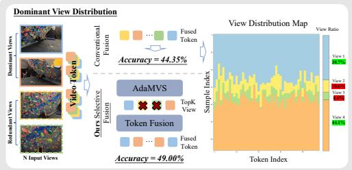  
(a) Dominant View Distribution.

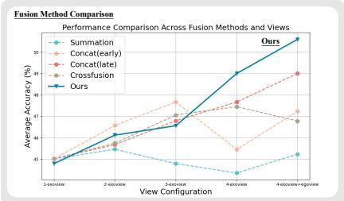  
(b) Fusion Method Comparison.  
Fig. 1: Multi-Exo-View Fusion Challenges. a demonstrates that redundant views (e.g., Views 2 and 3 account for just 17.2% of the total attention weight) contribute only marginal information; b shows that simply adding more views can degrade overall performance. In contrast, our method adaptively identifies and fuses the most informative views to enhance robustness and accuracy.

Therefore, eficiently exploiting multi-view information becomes a key problem. Ego–Exo fusion difers from standard multi-camera setups: viewpoints are heterogeneous and unaligned, making static fusion brittle. Although multiview learning has been widely studied in other domains, these methods are not robust for EgoExo learning. They often adopt static fusion strategies [13,41], which fail to suppress noisy or uninformative views and thus cannot efectively mitigate information redundancy. In addition, general multimodal fusion approaches [19,48] struggle to handle the inherent feature divergence and cross-view overfitting in Ego–Exo data. In our experiments, conventional multiview fusion fails to yield consistent improvements with more views (adding one extra view even resulted in a 1–2% accuracy drop), leading to degraded overall performance (Fig. 1). We analyse and summarise the primary causes of this degradation from two complementary perspectives: data and feature. Redundancy: More views are not always better; additional exocentric data viewpoints often introduce occlusions or duplicate content, which hurt generalisation (Fig. 1b). Conventional fusion methods [33, 43] fail to adaptively weight or suppress uninformative views (Fig. 1a), giving redundant ones excessive attention and introducing noise that weakens useful features. Overfitting: The enlarged feature space amplifies branch imbalance, causing the network to memorise view-specific noise, especially when data are limited. This is particularly evident in Ego-Exo scenarios, where heterogeneous feature distributions and uneven convergence across views cause the model to memorise view-specific patterns rather than learn generalisable representations.

Empirically, multiview redundancy and overfitting tend to co-occur: redundancy in data is often accompanied by increased overfitting in the feature space, and excessive model adaptation may in turn amplify redundant signals. These factors jointly contribute to the observed performance degradation. To efectively address these two issues and enhance the robustness of multiview fusion, we design our framework from two complementary perspectives. At the data level, we propose AdaMVS (Adaptive Multiview Selector), which employs an adaptive scoring mechanism to dynamically identify and select the most informative Top-K exocentric views and fuse by token exo-fusion. These are then integrated with the egocentric stream to efectively reduce redundancy and computational cost. At the feature level, we introduce a complementary VIB-GB module that combines the Variational Information Bottleneck (VIB) and Gradient Blending (GB). By compressing non-essential signals and balancing gradient flow, it mitigates feature overfitting, preventing the model from memorising view-specific patterns and enabling the learning of compact, robust, and generalisable crossview representations.

Together, AdaMVS and VIB-GB form a unified framework that jointly learns what to fuse and how to regularise fusion. Contributions.

– We identify and analyse two critical issues in EgoExo fusion: (1) multiview information redundancy and (2) strong susceptibility to overfitting.

– We introduce an adaptive token-level multiview selector, AdaMVS, and couple it with an OGR-driven gradient reweighting module, VIB-GB, forming a unified framework that adaptively reduces redundancy and explicitly controls overfitting.

– Experiments on EgoExo-4D and EgoExo-Fitness show state-of-the-art proficiency estimation with improved robustness and eficiency.

## 2 Related Work

Egocentric and Exocentric Understanding Egocentric and exocentric videos ofer complementary perspectives critical for skill understanding: first-person views capture fine-grained hand–object interactions and attention cues, while thirdperson views provide holistic body motion and scene context. Most prior work focuses on one perspective—either egocentric understanding [5, 11, 24, 36, 42, 44, 56] or exocentric video analysis [20, 32]. Joint learning across views remains challenging due to viewpoint gaps [29] and redundant cross-view information [30].

Recent Ego–Exo datasets [8,12,16,23] enable multi-view tasks including proficiency estimation [12,23], action anticipation [16], person localisation [49], and 3D pose estimation [12,45]. Some approaches transfer knowledge from exocentric to egocentric views [22,28], while others seek view-invariant features [29,52,54,60] through cross-view alignment. However, their scalability is constrained by limited paired data. AE2 [52] introduces self-supervised temporal alignment to learn finegrained view-invariant actions, yet view invariance alone cannot address redundancy or noise from uninformative views. LangView [30] further explores viewpoint importance through weakly supervised language-guided selection. While prior work seeks view invariance or uses coarse, language-guided selection, they fail to address the underlying noise and redundancy issues. Inspired by these limitations, our method performs token-level view selection to evaluate and fuse the most salient ego-exo information adaptively.

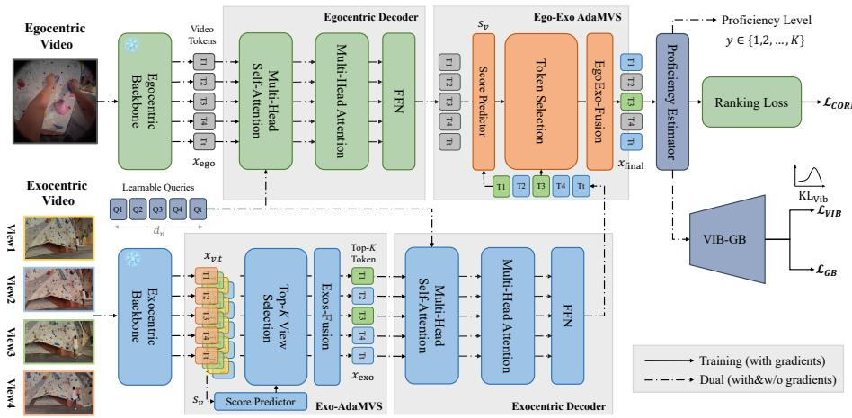  
Fig. 2: Overview of our proposed network. (Top) The egocentric branch extracts and decodes features through a dedicated pathway. (Bottom) The exocentric branch uses the Score Predictor and Exo-AdaMVS to compute scores, selecting key views and removing redundancy. The Ego–Exo AdaMVS fuses streams, while the VIB-GB module regularises the latent space to reduce overfitting and enhance generalisation. Solid arrows denote gradient flow, and dash-dotted arrows indicate mixed paths involving gradient and non-gradient operations used by VIB-GB.

Proficiency Estimation Proficiency estimation is closely related to Action Quality Assessment (AQA): AQA predicts continuous quality scores, while proficiency estimation classifies discrete skill levels. Early AQA works relied on handcrafted features [38], later replaced by CNN, GNN, and Transformer architectures for spatio-temporal reasoning [6, 7, 55, 57–59]. Pose-based methods [37, 51] neglect contextual cues, whereas EgoExo4D [12] reframes the task by combining egocentric object interactions with exocentric spatial context. Existing methods [9, 12, 50] primarily rely on late fusion, overlooking temporal variations in view importance. SkillFormer [1] introduces eficient cross-view fusion and achieves strong results on EgoExo4D. However, efectively fusing these heterogeneous Ego-Exo streams for proficiency estimation remains uniquely challenging, as it requires not only managing multiview redundancy but also mitigating severe overfitting risks caused by heterogeneous inputs. Our approach addresses these issues through adaptive token-level fusion that emphasises discriminative views and regularised training that enhances generalisation.

Multi-view Learning Multi-view learning underpins domains like 3D object or pose [3,13,15], anomaly detection [25], and action analysis [1,10,16,34]. The main challenges are feature alignment and robust generalisation. Existing pixel/token fusion methods [19, 47, 48, 53] are often costly or fail to capture the dynamically varying informational value of each view. This is critical in Ego–Exo fusion, where difering perspectives exacerbate overfitting risks. Multiview systems are prone to overfitting because views generalise at varying rates [35]. We quantify this imbalance using the Overfitting-to-Generalisation Ratio (OGR) [46]. Our approach minimises OGR by combining adaptive selection with informationtheoretic regularisation. This paradigm jointly addresses feature redundancy and overfitting, leading to generalisable Ego–Exo fusion.

In summary, despite progress in cross-view understanding and proficiency estimation, a unified solution is still needed to jointly address feature redundancy and overfitting in heterogeneous Ego–Exo data. Our AdaMVS framework, with the VIB-GB module, bridges this gap for robust Ego–Exo proficiency estimation.

## 3 Methodology

In this work, we address the task of proficiency estimation from multiview ego–exo videos, aiming to predict action proficiency labels (Sec. 3.1). As illustrated in Fig. 2, our framework first employs a frozen backbone to extract spatiotemporal features from each view. The multiple exocentric views are then processed by an Exocentric Adaptive Multiview Selector (Exo-AdaMVS) (Sec. 3.2), which selects the Top-K most informative views to mitigate redundancy and capture representative temporal dynamics through an Exocentric Decoder. In parallel, the egocentric stream is encoded by an Egocentric Decoder to extract fine-grained motion cues. The ego and Top-K exo tokens are fused through an Ego-Exo AdaMVS (Sec. 3.2), and the fused representation is further regularised by the VIB-GB mechanism (Sec. 3.3), which integrates a Variational Information Bottleneck with Gradient Blending regularisation to alleviate overfitting. The optimisation strategy is detailed in Sec. 3.4.

## 3.1 Problem Formulation

We formulate multiview Proficiency Estimation as an ordinal classification task using synchronised Ego-Exo videos. Given video sequences $V ~ = ~ \{ v _ { \mathrm { e g o } } , v _ { \mathrm { e x o } } ^ { ( 1 ) }$ $v _ { \mathrm { e x o } } ^ { ( 2 ) } , \dots , v _ { \mathrm { e x o } } ^ { ( n ) } \}$ , where $v _ { \mathrm { e g o } }$ denotes the egocentric view and $v _ { \mathrm { e x o } } ^ { ( i ) }$ the i -th exocentric view, the goal is to predict a discrete proficiency label $y \in \{ 1 , 2 , \ldots , K \}$ 2 with K indicating the number of skill levels. We learn a fusion function $f : V  y$ that integrates multiview information and maps the fused representation to a proficiency level. Unlike Action Quality Assessment $( A Q A )$ , which performs regression on continuous scores, Proficiency Estimation focuses on discrete classification, aligning better with standard assessment protocols.

## 3.2 AdaMVS

Diferent exocentric views often contain overlapping or noisy cues, leading to uninformative information. To mitigate this redundancy, our framework employs an Adaptive Multiview Selector (AdaMVS), as shown in Fig. 2, which selectively identifies the most informative views. AdaMVS consists of two branches: one for egocentric video and another for multiple exocentric videos, both built on a transformer-based architecture (see the supplementary material for details). The branches share an initial feature extraction stage where each video is uniformly sampled into T clips and encoded by a frozen pretrained backbone to obtain feature representations. A shared set of learnable queries $Q$ acts as semantic anchors to enforce a common latent space, allowing each corresponding clip token to capture richer temporal and semantic dependencies. AdaMVS is inherently view-number agnostic due to the permutation-invariant Transformer and shared queries.

Exocentric Branch Given multiple exocentric inputs, each view v yields tokenlevel clip features ${ \boldsymbol { x } } _ { v , t }$ (t for temporal index). Each token feature ${ \boldsymbol { x } } _ { v , t }$ passes through a transformer-based score predictor $\phi ( \cdot )$ producing importance weights aggregated per view $\boldsymbol { s } _ { v , t } = \phi ( \boldsymbol { x } _ { v , t } )$ . These scores rank views by informativeness. To obtain a compact view-level importance measure, token-level scores are averaged across all tokens: $\begin{array} { r } { s _ { v } = \frac { 1 } { T } \sum _ { t = 1 } ^ { T } s _ { v , t } } \end{array}$ where $T$ denotes the number of tokens per view. The resulting scores $\{ s _ { v } \} _ { v = 1 } ^ { V }$ rank view informativeness, and the Top-K are selected: $\mathcal { V } _ { \mathrm { T o p } - K } = \mathrm { T o p } { \cal K } ( \{ s _ { v } \} _ { v = 1 } ^ { \bar { \cal V } } )$ . This encourages the network to focus on discriminative views (Fig. 1a, dominant views capture 83% of cumulative softmax attention weights during fusion), while suppressing redundant ones.

During training, we apply Gumbel-Softmax diferentiable weighting [17] to enforce discriminative learning. At inference, the model switches to Soft Fusion to retain subtle complementary cues while filtering noise, efectively avoiding the information loss caused by hard pruning. Finally, features from the selected Top-K views are aggregated into a unified exocentric representation:

$$
x _ { \mathrm { e x o } } = \mathrm { E x o s – F u s i o n } \Big ( \{ x _ { v , t } \} _ { v \in \mathcal { V } \mathrm { T o p } ^ { - } K , t = 1 , \ldots , T } \Big ) ,\tag{1}
$$

where \protect \text {Exos-Fusion}(\cdot ) performs a weighted combination of the retained token features ${ \boldsymbol { x } } _ { v , t }$ using their corresponding normalized importance scores $s _ { v , t } .$ . The selection process is weakly supervised—scores are learned purely from task loss without any explicit view-level labels. This operation is applied before the main transformer layers to prune redundant and uninformative views and highlight the most informative spatio-temporal cues. The resulting fused feature $x _ { \mathrm { e x o } }$ is subsequently passed into the exocentric decoder to produce token-level embeddings $\{ x _ { t } ^ { \mathrm { e x o } } \} _ { t = 1 } ^ { T }$

Egocentric Branch The egocentric stream processes a single view and generates token embeddings $\{ x _ { t } ^ { \mathrm { e g o } } \} _ { t = 1 } ^ { T }$ via an egocentric decoder. These are fused with the exocentric representations $\{ x _ { t } ^ { \mathrm { e x o } } \} _ { t = 1 } ^ { T }$ through an EgoExo-Fusion framework, which reuses the Score Predictor to assign importance scores and adaptively weight ego–exo contributions at the token level. The unified embedding $x _ { \mathrm { f i n a l } }$ is then fed into the Proficiency Estimator for classification.

$$
x _ { \mathrm { f i n a l } } = \mathrm { E g o E x o - F u s i o n } \Big ( \{ x _ { t } ^ { \mathrm { e g o } } \} _ { t = 1 } ^ { T } , \{ x _ { t } ^ { \mathrm { e x o } } \} _ { t = 1 } ^ { T } \Big ) .\tag{2}
$$

Here, t denotes the token index, and $T$ is the number of tokens in the sequence.

## 3.3 VIB-GB

Even after pruning redundant views, fusion can overfit because the ego stream typically converges faster and dominates gradients. To address this, we regularise fusion through a two-part mechanism:

– Gradient Blending regularisation (GB): dynamically balances learning between ego and exo branches using the Overfitting-to-Generalisation Ratio (OGR) [46].

Variational Information Bottleneck (VIB): compress each branch’s latent space by limiting mutual information with the input, filtering out redundancy and keeping only task-relevant features.

(a) OGR-guided Gradient Balancing. We use the Overfitting-to-Generalisation Ratio (OGR) [46] to dynamically reweight gradients between ego and exo streams, down-scaling branches that overfit faster (see supp. for details). While the original OGR measures the ratio between these two factors, we adopt a simplified formulation that focuses solely on the overfitting component for training stability, as validation losses across views are often correlated. To compute OGR for each branch $m \in \{ \mathrm { e g o } , \mathrm { e x o } \}$ , we first quantify its degree of overfitting through the overfitting increment:

$$
\Delta _ { O } ^ { ( m ) } ( e ) = \mathcal { L } _ { \mathrm { t r a i n } } ^ { ( m ) } ( e ) - \mathcal { L } _ { \mathrm { v a l } } ^ { ( m ) } ( e )\tag{3}
$$

at epoch $e ,$ where $\mathcal { L } _ { \mathrm { t r a i n } }$ and ${ \mathcal L } _ { \mathrm { v a l } }$ denote training and validation losses. A large positive $\varDelta _ { O } ^ { ( m ) }$ indicates that branch m is overfitting faster than it generalises. We therefore assign each branch an adaptive weight

$$
w _ { m } ( e ) = \frac { 1 } { \varDelta _ { O } ^ { ( m ) } ( e ) ^ { p } + \epsilon } , \qquad w _ { m } \gets \frac { w _ { m } } { \sum _ { j } w _ { j } } ,\tag{4}
$$

where $p \in [ 0 . 5 , 1 . 0 ]$ controls sensitivity and \epsilon prevents division by zero. These weights reduce gradients for branches that overfit, equalising training dynamics.

$$
\mathcal { L } _ { \mathrm { G B } } = \sum _ { m } w _ { m } \mathcal { L } _ { \mathrm { t r a i n } } ^ { ( m ) } .\tag{5}
$$

During training, $w _ { m }$ and $\varDelta _ { O } ^ { ( m ) }$ are updated online each epoch. Intuitively, views that overfit more receive smaller gradients, keeping the ego and exo representations in sync and lowering the global OGR (see Fig. 4d and Fig. 4c).

(b) Variational Information Bottleneck. Even with balanced gradients, we found that the fused latent representation may still contain redundant signals. To regularise it theoretically, we adopt the Variational Information Bottleneck (VIB) [18] framework, which constrains the mutual information between the input X and the latent code Z while maximising the information between Z and the task label Y. Formally, the information bottleneck objective can be expressed as:

$$
\operatorname* { m a x } _ { \boldsymbol { q } _ { \phi } ( \boldsymbol { z } | \boldsymbol { x } ) } \mathcal { T } ( \boldsymbol { Z } ; Y ) - \beta \mathcal { T } ( \boldsymbol { Z } ; X ) ,\tag{6}
$$

where $\mathcal { T } ( \cdot ; \cdot )$ denotes mutual information and $\beta$ controls the trade-of between sufficiency and compression. In practice, we realise this objective using a lightweight bottleneck in each branch, parameterised by mean and log-variance, and optimised through the reparameterisation trick. The corresponding variational loss encourages each posterior $q ( z _ { m } | x _ { m } )$ to align with a unit Gaussian prior p(z):

$$
{ \mathcal { L } } _ { \mathrm { V I B } } = \sum _ { m } D _ { \mathrm { K L } } ( q ( z _ { m } | x _ { m } ) \| p ( z ) ) .\tag{7}
$$

This regularisation removes view-specific noise while retaining discriminative information, yielding compact and generalisable cross-view representations.

Together, as illustrated in Fig. 3, the VIB-GB module operates with parallel ego and exo branches, each processing both training and validation inputs $\mathcal { D } _ { \mathrm { t r a i n } }$ and $\mathcal { D } _ { \mathrm { v a l } }$ . Each branch passes its features through a VIB layer to obtain the KL term and computes the overfitting increment $\varDelta _ { e g o / e x o }$ , which together guide the OGR-based gradient blending for balanced optimisation across views. Unlike prior multimodal IB methods, VIB-GB couples information compression with dynamic OGR-based weighting, linking representational and training-dynamics regularisation.

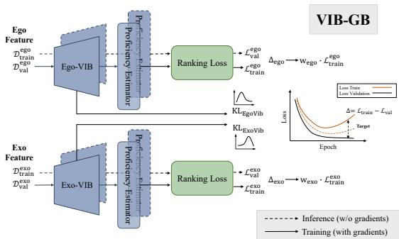  
Fig. 3: Overview of the proposed VIB-GB regulariser. Ego and exo features are regularised through separate VIB branches, and Gradient Blending Regularisation (GB) updates gradient weights online using both training and validation losses to balance learning and suppress overfitting. The KL term constrains the latent representation, while $\varDelta _ { e g o / e x o }$ guides proficiency learning.

## 3.4 Optimisation

Our model is optimised with a multi-objective loss combining three components. The ordinal loss provides ranking-based supervision for skill estimation. Gradient blending (GB) regularisation balances contributions from ego and exo modalities, while the variational information bottleneck (VIB) loss regularises the latent space to promote generalisable representations and mitigate overfitting.

We adopt CORN [40] for ordinal classification, decomposing proficiency prediction into rank-consistent binary subtasks. CORN models action quality levels as ordered categories by decomposing the ordinal regression problem into a sequence of binary classification subtasks, thereby explicitly enforcing the inherent rank structure.

$$
\begin{array} { r } { \mathcal { L } _ { \mathrm { C O R N } } = - \frac { 1 } { N } \displaystyle \sum _ { i = 1 } ^ { N } \displaystyle \sum _ { k = 1 } ^ { K - 1 } \mathrm { B C E } \Big ( y _ { i , k } , \hat { p } _ { i , k } \Big ) , } \end{array}\tag{8}
$$

where $\operatorname { B C E } ( \cdot )$ denotes the binary cross-entropy loss, $y _ { i , k } \in \{ 0 , 1 \}$ is the binary label indicating whether sample i belongs to a level higher than $k , \ \hat { p } _ { i , k }$ is the cumulative probability obtained via the chain rule, and K is the total number of ordinal levels. Together with Eq. (5) and Eq. (7), these objectives ensure that proficiency estimation is both rank-aware (via CORN) and robust to redundant or overfit view signals (via VIB-GB).

$$
{ \mathcal { L } } _ { \mathrm { t o t a l } } = \lambda _ { \mathrm { C O R N } } { \mathcal { L } } _ { \mathrm { C O R N } } + \lambda _ { \mathrm { G B } } { \mathcal { L } } _ { \mathrm { G B } } + \lambda _ { \mathrm { V I B } } { \mathcal { L } } _ { \mathrm { V I B } } .\tag{9}
$$

where $\lambda _ { \mathrm { G B } }$ and $\lambda _ { \mathrm { { V I B } } }$ are weighting coeficients applied during training. A moderate $\lambda _ { \mathrm { G B } }$ stabilises learning dynamics across ego and exo branches, while an appropriate λVIB suppresses redundant view-specific signals and preserves discriminative cues.

In summary, at the data level, AdaMVS tackles redundancy through adaptive view selection, while at the feature level, VIB-GB mitigates overfitting through fusion regularisation, yielding compact and generalisable proficiency representations.

## 4 Experiments

We evaluate our method on two benchmarks: Ego-Exo4D for demonstrator proficiency estimation and EgoExo-Fitness for interpretable action judgement. We compare our model with state-of-the-art approaches under consistent protocols, and perform both quantitative and qualitative ablations to assess the contribution of each component. We train one unified model per dataset, handling all tasks simultaneously.

Ego-Exo4D [12] is a large-scale multiview dataset spanning 9 activity categories (e.g., bouldering, cooking, music). It contains 1,087 hours of footage captured from one egocentric and four exocentric views, with 2,987 proficiency scores annotated across four discrete levels.

EgoExo-Fitness [23] contains 1,276 cross-view videos (approximately 32 hours) segmented into 6,131 single actions, annotated with interpretable action judgments and quality scores on a five-level scale.

Table 1: Proficiency estimation accuracy (%) comparison on the Ego-Exo4D and EgoExo-Fitness datasets in three settings. Bold numbers denote the best performance, and underlined numbers denote the second best.
<table><tr><td>Method</td><td>Pretrain</td><td colspan="3">Ego-Exo4D [12]</td><td colspan="3">EgoExo-Fitness [23]</td></tr><tr><td></td><td></td><td>Ego</td><td></td><td>Exos Ego+Exos</td><td>Ego</td><td></td><td>Exos Ego+Exos</td></tr><tr><td>Random</td><td>一</td><td>26.4</td><td>26.4</td><td>26.4</td><td>26.2</td><td>26.2</td><td>26.2</td></tr><tr><td>Majority-class</td><td></td><td>32.3</td><td>32.3</td><td>32.3</td><td>33.3</td><td>33.3</td><td>33.3</td></tr><tr><td>TimeSformer [12]</td><td></td><td>40.6</td><td>39.0</td><td>39.9</td><td>32.1</td><td>32.1</td><td>32.1</td></tr><tr><td>TimeSformer</td><td>EgoVLPv2 [39]</td><td>46.7</td><td>37.0</td><td>37.1</td><td>39.3</td><td>35.7</td><td>41.7</td></tr><tr><td>TimeSformer</td><td>EgoVLP [24]</td><td>44.7</td><td>40.5</td><td>39.4</td><td>41.7</td><td>36.9</td><td>39.3</td></tr><tr><td>TimeSformer</td><td>K400 [20]</td><td>47.2</td><td>37.8</td><td>40.3</td><td>40.5</td><td>40.5</td><td>39.3</td></tr><tr><td>TimeSformer</td><td>HowTo100M [31]</td><td>45.1</td><td>39.8</td><td>43.7</td><td>34.5</td><td>38.1</td><td>38.1</td></tr><tr><td>SkillFormer [1]</td><td>K600 [2]</td><td>45.9</td><td>46.3</td><td>47.5</td><td>36.9</td><td>35.7</td><td>38.7</td></tr><tr><td>Ours</td><td>K600 [2]</td><td>48.6</td><td>47.5</td><td>50.6</td><td>40.5</td><td>42.9</td><td>48.8</td></tr><tr><td>Ours</td><td>K400 [20]</td><td>50.8</td><td>49.2</td><td>53.0</td><td>46.4</td><td>47.6</td><td>46.4</td></tr><tr><td>Ours</td><td>HowTo100M [31] 52.1</td><td></td><td>47.5</td><td>52.8</td><td>42.9</td><td>45.2</td><td>45.2</td></tr></table>

Implementation Details All experiments are conducted on NVIDIA RTX 3090 GPUs. We adopt Timesformer [12] and VST [26, 27] as the backbone, using Kinetics-400/600 pretrained weights and HowTo100M pretrained weights. Each video is uniformly sampled to 384 frames and divided into 8 consecutive-frame clips, resulting in 48 queries per video. We train the model with a batch size of 64 using the Adam optimiser, with an initial learning rate of $1 \times 1 0 ^ { - 4 }$ , decayed by a factor of 0.1 every 30 epochs. Training is performed for 100 epochs with a dropout rate of 0.5. The weight for the variational information bottleneck term, λVIB, is set to 0.1 (which is equivalent to $\beta$ in Eq. (6)); the weights of Corn Loss λCORN and GB loss $\lambda _ { G B }$ are all set to 1, and the Top-K view selection achieves the best performance when $K = 2$

## 4.1 Comparison with State-of-the-Art

We compare our model with current state-of-the-art approaches on the two benchmark datasets using three diferent pretrained backbones for video feature extraction. As shown in Tab. 1, we evaluate our framework under three settings: ego-only, exo-only, and ego+exo.

Specifically, AdaMVS achieves a new state-of-the-art result on Ego-Exo4D, yielding a 5.5% absolute improvement in overall accuracy compared to Skill-Former. To ensure a fair comparison under identical feature extraction settings, we further evaluate our framework using the same pretrained backbones as the baselines. Across all backbones (K400, K600, and HowTo100M), AdaMVS consistently delivers significant gains of 12.7%, 3.1%, and 9.1%, respectively. On EgoExo-Fitness, our method obtains a 7.1% absolute improvement.

We observe distinct view-importance patterns across the two benchmarks. In Ego-Exo4D, egocentric motion cues (e.g., Cooking, Music, Bouldering) play a more dominant role, with ego-only configurations generally yielding higher accuracy. In contrast, the importance of views in EgoExo-Fitness (e.g., Fitness) is more balanced, where both ego-only and exo-only provide critical and complementary information. Previous methods often observe that combining ego and exo views degrades performance due to redundant or conflicting information. In contrast, our adaptive view-selection mechanism efectively mitigates this issue by dynamically weighting the most informative views and pruning redundant ones, leading to consistent and generalisable improvements across datasets.

Table 2: Performance (%) and model complexity comparison on the Ego-Exo4D datasets with diferent multiview and multi-modal fusion methods. Bold indicates the best performance, and underlined indicates the second best.
<table><tr><td>Method</td><td></td><td>Ego Exos Ego+Exos</td><td></td><td>GFLOPs Params (M)</td></tr><tr><td>Summation</td><td>47.2 44.4</td><td>45.2</td><td>1.11</td><td>23.42</td></tr><tr><td>Concat (early)</td><td>47.2 45.5</td><td>47.2</td><td>16.55</td><td>344.55</td></tr><tr><td>Concat (late)</td><td>47.2 47.7</td><td>49.0</td><td>11.74</td><td>23.42</td></tr><tr><td>CrossFusion</td><td>47.2 47.5</td><td>46.8</td><td>1.67</td><td>4.20</td></tr><tr><td>MTV [53]</td><td>45.2 43.7</td><td>43.5</td><td>1.15</td><td>7.37</td></tr><tr><td>MVCNN [41]</td><td>48.3 45.2</td><td>46.6</td><td>1.51</td><td>9.97</td></tr><tr><td>MVAD [14]</td><td>46.3 46.3</td><td>45.0</td><td>0.56</td><td>5.25</td></tr><tr><td>TokenFusion [47]</td><td>47.0 45.5</td><td>49.0</td><td>1.41</td><td>13.65</td></tr><tr><td>SkillFormer [i]</td><td>45.9 46.3</td><td>47.5</td><td>1.25</td><td>20.60</td></tr><tr><td>AdaMVS-Large 50.8</td><td>49.2</td><td>53.0</td><td>2.98</td><td>24.47</td></tr><tr><td>AdaMVS-Small 48.3</td><td>47.4</td><td>50.1</td><td>0.26</td><td>2.19</td></tr></table>

## 4.2 Comparison with General Fusion and Overfitting Baselines

To further validate the efectiveness and eficiency of our AdaMVS fusion technique, we compare it with standard feature fusion methods and representative multimodal and multiview approaches. Since existing methods have not been evaluated on Ego–Exo datasets, we re-implemented them under our settings for fair comparison. For eficiency analysis, we introduce two variants, AdaMVS-Large and AdaMVS-Small. The small version incorporates a lightweight projection layer before the transformer modules, reducing parameters and FLOPs without degrading representation quality. As shown in Tab. 2, AdaMVS outperforms all compared methods. At the same time, the small variant achieves similar accuracy with only 0.26 GFLOPs and 2.19 M parameters—an over 11× reduction in computation and model size, demonstrating excellent eficiency with minimal performance loss. Furthermore, the comparison with diferent overfitting mitigation baselines is shown in Tab. 3. While generic regularisers apply stochastic perturbations, VIB-GB specifically targets branch-wise overfitting by balancing heterogeneous Ego-Exo learning dynamics, yielding superior performance.

## 4.3 Ablation Study

Efectiveness of Diferent Proposed Modules In Tab. 4, we present the ablation study of the proposed modules. For both the ego-only and exo-only settings, our AdaMVS module and Corn loss notably improve inter-view performance, yielding overall gains of around 3.0% across both modalities. In the ego–exo setting, starting from the baseline (45.5%), incorporating the AdaMVS module increases accuracy to 48.0% (+2.5%), demonstrating the efectiveness of adaptive view selection in filtering redundant or noisy views. Adding the ordinal loss LCORN further raises accuracy to 48.4% (+0.4%) by enforcing the natural order of skill levels and providing a stronger supervisory signal. Applying Gradient Blending (GB) alone yields 48.6%, alleviating overfitting but still affected by redundant gradients from high-dimensional Ego–Exo features. When combined with the Variational Information Bottleneck (VIB), performance improves markedly to 51.0% (+2.4%), as VIB regularises the latent space and filters non-essential information. This final configuration demonstrates that all modules work synergistically to enhance overall performance.

We also conducted a decoupled evaluation of the VIB-GB module to isolate its contribution. When applied directly to the naive baseline, VIB-GB yields a 48.7% accuracy (+3.2%), confirming its efectiveness in mitigating the featurelevel overfitting and enlarged feature space issues identified in our introduction. However, this result remains 2.3% lower than our full model (51.0%). This gap explicitly demonstrates that AdaMVS and VIB-GB are highly complementary: while AdaMVS suppresses uninformative or redundant views at the data level to move beyond brittle static fusion, VIB-GB prevents the model from memorising view-specific noise at the feature level.

Efectiveness of AdaMVS and View Selection We observe that incorporating more views does not necessarily improve performance, as some views may contain occlusions, motion blur, or irrelevant information. As shown in the quantitative results in Tab. 6, conventional fusion strategies often degrade as the number of views increases. To overcome this, our AdaMVS formulates view selection as a weakly supervised process that adaptively identifies the most informative views without explicit supervision. Qualitative results in Fig. 5 further show that predicted scores align with visual quality: low-scoring views often suffer from occlusions or blur, while high-scoring ones provide clearer and more discriminative cues. In rare cases with highly overlapping content, the model assigns similar scores to all views, making it dificult to distinguish the most informative views.

Table 3: Quantitative comparison against standard overfitting mitigation baselines with varying regularisation configurations.
<table><tr><td>Method (K400)</td><td>EgoExo4D EgoExo-Fitness</td></tr><tr><td>Baseline 44.1</td><td>44.0</td></tr><tr><td>+ Feature-Mixup 45.2</td><td>40.5</td></tr><tr><td>+ Weight Decay (1e-2) 44.6</td><td>44.0</td></tr><tr><td>+ Weight Decay (1e-3) 44.1</td><td>44.0</td></tr><tr><td>+ Modality Dropout (p = 0.3) 46.8</td><td>38.1</td></tr><tr><td>+ Modality Dropout (p = 0.5) 47.2</td><td>41.7</td></tr><tr><td>+ Standard Dropout (p = 0.3) 47.5</td><td>38.1</td></tr><tr><td>+ Standard Dropout (p = 0.5) 48.8</td><td>40.5</td></tr><tr><td>Ours (+VIB-GB) 53.0</td><td>46.4</td></tr></table>

Table 4: Ablation results of the proposed modules under Ego Only, Exo Only, and Ego+Exo settings. $\checkmark$ denotes an enabled component, and × denotes a disabled component. Bold indicates the best performance. Results are averaged over five runs.  
Table 5: Redundancy index $R _ { v }$ (lower is better) and AdaMVS view weights (higher is better) for each action. For both metrics, the top-2 most informative views per action are highlighted in green . Results are averaged over 200 runs.
<table><tr><td>Setting</td><td colspan="5">AdaMVS LCORNGB VIB Acc (%)</td></tr><tr><td>ego-only</td><td>X</td><td>×</td><td></td><td></td><td>46.8</td></tr><tr><td>Ours</td><td>√</td><td>√</td><td></td><td></td><td>49.4</td></tr><tr><td>exo-only</td><td>×</td><td>X</td><td></td><td>一</td><td>45.1</td></tr><tr><td>Ours</td><td>√</td><td>√</td><td></td><td>-</td><td>48.6</td></tr><tr><td>ego-exo</td><td>X</td><td>×</td><td>×</td><td>×</td><td>45.5</td></tr><tr><td></td><td>√</td><td>×</td><td>×</td><td>X</td><td>48.0</td></tr><tr><td></td><td>√</td><td>√</td><td>×</td><td>X</td><td>48.4</td></tr><tr><td></td><td>√</td><td>√</td><td>√</td><td>X</td><td>48.6</td></tr><tr><td>W/O AdaMVS</td><td>×</td><td>√</td><td>√</td><td>√</td><td>48.7</td></tr><tr><td>Ours</td><td>√</td><td>√</td><td>√</td><td>√</td><td>51.0</td></tr></table>

<table><tr><td>Action</td><td>Metric</td><td>exo1 exo2 exo3 exo4</td></tr><tr><td>Piano</td><td> $R _ { v \downarrow }$  AdaMVS↑ 0.000 0.000</td><td>0.5480.547 0.452 0.500 0.470 0.530</td></tr><tr><td>Bouldering</td><td> $R _ { v \downarrow }$  AdaMVS↑ 0.605</td><td>0.356 0.383 0.390 0.362 0.116 0.105 0.174</td></tr><tr><td>Soccer</td><td> $R _ { v \downarrow }$  0.418 AdaMVS↑0.207 0.187</td><td>0.4200.419 0.402 0.343 0.264</td></tr><tr><td>Dance</td><td> $R _ { v \downarrow }$  0.295 AdaMVS↑ 0.301</td><td>0.300 0.289 0.296 0.1890.209 0.301</td></tr><tr><td>Basketball</td><td> $R _ { v \downarrow }$  AdaMVS↑ 0.323</td><td>0.664 0.659 0.681 0.680 0.1360.193 0.348</td></tr></table>

Data Redundancy Evaluation To analyse the correspondence between the redundancy patterns in the data and learned by AdaMVS, we measure each view’s task relevance and mutual similarity. Mutual Information (MI) [4] estimates how much each view contributes to predicting proficiency, while the Centred Kernel Alignment (CKA) [21] captures the representation similarity between views. Based on these two factors, we define the redundancy index $\begin{array} { r } { R _ { v } = \frac { \mathrm { C K A } } { \mathrm { M I } ( v ) + \epsilon } } \end{array}$ where a lower $R _ { v }$ indicates a more informative and less redundant view. We further compare the learned AdaMVS weights with this redundancy index and observe a clear correspondence (Tab. 5): views with a lower redundancy index $R _ { v }$ consistently receive higher importance weights. This confirms that AdaMVS efectively prioritises informative viewpoints while suppressing redundant ones, a trend also reflected in our visualisations (Fig. 5).

Comparison of K-Selection We further compare the performance of AdaMVS under diferent values of K for exocentric view sampling. Our AdaMVS adaptively selects the Top-K informative exocentric views and filters out redundant ones before feature extraction. As shown in Tab. 7, the model achieves the highest accuracy when K = 2, validating the efectiveness of the adaptive view selection strategy. This finding also aligns with the view distribution analysis in Fig. 1a,

Table 6: Comparison of diferent fusion methods on the EgoExo-4D dataset in terms of performance and eficiency under varying view configurations. The ± values indicate variation across diferent view permutations, and bold numbers denote the best results.  
Table 7: Comparison of diferent K selections for exocentric view sampling in AdaMVS on EgoExo-4D dataset. The best results for each dataset are highlighted in bold.
<table><tr><td>Fusion Method 1 Exo</td><td></td><td>2 Ex0</td><td></td><td>3 Exo 4 Exo Ego+Exos</td><td></td></tr><tr><td>Summation</td><td></td><td></td><td> $4 5 . 0 { \pm } 1 . 3 ~ 4 5 . 5 { \pm } 2 . 0 ~ 4 4 . 8 { \pm } 1 . 2$ </td><td>44.4</td><td>45.2</td></tr><tr><td>Concat (early)</td><td> $4 5 . 0 { \pm } 1 . 3 ~ 4 6 . 6 { \pm } 0 . 9 ~ 4 7 . 7 { \pm } 1 . 5$ </td><td></td><td></td><td>45.5</td><td>47.2</td></tr><tr><td>Concat (late)</td><td></td><td>45.0±1.3 45.7±1.646.8±0.6</td><td></td><td>47.7</td><td>49.0</td></tr><tr><td>Crossfusion</td><td></td><td> $4 5 . 0 { \pm } 1 . 3 ~ 4 5 . 8 { \pm } 1 . 1 ~ 4 7 . 1 { \pm } 0 . 8 $ </td><td></td><td>47.5</td><td>46.8</td></tr><tr><td>Ours (K600)</td><td></td><td>44.8±1.7 46.1±2.046.6±1.3</td><td></td><td>49.0</td><td>50.6</td></tr></table>

<table><tr><td colspan="2">Pretrained  $K = 1 \ K = 2 \ K = 3 \ K = 4$ </td></tr><tr><td>K400 51.22</td><td>53.00 51.00 49.89</td></tr><tr><td>K600 47.89</td><td>50.55 48.56 48.78</td></tr><tr><td>HowTo100M 48.78</td><td>52.77 51.22 52.11</td></tr></table>

where two dominant exocentric views account for approximately 82.8% of all videos, and additional views mainly introduce redundant or noisy information.

OGR and VIB-GB Analysis To evaluate the model’s robustness against overfitting, we compare two configurations: the baseline model (with AdaMVS) and the model incorporating the proposed VIB-GB module, as shown in Fig. 4. The top two subfigures (Figs. 4a and 4b) present the training and validation loss. The baseline starts to overfit around the 10th epoch, reaching 48.7% accuracy, while the model with VIB-GB shows smoother training and a weaker overfitting trend, achieving 53.0% accuracy, indicating that overfitting is efectively alleviated. The minor fluctuations in its validation reflect the epoch-wise updates of the VIB-GB component, which actively minimises overfitting during training.

The bottom two subfigures (Figs. 4c and 4d) show the OGR curves, which quantify the relative degree of overfitting across epochs. Without VIB-GB, OGR steadily increases, indicating progressive overfitting; in contrast, with VIB-GB, OGR rises slightly in the early stage (before the 10th epoch) and then decreases, stabilising after around 20 epochs, demonstrating its efectiveness in suppressing overfitting and improving generalisation. To further decouple the impacts of redundancy and overfitting, we conducted a controlled analysis using identical views and all-view configurations, with the detailed setup and results provided in the Supplementary Material.

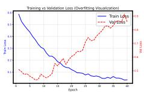  
(a) Train-Val w/o VIB-GB

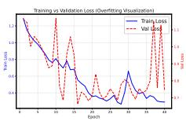  
(b) Train-Val with VIB-GB

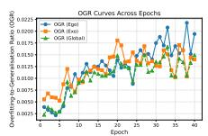  
(c) OGR w/o VIB-GB

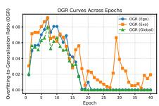  
(d) OGR with VIB-GB

Fig. 4: Analysis of overfitting and generalisation on the EgoExo-4D dataset. a–b: Training and validation curves of baseline without and with the proposed VIB-GB module, respectively. c–d: Corresponding Overfitting-to-Generalisation Ratio (OGR) curves. Without VIB-GB, the model exhibits strong overfitting (a–c), while our VIB-GB efectively regularises training dynamics and improves generalisation (b–d).

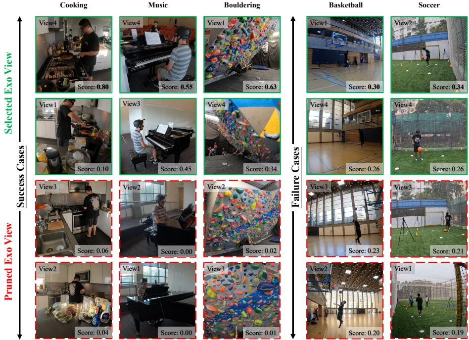  
Fig. 5: Visualisation of the view selection results from the AdaMVS module. Top: success cases where the model selects the top-K most informative exocentric views (K = 2) to avoid multiview redundancy — green boxes denote selected views and red dotted boxes denote pruned ones. Bottom: failure cases where all views receive similar scores, leading to suboptimal selection.

## 5 Conclusion

In this work, we addressed Ego–Exo proficiency estimation and identified two key challenges in multiview fusion: redundant information and model overfitting. To tackle these issues, we proposed the Adaptive Multiview Selector (AdaMVS), which adaptively selects informative exocentric views at the data level, and the VIB-GB module, which integrates a variational information bottleneck with gradient blending at the feature level to alleviate overfitting. Empirical results demonstrate that these two modules are highly complementary, working together to enhance the overall robustness of the system. Together, they form a general principle for adaptive fusion across heterogeneous (ego-exo) and homogeneous (exos) camera views. Moreover, the modular design of AdaMVS and VIB-GB allows the framework to extend to other multiview and multimodal tasks.

Limitations and future work Despite the challenges posed by the subjectivity of proficiency annotations and the limited scale of datasets, our framework demonstrates strong capability in mitigating these issues. Building on these promising results, we plan to extend the proposed approach to a broader range of multiview tasks in future work.

## References

1. Bianchi, E., Liotta, A.: Skillformer: Unified multi-view video understanding for proficiency estimation. In: Proceedings of the 18th International Conference on Machine Vision (ICMV) (2025)

2. Carreira, J., Noland, E., Banki-Horvath, A., Hillier, C., Zisserman, A.: A short note about kinetics-600. arXiv preprint arXiv:1808.01340 (2018)

3. Chharia, A., Gou, W., Dong, H.: Mv-ssm: Multi-view state space modeling for 3d human pose estimation. In: Proceedings of the Computer Vision and Pattern Recognition Conference (CVPR). pp. 11590–11599 (June 2025)

4. Cover, T.M., Thomas, J.A.: Elements of Information Theory. Wiley (1999)

5. Damen, D., Doughty, H., Farinella, G.M., Fidler, S., Furnari, A., Kazakos, E., Moltisanti, D., Munro, J., Perrett, T., Price, W., Wray, M.: Scaling egocentric vision: The epic-kitchens dataset. In: Proceedings of the European Conference on Computer Vision (ECCV). pp. 3–20 (2018)

6. Dong, X., Liu, X., Li, W., Adeyemi-Ejeye, A., Gilbert, A.: Interpretable longterm action quality assessment. In: Proceedings of the British Machine Vision Conference (BMVC) (2024)

7. Doughty, H., Mayol-Cuevas, W., Damen, D.: The pros and cons: Rank-aware temporal attention for skill determination in long videos. In: Proceedings of the IEEE/CVF Conference on Computer Vision and Pattern Recognition (CVPR). pp. 10103–10112 (2019)

8. Elfeki, M., Regmi, K., Ardeshir, S., Borji, A.: From third person to first person: Dataset and baselines for synthesis and retrieval. In: Proceedings of the IEEE/CVF International Conference on Computer Vision (ICCV). pp. 5550–5559 (2019)

9. Fan, H., Li, Y., Xiong, B., Lo, W.Y., Feichtenhofer, C.: Pyslowfast. https:// github.com/facebookresearch/slowfast (2020), accessed: 1 Mar 2026

10. Fan, J., Li, W.: Dribo: Robust deep reinforcement learning via multi-view information bottleneck. In: Proceedings of the International Conference on Machine Learning (ICML). pp. 6074–6102. PMLR (2022)

11. Grauman, K., Westbury, A., Byrne, E., Chavis, Z., Furnari, A., Girdhar, R., Hamburger, J., Jiang, H., Liu, M., Liu, X., et al.: Ego4d: Around the world in 3,000 hours of egocentric video. In: Proceedings of the IEEE/CVF Conference on Computer Vision and Pattern Recognition (CVPR). pp. 18995–19013 (2022)

12. Grauman, K., Westbury, A., Torresani, L., Kitani, K., Malik, J., Afouras, T., Ashutosh, K., Baiyya, V., Bansal, S., Boote, B., et al.: Ego-exo4d: Understanding skilled human activity from first- and third-person perspectives. In: Proceedings of the IEEE/CVF Conference on Computer Vision and Pattern Recognition (CVPR) (2024)

13. Hamdi, A., Giancola, S., Ghanem, B.: Mvtn: Multi-view transformation network for 3d shape recognition. In: Proceedings of the IEEE/CVF International Conference on Computer Vision (ICCV). pp. 5923–5932 (2021)

14. He, H., Zhang, J., Tian, G., Wang, C., Xie, L.: Learning multi-view anomaly detection. In: European Conference on Computer Vision (ECCV). pp. 414–431 (2024)

15. Hou, Y., Gould, S., Zheng, L.: Learning to select views for eficient multi-view understanding. In: Proceedings of the IEEE/CVF Conference on Computer Vision and Pattern Recognition (CVPR). pp. 20135–20144 (2024)

16. Huang, Y., Chen, G., Xu, J., Zhang, M., Yang, L., Pei, B., Zhang, H., Dong, L., Wang, Y., Wang, L., Qiao, Y.: Egoexolearn: A dataset for bridging asynchronous ego- and exo-centric view of procedural activities in real world. In: Proceedings of

the IEEE/CVF Conference on Computer Vision and Pattern Recognition (CVPR) (2024)

17. Jang, E., Gu, S., Poole, B.: Categorical reparameterization with gumbel-softmax. In: Proceedings of the International Conference on Learning Representations (ICLR). pp. 1–12 (2017)

18. Jang, E., Gu, S., Poole, B.: Deep variational information bottleneck (2017)

19. Jia, D., Guo, J., Han, K., Wu, H., Zhang, C., Xu, C., Chen, X.: Geminifusion: Eficient pixel-wise multimodal fusion for vision transformer. In: European Conference on Computer Vision (ECCV). pp. 21–38 (2024)

20. Kay, W., Carreira, J., Simonyan, K., Zhang, B., Hillier, C., Vijayanarasimhan, S., Viola, F., Green, T., Back, T., Natsev, P., et al.: The kinetics human action video dataset (2017)

21. Kornblith, S., Norouzi, M., Lee, H., Hinton, G.: Similarity of neural network representations revisited. In: Proceedings of the 36th International Conference on Machine Learning (ICML). pp. 3519–3529 (2019)

22. Li, Y., Nagarajan, T., Xiong, B., Grauman, K.: Ego-exo: Transferring visual representations from third-person to first-person videos. In: Proceedings of the IEEE/CVF Conference on Computer Vision and Pattern Recognition (CVPR). pp. 10134–10143 (2021)

23. Li, Y.M., Huang, W.J., Wang, A.L., Zeng, L.A., Meng, J.K., Zheng, W.S.: Egoexofitness: Towards egocentric and exocentric full-body action understanding. In: Proceedings of the European Conference on Computer Vision (ECCV) (2024)

24. Lin, K.Q., Wang, A.J., Soldan, M., Wray, M., Yan, R., Xu, E.Z., Gao, D., Tu, R., Zhao, W., Kong, W., et al.: Egocentric video-language pretraining. In: Advances in Neural Information Processing Systems (NeurIPS) (2022)

25. Liu, Y., Xu, X., Li, S., Liao, J., Yang, X.: Multi-view industrial anomaly detection with epipolar constrained cross-view fusion (2025)

26. Liu, Z., Lin, Y., Cao, Y., Hu, H., Wei, Y., Zhang, Z., Lin, S., Guo, B.: Swin transformer: Hierarchical vision transformer using shifted windows. In: Proceedings of the IEEE/CVF International Conference on Computer Vision (ICCV). pp. 10012– 10022 (2021)

27. Liu, Z., Ning, J., Cao, Y., Wei, Y., Zhang, Z., Lin, S., Hu, H.: Video swin transformer. In: Proceedings of the IEEE/CVF Conference on Computer Vision and Pattern Recognition (CVPR). pp. 3202–3211 (2022)

28. Luo, M., Xue, Z., Dimakis, A., Grauman, K.: Put myself in your shoes: Lifting the egocentric perspective from exocentric videos. In: Proceedings of the European Conference on Computer Vision (ECCV). p. 407–425 (2024)

29. Luo, M., Xue, Z., Dimakis, A., Grauman, K.: Viewpoint rosetta stone: Unlocking unpaired ego-exo videos for view-invariant representation learning. In: Proceedings of the IEEE/CVF Conference on Computer Vision and Pattern Recognition (CVPR). pp. 15802–15812 (June 2025)

30. Majumder, S., Nagarajan, T., Al-Halah, Z., Pradhan, R., Grauman, K.: Which viewpoint shows it best? language for weakly supervising view selection in multiview instructional videos. In: Proceedings of the IEEE/CVF Conference on Computer Vision and Pattern Recognition (CVPR) (2025)

31. Miech, A., Zhukov, D., Alayrac, J.B., Tapaswi, M., Laptev, I., Sivic, J.: Howto100m: Learning a text-video embedding by watching hundred million narrated video clips. In: Proceedings of the IEEE/CVF International Conference on Computer Vision (ICCV). pp. 2633–2642 (2019)

32. Monfort, M., Andonian, A., Zhou, B., Ramakrishnan, K., Bargal, S.A., Yan, T., Brown, L., Fan, Q., Gutfreund, D., Vondrick, C., Oliva, A.: Moments in time dataset: One million videos for event understanding (2019)

33. Ngiam, J., Khosla, A., Kim, M., Nam, J., Lee, H., Ng, A.: Multimodal deep learning. In: Proceedings of the International Conference on Machine Learning (ICML) (2011)

34. Nguyen, T.T., Kawanishi, Y., Komamizu, T., Ide, I.: Action selection learning for multi-label multi-view action recognition. In: Proceedings of the ACM International Conference on Multimedia in Asia (ACM MM Asia). pp. 1–1 (2024)

35. Tejero-de Pablos, A.: Complementary-contradictory feature regularization against multimodal overfitting. In: Proceedings of the IEEE/CVF Winter Conference on Applications of Computer Vision (WACV). pp. 5679–5688 (2024)

36. Pan, C., Zhang, Z., Velipasalar, S., Xu, Y.: Egovit: Pyramid video transformer for egocentric action recognition. In: Proceedings of the IEEE/CVF Conference on Computer Vision and Pattern Recognition (CVPR) (2023)

37. Parmar, P., Tran Morris, B.: Learning to score olympic events. In: Proceedings of the IEEE conference on computer vision and pattern recognition workshops (CVPRW). pp. 20–28 (2017)

38. Pirsiavash, H., Vondrick, C., Torralba, A.: Assessing the quality of actions. In: Proceedings of the European Conference on Computer Vision (ECCV). pp. 556– 571. Springer (2014)

39. Pramanick, S., Song, Y., Nag, S., Lin, K.Q., Shah, H., Shou, M.Z., Chellappa, R., Zhang, P.: Egovlpv2: Egocentric video-language pre-training with fusion in the backbone. In: Proceedings of the IEEE/CVF Conference on Computer Vision and Pattern Recognition (CVPR). pp. 28186–28197 (2024)

40. Shi, X., Cao, W., Raschka, S.: Deep neural networks for rank-consistent ordinal regression based on conditional probabilities. Pattern Analysis and Applications 26(3), 709–721 (2023)

41. Su, H., Maji, S., Kalogerakis, E., Learned-Miller, E.: Multi-view convolutional neural networks for 3d shape recognition. In: Proceedings of the IEEE International Conference on Computer Vision (ICCV). pp. 943–951 (2015)

42. Sudhakaran, S., Escalera, S., Lanz, O.: Lsta: Long short-term attention for egocentric action recognition. In: Proceedings of the IEEE/CVF Conference on Computer Vision and Pattern Recognition (CVPR). pp. 9946–9955 (2019)

43. Tsai, Y.H.H., Bai, S., Liang, P.P., Kolter, J.Z., Morency, L.P., Salakhutdinov, R.: Multimodal transformer for unaligned multimodal language sequences. In: Proceedings of the Association for Computational Linguistics (ACL). pp. 6558–6569 (2019)

44. Wang, H., Singh, M.K., Torresani, L.: Ego-only: Egocentric action detection without exocentric transferring. In: Proceedings of the IEEE/CVF International Conference on Computer Vision (ICCV) (2023)

45. Wang, J., Liu, L., Xu, W., Sarkar, K., Luvizon, D., Theobalt, C.: Estimating egocentric 3d human pose in the wild with external weak supervision. In: Proceedings of the European Conference on Computer Vision (ECCV). pp. 647–663 (2022)

46. Wang, W., Tran, D., Feiszli, M.: What makes training multi-modal classification networks hard? In: Proceedings of the IEEE/CVF International Conference on Computer Vision (ICCV). pp. 4622–4631 (2019)

47. Wang, Y., Chen, X., Cao, L., Huang, W., Sun, F., Wang, Y.: Multimodal token fusion for vision transformers. In: Proceedings of the IEEE/CVF Conference on Computer Vision and Pattern Recognition (CVPR). pp. 10278–10287 (2022)

48. Wang, Y., Huang, W., Sun, F., Xu, T., Rong, Y., Huang, J.: Deep multimodal fusion by channel exchanging. In: Advances in Neural Information Processing Systems (NeurIPS). pp. 13328–13338 (2020)

49. Wen, Y., Singh, K.K., Anderson, M., Jan, W.P., Lee, Y.J.: Seeing the unseen: Predicting the first-person camera wearer’s location and pose in third-person scenes. In: 2021 IEEE/CVF International Conference on Computer Vision Workshops (IC-CVW). pp. 3439–3448 (2021)

50. Wightman, R.: Pytorch image models. https://github.com/rwightman/pytorchimage-models (2019). https://doi.org/10.5281/zenodo.4414861, accessed: 1 Mar 2026

51. Xu, J., Yin, S., Zhao, G., Wang, Z., Peng, Y.: Fineparser: A fine-grained spatiotemporal action parser for human-centric action quality assessment. In: Proceedings of the IEEE/CVF Conference on Computer Vision and Pattern Recognition (CVPR). pp. 14628–14637 (2024)

52. Xue, Z., Grauman, K.: Learning fine-grained view-invariant representations from unpaired ego-exo videos via temporal alignment. In: Proceedings of the IEEE/CVF International Conference on Computer Vision (ICCV). pp. 14389–14399 (2023)

53. Yan, S., Xiong, X., Arnab, A., Lu, Z., Zhang, M., Sun, C., Schmid, C.: Multiview transformers for video recognition. In: Proceedings of the IEEE/CVF Conference on Computer Vision and Pattern Recognition (CVPR). pp. 3333–3343 (2022)

54. Yu, H., Cai, M., Liu, Y., Lu, F.: First- and third-person video co-analysis by learning spatial-temporal joint attention. IEEE Transactions on Pattern Analysis and Machine Intelligence (TPAMI) 45(6), 6631–6646 (2023)

55. Yu, X., Rao, Y., Zhao, W., Lu, J., Zhou, J.: Group-aware contrastive regression for action quality assessment. In: Proceedings of the IEEE/CVF International Conference on Computer Vision (ICCV). pp. 13326–13335 (2021)

56. Zhang, L., Zhou, S., Stent, S., Shi, J.: Fine-grained egocentric hand-object segmentation: Dataset, model, and applications. In: Proceedings of the European Conference on Computer Vision (ECCV). pp. 127–145 (2022)

57. Zhang, S., Dai, W., Wang, S., Shen, X., Lu, J., Zhou, J., Tang, Y.: Logo: A longform video dataset for group action quality assessment. In: European Conference on Computer Vision (ECCV). pp. 55–73 (2024)

58. Zhou, C., Huang, Y.: Uncertainty-driven action quality assessment. In: European Conference on Computer Vision (ECCV). pp. 1–18 (2022)

59. Zhou, K., Li, J., Cai, R., Wang, L., Zhang, X., Xiaohui, L.: Cofinal: Enhancing action quality assessment with coarse-to-fine instruction alignment. In: International Joint Conference on Artificial Intelligence (IJCAI) (2024)

60. Zhu, Z., Sato, Y.: Cross-view correspondence modeling for joint representation learning between egocentric and exocentric videos. IEEE Access 13, 140733–140741 (2025)

# Moving Beyond More Views: Redundancy-Aware Ego–Exo Fusion for Proficiency Estimation – Supplementary File

Xu Dong1 , Wanqing Li2 , Anthony Adeyemi-Ejeye1 , and Andrew Gilbert1

1 University of Surrey, Guildford, United Kingdom

2 University of Wollongong, Wollongong, Australia

x.dong@surrey.ac.uk, a.gilbert@surrey.ac.uk

## A Additional Results

Additional Visualizations We provide additional qualitative visualisations of the view-importance scores predicted by AdaMVS (fig. 1). In successful examples, AdaMVS assigns high weights to the most informative viewpoints while suppressing those that contribute little to proficiency reasoning — for instance, views suffering from occlusion, rear-facing viewpoints that capture limited motion cues, or perspectives dominated by background noise rather than the performer. This illustrates the model’s ability to prioritise discriminative spatio-temporal evidence and down-weight redundant or uninformative view tokens.

Conversely, in certain cases, the four exocentric views exhibit highly similar content or comparable visibility of the performer. Under such conditions, the model receives largely equivalent information from all views, resulting in relatively uniform predicted importance scores. This behaviour reflects the inherent ambiguity in redundancy assessment when view diversity is weak or when all views provide similarly informative signals.

View-wise Fusion Analysis table 1 reports the action recognition accuracy (%) for a representative action label under diferent exocentric and egocentric view configurations. Each fusion method is evaluated using increasing numbers of available exocentric views (from one to four cameras), as well as in the ego–exo fusion setting. For the single-view configuration, results from individual cameras (1–4) are reported, while multi-view results summarise all possible permutations and their averaged performance.

Overall, the results indicate that conventional fusion strategies do not necessarily benefit from additional views; in some cases, performance even declines due to redundant or noisy visual information and the resulting overfitting. In contrast, our AdaMVS framework maintains stable gains as more views are introduced by adaptively selecting the most informative and complementary viewpoints for the given action instance.

Redundancy/Overfitting Analysis To decouple and validate the claims of redundancy and overfitting, we conducted a controlled study (see table 2): Overfitting: Adding identical views (Same Exo×4) reduced performance, illustrating that increased model capacity without additional information triggers branchwise overfitting. Redundancy: Using all Exos views also underperformed compared to our selective approach, confirming that redundant views introduce feature noise. Our AdaMVS achieves 49.2 by filtering redundancy and mitigating overfitting.

Selected Exo View  
Pruned Exo View  
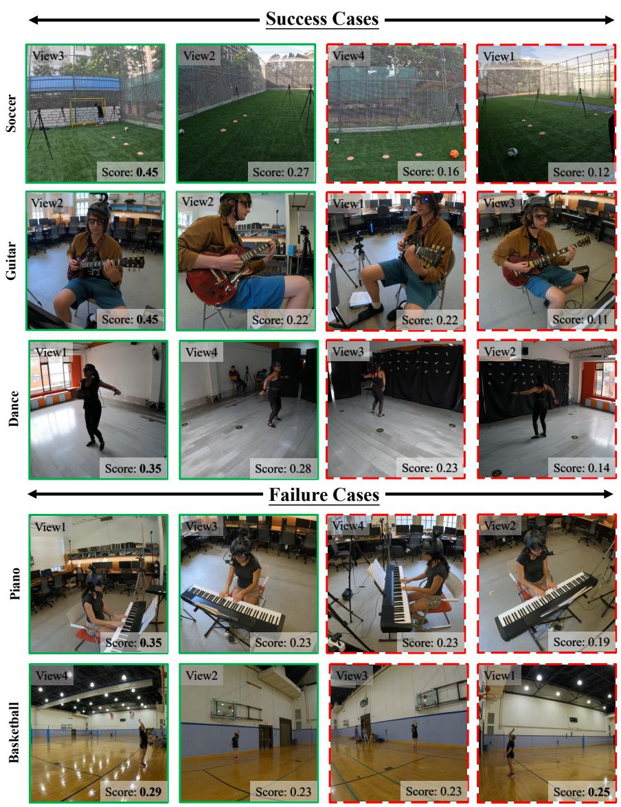  
Fig. 1: Visualisation of the view selection results from the AdaMVS module. Top: success cases where the model selects the top-K most informative exocentric views (K = 2) to avoid multiview redundancy — green boxes denote selected views and red dotted boxes denote pruned ones. Bottom: failure cases where all views receive similar scores, leading to suboptimal selection.

Table 1: Detailed action recognition accuracy (%) across all view configurations. Results are reported for each fusion method under varying numbers of exocentric views (1–4) and ego–exo combinations. ‘Avg.‘ denotes the mean accuracy and ‘SD‘ represents the standard deviation across corresponding view configurations.
<table><tr><td rowspan="2">Fusion Method</td><td colspan="3">1 Exo View</td><td colspan="4">2 Exo Views (6 Permutations)</td><td colspan="4">[3 Exo Views (4 Permutations)</td><td>4 Exo Views|Ego + Exo</td></tr><tr><td>1 2</td><td>3 4</td><td>Avg. SD</td><td>12 13</td><td>14</td><td>23 24</td><td>34 Avg. SD</td><td>123 234 134 124 Avg.</td><td>SD</td><td>1234</td><td>Avg.</td><td>SD</td></tr><tr><td>Crossfusion</td><td>|44.12 43.68 45.68 46.56 45.01</td><td></td><td>1.34</td><td>46.12 46.12 44.1247.01 46.34 44.79</td><td></td><td></td><td>45.751.08</td><td>47.01 46.34 46.78 48.12 47.06</td><td>0.76</td><td></td><td>47.45</td><td>46.78 1.34</td></tr><tr><td>Early Cat</td><td>44.12 43.68 45.68 46.56 45.01 1.34</td><td></td><td></td><td></td><td></td><td></td><td>46.1247.2346.12 45.9045.9048.1246.570.91</td><td>49.67 47.89 47.01 46.12 47.67</td><td>1.52</td><td>45.45</td><td>45.23</td><td>1.34</td></tr><tr><td>Late Cat</td><td>44.12 43.68 45.68 46.56 45.01 1.34</td><td></td><td></td><td>45.45 46.12 46.34 43.46 48.12 44.57</td><td></td><td></td><td>45.681.60</td><td>46.56 46.12 47.01 47.45 46.79</td><td>0.57</td><td>47.67</td><td>49.00</td><td>1.34</td></tr><tr><td>Early Sum</td><td>44.12 43.68 45.68 46.56 45.01</td><td></td><td>1.34</td><td></td><td></td><td></td><td>43.02 44.79 46.5644.79 48.7844.79 45.461.98</td><td>45.23 45.90 43.02 45.01 44.79</td><td>1.24</td><td>44.35</td><td>45.23</td><td>1.34</td></tr><tr><td>Ours</td><td>43.02 43.68 45.90 46.56 44.79 1.71</td><td></td><td></td><td></td><td></td><td></td><td></td><td>|43.46 48.12 48.78 45.23 44.79 46.34 46.12 2.04|46.78 45.68 48.34 45.45 46.56</td><td>1.32</td><td>49.00</td><td>|50.60</td><td>1.71</td></tr></table>

Table 2: Ablation and controlled analysis on view redundancy and model overfitting.
<table><tr><td>Method</td><td>|Exo Same Exo×4 All Exos</td></tr><tr><td>Summation</td><td>45.7 46.6 (↑) 44.4 (↓)</td></tr><tr><td>Early Cat</td><td>45.7 43.0(↓) 45.5(↓)</td></tr><tr><td>Late Cat</td><td>45.7 43.7(↓) 47.7(↑)</td></tr><tr><td>Cross Fusion</td><td>45.7 43.7(↓) 47.5(↑)</td></tr><tr><td>AdaMVS (Ours) |45.9</td><td>46.6 (↑) 49.2 (↑↑)</td></tr></table>

Ego + Single-exo-view Comparison The per-view breakdown comparing Ego with each individual Exo view is shown in table 3, which shows that the dominant Exo view varies across diferent methods, proving that a single fixed view is insuficient. AdaMVS ensures task-agnostic robustness without manual tuning.

Table 3: Quantitative evaluation across diferent combinations of the egocentric view paired with individual exocentric views.
<table><tr><td>Method</td><td></td><td></td><td>view1 +view2 +view3 +view4</td><td></td><td>ego+exos</td></tr><tr><td>Summation</td><td>43.9</td><td> $4 7 . 2 _ { 1 \mathrm { s t } }$ </td><td> $\overline { { 4 4 . 4 _ { 2 \mathrm { n d } } } }$ </td><td> $4 7 . 2 _ { 1 \mathrm { s t } }$ </td><td>45.2</td></tr><tr><td>Concat (early)</td><td> $4 5 . 7 _ { 2 \mathrm { n d } }$ </td><td> $4 5 . 9 _ { 1 \mathrm { s t } }$ </td><td>44.1</td><td>44.6</td><td>49.0</td></tr><tr><td>Concat (late)</td><td> $4 3 . 9 _ { 2 \mathrm { n d } }$ </td><td> $4 4 . 6 _ { 1 \mathrm { s t } }$ </td><td>43.7</td><td>43.7</td><td>47.2</td></tr><tr><td>Crossfusion</td><td> $4 6 . 1 _ { 2 \mathrm { n d } }$ </td><td>43.5</td><td>43.9</td><td> $4 7 . 7 _ { 1 \mathrm { s t } }$ </td><td>46.8</td></tr><tr><td>Ours</td><td> $4 6 . 1 _ { 2 \mathrm { n d } }$ </td><td>45.9</td><td> $4 6 . 8 _ { 1 \mathrm { s t } }$ </td><td>45.9</td><td>50.6</td></tr></table>

## B Metrics for Quantifying Multiview Redundancy

Redundancy in multiview data arises from two complementary factors:

1. Low task informativeness — the view contributes little to predicting proficiency.

2. High representational overlap — the view encodes information already present in other views.

We quantify view redundancy using two complementary metrics. Mutual Information (MI) measures the task relevance of each view, while CKA captures representation-level similarity across views. Together, MI and CKA provide a principled measure of redundancy by evaluating both informativeness and interview overlap.

Mutual Information (MI) Mutual Information (MI) measures how much a particular exocentric view v reduces the uncertainty of the proficiency label y. Formally, MI quantifies the statistical dependency between two random variables:

$$
\mathrm { M I } ( v , y ) = \iint p ( v , y ) \log { \frac { p ( v , y ) } { p ( v ) p ( y ) } } d v d y .\tag{1}
$$

In our setting, the feature embedding of each view serves as variable $v ,$ and the ordinal proficiency score corresponds to $y .$ A higher MI indicates that the view provides stronger task-relevant cues for proficiency estimation, whereas a low MI suggests that the view is noisy, weak, or uninformative. Thus, MI captures task relevance of each view.

## Centred Kernel Alignment (CKA)

Centred Kernel Alignment (CKA) quantifies the similarity between two sets of feature representations. Given representations X and $Z$ from two views, the linear CKA is:

$$
\operatorname { C K A } ( X , Z ) = { \frac { \| Z ^ { \top } X \| _ { F } ^ { 2 } } { \| X ^ { \top } X \| _ { F } \| Z ^ { \top } Z \| _ { F } } } .\tag{2}
$$

CKA ranges from 0 (dissimilar) to 1 (identical up to rotation). A high CKA between views indicates overlapping or redundant information content. Due to its invariance to isotropic scaling and orthogonal transformations, CKA is a reliable tool for diagnosing redundancy among neural representations.

To characterise redundancy from both perspectives, we define a redundancy index:

$$
R _ { v } = \frac { \mathrm { C K A \_ a v g } ( v ) } { \mathrm { M I } ( v ) + \epsilon } ,\tag{3}
$$

where CKA avg(v) denotes the mean CKA similarity between view v and the remaining views, and ϵ avoids division by zero. $\mathrm { A }$ lower $R _ { v }$ indicates a more informative and less redundant view; a higher $R _ { v }$ indicates that the view is duplicative or noisy.

Empirically, we observe a strong correspondence between the redundancy index $R _ { v }$ and the learned AdaMVS importance weights: views with low redundancy (low $R _ { v } )$ consistently receive higher weights. This demonstrates that AdaMVS naturally prioritises informative and complementary views, aligning with redundancy patterns present in the data.

## B.1 Overfitting-to-Generalisation Ratio (OGR)

To quantify how training dynamics relate to overfitting, [9] introduced the Overfittingto-Generalisation Ratio (OGR), which measures how much overfitting increases relative to the improvement in generalisation ( fig. 2). Formally:

$$
\mathrm { O G R } _ { N , n } = \frac { \left| \varDelta \mathcal { O } _ { N , n } \right| } { \left| \varDelta \mathcal { G } _ { N , n } \right| } = \frac { \left| \mathcal { O } _ { N + n } - \mathcal { O } _ { N } \right| } { \left| \mathcal { L } _ { N + n } ^ { * } - \mathcal { L } _ { N } ^ { * } \right| } ,\tag{4}
$$

where:

$\mathcal { L } ^ { T }$ and $\mathcal { L } ^ { \ast }$ denote training and validation loss respectively (validation serves as a proxy for the true generalisation error);

$\mathcal { O } _ { N } = \mathcal { L } _ { N } ^ { * } - \mathcal { L } _ { N } ^ { T }$ is the overfitting value at iteration $N ;$

$\ - \ \Delta \mathcal { G } _ { N , n } \ = \ \mathcal { L } _ { N + n } ^ { * } - \mathcal { L } _ { N } ^ { * }$ denotes the validation-loss decrease (generalisation gain);

$- \ \varDelta \mathcal { O } _ { N , n } = \mathcal { O } _ { N + n } - \mathcal { O } _ { N }$ measures the increment of overfitting.

A higher OGR indicates that optimisation is dominated by overfitting rather than genuine generalisation improvement.

Gradient Blending (GB) Based on this measure, Gradient Blending [9], which adaptively fuses per-modality gradients to suppress overfitting. Each modality gradient $\mathbf { g } _ { k }$ is weighted according to its contribution to generalisation relative to its overfitting variance:

$$
{ \bf g } _ { \mathrm { b l e n d } } = \sum _ { k = 1 } ^ { K } w _ { k } { \bf g } _ { k } , \qquad w _ { k } \propto \frac { \langle \nabla { \mathcal { L } } , { \bf g } _ { k } \rangle } { \sigma _ { k } ^ { 2 } } ,\tag{5}
$$

where $\sigma _ { k } ^ { 2 }$ denotes the overfitting variance of modality k. Gradients that generalise well (low OGR) receive larger weights, while gradients prone to overfitting are down-weighted.

Although the original OGR formulation jointly considers the overfitting increment $\varDelta O$ and the generalisation gain $\varDelta G$ , we empirically found that the $\varDelta G$ term provides limited discriminative value in our setting. Specifically, across Ego–Exo view configurations, the validation losses of diferent views exhibit high inter-view correlation, leading to nearly identical $\varDelta G$ trajectories for all branches. As a result, ∆G fails to reflect view-specific generalisation behaviour and instead introduces additional instability due to noise in validation-loss fluctuations.

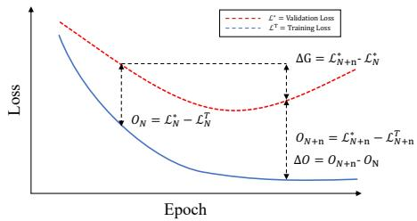  
Fig. 2: Illustration of the Overfitting-to-Generalisation Ratio (OGR) concepts during training.

In contrast, the overfitting increment ∆O shows strong and consistent separation between ego and exo branches—ego features typically converge faster and overfit earlier—making ∆O a more reliable indicator of modality-specific overfitting. Consistent with these findings, we adopt a simplified OGR variant that focuses solely on ∆O for training stability, ensuring that gradient reweighting responds directly to the view that overfits more rapidly.

## C Methodology

## C.1 Transformer Decoder Structure

Our decoder follows a DETR-style [1] Transformer architecture that incorporates learnable queries as the core decoding tokens, as shown in fig. 3. Each decoder layer contains a multi-head self-attention module to model token dependencies among queries, followed by a feed-forward network (FFN) to refine their representations. Residual connections and layer normalisation are applied after each sub-layer to ensure stable optimisation. The learnable query embeddings interact with encoded feature sequences through self-attention, allowing the decoder to adaptively attend to relevant spatio-temporal information and generate structured, task-specific representations.

## C.2 AdaMVS Pseudocode

To provide a clear overview of our model’s internal workflow, we present the pseudocode of the two core components in our framework — the Adaptive Multi-View Selection (AdaMVS) modules for both the exocentric and egocentric branches. The AdaMVS design enables our system to dynamically evaluate and select informative views or tokens at diferent stages of the fusion process. Specifically, the exocentric branch focuses on adaptively selecting the most discriminative external camera views to construct a compact, high-quality multi-view representation, while the egocentric branch further integrates egocentric and exocentric cues through token-level adaptive weighting for robust final embedding generation. The detailed computational procedures for these two branches are summarised in Algorithms algorithm 1 and algorithm 2.

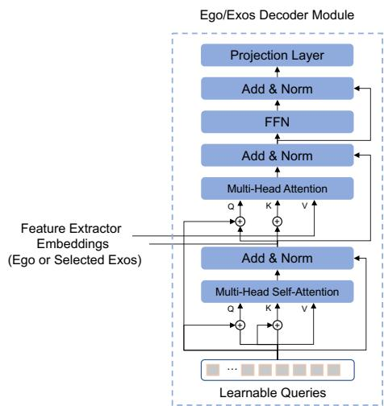  
Fig. 3: This module is a Transformer Decoder structure which refines Learnable Queries via Self-Attention before fusing them with Feature Extractor Embeddings via Multi-Head Attention.

## D Extended Related Work

Egocentric–Exocentric Correlation. While the main paper focuses on adaptive cross-view fusion, prior work has explored the ego–exo relationship from broader perspectives, including view transfer, geometric alignment, and correspondence learning. Earlier studies [5,6] aim to transfer motion patterns or embeddings between viewpoints through geometric constraints or contrastive objectives. Other methods seek to align latent representations across perspectives via adversarial or metric learning schemes, reducing domain gaps without explicit correspondence labels. Recent advances extend this to temporal alignment [11], capturing frame-level correspondence to encourage view-consistent representations. However, these works generally assume equal informativeness across views and do not account for redundancy or ambiguity within view streams—issues our adaptive selection module explicitly mitigates.

Cross-view Skill Analysis. Beyond the EgoExo4D benchmark, several domains have adopted cross-view reasoning for skill and behaviour understanding. For instance, instructional video analysis and sports assessment often employ mixed first-person and third-person footage to improve robustness and interpretability. However, most frameworks [12,2] rely on temporally aggregated features and static fusion, neglecting token-level variability in view quality. In contrast, our token-level AdaMVS design dynamically weighs each view and temporal token, ofering finer control over redundant or noisy visual cues during skill evaluation.

Cross-modal and Multi-view Fusion. Beyond ego–exo understanding, multi-view and multi-modal fusion have been studied across diverse domains such as 3D reconstruction [3,8], remote sensing, and multimodal perception. Traditional fusion strategies often operate at fixed levels—early (feature concatenation), intermediate (attention-based fusion), or late (score-level averaging)—but struggle to adaptively model feature relevance over time. Recent transformer-based methods [10,4] introduce token-wise interaction between modalities, but their complexity and data requirements limit scalability in ego–exo scenarios with asynchronous camera streams. Our framework draws inspiration from these finegrained paradigms but introduces view adaptivity and view-level regularisation to control redundancy and overfitting.

Algorithm 1: AdaMVS Exocentric Branch   
Input: Tokens $\{ x _ { v , t } \}$ from V views   
Output: Fused exocentric tokens $\{ x _ { t } ^ { \mathrm { e x o } } \}$   
1. Token scoring: $\boldsymbol { s } _ { v , t } = \phi ( \boldsymbol { x } _ { v , t } )$   
2. Gumbel–Softmax weighting (Train & Test):   
wt,b,v = GumbelSoftmax $( s _ { t , b , v } ; \tau$ , hard=False)   
3. Train (Top-K masking): Compute per-view scores by averaging token   
weights: $\begin{array} { r } { \bar { s } _ { b , v } = \frac { 1 } { T } \sum _ { t } w _ { t , b , v } ; } \end{array}$   
Select the Top-K most informative views: $\mathcal { V } _ { \mathrm { t o p } - K } ^ { ( b ) } = \mathrm { T o p K } ( \bar { s } _ { b , : } ) ;$   
Construct a binary mask for selected views: $m _ { t , b , v } = \mathbb { I } [ v \in \mathcal { V } _ { \mathrm { t o p } - K } ^ { ( b ) } ] ;$   
Apply the mask and normalise weights among Top-K:   
$\begin{array} { r } { \hat { w } _ { t , b , v } = \frac { m _ { t , b , v } w _ { t , b , v } } { \sum _ { v ^ { \prime } } m _ { t , b , v ^ { \prime } } w _ { t , b , v ^ { \prime } } } ; } \end{array}$   
Fuse the selected views using the renormalised weights: $\begin{array} { r } { x _ { t , b } ^ { \mathrm { e x o } } = \sum _ { v } \hat { w } _ { t , b , v } x _ { v , t , b } . } \end{array}$   
4. Test (soft fusion, no Top-K): $\begin{array} { r } { \tilde { w } _ { t , b , v } = \frac { w _ { t , b , v } } { \sum _ { v ^ { \prime } } w _ { t , b , v ^ { \prime } } } ; x _ { t , b } ^ { \mathrm { e x o } } = \overline { { \sum } } _ { v } ^ { \sim } \tilde { w } _ { t , b , v } x _ { v , t , b } . } \end{array}$   
5. Exocentric decoding: xexot,b = ExoDecoder $( x _ { t , b } ^ { \mathrm { e x o } } ) .$

Generalisation and Overfitting in Multi-view Learning. A subtle yet critical challenge in multi-view systems is generalisation imbalance: diferent views tend to overfit or underfit at diferent rates [9,7]. While prior work quantified this phenomenon through the Overfitting-to-Generalisation Ratio (OGR), few attempted to explicitly optimise it. Our integration of the VIB-GB regulariser complements AdaMVS by suppressing view-specific overfitting, balancing the learning pace between ego and exo streams, and producing more stable cross-view representations.

## E Limitations and Future Work

Although AdaMVS learns view-importance scores in a weakly supervised manner, the supervision signal ultimately derives from proficiency annotations, which are inherently subjective and often ambiguous. This noisiness may limit the precision of the learned importance scores, especially for actions where annotators disagree or where skill cues are subtle.

Moreover, although the adaptive Top-K mechanism helps mitigate cases where multiple views contribute similarly, it cannot fully resolve them. For samples with simple motions or highly overlapping camera coverage, diferent views provide nearly equivalent information, causing the model to assign almost uniform weights. In such cases, AdaMVS cannot reliably distinguish a clearly dominant view, reflecting an inherent limitation of the data rather than the method.

Algorithm 2: Ego–Exo Fusion with Adaptive Modality Weighting   
Input: Ego tokens $x _ { t , b } ^ { \mathrm { e g o . } } ;$   
Exo tokens $\boldsymbol { x } _ { t , b } ^ { \mathrm { e x o } }$   
Output: Fused tokens $\{ x _ { t , b } ^ { \mathrm { f i n a l } } \}$   
1. Feature projection   
Project both modalities: $x _ { t , b } ^ { \mathrm { e g o } } = \mathrm { P r o j } _ { \mathrm { e g o } } ( x _ { t , b } ^ { \mathrm { e g o } } ) , ~ x _ { t , b } ^ { \mathrm { e x o } } = \mathrm { P r o j } _ { \mathrm { e x o } } ( x _ { t , b } ^ { \mathrm { e x o } } ) .$   
2. Modality scoring   
Predict ego/exo importance: $\alpha _ { t , b } = \phi _ { \mathrm { e g o } } ( x _ { t , b } ^ { \mathrm { e g o } } ) , \beta _ { t , b } = \phi _ { \mathrm { e x o } } ( x _ { t , b } ^ { \mathrm { e x o } } )$   
forming scores $S _ { t , b } = [ \alpha _ { t , b } , \beta _ { t , b } ]$   
3. Adaptive weighting   
Training: average scores over tokens, $\begin{array} { r } { \bar { S } _ { b } = \frac { 1 } { T } \sum _ { t } S _ { t , b } , } \end{array}$   
apply Gumbel–Softmax w = GumbelSoftmax $( \bar { S } _ { b } ; \tau )$   
broadcast to all tokens and fuse: $\begin{array} { r } { \boldsymbol { x } _ { t , b } ^ { \mathrm { f i n a l } } = \sum _ { m \in \{ \mathrm { e g o , e x o } \} } \boldsymbol { w } _ { b , m } \boldsymbol { x } _ { t , b } ^ { m } } \end{array}$   
Testing: normalise scores, $\begin{array} { r } { \tilde { w } _ { t , b , m } = S _ { t , b , m } / \sum _ { m ^ { \prime } } S _ { t , b , m ^ { \prime } } , } \end{array}$   
soft fusion of both modalities: $\begin{array} { r } { \boldsymbol { x } _ { t , b } ^ { \mathrm { f i n a l } } = \sum _ { m } \tilde { \boldsymbol { w } } _ { t , b , m } \boldsymbol { x } _ { t , b } ^ { m } . } \end{array}$   
4. Output Return $\{ x _ { t , b } ^ { \mathrm { f i n a l } } \}$ for downstream decoding.

In the future, we plan to explore adaptive K-selection strategies further, allowing the number of selected views to adjust dynamically based on action complexity and cross-view variability. We also aim to extend proficiency estimation to more advanced multimodal reasoning tasks, such as integrating Ego–Exo action understanding with language-based feedback generation, enabling more comprehensive and interpretable human performance analysis.

## References

1. Carion, N., Massa, F., Synnaeve, G., Usunier, N., Kirillov, A., Zagoruyko, S.: End-to-end object detection with transformers. In: Proceedings of the European Conference on Computer Vision (ECCV). pp. 2633–2642 (2020) 6

2. Doughty, H., Mayol-Cuevas, W., Damen, D.: The pros and cons: Rank-aware temporal attention for skill determination in long videos. In: Proceedings of the IEEE/CVF Conference on Computer Vision and Pattern Recognition (CVPR). pp. 10103–10112 (2019) 7

3. Hamdi, A., Giancola, S., Ghanem, B.: Mvtn: Multi-view transformation network for 3d shape recognition. In: Proceedings of the IEEE/CVF International Conference on Computer Vision (ICCV). pp. 5923–5932 (2021) 8

4. Jia, D., Guo, J., Han, K., Wu, H., Zhang, C., Xu, C., Chen, X.: Geminifusion: Eficient pixel-wise multimodal fusion for vision transformer. In: European Conference on Computer Vision (ECCV). pp. 21–38 (2024) 8

5. Li, Y., Nagarajan, T., Xiong, B., Grauman, K.: Ego-exo: Transferring visual representations from third-person to first-person videos. In: Proceedings of the IEEE/CVF Conference on Computer Vision and Pattern Recognition (CVPR). pp. 10134–10143 (2021) 7

6. Luo, M., Xue, Z., Dimakis, A., Grauman, K.: Put myself in your shoes: Lifting the egocentric perspective from exocentric videos. In: Proceedings of the European Conference on Computer Vision (ECCV). p. 407–425 (2024) 7

7. Tejero-de Pablos, A.: Complementary-contradictory feature regularization against multimodal overfitting. In: Proceedings of the IEEE/CVF Winter Conference on Applications of Computer Vision (WACV). pp. 5679–5688 (2024) 8

8. Su, H., Maji, S., Kalogerakis, E., Learned-Miller, E.: Multi-view convolutional neural networks for 3d shape recognition. In: Proceedings of the IEEE International Conference on Computer Vision (ICCV). pp. 943–951 (2015) 8

9. Wang, W., Tran, D., Feiszli, M.: What makes training multi-modal classification networks hard? In: Proceedings of the IEEE/CVF International Conference on Computer Vision (ICCV). pp. 4622–4631 (2019) 5, 8

10. Wang, Y., Chen, X., Cao, L., Huang, W., Sun, F., Wang, Y.: Multimodal token fusion for vision transformers. In: Proceedings of the IEEE/CVF Conference on Computer Vision and Pattern Recognition (CVPR). pp. 10278–10287 (2022) 8

11. Xue, Z., Grauman, K.: Learning fine-grained view-invariant representations from unpaired ego-exo videos via temporal alignment. In: Proceedings of the IEEE/CVF International Conference on Computer Vision (ICCV). pp. 14389–14399 (2023) 7

12. Zhou, C., Huang, Y.: Uncertainty-driven action quality assessment. In: European Conference on Computer Vision (ECCV). pp. 1–18 (2022) 7