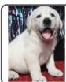
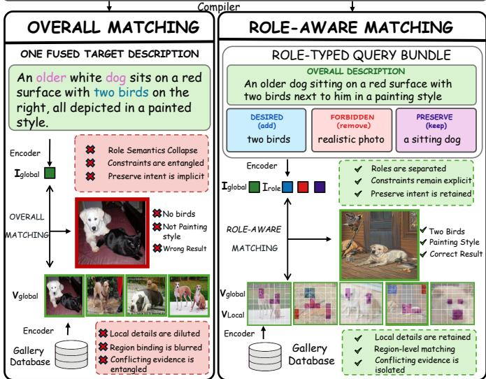
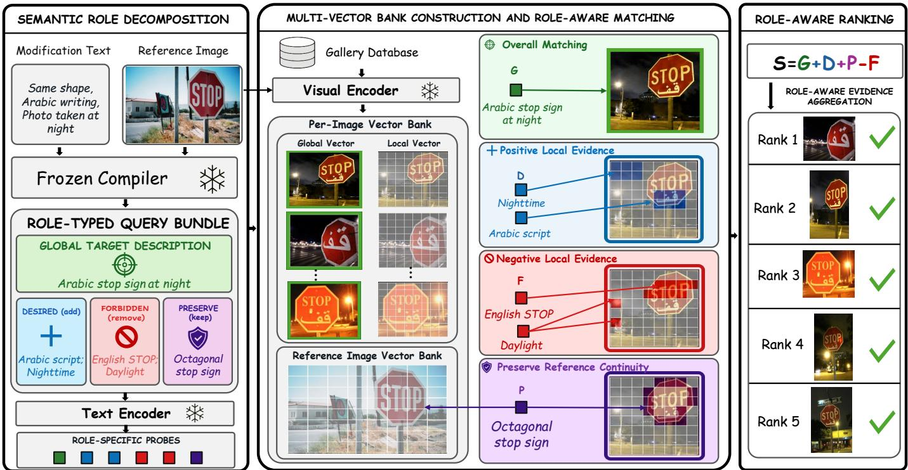
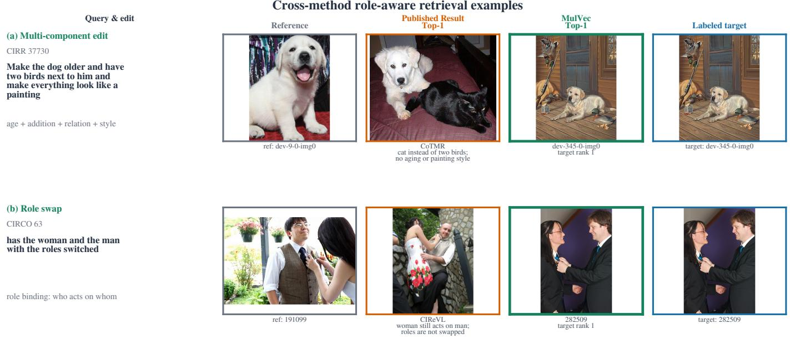
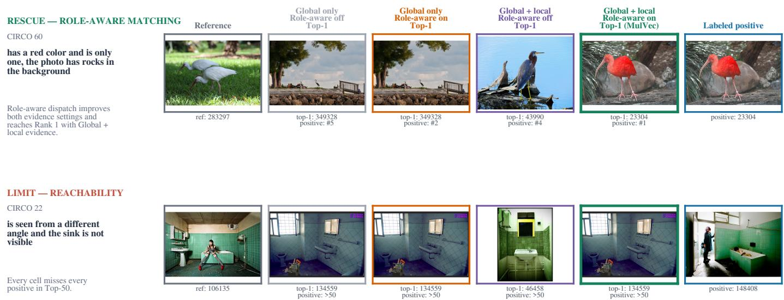
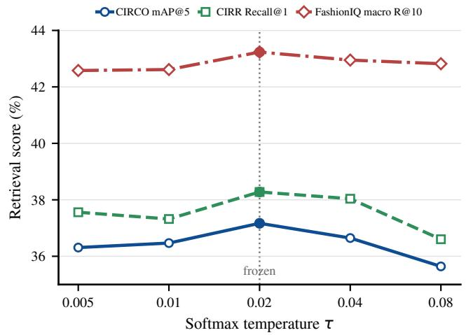
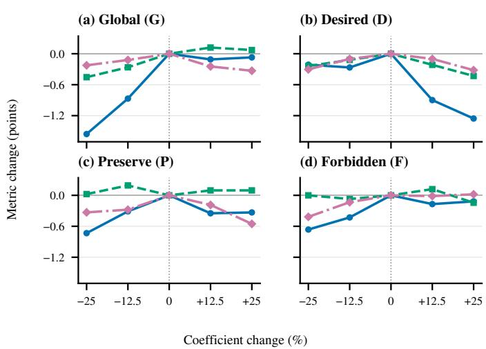

# MulVec: Fine-Grained Role-Aware Matching for Training-Free Zero-Shot Composed Image Retrieval

Zihao Zhang, Dayan Wu, Xinze Liu, Hengjie Zhu, Yiliang Zhu, Ding Wang, Peng Fu, Zheng Lin, Weiping Wang

Abstract—Training-free zero-shot composed image retrieval finds a target image in a gallery from a reference image and a text edit without learning from task-specific image triplets. Existing methods typically describe the target as a whole and match this description with a global image representation. This global matching can mix different semantic cues and lose finegrained details. We propose MULVEC, a role-aware method whose compiler produces a structured query record that is mapped to four retrieval roles: Global describes the full target, Desired states what should appear, Preserve states what should remain, and Forbidden states what should disappear. Frozen encoders map the query to one target description vector and role-specific probe vectors, while each candidate is represented by one global visual vector and a bank of local visual vectors. The retrieval roles then use this shared evidence for their respective purposes, and a fixed weighted sum of their scores ranks the entire gallery in a single retrieval pass. Across CIRCO, CIRR, and FashionIQ and three backbone scales, MULVEC improves CIRCO mAP@5 by up to 23.0% over the strongest compared method and gives the best CIRR and FashionIQ results in our comparison.

Index Terms—zero-shot composed image retrieval, trainingfree retrieval, role-aware matching, vision–language models.

## I. INTRODUCTION

Zero-shot composed image retrieval (ZS-CIR) searches a gallery with a reference image and a natural-language edit, without training on task-specific image triplets. It provides a direct way to ask for an image like the reference but with a requested change. FashionIQ, CIRR, and CIRCO test this task in fine-grained fashion and open-domain settings [1]–[3]. A correct result must satisfy the new request while keeping the relevant source content. Since one edit can ask to add, keep, and remove different content at the same time, the task requires more than overall image–text similarity.

Existing training-free methods commonly describe the desired target and retrieve images close to that description [4], [5]. Later methods add positive and negative descriptions, directional scores, reference-semantic debiasing, or local set matching [6]–[11]. These designs improve retrieval, but they do not jointly give each query role its own way to read finegrained candidate evidence. A global visual vector can hide a small but decisive detail, while one shared local matching rule cannot tell whether a match should be rewarded, kept relative to the reference, or penalized. The missing part is therefore role-aware matching, rather than simply more query or image vectors.

Figure 1 illustrates this limitation using CIRR validation query 37730. The edit asks to make the dog older, place two birds next to it, and turn the scene into a painting. The left branch represents CoTMR’s overall matching strategy [7], which combines all three changes into a single target description. However, it returns an image without the birds or the painting style. The fused query entangles the requested constraints, while the global candidate representation dilutes the local evidence needed to verify them. In contrast, the right branch shows our method. It retains an overall target description while introducing Desired, Preserve, and Forbidden probes with distinct roles. Desired rewards evidence of the two birds, Preserve checks that the dog remains seated, and Forbidden penalizes realistic photographic cues. By applying these role-specific probes to the candidate’s global and local visual representations, our method retrieves the ground-truth target at rank one. This contrast motivates our central design: role-aware matching determines how evidence is used, while multiple candidate representations provide the fine-grained evidence required by each role.

We propose MULVEC to realize this design. A frozen compiler produces a structured query record whose fields are deterministically mapped to four retrieval roles: Global, Desired, Preserve, and Forbidden. A frozen vision–language encoder maps Global to a target description vector and the remaining roles to role-specific probe vectors. It also represents each candidate with one global visual vector and a bank of local visual vectors. The retrieval roles then use this shared visual evidence for their respective purposes, and a fixed weighted sum of their scores ranks the entire gallery in a single retrieval pass. Role-aware matching determines how the evidence is used, while candidate multi-vectors provide the fine-grained evidence required by each role.

Our contributions are threefold:

• We propose a role-aware representation and matching method that assigns Global, Desired, Preserve, and Forbidden content different matching rules. Matched controls show that role-aware dispatch improves retrieval when each candidate is represented either by a single global image vector or by a global vector together with local visual vectors. This improvement is consistent across CIRCO, CIRR, and FashionIQ.

• We build MULVEC, a training-free framework that maps the query to a target description vector and role-specific probe vectors, represents each candidate with global and local visual vectors, and combines global positive, local

Make the dog older and have two birds next to him and make everything look like a painting

  
Fig. 1. Motivation on CIRR validation query 37730. Left: CoTMR’s overall matching strategy [7] encodes one fused target description and compares global vectors, but the retrieved image misses the requested birds and painting style. Right: role-aware matching separates the overall description, Desired, Preserve, and Forbidden probes, then matches them against global and local candidate evidence to retrieve the ground-truth target at rank one.

positive, reference-aware, and local negative matching in one frozen score. This combination gives the strongest matched-control result on all three datasets.

• Experiments show that MULVEC improves CIRCO mAP@5 by up to 23.0% over the strongest compared method and achieves the best results on CIRR and FashionIQ.

## II. RELATED WORK

## A. Learned CIR and Zero-Shot Transfer

Composed image retrieval (CIR) retrieves a target image from a reference image and a text modification. Supervised methods learn this composition from annotated reference–text– target triplets. Early work maps the two query modalities into one embedding or a shared compositional space [12]–[15], while later methods introduce region–word matching, CLIPbased residual fusion, candidate-aware reranking, concept supervision, or multimodal language models [16]–[20].

Zero-shot CIR removes annotated triplets from the target domain, but does not necessarily remove task-specific learning. Representative methods learn an image-to-word mapping, textual inversion, a language-only projection, knowledgeenhanced fusion, diffusion-based composition, text-anchored tuning, instruction-aware distillation, or self-guided semantic inspection [3], [21]–[28]. These methods improve transfer to unseen compositions, but remain outside our setting because they optimize a CIR-specific mapping, encoder, or composition module. We use training-free in the stricter sense that retrieval is built from frozen pretrained models without such optimization.

## B. Training-Free Zero-Shot CIR

Training-free ZS-CIR constructs the query and its retrieval scores at inference. CIReVL captions the reference image and asks a language model to rewrite the caption according to the modification [4]. TFCIR makes this query explicit and adds local-concept reranking [29]. LDRE generates diverse edited captions and combines them according to semantic relevance [30], whereas OSrCIR directly reasons over the reference image and modification to produce a target description in one stage [5]. These methods mainly improve how target-directed descriptions are produced or combined.

Other methods retain more than one retrieval signal. DQU-CIR applies two training-free raw-data transformations to form a textual query and a visually modified query before combining their features [31]. DualCIR uses dual-directional descriptions [6]; Imagine and Seek retrieves with a generated proxy image [32]; and PDV transfers a prompt direction to text and image embeddings [8]. BASIC separately scores reference-to-candidate and text-to-candidate similarity, then uses late fusion to reward candidates that satisfy both signals [33]. These designs preserve complementary query signals, but do not assign different retrieval roles within the requested change their own matching behavior.

Recent methods further structure the retrieval evidence. CoTMR reasons with global and object-scale descriptions of existent and nonexistent content [7]. STiTch combines semantic transition with set-to-set transportation [9]. SoFT extracts prescriptive and proscriptive constraints and uses them as reward and penalty filters for a base retriever [10]. SDR-CIR guides reference understanding with Selective CoT, anchors the composed query with reference-image features, and penalizes the estimated reference-induced bias in the final score [11]. These works establish the value of direction, scale, signed constraints, reference-aware correction, and set matching. The remaining issue is to connect each semantic role to an appropriate matching rule: desired content should be rewarded, preserved content should remain consistent with the reference, and forbidden content should be penalized.

## C. Role-Aware Matching with Fine-Grained Evidence

Fine-grained candidate evidence is not new by itself. Region–word interaction was introduced in supervised CIR [16], and candidate-aware reranking, local-concept reranking, object-scale scoring, and set transportation later brought related interactions to learned and training-free CIR [7], [9], [18], [29]. Outside CIR, ColBERT and FILIP are established examples of token-level and token–patch late interaction [34], [35]. These precedents show why local or set-valued features can expose small visual details; they also show that a candidate multi-vector bank alone is not a sufficient contribution.

Our distinction is how retrieval roles read that evidence. SoFT and SDR-CIR are the closest works along complementary axes. SoFT separates must-have and must-avoid constraints but applies global reward and penalty filters [10]; SDR-CIR makes ranking reference-aware but estimates one reference-induced bias term around a composed target description [11]. Neither models preservation as a separate role with its own reference-dependent local operator. In MUL-VEC, Global, Desired, Preserve, and Forbidden are compiled separately. Desired rewards local support, Preserve checks local continuity with the reference, and Forbidden penalizes local support, all over the same candidate evidence bank. The multi-vector bank therefore provides the fine-grained candidate evidence needed for role-aware matching.

  
Fig. 2. The MULVEC pipeline on CIRCO validation query 45. Semantic Role Decomposition compiles the reference image and modification into a role-typed query bundle: Global describes an Arabic stop sign at night, Desired adds Arabic script and nighttime, Preserve keeps the octagonal stop-sign structure, and Forbidden removes English $\mathrm { ^ { * } S T O P ^ { * } }$ and daylight. Frozen encoders produce the target description vector, role-specific probe vectors, a global and local visual-vector bank for each gallery image, and a local visual-vector bank for the reference. Global performs overall matching, Desired rewards positive local evidence, Preserve combines its probe with reference-image evidence to check continuity, and Forbidden detects local evidence for removed states. The Forbidden match is subtracted during aggregation. Their frozen weighted sum ranks the full gallery; all five displayed results are ground-truth positives.

## III. METHOD

## A. Problem Formulation

Given a reference image $I _ { r }$ and a natural-language modification m, a composed query is $\boldsymbol { q } = \left( \boldsymbol { I _ { r } } , m \right)$ . For a gallery $\mathcal { G } = \{ I _ { 1 } , \ldots , I _ { N } \}$ , the system assigns each candidate a score $S ( q , I )$ and returns the descending ranking

$$
\pi _ { q } = \operatorname { a r g s o r t } _ { I \in { \mathcal { G } } } S ( q , I ) .\tag{1}
$$

The target and its relevance labels are unavailable at inference. In the training-free zero-shot setting, no task-specific parameters are learned. A valid result must satisfy the requested change while preserving the relevant source content.

## B. Method Overview

Our central design principle is that a composed request contains semantically different roles that should not share one matching rule. Desired evidence should increase a candidate’s score, Preserve evidence should be checked relative to the reference, and Forbidden evidence should decrease the score. We therefore formulate retrieval as role-aware evidence matching: first make each role explicit, then let the role determine how candidate evidence is read.

Figure 2 illustrates the full flow on CIRCO validation query 45. First, Semantic Role Decomposition and a frozen text encoder map $( I _ { r } , m )$ to a target description vector and Desired, Preserve, and Forbidden role-specific probe vectors. Next, a frozen image encoder builds one global visual vector and a bank of local visual vectors for each gallery candidate, together with local visual vectors for the reference. At retrieval, Global scores overall compatibility, Desired rewards local evidence of Arabic script and nighttime, Preserve checks the octagonal shape against the reference, and Forbidden penalizes English $\mathrm { ^ { 6 6 } S T O P ^ { \prime } }$ and daylight. A frozen weighted sum ranks the full gallery in one pass; all five displayed results are groundtruth positives. The figure therefore makes role dispatch the central mechanism: the shared visual-vector bank supplies fine-grained evidence, while each role determines how that evidence contributes to the score.

## C. Role Compilation

A frozen compiler observes only $I _ { r }$ and $m$ and emits three top-level fields: desired, preserve, and forbidden. The desired field contains a global caption and a list of

positive atoms. A deterministic mapping produces the fourrole retrieval bundle

$$
\boldsymbol { B } = ( G , \mathcal { D } , \mathcal { P } , \mathcal { F } ) ,\tag{2}
$$

where G describes the complete desired image, D lists content that must appear, $\mathcal { P }$ lists source identity or context that must remain, and $\mathcal { F }$ lists source states that must disappear or be replaced. The frozen text tower encodes G as the target description vector $t ( G )$ and encodes the other fields as the sets of role-specific probe vectors $U _ { D } = t ( \mathcal { D } ) , U _ { P } = t ( \mathcal { P } )$ and $U _ { F } = t ( \mathcal { F } )$ . Each probe vector states what evidence to test, while its role determines how a match contributes to the final score. Generation never accesses a target image, target identifier, candidate, or relevance label.

## D. Role-Aware Evidence Matching

Fine-grained roles can depend on small visual details that a global visual vector may compress away. We therefore use one frozen vision–language encoder [36]. Its text tower maps a phrase x to a unit vector $t ( x ) \in \mathbb { R } ^ { d }$ , and its image tower stores each candidate as one global visual vector plus R local visual vectors,

$$
\begin{array} { r l r } & { \mathcal { E } ( I ) = \big ( v _ { 0 } ( I ) , V _ { \ell } ( I ) \big ) , } & \\ & { V _ { \ell } ( I ) = \{ v _ { j } ( I ) \} _ { j = 1 } ^ { R } , \quad } & { \| v _ { 0 } ( I ) \| _ { 2 } = \| v _ { j } ( I ) \| _ { 2 } = 1 , } \end{array}\tag{3}
$$

where $v _ { 0 }$ is the global visual vector and $V _ { \ell }$ is the set of local visual vectors. This bank changes the granularity of available evidence; the role-specific operators below determine its meaning.

The local operators share one smooth late-interaction primitive, following the general idea of fine-grained late interaction [34], [35]. For unit role-specific probe vectors $U = \{ u _ { i } \} _ { i = 1 } ^ { n }$ and a bank of candidate local visual vectors $V = \{ v _ { j } \} _ { j = 1 } ^ { R }$ , we define

$$
\pi _ { i j } ^ { ( \tau ) } = \frac { \exp ( u _ { i } ^ { \top } v _ { j } / \tau ) } { \sum _ { k = 1 } ^ { R } \exp ( u _ { i } ^ { \top } v _ { k } / \tau ) } ,\tag{4}
$$

$$
\mathcal { L } _ { \tau } ( U , V ) = \frac { 1 } { n } \sum _ { i } \sum _ { j } \pi _ { i j } ^ { ( \tau ) } u _ { i } ^ { \top } v _ { j } .\tag{5}
$$

The soft weighting lets each probe gather local support without allowing one accidental patch match to dominate.

Role awareness enters through operator dispatch. The four retrieval roles read the same candidate evidence with different aggregation signs and reference dependencies. Global matches the target description vector to the candidate global visual vector:

$$
\Phi _ { G } ( I ) = t ( G ) ^ { \top } v _ { 0 } ( I ) .\tag{6}
$$

The Desired and Forbidden operators are evaluated only for nonempty probe sets; an empty set deactivates the corresponding role. Desired rewards local evidence for the content that must appear:

$$
\Phi _ { D } ( I ) = \mathcal { L } _ { \tau } ( U _ { D } , V _ { \ell } ( I ) ) .\tag{7}
$$

Preserve is reference-dependent. We write $\mathit { C } ( I _ { r } , I )$ for the match from the reference local visual vectors $V _ { \ell } ( I _ { r } )$ to the

candidate local visual vectors $V _ { \ell } ( I )$ under $\scriptstyle { \mathcal { L } } _ { \tau }$ . Preserve combines this visual continuity with textual support when Preserve probes are available and otherwise uses continuity alone:

$$
\Phi _ { P } ( I _ { r } , I ) = \left\{ \begin{array} { l l } { \frac { 1 } { 2 } \mathcal { L } _ { \tau } ( U _ { P } , V _ { \ell } ( I ) ) + \frac { 1 } { 2 } C ( I _ { r } , I ) , } & { | U _ { P } | > 0 , } \\ { C ( I _ { r } , I ) , } & { | U _ { P } | = 0 . } \end{array} \right.\tag{8}
$$

Forbidden measures local evidence for source states that must disappear:

$$
\Phi _ { F } ( I ) = \mathcal { L } _ { \tau } ( U _ { F } , V _ { \ell } ( I ) ) .\tag{9}
$$

These operators produce the role-aware score

$$
\begin{array} { r l } { S _ { \mathrm { R A } } ( q , I ) = \theta _ { G } \Phi _ { G } ( I ) + \theta _ { D } \Phi _ { D } ( I ) } & { { } } \\ { + \theta _ { P } \Phi _ { P } ( I _ { r } , I ) - \theta _ { F } \Phi _ { F } ( I ) . } & { { } } \end{array}\tag{10}
$$

Here ${ \theta _ { \rho } } ~ \geq ~ 0$ for $\rho \in \{ G , D , P , F \}$ . Inactive Desired and Forbidden roles are omitted, and active weights are renormalized. Sorting Eq. (10) once over $\mathcal { G }$ produces the final ranking; there are no parallel routes or rank fusion. The roleto-operator mapping is the defining mechanism. Candidate multi-vectors provide the local visual evidence needed to apply that mechanism at a fine granularity, while the same role-aware formulation also remains valid with a single global visual vector.

## IV. EXPERIMENTS

## A. Experimental Setup

We evaluate on CIRCO [3], CIRR [2], and FashionIQ [1]. CIRCO reports mAP@k; CIRR reports full-gallery Recall@k and $\operatorname { R e c a l l } _ { s u b }$ @k within its official groups; FashionIQ reports Recall@10/50 for Shirt, Dress, and Toptee. Tables I and II summarize the corresponding public comparisons.

The experiments are organized to test the paper’s central claim that explicit role handling gives consistent retrieval gains, whereas increasing vector count alone does not. Public comparisons first evaluate the complete framework. Matched controls then compare role-aware dispatch with a shared read under two candidate evidence granularities. Targeted interventions finally measure the effects of removing role identity or changing role-specific operators. This order separates overall effectiveness, the source of the gain, and the mechanism behind it.

All MULVEC results use frozen OpenCLIP image/text towers at ViT-B/32, ViT-L/14, or ViT-G/14 scale. Each image is cached as one global visual vector and a bank of local visual vectors. At 224 input resolution, ViT-B/32 keeps its native $7 { \times } 7$ grid $( R = 4 9 ) ;$ ; it is not expanded to 64 vectors. ViT-L/14 and ViT-G/14 use an $8 \times 8$ pooled grid $( R = 6 4 )$ . Local interaction uses $\tau = 0 . 0 2$ , and a frozen Qwen3.6-27B compiler generates one target-free compiler record per query. We restrict public comparison to methods that satisfy the training-free setting in Sec. II-B and directly score the gallery in a single pass. Direct means that query-side records score the real gallery without synthesizing a proxy target image. Single-pass means that all query records and weights are fixed before gallery evaluation and each candidate receives its final score in one gallery sweep. Fixed score fusion is allowed; candidate-conditioned model calls, iterative retrieval, post-retrieval verification, and rescue loops are excluded. All baseline numbers are taken directly from the original papers.

TABLE I  
DIRECT SINGLE-PASS TRAINING-FREE ZS-CIR ON THE CIRCO AND CIRR TEST SETS, BOTH EVALUATED ONLINE WITH HIDDEN TEST ANNOTATIONS.BOLD AND UNDERLINED VALUES ARE THE BEST AND SECOND BEST AMONG THE LISTED ROWS WITHIN EACH BACKBONE BLOCK.
<table><tr><td rowspan="3">Backbone Method</td><td rowspan="3"></td><td colspan="4">CIRCO</td><td colspan="5">CIRR</td></tr><tr><td colspan="4">mAP@k</td><td colspan="2">Recall@k</td><td colspan="3">Recallsub@k</td></tr><tr><td>5</td><td>10</td><td>25</td><td>50</td><td>1</td><td>5</td><td>10</td><td>1 2</td><td>3</td></tr><tr><td rowspan="7">ViT-B</td><td>CIReVL [4] (ICLR’24)</td><td>14.94</td><td>15.42</td><td>17.00</td><td>17.82</td><td>23.94</td><td>52.51</td><td>66.00</td><td>60.17 80.05</td><td>90.19</td></tr><tr><td>OSrCIR [5] (CVPR’25)</td><td>18.04</td><td>19.17</td><td>20.94</td><td>21.85 25.42</td><td>54.54</td><td></td><td>68.19</td><td>62.31 80.86</td><td>91.13</td></tr><tr><td>CoTMR [7] (ICCV’25)</td><td>22.23</td><td>22.78</td><td>24.68 25.74</td><td>31.50</td><td>60.80</td><td>73.04</td><td>66.61</td><td>84.50</td><td>92.55</td></tr><tr><td>CIReVL + SoFT [10] (AAAIW&#x27;26)</td><td>19.21</td><td>20.04</td><td>21.86</td><td>22.75</td><td>32.94</td><td>62.92</td><td>74.17 70.31</td><td>86.58</td><td>93.78</td></tr><tr><td>LDRE + PDV-F [8], [30] (WACV’26)</td><td>17.80</td><td>18.78</td><td>20.61</td><td>21.56</td><td>29.30</td><td>60.39</td><td>72.51</td><td>63.06 82.36</td><td>91.54</td></tr><tr><td>SDR-CIR [11] (WWW&#x27;26)</td><td>23.78</td><td>24.43</td><td>26.58</td><td>27.50</td><td>34.48</td><td>65.74</td><td>76.87</td><td>69.90 87.04</td><td>94.48</td></tr><tr><td>STiTch [9] (CVPR’26)</td><td>20.26</td><td>21.01</td><td>23.01</td><td>24.04</td><td>25.83</td><td>55.25</td><td>70.20</td><td>65.64 83.60</td><td>92.80</td></tr><tr><td></td><td>MulVec (Ours)</td><td>29.25</td><td>29.78</td><td>31.96</td><td>32.98</td><td>36.70 68.53</td><td>80.15</td><td>72.19</td><td>88.34</td><td>94.80</td></tr><tr><td rowspan="8">ViT-L</td><td>CIReVL [4] (ICLR’24)</td><td>18.57</td><td>19.01</td><td>20.89</td><td>21.80</td><td>24.55</td><td>52.31</td><td>64.92</td><td>59.54</td><td>79.88</td><td>89.69</td></tr><tr><td>OSrCIR [5] (CVPR’25)</td><td>23.87</td><td>25.33</td><td>27.84</td><td>28.97</td><td>29.45</td><td>57.68</td><td>69.86</td><td>62.12</td><td>81.92</td><td>91.10</td></tr><tr><td>CoTMR [7] (ICCV’25)</td><td>27.61</td><td>28.22</td><td>30.61</td><td>31.70</td><td>35.02</td><td>64.75</td><td>76.18</td><td>69.39</td><td>85.75</td><td>93.33</td></tr><tr><td>CIReVL + SoFT [10] (AAAIW&#x27;26)</td><td>23.90</td><td>24.72</td><td>26.94</td><td>27.93</td><td>35.54</td><td>65.25</td><td>76.41</td><td>71.59</td><td>87.64</td><td>94.15</td></tr><tr><td>LDRE + PDV-F [8], [30] (WACV’26)</td><td>25.23</td><td>26.52</td><td>28.94</td><td>29.95</td><td>30.16</td><td>59.98</td><td>71.90</td><td>63.66</td><td>82.87</td><td>91.57</td></tr><tr><td>SDR-CIR [11] (WWW&#x27;26)</td><td>30.91</td><td>31.50</td><td>34.03</td><td>35.08</td><td>37.61</td><td>67.71</td><td>79.13</td><td>71.90</td><td>88.39</td><td>94.63</td></tr><tr><td>STiTch [9] (CVPR’26)</td><td>25.55</td><td>26.27</td><td>28.81</td><td>29.99</td><td>28.87</td><td>57.97</td><td>69.90</td><td>65.22</td><td>84.10</td><td>92.37</td></tr><tr><td>MulVec (Ours)</td><td>37.83</td><td>38.46</td><td>41.44</td><td>42.50</td><td>40.17</td><td>71.23</td><td>81.35</td><td>76.29</td><td>90.36</td><td>95.78</td></tr><tr><td rowspan="6">ViT-G</td><td>CIReVL [4] (ICLR’24)</td><td>26.77</td><td>27.59</td><td>29.96</td><td>31.03</td><td>34.65</td><td>64.29</td><td>75.06</td><td>67.95</td><td>84.87</td><td>93.21</td></tr><tr><td>OSrCIR [5] (CVPR’25)</td><td>30.47</td><td>31.14</td><td>35.03</td><td>36.59</td><td>37.26</td><td>67.25</td><td>77.33</td><td>69.22</td><td>85.28</td><td>93.55</td></tr><tr><td>CoTMR [7] (ICCV’25)</td><td>32.23</td><td>32.72</td><td>35.60</td><td>36.83</td><td>36.36</td><td>67.52</td><td>77.82</td><td>71.19</td><td>86.34</td><td>93.87</td></tr><tr><td>LDRE + PDV-F [8], [30] (WACV’26)</td><td>34.88</td><td>36.41</td><td>39.12</td><td>40.23</td><td>42.51</td><td>72.22</td><td>81.71</td><td></td><td>72.39 88.34</td><td>94.80</td></tr><tr><td>SDR-CIR [11] (WWW&#x27;’26)</td><td>33.05</td><td>34.50</td><td>37.21</td><td>38.42</td><td>40.17</td><td>69.76</td><td>79.88</td><td>73.30</td><td>88.89</td><td>94.99</td></tr><tr><td>STiTch [9] (CVPR’26)</td><td>34.40</td><td>35.56</td><td>38.07</td><td>40.02</td><td>39.23</td><td>69.95</td><td>79.56</td><td>73.56</td><td>89.50</td><td>95.86</td></tr><tr><td colspan="2">MulVec (Ours)</td><td>41.76</td><td>43.27</td><td>46.27</td><td>47.29</td><td>42.70</td><td>73.04</td><td>82.84</td><td>76.92</td><td>90.58</td><td>96.07</td></tr></table>

The selected methods cover distinct direct-scoring mechanisms. CIReVL captions the reference, rewrites that caption under the edit, and retrieves with the resulting target description [4]. OSrCIR instead uses one-stage reflective multimodal reasoning to generate the target description directly from the reference image and edit [5]. LDRE + PDV-F starts from multiple composed captions, transfers the prompt direction to both text and reference-image embeddings, and fuses them [8], [30]. CIReVL + SoFT adds prescriptive and proscriptive global scores that reward required concepts and penalize forbidden ones [10]. STiTch refines a composed caption through semantic transition and applies bidirectional transportation for set-to-set matching [9]. CoTMR derives global and object-scale positive/negative descriptions through multimodal reasoning and combines their frozen similarity scores [7]. SDR-CIR uses Selective CoT, anchors the query with reference-image features, and penalizes the estimated reference-induced contribution [11]. MULVEC instead compiles Global, Desired, Preserve, and Forbidden, encodes them as one target description vector and role-specific probe vectors, and lets their distinct operators read one candidate global–local visual evidence bank.

Mechanism analyses use OpenCLIP ViT-L/14. The controls in Tables III–V change only the candidate evidence, role assignment, or role-to-operator dispatch stated in each row.

## B. Overall Retrieval Effectiveness

Table I reports CIRCO and CIRR test results, while Table II reports FashionIQ validation results. On CIRCO, MULVEC is highest at every cutoff and scale in the selected direct single-pass comparison. At mAP@5 it improves over the best available comparator by 23.0%, 22.4%, and 19.7% for ViT-B/L/G. It also leads all three CIRR full-gallery recalls and all three subset recalls at every backbone scale within the selected comparison.

On FashionIQ, MULVEC gives the highest category-specific and averaged R@10 and R@50 at all three backbone scales, leading all 24 reported metrics. The consistency across opendomain CIRCO/CIRR and category-specific FashionIQ suggests that the benefit is not tied to one query style or visual domain. The consistent gains from ViT-B to ViT-G further indicate that the role-aware scorer complements stronger frozen features rather than merely substituting for them. Because every image and text tower remains frozen, this consistency cannot be attributed to task-specific representation learning. Larger backbones change the quality of the available evidence, yet the same asymmetric division among Global, Desired, Preserve, and Forbidden remains useful. This pattern is consistent with pretrained features already encoding many relevant cues while a holistic similarity score fails to use them according to their roles. These comparisons establish overall effectiveness, but they cannot determine whether the gains come from assigning distinct matching rules to different retrieval roles or simply from representing each candidate with more vectors. The matched analysis below separates these explanations.

TABLE II  
DIRECT SINGLE-PASS TRAINING-FREE ZS-CIR ON FASHIONIQ VALIDATION. AVERAGE IS THE UNWEIGHTED CATEGORY MEAN. BOLD ANDUNDERLINED VALUES ARE THE BEST AND SECOND BEST AMONG THE LISTED ROWS WITHIN EACH BACKBONE BLOCK.
<table><tr><td rowspan="2">Backbone Method</td><td rowspan="2"></td><td colspan="2">Shirt</td><td colspan="2">Dress</td><td colspan="2">Toptee</td><td colspan="2">Average</td></tr><tr><td>R@10</td><td>R@50</td><td>R@10</td><td>R@50</td><td>R@10</td><td>R@50</td><td>R@10</td><td>R@50</td></tr><tr><td rowspan="6">ViT-B</td><td>CIReVL [4] (ICLR’24)</td><td>28.36</td><td>47.84</td><td>25.29</td><td>46.36</td><td>31.21</td><td>53.85</td><td>28.29</td><td>49.35</td></tr><tr><td>OSrCIR [5] (CVPR’25)</td><td>31.16</td><td>51.13</td><td>29.35</td><td>50.37</td><td>36.51</td><td>58.71</td><td>32.34</td><td>53.40</td></tr><tr><td>CoTMR [7] (ICCV’25)</td><td>33.42</td><td>53.93</td><td>31.09</td><td>54.54</td><td>38.40</td><td>61.14</td><td>34.30</td><td>56.54</td></tr><tr><td>CIReVL + SoFT [10] (AAAIW&#x27;26)</td><td>31.26</td><td>50.98</td><td>27.52</td><td>49.13</td><td>34.37</td><td>58.44</td><td>31.05</td><td>52.85</td></tr><tr><td>SDR-CIR [11] (WWW’26)</td><td>36.41</td><td>57.02</td><td>36.84</td><td>58.85</td><td>43.14</td><td>64.71</td><td>38.80</td><td>60.19</td></tr><tr><td>STiTch [9] (CVPR’26)</td><td>25.22</td><td>44.16</td><td>18.59</td><td>40.16</td><td>25.97</td><td>47.61</td><td>23.26</td><td>43.98</td></tr><tr><td></td><td>MulVec (Ours)</td><td>39.45</td><td>59.22</td><td>38.87</td><td>61.43</td><td>45.95</td><td>67.36</td><td>41.42</td><td>62.67</td></tr><tr><td rowspan="5">ViT-L</td><td>CIReVL [4] (ICLR’24)</td><td>29.49</td><td>47.40</td><td>24.79</td><td>44.76</td><td>31.36</td><td>53.65</td><td>28.55</td><td>48.57</td></tr><tr><td>OSrCIR [5] (CVPR’25)</td><td>33.17</td><td>52.03</td><td>29.70</td><td>51.81</td><td>36.92</td><td>59.27</td><td>33.26</td><td>54.37</td></tr><tr><td>CoTMR [7] (ICCV’25)</td><td>35.43</td><td>54.91</td><td>31.18</td><td>55.04</td><td>38.55</td><td>61.33</td><td>35.05</td><td>57.09</td></tr><tr><td>CIReVL + SoFT [10] (AAAIW&#x27;26)</td><td>32.34</td><td>51.62</td><td>27.51</td><td>47.79</td><td>35.19</td><td>58.18</td><td>31.68</td><td>52.53</td></tr><tr><td>SDR-CIR [11] (WWW&#x27;26)</td><td>41.02</td><td>59.27</td><td>37.04</td><td>59.15</td><td>44.47</td><td>65.32</td><td>40.84</td><td>61.25</td></tr><tr><td></td><td>MulVec (Ours)</td><td>43.33</td><td>61.33</td><td>39.61</td><td>61.18</td><td>46.76</td><td>67.72</td><td>43.23</td><td>63.41</td></tr><tr><td rowspan="5">ViT-G</td><td>CIReVL [4] (ICLR’24)</td><td>33.71</td><td>51.42</td><td>27.07</td><td>49.53</td><td>35.80</td><td>56.14</td><td>32.19</td><td>52.36</td></tr><tr><td>OSrCIR [5] (CVPR’25)</td><td>38.65</td><td>54.71</td><td>33.02</td><td>54.78</td><td>41.04</td><td>61.83</td><td>37.57</td><td>57.11</td></tr><tr><td>CoTMR [7] (ICCV’25)</td><td>38.32</td><td>62.24</td><td>34.51</td><td>57.36</td><td>41.90</td><td>64.30</td><td>38.25</td><td>61.32</td></tr><tr><td>SDR-CIR [11] (WWW&#x27;26)</td><td>44.55</td><td>62.37</td><td>42.74</td><td>63.41</td><td>48.29</td><td>69.71</td><td>45.19</td><td>65.16</td></tr><tr><td>STiTch [9] (CVPR’26)</td><td>39.48</td><td>56.59</td><td>35.04</td><td>56.74</td><td>42.86</td><td>64.95</td><td>39.12</td><td>59.43</td></tr><tr><td colspan="2">MulVec (Ours)</td><td>47.20</td><td>66.29</td><td>45.12</td><td>66.39</td><td>50.79</td><td>72.87</td><td>47.70</td><td>68.52</td></tr></table>

Figure 3 shows why a stronger global description alone does not guarantee correct retrieval. In panel (a), CoTMR uses global and object-scale target descriptions but returns a young dog with a cat in a photograph, missing aging, two birds, and the painting style. MULVEC keeps the target description and role-specific probes explicit; their matching rules reject this plausible but incomplete result and retrieve the target at rank 1. In panel (b), CIReVL retrieves the relevant people with the wrong role relation, whereas MULVEC retrieves the target. Thus, role-aware matching preserves constraints that global-description optimization can miss; these cases diagnose behavior rather than estimate failure frequency.

## C. Evidence for Role-Aware Matching

The remaining experiments test the central claim from mechanism to robustness. We first separate role-aware dispatch from candidate-evidence granularity, then ablate role components and operators, and finally vary the local-interaction temperature and role weights.

1) Role-Aware Matching in the Global Only and Global + Local Settings: Table III is the central matched control. All four cells share the compiler outputs and frozen weights. The × rows concatenate the nonempty D/P/F probes and apply one unsigned shared read, removing both Preserve’s reference-continuity term and Forbidden’s negative sign. The ✓ rows keep the same probes but dispatch positive Desired, reference-aware Preserve, and negative Forbidden operators. In the Global only rows, reference continuity reduces to global reference–candidate similarity.

Across both candidate-evidence settings, role-aware dispatch improves the reported metric on all three datasets. Using unrounded scores, the gains for Global only and Global + local, respectively, are 7.08 and 5.58 points on CIRCO, 5.26 and 5.50 on CIRR, and 16.46 and 12.36 on FashionIQ. Adding local visual vectors under the shared read improves the three metrics by 4.88, 2.63, and 6.72 points; under role-aware dispatch, it improves them by 3.38, 2.87, and 2.62 points. The interactions are −1.50, +0.24, and −4.10, indicating

Cross-method role-aware retrieval examples

  
Fig. 3. Qualitative examples requiring multiple constraints or role binding on CIRR and CIRCO. Orange panels show the top-1 outputs reported for CoTMR [7] and CIReVL [4]; green panels show MULVEC retrieving the labeled target at rank 1, and blue panels show the labeled targets.

TABLE III  
EFFECT OF CANDIDATE-EVIDENCE GRANULARITY AND ROLE-AWAREDISPATCH ON VIT-L VALIDATION.
<table><tr><td></td><td>Candidate evidence Role-aware dispatch</td><td>CIRCO mAP@5</td><td>CIRR</td><td>FashionIQ Recall@1 Macro R@10</td></tr><tr><td>Global only</td><td>X</td><td>26.71</td><td>30.14</td><td>24.15</td></tr><tr><td>Global only</td><td>√</td><td>33.79</td><td>35.41</td><td>40.61</td></tr><tr><td>Global + local</td><td>X</td><td>31.58</td><td>32.78</td><td>30.87</td></tr><tr><td>Global + local</td><td>√</td><td>37.17</td><td>38.28</td><td>43.23</td></tr></table>

TABLE IV

ABLATION OF THE GLOBAL, DESIRED, PRESERVE, AND FORBIDDEN ROLECOMPONENTS ON VIT-L VALIDATION.
<table><tr><td>Variant</td><td>CIRCO mAP@5</td><td>CIRR Global R@1</td><td>FashionIQ Macro R@10</td></tr><tr><td>w/o Global</td><td>22.02</td><td>24.64</td><td>28.89</td></tr><tr><td>w/o Desired</td><td>33.81</td><td>35.41</td><td>38.50</td></tr><tr><td>w/o Preserve</td><td>35.76</td><td>35.89</td><td>34.77</td></tr><tr><td>w/o Forbidden</td><td>35.83</td><td>37.08</td><td>42.07</td></tr><tr><td>Full role-aware</td><td>37.17</td><td>38.28</td><td>43.23</td></tr></table>

partial overlap rather than additive benefits. The role-aware gain persists with one global visual vector, so it does not depend on a multi-vector candidate representation. Local visual vectors nevertheless improve both reads, and the strongest cell combines them with role-aware dispatch. Thus, retrieval roles determine how evidence affects ranking, while multiple candidate vectors increase the resolution of that evidence.

2) Role Components and Role-Specific Operators: Table IV removes one score from the G/D/P/F combination.

Global gives the largest contribution on all three datasets; removing it lowers CIRCO mAP@5, CIRR Recall@1, and FashionIQ macro Recall@10 by 15.15, 13.64, and 14.34 points. Desired is also consistently useful, while Preserve matters most on FashionIQ. Forbidden is more metric dependent: removing it lowers CIRR full-gallery Recall@1 by 1.20 points and lowers CIRR subset Recall@1 from 71.06 to 69.29 and lowers the other two reported metrics. The unequal effects reflect distinct jobs rather than interchangeable score terms. Global supplies the target-level anchor, while Desired, Preserve, and Forbidden test what must appear, remain, or disappear. Preserve’s larger effect on FashionIQ is consistent with edits that retain garment identity, whereas Forbidden helps when removed content distinguishes plausible distractors. Smaller role-specific corrections can therefore remain decisive among candidates that share the same broad semantics.

TABLE V  
EFFECTS OF ROLE ASSIGNMENT AND ROLE-SPECIFIC MATCHINGOPERATORS ON VIT-L VALIDATION.
<table><tr><td>Variant</td><td>CIRCO mAP@5</td><td>CIRR Global R@1</td><td>FashionIQ Macro R@10</td></tr><tr><td>Role reassignment (mean)</td><td>31.05</td><td>32.25</td><td>37.09</td></tr><tr><td>w/o reference continuity</td><td>35.60</td><td>36.12</td><td>34.77</td></tr><tr><td>Forbidden as reward (+)</td><td>34.12</td><td>33.97</td><td>38.36</td></tr><tr><td>Full role-aware</td><td>37.17</td><td>38.28</td><td>43.23</td></tr></table>

Table V separates three properties that the composite roleaware switch in Table III changes together. Role reassignment permutes the same D/P/F probes among fixed operators while preserving group sizes. Removing reference continuity deletes only the ${ \scriptstyle \frac { 1 } { 2 } } { \mathcal { L } } _ { \tau } ( V _ { \ell } ( I _ { r } ) , V _ { \ell } ( I ) )$ term from Preserve and keeps its half-weighted text term unchanged. Rewarding Forbidden flips only its sign; the Preserve operator and all role assignments remain intact. Each isolated intervention lowers all three reported metrics. Thus, the intended role assignment, reference continuity, and negative Forbidden sign make distinct contributions to these primary measures. The reference-continuity effect is not uniform across CIRR measures: removing it raises subset Recall@1 from 71.06 to 71.44 while lowering global

  
Fig. 4. One success case and one failure case from the matched control on CIRCO validation. Columns show the Top-1 retrieval and best-positive rank for each cell of the 2 × 2 control. For CIRCO 60, role-aware dispatch raises the best-positive rank from 5 to 2 with Global only evidence and from 4 to 1 with Global + local evidence. For CIRCO 22, no cell retrieves a labeled positive within the Top-50.

Recall@1. Role reassignment is the most direct test of the roleaware claim: it preserves the available probes and matching operators but changes which meaning controls which operator. Its consistent loss shows that extra descriptions alone are insufficient; their semantic assignment matters. The continuity and sign interventions explain why: preserved content needs a source-relative test, and removed content must act as counterevidence. Together, Tables IV and V distinguish whether a role supplies useful evidence from whether that evidence is matched with the operator its meaning requires. This explicit asymmetry is essential in a frozen scorer that cannot learn it through an adapter.

Fig. 4 shows both the benefit and the boundary of this design. In CIRCO 60, role-aware dispatch improves the bestpositive rank from 5 to 2 with Global only evidence and from 4 to 1 with Global + local evidence. The repeated improvement shows that role-specific matching matters independently of candidate evidence granularity. Local visual vectors further move the role-aware result from rank 2 to rank 1, consistent with their role as finer evidence rather than the central mechanism. In CIRCO 22, every configuration misses all labeled positives in the Top-50 for an edit involving viewpoint and an invisible sink. Role-aware scoring can organize available evidence, but it cannot recover a target when the required cue is absent from the retrieved candidate set or is not captured by the frozen visual representation.

3) Softmax Temperature Sensitivity: We vary only the localinteraction temperature τ over {0.005, 0.01, 0.02, 0.04, 0.08} while freezing the compiler outputs, retrieval weights, and all other settings. Fig. 5 shows that $\tau = 0 . 0 2$ gives the highest score on all three reported metrics. Relative to this point, the adjacent settings 0.01 and 0.04 are lower by 0.70 and 0.52 points on CIRCO, 0.96 and 0.24 on CIRR, and 0.62 and 0.28 on FashionIQ. Temperature controls how strongly each probe concentrates on its best-matching local visual vectors. A very small τ approaches hard local selection and can overemphasize one incidental match, whereas a large τ spreads weight across weaker matches and dilutes role-specific evidence. The common optimum at 0.02 therefore supports selective but non-degenerate local aggregation. FashionIQ varies by only 0.65 points across the full grid, while CIRCO and CIRR vary by 1.53 and 1.68 points, respectively, showing that the two open-domain settings are more sensitive to local-evidence concentration in this experiment.

  
Fig. 5. Softmax temperature sensitivity with OpenCLIP ViT-L/14. Only τ changes, and all three datasets use their complete validation sets.

4) Role-Weight Sensitivity: We measure local sensitivity around the universal weights of the complete role-aware scorer. With OpenCLIP-L and $\begin{array} { r l r } { \tau } & { { } = } & { 0 . 0 2 . } \end{array}$ , we scale one frozen coefficient at a time by 0.75, 0.875, 1.0, 1.125, or 1.25 and apply the same query-specific active-role normalization.

Fig. 6 shows that, across the 16 non-anchor settings for each dataset, the reported metric drops by at most 1.56 points on CIRCO, 0.45 on CIRR, and 0.55 on FashionIQ. The best sampled neighbor differs from the frozen point by −0.07, +0.19, and +0.02 points, respectively. The response is therefore locally stable but not uniform: reducing Global by 25% causes the largest CIRCO drop, while increasing Preserve by 25% causes the largest FashionIQ drop.

  
Fig. 6. G/D/P/F weight sensitivity on ViT-L validation. Every point uses exact full-gallery ranking and active-role normalization. Curves report changes in CIRCO mAP@5, CIRR global Recall@1, and FashionIQ macro Recall@10.

These curves establish local rather than global robustness. CIRCO is most sensitive to weakening the target description vector, whereas FashionIQ is most sensitive to overemphasizing preservation, consistent with the component ablation. The conclusion therefore does not rely on one isolated weight setting.

## V. CONCLUSION

Training-free ZS-CIR must infer a target from a reference image and a modification without task-specific training. We introduced MULVEC, which compiles each query into explicit retrieval roles and assigns each role a matching rule consistent with its meaning. The target description vector anchors the overall target state, while role-specific probe vectors reward desired content, test preserved content against the reference, and penalize forbidden content using global and local visual evidence. Results on CIRCO, CIRR, and FashionIQ across three frozen backbones show consistent retrieval improvements. Matched controls and operator ablations further show that these gains depend on both correct role assignment and role-specific matching. Local visual vectors strengthen this mechanism by exposing finer evidence and thus serve as the representation used to realize role-aware matching. Failures remain when the compiler assigns an incorrect role, the frozen representation omits a required cue, or no suitable target enters the candidate set. Improving query compilation and evidence coverage is therefore a natural next step while retaining training-free retrieval.

[1] H. Wu, Y. Gao, X. Guo, Z. Al-Halah, S. Rennie, K. Grauman, and R. Feris, “Fashion iq: A new dataset towards retrieving images by natural language feedback,” in Proceedings ofthe IEEE/CVF Conference on Computer Vision and Pattern Recognition (CVPR), June 2021, pp. 11 307–11 317.

[2] Z. Liu, C. Rodriguez-Opazo, D. Teney, and S. Gould, “Image retrieval on real-life images with pre-trained vision-and-language models,” in Proceedings of the IEEE/CVF International Conference on Computer Vision (ICCV), October 2021, pp. 2125–2134.

[3] A. Baldrati, L. Agnolucci, M. Bertini, and A. Del Bimbo, “Zero-shot composed image retrieval with textual inversion,” in Proceedings of the IEEE/CVF International Conference on Computer Vision (ICCV), October 2023, pp. 15 338–15 347.

[4] S. Karthik, K. Roth, M. Mancini, and Z. Akata, “Vision-by-language for training-free compositional image retrieval,” in International Conference on Learning Representations, B. Kim, Y. Yue, S. Chaudhuri, K. Fragkiadaki, M. Khan, and Y. Sun, Eds., vol. 2024, 2024, pp. 16 926– 16 941. [Online]. Available: https://proceedings.iclr.cc/paper files/paper/ 2024/file/48fd58527b29c5c0ef2cae43065636e6-Paper-Conference.pdf

[5] Y. Tang, J. Zhang, X. Qin, J. Yu, G. Gou, G. Xiong, Q. Lin, S. Rajmohan, D. Zhang, and Q. Wu, “Reason-before-retrieve: One-stage reflective chain-of-thoughts for training-free zero-shot composed image retrieval,” in Proceedings of the IEEE/CVF Conference on Computer Vision and Pattern Recognition (CVPR), June 2025, pp. 14 400–14 410.

[6] J. Zhao, J. Li, D. Lian, L. Sun, and P. Lv, “Dualcir: Enhancing trainingfree composed image retrieval via dual-directional descriptions,” in Proceedings of the Winter Conference on Applications of Computer Vision (WACV), February 2025, pp. 5926–5936.

[7] Z. Sun, D. Jing, and Z. Lu, “Cotmr: Chain-of-thought multi-scale reasoning for training-free zero-shot composed image retrieval,” in Proceedings of the IEEE/CVF International Conference on Computer Vision (ICCV), October 2025, pp. 22 675–22 684.

[8] O. Tursun, S. Kalkan, S. Denman, and C. Fookes, “Pdv: Prompt directional vectors for zero-shot composed image retrieval,” in 2026 IEEE/CVF Winter Conference on Applications of Computer Vision (WACV). IEEE, 2026, pp. 7740–7749.

[9] M. Li, D. Wang, Z. Sun, J. Zhang, W. Luo, and J. Guo, “Stitch: Semantic transition and transportation in collaboration for training-free zero-shot composed image retrieval,” in Proceedings of the IEEE/CVF Conference on Computer Vision and Pattern Recognition (CVPR), June 2026, pp. 12 374–12 384.

[10] Y. Jung, S. Cho, H.-s. Min, and S. Choi, “Soft filtering: guiding zero-shot composed image retrieval with prescriptive and proscriptive constraints,” arXiv preprint arXiv:2512.20781, 2025.

[11] Y. Sun, J. Xu, Q. Xie, J. Li, Y. Ma, and Y. Liu, “Sdr-cir: Semantic debias retrieval framework for training-free zero-shot composed image retrieval,” in Proceedings of the ACM Web Conference 2026, ser. WWW ’26. Association for Computing Machinery, 2026, p. 2149–2159. [Online]. Available: https://doi.org/10.1145/3774904.3792339

[12] N. Vo, L. Jiang, C. Sun, K. Murphy, L.-J. Li, L. Fei-Fei, and J. Hays, “Composing text and image for image retrieval - an empirical odyssey,” in Proceedings of the IEEE/CVF Conference on Computer Vision and Pattern Recognition (CVPR), June 2019.

[13] Y. Chen and L. Bazzani, “Learning joint visual semantic matching embeddings for language-guided retrieval,” in European Conference on Computer Vision. Springer, 2020, pp. 136–152.

[14] M. U. Anwaar, E. Labintcev, and M. Kleinsteuber, “Compositional learning of image-text query for image retrieval,” in Proceedings of the IEEE/CVF Winter Conference on Applications of Computer Vision (WACV), January 2021, pp. 1140–1149.

[15] J. Kim, Y. Yu, H. Kim, and G. Kim, “Dual compositional learning in interactive image retrieval,” in Proceedings of the AAAI Conference on Artificial Intelligence, vol. 35, no. 2, 2021, pp. 1771–1779.

[16] M. Hosseinzadeh and Y. Wang, “Composed query image retrieval using locally bounded features,” in Proceedings of the IEEE/CVF Conference on Computer Vision and Pattern Recognition (CVPR), June 2020.

[17] A. Baldrati, M. Bertini, T. Uricchio, and A. Del Bimbo, “Effective conditioned and composed image retrieval combining clip-based features,” in Proceedings of the IEEE/CVF Conference on Computer Vision and Pattern Recognition (CVPR), June 2022, pp. 21 466–21 474.

[18] Z. Liu, W. Sun, D. Teney, and S. Gould, “Candidate set reranking for composed image retrieval with dual multi-modal encoder,” Transactions on Machine Learning Research, 2024. [Online]. Available: https://openreview.net/forum?id=fJAwemcvpL

[19] E. Xing, P. Kolouju, R. Pless, A. Stylianou, and N. Jacobs, “Contextcir: Learning from concepts in text for composed image retrieval,” in Proceedings of the IEEE/CVF Conference on Computer Vision and Pattern Recognition (CVPR), June 2025, pp. 19 638–19 648.

[20] C. Huynh, J. Yang, A. Tawari, M. Shah, S. Tran, R. Hamid, T. Chilimbi, and A. Shrivastava, “Collm: A large language model for composed image retrieval,” in Proceedings ofthe IEEE/CVF Conference on Computer Vision and Pattern Recognition (CVPR), June 2025, pp. 3994–4004.

[21] K. Saito, K. Sohn, X. Zhang, C.-L. Li, C.-Y. Lee, K. Saenko, and T. Pfister, “Pic2word: Mapping pictures to words for zero-shot composed image retrieval,” in Proceedings of the IEEE/CVF Conference on Computer Vision and Pattern Recognition (CVPR), June 2023, pp. 19 305–19 314.

[22] G. Gu, S. Chun, W. Kim, Y. Kang, and S. Yun, “Language-only training of zero-shot composed image retrieval,” in Proceedings ofthe IEEE/CVF Conference on Computer Vision and Pattern Recognition (CVPR), June 2024, pp. 13 225–13 234.

[23] H. Lin, H. Wen, X. Song, M. Liu, Y. Hu, and L. Nie, “Fine-grained textual inversion network for zero-shot composed image retrieval,” in Proceedings of the 47th International ACM SIGIR Conference on Research and Development in Information Retrieval, 2024, pp. 240– 250.

[24] Y. Suo, F. Ma, L. Zhu, and Y. Yang, “Knowledge-enhanced dual-stream zero-shot composed image retrieval,” in Proceedings of the IEEE/CVF Conference on Computer Vision and Pattern Recognition (CVPR), June 2024, pp. 26 951–26 962.

[25] G. Gu, S. Chun, W. Kim, H. Jun, Y. Kang, and S. Yun, “Compodiff: Versatile composed image retrieval with latent diffusion,” Transactions on Machine Learning Research, 2024, expert Certification. [Online]. Available: https://openreview.net/forum?id=mKtlzW0bWc

[26] Y. K. Jang, D. Huynh, A. Shah, W.-K. Chen, and S.-N. Lim, “Spherical linear interpolation and text-anchoring for zero-shot composed image retrieval,” in European conference on computer vision. Springer, 2024, pp. 239–254.

[27] W. Zhong, R. Barton, W. An, F. Jiang, H. Ma, Y. Guo, A. Dan, S. Sam, K. Bouyarmane, and J. Huang, “Zero-shot composed image retrieval via dual-stream instruction-aware distillation,” in Proceedings of the IEEE/CVF International Conference on Computer Vision (ICCV), October 2025, pp. 22 221–22 231.

[28] J. Zhang, L. Zhang, Z. Fu, B. Hu, and Z. Mao, “Self-guided semantic inspection for zero-shot composed image retrieval,” in Proceedings of the IEEE/CVF Conference on Computer Vision and Pattern Recognition (CVPR), June 2026, pp. 33 881–33 890.

[29] S. Sun, F. Ye, and S. Gong, “Training-free zero-shot composed image retrieval with local concept reranking,” arXiv preprint arXiv:2312.08924, 2023.

[30] Z. Yang, D. Xue, S. Qian, W. Dong, and C. Xu, “Ldre: Llm-based divergent reasoning and ensemble for zero-shot composed image retrieval,” in Proceedings of the 47th International ACM SIGIR conference on research and development in information retrieval, 2024, pp. 80–90.

[31] H. Wen, X. Song, X. Chen, Y. Wei, L. Nie, and T.-S. Chua, “Simple but effective raw-data level multimodal fusion for composed image retrieval,” in Proceedings of the 47th International ACM SIGIR conference on research and development in information retrieval, 2024, pp. 229– 239.

[32] Y. Li, F. Ma, and Y. Yang, “Imagine and seek: Improving composed image retrieval with an imagined proxy,” in Proceedings of the IEEE/CVF Conference on Computer Vision and Pattern Recognition (CVPR), June 2025, pp. 3984–3993.

[33] B. Psomas, G. Retsinas, N. Efthymiadis, P. Filntisis, Y. Avrithis, P. Maragos, O. Chum, and G. Tolias, “Instance-level composed image retrieval,” in The Thirty-ninth Annual Conference on Neural Information Processing Systems, 2025.

[34] O. Khattab and M. Zaharia, “Colbert: Efficient and effective passage search via contextualized late interaction over bert,” in Proceedings of the 43rd International ACM SIGIR conference on research and development in Information Retrieval, 2020, pp. 39–48.

[35] L. Yao, R. Huang, L. Hou, G. Lu, M. Niu, H. Xu, X. Liang, Z. Li, X. Jiang, and C. Xu, “Filip: Fine-grained interactive language-image pre-training,” arXiv preprint arXiv:2111.07783, 2021.

[36] A. Radford, J. W. Kim, C. Hallacy, A. Ramesh, G. Goh, S. Agarwal, G. Sastry, A. Askell, P. Mishkin, J. Clark et al., “Learning transferable visual models from natural language supervision,” in International conference on machine learning. PmLR, 2021, pp. 8748–8763.