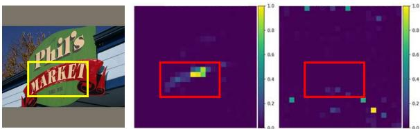
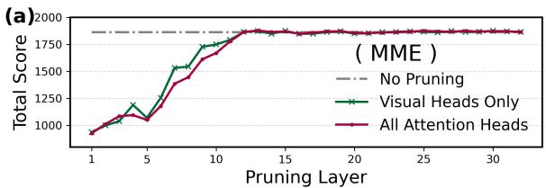
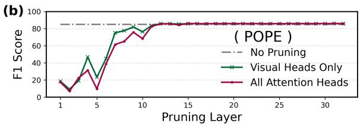
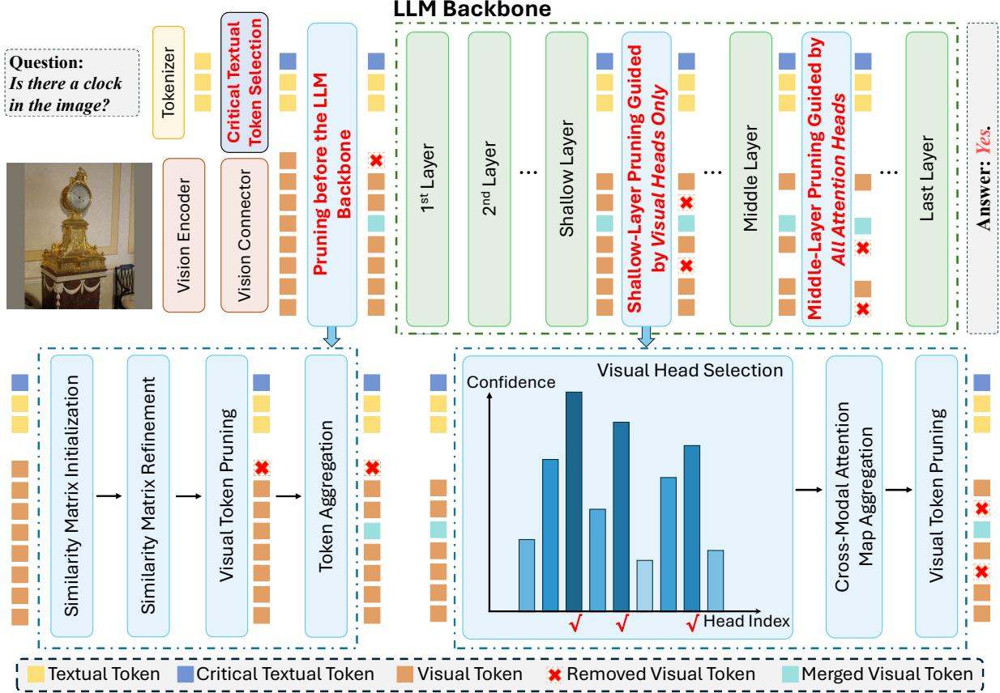
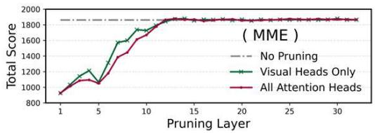
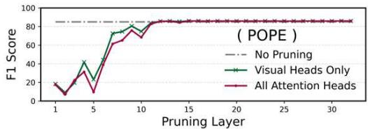
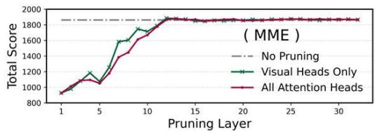
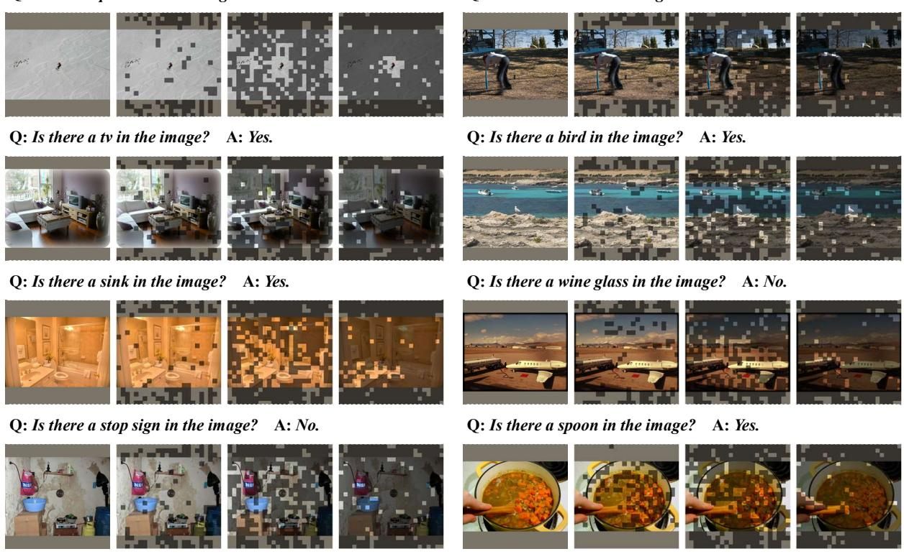

# Not All Attention Heads Contribute to Critical Visual Token Selection: Head-Aware Pruning Matters More

Chaofang Ma1, Lin Jiang2, Carol Jingyi Li1, Xingyu Liu1,

Zeyu Li1, Jiang Xu3, and Wei Zhang1\*

1The Hong Kong University of Science and Technology, 2Northeastern University, 3The Hong Kong University of Science and Technology (GZ) \*Corresponding author: wei.zhang@ust.hk

## Abstract

Vision–Language Models (VLMs) have exhibited impressive performance across diverse visual scenarios. However, this success comes at the cost of explosive growth in visual tokens, which imposes substantial memory and computational overhead during inference, ultimately increasing latency. To improve VLM inference efficiency, a typical class of visual token pruning methods estimates token importance by aggregating attention scores across all heads in the pruning layer of the Large Language Model (LLM) backbone and prunes tokens based on aggregated scores. However, in this paper, we reveal a compelling phenomenon: the capability to pinpoint critical visual tokens is concentrated within a small fraction of heads. Aggregation exclusively on these heads can improve task performance. Inspired by this observation, we propose ProViP, a training-free Progressive Visual token Pruning framework. ProViP first removes redundant visual tokens based on the embedding similarity of input tokens before reasoning of the LLM backbone, and then further prunes tokens during reasoning via head-aware pruning. Experiments demonstrate that ProViP delivers outstanding task performance and inference efficiency. For instance, when applied to LLaVA-1.5-7B, ProViP retains 95.9% of the original performance and achieves 1.62x inference speedup under an 88.9% pruning ratio.

## 1 Introduction

Benefiting from the prosperity of Large Language Models (LLMs) (Zhao et al., 2023; Naveed et al., 2025; Liu et al., 2026), Vision–Language Models (VLMs) (Achiam et al., 2023; Wu et al., 2024; Liu et al., 2024a; Chen et al., 2024d; Li et al., 2025b) exhibit impressive capabilities in visual scenes. They have been widely deployed across diverse domains, such as medical analysis (Li et al., 2023a; Wang et al., 2025; Nath et al., 2025), autonomous driving (Li et al., 2025a; Tian et al., 2025b,a), and content moderation (Guo et al., 2024; Levi et al., 2025). However, despite the remarkable performance, increasing scenario complexity (Shao et al., 2025; Tang et al., 2025; Brimont et al., 2026) induces a proliferation of visual tokens, imposing substantial memory and computational overhead and ultimately increasing VLM inference latency.

  
Figure 1: Attention maps of two heads under the textual instruction “What is the word in the red part?” The left head focuses on task-relevant regions, while the right head attends to irrelevant areas. ProViP removes redundant visual tokens via head-aware pruning.

To tackle the challenge, visual token pruning (Yao et al., 2026; Shao et al., 2026) has emerged as one of the promising techniques (Shinde et al., 2025; Jin et al., 2025; Kang et al., 2026). This approach is motivated by the inherent redundancy in visual information, as only a small subset of tokens contributes to task performance. By selectively retaining task-relevant visual tokens, pruning reduces memory and computational burdens, thereby improving efficiency while preserving performance.

Among existing visual token pruning methods, a particularly effective class (Chen et al., 2024a; Zhang et al., 2025b) utilizes attention maps from the LLM backbone to guide token pruning. In these methods, token importance is quantified by aggregating attention scores, commonly through averaging, across all heads within the pruning layer. Visual tokens with higher importance are identified as critical and retained to maintain performance, while the others are pruned to enhance efficiency.

While aggregating attention scores from all heads provides a convenient strategy, it implicitly assumes that each head contributes equally to token importance estimation. To examine whether this assumption effectively identifies critical visual tokens, we conduct experiments in this paper. Our empirical analysis reveals a compelling phenomenon: the capability to pinpoint critical visual tokens is concentrated in a small fraction of heads. We refer to these visually selective heads as visual heads, with the formal description in Section 3. Restricting aggregation on attention scores of visual heads noticeably improves task performance when pruning is applied to shallow layers of the base LLM, whereas the gains diminish in deeper layers.

Inspired by these findings, we propose ProViP, an effective and training-free framework for progressive visual token pruning. ProViP preliminarily reduces visual redundancy before visual tokens enter the LLM backbone and further removes visual tokens within shallow and middle layers via headaware pruning. By combining them, the framework improves VLM inference efficiency while maintaining competitive task performance.

In summary, our contributions are as follows:

• We uncover a layer-dependent phenomenon in attention-based visual token pruning: aggregation solely on visual heads yields noticeable performance gains in shallow layers, whereas the gains are less pronounced in deeper layers.

• Based on this observation, we propose ProViP, a training-free progressive visual token pruning framework that removes redundant tokens before LLM reasoning and performs headaware pruning during reasoning.

• Experiments indicate that ProViP achieves outstanding inference efficiency and task performance across a series of benchmarks.

## 2 Related Work

VLM Architecture. In a typical VLM pipeline, raw visual inputs are transformed into visual tokens, which are subsequently concatenated with textual tokens and processed by an LLM backbone (e.g., Vicuna (Zheng et al., 2023), Qwen(Bai et al., 2023), InternLM2 (Cai et al., 2024), Qwen2 (Yang et al., 2024a)) for joint reasoning. Specifically, before the LLM backbone reasoning, a visual encoder (e.g., CLIP (Radford et al., 2021), SigLIP (Zhai et al., 2023)) first extracts semantically rich feature representations from the visual inputs. A visual connector, typically an MLP projector (Lu et al.,

2024; Chen et al., 2024c; Wang et al., 2024; Chen et al., 2024b), then maps these representations into the base LLM’s input embedding space, ensuring that visual embeddings are aligned with textual counterparts in both dimension and semantics.

Visual Token Pruning Methods. Since not all visual tokens carry task-relevant information, pruning visual tokens improves efficiency with negligible performance degradation. Previous works have proposed methods for removing redundant visual tokens (Nguyen and Cheung, 2025; Shao et al., 2026). From the perspective of pruning principles, these methods broadly fall into two classes: attention-based and similarity-based. Attentionbased methods (Chen et al., 2024a; Zhang et al., 2025b) usually evaluate the importance of visual tokens using the base LLM’s attention scores, and retain tokens with high importance. However, treating all heads equally in these methods inevitably introduces noise, leading to suboptimal token pruning. Similarity-based methods (Wen et al., 2025; Ma et al., 2026) use embedding correlations among visual tokens to retain informative tokens. Since these methods ignore textual instructions, they cannot adaptively preserve task-relevant visual tokens.

## 3 Observation: Not All Heads Matter

In this section, the empirical findings that motivate ProViP are presented. Conventional attentionbased methods implicitly assume that all heads contribute equally to identifying critical visual tokens, thereby overlooking the heterogeneous contributions of different heads. We hypothesize that the capability to localize salient visual tokens is concentrated in a small subset of heads (visual heads), whereas the remaining heads introduce redundant or even detrimental noise. To validate this hypothesis, we introduce a lightweight heuristic to distinguish visual heads from others. By isolating visual heads, this heuristic enables a comprehensive analysis of how token importance indicators constructed from different head groups affect task performance. Empirical findings confirm our hypothesis.

## 3.1 Visual Head Selection Heuristic

The core definition behind our heuristic is that a visual head exhibits sharp semantic focus when processing visual inputs, with its attention highly concentrated on visual tokens relevant to the textual instruction. Conversely, a non-visual head exhibits indiscriminate or misleading visual selectivity, either dispersing its attention across all visual tokens or concentrating on task-irrelevant ones, thereby introducing noise into token importance estimation. Figure 1 illustrates a case of the differences in attention focus between a visual head (left) and a nonvisual head (right) for better understanding. Driven by this definition, we categorize all the heads within the pruning layer through the following steps (described in detail in Section 4):

Semantic Anchor Extraction. Given a textual instruction, textual tokens with the core semantic keyphrases are first extracted to serve as crossmodal semantic guidance anchors.

Confidence Metric. For each head within the pruning layer, we define the variance of its crossmodal attention scores over the extracted textual tokens as the confidence metric. A larger confidence indicates greater concentration on text-related visual regions, reflecting stronger visual selectivity.

Head Classification. We rank all heads in the pruning layer based on their confidence scores. The heads with top scores are defined as visual heads, while the others are considered non-visual heads.

## 3.2 Empirical Findings

To systematically observe the influence of head selection on task performance, we conduct layer-wise experiments on LLaVA-1.5-7B (Liu et al., 2024a) across two prominent benchmarks: MME (Fu et al., 2023) and POPE (Li et al., 2023b). Specifically, we let each layer in the base LLM take turns serving as the pruning layer. Performance under two configurations is compared: (1) All Attention Heads, the typical baseline that aggregates attention scores across all heads of the pruning layer, and (2) Visual Heads Only, which restricts the aggregation solely to the identified visual heads. Empirically, the top 6 out of the 32 heads are identified as visual heads based on the confidence metric (detailed ablation on visual head number is provided in Appendix E). For a stringent setting, we adopt an aggressive pruning strategy, reducing the original 576 visual tokens to merely 16 at the pruning layer. This demands precise token selection, thereby amplifying the performance gap between the two configurations and exposing the impact of visual and non-visual heads. The above implementation details are summarized in the pseudocode provided in Appendix F.

As shown in Figure 2, task performance under both configurations exhibits consistent trends across the two benchmarks, initially increasing and then converging. When visual tokens are pruned in the shallow layers, the Visual Heads Only configuration outperforms the All Attention Heads baseline by an evident margin. For example, the F1 score gap reaches 13.7 when pruning is performed at the 7th layer on POPE. This observation demonstrates that estimating token importance based on the entire head set is polluted by non-visual heads of the LLM backbone. Moreover, it suggests that the proposed heuristic effectively identifies visual heads, resulting in a cleaner importance estimator.

  
Figure 2: Task performance between All Attention Heads and Visual Heads Only under different pruning layers: (a) Total score of MME; (b) F1 score of POPE.

By contrast, when pruning is applied to the middle or deep layers, the performance gap gradually diminishes. We attribute this convergence to the fact that visual tokens tend to achieve homogeneity through extensive global cross-modal interactions in these layers (Nguyen et al., 2023), rendering the model inherently more robust to potentially inaccurate token selection. Overall, since redundant visual tokens are typically removed in the shallow layers to maximize efficiency, our findings indicate that pruning guided by Visual Heads Only can yield crucial performance gains where it matters most.

## 4 Method

## 4.1 Overview

As revealed in Section 3.2, the capability to identify task-relevant visual tokens is concentrated in visual heads. Inspired by this, we propose ProViP, a training-free progressive visual token pruning framework to accelerate inference while minimizing performance loss. As Figure 3 shows, ProViP removes redundant tokens via the sequential stages:

Critical Textual Token Selection. To extract the semantic anchors mentioned in Section 3.1, we propose and formalize a strategy for identifying these anchors to guide subsequent pruning.

  
Figure 3: Overview of ProViP. ProViP consists of the progressive stages: critical textual token selection, pruning before the base LLM, and pruning during the base LLM (including shallow-layer and middle-layer pruning).

Pruning before the Base LLM. Since attention maps are unavailable before the base LLM, we apply text-guided similarity-based pruning before tokens enter the LLM backbone. By removing redundant visual tokens at this stage, we substantially reduce inference overhead, as pruned tokens are excluded from all subsequent computations.

Pruning during the Base LLM. To maximize efficiency, pruning should be applied to the shallow or middle layers rather than the deep layers, as early sequence reduction shortens the input for most layers, thereby reducing overall overhead. In ProViP, pruning is executed twice sequentially: once in a shallow layer and once in a middle layer. Based on the observation that the performance gap between All Attention Heads and Visual Heads Only is evident in the shallow layers but mild in the middle layers, we adopt Visual Heads Only for shallowlayer pruning to retain critical visual tokens effectively. The formalization of the confidence metric and head classification in Section 3.1 is provided in Section 4.4. For middle-layer pruning, we employ All Attention Heads, as visual information is sufficiently integrated across heads, enabling the use of more comprehensive attention scores.

## 4.2 Critical Textual Token Selection

Since non-content words in textual instructions, such as prepositions, seldom correspond to visual features, it is essential to retain only semantically crucial textual tokens to avoid introducing potential noise to the following pruning stages. To this end, textual self-similarity is used to ensure that the selection of critical textual tokens is decoupled from visual information. This approach retains critical textual tokens, even when they lack direct visual correspondence. Specifically, the process is executed after the tokenizer produces the full sequence of textual tokens. Let the number of textual tokens be $N _ { t }$ . Formally, for textual embeddings $\pmb { { E } } _ { t } \in \mathbb { R } ^ { N _ { t } \times d }$ , where d is the embedding dimension, ranking criterion of textual tokens $\pmb { r } \in \mathbb { R } ^ { 1 \times N _ { t } }$ is

$$
r = \frac { 1 } { N _ { t } } \sum _ { i = 1 } ^ { N _ { t } } \left( \mathrm { S o f t m a x } ( \pmb { E } _ { t } \cdot \pmb { E } _ { t } ^ { T } ) \right) _ { i } .\tag{1}
$$

Then the index set of critical textual tokens is

$$
\mathcal { T } = \{ j | r _ { j } > \mathrm { M e a n } ( \pmb { r } ) \} .\tag{2}
$$

## 4.3 Pruning before the LLM Backbone

Before jointly feeding textual and visual tokens into the LLM backbone, a text-guided similarity-based pruning is applied. Specifically, a cross-modal similarity matrix is built and recalibrated to emphasize task-relevant visual tokens. Visual tokens are then prioritized based on their peak similarity to critical textual tokens, ensuring that informative tokens are retained while redundant ones are removed.

We first evaluate the cross-modal relevance by computing the similarity matrix $M \in \mathbb { R } ^ { | T | \times N _ { v } }$ where $N _ { v }$ is the original number of visual tokens produced by the vision connector. Given $\scriptstyle { E _ { t } }$ and visual embeddings $\pmb { { E } } _ { v } \in \mathbb { R } ^ { N _ { v } \times d }$ from the visual connector, $M _ { i , j }$ characterizes the affinity between the i-th critical textual token and the j-th visual token via cosine similarity, formulated as

$$
M _ { i , j } = \frac { { E _ { t , t _ { i } } \cdot E _ { v , j } ^ { T } } } { \left\| { E _ { t , t _ { i } } } \right\| \left\| { E _ { v , j } } \right\| } \mathrm { , ~ w h e r e } t _ { i } \in \mathcal { T } .\tag{3}
$$

Subsequently, the similarity matrix is refined to mitigate the impact of non-discriminative critical textual tokens that exhibit uniformly high affinity scores across all visual tokens. We calculate the mean similarity score for each textual token across all visual tokens, and then subtract it from the original affinity values. This operation suppresses semantic noise and prevents critical textual tokens with high but uniform similarity scores across all visual tokens from dominating the selection. Formally, $\hat { M } _ { i , j }$ is refined by

$$
\hat { M } _ { i , j } = M _ { i , j } - \frac { 1 } { N _ { v } } \sum _ { k = 1 } ^ { N _ { v } } M _ { i , k } .\tag{4}
$$

A max-pooling operation is then applied across the textual dimension to derive the importance score for each visual token, formulated as

$$
\pmb { p } _ { j } = \operatorname* { m a x } \{ \hat { M } _ { 1 , j } , \hat { M } _ { 2 , j } , . . . , \hat { M } _ { | T | , j } \} .\tag{5}
$$

This mechanism ensures that a visual token is prioritized as long as it shows a peak similarity score with one or more critical textual tokens. The indices of visual tokens to be retained are finally identified by the top $N _ { 1 }$ scores according to $\pmb { p } \in \dot { \mathbb { R } } ^ { 1 \times N _ { v } }$ while the remaining ones are marked for pruning.

Rather than indiscriminately discarding these unselected visual tokens, our framework treats the retained tokens as cluster centroids to preserve potentially salient information from the pruned counterparts. The embeddings of the pruned tokens are aggregated into their nearest centroids following ApET (Ma et al., 2026). By absorbing these residual embeddings, this approach mitigates information loss from task-relevant visual tokens that may be sub-optimally ranked.

## 4.4 Pruning during the LLM Backbone

For simplicity, we present only the formulation for shallow-layer pruning under Visual Heads Only, since middle-layer pruning under All Attention Heads is a simplified variant that expands the candidate pool to all attention heads without the process of visual head identification.

To identify visual heads, a confidence metric is proposed to evaluate each attention head within the pruning layer. According to our definition in Section 3.1, a visual head exhibits sharp semantic focus when processing visual inputs, with its attention highly concentrated on visual tokens most relevant to the textual instruction. For each attention head, we quantify the concentration for each critical textual token by computing the variance of its cross-modal attention scores. These variances are then summed to yield a head-level confidence metric. A larger value indicates a greater likelihood that the head functions as a visual head. Formally, for a cross-modal attention map $\pmb { A } _ { l , h } ^ { c r o s s } \in \mathbb { R } ^ { N _ { t } \times \bar { N _ { v } ^ { l } } }$ in head h of layer $l ,$ where $N _ { v } ^ { l }$ is the visual token number in layer l, the confidence is calculated by:

$$
\pmb { C } _ { l } ^ { h } = \sum _ { i = 1 } ^ { | \mathcal { T } | } \mathrm { V a r i a n c e } ( \pmb { A } _ { l , h , t _ { i } } ^ { c r o s s } ) , \mathrm { w h e r e } t _ { i } \in \mathcal { T } .\tag{6}
$$

Heads with top $N _ { v i s }$ confidence scores in layer l are considered visual heads, and indices are

$$
\mathcal { V } _ { l } = \mathrm { T o p K } ( C _ { l } , N _ { v i s } ) .\tag{7}
$$

Once visual heads within the pruning layer are obtained, pruning is executed. At the pruning layer l, we first aggregate cross-modal attention maps of the visual heads. The process is formulated as

$$
S ^ { v i s } = \frac { 1 } { | \mathcal { V } _ { l } | } \sum _ { j \in \mathcal { V } _ { l } } A _ { l , j } ^ { c r o s s } ,\tag{8}
$$

and the importance of a visual token is obtained by

$$
\pmb { v } _ { i } = \frac { 1 } { N _ { t } } \sum _ { j = 1 } ^ { N _ { t } } { S _ { j , i } ^ { v i s } } .\tag{9}
$$

With the target number $N _ { 2 }$ of retained visual tokens at the pruning layer, visual tokens corresponding to the top $N _ { 2 }$ scores in $\pmb { v } \in \mathbb { R } ^ { 1 \times N _ { 1 } }$ are preserved.

<table><tr><td>Method</td><td>GQA</td><td>MMB</td><td>MMBCN</td><td>MME</td><td>POPE</td><td>SQA</td><td>VQAText</td><td>Average</td></tr><tr><td>LLaVA-1.5-7B</td><td colspan="8">Original 576 Tokens</td></tr><tr><td>Vanilla</td><td colspan="7">61.9 64.7 58.1 1,862 85.9</td></tr><tr><td>LLaVA-1.5-7B</td><td colspan="9">69.5 58.2 Retain 192 Tokens (↓ 66.7%)</td></tr><tr><td>FastV (ECCV24) LLaVA-PruMerge (ICCV25)</td><td>52.7</td><td>61.2 59.6</td><td>57.0 52.9</td><td>1,612 1,632</td><td>64.8 71.3</td><td>67.3 67.9</td><td>52.5 54.3</td><td>89.5% 90.3%</td></tr><tr><td>MustDrop (2024.11)</td><td>54.3 58.2</td><td>62.3</td><td>55.8</td><td>1,787</td><td>82.6</td><td>69.2</td><td>56.5</td><td>96.5%</td></tr><tr><td>PDrop (CVPR25)</td><td>57.1</td><td>63.2</td><td>56.8</td><td>1,766</td><td>82.3</td><td>68.8</td><td>56.1</td><td>96.2%</td></tr><tr><td>HiRED (AAAI25)</td><td>58.7</td><td>62.8</td><td>54.7</td><td>1,737</td><td>82.8</td><td>68.4</td><td>47.4</td><td>93.6%</td></tr><tr><td>VisionZip (CVPR25)</td><td>59.3</td><td>64.5</td><td>57.3</td><td>1,767</td><td>86.4</td><td>68.9</td><td>57.3</td><td>98.2%</td></tr><tr><td>SparseVLM (ICML25)</td><td>57.6</td><td>62.5</td><td>53.7</td><td>1,721</td><td>83.6</td><td>69.1</td><td>56.1</td><td>95.4%</td></tr><tr><td>DART (EMNLP25)</td><td>58.9</td><td>63.6</td><td>57.0</td><td>1,856</td><td>82.8</td><td>69.8</td><td>57.4</td><td>98.1%</td></tr><tr><td>HoloV (NIPS25)</td><td>59.0</td><td>65.4</td><td>58.0</td><td>1,820</td><td>85.6</td><td>69.8</td><td>57.4</td><td>98.9%</td></tr><tr><td>ApET (CVPR26)</td><td>60.2</td><td>63.4</td><td>57.9</td><td>1,808</td><td>86.3</td><td>68.5</td><td>54.4</td><td>97.8%</td></tr><tr><td>ProViP (Ours)</td><td>60.9</td><td>64.8</td><td>59.1</td><td>1,824</td><td>85.5</td><td>68.7</td><td>57.4</td><td>99.3%</td></tr><tr><td>LLaVA-1.5-7B</td><td colspan="8"></td></tr><tr><td>FastV (ECCV24) 49.6</td><td colspan="9">Retain 128 Tokens (↓ 77.8%)</td></tr><tr><td>LLaVA-PruMerge (ICCV25)</td><td>53.3</td><td>56.1 58.1</td><td>56.4 51.7</td><td>1,490 1,554</td><td>59.6 67.2</td><td>60.2 67.1</td><td>50.6 54.3</td><td>83.8% 88.1%</td></tr><tr><td>MustDrop (2024.11)</td><td>56.9</td><td>61.1</td><td>55.2</td><td>1,745</td><td>78.7</td><td>68.5</td><td>56.3</td><td>94.6%</td></tr><tr><td>PDrop (CVPR25)</td><td>56.0</td><td>61.1</td><td>56.6</td><td>1,644</td><td>82.3</td><td>68.3</td><td>55.1</td><td>94.2%</td></tr><tr><td>HiRED (AAAI25)</td><td>57.2</td><td>61.5</td><td>53.6</td><td>1,710</td><td>79.8</td><td>68.1</td><td>46.1</td><td>91.7%</td></tr><tr><td>VisionZip (CVPR25)</td><td>57.6</td><td>63.4</td><td>56.7</td><td>1,768</td><td>84.7</td><td>68.8</td><td>56.8</td><td>97.0%</td></tr><tr><td>SparseVLM (ICML25)</td><td>56.0</td><td>60.0</td><td>51.1</td><td>1,696</td><td>80.5</td><td>67.1</td><td>54.9</td><td>92.4%</td></tr><tr><td>DART (EMNLP25)</td><td>57.9</td><td>63.2</td><td>57.0</td><td>1,845</td><td>80.1</td><td>69.1</td><td>56.4</td><td>96.8%</td></tr><tr><td>HoloV (NIPS25)</td><td>57.7</td><td>63.9</td><td>56.5</td><td>1,802</td><td>84.0</td><td>69.8</td><td>56.8</td><td>97.4%</td></tr><tr><td>ApET (CVPR26)</td><td>58.9</td><td>62.3</td><td>56.4</td><td>1,801</td><td>86.1</td><td>68.7</td><td>53.9</td><td>96.7%</td></tr><tr><td>ProViP (Ours)</td><td>60.2</td><td>63.9</td><td>57.8</td><td>1,785</td><td>86.3</td><td>69.2</td><td>56.7</td><td>98.4%</td></tr><tr><td>LLaVA-1.5-7B</td><td colspan="8"></td></tr><tr><td>FastV (ECCV24)</td><td colspan="9">Retain 64 Tokens (↓ 88.9%)</td></tr><tr><td>LLaVA-PruMerge (ICCV25)</td><td>46.1 51.9</td><td>48.0 55.3</td><td>52.7 49.1</td><td>1,256 1,549</td><td>48.0 65.3</td><td>51.1 68.1</td><td>47.8 54.0</td><td>74.1% 86.3%</td></tr><tr><td>MustDrop (2024.11)</td><td>53.1</td><td>60.0</td><td>53.1</td><td>1,612</td><td>68</td><td>63.4</td><td>54.2</td><td>88.6%</td></tr><tr><td>PDrop (CVPR25)</td><td>41.9</td><td>33.3</td><td>50.5</td><td>1,092</td><td>55.9</td><td>68.6</td><td>45.9</td><td>72.5%</td></tr><tr><td>HiRED (AAAI25)</td><td>54.6</td><td>60.2</td><td>51.4</td><td>1,599</td><td>73.6</td><td>68.2</td><td>44.2</td><td>87.9%</td></tr><tr><td>VisionZip (CVPR25)</td><td>55.1</td><td>60.1</td><td>55.4</td><td>1,690</td><td>77.0</td><td>69.0</td><td>55.5</td><td>93.2%</td></tr><tr><td>SparseVLM (ICML25)</td><td>52.7</td><td>56.2</td><td>46.1</td><td></td><td></td><td></td><td>51.8</td><td></td></tr><tr><td>DART (EMNLP25)</td><td>55.9</td><td>60.6</td><td></td><td>1,505</td><td>75.1</td><td>62.2</td><td></td><td>85.4%</td></tr><tr><td>HoloV (NIPS25)</td><td>55.3</td><td>63.3</td><td>53.2 55.1</td><td>1,765 1,715</td><td>73.9 80.3</td><td>69.8 69.5</td><td>54.4 55.4</td><td>92.9% 94.7%</td></tr><tr><td>ApET (CVPR26)</td><td>56.9</td><td>61.2</td><td>54.4</td><td>1,714</td><td>84.4</td><td>68.9</td><td>53.0</td><td>94.4%</td></tr><tr><td>ProViP (Ours)</td><td>58.7</td><td>62.3</td><td>54.5</td><td>1,723</td><td>85.8</td><td>69.4</td><td>54.9</td><td>95.9%</td></tr><tr><td></td><td></td><td></td><td></td><td></td><td></td><td></td><td></td><td></td></tr></table>

Table 1: Task performance on LLaVA-1.5-7B.

## 5 Evaluation

## 5.1 Setup

To evaluate ProViP, experiments are conducted across diverse benchmarks: GQA (Hudson and Manning, 2019), MMB (Liu et al., 2024d), $\mathrm { M M B } _ { \mathrm { C N } }$ (Liu et al., 2024d), MME (Fu et al., 2023), POPE (Li et al., 2023b), SQA (Lu et al., 2022), and $\mathrm { \Delta V Q A _ { T e x t } }$ (Singh et al., 2019). We benchmark ProViP against a suite of visual token pruning baselines, including FastV (Chen et al., 2024a), LLaVA-PruMerge (Shang et al., 2025), MustDrop (Liu et al., 2024c), PDrop (Xing et al., 2024), HiRED (Arif et al., 2025), VisionZip (Yang et al., 2025), SparseVLM (Zhang et al., 2025b), DART (Wen et al., 2025), HoloV (Zou et al., 2025), and ApET (Ma et al., 2026). Two models from the LLaVA family (Liu et al., 2023; Li et al., 2024), LLaVA-1.5-7B (Liu et al., 2024a) and LLaVA-NEXT-7B (Liu et al., 2024b), are used to verify the effectiveness of ProViP. To further validate the generalization, evaluation is performed on Qwen2.5-VL-7B (Bai et al., 2025). The number of visual heads in each pruning layer of the above models is set to 6. For both LLaVA models, the shallow and middle pruning layers in ProViP are the 7th and 15th layers, respectively. Since the base LLM in Qwen2.5-VL-7B has fewer layers, we proportionally adjust pruning layers to the 6th and 13th layers to maintain consistency in relative pruning depth.

## 5.2 Main Results

We first evaluate ProViP across a range of benchmarks using the representative VLM LLaVA-1.5- 7B. To provide a comprehensive assessment, we compare the task performance of both the baselines and our proposed framework under three pruning ratios: 66.7%, 77.8%, and 88.9%.

The experiment results are presented in Table 1. Compared to the vanilla LLaVA-1.5-7B, applying ProViP leads to only a negligible performance drop of 0.7% when 66.7% of visual tokens are removed. Meanwhile, ProViP consistently outperforms all baselines in task performance across the three pruning ratios. Notably, its performance advantage becomes more pronounced as the pruning ratio increases. For instance, ProViP surpasses HoloV by 0.4% at a pruning ratio of 66.7%, and this margin increases to 1.2% at 88.9%, which highlights ProViP’s capability to preserve task-relevant visual tokens under more aggressive pruning.

<table><tr><td>Method</td><td>GQA</td><td>MMB</td><td>MMBCN</td><td>MME</td><td>POPE</td><td>SQA</td><td>VQAText</td><td>Average</td></tr><tr><td>LLaVA-NEXT-7B</td><td></td><td></td><td></td><td></td><td>Original Tokens</td><td></td><td></td><td></td></tr><tr><td>Vanilla 64.2</td><td>67.4</td><td></td><td>60.6</td><td>1,851</td><td>86.5</td><td>70.1</td><td>64.9</td><td>100%</td></tr><tr><td>LLaVA-NEXT-7B</td><td colspan="8">Retain 320 Tokens</td></tr><tr><td>FastV (ECCV24)</td><td>55.9</td><td>61.6</td><td>51.9</td><td>1,661</td><td>71.7</td><td>62.8</td><td>55.7</td><td>87.4%</td></tr><tr><td>LLaVA-PruMerge (ICCV25)</td><td>53.6</td><td>61.3</td><td>55.3</td><td>1,534</td><td>60.8</td><td>66.4</td><td>50.6</td><td>84.5%</td></tr><tr><td>MustDrop (2024.11)</td><td>57.3</td><td>62.8</td><td>55.1</td><td>1,641</td><td>82.1</td><td>68.0</td><td>59.9</td><td>92.3%</td></tr><tr><td>PDrop (CVPR25)</td><td>56.4</td><td>63.4</td><td>56.2</td><td>1,663</td><td>77.6</td><td>67.5</td><td>54.4</td><td>90.6%</td></tr><tr><td>HiRED (AAAI25)</td><td>59.3</td><td>64.2</td><td>55.9</td><td>1,690</td><td>83.3</td><td>66.7</td><td>58.8</td><td>93.3%</td></tr><tr><td>SparseVLM (ICML25)</td><td>56.1</td><td>60.6</td><td>54.5</td><td>1,533</td><td>82.4</td><td>66.1</td><td>58.4</td><td>89.9%</td></tr><tr><td>DART (EMNLP25)</td><td>61.7</td><td>65.3</td><td>58.2</td><td>1,710</td><td>84.1</td><td>68.4</td><td>58.7</td><td>95.2%</td></tr><tr><td>HoloV (NIPS25)</td><td>61.7</td><td>65.3</td><td>57.5</td><td>1,738</td><td>83.9</td><td>68.9</td><td>58.7</td><td>95.4%</td></tr><tr><td>ApET (CVPR26)</td><td>61.0</td><td>63.5</td><td>56.6</td><td>1,783</td><td>85.6</td><td>69.7</td><td>54.4</td><td>94.4%</td></tr><tr><td>ProViP (Ours)</td><td>60.8</td><td>65.9</td><td>59.0</td><td>1,769</td><td>86.1</td><td>69.0</td><td>57.1</td><td>95.9%</td></tr></table>

Table 2: Task performance on LLaVA-NEXT-7B.

<table><tr><td rowspan=1 colspan=1>Method</td><td rowspan=1 colspan=5>Latency Prefilling  Memory  FLOPs(ms)   Time (ms)Peak (GB)   (T)</td></tr><tr><td rowspan=1 colspan=1>LLaVA-1.5-7B</td><td rowspan=1 colspan=5>Original 576 Tokens</td></tr><tr><td rowspan=1 colspan=1>Vanilla</td><td rowspan=1 colspan=5>204      127       19.01     4.24</td></tr><tr><td rowspan=1 colspan=1>LLaVA-1.5-7B</td><td rowspan=1 colspan=5>Retain 192 Tokens (↓ 66.7%)</td></tr><tr><td rowspan=1 colspan=1>+SparseVLM</td><td rowspan=2 colspan=5>156       69       18.60     1.761.66</td></tr><tr><td rowspan=1 colspan=1>+ProViP</td><td rowspan=1 colspan=3>14365</td><td rowspan=1 colspan=1>5 18.56 1.6</td></tr><tr><td rowspan=1 colspan=1>LLaVA-1.5-7B</td><td rowspan=1 colspan=2>Retain</td><td rowspan=1 colspan=3>128 Tokens (↓ 77.8%)</td></tr><tr><td rowspan=1 colspan=1>+SparseVLM</td><td rowspan=2 colspan=5>147       69       18.60     1.76133       54       18.49     1.24</td></tr><tr><td rowspan=1 colspan=1>+ProViP</td></tr><tr><td rowspan=1 colspan=1>LLaVA-1.5-7B</td><td rowspan=1 colspan=5>Retain 64 Tokens (↓ 88.9%)</td></tr><tr><td rowspan=1 colspan=1>+SparseVLM</td><td rowspan=1 colspan=5>145       69       18.60     1.76</td></tr><tr><td rowspan=1 colspan=1>+ProViP</td><td rowspan=1 colspan=5>126       48       18.43     0.82</td></tr></table>

Table 3: Efficiency results on LLaVA-1.5-7B.

## 5.3 Results with High Resolution

VLMs usually achieve better task performance under high-resolution visual inputs. However, this comes at the expense of a proliferation of visual tokens. To evaluate ProViP under high-resolution settings, we adopt LLaVA-NEXT-7B, which dynamically partitions each high-resolution image into multiple sub-images based on its original aspect ratio, producing up to 2,880 visual tokens per image. In our experiments, we set the number of retained visual tokens to 320, and the results are illustrated in Table 2. Compared to the vanilla LLaVA-NEXT-7B, ProViP achieves an average task performance of 95.9% with nearly negligible degradation on POPE. Moreover, among all pruning baselines, ProViP delivers the best overall performance, which outperforms ApET and DART by 1.5% and 0.7%, respectively.

<table><tr><td rowspan=1 colspan=1>Method</td><td rowspan=1 colspan=1>GQA MMB MME POPE</td><td rowspan=1 colspan=1>Average</td></tr><tr><td rowspan=1 colspan=1>Qwen2.5-VL-7B</td><td rowspan=1 colspan=1>Original Tokens</td><td rowspan=1 colspan=1></td></tr><tr><td rowspan=1 colspan=1>Vanilla</td><td rowspan=1 colspan=1>60.5 83.32,327 86.2</td><td rowspan=1 colspan=1>100%</td></tr><tr><td rowspan=1 colspan=1>Qwen2.5-VL-7B</td><td rowspan=1 colspan=1>Token Pruning Ratio =</td><td rowspan=1 colspan=1>80%</td></tr><tr><td rowspan=1 colspan=1>SparseVLM (ICML25)PDrop (CVPR25)</td><td rowspan=2 colspan=1>54.7  76.0 2,063 73.655.1 77.3 2,117 78.455.1 76.02,092 87.0</td><td rowspan=2 colspan=1>88.9%91.5%93.3%</td></tr><tr><td rowspan=1 colspan=1>ProViP (Ours)</td></tr><tr><td rowspan=1 colspan=1>Qwen2.5-VL-7B</td><td rowspan=1 colspan=1>Token Pruning Ratio =</td><td rowspan=1 colspan=1>90%</td></tr><tr><td rowspan=1 colspan=1>SparseVLM (ICML25)PDrop (CVPR25)</td><td rowspan=1 colspan=1>51.3 71.7 1,849 71.952.0 73.6 1,886 74.8</td><td rowspan=1 colspan=1>83.5%85.6%</td></tr><tr><td rowspan=1 colspan=1>ProViP (Ours)</td><td rowspan=1 colspan=1>52.9 72.7 1,950 83.4</td><td rowspan=1 colspan=1>88.8%</td></tr></table>

Table 4: Task performance on Qwen2.5-VL-7B.

## 5.4 Efficiency Analysis

Efficiency of ProViP is evaluated on LLaVA-1.5- 7B under the same pruning ratios in Section 5.2. Using a single NVIDIA A40 (40 GB) GPU, we measure the inference latency, prefilling time, peak memory usage, and FLOPs on POPE. As shown in Table 3, when retaining 64 tokens, ProViP achieves an inference latency of 126 ms, representing a 38.2% reduction compared to that of the vanilla LLaVA-1.5-7B. Moreover, the prefilling time is reduced by 62.2%, indicating that ProViP effectively mitigates visual token redundancy, thereby reducing memory and computational overhead to accelerate inference. Compared to SparseVLM, ProViP consistently achieves superior efficiency across all evaluation metrics under various pruning ratios in Table 3. Importantly, as reported in Table 1, ProViP also surpasses SparseVLM in performance. Taken together, these findings effectively indicate that ProViP not only enhances inference efficiency but also maintains competitive task performance.

<table><tr><td>Method</td><td>GQA</td><td>MMB MMBCN</td><td></td><td>MME POPE</td><td>SQA</td><td></td><td>VQAText</td><td>Average</td></tr><tr><td>LLaVA-1.5-7B</td><td colspan="8">Original 576 Tokens</td></tr><tr><td>Vanilla</td><td>61.9</td><td>64.7 58.1</td><td></td><td>1,862</td><td>85.9</td><td>69.5</td><td>58.2</td><td>100%</td></tr><tr><td>LLaVA-1.5-7B</td><td colspan="8">Tokens Retained after Pruning: 219 (after Shallow), 60 (after Middle)</td></tr><tr><td>All Attention Heads</td><td>60.3</td><td></td><td>59.1</td><td>1,842</td><td>84.7</td><td>68.4</td><td>57.9</td><td>99.3%</td></tr><tr><td>Visual Heads Only</td><td>60.6</td><td>59.5</td><td></td><td>1,838</td><td>85.0</td><td>68.2</td><td>57.6</td><td>99.3%</td></tr><tr><td>LLaVA-1.5-7B</td><td colspan="8">64.9 Tokens Retained after Pruning: 146 (after Shallow), 40 (after Middle)</td></tr><tr><td>All Attention Heads</td><td>59.3 64.9</td><td>59.5</td><td>1,851</td><td></td><td>83.5</td><td>68.7</td><td>57.0</td><td>98.8%</td></tr><tr><td>Visual Heads Only</td><td colspan="8">60.0 65.0</td></tr><tr><td>LLaVA-1.5-7B</td><td colspan="8">Tokens Retained after Pruning: 73 (after Shallow), 20 (after Middle)</td></tr><tr><td>All Attention Heads</td><td>57.3 64.2</td><td>58.1</td><td></td><td>1,738</td><td>81.1</td><td>70.2</td><td>55.3</td><td>96.5%</td></tr><tr><td>Visual Heads Only</td><td colspan="8">58.2 64.6</td></tr><tr><td>LLaVA-1.5-7B</td><td></td><td>58.2 Tokens Retained after Pruning: 54 (after Shallow), 15 (after Middle)</td><td></td><td>1,801</td><td>82.9</td><td>69.6</td><td>54.8</td><td>97.4%</td></tr><tr><td>All Attention Heads</td><td colspan="8">56.2 63.6 57.7</td></tr><tr><td>Visual Heads Only</td><td>57.0</td><td>64.3 57.7</td><td></td><td>1,724 1,745</td><td>79.9 82.1</td><td>69.1 69.8</td><td>54.6 54.0</td><td>95.3% 96.2%</td></tr><tr><td>LLaVA-1.5-7B</td><td colspan="8">Tokens Retained after Pruning: 36 (after Shallow), 10 (after Middle)</td></tr><tr><td>All Attention Heads</td><td>54.5 61.9</td><td>55.1</td><td>56.7</td><td>1,658 1,709</td><td>77.2</td><td>68.4</td><td>53.0 53.1</td><td>92.4% 94.5%</td></tr><tr><td>Visual Heads Only</td><td colspan="8">56.0 62.8</td></tr><tr><td>LLaVA-1.5-7B</td><td colspan="8">Tokens Retained after Pruning: 48.1</td></tr><tr><td>All Attention Heads</td><td>49.2</td><td>55.1</td><td>51.5</td><td>1,453</td><td>65.5</td><td>69.4</td><td>: 18 (after Shallow), 5 (after Middle) 49.9</td><td>83.9%</td></tr><tr><td>Visual Heads Only</td><td>52.4</td><td>59.3</td><td></td><td>1,594</td><td>75.7</td><td>68.7</td><td>50.5</td><td>89.2%</td></tr></table>

Table 5: Task performance on LLaVA-1.5-7B with pruning before the LLM backbone disabled under two shallowlayer pruning configurations: Visual Heads Only and All Attention Heads.

## 5.5 Results of Generalization

To evaluate the generalization capability of ProViP, we further apply it to Qwen2.5-VL-7B, which features a different architecture from LLaVA models. The token pruning ratios are set to 20% and 10%, respectively. As illustrated in Table 4, ProViP consistently outperforms the baselines, which highlights its generalization. At a 10% pruning ratio, it achieves a 3.2% average improvement in task performance compared to PDrop. Notably, under a 20% pruning ratio, ProViP attains 87.0% on POPE, surpassing the vanilla Qwen2.5-VL-7B and indicating its capability to retain critical visual tokens.

## 5.6 Ablation Study

Ablation experiments are conducted on LLaVA-1.5- 7B to assess the impact of shallow-layer pruning guided by Visual Heads Only (additional ablation results to exhibit the effectiveness of ProViP are provided in Section H). Since pruning before the base LLM precedes shallow-layer pruning, it removes a portion of redundant tokens in advance, which may obscure potential deficiencies in the selection capability of shallow-layer pruning. To rigorously evaluate shallow-layer pruning, we disable the pruning before the base LLM and then compare performance between the original shallow-layer pruning and a modified variant guided by All Attention Heads. Moreover, the pruning ratios are extended to more aggressive levels, demanding more precise token selection to preserve performance.

As presented in Table 5, the original shallowlayer pruning consistently achieves the best average performance across all pruning ratios. As the pruning ratio increases, the performance gap between this method and the All Attention Heads variant gradually increases, growing from 0% under mild pruning to as much as 5.3% under more aggressive settings. This trend suggests that the advantage of Visual Heads Only becomes increasingly pronounced when the model operates under stricter scenarios. Notably, under extreme pruning settings, it outperforms the variant on most, and in some cases all, evaluated benchmarks. These results collectively indicate that the original shallow-layer pruning effectively preserves critical visual tokens.

## 6 Conclusion

Conventional visual token pruning methods estimate token importance by aggregating attention scores across all heads within the pruning layer in the LLM backbone. Our analysis reveals that such all-head aggregation may introduce redundant or even detrimental noise, ultimately degrading task performance. To address this issue, we propose ProViP, a training-free progressive visual token pruning framework that selectively utilizes a subset of heads for more precise token importance estimation. Experiments reveal that ProViP effectively improves inference efficiency while maintaining task performance, particularly under aggressive pruning ratios. These results highlight the importance of head-aware token importance estimation and provide new insights into efficient VLMs.

## Limitations

While ProViP efficiently accelerates VLM inference, it introduces two primary limitations. First, pruning both before and within the base LLM (including shallow- and middle-layer pruning) requires access to intermediate results during inference. Therefore, our framework is restricted to open-source architectures and cannot be applied directly to closed-source, black-box VLMs (e.g., Gemini (Team et al., 2023; Comanici et al., 2025), GPT-5 (Singh et al., 2025)), in which such internal states are inaccessible. Second, because our approach requires explicit computation of attention scores at pruning layers in the LLM backbone to guide visual token reduction, it cannot fully bypass attention computation. This introduces overhead that partially offsets the acceleration benefits of high-performance attention implementations, such as FlashAttention (Dao et al., 2022; Dao, 2024).

## References

Josh Achiam, Steven Adler, Sandhini Agarwal, Lama Ahmad, Ilge Akkaya, Florencia Leoni Aleman, Diogo Almeida, Janko Altenschmidt, Sam Altman, Shyamal Anadkat, and 1 others. 2023. Gpt-4 technical report. arXiv preprint arXiv:2303.08774.

Kazi Hasan Ibn Arif, JinYi Yoon, Dimitrios S Nikolopoulos, Hans Vandierendonck, Deepu John, and Bo Ji. 2025. Hired: Attention-guided token dropping for efficient inference of high-resolution visionlanguage models. In Proceedings ofthe AAAI Conference on Artificial Intelligence, pages 1773–1781.

Jinze Bai, Shuai Bai, Yunfei Chu, Zeyu Cui, Kai Dang, Xiaodong Deng, Yang Fan, Wenbin Ge, Yu Han, Fei Huang, and 1 others. 2023. Qwen technical report. arXiv preprint arXiv:2309.16609.

Shuai Bai, Keqin Chen, Xuejing Liu, Jialin Wang, Wenbin Ge, Sibo Song, Kai Dang, Peng Wang, Shijie Wang, Jun Tang, Humen Zhong, Yuanzhi Zhu, Mingkun Yang, Zhaohai Li, Jianqiang Wan, Pengfei Wang, Wei Ding, Zheren Fu, Yiheng Xu, and 8 others. 2025. Qwen2.5-vl technical report. arXiv preprint arXiv:2502.13923.

Antoine Brimont, Titus Zaharia, and Ruxandra Tapu. 2026. A survey on video captioning in the era of large language models. ACM Transactions on Multimedia Computing, Communications and Applications.

Zheng Cai, Maosong Cao, Haojiong Chen, Kai Chen, Keyu Chen, Xin Chen, Xun Chen, Zehui Chen, Zhi Chen, Pei Chu, Xiaoyi Dong, Haodong Duan, Qi Fan, Zhaoye Fei, Yang Gao, Jiaye Ge, Chenya Gu, Yuzhe Gu, Tao Gui, and 81 others. 2024. Internlm2 technical report. Preprint, arXiv:2403.17297.

Liang Chen, Haozhe Zhao, Tianyu Liu, Shuai Bai, Junyang Lin, Chang Zhou, and Baobao Chang. 2024a. An image is worth 1/2 tokens after layer 2: Plug-andplay inference acceleration for large vision-language models. In European Conference on Computer Vision, pages 19–35. Springer.

Lin Chen, Jinsong Li, Xiaoyi Dong, Pan Zhang, Conghui He, Jiaqi Wang, Feng Zhao, and Dahua Lin. 2024b. Sharegpt4v: Improving large multi-modal models with better captions. In European Conference on Computer Vision, pages 370–387. Springer.

Zhe Chen, Weiyun Wang, Hao Tian, Shenglong Ye, Zhangwei Gao, Erfei Cui, Wenwen Tong, Kongzhi Hu, Jiapeng Luo, Zheng Ma, and 1 others. 2024c. How far are we to gpt-4v? closing the gap to commercial multimodal models with open-source suites. Science China Information Sciences, 67(12):220101.

Zhe Chen, Jiannan Wu, Wenhai Wang, Weijie Su, Guo Chen, Sen Xing, Muyan Zhong, Qinglong Zhang, Xizhou Zhu, Lewei Lu, and 1 others. 2024d. Internvl: Scaling up vision foundation models and aligning for generic visual-linguistic tasks. In Proceedings of the IEEE/CVF conference on computer vision and pattern recognition, pages 24185–24198.

Gheorghe Comanici, Eric Bieber, Mike Schaekermann, Ice Pasupat, Noveen Sachdeva, Inderjit Dhillon, Marcel Blistein, Ori Ram, Dan Zhang, Evan Rosen, and 1 others. 2025. Gemini 2.5: Pushing the frontier with advanced reasoning, multimodality, long context, and next generation agentic capabilities. arXiv preprint arXiv:2507.06261.

Tri Dao. 2024. Flashattention-2: Faster attention with better parallelism and work partitioning. In International Conference on Learning Representations, volume 2024, pages 35549–35562.

Tri Dao, Dan Fu, Stefano Ermon, Atri Rudra, and Christopher Ré. 2022. Flashattention: Fast and memory-efficient exact attention with io-awareness. Advances in neural information processing systems, 35:16344–16359.

Alexey Dosovitskiy, Lucas Beyer, Alexander Kolesnikov, Dirk Weissenborn, Xiaohua Zhai, Thomas Unterthiner, Mostafa Dehghani, Matthias Minderer, Georg Heigold, Sylvain Gelly, and 1 others. 2020. An image is worth 16x16 words: Transformers for image recognition at scale. arXiv preprint arXiv:2010.11929.

Chaoyou Fu, Peixian Chen, Yunhang Shen, Yulei Qin, Mengdan Zhang, Xu Lin, Jinrui Yang, Xiawu Zheng, Ke Li, Xing Sun, and 1 others. 2023. Mme: A comprehensive evaluation benchmark for multimodal large language models. arXiv preprint arXiv:2306.13394.

Keyan Guo, Ayush Utkarsh, Wenbo Ding, Isabelle Ondracek, Ziming Zhao, Guo Freeman, Nishant Vishwamitra, and Hongxin Hu. 2024. Moderating illicit online image promotion for unsafe user generated

content games using large {Vision-Language} models. In 33rd USENIX Security Symposium (USENIX Security 24), pages 5787–5804.

Drew A Hudson and Christopher D Manning. 2019. Gqa: A new dataset for real-world visual reasoning and compositional question answering. In Proceedings ofthe IEEE/CVF conference on computer vision and pattern recognition, pages 6700–6709.

Yizhang Jin, Jian Li, Tianjun Gu, Yexin Liu, Bo Zhao, Jinxiang Lai, Zhenye Gan, Yabiao Wang, Chengjie Wang, Xin Tan, and 1 others. 2025. Efficient multimodal large language models: A survey. Visual Intelligence, 3(1):27.

Jialiang Kang, Han Shu, Wenshuo Li, Yingjie Zhai, and Xinghao Chen. 2026. Vispec: Accelerating visionlanguage models with vision-aware speculative decoding. Advances in Neural Information Processing Systems, 38:115511–115532.

Adi Levi, Or Levi, Sardhendu Mishra, and Jonathan Morra. 2025. Ai vs. human moderators: A comparative evaluation of multimodal llms in content moderation for brand safety. In Proceedings of the IEEE/CVF International Conference on Computer Vision, pages 5965–5973.

Bo Li, Yuanhan Zhang, Dong Guo, Renrui Zhang, Feng Li, Hao Zhang, Kaichen Zhang, Peiyuan Zhang, Yanwei Li, Ziwei Liu, and 1 others. 2024. Llavaonevision: Easy visual task transfer. arXiv preprint arXiv:2408.03326.

Chunyuan Li, Cliff Wong, Sheng Zhang, Naoto Usuyama, Haotian Liu, Jianwei Yang, Tristan Naumann, Hoifung Poon, and Jianfeng Gao. 2023a. Llava-med: Training a large language-and-vision assistant for biomedicine in one day. Advances in Neural Information Processing Systems, 36:28541– 28564.

Yifan Li, Yifan Du, Kun Zhou, Jinpeng Wang, Wayne Xin Zhao, and Ji-Rong Wen. 2023b. Evaluating object hallucination in large vision-language models. In Proceedings of the 2023 conference on empirical methods in natural language processing, pages 292–305.

Yue Li, Meng Tian, Zhenyu Lin, Jiangtong Zhu, Dechang Zhu, Haiqiang Liu, Yueyi Zhang, Zhiwei Xiong, and Xinhai Zhao. 2025a. Fine-grained evaluation of large vision-language models in autonomous driving. In Proceedings of the IEEE/CVF International Conference on Computer Vision, pages 9431– 9442.

Zongxia Li, Xiyang Wu, Hongyang Du, Fuxiao Liu, Huy Nghiem, and Guangyao Shi. 2025b. A survey of state of the art large vision language models: Benchmark evaluations and challenges. In Proceedings of the Computer Vision and Pattern Recognition Conference, pages 1587–1606.

Fei Liu, Yiming Yao, Ping Guo, Zhiyuan Yang, Xi Lin, Zhe Zhao, Xialiang Tong, Kun Mao, Zhichao Lu, Zhenkun Wang, and 1 others. 2026. A systematic survey on large language models for algorithm design. ACM Computing Surveys, 58(8):1–32.

Haotian Liu, Chunyuan Li, Yuheng Li, and Yong Jae Lee. 2024a. Improved baselines with visual instruction tuning. In Proceedings of the IEEE/CVF conference on computer vision and pattern recognition, pages 26296–26306.

Haotian Liu, Chunyuan Li, Yuheng Li, Bo Li, Yuanhan Zhang, Sheng Shen, and Yong Jae Lee. 2024b. Llavanext: Improved reasoning, ocr, and world knowledge.

Haotian Liu, Chunyuan Li, Qingyang Wu, and Yong Jae Lee. 2023. Visual instruction tuning. Advances in neural information processing systems, 36:34892– 34916.

Ting Liu, Liangtao Shi, Richang Hong, Yue Hu, Quanjun Yin, and Linfeng Zhang. 2024c. Multistage vision token dropping: Towards efficient multimodal large language model. arXiv preprint arXiv:2411.10803.

Yuan Liu, Haodong Duan, Yuanhan Zhang, Bo Li, Songyang Zhang, Wangbo Zhao, Yike Yuan, Jiaqi Wang, Conghui He, Ziwei Liu, and 1 others. 2024d. Mmbench: Is your multi-modal model an all-around player? In European conference on computer vision, pages 216–233. Springer.

Haoyu Lu, Wen Liu, Bo Zhang, Bingxuan Wang, Kai Dong, Bo Liu, Jingxiang Sun, Tongzheng Ren, Zhuoshu Li, Hao Yang, and 1 others. 2024. Deepseek-vl: towards real-world vision-language understanding. arXiv preprint arXiv:2403.05525.

Pan Lu, Swaroop Mishra, Tanglin Xia, Liang Qiu, Kai-Wei Chang, Song-Chun Zhu, Oyvind Tafjord, Peter Clark, and Ashwin Kalyan. 2022. Learn to explain: Multimodal reasoning via thought chains for science question answering. Advances in neural information processing systems, 35:2507–2521.

Qiankun Ma, Ziyao Zhang, Haofei Wang, Zhen Song, Jie Chen, and Hairong Zheng. 2026. Apet: Approximation-error guided token compression for efficient vlms. In Proceedings ofthe IEEE/CVF Conference on Computer Vision and Pattern Recognition, pages 26306–26316.

Vishwesh Nath, Wenqi Li, Dong Yang, Andriy Myronenko, Mingxin Zheng, Yao Lu, Zhijian Liu, Hongxu Yin, Yee Man Law, Yucheng Tang, and 1 others. 2025. Vila-m3: Enhancing vision-language models with medical expert knowledge. In Proceedings of the Computer Vision and Pattern Recognition Conference, pages 14788–14798.

Humza Naveed, Asad Ullah Khan, Shi Qiu, Muhammad Saqib, Saeed Anwar, Muhammad Usman, Naveed Akhtar, Nick Barnes, and Ajmal Mian. 2025. A comprehensive overview of large language models. ACM

Transactions on Intelligent Systems and Technology, 16(5):1–72.

Phat Nguyen and Ngai-Man Cheung. 2025. Token compression meets compact vision transformers: A survey and comparative evaluation for edge ai. In 2025 Asia Pacific Signal and Information Processing Association Annual Summit and Conference (APSIPA ASC), pages 2418–2423. IEEE.

Tam Nguyen, Tan Nguyen, and Richard Baraniuk. 2023. Mitigating over-smoothing in transformers via regularized nonlocal functionals. Advances in Neural Information Processing Systems, 36:80233–80256.

Alec Radford, Jong Wook Kim, Chris Hallacy, Aditya Ramesh, Gabriel Goh, Sandhini Agarwal, Girish Sastry, Amanda Askell, Pamela Mishkin, Jack Clark, and 1 others. 2021. Learning transferable visual models from natural language supervision. In International conference on machine learning, pages 8748–8763. PmLR.

Yuzhang Shang, Mu Cai, Bingxin Xu, Yong Jae Lee, and Yan Yan. 2025. Llava-prumerge: Adaptive token reduction for efficient large multimodal models. In Proceedings of the IEEE/CVF International Conference on Computer Vision, pages 22857–22867.

Kele Shao, TAO Keda, Kejia Zhang, Sicheng Feng, Mu Cai, Yuzhang Shang, Haoxuan You, Can Qin, Yang Sui, and Huan Wang. 2026. A survey of token compression for efficient multimodal large language models. Transactions on Machine Learning Research.

Rui Shao, Wei Li, Lingsen Zhang, Renshan Zhang, Zhiyang Liu, Ran Chen, and Liqiang Nie. 2025. Large vlm-based vision-language-action models for robotic manipulation: A survey. arXiv preprint arXiv:2508.13073.

Gaurav Shinde, Anuradha Ravi, Emon Dey, Shadman Sakib, Milind Rampure, and Nirmalya Roy. 2025. A survey on efficient vision-language models. Wiley Interdisciplinary Reviews: Data Mining and Knowledge Discovery, 15(3):e70036.

Aaditya Singh, Adam Fry, Adam Perelman, Adam Tart, Adi Ganesh, Ahmed El-Kishky, Aidan McLaughlin, Aiden Low, AJ Ostrow, Akhila Ananthram, and 1 others. 2025. Openai gpt-5 system card. arXiv preprint arXiv:2601.03267.

Amanpreet Singh, Vivek Natarajan, Meet Shah, Yu Jiang, Xinlei Chen, Dhruv Batra, Devi Parikh, and Marcus Rohrbach. 2019. Towards vqa models that can read. In Proceedings ofthe IEEE/CVF conference on computer vision and pattern recognition, pages 8317–8326.

Yunlong Tang, Jing Bi, Siting Xu, Luchuan Song, Susan Liang, Teng Wang, Daoan Zhang, Jie An, Jingyang Lin, Rongyi Zhu, and 1 others. 2025. Video understanding with large language models: A survey. IEEE Transactions on Circuits and Systems for Video Technology.

Gemini Team, Rohan Anil, Sebastian Borgeaud, Jean-Baptiste Alayrac, Jiahui Yu, Radu Soricut, Johan Schalkwyk, Andrew M Dai, Anja Hauth, Katie Millican, and 1 others. 2023. Gemini: a family of highly capable multimodal models. arXiv preprint arXiv:2312.11805.

Hanlin Tian, Kethan Reddy, Yuxiang Feng, Mohammed Quddus, Yiannis Demiris, and Panagiotis Angeloudis. 2025a. Large (vision) language models for autonomous vehicles: Current trends and future directions. IEEE Transactions on Intelligent Transportation Systems, 27(1):187–210.

Kexin Tian, Jingrui Mao, Yunlong Zhang, Jiwan Jiang, Yang Zhou, and Zhengzhong Tu. 2025b. Nuscenes-spatialqa: A spatial understanding and reasoning benchmark for vision-language models in autonomous driving. In Proceedings ofthe IEEE/CVF International Conference on Computer Vision, pages 4567–4576.

Lehan Wang, Haonan Wang, Honglong Yang, Jiaji Mao, Zehong Yang, Jun Shen, and Xiaomeng Li. 2025. Interpretable bilingual multimodal large language model for diverse biomedical tasks. In The Thirteenth International Conference on Learning Representations.

Weihan Wang, Qingsong Lv, Wenmeng Yu, Wenyi Hong, Ji Qi, Yan Wang, Junhui Ji, Zhuoyi Yang, Lei Zhao, Xixuan Song, and 1 others. 2024. Cogvlm: Visual expert for pretrained language models. Advances in Neural Information Processing Systems, 37:121475–121499.

Zichen Wen, Yifeng Gao, Shaobo Wang, Junyuan Zhang, Qintong Zhang, Weijia Li, Conghui He, and Linfeng Zhang. 2025. Stop looking for “important tokens” in multimodal language models: Duplication matters more. In Proceedings of the 2025 Conference on Empirical Methods in Natural Language Processing, pages 9972–9991.

Thomas Wolf, Lysandre Debut, Victor Sanh, Julien Chaumond, Clement Delangue, Anthony Moi, Pierric Cistac, Tim Rault, Rémi Louf, Morgan Funtowicz, and 1 others. 2020. Transformers: State-of-the-art natural language processing. In Proceedings of the 2020 conference on empirical methods in natural language processing: system demonstrations, pages 38–45.

Zhiyu Wu, Xiaokang Chen, Zizheng Pan, Xingchao Liu, Wen Liu, Damai Dai, Huazuo Gao, Yiyang Ma, Chengyue Wu, Bingxuan Wang, and 1 others. 2024. Deepseek-vl2: Mixture-of-experts visionlanguage models for advanced multimodal understanding. arXiv preprint arXiv:2412.10302.

Long Xing, Qidong Huang, Xiaoyi Dong, Jiajie Lu, Pan Zhang, Yuhang Zang, Yuhang Cao, Conghui He, Jiaqi Wang, Feng Wu, and 1 others. 2024. Pyramiddrop: Accelerating your large vision-language models via pyramid visual redundancy reduction. arXiv preprint arXiv:2410.17247.

An Yang, Baosong Yang, Binyuan Hui, Bo Zheng, Bowen Yu, Chang Zhou, Chengpeng Li, Chengyuan Li, Dayiheng Liu, Fei Huang, and 1 others. 2024a. Qwen2 technical report. arXiv preprint arXiv:2407.10671.

An Yang, Baosong Yang, Beichen Zhang, Binyuan Hui, Bo Zheng, Bowen Yu, Chengyuan Li, Dayiheng Liu, Fei Huang, Haoran Wei, Huan Lin, Jian Yang, Jianhong Tu, Jianwei Zhang, Jianxin Yang, Jiaxi Yang, Jingren Zhou, Junyang Lin, Kai Dang, and 22 others. 2024b. Qwen2.5 technical report. arXiv preprint arXiv:2412.15115.

Senqiao Yang, Yukang Chen, Zhuotao Tian, Chengyao Wang, Jingyao Li, Bei Yu, and Jiaya Jia. 2025. Visionzip: Longer is better but not necessary in vision language models. In Proceedings ofthe IEEE/CVF Conference on Computer Vision and Pattern Recognition, pages 19792–19802.

Linli Yao, Long Xing, Yang Shi, Sida Li, Yuanxin Liu, Yuhao Dong, Yi-Fan Zhang, Lei Li, Qingxiu Dong, Xiaoyi Dong, and 1 others. 2026. Towards efficient multimodal large language models: A survey on token compression. Authorea Preprints.

Xiaohua Zhai, Basil Mustafa, Alexander Kolesnikov, and Lucas Beyer. 2023. Sigmoid loss for language image pre-training. In Proceedings of the IEEE/CVF international conference on computer vision, pages 11975–11986.

Kaichen Zhang, Bo Li, Peiyuan Zhang, Fanyi Pu, Joshua Adrian Cahyono, Kairui Hu, Shuai Liu, Yuanhan Zhang, Jingkang Yang, Chunyuan Li, and 1 others. 2025a. Lmms-eval: Reality check on the evaluation of large multimodal models. In Findings ofthe Associationfor Computational Linguistics: NAACL 2025, pages 881–916.

Yuan Zhang, Chun-Kai Fan, Junpeng Ma, Wenzhao Zheng, Tao Huang, Kuan Cheng, Denis A Gudovskiy, Tomoyuki Okuno, Yohei Nakata, Kurt Keutzer, and 1 others. 2025b. Sparsevlm: Visual token sparsification for efficient vision-language model inference. In International Conference on Machine Learning, pages 74840–74857. PMLR.

Wayne Xin Zhao, Kun Zhou, Junyi Li, Tianyi Tang, Xiaolei Wang, Yupeng Hou, Yingqian Min, Beichen Zhang, Junjie Zhang, Zican Dong, and 1 others. 2023. A survey of large language models. arXiv preprint arXiv:2303.18223, 1(2):1–124.

Lianmin Zheng, Wei-Lin Chiang, Ying Sheng, Siyuan Zhuang, Zhanghao Wu, Yonghao Zhuang, Zi Lin, Zhuohan Li, Dacheng Li, Eric Xing, and 1 others. 2023. Judging llm-as-a-judge with mt-bench and chatbot arena. Advances in neural information processing systems, 36:46595–46623.

Xin Zou, Di Lu, Yizhou Wang, Yibo Yan, Yuanhuiyi Lyu, Xu Zheng, Linfeng Zhang, and Xuming Hu. 2025. Don’t just chase “highlighted tokens” in mllms: Revisiting visual holistic context retention. In The

Thirty-ninth Annual Conference on Neural Information Processing Systems.

## A Benchmarks

This section provides a brief overview of each benchmark used in the experiments.

GQA (Hudson and Manning, 2019). GQA is a benchmark designed for real-world visual reasoning and compositional question answering. Leveraging Visual Genome scene graph structures, the dataset features 22 million diverse reasoning questions, each accompanied by a functional program that precisely represents its semantics. To ensure evaluation integrity, GQA utilizes a smoothing technique to mitigate inherent question biases. Moreover, it introduces a novel suite of metrics specifically designed to evaluate essential model qualities, such as consistency and grounding.

MMB (Liu et al., 2024d) and $\mathbf { M M B } _ { \mathrm { C N } }$ (Liu et al., 2024d). MMBench is a systematically designed, bilingual objective benchmark developed for a robust and holistic evaluation of VLMs. It addresses the scalability and bias issues of subjective benchmarks, as well as the coarse-grained metrics of traditional ones, by establishing a methodical evaluation pipeline. The benchmark features a larger volume and variety of questions across diverse abilities, curated through strict quality control. To ensure accurate results even for models with limited instruction-following capabilities, MMBench introduces a rigorous CircularEval strategy and leverages LLMs to parse free-form text into predefined choices. Additionally, it offers parallel multiple-choice questions in both English and Chinese, enabling direct, apples-to-apples performance comparisons across a bilingual context.

MME (Fu et al., 2023). MME is the first comprehensive evaluation benchmark designed specifically for VLMs. It simultaneously evaluates both perception and cognition abilities across 14 distinct subtasks. To ensure evaluation integrity and eliminate data leakage risks associated with public datasets, all instruction-answer pairs within MME are manually annotated. Furthermore, the benchmark employs a concise instruction design to enable fair comparisons across various VLMs without the interference of prompt engineering, while also facilitating straightforward quantitative statistics.

POPE (Li et al., 2023b). POPE is a systematically designed evaluation benchmark specifically developed to investigate and measure the object hallucination problem in VLMs. Addressing the limitations of existing evaluation methods, which are often susceptible to biased input instructions and varying model generation styles, POPE introduces a polling-based query strategy. This formulation converts open-ended description evaluation into a series of closed-ended questions, offering a more stable, flexible, and robust approach to gauging whether an LVLM accurately identifies objects present in a target image.

SQA (Lu et al., 2022). SQA is a large-scale multimodal science question answering benchmark designed to evaluate and interpret the multi-hop reasoning abilities of AI systems. Addressing the limitations of prior datasets, which are often textonly, small-scale, or lack explanatory annotations, SQA comprises approximately 21,000 multimodal multiple-choice questions across a rich diversity of science topics. Crucially, each question is deeply annotated not only with the correct answer but also with its corresponding lecture and detailed explanation. This design explicitly supports chain-ofthought prompting and fine-tuning, allowing models to mimic human-like reasoning by generating structured explanations alongside answers.

$\mathbf { V Q A } _ { \mathrm { T e x t } }$ (Singh et al., 2019). $\mathrm { \Delta V Q A _ { T e x t } }$ is a specialized visual question answering dataset designed to address the critical need for models to read and reason about text within everyday environments, a dominant requirement for visually impaired users. Bridging the gap left by previous benchmarks, which either contain a negligible proportion of text-related questions or suffer from limited data scales, $\mathrm { \Delta V Q A _ { T e x t } }$ provides a large-scale evaluation platform. It comprises 45,336 questions annotated across 28,408 real-world images, specifically curated to ensure that successfully answering the questions strictly necessitates recognizing, interpreting, and reasoning about the scene text in relation to the visual context.

## B VLM Models

This section introduces the architectures of the VLM models tested in this paper.

LLaVA-1.5-7B (Liu et al., 2024a). LLaVA-1.5-7B is an autoregressive VLM built upon three modular components. For visual perception, it utilizes the CLIP-ViT-L-336px vision encoder with an input resolution of $3 3 6 \times 3 3 6$ pixels. The extracted visual tokens are aligned into the language space via a cross-modal connector implemented as a twolayer MLP. The base LLM is Vicuna-7B (Zheng et al., 2023), a decoder-only transformer model with 32 heads per layer across 32 layers. During inference, visual and textual tokens are concatenated along the sequence dimension and processed autoregressively by the base LLM.

LLaVA-NEXT-7B (Liu et al., 2024b). LLaVA-NeXT-7B enhances the architectural baseline of LLaVA-1.5-7B by introducing a dynamic highresolution strategy, called AnyRes, to preserve fine-grained visual details. For visual perception, it also uses the CLIP-ViT-L-336px encoder but scales the input resolution up to 4× more pixels using a dynamic grid configuration (supporting up to 672 × 672, 336 × 1344, or 1344 × 336 based on the image aspect ratio). An image is split into a maximum of 4 patches plus a downsampled global overview patch, with each patch yielding 576 tokens. The visual tokens from all patches are mapped via a two-layer MLP connector and concatenated along the sequence dimension. The fused multi-patch visual embeddings are then processed autoregressively by the LLM backbone.

Qwen2.5-VL-7B (Bai et al., 2025). Qwen2.5- VL-7B is an upgraded VLM consisting of a dynamic visual encoder and a decoder-only LLM backbone. For visual perception, it utilizes a vision transformer (Dosovitskiy et al., 2020) that natively supports arbitrary input resolutions and aspect ratios, extracting visual patches without forced resizing. These dynamic visual features are spatially downsampled and aligned into the language space via an MLP-based connector. The LLM backbone is Qwen2.5-7B (Yang et al., 2024b), which integrates multimodal rotary position embedding to seamlessly unify textual, 2D spatial, and 3D temporal positional information for joint autoregressive multimodal reasoning.

## C Visual Token Pruning Baselines

This section presents the main ideas of the evaluated baselines in this paper.

FastV (Chen et al., 2024a). FastV is a trainingfree visual token pruning method. It leverages attention maps in the shallow layers to evaluate the importance of visual tokens, and subsequently discards unimportant redundant tokens in deep layers to accelerate computation.

LLaVA-PruMerge (Shang et al., 2025). LLaVA-PruMerge first determines token importance by exploiting the attention scores between the CLS token and other visual tokens in the visual encoder to dynamically select the most crucial tokens. Subsequently, to prevent information loss, it clusters the unselected tokens based on key similarity and merges them into the retained visual tokens.

MustDrop (Liu et al., 2024c). MustDrop is a multi-stage visual token compression framework that manages token redundancy across the entire model lifecycle: it merges highly similar adjacent tokens and locks a protected key token set in the visual encoder, filters text-irrelevant visual tokens via a dual-attention strategy in the prefilling stage.

PDrop (Xing et al., 2024). PDrop is a multistage visual token reduction strategy. By partitioning layers of the LLM backbone into sequential stages, it dynamically discards a predefined percentage of visual tokens at the end of each stage based on a lightweight similarity calculation.

HiRED (Arif et al., 2025). HiRED aims to optimize the deployment of high-resolution VLMs. It utilizes attention scores of the CLS token from the vision encoder to dynamically evaluate the information density across different image partitions. Based on this evaluation, it adaptively allocates the token budget to each partition and prunes redundant visual tokens, passing only the most informative tokens to the LLM backbone.

VisionZip (Yang et al., 2025). VisionZip is a token selection framework that is training-free to eliminate the redundancy in the outputs of vision encoders. It optimizes the dense visual features right after the vision encoding stage, dynamically extracting only a core subset of informative tokens before they enter the LLM backbone.

SparseVLM (Zhang et al., 2025b). Sparse-VLM is a text-guided token optimization mechanism that dynamically eliminates visual redundancy during inference. It uses attention maps to measure how visual tokens relate to relevant text tokens and then prunes less informative visual features. Furthermore, it incorporates a rank-based strategy to adaptively set the pruning ratio for each layer, alongside a token recycling method that compresses the discarded tokens into a compact representation to retain essential information.

DART (Wen et al., 2025). DART prunes visual tokens based on redundancy rather than traditional importance metrics. It operates by selecting a small subset of pivot tokens and calculating the duplication levels of all other visual tokens relative to these pivots. Subsequently, DART discards highly duplicated tokens and retains those with low duplication.

HoloV (Zou et al., 2025). HoloV adaptively distributes a predefined pruning budget across different spatial crops of the image. This spatial distribution ensures that the retained tokens capture the entire global visual context rather than isolated salient regions, maintaining robust performance even under aggressive high-pruning ratios.

Visual Head Number is 10  
Visual Head Number is 8  

  
Figure 4: Task performance of layer-wise experiments on LLaVA-1.5-7B across MME and POPE under different settings of visual head numbers. Each layer in the LLM backbone is treated as the pruning layer in turn.

ApET (Ma et al., 2026). ApET approaches compression from an information-theoretic perspective by using a small set of basis tokens to reconstruct the original visual sequence via linear approximation. The framework then calculates the reconstruction error for each token, using this approximation error as a metric to identify and drop the least informative visual tokens.

## D Implementation Details

All experiments in the paper are conducted on the NVIDIA A40 GPU with 40GB of memory. The Python version is 3.10, the PyTorch version is 2.5.1, and the CUDA version is 12.1. The Transformers library (Wolf et al., 2020) version is 4.37.0 for evaluating LLaVA-1.5-7B and LLaVA-NEXT-7B, and 4.55.4 for evaluating Qwen2.5-VL-7B. Moreover, LMMs-Eval (Zhang et al., 2025a), a unified and standardized multimodal benchmark framework, is leveraged to evaluate task performance on Qwen2.5-VL-7B.

Algorithm 1 Layer-Wise Pruning Evaluation   
Require: VLM: LLaVA-1.5-7B; Benchmark set   
B: {MME, POPE}; Configuration set C: {Vi  
sual Heads Only, All Attention Heads}   
1: for benchmark b ∈ B do   
2: for l = 1 to 32 do   
3: for configuration c ∈ C do   
4: Initialize VLM   
5: Set configuration to c   
6: Prune at layer l (576 → 16 tokens)   
7: Evaluate on benchmark b   
8: Record task performance   
9: end for   
10: end for   
11: end for

## E Observation with Various Visual Heads

In Section 3, the impact of visual and non-visual heads is explored when the number of visual heads is set to 6. To provide a more comprehensive analysis, we present evaluation results under different visual head settings. The number of visual heads is set to 2, 4, 8, and 10, respectively. As displayed in Figure 4, the performance gap between Visual

Heads Only and All Attention Heads across different numbers of visual heads follows the same trend observed in Figure 2, gradually narrowing until the two become nearly identical. Notably, as the number of visual heads increases, the performance gap in the same shallow pruning layer narrows. This suggests that when more heads are identified as visual heads, noise is introduced into visual token importance estimation. Hence, this section further verifies the observation in Section 3: the capability to pinpoint critical visual tokens is concentrated within a small fraction of heads.

## F Pseudo-Code of Section 3

Algorithm 1 presents the deployment details of the layer-wise experiments described in Section 3.

## G Computational Cost

## G.1 Cost without Pruning

Since the base LLM accounts for the majority of computation in VLM inference, we primarily analyze the computational cost (FLOPs) during LLM reasoning. Moreover, as the number of visual tokens significantly exceeds that of textual tokens, we focus on the computational cost associated with visual tokens. Specifically, within each layer of the LLM backbone, which consists of $N _ { h }$ heads, the main computational workloads are Multi-Head Attention (MHA) and Feed-Forward Network (FFN).

We first measure the computational cost without pruning. We assume that the original input visual token number of the LLM backbone is $N _ { v }$ , the embedding dimension is $d ,$ and the intermediate state size of FFN is 4d. For each layer, the computational cost of MHA and FFN is $8 N _ { v } d ^ { 2 } + 4 N _ { v } ^ { 2 } { \bar { d } }$ and $1 6 N _ { v } d ^ { 2 }$ , respectively. Overall, the computational cost of all layers is calculated by

$$
T _ { v a n i l l a } \approx 2 4 L N _ { v } d ^ { 2 } + 4 L N _ { v } ^ { 2 } d ,\tag{10}
$$

where L is the layer number of the base LLM.

## G.2 Cost with ProViP

For the VLM pruned by ProViP, the computational cost consists of two components: (1) the cost of MHA and FFN operations, and (2) the cost of retaining task-relevant visual tokens. To better formalize, we assume that before LLM reasoning, the number of visual tokens is first reduced from the original $N _ { v }$ to $N _ { 1 }$ through pruning before the base LLM. During LLM reasoning, the number of visual tokens is further reduced to $N _ { 2 }$ at the P -th layer and $N _ { 3 }$ at the $P _ { j }$ -th layer, where $P _ { j } > P _ { i }$

The first step is to analyze the total computational cost of MHA and FFN. The cost from the first layer to $P _ { i }$ -th layer is computed by

$$
T _ { 1 } \approx 2 4 P _ { i } N _ { 1 } d ^ { 2 } + 4 P _ { i } N _ { 1 } ^ { 2 } d .\tag{11}
$$

Similarly, the cost from the $( P _ { i } + 1 )$ -th layer to the $P _ { j }$ -th layer is computed by

$$
T _ { 2 } \approx 2 4 ( P _ { j } - P _ { i } ) N _ { 2 } d ^ { 2 } + 4 ( P _ { j } - P _ { i } ) N _ { 2 } ^ { 2 } d .\tag{12}
$$

The cost from the $( P _ { j } { + } 1 )$ )-th layer to L-th layer is computed by

$$
T _ { 3 } \approx 2 4 ( L - P _ { j } ) N _ { 3 } d ^ { 2 } + 4 ( L - P _ { j } ) N _ { 3 } ^ { 2 } d .\tag{13}
$$

Overall, the total computational cost of MHA and FFN when applying ProViP is

$$
\begin{array} { c } { { T _ { M F } \approx 2 4 ( P _ { i } N _ { 1 } + ( P _ { j } - P _ { i } ) N _ { 2 } } } \\ { { { } } } \\ { { + ( L - P _ { j } ) N _ { 3 } ) d ^ { 2 } + 4 ( P _ { i } N _ { 1 } ^ { 2 } } } \\ { { { } } } \\ { { + ( P _ { j } - P _ { i } ) N _ { 2 } ^ { 2 } + ( L - P _ { j } ) N _ { 3 } ^ { 2 } ) d . } } \end{array}\tag{14}
$$

Subsequently, the cost of retaining task-relevant visual tokens for each stage is analyzed. Since the critical textual token selection stage only refers to textual tokens, the overhead is negligible. For the pruning before the base LLM, the cost is

$$
\begin{array} { r } { T _ { 4 } \approx 2 d ( | T | N _ { v } + ( N _ { v } - N _ { 1 } ) N _ { 1 } ) . } \end{array}\tag{15}
$$

For the shallow-layer pruning, the cost is formulated as

$$
T _ { 5 } \approx 3 N _ { h } | T | N _ { 1 } + 6 N _ { 1 } | T | ,\tag{16}
$$

and the cost of the middle-layer pruning is

$$
T _ { 6 } \approx 3 2 N _ { 2 } | T | .\tag{17}
$$

Given that $| \tau |$ is small, the overall cost of retaining task-relevant visual tokens is about

$$
\begin{array} { r } { T _ { R T } \approx 2 d ( N _ { v } - N _ { 1 } ) N _ { 1 } . } \end{array}\tag{18}
$$

In summary, the total computational cost with ProViP is computed by

$$
T _ { P r o V i P } = T _ { M F } + T _ { R T } .\tag{19}
$$

The computational cost reduction ratio is then calculated by

$$
1 - \frac { T _ { P r o V i P } } { T _ { v a n i l l a } } .\tag{20}
$$

<table><tr><td>Method</td><td>GQA</td><td>MMB</td><td>MMBCN</td><td>MME POPE</td><td>SQA</td><td>VQAText</td><td>Average</td></tr><tr><td>LLaVA-1.5-7B</td><td colspan="7">Original 576 Tokens</td></tr><tr><td>Vanilla</td><td>61.9 64.7 58.1</td><td></td><td>1,862</td><td>85.9</td><td>69.5</td><td>58.2</td><td>100%</td></tr><tr><td>LLaVA-1.5-7B</td><td></td><td>Retain 192 Tokens (↓ 66.7%)</td><td></td><td></td><td></td><td></td><td></td></tr><tr><td>ProViP (Ours)</td><td>60.9 64.8</td><td>59.1</td><td>1,824</td><td>85.5</td><td>68.7</td><td>57.4</td><td>99.3%</td></tr><tr><td>Only Pruning before the Base LLM</td><td>59.4 62.2 54.7</td><td></td><td>1,803</td><td>86.8</td><td>69.0</td><td>55.9</td><td>97.0%</td></tr><tr><td>LLaVA-1.5-7B</td><td colspan="7">Retain 128 Tokens (↓ 77.8%)</td></tr><tr><td>ProViP (Ours)</td><td>60.2</td><td>63.9</td><td>57.8</td><td>1,785 86.3</td><td>69.2</td><td>56.7</td><td>98.4%</td></tr><tr><td>Only Pruning before the Base LLM</td><td>58.7 62.7</td><td>53.4</td><td>1,742</td><td>86.2</td><td>69.7</td><td>54.4</td><td>95.9%</td></tr><tr><td>LLaVA-1.5-7B</td><td colspan="7">Retain 64 Tokens (↓ 88.9%)</td></tr><tr><td>ProViP (Ours)</td><td>58.7</td><td>62.3</td><td>54.5 1,723</td><td>85.8</td><td>69.4</td><td>54.9</td><td>95.9%</td></tr><tr><td>Only Pruning before the Base LLM</td><td>56.8 61.3</td><td>49.1</td><td>1,694</td><td>83.5</td><td>70.2</td><td>53.0</td><td>93.0%</td></tr><tr><td>LLaVA-1.5-7B</td><td colspan="7">Retain 48 Tokens (↓ 91.7%)</td></tr><tr><td>ProViP (Ours) Only Pruning before the Base LLM</td><td>57.5 56.0</td><td>62.4 59.0</td><td>53.4 1,682</td><td>85.4 82.2</td><td>69.6</td><td>53.6</td><td>94.7%</td></tr><tr><td>LLaVA-1.5-7B</td><td></td><td>47.2</td><td>1,617</td><td></td><td>70.1</td><td>51.9</td><td>90.8%</td></tr><tr><td>ProViP (Ours)</td><td colspan="7">Retain 32 Tokens (↓ 94.4%)</td></tr><tr><td>Only Pruning before the Base LLM</td><td>56.3 54.6</td><td>60.3 57.8</td><td>51.2 1,656</td><td>83.9 79.7</td><td>69.7 69.6</td><td>52.5 50.0</td><td>92.8% 88.0%</td></tr><tr><td>LLaVA-1.5-7B</td><td></td><td>45.1</td><td>1,531</td><td>Retain 16 Tokens (↓ 97.2%)</td><td></td><td></td><td></td></tr><tr><td>ProViP (Ours)</td><td colspan="7"></td></tr><tr><td>Only Pruning before the Base LLM</td><td>53.5 51.5</td><td>58.7 53.1</td><td>46.0</td><td>1,597 79.7 1,444</td><td>70.2 68.4</td><td>50.1 46.9</td><td>88.9%</td></tr><tr><td></td><td></td><td></td><td>38.2</td><td>73.8</td><td></td><td></td><td>81.9%</td></tr></table>

Table 6: Task performance on LLaVA-1.5-7B between ProViP and only pruning before the LLM backbone.

Q: Is there a person in the image? A: Yes.  
Q: Is there a kite in the image? A: No.  
  
Figure 5: Visualization examples on POPE when applying ProViP to LLaVA-1.5-7B.

## H More Ablation Results

To further verify the effectiveness of ProViP, we compare the task performance of LLaVA-1.5-7B using only the pruning before the LLM backbone with that of the full ProViP framework. The pruning ratios are set to 66.7%, 77.8%, 88.9%, 91.7%, 94.4%, and 97.2%, respectively. As illustrated in Table 6, ProViP consistently outperforms only pruning before the LLM backbone across all pruning ratios. Moreover, the performance gap increases from 2.3% to 8.0% as the pruning ratio increases, highlighting the effectiveness of combining all the components in ProViP.

## I Visualization

Figure 5 illustrates examples to intuitively display how ProViP retains task-relevant visual tokens to maintain task performance and enhance efficiency.