# PANDA: Prototype-Anchored Alignment for Partially Unpaired Multimodal Learning, with Applications to Alzheimer’s MRI and TCGA Pathology

Sheethal Bhat1\*, Mahfuzur Rahman Chowdhury1, Paula Andrea P´erez-Toro1, Stephan Wunderlich2,4, Rose Dawn Bharat3, Siming Bayer1, Andreas Maier1

1\*Pattern Recognition Lab, Friedrich-Alexander-Universit¨at, Erlangen-N¨urnberg, Germany.

2Department of Neurology, Klinikum N¨urnberg, Paracelsus Medical University, N¨urnberg, Germany.

3National Institute of Mental Health and Neurosciences (NIMHANS), Bengaluru, India.

4Department of Radiology, LMU University Hospital, LMU Medizin, Ludwig-Maximilians-Universit¨at M¨unchen, Munich, Germany.

\*Corresponding author(s). E-mail(s): sheethal.bhat@fau.de;

## Abstract

Multimodal medical prediction frequently contends with incomplete pairing: auxiliary modalities with complementary signal are available for only a subset of subjects (or none) and cannot be assumed at deployment. We introduce PANDA (Prototype-Anchored Data Alignment), a two-stage framework that transfers auxiliary information to a primary-modality model without auxiliary inputs at inference. Two-stage training first derives class-specific auxiliary prototypes from the shared embedding, then aligns the primary encoder to these frozen prototypes. Because supervision is defined at the class-prototype level, PANDA accommodates arbitrary pairing rates, including zero subject overlap.

We evaluate PANDA on two applications. On a 1,021-subject multi-scanner ADNI cohort, we perform AD/CN classification with three auxiliary modalities at distinct pairing rates: tabular scores (44.8%), FDG-PET (18.7%), and external handwriting kinematics (0% overlap). Relative to the same-backbone

MRI-only baseline, PANDA improves AUC on both encoders, with a larger gain on the weaker one: on a transfer-pretrained MedicalNet backbone it attains AUC 0.868 ± 0.020 (+7.9 pp over the MRI-only baseline) and reduces 1.5 T CN false positives by 25.2 pp, while on a stronger, fully trainable Conv5-FC3 backbone it reaches a SOTA AUC of 0.893. On TCGA-Lung survival prediction from wholeslide images, using RNA-seq as auxiliary data, PANDA improves over WSI-only on 2-year OS (AUC +3.5 pp) and Cox PH (C-index +9.0 pts). It also outperforms full-fusion training, which underperforms WSI-only. PANDA requires no RNA at inference; wide confidence intervals on this smaller cohort keep the gains below conventional significance. Overall, PANDA provides a deploymentoriented mechanism for leveraging incomplete auxiliary modalities to improve primary-modality prediction.

Keywords: PANDA, Alzheimer’s disease, MRI classification, unpaired multimodal learning, prototype alignment, cross-domain generalisation.

## 1 Introduction

Multimodal learning has become a standard approach in the general medical domain for prediction tasks [1–3]; however, most existing methods either assume that all modalities are jointly observed for every subject or rely on imputation and generative modelling to synthesize unobserved modalities. In practical settings, this assumption is rarely met. Auxiliary measurements that carry complementary signal, such as additional imaging, molecular assays, clinical scores, or behavioural markers, are typically available for only a subset of subjects in a large cohort. Moreover, their availability varies from one modality to the next, and they are frequently absent altogether at deployment. Discarding unpaired subjects or imputing missing modalities, the latter either by generative synthesis [4–6] or by reconstructing missing-modality features through Bayesian meta-learning [7], are the usual responses, but both waste the large pool of primary-modality data that is available, either shrinking the training set or injecting errors during imputation.

In this study, we investigate how a classifier constrained to a single primary modality at inference time can nonetheless leverage auxiliary modalities that are only partially paired with the primary modality during training, if paired at all. To this end, we shift supervision from per-subject correspondences to class-level geometry [8, 9]: auxiliary modalities are used solely to define fixed class prototypes, and the primary-modality encoder is aligned to these prototypes using all subjects, whether paired or unpaired. We subsequently interpret this alignment in information-theoretic terms (Section 4.3): it maximizes a lower bound on the mutual information between the primary encoder and the auxiliary modalities, thereby providing insight into why reduced pairing density need not degrade performance.

The approach is developed for medical imaging and evaluated in depth on structural MRI Alzheimer’s disease (AD) classification, the primary application, enabling analyses of scanner robustness and disease-severity structure. Structural MRI is a natural primary modality for the AD study because it is non-invasive, broadly available, and sensitive to the hippocampal and cortical atrophy that characterises disease progression [10–12]. In the MRI/AD setting, real-world deployment additionally entails two interrelated challenges that are rarely addressed jointly. Transfer is further demonstrated on a structurally unrelated second application: whole-slide-image cancer survival prediction with a genomic auxiliary modality [13, 14].

A first challenge is scanner heterogeneity. Clinical neuroimaging datasets are acquired across sites using scanners that difer in field strength (1.5 T vs. 3 T), manufacturer, and acquisition protocol. Such variability induces systematic image-level domain shifts that can degrade classification performance [15–17]. Scanner heterogeneity is frequently circumvented rather than addressed: evaluations are often restricted to a single field strength or protocol-matched cohorts, and head-to-head cross-scanner validation is uncommon, leaving scanner robustness insuficiently characterized [17– 19]. In the ADNI [10] cohort, an MRI-only baseline performs substantially worse at 1.5 T than at 3 T, with elevated false-positive rates among 1.5 T control subjects. Although domain adaptation and harmonization methods can partially mitigate these shifts, they typically require scanner labels during training or paired acquisitions that are often unavailable in retrospective multi-site studies.

A second challenge is incomplete multimodal coverage. Alongside MRI, clinical cohorts routinely collect auxiliary measurements, including neuropsychological scores (MMSE, CDR, FAQ), FDG-PET, and digital biomarkers, each of which provides complementary disease-relevant information. However, complete modality coverage is often unavailable at the subject level, and the paired subsets vary across modalities. In ADNI [10], cognitive scores and FDG-PET are each available for only a fraction of subjects. Moreover, some biomarker sources (e.g., digital handwriting kinematic assessments) are collected in entirely separate cohorts with no subject overlap. Standard multimodal fusion methods either require complete pairing at both training and inference [2, 3] or impute missing modalities [4, 5]; both are impractical at deployment and can introduce imputation-induced inductive bias.

These considerations motivate the hypothesis that, despite heterogeneity in raw feature space, the modalities encode a shared disease-discriminative structure, such that AD-versus-CN class separation is relatively modality-invariant. Consequently, the class geometry induced by an auxiliary modality can serve as a supervisory target for the primary-modality encoder. Aligning the primary encoder to this shared class-level geometry, rather than to per-subject correspondences, allows auxiliary modalities to shape the MRI representation for all subjects, whether paired or unpaired.

Specifically, this work introduces PANDA (Prototype-Anchored Data Alignment)1, a two-stage framework illustrated in Fig. 2. In Stage 1, the MRI encoder and the auxiliary encoders are trained jointly on the available paired data to form a shared embedding, from which the auxiliary class prototypes are computed and then fixed (Fig. 2, top). In Stage 2, the MRI encoder is trained on all subjects to align with these fixed prototypes (middle). At inference time, the auxiliary encoders are discarded and each scan is classified from MRI alone (bottom). This formulation accommodates three qualitatively diferent pairing regimes within a single training procedure: subject-level tabular pairing (44.8 %), partial PET pairing (18.7 %), and an external handwriting kinematics prototype with no ADNI [10] overlap (0 %).

On the ADNI [10] AD/CN cohort, the full model substantially outperforms an MRI-only baseline. When the same prototype alignment is applied on a stronger, fully-trainable encoder, it attains the highest overall performance on this cohort (AUC 0.893), surpassing the strongest unimodal baseline (see Section 6.4). A scannerstratified analysis indicates that tabular alignment primarily reduces false-positive rates at 1.5 T, whereas PET alignment improves discrimination at 3 T. A pairingrate ablation yields a notable result: the joint Tab+PET anchor does not degrade as pairing is reduced, indicating that full pairing is unnecessary. In addition, a zero-shot analysis on held-out MCI subjects shows that an MRI-only baseline does not reliably preserve the ordinal severity continuum, whereas the joint prototype-aligned model does. A simple linear severity head, trained only on graded CN/AD scores and never on MCI, further exposes an explicit monotone CN→AD severity axis without reducing AUC. Finally, cross-domain validation on TCGA-Lung (whole-slide images with RNA-seq) indicates that the mechanism is not neuroimaging-specific, with directionally consistent gains that the smaller cohort leaves below significance. Thus, the main contributions of this paper are:

1. A framework for partially unpaired multimodal learning in medical imaging. PANDA is a two-stage, prototype-anchored alignment framework that enables a primary-modality classifier to leverage auxiliary modalities across pairing regimes (subject-level, partial, or external-cohort with zero overlap) within a single training procedure, while requiring only the primary modality at inference. We demonstrate the framework on two medical-imaging domains—brain MRI (AD/CN classification) and lung-pathology whole-slide imaging (survival)— and scope the claim to these settings rather than asserting generality beyond the domains evaluated here.

2. Full pairing is not required. A pairing-rate ablation showing that sparse heterogeneous pairing matches full pairing (within seed noise) for the joint anchor, with a mechanistic explanation based on class-prototype separation, a finding with direct implications for how multimodal cohorts are best collected.

3. Alzheimer’s classification (primary application). A systematic scannerstratified evaluation on ADNI [10] showing that diferent auxiliary modalities target diferent sources of scanner bias (clinical-score prototypes reduce 1.5 T false positives while PET prototypes improve 3 T discrimination), and a zero-shot analysis on held-out MCI subjects showing that the joint prototype-aligned model preserves a monotone CN→AD severity ordering that a single-modality baseline does not. A severity-head extension makes this axis explicit using graded CN/AD scores only; MCI never contributes a training gradient and binary AUC is unchanged.

4. Cancer survival (second, cross-domain application). Validation on TCGA-Lung showing that the same prototype-transfer mechanism carries from 3D neuroimaging to gigapixel whole-slide imaging, exceeding full-fusion joint training despite using no RNA at inference.

## 2 Related Work

## 2.1 MRI-Based AD Classification and Scanner Robustness

Deep convolutional networks operating on volumetric T1-weighted MRI have demonstrated high AD/CN discrimination performance, although such results are typically reported under constrained evaluation conditions. Moreover, a substantial share of reported gains reflects methodological artefacts rather than genuine discrimination such as, subject-level data leakage between training and test partitions [12, 21]. Despite these caveats, transfer learning from large-scale medical imaging pretraining corpora (e.g., MedicalNet [11]) remains a dominant state-of-the-art (SOTA) approach in many AD/CN MRI benchmarks, as it lowers the sample complexity of AD-specific fine-tuning. Regardless of architecture, a consistent limitation remains: sensitivity to scanner domain. Models trained on 3 T ADNI scans degrade on 1.5 T acquisitions, where lower SNR and contrast diferences systematically shift feature distributions [17].

Two classes of approaches explicitly target this distribution shift, each with distinct assumptions and supervision requirements. Batch-efect correction methods such as ComBat [15, 16] and deep variants model scanner variation as a nuisance covariate and remove it via regression; they can be efective when scanner labels are available, but implicitly assume that biological efects are separable from scanner-induced variation, an assumption that can fail when the two are entangled. Domain-adaptation methods instead reduce source–target discrepancy via adversarial training [22] or distribution matching [23], but require access to target-domain scans during training and therefore do not naturally generalise to scanners unseen at development time. Both families achieve robustness by introducing an explicit scanner model and relying on privileged information (scanner labels or target-domain data).

PANDA adopts an alternative strategy: instead of explicitly modelling scanner efects, it aligns the MRI representation to auxiliary modalities that are invariant to scanner acquisition by construction (e.g., cognitive scores, PET metabolism, or handwriting kinematics). This induces suppression of scanner-correlated variability as an implicit consequence of the alignment objective, without requiring scanner labels or access to target-domain scans during training or inference. Empirically, tabularprototype alignment substantially reduces the false-positive rate on 1.5 T scans.

## 2.2 Multimodal Fusion and Missing Modality

Multimodal fusion for AD has been studied extensively, ranging from early (featureconcatenation) to late (decision-level) fusion of MRI, PET, and clinical scores [2, 3]. Recent methods align multiple modalities for multiclass diagnosis, for example by combining MRI, tau-PET, difusion MRI, and cognitive scores via contrastive alignment and a tabular foundation model [24]. Such methods typically assume that all modalities are available at inference, an assumption that is often violated in clinical cohorts. Missing-modality methods relax this requirement via modality-dropout training [25], generative imputation of absent modalities [4, 5], knowledge distillation from a complete-modality teacher [6, 26], or Bayesian meta-learning of absent-modality features [7]. In particular, Wang et al. [26] address incomplete modalities via knowledge distillation from a complete-modality teacher; our distillation baseline follows this paradigm, whereas PANDA’s prototype anchoring ofers an alternative that does not require a fully paired teacher. However, these approaches still require the auxiliary modality for at least a subset of subjects (or access to a complete-modality teacher), and therefore do not apply when the auxiliary cohort has zero subject overlap, as in our handwriting regime (r = 0). Prototype anchoring, by contrast, depends only on class-level geometry and can accommodate disjoint auxiliary modalities. In the federated setting, Le et al. [27] propose cross-modal prototype-based alignment to handle severely missing modalities across clients; we adapt a similar prototype-anchored principle to the centralised, partially unpaired setting, in which auxiliary modalities can be sparsely paired or drawn from an entirely external cohort rather than distributed across federated clients.

Closer to our setting, recent AD-specific methods handle incomplete data without explicit imputation. Ou et al. [28] learn a graph-embedded latent space over all subjects, including those missing PET, and Liu et al. [29] align features across acquisition stages so that costly later-stage modalities need not be acquired at test time. PANDA shares this deployment objective but aligns the primary encoder to frozen class-level prototypes rather than to a fused latent space or per-subject stage features, enabling the use of an entirely external auxiliary cohort. A separate line of work addresses partial pairing by restricting multimodal training to the fully paired subset and discarding subjects missing any modality [3]. We show that this strategy is detrimental: a joint model trained only on the paired subset underperforms the unimodal baseline on both ADNI and TCGA (Tables 2, 6), because the paired subset is a smaller and biased sample of the training distribution. PANDA avoids this failure mode by separating alignment (Stage 1, paired subjects) from classification (Stage 2, all subjects).

## 2.3 Contrastive and Prototype Learning

Self-supervised contrastive learning is widely used for representation learning, ranging from instance-discrimination frameworks [30] to supervised contrastive objectives that encourage within-class compactness in the embedding space [31]. Cross-modal contrastive learning based on the InfoNCE objective, exemplified by CLIP [9] for image–text pairs, has also been applied in medical imaging for modality alignment [32] and cross-modal retrieval. In parallel, prototypical networks [8] classify samples by their distance to class-mean prototypes in embedding space, and have been adapted to few-shot medical classification [33].

PANDA departs from these lines of work in two key aspects. First, its prototypes are computed from the auxiliary-modality encoders rather than from the primary (MRI) encoder, injecting auxiliary-modality class geometry into the MRI representation. Second, although Stage 1 trains the encoders jointly, the prototypes themselves are fixed as class means at the end of Stage 1 and are not learnable during Stage 2 fine-tuning; this avoids the circularity that arises when a primary encoder is optimised against prototypes that are simultaneously updated from that same encoder. Empirically, making the prototypes learnable during MRI fine-tuning causes them to collapse onto the MRI encoder’s class means, eroding their value as an independent supervisory signal.

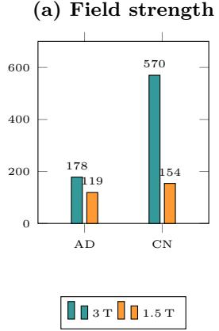

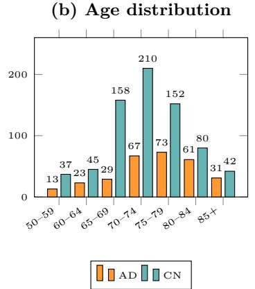

(c) Manufacturer  
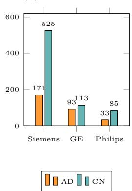  
Fig. 1 Cohort composition of the 1,021-subject ADNI AD/CN dataset. (a) Class distribution by field strength (AD: 297, CN: 724); AD subjects are proportionally more represented at 1.5 T (40.1%) than CN (21.2%). (b) Age distribution in 5-year bins; AD subjects are on average 2.6 years older (75.6 ± 7.8 vs. 73.0 ± 7.3 years). (c) Manufacturer distribution; Siemens dominates both groups.

## 2.4 Survival Prediction from Pathology and Genomics

Attention-based multiple instance learning (ABMIL) [13] is widely used for survival prediction from gigapixel whole-slide images (WSI), where patch-level attention aggregation yields interpretable slide-level representations. Joint WSI + genomics models, including recent mixture-of-experts fusion [34], can improve upon WSI-only survival prediction [14, 35]; however, they typically require RNA or mutation measurements at inference and are commonly trained only on the fully paired subset. Recent pathology foundation models (e.g., UNI2 [36] and CONCH [37]) provide high-quality patch embeddings that reduce labeled-data requirements for slide-level tasks. In our TCGA validation, we use UNI2-h ABMIL features as the WSI representation and apply the same two-stage prototype framework with RNA-seq as the auxiliary modality, demonstrating transfer from neuroimaging to computational pathology without architectural modification.

## 3 Dataset

## 3.1 ADNI AD/CN Cohort

Data were obtained from the Alzheimer’s Disease Neuroimaging Initiative (ADNI) [10], a longitudinal multi-site study that acquires structural MRI, PET imaging, and standardised neuropsychological assessments across the diagnostic spectrum.

For binary AD/CN classification, we constructed a cohort of 1,021 subjects (AD: 297, CN: 724) drawn from ADNI-1/GO, ADNI-2, and ADNI-3. To avoid subject-level leakage, we selected one T1-weighted MRI per subject (earliest available visit; highestquality acquisition) and excluded multi-channel or anomalous scans. We then created a fixed split, stratified by diagnosis and scanner field strength prior to any modelling:

• Training/validation: n = 844 (AD: 249, CN: 595).

• Held-out test: $n = 1 7 7$ (AD: 48, CN: 129).

Scanner heterogeneity is a defining feature of ADNI: 273 scans (26.7%) were acquired at 1.5 T and 748 (73.3%) at $3 \mathrm { T }$ (test set: 61 at 1.5 T, 116 at 3 T). Throughout this work, 1.5 T is defined as protocol field strength ≤ 2.0 and 3 T as protocol field strength > 2.0. Importantly, field strength is class-imbalanced (AD: 40.1% at 1.5 T vs. CN: 21.3%; Fig. 1a), which can act as a systematic confound and motivates the scanner-stratified analyses in Section 6.2.

Mean age at scan is $7 5 . 6 \pm 7 . 8$ years for AD and 73.0 ± 7.3 years for CN (twosample t-test: $t = 4 . 5 5 , p < 0 . 0 0 1 )$ . The cohort is 53.7% female (548/1,021); the AD group is slightly male-dominated (M: 165, F: 132; 55.6% male), whereas the CN group is predominantly female (F: 416, M: 308; 57.5% female), consistent with prior ADNI analyses [10]. The overall class distribution is AD: 29.1% and CN: 70.9%. Scanner manufacturer distribution is Siemens 696 (68.2%), GE 206 (20.2%), and Philips 118 (11.6%). Fig. 1 summarises these distributions.

## 3.2 Auxiliary Modalities

Clinical tabular scores. Table 1 summarises the availability of the clinical tabular variables in the 844-subject training/validation cohort. Standardised neuropsychological and demographic variables were extracted from the ADNI repository, and we retained three key features: Mini-Mental State Examination (MMSE), Clinical Dementia Rating global score (CDR), and Functional Activities Questionnaire total score (FAQ). Cognitive and functional assessments exhibit substantial missingness, with each feature available for only about half of subjects (FAQ: 51.5%, MMSE: 45.1%, CDR: 44.8% available; Table 1), consistent with variable assessment schedules across ADNI phases.

We define the fully paired subset $\mathcal { D } _ { \mathrm { p a i r e d } }$ as the set of subjects for whom all three tabular features are simultaneously observed. This yields $| { \mathcal { D } } _ { \mathrm { p a i r e d } } | = 3 7 8$ training subjects (AD: 170, CN: 208), corresponding to a tabular pairing rate of $r _ { \mathrm { t a b } } = 4 4 . 8 \%$ All tabular-prototype experiments use $\mathcal { D } _ { \mathrm { p a i r e d } }$ as the Stage 1 anchor pool; feature scaling is fit independently within each training fold to prevent information leakage. FDG-PET volumes. FDG-PET scans were obtained from the ADNI repository for a subset of the AD/CN cohort. Following DICOM-to-NIfTI conversion, 248 FDG-PET volumes were available, spanning both static and dynamic acquisitions under standard ADNI protocols. Within each training fold, approximately 158 subjects (AD: ≈70, CN: ≈88) were matched to a corresponding MRI scan; we denote this PETpaired subset by $\mathcal { S } _ { \mathrm { P E T } }$ , yielding a pairing rate of $r _ { \mathrm { P E T } }$ ≈ 18.7%. PET availability is concentrated in later ADNI phases and is therefore predominantly associated with 3 T imaging, which makes PET anchors relatively sparse for the 1.5 T scans where scanner-induced bias is most pronounced.

Table 1 Tabular feature availability in the 844-subject training/validation cohort (AD: 249, CN: 595). The fully paired subset $\mathcal { D } _ { \mathrm { p a i r e d } }$ comprises subjects for whom all three features are simultaneously available.
<table><tr><td>Feature</td><td>Available</td><td>Missing</td><td>Available (%)</td></tr><tr><td>FAQ total score</td><td>435</td><td>409</td><td>51.5</td></tr><tr><td>MMSE score</td><td>381</td><td>463</td><td>45.1</td></tr><tr><td>CDR global score</td><td>378</td><td>466</td><td>44.8</td></tr><tr><td> $\mathcal { D } _ { \mathrm { p a i r e d } }$  (all 3 features)</td><td>378</td><td>466</td><td>44.8</td></tr></table>

Handwriting kinematics (DARWIN). The DARWIN (Diagnosis AlzheimeR WIth haNdwriting) dataset [38] is a publicly available handwriting kinematics benchmark comprising 174 participants (AD and healthy controls) acquired using a digitising tablet. Participants completed 25 standardised handwriting and drawing tasks. For each task, 18 kinematic descriptors (e.g., velocity, pressure, and pen-up/pendown ratio) were extracted, yielding a 25 × 18 = 450-dimensional feature vector per subject. DARWIN shares no subjects, sites, or acquisition hardware with the ADNI cohort; consequently, the handwriting pairing rate is rHW = 0. DARWIN class prototypes are computed on the DARWIN cohort and transferred directly into Stage 2 of ADNI training without any shared subjects.

## 3.3 MCI Cohort for Zero-Shot Severity Evaluation

We additionally define an independent cohort of 147 subjects with mild cognitive impairment (MCI) and resolvable MRI in the same image-quality-filtered pool as the AD/CN test set (EMCI: 49, MCI: 79, LMCI: 19). This cohort is withheld from all training stages, and no MCI scans, labels, or clinical scores are used for model fitting. Because these subjects are drawn from ADNI using the same sites and hardware as the AD/CN cohort, they are subject to the same 1.5 T/3 T field-strength imbalance.

We use this cohort exclusively for post hoc evaluation of whether the learned MRI representations encode an ordinal disease-severity gradient beyond binary AD/CN separation. Severity proxies include MMSE, CDR global score, FAQ total score, and NPI total score. Ordinal consistency is assessed using Kruskal–Wallis tests and onesided Mann–Whitney tests across EMCI/MCI/LMCI, together with a monotonicity check against the $\mathrm { C N / A D }$ reference groups (Section 6.5).

## 3.4 TCGA-Lung: Cross-Domain Validation

To assess whether the proposed prototype-alignment mechanism transfers beyond neuroimaging, we evaluate PANDA on a cross-domain histopathology survival prediction task using TCGA-Lung (TCGA-LUAD + TCGA-LUSC). This setting instantiates the same training constraint as ADNI, but with whole-slide imaging (WSI) features as the primary modality and bulk RNA-seq as the auxiliary modality.

Modalities and availability. Diagnostic H&E WSI constitute the primary input, and bulk RNA-seq (downloaded from the GDC portal) serves as the auxiliary modality. We consider two endpoints: (i) binary 2-year overall survival (n = 594) and (ii) Cox proportional-hazards survival modelling $( n = 8 5 3 )$ . WSI is available for all subjects, whereas RNA-seq is available for 591/594 (99.5%) and 849/853 (99.5%), respectively, corresponding to a near-complete pairing regime.

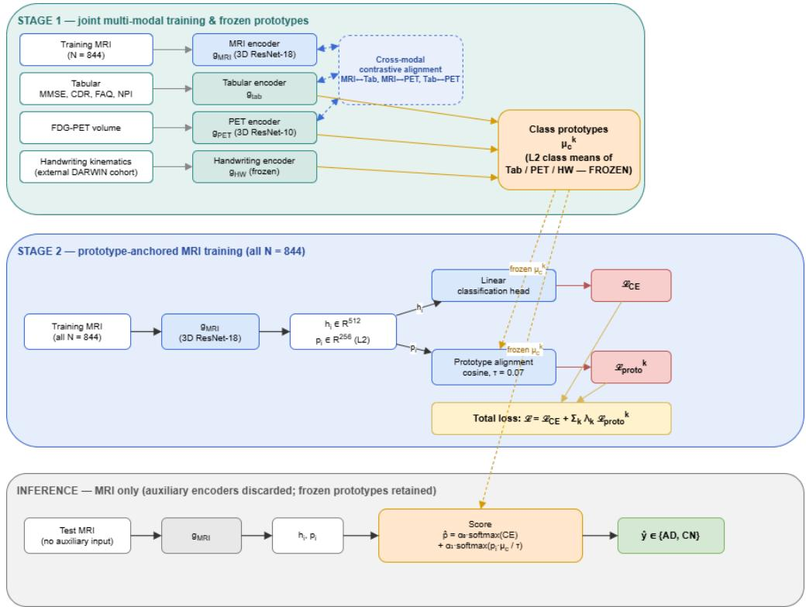  
Fig. 2 Overview of the two-stage prototype-anchored alignment framework. Stage 1 jointly trains the MRI encoder together with the auxiliary encoders (tabular, PET, external handwriting) under a single combined objective (per-modality cross-entropy and pairwise cross-modal contrastive losses), then computes frozen class prototypes $\mu _ { c } ^ { ( k ) }$ from the auxiliary embeddings. Stage 2 trains the MRI encoder gMRI on all $N = 8 4 4$ subjects with the combined objective $\begin{array} { r } { \mathcal { L } = \mathcal { L } _ { \mathrm { C E } } + \sum _ { k } \lambda _ { k } \mathcal { L } _ { \mathrm { p r o } } ^ { ( k ) } } \end{array}$ to $( \tau = 0 . 0 7 )$ , pulling the normalised MRI projection pi toward the frozen prototypes. At inference all auxiliary encoders are discarded and the class score is the convex blend of the linear-head and prototype-cosine softmaxes (Eq. 5); only MRI is required.

## 4 Method

A standard baseline in multimodal learning assumes per-subject pairing and improves performance either by fusing modalities in a joint model or by enforcing cross-modal alignment with paired samples (e.g., contrastive objectives). These designs typically require auxiliary modalities to be present for a substantial subset of subjects and, in many cases, at deployment.

In our setting, auxiliary measurements are heterogeneous and can be partially paired, sparsely paired, or available only in an external cohort with no subject overlap, while the deployed model must operate on the primary modality alone. PANDA addresses this mismatch by using auxiliary data only to estimate class-level anchors. In Stage 1, auxiliary-modality encoders are used to compute class prototypes, which are then frozen; in Stage 2, the primary encoder is trained to align its representations to these fixed prototypes for all subjects. Fig. 2 summarises the overall procedure.

## 4.1 Framework

## Problem Formulation

Let $\mathcal { D } = \{ ( \mathbf { x } _ { i } , y _ { i } ) \} _ { i = } ^ { N }$ denote a dataset of N subjects, where $\mathbf { x } _ { i }$ is a 3-D T1-weighted MRI volume and $y _ { i } \in \{ 0 , 1 \}$ is the binary AD/CN label. Every subject has an MRI scan; the primary classifier $f : { \bf x } \mapsto \hat { y }$ must operate on MRI alone at inference.

In addition, K auxiliary modalities are available, each observed for a subset of subjects. For modality $k \in \{ 1 , \ldots , K \}$ , let $S _ { k } \subseteq \{ 1 , \dots , N \}$ denote the paired subset, with pairing rate $r _ { k } = | S _ { k } | / N$ . In our study, $K = 3$ auxiliary modalities are considered:

• Tabular clinical scores (MMSE, CDR, $\mathrm { F A Q ) } \colon r _ { \mathrm { t a b } } \approx 0 . 4 5 \ ( n _ { \mathrm { t a b } } = 3 7 8$ of 844 training subjects).

• FDG-PET volumes: $r _ { \mathrm { P E T } } \approx 0$ .19 $( n _ { \mathrm { P E T } } \approx$ 158 per training fold).

• Handwriting kinematics (DARWIN dataset $[ 3 8 ] ) \colon r _ { \mathrm { H W } } = 0$ , with no subject overlap with the ADNI cohort. Prototypes are derived from the external cohort and transferred directly.

The goal is to train f such that (i) it exploits all available auxiliary supervision at training time, (ii) it requires no auxiliary input at inference, and (iii) its learned representation is robust to scanner field-strength variation (1.5 T vs. 3 T).

## Encoder Architecture

MRI backbone. The primary encoder $g _ { \mathrm { M R I } }$ is a 3-D ResNet-18 initialised from MedicalNet [11], pretrained on a large corpus of volumetric segmentation tasks. It maps each $1 2 8 ^ { 3 } .$ -voxel input to a 512-dimensional feature vector $\mathbf { h } _ { i } \in \mathbb { R } ^ { 5 1 2 }$ . A two-layer MLP projection head ϕ reduces $\mathbf { h } _ { i }$ to a 256-dimensional embedding $\mathbf { p } _ { i } .$ which is $\ell _ { 2 } \cdot$ -normalised to the unit hypersphere:

$$
{ \bf p } _ { i } = \frac { \phi _ { \mathrm { M R I } } ( { \bf h } _ { i } ) } { \Vert \phi _ { \mathrm { M R I } } ( { \bf h } _ { i } ) \Vert _ { 2 } } .\tag{1}
$$

A small constant is added to norm denominators (here and in the prototype normalisation) for numerical stability. The classification head is a single linear layer applied to the 512-dimensional backbone features $\mathbf { h } _ { i }$ (before projection), so that classification and representation alignment are trained with separate parameter paths.

Auxiliary encoders. Each auxiliary modality k has its own encoder $g _ { k }$ that maps its modality-specific input to a 256-dimensional $\ell _ { 2 } .$ -normalised embedding $\mathbf { z } _ { i } ^ { ( k ) }$ in the same shared hypersphere as $\mathbf { p } _ { i } \colon$

• Tabular encoder: a three-layer MLP $( d _ { \mathrm { t a b } }  1 2 8  2 5 6 )$ with LayerNorm and dropout (0.3) after each hidden layer. Subjects with missing values in any tabular input are excluded from tabular-encoder training and from the prototype anchor pool, ensuring that prototypes are computed from complete feature vectors.

$P E T$ encoder: a 3-D ResNet-10 (a lightweight MedicalNet variant [11]) applied to $1 2 8 ^ { 3 }$ -voxel intensity-normalised PET volumes, followed by a two-layer MLP projection head matching the MRI head.

• Handwriting encoder: a two-layer MLP $( 4 5 0  2 5 6  2 5 6 )$ applied to the concatenated DARWIN handwriting kinematics vector (25 tasks × 18 features). This encoder is trained exclusively on the external DARWIN cohort; its outputs are used only to compute class prototypes, and its parameters remain frozen throughout Stage 2.

## Class Prototype Construction

For each auxiliary modality k and class $c \in \{ 0 , 1 \}$ , the class prototype $\mu _ { c } ^ { ( k ) }$ is the ℓ2-normalised mean embedding over all paired training subjects of that class:

$$
\pmb { \mu } _ { c } ^ { ( k ) } = \mathrm { N o r m a l i z e } \left( \frac { 1 } { | S _ { k } ^ { c } | } \sum _ { i \in S _ { k } ^ { c } } \mathbf { z } _ { i } ^ { ( k ) } \right) , \quad S _ { k } ^ { c } = \{ i \in S _ { k } : y _ { i } = c \} .\tag{2}
$$

Prototypes are computed once from the jointly-trained auxiliary encoders at the end of Stage 1 and remain frozen for the remainder of training. Freezing prevents prototype drift and ensures that the MRI encoder optimises toward stable geometric targets.

For the handwriting modality $( r _ { \mathrm { H W } } ~ = ~ 0 )$ , the paired subset ${ \cal S } _ { \mathrm { H W } }$ contains no ADNI subjects. We therefore compute handwriting class prototypes on the external DARWIN cohort and transfer them directly as $\{ \mu _ { 0 } ^ { \mathrm { { H W } } } , \mu _ { 1 } ^ { \mathrm { { H W } } } \}$ . This external prototype transfer regime evaluates whether class-level geometry learned in an entirely separate cohort can act as an efective anchor for MRI representation learning. Moreover, it serves as a control against the hypothesis that prototype alignment requires subjectlevel correspondence between modalities: any observed benefit in this regime must arise from the transferred class separation in prototype space rather than from persubject cross-modal pairing.

## 4.2 Training and Inference scheme

Stage 1: joint multi-modal training and frozen prototypes. Stage 1 jointly trains the MRI encoder and all auxiliary encoders using a single optimiser and a unified objective. The loss comprises (i) per-modality cross-entropy terms for modalities with $\mathrm { A D / C N }$ labels and (ii) supervised cross-modal contrastive terms over the available paired subsets (MRI–tabular, MRI–PET, and tabular–PET), yielding a shared $\ell _ { 2 ^ { - } }$ normalised embedding space. The handwriting encoder is trained on the external DARWIN cohort and contributes only class-level prototypes (no subject overlap with ADNI). After Stage 1, all auxiliary encoders are frozen and class prototypes $\{ \mu _ { c } ^ { ( k ) } \}$ are computed once via (2) and held fixed for Stage 2.

Stage 2: prototype-anchored MRI training. The MRI encoder is then trained on the $f u l l$ dataset $\mathcal { D } ,$ regardless of auxiliary modality availability, with the combined loss

$$
\mathcal { L } = \mathcal { L } _ { \mathrm { C E } } + \sum _ { k = 1 } ^ { K } \lambda _ { k } \mathcal { L } _ { \mathrm { p r o t o } } ^ { ( k ) } ,\tag{3}
$$

where $\mathcal { L } _ { \mathrm { C E } }$ is the cross-entropy loss on $\mathrm { A D / C N }$ logits computed from backbone features $\mathbf { h } _ { i } .$ , each $\lambda _ { k }$ weights modality $k ,$ and each $\mathcal { L } _ { \mathrm { p r o t o } } ^ { ( k ) }$ is a temperature-scaled prototype cross-entropy [8] that pulls the normalised MRI projection $\mathbf { p } _ { i }$ toward the frozen prototype of its correct class:

$$
\mathcal { L } _ { \mathrm { p r o t o } } ^ { ( k ) } = - \frac { 1 } { | \mathcal { B } | } \sum _ { i \in \mathcal { B } } \log \frac { \exp \bigl ( \mathbf { p } _ { i } \cdot \boldsymbol { \mu } _ { y _ { i } } ^ { ( k ) } / \tau \bigr ) } { \sum _ { c } \exp \bigl ( \mathbf { p } _ { i } \cdot \boldsymbol { \mu } _ { c } ^ { ( k ) } / \tau \bigr ) } ,\tag{4}
$$

with $\boldsymbol { B }$ a training mini-batch, τ the temperature parameter [9], and $c \in \{ 0 , 1 \}$ ranging over both classes. The defining property of this objective is that the same prototype $\mu _ { y _ { i } } ^ { ( k ) }$ is used for every subject i, whether or not $i \in S _ { k } \colon$ paired and unpaired subjects receive identical geometric targets for a given modality, so no subject is excluded from alignment supervision. This is what allows the MRI encoder to learn from the entire training cohort even though the auxiliary signal is defined on the paired subset alone.

## Inference

At test time, all auxiliary encoders are discarded. Classification of a new subject uses only the MRI backbone gMRI and the linear classification head, incurring no additional computational cost relative to the MRI-only baseline. At inference the class score for a test subject is the weighted average of the linear-head softmax, whose logits are $\ell ( { \mathbf { h } } _ { i } )$ , and the prototype cosine softmax,

$$
\begin{array} { r } { \hat { p } ( c | \mathbf { x } _ { i } ) = \alpha _ { 0 } \operatorname { s o f t m a x } _ { c } \bigl ( \ell ( \mathbf { h } _ { i } ) \bigr ) + \alpha _ { 1 } \operatorname { s o f t m a x } _ { c } \bigl ( \sum _ { k \in \{ \mathrm { T a b } , \mathrm { P E T } , \mathrm { H W } \} } \mathbf { p } _ { i } \cdot \pmb { \mu } _ { c } ^ { ( k ) } / \tau \bigr ) , } \\ { \alpha _ { 0 } , \alpha _ { 1 } \in [ 0 , 1 ] , \qquad \alpha _ { 0 } + \alpha _ { 1 } = 1 , } \end{array}\tag{5}
$$

with $\hat { y } = \arg \operatorname* { m a x } _ { c } \hat { p } ( c \mid \mathbf { x } _ { i } )$ . The weight $\left( \alpha _ { 0 } , \alpha _ { 1 } \right)$ is fit on the validation fold (Implementation Details, Section 5); the reported $p _ { \mathrm { A D } }$ (including the zero-shot MCI analysis of Section 6.5) is $\hat { p } ( \mathrm { A D } \mid \mathbf { x } _ { i } )$ . When $\alpha _ { 1 } = 0$ this reduces to the MRI-only linear classifier. The prototype-cosine term sums the raw cosine logits against all three frozen prototype sets $( k \in \{ \mathrm { T a b } , \mathrm { P E T } , \mathrm { H W } \} )$ ) with equal weight and a single shared temperature $\tau = 0 . 0 7$ , followed by a single softmax; since the prototypes $\mu _ { c } ^ { ( \bar { k } ) }$ are frozen constants, no auxiliary input is required at inference and the classifier remains MRI-only for every test subject.

## Severity-Axis Extension

The base framework is trained for binary $\mathrm { C N / A D }$ discrimination and does not explicitly enforce an ordinal severity structure (Section 6.5). We therefore augment Stage 2 with a linear severity head $h _ { \mathrm { { s e v } } } : \mathbb { R } ^ { 5 1 2 } $ R applied to the 512-dimensional backbone features $\mathbf { h } _ { i }$ (the pre-projection encoder output), so that the severity signal is read of features independent of the tabular/PET/hand-crafted-aligned projection space, and trained by masked Huber regression against graded clinical-severity composites computed on the CN/AD training pool only:

$$
\mathcal { L } _ { \mathrm { s e v } } = \frac { 1 } { | \cal S | } \sum _ { i \in \cal S } \mathrm { H u b e r } \big ( h _ { \mathrm { s e v } } ( { \bf h } _ { i } ) , s _ { i } \big ) ,\tag{6}
$$

where $s$ denotes CN/AD training subjects with complete coverage for the chosen composite and $s _ { i }$ is the corresponding z-scored value. We consider two composites: sorth (mean of z-scored FAQ and NPI; $n = 2 6 5$ of 844 $\mathrm { C N / A D }$ training subjects) and $s _ { \mathrm { d i a g } }$ (mean of z-scored CDR and negated z-scored $\mathrm { M M S E } ; n = 3 7 8 )$ . Unless otherwise stated, we use $s _ { \mathrm { o r t h } }$ because $\mathrm { F A Q } / \mathrm { N P I }$ reflect functional and neuropsychiatric status rather than directly restating the diagnostic criteria used to assign CN/AD labels. In the $\mathrm { C N / A D }$ training pool, FAQ is observed for 435 subjects and NPI for 265; because every NPI-observed subject also has FAQ, NPI is the limiting factor and the complete-coverage set for $s _ { \mathrm { o r t h } }$ is exactly these $n = 2 6 5$ subjects. Each component is z-scored independently over all CN/AD subjects for which it is observed (FAQ over 435, NPI over 265) before averaging. Missing values are handled by exclusion rather than imputation: the masked Huber loss requires both raw FAQ and NPI to be present, so only the 265 complete-coverage subjects contribute gradients (sdiag is defined analogously, requiring both CDR and MMSE, $n = 3 7 8 )$ . This completecoverage subset is also field-strength–skewed (208 subjects at $\leq 2 . 0 \mathrm { T }$ vs. 57 at $>$ 2.0 T), so the learned severity axis is confounded by lower-field scanner characteristics; we therefore treat it as an exploratory readout and interpret absolute severity values with corresponding caution (see also Section 7).

The severity head is optimised jointly with the Stage 2 objective, $\mathcal { L } _ { \mathrm { C E } } + 0 . 3 ( \mathcal { L } _ { \mathrm { t a b } } +$ ${ \mathcal { L } } _ { \mathrm { P E T } } + { \mathcal { L } } _ { \mathrm { H W } } ) + \lambda _ { \mathrm { s e v } } { \mathcal { L } } _ { \mathrm { s e v } }$ with $\lambda _ { \mathrm { s e v } } = 0 . 3 ;$ ; equivalently, this is the general Stage-2 objective of (3) with $\lambda _ { k } = 0 . 3$ for all prototype terms, augmented by the severity term. Stage 1 is reused from the frozen joint checkpoint $( \mathrm { i . e . }$ not retrained), isolating the efect of the severity head from changes in the Stage 1 alignment geometry. MCI subjects contribute no training gradients at any stage: the composite is defined and standardised using $\mathrm { C N / A D }$ subjects only, and the head is evaluated on MCI in a zero-shot manner.

## 4.3 Information-Theoretic Motivation

We provide a brief information-theoretic motivation for prototype anchoring and for the empirical observation that reduced pairing need not degrade performance. These arguments are heuristic, intended to build intuition rather than to constitute rigorous proofs, and rely on simplifying assumptions that we state where used. Let $Y \in \{ 0 , 1 \}$ denote the class label, $\bar { \mathbf { z } } ^ { ( k ) }$ the Stage 1 auxiliary embedding for modality k, and p the $\ell _ { 2 } .$ -normalised MRI projection in (1).

## Alignment transfers class information.

The Stage 1 cross-modal InfoNCE objective provides a variational lower bound on the mutual information between paired MRI and auxiliary embeddings, $I ( \mathbf { p } ; \mathbf { z } ^ { ( k ) } ) \geq$ log $N _ { B } \mathrm { ~ - ~ } \mathcal { L } _ { \mathrm { N C E } }$ [39]. This bound pertains to the InfoNCE term alone; the full Stage 1 objective, which also includes per-modality cross-entropy terms, does not $\left( \mathbb { E } [ \mathbf { z } ^ { ( k ) } \mid Y = c ] \right)$ preserves class-discriminative directions of the auxiliary embedding. Minimising the prototype cross-entropy in (4) therefore encourages p to align with the auxiliary-induced class geometry [40]. Because the target prototypes are fixed and class-level, this supervisory signal is available to all subjects during Stage 2, including those without paired auxiliary measurements.

## Prototype separation as an anchor-quality proxy.

Consider the cosine score $s _ { c } = \mathbf { p } \cdot \pmb { \mu } _ { c } ^ { ( k ) } / \tau$ under a two-class Gaussian-channel approximation with equal class-conditional variances. Then $I ( s ; Y )$ is monotone in the deflection coeficient $J = \| \pmb { \mu } _ { 1 } ^ { ( k ) } - \pmb { \mu } _ { 0 } ^ { ( k ) } \| ^ { 2 } / ( \sigma _ { 0 } ^ { 2 } + \sigma _ { 1 } ^ { 2 } )$ (assuming $\sigma _ { 0 } ^ { 2 } + \sigma _ { 1 } ^ { 2 } > 0 )$ , so larger inter-prototype separation yields a stronger anchor. Since prototypes are finite-sample estimates of class means, we have E $| \hat { \pmb \mu } _ { 1 } - \hat { \pmb \mu } _ { 0 } | | ^ { 2 } = \| \pmb \mu _ { 1 } - \pmb \mu _ { 0 } \| ^ { 2 } + \mathrm { t r } \operatorname { V a r } ( \hat { \pmb \mu } _ { 1 } - \hat { \pmb \mu } _ { 0 } )$ , which implies that subsampling can increase empirical separation while also increasing estimator variance. This identity assumes unnormalised class means; for the $\ell _ { 2 } .$ -normalised prototypes used here it holds only approximately, and the bias term is also afected by the normalisation. Consequently, moderate reductions in pairing can leave the empirical anchor quality unchanged (or slightly improved) until the class-mean estimates become too noisy (empirically, around ≈ 40 paired AD subjects per fold; Section 6.3). Importantly, this is an estimator efect on empirical prototypes rather than an increase in the population mutual information $I ( \mathbf { z } ^ { ( k ) } ; \bar { Y } )$ . We test this prediction by measuring inter-prototype separation as a function of pairing rate in Section 6.3.

## 5 Experimental Setup

## Implementation Details

MRI volumes were resampled to 1 mm isotropic in RAS orientation and cropped to $1 2 8 ^ { 3 }$ voxels using MONAI [41]. Intensity normalisation (zero mean, unit variance over non-background voxels) and training-time augmentation (random afine: $\pm 1 0 ^ { \circ } , \pm 1 0 \%$ scale, ±10 mm translation) were applied. FDG-PET volumes were preprocessed to $1 2 8 ^ { 3 }$ voxels at 2 mm isotropic resolution with 99th-percentile intensity normalisation. All experiments use three random but fixed seeds under 5-fold stratified cross-validation on the training set; the test set is evaluated once per seed using the best validation-AUC checkpoint. Reported metrics are mean ± SD across the three seeds.

Stage 1 uses a single AdamW optimiser (weight decay $1 0 ^ { - 4 } )$ with fixed learning rates and no scheduler: MRI parameters (layer3/layer4 and the projection head) use $\mathrm { l r } = 1 0 ^ { - 4 }$ and the auxiliary encoders (tabular, PET, handwriting) use ${ \mathrm { l r } } = 5 \times 1 0 ^ { - 5 }$ trained for 50 epochs (handwriting: 100). Tabular feature scaling is fit on the training fold only. We set $\tau = 0 . 0 7$ and $\lambda _ { \mathrm { t a b } } = 0 . 5 , \lambda _ { \mathrm { P E T } } = 0 . 3 , \lambda _ { \mathrm { H W } } = 0 . 5$ on validation AUC at 100% pairing, held fixed across pairing-rate ablations. Stage 2 then fine-tunes the MRI encoder alone, also with AdamW but at a lower backbone rate $( 1 0 ^ { - 5 }$ ; projection head $1 0 ^ { - 4 } )$ , for up to 40 epochs with early stopping (patience = 10) on validation AUC and ReduceLROnPlateau $( \mathrm { f a c t o r } = 0 . 5 $ , patience = 3). All runs execute on $2 { \times } \mathrm { A } 1 0 0 \ \mathrm { G P U s }$ . The inference blend weights $\left( \alpha _ { 0 } , \alpha _ { 1 } \right)$ in (5) are fit independently for each Stage-2 fold (and seed) on that fold’s held-out validation split—the same split used for checkpoint selection, with no separate nested cross-validation—by minimising the negative log-likelihood of the blended probability against the validation labels. The weights are not grid-searched: $( \alpha _ { 0 } , \alpha _ { 1 } ) = \operatorname { s o f t m a x } ( \pmb \theta )$ is parameterised by a single learnable 2-vector θ (initialised at zero) and optimised with Adam (learning rate $1 0 ^ { - 3 } )$ for 200 full-batch epochs, retaining the best-validation-loss epoch. At test time the five folds are combined by soft-voting (averaging the blended ˆp). Across the 15 fold/seed fits the objective is bimodal rather than a single stable optimum: roughly half the folds converge near (0.40, 0.60) and the remainder to the mirror configuration (0.59, 0.41) that up-weights the linear head, giving a mean of $\left( \alpha _ { 0 } , \alpha _ { 1 } \right) = \left( 0 . 4 8 7 \pm 0 . 0 9 1 , 0 . 5 1 3 \pm \right.$ 0.091) across folds. The soft-voting ensemble averages over this per-fold variation, and the near-equal mean indicates the two heads contribute comparably overall.

## Baselines

Unless otherwise stated, ADNI baselines are trained on the full 844-subject training/validation set and evaluated on the held-out test set $( n = 1 7 7 )$ with MRI-only inputs at inference. Auxiliary modalities, when used, are provided during training only. We compare against 13 ADNI baselines and 2 TCGA baselines spanning (i) standard multimodal fusion, (ii) missing-modality training strategies, (iii) teacher–student distillation, and (iv) recent published methods. For each comparator, Appendix A (Table 7) specifies the training-time auxiliary inputs, inference-time inputs, and any protocol adaptations required for fair comparison.

## Pairing-Rate Ablation Protocol

To quantify sensitivity to reduced auxiliary pairing, we subsample the paired pools $S _ { k }$ prior to Stage 2. For the joint Tab+PET anchor we consider fractions $r \in$ {1.0, 0.75, 0.5, 0.25, 0.15, 0.10, 0.05}, and for the tabular-only anchor we use $r \in \mathbf { \Sigma }$ {1.0, 0.5, 0.25}. Subsampling is performed independently per modality and stratified by class to preserve class proportions within each prototype pool. For each fraction, we reuse the jointly trained Stage 1 encoder weights and recompute only the prototype vectors $\mu _ { c } ^ { ( k ) }$ on the subsampled pools. Stage 2 training (MRI encoder on all $N = 8 4 4$ subjects) and inference are otherwise unchanged. This protocol isolates the efect of prototype estimation quality from changes in the size of the MRI training set.

## Cross-Domain Evaluation Setup

To assess domain generality, we apply PANDA, unchanged, to a histopathology survival task on TCGA-Lung (LUAD + LUSC). Here the primary modality is whole-slide images (WSI): diagnostic H&E slides are tiled at 20× magnification, encoded with the UNI2-h pathology foundation model [36], and aggregated per slide by attentionbased multiple-instance learning (ABMIL) into a 1536-dimensional bag embedding. The auxiliary modality is bulk RNA-seq (≈99% pairing): raw counts are reduced to the top-2000 most variable genes, log1p-transformed, and z-scored per gene on the training fold. We evaluate two survival endpoints. For binary 2-year overall survival, subjects are labelled as deceased within 730 days (1) or surviving beyond 730 days (0); censored cases with $\mathrm { f o l l o w \mathrm { - u p } \leq 7 3 0 }$ days are excluded. This yields $n = 5 9 4$ subjects (test = 119) with a label-stratified split (random state= 0). For Cox proportionalhazards modelling, we include all subjects with valid follow-up and treat censored cases through the partial likelihood, yielding $n = 8 5 3 ~ ( \mathrm { t e s t } = 1 7 1 )$ with stratification by event indicator.

All TCGA experiments use the same three random seeds as the ADNI setup. To probe sensitivity to reduced auxiliary coverage, we subsample the RNA-paired pool at $r _ { \mathrm { R N A } } \in \{ 0 . 2 5 , 0 . 5 0 , 1 . 0 0 \}$ . We report AUC, balanced accuracy, and macro-F1 for the binary endpoint and Harrell’s C-index for the Cox model; all other architectural and optimisation settings are unchanged. This cross-domain evaluation tests whether the proposed prototype-alignment mechanism extends beyond neuroimaging and beyond sparsely paired auxiliary modalities.

## 6 Results

## 6.1 Main Results

Table 2 summarises held-out performance on the 177-subject ADNI [10] test set. The MRI-only baseline attains $\mathrm { A U C } = 0 . 7 8 9 \pm 0 . 0 1 6$ . Training a conventional fusion model on the 378-subject fully paired subset (Fusion, pairs only) does not improve AUC, indicating that restricting training to paired subjects is suboptimal. With the same tabular pairing rate, PANDA (MRI+Tab) yields comparable AUC $( 0 . 7 9 0 \pm 0 . 0 1 2 ;$ $p _ { \mathrm { a d j } } = 1 . 0 0 ~ \mathrm { v s }$ . MRI-only) while improving balanced accuracy (0.692) and macro-F1 (0.689), with higher CN recall (0.822 vs. 0.749).

Adding PET prototypes (PANDA: MRI+Tab+PET, rPET = 0.19) increases AUC to $0 . 8 5 1 \pm 0 . 0 1 0$ (not significant after Holm–Bonferroni, $p _ { \mathrm { a d j } } = 0 . 1 1 9 )$ and improves AD recall from 0.632 to 0.750. Incorporating handwriting prototypes from the external DARWIN cohort [38] (PANDA: MRI+Tab+PET+HW, $r _ { \mathrm { H W } } = 0 )$ further increases AUC to 0.868 ± 0.020 (+7.9 pp vs. MRI-only; $p _ { \mathrm { a d j } } ~ = ~ 0 . 0 1 1 )$ and raises CN recall to 0.863, demonstrating efective transfer of class geometry from a cohort with zero subject overlap.

Among baselines, Graph-SLC (a graph-embedded latent-space clustering method) [28] achieves $\mathrm { A U C } = 0 . 8 0 2 \pm 0 . 0 1 6$ , and modality-dropout variants are similar (0.800 and 0.799; p = 0.608 vs. MRI-only). Although these methods slightly exceed PANDA (MRI+Tab) in AUC, they do not mitigate scanner-associated error (1.5 T CN false-positive rate 41.4–47.8% vs. 52.2% for MRI-only), whereas PANDA with tabular anchoring reduces it to 27.9% (Table 3). Knowledge distillation [6], HeMIS [5], and graph-smoothness regularisation [42] perform at or below the MRI-only baseline. Additional published architectures evaluated under our protocol (DiaMond, a bi-modal

<table><tr><td colspan="8">Table 2 Held-out test performance. Training-set size (number of subjects) is given in parentheses after each method: the top block trains on the full 844-subject pool (exploiting unpaired subjects), the bottom block on the 378 tab-complete subjects only. Training lists the modalities available during training. Unless noted, evaluation is on the held-out test set (n = 177; AD = 48, CN = 129) with MRI-only inputs at inference. Mean ± SD across 3 seeds. Bold indicates the best value per column. Bootstrap 95 % CIs for primary comparisons vs. MRI-only are reported in the text (10 000 iterations on seed-averaged probabilities). Significance of the AUC gain vs. MRI-only (bootstrap with Holm−Bonferroni correction): *p &lt; 0.05, **p &lt; 0.01, ***p &lt; 0.001. †Suk et al. is evaluated on the paired test subset (n = 75) rather than the full n = 177 set, as its late-fusion design requires both modalities at inference; it is therefore not directly comparable to the other rows. The final block lists independently-published architectures with different backbones, run on our protocol for reference and excluded from the per-column bold. Method (Training size) Training</td></tr><tr><td></td><td>MRI+Tab</td><td>AUC↑</td><td>BalAcc ↑</td><td>MacroF1↑</td><td>F1-AD ↑</td><td>Rec-AD ↑</td><td>Rec-CN ↑</td></tr><tr><td>PANDA (844)</td><td></td><td>0.790±.012</td><td>0.692±.021</td><td>0.689±.019</td><td>0.550±.031</td><td>0.563±.045</td><td>0.822±.011</td></tr><tr><td>PANDA (844)</td><td>MRI+Tab+PET</td><td>0.851±.010</td><td>0.763±.036</td><td>0.733±.037</td><td>0.638±.046 0.662±.054</td><td>0.750±.074</td><td>0.775±.055</td></tr><tr><td>PANDA (844)</td><td>MRI+Tab+PET+HW</td><td>0.868±.020</td><td>0.772±.041</td><td>0.767±.033</td><td></td><td>0.681±.087</td><td>0.863±.007</td></tr><tr><td>MRI-only Baseline (844)</td><td>MRI</td><td>0.789±.016</td><td>0.691±.019</td><td>0.670±.009</td><td>0.546±.026 0.537±.010</td><td>0.632±.080</td><td>0.749±.045</td></tr><tr><td>Knowledge distillation [6] (844)</td><td>MRI+Tab+PET</td><td>0.777±.016</td><td>0.682±.008 0.701±.005</td><td>0.669±.006 0.682±.006</td><td>0.561±.006</td><td>0.597±.039 0.639±.010</td><td>0.767±.029</td></tr><tr><td>Modality dropout (844)</td><td>MRI+Tab MRI+Tab+PET</td><td>0.800±.006</td><td>0.693±.017</td><td>0.669±.008</td><td>0.550±.020</td><td>0.653±.055</td><td>0.762±.013</td></tr><tr><td>Modality dropout (844)</td><td>MRI+Tab</td><td>0.799±.020 0.775±.008</td><td>0.688±.032</td><td>0.699±.031</td><td>0.542±.053</td><td>0.486±.069</td><td>0.734±.020 0.889±.010</td></tr><tr><td>HeMIS [5] (844)</td><td>MRI+Tab</td><td>0.753±.014</td><td>0.667±.020</td><td>0.650±.029</td><td>0.520±.023</td><td>0.597±.020</td><td>0.736±.058</td></tr><tr><td>Graph-smoothness reg. [42] (844) Graph-SLC [28] (844)</td><td>MRI+Tab</td><td>0.802±.016</td><td>0.700±.026</td><td>0.695±.013</td><td>0.559±.038</td><td>0.576±.098</td><td>0.824±.048</td></tr><tr><td>Fusion (pairs only) (378)</td><td>MRI+Tab</td><td>0.750±.022</td><td>0.653±.002</td><td>0.654±.003</td><td>0.493±.005</td><td>0.486±.026</td><td>0.819±.022</td></tr><tr><td>Suk et al. [3] (378)†</td><td>MRI+Tab</td><td>0.689±.063</td><td>0.628±.088</td><td>0.590±.140</td><td>0.610±.035</td><td>0.710±.121</td><td>0.545±.292</td></tr><tr><td>DiaMond [43]</td><td>MRI+PET</td><td>0.641±.023</td><td>0.601±.019</td><td>0.602±.027</td><td>0.415±.018</td><td>0.403±.055</td><td>0.798±.084</td></tr><tr><td>Wang et al. [44]</td><td>MRI</td><td>0.752±.071</td><td>0.677±.067</td><td>0.670±.054</td><td>0.521±.092 0.344±.134</td><td>0.542±.148</td><td>0.811±.016</td></tr><tr><td>HyperFusion [45]</td><td>MRI+Tab</td><td>0.750±.010</td><td>0.592±.051 0.648±.012</td><td>0.586±.064 0.654±.010</td><td>0.483±.021</td><td>0.292±.153 0.451±.035</td><td>0.892±.051</td></tr><tr><td>IC-MKD [46]</td><td>MRI+PET</td><td>0.763±.004</td><td></td><td></td><td></td><td></td><td>0.845±.011</td></tr><tr><td></td><td></td><td></td><td></td><td></td><td></td><td></td><td></td></tr></table>

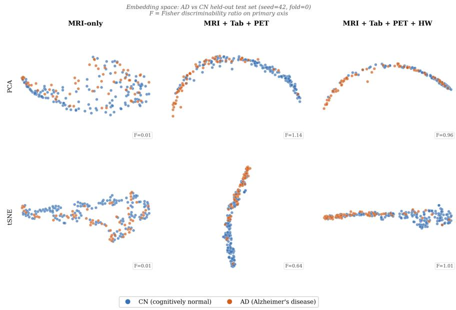  
Fig. 3 Held-out test-set MRI embeddings (seed 42, fold 0) under PCA and t-SNE, for MRI-only, MRI+Tab+PET, and the full MRI+Tab+PET+HW model. F is the Fisher discriminability ratio of CN vs. AD on the primary axis of each projection. Progressive auxiliary alignment reorganises the unsupervised embedding geometry into a more clearly class-separated arrangement: F rises from 0.01 for MRI-only to 1.14 (PCA) / 0.64 (t-SNE) for MRI+Tab+PET and 0.96 (PCA) / 1.01 (t-SNE) for the full MRI+Tab+PET+HW model. The projections illustrate this qualitative reorganisation; quantitative discriminability is reported by test AUC in Table 2.

MRI–PET vision transformer [43]; the diagnosis network of Wang et al. [44]; HyperFusion, a tabular-conditioned hypernetwork [45]; and IC-MKD, incomplete cross-modal mutual knowledge distillation [46]) also underperform PANDA in AUC.

Fig. 3 provides a qualitative visualisation of representation changes.

## 6.2 Scanner-Stratified Analysis

Table 3 reports performance stratified by scanner field strength. The MRI-only baseline exhibits pronounced field-strength sensitivity, with AUC = 0.695 at 1.5 T versus 0.814 at 3 T, and a 1.5 T CN false-positive rate of 52.2%. This behaviour is consistent with class-imbalanced acquisition (38.6% of AD vs. 20.7% of CN acquired at 1.5 T in the training cohort), which permits a field-strength shortcut.

Tabular prototype alignment (PANDA: MRI+Tab) primarily reduces scannerassociated false positives, lowering the 1.5 T FP % from 52.2% to 27.9% with minimal change in AUC. Adding PET prototypes (PANDA: MRI+Tab+PET) increases discrimination, particularly at 3 T (AUC 0.886), but yields a higher 1.5 T FP % (39.6%), consistent with sparse PET pairing limiting its influence on the 1.5 T subgroup.

The full model (MRI+Tab+PET+HW) achieves the strongest overall stratified profile $( 1 . 5 \mathrm { T } \mathrm { \ A U C } = 0 . 7 8 3 , \mathrm { F P \ \% } = 2 7 . 0 ; 3 \mathrm { T \ A U C } = 0 . 8 9 4 , \mathrm { F P \ \% } = 8 . 3 )$ . HeMIS attains a lower 1.5 T FP % (17.1%) but does so with substantially reduced AD sensitivity (Rec-AD = 0.486; Table 2). The handwriting anchor, despite having no ADNI subjects, provides complementary scanner-bias mitigation to the PET-driven AUC gains, yielding the most balanced trade-of. Fig. 4 plots these four columns directly; Fig. 5 shows the corresponding t-SNE embeddings coloured by field strength rather than by diagnosis, making the 1.5 T/3 T mixing visible per method.

Table 3 Scanner field-strength stratification. 1.5 T: n = 61 (AD = 24, CN = 37); 3 T: n = 116 (AD = 24, CN = 92). FP % = CN misclassified as AD. Mean ± SD across 3 seeds. Bold: best per column. †Suk et al. is evaluated on the paired subset: 1.5 T is still $n = 6 1 .$ but its 3 T group is $n = 1 4$ (not 116), so its 3 T column is not directly comparable to the other rows. The final block lists independently-published architectures with diferent backbones, shown for reference and excluded from the per-column bold.
<table><tr><td>Method</td><td></td><td>1.5T AUC ↑ 1.5T FP % ↓ 3T AUC ↑ 3T FP % ↓</td><td></td><td></td></tr><tr><td>PANDA: MRI+Tab</td><td> $0 . 7 0 3 { \scriptstyle \pm . 0 0 9 }$ </td><td> $2 7 . 9 { \scriptstyle \pm 3 . 4 }$ </td><td> $0 . 8 0 4 { \scriptstyle \pm . 0 1 2 }$ </td><td> $1 3 . 8 { \scriptstyle \pm 2 . 2 }$ </td></tr><tr><td>PANDA: MRI+Tab+PET</td><td> $0 . 7 3 6 { \scriptstyle \pm . 0 0 3 }$ </td><td> $3 9 . 6 { \scriptstyle \pm 4 . 5 }$ </td><td> $0 . 8 8 6 { \scriptstyle \pm . 0 2 0 }$ </td><td> $1 5 . 6 { \scriptstyle \pm 5 . 9 }$ </td></tr><tr><td>PANDA: MRI+Tab+PET+HW</td><td> $\mathbf { 0 . 7 8 3 _ { \pm . 0 1 3 } }$ </td><td> $2 7 . 0 { \scriptstyle \pm 6 . 6 }$ </td><td> $\mathbf { 0 . 8 9 4 _ { \pm . 0 1 9 } }$ </td><td> ${ \bf 8 . 3 \pm _ { 1 . 8 } }$ </td></tr><tr><td>MRI-only Baseline</td><td> $0 . 6 9 5 { \scriptstyle \pm . 0 0 9 }$ </td><td> $5 2 . 2 { \scriptstyle \pm 1 1 . 4 }$ </td><td> $0 . 8 1 4 { \scriptstyle \pm . 0 2 2 }$ </td><td> $1 4 . 1 { \scriptstyle \pm 2 . 3 }$ </td></tr><tr><td>Knowledge distillation [6]</td><td> $0 . 6 7 8 { \scriptstyle \pm . 0 2 9 }$ </td><td> $4 1 . 4 { \scriptstyle \pm 1 . 3 }$ </td><td> $0 . 8 0 0 { \scriptstyle \pm . 0 0 6 }$ </td><td> $1 5 . 9 { \scriptstyle \pm 4 . 6 }$ </td></tr><tr><td>Modality dropout (Tab)</td><td> $0 . 6 9 9 { \scriptstyle \pm . 0 1 2 }$ </td><td> $4 1 . 4 { \scriptstyle \pm 2 . 5 }$ </td><td> $0 . 8 2 5 { \scriptstyle \pm . 0 1 3 }$ </td><td> $1 6 . 7 { \scriptstyle \pm 1 . 4 }$ </td></tr><tr><td>Modality dropout (Tab+PET)</td><td> $0 . 7 1 7 { \scriptstyle \pm . 0 1 2 }$ </td><td> $4 7 . 8 { \scriptstyle \pm 8 . 9 }$ </td><td> $0 . 8 1 6 _ { \pm . 0 2 3 }$ </td><td> $1 8 . 1 { \scriptstyle \pm 1 . 0 }$ </td></tr><tr><td>HeMIS [5]</td><td> $0 . 6 6 5 { \scriptstyle \pm . 0 1 9 }$ </td><td> ${ \bf 1 7 . 1 _ { \pm 4 . 6 } }$ </td><td> $0 . 8 2 3 { \scriptstyle \pm . 0 0 5 }$ </td><td> $8 . 7 _ { \pm 1 . 8 }$ </td></tr><tr><td>Graph-smoothness reg. [42]</td><td> $0 . 6 5 3 { \scriptstyle \pm . 0 2 2 }$ </td><td> $5 5 . 0 { \scriptstyle \pm 1 1 . 3 }$ </td><td> $0 . 7 6 2 _ { \pm . 0 1 8 }$ </td><td> $1 4 . 9 { \scriptstyle \pm 3 . 6 }$ </td></tr><tr><td>Graph-SLC [28]</td><td> $0 . 7 0 3 { \scriptstyle \pm . 0 3 2 }$ </td><td> $3 4 . 2 _ { \pm 7 . 1 }$ </td><td> $0 . 8 2 9 { \scriptstyle \pm . 0 2 9 }$ </td><td> $1 0 . 9 { \scriptstyle \pm 4 . 1 }$ </td></tr><tr><td>Suk et al. [3]†</td><td> $0 . 6 8 2 _ { \pm . 0 7 7 }$ </td><td> $4 5 . 0 { \scriptstyle \pm 2 9 . 4 }$ </td><td> $0 . 7 0 7 { \scriptstyle \pm . 1 0 8 }$ </td><td> $4 7 . 6 _ { \pm 2 9 . 4 }$ </td></tr><tr><td>DiaMond [43]</td><td> $0 . 4 9 4 { \scriptstyle \pm . 0 3 9 }$ </td><td> $3 8 . 7 _ { \pm 1 2 . 5 }$ </td><td> $0 . 6 8 2 _ { \pm . 0 2 5 }$ </td><td> $1 2 . 7 { \scriptstyle \pm 8 . 1 }$ </td></tr><tr><td>Wang et al. [44]</td><td> $0 . 6 6 7 { \scriptstyle \pm . 0 9 8 }$ </td><td> $4 4 . 1 { \scriptstyle \pm 5 . 6 }$ </td><td> $0 . 7 6 2 _ { \pm . 0 8 2 }$ </td><td> $8 . 7 _ { \pm 3 . 9 }$ </td></tr><tr><td>HyperFusion [45]</td><td> $0 . 6 3 0 { \scriptstyle \pm . 0 1 1 }$ </td><td> $2 5 . 2 _ { \pm 1 0 . 0 }$ </td><td> $0 . 7 9 8 { \scriptstyle \pm . 0 1 1 }$ </td><td> $5 . 1 \pm 3 . 1$ </td></tr><tr><td>IC-MKD [46]</td><td> $0 . 6 7 2 { \scriptstyle \pm . 0 4 2 }$ </td><td> $4 6 . 8 { \scriptstyle \pm 3 . 4 }$ </td><td> $0 . 7 8 4 { \scriptstyle \pm . 0 0 5 }$ </td><td> $2 . 9 { \pm } 0 . 5$ </td></tr></table>

Scanner bias across methods — ADNI test set (3 seeds, mean ± std)

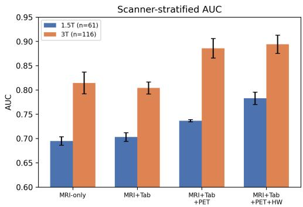

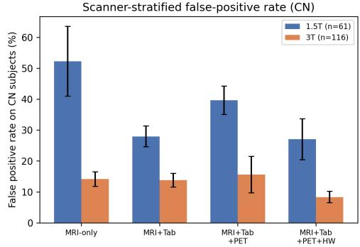  
Fig. 4 Scanner-stratified AUC and CN false-positive rate across methods (3 seeds, mean ± std). The full model (MRI+Tab+PET+HW) attains the highest AUC at both field strengths and the lowest 3T FP%, reducing 1.5T FP% to 27.0%, without using scanner labels during training.

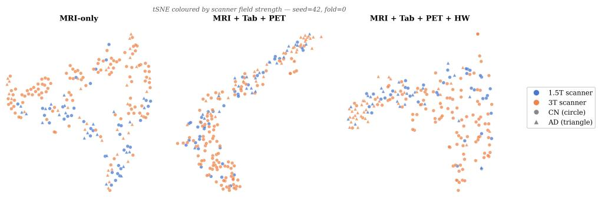  
Fig. 5 t-SNE of held-out test-set MRI embeddings (seed 42, fold 0) coloured by scanner field strength $( 1 . { \overset { \sim } { . } } \operatorname { T } \ \operatorname { v s . } \ 3 \operatorname { T } )$ rather than by diagnosis; marker shape indicates CN/AD. Progressive auxiliary alignment (MRI-only → MRI+Tab+PET → MRI+Tab+PET+HW) visibly interleaves the two scanner populations, consistent with the false-positive-rate reduction in Fig. 4.

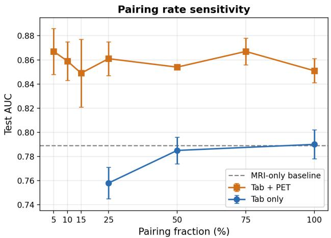  
Fig. 6 Test AUC vs. pairing fraction r for Tab-only and Tab+PET alignment (mean ± std). Dashed line: MRI-only baseline (0.789). Tab+PET AUC is flat within seed noise across r; Tab-only degrades below 25%.

## 6.3 Ablations

## Pairing Rate Sensitivity

Fig. 6 reports held-out test AUC as the paired fraction r is reduced from 100% to 5%.

For tabular-only alignment, AUC is stable down to $r \ = \ 5 0 \% \ ( 0 . 7 9 0 \ \mathrm { t o } \ 0 . 7 8 5 )$ but decreases at r = 25% (0.758; ≈ 95 paired subjects), which corresponds to approximately 40 AD subjects per fold for prototype estimation. For the joint Tab+PET anchor, AUC shows no systematic dependence on pairing rate: across $r \in \{ 1 0 0 \% , . . . , 5 \% \}$ it remains within 0.849–0.867, with overlapping seed variance. Thus, reduced pairing does not improve performance, but demonstrates that full pairing is not required: r ≈ 5–10% matches the fully paired configuration within seed noise.

This behaviour is consistent with an anchor-quality efect under finite-sample prototype estimation. For tabular prototypes, the inter-class cosine similarity (AD vs. CN) becomes more negative as pairing decreases (mean cosine: −0.649 at 100%, −0.731 at 25%, −0.760 at 10%), indicating increased empirical class separation. PET prototypes remain maximally anti-parallel by construction (cosine = −1.000) and therefore do not contribute to this trend. A plausible explanation is that the full paired pool $( n = 3 7 8 )$ contains a wide severity spectrum, including borderline cases that shift class means toward each other. Subsampling can preferentially yield more homogeneous within-class subsets, increasing empirical prototype separation and providing a more stable alignment target during Stage 2.

## Optimal-Transport Pseudo-Pairing

Stage 1 contrastive alignment uses only genuinely paired subjects (tabular: 378/844; PET: ${ \approx } 1 5 8 / 8 4 4 )$ , while handwriting contributes external class prototypes without per-subject pairing. To test whether unpaired MRI subjects can benefit from an additional alignment signal, we introduce an intermediate step that periodically (every 5 epochs) computes a Sinkhorn optimal-transport coupling between the MRI embedding distribution (all 844 subjects) and each auxiliary embedding distribution using cost $1 - \cos ( \cdot , \cdot )$ . The resulting soft couplings are used as additional (pseudo-paired) InfoNCE supervision, thereby achieving an AUC score of $0 . 8 6 2 \pm 0 . 0 1 4$ , which is statistically indistinguishable from the baseline 0.868 ± 0.020 and within our equivalence band.

We therefore treat optimal-transport pseudo-pairing as a neutral ablation under the pairing densities considered, indicating that class-level prototype anchoring captures most of the transferable cross-modal geometry in this setting.

## 6.4 Encoder Trainability and Backbone Generalizability

Our primary MRI backbone is a MedicalNet ResNet-18 in which the first two residual stages are frozen at segmentation-pretrained weights. As a stronger fully trainable alternative, we consider the Conv5-FC3 encoder of Wen et al. [12] (autoencoder warm start on the same ADNI pool; end-to-end training). On the same $n = 1 7 7$ evaluation protocol, Conv5-FC3 improves the MRI-only baseline AUC from $0 . 7 8 9 \pm 0 . 0 1 6$ to $0 . 8 8 1 \pm 0 . 0 0 9$ . The largest diference occurs at 1.5 T (AUC 0.695 vs. 0.800; CN $\mathrm { F P \ \% 5 2 . 3 \ v s . 3 3 . 3 ) }$ , consistent with limited trainability increasing reliance on scannercorrelated features. As presented in Table 4, adding tabular alignment leaves overall AUC essentially unchanged (0.881 to 0.883) but improves scanner robustness, reducing CN FP % at 1.5 T from 33.3 to 19.8 and at 3 T from 8.7 to 4.3. Incorporating the full four-way anchor further improves discrimination $( \mathrm { A U C } = 0 . 8 9 3 \pm 0 . 0 0 3 )$ and yields the lowest false-positive rates among the evaluated configurations.

These results indicate that prototype alignment transfers across encoder architectures and that additional auxiliary anchors can yield complementary gains.

Table 4 Backbone generalizability $( n = 1 7 7 )$ . Prototype alignment re-run with the fully-trainable Conv5-FC3 encoder [12]. Mean ± SD across 3 seeds; bold: best per column. †MedicalNet four-way with second stage checkpoints selected based on lowest validation loss with highest validation AUC.
<table><tr><td>Model</td><td>AUC</td><td></td><td>1.5T AUC 1.5T FP % 3T AUC</td><td></td><td>3T FP %</td></tr><tr><td> $\mathrm { C o n v 5 – F C 3 \ ( M R I \mathrm { - o n l y ) \ [ 1 2 ] } }$ </td><td> $0 . 8 8 1 { \scriptstyle \pm . 0 0 9 }$ </td><td> $0 . 8 0 0 { \scriptstyle \pm . 0 0 7 }$ </td><td> $3 3 . 3 { \scriptstyle \pm 7 . 7 }$ </td><td> $0 . 9 1 1 { \scriptstyle \pm . 0 1 0 }$ </td><td> $8 . 7 { \pm } 1 . 5$ </td></tr><tr><td> $\mathrm { P A N D A + C o n v 5 \mathrm { - } F C 3 \ ( M R I + T a b ) }$ </td><td> $0 . 8 8 3 { \scriptstyle \pm . 0 0 4 }$ </td><td> $0 . 7 9 9 { \scriptstyle \pm . 0 1 1 }$ </td><td> $1 9 . 8 { \scriptstyle \pm 9 . 2 }$ </td><td> $0 . 9 1 2 _ { \pm . 0 0 8 }$ </td><td> $4 . 3 { \scriptstyle \pm 0 . 9 }$ </td></tr><tr><td> $\mathrm { P A N D A } , \mathrm { M e d i c a l N e t }$   $( \mathrm { M R I + T a b + P E T + H W } ) ^ { \dagger }$ </td><td> $0 . 8 7 5 { \scriptstyle \pm . 0 1 5 }$ </td><td> $0 . 7 8 9 { \scriptstyle \pm . 0 1 7 }$ </td><td> $2 4 . 3 { \scriptstyle \pm 2 . 2 }$ </td><td> $0 . 8 9 9 { \scriptstyle \pm . 0 1 2 }$ </td><td> $7 . 2 \pm 2 . 0$ </td></tr><tr><td> $\mathbf { P A N D A } + \mathbf { C o n v 5 } \mathbf { - } \mathbf { F C 3 }$   $( \mathbf { M R I + T a b + P E T + H W } ) ^ { \dagger }$ </td><td> $\mathbf { 0 . 8 9 3 { \scriptstyle \pm . 0 0 3 } }$ </td><td> $\mathbf { 0 . 8 1 6 { \scriptstyle \pm . 0 1 0 } }$ </td><td> $\mathbf { 1 8 . 0 { \scriptstyle \pm 7 . 1 } }$ </td><td> $\mathbf { 0 . 9 1 6 { \scriptstyle \pm . 0 0 6 } }$ </td><td> ${ \bf 4 . 0 \pm 1 . 4 }$ </td></tr></table>

Table 5 Zero-shot MCI ordinal analysis under the primary-analysis hierarchy (primary: 3-group KW restricted to EMCI/MCI/LMCI, and one-sided adjacent-pair Mann–Whitney; ordering intact: full monotone chain CN<EMCI<MCI<LMCI<AD on medians, computed over all 177 test subjects plus the 147 MCI subjects). ns: $p \geq 0 . 0 5$
<table><tr><td>Method</td><td>Score</td><td>KWp (MCI-only)</td><td>MWp EMCI&lt;MCI</td><td>MWp MCI&lt;LMCI</td><td>ordering_intact</td></tr><tr><td>MRI-only baseline</td><td>pAD</td><td>0.0023</td><td>&lt; 0.001</td><td>0.788 (ns)</td><td>FAIL</td></tr><tr><td>PANDA: MRI+Tab+PET+HW</td><td>pAD</td><td>0.060 (ns)</td><td>0.007</td><td>0.677 (ns)</td><td>PASS</td></tr><tr><td>PANDA + severity head</td><td>pAD</td><td>0.060 (ns)</td><td>0.007</td><td>0.677 (ns)</td><td>PASS</td></tr><tr><td>PANDA + severity head</td><td>sev_score</td><td>0.088 (ns)</td><td>0.010</td><td>0.637 (ns)</td><td>PASS</td></tr></table>

## 6.5 Zero-Shot MCI Severity Inference

The held-out MCI cohort comprises 147 subjects (EMCI: 49, MCI: 79, LMCI: 19). For anchored models, applying the prototype-distance rule to each subject’s MRI projection yields a continuous $p _ { \mathrm { A D } } ^ { ( i ) } \dot { \mathfrak { \Omega } }$ for the severity-head extension (Section 4.2), we additionally compute sev score(i) via $h _ { \mathrm { s e v } }$ . We report two complementary statistic families (Table 5). Primary analyses include a 3-group Kruskal– Wallis test over EMCI/MCI/LMCI and one-sided Mann–Whitney tests on adjacent stage pairs. We also report ordering intact, a monotone-median check over $\mathrm { C N } < \mathrm { E M C I } < \mathrm { M C I } < \mathrm { L M C I } < \mathrm { A D }$ (computed with CN and AD included), which evaluates whether MCI falls at the expected ordinal position rather than only whether sub-stages difer. Fig. 7 shows the full distributions.

The MRI-only baseline separates EMCI/MCI/LMCI on the primary 3-group test (Kruskal–Wallis $p \ = \ 0 . 0 0 2 3 )$ but fails ordering intact: the AD median ties the MCI median (0.573), yielding a non-monotone chain (CN/EMCI/MCI/LMCI medians $0 . 2 9 7 < 0 . 3 4 6 < 0 . 5 7 3 < 0 . 5 9 7$ , with AD at 0.573). In contrast, the four-way joint model (MRI+Tab+PET+HW; Table 2) passes ordering intact with monotone medians $0 . 0 2 7 < 0 . 1 2 5 < 0 . 4 3 6 < 0 . 4 6 2 < 0 . 7 2 0$ across CN/EMCI/MCI/LMCI/AD, despite only weak evidence for MCI sub-stage separation $( \mathrm { K W } ~ p = 0 . 0 6 0 )$

The severity-head extension (Section 4.2) adds an explicit severity readout while leaving test AUC unchanged (0.868 ± 0.020; Section 6.1). On this cohort, ordering intact passes for both $p _ { \mathrm { A D } }$ (KW $p = 0 . 0 6 0 )$ and sev score $( \mathrm { K W } ~ p ~ =$

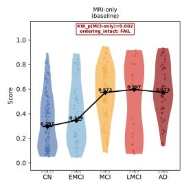

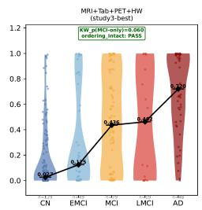

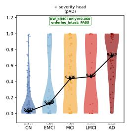

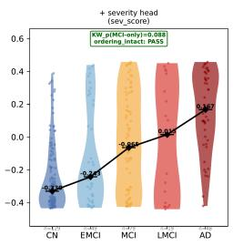  
Fig. 7 Zero-shot MCI ordinal structure across the full CN→AD chain (not just EMCI/MCI/LMCI), for the MRI-only baseline, MRI+Tab+PET+HW (the full model), and the severity-head extension on both $p _ { \mathrm { A D } }$ and sev score. The connecting line through group medians makes ordering intact visible directly: the MRI-only panel does not rise at the AD step (AD median 0.573 ties the MCI median), failing the monotone chain, whereas the joint MRI+Tab+PET+HW model and both severity-head panels rise monotonically from CN to AD.

Table 6 TCGA-Lung generalisation. Binary 2yr OS: test $n = 1 1 9 .$ . Cox PH: test $n = 1 7 1$ Mean ± SD across 3 seeds. Bold: best per column. † RNA used at inference.
<table><tr><td>Method</td><td>Binary AUC</td><td>Binary F1</td><td>Cox C-index</td></tr><tr><td>WSI-only</td><td> $0 . 5 9 3 { \scriptstyle \pm . 0 2 0 }$ </td><td> $0 . 3 8 9 { \scriptstyle \pm . 0 2 1 }$ </td><td> $0 . 4 6 0 { \scriptstyle \pm . 0 0 3 }$ </td></tr><tr><td>Full Fusion  $( \mathrm { W S I \mathrm { + R N A } } ) ^ { \dagger }$ </td><td> $0 . 5 9 1 { \scriptstyle \pm . 0 0 8 }$ </td><td> $0 . 3 4 8 { \scriptstyle \pm . 0 3 2 }$ </td><td> $0 . 4 5 3 { \scriptstyle \pm . 0 0 2 }$ </td></tr><tr><td>Paired-only 50% (no proto. transfer)</td><td> $0 . 5 7 9 { \scriptstyle \pm . 0 3 0 }$ </td><td> $0 . 3 3 8 { \scriptstyle \pm . 0 2 3 }$ </td><td> $0 . 5 2 7 { \scriptstyle \pm . 0 2 9 }$ </td></tr><tr><td>Paired-only 25% (no proto. transfer)</td><td> $0 . 5 7 6 { \scriptstyle \pm . 0 3 8 }$ </td><td> $0 . 3 7 6 { \scriptstyle \pm . 0 5 6 }$ </td><td> $0 . 5 1 3 { \scriptstyle \pm . 0 2 3 }$ </td></tr><tr><td>PANDA 25% RNA</td><td> $0 . 5 9 3 { \scriptstyle \pm . 0 2 6 }$ </td><td> $0 . 3 3 6 _ { \pm . 0 7 8 }$ </td><td> $0 . 5 2 9 { \scriptstyle \pm . 0 1 8 }$ </td></tr><tr><td>PANDA 50% RNA</td><td> $0 . 6 1 2 { \scriptstyle \pm . 0 1 8 }$ </td><td> $0 . 3 8 0 { \scriptstyle \pm . 0 5 3 }$ </td><td> $0 . 5 1 9 { \scriptstyle \pm . 0 3 8 }$ </td></tr><tr><td>PANDA 100% RNA</td><td> $\mathbf { 0 . 6 2 8 _ { \pm . 0 0 7 } }$ </td><td> $\mathbf { 0 . 4 9 5 _ { \pm . 0 1 5 } }$ </td><td> $\mathbf { 0 . 5 5 0 } \mathbf { \pm . 0 1 6 }$ </td></tr></table>

0.088). Neither KW test reaches conventional significance; accordingly, we do not claim sharp separation of MCI sub-stages. The supported conclusion is that the $\mathrm { C N } {  } \mathrm { A D }$ median ordering is monotone for the joint and severity-head models, whereas it is not for the MRI-only baseline. sev score correlates strongly with $p _ { \mathrm { A D } }$ (Pearson $r = 0 . 9 4 1 )$ but is not a trivial reparameterization $( r \neq 1$ ; Section 7).

We next evaluate the generality of prototype alignment under a shift in both data domain and objective, moving from ADNI diagnosis to TCGA-Lung survival prediction.

## 6.6 Second Application: Cross-Domain Generalisation to TCGA-Lung Survival

Table 6 and Fig. 8 summarise TCGA results. The WSI-only baseline attains AUC = 0.593±0.020 (95 % CI [0.492, 0.689]) for binary 2-year OS and $\mathrm { C - i n d e x = 0 . 4 6 0 { \pm } 0 . 0 0 3 }$ (95 % CI [0.383, 0.537]) for Cox PH, i.e., near-chance survival discrimination from H&E morphology alone. Full Fusion (joint WSI + RNA ABMIL; RNA used at inference)

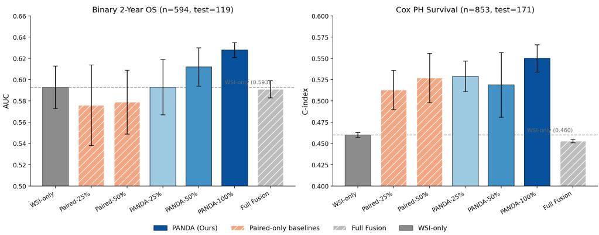  
Fig. 8 TCGA-Lung generalisation (3 seeds, mean ± std). Left: binary 2-year overall survival AUC. Right: Cox proportional-hazards C-index. PANDA (prototype alignment) at 100% RNA pairing outperforms both WSI-only and Full Fusion on both tasks without using RNA at inference; Pairedonly baselines at matched RNA fractions fall below PANDA at the same fraction, isolating the gain to the prototype-transfer mechanism rather than RNA availability alone.

does not improve over WSI-only on either endpoint $( \mathrm { A U C } = 0 . 5 9 1$ , C-index = 0.453), indicating unstable optimisation when trained directly on the partially paired pool (≈ 470 subjects).

Restricting Stage 2 to the paired subset (Paired-only baselines) likewise matches or underperforms WSI-only on binary AUC (0.576–0.579), indicating that discarding unpaired subjects is detrimental. In contrast, prototype-based contrastive transfer using 100% RNA pairing improves both endpoints without RNA at inference (AUC $= 0 . 6 2 8 { \scriptstyle \pm 0 . 0 0 7 }$ , 95 % CI [0.521, 0.733]; C-index = 0.550±0.016, 95 % CI [0.482, 0.616]), corresponding to absolute gains of +3.5 pp AUC and +9.0 C-index points vs. WSIonly. Bootstrap tests vs. WSI-only yield p = 0.146 (AUC) and $p = 0 . 0 5 9$ (C-index); with $n _ { \mathrm { t e s t } } = 1$ 19 (binary) and 171 (Cox), CIs remain wide and the improvements do not reach α = 0.05, although the direction is consistent across seeds and tasks.

Matched-fraction Paired-only comparisons support a prototype-transfer efect beyond pairing rate: at 25% RNA, PANDA achieves C-index = 0.529 vs. 0.513 for Paired-only 25% (+1.6 pts) with identical RNA training data.

## 7 Discussion

Across ADNI and TCGA-Lung, prototype alignment consistently converts partially paired auxiliary modalities into improvements in the primary-modality model (better calibration and scanner robustness) without requiring auxiliary inputs at inference. The efect is mediated by geometry: each auxiliary anchor reshapes the MRI/WSI embedding space, and the three anchors studied target complementary geometric failure modes.

Tabular alignment provides the most direct example of geometric regularisation. It leaves AUC approximately unchanged but improves CN recall and macro-F1 (Table 2), consistent with reduced within-class scatter around clinically defined cluster centres rather than added boundary signal. This restructuring also explains the large 1.5 T false-positive reduction (Table 3): borderline 1.5 T controls are pulled toward a clinically grounded CN anchor instead of remaining near the decision boundary. PET exhibits the complementary behaviour: it yields the largest single AUC gain but does not improve 1.5 T robustness (Tables 2, 3). A likely explanation is limited coverage: at 19% pairing, the PET prototype is estimated from ≈30 paired AD subjects per fold and is dominated by high-quality 3 T scans from later ADNI phases, providing limited constraint on the borderline 1.5 T controls that drive false positives. Increasing PET pairing density, or adding an explicit 1.5 T-robust regulariser, remains future work.

This modality-specific division of labour is also reflected in baseline behaviour. Modality-dropout baselines benefit little from PET (Table 2: MRI+Tab 0.800 vs. MRI+Tab+PET 0.799), whereas prototype alignment improves substantially (0.790→0.851). We do not isolate the mechanism experimentally, but hypothesise that sparse-modality utilisation difers: concatenate-and-mask training exposes the fusion head to real PET only on the paired fraction (19% pairing, further reduced by dropout) and cannot propagate PET-derived structure to the unpaired majority, whereas prototype alignment estimates class-level PET geometry from paired subjects and propagates it to all MRI embeddings via the alignment loss. In addition, the dropout head is trained on mixed present/zero-filled auxiliary patterns that differ from deployment, while PANDA’s classifier consumes MRI features consistently at train and test. We will test these hypotheses in future work by stratifying performance on PET-paired versus PET-unpaired test subjects.

The handwriting anchor isolates the minimal requirement for cross-cohort transfer. With rHW = 0, no ADNI subject contributes to the DARWIN prototype, yet handwriting yields the strongest scanner-stratified performance (Table 3). This indicates that transfer does not require semantic modality alignment; it requires prototype discriminability. A well-separated class geometry in one domain (handwriting kinematics) can constrain a structurally unrelated domain (3D MRI) when labels are shared.

The pairing-rate ablation (Figure 6) further supports deployability: full pairing is unnecessary. The Tab+PET anchor remains within seed noise from 75% to 5% pairing, whereas tabular-only alignment degrades only when the paired pool falls below ≈95 subjects per fold, where class-mean estimates become unstable. We attribute the Tab+PET stability to prototype quality: the fully paired pool spans a broad severity spectrum, including borderline subjects that dilute class means; random subsampling more often excludes these ambiguous cases, yielding tighter and more separated prototypes (mirrored by increasing AD–CN prototype separation as pairing decreases). Under resource constraints, sampling a modest number of pairs per modality can be preferable to maximising pairing completeness.

The TCGA-Lung results are consistent with the same decoupling of alignment and classification: efects are directionally consistent across seeds and tasks but underpow ered at the available test sizes (Table 6). Binary 2-year survival is dificult to power because censoring and thresholding discard time-to-event information, whereas the

Cox C-index (risk ranking) shows a numerically larger gain (+9.0 points; 0.460 → 0.550) that did not reach the conventional $\alpha = 0 . 0 5$ threshold $( p = 0 . 0 5 9 ;$ Table 6); the per-arm 95% CIs overlap (WSI-only [0.383, 0.537] vs. PANDA [0.482, 0.616]), so we report it as a consistent directional trend rather than a clinically established efect. Full Fusion falling to or below WSI-only on Cox is consistent with early-fusion failure under small paired pools [1]: the ≈470 paired subjects are insuficient to learn a reliable RNA-to-survival mapping while maintaining WSI attention quality. PANDA avoids this by separating alignment (Stage 1, paired subjects) from prediction (Stage 2, all subjects), ensuring the survival head is trained on the full WSI set.

Finally, the aligned representation encodes structure beyond binary objectives. In zero-shot MCI inference (Section 6.5), unimodal CN/AD separation does not reliably embed MCI along the severity axis (the ordinal ordering is not preserved), whereas prototype alignment stabilises the CN→AD ordering, and an explicit severity head—trained without any MCI supervision—recovers the same monotone ordering without AUC cost. These results indicate that severity information is already present in the MRI representation and primarily requires an appropriate readout objective.

Not all approaches to exploit this structure were supported. A geometry-transfer variant (matching the encoder’s inter-prototype angle to auxiliary pre-computed angles) achieved the highest raw metric $( 0 . 8 7 7 { \scriptstyle \pm 0 . 0 1 8 } )$ , but a four-arm ablation (real, identity-shufled, label-shufled correspondence, and a gradient-severed no-op) could not distinguish it from the no-op control on downstream AUC. The null result is confined to classification accuracy: the geometry pathway itself behaved as designed (values are mean ± s.d. across three seeds). In the real arm the inter-prototype angle converged toward the auxiliary target, with cosine moving from $- 0 . 5 9 7 \pm 0 . 0 2 0$ to −0.769 ± 0.019 and the geometry loss falling ≈4. $7 \times ~ ( 0 . 4 1 2 \pm 0 . 0 3 5 \to 0 . 0 8 9 \pm 0 . 0 1 2 )$ In the gradient-severed no-op neither moved toward the target: the cosine stayed positive and drifted away from the (negative) auxiliary targets $( + 0 . 2 2 7 \pm 0 . 0 9 2 $ $+ 0 . 3 7 0 \pm 0 . 0 9 2 )$ , and the geometry loss did not decrease. Reshaping this angle therefore did not, on its own, translate into an AUC gain over the no-op—not that the loss had no efect on the representation. A plausible explanation is a training-exposure artefact of the dual-loader control: at every step both arms draw an additional, larger batch through the shared MRI encoder and projection head (matching compute and BatchNorm running statistics), and only the geometry-loss coeficient is zeroed in the no-op; the shared extra exposure through BatchNorm statistics can account for most of any regularisation benefit, making AUC an insensitive readout for whether the geometry loss itself matters. We did not log per-pathway gradient norms to confirm this directly, so we report the exposure-artefact account as an inference from the control’s design rather than a measured quantity (Section 7).

## Limitations and future work.

The evaluation is confined to ADNI for $\mathrm { A D / C N }$ classification; external MRI cohorts $( \mathrm { e . g . , O A S I S { - 3 } }$ [47], UK Biobank [48]) are required to establish generalisability across sites and scanners. The persistent $. . 5 \mathrm { T } / 3 \mathrm { T }$ gap (27 pp FP % vs. 8 pp at ${ } ^ { 3 \mathrm { T } , }$ even for the best model) indicates that prototype alignment mitigates but does not eliminate scanner-related bias; deployment in 1.5 T-dominant settings will likely require dedicated harmonisation. One contributing factor is the restricted trainability of the encoder: freezing the early backbone layers limits adaptability, while making the entire encoder trainable boosts the unimodal baseline and yields the strongest aligned performance (Section 6.4). However, backbone design itself was not systematically optimized in the main study. PET pairing at 19% is also too sparse to enforce scanner-robust alignment at 1.5 T; denser PET pairing (or amyloid PET) is a natural extension.

The severity-head extension (Section 4.2) is trained on $s _ { \mathrm { o r t h } }$ , available for only 265/844 training subjects, and this subset is scanner-skewed (208 at $\leq 2 . 0 \mathrm { T }$ vs. 57 at $> 2 . 0 \mathrm { T } )$ . Denser and more scanner-balanced severity coverage would strengthen conclusions beyond the current single-composite result. A within-class pairwise rank loss, explored as an alternative approach to ordinal structure, did not improve sub-stage separation and degraded AD-adjacent ordering (MCI→LMCI) in 3-seed evaluation; we therefore do not pursue it further. This loss is a RankNet-style pairwise logistic term (binary cross-entropy on the predicted severity gap $\hat { s } _ { i } - \hat { s } _ { j }$ for each non-tied within-class pair, with no margin parameter), applied only to the AD sugnnore tbset $( n = 1 2 0 ;$ the CN population showed no usable within-class severity spread), with weight $\lambda _ { \mathrm { w c } } = 0 . 3$ on $s _ { \mathrm { o r t h } }$ and pairs drawn from a dedicated severity loader. Compared against the severity-head baseline $( \lambda _ { \mathrm { w c } } = 0 )$ using the primary adjacent-pair tests, it flipped the ordering intact check from pass to fail on the severity readout, with the LMCI median falling below the MCI median. The geometry-transfer variant (Section 7) was indistinguishable from a no-op control in downstream $A U C$ despite measurably reshaping the encoder’s inter-prototype geometry—and we did not log per-pathway gradient norms to establish whether the dual-loader exposure artefact or the loss itself explains this; we therefore treat it as unconfirmed and flag this outcome for others using similar dual-loader training. Finally, loss weights $( \lambda _ { \mathrm { t a b } } , \lambda _ { \mathrm { P E T } } , \lambda _ { \mathrm { H W } } )$ were tuned at 100% pairing, and a systematic sweep is deferred to revision.

Three directions follow directly from these findings. Multi-cohort generalisation. The core claim—relaxing full pairing to exploit larger training cohorts improves the primary-modality classifier—is demonstrated on ADNI and TCGA-Lung. The next step is evaluation across additional external AD cohorts (OASIS-3 [47], AIBL [49], UK Biobank [48]) and other partially paired benchmarks, to characterise when the approach succeeds as a general property rather than a dataset-specific efect. Nonadversarial scanner harmonisation. The residual $1 . 5 \mathrm { T } / 3 \mathrm { T }$ gap (Section 7) and the failure of distribution-matching baselines (adversarial scanner discrimination and sliced-Wasserstein alignment on PET embeddings [22, 23]) motivate prototype-space alternatives. Aligning per-scanner class centroids avoids fitting a discriminator and requires only class and domain labels, not dense per-domain distribution estimates. A power analysis linking harmonisation performance to the number of paired scanner samples would quantify the additional data requirements and inform future multi-site collection. Richer anchor geometry and severity supervision. The severity head currently relies on a single label-orthogonal composite available for 265 CN/AD subjects; denser, scanner-balanced graded scores, and anchors that represent within-class heterogeneity (mixture/distributional prototypes rather than a single class mean), are promising extensions given substantial within-AD severity variation observed in our data.

## 8 Conclusion

We introduced PANDA, a two-stage prototype-anchored alignment framework for multimodal AD classification with partial pairing. A single training procedure accommodates heterogeneous pairing densities (44.8% tabular, 18.7% PET, and 0% external handwriting) while requiring only MRI at inference. On ADNI, the full model achieves AUC = 0.868 (+7.9 pp vs. MRI-only) and reduces the 1.5 T CN false-positive rate by > 24 pp. The reported gains are relative to same-backbone MRI-only baselines. Conversely, a fully trainable Conv5-FC3 encoder attains AUC = 0.881 without alignment, and PANDA improves it further to AUC = 0.893 while approximately halving the 1.5 T false-positive rate. Thus, across backbones, prototype alignment improves the corresponding baseline, with larger AUC gains for weaker encoders and larger robustness gains once AUC saturates. A pairing-rate ablation shows that full pairing is not required for the joint anchor: 5–10% pairing matches the fully paired configuration within seed noise, implying that collecting additional modalities at low overlap can be preferable to assembling a small fully paired cohort. Cross-domain evaluation on TCGA-Lung indicates that the benefits are not neuroimaging-specific.

Zero-shot analysis on held-out MCI subjects further characterises the representation: the unimodal MRI baseline does not preserve the CN→AD ordinal chain, whereas the prototype-aligned model maintains monotone group medians. A linear severity head, trained on graded CN/AD scores without any MCI gradients, exposes this axis explicitly with no AUC cost, indicating that severity information is present in the aligned embedding and can be read out without MCI-specific supervision. In contrast, a class-prototype geometry-transfer variant was not supported: despite the highest raw metric, a four-arm ablation (real, identity-shufled, label-shufled correspondence, and a gradient-severed no-op with matched training exposure) could not distinguish it from the no-op control, consistent with training-exposure confounding rather than a geometry-transfer efect. Overall, these results support partially paired prototype alignment as a deployment-oriented strategy for leveraging incomplete auxiliary data to improve accuracy and scanner robustness without auxiliary inputs at test time.

## Code Availability

The full training, evaluation, and analysis code for PANDA will be made publicly available upon acceptance. The datasets used are accessible through their respective repositories under their own data-use agreements: ADNI (https://adni.loni.usc.edu), TCGA via the GDC Data Portal (https://portal.gdc.cancer.gov), and the DARWIN handwriting dataset [38].

## Acknowledgements

The authors gratefully acknowledge the scientific support and HPC resources provided by the Erlangen National High Performance Computing Center (NHR@FAU) of the Friedrich-Alexander-Universit¨at Erlangen-N¨urnberg (FAU). The hardware is partially funded by the German Research Foundation (DFG).

Data used in preparation of this article were obtained from the Alzheimer’s Disease Neuroimaging Initiative (ADNI) database (https://adni.loni.usc.edu). As such, the investigators within the ADNI contributed to the design and implementation of ADNI and/or provided data but did not participate in analysis or writing of this report. A complete listing of ADNI investigators can be found at https://adni.loni.usc.edu/ wp-content/uploads/how to apply/ADNI Acknowledgement List.pdf.

## A Baseline Configurations

## References

[1] Baltruˇsaitis, T., Ahuja, C., Morency, L.-P.: Multimodal machine learning: A survey and taxonomy. IEEE Transactions on Pattern Analysis and Machine Intelligence 41(2), 423–443 (2018) https://doi.org/10.1109/TPAMI.2018.2798607

[2] Zhang, D., Wang, Y., Zhou, L., Yuan, H., Shen, D., Alzheimer’s Disease Neuroimaging Initiative: Multimodal classification of Alzheimer’s disease and mild cognitive impairment. NeuroImage 55(3), 856–867 (2011) https://doi.org/10. 1016/j.neuroimage.2011.01.008

[3] Suk, H.-I., Lee, S.-W., Shen, D., Alzheimer’s Disease Neuroimaging Initiative: Hierarchical feature representation and multimodal fusion with deep learning for AD/MCI diagnosis. NeuroImage 101, 569–582 (2014) https://doi.org/10.1016/j. neuroimage.2014.06.077

[4] Sharma, A., Hamarneh, G.: Missing MRI pulse sequence synthesis using multimodal generative adversarial network. IEEE Transactions on Medical Imaging 39(4), 1170–1183 (2020) https://doi.org/10.1109/TMI.2019.2945521

[5] Havaei, M., Guizard, N., Chapados, N., Bengio, Y.: HeMIS: Hetero-modal image segmentation. In: Medical Image Computing and Computer-Assisted Intervention (MICCAI), pp. 469–477. Springer, Cham (2016). https://doi.org/10.1007/ 978-3-319-46723-8 54

[6] Hu, M., Maillard, M., Zhang, Y., Ciceri, T., La Barbera, G., Bloch, I., Gori, P.: Knowledge distillation from multi-modal to mono-modal segmentation networks. In: Medical Image Computing and Computer-Assisted Intervention (MICCAI), pp. 772–781. Springer, Cham (2020). https://doi.org/10.1007/ 978-3-030-59710-8 75

[7] Ma, M., Ren, J., Zhao, L., Tulyakov, S., Wu, C., Peng, X.: SMIL: Multimodal learning with severely missing modality. In: Proceedings of the AAAI Conference on Artificial Intelligence, vol. 35, pp. 2302–2310 (2021). https://doi.org/10.1609/ aaai.v35i3.16330

[8] Snell, J., Swersky, K., Zemel, R.: Prototypical networks for few-shot learning. In: Advances in Neural Information Processing Systems (NeurIPS), vol. 30 (2017)

Table 7 Baselines and their configuration. “Aux (train)”: auxiliary modalities used during training only; “Infer”: inputs required at test time. Unless stated, ADNI baselines train on all 844 subjects and are evaluated on the full test set (n = 177).
<table><tr><td>Method</td><td>Aux (train)</td><td>Infer</td><td>Key configuration / adaptation</td></tr><tr><td colspan="4">ADNI (AD/CN classification)</td></tr><tr><td>MRI-only</td><td></td><td>MRI</td><td>MedicalNet ResNet-18, cross- entropy only</td></tr><tr><td>MRI+Tab (pairs)</td><td>Tab</td><td>MRI+Tab</td><td>Feature concatenation; trained on the 378 paired subjects only</td></tr><tr><td>Suk (SAE fusion) [3]</td><td>Tab</td><td>MRI+Tab</td><td>Stacked-autoencoder late fusion; both modalities at test; paired test</td></tr><tr><td>Knowledge distill. [6]</td><td>Tab+PET</td><td>MRI</td><td>(n=75) MRI student matches MRI+Tab+PET prototype teacher</td></tr><tr><td>Modality dropout</td><td>Tab / Tab+PET</td><td>MRI</td><td>(KL, T=4) Random branch dropout (p=0.5); two configurations</td></tr><tr><td>HeMIS [5]</td><td>Tab+PET</td><td>MRI</td><td>Hetero-modal mean/variance pool-</td></tr><tr><td>Graph- smoothness [42]</td><td></td><td>MRI</td><td>ing over present modalities Manifold regularisation; k=10 NN</td></tr><tr><td>Graph-SLC [28]</td><td>Tab</td><td>MRI</td><td>graph, pairwise L2 penalty Graph-embedded latent; decoders reconstruct missing; tabular zeroed</td></tr><tr><td>DiaMond [43]</td><td>PET</td><td>MRI</td><td>at test Bi-modal MRI+PET ViT (bi-</td></tr><tr><td>Wang et al. [44]</td><td>PET</td><td>MRI</td><td>attention), run MRI-only Diagnosis network; PET-synthesis</td></tr><tr><td>HyperFusion [45]</td><td>Tab</td><td>MRI</td><td>branch omitted Hypernetwork conditions MRI on</td></tr><tr><td>IC-MKD [46]</td><td>PET</td><td>MRI</td><td>tabular (age, sex, APOE) MRI+PET teacher → MRI stu- dent; reimplemented (no official</td></tr><tr><td>CCSW [23]</td><td>Tab</td><td>MRI</td><td>code) Contrastive class-conditional sliding-window alignment</td></tr><tr><td colspan="4">TCGA-Lung (survival)</td></tr><tr><td>Full Fusion</td><td>RNA</td><td></td><td>WSI+RNA Joint WSI+RNA ABMIL with RNA at inference (complete-data upper bound)</td></tr><tr><td>Paired-only</td><td>RNA</td><td>WSI</td><td>Same architecture restricted to the paired subset (Stages 1–2)</td></tr></table>

[9] Radford, A., Kim, J.W., Hallacy, C., Ramesh, A., Goh, G., Agarwal, S., Sastry, G., Askell, A., Mishkin, P., Clark, J., et al.: Learning transferable visual models from natural language supervision. In: International Conference on Machine Learning (ICML), pp. 8748–8763 (2021). PMLR

[10] Weiner, M.W., Veitch, D.P., Aisen, P.S., Beckett, L.A., Cairns, N.J., Green, R.C., Harvey, D., Jack, C.R., Jagust, W., Morris, J.C., et al.: The Alzheimer’s disease neuroimaging initiative 3: Continued innovation for clinical trial improvement. Alzheimer’s & Dementia 13(4), 561–571 (2017) https://doi.org/10.1016/j.jalz. 2016.10.006

[11] Chen, S., Ma, K., Zheng, Y.: Med3D: Transfer learning for 3D medical image analysis. arXiv preprint arXiv:1904.00625 (2019) https://doi.org/10.48550/arXiv. 1904.00625

[12] Wen, J., Thibeau-Sutre, E., Diaz-Melo, M., Samper-Gonz´alez, J., Routier, A., Bottani, S., Dormont, D., Durrleman, S., Burgos, N., Colliot, O.: Convolutional neural networks for classification of Alzheimer’s disease: Overview and reproducible evaluation. Medical Image Analysis 63, 101694 (2020) https://doi.org/ 10.1016/j.media.2020.101694

[13] Ilse, M., Tomczak, J., Welling, M.: Attention-based deep multiple instance learning. In: International Conference on Machine Learning (ICML), pp. 2127–2136 (2018). PMLR

[14] Chen, R.J., Lu, M.Y., Weng, W.-H., Chen, T.Y., Williamson, D.F.K., Manz, T., Shady, M., Mahmood, F.: Multimodal co-attention transformer for survival prediction in gigapixel whole slide images. In: Proceedings of the IEEE/CVF International Conference on Computer Vision (ICCV), pp. 4015–4025 (2021). https://doi.org/10.1109/ICCV48922.2021.00398

[15] Johnson, W.E., Li, C., Rabinovic, A.: Adjusting batch efects in microarray expression data using empirical Bayes methods. Biostatistics 8(1), 118–127 (2007) https://doi.org/10.1093/biostatistics/kxj037

[16] Fortin, J.-P., Parker, D., Tun¸c, B., Watanabe, T., Elliott, M.A., Ruparel, K., Roalf, D.R., Satterthwaite, T.D., Gur, R.C., Gur, R.E., et al.: Harmonization of multi-site difusion tensor imaging data. NeuroImage 161, 149–170 (2017) https://doi.org/10.1016/j.neuroimage.2017.08.047

[17] Glocker, B., Robinson, R., Castro, D.C., Dou, Q., Konukoglu, E.: Machine learning with multi-site imaging data: An empirical study on the impact of scanner efects. In: Medical Imaging Meets NeurIPS Workshop (2019). https: //doi.org/10.48550/arXiv.1910.04597

[18] Leming, M., Das, S., Im, H.: Construction of a confounder-free clinical MRI dataset in the mass general brigham system for classification of Alzheimer’s disease. Artificial Intelligence in Medicine 129, 102309 (2022) https://doi.org/10. 1016/j.artmed.2022.102309

[19] Song, Y.-H., Yi, J.-Y., Noh, Y., Jang, H., Seo, S.W., Na, D.L., Seong, J.-K.: On

the reliability of deep learning-based classification for Alzheimer’s disease: Multicohorts, multi-vendors, multi-protocols, and head-to-head validation. Frontiers in Neuroscience 16, 851871 (2022) https://doi.org/10.3389/fnins.2022.851871

[20] Bhat, S., Bayer, S., P´erez-Toro, P.A., Maier, A.: Exploiting partially overlapping auxiliary modalities for Alzheimer’s MRI classification via prototype alignment. In: BAIOSPHERE MEDICAL 2026 — Book of Abstracts, p. 220. FAU University Press, Erlangen, Germany (2026). Abstract. https://open.fau.de/items/2b0cedf6- 52f8-4140-a159-a47b05ae5e84

[21] Chowdhury, M.R., Bayer, S., P´erez-Toro, P.A., Maier, A., Bhat, S.: Robust deep learning for Alzheimer’s MRI classification in heterogeneous ADNI acquisitions. In: BAIOSPHERE MEDICAL 2026 — Book of Abstracts, p. 171. FAU University Press, Erlangen, Germany (2026). Abstract. https://open.fau.de/items/2b0cedf6- 52f8-4140-a159-a47b05ae5e84

[22] Ganin, Y., Ustinova, E., Ajakan, H., Germain, P., Larochelle, H., Laviolette, F., Marchand, M., Lempitsky, V.: Domain-adversarial training of neural networks. Journal of Machine Learning Research 17(59), 1–35 (2016)

[23] Lee, C.-Y., Batra, T., Baig, M.H., Ulbricht, D.: Sliced Wasserstein discrepancy for unsupervised domain adaptation. In: Proceedings of the IEEE/CVF Conference on Computer Vision and Pattern Recognition (CVPR), pp. 10285–10295 (2019). https://doi.org/10.1109/CVPR.2019.01053

[24] Huang, S., Zhong, L., Shi, Y.: Multistage alignment and fusion for multimodal multiclass Alzheimer’s disease diagnosis. In: Medical Image Computing and Computer Assisted Intervention (MICCAI). Lecture Notes in Computer Science, vol. 15974, pp. 375–385. Springer, Cham (2025)

[25] Neverova, N., Wolf, C., Taylor, G., Nebout, F.: ModDrop: Adaptive multi-modal gesture recognition. IEEE Transactions on Pattern Analysis and Machine Intelligence 38(8), 1692–1706 (2016) https://doi.org/10.1109/TPAMI.2015.2461544

[26] Wang, Q., Zhan, L., Thompson, P., Zhou, J.: Multimodal learning with incomplete modalities by knowledge distillation. In: Proceedings of the 26th ACM SIGKDD International Conference on Knowledge Discovery & Data Mining (KDD). ACM, ??? (2020). https://doi.org/10.1145/3394486.3403234

[27] Le, H.Q., Thwal, C.M., Qiao, Y., Tun, Y.L., Nguyen, M.N.H., Huh, E.-N., Hong, C.S.: Cross-modal prototype based multimodal federated learning under severely missing modality. Information Fusion 122, 103219 (2025) https://doi.org/10. 1016/j.infus.2025.103219

[28] Ou, Z., Jiang, C., Liu, Y., Zhang, Y., Cui, Z., Shen, D.: A graph-embedded latent space learning and clustering framework for incomplete multimodal multiclass Alzheimer’s disease diagnosis. In: Medical Image Computing and Computer

Assisted Intervention (MICCAI), pp. 45–55. Springer, Cham (2024)

[29] Liu, Y., Liu, M., Zhang, Y., Sun, K., Shen, D.: A progressive single-modality to multi-modality classification framework for Alzheimer’s disease sub-type diagnosis. In: Machine Learning in Clinical Neuroimaging (MLCN), MICCAI Workshop, pp. 123–133. Springer, Cham (2025)

[30] Chen, T., Kornblith, S., Norouzi, M., Hinton, G.: A simple framework for contrastive learning of visual representations. In: International Conference on Machine Learning (ICML), pp. 1597–1607 (2020). PMLR

[31] Khosla, P., Teterwak, P., Wang, C., Sarna, A., Tian, Y., Isola, P., Maschinot, A., Liu, C., Krishnan, D.: Supervised contrastive learning. In: Advances in Neural Information Processing Systems (NeurIPS), vol. 33, pp. 18661–18673 (2020)

[32] Zhang, Y., Jiang, H., Miura, Y., Manning, C.D., Langlotz, C.P.: Contrastive learning of medical visual representations from paired images and text. In: Machine Learning for Healthcare Conference (MLHC), pp. 2–25 (2022). PMLR

[33] Ouyang, C., Bifi, C., Chen, C., Kart, T., Qiu, H., Rueckert, D.: Self-supervision with superpixels: Training few-shot medical image segmentation without annotation. In: European Conference on Computer Vision (ECCV), pp. 762–780. Springer, Cham (2020). https://doi.org/10.1007/978-3-030-58526-6 45

[34] Xiong, C., Chen, H., Zheng, H., Wei, D., Zheng, Y., Sung, J.J.Y., King, I.: MoME: Mixture of multimodal experts for cancer survival prediction. In: Medical Image Computing and Computer Assisted Intervention – MICCAI 2024. Lecture Notes in Computer Science, vol. 15004. Springer, ??? (2024). https://doi.org/10.1007/ 978-3-031-72083-3 30

[35] Chen, R.J., Lu, M.Y., Williamson, D.F.K., Chen, T.Y., Lipkova, J., Noor, Z., Shaban, M., Shady, M., Williams, M., Joo, B., Mahmood, F.: Pan-cancer integrative histology-genomic analysis via multimodal deep learning. Cancer Cell 40(8), 865–878 (2022) https://doi.org/10.1016/j.ccell.2022.07.004

[36] Chen, R.J., Ding, T., Lu, M.Y., Williamson, D.F.K., Jaume, G., Song, A.H., Chen, B., Zhang, A., Shao, D., Shaban, M., et al.: Towards a general-purpose foundation model for computational pathology. Nature Medicine 30(3), 850–862 (2024) https://doi.org/10.1038/s41591-024-02857-3

[37] Lu, M.Y., Chen, B., Williamson, D.F.K., Chen, R.J., Liang, I., Ding, T., Jaume, G., Odintsov, I., Le, L.P., Gerber, G., et al.: A visual-language foundation model for computational pathology. Nature Medicine 30(3), 863–874 (2024) https:// doi.org/10.1038/s41591-024-02856-4

[38] Cilia, N.D., De Gregorio, G., De Stefano, C., Fontanella, F., Marcelli, A., Parziale, A.: Diagnosing Alzheimer’s disease from on-line handwriting: A novel dataset and

performance benchmarking. Engineering Applications of Artificial Intelligence 111, 104822 (2022) https://doi.org/10.1016/j.engappai.2022.104822

[39] Poole, B., Ozair, S., van den Oord, A., Alemi, A.A., Tucker, G.: On variational bounds of mutual information. In: International Conference on Machine Learning (ICML) (2019)

[40] Boudiaf, M., Rony, J., Ziko, I.M., Granger, E., Pedersoli, M., Piantanida, P., Ben Ayed, I.: A unifying mutual information view of metric learning: Crossentropy vs. pairwise losses. In: European Conference on Computer Vision (ECCV) (2020)

[41] Cardoso, M.J., Li, W., Brown, R., Ma, N., Kerfoot, E., Wang, Y., Murrey, B., Myronenko, A., Zhao, C., Yang, D., et al.: MONAI: An open-source framework for deep learning in healthcare. arXiv preprint arXiv:2211.02701 (2022)

[42] Weston, J., Ratle, F., Collobert, R.: Deep learning via semi-supervised embedding. In: Proceedings of the 25th International Conference on Machine Learning (ICML), pp. 1168–1175 (2008)

[43] Li, Y., Ghahremani, M., Wally, Y., Wachinger, C.: DiaMond: Dementia diagnosis with multi-modal vision transformers using MRI and PET. In: IEEE/CVF Winter Conference on Applications of Computer Vision (WACV), pp. 107–116 (2025)

[44] Wang, C., Piao, S., Huang, Z., Gao, Q., Zhang, J., Li, Y., Shan, H.: Joint learning framework of cross-modal synthesis and diagnosis for Alzheimer’s disease by mining underlying shared modality information. Medical Image Analysis 91, 103032 (2024) https://doi.org/10.1016/j.media.2023.103032

[45] Duenias, D., Nichyporuk, B., Arbel, T., Riklin Raviv, T.: HyperFusion: A hypernetwork approach to multimodal integration of tabular and medical imaging data for predictive modeling. Medical Image Analysis 102 (2025) https://doi.org/10. 1016/j.media.2025.103503

[46] Kwak, M.G., Mao, L., Zheng, Z., Su, Y., Lure, F., Li, J.: A cross-modal mutual knowledge distillation framework for Alzheimer’s disease diagnosis: Addressing incomplete modalities. IEEE Transactions on Automation Science and Engineering 22, 14218–14233 (2025) https://doi.org/10.1109/TASE.2025.3556290

[47] LaMontagne, P.J., Benzinger, T.L.S., Morris, J.C., Keefe, S., Hornbeck, R., Xiong, C., Grant, E., Hassenstab, J., Moulder, K., Vlassenko, A.G., Raichle, M.E., Cruchaga, C., Marcus, D.: OASIS-3: Longitudinal neuroimaging, clinical, and cognitive dataset for normal aging and Alzheimer disease. medRxiv (2019) https://doi.org/10.1101/2019.12.13.19014902

[48] Sudlow, C., Gallacher, J., Allen, N., Beral, V., Burton, P., Danesh, J., Downey,

P., Elliott, P., Green, J., Landray, M., Liu, B., Matthews, P., Ong, G., Pell, J., Silman, A., Young, A., Sprosen, T., Peakman, T., Collins, R.: UK Biobank: An open access resource for identifying the causes of a wide range of complex diseases of middle and old age. PLoS Medicine 12(3), 1001779 (2015) https: //doi.org/10.1371/journal.pmed.1001779

[49] Ellis, K.A., Bush, A.I., Darby, D., De Fazio, D., Foster, J., Hudson, P., Lautenschlager, N.T., Lenzo, N., Martins, R.N., Maruf, P., Masters, C., Milner, A., Pike, K., Rowe, C., Savage, G., Szoeke, C., Taddei, K., Villemagne, V., Woodward, M., Ames, D.: The Australian Imaging, Biomarkers and Lifestyle (AIBL) study of aging: methodology and baseline characteristics of 1112 individuals recruited for a longitudinal study of Alzheimer’s disease. International Psychogeriatrics 21(4), 672–687 (2009) https://doi.org/10.1017/S1041610209009405