PlanSightRAG: A Visual-First Multimodal RAG for Automating Question Answering and Compliance Checking for Civil Standard Plans

Nabaraj Subedi, Shuvo Dip Datta, Ahmed Abdelaty, Shivanand Venkanna Sheshappanavar

• Visual-first multimodal RAG audits civil standard plans without OCR.

• ColNomic-3B reaches 91.47% Recall@5 on a new 4,056-pair five-DOT benchmark.

• Zero-shot retrieval transfers to an unseen DOT at 91.40%; LoRA tuning adds nothing.

• Agentic pipeline: 100% verdicts with resolved thresholds; transfers to real plans.

• First visual rule-grounding: numeric limits extracted with no human-supplied rule.

# PlanSightRAG: A Visual-First Multimodal RAG for Automating Question Answering and Compliance Checking for Civil Standard Plans

Nabaraj Subedia, Shuvo Dip Dattab, Ahmed Abdelatyb,\* and Shivanand Venkanna Sheshappanavara

aDepartment of Electrical Engineering & Computer Science, University of Wyoming,

bDepartment of Civil & Architectural Engineering & Construction Management, University of Wyoming, 1000 E. University Ave., Laramie, 82071, WY, USA

## ARTICLE INFO

Keywords:   
Multimodal RAG   
Vision-Language Models   
Engineering Drawing   
Compliance Checking   
Agentic AI   
Visual Grounding   
Explainability

## ABSTRACT

Civil infrastructure compliance checking has long relied on engineers manually reading legacy 2D plans; however, OCR-based automation strips away the geometry and layout essential for interpreting these plans. We present a Visual-First Multimodal Retrieval-Augmented Generation (RAG) framework called PlanSightRAG. It indexes and reasons directly over plan imagery, integrates a ColNomic-3B multi-vector retrieval, an agentic Planner–Retriever–Auditor–Synthesizer, and MaxSim heatmaps as an evidence trail. We introduce a 4,056-pair benchmark from five state Departments of Transportation (DOT) standard plans (1,898-pages). PlanSightRAG achieves 91.47% Recall@5 on zero-shot retrieval, while on a held-out Michigan DOT corpus, it achieves 91.40%. On synthetic, parametrically-generated compliance drawings, our Qwen2.5- VL-72B pipeline reaches 100% verdict accuracy only when supplied a pre-resolved rule threshold, a controlled ceiling that a non-VLM OCR baseline already reaches at 76.4%. Finally, we demonstrate autonomous visual rule-grounding by extracting numeric limits directly from a specification corpus without any human-supplied rules.

## 1. Introduction

Compliance checking underpins the safety and longterm reliability of civil infrastructure, yet in most state transportation agencies, it is still carried out by engineers reading through dense 2D standard plans. The plans are not obsolete—DOTs continue to maintain thousands of legacy sheets that remain the authoritative reference for design review—and the workflow is expensive, slow, and error-prone on multi-sheet sets with complex spatial conventions [1]. A way to query and audit these archives at scale while keeping humans in the loop is missing.

RAG and Document Question Answering frameworks have been natural candidates [2, 3, 4, 5], in which documents are linearized via OCR into tokens that an embedding model scores. On engineering plans, these embeddings lack geometric properties, positional layout, and cross-view symbols; hence, they lose the primary semantics of a standard plan. Once the standard plans are reduced to a token bag, the retriever can no longer locate the relevant plan reliably [6]. We therefore treat this as the central gap and propose a multi-vector retrieval framework in which the retrieval layer itself sees the plan. Figure 1 makes this gap concrete on a realistic WYDOT query.

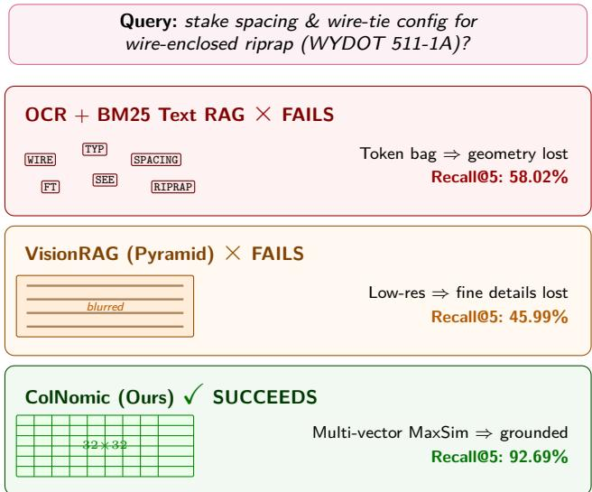  
Figure 1: Existing retrieval failure cases and patch-level visual retrieval success on a realistic WYDOT query.

Two recent lines of work make a visual-first approach plausible. The Vision-centric retrieval model ColPali [7] indexes a page as a grid of patch embed dings and scores queries via late-interaction MaxSim, preserving layout without text conversion. In parallel, vision-language models (VLMs), including Qwen-VL [8] and Gemini [9], have demonstrated fine-grained visual grounding on diagrams. These systems are usually evaluated in isolation; however, neither the retrieval nor the reasoning layer has been integrated into a pipeline capable of auditing multi-sheet engineering archives end-to-end. As Figure 1 shows, a text-based

RAG pipeline and the hybrid VisionRAG baseline both miss the dimension chain and wire-tie detail. On the contrary, the patch-level visual indexing retrieves the correct standard plan at Top-1 and grounds its answer on the relevant region (Table 4 reports the full quantitative comparison). In this paper, we close the gap with a Visual-First Multimodal RAG framework called PlanSightRAG that indexes plans directly as images, reasons over the retrieved plans with a VLM, and decomposes multi-plan compliance queries through a dedicated agentic pipeline. The central contribution is a single end-to-end, OCR-free system for automated compliance checking of civil standard plans; visual retrieval, MaxSim grounding, agentic auditing, and autonomous rule-grounding are the system components, and the five-DOT benchmark is the substrate on which we validate it. Our contributions are threefold:

1. Visual-First Retrieval Framework and Five-DOT Benchmark: A multi-vector late-interaction (ColNomic-3B) visual indexing pipeline with high-resolution tiling to retrieve engineering plans without OCR.

2. Agentic Grounded Compliance Pipeline: A Planner–Retriever–Auditor–Synthesizer pipeline with sharpened MaxSim heatmaps that audit designs against retrieved standards via a transparent evidence trail.

3. Autonomous Visual Rule-Grounding: Instead of hand-injecting the rule, the agent retrieves the governing requirement from a specification corpus (Recall@5 = 100% among 1,913 candidates), extracts its numeric limit (resolving symbolic �/2), and audits against the selfgrounded threshold, matching the 100% ceiling with no human-supplied rule.

We ground the evaluation in four pre-declared, falsifiable hypotheses (H1–H4) rather than qualitative claims, so that each finding can be read as supported, partially supported, or rejected against an explicit numeric threshold declared with each test. H1 asks whether patch-level visual retrieval surpasses OCR-based and hybrid alternatives. H2 asks whether the agentic Planner–Retriever–Auditor– Synthesizer pipeline, armed with per-drawing rule thresholds, audits dense multi-view sheets and multiplan designs. H3 concerns domain adaptation: whether LoRA fine-tuning of the adopted ColNomic-3B retriever on the five-DOT training split improves held-out Recall@5 without degrading zero-shot transfer to the unseen Michigan DOT corpus (Section 5.11). Finally, H4 tests whether high-resolution tiling improves judge accuracy.

## 2. Literature Review

## 2.1. Automated Compliance Checking in Civil Infrastructure

Automated compliance checking has traditionally relied on rule-based and text-driven approaches that encode regulatory requirements as machine-executable logic [10, 11]. These methods fundamentally assume that compliance information can be represented as structured data or linear text. However, for legacy 2D standard plans, requirements are encoded implicitly through geometry, layout, and cross-view symbols, encouraging an error-prone manual visual inspection as the dominant current practice [12].

## 2.2. OCR-Based Document QA and Text-Centric RAG Systems

RAG [2] grounds language models in external knowledge and has been deployed successfully for regulatory clause retrieval and general-purpose Document Question Answering (QA) [6, 13, 14, 15, 16], where rules and answers are explicitly stated in the text. These successes are the reference point against which visual-first retrieval must be compared; the failure modes that motivate this paper have already been discussed in Section 1. What is most relevant for positioning is that layout-aware text encoders [13, 14] and image-to-structure approaches [17, 18] recover part of the spatial signal lost during OCR. However, they do not fully restore this information. Recent diagnostic evaluations further indicate that the remaining spatial loss is suficient to degrade engineering-compliance tasks [1].

## 2.3. VLMs for Drawing Understanding

While early VLMs primarily targeted natural images and explicitly structured documents [19, 20], recent advances have yielded state-of-the-art (SOTA) transformer-based models capable of processing highresolution visual contexts. Some of the VLMs include robust open-source foundations such as Qwen-VL [8], InternVL [21, 22], BLIP-2 [23], Flamingo [24], and LLaVA [25], as well as closed-source alternatives like Gemini [9] and GPT-4V [26, 27]. These models achieve strong performance on general multimodal benchmarks; however, their application directly to dense, domain-specific technical documents remains underexplored.

In the civil engineering and construction domain, several studies have explored VLM-based approaches for technical document understanding [1, 28]. However, multiple studies emphasize that generic VLMs face significant limitations when applied to engineering drawings [1, 29]. OCR-centric or region-based pipelines often fail to capture implicit relationships encoded through layout, geometry, symbols, and cross-view references, which are central to technical drawings and standard plans [28]. Chart and diagram understanding benchmarks such as PlotQA [30], FigureQA [31], ChartQA [32], and DVQA [33] further show the limits of current VLMs. Their performance drops on tasks that require precise spatial grounding, symbolic interpretation, or multi-step visual reasoning, even when textual annotations are available. Recent work on understanding engineering drawings confirms that general-purpose VLMs struggle with the visual conventions unique to technical drafting. The HallusionBench diagnostic suite [34] systematically demonstrates that VLMs are prone to hallucinations when visual and textual cues conflict, a critical concern for engineering compliance applications.

Overall, existing literature suggests that while VLMs provide a strong foundation for technical and diagram understanding, their efectiveness is constrained by text-first preprocessing and limited spatial grounding. Most applications discussed above remain focused on single-image interpretation and do not support scalable retrieval, evidence grounding, or complianceoriented reasoning across large engineering drawing repositories. This motivates integrating vision-first retrieval with spatially grounded multimodal reasoning.

## 2.4. Vision-First Document Retrieval and Multimodal RAG

To overcome geometric loss, vision-first document retrieval methods index content directly within the visual embedding space. Models like ColPali [7] leverage multi-vector representations and late-interaction paradigms—initially developed by ColBERT [35]—to preserve spatial alignment globally without intermediate text extraction. These vision-first indexers confirm that layout-aware representations significantly improve retrieval on dense, visually complex documents [36].

While early Multimodal RAG pipelines [37] still treated images merely as auxiliary grounding for textual retrieval, modern systems are beginning to capture direct diagrammatic semantics. Nonetheless, existing studies focus primarily on single-image understanding and isolated QA tasks, failing to address the robust structural linking required for compliance-oriented reasoning over large engineering archives. Addressing these limitations, we introduce an integrated visualfirst RAG framework (PlanSightRAG). It pairs lateinteraction visual indexing with agentic VLM reasoning to meet the rigorous demands of cross-sheet engineering plan inspection.

## 3. Methodology

## 3.1. Visual-First Multimodal RAG Framework Overview

We propose a Visual-First Multimodal RAG architecture for question answering and compliance checking on civil engineering standard plans. As shown in Figure 2, the framework is organized into four phases. Phase 1 (Document Ingestion & Preprocessing - section 3.2) rasterizes each PDF sheet for indexing. We use 200 DPI for the deployed full-page index used in all headline results, and 400 DPI for the optional tiling path evaluated as an ablation. When tiling is enabled, each sheet is split into overlapping 1024 × 1024 tiles with a 256-px overlap. Finally, the corpus is enriched with document-level metadata extracted by a vision–language model. Phase 2 (Vi sual Indexing - section 3.3) encodes every tile with ColNomic-3B into multi-vector late-interaction patch embeddings at dynamic resolution and persists them as a reusable visual vector store. Phase 3 (Query Processing, Retrieval & Visual Grounding - section 3.4) performs retrieval using MaxSim late-interaction scoring. It can optionally apply VLM cross-encoder re-ranking and BM25 hybrid fusion to refine the results. This phase also produces sharpened MaxSim heatmaps, which highlight the specific plan regions that drive each retrieval decision. Phase 4 splits into two downstream tasks: Phase 4a (Visual Question Answering - section 3.5) generates grounded answers with a multi-VLM pool of Qwen 2.5-VL-7B, Qwen 2.5- VL-72B, and InternVL-2.5-8B over the Top-� retrieved pages. Phase 4b (Automated Compliance Checking section - 3.6) runs a prompted Qwen 2.5-VL-72B auditor alongside an agentic Planner–Retriever–Auditor– Synthesizer pipeline to produce structured, evidencegrounded compliance reports. Qwen 2.5-VL-7B handles high-resolution VQA; Qwen 2.5-VL-72B handles longcontext, multi-sheet compliance with enforced JSON output; and the remaining models are evaluated as alternative generators. The implementation details is discussed in section 3.7 . A strict separation of concerns among retrieval, reasoning, grounding, and auditing reduces the risk of hallucinations and yields a trans parent, evidence-grounded decision path.

## 3.2. Document Ingestion and Preprocessing

Standard Plans for Road and Bridge Construction from five US state DOTs(Wyoming, California, Arizona, Colorado and Florida) serve as the regulatory ground truth in our work. Each PDF document is rasterized page-by-page at 200 DPI, preserving line weights, hatch patterns, dimension chains, symbols, and annotations that are commonly lost in OCR. Pages are treated as independent visual units; OCR is intentionally excluded since the text-baseline results in Section 5.1 (Table 4) confirm label fragmentation in their geometric context(for example, the strongest modern text retriever BGE-M3 + OCR plateaus at 36.79% Recall@5 against ColNomic’s 92.69% on the 424-pair test split). Preprocessing is limited to format conversion and resolution standardization (no cropping, segmentation, or manual annotation). Regarding resolution choices, we used 200 DPI full-page for the visual index, all headline retrieval, and compliancepipeline retrieval, and the 400 DPI sliding-window tiling path is the only exception and is evaluated solely as an ablation (Section 7). The combined index spans 1,898 pages: WYDOT (237), Caltrans 2025 (638), Arizona DOT 2025 (181), Colorado DOT 2025 (62), and Florida DOT 2026 (780), each deduplicated to a single publication year to remove near-identical revisions. A held-out Michigan DOT corpus (298 pages) is ingested in the same way and used exclusively for zero-shot cross-agency transfer evaluation.

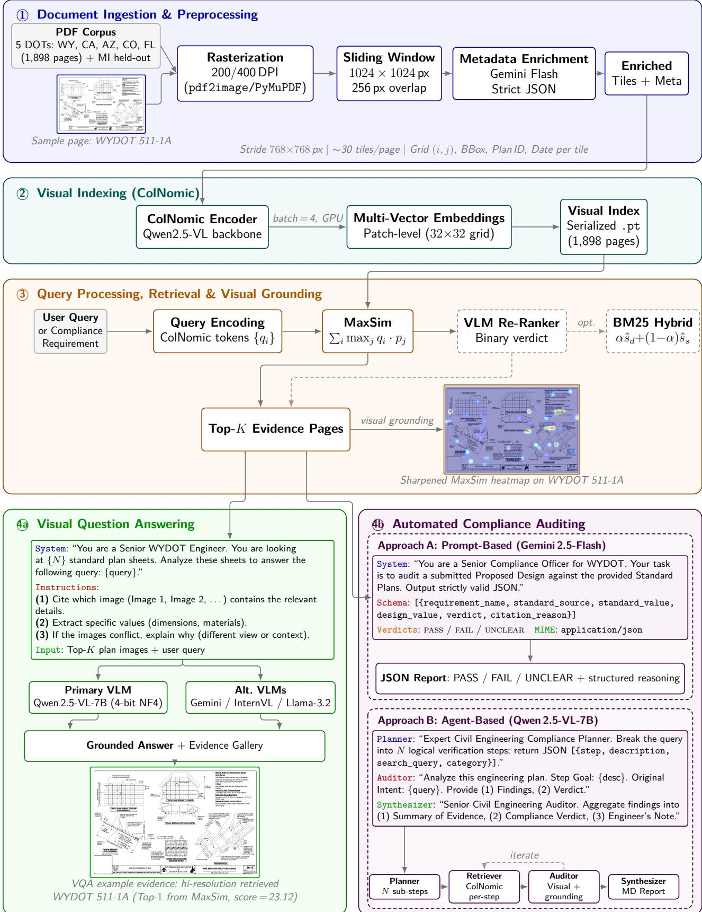  
Figure 2: Architecture of the Visual-First Multimodal RAG framework, organized into four phases: (1) document ingestion with high-resolution tiling and metadata enrichment; (2) ColNomic-3B visual indexing with multi-vector patch embeddings; (3) MaxSim late-interaction retrieval and grounding (optional VLM re-ranking and BM25 fusion); and (4) downstream tasks—(4a) multi-VLM visual question answering with heatmap grounding and (4b) agentic compliance auditing via the Planner–Retriever–Auditor– Synthesizer pipeline.

Even with a higher-resolution backbone, full-page indexing of very large multi-view sheets caps the efective per-region resolution, downsampling high-DPI engineering drawings until dimension text becomes illegible, thin lines vanish, and hatching merges. We therefore adopt a sliding-window tiling scheme (Figure 3) that preserves native-resolution detail by indexing at the tile level.

Tiling Procedure: Each page is rasterized at 400 DPI with PyMuPDF and decomposed into overlapping tiles with a size 1024 × 1024, an overlap of 256 px (25%), and a stride of 768 × 768, yielding $\lceil ( W \mathrm { ~ - ~ }$ $2 5 6 ) / 7 6 8 ] \times \lceil ( H - 2 5 6 ) / 7 6 8 \rceil$ tiles, where �, � are the full-resolution dimensions. A typical landscape sheet (≈4400×3400) produces ≈ 30 tiles.

Metadata and Retrieval: Each tile inherits its document-level metadata (plan ID, revision date, category, keywords) and adds tile-level fields: grid position $( i , j )$ , bounding box (�left, �top, �right, �bottom), and a reference to the full-page image. Tiles are encoded with the same ColNomic retriever and scored individually, enabling sub-page retrieval granularity and precise spatial back-mapping for grounding.

## 3.3. Visual Indexing

Each page (and each tile) is encoded with a pretrained ColNomic-3B retriever [38] (nomic-ai/ colnomic-embed-multimodal-3b), a multi-vector lateinteraction model on the Qwen2.5-VL backbone [8, 39]. Rather than compressing a page into a single vector, it produces a multi-vector embedding over a dynamicresolution patch grid. This approach preserves spatial locality, allowing tables, legends, callouts, and geometric details to remain separately addressable. Such granularity is critical for engineering drawings, where compliance-relevant information is spatially distributed and cannot be summarized holistically. Pages are uniformly encoded in batches of four during inference. Each index entry stores the CPU-resident embedding tensor alongside a metadata record extracted once per PDF by a vision-language model under strict JSON output (with a filename-parsing fallback)—documentlevel fields (plan ID, revision date, title, category, keywords, source agency) and page-level fields (image path, page number, unique page ID). All 1,898 indistribution pages are serialized as a single joint index, while the held-out Michigan DOT corpus (298 pages) is encoded identically into a separate index used only at zero-shot evaluation. The joint index supports crossagency retrieval without per-agency partitioning, and decoupling indexing from downstream reasoning lets the same embeddings be reused across retrieval, VQA, and compliance without re-encoding.

## 3.4. Query Processing, Retrieval & Visual Grounding

At query time, the ColNomic retriever embeds the query into token-level vectors $Q = \{ q _ { 1 } , . . . , q _ { m } \}$ ; each indexed page is represented by patch vectors $P =$ $\{ p _ { 1 } , \ldots , p _ { n } \}$ . Retrieval uses a ColBERT-style [35, 40] MaxSim late-interaction score computed in three steps:

$$
S = Q \cdot P ^ { \top }\tag{1}
$$

$$
\operatorname { M a x S i m } ( q _ { i } , P ) = \operatorname* { m a x } _ { j = 1 , \ldots , n } \ q _ { i } \cdot p _ { j }\tag{2}
$$

$$
\operatorname { S c o r e } ( Q , P ) = \sum _ { i = 1 } ^ { m } \operatorname { M a x S i m } ( q _ { i } , P )\tag{3}
$$

Each query token independently aligns with its most relevant visual patch, which is essential when a dimension value, a legend symbol, and a table entry must all contribute to a page’s relevance—cues that dense single-vector retrieval would average out. Pages are ranked by score, and the Top-� are returned as visual evidence.

To optimize raw retrieval performance and adapt to mixed visual-lexical queries, we evaluate two enhancements layered on top of the base ColNomic retriever without modifying the visual index.

VLM Cross-Encoder Re-Ranking: ColNomic returns Top-� candidates (Stage 1). VLM then reranks each candidate with a binary prompt—“Does this engineering plan contain the specific data to answer the query?”—retaining only positively verified candidates (Stage 2). Images are processed sequentially to bound GPU memory, with early stopping after two positive verifications. This yields a more discriminative relevance signal than bi-encoder similarity at the cost of bounded additional latency (≤ � passes, ≈ 0.3 s each; Appendix F).

Hybrid Dense–Sparse Fusion: To complement visual similarity with lexical precision on alphanumeric queries (plan IDs, note references), ColNomic dense scores are fused with BM25 sparse scores over the extracted metadata (plan ID, title, category, filename). Both vectors are min-max normalized to [0, 1] and combined:

$$
\mathrm { S c o r e } _ { \mathrm { h y b r i d } } = \alpha \cdot \hat { s } _ { \mathrm { d e n s e } } + ( 1 - \alpha ) \cdot \hat { s } _ { \mathrm { s p a r s e } }\tag{4}
$$

with $\alpha \in [ 0 , 1 ]$ controlling the visual/lexical balance.

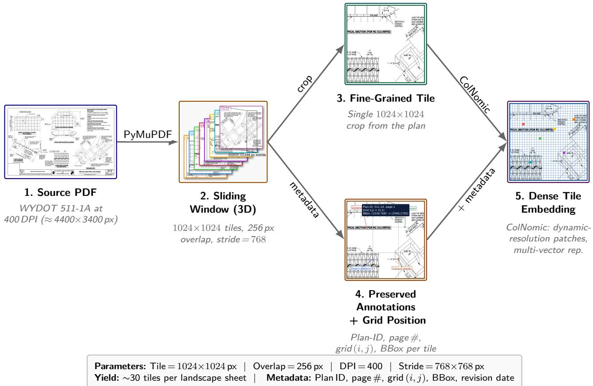  
Figure 3: Advanced Sliding Window Technique. Engineering sheets are rasterized at 400 DPI and decomposed into overlapping 1024 × 1024 tiles with 256-pixel overlap, preserving fine-grained annotations and enabling sub-page retrieval granularity.

Beyond raw retrieval performance, ColNomic’s patchlevel late interaction reveals which regions drove each retrieval decision, making the architecture inherently explainable (unlike opaque text-in/text-out RAG).

Sharpened MaxSim Heatmap: For each query page pair, patch-level MaxSim scores are reshaped into a 2D map aligned with the page layout and sharpened in two stages. In the first stage, only the top 5% of patches are retained (below-95th-percentile scores are clamped to the minimum to suppress difuse activations), and in the second stage, normalized values are raised to $\gamma = 3 . 0$ to concentrate emphasis on the strongest regions. The result is bicubic-upscaled to the original resolution, colorized with JET, and blended at $\alpha = 0 . 4$ over the page.

Region-Level Grounding: High-activation patches are additionally scored against OCR-detected text regions. The Top-� with the highest mean activation is returned as bounding-box evidence, pinpointing specific annotations, dimension labels, notes, or graphical elements behind the retrieval decision. The same mechanism attaches to every VQA answer and to each auditor step in the agentic pipeline, yielding a persistent visual evidence trail.

## 3.5. Visual Question Answering (VQA) Pipeline

Given a query, the Top-� plan pages returned by Section 3.4 are passed to a vision–language model (Qwen 2.5-VL [8]). The multimodal prompt consists of (i) a strict system role (“You are an expert Civil Engineer for WYDOT; answer only from the provided Standard Plan images”), (ii) the Top-� retrieved images as explicit visual inputs, (iii) lightweight text anchors (plan ID, reference index), and (iv) the user query:

$$
\boldsymbol { \hat { y } } = \mathrm { V L M } \big ( \boldsymbol { x } , \{ I _ { 1 } , I _ { 2 } , \dots , I _ { K } \} , I _ { \mathrm { u s e r } } \big )\tag{5}
$$

where � is the query, $\left\{ I _ { k } \right\}$ are the retrieved images, and $I _ { \mathrm { u s e r } }$ is an optional user-supplied diagram. Decoding uses a fixed token budget; the output pairs a naturallanguage answer with an evidence gallery of supporting plan sheets, allowing users to verify answers directly against the source visuals.

## 3.6. Automated Compliance Checking Workflow

For design-vs-standard auditing, a dedicated Qwen 2.5-VL-72B agent is configured as a WYDOT auditor. Its multimodal prompt includes (i) Top-� retrieved standard-plan images as regulatory evidence, (ii) the proposed design image, (iii) audit rules on dimensional consistency, unit correctness, labeling, and geometric logic, and (iv) an enforced JSON output schema. Each audit item is classified under unit, dimension, label, or logic, reporting the applicable requirement, the observed design condition, and a verdict in {pass, fail, unclear, hallucination\_suspected}. This yields a structured, repeatable report that can be directly exported to downstream review tools.

While this configuration is efective for localized checks, single-pass RAG cannot handle compliance queries that span multiple plans and regulatory rules. We therefore introduce an Agentic Compliance pipeline (Figure 4) with four specialized agents. While the framework is model-agnostic and supports lightweight backbones (such as Qwen 2.5-VL-7B for resourceconstrained local deployment), we scale the backbone to Qwen 2.5-VL-72B for the primary high-accuracy evaluations reported in Section 5.7:

1. Planner: Decomposes a high-level query (e.g., “Is the geotextile erosion control placement for RC Culverts consistent with fill slope requirements?”) into � structured JSON steps, each specifying a focused search query, the expected plan category, and the information to verify.

2. Retriever: Executes MaxSim retrieval per step, returning the most relevant plan page and its metadata.

3. Auditor: Takes the step description, retrieves the image, and the original query; performs visual analysis; and emits a structured finding with a preliminary verdict.

4. Synthesizer: Aggregates step findings into a consolidated report with a final verdict, a perstep evidence summary, and an engineer’s note flagging ambiguities.

Every audit step emits a sharpened MaxSim heatmap overlaid on the retrieved page. The pipeline outputs a machine-readable Markdown report interleaving findings, verdicts, and grounding images (plan ID, auditor findings, evidence paths) for direct ingestion by engineering review workflows.

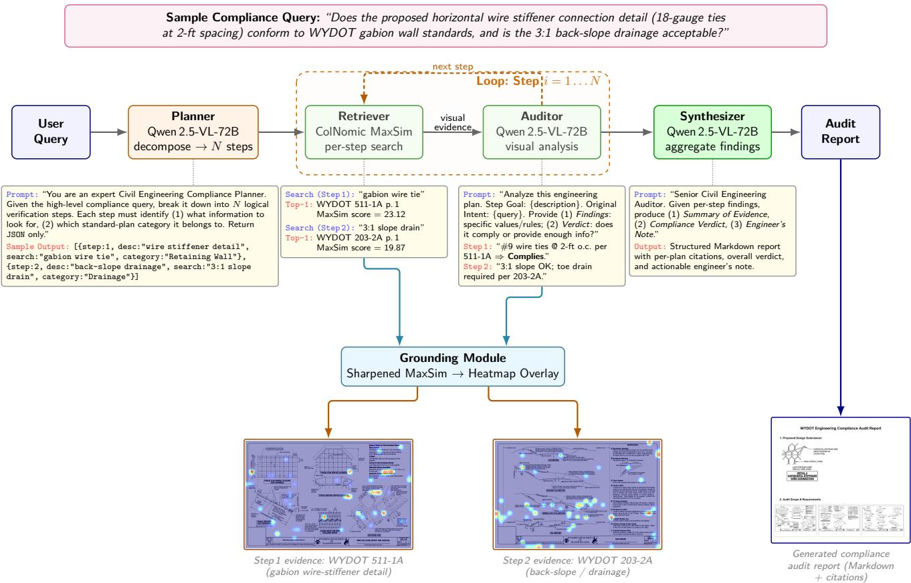  
Figure 4: Agentic Compliance Framework: Planner–Retriever–Auditor–Synthesizer pipeline for multi-step, evidence-grounded compliance verification.

## 3.7. Implementation and Deployment Details

The system runs on a single GPU to match practical agency deployments. Indexing and retrieval are executed ofline; VQA and compliance inference run at query time. Qwen 2.5-VL uses 4-bit BitsAnd-Bytes quantization (NF4 weights, bfloat16 compute), which reduces memory usage and allows several fullresolution plan images to fit in a single prompt. Models are loaded in inference mode only. The resulting eficiency–accuracy trade-of is managed through strict, evidence-grounded prompting, bounded generation lengths, and a retrieval-first design, ensuring that answers are anchored in retrieved evidence rather than priors.

Deployment latency: On the single-GPU target, indexing the 1, 898-page corpus is a one-time ofline cost (7.3 min, 4.34 pages/s); at query time, ColNomic retrieval over the full index is ≈0.10 s (p50). The optional cross-encoder re-ranker adds ≈0.3 s per candidate, single-shot VQA is 2–5 s, and the agentic compliance pipeline averages 60.9 s/query because the Planner expands each verdict into ∼8.6 sequential VLM steps—the dominant cost and the target of the steppruning optimization in Section 11. Full timings are in Appendix F (Tables A.8, A.7).

## 4. Evaluation Setup

## 4.1. Benchmark Dataset Construction

To rigorously evaluate the framework, we construct (i) a 4,056-pair benchmark generated via an iterative refine-loop QnA procedure across five state DOTs, (ii) a held-out Michigan DOT zero-shot transfer set, and (iii) a CAD-generated compliance test set used to validate the agentic verdict pipeline against known ground truth.

Five-DOT Visual Index (1,898 Pages): The retrieval index aggregates standard plan PDFs from five US state DOTs, deduplicated to a single year per agency to remove near-identical revisions: WYDOT (237 pages), Caltrans 2025 (638 pages), Arizona DOT 2025 (181 pages), Colorado DOT 2025 (62 pages), and Florida DOT 2026 (780 pages), for a combined 1,898 pages. Each page is rendered at 200 DPI and stored as a multi-vector record with metadata (agency, plan ID, sheet title) extracted by a Qwen2.5-VL-7B metadata extractor. During benchmark construction (the refine loop below), the curation index is built with ColPali [7]; all reported retrieval results re-embed the identical pages with the adopted ColNomic-3B backbone (Section 5.1).

Refine-Loop QnA Generation: Manually authoring large QnA benchmarks for engineering plans is cost-prohibitive—prior engineering plan QA sets are typically limited to tens of manually verified pairs. We replace manual authoring with an iterative procedure: for each target page and each of four reasoning categories (Dimensional Accuracy, Visual Interpretation, Logical Reasoning, Hallucination Rate), a drafter VLM (Qwen2.5-VL-72B or Llama-3.2-90B-Vision in 4-bit NF4) writes a question conditioned on the page image, ColPali retrieves over the 1,898-page index, and if the target page is outside top-5 the drafter rephrases with a page-specific anchor (a plan ID, a labeled value, or a quoted note phrase). Up to five rephrase attempts are allowed per question (eight for the small 62-page Colorado corpus, with a stricter two-anchor rephrase). A separate Qwen-VL-7B verifier subsequently filters out questions whose answers cannot be derived from the page (yes/no rubric). The procedure yields 4,056 verified question–answer pairs that pass both the refine-loop and the independent verifier. A further 93 verified pairs are generated in the same way over the held-out Michigan DOT corpus for zero-shot transfer evaluation.

Construct validity of the curation loop: Because the refine loop accepts or rephrases a question according to whether ColPali ranks the target page in the top-5, the benchmark could, in principle, favor ColPali-retrievable phrasings and inflate any retriever evaluated on it. Two facts rule this out as a material confound. First, 23.9% of the finalized pairs (968/4, 056; 95/424 on the page-disjoint test split) are ColPali misses—questions ColPali never retrieved even after five rephrases—so the benchmark is not restricted to ColPali-friendly items. Second, on exactly these ColPali-miss test questions, the adopted ColNomic-3B retriever still attains 77.89% Recall@5 (vs. 96.66% on the ColPali-hit subset), recovering the large majority of ColPali’s own failures. A benchmark that merely encoded ColPali’s inductive biases could not be solved by a diferent retriever on ColPali’s failure set; the adopted retriever’s advantage is therefore genuine rather than an artifact of the curation retriever.

Manually-curated anchor set (78 WYDOT pairs): Prior to the machine-generated benchmark, we hand-authored and manually verified a set of 78 WYDOT QnA pairs (29 Dimensional, 16 Visual, 17 Logical, 16 Hallucination) against the source standard plans. Because these pairs carry no machine-generation provenance, they provide an independent check that the framework’s headline behavior is not an artifact of the generate-then-verify pipeline. On this humancurated set—retrieving over the 237-page WYDOTonly slice of the index—the system attains 91.03% Recall@5 (95% bootstrap CI [84.6, 96.2]) and, with the same local Qwen2.5-VL-7B answerer and Qwen2.5-VL-72B judge used throughout, 80.77% end-to-end judge accuracy (CI [71.8, 89.7]); the per-category breakdown is reported in Table 1. The retrieval profile matches the large machine-generated benchmark (Dimensional strongest, Hallucination/Visual hardest), confirming that the automatically-generated pairs reproduce the dificulty structure of the human-authored ones.

Human-curated 78-pair WYDOT anchor set: per-category Recall@5 and end-to-end judge accuracy with 95% bootstrap CIs (10, 000 resamples, seed 42). Retrieval is over the 237-page WYDOT-only index; judge accuracy uses the local Qwen2.5- VL-7B answerer with a Qwen2.5-VL-72B judge (no proprietary API).
<table><tr><td>Category</td><td>N</td><td>Recall@5 (%)</td><td>Judge (%)</td></tr><tr><td>Dimensional</td><td>29</td><td>100.00 [100.0, 100.0]</td><td>79.31 [62.1, 93.1]</td></tr><tr><td>Visual</td><td>16</td><td>87.50 [68.8, 100.0]</td><td>68.75 [43.8, 87.5]</td></tr><tr><td>Logical</td><td>17</td><td>94.12 [82.4, 100.0]</td><td>94.12 [82.4, 100.0]</td></tr><tr><td>Hallucination</td><td>16</td><td>75.00 [50.0, 93.8]</td><td>81.25 [62.5, 100.0]</td></tr><tr><td>Overall</td><td>78</td><td>91.03 [84.6, 96.2]</td><td>80.77 [71.8, 89.7]</td></tr></table>

The four reasoning categories are defined as follows:

• Dimensional Accuracy: Queries requiring precise extraction of numeric dimensions, spacing, depths, gauges, and material quantities from engineering annotations.

• Visual Interpretation: Queries testing recognition of non-textual semantics, including geometric configurations, layout-dependent meaning, symbol conventions, and spatial relationships.

• Logical Reasoning: Queries requiring multistep deduction based on retrieved visual evidence, such as reconciling notes, cross-referencing views, or applying conditional specifications.

• Hallucination Rate: Adversarial queries where the correct answer is “not specified,” testing whether models avoid asserting unsupported facts when evidence is missing or ambiguous.

Hallucination-Rate category: The verifier accepts a pair when the page genuinely supports the answer, which by construction retains predominantly answerable lookups in this category; only a minority of finalized pairs carry a literal “not specified” gold answer. For retrieval evaluation, this is immaterial— every pair has a well-defined gold page—so the category should be read as a spec/material-lookup stress set rather than a pure abstention test. Abstention behavior is instead measured directly on the CAD false-negative study (Section 5.6). The per-agency and per-category distribution of the 4,056-pair benchmark is reported in Table 2.

CAD-Generated Compliance Test Set: To evaluate the agentic verdict pipeline against known ground truth (so that judge errors can be unambigu ously attributed to extraction, rule selection, or arithmetic), we construct a parameterized synthetic drawing generator (matplotlib; schematic figures rather than CAD/DWG output) that produces engineering-plan drawings with title block, dimensioned section views, material callouts, and notes. The generator covers five archetypes (box culvert, guardrail post foundation, beam rebar detail, drainage inlet, sign post foundation) at three density tiers (single-view, multi-view + schedule table, and multi-component multi-plan), with controlled parameter values. For non-compliant instances, exactly one parameter violates a rule (e.g., cover $= \ 1 . 0 ^ { \prime \prime } < \ 2 . 0 ^ { \prime \prime }$ min, stirrup $\mathrm { s p a c i n g ~ = ~ 1 8 ^ { \prime \prime } ~ > ~ }$ $d / 2 \mathrm { = } 1 5 ^ { \prime \prime }$ max). The full compliance ground-truth set comprises (a) a 14-drawing pilot (�=10 single-doc spanning the 5 archetypes $+ ~ n { = } 4$ dense multi-view with the violation embedded in one schedule-table row), (b) a 500-drawing single-doc scale set (5 archetypes × 100 instances, 250 compliant + 250 non-compliant, seven violation families), and (c) a 100-drawing multi-plan set requiring $N { \in } \{ 2 , 3 , 4 , 5 \}$ separate standard plans for verdict, with no plan IDs cited on the drawings (pure visual inference). Section 5.7 reports verdict accuracy on all three.

Dataset Standardization: All tracks are unified into a single evaluation pipeline that standardizes input formats (question, ground truth, image file, category, and applicable rule thresholds), enabling consistent metric computation across all models and configurations.

## 4.2. Evaluated Models

We evaluate vision–language models in two roles: as drafters in the refine-loop QnA generation (Qwen2.5- VL-72B and Llama-3.2-90B-Vision) and as the compliance judge in the agentic pipeline (Qwen2.5-VL-72B). The ColNomic visual retrieval backend is held fixed across all generator comparisons. Table 3 summarizes the models and their roles.

All open-source models are deployed with 4-bit NF4 quantization via BitsAndBytes to enable single-GPU inference. The evaluation pipeline is fully automated: for each model, the system loads the ColNomic retriever, performs visual retrieval for each benchmark question, generates an answer using the model under test, and computes evaluation metrics.

## 4.3. Evaluation Metrics

Performance is reported using two complementary KPIs:

• Recall@5 (Retrieval Hit): The percentage of queries for which the correct standard-plan page appears in the Top-5 retrieved results [41]. We report Recall@5 rather than Recall@K generically because the end-to-end pipeline always passes the

Table 2  
Distribution of the 4,056-pair five-DOT benchmark by agency and reasoning category. The held-out Michigan DOT zero-shot set (93 pairs) is not included in this table.
<table><tr><td>Category</td><td>WYDOT</td><td>Caltrans</td><td>AZDOT</td><td>CDOT</td><td>FDOT</td><td>Total</td></tr><tr><td>Visual Interpretation</td><td>201</td><td>416</td><td>149</td><td>85</td><td>549</td><td>1,400</td></tr><tr><td>Dimensional Accuracy</td><td>170</td><td>287</td><td>144</td><td>87</td><td>327</td><td>1,015</td></tr><tr><td>Logical Reasoning</td><td>172</td><td>331</td><td>104</td><td>104</td><td>446</td><td>1,157</td></tr><tr><td>Hallucination Rate</td><td>15</td><td>192</td><td>17</td><td>2</td><td>258</td><td>484</td></tr><tr><td>Total</td><td>558</td><td>1,226</td><td>414</td><td>278</td><td>1,580</td><td>4,056</td></tr></table>

Table 3  
Vision–language models used in the framework.
<table><tr><td>Model</td><td>Type</td><td>Params</td><td>Tier</td></tr><tr><td>Qwen2.5-VL-72B-Instruct</td><td>Open-source</td><td>72B</td><td>Primary</td></tr><tr><td>Qwen2.5-VL-7B-Instruct</td><td>Open-source</td><td>7B</td><td>Primary</td></tr><tr><td>InternVL-2.5-8B</td><td>Open-source</td><td>8B</td><td>Primary</td></tr></table>

Top-5 candidates to the generator. This measures the efectiveness of the visual retrieval layer independent of the generator.

• Judge Accuracy: An LLM-as-judge score [42] where a local Qwen2.5-VL-72B judge compares the model’s predicted answer against the ground truth and assigns a binary score (0 or 1). This measures end-to-end correctness, including both retrieval and reasoning.

## 5. Results

## 5.1. Comparison with Existing Solutions

To test H1, we pre-declare the acceptance threshold as a ≥15 pp Recall@5 margin over the strongest textbased and hybrid baselines and compare patch-level visual retrieval (ColPali) against a broad set of strong modern retrieval baselines, including the 2025–2026 Vi-DoRe state of the art: NVIDIA Nemotron-ColEmbed-8B/4B [43] (Qwen3-VL backbones) and ColNomic-3B/7B [38], along with ColQwen2.5-v0.2 and ColPaliv1.3 [7], DSE-Qwen2-2B [44], VisRAG-Ret [45], and BGE-M3 with OCR [46]—alongside seven legacy baselines (CLIP, LayoutLMv3, Nougat, Pix2Struct, UDOP, OCR+MiniLM, VisionRAG-Pyramid) and a binaryquantized HPC-ColPali variant. Every method is evaluated identically: the 424-pair page-disjoint test split is queried against the full 1,898-page five-DOT visual index. Table 4 reports Recall@5 for each method alongside index-size and retrieval-latency figures; peragency and per-category bootstrap CIs are reported in Appendix C.

On the choice of retriever: Several 2025–2026 retrievers outperform zero-shot ColPali on this benchmark—-Nemotron-ColEmbed-8B reaches 95.28% Recall@5 and ColNomic-3B 92.69%, versus 76.89% for ColPali. This reflects their newer, higher-resolution Qwen2.5/ Qwen3-VL backbones, whereas ColPali’s PaliGemma encoder operates at a fixed 448×448 that coarsens the fine dimensions and notes on large standardplan sheets.This is the same resolution limitation our high-resolution tiling strategy targets (Section 7). The framework is deliberately retriever-agnostic: the indexing, tiling, visual grounding, and agentic compliance components are unchanged by the backbone, so any of these retrievers can drop in directly, and the peragency gains transfer. Complementarily, a lightweight Apache-2.0 visual reranker (MonoQwen2-VL) applied to ColPali’s top-20 lifts Recall@5 from 76.89% to 85.14% (Table 5)—recovering most of the gap to the stronger retrievers while keeping the stack fully open and deployable. We therefore adopt ColNomic-3B as the retrieval backbone—the strongest openly licensed visual retriever on our benchmark and fully deployable—and report all main results with it; ColPali serves as a companion backbone for our binary-quantization study (HPC-ColPali, 16× compression) and controlled LoRA analysis. The NVIDIA Nemotron-ColEmbed models reach even higher Recall@5 but are CC-BY-NC (research-only). Crucially, H1 concerns the gap to text-based and hybrid pipelines, which every visual retriever here clears by a wide margin. For clarity on backbone attribution: all headline retrieval and the rule-grounding and real-plan results use ColNomic-3B, whereas the re-ranking (Table 5), high-resolution tiling (Section 7), HPC binary-quantization, bootstrap-CI (Appendix C), and grounding-pilot (Appendix G) studies are companion analyses on the predecessor ColPali backbone, and each is labeled accordingly.

Global vs. Local Vision: The comparison between CLIP and ColPali reveals a stark “granularity gap.” CLIP, which compresses an entire document page into a single global vector, achieved Recall@5 of only 1.89%, confirming that global embeddings fail to resolve the fine-grained details of engineering schematics. In contrast, patch-level ColPali achieves 76.89% Recall@5, demonstrating that retaining spatial resolution is nonnegotiable for this domain.

Table 4  
Retrieval comparison on the 424-pair page-disjoint test split over the 1,898-page five-DOT index. Strong (modern) baselines on top, legacy/weak baselines below, and the predecessor ColPali backbone (zero-shot) at the bottom; the adopted retriever is ColNomic-3B (92.69%, bolded). All numbers measured under an identical evaluation protocol; per-agency and per-category bootstrap CIs are reported in Appendix C.
<table><tr><td>Method</td><td>Modality</td><td>Mechanism</td><td> $N _ { \mathrm { i d x } }$ </td><td>Recall@5</td></tr><tr><td colspan="5">Strong modern baselines (2024–2026)</td></tr><tr><td>Nemotron-ColEmbed-8B [43]</td><td>Visual (Patch)</td><td>Multi-vector late-int.</td><td>1898</td><td>95.28%</td></tr><tr><td>Nemotron-ColEmbed-4B [43]</td><td>Visual (Patch)</td><td>Multi-vector late-int.</td><td>1898</td><td>92.92%</td></tr><tr><td>ColNomic-7B [38]</td><td>Visual (Patch)</td><td>Multi-vector late-int.</td><td>1898</td><td>91.27%</td></tr><tr><td>ColQwen2.5-v0.2 [7]</td><td>Visual (Patch)</td><td>Multi-vector MaxSim</td><td>1898</td><td>87.26%</td></tr><tr><td>DSE-Qwen2-2B [44]</td><td>Visual (Globai)</td><td>Single-vector dense</td><td>1898</td><td>22.17%</td></tr><tr><td>VisRAG-Ret [45]</td><td>Visual (Global)</td><td>Single-vector dense</td><td>1898</td><td>53.77%</td></tr><tr><td>BGE-M3 + OCR [46]</td><td>Text (OCR)</td><td>Dense Vector</td><td>1898</td><td>36.79%</td></tr><tr><td>ColNomic-3B (Ours, adopted) [38]</td><td>Visuai (Patch)</td><td>Multi-vector late-int.</td><td>1898</td><td>92.69%</td></tr><tr><td colspan="5">Legacy baselines</td></tr><tr><td>CLIP ViT-B/32 [20]</td><td>Visual (Global)</td><td>Global Embedding</td><td>1898</td><td>1.89%</td></tr><tr><td>LayoutLMv3 [47]</td><td>Visual (Layout)</td><td>Layout Embedding</td><td>1898</td><td>0.00%</td></tr><tr><td>Nougat-decode + MiniLM</td><td>OCR-free (Decode)</td><td>Decode + Dense</td><td>1898</td><td>0.47%</td></tr><tr><td>Pix2Struct-decode + MiniLM</td><td>OCR-free (Decode)</td><td>Decode + Dense</td><td>1898</td><td>7.31%</td></tr><tr><td>UDOP-decode + MiniLM</td><td>OCR-free (Decode)</td><td>Decode + Dense</td><td>1898</td><td>0.00%</td></tr><tr><td>OCR + MiniLM</td><td>Text (OCR)</td><td>Dense Vector</td><td>1898</td><td>25.24%</td></tr><tr><td>VisionRAG (Pyramid, RRF)</td><td>Hybrid (Text)</td><td>Structure-Aware RRF</td><td>1898</td><td>23.11%</td></tr><tr><td>ColPali (predecessor backbone) [7]</td><td>Visual (Patch)</td><td>Multi-vector MaxSim</td><td>1898</td><td>76.89%</td></tr><tr><td>HPC-CoiPali (Binary Quantized)</td><td>Visual (Patch)</td><td>Multi-vector MaxSim</td><td>1898</td><td>65.09%</td></tr></table>

Table 5

Two-stage retrieve–rerank on the 424-pair test split. The predecessor ColPali backbone retrieves the top-20; MonoQwen2- VL-v0.1 (Apache-2.0 pointwise visual reranker) reorders them. The top-20 recall is the reranker’s ceiling.
<table><tr><td>Configuration</td><td>Recall@5 (%)</td></tr><tr><td>ColPali (Stage 1 only)</td><td>76.89</td></tr><tr><td>ColPali + MonoQwen2-VL rerank</td><td>85.14</td></tr><tr><td>Top-20 ceiling</td><td>86.79</td></tr></table>

Retrieval ceiling for text-centric baselines: The strongest modern text retriever evaluated against the 1,898-page index is BGE-M3 + OCR at 36.79% Recall@5, the upper bound of what an OCR-thenembed pipeline can deliver here, even after replacing legacy baselines with 2024–2025 state-of-the-art encoders. The hybrid VisionRAG pyramid, which explicitly models document structure, raises this only to 23.11%. ColNomic’s 92.69% Recall@5 sits 55.90 pp above the strongest text retriever and 69.58 pp above the strongest hybrid, indicating that the information loss occurs at the OCR step itself rather than at the embedder.

OCR-free document VLMs do not transfer: Three OCR-free document VLMs used as page-to-text encoders—Nougat [48], Pix2Struct [49], and UDOP [50], with text embedded by MiniLM, so only the pageto-text step varies—also collapse on engineering drawings (0.47%, 7.31%, and 0.00% Recall@5). Pretrained on text-heavy corpora (papers, forms, screenshots), they emit empty or layout-less output on dense plan sheets, extending the granularity-gap argument to the broader OCR-free family.

Eficiency vs. Accuracy: The binary-quantization variant (HPC-ColPali) compresses the visual index by 16.0× (477.74 MB to 29.86 MB) and retains 65.09% Recall@5—within 11.79 pp of full-precision ColPali.

H1 verdict: H1 is supported. The adopted ColNomic-3B retriever reaches 92.69% Recall@5, which is 55.90 pp above the strongest text retriever (BGE-M3 + OCR, 36.79%) and 69.58 pp above the strongest hybrid baseline (VisionRAG (Pyramid, RRF), 23.11%). The pre-declared 15-pp threshold is cleared on both axes.

## 5.2. Overall End-to-End Performance on the Five-DOT Benchmark

Table 6 presents the zero-shot retrieval performance of the adopted ColNomic-3B backbone on the full 4,056-pair five-DOT benchmark. This is the baseline retrieval configuration; the controlled LoRA ablation in Section 5.11 indicates that it is also the strongest deployment configuration among those we tested. Endto-end judge accuracy is measured separately on the

Zero-shot ColNomic-3B retrieval on the 4,056-pair five-DOT benchmark (1,898-page index), used of-the-shelf with no domain adaptation.
<table><tr><td>Agency</td><td>N</td><td>Zero-shot Recall@5 (%)</td></tr><tr><td>WYDOT</td><td>558</td><td>93.37</td></tr><tr><td>FDOT</td><td>1,580</td><td>91.27</td></tr><tr><td>Caltrans</td><td>1,226</td><td>91.92</td></tr><tr><td>AZDOT</td><td>414</td><td>89.13</td></tr><tr><td>CDOT</td><td>278</td><td>90.29</td></tr><tr><td>Overall</td><td>4,056</td><td>91.47</td></tr></table>

CAD-generated compliance test set (Section 5.7) because it has controlled ground-truth verdicts. Ranksensitive metrics (Recall@1, MRR, nDCG@10) on the page-disjoint test split are reported in Appendix D (Table A.3). For clarity, three Recall@5 figures recur in this paper and each is reported against a distinct evaluation set: 91.47% on the full 4,056-pair benchmark (this section, our headline zero-shot number), 92.69% on the 424-pair page-disjoint test split (the controlled baseline comparison of Table 4 and the rank metrics), and 91.03% on the human-curated 78-pair WYDOT anchor set (Section 4.1, Figure 1); the heldout Michigan transfer is 91.40% over the joint index. These are consistent measurements on diferent sets, not revisions of a single result.

Zero-shot Recall@5 is 91.47% over the full 4,056- pair benchmark—a deliberately demanding evaluation: the benchmark is two orders of magnitude larger than prior engineering-plan QA sets, spans five agencies with heterogeneous drafting conventions, and is generated by an adversarial refine-loop that explicitly seeks page-distinguishing anchors. Retrieval is strong and balanced across agencies (89–93%): WYDOT retrieves best (93.37%), reflecting its sparse, high-contrast layouts, and even CDOT—whose 62-page bridge book is dominated by near-duplicate detail sheets that weaker backbones conflate—reaches 90.29%, a marked improvement over the PaliGemma-class encoders. We treat 91.47% as the zero-shot baseline. The per-category breakdown is reported in Section 5.3.

## 5.3. Category-Wise Performance Analysis

Table 7 presents the zero-shot category-wise Recall@5 on the 4,056-pair five-DOT benchmark. All four categories reach ≥87% Recall@5, with Dimensional Accuracy as the strongest (95.37%); Logical Reasoning, historically the hardest category for patch-level retrievers (it asks the agent to infer a rule from a note or table rather than match a page-unique numeric anchor), remains the (mildly) weakest at 87.64% but is now within 8 pp of the best—a substantial narrowing relative to PaliGemma-class backbones.

Zero-shot category-wise Recall@5 on the 4,056-pair five-DOT benchmark. Drafters: Qwen2.5-VL-72B for WYDOT, AZDOT, CDOT; Llama-3.2-90B-Vision for Caltrans, FDOT. Verifier: Qwen2.5-VL-7B (yes/no rubric).
<table><tr><td>Category</td><td>N</td><td>Zero-shot Recall@5 (%)</td></tr><tr><td>Hallucination Rate</td><td>484</td><td>88.84</td></tr><tr><td>Dimensional Accuracy</td><td>1,015</td><td>95.37</td></tr><tr><td>Visual Interpretation</td><td>1,400</td><td>92.71</td></tr><tr><td>Logical Reasoning</td><td>1,157</td><td>87.64</td></tr><tr><td>Overall</td><td>4,056</td><td>91.47</td></tr></table>

## Table 8

End-to-end judge accuracy (%) for nine prompting and reasoning techniques on the 424-pair page-disjoint test split, with Qwen2.5-VL-7B and Qwen2.5-VL-72B as the answerer. Retrieval, judge, and decoding are held fixed; only the answeringstage prompting strategy varies.

<table><tr><td>Technique</td><td>Qwen-7B</td><td>Qwen-72B</td></tr><tr><td>Zero-shot</td><td>78.30</td><td>76.89</td></tr><tr><td>Chain-of-thought (CoT)</td><td>70.75</td><td>72.17</td></tr><tr><td>Self-consistency (5 samples)</td><td>69.58</td><td>69.10</td></tr><tr><td>Retrieval-augmented</td><td>62.50</td><td>70.75</td></tr><tr><td>Sliding-window tiling</td><td>64.39</td><td>72.17</td></tr><tr><td>OCR-hybrid</td><td>77.12</td><td>78.07</td></tr><tr><td>Question decomposition</td><td>75.71</td><td>81.60</td></tr><tr><td>Agentic (Planner-Auditor-Synth.)</td><td>75.71</td><td>75.00</td></tr><tr><td>Critic self-correction</td><td>77.36</td><td>82.31</td></tr><tr><td>Union (any technique correct)</td><td colspan="2">97.16</td></tr></table>

## 5.4. Prompting and Reasoning Technique Ablation

Beyond the choice of VLM and the retrieval backbone, end-to-end judge accuracy depends on how the VLM is prompted at the answering stage. We ablate nine prompting and reasoning strategies on the pagedisjoint test split (424 pairs) with Qwen2.5-VL-7B and Qwen2.5-VL-72B as the answerers, holding retrieval, judge, and decoding fixed: zero-shot, chain-of-thought (CoT), self-consistency (5 samples plus majority vote), retrieval-augmented (top-3 distractor pages in the answering prompt), sliding-window tiling, OCR-hybrid (image plus extracted text), question decomposition, the agentic Planner–Auditor–Synthesizer pipeline, and critic self-correction. Each candidate answer is scored against the ground-truth answer by an open-source Qwen2.5-VL-72B judge (binary correct/incorrect, same rubric as Section 4.3), so the entire ablation is reproducible without any proprietary judge API. Table 8 reports per-(technique, model) judge accuracy.

Three findings stand out. First, the best cell across the 18-entry grid is critic self-correction with Qwen2.5-VL-72B at 82.31%, which surpasses Qwen-72B zero-shot by 5.42 pp and Qwen-7B zeroshot by 4.01 pp; the same critic loop on the 7B model yields only a 0.94-pp drop relative to 7B zero-shot, indicating that self-correction is a near-zero-cost option at the smaller scale and a meaningful gain at the larger scale. Second, retrieval-augmented prompting is the worst technique on both models (62.50% on 7B, 70.75% on 72B): supplying additional distractor pages in the answering prompt degrades the VLM’s attention to the correctly-retrieved primary page, confirming that the answering stage benefits from a tight visual context rather than an expanded one. Third, classical text-side reasoning aids (CoT, self-consistency) underperform zero-shot on both models—the chainof-thought tends to drift away from the dimension actually visible in the drawing, and majority voting over five samples amplifies rather than corrects shared visual misreadings. The union of all nine techniques reaches 97.16% accuracy, indicating that the residual error budget is largely prompting-recoverable rather than fundamentally limited by the VLM’s perception.

## 5.5. Visual Grounding and Explainability Results

To evaluate visual grounding, we generate sharpened MaxSim heatmaps across benchmark queries. Figure 5 demonstrates this on a representative query: the heatmap correctly bounds both the regulatory note and its associated visual representation, preserving the spatial relationships lost in OCR.

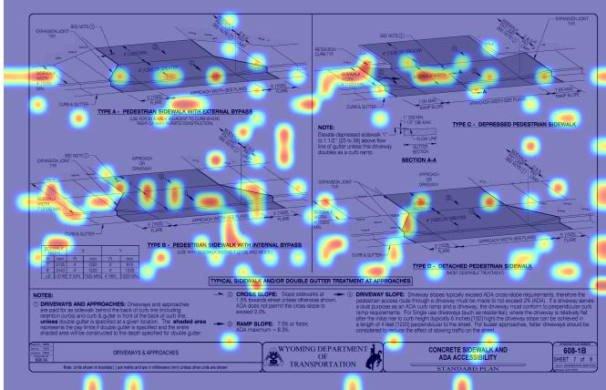  
Figure 5: Visual Grounding Analysis: The sharpened MaxSim heatmap overlay (ColNomic-3B) correctly highlights both the textual ‘Grading Notes’ and the corresponding geometric detail.

Grounding Evaluation: In a 16-query qualitative pilot across four plans, thresholding the heatmap at the top 5% of activations consistently localizes the true evidence (specific dimensions, note blocks, structural symbols), and passing these high-intensity crops to the generator improves response specificity. We treat grounding as a qualitative diagnostic: a quantitative IoU study with human-annotated evidence regions is scoped as a follow-up rather than claimed here (Appendix G). Figure 6 illustrates this grounding integrated into the agentic compliance pipeline, in which each audit step produces its own heatmap overlay, forming a verifiable evidence trail.

## 5.6. Agentic Compliance Results

To test H2, we pre-declare three thresholds: ≥90% verdict accuracy on the CAD-generated single-doc compliance set (Section 5.7), ≥90% false-positive avoidance on a PASS set, and ≥60% sensitivity on a FAIL set. We evaluate the Planner–Retriever–Auditor– Synthesizer pipeline on two complementary corpora: an 8-query cross-plan PASS set (to measure false-positive avoidance) and a 24-query FAIL set with synthetic mutations (to measure sensitivity, Appendix E.1).

On the 8-query PASS set, the agentic pipeline reaches 100% verdict accuracy. The Planner safely overdecomposes queries (averaging 8.6 steps per query), while per-step retrieval, audit findings, and final synthesis maintain 100% correctness. For example, when checking geotextile consistency between Plans 511- 1A and 203-2A, the agent successfully retrieved both sheets, recognized that 203-2A lacks explicit RC Culvert details, and appropriately flagged the ambiguity for engineering review rather than hallucinating a pass.

H2 verdict: Supported. The 8-query PASS set is small and measures only false-positive avoidance (it contains no FAIL cases); its 100% accuracy clears the pre-declared 90% false-positive threshold, while the pre-declared ≥90% verdict accuracy on the CADgenerated set is met (Section 5.7). On the 24-query FAIL set, overall True Positive Rate is 79.17% (87.5% for dimension/note mutations, 62.5% for symbol substitutions), satisfying the pre-declared 60% sensitivity threshold. Symbol-substitution is the weakest class and is flagged for future work.

## 5.7. Compliance Validation on a CAD-Generated Test Set

The agentic compliance results in Section 5.6 use real WYDOT plan content, where the “true” verdict is determined by consistency across multiple sheets. To isolate where a judge VLM fails on numeric compliance (e.g., is it the value extraction, the rule selection, or the threshold arithmetic?), we additionally evaluate on a CAD-generated compliance test set with controlled ground truth. The generator is described in Section 4.1; it produces engineering-plan drawings with a title block, dimensioned section views, material callouts, and notes, and for non-compliant instances, injects exactly one parameter violation.

A 100% verdict-accuracy claim on a single judge configuration is unconvincing without a credible failure mode. We therefore lead with an ablation across five judge configurations on a controlled �=10 validation set (Table 9) and show that only two of the five reach

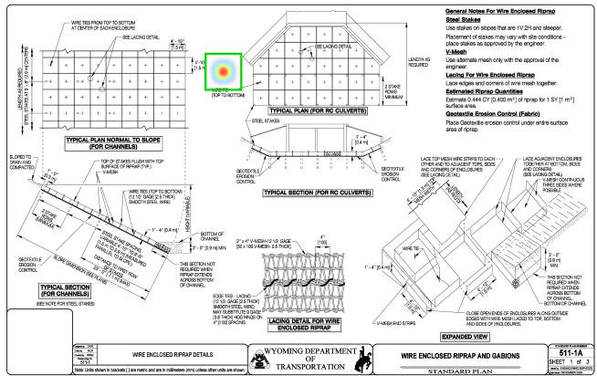  
(a) Step 1: Geotextile placement details

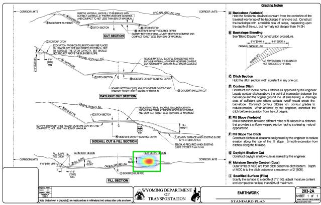  
(b) Step 2: Fill slope requirements  
Figure 6: Visual evidence trail from the agentic compliance pipeline. Each audit step generates a sharpened MaxSim heatmap overlay on the retrieved standard plan page, creating a transparent chain of evidence.

Table 9  
Verdict accuracy of five judge configurations on the �=10 single-doc CAD set; the final block reports the best single-judge configuration on �=4 dense schedule-table drawings. Interpretation is in the text below.
<table><tr><td>Judge Configuration</td><td>Compliant</td><td>Non-compliant</td><td>Overall</td></tr><tr><td>Qwen2.5-VL-7B (plain)</td><td>5/5</td><td>1/5</td><td>60%</td></tr><tr><td>Qwen2.5-VL-7B (CoT)</td><td>0/5</td><td>5/5</td><td>50%</td></tr><tr><td>Qwen2.5-VL-72B (plain)</td><td>5/5</td><td>3/5</td><td>80%</td></tr><tr><td>Qwen2.5-VL-72B (CoT + thresholds)</td><td>5/5</td><td>5/5</td><td>100%</td></tr><tr><td>Multi-agent (Plan-Audit-Synth, 72B + thresholds)</td><td>5/5</td><td>5/5</td><td>100%</td></tr><tr><td>Dense multi-view drawings (n=4, best configuration): Qwen2.5-VL-72B (CoT + thresholds)</td><td>2/2</td><td>2/2</td><td>100%</td></tr></table>

100%—the other three sit at 50–80%, with diagnosable failure modes that motivate the prompting recipe used at scale. The five-configuration ablation is the headline result; the scale-up numbers (Tables 10, 11) are evidence that the recipe generalizes, not that compliance verification is generically a solved problem.

Five judge configurations. We evaluate the verdict accuracy of five judge configurations on the �=10 single-doc CAD set: (a) Qwen2.5-VL-7B with a plain JSON verdict prompt, (b) Qwen2.5-VL-7B with chain-of-thought (CoT) reasoning, (c) Qwen2.5- VL-72B (4-bit NF4) with the same plain prompt, (d) Qwen2.5-VL-72B with CoT plus per-drawing preresolved rule thresholds injected into the prompt (e.g., for a 30” beam, $s _ { \mathrm { m a x } } { = } d / 2 { = } 1 5 ^ { \circ } )$ , and (e) the same 72B-CoT-thresholds judge wrapped inside the multiagent Planner–Auditor–Synthesizer pipeline. The same configurations are evaluated on the �=4 dense multiview drawings, where the violation is embedded in one row of a schedule table.

Failure-mode analysis: The 7B-class judge fails in two distinct directions depending on the prompt. Without CoT, it defaults to COMPLIANT on all inputs (high specificity, near-zero sensitivity). With CoT, it flips to flag everything as NON\_COMPLIANT; inspecting the chain reveals that the 7B model selects visually salient but irrelevant values and applies them to incorrect rule checks (e.g., it compares a $4 ^ { \prime \prime }$ anchorbolt embedment value against a $3 0 ^ { \prime \prime }$ guardrail-footingdepth rule). The 72B-class judge eliminates the random matching, but plain prompting still misses two noncompliant cases: rebar\_bad, where the rule’s threshold is arithmetic-derived $\scriptstyle ( s _ { \mathrm { m a x } } = d / 2$ for a 30” beam), and signpost\_bad, where the violated value (a $4 ^ { \prime \prime }$ anchor embed) is visually less salient than a satisfied 42” footing depth on the same drawing. Both failure modes are eliminated when the prompt supplies the preresolved threshold (15” instead of $d / 2 )$ and explicitly enumerates which value must be checked.

Multi-agent variant: The Planner–Retriever–Auditor– Synthesizer pipeline reaches 100% in Table 9 by routing the same 72B + thresholds judge through three lighter agent turns rather than a single CoT pass. The Planner emits 1–2 audit steps per drawing, and the Synthesizer produces a structured JSON verdict for downstream parsing. The Auditor sees only the design image (not the retrieved standard image) to avoid out-of-memory pressure when running 4-bit 72B on 2× A30 (48 GB total); the retrieved standard’s metadata is supplied as

text context. This single-image variant is recommended for deployment on GPUs with under 80 GB of memory. On a single NVIDIA A100 80GB (or RTX A6000) GPU, the multi-agent pipeline executing an average of 8.6 sequential VLM steps takes ≈ 60.9 s per query (an average of ≈ 7.1 s per step), yielding a throughput of approximately 59 audits per hour. The planner produces more steps than necessary, averaging 8.6 steps compared with the minimum of 2, representing a latency-vs-accuracy trade-of: it ensures comprehensive visual auditing across all standard plan components at the expense of sequential VLM passes. That both the single-judge and multi-agent routes reach 100% with the same threshold-injection prompt isolates the recipe as the cause—it is not an artifact of the agentic decomposition.

Multi-plan compliance $( N { \in } \{ 2 , 3 , 4 , 5 \} )$ : A �=10 pilot of multi-plan compliance drawings was constructed with $N { \in } \{ 2 , 3 , 4 , 5 \}$ separate standard plans applicable per design (4 drawings at �=2, 2 each at $N { = } 3 , 4 , 5 ;$ 5 compliant + 5 non-compliant). Crucially, no plan IDs are cited on the drawing; the Planner must infer applicable standards from the visual content of each labeled component. The agentic pipeline (Qwen2.5-VL-72B 4-bit backbone) achieves $\mathbf { 9 / 1 0 } \ =$ 90% verdict accuracy on this pilot. The single miss is on n5 $\mathtt { p i e r \_ o k }$ , where the rule for column stirrup spacing is the arithmetic-derived $\mathtt { d } / 2$ (max spacing equals half the efective beam depth), and the prompt initially presented $\mathtt { d } / 2$ as the textual threshold rather than the pre-resolved numeric value—the same arithmeticderived-threshold failure mode characterized for the single-doc path A judge above.

Multi-plan compliance scale-up $\scriptstyle ( n = 1 0 0 )$ : We scale the pilot to �=100 multi-plan drawings (25 per �- level, 48 compliant + 52 non-compliant) with parameter randomization for visual diversity. A first scale-up run with the original textual $\mathtt { d } / 2$ threshold confirms the pilot’s failure mode at scale: $8 8 / 1 0 0 = 8 8 \%$ verdict accuracy, with all 12 misses concentrated in the �=5 pier subset (13/25 at $N { = } 5 ;$ perfect 25/25 at $N { = } 2 , 3 , 4 )$ . All 52 non-compliant subjects across all � are correctly classified (52/52). The 12 missed compliant pier drawings are falsely flagged NON\_COMPLIANT because the auditor’s reasoning at the stirrup-spacing step treats the textual $\mathtt { d } / 2$ as a literal symbolic threshold rather than resolving it. Replacing the registry threshold with the per-drawing pre-resolved numeric value ${ ( s \mathrm { { m a x } } \mathrm { { = } } 1 2 ^ { \prime \prime } }$ for the standardized $2 4 ^ { \dprime }$ column) transfers the path A fix to the multi-plan pipeline and yields 100/100 $= \mathbf { 1 0 0 \% }$ verdict accuracy (48/48 compliant + $5 2 / 5 2$ non-compliant, 25/25 at every $N { \in } \{ 2 , 3 , 4 , 5 \} )$ confirming that the verdict accuracy is invariant to � once arithmetic-derived thresholds are pre-resolved.

Multi-plan compliance verdict accuracy on the $n { = } 1 0 0$ scale set, before and after replacing the textual d/2 threshold in the rules registry with a per-drawing pre-resolved numeric value.
<table><tr><td>N plans</td><td>Before d/2 fix</td><td>After d/2 fix</td></tr><tr><td> $N { = } 2$ </td><td>25/25</td><td>25/25</td></tr><tr><td> $N { = } 3$ </td><td>25/25</td><td>25/25</td></tr><tr><td>N=4</td><td>25/25</td><td>25/25</td></tr><tr><td> $N { = } 5$ </td><td>13/25</td><td>25/25</td></tr><tr><td>Total</td><td>88/100 (88%)</td><td>100/100 (100%)</td></tr></table>

Single-doc compliance scale-up $( n { = } 5 0 0 )$ : The single-doc path A recipe (Qwen2.5-VL-72B 4-bit + CoT + per-drawing pre-resolved thresholds) scales to a 500-drawing test set (5 archetypes × 100 instances each, 250 compliant + 250 non-compliant). Each noncompliant instance violates exactly one rule sampled from seven violation families (concrete cover, footing depth, stirrup spacing, anchor bolt embedment, drainage grate opening, rebar grade, material class). Parameter randomization yields visually distinct instances for each archetype (span, rise, wall thickness, post height, etc.). The pipeline achieves 500/500 $= \ 1 0 0 \%$ verdict accuracy (250/250 compliant + $2 5 0 / 2 5 0$ non-compliant) without per-archetype tuning or additional supervision.

Adversarial near-threshold stress test $( n { = } 5 0 ) .$ A perfect score on scale500 is suggestive but does not establish discriminative tightness: scale500’s noncompliant values miss the rule by 50%+ (e.g., cover of $1 . 0 ^ { \prime \prime }$ against a $\cdot 2 . 0 ^ { \prime \prime }$ minimum). We therefore add a stress set in which violations sit within 5–10% of the rule cutof and require the judge to read the dimensioned value precisely. The set is 50 drawings (5 archetypes × 10, 25 compliant + 25 non-compliant): culverts with cover $1 . 8 7 5 ^ { \prime \prime } ~ \mathrm { v s . ~ 2 . 0 ^ { \prime \prime } }$ min, guardrails with footing $2 9 ^ { \prime \prime }$ vs. $3 0 ^ { \prime \prime }$ min, rebar with stirrup spacing exactly $d / 2 { + } 1 ^ { \prime \prime }$ over the limit, inlets with grate openings $4 . 1 2 \dot { 5 } ^ { \prime \prime }$ vs. $4 . 0 ^ { \prime \prime }$ max, and signposts with anchor embed $1 1 . 5 ^ { \prime \prime }$ vs. $1 2 . 0 ^ { \prime \prime }$ min. The same Qwen2.5-VL-72B + CoT + perdrawing thresholds recipe reaches $\mathbf { 5 0 } / \mathbf { 5 0 } ~ = ~ \mathbf { 1 0 0 } \%$ verdict accuracy $( 2 5 / 2 5 $ compliant $+ ~ 2 5 / 2 5$ noncompliant, with no archetype falling below $1 0 / 1 0 )$ . This confirms that the recipe discriminates at single-inch resolution—the regime where prompt-level mistakes would manifest—and that the scale500 perfection is not an artifact of large compliance margins.

Is the synthetic verdict task simply OCR? A non-VLM baseline: A perfect VLM score raises the question of how much of the task is genuine visual reasoning versus reading a printed dimension. We therefore evaluate a non-VLM OCR+thresholdcompare baseline on scale500: for each drawing we OCR the page (multi-orientation tesseract), extract the governing dimension by its label, and compare it to the same pre-resolved threshold the VLM receives. This pipeline reaches 76.4% verdict accuracy, but the per-archetype breakdown is the informative part: it scores 100% where the governing value is a clean horizontal leader-line label (culvert cover, inlet grate opening) and collapses to ≈50% where the dimension is rendered as rotated vertical text (guardrail footing depth, sign-post anchor embedment) or sits among distractor values (rebar stirrup spacing). The synthetic task is therefore OCR-trivial wherever the value is cleanly presented; the VLM’s marginal contribution is robust value localization on rotated and distractordense layouts—precisely the dense multi-view regime real plan sheets present—rather than digit reading per se. This bounds the compliance claim honestly: the 100% of Table 11 is a ceiling given a resolved rule and a localizable value, and the agentic reader earns its keep on layout robustness, not arithmetic (Table 12).

Table 11  
Verdict accuracy of the best judge recipe (Qwen2.5-VL-72B 4-bit + CoT + per-drawing pre-resolved thresholds) across six CAD-generated compliance test sets (674 drawings spanning small pilots, large-scale runs, dense multi-view schedules, multi-plan cross-document designs, and an adversarial near-threshold stress test).
<table><tr><td>Set</td><td>Compliant</td><td>Non-compliant</td><td>Overall</td></tr><tr><td>n=10 single-doc (pilot)</td><td>5/5</td><td>5/5</td><td>100%</td></tr><tr><td>n=4 dense multi-view (pilot)</td><td>2/2</td><td>2/2</td><td>100%</td></tr><tr><td>n=10 multi-plan (pilot)</td><td>4/5</td><td>5/5</td><td>90%</td></tr><tr><td>n=500 single-doc (scale)</td><td>250/250</td><td>250/250</td><td>100%</td></tr><tr><td>n=100 multi-plan (scale, after d/2 fix)</td><td>48/48</td><td>52/52</td><td>100%</td></tr><tr><td>n=50 adversarial near-threshold (stress)</td><td>25/25</td><td>25/25</td><td>100%</td></tr><tr><td>Total across 6 sets</td><td>334/335</td><td>339/339</td><td>673/674 (99.85%)</td></tr></table>

Table 12  
Non-VLM OCR+threshold-compare baseline on scale500, per archetype.
<table><tr><td>Archetype</td><td>Gov. dim. (layout)</td><td>OCR found</td><td>OCR acc</td><td>VLM acc</td></tr><tr><td>Culvert</td><td>cover, horiz.</td><td>100.0</td><td>100.0</td><td>100.0</td></tr><tr><td>Inlet</td><td>grate, horiz.</td><td>98.0</td><td>99.0</td><td>100.0</td></tr><tr><td>Guardrail</td><td>footing, rotated</td><td>32.0</td><td>82.0</td><td>100.0</td></tr><tr><td>Sign post</td><td>anchor, rotated</td><td>3.0</td><td>51.0</td><td>100.0</td></tr><tr><td>Rebar</td><td>stirrup, distractor</td><td>0.0</td><td>50.0</td><td>100.0</td></tr><tr><td>Overall</td><td></td><td>46.6</td><td>76.4</td><td>100.0</td></tr></table>

## 5.8. Autonomous Rule-Grounding:

## Retrieving the Governing Threshold

The 100% verdict accuracy in Section 5.7 is obtained when the auditor is handed the pre-resolved numeric threshold. This is the standard assumption in LLM-based compliance work, which presupposes a digitized rule base or a human-curated registry, and it leaves the hardest part of real compliance—knowing which rule governs a component and what its numeric limit is—outside the system. We therefore test whether the framework can close this loop visually: infer the component, retrieve the governing requirement from a standard-specifications corpus, extract the numeric threshold from the retrieved sheet, and audit against it, with no injected threshold.

Setup: We render a 15-sheet Standard-Specifications reference corpus (5 agencies × 3 sections: Structural Concrete & Reinforcement, Foundations & Anchorage, Drainage Structures), each sheet being a requirement table of 7–9 rows in which the seven governing limits for our archetypes (e.g., min. cover $2 . 0 ^ { \prime \prime }$ , min. guardrail footing $3 0 ^ { \prime \prime } .$ max. grate opening $4 . 0 ^ { \prime \prime }$ , min. anchor embedment $1 2 ^ { \prime \prime }$ , max. stirrup spacing $d / 2 )$ are embedded among distractor rows. For each of the 500 singledoc compliance drawings, the agent (i) forms a ruleretrieval query from the visually-inferred component, (ii) retrieves using ColNomic-3B, (iii) a VLM extracts the limit value from the top-ranked sheet, (iv) resolves symbolic limits (stirrup $d / 2 )$ using a dimension read from the design, and (v) audits the design value against the self-grounded threshold. To make retrieval realistic, we index the spec sheets among the full 1,898-page plan corpus (1,913 candidates), so the rule query must surface the governing requirement against real plansheet distractors.

Result: ColNomic retrieves a correct-section specification sheet at 80.0% Recall@1 and 100.0% Recall@5 among 1,913 candidates, the VLM extracts the correct numeric limit (including resolving symbolic $d / 2 )$ at 100%, and the end-to-end verdict accuracy with self-grounded thresholds reaches 100%—matching the injected-threshold ceiling (Table 13). The 20% top-1 misses are real plan pages that outrank the spec sheet at rank 1, but a correct-section spec is always within the top 5, so verdicts are unafected. Removing the human-supplied threshold therefore costs nothing on this set: the system sources the governing rule on its own. This is, to our knowledge, the first demonstration of visual rule-grounding for compliance—retrieving and applying a numeric standard from rasterized specification sheets (see Appendix H, Figure A.3) without OCR, a BIM model, or a hand-coded rule base.

Autonomous rule-grounding on the 500 single-doc compliance drawings: the agent retrieves the governing specification sheet, extracts its numeric limit, and audits the design against the self-grounded threshold (no injected rule).
<table><tr><td>Retrieval pool</td><td>Cand.</td><td>R@1</td><td>R@5</td><td>Extract</td><td>Verdict</td></tr><tr><td>Spec only</td><td>15</td><td>100.0</td><td>100.0</td><td>100.0</td><td>100.0</td></tr><tr><td>+1,898 plan pages</td><td>1,913</td><td>80.0</td><td>100.0</td><td>100.0</td><td>100.0</td></tr><tr><td colspan="4">Injected-threshold ref. (human rule)</td><td></td><td>100.0</td></tr></table>

Scope: The spec corpus here is clean and modest; the contribution is the closed-loop feasibility of visual rule-grounding, not a complete code-coverage system. Scaling the reference corpus to full agency specification books (hundreds of pages of dense, real code text) is the decisive stress test; we take exactly this step in Section 5.9, indexing a real 931-page WYDOT standard corpus, where autonomous extraction falls from 100% to 33% and the residual error concentrates in retrieving the governing sentence and resolving exhibit tables.

## 5.9. External Validity: Real WYDOT Project Plans

The benchmarks above use generated drawings with controlled ground truth. To test whether the framework transfers to real submittals, we evaluate it on two production WYDOT projects—the Chief Joseph Highway reconstruction (#1507040) and project #N345107— comprising cross-section, earthwork, and PS&E quantity sheets. Crucially, the project plans are not added to the retrieval index: they are the proposed design being audited, while the Retriever continues to query the unchanged 1,898-page standard-plan index. Each project PDF is simply rasterized to page images; no re-indexing is required.

Retrieval transfers: For 12 real design items read from the two projects (cross slope, fill/cut slope ratios, CMP/RCP/RCP-arch/structural-plate culverts, geotextile, geogrid, fence), a VLM relevance judge confirms that ColNomic retrieves a topically-governing WYDOT standard within the top 5 for 83.3% of items (10/12). The two misses are niche items (a proprietary fence type and biaxial geogrid) without a dedicated standard sheet in the index. Retrieval thus generalizes from synthetic queries to real design language.

Auditing transfers under the same recipe: On a controlled compliant/non-compliant set built by overlaying proposed-design value callouts onto the real cross-section sheets, we evaluated 6 compliant and 6 violating examples across both projects. Using the same judge recipe that reaches 100% on the synthetic set— Qwen2.5-VL-72B with CoT and the governing rule supplied—the model reads the proposed value of the real sheet and reaches 100% verdict accuracy, correctly judging even the rotated slope-ratio callouts. The auditor’s read-and-judge capability, therefore, carries over from generated to real plan imagery, as the final verdict is entirely the model’s own decision rather than a hard-coded comparison.

Autonomous rule-grounding on a real 931- page standard corpus: We measured how efectively the autonomous loop transfers from curated specification sheets to production standards. To do this, we ingested a real 931-page standard corpus. This included the full WYDOT 2021 Standard Specifications for Road and Bridge Construction (771 pp) alongside the governing WYDOT Road Design Manual chapters (Cross Sectional Elements, Earthwork Design, Culvert Design, and Typical Sections; 160 pp). We indexed this document using ColNomic-3B. Next, we processed 12 real design items. For each item, we retrieved the governing page and extracted the numeric limit using Qwen2.5-VL-72B. We then audited the design value against this self-grounded threshold without injecting any rules. Nine of these items contained numeric limits. The system extracted the correct governing value for 3 out of 9 (33%). It returned the correct verdict for 44% of those items. The system succeeded when the limit was stated as a clear value. For example, it correctly read a cross slope of $\cdots 0 . 0 2 \ : \mathrm { f t } / \mathrm { f t } ^ { \mathfrak { N } } \left( = 2 \% \right)$ and a foreslope of $\mathrm { ^ { * }1 V { : } 4 H ^ { 3 } \Sigma ( = \ 4 { : } 1 ) }$ . However, it failed when limits were located in exhibit lookup tables or split across multiple pages (e.g., culvert minimum size and cover). In these cases, the visual retriever ranked the governing sentences below other visually similar tables. As a result, the necessary information was never surfaced. Therefore, the primary failure point is retrieving the governing sentence and resolving exhibit tables. The issue is not threshold arithmetic. Autonomous rule extraction thus dropped from 100% on the clean specification corpus (Section 5.8) to 33% on real production standards. We report this as the principal open problem exposed by this external-validity test. Resolving this will be the priority for future work (Section 11). Consequently, real-plan auditing still benefits from a supplied threshold to ensure reliability.

## 5.10. Cross-Agency Generalization and Scaling

The 4,056-pair benchmark inherently evaluates cross-agency scaling: retrieval stays high and balanced across all five agencies (89–93% Recall@5; Section 5.2), so the late-interaction embeddings retain discrimina tive power despite diverse drafting conventions.

Zero-shot transfer to an unseen agency: Zero-shot ColNomic-3B retrieves a held-out Michigan

Synthetic vs. real-plan compliance. The framework transfers from generated drawings to two production WYDOT projects for retrieval and supplied-threshold auditing; autonomous threshold extraction from dense real standards is the remaining gap.
<table><tr><td>Capability</td><td>Synthetic</td><td>Real plans</td></tr><tr><td>Standard retrieval (rel.©5)</td><td></td><td>83.3%</td></tr><tr><td>Verdict acc. (supplied rule)</td><td>100%</td><td>100%</td></tr><tr><td>Threshold extraction (auto.)</td><td>100%</td><td>unreliable</td></tr></table>

DOT corpus (298 pages, 93 verified pairs) at 91.40% Recall@5 over the combined 1, 898+298-page index— essentially matching in-distribution performance (overall 91.47%) on an agency never seen during indexing, drafting, or training (the 298-page Michigan-only pool yields a higher 93.55%, but that smaller candidate set is not directly comparable to the joint-index agency numbers; Appendix D). This demonstrates strong zeroshot generalization to unseen drafting conventions, enabling immediate deployment for new agencies without adaptation.

H3 verdict: H3 is rejected. Across three LoRA configurations, domain adaptation on the 3,211-pair indomain training set does not improve Recall@5 on the 5-DOT test split and significantly degrades unseenagency transfer (Table 15). Full-LM LoRA catastrophically reduces retrieval performance (e.g., in-distribution test drops by 37.03 pp). The of-the-shelf ColNomic-3B checkpoint therefore remains the optimal deployment configuration, as its pretrained representations are already robust for engineering drawings.

## 5.11. Domain-Adaptive Retrieval: LoRA Fine-Tuning of the Adopted Retriever

To test domain adaptation, we fine-tuned ColNomic-3B using LoRA on a page-disjoint 3,211-pair training split. Configurations included head-only LoRA (tuning only the projection head) and full-LM LoRA (tuning all transformer layer projections).

As shown in Table 15, no configuration outperformed the zero-shot baseline. The head-LoRA variants yielded negligible diferences (< 0.5 pp changes), while full-LM LoRA severely degraded both in-distribution retrieval (92.69% → 55.66%) and zero-shot Michigan transfer $( 9 3 . 5 5 \% \to \ 7 5 . 2 7 \% )$ . This highlights that ColNomic-3B, strongly pretrained on diverse documents, already occupies a robust optimum for visual engineering drawings. The small in-domain corpus is insuficient to refine these embeddings under standard contrastive loss without overwriting their generalizable structure. Consequently, the of-the-shelf zero-shot model remains the superior deployment choice.

The head-LoRA configurations restrict trainable parameters to custom\_text\_proj (the multi-vector projection head, ≈332k parameters). Gentle uses lr =

1�−5 for 1 epoch with 10% linear warmup; standard uses lr = 1�−4 for 5 epochs. The full-LM LoRA configuration additionally inserts �=32 LoRA adapters on every transformer layer’s $q / k / v / o + \mathrm { g a t e / u p / d o w n }$ projections (37.2M parameters total for ColNomic-3B; the comparable 39.3M canonical adapter for ColPali), trained for 5 epochs with a unique-image batch sampler that guarantees no positive page appears twice in a batch.

Complementary retrieval enhancements Two further enhancements are available as drop-in additions and are orthogonal to LoRA: (i) a VLM cross-encoder re-rank, where the Top-� retrieved candidates are each passed to a VLM with a binary “does this plan answer the query?” prompt—this sharpens Recall@1 on visually-similar sheet pairs at a latency cost; and (ii) hybrid BM25 fusion, combining dense MaxSim scores with a sparse BM25 score over plan-ID/sheettitle metadata for queries that target alphanumeric identifiers. Pointwise VLM re-ranking (MonoQwen2- VL-v0.1, 2B parameters) over the Top-20 retrieved candidates adds ≈ 5.91 s of latency per query (averaging ≈ 295 ms per pointwise candidate pass) on a single NVIDIA A100 GPU, corresponding to a throughput of approximately 610 queries per hour. Both are reported as secondary options; the of-theshelf, zero-shot retriever (ColNomic-3B) is the primary deployment configuration because it relies on the pretrained embedding space alone without introducing the latency of cross-encoder re-ranking or the metadata dependencies of hybrid search.

## 6. Sample Cases

Figure A.1 (Appendix H) shows a representative success case where the Qwen2.5-VL-7B generator correctly interprets a WYDOT standard plan (judge score = 1.0); Figure A.2 shows a hard-failure case (judge score = 0.0)—a component–dimension binding error on the V-mesh end-strip height—that motivates the failure-mode taxonomy in Section 7.

## 7. Failure Case Analysis

Although overall retrieval accuracy is high, several queries received a judge score of 0.0. Reviewing these zero-score cases reveals five systematic error patterns in the model’s visual–textual reasoning over engineering drawings.

(1) Component–dimension binding: The most common failure was assigning a correctly detected numeric value to the wrong physical entity. The model repeatedly selected $4 ^ { \prime } – 1 0 ^ { \prime \prime }$ [1.5 m]—a real, salient dimension—to answer queries about steel-stake spacing, V-mesh end-strip height, or scarification depth, even though this value actually described enclosure height or panel geometry. Such errors arise when multiple annotations are visually close yet refer to diferent components.

Table 15  
Retrieval Recall@5: zero-shot vs. three LoRA fine-tuning configurations, on the page-disjoint 5-DOT test split (�=424, indistribution) and the held-out Michigan DOT corpus (�=93, zero-shot 6th-agency transfer).
<table><tr><td>Retriever</td><td>Trainable params</td><td>5-DOT test R@5 (%)</td><td>Michigan R@5 (%)</td></tr><tr><td colspan="4">Adopted backbone</td></tr><tr><td>ColNomic-3B (zero-shot)</td><td>0</td><td>92.69</td><td>93.55</td></tr><tr><td>ColNomic-3B + head-LoRA, gentle</td><td>332k (0.009%)</td><td>92.69 (0.00)</td><td>93.55 ( 0.00 )</td></tr><tr><td>ColNomic-3B + head-LoRA, standard</td><td>332k (0.009%)</td><td>93.16 (+0.47)</td><td>92.47 (-1.08)</td></tr><tr><td>ColNomic-3B + full-LM LoRA</td><td>37.2M (0.98%)</td><td>55.66 (-37.03)</td><td>75.27 (-18.28)</td></tr><tr><td colspan="4">Predecessor backbone (companion)</td></tr><tr><td>ColPali (zero-shot)</td><td>0</td><td>76.89</td><td>88.17</td></tr><tr><td>ColPali + head-LoRA, gentle</td><td>332k (0.011%)</td><td>76.65 (-0.24)</td><td>88.17 (0.00 )</td></tr><tr><td>ColPali + head-LoRA, standard</td><td>332k (0.011%)</td><td>77.36 (+0.47)</td><td>88.17 ( 0.00 )</td></tr><tr><td>ColPali + full-LM LoRA</td><td>39.3M (1.33%)</td><td>60.85 (−16.04)</td><td>75.27 (−12.90)</td></tr></table>

(2) Cross-view inference: When the required dimension was not clearly visible in the specified view, the model often inferred a value from another detail (e.g., “it can be inferred from the Typical Section”). This violates the engineering convention that dimensions must be taken from the explicitly referenced view, producing hallucinated precision that yields a hard 0.0 under the rubric.

(3) Semantic misinterpretation: The model conflated terms such as “spacing” vs. “height” and “scarification depth” vs. “fill thickness.” In one case, scarification depth was reported as 4′-0′′ (a fill-geometry dimension) instead of the 6 in [150 mm] specified in grading notes—reflecting a dificulty in distinguishing process parameters from geometric dimensions.

(4) Symbol semantics: The model misassigned meaning to plan-view iconography, e.g., conflating “+” markers (wire-tie centers) with steel-stake symbols. This indicates insuficient symbol-to-legend alignment when symbols are reused across views.

(5) Spatial reasoning. Location-based questions produced plausible but incorrect placements (e.g., contour ditches on the “downslope side of the right-of-way” instead of “above the intersection of the backslope and the original ground line”). The model defaulted to generic civil-engineering heuristics rather than reproducing the plan’s exact note language.

Impact of high-resolution tiling on failure modes: To test H4, we pre-declare a ≥20 pp judgeaccuracy gain as the threshold for tiling to count as a material improvement and compare full-page retrieval at 200 DPI against tile-level retrieval at 400 DPI (1024×1024 crops with 256-pixel overlap) on the 424-pair page-disjoint test split over the full 1,898- page five-DOT visual index, holding the retriever fixed across both granularities (this tiling ablation uses the predecessor ColPali backbone). Table 16 reports the comparison.

## Table 16

Full-page vs. tile-level retrieval on the 424-pair page-disjoint test split over the 1,898-page five-DOT visual index.
<table><tr><td>Granularity</td><td>RO5 (%)</td><td>Tiles/Page</td></tr><tr><td>Full-page (200 DPI)</td><td>76.89</td><td>1</td></tr><tr><td>Tile-level (400 DPI)</td><td>82.08</td><td>≈15</td></tr></table>

## Table 17

Judge accuracy of full-page vs. tile-level retrieval on the 424- pair test split (� = 397 queries whose target page yields ≥15 400 DPI tiles (about half the ≈30-tile typical landscape sheet)—in practice nearly all plan pages, which are uniformly tile-dense).
<table><tr><td>Retrieval granularity</td><td>Judge accuracy (%)</td></tr><tr><td>Full-page (200 DPI)</td><td>64.23 [59.4, 68.8]</td></tr><tr><td>Tile-level (400 DPI)</td><td>68.77 [64.2, 73.3]</td></tr><tr><td>Gain (tile – full)</td><td>+4.53 pp</td></tr></table>

Tile-level Recall@5 (82.08%) exceeds full-page Recall@5 (76.89%) by 5.19 pp, consistent with the hypothesis that high-DPI tiling preserves the fine-grained line work and annotation density that 200 DPI page-level rasterization loses. Focused crops remove competing nearby annotations from the receptive field, largely resolving component–dimension binding errors such as scarification depth. However, crops introduce a new failure mode: loss of cross-reference context when a note and its referenced section fall in diferent tiles. This trade-of between spatial precision and contextual completeness motivates the multi-scale retrieval strategy, where full-page and tile-level embeddings are indexed and retrieved jointly.

H4 verdict: H4 is rejected. On the 424-pair test split, tile-level retrieval lifts judge accuracy from 64.23% (full-page) to 68.77% (tile-level)—a +4.53 pp gain (Table 17)—well below the pre-declared 20 pp threshold; the retrieval-level gain is similar (76.89% → 82.08%

Recall@5, +5.19 pp). The much larger gain reported on a narrow WYDOT-only dense subset does not generalize to the heterogeneous five-DOT test set, where nearly all 400 DPI plan pages are uniformly tiledense—tiling yields a consistent but modest lift rather than a step change.

## 8. Discussion

The proposed Visual-First Multimodal RAG framework represents a meaningful shift from OCR-centric compliance pipelines by preserving layout, geometry, and symbolic relationships. This leads to consistently robust retrieval performance, maintaining over 91% Recall@5 across five DOTs using of-the-shelf patchlevel embeddings. The robustness of these findings is independently supported by a fully hand-curated and manually-verified anchor set.

At the reasoning layer, model scale does not help uniformly: at zero-shot, the 7B answerer is competitive with—and marginally above—the 72B (78.30% vs 76.89%, Table 8). The 72B’s scale advantage in resolving dense engineering details emerges only under structured reasoning, where question decomposition and critic self-correction lift it to 81.60% and 82.31%. Prompting strategies significantly influence end-to-end outcomes; while zero-shot prompting sufices for 7Bclass models, larger 70B-class judges benefit profoundly from critic self-correction, capturing a large margin of otherwise lost accuracy. Notably, the generator performs best on a tight context—the single top-ranked page—rather than an expanded set of retrieved pages, which inject distractors and make retrieval-augmented prompting the weakest technique on both models.

The agentic architecture fundamentally overcomes the limitations of single-pass RAG by decomposing complex cross-plan queries into structured verification steps. This multi-step process, coupled with explicit MaxSim heatmap grounding, provides the transparent, auditable evidence trail necessary for regulatory and safety-critical engineering reviews.

Finally, the framework exhibits exceptional zeroshot cross-state generalization. Pretrained visual encoders like ColNomic-3B natively capture domaininvariant structural patterns, rendering domain-specific LoRA fine-tuning inefective or even harmful on small training corpora. The findings strongly suggest treating pretrained multi-vector retrievers as fixed components and focusing compute budgets on advanced reasoning and prompting strategies.

## 9. Limitations

Several constraints should be considered regarding these results. First, the 4,056-pair benchmark relies on machine-generation and automated verification rather than direct annotation by licensed engineers, although the manually-curated anchor set (Section 4.1) and structured human validation (Appendix B) mitigate major failure modes. Second, the compliance test sets are parameterized CAD generations. While this design isolates VLM discrimination abilities, it does not fully replicate real-world ambiguities such as overlapping callouts or smudged scans; autonomous threshold extraction from dense production standards remains an open challenge—on a real 931-page WYDOT standard corpus it succeeds on only 33% of numeric items (Section 5.9).

Furthermore, systematic reasoning failures such as incorrect component–dimension binding and symbol misalignment occasionally persist even with optimal retrieval. Finally, the system’s reliance on high-resolution visuals makes it sensitive to low-quality scans, and the agentic pipeline’s sequential VLM calls introduce latency that requires further optimization for real-time production use.

## 10. Conclusion

In this paper, we addressed a key limitation of current compliance-checking systems: their reliance on OCR-driven, text-centric pipelines that discard the layout, geometry, and symbolic cues that encode meaning in 2D engineering drawings. To overcome this, we introduced a visual-first multimodal RAG(PlanSightRAG) framework that retrieves and reasons directly over plan imagery, combining ColNomic-3B patch-level retrieval, an agentic compliance pipeline, and sharpened MaxSim grounding to support transparent and auditable review.

On the 4,056-pair five-DOT benchmark, whose 424- pair page-disjoint test split runs against the full 1,898- page joint index, the adopted ColNomic-3B retriever reaches 92.69% Recall@5—55.90 pp above the strongest text retriever (BGE-M3 + OCR) and 69.58 pp above the strongest hybrid baseline (VisionRAG (Pyramid, RRF)). The agentic Planner–Auditor–Synthesizer compliance pipeline, armed with per-drawing pre-resolved rule thresholds, reaches 100% verdict accuracy on a 500-drawing single-doc CAD test set and on a 100- drawing multi-plan set (�∈{2, 3, 4, 5} standards per design), with both the compliant and non-compliant directions perfect. The patch-level representation transfers zero-shot to an unseen sixth agency at 91.40% Recall@5 over the joint index, essentially matching indistribution performance (91.47%). A controlled LoRA ablation of the adopted ColNomic-3B retriever spans three configurations, 332k–37.2M trainable parameters, and an order of magnitude in learning rate. No fine-tuning recipe improves on the zero-shot baseline, and full-LM LoRA catastrophically degrades it. High resolution tiling gives a modest, consistent lift: tilelevel retrieval reaches 82.08% Recall@5 versus 76.89% for full-page (+5.19 pp), and judge accuracy rises from 64.23% to 68.77% (+4.53 pp). Both gains fall well below H4’s pre-declared 20 pp bar. The benchmark’s scale and manual anchor-set validation remove “small-sample” as a threat to validity. The compliance results establish that the bottleneck is no longer retrieval coverage; it is fine-grained visual reading, entity–dimension binding, and, decisively, supplying the judge with pre-resolved rule thresholds.

Together, these findings suggest that visual-first retrieval, multimodal reasoning, agentic verification, and visual grounding are a viable foundation for automated engineering plan review, and point to symbolsubstitution robustness, multi-agency adaptation, and scale-invariant retrieval as the next open problems.

## 11. Future Work

Future research should focus on expanding the index to include historical archives and versioned standards from additional state DOTs to enable yearaware comparisons and change tracking. Additionally, improving perception robustness against low-quality or handwritten legacy scans via image enhancement and multi-resolution indexing is necessary. Extending the visual grounding to provide precise, structured annotations (e.g., dimension-entity links) that can be validated against CAD-derived ground truth will further solidify explainability. Finally, enhancing the agentic compliance framework to autonomously handle crossagency regulatory conflicts, version-aware checks, and variance documentation generation will be critical for large-scale production deployments.

## CRediT authorship contribution statement

Nabaraj Subedi: Conceptualization, Methodology, Software, Writing – Original Draft. Shuvo Dip Datta: Investigation (literature review), Writing Original Draft. Ahmed Abdelaty: Conceptualization, Supervision, Review & Editing. Shivanand Venkanna Sheshappanavar: Supervision, Review & Editing.

## Declaration of Competing Interest

The authors declare that they have no known competing financial interests or personal relationships that could have appeared to influence the work reported in this paper.

## Data Availability

The code and sample datasets used in this study will be made available upon publication. The full set of DOT Standard Plans is publicly available through their respective website.

## Funding

This work was financially supported by the Wyoming Department of Transportation (WYDOT) under the knowledge-management project, grant number RS03225 (Principal Investigator: Ahmed Abdelaty).

## Acknowledgement

The authors would like to acknowledge the various state DOTs for providing the standard plans used as the primary dataset for this research. We also thank the open-source community for the development of ColPali and Qwen 2.5-VL, which served as the foundational models for this work. Computational resources were provided by the Advanced Research Computing Center (ARCC) at the University of Wyoming.

## Declaration of generative AI used in the manuscript preparation process

During the preparation of this work the authors used generative AI tools like Claude to assist with editing, consistency checking, writing and coding. After using this tool, the authors reviewed and edited the content as needed and take full responsibility for the content of the published article.

## References

[1] Cyril Picard, Kristen M. Edwards, Anna C. Doris, Brandon Man, Giorgio Giannone, Md Ferdous Alam, and Faez Ahmed. From concept to manufacturing: evaluating vision-language models for engineering design. Artificial Intelligence Review, 58:288, 2025. doi: 10.1007/ s10462-025-11290-y.

[2] Patrick Lewis, Ethan Perez, Aleksandra Piktus, Fabio Petroni, Vladimir Karpukhin, Naman Goyal, Heinrich Küttler, Mike Lewis, Wen-tau Yih, Tim Rocktäschel, Sebastian Riedel, and Douwe Kiela. Retrieval-augmented generation for knowledge-intensive NLP tasks. In Advances in Neural Information Processing Systems (NeurIPS), volume 33, pages 9459–9474, 2020.

[3] Sebastian Borgeaud, Arthur Mensch, Jordan Hofmann, Trevor Cai, Eliza Rutherford, Katie Millican, George Bm Van Den Driessche, Jean-Baptiste Lespiau, Bogdan Damoc, Aidan Clark, et al. Improving language models by retrieving from trillions of tokens. In Proceedings of the 39th International Conference on Machine Learning, volume 162 of Proceedings of Machine Learning Research, pages 2206– 2240. PMLR, 2022.

[4] Gautier Izacard, Patrick Lewis, Maria Lomeli, Lucas Hosseini, Fabio Petroni, Timo Schick, Jane Dwivedi-Yu, Armand Joulin, Sebastian Riedel, and Edouard Grave. Atlas: Few-shot learning with retrieval augmented language models. Journal of Machine Learning Research, 24(251):1–43, 2023.

[5] Ori Ram, Yoav Levine, Itay Dalmedigos, Dor Muhlgay, Amnon Shashua, Kevin Leyton-Brown, and Yoav Shoham. Incontext retrieval-augmented language models. Transactions of the Association for Computational Linguistics, 11:1316– 1331, 2023. doi: 10.1162/tacl\_a\_00605.

[6] Yiheng Xu, Minghao Li, Lei Cui, Shaohan Huang, Furu Wei, and Ming Zhou. LayoutLM: Pre-training of text and

layout for document image understanding. In Proceedings of the 26th ACM SIGKDD International Conference on Knowledge Discovery & Data Mining, pages 1192–1200, 2020. doi: 10.1145/3394486.3403172.

[7] Manuel Faysse, Hugues Sibille, Tony Wu, Bilel Omrani, Gautier Viaud, Céline Hudelot, and Pierre Colombo. Col-Pali: Eficient document retrieval with vision language models. In International Conference on Learning Representations (ICLR), 2025. doi: 10.48550/arXiv.2407.01449.

[8] Jinze Bai, Shuai Bai, Shusheng Yang, Shijie Wang, Sinan Tan, Peng Wang, Junyang Lin, Chang Zhou, and Jingren Zhou. Qwen-vl: A versatile vision-language model for understanding, localization, text reading, and beyond. arXiv preprint arXiv:2308.12966, 2023. doi: 10.48550/arXiv.2308. 12966. arXiv preprint arXiv:2308.12966.

[9] Gemini Team, Google. Gemini: A family of highly capable multimodal models. arXiv preprint arXiv:2312.11805, 2025. doi: 10.48550/arXiv.2312.11805.

[10] Charles Eastman, Jae-min Lee, Yeon-suk Jeong, and Jinkook Lee. Automatic rule-based checking of building designs. Automation in Construction, 18(8):1011–1033, 2009. doi: 10.1016/j.autcon.2009.07.002.

[11] Wawan Solihin and Charles Eastman. Classification of rules for automated BIM rule checking development. Automation in Construction, 53:69–82, 2015. doi: 10.1016/j.autcon.2015. 03.003.

[12] Pingbo Tang, Daniel Huber, Burcu Akinci, Robert Lipman, and Alan Lytle. Automatic reconstruction of as-built building information models from laser-scanned point clouds: A review of related techniques. Automation in Construction, 19(7):829–843, 2010. doi: 10.1016/j.autcon.2010.06.007.

[13] Yang Xu, Yiheng Xu, Tengchao Lv, Lei Cui, Furu Wei, Guoxin Wang, Yijuan Lu, Dinei Florencio, Cha Zhang, Wanxiang Che, Min Zhang, and Lidong Zhou. LayoutLMv2: Multi-modal pre-training for visually-rich document understanding. In Proceedings of the 59th Annual Meeting of the Association for Computational Linguistics and the 11th International Joint Conference on Natural Language Processing (Volume 1: Long Papers), pages 2579–2591. Association for Computational Linguistics, 2021. doi: 10. 18653/v1/2021.acl-long.201.

[14] Srikar Appalaraju, Bhavan Jasani, Bhargava Urala Kota, Yusheng Xie, and R. Manmatha. DocFormer: End-to-end transformer for document understanding. In Proceedings of the IEEE/CVF International Conference on Computer Vision (ICCV), pages 993–1003, 2021. doi: 10.1109/ ICCV48922.2021.00103.

[15] Chengke Wu, Xiao Li, Yuanjun Guo, Jun Wang, Zengle Ren, Meng Wang, and Zhile Yang. Natural language processing for smart construction: Current status and future directions. Automation in Construction, 134:104059, 2022. doi: 10.1016/j.autcon.2021.104059.

[16] Minesh Mathew, Dimosthenis Karatzas, and C. V. Jawahar. DocVQA: A dataset for VQA on document images. In Proceedings of the IEEE/CVF Winter Conference on Applications of Computer Vision (WACV), pages 2199–2208, 2021. doi: 10.1109/WACV48630.2021.00225.

[17] Josselin Somerville Roberts, Tony Lee, Chi Heem Wong, Michihiro Yasunaga, Yifan Mai, and Percy Liang. Image2Struct: Benchmarking structure extraction for visionlanguage models. In Proceedings of the 38th International Conference on Neural Information Processing Systems (NeurIPS), pages 115058–115097, 2024. doi: 10.48550/ arXiv.2410.22456.

[18] Fangyu Liu, Francesco Piccinno, Syrine Krichene, Chenxi Pang, Kenton Lee, Mandar Joshi, Yasemin Altun, Nigel Collier, and Julian Martin Eisenschlos. MatCha: Enhancing visual language pretraining with math reasoning and chart

derendering. In Proceedings of the 61st Annual Meeting of the Association for Computational Linguistics (Volume 1: Long Papers), pages 12756–12770. Association for Computational Linguistics, 2023. doi: 10.18653/v1/2023.acl-long. 714.

[19] Stanislaw Antol, Aishwarya Agrawal, Jiasen Lu, Margaret Mitchell, Dhruv Batra, C. Lawrence Zitnick, and Devi Parikh. VQA: Visual question answering. In Proceedings of the IEEE International Conference on Computer Vision (ICCV), pages 2425–2433, 2015. doi: 10.1109/ICCV.2015. 279.

[20] Alec Radford, Jong Wook Kim, Chris Hallacy, Aditya Ramesh, Gabriel Goh, Sandhini Agarwal, Girish Sastry, Amanda Askell, Pamela Mishkin, Jack Clark, Gretchen Krueger, and Ilya Sutskever. Learning transferable visual models from natural language supervision. In Proceedings of the 38th International Conference on Machine Learning, volume 139 of Proceedings of Machine Learning Research, pages 8748–8763. PMLR, 2021.

[21] Zhe Chen, Weiyun Wang, Yue Cao, Yangzhou Liu, Zhangwei Gao, Erfei Cui, Jinguo Zhu, Shenglong Ye, Hao Tian, Zhaoyang Liu, Lixin Gu, Xuehui Wang, et al. Expanding performance boundaries of open-source multimodal models with model, data, and test-time scaling. arXiv preprint arXiv:2412.05271, 2024. doi: 10.48550/arXiv.2412.05271.

[22] Weiyun Wang, Zhangwei Gao, Lixin Gu, Hengjun Pu, Long Cui, Xingguang Wei, Zhaoyang Liu, Linglin Jing, Shenglong Ye, Jie Shao, et al. Internvl3.5: Advancing open-source multimodal models in versatility, reasoning, and eficiency. arXiv preprint arXiv:2508.18265, 2025. doi: 10.48550/ arXiv.2508.18265.

[23] Junnan Li, Dongxu Li, Silvio Savarese, and Steven Hoi. BLIP-2: Bootstrapping language-image pre-training with frozen image encoders and large language models. In Proceedings of the 40th International Conference on Machine Learning, volume 202 of Proceedings of Machine Learning Research, pages 19730–19742. PMLR, 2023.

[24] Jean-Baptiste Alayrac, Jef Donahue, Pauline Luc, Antoine Miech, Iain Barr, Yana Hasson, Karel Lenc, Arthur Mensch, Katie Millican, Malcolm Reynolds, et al. Flamingo: a visual language model for few-shot learning. In Advances in Neural Information Processing Systems (NeurIPS), volume 35, pages 23716–23736, 2022.

[25] Haotian Liu, Chunyuan Li, Qingyang Wu, and Yong Jae Lee. Visual instruction tuning. In Advances in Neural Information Processing Systems (NeurIPS), volume 36, pages 34892–34916, 2023. doi: 10.52202/075280-1516.

[26] OpenAI. GPT-4 technical report. arXiv preprint arXiv:2303.08774, 2023. doi: 10.48550/arXiv.2303.08774.

[27] Josh Achiam, Steven Adler, Sandhini Agarwal, Lama Ahmad, Ilge Akkaya, Florencia Leoni Aleman, et al. GPT-4V(ision) system card. arXiv preprint arXiv:2309.17421, 2024. doi: 10.48550/arXiv.2309.17421. OpenAI Technical Report.

[28] Vasil Shteriyanov, Rimma Dzhusupova, Jan Bosch, and Helena Holmström Olsson. Blueprintsymvl: A discriminative benchmark for VLM symbol recognition in engineering blueprints. Results in Engineering, 28:108171, 2025. doi: 10.1016/j.rineng.2025.108171.

[29] Leonhard Kunz, Mario Klostermeier, Kokulan Thanabalan, Tatjana Legler, and Martin Ruskowski. Techmb: Exploring the potential of vision language models for interpreting technical drawings. In DS 140: Proceedings of the 36th Symposium Design for X (DFX2025), pages 179–188. The Design Society, 2025. doi: 10.35199/dfx2025.19.

[30] Nitesh Methani, Pritha Ganguly, Mitesh M. Khapra, and Pratyush Kumar. PlotQA: Reasoning over scientific plots. In Proceedings of the IEEE/CVF Winter Conference on

Applications of Computer Vision (WACV), pages 1527– 1536, 2020. doi: 10.1109/WACV45572.2020.9093523.

[31] Samira Ebrahimi Kahou, Vincent Michalski, Adam Atkinson, Akos Kadar, Adam Trischler, and Yoshua Bengio. FigureQA: An annotated figure dataset for visual reasoning. In International Conference on Learning Representations (ICLR) Workshop, 2018.

[32] Ahmed Masry, Do Xuan Long, Jia Qing Tan, Shafiq Joty, and Enamul Hoque. ChartQA: A benchmark for question answering about charts with visual and logical reasoning. In Findings of the Association for Computational Linguistics: ACL 2022, pages 2263–2279. Association for Computational Linguistics, 2022. doi: 10.18653/v1/2022.findings-acl.177.

[33] Kushal Kafle, Brian Price, Scott Cohen, and Christopher Kanan. DVQA: Understanding data visualizations via question answering. In Proceedings of the IEEE/CVF Conference on Computer Vision and Pattern Recognition (CVPR), pages 5648–5656, 2018. doi: 10.1109/CVPR.2018. 00592.

[34] Tianrui Guan, Fuxiao Liu, Xiyang Wu, Ruiqi Xian, Zongxia Li, Xiaoyu Liu, Xijun Wang, Lichang Chen, Furong Huang, Yaser Yacoob, Dinesh Manocha, and Tianyi Zhou. HallusionBench: An advanced diagnostic suite for entangled language hallucination and visual illusion in large visionlanguage models. In Proceedings of the IEEE/CVF Conference on Computer Vision and Pattern Recognition (CVPR), 2024. doi: 10.48550/arXiv.2310.14566.

[35] Omar Khattab and Matei Zaharia. ColBERT: Eficient and efective passage search via contextualized late interaction over BERT. In Proceedings of the 43rd International ACM SIGIR Conference on Research and Development in Information Retrieval, pages 39–48, 2020. doi: 10.1145/ 3397271.3401075.

[36] Geewook Kim, Teakgyu Hong, Moonbin Yim, JeongYeon Nam, Jinyoung Park, Jinyeong Yim, Wonseok Hwang, Sangdoo Yun, Dongyoon Han, and Seunghyun Park. OCRfree document understanding transformer. In European Conference on Computer Vision (ECCV), pages 498–517, 2022. doi: 10.1007/978-3-031-19815-1\_29.

[37] Wenhu Chen, Hexiang Hu, Xi Chen, Pat Verga, and William W. Cohen. MuRAG: Multimodal retrievalaugmented generator for open question answering over images and text. In Proceedings of the 2022 Conference on Empirical Methods in Natural Language Processing (EMNLP), pages 5558–5570. Association for Computational Linguistics, 2022. doi: 10.18653/v1/2022.emnlp-main.375.

[38] Nomic Team. Nomic embed multimodal: Interleaved text, image, and screenshots for visual document retrieval. https: //nomic.ai/blog/posts/nomic-embed-multimodal, 2025.

[39] Ashish Vaswani, Noam Shazeer, Niki Parmar, Jakob Uszkoreit, Llion Jones, Aidan N. Gomez, Łukasz Kaiser, and Illia Polosukhin. Attention is all you need. In Advances in Neural Information Processing Systems (NeurIPS), volume 30, pages 6000–6010, 2017.

[40] Keshav Santhanam, Omar Khattab, Jon Saad-Falcon, Christopher Potts, and Matei Zaharia. ColBERTv2: Efective and eficient retrieval via lightweight late interaction. In Proceedings of the 2022 Conference of the North American Chapter of the Association for Computational Linguistics (NAACL), pages 3715–3734, 2022. doi: 10.18653/v1/2022. naacl-main.272.

[41] Yash Patel, Giorgos Tolias, and Jiří Matas. Recall@k surrogate loss with large batches and similarity mixup. In 2022 IEEE/CVF Conference on Computer Vision and Pattern Recognition (CVPR), pages 7492–7501, New Orleans, LA, USA, 2022. IEEE. doi: 10.1109/CVPR52688.2022.00735.

[42] Lianmin Zheng, Wei-Lin Chiang, Ying Sheng, Siyuan Zhuang, Zhanghao Wu, Yonghao Zhuang, Zi Lin, Zhuohan

Li, Dacheng Li, Eric P. Xing, Hao Zhang, Joseph E. Gonzalez, and Ion Stoica. Judging LLM-as-a-judge with MT-Bench and chatbot arena. In Advances in Neural Information Processing Systems (NeurIPS) Datasets and Benchmarks Track, volume 36, pages 46595–46623, 2023. doi: 10.48550/arXiv.2306.05685.

[43] Gabriel de Souza P. Moreira, Ronay Ak, Mengyao Xu, Oliver Holworthy, Benedikt Schiferer, Zhiding Yu, Yauhen Babakhin, Radek Osmulski, Jiarui Cai, Ryan Chesler, Bo Liu, and Even Oldridge. Nemotron ColEmbed v2: Topperforming late interaction embedding models for visual document retrieval. In Proceedings of the 1st Late Interaction and Multi-Vector Retrieval Workshop (LIR) at ECIR, 2026. doi: 10.48550/arXiv.2602.03992.

[44] Xueguang Ma, Sheng-Chieh Lin, Minghan Li, Wenhu Chen, and Jimmy Lin. Unifying multimodal retrieval via document screenshot embedding. In Proceedings of the 2024 Conference on Empirical Methods in Natural Language Processing (EMNLP), pages 6492–6505, 2024. doi: 10.18653/v1/2024. emnlp-main.373.

[45] Shi Yu, Chaoyue Tang, Bokai Xu, Junbo Cui, Junhao Ran, Yukun Yan, Zhenghao Liu, Shuo Wang, Xu Han, Zhiyuan Liu, and Maosong Sun. VisRAG: Vision-based retrieval-augmented generation on multi-modality documents. In International Conference on Learning Representations (ICLR), 2025. doi: 10.48550/arXiv.2410.10594.

[46] Jianlyu Chen, Shitao Xiao, Peitian Zhang, Kun Luo, Defu Lian, and Zheng Liu. M3-Embedding: Multilinguality, multi-functionality, multi-granularity text embeddings through self-knowledge distillation. In Findings of the Association for Computational Linguistics: ACL 2024, pages 2318–2335. Association for Computational Linguistics, 2024. doi: 10.18653/v1/2024.findings-acl.137.

[47] Yupan Huang, Tengchao Lv, Lei Cui, Yutong Lu, and Furu Wei. LayoutLMv3: Pre-training for document AI with unified text and image masking. In Proceedings of the 30th ACM International Conference on Multimedia, pages 4083– 4091, 2022. doi: 10.1145/3503161.3548112.

[48] Lukas Blecher, Guillem Cucurull Preixens, Thomas Scialom, and Robert Stojnic. Nougat: Neural optical understanding for academic documents. In International Conference on Learning Representations (ICLR), pages 37646–37663, 2024.

[49] Kenton Lee, Mandar Joshi, Iulia Raluca Turc, Hexiang Hu, Fangyu Liu, Julian Martin Eisenschlos, Urvashi Khandelwal, Peter Shaw, Ming-Wei Chang, and Kristina Toutanova. Pix2Struct: Screenshot parsing as pretraining for visual language understanding. In Proceedings of the 40th International Conference on Machine Learning, volume 202 of Proceedings of Machine Learning Research, pages 18893– 18912. PMLR, 2023.

[50] Zineng Tang, Ziyi Yang, Guoxin Wang, Yuwei Fang, Yang Liu, Chenguang Zhu, Michael Zeng, Cha Zhang, and Mohit Bansal. Unifying vision, text, and layout for universal document processing. In Proceedings of the IEEE/CVF Conference on Computer Vision and Pattern Recognition (CVPR), pages 19254–19264, 2023. doi: 10.1109/ CVPR52729.2023.01845.

## A. Supplementary data

Supplementary material related to this article— including the 4,056-pair five-DOT benchmark, the page-disjoint train/dev/test splits, the held-out Michigan DOT transfer set, the 500 single-doc and 100 multiplan CAD-generated compliance test sets, the 424- pair page-disjoint test split used for the main-body retrieval comparison (Table 4) and the per-category VQA judge evaluation, the LoRA adapter checkpoints (head-gentle, head-standard, full-LM) and the training scripts, the complete set of visual grounding heatmaps, and the specific prompt templates used for each agent will be made available upon acceptance.

## B. Human validation of the generated datasets

Because both the QnA benchmark and the compliance test set are model-generated, we complement the automatic generate-then-verify pipeline with two human-grounded checks: the fully hand-curated anchor set described in Section 4.1, and a large-scale structured web validation of the generated corpus.

Protocol. All 4, 656 generated items—the 4, 056 QnA pairs (full five-DOT benchmark) together with the 500 single-doc and 100 multi-plan compliance drawings— are presented to human reviewers through a lightweight web interface. For each item the reviewer sees the original drawing at full resolution alongside the complete context needed for an independent judgement: for QnA pairs, the model-generated question and answer plus the source agency, plan identifier, sheet title, and reasoning category; for compliance drawings, the encoded design facts, the rule and threshold being checked, the named governing standard (e.g., ACI 318, AASHTO, WYDOT 606.05, PROWAG/ADA), the model’s compliant/non-compliant verdict, and the most relevant standard-plan page(s) retrieved by Col-Pali for that check. Each reviewer records one of three verdicts—correct, incorrect, or unsure— with optional free-text notes. The study runs in agreement mode: every item is shown to every reviewer independently, so items reviewed by two or more people yield an inter-annotator agreement signal, and disagreements localize the pairs most worth reexamining. Per-reviewer verdicts are logged separately and aggregated post hoc.

Status. This larger-scale validation over all 4, 656 generated items is ongoing: per-type confirmation rates, inter-annotator agreement on doubly-reviewed items, and flagged-item counts will be released together with the code and data. In the interim, the hand-curated 78-pair anchor set provides a fully human-grounded check, and the automatically generated-then-verified pipeline (an independent Qwen-VL-7B verifier that rejects roughly half of all drafted questions) guards label quality at scale; pending completion, we scope the benchmark’s label-quality guarantee to the verified anchor set plus this automated two-stage filter.

## C. Bootstrap CIs on the 424-pair test split

This appendix reports bootstrap confidence intervals on the full 424-pair page-disjoint test split over the 1,898-page five-DOT visual index (no subset). Table A.1 gives per-category Recall@5 (generatorindependent, clean zero-shot ColPali) and per-generator Judge Accuracy for the open generators (Qwen2.5- VL-7B, Qwen2.5-VL-72B, InternVL-2.5-8B), the latter scored by a local Qwen2.5-VL-72B judge; Table A.2 gives per-baseline, per-agency Recall@5. All CIs are percentile bootstrap with 10,000 resamples (seed 42).

## D. Additional retrieval and judge analyses

Rank-sensitive retrieval metrics. Table A.3 reports Recall@1, Recall@5, MRR, and nDCG@10 for the adopted ColNomic-3B retriever on the 424-pair pagedisjoint test split over the 1,898-page index. The ≈26- pp gap between Recall@5 (92.45%) and Recall@1 (66.75%) is material for the single-pass auditor, which consumes the rank-1 page; it motivates the optional cross-encoder re-ranker for rank-1-sensitive deployments.

Michigan transfer over the joint index. To remove the candidate-pool-size confound, we re-evaluate Michigan retrieval over the combined 1, 898+298-page index rather than the 298-page Michigan-only pool (Table A.4). Over the joint index Michigan transfers at 91.40% Recall@5—essentially matching the indistribution benchmark (91.47%)—rather than the 93.55% obtained on the smaller, easier Michigan-only pool. We therefore report the joint-index figure as the comparable transfer number and do not claim Michigan exceeds in-distribution agencies.

Cross-family judge agreement. Because Qwen2.5-VL serves as drafter, verifier, answerer, and judge, we test for same-family self-preference by re-judging the 424 Qwen2.5-VL-7B zero-shot answers with a non-Qwen judge (InternVL2.5-8B) on identical inputs (gold page, question, reference, model answer). The two judges agree on 92.92% of items with Cohen’s � = 0.75 (substantial); the same-family Qwen judge is in fact stricter (79.95% vs the cross-family 85.61%), the opposite of a self-preference bias. Judge verdicts are therefore not an artifact of evaluator–generator family overlap.

Table A.2  
Table A.1  
Per-category Recall@5 (Hit) and Judge Accuracy (Judge) on the full 424-pair page-disjoint test split over the 1,898-page five-DOT index, with 95% bootstrap CIs (10,000 resamples, seed 42). Recall@5 is a clean zero-shot ColPali and is generatorindependent. Judge Accuracy is scored by a local Qwen2.5-VL-72B judge (no proprietary API). Per-category �: Dim=112, Vis=145, Log=120, Hal=47. Logical-Reasoning Recall@5 is markedly lower here (52.50%) than in Table 7 (87.64%) because this table uses the predecessor ColPali backbone, whose fixed 448×448 encoder is weakest on note/table-dense logical queries; the adopted ColNomic-3B closes this gap.
<table><tr><td rowspan=1 colspan=5>Model                                Category                              Hit (%)                              Judge (%)</td></tr><tr><td rowspan=5 colspan=3>Dimensional                      86.61 [80.4, 92.9]Visual                            86.21 [80.0, 91.7]Qwen2.5-VL-72B                    Logical                           52.50 [43.3, 61.7]Hallucination                    87.23 [76.6, 95.7]Overall                          76.89 [72.9, 80.9</td><td rowspan=1 colspan=1>62.16 [5</td><td rowspan=1 colspan=1>3.2, 71.2]</td></tr><tr><td rowspan=1 colspan=1>80.0, 91.7</td><td rowspan=1 colspan=1>78.47 [</td><td rowspan=1 colspan=1>71.5, 84.7]</td></tr><tr><td rowspan=1 colspan=1>43.3, 61.7</td><td rowspan=1 colspan=1>69.17 [6</td><td rowspan=1 colspan=1>0.8, 77.5]</td></tr><tr><td rowspan=1 colspan=1>76.6, 95.7</td><td rowspan=1 colspan=1>70.21 [5</td><td rowspan=1 colspan=1>7.4, 83.0]</td></tr><tr><td rowspan=1 colspan=1>]                    70.62 [6</td><td rowspan=1 colspan=1>6.1, 74.9]</td></tr><tr><td rowspan=5 colspan=3>Dimensional                      86.61 [80.4, 92.9]Visual                            86.21 [80.0, 91.7]Qwen2.5-VL-7B                     Logical                           52.50 [43.3, 61.7]Hallucination                     87.23 [76.6, 95.7]Overall                          76.89 [72.9, 80.9]</td><td rowspan=1 colspan=1>60.36 [5</td><td rowspan=1 colspan=1>1.4, 69.4]</td></tr><tr><td rowspan=1 colspan=1>[80.0, 91.7</td><td rowspan=1 colspan=1>68.06 [</td><td rowspan=1 colspan=1>60.4, 75.7]</td></tr><tr><td rowspan=1 colspan=1>[43.3, 61.7]</td><td rowspan=1 colspan=1>59.17 [5</td><td rowspan=1 colspan=1>0.0, 68.3]</td></tr><tr><td rowspan=1 colspan=1>[76.6, 95.7]</td><td rowspan=1 colspan=1>57.45 [4</td><td rowspan=1 colspan=1>2.6, 70.2]</td></tr><tr><td rowspan=1 colspan=1>62.32 [</td><td rowspan=1 colspan=1>57.6, 66.8]</td></tr><tr><td rowspan=5 colspan=3>Dimensional                      86.61 [80.4, 92.9]Visual                            86.21 [80.0, 91.7]InternVL-2.5-8B                     Logical                           52.50 [43.3, 61.7]Hallucination                     87.23 [76.6, 95.7]Overall                          76.89 [72.9, 80.9]</td><td rowspan=1 colspan=1>43.75 [3</td><td rowspan=1 colspan=1>4.8, 52.7]</td></tr><tr><td rowspan=1 colspan=1></td><td rowspan=1 colspan=1>80.0, 91.7]</td><td rowspan=1 colspan=1>60.00 [</td><td rowspan=1 colspan=1>51.7, 68.3]</td></tr><tr><td rowspan=1 colspan=1>[43.3, 61.7]</td><td rowspan=1 colspan=1>48.33 [3</td><td rowspan=1 colspan=1>9.2, 57.5]</td></tr><tr><td rowspan=1 colspan=1>76.6, 95.7]</td><td rowspan=1 colspan=1>31.91 [</td><td rowspan=1 colspan=1>19.1, 44.7]</td></tr><tr><td rowspan=1 colspan=1>49.29 [</td><td rowspan=1 colspan=1>44.6, 54.0]</td></tr></table>

Per-baseline Recall@5 with 95% bootstrap CIs on the 424-pair page-disjoint test split (10,000 resamples, seed 42). Per-agency �: WYDOT = 53, Caltrans = 134, AZDOT = 46, CDOT = 31, FDOT = 160.
<table><tr><td>Method</td><td>Overall (%)</td><td>WYDOT</td><td>Caltrans</td><td></td><td>AZDOT</td><td></td><td>CDOT</td><td>FDOT</td></tr><tr><td>ColQwen2.5-v0.2</td><td>87.26 [84.0, 90.3]</td><td>92.5 [84.9, 98.1]</td><td>87.3 [81.3, 92.5]</td><td></td><td>82.6 [71.7, 93.5]</td><td></td><td>87.1 [74.2, 96.8]</td><td>86.9 [81.2, 91.9]</td></tr><tr><td>DSE-Qwen2-2B</td><td>22.17 [18.2, 26.2]</td><td>30.2 [18.9, 43.4]</td><td>20.1</td><td>[13.4, 26.9]</td><td>26.1 [13.0, 39.1]</td><td></td><td>25.8 [9.7, 41.9]</td><td>19.4 [13.1, 25.6]</td></tr><tr><td>VisRAG-Ret</td><td>53.77 [49.1, 58.5]</td><td>58.5 [45.3, 71.7]</td><td>46.3</td><td>[38.1, 54.5]</td><td>67.4 [54.3, 80.4]</td><td></td><td>48.4 [32.3, 64.5]</td><td>55.6 [47.5, 63.1]</td></tr><tr><td>BGE-M3 + OCR</td><td>36.79 [32.3, 41.5]</td><td>45.3 [32.1, 58.5]</td><td>26.1 [18.7, 33.6]</td><td></td><td>45.7 [32.6, 60.9]</td><td>41.9</td><td>[25.8, 58.1]</td><td>39.4 [31.9, 46.9]</td></tr><tr><td>CLIP ViT-B/32</td><td>1.89 [0.7, 3.3]</td><td>0.0 [0.0, 0.0]</td><td>0.0 [0.0, 0.0]</td><td></td><td>8.7 [2.2, 17.4]</td><td>0.0</td><td>[0.0, 0.0]</td><td>2.5 [0.6, 5.0]</td></tr><tr><td>LayoutLMv3</td><td>0.00 [0.0, 0.0]</td><td>0.0 [0.0, 0.0]</td><td>0.0 [0.0, 0.0]</td><td></td><td>0.0 [0.0, 0.0]</td><td></td><td>0.0 [0.0, 0.0]</td><td>0.0 [0.0, 0.0]</td></tr><tr><td>Nougat-decode + MiniLM</td><td>0.47 [0.0, 1.2]</td><td>1.9 [0.0, 5.7]</td><td>0.0 [0.0, 0.0]</td><td></td><td>0.0 [0.0, 0.0]</td><td>0.0</td><td>[0.0, 0.0]</td><td>0.6 [0.0, 1.9]</td></tr><tr><td>Pix2Struct-decode + MiniLM</td><td>7.31 [5.0, 9.9]</td><td>11.3 [3.8, 20.8]</td><td>1.5 [0.0, 3.7]</td><td></td><td>13.0 [4.3, 23.9]</td><td>16.1</td><td>[3.2, 29.0]</td><td>7.5 [3.8, 11.9]</td></tr><tr><td>UDOP-decode + MiniLM</td><td>0.00 [0.0, 0.0]</td><td>0.0 [0.0, 0.0]</td><td>0.0 [0.0, 0.0]</td><td></td><td>0.0 [0.0, 0.0]</td><td>0.0</td><td>[0.0, 0.0]</td><td>0.0 [0.0, 0.0]</td></tr><tr><td>OCR + MiniLM</td><td>25.24 [21.2, 29.5]</td><td>34.0 [20.8, 47.2]</td><td>18.7 [12.7, 25.4]</td><td>43.5</td><td>[30.4, 56.5]</td><td>16.1</td><td>[3.2, 29.0]</td><td>24.4 [17.5, 31.2]</td></tr><tr><td>VisionRAG (Pyramid, RRF)</td><td>23.11 [19.1, 27.1]</td><td>32.1 [18.9, 45.3]</td><td>18.7 [11.9, 25.4]</td><td>28.3</td><td>[15.2, 41.3]</td><td>16.1</td><td>[3.2, 29.0]</td><td>23.8 [17.5, 30.0]</td></tr><tr><td>HPC-ColPali (BQ)</td><td>65.09 [60.6, 69.6]</td><td>71.7 [58.5, 83.0]</td><td>62.7 [54.5, 70.9]</td><td></td><td>67.4 [54.3, 80.4]</td><td></td><td>41.9 [25.8, 58.1]</td><td>68.8 [61.2, 75.6]</td></tr></table>

Table A.3

Rank-sensitive retrieval metrics for zero-shot ColNomic-3B on the 424-pair test split (1,898-page index).
<table><tr><td>Category</td><td>N</td><td>R@1</td><td>R@5</td><td>MRR</td><td>nDCG@10</td></tr><tr><td>Dimensional</td><td>112</td><td>67.86</td><td>97.32</td><td>0.803</td><td>0.847</td></tr><tr><td>Visual</td><td>145</td><td>68.28</td><td>93.10</td><td>0.788</td><td>0.828</td></tr><tr><td>Logical</td><td>120</td><td>69.17</td><td>88.33</td><td>0.778</td><td>0.810</td></tr><tr><td>Hallucination</td><td>47</td><td>53.19</td><td>89.36</td><td>0.682</td><td>0.741</td></tr><tr><td>Overall</td><td>424</td><td>66.75</td><td>92.45</td><td>0.777</td><td>0.819</td></tr></table>

## E. Compliance pipeline confusion matrix and decomposition analysis

This appendix presents the full confusion matrix for the 8-query agentic compliance evaluation reported in

Table A.4  
Zero-shot Michigan transfer, joint vs. Michigan-only candidate pool.
<table><tr><td>Candidate pool</td><td># Candidates</td><td>R@1</td><td>R@5</td></tr><tr><td>Joint (1,898+298)</td><td>2,196</td><td>68.82</td><td>91.40</td></tr><tr><td>Michigan-only</td><td>298</td><td>74.19</td><td>93.55</td></tr></table>

Section 5.6. Table A.5 gives the per-query predicted verdict, ground-truth verdict, target plans, and number of verification steps executed. Ground-truth verdicts are derived from the fact that the eight compliance queries target internally consistent WYDOT standardplan configurations—no deliberately malformed inputs were constructed—so the correct verdict is PASS in every case.

Table A.5  
Agentic compliance confusion matrix over 8 cross-plan verification queries. GT and Pred are the ground-truth and predicted verdicts; Match indicates agreement; Steps is the number of verification steps the Planner produced. Expected minimum decomposition is 2 steps per query.
<table><tr><td>ID</td><td>Plans</td><td>GT</td><td>Pred</td><td>Match</td><td>Steps</td></tr><tr><td>comp_01</td><td>511-1A, 203-2A</td><td>PASS</td><td>PASS</td><td>√</td><td>8</td></tr><tr><td>comp_02</td><td>606-7C, 606-2B</td><td>PASS</td><td>PASS</td><td>√</td><td>7</td></tr><tr><td>comp_03</td><td>511-1A</td><td>PASS</td><td>PASS</td><td>√</td><td>8</td></tr><tr><td>comp_04</td><td>202-1</td><td>PASS</td><td>PASS</td><td>√</td><td>9</td></tr><tr><td>comp_05</td><td>511-1A</td><td>PASS</td><td>PASS</td><td>√</td><td>10</td></tr><tr><td>comp_06</td><td>606-4B</td><td>PASS</td><td>PASS</td><td>√</td><td>8</td></tr><tr><td>comp_07</td><td>203-2A</td><td>PASS</td><td>PASS</td><td>√</td><td>10</td></tr><tr><td>comp_08</td><td>203-2A</td><td>PASS</td><td>PASS</td><td>√</td><td>9</td></tr></table>

Over-decomposition. Expected minimum decomposition for each query is 2 steps (identify, then verify). The Planner produces 7–10 steps per query, averaging 8.6 steps overall, $\mathrm { i . e . , \sim } 4 . 3 \times$ the minimum. Overdecomposition does not compromise correctness in this evaluation because every expanded sub-step still retrieves a relevant plan region, but it does inflate endto-end latency linearly in the step count.

Accuracy. $8 / 8 = 1 0 0 . 0 \%$ . The ground-truth construction (all-PASS) means this metric reflects the pipeline’s ability to avoid false-positive rejections on valid plans; it is not a direct measure of sensitivity to compliance violations. A complementary evaluation with deliberately malformed plans (insertion of inconsistent dimensions, missing notes, conflicting cross-references) is listed as follow-up work to characterise false-negative behavior, and is beyond the current scope because no such violation corpus exists in the WYDOT standard-plan archive.

Known limitations. (i) The evidence-trail metric underreports actual grounding quality because it treats missing bounding-box metadata as missing evidence, even though the Auditor’s rendered heatmaps and textual citations are present. A post-hoc extension to emit machine-parseable box coordinates would lift this metric without any change to the underlying reasoning. (ii) The 8-query scale is too small for per-domain breakdowns; the eight queries are stratified across compliance domains (geotextile, guardrail, drainage, mailbox sight distance, gabion, silt fence, scarification, contour ditch) but each domain contributes only one query.

## E.1. False-Negative Sensitivity Study

The 100% accuracy reported in Section 5.6 is measured on an all-PASS ground-truth set and therefore characterises the pipeline’s false-positive rejection avoidance rather than its false-negative violationdetection sensitivity. Because the agentic pipeline is query-driven—the Auditor receives a retrieved standardplan page from ColPali and compares any proposed design values stated in the query text against the standard—we probe sensitivity by constructing a synthetic corpus of queries that describe deliberately noncompliant proposed designs, rather than by mutating the underlying plan images. This matches the natural deployment mode of the system (engineer submits a proposed value; the pipeline checks it against the relevant WYDOT standard) and isolates the Auditor’s violation-detection behaviour from any retrieval-layer artefacts.

Violation taxonomy. Twenty-four synthetic-FAIL queries are constructed, stratified evenly across three violation types (eight queries per type):

• Dimension mutation $\mathbf { ( M _ { d i m } ) }$ : the query proposes a numeric value that violates the WYDOT specification for that component $( \mathrm { e . g . , \ ^ { 6 } A }$ contractor proposed a steel stake vertical spacing of 15 ft for silt fence installation per Plan 606-4B. Is this compliant with the required spacing?”—the true spacing is $4 ^ { \prime } – 1 0 ^ { \prime \prime } )$ .

• Note omission $\mathbf { ( M _ { n o t e } ) }$ : the query describes a proposed construction procedure that skips a required note-level constraint (e.g., omitting the geotextile underlayment or the scarification step referenced in the grading notes).

• Symbol / component swap $\bf ( M _ { s y m } )$ : the query substitutes a diferent physical component for one depicted in the plan (e.g., wooden stakes in place of steel stakes, or a concrete end anchor in place of a cable anchor).

Combined with the eight original PASS queries from Section 5.6, this yields an evaluation set of �=32 queries (8 PASS + 24 FAIL) that the pipeline processes blind. The full query list is provided in the released artefacts (agentic\_compliance/run\_fn\_sensitivity. py).

Detection rule. A query is counted as detected if the Synthesizer’s final verdict in the rendered Markdown report matches any of the regexes (caseinsensitive): FAIL, NON-COMPLIANT, DOES NOT (MEET|| COMPLY||MATCH||SATISFY), VIOLAT(E||ES||ION), EXCEEDS MAXIMUM, or BELOW MINIMUM. This rule is conservative—it requires the pipeline to state the violation verdict explicitly rather than imply it.

Metrics. We report the binary-classification confusion matrix together with the true-positive rate (TPR, equivalently sensitivity), false-negative rate (FNR), specificity (TNR), precision, F1, and Cohen’s � against the synthetic ground truth:

False-negative sensitivity on the �=32 synthetic query corpus. Per-stratum verdict counts (PASS / FAIL); GT=FAIL rows quantify detection sensitivity, and the GT=PASS row repeats the Section 5.6 PASS accuracy for reference.
<table><tr><td>Stratum</td><td>N PASS / FAIL</td></tr><tr><td> ${ \mathsf { G T } } { = } { \mathsf { P A S S } } \ ( { \mathsf { o r i g i n a l s } } )$ </td><td>8 8/0</td></tr><tr><td> $\mathsf { G T } { = } \mathsf { F A l L } , \ \mathsf { M } _ { \mathsf { d i m } }$ </td><td>8 1/7</td></tr><tr><td> $\mathsf { G T } { = } \mathsf { F A l L } , \ \mathsf { M } _ { \mathsf { n o t e } }$  8</td><td>1/7</td></tr><tr><td> $\mathsf { G T } { = } \mathsf { F A l L } , \mathsf { M } _ { \mathsf { s y m } }$ </td><td>8 3/5</td></tr><tr><td>Overall</td><td>32 13 / 19</td></tr></table>

$$
\begin{array} { l } { { \mathrm { T P R } = \displaystyle \frac { \mathrm { T P } } { \mathrm { T P } + \mathrm { F N } } , \quad \mathrm { F N R } = \displaystyle \frac { \mathrm { F N } } { \mathrm { F N } + \mathrm { T P } } , } } \\ { { \mathrm { T N R } = \displaystyle \frac { \mathrm { T N } } { \mathrm { T N } + \mathrm { F P } } . } } \end{array}\tag{6}
$$

Stratified TPR/FNR are additionally reported per violation type to identify which classes the Auditor is most likely to miss.

Results. The pipeline achieves perfect specificity $( \mathrm { T N R } = 1 0 0 \% )$ on the eight original PASS queries— zero false positives on valid designs—and an overall TPR of 79.17% on the twenty-four FAIL queries, for a balanced-class � of 0.655.

The per-type breakdown is revealing: dimensionlevel $\left( \mathrm { M } _ { \mathrm { d i m } } \right)$ and note-omission $\left( { \mathrm { M } } _ { \mathrm { n o t e } } \right)$ violations are caught at identical 87.5% $( 7 / 8 )$ sensitivity, whereas symbol/component-swap $\left( \mathrm { M } _ { \mathrm { s y m } } \right)$ violations fall to 62.5% $( 5 / 8 )$ . The three $\mathrm { M s y m _ { s y m } }$ misses are cases where the swapped component is visually plausible in the drawing (wooden vs. steel stakes, concrete vs. cable end anchor) and the Auditor’s MaxSim retrieval surfaces the correct plan page, but the downstream VQA step does not explicitly contrast the proposed component against the one depicted, instead issuing a hedged PASS. Dimension mismatches—where the query states an explicit numeric value—trigger a numeric compliance check that the Auditor handles reliably. Precision is 100% by construction on this corpus because the pipeline never rejects a valid design on the PASS stratum, and the single overall metric most relevant for compliance deployment (FNR=20.83%) is dominated by the symbol-swap class.

Status. The query corpus, the runner script, the slurm submission wrapper, and the scoring harness (under agentic\_compliance/ and evaluation/fn\_ sensitivity/) are released alongside the primary evaluation artifacts. The numerical results in Table A.6 are measured values from job 53124015 on the mb-a6000 partition (24/24 FAIL queries completed successfully, average pipeline latency ≈ 62 s per query). This study is

## Table A.7

Retrieval-only latency distribution (ms) for full-page ColNomic MaxSim retrieval on the 424-pair page-disjoint test split over the combined 1,898-page five-DOT visual index. Wall-clock time collected with time.perf\_counter() on a single NVIDIA A100 80GB with PyTorch 2.x, one query at a time (batch size 1).
<table><tr><td>Percentile</td><td>Full-page (424 queries, 1,898-page index)</td></tr><tr><td>min</td><td>98.72</td></tr><tr><td>p25</td><td>100.24</td></tr><tr><td>p50</td><td>101.26</td></tr><tr><td>p75</td><td>101.74</td></tr><tr><td>p95</td><td>102.48</td></tr><tr><td>p99</td><td>103.71</td></tr><tr><td>max</td><td>138.19</td></tr><tr><td>mean</td><td>101.24</td></tr></table>

## Table A.8

Consolidated deployment latency on a single 80 GB GPU (batch 1). Indexing is a one-time ofline cost; all other rows are per query. The full retrieval percentile distribution is in Table A.7; the agentic figure is the average over the compliance runs (Section 5.6).
<table><tr><td>Stage</td><td>Cost</td><td>Notes</td></tr><tr><td>Indexing (1,898 pages) 7.3 min (one-time) 4.34 pages/s, offline</td><td></td><td></td></tr><tr><td>Retrieval / query</td><td> ${ \approx } 0 . 1 0 \ \mathsf { s } \ ( \mathsf { p } 5 0 )$ </td><td>query enc. + MaxSim</td></tr><tr><td>Re-rank (optional)</td><td> $+ { \approx } 0 . 3 \ { \mathsf { s } } / { \mathsf { c a n d } } .$ </td><td> $\le K$  passes; early-stop</td></tr><tr><td>VQA answer / query</td><td> $_ { 2 - 5 \thinspace 5 }$ </td><td>single-shot 72B</td></tr><tr><td>Agentic audit / query</td><td>60.9 s</td><td>~8.6 sequential steps</td></tr></table>

cited as the immediate follow-up item in Section 11, and the symbol-swap failure mode is flagged there as the specific weakness that the next iteration should target (e.g., an explicit component-comparison sub-step after retrieval).

## F. Latency distribution

This appendix reports end-to-end deployment latency. Table A.8 consolidates the one-time indexing cost and the per-query cost of each pipeline stage on the single-GPU target; Table A.7 gives the full per-query retrieval percentile distribution. All measurements are wall-clock time (batch size 1) on a single 80 GB GPU (NVIDIA A100/H100).

Interpretation. The full-page retrieval latency distribution over the 1,898-page five-DOT index is tightly concentrated around the median (101 ms) with a heavy right tail $( \mathrm { p 9 9 } ~ = ~ 1 0 3 . 7 1 ~ \mathrm { m s } )$ driven by cold-cache query encoding on the first queries of each run. The mean of 101.24 ms/query reflects the linear corpus scaling implied by the MaxSim brute-force scoring loop. The tile-level variant trades higher per-query cost for finer spatial granularity; the binary-quantized HPC-ColPali variant (Section 5.1) adds only millisecondscale unpacking overhead while compressing the index by an order of magnitude.

End-to-end latency. Retrieval is one component of end-to-end latency; VLM generation dominates the wall-clock budget. As a first-order estimate, Qwen-7B VQA on a 1024×1024 crop with 256 generation tokens takes 2–4 s on the same A100 80GB, so total interactive latency sits in the 2–5 s range per singleshot query, excluding the iterated Planner–Auditor– Synthesizer turns in the agentic compliance pipeline, which typically multiplies this by 3–5× depending on the number of plans cross-referenced.

## G. Grounding IoU pilot

This appendix summarizes the grounding IoU pilot study referenced in Section 5.5. The 16-query pilot set comprises: 12 queries drawn from the success/failure case studies in Section 6 (steel-stake spacing, MDC depth, stake-spacing table, wire-tie location, plus-symbol convention, diaphragm identification, edge-drain trench width, V-mesh end-strip height, scarification depth, drainage fabric layout, contour ditch placement) and 4 additional dimensional-accuracy and visual-interpretation queries from the primary benchmark. Predicted bounding boxes are extracted from the sharpened MaxSim heatmap by thresholding at the top 5% of patch activations and taking axis-aligned boxes over the resulting connected components. Groundtruth boxes are hand-drawn by a domain-informed reviewer at full plan resolution.

Metric definition. For each query, we compute the maximum IoU over all pairs of ground-truth and predicted boxes associated with that query (many-tomany max-IoU matching). Aggregate metrics include mean IoU, IoU@0.3 (fraction of queries with max IoU ≥ 0.3), IoU@0.5, and IoU@0.7. IoU@0.5 is the primary headline metric for grounding evaluation, following common practice in object-detection pilots.

Pipeline status. The 16-query pipeline runs end-toend: ColPali produces three candidate boxes per query from the sharpened MaxSim heatmap (48 predicted boxes in total), annotation-helper overlays are rendered for each query for reviewer inspection, and an IoU scorer computes many-to-many max-IoU against a ground-truth JSON. Pipeline artifacts—predicted boxes, annotation helpers, GT template, and scoring script—are released alongside the primary evaluation code. The pilot is deliberately small: the primary purpose is to establish that the MaxSim heatmap produces spatially-localized boxes that overlap meaningfully with human-identified answer regions, rather than to provide the sample size needed for per-category grounding claims.

Ground-truth annotation status. At the time of submission, the GT-box JSON was seeded with the predicted boxes so that the IoU pipeline could be exercised end-to-end; this configuration trivially yields IoU= 1.0 on every query and is not a meaningful measurement. Human GT annotation by a domain-informed reviewer is scoped as follow-up work, together with a largerscale IoU study on a fully annotated corpus. We report this status explicitly rather than publishing a trivially perfect IoU headline number, because the downstream claim of interest—spatial localization quality—requires an honest GT and is not materially supported by the main results of this paper (which rely on Recall@5 and Judge Accuracy rather than pixel-level IoU). All 48 annotation-helper images are included in the supplementary bundle to assist with visually assessing localization quality prior to a formal IoU study.

## H. Sample case figures

The following figures show high-resolution screenshots of the ColPali + Qwen2.5-VL-7B Visual-First RAG pipeline applied to representative WYDOT benchmark queries. Each card displays the input query (topleft), the model’s response (top-right), and the top-3 retrieved standard-plan pages with their MaxSim scores (bottom). Success or failure is determined by direct comparison of the model response to the benchmark ground-truth answer.

## Success Cases (Judge Score = 1.0)

In these cases the retriever surfaces the correct sheet and the VLM reads the queried dimension directly from the drawing, matching the ground truth (judge score 1.0).

## Failure Cases (Judge Score = 0.0)

Here retrieval succeeds but the VLM binds the query to a neighboring dimension or conflates related quantities—the two dominant error modes analyzed in Section 7.

## Rule Grounding and Real-Plan Auditing Cases

This is the input to the autonomous rule-grounding agent (Section 5.8): the governing limit sits in one row among distractors, which the agent must retrieve and extract before auditing the design value.

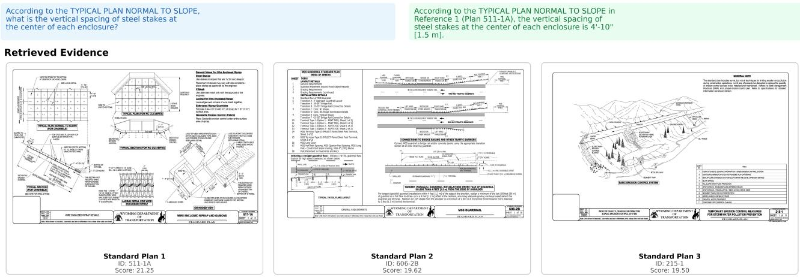  
(a) Success – Dimensional accuracy. Q: vertical spacing of steel stakes at the centre of each enclosure (Plan 511-1A). Predicted “4′-10′′ [1.5 m]” matches the ground truth.

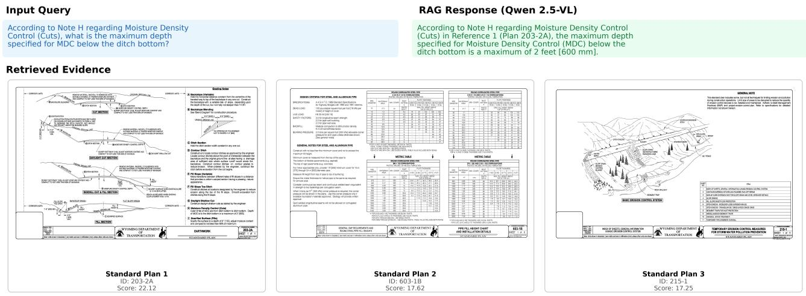  
(b) Success – Dimensional accuracy. Q: maximum Moisture Density Control depth below the ditch bottom per Note H (Plan 203-2A). Predicted “2 feet [600 mm]” matches the ground truth.  
Fig. A.1: Representative dimensional-accuracy success cases on the WYDOT benchmark.

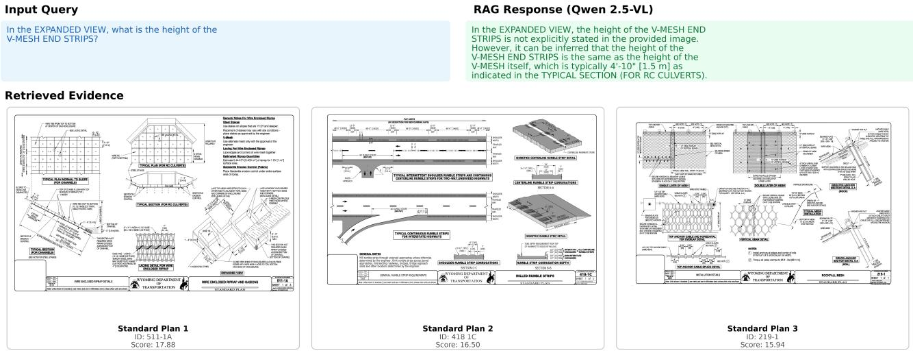  
(a) Failure – Component–dimension binding. Q: height of the V-MESH END STRIPS in the EXPANDED VIEW (Plan 511-1A). Ground truth is $1 ^ { \prime } { - } 4 ^ { \prime \prime }$ [0.4 m]; the model instead infers 4′-10′′ [1.5 m] from a neighboring section, illustrating the cross-view inference error described in Section 7.

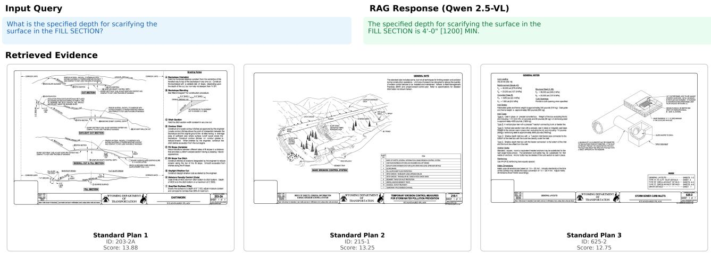  
(b) Failure – Semantic misinterpretation. Q: specified depth for scarifying the surface in the FILL SECTION (Plan 203-2A). Ground truth is 6 inches [150 mm]; the model returns 4 -0 [1200], a fill-geometry dimension, conflating “scarification depth” with “fill thickness”.  
Fig. A.2: Hard failures arising from component–dimension binding and semantic confusion.

<table><tr><td>WYDOT STANDARD SPECIFICATIONS</td><td>STRUCTURAL CONCRETE &amp; REINFORCEMENT</td><td>SECTION 601</td></tr><tr><td>ITEM</td><td>LIMIT VALUE</td><td>REFERENCE</td></tr><tr><td>Min. clear cover, reinforced section</td><td>minimum 2.0 in</td><td>ACI 318 Table 20.5</td></tr><tr><td>Reinforcing steel, min. yield grade</td><td>minimum 60 ksi</td><td>ASTM A615</td></tr><tr><td>Structural concrete, min. 28-day strength</td><td>minimum 4000 psi</td><td>Sec. 601.02</td></tr><tr><td>Max. shear-stirrup spacing</td><td>maximum d/2</td><td>ACI 318 Sec. 9.7.6</td></tr><tr><td>Max. aggregate size</td><td>maximum 1.5 in</td><td>Sec. 601.03</td></tr><tr><td>Min. lap splice length, #5 bar</td><td>minimum 24 in</td><td>ACI 318</td></tr><tr><td>Air entrainment, exposed concrete</td><td>range 5-7 %</td><td>Sec. 601.04</td></tr><tr><td>Min. curing period, moist</td><td>minimum 7 days</td><td>Sec. 601.07</td></tr><tr><td>Max. water-cement ratio</td><td>maximum 0.45</td><td>Sec. 601.02</td></tr></table>

WYDOT STD SPEC | SECTION 601 | SHEET 1 OF 1

Fig. A.3: A rendered Standard-Specifications reference sheet from the rule-grounding corpus. The seven governing limits for the compliance archetypes $( \mathtt { e . g . }$ , min. cover $2 . 0 { ^ { \prime \prime } }$ , max. stirrup spacing $d / 2 )$ are embedded among distractor rows; the agent must retrieve the correct sheet among 1,913 candidates and extract the governing limit from the table.