# 4DSynth: Controllable Procedural World Synthesis for Dynamic Embodied Simulation

Zehao Qi1,∗, Haochen Luo2,∗, Jia-Wang Bian1, Zeyu Ma3, and Shuyang Sun4

1Nanyang Technological University, Singapore 2University of Oxford, UK

3Princeton University, USA 4Google DeepMind, USA

{zehao.qi.mail,jiawang.bian}@gmail.com haochen.luo@outlook.com zeyum@princeton.edu

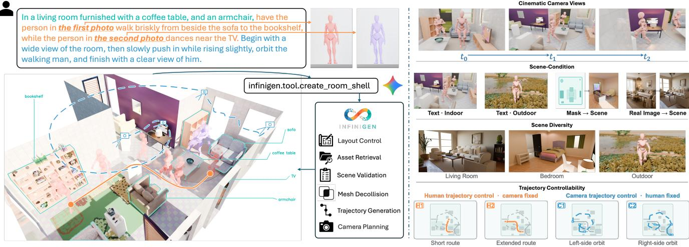  
Fig. 1. System overview. A natural-language director instruction specifies scene, actor, and camera intent. 4DSynth builds an editable scene through native indoor or outdoor generation, layout-conditioned synthesis from text or masks, or single-image real-to-sim compilation, then places animated actors and plans actor and camera trajectories on the finished geometry. The panels on the right show control over camera views, scene conditions, scene types, and actor–camera trajectories.

Abstract— Embodied agents need environments that are visually diverse, physically interactive, and changing over time. Procedural simulators can generate large interactive scene collections, and recent 4D generators produce compelling visual dynamics. Combining these properties in one environment, however, still demands extensive manual effort, and the result is rarely editable or controllable enough to reuse at scale.

We present 4DSynth, a controllable procedural system that turns a natural-language description, a blueprint mask, or a single photograph into an editable 4D environment with explicit geometry, animated actors, collision-free trajectories, and physics-ready simulation state. Multiple scene routes share one geometry-grounded representation, so the same pipeline handles animation, camera planning, rendering, and task generation.

To validate the full pipeline, we construct 4DSynth-Nav, an interactive navigation benchmark generated entirely from 4DSynth’s procedural scenes. Two vision-language models evaluated across three difficulty tiers both fail the majority of tasks and stall after early subtasks. The same procedural controllability that produces these environments also makes each failure reproducible and each difficulty axis independently tunable. Together, this paper presents both a generation pipeline and the scalable benchmark, offering a practical foundation for developing and evaluating embodied agents.

Index Terms— procedural scene generation, 4D world syn-

thesis, real-to-sim, embodied simulation, visual navigation

## I. INTRODUCTION

Embodied agents need environments that are visually varied, physically structured, and changing over time. Procedural simulators can generate large collections of interactive houses [1], [2], language-guided systems make individual scenes cheaper to specify [3], and dynamic simulators add human motion and human–robot interaction [4]. These capabilities, however, live in separate scene representations and separate authoring pipelines. Getting from a user’s conditions, whatever form they take, to one editable scene whose geometry, actor motion, camera motion, and simulation state agree with each other is still hard.

Fig. 1 summarizes our pipeline. A natural-language director instruction gives high-level scene, actor, and camera intent. An agentic controller turns that intent into a scene by native procedural generation, by layout-conditioned synthesis from text or masks, or by single-image real-to-sim compilation, and then places animated actors and plans actor and camera trajectories on the finished geometry. Throughout the paper we use 4D environment to mean an explicit 3D scene plus time-indexed actor and camera states, not a purely visual dynamic representation. Keeping the representation explicit is what lets object identity, support relations, collision geometry, and procedural parameters survive all the way through rendering and simulation.

Our contributions are threefold:

• A unified procedural authoring architecture in which four scene-realization routes feed one shared Stage and one provenance-preserving WorldState, instead of each route having its own downstream pipeline.

• Geometry-grounded 4D synthesis that measures animated assets, plans collision-free actor and camera trajectories on the finished scene geometry, and derives physics-ready OpenUSD output from the procedural scene semantics.

• 4DSynth-Nav, a suite of 333 automatically validated navigation and pick-and-place tasks with animated obstacles, which we use to pin down where two visionlanguage agents fail.

## II. RELATED WORK

Embodied simulation platforms. AI2-THOR [5], Habitat [6], iGibson 2.0 [7], and SAPIEN [8] support navigation, household interaction, and robot learning in interactive simulation. Their emphasis is on fast execution, articulated objects, and reusable task APIs, usually over scene collections that already exist. Ours is complementary: we construct the editable world itself—geometry, moving actors, camera motion, simulation state, and downstream tasks— from whatever conditions the user provides.

Procedural and language-guided environments. Proc-THOR samples large collections of interactive houses for embodied learning [1]; Infinigen and Infinigen Indoors generate photorealistic, fully procedural natural and indoor scenes [2], [9]. Holodeck takes a different route and has a language model translate open-ended prompts into relational constraints over retrieved 3D assets [3]. 4DSynth builds on procedural generation but solves a different systems problem: bringing native generation, authored layouts, and reconstructed rooms into one geometry-grounded pipeline for animation and simulation.

4D generation and real-to-sim. Recent text-to-4D methods produce visually compelling dynamic representations with diffusion guidance and deformable radiance or Gaussian fields [10], [11]. Their output is meant for novel-view rendering; 4DSynth instead keeps explicit objects, walkability, editable procedural parameters, and simulator collision geometry. On the real-to-sim side, Digital Cousins automatically builds affordance-preserving scene variants for policy learning [12], and VIGA reconstructs scenes through interleaved inverse-graphics reasoning [13]. Our single-image route uses reconstruction as evidence but maps every observed instance to a procedural asset that can actually be instantiated, trading exact appearance for editability and physics export.

Embodied simulation with dynamic agents. BEHAVIOR-1K and OmniGibson offer physics-rich household activities [14], and Habitat 3.0 adds humanoids and collaborative human–robot tasks [4]. 4DSynth-Nav is deliberately narrower: a navigation and pick-and-place benchmark instantiated automatically from our generated scenes, meant to show how visual agents react to controlled changes in task horizon, initial visibility, and animated obstacles, not to replace broad activity or collaboration benchmarks.

## III. METHOD

4DSynth turns user conditions into an editable, animated environment together with observations that are consistent with its geometry (Fig. 2). The architecture separates semantic control, scene realization, and geometry-grounded 4D synthesis. A constrained language-model interface first writes the requested scene, actors and actions, spatial goals, and camera intent into a schema-validated 4D specification. The four realization routes—native indoor generation, native outdoor generation, layout-conditioned synthesis from text or masks, and single-image real-to-sim compilation—fall into two source families: native procedural generation and prebuilt-scene compilation.

Both families end in a Stage, our internal record of the finished geometry, its walkable area, and its contents; we use OpenUSD stage only for the exported simulator scene. Actor synthesis works on the Stage to turn measured character assets and requested actions into collision-free tracks, and observation synthesis realizes camera intent against the same geometry and motion. Baking combines scene, actor tracks, and camera track into an editable 4D environment, from which rendered video, physics simulation, and navigation tasks are derived. A persistent WorldState keeps all of these representations, and where each came from, across the whole pipeline.

Native outdoor scenes add one complication. Infinigen conditions detailed terrain and population on the region the camera sees, but a useful camera depends on where the actors can go. The outdoor branch therefore starts from a coarse scene, uses it to establish provisional motion and viewing support, realizes native detail inside that region, and only then extracts the final Stage for actor and camera planning.

The rest of this section covers scene synthesis (Section III-A), 4D animation on the shared Stage (Section III-B), observation synthesis (Section III-C), and physics-ready export (Section III-D).

## A. Controllable Scene Synthesis

The 4D backbone accepts two kinds of scene source, both mapped to the same Stage.

Native generative source. Given only a category-level request, the system synthesizes the scene procedurally: an indoor scene as a single room of the requested type or as a whole multi-room home furnished by constraint-based placement [2]; an outdoor scene as one of eight terrain biomes (forest, desert, coast, mountain, plain, canyon, cliff, or arctic) with vegetation and scatter assets [9]. The category picks the biome and nothing else; its continuous parameters are left to the generator. We record the random seed so that any sampled scene can be regenerated.

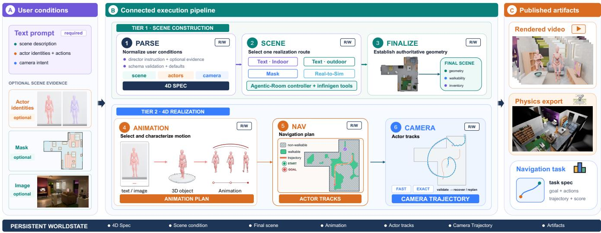  
Fig. 2. 4DSynth as a two-tier execution pipeline. PARSE normalizes the user conditions into a 4D specification. Tier 1 realizes the scene through one of four routes; FINALIZE then fixes the geometry, walkability, and inventory of the final Stage (only native outdoor scenes go through coarse-to-final materialization). In parallel, ANIMATION selects, imports, and measures motion assets to produce an animation plan; NAV joins that plan with the final Stage to produce collision-free actor tracks, and CAMERA plans and validates a camera trajectory. A persistent WorldState records the intermediate results and their provenance, and the completed state is used to publish rendered video, physics exports, and navigation tasks.

Prebuilt-scene source. Alternatively, an upstream layout compiler or real-to-sim compiler (Figs. 3 and 4) hands over a fully realized scene. The backbone leaves its geometry alone, re-extracts and validates the Stage, and runs the same actor, navigation, camera, and rendering stages as for native scenes. Raw layouts and photographs are thus compiled upstream; the backbone only ever sees the realized scene.

Text- and mask-conditioned indoor synthesis. Text and masks give complementary kinds of control (Fig. 3). A scene-layout description fixes what should be in the scene but not where, so a constrained language model proposes rooms, openings, object footprints, orientations, and support relations. An annotated mask already fixes the spatial layout and the object count; we keep its authored geometry and infer only the missing semantics. Both inputs are normalized into a Canonical Layout intermediate representation (IR) of rooms, openings, oriented object footprints, categories, and support chains.

Fig. 3 follows this representation through three stages. Structure construction builds the room shell and openings. Placement grounds each category to a procedural factory, sizes the asset to its authored footprint, and instantiates it under orientation, containment, and support constraints. Completion may add compatible content that the input did not specify, but never replaces a prescribed object. Geometry validation, materials, and lighting then finish the seeded scene that the 4D backbone consumes.

Real-to-sim compilation from a single photograph. A photograph is the most constrained input: the compiled scene has to approximate one particular room, not just a plausible one. Fig. 4 traces the evidence from a single RGB image to an editable procedural scene. Monocular metric depth recovers camera-relative room geometry [15], openvocabulary segmentation finds objects and openings [16], object-centric reconstruction lifts instances to posed 3D proxies [17], and a multimodal agent maps each observed instance to a procedural factory. Reconstruction thus supplies image-supported pose and extent, and grounding supplies assets that can actually be built.

Metric and semantic reasoning combine this evidence into a route-specific PerceivedScene. Reconstructed proxies are anchored to the metric depth and stored as metric 3D boxes with top-down footprints in the room frame; categorylevel size priors correct what monocular scale bias remains. Support relations and facing directions are estimated from geometry and image evidence together, and the observed room boundary and openings become walls, windows, and doors. The PerceivedScene also keeps the observed camera, object heights, and appearance cues. A validated export maps its rooms, openings, objects, and support relations onto the shared procedural backend and carries the perception evidence along as build provenance.

Realization then follows the shared backend, with two additions that faithfulness requires. First, geometry is settled conservatively: assets are instantiated to their observed footprints while keeping their native shape, placed through their support relations, and separated by mesh-level collision resolution, so the recovered arrangement still holds once real procedural geometry is in place. Second, appearance is aligned only after geometry is frozen: for each room surface and object, an agent picks one of the native material implementations, and albedo and exposure are calibrated against the source view. Because alignment only ever chooses among procedural materials, the compiled scene stays fully parametric—every wall, asset, and material can still be edited—while its rendering approaches the photograph. Throughout the compiler, agents choose only among bounded, schema-validated alternatives, metric quantities are computed deterministically, and each stage writes an immutable artifact, so a compiled scene can be audited and regenerated one stage at a time.

Camera-conditioned outdoor finalization. Indoor and prebuilt scenes expose their final geometry right away. Native outdoor scenes do not: Infinigen materializes fine terrain and population around the camera views, but a useful camera depends on where the actors can walk. We break the circle with a coarse-to-final loop. A coarse proxy first supports provisional actor routes and a provisional camera; their view frusta then anchor the native population, fine terrain, ground cover, and camera-local creatures. Once that detail exists, a new Stage is extracted and both actors and camera are replanned on it.

The provisional routes are only priors. Final motion may bend around newly realized terrain or vegetation, but it must stay collision-free within an actor-sized connected component. The camera is repaired against the final geometry in the same way and must stay inside the region that received native detail. If no actor route satisfies the intent constraints, planning relaxes them step by step and records the downgrade; if camera repair keeps failing, a fresh wholetrajectory plan is made on the same scene. A different scene seed is tried only before the scene checkpoint, when the first candidate offers no actor-scale physical support. After finalization begins, every failure is handled within the same scene.

## B. 4D Animation on a Unified Stage

Stage extraction. Animation starts by distilling the evaluated scene geometry into a Stage: a metric support grid with ground height and walkability, an object inventory, and geometry for collision and visibility queries. One representation serves indoor floors and outdoor terrain alike. A cell belongs to the common walkable set W when it has stable, sufficiently level support, is not deeply submerged, and has no solid geometry in the vertical column an actor’s body would occupy. Deformable ground cover such as grass is excluded from collision on semantic grounds; rocks, trunks, and structural objects stay obstacles.

For actor i with measured body radius $r _ { i } ,$ planning uses $\mathcal { F } _ { i } ~ = ~ \mathrm { E r o d e } ( \mathcal { W } , r _ { i } )$ . A scene is rejected if it has no actor-scale physical support. Standable-area and corridorlength targets are reported as diagnostics, and navigation additionally requires a non-trivial route for every moving actor. Because the Stage also keeps terrain height and the evaluated scene geometry, actor grounding, collision tests, camera validation, and downstream task generation all refer to the same space.

4D agent assets. Dynamic actors are characters with explicit geometry and time-varying animation. A language model maps each requested action to the closest motion in a curated library of motion-captured humanoid clips. Instead of normalizing every character to a nominal humanoid, we measure each one after import: stature, chest height, collision radius, visual envelope, sole offset, and natural ground speed from root displacement. These numbers drive Stage clearance, route erosion, inter-agent separation, terrain grounding, playback rate, and camera framing; a clip with negligible root displacement is treated as in-place.

Collision-aware trajectory planning. Actors are placed and routed on the Stage through a layered feasible region. The physically walkable set is the hard outer bound; optional preference layers (currently a named-room prior) can only shrink it; and the result is intersected with ${ \mathcal { F } } _ { i }$ . Goal-directed actors resolve phrases such as “from the door to the sofa” against the Stage inventory and plan with $\mathbf { A } ^ { * }$ between reachable anchors. Actors with no explicit goal get a long corridor inside their connected free-space component. Outdoor proxy routes contribute preferred endpoints or loop anchors, but the final geometry has the last word and may force a local detour. Simplification and smoothing are accepted only if every segment stays inside ${ \mathcal { F } } _ { i }$ ; the path is then traversed at the clip’s measured speed.

Multi-agent coordination and baking. With several actors, reactive separation coordinates their motion while keeping the hard feasible region and the planned endpoints. Stationary actors are placed off the walking lines and treated as obstacles; narrow corridors force single-file order. The tracks are then baked: root displacement removed, animation cycles repeated as needed, heading aligned with the direction of motion under a bounded turn rate, and feet grounded on the Stage height field.

## C. Geometry-Valid Observation Synthesis

A 4D scene is only useful if what the camera sees agrees with the world that was synthesized. 4DSynth therefore keeps camera intent separate from geometric feasibility. Intent is a timeline of nine composable primitives—orbit, turn, push, pull, lift, lower, zoom, swoop, and static hold—that can run in sequence or at the same time and are interpreted in targetrelative spherical coordinates. Framing distance follows from the subject’s extent and the field of view; it is not tuned per scene.

Feasibility and visibility are handled differently. There are two planning modes, and both keep the camera inside the Stage’s valid domain and outside every measured actor body. The geometry-exact mode also requires the camera origin to stay above support and outside solid scene geometry; invalid poses are projected to nearby feasible ones, after which position, aim, field of view, full-body framing, and referencerelative temporal correction are checked again. The default fast mode instead evaluates 11 deterministic whole-trajectory transforms. Terrain is a hard constraint in this mode, as is any penetration whose owner (the scene object the penetrated surface belongs to) cannot be identified as stable and safe to cut away. A confirmed penetration—or an unresolved narrow-phase case backed by the same proof of a stable, nonground owner—may be handled by a frame-bounded render cutaway instead of a frame-local camera detour.

Occlusion by the environment is a soft cost. The search prefers clear views but does not detour around every foreground branch or piece of furniture; such occluders may stay in frame, defocused around the tracked subject. In fast planning, the fraction of frames in which every target is fully framed with an unoccluded chest sample must meet the requested threshold, which is never allowed below 80%. Exact planning runs a terminal audit on the full render-visible geometry and, by default, requires each target to stay present and fully framed for at least 90% of the interval after it is first revealed. Brief natural occlusion passes; sustained loss of the target does not. The same machinery handles moving third-person views, static views of objects, and transitions from a scene’s native establishing camera.

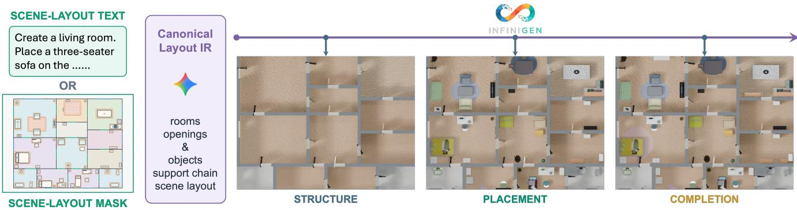

Fig. 3. Text- and mask-conditioned scene compilation. A scene-layout description or an annotated mask is normalized into a Canonical Layout IR recording rooms, openings, objects, support chains, and metric layout. The shared procedural backend builds the room structure, instantiates and places the specified assets, and fills in compatible content during completion. The three bird’s-eye-view panels show the same scene after structure construction, placement, and completion.  
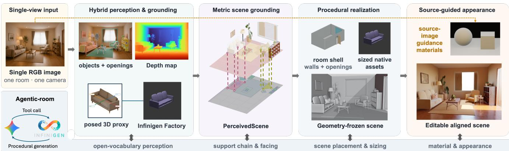  
Fig. 4. Single-image real-to-sim compilation. Hybrid perception extracts objects, openings, metric depth, and posed 3D proxies; grounding links each observed instance to a procedural factory. Metric reasoning consolidates this evidence into a PerceivedScene with room geometry, object scale, support, and facing. Procedural realization builds the room shell, instantiates sized native assets, and freezes the geometry before source-guided material alignment produces an editable scene that matches the input view.

## D. Physics-Ready Export to Simulation

The exporter writes a finished 4D scene to an OpenUSD stage for Isaac Sim. The whole scene is exported once and checked by content—mesh and prim counts—rather than by exit status. Light sources whose parameters do not survive the transfer are repaired; outdoor scenes also get a sun light and smoothed terrain normals.

Physical properties come from the generative representation itself. Every surface carries a procedural material, so material identity maps to density and friction, and objectlevel values are area-weighted aggregates over material regions. Every mesh gets a static collider; objects marked movable also become rigid bodies with convex-hull collision and density-derived mass. No separate physics labeling is needed: the annotations are read off the same procedural parameters that produce the appearance.

Animated humans enter the simulator as kinematic solid obstacles. Each actor is a capsule of its measured radius and height that follows the generated track, sampled at the simulator’s playback rate. Kinematic obstacles push and block but are not pushed, which is the role pedestrians play in navigation. The capsule is the collision surrogate on the simulator side; the skinned character remains a render-visible animation asset. Before any benchmark task is generated, each exported scene is verified headlessly in Isaac Sim: the stage must load, dynamic objects must settle under gravity, and each actor must reproduce its planned displacement during playback.

## IV. EXPERIMENTS

## A. Qualitative Scene Synthesis

We first look at the range and editability of the scene routes qualitatively. Everything shown is rendered directly from the synthesized procedural scenes; the comparisons illustrate how the system behaves and are not a metric ranking.

Layout-conditioned synthesis. Fig. 5 shows two multiroom homes compiled from blueprint masks. Each row pairs the authored input with the final top-down scene and selected living-room, bedroom/dining-room, and kitchen views. Room topology, openings, and furniture arrangement are still recognizable after realization, while the procedural factories supply 3D geometry, materials, and lighting. Since the outputs are native procedural scenes, individual assets and room surfaces can be edited afterwards.

Real-to-sim compilation. Fig. 6 compares input photographs, VIGA reconstructions [13], and our compiler’s output on eight shared single-image inputs. In ours, room geometry, furniture layout, and support relations follow the photograph, and the appearance-alignment stage matches wall, floor, and furniture materials to the source view. The result is not a textured reconstruction; it is a procedural scene that the downstream 4D pipeline can animate, relight, and edit. On these examples VIGA recovers several visually dominant objects but often drops openings or secondary furniture and distorts their relative placement, whereas our compiler keeps more of the room envelope, object inventory, and support structure as separately editable procedural instances.

4D environments. Fig. 7 shows frames from synthesized 4D scenes. Moving actors follow collision-free trajectories indoors and across native outdoor terrain, in-place actions stay at their validated placements, and the camera keeps its framing against the final geometry. The physics-enabled scenes behind the navigation benchmark come from this same pipeline, with no per-scene mesh authoring.

## B. Benchmark Construction

We build 4DSynth-Nav from 122 physics-enabled indoor scenes generated with Infinigen Indoors [2] and simulated in NVIDIA Isaac Sim 4.5.0. Each scene contains procedural household objects and one or more animated characters following baked trajectories (solo run, two runners, run– dance, or run–jump). The characters are dynamic obstacles; they do not react to the agent.

Automated task generation. A three-phase pipeline produces validated navigation and pick-and-place tasks with no per-task manual annotation:

1) Scene probing: Each USD stage is loaded in Isaac Sim. The active geometry yields object prim paths, world-space bounding boxes, floor heights, and support relations (by bounding-box stacking). A PhysX flood fill on a 0.25 m grid, with sphere sweeps at z=0.5 m and z=1.0 m for a 0.40 m-radius agent, gives per-object reachability from the floor centroid of the primary room.

2) Task generation: This pure-Python phase selects targets under five invariants: (i) pickups sealed in closed cabinets are rejected; (ii) semantic classes that are unique in the room are preferred, so that no same-class distractors need to be deactivated; (iii) no phase target may share the semantic class of a pickup’s support furniture; (iv) floor pickups are capped at 30%, since they force a downward camera tilt that hurts visionlanguage model (VLM) performance; and (v) targets must lie within validated reachability radii (1.0 m for pickups, 1.5 m for destinations). Any remaining sameclass non-targets, with the clutter resting on them, go into a per-task deactivation list computed against the realized geometry.

TABLE I  
4DSYNTH-NAV BENCHMARK COMPOSITION.
<table><tr><td>Property</td><td>Value</td></tr><tr><td>Total tasks</td><td>333 (L1: 113, L2: 110, L3: 110)</td></tr><tr><td>Unique scenes</td><td>113 (from 122 physics-enabled Infinigen Indoors scenes)</td></tr><tr><td>Room types</td><td>living room, bedroom, kitchen, dining room, bathroom</td></tr><tr><td>Task types</td><td>navigate (113), two-waypoint nav (130), pick-and-place (90)</td></tr><tr><td>Pickup objects</td><td>11 categories (book, cup, bottle, bowl, vase, ...)</td></tr><tr><td></td><td>Destination objects 11 categories (shelf, desk, counter, toilet, . ..)</td></tr><tr><td></td><td>Dynamic obstacles solo run (37%), two runners (12%), run-dance/jump (51%)</td></tr></table>

3) Spawn validation: Each candidate is loaded in Isaac Sim, and the spawn must (a) lie inside the exact concave room boundary extracted from single-occurrence USD mesh edges; (b) pass eight-directional PhysX sphere sweeps at two heights; (c) have the phase-1 target inside the initial frustum (±45◦ horizontally, ±29◦ vertically) for L2 tasks and outside it for L1/L3 (tiers are defined in Section IV-C); (d) pass a 1.2 m forwardclearance raycast; and (e) keep flood-fill reachability to the phase-1 target.

## C. Dataset Statistics

The benchmark has three tiers (L1–L3) along two controlled axes: number of subtasks and initial target visibility. The combination of one phase with the target already in view- is left out because it exercises neither difficulty factor.

• L1 (one phase, initially hidden): the agent must turn or explore to find a single target outside its initial camera frustum.

• L2 (two phases, initially visible): navigate–then– navigate or pick–then–deliver, with the phase-1 target inside the initial frustum. About 60% of phase-1 targets are navigation waypoints and 40% are pickups.

• L3 (two phases, initially hidden): the L2 task structure with the blind start of L1.

## D. Experimental Setup

Agent architecture. The agent receives up to three recent first-person images (960×540, path-traced), the task instruction in natural language, and feedback on which actions were executed and whether motion was blocked. At each decision step it emits a plan of at most five actions from MOVE FORWARD (0.25 m), TURN LEFT/RIGHT (15◦), TILT UP/DOWN (5◦), PAUSE, PICK UP, PUT DOWN, and DONE. Plans run sequentially and stop on collision or phase completion. An episode ends after 150 actions or 50 VLM calls, whichever comes first.

Models. We evaluate Qwen3-VL-30B-A3B-Thinking [18], a mixture-of-experts vision-language model with 30B total and 3B active parameters, served with vLLM, and the proprietary Gemini 3.1 Pro [19], on the same 333 tasks. The two differ in architecture, training data, and serving stack, so we treat them as diagnostic probes rather than as a controlled comparison of navigation agents.

FINAL BEV  
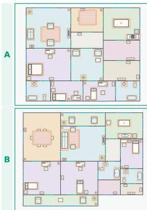

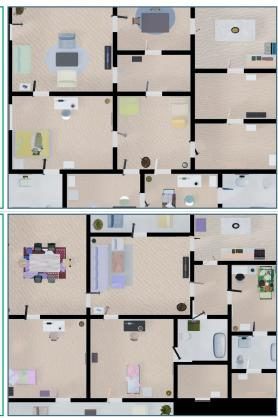  
(a)  
(c)

LIVING ROOM  
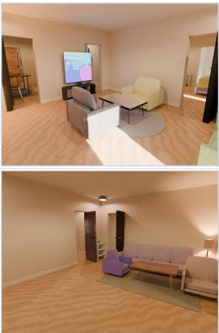

BEDROOM / DINING  
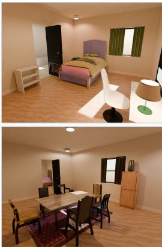

KITCHEN  
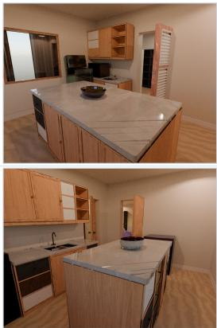  
Fig. 5. Layout-conditioned synthesis for two blueprint masks (A and B). Each row shows, left to right, the authored input, the final procedural bird’s-eye view (BEV), and selected living-room, bedroom/dining-room, and kitchen renders. The multi-room organization and the authored furniture arrangement are preserved, and the 2D constraints become editable procedural geometry with room-specific materials and lighting.

(b)  
(d)  
(e)  
(f)  
(g)  
(h)  
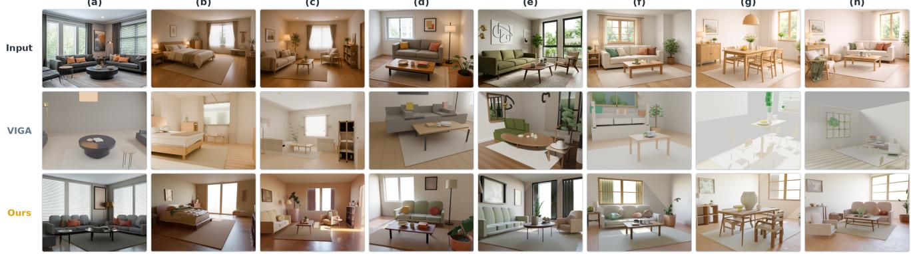

Fig. 6. Qualitative comparison with VIGA on eight shared single-image inputs. Rows show the input photograph, the VIGA reconstruction, and our appearance-aligned procedural result under a common 4:3 viewport. Across these examples our compiler more consistently recovers explicit room surfaces, openings, secondary furniture, and separately editable object instances while keeping the dominant layout and appearance. The comparison is qualitative; we do not infer a metric ranking from it.  
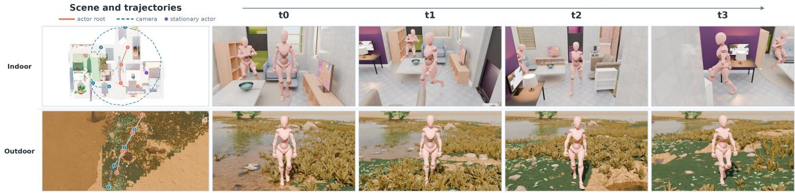  
Fig. 7. Synthesized 4D environments. Each row pairs an overhead rendering of the final scene with four frames sampled at the numbered times. Solid orange and dashed blue curves are the measured actor-root and solved camera trajectories; the purple marker in the indoor scene is the in-place dancing actor. Environment, actors, and camera are baked into one editable 4D scene.

Metrics. We report Success Rate (SR), the fraction of episodes in which all phases are completed; Subtask Progress (SP), the fraction of phases completed; Goal Distance (GD), the Euclidean distance to the current target at episode end; Collisions, the mean number of recorded obstacle contacts per episode; and Steps, the mean number of steps per episode.

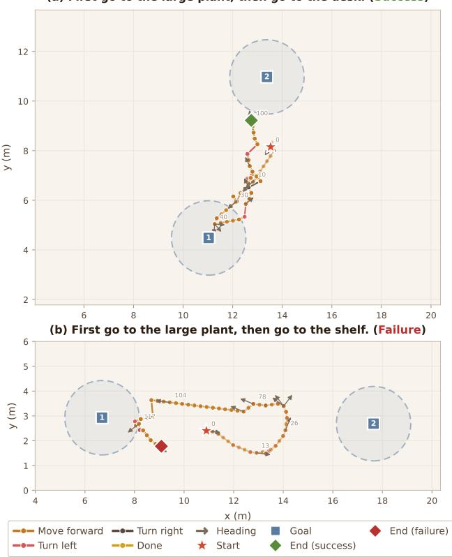

TABLE II  
4DSYNTH-NAV RESULTS. SR AND SP IN %; GD IN METERS; COLL. AND STEPS ARE PER-EPISODE MEANS.
<table><tr><td>Model</td><td>Level</td><td>SR</td><td>SP</td><td>GD</td><td>Coll.</td><td>Steps</td></tr><tr><td rowspan="3">Qwen3-VL-30B</td><td>L1</td><td>16.8</td><td>16.8</td><td>4.74</td><td>43.2</td><td>120.2</td></tr><tr><td>L2</td><td>18.2</td><td>35.5</td><td>3.84</td><td>36.6</td><td>103.8</td></tr><tr><td>L3</td><td>4.5</td><td>15.0</td><td>4.22</td><td>37.8</td><td>117.2</td></tr><tr><td rowspan="5">Gemini 3.1 Pro</td><td>All L1</td><td>13.2</td><td>22.4</td><td>4.27</td><td>39.2</td><td>113.8</td></tr><tr><td></td><td>57.5</td><td>57.5</td><td>2.41</td><td>17.0</td><td>79.5</td></tr><tr><td>L2</td><td>23.6</td><td>36.4</td><td>2.42</td><td>20.2</td><td>114.0</td></tr><tr><td>L3</td><td>18.2</td><td>27.7</td><td>3.23</td><td>19.9</td><td>120.7</td></tr><tr><td>All</td><td>33.3</td><td>40.7</td><td>2.68</td><td>19.0</td><td>104.5</td></tr></table>

(a) First go to the large plant, then go to the desk. (Success)

## E. Results

Our benchmark can differentiate model capacity, and there is still room for the models to solve the benchmark. As shown in Table II, Qwen3-VL-30B completes 13.2% of tasks and 22.4% of subtasks. Gemini 3.1 Pro raises SR to 33.3% and SP to 40.7% and cuts the final goal distance from 4.27 m to 2.68 m. This is a large gain in both completion and geometric execution, but it still fails two of every three tasks. Neither model is close to solving dynamic embodied navigation in these scenes.

Gemini represents better navigation capability on blind starts. On L1, where the target starts outside the agent’s field of view, Gemini reaches 57.5% SR against 16.8% for Qwen, in fewer steps (79.5 vs. 120.2) and ending closer to the goal (2.41 m vs. 4.74 m). On the two-phase tiers the gain is smaller on L2 but still large on L3, where SR goes from 4.5% to 18.2%. Task types differ across tiers and the models differ in training, so we read these numbers as diagnostics, not as a controlled ablation.

Both models get partway and then stall. Subtask progress runs well ahead of success: for Qwen, 35.5% SP against 18.2% SR on L2 and 15.0% against 4.5% on L3; for Gemini, 36.4% against 23.6% on L2 and 27.7% against 18.2% on L3. The pattern fits compounding errors in target search, spatial memory, manipulation, and re-navigation after a phase transition.

## F. Trajectory Example

Fig. 8 contrasts a successful and a failed two-goal episode, both run by Qwen3-VL-30B. In the L2 success (Fig. 8(a)), the agent closes in on Goal 1 (the large plant), enters its acceptance region within 40 steps, turns toward Goal 2 (the desk), and finishes both phases in 101 steps, 1.3 m from the desk.

The L3 failure (Fig. 8(b)) has the same two-goal structure, but the phase-1 target starts outside the camera frustum. The agent still reaches Goal 1, by step 104 (SP= 0.5), and the harness then advances the objective prompt to “Current objective: go to shelf . . . Progress: step 2/2.” Even with that cue, the agent traces a wide loop away from the shelf and ends 8.0 m from it after 133 steps. The two episodes

Fig. 8. Trajectory diagnostics for Qwen3-VL-30B on two-goal navigation. (a) L2 success: both goals reached in 101 steps, ending 1.3 m from Goal 2. (b) L3 failure: Goal 1 reached, then the agent loops away from Goal 2 and ends 8.0 m from it (SP= 0.5).

demonstrate that the model is capable of solving multi-stage goals, but misjudgment of task completion status can still happen.

## V. CONCLUSION

We presented 4DSynth, a procedural pipeline that builds editable 4D environments from natural-language descriptions, blueprint masks, and single photographs. Native and compiled scene routes meet in a shared Stage of finished geometry, walkability, and scene content, and a WorldState ties that Stage to the actor and camera trajectories and to the provenance of every intermediate result. Rendering, physics simulation, and task generation all read from these same representations, and because the environments keep their procedural structure, they can be regenerated, edited, animated, and exported without any per-scene mesh work.

We demonstrated the pipeline with 4DSynth-Nav, 333 navigation and pick-and-place tasks with static and dynamic obstacles. For both Qwen3-VL and Gemini 3.1 Pro, the hardest tier is the one that combines a blind start with a two-stage objective, and partial progress, collision counts, and looping trajectories reveal failures that success rate alone hides. Next we plan to quantify route-level fidelity and controllability, add responsive humans and articulated objects, and test a broader set of embodied agents.

## REFERENCES

[1] M. Deitke, E. VanderBilt, A. Herrasti, L. Weihs, K. Ehsani, J. Salvador, W. Han, E. Kolve, A. Kembhavi, and R. Mottaghi, “ProcTHOR: Largescale embodied AI using procedural generation,” in Adv. Neural Inf. Process. Syst. (NeurIPS), 2022.

[2] A. Raistrick, L. Mei, K. Kayan, D. Yan, Y. Zuo, B. Han, H. Wen, M. Parakh, S. Alexandropoulos, L. Lipson, Z. Ma, and J. Deng, “Infinigen Indoors: Photorealistic indoor scenes using procedural generation,” in Proc. IEEE/CVF Conf. Comput. Vis. Pattern Recognit. (CVPR), 2024.

[3] Y. Yang et al., “Holodeck: Language guided generation of 3D embodied AI environments,” in Proc. IEEE/CVF Conf. Comput. Vis. Pattern Recognit. (CVPR), 2024, pp. 16227–16237.

[4] X. Puig et al., “Habitat 3.0: A co-habitat for humans, avatars and robots,” in Int. Conf. Learn. Represent. (ICLR), 2024.

[5] E. Kolve et al., “AI2-THOR: An interactive 3D environment for visual AI,” 2017, arXiv:1712.05474.

[6] M. Savva et al., “Habitat: A platform for embodied AI research,” in Proc. IEEE/CVF Int. Conf. Comput. Vis. (ICCV), 2019, pp. 9339–9347.

[7] C. Li et al., “iGibson 2.0: Object-centric simulation for robot learning of everyday household tasks,” in Proc. Conf. Robot Learn. (CoRL), PMLR, vol. 164, 2022, pp. 455–465.

[8] F. Xiang et al., “SAPIEN: A simulated part-based interactive environment,” in Proc. IEEE/CVF Conf. Comput. Vis. Pattern Recognit. (CVPR), 2020, pp. 11097–11107.

[9] A. Raistrick, L. Lipson, Z. Ma, L. Mei, M. Wang, Y. Zuo, K. Kayan, H. Wen, B. Han, Y. Wang, A. Newell, H. Law, A. Goyal, K. Yang, and J. Deng, “Infinite photorealistic worlds using procedural generation,” in Proc. IEEE/CVF Conf. Comput. Vis. Pattern Recognit. (CVPR), 2023, pp. 12630–12641.

[10] S. Bahmani et al., “4D-fy: Text-to-4D generation using hybrid score distillation sampling,” in Proc. IEEE/CVF Conf. Comput. Vis. Pattern Recognit. (CVPR), 2024, pp. 7996–8006.

[11] H. Ling, S. W. Kim, A. Torralba, S. Fidler, and K. Kreis, “Align Your Gaussians: Text-to-4D with dynamic 3D Gaussians and composed diffusion models,” in Proc. IEEE/CVF Conf. Comput. Vis. Pattern Recognit. (CVPR), 2024, pp. 8576–8588.

[12] T. Dai, J. Wong, Y. Jiang, C. Wang, C. Gokmen, R. Zhang, J. Wu, and L. Fei-Fei, “Automated creation of digital cousins for robust policy learning,” 2024, arXiv:2410.07408.

[13] S. Yin et al., “Vision-as-Inverse-Graphics Agent via interleaved multimodal reasoning,” 2026, arXiv:2601.11109.

[14] C. Li et al., “BEHAVIOR-1K: A benchmark for embodied AI with 1,000 everyday activities and realistic simulation,” in Proc. Conf. Robot Learn. (CoRL), 2022, pp. 80–93.

[15] H. Lin et al., “Depth Anything 3: Recovering the visual space from any views,” 2025, arXiv:2511.10647.

[16] SAM 3 Team, “SAM 3: Segment anything with concepts,” 2025, arXiv:2511.16719.

[17] SAM 3D Team, “SAM 3D: 3Dfy anything in images,” 2025, arXiv:2511.16624.

[18] Qwen Team, “Qwen3-VL technical report,” 2025, arXiv:2511.21631.

[19] Google DeepMind, “Gemini 3.1 Pro model card,” Feb. 2026. [Online]. Available: https://ai.google.dev/gemini-api/ docs/models\#gemini-3.1-pro