# AesCanvas: A Large-Scale Dataset and Benchmark for Aesthetic Critique and Contextual Suitability

Xuanwei Hu1∗, Haoyu Dong1∗, Kejun Wu1†, Tianyi Liu2, Jianjun Gao2

1School of Electronic Information and Communications, Huazhong University of Science and Technology, Wuhan, China 2School of Electrical and Electronic Engineering, Nanyang Technological University, Singapore kjwu@hust.edu.cn

## Abstract

Recent advances in Multimodal Large Language Models (MLLMs) have extended Image Aesthetic Assessment (IAA) beyond scalar scores toward interpretable critique and guid- ance. Yet existing benchmarks mainly assess intrinsic visual quality or fixed domain criteria, leaving open whether an ap- pealing image is appropriate for a specific purpose, audience, cultural setting, or domain convention. We introduce AesCan- vas, a unified suite with two complementary components: CritiqueCanvas with 519,136 instruction–response pairs from 54,300 images supports long-form, multi-dimensional critique across photography, painting, and virtual imagery, whereas ContextCanvas with 301 expert-reviewed use sce- narios evaluates contextual aesthetic suitability in realistic use scenarios. Under a unified protocol, we evaluate closed-source frontier, open-weight general, and aesthetic-specific MLLMs. Results reveal a clear separation between critique generation and context-sensitive judgment: reference-based lexical and semantic metrics only partially capture critique quality, while aesthetic specialists remain competitive on selected critique metrics yet substantially lag strong general-purpose MLLMs on ContextCanvas. Further analyses show that aesthetic spe- cialization does not reliably transfer to contextual suitability and that model decisions may fail to track or ground them- selves in decisive contextual visual cues. These findings es- tablish culturally situated, evidence-grounded suitability as a distinct objective for aesthetic modeling.

## I Introduction

Image Aesthetic Assessment (IAA) has progressed from scalar prediction and preference modeling (Murray, March-esotti, and Perronnin 2012; Talebi and Milanfar 2018; Yi et al. 2023) toward language-based aesthetic perception, critique, diagnosis, and guidance (Huang et al. 2024b,a; Zhou et al. 2024; Zhang et al. 2025; Qi et al. 2025; Cao et al. 2025b). In practical use, however, visual appeal alone is insuficient: an image must also suit a particular purpose, audience, and convention. Cultural knowledge is therefore not auxiliary to aesthetic judgment, since symbols, styles, dress, and genre conventions can directly change whether an image is an ap- propriate visual choice. Related multimodal studies likewise show that models remain fragile when judgments require criterion-sensitive reasoning, visual grounding, or culturally

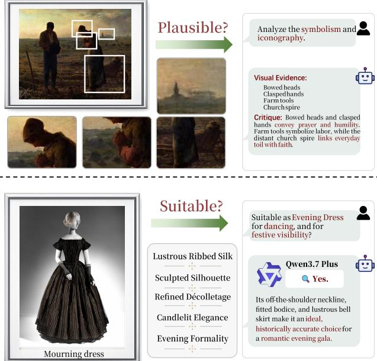  
Figure 1: Fluent aesthetic critique does not guarantee contextually valid judgment. The top example shows an evidence-grounded critique, whereas the bottom shows a suitability error in which visually appealing attributes are mistaken for appropriateness in a mismatched use context. This contrast motivates evaluating critique grounding and contextual suitability as complementary capabilities.

situated evidence (Xiong et al. 2026; Li et al. 2026; Wu et al.   
2026b; Satar et al. 2025; Singh et al. 2026).

Figure 1 makes this distinction concrete: a model may pro- duce a plausible aesthetic critique yet approve a mourning dress as festive evening wear by emphasizing its silhouette and material while ignoring its social function. Figure 2 fur- ther reveals two failure levels: critiques may rely on fabri- cated evidence or inappropriate domain priors, while suit- ability judgments may privilege surface appeal or stylistic plausibility over cultural fit. We call the latter tendency aesthetic context bias: following generic aesthetic priors while neglecting contextual evidence that should alter the decision. This task is not generic cultural question answering; contex- tual knowledge matters because it determines whether the image works as a visual choice.

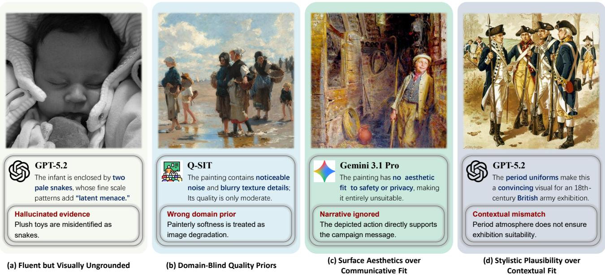  
Figure 2: Four recurring failure modes in practical aesthetic evaluation. Models may generate critiques that are visually ungrounded or rely on inappropriate domain priors, and may judge real-world suitability from surface aesthetics or stylistic plausibility rather than communicative and contextual fit.

To study both capabilities, we introduce AesCanvas, a unified suite with two complementary components. Cri- tiqueCanvas provides large-scale, multi-domain supervi- sion for long-form critique across photography, painting, and virtual imagery, while ContextCanvas contains expert- reviewed use scenarios that distinguish visual appeal from contextual suitability. Across closed-source, open-weight, and aesthetic-specific MLLMs, we observe a clear capability gap: aesthetic specialists remain competitive on selected cri- tique metrics, yet all score below 30% on ContextCanvas, compared with 91.69% for the strongest evaluated general- purpose model. Further analyses show that reference-based metrics only partially capture critique quality, aesthetic spe- cialization does not reliably transfer to contextual judgment, and correct decisions may still lack grounding in decisive visual evidence.

Contributions. (1) We introduce CritiqueCanvas, com-prising 519,136 aesthetic instruction–response pairs built from 54,300 multi-domain images for instruction-tuning MLLMs on fine-grained image aesthetic assessment; (2) we construct ContextCanvas, a 301-case expert-curated benchmark for contextual aesthetic suitability judgment; (3) we evaluate closed-source, open-weight, and aesthetic-specific MLLMs, revealing a clear gap between producing fluent aesthetic critiques and correctly judging suitability under cultural, functional, and domain-specific constraints; and (4) we release the data, prompts, rationales, provenance records, and evaluation code.

## II Related Work

## A Image Aesthetic Assessment

Image Aesthetic Assessment (IAA) predicts human judg- ments of visual aesthetic quality. Early work formulated IAA as classification, ranking, or score-distribution prediction from crowd preferences, while incorporating photographic attributes, composition-preserving representations, and in- dividual taste variation (Murray, Marchesotti, and Perronnin 2012; Kong et al. 2016; Mai, Jin, and Liu 2016; Yang et al. 2022). Recent studies extend IAA to artistic images, fine-grained comparison within image series, and open-world cri- teria that vary across themes (Yi et al. 2023; Yang et al. 2026; Liao, Ma, and Zhang 2026). Nevertheless, these methods pri-marily assess aesthetic strength under intrinsic or task-fixed criteria, rather than whether an image is appropriate for a particular purpose, audience, cultural setting, or domain con- vention. Our work addresses this complementary problem of contextual aesthetic suitability.

## B Aesthetic Multimodal Models

Aesthetic multimodal models extend conventional IAA from scalar prediction to language-based recognition, description, interpretation, scoring, and critique. Early studies bench- marked the aesthetic perception of general-purpose MLLMs and explored aesthetic instruction tuning (Huang et al. 2024b,a; Zhou et al. 2024). Subsequent work connected textual supervision with visual scoring through language- defined rating levels or joint scoring-and-interpretation objectives (Wu et al. 2024; Zhang et al. 2025), while more recent models support professional critique, multi-attribute analysis, and unified perceptual assessment (Qi et al. 2025; Cao et al. 2025b,a). Existing evaluation, however, remains centered on aesthetic perception, scoring, reference-aligned critique, or domain-specific analysis. AesCanvas instead ex- amines whether aesthetic articulation transfers to contextual decisions in which an attractive or stylistically plausible im- age may still conflict with its intended use. Beyond con- ventional visual inputs, recent multimodal foundation mod- els have also explored semantic understanding and language generation over specialized or corrupted visual representa- tions (Wu et al. 2026a; Lian et al. 2026).

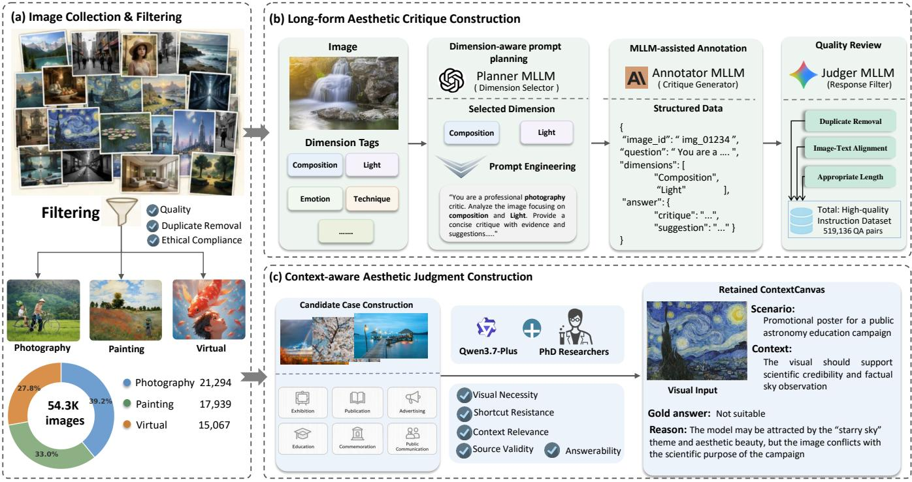  
Fi ure 3: Construction of AesCanvas. (a) A shared multi-domain ima e ool is collected and filtered. (b) CritiqueCanvas is generated through dimension-aware prompt planning, MLLM-assisted annotation, and quality filtering. (c) ContextCanvas is constructed from realistic aesthetic-use scenarios followed by expert review.

## C Contextual Multimodal Reasoning

Contextual multimodal reasoning requires models to com- bine visual evidence with task conditions, external knowl- edge, cultural conventions, and criterion-specific constraints. Recent benchmarks study real-world visual reasoning, context-dependent functional inference, and flexible judgment under varying criteria (Yin et al. 2026; Zhang et al. 2026; Xiong et al. 2026; Gao et al. 2024). Grounding-focused work further evaluates whether intermediate reasoning and final answers are supported by localized image evidence (Li et al. 2026; Wu et al. 2026b; Cai et al. 2024), while other studies expose failures under visual illusions, counterfactual or adversarial evidence, and conflicts between knowledge and images (Hou et al. 2026; Zhou et al. 2026; Moratelli et al. 2026). Culturally situated benchmarks likewise reveal fragility on region-specific artifacts and multilingual cultural evidence (Satar et al. 2025; Singh et al. 2026). However, these works primarily assess factual correctness, ground- ing, functional inference, or adherence to specified criteria, rather than whether contextual evidence should outweigh sur- face aesthetic appeal in a concrete visual-use decision. Con- textCanvas targets this intersection through use-oriented aesthetic suitability judgments grounded in both visual and contextual evidence.

## III Dataset

## A Dataset Overview

We introduce AesCanvas, a unified suite built from 54,300 images to study two complementary aspects of aesthetic intelligence: articulating visual qualities and judging their suitability in context. CritiqueCanvas contains 519,136 instruction–response pairs across photography, painting, and virtual imagery for long-form, multi-dimensional cri- tique generation. ContextCanvas comprises 301 expert- designed and reviewed cases that evaluate contextual aes- thetic suitability—whether an image is an appropriate visual choice for a specified purpose, audience, cultural setting, or domain convention, beyond its intrinsic visual appeal. To- gether, the two components test whether models that can identify and articulate aesthetic evidence can also translate it into contextually valid decisions.

## B Dataset Curation

As illustrated in Fig. 3, our pipeline branches from a shared multi-domain image pool into CritiqueCanvas for struc- tured aesthetic critique and ContextCanvas for closed-form contextual suitability judgment.

Image Collection and Filtering. We collect candidate im- ages from three visual domains: photography (e.g., natural scenes, architecture, portraiture, and commercial imagery), painting (primarily Western classical and related works), and virtual imagery (e.g., game scenes, animation-style images, and AI-generated content). Images are drawn from publicly accessible web sources and online museum and cultural- heritage collections, with available source URLs and prove- nance metadata retained. After removing low-quality, seman- tically uninformative, non-compliant, and duplicate samples, the pool contains 21,294 photographs, 17,939 paintings, and 15,067 virtual images, for a total of 54,300.

CritiqueCanvas Annotation and Construction. As shown in Fig. 3(b), we use a prompt-based pipeline that combines shared aesthetic dimensions with domain-specific criteria. The shared dimensions include Content and Narrative, Composition, Color, Lighting, Lines and Brushstrokes, Style, Emotion, Technique, Symbolism, and Visual Appeal. Annotating models select only the dimensions most rele- vant to each image rather than addressing all dimensions uniformly.

Prompts are further conditioned on the visual domain. Photography emphasizes exposure, perspective, depth of field, focus, motion, and compositional control; painting em- phasizes line, brushwork, genre, style, symbolism, and emo- tional expression; and virtual imagery emphasizes character design, scene construction, rendering consistency, narrative setting, and stylization. Multiple MLLMs generate structured annotations, which are converted into multi-turn instruction– response conversations covering description, evaluation, in- terpretation, technical analysis, and constructive improve- ment.

An independent Claude Opus 5 verifier screens generated pairs for instruction consistency, visual grounding, and re- sponse quality. A stratified audit of1,000 retained pairs yields 95.3% acceptance and 97% raw agreement; full criteria and statistics appear in the supplement.

ContextCanvas Construction and Review. As shown in Fig. 3(c), ContextCanvas is constructed from a selected subset of the shared image pool. Four PhD-level researchers with interdisciplinary backgrounds developed and reviewed 1,060 candidate cases. Each places an image in a plausi- ble use scenario—such as exhibition, publication, advertis- ing, education, commemoration, or public communication— and asks whether it is an appropriate visual choice for the stated purpose, audience, and context. Some cases include a curator- or designer-proposed assessment that the model must independently evaluate.

A case is retained only when it satisfies seven prespecified criteria: (1) aesthetic centrality, requiring a judgment about the image as a visual choice; (2) context dependence, such that intrinsic quality alone is insuficient; (3) visual necessity, such that the task cannot be reduced to text-only factual or cultural knowledge; (4) decisive evidence, such that relevant cultural, historical, or narrative evidence materially afects the answer; (5) scenario naturalness, requiring a plausible design or communication use; (6) answerability, requiring a unique closed-form answer from perceptible evidence; and (7) anti-shortcut validity, preventing wording, option length, or label priors from revealing the answer.

<table><tr><td>Task</td><td>Metric Family</td><td>Metrics</td></tr><tr><td rowspan="4"></td><td>CRITIQUE Lexical overlap</td><td>BLEU, ROUGE-L, METEOR</td></tr><tr><td>Semantic similarity</td><td>BERT-F1, SBERT-Cos</td></tr><tr><td>Image-text alignment</td><td>CLIPScore</td></tr><tr><td></td><td>Descriptive statistics Avg. Length, Avg. Dim. Hits, Top-3 Dimensions</td></tr><tr><td rowspan="2"></td><td>CoNTEXT Prediction quality</td><td>Accuracy, Macro-F1</td></tr><tr><td>Prediction tendency</td><td>Yes Rate</td></tr></table>

Table 1: Metrics used for the two evaluation tasks.

All candidates were reviewed against these criteria, with borderline cases resolved through discussion. Qwen3.7-Plus was used only as a development-time probe for trivial, am- biguous, or shortcut-prone cases; model failure alone never determined retention. All inclusion decisions, gold labels, rationales, and source records were finalized solely by hu- man reviewers, and its reported score is therefore marked as a development-model diagnostic.

The final benchmark contains 301 cases (28.40%): 300 single-image and one paired-image case, covering 302 im- ages, 291 binary questions, and 10 three-way questions. Each includes the visual input, use scenario, context, answer op- tions, gold label, source-grounded rationale, and provenance. The cases span painting, sculpture, illustration and comics, animation and digital imagery, photography, and film.

## C Evaluation Protocol

We evaluate critique generation on CritiqueCanvas and contextual suitability on ContextCanvas. Models receive identical inputs and instructions without web search, re- trieval, or auxiliary recognition tools; Table 1 summarizes the metrics.

Long-form Aesthetic Critique Generation. We evalu- ate models on 6,000 open-ended samples balanced across photography, painting, and virtual imagery, requiring aesthetic analysis or image-grounded improvement suggestions. Image-level splits keep related conversations together.

Because valid critiques may difer substantially in word- ing, we report complementary metric families. BLEU (Pa-pineni et al. 2002), ROUGE-L (Lin 2004), and METEOR (Banerjee and Lavie 2005) measure lexical overlap; BERT-F1 (Zhang et al. 2020) and SBERT-Cos (Reimers and Gurevych 2019) measure token- and sentence-level semantic similarity; and CLIPScore (Hessel et al. 2021) measures image–text relevance. These metrics are interpreted jointly rather than as complete measures of aesthetic reasoning.

<table><tr><td>Model</td><td>Acc.</td><td>Macro-F1</td><td>Yes (%)</td></tr><tr><td colspan="4">Closed-source MLLMs</td></tr><tr><td> Claude Opus 5</td><td>91.69</td><td>90.45</td><td>30.24</td></tr><tr><td>Gemini 3.1 Pro</td><td>85.71</td><td>83.06</td><td>26.12</td></tr><tr><td>GPT-5.5</td><td>83.06</td><td>80.13</td><td>27.49</td></tr><tr><td>Claude Opus 4.6</td><td>72.76</td><td>67.96</td><td>27.15</td></tr><tr><td>GPT-5.2</td><td>71.43</td><td>64.51</td><td>20.96</td></tr><tr><td>G GLM-5V-Turbo</td><td>57.81</td><td>55.22</td><td>43.64</td></tr><tr><td>女 Qwen3.7-Plus†</td><td>51.83</td><td>48.39</td><td>41.58</td></tr><tr><td>Ø Grok 4.20</td><td>44.19</td><td>39.09</td><td>37.80</td></tr><tr><td colspan="4">Open-weight General MLLMs</td></tr><tr><td>Qwen3-VL-Instruct (Bai et al. 2025)</td><td>42.19</td><td>38.74</td><td>44.67</td></tr><tr><td>ov InternVL3 (Zhu et al. 2025)</td><td>23.26</td><td>21.65</td><td>62.20</td></tr><tr><td>+. mPLUG-Owl2 (Ye et al. 2024)</td><td>20.27</td><td>17.43</td><td>50.17</td></tr><tr><td>LLaVA-OneVision (An et al. 2025)</td><td>19.93</td><td>18.20</td><td>71.13</td></tr><tr><td>LLaVA-v1.5 (Liu et al. 2024)</td><td>12.62</td><td>10.29</td><td>60.48</td></tr><tr><td colspan="4">Aesthetic-specific Models</td></tr><tr><td>ArtQuant-APDD (Liu et al. 2026)</td><td>29.57</td><td>29.50</td><td>59.11</td></tr><tr><td>ArtiMuse (Cao et al. 2025b)</td><td>19.60</td><td>17.87</td><td>62.54</td></tr><tr><td>Q-SiT (Zhang et al. 2025)</td><td>19.60</td><td>16.65</td><td>76.98</td></tr><tr><td>AesExpert (Huang et al. 2024a)</td><td>18.27</td><td>16.30</td><td>66.67</td></tr></table>

Table 2: Contextual aesthetic suitability results. Acc. is exact-match accuracy on all 301 cases. Macro-F1 and Yes (%) are computed on the 291 binary cases; the gold Yes rate is 38.14%. Best Acc. and Macro-F1 are bolded. † denotes the development model used for dificulty screening.

To further characterize response behavior, we report aver- age response length, average aesthetic-dimension coverage, and the three most frequently addressed dimensions in the supplementary material. Specifically, let D denote the predefined set of aesthetic dimensions, and let $m ( \hat { r } _ { i } , d )$ indicate whether response $\boldsymbol { { \hat { r } } } _ { i }$ explicitly addresses dimension d. The average number of dimensions addressed per response is

$$
\mathrm { D i m H i t s } = \frac { 1 } { N } \sum _ { i = 1 } ^ { N } \sum _ { d \in \mathcal { D } } m ( \hat { \boldsymbol { r } } _ { i } , d ) .\tag{1}
$$

This statistic measures the breadth of explicit aesthetic coverage rather than its correctness: a higher value does not necessarily indicate that the identified dimensions are rele- vant, accurate, or well grounded.

Contextual Aesthetic Suitability Judgment. For each ContextCanvas case, the model receives an image, a re- alistic use scenario, and fixed answer options, and returns a single option label. Explanations are retained for qualitative analysis but do not afect the primary score. A prediction is correct only if a unique option is parsed and matches the gold answer; missing, conflicting, or unparsable responses are counted as incorrect.

We report exact-match accuracy over all 301 cases. Macro- F1 and predicted Yes Rate are computed on the 291 bi- nary cases after mapping the options to canonical Yes/No labels; the remaining 10 three-way cases are included only in accuracy. The gold Yes Rate is 38.14%, against which the predicted rate indicates a model’s tendency toward over- acceptance or over-rejection.

## IV Experiments

## A Experimental Setup

Evaluated Models. We compare closed-source frontier MLLMs, open-weight general MLLMs, and aesthetic- specific models, separating general visual-language capabil- ity from specialization for aesthetic assessment or critique. Exact model variants are listed in Tables 2 and 3. Qwen3- VL denotes a variant adapted on CritiqueCanvas and evaluated only on critique generation.

Implementation Details. All models follow the protocol in Section III.C. Locally deployed models receive images resized or padded to 448 × 448 pixels. We use deterministic decoding whenever supported and a maximum of 256 tokens for critique generation; model-specific settings are reported in the supplementary material.

## B Main Results

Contextual Aesthetic Suitability Judgment Table 2 re- ports results on ContextCanvas. The benchmark clearly separates model capability levels. Accuracy among closed- source MLLMs ranges from 44.19% to 91.69%, while the strongest evaluated open-weight model, Qwen3-VL-Instruct, reaches only 42.19%. Within the Claude and GPT families, newer variants substantially outperform their predecessors: Claude Opus 5 improves over Claude Opus 4.6 by 18.93 accuracy points and 22.49 Macro-F1 points, while GPT-5.5 improves over GPT-5.2 by 11.63 and 15.62 points, respectively.

<table><tr><td>Model</td><td>BLEU</td><td>ROUGE-L</td><td>METEOR</td><td>BERT-F1</td><td>SBERT-Cos</td><td>CLIPScore</td></tr><tr><td colspan="7">Closed-source MLLMs</td></tr><tr><td>Gemini 3.1 Pro</td><td>7.15</td><td>0.250</td><td>0.281</td><td>0.699</td><td>0.848</td><td>0.303</td></tr><tr><td>GPT-5.2</td><td>2.84</td><td>0.210</td><td>0.209</td><td>0.669</td><td>0.818</td><td>0.301</td></tr><tr><td colspan="7">Open-weight General MLLMs</td></tr><tr><td>GLM-4.6-Flash (GLM-V Team et al. 2026)</td><td>5.50</td><td>0.241</td><td>0.273</td><td>0.676</td><td>0.844</td><td>0.317</td></tr><tr><td>LLaVA-OneVision(An et al. 2025)</td><td>10.32</td><td>0.285</td><td>0.275</td><td>0.724</td><td>0.839</td><td>0.319</td></tr><tr><td>InternVL (Wang et al. 2025) </td><td>9.15</td><td>0.272</td><td>0.280</td><td>0.716</td><td>0.829</td><td>0.300</td></tr><tr><td>Qwen3-VL (Bai et al. 2025)</td><td>5.12</td><td>0.232</td><td>0.274</td><td>0.684</td><td>0.827</td><td>0.313</td></tr><tr><td>Qwen3-VLFT</td><td>12.23</td><td>0.297</td><td>0.296</td><td>0.722</td><td>0.787</td><td>0.285</td></tr><tr><td colspan="7">Aesthetic-specific Models</td></tr><tr><td>ArtQuant-APDD (Liu et al. 2026)</td><td>10.68</td><td>0.280</td><td>0.277</td><td>0.716</td><td>0.818</td><td>0.297</td></tr><tr><td>ArtiMuse (Cao et al. 2025b)</td><td>7.98</td><td>0.271</td><td>0.239</td><td>0.718</td><td>0.826</td><td>0.312</td></tr><tr><td>UniPercept (Cao et al. 2025a)</td><td>5.12</td><td>0.235</td><td>0.200</td><td>0.693</td><td>0.823</td><td>0.318</td></tr><tr><td>AesExpert (Huang et al. 2024a)</td><td>2.08</td><td>0.198</td><td>0.128</td><td>0.651</td><td>0.609</td><td>0.262</td></tr><tr><td>Q-SiT (Zhang et al. 2025)</td><td>1.31</td><td>0.188</td><td>0.108</td><td>0.635</td><td>0.508</td><td>0.261</td></tr></table>

Table 3: Quantitative evaluation of long-form aesthetic critique generation on CritiqueCanvas. The reported metrics assess complementary aspects of generated critiques, including reference alignment through lexical and semantic similarity, and image–text relevance.

These within-family gains are consistent with improved con- textual aesthetic judgment in newer frontier models.

Most notably, all evaluated aesthetic-specific models achieve below 30% accuracy. ArtQuant-APDD, the strongest model in this group, obtains 29.57%, compared with 42.19% for Qwen3-VL-Instruct and 91.69% for Claude Opus 5. ArtiMuse, Q-SiT, and AesExpert achieve only 19.60%, 19.60%, and 18.27%, respectively. Thus, specialization for aesthetic scoring, perception, or critique does not reliably transfer to judging suitability under cultural, communicative, or domain-specific constraints.

The Yes-rate column further reveals a shared prediction tendency. Against the gold rate of 38.14%, aesthetic-specific models predict Yes in 59.11%–76.98% of the binary cases, indicating pronounced over-acceptance despite contextua mismatch. This pattern is consistent with aesthetic context bias, although similar marginal rates may arise from difer- ent instance-level failures. We examine these failure modes through category-level and qualitative analyses in the fol- lowing section. Although the binary subset has a 61.86% always-No majority baseline, weaker models often fall below it because they over-accept visually plausible but contextu- ally unsuitable images. Meanwhile, frontier models achieve up to 91.69% accuracy on the full benchmark, suggesting that ContextCanvas rewards context-sensitive judgment rather than majority-label guessing.

Long-form Aesthetic Critique Generation Table 3 re- ports results on CritiqueCanvas. No model dominates across all metric families. Gemini 3.1 Pro achieves the highest SBERT-Cos (0.848), while LLaVA-OneVision leads BERT-F1 (0.724) and CLIPScore (0.319). The adapted Qwen3-VLFT instead obtains the strongest lexical scores: 12.23 BLEU, 0.297 ROUGE-L, and 0.296 METEOR. Compared with the base Qwen3-VL, these correspond to gains of 7.11, 0.065, and 0.022, respectively. However, its SBERT-

Cos decreases from 0.827 to 0.787, and CLIPScore from 0.313 to 0.285, showing that adaptation improves reference-style matching without uniform gains in semantic similarity or image grounding.

Aesthetic-specific models remain competitive on selected critique metrics. ArtiMuse reaches 0.718 BERT-F1, close to the best score of 0.724, while UniPercept obtains a CLIP-Score of 0.318, only 0.001 below the overall best. ArtQuant also reaches 10.68 BLEU and 0.280 ROUGE-L, whereas AesExpert and Q-SiT perform weakly across most metrics. Overall critique performance is heterogeneous across lexical, semantic, and image-grounding criteria.

Together, the two tasks reveal a gap between reference- aligned critique generation and contextually valid aesthetic judgment. Additional response-level statistics are provided in the supplementary material.

## C Analysis

Beyond aggregate scores, we examine why aesthetic com- petence fails to transfer to culturally situated judgment. In the compact tables, GPT, Gem., Qwen+, Qwen-FT, AQ, and AM abbreviate GPT-5.2, Gemini 3.1 Pro, Qwen3.7-Plus, the CritiqueCanvas-adapted Qwen3-VL, ArtQuant-APDD, and ArtiMuse, respectively; vertical rules follow the model groups in Section IV.A.

Validity of Critique Metrics We evaluate whether reference-based metrics reflect practical critique quality on 100 randomly sampled CritiqueCanvas cases. 2 human evaluators rate five representative models on visual ground- ing, aesthetic specificity, criterion appropriateness, and ana- lytical usefulness, with Claude Opus 5 as the MLLM judge providing a complementary assessment.

As shown in Table 4, direct quality ratings do not consis- tently track the reference-similarity metrics in Table 3. Since valid critiques may emphasize diferent evidence and inter- pretations, lexical and semantic overlap capture only part of critique quality and should be complemented by direct judgments of grounding, specificity, and usefulness.

<table><tr><td>Rating</td><td>GPT</td><td>Gem.</td><td> $\mathbf { Q } \mathbf { w e n 3 - V L } _ { \mathrm { F T } }$ </td><td>AM</td><td>AQ</td></tr><tr><td>Human</td><td>3.9</td><td>4.1</td><td>2.5</td><td>2.6</td><td>2.3</td></tr><tr><td>MLLM</td><td>5.0</td><td>4.5</td><td>2.5</td><td>2.6</td><td>2.2</td></tr></table>

Table 4: Human and MLLM ratings of overall critique qual- ity.
<table><tr><td>Metric</td><td>GPT</td><td>Gem.</td><td>Qwen+</td><td>AQ</td><td>AM</td></tr><tr><td>Correct ↑</td><td>13</td><td>10</td><td>11</td><td>3</td><td>6</td></tr><tr><td>Reverse ↓</td><td>2</td><td>1</td><td>1</td><td>2</td><td>0</td></tr><tr><td>NCU↑</td><td>30.56</td><td>25.00</td><td>27.78</td><td>2.78</td><td>16.67</td></tr></table>

Table 5: Results of the 36-pair counterfactual audit.

Culture-Grounded Counterfactual Sensitivity We fur- ther examine whether contextual aesthetic decisions are grounded in culture-bearing visual evidence. We construct 36 paired counterfactual variants from ContextCanvas, keeping the evaluation scenario and overall visual presentation fixed while changing the decisive cue such that the intended judgment changes from No to Yes. These synthetic variants neither revise the original annotations nor constitute an additional accuracy split; they are used only as a matched diagnostic of directional decision updating. We report the numbers of cor- rect (No→ Yes) and reverse (Yes→No) updates, as well as Net Correct Update computed as $1 0 0 \times \mathrm { ( } N _ { \mathrm { c o r r e c t } } ^ { \mathrm { - } } - N _ { \mathrm { r e v e r s e } } \mathrm { ) / 3 6 }$

As shown in Table 5, all three general-purpose MLLMs show positive net updating, with NCU values concentrated between 25.00 and 30.56 despite their substantially diferent benchmark accuracies. This suggests that absolute contextual competence and responsiveness to decisive visual evidence are related but separable. More importantly, both evaluated aesthetic specialists show weaker net updating than every general-purpose model, with ArtQuant exhibiting almost no measurable response. The results indicate that aesthetic spe- cialization alone does not establish the visual–cultural bind- ing required for reliable contextual aesthetic judgment.

Transfer from Aesthetic Specialization To test whether specialization for conventional aesthetic tasks transfers to contextual suitability judgment, we compare each aesthetic specialist with its corresponding base model on the same ContextCanvas cases.

As shown in Figure 4, specialization significantly improves ArtQuant and AesExpert over their respective base models, but yields no measurable gain for ArtiMuse or Q-SiT. More-over, strong CritiqueCanvas metric alignment does not con- sistently translate into ContextCanvas accuracy.

Decisive-Cue Grounding Binary accuracy does not show whether a model is correct for the right visual reason. We therefore evaluate 100 balanced ContextCanvas cases using human judgments of answer correctness, decisive-cue identification, and contextual explanation. Evidence- Grounded Accuracy (EGA) requires all three.

(a) Effect of aesthetic specialization  
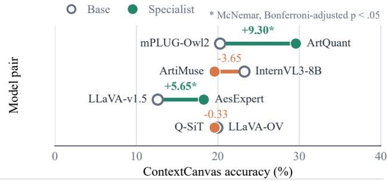  
(b) Critique alignment vs. contextual judgment

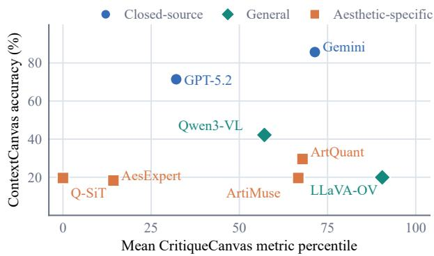  
Figure 4: Cross-task analysis. (a) Base–specialist transfer on ContextCanvas; \* denotes Bonferroni-corrected McNe- mar $p < . 0 5 .$ . (b) ContextCanvas accuracy against the mean percentile over six CritiqueCanvas metrics.

<table><tr><td>Metric</td><td>Gem.</td><td>GPT</td><td>Qwen+</td><td>AM</td></tr><tr><td>Accuracy ↑</td><td>83</td><td>65</td><td>42</td><td>21</td></tr><tr><td>EGA↑</td><td>79</td><td>55</td><td>31</td><td>3</td></tr><tr><td>Unsupported ↓</td><td>4.82</td><td>15.38</td><td>26.19</td><td>85.71</td></tr></table>

Table 6: Decisive-cue attribution on 100 balanced cases.

As shown in Table 6, general-purpose models preserve much of their accuracy under the stricter grounding criterion, whereas ArtiMuse drops from 21% accuracy to 3% EGA. Unsupported is the percentage of correct predictions that fail the decisive-cue grounding criterion. This gap indicates that fluent aesthetic rationales may still fail to identify the culture- bearing evidence that determines contextual suitability.

## V Conclusion

We introduced AesCanvas, comprising CritiqueCanvas and ContextCanvas, to evaluate aesthetic critique and con- textual suitability. Across closed-source, open-weight, and aesthetic-specific models, strong critique performance does not reliably translate into context-sensitive judgment: aesthetic specialists may remain competitive on critique met- rics yet achieve low accuracy and exhibit over-acceptance on ContextCanvas. Paired and diagnostic analyses further reveal inconsistent benefits from aesthetic tuning and limited use of decisive contextual evidence. These findings support treating culturally situated suitability as a distinct training and evaluation objective that requires models to integrate visual evidence with cultural knowledge, intended use, and domain-specific constraints.

## References

An, X.; Xie, Y.; Yang, K.; Zhang, W.; Zhao, X.; Cheng, Z.; Wang, Y.; Xu, S.; Chen, C.; Zhu, D.; Wu, C.; Tan, H.; Li, C.; Yang, J.; Yu, J.; Wang, X.; Qin, B.; Wang, Y.; Yan, Z.; Feng, Z.; Liu, Z.; Li, B.; and Deng, J. 2025. LLaVA-OneVision- 1.5: Fully Open Framework for Democratized Multimodal Training. arXiv:2509.23661.

Bai, S.; Cai, Y.; Chen, R.; Chen, K.; Chen, X.; Cheng, Z.; Deng, L.; Ding, W.; Gao, C.; Ge, C.; Ge, W.; Guo, Z.; Huang, Q.; Huang, J.; Huang, F.; Hui, B.; Jiang, S.; Li, Z.; Li, M.; Li, M.; Li, K.; Lin, Z.; Lin, J.; Liu, X.; Liu, J.; Liu, C.; Liu, Y.; Liu, D.; Liu, S.; Lu, D.; Luo, R.; Lv, C.; Men, R.; Meng, L.; Ren, X.; Ren, X.; Song, S.; Sun, Y.; Tang, J.; Tu, J.; Wan, J.; Wang, P.; Wang, P.; Wang, Q.; Wang, Y.; Xie, T.; Xu, Y.; Xu, H.; Xu, J.; Yang, Z.; Yang, M.; Yang, J.; Yang, A.; Yu, B.; Zhang, F.; Zhang, H.; Zhang, X.; Zheng, B.; Zhong, H.; Zhou, J.; Zhou, F.; Zhou, J.; Zhu, Y.; and Zhu, K. 2025. Qwen3-VL Technical Report. arXiv:2511.21631.

Banerjee, S.; and Lavie, A. 2005. METEOR: An Automatic Metric for MT Evaluation with Improved Correlation with Human Judgments. In Goldstein, J.; Lavie, A.; Lin, C.-Y.; and Voss, C., eds., Proceedings ofthe ACL Workshop on Intrinsic and Extrinsic Evaluation Measuresfor Machine Translation and/or Summarization, 65–72. Ann Arbor, Michigan: Asso-ciation for Computational Linguistics.

Cai, C.; Zhang, R.; Gao, J.; Wu, K.; Yap, K.-H.; and Wang, Y. 2024. Temporal sentence grounding with temporally global textual knowledge. In 2024 IEEE International Conference on Multimedia and Expo (ICME), 1–6. IEEE.

Cao, S.; Li, J.; Li, X.; Pu, Y.; Zhu, K.; Gao, Y.; Luo, S.; Xin, Y.; Qin, Q.; Zhou, Y.; Chen, X.; Zhang, W.; Fu, B.; Qiao, Y.; and Liu, Y. 2025a. UniPercept: Towards Unified Perceptual- Level Image Understanding across Aesthetics, Quality, Structure, and Texture. arXiv:2512.21675.

Cao, S.; Ma, N.; Li, J.; Li, X.; Shao, L.; Zhu, K.; Zhou, Y.; Pu, Y.; Wu, J.; Wang, J.; Qu, B.; Wang, W.; Qiao, Y.; Yao, D.; and Liu, Y. 2025b. ArtiMuse: Fine-Grained Image Aesthetics Assessment with Joint Scoring and Expert-Level Understanding. arXiv:2507.14533.

Gao, J.; Yap, K.-H.; Wu, K.; Phan, D. T.; Garg, K.; and Han, B. S. 2024. Contextual human object interaction understanding from pre-trained large language model. In ICASSP 2024- 2024 IEEE International Conference on Acoustics, Speech and Signal Processing (ICASSP), 13436–13440. IEEE.

GLM-V Team; Hong, W.; Yu, W.; Gu, X.; Wang, G.; et al. 2026. GLM-4.5V and GLM-4.1V-Thinking: Towards Ver- satile Multimodal Reasoning with Scalable Reinforcement Learning. arXiv preprint arXiv:2507.01006.

Hessel, J.; Holtzman, A.; Forbes, M.; Le Bras, R.; and Choi, Y. 2021. CLIPScore: A Reference-free Evaluation Metric for Image Captioning. In Moens, M.-F.; Huang, X.; Specia,

L.; and Yih, S. W.-t., eds., Proceedings of the 2021 Conference on Empirical Methods in Natural Language Processing, 7514–7528. Online and Punta Cana, Dominican Republic: Association for Computational Linguistics.

Hou, W.; Liu, W.; Hu, H.; Sun, X.; Yeung-Levy, S.; and Fan, H. 2026. Seeing Is Believing? A Benchmark for Multimodal Large Language Models on Visual Illusions and Anomalies. arXiv preprint arXiv:2602.01816.

Huang, Y.; Sheng, X.; Yang, Z.; Yuan, Q.; Duan, Z.; Chen, P.; Li, L.; Lin, W.; and Shi, G. 2024a. AesExpert: Towards Multi- modality Foundation Model for Image Aesthetics Perception. arXiv:2404.09624.

Huang, Y.; Yuan, Q.; Sheng, X.; Yang, Z.; Wu, H.; Chen, P.; Yang, Y.; Li, L.; and Lin, W. 2024b. AesBench: An Expert Benchmark for Multimodal Large Language Models on Im- age Aesthetics Perception. arXivpreprint arXiv:2401.08276.

Kong, S.; Shen, X.; Lin, Z.; Mech, R.; and Fowlkes, C. C. 2016. Photo Aesthetics Ranking Network with Attributes and Content Adaptation. In Computer Vision – ECCV 2016, volume 9905 of Lecture Notes in Computer Science, 662– 679. Springer.

Li, R.; Li, L.; Ren, S.; Tian, H.; Gu, S.; Li, S.; Yue, Z.; Wang, Y.; Ma, W.; Yang, Z.; Ma, J.; Sui, Z.; and Luo, F. 2026. GroundingME: Exposing the Visual Grounding Gap in MLLMs through Multi-Dimensional Evaluation. In Proceedings of the IEEE/CVF Conference on Computer Vision and Pattern Recognition, 2412–2422.

Liang, J.; Wu, K.; Hu, X.; and Liu, T. 2026. Cibic: Pixel- free foundation model for robust corrupted image bitstream captioning. Pattern Recognition, 114238.

Liao, M.; Ma, T.; and Zhang, X. 2026. Open World Image Aesthetic Assessment. In Proceedings of the IEEE/CVF Conference on Computer Vision and Pattern Recognition Findings, 9791–9801.

Lin, C.-Y. 2004. ROUGE: A Package for Automatic Evalua- tion ofSummaries. In Text Summarization Branches Out, 74– 81. Barcelona, Spain: Association for Computational Lin- guistics.

Liu, H.; Huang, N.; Liu, C.; Yan, J.; Huang, H.; Ying, J.; Lee, T.-Y.; Wan, P.; and Ji, X. 2026. Bridging Cognitive Gap: Hierarchical Description Learning for Artistic Image Aesthetics Assessment. arXiv:2512.23413.

Liu, H.; Li, C.; Li, Y.; and Lee, Y. J. 2024. Improved base- lines with visual instruction tuning. In Proceedings of the IEEE/CVF conference on computer vision and pattern recognition, 26296–26306.

Mai, L.; Jin, H.; and Liu, F. 2016. Composition-Preserving Deep Photo Aesthetics Assessment. In Proceedings of the IEEE Conference on Computer Vision and Pattern Recognition, 497–506.

Moratelli, N.; Davis, C.; Ribeiro, L. F. R.; Byrne, B.; and Iglesias, G. 2026. Benchmarking Deflection and Halluci- nation in Large Vision-Language Models. arXiv preprint arXiv:2604.12033.

Murray, N.; Marchesotti, L.; and Perronnin, F. 2012. AVA: A Large-Scale Database for Aesthetic Visual Analysis. In

Proceedings of the IEEE Conference on Computer Vision and Pattern Recognition.

Papineni, K.; Roukos, S.; Ward, T.; and Zhu, W.-J. 2002. Bleu: a Method for Automatic Evaluation of Machine Trans- lation. In Isabelle, P.; Charniak, E.; and Lin, D., eds., Proceedings of the 40th Annual Meeting of the Association for Computational Linguistics, 311–318. Philadelphia, Pennsyl-vania, USA: Association for Computational Linguistics.

Qi, D.; Zhao, H.; Shi, J.; Jenni, S.; Fan, Y.; Dernoncourt, F.; Cohen, S.; and Li, S. 2025. The Photographer’s Eye: Teach- ing Multimodal Large Language Models to See, and Cri- tique Like Photographers. In Proceedings ofthe IEEE/CVF Conference on Computer Vision and Pattern Recognition, 24807–24816.

Reimers, N.; and Gurevych, I. 2019. Sentence-BERT: Sen- tence Embeddings using Siamese BERT-Networks. In Inui, K.; Jiang, J.; Ng, V.; and Wan, X., eds., Proceedings of the 2019 Conference on Empirical Methods in Natural Language Processing and the 9th International Joint Conference on Natural Language Processing (EMNLP-IJCNLP), 3982– 3992. Hong Kong, China: Association for Computational Linguistics.

Satar, B.; Ma, Z.; Irawan, P. A.; Mulyawan, W. A.; Jiang, J.; Lim, E.-P.; and Ngo, C.-W. 2025. Seeing Culture: A Bench- mark for Visual Reasoning and Grounding. In Proceedings of the 2025 Conference on Empirical Methods in Natural Language Processing, 22227–22243. Suzhou, China: Asso-ciation for Computational Linguistics.

Singh, D.; Nagrani, A.; Manikantan, K.; Singh, H.; Tewari, D.; Weyand, T.; Schmid, C.; Angelova, A.; and Dave, S. 2026. CURVE: A Benchmark for Cultural and Multilingual Long Video Reasoning. arXiv preprint arXiv:2601.10649.

Talebi, H.; and Milanfar, P. 2018. NIMA: Neural Image Assessment. IEEE Transactions on Image Processing, 27(8): 3998–4011.

Wang, W.; Gao, Z.; Gu, L.; Pu, H.; Cui, L.; Wei, X.; Liu, Z.; Jing, L.; Ye, S.; Shao, J.; Wang, Z.; Chen, Z.; Zhang, H.; Yang, G.; Wang, H.; Wei, Q.; Yin, J.; Li, W.; Cui, E.; Chen, G.; Ding, Z.; Tian, C.; Wu, Z.; Xie, J.; Li, Z.; Yang, B.; Duan, Y.; Wang, X.; Hou, Z.; Hao, H.; Zhang, T.; Li, S.; Zhao, X.; Duan, H.; Deng, N.; Fu, B.; He, Y.; Wang, Y.; He, C.; Shi, B.; He, J.; Xiong, Y.; Lv, H.; Wu, L.; Shao, W.; Zhang, K.; Deng, H.; Qi, B.; Ge, J.; Guo, Q.; Zhang, W.; Zhang, S.; Cao, M.; Lin, J.; Tang, K.; Gao, J.; Huang, H.; Gu, Y.; Lyu, C.; Tang, H.; Wang, R.; Lv, H.; Ouyang, W.; Wang, L.; Dou, M.; Zhu, X.; Lu, T.; Lin, D.; Dai, J.; Su, W.; Zhou, B.; Chen, K.; Qiao, Y.; Wang, W.; and Luo, G. 2025. InternVL3.5: Advancing Open-Source Multimodal Models in Versatility, Reasoning, and Eficiency. arXiv:2508.18265.

Wu, H.; Zhang, Z.; Zhang, W.; Chen, C.; Liao, L.; Li, C.; Gao, Y.; Wang, A.; Zhang, E.; Sun, W.; Yan, Q.; Min, X.; Zhai, G.; and Lin, W. 2024. Q-Align: Teaching LMMs for Visual Scoring via Discrete Text-Defined Levels. In Proceedings of the 41st International Conference on Machine Learning, volume 235 of Proceedings of Machine Learning Research, 54015–54029. PMLR.

Wu, K.; Li, F.; Liu, W.; Liu, Q.; and Yang, Y. 2026a. Cor-rupted bitstream semantic understanding by adaptive-modal large language models. Pattern Recognition, 180: 114151.

Wu, Q.; Yang, X.; Zhou, Y.; Fang, C.; Song, B.; Sun, X.; and Ji, R. 2026b. Grounded Chain-of-Thought for Multimodal Large Language Models. In Proceedings of the IEEE/CVF Conference on Computer Vision and Pattern Recognition, 33577–33587.

Xiong, T.; Ge, Y.; Li, M.; Zhang, Z.; Kulkarni, P.; Wang, K.; He, Q.; Zhu, Z.; Liu, C.; Chen, R.; Zheng, T.; Chen, Y.; Wang, X.; Zhang, R.; Chen, W.; and Huang, H. 2026. Multi-Crit: Benchmarking Multimodal Judges on Pluralistic Criteria- Following. In Proceedings ofthe IEEE/CVF Conference on Computer Vision and Pattern Recognition, 8641–8652.

Yang, Y.; Xu, L.; Li, L.; Qie, N.; Li, Y.; Zhang, P.; and Guo, Y. 2022. Personalized Image Aesthetics Assessment with Rich Attributes. In Proceedings ofthe IEEE/CVF Conference on Computer Vision and Pattern Recognition, 19861–19869.

Yang, Z.; Wang, J.; Zhang, Z.; Xie, P.; Sheng, X.; Chen, P.; and Li, L. 2026. Fine-Grained Image Aesthetic Assess- ment: Learning Discriminative Scores from Relative Ranks. In Proceedings of the IEEE/CVF Conference on Computer Vision and Pattern Recognition, 145–155.

Ye, Q.; Xu, H.; Ye, J.; Yan, M.; Hu, A.; Liu, H.; Qian, Q.; Zhang, J.; and Huang, F. 2024. mplug-owl2: Revolutionizing multi-modal large language model with modality collabora- tion. In Proceedings of the ieee/cvf conference on computer vision and pattern recognition, 13040–13051.

Yi, R.; Tian, H.; Gu, Z.; Lai, Y.-K.; and Rosin, P. L. 2023. To- wards Artistic Image Aesthetics Assessment: A Large-Scale Dataset and a New Method. In Proceedings ofthe IEEE/CVF Conference on Computer Vision and Pattern Recognition, 22388–22397.

Yin, Y.; Krishnakumar, H.; Lee, C. P.; Zeng, B.; Chai, W.; Tong, S.; Chen, W.; Xu, H.; Fu, X.; Sarch, G.; Korolova, A.; and Liu, Z. 2026. WorldBench: A Challenging and Visually Diverse Multimodal Reasoning Benchmark. arXiv preprint arXiv:2606.06538.

Zhang, L.; Yang, J.; Krishnan, S.; Majmudar, J.; Ge, X.; Puri, P.; Saraf, P.; Bhargava, S.; Piraviperumal, D.; Ling, Y.; Pan, C.; Yu, H.; Agrawal, A.; and Tseng, B.-H. 2026. From Where Things Are to What They Are For: Benchmarking Spatial- Functional Intelligence in Multimodal LLMs. In Proceedings of the IEEE/CVF Conference on Computer Vision and Pattern Recognition, 12052–12063.

Zhang, T.; Kishore, V.; Wu, F.; Weinberger, K. Q.; and Artzi, Y. 2020. BERTScore: Evaluating Text Generation with BERT. arXiv:1904.09675.

Zhang, Z.; Wu, H.; Jia, Z.; Lin, W.; and Zhai, G. 2025. Teaching LMMs for Image Quality Scoring and Interpreting. arXiv:2503.09197.

Zhou, S.; Jia, B.; Wu, K.; Shen, Y.; Li, T.; Wu, Y.; and Lin, S. 2026. ReactBench: A Cause-Driven Benchmark for Multimodal Hallucination via Systematic Evaluation. arXiv preprint arXiv:2605.29579.

Zhou, Z.; Wang, Q.; Lin, B.; Su, Y.; Chen, R.; Tao, X.; Zheng,A.; Yuan, L.; Wan, P.; and Zhang, D. 2024. UNIAA: A

Unified Multi-modal Image Aesthetic Assessment Baseline and Benchmark. arXiv:2404.09619.

Zhu, J.; Wang, W.; Chen, Z.; Liu, Z.; Ye, S.; Gu, L.; Tian, H.; Duan, Y.; Su, W.; Shao, J.; Gao, Z.; Cui, E.; Wang, X.; Cao, Y.; Liu, Y.; Wei, X.; Zhang, H.; Wang, H.; Xu, W.; Li, H.; Wang, J.; Deng, N.; Li, S.; He, Y.; Jiang, T.; Luo, J.; Wang, Y.; He, C.; Shi, B.; Zhang, X.; Shao, W.; He, J.; Xiong, Y.; Qu, W.; Sun, P.; Jiao, P.; Lv, H.; Wu, L.; Zhang, K.; Deng, H.; Ge, J.; Chen, K.; Wang, L.; Dou, M.; Lu, L.; Zhu, X.; Lu, T.; Lin, D.; Qiao, Y.; Dai, J.; and Wang, W. 2025. InternVL3: Exploring Advanced Training and Test-Time Recipes for Open-Source Multimodal Models. arXiv:2504.10479.

## Supplementary Material

# AesCanvas: A Large-Scale Dataset and Benchmark for Aesthetic Critique and Contextual Suitability

## Supplement Contents

S1 Supplement Overview and Positioning 2   
S1.1 Positioning Relative to Prior Datasets 2   
S2 Dataset and Evaluation Materials 3   
S2.1 Dataset Documentation . 3   
S2.2 Prompts 7   
S2.3 Evaluation Rubrics and Metrics 15   
S2.4 Implementation Details 19   
S3 Additional Analyses and Insights 20   
S3.1 Model-Output Analysis . 20   
S3.2 Extended and Robustness Analyses 23

## S1 Supplement Overview and Positioning

This supplement documents AesCanvas and additional diagnostics. Section S2 provides the dataset, prompt, evaluation, and implementation materials; Section S3 presents model-output, robustness, and transfer analyses.

## S1.1 Positioning Relative to Prior Datasets

Table S1 compares published dataset and supervision afordances. A checkmark requires explicit support in the corresponding paper or dataset documentation; a triangle denotes limited or indirect support. Usecontext judgment specifically requires an auditable decision about whether an image is appropriate for a stated purpose, audience, or convention, rather than generic context reasoning or intrinsic aesthetic scoring.

The comparison covers established photographic-aesthetics datasets (Murray, Marchesotti, and Perronnin, 2012; Kong et al., 2016; Yang et al., 2022), AI-generated-image quality datasets (Li et al., 2024; Wang et al., 2023), and recent multimodal aesthetic-critique and assessment resources (Huang et al., 2024b,a; Qi et al., 2025; Cao et al., 2025; Liu et al., 2026).

Table S1: Comparison of media coverage and aesthetic supervision.
<table><tr><td>Dataset</td><td>Scale</td><td>Photo- graphy</td><td>Painting / art</td><td>AIGC / virtual</td><td>Long-form critique</td><td>Structured dimensions</td><td>Grounded explanation</td><td>Use-context judgment</td></tr><tr><td>AVA</td><td>&gt;250K images</td><td>√</td><td>一</td><td>一</td><td></td><td>△</td><td></td><td></td></tr><tr><td>AADB</td><td>10K images</td><td>√</td><td>一</td><td>一</td><td>一</td><td>√</td><td></td><td>一</td></tr><tr><td>PARA</td><td>31,220 images</td><td>√</td><td>一</td><td>一</td><td>1</td><td>√</td><td>一</td><td>一</td></tr><tr><td>AGIQA-3K</td><td>2,982 AGIs</td><td>-</td><td>一</td><td>√</td><td>一</td><td>△</td><td>一</td><td>一</td></tr><tr><td>AIGCIQA- 2023</td><td>2,400 AGIs</td><td>一</td><td>一</td><td>√</td><td>一</td><td>√</td><td>一</td><td></td></tr><tr><td>AesBench/ EAPD</td><td>2,800 images; 11,200 annotations</td><td>√</td><td>√</td><td>√</td><td>√</td><td>√</td><td>√</td><td></td></tr><tr><td>AesMMIT</td><td>21,904 images; 409K instructions</td><td>√</td><td>√</td><td>√</td><td>√</td><td>√</td><td>√</td><td></td></tr><tr><td>Photo- Critique</td><td>450K images; 2.4M</td><td>√</td><td>一</td><td>一</td><td>√</td><td>△</td><td>√</td><td></td></tr><tr><td>ArtiMuse- 10K</td><td>samples 10K images</td><td>√</td><td>√</td><td>√</td><td>√</td><td>√</td><td>√</td><td></td></tr><tr><td>RAD/ ArtQuant</td><td>70K structured descriptions</td><td>一</td><td>√</td><td>一</td><td>√</td><td>√</td><td>√</td><td></td></tr><tr><td>AesCanvas (ours)</td><td>54.3K images; 519K critique pairs; 301 context cases</td><td>√</td><td>√</td><td>√</td><td>√</td><td>√</td><td>√</td><td>√</td></tr></table>

Note. –denotes that the afordance is not established in the published dataset design. AVA provides score distributions and semantic/style labels; AGIQA-3K provides perceptual-quality and text–image-alignment scores; and PhotoCritique provides broad photographic feedback rather than a fixed multi-dimensional annotation schema. “Painting / art” includes broader artistic imagery, while “AIGC / virtual” includes generated and other virtual imagery.

Prior resources already provide substantial supervision for intrinsic aesthetic perception and critique. AesCanvas complements them by coupling long-form critique with a closed-form benchmark in which cultural, narrative, functional, or domain-specific evidence can change whether an image is suitable for a concrete use.

## S2 Dataset and Evaluation Materials

This section documents the record schemas, prompt templates and representative intervention specifications, evaluation procedures, and implementation details needed to interpret AesCanvas and the reported measurements.

## S2.1 Dataset Documentation

## S2.1.1 AesCanvas Overview

AesCanvas contains two complementary components derived from a shared image pool. Table S2 summarizes their data units, scales, outputs, and evaluation roles.

Table S2: Suite-level data card for the two AesCanvas components.
<table><tr><td>Field</td><td>CritiqueCanvas</td><td>ContextCanvas</td></tr><tr><td>Primary task</td><td>tique</td><td>Long-form, multi-dimensional aesthetic cri- Contextual aesthetic suitability judgment</td></tr><tr><td>Data unit</td><td>response</td><td>Image, instruction, selected dimensions, and Image(s), use scenario, options, gold label, ra- tionale, and provenance</td></tr><tr><td>Scale</td><td>519,136 instruction-response pairs</td><td>301 cases using 302 unique images</td></tr><tr><td>Output</td><td>Open-ended critique</td><td>291 two-option and 10 three-option decisions</td></tr><tr><td>Coverage</td><td>Photography, painting, and virtual imagery</td><td>Painting, sculpture, illustration/comics, anima- tion/digital imagery, photography, and film</td></tr><tr><td>Evaluation role</td><td>6,000-case generation evaluation</td><td>Fixed-order diagnostic benchmark</td></tr></table>

The shared pool comprises 21,294 photographs, 17,939 paintings, and 15,067 virtual images. Photography includes natural scenes, architecture, portraiture, commercial imagery, and other camera-based work; painting contains primarily Western classical and related painted work; and virtual imagery includes game scenes, animation-style illustration, and AI-generated content. Images were collected from publicly accessible web sources, museums, and cultural-heritage collections. Low-quality, semantically uninformative, non-compliant, duplicate, and near-duplicate candidates were removed. CritiqueCanvas conversations derived from the same image are grouped before splitting so that related records do not cross its train/evaluation partitions. ContextCanvas is used as a fixed diagnostic set rather than a training split.

For documentation clarity, we provide the dataset cards, record schemas, prompts, metric definitions, evaluation and parsing procedures, and representative examples for both components. Task-specific model inputs, supervision fields, rationales, and provenance metadata are described below.

## S2.1.2 CritiqueCanvas

CritiqueCanvas uses ten shared dimensions: Content/Narrative, Composition, Color, Lighting, Lines/Brushstrokes, Style, Emotion, Technique, Symbolism, and Visual Appeal. Only image-relevant dimensions are selected for a given record. The shared dimensions are complemented by domain-conditioned criteria: photography emphasizes exposure, perspective, depth of field, focus, motion, and compositional control; painting emphasizes line, brushwork, genre, style, symbolism, and emotion; and virtual imagery emphasizes character design, scene construction, rendering consistency, narrative setting, and stylization.

The CritiqueCanvas record schema identifies the image and domain, selected dimensions, instruction, target response, conversation group, split, and associated provenance/governance metadata. The evaluation loader consumes a compact conversation form with id, image, and conversations; it takes the first user/human turn as the instruction and the first assistant/GPT turn as the reference. The image and instruction form the model input, while the reference is withheld until scoring. Each row records sample id, relative and resolved image paths, the exact rendered prompt, reference, prediction, model, task, and timestamp. Each six-pair construction dialogue was converted into six pair-level records sharing a conversation-group identifier; the evaluation export therefore contains one human–assistant pair per record. Source, license, selected-dimension, split, audit, and governance fields are retained as metadata but are never supplied as model input. Representative examples spanning photography, illustration, and painting, as well as both open-ended and dimension-focused instruction functions, are shown in Fig. S1.

Gemini performs dimension-aware planning, GLM generates the corresponding domain-conditioned critique annotations, and an independent Claude Opus 5 verification stage screens instruction consistency, visual grounding, and response quality. Five human reviewers then independently inspected a stratified sample of 1,000 retained pairs using the rubric detailed below. The audit yielded 95.3% acceptance and 97.0% raw agreement.

## S2.1.3 ContextCanvas

ContextCanvas was sampled from the same 54,300-image pool. The 1,060 initial candidate cases were collected primarily through a call circulated within the university. Graduate research assistants, doctoral researchers, and faculty spanning computer science and electrical engineering, visual arts and art history, design and visual communication, and cultural and media studies contributed source ideas and image–use proposals. A separate multidisciplinary panel of four PhD-level researchers developed these contributions into formal candidate cases and reviewed them through iterative refinement, standardization, cross-disciplinary checking, and final adjudication. A candidate was retained only if it satisfied aesthetic centrality, context dependence, visual necessity, decisive evidence, scenario naturalness, answerability, and anti-shortcut validity. Qwen3.7-Plus was used only as a development-time probe for trivial, ambiguous, or shortcut-prone candidates; model failure was never an inclusion condition. The four-person review panel finalized all questions, options, gold labels, source-grounded rationales, and source records.

The 301 retained cases comprise 300 single-image cases and one paired-image case, covering 302 unique images. Each case record stores the stable evaluation ID, original case ID, image descriptor(s), question, options, gold option ID and text, source-grounded rationale, source basis, and provenance/rights fields. Only the image(s), question, and fixed options are model input; labels, rationales, source titles, URLs, development metadata, and model-probe results are excluded.

A label-balanced demonstration of retained cases is shown in Fig. S2. The examples are organized by the mechanism that makes the aesthetic-use decision non-trivial: cultural or historical alignment; narrative meaning that reverses attractive, serene, or balanced surface qualities; apparent visual mismatch that strengthens a communicative purpose; and medium- or story-specific framing. Every example distinguishes the visible cue, the contextual knowledge it activates, and the resulting visual-use decision. This presentation makes clear that the task is neither artwork-title recall nor context-free cultural question answering.

Expert review also removed coherent human-drafted questions that failed one of the retention requirements. Figure S3 shows three such boundaries: a bridal image whose conspicuous negative afect makes the answer available through coarse emotion recognition; The Wolfand the Crane, whose decisive betrayal occurs outside the depicted moment and therefore weakens visual necessity; and the historical “DON’T MIX ’EM” poster, for which a contemporary campaign can defensibly reject the sensational design, preventing a uniquely compelled gold label. These examples demonstrate that professional wording and a plausible intended answer were insuficient for retention. They are illustrative and are not used to estimate a distribution of rejection reasons.

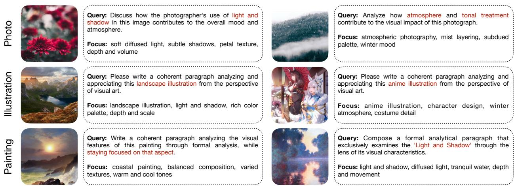  
Figure S1: Representative CritiqueCanvas examples across photography, illustration, and painting. Each example pairs an image with its rendered query and the corresponding aesthetic focus. The examples include both broad image-appreciation prompts and prompts targeting specific dimensions such as light and shadow, atmosphere, tonal treatment, and formal analysis

## S2.1.4 Provenance and Governance

For each ContextCanvas image, provenance metadata include the known title, creator, provider, source URL, license note, and redistribution status. Missing creator names are preserved as unknown rather than inferred. Synthetic counterfactual edits are clearly labeled as research diagnostics and are not treated as natural benchmark images or training annotations.

The datasets necessarily reflect the source pool and the expertise of the case contributors and review panel. ContextCanvas is an expert diagnostic benchmark rather than exhaustive coverage of cultures, audiences, or design practice, and a source-grounded rationale does not eliminate every historically or culturally contestable interpretation. CritiqueCanvas similarly permits multiple valid analyses of the same image; its reference response is supervision, not the only legitimate critique.

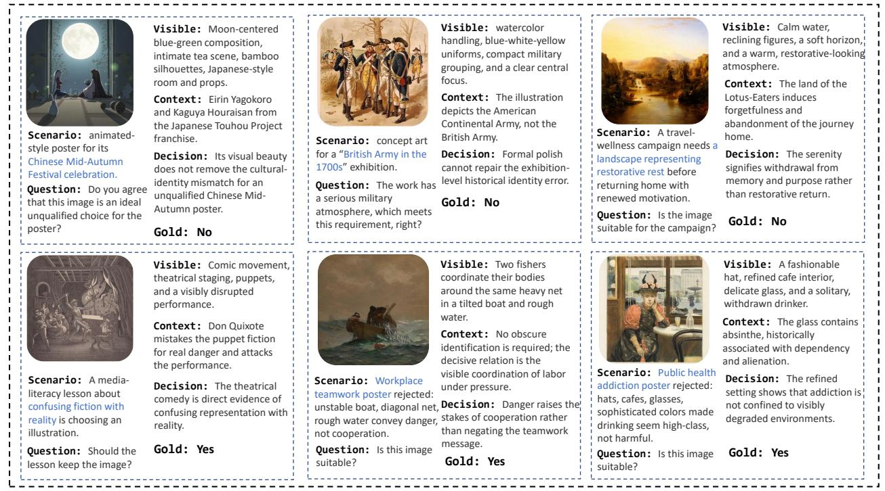  
Figure S2: Representative retained ContextCanvas cases. Top row, from left to right: HB208 (Mid-Autumn cultural fit), HB014 (historical military identity), and HB159 (restorative return versus the Lotus-Eaters’ withdrawal). Bottom row: HB155 (fiction–reality confusion), HB181 (teamwork under visual tension), and HB186 (addiction in a refined setting). Each card separates visible form, use scenario, contextual evidence, decision, and gold label.

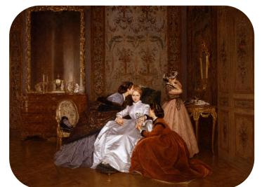

Question: A bridal salon is considering this image for “A Joyful Yes, Freely Chosen.” Do you agree that the image is suitable without qualification for this campaign? Intended gold: No

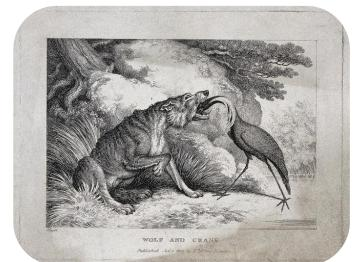

Question: A medical association is   
considering this image for “Trust Makes   
Difficult Care Possible.” Do you agree that   
the image is suitable without qualification   
for this campaign?   
Intended gold: No   
Question: A city road-safety programme is   
choosing the lead image for a campaign   
about the danger of combining alcohol and   
driving. Should it be considered an ideal   
promotional image?   
Intended gold: Yes

Reasoning: Insufficiently challenging for the benchmark: conspicuous negative affect allows correct answers via coarse emotion recognition, bypassing cultural context and fine-grained aesthetic evidence.

Reasoning: Betrayal occurs after the depicted moment, unseen in the image. Item relies on recalling the full story, risking literary retrieval over image-grounded judgment.

Reasoning: A contemporary city campaign may reject old sensational design despite understanding its purpose. The consultant's objection is strategically defensible, so "ideal" has no single compelled answer.

Figure S3: Human-drafted candidates excluded after expert review. From left to right: R41Q05 was insuficiently challenging because conspicuous negative afect enabled a coarse shortcut; R41Q08 weakened visual necessity because the decisive betrayal occurs outside the depicted moment; and R69Q06 lacked a uniquely compelled gold label for a contemporary campaign.

## S2.2 Prompts

We report the prompts used in dataset construction and in the experiments described in the main paper.

## S2.2.1 CritiqueCanvas Prompts

## CritiqueCanvas · Planning Prompt

System Message

You are a Planner MLLM for long-form aesthetic critique construction. Your role is to inspect the image and select the most relevant evaluation dimensions before another model writes the final critique. Do not write the final answer.

Use the following ten shared aesthetic dimensions for all images:

1. Content and Narrative: subject matter, narrative, visual theme, contextual meaning, and what the image is primarily about.

2. Composition: spatial organization, focal point, balance, perspective, framing, visual hierarchy, leading lines, and arrangement of elements.

3. Color: palette, harmony, contrast, saturation, brightness, color balance, and the emotional or symbolic function of color.

4. Lighting: light source, illumination, highlights, shadows, contrast, chiaroscuro, tonal relations, and the way light shapes volume or mood.

5. Lines and Brushstrokes: contour, line quality, mark direction, stroke layering, surface handling, and their contribution to form, texture, rhythm, or expression.

6. Style: medium category, visual language, genre, historical or cultural reference, personal style, and suitability of style to the image purpose.

7. Emotion: mood, emotional tone, expressive force, atmosphere, tension, serenity, intimacy, or dramatic effect.

8. Technique: technical execution, rendering skill, perspective control, texture handling, detail, focus, depth of field, digital or photographic technique, and other craft choices.

9. Symbolism: iconography, metaphor, culturally situated signs, repeated motifs, and the conceptual meaning carried by visible elements.

10. Visual Appeal: immediate visual impact, harmony, memorability, beauty, refinement, visual richness, and overall aesthetic attraction.

Apply image-type-specific supplements when relevant:

Painting images: additionally consider lines and brushstrokes, painterly surface, symbolic or iconographic elements, painting genres, art-historical references, and other painting-specific themes.

\- Virtual or illustration images: additionally consider characters, character interaction, story world, implied narrative, fantasy or symbolic setting, and the symbolism behind the image.

Photographic images: additionally consider photographic framing, lens   
perspective, focus, depth of field, exposure, timing, and post-processing   
when they are visually relevant.   
Select the five most relevant dimensions. You may select fewer than five if   
appropriate. Prefer dimensions supported by clear visual evidence in the image.   
Return only the selected dimensions and a brief visual reason for each. Do   
not write the final critique. Do not use markdown tables.   
User Message   
No separate textual user-message template is defined. The image is supplied as the multimodal input.   
Required Output   
Selected Dimensions:   
Dimension: ¡dimension name¿   
Reason: ¡brief reason based on visible evidence¿   
===   
Dimension: ¡dimension name¿   
Reason: ¡brief reason based on visible evidence¿   
[repeat for every selected dimension]

## CritiqueCanvas · Photography Annotation Prompt

System Message   
You are an Annotator MLLM and professional photography critic. You will receive   
a photograph and the dimensions selected by a Planner MLLM. Write the final   
aesthetic annotation according to those selected dimensions.   
The shared dimensions are content and narrative, composition, color, lighting,   
lines and brushstrokes, style, emotion, technique, symbolism, and visual   
appeal. For photographs, pay special attention to exposure, perspective,   
depth of field, focus, motion, timing, framing, compositional control, light   
quality, and post-processing when these features are visually relevant.   
Generate a dialogue between a questioner and an expert critic. Ask six   
different questions and give corresponding answers. The questions should be   
guided by the selected dimensions, and one question-answer pair should discuss   
how the photograph may be improved. Answers should cite concrete visual   
evidence from the image and avoid generic comments.

Just give the question and answer, no other text, and do not use markdown   
format.   
User Message   
The current image is attached, and the planner response is inserted verbatim as {planner output}.   
Required Output   
Question:   
¡question 1¿   
===   
Answer:   
¡answer 1¿   
===   
Question:   
¡question 2¿   
===   
Answer:   
¡answer 2¿   
===   
. [continue in the same format for six question--answer pairs in total]

CritiqueCanvas · Illustration Annotation Prompt

System Message

You are an Annotator MLLM and professional illustration critic. You will receive a virtual or illustration image and the dimensions selected by a Planner MLLM. Write the final aesthetic annotation according to those selected dimensions.

The shared dimensions are content and narrative, composition, color, lighting, lines and brushstrokes, style, emotion, technique, symbolism, and visual appeal. For virtual or illustration images, pay special attention to character design, character interaction, scene construction, rendering consistency, story world, implied narrative, symbolic or fantasy setting, and stylization when these features are visually relevant.

Generate a dialogue between a questioner and an expert critic. Ask six different questions and give corresponding answers. The questions should be guided by the selected dimensions, and one question-answer pair should discuss how the illustration may be improved. Answers should cite concrete visual evidence from the image and avoid generic comments.

Just give the question and answer, no other text, and do not use markdown   
format.   
User Message   
The current image is attached, and the planner response is inserted verbatim as {planner output}.   
Required Output   
Question:   
¡question 1¿   
===   
Answer:   
¡answer 1¿   
===   
Question:   
¡question 2¿   
===   
Answer:   
¡answer 2¿   
= ===   
[continue in the same format for six question--answer pairs in total]

## CritiqueCanvas · Painting Annotation Prompt

## System Message

You are an Annotator MLLM and professional painting critic. You will receive a painting image and the dimensions selected by a Planner MLLM. Write the final aesthetic annotation according to those selected dimensions.

The shared dimensions are content and narrative, composition, color, lighting, lines and brushstrokes, style, emotion, technique, symbolism, and visual appeal. For painting images, pay special attention to line, brushwork, painterly surface, impasto or smooth blending, genre, style, symbolic or iconographic elements, art-historical references, and emotional expression when these features are visually relevant.

Generate a dialogue between a questioner and an expert critic. Ask six different questions and give corresponding answers. The questions should be guided by the selected dimensions, and one question-answer pair should discuss how the painting may be improved. Answers should cite concrete visual evidence from the image and avoid generic comments.

Just give the question and answer, no other text, and do not use markdown   
format.   
User Message   
The current image is attached, and the planner response is inserted verbatim as {planner output}.   
Required Output   
Question:   
¡question 1¿   
===   
Answer:   
¡answer 1¿   
===   
Question:   
¡question 2¿   
===   
Answer:   
¡answer 2¿   
===   
[continue in the same format for six question--answer pairs in total]

## CritiqueCanvas Verification Prompt

System Message   
You are verifying an image-grounded aesthetic-critique record. Inspect the   
supplied image, instruction, and candidate response.   
Evaluate:   
1. Instruction consistency: the instruction is appropriate and answerable   
from the image, and the response follows the requested task and format.   
2. Visual grounding: substantive claims are supported by visible evidence,   
without materially invented objects, actions, colors, spatial relations,   
techniques, or events.   
3. Response quality: the response provides coherent, useful, and   
image-specific aesthetic analysis rather than generic or repetitive prose.   
A blocking issue includes an instruction-image mismatch, failure to perform   
the requested task, material visual hallucination, a response so generic or   
incomplete that it does not fulfill the instruction, or an explicit safety or   
compliance problem observable in the supplied record.

Accept if and only if all three criteria pass and no blocking issue is present.   
If any criterion fails, the decision must be reject and the issues list must   
contain at least one corresponding blocking issue. If no issue is identified,   
return an empty issues list.   
Return JSON only. Do not use external tools or retrieve outside information.   
Judge the record from the supplied image, instruction, and response.   
User Message   
Instruction:   
–instruction   
Candidate response:   
–response   
Required Output   
”instructionconsistency”: ”pass—fail”,   
”visualgrounding”: ”pass—fail”,   
”responsequality”: ”pass—fail”,   
”issues”: [   
”criterion”: ”instructionconsistency—visualgrounding—   
responsequality—compliance”,   
”severity”: ”blocking—nonblocking”,   
”description”: ”¡brief evidence-based description¿”   
],   
”decision”: ”accept—reject”,   
”reason”: ”¡one concise sentence¿”

## S2.2.2 ContextCanvas Prompts

## ContextCanvas · Evaluation Prompt

System Message   
You are being evaluated on contextual aesthetic judgment. Answer only from the   
supplied visual content and prompt. Do not use web browsing, reverse-image   
search, image-recognition tools, metadata inspection, external retrieval, or

other tools. Evaluate whether the visual is suitable for the stated real-world   
aesthetic context, including relevant cultural and narrative meaning.   
User Message   
Do not call or simulate any external tool. Inspect the supplied image(s), then   
make the requested contextual aesthetic judgment.   
Question:   
–question   
Options:   
–optionid1. –optiontext1   
–optionid2. –optiontext2   
Return the single best option ID, a concise reason, and confidence.   
Required Output   
”answer”: ”¡one supplied option ID¿”,   
”reason”: ”¡concise reason¿”,   
”confidence”: ”low—medium—high”

Where supported, provider-side structured-output enforcement was requested for the required JSON schema. The reason and confidence fields are retained for qualitative analysis but do not afect exactmatch grading, which is based solely on the predicted option ID.

Counterfactual editing prompts. Each of the 36 edits replaces the decisive incompatible cue with a scenario-compatible alternative while aiming to preserve the source medium, composition, palette, viewpoint, and non-target content as closely as possible. We use GPT Image 2 for all edits. Pair-specific interventions were specified individually. For example, CF01 replaces Japanese-inspired wafuku and tea props with Chinese hanfu, a Chinese tea set, mooncakes, and a palace lantern; CF18 replaces the governess’s distressing letter with an open lesson book and makes the children engage with her while retaining the painted nursery and period style. All edited images were manually checked for successful cue replacement and preservation of non-target content; invalid edits were regenerated.

Modality diagnostic. Motivated by caption-utility evaluation that treats captions as image surrogates (Yang et al., 2026), we additionally evaluate text-only, identity- and verdict-free neutral-caption, and decisive-visible-cue conditions using the same questions, options, output schema, and scoring protocol. The condition construction and aggregate results are reported below.

## S2.2.3 Evaluation and Judge Prompts

Human critique-rating instructions. Two human evaluators independently assessed five anonymous critiques for each image without access to model identities or to each other’s ratings. For each critique, they assigned a binary judgment on four criteria: visual grounding, aesthetic specificity, criterion appropriateness, and analytical usefulness. A criterion received one point when the critique was comparatively strong on that dimension within the same image–prompt batch, and zero points when it was comparatively weak. The final human score was one plus the number of satisfied criteria, yielding a score from 1 to 5. Thus, a zero on an individual criterion denotes relative weakness among responses to the same prompt rather than the complete absence of that quality.

MLLM critique judge. Following rubric-based model evaluation (Liu et al., 2023; Chen et al., 2024), Claude Opus 5 provides a complementary assessment. The judge assigns four criterion-specific scores and one holistic overall-quality score, each from 1 to 5. For each case, the five candidate critiques are anonymized and randomly permuted before evaluation, then assigned temporary aliases A–E; the alias-to-model mapping is restored after scoring. The reference critique is withheld. The fifth, holistic score is reported as the MLLM score in Table 4 of the main paper.

Direct Critique-Quality Judge Prompt   
System Message   
You are an expert visual-aesthetic critique evaluator. Rate model-written   
critiques for practical aesthetic analysis quality. You must judge from the   
image and the question only. Do not reward similarity to any hidden reference   
answer. Do not reward length by itself. Prefer critiques that point to concrete   
visual evidence in the image, use media-appropriate aesthetic criteria, and   
produce useful interpretation.   
User Message   
Evaluate five anonymous critiques of the same image.   
Question:   
–prompt   
Rubric, assign five scores from 1 to 5:   
- visualgrounding: Are claims supported by concrete visual evidence?   
- aestheticspecificity: Is the critique specific rather than templated?   
- criterionappropriateness: Are the criteria appropriate for the medium,   
image, and question?   
- analyticalusefulness: Does the critique provide explanatory or actionable   
aesthetic insight?   
- overallquality: Considering the four criteria together, how strong is the   
critique as a whole?

Do not reward length or wording similarity to a hidden reference. Penalize   
generic quality templates. Use the full 1--5 range.   
Return the scores in this order: visual grounding, aesthetic specificity,   
criterion appropriateness, analytical usefulness, and overall quality.   
Anonymous critiques:   
–critiqueAtoE   
Required Output   
–”sampleid”:”...”,”scores”:–”A”:[1,1,1,1,1],...,”E”:[1,1,1,1,1],   
”best”:”A”,”worst”:”B”

The Claude Opus 5 judge is run at temperature 0 with returned reasoning disabled. Each image is resized to 448 × 448 and JPEG-encoded at quality 90. The runner requests a strict JSON schema and permits at most 320 output tokens.

Evidence-grounded human evaluation. Motivated by multi-dimensional visual-grounding evaluation (Li et al., 2026), two human evaluators assessed model responses on 100 ContextCanvas cases. Model identities were concealed. For each case, evaluators were shown the image, scenario, answer options, gold decision, expert decisive-cue rationale, and an anonymized response. They independently judged whether the response selected the correct answer, identified the decisive visible cue or a visually warranted equivalent, and correctly linked that cue to the stated use. Valid equivalent reasoning was accepted without requiring lexical overlap with the expert rationale. Disagreements were resolved through discussion. Evidence-Grounded Accuracy requires all three conditions.

## S2.3 Evaluation Rubrics and Metrics

## S2.3.1 Dataset-Quality Rubrics

For CritiqueCanvas, five human reviewers independently inspected a stratified sample of 1,000 retained instruction–response pairs spanning photography, painting, and virtual imagery. The audit assessed instruction consistency, visual grounding, image-specific aesthetic analysis, and overall coherence and usefulness. Blocking issues include an instruction–image mismatch, failure to perform the requested task, material visual hallucination, an essentially generic or incomplete response, or a safety, rights, or compliance failure. Non-blocking issues are localized weaknesses, such as minor imprecision, awkward wording, limited repetition, or omission of a secondary point, that do not by themselves invalidate the pair. Blocking issues require rejection, whereas non-blocking issues alone do not.

Of the 1,000 audited pairs, 970 received no blocking-issue flag from any of the five independent reviewers. The 97.0% “raw agreement” reported in the main paper denotes this unanimous no-blocking-issue rate, not a chance-corrected inter-rater reliability coeficient. A subsequent asset-level validation, conducted separately from response-quality voting, removed 17 otherwise acceptable pairs whose source images did not meet the final clarity threshold. The resulting 953 pairs constitute the reported 95.3% accepted set.

For ContextCanvas, four PhD-level researchers rechecked and adjudicated the candidate cases. A case was retained only when all seven criteria held: aesthetic centrality requires judgment of the image as a visual choice; context dependence requires the use, audience, or convention to afect the decision; visual necessity prevents reduction to text-only factual recall; decisive evidence requires the cultural, historical, narrative, or functional evidence to materially afect the answer; scenario naturalness requires a plausible design or communication use; answerability requires a uniquely supportable closed-form label; and anti-shortcut validity prevents wording, option length, or label priors from exposing the answer. Figure S3 supplies boundary examples for target dificulty, visual necessity, and answerability.

## S2.3.2 Critique Evaluation

We use BLEU (Papineni et al., 2002), ROUGE-L (Lin, 2004), and METEOR (Banerjee and Lavie, 2005) for lexical overlap; BERT-F1 (Zhang et al., 2020) and SBERT cosine similarity (Reimers and Gurevych, 2019) for token- and sentence-level semantic similarity; and a CLIP image–text cosine score (Hessel et al., 2021) for image relevance. Let $h _ { i }$ and $r _ { i }$ denote the generated and reference critiques for item i.

BLEU is SacreBLEU corpus BLEU (Post, 2018) with maximum order four and effective order=True. With clipped corpus precision $p _ { n }$ and brevity penalty $\mathrm { B P } = 1 \mathrm { i f } c > r ,$ otherwise $\exp ( 1 - r / c )$ , and SacreBLEU’s default exponential smoothing for zero higher-order counts, the percentage-form value in the main table is

$$
\mathrm { B L E U } = 1 0 0 \mathrm { B P } \exp \left( \frac { 1 } { 4 } \sum _ { n = 1 } ^ { 4 } \log p _ { n } \right) .\tag{S1}
$$

The evaluation output stores this value divided by 100; the paper multiplies it by 100 for presentation. ROUGE-L is computed per item with stemming enabled. If $L _ { i }$ is the longest-common-subsequence length, $P _ { i } = L _ { i } / | h _ { i } |$ , and $R _ { i } = L _ { i } / | r _ { i } |$ , then

$$
\mathrm { { R O U G E - L } } = \frac { 1 } { N } \sum _ { i } \frac { 2 P _ { i } R _ { i } } { P _ { i } + R _ { i } } ,\tag{S2}
$$

with a zero contribution when the denominator is zero.

METEOR uses NLTK’s default English matcher (Bird, Klein, and Loper, 2009) on whitespace-tokenized texts. For the matcher-selected unigram alignment with $m _ { i }$ matches and $c h _ { i }$ chunks,

$$
P _ { i } = m _ { i } / | h _ { i } | ,\tag{S3}
$$

$$
R _ { i } = m _ { i } / | r _ { i } | ,\tag{S4}
$$

$$
F _ { i } = \frac { P _ { i } R _ { i } } { 0 . 9 P _ { i } + 0 . 1 R _ { i } } ,\tag{S5}
$$

$$
\mathrm { P e n } _ { i } = 0 . 5 ( c h _ { i } / m _ { i } ) ^ { 3 } ,\tag{S6}
$$

$$
\mathrm { M E T E O R } = \frac { 1 } { N } \sum _ { i } ( 1 - \mathrm { P e n } _ { i } ) F _ { i } .\tag{S7}
$$

Items with no alignment contribute zero. The implementation also inherits NLTK’s exact, stemmed, and WordNet-based synonym matching behavior.

BERTScore uses microsoft/deberta-base-mnli, no IDF weighting, and no baseline rescaling. For contextual token embeddings, its item-level precision and recall are the mean maximum cosine matches from hypothesis to reference and reference to hypothesis; BERT-F1 is the corpus mean of $2 P i R _ { i } / ( P _ { i } + R _ { i } )$ .

SBERT-Cos uses sentence-transformers/all-mpnet-base-v2; masked mean pooling over the last hidden state is $\begin{array} { r } { e ( x ) = \sum _ { t } a _ { t } z _ { t } / \sum _ { t } a _ { t } } \end{array}$ , followed by $\ell _ { 2 }$ normalization and

$$
\mathrm { S B E R T - C o s } = \frac { 1 } { N } \sum _ { i } e ( h _ { i } ) ^ { \top } e ( r _ { i } ) .\tag{S8}
$$

Both text encoders truncate at 512 tokens.

The reported CLIP value uses openai/clip-vit-base-patch32. For normalized CLIP text and image features $t ( h _ { i } )$ and $v ( I _ { i } )$ ,

$$
\mathrm { C L I P C o s } = \frac { 1 } { N } \sum _ { i } t ( h _ { i } ) ^ { \top } \boldsymbol { v } ( I _ { i } ) .\tag{S9}
$$

This implementation is the raw mean cosine: it does not apply the $\operatorname* { m a x } ( \cdot , 0 )$ truncation or $2 . 5 \times$ scaling sometimes used by the named CLIPScore metric. We retain the main-table column name for continuity but make the operational definition explicit here. All six metrics are interpreted jointly because no single reference exhausts the valid analyses of an image.

For response-level statistics, text is lowercased and tokenized with the regular expression $\left[ { { \bf { a } } - { z } } \right] +$ lightweight Markdown headings and markers are removed before dimension matching. For generated response $\hat { r } _ { i }$ , average length and explicit dimension coverage are

$$
\mathrm { A v g L e n } = \frac { 1 } { N } \sum _ { i = 1 } ^ { N } | \operatorname { w o r d s } ( \hat { r } _ { i } ) | ,\tag{S10}
$$

$$
\mathrm { D i m H i t s } = \frac { 1 } { N } \sum _ { i = 1 } ^ { N } \sum _ { d \in D } m ( \hat { \boldsymbol { r } } _ { i } , d ) ,\tag{S11}
$$

where $m ( \hat { r } _ { i } , d ) = 1$ only when response $\hat { r } _ { i }$ explicitly addresses dimension d. Top-3 Dimensions are those with the largest corpus-level $\Sigma _ { i } m ( \hat { r } _ { i } , d )$ . The ten categories and their fixed lexical/phrase triggers are Content, Composition, Color, Lighting, Brushstroke/Texture, Style, Emotion, Technique, Symbolism, and Visual Appeal. If $q ( \hat { r } _ { i } )$ counts all matched lexical/phrase occurrences and $F _ { i }$ and $M _ { i }$ are the prompt-focused and response-matched dimension sets, respectively, then

$$
\mathrm { D e n s i t y } = 1 0 0 \frac { \sum _ { i } q ( \hat { r } _ { i } ) } { \sum _ { i } | \operatorname { w o r d s } ( \hat { r } _ { i } ) | } ,\tag{S12}
$$

$$
\operatorname { P r o m p t A l i g n } = \frac { 1 } { N _ { f } } \sum _ { i : F _ { i } \neq \emptyset } \mathbf { 1 } [ F _ { i } \subseteq M _ { i } ] .\tag{S13}
$$

Thus density counts repeated mentions rather than merely distinct categories. Generic Top-3 excludes prompts in which the current question explicitly names an aesthetic dimension; few-shot examples are removed before focus detection. These lexical diagnostics measure verbosity, breadth, and controllability rather than correctness, relevance, or grounding.

The human critique-quality evaluation applies four binary criteria: visual grounding, aesthetic specificity, criterion appropriateness, and analytical usefulness. For critique $i ,$ evaluator $^ { \cdot } j ,$ and criterion $k ,$ the item-level score is

$$
H _ { i j } = 1 + \sum _ { k = 1 } ^ { 4 } b _ { i j k } , \qquad b _ { i j k } \in \{ 0 , 1 \} .\tag{S14}
$$

With two evaluators, Table 4 reports

$$
{ \mathrm { H u m a n S c o r e } } = { \frac { 1 } { 2 N } } \sum _ { i = 1 } ^ { N } \sum _ { j = 1 } ^ { 2 } H _ { i j } .\tag{S15}
$$

The MLLM judge assigns four criterion-specific scores and a fifth holistic overall quality score, each from 1 to 5. Table 4 in the main paper reports the mean of the fifth score:

$$
\mathrm { M L L M S c o r e } = \frac { 1 } { N } \sum _ { i = 1 } ^ { N } s _ { i } ^ { \mathrm { o v e r a l l } } .\tag{S16}
$$

The human and MLLM protocols for the 100-case critique-metric validity analysis, including anonymization, response permutation, rating criteria, and score aggregation, are specified in Section S2.2.3.

## S2.3.3 Contextual-Suitability Evaluation

Exact-match accuracy uses all 301 cases:

$$
\mathrm { A c c u r a c y } = { \frac { 1 } { 3 0 1 } } \sum _ { i = 1 } ^ { 3 0 1 } \mathbf { 1 } [ { \hat { y } } _ { i } = y _ { i } ] .\tag{S17}
$$

Macro-F1 and predicted Yes Rate are computed on the 291 two-option cases; the 10 three-option cases contribute only to Accuracy. The scorer operates on option IDs A and B. In 287 cases these are explicitly Yes and No; four cases use context-specific binary alternatives and retain the same A/B class mapping. The paper therefore reports A as the canonical Yes/target-aligned class and B as No/non-target class. For class $k \in \{ A , B \}$ ,

$$
P _ { k } = { \frac { T P _ { k } } { T P _ { k } + F P _ { k } } } , \quad R _ { k } = { \frac { T P _ { k } } { T P _ { k } + F N _ { k } } } , \quad F 1 _ { k } = { \frac { 2 P _ { k } R _ { k } } { P _ { k } + R _ { k } } } ,\tag{S18}
$$

and

$$
\mathrm { M a c r o F 1 } = \frac { F 1 _ { A } + F 1 _ { B } } { 2 } , \qquad \mathrm { Y e s R a t e } = \frac { 1 } { 2 9 1 } \sum _ { i } { \bf 1 } [ \hat { y } _ { i } = A ] .\tag{S19}
$$

The gold Yes Rate is 38.14%. Missing, conflicting, ambiguous, and unparseable answers are incorrect.

Evidence-Grounded Accuracy requires a correct label, identification of the decisive visible cue or a warranted equivalent, and a correct link from that cue to the stated use:

$$
\mathrm { E G A } = \frac { 1 } { N } \sum _ { i } \mathbf { 1 } [ \mathrm { c o r r e c t } _ { i } \wedge \mathrm { g r o u n d e d } _ { i } \wedge \mathrm { c o n t e x t L i n k } _ { i } ] .\tag{S20}
$$

Among correct predictions, the unsupported rate is

$$
\mathrm { U n s u p p o r t e d } = 1 0 0 \times { \frac { \# \{ { \mathrm { c o r r e c t ~ b u t ~ n o t ~ g r o u n d e d } } \} } { \# \{ { \mathrm { c o r r e c t } } \} } } .\tag{S21}
$$

For the 36 matched counterfactual pairs, Net Correct Update is

$$
\mathrm { N C U } = 1 0 0 \times { \frac { N _ { \mathrm { c o r r e c t ~ c h a n g e } } - N _ { \mathrm { r e v e r s e ~ c h a n g e } } } { 3 6 } } .\tag{S22}
$$

NCU is reported together with correct, reverse, unchanged-correct, and unchanged-wrong counts and original/edit accuracies; it is not interpreted as a standalone causal score. Bootstrap 95% confidence intervals (Efron and Tibshirani, 1993) are used for accuracy and diagnostic rates. Base–specialist comparisons use exact two-sided McNemar tests (McNemar, 1947) on paired predictions with Bonferroni correction (Dunn, 1961) across the four reported pairs. Descriptive case studies receive no significance claim.

## S2.4 Implementation Details

## S2.4.1 Model and Inference Configuration

All models receive the same task content—the image(s), record-level question or scenario, and fixed options where applicable—without web search, retrieval, reverse-image search, metadata access, or auxiliary recognition tools. Images are converted to RGB and resized or padded to 448 × 448 before being serialized with each checkpoint’s native multimodal chat template. This model-specific serialization does not alter the task content.

Evaluation uses deterministic decoding whenever supported. Local runs decode greedily with at most 256 new tokens. Closed-API runs use temperature 0, four concurrent requests, a 180-second timeout, and at most three transport retries. The ContextCanvas evaluator permits up to 800 output tokens for GPT-5.2 and Gemini 3.1 Pro and 500 for Qwen3.7-Plus. For the single paired-image item, checkpoints accepting only one image tensor receive a labeled horizontal contact sheet.

Table S3 summarizes the CritiqueCanvas inference configurations used in evaluation.

Table S3: CritiqueCanvas inference configurations. “Native” means the checkpoint’s own processor and chat template after the common 448 × 448 RGB resize.
<table><tr><td>Model</td><td>Requested model/checkpoint</td><td>Precision</td><td>Generation</td><td>Adapter details</td></tr><tr><td>GPT-5.2</td><td>openai/gpt-5.2</td><td>API</td><td>T = 0, 256</td><td>OpenRouter; reasoning excluded</td></tr><tr><td>Gemini 3.1 Pro</td><td>google/gemini-3.1-pro-preview</td><td>API</td><td>T = 0, 256</td><td>Google provider preference; minimal reasoning ex- cluded</td></tr><tr><td>GLM-4.6-Flash</td><td>GLM-4.6-Flash</td><td>bfloat16</td><td>greedy, 256</td><td>Native; thinking disabled and stripped</td></tr><tr><td>LLaVA-OneVision</td><td>LLaVA-OneVision-1.5-8B-Instruct</td><td>float16</td><td>greedy, 256</td><td>Native</td></tr><tr><td>InternVL3.5-8B</td><td>InternVL3_5-8B</td><td>float16</td><td>greedy, 256</td><td>Native InternVL chat API</td></tr><tr><td>Qwen3-VL</td><td>Qwen3-VL-8B-Instruct</td><td>bfloat16</td><td>greedy, 256</td><td>Qwen processor; SDPA</td></tr><tr><td>Qwen3-VL-FT</td><td>Qwen3-VL-8B + CritiqueCanvas LoRA</td><td>bfloat16</td><td>greedy, 256</td><td>PEFT adapter loaded without merge; SDPA</td></tr><tr><td>ArtQuant-APDD</td><td>mPLUG-Owl2-LLaMA2-7B + APDD</td><td>default</td><td>greedy, 256</td><td>Official ArtQuant loader; no 4/8-bit quantization</td></tr><tr><td>ArtiMuse</td><td>ArtiMuse</td><td>bfloat16</td><td>greedy, 256</td><td>Official InternVL-family loader; FlashAttention off</td></tr><tr><td>UniPercept</td><td>UniPercept</td><td>bfloat16</td><td>greedy, 256</td><td>Official InternVL-style chat; FlashAttention off</td></tr><tr><td>AesExpert</td><td>AesMMIT_LLaVA_v1.5_7b_240325</td><td>default</td><td>greedy, 256</td><td>Official LLaVA loader; 11ava_v1 conversation</td></tr><tr><td>Q-SiT</td><td>q-sit</td><td>float16</td><td>greedy, 256</td><td>LLaVA-OneVision generation API</td></tr></table>

## S2.4.2 Fine-Tuning Configuration

Qwen3-VL-FT is adapted on CritiqueCanvas and evaluated on critique generation in the main paper. At evaluation time, the resulting PEFT adapter is loaded onto Qwen3-VL-8B-Instruct without merging. Evaluation uses bfloat16 precision and SDPA, applies the base processor’s multimodal chat template to the image and record question, resizes the image to $4 4 8 \times 4 4 8 .$ , and decodes greedily for at most 256 new tokens.

## S2.4.3 Output Processing and Aggregation

The ContextCanvas parser first accepts schema-valid JSON and verifies that the answer belongs to the supplied option IDs. Narrow compatibility fallbacks accept one unambiguous answer field, a single leading option ID, or an exact Yes/No string for specialist outputs. Rationales and confidence never change the grade. The evaluator permits at most four transport attempts; retries recover a missing transport or model response and never allow revision of a valid answer.

The evaluation pipeline performs answer parsing and computes Accuracy, Macro-F1, Yes Rate, counterfactual directional counts, EGA, and the reported critique metrics from prediction files. Its output schema and aggregation rules are specified above.

## S3 Additional Analyses and Insights

This section complements the main tables with response-level evidence and paired diagnostics. We first examine acceptance tendency and decisive-cue grounding, then combine visual counterfactuals, modality decomposition, and base–specialist comparisons to distinguish surface aesthetic fluency, visual evidence extraction, and context-sensitive judgment.

## S3.1 Model-Output Analysis

## S3.1.1 Aggregate Behavioral Patterns

The main ContextCanvas table shows diferences not only in exact-match accuracy but also in the direction of errors. Against a 38.14% gold Yes rate, the four aesthetic-specific models predict Yes for 59.11–76.98% of the 291 two-option cases. The strongest closed-source models instead predict Yes for 20.96–30.24% of cases. These rates expose a systematic diference in decision tendency: aesthetic specialists more often accept images whose formal or surface qualities appear plausible despite a contextual mismatch.

Table S4 expands the main results into class-specific F1. The strongest closed-source models remain efective on both labels, whereas several open-weight and aesthetic-specific models have very low No-class F1. Q-SiT is the clearest example: its 76.98% Yes rate is accompanied by only 4.05 No-class F1. Conversely, GPT-5.2 is conservative, with a 20.96% Yes rate and a much larger gap between Yes- and No-class F1. Thus similar overall scores can conceal diferent failure profiles.

Table S4: Class-specific behavior on the 291 two-option ContextCanvas cases. All values are percentages. The gold Yes rate is 38.14%.
<table><tr><td>Model</td><td>Yes F1</td><td>No F1</td><td>Pred. Yes</td></tr><tr><td>Claude Opus 5</td><td>87.44</td><td>93.47</td><td>30.24</td></tr><tr><td>Gemini 3.1 Pro</td><td>77.01</td><td>89.11</td><td>26.12</td></tr><tr><td>GPT-5.5</td><td>73.30</td><td>86.96</td><td>27.49</td></tr><tr><td>Claude Opus 4.6</td><td>56.84</td><td>79.08</td><td>27.15</td></tr><tr><td>GPT-5.2</td><td>50.00</td><td>79.02</td><td>20.96</td></tr><tr><td>GLM-5V-Turbo</td><td>47.06</td><td>63.37</td><td>43.64</td></tr><tr><td>Qwen3.7-Plus</td><td>37.93</td><td>58.86</td><td>41.58</td></tr><tr><td>Grok 4.20</td><td>24.43</td><td>53.74</td><td>37.80</td></tr><tr><td>Qwen3-VL-Instruct</td><td>28.22</td><td>49.27</td><td>44.67</td></tr><tr><td>InternVL3-8B</td><td>21.92</td><td>21.38</td><td>62.20</td></tr><tr><td>mPLUG-Owl2</td><td>7.78</td><td>27.08</td><td>50.17</td></tr><tr><td>LLaVA-OneVision</td><td>25.79</td><td>10.61</td><td>71.13</td></tr><tr><td>LLaVA-v1.5</td><td>9.06</td><td>11.53</td><td>60.48</td></tr><tr><td>ArtQuant-APDD</td><td>27.56</td><td>31.44</td><td>59.11</td></tr><tr><td>ArtiMuse</td><td>18.43</td><td>17.30</td><td>62.54</td></tr><tr><td>Q-SiT</td><td>29.25</td><td>4.05</td><td>76.98</td></tr><tr><td>AesExpert</td><td>20.33</td><td>12.27</td><td>66.67</td></tr></table>

Prediction tendency does not by itself reveal whether the rationale uses the decisive image evidence. On the 100-case grounding audit, Gemini retains 79 of 83 correct decisions under EGA, while GPT-5.2 retains 55 of 65 and Qwen3.7-Plus retains 31 of 42. ArtiMuse falls from 21 correct labels to only three answers that are also grounded and correctly linked to the use scenario. The Accuracy-to-EGA reduction therefore complements predicted Yes rate by separating label tendency from grounded success.

## S3.1.2 Cross-Model Case Studies

Cultural-aesthetic alignment. Figure S4 compares five models on HB208. The image has an attractive moon-centered composition, but its characters and visual language are tied to Japanese Touhou fan culture rather than an unqualified Chinese Mid-Autumn identity. Gemini 3.1 Pro and GPT-5.2 reject the image. Qwen3.7-Plus instead maps the full moon, tea, bamboo, and rabbits directly to Chinese Mid-Autumn symbolism. ArtiMuse repeats the positive formal framing and accepts it. ArtQuant-APDD also predicts Yes, accompanied only by the title-like phrase “A Serene Moment in a Chinese Landscape,” which misidentifies the cultural setting. The disagreement is therefore not whether the image is appealing, but whether that aesthetic reading is culturally valid for the stated use.

Aesthetic valence versus communicative function. Figure S5 compares five models on HB181, which tests whether models can distinguish pleasant appearance from efective visual rhetoric. Several models reject the painting because its rough water, dark tonal range, tilted boat, and forceful diagonal net produce instability and tension rather than a conventionally uplifting image. Yet these formal qualities intensify the visible coordination of the two workers: their aligned bodies and shared control of the net make cooperation legible precisely under pressure. The case shows that contextual aesthetic suitability may depend on how composition, tone, and visual tension serve a communicative purpose, rather than on positive surface afect alone.

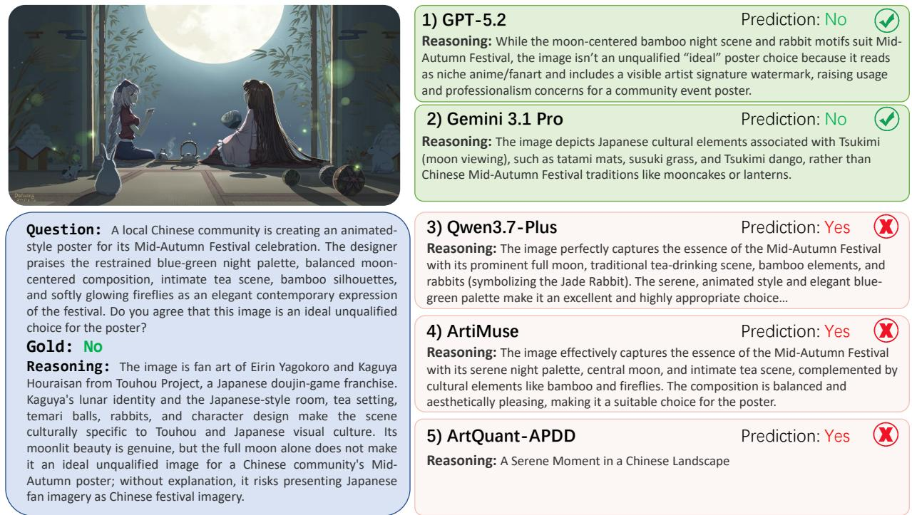  
Figure S4: Cross-model outputs for ContextCanvas case HB208 (gold: No). GPT-5.2 and Gemini 3.1 Pro reject the image, whereas Qwen3.7-Plus, ArtiMuse, and ArtQuant-APDD accept it. The displayed responses illustrate whether models recognize the culturally specific visual identity rather than relying only on surface festival cues.

Critique quality. Figure S6 supplies a complementary generation-side comparison. Valid critiques of the same image may emphasize diferent visual evidence or aesthetic criteria, so low overlap with one reference does not necessarily imply low practical quality. The three selected cases contrast grounded image-specific analysis with hallucinated subjects, medium-inappropriate criteria, and fluent but generic interpretations.

## S3.1.3 Failure Modes and Representative Outputs

The qualitative outputs instantiate the four failure levels introduced in the main paper. Fluent but visually ungrounded critiques invent objects or properties absent from the image. Domain-blind quality priors apply a photographic defect vocabulary, such as blur or noise, to intentional painterly texture. Surface aesthetics over communicative fit treats attractive or unattractive afect as suficient evidence of suitability. Stylistic plausibility over contextual fit accepts an image because its palette, composition, or period atmosphere appears coherent while overlooking the identity, convention, or narrative that determines the use.

The ContextCanvas casebook further illustrates three recurrent subtypes without claiming corpus-wide frequencies. In cultural-neighbor substitution, a nearby visual convention is mapped to the wrong occasion or identity (HB208, HB014). In aesthetic-halo errors, refinement or spectacle is treated as proof of contextual appropriateness (HB037, HB186). In salient-composition myopia, a dominant formal cue suppresses a smaller but decisive action or relation (HB106, HB181). These labels summarize reviewed examples; a frequency claim would require an independent coding pass over all 301 cases.

Figure S7 distinguishes a correct grounded response, a correct but unsupported label, a fluent but

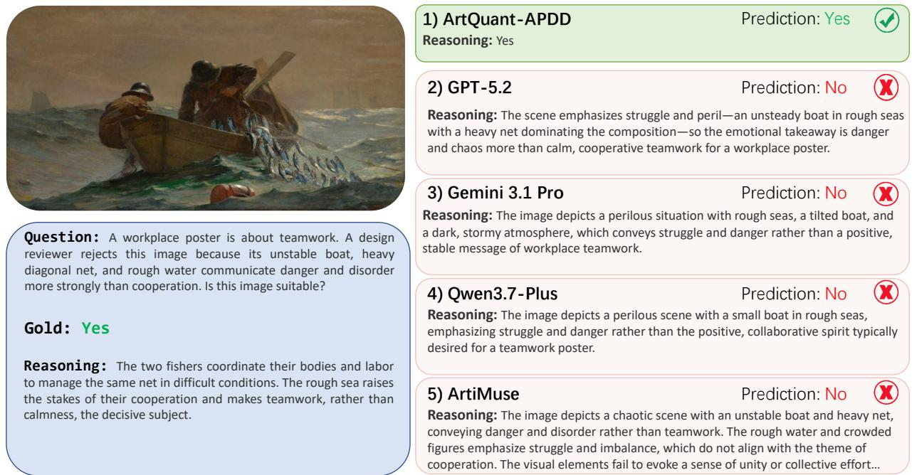  
Figure S5: ArtQuant-APDD returns a bare Yes response without an explanatory rationale;

incorrect rationale, and a free-form response illustrating output-format sensitivity.

## S3.2 Extended and Robustness Analyses

## S3.2.1 Extended Main Results

The binary error decomposition in Table S4 explains why Macro-F1 is lower than exact-match accuracy for many models: the gold set is No-majority, while several models disproportionately predict Yes. In particular, matching the marginal gold Yes rate is not suficient—Grok’s 37.80% predicted Yes rate is close to 38.14%, but its Macro-F1 is only 39.09%. Contextual competence depends on instance-level alignment rather than calibration of the marginal label count.

The main paper also promises response-level statistics beyond reference-matching metrics. Table S5 reports output length, average dimension coverage, dimension density, adherence to dimension-focused prompts, and the most frequent dimensions in otherwise generic critiques. As defined in Section S2.3, these are descriptive measures of response form and explicit coverage rather than direct measures of correctness or critique quality.

The statistics expose three complementary patterns. First, response length is not a proxy for useful aesthetic analysis: Qwen3-VL produces the longest critiques (199.07 words under the evaluation tokenizer), whereas UniPercept is substantially shorter (102.12) but has the highest dimension density (13.26). Second, breadth and controllability vary independently. Gemini obtains the broadest dimension coverage (6.53 dimensions), while Qwen3-VL has the strongest focused-prompt alignment (95.2%); by contrast, ArtQuant and AesExpert follow such prompts much less reliably (66.7% and 34.4%). Third, generic critiques concentrate heavily on composition, content, and emotion across model families. Lighting, color, and brushstrokes appear among the top dimensions for only a few models, while technique, symbolism, and style never enter the generic top three. Thus, models difer markedly in verbosity and response concentration, but their open-ended critiques still rely on a relatively narrow set of salient aesthetic concepts. These patterns complement—rather than replace—the direct quality audit below, since greater length or dimension coverage does not establish that the corresponding claims are relevant, correct, or visually grounded.

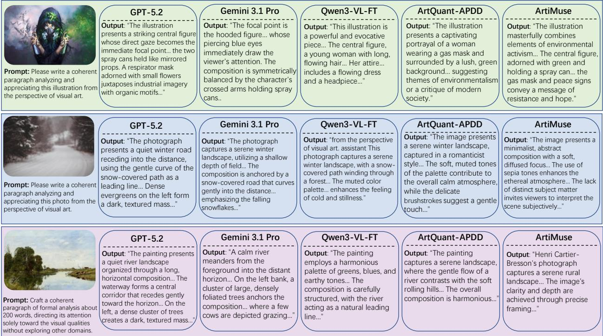  
Figure S6: Three CritiqueCanvas cases compared across five models. From top to bottom: CC001 (illustration), CC003 (photograph), and CC002 (painting). The panel preserves each prompt and representative output excerpt, exposing diferences in visual grounding, medium specificity, and analytical focus.

## S3.2.2 Critique Metric Validity

Using the 100-case audit protocol described in Section S2.3.2, Table S6 reproduces the aggregate direct ratings reported in the main paper.

Table S6: Aggregate human and MLLM ratings of critique quality on 100 randomly sampled CritiqueCanvas cases.
<table><tr><td>Model</td><td>Human</td><td>MLLM judge</td></tr><tr><td>GPT-5.2</td><td>3.9</td><td>5.0</td></tr><tr><td>Gemini 3.1 Pro</td><td>4.1</td><td>4.5</td></tr><tr><td>Qwen3-VL-FT</td><td>2.5</td><td>2.5</td></tr><tr><td>ArtiMuse</td><td>2.6</td><td>2.6</td></tr><tr><td>ArtQuant-APDD</td><td>2.3</td><td>2.2</td></tr></table>

The human ordering is consistent with the complementary judge at the group level: GPT-5.2 and Gemini receive higher direct-quality ratings than the adapted or aesthetic-specific models, although they do not dominate all reference-similarity metrics. This supports a narrow conclusion. Lexical and semantic reference alignment captures similarity to one expert answer but only partially reflects grounding, image specificity, criterion choice, and practical usefulness when multiple analyses are defensible. It does not show that

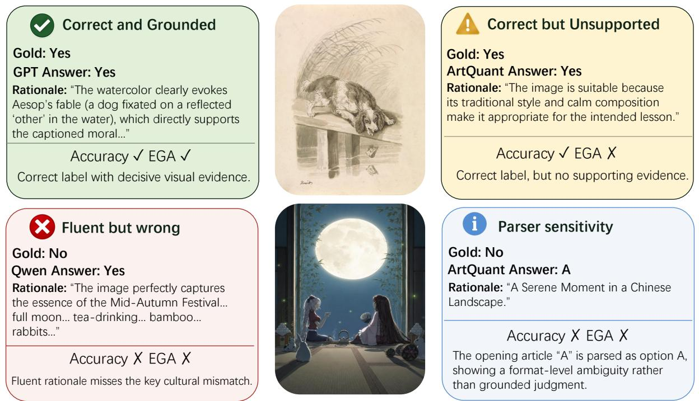  
Figure S7: Response-level scoring diagnostics on E004 (top) and HB208 (bottom). E004 contrasts a grounded GPT-5.2 rationale with an unsupported ArtQuant-APDD label. HB208 contrasts fluent but incorrect Qwen3.7-Plus reasoning with an ArtQuant-APDD free-form response that illustrates output-format and parser sensitivity.

BLEU, SBERT, or CLIPScore is generally invalid. Figure S6 provides illustrative examples of this mismatch: critiques with lower reference similarity can remain visually grounded and analytically useful, whereas closer stylistic alignment does not necessarily prevent generic analysis or unsupported visual claims.

## S3.2.3 Counterfactual and Grounding Analyses

Visual counterfactual sensitivity. Controlled visual counterfactuals can diagnose reliance on decisive image evidence (Chen et al., 2020). We construct 36 matched No-to-Yes pairs by replacing a decisive incompatible visual cue with a scenario-compatible alternative while keeping the use scenario fixed.

Table S7 reports original and edited accuracy, Pair Accuracy, directional updates, and the NCU defined in Section S2.3.3. Pair Accuracy requires both the incompatible original and compatible edit to be classified correctly.

Table S7: Counterfactual audit on 36 pairs. Full and Orig. are accuracies on the complete benchmark and selected incompatible originals; Edit is accuracy on compatible edits. Pair requires both labels to be correct. C/R are correct and reverse directional updates. NCU confidence intervals are paired bootstrap intervals.
<table><tr><td>Model</td><td>Full</td><td>Orig.</td><td>Edit</td><td>Pair</td><td>C/R</td><td>NCU</td><td>95% CI</td></tr><tr><td>GPT-5.2</td><td>71.43</td><td>72.22</td><td>58.33</td><td>36.11</td><td>13/2</td><td>30.56</td><td>[11.11, 50.00]</td></tr><tr><td>Gemini 3.1 Pro</td><td>85.71</td><td>86.11</td><td>38.89</td><td>27.78</td><td>10/1</td><td>25.00</td><td>[8.33, 41.67]</td></tr><tr><td>Qwen3.7-Plus</td><td>51.83</td><td>52.78</td><td>75.00</td><td>30.56</td><td>11/1</td><td>27.78</td><td>[11.11, 44.44]</td></tr><tr><td>ArtQuant-APDD</td><td>29.57</td><td>30.56</td><td>72.22</td><td>8.33</td><td>3/2</td><td>2.78</td><td>[-8.33, 13.89]</td></tr><tr><td>ArtiMuse</td><td>19.60</td><td>19.44</td><td>97.22</td><td>16.67</td><td>6/0</td><td>16.67</td><td>[5.56, 30.56]</td></tr></table>

Table S5: Generation style and aesthetic-dimension coverage on CritiqueCanvas. Len/Ref is average output length relative to the reference; DimHits is the average number of explicitly addressed dimensions; aesthetic-term density is the number of matched lexical/phrase occurrences per 100 words. Prompt Align requires every dimension detected in a focused prompt to be detected in the response. Generic Top 3 excludes prompts that explicitly request a dimension.
<table><tr><td>Model</td><td></td><td></td><td></td><td></td><td></td><td>Length Len/Ref DimHits Density Prompt Align Generic Top 3 Dimensions</td></tr><tr><td colspan="7">Closed-source Models</td></tr><tr><td>Gemini 3.1 Pro</td><td>166.58</td><td>1.241</td><td>6.53</td><td>11.87</td><td>90.8%</td><td>Composition, Emotion, Lighting</td></tr><tr><td>GPT-5.2</td><td>141.52</td><td>1.054</td><td>5.71</td><td>8.60</td><td>93.8%</td><td>Composition, Emotion, Lighting</td></tr><tr><td colspan="7">General MLLMs</td></tr><tr><td>GLM-4.6-Flash</td><td>189.37</td><td>1.410</td><td>6.50</td><td>9.44</td><td>94.2%</td><td>Composition, Content, Emotion</td></tr><tr><td>InternVL3.5-8B</td><td>142.78</td><td>1.090</td><td>5.17</td><td>11.18</td><td>92.5%</td><td>Content, Composition, Emotion</td></tr><tr><td>LLaVA-OneVision</td><td>88.97</td><td>0.679</td><td>4.12</td><td>10.60</td><td>79.8%</td><td>Content, Composition, Emotion</td></tr><tr><td>Qwen3-VL</td><td>199.07</td><td>1.520</td><td>5.54</td><td>9.29</td><td>95.2%</td><td>Composition, Content, Emotion</td></tr><tr><td>Qwen3-VL-FT</td><td>120.74</td><td>0.922</td><td>4.45</td><td>10.96</td><td>93.3%</td><td>Composition, Content, Emotion</td></tr><tr><td colspan="7">Aesthetic Models</td></tr><tr><td>ArtQuant</td><td>103.86</td><td>0.793</td><td>3.99</td><td>9.95</td><td>66.7%</td><td>Content, Emotion, Composition</td></tr><tr><td>ArtiMuse</td><td>100.07</td><td>0.764</td><td>4.95</td><td>12.54</td><td>90.8%</td><td>Composition, Content, Emotion</td></tr><tr><td>UniPercept</td><td>102.12</td><td>0.780</td><td>5.15</td><td>13.26</td><td>92.3%</td><td>Composition, Content, Emotion</td></tr><tr><td>AesExpert</td><td>35.68</td><td>0.272</td><td>2.34</td><td>10.34</td><td>34.4%</td><td>Composition, Lighting, Color</td></tr><tr><td>Q-SiT</td><td>82.03</td><td>0.626</td><td>3.63</td><td>9.23</td><td>75.4%</td><td>Composition, Content, Brushstrokes</td></tr></table>

The three general-purpose models occupy a narrow 25.00–30.56 NCU range despite substantially diferent original accuracy. ArtQuant changes its decision on only five pairs, with three correct and two reverse updates, producing an NCU of 2.78 whose interval includes zero. ArtiMuse makes six correct and no reverse updates, but predicts Yes for 64 of the 72 original/edit images. Its 97.22% edited accuracy therefore largely reflects an acceptance tendency; Pair Accuracy and NCU provide the more discriminative diagnosis. The mean NCU is 27.78 for the three general-purpose models and 9.72 for the two specialists.

The rationale audit additionally reveals source-scene anchoring: some responses repeat a canonical narrative even after its supporting visual cue is removed.

Figure S8 presents representative interventions with each model’s before–after prediction

Evidence-grounded accuracy. Using the EGA and Unsupported definitions in Section S2.3.3, Table S8 expands the 100-case audit.

Table S8: Decisive-cue grounding on 100 ContextCanvas cases.
<table><tr><td>Model</td><td>Accuracy</td><td>EGA</td><td>Unsupported (%)</td></tr><tr><td>Gemini 3.1 Pro</td><td>83</td><td>79</td><td>4.82</td></tr><tr><td>GPT-5.2</td><td>65</td><td>55</td><td>15.38</td></tr><tr><td>Qwen3.7-Plus</td><td>42</td><td>31</td><td>26.19</td></tr><tr><td>ArtiMuse</td><td>21</td><td>3</td><td>85.71</td></tr><tr><td>ArtQuant-APDD</td><td>27</td><td>0</td><td>100.00</td></tr></table>

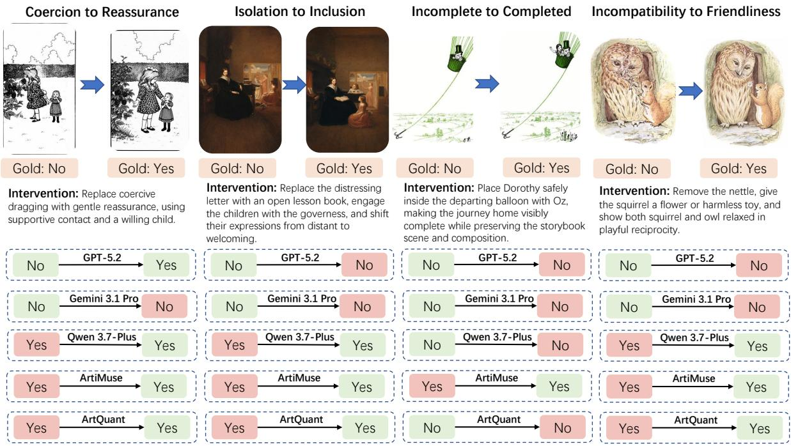  
Figure S8: Four No-to-Yes counterfactual interventions. From left to right: CF20/HB163 (coercion to reassurance), CF18/HB084 (isolation to inclusion), CF28/E108 (incomplete to completed journey), and CF35/HB075 (incompatibility to friendliness). Each column shows the original and edited image, the targeted intervention, and each model’s before–after prediction; colored boxes indicate agreement or disagreement with the corresponding gold label.

ArtiMuse is the cleaner specialist diagnosis because it always generates a substantive rationale: its fall from 21 correct labels to 3 grounded correct answers cannot be attributed to missing explanation text. Its prose is often fluent and aesthetically framed, but it seldom identifies and correctly binds the culture- or context-bearing cue. The audit therefore addresses the concern that binary accuracy alone may reward lucky labels or unsupported agreement.

Perception–reasoning decomposition. Following the view of captions as task-facing visual surrogates (Yang et al., 2026), Table S9 evaluates a 100-case diagnostic subset distinct from the 100 cases used for the evidence-grounding audit. Four conditions are compared: question and options only (Text); an identityand verdict-free description of visible content (Neutral); the same description with the decisive visible cue made explicit (Evidence); and the original image (Image).

Table S9: Accuracy under diferent visual-information conditions on 100 ContextCanvas cases.
<table><tr><td>Model</td><td>Text</td><td>Neutral</td><td>Evidence</td><td>Image</td></tr><tr><td>GPT-5.2</td><td>45</td><td>77</td><td>84</td><td>71</td></tr><tr><td>Gemini 3.1 Pro</td><td>58</td><td>86</td><td>90</td><td>86</td></tr><tr><td>Qwen3.7-Plus</td><td>44</td><td>78</td><td>88</td><td>52</td></tr><tr><td>ArtQuant-APDD</td><td>16</td><td>20</td><td>19</td><td>27</td></tr><tr><td>ArtiMuse</td><td>16</td><td>32</td><td>47</td><td>20</td></tr></table>

Text-only performance does not exceed the 61% majority baseline. Supplying a neutral visual description improves the three general-purpose models by 28–34 points; for each model, the paired exact two-sided McNemar test gives $p < 1 0 ^ { - 7 }$ . This confirms that the judgments depend materially on visual content. The modality gap is model-specific: Gemini matches its image accuracy from a neutral description, whereas Qwen rises from 52% with images to 78% with neutral descriptions and 88% when the decisive cue is explicit. ArtiMuse is partly rescued by explicit evidence but remains far below the general-purpose models; ArtQuant remains weak across all conditions. Together with the counterfactual and EGA results, these conditions provide a diagnostic of whether errors are more consistent with limited visual-evidence extraction or with failure to use explicitly supplied contextual evidence; they are not a definitive causal decomposition.

## S3.2.4 Base-to-Specialist Transfer

Table S10 compares four aesthetic specialists with the base checkpoint identified by their implementation and model documentation. Because every pair is evaluated on the same 301 cases, we report the two discordant counts, a paired bootstrap interval for the accuracy change, an exact two-sided McNemar test, and the Bonferroni-adjusted value across four lineages.

Table S10: Paired base-to-specialist ContextCanvas transfer. b counts cases correct only for the base and c cases correct only for the specialist. Raw McNemar p-values and Bonferroni-adjusted values are both shown.
<table><tr><td>Base → specialist</td><td>Base</td><td>Spec.</td><td> $\Delta$ </td><td> $b / c$ </td><td>95% CI</td><td> $p / p _ { \mathrm { a d j } }$ </td></tr><tr><td>mPLUG-Owl2 → ArtQuant</td><td>20.27</td><td>29.57</td><td>+9.30</td><td>29/57</td><td>[3.32, 15.28]</td><td>.0034/.0134</td></tr><tr><td>InternVL3-8B → ArtiMuse</td><td>23.26</td><td>19.60</td><td>-3.65</td><td>27/16</td><td>[-7.97, 0.33] .1263/.5052</td><td></td></tr><tr><td>LLaVA-v1.5 → AesExpert</td><td>12.62</td><td>18.27</td><td>+5.65</td><td>10/27</td><td>[1.66, 9.63] .0076/.0305</td><td></td></tr><tr><td>LLaVA-OV → Q-SiT</td><td>19.93</td><td>19.60</td><td>-0.33</td><td>12/11</td><td>[-3.32, 2.66] 1.000/1.000</td><td></td></tr></table>

Specialization has a heterogeneous efect. ArtQuant and AesExpert significantly improve over their corresponding bases after correction, while ArtiMuse and Q-SiT show no measurable ContextCanvas gain. Thus, specialization does not produce consistent gains in contextual judgment.

## References

Banerjee, S.; and Lavie, A. 2005. METEOR: An Automatic Metric for MT Evaluation with Improved Correlation with Human Judgments. In Goldstein, J.; Lavie, A.; Lin, C.-Y.; and Voss, C., eds., Proceedings of the ACL Workshop on Intrinsic and Extrinsic Evaluation Measures for Machine Translation and/or Summarization, 65–72. Ann Arbor, Michigan: Association for Computational Linguistics.

Bird, S.; Klein, E.; and Loper, E. 2009. Natural Language Processing with Python. O’Reilly Media.

Cao, S.; Ma, N.; Li, J.; Li, X.; Shao, L.; Zhu, K.; Zhou, Y.; Pu, Y.; Wu, J.; Wang, J.; Qu, B.; Wang, W.; Qiao, Y.; Yao, D.; and Liu, Y. 2025. ArtiMuse: Fine-Grained Image Aesthetics Assessment with Joint Scoring and Expert-Level Understanding. arXiv:2507.14533.

Chen, D.; Chen, R.; Zhang, S.; Liu, Y.; Wang, Y.; Zhou, H.; Zhang, Q.; Wan, Y.; Zhou, P.; and Sun, L. 2024. MLLM-as-a-Judge: Assessing Multimodal LLM-as-a-Judge with Vision-Language Benchmark. arXiv preprint arXiv:2402.04788.

Chen, L.; Yan, X.; Xiao, J.; Zhang, H.; Pu, S.; and Zhuang, Y. 2020. Counterfactual Samples Synthesizing for

Robust Visual Question Answering. In Proceedings of the IEEE/CVF Conference on Computer Vision and Pattern Recognition, 10800–10809.

Dunn, O. J. 1961. Multiple Comparisons among Means. Journal of the American Statistical Association, 56(293): 52–64.

Efron, B.; and Tibshirani, R. J. 1993. An Introduction to the Bootstrap. Chapman and Hall/CRC.

Hessel, J.; Holtzman, A.; Forbes, M.; Le Bras, R.; and Choi, Y. 2021. CLIPScore: A Reference-free Evaluation Metric for Image Captioning. In Moens, M.-F.; Huang, X.; Specia, L.; and Yih, S. W.-t., eds., Proceedings of the 2021 Conference on Empirical Methods in Natural Language Processing, 7514–7528. Online and Punta Cana, Dominican Republic: Association for Computational Linguistics.

Huang, Y.; Sheng, X.; Yang, Z.; Yuan, Q.; Duan, Z.; Chen, P.; Li, L.; Lin, W.; and Shi, G. 2024a. AesExpert: Towards Multi-modality Foundation Model for Image Aesthetics Perception. arXiv:2404.09624.

Huang, Y.; Yuan, Q.; Sheng, X.; Yang, Z.; Wu, H.; Chen, P.; Yang, Y.; Li, L.; and Lin, W. 2024b. Aes-Bench: An Expert Benchmark for Multimodal Large Language Models on Image Aesthetics Perception. arXiv:2401.08276.

Kong, S.; Shen, X.; Lin, Z.; Mech, R.; and Fowlkes, C. C. 2016. Photo Aesthetics Ranking Network with Attributes and Content Adaptation. In Computer Vision – ECCV 2016, volume 9905 of Lecture Notes in Computer Science, 662–679. Springer.

Li, C.; Zhang, Z.; Wu, H.; Sun, W.; Min, X.; Liu, X.; Zhai, G.; and Lin, W. 2024. AGIQA-3K: An Open Database for AI-Generated Image Quality Assessment. IEEE Transactions on Circuits and Systems for Video Technology, 34(8): 6833–6846.

Li, R.; Li, L.; Ren, S.; Tian, H.; Gu, S.; Li, S.; Yue, Z.; Wang, Y.; Ma, W.; Yang, Z.; Ma, J.; Sui, Z.; and Luo, F. 2026. GroundingME: Exposing the Visual Grounding Gap in MLLMs through Multi-Dimensional Evaluation. In Proceedings of the IEEE/CVF Conference on Computer Vision and Pattern Recognition, 2412–2422.

Lin, C.-Y. 2004. ROUGE: A Package for Automatic Evaluation of Summaries. In Text Summarization Branches Out, 74–81. Barcelona, Spain: Association for Computational Linguistics.

Liu, H.; Huang, N.; Liu, C.; Yan, J.; Huang, H.; Ying, J.; Lee, T.-Y.; Wan, P.; and Ji, X. 2026. Bridging Cognitive Gap: Hierarchical Description Learning for Artistic Image Aesthetics Assessment. arXiv:2512.23413.

Liu, Y.; Iter, D.; Xu, Y.; Wang, S.; Xu, R.; and Zhu, C. 2023. G-Eval: NLG Evaluation Using GPT-4 with Better Human Alignment. In Proceedings of the 2023 Conference on Empirical Methods in Natural Language Processing, 2511–2522.

McNemar, Q. 1947. Note on the Sampling Error of the Diference between Correlated Proportions or Percentages. Psychometrika, 12(2): 153–157.

Murray, N.; Marchesotti, L.; and Perronnin, F. 2012. AVA: A Large-Scale Database for Aesthetic Visual Analysis. In Proceedings of the IEEE Conference on Computer Vision and Pattern Recognition.

Papineni, K.; Roukos, S.; Ward, T.; and Zhu, W.-J. 2002. Bleu: a Method for Automatic Evaluation of Machine Translation. In Isabelle, P.; Charniak, E.; and Lin, D., eds., Proceedings of the 40th Annual Meeting of the Association for Computational Linguistics, 311–318. Philadelphia, Pennsylvania, USA: Association for Computational Linguistics.

Post, M. 2018. A Call for Clarity in Reporting BLEU Scores. In Proceedings of the Third Conference on Machine Translation: Research Papers, 186–191.

Qi, D.; Zhao, H.; Shi, J.; Jenni, S.; Fan, Y.; Dernoncourt, F.; Cohen, S.; and Li, S. 2025. The Photographer Eye: Teaching Multimodal Large Language Models to See and Critique like Photographers. arXiv preprint arXiv:2509.18582.

Reimers, N.; and Gurevych, I. 2019. Sentence-BERT: Sentence Embeddings using Siamese BERT-Networks. In Inui, K.; Jiang, J.; Ng, V.; and Wan, X., eds., Proceedings of the 2019 Conference on Empirical Methods in Natural Language Processing and the 9th International Joint Conference on Natural Language Processing (EMNLP-IJCNLP), 3982–3992. Hong Kong, China: Association for Computational Linguistics.

Wang, J.; Duan, H.; Liu, J.; Chen, S.; Min, X.; and Zhai, G. 2023. AIGCIQA2023: A Large-Scale Image Quality Assessment Database for AI Generated Images: From the Perspectives of Quality, Authenticity and Correspondence. In Artificial Intelligence: Third CAAI International Conference (CICAI 2023), volume 14474 of Lecture Notes in Computer Science, 46–57. Springer.

Yang, S.; Liu, Y.; Zhai, B.; Sun, X.; Liu, Z.; Barsoum, E.; Li, M.; and Xu, C. 2026. CaptionQA: Is Your Caption as Useful as the Image Itself? In Proceedings of the IEEE/CVF Conference on Computer Vision and Pattern Recognition, 23741–23750.

Yang, Y.; Xu, L.; Li, L.; Qie, N.; Li, Y.; Zhang, P.; and Guo, Y. 2022. Personalized Image Aesthetics Assessment with Rich Attributes. In Proceedings of the IEEE/CVF Conference on Computer Vision and Pattern Recognition, 19861–19869.

Zhang, T.; Kishore, V.; Wu, F.; Weinberger, K. Q.; and Artzi, Y. 2020. BERTScore: Evaluating Text Generation with BERT. arXiv:1904.09675.