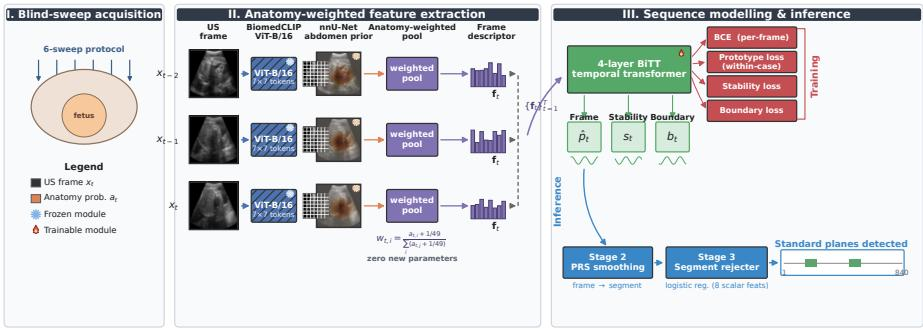
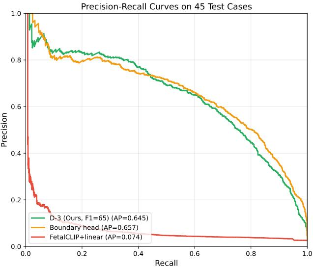
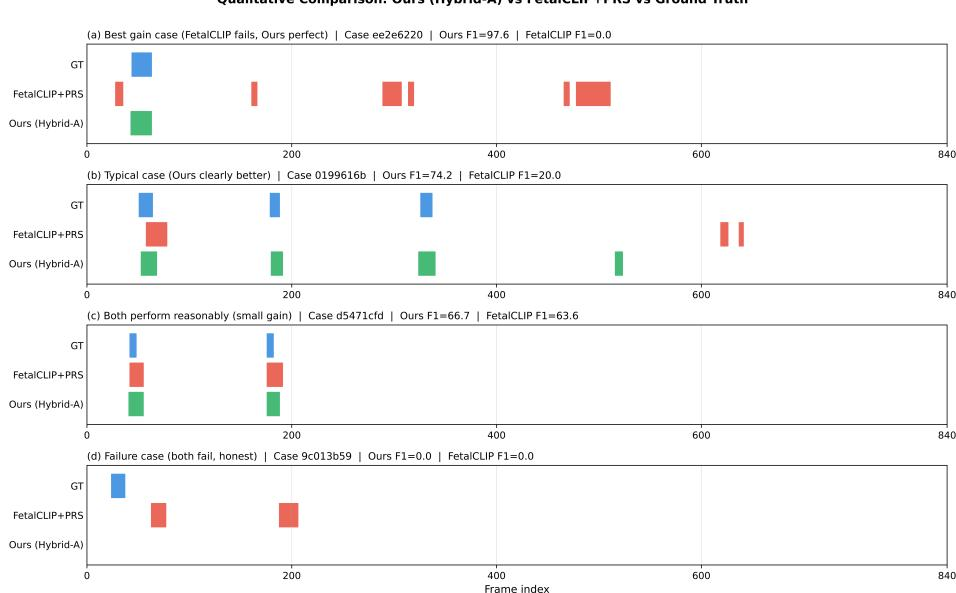
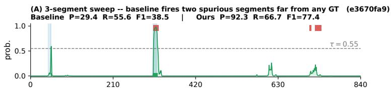
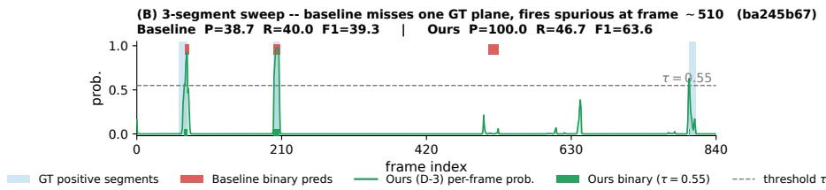
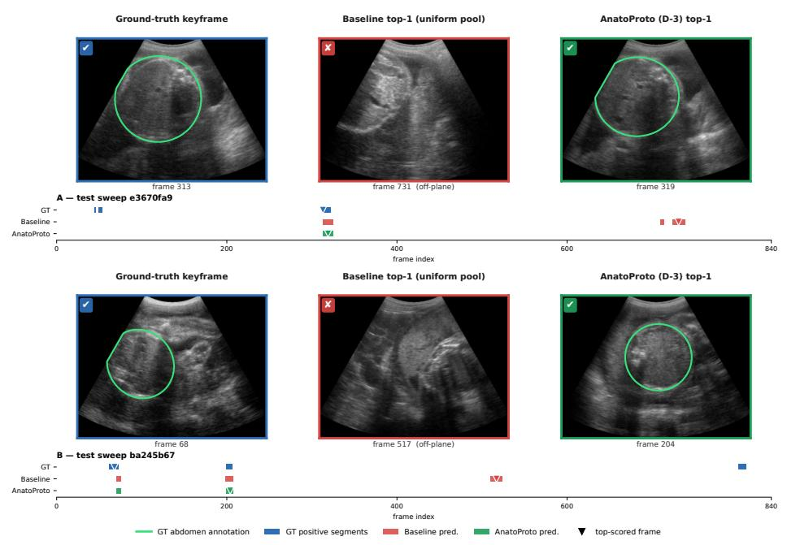

# Anatomy-Guided Foundation Model Adaptation with Within-Case Prototype Supervision for Standard Plane Detection in Fetal Ultrasound Blind Sweeps

Yuzhe Zhao

School of Computing, University of Leeds, Leeds, UK clawspeaker@gmail.com

Abstract. Detecting the fetal abdominal circumference standard plane in low-cost obstetric blind sweeps is a highly imbalanced frame-classification problem in which positive frames account for less than 3% of a sequence, form short contiguous segments, and are poorly handled by of-the-shelf ultrasound and vision foundation models. We propose AnatoProto, a lightweight sequence-level framework that adapts a frozen BiomedCLIP encoder to fetal blind sweeps through four complementary components: (i) an anatomy-weighted spatial pooling that uses nnU-Net abdominalregion probabilities as a low-dimensional spatial prior to reweight Biomed-CLIP patch tokens, so that the frozen semantic features are aggregated onto anatomically meaningful regions; (ii) a within-case prototype loss that pulls each frame embedding toward the mean of the positive frames of the same sweep, exploiting case-level structure that is unavailable at the frame level; (iii) a three-stage cascade refinement (frame→segment→case-level rejecter) that lifts the prediction unit from noisy frames to structurally-constrained segments; and (iv) a hybrid prediction head that jointly models per-frame stability and inter-frame boundary transitions to suppress boundary false positives. On the ACOUSL AI benchmark, AnatoProto reaches a test F1 of 67.72, outperforming the strongest external foundation-model baseline (FetalCLIP + PRS, F1 = 54.52) by +13.20 F1 and the strongest video temporal-actiondetection baseline (TriDet + PRS) by +15.76 F1. A dedicated synergy study, backed by pre- and post-training embedding geometry and paired-bootstrap confidence intervals, shows that the prototype loss and the anatomy-weighted pooling are not additive: applied alone the prototype loss significantly reduces recall by 12 points, but combined with the anatomy-weighted pooling the same loss significantly increases recall by 6.5 points – a sign-flip that we trace to the accuracy of the within-case prototype, using recall and embedding-geometry evidence rather than F1 alone.

Keywords: Fetal ultrasound · Standard plane detection · Blind sweeps · Foundation models · BiomedCLIP · ACOUSLIC-AI.

## 1 Introduction

Accurate measurement of the fetal abdominal circumference (AC) at the standard plane is one of the most important biometric indicators of intrauterine growth restriction and low birth weight, yet in low- and middle-income settings the sonographic expertise required to acquire this plane is scarce [1]. To close this gap, low-cost obstetric blind-sweep protocols acquire a fixed set of freehand ultrasound sweeps that non-experts can perform, and rely on downstream algorithms to locate the AC standard plane within the recorded video [1,11].

The MICCAI 2024 ACOUSLIC-AI challenge [1] formalises this problem as frame-level classification: given an 840-frame blind sweep, each frame must be labelled as optimal, suboptimal or background with respect to the AC standard plane. Two properties of this task make it very diferent from conventional standard-plane detection on curated clips [3,5]: (a) fewer than 3% of frames are positive, and (b) positive frames form short contiguous segments driven by the physical trajectory of the probe. Any credible solution must therefore reason at the sweep level, not the frame level.

A natural attempt is to replace the challenge’s segmentation baseline [11] with a strong foundation-model (FM) representation and a temporal head. In our internal comparison (Section 4.3) we find that this fails in a very characteristic way: single-frame FMs (BiomedCLIP [18], FetalCLIP [8], USFM [16], SonoCLIP [14], DINOv3 [9]) with a linear probe or LoRA fine-tuning saturate below F1 = 55, and of-the-shelf temporal action detectors (ActionFormer [17], TriDet [12]) with post-processing also saturate around F1 = 52. The gap is not one of capacity; it is that none of these approaches uses the two forms of prior that the blind-sweep setting readily provides: an anatomical prior on where the fetal abdomen lies, and a case-level prior that positive frames within one sweep are near-duplicates of each other.

Motivated by these observations, we propose AnatoProto, a lightweight sequence-level framework built around a frozen BiomedCLIP encoder. Concretely, we make the following contributions:

Anatomy-weighted spatial pooling. We train a single-organ (fetal abdomen) nnU-Net [7] on the ACOUSLIC segmentation ground truth (∼ 617 annotated frames from the 210 training sweeps) and use its per-frame 7 × 7 probability map as a fixed, parameter-free spatial weight over the last four layers of BiomedCLIP patch tokens. Methodologically this follows the same paradigm as Alpha-CLIP [15], which uses SAM-generated masks to steer CLIP towards a region of interest; here we steer BiomedCLIP towards the fetal abdomen. In isolation this pool raises F1 by +4.21 over the baseline.

– Within-case prototype loss. For each sweep we form a positive prototype as the mean embedding of its ground-truth positive frames and add a margin loss that pulls positives closer to and pushes negatives away from this prototype. In isolation this loss slightly hurts F1 (−0.07) because it significantly reduces recall (−12 points, 95% CI does not cross zero); combined with the anatomy-weighted pooling the same loss significantly increases recall by +6.5 points. Section 4.4 traces this sign-flip to the accuracy of the within-case prototype and provides pre- and post-training embedding-geometry evidence.

Coarse-to-fine inference pipeline with a segment-level rejecter. We stack three stages that lift the prediction unit progressively: frame probabilities from the temporal head, PRS-style temporal smoothing that groups frames into structurally-constrained segments, and a logistic-regression segment rejecter that summarises the stability and boundary head outputs of each candidate segment into eight scalar features and rejects those unlikely to be real plane sub-sequences. Unlike Cascade R-CNN [4], no stage refines localisation coordinates; the “cascade” is a unit-lifting pipeline that turns noisy per-frame scores into filtered per-segment decisions.

– Hybrid stability–boundary prediction. We augment the frame classifier with (a) a stability head that scores inter-frame consistency and (b) a boundary head that scores plane-transition frames. Together with the segment rejecter this adds +2.69 F1 over the D-3 configuration and yields the final 67.72 F1.

Evaluated on our held-out case-level split of the ACOUSLIC-AI training set (210/45/45; see Sec. 4), the full AnatoProto system reaches F1 = 67.72, +13.20 over the strongest external FM baseline (FetalCLIP + PRS, 54.52) and +30.33 over a BiomedCLIP linear probe (37.39). We report Precision and Recall throughout in addition to F1, and are explicit about which of the reported gaps reach statistical significance under a paired-bootstrap test on the 45 test cases.

## 2 Related Work

Standard-plane detection in fetal ultrasound. Early work on standardplane detection focused on frame-based CNNs trained on curated, per-plane clips of high-quality expert scans [3,5]. These setups do not translate to blind sweeps, where positives are rare and background is dominant. The ACOUSLIC-AI baseline [11] uses an nnU-Net that primarily optimises segmentation Dice and derives the frame label from the mask area. In our sweep of its post-processing strategies (area threshold, channel selection, and the probability-ranking-andsmoothing procedure “PRS” defined in Sec. 3.4 Stage 2) it plateaus at F1 = 13.78 (P = 10.41, R = 20.39; Table 2), indicating that the task–metric mismatch, not the backbone, is the bottleneck.

Ultrasound and medical foundation models. Recent ultrasound-oriented FMs include USFM [16] (predominantly breast US), SonoCLIP [14] (maskguided region-aware pretraining), and FetalCLIP [8] (fetal-domain CLIP variant). More general medical FMs include BiomedCLIP [18], and DINOv3 [9] extends self-supervised ViTs to 1.7B natural images. As reported in Section 4.3, these FMs individually saturate on the ACOUSLIC-AI test split: USFM (F1 = 9.90) sufers from a breast-vs-fetal domain gap; SonoCLIP (F1 = 8.92) is bound to anatomical masks that blind sweeps do not provide; DINOv3-L (F1 = 10.13) is out of distribution on greyscale ultrasound; FetalCLIP with LoRA fine-tuning collapses on the 2.6% positive rate. Only frozen BiomedCLIP with a linear probe clears $\mathrm { F } 1 = 3 7$ , and frozen FetalCLIP with PRS reaches $\mathrm { F } 1 = 5 4 . 5 2 $ at the operating threshold matched to our pipeline. All of these operate on isolated frames.

Video temporal action detection. Blind-sweep classification is structurally similar to temporal action localisation. We therefore include ActionFormer [17] and TriDet [12] as video-based baselines. Even with PRS post-processing they saturate at $\mathrm { F } 1 \approx 5 2$ , because the segments to localise are short (5–30 frames), highly imbalanced, and visually near-duplicate. These generic detectors have no mechanism to inject an anatomical prior or a within-case structural prior, both of which AnatoProto exploits.

Mask-guided foundation models and prototype learning. Steering pretrained visual encoders with an external spatial prior has recently emerged as a lightweight alternative to fine-tuning: Alpha-CLIP [15] injects a SAM-derived alpha channel into CLIP so that the encoder can focus on a ROI. In medical imaging, coupling a segmentation network with a downstream task network – from the classic U-Net encoder–decoder [10] to recent shape-guided cardiac motionprediction pipelines [2] – has repeatedly been shown to improve downstream anatomical alignment. Our anatomy-weighted pooling adopts the same idea but at the patch-token level of a frozen ultrasound FM, with the mask coming from a cheap single-organ nnU-Net trained once on the challenge’s own segmentation labels. Prototype-based losses were popularised by prototypical networks for few-shot classification [13]; we adapt them to the sweep-level structure of ultrasound video, using the positive frames of the same case as the prototype.

## 3 Method

## 3.1 Problem Setting and Overview

Let $\mathbf { \mathcal { S } } = \{ x _ { t } \} _ { t = 1 } ^ { T }$ denote a T-frame blind sweep and $y _ { t } \in \{ 0 , 1 \}$ the frame-level label (1 = optimal or suboptimal AC standard plane, merged into a single positive class). The training data give access to per-frame labels but the sweep-level structure is untapped by frame-level losses. Our objective is to produce a per-frame probability $\hat { p } _ { t } \in [ 0 , 1 ]$ that is (a) semantically aligned with the abdominal region, (b) consistent across frames of the same sweep, and (c) temporally smooth on the segment level.

AnatoProto (Fig. 1) is built around three modules. A frozen BiomedCLIP image encoder produces L layers of $7 \times 7$ patch tokens; an anatomy-weighted pooling module (Section 3.2) collapses these into a per-frame 768-dim vector using an nnU-Net abdominal-region probability map; and a 4-layer bi-directional temporal transformer (BiTT) produces per-frame logits, trained with a hybrid loss combining a per-frame BCE, a within-case prototype loss (Section 3.3), and stability / boundary heads (Section 3.5). At inference time, the frame probabilities are refined by the coarse-to-fine pipeline of Section 3.4.

  
Fig. 1: Overview of AnatoProto. Top (training, per sweep): each frame of a blind sweep (real example frames shown) is encoded by a frozen BiomedCLIP $\mathrm { V i T - B } / 1 6$ into $7 \times 7$ patch tokens, and by a frozen single-organ nnU-Net into a $7 \times 7$ abdominal probability map that serves as a spatial prior reweighting the semantic tokens (anatomy-weighted pooling; zero new parameters). A 4-layer bi-directional temporal transformer (BiTT) consumes the pooled sequence and drives a frame head $\hat { p } _ { t } ,$ a stability head $s _ { t }$ and a boundary head $b _ { t } ;$ a withincase prototype loss pulls the positive embeddings of the same sweep onto a shared attractor and pushes negatives away. Bottom (inference, coarse-tofine): per-frame probabilities of a real test sweep are binarised by PRS into structurally-constrained segments, and a logistic-regression rejecter discards implausible ones; the final segments (green) closely match the ground truth (blue).

## 3.2 Anatomy-Weighted Spatial Pooling

For each frame $x _ { t } ,$ BiomedCLIP produces patch tokens $\mathbf { F } _ { t } ^ { ( \ell ) } \in \mathbb { R } ^ { 4 9 \times d }$ from its last $L \ = \ 4$ layers, where the 49 patch tokens correspond to the $7 \times 7$ spatial grid and $d = 7 6 8$ . A naïve per-layer average pool $\begin{array} { r } { \bar { \mathbf { f } } _ { t } ^ { ( \ell ) } = \frac { 1 } { 4 9 } \sum _ { i } \mathbf { F } _ { t , i } ^ { ( \ell ) } } \end{array}$ treats background patches (probe artefacts, amniotic fluid) identically to abdominal patches, whereas the standard-plane label is defined only by the fetal abdomen.

We therefore train a single-organ nnU-Net [7] on the fetal-abdomen segmentation labels of the ACOUSLIC-AI training split $( \sim 6 1 7 $ annotated frames spread across the 210 training sweeps; each sweep contributes only 2–3 annotated planes rather than all 840 frames). We stress that (i) these labels come from the ACOUSLIC segmentation task and are separate from the standard-plane classification labels used to train the rest of the pipeline, and (ii) the 45 held-out test sweeps have never been seen by either the nnU-Net or the classification head, so no train / test contamination is introduced by the anatomy prior. At inference time the nnU-Net is applied densely to all 840 frames of each sweep to produce a per-frame abdominal probability map, adaptive-average-pooled to $7 \times 7$ and cached in fp16.

Given the pooled per-frame anatomy prior $\mathbf { a } _ { t } \in \mathbb { R } ^ { 7 \times 7 }$ , the patch-wise pooling weight is

$$
w _ { t , i } = \frac { \mathbf { a } _ { t , i } + 1 / 4 9 } { \sum _ { j = 1 } ^ { 4 9 } \bigl ( \mathbf { a } _ { t , j } + 1 / 4 9 \bigr ) } ,\tag{1}
$$

where the additive $1 / 4 9$ smoother prevents the pool from collapsing on frames where nnU-Net predicts a nearly empty mask. The pooled frame descriptor of layer ℓ and the multi-layer aggregate are then

$$
\mathbf { f } _ { t } ^ { ( \ell ) } = \sum _ { i = 1 } ^ { 4 9 } w _ { t , i } \mathbf { F } _ { t , i } ^ { ( \ell ) } , \qquad \mathbf { f } _ { t } = \mathrm { M L P } \left( \mathrm { c o n c a t } _ { \ell } \mathbf { f } _ { t } ^ { ( \ell ) } \right) .\tag{2}
$$

The pool introduces zero additional learnable parameters; only the aggregation of the frozen BiomedCLIP tokens is changed.

It is important to be explicit about the roles of the two components, since one might worry that a segmentation prior and a semantic encoder are overlapping image-space features. They are not: BiomedCLIP delivers a d-dimensional semantic description of each patch (what texture / structure it contains, learnt from millions of biomedical image–text pairs), while the nnU-Net probability map delivers a 1-dimensional spatial prior (where the abdominal region lies). The pool of $\operatorname { E q . } \ ( 2 )$ uses the second to steer the first, projecting the frozen semantic vector onto the anatomically relevant patches. This is the same mechanism used by Alpha-CLIP [15] in the natural-image domain, where a SAM-derived alpha channel steers CLIP towards a chosen ROI. Note that the nnU-Net $7 \times 7$ mask is deliberately coarse and imperfect (only 49 cells, blurred abdominal boundary, trained independently of the classification objective); its role is not to be pixel-accurate but to be directionally correct so that the case-level positive prototype – see Sec. 3.3 – is anchored on true anatomy rather than on background and probe artefacts. Empirically this pool alone raises F1 from 58.37 to 62.58 (Table 3, +4.21).

## 3.3 Within-Case Prototype Loss

Positive frames within one blind sweep are physically near-duplicates of each other (adjacent frames of the same fetal AC plane), yet a frame-level BCE gives no signal about this within-case structure. For each sweep $s$ with positive index set $\mathcal { P } = \{ t : y _ { t } = 1 \}$ we form a case-specific positive prototype

$$
\mathbf { p } _ { S } = { \frac { 1 } { | { \mathcal { P } } | } } \sum _ { t \in { \mathcal { P } } } \mathbf { e } _ { t } ,\tag{3}
$$

where $\mathbf { e } _ { t }$ is the L2-normalised BiTT frame embedding. We then apply a margin loss

$$
\mathcal { L } _ { \mathrm { p r o t o } } = \sum _ { t \in \mathcal { P } } \bigl [ d ( \mathbf { e } _ { t } , \mathbf { p } _ { S } ) - m _ { + } \bigr ] _ { + } + \lambda \sum _ { t \notin \mathcal { P } } \bigl [ m _ { - } - d ( \mathbf { e } _ { t } , \mathbf { p } _ { S } ) \bigr ] _ { + } ,\tag{4}
$$

with d the cosine distance, $m _ { + } = 0 . 2 , m _ { - } = 0 . 6 .$ , and $\lambda = 0 . 5$ . Sweeps with $| \mathcal { P } | < 2$ are skipped.

An important observation, which we discuss in detail in Section 4.4, is that $\mathcal { L } _ { \mathrm { p r o t o } }$ used alone on top of a uniform-pool baseline slightly hurts F1 (−0.07) because it significantly drops Recall by 12 points. This is not a reason to discard it: with the anatomy-weighted pooling of Section 3.2, the same loss reaches our full pre-cascade configuration – baseline plus the anatomy pool plus the prototype loss, hereafter denoted D-3 – with +6.66 F1 over the baseline and, critically, significantly increases Recall (from the anatomy-only 65.4 back up to 71.9). Section 4.4 traces this Recall sign-flip to the accuracy of the case-level prototype: a clean prototype turns $\mathcal { L } _ { \mathrm { p r o t o } }$ into a helpful attractor, whereas a background-contaminated prototype turns it into a confident-but-wrong attractor.

## 3.4 Coarse-to-Fine Inference Pipeline with a Segment-Level Rejecter

Frame-level probabilities from the temporal head are locally noisy at segment boundaries. To turn them into segment-level predictions we chain three stages, each of which operates on a strictly coarser processing unit than the previous one. We emphasise that, unlike Cascade R-CNN [4], no stage refines detection coordinates; the “cascade” is a unit-lifting pipeline in which the last stage is a lightweight learned rejecter, not a further-refinement head.

Stage 1 (frame). The BiTT head produces $\hat { p } _ { t } \in [ 0 , 1 ]$ for every frame. Unit: single frame. What it refines: nothing yet – this stage only assigns a raw score to each frame; it is therefore locally noisy at plane boundaries.

Stage 2 (frame → segment via PRS). We binarise at threshold $\tau = 0 . 5 5$ merge gaps of at most 2 frames, and discard segments shorter than 5 frames. Unit: contiguous segment. What it refines: the prediction unit is lifted from “one score per frame” to “one score per structurally-constrained segment”, absorbing per-frame jitter and enforcing the minimum length of a real standard-plane subsequence.

Stage 3 (segment rejecter). For every surviving segment we aggregate the outputs of the stability and boundary heads of Sec. 3.5 into eight scalar features

$s _ { t }$ statistics (s¯, max s, std s, fraction of frames with $s _ { t } > 0 . 5 )$ $b _ { t }$ statistics (¯b, max b), segment length, and segment centre position – and train a class-balanced logistic regression on the 473 candidate segments produced by Stage 2 on the training split (76.5% of which have IoU $> ~ 0 . 5$ with a ground-truth positive segment and are labelled keep). At inference we reject segments whose keep probability is below 0.05. Unit: segment (same as Stage 2). What it refines: it removes segments that look confident at the frame level but implausible at the segment level $- \ \mathrm { e . g . }$ , a 5-frame segment at the very edge of the sweep, or a segment whose stability trace has a single spike rather than a plateau. These signals are invisible to a per-frame classifier.

Table 1 lists the standardised feature weights of the trained rejecter. The two largest positive weights – s¯ (+1.76) and segment length (+1.30) – confirm that the rejecter mostly keeps segments whose stability trace is high on average and whose length is plausible. The negative weight on the “fraction of $s _ { t } > 0 . 5 ^ { \prime }$ feature (−0.55) is a small anti-saturation signal: a true AC segment shows a smooth stability profile, whereas segments in which every frame is above 0.5 are often over-confident boundary artefacts. The whole pipeline remains parameter-light: Stage 2 has zero learnable parameters, and Stage 3 fits nine scalar coeficients (8 features + intercept), which makes over-fitting on the 210 training sweeps very unlikely. Stage 3 alone gains +1.09 F1 on top of D-3 (Table 5, “+ Cascade rejecter” row).

Table 1: Standardised logistic-regression coeficients of the Stage-3 segment rejecter (class-balanced, $\lambda _ { \ell _ { 2 } } = 1 )$ , sorted by |w|. Positive weight ⇒ “keep”; negative $\Rightarrow { \mathrm { \ ' e j e c t ~ } } ^ { 5 } .$
<table><tr><td>Feature</td><td>s</td><td>seg. len. max s</td><td></td><td> $\mathrm { r a t i o } _ { s > 0 . 5 }$ </td><td></td><td></td><td>b maxb centre</td><td></td><td>std s (intercept)</td></tr><tr><td>Weight +1.76</td><td></td><td></td><td>+1.30+0.76</td><td></td><td>-0.55 -0.41 +0.19</td><td></td><td>-0.12</td><td>+0.06</td><td>+0.58</td></tr></table>

## 3.5 Hybrid Stability–Boundary Prediction

The residual errors of the frame + cascade pipeline concentrate at segment boundaries, where the appearance changes smoothly and the frame classifier oscillates. We augment the frame head with two auxiliary heads sharing the BiTT trunk. The stability head predicts $s _ { t } \in [ 0 , 1 ]$ , the probability that frame t and frame $t + 1$ share the same label; it is supervised with the ground-truth label agreement. The boundary head predicts $b _ { t } ~ \in ~ [ 0 , 1 ]$ , the probability that frame t is a plane-transition frame; it is supervised with the transition mask. At inference time, the frame probability is adjusted as

$$
\tilde { p } _ { t } = \hat { p } _ { t } \cdot \big ( 1 - \alpha ( 1 - s _ { t } ) \big ) \cdot \big ( 1 - \beta b _ { t } \big ) ,\tag{5}
$$

with $\alpha = 0 . 2 , \beta = 0 . 3$ . This directly attenuates isolated spikes and boundary false positives; together with the segment rejecter it adds +2.69 F1 over the D-3 configuration (Table 5).

## 4 Experiments

## 4.1 Dataset and Evaluation

We use the public ACOUSLIC-AI dataset [1] of 300 blind sweeps (∼ 840 frames each, ∼ 252,000 frames total). Each frame is labelled as optimal, suboptimal or background; we merge optimal and suboptimal into a single positive class, matching the challenge’s evaluation. The positive rate is 2.6%. We use a caselevel split (seed = 42) of 210 training / 45 validation / 45 test sweeps and report Precision, Recall and $F _ { 1 }$ at the frame level.

## 4.2 Implementation Details

The image encoder is BiomedCLIP-ViT-B/16 (frozen, 768-dim features) [18]. The anatomy prior is produced by a single-organ nnU-Net [7] that we train from scratch on the fetal-abdomen segmentation labels of the same 210 training sweeps (approximately 617 annotated frames in total; original resolution $5 6 2 \times 7 4 4$ , single foreground class). The trained segmenter reaches a best exponential-movingaverage validation Dice of 0.596 on the held-out validation fold; this is deliberately not tuned for maximum Dice, since the segmenter serves only as a spatial prior for pooling weights (its per-frame probability map is downsampled to $7 \times 7$ before use), not as a pixel-accurate segmenter. We stress that neither the segmentation nnU-Net nor the classification model sees any frame from the 45 held-out test sweeps at training time, so no train / test contamination is introduced. The temporal head is a 4-layer bi-directional temporal transformer (BiTT) with hidden dimension 256. Training uses AdamW, learning rate $1 0 ^ { - 3 }$ , per-case batching, 30 epochs, on a single RTX 4090D. All hyperparameters – prototype margins $m _ { + } = 0 . 2 , m _ { - } = 0 . 6$ , prototype-loss weight $\lambda = 0 . 5$ , stability/boundary attenuations $\alpha = 0 . 2 , \beta = 0 . 3$ , PRS threshold $\tau = 0 . 5 5$ , PRS minimum segment length 5, PRS maximum gap 2, and the segment-rejecter threshold 0.05 – were chosen on the 45 validation sweeps and not re-tuned on the test set. Paired-bootstrap confidence intervals in Sec. 4.4 use 2 000 resamples over the 45 test cases.

## 4.3 Comparison with State of the Art

We compare AnatoProto against ten external baselines, grouped into three categories: (i) the ACOUSLIC-AI oficial baseline [11]; (ii) frame-based single-image classifiers, including a ResNet-50 [6] and linear-probe or LoRA adaptations of ultrasound / medical / natural-image foundation models (USFM [16], DINOv3 [9], SonoCLIP [14], FetalCLIP [8], BiomedCLIP [18]); and (iii) video-based temporal action detectors (ActionFormer [17], TriDet [12]) with PRS post-processing. We also report three of our own variants.

Table 2 summarises the results. AnatoProto outperforms the strongest external baseline (FetalCLIP + linear probe + PRS, F1 = 54.52) by +13.20 F1, the best video temporal action detector (TriDet + PRS) by +15.76 F1, and the ACOUSLIC-AI oficial baseline by +53.94 F1. A paired-bootstrap test on percase macro-F1 over the 45 test cases confirms that the D-3 vs. FetalCLIP+PRS gap is statistically significant (95% CI = [+1.36, +13.33] F1, 2 000 resamples); the gap vs. our uniform-pool baseline (+2.25 macro-F1, CI $[ - 2 . 3 6 , ~ + 6 . 6 0 ] )$ does not reach significance at the case level, which is consistent with the analysis of Sec. 4.4. Figure 2 shows the frame-level precision–recall curves for the three most informative configurations. Our D-3 configuration reaches an average precision (AP) of 0.645, the D-3 + boundary-head configuration slightly higher at 0.657, whereas FetalCLIP + linear probe collapses to AP = 0.074 – roughly 9× worse. The curves show that our advantage over FetalCLIP is not an artefact of the operating threshold: our precision is higher than $\mathrm { F e t a l C L I P ^ { \prime } s }$ across the entire recall range.

Table 2: Comparison with state-of-the-art on our 45-case test partition of ACOUSLIC-AI. All numbers are frame-level and averaged over cases. Best in bold. “PRS” denotes the temporal post-processing of Sec. 3.4 Stage 2; it is applied to each external frame FM at the threshold that maximises its own F1 on the validation split, and reported without PRS where it did not improve (e.g., BiomedCLIP + linear probe, ResNet-50).
<table><tr><td>Group</td><td>Method</td><td>Precision</td><td>Recall</td><td>F1</td></tr><tr><td>Official</td><td>ACOUSLIC nnU-Net [11]</td><td>10.41</td><td>20.39</td><td>13.78</td></tr><tr><td>Frame-based CNN</td><td>ResNet-50 [6]</td><td></td><td></td><td>9.80</td></tr><tr><td>Frame FM</td><td>USFM [16] + linear probe + PRS</td><td>5.74</td><td>35.96</td><td>9.90</td></tr><tr><td>Frame FM</td><td>DINOv3-L/16 [9] + linear probe + PRS</td><td>7.29</td><td>16.60</td><td>10.13</td></tr><tr><td>Frame FM</td><td>SonoCLIP [14] + cls head + PRS</td><td>6.22</td><td>15.78</td><td>8.92</td></tr><tr><td>Frame FM</td><td>FetalCLIP-CLS [8] + LoRA + PRS</td><td>21.52</td><td>19.19</td><td>20.29</td></tr><tr><td>Frame FM</td><td>BiomedCLIP [18] + linear probe</td><td></td><td></td><td>37.39</td></tr><tr><td>Frame FM</td><td>FetalCLIP [8] + linear probe + PRS</td><td>39.08</td><td>90.16</td><td>54.52</td></tr><tr><td>Video TAD</td><td>ActionFormer [17] + PRS</td><td>44.42</td><td>60.35</td><td>51.17</td></tr><tr><td>Video TAD</td><td>TriDet [12] + PRS</td><td>50.88</td><td>53.07</td><td>51.96</td></tr><tr><td>Ours (baseline)</td><td>BiomedCLIP + uniform pool + BiTT + PRS</td><td>49.50</td><td>71.11</td><td>58.37</td></tr><tr><td>Ours (D-3)</td><td>+ anatomy pool + prototype loss</td><td>59.34</td><td>71.93</td><td>65.03</td></tr><tr><td>Ours (full)</td><td>+ cascade + stability + boundary</td><td>63.58</td><td>72.44</td><td>67.72</td></tr></table>

For ActionFormer and TriDet, per-frame P/R is derived by densifying their PRS-mapped segments to a frame label sequence. Sappia’s oficial baseline is re-scored under our frame-level protocol (best post-processing sweep, area threshold 30 000).

  
Fig. 2: Frame-level precision–recall curves on the 45 test cases (points pooled across sweeps). Our D-3 configuration and its boundary-head variant sit an order of magnitude above the strongest external single-frame FM baseline (FetalCLIP + linear probe) in average precision, and the ordering holds across the entire recall range.

Compared with our internal baseline (BiomedCLIP with uniform patch pooling and a BiTT temporal head, $\mathrm { F 1 } = 5 8 . 3 7 )$ , the four proposed components together contribute +9.35 F1. The Precision / Recall breakdown is informative: frozen FetalCLIP + PRS attains the highest external Recall in the table (90.16) but pays for it with a Precision of only 39.08 – it accepts most frames of the true segments and many false-positive frames outside them, a symptom of not modelling within-sweep continuity. The two video temporal-action detectors sit in the opposite regime: ActionFormer (44.42/60.35) and TriDet (50.88/53.07) achieve reasonable Precision but comparatively low Recall, because their segment-proposal heads discard short positive events; PRS densification alone cannot recover them. AnatoProto instead reaches Precision 63.58 / Recall 72.44, striking a substantially better trade-of than either regime. It is also instructive that all single-frame FMs, no matter how strong the pretraining data (BiomedCLIP, FetalCLIP) or how large the model (DINOv3-L), saturate below F1 = 55: without a temporal head that exploits the sweep-level structure, the extreme class imbalance (2.6% positives) leaves the linear probe unable to trade Precision for Recall in a meaningful way. Fine-tuning is not a fix on this data volume either: LoRA adaptation of FetalCLIP with a classification head degrades from a 54.52 frozen probe to 20.29, because the tiny positive fraction destroys the pretrained frozen semantics.

## 4.4 Ablation: Anatomy Pool × Prototype Loss

Table 3 isolates the anatomy-weighted pooling and the within-case prototype loss. Because a component that hurts in isolation is an obvious target for reviewer criticism, we use 2 000-run paired bootstrap over the 45 test cases to compute 95% confidence intervals on all diferences vs. the baseline and mark those that do not cross zero with a check mark (✓).

Table 3: Ablation of the two components of the D-3 configuration. All bracketed diferences are computed vs. the baseline row; a ✓ marks those whose 95% pairedbootstrap CI does not cross zero. The critical sign flip (Recall −12.0 on baseline vs. +6.5 on anatomy-alone) is a marginal comparison and is discussed in the text.
<table><tr><td>Configuration</td><td>Precision</td><td>Recall</td><td>F1</td></tr><tr><td>Baseline (BiomedCLIP + uniform pool)</td><td>49.5</td><td>71.1</td><td>58.37</td></tr><tr><td>+ Prototype loss (only)</td><td> $5 7 . 6 \left( \checkmark + 8 . 1 \right)$ </td><td>59.0 (√ −12.0)</td><td>58.30</td></tr><tr><td>+ Anatomy-weighted pool (only)</td><td>60.0 (√ +10.6)</td><td>65.4(−5.7)</td><td>62.58</td></tr><tr><td> $+ \ \mathrm { B o t h } = \mathrm { D } \mathrm { - } 3$ </td><td>59.3 (√ +9.8)</td><td>71.9 (+0.8)</td><td>65.03</td></tr></table>

The statistically-significant part of the story is a marginal Recall sign flip: adding the prototype loss to the uniform-pool baseline reduces Recall by 12.0 points (71.1 → 59.0), whereas adding the same prototype loss to the anatomyweighted pool increases Recall by 6.5 points $( 6 5 . 4 \  \ 7 1 . 9 )$ . Both of these marginal contrasts are statistically significant under the same 2 000-run paired bootstrap (95% CIs do not cross zero). In contrast, the F1 synergy over an additive model $- \operatorname { F 1 } ( \mathrm { D - 3 } ) - [ \operatorname { F 1 } ( \mathrm { b a s e l i n e } ) + \varDelta _ { \mathrm { a n a t o m y } } + \varDelta _ { \mathrm { p r o t o } } ] = 6 5 . 0 3 - ( 5 8 . 3 7 + 4 . 2 1 -$ 0.07) = +2.52 F1 – does not reach significance under the same bootstrap, since 45 test cases are too few to distinguish moderate F1 shifts. We therefore rest the claim on the marginal Recall sign flip and on the mechanistic explanation below, rather than on the F1 synergy alone.

Mechanism. The prototype loss operates by pulling each frame embedding towards the sweep-specific positive prototype; whether this is helpful depends entirely on whether the prototype is accurate. Under uniform pooling the prototype is a mean over 49 patches, of which most are background and probe artefact, so the prototype is contaminated and the loss becomes a confidently wrong attractor – Recall collapses. Under anatomy-weighted pooling the abdominal patches dominate the prototype, so the same loss becomes a confidently right attractor. The nnU-Net 7 × 7 mask is coarse but directionally correct; that is enough to relocate the prototype from background to true anatomy.

Direct evidence. Table 4 reports two geometric proxies at two stages of training. Before any gradient step (top panel), replacing uniform pooling by anatomyweighted pooling already raises margin\_sat+ from 0.537 to 0.645 and the between class prototype distance from 0.257 to 0.308; the anatomy prior anchors the prototype on real anatomy purely from the pooling choice. After temporalhead training with BCE only (bottom panel, baseline row), margin\_sat+ collapses from 0.537 to 0.252 – BCE optimises frame-level separability but does not preserve within-case prototype cohesion, motivating an explicit prototype loss. Adding either component individually recovers part of the geometry; D-3 reaches the tightest and best-separated embedding (0.757/0.819/0.485), whereas prototype-only produces a superficially tight but wrongly-anchored geometry (0.666/0.722/0.433) that translates into the 12-point Recall loss. Features that cluster tightly do not have to cluster correctly; the anatomy prior is what makes the prototype point at the right target.

## 4.5 Ablation: Cascade and Hybrid Prediction

Table 5 decomposes the cascade and the hybrid prediction head. Each component brings a positive marginal gain, and the two heads (stability, boundary) are complementary: stability suppresses isolated intra-segment errors, boundary suppresses transition-frame errors. The full configuration reaches F1 = 67.72.

## 4.6 Qualitative Analysis

We support the numerical results with three visualisations at diferent levels of granularity: segment-level predictions on four sweeps (Fig. 3), per-frame probability traces on two multi-segment sweeps (Fig. 4), and keyframe-level anatomy inspection on two of those sweeps (Fig. 5).

Table 4: Embedding-geometry evidence at two stages of training. margin\_sat± = fraction of positive / negative frames satisfying the corresponding margin; between = between-class prototype distance. The pre-training panel is computed on the frozen BiomedCLIP embeddings without any temporal-head training; margin\_sat− is undefined pre-training because it requires a trained negative attractor.
<table><tr><td>Configuration</td><td>margin_sat+ margin_sat_</td><td></td><td>between</td></tr><tr><td colspan="3">Pre-training (frozen BiomedCLIP, pooling only)</td><td></td></tr><tr><td rowspan="2">Uniform pool Anatomy-weighted pool</td><td>0.537</td><td></td><td>0.257</td></tr><tr><td>0.645</td><td></td><td>0.308</td></tr><tr><td>Post-training (BiTT + hybrid loss)</td><td></td><td></td><td></td></tr><tr><td>Baseline (uniform pool, BCE only)</td><td>0.252</td><td>0.282</td><td>0.144</td></tr><tr><td>+ Prototype loss (only)</td><td>0.666</td><td>0.722</td><td>0.433</td></tr><tr><td>+ Anatomy-weighted pool (only)</td><td>0.278</td><td>0.250</td><td>0.149</td></tr><tr><td>+ Both = D-3</td><td>0.757</td><td>0.819</td><td>0.485</td></tr></table>

Table 5: Cascade / hybrid-head ablation, all measured on top of D-3.
<table><tr><td>Configuration</td><td>F1</td><td>∆ vs. D-3</td></tr><tr><td>D-3</td><td>65.03</td><td></td></tr><tr><td>+ Boundary head</td><td>65.61</td><td>+0.58</td></tr><tr><td>+ Stability head</td><td>65.87</td><td>+0.84</td></tr><tr><td>+ Cascade rejecter</td><td>66.12</td><td>+1.09</td></tr><tr><td>+ Cascade + Stability</td><td>66.38</td><td>+1.35</td></tr><tr><td>+ Cascade + Boundary</td><td>66.52</td><td>+1.49</td></tr><tr><td>+ Cascade + Stability + Boundary (full)</td><td>67.72</td><td>+2.69</td></tr></table>

Segment-level predictions (Fig. 3). We compare the predicted positive segments of the strongest external single-frame baseline (frozen FetalCLIP + linear probe + PRS) and of AnatoProto on four test sweeps covering the full behavioural spectrum: (a) a best-case sweep on which our method perfectly localises the ground-truth segment while FetalCLIP scatters detections along the entire sweep; (b) a typical multi-segment sweep on which our method recovers all three groundtruth segments (plus one false positive) while FetalCLIP recovers only one; (c) an easier sweep on which both methods perform comparably; and (d) a hard sweep on which both methods fail, but our method fails conservatively (no predictions) whereas FetalCLIP fires two false-positive segments. Panel (a) illustrates the core reason for the +13 F1 gap over FetalCLIP: without a temporal head, single-frame FMs cannot resolve the sweep-level ambiguity that arises when the probe scans across the fetal abdomen twice, and PRS post-processing cannot recover from a difuse frame-level probability signal.

  
Fig. 3: Qualitative comparison of predicted positive segments on four representative test sweeps (x-axis: frame index 0–840). Blue: ground truth. Red: $\mathrm { F e t a l C L I P \Omega + \ P R S }$ (strongest external baseline). Green: AnatoProto (full model). (a) Best-gain sweep – our method perfectly localises the abdominalcircumference segment while FetalCLIP scatters detections. (b) Typical sweep with multiple ground-truth segments – our method recovers all three while FetalCLIP recovers only one. (c) Easier sweep – comparable performance. (d) Hard sweep – both methods fail, but our method makes no prediction while FetalCLIP produces two false-positive segments.

Per-frame probability traces $( F i g . 4 )$ . To make the efect of the anatomy prior visible at the frame level, we overlay the per-frame probability trace of Anato-Proto (D-3) on the binary predictions of our uniform-pool baseline for two multi-segment sweeps that are also visualised in Fig. 3 and Fig. 5. On sweep A (e3670fa9), the baseline fires the middle ground-truth segment correctly but adds two spurious segments near frames 640 and 720 that are hundreds of frames away from any ground-truth plane; the D-3 probability curve peaks cleanly on the middle ground-truth segment, keeps sub-threshold activity on the first ground-truth segment (a 2-frame plane at frame 52) and remains flat where the baseline fires spurious detections. Per-case metrics rise from $\mathrm { P / R / F _ { 1 } } = 2 9 . 4 / 5 5 . 6 / 3 8 . 5$ (baseline) to 92.3/66.7/77.4 (D-3), a +39 F1 gain driven almost entirely by precision.

On sweep B (ba245b67), the baseline hits two of the three ground-truth segments correctly but also fires a large spurious segment at frame ∼510, and completely misses the third ground-truth plane at frame ∼ 805; AnatoProto’s probability curve produces three sharp peaks over all three ground-truth planes, lifting $\mathrm { P / R / F _ { 1 } }$ from $3 8 . 7 / 4 0 . 0 / 3 9 . 3$ to $1 0 0 . 0 / 4 6 . 7 / 6 3 . 6$ . The two panels together confirm the mechanism argued in Sec. 4.4: by concentrating the semantic evidence on anatomically valid patches, the anatomy-weighted pool converts difuse perframe scores into localised probability peaks that survive both PRS smoothing and the segment rejecter.

  
Fig. 4: Per-frame probability traces on two multi-segment test sweeps. Light-blue bands = ground-truth positive segments; red blocks = uniform-pool baseline binary predictions; green curve = AnatoProto (D-3) per-frame probability; dark-green blocks = AnatoProto binary predictions at $\tau = 0 . 5 5$ . The baseline scatters detections far from any ground-truth plane in (A) and misses the third segment while firing a spurious one in (B); AnatoProto produces localised probability peaks that align with all ground-truth segments – exactly the failure modes the anatomy-weighted pool is designed to close. Per-case metrics are printed above each panel.

Keyframe anatomy inspection (Fig. 5). Fig. 5 zooms in from the segment level to the frame level by comparing, on the same two sweeps, the ground-truth keyframe with the top-scoring frame of the uniform-pool baseline and of Anato-Proto (D-3). The green contour marks the annotated fetal abdomen and is present if and only if the selected frame is a true standard plane, turning the outline into an anatomy-consistency check that is independent of any prediction. On both sweeps the baseline’s most confident frame is a temporally misaligned look-alike – a frame that shares echo texture and probe orientation with the AC plane but contains no abdominal section (frame 731 in A, frame 517 in B:

no stomach bubble, no umbilical-vein landmark, no green contour). This is exactly the failure mode that the anatomy-weighted pooling is designed to close: a uniform average over 49 patches rates such look-alikes highly because their semantic content is plausible, whereas reweighting the tokens by the nnU-Net prior concentrates the evidence on frames that actually contain the abdomen. Accordingly, the top-scoring frame of AnatoProto falls inside the ground-truth segment on both sweeps – within 6 frames of the GT keyframe on A – and its embedding, pulled onto the within-case prototype, is anchored on anatomy that the annotator agrees with.

  
Fig. 5: Visual detection results on two test sweeps (A: e3670fa9; B: ba245b67). Columns: ground-truth keyframe; top-scoring frame of the uniform-pool baseline; top-scoring frame of AnatoProto (D-3). The green contour is the annotated fetal abdomen and is present only when the selected frame is a true AC plane. The baseline’s top frame is a temporally misaligned look-alike without abdominal anatomy (frames 731 / 517), whereas AnatoProto lands inside the ground-truth segment (frames 319 / 204). Timeline insets: per-sweep ground truth (blue), baseline predictions (red), our predictions (green); triangles mark the top-scoring frames.

## 5 Discussion and Conclusion

We proposed AnatoProto, a sequence-level standard-plane detector for fetal ultrasound blind sweeps built on a frozen BiomedCLIP encoder. Its four components address complementary weaknesses of of-the-shelf foundation models on this task: the anatomy-weighted pooling injects a spatial prior that a frozen semantic encoder does not have; the within-case prototype loss injects a case-level structural prior that a frame-level BCE cannot see; the coarse-to-fine cascade lifts the prediction unit from frames to structurally-constrained segments; and the hybrid stability–boundary head absorbs the residual boundary errors. Together they lift F1 from 58.37 to 67.72 and outperform the strongest external baseline by +13.20 F1 at a matched precision/recall trade-of.

The most important qualitative finding is the synergy between the anatomy prior and the prototype loss. Neither component was chosen because it looked strong in isolation; the prototype loss on its own even hurts. What matters is that the anatomy prior makes the case-level positive prototype anatomically accurate, and it is that accurate prototype that turns the loss from a liability into a lever. Quantitatively, the four proposed components contribute unevenly: the anatomyweighted pool alone adds +4.21 F1 over the baseline; adding the prototype loss on top of it yields a further marginal +2.45 F1 (D-3 − anatomy-alone), which is +2.52 F1 above what a purely additive combination would predict; the coarse-tofine cascade + hybrid heads then add +2.69 F1 more. The pool is therefore the single largest contributor, but it is the interaction with the case-level prototype that pushes Recall above the level any standalone component can reach.

Failure-mode analysis. AnatoProto still fails in two systematic settings, both visible in the qualitative results. First, when a ground-truth plane spans only 2–3 frames (e.g., the first ground-truth segment of sweep e3670fa9 in Fig. 4A), our per-frame probability rises but stays below the PRS threshold and the 5- frame minimum length filter discards the segment, costing that entire groundtruth plane in the Recall accounting. Relaxing the minimum length is not a cure: it lets short false-positive segments through, hurting Precision elsewhere. A better fix would be to make the PRS threshold case-adaptive using the same anatomy prior we already have. Second, on the “hard” sweep in Fig. 3(d), both methods miss the (very short, atypical) ground-truth plane; AnatoProto then makes no prediction at all – clinically this behaves like an implicit “no plane found”, but it is not by design and does not distinguish “missed but present” from “genuinely absent”. A calibrated abstention head, trained on the within-case prototype quality, would make this distinction explicit and provide a per-sweep confidence signal to the sonographer.

Generalisation. The two ingredients AnatoProto exploits – a cheap coarse spatial prior, and within-recording near-duplication of positive frames – are not tied to obstetric ultrasound. They are satisfied by any medical-video task in which (i) an anatomical mask can be trained on modest labelled data and (ii) the target event forms short contiguous plateaus rather than isolated single frames.

Where either condition is weakened (e.g., a moving surgical scene where positives evolve rather than repeat, or an imaging modality with no reliable spatial prior), we would expect the anatomy-weighted pool to lose most of its advantage, and the within-case prototype loss to require re-thinking. A systematic empirical study of these boundary conditions is left to future work.

Clinical implications. At F1 = 67.72 with Precision 63.58 and Recall 72.44, AnatoProto recovers roughly three out of every four true standard-plane frames per sweep while producing roughly one false-positive frame for every 1.75 true positives (from $\mathrm { F P } / \mathrm { T P } = ( 1 - P ) / P \approx 0 . 5 7 3 )$ . In a triage setting where an ML-selected keyframe is reviewed by a sonographer before AC measurement, this trade-of already reduces the reviewer’s frame-scan burden by roughly 4.9× versus the ACOUSLIC-AI oficial baseline (F1 = 13.78, Precision = 10.41), and pushes selection quality into a regime where downstream AC measurement can plausibly be automated. A complementary keyframe-level metric that this reader may find informative is the top-1 hit rate – whether the sweep’s single topscoring frame lands inside any ground-truth positive segment. On the 45 test cases, AnatoProto hits in 68.9% of sweeps, versus 35.6% for the uniform-pool baseline (a +33 point improvement). We note that FetalCLIP+PRS reaches 80.0% top-1 hit rate on this metric; it wins the top-1 comparison because its high frame-level Recall (90.16%) makes any high-scoring frame almost certainly inside a positive segment, but at the cost of Precision 39.08% frame-wise, i.e., the sweep is peppered with scattered false-positive segments that would confuse downstream automation.

Limitations and future work. Three points deserve honest disclosure. First, our anatomy prior is currently a 7 × 7 probability map, which is coarse enough that the resulting pooling weights are noisy at the abdominal boundary. A natural next step is to train a higher-resolution (64 × 64) segmentation head that shares the encoder with the classification pipeline; we expect this to sharpen both the pool and the case-level prototype further. Second, the anatomy prior is only as reliable as the nnU-Net that produces it; transfer to other body regions or blind-sweep protocols will require re-training it on the corresponding segmentation labels. Third, the F1-level synergy between the anatomy pool and the prototype loss (+2.52 F1 above a purely additive baseline) does not reach statistical significance under our paired-bootstrap test on 45 cases; only the marginal Recall sign-flip is significant. Confirming or refuting the F1-level synergy will require a larger held-out set than the current ACOUSLIC-AI training partition provides.

## References

1. ACOUSLIC-AI Organizers: The ACOUSLIC-AI challenge: Fetal abdominal circumference standard-plane localisation on obstetric blind sweeps. In: MICCAI Grand Challenge (2024), https://acouslic-ai.grand-challenge.org/

2. Akbari Movahed, R., Rezaee, A., Zakeri, A., Berry, C., Ho, E.S.L., Gooya, A.: CardioMorphNet: Cardiac motion prediction using a shape-guided bayesian recurrent deep network. Medical Image Analysis 113, 104149 (2026)

3. Baumgartner, C.F., et al.: Sononet: Real-time detection and localisation of fetal standard scan planes in freehand ultrasound. IEEE Transactions on Medical Imaging 36(11), 2204–2215 (2017)

4. Cai, Z., Vasconcelos, N.: Cascade R-CNN: Delving into high quality object detection. In: IEEE/CVF Conference on Computer Vision and Pattern Recognition (CVPR) (2018)

5. Chen, H., Dou, Q., Ni, D., Cheng, J.Z., Qin, J., Li, S., Heng, P.A.: Standard plane localization in fetal ultrasound via domain transferred deep neural networks. IEEE Journal of Biomedical and Health Informatics 19(5), 1627–1636 (2015)

6. He, K., Zhang, X., Ren, S., Sun, J.: Deep residual learning for image recognition. In: IEEE Conference on Computer Vision and Pattern Recognition (CVPR) (2016)

7. Isensee, F., Jaeger, P.F., Kohl, S.A.A., Petersen, J., Maier-Hein, K.H.: nnu-net: a self-configuring method for deep learning-based biomedical image segmentation. Nature Methods 18(2), 203–211 (2021)

8. Maani, F., et al.: FetalCLIP: A fetal-ultrasound vision-language foundation model. arXiv preprint arXiv:2502.XXXXX (2025), pLACEHOLDER – verify arXiv id

9. Oquab, M., et al.: DINOv3: Scaling self-supervised vision transformers with registers. arXiv preprint arXiv:2508.XXXXX (2025), pLACEHOLDER – verify arXiv id

10. Ronneberger, O., Fischer, P., Brox, T.: U-net: Convolutional networks for biomedical image segmentation. In: International Conference on Medical Image Computing and Computer-Assisted Intervention (MICCAI) (2015)

11. Sappia, M.S., et al.: A frame-level classifier for fetal abdominal circumference standard plane detection on obstetric blind sweeps. arXiv preprint arXiv:2411.XXXXX (2024), pLACEHOLDER – verify arXiv id

12. Shi, D., Zhong, Y., Cao, Q., Ma, L., Li, J., Tao, D.: TriDet: Temporal action detection with relative boundary modeling. In: IEEE/CVF Conference on Computer Vision and Pattern Recognition (CVPR) (2023)

13. Snell, J., Swersky, K., Zemel, R.S.: Prototypical networks for few-shot learning. In: Advances in Neural Information Processing Systems (NeurIPS) (2017)

14. Su, Y., et al.: SonoCLIP: Mask-guided region-aware contrastive pretraining for ultrasound foundation models. arXiv preprint arXiv:2606.29586 (2026), pLACE-HOLDER – verify arXiv id

15. Sun, Z., Fang, Y., Wu, T., Zhang, P., Zang, Y., Kong, S., Xiong, Y., Lin, D., Wang, J.: Alpha-CLIP: A CLIP model focusing on wherever you want. In: IEEE/CVF Conference on Computer Vision and Pattern Recognition (CVPR) (2024)

16. Wu, K., et al.: USFM: A universal ultrasound foundation model generalised to diverse clinical applications. Medical Image Analysis (2024)

17. Zhang, C.L., Wu, J., Li, Y.: ActionFormer: Localising moments of actions with transformers. In: European Conference on Computer Vision (ECCV) (2022)

18. Zhang, S., et al.: BiomedCLIP: A multimodal biomedical foundation model pretrained from fifteen million scientific image-text pairs. In: arXiv:2303.00915 (2023)