# Aphanta: Diagnosing Task-Aligned Image-Edited Intermediates for Multimodal Reasoning

Hengyuan Xu1,2 Wei Cheng2,† Yumeng Ji3 Xuanyang Zhang2 Xianfang Zeng2 Gang Yu2,‡ Xingjun Ma1,‡

1 Fudan University 2 StepFun 3 Shanghai Jiaotong Univeristy

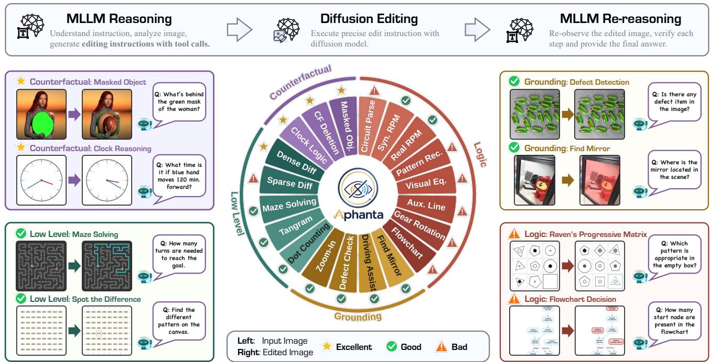  
Figure 1. Task-Conditioned Utility of Image-Edited Intermediates. Current instruction editors provide reliable assistance for selected cue-injection, grounding, and counterfactual state-realization tasks, but are less reliable when the requested intermediate requires exact structural extrapolation. Aphanta measures this boundary rather than assuming that one visual representation helps every task.

## Abstract

Explicit visual intermediates can help multimodal large language models (MLLMs) externalize spatial evidence and updated visual states, but their utility depends on whether an image editor can faithfully realize the required transformation. We introduce Aphanta, an automated taskdiscovery and closed-loop diagnostic framework for the MLLM → image editor → MLLM pipeline. Aphanta evaluates three conditions—direct reasoning, reasoning with an editor-generated intermediate, and reasoning with an idealized reference intermediate—to separate potential visual headroom from the practical utility of current editors. Across 20 candidate tasks and multiple editor–MLLM combinations,

we find that utility is strongly task-conditioned. Gains concentrate in visual cue injection, grounding, and counterfactual state realization, whereas intermediates requiring symbol-sensitive construction or structural extrapolation are substantially less reliable. On the selected positive-task sub set, our consolidated Qwen pipeline improves the mean task scorefrom 0.343 to 0.445 (+10.2 points; +29.7% relative), while the full study also retains filtered and unsuccessful tasks to expose the boundary. These results position image editing as a specialized visual workspace rather than a universal reasoning mechanism, and establish Aphanta as a reusable protocolfor measuring task–representation alignment, editor realization, and downstream pipeline utility.

## 1. Introduction

The idea that a reasoning system can benefit from an auxiliary visual state predates current multimodal large language models (MLLMs). Earlier work used synthetic scenes, modular visual programs, and imagined rollouts to expose compositional structure or predict task-relevant future observations [1, 11, 14, 22, 23, 44]. Modern MLLMs make this idea operational at inference time: they crop, zoom, mark, sketch, or otherwise transform an image to acquire evidence that was difficult to use in the original view [17, 25, 36, 60, 61]. A broader line of work generates explicit images, videos, or latent visual states as intermediate thoughts [6, 7, 9, 13, 15, 28, 53]. Together, these developments suggest a useful abstraction: an MLLM may benefit from a visual workspace that makes a task-relevant state easier to perceive or reason over.

The existence of such a workspace, however, does not imply that every task benefits from an RGB intermediate. Image-to-image translation and instruction editing have become substantially more controllable [2, 16, 19, 32, 35, 58, 66, 67], but a visually plausible edit may still fail the specific count, relation, symbol, or counterfactual state required by a reasoning task. Three questions must therefore be distinguished. First, does an ideal intermediate visual state provide any headroom over direct reasoning? Second, can a current image editor faithfully realize that state from an MLLM instruction? Third, does the downstream MLLM use the returned evidence rather than merely benefiting from an additional reasoning call or the text scaffold surrounding a tool invocation? Recent studies show that visual tool use is highly sensitive to task, representation, reliability, and cost [29, 37, 43, 55, 59]. Yet the practical utility of a standardized MLLM → image editor → MLLM pipeline remains undercharacterized across heterogeneous visual transformations.

We study this problem with Aphanta, an automated framework for task discovery, data construction, and closedloop utility diagnosis. For each candidate task, Aphanta compares direct reasoning (A), reasoning with an editorgenerated intermediate (B), and reasoning with an idealized reference intermediate (C). The comparison estimates whether a task admits useful visual assistance and whether the tested editor realizes it well enough to improve the complete pipeline. Repeating this procedure across 20 candidate tasks produces an empirical affordance map: current instruction-conditioned editors are most reliable when injecting local cues, grounding relevant content, or realizing an explicitly requested visual state, but are less reliable when the intermediate requires symbol-sensitive construction or abstract structural extrapolation.

This framing changes the goal from deciding whether diffusion models “can reason” to measuring the alignment among a task, an intermediate representation, and an editor. It also avoids extrapolating from one editor to the entire diffusion or generative modeling paradigm. Specialized systems can learn visual planning and structured transformations under targeted supervision [9, 40, 65]; our results instead characterize current general instruction editors under the protocol and task suite studied here.

Our contributions are threefold:

• We introduce Aphanta, a reusable task-discovery and validation framework for measuring visual headroom and practical utility in an MLLM–image-editor–MLLM loop.

• We construct Aphanta Train and Test and report a 20- task diagnostic study spanning cue injection, grounding, counterfactual state realization, and structured visual construction, including filtered and unsuccessful tasks rather than only successful demonstrations.

• Across multiple MLLM–editor combinations and two external benchmarks, we identify a task-conditioned reliability boundary and translate it into concrete guidance for selective, verifiable visual assistance, while explicitly delimiting what the present A/B/C protocol can and cannot establish causally.

## 2. Related Work

## 2.1. Active and Generative Visual Reasoning

Early visual-reasoning systems already treated intermediate visual structure as useful evidence. Neural module networks and program-execution models made the reasoning process explicit over synthetic or compositional scenes [1, 22, 23], while model-based agents used imagined rollouts or predicted future frames to support decisions [11, 14, 44]. Contemporary MLLMs revisit the same theme with stronger foundation models: active-perception methods crop, zoom, mark, or sketch the input during inference [10, 17, 25, 36, 60, 61]. A complementary family generates new visual states. Thinking with Generated Images, ThinkMorph, Omni-R1, DiffThinker, and EndoCoT interleave generation with reasoning or train generation models for structured visual tasks [6, 7, 9, 13, 15]. Other work uses video frames, continuous visual tokens, object blueprints, vector graphics, or language-native perception programs rather than edited RGB images [20, 27, 28, 33, 42, 51, 53]. These results establish that visual thought can take several forms; Aphanta asks when one particular form—an explicit image produced by a general instruction editor—has positive downstream utility.

## 2.2. Selection, Reliability, and Evidence Use

Recent work increasingly treats visual assistance as a conditional resource. AVIC controls when and how much to imagine, AdaptMMBench separates mode-selection quality from final accuracy, and Gen-VCoT routes among RGB intermediates of different depth [55, 59, 64]. ToolVision similarly aligns supervision with the learner’s own tool benefit [34]. Reliability is equally important: Reliable Thinking with Images filters noisy cues, while process-reward and evidence-grounding benchmarks diagnose errors that outcome accuracy alone cannot reveal [29, 31, 63]. MentisOculi further shows that even reference visualizations need not improve reasoning [56]. Causal audits show that a model may call a tool without using its returned evidence, and that structured text emitted before a tool call can sometimes account for much of the observed gain [37, 43, 47]. Aphanta is complementary to these policy- and trajectory-level methods: it provides an editor-specific, task-level utility map, but does not treat an accuracy change alone as proof that the returned pixels were causally decisive.

## 2.3. Benchmarks and Image Editors

MIRA, BabyVision, VisuLogic, VisualPuzzles, and VSP expose persistent gaps in perception, spatial reasoning, and the use of auxiliary visual states [4, 39, 45, 49, 62]. ViEBench goes beyond final answers by checking whether a model grounds and uses the correct evidence [31]. Image editing, meanwhile, has progressed from paired and unpaired image-to-image translation to diffusion-based and instruction-guided editing [2, 16, 19, 35, 58, 67]. Recent editor-centric work studies practical instruction editing, reasoning-aware editing, region-adaptive generation, restoration through large editing models, and human-aligned evaluation [5, 21, 32, 46, 52, 54]. Related generation benchmarks and systems further test nuanced image generation, identity consistency, many-to-many image manipulation, vector graphics, and story visualization [3, 12, 48, 51, 68]. Targeted studies also show that editor behavior is trainable: specialized models can learn visual planning or image-space rule execution [40, 65]. Unlike an editor leaderboard or a benchmark that supplies only reference intermediates, Aphanta evaluates the closed loop from task proposal through actual editing to downstream reasoning, and contrasts practical edits with idealized reference states across a heterogeneous task pool.

## 3. Aphanta: Diagnosing Visual-Intermediate Utility

We present Aphanta, an automated pipeline for discovering and validating tasks in which image-edited intermediates may change MLLM performance. Aphanta combines a standardized inference chain, a three-condition diagnostic protocol, and a four-phase task-development loop with human quality control.

## 3.1. Research Setting

Our question is deliberately scoped to current instructionconditioned image editors: for which tasks, and to what extent, does an editor-generated RGB intermediate improve

a complete MLLM reasoning pipeline? We study the fixed chain

$$
q , x \to \mathrm { M L L M } \to e \to \mathrm { E d i t o r } ( x , e ) \to { \tilde { x } } \to \mathrm { M L L M } \to { \hat { y } } ,
$$

where q is a query, x the original image, e an edit instruction, $\tilde { x }$ the edited intermediate, and $\hat { y }$ the final response. The editor may be called iteratively. Unless stated otherwise, the same MLLM produces e and answers after editing, so model-family changes do not confound the two reasoning stages within a pipeline.

We treat the editor as a candidate visual workspace, not as an autonomous solver. This distinction matters because a correct instruction can be rendered incorrectly, and a plausible rendering can still be unhelpful to the downstream MLLM.

## 3.2. Three-Condition Utility Diagnosis

For each task, Aphanta evaluates three conditions under a shared scoring function:

• A (Direct): the MLLM answers from (q, x) without an edited intermediate;

• B (Actual Edit): the full pipeline generates e and x˜ before re-reasoning;

• C (Reference): the generated image is replaced with an idealized, programmatically constructed reference intermediate.

Let $S _ { A } , S _ { B } , S _ { C }$ be task scores in the three conditions. We report

$$
\Delta _ { \mathrm { e d i t } } = S _ { B } - S _ { A } , \qquad \Delta _ { \mathrm { r e f } } = S _ { C } - S _ { A } .
$$

$\Delta _ { \mathrm { r e f } }$ is diagnostic visual headroom: it asks whether the downstream MLLM can benefit from the intended intermediate. $\Delta _ { \mathrm { e d i t } }$ measures the practical utility of the complete editorin-the-loop pipeline. A large positive $\Delta _ { \mathrm { r e f } }$ with a small or negative $\Delta _ { \mathrm { e d i t } }$ identifies a realization gap under the tested pipeline. We call C a reference, rather than a strict upper bound, because an actual edit may occasionally interact with the downstream model more favorably than the constructed reference.

This triad does not, by itself, prove that the rendered pixels causally determine the answer: B also contains the edit instruction and an additional MLLM turn. We therefore interpret $\Delta _ { \mathrm { e d i t } }$ as pipeline-level utility and return to matchedcall, no-return, and sham-image controls in subsection 4.4.

## 3.3. Automated Task-Development Loop

To scale task discovery, we build a four-phase agent pipeline. The agent reuses prompt templates, data utilities, and training/evaluation scripts; human experts supervise feasibility and data quality.

Phase 1: Proposal and screening. Given the research question and previously observed task patterns, the agent proposes candidates that require a non-trivial visual transformation or disambiguation. Human reviewers screen conceptual feasibility, measurable evaluation, and the availability of constructible reference intermediates.

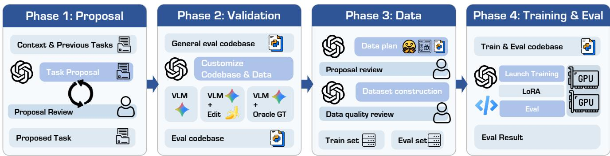  
Figure 2. The Aphanta Pipeline. A four-phase loop proposes and screens tasks, performs preliminary A/B/C diagnosis, constructs and reviews data, and trains and evaluates editor-in-the-loop pipelines. Results feed back into task proposal, producing a task-conditioned utility map rather than a success-only collection.

Phase 2: Preliminary diagnosis. The agent builds a small validation set from public data, web resources, or procedural synthesis and evaluates A/B/C. Tasks with negligible reference headroom, saturated baselines, unavailable edited outputs, or unstable formulations may be stopped; all such outcomes remain in the reported 20-task audit rather than disappearing from the study.

Phase 3: Data construction and curation. For retained tasks, the agent collects or synthesizes data, creates taskspecific prompts and reference intermediates, and produces visual summaries. Human reviewers check relevance, diversity, and construction noise before training.

Phase 4: Training, evaluation, and iteration. The agent launches task-specific or consolidated editor training and evaluates the resulting pipeline. Results guide prompt, formatting, and training updates and are also fed back to Phase 1, closing the loop between hypothesis formation and quantitative validation.

## 3.4. Task Pool and Outputs

Running the loop yields Aphanta Train, a collection of taskspecific editing resources, and Aphanta Test, a standardized evaluation pool for the same inference chain. We organize tasks by their dominant requested operation: grounding, perceptual cue injection, counterfactual state realization, or structured extrapolation. These labels summarize the dominant operation and are not claimed to be mutually exclusive cognitive categories. Crucially, the task pool preserves lowheadroom, stopped, and unsuccessful cases, enabling a more realistic map than a success-only collection. Examples are shown in Figure 3.

## 4. Task-Conditioned Utility of Edited Intermediates

## 4.1. A 20-Task Affordance Map

Table 1 reports all 20 candidates considered by Aphanta, including stopped and unsuccessful tasks. Four tasks— Repeated Pattern Recognition, Visual Equation Puzzle, Gear Rotation Reasoning, and Spot-the-Difference (Sparse)— were stopped after preliminary diagnosis because of limited reference headroom, a saturated baseline, unavailable edited outputs, or insufficiently stable task construction. Of the 16 tasks taken forward, 15 reached final-stage evaluation; Circuit Diagram Parsing retains its Phase-2 result because agent failed its development. Thirteen tasks yielded a positive, retained pipeline, whereas Plane Geometry Auxiliary Line and Flowchart Decision did not provide reliable finalstage assistance.

The task-level results reveal a graded boundary rather than a binary division between perception and logic. Counterfactual state realization is the clearest positive region: editing clocks, deleting specified objects, or completing a masked state increases the downstream score by 0.21–0.37. Cue-injection tasks such as dense counting, tangram decomposition, and dense difference marking also improve substantially. Grounding tasks generally benefit, although the actual edit can occasionally exceed the constructed reference, confirming that C is a diagnostic target rather than a strict numerical ceiling.

Tasks requiring exact structural extrapolation are less consistent. The two RPM variants improve after task-specific development, showing that a broad claim of “no visual logic” is not supported. In contrast, circuit symbols, geometry constructions, gear relations, and flowchart routing expose recurring realization errors. These tasks often retain positive reference headroom while the actual edit is weak or harmful, which is the signature of a task–editor mismatch under our protocol.

Table 2 summarizes the same pattern using unweighted macro-averages over tasks for which all A/B/C conditions are available. Because the task scores include both accuracy and IoU, the aggregation is descriptive rather than a

  
Q: What is the degree of entry of the 'Urgency Level Determination (Decision Point)' node E: Highlight graph targets 'Urgency Level Determination (Decision Point) node A: 2  
Q: How many turns are in the shortest path from Start to End? Return an integer only. E: Draw an orange path line from S to E following the valid maze A: 17

## Tasks Discovered by Aphanta

  
Q: After these signs, can I overtake this truck? A: Yes  
Q: Determine whether this object has an anomaly? A: Yes

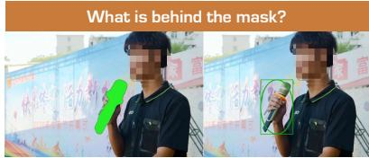  
Q: "Which item appears, 'cigarette' or 'pen’? E: "Crop the cigarette into a square 1:1 close-up." A: "cigarette"  
Q: A large sticker occludes the target object. What object is most likely hidden under the sticker? A: Microphone

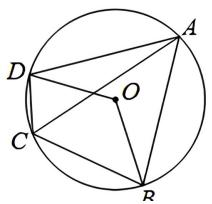

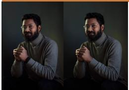  
Q: After removing the watch from the man's wrist, please answer based on the current picture only: Can you still see the "watch" in the picture? Please only answer yes or no. A: No

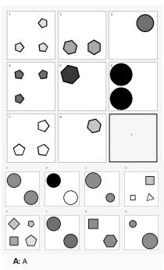

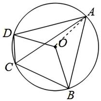

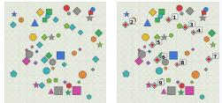  
Q: How many cyan diamonds are there in the image? E: Identify all cyan diamonds in the image. Mark the center of each target with a small red dot and add sequential index labels. A: 9

  
Q: What’s the diff?

## Spot the Diff (Dense)

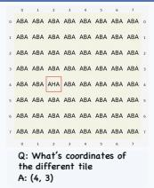

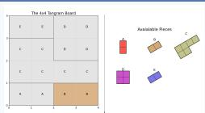  
Q: Based on the above steps, can the Tangram puzzle be completed with the available pieces, yes or no?“ A: Yes

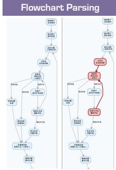  
Q: In circle O, chords AB and AD are equal, and <BOD = 124 ° . Point C lies on the minor arc BD (not containing A). What is the measure of <DCA? Options: A. 59° B. 62° C. 56° D. 42 E: Draw radius \$OA\$ A: A

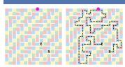

Q: A magenta waypoint dot is placed on one cell of the shortest path from Start to End. After reaching that waypoint while following the shortest path, what i the NEXT move? E: Draw an orange path line from S to E following the valid maze A: LEFT

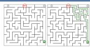

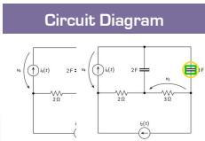  
Q: Tell me the circuit symbol positioned to the far right. A: capacitor

Figure 3. Showcases of Tasks Aphanta Found. The colors represent four different categories: Low-level Recognition , Grounding , Counterfactual , and Logic  
Table 1. Complete 20-Task Audit. A/B/C denote Direct, Actual Edit, and Reference. Italicized scores are preliminary values for tasks without final-stage evaluation; “status” records whether a task produced a retained practical pipeline, not whether visual assistance is possible in principle.
<table><tr><td rowspan="2">ID</td><td rowspan="2">Task</td><td rowspan="2">Status</td><td rowspan="2">Topic</td><td colspan="3">Evaluation</td><td rowspan="2">ID</td><td rowspan="2">Task</td><td rowspan="2">Status</td><td rowspan="2">Topic</td><td colspan="3">Evaluation</td></tr><tr><td>Direct</td><td>+Edit</td><td>+Ref.</td><td>Direct</td><td>+Edit +Ref.</td><td></td></tr><tr><td>1</td><td>Where Is My Mirror</td><td>PASS</td><td>Grounding</td><td>0.70</td><td>0.78</td><td>0.77</td><td>11</td><td>Plane Geometry Aux. Line</td><td>FAIL</td><td>Logic</td><td>0.41</td><td>0.43</td><td>0.47</td></tr><tr><td>2</td><td>Circuit Diagram Parsing</td><td>FAIL</td><td>Logic</td><td>0.70</td><td>0.60</td><td>0.88</td><td>12</td><td>Dense Dot Counting</td><td>PASS</td><td>Low Level</td><td>0.05</td><td>0.23</td><td>0.52</td></tr><tr><td>3</td><td>Auto. Driving Assistant</td><td>PASS</td><td>Grounding</td><td>0.42</td><td>0.57</td><td>0.45</td><td>13</td><td>Tangram</td><td>PASS</td><td>Low Level</td><td>0.31</td><td>0.51</td><td>0.61</td></tr><tr><td>4</td><td>RPM: Synthetic</td><td>PASS</td><td>Logic</td><td>0.18</td><td>0.30</td><td>0.39</td><td>14</td><td>Gear Rotation Reasoning</td><td>FAIL</td><td>Logic</td><td>0.92</td><td>0.42</td><td>0.83</td></tr><tr><td>5</td><td>RPM: Real</td><td>PASS</td><td>Logic</td><td>0.61</td><td>0.79</td><td>0.71</td><td>15</td><td>Industrial Defect Inspect</td><td>PASS</td><td>Grounding</td><td>0.70</td><td>0.82</td><td>0.88</td></tr><tr><td>6</td><td>Repeated Pattern Recog.</td><td>FAIL</td><td>Logic</td><td>0.13</td><td>0.07</td><td>0.20</td><td>16</td><td>Flowchart Decision</td><td>FAIL</td><td>Logic</td><td>0.36</td><td>0.22</td><td>0.41</td></tr><tr><td>7</td><td>Analog Clock Reasoning</td><td>PASS</td><td>Counterfactual</td><td>0.50</td><td>0.81</td><td>0.84</td><td>17</td><td>Zoom-in (Remake)</td><td>PASS</td><td>Grounding</td><td>0.87</td><td>0.92</td><td>0.93</td></tr><tr><td>8</td><td>Counterfactual: Deletion</td><td>PASS</td><td>Counterfactual</td><td>0.10</td><td>0.47</td><td>0.92</td><td>18</td><td>Maze Solving</td><td>PASS</td><td>Low Level</td><td>0.24</td><td>0.26</td><td>0.27</td></tr><tr><td>9</td><td>What Is Behind the Mask?</td><td>PASS</td><td>Counterfactual</td><td>0.25</td><td>0.46</td><td>0.68</td><td>19</td><td>Spot-the-Diff (Sparse)</td><td>FAIL</td><td>Low Level</td><td>0.53</td><td></td><td>0.58</td></tr><tr><td>10</td><td>Visual Equation Puzzle</td><td>FAIL</td><td>Logic</td><td>0.85</td><td></td><td>0.85</td><td>20</td><td>Spot-the-Diff (Dense)</td><td>PASS</td><td>Low Level</td><td>0.18</td><td>0.46</td><td>0.68</td></tr></table>

universal metric or hypothesis test. State realization has the largest mean gain, followed by cue injection and grounding; the structured group has a negative mean actual-edit delta despite positive reference headroom. The group names denote dominant visual operations and should not be read as mutually exclusive cognitive categories.

## 4.2. Consolidation and Cross-Model Transfer

We consolidate the retained training assets into a unified Qwen-Image-Edit model and evaluate the selected positivetask subset under a common protocol. As shown in Table 3, the mean task score increases from 0.343 to 0.445: an absolute change of +0.102 (+10.2 percentage points on the normalized scale) and a +29.7% relative gain. This number describes the post-selection positive region; it is not an alltask editor leaderboard. The corresponding reference score of 0.558 indicates remaining realization headroom.

Table 2. Descriptive Macro-Average by Dominant Operation. Each row uses tasks with all A/B/C scores available; stopped tasks use their preliminary scores.
<table><tr><td>Operation</td><td colspan="2">Mean task score Direct +Edit +Ref.</td><td>Absolute delta Edit ∆</td><td>Ref. ∆</td></tr><tr><td>Grounding</td><td>0.673 0.773</td><td>0.758</td><td>+0.100</td><td>+0.085</td></tr><tr><td>Structured</td><td>0.473</td><td>0.404 0.556</td><td>-0.069</td><td>+0.083</td></tr><tr><td>Cue injection</td><td>0.195</td><td>0.365 0.520</td><td>+0.170</td><td>+0.325</td></tr><tr><td>State realization</td><td>0.283</td><td>0.580 0.813</td><td>+0.297</td><td>+0.530</td></tr></table>

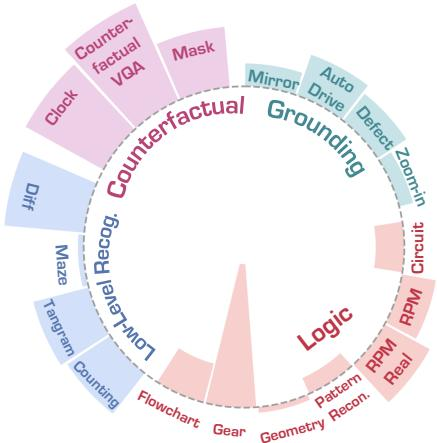  
Figure 4. Task-Pool Composition under the Original Four Display Labels.

Table 3. Consolidated Evaluation on the Selected Positive-Task Subset. Left: complete within-family MLLM–editor pipelines. Right: editors compared with Qwen3-VL fixed. ∆ is the absolute change in mean task score, reported in points; the Qwen pipeline’s +10.2 points correspond to +29.7% relative to its direct score. Results characterize this selected subset rather than a general editor leaderboard.  
(a) Complete within-family pipelines
<table><tr><td>Pipeline</td><td>Direct</td><td>Edit</td><td>Ref.</td><td>∆ (pt.)</td></tr><tr><td>Qwen3-VL + Qwen-Image-Edit</td><td>0.343</td><td>0.445</td><td>0.558</td><td>+10.2</td></tr><tr><td>Seed-2.0 + Seedream-4.5</td><td>0.505</td><td>0.540</td><td>0.650</td><td>+3.5</td></tr><tr><td>GPT-5 + GPT-Image-1.5</td><td>0.475</td><td>0.425</td><td>0.635</td><td>-5.0</td></tr><tr><td>Gemini-3 + Nano Banana 2</td><td>0.580</td><td>0.625</td><td>0.650</td><td>+4.5</td></tr></table>

We next vary model families and editors. For withinfamily pipelines, Seed and Gemini obtain smaller positive deltas, whereas the GPT pairing is negative on this subset. Holding Qwen3-VL fixed and changing only the editor produces deltas from −4.7 to +10.2 points. This spread shows that downstream utility depends on editor execution, not only on the requested operation. It does not, however, fully isolate instruction quality, because proprietary systems and familyspecific pipelines may differ in prompting, preprocessing, or hidden correction mechanisms.

The heatmap in Figure 5 further shows that no editor dominates every operation. Positive cells concentrate in state realization and selected grounding tasks; structured tasks and some seemingly simple cue operations remain unstable. Relative percentages are visually useful for comparing directions, but can be large when the direct baseline is small; the absolute deltas in Table 3 are therefore our primary summary.

(b) Fixed Qwen3-VL reasoner
<table><tr><td colspan="2">Editor Edit score ∆ (pt.)</td></tr><tr><td>Qwen-Image-Edit (ours)</td><td>0.445 +10.2</td></tr><tr><td>FLUX.2 Klein</td><td>0.380 +3.7</td></tr><tr><td>LongCat-Image-Edit</td><td>0.365 +2.2</td></tr><tr><td>GPT-Image-1.5</td><td>0.430 +8.7</td></tr><tr><td>Seedream-4.5</td><td>0.296 -4.7</td></tr><tr><td>Nano Banana 2</td><td>0.370 +2.7</td></tr></table>

## 4.3. What Explains the Observed Boundary?

The task study suggests three recurring properties of current instruction-conditioned editors. We state them as empirical properties of the tested systems, not as architectural impossibility results.

In counterfactual tasks, the original image can contain evidence that is inconsistent with the state described by the query. An editor can reduce this mismatch by rendering the requested state directly. The downstream model then answers from a representation aligned with the question instead of maintaining the update only in text. This mechanism is consistent with the strong gains for clock manipulation, deletion, and masked-state completion.

This gap explains why an apparently polished intermediate can reduce final accuracy. In the example above, sequential labels are rendered naturally but one item is skipped. Once the downstream MLLM conditions on this image, the error can propagate. Similar error accumulation has been documented for noisy visual thoughts and mis-grounded visual-tool trajectories [29, 43].

The circuit, geometry, and flowchart cases require more than perceptual plausibility: every symbol, relation, or auxiliary construction must satisfy a discrete constraint. The

<table><tr><td rowspan=2 colspan=1>Counterfactual</td><td></td><td></td><td></td><td></td></tr><tr><td rowspan=1 colspan=1>+106%</td><td rowspan=1 colspan=1>+313%</td><td rowspan=1 colspan=1>-16%</td><td rowspan=1 colspan=1></td></tr><tr><td rowspan=1 colspan=1>Low Level</td><td rowspan=1 colspan=1>+13%</td><td rowspan=1 colspan=1>-12%</td><td rowspan=1 colspan=1>-33%</td><td rowspan=1 colspan=1>+0%</td></tr><tr><td rowspan=1 colspan=1>Grounding</td><td rowspan=1 colspan=1>+26%</td><td rowspan=1 colspan=1>+10%</td><td rowspan=1 colspan=1>+6%</td><td rowspan=1 colspan=1>-7%</td></tr><tr><td rowspan=1 colspan=1>Logic</td><td rowspan=1 colspan=1>+18%</td><td rowspan=1 colspan=1>-23%</td><td rowspan=1 colspan=1>-3%</td><td rowspan=1 colspan=1>+303%</td></tr><tr><td rowspan=1 colspan=1></td><td rowspan=1 colspan=4>Ours   Gemini    GPT  SeedreamModel Pair</td></tr></table>

<table><tr><td rowspan=1 colspan=1>+227%</td><td rowspan=1 colspan=1>+231%</td><td rowspan=1 colspan=1>+254%</td><td rowspan=1 colspan=1>+274%</td><td rowspan=1 colspan=1>+56%</td></tr><tr><td rowspan=1 colspan=1>+11%</td><td rowspan=1 colspan=1>-19%</td><td rowspan=1 colspan=1>-10%</td><td rowspan=1 colspan=1>-3%</td><td rowspan=1 colspan=1>-15%</td></tr><tr><td rowspan=1 colspan=1>+96%</td><td rowspan=1 colspan=1>+36%</td><td rowspan=1 colspan=1>-4%</td><td rowspan=1 colspan=1>-25%</td><td rowspan=1 colspan=1>-48%</td></tr><tr><td rowspan=1 colspan=1>+9%</td><td rowspan=1 colspan=1>-20%</td><td rowspan=1 colspan=1>-15%</td><td rowspan=1 colspan=1>-24%</td><td rowspan=1 colspan=1>-1%</td></tr><tr><td rowspan=1 colspan=1>GPT</td><td rowspan=1 colspan=4>NB2    FLUX2  LongCatSeedreamEditor</td></tr></table>

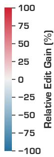  
Figure 5. Relative Edit Gain by Task Operation and Model/Editor Combination. Large percentages can arise from small direct baselines; Table 3 reports the corresponding absolute aggregate deltas.

## Case Study of Aphanta

## Direct Answer

User: A large circular sticker occludes the target object. What object is most likely hidden under the sticker? Answer with a short noun phrase only

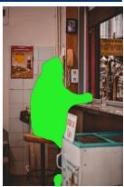

## Direct Answer

Model: The green sticker is covering a portion of the wall where a framed picture is visible above, and the area beneath it appears to be a standard indoor wall section. Given the context of the surrounding environment, …, the most likely object hidden under the sticker is a sign.

## With Edit

Model: {"edit\_prompt":"draw a red circle around the green sticker to highlight its boundary“}

Model: The green oval in Image 2 highlights a person sitting on a stool at a counter. The large circular sticker in Image 1 is covering the same area. Therefore, the object hidden under the sticker is a person.

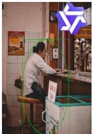

## With Oracle

Model: {"edit\_prompt":"draw a red circle around the green sticker to highlight its boundary“}

Model: The green oval in the second image highlights a person wearing a white uniform and hat, sitting on a stool. The surrounding environment, including the tiled wall, menu poster, and counter, …, such as a chef or deli employee. …the sticker is most likely a person.

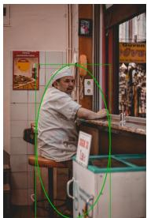

## Direct Answer

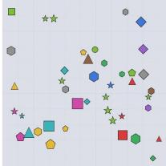

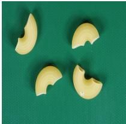

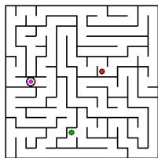  
Question: How many lime stars are there in the image?  
Model: In the lower-middle section, there is one…Wait, let's re-examine the lowermiddle section…Wait, let's look again…No, the star in the lower-middle is lime green, Yes, it is lime. So 6.  
Question: Determine whether this object has an anomaly?  
Model: All pieces appear to be intact and consistent in shape and color, with no visible cracks, breaks, or dis-coloration "answer": "0"

MMM MMM MMM MMM MMM MMM MMM MMM MMM MMM MMM MMM MMM MMM MMM MMM MMM MMM MMM MMM MMM MMM MMM MMM MMM MMM MMM MMM MMM MMM MMM MMM MMM MMM MMM MMM MMM NMM MMM MMM MMM MMM MMM MMM MMM MMM MMM MMM MMM MMM MMM MMM MMM MMM MMM MMM MMM MMM MMM MMM MMM MMM MMM MMM

## Question & Answer

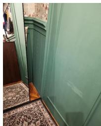

Question: A magenta waypoint dot marks a candidate cell. Does the shortest path from Start to End pass through this waypoint dot?

Model: The Start (green) is at the bottom-left, …The short-est path from Start to End does not pass…Therefore, the answer is NO.

Question: Find the only tile with different characters

Model: Upon examining the grid, all tiles contain the pattern "MMM" except for one tile. The tile at row 3 and column 4 contains the pattern NMM. Thus, the different tile is located a row 3, column 4.

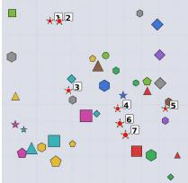  
Edited Image

Question: Where is the Mirror? Answer with bounding box.

Model: The reflection in the mirror shows a different perspective of the room, indicating that the mirror is positioned to reflect the area behind the viewer. Pred\_bbox: [0,0,125,312] Bbox\_iou: 0.4933

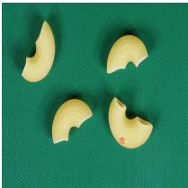

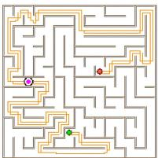

MMM MMM MMM MMM MMM MMM MMM MMM MMM MMM MMM MMM MMM MMM MMM MMM MMM MMM MMM MMM MMM MMM MMM MMM MMM MMM MMM MMM MMM MMM MMM MMM MMM MMM MMM MMM MMM NMM MMM MMM 4 MMM MMM MMM MMM MMM MMM MMM MMM MMM MMM MMM MMM MMM MMM MMM MMM MMM MMM MMM MMM MMM MMM MMM MMM

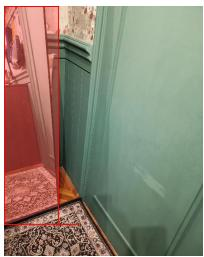  
Model: Let's analyze each of the numbered stars in the helper image…All of them are lime green. The helper image marks all of them. So there are 7 lime stars. So the final answer is 7  
Model: Draw a red circle around the defective region  
Figure 6. Positive Cases from the Qwen3-VL and Qwen-Image-Edit Pipeline. Each row compares direct reasoning, the actual edited intermediate, and the programmatically constructed reference condition.

## With Edit

## Edit Prompt & Answer

Model: highlight each lime green star

Model: The second image is identical to the first, except for a small red mark on one of the pieces of macaroni. This red … is likely a defect or anomaly. Therefore, the object has an anomaly

Model: Draw a red circle around the defective region

Model: The path shown in Image 2 confirms this. The orange line, representing the shortest path, starts at the magenta waypoint (the green dot) and proceeds to the red End marker…the answer is YES

Model: draw a red box around the tile different

Model: The helper image highlights a specific tile at row 4, column 5, which contains the characters "NMM" instead of "MMM“. "answer":"4,5"

Model: Draw a red outline around the mirror surface

Model: To better identify   
and analyze the mirror   
objects in the image, it   
would be helpful to   
highlight the reflective   
surface and its surround  
ings. This will make it easier   
to distinguish……   
Pred\_bbox:[0,0,137,328],   
Bbox\_iou: 0.567

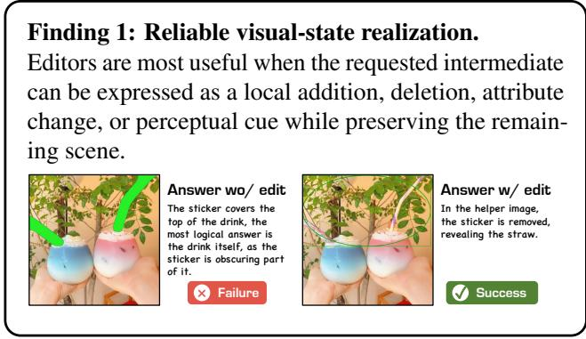

Figure 7. Reliable Visual-State Realization. A counterfactual task in which editing realizes the queried visual state before the final MLLM decision.  
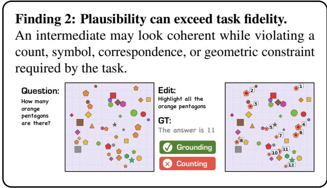

Figure 8. Plausibility Can Exceed Task Fidelity. A visually coherent numbering edit that omits a task-critical item.  
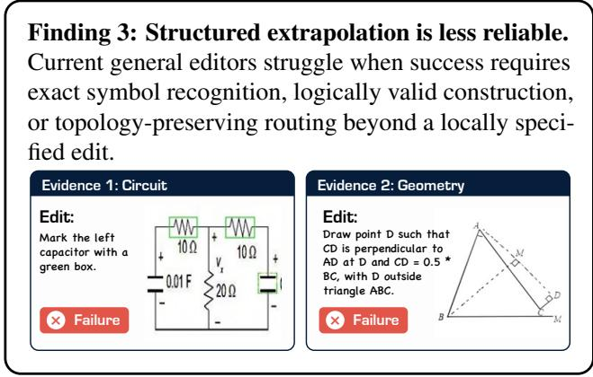  
Figure 9. Structured Extrapolation Is Less Reliable. Representative realization errors in circuit interpretation and geometry construction.

tested instruction editors do not realize these transformations consistently. This is an empirical boundary of general editors under our setup, not a claim that diffusion or image-space models are fundamentally unable to learn such operations. Targeted training has already improved maze planning, Sudoku, and other structured transformations [9, 40, 65].

## 4.4. Scope, Causality, and Limitations

Our conclusions are bounded in four ways. First, Aphanta is an exploratory task-discovery process; selection based on Phase-2 headroom can increase the magnitude of gains on the retained subset. We therefore report all 20 candidates and treat the consolidated positive-region score separately from the full task audit. Second, the operation labels overlap, and a larger preregistered task universe is needed before interpreting their macro-averages as population estimates. Third, closed-source editors expose limited architectural and decoding details, so cross-family results characterize products and APIs at evaluation time rather than isolated model components.

Finally, A/B/C establishes pipeline-level utility but not the causal contribution of returned pixels. Recent work finds that tool-call text can be sufficient in some visual-tool settings and that rendered visual thoughts may be attended to without contributing content [30, 37, 43]. A complete causal decomposition should add matched second-pass reasoning, call-without-return, identity or sham images, and step-level counterfactual replacements. These controls are a necessary next step for separating instruction scaffolding, editor realization, and downstream evidence use.

## 5. Conclusion

We introduced Aphanta, a task-discovery and closed-loop diagnostic framework for studying image-edited intermediates in multimodal reasoning. By comparing direct, actual-edit, and idealized-reference conditions across 20 candidate tasks, Aphanta separates potential visual headroom from the practical utility of current editor-in-the-loop pipelines.

The resulting map is task-conditioned. Current instruction editors are most useful for grounding, perceptual cue injection, and counterfactual state realization; they are less reliable when an intermediate must preserve exact symbols, relations, or topology. This boundary is neither a universal verdict on diffusion nor a claim that every returned image is causally used. Rather, it motivates a system design in which visual assistance is selected by task, verified after generation, and rejected or replaced when its evidence is unreliable. Aphanta provides the task pool, diagnostic protocol, and empirical baseline needed to study that broader problem.

## References

[1] Jacob Andreas, Marcus Rohrbach, Trevor Darrell, and Dan Klein. Neural module networks. In Proceedings of the IEEE Conference on Computer Vision and Pattern Recognition, pages 39–48, 2016. 2

[2] Tim Brooks, Aleksander Holynski, and Alexei A. Efros. Instructpix2pix: Learning to follow im-

age editing instructions. In Proceedings of the IEEE/CVF Conference on Computer Vision and Pattern Recognition, pages 18392–18402, 2023. 2, 3

[3] Jingjing Chang, Yixiao Fang, Peng Xing, Shuhan Wu, Wei Cheng, Rui Wang, Xianfang Zeng, Gang Yu, and Hai-Bao Chen. OneIG-Bench: Omni-dimensional nuanced evaluation for image generation. In Advances in Neural Information Processing Systems, 2025. 3

[4] Liang Chen, Weichu Xie, Yiyan Liang, Hongfeng He, Hans Zhao, Zhibo Yang, Zhiqi Huang, Haoning Wu, Haoyu Lu, Y. charles, Yiping Bao, Yuantao Fan, Guopeng Li, Haiyang Shen, Xuanzhong Chen, Wendong Xu, Shuzheng Si, Zefan Cai, Wenhao Chai, Ziqi Huang, Fangfu Liu, Tianyu Liu, Baobao Chang, Xiaobo Hu, Kaiyuan Chen, Yixin Ren, Yang Liu, Yuan Gong, and Kuan Li. Babyvision: Visual reasoning beyond language, 2026. 3

[5] Pengtao Chen, Xianfang Zeng, Maosen Zhao, Mingzhu Shen, Peng Ye, Bangyin Xiang, Zhibo Wang, Wei Cheng, Gang Yu, and Tao Chen. RegionE: Adaptive region-aware generation for efficient image editing. arXiv preprint arXiv:2510.25590, 2025. 3

[6] Dongjie Cheng, Yongqi Li, Zhixin Ma, Hongru Cai, Yupeng Hu, Wenjie Wang, Liqiang Nie, and Wenjie Li. Omni-r1: Towards the unified generative paradigm for multimodal reasoning, 2026. 2

[7] Ethan Chern, Zhulin Hu, Steffi Chern, Siqi Kou, Jiadi Su, Yan Ma, Zhijie Deng, and Pengfei Liu. Thinking with generated images. arXiv preprint arXiv:2505.22525, 2025. 2

[8] Charles Corbière, Simon Roburin, Syrielle Montariol, Antoine Bosselut, and Alexandre Alahi. Drivingvqa: Analyzing visual chain-of-thought reasoning of vision language models in real-world scenarios with driving theory tests. arXiv preprint arXiv:2501.04671, 2025. 15

[9] Xuanlang Dai, Yujie Zhou, Long Xing, Jiazi Bu, Xilin Wei, Yuhong Liu, Beichen Zhang, Kai Chen, and Yuhang Zang. Endocot: Scaling endogenous chain-ofthought reasoning in diffusion models. arXiv preprint arXiv:2603.12252, 2026. 2, 8

[10] Chengqi Duan, Kaiyue Sun, Rongyao Fang, Manyuan Zhang, Yan Feng, Ying Luo, Yufang Liu, Ke Wang, Peng Pei, Xunliang Cai, et al. Codeplot-cot: Mathematical visual reasoning by thinking with code-driven images. arXiv preprint arXiv:2510.11718, 2025. 2

[11] Frederik Ebert, Chelsea Finn, Alex X. Lee, and Sergey Levine. Visual foresight: Model-based deep reinforcement learning for vision-based robotic control. arXiv preprint arXiv:1812.00568, 2018. 2

[12] Zhoujie Fu, Xianfang Zeng, Jinghong Lan, Xinyao Liao, Cheng Chen, Junyi Chen, Jiacheng Wei, Wei

Cheng, Shiyu Liu, Yunuo Chen, Gang Yu, and Guosheng Lin. iMontage: Unified, versatile, highly dynamic many-to-many image generation. arXiv preprint arXiv:2511.20635, 2025. 3

[13] Jiawei Gu, Yunzhuo Hao, Huichen Will Wang, Linjie Li, Michael Qizhe Shieh, Yejin Choi, Ranjay Krishna, and Yu Cheng. Thinkmorph: Emergent properties in multimodal interleaved chain-of-thought reasoning. arXiv preprint arXiv:2510.27492, 2025. 2

[14] David Ha and Jürgen Schmidhuber. World models. arXiv preprint arXiv:1803.10122, 2018. 2

[15] Zefeng He, Xiaoye Qu, Yafu Li, Tong Zhu, Siyuan Huang, and Yu Cheng. Diffthinker: Towards generative multimodal reasoning with diffusion models. arXiv preprint arXiv:2512.24165, 2025. 2

[16] Amir Hertz, Ron Mokady, Jay Tenenbaum, Kfir Aberman, Yael Pritch, and Daniel Cohen-Or. Promptto-prompt image editing with cross-attention control. In International Conference on Learning Representations, 2023. 2, 3

[17] Jack Hong, Chenxiao Zhao, ChengLin Zhu, Weiheng Lu, Guohai Xu, and Xing Yu. Deepeyesv2: Toward agentic multimodal model. arXiv preprint arXiv:2511.05271, 2025. 2

[18] IKENNA113. circuitvqadesc2 dataset. https: //huggingface.co/datasets/IKENNA113/ circuitvqadesc2, 2024. Accessed: 2026-05. 15

[19] Phillip Isola, Jun-Yan Zhu, Tinghui Zhou, and Alexei A. Efros. Image-to-image translation with conditional adversarial networks. In Proceedings of the IEEE Conference on Computer Vision and Pattern Recognition, pages 1125–1134, 2017. 2, 3

[20] Muhammad Kamran Janjua, Hugo Silva, Di Niu, and Bahador Rashidi. Don’t show pixels, show cues: Unlocking visual tool reasoning in language models via perception programs. arXiv preprint arXiv:2604.12896, 2026. 2

[21] Zhangqi Jiang, Zheng Sun, Xianfang Zeng, Yufeng Yang, Xuanyang Zhang, Yongliang Wu, Wei Cheng, Gang Yu, Xu Yang, and Bihan Wen. Geditbench v2: A human-aligned benchmark for general image editing. arXiv preprint arXiv:2603.28547, 2026. 3

[22] Justin Johnson, Bharath Hariharan, Laurens van der Maaten, Li Fei-Fei, C. Lawrence Zitnick, and Ross Girshick. CLEVR: A diagnostic dataset for compositional language and elementary visual reasoning. In Proceedings of the IEEE Conference on Computer Vision and Pattern Recognition, pages 2901–2910, 2017. 2

[23] Justin Johnson, Bharath Hariharan, Laurens van der Maaten, Judy Hoffman, Li Fei-Fei, C. Lawrence Zitnick, and Ross Girshick. Inferring and executing programs for visual reasoning. In Proceedings of the IEEE

International Conference on Computer Vision, pages 2989–2998, 2017. 2

[24] Kingsoft-LLM. Qzhou-flowchart-qa dataset. https: //huggingface.co/datasets/Kingsoft-LLM/QZhou-Flowchart-QA, 2024. Accessed: 2026-05. 15

[25] Xin Lai, Junyi Li, Wei Li, Tao Liu, Tianjian Li, and Hengshuang Zhao. Mini-o3: Scaling up reasoning patterns and interaction turns for visual search. arXiv:2509.07969, 2025. 2

[26] Ang Li, Charles Wang, Deqing Fu, Kaiyu Yue, Zikui Cai, Wang Bill Zhu, Ollie Liu, Peng Guo, Willie Neiswanger, Furong Huang, Tom Goldstein, and Micah Goldblum. Zebra-cot: A dataset for interleaved visionlanguage reasoning. In The Fourteenth International Conference on Learning Representations, 2026. 15

[27] Bangzheng Li, Ximeng Sun, Jiang Liu, Ze Wang, Jialian Wu, Xiaodong Yu, Hao Chen, Emad Barsoum, Muhao Chen, and Zicheng Liu. Latent visual reasoning, 2025. 2

[28] Chengzu Li, Zanyi Wang, Jiaang Li, Yi Xu, Han Zhou, Huanyu Zhang, Ruichuan An, Dengyang Jiang, Zhaochong An, Ivan Vulic, et al. Thinking in frames: How´ visual context and test-time scaling empower video reasoning. arXiv preprint arXiv:2601.21037, 2026. 2

[29] Haobin Li, Yutong Yang, Yijie Lin, Xiang Dai, Mouxing Yang, and Xi Peng. Reliable thinking with images. arXiv preprint arXiv:2602.12916, 2026. 2, 3, 6

[30] Pengyu Li, Zhitao Gao, Lingling Zhang, Muye Huang, Yuanming Li, Fangzhi Xu, and Jun Liu. Visualopsd: Cross-modal on-policy self-distillation for efficient unified multimodal reasoning. arXiv preprint arXiv:2606.18974, 2026. 8

[31] Xuchen Li, Xuzhao Li, Renjie Pi, Shiyu Hu, Jian Zhao, and Jiahui Gao. Beyond accuracy: Evaluating grounded visual evidence in thinking with images. arXiv preprint arXiv:2601.11633, 2026. 3

[32] Shiyu Liu, Yucheng Han, Peng Xing, Fukun Yin, Rui Wang, Wei Cheng, Jiaqi Liao, Yingming Wang, Honghao Fu, Chunrui Han, Guopeng Li, Yuang Peng, Quan Sun, Jingwei Wu, Yan Cai, Zheng Ge, Ranchen Ming, Lei Xia, Xianfang Zeng, Yibo Zhu, Binxing Jiao, Xiangyu Zhang, Gang Yu, and Daxin Jiang. Step1x-edit: A practical framework for general image editing. arXiv preprint arXiv:2504.17761, 2025. 2, 3

[33] Weijian Ma, Shizhao Sun, Tianyu Yu, Ruiyu Wang, Tat-Seng Chua, and Jiang Bian. Thinking with blueprints: Assisting vision-language models in spatial reasoning via structured object representation. arXiv preprint arXiv:2601.01984, 2026. 2

[34] Delin Mao, Chenghao Sun, Jingwei Song, Chishui Chen, and Linfeng Zhang. Toolvision: Learning when and how to use visual tools with capability-aligned

supervision. arXiv preprint arXiv:2608.08907, 2026. 3

[35] Chenlin Meng, Yutong He, Yang Song, Jiaming Song, Jiajun Wu, Jun-Yan Zhu, and Stefano Ermon. SDEdit: Guided image synthesis and editing with stochastic differential equations. In International Conference on Learning Representations, 2022. 2, 3

[36] Runqi Qiao, Qiuna Tan, Minghan Yang, Guanting Dong, Peiqing Yang, Shiqiang Lang, Enhui Wan, Xiaowan Wang, Yida Xu, Lan Yang, et al. V-thinker: Interactive thinking with images. arXiv preprint arXiv:2511.04460, 2025. 2

[37] Jiahao Shao, Yuanbo Yang, Yiyi Liao, Yujun Shen, Ceyuan Yang, and Yinghao Xu. Thinking with tools, not with pixels: Tool calls as text scaffolds for visual reasoning. arXiv preprint arXiv:2608.09682, 2026. 2, 3, 8

[38] Weikang Shi, Aldrich Yu, Rongyao Fang, Houxing Ren, Ke Wang, Aojun Zhou, Changyao Tian, Xinyu Fu, Yuxuan Hu, Zimu Lu, Linjiang Huang, Si Liu, Rui Liu, and Hongsheng Li. Mathcanvas: Intrinsic visual chain-of-thought for multimodal mathematical reasoning, 2025. 15

[39] Yueqi Song, Tianyue Ou, Yibo Kong, Zecheng Li, Graham Neubig, and Xiang Yue. Visualpuzzles: Decoupling multimodal reasoning evaluation from domain knowledge, 2025. 3

[40] Misora Sugiyama, Toya Oyama, and Hirokatsu Kataoka. Image-space rule discovery. arXiv preprint arXiv:2608.00490, 2026. 2, 3, 8

[41] VisSim. tangram\_puzzle dataset. https : / / huggingface . co / datasets / VisSim / tangram\_puzzle, 2025. Accessed: 2026-05. 15

[42] Qixun Wang, Yang Shi, Yifei Wang, Yuanxing Zhang, Pengfei Wan, Kun Gai, Xianghua Ying, and Yisen Wang. Monet: Reasoning in latent visual space beyond images and language. In CVPR, 2026. 2

[43] Zhiheng Wang, Bo Peng, Lai Wei, and Chaochao Lu. The illusion of visual tool-use: A causal audit of thinking with images. arXiv preprint arXiv:2608.06270, 2026. 2, 3, 6, 8

[44] Théophane Weber, Sébastien Racanière, David P. Reichert, Lars Buesing, Arthur Guez, Danilo Jimenez Rezende, Adria Puigdomenech Badia, Oriol Vinyals, Nicolas Heess, Yujia Li, Razvan Pascanu, Peter Battaglia, Demis Hassabis, David Silver, and Daan Wierstra. Imagination-augmented agents for deep reinforcement learning. In Advances in Neural Information Processing Systems, 2017. 2

[45] Qiucheng Wu, Handong Zhao, Michael Saxon, Trung Bui, William Yang Wang, Yang Zhang, and Shiyu Chang. Vsp: Diagnosing the dual challenges of perception and reasoning in spatial planning tasks for

mllms. In Proceedings of the IEEE/CVF International Conference on Computer Vision, pages 2270–2280, 2025. 3

[46] Yongliang Wu, Zonghui Li, Xinting Hu, Xinyu Ye, Xianfang Zeng, Gang Yu, Wenbo Zhu, Bernt Schiele, Ming-Hsuan Yang, and Xu Yang. Kris-bench: Benchmarking next-level intelligent image editing models. arXiv preprint arXiv:2505.16707, 2025. 3

[47] Changhao Xiang, Shilin Zhang, Zheng Ma, et al. Openvistool: An open recipe for synthesizing instructive visual tool-use trajectories. arXiv preprint arXiv:2608.08557, 2026. 3

[48] Hengyuan Xu, Wei Cheng, Peng Xing, Yixiao Fang, Shuhan Wu, Rui Wang, Xianfang Zeng, Daxin Jiang, Gang Yu, Xingjun Ma, and Yu-Gang Jiang. With-Anyone: Towards controllable and id consistent image generation. arXiv preprint arXiv:2510.14975, 2025. 3

[49] Weiye Xu, Jiahao Wang, Weiyun Wang, Zhe Chen, Wengang Zhou, Aijun Yang, Lewei Lu, Houqiang Li, Xiaohua Wang, Xizhou Zhu, Wenhai Wang, Jifeng Dai, and Jinguo Zhu. Visulogic: A benchmark for evaluating visual reasoning in multi-modal large language models. arXiv preprint arXiv:2504.15279, 2025. 3

[50] Xin Yang, Haiyang Mei, Ke Xu, Xiaopeng Wei, Baocai Yin, and Rynson WH Lau. Where is my mirror? In Proceedings of the IEEE/CVF international conference on computer vision, pages 8809–8818, 2019. 15

[51] Yiying Yang, Wei Cheng, Sijin Chen, Xianfang Zeng, Fukun Yin, Jiaxu Zhang, Liao Wang, Gang Yu, Xingjun Ma, and Yu-Gang Jiang. OmniSVG: A unified scalable vector graphics generation model. In Advances in Neural Information Processing Systems, 2025. 2, 3

[52] Yufeng Yang, Xianfang Zeng, Zhangqi Jiang, Fukun Yin, Jianzhuang Liu, Wei Cheng, Jinghong Lan, Shiyu Liu, Yuqi Peng, Gang Yu, and Shifeng Chen. RealRestorer: Towards generalizable real-world image restoration with large-scale image editing models. arXiv preprint arXiv:2603.25502, 2026. 3

[53] Zeyuan Yang, Xueyang Yu, Delin Chen, Maohao Shen, and Chuang Gan. Machine mental imagery: Empower multimodal reasoning with latent visual tokens. arXiv preprint arXiv:2506.17218, 2025. 2

[54] Fukun Yin, Shiyu Liu, Yucheng Han, Zhibo Wang, Peng Xing, Rui Wang, Wei Cheng, Yingming Wang, Aojie Li, Zixin Yin, Pengtao Chen, Xiangyu Zhang, Daxin Jiang, Xianfang Zeng, and Gang Yu. Reasonedit: Towards reasoning-enhanced image editing models. arXiv preprint arXiv:2511.22625, 2025. 3

[55] Shoubin Yu, Yue Zhang, Zun Wang, Jaehong Yoon, Huaxiu Yao, Mingyu Ding, and Mohit Bansal. When and how much to imagine: Adaptive test-time scaling

with world models for visual spatial reasoning. arXiv preprint arXiv:2602.08236, 2026. 2

[56] Jana Zeller, Thaddäus Wiedemer, Fanfei Li, et al. Mentisoculi: Revealing the limits of reasoning with mental imagery. arXiv preprint arXiv:2602.02465, 2026. 3

[57] Chi Zhang, Feng Gao, Baoxiong Jia, Yixin Zhu, and Song-Chun Zhu. Raven: A dataset for relational and analogical visual reasoning. In Proceedings of the IEEE Conference on Computer Vision and Pattern Recognition (CVPR), 2019. 15

[58] Kai Zhang, Lingbo Mo, Wenhu Chen, Huan Sun, and Yu Su. Magicbrush: A manually annotated dataset for instruction-guided image editing. In Advances in Neural Information Processing Systems, 2023. 2, 3

[59] Xintong Zhang, Xiaowen Zhang, Jingrong Wu, et al. Adaptmmbench: Benchmarking adaptive multimodal reasoning for mode selection and reasoning process. arXiv preprint arXiv:2602.02676, 2026. 2

[60] Yi-Fan Zhang, Xingyu Lu, Shukang Yin, Chaoyou Fu, Wei Chen, Xiao Hu, Bin Wen, Kaiyu Jiang, Changyi Liu, Tianke Zhang, et al. Thyme: Think beyond images. arXiv preprint arXiv:2508.11630, 2025. 2

[61] Ziwei Zheng, Michael Yang, Jack Hong, Chenxiao Zhao, Guohai Xu, Le Yang, Chao Shen, and Xing Yu. Deepeyes: Incentivizing" thinking with images" via reinforcement learning. arXiv preprint arXiv:2505.14362, 2025. 2

[62] Yiyang Zhou, Haoqin Tu, Zijun Wang, Zeyu Wang, Niklas Muennighoff, Fan Nie, Yejin Choi, James Zou, Chaorui Deng, Shen Yan, Haoqi Fan, Cihang Xie, Huaxiu Yao, and Qinghao Ye. When visualizing is the first step to reasoning: Mira, a benchmark for visual chain-of-thought, 2025. 3

[63] Yujin Zhou, Pengcheng Wen, Jiale Chen, et al. What, whether and how? unveiling process reward models for thinking with images reasoning. arXiv preprint arXiv:2602.08346, 2026. 3

[64] Zhiqiang Zhou, Junliang Dai, and Xu Ling. Genvcot: Generative visual chain-of-thought reasoning via diffusion-based rgb intermediate representations. arXiv preprint arXiv:2606.16783, 2026. 2

[65] Zhimu Zhou, Yanpeng Zhao, Qiuyu Liao, Bo Zhao, and Xiaojian Ma. Probing visual planning in image editing models. arXiv preprint arXiv:2604.22868, 2026. 2, 3, 8

[66] Jun-Yan Zhu, Philipp Krähenbühl, Eli Shechtman, and Alexei A. Efros. Generative visual manipulation on the natural image manifold. In Proceedings of the European Conference on Computer Vision, pages 597– 613, 2016. 2

[67] Jun-Yan Zhu, Taesung Park, Phillip Isola, and Alexei A. Efros. Unpaired image-to-image translation using cycle-consistent adversarial networks. In Proceedings

of the IEEE International Conference on Computer Vision, pages 2223–2232, 2017. 2, 3

[68] Cailin Zhuang, Ailin Huang, Yaoqi Hu, Jingwei Wu, Wei Cheng, Jiaqi Liao, Hongyuan Wang, Xinyao Liao, Weiwei Cai, Hengyuan Xu, Xuanyang Zhang, Xianfang Zeng, Zhewei Huang, Gang Yu, and Chi Zhang. ViStoryBench: Comprehensive benchmark suite for story visualization. In Proceedings of the IEEE/CVF Conference on Computer Vision and Pattern Recognition, 2026. 3

[69] Yang Zou, Jongheon Jeong, Latha Pemula, Dongqing Zhang, and Onkar Dabeer. Spot-the-difference selfsupervised pre-training for anomaly detection and segmentation. In European Conference on Computer Vision, pages 392–408. Springer, 2022. 15

## A. Experimental Details

## A.1. Experimental Setup

The task-development agent uses GPT-5.3-Codex with tools for dataset search and download, web retrieval, procedural construction, and Qwen-Image-Edit LoRA training on nodes with 8 NVIDIA H100 GPUs. This agent proposes and implements task assets; all quantitative scores are produced by the inference pipelines described in the main paper rather than by the development agent.

Most Qwen-Image-Edit LoRA hyperparameters are fixed across tasks. We use AdamW with learning rate $1 \times 1 0 ^ { - 4 }$ and LoRA rank 32. Training length ranges from 20k to 50k steps according to data volume. At inference time, the pipeline may edit iteratively and averages approximately 1.7 editor calls per evaluated sample.

## A.2. Agent Implementation Details

Agent role and execution discipline. The development agent is an implementation assistant for task discovery and asset construction, not the measured final reasoner. It can search for candidate data, write procedural generators, prepare reference renderers, create training and evaluation scripts, and launch jobs. The measured A/B/C scores are produced by fixed evaluation pipelines after the task assets have been constructed. To avoid uncontrolled progression, each candidate task is tracked through an ordered state machine with five phases: protocol design, preliminary validation, data collection, training handoff, and evaluation. The controller records a run id, current phase, timestamped reports, artifacts, and whether the task is finished. The data-collection and training phases have explicit gates, so the agent cannot mark them complete without a recorded approval note. This operational detail is used to keep exploratory automation from silently skipping human review.

Milestone reports and negative records. Every phase writes a timestamped report before the next phase is entered. These reports record the task hypothesis, data source, generation or filtering rules, training assets, evaluation scripts, and observed failure modes. Stopped tasks are kept in the same reporting system as successful tasks. Common stopping reasons include saturated direct baselines, negligible reference headroom, unstable synthetic data, unavailable editor outputs, and exact symbolic or topological transformations that the tested editors did not realize reliably. This is why the audit table in the main paper contains failed and stopped tasks rather than only positive demonstrations.

Task packet abstraction. Each candidate is implemented as a task packet with a common interface. A packet contains a data source or generator, a question template, an answer normalizer, an edit-instruction template or planner prompt, a reference-intermediate constructor when feasible, and a metric. The training rows for Qwen-Image-Edit are normalized to the CSV fields edit\_image, image, and prompt: the first image is the source, the second is the target edited image, and prompt is the instruction used for editor supervision. Evaluation rows are normalized to sample\_id, task\_name, split, init\_image, question, answer\_gt, gt\_images, and $\mathtt { g t \_ e d i t \_ p r o m p t } s$ . The final two fields store the programmatic reference image path(s) and their intended edit instruction(s), enabling the same evaluator to run Direct, Actual Edit, and Reference without task-specific glue code. Source pipeline and source file columns are appended when constructing joint datasets so that every row remains traceable.

Reference construction. Reference intermediates are constructed to express the intended visual state, not to provide an answer in text. Depending on the task, the renderer may draw bounding boxes, mark centers, add sequential indices, highlight defects, remove a specified object, complete a masked region, rotate or extend clock hands, fill a Raven matrix cell, or render a final tangram state. The reference condition is isolated from the actual-edit condition: Actual Edit receives only the editor output, while Reference receives the programmatically built target intermediate. Therefore a large +Reference gain with a weak +Edit gain indicates a realization gap rather than evidence that the task itself lacks visual headroom.

Joint data construction. The implementation includes a catalog of per-task training and evaluation paths. A joint dataset builder reads this catalog and first filters training rows to the edit\_image,image,prompt schema, producing a strict-schema raw export with 186,548 rows and sourcetracing columns. A subsequent balanced export resamples at the pipeline level: low-resource tasks are upsampled by repeat-and-sample, high-resource tasks are downsampled, and exact-target tasks are kept unchanged. The balanced export uses a 10k-row target per pipeline, constrained by the 8k–12k policy, and contains 190,000 rows from 19 training pipelines. For evaluation, the builder selects one primary evaluation file per completed pipeline, preferring exactly 200 examples and otherwise using the test split closest to that size. The full joint evaluation set contains 2,028 rows, and the lite evaluation set contains 220 rows by sampling 20 examples from each of 11 completed pipelines. The full set is smaller than 11×200 because the real Raven split contributes 28 standard test examples. Figure 10 visualizes both the balancing actions and the evaluation manifest.

Actual-edit inference chain. The unified evaluator uses a single entry point for all tested model combinations. The

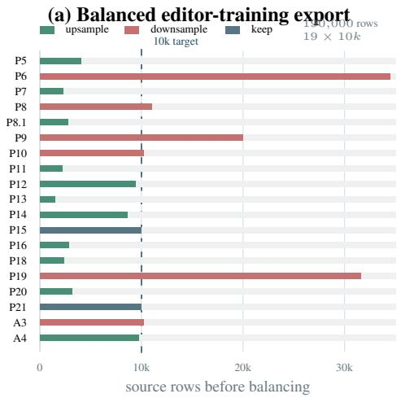

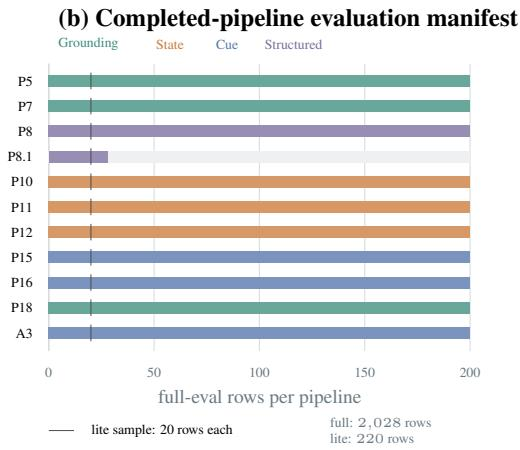  
Figure 10. Joint Data Construction Diagnostics. Panel (a) visualizes the balanced training export produced from the catalog-level training manifest: source rows are shown before resampling, and every pipeline is resampled to 10k rows. Panel (b) visualizes the completed-pipeline evaluation manifest. All lite splits sample 20 rows per pipeline; the full split uses 200 rows when available, except the real Raven split (P8.1), which contributes 28 standard test examples.

chain is fixed as

$$
\begin{array} { r l } & { ( x , q ) \xrightarrow { \mathrm { M L L M } _ { \mathrm { p l a n } } } \{ e _ { t } \} _ { t = 1 } ^ { T } } \\ & { \qquad \xrightarrow { \mathrm { E d i t o r } } \{ \tilde { x } _ { t } \} _ { t = 1 } ^ { T } \xrightarrow { \mathrm { M L L M } _ { \mathrm { a n s w e r } } } \hat { y } . } \end{array}
$$

The same MLLM family is used for planning and answering within a complete pipeline. The planner receives the original image and question and is required to output JSON containing only edit\_prompts; it is explicitly instructed not to answer at this stage. The default maximum number of planned edit steps is two in the joint evaluator, and each edited image is fed back with the original image for the final answer. For the Reference condition, the evaluator bypasses the editor and asks the same MLLM to answer from the original image plus the constructed reference image. This implements the A/B/C comparison under one scoring interface.

Planner prompt templates. The planner prompt contains in-context examples distilled from successful task packets. The examples cover traffic-sign boxes, Raven matrix completion, clock-hand rotation and completion, object removal, occlusion reconstruction, dense counting marks, tangram final-state rendering, industrial-defect highlighting, dense difference boxing, blackout/zoom-in variants, and mirror localization. Prompts are kept as short English imperative instructions because the editing backends respond most consistently to commands such as “draw a red bounding box,” “remove the specified object,” or “highlight the anomalous region.” If the planner emits malformed JSON, the evaluator first retries with a stricter JSON-only prompt and then falls back to a coarse task-dependent instruction, such as marking targets for counting or drawing a box around the most relevant region. The fallback keeps the pipeline executable but is logged as a planner-format failure.

Editor backends. The same evaluator supports both APIbased editor combinations and local Qwen-Image-Edit. The API path covers GPT-Image-1.5, Gemini image editing, FLUX.2 Klein, LongCat-Image-Edit, Seedream-style backends when configured, and related editor services. The local Qwen path can run the base editor or load a LoRA; when given a directory, the runner selects the latest step-\*.safetensors checkpoint. Local Qwen-Image-Edit inference uses deterministic seeds for reproducibility and writes edited images to per-sample folders. The implementation caches existing step images, so rerunning a failed metric pass does not necessarily regenerate image edits.

Prediction traces and metrics. Each evaluated sample writes a trace directory containing the copied original image, every edited helper image, sidecar JSON for each step, and a final trace JSON. The trace records the planner output, edit prompts, editor status, perstep VLM answer, final Actual Edit answer, Reference answer, and baseline Direct answer. Batch outputs include predictions.jsonl, metrics.json, failure\_cases.jsonl, and a viewer manifest. Accuracy tasks use normalized exact match after extracting JSON answers or common boxed-answer formats. Localization tasks use their task-specific IoU scorer. The shared summary reports Direct accuracy, Actual Edit accuracy, Reference accuracy, planner success rate, average number of planned steps, and editor success rate, while task-specific tables retain the metric appropriate to each task. Figure 11 summarizes the branch structure and the logged artifacts.

Human review and leakage checks. Human review is applied before a task enters large-scale construction and again before training handoff. Reviewers check whether the task requires the intended visual operation, whether the answer can be measured automatically, whether the reference image accidentally reveals more than the intended intermediate, and whether training and evaluation splits are separated. For generated tasks, seeds and generation parameters are kept with the task assets; for dataset-derived tasks, manifests record original paths and filtering decisions. These checks do not eliminate all task-design bias, but they reduce the chance that the measured gain comes from a malformed prompt, an ambiguous label, or a reference image that directly encodes the answer. Figure 12 and Table 4 provide compact audit views of task outcomes and planner-instruction coverage.

## A.3. Data Sources of Subtasks

The data sources for the evaluated subtasks are categorized as follows:

• Open-Source Datasets: Utilized in Task 1 [50], Task 2 [18], Task 3 [8], Task 8 [57], Task 11 [38], Task 13 [41], Task 15 [69], and Task 16 [24].

• In-House Edited Datasets: Tasks 8, 9, 17, and 19 are constructed using rule-based editing pipelines applied to an in-house editing dataset.

• Procedural Generation: All remaining tasks are synthesized entirely via rule-based programmatic generation. Beyond that, part of Zebra-CoT [26] is used as examples Beyond that, part of Zebra-CoT [26] is used as examples

in agent context, and phase-2 validation.

## A.4. Detailed Information of Tasks

Table 5 lists the metric, training volume, preliminary diagnosis, and final-stage result when available for all 20 tasks. “Reference” denotes a programmatically constructed target intermediate and is used only for diagnosis.

Transfer to Existing Benchmarks. We additionally evaluate on BabyVision and MIRA, which were not selected by the Aphanta discovery loop, to test transfer beyond the constructed task pool. Actual edits reduce accuracy for all three tested pipelines on BabyVision. On MIRA, only Gemini-3-Flash + NB2 has a small positive delta; all three reference conditions exceed direct reasoning. These results identify reference headroom but weak practical realization under the tested pipelines, consistent with the distinction between $\Delta _ { \mathrm { r e f } }$ and $\Delta _ { \mathrm { e d i t } }$ in the main paper.

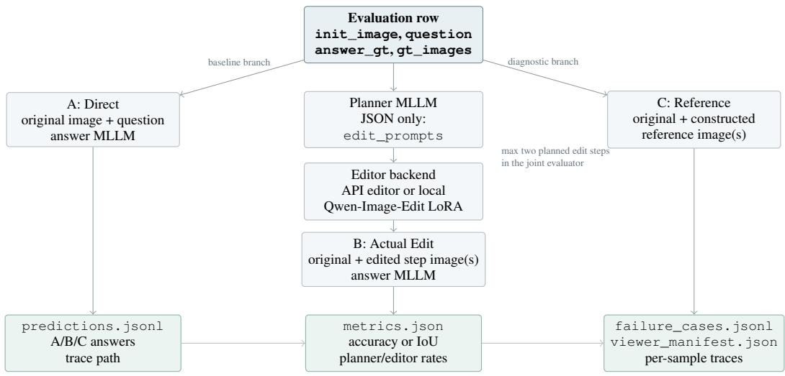  
Each sample keeps copied inputs, edited images, sidecar step JSON, and a final trace JSON.  
Figure 11. Unified Inference and Artifact Flow. The same normalized evaluation row feeds Direct, Actual Edit, and Reference branches. The Actual Edit branch first plans short edit instructions, then calls an editor backend and re-answers from the edited helper image(s). The evaluator writes both metric-level summaries and per-sample traces, which makes planner failures, editor failures, and answer errors auditable after a run.  
(a) Reference headroom vs. realized edit gain

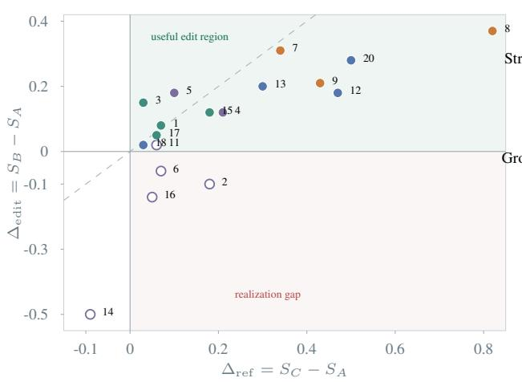  
retained stopped/unsuccessful Grounding State Cue Structured

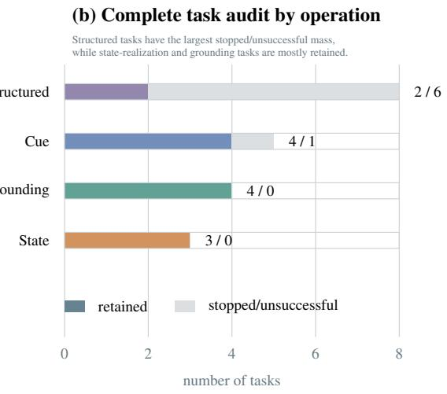  
Figure 12. Diagnostic Views over the 20-Task Audit. Panel (a) plots the reference gain against the actual edit gain for tasks with both quantities available; filled markers denote retained practical pipelines, and open markers denote stopped or unsuccessful tasks. Tasks 10 and 19 lack an actual-edit score and are omitted from the scatter but included in panel (b). Panel (b) summarizes retained versus stopped/unsuccessful outcomes by dominant operation.

Table 4. Edit-Instruction Template Families Used by the Unified Planner. Templates are distilled from successful task packets and injected as in-context examples for planning; concrete object names, directions, angles, and target categories are filled from each sample.
<table><tr><td>Template family</td><td>Representative tasks</td><td>Typical instruction form</td><td>Planner role</td></tr><tr><td>Fixed spatial annotation</td><td>Mirror localization, traffic signs, industrial defects, dense difference</td><td>Draw red boxes around the relevant region; highlight Cue grounding anomalous regions; mark the only differing tile.</td><td></td></tr><tr><td>Parameterized local edit</td><td>Clock reasoning, object deletion, dense counting</td><td>Rotate the minute hand by a specified angle; remove {object}; mark each {target} with a red dot and index.</td><td>State update</td></tr><tr><td>Constructive final state</td><td>Synthetic and real RPM, tangram</td><td>Fill the blank matrix cell with the final pattern; gener- ate the final tangram board after the described steps.</td><td>Visual construc-</td></tr><tr><td>Isolation and close-up</td><td>Zoom-in/remake and blackout variants</td><td>tion Keep only the target object and black out the rest; crop the edited subject into a square close-up.</td><td>Evidence filtering</td></tr></table>

Table 5. Detailed Task Audit. Preliminary and final-stage scores are reported separately. Reference intermediates are programmatically constructed diagnostic targets.
<table><tr><td rowspan="2">ID</td><td rowspan="2">Task</td><td rowspan="2">Status</td><td rowspan="2">Operation</td><td rowspan="2">Metric</td><td rowspan="2">Train N</td><td colspan="3">Preliminary diagnosis</td><td colspan="3">Final evaluation</td></tr><tr><td>Direct</td><td>+Edit</td><td>+Ref.</td><td>Direct</td><td>+Edit</td><td>+Ref.</td></tr><tr><td>1</td><td>Where Is My Mirror</td><td>PASS</td><td>Grounding</td><td>IOU</td><td>3,818</td><td>0.53</td><td>0.53</td><td>0.50</td><td>0.70</td><td>0.78</td><td>0.77</td></tr><tr><td>2</td><td>Circuit Diagram Parsing</td><td>FAIL</td><td>Structured</td><td>ACC</td><td>30,155</td><td>0.70</td><td>0.60</td><td>0.88</td><td></td><td></td><td></td></tr><tr><td>3</td><td>Auto. Driving Assistant</td><td>PASS</td><td>Grounding</td><td>ACC</td><td>2,303</td><td>0.45</td><td>0.43</td><td>0.63</td><td>0.42</td><td>0.57</td><td>0.45</td></tr><tr><td>4</td><td>RPM: Synthetic</td><td>PASS</td><td>Structured</td><td>ACC</td><td>10,000</td><td>0.24</td><td>0.18</td><td>0.37</td><td>0.18</td><td>0.30</td><td>0.39</td></tr><tr><td>5</td><td>RPM: Real</td><td>PASS</td><td>Structured</td><td>ACC</td><td>2,100</td><td>0.51</td><td>0.43</td><td>0.60</td><td>0.61</td><td>0.79</td><td>0.71</td></tr><tr><td>6</td><td>Repeated Pattern Recog.</td><td>FAIL</td><td>Structured</td><td>ACC</td><td>20,000</td><td>0.13</td><td>0.07</td><td>0.20</td><td></td><td></td><td></td></tr><tr><td>7</td><td>Analog Clock Reasoning</td><td>PASS</td><td>State</td><td>ACC</td><td>10,000</td><td>0.46</td><td>0.58</td><td>0.79</td><td>0.50</td><td>0.81</td><td>0.84</td></tr><tr><td>8</td><td>Counterfactual: Deletion</td><td>PASS</td><td>State</td><td>ACC</td><td>2,200</td><td>0.20</td><td>0.50</td><td>0.87</td><td>0.10</td><td>0.47</td><td>0.92</td></tr><tr><td>9</td><td>What Is Behind the Mask?</td><td>PASS</td><td>State</td><td>ACC</td><td>9,377</td><td>0.08</td><td>0.04</td><td>0.21</td><td>0.25</td><td>0.46</td><td>0.68</td></tr><tr><td>10</td><td>Visual Equation Puzzle</td><td>FAIL</td><td>Structured</td><td>ACC</td><td></td><td>0.85</td><td></td><td>0.85</td><td></td><td></td><td></td></tr><tr><td>11</td><td>Plane Geometry Aux. Line</td><td>FAIL</td><td>Structured</td><td>ACC</td><td>8,417</td><td>0.40</td><td>0.20</td><td>0.40</td><td>0.41</td><td>0.43</td><td>0.47</td></tr><tr><td>12</td><td>Dense Dot Counting</td><td>PASS</td><td>Cue</td><td>ACC</td><td>9,800</td><td>0.08</td><td>0.06</td><td>0.83</td><td>0.05</td><td>0.23</td><td>0.52</td></tr><tr><td>13</td><td>Tangram</td><td>PASS</td><td>Cue</td><td>ACC</td><td>2,673</td><td>0.40</td><td>0.35</td><td>0.35</td><td>0.31</td><td>0.51</td><td>0.61</td></tr><tr><td>14</td><td>Gear Rotation Reasoning</td><td>FAIL</td><td>Structured</td><td>ACC</td><td></td><td>0.92*</td><td>0.42*</td><td>0.83*</td><td></td><td></td><td></td></tr><tr><td>15</td><td>Industrial Defect Inspect</td><td>PASS</td><td>Grounding</td><td>ACC</td><td>2,200</td><td>0.63</td><td>0.17</td><td>0.83</td><td>0.70</td><td>0.82</td><td>0.88</td></tr><tr><td>16</td><td>Flowchart Decision</td><td>FAIL</td><td>Structured</td><td>ACC</td><td>31,410</td><td>0.37</td><td>0.20</td><td>0.43</td><td>0.36</td><td>0.22</td><td>0.41</td></tr><tr><td>17 18</td><td>Zoom-in (Remake)</td><td>PASS</td><td>Grounding</td><td>ACC</td><td>2,998</td><td>0.75</td><td>0.80</td><td>0.90</td><td>0.87</td><td>0.92</td><td>0.93</td></tr><tr><td>19</td><td>Maze Solving</td><td>PASS</td><td>Cue</td><td>ACC</td><td>10,000</td><td></td><td></td><td></td><td>0.24</td><td>0.26</td><td>0.27</td></tr><tr><td></td><td>Spot-the-Diff (Sparse)</td><td>FAIL</td><td>Cue</td><td>ACC</td><td>7,709</td><td>0.53</td><td></td><td>0.58</td><td></td><td></td><td></td></tr><tr><td>20</td><td>Spot-the-Diff (Dense)</td><td>PASS</td><td>Cue</td><td>ACC</td><td>10,000</td><td>0.00</td><td>0.00</td><td>0.75</td><td>0.18</td><td>0.46</td><td>0.68</td></tr></table>

Table 6. Transfer to BabyVision and MIRA. Edit $\Delta$ and Ref. $\Delta$ are absolute accuracy changes from direct reasoning; MIRA additionally provides constructed reference intermediates.  
(a) BabyVision
<table><tr><td>Reasoner</td><td>Direct</td><td>+Edit</td><td>Edit ∆</td></tr><tr><td>Qwen</td><td>0.1958</td><td>0.1623</td><td>-0.0335</td></tr><tr><td>GPT</td><td>0.1804</td><td>0.1546</td><td>-0.0258</td></tr><tr><td>Gemini</td><td>0.3015</td><td>0.2319</td><td>-0.0696</td></tr></table>

(b) MIRA
<table><tr><td>Reasoner</td><td>Direct</td><td>+Edit</td><td>+Ref.</td><td>Edit ∆</td><td>Ref. ∆</td></tr><tr><td>Qwen</td><td>0.1941</td><td>0.1664</td><td>0.2421</td><td>-0.0277</td><td>+0.0480</td></tr><tr><td>GPT</td><td>0.1832</td><td>0.1337</td><td>0.2473</td><td>-0.0495</td><td>+0.0641</td></tr><tr><td>Gemini</td><td>0.2033</td><td>0.2125</td><td>0.2930</td><td>+0.0092</td><td>+0.0897</td></tr></table>