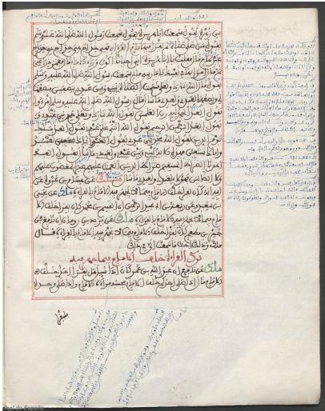
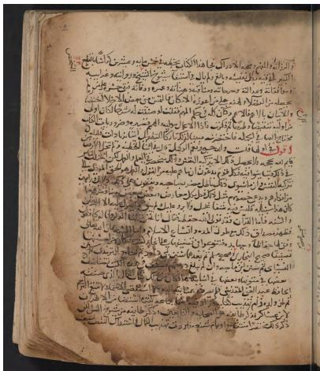
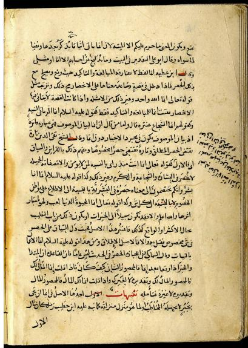
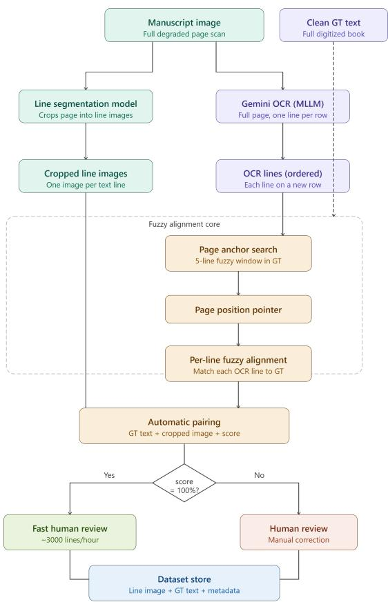
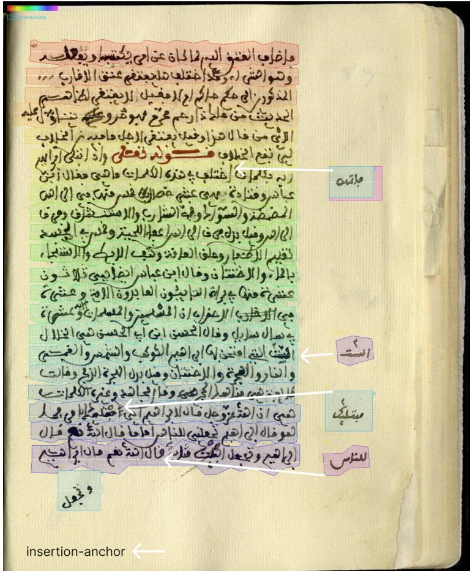

# AraMS-28k: The Largest Publicly Released Line-Level Dataset of Historical Arabic Manuscripts with Margin and Insertion-Anchor Annotations

Mohamed Guechaoui<sup>1</sup>

Mohamed Diaa Zellagui<sup>1</sup>

Sahraoui Dhelim<sup>1</sup>

Souleyman Chaib<sup>1</sup>

<sup>1</sup>Higher School of Computer Science (ESI-SBA), Sidi Bel Abbes, Algeria

## Abstract

We introduce AraMS-28k, the largest publicly released line-level dataset of genuine historical Arabic manuscripts, comprising 14 books, 3,043 pages, and 28,600 annotated text lines (27,971 main-text, 629 margin). Thirteen books are hand-copied manuscripts spanning three script traditions – Naskh, Ruq‘ah, and Maghrebi – and one is a lithographed printed edition included to broaden format diversity. Each line is labelled as main-text or margin, and margin lines that have an unambiguous attachment point in the main text are further annotated with an insertion anchor, recovering the manuscript’s true non-linear reading order at line-level granularity – to our knowledge the first such annotation released for a historical Arabic manuscript corpus. Because reference transcriptions are fully vocalised while manuscript hands are typically undiacritised, we release both the raw diacritised transcription and a diacritic-normalised counterpart for every line. The dataset was constructed with RefLAM [1], a reference-grounded annotation pipeline that aligns multimodal-LLM OCR against independently sourced clean transcriptions and routes every line through human review, combining automatic verification with expert oversight. We describe the construction and quality-control process, present the annotation schema, report dataset statistics at both the corpus and per-book level, and provide baseline HTR results using Kraken and HATFormer, including a cross-script generalisation gradient from in-distribution pages to a fully unseen books. AraMS-28k is released with page images, line-level annotations, and fixed train/val/test splits under CC BY-NC-SA 4.0 to support reproducible research on Arabic manuscript recognition, layout analysis, and reading-order recovery.

## 1 Introduction

Handwritten text recognition (HTR) for historical Arabic manuscripts lags behind Latin-script HTR largely because of a shortage of large, line-level corpora drawn from genuine manuscripts rather than modern handwriting samples or synthetic renderings. Existing public resources for historical Arabic HTR are limited in scale, restricted to modern handwriting rather than genuine manuscript material, or – even when drawn from real manuscripts – do not record where a given margin annotation belongs within the main-text reading flow; section 2 compares these resources in detail. This combination of gaps motivates AraMS-28k. Margin content in historical Arabic manuscripts is rarely incidental. A marginal note is usually anchored to a specific point in the main text: it is a correction, an alternate reading, or a gloss meant to be read in place, not as an appendix to the page. Recognising a margin region, or even placing it correctly in a coarse page-level reading order, is not the same as recording which line of the main text it belongs next to. Recovering this fine-grained, non-linear reading order requires an annotation that goes beyond a bounding box, a line transcription, or a region-level layout label – it requires recording, at line-level granularity, where each margin line is intended to be read. AraMS-28k is built to supply this annotation across a large corpus of genuine manuscripts. Every line in the corpus is labelled as main-text or margin, and each margin line is further annotated with an insertion anchor – the index of the main-text line after which it logically inserts – wherever the manuscript provides an unambiguous attachment point; roughly 30% of margin lines meet this criterion (section 4), while the remainder are retained with a null anchor rather than a forced, unverifiable guess. To our knowledge, no prior publicly released Arabic manuscript corpus provides this line-level reading-order annotation at all: existing resources may identify marginal text as a distinct region, or in some cases order regions at the page level, but none record where a specific margin line attaches within the main text. Separately, because the reference transcriptions we align against are drawn from fully-vocalised scholarly editions while the manuscript hands themselves are typically undiacritised, we also release a diacritic-normalised transcription alongside the raw one for every line (section 4) – a mismatch between reference and image that, as far as we are aware, existing Arabic manuscript datasets do not document or address explicitly. Combined with 28,600 line-level transcriptions across three script traditions, this makes AraMS-28k usable both as an HTR training corpus and as a resource for manuscript layout analysis and reading-order recovery.

## Contributions.

1. AraMS-28k: the largest publicly released line-level dataset of genuine historical Arabic manuscripts – 14 books, 3,043 pages, and 28,600 line-level annotations spanning three hand-copied script traditions (Naskh, Ruq‘ah, Maghrebi) and one lithographed volume, released under CC BY-NC-SA 4.0 with fixed train/val/test splits (section 5).

2. Insertion-anchor annotation: the first publicly released line-level annotation recovering the non-linear main/margin reading order in a historical Arabic manuscript corpus, assigned wherever a margin line has an unambiguous attachment point in the main text (section 4).

3. A two-phase construction and quality-control process (section 3) combining automated referencegrounded OCR alignment, verified against independently sourced reference transcriptions, with human expert review.

4. Baseline HTR results and a cross-script generalisation gradient (section 6) for two recognition architectures, establishing AraMS-28k as a benchmark for future work.

5. Dual raw/normalised transcriptions: every line carries both the fully diacritised reference form and a diacritic-normalised form matched to what is visually present in the manuscript hand (section 4), so downstream users can pick the target that matches their task.

## 2 Related Arabic HTR Datasets

RASM2018 [2] provides line-level transcriptions of historical Arabic scientific manuscripts but is limited to ≈120 pages. While it includes region-level layout labels, its annotation does not link individual margin lines to a specific point in the main-text reading order. RASAM [3] is the first corpus dedicated to the Maghrebi script family (≈300 pages, 7,540 lines, line-level transcriptions) and the closest existing resource to our Maghrebi coverage; it is, however, an order of magnitude smaller than AraMS-28k and records no margin insertionanchor. KHATT [4] is considerably larger (4,000 pages, 13,435 lines) but consists of modern handwriting samples collected for the purpose of dataset construction rather than pages from historical manuscripts, so it does not capture the degradation, ligature variation, or marginalia found in genuine manuscript material, OpenITI MAKHZAN [5] is the broadest of these resources in linguistic scope (1,497 pages, 822 Arabic, across seven Arabic-script languages), manually segmented and transcribed, but like the other resources above does not link margin lines to a specific point in the main-text reading order.Muharaf [6] is the largest existing genuine-manuscript corpus and our closest comparator: it is drawn from real manuscripts and includes diverse scripts, and – as with other resources in this comparison – it may mark marginal text as a distinct layout region, but its annotation does not, to our knowledge, encode where in the main-text reading flow a given margin line belongs. Muharaf’s complete corpus totals ≈1,644 pages and 36,311 lines, but only 1,216 pages (24,495 lines) have been publicly released; we compare against this public subset in Table 1, since it is the relevant baseline for a claim about publicly available corpora. Among other historical resources, VML-HD [7] annotates ≈680 pages at the sub-word level and BADAM [8] provides baseline (rather than transcription) annotations for ≈400 pages; both target tasks other than line-level HTR. KITAB-Bench [9] and SARD [10] extend Arabic OCR evaluation to a wider range of document types; KITAB-Bench includes a small set of historical manuscript samples (HistoryAr and HistoricalBooks) but does not annotate line-level insertion anchors, while SARD is fully synthetic. Neither includes manuscript-specific layout phenomena such as marginalia. We restrict this comparison to corpora targeting Arabic manuscript or handwriting recognition, since these are the resources a user of AraMS-28k would realistically consider as alternatives. Outside Arabic, IAM [11] and RIMES [12] are foundational handwriting corpora for English and French respectively, and both have shaped how line-level HTR datasets are structured and evaluated. Neither, however, was built around the two-zone main/margin layout that characterises historical Arabic manuscripts, since the documents they draw from do not exhibit this structure. Table 1 situates AraMS-28k against the Arabic-language corpora above: it is the largest publicly released corpus by line count among genuine historical handwritten manuscript corpora –Muharaf’s full corpus is larger in total, with a restricted subset held under proprietary license – and, to our knowledge, the only one that links individual margin lines to a specific point in the main-text reading order via a line-level insertion anchor. We deliberately restrict this claim to publicly released corpora throughout the paper; we make no claim of being the largest Arabic manuscript resource in an absolute sense, since larger privately held corpora may exist.

Table 1: Comparison with existing public Arabic manuscript datasets. Figures for Muharaf reflect its publicly released subset only (its full corpus totals 1,644 pages / 36,311 lines). “Insertion anchor” indicates whether margin lines are linked to a specific point in the main-text reading order – not merely whether margin text is identified as a distinct region.
<table><tr><td>Dataset</td><td>Pages</td><td>Lines</td><td>Insertion anchor</td></tr><tr><td>RASM2018 [2]</td><td>120</td><td>2,613</td><td>No</td></tr><tr><td>RASAM [3]</td><td>300</td><td>7,540</td><td>No</td></tr><tr><td>KHATT [4]</td><td>4,000</td><td>13,435</td><td>No</td></tr><tr><td>Muharaf-public [6]</td><td>1,216</td><td>24,495</td><td>No</td></tr><tr><td>AraMS-28k (ours)</td><td>3,043</td><td>28,600</td><td>Yes</td></tr></table>

## 3 Dataset Construction

## 3.1 Source Material

AraMS-28k is drawn from 14 historical Arabic manuscript books spanning classical medicine, Islamic jurisprudence, Peripatetic philosophy, and theology. 13 of these are hand-copied manuscripts; one (book\_10, Table 6) is a lithographed printed edition – a historical Arabic printing technique that reproduces a scribe’s handwriting via a lithographic stone plate rather than movable type – and is included to diversify page layout and production format beyond purely hand-copied material. Source books were selected to maximise diversity along four axes: script style (Naskh, Ruq‘ah, Maghrebi), diacritisation density, scan quality, and layout complexity, including the presence and density of marginal annotation (Figure 1). Page images were obtained from publicly accessible online manuscript repositories (e.g., alukah.net); the per-book source, access terms, and redistribution basis are recorded in the release manifest (manifest.json), and only scans whose terms permit redistribution under the release licence are included. For each book, a clean ground-truth transcription was obtained either from existing digital Arabic text repositories and one of the books (book\_27) produced by OCR over a scanned printed critical edition of the same text, then used as the reference against which manuscript pages were aligned.

  
(a) Maghrebi.

  
(b) Naskh.

  
(c) Ruq‘ah.  
Figure 1: Script diversity in AraMS-28k. Sample pages illustrate the range of hands, ink density, and marginal annotation present across the three hand-copied script traditions; the lithographed volume (book\_10) is a distinct production format and is not pictured here.

## 3.2 Annotation Pipeline

Pages were annotated with RefLAM, a reference-grounded pipeline built for this and related corpora. At a high level, RefLAM (1) segments each page into individual text lines with a segmentation model trained on Muharaf [13], (2) transcribes each page with a multimodal LLM, separating main-text from marginal content, and (3) aligns the resulting hypothesis against the clean reference transcription, producing a per-line confidence score and flagging low-confidence lines for closer inspection (Figure 2). Every line, regardless of its confidence score, was reviewed by a human annotator before release; lines with a perfect alignment score were fast-reviewed for gross segmentation errors, while lower-confidence lines received full manual correction. We refer to the RefLAM paper [1] for the alignment algorithm and its correctness properties; here we treat it only as an already-validated construction tool.

## 3.3 Quality Control and Validation

Every line in AraMS-28k passes through a verification step before release: no automatically generated annotation is accepted without human sign-of. Construction proceeded in two phases that difer in review depth, chosen to trade of annotation depth against corpus scale. In the page-validated (PV) phase, covering 7 books (548 pages, 11,438 main lines), two independent reviewers inspected every line on every page regardless of the automatic alignment confidence score, providing full manual verification of both segmentation and transcription. In the line-validated (LV) phase, covering the remaining 7 books (2,495 pages), the automatic reference-alignment step is used as a formal acceptance filter: only main-text lines that achieve a perfect alignment score against the independently sourced reference transcription are retained, and any line falling short of this threshold is excluded from the release rather than manually corrected, so that scale is not purchased at the cost of admitting unverified text. Because the reference transcription is drawn from an independently produced critical edition rather than derived from the manuscript image itself, a perfect alignment is a meaningful correctness signal rather than a self-consistency check: it indicates that an OCR hypothesis produced from the image independently reproduces text already known, from an external source, to be correct. This two-tier design has a direct, disclosed consequence for downstream use: LV statistics reflect a filtered, agreement-verified subset that is plausibly biased toward cleaner scans and more regular hands, while PV statistics reflect a page’s full line content, filtered only by human review rather than by automatic agreement. We report both subsets separately throughout (section 5 and Appendix A) rather than merging them, so that users can select the guarantee level appropriate to their task: full manual verification (PV), or scale combined with automatic reference agreement (LV).

  
Figure 2: Overview of the RefLAM construction pipeline used to build AraMS-28k: line segmentation and multimodal-LLM OCR feed a reference-alignment step that routes every line to human review. Full detail is given in [1].

## 3.4 Construction Timeline

Most of the corpus – 14 books, 3,043 pages, and 28,600 lines – was constructed in approximately one week. This pace was driven primarily by the line-validated (LV) phase (section 3.3): because LV admits a line only on perfect automatic alignment against an independently sourced reference, human efort there is limited to spot-checking accepted lines and reviewing page-level segmentation, rather than transcribing or correcting each line by hand. The page-validated (PV) phase, which requires full manual verification of every line by two reviewers, is correspondingly slower per page and accounts for a proportionally larger share of the total annotation time despite covering only 548 of the corpus’s 3,043 pages. We view this as evidence that a reference-grounded, LLM-assisted pipeline can make large-scale historical manuscript annotation tractable at a fraction of the wall-clock cost of purely manual transcription; a controlled timing study of the review workflow, including a measured manual-annotation baseline, is reported in the RefLAM paper [1].

## 4 Annotation Schema

Each annotated line record in our dataset is structured into five logical groups: (i) basic identifiers and page metadata; (ii) spatial geometry (baseline, polygon, or bounding box); (iii) transcriptions and alignment confidence; (iv) margin-specific anchoring metadata; and (v) human review flags. Table 2 provides a complete overview of all fields. The following minimal record illustrates a typical main line. Note that the geometry object is present but set to null for brevity, and margin\_anchor is explicitly set to null.

{   
"line\_uid": "book\_03\_page\_001\_L0000",   
"book\_id": "book\_03",   
"page\_id": "book\_03\_page\_001",   
"page\_image": "images/book\_03/book\_03\_page\_001.jpg",   
"line\_idx": 0,   
"line\_type": "main",   
"text": {   
"gt\_raw": "...",   
"gemini\_raw": "...",   
"confidence": 100,   
"gt\_normalized": "...",   
},   
"geometry": {   
"baseline": null,

<table><tr><td>Field</td><td>Type</td><td>Description</td></tr><tr><td colspan="3">Top-level identifiers and metadata</td></tr><tr><td>line_uid</td><td>string</td><td>Globally unique line ID, book_03_page_076_L0000</td></tr><tr><td>book_id</td><td>string</td><td>Book identifier, e.g., book_03</td></tr><tr><td>page_id</td><td>string</td><td>Page identifier, e.g., book_03_page_076</td></tr><tr><td>page_image</td><td>string</td><td>Relative path to the full-page image</td></tr><tr><td>line_idx</td><td>integer</td><td>Zero-based line index on the page (top-to-bottom)</td></tr><tr><td>line_type</td><td>string</td><td>main or margin</td></tr><tr><td>split</td><td>string</td><td>Dataset split: train, val, or test</td></tr><tr><td colspan="3">text (Transcriptions)</td></tr><tr><td>gt_raw</td><td>string</td><td>Clean reference transcription from the scholarly edition</td></tr><tr><td>gemini_raw</td><td>string</td><td>Raw MLLM OCR hypothesis before correction</td></tr><tr><td>gt_normalized</td><td>string</td><td>Diacritic-normalised form of gt_raw; recommended HTR training target</td></tr><tr><td>confidence</td><td>number</td><td>Alignment confidence in [0, 100]; 100 guarantees character-for-character identity</td></tr><tr><td colspan="3">geometry (Spatial layout)</td></tr><tr><td>baseline</td><td>array / null</td><td>Ordered polyline tracing the text baseline (the line of writing itself)</td></tr><tr><td>boundary_polygon array / null</td><td></td><td>Ordered polygon vertices [[x,y], ...] outlining the line&#x27;s surrounding region</td></tr><tr><td>bounding_box</td><td>object / null</td><td>Axis-aligned bounding box {x, y, w, h}</td></tr><tr><td colspan="3">margin_anchor (Margin metadata, null for main lines)</td></tr><tr><td>before</td><td>string / null</td><td>Main-text words immediately following the insertion point</td></tr><tr><td>after</td><td>string / null</td><td>Main-text words immediately preceding the insertion point</td></tr><tr><td>line</td><td>integer / null</td><td>Index of the main-text line the margin note is anchored to; the exact insertion point (including mid-line inser-</td></tr><tr><td>rotation</td><td>integer / null</td><td>tions) is given by before/after. Coarse orientation in degrees (e.g., 90, -90); nul1 denotes horizontal</td></tr><tr><td colspan="3">review (Human quality control)</td></tr><tr><td>edited</td><td>boolean</td><td>Whether the transcription was manually edited</td></tr><tr><td>validated</td><td>boolean</td><td>Whether the line passed human validation</td></tr><tr><td>deleted</td><td>boolean</td><td>Whether the line is marked for deletion</td></tr><tr><td>page_reviewed</td><td>boolean</td><td>Whether the entire containing page was reviewed</td></tr></table>

Table 2: Complete annotation schema for the dataset. Every key is present in every record; geometry and margin fields take the value null when not applicable.

```json
"boundary_polygon": null,
"bounding_box": null
},
"margin_anchor": null,
"review": {
"edited": false,
"validated": true,
"deleted": false,
"page_reviewed": true
},
"split": "test"
}
```

For margin lines, the margin\_anchor object is populated instead of being null. For example:

"margin\_anchor": {   
"before": "<main-text words following the insertion point>",   
"after": "<main-text words preceding the insertion point>",   
"line": 5,   
"rotation": 90 ,   
}

Diacritics and normalisation. Reference transcriptions are drawn from fully-vocalised scholarly editions and therefore contain diacritical marks (tashkeel), the kashida (tatweel), and specific alef/hamza letter forms that are frequently absent, or applied only inconsistently, in the manuscript hand itself. Training a recognition model directly against gt\_raw therefore implicitly asks it to predict symbols with no visual evidence in the input image – a mismatch that is easy to overlook and, left undocumented, can silently inflate character error rate or mislead a model toward hallucinating diacritics. To make this an explicit, usable choice rather than a tacit one, every line carries a second transcription field, gt\_normalized: the output of the same normalisation operator (Definition 1 in [1]) that RefLAM uses internally to align OCR against the reference, applied here to the reference text itself and persisted rather than discarded after alignment. Concretely, gt\_normalized strips harakat and tatweel, merges alef and alef-maqsura/hamza variants, and collapses¯ whitespace, yielding a transcription that matches what is visually present in an undiacritised manuscript hand. We recommend gt\_normalized as the training target for page-transcription models, and reserve gt\_raw for diacritisation-restoration research or use cases where the fully vocalised scholarly reading is itself the desired output.

Insertion anchors: a precision-first annotation. Historical Arabic manuscript pages are frequently nonlinear: a margin note is physically outside the main text block but is intended to be read at a specific point within it. AraMS-28k records this explicitly through the margin\_anchor record, whose line field gives the index of the main-text line after which a given margin line logically inserts (Figure 3). Anchors are assigned only where the margin content has an unambiguous, verifiable attachment point in the main text; under this criterion, human annotators assign a confident anchor to 189 of the 629 margin lines in the corpus (≈30%). The remainder – ownership stamps, later commentary, or placements too ambiguous to anchor confidently – are retained with a null anchor rather than a forced guess. This is a deliberate precision-over-coverage design choice, not a limitation of the annotation process: an incorrectly forced anchor would misrepresent the manuscript’s true reading order and could silently corrupt any downstream evaluation of reading-order recovery, whereas a null anchor correctly and explicitly signals “no confident attachment point exists.” Because the field is ternary rather than binary at the corpus level – present, confidently null, or absent from non-margin lines entirely – downstream users can trivially filter to the 189 confidently anchored lines when a clean, high-precision reading-order signal is required, or use the full margin set together with the null-anchor flag when studying margin content more broadly (e.g., margin detection or classification of marginalia type).

  
Figure 3: Insertion-anchor annotation. Coloured regions mark segmented main and margin lines; the arrow indicates the main-text line after which the highlighted margin line logically inserts.

## 5 Dataset Statistics

AraMS-28k contains 3,043 manuscript pages and 28,600 annotated text lines (27,971 main-text, 629 margin) across 14 books. Thirteen books are hand-copied manuscripts spanning three script traditions (Naskh, Ruq‘ah, Maghrebi); the remaining book is a lithographed printed edition (book\_10, Table 6), included to diversify page layout and print format beyond purely hand-copied material. Table 3 summarises the released corpus; Table 6 in Appendix A breaks these totals down per book, separately for the page-validated (PV) and line-validated (LV) subsets described in section 3.3. Splits are formed at the book level rather than the page or line level, so that no manuscript appears in more than one split. The training set (9 books, 19,739 lines) mixes PV and LV books across all three hand-copied script traditions; the validation set (2 books, 1,486 lines) is page-validated Naskh material; and the held-out test set (3 books, 6,746 lines) is exclusively page-validated, with one book per hand-copied script, so that baseline results in section 6 can be reported per script. Together the three splits account for all 27,971 main-text lines. Per-book line counts, average lines per page, and average words per line are given in Appendix A.

Table 3: AraMS-28k summary statistics.
<table><tr><td>Property</td><td>Value</td></tr><tr><td>Books</td><td>14</td></tr><tr><td>Pages</td><td>3,043</td></tr><tr><td>Page-validated (PV)</td><td>548</td></tr><tr><td>Line-validated (LV)</td><td>2,495</td></tr><tr><td>Main lines</td><td>27,971</td></tr><tr><td>Margin lines</td><td>629</td></tr><tr><td>Scripts</td><td>Naskh, Ruqah, Maghrebi (+1</td></tr><tr><td>Confidently anchored margin</td><td>lithographed vol.) 189 / 629 (≈30%)</td></tr><tr><td>lines</td><td></td></tr><tr><td>Train / val / test split</td><td>9 / 2 / 3 books</td></tr><tr><td>License</td><td>CC BY-NC-SA 4.0</td></tr></table>

Supported tasks. AraMS-28k is a benchmark for HTR (section 6). The released geometry of every line is human-verified, and the 548 PV pages carry every line on the page, so the PV subset additionally supports text-line detection and segmentation research; LV pages contain only the reference-verified subset of their lines (section 3.3) and are therefore suitable for recognition, but not as exhaustive detection ground truth. The main/margin labels and insertion anchors further enable layout-analysis and reading-order-recovery research; for these two tasks we release the annotations but define no evaluation protocol or baseline, which we leave to future work. Finally, the release flags a curated subset of 177 naturally degraded lines from book\_09 (real\_damage\_lines.txt), selected for severe native degradation such as fading, staining, and bleedthrough; because book\_09 lies in the held-out test split, this subset provides a ready-made out-of-distribution evaluation set for document-restoration and recognition-robustness research.

## 6 Baseline Recognition Results

Setup. We finetune two Muharaf-pretrained recognisers – Kraken [14], using the publicly released Muharaftrained checkpoint [15], and HATFormer [16] – on the AraMS-28k training split and evaluate on the held-out test split, which contains one book per hand-copied script. All recognition experiments use main-text lines only (margin lines are excluded), the fixed book-levels splits distributed with the release, and gt\_normalized as the transcription target: computing CER against the diacritised gt\_raw would conflate recognition error with unrecoverable diacritisation, since the model receives no visual signal for diacritics absent from the manuscript hand. Both models are finetuned with standard recipes from their respective pretrained checkpoints; full hyperparameters, finetuning code, and final-evaluation decoding settings are given in Appendix B.1 and distributed in the project repository released alongside the dataset, so every figure in this section can be regenerated from the released splits. Table 4 reports character error rate (CER) per test book and overall.

Kraken’s per-book CER varies substantially: 11.65% on the Ruq‘ah test book, 22.62% on the Naskh test book, and 32.71% on the Maghrebi test book. HATFormer shows the same ordering (13.26%, 25.37%, 37.88%), so the efect is not architecture-specific. This ordering does not track AraMS-28k training-set size by script – Ruq‘ah has the smallest script-specific training set (3,282 lines, from a single book) yet the best test performance, while Maghrebi has roughly 60% more training lines (5,229) yet the worst test performance – ruling out finetuning-data volume as the primary driver. We instead attribute this gap to script proximity in the pretrained base model. Both Kraken and HATFormer baselines are pretrained on Muharaf [6], whose samples are predominantly in the Ruq‘ah script [6] – a style that became the dominant everyday hand in the Levant during the late Ottoman and early post-Ottoman period. Our Ruq‘ah test book therefore benefits from a close in-distribution match with the pretraining corpus itself, rather than from any letterform proximity to a Naskh-targeted prior. Maghrebi, by contrast, is a paleographically distinct tradition largely absent from Muharaf’s Levantine-letters composition – distinct enough that it has historically required dedicated resources rather than being folded into general Arabic HTR corpora [3] – so finetuning has to overcome a much larger mismatch with the pretrained model’s script distribution. Naskh falls between these two poles: it is not the dominant script in Muharaf’s pretraining data, but we do not have a reported per-script breakdown of Muharaf’s composition to quantify its representation directly, so we do not attribute the Naskh test book’s intermediate CER to a specific proximity claim. A second, non-mutually-exclusive factor specific to book\_09 is image quality: unlike book\_05 and book\_03, book\_09 contains a substantial number of lines with faded or low-contrast ink (Figure 1b), which degrades recognition independently of script identity. Because each test book is the sole representative of its script, we cannot separate a script-level efect from this book-level covariate; the Naskh test book’s CER may therefore reflect scan/ink condition at least as much as script distance from Muharaf’s pretraining distribution. Under this account, AraMS-28k’s own Maghrebi finetuning data is doing real work (without it, transfer from a Ruq‘ah-dominated pretrained model would likely be worse still), but it is not enough on its own to close a gap that originates upstream, in the base model’s pretraining distribution. We do not have a direct script-similarity metric (e.g., letterform edit-distance) to quantify this claim, and leave a controlled same-pretraining, per-script finetuning-volume ablation, together with a verified script breakdown of the Muharaf pretraining corpus, to future work.

Table 4: CER after finetuning Muharaf-pretrained models on AraMS-28k.
<table><tr><td rowspan=1 colspan=1>Model / Test subset      CER (%)</td></tr><tr><td rowspan=1 colspan=1>Kraken [14, 15]Maghrebi (book_03)      32.71</td></tr><tr><td rowspan=1 colspan=1>Ruqah (book_05)         11.65</td></tr><tr><td rowspan=1 colspan=1>Naskh (book_09)          22.62</td></tr><tr><td rowspan=1 colspan=1>Overall                    23.31</td></tr><tr><td rowspan=1 colspan=1>HATFormer [16]Maghrebi (book_03)      37.88</td></tr><tr><td rowspan=1 colspan=1>Ruqah (book_05)         13.26</td></tr><tr><td rowspan=1 colspan=1>Naskh (book_09)          25.37</td></tr><tr><td rowspan=1 colspan=1>Overall                    26.74</td></tr></table>

## 6.1 Cross-Script Generalisation Gradient

To separate the dificulty of unseen pages from that of unseen books and unseen scripts, we additionally report a diagnostic in-distribution condition for HATFormer. For this purpose, 10% of pages in each training book (totalling ≈2.5k lines) were withheld from finetuning, which therefore used the remaining ≈17.2k training lines; all HATFormer figures in this section come from this single finetuning run. The held-out-page condition is purely diagnostic: it is not part of the released book-level test split, which remains exclusively composed of fully unseen books, and the withheld page list is distributed with the release (test\_seen\_pages.txt) so the figure can be reproduced exactly. The gradient in Table 5 is the central diagnostic result of the benchmark. On in-distribution pages the recogniser reaches 6.48% CER, in the range of line-level results reported on contemporary Arabic benchmarks. Moving to a wholly unseen Ruq‘ah book roughly doubles the error (13.26%), an unseen Naskh book roughly quadruples it (25.37%), and an unseen Maghrebi book – a calligraphic tradition severely under-represented in public training corpora – reaches 37.88%. This quantifies, rather than merely asserts, the generalisation gap the dataset is built to expose: proximity to the training distribution matters more than aggregate finetuning volume, consistent with the script-proximity account above. It also turns AraMS-28k’s multi-script coverage from a descriptive property into a measurable research target: closing the in-distribution-to-Maghrebi gap is now something a later system can be scored on. Consistent with this account, removing the intermediate Muharaf finetuning stage raises in-distribution CER from 6.48% to 7.44%, confirming that exposure to a large, diverse body of real historical Arabic before specialising on our corpus transfers usefully.

Table 5: Cross-script generalisation gradient (HATFormer, line-level CER). The in-distribution row uses pages withheld from training books (a diagnostic condition outside the released test split); the remaining rows are the per-book results of Table 4 on fully unseen books.
<table><tr><td>Condition</td><td>Setting</td><td>CER (%)</td></tr><tr><td>In-distribution</td><td>Unseen pages, seen books</td><td>6.48</td></tr><tr><td>Unseen book</td><td>Ruqah (book_05)</td><td>13.26</td></tr><tr><td>Unseen book</td><td>Naskh (book_09)</td><td>25.37</td></tr><tr><td>Unseen book</td><td>Maghrebi (book_03)</td><td>37.88</td></tr></table>

## 7 Conclusion

We presented AraMS-28k, the largest publicly released line-level dataset of historical Arabic manuscripts, comprising 3,043 pages spanning three hand-copied script traditions and one lithographed printed edition, annotated with main/margin layout labels and insertion anchors that recover the non-linear reading order of marginal content, and released with both diacritised and diacritic-normalised transcriptions for every line. Extended per-book statistics and the full annotation schema are given in the appendix. Baseline HTR experiments show the dataset is usable for finetuning existing recognisers, and the cross-script generalisation gradient (section 6.1) provides a reference point for future work on historical Arabic manuscript recognition, layout analysis, and reading-order recovery.

Limitations. The line-validated subset is conditioned on agreement between OCR and reference transcription (section 3.3), which plausibly biases it toward cleaner scans and more regular script forms; we report it separately from the page-validated subset to make this distinction visible. Roughly 70% of margin lines lack a confident insertion anchor, by design (section 4): we do not force an anchor onto content with no unambiguous attachment point in the main text. The test set contains one book per script, so per-script CER in section 6 may partly reflect book-specific characteristics rather than script dificulty in general. Finally, margin lines make up a small fraction of the corpus (629 of 28,600 lines, ≈2.2%); tasks that require balanced main/margin examples, such as training a margin-detection model from AraMS-28k alone, should account for this imbalance, for instance via resampling or class weighting.

Reproducibility. All experiments reported in section 6 use the fixed train/val/test splits distributed with the release (Appendix C) together with the published manifest files and checksums – including the test\_seen\_pages.txt manifest for the diagnostic in-distribution condition of section 6.1 – so that results can be reproduced exactly without re-deriving splits or re-running the construction pipeline.

Data availability. AraMS-28k is released in two complementary formats, described in full in Appendix C: a full annotation release (AraMS-28k) preserving every field described in section 4 – geometry, both raw and normalised transcriptions, margin anchors, and review metadata – and a recognition-ready release (AraMS-28k-HTR) of segmented line images paired with normalised ground-truth text, suitable for direct use with standard HTR training pipelines. Both are distributed under CC BY-NC-SA 4.0; the RefLAM annotation pipeline used to construct the corpus is described separately in [1].

## References

[1] Mohamed Guechaoui, Mohamed Diaa Zellagui, Souleyman Chaib, and Sahraoui Dhelim. Reflam: A reference-grounded line annotation pipeline for historical arabic manuscripts, 2026. URL https: //arxiv.org/abs/2608.25140.

[2] Christian Clausner, Apostolos Antonacopoulos, Nora Mcgregor, and Daniel Wilson-Nunn. Icfhr 2018 competition on recognition of historical arabic scientific manuscripts – rasm2018. In 2018 16th International Conference on Frontiers in Handwriting Recognition (ICFHR), pages 471–476, 2018. doi: 10.1109/ICFHR-2018.2018.00088.

[3] Chahan Vidal-Gorène, Noëmie Lucas, Clément Salah, Aliénor Decours-Perez, and Boris Dupin. RASAM – A Dataset for the Recognition and Analysis of Scripts in Arabic Maghrebi, pages 265–281. 09 2021. ISBN 978-3-030-86197-1. doi: 10.1007/978-3-030-86198-8\_19.

[4] Sabri A. Mahmoud, Irfan Ahmad, Wasfi G. Al-Khatib, Mohammad Alshayeb, Mohammad Tanvir Parvez, Volker Märgner, and Gernot A. Fink. Khatt: An open arabic ofline handwritten text database. Pattern Recognition, 47(3):1096–1112, 2014. ISSN 0031-3203. doi: https://doi.org/10.1016/j.patcog.2013. 08.009. URL https://www.sciencedirect.com/science/article/pii/S0031320313003300. Handwriting Recognition and other PR Applications.

[5] Jonathan Parkes Allen, John Mullan, Lorenz Nigst, Mathew Barber, Taimoor Shahid-Khan, Masoumeh Seydi, Danlu Chen, Yufei Weng, Nikolai Vogler, Jacob Murel, Osama Eshera, Taylor Berg-Kirkpatrick, David Smith, Sarah Bowen Savant, and Matthew Thomas Miller. Openiti makhzan: An open annotated dataset of arabic, persian, ottoman turkish, and urdu print and manuscript data. Journal of Open Humanities Data, 2026. URL https://api.semanticscholar.org/CorpusID:288733730.

[6] Mehreen Saeed, Adrian Chan, Anupam Mijar, Joseph Moukarzel, Georges Habchi, Carlos Younes, Amin Elias, Chau-Wai Wong, and Akram Khater. Muharaf: Manuscripts of handwritten arabic dataset for cursive text recognition, 2025. URL https://arxiv.org/abs/2406.09630.

[7] Majeed Kassis, Alaa Abdalhaleem, Ahmad Droby, Reem Alaasam, and Jihad El-Sana. Vml-hd: The historical arabic documents dataset for recognition systems. In 2017 1st International Workshop on Arabic Script Analysis and Recognition (ASAR), pages 11–14, 2017. doi: 10.1109/ASAR.2017.8067751.

[8] Benjamin Kiessling, Daniel Stökl Ben Ezra, and Matthew Thomas Miller. Badam: A public dataset for baseline detection in arabic-script manuscripts. In Proceedings of the 5th International Workshop on Historical Document Imaging and Processing, HIP ’19, page 13–18, New York, NY, USA, 2019. Association for Computing Machinery. ISBN 9781450376686. doi: 10.1145/3352631.3352648. URL https://doi.org/10.1145/3352631.3352648.

[9] Ahmed Heakl, Abdullah Sohail, Mukul Ranjan, Rania Hossam, Ghazi Shazan Ahmad, Mohamed El-Geish, Omar Maher, Zhiqiang Shen, Fahad Khan, and Salman Khan. Kitab-bench: A comprehensive

multi-domain benchmark for arabic ocr and document understanding, 2025. URL https://arxiv. org/abs/2502.14949.

[10] Omer Nacar, Yasser Al-Habashi, Serry Sibaee, Adel Ammar, and Wadii Boulila. Sard: A large-scale synthetic arabic ocr dataset for book-style text recognition, 2025. URL https://arxiv.org/abs/ 2505.24600.

[11] U.-V Marti and H. Bunke. The iam-database: An english sentence database for ofline handwriting recognition. International Journal on Document Analysis and Recognition, 5:39–46, 11 2002. doi: 10.1007/s100320200071.

[12] Emmanuele Grosicki and Haikal El Abed. Icdar 2009 handwriting recognition competition. In Proceedings ofthe International Conference on Document Analysis and Recognition, ICDAR, pages 1398–1402, 01 2009. doi: 10.1109/ICDAR.2009.184.

[13] Simion Toader Bors Uifalean. Htr model - arabic handwritten segmentation model trained on the muharaf corpus, December 2024. URL https://doi.org/10.5281/zenodo.14295555.

[14] Benjamin Kiessling. Kraken – a universal text recognizer for the humanities. In Digital Humanities Conference (DH), 2019.

[15] Simion Toader Bors Uifalean. Htr model - arabic handwritten recognition modeltrained on the muharaf corpus, December 2024. URL https://doi.org/10.5281/zenodo.14295489.

[16] Adrian Chan, Anupam Mijar, Mehreen Saeed, Chau-Wai Wong, and Akram Khater. Hatformer: Historic handwritten arabic text recognition with transformers, 2025. URL https://arxiv.org/abs/2410. 02179.

[17] Timnit Gebru, Jamie Morgenstern, Briana Vecchione, Jennifer Wortman Vaughan, Hanna Wallach, Hal Daumé III, and Kate Crawford. Datasheets for datasets, 2021. URL https://arxiv.org/abs/ 1803.09010.

## A Per-Book Statistics

Table 6 reports per-book statistics for both construction phases described in section 3.3. $^ { 6 6 } { \mathrm { C } } { = } 1 0 0 ^ { 3 }$ is the percentage of reviewed main lines that achieved a perfect alignment score against the reference transcription; for line-validated (LV) books this is 100% by construction, since only perfectly aligned lines were retained.

Table 6: Per-book statistics. PV = page-validated; LV = line-validated. The Script column reports production format for book\_10 (Lithograph), which is a lithographed printed edition rather than a hand-copied manuscript in one of the three script traditions; see section 3 for details.
<table><tr><td>Book</td><td>Type</td><td>Script</td><td>Pages</td><td>Lines</td><td>Margin lines</td><td>Avg. words/line</td><td>Avg. lines/page</td><td>C=100</td><td>Subject</td><td>Century (CE)</td></tr><tr><td>book_03</td><td>PV</td><td>Maghrebi</td><td>172</td><td>3,661</td><td>168</td><td>10.2</td><td>21.3</td><td>8.4%</td><td>Fiqh/Tafsir</td><td>12-13</td></tr><tr><td>book_05</td><td>PV</td><td>Ruqah</td><td>95</td><td>2,028</td><td>74</td><td>13.9</td><td>21.3</td><td>28.0%</td><td>Hadith</td><td>9</td></tr><tr><td>book_06</td><td>PV</td><td>Naskh</td><td>41</td><td>874</td><td>15</td><td>11.3</td><td>21.3</td><td>99.9%</td><td>Qira&#x27;at/Tajwid</td><td>15</td></tr><tr><td>book_09</td><td>PV</td><td>Naskh</td><td>46</td><td>1,057</td><td>7</td><td>15.5</td><td>23.0</td><td>9.8%</td><td>Hadith/Rijal</td><td>14</td></tr><tr><td>book_10</td><td>PV</td><td>Lithograph</td><td>13</td><td>674</td><td>0</td><td>17.2</td><td>51.8</td><td>14.1%</td><td>Medicine</td><td>11</td></tr><tr><td>book_11</td><td>PV</td><td>Naskh</td><td>30</td><td>612</td><td>1</td><td>12.2</td><td>20.4</td><td>12.1%</td><td>Aqidah</td><td>8</td></tr><tr><td>book_27</td><td>PV</td><td>Naskh</td><td>151</td><td>2,532</td><td>364</td><td>13.5</td><td>16.8</td><td>11.2%</td><td>Tasawwuf/Aqidah</td><td>11</td></tr><tr><td>PV subtotal</td><td></td><td></td><td>548</td><td>11,438</td><td>629</td><td>13.0</td><td>20.9</td><td>21.0%</td><td></td><td></td></tr><tr><td>book_12</td><td>LV</td><td>Naskh</td><td>144</td><td>2,015</td><td></td><td>12.9</td><td>14.0</td><td>100%</td><td>Tafsir/Qur&#x27;an</td><td>16</td></tr><tr><td>book_16</td><td>LV</td><td>Naskh</td><td>392</td><td>2,276</td><td></td><td>11.2</td><td>5.8</td><td>100%</td><td>Hadith</td><td>10</td></tr><tr><td>book_17</td><td>LV</td><td>Naskh</td><td>584</td><td>3,731</td><td></td><td>12.4</td><td>6.4</td><td>100%</td><td>Aqidah</td><td>11</td></tr><tr><td>book_19</td><td>LV</td><td>Maghrebi</td><td>122</td><td>666</td><td></td><td>13.6</td><td>5.5</td><td>100%</td><td>Hadith</td><td>8</td></tr><tr><td>book_20</td><td>LV</td><td>Maghrebi</td><td>312</td><td>2,163</td><td></td><td>12.9</td><td>6.9</td><td>100%</td><td>Hadith</td><td>8</td></tr><tr><td>book_21</td><td>LV</td><td>Ruqah</td><td>496</td><td>3,282</td><td></td><td>9.5</td><td>6.6</td><td>100%</td><td>Hadith</td><td>12</td></tr><tr><td>book_24</td><td>LV</td><td>Maghrebi</td><td>445</td><td>2,400</td><td></td><td>12.8</td><td>5.4</td><td>100%</td><td>Aqidah</td><td>11</td></tr><tr><td>LV subtotal</td><td></td><td></td><td>2,495</td><td>16,533</td><td></td><td>11.9</td><td>6.6</td><td>100%</td><td></td><td></td></tr><tr><td>Total</td><td></td><td>Mixed</td><td>3,043</td><td>27,971</td><td>629</td><td>12.3</td><td>9.2</td><td></td><td></td><td></td></tr></table>

## B Datasheet Summary

We summarise our documentation following Gebru et al. [17]. Motivation: to provide a layout-annotated resource for Arabic HTR and manuscript layout analysis, addressing the margin/insertion-anchor gap identified in section 2, and to show that a reference-grounded, LLM-assisted pipeline can produce a corpus at this scale far faster than purely manual annotation, making large-scale historical Arabic manuscript annotation tractable. Composition: 3,043 page images and their associated line-level records; the corpus depicts manuscript pages, not individually identifiable people. Collection: described in section 3; page-image sources and per-book access terms are documented in the release manifest. Preprocessing and labelling: raw multimodal-LLM OCR output is never treated as ground truth on its own; every line is grounded against an independently sourced reference transcription and verified by a human reviewer before release (section 3.3). Because the reference transcription is fully vocalised while the manuscript hand generally is not, a diacritic-normalised transcription (gt\_normalized) is derived and released alongside the raw one (gt\_raw) for every line (section 4). Intended uses: Arabic HTR, text-line detection and segmentation (PV subset), manuscript layout analysis, readingorder recovery, and restoration/robustness evaluation via the flagged naturally-degraded subset (section 5). Distribution: released under CC BY-NC-SA 4.0 as described in the Conclusion. Line-level annotations are original to this work; reference transcriptions may carry independent copyright where derived from a modern critical edition, and users should consult the per-source licensing notes distributed with the release.

## B.1 Finetuning Hyperparameters

HATFormer [16].

• Optimizer: AdamW $( \beta _ { 1 } { = } 0 . 9 , \beta _ { 2 } { = } 0 . 9 9 9 , { \epsilon } { = } 1 0 ^ { - 6 }$ , weight decay 0.01)

• Learning rate: $5 \times 1 0 ^ { - 5 }$ (half an order of magnitude below the from-scratch rate)

• Batch size: 8; warmup: 500 linear steps; gradient clipping: 5.0

• Training length: up to 20,000 steps, checkpointed every 1,000 steps and selected by validation CER (greedy decoding)

## Kraken [14].

• Initialized from the Muharaf-pretrained checkpoint [15]; standard CTC training recipe

• Backbone frozen for epoch 1 (2,468 steps; 19,739 training lines, batch size 8), matched by a 2,468-step linear warmup

• Learning rate: $5 \times 1 0 ^ { - 4 }$ , cosine decay; batch size 8; resizing and on-the-fly augmentation enabled

• Early stopping: patience of 15 epochs without validation CER improvement, up to 100 epochs; seed 42

## C Release Formats and Availability

AraMS-28k is distributed as two artifacts derived from the same underlying annotations, so that users can choose the format matching their task without re-deriving it themselves.

## C.1 AraMS-28k (Full Annotation Release)

The canonical release. Contains full-page images and one JSONL record per line, following the schema in section 4: line\_type, geometry (baseline, boundary polygon, or bounding box), both gt\_raw and gt\_normalized transcriptions, gemini\_raw, alignment confidence, margin-anchor metadata, and review flags. This is the format to use for layout analysis, reading-order recovery, or any task that needs geometry, diacritics, or provenance beyond a bare image/text pair.

AraMS-28k/   
|-- images/{book\_id}/{book\_id}\_{page\_id}.jpg   
|-- annotations/{book\_id}.jsonl   
|-- splits/{train,val,test}\_books.txt   
‘-- schema/line\_record.schema.json

Two auxiliary files are distributed alongside the main archive rather than inside it, so they can be revised independently of the core release: test\_seen\_pages.txt lists the ≈2.5k lines (10% of pages per training book) withheld from HATFormer finetuning for the in-distribution diagnostic reported in section 6.1 – a condition outside the released book-level test split, provided purely so that diagnostic figure can be reproduced exactly – and real\_damage\_lines.txt lists lines flagged for scan degradation, referenced in the discussion of the Naskh test book in section 6.

## C.2 AraMS-28k-HTR (Recognition-Ready Release)

A derived, training-ready format: one cropped line image and one .gt.txt file per line, using gt\_normalized as the transcription target for the reasons discussed in section 4. Directory layout follows the convention used by common CTC/seq2seq HTR training pipelines (including Kraken), and split manifests are provided so results are directly comparable to section 6.

AraMS-28k-HTR/   
|-- images/   
| |-- {book\_id}\_{page\_id}\_line{line\_idx:03d}.png   
| ‘-- {book\_id}\_{page\_id}\_line{line\_idx:03d}.gt.txt   
|-- train\_manifest.txt   
|-- val\_manifest.txt   
|-- test\_manifest.txt   
|-- metadata.csv   
|-- dataset\_stats.json   
‘-- split\_used.json

AraMS-28k-HTR is generated from AraMS-28k by scripts/build\_htr\_data.py and is fully reproducible from the full release; we distribute it pre-built so that no user needs to run the segmentation/cropping step themselves.

## C.3 Hosting, Versioning, and Integrity

Both releases are hosted on Hugging Face Datasets and archived on Zenodo for long-term availability and DOI assignment. SHA-256 checksums for every archive are published alongside the release and should be verified after download. Table 7 lists the release artifacts. Both releases are versioned (v1.0 at time of writing); any

Table 7: Release artifacts at a glance. Sizes are approximate.
<table><tr><td>Release</td><td>Format</td><td>Size (approx.)</td><td>DOI</td></tr><tr><td>AraMS-28k</td><td>Images + JSONL</td><td>2.05 GB</td><td>https://doi.org/10.5281/zenodo.22095333</td></tr><tr><td>AraMS-28k-HTR</td><td>PNG crops + .gt.txt</td><td>2.42 GB</td><td>https://doi.org/10.5281/zenodo.21499649</td></tr></table>

future correction to transcriptions, anchors, or splits will be issued as a new minor version with a changelog, rather than silently mutating existing files, so that results reported against a given version remain reproducible.

## C.4 Maintenance Plan

The authors intend to accept correction reports (mis-transcribed lines, incorrect anchors, or segmentation errors) via the project repository’s issue tracker. Validated corrections will be batched into versioned releases rather than applied continuously. No further manuscript books are currently planned for addition; extensions to new scripts or languages, if undertaken, will be released as a distinct dataset rather than folded into AraMS-28k.