# CODE: Cross-Modal Calibration and Dynamic Suppression for Open World Object Detection

Hao Xu Beijing Institute of Technology Beijing, China xuhao\_cs@bit.edu.cn

Hehe Jin Beijing Institute of Technology Beijing, China 1120223715@bit.edu.cn

## Abstract

Open World Object Detection (OWOD) built on multimodal foundation models often sufers from semantic ambiguity caused by unidirectional text-to-vision matching, while rigid outlier penalties may over-suppress unknown objects near known-class decision boundaries. We propose CODE (Cross-Modal CalibratiOn and Dynamic SupprEssion), a unified inference-time framework with three complementary components. Cross-Modal Joint Confidence Calibration injects global visual prototypes to calibrate text-driven known-class predictions. Uncertainty-Guided Universal Objectness Enhancement measures classification hesitation from local visual responses to strengthen potential unknown objects. Dynamic Outlier Suppression via Confidence Margin replaces rigid suppression with a margin-aware adjustment that preserves ambiguous out-of-distribution instances. Experiments on the Real World Detection benchmark demonstrate that, with the OWL-ViT L/14 backbone, CODE achieves 21.7 U-mAP and 40.8 K-mAP in Task 1, surpassing the previous state of the art by 2.6 and 2.3 points, respectively.

## CCS Concepts

• Computing methodologies → Object detection; Neural networks.

## Keywords

Open World Object Detection, Multi-modal Foundation Models, Cross-modal Inference, Out-of-Distribution Detection

## ACM Reference Format:

Hao Xu, Zhaoning Shi, Hehe Jin, and Bo Ma. 2026. CODE: Cross-Modal Calibration and Dynamic Suppression for Open World Object Detection. In Proceedings of the 34th ACM International Conference on Multimedia (MM ’26), November 10–14, 2026, Rio de Janeiro, Brazil. ACM, New York, NY, USA, 20 pages. https://doi.org/10.1145/3767308.3836545

Zhaoning Shi Beijing Institute of Technology Beijing, China 3220235133@bit.edu.cn

Bo Ma✉ Beijing Institute of Technology Beijing, China bma000@bit.edu.cn

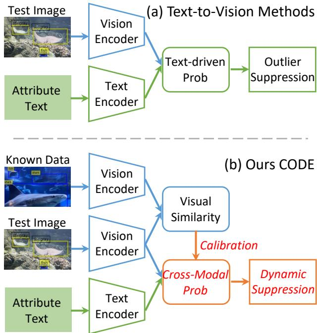  
Figure 1: Paradigm comparison between attribute-based OWOD methods and CODE. Existing methods derive textdriven probabilities followed by fixed outlier suppression, whereas CODE introduces known-class visual references for cross-modal calibration and dynamic suppression.

## 1 Introduction

Object detection, a cornerstone ofcomputer vision, has traditionally operated under a “closed-world” assumption where the categories encountered during inference are strictly limited to those seen during training [14, 45]. However, real-world environments are inherently dynamic and unpredictable, frequently presenting novel objects that fall outside pre-defined taxonomies [14, 18]. Open World Object Detection (OWOD) has emerged to address this challenge, requiring models to accurately identify known categories while simultaneously localizing and flagging unknown objects without conflating them with the background or known classes [14, 37, 45].

The advent of multimodal foundation models, such as CLIP [30] and OWL-ViT [27], has introduced rich open-vocabulary knowledge learned from large-scale image–text pairs into OWOD. To bridge the domain gap between generic pre-training and downstream applications, recent methods employ fine-grained, classagnostic attributes as intermediate semantic representations [35, 37, 45].

As illustrated in Figure 1(a), existing attribute-driven methods independently encode the test image and attribute descriptions, derive text-driven probabilities, and subsequently apply an outlier suppression mechanism. This unidirectional text-to-vision process lacks a direct visual reference when textual attributes are insufi cient or visually ambiguous. In contrast, CODE introduces visual embeddings obtained from known-category data to calibrate the text-driven probabilities and replaces rigid suppression with a dynamic mechanism, as shown in Figure 1(b).

Despite their potential, existing attribute-based OWOD paradigms face three limitations. First, unidirectional text-to-vision matching can produce semantic ambiguity: discriminative visual attributes may become unnoticeable under occlusion, blur, viewpoint changes, or poor illumination, while textual attributes alone may be insufficiently specific to distinguish hard objects from visually similar known categories or background regions. Second, existing methods often estimate universal objectness from the maximum attribute response, which cannot reliably separate ambiguous unknown objects from background distractors. Finally, the rigid Maximum Concept Matching (MCM) mechanism [28] may over-penalize boundary unknown objects. Because these objects can share attributes with several known categories, a suppression term determined only by the maximum known-class probability may incorrectly remove them as background.

To overcome these challenges, we propose CODE (Cross-Modal Calibration and Dynamic Suppression), a unified framework for cross-modal joint inference. Our method introduces three core components designed to balance the precision of known targets with the robust recall of unknowns. First, we implement Cross-Modal Joint Confidence Calibration (CMJCC), which explicitly injects global visual prototypes to provide a robust visual-to-visual reference, efectively calibrating text-driven confidences. Second, we design the Uncertainty-Guided Universal Objectness Enhancement (UGUOE) module. By quantifying classification “hesitation” via the variance of local visual responses, UGUOE actively boosts the response of potential unknown objects located in “semantic vacuums”. Finally, we introduce Dynamic Outlier Suppression via Confidence Margin (DOSCM), which replaces rigid penalties with a margin-based adjustment. By evaluating the exclusivity of known predictions through the probability gap between the primary and secondary Softmax responses, DOSCM protects ambiguous out-of-distribution objects from over-suppression.

We evaluate our framework on the Real-World Detection (RWD) benchmark [45], which spans five diverse scenarios: Aquatic, Aerial, Game, Medical, and Surgery. CODE achieves the best overall performance under both OWL-ViT backbones. Notably, with the L/14 backbone, CODE improves Task 1 U-mAP and K-mAP by 2.6 and 2.3 points over the previous state of the art, respectively, demonstrating that unknown-object discovery can be improved without sacrificing known-class recognition.

The main contributions of this work are summarized as follows:

• We propose Cross-Modal Joint Confidence Calibration (CMJCC), which injects class-level visual prototypes as visual-to-visual references to calibrate text-driven knownclass predictions and alleviate semantic ambiguity.

• We introduce Uncertainty-Guided Universal Objectness Enhancement (UGUOE), which estimates local classification hesitation from the distribution of visual prototype responses and enhances potential unknown objects that receive weak or ambiguous textual activation.

• We develop Dynamic Outlier Suppression via Confidence Margin (DOSCM), which uses the probability gap between the two most likely known classes to dynamically regulate outlier suppression. Together, the three components form a lightweight inference-time framework that improves both known- and unknown-object detection across diverse real-world scenarios.

## 2 Related Works

## 2.1 Open-World Object Detection with Multi-modal Foundation Models

Open World Object Detection (OWOD) aims to alleviate the strict closed-set assumptions of standard detectors, requiring models to simultaneously identify known classes and discover unseen objects [14]. Early pioneering works, such as ORE [14], OW-DETR [9], PROB [46], and others [18, 21–23, 34, 41], primarily rely on pseudolabeling or contrastive clustering to define decision boundaries. Recently, the rise of multi-modal foundation models has catalyzed Open-Vocabulary Object Detection (OVOD), which leverages rich visual-language knowledge for zero-shot generalization. Representative OVOD methods include ViLD [7], RegionCLIP [42], OWL-ViT [27], and F-VLM [16], among others [25, 38, 39]. Although OVD models demonstrate remarkable zero-shot generalization to novel concepts, they rely entirely on explicit text prompts (i.e., category names) and fundamentally fail to handle the core OWOD challenge: detecting "unknowns" without any prior category information.

To bridge this gap, an attribute-driven OWOD paradigm has recently emerged as the state-of-the-art. Methods such as FOMO [45], UMB [35], and PASS [37] utilize Large Language Models to decompose abstract categories into fine-grained, class-agnostic attributes (e.g., shape, texture, material). By learning these intermediate semantic representations, these models identify unknown objects that share visual or functional characteristics with known base classes. Although these methods enhance the discriminability of novel targets and provide explainability, they still struggle to detect objects characterized by semantic ambiguity in attribute mapping. Consequently, we propose CMJCC to resolve mapping ambiguities and UGUOE to facilitate robust unknown discovery.

Open-ended object detection. Recent open-ended detection methods extend open-vocabulary detection beyond a fixed query set through region-language pre-training or bidirectional visualsemantic alignment. GenerateU [20] employs generative regionlanguage modeling to discover open-ended categories, whereas Open-Det [2] improves visual-language alignment through a dedicated training framework. In contrast, CODE targets attributedriven OWOD and performs lightweight inference-time calibration using pre-computed textual attributes and visual prototypes, without online language-model decoding or additional bidirectional detector training.

## 2.2 Cross-modal OOD Detection and Unknown Probability Modeling

A fundamental challenge in OWOD is the evaluation of an object’s Out-of-Distribution (OOD) score, or "unknownness," to efectively distinguish it from known categories and background noise. Traditional unimodal OOD detection often relies on post-hoc scores calculated from the internal activations of a trained vision model. Representative approaches include Maximum Softmax Probability (MSP) [11], energy-based scores [24], and MaxLogit [10], as well as other established techniques such as ODIN [19], ReAct [31], and Grad-Norm [13], among others [6, 15]. While these methods provide a statistical basis for identifying outliers, they are primarily confined to a single modality and often struggle with the complex semantic shifts inherent in open-world environments.

With the integration of multi-modal representations, cross-modal OOD evaluation has emerged as a powerful alternative. Maximum Concept Matching (MCM) [28] establishes a zero-shot OOD baseline by aligning visual features with known textual concepts through scaled softmax. Subsequent works have further expanded this boundary: CLIPN [33] introduces negative prompts to explicitly model the rejection ofknown classes, while PEFT-MCM [29] utilizes parameter-eficient fine-tuning to refine the OOD decision boundary, supported by additional cross-modal studies [5, 25, 36, 43]. Furthermore, recent Dual-Pattern Matching (DPM) [40] frameworks fuse textual similarity with visual distribution patterns to bridge the modality gap. Despite their eficacy, these methods often employ rigid suppression strategies that lead to the over-suppression of boundary unknown targets. To mitigate this, we propose DOSCM, which adaptively protects ambiguous out-of-distribution instances by assessing the exclusivity of predictions through probability margins.

## 3 Methodology

Our proposed framework, CODE (Cross-Modal Calibration and Dynamic Suppression), is built upon the attribute-based OWL-ViT baseline [27]. As illustrated in Figure 2, CODE uses pre-computed optimized attribute embeddings and known-class visual prototypes. CMJCC calibrates text-derived known logits, UGUOE enhances the unknown logit from local visual-response dispersion, and DOSCM adjusts outlier suppression using the top-1/top-2 confidence margin. Attribute generation and prototype construction are both completed ofline and are not invoked during test-time inference.

## 3.1 Preliminary: Attribute-based OWOD Baseline

Following the prevalent OWOD paradigms based on multi-modal foundation models (e.g., OWL-ViT [27]), our framework utilizes the attribute semantic space as an intermediate representation to map visual features of candidate regions to category labels.

Attribute Selection and Adaptation. Given � known categories, the model first prompts a Large Language Model (LLM) to generate a rich set of fine-grained attribute descriptions. These generated attributes are processed by a text encoder to form an initial attribute pool. To extract and adapt a highly discriminative subset from this redundant pool, previous methods [37] optimize the attribute embeddings � and the mapping weights �. During the training phase, this is achieved by minimizing a comprehensive loss function comprising four components:

$$
\mathcal { L } = \mathcal { L } _ { C E } + \lambda _ { P O T } \mathcal { L } _ { P O T } + \lambda _ { M S E } \mathcal { L } _ { M S E } + \lambda _ { L 1 } \mathcal { L } _ { L 1 }\tag{1}
$$

Here, $\mathcal { L } _ { C E }$ is the standard cross-entropy classification loss. L��� represents the partial optimal transport distance used to select the most relevant attributes. $\mathcal { L } _ { M S E }$ is the Mean Squared Error loss applied to align the text-derived attributes with the average visionderived class embeddings, which ensures stable refinement under limited supervision. Finally, $\mathcal { L } _ { L 1 }$ applies L1 regularization to the mapping weights � to encourage sparsity.

Logits Representation. After selection and adaptation, we obtain � optimized attribute embeddings, $A = \{ a _ { n } \} _ { n = 1 } ^ { N } ,$ where � denotes the fixed number of attributes retained after attribute selection and adaptation. Its value is specified in the implementation details. We define the classification mapping matrix as $\pmb { W } \in \mathbb { R } ^ { N \times ( K + 1 ) }$ where the first � columns correspond to the known categories and the last column corresponds to the semantic projection of the unknown category. For the visual embedding � of a candidate region, its unified logits ����� $\in \mathbb { R } ^ { K + 1 }$ are computed as:

$$
L o g i t = [ L o g i t _ { K , 1 } , \dots , L o g i t _ { K , K } , L o g i t _ { U } ] = \sin ( v , A ) \cdot W\tag{2}
$$

where sim(·) denotes the cosine similarity. Thus, the text-driven logits for known categories are denoted as $L o g i t _ { K }$ , and the corresponding component for the unknown category is ������.

Inference. During the inference stage, the baseline method computes the classification probabilities for known and unknown targets separately:

1. Known Target Probability $( P _ { K } )$ : By applying the Sigmoid activation function $\sigma ( \cdot )$ to the known components, the confidence score of the candidate region belonging to a known class � is obtained:

$$
P _ { K } ( \pmb { \upsilon } ) = \sigma ( L o g i t _ { K , k } )\tag{3}
$$

2. Unknown Target Probability $( P _ { U } ) { : }$ : The determination of an unknown target relies not only on its classification logit ������ but is also modulated by task relevance $\left( \wp _ { I D } \right)$ and unknownness (���� ):

$$
P _ { U } ( v ) = \sigma ( L o g i t _ { U } ) \cdot p _ { I D } \cdot p _ { O O D }\tag{4}
$$

where $ { p } _ { I D }$ measures the matching degree between the visual features and any known attributes:

$$
p _ { I D } = \operatorname* { m a x } _ { n \in \{ 1 , . . . , N \} } \sigma ( \pmb { a } _ { n } ^ { \top } \pmb { v } )\tag{5}
$$

and $\hbar { O O D }$ implements out-of-distribution outlier suppression based on the Maximum Concept Matching (MCM) mechanism [28]. Instead of using the independent classification probabilities, MCM penalizes the unknown score using the highest normalized probability derived from applying the Softmax function to the known logits:

$$
\mathit { p o o D } = 1 - \operatorname* { m a x } _ { k \in \{ 1 , . . . , K \} } \mathrm { S o f t m a x } ( L o g i t _ { K } ) _ { k }\tag{6}
$$

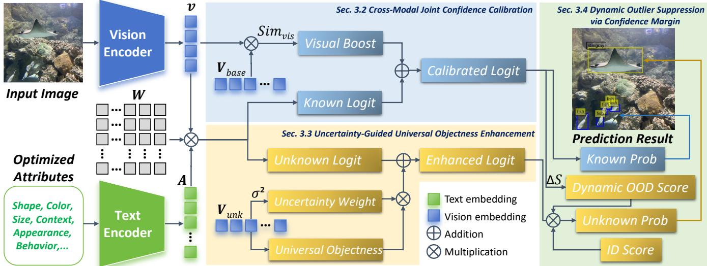  
Figure 2: Inference architecture of CODE. CMJCC calibrates known logits with cached visual prototypes, UGUOE enhances unknown logits from visual uncertainty, and DOSCM converts confidence margins into dynamic OOD scores.

## 3.2 Cross-Modal Joint Confidence Calibration

As analyzed in Sec. 1, the text-driven logits ������ derived from uni directional attribute mapping are susceptible to semantic ambiguity, particularly when visual attributes are partially occluded or the visual-textual alignment is weak. To address this limitation, we propose the Cross-Modal Joint Confidence Calibration (CMJCC) framework. Unlike previous methods that rely solely on textual de scriptions, CMJCC explicitly incorporates global visual prototypes to provide a robust visual-to-visual reference, efectively calibrating the confidence of known categories.

Visual Prototype Calculation. For each dataset, we construct a visual prototype bank ofline using the frozen OWL-ViT visual encoder. For a known category $k ,$ let $\mathcal { D } _ { k } = \left\{ \boldsymbol { v } _ { k , i } \right\} _ { i = 1 } ^ { M _ { k } }$ denote the set of $M _ { k }$ region embeddings extracted from the ground-truth boxes of class � in the labeled training or support split. The visual prototype $\pmb { P } _ { k }$ is defined as the normalized centroid of these embeddings:

$$
\pmb { \mathscr { P } } _ { k } = \mathrm { N o r m } \left( \frac { 1 } { M _ { k } } \sum _ { i = 1 } ^ { M _ { k } } \pmb { v } _ { k , i } \right)\tag{7}
$$

The prototypes are computed and cached before inference and are never updated using test images. In Task 1, prototypes are constructed strictly from annotated known categories, without using unknown-category labels. In Task 2, prototypes of previously known categories remain frozen, while prototypes of newly introduced categories are computed from their available labeled samples and appended to the prototype bank.

The collective visual base matrix is then constructed as $V _ { b a s e } =$ $[ \pmb { p } _ { 1 } , \dots , \pmb { p } _ { K } ] ^ { \top } \in \mathbb { R } ^ { K \times D }$ . This prototype injection ensures that the model captures the intrinsic visual distribution of each class, compensating for potential gaps in textual attribute coverage.

Visual Similarity and Gating. For a candidate region ${ \boldsymbol { v } } _ { i } ,$ we compute its direct visual-level similarities to the known-category prototypes as

$$
S i m _ { v i s , i } = \upsilon _ { i } V _ { b a s e } ^ { \top } \in \mathbb { R } ^ { K } .\tag{8}
$$

To suppress background and irrelevant visual responses, we compute a candidate-specific activation threshold:

$$
\tau _ { i } = \operatorname* { m a x } \left( \frac { 1 } { K } \sum _ { k = 1 } ^ { K } [ S i m _ { v i s , i } ] _ { k } + m , \tau _ { m i n } \right) ,\tag{9}
$$

where $[ S i m _ { v i s , i } ] _ { k }$ is the similarity between candidate $\pmb { v } _ { i }$ and prototype $k ,$ � is a fixed scalar margin, and $\tau _ { m i n }$ is the minimum activation floor. Since the mean is computed only over the � prototypes of the current candidate, $\tau _ { i }$ is independent of the composition and size of the inference batch.

The corresponding visual boost is obtained by applying a ReLU gate:

$$
L o g i t _ { b o o s t , i } = \mathrm { R e L U } \left( S i m _ { v i s , i } - \tau _ { i } \right) .\tag{10}
$$

For notational simplicity, we omit the candidate index � in the following equations.

Joint Logit Calibration. To ensure that the visual boost is consistent with the logit distribution of the pre-trained foundation model, we introduce an absolute scaling factor $S _ { s c a l e }$ , also referred to as the reverse temperature. Following the intrinsic temperature setting ��� $L - V i T$ of the foundation model, the scaling factor is defined as:

$$
S _ { s c a l e } = \frac { 1 } { \tau _ { O W L - V i T } }\tag{11}
$$

The final calibrated logits for known categories, $L o g i t _ { K } ^ { c a l i b }$ , are formulated by fusing the original text-driven logits with the visuallyguided boost component:

$$
L o g i t _ { K } ^ { c a l i b } = L o g i t _ { K } + \alpha \cdot S _ { s c a l e } \cdot L o g i t _ { b o o s t }\tag{12}
$$

where � is a modulation coeficient that balances the contribution of the visual prior. By mapping the visual similarity back to a sharp decision probability gradient through $S _ { s c a l e } .$ CMJCC preserves the discriminative power of the original feature space while providing the necessary cross-modal calibration.

## 3.3 Uncertainty-Guided Universal Objectness Enhancement

While the calibration mechanism in Sec. 3.2 improves the reliability of known classes, the detection of unknown objects remains challenging due to the lack of explicit supervision. Previous methods [35, 37, 45] often rely on a generic objectness score derived from the maximum attribute response, which fails to distinguish between background noise and ambiguous unknown targets. To bridge this gap, we propose an Uncertainty-Guided Universal Objectness Enhancement (UGUOE) module. By analyzing the local distribution of visual similarities, UGUOE quantifies the model’s classification uncertainty to generate a robust universal objectness prior, actively boosting the response of potential unknown objects.

Local Visual Response Aggregation. For a candidate region �, we consider its Top- $\cdot K _ { u }$ nearest visual prototypes from $V _ { b a s e }$ to capture its local semantic neighborhood. Let $S _ { l o c a l } = \{ s _ { 1 } , s _ { 2 } , . . . , s _ { K _ { u } } \}$ be the set of the $K _ { u }$ largest similarity values in $S i m _ { v i s } .$ The base visual-driven unknown response $\mu _ { u n k }$ is defined as the average of these local similarities:

$$
\mu _ { u n k } = \frac { 1 } { K _ { u } } \sum _ { s \in S _ { l o c a l } } s\tag{13}
$$

A high $\mu _ { u n k }$ indicates that the region exhibits strong object-like visual characteristics, even if it does not strictly align with a single known category.

Uncertainty Modeling via Variance. A key observation is that for a clearly defined known object, its visual similarity will be highly concentrated on a specific prototype, resulting in a high variance within $S _ { l o c a l }$ . Conversely, an unknown object often ex hibits ambiguous, low-variance responses across multiple related known prototypes. We quantify this "hesitation" or classification uncertainty using the unbiased variance $\sigma ^ { 2 } ( S _ { l o c a l } )$ :

$$
\sigma ^ { 2 } ( S _ { l o c a l } ) = \frac { 1 } { K _ { u } - 1 } \sum _ { s \in S _ { l o c a l } } ( s - \mu _ { u n k } ) ^ { 2 }\tag{14}
$$

We then formulate the uncertainty-guided weight $W _ { u n c }$ using an exponential decay function to penalize high-certainty (known) regions and favor low-variance (ambiguous) candidates:

$$
W _ { u n c } = \operatorname * { m a x } \Big ( w _ { m i n } , \operatorname * { m i n } \left( w _ { m a x } , \exp ( - \gamma \cdot \sigma ^ { 2 } ( S _ { l o c a l } ) ) \right) \Big )\tag{15}
$$

where � controls the sensitivity to uncertainty, and $[ w _ { m i n } , w _ { m a x } ]$ clips the weight to a stable range.

Enhanced Universal Objectness and Logit Fusion. To extract the pure universal objectness activation, we first apply a threshold ing function to the base visual response:

$$
O b j _ { u n k } = \mathrm { R e L U } ( \mu _ { u n k } - \tau _ { u n k } )\tag{16}
$$

where $\tau _ { u n k }$ is the activation threshold used to filter out background distractors. The final enhanced logit for the unknown category, $L o g i t _ { U } ^ { e n h }$ , is then obtained by injecting this uncertainty-weighted universal objectness into the original text-driven unknown logit ������:

$$
L o g i t _ { U } ^ { e n h } = L o g i t _ { U } + \beta \cdot S _ { s c a l e } \cdot W _ { u n c } \cdot O b j _ { u n k }\tag{17}
$$

where � is a scaling coeficient. This formulation ensures that objects located in the "semantic vacuum" between known classes

receive a significant universal objectness boost, thereby increasing their probability $P _ { U } ( \boldsymbol { \upsilon } )$ before the outlier suppression phase.

## 3.4 Dynamic Outlier Suppression via Confidence Margin

Through the CMJCC and UGUOE modules, we have obtained the calibrated known probabilities $P _ { K } ^ { c a l i b } ( \pmb { \upsilon } )$ and the enhanced unknown logits $L o g i t _ { U } ^ { e n h }$ . The final step in the OWOD inference pipeline is to determine the Out-of-Distribution (OOD) outlier score $\scriptstyle { p _ { O O D } }$ to distinguish genuine unknown objects from known categories.

Revisiting the MCM Bottleneck. As formulated in Sec. 3.1, the standard MCM mechanism utilizes the highest Softmax-normalized probability for suppression: ���� = 1 − max(Softmax(������)). However, this rigid penalty strategy introduces a severe flaw at the decision boundary. A high Top-1 probability in the Softmax distribution does not necessarily guarantee absolute exclusivity; if the Top-2 probability is also high, the model is actually experiencing semantic confusion between two known classes. In such boundary scenarios, the region is highly likely to be a hard unknown instance sharing attributes with multiple known categories. The standard MCM blindly applies a massive penalty, erroneously suppressing these hard unknowns into the background.

Confidence Margin Calculation. To address this over suppression, we propose the Dynamic Outlier Suppression via Confidence Margin (DOSCM). We argue that strong suppression should only be triggered when the model exhibits absolute, exclusive certainty about a single known class. To quantify this exclusivity, we extract the Top-1 and Top-2 probabilities from the Softmax-normalized distribution of the calibrated logits, denoted as $S = \mathrm { S o f t m a x } ( L o g i t _ { K } ^ { c a l i b } )$ :

$$
S _ { t o p 1 } = \operatorname* { m a x } ( S ) , \quad S _ { t o p 2 } = \operatorname* { m a x } ( S \ \backslash \ \{ S _ { t o p 1 } \} )\tag{18}
$$

We then define the confidence margin Δ� as the gap between the most confident and the second most confident predictions:

$$
\Delta S = S _ { t o p 1 } - S _ { t o p 2 }\tag{19}
$$

A large Δ� indicates exclusive certainty towards a specific known class, whereas a small Δ� signifies boundary ambiguity.

Dynamic Suppression and Final Inference. We modulate the baseline MCM penalty using this confidence margin to compute the efective suppression score $\begin{array} { r } { M C M _ { e f f } { : } } \end{array}$

$$
M C M _ { e f f } = S _ { t o p 1 } \cdot \Delta S\tag{20}
$$

Consequently, the dynamic OOD suppression score $p _ { O O D } ^ { d y n }$ is formulated as:

$$
\dot { p } _ { O O D } ^ { d y n } = 1 - M C M _ { e f f }\tag{21}
$$

Finally, substituting $p _ { O O D } ^ { d y n }$ and the enhanced unknown logit $L o g i t _ { U } ^ { e n h }$ back into the baseline inference framework, the ultimate probability for the unknown target is derived as:

$$
P _ { U } ^ { f i n a l } ( \boldsymbol { v } ) = \sigma ( L o g i t _ { U } ^ { e n h } ) \cdot p _ { I D } \cdot p _ { O O D } ^ { d y n }\tag{22}
$$

By decoupling the absolute maximum Softmax response from the penalty mechanism and introducing the margin-based dynamic adjustment, DOSCM efectively protects ambiguous unknown objects located in the semantic margins, thereby significantly improving the recall of hard out-of-distribution targets without compromising the precision of known classes.

## 4 Experiments

## 4.1 Experimental Setup

4.1.1 Datasets. We evaluate CODE on the Real-World Detection (RWD) benchmark [45], which contains five practical scenarios: Aquatic, Aerial, Game, Medical, and Surgery. Following the official RWD protocol, each dataset is evaluated in two stages. Task 1 measures unknown-object discovery from annotated known categories, whereas Task 2 evaluates Previously Known (PK) and Currently Known (CK) categories after the model is jointly retrained using all samples available at that stage. Thus, Task 2 represents an expanded-category evaluation rather than a strictly sequential incremental-learning setting. We follow the oficial category splits, image partitions, and evaluation protocol.

4.1.2 Evaluation Metrics. To comprehensively measure the balance between the accurate identification of known classes and the robust recall of unknown classes, we employ the following quantitative metrics:

• K-mAP and U-mAP: In Task 1, we calculate the mean Average Precision (mAP) for Known and Unknown categories, respectively.

• PK-mAP and CK-mAP: In Task 2, we evaluate the detection performance on Previously Known (PK) categories and Currently Known (CK) categories newly introduced in the task.

Unlike early OWOD works that primarily focused on Recall for unknown objects, we strictly adopt mAP as the primary metric. This ensures a more rigorous evaluation of the detector’s classification accuracy and its ability to suppress background noise.

4.1.3 Implementation Details. Architecture and Environment. All experiments are conducted on NVIDIA GeForce RTX 4090 GPUs using PyTorch. We employ frozen OWL-ViT B/16 and L/14 models as the multimodal foundation backbones. Following FOMO [45], GPT-3.5 is used only ofline to generate the initial fine-grained attribute descriptions. The resulting attributes are encoded and cached before inference, and GPT-3.5 is not invoked during testtime detection. The known-category visual prototypes are also precomputed and cached before inference according to the protocol described in Sec. 3.2.

Hyperparameter Settings. The number of retained attribute embeddings is set to $N = 2 5$ for all datasets. In CMJCC, the scalar margin for visual similarity gating is set to $m \ = \ 0 . 2$ , and the minimum activation floor is $\tau _ { m i n } ~ = ~ 0 . 4$ . Following the original OWL-ViT configuration [27], the temperature coeficient is fixed at ���� $_ { - V i T } ~ = ~ 0 . 0 7$ , corresponding to $S _ { s c a l e } ~ \approx$ 14.28, while the cross-modal calibration coeficient is set to $\alpha = 0 . 5$

In UGUOE, we retain the top $K _ { u } = 3$ local visual responses. The uncertainty sensitivity factor is set to $\gamma = 1 0 0 . 0 \mathrm { ; }$ , and the universal objectness threshold is set to $\tau _ { u n k } = 0 . 2 5$ . For numerical stability, the uncertainty weight $W _ { u n c }$ is clamped to $[ w _ { m i n } , w _ { m a x } ] = [ 0 . 1 , 1 . 0 ]$ During attribute optimization, the linear projection layers and calibration weights are optimized using AdamW. Unless otherwise stated, the same hyperparameter configuration is used across the five RWD datasets.

Overall Performance. As shown in Table 1, CODE achieves the best overall performance under both backbones. With OWL-ViT L/14, CODE obtains 21.7 U-mAP and 40.8 K-mAP in Task 1, together with 43.6 PK-mAP and 36.2 CK-mAP in Task 2. Compared with PASS, these results correspond to improvements of +2.6, +2.3, +4.7, and +0.2 points, respectively. With B/16, CODE also improves the four overall metrics by +1.6, +0.6, +2.0, and +2.4 points. The consistent improvements across the two backbones demonstrate that CODE benefits both known-category recognition and unknownobject discovery.

Analysis of Task 1. CODE improves U-mAP on four of the five RWD scenarios. The largest gain occurs on Surgery, where UmAP increases by +9.1 points. It also improves Aquatic, Aerial, and Medical by +3.1, +2.9, and +0.6 points, respectively. These gains support the efectiveness of UGUOE, which uses the dispersion of local visual responses to activate potential unknown objects that receive ambiguous known-category responses.

CODE also raises the overall K-mAP from 38.5 to 40.8, including gains of +8.8, +5.7, and +0.8 points on Aquatic, Aerial, and Medical. This result indicates that CMJCC compensates for semantic ambiguity by introducing direct visual references from known categories. DOSCM further preserves boundary unknowns by adjusting suppression according to the confidence margin, thereby alleviating the conventional trade-of between known precision and unknown discovery.

On Game, CODE decreases U-mAP and K-mAP by 2.8 and 1.7 points. Our feature-space analysis gives a high average inter-class cosine similarity of 0.82 on this domain, supporting the interpretation that some boundary unknowns are confused with nearby known-category clusters.

Analysis of Task 2. Since Task 2 jointly retrains the model using all samples available at that stage, the results reflect its capacity to represent the expanded category set rather than a strictly sequential incremental-learning process. Under L/14, CODE improves the overall PK-mAP and CK-mAP by +4.7 and +0.2 points. In particular, PK-mAP increases by +8.7 on Aquatic and +10.3 on Medical, with corresponding CK-mAP gains of +1.3 and +6.3 points. CODE also improves both metrics on Aerial and Game.

These gains demonstrate the importance of CMJCC in Task 2. When the category space is expanded, the visual prototypes provide direct class-level references that calibrate the text-driven representations of both previously and currently known categories. On Surgery, CODE remains below PASS in Task 2. Its high inter-class cosine similarity of 0.87 indicates that highly overlapping finegrained categories remain challenging even after visual calibration.

## 4.2 Generalization to Standard Benchmarks

We further evaluate CODE beyond RWD. On M-OWODB Task 1 [14], CODE achieves 86.0 U-Recall and 70.0 mAP, outperforming MAVL [25] (50.1/64.0), DEUS [12] (65.1/66.2), and OrthogonalDet [32] (24.6/61.3), where each pair denotes U-Recall/mAP. On LVIS [8], CODE obtains $3 2 . 0 \mathrm { \ A P _ { r a r e } }$ , compared with 22.3 for GenerateU [20] and 31.2 for Open-Det [2]. These results support generalization beyond the small-category RWD scenarios. Because multimodal foundation

Table 1: OWOD results on the five RWD datasets. We report U- and K-mAP in Task 1 and PK- and CK-mAP in Task 2. Results of previous methods are taken from their original papers, while CODE uses our final unified configuration. The Δ rows report CODE minus PASS; positive values indicate improvements. † GT baselines use ground-truth class names to detect unknown objects and serve as an open-vocabulary upper reference.
<table><tr><td>Dataset (→)</td><td colspan="3">Aquatic</td><td colspan="3"></td><td colspan="3">Aerial —</td><td colspan="3">Game</td><td colspan="3">Medical</td><td colspan="3">Surgery</td><td colspan="3">I1 Overall</td><td colspan="3"></td></tr><tr><td>Task ID (→)</td><td colspan="3">Task 1</td><td colspan="3">Task 2 Task 1</td><td colspan="3">Task 2</td><td colspan="3">Task 1 Task 2</td><td colspan="3">Task 1</td><td colspan="3">Task 1</td><td colspan="3">Task 2</td><td colspan="3">Task 1 Task 2</td></tr><tr><td></td><td>U</td><td>K</td><td>PK</td><td>CK</td><td>K</td><td>PK</td><td>CK</td><td></td><td>U K</td><td>PK</td><td>CK</td><td>U</td><td>K</td><td>PK</td><td>CK</td><td>U</td><td>K</td><td>PK</td><td>CK</td><td>U</td><td>K</td><td>PK</td><td></td><td>CK</td></tr><tr><td colspan="10">B/16 Backbone:</td><td></td><td></td><td></td><td></td><td></td><td></td><td></td><td></td><td></td><td></td><td></td><td></td><td></td><td></td></tr><tr><td>BASE-ZS+GT†</td><td>29.8</td><td>45.0</td><td>45.0</td><td>36.7</td><td>1.3 5.7</td><td>5.7</td><td>1.4</td><td>15.0</td><td>0.4</td><td>0.4</td><td>0.1</td><td>0.5</td><td>0.0</td><td>0.0</td><td>0.1</td><td>5.6</td><td>1.5</td><td>1.4</td><td>0.3</td><td></td><td>10.4</td><td>10.5</td><td>10.5</td><td>7.7</td></tr><tr><td>BASE-ZS</td><td>6.2</td><td>45.0</td><td>45.0</td><td>36.7</td><td>0.9 5.7</td><td>5.7</td><td>1.4</td><td>15.7</td><td>0.4</td><td>0.4</td><td>0.1</td><td>0.2</td><td>0.0</td><td>0.0</td><td>0.1</td><td>1.4</td><td>1.5</td><td>1.4</td><td>0.3</td><td>4.9</td><td></td><td>10.5</td><td>10.5</td><td>7.7</td></tr><tr><td>BASE-ZS+IN</td><td>26.5</td><td>45.1</td><td>45.1</td><td>36.7</td><td>1.9 5.7</td><td>5.7</td><td>1.4</td><td></td><td>2.4</td><td>0.3 0.3</td><td>0.0</td><td>0.6</td><td>0.0</td><td>0.0</td><td>0.1</td><td>1.7</td><td>1.4</td><td>1.0</td><td>0.3</td><td>6.6</td><td></td><td>10.5</td><td>10.4</td><td>7.7</td></tr><tr><td>BASE-ZS+LLM</td><td>24.7</td><td>45.1</td><td>45.1</td><td>36.5</td><td>1.4 5.7</td><td>5.7</td><td>1.4</td><td></td><td>15.1</td><td>0.4</td><td>0.4</td><td>0.1</td><td>0.6</td><td>0.0</td><td>0.0 0.1</td><td>8.9</td><td>1.5</td><td>1.3</td><td>0.3</td><td></td><td>10.2</td><td>10.5</td><td>10.5</td><td>7.7</td></tr><tr><td>BASE-FS</td><td>7.1</td><td>41.1</td><td>41.1</td><td>31.9</td><td>1.2</td><td>10.4 10.1</td><td></td><td>4.0</td><td>16.0</td><td>4.6</td><td>4.8</td><td>3.9</td><td>0.6</td><td>6.1</td><td>6.1</td><td>3.3 1.3</td><td>11.9</td><td>11.3</td><td>10.9</td><td></td><td>5.2</td><td>14.8</td><td>14.7</td><td>10.8</td></tr><tr><td>FOMO [45]</td><td>3.5</td><td>43.8</td><td>44.1</td><td>40.8</td><td>0.9 12.0</td><td>12.6</td><td>5.4</td><td></td><td>13.3</td><td>3.8</td><td>4.4</td><td>4.1</td><td>2.1</td><td>6.4</td><td>5.5 11.5</td><td>6.1</td><td>12.7</td><td>12.9</td><td>11.0</td><td>5.2</td><td></td><td>15.7</td><td>15.9</td><td>14.6</td></tr><tr><td>PASS [37]</td><td>5.2</td><td>43.4</td><td>43.2</td><td>46.6</td><td>1.9 14.0</td><td>16.0</td><td>7.0</td><td></td><td>21.5</td><td>10.0 7.7</td><td>9.0</td><td></td><td>4.9 8.4</td><td>6.8</td><td>12.1</td><td>14.3</td><td>15.6</td><td>13.1</td><td>14.7</td><td>9.6</td><td></td><td>18.3</td><td>17.4</td><td>17.9</td></tr><tr><td>CODE (Ours) Δ</td><td>10.4</td><td>40.2 -3.2</td><td>43.5</td><td>52.4 2.9</td><td>17.6</td><td>18.7</td><td>7.1</td><td>25.2</td><td>13.4</td><td>9.1</td><td>11.9</td><td>3.0</td><td>8.7</td><td>7.4</td><td>7.9</td><td>14.6</td><td>14.4</td><td>18.1</td><td>22.4</td><td>11.2</td><td></td><td>18.9</td><td>19.4</td><td>20.3</td></tr><tr><td></td><td>+5.2</td><td></td><td>+0.3</td><td>+5.8</td><td>+1.0 +3.6</td><td>+2.7</td><td>+0.1</td><td></td><td>+3.7</td><td>+3.4 +1.4</td><td>+2.9</td><td>-1.9</td><td>+0.3</td><td>+0.6</td><td>-4.2</td><td>+0.3</td><td>-1.2</td><td>+5.0</td><td>+7.7</td><td>+1.6</td><td></td><td>+0.6</td><td>+2.0</td><td>+2.4</td></tr><tr><td colspan="14">L/14 Backbone:</td><td colspan="14"></td></tr><tr><td>BASE-ZS+GT† BASE-ZS</td><td>34.8</td><td>36.0</td><td>36.0</td><td>42.3</td><td>1.0</td><td>7.9</td><td>7.2</td><td>0.8</td><td>12.4</td><td>0.9</td><td>0.8</td><td>0.3</td><td>2.4</td><td>0.2</td><td>0.2</td><td>0.3</td><td>2.4 0.2</td><td>2.6</td><td></td><td>1.3</td><td>10.6</td><td>9.0</td><td>9.4</td><td>9.0</td></tr><tr><td>BASE-ZS+IN</td><td>0.7</td><td>35.9 35.8</td><td>36.0</td><td>42.3</td><td>9.1</td><td>8.2</td><td>7.2</td><td>0.8</td><td>6.8</td><td>0.9</td><td>0.8</td><td>0.3</td><td>0.0</td><td>0.2</td><td>0.2 0.3</td><td>3.6</td><td>2.9</td><td>2.6</td><td>1.3</td><td></td><td>4.1</td><td>9.6</td><td>9.4</td><td>9.0</td></tr><tr><td>BASE-ZS+LLM</td><td>19.6 24.7</td><td>35.8</td><td>35.8 35.8</td><td>41.8</td><td>2.3</td><td>7.2</td><td>6.9</td><td>0.9</td><td>15.8</td><td>0.9</td><td>0.8</td><td>0.3</td><td>0.9 0.1</td><td>0.1</td><td>0.2</td><td>3.1</td><td>2.1</td><td>1.9</td><td>1.1</td><td>8.3</td><td></td><td>9.2</td><td>9.1</td><td>8.8 9.0</td></tr><tr><td>BASE-FS</td><td>2.4</td><td>43.6</td><td>42.9</td><td>42.2 42.8</td><td>0.6</td><td>7.6</td><td>7.2</td><td>0.8</td><td>12.5</td><td>0.9</td><td>0.8</td><td>0.2</td><td>1.6 0.1</td><td>0.1</td><td>0.2</td><td>12.6</td><td>2.6</td><td>2.5</td><td>1.3 7.4</td><td>10.4 5.0</td><td></td><td>9.4 25.4</td><td>9.3 24.3</td><td>20.2</td></tr><tr><td>FOMO [45]</td><td>18.2</td><td>50.1</td><td>48.1</td><td>47.1</td><td>9.7 6.0</td><td>23.7 25.3</td><td>21.9 23.7</td><td>13.0 16.0</td><td>8.2 30.4</td><td>10.4 10.7</td><td>10.2 9.9</td><td>13.4 11.2 9.4</td><td>1.1 21.8</td><td>23.2 19.9</td><td>21.7 24.2</td><td>3.6 34.6 12.0</td><td>26.0</td><td>25.0 29.0 28.9</td></table>

Table 2: Incremental ablation on Surgery Task 1 using OWL-ViT L/14.
<table><tr><td>Configuration</td><td>U-mAP</td><td>K-mAP</td></tr><tr><td>Baseline</td><td>16.2</td><td>43.0</td></tr><tr><td>+ CMJCC</td><td>17.0</td><td>45.0</td></tr><tr><td>+ CMJCC + UGUOE</td><td>22.4</td><td>42.3</td></tr><tr><td> $+ \mathrm { C M J C C } + \mathrm { U G U O E } + \mathrm { D O S C M }$ </td><td>25.7</td><td>43.9</td></tr></table>

Table 3: Removal-based ablation on Aquatic and Surgery Task 1 using OWL-ViT L/14.
<table><tr><td rowspan="2">Configuration</td><td colspan="2">Aquatic</td><td colspan="2">Surgery</td></tr><tr><td>U</td><td>K</td><td>U</td><td>K</td></tr><tr><td>CODE Full</td><td>24.7</td><td>62.7</td><td>25.7</td><td>43.9</td></tr><tr><td>w/o CMJCC</td><td>20.6</td><td>54.3</td><td>23.7</td><td>41.5</td></tr><tr><td>w/o UGUOE</td><td>9.1</td><td>63.0</td><td>2.3</td><td>44.2</td></tr><tr><td>w/o DOSCM</td><td>8.3</td><td>62.0</td><td>22.4</td><td>42.3</td></tr></table>

models may have encountered common benchmark categories during pre-training, we retain RWD as the primary benchmark.

## 4.3 Ablation Study

We first conduct an incremental ablation on Surgery to examine how the three modules interact, followed by removal-based ablations on Aquatic and Surgery. All experiments in this subsection use OWL-ViT L/14.

Table 2 shows how the three modules progressively contribute to the final performance. Adding CMJCC to the baseline improves

Table 4: Sample-size sensitivity of visual prototypes using OWL-ViT L/14. Values are U-/K-mAP on Task 1.
<table><tr><td>Dataset</td><td>10-shot</td><td>50-shot</td><td>75-shot</td><td>100-shot</td></tr><tr><td>Aquatic</td><td>18.0/35.3</td><td>21.0/62.5</td><td>20.5/63.0</td><td>24.7/62.7</td></tr><tr><td>Surgery</td><td>13.5/39.8</td><td>26.1/42.2</td><td>27.4/43.5</td><td>25.7/43.9</td></tr></table>

U-/K-mAP from 16.2/43.0 to 17.0/45.0, confirming that visual prototypes strengthen known-class discrimination. UGUOE then raises U-mAP from 17.0 to 22.4, although K-mAP decreases to 42.3, reflecting its primary role in activating potential unknown objects. Finally, DOSCM further increases U-mAP to 25.7 and recovers K-mAP to 43.9, demonstrating that margin-aware suppression complements uncertainty-guided enhancement.

The removal results in Table 3 provide consistent evidence. Without CMJCC, U-/K-mAP decreases from 24.7/62.7 to 20.6/54.3 on Aquatic and from 25.7/43.9 to 23.7/41.5 on Surgery. Removing UGUOE causes the largest U-mAP degradation, reaching only 9.1 on Aquatic and 2.3 on Surgery, while K-mAP slightly increases because fewer ambiguous candidates are activated as unknown. Removing DOSCM also reduces U-mAP to 8.3 and 22.4, respectively, and lowers K-mAP in both datasets. Together, the two ablation protocols confirm that CMJCC, UGUOE, and DOSCM address complementary stages of known calibration, unknown activation, and boundary suppression.

## 4.4 Alternative Uncertainty and OOD Scores

We compare CODE with standard alternatives on Surgery Task 1 using L/14. DOSCM achieves 25.7 U-mAP, compared with 21.2 for Energy [24], 2.8 for MaxLogit [10], and 1.0 for global entropy [3].

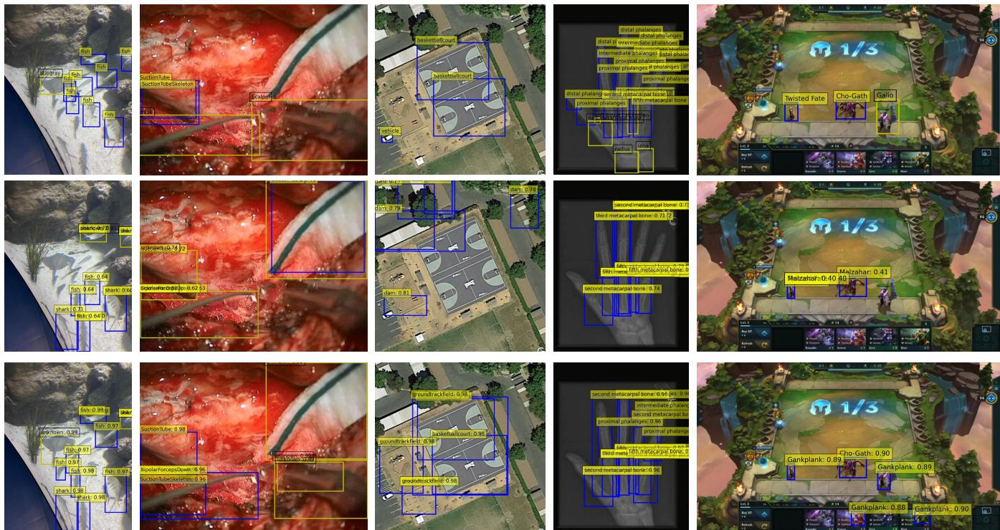  
Figure 3: Qualitative comparison on five RWD datasets. Rows show ground truth, PASS, and CODE; blue and yellow boxes denote known and unknown objects, respectively. Columns show Aquatic and Surgery (Task 1), and Aerial, Medical, and Game (Task 2).

UGUOE also obtains 25.7 U-mAP, whereas replacing visual-response variance with known-logit entropy yields 17.0. Thus, local visual dispersion and margin-aware suppression better preserve ambiguous unknown objects than the tested global logit statistics.

## 4.5 Prototype Sensitivity and Eficiency

Table 4 shows that prototype estimation is sensitive under extreme scarcity, particularly at 10 shots. With 50 or more samples, K-mAP becomes substantially more stable, while Aquatic U-mAP reaches 24.7 at 100 shots. This experiment isolates sample-size sensitivity rather than a complete long-tailed or noisy-label setting.

For � ∈ {5, 15, 25, 50} retained attributes on Aquatic, CODE obtains U-/K-mAP values of 15.5/59.0, 18.9/62.9, 24.7/62.7, and 21.1/62.5, respectively. K-mAP is stable once � > 15, while U-mAP is highest at � = 25; we therefore use � = 25 as the accuracy– eficiency balance. The additional prototype matching has complexity O (���), accounts for less than 0.1% of the transformer backbone FLOPs, and increases latency by less than 5% on a single RTX 4090.

## 4.6 Qualitative Results and Visualization

Figure 3 compares CODE with PASS across the five RWD datasets. In Task 1, CODE recovers the camouflaged stingray in Aquatic and the blurred scalpel in Surgery, supporting the ability of UGUOE to activate dificult unknown objects. In Task 2, CODE retrieves the missed basketballcourt in Aerial and more fine-grained targets in Medical, illustrating the benefit of visual-prototype calibration. Game remains challenging: although CODE recalls more foreground instances, highly overlapping representations can still cause category confusion. Overall, the examples support the quantitative improvements in both unknown activation and known-class calibration.

## 5 Conclusion

We presented CODE, a unified inference-time framework for attributedriven open-world object detection. CMJCC uses known-class visual prototypes to calibrate text-driven predictions, UGUOE enhances potential unknowns through local visual uncertainty, and DOSCM protects ambiguous boundary instances through marginaware suppression. Together, these components improve unknownobject discovery and known-class recognition across diverse domains and backbone scales, highlighting the benefit of combining direct visual references with uncertainty-aware inference.

Limitations. CODE relies on dataset-specific visual prototypes, whose representativeness may decrease under extreme data scarcity, long-tailed or noisy annotations, and cross-domain distribution shift. Our few-shot study isolates sample scarcity but does not cover all these conditions. Highly overlapping fine-grained categories, as observed in Game and Surgery, also remain challenging.

## Acknowledgments

This work was supported by the Joint Funds of the National Natural Science Foundation of China (No. U2441206).

## References

[1] David Bouget, Rodrigo Benenson, Mohamed Omran, Laurent Rifaud, Bernt Schiele, and Pierre Jannin. 2015. Detecting surgical tools by modelling local appearance and global shape. IEEE transactions on medical imaging 34, 12 (2015), 2603–2617.

[2] Guiping Cao, Tao Wang, Wenjian Huang, Xiangyuan Lan, Jianguo Zhang, and Dongmei Jiang. 2025. Open-Det: An eficient learning framework for open-ended detection. arXiv preprint arXiv:2505.20639 (2025).

[3] Robin Chan, Matthias Rottmann, and Hanno Gottschalk. 2021. Entropy maximization and meta classification for out-of-distribution detection in semantic segmentation. In 2021 IEEE/CVF International Conference on Computer Vision (ICCV). IEEE, 5108–5117.

[4] Floriana Ciaglia, Francesco Saverio Zuppichini, Paul Guerrie, Mark McQuade, and Jacob Solawetz. 2022. Roboflow 100: A rich, multi-domain object detection benchmark. arXiv preprint arXiv:2211.13523 (2022).

[5] Sepideh Esmaeilpour, Bing Liu, Eric Robertson, and Lei Shu. 2022. Zero-shot out-of-distribution detection based on the pre-trained model clip. In Proceedings ofthe AAAI conference on artificial intelligence, Vol. 36. 6568–6576.

[6] Stanislav Fort, Jie Ren, and Balaji Lakshminarayanan. 2021. Exploring the limits of out-of-distribution detection. Advances in neural information processing systems 34 (2021), 7068–7081.

[7] Xiuye Gu, Tsung-Yi Lin, Weicheng Kuo, and Yin Cui. 2021. Open-vocabulary object detection via vision and language knowledge distillation. arXiv preprint arXiv:2104.13921 (2021).

[8] Agrim Gupta, Piotr Dollar, and Ross Girshick. 2019. Lvis: A dataset for large vocabulary instance segmentation. In 2019 IEEE/CVF Conference on Computer Vision and Pattern Recognition (CVPR). IEEE, 5351–5359.

[9] Akshita Gupta, Sanath Narayan, KJ Joseph, Salman Khan, Fahad Shahbaz Khan, and Mubarak Shah. 2022. Ow-detr: Open-world detection transformer. In Proceedings ofthe IEEE/CVF conference on computer vision and pattern recognition. 9235–9244.

[10] Dan Hendrycks, Steven Basart, Mantas Mazeika, Andy Zou, Joe Kwon, Mohammadreza Mostajabi, Jacob Steinhardt, and Dawn Song. 2019. Scaling out-ofdistribution detection for real-world settings. arXiv preprint arXiv:1911.11132 (2019).

[11] Dan Hendrycks and Kevin Gimpel. 2016. A baseline for detecting misclassified and out-of-distribution examples in neural networks. arXiv preprint arXiv:1610.02136 (2016).

[12] Jun-Woo Heo, Keonhee Park, and Gyeong-Moon Park. 2026. Detecting Unknown Objects via Energy-based Separation for Open World Object Detection. arXiv preprint arXiv:2603.29954 (2026).

[13] Rui Huang, Andrew Geng, and Yixuan Li. 2021. On the importance of gradients for detecting distributional shifts in the wild. Advances in Neural Information Processing Systems 34 (2021), 677–689.

[14] KJ Joseph, Salman Khan, Fahad Shahbaz Khan, and Vineeth N Balasubramanian. 2021. Towards open world object detection. In Proceedings of the IEEE/CVF conference on computer vision and pattern recognition. 5830–5840.

[15] Rajat Koner, Poulami Sinhamahapatra, Karsten Roscher, Stephan Günnemann, and Volker Tresp. 2021. Oodformer: Out-of-distribution detection transformer. arXiv preprint arXiv:2107.08976 (2021).

[16] Weicheng Kuo, Yin Cui, Xiuye Gu, AJ Piergiovanni, and Anelia Angelova. 2022. Fvlm: Open-vocabulary object detection upon frozen vision and language models. arXiv preprint arXiv:2209.15639 (2022).

[17] Ke Li, Gang Wan, Gong Cheng, Liqiu Meng, and Junwei Han. 2020. Object detection in optical remote sensing images: A survey and a new benchmark. ISPRS journal of photogrammetry and remote sensing 159 (2020), 296–307.

[18] Yiming Li, Yi Wang, Wenqian Wang, Dan Lin, Bingbing Li, and Kim-Hui Yap. 2024. Open world object detection: A survey. IEEE Transactions on Circuits and Systems for Video Technology 35, 2 (2024), 988–1008.

[19] Shiyu Liang, Yixuan Li, and Rayadurgam Srikant. 2017. Enhancing the reliability of out-of-distribution image detection in neural networks. arXiv preprint arXiv:1706.02690 (2017).

[20] Chuang Lin, Yi Jiang, Lizhen Qu, Zehuan Yuan, and Jianfei Cai. 2024. Generative region-language pretraining for open-ended object detection. In 2024 IEEE/CVF Conference on Computer Vision and Pattern Recognition (CVPR). IEEE, 13958– 13968.

[21] Haomiao Liu, Hao Xu, Chuhuai Yue, and Bo Ma. 2024. UOA-RCNN: Detect Anything with Unknown Object Aware RCNN. In International Conference on Neural Information Processing. Springer, 63–77.

[22] Haomiao Liu, Hao Xu, Chuhuai Yue, and Bo Ma. 2025. Adaptive objectness learning for enhanced unknown object detection: H. Liu et al. The Visual Computer 41, 10 (2025), 7433–7446.

[23] Haomiao Liu, Hao Xu, Chuhuai Yue, and Bo Ma. 2025. UN-DETR: Promoting objectness learning via joint supervision for unknown object detection. In Proceedings ofthe AAAI Conference on Artificial Intelligence, Vol. 39. 5442–5450.

[24] Weitang Liu, Xiaoyun Wang, John Owens, and Yixuan Li. 2020. Energy-based out-of-distribution detection. Advances in neural information processing systems 33 (2020), 21464–21475.

[25] Muhammad Maaz, Hanoona Rasheed, Salman Khan, Fahad Shahbaz Khan, Rao Muhammad Anwer, and Ming-Hsuan Yang. 2022. Class-agnostic object detection with multi-modal transformer. In European conference on computer vision. Springer, 512–531.

[26] Sachit Menon and Carl Vondrick. 2022. Visual classification via description from large language models. arXiv preprint arXiv:2210.07183 (2022).

[27] Matthias Minderer, Alexey Gritsenko, Austin Stone, Maxim Neumann, Dirk Weissenborn, Alexey Dosovitskiy, Aravindh Mahendran, Anurag Arnab, Mostafa Dehghani, Zhuoran Shen, et al. 2022. Simple open-vocabulary object detection. In European conference on computer vision. Springer, 728–755.

[28] Yifei Ming, Ziyang Cai, Jiuxiang Gu, Yiyou Sun, Wei Li, and Yixuan Li. 2022. Delving into out-of-distribution detection with vision-language representations. Advances in neural information processing systems 35 (2022), 35087–35102.

[29] Yifei Ming and Yixuan Li. 2024. How does fine-tuning impact out-of-distribution detection for vision-language models? International Journal ofComputer Vision 132, 2 (2024), 596–609.

[30] Alec Radford, Jong Wook Kim, Chris Hallacy, Aditya Ramesh, Gabriel Goh, Sandhini Agarwal, Girish Sastry, Amanda Askell, Pamela Mishkin, Jack Clark, et al. 2021. Learning transferable visual models from natural language supervision. In International conference on machine learning. PmLR, 8748–8763.

[31] Yiyou Sun, Chuan Guo, and Yixuan Li. 2021. React: Out-of-distribution detection with rectified activations. Advances in neural information processing systems 34 (2021), 144–157.

[32] Zhicheng Sun, Jinghan Li, and Yadong Mu. 2024. Exploring orthogonality in open world object detection. In 2024 IEEE/CVF Conference on Computer Vision and Pattern Recognition (CVPR). IEEE, 17302–17312.

[33] Hualiang Wang, Yi Li, Huifeng Yao, and Xiaomeng Li. 2023. Clipn for zero-shot ood detection: Teaching clip to say no. In Proceedings ofthe IEEE/CVFInternational Conference on Computer Vision. 1802–1812.

[34] Xing Xi, Yangyang Huang, Jinhao Lin, and Ronghua Luo. 2024. KTCN: Enhancing Open-World Object Detection with Knowledge Transfer and Class-Awareness Neutralization.. In IJCAI. 1462–1470.

[35] Xing Xi, Yangyang Huang, Zhijie Zhong, and Ronghua Luo. 2024. Umb: Under standing model behavior for open-world object detection. Advances in Neural Information Processing Systems 37 (2024), 74233–74261.

[36] Hao Xu, Yiding Liang, Haomiao Liu, Chuhuai Yue, and Bo Ma. 2024. TGTrack: Text Modality Autoregression and Generative Template Updating for Visual Object Tracking. In International Conference on Neural Information Processing. Springer, 259–273.

[37] Muli Yang, Gabriel James Goenawan, Huaiyuan Qin, Kai Han, Xi Peng, Yanhua Yang, and Hongyuan Zhu. 2025. Detecting Open World Objects via Partial Attribute Assignment. In Proceedings of the Computer Vision and Pattern Recognition Conference. 20318–20328.

[38] Lewei Yao, Jianhua Han, Xiaodan Liang, Dan Xu, Wei Zhang, Zhenguo Li, and Hang Xu. 2023. Detclipv2: Scalable open-vocabulary object detection pre-training via word-region alignment. In Proceedings ofthe IEEE/CVFConference on Computer Vision and Pattern Recognition. 23497–23506.

[39] Alireza Zareian, Kevin Dela Rosa, Derek Hao Hu, and Shih-Fu Chang. 2021. Open-vocabulary object detection using captions. In Proceedings ofthe IEEE/CVF conference on computer vision and pattern recognition. 14393–14402.

[40] Zihan Zhang, Zhuo Xu, and Xiang Xiang. 2024. Vision-language dual-pattern matching for out-of-distribution detection. In European Conference on Computer Vision. Springer, 273–291.

[41] Xiaowei Zhao, Yuqing Ma, Duorui Wang, Yifan Shen, Yixuan Qiao, and Xianglong Liu. 2023. Revisiting open world object detection. IEEE transactions on circuits and systems for video technology 34, 5 (2023), 3496–3509.

[42] Yiwu Zhong, Jianwei Yang, Pengchuan Zhang, Chunyuan Li, Noel Codella, Liunian Harold Li, Luowei Zhou, Xiyang Dai, Lu Yuan, Yin Li, et al. 2022. Regionclip: Region-based language-image pretraining. In Proceedings of the IEEE/CVF conference on computer vision and pattern recognition. 16793–16803.

[43] Kaiyang Zhou, Jingkang Yang, Chen Change Loy, and Ziwei Liu. 2022. Conditional prompt learning for vision-language models. In Proceedings of the IEEE/CVF conference on computer vision and pattern recognition. 16816–16825.

[44] Orr Zohar, Shih-Cheng Huang, Kuan-Chieh Wang, and Serena Yeung. 2023. Lovm: Language-only vision model selection. Advances in Neural Information Processing Systems 36 (2023), 33120–33132.

[45] Orr Zohar, Alejandro Lozano, Shelly Goel, Serena Yeung, and Kuan-Chieh Wang. 2023. Open world object detection in the era of foundation models. arXiv preprint arXiv:2312.05745 (2023).

[46] Orr Zohar, Kuan-Chieh Wang, and Serena Yeung. 2023. Prob: Probabilistic objectness for open world object detection. In Proceedings ofthe IEEE/CVF conference on computer vision and pattern recognition. 11444–11453.

## Appendix Contents

A Dataset Details . . 10   
A.1 Benchmark Composition . . . 10   
A.2 Statistical Summary . 10   
A.3 Task Formulation . 10   
A.4 Evaluation Tasks . . 10   
B Implementation Details . . . . 10   
B.1 Attribute Generation and Prompt Templates . . . . . . . . . 10   
B.2 Model Training and Optimization . . . . . . 11   
C Additional Experimental Results and Analysis . . . . . . . . . . . 12   
C.1 Intra-module Ablations . . . . . 13   
C.2 Comprehensive Parameter Sensitivity Analysis . . . . . . . 14   
C.3 Advanced Visualizations and In-depth Analysis . . . . . . 15   
D Limitations and Future Work . . . . 19

## A Dataset Details

We evaluate our framework on the Real-World Object Detection (RWD) benchmark, following the experimental protocol established by FOMO [45]. The RWD benchmark is designed to assess object detectors’ ability to handle known and unknown objects across diverse and challenging domains.

## A.1 Benchmark Composition

The benchmark consists of five datasets representing diferent complex scenarios. Following the RWD setup [45]:

• Aquatic, Game, and Medical: These datasets are derived from RoboFlow100 [4], specifically the aquarium, team-fighttactics, and xray-rheumatology subsets. They represent underwater environments, synthetic game snapshots with diverse avatars, and hand X-ray images for bone detection, respectively.

• Aerial: This dataset is sourced from DIOR [17], consisting of high-resolution aerial imagery of structures such as stadiums, storage tanks, and ships.

• Surgery: Taken from the NeuroSurgicalTools dataset [1], these images were captured via neurosurgical microscopes and contain various fine-grained surgical instruments.

## A.2 Statistical Summary

Table S1 provides a comprehensive statistical overview of the RWD benchmark. This includes the total image count (training and testing), the class split between known (K) and unknown (U) categories for Task 1, the size of the attribute pool generated via LLMs, and the percentage of class names that exist within the vision-language tokenizer’s vocabulary.

## A.3 Task Formulation

Open World Object Detection (OWOD) requires a model to simultaneously detect known objects, discover unknown objects, and incrementally learn these novel categories over time. Formally, the OWOD process is divided into a series of subtasks $\mathcal { T } =$ $\{ T _ { 1 } , T _ { 2 } , \dots \cdot , T _ { | \mathcal { T } | } \}$ . At a specific task stage �, the model is trained on a set of known object classes denoted as $\dot { K } ^ { t } = \{ O _ { 1 } ^ { t } , O _ { 2 } ^ { t } , . . . , O _ { | K ^ { t } | } ^ { t } \} .$

During evaluation, the model is expected to detect all categories it has encountered so far $( \mathrm { i } . \mathrm { e } . , K ^ { t } ) _ { }$ , as well as discover unlabeled but interesting unknown categories, denoted as $U ^ { t }$

After discovering the unknown object classes, the model can be updated with the knowledge of these new classes using annotations from an oracle (e.g., a human annotator) in the subsequent task $t + 1 ,$ . Consequently, the model’s known category set expands to include both previously seen classes and the newly introduced ones: $K ^ { t + 1 } = \bar { K } ^ { t } \cup U ^ { t }$ . This readies the model to detect the newly updated known classes alongside additional unknown classes for the next task cycle. This formulation describes the general OWOD paradigm. In the RWD evaluation used in this work, however, Task 2 follows the benchmark protocol described in Sec. 4.1.1 of the main paper: the model is jointly retrained using all samples available at that stage. Therefore, our Task 2 results should be interpreted as evaluation over an expanded category set rather than as strictly sequential incremental learning.

Table S1: Comprehensive summary of the RWD benchmark datasets. We report the total images, class distribution for Task 1, attribute pool size, and tokenizer vocabulary coverage (%).
<table><tr><td>Dataset</td><td>Total Images</td><td>Classes (K+U)</td><td>Attributes</td><td>% in Tokenizer</td></tr><tr><td>Aquatic</td><td>637</td><td>7 (4+3)</td><td>385</td><td>100.0</td></tr><tr><td>Aerial</td><td>10,000</td><td>20 (10+10)</td><td>1,229</td><td>55.0</td></tr><tr><td>Game</td><td>1,575</td><td>59 (30+29)</td><td>390</td><td>35.6</td></tr><tr><td>Medical</td><td>182</td><td>12 (6+6)</td><td>390</td><td>15.4</td></tr><tr><td>Surgery</td><td>1,829</td><td>13  $( 6 + 7 )$ </td><td>808</td><td>7.69</td></tr></table>

## A.4 Evaluation Tasks

Following the scarcity-based split motivated by long-tailed recognition , each dataset is divided into two subsets: the 50% most common classes (Known) and the 50% least common classes (Unknown). Within our specific two-stage evaluation protocol:

• Task 1: Detectors are trained on known classes $( K ^ { 1 } )$ and must generalize to detect novel, unlabeled unknown objects. All categories in the test set that belong to the subsequent task are treated as unknown classes $( U ^ { 1 } )$

• Task 2: Previously unknown classes are revealed and added to the expanded known-category set $( K ^ { 2 } = K ^ { 1 } \cup U ^ { 1 } )$ . Following the RWD protocol used in the main paper, the model is jointly retrained using all samples available at this stage. The categories from Task 1 are evaluated as Previously Known (PK), while the newly introduced categories are evaluated as Currently Known (CK).

## B Implementation Details

## B.1 Attribute Generation and Prompt Templates

To provide a fine-grained semantic foundation for attribute reasoning, we utilize LLMs to decompose abstract category labels into class-agnostic attributes, following the protocols established by previous works [35, 37, 45]. This process allows the model to establish an initial semantic baseline for discovering unknown objects.

B.1.1 LLM-based Decomposition. We prompt GPT-3.5 to generate descriptive characteristics for each known class within the RWD benchmark. The following prompt template is employed to ensure that the generated attributes remain visually or functionally discriminative:

“I am using a language-vision model to identify $\{ C a t -$ egory}. List the {Type} attributes of {Category}, which will be used for detection.”

where {Category} denotes the specific class name and {Type} refers to one of the ten semantic dimensions. This methodology leverages the extensive internal knowledge of LLMs to facilitate the reasoning of unknown objects that share latent characteristics with known classes.

B.1.2 Atribute Taxonomy. To ensure a comprehensive characterization of objects across diverse and complex domains, the generated attributes are categorized into ten distinct dimensions:

• Shape: e.g., flat disc-like, pointed tips, knobby.

• Color: e.g., silver color, turquoise, yellow.

• Texture: e.g., matte skin, ridged, fissured.

• Size: e.g., asymmetric, large, proportionality.

• Context: e.g., underwater, surgical bone mallet, wrist bones.

• Features: e.g., rounded snout, tension adjustment, cortical bone.

• Appearance: e.g., shiny, presence of parking lots, visible joints.

• Behavior: e.g., swimming, stabilizing, extension.

• Environment: e.g., artificial reef, surgical tools, sparse.

• Material: e.g., collagen, bony, hydroxyapatite.

B.1.3 Encodingfor Atribute Reasoning. To align the raw attribute descriptions with the pre-training distribution of the foundation model, we wrap each attribute into a structured descriptive sentence [26, 44]:

## “Object which (is/has/etc) {Type} is {Attribute}.”

These formatted descriptions are then encoded into high-dimensional embeddings using the frozen text encoder of OWL-ViT [27]. This procedure constructs the necessary semantic space for the model’s attribute reasoning, providing a structured textual prior that enables the detection of potential unknown objects based on their constituent properties.

## B.2 Model Training and Optimization

B.2.1 Training and Loss Functions. The training process of CODE is supervised by a composite objective function (Eq. 1 in the main text), formulated as:

$$
\mathcal { L } = \mathcal { L } _ { C E } + \lambda _ { P O T } \mathcal { L } _ { P O T } + \lambda _ { M S E } \mathcal { L } _ { M S E } + \lambda _ { L 1 } \mathcal { L } _ { L 1 }\tag{S1}
$$

where the empirical trade-of coeficients are set to $\lambda _ { P O T } ~ = ~ 5$ ���� = 0.1, and $\lambda _ { L 1 } = 0 . 0 0 1$ 1 across all experiments. Each com ponent is detailed as follows:

• Partial Optimal Transport Loss $( \mathcal { L } _ { P O T } ) ;$ : Following the assignment strategy in [37], conventional Optimal Transport (OT) assumes identical total probability mass between two distributions $( \| V \| _ { 1 } = \| A \| _ { 1 } )$ ). However, this fails in our scenario because only a small subset of the large generated attribute pool � aligns with the visual object embeddings � .

To address this, $\mathcal { L } _ { P O T }$ relaxes the equal mass assumption, transporting only the in-distribution mass between � and � while explicitly filtering out redundant OOD attributes. This is formulated with asymmetric marginal constraints:

$$
\Pi ( V , A ) \triangleq \{ T \in \mathbb { R } _ { + } ^ { M \times N } \mid T \mathbf { 1 } _ { N } = V , T ^ { \top } \mathbf { 1 } _ { M } \leqslant A \}\tag{S2}
$$

Unlike traditional POT, this introduces an equality constraint on the visual distribution� and an inequality constraint on �. The loss is computed as $\begin{array} { r } { d _ { P O T , \epsilon } ( V , A ; C ) \triangleq \operatorname* { m i n } _ { T \in \Pi ( V , A ) } \langle T , C \rangle _ { F } - } \end{array}$ $\epsilon h ( T )$ , where $h ( T )$ is an entropic constraint added to accelerate convergence.

• Cross-Entropy Loss (L��): After acquiring the selected attributes �′ via POT, we learn a mapping matrix ${ \textbf { W } } =$ $\left[ w _ { 1 } , w _ { 2 } , . . . , w _ { K } \right]$ to assign these attributes to � known object classes. The prediction probability $p ( O _ { k } | v )$ is computed via a softmax function over the similarity between visual embeddings and the reweighted attributes. The standard cross-entropy loss is then applied to supervise the optimization of both the mapping matrix and the selected attributes:

$$
\mathcal { L } _ { C E } = - \frac { 1 } { M } \sum _ { m = 1 } ^ { M } \sum _ { k = 1 } ^ { K } l _ { m , k } \log { p ( O _ { k } | v _ { m } ) }\tag{S3}
$$

where $l _ { m , k }$ is the one-hot label vector for the visual patch $v _ { m } ,$ and � is the number of known image patches.

• Mean Squared Error Loss $( \mathcal { L } _ { M S E } ) { : }$ Applied to align the textderived attributes with the average vision-derived class embeddings. This ensures stable feature refinement and crossmodal semantic consistency under limited bounding-box supervision.

• L1 Regularization $( \mathcal { L } _ { L 1 } ) \colon \mathrm { A p p l }$ lied to the attribute mapping weights W $( \mathrm { i . e . , \| \mathbf W \| _ { 1 } } )$ to induce sparsity. This encourages the model to selectively activate only the most discriminative attributes rather than redundantly using the entire pool.

B.2.2 Inference Pipeline. The complete inference pipeline of our proposed framework is summarized in Algorithm 1. By sequentially executing CMJCC, UGUOE, and DOSCM, our method elegantly resolves the semantic ambiguity of known objects and the over-suppression of unknown targets within a unified, end-toend inference pass. Specifically, the CMJCC module first provides visual-to-visual calibration, followed by UGUOE for boosting potential unknown regions, and finally DOSCM to dynamically protect boundary targets.

B.2.3 Hyperparameters, Environment, and Strategy. All experiments are conducted on a server equipped with NVIDIA RTX 4090 GPUs. We use the AdamW optimizer with a weight decay of $1 \times 1 0 ^ { - 4 }$ . The text encoder of the pre-trained OWL-ViT remains frozen during training to preserve its zero-shot generalization capabilities. For the B/16 backbone, the batch size is set to 10 with input images resized to $7 6 8 \times 7 6 8$ . For the L/14 backbone, we use a batch size of 1 and resize images to 840 × 840. During both training and inference, the maximum number of predicted bounding boxes per image is fixed at 100.

For few-shot training, we follow [37, 45] to feed an image and its corresponding ground truth bounding box into the pre-trained OWL-ViT [27] model to generate predicted bounding boxes and class embeddings. The class embeddings are filtered based on their associated bounding boxes, ensuring that only those with an intersection over union (IoU) of at least 0.8 with the ground-truth object are retained. Prompt ensembling is also used to produce the final attribute embeddings by averaging the text embeddings obtained from the 7 most efective CLIP prompt templates [27, 30].

Algorithm 1: Inference Procedure of CODE for OWOD   
Input: Candidate visual embedding ${ \boldsymbol { v } } _ { i } ,$ visual prototypes   
$V _ { b a s e } ,$ text-driven known logits $L o g i t _ { K , i } ,$ text-driven   
unknown logit $L o g i t u _ { , i ; }$ , task relevance score $\ P I D .$   
Output: Calibrated known probability $P _ { K } ^ { c a l i b } ( { \pmb { \upsilon } } _ { i } )$ , final   
unknown probability $P _ { U } ^ { f i n a l } ( \upsilon _ { i } )$   
// Cross-Modal Joint Confidence Calibration   
(CMJCC)   
1 Compute visual similarities: $S i m _ { v i s , i } \gets v _ { i } \cdot V _ { b a s e } ^ { \top } ;$   
2 Calculate candidate-specific threshold:   
$\begin{array} { r } { \tau _ { i } \gets \operatorname* { m a x } \left( \frac { 1 } { K } \sum _ { k = 1 } ^ { K } [ S i m _ { v i s , i } ] _ { k } + m , \tau _ { m i n } \right) ; } \end{array}$   
3 Compute visual boost: $L o g i t _ { b o o s t , i } \gets \mathrm { R e L U } ( S i m _ { v i s , i } - \tau _ { i } ) ;$   
4 Calibrate known logits   
$L o g i t _ { K , i } ^ { c a l i b } \gets L o g i t _ { K , i } + \alpha \cdot S _ { s c a l e } \cdot L o g i t _ { b o o s t , i } ;$   
5 Calculate calibrated known probabilities:   
$P _ { K } ^ { c a l i b } ( \pmb { \mathscr { v } } _ { i } ) \gets \sigma ( L o g i t _ { K , i } ^ { c a l i b } ) ;$   
$/ /$ For brevity, the candidate index � is omitted   
below.   
// Uncertainty-Guided Universal Objectness   
Enhancement (UGUOE)   
6 Extract Top- $- K _ { u }$ local similarities $S _ { l o c a l }$ from $S i m _ { v i s } ;$   
7 Compute base unknown response $\mu _ { u n k }$ and local variance   
$\sigma ^ { 2 } ( S _ { l o c a l } )$ following the definitions in Sec. 3.3;   
8 Calculate hesitation weight $W _ { u n c }  \exp ( - \gamma \cdot \sigma ^ { 2 } ( S _ { l o c a l } ) )$   
and clamp to $[ w _ { m i n } , w _ { m a x } ] ;$   
9 Calculate universal objectness:   
$O b j _ { u n k } \gets \mathrm { R e L U } ( \mu _ { u n k } - \tau _ { u n k } ) ;$   
10 Enhance unknown logit:   
$L o g i t _ { U } ^ { e n h } \gets L o g i t _ { U } + \beta \cdot S _ { s c a l e } \cdot W _ { u n c } \cdot O b j _ { u n k } ;$   
// Dynamic Outlier Suppression via Confidence   
Margin (DOSCM)   
11 Extract Top-1 and Top-2 probabilities from $P _ { K } ^ { c a l i b } ( \pmb { \upsilon } _ { i } ) \colon$   
$P _ { t o p 1 } , P _ { t o p 2 } ;$   
12 Calculate confidence margin: $\Delta P \gets P _ { t o p 1 } - P _ { t o p 2 } ;$   
13 Compute efective suppression penalty:   
$M C M _ { e f f } \gets P _ { t o p 1 } \cdot \Delta P ;$   
14 Compute dynamic OOD score: $\begin{array} { r } { p _ { O O D } ^ { d y n }  1 - M C M _ { e f f } ; } \end{array}$   
15 Calculate final unknown probability:   
$P _ { U } ^ { f i n a l } ( v _ { i } ) \gets \sigma ( L o g i t _ { U } ^ { e n h } ) \cdot p _ { I D } \cdot p _ { O O D } ^ { d y n } ;$   
16 return $P _ { K } ^ { c a l i b } ( \pmb { \upsilon } _ { i } ) , P _ { U } ^ { f i n a l } ( \pmb { \upsilon } _ { i } ) ;$

Additional prototype extraction detail. As described in Sec. 3.2 of the main paper, visual prototypes are constructed only from labeled data available at the corresponding stage. In implementation, the image and its ground-truth bounding boxes are passed through the frozen OWL-ViT model, and region embeddings associated with predicted boxes whose IoU with the corresponding ground-truth box is at least 0.8 are retained for class-wise prototype estimation. The caching and Task 1/Task 2 prototype-bank protocol follows Sec. 3.2.

To adapt to the diverse data distributions in the RWD benchmark, we select the optimization and inference hyperparameters through grid search. For training, the learning rate is searched over $L R \in$ $\left[ 1 \times 1 0 ^ { - 3 } , 5 \times 1 0 ^ { - 3 } , 5 \times 1 0 ^ { - 4 } \right]$ , and the maximum number of iterations over $T _ { m a x } \in [ 1 ,$ 10, 100]. The remaining CODE hyperparameters are selected in the same grid-search manner, with the final settings reported in Sec. 4.1.3 of the main paper.

For the quantitative comparison in the main paper, results of previous methods are taken from their original publications, while CODE is evaluated using our final configuration. Reproduced baseline predictions, where used in the qualitative visualizations of this appendix, are used only for visualization and are not substituted for the published quantitative results.

Baseline Implementations: To comprehensively evaluate the efectiveness of our CODE framework, we compare it against stateof-the-art OWOD methods alongside several strong baselines adapted from Open-Vocabulary Object Detection (OVOD) using the OWL-ViT foundation model (Tab. 1 in the main text). These baselines are configured as follows:

• BASE-ZS: Operates in a pure zero-shot setting by using a generic prompt (e.g., “object” or “a photo of an object”) to detect unknown targets [25].

• BASE-ZS+IN: Utilizes the comprehensive ImageNet vocabulary as proposals for unknown objects, explicitly removing the names of the currently known classes to prevent overlap.

• BASE-ZS+LLM: Leverages an LLM to predict potential unknown object categories based on the semantic context of the given known classes. These generated names are then used as text queries for zero-shot detection.

• BASE-ZS+GT: Employs the actual ground-truth class names for the unknown objects. This configuration acts as the theoretical upper bound for text-conditioned (zero-shot) OVOD approaches, as it assumes oracle access to the exact identities of the unknown targets.

• BASE-FS: A few-shot baseline that receives the same level of visual supervision as our method. It uses image exemplars to extract vision-derived object embeddings, which are averaged per class to generate visual class prototypes. It then applies a generic text prompt to identify unknown objects. Because text-based embeddings inherently exhibit diferent cosine similarity scales compared to image-derived counterparts, the predictions for known and unknown objects are ranked and selected separately.

## C Additional Experimental Results and Analysis

The main paper already reports the incremental module ablation (Table 2), alternative uncertainty and OOD-score comparisons (Sec. 4.4), prototype sample-size and attribute-number sensitivity (Table 4 and Sec. 4.5), computational overhead, and generalization to standard

benchmarks (Sec. 4.2). To avoid duplicating these results, this appendix focuses on complementary intra-module ablations, controlled parameter sweeps, and additional visual analyses.

## C.1 Intra-module Ablations

To further validate the precise architectural design within our proposed framework, we conduct detailed intra-module ablation studies. Here, we investigate the core mechanisms within two critical modules: the dynamic thresholding gate in the Cross-Modal Joint Confidence Calibration (CMJCC) module, and the internal components of the Uncertainty-Guided Universal Objectness Enhancement (UGUOE) module. All experiments are conducted using the L/14 backbone across two representative datasets: Aquatic and Surgery.

C.1.1 CMJCC Module Ablation. The CMJCC module explicitly injects global visual prototypes to calibrate text-driven confidences. A core component of this module is the candidate-specific dynamic thresholding gate $\begin{array} { r } { \tau _ { i } = \operatorname* { m a x } \left( \frac { 1 } { K } \sum _ { k = 1 } ^ { K } [ S i m _ { v i s , i } ] _ { k } + m , \tau _ { m i n } \right) } \end{array}$ , which dictates how the visual similarity $S i m _ { v i s }$ is transformed into the visual boost $L o g i t _ { b o o s t }$ . To isolate the contribution of this dynamic gating, we compare the full CODE framework against two degraded variants under the Task 2 evaluation protocol:

• w/ Fixed $\tau _ { m i n }$ Only: We remove the candidate-specific component $\begin{array} { r } { \frac { 1 } { K } \sum _ { k = 1 } ^ { K } [ S i m _ { v i s , i } ] _ { k } + m } \end{array}$ and rely solely on the static threshold floor $\tau _ { m i n }$ to gate the similarities.

• w/o Threshold (Direct $S i m _ { v i s , i } ) \colon$ We completely remove the subtraction of �� and the ReLU activation, directly using the raw visual similarity $S i m _ { v i s , i }$ for enhancement.

Table S2: Ablation study of the CMJCC module’s dynamic gating mechanism. We report PK-mAP (PK) and CK-mAP (CK) on the Aquatic and Surgery datasets under Task 2 evaluation using the L/14 backbone.
<table><tr><td>Dataset (→)</td><td colspan="2">Aquatic</td><td colspan="2">Surgery</td></tr><tr><td>Method Variant</td><td>PK</td><td>CK</td><td>PK</td><td>CK</td></tr><tr><td>CODE Full  $( \mathrm { O u r s } )$ </td><td>65.3</td><td>59.6</td><td>46.3</td><td>35.6</td></tr><tr><td>w/ Fixed  $\tau _ { m i n } \mathrm { O n l y }$ </td><td>61.7</td><td>55.6</td><td>42.3</td><td>27.6</td></tr><tr><td>w/o Threshold (Direct  $S i m _ { v i s } )$ </td><td>59.9</td><td>49.1</td><td>42.1</td><td>25.4</td></tr></table>

Analysis: As shown in Table S2, the dynamic gating strategy is crucial for maintaining high performance under the expanded category Task 2 setting. First, replacing the adaptive threshold with a fixed $\tau _ { m i n }$ leads to a significant performance drop, particularly for Currently Known (CK) objects (e.g., dropping from 35.6 to 27.6 on the Surgery dataset). This indicates that a rigid threshold fails to adapt to the candidate-specific distribution of visual similarities, leading to either under-activation of valid visual priors or the unintended inclusion of background noise. As clarified in Sec. 3.2, the dynamic threshold is computed independently for each candidate and therefore does not depend on inference-batch composition.

Second, completely removing the gating threshold (Direct $S i m _ { v i s } )$ results in severe performance degradation across all metrics $( \mathrm { e . g . }$ CK drops to 49.1 on Aquatic and 25.4 on Surgery). Without the

ReLU-based filtering mechanism, background noise and irrelevant local visual responses are indiscriminately injected into the calibration process. This pollutes the original text-driven logits ������, exacerbating the semantic ambiguity rather than resolving it. Therefore, the proposed adaptive thresholding precisely isolates highconfidence visual priors, ensuring that $L o g i t _ { b o o s t }$ efectively compensates for textual gaps without introducing detrimental noise.

C.1.2 UGUOE Module Ablation. The UGUOE module is specifically designed to bridge the gap in unknown object discovery by boosting the responses of potential unknown targets located in the “semantic vacuum”. To validate its internal mechanisms, we ablate its two core components: the base universal objectness activation $O b j _ { u n k }$ and the uncertainty-guided weight $W _ { u n c }$ . Experiments are conducted on Task 1 using the L/14 backbone across the Aquatic and Surgery datasets. We compare the full CODE framework with two variants:

• w/o $O b j _ { u n k }$ (No Enhancement): We completely remove the universal objectness injection, reverting the unknown logit to the pure text-driven baseline $( L o g i t _ { U } ^ { e n h } = L o g i t _ { U } )$ .

• w/o $W _ { u n c }$ (No Uncertainty Weight): We remove the variancebased hesitation modeling, treating all regions with high visual similarity equally by setting $W _ { u n c } = 1$

Table S3: Ablation study of the UGUOE module’s internal components. We report U-mAP (U) and K-mAP (K) on the Aquatic and Surgery datasets under Task 1 evaluation.
<table><tr><td>Dataset (→)</td><td colspan="2">Aquatic</td><td colspan="2">Surgery</td></tr><tr><td>Method Variant</td><td>U</td><td>K</td><td>U</td><td>K</td></tr><tr><td>CODE Full (Ours)</td><td>24.7</td><td>62.7</td><td>25.7</td><td>43.9</td></tr><tr><td>w/o  $O b j _ { u n k }$  (No Enhancement)</td><td>9.1</td><td>63.0</td><td>2.3</td><td>44.2</td></tr><tr><td>w/o  $W _ { u n c }$  (No Uncertainty Weight)</td><td>20.1</td><td>62.9</td><td>23.9</td><td>43.5</td></tr></table>

Analysis: As detailed in Table S3, both the base objectness enhancement and the uncertainty-guided weighting are indispensable for robust OWOD.

First, removing the universal objectness enhancement entirely (w/o $O b j _ { u n k } )$ leads to a substantial collapse in the detection of unknown objects. For instance, the U-mAP on the Surgery dataset drops from 25.7 to 2.3, while the Aquatic U-mAP drops from 24.7 to 9.1. This severe degradation confirms our hypothesis that relying solely on a generic, text-derived attribute response is insuficient to separate ambiguous unknown targets from complex background noise. Explicitly injecting aggregated local visual similarities $( \mu _ { u n k } )$ is essential to recall these unlabeled instances.

Second, discarding the uncertainty modeling (w/o $W _ { u n c } )$ consistently reduces U-mAP, while the known-class performance remains largely unchanged. On Aquatic, U-mAP decreases from 24.7 to 20.1 while K-mAP changes only from 62.7 to 62.9; on Surgery, U-mAP decreases from 25.7 to 23.9 and K-mAP from 43.9 to 43.5. Without the variance-based penalty $( \sigma ^ { 2 } ( S _ { l o c a l } ) )$ ), the module indiscriminately boosts any region with high local visual similarity. This inevitably over-boosts clearly defined known objects or textured backgrounds, causing them to interfere with the delicate text-driven prediction space. By formulating $W _ { u n c }$ as an exponential decay function of local variance, UGUOE correctly identifies the model’s “classification hesitation” and selectively targets only the ambiguous regions, thus protecting known class precision while steadily improving unknown recall.

## C.2 Comprehensive Parameter Sensitivity Analysis

In this section, we comprehensively investigate the sensitivity of the CODE framework to critical hyper-parameters introduced in two core modules: CMJCC and UGUOE. For the CMJCC module, we analyze the visual gating margin � and the visual prior modulation coeficient � under the Task 2 evaluation protocol. For the UGUOE module, we evaluate the local neighborhood size $K _ { u } ,$ the uncertainty sensitivity factor $\gamma ,$ and the unknown activation threshold $\tau _ { u n k }$ under the Task 1 setting. All evaluations are conducted using the L/14 backbone across the representative Aquatic and Surgery datasets. All reported hyperparameters were selected through grid search. The tables below retain the values obtained in their corresponding controlled parameter sweeps and are intended to characterize relative sensitivity within each sweep; the final full-system performance is reported separately in the main paper.

Table S4: Parameter sensitivity analysis of the visual gating margin � and modulation coeficient �. Default parameter values are highlighted in bold in the Value column, while the best metric values within each parameter sweep are highlighted in bold. PK and CK indicate Previously Known and Currently Known m $\mathbf { A P } ,$ respectively.
<table><tr><td rowspan="2">Parameter</td><td rowspan="2">Value</td><td colspan="2">Aquatic</td><td colspan="2">Surgery</td></tr><tr><td>PK</td><td>CK</td><td>PK</td><td>CK</td></tr><tr><td rowspan="5">Gating Margin (m)</td><td>0</td><td>50.2</td><td>41.3</td><td>40.0</td><td>23.4</td></tr><tr><td>0.1</td><td>64.0</td><td>58.0</td><td>41.8</td><td>27.6</td></tr><tr><td>0.2</td><td>65.3</td><td>59.6</td><td>46.3</td><td>35.6</td></tr><tr><td>0.3</td><td>65.2</td><td>59.6</td><td>46.4</td><td>36.3</td></tr><tr><td>0.4</td><td>62.4</td><td>58.4</td><td>43.3</td><td>32.4</td></tr><tr><td rowspan="5">Modulation Coef (α)</td><td>0.1</td><td>59.5</td><td>57.6</td><td>46.4</td><td>35.4</td></tr><tr><td>0.25</td><td>64.4</td><td>60.8</td><td>46.8</td><td>36.5</td></tr><tr><td>0.5</td><td>65.3</td><td>59.6</td><td>46.3</td><td>35.6</td></tr><tr><td>1.0</td><td>63.2</td><td>55.5</td><td>45.2</td><td>34.2</td></tr><tr><td>5.0</td><td>37.2</td><td>20.2</td><td>24.7</td><td>10.5</td></tr></table>

C.2.1 Sensitivity Analysis for CMJCC. Impact of the Visual Gating Margin (�): The margin � directly controls the strictness of the candidate-specific dynamic threshold $\tau _ { i } ,$ , dictating how much local visual similarity is allowed to boost the text-driven logits. As observed in Table S4, removing the margin entirely $( m = 0 )$ leads to a severe performance collapse (e.g., Surgery CK drops to 23.4). This occurs because a completely loose threshold fails to filter out background noise or uninformative textures, leading to massive false-positive visual boosts that exacerbate semantic ambiguity. Conversely, setting the margin too high $( m = 0 . 4 )$ overly restricts the visual prior, preventing valid visual clues from calibrating boundary objects. The optimal balance is achieved when $m \in \left[ 0 . 2 , 0 . 3 \right]$ , where the gate efectively isolates high-confidence visual similarities.

Impact of the Modulation Coeficient (�): The coeficient � balances the contribution of the injected visual prior against the original text-driven logits. To ensure that the visual boost is consistent with the logit distribution of the pre-trained foundation model, we introduce an absolute scaling factor $S _ { s c a l e ; }$ , adopting the intrinsic temperature $\tau _ { O W L - V i T }$ of the foundation model. Because this scaling operation explicitly aligns the magnitude of the visual and textual modalities, the framework is highly robust to variations in �, provided it is not set to extreme values. However, when � is set excessively large $( \mathbf { e . g . } , \alpha = 5 ) ,$ , performance drastically plummets (Aquatic CK drops to 20.2). This is because an overwhelming reliance on the visual modality overshadows the zero-shot generalization capabilities of the frozen vision-language foundation model, causing the network to overfit to the visual prototypes of known categories and lose its open-vocabulary reasoning ability. Setting $\alpha = 0 . 5$ provides a robust trade-of, ensuring that the visual prior acts as a helpful calibrator rather than a disruptive override.

Table S5: Parameter sensitivity analysis of the UGUOE module. We evaluate the local neighborhood size $K _ { u } ,$ sensitivity factor $\gamma ,$ and activation threshold $\tau _ { u n k }$ . Default parameter values are highlighted in bold in the Value column, while the best metric values within each parameter sweep are highlighted in bold. U and K denote U-mAP and K-mAP under Task 1, respectively.
<table><tr><td rowspan="2">Parameter</td><td rowspan="2">Value</td><td colspan="2">Aquatic</td><td colspan="2">Surgery</td></tr><tr><td>U</td><td>K</td><td>U</td><td>K</td></tr><tr><td rowspan="4">Local Size  $\left( K _ { u } \right)$ </td><td>1</td><td>20.4</td><td>63.0</td><td>16.4</td><td>43.4</td></tr><tr><td>3</td><td>20.1</td><td>63.0</td><td>25.7</td><td>43.9</td></tr><tr><td>All</td><td>17.4</td><td>63.0</td><td>18.7</td><td>44.0</td></tr><tr><td>Half</td><td>18.8</td><td>62.9</td><td>21.5</td><td>44.0</td></tr><tr><td rowspan="3">Sensitivity (r)</td><td>10</td><td>20.2</td><td>62.8</td><td>24.0</td><td>43.9</td></tr><tr><td>100</td><td>20.1</td><td>63.0</td><td>25.7</td><td>43.9</td></tr><tr><td>200</td><td>18.2</td><td>63.0</td><td>28.1</td><td>43.9</td></tr><tr><td>Threshold</td><td>0.25</td><td>20.1</td><td>63.0</td><td>25.7</td><td>43.9</td></tr><tr><td> $( \tau _ { u n k } )$ </td><td>0.5</td><td>18.3</td><td>62.9</td><td>27.5</td><td>43.5</td></tr></table>

C.2.2 Sensitivity Analysis for UGUOE. Impact of Local Visual Response Aggregation $( K _ { u } ) \colon$ The parameter $K _ { u }$ defines the extent of the local semantic neighborhood used to calculate $\mu _ { u n k }$ and $\sigma ^ { 2 } ( S _ { l o c a l } )$ . As shown in Table S5, using a minimal neighborhood $( K _ { u } = 1 )$ achieves the highest U-mAP on the Aquatic dataset but performs poorly on the complex Surgery dataset due to insuficient uncertainty estimation. Notably, we provide an adaptive alternative referred to as Half, where $K _ { u }$ is set to half the number of known classes. This strategy yields a competitive performance balance (e.g., 21.5 U-mAP on Surgery), ofering a robust option that does not rely on a fixed constant across diferent class pool sizes.

Sensitivity to Uncertainty Factor (�): The factor � modulates the penalty for high-certainty regions. We observe that as $\gamma$ increases to 200, the detection performance for unknown objects in the Surgery dataset is further enhanced, reaching its peak at 28.1 U-mAP. This suggests that more aggressive penalization of "certain" known categories helps the model better identify ambiguous targets in fine-grained medical scenarios. Despite this localized improvement, the overall performance remains relatively stable across a wide range of values $( 1 0 \leq \gamma \leq 2 0 0 )$ , demonstrating the robustness of our uncertainty-guided weighting mechanism.

Impact of Activation Threshold $( \tau _ { u n k } ) \colon$ The threshold $\tau _ { u n k }$ acts as a filter for background distractors. While a higher threshold $( \tau _ { u n k } = 0 . 5 )$ slightly improves the discovery of unknown tools in the Surgery dataset by suppressing low-confidence artifacts, the default value of 0.25 remains more efective for the Aquatic domain. This trade-of confirms that a moderate threshold is generally suficient to prevent universal objectness from over-activating in semantic vacuums.

## C.3 Advanced Visualizations and In-depth Analysis

C.3.1 Evolution of Known and Unknown Logit Distributions. To intuitively understand how our proposed framework refines the semantic space and rescues targets from being erroneously filtered, we visualize the logit distributions of both known and unknown targets before and after applying our method. Figure S1 illustrates these distribution changes across three challenging scenarios: the Aquatic, Medical, and Surgery datasets.

Distribution Analysis and Logit Enhancement: Under the previous purely attribute-driven paradigms, a large number of targets sufer from relatively low attribute similarity due to semantic gaps, occlusions, or complex backgrounds. Consequently, their logit distributions are predominantly trapped in the negative region $( < 0 )$ , indicating insuficient confidence for reliable detection.

In contrast, our CODE framework explicitly enhances reliable target confidence through the synergistic application of the CMJCC and UGUOE modules. As depicted in Figure S1, our method drives a conspicuous rightward distribution shift for both known and unknown objects. By paying special attention to the diference density in the positive region (logits > 0), it is evident that a massive amount of probability mass has been successfully pushed across the activation threshold. This fundamental logit enhancement directly contributes to the simultaneous improvements in both Known AP and Unknown AP.

Insight into the Surgery Dataset: Furthermore, these visu alizations ofer an intuitive explanation for a specific empirical observation in the Surgery dataset. As shown in the bottom row of Figure S1, while the unknown distribution in Surgery is drasti cally enhanced, its known distribution exhibits extremely minimal changes before and after the application of our method—especially when compared to the pronounced known-shifts seen in the Aquatic and Medical datasets. This marginal enhancement in the known distribution, coupled with the aggressive rightward expansion of the unknown distribution, is consistent with the relatively weaker known-class performance on Surgery; in the final main comparison, CODE is 1.7 K-mAP points below PASS on this dataset. It suggests that the massive activation of ambiguous unknown surgical tools introduces a minor but unavoidable interference into the previously established known decision boundaries.

C.3.2 Visualization of Dynamic Outlier Suppression (DOSCM). To intuitively demonstrate how the DOSCM module protects boundary unknown targets and shapes the decision boundary, we visualize the correlation between the semantic confidence margin (Δ�) and the efective suppression penalty in Figure S2.

Analysis: As illustrated in the scatter plots, the x-axis represents the Top-1 known Softmax probability (MCM base), and the y-axis is the final Out-of-Distribution score $( p _ { O O D } )$ . The purple line represents the rigid, linear suppression bottleneck of the baseline MCM, which forcefully penalizes boundary unknown objects, misclassifying them as background simply because they share visual traits with a known class.

In contrast, the green curve represents the dynamic suppression boundary generated by DOSCM. By modulating the penalty based on the exclusivity gap Δ�, DOSCM dynamically shrinks the penalty for ambiguous targets. Consequently, their scatter points are successfully pulled upward from the rigid purple baseline, preserving their enhanced unknown probabilities. This dynamic rescue mechanism is remarkably vital in complex domains like Surgery (Figure S2, right), where it safely lifts a dense cluster of hard medical instruments above the suppression threshold.

Insight into the Game Dataset (False Positives): However, this dynamic relaxation introduces an inherent trade-of in certain highly synthetic domains. As observed in the Game dataset (Figure S2, middle), which consists of synthetic avatars with extreme inter-class similarity, lifting the suppression boundary rescues hard unknowns but simultaneously elevates the OOD scores of some ambiguous known objects. This over-relaxation allows these known objects to cross the unknown decision boundary, resulting in an increase in unknown false positives (i.e., genuine known objects being misclassified as unknowns). This observation is also consistent with the feature-space analysis reported in the main paper, where Game exhibits an average inter-class cosine similarity of 0.82. This visual phenomenon provides a clear mathematical explanation for why the CODE framework experiences a performance degradation in Unknown AP (U-mAP) on the Game dataset, highlighting the unique challenges of dynamic margin tuning in synthetic environments.

C.3.3 Qualitative Analysis on Task 1 Discovery. To further evaluate the discovery capability of our framework, we provide a qualitative comparison between the baseline PASS [37] and our proposed CODE on the Aerial and Surgery datasets under Task 1. As shown in Figure S3, CODE demonstrates a significant advantage in recalling challenging unknown objects that are frequently missed by existing SOTA methods.

Analysis of Recalled Unknown Objects: By comparing the bottom row (CODE) with the middle row (PASS) from left to right, we observe that CODE successfully recovers several critical unknown instances where the baseline fails. For instance, in the first and third columns of the Aerial scenario, PASS misses the “Tennis Court” because it shares high semantic and geometric similarity with the known “Basketball Court” category, causing it to be either misclassified or suppressed. Our UGUOE module efectively identifies the model’s classification hesitation in this semantic vacuum, while DOSCM provides a dynamic margin to protect these bound ary targets. Similarly, in the middle column, CODE successfully recalls the “Harbor”—a target typically cluttered with numerous “Ship” instances that cause severe occlusion and visual complexity.

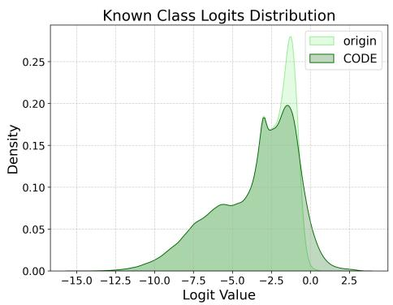

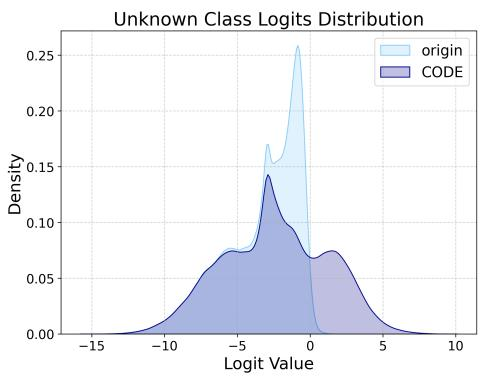

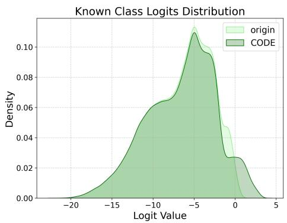

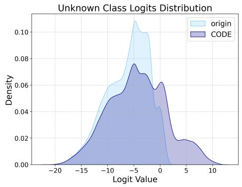

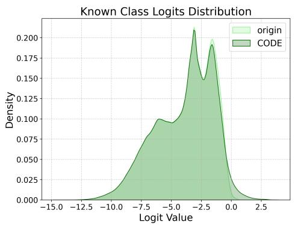

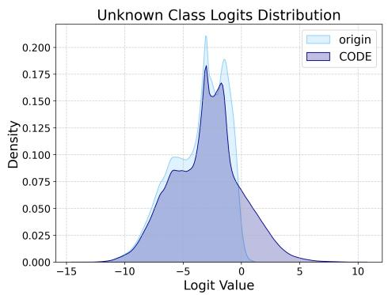

Figure S1: Logit distribution comparisons on the Aquatic (top), Medical (middle), and Surgery (bottom) datasets. For each dataset, the left plot illustrates the known logit distribution, while the right plot displays the unknown logit distribution. CODE significantly shifts the probability mass rightward into the high-confidence region (> 0).  
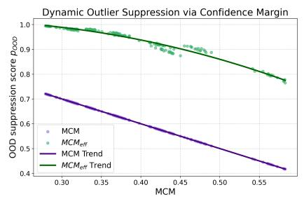

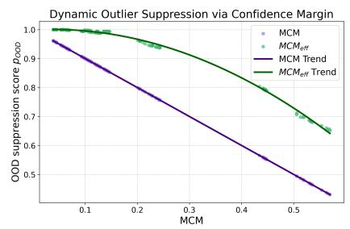

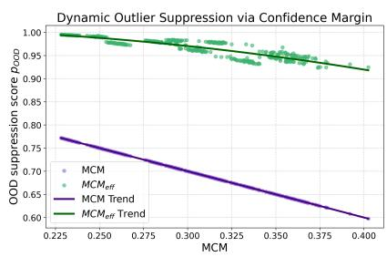  
Figure S2: Scatter visualizations of DOSCM on the Aquatic (left), Game (middle), and Surgery (right) datasets. The x-axis represents the Top-1 known Softmax probability, and the y-axis is the final OOD score (����). The purple line denotes the rigid baseline suppression bottleneck, while the green curve illustrates our dynamic suppression boundary.

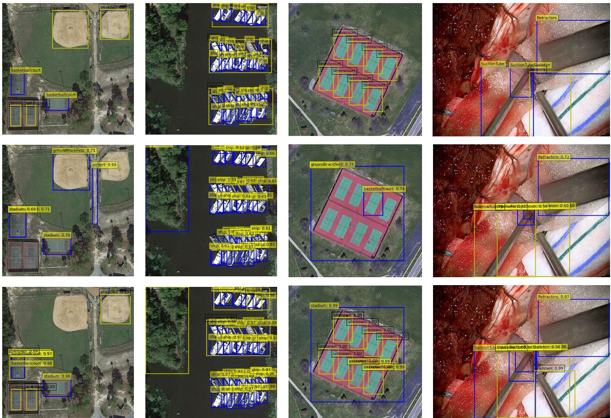  
Figure S3: Qualitative detection results on the Aerial and Surgery datasets for Task 1. Top row: Ground Truth annotations. Middle row: Predictions by the SOTA baseline PASS. Bottom row: Predictions by our proposed CODE framework. Blue boxes denote known categories, while yellow boxes denote unknown categories.

By leveraging visual prototypes and uncertainty-guided enhancement, our method distinguishes the harbor’s global context from the dense local ship responses. Furthermore, in the surgical scenario (right column), CODE successfully discovers the unknown “Scissors”. This object is particularly challenging as its metallic texture and slender structure closely resemble the known “Suction Tube” category. While the rigid suppression mechanism in the baseline tends to filter such ambiguous instances, CODE main tains a high objectness response for the scissors by quantifying the local visual variance and applying a soft confidence margin. Ultimately, these qualitative results provide strong visual evidence that the synergy of UGUOE and DOSCM efectively mitigates the rigid over-suppression bottleneck, ensuring a much higher recall for hard-to-detect objects in complex real-world environments.

C.3.4 Qualitative Analysis on Task 2. In the Task 2 evaluation, we analyze the model’s detection performance after joint retraining on the expanded category set containing the categories from both Task 1 and Task 2. As shown in Figure S4, the ground-truth annotations for the CK (Currently Known) categories are denoted by yellow boxes, and the model is expected to predict them as known categories (blue boxes). The results demonstrate that, benefiting from the visual reference provided by the Cross-Modal Joint Confidence Calibration (CMJCC) module, the CODE framework significantly improves the recall rate of these targets.

Specifically, in the first column (Aerial), CODE successfully identifies more “Basketball Court” instances than the baseline. However, due to the extremely high geometric and semantic overlap between tennis courts and basketball courts, some omissions of the “Tennis Court” still occur. In the second column (Game), our framework correctly identifies the known class “Cho-Gath”; however, as previously analyzed, it hallucinates an incorrect known category nearby. This reflects the challenge of precise semantic diferentiation in synthetic environments characterized by extreme inter-class visual similarity. In the third column (Medical), CODE effectively localizes more targets than the baseline, including various “Metacarpal Bones” and “Phalanges,” although the “Radius” is still missed. Finally, in the fourth column (Surgery), CODE accurately identifies the “Bipolar Forceps Down” category, which is missed by the baseline PASS. The baseline’s failure is primarily due to the inconspicuous attribute features of these tools, which makes the pure text-driven logic dificult to activate efectively. CMJCC successfully compensates for this lack of visual-textual alignment by injecting global visual prototypes, ensuring the successful recall of the targets.

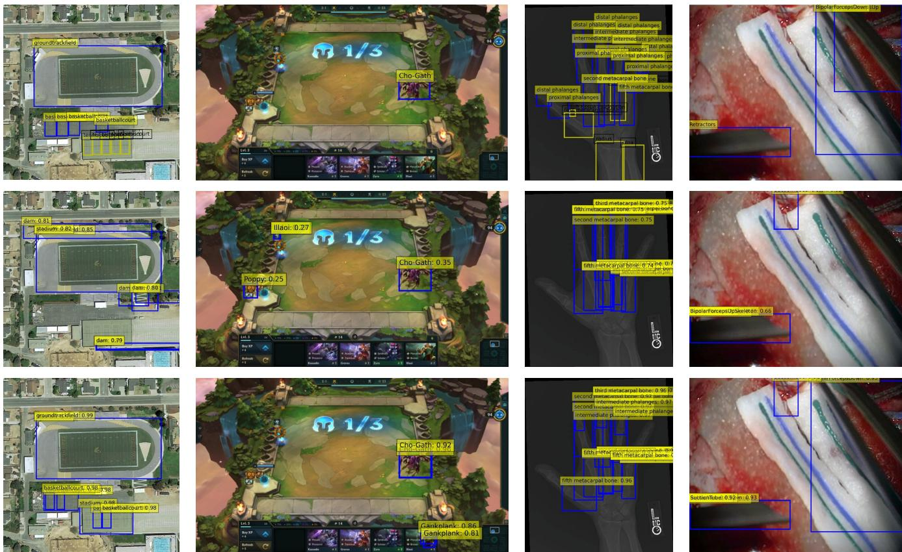  
Figure S4: Qualitative detection results on Task 2 across the Aerial, Game, Medical, and Surgery datasets. Top row: Ground Truth annotations, where yellow boxes indicate Currently Known (CK) classes. Middle row: Predictions by the baseline PASS. Bottom row: Predictions by our CODE framework. CODE recalls significantly more known targets (blue boxes) through visual-to-visual calibration.

In summary, these visualization results confirm that by aggregating global visual prototypes and injecting them into the inference pipeline, CMJCC provides a robust visual calibration reference. Although challenges remain when dealing with objects exhibiting extreme inter-class similarity or significant scale variations, the improvement in known class recall across multiple domains in Task 2 proves the efectiveness of our cross-modal joint calibration strategy when handling the full set of known data.

C.3.5 Qualitative Analysis on Class Confusion and Limitations. To provide a comprehensive and transparent evaluation, we further analyze scenarios involving severe semantic confusion and discuss the inherent limitations of our framework. Figure S5 presents a qualitative comparison on the Aquatic (left two columns) and Aerial (right two columns) datasets under Task 1.

Mitigating Semantic Confusion: A major challenge in OWOD is the semantic overlap between novel targets and established categories. As observed in the second and fourth columns of Figure S5, the baseline method frequently struggles with this confusion. For the unknown “Stingray” (second column), the baseline predicts both an unknown bounding box and a hallucinated known box, indicating a failure to decisively separate the semantic spaces. In contrast, CODE elegantly resolves this confusion, isolating the target purely as unknown without overlapping known predictions. Similarly, in the fourth column, the baseline rigidly misclassifies the unknown “Chimney” as a known “Storage Tank” due to their cylindrical geometric similarities. By leveraging UGUOE to capture classification hesitation and applying DOSCM to adjust the suppression boundary, CODE successfully rescues the chimney into the correct unknown category.

Error Analysis and Limitations: Despite these robust advantages, the dynamic nature of our modules introduces specific tradeofs, leading to certain failure cases shown in the first and third columns.

• False Positives on Unknowns (Aquatic): In the first column, while CODE successfully recalls more targets that blend seamlessly into the complex background (e.g., the fish in the top right corner missed by the baseline), it incorrectly classifies a genuine known fish as an unknown object. This over-activation is a side efect of the UGUOE module. When a known object shares intense visual similarities with the background, its local visual variance increases, causing the uncertainty-guided mechanism to misinterpret it as an ambiguous target and erroneously assign it an unknown label.

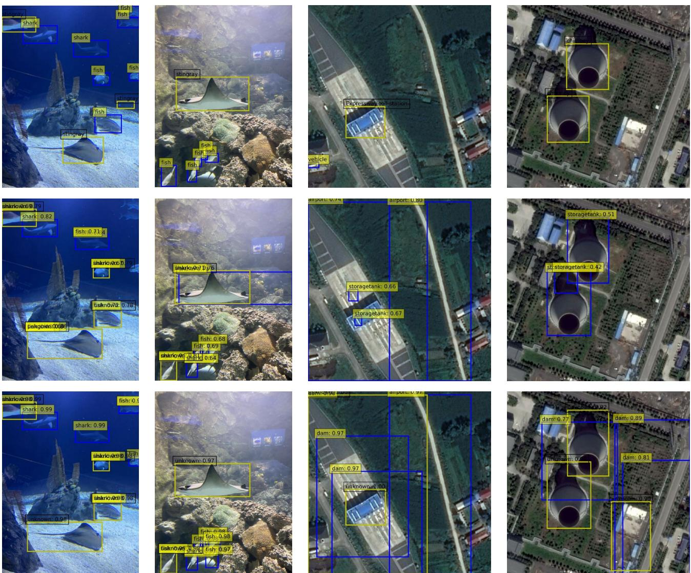  
Figure S5: Qualitative detection results focusing on class confusion and error cases on the Aquatic and Aerial datasets for Task 1. Top row: Ground Truth annotations. Middle row: Predictions by the SOTA baseline PASS. Bottom row: Predictions by our proposed CODE framework. Blue boxes denote known categories, while yellow boxes denote unknown categories.

• Hallucination of Known Classes (Aerial): In the third column, CODE correctly discovers the complex unknown “Expressway Toll Station”. However, it simultaneously produces a false positive prediction for the known “Dam” category on the same structure. We attribute this to the Cross-Modal Joint Confidence Calibration (CMJCC) module. While the injection of visual prototypes efectively calibrates and enhances the recall of known classes, it may inadvertently over-boost the known logits of background regions or unknown targets that share intense textural or structural similarities with the known prototypes.

These failure cases highlight the delicate balance required in Open World Object Detection. While dynamic margins and uncertaintyguided enhancements significantly boost overall performance and unknown recall, refining the cross-modal calibration to prevent over-boosting in extreme boundary cases remains an important direction for future research.

## D Limitations and Future Work

Limitations: Despite the improvements achieved by the CODE framework, several limitations remain. As discussed in Sec. 4.5 of the main paper, the few-shot experiment isolates the efect ofsample scarcity but does not constitute a complete evaluation under longtailed class distributions or noisy annotations. Moreover, because the visual prototypes are dataset-specific estimates, substantial cross-domain distribution shift may reduce their representativeness.

First, semantic aliasing persists in extreme domains; as observed in the Game and Surgery datasets, high inter-class visual similarity can cause the UGUOE module to over-boost ambiguous regions, leading to unknown false positives. Second, the granularity ofvisual prototypes is currently limited, as representing each category with a single centroid may fail to capture intra-class diversity such as variations in viewpoint or occlusion. Finally, the framework is subject to a fundamental dependency on pre-trained models. Since CODE functions as a calibration layer atop frozen vision-language foundation models like OWL-ViT, its overall performance ceiling is inherently constrained by the zero-shot generalization and inherent discriminative capabilities of these underlying models.

Future Work: For future research, we identify several promising directions. We aim to explore dynamic and multi-prototype repre sentations by incorporating clustering techniques (e.g., K-Means) to maintain multiple prototypes per category, thereby enhancing the model’s robustness to intra-class variance. While the current CODE framework performs attribute generation ofline, we further consider Dynamic Attribute Generation as a future direction. Instead of relying on static, ofline attribute pools, this approach would leverage Large Multimodal Models (LMMs) to generate descriptive and judgmental attributes in real-time, conditioned on the specific visual context of the input image. Finally, we intend to investigate cross-domain adaptation for OWOD. By integrating unsupervised domain adaptation (UDA) techniques, the framework could better generalize across the diverse data distributions of the RWD benchmark without requiring exhaustive few-shot exemplars for every novel scenario, ultimately moving towards more autonomous and life-long open-world perception.