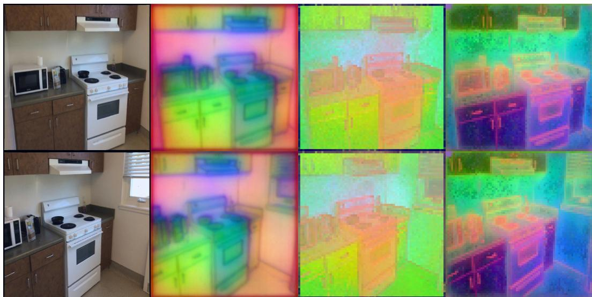
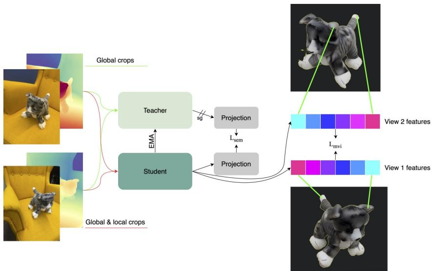
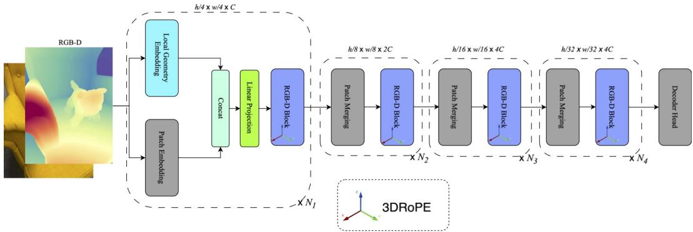
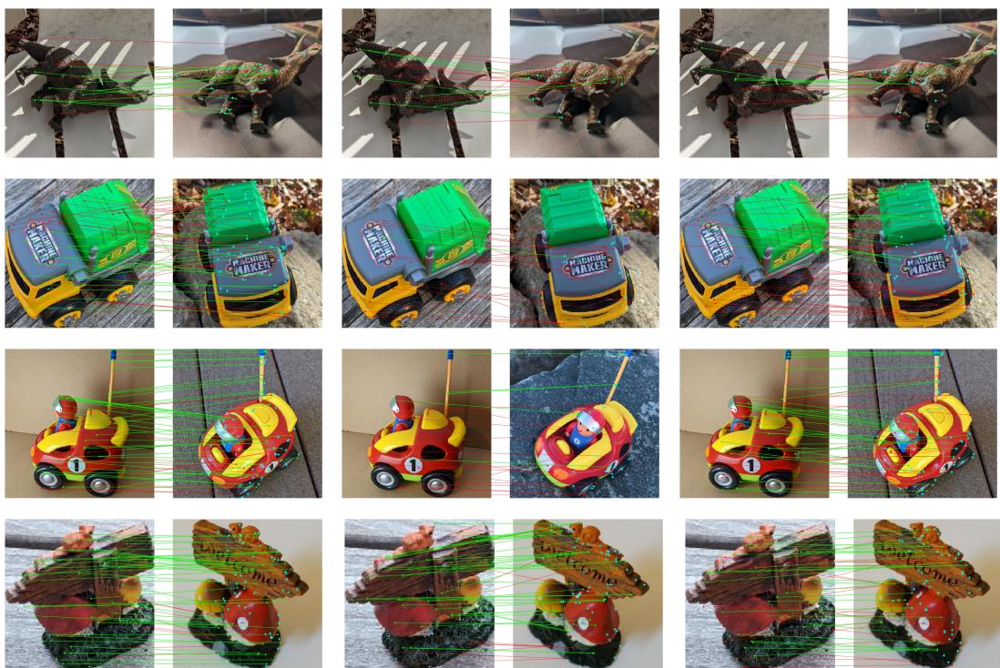
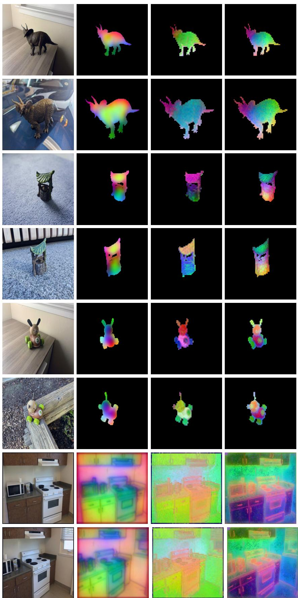
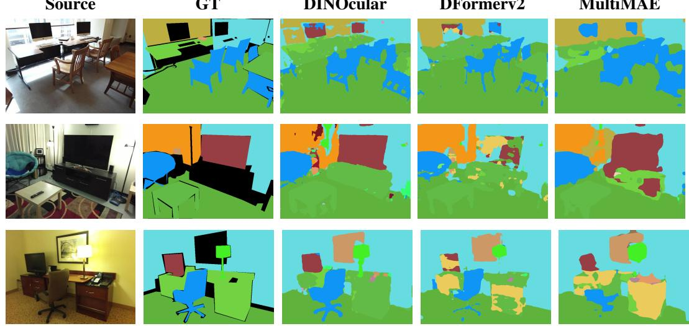
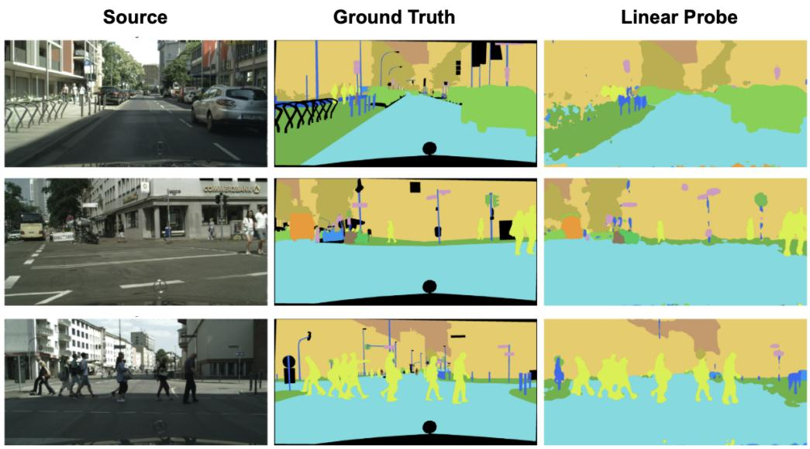

# DINOCULAR: SELF-SUPERVISED VISUOSPATIAL REPRESENTATIONS

Farkhat Almukhamedov∗, Sami Azirar∗& Hermann Blum

Robot Perception and Learning Lab

University of Bonn

{s94falmu,sazirar,blumh}@uni-bonn.de

## ABSTRACT

We introduce a self-supervised framework for learning joint visuospatial representations from RGB-D observations. While modern vision foundation models are trained almost exclusively on RGB images, many embodied systems have access to explicit depth sensing, which provides geometric information that monocular inputs cannot recover. Our method integrates depth-derived geometric priors with a visual backbone through inter-patch and intra-patch fusion, enabling the model to encode both appearance and spatial structure efficiently. The resulting representation shows promising improvements on 3D awareness while preserving semantic transfer: it outperforms prior methods of comparable scale on multiple 3D geometry benchmarks, and remains competitive when probed for standard RGB-D semantic segmentation tasks. Project page: https://heyleadro.github.io/dinocular-project/

## 1 INTRODUCTION

Explicit depth sensing is a remarkably widespread biological solution for spatial perception: binocular stereopsis, which compares observations from two eyes to infer depth, has been demonstrated across diverse animal species, from primates and other mammals (Heesy, 2009) to falcons (Fox et al., 1977) and cuttlefish (Feord et al., 2020). In artificial embodied systems, however, the dominant vision models remain largely monocular. Despite the availability of stereo cameras and depth sensors in robots, autonomous vehicles, mixed-reality headsets, and consumer smartphones, modern vision foundation models are still trained almost exclusively on RGB images. This mismatch has left frontier visual AI systems with a persistent weakness in spatial and 3D understanding (Feng et al., 2025; El Banani et al., 2024; Man et al., 2024; Azzolini et al., 2025). Training with RGB inputs on more spatial tasks and data cannot fully solve this: Without depth as an input modality, spatial reasoning remains physically constrained by the scale ambiguity of monocular sensing.

Depth has historically been difficult to incorporate into foundation-scale vision learning for several reasons. Compared with RGB images, depth data is scarce, heterogeneous, and noisy: it may come from stereo, structured light, time-of-flight sensors, or sparse LiDAR, each with different failure modes and sampling patterns. At the same time, the field has become increasingly reliant on large RGB-only feature extractors such as DINO, making it natural to treat geometry as an output to be predicted rather than as an input to be encoded. Recent progress in learned geometric reconstruction (Wang et al., 2025a; Keetha et al., 2026; Wang et al., 2024) changes this picture. We can generate depth for training at very large scales, and we can homogenize different depth sources through completion and denoising into dense pixel-wise depth maps. These advances reopen a central question: how can models learn general-purpose representations that jointly encode visual appearance and geometric structure?

Existing approaches to visuospatial learning fall broadly into two categories. The first post-trains RGB-only foundation models for geometric consistency or reconstruction. Breakthrough systems such as VGGT (Wang et al., 2025a) infer spatial structure from RGB observations, and recent work adapts visual representations to become more multi-view or spatially consistent. However, because these methods remain rooted in RGB-only inputs, they cannot fully exploit the complementary information provided by direct geometric sensing. The second category consists of task-specific RGB-D fusion architectures. Recent models have moved away from redundant dual-encoder designs toward more efficient mechanisms that use depth as a geometric prior. DFormerv2 (Yin et al., 2025), for example, introduces Geometry Self-Attention to guide feature interactions using depth while avoiding the cost of a fully separate depth stream. Yet, our experiments reveal that these architectures do not automatically learn generally useful visuospatial representations.

DINOcular  
DINO  
DUNE  
  
Figure 1: Visualization of the 3 strongest PCA components for DINOcular (ours), DINO ViT-B (Caron et al., 2021), and DUNE (Sarıyıldız et al., 2025). The mix of semantic and geometric information in our features is clearly visible at the edges of the monitor.

In this paper, we propose a scalable, self-supervised framework for learning joint visuospatial representations from RGB-D observations. Our architecture efficiently integrates depth-derived geometric priors with a visual backbone, refining their interaction at inter-patch level through depth aware 3D positional encoding and intra-patch through feature fusion. Coupled with a scalable, self-supervised training recipe over dense RGB-D observations, the resulting representation improves 3D awareness while preserving strong semantic transfer. Empirically, our model outperforms prior representations on multiple 3D benchmarks, including Probe3D (El Banani et al., 2024), and achieves competitive performance on standard RGB-D semantic segmentation benchmarks such as NYU DepthV2 (Nathan Silberman & Fergus, 2012) and SUNRGBD (Song et al., 2015). Our main contributions are:

• We introduce an improved architecture that integrates visual and spatial information at both inter-patch and intra-patch levels.

• We present a self-supervised training recipe for learning generalizing visuospatial representations from RGB-D observations.

• We show that the learned representation improves over prior methods of comparable scale on 3D geometry benchmarks while remaining competitive on semantic segmentation tasks.

## 2 RELATED WORK

## 2.1 SPATIAL UNDERSTANDING IN VISION FOUNDATION MODELS

Vision Transformers (Dosovitskiy et al., 2021) established patch tokens as the common interface for self-supervised pretraining and downstream feature transfer. Two scalable families dominate the landscape. Self-distillation, where DINO (Caron et al., 2021) and iBOT (Zhou et al., 2021) were scaled to very large unlabelled corpora in DINOv2 (Oquab et al., 2023) and DINOv3 (Simeoni et al.,´ 2025) , yields some of the strongest available image features. Masked reconstruction (He et al., 2022a; Wang et al., 2023) forms the second family and targets pixel-level recovery. We adopt the self-distillation objective and extend it from RGB to RGB-D.

These features are strongly semantic but only weakly geometric. Probe3D (El Banani et al., 2024) and Lexicon3D (Man et al., 2024) report limited geometric consistency of frozen VFM features across viewpoints, and You et al. (2025) show that view consistency emerges only after explicit multi-view finetuning.

A complementary line learns geometry directly from images. CroCo (Weinzaepfel et al., 2022) introduced this thread with self-supervised cross-view completion, and its encoders underpin DUSt3R (Wang et al., 2024), MASt3R (Leroy et al., 2024), and VGGT (Wang et al., 2025a), which cast multi-view reconstruction as feed-forward pointmap and unified geometry prediction. Follow-up work generalises the paradigm to dynamic scenes, persistent state, and broad metric reconstruction (Zhang et al., 2025; Wang et al., 2025b; Keetha et al., 2026). Across this family RGB is the input and geometry is the output, so the feature space is shaped to predict 3D structure rather than to represent it.

Both families therefore leave depth outside the feature extractor, either absent in RGB-only SSL or present only as a prediction target. What is absent are generalizing representations that combine RGB and Depth inputs.

## 2.2 RGB-D FUSION AND GEOMETRIC PRIORS

Early RGB-D models used dual-encoder architectures with convolutional or attention-based fusion (Hu et al., 2019; Chen et al., 2020), transformer-based models shifted fusion to the token level (Wang et al., 2022), and a more recent body of work refines supervised RGB-D segmentation through primary-modality distillation, heterogeneous branches, and robustness to degraded depth (Gong et al., 2026; Jaganathan & Vela, 2026). These methods train the encoder jointly with a segmentation head, so the representation inherits the inductive bias of the target task and does not transfer cleanly to other objectives (Yin et al., 2024).

DFormer (Yin et al., 2024) also targets RGB-D segmentation, but pretrains a backbone on imagedepth pairs from ImageNet under supervised classification, while DFormerv2 (Yin et al., 2025) derives a geometry prior from pooled patch distances and relative depth, applied as an additive bias on self-attention weights. This prior operates at the pooled-patch level and modifies attention weights rather than token values or embeddings, so depth informs how patches attend but does not enter the feature representation itself. We instead embed depth at the level of token positions. Modern vision transformers encode token position relatively through RoPE (Su et al., 2024), and Schenck et al. (2025) extend the mechanism to a third axis for robotic action models. We follow that direction and treat image-plane coordinates together with mean patch depth as a joint position, so geometry shapes feature computation rather than reweighting a 2D affinity.

Several self-supervised methods incorporate geometry without producing a native RGB-D image backbone. MultiMAE (Bachmann et al., 2022) treats depth as a reconstruction target rather than as input geometry. Concerto (Zhang et al., 2026b) jointly trains a 3D point cloud transformer and a 2D image encoder, but still requires a point cloud at inference and uses images only as a supervisory signal. Sonata (Wu et al., 2025a) trains a self-supervised point cloud encoder on aggregated scene-level scans and suppresses spatial information to avoid a geometric shortcut, where coordinate-based positional encodings cause representation collapse. In contrast, we target the more broadly available single-view RGB-D setting, avoiding assumptions about aggregated scans, fixed cameras, or scene-level point clouds.

## 3 METHOD

We investigate visuospatial grounding in two dimensions: model architecture and learning objectives. In the following, we first discuss how we integrate depth as an input modality to modern vision transformer architectures. Second, we describe the self-supervised learning objectives that we train these models on. Third, we describe how we modify a Swin architecture to implement these methods.

## 3.1 GEOMETRY PRIOR

Inspired by the effective approach of incorporating depth in Dformerv2 (Yin et al., 2025), we explore approaches that make use of depth as a geometry prior, without creating large additional branches or complex fusion mechanisms. In particular, although Yin et al. (2025) achieves good performance, it is highly dependent on RMT (Fan et al., 2024), and simply biasing self-attention based on the weighted depth distances. It uses depth to attend to parts of the input image that are metrically close by, strictly baking into the architecture the heuristic that close-by parts matter.

Instead of additive biasing, we extend rotary positional encoding (RoPE) (Su et al., 2024) into three dimensions, following Schenck et al. (2025). They already show that incorporating depth in this way improves performance in robotic action models. Given that RoPE is a foundational component in the self-attention mechanisms of most modern Vision Transformers (ViTs), extending it to a third dimension allows the model to inherently leverage relative spatial relationships based on the depth input. By encoding depth directly into the coordinate system (as 3rd, z-axis), we create a more principled prior that enables the model to reason about the physical proximity of features, but e.g. also to attend to patches further away. Following Schenck et al. (2025), for patch coordinates $u , v \in \mathbb { N }$ on the image plane and average depth $\bar { z } \in \mathbb { R } ^ { \breve { \geq } 0 }$ of all pixels within a patch, we find the encoding xˆ of the patch embedding x as:

$$
\hat { x } = \exp \left( \mathbf { L } _ { 1 } u + \mathbf { L } _ { 2 } v + \mathbf { L } _ { 3 } \bar { z } \right) x
$$

where each $\mathbf { L } _ { k } \in \mathbb { R } ^ { d \times d }$ is a rotational positional embedding $\begin{array} { r } { \mathbf { L } _ { k } = \sum _ { p = 1 } ^ { d / 2 } \big ( \delta _ { 2 p , 2 p - 1 } - \delta _ { 2 p - 1 , 2 p } \theta _ { p } \big ) } \end{array}$ with learnable frequencies $\theta _ { p }$ . Thus, we completely change approach seen in DFormerv2 with our inter-patch mechanism - 3D RoPE.

3D positional encoding of patches gives the model access to the global geometry of an observation. However, it does not make use of the pixel-level resolution of depth input that also holds important information of the local shape, e.g. whether edges are round or sharp or whether surfaces are uneven or smooth. We therefore add this local geometric information to the patchified RGB embeddings by extracting local features from the depth within each patch. We apply lightweight patch embedding layer and fuse both embeddings through a linear projection, giving the model intra-patch geometry information. One might suspect that scaled, metric distance is not relevant for local geometric details, and geometric intra-patch embedding would generalize better from a scale-free, normalized input. In our experiments, we therefore investigate an ablation where local shape features are instead computed based on per-pixel surface normals. Surface normals are the spatial derivative of the depth value and therefore scale-free. However, empirically we observe this variant to collapse in training.

## 3.2 LEARNING OBJECTIVE

We design the learning objective in a way that it should explicitly learn fine-grained spatial information along with the visual-semantic content. As semantic loss objective $\mathcal { L } _ { s e m }$ , we utilize the teacherstudent distillation framework of DINO and DINOv2 (Caron et al., 2021; Oquab et al., 2023). We briefly summarize how we apply these and refer the interested reader to Oquab et al. (2023) for more details:

• DINO / Image-level objective We give student and teacher different crops of the same objectcentric image and take the ${ \mathsf { C } } \bot { \mathsf { S } }$ tokens from each. They are passed through a DINO head and finally a softmax activation. ${ \mathcal { L } } _ { \mathrm { D I N O } }$ is then the cross-entropy between the student’s output and the centered teacher’s output.

• iBOT / Patch-level objective For the student, some of the input tokens are masked. Importantly, that means in our case that both RGB and intra-patch Depth are masked, but even the masked patch tokens are positionally encoded based on average patch depth. Patch tokens are then projected through an iBOT head and a softmax activation. $\bar { \mathcal { L } } _ { \mathrm { i B O T } }$ is then cross-entropy between the student’s output and the centered teacher’s output over all masked patches.

In our experiments, DINO and iBOT heads share the same parameters, and we do not apply the untying of Oquab et al. (2023). That is because our experiments cannot reproduce the data scale at which they observed untying to be useful. However, we follow Oquab et al. (2023) to apply the KoLeo regularizer (Sablayrolles et al., 2018), arriving at the full semantic-visual objective:

$$
\begin{array} { r } { \mathcal { L } _ { s e m } = \mathcal { L } _ { \mathrm { D I N O } } + \mathcal { L } _ { \mathrm { i B O T } } + \lambda \mathcal { L } _ { \mathrm { K o L e o } } } \end{array}
$$

  
Figure 2: Multiview Pre-training setup. Teacher recieves 2 global unique views, student additionally get 4 local crops from each view. $L _ { s e m }$ is a self-distillation loss, $L _ { m v i }$ is a multiview correspondence loss calculated at randomly sampled 3D points on the object that are close in space. Teacher is updated through exponential moving average.

To fully leverage the spatial information of depth, we combine the above loss with a spatial objective. Our reasoning is that while visual appearance may change between viewpoints, the same part of an object is more easily matchable in 3D. Given the additional spatial input to the model, we require an objective that enforces the use of this information. We therefore experiment with different formulations of a multi-view consistency loss. In all cases, two students receive two different images of the same object, but from different viewpoints. From known point maps and the depth, we find a subset of patches that is visible to both. We then enforce similarity between each pair of matched patches $( z _ { 1 } , z _ { 2 } )$ . This is visualized in Figure 2.

• Cosine Similarity Following Koch et al. (2025), who propose a post-training refinement of DINOv2 features with this objective, we optimize patch embeddings to have low cosine distance: $\mathcal { L } _ { \mathrm { m v - c o s i n e } } = 1 - z _ { 1 } \cdot z _ { 2 }$

• Contrastive Ranking Following You et al. (2025), who investigate finetuning of DINOv2 and other vision foundation models for multi-view consistency, we apply a SmoothAP (Brown et al., 2020) ranking-based loss over the matched patches.

• Multi-view iBOT Since the iBOT objective works on a patch level, a variant of this objective for matched patches from different views is easily conceivable. In this variant, the second image however is passed through the teacher. We bias the mask sampling to those patches with visual overlap and retrieve pairs $z _ { 1 }$ and $z _ { 2 } .$ , where $z _ { 1 }$ has a masked input. Both are passed through a projection head and softmax activation, and centering (for the teacher). ${ \mathcal { L } } _ { \mathrm { m v - i b o t } }$ is then the cross-entropy between these 2 outputs.

Our ablations find empirically that $\mathcal { L } _ { \mathrm { m v - c o n t r a s t i v e } }$ is the best compatible with $\mathcal { L } _ { s e m } .$ , leading to our full objective $\mathcal { L } = \mathcal { L } _ { \mathrm { { D I N O } } } + \mathcal { L } _ { \mathrm { { i B O T } } } + \lambda _ { 1 } \mathcal { L } _ { \mathrm { { m v - c o n t r a s t i v e } } } + \lambda _ { 2 } \mathcal { L } _ { \mathrm { { K o L e o } } }$ . We sample batches such that in every batch there are pairs of images to which the multi-view loss can be applied.

During model development, we observed that the combination of multi-view training and added intra-patch depth embedding yielded features that were heavily biased towards spatial tasks and contained less visual information. This hints at the connection between depth input and the multi-view consistency that we hypothesize above, but yields less general features. We address this by applying dropout to the intra-patch depth embedding layers, forcing the multi-view objective to not exclusively rely on depth information.

  
Figure 3: Architecture with 3D RoPE and local geometry encoding.

## 3.3 TECHNICAL IMPLEMENTATION

The backbone architecture is a Swin hierarchical vision transformer (Liu et al., 2021) with 4 stages presented in Fan et al. (2024) and further used in Yin et al. (2025), who added RGB-D blocks. We further completely replace mechanisms used in DFormerv2 (Yin et al., 2025) with our 3D RoPE discussed in 3.1 for inter-patch visuospatial information. And additionally provide first RGB-D block with intra-patch geometry as lightweight depth encoding. The architecture is presented in Figure 3, and additional training details are reported in appendix E.

## 4 EXPERIMENTS

We empirically test our proposed method over a range of visuospatial tasks: RGB-D Semantic Segmentation, 3D Correspondence Estimation, and Object Pose Estimation. We first discuss dataset preparations and chosen methods of comparison. Then we justify our method choices in ablation studies. Finally we compare our trained model with prior work on the different visuospatial tasks. We additionally report effectiveness measurement in appendix B and qualitative results in appendix C.

## 4.1 TRAINING DATA AND DETAILS

We generate Depth for all our training samples using monocular depth estimation on ImageNet-1k and multi-view triangulation on MVImgNet2.0. For both, we use MapAnything (Keetha et al., 2026). Prior work (Yin et al., 2025; 2024) generated ImageNet-1K depth maps using AdaBins (Bhat et al., 2021). We found that regenerating them with a newer model improved consistency with the rest of our data and performance. Our multi-view objective additionally requires point maps. We save point maps from MapAnything during depth generation. We also predict object masks using SAM3 (Carion et al., 2026), to constrain objective’s focus on the object. For ImageNet-1K, we use all 1.3 M images. For MVImgNet2.0, we do not need the large viewpoint redundancy, so we retain 307k samples with approximately 8 views each on average.

## 4.2 BASELINES

We compare against two types of methods: those learning features that combine spatial and visualsemantic information, and self-supervised visual representation learning.

• Dformerv2 (Yin et al., 2025) proposes an architecture that combines RGB and Depth input to learn a general representation. They train fully supervised on image classification. This method is most directly comparable as we adapt their architecture and train the same model size on a similar scale of data.

• Sonata (Wu et al., 2025a) is a self-supervised method to learn features for point clouds. It is the only prior work of a self-supervised method for visuospatial features. However, it is meant to be applied on merged scene-level pointclouds with more even density. Comparing it on the single-view data that our model digests is ill posed and we merely report its performance as reference.

Table 1: Ablation on geometry encoding. We report RGB-D semantic segmentation probing (Segm.) on NYUDepthv2 (Silberman et al., 2012) (mIoU) and correspondence estimation with viewpoint change on NAVI (Jampani et al., 2023) $( \theta _ { 9 0 } ^ { 1 2 0 } )$ and ScanNet $( \dot { \theta } _ { 6 0 } ^ { 1 8 0 } )$ following Probe3D (El Banani et al., 2024).∗ w/o SAM3 object mask sampling.
<table><tr><td>Geometric Attention</td><td>Intra-Patch Geometry</td><td>Objective</td><td>Dataset</td><td>Depth Dropout</td><td>Segm. [mIoU]</td><td> $\mathrm { N A V I } \theta _ { 9 0 } ^ { 1 2 0 }$  [R]</td><td>ScanNet  $\theta _ { 6 0 } ^ { 1 8 0 }$  [R]</td></tr><tr><td>Proximity (Yin et al., 2025)</td><td></td><td>Supervised</td><td>IN1k</td><td></td><td>24.86</td><td>17.40</td><td>7.30</td></tr><tr><td>Proximity (Yin et al., 2025)</td><td></td><td>DINO</td><td>IN1k</td><td></td><td>25.78</td><td>16.40</td><td>4.50</td></tr><tr><td>2D RoPE</td><td></td><td>DINO</td><td>IN1k</td><td></td><td>33.50</td><td>20.71</td><td>11.35</td></tr><tr><td>2D RoPE</td><td>Depth MLP</td><td>DINO+iBOT+MVI</td><td>IN1k+MVI2.0</td><td>Yes</td><td>35.54</td><td>23.25</td><td>14.58</td></tr><tr><td>3D RoPE</td><td></td><td>DINO</td><td>IN1k</td><td></td><td>39.92</td><td>22.74</td><td>12.00</td></tr><tr><td>3D RoPE</td><td></td><td>DINO+iBOT+MVI</td><td>IN1k+MVI2.0</td><td></td><td>40.92</td><td>23.15</td><td>11.73</td></tr><tr><td>3D RoPE</td><td>Surf. Normals</td><td>DINO</td><td>IN1k</td><td></td><td>38.38</td><td>12.80</td><td>5.80</td></tr><tr><td>3D RoPE</td><td>Depth MLP</td><td>DINO</td><td>IN1k</td><td>No</td><td>40.16</td><td>17.90</td><td>10.50</td></tr><tr><td>3D RoPE</td><td>Depth MLP</td><td>MVI</td><td>IN1k+MVI2.0</td><td>No</td><td>28.54</td><td>19.99</td><td>10.80</td></tr><tr><td>3D RoPE</td><td>Depth MLP</td><td>DINO+MVI</td><td>IN1k+MVI2.0</td><td>No</td><td>31.20</td><td>20.58</td><td>11.40</td></tr><tr><td>3D RoPE</td><td>Depth MLP</td><td>DINO+MVI</td><td>IN1k+MVI2.0</td><td>Yes</td><td>31.92</td><td>19.87</td><td>13.60</td></tr><tr><td>3D RoPE</td><td>Depth MLP</td><td>DINO+iBOT</td><td>IN1k+MVI2.0</td><td>No</td><td>34.87</td><td>15.55</td><td>4.88</td></tr><tr><td>3D RoPE</td><td>Depth MLP</td><td>DINO+iBOT</td><td>IN1k</td><td>No</td><td>40.45</td><td>16.52</td><td>8.40</td></tr><tr><td>3D RoPE</td><td>Depth MLP</td><td>DINO+iBOT+MVI*</td><td>IN1k+MVI2.0</td><td>Yes</td><td>39.89</td><td>22.50</td><td>18.80</td></tr><tr><td>3D RoPE</td><td>Depth MLP</td><td>DINO+iBOT+MVI</td><td>IN1k+MVI2.0</td><td>No</td><td>38.58</td><td>25.29</td><td>13.19</td></tr><tr><td>3D RoPE</td><td>Depth MLP</td><td>DINO+iBOT+MVI</td><td>IN1k+MVI2.0</td><td>Yes</td><td>40.27</td><td>25.25</td><td>16.52</td></tr></table>

Table 2: Ablation of the multi-view loss objective. We finetune a baseline model that was trained with the DINO objective with different multi-view objectives. We report RGB-D semantic segmentation probing (Segm.) on NYUDepthv2 (Silberman et al., 2012) (mIoU) and correspondence estimation with viewpoint change (3D Corresp.) on NAVI (Jampani et al., 2023) $( \theta _ { 9 0 } ^ { 1 2 0 } )$ following Probe3D (El Banani et al., 2024).
<table><tr><td>Finetuning Objective</td><td>Segm. [mIoU]</td><td>3D Corresp. [R]</td></tr><tr><td>Baseline (trained w/ DINO objective)</td><td>40.16</td><td>17.90</td></tr><tr><td>MV-Cosine</td><td>11.10</td><td>11.41</td></tr><tr><td>DINO + MV-Cosine</td><td>24.40</td><td>7.45</td></tr><tr><td>MV-iBot</td><td>30.30</td><td>15.85</td></tr><tr><td>DINO + MV-iBot</td><td>34.00</td><td>16.86</td></tr><tr><td>MV-Contrastive</td><td>28.54</td><td>19.99</td></tr><tr><td>DINO + MV-Contrastive</td><td>31.20</td><td>20.58</td></tr></table>

• DINO family (Caron et al., 2021; Oquab et al., 2023; Simeoni et al., 2025) is a family of models´ trained in self-supervised fashion on RGB only. We directly adopt their loss. DINO trains on ImageNet-1k, same as Dformer and our method and therefore is well comparable. However, for DINOv2 and DINOv3, from where we adopt the full loss, their datasets are ×36 and ×433 larger and not made public. Therefore, we try to reproduce results of DINOv2 in our settings or test public checkpoints with comparable data scale (Wu et al., 2025b).

• DUNE (Sarıyıldız et al., 2025) also only takes RGB as input, but distills a feature from both DINOv2 and Mast3r, therefore aiming to add more geometric information to its features (Zhang et al., 2026a). It is distilled from DINOv2 on an additional set of 21 M images, so we report its results only for reference.

## 4.3 ABLATION: MODEL ARCHITECTURE

We present an ablation of our architectural choices to encode inter- and intra-patch depth in Table 1. Surprisingly, even for the Dformerv2 architecture itself we find that exchanging the supervised with the DINO objective increases usefulness of the learned features with respect to segmentation probing, even though Yin et al. (2025) specifically target segmentation as their goal task. Our modification of their architecture with 3D RoPE instead of proximity attention bias yields the largest per-step increase in feature probing, for all 3 measured indicators. Contrary to the results from Tziafas & Kasaei (2023), the encoding of intra-patch geometry through surface normals does not show good results in our self-supervised setting. However, we find the simple MLP encoding of the depth values to be reasonably effective, most notable from the depth reconstruction. It does not surpass the setting without any intra-patch depth, but we address this aspect in the design of the full training objective.

Table 3: RGB-D semantic segmentation results (mIOU) using linear probing on the respective features. All results are reported in [% mIoU]. † marks models trained with supervised objectives, all other methods are self-supervised. • marks models with RGB and depth as input, ◦ only with RGB. ⋆Sonata is not intended to be tested on these evaluation protocols.
<table><tr><td>Method</td><td>Param.</td><td>Data</td><td>ADE20k</td><td>NYUDepthv2</td><td>SUN RGB-D</td><td>Cityscapes</td></tr><tr><td colspan="7">SoTA ViT-B / PTv3 models</td></tr><tr><td>DINOv2 (ViT-B)</td><td>86M</td><td>142M</td><td>47.30</td><td>56.04</td><td>52.26</td><td>69.40</td></tr><tr><td>DINOv3 (ViT-B)</td><td>86M</td><td>1689M</td><td>51.80</td><td>60.78</td><td>54.28</td><td>71.53</td></tr><tr><td>DUNE (ViT-B)</td><td>85M</td><td>21 M (dist.)</td><td>44.90</td><td>68.20</td><td>50.22</td><td>70.60</td></tr><tr><td> Sonata* (PTv3)</td><td>108M</td><td>140 k (pcd)</td><td>11.53</td><td>26.62</td><td>27.83</td><td></td></tr><tr><td colspan="7">ViT-B / RMT-L models at comparable data size</td></tr><tr><td>DINO (ViT-B)</td><td>85M</td><td>1.3M</td><td>31.80</td><td>34.49</td><td>37.13</td><td>56.90</td></tr><tr><td>• MultiMAE (ViT-B)</td><td>85M</td><td>1.3M</td><td>17.37</td><td>39.29</td><td>31.88</td><td>28.63</td></tr><tr><td>• DFormerv2-L†</td><td>95.5M</td><td>1.3M</td><td>33.84</td><td>38.29</td><td>37.69</td><td>60.25</td></tr><tr><td>DINOv2 (ViT-B repr., only ImgNet)</td><td>85M</td><td>1.3M</td><td>29.83</td><td>36.16</td><td>35.90</td><td>52.14</td></tr><tr><td>• DINOcular-L (Ours)</td><td>94M</td><td>3.9M</td><td>40.23</td><td>47.46</td><td>42.25</td><td>59.19</td></tr><tr><td colspan="7">ViT-S / RMT-S models at comparable data size</td></tr><tr><td>DINO (ViT-S)</td><td>21M</td><td>1.3M</td><td>22.82</td><td>35.97</td><td>35.35</td><td>45.84</td></tr><tr><td>• DFormerv2-S†</td><td>27M</td><td>1.3M</td><td>30.60</td><td>24.86</td><td>29.34</td><td>51.41</td></tr><tr><td>DINOv2 (ViT-S repr., only ImgNet)</td><td>21M</td><td>1.3M</td><td>24.22</td><td>33.43</td><td>33.91</td><td>47.03</td></tr><tr><td>DINOv2 (ViT-S repr.)</td><td>21M</td><td>3.9M</td><td>20.64</td><td>29.74</td><td>31.67</td><td>44.14</td></tr><tr><td>Ours w/ RGB-only</td><td>27M</td><td>3.9M</td><td>18.47</td><td>28.15</td><td>28.98</td><td>39.85</td></tr><tr><td>• Ours w/o multi-view</td><td>27M</td><td>1.3M</td><td>36.02</td><td>40.45</td><td>39.19</td><td>56.31</td></tr><tr><td>• DINOcular-S (Ours)</td><td>27M</td><td>3.9M</td><td>33.88</td><td>40.27</td><td>39.99</td><td>55.35</td></tr></table>

## 4.4 ABLATION: COMBINATION OF LOSS OBJECTIVES

In Table 2, we investigate the different options for multi-view consistency losses, as introduced in Section 3.2. For all objectives, we observe a collapse in segmentation performance when finetuning purely on the multi-view objective. This is expected to a certain degree, as the objective optimizes a different goal. The effect can also, as the results show, be compensated by training on a combined objective. However, what is unexpected is the drop in 3D correspondence estimation for MV-Cosine and MV-iBOT. On closer inspection, we find that Koch et al. (2025) use this loss in ensemble with 3 distillation losses that likely regularize the features well and therefore can prevent such collapse. In our setting where we do not distill from a frozen teacher, the objective is not effective. The contrastive objective is also used in You et al. (2025) as an isolated objective and also in our case is the only one that achieves an improvement in 3D correspondence estimation. It also shows to be compatible with the DINO objective, as a combination of both not only compensates the loss in segmentation performance, but further enhances the 3D correspondence.

## 4.5 SEMANTIC SEGMENTATION

An established downstream task for RGB-D perception is semantic segmentation. This task also allows us to evaluate over different data sources that are captured with different depth sensors: NYU Depth V2 (Nathan Silberman & Fergus, 2012) and SUN RGB-D (Song et al., 2015) are based on the first generation of Kinect with structured light, Cityscapes (Cordts et al., 2016) has a stereo camera, and ADE20k has no actual depth available. We process ADE20k, NYU Depth v2, and SUN RGB-D with MapAnything (Keetha et al., 2026) to output dense depth. For Cityscapes, we acquire dense depth from FoundationStereo (Wen et al., 2025). For all methods and datasets, we fit a linear probe over their training data, keeping the feature predictor completely frozen. The results are reported in Table 3.

Table 4: Geometric Tasks: We evaluate features through the Probe3D protocol on 3D Correspondence Estimation (NAVI and ScanNet) over different angles between viewpoints, as well as through one-shot Object Pose Estimation. To analyze correlation of feature information with the depth input, we report results on linear probing for depth regression/reconstruction (NYU Depth v2). † marks models trained with supervised objectives, all other methods are self-supervised. • marks models with RGB and depth as input, ◦ only with RGB. ⋆Sonata is not intended to be tested on these evaluation protocols.
<table><tr><td rowspan="2">Model</td><td colspan="4">NAVI [% R]</td><td colspan="4">ScanNet [% R]</td><td colspan="3">OnePose-LowTex [% R]</td><td rowspan="2">NYUDv2</td></tr><tr><td>θ30</td><td>θβ0</td><td>θ90</td><td>θ10</td><td>θ15</td><td>θ30</td><td>θβ0</td><td> $\overline { { \theta _ { 6 0 } ^ { 1 8 0 } } }$ </td><td>1 cm/1°</td><td>3cm/3°</td><td>5 cm/5° [m RMSE] ↓</td></tr><tr><td>SoTA ViT-B / PTv3 models</td><td></td><td></td><td></td><td></td><td></td><td></td><td></td><td></td><td></td><td></td><td></td><td></td></tr><tr><td>DINOv2 (ViT-B)</td><td>92.3</td><td>67.9</td><td>45.4</td><td>32.0</td><td>37.0</td><td>27.5</td><td>19.7</td><td>11.2</td><td>10</td><td>51</td><td>70</td><td>.39</td></tr><tr><td>DINOv3 (ViT-B)</td><td>96.3</td><td>71.8</td><td>41.9</td><td>25.4</td><td>54.9</td><td>39.2</td><td>26.6</td><td>15.7</td><td>4</td><td>32</td><td>54</td><td>.38</td></tr><tr><td>DUNE (ViT-B) • Sonata* (PTv3)</td><td>94.8</td><td>60.4</td><td>29.4</td><td>17.2</td><td>34.6</td><td>25.9</td><td>17.9</td><td>7.6</td><td>10</td><td>50</td><td>66</td><td>.36</td></tr><tr><td></td><td>73.9</td><td>41.4</td><td>27.5</td><td>23.8</td><td>37.3</td><td>24.0</td><td>11.4</td><td>4.2</td><td>0</td><td>3</td><td>8</td><td></td></tr><tr><td>ViT-B / RMT-L models at comparable data size</td><td></td><td></td><td></td><td></td><td></td><td></td><td></td><td></td><td></td><td></td><td></td><td></td></tr><tr><td>DINO (ViT-B)</td><td>89.0</td><td>54.0</td><td>30.7</td><td>21.0</td><td>45.0</td><td>34.4</td><td>22.6</td><td>10.7</td><td>6</td><td>34</td><td>50</td><td>.64</td></tr><tr><td> MultiMAE (ViT-B)</td><td>85.1</td><td>39.3</td><td>18.7</td><td>11.1</td><td>7.5</td><td>6.9</td><td>6.1</td><td>2.5</td><td>3</td><td>7</td><td>18</td><td>.19</td></tr><tr><td>• DFormerv2-L†</td><td>74.7</td><td>42.9</td><td>26.0</td><td>19.4</td><td>47.0</td><td>38.0</td><td>24.4</td><td>11.0</td><td>8</td><td>32</td><td>43</td><td>.72</td></tr><tr><td>DINOv2 (ViT-B repr., only ImgNet)</td><td>93.1</td><td>57.4</td><td>31.2</td><td>19.5</td><td>51.5</td><td>40.2</td><td>24.8</td><td>9.8</td><td>7</td><td>46</td><td>53</td><td>.63</td></tr><tr><td>• DINOcular-L (Ours)</td><td>88.2</td><td>52.7</td><td>30.3</td><td>23.2</td><td>62.7</td><td>52.2</td><td>32.7</td><td>13.1</td><td>10</td><td></td><td></td><td>.26</td></tr><tr><td>ViT-S / RMT-S models at comparable data size</td><td></td><td></td><td></td><td></td><td></td><td></td><td></td><td></td><td></td><td></td><td></td><td></td></tr><tr><td>DINO (ViT-S)</td><td>86.7</td><td>52.9</td><td>31.9</td><td>21.3</td><td>41.5</td><td>30.9</td><td>19.0</td><td>9.1</td><td></td><td>32</td><td>47</td><td>.70</td></tr><tr><td>• DFormerv2-S†</td><td>80.0</td><td>41.4</td><td>24.0</td><td>17.4</td><td>37.2</td><td>26.9</td><td>16.8</td><td>7.3</td><td></td><td>32</td><td>44</td><td>.70</td></tr><tr><td>DINOv2 (ViT-S repr., only ImgNet)</td><td>88.1</td><td>54.3</td><td>29.4</td><td>19.9</td><td>50.8</td><td>39.8</td><td>24.5</td><td>9.9</td><td>６９７</td><td>40</td><td>56</td><td>.70</td></tr><tr><td>DINOv2 (ViT-S repr.)</td><td>84.3</td><td>52.3</td><td>29.5</td><td>17.2</td><td>51.4</td><td>40.4</td><td>25.7</td><td>11.7</td><td>6</td><td>30</td><td>46</td><td>.73</td></tr><tr><td>Ours w/ RGB-only</td><td>81.2</td><td>58.5</td><td>37.0</td><td>23.4</td><td>47.0</td><td>33.5</td><td>22.5</td><td>11.9</td><td>6</td><td>33</td><td>48</td><td>.72</td></tr><tr><td>• Ours w/o multi-view</td><td>87.5</td><td>49.3</td><td>25.8</td><td>16.5</td><td>44.0</td><td>35.4</td><td>22.0</td><td>8.4</td><td>7</td><td>35</td><td>51</td><td>.26</td></tr><tr><td>• DINOcular-S (Ours)</td><td>89.1</td><td>57.3</td><td>33.9</td><td>25.3</td><td>58.3</td><td>46.4</td><td>30.3</td><td>16.5</td><td>6</td><td>37</td><td>55</td><td>.24</td></tr></table>

Our features show significantly better probing results compared to both Dformerv2 and DINOv2. In most cases, DINOcular S even outperforms the 3 times larger DINO ViT-B, while our larger model keep advantage over models with comparable data and parameter size. However, the reference results of other large representation learners show a clear advantage of data scaling. There is also a visible tradeoff between the multi-view objective and the best possible semantic feature. While our general model still outperforms both DINOv2 and Dformverv2 at the same data scale, the features learned when leaving out the multi-view objective have even (slightly) better probing results for these semantic datasets. To rule out whether performance gains are coming from depth source, we report result with diverse depth inputs in appendix A to show robustness of our model.

## 4.6 3D CORRESPONDENCE ESTIMATION

To evaluate the consistency of features over different observations of the same object, we test the matching of features between pairs of images against their true correspondence based on the known object geometry. Following the evaluation setup of El Banani et al. (2024), we test this on objectcentric observations from NAVI (Jampani et al., 2023) and scene-level observations on ScanNet (Dai et al., 2017). We report results grouped by the angle change between viewpoints in Table 4. Especially for large viewpoint changes, we observe a clear benefit of the multi-view training over both datasets. Remarkably, on Probe3D-ScanNet, DINOcular-S features outperform even all reference models, including DINOv3 ViT-B. Since this stands out from the more object centric NAVI data, a possible reason is that for the cluttered and larger scale environments of ScanNet, the depth provides a more noticeable advantage.

## 4.7 3D OBJECT POSE ESTIMATION

3D Object Pose Estimation requires a model to predict, in the coordinate frame of the camera, where an object is and how it is oriented. We evaluate single-shot, CAD-model-free object pose estimation for low-texture objects with the different frozen backbones on the dataset (He et al., 2022b) and evaluation protocol of You et al. (2025). We report recall for different thresholds of estimation error. We find that, in line with the results of Section 4.6, DINOcular-L features outperform all baselines and even the DINOv3 ViT-B model on the two coarser thresholds. However, there is an apparent weakness of the smaller model on the 1 cm-1 ◦ threshold, potentially related to the blurriness of the features over the image plane that is also apparent in Figure 1.

## 5 LIMITATIONS

Our study focuses on moderate data scale, and we have not yet validated whether the proposed method preserves the same gains when scaled to substantially larger and diverse data. When compared at this data scale, DINOcular outperforms RGB-D and RGB-only foundation models including the DINO model family. However, it is hard to fully compare models at the same data scale. This is because DINO does not make their training data available, but also because DINOcular additionally requires multi-view data, which in turn our ablation showed reduces performance of DINO models. Finally, although our learned features transfer across multiple geometric and semantic tasks, we observe a trade-off between spatial and semantic specialization: removing or weakening the multiview objective can improve semantic performance, but at the cost of the 3D-awareness of the representations.

## 6 CONCLUSION

We present DINOcular, a framework for learning visuospatial features from RGB-D observations in a self-supervised manner. We demonstrate that these features generalize across semantic and geometric tasks. Our results show a significant advantage over other approaches at the same data and model scale. This is promising and motivates future research into scaling the proposed approach to larger data sources and models. Looking further ahead, this work shows that it is possible to learn generalizing features that combine complementary information from RGB and Depth inputs. This may help increase the spatial understanding of VLMs and VLAs, eventually contributing to deploy more generalizing robots to real-world environments.

## REFERENCES

Alisson Azzolini, Junjie Bai, Hannah Brandon, Jiaxin Cao, Prithvijit Chattopadhyay, Huayu Chen, Jinju Chu, Yin Cui, Jenna Diamond, Yifan Ding, et al. Cosmos-reason1: From physical common sense to embodied reasoning. arXiv preprint arXiv:2503.15558, 2025.

Roman Bachmann, David Mizrahi, Andrei Atanov, and Amir Zamir. Multimae: Multi-modal multitask masked autoencoders. In European conference on computer vision, pp. 348–367. Springer, 2022.

Shariq Farooq Bhat, Ibraheem Alhashim, and Peter Wonka. Adabins: Depth estimation using adaptive bins. In 2021 IEEE/CVF Conference on Computer Vision and Pattern Recognition (CVPR), pp. 4008–4017. IEEE, 2021.

Andrew Brown, Weidi Xie, Vicky Kalogeiton, and Andrew Zisserman. Smooth-ap: Smoothing the path towards large-scale image retrieval. In European conference on computer vision, pp. 677–694. Springer, 2020.

Nicolas Carion, Laura Gustafson, Yuan-Ting Hu, Shoubhik Debnath, Ronghang Hu, Didac Suris Coll-Vinent, Chaitanya Ryali, Kalyan Vasudev Alwala, Haitham Khedr, Andrew Huang, et al. Sam 3: Segment anything with concepts. In International Conference on Learning Representations, volume 2026, pp. 138846–138923, 2026.

Mathilde Caron, Hugo Touvron, Ishan Misra, Herve J ´ egou, Julien Mairal, Piotr Bojanowski, and ´ Armand Joulin. Emerging properties in self-supervised vision transformers. In Proceedings ofthe International Conference on Computer Vision (ICCV), 2021.

Xiaokang Chen, Kwan-Yee Lin, Jingbo Wang, Wayne Wu, Chen Qian, Hongsheng Li, and Gang Zeng. Bi-directional cross-modality feature propagation with separation-and-aggregation gate for rgb-d semantic segmentation. In European conference on computer vision, pp. 561–577. Springer, 2020.

Marius Cordts, Mohamed Omran, Sebastian Ramos, Timo Rehfeld, Markus Enzweiler, Rodrigo Benenson, Uwe Franke, Stefan Roth, and Bernt Schiele. The cityscapes dataset for semantic urban scene understanding. In Proceedings of the IEEE conference on computer vision and pattern recognition, pp. 3213–3223, 2016.

Angela Dai, Angel X Chang, Manolis Savva, Maciej Halber, Thomas Funkhouser, and Matthias Nießner. Scannet: Richly-annotated 3d reconstructions of indoor scenes. In Proceedings ofthe IEEE conference on computer vision and pattern recognition, pp. 5828–5839, 2017.

Alexey Dosovitskiy, Lucas Beyer, Alexander Kolesnikov, Dirk Weissenborn, Xiaohua Zhai, Thomas Unterthiner, Mostafa Dehghani, Matthias Minderer, Georg Heigold, Sylvain Gelly, Jakob Uszkoreit, and Neil Houlsby. An image is worth 16x16 words: Transformers for image recognition at scale. ICLR, 2021.

Mohamed El Banani, Amit Raj, Kevis-Kokitsi Maninis, Abhishek Kar, Yuanzhen Li, Michael Rubinstein, Deqing Sun, Leonidas Guibas, Justin Johnson, and Varun Jampani. Probing the 3d awareness of visual foundation models. In Proceedings ofthe IEEE/CVF Conference on Computer Vision and Pattern Recognition, pp. 21795–21806, 2024.

Qihang Fan, Huaibo Huang, Mingrui Chen, Hongmin Liu, and Ran He. Rmt: Retentive networks meet vision transformers. In Proceedings ofthe IEEE/CVF conference on computer vision and pattern recognition, pp. 5641–5651, 2024.

Zhiyuan Feng, Zhaolu Kang, Qijie Wang, Zhiying Du, Jiongrui Yan, Shubin Shi, Chengbo Yuan, Huizhi Liang, Yu Deng, Qixiu Li, et al. Seeing across views: Benchmarking spatial reasoning of vision-language models in robotic scenes. arXiv preprint arXiv:2510.19400, 2025.

RC Feord, ME Sumner, S Pusdekar, L Kalra, PT Gonzalez-Bellido, and Trevor J Wardill. Cuttlefish use stereopsis to strike at prey. Science advances, 6(2):eaay6036, 2020.

Robert Fox, Stephen W Lehmkuhle, and Robert C Bush. Stereopsis in the falcon. Science, 197(4298): 79–81, 1977.

Yan Gong, Jianli Lu, Yongsheng Gao, Jie Zhao, Xiaojuan Zhang, and Susanto Rahardja. Diffpixelformer: Differential pixel-aware transformer for rgb-d indoor scene segmentation. IEEE Transactions on Circuits and Systems for Video Technology, 2026.

Kaiming He, Xinlei Chen, Saining Xie, Yanghao Li, Piotr Dollar, and Ross Girshick. Masked´ autoencoders are scalable vision learners. In 2022 IEEE/CVF conference on computer vision and pattern recognition (CVPR), pp. 15979–15988. IEEE, 2022a.

Xingyi He, Jiaming Sun, Yuang Wang, Di Huang, Hujun Bao, and Xiaowei Zhou. Onepose++: Keypoint-free one-shot object pose estimation without cad models. Advances in Neural Information Processing Systems, 35:35103–35115, 2022b.

Christopher P Heesy. Seeing in stereo: the ecology and evolution of primate binocular vision and stereopsis. Evolutionary Anthropology: Issues, News, and Reviews, 18(1):21–35, 2009.

Xinxin Hu, Kailun Yang, Lei Fei, and Kaiwei Wang. Acnet: Attention based network to exploit complementary features for rgbd semantic segmentation. In 2019 IEEE international conference on image processing (ICIP), pp. 1440–1444. IEEE, 2019.

Krishna Jaganathan and Patricio Vela. Geomprompt: Geometric prompt learning for rgb-d semantic segmentation under missing and degraded depth. arXiv preprint arXiv:2604.11585, 2026.

Varun Jampani, Kevis-Kokitsi Maninis, Andreas Engelhardt, Arjun Karpur, Karen Truong, Kyle Sargent, Stefan Popov, Andre Araujo, Ricardo Martin Brualla, Kaushal Patel, et al. Navi: Category-´ agnostic image collections with high-quality 3d shape and pose annotations. Advances in Neural Information Processing Systems, 36:76061–76084, 2023.

Nikhil Keetha, Norman Muller, Johannes Sch ¨ onberger, Lorenzo Porzi, Yuchen Zhang, Tobias Fischer,¨ Arno Knapitsch, Duncan Zauss, Ethan Weber, Nelson Antunes, et al. Mapanything: Universal feed-forward metric 3d reconstruction; map-anything. github. io. In 2026 International Conference on 3D Vision (3DV), pp. 499–509. IEEE, 2026.

Sebastian Koch, Johanna Wald, Hidenobu Matsuki, Pedro Hermosilla, Timo Ropinski, and Federico Tombari. Unified semantic transformer for 3d scene understanding. arXiv preprint arXiv:2512.14364, 2025.

Vincent Leroy, Yohann Cabon, and Jer´ ome Revaud. Grounding image matching in 3d with mast3r.ˆ In European conference on computer vision, pp. 71–91. Springer, 2024.

Haotong Lin, Sili Chen, Junhao Liew, Donny Y Chen, Zhenyu Li, Guang Shi, Jiashi Feng, and Bingyi Kang. Depth anything 3: Recovering the visual space from any views. arXiv preprint arXiv:2511.10647, 2025.

Ze Liu, Yutong Lin, Yue Cao, Han Hu, Yixuan Wei, Zheng Zhang, Stephen Lin, and Baining Guo. Swin transformer: Hierarchical vision transformer using shifted windows. In 2021 IEEE/CVF international conference on computer vision (ICCV), pp. 9992–10002. Ieee, 2021.

Yunze Man, Shuhong Zheng, Zhipeng Bao, Martial Hebert, Liang-Yan Gui, and Yu-Xiong Wang. Lexicon3d: Probing visual foundation models for complex 3d scene understanding. Advances in Neural Information Processing Systems, 37:76819–76847, 2024.

Pushmeet Kohli Nathan Silberman, Derek Hoiem and Rob Fergus. Indoor segmentation and support inference from rgbd images. In ECCV, 2012.

Maxime Oquab, Timothee Darcet, Th´ eo Moutakanni, Huy Vo, Marc Szafraniec, Vasil Khalidov,´ Pierre Fernandez, Daniel Haziza, Francisco Massa, Alaaeldin El-Nouby, et al. Dinov2: Learning robust visual features without supervision. arXiv preprint arXiv:2304.07193, 2023.

Alexandre Sablayrolles, Matthijs Douze, Cordelia Schmid, and Herve J´ egou. Spreading vectors for´ similarity search. arXiv preprint arXiv:1806.03198, 2018.

Mert Bulent Sarıyıldız, Philippe Weinzaepfel, Thomas Lucas, Pau De Jorge, Diane Larlus, and¨ Yannis Kalantidis. Dune: Distilling a universal encoder from heterogeneous 2d and 3d teachers. In Proceedings of the Computer Vision and Pattern Recognition Conference, pp. 30084–30094, 2025.

Connor Schenck, Isaac Reid, Mithun George Jacob, Alex Bewley, Joshua Ainslie, David Rendleman, Deepali Jain, Mohit Sharma, Avinava Dubey, Ayzaan Wahid, et al. Learning the ropes: Better 2d and 3d position encodings with string. arXiv preprint arXiv:2502.02562, 2025.

Nathan Silberman, Derek Hoiem, Pushmeet Kohli, and Rob Fergus. Indoor segmentation and support inference from rgbd images. In European conference on computer vision, pp. 746–760. Springer, 2012.

Oriane Simeoni, Huy V Vo, Maximilian Seitzer, Federico Baldassarre, Maxime Oquab, Cijo Jose,´ Vasil Khalidov, Marc Szafraniec, Seungeun Yi, Michael Ramamonjisoa, et al. Dinov3.¨ arXiv preprint arXiv:2508.10104, 2025.

Shuran Song, Samuel P Lichtenberg, and Jianxiong Xiao. Sun rgb-d: A rgb-d scene understanding benchmark suite. In Proceedings of the IEEE conference on computer vision and pattern recognition, pp. 567–576, 2015.

Jianlin Su, Murtadha Ahmed, Yu Lu, Shengfeng Pan, Wen Bo, and Yunfeng Liu. Roformer: Enhanced transformer with rotary position embedding. Neurocomputing, 568:127063, 2024.

Georgios Tziafas and Hamidreza Kasaei. Early or late fusion matters: Efficient rgb-d fusion in vision transformers for 3d object recognition. In 2023 IEEE/RSJ International Conference on Intelligent Robots and Systems (IROS), pp. 9558–9565. IEEE, 2023.

Jianyuan Wang, Minghao Chen, Nikita Karaev, Andrea Vedaldi, Christian Rupprecht, and David Novotny. Vggt: Visual geometry grounded transformer. In Proceedings of the IEEE/CVF Conference on Computer Vision and Pattern Recognition, 2025a.

Limin Wang, Bingkun Huang, Zhiyu Zhao, Zhan Tong, Yinan He, Yi Wang, Yali Wang, and Yu Qiao. Videomae v2: Scaling video masked autoencoders with dual masking. In Proceedings of the IEEE/CVF conference on computer vision and pattern recognition, pp. 14549–14560, 2023.

Qianqian Wang, Yifei Zhang, Aleksander Holynski, Alexei A Efros, and Angjoo Kanazawa. Continu ous 3d perception model with persistent state. In 2025 IEEE/CVF Conference on Computer Vision and Pattern Recognition (CVPR), pp. 10510–10522. IEEE, 2025b.

Shuzhe Wang, Vincent Leroy, Yohann Cabon, Boris Chidlovskii, and Jerome Revaud. Dust3r: Geometric 3d vision made easy. In Proceedings ofthe IEEE/CVF conference on computer vision and pattern recognition, pp. 20697–20709, 2024.

Yikai Wang, Xinghao Chen, Lele Cao, Wenbing Huang, Fuchun Sun, and Yunhe Wang. Multimodal token fusion for vision transformers. In Proceedings ofthe IEEE/CVF conference on computer vision and pattern recognition, pp. 12186–12195, 2022.

Philippe Weinzaepfel, Vincent Leroy, Thomas Lucas, Romain Bregier, Yohann Cabon, Vaibhav Arora,´ Leonid Antsfeld, Boris Chidlovskii, Gabriela Csurka, and Jer´ ome Revaud. Croco: Self-supervisedˆ pre-training for 3d vision tasks by cross-view completion. Advances in Neural Information Processing Systems, 35:3502–3516, 2022.

Bowen Wen, Matthew Trepte, Joseph Aribido, Jan Kautz, Orazio Gallo, and Stan Birchfield. Foundationstereo: Zero-shot stereo matching. In Proceedings of the IEEE/CVF conference on computer vision and pattern recognition, pp. 5249–5260, 2025.

Xiaoyang Wu, Daniel DeTone, Duncan Frost, Tianwei Shen, Chris Xie, Nan Yang, Jakob Engel, Richard Newcombe, Hengshuang Zhao, and Julian Straub. Sonata: Self-supervised learning of reliable point representations. In Proceedings of the Computer Vision and Pattern Recognition Conference, pp. 22193–22204, 2025a.

Ziyang Wu, Jingyuan Zhang, Druv Pai, XuDong Wang, Chandan Singh, Jianwei Yang, Jianfeng Gao, and Yi Ma. Simplifying dino via coding rate regularization. arXiv preprint arXiv:2502.10385, 2025b.

Bo-Wen Yin, Jiao-Long Cao, Ming-Ming Cheng, and Qibin Hou. Dformerv2: Geometry self-attention for rgbd semantic segmentation. In Proceedings of the IEEE/CVF Conference on Computer Vision and Pattern Recognition, pp. 19345–19355, 2025.

Bowen Yin, Xuying Zhang, Zhong-Yu Li, Li Liu, Ming-Ming Cheng, and Qibin Hou. Dformer: Rethinking rgbd representation learning for semantic segmentation. In International Conference on Learning Representations, volume 2024, pp. 51803–51825, 2024.

Yang You, Yixin Li, Congyue Deng, Yue Wang, and Leonidas Guibas. Multiview equivariance improves 3d correspondence understanding with minimal feature finetuning. In International Conference on Learning Representations, volume 2025, pp. 58081–58094, 2025.

Chushan Zhang, Ruihan Lu, Jinguang Tong, Yikai Wang, and Hongdong Li. 3d-ide: 3d implicit depth emergent. arXiv preprint arXiv:2604.03296, 2026a.

Junyi Zhang, Charles Herrmann, Junhwa Hur, Varun Jampani, Forrester Cole, Deqing Sun, Ming-Hsuan Yang, et al. Monst3r: A simple approach for estimating geometry in the presence of motion. In International Conference on Learning Representations, volume 2025, pp. 82863–82886, 2025.

Yujia Zhang, Xiaoyang Wu, Yixing Lao, Chengyao Wang, Zhuotao Tian, Naiyan Wang, and Hengshuang Zhao. Concerto: Joint 2d-3d self-supervised learning emerges spatial representations. Advances in Neural Information Processing Systems, 38:69498–69522, 2026b.

Jinghao Zhou, Chen Wei, Huiyu Wang, Wei Shen, Cihang Xie, Alan Yuille, and Tao Kong. ibot: Image bert pre-training with online tokenizer. arXiv preprint arXiv:2111.07832, 2021.

## A DIFFERENT DEPTH SOURCES AS INPUT

We test inference on 3 different sources of depth: 2 monocular models - MapAnything and DepthAnything3. We do not observe strong performance variations between these depth sources. Due to the nature of the sensing setups, a controlled comparison between stereo and time-of-flight sensors is not possible. However, we present an additional comparison of raw sensor depth (some pixels without measurement) vs densified sensor depth vs monocular depth on NYU in Table 5.

Table 5: We probe our models on RGB-D Semantic Segmentation for ADE20k and NYU Depth v2, where depth needs to be predicted by monocular models or provided by sensors. We ablate MapAnything (Keetha et al., 2026) with DepthAnything3 (Lin et al., 2025) and nearest-neighbor densified sensor depth. The probing of the resulting features appears to be robust to variations in the depth input.
<table><tr><td>Evaluation</td><td>Depth input</td><td>DINOcular [mIoU]</td></tr><tr><td>ADE20k</td><td>MapAnything</td><td>33.36</td></tr><tr><td>ADE20k</td><td>DepthAnything3</td><td>32.68</td></tr><tr><td>NYU Depth v2</td><td>MapAnything</td><td>40.27</td></tr><tr><td>NYU Depth v2</td><td>Sensor depth, nearest-neighbor densified</td><td>39.01</td></tr><tr><td>NYU Depth v2</td><td>Sensor depth, densified w/ MapAnything</td><td>41.05</td></tr></table>

## B EFFICIENCY

We measure performance of three models that share the same core backbone architecture in Table 6. Two baselines are: RGB-only follows (Fan et al., 2024) and DFormerv2 (Yin et al., 2025) with added depth-based biasing to the Manhattan self-attention proposed in RGB-only backbone. DINOcular is faster and uses less memory than DFormerV2, with a modest latency and memory overhead relative to the RGB-only backbone.

Table 6: Performance and efficiency comparison. Latency and memory are reported with relative differences compared to Dinocular.
<table><tr><td>Model</td><td>Parameters (M)</td><td>Average Latency (ms)</td><td>Peak Memory (MB)</td></tr><tr><td>Dinocular</td><td>26.7</td><td>51.07</td><td>249.12</td></tr><tr><td>DFormerV2</td><td>26.7</td><td>53.14 (+4.05%)</td><td>289.35 (+16.15%)</td></tr><tr><td>RGB-only</td><td>26.7</td><td>47.14 (-7.70%)</td><td>245.73 (-1.36%)</td></tr></table>

## C QUALITATIVE RESULTS

We present a qualitative evaluation of DINOcular across multiple downstream tasks, illustrating its learned feature representations, 3D geometric awareness, and 2D semantic segmentation capabilities in diverse environments.

3D Correspondence and Feature Consistency. To evaluate the model’s geometric awareness and cross-view consistency, we visualize 3D correspondence matching on the NAVI dataset following the Probe3D protocol (Figure 4). DINOcular demonstrates exceptional robustness to severe viewpoint variations, establishing dense and highly accurate matches, where baseline models such as DINO ViT-B and DUNE struggle.

This robust 3D awareness is further reflected in the feature representations. Figure 5 visualizes the three strongest PCA components of the extracted features. DINOcular yields distinct, structurally aligned feature maps that remain highly stable across varying environments and viewpoints. It effectively achieves clear semantic part separation (e.g., distinguishing the horns, body, and legs of the object) while overcoming the noisy, pixelated artifacts prevalent in the feature spaces of both DINO and DUNE.

Semantic Segmentation. We extend our qualitative analysis to 2D semantic segmentation on complex indoor scenes shown in Figure 6. When compared to DFormerv2 (Yin et al., 2025) and MultiMAE (Bachmann et al., 2022), which exhibit severe spatial fragmentation and noisy patch assignments (particularly on large textured surfaces like floors and furniture), DINOcular generates clean, contiguous semantic regions with reliably delineated sharp object boundaries.

Finally, we visualize DINOcular’s semantic segmentation performance on complex outdoor driving scenes in Figure 7. Model demonstrates successful generalization for outdoor urban layouts, correctly identifying primary categories. Notably, DINOcular exhibits strong robustness to challenging, realworld illumination shifts; it maintains coherent structural parsing even in the presence of lighting changes, e.g. shadows.

DINOcular  
DINO  
DUNE  
  
Figure 4: Qualitative comparison of 3D correspondences. DINOcular (ours) demonstrates superior robustness to large viewpoint variations, yielding more accurate matches (green) with significantly fewer outliers (red) than DINO and DUNE.

## D CODE

We provide our code in project page.

## E TRAINING DETAILS

By default we train all models on 4 nodes with each 4 A100 GPUs. The details are shown in Table 7

Table 7: Hyperparameters and training details used for pre-training. Highlighted rows indicate difference with model size.
<table><tr><td rowspan=1 colspan=1>Parameter                                              Value</td></tr><tr><td rowspan=1 colspan=1>Architecture &amp; Data</td></tr><tr><td rowspan=1 colspan=1>Base Architecture                              DINOcular_S/_L</td></tr><tr><td rowspan=1 colspan=1>Projection dimension                               65,536Mixed precision                                       BF16</td></tr><tr><td rowspan=1 colspan=1>Batch size per GPU                                  96/46</td></tr><tr><td rowspan=1 colspan=1>Total epochs                                             150</td></tr><tr><td rowspan=1 colspan=1>Optimization</td></tr><tr><td rowspan=1 colspan=1>Optimizer                                             AdamWPeak learning rate                                     0.004Learning rate scaling                    lr ×√batch_size/1024Min learning rate                                    $1 \times 1 0 ^ { - 6 }$ Warmup epochs                                         15Weight decay                                       0.04 → 0.4Gradient clipping norm                               3.0Freeze last layer                                     1 epoch</td></tr><tr><td rowspan=1 colspan=1>Stochastic depth (Drop path) rate               0.1/0.2</td></tr><tr><td rowspan=1 colspan=1>Self-Supervised Objectives</td></tr><tr><td rowspan=1 colspan=1>Teacher momentum                         0.992/0.996 → 1.0</td></tr><tr><td rowspan=1 colspan=1>Teacher temperature                             0.04 → 0.07Teacher temperature warmup                  15 epochsiBOT student temperature                           0.1iBOT patch mask ratio                            [0.1, 0.5]iBOT mask probability                               0.5DINO loss weight                                      1.0iBOT patch loss weight                               1.0KoLeo entropy loss weight                          0.1Equivariance loss weight                            10.0</td></tr><tr><td rowspan=1 colspan=1>Multi-Crop Augmentation</td></tr><tr><td rowspan=1 colspan=1>Global crops number                                   2Global crops scale                                 (0.32, 1.0)Local crops number                                     8Local crops scale                                  (0.05, 0.32)</td></tr></table>

Source

DINOcular

DINO

DUNE

  
Figure 5: PCA visualization of extracted features. DINOcular demonstrates smoother, cross-view consistent features and clear semantic part separation.17

Source  
GT  
DINOcular  
DFormerv2  
MultiMAE  
  
Figure 6: Qualitative semantic segmentation comparison. DINOcular yields highly consistent semantic masks and sharper object boundaries compared to DFormerv2 and MultiMAE.

  
Figure 7: Qualitative semantic segmentation results on CityScapes outdoor scenes for DINOcular. The model reliably captures spatial layout and remains robust to lighting changes, e.g. shadows.