# EditaLive! Unified Character Video Editing for Live Streaming

Zhiyuan Li1,3, Chi-Man Pun1,†, Peng-Tao Jiang2,†, Bo Li2, Xiaodong Cun3,¶

1University of Macau, 2vivo BlueImage Lab, 3GVC Lab, Great Bay University †Corresponding Authors, ¶Project Lead.

Date: August 27th, 2026

Project Page: https://huai-chang.github.io/EditaLive/

  
1st frame / 1s  
300th frame / 21s

600th frame / 42s  
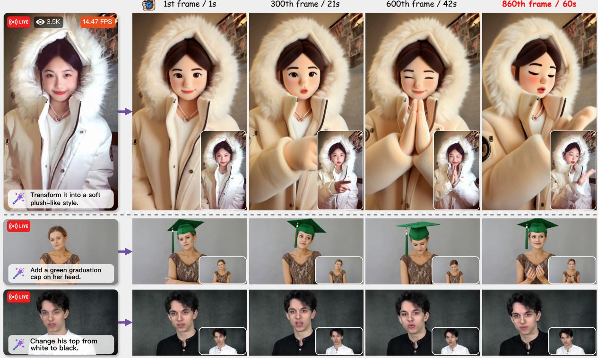  
Figure 1 An overview of the editing results and inference eficiency of EditaLive. EditaLive performs diverse local and global appearance edits in real time while faithfully preserving source motion and maintaining a consistent edited appearance over long sequences. Its appearance–motion decoupled formulation further supports cross-character editing.

Abstract. Conventional video editing primarily focuses on scene-level content, whereas live streaming places greater emphasis on the human subject. However, directly applying existing video-editing methods to human-centric live streaming remains challenging, as they may introduce facial-expression inconsistencies and typically depend on multiple ofline inference steps, making them unsuitable for real-time interaction. We propose EditaLive, a novel framework for real-time streaming character video editing. In detail, we start from a pretrained image animation model (Wan-Animate), which naturally decouples appearance from motion, and repurpose it as the base model for instruction-based human-centric video editing by reference frame editing and video reconstruction via the collected CharEdit-50K dataset. Besides, we adapt the modelfrom ofline bidirectional to causal streaming generation, and design an aligned self-rollout distillation strategy that compresses the model into a two-step sampler, wherefixed RoPE and align forcing reduce training–inference discrepancies, andfirst-frame preserved sparse attentionfilters redundant historical information to mitigate appearance drift. Extensive experiments demonstrate that EditaLive delivers state-of-the-art editing performance withfaithful preservation offacial expressions and low-latency real-time streaming inference.

## 1 Introduction

Live streaming has become one of the most popular forms of online entertainment, with streamers altering their on-screen looks to express their personalities and capture viewers’ attention. In the era of generative AI, we define and tackle this task as streaming character video editing, enabling streamers/viewers to customize live-streaming content using simple text prompts.

However, most of the current video editing methods are applied to the scene-level or object-level content. Early frame-by-frame editing approaches (Xing et al., 2024; Chen et al., 2025; Kodaira et al., 2025; Liang et al., 2025) apply image editing models to individual video frames, inevitably leading to temporal flickering. In contrast, recent native video editing algorithms (Qi et al., 2023; Team, 2025; Bai et al., 2026) perform joint video-level editing, substantially improving temporal consistency and editing quality, as shown in Fig. 2 (a). Despite their impressive performance, directly extending native video editing algorithms to character editing in live streaming scenarios is far from straightforward. This stems from three primary challenges: (i) Facial expression mismatch. Current video editing datasets (Wu et al., 2025b; He et al., 2025; Bai et al., 2026; Huang et al., 2026a) are predominantly synthesized using video generation and editing models (Jiang et al., 2025; Wan et al., 2025), inevitably inheriting facial expression inconsistencies from these models, as shown in Fig. 4 (left). Consequently, models trained on such datasets struggle to faithfully preserve facial expressions. (ii) Ofline inference paradigm. Existing instruction-based video editing models (Wei et al., 2025; Ju et al., 2025; Team, 2025; Bai et al., 2026) typically require dozens of denoising steps together with classifier-free guidance (CFG) (Ho and Salimans, 2021) to achieve high editing quality, while relying on bidirectional temporal attention over complete video clips to maintain temporal consistency. These ofline-oriented designs make existing video editing models unsuitable for live streaming scenarios. (iii) Long-term drift. Although recent methods (Wang et al., 2026; Zhao et al., 2026) adopt Self Forcing (Huang et al., 2026b) for real-time video editing, their training and inference procedures remain misaligned in terms of RoPE indexing and KV-cache construction. The resulting errors accumulate during autoregressive inference, causing progressive appearance drift and undermining editing stability over long video sequences.

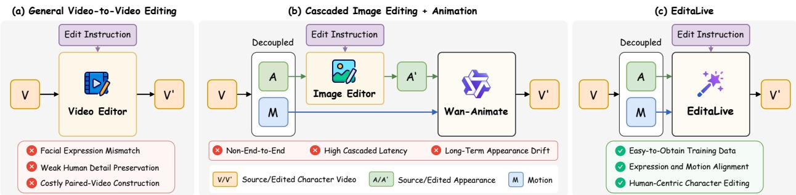  
Figure 2 Comparison of three character video editing paradigms. (a) General Video-to-Video Editing directly transforms a source video V into an edited video V′, but often relies on costly synthetic video pairs that may contain facial-expression mismatches and weakened human details. (b) Cascaded image editing and animation first edits the source appearance A into A′ and then animates it using motion M, introducing cascaded latency and potential long-term appearance drift. (c) EditaLive unifies appearance editing and motion-conditioned generation, learning from edited reference images and motion-aligned real videos to preserve facial expressions and body motion while enabling stable, low-latency streaming editing.

For character video editing, we posit that character appearance and motion are naturally decoupled and can therefore be modeled separately. As the edited appearance remains consistent throughout the video stream, the task may not necessitate extensive denoising steps. Meanwhile, temporal consistency can be efectively maintained through causal temporal modeling over past contexts, without relying on ofline bidirectional attention over complete video clips.

We thus propose EditaLive, a unified framework for real-time streaming character video editing built on three key components. (i) Appearance–Motion Decoupled Editing. We build EditaLive on Wan-Animate (Cheng et al., 2025), a pretrained image animation model that naturally decouples character appearance from motion conditions. We repurpose this model for instruction-based character video editing by combining reference-frame editing with video reconstruction, as shown in Fig. 2 (c). For each source video, we edit its reference frame with a forward instruction and construct a corresponding reverse instruction to recover the original appearance. Conditioned on the edited reference, reverse instruction, and source motion signals, EditaLive is trained to reconstruct the source video, thereby learning diverse appearance transformations from paired source and edited appearances. Based on this formulation, we construct CharEdit-50K, a comprehensive dataset covering diverse character appearance editing tasks. (ii) Causal Streaming

Adaptation. Inspired by causal and autoregressive video generation methods (Chen et al., 2024; Yin et al., 2025), we subsequently adapt the ofline editing model to chunk-wise causal streaming generation, preserving bidirectional attention within each chunk while restricting cross-chunk attention to preceding context. (iii) Aligned Self-Rollout Distillation. After adapting the model for causal streaming generation, we further employ self-rollout distillation (Huang et al., 2026b) to compress it into a two-step sampler. Although self-rollout mitigates exposure bias (Schmidt, 2019; Ning et al., 2024) by training the model on its own autoregressive predictions, training–inference discrepancies in positional encoding and KV-cache construction can still lead to unstable long-term streaming generation. To address this, we introduce Fixed RoPE for consistent positional encoding and Align Forcing for inference-aligned KV-cache construction. Furthermore, we propose First-frame Preserved Sparse Attention (FPSA) to filter out redundant historical information while keeping the first-frame features fully visible, efectively mitigating appearance drift during long-term generation. Extensive quantitative and qualitative results show that EditaLive achieves superior editing quality, expression consistency, and long-term stability, while enabling real-time streaming inference. Our contributions can be summarized as:

• We propose EditaLive, a unified framework for real-time streaming character video editing that supports both diverse character appearance editing tasks and motion-driven animation.

• We introduce an appearance–motion decoupled editing paradigm that reframes character video editing as an appearance transformation under explicit motion control, thereby preserving facial expressions. We further design a reconstruction-based training strategy built on motion-aligned real-video supervision and construct CharEdit-50K.

• We develop an aligned self-rollout distillation strategy equipped with fixed RoPE, align forcing, and first-frame preserved sparse attention, efectively reducing training–inference discrepancies and mitigating appearance drift during long-term generation.

## 2 Related Work

Instruction-based Image and Video Editing. Recent advances in text-to-image difusion models (Rombach et al., 2022; Peebles and Xie, 2023) have significantly improved instruction-based image editing, enabling users to modify visual content through natural language instructions (Brooks et al., 2023; Zhang et al., 2023; Sheynin et al., 2024; Zhang et al., 2026b). Some works extend image editing to videos by applying image editing models to individual frames (Xing et al., 2024; Chen et al., 2025; Kodaira et al., 2025; Liang et al., 2025). While eficient, these frame-wise methods lack stable temporal modeling and often lead to flickering and inconsistent edits. Recent instruction-based video editing methods instead perform joint video-level editing with native video difusion models (Qi et al., 2023; Jiang et al., 2025; Wei et al., 2025; Ju et al., 2025; Team, 2025; Bai et al., 2026), achieving improved temporal consistency and editing quality. However, these methods are mainly designed for ofline clip-level editing, relying on multi-step sampling and bidirectional temporal modeling over complete videos. They also commonly depend on synthetic editing datasets (Wu et al., 2025b; Bai et al., 2026), which can introduce facial expression inconsistencies in character-centric scenarios. More recent studies (Wang et al., 2026; Zhao et al., 2026) adopt Self Forcing (Huang et al., 2026b) to enable real-time causal streaming video editing. Nevertheless, they primarily focus on streaming eficiency and do not explicitly address stability over long generation horizons. Unlike these methods, we focus on real-time streaming character video editing with explicit motion preservation and long-term generation capability.

Motion-driven Character Animation. Motion-driven character animation aims to animate a source character according to motion signals extracted from a driving video. To achieve this, recent methods condition video generation on reference images and diverse motion representations, such as skeleton sequences (Hu, 2024; Zhang et al., 2025a), 3D keypoints (Yan et al., 2026b), motion frames (Yan et al., 2026a), and implicit facial representations (Zhao et al., 2025; Cheng et al., 2025). These works validate the efectiveness of separating appearance and motion for character generation. Building on this, recent eforts such as PersonaLive (Li et al., 2026) further achieve real-time portrait animation through eficient distillation and micro-chunk streaming generation. However, most existing methods focus on animation or reenactment, where the source appearance is assumed to be fixed, rather than instruction-based character appearance editing. In contrast, we apply the idea of appearance–motion decoupling to character video editing, enabling appearance editing under explicit motion control while naturally supporting motion-driven animation by swapping character images.

Eficient and Streaming Video Generation. Eficiency and streaming capability are critical for deploying video generation models in interactive and real-time scenarios. Existing methods commonly accelerate inference through model quantization (Feng et al., 2025b; Xie et al., 2025), sparse attention (Zhang et al., 2026a; Shao et al., 2026), and sampling-step distillation (Yin et al., 2024b,a). To achieve real-time streaming video generation, recent works further introduce autoregressive paradigms (Chen et al., 2024; Kodaira et al., 2025). CausVid (Yin et al., 2025) adapts difusion video generation to causal inference. Self Forcing (Huang et al., 2026b) trains the model with its own autoregressive predictions to reduce exposure bias. Building on these advances, we extend autoregressive streaming generation to character video editing and introduce an aligned self-rollout distillation strategy that enables eficient two-step inference while preserving character appearance over long generation horizons.

## 3 Preliminaries

Video Difusion Models. Video difusion models learn a conditional distribution over video sequences through iterative denoising. To reduce the computational cost of processing high-dimensional videos, an input video x is typically encoded into a compact latent representation $Z _ { 1 }$ using a spatio-temporal VAE, and generation is performed in the resulting latent space. Under the flow-matching formulation (Lipman et al., 2022), a noisy latent $Z _ { t }$ is constructed by interpolating between a Gaussian sample $Z _ { 0 } \sim \mathcal { N } ( 0 , I )$ and the clean video latent:

$$
Z _ { t } = t Z _ { 1 } + ( 1 - t ) Z _ { 0 } , \qquad t \in [ 0 , 1 ] .\tag{1}
$$

The corresponding target velocity $\begin{array} { r } { V _ { t } = \frac { \mathrm { d } Z _ { t } } { \mathrm { d } t } = Z _ { 1 } - Z _ { 0 } } \end{array}$ is constant along this path. A conditional velocity model $v _ { \theta }$ is trained to estimate $V _ { t }$ from the interpolated latent $Z _ { t }$ , timestep t, and conditioning signals c by minimizing

$$
\mathcal { L } _ { \mathrm { F M } } = \mathbb { E } _ { Z _ { 1 } , Z _ { 0 } , t } \left[ \left. v _ { \theta } ( Z _ { t } , t \mid c ) - ( Z _ { 1 } - Z _ { 0 } ) \right. _ { 2 } ^ { 2 } \right] ,\tag{2}
$$

where c may include text, image, or other conditions. At inference time, a video latent is generated by numerically integrating the learned velocity field from the Gaussian prior at $t = 0$ toward the data distribution at $t = 1$ , after which the VAE decoder maps the resulting latent back to video space.

Distribution Matching Distillation. Distribution Matching Distillation (DMD) (Yin et al., $^ { 2 0 2 4 \mathrm { b } , \mathrm { a } ) }$ distills a pretrained difusion model into a student generator $G _ { \theta }$ with substantially fewer denoising steps. Let $p _ { \theta , \ast }$ t denote the distribution obtained by perturbing student-generated samples to timestep $t ,$ and let $p _ { \mathrm { r e a l } , t }$ denote the corresponding distribution induced by the real data or pretrained teacher model. DMD minimizes the reverse Kullback–Leibler divergence between these distributions:

$$
\mathcal { L } _ { \mathrm { D M D } } = \mathbb { E } _ { t } \left[ D _ { \mathrm { K L } } \left( p _ { \theta , t } \Vert p _ { \mathrm { r e a l } , t } \right) \right] .\tag{3}
$$

Given a clean prediction $\hat { Z } _ { 1 }$ and its perturbed version $\hat { Z } _ { t }$ , the gradient of this objective can be estimated from the diference between the score functions of the student and target distributions:

$$
\nabla _ { \theta } \mathcal { L } _ { \mathrm { D M D } } = - \mathbb { E } _ { Z _ { 0 } , t } \left[ \left( s _ { \mathrm { r e a l } } ( \hat { Z } _ { t } , t , c ) - s _ { \mathrm { f a k e } , \phi } ( \hat { Z } _ { t } , t , c ) \right) ^ { \top } \frac { \partial G _ { \theta } ( Z _ { 0 } , c ) } { \partial \theta } \right] ,\tag{4}
$$

where $s _ { \mathrm { r e a l } }$ estimates the score of the target distribution and $s _ { \mathrm { f a k e } , \phi }$ estimates the score of the current student distribution. The real-score model is kept fixed, whereas the fake-score model is trained on samples produced by the evolving student generator. Training alternates between updating $s _ { \mathrm { f a k e } , \phi }$ to track the student distribution and optimizing $G _ { \theta }$ using the resulting score diference, progressively moving the few-step student generator toward the target distribution.

## 4 EditaLive : Human-Centric Video Editing Model

In this paper, we define a character video as a video centered on a primary human or human-like subject. Streaming character video editing aims to modify the appearance of the primary character in real time according to a user instruction. Formally, given a source video stream $x ^ { 1 : N }$ and an editing instruction $p ,$ the goal is to generate an edited stream $y ^ { 1 : N }$

$$
y ^ { i } = \mathcal { F } ( x ^ { i } , p , y ^ { < i } ) , i = 1 , 2 , \dotsc , N ,\tag{5}
$$

where $\mathcal { F }$ denotes the editing model and $y ^ { < i }$ represents previously generated outputs. As illustrated in Fig. 3, EditaLive addresses streaming character video editing through three consecutive stages. First, we decompose the source character video into appearance and motion representations, reformulating character video editing as appearance editing conditioned on the explicit motion signals (Sec. 4.1). Second, we adapt the ofline bidirectional video model to causal streaming

(a) Stage 1: Appearance-Motion Decoupled Editing  
(b) Stage 2: Causal Streaming Adaptation  
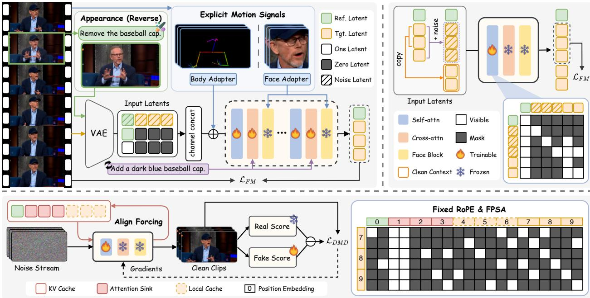  
(c) Stage 3: Aligned Self-Rollout Distillation

Figure 3 Overview of the three-stage training pipeline of EditaLive. (a) Appearance–Motion Decoupled Editing reformulates character video editing as appearance editing with explicit body and facial motion preservation. (b) Causal Streaming Adaptation converts bidirectional modeling into causal generation using clean historical context and causal attention. (c) Aligned Self-Rollout Distillation compresses the model into a two-step sampler, where Align Forcing and Fixed RoPE align training with streaming inference, and FPSA improves long-term appearance stability.

generation, enabling continuous inference based on cached historical context (Sec. 4.2). Finally, we develop an aligned self-rollout distillation strategy that compresses the causal model into a two-step sampler while reducing training–inference discrepancies and improving long-term stability (Sec. 4.3). Together, these components form a unified framework for eficient streaming character editing with explicit motion preservation and stable long-term generation.

## 4.1 Appearance–Motion Decoupled Editing

As shown in Fig. 3 (a), we reformulate character video editing by decoupling the appearance to be edited from the motion to be preserved. Given a source character video $x ^ { 1 : N }$ , we select a reference frame I to represent the character appearance, while extracting a skeleton sequence $s ^ { 1 : N }$ and implicit facial representations $f ^ { 1 : N }$ to capture the source body motion and facial dynamics, respectively. The editing process is then formulated as

$$
\begin{array} { r } { \boldsymbol { y } ^ { 1 : N } = \mathcal { F } ( I , p , s ^ { 1 : N } , f ^ { 1 : N } ) , } \end{array}\tag{6}
$$

where the reference frame I and instruction $p$ jointly determine the edited appearance.

Reconstruction-based Training. Synthetic source–target video pairs often exhibit facial expression mismatches (Fig. 4 (left)), entangling the desired appearance edit with unintended changes in facial dynamics. We therefore restrict synthetic editing to the reference image while retaining the real video as the reconstruction target. Specifically, given the reference image I, we first apply a forward instruction $p ^ { \mathrm { f w d } }$ via an of-the-shelf image editing model $\mathcal { E } _ { \mathrm { i m g } }$ to obtain an edited image:

$$
\widetilde { I } = \mathcal { E } _ { \mathrm { i m g } } ( I , p ^ { \mathrm { f w d } } ) .\tag{7}
$$

We then construct a reverse instruction $p ^ { \mathrm { r e v } }$ for restoring the original appearance from ${ \widetilde { I } } .$ Next, we encode the edited image $\widetilde { I }$ and the original video $\boldsymbol { x } ^ { 1 : N }$ into the VAE latent space, obtaining the reference latent $z ^ { \mathrm { r e f } }$ and target video latents $z ^ { \mathrm { t g t } }$ , respectively. We define $Z _ { 1 } = ( z ^ { \mathrm { r e f } } , z ^ { \mathrm { t g t } } )$ as the clean reference–target sequence and sample $Z _ { 0 } \sim \mathcal { N } ( 0 , \mathbf { I } )$ . At timestep $t \in [ 0 , 1 ]$ , we construct

$$
Z _ { t } = t Z _ { 1 } + ( 1 - t ) Z _ { 0 } = ( z _ { t } ^ { \mathrm { r e f } } , z _ { t } ^ { \mathrm { t g t } } ) ,\tag{8}
$$

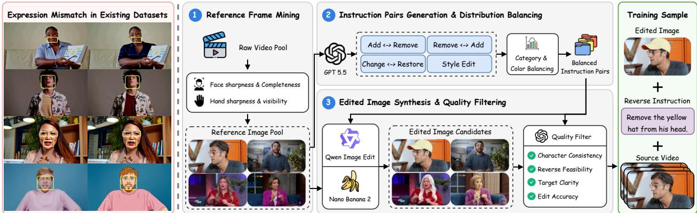  
Figure 4 Construction pipeline of CharEdit-50K. (Left) Existing video editing datasets often contain facial expression inconsistencies. (Right) Our pipeline restricts synthetic editing to the reference image while retaining its authentic source video as motion-aligned supervision. (1) High-quality reference frames are selected based on face and hand quality. (2) GPT-5.5 generates instructions covering add–remove, remove–add, change–restore, and stylization, followed by category and color balancing. (3) Qwen-Image-Edit and Nano Banana 2 synthesize candidate images, which are filtered for edit accuracy, target clarity, character consistency, and reverse feasibility. Each retained bidirectional sample contains an edited image, its reverse instruction, and the corresponding source video.

where $z _ { t } ^ { \mathrm { r e f } }$ and $z _ { t } ^ { \mathrm { t g t } }$ denote the noised reference and target video latents, respectively. We then construct $H _ { t }$ by channel-wise concatenating the noised reference–target sequence, the clean reference condition, and a reference mask:

$$
H _ { t } = ( z _ { t } ^ { \mathrm { r e f } } , z _ { t } ^ { \mathrm { t g t } } ) \parallel ( z ^ { \mathrm { r e f } } , \mathbf { 0 } , \dots , \mathbf { 0 } ) \parallel ( \mathbf { 1 } , \mathbf { 0 } , \dots , \mathbf { 0 } ) ,\tag{9}
$$

where $( \cdot , \cdot )$ and ∥ denote temporal and channel-wise concatenation, respectively. The model vθ predicts the ground-truth flow velocity $\begin{array} { r } { V _ { t } = \frac { \mathrm { d } Z _ { t } } { \mathrm { d } t } = Z _ { 1 } - Z _ { 0 } } \end{array}$ and is optimized by

$$
{ \mathcal { L } } _ { \mathrm { F M } } = \mathbb { E } _ { Z _ { 1 } , Z _ { 0 } , t } \left[ \left\| v _ { \theta } \left( H _ { t } , t \mid p ^ { \mathrm { r e v } } , s ^ { 1 : N } , f ^ { 1 : N } \right) - \left( Z _ { 1 } - Z _ { 0 } \right) \right\| _ { 2 } ^ { 2 } \right] .\tag{10}
$$

By treating the original video latent $z ^ { \mathrm { t g t } }$ as the reconstruction target, $\mathcal { L } _ { \mathrm { F M } }$ forces the model to follow $p ^ { \mathrm { r e v } }$ and recover the original appearance from the edited reference Ie, while retaining the authentic facial dynamics and body motion.

CharEdit-50K. Following the reconstruction-based formulation, we construct CharEdit-50K through the three-stage pipeline shown in Fig. 4 (right). First, we mine high-quality reference frames from a large collection of character videos. Second, GPT-5.5 (Singh et al., 2025) generates candidate bidirectional instruction pairs for each reference image. Third, Qwen-Image-Edit (Wu et al., 2025a) and Nano Banana 2 (Team et al., 2023) synthesize the corresponding edited images, which are subsequently filtered by GPT-5.5. Each retained sample contains an edited image, its reverse instruction, and the corresponding source video. Further dataset details are provided in Appendix A.1.

## 4.2 Causal Streaming Adaptation

While bidirectional self-attention in the previous stage enables temporally consistent editing, it requires complete video clips as input and incurs computational and memory costs that grow rapidly with video length, making it unsuitable for streaming inference. We therefore adapt the model to chunk-wise causal generation, where frames interact bidirectionally within each chunk while diferent chunks are temporally ordered, as shown in Fig. 3 (b). Let $z ^ { \mathrm { t g t } } = \big ( z ^ { ( 1 ) } , \dots , z ^ { ( K ) } \big )$ denote the target video latents divided into K chunks. At timestep t, we perturb the target video latents to obtain $z _ { t } ^ { \mathrm { t g t } }$ while keeping the reference latent $z ^ { \mathrm { r e f } }$ clean. The input is constructed as

$$
H _ { t } ^ { \mathrm { { c a u s a l } } } = ( z ^ { \mathrm { { r e f } } } , z _ { t } ^ { \mathrm { { t g t } } } , z ^ { \mathrm { { c o n t e x t } } } ) \parallel ( z ^ { \mathrm { { r e f } } } , \mathbf { 0 } , \ldots , \mathbf { 0 } ) \parallel ( \mathbf { 1 } , \mathbf { 0 } , \ldots , \mathbf { 0 } ) ,\tag{11}
$$

where $z ^ { \mathrm { c o n t e x t } } = ( z ^ { ( 1 ) } , \dots , z ^ { ( K - 1 ) } )$ denotes the clean context. Unlike stage 1 in Sec. 4.1, the reference latent in the first term is directly used as clean context rather than being perturbed. We apply a chunk-wise causal attention mask such that each noisy target chunk attends to the clean reference latent, its own latents, and the clean context chunks preceding it, but not to other noisy target chunks or future context. This design enables all target chunks to be trained in parallel while preserving the causal dependencies required for streaming inference. The Flow Matching (Lipman et al., 2022) loss is computed over the positions corresponding to $z _ { t } ^ { \mathrm { t g t } }$ , while the reference and clean-context positions are excluded from the loss and used solely as conditioning.

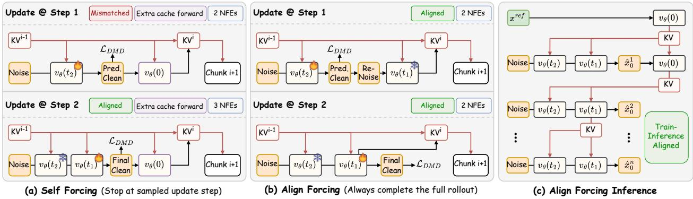  
Figure 5 Comparison of Self Forcing and Align Forcing under two-step distillation. (a) Self Forcing couples gradient update with rollout termination, causing an intermediate prediction to be cached when the rollout stops early. This creates a mismatch with inference, which always caches the final prediction, and requires 2.5 NFEs on average. (b) Align Forcing applies gradients only at the sampled step but completes the remaining rollout with stop-gradient. The KV cache is therefore always constructed from the final prediction, matching inference while requiring two NFEs. (c) During streaming inference, each chunk propagates its final KV cache after two-step denoising, with an additional $t _ { 0 }$ forward pass for the first chunk to initialize the attention sink.

## 4.3 Aligned Self-Rollout Distillation

Although causal adaptation enables streaming inference, the model still requires multi-step sampling and sufers from error accumulation during long-term generation. Building on Self Forcing (Huang et al., 2026b), we propose an aligned self-rollout distillation strategy that reduces the sampling process to two steps and matches rollout training with streaming inference, as shown in Fig. 3 (c). Specifically, Align Forcing eliminates discrepancies in KV-cache construction, while Fixed RoPE maintains consistent positional encoding between training and inference. We further introduce First-frame Preserved Sparse Attention to filter redundant historical context and mitigate appearance drift.

Align Forcing. As shown in Fig. 5 (a), Self Forcing (Huang et al., 2026b) couples the randomly selected gradient-update step with rollout termination. Once the selected step is reached, the rollout stops and the clean estimate at that step is used to construct the KV cache propagated to subsequent chunks. During streaming inference, however, each chunk completes the entire denoising trajectory, and only the final prediction is used to construct the propagated state. This creates a training–inference mismatch in inter-chunk state construction: training may propagate an intermediate rollout state, whereas inference always propagates the final state. To eliminate this discrepancy, we decouple gradient update from rollout termination. As shown in Fig. 5 (b), gradients are computed only at the selected step, while the remaining denoising steps are completed with stop-gradient. The KV cache is then constructed from the final prediction and propagated to subsequent chunks, always matching the inference stage (Fig. 5 (c)). Under two-step distillation, Self Forcing requires an average of 2.5 NFEs per training iteration, whereas Align Forcing requires 2 NFEs, with only the first chunk incurring one additional $t _ { 0 }$ cache forward to initialize the attention sink.

Fixed RoPE. Standard RoPE assigns temporal indices according to the absolute latent positions. Since self-rollout training covers only a finite number of chunks, long-term inference eventually encounters indices outside the training range. Meanwhile, the reference sink remains at position 0, causing its positional ofsets from later latents to grow continuously and progressively weakening appearance conditioning. We therefore introduce Fixed RoPE, which applies the same positional layout 0–9 during both rollout training and streaming inference, as shown in Fig. 3 (c). Specifically, the reference sink, attention sink, local-window context, and current chunk are assigned indices 0, 1–3, 4–6, and 7–9, respectively. By assigning positions according to their roles in the streaming context rather than their absolute timestamps, Fixed RoPE avoids positional extrapolation and keeps the appearance reference at a fixed distance from the latents currently being generated.

First-frame Preserved Sparse Attention. Since the local-window context is temporally and visually closest to the current chunk, the current queries tend to over-rely on it while underutilizing the stable appearance cues in the reference and attention sinks. Inspired by VSA (Zhang et al., 2026a), we partition the current query and cached key tokens into spatio-temporal blocks, and compute block-level query–key scores. For each query block, we retain the top-K key blocks, where $K = ( 1 - \rho ) B$ , B denotes the total number of candidate key blocks and $\rho$ represents the sparsity ratio. Token-level attention over the original queries, keys, and values is then computed only within the selected block pairs. Since this content-adaptive selection may still favor the local window, we always include all key blocks from the first generated frame in the selected K blocks and choose the remaining blocks according to their scores, as shown in Fig. 3 (c). As a stable realization of the target appearance, the first frame serves as a persistent appearance anchor, thereby mitigating appearance drift during long-term generation.

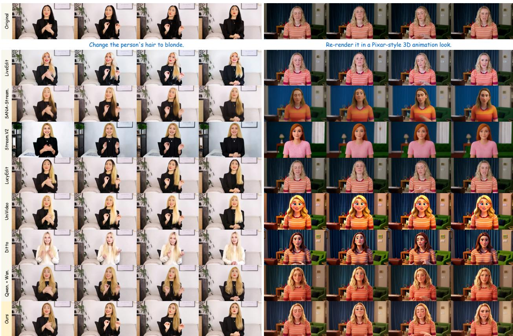  
Figure 6 Qualitative comparisons. EditaLive faithfully follows the editing instructions while preserving the source facial expressions, body poses, and scene structure across frames.

## 5 Experiments

## 5.1 Implementation Details

We build our model on Wan-Animate (Cheng et al., 2025) and train all three stages on CharEdit-50K using LoRA, with both the rank r and scaling factor α set to 128. Experiments are conducted on 8 NVIDIA H100 GPUs. All stages use the AdamW optimizer with a global batch size of 8. Stages 1 and 2 are each trained on 33-frame, 480p video clips for 15K steps with a learning rate of $1 \times 1 0 ^ { - 4 }$ , while Stage 3 is trained on 69-frame, 480p clips for 2K steps with a learning rate of $2 \times 1 0 ^ { - 6 }$ . The Stage 3 student is initialized from the Stage 2 checkpoint, whereas its real-score and fake-score branches are initialized from the Stage 1 checkpoint. For Stages 2 and 3, we set the chunk size to 3. During self-rollout distillation, the first generated chunk is retained as an attention sink. We set the sparsity ratio ρ in FPSA to 75%. For two-step generation, the sampling timesteps are set to [1000, 250]. We additionally construct CharEdit-Bench for comprehensive evaluation, comprising a short-video subset (CharEdit-Bench-S) and a long-video subset (CharEdit-Bench-L). Complete implementation details and benchmark specifics are provided in Appendix B.1 and A.2.

## 5.2 Comparison with Other Methods

We compare our method against state-of-the-art instruction-based video editing approaches, including the bidirectional baselines LucyEdit (Team, 2025), UniVideo (Wei et al., 2025), and Ditto (Bai et al., 2026), as well as the streaming baselines LiveEdit (Wang et al., 2026), SANA-Streaming (Zhao et al., 2026), and StreamDifusionV2 (Feng et al., 2025a). We additionally include a cascaded image-editing-and-animation baseline that first edits the reference image using Qwen-Image-Edit (Wu et al., 2025a) and then animates the edited image with Wan-Animate (Cheng et al., 2025).

Table 1 Quantitative comparisons on CharEdit-Bench-S. Numbers in red and blue indicate the best and the second-best results, respectively. APD multiplied by 10. TA, EQ, BC and SR denote text alignment, edit quality, background consistency, and success rate, respectively. \*LiveEdit and LucyEdit do not support global style editing. We therefore omit their character-consistency metrics as these scores are not comparable when the requested edit is not successfully performed.
<table><tr><td rowspan="2">Method</td><td rowspan="2">#Params</td><td colspan="3">Character Consistency</td><td colspan="4">VLM Evaluation</td><td>Video Quality</td><td colspan="2">Efficiency</td></tr><tr><td>ID-SIM↑</td><td>AED↓</td><td>APD↓</td><td>TA↑</td><td>EQ↑</td><td>BC↑</td><td>SR↑</td><td>Pick Score ↑</td><td>FPS↑</td><td>Latency ↓</td></tr><tr><td>LiveEdit*</td><td>1.3B</td><td></td><td></td><td></td><td>1.542</td><td>1.949</td><td>1.640</td><td>0.393</td><td>19.26</td><td>17.25</td><td>0.696</td></tr><tr><td>SANA-Stream.</td><td>2B</td><td>0.379</td><td>0.629</td><td>0.381</td><td>2.200</td><td>1.777</td><td>1.582</td><td>0.428</td><td>19.46</td><td>31.20</td><td>0.772</td></tr><tr><td>Stream.V2</td><td>14B</td><td>0.060</td><td>0.885</td><td>0.485</td><td>1.316</td><td>1.869</td><td>0.473</td><td>0.027</td><td>19.92</td><td>20.96</td><td>0.191</td></tr><tr><td>LucyEdit*</td><td>5B</td><td></td><td></td><td></td><td>1.604</td><td>1.797</td><td>2.121</td><td>0.326</td><td>18.92</td><td>3.083</td><td>26.27</td></tr><tr><td>UniVideo</td><td>13B</td><td>0.592</td><td>0.605</td><td>0.447</td><td>2.377</td><td>2.182</td><td>1.866</td><td>0.533</td><td>19.54</td><td>0.119</td><td>680.9</td></tr><tr><td>Ditto</td><td>17B</td><td>0.334</td><td>0.685</td><td>0.355</td><td>1.560</td><td>1.796</td><td>1.127</td><td>0.167</td><td>19.49</td><td>0.294</td><td>275.4</td></tr><tr><td>Qwen.+Wan.</td><td>17B</td><td>0.491</td><td>0.541</td><td>0.132</td><td>2.792</td><td>2.544</td><td>1.897</td><td>0.713</td><td>19.55</td><td>1.274</td><td>63.55</td></tr><tr><td>Ours</td><td>17B</td><td>0.550</td><td>0.499</td><td>0.124</td><td>2.796</td><td>2.609</td><td>2.024</td><td>0.720</td><td>19.61</td><td>14.47</td><td>0.829</td></tr></table>

We evaluate the performance in terms of character consistency, editing quality, video quality, and inference eficiency. ID-SIM (Deng et al., 2019) measures identity consistency, while AED and APD (Siarohin et al., 2019) assess the preservation of facial expressions and body poses, respectively. A VLM-based evaluator (Ju et al., 2025) assesses overall editing quality. Pick Score (Kirstain et al., 2023) is used to assess the overall quality of the edited videos. For eficiency, we report end-to-end generation throughput in frames per second (FPS) and average inter-chunk latency. Detailed baseline configurations, metric definitions, and evaluation protocols are provided in Appendix B.2 and B.3.

Qualitative & Quantitative Comparison. As shown in Fig. 6, EditaLive consistently performs both local appearance edits and global style transformations while faithfully preserving the source facial expressions, body poses, and scene structure. In comparison, existing streaming methods may either fail to fully apply the requested edits or introduce noticeable inconsistencies in facial expression. The bidirectional baselines exhibit similar limitations, despite their substantially higher inference costs. These qualitative observations are consistent with the quantitative results in Table 1, where EditaLive ranks first or second across all eight quality metrics. We omit the character-consistency metrics of LiveEdit and LucyEdit because they do not support global style editing, making these metrics incomparable when the requested transformation is not successfully applied. Additional comparison results are provided in Appendix C.

Eficiency. As reported in Table 1, EditaLive achieves an end-to-end generation throughput of 14.47 FPS with an average inter-chunk latency of 0.829 seconds on a single NVIDIA H100 GPU. Although the dedicated streaming baselines achieve higher raw eficiency, their edit success rates are at most 0.428, substantially below the 0.720 achieved by EditaLive. Compared with LucyEdit, the fastest bidirectional baseline, EditaLive delivers 4.7× higher throughput and reduces latency by a factor of 31.7. For the cascaded Qwen-Image-Edit and Wan-Animate baseline, even when excluding the one-time cost of reference-image editing, EditaLive remains 11.4× faster and reduces latency by a factor of 76.7. These results demonstrate that EditaLive provides a favorable quality–eficiency trade-of, combining sub-second streaming latency with substantially stronger editing performance. Moreover, replacing the standard Wan-VAE decoder with Flash-VAED (Zhu et al., 2026) further increases the inference speed of EditaLive to 16.4 FPS.

## 5.3 Ablation Studies

To validate the efectiveness of our key components, we conduct comprehensive ablation studies on CharEdit-Bench-L, covering both causal streaming adaptation and aligned self-rollout distillation.

Causal Streaming Adaptation. We first examine how the reference latent should be used during causal adaptation. As shown in Fig. 7 (left), optimizing both the reference and target positions (Ref.+Tgt.) introduces conflicting supervision. Under the same instruction, the reference latent is optimized to reconstruct its unchanged input appearance, whereas the target latents are required to perform the instructed appearance transformation. This conflict weakens the reference conditioning and causes unintended changes to the generated character. We therefore keep the reference latent clean and use it solely as conditioning context, while computing the Flow Matching loss only over the noisy target positions (Tgt. only). This target-only objective separates the clean reference condition from the optimization target, avoiding contradictory gradients and enabling faithful instruction-guided appearance transformation.

Aligned Self-Rollout Distillation. We evaluate the key components of aligned self-rollout distillation in Table 2 and Fig. 7 (right). Replacing Align Forcing with Self Forcing (w/o Align Forcing) introduces a mismatch in KV-cache construction between rollout training and streaming inference, causing the largest performance degradation: ID-SIM decreases from 0.492 to 0.252, and SR decreases from 0.817 to 0.367. Removing Fixed RoPE exposes the model to unseen positional ofsets during long-video inference and weakens its reference conditioning, resulting in progressive appearance drift and an ID-SIM of only 0.381. FPSA contributes through both sparse context selection and explicit first-frame preservation. Without FPSA, full attention overemphasizes recent local context while underutilizing stable appearance cues, resulting in an ID-SIM of 0.455. Introducing sparse attention without first-frame preservation (w/o FP) improves ID-SIM to 0.466, demonstrating the benefit of filtering redundant historical information. Nevertheless, visible appearance changes still emerge over time, such as the highlighted hair variation at frame 900. Explicitly preserving the first-frame features further increases ID-SIM to 0.492 and reduces AED and APD to 0.576 and 0.109, respectively. Overall, the complete model achieves the best ID-SIM, AED, APD, TA, EQ, and BC, confirming that the three components jointly improve character consistency without sacrificing video quality or temporal coherence.

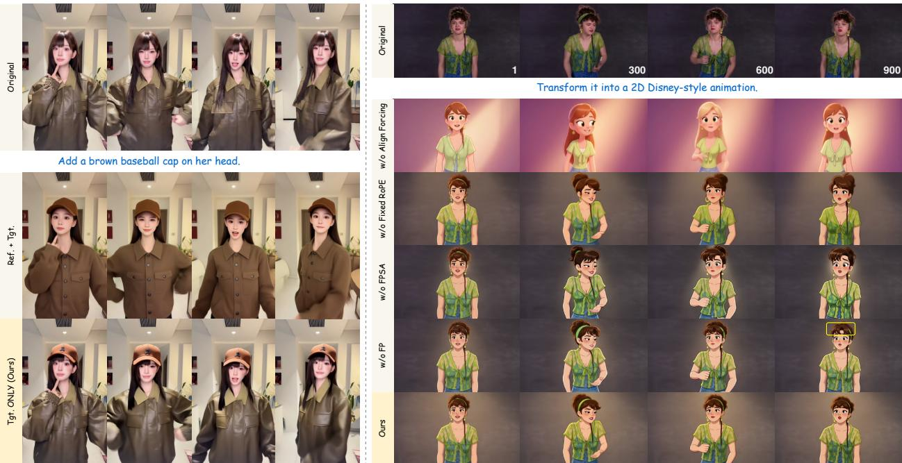  
Figure 7 Ablation study on causal streaming adaptation and aligned self-rollout distillation.

Table 2 Ablation study on aligned self-rollout distillation.
<table><tr><td rowspan="2">Method</td><td colspan="3">Character Consistency</td><td colspan="4">VLM Evaluation</td><td rowspan="2">Video Quality</td><td colspan="2">Temporal Consistency</td></tr><tr><td>ID-SIM↑</td><td>AED↓</td><td>APD↓</td><td>TA↑</td><td>EQ↑</td><td>BC↑</td><td>SR↑ Pick Score ↑</td><td>CLIP↑</td><td>DINO↑</td></tr><tr><td>w/o Align Forcing</td><td>0.252</td><td>0.711</td><td>0.338</td><td>2.703</td><td>2.567</td><td>1.306</td><td>0.367</td><td>20.03</td><td>98.62</td><td>99.07</td></tr><tr><td>w/o Fixed RoPE</td><td>0.381</td><td>0.618</td><td>0.120</td><td>2.728</td><td>2.639</td><td>1.872</td><td>0.617</td><td>19.91</td><td>98.50</td><td>98.95</td></tr><tr><td>w/o FPSA</td><td>0.455</td><td>0.609</td><td>0.116</td><td>2.737</td><td>2.600</td><td>2.105</td><td>0.800</td><td>19.85</td><td>98.46</td><td>98.88</td></tr><tr><td>w/o FP</td><td>0.466</td><td>0.604</td><td>0.114</td><td>2.725</td><td>2.622</td><td>2.139</td><td>0.833</td><td>19.84</td><td>98.42</td><td>98.89</td></tr><tr><td>Ours</td><td>0.492</td><td>0.576</td><td>0.109</td><td>2.761</td><td>2.678</td><td>2.183</td><td>0.817</td><td>19.78</td><td>98.51</td><td>98.96</td></tr></table>

## 6 Conclusion

We introduce EditaLive, a unified framework that brings instruction-guided character appearance editing to live video streams. By decoupling appearance from body motion and facial dynamics, our reconstruction-based training learns diverse appearance transformations from edited reference images and authentic, motion-aligned video targets; we construct CharEdit-50K to support this formulation. We further convert the bidirectional editing model into a chunk-wise causal generator and distill it into a two-step sampler. Align Forcing and Fixed RoPE align rollout training with streaming inference, while FPSA maintains stable appearance cues over long sequences with bounded historical context. Comprehensive experiments demonstrate the advantages of EditaLive in terms of editing quality, motion consistency, long-term stability, and inference eficiency.

## References

Vasu Agrawal, Akinniyi Akinyemi, Kathryn Alvero, Morteza Behrooz, Julia Bufalini, Fabio Maria Carlucci, Joy Chen, Junming Chen, Zhang Chen, Shiyang Cheng, et al. Seamless interaction: Dyadic audiovisual motion modeling and large-scale dataset. arXiv preprint arXiv:2506.22554, 2025.

Qingyan Bai, Qiuyu Wang, Hao Ouyang, Yue Yu, Hanlin Wang, Wen Wang, Ka Leong Cheng, Shuailei Ma, Yanhong Zeng, Zichen Liu, et al. Scaling instruction-based video editing with a high-quality synthetic dataset. In Proceedings of the IEEE/CVF Conference on Computer Vision and Pattern Recognition, pages 37971–37981, 2026.

Tim Brooks, Aleksander Holynski, and Alexei A Efros. Instructpix2pix: Learning to follow image editing instructions. In Proceedings of the IEEE/CVF conference on computer vision and pattern recognition, pages 18392–18402, 2023.

Mathilde Caron, Hugo Touvron, Ishan Misra, Hervé Jégou, Julien Mairal, Piotr Bojanowski, and Armand Joulin. Emerging properties in self-supervised vision transformers. In Proceedings of the IEEE/CVF international conference on computer vision, pages 9650–9660, 2021.

Boyuan Chen, Diego Martí Monsó, Yilun Du, Max Simchowitz, Russ Tedrake, and Vincent Sitzmann. Difusion forcing: Next-token prediction meets full-sequence difusion. Advances in Neural Information Processing Systems, 37:24081–24125, 2024.

Feng Chen, Bohan Zhuang, and Qi Wu. Streaming video difusion: Online video editing with difusion models. In 2025 International Conference on Digital Image Computing: Techniques and Applications (DICTA), pages 1–9. IEEE, 2025.

Gang Cheng, Xin Gao, Li Hu, Siqi Hu, Mingyang Huang, Chaonan Ji, Ju Li, Dechao Meng, Jinwei Qi, Penchong Qiao, et al. Wan-animate: Unified character animation and replacement with holistic replication. arXiv preprint arXiv:2509.14055, 2025.

Jiankang Deng, Jia Guo, Niannan Xue, and Stefanos Zafeiriou. Arcface: Additive angular margin loss for deep face recognition. In Proceedings of the IEEE/CVF conference on computer vision and pattern recognition, pages 4690–4699, 2019.

Tianrui Feng, Zhi Li, Shuo Yang, Haocheng Xi, Muyang Li, Xiuyu Li, Lvmin Zhang, Keting Yang, Kelly Peng, Song Han, et al. Streamdifusionv2: A streaming system for dynamic and interactive video generation. arXiv preprint arXiv:2511.07399, 2025a.

Weilun Feng, Haotong Qin, Chuanguang Yang, Zhulin An, Libo Huang, Boyu Diao, Fei Wang, Renshuai Tao, Yongjun Xu, and Michele Magno. Mpq-dm: Mixed precision quantization for extremely low bit difusion models. In Proceedings of the AAAI Conference on Artificial Intelligence, pages 16595–16603, 2025b.

Yuchao Gu, Guian Fang, Yuxin Jiang, Weijia Mao, Song Han, Han Cai, and Mike Zheng Shou. Anyflow: Any-step video difusion model with on-policy flow map distillation. arXiv preprint arXiv:2605.13724, 2026.

Haoyang He, Jie Wang, Jiangning Zhang, Zhucun Xue, Xingyuan Bu, Qiangpeng Yang, Shilei Wen, and Lei Xie. Openve-3m: A large-scale high-quality dataset for instruction-guided video editing. arXiv preprint arXiv:2512.07826, 2025.

Jonathan Ho and Tim Salimans. Classifier-free difusion guidance. In NeurIPS 2021 Workshop on Deep Generative Models and Downstream Applications, 2021.

Li Hu. Animate anyone: Consistent and controllable image-to-video synthesis for character animation. In Proceedings of the IEEE/CVF Conference on Computer Vision and Pattern Recognition, pages 8153–8163, 2024.

Xijie Huang, Chengming Xu, Donghao Luo, Xiaobin Hu, Peng Tang, Xu Peng, Jiangning Zhang, Chengjie Wang, and Yanwei Fu. Ffp-300k: Scaling first-frame propagation for generalizable video editing. In Proceedings ofthe IEEE/CVF Conference on Computer Vision and Pattern Recognition, pages 23172–23181, 2026a.

Xun Huang, Zhengqi Li, Guande He, Mingyuan Zhou, and Eli Shechtman. Self forcing: Bridging the train-test gap in autoregressive video difusion. Advances in Neural Information Processing Systems, 38:167283–167308, 2026b.

Yubo Huang, Hailong Guo, Fangtai Wu, Weiqiang Wang, Shifeng Zhang, Shijie Huang, Qijun Gan, Lin Liu, Sirui Zhao, Enhong Chen, et al. Live avatar: Streaming real-time audio-driven avatar generation with infinite length. arXiv preprint arXiv:2512.04677, 2025.

Zeyinzi Jiang, Zhen Han, Chaojie Mao, Jingfeng Zhang, Yulin Pan, and Yu Liu. Vace: All-in-one video creation and editing. In Proceedings ofthe IEEE/CVF International Conference on Computer Vision, pages 17191–17202, 2025.

Xuan Ju, Tianyu Wang, Yuqian Zhou, He Zhang, Qing Liu, Nanxuan Zhao, Zhifei Zhang, Yijun Li, Yuanhao Cai, Shaoteng Liu, et al. Editverse: Unifying image and video editing and generation with in-context learning. arXiv preprint arXiv:2509.20360, 2025.

Yuval Kirstain, Adam Polyak, Uriel Singer, Shahbuland Matiana, Joe Penna, and Omer Levy. Pick-a-pic: An open dataset of user preferences for text-to-image generation. Advances in neural information processing systems, 36:36652–36663, 2023.

Akio Kodaira, Chenfeng Xu, Toshiki Hazama, Takanori Yoshimoto, Kohei Ohno, Shogo Mitsuhori, Soichi Sugano, Hanying Cho, Zhijian Liu, Masayoshi Tomizuka, et al. Streamdifusion: A pipeline-level solution for real-time interactive generation. In Proceedings ofthe IEEE/CVF International Conference on Computer Vision, pages 12371–12380, 2025.

Zhiyuan Li, Chi-Man Pun, Chen Fang, Jue Wang, and Xiaodong Cun. Personalive! expressive portrait image animation for live streaming. In Proceedings ofthe IEEE/CVF Conference on Computer Vision and Pattern Recognition, pages 18118–18128, 2026.

Feng Liang, Akio Kodaira, Chenfeng Xu, Masayoshi Tomizuka, Kurt Keutzer, and Diana Marculescu. Looking backward: Streaming video-to-video translation with feature banks. In International Conference on Learning Representations, volume 2025, pages 46425–46445, 2025.

Yaron Lipman, Ricky TQ Chen, Heli Ben-Hamu, Maximilian Nickel, and Matt Le. Flow matching for generative modeling. arXiv preprint arXiv:2210.02747, 2022.

Mang Ning, Mingxiao Li, Jianlin Su, Albert Ali Salah, and Itir Onal Ertugrul. Elucidating the exposure bias in difusion models. In The Twelfth International Conference on Learning Representations, 2024.

William Peebles and Saining Xie. Scalable difusion models with transformers. In Proceedings of the IEEE/CVF international conference on computer vision, pages 4195–4205, 2023.

Chenyang Qi, Xiaodong Cun, Yong Zhang, Chenyang Lei, Xintao Wang, Ying Shan, and Qifeng Chen. Fatezero: Fusing attentions for zero-shot text-based video editing. In Proceedings of the IEEE/CVF International Conference on Computer Vision, pages 15932–15942, 2023.

Alec Radford, Jong Wook Kim, Chris Hallacy, Aditya Ramesh, Gabriel Goh, Sandhini Agarwal, Girish Sastry, Amanda Askell, Pamela Mishkin, Jack Clark, et al. Learning transferable visual models from natural language supervision. In International conference on machine learning, pages 8748–8763. PmLR, 2021.

George Retsinas, Panagiotis P. Filntisis, Radek Daněček, Victoria F. Abrevaya, Anastasios Roussos, Timo Bolkarr, and Petros Maragos. 3d facial expressions through analysis-by-neural-synthesis. In 2024 IEEE/CVF Conference on Computer Vision and Pattern Recognition (CVPR), pages 2490–2501, 2024.

Robin Rombach, Andreas Blattmann, Dominik Lorenz, Patrick Esser, and Björn Ommer. High-resolution image synthesis with latent difusion models. In Proceedings ofthe IEEE/CVF conference on computer vision and pattern recognition, pages 10684–10695, 2022.

Florian Schmidt. Generalization in generation: A closer look at exposure bias. EMNLP-IJCNLP 2019, page 157, 2019.

Shitong Shao, Zikai Zhou, Haopeng Li, Yingwei Song, Wenliang Zhong, Lichen Bai, and Zeke Xie. LIVEditor-14b: Lightning unified video editing via in-context sparse attention. In Forty-third International Conference on Machine Learning, 2026.

Shelly Sheynin, Adam Polyak, Uriel Singer, Yuval Kirstain, Amit Zohar, Oron Ashual, Devi Parikh, and Yaniv Taigman. Emu edit: Precise image editing via recognition and generation tasks. In Proceedings ofthe IEEE/CVF Conference on Computer Vision and Pattern Recognition, pages 8871–8879, 2024.

Aliaksandr Siarohin, Stéphane Lathuilière, Sergey Tulyakov, Elisa Ricci, and Nicu Sebe. First order motion model for image animation. Advances in neural information processing systems, 32, 2019.

Aaditya Singh, Adam Fry, Adam Perelman, Adam Tart, Adi Ganesh, Ahmed El-Kishky, Aidan McLaughlin, Aiden Low, AJ Ostrow, Akhila Ananthram, et al. Openai gpt-5 system card. arXiv preprint arXiv:2601.03267, 2025.

DecartAI Team. Lucy edit: Open-weight text-guided video editing, 2025.

Gemini Team, Rohan Anil, Sebastian Borgeaud, Jean-Baptiste Alayrac, Jiahui Yu, Radu Soricut, Johan Schalkwyk, Andrew M Dai Anja Hauth, Katie Millican, et al. Gemini: a family of highly capable multimodal models. arXiv preprint arXiv:2312.11805, 2023.

Team Wan, Ang Wang, Baole Ai, Bin Wen, Chaojie Mao, Chen-Wei Xie, Di Chen, Feiwu Yu, Haiming Zhao, Jianxiao Yang, et al. Wan: Open and advanced large-scale video generative models. arXiv preprint arXiv:2503.20314, 2025.

Xinyu Wang, Chongbo Zhao, Fangneng Zhan, and Yue Ma. Liveedit: Towards real-time difusion-based streaming video editing. arXiv preprint arXiv:2606.26740, 2026.

Cong Wei, Quande Liu, Zixuan Ye, Qiulin Wang, Xintao Wang, Pengfei Wan, Kun Gai, and Wenhu Chen. Univideo: Unified understanding, generation, and editing for videos. arXiv preprint arXiv:2510.08377, 2025.

Chenfei Wu, Jiahao Li, Jingren Zhou, Junyang Lin, Kaiyuan Gao, Kun Yan, Sheng-ming Yin, Shuai Bai, Xiao Xu, Yilei Chen, et al. Qwen-image technical report. arXiv preprint arXiv:2508.02324, 2025a.

Yuhui Wu, Liyi Chen, Ruibin Li, Shihao Wang, Chenxi Xie, and Lei Zhang. Insvie-1m: Efective instruction-based video editing with elaborate dataset construction. In Proceedings ofthe IEEE/CVF International Conference on Computer Vision, pages 16692–16701, 2025b.

Enze Xie, Junsong Chen, Junyu Chen, Han Cai, Haotian Tang, Yujun Lin, Zhekai Zhang, Muyang Li, Ligeng Zhu, Yao Lu, et al. Sana: Eficient high-resolution text-to-image synthesis with linear difusion transformers. In The Thirteenth International Conference on Learning Representations, 2025.

Zhening Xing, Gereon Fox, Yanhong Zeng, Xingang Pan, Mohamed Elgharib, Christian Theobalt, and Kai Chen. Live2dif: Live stream translation via uni-directional attention in video difusion models. arXiv preprint arXiv:2407.08701, 2024.

Yufei Xu, Jing Zhang, Qiming Zhang, and Dacheng Tao. Vitpose: Simple vision transformer baselines for human pose estimation. Advances in neural information processing systems, 35:38571–38584, 2022.

Wenhao Yan, Fengjia Guo, Zhuoyi Yang, and Jie Tang. Scail-2: Unifying controlled character animation with end-to-end in-context conditioning. arXiv preprint arXiv:2606.10804, 2026a.

Wenhao Yan, Sheng Ye, Zhuoyi Yang, Jiayan Teng, ZhenHui Dong, Kairui Wen, Xiaotao Gu, Yong-Jin Liu, and Jie Tang. Scail: Towards studio-grade character animation via in-context learning of 3d-consistent pose representations. In Proceedings of the IEEE/CVF Conference on Computer Vision and Pattern Recognition, pages 4450–4460, 2026b.

Tianwei Yin, Michaël Gharbi, Taesung Park, Richard Zhang, Eli Shechtman, Fredo Durand, and Bill Freeman. Improved distribution matching distillation for fast image synthesis. Advances in neural information processing systems, 37:47455–47487, 2024a.

Tianwei Yin, Michaël Gharbi, Richard Zhang, Eli Shechtman, Fredo Durand, William T Freeman, and Taesung Park. One-step difusion with distribution matching distillation. In Proceedings of the IEEE/CVF conference on computer vision and pattern recognition, pages 6613–6623, 2024b.

Tianwei Yin, Qiang Zhang, Richard Zhang, William T Freeman, Fredo Durand, Eli Shechtman, and Xun Huang. From slow bidirectional to fast autoregressive video difusion models. In Proceedings ofthe IEEE/CVF Conference on Computer Vision and Pattern Recognition, pages 22963–22974, 2025.

Shenghai Yuan, Yuanyang Yin, Zongjian Li, Xinwei Huang, Xiao Yang, and Li Yuan. Helios: Real real-time long video generation model. arXiv preprint arXiv:2603.04379, 2026.

Jiaming Zhang, Shengming Cao, Rui Li, Xiaotong Zhao, Yutao Cui, Xinglin Hou, Gangshan Wu, Haolan Chen, Yu Xu, Limin Wang, et al. Steadydancer: Harmonized and coherent human image animation with first-frame preservation. arXiv preprint arXiv:2511.19320, 2025a.

Kai Zhang, Lingbo Mo, Wenhu Chen, Huan Sun, and Yu Su. Magicbrush: A manually annotated dataset for instruction-guided image editing. Advances in Neural Information Processing Systems, 36:31428–31449, 2023.

Peiyuan Zhang, Yongqi Chen, Haofeng Huang, Will Lin, Zhengzhong Liu, Ion Stoica, Eric Xing, and Hao Zhang. Faster video difusion with trainable sparse attention. Advances in Neural Information Processing Systems, 38:152509–152534, 2026a.

Youliang Zhang, Zhaoyang Li, Duomin Wang, Jiahe Zhang, Deyu Zhou, Zixin Yin, Xili Dai, Gang Yu, and Xiu Li. Speakervid-5m: A large-scale high-quality dataset for audio-visual dyadic interactive human generation. arXiv preprint arXiv:2507.09862, 2025b.

Zechuan Zhang, Ji Xie, Yu Lu, Zongxin Yang, and Yi Yang. Enabling instructional image editing with in-context generation in large scale difusion transformer. Advances in Neural Information Processing Systems, 38:139195–139227, 2026b.

Xiaochen Zhao, Hongyi Xu, Guoxian Song, You Xie, Chenxu Zhang, Xiu Li, Linjie Luo, Jinli Suo, and Yebin Liu. X-nemo: Expressive neural motion reenactment via disentangled latent attention. In The Thirteenth International Conference on Learning Representations, 2025.

Yuyang Zhao, Yicheng Pan, Qiyuan He, Jincheng Yu, Junsong Chen, Tian Ye, Haozhe Liu, Enze Xie, and Song Han. Sana-streaming: Real-time streaming video editing with hybrid difusion transformer. arXiv preprint arXiv:2605.30409, 2026.

Lunjie Zhu, Yushi Huang, Xingtong Ge, Yufei Xue, Zhening Liu, Yumeng Zhang, Zehong Lin, and Jun Zhang. Flash-vaed: Plug-and-play vae decoders for eficient video generation. arXiv preprint arXiv:2602.19161, 2026.

## A Additional Information about Dataset

## A.1 CharEdit-50K

Video Collection and Reference Selection. To construct CharEdit-50K, we first assemble a diverse video pool from SpeakerVid-5M (Zhang et al., 2025b), the Seamless Interaction Dataset (Agrawal et al., 2025), and additional videos collected from the Internet. From each video, we select a single high-quality frame as the appearance reference by examining facial sharpness and completeness, as well as the visibility and sharpness of the hands when present. Frames with severe occlusion, motion blur, truncation, or other visual degradations are excluded from selection, while each selected frame remains paired with its authentic source video.

Instruction Generation. As shown in Fig. 8, conditioned on each reference image, GPT-5.5 (Singh et al., 2025) generates candidate editing instructions covering four categories. For add–remove, the forward instruction adds an object or accessory to an unoccupied and physically plausible region, while the reverse instruction removes the added object. For remove–add, the forward instruction removes an existing object and reconstructs the occluded content, while the reverse instruction adds the object with its visible attributes and placement. For change–restore, the forward instruction changes only the color of a visible target, such as clothing or an accessory, while preserving its shape, material, and texture, and the reverse instruction specifies its original color. The final category is stylization, which converts the reference image into a specified target visual style without requiring a corresponding sample in the reverse direction. After instruction generation, we balance the distributions of target categories and colors across the complete set of generated instruction pairs.

Image Synthesis and Filtering. Qwen-Image-Edit (Wu et al., 2025a) and Nano Banana 2 (Team et al., 2023) synthesize candidate images according to the generated forward instructions. Given the original reference, an edited candidate, and its associated instruction(s), GPT-5.5 evaluates edit accuracy, target clarity, and character consistency. For bidirectional edits, it additionally evaluates whether the reverse instruction unambiguously specifies the inverse transformation.

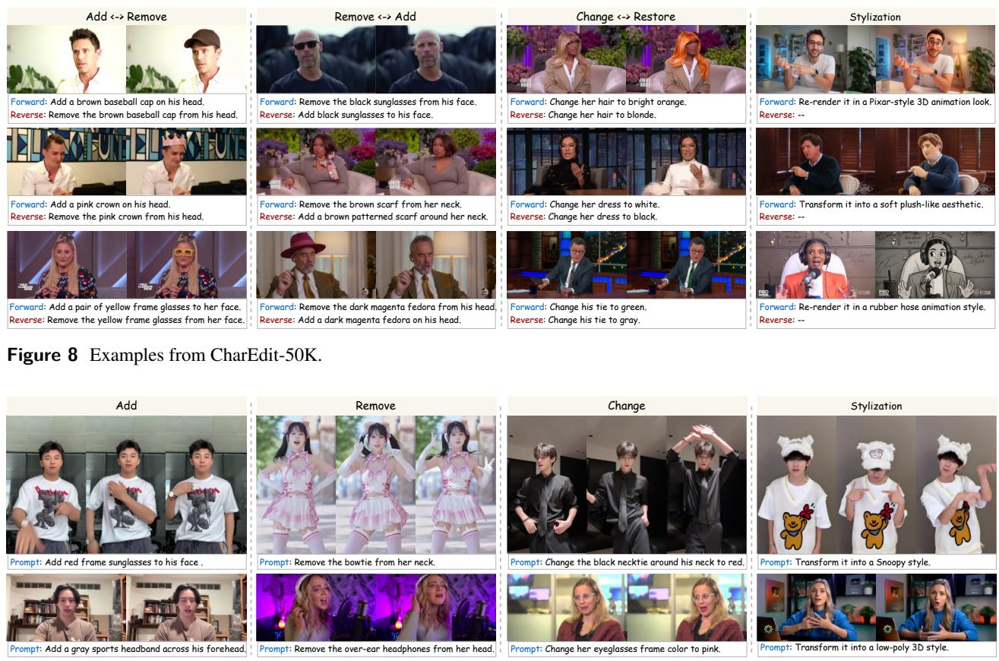  
Figure 9 Examples from CharEdit-Bench.

## A.2 CharEdit-Bench

To comprehensively evaluate character video editing in both conventional and streaming settings, we construct CharEdit Bench with two subsets: CharEdit-Bench-S and CharEdit-Bench-L. CharEdit-Bench-S comprises 150 five-second videos, each containing 81 frames at a resolution of 480 × 832 and randomly paired with one editing prompt, yielding 150 evaluation cases. CharEdit-Bench-L comprises 30 videos at the same resolution, each longer than one minute at 16 FPS and paired with two editing prompts, resulting in 60 evaluation cases. For every evaluation case, the first frame of the source video is used as the reference image. Examples from CharEdit-Bench are shown in Fig. 9.

## B Additional Implementation Details

## B.1 Training Details

Our training pipeline proceeds through three stages. In Stage 1, we perform reconstruction-based appearance–motion decoupled training, enabling the model to learn instruction-guided appearance transformations while following independently provided motion conditions. We employ ViTPose (Xu et al., 2022) to extract the skeleton sequence and localize the facial region, subsequently constructing the corresponding facial video. Following this initialization, Stage 2 adapts the bidirectional model to chunk-wise causal generation for streaming inference. We optimize only the LoRA adapters in the self-attention and FFN modules while keeping the cross-attention modules frozen (Gu et al., 2026). We implement the chunk-wise causal attention mask using PyTorch flex\_attention, allowing bidirectional attention within each chunk while restricting inter-chunk attention to the preceding clean context. After causal adaptation, Stage 3 performs aligned self-rollout distillation to compress the causal model into a two-step sampler and achieve long-term streaming generation, as shown in Algorithm 1. We use the same trainable modules as in Stage 2. During DMD training, we optimize the student and fake-score branch while keeping the real-score branch frozen, performing five fake-score updates for every student update. To handle the high memory demand of Align Forcing training, we adopt Fully Sharded Data Parallel (FSDP) to reduce memory consumption. For FPSA, the query and key tokens are partitioned into spatio-temporal blocks of shape (1, 8, 8). For style editing, synthesizing a complete stylized video for every training sample would be prohibitively expensive. We instead stylize a single image and repeat it along the temporal dimension to construct a static target video. Since appearance and motion are learned from decoupled conditions, this static target provides suficient supervision for the target style, which can be combined with motion signals during inference.

## B.2 Baseline Configurations

All baselines are evaluated using their oficial implementations and released checkpoints. The #Params column in Table 1 reports only the number of parameters in the DiT backbone used by each method. For Ditto (Bai et al., 2026), we use the oficially released ditto\_local.safetensors and ditto\_global\_style.safetensors LoRA checkpoints for local and global style editing, respectively. Since SANA-Streaming (Zhao et al., 2026) was trained at a resolution of $7 0 4 \times 1 2 8 0$ , we resize the input videos to this resolution for inference and resize the generated videos back to 480 × 832 before evaluation. For StreamDifusionV2 (Feng et al., 2025a), we follow its oficial inference launcher, which uses one-step denoising by default.

## B.3 Evaluation Details

We evaluate identity and motion consistency between the source and edited videos using three paired metrics. ID-SIM is computed as the average cosine similarity between ArcFace (Deng et al., 2019) embeddings extracted from temporally corresponding source and edited frames. AED (Siarohin et al., 2019) is calculated as the average $\ell _ { 1 }$ distance between extracted expression parameters of the source and edited frames using SMIRK (Retsinas et al., 2024). APD (Siarohin et al., 2019) is computed as the average $\ell _ { 1 }$ distance between corresponding body keypoints extracted by ViTPose (Xu et al., 2022). Higher ID-SIM and lower AED and APD indicate better preservation of identity, facial expressions, and body poses, respectively. For VLM evaluation, we uniformly sample three temporally aligned frame pairs from each source and edited video and provide GPT-5.5 (Singh et al., 2025) with the source frame, edited frame, and editing instruction. GPT-5.5 assigns a score from 0 to 3 for each of three criteria: Text Alignment, Edit Quality, and Background Consistency. It additionally returns a binary overall-success judgment based on these criteria. Based on these binary judgments, we define edit Success Rate as the proportion of sampled source–edited frame pairs judged successful. We use Pick Score (Kirstain et al., 2023) to assess overall video quality. For inference eficiency, we report FPS and inter-chunk latency on a single NVIDIA H100 GPU using 81-frame clips at a resolution of $3 8 4 \times 6 7 2$ (Yuan et al., 2026; Huang et al., 2025). Runtime is measured over the generation pipeline, from model-ready conditions to decoded RGB frames. For each model, we enable its oficially supported acceleration techniques (e.g., FlashAttention, torch.compile, and warm-up) to maximize throughput. Specifically, EditaLive is compiled with torch.compile, and its reported runtime includes motion-condition encoding, two-step DiT denoising, and VAE decoding. For long-video evaluation, we assess temporal consistency using frame-wise CLIP (Radford et al., 2021) and DINO (Caron et al., 2021) feature similarities.

Algorithm 1 Align Forcing Training with Fixed RoPE   
Require: Denoising timesteps $\{ t _ { 0 } , t _ { 1 } , \ldots , t _ { T } \}$ , where $t _ { 0 } = 0$   
Require: Number of video chunks N   
Require: Reference frame $x _ { R }$   
Require: Per-chunk conditions $\{ C _ { i } \} _ { i = 1 } ^ { N } .$ , including text and motion signals   
Require: Cache lengths $( L _ { \mathrm { r e f } } , L _ { \mathrm { s i n k } } , L _ { \mathrm { l o c a l } } ) = ( 1 , 3 , 3 )$   
Require: Generator $G _ { \theta }$ , which also returns pre-RoPE KV features   
1: loop   
2: Initialize model output $\mathbf { X } _ { \theta } \gets [ ]$   
3: Initialize $\mathbf { K V } _ { \mathrm { s i n k } }  \ [ ] , \mathbf { K V } _ { \mathrm { l o c a l } }  [ ]$   
4: Sample $s \sim$ Uniform $\{ 1 , 2 , \ldots , T \}$   
5: Set reference KV cache $\mathbf { K } \mathbf { V } _ { \mathrm { r e f } }  s g ( G _ { \theta } ( x _ { R } ; t _ { 0 } ) )$   
6: for $i = 1 , \ldots , N$ do   
7: Initialize $x _ { t _ { T } } ^ { i } \sim \mathcal { N } ( 0 , I )$   
8: $\mathbf { K } \mathbf { V } ^ { i } \gets [ \mathbf { K } \mathbf { \bar { V } } _ { \mathrm { r e f } } , \mathbf { K } \mathbf { V } _ { \mathrm { s i n k } } , T a i l _ { L _ { \mathrm { l o c a l } } } ( \mathbf { K } \mathbf { V } _ { \mathrm { l o c a l } } ) ]$ ▷ fixed-length active cache   
9: Assign Fixed RoPE indices (0:9)   
10: for $j = T , \dots , 1$ do ▷ complete the full rollout   
11: if $j = s$ then   
12: Enable gradient computation   
13: Set $\mathbf { k } \mathbf { v } ^ { i } , \hat { x } _ { 0 } ^ { i } \gets G _ { \theta } ( x _ { t _ { j } } ^ { i } ; t _ { j } , \mathbf { K } \mathbf { V } ^ { i } , C _ { i } )$   
14: $\mathbf { X } _ { \theta }$ .append $( \hat { x } _ { 0 } ^ { i } )$   
15: Detach $\mathbf { k } \mathbf { v } ^ { i }$ from gradient graph   
16: else   
17: Disable gradient computation   
18: Set $\mathbf { k } \mathbf { v } ^ { i } , \hat { x } _ { 0 } ^ { i } \gets G _ { \theta } ( x _ { t _ { j } } ^ { i } ; t _ { j } , \mathbf { K } \mathbf { V } ^ { i } , C _ { i } )$   
19: end if   
20: if $j > 1$ then   
21: Sample $\epsilon \sim \mathcal { N } ( 0 , I )$   
22: Set $\boldsymbol { x } _ { t _ { j - 1 } } ^ { i } \gets \Psi ( \hat { x } _ { 0 } ^ { i } , \epsilon , t _ { j - 1 } )$   
23: end if   
24: end for   
25: if $i = 1$ then   
26: Disable gradient computation   
27: Set $\mathbf { k } \mathbf { v } ^ { i } , \mathbf { \Lambda } _ { - }  G _ { \theta } ( \hat { x } _ { 0 } ^ { i } ; t _ { 0 } , \mathbf { K } \mathbf { V } ^ { i } , C _ { i } )$ ▷ one-time cache forward on the first chunk   
28: $\mathbf { K V } _ { \mathrm { s i n k } }$ .append $( \mathbf { k } \mathbf { v } ^ { i } )$   
29: else   
30: $\mathbf { K V } _ { \mathrm { l o c a l } }$ .append $( \mathbf { k } \mathbf { v } ^ { i } )$   
31: end if   
32: end for   
33: Update $\theta$ via DMD loss   
34: end loop

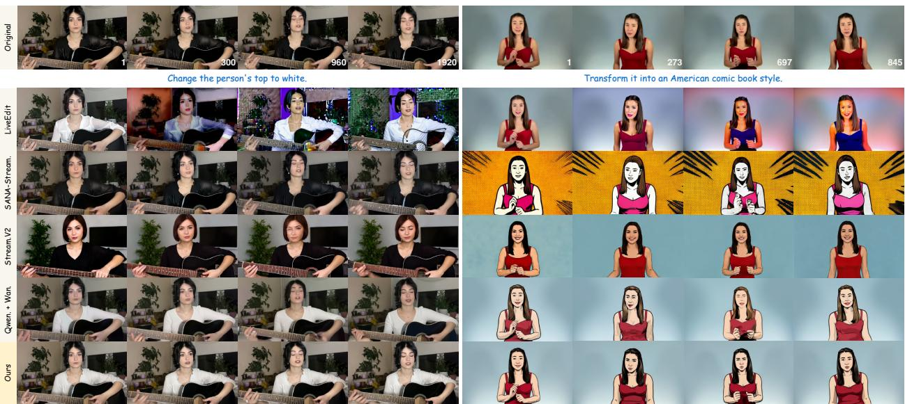  
Figure 10 Qualitative comparisons on CharEdit-Bench-L. EditaLive consistently maintains the requested edit and character appearance while following the source motion.

Table 3 Quantitative comparisons on CharEdit-Bench-L. Numbers in red and blue indicate the best and the second-best results, respectively. APD multiplied by 10. \*LiveEdit does not support global style editing. We therefore omit its character-consistency metrics, as these scores are not comparable when the requested edit is not successfully performed.
<table><tr><td rowspan="2">Method</td><td colspan="3">Character Consistency</td><td colspan="4">VLM Evaluation</td><td rowspan="2">Video Quality</td><td colspan="2">Temporal Consistency</td></tr><tr><td>ID-SIM↑</td><td>AED↓</td><td>APD↓</td><td>TA↑</td><td>EQ↑</td><td>BC↑</td><td>SR↑</td><td>Pick Score ↑ CLIP↑</td><td>DINO↑</td></tr><tr><td>LiveEdit*</td><td></td><td></td><td></td><td>1.583</td><td>1.700</td><td>1.044</td><td>0.017</td><td>18.91</td><td>97.36</td><td>98.38</td></tr><tr><td>SANA-Stream.</td><td>0.233</td><td>0.725</td><td>0.402</td><td>2.272</td><td>1.938</td><td>1.121</td><td>0.233</td><td>19.62</td><td>97.28</td><td>98.25</td></tr><tr><td>Stream.V2</td><td>0.049</td><td>0.876</td><td>0.329</td><td>1.431</td><td>2.064</td><td>0.638</td><td>0.100</td><td>19.70</td><td>98.42</td><td>99.17</td></tr><tr><td>Qwen.+Wan.</td><td>0.398</td><td>0.659</td><td>0.126</td><td>2.733</td><td>2.304</td><td>1.776</td><td>0.750</td><td>19.69</td><td>98.30</td><td>98.65</td></tr><tr><td>Ours</td><td>0.492</td><td>0.576</td><td>0.109</td><td>2.761</td><td>2.678</td><td>2.183</td><td>0.817</td><td>19.78</td><td>98.51</td><td>98.96</td></tr></table>

## C More Experimental Results

Evaluation on Long Videos. We further evaluate long-term character video editing in the streaming setting on CharEdit-Bench-L. As shown in Table 3, EditaLive achieves the strongest overall performance among the compared methods, demonstrating that its editing quality and character consistency are maintained over long sequences. The qualitative comparisons in Fig. 10 further show that EditaLive maintains a consistent edited appearance over long video sequences while faithfully following the source motion. These results demonstrate the long-term stability of EditaLive.

Cross-Character Editing. Owing to our appearance–motion decoupled formulation, EditaLive naturally supports cross-character editing by combining the appearance of a reference character with motion signals extracted from a diferent driving video, as shown in Fig. 11.

Additional Qualitative Results. Figs. 13, 14, 16, and 18 present additional qualitative comparisons across diverse characters and editing instructions, further demonstrating the robustness and generalization of EditaLive. Figs. 15 and 17 present comparisons over extended video sequences, highlighting the long-term consistency and stability of EditaLive. Compared with existing methods, EditaLive exhibits substantially less appearance drift and consistently maintains the requested edit and character appearance while following the source motion.

## D Limitations & Future Work

While EditaLive achieves real-time and temporally coherent long-term character video editing, there remain two directions for further improvement, as shown in Fig. 12. First, the current framework relies on skeleton sequences for body-motion control. Although they efectively capture overall body poses, they do not explicitly represent fine-grained finger articulation, and subtle or complex hand gestures may therefore be reproduced less accurately. Incorporating more expressive hand-motion conditions, such as dense hand keypoints or hand-specific representations, could further improve fine-grained motion preservation. Second, character appearance is represented by a single reference image. Although this compact condition is efective in most cases, it provides limited appearance cues for regions occluded in the reference image. When these regions become visible during subsequent motion, their inferred appearance may difer from that in the source video. Future work could leverage multiple reference images to provide more complete appearance cues.

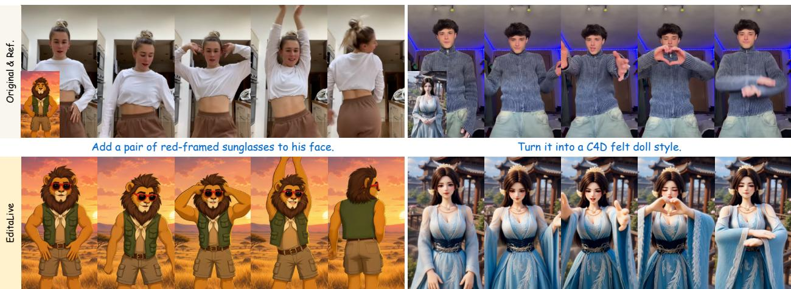  
Figure 11 Cross-character editing results.

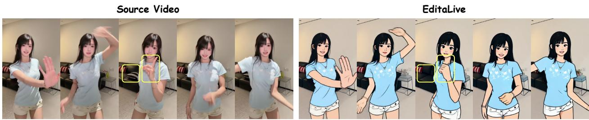  
Figure 12 Limitations of EditaLive. The editing prompt is “Transform it into a Snoopy style”.

## E Ethics Statement

Our work focuses on enabling real-time and long-term character video editing, which naturally raises concerns related to privacy, consent, copyright, and potential misuse. We respect the applicable licenses and usage policies of the data used for training and evaluation. The data are obtained from existing research datasets and publicly accessible online sources, and we do not redistribute third-party source videos or audio. Our method is not designed to identify individuals or recover private identity information. While realistic character editing may be susceptible to impersonation, deceptive manipulation, or non-consensual use, EditaLive is intended solely for legitimate creative production and interactive applications. We encourage users to obtain consent from depicted individuals and adopt responsible deployment practices, such as access control, content disclosure, and watermarking, to mitigate malicious use.

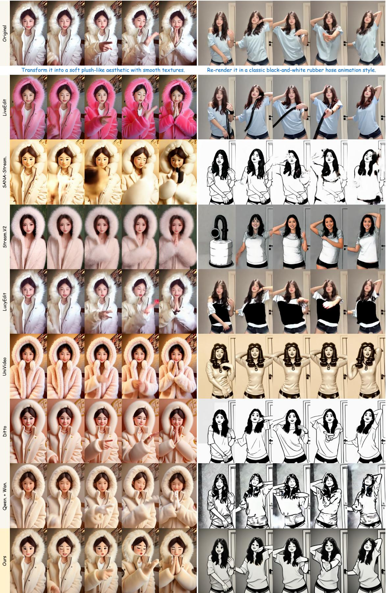  
Figure 13 More comparisons between baselines and our EditaLive (1/4).

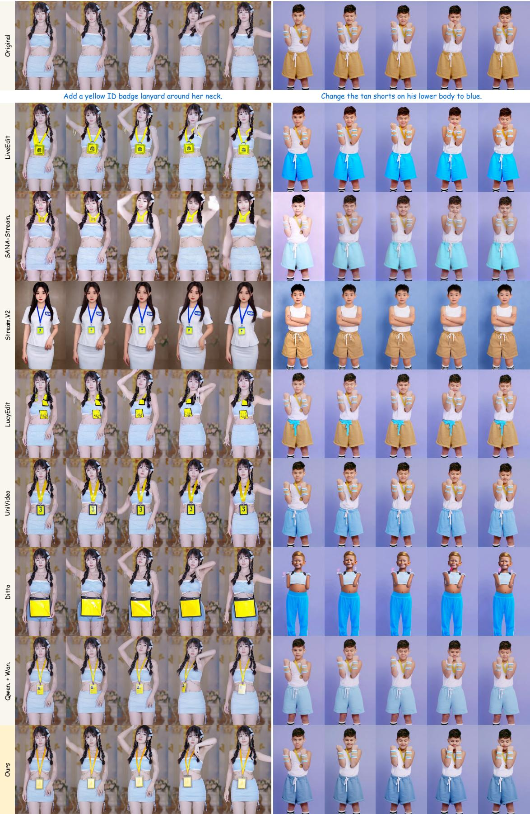  
Figure 14 More comparisons between baselines and our EditaLive (2/4).

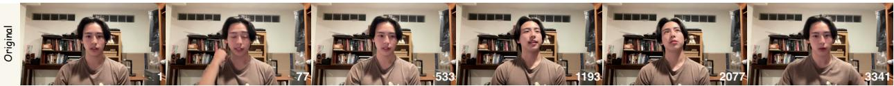

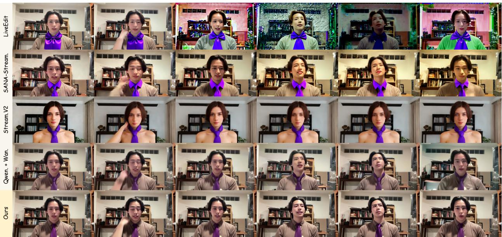  
Figure 15 Long-video comparison results (1/2).

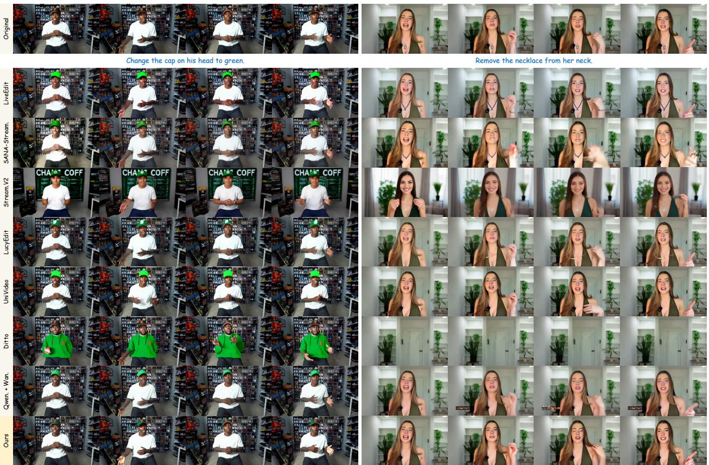  
Figure 16 More comparisons between baselines and our EditaLive (3/4).

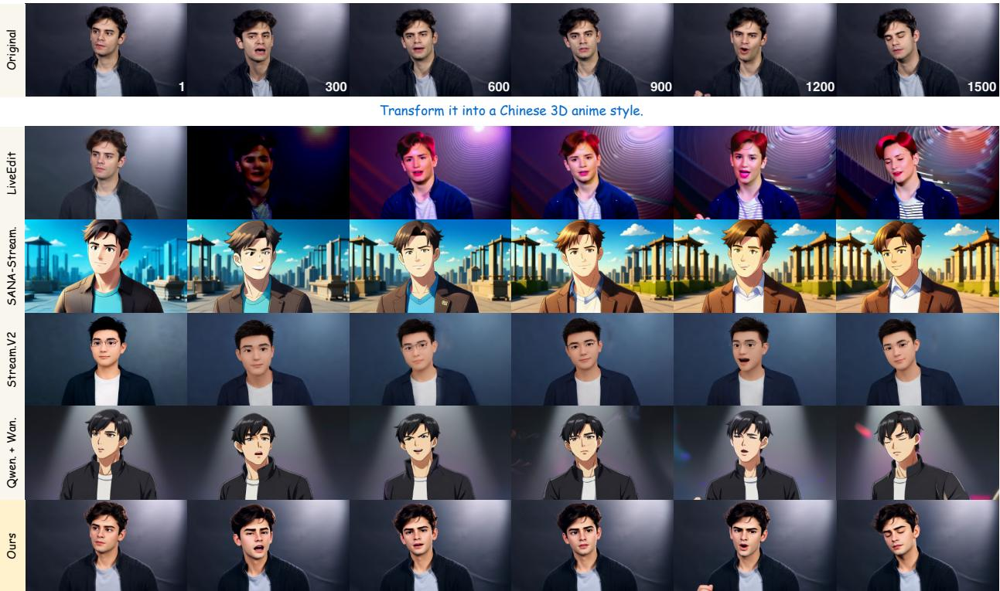  
Figure 17 Long-video comparison results (2/2).

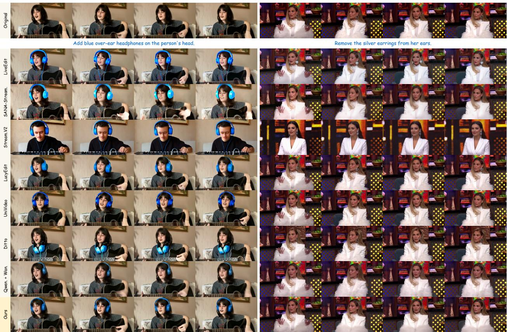  
Figure 18 More comparisons between baselines and our EditaLive (4/4).