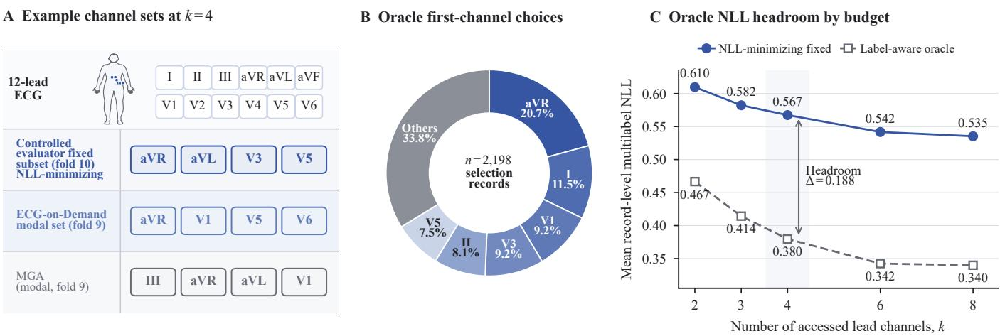
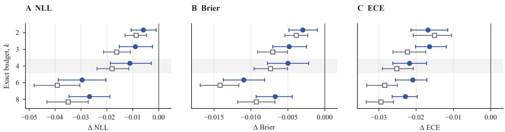
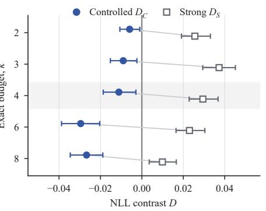
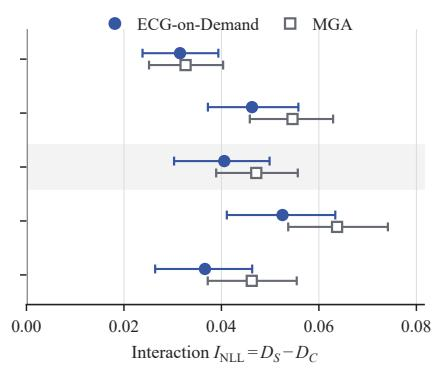
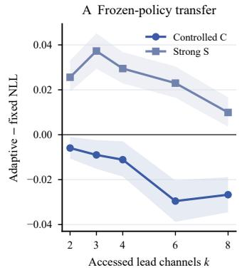
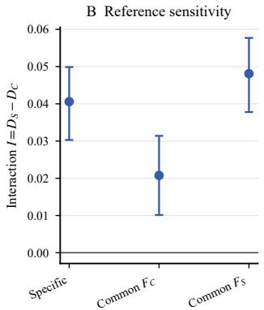
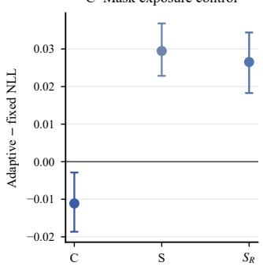

# Evaluator-Dependent Patient-Adaptive ECG Lead-Channel Allocation

Xiaoyang Li

College of Medicine and Biological Information Engineering

Northeastern University

Shenyang, China

Email: 20246389@stu.neu.edu.cn

ORCID: 0009-0002-4863-5761

Zeyan Tao

College of Medicine and Biological Information Engineering

Northeastern University

Shenyang, China

Email: taozy@mails.neu.edu.cn

ORCID: 0009-0000-3149-9105

Abstract—Patient-conditioned ECG lead-channel allocation can outperform fixed population-wide protocols under its development evaluator, but that advantage is not evaluator-invariant: freezing the acquisition policy and replacing the diagnostic evaluator can reverse the adaptive-versus-fixed margin. We quantify this evaluator dependence by scoring two policies trained with a controlled arbitrary-mask logistic evaluator against a masked raw-waveform ResNet1D, with exhaustive metric-matched fixed baselines for each evaluator. On a held-out fold-8 evaluation at $k \ = \ 4 ,$ , ECG-on-Demand changes from $D _ { \mathrm { C } } ~ = ~ - 0 . 0 1 1$ 120 to $D _ { \mathrm { S } } ~ = ~ + 0 . 0 2 9 4 6 6$ giving INLL = +0.040585 (95% CI [+0.030288, +0.049879]). The shift persists under common fixed references and after training the strong evaluator on a mixture of random, ECG-on-Demand, and MGA masks (INLL = +0.037649), making reference-only and mask-exposure explanations less plausible. Evaluator-aligned Strong-MGA reduces but does not eliminate the strong-evaluator gap $( D _ { \mathrm { { S } } } ~ = ~ + 0 . 0 1 2 3 6 2 )$ . The three sensitivity analyses were motivated post hoc and provide robustness and mechanism evidence rather than confirmatory claims.

Index Terms—adaptive lead-channel acquisition, active feature acquisition, ECG channel allocation, evaluator dependence, probabilistic prediction

## I. INTRODUCTION

The standard 12-lead electrocardiogram (ECG) provides complementary views of cardiac electrical activity [1]. Reducedlead systems commonly apply one population-wide channel subset [2]–[4], leaving patient-level variation in channel utility unmodeled at acquisition. A patient-conditioned policy instead observes a partial recording and allocates the remaining budget according to the current patient state. Throughout, k denotes the number of accessed lead channels, not the number of electrodes.

Task-driven sensing ties measurement value to a downstream objective. For diagnostic evaluator $f$ , the retrospective marginal loss reduction is

$$
u _ { f } ( \ell \mid X , S ) = L _ { f } ( X , S ) - L _ { f } ( X , S \cup \{ \ell \} ) ,\tag{1}
$$

not an evaluator-free property of channel ℓ. In general, $u _ { f _ { 1 } } \ne$ $u _ { f _ { 2 } }$ . This distinction matters when an acquisition policy is developed against a lightweight surrogate while the diagnostic backbone is later replaced.

We ask whether a policy that beats the best fixed protocol under its development evaluator retains that advantage after evaluator replacement. On PTB-XL, we freeze two policies trained with a controlled arbitrary-mask logistic evaluator and score their unchanged acquisition trajectories with a more predictive masked raw-waveform ResNet1D. Exhaustive search supplies metric-matched population-wide fixed comparators separately for each evaluator. The original frozen-policy transfer result is then complemented by three post-hoc sensitivity analyses: common-reference sensitivity, training the strong evaluator on a mixture of mask sources, and evaluator-aligned Strong-MGA policy training.

The contributions are therefore bounded and explicit. First, we quantify evaluator dependence of the adaptive-versus-fixed contrast across policies, budgets, and probabilistic metrics. Second, we test whether the interaction is an artifact of evaluator-specific fixed references. Third, we test two mechanistic alternatives: whether mask-distribution exposure explains the transfer failure, and whether a policy trained against strongevaluator marginal targets can recover it. These added analyses use the same patient-disjoint roles and do not access fold 8 for training or tuning. They were motivated after the original analysis, so their intervals are interpreted as robustness evidence rather than prespecified confirmation.

## II. RELATED WORK

Reduced and incomplete-lead ECG: Work on reduced or incomplete ECGs spans fixed clinical configurations, cohort-level lead selection, and reconstruction from predefined subsets [2]– [4]. Lead-agnostic pretraining and arbitrary-lead reconstruction improve robustness to missing channels [5], [6], but predict from a given subset rather than select it. Lead switching offers the closest ECG analogue to sequential observation [7]. Rawwaveform convolutional networks are established high-capacity diagnostic models for 12-lead ECGs [8], [9]; in our transfer experiment such a network replaces the evaluator while the acquisition policy remains fixed.

Active feature acquisition and task-driven sensing: Costsensitive acquisition selects which unavailable feature to reveal from the current state [10], [11]. Generative meth ods estimate arbitrary conditionals or expected information gain [12]–[14], and dynamic feature selection can optimize conditional mutual information [15]. Task-driven compressive sensing ties measurement selection to a downstream inference objective with the sensor designed jointly with the decoder [16], [17]; the channel budget k plays the role of a measurement budget and the acquisition policy is the adaptive measurement operator. Our contribution is not this general principle but a controlled empirical test of whether a learned patient-adaptive ECG allocation advantage survives diagnostic-evaluator replacement. Probability quality remains distinct from ranking performance [18], and the evidence is specific to these policies, evaluators, and PTB-XL.

  
Fig. 1. Pre-holdout evidence for evaluator-conditioned channel-set heterogeneity. (A) The fold-10 controlled-evaluator NLL-minimizing fixed subset and the modal fold-9 k = 4 outputs of ECG-on-Demand and MGA. (B) Label-aware oracle first-channel choices across the fold-10 selection records; the six smaller shares are grouped as “Others.” (C) Fold-10 mean record-level multilabel NLL for the population-wide fixed subset and the label-aware per-record oracle. Oracle quantities are descriptive, controlled-evaluator- and NLL-specific, label-aware, and non-deployable.

## III. METHOD

## A. Exact-budget allocation and evaluators

Let $X _ { i } ~ = ~ \{ x _ { i , \ell } \} _ { \ell \in \mathcal { L } }$ denote ECG record i, where ${ \mathcal { L } } =$ {I, II, III, aVR, $\operatorname { a V L , a V F , V 1 , . . . , V 6 } \}$ . An exact-budget policy produces $S _ { i } ( k ) \subseteq { \mathcal { L } }$ with $| S _ { i } ( k ) | ~ = ~ k$ . Evaluator f returns superclass probabilities $p _ { f , i } ( S ) = f ( X _ { i , S } , S )$ and loss $L _ { f } ( X _ { i } , S ) = \ell ( \pmb { y } _ { i } , \pmb { p } _ { f , i } ( S ) )$ . The policy utility is

$$
u _ { f } ( \ell \mid X _ { i } , S ) = L _ { f } ( X _ { i } , S ) - L _ { f } ( X _ { i } , S \cup \{ \ell \} ) ,\tag{2}
$$

so the same observed ECG can induce different acquisition rankings under different evaluators.

The controlled evaluator summarizes every available lead with ten deterministic waveform statistics and applies a maskaware one-vs-rest logistic model fitted under random exactcardinality masks. ECG-on-Demand receives acquired-lead features, identities, the mask, current evaluator probabilities, and remaining budget; it acquires the highest-scoring channel until cardinality k. Myopic Gain Acquisition (MGA) predicts one-step marginal controlled-evaluator NLL reduction and is a behaviorally distinct comparator. Cohort-Conditional Greedy Acquisition is used only as a mechanism control in the original analysis.

The strong evaluator is a 2.77M-parameter masked ResNet1D trained on 12-lead, 10-s waveforms with unavailable standardized channels zeroed and a 12-bit mask provided to the prediction head. Its original training used random exactcardinality masks. The evaluator-specific policy trajectories are never regenerated during transfer: the strong evaluator scores the same $S _ { i } ( k )$ chosen from the controlled evaluator.

## B. Evaluator-specific and common-reference contrasts

For evaluator $f \in \{ \mathrm { C } , \mathrm { S } \}$ , metric m, and budget k, all $\binom { 1 2 } { k }$ fixed subsets are scored on the selection split. The minimizing subset $F _ { f , m , k }$ is then frozen. With $A _ { k }$ denoting a policy’s adaptive allocation,

$$
D _ { \mathrm { C } , m } ( k ) = L _ { \mathrm { C } , m } ( A _ { k } ) - L _ { \mathrm { C } , m } ( F _ { \mathrm { C } , m , k } ) ,\tag{3}
$$

$$
D _ { \mathrm { S } , m } ( k ) = L _ { \mathrm { S } , m } ( A _ { k } ) - L _ { \mathrm { S } , m } ( F _ { \mathrm { S } , m , k } ) ,\tag{4}
$$

$$
I _ { m } ( k ) = D _ { \mathrm { { S } } , m } ( k ) - D _ { \mathrm { { C } } , m } ( k ) .\tag{5}
$$

Negative D favors adaptive allocation; positive I means the contrast shifts less favorably after evaluator replacement. To test reference dependence, we additionally score both evaluators against the same frozen reference $R \in \{ F _ { \mathrm { C } } , F _ { \mathrm { S } } \}$ and compute $\bar { I _ { m } ^ { R } } = D _ { \mathrm { S } , m } ^ { R } - D _ { \mathrm { C } , m } ^ { R }$ . These are post-hoc sensitivity estimands; they do not replace the original evaluator-specific comparison.

## C. Mask-robust evaluator and aligned policy

As a robustness test, we train one new strong evaluator with a fixed mixture: 50% random exact-cardinality masks, 25% frozen ECG-on-Demand masks, and 25% frozen MGA masks. The mixture uses $k \in \{ 1 , 2 , 3 , 4 , 6 , 8 , 1 2 \}$ , trains on folds 1– 6, selects the epoch on fold 7, and uses fold 10 only for a boundary check. Fold 8 is not used in training, early stopping, or model selection.

As a second test, Strong-MGA is fit to one-step marginal NLL reductions from the frozen original strong evaluator. The target states are generated from training records only, with the same MGA multilayer-perceptron form and hyperparameters as the controlled-trained MGA. Strong-MGA is evaluated on fold 8 only after fitting. This asks whether evaluator-aligned policy training can recover the transfer loss; it does not constitute a jointly optimized end-to-end system.

  
Fig. 2. Controlled-evaluator gains for both learned policies. ECG-on-Demand (filled circles) and MGA (open squares) are compared with the controlled evaluator metric-matched fixed subset across budgets and probabilistic metrics. Deltas are adaptive minus fixed, so negative values favor adaptive allocation. Whiskers are paired patient-cluster 95% CIs and k = 4 is shaded. This is the original frozen-policy result; fold-8 results are reported as a held-out exploratory evaluation.

We report mean multilabel NLL, Brier score, and macro label-wise 10-bin ECE [19]–[21]; AUROC and AUPRC are descriptive. All intervals use 1,000 paired patient-cluster bootstrap replicates with identical patient resamples across policies, evaluators, and fixed references.

## IV. EXPERIMENTS

## A. Data roles and provenance

PTB-XL v1.0.3 contains 21,799 ten-second, 100-Hz ECG recordings from 18,869 patients with five diagnostic superclasses [22]. We use official folds 1–6 for training, fold 7 for validation, fold 10 for fixed subset selection, fold 9 for development audit, and fold 8 for the held-out evaluation. Fold 8 had appeared in historical pre-reset training pools; therefore, despite retraining all reported models without fold 8, we call the fold-8 results a held-out exploratory evaluation rather than an untouched confirmatory test. The fold-8 set contains 2,173 records from 1,881 patients. The budgets are $k \in \{ 2 , 3 , 4 , 6 , 8 \}$ . The common-reference, mask-robust, and Strong-MGA additions are post hoc and use fold 8 only for final scoring.

## B. Frozen-policy evaluator replacement

On the fold-9 development audit, ECG-on-Demand and MGA each beat their controlled-evaluator metric-matched fixed subsets in all 15 budget–metric comparisons. On fold 8 at $k = 4 ,$ , ECG-on-Demand gives $D _ { \mathrm { C } } = - 0 . 0 1 1 1 2 0$ (95% $\mathrm { C I } \ [ - 0 . 0 1 8 6 5 2 , - 0 . 0 0 2 8 8 5 ] .$ ) under the controlled evaluator. Under the strong evaluator, the unchanged trajectories give $D _ { \mathrm { { S } } } = + 0 . 0 2 9 4 6 6$ (95% CI [+0.022848, +0.036799]), so

$$
\begin{array} { r l } & { I _ { \mathrm { N L L } } ( 4 ) = + 0 . 0 4 0 5 8 5 , } \\ & { 9 5 \% \mathrm { C I } = [ + 0 . 0 3 0 2 8 8 , + 0 . 0 4 9 8 7 9 ] . } \end{array}\tag{6}
$$

At the same budget, the Brier interaction is +0.013960 and the MGA NLL interaction is +0.047150. Across two policies, five budgets, and three probabilistic metrics, all 30 evaluatorspecific interaction estimates are positive with paired intervals excluding zero. These contrasts share data and are not 30 independent tests.

## C. Common-reference sensitivity

The primary interaction is not explained solely by changing the fixed reference. $\begin{array} { r l r l } { \mathrm { A t } } & { { } k } & { = } & { { } 4 } \end{array}$ for ECGon-Demand, the interaction is +0.020760 (95% CI $[ + 0 . 0 1 0 1 3 1 , + 0 . 0 3 1 4 0 2 ] )$ when both evaluators use $F _ { \mathrm { C } } ,$ and $+ 0 . 0 4 8 0 9 8 \ ( [ + 0 . 0 3 7 7 8 8 , + 0 . 0 5 7 6 9 4 ] )$ ) when both use $F _ { \mathrm { S } }$ The evaluator-specific result is +0.040585; all three intervals exclude zero. The complete policy–budget–metric table is supplied in the Supplementary Material.

## D. Mask-distribution robustness

The mask-robust evaluator reaches full-12 fold-7 NLL 0.2584, Brier 0.0775, ECE 0.0263, AUROC 0.9345, and AUPRC 0.8425, compared with 0.5031, 0.1587, 0.1553, 0.8355, and 0.6283 for the controlled evaluator. On fold 8 at $k = 4 ,$ the ECG-on-Demand interaction becomes $I _ { \mathrm { N L L } } ^ { \mathrm { r o b u s t } } = 0 . 0 3 7 6 4 9$ (95% CI [+0.026942, +0.047100]); the Brier and ECE interactions are +0.012817 and +0.018932, respectively, with intervals excluding zero. All 30 robust interaction intervals exclude zero. Thus, exposure to policy- generated masks plus random masks does not remove the evaluator-dependent shift, although it modestly changes its magnitude.

## E. Evaluator-aligned Strong-MGA

Strong-MGA improves the strong-evaluator NLL of the controlled-trained MGA trajectory from 0.2952 to 0.2784 at $k \ = \ 4$ (paired difference −0.016777, 95% CI $[ - 0 . 0 2 5 9 6 3 , - 0 . 0 0 8 3 5 5 ] )$ . Relative to the exhaustive strong fixed baseline, however, Strong-MGA still has $\begin{array} { r l } { D _ { \mathrm { S } } } & { { } = } \end{array}$ $+ 0 . 0 1 2 3 6 2 \ ( [ + 0 . 0 0 5 7 6 9 , + 0 . 0 1 9 2 0 4 ] )$ . The Brier gap is likewise reduced but remains positive; ECE does not show a clear pairwise change. Aligned policy training therefore provides partial recovery, not evidence that the fixed-baseline gap has been eliminated.

A Full-12 evaluator quality

B Frozen ECG-on-Demand transfer

  
C NLL evaluator interaction

Fig. 3. Evaluator quality and frozen-policy transfer. (A) Full-12 diagnostic quality on the fold-9 development audit for the controlled and original strong evaluators. (B) Fold-8 NLL contrasts for the same frozen ECG-on-Demand trajectories under evaluator-specific fixed references; negative D favors adaptive allocation. (C) Fold-8 NLL interactions for ECG-on-Demand and MGA; positive I indicates a less favorable adaptive-versus-fixed contrast under the original strong evaluator. Error bars are paired patient-cluster 95% CIs.  

  
Fig. 4. Additional evaluator-dependence analysis. (A) Frozen ECG-on-Demand contrasts under evaluator-specific fixed references; negative D favors adaptive allocation. (B) ECG-on-Demand k = 4 NLL interaction when both evaluators use the evaluator-specific reference or a common controlled/strong reference. (C) Interaction after training a new strong evaluator on a 50% random, 25% ECG-on-Demand, 25% MGA mask mixture. Points are fold-8 estimates and whiskers are paired patient-cluster 95% CIs; this is a post hoc robustness analysis.

## V. DISCUSSION

The result is an evaluator-dependence effect on the adaptiveversus-fixed contrast: every contrast subtracts the evaluator’s own exhaustive best fixed subset, so additive evaluator-level bias cancels in I. Channel-alignment analysis (Supplementary S8) supports a feature-space mechanism: adaptive outputs concentrate on leads favoured by the controlled logistic evaluator and diverge from the strong-evaluator NLL-optimal set {III, aVR, V2, V5} (mean fold-8 Jaccard 0.300). Positive interactions under both common-reference choices and under the maskrobust evaluator $( I _ { \mathrm { N L L } } ^ { \mathrm { r o b u s t } } = 0 . 0 3 7 6 4 9 .$ , all 30 intervals above zero) make reference-only and mask-exposure explanations less plausible.

Strong-MGA reduces the gap (−0.016777 NLL) but does not close it $( D _ { \mathrm { { S } } } = + 0 . 0 1 2 3 6 2 ) \colon$ the residual may reflect myopic targets, finite MLP capacity, trajectory shift, or one-step vs. multi-step mismatch. Strong-evaluator ECE is negative at k ∈ {2, 3, 4} while NLL and Brier flip positive at all budgets; ECE interactions still exclude zero but indicate the calibration surface is less uniformly affected than the proper scoring rules.

The practical implication is direct: adaptive acquisition policies should be developed and validated with the downstream diagnostic evaluator used at deployment. The study is retrospective and restricted to PTB-XL; k counts channels not electrode actions, and fold-8 results are exploratory rather than pristine confirmatory evidence.

## VI. CONCLUSION

Patient-conditioned ECG lead-channel allocation can outperform fixed protocols under its development evaluator, but that advantage is not evaluator-invariant. From a task-driven sensing perspective, channel marginal utilities learned against one inference model do not transfer cleanly to another when the two models weight the ECG representation differently. Common-reference and mask-mixture checks support this shift; evaluator-aligned policy training gives only partial recovery. Policies should therefore be developed and validated with their downstream diagnostic evaluator, and jointly optimised sensing– diagnosis systems remain necessary future work.

## COMPLIANCE WITH ETHICAL STANDARDS

This study uses only public, de-identified PTB-XL data under its released terms; no intervention, enrollment, or new protected health information was collected.

## REFERENCES

[1] P. Kligfield et al., “Recommendations for the standardization and interpretation of the electrocardiogram: Part I: The electrocardiogram and its technology,” Journal of the American College of Cardiology, vol. 49, no. 10, pp. 1109–1127, 2007.

[2] S. P. Nelwan, J. A. Kors, S. H. Meij, J. H. van Bemmel, and M. L. Simoons, “Reconstruction of the 12-lead electrocardiogram from reduced lead sets,” Journal of Electrocardiology, vol. 37, no. 1, pp. 11–18, 2004.

[3] M. A. Reyna et al., “Will two do? varying dimensions in electrocardiography: The PhysioNet/computing in cardiology challenge 2021,” in Computing in Cardiology, vol. 48, 2021, pp. 1–4.

[4] C. Lai, S. Zhou, and N. A. Trayanova, “Optimal ECG-lead selection increases generalizability of deep learning on ECG abnormality classifi cation,” Philosophical Transactions of the Royal Society A, vol. 379, no. 2212, p. 20200258, 2021.

[5] J. Oh, H. Chung, J. m. Kwon, D. g. Hong, and E. Choi, “Leadagnostic self-supervised learning for local and global representations of electrocardiogram,” in Proceedings of the Conference on Health, Inference, and Learning, ser. Proceedings of Machine Learning Research, vol. 174, 2022, pp. 338–353.

[6] J. Chen, W. Wu, T. Liu, and S. Hong, “Multi-channel masked autoencoder and comprehensive evaluations for reconstructing 12-lead ECG from arbitrary single-lead ECG,” npj Cardiovascular Health, vol. 1, p. 34, 2024.

[7] T. Iwata, R. Nishikimi, R. Shibue, M. Nakano, K. Kashino, and H. Tomoike, “Electrocardiographic classification using deep learning with lead switching,” in 2024 46th Annual International Conference of the IEEE Engineering in Medicine and Biology Society, 2024, pp. 1–4.

[8] A. H. Ribeiro et al., “Automatic diagnosis of the 12-lead ECG using a deep neural network,” Nature Communications, vol. 11, p. 1760, 2020.

[9] N. Strodthoff, P. Wagner, T. Schaeffter, and W. Samek, “Deep learning for ECG analysis: Benchmarks and insights from PTB-XL,” IEEE Journal of Biomedical and Health Informatics, vol. 25, no. 5, pp. 1519–1528, 2021.

[10] H. Shim, S. J. Hwang, and E. Yang, “Why pay more when you can pay less: A joint learning framework for active feature acquisition and classification,” in Proceedings of the AAAI Conference on Artificial Intelligence, vol. 32, no. 1, 2018.

[11] J. Janisch, T. Pevny, and V. Lis´ y, “Classification with costly features using´ deep reinforcement learning,” in Proceedings of the AAAI Conference on Artificial Intelligence, vol. 33, no. 1, 2019, pp. 3959–3966.

[12] C. Ma, S. Tschiatschek, K. Palla, J. M. Hernandez-Lobato, S. Nowozin, and C. Zhang, “EDDI: Efficient dynamic discovery of high-value information with partial VAE,” in Proceedings of the 36th International Conference on Machine Learning, ser. Proceedings of Machine Learning Research, vol. 97, 2019, pp. 4234–4243.

[13] Y. Li, S. Akbar, and J. Oliva, “ACFlow: Flow models for arbitrary conditional likelihoods,” in Proceedings of the 37th International Conference on Machine Learning, ser. Proceedings of Machine Learning Research, vol. 119, 2020, pp. 5831–5841.

[14] W. Gong, S. Tschiatschek, S. Nowozin, R. E. Turner, J. M. Hernandez-Lobato, and C. Zhang, “Icebreaker: Element-wise efficient information acquisition with a bayesian deep latent gaussian model,” in Advances in Neural Information Processing Systems, vol. 32, 2019.

[15] I. C. Covert, W. Qiu, M. Lu, N. Y. Kim, N. J. White, and S.-I. Lee, “Learning to maximize mutual information for dynamic feature selection,” in Proceedings of the 40th International Conference on Machine Learning, ser. Proceedings of Machine Learning Research, vol. 202, 2023, pp. 6424– 6447.

[16] J. M. Duarte-Carvajalino, G. Yu, L. Carin, and G. Sapiro, “Task-driven adaptive statistical compressive sensing of gaussian mixture models,” IEEE Transactions on Signal Processing, vol. 61, no. 3, pp. 585–600, 2013.

[17] A. Chakrabarti, “Learning sensor multiplexing design through backpropagation,” in Advances in Neural Information Processing Systems, vol. 29, 2016.

[18] B. V. Calster, D. J. McLernon, M. van Smeden, L. Wynants, and E. W. Steyerberg, “Calibration: The achilles heel of predictive analytics,” BMC Medicine, vol. 17, p. 230, 2019.

[19] M. P. Naeini, G. Cooper, and M. Hauskrecht, “Obtaining well calibrated probabilities using bayesian binning,” in Proceedings of the AAAI Conference on Artificial Intelligence, vol. 29, no. 1, 2015.

[20] C. Guo, G. Pleiss, Y. Sun, and K. Q. Weinberger, “On calibration of modern neural networks,” in Proceedings of the 34th International Conference on Machine Learning, vol. 70, 2017, pp. 1321–1330.

[21] J. Vaicenavicius, D. Widmann, C. Andersson, F. Lindsten, J. Roll, and T. Schon, “Evaluating model calibration in classification,” in¨ Proceedings of the Twenty-Second International Conference on Artificial Intelligence and Statistics, ser. Proceedings of Machine Learning Research, vol. 89, 2019, pp. 3459–3467.

[22] P. Wagner, N. Strodthoff, R.-D. Bousseljot, D. Kreiseler, F. I. Lunze, W. Samek, and T. Schaeffter, “PTB-XL, a large publicly available electrocardiography dataset,” Scientific Data, vol. 7, no. 1, p. 154, 2020.