# Glass Surface Detection Grounded in 3D Visual Geometry

Yiwei Lu∗ 6243112037@stu.jiangnan.edu.cn Jiangnan University Wuxi, China

Xiaojun Chang cxj273@gmail.com University of Science and Technology of China Hefei, China

Ke Xu∗ kkangwing@gmail.com University of Science and Technology of China Hefei, China

Radu Timofte radu.timofte@uni-wuerzburg.de University of Wurzburg Bayern, Germany

Tao Yan†   
yantao.ustc@gmail.com   
Jiangnan University   
Wuxi, China   
Rynson W. H. Lau   
rynsonwhlau@gmail.com   
City University of Hong Kong   
(Dongguan)   
Dongguan, China

## Abstract

Glass surface detection (GSD) is critical for scene understanding and reconstruction, and yet remains challenging due to the transparency and reflectivity of glass surfaces. Existing GSD methods typically rely on 2D appearance cues, which may fail in geometrically ambiguous scenes. In this paper, we propose a paradigm shift: grounding GSD in 3D visual geometry to explicitly model the physical existence of glass surfaces. Our method first distills rich 3D priors from the visual geometry grounded transformer (VGGT) and generates glass-aware 3D representations. It then ex ploits multi-tasking learning with a novel glass detection head, consisting of two core modules: a Frequency Self-Attention Mod ule (FSAM) that identifies glass-specific spectral features for glass surface localization, and a Geometry Grounding Block (GeGB) that selectively grounds 2D features in 3D geometry for glass surface segmentation. Extensive experiments demonstrate that our method achieves state-of-the-art performance across seven standard GSD benchmarks, generalizes well to video/multi-modal data, and substantially improves reconstruction in glass scenes. Code is available in https://github.com/YT3DVision/VGGT\_GLASS.

## CCS Concepts

• General and reference → General conference proceedings;   
• Computing methodologies → Object detection.

## Keywords

Glass Surface Detection; Geometry-aware Scene Perception

## 1 Introduction

Glass is ubiquitous in our daily lives. However, the transparency and specularity of glass create a unique form of semantic and geometric ambiguity for machine perception: the visual data of a glass surface contains both transmitted background scenes and foreground reflections. Such inconsistency violates assumptions of many vision pipelines, e.g., depth/optical flow estimation [23, 32], 3D reconstruction [33, 38], and autonomous navigation [17, 31]. Hence, accurate glass surface detection is essential for robust visual understanding and interactions in the real world.

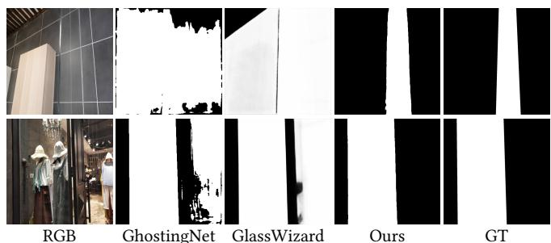  
Figure 1: SOTA GSD methods typically rely on 2D appearance cues (e.g., by explicitly modeling the ghosting efects [36]) or implicitly learning glass-specific embeddings from other modalities (e.g., text) to query large-scale pre-trained image difusion priors [13]. However, glass surfaces do not always exhibit strong ghosting efects [36]. While the text-based image priors [13] show promising glass surface localization performances, they are not suficiently discriminative for pixel-wise segmentation. In this work, we propose to shift the paradigm by grounding GSD in large-scale pre-trained 3D visual geometry. We explicitly model the physical existence of glass surfaces, resulting in accurately glass segmentation.

Existing glass surface detection (GSD) methods typically learn appearance cues from the RGB domain (e.g., multiscale contextual features [2, 21, 39], reflections [14, 16], ghosting efects [36], and boundaries [6, 8]) or multi-modalities (combining RGB with, e.g., polarization [20, 24], thermal [11], and depth [15]). Most recently, Li et al. [13] proposed a difusion-based method to leverage the 2D image priors from large-scale foundation models for GSD. Nonetheless, existing methods are inherently limited to 2D appearance-based reasoning: while efective in localizing glass regions, they tend to fail in segmenting glass surfaces accurately. As shown in Fig. 1 (2nd and 3rd columns), state-of-the-art methods typically produce false positives in surrounding non-glass regions that are visually similar to glass regions.

We observe that humans resolve such visual ambiguity not by scrutinizing image pixels alone, but by constructing and reasoning within a 3D spatial model of the scene, as the intrinsic constraint theory [5] suggests: “human visual systems seek stable 3D interpretations from ambiguous 2D cues”. Glass surfaces, as physical objects, introduce geometric (e.g., depth and surface normals) and multi view inconsistencies. This motivates us to propose the paradigm shift, from modeling appearance-based cues to explicitly reasoning scene geometry, directly detecting and interpreting these systematic geometric inconsistencies as reliable signatures of glass surfaces by a 3D-grounded model.

We therefore turn to Visual Geometry Grounded Transformers (VGGT) [28], a foundation model that encodes rich, large-scale 3D prior knowledge. Trained for multi-view reconstruction, VGGT can infer a comprehensive set of 3D attributes, including camera pose, depth, and point clouds, from single images with impressive generalization. However, directly applying VGGT for GSD is non-trivial due to two core challenges: (1) VGGT inherently “sees through” glass, accurately modeling the occluded background while failing to register the glass surface itself, and (2) a fundamental domain gap exists between extracted 3D geometry features and 2D semantic features for pixel-wise glass surface segmentation.

To address these challenges, we propose a novel framework that detects glass surfaces based on a strong 3D vision foundation model. Our approach has two steps. First, we formulate a training pipeline that leverages VGGT to generate pseudo-ground-truth 3D scene representations, and then refine these representations using a planar interpolation strategy to obtain more consistent geometric supervision. Second, we propose a glass detection head with two complementary components: the Frequency Self-Attention Module (FSAM) and the Geometry Grounding Block (GeGB). FSAM cap tures ambiguous appearance patterns of transparent materials in the frequency domain, providing cues for localizing regions where standard spatial features are unreliable. Building upon this, GeGB incorporates rectified 3D geometric features to produce geometry aware representations for accurate glass segmentation. Our method is eficiently fine-tuned via Low-Rank Adaptation (LoRA), preserving the foundational 3D knowledge while specialized for GSD. As shown in Fig. 1 (4th column), our method can accurately diferentiate glass regions from ambiguous non-glass ones.

In summary, the main contributions of this work include:

• We propose to ground the glass surface detection task in 3D visual geometry and present the first framework that efectively leverages large-scale 3D geometry priors for robust glass surface detection, establishing a new strong baseline.

• We propose a novel glass head with two core modules: FSAM, which learns discriminative glass features in the frequency domain, and GeGB, which adaptively grounds learned 2D appearance features in 3D geometry priors.

• We highlight the efectiveness and geometric awareness of our learned GSD representations through extensive experiments, demonstrating SOTA performances on seven standard benchmarks, strong generalization to multi-modal or video GSD data, and substantial improvements on glass scene reconstruction.

## 2 Related Work

## 2.1 Glass Surface Detection (GSD)

Existing deep GSD methods can be broadly categorized into RGBbased and multi-modal approaches. RGB-based methods exploit various appearance cues, such as multiscale contextual features [2, 21, 39], boundary information [6, 8], reflections [14], ghosting effects [36], and temporal information [16, 19, 30], while multimodal methods incorporate additional modalities such as polarization [20, 24], thermal infrared [11], near-infrared [37], and depth [15] to complement the RGB-based appearance cues. Very recently, two GSD methods based on visual foundation models have been proposed. Hao et al. [7] generate large amounts of glass-containing images using the Stable Difusion model [27] to train the Segment Anything Model (SAM) [12] for GSD, while Li et al. [13] propose the Stable Difusion-based GSD model.

Despite their success, these methods primarily relying on 2D appearance cues struggle in scenes where glass surfaces do not exhibit distinct visual patterns. In this paper, we show that our method achieves robust detection by grounding GSD in 3D visual geometry.

## 2.2 Low Rank Adaptation (LoRA)

The rapid scaling of visual foundation models has made parametereficient-fine-tuning (PEFT) essential for adapting large pre-trained models to downstream tasks. Among PEFT methods, LoRA [9] emerges as a simple yet highly efective method. Instead of updating all model parameters, LoRA injects learnable low-rank matrices into the linear layers of a frozen backbone, which reduces the number of trainable parameters by orders of magnitude while preserving the pre-trained knowledge. Subsequent works then improve LoRA for reducing memory usage [4] and numbers of trainable parameters [18, 40], improving optimization dynamics [29, 41], and enhancing LoRA’s performance [10, 42]. While these methods offer improvements, the vanilla LoRA formulation remains widely adopted due to its robustness and simplicity.

In our work, we adopt the vanilla LoRA to eficiently adapt the VGGT encoder to leverage 3D geometry priors for GSD. LoRA allows preserving VGGT’s powerful 3D representations while specializing the model for GSD with minimal parameter overhead.

## 3 Method

We aim to establish a new paradigm for glass surface detection by explicitly grounding this task in 3D geometry. The core insight is that glass surfaces, despite their visual ambiguity, introduce consistent geometric irregularities such as depth inconsistency and multi-view consistency, which can be reliably detected by models with strong 3D scene understanding priors. To this end, we build our method upon the Visual Geometry Grounded Transformer (VGGT) [28] as a foundational source of large-scale 3D priors, and propose a novel method to adapt these priors for glass surfaces detection.

## 3.1 Pipeline

As shown in Fig. 2, our method contains two steps: (1) generation of rectified 3D pseudo-ground truth and (2) end-to-end multi-tasking learning with a novel glass detection head. In the first step, we use VGGT to infer dense depth $\bar { D } \in \mathbb { R } ^ { H \times W }$ and point cloud $\bar { P } \in$ $\mathbb { R } ^ { 3 \times H \times W }$ from a single RGB image $I \in \mathbb { R } ^ { 3 \times H \times W }$ . Since $\mathrm { V G G T } ^ { \circ }$ “sees through” glass surfaces, we rectify the geometry in glass regions via a planar interpolation method based on the ground truth glass mask $\hat { G } \in \mathbb { R } ^ { H \times \hat { W } }$ (Sec. 3.2). In the second step, the input image $I \in \mathbb { R } ^ { 3 \times H \times W }$ is encoded by the adapted VGGT backbone (consisting of � frozen frame attention layers with learnable low-rank matrices in the linear layers for Low Rank Adaptation (LoRA)). The extracted features are then processed by three decoders for depth, point cloud, and glass (and edge) prediction. A novel glass head (Sec. 3.3) is proposed to segment glass surfaces and delineate their boundaries based on 3D geometric and 2D appearance features.

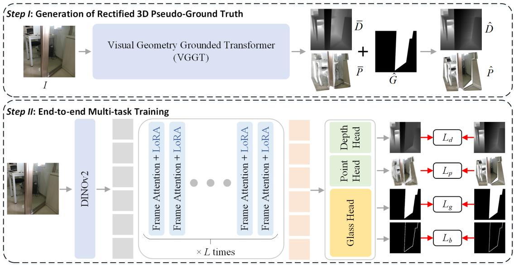  
Figure 2: Method Overview. We present a novel two-step approach that grounds glass surface detection in 3D visual geometry. In the first step, we generate rectified 3D pseudo-ground truth of point clouds and depths by leveraging VGGT and ground truth glass surface masks. In the second step, we formulate a multi-task learning objective with a novel glass head for geometry-aware GSD. Our method achieves state-of-the-art GSD performance, generalizes well to video/multi-modal data, and substantially improves reconstruction in glass scenes.

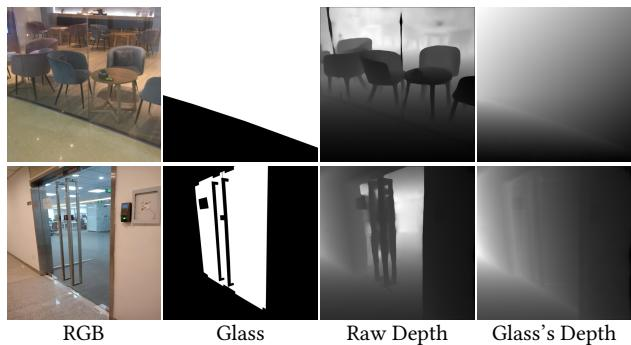  
Figure 3: Depth map correction for glass surfaces improves their physical plausibility and geometric coherence.

## 3.2 Depth and Point Cloud Correction

VGGT can provide strong geometry priors, but cannot reliably perceive glass surfaces, as it reconstructs the occluded background rather than the physical glass planes. This results in depths and point clouds that are semantically correct but geometrically inconsistent in the glass regions, thereby introducing misleading signals during training. We address this problem via a geometry-aware correction method that explicitly injects a consistent 3D structure into the glass regions. Our method is motivated by the geometric observation that in most real-world scenes, glass surfaces, despite potential mild curvature, are approximately planar. This allows us to formulate the correction as a planar interpolation problem anchored at the glass boundary, where depth values are reliable in non-glass regions. This ensures that the corrected 3D data reflects both scene geometry and the physical presence of glass, providing coherent multi-modal learning signals for the model.

Specifically, given the initial depth map �¯ and point cloud �¯ from VGGT, and the ground truth glass mask ${ \hat { G } } ,$ our method computes the corrected depth $\hat { D }$ and points $\hat { P }$ via:

(1) Boundary-aware Depth Anchoring. As pixels at boundaries and corners often lack geometric context, to preserve the global scene layout,we blend the original depth of a corner pixel with that of its nearest non-glass pixel to retain perspective consistency, as:

$$
\hat { D } ( i , j ) = \alpha * \bar { D } ( \mathrm { N e a r e s t } ( i , j ) ) + ( 1 - \alpha ) * \bar { D } ( i , j ) ,\tag{1}
$$

where $i \in \{ 0 , H - 1 \}$ and $j ~ \in ~ \{ 0 , W - 1 \}$ denote corner pixel coordinates, and Nearest(·) returns the coordinates of the nearest non-glass pixel to $( i , j )$ . � is set to 0.8 to bias the correction toward geometrically reliable non-glass regions.

(2) Planar Interpolation within Glass Regions. For an interior glass pixel $( i , j )$ , we model the local glass region as a plane defined by nearest non-glass depths along the horizontal and vertical directions. Let the pixel’s vertical bounds be $a , b$ and horizontal bounds $c , d ,$ where $\bar { D ( a , j ) } , \bar { D } ( b , j ) , \bar { D } ( i , c ) , \bar { D } ( i , d )$ are depths from nearest non-glass pixels along the respective directions. We compute the corrected depth $\hat { D } ( i , j )$ as:

$$
\hat { D } _ { v } ( i , j ) = \bar { D } ( a , j ) + \frac { i - a } { b - a } ( \bar { D } ( b , j ) - \bar { D } ( a , j ) ) ,\tag{2}
$$

$$
\hat { D } _ { h } ( i , j ) = \bar { D } ( i , c ) + \frac { j - c } { d - c } ( \bar { D } ( i , d ) - \bar { D } ( i , c ) ) ,\tag{3}
$$

$$
\hat { D } ( i , j ) = 0 . 5 * \hat { D } _ { v } ( i , j ) + 0 . 5 * \hat { D } _ { h } ( i , j ) .\tag{4}
$$

Examples of the corrected depths are shown in Fig. 3. The corrected depths �ˆ are combined with initial point clouds �¯ to produce ${ \hat { P } } .$

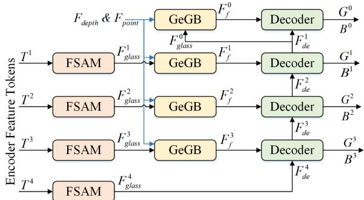  
Figure 4: Our Glass Head for precise glass surface segmentation and glass boundary delineation is built upon (1) the Frequency Self-Attention Module (FSAM) for capturing discriminative spectral representation of glass, and (2) the Geometry Grounding Block (GeGB) that reduces visual ambiguities via geometry-aware feature alignment and selective fusion.

## 3.3 Glass Detection Head

We propose a novel glass detection head for precise glass surface segmentation and glass boundary delineation, based on two physically grounded modules: a Frequency Self-Attention Module (FSAM) that captures glass-specific 2D visual features, and a Geometry Grounding Block (GeGB) that integrates 3D geometry features with 2D visual features for glass segmentation.

As shown in Fig. 4, we first extract multi-scale token representations from the VGGT encoder at {4�ℎ, 11�ℎ, 17�ℎ, 23��} layers. We assign FSAM at each scale to learn glass-aware appearance features $\{ F _ { q l a s s } ^ { i } \} _ { i = 1 } ^ { 4 } . F _ { q l a s s } ^ { 4 }$ is directly used for the deepest decoding stage, whereas the other features are then enriched with multi-modal point and depth features $( F _ { p o i n t } , F _ { d e p t h } )$ via the GeGB, yielding the fused feature $\{ F _ { f } ^ { i } \} _ { i = 1 } ^ { 3 }$ . Then, the decoder takes $\{ F _ { f } ^ { i } \} _ { i = 1 } ^ { 3 }$ as input and produces the decoded feature $\{ F _ { d e } ^ { i } \} _ { i = 1 } ^ { 3 }$ to predict multi-scale glass surface masks $\{ G ^ { i } \} _ { i = 1 } ^ { 3 }$ and glass boundary maps $\{ B ^ { i } \} _ { i = 1 } ^ { 3 }$ . Finally, $F _ { d e } ^ { 1 }$ are further refined by passing through the GeGB and decoder again to produce more fine-grained results.

Frequency Self-Attention Module (FSAM). Glass surfaces introduce subtle yet consistent appearance distortions due to light absorption, scattering, and refraction. Such glass-induced attenuation typically reduces local contrast and results in a characteristic high-frequency suppression that is largely irrelevant to the scene content. We capture such appearance cues via FSAM in the frequency domain to preliminarily localize glass regions. Unlike standard spatial-domain self-attention, which may fail to distinguish glass features from complex backgrounds, our FSAM operates in the frequency domain to characterize the prominent spectral features inherent to glass surfaces.

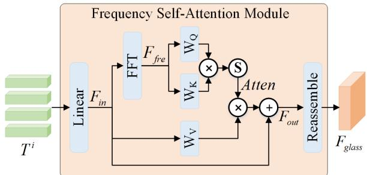  
Figure 5: Our Frequency Self-Attention Module (FSAM) operates in the frequency domain to capture prominent spectral features of glass surfaces for their preliminary localization.

As shown in Fig. 5, the extracted token representations at �-th scale, denoted as $\{ T ^ { i } \} _ { i = 1 } ^ { 4 }$ , are first projected to a lower-dimensional space via a linear layer to reduce computational cost. This process yields $\{ F _ { i n } ^ { i } \} _ { i = 1 } ^ { 4 } \in \mathbb { R } ^ { \mathrm { \tilde { N } } \times C }$ , where the output channel dimension is set to $C = 2 ^ { i + 5 }$ . For each channel of $F _ { i n } ^ { i } { } _ { ; }$ , we compute its amplitude spectrum via 1D Fast Fourier Transform (FFT) as follows:

$$
F _ { f r e } = | \mathrm { F F T } ( F _ { i n } ) | .\tag{5}
$$

We then project $F _ { f r e }$ into query and key matrices via $W _ { Q } ( \cdot )$ and $W _ { K } ( \cdot )$ , and compute the attention map:

$$
A t t e n = \mathrm { S o f t m a x } ( \frac { W _ { Q } ( F _ { f r e } ) \times W _ { K } ( F _ { f r e } ) ^ { T } } { \sqrt { C } } ) .\tag{6}
$$

The frequency-domain attention map ����� is then applied to the original spatial features $F _ { i n } \mathrm { . }$ followed by layer normalization and residual connection:

$$
F _ { o u t } = \mathrm { L N } ( A t t e n \times W _ { V } ( F _ { i n } ) ) + F _ { i n } ^ { i } ,\tag{7}
$$

where �� (·) projects $F _ { i n }$ into value matrix. This formulation effectively circumvents the quantization error often caused by 1D Inverse Fast Fourier Transform (IFFT) and retains spatial information through residual connections. Finally, the feature $F _ { o u t }$ is re-shaped and processed via convolution and transposed convolution to produce the glass features $F _ { g l a s s }$ with aligned spatial and channel dimensions.

Geometry Grounding Block (GeGB). While depth and point clouds both encode 3D geometry, they provide complementary information: depth maps ofer dense pixel-aligned distance estimations, whereas point clouds capture local surface structures and provide volumetric context. Incorporating both modalities ensures that glass features are grounded in a comprehensive 3D scene representation.

To this end, we design a symmetrical gating-based geometry grounding block to incorporate both depth and point cloud features, as shown in Fig. 6a. For each geometry modality $m \in \{ d e p t h , p o i n t \}$ we first compute a spatial attention map that highlights regions where geometric features are discriminative as follows:

$$
\mathrm { S A } ( F _ { m } ) = \sigma ( C o n v _ { 7 } ( [ \mathrm { M e a n } ( F _ { m } ) , \mathrm { M a x } ( F _ { m } ) ] ) ) ,\tag{8}
$$

where Mean(·) and Max(·) compute the channel-wise average and maximum values, respectively, [·, ·] indicates feature concatenation,

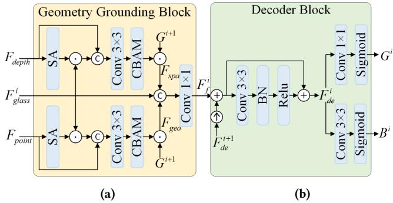  
Figure 6: (a) Our Geometry Grounding Block (GeGB) incorporates depths and points as complementary geometric context for reasoning glass regions, and (b) our Decoder Block for segmenting glass regions and delineating their boundaries.

and � is sigmoid activation. We then enrich each geometry modality with glass appearance features via a parallel enhancement path:

$$
F _ { m m } = \mathrm { C B A M } ( C o n v _ { 3 } ( [ F _ { m } , F _ { g l a s s } ^ { i } \odot \mathrm { S A } ( F _ { m } ) ] ) ) ,\tag{9}
$$

where $F _ { m m }$ is either enhanced depth features $F _ { s p a }$ or point features $F _ { g e o }$ , and CBAM [34] is used to refine features via channel and spatial attention. We leverage the coarse glass surface prediction $\bar { G } ^ { i + 1 }$ from the previous decoder layer to guide the multi-modal fusion of $F _ { g l a s s } ^ { i } , F _ { s p a } .$ , and $F _ { g e o }$ , as follows:

$$
F _ { f } ^ { i } = C o n v _ { 1 } [ F _ { g l a s s } ^ { i } , G ^ { i + 1 } \odot F _ { s p a } , G ^ { i + 1 } \odot F _ { g e o } ] ,\tag{10}
$$

where ⊙ is element-wise multiplication.

Decoder Block. As shown in Fig. 6b, the decoder layer at each scale processes the $F _ { f } ^ { i }$ and the $F _ { d e } ^ { i + 1 }$ from the previous layer via a standard residual block to produce $F _ { d e } ^ { i }$ . We assign a 1×1 convolution layer to generate the glass mask and a $3 \times 3$ convolution layer to delineate glass boundaries.

## 3.4 Multi-Modal Loss Function

We use a hybrid multi-task loss to train our network:

$$
\begin{array} { r } { \mathcal { L } = \mathcal { L } _ { g } + \mathcal { L } _ { b } + \lambda \mathcal { L } _ { d } + \lambda \mathcal { L } _ { p } , } \end{array}\tag{11}
$$

where � is a balancing hyper-parameter empirically set to 0.1. For geometry prediction, we adopt the same depth loss $\mathcal { L } _ { d }$ and point cloud loss $\mathcal { L } _ { p }$ as defined in VGGT [28]:

$$
\mathcal { L } _ { d } = \| C _ { d } \odot ( D - \hat { D } ) \| + \| C _ { d } \odot ( \nabla D - \nabla \hat { D } ) \| - \log C _ { d } ,\tag{12}
$$

$$
\mathcal { L } _ { p } = \| C _ { \hat { p } } \odot ( P - \hat { P } ) \| + \| C _ { \hat { p } } \odot ( \nabla P - \nabla \hat { P } ) \| - \log C _ { p } ,\tag{13}
$$

where $C _ { d }$ and $C _ { p }$ are the predicted confidence maps for depths and points, respectively. � and $P$ are the predicted depth maps and point clouds, while $\hat { D }$ and $\hat { P }$ are our rectified pseudo ground truth depth and point. ∇ computes gradients and ⊙ is element-wise product.

For glass surface predictions, we employ BCE loss [3] and IoU loss [25] at the pixel- and region-level, respectively. Given the glass prediction $\{ G ^ { i } \bar  \} _ { i = 0 } ^ { 3 }$ and its corresponding ground truth mask $\hat { G } _ { : }$

$\mathcal { L } _ { g l a s s }$ is defined as:

$$
\mathcal { L } _ { g l a s s } ( G , \hat { G } ) = \mathcal { L } _ { b c e } ( G , \hat { G } ) + \mathcal { L } _ { i o u } ( G , \hat { G } ) ,\tag{14}
$$

$$
\mathcal { L } _ { g } = \sum _ { i = 1 } ^ { 4 } \frac { \mathcal { L } _ { g l a s s } ^ { ' } ( G ^ { i } , \hat { G } ) } { 2 ^ { i - 1 } } + \mathcal { L } _ { g l a s s } ^ { ' } ( G ^ { c } , \hat { G } ) ,\tag{15}
$$

where $G ^ { c }$ is the glass surface mask derived from the point cloud and depth features (i.e., concatenation of $F _ { d e p t h }$ and $F _ { p o i n t }$ followed by 1 × 1 convolution and Sigmoid activation), which facilitates the training via granular supervisions on geometry features.

For glass boundary predictions, $\mathcal { L } _ { b }$ is defined in a similar way to $\mathcal { L } _ { g } ,$ except that we replace the IoU loss with the Dice loss [22].

## 4 Experiments

## 4.1 Experimental Setups

Implementation Details. Our framework is implemented with PyTorch on a single NVIDIA RTX 4090 GPU (24GB). We follow VGGT to use $L = 2 4$ frame attention layers for feature extraction, where Low Rank Adaptation (LoRA) is applied to each frame attention layer with two low-rank matrices, $\bar { \boldsymbol { A } } \in \mathbb { R } ^ { d \times r }$ and $\boldsymbol { B } \in \mathbb { R } ^ { r \times k }$ (� ≪ min(�, �)). We set the rank � to 16. Images are resized to 518 × 518 for training and evaluation. We train our model on a Union training set, which combines the training sets from GDD [21], GSD [14], Trans10K-Stuf [35], and HSO [39]. We employ the Adam optimizer with a learning rate of $1 \times 1 0 ^ { - 4 }$ and a batch size of 4. The training process spans 80 epochs.

Evaluation Methods, Datasets, and Metrics. We compare to nine existing GSD methods, including six single-image-based ones (GDNet [21], GSDNet [14], EBLNet [8], RFENet [6], GhostingNet [36] and GlassWizard [13]), two multi-modal methods (RGB-Thermal [11] and RGB-Depth [15]), two video GSD methods (VGSD-Net [16] and MVGDNet [19]). We include three foundation models (SAM2 [26], VGGT [28], and SAM3 [1]) as baselines. For VGGT, we used the same segmentation decoder as ours.

We evaluate on seven standard benchmarks, including four singleimage-based datasets (GDD [21], GSD [14], HSO [39] and Trans10kstuf [35]), two multi-modal GSD dataset (RGB-Thermal-based [11] and RGB-Depth-based [15]), and the video-based VGSD-D dataset [16].

We report five standard evaluation metrics, including Intersection over Union (IoU↑), F-measure $( F _ { \beta } \uparrow )$ , Mean Absolute Error (MAE↓), Balanced Error Rate (BER↓), and Accuracy (ACC↑).

## 4.2 Comparisons to SOTA Methods

Single-Image GSD Results. We first compare our method against six SOTA single-image GSD methods (GDNet, GSDNet, EBLNet, RFENet, GhostingNet, and GlassWizard) and three foundation models (SAM2, VGGT, and SAM3) , on four standard benchmarks (GDD, GSD, HSO, and Trans10K-Stuf). For a fair comparison, all competing methods are retrained under identical training settings.

The results reported in Tab. 1 and 2 demonstrate that our method maintains a clear performance advantage across all evaluated datasets and metrics. Notably, our method consistently outperforms the latest GhostingNet that relies on 2D ghosting cues and GlassWizard that leverages large-scale 2D difusion priors, demonstrating the advantage of grounding GSD task in 3D visual geometry.

Table 1: Quantitative comparison between our method and existing GSD methods on standard single-image datasets. Foundationmodel baselines are also included for reference. Best results are marked in bold.
<table><tr><td rowspan="2">Methods</td><td rowspan="2">Venue</td><td colspan="5">GDD [21]</td><td colspan="5">GSD [14]</td><td colspan="5">HSO [39]</td></tr><tr><td>IoU↑</td><td> $F _ { \beta } \uparrow$ </td><td>MAE↓</td><td>BER↓</td><td>ACC↑</td><td>IoU↑</td><td> $F _ { \beta } \uparrow$ </td><td>MAE↓</td><td>BER↓</td><td>ACC↑</td><td>IoU↑</td><td> $F _ { \beta } \uparrow$ </td><td>MAE↓</td><td>BER↓ ACC↑</td></tr><tr><td>SAM2</td><td></td><td>82.70</td><td>0.891</td><td>0.090</td><td>8.44</td><td>0.920</td><td>73.00</td><td>0.797</td><td>0.096</td><td>9.24 0.917</td><td>71.18</td><td>0.801</td><td>0.134</td><td>12.04</td><td>0.898</td></tr><tr><td>VGGT</td><td>CVPR&#x27;25</td><td>85.26</td><td>0.914</td><td>0.072</td><td>6.68</td><td>0.948</td><td>78.63 0.868</td><td>0.065</td><td>7.02</td><td>0.930</td><td>77.62</td><td>0.854</td><td>0.094</td><td>8.35</td><td>0.944</td></tr><tr><td>SAM3</td><td>ICLR&#x27;26</td><td>92.88</td><td>0.966</td><td>0.034</td><td>3.04</td><td>0.974</td><td>89.64 0.943</td><td>0.033</td><td>3.02</td><td>0.988</td><td>87.24</td><td>0.931</td><td>0.054</td><td>4.66</td><td>0.965</td></tr><tr><td>GDNet</td><td>CVPR&#x27;20</td><td>88.71</td><td>0.934</td><td>0.059</td><td>5.49</td><td>0.961</td><td>83.00 0.893</td><td>0.055</td><td>5.68</td><td>0.952</td><td>79.25</td><td>0.871</td><td>0.093</td><td>8.65</td><td>0.931</td></tr><tr><td>GSDNet</td><td>CVPR&#x27;21</td><td>88.52</td><td>0.935</td><td>0.057</td><td>5.29</td><td>0.951</td><td>82.96 0.895</td><td>0.052</td><td>6.00</td><td>0.938</td><td>80.17</td><td>0.880</td><td>0.085</td><td>8.07</td><td>0.928</td></tr><tr><td>EBLNet</td><td>ICCV&#x27;21</td><td>88.02</td><td>0.932</td><td>0.059</td><td>5.51</td><td>0.950</td><td>82.25 0.894</td><td>0.056</td><td>5.88</td><td>0.936</td><td>80.53</td><td>0.887</td><td>0.082</td><td>7.79</td><td>0.927</td></tr><tr><td>RFENet</td><td>IJCAI&#x27;23</td><td>88.04</td><td>0.920</td><td>0.061</td><td>6.02</td><td>0.975</td><td>81.26 0.869</td><td>0.049</td><td>6.17</td><td>0.961</td><td>78.49</td><td>0.852</td><td>0.095</td><td>8.78</td><td>0.950</td></tr><tr><td>GhostingNet</td><td>TPAMI&#x27;25</td><td>91.19</td><td>0.954</td><td>0.044</td><td>3.98</td><td>0.964</td><td>86.69 0.923</td><td>0.042</td><td>4.19</td><td>0.972</td><td>82.97</td><td>0.903</td><td>0.073</td><td>6.79</td><td>0.942</td></tr><tr><td>GlassWizard</td><td>ICCV&#x27;25</td><td>93.30</td><td>0.969</td><td>0.039</td><td>3.62</td><td>0.967</td><td>90.40 0.952</td><td>0.036</td><td>4.52</td><td>0.969</td><td>87.90</td><td>0.941</td><td>0.055</td><td>5.44</td><td>0.952</td></tr><tr><td>Ours</td><td></td><td>95.56 0.981</td><td></td><td>0.021</td><td>1.88</td><td>0.988</td><td>91.91 0.962</td><td>0.022</td><td>2.24</td><td>0.989</td><td></td><td>92.04 0.963</td><td>0.031</td><td>2.73</td><td>0.984</td></tr></table>

Table 2: Quantitative comparison on the Trans10k-stuf. Best results are marked in bold.
<table><tr><td rowspan="2">Methods</td><td rowspan="2">Venue</td><td colspan="4">Trans10k-stuff [35]</td></tr><tr><td>IoU↑</td><td> $F _ { \beta } \uparrow$  MAE↓</td><td>BER↓</td><td>ACC↑</td></tr><tr><td>SAM2</td><td></td><td>81.16</td><td>0.884</td><td>0.075</td><td>6.59</td><td>0.956</td></tr><tr><td>VGGT SAM3</td><td>CVPR&#x27;25 ICLR&#x27;26</td><td>84.86 91.07</td><td>0.912 0.956</td><td>0.060 0.033</td><td>5.39 2.82</td><td>0.963 0.984</td></tr><tr><td>GDNet</td><td>CVPR&#x27;20</td><td>88.30</td><td>0.937</td><td>0.047</td><td>4.08</td><td>0.976</td></tr><tr><td>GSDNet</td><td>CVPR&#x27;21</td><td>88.62</td><td>0.940</td><td>0.043</td><td>3.87</td><td>0.974</td></tr><tr><td>EBLNet</td><td>ICCV&#x27;21</td><td>88.35</td><td>0.939</td><td>0.046</td><td>4.04</td><td>0.971</td></tr><tr><td>RFENet</td><td>IJCAI&#x27;23</td><td>86.51</td><td>0.912</td><td>0.053</td><td>4.84</td><td>0.992</td></tr><tr><td>GhostingNet</td><td>TPAMI&#x27;25</td><td>89.72</td><td>0.948</td><td>0.038</td><td>3.40</td><td>0.979</td></tr><tr><td>GlassWizard</td><td>ICCV&#x27;25</td><td>92.80</td><td>0.965</td><td>0.030</td><td>3.04</td><td>0.979</td></tr><tr><td>Ours</td><td></td><td></td><td></td><td></td><td></td><td></td></tr><tr><td></td><td></td><td>93.85</td><td>0.974</td><td>0.022</td><td>1.76</td><td>0.994</td></tr></table>

Table 3: Comparisons to multi-modal GSD methods, i.e., RGB-Thermal [11] (upper) and RGB-Depth [15] (lower) on their proposed datasets. Best results are in bold.
<table><tr><td>Methods</td><td>Venue</td><td>IoU↑</td><td> $\operatorname { F } _ { \beta } { \uparrow }$ </td><td>MAE↓</td><td>BER↓</td><td>ACC↑</td></tr><tr><td>RGB-Thermal</td><td>TIP&#x27;23</td><td>93.80</td><td>0.965</td><td>0.027</td><td>4.08</td><td></td></tr><tr><td>Ours</td><td>一</td><td>95.71</td><td>0.976</td><td>0.023</td><td>4.19</td><td>0.970</td></tr><tr><td>RGB-Depth</td><td>AAAI&#x27;25</td><td>74.20</td><td>0.853</td><td>0.043</td><td>9.30</td><td></td></tr><tr><td>Ours</td><td></td><td>81.23</td><td>0.873</td><td>0.026</td><td>7.05</td><td>0.880</td></tr></table>

Generalization Results. We evaluate our method’s generalization capability by directly testing on two multi-modal GSD datasets (RGB-Thermal [11] and RGB-Depth [15]) and the video GSD dataset VGSD-D [16]. Tab. 3 reports the comparisons with multi-modal methods. Without requiring additional thermal or depth sensors, Our method achieves comparable performance to RGB-Thermal methods (Tab. 3 (top part)) while outperforming RGB-Depth methods (Tab. 3 (bottom part)). Tab. 4 further reports the comparisons on the VGSD-D. GhostingNet often degrades when ghosting cues are weak or ambiguous, whereas GlassWizard achieves stronger performance by leveraging large-scale 2D difusion priors. Nevertheless, our method consistently outperforms GlassWizard across all evaluation metrics.

Table 4: Comparisons on the video GSD dataset VGSD-D [16]. Best results are in bold.
<table><tr><td>Methods</td><td>Venue</td><td>IoU↑</td><td> $\operatorname { F } _ { \beta } { \uparrow }$ </td><td>MAE↓</td><td>BER↓</td><td>ACC↑</td></tr><tr><td>VGSDNet</td><td>AAAI&#x27;24</td><td>80.72</td><td>0.885</td><td>0.099</td><td>9.60</td><td>0.898</td></tr><tr><td>GhostingNet</td><td>TPAMI&#x27;25</td><td>80.40</td><td>0.888</td><td>0.100</td><td>9.30</td><td>0.905</td></tr><tr><td>GlassWizard</td><td>ICCV&#x27;25</td><td>94.20</td><td></td><td>0.031</td><td>2.92</td><td></td></tr><tr><td>MVGDNet</td><td>AAAI&#x27;26</td><td>86.54</td><td>0.925</td><td>0.064</td><td>6.10</td><td>0.935</td></tr><tr><td>Ours</td><td>一</td><td>97.36</td><td>0.982</td><td>0.016</td><td>1.97</td><td>0.986</td></tr></table>

Visual Results. We provide visual comparisons with singleimage-based GSD methods in Fig. 7. We can see that previous methods relying on 2D appearance cues may easily over- or underdetect glass regions that exhibit less distinct cues (e.g., reflections) and have similar visual patterns to those of non-glass regions, even with large-scale pre-trained 2D difusion priors. In contrast, our method achieves accurate glass surface segmentation, clearly distinguishing glass from non-glass regions, as demonstrated in the first four examples. In addition, we showcase two challenging examples: a scene fully covered by glass (the fifth example) and a scene where the glass region is partially occluded by objects (the last example). While these two examples generally fail existing methods, our method can still accurately segment the glass surfaces and delineate their boundaries. These visual results highlight that 3D scene geometry information is vital for robust GSD.

Application. To further demonstrate the efectiveness of our geometry-aware representation, we evaluate its impact on 3D reconstruction in scenes containing glass surfaces. As shown in Fig. 8, the original VGGT [28] tends to reconstruct the 3D structure of objects behind transparent surfaces, often neglecting the physical presence of glass. In contrast, our method explicitly incorporates planar geometric priors of glass surfaces, leading to more accurate reconstruction in glass regions. Exploring more expressive representations for multi-layered point cloud reconstruction remains an interesting direction for future work.

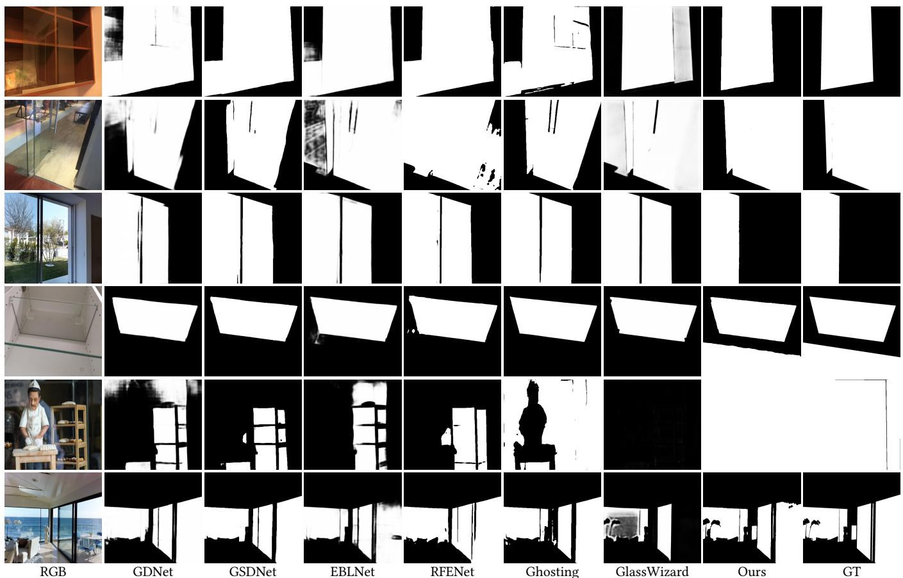  
Figure 7: Visual comparison between our method and single-image GSD methods, which highlights that 3D scene geometry information is vital for robust glass surface detection.

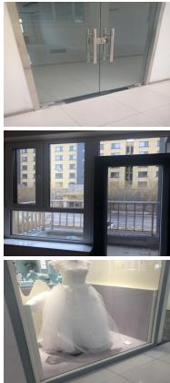  
RGB Input

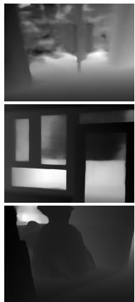  
VGGT Depth

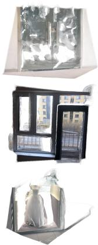  
VGGT Point Cloud

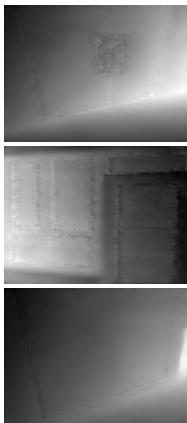  
Our Depth

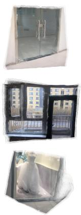  
Our Point Cloud

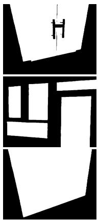  
Our GSD

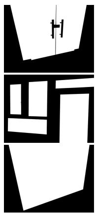  
GT GSD

Figure 8: Visual comparison between VGGT [28] and our method in monocular depth estimation and reconstruction of 3D scenes with glass surfaces.

## 4.3 Ablation Studies

We conduct ablation studies based on the Union glass test set (which combines the test sets from GDD, GSD, Trans10K-Stuf, and HSO) to study their broader impact on the GSD task instead of individual datasets. Tab. 5 reports the results.

Model Designs. As shown in Tab. 5 (top part), we first analyze network components by removing each component individually and retraining the ablated model, denoted as “w/o LoRA”, “w/o FSAM”, and “w/o GeGB”. We also remove Eq. 5 in FSAM (which then becomes a standard spatial-domain self-attention mechanism) and denote it as “w/o FFT”. We also apply the self-attention mechanism completely in the frequency domain, i.e., replacing $F _ { i n }$ with $F _ { f r e }$ in Eq. 7 and denote it as $^ { \ast } F _ { i n }  F _ { f r e } ^ { ^ { \ast } }$ . In addition, we also remove the depth and point paths individually from our GeGB, denoted as “w/o Depth” and “w/o Point”, respectively. These ablated models tend to yield sub-optimal performance. Notably, while $^ { * } F _ { i n } $ $F _ { f r e } { ^ { \mathrm { { \infty } } } } ^ { \mathrm { { \infty } } }$ produces slightly better BER and accuracy results, it leads to a relatively larger IoU performance drop, which shows that completely relying on frequency information tends to over-detect glass regions. These results generally verify the efectiveness of our model designs. Visual comparisons are shown in Fig. 9. FSAM captures semantic cues for glass localization, while GeGB leverages geometric structure to resolve appearance ambiguities.

Table 5: Ablation results of our method.
<table><tr><td>Methods</td><td>IoU↑</td><td> $\operatorname { F } _ { \beta } { \uparrow }$ </td><td>MAE↓</td><td>BER↓</td><td>ACC↑</td></tr><tr><td>w/o LoRA</td><td>88.27</td><td>0.931</td><td>0.046</td><td>4.05</td><td>0.981</td></tr><tr><td>w/o FSAM</td><td>92.78</td><td>0.964</td><td>0.027</td><td>2.29</td><td>0.988</td></tr><tr><td>w/o GeGB</td><td>92.67</td><td>0.963</td><td>0.027</td><td>2.31</td><td>0.988</td></tr><tr><td> $\mathbf { w } / \mathbf { o } ~ \mathrm { F F T }$ </td><td>92.82</td><td>0.967</td><td>0.027</td><td>2.37</td><td>0.986</td></tr><tr><td> $F _ { i n }  F _ { f r e }$ </td><td>93.06</td><td>0.967</td><td>0.026</td><td>2.12</td><td>0.991</td></tr><tr><td>w/o Depth</td><td>92.86</td><td>0.967</td><td>0.026</td><td>2.28</td><td>0.988</td></tr><tr><td>w/o Point</td><td>92.70</td><td>0.965</td><td>0.027</td><td>2.25</td><td>0.990</td></tr><tr><td>w/o P&amp;D-C</td><td>93.04</td><td>0.965</td><td>0.028</td><td>2.36</td><td>0.985</td></tr><tr><td>w/o P-C</td><td>92.84</td><td>0.963</td><td>0.029</td><td>2.43</td><td>0.984</td></tr><tr><td>w/o D-C</td><td>92.76</td><td>0.962</td><td>0.029</td><td>2.40</td><td>0.987</td></tr><tr><td> ${ \bf w } / { \bf o } G ^ { c }$ </td><td>92.98</td><td>0.968</td><td>0.026</td><td>2.24</td><td>0.988</td></tr><tr><td>w/o  $\mathcal { L } _ { b }$ </td><td>92.75</td><td>0.967</td><td>0.026</td><td>2.43</td><td>0.983</td></tr><tr><td>VGGT→SAM3</td><td>92.34</td><td>0.960</td><td>0.030</td><td>2.51</td><td>0.985</td></tr><tr><td>Ours</td><td>93.24</td><td>0.969</td><td>0.025</td><td>2.15</td><td>0.989</td></tr></table>

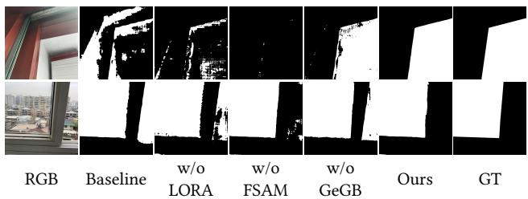  
Figure 9: The visual comparison of diferent ablated models.

Training Formulations. As reported in Tab. 5 (middle part), we analyze diferent learning strategies. We first directly use the VGGT’s original depth and point cloud predictions as supervision (denoted as “w/o P&D-C”). We also use our corrected depths and point clouds as supervision separately, denoted as “w/o $\mathrm { P } { - } \mathrm { C } ^ { \mathfrak { n } }$ and $^ { \circ } \mathbf { w } / \mathbf { o } \mathbf { D } { \cdot } \mathbf { C } ^ { \prime \prime }$ , respectively. In addition, we also remove the glass surface supervision on the geometric features by removing $G ^ { c }$ from the $\mathcal { L } _ { g }$ and $\mathcal { L } _ { b }$ in Eq. 11 (denoted as $^ { \ast } \mathbf { w } / \mathbf { o } G ^ { c \ast } )$ . Last, we remove the glass boundary delineation, which is denoted as $\mathbf { \ddot { w } } / \mathbf { o } L _ { b } \mathbf { \vec { \Phi } }$ . These degraded results demonstrate the necessity of our training objective formulation. Although the depth interpolation strategy brings marginal improvements, the consistent gains indicate that our model can efectively exploit more accurate 3D supervision when available.

Geometry vs. Semantics. While we demonstrate the superiority of geometric context over large-scale pre-trained difusion priors, we are interested in whether it can outperform large-scale pretrained semantic priors. To this end, we replace our VGGT-based encoder with the SAM3 image encoder [1], a large foundation model for concept segmentation. Note that we also apply LoRA to the SAM3 encoder for a fair comparison (denoted as “VGGT→SAM3”). The results in Tab. 5 (bottom part) show that, despite being powerful for general object segmentation, the semantic contexts from SAM3 are still less efective than our geometric contexts for GSD.

## 4.4 Runtime Eficiency

We compare the number of parameters, GFLOPs, and the averaged inference time of our model, GhostingNet, GlassWizard, and our SAM3-based baseline, using a single NVIDIA RTX 4090 GPU. Tab. 6 reports the results, which show that compared with difusion-based and SAM3-based methods, our method enjoys a reasonable runtime eficiency and can run interactively (around 8.5 FPS). For details on the computational eficiency of each module, please refer to the supplementary materials.

Table 6: Runtime eficiency comparison on a single NVIDIA RTX 4090 GPU.
<table><tr><td>Methods</td><td>Param(M)</td><td>FLOPS(G)</td><td>Time(ms)</td></tr><tr><td>GhostingNet</td><td>271.53</td><td>321.70</td><td>32.94</td></tr><tr><td>GlassWizard</td><td>1189.73</td><td>890.78</td><td>177.00</td></tr><tr><td>SAM3-based</td><td>471.18</td><td>2539.06</td><td>134.90</td></tr><tr><td>VGGT</td><td>989.17</td><td>1657.69</td><td>159.73</td></tr><tr><td>Ours</td><td>684.37</td><td>1260.67</td><td>117.31</td></tr></table>

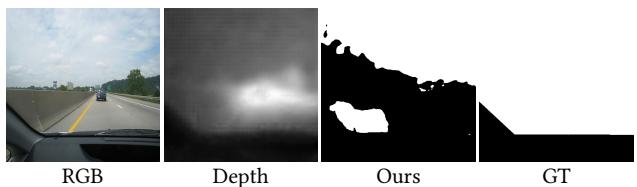  
Figure 10: A failure case. Our method may fail when the glass surface (e.g., the windshield) is too close to the camera, providing insuficient surrounding geometric contexts.

## 5 Conclusion

In this paper, we have proposed a novel framework that grounds the glass surface detection task in 3D visual geometry. Our approach first exploits rich 3D prior knowledge from the visual geometry foundation model and generates pseudo-ground-truth depths and points in glass regions to strengthen their physical existence. We then formulate a multi-tasking training objective with a novel glass detection head. The glass detection head employs two core modules: FSAM for characterizing glass surfaces as high-frequency attenuation and GeGB for grounding 2D frequency features with 3D geometric features. The proposed model has achieved new SOTA performance across seven standard benchmarks and demonstrated strong generalization capability. It can also run interactively (around 8.5 FPS) on a single consumer-level GPU card.

Our method does have limitations. While our model relies on high-quality 3D visual geometry cues, it may fail when the inferred geometric contexts are limited as shown in Fig. 10, where the windshield is too close to the camera.

## Acknowledgments

This work was supported by the National Natural Science Foundation of China (Grant No. 61902151).

## References

[1] Nicolas Carion, Laura Gustafson, Yuan-Ting Hu, Shoubhik Debnath, Ronghang Hu, Didac Suris, et al. 2026. SAM 3: Segment Anything with Concepts. In ICLR.

[2] Qianyu Cheng, Huankang Guan, and Rynson W.H. Lau. 2026. Multi-Semantic Modeling for Glass Surface Detection in the Wild. In AAAI.

[3] Pieter-Tjerk De Boer, Dirk P Kroese, Shie Mannor, and Reuven Y Rubinstein. 2005. A tutorial on the cross-entropy method. Annals ofOperations Research (2005).

[4] Tim Dettmers, Artidoro Pagnoni, Ari Holtzman, and Luke Zettlemoyer. 2023. Qlora: Eficient finetuning of quantized llms. In NeurIPS.

[5] Fulvio Domini. 2023. The case against probabilistic inference: a new deterministic theory of 3D visual processing. Philosophical Transactions ofthe Royal Society B (2023).

[6] Ke Fan, Changan Wang, Yabiao Wang, Chengjie Wang, Ran Yi, and Lizhuang Ma. 2023. RFENet: Towards Reciprocal Feature Evolution for Glass Segmentation. In IJCAI.

[7] Jing Hao, Moyun Liu, Jinrong Yang, and Kuo Feng Hung. 2025. GEM: Boost simple network for glass surface segmentation via vision foundation models. IEEE TMM (2025).

[8] Hao He, Xiangtai Li, Guangliang Cheng, Jianping Shi, Yunhai Tong, Gaofeng Meng, Véronique Prinet, and Lubin Weng. 2021. Enhanced Boundary Learning for Glass-like Object Segmentation. In ICCV.

[9] Edward J Hu, Yelong Shen, Phillip Wallis, Zeyuan Allen-Zhu, Yuanzhi Li, Shean Wang, Lu Wang, and Weizhu Chen. 2022. LoRA: Low-Rank Adaptation of Large Language Models. In ICLR.

[10] Qiushi Huang, Tom Ko, Zhan Zhuang, Lilian Tang, and Yu Zhang. 2025. HiRA: Parameter-eficient hadamard high-rank adaptation for large language models. In ICLR.

[11] Dong Huo, Jian Wang, Yiming Qian, and Yee-Hong Yang. 2023. Glass segmenta tion with RGB-thermal image pairs. IEEE TIP (2023).

[12] Alexander Kirillov, Eric Mintun, Nikhila Ravi, Hanzi Mao, Chloe Rolland, Laura Gustafson, Tete Xiao, Spencer Whitehead, Alexander C Berg, Wan-Yen Lo, et al. 2023. Segment anything. In ICCV.

[13] Wenxue Li, Tian Ye, Xinyu Xiong, Jinbin Bai, Feilong Tang, Wenxuan Song, Zhaohu Xing, Lie Ju, Guanbin Li, and Lei Zhu. 2025. GlassWizard: Harvesting Difusion Priors for Glass Surface Detection. In ICCV.

[14] Jiaying Lin, Zebang He, and Rynson W.H. Lau. 2021. Rich Context Aggregation With Reflection Prior for Glass Surface Detection. In CVPR.

[15] Jiaying Lin, Yuen-Hei Yeung, Shuquan Ye, and Rynson W.H. Lau. 2025. Leveraging RGB-D Data with Cross-Modal Context Mining for Glass Surface Detection. In AAAI.

[16] Fang Liu, Yuhao Liu, Jiaying Lin, Ke Xu, and Rynson WH Lau. 2024. Multi-View Dynamic Reflection Prior for Video Glass Surface Detection. In AAAI.

[17] Ligang Liu, Xi Xia, Han Sun, Qi Shen, Juzhan Xu, Bin Chen, Hui Huang, and Kai Xu. 2018. Object-aware guidance for autonomous scene reconstruction. ACM TOG (2018).

[18] Shih-Yang Liu, Chien-Yi Wang, Hongxu Yin, Pavlo Molchanov, Yu-Chiang Frank Wang, Kwang-Ting Cheng, and Min-Hung Chen. 2024. Dora: Weight-decomposed low-rank adaptation. In ICML.

[19] Yiwei Lu, Hao Huang, and Tao Yan. 2026. MVGDNet: A Novel Motion-aware Video Glass Surface Detection Network. In AAAI.

[20] Haiyang Mei, Bo Dong, Wen Dong, Jiaxi Yang, Seung-Hwan Baek, Felix Heide, Pieter Peers, Xiaopeng Wei, and Xin Yang. 2022. Glass segmentation using intensity and spectral polarization cues. In CVPR.

[21] Haiyang Mei, Xin Yang, Yang Wang, Yuanyuan Liu, Shengfeng He, Qiang Zhang, Xiaopeng Wei, and Rynson W.H. Lau. 2020. Don’t Hit Me! Glass Detection in

Real-World Scenes. In CVPR.

[22] Fausto Milletari, Nassir Navab, and Seyed-Ahmad Ahmadi. 2016. V-net: Fully convolutional neural networks for volumetric medical image segmentation. In 3DV.

[23] Matteo Poggi and Fabio Tosi. 2025. FlowSeek: Optical Flow Made Easier with Depth Foundation Models and Motion Bases. In ICCV.

[24] Yu Qiao, Bo Dong, Ao Jin, Yu Fu, Seung-Hwan Baek, Felix Heide, Pieter Peers, Xiaopeng Wei, and Xin Yang. 2023. Multi-view spectral polarization propagation for video glass segmentation. In ICCV.

[25] Xuebin Qin, Zichen Zhang, Chenyang Huang, Chao Gao, Masood Dehghan, and Martin Jagersand. 2019. Basnet: Boundary-aware salient object detection. In CVPR.

[26] Nikhila Ravi, Valentin Gabeur, Yuan-Ting Hu, Ronghang Hu, Chaitanya Ryali, Tengyu Ma, et al. 2024. SAM 2: Segment Anything in Images and Videos. arXiv:2408.00714 (2024).

[27] Robin Rombach, Andreas Blattmann, Dominik Lorenz, Patrick Esser, and Björn Ommer. 2022. High-resolution image synthesis with latent difusion models. In CVPR.

[28] Jianyuan Wang, Minghao Chen, Nikita Karaev, Andrea Vedaldi, Christian Rupprecht, and David Novotny. 2025. VGGT: Visual Geometry Grounded Transformer. In CVPR.

[29] Shaowen Wang, Linxi Yu, and Jian Li. 2024. Lora-ga: Low-rank adaptation with gradient approximation. In NeurIPS.

[30] Zhen Wang, Dongyuan Li, Yaozu Wu, Peide Zhu, Shiyin Tan, and Renhe Jiang. 2025. Video-based Transparent Object Segmentation via Temporal Feature Aggregation. In ACMMM. 296–304.

[31] Kasun Weerakoon, Adarsh Jagan Sathyamoorthy, Mohamed Elnoor, Anuj Zore, and Dinesh Manocha. 2024. TOPGN: Real-time Transparent Obstacle Detection using Lidar Point Cloud Intensity for Autonomous Robot Navigation. arXiv:2408.05608 (2024).

[32] Hongyu Wen, Yiming Zuo, Venkat Subramanian, Patrick Chen, and Jia Deng. 2025. Seeing and Seeing Through the Glass: Real and Synthetic Data for Multi-Layer Depth Estimation. In ICCV.

[33] Thomas Whelan, Michael Goesele, Steven J. Lovegrove, Julian Straub, Simon Green, Richard Szeliski, Steven Butterfield, Shobhit Verma, and Richard New combe. 2018. Reconstructing scenes with mirror and glass surfaces. ACM TOG (2018).

[34] Sanghyun Woo, Jongchan Park, Joon-Young Lee, and In So Kweon. 2018. CBAM: Convolutional Block Attention Module. In ECCV.

[35] Enze Xie, Wenjia Wang, Wenhai Wang, Mingyu Ding, Chunhua Shen, and Ping Luo. 2020. Segmenting Transparent Objects in the Wild. In ECCV.

[36] Tao Yan, Jiahui Gao, Ke Xu, Xiangjie Zhu, Hao Huang, Helong Li, Benjamin Wah, and Rynson W.H. Lau. 2025. GhostingNet: A Novel Approach for Glass Surface Detection With Ghosting Cues. IEEE TPAMI (2025).

[37] Tao Yan, Shufan Xu, Hao Huang, Helong Li, Lu Tan, Xiaojun Chang, and Ryn son WH Lau. 2024. NRGlassNet: Glass surface detection from visible and near infrared image pairs. Knowledge-Based Systems (2024).

[38] Mao Ye, Yu Zhang, Ruigang Yang, and Dinesh Manocha. 2015. 3d reconstruction in the presence of glasses by acoustic and stereo fusion. In CVPR.

[39] Letian Yu, Haiyang Mei, Wen Dong, Ziqi Wei, Li Zhu, Yuxin Wang, and Xin Yang. 2022. Progressive Glass Segmentation. IEEE TIP (2022).

[40] Longteng Zhang, Lin Zhang, Shaohuai Shi, Xiaowen Chu, and Bo Li. 2023. Lorafa: Memory-eficient low-rank adaptation for large language models fine-tuning. arXiv:2308.03303 (2023).

[41] Qingru Zhang, Minshuo Chen, Alexander Bukharin, Pengcheng He, Yu Cheng, Weizhu Chen, and Tuo Zhao. 2023. Adaptive Budget Allocation for Parameter-Eficient Fine-Tuning. In ICLR.

[42] Zhan Zhuang, Xiequn Wang, Wei Li, Yulong Zhang, Qiushi Huang, Shuhao Chen, Xuehao Wang, Yanbin Wei, Yuhe Nie, Kede Ma, Yu Zhang, and Ying Wei. 2025. Come Together, But Not Right Now: A Progressive Strategy to Boost Low-Rank Adaptation. In ICML.